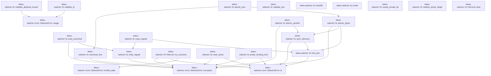
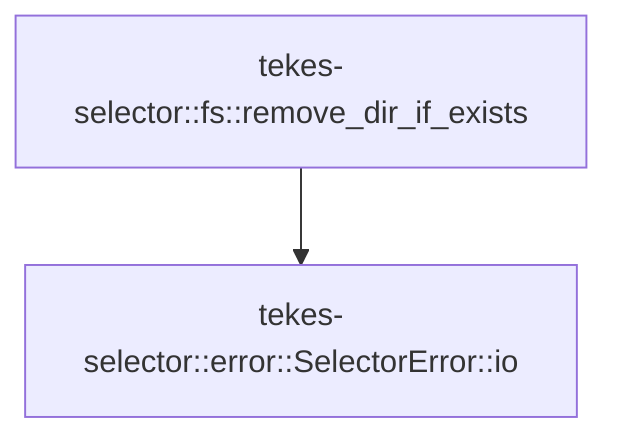

# tekes-selector::fs

[Package atlas](index.md) · [Source](../../src/fs.rs)

## Declarations

Visibility is the declaration spelling; trait members and reexports require their enclosing interface. `cfg` is not evaluated.

| Symbol | Kind | Visibility | Test / cfg |
|---|---|---|---|
| [tekes-selector::fs::TEMP_SEQUENCE](../../src/fs.rs#L15) | static_item | `private` |  |
| [tekes-selector::fs::FileLock](../../src/fs.rs#L17) | struct_item | `pub(crate)` |  |
| [tekes-selector::fs::ExistingLockState](../../src/fs.rs#L22) | enum_item | `pub(crate)` |  |
| [tekes-selector::fs::FileLock::try_exclusive](../../src/fs.rs#L29) | function_item | `pub(crate)` |  |
| [tekes-selector::fs::FileLock::drop](../../src/fs.rs#L66) | function_item | `private` |  |
| [tekes-selector::fs::probe_existing_lock](../../src/fs.rs#L72) | function_item | `pub(crate)` |  |
| [tekes-selector::fs::canonical_line](../../src/fs.rs#L117) | function_item | `pub(crate)` |  |
| [tekes-selector::fs::read_canonical](../../src/fs.rs#L124) | function_item | `pub(crate)` |  |
| [tekes-selector::fs::read_regular](../../src/fs.rs#L142) | function_item | `pub(crate)` |  |
| [tekes-selector::fs::atomic_json](../../src/fs.rs#L156) | function_item | `pub(crate)` |  |
| [tekes-selector::fs::atomic_bytes](../../src/fs.rs#L160) | function_item | `pub(crate)` |  |
| [tekes-selector::fs::atomic_symlink](../../src/fs.rs#L193) | function_item | `pub(crate)` |  |
| [tekes-selector::fs::sync_directory](../../src/fs.rs#L210) | function_item | `pub(crate)` |  |
| [tekes-selector::fs::full_sync](../../src/fs.rs#L224) | function_item | `pub(crate)` |  |
| [tekes-selector::fs::validate_absolute_lexical](../../src/fs.rs#L241) | function_item | `pub(crate)` |  |
| [tekes-selector::fs::validate_id](../../src/fs.rs#L267) | function_item | `pub(crate)` |  |
| [tekes-selector::fs::validate_hex](../../src/fs.rs#L280) | function_item | `pub(crate)` |  |
| [tekes-selector::fs::sha256](../../src/fs.rs#L287) | function_item | `pub(crate)` |  |
| [tekes-selector::fs::mode](../../src/fs.rs#L291) | function_item | `pub(crate)` |  |
| [tekes-selector::fs::create_private_dir](../../src/fs.rs#L299) | function_item | `pub(crate)` |  |
| [tekes-selector::fs::copy_regular](../../src/fs.rs#L307) | function_item | `pub(crate)` |  |
| [tekes-selector::fs::relative_active_target](../../src/fs.rs#L324) | function_item | `pub(crate)` |  |
| [tekes-selector::fs::read_active](../../src/fs.rs#L328) | function_item | `pub(crate)` |  |
| [tekes-selector::fs::remove_dir_if_exists](../../src/fs.rs#L339) | function_item | `pub(crate)` |  |
| [tekes-selector::fs::tests::existing_root_lock_probe_distinguishes_busy_available_and_missing](../../src/fs.rs#L356) | function_item | `private` | test; #[cfg(test)] |

## Imports / reexports

| Local name | Source path | Visibility |
|---|---|---|
| `fs` | `std::fs` | `private` |
| `File` | `std::fs::File` | `private` |
| `OpenOptions` | `std::fs::OpenOptions` | `private` |
| `io` | `std::io` | `private` |
| `Read` | `std::io::Read` | `private` |
| `Write` | `std::io::Write` | `private` |
| `AsRawFd` | `std::os::fd::AsRawFd` | `private` |
| `DirBuilderExt` | `std::os::unix::fs::DirBuilderExt` | `private` |
| `MetadataExt` | `std::os::unix::fs::MetadataExt` | `private` |
| `OpenOptionsExt` | `std::os::unix::fs::OpenOptionsExt` | `private` |
| `PermissionsExt` | `std::os::unix::fs::PermissionsExt` | `private` |
| `symlink` | `std::os::unix::fs::symlink` | `private` |
| `Component` | `std::path::Component` | `private` |
| `Path` | `std::path::Path` | `private` |
| `PathBuf` | `std::path::PathBuf` | `private` |
| `AtomicU64` | `std::sync::atomic::AtomicU64` | `private` |
| `Ordering` | `std::sync::atomic::Ordering` | `private` |
| `Serialize` | `serde::Serialize` | `private` |
| `DeserializeOwned` | `serde::de::DeserializeOwned` | `private` |
| `Digest` | `sha2::Digest` | `private` |
| `Sha256` | `sha2::Sha256` | `private` |
| `UnicodeNormalization` | `unicode_normalization::UnicodeNormalization` | `private` |
| `IoContext` | `crate::error::IoContext` | `private` |
| `SelectorError` | `crate::error::SelectorError` | `private` |
| `OpenOptions` | `std::fs::OpenOptions` | `private` |
| `AsRawFd` | `std::os::fd::AsRawFd` | `private` |
| `OpenOptionsExt` | `std::os::unix::fs::OpenOptionsExt` | `private` |
| `PermissionsExt` | `std::os::unix::fs::PermissionsExt` | `private` |
| `ExistingLockState` | `super::ExistingLockState` | `private` |
| `probe_existing_lock` | `super::probe_existing_lock` | `private` |

## Module declarations

| Module | Visibility | Attributes |
|---|---|---|
| `tekes-selector::fs::tests` | `private` | #[cfg(test)] |

## Function call graphs

Edges below are syntactically resolved calls only, including private functions. Graphs partition callers into groups of 20; they are not execution order. All unresolved sites are listed below and in the JSON inventory.

Functions 1–20: 25 direct edges

Functions 21–21: 1 direct edges

## Call sites

Includes test functions (marked in declarations). Receiver-type-required sites need type analysis/manual tracing. Calls in closures are attributed to their enclosing function; their occurrence here does not mean the closure executes immediately.

| Caller | Callee expression | Source lines | Target / classification |
|---|---|---|---|
| `TEMP_SEQUENCE` | `AtomicU64::new` | [15](../../src/fs.rs#L15) | external-constructor-callback-or-unresolved |
| `try_exclusive` | `OpenOptions::new()             .read(true)             .write(true)             .create(true)             .mode(0o600)             .custom_flags(libc::O_CLOEXEC &#124; libc::O_NOFOLLOW)             .open(path)             .selector_io` | [30](../../src/fs.rs#L30) | receiver-type-required |
| `try_exclusive` | `OpenOptions::new()             .read(true)             .write(true)             .create(true)             .mode(0o600)             .custom_flags(libc::O_CLOEXEC &#124; libc::O_NOFOLLOW)             .open` | [30](../../src/fs.rs#L30) | receiver-type-required |
| `try_exclusive` | `OpenOptions::new()             .read(true)             .write(true)             .create(true)             .mode(0o600)             .custom_flags` | [30](../../src/fs.rs#L30) | receiver-type-required |
| `try_exclusive` | `OpenOptions::new()             .read(true)             .write(true)             .create(true)             .mode` | [30](../../src/fs.rs#L30) | receiver-type-required |
| `try_exclusive` | `OpenOptions::new()             .read(true)             .write(true)             .create` | [30](../../src/fs.rs#L30) | receiver-type-required |
| `try_exclusive` | `OpenOptions::new()             .read(true)             .write` | [30](../../src/fs.rs#L30) | receiver-type-required |
| `try_exclusive` | `OpenOptions::new()             .read` | [30](../../src/fs.rs#L30) | receiver-type-required |
| `try_exclusive` | `OpenOptions::new` | [30](../../src/fs.rs#L30) | external-constructor-callback-or-unresolved |
| `try_exclusive` | `libc::flock` | [40](../../src/fs.rs#L40) | external-constructor-callback-or-unresolved |
| `try_exclusive` | `file.as_raw_fd` | [40](../../src/fs.rs#L40) | receiver-type-required |
| `try_exclusive` | `io::Error::last_os_error` | [44](../../src/fs.rs#L44) | external-constructor-callback-or-unresolved |
| `try_exclusive` | `error.kind` | [45](../../src/fs.rs#L45) | receiver-type-required |
| `try_exclusive` | `error                 .raw_os_error()                 .is_some_and` | [48](../../src/fs.rs#L48) | receiver-type-required |
| `try_exclusive` | `error                 .raw_os_error` | [48](../../src/fs.rs#L48) | receiver-type-required |
| `try_exclusive` | `Err` | [52](../../src/fs.rs#L52), [54](../../src/fs.rs#L54), [59](../../src/fs.rs#L59) | external-constructor-callback-or-unresolved |
| `try_exclusive` | `SelectorError::invalid_state` | [52](../../src/fs.rs#L52) | [tekes-selector::error::SelectorError::invalid_state](../../src/error.rs#L87) |
| `try_exclusive` | `SelectorError::io` | [54](../../src/fs.rs#L54) | [tekes-selector::error::SelectorError::io](../../src/error.rs#L105) |
| `try_exclusive` | `file.metadata().selector_io` | [56](../../src/fs.rs#L56) | receiver-type-required |
| `try_exclusive` | `file.metadata` | [56](../../src/fs.rs#L56) | receiver-type-required |
| `try_exclusive` | `fs::metadata(path).selector_io` | [57](../../src/fs.rs#L57) | receiver-type-required |
| `try_exclusive` | `fs::metadata` | [57](../../src/fs.rs#L57) | external-constructor-callback-or-unresolved |
| `try_exclusive` | `descriptor.dev` | [58](../../src/fs.rs#L58) | receiver-type-required |
| `try_exclusive` | `pathname.dev` | [58](../../src/fs.rs#L58) | receiver-type-required |
| `try_exclusive` | `descriptor.ino` | [58](../../src/fs.rs#L58) | receiver-type-required |
| `try_exclusive` | `pathname.ino` | [58](../../src/fs.rs#L58) | receiver-type-required |
| `try_exclusive` | `SelectorError::corruption` | [59](../../src/fs.rs#L59) | [tekes-selector::error::SelectorError::corruption](../../src/error.rs#L100) |
| `try_exclusive` | `path.display().to_string` | [59](../../src/fs.rs#L59) | receiver-type-required |
| `try_exclusive` | `path.display` | [59](../../src/fs.rs#L59) | receiver-type-required |
| `try_exclusive` | `Ok` | [61](../../src/fs.rs#L61) | external-constructor-callback-or-unresolved |
| `drop` | `libc::flock` | [68](../../src/fs.rs#L68) | external-constructor-callback-or-unresolved |
| `drop` | `self.file.as_raw_fd` | [68](../../src/fs.rs#L68) | receiver-type-required |
| `probe_existing_lock` | `OpenOptions::new()         .read(true)         .write(true)         .custom_flags(libc::O_CLOEXEC &#124; libc::O_NOFOLLOW)         .open` | [73](../../src/fs.rs#L73) | receiver-type-required |
| `probe_existing_lock` | `OpenOptions::new()         .read(true)         .write(true)         .custom_flags` | [73](../../src/fs.rs#L73) | receiver-type-required |
| `probe_existing_lock` | `OpenOptions::new()         .read(true)         .write` | [73](../../src/fs.rs#L73) | receiver-type-required |
| `probe_existing_lock` | `OpenOptions::new()         .read` | [73](../../src/fs.rs#L73) | receiver-type-required |
| `probe_existing_lock` | `OpenOptions::new` | [73](../../src/fs.rs#L73) | external-constructor-callback-or-unresolved |
| `probe_existing_lock` | `error.kind` | [80](../../src/fs.rs#L80), [104](../../src/fs.rs#L104) | receiver-type-required |
| `probe_existing_lock` | `Ok` | [81](../../src/fs.rs#L81), [101](../../src/fs.rs#L101), [111](../../src/fs.rs#L111) | external-constructor-callback-or-unresolved |
| `probe_existing_lock` | `Err` | [83](../../src/fs.rs#L83), [93](../../src/fs.rs#L93), [113](../../src/fs.rs#L113) | external-constructor-callback-or-unresolved |
| `probe_existing_lock` | `SelectorError::io` | [83](../../src/fs.rs#L83), [113](../../src/fs.rs#L113) | [tekes-selector::error::SelectorError::io](../../src/error.rs#L105) |
| `probe_existing_lock` | `file.metadata().selector_io` | [85](../../src/fs.rs#L85) | receiver-type-required |
| `probe_existing_lock` | `file.metadata` | [85](../../src/fs.rs#L85) | receiver-type-required |
| `probe_existing_lock` | `fs::metadata(path).selector_io` | [86](../../src/fs.rs#L86) | receiver-type-required |
| `probe_existing_lock` | `fs::metadata` | [86](../../src/fs.rs#L86) | external-constructor-callback-or-unresolved |
| `probe_existing_lock` | `descriptor.is_file` | [87](../../src/fs.rs#L87) | receiver-type-required |
| `probe_existing_lock` | `descriptor.dev` | [88](../../src/fs.rs#L88) | receiver-type-required |
| `probe_existing_lock` | `pathname.dev` | [88](../../src/fs.rs#L88) | receiver-type-required |
| `probe_existing_lock` | `descriptor.ino` | [89](../../src/fs.rs#L89) | receiver-type-required |
| `probe_existing_lock` | `pathname.ino` | [89](../../src/fs.rs#L89) | receiver-type-required |
| `probe_existing_lock` | `descriptor.uid` | [90](../../src/fs.rs#L90) | receiver-type-required |
| `probe_existing_lock` | `libc::geteuid` | [90](../../src/fs.rs#L90) | external-constructor-callback-or-unresolved |
| `probe_existing_lock` | `descriptor.permissions().mode` | [91](../../src/fs.rs#L91) | receiver-type-required |
| `probe_existing_lock` | `descriptor.permissions` | [91](../../src/fs.rs#L91) | receiver-type-required |
| `probe_existing_lock` | `SelectorError::corruption` | [93](../../src/fs.rs#L93) | [tekes-selector::error::SelectorError::corruption](../../src/error.rs#L100) |
| `probe_existing_lock` | `path.display().to_string` | [93](../../src/fs.rs#L93) | receiver-type-required |
| `probe_existing_lock` | `path.display` | [93](../../src/fs.rs#L93) | receiver-type-required |
| `probe_existing_lock` | `libc::flock` | [97](../../src/fs.rs#L97), [100](../../src/fs.rs#L100) | external-constructor-callback-or-unresolved |
| `probe_existing_lock` | `file.as_raw_fd` | [97](../../src/fs.rs#L97), [100](../../src/fs.rs#L100) | receiver-type-required |
| `probe_existing_lock` | `io::Error::last_os_error` | [103](../../src/fs.rs#L103) | external-constructor-callback-or-unresolved |
| `probe_existing_lock` | `error             .raw_os_error()             .is_some_and` | [107](../../src/fs.rs#L107) | receiver-type-required |
| `probe_existing_lock` | `error             .raw_os_error` | [107](../../src/fs.rs#L107) | receiver-type-required |
| `canonical_line` | `serde_json_canonicalizer::to_vec(value)         .map_err` | [118](../../src/fs.rs#L118) | receiver-type-required |
| `canonical_line` | `serde_json_canonicalizer::to_vec` | [118](../../src/fs.rs#L118) | external-constructor-callback-or-unresolved |
| `canonical_line` | `SelectorError::corruption` | [119](../../src/fs.rs#L119) | [tekes-selector::error::SelectorError::corruption](../../src/error.rs#L100) |
| `canonical_line` | `bytes.push` | [120](../../src/fs.rs#L120) | receiver-type-required |
| `canonical_line` | `Ok` | [121](../../src/fs.rs#L121) | external-constructor-callback-or-unresolved |
| `read_canonical` | `read_regular` | [127](../../src/fs.rs#L127) | [tekes-selector::fs::read_regular](../../src/fs.rs#L142) |
| `read_canonical` | `bytes         .strip_suffix(b"\n")         .filter(&#124;body&#124; !body.ends_with(b"\n"))         .ok_or_else` | [128](../../src/fs.rs#L128) | receiver-type-required |
| `read_canonical` | `bytes         .strip_suffix(b"\n")         .filter` | [128](../../src/fs.rs#L128) | receiver-type-required |
| `read_canonical` | `bytes         .strip_suffix` | [128](../../src/fs.rs#L128) | receiver-type-required |
| `read_canonical` | `body.ends_with` | [130](../../src/fs.rs#L130) | receiver-type-required |
| `read_canonical` | `SelectorError::corruption` | [131](../../src/fs.rs#L131), [133](../../src/fs.rs#L133), [135](../../src/fs.rs#L135), [137](../../src/fs.rs#L137) | [tekes-selector::error::SelectorError::corruption](../../src/error.rs#L100) |
| `read_canonical` | `path.display().to_string` | [131](../../src/fs.rs#L131), [133](../../src/fs.rs#L133), [135](../../src/fs.rs#L135), [137](../../src/fs.rs#L137) | receiver-type-required |
| `read_canonical` | `path.display` | [131](../../src/fs.rs#L131), [133](../../src/fs.rs#L133), [135](../../src/fs.rs#L135), [137](../../src/fs.rs#L137) | receiver-type-required |
| `read_canonical` | `serde_json::from_slice(canonical)         .map_err` | [132](../../src/fs.rs#L132) | receiver-type-required |
| `read_canonical` | `serde_json::from_slice` | [132](../../src/fs.rs#L132) | external-constructor-callback-or-unresolved |
| `read_canonical` | `serde_json_canonicalizer::to_vec(&value)         .map_err` | [134](../../src/fs.rs#L134) | receiver-type-required |
| `read_canonical` | `serde_json_canonicalizer::to_vec` | [134](../../src/fs.rs#L134) | external-constructor-callback-or-unresolved |
| `read_canonical` | `Err` | [137](../../src/fs.rs#L137) | external-constructor-callback-or-unresolved |
| `read_canonical` | `Ok` | [139](../../src/fs.rs#L139) | external-constructor-callback-or-unresolved |
| `read_regular` | `OpenOptions::new()         .read(true)         .custom_flags(libc::O_CLOEXEC &#124; libc::O_NOFOLLOW)         .open(path)         .selector_io` | [143](../../src/fs.rs#L143) | receiver-type-required |
| `read_regular` | `OpenOptions::new()         .read(true)         .custom_flags(libc::O_CLOEXEC &#124; libc::O_NOFOLLOW)         .open` | [143](../../src/fs.rs#L143) | receiver-type-required |
| `read_regular` | `OpenOptions::new()         .read(true)         .custom_flags` | [143](../../src/fs.rs#L143) | receiver-type-required |
| `read_regular` | `OpenOptions::new()         .read` | [143](../../src/fs.rs#L143) | receiver-type-required |
| `read_regular` | `OpenOptions::new` | [143](../../src/fs.rs#L143) | external-constructor-callback-or-unresolved |
| `read_regular` | `file.metadata().selector_io("file-stat")?.is_file` | [148](../../src/fs.rs#L148) | receiver-type-required |
| `read_regular` | `file.metadata().selector_io` | [148](../../src/fs.rs#L148) | receiver-type-required |
| `read_regular` | `file.metadata` | [148](../../src/fs.rs#L148) | receiver-type-required |
| `read_regular` | `Err` | [149](../../src/fs.rs#L149) | external-constructor-callback-or-unresolved |
| `read_regular` | `SelectorError::corruption` | [149](../../src/fs.rs#L149) | [tekes-selector::error::SelectorError::corruption](../../src/error.rs#L100) |
| `read_regular` | `path.display().to_string` | [149](../../src/fs.rs#L149) | receiver-type-required |
| `read_regular` | `path.display` | [149](../../src/fs.rs#L149) | receiver-type-required |
| `read_regular` | `Vec::new` | [151](../../src/fs.rs#L151) | external-constructor-callback-or-unresolved |
| `read_regular` | `file.read_to_end(&mut bytes).selector_io` | [152](../../src/fs.rs#L152) | receiver-type-required |
| `read_regular` | `file.read_to_end` | [152](../../src/fs.rs#L152) | receiver-type-required |
| `read_regular` | `Ok` | [153](../../src/fs.rs#L153) | external-constructor-callback-or-unresolved |
| `atomic_json` | `atomic_bytes` | [157](../../src/fs.rs#L157) | [tekes-selector::fs::atomic_bytes](../../src/fs.rs#L160) |
| `atomic_json` | `canonical_line` | [157](../../src/fs.rs#L157) | [tekes-selector::fs::canonical_line](../../src/fs.rs#L117) |
| `atomic_bytes` | `path         .parent()         .ok_or_else` | [161](../../src/fs.rs#L161) | receiver-type-required |
| `atomic_bytes` | `path         .parent` | [161](../../src/fs.rs#L161) | receiver-type-required |
| `atomic_bytes` | `SelectorError::corruption` | [163](../../src/fs.rs#L163), [167](../../src/fs.rs#L167) | [tekes-selector::error::SelectorError::corruption](../../src/error.rs#L100) |
| `atomic_bytes` | `path.display().to_string` | [163](../../src/fs.rs#L163), [167](../../src/fs.rs#L167) | receiver-type-required |
| `atomic_bytes` | `path.display` | [163](../../src/fs.rs#L163), [167](../../src/fs.rs#L167) | receiver-type-required |
| `atomic_bytes` | `path         .file_name()         .and_then(&#124;value&#124; value.to_str())         .ok_or_else` | [164](../../src/fs.rs#L164) | receiver-type-required |
| `atomic_bytes` | `path         .file_name()         .and_then` | [164](../../src/fs.rs#L164) | receiver-type-required |
| `atomic_bytes` | `path         .file_name` | [164](../../src/fs.rs#L164) | receiver-type-required |
| `atomic_bytes` | `value.to_str` | [166](../../src/fs.rs#L166) | receiver-type-required |
| `atomic_bytes` | `parent.join` | [168](../../src/fs.rs#L168) | receiver-type-required |
| `atomic_bytes` | `(&#124;&#124; {         let mut file = OpenOptions::new()             .write(true)             .create_new(true)             .mode(mode)             .custom_flags(libc::O_CLOEXEC &#124; libc::O_NOFOLLOW)             .open(&temp)             .selector_io("temp-create")?;         file.write_all(bytes).selector_io("temp-write")?;         full_sync(&file)?;         drop(file);         fs::rename(&temp, path).selector_io("atomic-rename")?;         sync_directory(parent)     })` | [173](../../src/fs.rs#L173) | external-constructor-callback-or-unresolved |
| `atomic_bytes` | `OpenOptions::new()             .write(true)             .create_new(true)             .mode(mode)             .custom_flags(libc::O_CLOEXEC &#124; libc::O_NOFOLLOW)             .open(&temp)             .selector_io` | [174](../../src/fs.rs#L174) | receiver-type-required |
| `atomic_bytes` | `OpenOptions::new()             .write(true)             .create_new(true)             .mode(mode)             .custom_flags(libc::O_CLOEXEC &#124; libc::O_NOFOLLOW)             .open` | [174](../../src/fs.rs#L174) | receiver-type-required |
| `atomic_bytes` | `OpenOptions::new()             .write(true)             .create_new(true)             .mode(mode)             .custom_flags` | [174](../../src/fs.rs#L174) | receiver-type-required |
| `atomic_bytes` | `OpenOptions::new()             .write(true)             .create_new(true)             .mode` | [174](../../src/fs.rs#L174) | receiver-type-required |
| `atomic_bytes` | `OpenOptions::new()             .write(true)             .create_new` | [174](../../src/fs.rs#L174) | receiver-type-required |
| `atomic_bytes` | `OpenOptions::new()             .write` | [174](../../src/fs.rs#L174) | receiver-type-required |
| `atomic_bytes` | `OpenOptions::new` | [174](../../src/fs.rs#L174) | external-constructor-callback-or-unresolved |
| `atomic_bytes` | `file.write_all(bytes).selector_io` | [181](../../src/fs.rs#L181) | receiver-type-required |
| `atomic_bytes` | `file.write_all` | [181](../../src/fs.rs#L181) | receiver-type-required |
| `atomic_bytes` | `full_sync` | [182](../../src/fs.rs#L182) | [tekes-selector::fs::full_sync](../../src/fs.rs#L224) |
| `atomic_bytes` | `drop` | [183](../../src/fs.rs#L183) | external-constructor-callback-or-unresolved |
| `atomic_bytes` | `fs::rename(&temp, path).selector_io` | [184](../../src/fs.rs#L184) | receiver-type-required |
| `atomic_bytes` | `fs::rename` | [184](../../src/fs.rs#L184) | external-constructor-callback-or-unresolved |
| `atomic_bytes` | `sync_directory` | [185](../../src/fs.rs#L185) | [tekes-selector::fs::sync_directory](../../src/fs.rs#L210) |
| `atomic_bytes` | `result.is_err` | [187](../../src/fs.rs#L187) | receiver-type-required |
| `atomic_bytes` | `fs::remove_file` | [188](../../src/fs.rs#L188) | external-constructor-callback-or-unresolved |
| `atomic_symlink` | `path         .parent()         .ok_or_else` | [194](../../src/fs.rs#L194) | receiver-type-required |
| `atomic_symlink` | `path         .parent` | [194](../../src/fs.rs#L194) | receiver-type-required |
| `atomic_symlink` | `SelectorError::corruption` | [196](../../src/fs.rs#L196) | [tekes-selector::error::SelectorError::corruption](../../src/error.rs#L100) |
| `atomic_symlink` | `path.display().to_string` | [196](../../src/fs.rs#L196) | receiver-type-required |
| `atomic_symlink` | `path.display` | [196](../../src/fs.rs#L196) | receiver-type-required |
| `atomic_symlink` | `parent.join` | [197](../../src/fs.rs#L197) | receiver-type-required |
| `atomic_symlink` | `symlink(target, &temp).selector_io` | [202](../../src/fs.rs#L202) | receiver-type-required |
| `atomic_symlink` | `symlink` | [202](../../src/fs.rs#L202) | external-constructor-callback-or-unresolved |
| `atomic_symlink` | `fs::rename(&temp, path).selector_io` | [203](../../src/fs.rs#L203) | receiver-type-required |
| `atomic_symlink` | `fs::rename` | [203](../../src/fs.rs#L203) | external-constructor-callback-or-unresolved |
| `atomic_symlink` | `fs::remove_file` | [204](../../src/fs.rs#L204) | external-constructor-callback-or-unresolved |
| `atomic_symlink` | `Err` | [205](../../src/fs.rs#L205) | external-constructor-callback-or-unresolved |
| `atomic_symlink` | `sync_directory` | [207](../../src/fs.rs#L207) | [tekes-selector::fs::sync_directory](../../src/fs.rs#L210) |
| `sync_directory` | `OpenOptions::new()         .read(true)         .custom_flags(libc::O_CLOEXEC &#124; libc::O_DIRECTORY &#124; libc::O_NOFOLLOW)         .open(path)         .selector_io` | [211](../../src/fs.rs#L211) | receiver-type-required |
| `sync_directory` | `OpenOptions::new()         .read(true)         .custom_flags(libc::O_CLOEXEC &#124; libc::O_DIRECTORY &#124; libc::O_NOFOLLOW)         .open` | [211](../../src/fs.rs#L211) | receiver-type-required |
| `sync_directory` | `OpenOptions::new()         .read(true)         .custom_flags` | [211](../../src/fs.rs#L211) | receiver-type-required |
| `sync_directory` | `OpenOptions::new()         .read` | [211](../../src/fs.rs#L211) | receiver-type-required |
| `sync_directory` | `OpenOptions::new` | [211](../../src/fs.rs#L211) | external-constructor-callback-or-unresolved |
| `sync_directory` | `full_sync(&directory).map_err` | [216](../../src/fs.rs#L216) | receiver-type-required |
| `sync_directory` | `full_sync` | [216](../../src/fs.rs#L216) | [tekes-selector::fs::full_sync](../../src/fs.rs#L224) |
| `sync_directory` | `SelectorError::io` | [218](../../src/fs.rs#L218) | [tekes-selector::error::SelectorError::io](../../src/error.rs#L105) |
| `sync_directory` | `io::Error::other` | [218](../../src/fs.rs#L218) | external-constructor-callback-or-unresolved |
| `sync_directory` | `error.to_string` | [218](../../src/fs.rs#L218) | receiver-type-required |
| `full_sync` | `libc::fcntl` | [228](../../src/fs.rs#L228) | external-constructor-callback-or-unresolved |
| `full_sync` | `file.as_raw_fd` | [228](../../src/fs.rs#L228) | receiver-type-required |
| `full_sync` | `Ok` | [230](../../src/fs.rs#L230) | external-constructor-callback-or-unresolved |
| `full_sync` | `io::Error::last_os_error` | [232](../../src/fs.rs#L232) | external-constructor-callback-or-unresolved |
| `full_sync` | `error.kind` | [233](../../src/fs.rs#L233) | receiver-type-required |
| `full_sync` | `Err` | [234](../../src/fs.rs#L234) | external-constructor-callback-or-unresolved |
| `full_sync` | `SelectorError::io` | [234](../../src/fs.rs#L234) | [tekes-selector::error::SelectorError::io](../../src/error.rs#L105) |
| `full_sync` | `file.sync_all().selector_io` | [238](../../src/fs.rs#L238) | receiver-type-required |
| `full_sync` | `file.sync_all` | [238](../../src/fs.rs#L238) | receiver-type-required |
| `validate_absolute_lexical` | `path         .to_str()         .ok_or_else` | [242](../../src/fs.rs#L242) | receiver-type-required |
| `validate_absolute_lexical` | `path         .to_str` | [242](../../src/fs.rs#L242) | receiver-type-required |
| `validate_absolute_lexical` | `SelectorError::usage` | [244](../../src/fs.rs#L244), [246](../../src/fs.rs#L246), [254](../../src/fs.rs#L254), [262](../../src/fs.rs#L262) | [tekes-selector::error::SelectorError::usage](../../src/error.rs#L77) |
| `validate_absolute_lexical` | `path.display().to_string` | [244](../../src/fs.rs#L244) | receiver-type-required |
| `validate_absolute_lexical` | `path.display` | [244](../../src/fs.rs#L244) | receiver-type-required |
| `validate_absolute_lexical` | `path.is_absolute` | [245](../../src/fs.rs#L245) | receiver-type-required |
| `validate_absolute_lexical` | `text.nfc().collect::<String>` | [245](../../src/fs.rs#L245) | receiver-type-required |
| `validate_absolute_lexical` | `text.nfc` | [245](../../src/fs.rs#L245) | receiver-type-required |
| `validate_absolute_lexical` | `Err` | [246](../../src/fs.rs#L246), [254](../../src/fs.rs#L254), [262](../../src/fs.rs#L262) | external-constructor-callback-or-unresolved |
| `validate_absolute_lexical` | `text.ends_with` | [249](../../src/fs.rs#L249) | receiver-type-required |
| `validate_absolute_lexical` | `text                 .strip_prefix('/')                 .is_none_or` | [250](../../src/fs.rs#L250) | receiver-type-required |
| `validate_absolute_lexical` | `text                 .strip_prefix` | [250](../../src/fs.rs#L250) | receiver-type-required |
| `validate_absolute_lexical` | `tail.split('/').any` | [252](../../src/fs.rs#L252) | receiver-type-required |
| `validate_absolute_lexical` | `tail.split` | [252](../../src/fs.rs#L252) | receiver-type-required |
| `validate_absolute_lexical` | `component.is_empty` | [252](../../src/fs.rs#L252) | receiver-type-required |
| `validate_absolute_lexical` | `path.components().any` | [256](../../src/fs.rs#L256) | receiver-type-required |
| `validate_absolute_lexical` | `path.components` | [256](../../src/fs.rs#L256) | receiver-type-required |
| `validate_absolute_lexical` | `Ok` | [264](../../src/fs.rs#L264) | external-constructor-callback-or-unresolved |
| `validate_id` | `value.is_empty` | [268](../../src/fs.rs#L268) | receiver-type-required |
| `validate_id` | `value.len` | [269](../../src/fs.rs#L269) | receiver-type-required |
| `validate_id` | `value.starts_with` | [270](../../src/fs.rs#L270) | receiver-type-required |
| `validate_id` | `value             .bytes()             .all` | [271](../../src/fs.rs#L271) | receiver-type-required |
| `validate_id` | `value             .bytes` | [271](../../src/fs.rs#L271) | receiver-type-required |
| `validate_id` | `byte.is_ascii_alphanumeric` | [273](../../src/fs.rs#L273) | receiver-type-required |
| `validate_id` | `Err` | [275](../../src/fs.rs#L275) | external-constructor-callback-or-unresolved |
| `validate_id` | `SelectorError::usage` | [275](../../src/fs.rs#L275) | [tekes-selector::error::SelectorError::usage](../../src/error.rs#L77) |
| `validate_id` | `Ok` | [277](../../src/fs.rs#L277) | external-constructor-callback-or-unresolved |
| `validate_hex` | `value.len` | [281](../../src/fs.rs#L281) | receiver-type-required |
| `validate_hex` | `value             .bytes()             .all` | [282](../../src/fs.rs#L282) | receiver-type-required |
| `validate_hex` | `value             .bytes` | [282](../../src/fs.rs#L282) | receiver-type-required |
| `validate_hex` | `byte.is_ascii_digit` | [284](../../src/fs.rs#L284) | receiver-type-required |
| `validate_hex` | `(b'a'..=b'f').contains` | [284](../../src/fs.rs#L284) | receiver-type-required |
| `mode` | `Ok` | [292](../../src/fs.rs#L292) | external-constructor-callback-or-unresolved |
| `mode` | `fs::symlink_metadata(path)         .selector_io("metadata")?         .permissions()         .mode` | [292](../../src/fs.rs#L292) | receiver-type-required |
| `mode` | `fs::symlink_metadata(path)         .selector_io("metadata")?         .permissions` | [292](../../src/fs.rs#L292) | receiver-type-required |
| `mode` | `fs::symlink_metadata(path)         .selector_io` | [292](../../src/fs.rs#L292) | receiver-type-required |
| `mode` | `fs::symlink_metadata` | [292](../../src/fs.rs#L292) | external-constructor-callback-or-unresolved |
| `create_private_dir` | `fs::DirBuilder::new()         .recursive(false)         .mode(0o700)         .create(path)         .selector_io` | [300](../../src/fs.rs#L300) | receiver-type-required |
| `create_private_dir` | `fs::DirBuilder::new()         .recursive(false)         .mode(0o700)         .create` | [300](../../src/fs.rs#L300) | receiver-type-required |
| `create_private_dir` | `fs::DirBuilder::new()         .recursive(false)         .mode` | [300](../../src/fs.rs#L300) | receiver-type-required |
| `create_private_dir` | `fs::DirBuilder::new()         .recursive` | [300](../../src/fs.rs#L300) | receiver-type-required |
| `create_private_dir` | `fs::DirBuilder::new` | [300](../../src/fs.rs#L300) | external-constructor-callback-or-unresolved |
| `copy_regular` | `read_regular` | [312](../../src/fs.rs#L312) | [tekes-selector::fs::read_regular](../../src/fs.rs#L142) |
| `copy_regular` | `OpenOptions::new()         .write(true)         .create_new(true)         .mode(mode)         .custom_flags(libc::O_CLOEXEC &#124; libc::O_NOFOLLOW)         .open(destination)         .selector_io` | [313](../../src/fs.rs#L313) | receiver-type-required |
| `copy_regular` | `OpenOptions::new()         .write(true)         .create_new(true)         .mode(mode)         .custom_flags(libc::O_CLOEXEC &#124; libc::O_NOFOLLOW)         .open` | [313](../../src/fs.rs#L313) | receiver-type-required |
| `copy_regular` | `OpenOptions::new()         .write(true)         .create_new(true)         .mode(mode)         .custom_flags` | [313](../../src/fs.rs#L313) | receiver-type-required |
| `copy_regular` | `OpenOptions::new()         .write(true)         .create_new(true)         .mode` | [313](../../src/fs.rs#L313) | receiver-type-required |
| `copy_regular` | `OpenOptions::new()         .write(true)         .create_new` | [313](../../src/fs.rs#L313) | receiver-type-required |
| `copy_regular` | `OpenOptions::new()         .write` | [313](../../src/fs.rs#L313) | receiver-type-required |
| `copy_regular` | `OpenOptions::new` | [313](../../src/fs.rs#L313) | external-constructor-callback-or-unresolved |
| `copy_regular` | `output.write_all(&bytes).selector_io` | [320](../../src/fs.rs#L320) | receiver-type-required |
| `copy_regular` | `output.write_all` | [320](../../src/fs.rs#L320) | receiver-type-required |
| `copy_regular` | `full_sync` | [321](../../src/fs.rs#L321) | [tekes-selector::fs::full_sync](../../src/fs.rs#L224) |
| `relative_active_target` | `PathBuf::from("../bundles").join` | [325](../../src/fs.rs#L325) | receiver-type-required |
| `relative_active_target` | `PathBuf::from` | [325](../../src/fs.rs#L325) | external-constructor-callback-or-unresolved |
| `read_active` | `fs::read_link` | [329](../../src/fs.rs#L329) | external-constructor-callback-or-unresolved |
| `read_active` | `Ok` | [330](../../src/fs.rs#L330), [331](../../src/fs.rs#L331) | external-constructor-callback-or-unresolved |
| `read_active` | `Some` | [330](../../src/fs.rs#L330) | external-constructor-callback-or-unresolved |
| `read_active` | `error.kind` | [331](../../src/fs.rs#L331), [332](../../src/fs.rs#L332) | receiver-type-required |
| `read_active` | `Err` | [333](../../src/fs.rs#L333), [335](../../src/fs.rs#L335) | external-constructor-callback-or-unresolved |
| `read_active` | `SelectorError::corruption` | [333](../../src/fs.rs#L333) | [tekes-selector::error::SelectorError::corruption](../../src/error.rs#L100) |
| `read_active` | `path.display().to_string` | [333](../../src/fs.rs#L333) | receiver-type-required |
| `read_active` | `path.display` | [333](../../src/fs.rs#L333) | receiver-type-required |
| `read_active` | `SelectorError::io` | [335](../../src/fs.rs#L335) | [tekes-selector::error::SelectorError::io](../../src/error.rs#L105) |
| `remove_dir_if_exists` | `fs::remove_dir_all` | [340](../../src/fs.rs#L340) | external-constructor-callback-or-unresolved |
| `remove_dir_if_exists` | `Ok` | [341](../../src/fs.rs#L341), [342](../../src/fs.rs#L342) | external-constructor-callback-or-unresolved |
| `remove_dir_if_exists` | `error.kind` | [342](../../src/fs.rs#L342) | receiver-type-required |
| `remove_dir_if_exists` | `Err` | [343](../../src/fs.rs#L343) | external-constructor-callback-or-unresolved |
| `remove_dir_if_exists` | `SelectorError::io` | [343](../../src/fs.rs#L343) | [tekes-selector::error::SelectorError::io](../../src/error.rs#L105) |
| `existing_root_lock_probe_distinguishes_busy_available_and_missing` | `tempfile::tempdir().expect` | [357](../../src/fs.rs#L357) | receiver-type-required |
| `existing_root_lock_probe_distinguishes_busy_available_and_missing` | `tempfile::tempdir` | [357](../../src/fs.rs#L357) | external-constructor-callback-or-unresolved |
| `existing_root_lock_probe_distinguishes_busy_available_and_missing` | `temp.path().join` | [358](../../src/fs.rs#L358) | receiver-type-required |
| `existing_root_lock_probe_distinguishes_busy_available_and_missing` | `temp.path` | [358](../../src/fs.rs#L358) | receiver-type-required |
| `existing_root_lock_probe_distinguishes_busy_available_and_missing` | `OpenOptions::new()             .read(true)             .write(true)             .create_new(true)             .mode(0o600)             .open(&path)             .expect` | [363](../../src/fs.rs#L363) | receiver-type-required |
| `existing_root_lock_probe_distinguishes_busy_available_and_missing` | `OpenOptions::new()             .read(true)             .write(true)             .create_new(true)             .mode(0o600)             .open` | [363](../../src/fs.rs#L363) | receiver-type-required |
| `existing_root_lock_probe_distinguishes_busy_available_and_missing` | `OpenOptions::new()             .read(true)             .write(true)             .create_new(true)             .mode` | [363](../../src/fs.rs#L363) | receiver-type-required |
| `existing_root_lock_probe_distinguishes_busy_available_and_missing` | `OpenOptions::new()             .read(true)             .write(true)             .create_new` | [363](../../src/fs.rs#L363) | receiver-type-required |
| `existing_root_lock_probe_distinguishes_busy_available_and_missing` | `OpenOptions::new()             .read(true)             .write` | [363](../../src/fs.rs#L363) | receiver-type-required |
| `existing_root_lock_probe_distinguishes_busy_available_and_missing` | `OpenOptions::new()             .read` | [363](../../src/fs.rs#L363) | receiver-type-required |
| `existing_root_lock_probe_distinguishes_busy_available_and_missing` | `OpenOptions::new` | [363](../../src/fs.rs#L363) | external-constructor-callback-or-unresolved |
