# tekes-selector::installer

[Package atlas](index.md) · [Source](../../src/installer.rs)

## Declarations

Visibility is the declaration spelling; trait members and reexports require their enclosing interface. `cfg` is not evaluated.

| Symbol | Kind | Visibility | Test / cfg |
|---|---|---|---|
| [tekes-selector::installer::INSTALLER_PHASES](../../src/installer.rs#L12) | const_item | `pub` |  |
| [tekes-selector::installer::InstallerOperationType](../../src/installer.rs#L50) | enum_item | `pub` |  |
| [tekes-selector::installer::InstallerOperationType::phases](../../src/installer.rs#L60) | function_item | `private` |  |
| [tekes-selector::installer::InstallerOperation](../../src/installer.rs#L71) | struct_item | `pub` |  |
| [tekes-selector::installer::InstallRequest](../../src/installer.rs#L84) | struct_item | `pub` |  |
| [tekes-selector::installer::InstallerEffects](../../src/installer.rs#L91) | trait_item | `pub` |  |
| [tekes-selector::installer::InstallerEffects::publish_identity](../../src/installer.rs#L92) | function_signature_item | `private` |  |
| [tekes-selector::installer::InstallerEffects::ensure_credential](../../src/installer.rs#L93) | function_signature_item | `private` |  |
| [tekes-selector::installer::InstallerEffects::publish_bundles](../../src/installer.rs#L94) | function_signature_item | `private` |  |
| [tekes-selector::installer::InstallerEffects::publish_selection](../../src/installer.rs#L95) | function_signature_item | `private` |  |
| [tekes-selector::installer::InstallerEffects::publish_plist](../../src/installer.rs#L96) | function_signature_item | `private` |  |
| [tekes-selector::installer::InstallerEffects::start_service](../../src/installer.rs#L97) | function_signature_item | `private` |  |
| [tekes-selector::installer::InstallerEffects::stop_service](../../src/installer.rs#L98) | function_signature_item | `private` |  |
| [tekes-selector::installer::InstallerEffects::replace_credential](../../src/installer.rs#L99) | function_signature_item | `private` |  |
| [tekes-selector::installer::InstallerEffects::delete_credential](../../src/installer.rs#L100) | function_signature_item | `private` |  |
| [tekes-selector::installer::InstallerEffects::remove_plist](../../src/installer.rs#L101) | function_signature_item | `private` |  |
| [tekes-selector::installer::InstallerEffects::remove_binaries](../../src/installer.rs#L102) | function_signature_item | `private` |  |
| [tekes-selector::installer::InstallerEffects::verify_completed_phase](../../src/installer.rs#L108) | function_item | `private` |  |
| [tekes-selector::installer::InstallerStateMachine](../../src/installer.rs#L118) | struct_item | `pub` |  |
| [tekes-selector::installer::InstallerStateMachine::new](../../src/installer.rs#L126) | function_item | `pub` |  |
| [tekes-selector::installer::InstallerStateMachine::initialize](../../src/installer.rs#L135) | function_item | `pub` |  |
| [tekes-selector::installer::InstallerStateMachine::begin](../../src/installer.rs#L165) | function_item | `pub` |  |
| [tekes-selector::installer::InstallerStateMachine::recover](../../src/installer.rs#L208) | function_item | `pub` |  |
| [tekes-selector::installer::InstallerStateMachine::current](../../src/installer.rs#L252) | function_item | `pub` |  |
| [tekes-selector::installer::InstallerStateMachine::read_optional](../../src/installer.rs#L261) | function_item | `private` |  |
| [tekes-selector::installer::validate_operation](../../src/installer.rs#L272) | function_item | `private` |  |
| [tekes-selector::installer::apply_effect](../../src/installer.rs#L293) | function_item | `private` |  |
| [tekes-selector::installer::terminal_response](../../src/installer.rs#L323) | function_item | `private` |  |
| [tekes-selector::installer::random_credential](../../src/installer.rs#L337) | function_item | `pub` |  |
| [tekes-selector::installer::random_credential::ALPHABET](../../src/installer.rs#L343) | const_item | `private` |  |
| [tekes-selector::installer::durable_credential_file_for_test](../../src/installer.rs#L351) | function_item | `pub` |  |
| [tekes-selector::installer::tests::Effects](../../src/installer.rs#L377) | struct_item | `private` | test; #[cfg(test)] |
| [tekes-selector::installer::tests::Effects::effect](../../src/installer.rs#L383) | function_item | `private` | test; #[cfg(test)] |
| [tekes-selector::installer::tests::Effects::publish_identity](../../src/installer.rs#L396) | function_item | `private` | test; #[cfg(test)] |
| [tekes-selector::installer::tests::Effects::ensure_credential](../../src/installer.rs#L399) | function_item | `private` | test; #[cfg(test)] |
| [tekes-selector::installer::tests::Effects::publish_bundles](../../src/installer.rs#L402) | function_item | `private` | test; #[cfg(test)] |
| [tekes-selector::installer::tests::Effects::publish_selection](../../src/installer.rs#L405) | function_item | `private` | test; #[cfg(test)] |
| [tekes-selector::installer::tests::Effects::publish_plist](../../src/installer.rs#L408) | function_item | `private` | test; #[cfg(test)] |
| [tekes-selector::installer::tests::Effects::start_service](../../src/installer.rs#L411) | function_item | `private` | test; #[cfg(test)] |
| [tekes-selector::installer::tests::Effects::stop_service](../../src/installer.rs#L414) | function_item | `private` | test; #[cfg(test)] |
| [tekes-selector::installer::tests::Effects::replace_credential](../../src/installer.rs#L417) | function_item | `private` | test; #[cfg(test)] |
| [tekes-selector::installer::tests::Effects::delete_credential](../../src/installer.rs#L420) | function_item | `private` | test; #[cfg(test)] |
| [tekes-selector::installer::tests::Effects::remove_plist](../../src/installer.rs#L423) | function_item | `private` | test; #[cfg(test)] |
| [tekes-selector::installer::tests::Effects::remove_binaries](../../src/installer.rs#L426) | function_item | `private` | test; #[cfg(test)] |
| [tekes-selector::installer::tests::Effects::verify_completed_phase](../../src/installer.rs#L429) | function_item | `private` | test; #[cfg(test)] |
| [tekes-selector::installer::tests::installer_recovers_last_durable_phase_and_replays_closed_response](../../src/installer.rs#L439) | function_item | `private` | test; #[cfg(test)] |
| [tekes-selector::installer::tests::installer_fault_injection_covers_every_effect_boundary](../../src/installer.rs#L472) | function_item | `private` | test; #[cfg(test)] |
| [tekes-selector::installer::tests::installer_retry_identity_must_match_the_retained_operation](../../src/installer.rs#L533) | function_item | `private` | test; #[cfg(test)] |
| [tekes-selector::installer::tests::installer_recovery_refuses_a_missing_durable_phase_fact](../../src/installer.rs#L550) | function_item | `private` | test; #[cfg(test)] |

## Imports / reexports

| Local name | Source path | Visibility |
|---|---|---|
| `fs` | `std::fs` | `private` |
| `File` | `std::fs::File` | `private` |
| `OpenOptions` | `std::fs::OpenOptions` | `private` |
| `Read` | `std::io::Read` | `private` |
| `Write` | `std::io::Write` | `private` |
| `DirBuilderExt` | `std::os::unix::fs::DirBuilderExt` | `private` |
| `OpenOptionsExt` | `std::os::unix::fs::OpenOptionsExt` | `private` |
| `PermissionsExt` | `std::os::unix::fs::PermissionsExt` | `private` |
| `Path` | `std::path::Path` | `private` |
| `PathBuf` | `std::path::PathBuf` | `private` |
| `Deserialize` | `serde::Deserialize` | `private` |
| `Serialize` | `serde::Serialize` | `private` |
| `Value` | `serde_json::Value` | `private` |
| `json` | `serde_json::json` | `private` |
| `IoContext` | `crate::error::IoContext` | `private` |
| `SelectorError` | `crate::error::SelectorError` | `private` |
| `FileLock` | `crate::fs::FileLock` | `private` |
| `atomic_json` | `crate::fs::atomic_json` | `private` |
| `full_sync` | `crate::fs::full_sync` | `private` |
| `read_canonical` | `crate::fs::read_canonical` | `private` |
| `sync_directory` | `crate::fs::sync_directory` | `private` |
| `validate_hex` | `crate::fs::validate_hex` | `private` |
| `json` | `serde_json::json` | `private` |
| `InstallRequest` | `super::InstallRequest` | `private` |
| `InstallerEffects` | `super::InstallerEffects` | `private` |
| `InstallerOperation` | `super::InstallerOperation` | `private` |
| `InstallerOperationType` | `super::InstallerOperationType` | `private` |
| `InstallerStateMachine` | `super::InstallerStateMachine` | `private` |
| `SelectorError` | `crate::SelectorError` | `private` |

## Module declarations

| Module | Visibility | Attributes |
|---|---|---|
| `tekes-selector::installer::tests` | `private` | #[cfg(test)] |

## Function call graphs

Edges below are syntactically resolved calls only, including private functions. Graphs partition callers into groups of 20; they are not execution order. All unresolved sites are listed below and in the JSON inventory.

```mermaid
flowchart TD
  n0["tekes-selector::error::SelectorError::corruption"]
  n1["tekes-selector::error::SelectorError::invalid_state"]
  n2["tekes-selector::fs::read_canonical"]
  n3["tekes-selector::fs::atomic_json"]
  n4["tekes-selector::fs::sync_directory"]
  n5["tekes-selector::fs::full_sync"]
  n6["tekes-selector::fs::validate_hex"]
  n7["tekes-selector::fs::FileLock::try_exclusive"]
  n8["tekes-selector::installer::InstallerEffects::verify_completed_phase"]
  n9["tekes-selector::installer::InstallerStateMachine::new"]
  n10["tekes-selector::installer::InstallerStateMachine::initialize"]
  n11["tekes-selector::installer::InstallerStateMachine::begin"]
  n12["tekes-selector::installer::InstallerStateMachine::recover"]
  n13["tekes-selector::installer::InstallerStateMachine::current"]
  n14["tekes-selector::installer::InstallerStateMachine::read_optional"]
  n15["tekes-selector::installer::validate_operation"]
  n16["tekes-selector::installer::apply_effect"]
  n17["tekes-selector::installer::terminal_response"]
  n18["tekes-selector::installer::random_credential"]
  n19["tekes-selector::installer::durable_credential_file_for_test"]
  n20["tekes-selector::installer::InstallerOperationType::phases"]
  n10 --> n0
  n10 --> n4
  n11 --> n1
  n11 --> n3
  n11 --> n6
  n11 --> n7
  n11 --> n14
  n11 --> n15
  n12 --> n0
  n12 --> n1
  n12 --> n3
  n12 --> n7
  n12 --> n14
  n12 --> n15
  n12 --> n16
  n12 --> n17
  n13 --> n7
  n13 --> n14
  n13 --> n15
  n14 --> n2
  n15 --> n0
  n15 --> n6
  n15 --> n17
  n16 --> n0
  n19 --> n1
  n19 --> n5
```

Functions 1–13: 26 direct edges

## Call sites

Includes test functions (marked in declarations). Receiver-type-required sites need type analysis/manual tracing. Calls in closures are attributed to their enclosing function; their occurrence here does not mean the closure executes immediately.

| Caller | Callee expression | Source lines | Target / classification |
|---|---|---|---|
| `verify_completed_phase` | `Ok` | [113](../../src/installer.rs#L113) | external-constructor-callback-or-unresolved |
| `new` | `directory.into` | [127](../../src/installer.rs#L127) | receiver-type-required |
| `new` | `directory.join` | [129](../../src/installer.rs#L129), [130](../../src/installer.rs#L130) | receiver-type-required |
| `initialize` | `self.directory.exists` | [136](../../src/installer.rs#L136) | receiver-type-required |
| `initialize` | `fs::DirBuilder::new()                 .recursive(false)                 .mode(0o700)                 .create(&self.directory)                 .selector_io` | [137](../../src/installer.rs#L137) | receiver-type-required |
| `initialize` | `fs::DirBuilder::new()                 .recursive(false)                 .mode(0o700)                 .create` | [137](../../src/installer.rs#L137) | receiver-type-required |
| `initialize` | `fs::DirBuilder::new()                 .recursive(false)                 .mode` | [137](../../src/installer.rs#L137) | receiver-type-required |
| `initialize` | `fs::DirBuilder::new()                 .recursive` | [137](../../src/installer.rs#L137) | receiver-type-required |
| `initialize` | `fs::DirBuilder::new` | [137](../../src/installer.rs#L137) | external-constructor-callback-or-unresolved |
| `initialize` | `fs::symlink_metadata(&self.directory).selector_io` | [144](../../src/installer.rs#L144) | receiver-type-required |
| `initialize` | `fs::symlink_metadata` | [144](../../src/installer.rs#L144) | external-constructor-callback-or-unresolved |
| `initialize` | `metadata.is_dir` | [145](../../src/installer.rs#L145) | receiver-type-required |
| `initialize` | `metadata.file_type().is_symlink` | [146](../../src/installer.rs#L146) | receiver-type-required |
| `initialize` | `metadata.file_type` | [146](../../src/installer.rs#L146) | receiver-type-required |
| `initialize` | `metadata.permissions().mode` | [147](../../src/installer.rs#L147) | receiver-type-required |
| `initialize` | `metadata.permissions` | [147](../../src/installer.rs#L147) | receiver-type-required |
| `initialize` | `Err` | [149](../../src/installer.rs#L149) | external-constructor-callback-or-unresolved |
| `initialize` | `SelectorError::corruption` | [149](../../src/installer.rs#L149) | [tekes-selector::error::SelectorError::corruption](../../src/error.rs#L100) |
| `initialize` | `self.directory.display().to_string` | [150](../../src/installer.rs#L150) | receiver-type-required |
| `initialize` | `self.directory.display` | [150](../../src/installer.rs#L150) | receiver-type-required |
| `initialize` | `OpenOptions::new()             .write(true)             .create(true)             .mode(0o600)             .custom_flags(libc::O_CLOEXEC &#124; libc::O_NOFOLLOW)             .open(&self.lock)             .selector_io` | [153](../../src/installer.rs#L153) | receiver-type-required |
| `initialize` | `OpenOptions::new()             .write(true)             .create(true)             .mode(0o600)             .custom_flags(libc::O_CLOEXEC &#124; libc::O_NOFOLLOW)             .open` | [153](../../src/installer.rs#L153) | receiver-type-required |
| `initialize` | `OpenOptions::new()             .write(true)             .create(true)             .mode(0o600)             .custom_flags` | [153](../../src/installer.rs#L153) | receiver-type-required |
| `initialize` | `OpenOptions::new()             .write(true)             .create(true)             .mode` | [153](../../src/installer.rs#L153) | receiver-type-required |
| `initialize` | `OpenOptions::new()             .write(true)             .create` | [153](../../src/installer.rs#L153) | receiver-type-required |
| `initialize` | `OpenOptions::new()             .write` | [153](../../src/installer.rs#L153) | receiver-type-required |
| `initialize` | `OpenOptions::new` | [153](../../src/installer.rs#L153) | external-constructor-callback-or-unresolved |
| `initialize` | `lock.set_permissions(fs::Permissions::from_mode(0o600))             .selector_io` | [160](../../src/installer.rs#L160) | receiver-type-required |
| `initialize` | `lock.set_permissions` | [160](../../src/installer.rs#L160) | receiver-type-required |
| `initialize` | `fs::Permissions::from_mode` | [160](../../src/installer.rs#L160) | external-constructor-callback-or-unresolved |
| `initialize` | `sync_directory` | [162](../../src/installer.rs#L162) | [tekes-selector::fs::sync_directory](../../src/fs.rs#L210) |
| `begin` | `validate_hex` | [166](../../src/installer.rs#L166), [167](../../src/installer.rs#L167) | [tekes-selector::fs::validate_hex](../../src/fs.rs#L280) |
| `begin` | `request.op_id.is_empty` | [168](../../src/installer.rs#L168) | receiver-type-required |
| `begin` | `Err` | [170](../../src/installer.rs#L170), [182](../../src/installer.rs#L182) | external-constructor-callback-or-unresolved |
| `begin` | `SelectorError::invalid_state` | [170](../../src/installer.rs#L170), [182](../../src/installer.rs#L182) | [tekes-selector::error::SelectorError::invalid_state](../../src/error.rs#L87) |
| `begin` | `FileLock::try_exclusive` | [172](../../src/installer.rs#L172) | [tekes-selector::fs::FileLock::try_exclusive](../../src/fs.rs#L29) |
| `begin` | `self.read_optional` | [173](../../src/installer.rs#L173) | [tekes-selector::installer::InstallerStateMachine::read_optional](../../src/installer.rs#L261) |
| `begin` | `validate_operation` | [174](../../src/installer.rs#L174) | [tekes-selector::installer::validate_operation](../../src/installer.rs#L272) |
| `begin` | `Ok` | [180](../../src/installer.rs#L180), [190](../../src/installer.rs#L190), [205](../../src/installer.rs#L205) | external-constructor-callback-or-unresolved |
| `begin` | `atomic_json` | [193](../../src/installer.rs#L193) | [tekes-selector::fs::atomic_json](../../src/fs.rs#L156) |
| `begin` | `"prepared".to_owned` | [200](../../src/installer.rs#L200) | receiver-type-required |
| `recover` | `FileLock::try_exclusive` | [209](../../src/installer.rs#L209) | [tekes-selector::fs::FileLock::try_exclusive](../../src/fs.rs#L29) |
| `recover` | `self             .read_optional()?             .ok_or_else` | [210](../../src/installer.rs#L210) | receiver-type-required |
| `recover` | `self             .read_optional` | [210](../../src/installer.rs#L210) | [tekes-selector::installer::InstallerStateMachine::read_optional](../../src/installer.rs#L261) |
| `recover` | `SelectorError::invalid_state` | [212](../../src/installer.rs#L212) | [tekes-selector::error::SelectorError::invalid_state](../../src/error.rs#L87) |
| `recover` | `validate_operation` | [213](../../src/installer.rs#L213) | [tekes-selector::installer::validate_operation](../../src/installer.rs#L272) |
| `recover` | `operation                 .response                 .ok_or_else` | [215](../../src/installer.rs#L215) | receiver-type-required |
| `recover` | `SelectorError::corruption` | [217](../../src/installer.rs#L217), [223](../../src/installer.rs#L223), [228](../../src/installer.rs#L228), [236](../../src/installer.rs#L236), [249](../../src/installer.rs#L249) | [tekes-selector::error::SelectorError::corruption](../../src/error.rs#L100) |
| `recover` | `self.operation.display().to_string` | [217](../../src/installer.rs#L217), [223](../../src/installer.rs#L223), [229](../../src/installer.rs#L229), [237](../../src/installer.rs#L237), [249](../../src/installer.rs#L249) | receiver-type-required |
| `recover` | `self.operation.display` | [217](../../src/installer.rs#L217), [223](../../src/installer.rs#L223), [229](../../src/installer.rs#L229), [237](../../src/installer.rs#L237), [249](../../src/installer.rs#L249) | receiver-type-required |
| `recover` | `operation.operation_type.phases` | [219](../../src/installer.rs#L219) | receiver-type-required |
| `recover` | `phases             .iter()             .position(&#124;phase&#124; *phase == operation.phase)             .ok_or_else` | [220](../../src/installer.rs#L220) | receiver-type-required |
| `recover` | `phases             .iter()             .position` | [220](../../src/installer.rs#L220) | receiver-type-required |
| `recover` | `phases             .iter` | [220](../../src/installer.rs#L220) | receiver-type-required |
| `recover` | `effects.verify_completed_phase` | [226](../../src/installer.rs#L226), [235](../../src/installer.rs#L235) | receiver-type-required |
| `recover` | `Err` | [228](../../src/installer.rs#L228), [236](../../src/installer.rs#L236) | external-constructor-callback-or-unresolved |
| `recover` | `apply_effect` | [234](../../src/installer.rs#L234) | [tekes-selector::installer::apply_effect](../../src/installer.rs#L293) |
| `recover` | `next.to_owned` | [240](../../src/installer.rs#L240) | receiver-type-required |
| `recover` | `Some` | [242](../../src/installer.rs#L242) | external-constructor-callback-or-unresolved |
| `recover` | `terminal_response` | [242](../../src/installer.rs#L242) | [tekes-selector::installer::terminal_response](../../src/installer.rs#L323) |
| `recover` | `atomic_json` | [244](../../src/installer.rs#L244) | [tekes-selector::fs::atomic_json](../../src/fs.rs#L156) |
| `recover` | `operation             .response             .ok_or_else` | [247](../../src/installer.rs#L247) | receiver-type-required |
| `current` | `FileLock::try_exclusive` | [253](../../src/installer.rs#L253) | [tekes-selector::fs::FileLock::try_exclusive](../../src/fs.rs#L29) |
| `current` | `self.read_optional` | [254](../../src/installer.rs#L254) | [tekes-selector::installer::InstallerStateMachine::read_optional](../../src/installer.rs#L261) |
| `current` | `validate_operation` | [256](../../src/installer.rs#L256) | [tekes-selector::installer::validate_operation](../../src/installer.rs#L272) |
| `current` | `Ok` | [258](../../src/installer.rs#L258) | external-constructor-callback-or-unresolved |
| `read_optional` | `read_canonical` | [262](../../src/installer.rs#L262) | [tekes-selector::fs::read_canonical](../../src/fs.rs#L124) |
| `read_optional` | `Ok` | [263](../../src/installer.rs#L263), [265](../../src/installer.rs#L265) | external-constructor-callback-or-unresolved |
| `read_optional` | `Some` | [263](../../src/installer.rs#L263) | external-constructor-callback-or-unresolved |
| `read_optional` | `self.operation.exists` | [264](../../src/installer.rs#L264) | receiver-type-required |
| `read_optional` | `Err` | [267](../../src/installer.rs#L267) | external-constructor-callback-or-unresolved |
| `validate_operation` | `operation         .operation_type         .phases()         .contains` | [273](../../src/installer.rs#L273) | receiver-type-required |
| `validate_operation` | `operation         .operation_type         .phases` | [273](../../src/installer.rs#L273) | receiver-type-required |
| `validate_operation` | `operation.phase.as_str` | [276](../../src/installer.rs#L276) | receiver-type-required |
| `validate_operation` | `operation.response.is_some` | [277](../../src/installer.rs#L277) | receiver-type-required |
| `validate_operation` | `operation.response.as_ref` | [279](../../src/installer.rs#L279) | receiver-type-required |
| `validate_operation` | `Some` | [279](../../src/installer.rs#L279) | external-constructor-callback-or-unresolved |
| `validate_operation` | `terminal_response` | [279](../../src/installer.rs#L279) | [tekes-selector::installer::terminal_response](../../src/installer.rs#L323) |
| `validate_operation` | `validate_hex` | [281](../../src/installer.rs#L281), [282](../../src/installer.rs#L282) | [tekes-selector::fs::validate_hex](../../src/fs.rs#L280) |
| `validate_operation` | `operation.op_id.is_empty` | [283](../../src/installer.rs#L283) | receiver-type-required |
| `validate_operation` | `Err` | [288](../../src/installer.rs#L288) | external-constructor-callback-or-unresolved |
| `validate_operation` | `SelectorError::corruption` | [288](../../src/installer.rs#L288) | [tekes-selector::error::SelectorError::corruption](../../src/error.rs#L100) |
| `validate_operation` | `Ok` | [290](../../src/installer.rs#L290) | external-constructor-callback-or-unresolved |
| `apply_effect` | `effects.publish_identity` | [299](../../src/installer.rs#L299) | receiver-type-required |
| `apply_effect` | `effects.ensure_credential` | [300](../../src/installer.rs#L300) | receiver-type-required |
| `apply_effect` | `effects.publish_bundles` | [301](../../src/installer.rs#L301) | receiver-type-required |
| `apply_effect` | `effects.publish_selection` | [302](../../src/installer.rs#L302) | receiver-type-required |
| `apply_effect` | `effects.publish_plist` | [303](../../src/installer.rs#L303) | receiver-type-required |
| `apply_effect` | `effects.start_service` | [307](../../src/installer.rs#L307) | receiver-type-required |
| `apply_effect` | `effects.stop_service` | [311](../../src/installer.rs#L311) | receiver-type-required |
| `apply_effect` | `effects.replace_credential` | [313](../../src/installer.rs#L313) | receiver-type-required |
| `apply_effect` | `effects.delete_credential` | [315](../../src/installer.rs#L315) | receiver-type-required |
| `apply_effect` | `effects.remove_plist` | [316](../../src/installer.rs#L316) | receiver-type-required |
| `apply_effect` | `effects.remove_binaries` | [317](../../src/installer.rs#L317) | receiver-type-required |
| `apply_effect` | `Ok` | [318](../../src/installer.rs#L318) | external-constructor-callback-or-unresolved |
| `apply_effect` | `Err` | [319](../../src/installer.rs#L319) | external-constructor-callback-or-unresolved |
| `apply_effect` | `SelectorError::corruption` | [319](../../src/installer.rs#L319) | [tekes-selector::error::SelectorError::corruption](../../src/error.rs#L100) |
| `random_credential` | `File::open("/dev/urandom").selector_io` | [339](../../src/installer.rs#L339) | receiver-type-required |
| `random_credential` | `File::open` | [339](../../src/installer.rs#L339) | external-constructor-callback-or-unresolved |
| `random_credential` | `source         .read_exact(&mut entropy)         .selector_io` | [340](../../src/installer.rs#L340) | receiver-type-required |
| `random_credential` | `source         .read_exact` | [340](../../src/installer.rs#L340) | receiver-type-required |
| `random_credential` | `credential.iter_mut().zip` | [345](../../src/installer.rs#L345) | receiver-type-required |
| `random_credential` | `credential.iter_mut` | [345](../../src/installer.rs#L345) | receiver-type-required |
| `random_credential` | `usize::from` | [346](../../src/installer.rs#L346) | external-constructor-callback-or-unresolved |
| `random_credential` | `Ok` | [348](../../src/installer.rs#L348) | external-constructor-callback-or-unresolved |
| `durable_credential_file_for_test` | `bytes.len` | [352](../../src/installer.rs#L352) | receiver-type-required |
| `durable_credential_file_for_test` | `Err` | [353](../../src/installer.rs#L353) | external-constructor-callback-or-unresolved |
| `durable_credential_file_for_test` | `SelectorError::invalid_state` | [353](../../src/installer.rs#L353) | [tekes-selector::error::SelectorError::invalid_state](../../src/error.rs#L87) |
| `durable_credential_file_for_test` | `OpenOptions::new()         .write(true)         .create_new(true)         .mode(0o600)         .custom_flags(libc::O_CLOEXEC &#124; libc::O_NOFOLLOW)         .open(path)         .selector_io` | [355](../../src/installer.rs#L355) | receiver-type-required |
| `durable_credential_file_for_test` | `OpenOptions::new()         .write(true)         .create_new(true)         .mode(0o600)         .custom_flags(libc::O_CLOEXEC &#124; libc::O_NOFOLLOW)         .open` | [355](../../src/installer.rs#L355) | receiver-type-required |
| `durable_credential_file_for_test` | `OpenOptions::new()         .write(true)         .create_new(true)         .mode(0o600)         .custom_flags` | [355](../../src/installer.rs#L355) | receiver-type-required |
| `durable_credential_file_for_test` | `OpenOptions::new()         .write(true)         .create_new(true)         .mode` | [355](../../src/installer.rs#L355) | receiver-type-required |
| `durable_credential_file_for_test` | `OpenOptions::new()         .write(true)         .create_new` | [355](../../src/installer.rs#L355) | receiver-type-required |
| `durable_credential_file_for_test` | `OpenOptions::new()         .write` | [355](../../src/installer.rs#L355) | receiver-type-required |
| `durable_credential_file_for_test` | `OpenOptions::new` | [355](../../src/installer.rs#L355) | external-constructor-callback-or-unresolved |
| `durable_credential_file_for_test` | `file.write_all(bytes).selector_io` | [362](../../src/installer.rs#L362) | receiver-type-required |
| `durable_credential_file_for_test` | `file.write_all` | [362](../../src/installer.rs#L362) | receiver-type-required |
| `durable_credential_file_for_test` | `full_sync` | [363](../../src/installer.rs#L363) | [tekes-selector::fs::full_sync](../../src/fs.rs#L224) |
| `effect` | `Some` | [384](../../src/installer.rs#L384) | external-constructor-callback-or-unresolved |
| `effect` | `Err` | [386](../../src/installer.rs#L386) | external-constructor-callback-or-unresolved |
| `effect` | `SelectorError::invalid_state` | [386](../../src/installer.rs#L386) | [tekes-selector::error::SelectorError::invalid_state](../../src/error.rs#L87) |
| `effect` | `self.completed.contains` | [388](../../src/installer.rs#L388) | receiver-type-required |
| `effect` | `self.completed.push` | [389](../../src/installer.rs#L389) | receiver-type-required |
| `effect` | `Ok` | [391](../../src/installer.rs#L391) | external-constructor-callback-or-unresolved |
| `publish_identity` | `self.effect` | [397](../../src/installer.rs#L397) | receiver-type-required |
| `ensure_credential` | `self.effect` | [400](../../src/installer.rs#L400) | receiver-type-required |
| `publish_bundles` | `self.effect` | [403](../../src/installer.rs#L403) | receiver-type-required |
| `publish_selection` | `self.effect` | [406](../../src/installer.rs#L406) | receiver-type-required |
| `publish_plist` | `self.effect` | [409](../../src/installer.rs#L409) | receiver-type-required |
| `start_service` | `self.effect` | [412](../../src/installer.rs#L412) | receiver-type-required |
| `stop_service` | `self.effect` | [415](../../src/installer.rs#L415) | receiver-type-required |
| `replace_credential` | `self.effect` | [418](../../src/installer.rs#L418) | receiver-type-required |
| `delete_credential` | `self.effect` | [421](../../src/installer.rs#L421) | receiver-type-required |
| `remove_plist` | `self.effect` | [424](../../src/installer.rs#L424) | receiver-type-required |
| `remove_binaries` | `self.effect` | [427](../../src/installer.rs#L427) | receiver-type-required |
| `verify_completed_phase` | `Ok` | [434](../../src/installer.rs#L434) | external-constructor-callback-or-unresolved |
| `verify_completed_phase` | `self.completed.contains` | [434](../../src/installer.rs#L434) | receiver-type-required |
| `installer_recovers_last_durable_phase_and_replays_closed_response` | `tempfile::tempdir().expect` | [440](../../src/installer.rs#L440) | receiver-type-required |
| `installer_recovers_last_durable_phase_and_replays_closed_response` | `tempfile::tempdir` | [440](../../src/installer.rs#L440) | external-constructor-callback-or-unresolved |
| `installer_recovers_last_durable_phase_and_replays_closed_response` | `InstallerStateMachine::new` | [441](../../src/installer.rs#L441) | [tekes-selector::installer::InstallerStateMachine::new](../../src/installer.rs#L126) |
| `installer_recovers_last_durable_phase_and_replays_closed_response` | `temp.path().join` | [441](../../src/installer.rs#L441) | receiver-type-required |
| `installer_recovers_last_durable_phase_and_replays_closed_response` | `temp.path` | [441](../../src/installer.rs#L441) | receiver-type-required |
| `installer_recovers_last_durable_phase_and_replays_closed_response` | `machine.initialize().expect` | [442](../../src/installer.rs#L442) | receiver-type-required |
| `installer_recovers_last_durable_phase_and_replays_closed_response` | `machine.initialize` | [442](../../src/installer.rs#L442) | receiver-type-required |
| `installer_recovers_last_durable_phase_and_replays_closed_response` | `"a".repeat` | [444](../../src/installer.rs#L444) | receiver-type-required |
| `installer_recovers_last_durable_phase_and_replays_closed_response` | `"install-0001".to_owned` | [445](../../src/installer.rs#L445) | receiver-type-required |
| `installer_recovers_last_durable_phase_and_replays_closed_response` | `"b".repeat` | [446](../../src/installer.rs#L446) | receiver-type-required |
| `installer_recovers_last_durable_phase_and_replays_closed_response` | `Vec::new` | [451](../../src/installer.rs#L451) | external-constructor-callback-or-unresolved |
| `installer_recovers_last_durable_phase_and_replays_closed_response` | `Some` | [452](../../src/installer.rs#L452) | external-constructor-callback-or-unresolved |
| `installer_recovers_last_durable_phase_and_replays_closed_response` | `machine.recover(&mut effects).expect` | [463](../../src/installer.rs#L463) | receiver-type-required |
| `installer_recovers_last_durable_phase_and_replays_closed_response` | `machine.recover` | [463](../../src/installer.rs#L463) | receiver-type-required |
| `installer_fault_injection_covers_every_effect_boundary` | `[                     "identity-published",                     "credential-published",                     "bundles-published",                     "selection-published",                     "plist-published",                     "service-started",                 ]                 .as_slice` | [476](../../src/installer.rs#L476) | receiver-type-required |
| `installer_fault_injection_covers_every_effect_boundary` | `["service-stopped", "credential-replaced", "service-started"].as_slice` | [488](../../src/installer.rs#L488) | receiver-type-required |
| `installer_fault_injection_covers_every_effect_boundary` | `[                     "service-stopped",                     "credential-deleted",                     "plist-removed",                     "binaries-removed",                 ]                 .as_slice` | [492](../../src/installer.rs#L492) | receiver-type-required |
| `installer_fault_injection_covers_every_effect_boundary` | `cases.into_iter().enumerate` | [501](../../src/installer.rs#L501) | receiver-type-required |
| `installer_fault_injection_covers_every_effect_boundary` | `cases.into_iter` | [501](../../src/installer.rs#L501) | receiver-type-required |
| `installer_fault_injection_covers_every_effect_boundary` | `boundaries.iter().enumerate` | [502](../../src/installer.rs#L502) | receiver-type-required |
| `installer_fault_injection_covers_every_effect_boundary` | `boundaries.iter` | [502](../../src/installer.rs#L502) | receiver-type-required |
| `installer_fault_injection_covers_every_effect_boundary` | `tempfile::tempdir().expect` | [503](../../src/installer.rs#L503) | receiver-type-required |
| `installer_fault_injection_covers_every_effect_boundary` | `tempfile::tempdir` | [503](../../src/installer.rs#L503) | external-constructor-callback-or-unresolved |
| `installer_fault_injection_covers_every_effect_boundary` | `InstallerStateMachine::new` | [504](../../src/installer.rs#L504) | [tekes-selector::installer::InstallerStateMachine::new](../../src/installer.rs#L126) |
| `installer_fault_injection_covers_every_effect_boundary` | `temp.path().join` | [504](../../src/installer.rs#L504) | receiver-type-required |
| `installer_fault_injection_covers_every_effect_boundary` | `temp.path` | [504](../../src/installer.rs#L504) | receiver-type-required |
| `installer_fault_injection_covers_every_effect_boundary` | `machine.initialize().expect` | [505](../../src/installer.rs#L505) | receiver-type-required |
| `installer_fault_injection_covers_every_effect_boundary` | `machine.initialize` | [505](../../src/installer.rs#L505) | receiver-type-required |
| `installer_fault_injection_covers_every_effect_boundary` | `"a".repeat` | [507](../../src/installer.rs#L507) | receiver-type-required |
| `installer_fault_injection_covers_every_effect_boundary` | `machine.begin(request.clone()).expect` | [512](../../src/installer.rs#L512) | receiver-type-required |
| `installer_fault_injection_covers_every_effect_boundary` | `machine.begin` | [512](../../src/installer.rs#L512) | receiver-type-required |
| `installer_fault_injection_covers_every_effect_boundary` | `request.clone` | [512](../../src/installer.rs#L512) | receiver-type-required |
| `installer_fault_injection_covers_every_effect_boundary` | `Vec::new` | [514](../../src/installer.rs#L514) | external-constructor-callback-or-unresolved |
| `installer_fault_injection_covers_every_effect_boundary` | `Some` | [515](../../src/installer.rs#L515) | external-constructor-callback-or-unresolved |
| `installer_fault_injection_covers_every_effect_boundary` | `machine                     .recover(&mut effects)                     .expect_err` | [517](../../src/installer.rs#L517) | receiver-type-required |
| `installer_fault_injection_covers_every_effect_boundary` | `machine                     .recover` | [517](../../src/installer.rs#L517) | receiver-type-required |
| `installer_fault_injection_covers_every_effect_boundary` | `machine                     .current()                     .expect("current")                     .expect` | [520](../../src/installer.rs#L520) | receiver-type-required |
| `installer_fault_injection_covers_every_effect_boundary` | `machine                     .current()                     .expect` | [520](../../src/installer.rs#L520) | receiver-type-required |
| `installer_fault_injection_covers_every_effect_boundary` | `machine                     .current` | [520](../../src/installer.rs#L520) | receiver-type-required |
| `installer_fault_injection_covers_every_effect_boundary` | `machine.recover(&mut effects).expect` | [526](../../src/installer.rs#L526) | receiver-type-required |
| `installer_fault_injection_covers_every_effect_boundary` | `machine.recover` | [526](../../src/installer.rs#L526) | receiver-type-required |
| `installer_retry_identity_must_match_the_retained_operation` | `tempfile::tempdir().expect` | [534](../../src/installer.rs#L534) | receiver-type-required |
| `installer_retry_identity_must_match_the_retained_operation` | `tempfile::tempdir` | [534](../../src/installer.rs#L534) | external-constructor-callback-or-unresolved |
| `installer_retry_identity_must_match_the_retained_operation` | `InstallerStateMachine::new` | [535](../../src/installer.rs#L535) | [tekes-selector::installer::InstallerStateMachine::new](../../src/installer.rs#L126) |
| `installer_retry_identity_must_match_the_retained_operation` | `temp.path().join` | [535](../../src/installer.rs#L535) | receiver-type-required |
| `installer_retry_identity_must_match_the_retained_operation` | `temp.path` | [535](../../src/installer.rs#L535) | receiver-type-required |
| `installer_retry_identity_must_match_the_retained_operation` | `machine.initialize().expect` | [536](../../src/installer.rs#L536) | receiver-type-required |
| `installer_retry_identity_must_match_the_retained_operation` | `machine.initialize` | [536](../../src/installer.rs#L536) | receiver-type-required |
| `installer_retry_identity_must_match_the_retained_operation` | `"a".repeat` | [538](../../src/installer.rs#L538) | receiver-type-required |
| `installer_retry_identity_must_match_the_retained_operation` | `"install-identity-a".to_owned` | [539](../../src/installer.rs#L539) | receiver-type-required |
| `installer_retry_identity_must_match_the_retained_operation` | `"b".repeat` | [540](../../src/installer.rs#L540) | receiver-type-required |
| `installer_retry_identity_must_match_the_retained_operation` | `machine.begin(request.clone()).expect` | [543](../../src/installer.rs#L543) | receiver-type-required |
| `installer_retry_identity_must_match_the_retained_operation` | `machine.begin` | [543](../../src/installer.rs#L543) | receiver-type-required |
| `installer_retry_identity_must_match_the_retained_operation` | `request.clone` | [543](../../src/installer.rs#L543) | receiver-type-required |
| `installer_retry_identity_must_match_the_retained_operation` | `"c".repeat` | [545](../../src/installer.rs#L545) | receiver-type-required |
| `installer_recovery_refuses_a_missing_durable_phase_fact` | `tempfile::tempdir().expect` | [551](../../src/installer.rs#L551) | receiver-type-required |
| `installer_recovery_refuses_a_missing_durable_phase_fact` | `tempfile::tempdir` | [551](../../src/installer.rs#L551) | external-constructor-callback-or-unresolved |
| `installer_recovery_refuses_a_missing_durable_phase_fact` | `InstallerStateMachine::new` | [552](../../src/installer.rs#L552) | [tekes-selector::installer::InstallerStateMachine::new](../../src/installer.rs#L126) |
| `installer_recovery_refuses_a_missing_durable_phase_fact` | `temp.path().join` | [552](../../src/installer.rs#L552) | receiver-type-required |
| `installer_recovery_refuses_a_missing_durable_phase_fact` | `temp.path` | [552](../../src/installer.rs#L552) | receiver-type-required |
| `installer_recovery_refuses_a_missing_durable_phase_fact` | `machine.initialize().expect` | [553](../../src/installer.rs#L553) | receiver-type-required |
| `installer_recovery_refuses_a_missing_durable_phase_fact` | `machine.initialize` | [553](../../src/installer.rs#L553) | receiver-type-required |
| `installer_recovery_refuses_a_missing_durable_phase_fact` | `machine             .begin(InstallRequest {                 install_identity_sha256: "a".repeat(64),                 op_id: "install-fact-check".to_owned(),                 request_sha256: "f".repeat(64),                 operation_type: InstallerOperationType::Install,             })             .expect` | [554](../../src/installer.rs#L554) | receiver-type-required |
| `installer_recovery_refuses_a_missing_durable_phase_fact` | `machine             .begin` | [554](../../src/installer.rs#L554) | receiver-type-required |
| `installer_recovery_refuses_a_missing_durable_phase_fact` | `"a".repeat` | [556](../../src/installer.rs#L556) | receiver-type-required |
| `installer_recovery_refuses_a_missing_durable_phase_fact` | `"install-fact-check".to_owned` | [557](../../src/installer.rs#L557) | receiver-type-required |
| `installer_recovery_refuses_a_missing_durable_phase_fact` | `"f".repeat` | [558](../../src/installer.rs#L558) | receiver-type-required |
| `installer_recovery_refuses_a_missing_durable_phase_fact` | `Vec::new` | [563](../../src/installer.rs#L563) | external-constructor-callback-or-unresolved |
| `installer_recovery_refuses_a_missing_durable_phase_fact` | `Some` | [564](../../src/installer.rs#L564) | external-constructor-callback-or-unresolved |
| `installer_recovery_refuses_a_missing_durable_phase_fact` | `machine             .recover(&mut effects)             .expect_err` | [566](../../src/installer.rs#L566), [572](../../src/installer.rs#L572) | receiver-type-required |
| `installer_recovery_refuses_a_missing_durable_phase_fact` | `machine             .recover` | [566](../../src/installer.rs#L566), [572](../../src/installer.rs#L572) | receiver-type-required |
| `installer_recovery_refuses_a_missing_durable_phase_fact` | `effects             .completed             .retain` | [569](../../src/installer.rs#L569) | receiver-type-required |
