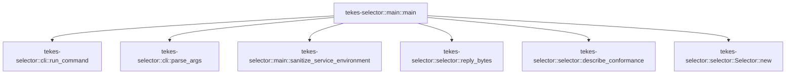

# tekes-selector::main

[Package atlas](index.md) · [Source](../../src/main.rs)

## Declarations

Visibility is the declaration spelling; trait members and reexports require their enclosing interface. `cfg` is not evaluated.

| Symbol | Kind | Visibility | Test / cfg |
|---|---|---|---|
| [tekes-selector::main::main](../../src/main.rs#L10) | function_item | `private` |  |
| [tekes-selector::main::sanitize_service_environment](../../src/main.rs#L55) | function_item | `private` |  |

## Imports / reexports

| Local name | Source path | Visibility |
|---|---|---|
| `Write` | `std::io::Write` | `private` |
| `CommandExt` | `std::os::unix::process::CommandExt` | `private` |
| `ProcessCommand` | `std::process::Command` | `private` |
| `SelectorCommand` | `tekes_selector::Command` | `private` |
| `MacOsCodeSignatureVerifier` | `tekes_selector::MacOsCodeSignatureVerifier` | `private` |
| `Selector` | `tekes_selector::Selector` | `private` |
| `describe_conformance` | `tekes_selector::describe_conformance` | `private` |
| `parse_args` | `tekes_selector::parse_args` | `private` |
| `reply_bytes` | `tekes_selector::reply_bytes` | `private` |
| `run_command` | `tekes_selector::run_command` | `private` |

## Module declarations

| Module | Visibility | Attributes |
|---|---|---|

## Function call graphs

Edges below are syntactically resolved calls only, including private functions. Graphs partition callers into groups of 20; they are not execution order. All unresolved sites are listed below and in the JSON inventory.

Functions 1–2: 6 direct edges

## Call sites

Includes test functions (marked in declarations). Receiver-type-required sites need type analysis/manual tracing. Calls in closures are attributed to their enclosing function; their occurrence here does not mean the closure executes immediately.

| Caller | Callee expression | Source lines | Target / classification |
|---|---|---|---|
| `main` | `std::env::args().skip(1).collect::<Vec<_>>` | [11](../../src/main.rs#L11) | receiver-type-required |
| `main` | `std::env::args().skip` | [11](../../src/main.rs#L11) | receiver-type-required |
| `main` | `std::env::args` | [11](../../src/main.rs#L11) | external-constructor-callback-or-unresolved |
| `main` | `describe_conformance().and_then` | [13](../../src/main.rs#L13) | receiver-type-required |
| `main` | `describe_conformance` | [13](../../src/main.rs#L13) | [tekes-selector::selector::describe_conformance](../../src/selector.rs#L2714) |
| `main` | `reply_bytes` | [13](../../src/main.rs#L13) | [tekes-selector::selector::reply_bytes](../../src/selector.rs#L2710) |
| `main` | `std::io::stdout().write_all(&bytes).is_err` | [15](../../src/main.rs#L15), [40](../../src/main.rs#L40) | receiver-type-required |
| `main` | `std::io::stdout().write_all` | [15](../../src/main.rs#L15), [40](../../src/main.rs#L40) | receiver-type-required |
| `main` | `std::io::stdout` | [15](../../src/main.rs#L15), [40](../../src/main.rs#L40) | external-constructor-callback-or-unresolved |
| `main` | `std::process::exit` | [16](../../src/main.rs#L16), [26](../../src/main.rs#L26), [41](../../src/main.rs#L41), [50](../../src/main.rs#L50) | external-constructor-callback-or-unresolved |
| `main` | `std::io::stderr().write_all` | [21](../../src/main.rs#L21), [49](../../src/main.rs#L49) | receiver-type-required |
| `main` | `std::io::stderr` | [21](../../src/main.rs#L21), [49](../../src/main.rs#L49) | external-constructor-callback-or-unresolved |
| `main` | `error.envelope_bytes().unwrap_or_else` | [22](../../src/main.rs#L22), [46](../../src/main.rs#L46) | receiver-type-required |
| `main` | `error.envelope_bytes` | [22](../../src/main.rs#L22), [46](../../src/main.rs#L46) | receiver-type-required |
| `main` | `b"{\"error\":{\"code\":\"io\",\"details\":{\"operation\":\"error-format\"},\"message\":\"Selector I/O failed\"}}\n".to_vec` | [23](../../src/main.rs#L23), [47](../../src/main.rs#L47) | receiver-type-required |
| `main` | `error.code.exit_code` | [26](../../src/main.rs#L26), [50](../../src/main.rs#L50) | receiver-type-required |
| `main` | `parse_args` | [30](../../src/main.rs#L30) | [tekes-selector::cli::parse_args](../../src/cli.rs#L45) |
| `main` | `sanitize_service_environment` | [32](../../src/main.rs#L32) | [tekes-selector::main::sanitize_service_environment](../../src/main.rs#L55) |
| `main` | `parsed.and_then` | [34](../../src/main.rs#L34) | receiver-type-required |
| `main` | `Selector::new` | [35](../../src/main.rs#L35) | [tekes-selector::selector::Selector::new](../../src/selector.rs#L386) |
| `main` | `run_command` | [36](../../src/main.rs#L36) | [tekes-selector::cli::run_command](../../src/cli.rs#L146) |
| `sanitize_service_environment` | `std::env::vars_os().next().is_none` | [56](../../src/main.rs#L56) | receiver-type-required |
| `sanitize_service_environment` | `std::env::vars_os().next` | [56](../../src/main.rs#L56) | receiver-type-required |
| `sanitize_service_environment` | `std::env::vars_os` | [56](../../src/main.rs#L56) | external-constructor-callback-or-unresolved |
| `sanitize_service_environment` | `std::env::current_exe` | [60](../../src/main.rs#L60) | external-constructor-callback-or-unresolved |
| `sanitize_service_environment` | `std::process::exit` | [64](../../src/main.rs#L64), [72](../../src/main.rs#L72) | external-constructor-callback-or-unresolved |
| `sanitize_service_environment` | `ProcessCommand::new(executable)         .args(argv)         .env_clear()         .exec` | [67](../../src/main.rs#L67) | receiver-type-required |
| `sanitize_service_environment` | `ProcessCommand::new(executable)         .args(argv)         .env_clear` | [67](../../src/main.rs#L67) | receiver-type-required |
| `sanitize_service_environment` | `ProcessCommand::new(executable)         .args` | [67](../../src/main.rs#L67) | receiver-type-required |
| `sanitize_service_environment` | `ProcessCommand::new` | [67](../../src/main.rs#L67) | external-constructor-callback-or-unresolved |
