```mermaid
flowchart TD
  n0["tekes-selector::cli::rfc3339_now"]
  n1["tekes-selector::cli::rfc3339_after"]
  n2["tekes-selector::error::SelectorError::corruption"]
  n3["tekes-selector::error::SelectorError::usage"]
  n4["tekes-selector::error::SelectorError::invalid_state"]
  n5["tekes-selector::fs::read_canonical"]
  n6["tekes-selector::fs::validate_id"]
  n7["tekes-selector::fs::validate_hex"]
  n8["tekes-selector::fs::FileLock::try_exclusive"]
  n9["tekes-selector::fs::probe_existing_lock"]
  n10["tekes-selector::selector::Selector::serve"]
  n11["tekes-selector::selector::Selector::serve_with_web"]
  n12["tekes-selector::selector::Selector::serve_test_loopback"]
  n13["tekes-selector::selector::Selector::serve_validated"]
  n14["tekes-selector::selector::Selector::begin_observation"]
  n15["tekes-selector::selector::Selector::begin_observation_for_validated_selection"]
  n16["tekes-selector::selector::Selector::begin_observation_locked"]
  n17["tekes-selector::selector::Selector::mark_ready_after_health"]
  n18["tekes-selector::selector::Selector::record_listener_bound"]
  n19["tekes-selector::selector::Selector::park_without_child"]
  n20["tekes-selector::selector::Selector::wait_for_predecessor"]
  n21["tekes-selector::selector::Selector::wait_for_predecessor_until"]
  n22["tekes-selector::selector::Selector::record_predecessor_timeout"]
  n23["tekes-selector::selector::Selector::clear_prelaunch_failure"]
  n24["tekes-selector::selector::Selector::read_prelaunch_failure"]
  n25["tekes-selector::selector::Selector::record_failure"]
  n26["tekes-selector::selector::Selector::promote_validated_observation_if_due"]
  n27["tekes-selector::selector::Selector::promote_observation_if_due_locked"]
  n28["tekes-selector::selector::Selector::automatic_rollback"]
  n29["tekes-selector::selector::Selector::recover_locked"]
  n30["tekes-selector::selector::Selector::read_selection_set"]
  n31["tekes-selector::selector::Selector::read_observation"]
  n32["tekes-selector::selector::Selector::ensure_current_selection_unlocked"]
  n33["tekes-selector::selector::Selector::ensure_observation_selection_current_unlocked"]
  n34["tekes-selector::selector::Selector::read_observation_unlocked"]
  n35["tekes-selector::selector::Selector::installer_recovery_required"]
  n36["tekes-selector::selector::Selector::publish_observation"]
  n37["tekes-selector::selector::automatic_rollback_sha256"]
  n38["tekes-selector::selector::read_rotating_logs"]
  n39["tekes-selector::selector::launch_and_observe"]
  n40["tekes-selector::selector::install_signal_handlers"]
  n41["tekes-selector::selector::valid_rfc3339_nano"]
  n42["tekes-selector::selector::Selector::emit_selector_log"]
  n43["tekes-selector::selector::Selector::child_correlation"]
  n44["tekes-selector::selector::Selector::wait_environment_retry"]
  n45["tekes-selector::selector::embedded_selector_version"]
  n46["tekes-selector::selector::Selector::acquire_offline_service"]
  n47["tekes-selector::selector::Selector::acquire_transaction_lock"]
  n10 --> n11
  n11 --> n3
  n11 --> n13
  n12 --> n3
  n12 --> n13
  n13 --> n0
  n13 --> n1
  n13 --> n2
  n13 --> n4
  n13 --> n5
  n13 --> n8
  n13 --> n15
  n13 --> n17
  n13 --> n18
  n13 --> n19
  n13 --> n20
  n13 --> n22
  n13 --> n23
  n13 --> n25
  n13 --> n26
  n13 --> n28
  n13 --> n29
  n13 --> n30
  n13 --> n31
  n13 --> n34
  n13 --> n35
  n13 --> n37
  n13 --> n39
  n13 --> n40
  n13 --> n42
  n13 --> n43
  n13 --> n44
  n13 --> n45
  n13 --> n47
  n14 --> n4
  n14 --> n16
  n14 --> n29
  n14 --> n30
  n14 --> n47
  n15 --> n16
  n15 --> n32
  n15 --> n47
  n16 --> n31
  n16 --> n36
  n17 --> n2
  n17 --> n4
  n17 --> n31
  n17 --> n33
  n17 --> n36
  n17 --> n47
  n18 --> n1
  n18 --> n4
  n18 --> n31
  n18 --> n33
  n18 --> n36
  n18 --> n47
  n20 --> n21
  n21 --> n9
  n22 --> n29
  n22 --> n42
  n22 --> n45
  n22 --> n47
  n23 --> n24
  n23 --> n42
  n23 --> n45
  n24 --> n2
  n24 --> n6
  n24 --> n7
  n24 --> n38
  n25 --> n2
  n25 --> n4
  n25 --> n31
  n25 --> n33
  n25 --> n36
  n25 --> n42
  n25 --> n43
  n25 --> n47
  n26 --> n4
  n26 --> n27
  n26 --> n31
  n26 --> n33
  n26 --> n41
  n26 --> n47
  n27 --> n2
  n27 --> n36
  n27 --> n42
  n27 --> n43
  n46 --> n2
  n46 --> n4
  n46 --> n8
  n46 --> n9
  n47 --> n8
```

```mermaid
flowchart TD
  n0["tekes-selector::error::SelectorError::corruption"]
  n1["tekes-selector::error::SelectorError::invalid_bundle"]
  n2["tekes-selector::error::SelectorError::invalid_state"]
  n3["tekes-selector::fs::read_canonical"]
  n4["tekes-selector::fs::read_regular"]
  n5["tekes-selector::fs::atomic_json"]
  n6["tekes-selector::fs::atomic_symlink"]
  n7["tekes-selector::fs::sync_directory"]
  n8["tekes-selector::fs::validate_id"]
  n9["tekes-selector::fs::validate_hex"]
  n10["tekes-selector::fs::sha256"]
  n11["tekes-selector::fs::mode"]
  n12["tekes-selector::fs::create_private_dir"]
  n13["tekes-selector::fs::copy_regular"]
  n14["tekes-selector::fs::relative_active_target"]
  n15["tekes-selector::fs::read_active"]
  n16["tekes-selector::fs::remove_dir_if_exists"]
  n17["tekes-selector::selector::Selector::automatic_rollback"]
  n18["tekes-selector::selector::Selector::validate_bundle"]
  n19["tekes-selector::selector::Selector::validate_selector_manifest"]
  n20["tekes-selector::selector::Selector::copy_bundle"]
  n21["tekes-selector::selector::Selector::finish_selection_operation"]
  n22["tekes-selector::selector::Selector::recover_locked"]
  n23["tekes-selector::selector::Selector::validate_operations_directory"]
  n24["tekes-selector::selector::Selector::validate_predecision_selection_files"]
  n25["tekes-selector::selector::Selector::validate_postdecision_selection_files"]
  n26["tekes-selector::selector::Selector::validate_operation_shape"]
  n27["tekes-selector::selector::Selector::validate_closed_operation"]
  n28["tekes-selector::selector::Selector::read_selection_set"]
  n29["tekes-selector::selector::Selector::read_observation"]
  n30["tekes-selector::selector::Selector::ensure_current_selection_unlocked"]
  n31["tekes-selector::selector::Selector::ensure_observation_selection_current_unlocked"]
  n32["tekes-selector::selector::Selector::validate_selected_bundle"]
  n33["tekes-selector::selector::Selector::read_observation_unlocked"]
  n34["tekes-selector::selector::Selector::installer_recovery_required"]
  n35["tekes-selector::selector::Selector::publish_observation"]
  n36["tekes-selector::selector::Selector::validate_observation"]
  n37["tekes-selector::selector::optional_canonical"]
  n38["tekes-selector::selector::validate_bundle_entries"]
  n39["tekes-selector::selector::to_value"]
  n40["tekes-selector::selector::automatic_rollback_sha256"]
  n41["tekes-selector::selector::query_candidate_conformance"]
  n42["tekes-selector::selector::valid_launch_id"]
  n43["tekes-selector::selector::valid_rfc3339_nano"]
  n44["tekes-selector::selector::valid_install_identity"]
  n45["tekes-selector::selector::Selector::emit_selector_log"]
  n46["tekes-selector::selector::Selector::child_correlation"]
  n47["tekes-selector::selector::Selector::acquire_transaction_lock"]
  n17 --> n2
  n17 --> n5
  n17 --> n21
  n17 --> n22
  n17 --> n28
  n17 --> n29
  n17 --> n45
  n17 --> n46
  n17 --> n47
  n18 --> n1
  n18 --> n3
  n18 --> n4
  n18 --> n8
  n18 --> n9
  n18 --> n10
  n18 --> n11
  n18 --> n38
  n18 --> n44
  n19 --> n1
  n19 --> n4
  n19 --> n8
  n19 --> n9
  n19 --> n10
  n19 --> n11
  n19 --> n41
  n19 --> n44
  n20 --> n7
  n20 --> n12
  n20 --> n13
  n21 --> n0
  n21 --> n5
  n21 --> n6
  n21 --> n14
  n21 --> n39
  n22 --> n0
  n22 --> n3
  n22 --> n5
  n22 --> n6
  n22 --> n7
  n22 --> n14
  n22 --> n15
  n22 --> n16
  n22 --> n18
  n22 --> n23
  n22 --> n24
  n22 --> n25
  n22 --> n26
  n22 --> n27
  n22 --> n28
  n22 --> n32
  n22 --> n39
  n23 --> n0
  n24 --> n0
  n24 --> n37
  n25 --> n0
  n25 --> n37
  n26 --> n0
  n26 --> n8
  n26 --> n9
  n26 --> n40
  n27 --> n0
  n27 --> n18
  n27 --> n28
  n27 --> n39
  n28 --> n0
  n28 --> n8
  n28 --> n9
  n28 --> n14
  n28 --> n15
  n28 --> n32
  n28 --> n37
  n29 --> n0
  n29 --> n36
  n29 --> n37
  n30 --> n0
  n30 --> n2
  n30 --> n3
  n30 --> n14
  n30 --> n15
  n31 --> n30
  n32 --> n0
  n32 --> n18
  n33 --> n29
  n33 --> n31
  n33 --> n47
  n34 --> n3
  n35 --> n5
  n35 --> n36
  n36 --> n0
  n36 --> n8
  n36 --> n9
  n36 --> n42
  n36 --> n43
```

```mermaid
flowchart TD
  n0["tekes-selector::error::SelectorError::corruption"]
  n1["tekes-selector::error::SelectorError::usage"]
  n2["tekes-selector::error::SelectorError::invalid_bundle"]
  n3["tekes-selector::error::SelectorError::invalid_state"]
  n4["tekes-selector::fs::canonical_line"]
  n5["tekes-selector::fs::read_canonical"]
  n6["tekes-selector::fs::read_regular"]
  n7["tekes-selector::fs::atomic_json"]
  n8["tekes-selector::fs::sync_directory"]
  n9["tekes-selector::fs::validate_id"]
  n10["tekes-selector::fs::validate_hex"]
  n11["tekes-selector::fs::sha256"]
  n12["tekes-selector::selector::selector_log_contract"]
  n13["tekes-selector::selector::Selector::retry_reply"]
  n14["tekes-selector::selector::Selector::close_no_effect_activate"]
  n15["tekes-selector::selector::optional_canonical"]
  n16["tekes-selector::selector::exact_directory_entries"]
  n17["tekes-selector::selector::validate_bundle_entries"]
  n18["tekes-selector::selector::to_value"]
  n19["tekes-selector::selector::cli_command_sha256"]
  n20["tekes-selector::selector::automatic_rollback_sha256"]
  n21["tekes-selector::selector::reply_bytes"]
  n22["tekes-selector::selector::describe_conformance"]
  n23["tekes-selector::selector::query_candidate_conformance"]
  n24["tekes-selector::selector::set_nonblocking"]
  n25["tekes-selector::selector::set_blocking"]
  n26["tekes-selector::selector::read_bounded_nonblocking"]
  n27["tekes-selector::selector::tree_fingerprint"]
  n28["tekes-selector::selector::collect_tree_fingerprint"]
  n29["tekes-selector::selector::append_rotating_log"]
  n30["tekes-selector::selector::append_rotating_log_with_sync"]
  n31["tekes-selector::selector::read_rotating_logs"]
  n32["tekes-selector::selector::valid_selector_log_record"]
  n33["tekes-selector::selector::valid_launch_id"]
  n34["tekes-selector::selector::valid_rfc3339_nano"]
  n35["tekes-selector::selector::embedded_selector_version"]
  n13 --> n0
  n13 --> n3
  n13 --> n15
  n14 --> n5
  n14 --> n7
  n14 --> n18
  n15 --> n5
  n16 --> n2
  n17 --> n16
  n18 --> n0
  n19 --> n1
  n19 --> n11
  n20 --> n0
  n20 --> n11
  n21 --> n4
  n22 --> n3
  n22 --> n10
  n22 --> n35
  n23 --> n2
  n23 --> n24
  n23 --> n25
  n23 --> n26
  n26 --> n2
  n27 --> n0
  n27 --> n11
  n27 --> n28
  n28 --> n0
  n28 --> n6
  n28 --> n28
  n29 --> n30
  n30 --> n0
  n30 --> n8
  n31 --> n0
  n31 --> n6
  n31 --> n32
  n32 --> n9
  n32 --> n10
  n32 --> n12
  n32 --> n33
  n32 --> n34
```

# tekes-selector::selector

[Package atlas](index.md) · [Source](../../src/selector.rs)

## Declarations

Visibility is the declaration spelling; trait members and reexports require their enclosing interface. `cfg` is not evaluated.

| Symbol | Kind | Visibility | Test / cfg |
|---|---|---|---|
| [tekes-selector::selector::BUNDLE_FILES](../../src/selector.rs#L35) | const_item | `private` |  |
| [tekes-selector::selector::LEGACY_BUNDLE_FILES](../../src/selector.rs#L61) | const_item | `private` |  |
| [tekes-selector::selector::EMBEDDED_AUTHORITY_REGISTRY_SHA256](../../src/selector.rs#L78) | const_item | `pub` |  |
| [tekes-selector::selector::EMBEDDED_SELECTOR_CONFORMANCE_SHA256](../../src/selector.rs#L80) | const_item | `pub` |  |
| [tekes-selector::selector::SIGNAL_COUNT](../../src/selector.rs#L82) | static_item | `private` |  |
| [tekes-selector::selector::embedded_selector_version](../../src/selector.rs#L84) | function_item | `private` |  |
| [tekes-selector::selector::ATTRIBUTABLE](../../src/selector.rs#L87) | const_item | `private` |  |
| [tekes-selector::selector::ENVIRONMENT](../../src/selector.rs#L96) | const_item | `private` |  |
| [tekes-selector::selector::LogScalar](../../src/selector.rs#L109) | enum_item | `private` |  |
| [tekes-selector::selector::LogCorrelation](../../src/selector.rs#L117) | struct_item | `private` |  |
| [tekes-selector::selector::SelectorLogRecord](../../src/selector.rs#L132) | struct_item | `private` |  |
| [tekes-selector::selector::RetryFingerprint](../../src/selector.rs#L145) | struct_item | `private` |  |
| [tekes-selector::selector::LogCorrelationShape](../../src/selector.rs#L155) | enum_item | `private` |  |
| [tekes-selector::selector::selector_log_contract](../../src/selector.rs#L162) | function_item | `private` |  |
| [tekes-selector::selector::operation_type_name](../../src/selector.rs#L247) | function_item | `private` |  |
| [tekes-selector::selector::SelectorPaths](../../src/selector.rs#L256) | struct_item | `pub` |  |
| [tekes-selector::selector::SelectorPaths::new](../../src/selector.rs#L276) | function_item | `pub` |  |
| [tekes-selector::selector::SelectorPaths::initialize_for_install](../../src/selector.rs#L338) | function_item | `pub` |  |
| [tekes-selector::selector::Selector](../../src/selector.rs#L379) | struct_item | `pub` |  |
| [tekes-selector::selector::Selector::new](../../src/selector.rs#L386) | function_item | `pub` |  |
| [tekes-selector::selector::Selector::paths](../../src/selector.rs#L394) | function_item | `pub` |  |
| [tekes-selector::selector::Selector::emit_selector_log](../../src/selector.rs#L398) | function_item | `private` |  |
| [tekes-selector::selector::Selector::child_correlation](../../src/selector.rs#L432) | function_item | `private` |  |
| [tekes-selector::selector::Selector::retry_fingerprint](../../src/selector.rs#L442) | function_item | `private` |  |
| [tekes-selector::selector::Selector::wait_environment_retry](../../src/selector.rs#L475) | function_item | `private` |  |
| [tekes-selector::selector::Selector::stage](../../src/selector.rs#L495) | function_item | `pub` |  |
| [tekes-selector::selector::Selector::activate](../../src/selector.rs#L564) | function_item | `pub` |  |
| [tekes-selector::selector::Selector::rollback](../../src/selector.rs#L622) | function_item | `pub` |  |
| [tekes-selector::selector::Selector::recover](../../src/selector.rs#L689) | function_item | `pub` |  |
| [tekes-selector::selector::Selector::status](../../src/selector.rs#L728) | function_item | `pub` |  |
| [tekes-selector::selector::Selector::attest_canary](../../src/selector.rs#L759) | function_item | `pub` |  |
| [tekes-selector::selector::Selector::attest_install_health](../../src/selector.rs#L840) | function_item | `pub` |  |
| [tekes-selector::selector::Selector::update_selector](../../src/selector.rs#L917) | function_item | `pub` |  |
| [tekes-selector::selector::Selector::emit_selector_update_complete](../../src/selector.rs#L958) | function_item | `private` |  |
| [tekes-selector::selector::Selector::acquire_offline_service](../../src/selector.rs#L973) | function_item | `private` |  |
| [tekes-selector::selector::Selector::acquire_transaction_lock](../../src/selector.rs#L989) | function_item | `private` |  |
| [tekes-selector::selector::Selector::serve](../../src/selector.rs#L1008) | function_item | `pub` |  |
| [tekes-selector::selector::Selector::serve_with_web](../../src/selector.rs#L1015) | function_item | `pub` |  |
| [tekes-selector::selector::Selector::serve_test_loopback](../../src/selector.rs#L1036) | function_item | `pub` |  |
| [tekes-selector::selector::Selector::serve_validated](../../src/selector.rs#L1053) | function_item | `private` |  |
| [tekes-selector::selector::Selector::serve_validated::DELAYS](../../src/selector.rs#L1268) | const_item | `private` |  |
| [tekes-selector::selector::Selector::begin_observation](../../src/selector.rs#L1287) | function_item | `pub` |  |
| [tekes-selector::selector::Selector::begin_observation_for_validated_selection](../../src/selector.rs#L1308) | function_item | `private` |  |
| [tekes-selector::selector::Selector::begin_observation_locked](../../src/selector.rs#L1318) | function_item | `private` |  |
| [tekes-selector::selector::Selector::mark_ready_after_health](../../src/selector.rs#L1338) | function_item | `private` |  |
| [tekes-selector::selector::Selector::record_listener_bound](../../src/selector.rs#L1369) | function_item | `private` |  |
| [tekes-selector::selector::Selector::park_without_child](../../src/selector.rs#L1387) | function_item | `private` |  |
| [tekes-selector::selector::Selector::wait_for_predecessor](../../src/selector.rs#L1394) | function_item | `private` |  |
| [tekes-selector::selector::Selector::wait_for_predecessor_until](../../src/selector.rs#L1398) | function_item | `private` |  |
| [tekes-selector::selector::Selector::record_predecessor_timeout](../../src/selector.rs#L1418) | function_item | `private` |  |
| [tekes-selector::selector::Selector::clear_prelaunch_failure](../../src/selector.rs#L1444) | function_item | `private` |  |
| [tekes-selector::selector::Selector::read_prelaunch_failure](../../src/selector.rs#L1459) | function_item | `private` |  |
| [tekes-selector::selector::Selector::record_failure](../../src/selector.rs#L1494) | function_item | `pub` |  |
| [tekes-selector::selector::Selector::promote_validated_observation_if_due](../../src/selector.rs#L1565) | function_item | `private` |  |
| [tekes-selector::selector::Selector::promote_observation_if_due_locked](../../src/selector.rs#L1581) | function_item | `private` |  |
| [tekes-selector::selector::Selector::automatic_rollback](../../src/selector.rs#L1614) | function_item | `pub` |  |
| [tekes-selector::selector::Selector::validate_bundle](../../src/selector.rs#L1679) | function_item | `private` |  |
| [tekes-selector::selector::Selector::validate_selector_manifest](../../src/selector.rs#L1794) | function_item | `private` |  |
| [tekes-selector::selector::Selector::copy_bundle](../../src/selector.rs#L1839) | function_item | `private` |  |
| [tekes-selector::selector::Selector::finish_selection_operation](../../src/selector.rs#L1886) | function_item | `private` |  |
| [tekes-selector::selector::Selector::recover_locked](../../src/selector.rs#L1933) | function_item | `private` |  |
| [tekes-selector::selector::Selector::validate_operations_directory](../../src/selector.rs#L2081) | function_item | `private` |  |
| [tekes-selector::selector::Selector::validate_predecision_selection_files](../../src/selector.rs#L2102) | function_item | `private` |  |
| [tekes-selector::selector::Selector::validate_postdecision_selection_files](../../src/selector.rs#L2124) | function_item | `private` |  |
| [tekes-selector::selector::Selector::validate_operation_shape](../../src/selector.rs#L2155) | function_item | `private` |  |
| [tekes-selector::selector::Selector::validate_closed_operation](../../src/selector.rs#L2250) | function_item | `private` |  |
| [tekes-selector::selector::Selector::read_selection_set](../../src/selector.rs#L2313) | function_item | `private` |  |
| [tekes-selector::selector::Selector::read_observation](../../src/selector.rs#L2344) | function_item | `private` |  |
| [tekes-selector::selector::Selector::ensure_current_selection_unlocked](../../src/selector.rs#L2356) | function_item | `private` |  |
| [tekes-selector::selector::Selector::ensure_observation_selection_current_unlocked](../../src/selector.rs#L2373) | function_item | `private` |  |
| [tekes-selector::selector::Selector::validate_selected_bundle](../../src/selector.rs#L2387) | function_item | `private` |  |
| [tekes-selector::selector::Selector::read_observation_unlocked](../../src/selector.rs#L2400) | function_item | `private` |  |
| [tekes-selector::selector::Selector::installer_recovery_required](../../src/selector.rs#L2412) | function_item | `private` |  |
| [tekes-selector::selector::Selector::publish_observation](../../src/selector.rs#L2420) | function_item | `private` |  |
| [tekes-selector::selector::Selector::validate_observation](../../src/selector.rs#L2431) | function_item | `private` |  |
| [tekes-selector::selector::Selector::retry_reply](../../src/selector.rs#L2470) | function_item | `private` |  |
| [tekes-selector::selector::Selector::close_no_effect_activate](../../src/selector.rs#L2491) | function_item | `private` |  |
| [tekes-selector::selector::FailureDisposition](../../src/selector.rs#L2524) | enum_item | `pub` |  |
| [tekes-selector::selector::optional_canonical](../../src/selector.rs#L2532) | function_item | `private` |  |
| [tekes-selector::selector::exact_directory_entries](../../src/selector.rs#L2542) | function_item | `private` |  |
| [tekes-selector::selector::validate_bundle_entries](../../src/selector.rs#L2564) | function_item | `private` |  |
| [tekes-selector::selector::to_value](../../src/selector.rs#L2608) | function_item | `private` |  |
| [tekes-selector::selector::cli_command_sha256](../../src/selector.rs#L2612) | function_item | `pub` |  |
| [tekes-selector::selector::automatic_rollback_sha256](../../src/selector.rs#L2619) | function_item | `pub` |  |
| [tekes-selector::selector::reply_bytes](../../src/selector.rs#L2640) | function_item | `pub` |  |
| [tekes-selector::selector::describe_conformance](../../src/selector.rs#L2644) | function_item | `pub` |  |
| [tekes-selector::selector::query_candidate_conformance](../../src/selector.rs#L2657) | function_item | `private` |  |
| [tekes-selector::selector::set_nonblocking](../../src/selector.rs#L2731) | function_item | `private` |  |
| [tekes-selector::selector::set_blocking](../../src/selector.rs#L2740) | function_item | `private` |  |
| [tekes-selector::selector::read_bounded_nonblocking](../../src/selector.rs#L2747) | function_item | `private` |  |
| [tekes-selector::selector::tree_fingerprint](../../src/selector.rs#L2780) | function_item | `private` |  |
| [tekes-selector::selector::collect_tree_fingerprint](../../src/selector.rs#L2803) | function_item | `private` |  |
| [tekes-selector::selector::append_rotating_log](../../src/selector.rs#L2845) | function_item | `private` |  |
| [tekes-selector::selector::append_rotating_log_with_sync](../../src/selector.rs#L2849) | function_item | `private` |  |
| [tekes-selector::selector::append_rotating_log_with_sync::LIMIT](../../src/selector.rs#L2857) | const_item | `private` |  |
| [tekes-selector::selector::read_rotating_logs](../../src/selector.rs#L2910) | function_item | `private` |  |
| [tekes-selector::selector::valid_selector_log_record](../../src/selector.rs#L2949) | function_item | `private` |  |
| [tekes-selector::selector::NativeLaunchOutcome](../../src/selector.rs#L3055) | enum_item | `private` |  |
| [tekes-selector::selector::NativeLaunchSpec](../../src/selector.rs#L3061) | struct_item | `private` |  |
| [tekes-selector::selector::BootstrapStatus](../../src/selector.rs#L3076) | struct_item | `private` |  |
| [tekes-selector::selector::launch_and_observe](../../src/selector.rs#L3085) | function_item | `private` |  |
| [tekes-selector::selector::closed_command](../../src/selector.rs#L3288) | function_item | `private` |  |
| [tekes-selector::selector::create_pipe](../../src/selector.rs#L3294) | function_item | `private` |  |
| [tekes-selector::selector::close_fd](../../src/selector.rs#L3314) | function_item | `private` |  |
| [tekes-selector::selector::read_line_deadline](../../src/selector.rs#L3321) | function_item | `private` |  |
| [tekes-selector::selector::health_ready](../../src/selector.rs#L3357) | function_item | `private` |  |
| [tekes-selector::selector::terminate_group](../../src/selector.rs#L3390) | function_item | `private` |  |
| [tekes-selector::selector::drain_group](../../src/selector.rs#L3394) | function_item | `private` |  |
| [tekes-selector::selector::selector_signal](../../src/selector.rs#L3412) | function_item | `private` |  |
| [tekes-selector::selector::install_signal_handlers](../../src/selector.rs#L3416) | function_item | `private` |  |
| [tekes-selector::selector::closed_bootstrap_code](../../src/selector.rs#L3434) | function_item | `private` |  |
| [tekes-selector::selector::launch_id](../../src/selector.rs#L3451) | function_item | `private` |  |
| [tekes-selector::selector::valid_launch_id](../../src/selector.rs#L3464) | function_item | `private` |  |
| [tekes-selector::selector::valid_rfc3339_nano](../../src/selector.rs#L3474) | function_item | `private` |  |
| [tekes-selector::selector::valid_install_identity](../../src/selector.rs#L3487) | function_item | `private` |  |
| [tekes-selector::selector::tests::UnusedVerifier](../../src/selector.rs#L3521) | struct_item | `private` | test; #[cfg(test)] |
| [tekes-selector::selector::tests::supervisor_command_drops_the_complete_ambient_environment](../../src/selector.rs#L3524) | function_item | `private` | test; #[cfg(test)] |
| [tekes-selector::selector::tests::UnusedVerifier::verify](../../src/selector.rs#L3537) | function_item | `private` | test; #[cfg(test)] |
| [tekes-selector::selector::tests::UnusedVerifier::verify_provisioned_app](../../src/selector.rs#L3545) | function_item | `private` | test; #[cfg(test)] |
| [tekes-selector::selector::tests::resident_observation_guard_accepts_only_the_validated_selection_generation](../../src/selector.rs#L3558) | function_item | `private` | test; #[cfg(test)] |
| [tekes-selector::selector::tests::resident_promotion_uses_the_frozen_selection_without_bundle_reverification](../../src/selector.rs#L3596) | function_item | `private` | test; #[cfg(test)] |
| [tekes-selector::selector::tests::operational_log_propagates_full_sync_failure](../../src/selector.rs#L3668) | function_item | `private` | test; #[cfg(test)] |
| [tekes-selector::selector::tests::bootstrap_record_must_bind_the_complete_frozen_selection](../../src/selector.rs#L3683) | function_item | `private` | test; #[cfg(test)] |
| [tekes-selector::selector::tests::predecessor_probe_waits_in_100ms_intervals_and_times_out_without_spawn](../../src/selector.rs#L3729) | function_item | `private` | test; #[cfg(test)] |
| [tekes-selector::selector::tests::transaction_lock_waits_for_a_short_resident_selector_tenure](../../src/selector.rs#L3755) | function_item | `private` | test; #[cfg(test)] |
| [tekes-selector::selector::tests::prelaunch_timeout_is_a_synced_log_carrier_without_a_spawn_attempt](../../src/selector.rs#L3787) | function_item | `private` | test; #[cfg(test)] |
| [tekes-selector::selector::tests::environment_retry_resets_on_a_detected_config_fact_change](../../src/selector.rs#L3838) | function_item | `private` | test; #[cfg(test)] |
| [tekes-selector::selector::tests::candidate_conformance_probe_rejects_stderr_and_extra_lines](../../src/selector.rs#L3890) | function_item | `private` | test; #[cfg(test)] |
| [tekes-selector::selector::tests::candidate_conformance_probe_rejects_stderr_and_extra_lines::REPLY](../../src/selector.rs#L3891) | const_item | `private` | test; #[cfg(test)] |

## Imports / reexports

| Local name | Source path | Visibility |
|---|---|---|
| `BTreeMap` | `std::collections::BTreeMap` | `private` |
| `OsStr` | `std::ffi::OsStr` | `private` |
| `FmtWrite` | `std::fmt::Write` | `private` |
| `fs` | `std::fs` | `private` |
| `File` | `std::fs::File` | `private` |
| `OpenOptions` | `std::fs::OpenOptions` | `private` |
| `io` | `std::io` | `private` |
| `Read` | `std::io::Read` | `private` |
| `Write` | `std::io::Write` | `private` |
| `IpAddr` | `std::net::IpAddr` | `private` |
| `Ipv4Addr` | `std::net::Ipv4Addr` | `private` |
| `SocketAddr` | `std::net::SocketAddr` | `private` |
| `TcpListener` | `std::net::TcpListener` | `private` |
| `TcpStream` | `std::net::TcpStream` | `private` |
| `AsRawFd` | `std::os::fd::AsRawFd` | `private` |
| `FromRawFd` | `std::os::fd::FromRawFd` | `private` |
| `DirBuilderExt` | `std::os::unix::fs::DirBuilderExt` | `private` |
| `MetadataExt` | `std::os::unix::fs::MetadataExt` | `private` |
| `OpenOptionsExt` | `std::os::unix::fs::OpenOptionsExt` | `private` |
| `PermissionsExt` | `std::os::unix::fs::PermissionsExt` | `private` |
| `CommandExt` | `std::os::unix::process::CommandExt` | `private` |
| `Path` | `std::path::Path` | `private` |
| `PathBuf` | `std::path::PathBuf` | `private` |
| `Command` | `std::process::Command` | `private` |
| `Stdio` | `std::process::Stdio` | `private` |
| `AtomicU8` | `std::sync::atomic::AtomicU8` | `private` |
| `Ordering` | `std::sync::atomic::Ordering` | `private` |
| `Duration` | `std::time::Duration` | `private` |
| `Instant` | `std::time::Instant` | `private` |
| `Deserialize` | `serde::Deserialize` | `private` |
| `Serialize` | `serde::Serialize` | `private` |
| `Value` | `serde_json::Value` | `private` |
| `json` | `serde_json::json` | `private` |
| `verify_canary_ledger` | `crate::canary::verify_canary_ledger` | `private` |
| `rfc3339_after` | `crate::cli::rfc3339_after` | `private` |
| `rfc3339_now` | `crate::cli::rfc3339_now` | `private` |
| `IoContext` | `crate::error::IoContext` | `private` |
| `SelectorError` | `crate::error::SelectorError` | `private` |
| `ExistingLockState` | `crate::fs::ExistingLockState` | `private` |
| `FileLock` | `crate::fs::FileLock` | `private` |
| `atomic_bytes` | `crate::fs::atomic_bytes` | `private` |
| `atomic_json` | `crate::fs::atomic_json` | `private` |
| `atomic_symlink` | `crate::fs::atomic_symlink` | `private` |
| `canonical_line` | `crate::fs::canonical_line` | `private` |
| `copy_regular` | `crate::fs::copy_regular` | `private` |
| `create_private_dir` | `crate::fs::create_private_dir` | `private` |
| `full_sync` | `crate::fs::full_sync` | `private` |
| `mode` | `crate::fs::mode` | `private` |
| `probe_existing_lock` | `crate::fs::probe_existing_lock` | `private` |
| `read_active` | `crate::fs::read_active` | `private` |
| `read_canonical` | `crate::fs::read_canonical` | `private` |
| `read_regular` | `crate::fs::read_regular` | `private` |
| `relative_active_target` | `crate::fs::relative_active_target` | `private` |
| `remove_dir_if_exists` | `crate::fs::remove_dir_if_exists` | `private` |
| `sha256` | `crate::fs::sha256` | `private` |
| `sync_directory` | `crate::fs::sync_directory` | `private` |
| `validate_hex` | `crate::fs::validate_hex` | `private` |
| `validate_id` | `crate::fs::validate_id` | `private` |
| `BundleManifest` | `crate::model::BundleManifest` | `private` |
| `CanaryReply` | `crate::model::CanaryReply` | `private` |
| `ConformanceReply` | `crate::model::ConformanceReply` | `private` |
| `InstallHealthReply` | `crate::model::InstallHealthReply` | `private` |
| `InstallIdentity` | `crate::model::InstallIdentity` | `private` |
| `MutationReply` | `crate::model::MutationReply` | `private` |
| `Observation` | `crate::model::Observation` | `private` |
| `ObservationState` | `crate::model::ObservationState` | `private` |
| `OperationActor` | `crate::model::OperationActor` | `private` |
| `OperationType` | `crate::model::OperationType` | `private` |
| `PrelaunchFailure` | `crate::model::PrelaunchFailure` | `private` |
| `PreviousFile` | `crate::model::PreviousFile` | `private` |
| `RecoverReply` | `crate::model::RecoverReply` | `private` |
| `Selection` | `crate::model::Selection` | `private` |
| `SelectionFile` | `crate::model::SelectionFile` | `private` |
| `SelectorManifest` | `crate::model::SelectorManifest` | `private` |
| `SelectorOperation` | `crate::model::SelectorOperation` | `private` |
| `StageReply` | `crate::model::StageReply` | `private` |
| `StatusReply` | `crate::model::StatusReply` | `private` |
| `UpdateReply` | `crate::model::UpdateReply` | `private` |
| `CodeSignatureVerifier` | `crate::signature::CodeSignatureVerifier` | `private` |
| `fs` | `std::fs` | `private` |
| `AsRawFd` | `std::os::fd::AsRawFd` | `private` |
| `OpenOptionsExt` | `std::os::unix::fs::OpenOptionsExt` | `private` |
| `PermissionsExt` | `std::os::unix::fs::PermissionsExt` | `private` |
| `symlink` | `std::os::unix::fs::symlink` | `private` |
| `Duration` | `std::time::Duration` | `private` |
| `Instant` | `std::time::Instant` | `private` |
| `NativeLaunchOutcome` | `super::NativeLaunchOutcome` | `private` |
| `NativeLaunchSpec` | `super::NativeLaunchSpec` | `private` |
| `Observation` | `super::Observation` | `private` |
| `ObservationState` | `super::ObservationState` | `private` |
| `Selection` | `super::Selection` | `private` |
| `SelectionFile` | `super::SelectionFile` | `private` |
| `Selector` | `super::Selector` | `private` |
| `append_rotating_log_with_sync` | `super::append_rotating_log_with_sync` | `private` |
| `closed_command` | `super::closed_command` | `private` |
| `launch_and_observe` | `super::launch_and_observe` | `private` |
| `CodeSignature` | `crate::CodeSignature` | `private` |
| `CodeSignatureVerifier` | `crate::CodeSignatureVerifier` | `private` |
| `InstallIdentity` | `crate::InstallIdentity` | `private` |
| `SelectorError` | `crate::SelectorError` | `private` |

## Module declarations

| Module | Visibility | Attributes |
|---|---|---|
| `tekes-selector::selector::tests` | `private` | #[cfg(test)] |

## Function call graphs

Edges below are syntactically resolved calls only, including private functions. Graphs partition callers into groups of 20; they are not execution order. All unresolved sites are listed below and in the JSON inventory.

```mermaid
flowchart TD
  n0["tekes-selector::canary::verify_canary_ledger"]
  n1["tekes-selector::cli::rfc3339_now"]
  n2["tekes-selector::error::SelectorError::corruption"]
  n3["tekes-selector::error::SelectorError::invalid_bundle"]
  n4["tekes-selector::error::SelectorError::invalid_state"]
  n5["tekes-selector::fs::canonical_line"]
  n6["tekes-selector::fs::read_canonical"]
  n7["tekes-selector::fs::read_regular"]
  n8["tekes-selector::fs::atomic_json"]
  n9["tekes-selector::fs::atomic_bytes"]
  n10["tekes-selector::fs::sync_directory"]
  n11["tekes-selector::fs::validate_id"]
  n12["tekes-selector::fs::sha256"]
  n13["tekes-selector::fs::mode"]
  n14["tekes-selector::fs::FileLock::try_exclusive"]
  n15["tekes-selector::fs::remove_dir_if_exists"]
  n16["tekes-selector::fs::probe_existing_lock"]
  n17["tekes-selector::selector::Selector::read_prelaunch_failure"]
  n18["tekes-selector::selector::selector_log_contract"]
  n19["tekes-selector::selector::Selector::validate_bundle"]
  n20["tekes-selector::selector::Selector::validate_selector_manifest"]
  n21["tekes-selector::selector::Selector::copy_bundle"]
  n22["tekes-selector::selector::Selector::finish_selection_operation"]
  n23["tekes-selector::selector::Selector::recover_locked"]
  n24["tekes-selector::selector::Selector::read_selection_set"]
  n25["tekes-selector::selector::Selector::read_observation"]
  n26["tekes-selector::selector::Selector::publish_observation"]
  n27["tekes-selector::selector::Selector::retry_reply"]
  n28["tekes-selector::selector::operation_type_name"]
  n29["tekes-selector::selector::Selector::close_no_effect_activate"]
  n30["tekes-selector::selector::to_value"]
  n31["tekes-selector::selector::SelectorPaths::new"]
  n32["tekes-selector::selector::tree_fingerprint"]
  n33["tekes-selector::selector::append_rotating_log"]
  n34["tekes-selector::selector::valid_selector_log_record"]
  n35["tekes-selector::selector::health_ready"]
  n36["tekes-selector::selector::SelectorPaths::initialize_for_install"]
  n37["tekes-selector::selector::valid_rfc3339_nano"]
  n38["tekes-selector::selector::Selector::new"]
  n39["tekes-selector::selector::Selector::paths"]
  n40["tekes-selector::selector::Selector::emit_selector_log"]
  n41["tekes-selector::selector::Selector::child_correlation"]
  n42["tekes-selector::selector::Selector::retry_fingerprint"]
  n43["tekes-selector::selector::Selector::wait_environment_retry"]
  n44["tekes-selector::selector::Selector::stage"]
  n45["tekes-selector::selector::Selector::activate"]
  n46["tekes-selector::selector::Selector::rollback"]
  n47["tekes-selector::selector::Selector::recover"]
  n48["tekes-selector::selector::Selector::status"]
  n49["tekes-selector::selector::Selector::attest_canary"]
  n50["tekes-selector::selector::Selector::attest_install_health"]
  n51["tekes-selector::selector::embedded_selector_version"]
  n52["tekes-selector::selector::Selector::update_selector"]
  n53["tekes-selector::selector::Selector::emit_selector_update_complete"]
  n54["tekes-selector::selector::Selector::acquire_offline_service"]
  n55["tekes-selector::selector::Selector::acquire_transaction_lock"]
  n36 --> n2
  n36 --> n10
  n36 --> n13
  n38 --> n31
  n40 --> n1
  n40 --> n2
  n40 --> n5
  n40 --> n18
  n40 --> n33
  n40 --> n34
  n42 --> n2
  n42 --> n7
  n42 --> n12
  n42 --> n16
  n42 --> n32
  n43 --> n42
  n44 --> n4
  n44 --> n8
  n44 --> n10
  n44 --> n11
  n44 --> n14
  n44 --> n15
  n44 --> n19
  n44 --> n21
  n44 --> n23
  n44 --> n24
  n44 --> n27
  n44 --> n30
  n45 --> n3
  n45 --> n6
  n45 --> n8
  n45 --> n11
  n45 --> n14
  n45 --> n19
  n45 --> n22
  n45 --> n23
  n45 --> n24
  n45 --> n27
  n45 --> n29
  n45 --> n54
  n46 --> n4
  n46 --> n8
  n46 --> n11
  n46 --> n14
  n46 --> n22
  n46 --> n23
  n46 --> n24
  n46 --> n25
  n46 --> n27
  n46 --> n40
  n46 --> n41
  n46 --> n54
  n47 --> n2
  n47 --> n6
  n47 --> n14
  n47 --> n23
  n47 --> n24
  n47 --> n28
  n47 --> n40
  n47 --> n51
  n48 --> n14
  n48 --> n17
  n48 --> n23
  n48 --> n24
  n48 --> n25
  n49 --> n0
  n49 --> n4
  n49 --> n11
  n49 --> n23
  n49 --> n24
  n49 --> n25
  n49 --> n26
  n49 --> n37
  n49 --> n55
  n50 --> n4
  n50 --> n11
  n50 --> n23
  n50 --> n24
  n50 --> n25
  n50 --> n26
  n50 --> n35
  n50 --> n37
  n50 --> n55
  n52 --> n6
  n52 --> n7
  n52 --> n9
  n52 --> n12
  n52 --> n13
  n52 --> n14
  n52 --> n20
  n52 --> n23
  n52 --> n53
  n52 --> n54
  n53 --> n40
  n53 --> n51
```

Functions 1–20: 95 direct edges

Functions 21–40: 92 direct edges

Functions 41–60: 93 direct edges

Functions 61–80: 40 direct edges

Functions 81–95: 20 direct edges

```mermaid
flowchart TD
  n0["tekes-selector::cli::rfc3339_now"]
  n1["tekes-selector::error::SelectorError::corruption"]
  n2["tekes-selector::error::SelectorError::io"]
  n3["tekes-selector::error::SelectorError::usage"]
  n4["tekes-selector::error::SelectorError::invalid_state"]
  n5["tekes-selector::selector::launch_and_observe"]
  n6["tekes-selector::selector::closed_command"]
  n7["tekes-selector::selector::create_pipe"]
  n8["tekes-selector::selector::close_fd"]
  n9["tekes-selector::selector::read_line_deadline"]
  n10["tekes-selector::selector::health_ready"]
  n11["tekes-selector::selector::terminate_group"]
  n12["tekes-selector::selector::drain_group"]
  n13["tekes-selector::selector::selector_signal"]
  n14["tekes-selector::selector::install_signal_handlers"]
  n15["tekes-selector::selector::closed_bootstrap_code"]
  n16["tekes-selector::selector::launch_id"]
  n17["tekes-selector::selector::valid_launch_id"]
  n18["tekes-selector::selector::valid_rfc3339_nano"]
  n19["tekes-selector::selector::valid_install_identity"]
  n5 --> n0
  n5 --> n2
  n5 --> n3
  n5 --> n4
  n5 --> n6
  n5 --> n7
  n5 --> n8
  n5 --> n9
  n5 --> n10
  n5 --> n11
  n5 --> n12
  n5 --> n15
  n7 --> n2
  n7 --> n8
  n9 --> n2
  n9 --> n4
  n10 --> n1
  n10 --> n3
  n11 --> n12
  n14 --> n2
```

## Call sites

Includes test functions (marked in declarations). Receiver-type-required sites need type analysis/manual tracing. Calls in closures are attributed to their enclosing function; their occurrence here does not mean the closure executes immediately.

| Caller | Callee expression | Source lines | Target / classification |
|---|---|---|---|
| `SIGNAL_COUNT` | `AtomicU8::new` | [82](../../src/selector.rs#L82) | external-constructor-callback-or-unresolved |
| `embedded_selector_version` | `option_env!("TEKES_SELECTED_BUILD").unwrap_or` | [85](../../src/selector.rs#L85) | receiver-type-required |
| `selector_log_contract` | `Some` | [170](../../src/selector.rs#L170) | external-constructor-callback-or-unresolved |
| `selector_log_contract` | `ATTRIBUTABLE.contains` | [231](../../src/selector.rs#L231) | receiver-type-required |
| `selector_log_contract` | `ENVIRONMENT.contains` | [237](../../src/selector.rs#L237) | receiver-type-required |
| `new` | `install_root.into` | [277](../../src/selector.rs#L277) | receiver-type-required |
| `new` | `install_root.join` | [278](../../src/selector.rs#L278), [280](../../src/selector.rs#L280), [308](../../src/selector.rs#L308), [315](../../src/selector.rs#L315), [320](../../src/selector.rs#L320) | receiver-type-required |
| `new` | `install_root.parent().map_or_else` | [279](../../src/selector.rs#L279) | receiver-type-required |
| `new` | `install_root.parent` | [279](../../src/selector.rs#L279), [292](../../src/selector.rs#L292) | receiver-type-required |
| `new` | `kernel_parent.join` | [281](../../src/selector.rs#L281) | receiver-type-required |
| `new` | `install_root             .parent()             .map_or_else` | [283](../../src/selector.rs#L283) | receiver-type-required |
| `new` | `install_root             .parent` | [283](../../src/selector.rs#L283), [286](../../src/selector.rs#L286) | receiver-type-required |
| `new` | `install_root.clone` | [285](../../src/selector.rs#L285) | receiver-type-required |
| `new` | `install_root             .parent()             .and_then(Path::parent)             .and_then(Path::parent)             .and_then` | [286](../../src/selector.rs#L286) | receiver-type-required |
| `new` | `install_root             .parent()             .and_then(Path::parent)             .and_then` | [286](../../src/selector.rs#L286) | receiver-type-required |
| `new` | `install_root             .parent()             .and_then` | [286](../../src/selector.rs#L286) | receiver-type-required |
| `new` | `install_root.file_name` | [291](../../src/selector.rs#L291) | receiver-type-required |
| `new` | `Some` | [291](../../src/selector.rs#L291), [292](../../src/selector.rs#L292), [297](../../src/selector.rs#L297) | external-constructor-callback-or-unresolved |
| `new` | `OsStr::new` | [291](../../src/selector.rs#L291), [292](../../src/selector.rs#L292), [297](../../src/selector.rs#L297) | external-constructor-callback-or-unresolved |
| `new` | `install_root.parent().and_then` | [292](../../src/selector.rs#L292) | receiver-type-required |
| `new` | `install_root                 .parent()                 .and_then(Path::parent)                 .and_then` | [293](../../src/selector.rs#L293), [310](../../src/selector.rs#L310) | receiver-type-required |
| `new` | `install_root                 .parent()                 .and_then` | [293](../../src/selector.rs#L293), [310](../../src/selector.rs#L310) | receiver-type-required |
| `new` | `install_root                 .parent` | [293](../../src/selector.rs#L293), [310](../../src/selector.rs#L310) | receiver-type-required |
| `new` | `user_home                 .map(&#124;home&#124; home.join(".agents/threads"))                 .unwrap_or_else` | [299](../../src/selector.rs#L299) | receiver-type-required |
| `new` | `user_home                 .map` | [299](../../src/selector.rs#L299), [306](../../src/selector.rs#L306) | receiver-type-required |
| `new` | `home.join` | [300](../../src/selector.rs#L300), [307](../../src/selector.rs#L307) | receiver-type-required |
| `new` | `data_root.join` | [301](../../src/selector.rs#L301), [303](../../src/selector.rs#L303) | receiver-type-required |
| `new` | `user_home                 .map(&#124;home&#124; home.join(".agents/logs/kernel"))                 .unwrap_or_else` | [306](../../src/selector.rs#L306) | receiver-type-required |
| `new` | `install_root                 .parent()                 .and_then(Path::parent)                 .and_then(Path::parent)                 .map_or_else` | [310](../../src/selector.rs#L310) | receiver-type-required |
| `new` | `library.join` | [316](../../src/selector.rs#L316) | receiver-type-required |
| `new` | `selector.join` | [321](../../src/selector.rs#L321), [322](../../src/selector.rs#L322), [323](../../src/selector.rs#L323), [324](../../src/selector.rs#L324), [325](../../src/selector.rs#L325), [326](../../src/selector.rs#L326), [327](../../src/selector.rs#L327), [328](../../src/selector.rs#L328) | receiver-type-required |
| `new` | `installer.join` | [329](../../src/selector.rs#L329), [330](../../src/selector.rs#L330) | receiver-type-required |
| `new` | `log_root.join` | [331](../../src/selector.rs#L331) | receiver-type-required |
| `initialize_for_install` | `self.selector.join` | [345](../../src/selector.rs#L345) | receiver-type-required |
| `initialize_for_install` | `path.exists` | [347](../../src/selector.rs#L347) | receiver-type-required |
| `initialize_for_install` | `fs::DirBuilder::new()                     .recursive(false)                     .mode(0o700)                     .create(path)                     .selector_io` | [348](../../src/selector.rs#L348) | receiver-type-required |
| `initialize_for_install` | `fs::DirBuilder::new()                     .recursive(false)                     .mode(0o700)                     .create` | [348](../../src/selector.rs#L348) | receiver-type-required |
| `initialize_for_install` | `fs::DirBuilder::new()                     .recursive(false)                     .mode` | [348](../../src/selector.rs#L348) | receiver-type-required |
| `initialize_for_install` | `fs::DirBuilder::new()                     .recursive` | [348](../../src/selector.rs#L348) | receiver-type-required |
| `initialize_for_install` | `fs::DirBuilder::new` | [348](../../src/selector.rs#L348) | external-constructor-callback-or-unresolved |
| `initialize_for_install` | `fs::symlink_metadata(path)                 .selector_io("directory-stat")?                 .file_type()                 .is_symlink` | [354](../../src/selector.rs#L354) | receiver-type-required |
| `initialize_for_install` | `fs::symlink_metadata(path)                 .selector_io("directory-stat")?                 .file_type` | [354](../../src/selector.rs#L354) | receiver-type-required |
| `initialize_for_install` | `fs::symlink_metadata(path)                 .selector_io` | [354](../../src/selector.rs#L354) | receiver-type-required |
| `initialize_for_install` | `fs::symlink_metadata` | [354](../../src/selector.rs#L354) | external-constructor-callback-or-unresolved |
| `initialize_for_install` | `path.is_dir` | [358](../../src/selector.rs#L358) | receiver-type-required |
| `initialize_for_install` | `mode` | [359](../../src/selector.rs#L359) | [tekes-selector::fs::mode](../../src/fs.rs#L291) |
| `initialize_for_install` | `Err` | [361](../../src/selector.rs#L361) | external-constructor-callback-or-unresolved |
| `initialize_for_install` | `SelectorError::corruption` | [361](../../src/selector.rs#L361) | [tekes-selector::error::SelectorError::corruption](../../src/error.rs#L100) |
| `initialize_for_install` | `path.display().to_string` | [361](../../src/selector.rs#L361) | receiver-type-required |
| `initialize_for_install` | `path.display` | [361](../../src/selector.rs#L361) | receiver-type-required |
| `initialize_for_install` | `OpenOptions::new()                 .write(true)                 .create(true)                 .mode(0o600)                 .custom_flags(libc::O_CLOEXEC &#124; libc::O_NOFOLLOW)                 .open(path)                 .selector_io` | [365](../../src/selector.rs#L365) | receiver-type-required |
| `initialize_for_install` | `OpenOptions::new()                 .write(true)                 .create(true)                 .mode(0o600)                 .custom_flags(libc::O_CLOEXEC &#124; libc::O_NOFOLLOW)                 .open` | [365](../../src/selector.rs#L365) | receiver-type-required |
| `initialize_for_install` | `OpenOptions::new()                 .write(true)                 .create(true)                 .mode(0o600)                 .custom_flags` | [365](../../src/selector.rs#L365) | receiver-type-required |
| `initialize_for_install` | `OpenOptions::new()                 .write(true)                 .create(true)                 .mode` | [365](../../src/selector.rs#L365) | receiver-type-required |
| `initialize_for_install` | `OpenOptions::new()                 .write(true)                 .create` | [365](../../src/selector.rs#L365) | receiver-type-required |
| `initialize_for_install` | `OpenOptions::new()                 .write` | [365](../../src/selector.rs#L365) | receiver-type-required |
| `initialize_for_install` | `OpenOptions::new` | [365](../../src/selector.rs#L365) | external-constructor-callback-or-unresolved |
| `initialize_for_install` | `file.set_permissions(fs::Permissions::from_mode(0o600))                 .selector_io` | [372](../../src/selector.rs#L372) | receiver-type-required |
| `initialize_for_install` | `file.set_permissions` | [372](../../src/selector.rs#L372) | receiver-type-required |
| `initialize_for_install` | `fs::Permissions::from_mode` | [372](../../src/selector.rs#L372) | external-constructor-callback-or-unresolved |
| `initialize_for_install` | `sync_directory` | [375](../../src/selector.rs#L375) | [tekes-selector::fs::sync_directory](../../src/fs.rs#L210) |
| `new` | `SelectorPaths::new` | [388](../../src/selector.rs#L388) | [tekes-selector::selector::SelectorPaths::new](../../src/selector.rs#L276) |
| `emit_selector_log` | `selector_log_contract(code)             .ok_or_else` | [405](../../src/selector.rs#L405) | receiver-type-required |
| `emit_selector_log` | `selector_log_contract` | [405](../../src/selector.rs#L405) | [tekes-selector::selector::selector_log_contract](../../src/selector.rs#L162) |
| `emit_selector_log` | `SelectorError::corruption` | [406](../../src/selector.rs#L406), [413](../../src/selector.rs#L413), [427](../../src/selector.rs#L427) | [tekes-selector::error::SelectorError::corruption](../../src/error.rs#L100) |
| `emit_selector_log` | `fields.len` | [407](../../src/selector.rs#L407) | receiver-type-required |
| `emit_selector_log` | `allowed.len` | [407](../../src/selector.rs#L407) | receiver-type-required |
| `emit_selector_log` | `fields                 .keys()                 .map(String::as_str)                 .ne` | [408](../../src/selector.rs#L408) | receiver-type-required |
| `emit_selector_log` | `fields                 .keys()                 .map` | [408](../../src/selector.rs#L408) | receiver-type-required |
| `emit_selector_log` | `fields                 .keys` | [408](../../src/selector.rs#L408) | receiver-type-required |
| `emit_selector_log` | `allowed.iter().copied` | [411](../../src/selector.rs#L411) | receiver-type-required |
| `emit_selector_log` | `allowed.iter` | [411](../../src/selector.rs#L411) | receiver-type-required |
| `emit_selector_log` | `Err` | [413](../../src/selector.rs#L413), [427](../../src/selector.rs#L427) | external-constructor-callback-or-unresolved |
| `emit_selector_log` | `build.to_owned` | [416](../../src/selector.rs#L416) | receiver-type-required |
| `emit_selector_log` | `code.to_owned` | [417](../../src/selector.rs#L417) | receiver-type-required |
| `emit_selector_log` | `"selector".to_owned` | [418](../../src/selector.rs#L418) | receiver-type-required |
| `emit_selector_log` | `message.to_owned` | [421](../../src/selector.rs#L421) | receiver-type-required |
| `emit_selector_log` | `severity.to_owned` | [422](../../src/selector.rs#L422) | receiver-type-required |
| `emit_selector_log` | `rfc3339_now` | [423](../../src/selector.rs#L423) | [tekes-selector::cli::rfc3339_now](../../src/cli.rs#L200) |
| `emit_selector_log` | `valid_selector_log_record` | [426](../../src/selector.rs#L426) | [tekes-selector::selector::valid_selector_log_record](../../src/selector.rs#L2949) |
| `emit_selector_log` | `append_rotating_log` | [429](../../src/selector.rs#L429) | [tekes-selector::selector::append_rotating_log](../../src/selector.rs#L2845) |
| `emit_selector_log` | `canonical_line` | [429](../../src/selector.rs#L429) | [tekes-selector::fs::canonical_line](../../src/fs.rs#L117) |
| `child_correlation` | `Some` | [434](../../src/selector.rs#L434), [435](../../src/selector.rs#L435), [436](../../src/selector.rs#L436), [437](../../src/selector.rs#L437) | external-constructor-callback-or-unresolved |
| `child_correlation` | `observation.launch_id.clone` | [436](../../src/selector.rs#L436) | receiver-type-required |
| `child_correlation` | `observation.manifest_sha256.clone` | [437](../../src/selector.rs#L437) | receiver-type-required |
| `retry_fingerprint` | `storage_root             .parent()             .ok_or_else` | [447](../../src/selector.rs#L447) | receiver-type-required |
| `retry_fingerprint` | `storage_root             .parent` | [447](../../src/selector.rs#L447) | receiver-type-required |
| `retry_fingerprint` | `SelectorError::corruption` | [449](../../src/selector.rs#L449) | [tekes-selector::error::SelectorError::corruption](../../src/error.rs#L100) |
| `retry_fingerprint` | `storage_root.display().to_string` | [449](../../src/selector.rs#L449) | receiver-type-required |
| `retry_fingerprint` | `storage_root.display` | [449](../../src/selector.rs#L449) | receiver-type-required |
| `retry_fingerprint` | `tree_fingerprint` | [450](../../src/selector.rs#L450) | [tekes-selector::selector::tree_fingerprint](../../src/selector.rs#L2780) |
| `retry_fingerprint` | `data_root.join` | [450](../../src/selector.rs#L450) | receiver-type-required |
| `retry_fingerprint` | `sha256` | [451](../../src/selector.rs#L451), [453](../../src/selector.rs#L453), [455](../../src/selector.rs#L455) | [tekes-selector::fs::sha256](../../src/fs.rs#L287) |
| `retry_fingerprint` | `read_regular` | [451](../../src/selector.rs#L451), [453](../../src/selector.rs#L453) | [tekes-selector::fs::read_regular](../../src/fs.rs#L142) |
| `retry_fingerprint` | `self.paths.installer_operation.exists` | [452](../../src/selector.rs#L452) | receiver-type-required |
| `retry_fingerprint` | `fs::symlink_metadata(storage_root).selector_io` | [457](../../src/selector.rs#L457) | receiver-type-required |
| `retry_fingerprint` | `fs::symlink_metadata` | [457](../../src/selector.rs#L457) | external-constructor-callback-or-unresolved |
| `retry_fingerprint` | `TcpListener::bind(listen).is_ok` | [464](../../src/selector.rs#L464) | receiver-type-required |
| `retry_fingerprint` | `TcpListener::bind` | [464](../../src/selector.rs#L464) | external-constructor-callback-or-unresolved |
| `retry_fingerprint` | `Ok` | [465](../../src/selector.rs#L465) | external-constructor-callback-or-unresolved |
| `retry_fingerprint` | `probe_existing_lock` | [470](../../src/selector.rs#L470) | [tekes-selector::fs::probe_existing_lock](../../src/fs.rs#L72) |
| `retry_fingerprint` | `storage_root.join` | [470](../../src/selector.rs#L470) | receiver-type-required |
| `wait_environment_retry` | `self.retry_fingerprint` | [481](../../src/selector.rs#L481), [488](../../src/selector.rs#L488) | [tekes-selector::selector::Selector::retry_fingerprint](../../src/selector.rs#L442) |
| `wait_environment_retry` | `Instant::now` | [482](../../src/selector.rs#L482), [483](../../src/selector.rs#L483) | external-constructor-callback-or-unresolved |
| `wait_environment_retry` | `SIGNAL_COUNT.load` | [484](../../src/selector.rs#L484) | receiver-type-required |
| `wait_environment_retry` | `Ok` | [485](../../src/selector.rs#L485), [489](../../src/selector.rs#L489), [492](../../src/selector.rs#L492) | external-constructor-callback-or-unresolved |
| `wait_environment_retry` | `std::thread::sleep` | [487](../../src/selector.rs#L487) | external-constructor-callback-or-unresolved |
| `wait_environment_retry` | `Duration::from_millis` | [487](../../src/selector.rs#L487) | external-constructor-callback-or-unresolved |
| `stage` | `validate_id` | [501](../../src/selector.rs#L501) | [tekes-selector::fs::validate_id](../../src/fs.rs#L267) |
| `stage` | `self.validate_bundle` | [502](../../src/selector.rs#L502), [514](../../src/selector.rs#L514), [545](../../src/selector.rs#L545) | [tekes-selector::selector::Selector::validate_bundle](../../src/selector.rs#L1679) |
| `stage` | `Some` | [502](../../src/selector.rs#L502), [514](../../src/selector.rs#L514), [545](../../src/selector.rs#L545), [559](../../src/selector.rs#L559) | external-constructor-callback-or-unresolved |
| `stage` | `FileLock::try_exclusive` | [503](../../src/selector.rs#L503) | [tekes-selector::fs::FileLock::try_exclusive](../../src/fs.rs#L29) |
| `stage` | `self.recover_locked` | [504](../../src/selector.rs#L504) | [tekes-selector::selector::Selector::recover_locked](../../src/selector.rs#L1933) |
| `stage` | `self.retry_reply::<StageReply>` | [505](../../src/selector.rs#L505) | [tekes-selector::selector::Selector::retry_reply](../../src/selector.rs#L2470) |
| `stage` | `Ok` | [506](../../src/selector.rs#L506), [561](../../src/selector.rs#L561) | external-constructor-callback-or-unresolved |
| `stage` | `self             .read_selection_set()?             .0             .map_or` | [508](../../src/selector.rs#L508) | receiver-type-required |
| `stage` | `self             .read_selection_set` | [508](../../src/selector.rs#L508) | [tekes-selector::selector::Selector::read_selection_set](../../src/selector.rs#L2313) |
| `stage` | `self.paths.bundles.join` | [512](../../src/selector.rs#L512), [540](../../src/selector.rs#L540) | receiver-type-required |
| `stage` | `final_path.exists` | [513](../../src/selector.rs#L513) | receiver-type-required |
| `stage` | `Err` | [517](../../src/selector.rs#L517) | external-constructor-callback-or-unresolved |
| `stage` | `SelectorError::invalid_state` | [517](../../src/selector.rs#L517) | [tekes-selector::error::SelectorError::invalid_state](../../src/error.rs#L87) |
| `stage` | `op_id.clone` | [531](../../src/selector.rs#L531) | receiver-type-required |
| `stage` | `"prepared".to_owned` | [533](../../src/selector.rs#L533) | receiver-type-required |
| `stage` | `selection.clone` | [536](../../src/selector.rs#L536) | receiver-type-required |
| `stage` | `atomic_json` | [538](../../src/selector.rs#L538), [544](../../src/selector.rs#L544), [547](../../src/selector.rs#L547), [552](../../src/selector.rs#L552), [560](../../src/selector.rs#L560) | [tekes-selector::fs::atomic_json](../../src/fs.rs#L156) |
| `stage` | `remove_dir_if_exists` | [541](../../src/selector.rs#L541) | [tekes-selector::fs::remove_dir_if_exists](../../src/fs.rs#L339) |
| `stage` | `self.copy_bundle` | [542](../../src/selector.rs#L542) | [tekes-selector::selector::Selector::copy_bundle](../../src/selector.rs#L1839) |
| `stage` | `"copied".to_owned` | [543](../../src/selector.rs#L543) | receiver-type-required |
| `stage` | `"verified".to_owned` | [546](../../src/selector.rs#L546) | receiver-type-required |
| `stage` | `fs::rename(&staging, &final_path).selector_io` | [548](../../src/selector.rs#L548) | receiver-type-required |
| `stage` | `fs::rename` | [548](../../src/selector.rs#L548) | external-constructor-callback-or-unresolved |
| `stage` | `sync_directory` | [549](../../src/selector.rs#L549) | [tekes-selector::fs::sync_directory](../../src/fs.rs#L210) |
| `stage` | `"bundle-published".to_owned` | [551](../../src/selector.rs#L551) | receiver-type-required |
| `stage` | `"stage".to_owned` | [555](../../src/selector.rs#L555) | receiver-type-required |
| `stage` | `"closed".to_owned` | [558](../../src/selector.rs#L558) | receiver-type-required |
| `stage` | `to_value` | [559](../../src/selector.rs#L559) | [tekes-selector::selector::to_value](../../src/selector.rs#L2608) |
| `activate` | `validate_id` | [569](../../src/selector.rs#L569) | [tekes-selector::fs::validate_id](../../src/fs.rs#L267) |
| `activate` | `self.acquire_offline_service` | [570](../../src/selector.rs#L570) | [tekes-selector::selector::Selector::acquire_offline_service](../../src/selector.rs#L973) |
| `activate` | `FileLock::try_exclusive` | [571](../../src/selector.rs#L571) | [tekes-selector::fs::FileLock::try_exclusive](../../src/fs.rs#L29) |
| `activate` | `self.recover_locked` | [572](../../src/selector.rs#L572) | [tekes-selector::selector::Selector::recover_locked](../../src/selector.rs#L1933) |
| `activate` | `self.retry_reply::<MutationReply>` | [573](../../src/selector.rs#L573) | [tekes-selector::selector::Selector::retry_reply](../../src/selector.rs#L2470) |
| `activate` | `Ok` | [574](../../src/selector.rs#L574) | external-constructor-callback-or-unresolved |
| `activate` | `self.validate_bundle` | [576](../../src/selector.rs#L576) | [tekes-selector::selector::Selector::validate_bundle](../../src/selector.rs#L1679) |
| `activate` | `self.paths.bundles.join` | [576](../../src/selector.rs#L576) | receiver-type-required |
| `activate` | `Some` | [576](../../src/selector.rs#L576) | external-constructor-callback-or-unresolved |
| `activate` | `self.read_selection_set` | [577](../../src/selector.rs#L577) | [tekes-selector::selector::Selector::read_selection_set](../../src/selector.rs#L2313) |
| `activate` | `current             .as_ref()             .is_some_and` | [578](../../src/selector.rs#L578) | receiver-type-required |
| `activate` | `current             .as_ref` | [578](../../src/selector.rs#L578) | receiver-type-required |
| `activate` | `self.close_no_effect_activate` | [582](../../src/selector.rs#L582) | [tekes-selector::selector::Selector::close_no_effect_activate](../../src/selector.rs#L2491) |
| `activate` | `current.expect` | [582](../../src/selector.rs#L582) | receiver-type-required |
| `activate` | `read_canonical` | [585](../../src/selector.rs#L585), [592](../../src/selector.rs#L592) | [tekes-selector::fs::read_canonical](../../src/fs.rs#L124) |
| `activate` | `self                     .paths                     .bundles                     .join(&current.selection.version)                     .join` | [586](../../src/selector.rs#L586) | receiver-type-required |
| `activate` | `self                     .paths                     .bundles                     .join` | [586](../../src/selector.rs#L586), [593](../../src/selector.rs#L593) | receiver-type-required |
| `activate` | `self                     .paths                     .bundles                     .join(version)                     .join` | [593](../../src/selector.rs#L593) | receiver-type-required |
| `activate` | `Err` | [600](../../src/selector.rs#L600) | external-constructor-callback-or-unresolved |
| `activate` | `SelectorError::invalid_bundle` | [600](../../src/selector.rs#L600) | [tekes-selector::error::SelectorError::invalid_bundle](../../src/error.rs#L82) |
| `activate` | `current.as_ref().map_or` | [603](../../src/selector.rs#L603) | receiver-type-required |
| `activate` | `current.as_ref` | [603](../../src/selector.rs#L603) | receiver-type-required |
| `activate` | `current.map` | [608](../../src/selector.rs#L608) | receiver-type-required |
| `activate` | `"prepared".to_owned` | [613](../../src/selector.rs#L613) | receiver-type-required |
| `activate` | `atomic_json` | [618](../../src/selector.rs#L618) | [tekes-selector::fs::atomic_json](../../src/fs.rs#L156) |
| `activate` | `self.finish_selection_operation` | [619](../../src/selector.rs#L619) | [tekes-selector::selector::Selector::finish_selection_operation](../../src/selector.rs#L1886) |
| `rollback` | `validate_id` | [627](../../src/selector.rs#L627) | [tekes-selector::fs::validate_id](../../src/fs.rs#L267) |
| `rollback` | `self.acquire_offline_service` | [628](../../src/selector.rs#L628) | [tekes-selector::selector::Selector::acquire_offline_service](../../src/selector.rs#L973) |
| `rollback` | `FileLock::try_exclusive` | [629](../../src/selector.rs#L629) | [tekes-selector::fs::FileLock::try_exclusive](../../src/fs.rs#L29) |
| `rollback` | `self.recover_locked` | [630](../../src/selector.rs#L630) | [tekes-selector::selector::Selector::recover_locked](../../src/selector.rs#L1933) |
| `rollback` | `self.retry_reply::<MutationReply>` | [631](../../src/selector.rs#L631) | [tekes-selector::selector::Selector::retry_reply](../../src/selector.rs#L2470) |
| `rollback` | `Ok` | [632](../../src/selector.rs#L632), [686](../../src/selector.rs#L686) | external-constructor-callback-or-unresolved |
| `rollback` | `self.read_selection_set` | [634](../../src/selector.rs#L634) | [tekes-selector::selector::Selector::read_selection_set](../../src/selector.rs#L2313) |
| `rollback` | `current.ok_or_else` | [635](../../src/selector.rs#L635) | receiver-type-required |
| `rollback` | `SelectorError::invalid_state` | [635](../../src/selector.rs#L635), [638](../../src/selector.rs#L638), [641](../../src/selector.rs#L641), [643](../../src/selector.rs#L643), [646](../../src/selector.rs#L646) | [tekes-selector::error::SelectorError::invalid_state](../../src/error.rs#L87) |
| `rollback` | `previous             .and_then(&#124;file&#124; file.selection)             .ok_or_else` | [636](../../src/selector.rs#L636) | receiver-type-required |
| `rollback` | `previous             .and_then` | [636](../../src/selector.rs#L636) | receiver-type-required |
| `rollback` | `self             .read_observation(&current.selection.version)?             .ok_or_else` | [639](../../src/selector.rs#L639) | receiver-type-required |
| `rollback` | `self             .read_observation` | [639](../../src/selector.rs#L639) | [tekes-selector::selector::Selector::read_observation](../../src/selector.rs#L2344) |
| `rollback` | `Err` | [643](../../src/selector.rs#L643), [646](../../src/selector.rs#L646) | external-constructor-callback-or-unresolved |
| `rollback` | `Some` | [653](../../src/selector.rs#L653), [659](../../src/selector.rs#L659), [677](../../src/selector.rs#L677) | external-constructor-callback-or-unresolved |
| `rollback` | `"prepared".to_owned` | [658](../../src/selector.rs#L658) | receiver-type-required |
| `rollback` | `reason.to_owned` | [659](../../src/selector.rs#L659), [682](../../src/selector.rs#L682) | receiver-type-required |
| `rollback` | `operation.op_id.clone` | [663](../../src/selector.rs#L663) | receiver-type-required |
| `rollback` | `operation             .from             .as_ref()             .expect("rollback has from")             .version             .clone` | [664](../../src/selector.rs#L664) | receiver-type-required |
| `rollback` | `operation             .from             .as_ref()             .expect` | [664](../../src/selector.rs#L664) | receiver-type-required |
| `rollback` | `operation             .from             .as_ref` | [664](../../src/selector.rs#L664) | receiver-type-required |
| `rollback` | `operation.to.version.clone` | [670](../../src/selector.rs#L670) | receiver-type-required |
| `rollback` | `atomic_json` | [671](../../src/selector.rs#L671) | [tekes-selector::fs::atomic_json](../../src/fs.rs#L156) |
| `rollback` | `self.finish_selection_operation` | [672](../../src/selector.rs#L672) | [tekes-selector::selector::Selector::finish_selection_operation](../../src/selector.rs#L1886) |
| `rollback` | `self.emit_selector_log` | [673](../../src/selector.rs#L673) | [tekes-selector::selector::Selector::emit_selector_log](../../src/selector.rs#L398) |
| `rollback` | `Self::child_correlation` | [678](../../src/selector.rs#L678) | [tekes-selector::selector::Selector::child_correlation](../../src/selector.rs#L432) |
| `rollback` | `BTreeMap::from` | [680](../../src/selector.rs#L680) | external-constructor-callback-or-unresolved |
| `rollback` | `"from".to_owned` | [681](../../src/selector.rs#L681) | receiver-type-required |
| `rollback` | `LogScalar::String` | [681](../../src/selector.rs#L681), [682](../../src/selector.rs#L682), [683](../../src/selector.rs#L683) | external-constructor-callback-or-unresolved |
| `rollback` | `from.clone` | [681](../../src/selector.rs#L681) | receiver-type-required |
| `rollback` | `"reason".to_owned` | [682](../../src/selector.rs#L682) | receiver-type-required |
| `rollback` | `"to".to_owned` | [683](../../src/selector.rs#L683) | receiver-type-required |
| `recover` | `FileLock::try_exclusive` | [690](../../src/selector.rs#L690) | [tekes-selector::fs::FileLock::try_exclusive](../../src/fs.rs#L29) |
| `recover` | `self.paths.operation.exists` | [691](../../src/selector.rs#L691) | receiver-type-required |
| `recover` | `Some` | [692](../../src/selector.rs#L692), [705](../../src/selector.rs#L705) | external-constructor-callback-or-unresolved |
| `recover` | `read_canonical` | [692](../../src/selector.rs#L692) | [tekes-selector::fs::read_canonical](../../src/fs.rs#L124) |
| `recover` | `self.recover_locked` | [696](../../src/selector.rs#L696) | [tekes-selector::selector::Selector::recover_locked](../../src/selector.rs#L1933) |
| `recover` | `pending.ok_or_else` | [698](../../src/selector.rs#L698) | receiver-type-required |
| `recover` | `SelectorError::corruption` | [699](../../src/selector.rs#L699) | [tekes-selector::error::SelectorError::corruption](../../src/error.rs#L100) |
| `recover` | `self.paths.operation.display().to_string` | [699](../../src/selector.rs#L699) | receiver-type-required |
| `recover` | `self.paths.operation.display` | [699](../../src/selector.rs#L699) | receiver-type-required |
| `recover` | `self.emit_selector_log` | [701](../../src/selector.rs#L701) | [tekes-selector::selector::Selector::emit_selector_log](../../src/selector.rs#L398) |
| `recover` | `embedded_selector_version` | [702](../../src/selector.rs#L702) | [tekes-selector::selector::embedded_selector_version](../../src/selector.rs#L84) |
| `recover` | `LogCorrelation::default` | [706](../../src/selector.rs#L706) | external-constructor-callback-or-unresolved |
| `recover` | `BTreeMap::from` | [708](../../src/selector.rs#L708) | external-constructor-callback-or-unresolved |
| `recover` | `"operation".to_owned` | [710](../../src/selector.rs#L710) | receiver-type-required |
| `recover` | `LogScalar::String` | [711](../../src/selector.rs#L711), [715](../../src/selector.rs#L715) | external-constructor-callback-or-unresolved |
| `recover` | `operation_type_name(&operation.operation_type).to_owned` | [712](../../src/selector.rs#L712) | receiver-type-required |
| `recover` | `operation_type_name` | [712](../../src/selector.rs#L712) | [tekes-selector::selector::operation_type_name](../../src/selector.rs#L247) |
| `recover` | `"phase".to_owned` | [715](../../src/selector.rs#L715) | receiver-type-required |
| `recover` | `"closed".to_owned` | [715](../../src/selector.rs#L715) | receiver-type-required |
| `recover` | `self.read_selection_set` | [719](../../src/selector.rs#L719) | [tekes-selector::selector::Selector::read_selection_set](../../src/selector.rs#L2313) |
| `recover` | `Ok` | [720](../../src/selector.rs#L720) | external-constructor-callback-or-unresolved |
| `recover` | `"recover".to_owned` | [722](../../src/selector.rs#L722) | receiver-type-required |
| `status` | `FileLock::try_exclusive` | [729](../../src/selector.rs#L729), [736](../../src/selector.rs#L736) | [tekes-selector::fs::FileLock::try_exclusive](../../src/fs.rs#L29) |
| `status` | `self.recover_locked` | [730](../../src/selector.rs#L730) | [tekes-selector::selector::Selector::recover_locked](../../src/selector.rs#L1933) |
| `status` | `self.read_selection_set` | [731](../../src/selector.rs#L731) | [tekes-selector::selector::Selector::read_selection_set](../../src/selector.rs#L2313) |
| `status` | `self.read_observation` | [733](../../src/selector.rs#L733) | [tekes-selector::selector::Selector::read_observation](../../src/selector.rs#L2344) |
| `status` | `Err` | [739](../../src/selector.rs#L739) | external-constructor-callback-or-unresolved |
| `status` | `observation.as_ref().and_then` | [741](../../src/selector.rs#L741) | receiver-type-required |
| `status` | `observation.as_ref` | [741](../../src/selector.rs#L741) | receiver-type-required |
| `status` | `matches!(value.state, ObservationState::Failed).then` | [742](../../src/selector.rs#L742) | receiver-type-required |
| `status` | `value.last_code.clone` | [743](../../src/selector.rs#L743) | receiver-type-required |
| `status` | `value.launch_id.clone` | [744](../../src/selector.rs#L744) | receiver-type-required |
| `status` | `self.read_prelaunch_failure` | [747](../../src/selector.rs#L747) | [tekes-selector::selector::Selector::read_prelaunch_failure](../../src/selector.rs#L1459) |
| `status` | `Ok` | [748](../../src/selector.rs#L748) | external-constructor-callback-or-unresolved |
| `status` | `service.to_owned` | [755](../../src/selector.rs#L755) | receiver-type-required |
| `attest_canary` | `validate_id` | [768](../../src/selector.rs#L768), [769](../../src/selector.rs#L769) | [tekes-selector::fs::validate_id](../../src/fs.rs#L267) |
| `attest_canary` | `valid_rfc3339_nano` | [770](../../src/selector.rs#L770) | [tekes-selector::selector::valid_rfc3339_nano](../../src/selector.rs#L3474) |
| `attest_canary` | `Err` | [771](../../src/selector.rs#L771), [781](../../src/selector.rs#L781), [806](../../src/selector.rs#L806), [813](../../src/selector.rs#L813) | external-constructor-callback-or-unresolved |
| `attest_canary` | `SelectorError::invalid_state` | [771](../../src/selector.rs#L771), [779](../../src/selector.rs#L779), [781](../../src/selector.rs#L781), [785](../../src/selector.rs#L785), [806](../../src/selector.rs#L806), [813](../../src/selector.rs#L813) | [tekes-selector::error::SelectorError::invalid_state](../../src/error.rs#L87) |
| `attest_canary` | `verify_canary_ledger` | [773](../../src/selector.rs#L773) | [tekes-selector::canary::verify_canary_ledger](../../src/canary.rs#L9) |
| `attest_canary` | `self.acquire_transaction_lock` | [774](../../src/selector.rs#L774) | [tekes-selector::selector::Selector::acquire_transaction_lock](../../src/selector.rs#L989) |
| `attest_canary` | `self.recover_locked` | [775](../../src/selector.rs#L775) | [tekes-selector::selector::Selector::recover_locked](../../src/selector.rs#L1933) |
| `attest_canary` | `self             .read_selection_set()?             .0             .ok_or_else` | [776](../../src/selector.rs#L776) | receiver-type-required |
| `attest_canary` | `self             .read_selection_set` | [776](../../src/selector.rs#L776) | [tekes-selector::selector::Selector::read_selection_set](../../src/selector.rs#L2313) |
| `attest_canary` | `self             .read_observation(version)?             .ok_or_else` | [783](../../src/selector.rs#L783) | receiver-type-required |
| `attest_canary` | `self             .read_observation` | [783](../../src/selector.rs#L783) | [tekes-selector::selector::Selector::read_observation](../../src/selector.rs#L2344) |
| `attest_canary` | `observation.canary_session.as_deref` | [787](../../src/selector.rs#L787) | receiver-type-required |
| `attest_canary` | `Some` | [787](../../src/selector.rs#L787), [788](../../src/selector.rs#L788), [815](../../src/selector.rs#L815), [816](../../src/selector.rs#L816), [821](../../src/selector.rs#L821) | external-constructor-callback-or-unresolved |
| `attest_canary` | `observation.canary_run.as_deref` | [788](../../src/selector.rs#L788) | receiver-type-required |
| `attest_canary` | `Ok` | [794](../../src/selector.rs#L794), [827](../../src/selector.rs#L827) | external-constructor-callback-or-unresolved |
| `attest_canary` | `"attest-canary".to_owned` | [796](../../src/selector.rs#L796), [829](../../src/selector.rs#L829) | receiver-type-required |
| `attest_canary` | `run.to_owned` | [797](../../src/selector.rs#L797), [816](../../src/selector.rs#L816), [830](../../src/selector.rs#L830) | receiver-type-required |
| `attest_canary` | `session.to_owned` | [798](../../src/selector.rs#L798), [815](../../src/selector.rs#L815), [831](../../src/selector.rs#L831) | receiver-type-required |
| `attest_canary` | `version.to_owned` | [799](../../src/selector.rs#L799), [832](../../src/selector.rs#L832) | receiver-type-required |
| `attest_canary` | `observation             .canary_deadline_at             .as_deref()             .is_none_or` | [808](../../src/selector.rs#L808) | receiver-type-required |
| `attest_canary` | `observation             .canary_deadline_at             .as_deref` | [808](../../src/selector.rs#L808) | receiver-type-required |
| `attest_canary` | `"ready".to_owned` | [818](../../src/selector.rs#L818) | receiver-type-required |
| `attest_canary` | `window_closes_at.to_owned` | [821](../../src/selector.rs#L821) | receiver-type-required |
| `attest_canary` | `self.publish_observation` | [826](../../src/selector.rs#L826) | [tekes-selector::selector::Selector::publish_observation](../../src/selector.rs#L2420) |
| `attest_install_health` | `validate_id` | [847](../../src/selector.rs#L847) | [tekes-selector::fs::validate_id](../../src/fs.rs#L267) |
| `attest_install_health` | `valid_rfc3339_nano` | [848](../../src/selector.rs#L848) | [tekes-selector::selector::valid_rfc3339_nano](../../src/selector.rs#L3474) |
| `attest_install_health` | `Err` | [849](../../src/selector.rs#L849), [860](../../src/selector.rs#L860), [886](../../src/selector.rs#L886), [893](../../src/selector.rs#L893), [896](../../src/selector.rs#L896) | external-constructor-callback-or-unresolved |
| `attest_install_health` | `SelectorError::invalid_state` | [849](../../src/selector.rs#L849), [858](../../src/selector.rs#L858), [860](../../src/selector.rs#L860), [866](../../src/selector.rs#L866), [886](../../src/selector.rs#L886), [893](../../src/selector.rs#L893), [896](../../src/selector.rs#L896) | [tekes-selector::error::SelectorError::invalid_state](../../src/error.rs#L87) |
| `attest_install_health` | `self.acquire_transaction_lock` | [853](../../src/selector.rs#L853) | [tekes-selector::selector::Selector::acquire_transaction_lock](../../src/selector.rs#L989) |
| `attest_install_health` | `self.recover_locked` | [854](../../src/selector.rs#L854) | [tekes-selector::selector::Selector::recover_locked](../../src/selector.rs#L1933) |
| `attest_install_health` | `self             .read_selection_set()?             .0             .ok_or_else` | [855](../../src/selector.rs#L855) | receiver-type-required |
| `attest_install_health` | `self             .read_selection_set` | [855](../../src/selector.rs#L855) | [tekes-selector::selector::Selector::read_selection_set](../../src/selector.rs#L2313) |
| `attest_install_health` | `self             .read_observation(version)?             .ok_or_else` | [864](../../src/selector.rs#L864) | receiver-type-required |
| `attest_install_health` | `self             .read_observation` | [864](../../src/selector.rs#L864) | [tekes-selector::selector::Selector::read_observation](../../src/selector.rs#L2344) |
| `attest_install_health` | `Ok` | [874](../../src/selector.rs#L874), [910](../../src/selector.rs#L910) | external-constructor-callback-or-unresolved |
| `attest_install_health` | `"attest-install-health".to_owned` | [876](../../src/selector.rs#L876), [912](../../src/selector.rs#L912) | receiver-type-required |
| `attest_install_health` | `version.to_owned` | [877](../../src/selector.rs#L877), [913](../../src/selector.rs#L913) | receiver-type-required |
| `attest_install_health` | `observation.canary_session.is_some` | [883](../../src/selector.rs#L883) | receiver-type-required |
| `attest_install_health` | `observation.canary_run.is_some` | [884](../../src/selector.rs#L884) | receiver-type-required |
| `attest_install_health` | `observation             .canary_deadline_at             .as_deref()             .is_none_or` | [888](../../src/selector.rs#L888) | receiver-type-required |
| `attest_install_health` | `observation             .canary_deadline_at             .as_deref` | [888](../../src/selector.rs#L888) | receiver-type-required |
| `attest_install_health` | `health_ready` | [895](../../src/selector.rs#L895) | [tekes-selector::selector::health_ready](../../src/selector.rs#L3357) |
| `attest_install_health` | `"ready".to_owned` | [901](../../src/selector.rs#L901) | receiver-type-required |
| `attest_install_health` | `Some` | [904](../../src/selector.rs#L904) | external-constructor-callback-or-unresolved |
| `attest_install_health` | `window_closes_at.to_owned` | [904](../../src/selector.rs#L904) | receiver-type-required |
| `attest_install_health` | `self.publish_observation` | [909](../../src/selector.rs#L909) | [tekes-selector::selector::Selector::publish_observation](../../src/selector.rs#L2420) |
| `update_selector` | `self.acquire_offline_service` | [922](../../src/selector.rs#L922) | [tekes-selector::selector::Selector::acquire_offline_service](../../src/selector.rs#L973) |
| `update_selector` | `FileLock::try_exclusive` | [924](../../src/selector.rs#L924) | [tekes-selector::fs::FileLock::try_exclusive](../../src/fs.rs#L29) |
| `update_selector` | `self.recover_locked` | [925](../../src/selector.rs#L925) | [tekes-selector::selector::Selector::recover_locked](../../src/selector.rs#L1933) |
| `update_selector` | `read_canonical` | [927](../../src/selector.rs#L927), [928](../../src/selector.rs#L928) | [tekes-selector::fs::read_canonical](../../src/fs.rs#L124) |
| `update_selector` | `self.validate_selector_manifest` | [929](../../src/selector.rs#L929), [936](../../src/selector.rs#L936), [947](../../src/selector.rs#L947) | [tekes-selector::selector::Selector::validate_selector_manifest](../../src/selector.rs#L1794) |
| `update_selector` | `read_regular` | [930](../../src/selector.rs#L930), [934](../../src/selector.rs#L934) | [tekes-selector::fs::read_regular](../../src/fs.rs#L142) |
| `update_selector` | `self.paths.selector.join` | [931](../../src/selector.rs#L931) | receiver-type-required |
| `update_selector` | `stable.exists` | [932](../../src/selector.rs#L932) | receiver-type-required |
| `update_selector` | `mode` | [933](../../src/selector.rs#L933) | [tekes-selector::fs::mode](../../src/fs.rs#L291) |
| `update_selector` | `sha256` | [934](../../src/selector.rs#L934) | [tekes-selector::fs::sha256](../../src/fs.rs#L287) |
| `update_selector` | `"update-selector".to_owned` | [939](../../src/selector.rs#L939), [950](../../src/selector.rs#L950) | receiver-type-required |
| `update_selector` | `manifest.file.sha256.clone` | [940](../../src/selector.rs#L940) | receiver-type-required |
| `update_selector` | `manifest.version.clone` | [941](../../src/selector.rs#L941) | receiver-type-required |
| `update_selector` | `self.emit_selector_update_complete` | [943](../../src/selector.rs#L943), [954](../../src/selector.rs#L954) | [tekes-selector::selector::Selector::emit_selector_update_complete](../../src/selector.rs#L958) |
| `update_selector` | `Ok` | [944](../../src/selector.rs#L944), [955](../../src/selector.rs#L955) | external-constructor-callback-or-unresolved |
| `update_selector` | `atomic_bytes` | [946](../../src/selector.rs#L946) | [tekes-selector::fs::atomic_bytes](../../src/fs.rs#L160) |
| `emit_selector_update_complete` | `self.emit_selector_log` | [959](../../src/selector.rs#L959) | [tekes-selector::selector::Selector::emit_selector_log](../../src/selector.rs#L398) |
| `emit_selector_update_complete` | `embedded_selector_version` | [960](../../src/selector.rs#L960) | [tekes-selector::selector::embedded_selector_version](../../src/selector.rs#L84) |
| `emit_selector_update_complete` | `LogCorrelation::default` | [962](../../src/selector.rs#L962) | external-constructor-callback-or-unresolved |
| `emit_selector_update_complete` | `BTreeMap::from` | [963](../../src/selector.rs#L963) | external-constructor-callback-or-unresolved |
| `emit_selector_update_complete` | `"sha256".to_owned` | [964](../../src/selector.rs#L964) | receiver-type-required |
| `emit_selector_update_complete` | `LogScalar::String` | [964](../../src/selector.rs#L964), [967](../../src/selector.rs#L967) | external-constructor-callback-or-unresolved |
| `emit_selector_update_complete` | `reply.sha256.clone` | [964](../../src/selector.rs#L964) | receiver-type-required |
| `emit_selector_update_complete` | `"version".to_owned` | [966](../../src/selector.rs#L966) | receiver-type-required |
| `emit_selector_update_complete` | `reply.version.clone` | [967](../../src/selector.rs#L967) | receiver-type-required |
| `acquire_offline_service` | `FileLock::try_exclusive(&self.paths.service_lock)             .map_err` | [974](../../src/selector.rs#L974) | receiver-type-required |
| `acquire_offline_service` | `FileLock::try_exclusive` | [974](../../src/selector.rs#L974) | [tekes-selector::fs::FileLock::try_exclusive](../../src/fs.rs#L29) |
| `acquire_offline_service` | `SelectorError::invalid_state` | [975](../../src/selector.rs#L975), [978](../../src/selector.rs#L978) | [tekes-selector::error::SelectorError::invalid_state](../../src/error.rs#L87) |
| `acquire_offline_service` | `probe_existing_lock` | [976](../../src/selector.rs#L976) | [tekes-selector::fs::probe_existing_lock](../../src/fs.rs#L72) |
| `acquire_offline_service` | `self.paths.storage_root.join` | [976](../../src/selector.rs#L976) | receiver-type-required |
| `acquire_offline_service` | `Ok` | [977](../../src/selector.rs#L977) | external-constructor-callback-or-unresolved |
| `acquire_offline_service` | `Err` | [978](../../src/selector.rs#L978), [979](../../src/selector.rs#L979) | external-constructor-callback-or-unresolved |
| `acquire_offline_service` | `SelectorError::corruption` | [979](../../src/selector.rs#L979) | [tekes-selector::error::SelectorError::corruption](../../src/error.rs#L100) |
| `acquire_offline_service` | `self.paths                     .storage_root                     .join(".root-lock")                     .display()                     .to_string` | [980](../../src/selector.rs#L980) | receiver-type-required |
| `acquire_offline_service` | `self.paths                     .storage_root                     .join(".root-lock")                     .display` | [980](../../src/selector.rs#L980) | receiver-type-required |
| `acquire_offline_service` | `self.paths                     .storage_root                     .join` | [980](../../src/selector.rs#L980) | receiver-type-required |
| `acquire_transaction_lock` | `Instant::now` | [990](../../src/selector.rs#L990), [996](../../src/selector.rs#L996) | external-constructor-callback-or-unresolved |
| `acquire_transaction_lock` | `Duration::from_secs` | [990](../../src/selector.rs#L990) | external-constructor-callback-or-unresolved |
| `acquire_transaction_lock` | `FileLock::try_exclusive` | [992](../../src/selector.rs#L992) | [tekes-selector::fs::FileLock::try_exclusive](../../src/fs.rs#L29) |
| `acquire_transaction_lock` | `Ok` | [993](../../src/selector.rs#L993) | external-constructor-callback-or-unresolved |
| `acquire_transaction_lock` | `std::thread::sleep` | [998](../../src/selector.rs#L998) | external-constructor-callback-or-unresolved |
| `acquire_transaction_lock` | `Duration::from_millis` | [998](../../src/selector.rs#L998) | external-constructor-callback-or-unresolved |
| `acquire_transaction_lock` | `Err` | [1000](../../src/selector.rs#L1000) | external-constructor-callback-or-unresolved |
| `serve` | `self.serve_with_web` | [1009](../../src/selector.rs#L1009) | [tekes-selector::selector::Selector::serve_with_web](../../src/selector.rs#L1015) |
| `serve_with_web` | `Err` | [1022](../../src/selector.rs#L1022), [1025](../../src/selector.rs#L1025) | external-constructor-callback-or-unresolved |
| `serve_with_web` | `SelectorError::usage` | [1022](../../src/selector.rs#L1022), [1025](../../src/selector.rs#L1025) | [tekes-selector::error::SelectorError::usage](../../src/error.rs#L77) |
| `serve_with_web` | `web_listen.is_some_and` | [1024](../../src/selector.rs#L1024) | receiver-type-required |
| `serve_with_web` | `web_listen.unwrap_or_default` | [1025](../../src/selector.rs#L1025) | receiver-type-required |
| `serve_with_web` | `self.serve_validated` | [1027](../../src/selector.rs#L1027) | [tekes-selector::selector::Selector::serve_validated](../../src/selector.rs#L1053) |
| `serve_test_loopback` | `listen             .parse::<SocketAddr>()             .map_err` | [1041](../../src/selector.rs#L1041) | receiver-type-required |
| `serve_test_loopback` | `listen             .parse::<SocketAddr>` | [1041](../../src/selector.rs#L1041) | receiver-type-required |
| `serve_test_loopback` | `SelectorError::usage` | [1043](../../src/selector.rs#L1043), [1048](../../src/selector.rs#L1048) | [tekes-selector::error::SelectorError::usage](../../src/error.rs#L77) |
| `serve_test_loopback` | `address.ip` | [1044](../../src/selector.rs#L1044) | receiver-type-required |
| `serve_test_loopback` | `IpAddr::V4` | [1044](../../src/selector.rs#L1044) | external-constructor-callback-or-unresolved |
| `serve_test_loopback` | `address.port` | [1045](../../src/selector.rs#L1045), [1046](../../src/selector.rs#L1046) | receiver-type-required |
| `serve_test_loopback` | `Err` | [1048](../../src/selector.rs#L1048) | external-constructor-callback-or-unresolved |
| `serve_test_loopback` | `self.serve_validated` | [1050](../../src/selector.rs#L1050) | [tekes-selector::selector::Selector::serve_validated](../../src/selector.rs#L1053) |
| `serve_validated` | `FileLock::try_exclusive(&self.paths.service_lock)             .map_err` | [1059](../../src/selector.rs#L1059) | receiver-type-required |
| `serve_validated` | `FileLock::try_exclusive` | [1059](../../src/selector.rs#L1059) | [tekes-selector::fs::FileLock::try_exclusive](../../src/fs.rs#L29) |
| `serve_validated` | `SelectorError::invalid_state` | [1060](../../src/selector.rs#L1060), [1076](../../src/selector.rs#L1076), [1232](../../src/selector.rs#L1232), [1253](../../src/selector.rs#L1253) | [tekes-selector::error::SelectorError::invalid_state](../../src/error.rs#L87) |
| `serve_validated` | `install_signal_handlers` | [1061](../../src/selector.rs#L1061) | [tekes-selector::selector::install_signal_handlers](../../src/selector.rs#L3416) |
| `serve_validated` | `SIGNAL_COUNT.load` | [1064](../../src/selector.rs#L1064), [1112](../../src/selector.rs#L1112) | receiver-type-required |
| `serve_validated` | `Ok` | [1065](../../src/selector.rs#L1065), [1113](../../src/selector.rs#L1113), [1193](../../src/selector.rs#L1193), [1218](../../src/selector.rs#L1218), [1222](../../src/selector.rs#L1222) | external-constructor-callback-or-unresolved |
| `serve_validated` | `self.installer_recovery_required` | [1067](../../src/selector.rs#L1067) | [tekes-selector::selector::Selector::installer_recovery_required](../../src/selector.rs#L2412) |
| `serve_validated` | `std::thread::sleep` | [1068](../../src/selector.rs#L1068), [1244](../../src/selector.rs#L1244), [1280](../../src/selector.rs#L1280) | external-constructor-callback-or-unresolved |
| `serve_validated` | `Duration::from_secs` | [1068](../../src/selector.rs#L1068), [1244](../../src/selector.rs#L1244), [1272](../../src/selector.rs#L1272), [1280](../../src/selector.rs#L1280) | external-constructor-callback-or-unresolved |
| `serve_validated` | `self.acquire_transaction_lock` | [1072](../../src/selector.rs#L1072) | [tekes-selector::selector::Selector::acquire_transaction_lock](../../src/selector.rs#L989) |
| `serve_validated` | `self.recover_locked` | [1073](../../src/selector.rs#L1073) | [tekes-selector::selector::Selector::recover_locked](../../src/selector.rs#L1933) |
| `serve_validated` | `self.read_selection_set` | [1074](../../src/selector.rs#L1074) | [tekes-selector::selector::Selector::read_selection_set](../../src/selector.rs#L2313) |
| `serve_validated` | `current.ok_or_else` | [1076](../../src/selector.rs#L1076) | receiver-type-required |
| `serve_validated` | `read_canonical(                     &self                         .paths                         .bundles                         .join(&current.selection.version)                         .join("manifest.canonical.json"),                 )                 .map_err` | [1080](../../src/selector.rs#L1080) | receiver-type-required |
| `serve_validated` | `read_canonical` | [1080](../../src/selector.rs#L1080) | [tekes-selector::fs::read_canonical](../../src/fs.rs#L124) |
| `serve_validated` | `self                         .paths                         .bundles                         .join(&current.selection.version)                         .join` | [1081](../../src/selector.rs#L1081) | receiver-type-required |
| `serve_validated` | `self                         .paths                         .bundles                         .join` | [1081](../../src/selector.rs#L1081) | receiver-type-required |
| `serve_validated` | `SelectorError::corruption` | [1087](../../src/selector.rs#L1087) | [tekes-selector::error::SelectorError::corruption](../../src/error.rs#L100) |
| `serve_validated` | `self.paths.current.display().to_string` | [1087](../../src/selector.rs#L1087) | receiver-type-required |
| `serve_validated` | `self.paths.current.display` | [1087](../../src/selector.rs#L1087) | receiver-type-required |
| `serve_validated` | `self.read_observation` | [1088](../../src/selector.rs#L1088) | [tekes-selector::selector::Selector::read_observation](../../src/selector.rs#L2344) |
| `serve_validated` | `prior.as_ref().is_none_or` | [1091](../../src/selector.rs#L1091) | receiver-type-required |
| `serve_validated` | `prior.as_ref` | [1091](../../src/selector.rs#L1091) | receiver-type-required |
| `serve_validated` | `observation.canary_session.is_none` | [1095](../../src/selector.rs#L1095) | receiver-type-required |
| `serve_validated` | `self.emit_selector_log` | [1101](../../src/selector.rs#L1101), [1162](../../src/selector.rs#L1162) | [tekes-selector::selector::Selector::emit_selector_log](../../src/selector.rs#L398) |
| `serve_validated` | `embedded_selector_version` | [1102](../../src/selector.rs#L1102) | [tekes-selector::selector::embedded_selector_version](../../src/selector.rs#L84) |
| `serve_validated` | `LogCorrelation::default` | [1104](../../src/selector.rs#L1104) | external-constructor-callback-or-unresolved |
| `serve_validated` | `BTreeMap::from` | [1105](../../src/selector.rs#L1105), [1166](../../src/selector.rs#L1166) | external-constructor-callback-or-unresolved |
| `serve_validated` | `"root_lock".to_owned` | [1106](../../src/selector.rs#L1106) | receiver-type-required |
| `serve_validated` | `LogScalar::String` | [1107](../../src/selector.rs#L1107) | external-constructor-callback-or-unresolved |
| `serve_validated` | `"busy".to_owned` | [1107](../../src/selector.rs#L1107) | receiver-type-required |
| `serve_validated` | `self.wait_for_predecessor` | [1111](../../src/selector.rs#L1111) | [tekes-selector::selector::Selector::wait_for_predecessor](../../src/selector.rs#L1394) |
| `serve_validated` | `self.record_predecessor_timeout` | [1115](../../src/selector.rs#L1115) | [tekes-selector::selector::Selector::record_predecessor_timeout](../../src/selector.rs#L1418) |
| `serve_validated` | `self.park_without_child` | [1116](../../src/selector.rs#L1116), [1242](../../src/selector.rs#L1242), [1265](../../src/selector.rs#L1265) | [tekes-selector::selector::Selector::park_without_child](../../src/selector.rs#L1387) |
| `serve_validated` | `self.clear_prelaunch_failure` | [1118](../../src/selector.rs#L1118) | [tekes-selector::selector::Selector::clear_prelaunch_failure](../../src/selector.rs#L1444) |
| `serve_validated` | `prior                 .as_ref()                 .and_then` | [1119](../../src/selector.rs#L1119) | receiver-type-required |
| `serve_validated` | `prior                 .as_ref` | [1119](../../src/selector.rs#L1119), [1122](../../src/selector.rs#L1122) | receiver-type-required |
| `serve_validated` | `observation.canary_deadline_at.clone` | [1121](../../src/selector.rs#L1121), [1160](../../src/selector.rs#L1160) | receiver-type-required |
| `serve_validated` | `prior                 .as_ref()                 .map_or` | [1122](../../src/selector.rs#L1122) | receiver-type-required |
| `serve_validated` | `launch_id` | [1125](../../src/selector.rs#L1125) | external-constructor-callback-or-unresolved |
| `serve_validated` | `canary_required.then_some(prior_deadline).flatten` | [1126](../../src/selector.rs#L1126) | receiver-type-required |
| `serve_validated` | `canary_required.then_some` | [1126](../../src/selector.rs#L1126) | receiver-type-required |
| `serve_validated` | `prior                     .as_ref()                     .and_then` | [1131](../../src/selector.rs#L1131), [1134](../../src/selector.rs#L1134), [1156](../../src/selector.rs#L1156) | receiver-type-required |
| `serve_validated` | `prior                     .as_ref` | [1131](../../src/selector.rs#L1131), [1134](../../src/selector.rs#L1134), [1137](../../src/selector.rs#L1137), [1156](../../src/selector.rs#L1156) | receiver-type-required |
| `serve_validated` | `observation.canary_run.clone` | [1133](../../src/selector.rs#L1133) | receiver-type-required |
| `serve_validated` | `observation.canary_session.clone` | [1136](../../src/selector.rs#L1136) | receiver-type-required |
| `serve_validated` | `prior                     .as_ref()                     .map_or` | [1137](../../src/selector.rs#L1137) | receiver-type-required |
| `serve_validated` | `rfc3339_after` | [1140](../../src/selector.rs#L1140) | [tekes-selector::cli::rfc3339_after](../../src/cli.rs#L204) |
| `serve_validated` | `"launching".to_owned` | [1143](../../src/selector.rs#L1143) | receiver-type-required |
| `serve_validated` | `launch_id.clone` | [1144](../../src/selector.rs#L1144) | receiver-type-required |
| `serve_validated` | `current.selection.manifest_sha256.clone` | [1145](../../src/selector.rs#L1145) | receiver-type-required |
| `serve_validated` | `previous                     .as_ref()                     .and_then(&#124;file&#124; file.selection.as_ref())                     .is_some` | [1146](../../src/selector.rs#L1146) | receiver-type-required |
| `serve_validated` | `previous                     .as_ref()                     .and_then` | [1146](../../src/selector.rs#L1146) | receiver-type-required |
| `serve_validated` | `previous                     .as_ref` | [1146](../../src/selector.rs#L1146) | receiver-type-required |
| `serve_validated` | `file.selection.as_ref` | [1148](../../src/selector.rs#L1148) | receiver-type-required |
| `serve_validated` | `prior                         .as_ref()                         .is_none_or` | [1150](../../src/selector.rs#L1150) | receiver-type-required |
| `serve_validated` | `prior                         .as_ref` | [1150](../../src/selector.rs#L1150) | receiver-type-required |
| `serve_validated` | `rfc3339_now` | [1153](../../src/selector.rs#L1153), [1202](../../src/selector.rs#L1202) | [tekes-selector::cli::rfc3339_now](../../src/cli.rs#L200) |
| `serve_validated` | `current.selection.version.clone` | [1155](../../src/selector.rs#L1155) | receiver-type-required |
| `serve_validated` | `observation.window_closes_at.clone` | [1158](../../src/selector.rs#L1158) | receiver-type-required |
| `serve_validated` | `self.begin_observation_for_validated_selection` | [1161](../../src/selector.rs#L1161) | [tekes-selector::selector::Selector::begin_observation_for_validated_selection](../../src/selector.rs#L1308) |
| `serve_validated` | `observation.clone` | [1161](../../src/selector.rs#L1161) | receiver-type-required |
| `serve_validated` | `Self::child_correlation` | [1165](../../src/selector.rs#L1165) | [tekes-selector::selector::Selector::child_correlation](../../src/selector.rs#L432) |
| `serve_validated` | `"canary_required".to_owned` | [1167](../../src/selector.rs#L1167) | receiver-type-required |
| `serve_validated` | `LogScalar::Bool` | [1168](../../src/selector.rs#L1168) | external-constructor-callback-or-unresolved |
| `serve_validated` | `self                 .paths                 .bundles                 .join(&current.selection.version)                 .join` | [1171](../../src/selector.rs#L1171) | receiver-type-required |
| `serve_validated` | `self                 .paths                 .bundles                 .join` | [1171](../../src/selector.rs#L1171) | receiver-type-required |
| `serve_validated` | `launch_and_observe` | [1177](../../src/selector.rs#L1177) | [tekes-selector::selector::launch_and_observe](../../src/selector.rs#L3085) |
| `serve_validated` | `canary_deadline_at.as_deref` | [1188](../../src/selector.rs#L1188) | receiver-type-required |
| `serve_validated` | `self.record_listener_bound` | [1191](../../src/selector.rs#L1191) | [tekes-selector::selector::Selector::record_listener_bound](../../src/selector.rs#L1369) |
| `serve_validated` | `self.mark_ready_after_health` | [1197](../../src/selector.rs#L1197) | [tekes-selector::selector::Selector::mark_ready_after_health](../../src/selector.rs#L1338) |
| `serve_validated` | `self.read_observation_unlocked` | [1201](../../src/selector.rs#L1201), [1216](../../src/selector.rs#L1216) | [tekes-selector::selector::Selector::read_observation_unlocked](../../src/selector.rs#L2400) |
| `serve_validated` | `observation.as_ref().is_some_and` | [1203](../../src/selector.rs#L1203) | receiver-type-required |
| `serve_validated` | `observation.as_ref` | [1203](../../src/selector.rs#L1203) | receiver-type-required |
| `serve_validated` | `value                                 .window_closes_at                                 .as_deref()                                 .is_some_and` | [1206](../../src/selector.rs#L1206) | receiver-type-required |
| `serve_validated` | `value                                 .window_closes_at                                 .as_deref` | [1206](../../src/selector.rs#L1206) | receiver-type-required |
| `serve_validated` | `now.as_str` | [1209](../../src/selector.rs#L1209) | receiver-type-required |
| `serve_validated` | `self.promote_validated_observation_if_due` | [1212](../../src/selector.rs#L1212) | [tekes-selector::selector::Selector::promote_validated_observation_if_due](../../src/selector.rs#L1565) |
| `serve_validated` | `self.record_failure` | [1224](../../src/selector.rs#L1224), [1248](../../src/selector.rs#L1248) | [tekes-selector::selector::Selector::record_failure](../../src/selector.rs#L1494) |
| `serve_validated` | `previous                             .and_then(&#124;file&#124; file.selection)                             .ok_or_else` | [1230](../../src/selector.rs#L1230) | receiver-type-required |
| `serve_validated` | `previous                             .and_then` | [1230](../../src/selector.rs#L1230) | receiver-type-required |
| `serve_validated` | `automatic_rollback_sha256` | [1233](../../src/selector.rs#L1233), [1254](../../src/selector.rs#L1254) | [tekes-selector::selector::automatic_rollback_sha256](../../src/selector.rs#L2619) |
| `serve_validated` | `self.automatic_rollback` | [1240](../../src/selector.rs#L1240), [1261](../../src/selector.rs#L1261) | [tekes-selector::selector::Selector::automatic_rollback](../../src/selector.rs#L1614) |
| `serve_validated` | `previous                                 .and_then(&#124;file&#124; file.selection)                                 .ok_or_else` | [1251](../../src/selector.rs#L1251) | receiver-type-required |
| `serve_validated` | `previous                                 .and_then` | [1251](../../src/selector.rs#L1251) | receiver-type-required |
| `serve_validated` | `self.wait_environment_retry` | [1269](../../src/selector.rs#L1269) | [tekes-selector::selector::Selector::wait_environment_retry](../../src/selector.rs#L475) |
| `serve_validated` | `environment_delay_index.min` | [1272](../../src/selector.rs#L1272) | receiver-type-required |
| `serve_validated` | `(environment_delay_index + 1).min` | [1277](../../src/selector.rs#L1277) | receiver-type-required |
| `begin_observation` | `self.acquire_transaction_lock` | [1288](../../src/selector.rs#L1288) | [tekes-selector::selector::Selector::acquire_transaction_lock](../../src/selector.rs#L989) |
| `begin_observation` | `self.recover_locked` | [1289](../../src/selector.rs#L1289) | [tekes-selector::selector::Selector::recover_locked](../../src/selector.rs#L1933) |
| `begin_observation` | `self             .read_selection_set()?             .0             .ok_or_else` | [1290](../../src/selector.rs#L1290) | receiver-type-required |
| `begin_observation` | `self             .read_selection_set` | [1290](../../src/selector.rs#L1290) | [tekes-selector::selector::Selector::read_selection_set](../../src/selector.rs#L2313) |
| `begin_observation` | `SelectorError::invalid_state` | [1293](../../src/selector.rs#L1293), [1297](../../src/selector.rs#L1297) | [tekes-selector::error::SelectorError::invalid_state](../../src/error.rs#L87) |
| `begin_observation` | `Err` | [1297](../../src/selector.rs#L1297) | external-constructor-callback-or-unresolved |
| `begin_observation` | `self.begin_observation_locked` | [1301](../../src/selector.rs#L1301) | [tekes-selector::selector::Selector::begin_observation_locked](../../src/selector.rs#L1318) |
| `begin_observation_for_validated_selection` | `self.acquire_transaction_lock` | [1313](../../src/selector.rs#L1313) | [tekes-selector::selector::Selector::acquire_transaction_lock](../../src/selector.rs#L989) |
| `begin_observation_for_validated_selection` | `self.ensure_current_selection_unlocked` | [1314](../../src/selector.rs#L1314) | [tekes-selector::selector::Selector::ensure_current_selection_unlocked](../../src/selector.rs#L2356) |
| `begin_observation_for_validated_selection` | `self.begin_observation_locked` | [1315](../../src/selector.rs#L1315) | [tekes-selector::selector::Selector::begin_observation_locked](../../src/selector.rs#L1318) |
| `begin_observation_locked` | `self.read_observation` | [1319](../../src/selector.rs#L1319) | [tekes-selector::selector::Selector::read_observation](../../src/selector.rs#L2344) |
| `begin_observation_locked` | `prior.as_ref().map_or` | [1320](../../src/selector.rs#L1320), [1321](../../src/selector.rs#L1321) | receiver-type-required |
| `begin_observation_locked` | `prior.as_ref` | [1320](../../src/selector.rs#L1320), [1321](../../src/selector.rs#L1321) | receiver-type-required |
| `begin_observation_locked` | `old.canary_deadline_at.or` | [1329](../../src/selector.rs#L1329) | receiver-type-required |
| `begin_observation_locked` | `old.window_closes_at.or` | [1332](../../src/selector.rs#L1332) | receiver-type-required |
| `begin_observation_locked` | `self.publish_observation` | [1335](../../src/selector.rs#L1335) | [tekes-selector::selector::Selector::publish_observation](../../src/selector.rs#L2420) |
| `mark_ready_after_health` | `self.acquire_transaction_lock` | [1343](../../src/selector.rs#L1343) | [tekes-selector::selector::Selector::acquire_transaction_lock](../../src/selector.rs#L989) |
| `mark_ready_after_health` | `self             .read_observation(version)?             .ok_or_else` | [1344](../../src/selector.rs#L1344) | receiver-type-required |
| `mark_ready_after_health` | `self             .read_observation` | [1344](../../src/selector.rs#L1344) | [tekes-selector::selector::Selector::read_observation](../../src/selector.rs#L2344) |
| `mark_ready_after_health` | `SelectorError::invalid_state` | [1346](../../src/selector.rs#L1346), [1349](../../src/selector.rs#L1349) | [tekes-selector::error::SelectorError::invalid_state](../../src/error.rs#L87) |
| `mark_ready_after_health` | `self.ensure_observation_selection_current_unlocked` | [1347](../../src/selector.rs#L1347) | [tekes-selector::selector::Selector::ensure_observation_selection_current_unlocked](../../src/selector.rs#L2373) |
| `mark_ready_after_health` | `Err` | [1349](../../src/selector.rs#L1349), [1358](../../src/selector.rs#L1358) | external-constructor-callback-or-unresolved |
| `mark_ready_after_health` | `Ok` | [1352](../../src/selector.rs#L1352), [1366](../../src/selector.rs#L1366) | external-constructor-callback-or-unresolved |
| `mark_ready_after_health` | `"ready".to_owned` | [1355](../../src/selector.rs#L1355) | receiver-type-required |
| `mark_ready_after_health` | `observation.window_closes_at.is_none` | [1357](../../src/selector.rs#L1357) | receiver-type-required |
| `mark_ready_after_health` | `SelectorError::corruption` | [1358](../../src/selector.rs#L1358) | [tekes-selector::error::SelectorError::corruption](../../src/error.rs#L100) |
| `mark_ready_after_health` | `self.publish_observation` | [1365](../../src/selector.rs#L1365) | [tekes-selector::selector::Selector::publish_observation](../../src/selector.rs#L2420) |
| `record_listener_bound` | `self.acquire_transaction_lock` | [1370](../../src/selector.rs#L1370) | [tekes-selector::selector::Selector::acquire_transaction_lock](../../src/selector.rs#L989) |
| `record_listener_bound` | `self             .read_observation(version)?             .ok_or_else` | [1371](../../src/selector.rs#L1371) | receiver-type-required |
| `record_listener_bound` | `self             .read_observation` | [1371](../../src/selector.rs#L1371) | [tekes-selector::selector::Selector::read_observation](../../src/selector.rs#L2344) |
| `record_listener_bound` | `SelectorError::invalid_state` | [1373](../../src/selector.rs#L1373), [1378](../../src/selector.rs#L1378) | [tekes-selector::error::SelectorError::invalid_state](../../src/error.rs#L87) |
| `record_listener_bound` | `self.ensure_observation_selection_current_unlocked` | [1374](../../src/selector.rs#L1374) | [tekes-selector::selector::Selector::ensure_observation_selection_current_unlocked](../../src/selector.rs#L2373) |
| `record_listener_bound` | `Err` | [1378](../../src/selector.rs#L1378) | external-constructor-callback-or-unresolved |
| `record_listener_bound` | `"listener-bound".to_owned` | [1380](../../src/selector.rs#L1380) | receiver-type-required |
| `record_listener_bound` | `observation.canary_deadline_at.is_none` | [1381](../../src/selector.rs#L1381) | receiver-type-required |
| `record_listener_bound` | `Some` | [1382](../../src/selector.rs#L1382) | external-constructor-callback-or-unresolved |
| `record_listener_bound` | `rfc3339_after` | [1382](../../src/selector.rs#L1382) | [tekes-selector::cli::rfc3339_after](../../src/cli.rs#L204) |
| `record_listener_bound` | `self.publish_observation` | [1384](../../src/selector.rs#L1384) | [tekes-selector::selector::Selector::publish_observation](../../src/selector.rs#L2420) |
| `park_without_child` | `SIGNAL_COUNT.load` | [1388](../../src/selector.rs#L1388) | receiver-type-required |
| `park_without_child` | `std::thread::sleep` | [1389](../../src/selector.rs#L1389) | external-constructor-callback-or-unresolved |
| `park_without_child` | `Duration::from_secs` | [1389](../../src/selector.rs#L1389) | external-constructor-callback-or-unresolved |
| `park_without_child` | `Ok` | [1391](../../src/selector.rs#L1391) | external-constructor-callback-or-unresolved |
| `wait_for_predecessor` | `self.wait_for_predecessor_until` | [1395](../../src/selector.rs#L1395) | [tekes-selector::selector::Selector::wait_for_predecessor_until](../../src/selector.rs#L1398) |
| `wait_for_predecessor` | `Instant::now` | [1395](../../src/selector.rs#L1395) | external-constructor-callback-or-unresolved |
| `wait_for_predecessor` | `Duration::from_secs` | [1395](../../src/selector.rs#L1395) | external-constructor-callback-or-unresolved |
| `wait_for_predecessor_until` | `storage_root.join` | [1403](../../src/selector.rs#L1403) | receiver-type-required |
| `wait_for_predecessor_until` | `probe_existing_lock` | [1405](../../src/selector.rs#L1405) | [tekes-selector::fs::probe_existing_lock](../../src/fs.rs#L72) |
| `wait_for_predecessor_until` | `Ok` | [1406](../../src/selector.rs#L1406), [1409](../../src/selector.rs#L1409), [1413](../../src/selector.rs#L1413) | external-constructor-callback-or-unresolved |
| `wait_for_predecessor_until` | `Instant::now` | [1407](../../src/selector.rs#L1407) | external-constructor-callback-or-unresolved |
| `wait_for_predecessor_until` | `SIGNAL_COUNT.load` | [1408](../../src/selector.rs#L1408) | receiver-type-required |
| `wait_for_predecessor_until` | `std::thread::sleep` | [1411](../../src/selector.rs#L1411) | external-constructor-callback-or-unresolved |
| `wait_for_predecessor_until` | `Duration::from_millis` | [1411](../../src/selector.rs#L1411) | external-constructor-callback-or-unresolved |
| `record_predecessor_timeout` | `self.acquire_transaction_lock` | [1419](../../src/selector.rs#L1419) | [tekes-selector::selector::Selector::acquire_transaction_lock](../../src/selector.rs#L989) |
| `record_predecessor_timeout` | `self.recover_locked` | [1420](../../src/selector.rs#L1420) | [tekes-selector::selector::Selector::recover_locked](../../src/selector.rs#L1933) |
| `record_predecessor_timeout` | `self.emit_selector_log` | [1421](../../src/selector.rs#L1421) | [tekes-selector::selector::Selector::emit_selector_log](../../src/selector.rs#L398) |
| `record_predecessor_timeout` | `embedded_selector_version` | [1422](../../src/selector.rs#L1422) | [tekes-selector::selector::embedded_selector_version](../../src/selector.rs#L84) |
| `record_predecessor_timeout` | `LogCorrelation::default` | [1424](../../src/selector.rs#L1424) | external-constructor-callback-or-unresolved |
| `record_predecessor_timeout` | `BTreeMap::from` | [1425](../../src/selector.rs#L1425) | external-constructor-callback-or-unresolved |
| `record_predecessor_timeout` | `"deadline_ms".to_owned` | [1426](../../src/selector.rs#L1426) | receiver-type-required |
| `record_predecessor_timeout` | `LogScalar::Integer` | [1426](../../src/selector.rs#L1426), [1429](../../src/selector.rs#L1429) | external-constructor-callback-or-unresolved |
| `record_predecessor_timeout` | `"generation".to_owned` | [1428](../../src/selector.rs#L1428) | receiver-type-required |
| `record_predecessor_timeout` | `"manifest_sha256".to_owned` | [1432](../../src/selector.rs#L1432) | receiver-type-required |
| `record_predecessor_timeout` | `LogScalar::String` | [1433](../../src/selector.rs#L1433), [1435](../../src/selector.rs#L1435), [1438](../../src/selector.rs#L1438) | external-constructor-callback-or-unresolved |
| `record_predecessor_timeout` | `current.selection.manifest_sha256.clone` | [1433](../../src/selector.rs#L1433) | receiver-type-required |
| `record_predecessor_timeout` | `"root_lock".to_owned` | [1435](../../src/selector.rs#L1435) | receiver-type-required |
| `record_predecessor_timeout` | `"busy".to_owned` | [1435](../../src/selector.rs#L1435) | receiver-type-required |
| `record_predecessor_timeout` | `"version".to_owned` | [1437](../../src/selector.rs#L1437) | receiver-type-required |
| `record_predecessor_timeout` | `current.selection.version.clone` | [1438](../../src/selector.rs#L1438) | receiver-type-required |
| `clear_prelaunch_failure` | `self.read_prelaunch_failure()?.is_some` | [1445](../../src/selector.rs#L1445) | receiver-type-required |
| `clear_prelaunch_failure` | `self.read_prelaunch_failure` | [1445](../../src/selector.rs#L1445) | [tekes-selector::selector::Selector::read_prelaunch_failure](../../src/selector.rs#L1459) |
| `clear_prelaunch_failure` | `self.emit_selector_log` | [1446](../../src/selector.rs#L1446) | [tekes-selector::selector::Selector::emit_selector_log](../../src/selector.rs#L398) |
| `clear_prelaunch_failure` | `embedded_selector_version` | [1447](../../src/selector.rs#L1447) | [tekes-selector::selector::embedded_selector_version](../../src/selector.rs#L84) |
| `clear_prelaunch_failure` | `LogCorrelation::default` | [1449](../../src/selector.rs#L1449) | external-constructor-callback-or-unresolved |
| `clear_prelaunch_failure` | `BTreeMap::from` | [1450](../../src/selector.rs#L1450) | external-constructor-callback-or-unresolved |
| `clear_prelaunch_failure` | `"root_lock".to_owned` | [1451](../../src/selector.rs#L1451) | receiver-type-required |
| `clear_prelaunch_failure` | `LogScalar::String` | [1452](../../src/selector.rs#L1452) | external-constructor-callback-or-unresolved |
| `clear_prelaunch_failure` | `"available".to_owned` | [1452](../../src/selector.rs#L1452) | receiver-type-required |
| `clear_prelaunch_failure` | `Ok` | [1456](../../src/selector.rs#L1456) | external-constructor-callback-or-unresolved |
| `read_prelaunch_failure` | `read_rotating_logs` | [1461](../../src/selector.rs#L1461) | [tekes-selector::selector::read_rotating_logs](../../src/selector.rs#L2910) |
| `read_prelaunch_failure` | `record.code.as_str` | [1462](../../src/selector.rs#L1462) | receiver-type-required |
| `read_prelaunch_failure` | `record.fields.get` | [1464](../../src/selector.rs#L1464), [1468](../../src/selector.rs#L1468), [1472](../../src/selector.rs#L1472) | receiver-type-required |
| `read_prelaunch_failure` | `Err` | [1466](../../src/selector.rs#L1466), [1470](../../src/selector.rs#L1470), [1476](../../src/selector.rs#L1476) | external-constructor-callback-or-unresolved |
| `read_prelaunch_failure` | `SelectorError::corruption` | [1466](../../src/selector.rs#L1466), [1470](../../src/selector.rs#L1470), [1476](../../src/selector.rs#L1476) | [tekes-selector::error::SelectorError::corruption](../../src/error.rs#L100) |
| `read_prelaunch_failure` | `validate_hex` | [1469](../../src/selector.rs#L1469) | [tekes-selector::fs::validate_hex](../../src/fs.rs#L280) |
| `read_prelaunch_failure` | `value.clone` | [1469](../../src/selector.rs#L1469), [1474](../../src/selector.rs#L1474) | receiver-type-required |
| `read_prelaunch_failure` | `validate_id(value).is_ok` | [1473](../../src/selector.rs#L1473) | receiver-type-required |
| `read_prelaunch_failure` | `validate_id` | [1473](../../src/selector.rs#L1473) | [tekes-selector::fs::validate_id](../../src/fs.rs#L267) |
| `read_prelaunch_failure` | `Some` | [1478](../../src/selector.rs#L1478) | external-constructor-callback-or-unresolved |
| `read_prelaunch_failure` | `Ok` | [1491](../../src/selector.rs#L1491) | external-constructor-callback-or-unresolved |
| `record_failure` | `ATTRIBUTABLE.contains` | [1500](../../src/selector.rs#L1500), [1519](../../src/selector.rs#L1519) | receiver-type-required |
| `record_failure` | `ENVIRONMENT.contains` | [1501](../../src/selector.rs#L1501) | receiver-type-required |
| `record_failure` | `Err` | [1504](../../src/selector.rs#L1504), [1512](../../src/selector.rs#L1512) | external-constructor-callback-or-unresolved |
| `record_failure` | `SelectorError::corruption` | [1504](../../src/selector.rs#L1504) | [tekes-selector::error::SelectorError::corruption](../../src/error.rs#L100) |
| `record_failure` | `self.acquire_transaction_lock` | [1506](../../src/selector.rs#L1506) | [tekes-selector::selector::Selector::acquire_transaction_lock](../../src/selector.rs#L989) |
| `record_failure` | `self             .read_observation(version)?             .ok_or_else` | [1507](../../src/selector.rs#L1507) | receiver-type-required |
| `record_failure` | `self             .read_observation` | [1507](../../src/selector.rs#L1507) | [tekes-selector::selector::Selector::read_observation](../../src/selector.rs#L2344) |
| `record_failure` | `SelectorError::invalid_state` | [1509](../../src/selector.rs#L1509), [1512](../../src/selector.rs#L1512) | [tekes-selector::error::SelectorError::invalid_state](../../src/error.rs#L87) |
| `record_failure` | `self.ensure_observation_selection_current_unlocked` | [1510](../../src/selector.rs#L1510) | [tekes-selector::selector::Selector::ensure_observation_selection_current_unlocked](../../src/selector.rs#L2373) |
| `record_failure` | `Ok` | [1515](../../src/selector.rs#L1515), [1549](../../src/selector.rs#L1549), [1552](../../src/selector.rs#L1552), [1554](../../src/selector.rs#L1554) | external-constructor-callback-or-unresolved |
| `record_failure` | `code.to_owned` | [1517](../../src/selector.rs#L1517) | receiver-type-required |
| `record_failure` | `self.publish_observation` | [1523](../../src/selector.rs#L1523) | [tekes-selector::selector::Selector::publish_observation](../../src/selector.rs#L2420) |
| `record_failure` | `self.emit_selector_log` | [1524](../../src/selector.rs#L1524), [1538](../../src/selector.rs#L1538) | [tekes-selector::selector::Selector::emit_selector_log](../../src/selector.rs#L398) |
| `record_failure` | `Self::child_correlation` | [1527](../../src/selector.rs#L1527), [1541](../../src/selector.rs#L1541) | [tekes-selector::selector::Selector::child_correlation](../../src/selector.rs#L432) |
| `record_failure` | `BTreeMap::from` | [1528](../../src/selector.rs#L1528), [1542](../../src/selector.rs#L1542) | external-constructor-callback-or-unresolved |
| `record_failure` | `"classification".to_owned` | [1529](../../src/selector.rs#L1529), [1543](../../src/selector.rs#L1543) | receiver-type-required |
| `record_failure` | `LogScalar::String` | [1530](../../src/selector.rs#L1530), [1544](../../src/selector.rs#L1544) | external-constructor-callback-or-unresolved |
| `record_failure` | `"candidate".to_owned` | [1531](../../src/selector.rs#L1531), [1544](../../src/selector.rs#L1544) | receiver-type-required |
| `record_failure` | `"environment".to_owned` | [1533](../../src/selector.rs#L1533) | receiver-type-required |
| `promote_validated_observation_if_due` | `valid_rfc3339_nano` | [1570](../../src/selector.rs#L1570) | [tekes-selector::selector::valid_rfc3339_nano](../../src/selector.rs#L3474) |
| `promote_validated_observation_if_due` | `Err` | [1571](../../src/selector.rs#L1571) | external-constructor-callback-or-unresolved |
| `promote_validated_observation_if_due` | `SelectorError::invalid_state` | [1571](../../src/selector.rs#L1571), [1576](../../src/selector.rs#L1576) | [tekes-selector::error::SelectorError::invalid_state](../../src/error.rs#L87) |
| `promote_validated_observation_if_due` | `self.acquire_transaction_lock` | [1573](../../src/selector.rs#L1573) | [tekes-selector::selector::Selector::acquire_transaction_lock](../../src/selector.rs#L989) |
| `promote_validated_observation_if_due` | `self             .read_observation(version)?             .ok_or_else` | [1574](../../src/selector.rs#L1574) | receiver-type-required |
| `promote_validated_observation_if_due` | `self             .read_observation` | [1574](../../src/selector.rs#L1574) | [tekes-selector::selector::Selector::read_observation](../../src/selector.rs#L2344) |
| `promote_validated_observation_if_due` | `self.ensure_observation_selection_current_unlocked` | [1577](../../src/selector.rs#L1577) | [tekes-selector::selector::Selector::ensure_observation_selection_current_unlocked](../../src/selector.rs#L2373) |
| `promote_validated_observation_if_due` | `self.promote_observation_if_due_locked` | [1578](../../src/selector.rs#L1578) | [tekes-selector::selector::Selector::promote_observation_if_due_locked](../../src/selector.rs#L1581) |
| `promote_observation_if_due_locked` | `Ok` | [1587](../../src/selector.rs#L1587), [1594](../../src/selector.rs#L1594), [1611](../../src/selector.rs#L1611) | external-constructor-callback-or-unresolved |
| `promote_observation_if_due_locked` | `observation             .window_closes_at             .as_deref()             .ok_or_else` | [1589](../../src/selector.rs#L1589) | receiver-type-required |
| `promote_observation_if_due_locked` | `observation             .window_closes_at             .as_deref` | [1589](../../src/selector.rs#L1589) | receiver-type-required |
| `promote_observation_if_due_locked` | `SelectorError::corruption` | [1592](../../src/selector.rs#L1592) | [tekes-selector::error::SelectorError::corruption](../../src/error.rs#L100) |
| `promote_observation_if_due_locked` | `"promoted".to_owned` | [1599](../../src/selector.rs#L1599) | receiver-type-required |
| `promote_observation_if_due_locked` | `self.publish_observation` | [1601](../../src/selector.rs#L1601) | [tekes-selector::selector::Selector::publish_observation](../../src/selector.rs#L2420) |
| `promote_observation_if_due_locked` | `self.emit_selector_log` | [1602](../../src/selector.rs#L1602) | [tekes-selector::selector::Selector::emit_selector_log](../../src/selector.rs#L398) |
| `promote_observation_if_due_locked` | `Self::child_correlation` | [1605](../../src/selector.rs#L1605) | [tekes-selector::selector::Selector::child_correlation](../../src/selector.rs#L432) |
| `promote_observation_if_due_locked` | `BTreeMap::from` | [1606](../../src/selector.rs#L1606) | external-constructor-callback-or-unresolved |
| `promote_observation_if_due_locked` | `"from_state".to_owned` | [1607](../../src/selector.rs#L1607) | receiver-type-required |
| `promote_observation_if_due_locked` | `LogScalar::String` | [1608](../../src/selector.rs#L1608) | external-constructor-callback-or-unresolved |
| `promote_observation_if_due_locked` | `"ready".to_owned` | [1608](../../src/selector.rs#L1608) | receiver-type-required |
| `automatic_rollback` | `self.acquire_transaction_lock` | [1620](../../src/selector.rs#L1620) | [tekes-selector::selector::Selector::acquire_transaction_lock](../../src/selector.rs#L989) |
| `automatic_rollback` | `self.recover_locked` | [1621](../../src/selector.rs#L1621) | [tekes-selector::selector::Selector::recover_locked](../../src/selector.rs#L1933) |
| `automatic_rollback` | `self.read_selection_set` | [1622](../../src/selector.rs#L1622) | [tekes-selector::selector::Selector::read_selection_set](../../src/selector.rs#L2313) |
| `automatic_rollback` | `current.ok_or_else` | [1623](../../src/selector.rs#L1623) | receiver-type-required |
| `automatic_rollback` | `SelectorError::invalid_state` | [1623](../../src/selector.rs#L1623), [1626](../../src/selector.rs#L1626), [1629](../../src/selector.rs#L1629), [1635](../../src/selector.rs#L1635) | [tekes-selector::error::SelectorError::invalid_state](../../src/error.rs#L87) |
| `automatic_rollback` | `previous             .and_then(&#124;file&#124; file.selection)             .ok_or_else` | [1624](../../src/selector.rs#L1624) | receiver-type-required |
| `automatic_rollback` | `previous             .and_then` | [1624](../../src/selector.rs#L1624) | receiver-type-required |
| `automatic_rollback` | `self             .read_observation(&current.selection.version)?             .ok_or_else` | [1627](../../src/selector.rs#L1627) | receiver-type-required |
| `automatic_rollback` | `self             .read_observation` | [1627](../../src/selector.rs#L1627) | [tekes-selector::selector::Selector::read_observation](../../src/selector.rs#L2344) |
| `automatic_rollback` | `Err` | [1635](../../src/selector.rs#L1635) | external-constructor-callback-or-unresolved |
| `automatic_rollback` | `Some` | [1642](../../src/selector.rs#L1642), [1644](../../src/selector.rs#L1644), [1648](../../src/selector.rs#L1648), [1667](../../src/selector.rs#L1667) | external-constructor-callback-or-unresolved |
| `automatic_rollback` | `launch_id.to_owned` | [1644](../../src/selector.rs#L1644) | receiver-type-required |
| `automatic_rollback` | `"prepared".to_owned` | [1647](../../src/selector.rs#L1647) | receiver-type-required |
| `automatic_rollback` | `reason.to_owned` | [1648](../../src/selector.rs#L1648), [1672](../../src/selector.rs#L1672) | receiver-type-required |
| `automatic_rollback` | `atomic_json` | [1652](../../src/selector.rs#L1652) | [tekes-selector::fs::atomic_json](../../src/fs.rs#L156) |
| `automatic_rollback` | `operation.op_id.clone` | [1654](../../src/selector.rs#L1654) | receiver-type-required |
| `automatic_rollback` | `operation             .from             .as_ref()             .expect("automatic rollback has from")             .version             .clone` | [1655](../../src/selector.rs#L1655) | receiver-type-required |
| `automatic_rollback` | `operation             .from             .as_ref()             .expect` | [1655](../../src/selector.rs#L1655) | receiver-type-required |
| `automatic_rollback` | `operation             .from             .as_ref` | [1655](../../src/selector.rs#L1655) | receiver-type-required |
| `automatic_rollback` | `operation.to.version.clone` | [1661](../../src/selector.rs#L1661) | receiver-type-required |
| `automatic_rollback` | `self.finish_selection_operation` | [1662](../../src/selector.rs#L1662) | [tekes-selector::selector::Selector::finish_selection_operation](../../src/selector.rs#L1886) |
| `automatic_rollback` | `self.emit_selector_log` | [1663](../../src/selector.rs#L1663) | [tekes-selector::selector::Selector::emit_selector_log](../../src/selector.rs#L398) |
| `automatic_rollback` | `Self::child_correlation` | [1668](../../src/selector.rs#L1668) | [tekes-selector::selector::Selector::child_correlation](../../src/selector.rs#L432) |
| `automatic_rollback` | `BTreeMap::from` | [1670](../../src/selector.rs#L1670) | external-constructor-callback-or-unresolved |
| `automatic_rollback` | `"from".to_owned` | [1671](../../src/selector.rs#L1671) | receiver-type-required |
| `automatic_rollback` | `LogScalar::String` | [1671](../../src/selector.rs#L1671), [1672](../../src/selector.rs#L1672), [1673](../../src/selector.rs#L1673) | external-constructor-callback-or-unresolved |
| `automatic_rollback` | `from.clone` | [1671](../../src/selector.rs#L1671) | receiver-type-required |
| `automatic_rollback` | `"reason".to_owned` | [1672](../../src/selector.rs#L1672) | receiver-type-required |
| `automatic_rollback` | `"to".to_owned` | [1673](../../src/selector.rs#L1673) | receiver-type-required |
| `automatic_rollback` | `Ok` | [1676](../../src/selector.rs#L1676) | external-constructor-callback-or-unresolved |
| `validate_bundle` | `fs::symlink_metadata(root).map_or` | [1684](../../src/selector.rs#L1684) | receiver-type-required |
| `validate_bundle` | `fs::symlink_metadata` | [1684](../../src/selector.rs#L1684) | external-constructor-callback-or-unresolved |
| `validate_bundle` | `metadata.is_dir` | [1685](../../src/selector.rs#L1685) | receiver-type-required |
| `validate_bundle` | `metadata.file_type().is_symlink` | [1685](../../src/selector.rs#L1685) | receiver-type-required |
| `validate_bundle` | `metadata.file_type` | [1685](../../src/selector.rs#L1685) | receiver-type-required |
| `validate_bundle` | `Err` | [1687](../../src/selector.rs#L1687), [1709](../../src/selector.rs#L1709), [1720](../../src/selector.rs#L1720), [1731](../../src/selector.rs#L1731), [1740](../../src/selector.rs#L1740), [1754](../../src/selector.rs#L1754), [1767](../../src/selector.rs#L1767), [1773](../../src/selector.rs#L1773) | external-constructor-callback-or-unresolved |
| `validate_bundle` | `SelectorError::invalid_bundle` | [1687](../../src/selector.rs#L1687), [1691](../../src/selector.rs#L1691), [1693](../../src/selector.rs#L1693), [1709](../../src/selector.rs#L1709), [1720](../../src/selector.rs#L1720), [1724](../../src/selector.rs#L1724), [1726](../../src/selector.rs#L1726), [1731](../../src/selector.rs#L1731), [1740](../../src/selector.rs#L1740), [1744](../../src/selector.rs#L1744), [1754](../../src/selector.rs#L1754), [1767](../../src/selector.rs#L1767), [1773](../../src/selector.rs#L1773) | [tekes-selector::error::SelectorError::invalid_bundle](../../src/error.rs#L82) |
| `validate_bundle` | `root.display().to_string` | [1687](../../src/selector.rs#L1687), [1691](../../src/selector.rs#L1691), [1693](../../src/selector.rs#L1693), [1709](../../src/selector.rs#L1709), [1720](../../src/selector.rs#L1720), [1724](../../src/selector.rs#L1724), [1726](../../src/selector.rs#L1726), [1731](../../src/selector.rs#L1731), [1740](../../src/selector.rs#L1740), [1744](../../src/selector.rs#L1744), [1754](../../src/selector.rs#L1754), [1767](../../src/selector.rs#L1767), [1773](../../src/selector.rs#L1773) | receiver-type-required |
| `validate_bundle` | `root.display` | [1687](../../src/selector.rs#L1687), [1691](../../src/selector.rs#L1691), [1693](../../src/selector.rs#L1693), [1709](../../src/selector.rs#L1709), [1720](../../src/selector.rs#L1720), [1724](../../src/selector.rs#L1724), [1726](../../src/selector.rs#L1726), [1731](../../src/selector.rs#L1731), [1740](../../src/selector.rs#L1740), [1744](../../src/selector.rs#L1744), [1754](../../src/selector.rs#L1754), [1767](../../src/selector.rs#L1767), [1773](../../src/selector.rs#L1773) | receiver-type-required |
| `validate_bundle` | `root.join` | [1689](../../src/selector.rs#L1689), [1742](../../src/selector.rs#L1742), [1778](../../src/selector.rs#L1778) | receiver-type-required |
| `validate_bundle` | `read_regular(&manifest_path)             .map_err` | [1690](../../src/selector.rs#L1690) | receiver-type-required |
| `validate_bundle` | `read_regular` | [1690](../../src/selector.rs#L1690), [1743](../../src/selector.rs#L1743) | [tekes-selector::fs::read_regular](../../src/fs.rs#L142) |
| `validate_bundle` | `read_canonical(&manifest_path)             .map_err` | [1692](../../src/selector.rs#L1692) | receiver-type-required |
| `validate_bundle` | `read_canonical` | [1692](../../src/selector.rs#L1692), [1725](../../src/selector.rs#L1725) | [tekes-selector::fs::read_canonical](../../src/fs.rs#L124) |
| `validate_bundle` | `manifest             .files             .iter()             .map(&#124;file&#124; (file.path.as_str(), file.mode.as_str()))             .eq` | [1694](../../src/selector.rs#L1694), [1701](../../src/selector.rs#L1701) | receiver-type-required |
| `validate_bundle` | `manifest             .files             .iter()             .map` | [1694](../../src/selector.rs#L1694), [1701](../../src/selector.rs#L1701) | receiver-type-required |
| `validate_bundle` | `manifest             .files             .iter` | [1694](../../src/selector.rs#L1694), [1701](../../src/selector.rs#L1701) | receiver-type-required |
| `validate_bundle` | `file.path.as_str` | [1697](../../src/selector.rs#L1697), [1704](../../src/selector.rs#L1704), [1757](../../src/selector.rs#L1757) | receiver-type-required |
| `validate_bundle` | `file.mode.as_str` | [1697](../../src/selector.rs#L1697), [1704](../../src/selector.rs#L1704) | receiver-type-required |
| `validate_bundle` | `expected_version.is_some_and` | [1718](../../src/selector.rs#L1718) | receiver-type-required |
| `validate_bundle` | `validate_bundle_entries` | [1722](../../src/selector.rs#L1722) | [tekes-selector::selector::validate_bundle_entries](../../src/selector.rs#L2564) |
| `validate_bundle` | `expected_files.len` | [1722](../../src/selector.rs#L1722) | receiver-type-required |
| `validate_bundle` | `BUNDLE_FILES.len` | [1722](../../src/selector.rs#L1722) | receiver-type-required |
| `validate_bundle` | `validate_id(&manifest.version)             .map_err` | [1723](../../src/selector.rs#L1723) | receiver-type-required |
| `validate_bundle` | `validate_id` | [1723](../../src/selector.rs#L1723) | [tekes-selector::fs::validate_id](../../src/fs.rs#L267) |
| `validate_bundle` | `read_canonical(&self.paths.install_identity)             .map_err` | [1725](../../src/selector.rs#L1725) | receiver-type-required |
| `validate_bundle` | `valid_install_identity` | [1727](../../src/selector.rs#L1727) | [tekes-selector::selector::valid_install_identity](../../src/selector.rs#L3487) |
| `validate_bundle` | `manifest.files.iter().zip` | [1734](../../src/selector.rs#L1734) | receiver-type-required |
| `validate_bundle` | `manifest.files.iter` | [1734](../../src/selector.rs#L1734) | receiver-type-required |
| `validate_bundle` | `expected_files.iter().copied` | [1734](../../src/selector.rs#L1734) | receiver-type-required |
| `validate_bundle` | `expected_files.iter` | [1734](../../src/selector.rs#L1734) | receiver-type-required |
| `validate_bundle` | `validate_hex` | [1738](../../src/selector.rs#L1738) | [tekes-selector::fs::validate_hex](../../src/fs.rs#L280) |
| `validate_bundle` | `read_regular(&artifact)                 .map_err` | [1743](../../src/selector.rs#L1743) | receiver-type-required |
| `validate_bundle` | `bytes.len` | [1750](../../src/selector.rs#L1750) | receiver-type-required |
| `validate_bundle` | `sha256` | [1751](../../src/selector.rs#L1751), [1788](../../src/selector.rs#L1788) | [tekes-selector::fs::sha256](../../src/fs.rs#L287) |
| `validate_bundle` | `mode` | [1752](../../src/selector.rs#L1752) | [tekes-selector::fs::mode](../../src/fs.rs#L291) |
| `validate_bundle` | `identity.supervisor_requirement.as_str` | [1759](../../src/selector.rs#L1759) | receiver-type-required |
| `validate_bundle` | `self.verifier.verify` | [1769](../../src/selector.rs#L1769) | receiver-type-required |
| `validate_bundle` | `signature.architectures.iter().any` | [1771](../../src/selector.rs#L1771) | receiver-type-required |
| `validate_bundle` | `signature.architectures.iter` | [1771](../../src/selector.rs#L1771) | receiver-type-required |
| `validate_bundle` | `self.verifier.verify_provisioned_app` | [1777](../../src/selector.rs#L1777) | receiver-type-required |
| `validate_bundle` | `identity.access_group.clone` | [1783](../../src/selector.rs#L1783) | receiver-type-required |
| `validate_bundle` | `manifest.version.clone` | [1789](../../src/selector.rs#L1789) | receiver-type-required |
| `validate_bundle` | `Ok` | [1791](../../src/selector.rs#L1791) | external-constructor-callback-or-unresolved |
| `validate_selector_manifest` | `read_regular(artifact)             .map_err` | [1800](../../src/selector.rs#L1800) | receiver-type-required |
| `validate_selector_manifest` | `read_regular` | [1800](../../src/selector.rs#L1800) | [tekes-selector::fs::read_regular](../../src/fs.rs#L142) |
| `validate_selector_manifest` | `SelectorError::invalid_bundle` | [1801](../../src/selector.rs#L1801), [1821](../../src/selector.rs#L1821), [1832](../../src/selector.rs#L1832) | [tekes-selector::error::SelectorError::invalid_bundle](../../src/error.rs#L82) |
| `validate_selector_manifest` | `artifact.display().to_string` | [1801](../../src/selector.rs#L1801), [1822](../../src/selector.rs#L1822), [1833](../../src/selector.rs#L1833) | receiver-type-required |
| `validate_selector_manifest` | `artifact.display` | [1801](../../src/selector.rs#L1801), [1822](../../src/selector.rs#L1822), [1833](../../src/selector.rs#L1833) | receiver-type-required |
| `validate_selector_manifest` | `self             .verifier             .verify` | [1802](../../src/selector.rs#L1802) | receiver-type-required |
| `validate_selector_manifest` | `valid_install_identity` | [1806](../../src/selector.rs#L1806) | [tekes-selector::selector::valid_install_identity](../../src/selector.rs#L3487) |
| `validate_selector_manifest` | `validate_id(&manifest.version).is_err` | [1809](../../src/selector.rs#L1809) | receiver-type-required |
| `validate_selector_manifest` | `validate_id` | [1809](../../src/selector.rs#L1809) | [tekes-selector::fs::validate_id](../../src/fs.rs#L267) |
| `validate_selector_manifest` | `mode(artifact).map_or` | [1812](../../src/selector.rs#L1812) | receiver-type-required |
| `validate_selector_manifest` | `mode` | [1812](../../src/selector.rs#L1812) | [tekes-selector::fs::mode](../../src/fs.rs#L291) |
| `validate_selector_manifest` | `bytes.len` | [1813](../../src/selector.rs#L1813) | receiver-type-required |
| `validate_selector_manifest` | `sha256` | [1814](../../src/selector.rs#L1814) | [tekes-selector::fs::sha256](../../src/fs.rs#L287) |
| `validate_selector_manifest` | `validate_hex` | [1815](../../src/selector.rs#L1815) | [tekes-selector::fs::validate_hex](../../src/fs.rs#L280) |
| `validate_selector_manifest` | `signature.architectures.iter().any` | [1819](../../src/selector.rs#L1819) | receiver-type-required |
| `validate_selector_manifest` | `signature.architectures.iter` | [1819](../../src/selector.rs#L1819) | receiver-type-required |
| `validate_selector_manifest` | `Err` | [1821](../../src/selector.rs#L1821), [1832](../../src/selector.rs#L1832) | external-constructor-callback-or-unresolved |
| `validate_selector_manifest` | `query_candidate_conformance` | [1825](../../src/selector.rs#L1825) | [tekes-selector::selector::query_candidate_conformance](../../src/selector.rs#L2657) |
| `validate_selector_manifest` | `Ok` | [1836](../../src/selector.rs#L1836) | external-constructor-callback-or-unresolved |
| `copy_bundle` | `create_private_dir` | [1845](../../src/selector.rs#L1845), [1846](../../src/selector.rs#L1846), [1847](../../src/selector.rs#L1847), [1848](../../src/selector.rs#L1848), [1849](../../src/selector.rs#L1849), [1855](../../src/selector.rs#L1855), [1857](../../src/selector.rs#L1857), [1860](../../src/selector.rs#L1860) | [tekes-selector::fs::create_private_dir](../../src/fs.rs#L299) |
| `copy_bundle` | `staging.join` | [1846](../../src/selector.rs#L1846), [1847](../../src/selector.rs#L1847), [1848](../../src/selector.rs#L1848), [1849](../../src/selector.rs#L1849), [1855](../../src/selector.rs#L1855), [1858](../../src/selector.rs#L1858), [1860](../../src/selector.rs#L1860), [1863](../../src/selector.rs#L1863), [1870](../../src/selector.rs#L1870), [1874](../../src/selector.rs#L1874), [1876](../../src/selector.rs#L1876), [1878](../../src/selector.rs#L1878), [1879](../../src/selector.rs#L1879), [1880](../../src/selector.rs#L1880), [1881](../../src/selector.rs#L1881), [1882](../../src/selector.rs#L1882) | receiver-type-required |
| `copy_bundle` | `manifest.files.iter().any` | [1850](../../src/selector.rs#L1850) | receiver-type-required |
| `copy_bundle` | `manifest.files.iter` | [1850](../../src/selector.rs#L1850) | receiver-type-required |
| `copy_bundle` | `copy_regular` | [1861](../../src/selector.rs#L1861), [1868](../../src/selector.rs#L1868) | [tekes-selector::fs::copy_regular](../../src/fs.rs#L307) |
| `copy_bundle` | `source.join` | [1862](../../src/selector.rs#L1862), [1869](../../src/selector.rs#L1869) | receiver-type-required |
| `copy_bundle` | `sync_directory` | [1874](../../src/selector.rs#L1874), [1876](../../src/selector.rs#L1876), [1878](../../src/selector.rs#L1878), [1879](../../src/selector.rs#L1879), [1880](../../src/selector.rs#L1880), [1881](../../src/selector.rs#L1881), [1882](../../src/selector.rs#L1882), [1883](../../src/selector.rs#L1883) | [tekes-selector::fs::sync_directory](../../src/fs.rs#L210) |
| `finish_selection_operation` | `relative_active_target` | [1890](../../src/selector.rs#L1890) | [tekes-selector::fs::relative_active_target](../../src/fs.rs#L324) |
| `finish_selection_operation` | `atomic_symlink` | [1891](../../src/selector.rs#L1891) | [tekes-selector::fs::atomic_symlink](../../src/fs.rs#L193) |
| `finish_selection_operation` | `"link-published".to_owned` | [1892](../../src/selector.rs#L1892) | receiver-type-required |
| `finish_selection_operation` | `atomic_json` | [1893](../../src/selector.rs#L1893), [1899](../../src/selector.rs#L1899), [1901](../../src/selector.rs#L1901), [1907](../../src/selector.rs#L1907), [1909](../../src/selector.rs#L1909), [1929](../../src/selector.rs#L1929) | [tekes-selector::fs::atomic_json](../../src/fs.rs#L156) |
| `finish_selection_operation` | `operation.from.clone` | [1897](../../src/selector.rs#L1897) | receiver-type-required |
| `finish_selection_operation` | `"previous-published".to_owned` | [1900](../../src/selector.rs#L1900) | receiver-type-required |
| `finish_selection_operation` | `operation.to.clone` | [1905](../../src/selector.rs#L1905) | receiver-type-required |
| `finish_selection_operation` | `"current-published".to_owned` | [1908](../../src/selector.rs#L1908) | receiver-type-required |
| `finish_selection_operation` | `Err` | [1914](../../src/selector.rs#L1914) | external-constructor-callback-or-unresolved |
| `finish_selection_operation` | `SelectorError::corruption` | [1914](../../src/selector.rs#L1914) | [tekes-selector::error::SelectorError::corruption](../../src/error.rs#L100) |
| `finish_selection_operation` | `operation_name.to_owned` | [1922](../../src/selector.rs#L1922) | receiver-type-required |
| `finish_selection_operation` | `"closed".to_owned` | [1925](../../src/selector.rs#L1925) | receiver-type-required |
| `finish_selection_operation` | `matches!(operation.actor, OperationActor::Cli)             .then(&#124;&#124; to_value(&reply))             .transpose` | [1926](../../src/selector.rs#L1926) | receiver-type-required |
| `finish_selection_operation` | `matches!(operation.actor, OperationActor::Cli)             .then` | [1926](../../src/selector.rs#L1926) | receiver-type-required |
| `finish_selection_operation` | `to_value` | [1927](../../src/selector.rs#L1927) | [tekes-selector::selector::to_value](../../src/selector.rs#L2608) |
| `finish_selection_operation` | `Ok` | [1930](../../src/selector.rs#L1930) | external-constructor-callback-or-unresolved |
| `recover_locked` | `self.validate_operations_directory` | [1934](../../src/selector.rs#L1934) | [tekes-selector::selector::Selector::validate_operations_directory](../../src/selector.rs#L2081) |
| `recover_locked` | `read_canonical` | [1935](../../src/selector.rs#L1935) | [tekes-selector::fs::read_canonical](../../src/fs.rs#L124) |
| `recover_locked` | `self.paths.operation.exists` | [1937](../../src/selector.rs#L1937) | receiver-type-required |
| `recover_locked` | `Ok` | [1938](../../src/selector.rs#L1938), [1945](../../src/selector.rs#L1945), [1975](../../src/selector.rs#L1975), [2078](../../src/selector.rs#L2078) | external-constructor-callback-or-unresolved |
| `recover_locked` | `Err` | [1940](../../src/selector.rs#L1940), [1954](../../src/selector.rs#L1954), [1979](../../src/selector.rs#L1979), [1995](../../src/selector.rs#L1995), [2035](../../src/selector.rs#L2035) | external-constructor-callback-or-unresolved |
| `recover_locked` | `self.validate_operation_shape` | [1942](../../src/selector.rs#L1942) | [tekes-selector::selector::Selector::validate_operation_shape](../../src/selector.rs#L2155) |
| `recover_locked` | `self.validate_closed_operation` | [1944](../../src/selector.rs#L1944) | [tekes-selector::selector::Selector::validate_closed_operation](../../src/selector.rs#L2250) |
| `recover_locked` | `self                     .read_selection_set()?                     .0                     .map_or` | [1949](../../src/selector.rs#L1949) | receiver-type-required |
| `recover_locked` | `self                     .read_selection_set` | [1949](../../src/selector.rs#L1949) | [tekes-selector::selector::Selector::read_selection_set](../../src/selector.rs#L2313) |
| `recover_locked` | `SelectorError::corruption` | [1954](../../src/selector.rs#L1954), [1979](../../src/selector.rs#L1979), [1995](../../src/selector.rs#L1995), [2035](../../src/selector.rs#L2035) | [tekes-selector::error::SelectorError::corruption](../../src/error.rs#L100) |
| `recover_locked` | `self.paths.operation.display().to_string` | [1955](../../src/selector.rs#L1955), [1980](../../src/selector.rs#L1980), [1996](../../src/selector.rs#L1996) | receiver-type-required |
| `recover_locked` | `self.paths.operation.display` | [1955](../../src/selector.rs#L1955), [1980](../../src/selector.rs#L1980), [1996](../../src/selector.rs#L1996) | receiver-type-required |
| `recover_locked` | `self.paths.bundles.join` | [1958](../../src/selector.rs#L1958) | receiver-type-required |
| `recover_locked` | `self                     .paths                     .bundles                     .join` | [1959](../../src/selector.rs#L1959) | receiver-type-required |
| `recover_locked` | `final_path.exists` | [1963](../../src/selector.rs#L1963), [1978](../../src/selector.rs#L1978), [1983](../../src/selector.rs#L1983) | receiver-type-required |
| `recover_locked` | `staging.exists` | [1964](../../src/selector.rs#L1964), [1972](../../src/selector.rs#L1972) | receiver-type-required |
| `recover_locked` | `self                             .validate_bundle(&staging, Some(&operation.to.version))                             .map(&#124;(_, selection)&#124; selection != operation.to)                             .unwrap_or` | [1965](../../src/selector.rs#L1965) | receiver-type-required |
| `recover_locked` | `self                             .validate_bundle(&staging, Some(&operation.to.version))                             .map` | [1965](../../src/selector.rs#L1965) | receiver-type-required |
| `recover_locked` | `self                             .validate_bundle` | [1965](../../src/selector.rs#L1965) | [tekes-selector::selector::Selector::validate_bundle](../../src/selector.rs#L1679) |
| `recover_locked` | `Some` | [1966](../../src/selector.rs#L1966), [1984](../../src/selector.rs#L1984), [1993](../../src/selector.rs#L1993), [2008](../../src/selector.rs#L2008), [2022](../../src/selector.rs#L2022) | external-constructor-callback-or-unresolved |
| `recover_locked` | `remove_dir_if_exists` | [1970](../../src/selector.rs#L1970), [1999](../../src/selector.rs#L1999) | [tekes-selector::fs::remove_dir_if_exists](../../src/fs.rs#L339) |
| `recover_locked` | `fs::remove_file(&self.paths.operation).selector_io` | [1973](../../src/selector.rs#L1973) | receiver-type-required |
| `recover_locked` | `fs::remove_file` | [1973](../../src/selector.rs#L1973) | external-constructor-callback-or-unresolved |
| `recover_locked` | `sync_directory` | [1974](../../src/selector.rs#L1974), [1990](../../src/selector.rs#L1990) | [tekes-selector::fs::sync_directory](../../src/fs.rs#L210) |
| `recover_locked` | `self.validate_bundle` | [1984](../../src/selector.rs#L1984), [1993](../../src/selector.rs#L1993) | [tekes-selector::selector::Selector::validate_bundle](../../src/selector.rs#L1679) |
| `recover_locked` | `"verified".to_owned` | [1986](../../src/selector.rs#L1986) | receiver-type-required |
| `recover_locked` | `atomic_json` | [1987](../../src/selector.rs#L1987), [2001](../../src/selector.rs#L2001), [2009](../../src/selector.rs#L2009), [2042](../../src/selector.rs#L2042), [2049](../../src/selector.rs#L2049), [2051](../../src/selector.rs#L2051), [2057](../../src/selector.rs#L2057), [2059](../../src/selector.rs#L2059), [2075](../../src/selector.rs#L2075) | [tekes-selector::fs::atomic_json](../../src/fs.rs#L156) |
| `recover_locked` | `fs::rename(&staging, &final_path).selector_io` | [1989](../../src/selector.rs#L1989) | receiver-type-required |
| `recover_locked` | `fs::rename` | [1989](../../src/selector.rs#L1989) | external-constructor-callback-or-unresolved |
| `recover_locked` | `"bundle-published".to_owned` | [2000](../../src/selector.rs#L2000) | receiver-type-required |
| `recover_locked` | `"stage".to_owned` | [2004](../../src/selector.rs#L2004) | receiver-type-required |
| `recover_locked` | `"closed".to_owned` | [2007](../../src/selector.rs#L2007), [2071](../../src/selector.rs#L2071) | receiver-type-required |
| `recover_locked` | `to_value` | [2008](../../src/selector.rs#L2008), [2073](../../src/selector.rs#L2073) | [tekes-selector::selector::to_value](../../src/selector.rs#L2608) |
| `recover_locked` | `self.validate_selected_bundle` | [2012](../../src/selector.rs#L2012), [2014](../../src/selector.rs#L2014) | [tekes-selector::selector::Selector::validate_selected_bundle](../../src/selector.rs#L2387) |
| `recover_locked` | `read_active` | [2016](../../src/selector.rs#L2016) | [tekes-selector::fs::read_active](../../src/fs.rs#L328) |
| `recover_locked` | `operation                     .from                     .as_ref()                     .map` | [2017](../../src/selector.rs#L2017) | receiver-type-required |
| `recover_locked` | `operation                     .from                     .as_ref` | [2017](../../src/selector.rs#L2017) | receiver-type-required |
| `recover_locked` | `relative_active_target` | [2020](../../src/selector.rs#L2020), [2021](../../src/selector.rs#L2021) | [tekes-selector::fs::relative_active_target](../../src/fs.rs#L324) |
| `recover_locked` | `active.as_ref` | [2022](../../src/selector.rs#L2022) | receiver-type-required |
| `recover_locked` | `self.validate_predecision_selection_files` | [2031](../../src/selector.rs#L2031) | [tekes-selector::selector::Selector::validate_predecision_selection_files](../../src/selector.rs#L2102) |
| `recover_locked` | `atomic_symlink` | [2032](../../src/selector.rs#L2032) | [tekes-selector::fs::atomic_symlink](../../src/fs.rs#L193) |
| `recover_locked` | `self.paths.active.display().to_string` | [2036](../../src/selector.rs#L2036) | receiver-type-required |
| `recover_locked` | `self.paths.active.display` | [2036](../../src/selector.rs#L2036) | receiver-type-required |
| `recover_locked` | `self.validate_postdecision_selection_files` | [2040](../../src/selector.rs#L2040) | [tekes-selector::selector::Selector::validate_postdecision_selection_files](../../src/selector.rs#L2124) |
| `recover_locked` | `"link-published".to_owned` | [2041](../../src/selector.rs#L2041) | receiver-type-required |
| `recover_locked` | `operation.from.clone` | [2047](../../src/selector.rs#L2047) | receiver-type-required |
| `recover_locked` | `"previous-published".to_owned` | [2050](../../src/selector.rs#L2050) | receiver-type-required |
| `recover_locked` | `operation.to.clone` | [2055](../../src/selector.rs#L2055) | receiver-type-required |
| `recover_locked` | `"current-published".to_owned` | [2058](../../src/selector.rs#L2058) | receiver-type-required |
| `recover_locked` | `name.to_owned` | [2068](../../src/selector.rs#L2068) | receiver-type-required |
| `recover_locked` | `matches!(operation.actor, OperationActor::Cli)                     .then(&#124;&#124; to_value(&reply))                     .transpose` | [2072](../../src/selector.rs#L2072) | receiver-type-required |
| `recover_locked` | `matches!(operation.actor, OperationActor::Cli)                     .then` | [2072](../../src/selector.rs#L2072) | receiver-type-required |
| `validate_operations_directory` | `fs::read_dir(&self.paths.operations).selector_io` | [2082](../../src/selector.rs#L2082) | receiver-type-required |
| `validate_operations_directory` | `fs::read_dir` | [2082](../../src/selector.rs#L2082) | external-constructor-callback-or-unresolved |
| `validate_operations_directory` | `entry.selector_io` | [2083](../../src/selector.rs#L2083) | receiver-type-required |
| `validate_operations_directory` | `entry.file_name` | [2084](../../src/selector.rs#L2084) | receiver-type-required |
| `validate_operations_directory` | `Err` | [2085](../../src/selector.rs#L2085), [2094](../../src/selector.rs#L2094) | external-constructor-callback-or-unresolved |
| `validate_operations_directory` | `SelectorError::corruption` | [2085](../../src/selector.rs#L2085), [2094](../../src/selector.rs#L2094) | [tekes-selector::error::SelectorError::corruption](../../src/error.rs#L100) |
| `validate_operations_directory` | `self.paths.operations.display().to_string` | [2086](../../src/selector.rs#L2086) | receiver-type-required |
| `validate_operations_directory` | `self.paths.operations.display` | [2086](../../src/selector.rs#L2086) | receiver-type-required |
| `validate_operations_directory` | `entry                 .file_type()                 .selector_io("operations-entry-type")?                 .is_file` | [2089](../../src/selector.rs#L2089) | receiver-type-required |
| `validate_operations_directory` | `entry                 .file_type()                 .selector_io` | [2089](../../src/selector.rs#L2089) | receiver-type-required |
| `validate_operations_directory` | `entry                 .file_type` | [2089](../../src/selector.rs#L2089) | receiver-type-required |
| `validate_operations_directory` | `self.paths.operation.display().to_string` | [2095](../../src/selector.rs#L2095) | receiver-type-required |
| `validate_operations_directory` | `self.paths.operation.display` | [2095](../../src/selector.rs#L2095) | receiver-type-required |
| `validate_operations_directory` | `Ok` | [2099](../../src/selector.rs#L2099) | external-constructor-callback-or-unresolved |
| `validate_predecision_selection_files` | `optional_canonical` | [2106](../../src/selector.rs#L2106), [2107](../../src/selector.rs#L2107) | [tekes-selector::selector::optional_canonical](../../src/selector.rs#L2532) |
| `validate_predecision_selection_files` | `current.is_none` | [2109](../../src/selector.rs#L2109) | receiver-type-required |
| `validate_predecision_selection_files` | `previous.is_none` | [2109](../../src/selector.rs#L2109) | receiver-type-required |
| `validate_predecision_selection_files` | `Ok` | [2109](../../src/selector.rs#L2109), [2118](../../src/selector.rs#L2118) | external-constructor-callback-or-unresolved |
| `validate_predecision_selection_files` | `current.as_ref().is_some_and` | [2111](../../src/selector.rs#L2111) | receiver-type-required |
| `validate_predecision_selection_files` | `current.as_ref` | [2111](../../src/selector.rs#L2111) | receiver-type-required |
| `validate_predecision_selection_files` | `file.generation.checked_add` | [2112](../../src/selector.rs#L2112), [2115](../../src/selector.rs#L2115) | receiver-type-required |
| `validate_predecision_selection_files` | `Some` | [2112](../../src/selector.rs#L2112), [2115](../../src/selector.rs#L2115) | external-constructor-callback-or-unresolved |
| `validate_predecision_selection_files` | `previous.as_ref().is_some_and` | [2114](../../src/selector.rs#L2114) | receiver-type-required |
| `validate_predecision_selection_files` | `previous.as_ref` | [2114](../../src/selector.rs#L2114) | receiver-type-required |
| `validate_predecision_selection_files` | `Err` | [2120](../../src/selector.rs#L2120) | external-constructor-callback-or-unresolved |
| `validate_predecision_selection_files` | `SelectorError::corruption` | [2120](../../src/selector.rs#L2120) | [tekes-selector::error::SelectorError::corruption](../../src/error.rs#L100) |
| `validate_postdecision_selection_files` | `optional_canonical` | [2128](../../src/selector.rs#L2128), [2129](../../src/selector.rs#L2129) | [tekes-selector::selector::optional_canonical](../../src/selector.rs#L2532) |
| `validate_postdecision_selection_files` | `file.generation.checked_add` | [2136](../../src/selector.rs#L2136), [2146](../../src/selector.rs#L2146) | receiver-type-required |
| `validate_postdecision_selection_files` | `Some` | [2136](../../src/selector.rs#L2136), [2146](../../src/selector.rs#L2146) | external-constructor-callback-or-unresolved |
| `validate_postdecision_selection_files` | `operation.from.is_none` | [2142](../../src/selector.rs#L2142) | receiver-type-required |
| `validate_postdecision_selection_files` | `Ok` | [2149](../../src/selector.rs#L2149) | external-constructor-callback-or-unresolved |
| `validate_postdecision_selection_files` | `Err` | [2151](../../src/selector.rs#L2151) | external-constructor-callback-or-unresolved |
| `validate_postdecision_selection_files` | `SelectorError::corruption` | [2151](../../src/selector.rs#L2151) | [tekes-selector::error::SelectorError::corruption](../../src/error.rs#L100) |
| `validate_operation_shape` | `[                 "prepared",                 "copied",                 "verified",                 "bundle-published",                 "closed",             ]             .contains` | [2157](../../src/selector.rs#L2157) | receiver-type-required |
| `validate_operation_shape` | `operation.phase.as_str` | [2164](../../src/selector.rs#L2164), [2172](../../src/selector.rs#L2172) | receiver-type-required |
| `validate_operation_shape` | `[                 "prepared",                 "link-published",                 "previous-published",                 "current-published",                 "closed",             ]             .contains` | [2165](../../src/selector.rs#L2165) | receiver-type-required |
| `validate_operation_shape` | `operation.launch_id.is_none` | [2175](../../src/selector.rs#L2175), [2192](../../src/selector.rs#L2192), [2197](../../src/selector.rs#L2197) | receiver-type-required |
| `validate_operation_shape` | `operation.launch_id.is_some` | [2178](../../src/selector.rs#L2178) | receiver-type-required |
| `validate_operation_shape` | `operation.response.is_none` | [2179](../../src/selector.rs#L2179), [2186](../../src/selector.rs#L2186) | receiver-type-required |
| `validate_operation_shape` | `operation.response.is_some` | [2183](../../src/selector.rs#L2183) | receiver-type-required |
| `validate_operation_shape` | `operation.from.is_none` | [2190](../../src/selector.rs#L2190) | receiver-type-required |
| `validate_operation_shape` | `operation.reason.is_none` | [2191](../../src/selector.rs#L2191), [2196](../../src/selector.rs#L2196) | receiver-type-required |
| `validate_operation_shape` | `operation.from.is_some` | [2201](../../src/selector.rs#L2201) | receiver-type-required |
| `validate_operation_shape` | `operation.reason.is_some` | [2201](../../src/selector.rs#L2201) | receiver-type-required |
| `validate_operation_shape` | `validate_id(&operation.to.version).is_ok` | [2204](../../src/selector.rs#L2204) | receiver-type-required |
| `validate_operation_shape` | `validate_id` | [2204](../../src/selector.rs#L2204), [2207](../../src/selector.rs#L2207), [2212](../../src/selector.rs#L2212) | [tekes-selector::fs::validate_id](../../src/fs.rs#L267) |
| `validate_operation_shape` | `validate_hex` | [2205](../../src/selector.rs#L2205), [2207](../../src/selector.rs#L2207), [2240](../../src/selector.rs#L2240) | [tekes-selector::fs::validate_hex](../../src/fs.rs#L280) |
| `validate_operation_shape` | `operation.from.as_ref().is_none_or` | [2206](../../src/selector.rs#L2206) | receiver-type-required |
| `validate_operation_shape` | `operation.from.as_ref` | [2206](../../src/selector.rs#L2206), [2217](../../src/selector.rs#L2217) | receiver-type-required |
| `validate_operation_shape` | `validate_id(&selection.version).is_ok` | [2207](../../src/selector.rs#L2207) | receiver-type-required |
| `validate_operation_shape` | `operation             .reason             .as_deref()             .is_none_or` | [2209](../../src/selector.rs#L2209) | receiver-type-required |
| `validate_operation_shape` | `operation             .reason             .as_deref` | [2209](../../src/selector.rs#L2209) | receiver-type-required |
| `validate_operation_shape` | `validate_id(reason).is_ok` | [2212](../../src/selector.rs#L2212) | receiver-type-required |
| `validate_operation_shape` | `operation.launch_id.as_deref` | [2215](../../src/selector.rs#L2215) | receiver-type-required |
| `validate_operation_shape` | `operation.reason.as_deref` | [2216](../../src/selector.rs#L2216) | receiver-type-required |
| `validate_operation_shape` | `automatic_rollback_sha256(                     operation.generation,                     launch_id,                     reason,                     from,                     &operation.to,                 )                 .is_ok_and` | [2219](../../src/selector.rs#L2219) | receiver-type-required |
| `validate_operation_shape` | `automatic_rollback_sha256` | [2219](../../src/selector.rs#L2219) | [tekes-selector::selector::automatic_rollback_sha256](../../src/selector.rs#L2619) |
| `validate_operation_shape` | `operation.op_id.is_empty` | [2241](../../src/selector.rs#L2241) | receiver-type-required |
| `validate_operation_shape` | `Err` | [2243](../../src/selector.rs#L2243) | external-constructor-callback-or-unresolved |
| `validate_operation_shape` | `SelectorError::corruption` | [2243](../../src/selector.rs#L2243) | [tekes-selector::error::SelectorError::corruption](../../src/error.rs#L100) |
| `validate_operation_shape` | `self.paths.operation.display().to_string` | [2244](../../src/selector.rs#L2244) | receiver-type-required |
| `validate_operation_shape` | `self.paths.operation.display` | [2244](../../src/selector.rs#L2244) | receiver-type-required |
| `validate_operation_shape` | `Ok` | [2247](../../src/selector.rs#L2247) | external-constructor-callback-or-unresolved |
| `validate_closed_operation` | `self.validate_bundle` | [2256](../../src/selector.rs#L2256) | [tekes-selector::selector::Selector::validate_bundle](../../src/selector.rs#L1679) |
| `validate_closed_operation` | `self.paths.bundles.join` | [2257](../../src/selector.rs#L2257) | receiver-type-required |
| `validate_closed_operation` | `Some` | [2258](../../src/selector.rs#L2258), [2270](../../src/selector.rs#L2270), [2281](../../src/selector.rs#L2281), [2285](../../src/selector.rs#L2285), [2302](../../src/selector.rs#L2302) | external-constructor-callback-or-unresolved |
| `validate_closed_operation` | `Err` | [2261](../../src/selector.rs#L2261), [2271](../../src/selector.rs#L2271), [2287](../../src/selector.rs#L2287), [2303](../../src/selector.rs#L2303) | external-constructor-callback-or-unresolved |
| `validate_closed_operation` | `SelectorError::corruption` | [2261](../../src/selector.rs#L2261), [2271](../../src/selector.rs#L2271), [2287](../../src/selector.rs#L2287), [2303](../../src/selector.rs#L2303) | [tekes-selector::error::SelectorError::corruption](../../src/error.rs#L100) |
| `validate_closed_operation` | `self.paths.operation.display().to_string` | [2262](../../src/selector.rs#L2262), [2272](../../src/selector.rs#L2272), [2288](../../src/selector.rs#L2288), [2304](../../src/selector.rs#L2304) | receiver-type-required |
| `validate_closed_operation` | `self.paths.operation.display` | [2262](../../src/selector.rs#L2262), [2272](../../src/selector.rs#L2272), [2288](../../src/selector.rs#L2288), [2304](../../src/selector.rs#L2304) | receiver-type-required |
| `validate_closed_operation` | `to_value` | [2265](../../src/selector.rs#L2265), [2292](../../src/selector.rs#L2292) | [tekes-selector::selector::to_value](../../src/selector.rs#L2608) |
| `validate_closed_operation` | `"stage".to_owned` | [2267](../../src/selector.rs#L2267) | receiver-type-required |
| `validate_closed_operation` | `operation.response.as_ref` | [2270](../../src/selector.rs#L2270), [2302](../../src/selector.rs#L2302) | receiver-type-required |
| `validate_closed_operation` | `self.read_selection_set` | [2277](../../src/selector.rs#L2277) | [tekes-selector::selector::Selector::read_selection_set](../../src/selector.rs#L2313) |
| `validate_closed_operation` | `current                     .as_ref()                     .map` | [2278](../../src/selector.rs#L2278) | receiver-type-required |
| `validate_closed_operation` | `current                     .as_ref` | [2278](../../src/selector.rs#L2278) | receiver-type-required |
| `validate_closed_operation` | `previous                         .as_ref()                         .map` | [2282](../../src/selector.rs#L2282) | receiver-type-required |
| `validate_closed_operation` | `previous                         .as_ref` | [2282](../../src/selector.rs#L2282) | receiver-type-required |
| `validate_closed_operation` | `current.expect` | [2293](../../src/selector.rs#L2293) | receiver-type-required |
| `validate_closed_operation` | `"activate".to_owned` | [2296](../../src/selector.rs#L2296) | receiver-type-required |
| `validate_closed_operation` | `"rollback".to_owned` | [2298](../../src/selector.rs#L2298) | receiver-type-required |
| `validate_closed_operation` | `previous.expect` | [2300](../../src/selector.rs#L2300) | receiver-type-required |
| `validate_closed_operation` | `Ok` | [2310](../../src/selector.rs#L2310) | external-constructor-callback-or-unresolved |
| `read_selection_set` | `optional_canonical` | [2316](../../src/selector.rs#L2316), [2317](../../src/selector.rs#L2317) | [tekes-selector::selector::optional_canonical](../../src/selector.rs#L2532) |
| `read_selection_set` | `read_active` | [2318](../../src/selector.rs#L2318) | [tekes-selector::fs::read_active](../../src/fs.rs#L328) |
| `read_selection_set` | `Ok` | [2320](../../src/selector.rs#L2320), [2338](../../src/selector.rs#L2338) | external-constructor-callback-or-unresolved |
| `read_selection_set` | `relative_active_target` | [2326](../../src/selector.rs#L2326) | [tekes-selector::fs::relative_active_target](../../src/fs.rs#L324) |
| `read_selection_set` | `validate_id(&current.selection.version).is_ok` | [2327](../../src/selector.rs#L2327) | receiver-type-required |
| `read_selection_set` | `validate_id` | [2327](../../src/selector.rs#L2327), [2330](../../src/selector.rs#L2330) | [tekes-selector::fs::validate_id](../../src/fs.rs#L267) |
| `read_selection_set` | `validate_hex` | [2328](../../src/selector.rs#L2328), [2331](../../src/selector.rs#L2331) | [tekes-selector::fs::validate_hex](../../src/fs.rs#L280) |
| `read_selection_set` | `previous.selection.as_ref().is_none_or` | [2329](../../src/selector.rs#L2329) | receiver-type-required |
| `read_selection_set` | `previous.selection.as_ref` | [2329](../../src/selector.rs#L2329) | receiver-type-required |
| `read_selection_set` | `validate_id(&selection.version).is_ok` | [2330](../../src/selector.rs#L2330) | receiver-type-required |
| `read_selection_set` | `self.validate_selected_bundle` | [2334](../../src/selector.rs#L2334), [2336](../../src/selector.rs#L2336) | [tekes-selector::selector::Selector::validate_selected_bundle](../../src/selector.rs#L2387) |
| `read_selection_set` | `Some` | [2338](../../src/selector.rs#L2338) | external-constructor-callback-or-unresolved |
| `read_selection_set` | `current.clone` | [2338](../../src/selector.rs#L2338) | receiver-type-required |
| `read_selection_set` | `previous.clone` | [2338](../../src/selector.rs#L2338) | receiver-type-required |
| `read_selection_set` | `Err` | [2340](../../src/selector.rs#L2340) | external-constructor-callback-or-unresolved |
| `read_selection_set` | `SelectorError::corruption` | [2340](../../src/selector.rs#L2340) | [tekes-selector::error::SelectorError::corruption](../../src/error.rs#L100) |
| `read_observation` | `optional_canonical` | [2346](../../src/selector.rs#L2346) | [tekes-selector::selector::optional_canonical](../../src/selector.rs#L2532) |
| `read_observation` | `self.paths.observations.join` | [2346](../../src/selector.rs#L2346) | receiver-type-required |
| `read_observation` | `self.validate_observation` | [2348](../../src/selector.rs#L2348) | [tekes-selector::selector::Selector::validate_observation](../../src/selector.rs#L2431) |
| `read_observation` | `Err` | [2350](../../src/selector.rs#L2350) | external-constructor-callback-or-unresolved |
| `read_observation` | `SelectorError::corruption` | [2350](../../src/selector.rs#L2350) | [tekes-selector::error::SelectorError::corruption](../../src/error.rs#L100) |
| `read_observation` | `Ok` | [2353](../../src/selector.rs#L2353) | external-constructor-callback-or-unresolved |
| `ensure_current_selection_unlocked` | `read_canonical(&self.paths.current)             .map_err` | [2360](../../src/selector.rs#L2360) | receiver-type-required |
| `ensure_current_selection_unlocked` | `read_canonical` | [2360](../../src/selector.rs#L2360) | [tekes-selector::fs::read_canonical](../../src/fs.rs#L124) |
| `ensure_current_selection_unlocked` | `SelectorError::corruption` | [2361](../../src/selector.rs#L2361) | [tekes-selector::error::SelectorError::corruption](../../src/error.rs#L100) |
| `ensure_current_selection_unlocked` | `self.paths.current.display().to_string` | [2361](../../src/selector.rs#L2361) | receiver-type-required |
| `ensure_current_selection_unlocked` | `self.paths.current.display` | [2361](../../src/selector.rs#L2361) | receiver-type-required |
| `ensure_current_selection_unlocked` | `read_active` | [2362](../../src/selector.rs#L2362) | [tekes-selector::fs::read_active](../../src/fs.rs#L328) |
| `ensure_current_selection_unlocked` | `Some` | [2364](../../src/selector.rs#L2364) | external-constructor-callback-or-unresolved |
| `ensure_current_selection_unlocked` | `relative_active_target` | [2364](../../src/selector.rs#L2364) | [tekes-selector::fs::relative_active_target](../../src/fs.rs#L324) |
| `ensure_current_selection_unlocked` | `Err` | [2366](../../src/selector.rs#L2366) | external-constructor-callback-or-unresolved |
| `ensure_current_selection_unlocked` | `SelectorError::invalid_state` | [2366](../../src/selector.rs#L2366) | [tekes-selector::error::SelectorError::invalid_state](../../src/error.rs#L87) |
| `ensure_current_selection_unlocked` | `Ok` | [2370](../../src/selector.rs#L2370) | external-constructor-callback-or-unresolved |
| `ensure_observation_selection_current_unlocked` | `self.ensure_current_selection_unlocked` | [2377](../../src/selector.rs#L2377) | [tekes-selector::selector::Selector::ensure_current_selection_unlocked](../../src/selector.rs#L2356) |
| `ensure_observation_selection_current_unlocked` | `observation.manifest_sha256.clone` | [2381](../../src/selector.rs#L2381) | receiver-type-required |
| `ensure_observation_selection_current_unlocked` | `observation.version.clone` | [2382](../../src/selector.rs#L2382) | receiver-type-required |
| `validate_selected_bundle` | `self             .validate_bundle(                 &self.paths.bundles.join(&selection.version),                 Some(&selection.version),             )             .map_err` | [2388](../../src/selector.rs#L2388) | receiver-type-required |
| `validate_selected_bundle` | `self             .validate_bundle` | [2388](../../src/selector.rs#L2388) | [tekes-selector::selector::Selector::validate_bundle](../../src/selector.rs#L1679) |
| `validate_selected_bundle` | `self.paths.bundles.join` | [2390](../../src/selector.rs#L2390) | receiver-type-required |
| `validate_selected_bundle` | `Some` | [2391](../../src/selector.rs#L2391) | external-constructor-callback-or-unresolved |
| `validate_selected_bundle` | `SelectorError::corruption` | [2393](../../src/selector.rs#L2393), [2395](../../src/selector.rs#L2395) | [tekes-selector::error::SelectorError::corruption](../../src/error.rs#L100) |
| `validate_selected_bundle` | `Err` | [2395](../../src/selector.rs#L2395) | external-constructor-callback-or-unresolved |
| `validate_selected_bundle` | `Ok` | [2397](../../src/selector.rs#L2397) | external-constructor-callback-or-unresolved |
| `read_observation_unlocked` | `self.acquire_transaction_lock` | [2404](../../src/selector.rs#L2404) | [tekes-selector::selector::Selector::acquire_transaction_lock](../../src/selector.rs#L989) |
| `read_observation_unlocked` | `self.read_observation` | [2405](../../src/selector.rs#L2405) | [tekes-selector::selector::Selector::read_observation](../../src/selector.rs#L2344) |
| `read_observation_unlocked` | `self.ensure_observation_selection_current_unlocked` | [2407](../../src/selector.rs#L2407) | [tekes-selector::selector::Selector::ensure_observation_selection_current_unlocked](../../src/selector.rs#L2373) |
| `read_observation_unlocked` | `Ok` | [2409](../../src/selector.rs#L2409) | external-constructor-callback-or-unresolved |
| `installer_recovery_required` | `self.paths.installer_operation.exists` | [2413](../../src/selector.rs#L2413) | receiver-type-required |
| `installer_recovery_required` | `Ok` | [2414](../../src/selector.rs#L2414), [2417](../../src/selector.rs#L2417) | external-constructor-callback-or-unresolved |
| `installer_recovery_required` | `read_canonical` | [2416](../../src/selector.rs#L2416) | [tekes-selector::fs::read_canonical](../../src/fs.rs#L124) |
| `publish_observation` | `self.validate_observation` | [2421](../../src/selector.rs#L2421) | [tekes-selector::selector::Selector::validate_observation](../../src/selector.rs#L2431) |
| `publish_observation` | `atomic_json` | [2422](../../src/selector.rs#L2422) | [tekes-selector::fs::atomic_json](../../src/fs.rs#L156) |
| `publish_observation` | `self                 .paths                 .observations                 .join` | [2423](../../src/selector.rs#L2423) | receiver-type-required |
| `validate_observation` | `observation.window_closes_at.is_some` | [2434](../../src/selector.rs#L2434) | receiver-type-required |
| `validate_observation` | `observation.window_closes_at.is_none` | [2437](../../src/selector.rs#L2437) | receiver-type-required |
| `validate_observation` | `validate_id(&observation.version).is_err` | [2444](../../src/selector.rs#L2444) | receiver-type-required |
| `validate_observation` | `validate_id` | [2444](../../src/selector.rs#L2444), [2445](../../src/selector.rs#L2445) | [tekes-selector::fs::validate_id](../../src/fs.rs#L267) |
| `validate_observation` | `validate_id(&observation.last_code).is_err` | [2445](../../src/selector.rs#L2445) | receiver-type-required |
| `validate_observation` | `observation.canary_session.is_some` | [2446](../../src/selector.rs#L2446) | receiver-type-required |
| `validate_observation` | `observation.canary_run.is_some` | [2446](../../src/selector.rs#L2446) | receiver-type-required |
| `validate_observation` | `validate_hex` | [2447](../../src/selector.rs#L2447) | [tekes-selector::fs::validate_hex](../../src/fs.rs#L280) |
| `validate_observation` | `valid_launch_id` | [2448](../../src/selector.rs#L2448) | [tekes-selector::selector::valid_launch_id](../../src/selector.rs#L3464) |
| `validate_observation` | `valid_rfc3339_nano` | [2453](../../src/selector.rs#L2453), [2454](../../src/selector.rs#L2454), [2458](../../src/selector.rs#L2458), [2462](../../src/selector.rs#L2462) | [tekes-selector::selector::valid_rfc3339_nano](../../src/selector.rs#L3474) |
| `validate_observation` | `observation                 .canary_deadline_at                 .as_deref()                 .is_some_and` | [2455](../../src/selector.rs#L2455) | receiver-type-required |
| `validate_observation` | `observation                 .canary_deadline_at                 .as_deref` | [2455](../../src/selector.rs#L2455) | receiver-type-required |
| `validate_observation` | `observation                 .window_closes_at                 .as_deref()                 .is_some_and` | [2459](../../src/selector.rs#L2459) | receiver-type-required |
| `validate_observation` | `observation                 .window_closes_at                 .as_deref` | [2459](../../src/selector.rs#L2459) | receiver-type-required |
| `validate_observation` | `Err` | [2465](../../src/selector.rs#L2465) | external-constructor-callback-or-unresolved |
| `validate_observation` | `SelectorError::corruption` | [2465](../../src/selector.rs#L2465) | [tekes-selector::error::SelectorError::corruption](../../src/error.rs#L100) |
| `validate_observation` | `Ok` | [2467](../../src/selector.rs#L2467) | external-constructor-callback-or-unresolved |
| `retry_reply` | `optional_canonical` | [2474](../../src/selector.rs#L2474) | [tekes-selector::selector::optional_canonical](../../src/selector.rs#L2532) |
| `retry_reply` | `operation.response.ok_or_else` | [2477](../../src/selector.rs#L2477) | receiver-type-required |
| `retry_reply` | `SelectorError::corruption` | [2478](../../src/selector.rs#L2478), [2481](../../src/selector.rs#L2481) | [tekes-selector::error::SelectorError::corruption](../../src/error.rs#L100) |
| `retry_reply` | `self.paths.operation.display().to_string` | [2478](../../src/selector.rs#L2478), [2481](../../src/selector.rs#L2481) | receiver-type-required |
| `retry_reply` | `self.paths.operation.display` | [2478](../../src/selector.rs#L2478), [2481](../../src/selector.rs#L2481) | receiver-type-required |
| `retry_reply` | `serde_json::from_value(response).map(Some).map_err` | [2480](../../src/selector.rs#L2480) | receiver-type-required |
| `retry_reply` | `serde_json::from_value(response).map` | [2480](../../src/selector.rs#L2480) | receiver-type-required |
| `retry_reply` | `serde_json::from_value` | [2480](../../src/selector.rs#L2480) | external-constructor-callback-or-unresolved |
| `retry_reply` | `Err` | [2485](../../src/selector.rs#L2485) | external-constructor-callback-or-unresolved |
| `retry_reply` | `SelectorError::invalid_state` | [2485](../../src/selector.rs#L2485) | [tekes-selector::error::SelectorError::invalid_state](../../src/error.rs#L87) |
| `retry_reply` | `Ok` | [2488](../../src/selector.rs#L2488) | external-constructor-callback-or-unresolved |
| `close_no_effect_activate` | `read_canonical` | [2497](../../src/selector.rs#L2497) | [tekes-selector::fs::read_canonical](../../src/fs.rs#L124) |
| `close_no_effect_activate` | `"activate".to_owned` | [2501](../../src/selector.rs#L2501) | receiver-type-required |
| `close_no_effect_activate` | `previous.clone` | [2502](../../src/selector.rs#L2502) | receiver-type-required |
| `close_no_effect_activate` | `previous.selection.clone` | [2508](../../src/selector.rs#L2508) | receiver-type-required |
| `close_no_effect_activate` | `"closed".to_owned` | [2513](../../src/selector.rs#L2513) | receiver-type-required |
| `close_no_effect_activate` | `Some` | [2515](../../src/selector.rs#L2515) | external-constructor-callback-or-unresolved |
| `close_no_effect_activate` | `to_value` | [2515](../../src/selector.rs#L2515) | [tekes-selector::selector::to_value](../../src/selector.rs#L2608) |
| `close_no_effect_activate` | `atomic_json` | [2518](../../src/selector.rs#L2518) | [tekes-selector::fs::atomic_json](../../src/fs.rs#L156) |
| `close_no_effect_activate` | `Ok` | [2519](../../src/selector.rs#L2519) | external-constructor-callback-or-unresolved |
| `optional_canonical` | `read_canonical` | [2535](../../src/selector.rs#L2535) | [tekes-selector::fs::read_canonical](../../src/fs.rs#L124) |
| `optional_canonical` | `Ok` | [2536](../../src/selector.rs#L2536), [2537](../../src/selector.rs#L2537) | external-constructor-callback-or-unresolved |
| `optional_canonical` | `Some` | [2536](../../src/selector.rs#L2536) | external-constructor-callback-or-unresolved |
| `optional_canonical` | `path.exists` | [2537](../../src/selector.rs#L2537) | receiver-type-required |
| `optional_canonical` | `Err` | [2538](../../src/selector.rs#L2538) | external-constructor-callback-or-unresolved |
| `exact_directory_entries` | `fs::symlink_metadata(path).selector_io` | [2543](../../src/selector.rs#L2543) | receiver-type-required |
| `exact_directory_entries` | `fs::symlink_metadata` | [2543](../../src/selector.rs#L2543) | external-constructor-callback-or-unresolved |
| `exact_directory_entries` | `metadata.is_dir` | [2544](../../src/selector.rs#L2544) | receiver-type-required |
| `exact_directory_entries` | `metadata.file_type().is_symlink` | [2544](../../src/selector.rs#L2544) | receiver-type-required |
| `exact_directory_entries` | `metadata.file_type` | [2544](../../src/selector.rs#L2544) | receiver-type-required |
| `exact_directory_entries` | `Err` | [2545](../../src/selector.rs#L2545), [2559](../../src/selector.rs#L2559) | external-constructor-callback-or-unresolved |
| `exact_directory_entries` | `SelectorError::invalid_bundle` | [2545](../../src/selector.rs#L2545), [2554](../../src/selector.rs#L2554), [2559](../../src/selector.rs#L2559) | [tekes-selector::error::SelectorError::invalid_bundle](../../src/error.rs#L82) |
| `exact_directory_entries` | `path.display().to_string` | [2545](../../src/selector.rs#L2545), [2554](../../src/selector.rs#L2554), [2559](../../src/selector.rs#L2559) | receiver-type-required |
| `exact_directory_entries` | `path.display` | [2545](../../src/selector.rs#L2545), [2554](../../src/selector.rs#L2554), [2559](../../src/selector.rs#L2559) | receiver-type-required |
| `exact_directory_entries` | `fs::read_dir(path)         .selector_io("bundle-read-directory")?         .map(&#124;entry&#124; {             entry                 .selector_io("bundle-read-entry")?                 .file_name()                 .into_string()                 .map_err(&#124;_&#124; SelectorError::invalid_bundle(path.display().to_string()))         })         .collect::<Result<Vec<_>, _>>` | [2547](../../src/selector.rs#L2547) | receiver-type-required |
| `exact_directory_entries` | `fs::read_dir(path)         .selector_io("bundle-read-directory")?         .map` | [2547](../../src/selector.rs#L2547) | receiver-type-required |
| `exact_directory_entries` | `fs::read_dir(path)         .selector_io` | [2547](../../src/selector.rs#L2547) | receiver-type-required |
| `exact_directory_entries` | `fs::read_dir` | [2547](../../src/selector.rs#L2547) | external-constructor-callback-or-unresolved |
| `exact_directory_entries` | `entry                 .selector_io("bundle-read-entry")?                 .file_name()                 .into_string()                 .map_err` | [2550](../../src/selector.rs#L2550) | receiver-type-required |
| `exact_directory_entries` | `entry                 .selector_io("bundle-read-entry")?                 .file_name()                 .into_string` | [2550](../../src/selector.rs#L2550) | receiver-type-required |
| `exact_directory_entries` | `entry                 .selector_io("bundle-read-entry")?                 .file_name` | [2550](../../src/selector.rs#L2550) | receiver-type-required |
| `exact_directory_entries` | `entry                 .selector_io` | [2550](../../src/selector.rs#L2550) | receiver-type-required |
| `exact_directory_entries` | `entries.sort` | [2557](../../src/selector.rs#L2557) | receiver-type-required |
| `exact_directory_entries` | `Ok` | [2561](../../src/selector.rs#L2561) | external-constructor-callback-or-unresolved |
| `validate_bundle_entries` | `exact_directory_entries` | [2565](../../src/selector.rs#L2565), [2566](../../src/selector.rs#L2566), [2567](../../src/selector.rs#L2567), [2569](../../src/selector.rs#L2569), [2580](../../src/selector.rs#L2580), [2590](../../src/selector.rs#L2590), [2595](../../src/selector.rs#L2595), [2600](../../src/selector.rs#L2600), [2604](../../src/selector.rs#L2604) | [tekes-selector::selector::exact_directory_entries](../../src/selector.rs#L2542) |
| `validate_bundle_entries` | `root.join` | [2566](../../src/selector.rs#L2566), [2567](../../src/selector.rs#L2567), [2570](../../src/selector.rs#L2570), [2581](../../src/selector.rs#L2581), [2591](../../src/selector.rs#L2591), [2596](../../src/selector.rs#L2596), [2601](../../src/selector.rs#L2601), [2604](../../src/selector.rs#L2604) | receiver-type-required |
| `validate_bundle_entries` | `Ok` | [2605](../../src/selector.rs#L2605) | external-constructor-callback-or-unresolved |
| `to_value` | `serde_json::to_value(value).map_err` | [2609](../../src/selector.rs#L2609) | receiver-type-required |
| `to_value` | `serde_json::to_value` | [2609](../../src/selector.rs#L2609) | external-constructor-callback-or-unresolved |
| `to_value` | `SelectorError::corruption` | [2609](../../src/selector.rs#L2609) | [tekes-selector::error::SelectorError::corruption](../../src/error.rs#L100) |
| `cli_command_sha256` | `Ok` | [2613](../../src/selector.rs#L2613) | external-constructor-callback-or-unresolved |
| `cli_command_sha256` | `sha256` | [2613](../../src/selector.rs#L2613) | [tekes-selector::fs::sha256](../../src/fs.rs#L287) |
| `cli_command_sha256` | `serde_json_canonicalizer::to_vec(&json!({"actor":"cli","argv":argv}))             .map_err` | [2614](../../src/selector.rs#L2614) | receiver-type-required |
| `cli_command_sha256` | `serde_json_canonicalizer::to_vec` | [2614](../../src/selector.rs#L2614) | external-constructor-callback-or-unresolved |
| `cli_command_sha256` | `SelectorError::usage` | [2615](../../src/selector.rs#L2615) | [tekes-selector::error::SelectorError::usage](../../src/error.rs#L77) |
| `automatic_rollback_sha256` | `Ok` | [2626](../../src/selector.rs#L2626) | external-constructor-callback-or-unresolved |
| `automatic_rollback_sha256` | `sha256` | [2626](../../src/selector.rs#L2626) | [tekes-selector::fs::sha256](../../src/fs.rs#L287) |
| `automatic_rollback_sha256` | `serde_json_canonicalizer::to_vec(&json!({             "actor":"serve",             "action":"automatic-rollback",             "generation":generation,             "launch_id":launch_id,             "reason":reason,             "from":from,             "to":to         }))         .map_err` | [2627](../../src/selector.rs#L2627) | receiver-type-required |
| `automatic_rollback_sha256` | `serde_json_canonicalizer::to_vec` | [2627](../../src/selector.rs#L2627) | external-constructor-callback-or-unresolved |
| `automatic_rollback_sha256` | `SelectorError::corruption` | [2636](../../src/selector.rs#L2636) | [tekes-selector::error::SelectorError::corruption](../../src/error.rs#L100) |
| `reply_bytes` | `canonical_line` | [2641](../../src/selector.rs#L2641) | [tekes-selector::fs::canonical_line](../../src/fs.rs#L117) |
| `describe_conformance` | `EMBEDDED_SELECTOR_CONFORMANCE_SHA256         .filter(&#124;value&#124; validate_hex(value))         .ok_or_else` | [2645](../../src/selector.rs#L2645) | receiver-type-required |
| `describe_conformance` | `EMBEDDED_SELECTOR_CONFORMANCE_SHA256         .filter` | [2645](../../src/selector.rs#L2645) | receiver-type-required |
| `describe_conformance` | `validate_hex` | [2646](../../src/selector.rs#L2646) | [tekes-selector::fs::validate_hex](../../src/fs.rs#L280) |
| `describe_conformance` | `SelectorError::invalid_state` | [2647](../../src/selector.rs#L2647) | [tekes-selector::error::SelectorError::invalid_state](../../src/error.rs#L87) |
| `describe_conformance` | `Ok` | [2648](../../src/selector.rs#L2648) | external-constructor-callback-or-unresolved |
| `describe_conformance` | `"aarch64".to_owned` | [2649](../../src/selector.rs#L2649) | receiver-type-required |
| `describe_conformance` | `digest.to_owned` | [2650](../../src/selector.rs#L2650) | receiver-type-required |
| `describe_conformance` | `"describe-conformance".to_owned` | [2652](../../src/selector.rs#L2652) | receiver-type-required |
| `describe_conformance` | `embedded_selector_version().to_owned` | [2653](../../src/selector.rs#L2653) | receiver-type-required |
| `describe_conformance` | `embedded_selector_version` | [2653](../../src/selector.rs#L2653) | [tekes-selector::selector::embedded_selector_version](../../src/selector.rs#L84) |
| `query_candidate_conformance` | `Command::new(artifact)         .arg("describe-conformance")         .env_clear()         .stdin(Stdio::null())         .stdout(Stdio::piped())         .stderr(Stdio::piped())         .spawn()         .map_err` | [2658](../../src/selector.rs#L2658) | receiver-type-required |
| `query_candidate_conformance` | `Command::new(artifact)         .arg("describe-conformance")         .env_clear()         .stdin(Stdio::null())         .stdout(Stdio::piped())         .stderr(Stdio::piped())         .spawn` | [2658](../../src/selector.rs#L2658) | receiver-type-required |
| `query_candidate_conformance` | `Command::new(artifact)         .arg("describe-conformance")         .env_clear()         .stdin(Stdio::null())         .stdout(Stdio::piped())         .stderr` | [2658](../../src/selector.rs#L2658) | receiver-type-required |
| `query_candidate_conformance` | `Command::new(artifact)         .arg("describe-conformance")         .env_clear()         .stdin(Stdio::null())         .stdout` | [2658](../../src/selector.rs#L2658) | receiver-type-required |
| `query_candidate_conformance` | `Command::new(artifact)         .arg("describe-conformance")         .env_clear()         .stdin` | [2658](../../src/selector.rs#L2658) | receiver-type-required |
| `query_candidate_conformance` | `Command::new(artifact)         .arg("describe-conformance")         .env_clear` | [2658](../../src/selector.rs#L2658) | receiver-type-required |
| `query_candidate_conformance` | `Command::new(artifact)         .arg` | [2658](../../src/selector.rs#L2658) | receiver-type-required |
| `query_candidate_conformance` | `Command::new` | [2658](../../src/selector.rs#L2658) | external-constructor-callback-or-unresolved |
| `query_candidate_conformance` | `Stdio::null` | [2661](../../src/selector.rs#L2661) | external-constructor-callback-or-unresolved |
| `query_candidate_conformance` | `Stdio::piped` | [2662](../../src/selector.rs#L2662), [2663](../../src/selector.rs#L2663) | external-constructor-callback-or-unresolved |
| `query_candidate_conformance` | `SelectorError::invalid_bundle` | [2665](../../src/selector.rs#L2665), [2669](../../src/selector.rs#L2669), [2673](../../src/selector.rs#L2673), [2678](../../src/selector.rs#L2678), [2690](../../src/selector.rs#L2690), [2697](../../src/selector.rs#L2697), [2700](../../src/selector.rs#L2700), [2706](../../src/selector.rs#L2706), [2713](../../src/selector.rs#L2713), [2720](../../src/selector.rs#L2720), [2722](../../src/selector.rs#L2722), [2724](../../src/selector.rs#L2724) | [tekes-selector::error::SelectorError::invalid_bundle](../../src/error.rs#L82) |
| `query_candidate_conformance` | `artifact.display().to_string` | [2665](../../src/selector.rs#L2665), [2669](../../src/selector.rs#L2669), [2673](../../src/selector.rs#L2673), [2679](../../src/selector.rs#L2679), [2690](../../src/selector.rs#L2690), [2697](../../src/selector.rs#L2697), [2700](../../src/selector.rs#L2700), [2707](../../src/selector.rs#L2707), [2714](../../src/selector.rs#L2714), [2720](../../src/selector.rs#L2720), [2722](../../src/selector.rs#L2722), [2725](../../src/selector.rs#L2725) | receiver-type-required |
| `query_candidate_conformance` | `artifact.display` | [2665](../../src/selector.rs#L2665), [2669](../../src/selector.rs#L2669), [2673](../../src/selector.rs#L2673), [2679](../../src/selector.rs#L2679), [2690](../../src/selector.rs#L2690), [2697](../../src/selector.rs#L2697), [2700](../../src/selector.rs#L2700), [2707](../../src/selector.rs#L2707), [2714](../../src/selector.rs#L2714), [2720](../../src/selector.rs#L2720), [2722](../../src/selector.rs#L2722), [2725](../../src/selector.rs#L2725) | receiver-type-required |
| `query_candidate_conformance` | `child         .stdout         .take()         .ok_or_else` | [2666](../../src/selector.rs#L2666) | receiver-type-required |
| `query_candidate_conformance` | `child         .stdout         .take` | [2666](../../src/selector.rs#L2666) | receiver-type-required |
| `query_candidate_conformance` | `child         .stderr         .take()         .ok_or_else` | [2670](../../src/selector.rs#L2670) | receiver-type-required |
| `query_candidate_conformance` | `child         .stderr         .take` | [2670](../../src/selector.rs#L2670) | receiver-type-required |
| `query_candidate_conformance` | `set_nonblocking(stdout.as_raw_fd()).is_err` | [2674](../../src/selector.rs#L2674) | receiver-type-required |
| `query_candidate_conformance` | `set_nonblocking` | [2674](../../src/selector.rs#L2674) | [tekes-selector::selector::set_nonblocking](../../src/selector.rs#L2731) |
| `query_candidate_conformance` | `stdout.as_raw_fd` | [2674](../../src/selector.rs#L2674), [2693](../../src/selector.rs#L2693) | receiver-type-required |
| `query_candidate_conformance` | `set_nonblocking(stderr.as_raw_fd()).is_err` | [2674](../../src/selector.rs#L2674) | receiver-type-required |
| `query_candidate_conformance` | `stderr.as_raw_fd` | [2674](../../src/selector.rs#L2674), [2694](../../src/selector.rs#L2694) | receiver-type-required |
| `query_candidate_conformance` | `child.kill` | [2676](../../src/selector.rs#L2676), [2704](../../src/selector.rs#L2704) | receiver-type-required |
| `query_candidate_conformance` | `child.wait` | [2677](../../src/selector.rs#L2677), [2705](../../src/selector.rs#L2705) | receiver-type-required |
| `query_candidate_conformance` | `Err` | [2678](../../src/selector.rs#L2678), [2706](../../src/selector.rs#L2706), [2713](../../src/selector.rs#L2713), [2724](../../src/selector.rs#L2724) | external-constructor-callback-or-unresolved |
| `query_candidate_conformance` | `Instant::now` | [2682](../../src/selector.rs#L2682), [2703](../../src/selector.rs#L2703) | external-constructor-callback-or-unresolved |
| `query_candidate_conformance` | `Duration::from_secs` | [2682](../../src/selector.rs#L2682) | external-constructor-callback-or-unresolved |
| `query_candidate_conformance` | `Vec::new` | [2683](../../src/selector.rs#L2683), [2684](../../src/selector.rs#L2684) | external-constructor-callback-or-unresolved |
| `query_candidate_conformance` | `read_bounded_nonblocking` | [2686](../../src/selector.rs#L2686), [2687](../../src/selector.rs#L2687) | [tekes-selector::selector::read_bounded_nonblocking](../../src/selector.rs#L2747) |
| `query_candidate_conformance` | `child             .try_wait()             .map_err` | [2688](../../src/selector.rs#L2688) | receiver-type-required |
| `query_candidate_conformance` | `child             .try_wait` | [2688](../../src/selector.rs#L2688) | receiver-type-required |
| `query_candidate_conformance` | `set_blocking` | [2693](../../src/selector.rs#L2693), [2694](../../src/selector.rs#L2694) | [tekes-selector::selector::set_blocking](../../src/selector.rs#L2740) |
| `query_candidate_conformance` | `stdout                 .read_to_end(&mut bytes)                 .map_err` | [2695](../../src/selector.rs#L2695) | receiver-type-required |
| `query_candidate_conformance` | `stdout                 .read_to_end` | [2695](../../src/selector.rs#L2695) | receiver-type-required |
| `query_candidate_conformance` | `stderr                 .read_to_end(&mut stderr_bytes)                 .map_err` | [2698](../../src/selector.rs#L2698) | receiver-type-required |
| `query_candidate_conformance` | `stderr                 .read_to_end` | [2698](../../src/selector.rs#L2698) | receiver-type-required |
| `query_candidate_conformance` | `std::thread::sleep` | [2710](../../src/selector.rs#L2710) | external-constructor-callback-or-unresolved |
| `query_candidate_conformance` | `Duration::from_millis` | [2710](../../src/selector.rs#L2710) | external-constructor-callback-or-unresolved |
| `query_candidate_conformance` | `status.success` | [2712](../../src/selector.rs#L2712) | receiver-type-required |
| `query_candidate_conformance` | `bytes.len` | [2712](../../src/selector.rs#L2712) | receiver-type-required |
| `query_candidate_conformance` | `stderr_bytes.is_empty` | [2712](../../src/selector.rs#L2712) | receiver-type-required |
| `query_candidate_conformance` | `bytes         .strip_suffix(b"\n")         .filter(&#124;body&#124; !body.ends_with(b"\n"))         .ok_or_else` | [2717](../../src/selector.rs#L2717) | receiver-type-required |
| `query_candidate_conformance` | `bytes         .strip_suffix(b"\n")         .filter` | [2717](../../src/selector.rs#L2717) | receiver-type-required |
| `query_candidate_conformance` | `bytes         .strip_suffix` | [2717](../../src/selector.rs#L2717) | receiver-type-required |
| `query_candidate_conformance` | `body.ends_with` | [2719](../../src/selector.rs#L2719) | receiver-type-required |
| `query_candidate_conformance` | `serde_json::from_slice(body)         .map_err` | [2721](../../src/selector.rs#L2721) | receiver-type-required |
| `query_candidate_conformance` | `serde_json::from_slice` | [2721](../../src/selector.rs#L2721) | external-constructor-callback-or-unresolved |
| `query_candidate_conformance` | `serde_json_canonicalizer::to_vec(&reply).map_or` | [2723](../../src/selector.rs#L2723) | receiver-type-required |
| `query_candidate_conformance` | `serde_json_canonicalizer::to_vec` | [2723](../../src/selector.rs#L2723) | external-constructor-callback-or-unresolved |
| `query_candidate_conformance` | `Ok` | [2728](../../src/selector.rs#L2728) | external-constructor-callback-or-unresolved |
| `set_nonblocking` | `libc::fcntl` | [2732](../../src/selector.rs#L2732), [2733](../../src/selector.rs#L2733) | external-constructor-callback-or-unresolved |
| `set_nonblocking` | `Err` | [2735](../../src/selector.rs#L2735) | external-constructor-callback-or-unresolved |
| `set_nonblocking` | `Ok` | [2737](../../src/selector.rs#L2737) | external-constructor-callback-or-unresolved |
| `set_blocking` | `libc::fcntl` | [2741](../../src/selector.rs#L2741), [2743](../../src/selector.rs#L2743) | external-constructor-callback-or-unresolved |
| `read_bounded_nonblocking` | `reader.read` | [2755](../../src/selector.rs#L2755) | receiver-type-required |
| `read_bounded_nonblocking` | `bytes.extend_from_slice` | [2758](../../src/selector.rs#L2758) | receiver-type-required |
| `read_bounded_nonblocking` | `bytes.len` | [2759](../../src/selector.rs#L2759) | receiver-type-required |
| `read_bounded_nonblocking` | `child.kill` | [2760](../../src/selector.rs#L2760), [2770](../../src/selector.rs#L2770) | receiver-type-required |
| `read_bounded_nonblocking` | `child.wait` | [2761](../../src/selector.rs#L2761), [2771](../../src/selector.rs#L2771) | receiver-type-required |
| `read_bounded_nonblocking` | `Err` | [2762](../../src/selector.rs#L2762), [2772](../../src/selector.rs#L2772) | external-constructor-callback-or-unresolved |
| `read_bounded_nonblocking` | `SelectorError::invalid_bundle` | [2762](../../src/selector.rs#L2762), [2772](../../src/selector.rs#L2772) | [tekes-selector::error::SelectorError::invalid_bundle](../../src/error.rs#L82) |
| `read_bounded_nonblocking` | `artifact.display().to_string` | [2763](../../src/selector.rs#L2763), [2773](../../src/selector.rs#L2773) | receiver-type-required |
| `read_bounded_nonblocking` | `artifact.display` | [2763](../../src/selector.rs#L2763), [2773](../../src/selector.rs#L2773) | receiver-type-required |
| `read_bounded_nonblocking` | `error.kind` | [2767](../../src/selector.rs#L2767), [2768](../../src/selector.rs#L2768) | receiver-type-required |
| `read_bounded_nonblocking` | `Ok` | [2777](../../src/selector.rs#L2777) | external-constructor-callback-or-unresolved |
| `tree_fingerprint` | `root.exists` | [2781](../../src/selector.rs#L2781) | receiver-type-required |
| `tree_fingerprint` | `Ok` | [2782](../../src/selector.rs#L2782), [2800](../../src/selector.rs#L2800) | external-constructor-callback-or-unresolved |
| `tree_fingerprint` | `sha256` | [2782](../../src/selector.rs#L2782), [2800](../../src/selector.rs#L2800) | [tekes-selector::fs::sha256](../../src/fs.rs#L287) |
| `tree_fingerprint` | `fs::symlink_metadata(root).selector_io` | [2784](../../src/selector.rs#L2784) | receiver-type-required |
| `tree_fingerprint` | `fs::symlink_metadata` | [2784](../../src/selector.rs#L2784) | external-constructor-callback-or-unresolved |
| `tree_fingerprint` | `metadata.file_type().is_symlink` | [2785](../../src/selector.rs#L2785) | receiver-type-required |
| `tree_fingerprint` | `metadata.file_type` | [2785](../../src/selector.rs#L2785) | receiver-type-required |
| `tree_fingerprint` | `metadata.is_dir` | [2785](../../src/selector.rs#L2785) | receiver-type-required |
| `tree_fingerprint` | `Err` | [2786](../../src/selector.rs#L2786) | external-constructor-callback-or-unresolved |
| `tree_fingerprint` | `SelectorError::corruption` | [2786](../../src/selector.rs#L2786) | [tekes-selector::error::SelectorError::corruption](../../src/error.rs#L100) |
| `tree_fingerprint` | `root.display().to_string` | [2786](../../src/selector.rs#L2786) | receiver-type-required |
| `tree_fingerprint` | `root.display` | [2786](../../src/selector.rs#L2786) | receiver-type-required |
| `tree_fingerprint` | `Vec::new` | [2788](../../src/selector.rs#L2788), [2791](../../src/selector.rs#L2791) | external-constructor-callback-or-unresolved |
| `tree_fingerprint` | `collect_tree_fingerprint` | [2789](../../src/selector.rs#L2789) | [tekes-selector::selector::collect_tree_fingerprint](../../src/selector.rs#L2803) |
| `tree_fingerprint` | `entries.sort_by` | [2790](../../src/selector.rs#L2790) | receiver-type-required |
| `tree_fingerprint` | `left.0.cmp` | [2790](../../src/selector.rs#L2790) | receiver-type-required |
| `tree_fingerprint` | `bytes.extend_from_slice` | [2793](../../src/selector.rs#L2793), [2794](../../src/selector.rs#L2794), [2796](../../src/selector.rs#L2796), [2797](../../src/selector.rs#L2797), [2798](../../src/selector.rs#L2798) | receiver-type-required |
| `tree_fingerprint` | `(path.len() as u64).to_be_bytes` | [2793](../../src/selector.rs#L2793) | receiver-type-required |
| `tree_fingerprint` | `path.len` | [2793](../../src/selector.rs#L2793) | receiver-type-required |
| `tree_fingerprint` | `bytes.push` | [2795](../../src/selector.rs#L2795) | receiver-type-required |
| `tree_fingerprint` | `mode.to_be_bytes` | [2796](../../src/selector.rs#L2796) | receiver-type-required |
| `tree_fingerprint` | `(content.len() as u64).to_be_bytes` | [2797](../../src/selector.rs#L2797) | receiver-type-required |
| `tree_fingerprint` | `content.len` | [2797](../../src/selector.rs#L2797) | receiver-type-required |
| `collect_tree_fingerprint` | `fs::read_dir(directory).selector_io` | [2810](../../src/selector.rs#L2810) | receiver-type-required |
| `collect_tree_fingerprint` | `fs::read_dir` | [2810](../../src/selector.rs#L2810) | external-constructor-callback-or-unresolved |
| `collect_tree_fingerprint` | `entry.selector_io` | [2811](../../src/selector.rs#L2811) | receiver-type-required |
| `collect_tree_fingerprint` | `entry.path` | [2812](../../src/selector.rs#L2812) | receiver-type-required |
| `collect_tree_fingerprint` | `fs::symlink_metadata(&path).selector_io` | [2813](../../src/selector.rs#L2813) | receiver-type-required |
| `collect_tree_fingerprint` | `fs::symlink_metadata` | [2813](../../src/selector.rs#L2813) | external-constructor-callback-or-unresolved |
| `collect_tree_fingerprint` | `path             .strip_prefix(root)             .map_err(&#124;_&#124; SelectorError::corruption(root.display().to_string()))?             .as_os_str()             .as_bytes()             .to_vec` | [2814](../../src/selector.rs#L2814) | receiver-type-required |
| `collect_tree_fingerprint` | `path             .strip_prefix(root)             .map_err(&#124;_&#124; SelectorError::corruption(root.display().to_string()))?             .as_os_str()             .as_bytes` | [2814](../../src/selector.rs#L2814) | receiver-type-required |
| `collect_tree_fingerprint` | `path             .strip_prefix(root)             .map_err(&#124;_&#124; SelectorError::corruption(root.display().to_string()))?             .as_os_str` | [2814](../../src/selector.rs#L2814) | receiver-type-required |
| `collect_tree_fingerprint` | `path             .strip_prefix(root)             .map_err` | [2814](../../src/selector.rs#L2814) | receiver-type-required |
| `collect_tree_fingerprint` | `path             .strip_prefix` | [2814](../../src/selector.rs#L2814) | receiver-type-required |
| `collect_tree_fingerprint` | `SelectorError::corruption` | [2816](../../src/selector.rs#L2816), [2821](../../src/selector.rs#L2821), [2839](../../src/selector.rs#L2839) | [tekes-selector::error::SelectorError::corruption](../../src/error.rs#L100) |
| `collect_tree_fingerprint` | `root.display().to_string` | [2816](../../src/selector.rs#L2816) | receiver-type-required |
| `collect_tree_fingerprint` | `root.display` | [2816](../../src/selector.rs#L2816) | receiver-type-required |
| `collect_tree_fingerprint` | `metadata.file_type().is_symlink` | [2820](../../src/selector.rs#L2820) | receiver-type-required |
| `collect_tree_fingerprint` | `metadata.file_type` | [2820](../../src/selector.rs#L2820) | receiver-type-required |
| `collect_tree_fingerprint` | `Err` | [2821](../../src/selector.rs#L2821), [2839](../../src/selector.rs#L2839) | external-constructor-callback-or-unresolved |
| `collect_tree_fingerprint` | `path.display().to_string` | [2821](../../src/selector.rs#L2821), [2839](../../src/selector.rs#L2839) | receiver-type-required |
| `collect_tree_fingerprint` | `path.display` | [2821](../../src/selector.rs#L2821), [2839](../../src/selector.rs#L2839) | receiver-type-required |
| `collect_tree_fingerprint` | `metadata.is_dir` | [2823](../../src/selector.rs#L2823) | receiver-type-required |
| `collect_tree_fingerprint` | `entries.push` | [2824](../../src/selector.rs#L2824), [2832](../../src/selector.rs#L2832) | receiver-type-required |
| `collect_tree_fingerprint` | `metadata.permissions().mode` | [2827](../../src/selector.rs#L2827), [2835](../../src/selector.rs#L2835) | receiver-type-required |
| `collect_tree_fingerprint` | `metadata.permissions` | [2827](../../src/selector.rs#L2827), [2835](../../src/selector.rs#L2835) | receiver-type-required |
| `collect_tree_fingerprint` | `Vec::new` | [2828](../../src/selector.rs#L2828) | external-constructor-callback-or-unresolved |
| `collect_tree_fingerprint` | `collect_tree_fingerprint` | [2830](../../src/selector.rs#L2830) | [tekes-selector::selector::collect_tree_fingerprint](../../src/selector.rs#L2803) |
| `collect_tree_fingerprint` | `metadata.is_file` | [2831](../../src/selector.rs#L2831) | receiver-type-required |
| `collect_tree_fingerprint` | `read_regular` | [2836](../../src/selector.rs#L2836) | [tekes-selector::fs::read_regular](../../src/fs.rs#L142) |
| `collect_tree_fingerprint` | `Ok` | [2842](../../src/selector.rs#L2842) | external-constructor-callback-or-unresolved |
| `append_rotating_log` | `append_rotating_log_with_sync` | [2846](../../src/selector.rs#L2846) | [tekes-selector::selector::append_rotating_log_with_sync](../../src/selector.rs#L2849) |
| `append_rotating_log_with_sync` | `path         .parent()         .ok_or_else` | [2858](../../src/selector.rs#L2858) | receiver-type-required |
| `append_rotating_log_with_sync` | `path         .parent` | [2858](../../src/selector.rs#L2858) | receiver-type-required |
| `append_rotating_log_with_sync` | `SelectorError::corruption` | [2860](../../src/selector.rs#L2860), [2862](../../src/selector.rs#L2862), [2869](../../src/selector.rs#L2869), [2902](../../src/selector.rs#L2902) | [tekes-selector::error::SelectorError::corruption](../../src/error.rs#L100) |
| `append_rotating_log_with_sync` | `path.display().to_string` | [2860](../../src/selector.rs#L2860), [2869](../../src/selector.rs#L2869), [2902](../../src/selector.rs#L2902) | receiver-type-required |
| `append_rotating_log_with_sync` | `path.display` | [2860](../../src/selector.rs#L2860), [2869](../../src/selector.rs#L2869), [2902](../../src/selector.rs#L2902) | receiver-type-required |
| `append_rotating_log_with_sync` | `line.len` | [2861](../../src/selector.rs#L2861), [2865](../../src/selector.rs#L2865) | receiver-type-required |
| `append_rotating_log_with_sync` | `Err` | [2862](../../src/selector.rs#L2862), [2902](../../src/selector.rs#L2902) | external-constructor-callback-or-unresolved |
| `append_rotating_log_with_sync` | `fs::metadata(path).map_or` | [2864](../../src/selector.rs#L2864) | receiver-type-required |
| `append_rotating_log_with_sync` | `fs::metadata` | [2864](../../src/selector.rs#L2864) | external-constructor-callback-or-unresolved |
| `append_rotating_log_with_sync` | `metadata.len` | [2864](../../src/selector.rs#L2864) | receiver-type-required |
| `append_rotating_log_with_sync` | `existing.saturating_add` | [2865](../../src/selector.rs#L2865) | receiver-type-required |
| `append_rotating_log_with_sync` | `path             .file_name()             .and_then(&#124;name&#124; name.to_str())             .ok_or_else` | [2866](../../src/selector.rs#L2866) | receiver-type-required |
| `append_rotating_log_with_sync` | `path             .file_name()             .and_then` | [2866](../../src/selector.rs#L2866) | receiver-type-required |
| `append_rotating_log_with_sync` | `path             .file_name` | [2866](../../src/selector.rs#L2866) | receiver-type-required |
| `append_rotating_log_with_sync` | `name.to_str` | [2868](../../src/selector.rs#L2868) | receiver-type-required |
| `append_rotating_log_with_sync` | `parent.join` | [2870](../../src/selector.rs#L2870), [2875](../../src/selector.rs#L2875), [2877](../../src/selector.rs#L2877), [2882](../../src/selector.rs#L2882) | receiver-type-required |
| `append_rotating_log_with_sync` | `oldest.exists` | [2871](../../src/selector.rs#L2871) | receiver-type-required |
| `append_rotating_log_with_sync` | `fs::remove_file(&oldest).selector_io` | [2872](../../src/selector.rs#L2872) | receiver-type-required |
| `append_rotating_log_with_sync` | `fs::remove_file` | [2872](../../src/selector.rs#L2872) | external-constructor-callback-or-unresolved |
| `append_rotating_log_with_sync` | `(1..5).rev` | [2874](../../src/selector.rs#L2874) | receiver-type-required |
| `append_rotating_log_with_sync` | `from.exists` | [2876](../../src/selector.rs#L2876) | receiver-type-required |
| `append_rotating_log_with_sync` | `fs::rename(&from, parent.join(format!("{base}.{}", generation + 1)))                     .selector_io` | [2877](../../src/selector.rs#L2877) | receiver-type-required |
| `append_rotating_log_with_sync` | `fs::rename` | [2877](../../src/selector.rs#L2877), [2882](../../src/selector.rs#L2882) | external-constructor-callback-or-unresolved |
| `append_rotating_log_with_sync` | `path.exists` | [2881](../../src/selector.rs#L2881) | receiver-type-required |
| `append_rotating_log_with_sync` | `fs::rename(path, parent.join(format!("{base}.1")))                 .selector_io` | [2882](../../src/selector.rs#L2882) | receiver-type-required |
| `append_rotating_log_with_sync` | `sync_directory` | [2885](../../src/selector.rs#L2885), [2907](../../src/selector.rs#L2907) | [tekes-selector::fs::sync_directory](../../src/fs.rs#L210) |
| `append_rotating_log_with_sync` | `OpenOptions::new()         .append(true)         .create(true)         .mode(0o600)         .custom_flags(libc::O_CLOEXEC &#124; libc::O_NOFOLLOW)         .open(path)         .selector_io` | [2887](../../src/selector.rs#L2887) | receiver-type-required |
| `append_rotating_log_with_sync` | `OpenOptions::new()         .append(true)         .create(true)         .mode(0o600)         .custom_flags(libc::O_CLOEXEC &#124; libc::O_NOFOLLOW)         .open` | [2887](../../src/selector.rs#L2887) | receiver-type-required |
| `append_rotating_log_with_sync` | `OpenOptions::new()         .append(true)         .create(true)         .mode(0o600)         .custom_flags` | [2887](../../src/selector.rs#L2887) | receiver-type-required |
| `append_rotating_log_with_sync` | `OpenOptions::new()         .append(true)         .create(true)         .mode` | [2887](../../src/selector.rs#L2887) | receiver-type-required |
| `append_rotating_log_with_sync` | `OpenOptions::new()         .append(true)         .create` | [2887](../../src/selector.rs#L2887) | receiver-type-required |
| `append_rotating_log_with_sync` | `OpenOptions::new()         .append` | [2887](../../src/selector.rs#L2887) | receiver-type-required |
| `append_rotating_log_with_sync` | `OpenOptions::new` | [2887](../../src/selector.rs#L2887) | external-constructor-callback-or-unresolved |
| `append_rotating_log_with_sync` | `file         .metadata()         .selector_io("selector-log-stat")?         .permissions()         .mode` | [2894](../../src/selector.rs#L2894) | receiver-type-required |
| `append_rotating_log_with_sync` | `file         .metadata()         .selector_io("selector-log-stat")?         .permissions` | [2894](../../src/selector.rs#L2894) | receiver-type-required |
| `append_rotating_log_with_sync` | `file         .metadata()         .selector_io` | [2894](../../src/selector.rs#L2894) | receiver-type-required |
| `append_rotating_log_with_sync` | `file         .metadata` | [2894](../../src/selector.rs#L2894) | receiver-type-required |
| `append_rotating_log_with_sync` | `file.write_all(line).selector_io` | [2904](../../src/selector.rs#L2904) | receiver-type-required |
| `append_rotating_log_with_sync` | `file.write_all` | [2904](../../src/selector.rs#L2904) | receiver-type-required |
| `append_rotating_log_with_sync` | `sync_file` | [2905](../../src/selector.rs#L2905) | external-constructor-callback-or-unresolved |
| `append_rotating_log_with_sync` | `drop` | [2906](../../src/selector.rs#L2906) | external-constructor-callback-or-unresolved |
| `read_rotating_logs` | `path         .parent()         .ok_or_else` | [2911](../../src/selector.rs#L2911) | receiver-type-required |
| `read_rotating_logs` | `path         .parent` | [2911](../../src/selector.rs#L2911) | receiver-type-required |
| `read_rotating_logs` | `SelectorError::corruption` | [2913](../../src/selector.rs#L2913), [2917](../../src/selector.rs#L2917), [2930](../../src/selector.rs#L2930), [2937](../../src/selector.rs#L2937), [2941](../../src/selector.rs#L2941) | [tekes-selector::error::SelectorError::corruption](../../src/error.rs#L100) |
| `read_rotating_logs` | `path.display().to_string` | [2913](../../src/selector.rs#L2913), [2917](../../src/selector.rs#L2917) | receiver-type-required |
| `read_rotating_logs` | `path.display` | [2913](../../src/selector.rs#L2913), [2917](../../src/selector.rs#L2917) | receiver-type-required |
| `read_rotating_logs` | `path         .file_name()         .and_then(&#124;name&#124; name.to_str())         .ok_or_else` | [2914](../../src/selector.rs#L2914) | receiver-type-required |
| `read_rotating_logs` | `path         .file_name()         .and_then` | [2914](../../src/selector.rs#L2914) | receiver-type-required |
| `read_rotating_logs` | `path         .file_name` | [2914](../../src/selector.rs#L2914) | receiver-type-required |
| `read_rotating_logs` | `name.to_str` | [2916](../../src/selector.rs#L2916) | receiver-type-required |
| `read_rotating_logs` | `(1..=5)         .rev()         .map(&#124;generation&#124; parent.join(format!("{base}.{generation}")))         .collect::<Vec<_>>` | [2918](../../src/selector.rs#L2918) | receiver-type-required |
| `read_rotating_logs` | `(1..=5)         .rev()         .map` | [2918](../../src/selector.rs#L2918) | receiver-type-required |
| `read_rotating_logs` | `(1..=5)         .rev` | [2918](../../src/selector.rs#L2918) | receiver-type-required |
| `read_rotating_logs` | `parent.join` | [2920](../../src/selector.rs#L2920) | receiver-type-required |
| `read_rotating_logs` | `files.push` | [2922](../../src/selector.rs#L2922) | receiver-type-required |
| `read_rotating_logs` | `path.to_path_buf` | [2922](../../src/selector.rs#L2922) | receiver-type-required |
| `read_rotating_logs` | `Vec::new` | [2923](../../src/selector.rs#L2923) | external-constructor-callback-or-unresolved |
| `read_rotating_logs` | `file.exists` | [2925](../../src/selector.rs#L2925) | receiver-type-required |
| `read_rotating_logs` | `read_regular` | [2928](../../src/selector.rs#L2928) | [tekes-selector::fs::read_regular](../../src/fs.rs#L142) |
| `read_rotating_logs` | `bytes.ends_with` | [2929](../../src/selector.rs#L2929) | receiver-type-required |
| `read_rotating_logs` | `Err` | [2930](../../src/selector.rs#L2930), [2941](../../src/selector.rs#L2941) | external-constructor-callback-or-unresolved |
| `read_rotating_logs` | `file.display().to_string` | [2930](../../src/selector.rs#L2930), [2937](../../src/selector.rs#L2937), [2941](../../src/selector.rs#L2941) | receiver-type-required |
| `read_rotating_logs` | `file.display` | [2930](../../src/selector.rs#L2930), [2937](../../src/selector.rs#L2937), [2941](../../src/selector.rs#L2941) | receiver-type-required |
| `read_rotating_logs` | `bytes             .split(&#124;byte&#124; *byte == b'\n')             .filter` | [2932](../../src/selector.rs#L2932) | receiver-type-required |
| `read_rotating_logs` | `bytes             .split` | [2932](../../src/selector.rs#L2932) | receiver-type-required |
| `read_rotating_logs` | `line.is_empty` | [2934](../../src/selector.rs#L2934) | receiver-type-required |
| `read_rotating_logs` | `serde_json::from_slice(line)                 .map_err` | [2936](../../src/selector.rs#L2936) | receiver-type-required |
| `read_rotating_logs` | `serde_json::from_slice` | [2936](../../src/selector.rs#L2936) | external-constructor-callback-or-unresolved |
| `read_rotating_logs` | `serde_json_canonicalizer::to_vec(&record).map_or` | [2938](../../src/selector.rs#L2938) | receiver-type-required |
| `read_rotating_logs` | `serde_json_canonicalizer::to_vec` | [2938](../../src/selector.rs#L2938) | external-constructor-callback-or-unresolved |
| `read_rotating_logs` | `valid_selector_log_record` | [2939](../../src/selector.rs#L2939) | [tekes-selector::selector::valid_selector_log_record](../../src/selector.rs#L2949) |
| `read_rotating_logs` | `records.push` | [2943](../../src/selector.rs#L2943) | receiver-type-required |
| `read_rotating_logs` | `Ok` | [2946](../../src/selector.rs#L2946) | external-constructor-callback-or-unresolved |
| `valid_selector_log_record` | `selector_log_contract` | [2950](../../src/selector.rs#L2950) | [tekes-selector::selector::selector_log_contract](../../src/selector.rs#L162) |
| `valid_selector_log_record` | `validate_id(&record.build).is_err` | [2957](../../src/selector.rs#L2957) | receiver-type-required |
| `valid_selector_log_record` | `validate_id` | [2957](../../src/selector.rs#L2957) | [tekes-selector::fs::validate_id](../../src/fs.rs#L267) |
| `valid_selector_log_record` | `valid_rfc3339_nano` | [2958](../../src/selector.rs#L2958) | [tekes-selector::selector::valid_rfc3339_nano](../../src/selector.rs#L3474) |
| `valid_selector_log_record` | `record.fields.len` | [2959](../../src/selector.rs#L2959) | receiver-type-required |
| `valid_selector_log_record` | `allowed.len` | [2959](../../src/selector.rs#L2959) | receiver-type-required |
| `valid_selector_log_record` | `record             .fields             .keys()             .map(String::as_str)             .ne` | [2960](../../src/selector.rs#L2960) | receiver-type-required |
| `valid_selector_log_record` | `record             .fields             .keys()             .map` | [2960](../../src/selector.rs#L2960) | receiver-type-required |
| `valid_selector_log_record` | `record             .fields             .keys` | [2960](../../src/selector.rs#L2960) | receiver-type-required |
| `valid_selector_log_record` | `allowed.iter().copied` | [2964](../../src/selector.rs#L2964) | receiver-type-required |
| `valid_selector_log_record` | `allowed.iter` | [2964](../../src/selector.rs#L2964) | receiver-type-required |
| `valid_selector_log_record` | `record         .correlation         .attempt         .zip(record.correlation.generation)         .zip(record.correlation.launch_id.as_deref())         .zip(record.correlation.manifest_sha256.as_deref())         .is_some_and` | [2968](../../src/selector.rs#L2968) | receiver-type-required |
| `valid_selector_log_record` | `record         .correlation         .attempt         .zip(record.correlation.generation)         .zip(record.correlation.launch_id.as_deref())         .zip` | [2968](../../src/selector.rs#L2968) | receiver-type-required |
| `valid_selector_log_record` | `record         .correlation         .attempt         .zip(record.correlation.generation)         .zip` | [2968](../../src/selector.rs#L2968) | receiver-type-required |
| `valid_selector_log_record` | `record         .correlation         .attempt         .zip` | [2968](../../src/selector.rs#L2968) | receiver-type-required |
| `valid_selector_log_record` | `record.correlation.launch_id.as_deref` | [2972](../../src/selector.rs#L2972) | receiver-type-required |
| `valid_selector_log_record` | `record.correlation.manifest_sha256.as_deref` | [2973](../../src/selector.rs#L2973) | receiver-type-required |
| `valid_selector_log_record` | `valid_launch_id` | [2977](../../src/selector.rs#L2977) | [tekes-selector::selector::valid_launch_id](../../src/selector.rs#L3464) |
| `valid_selector_log_record` | `validate_hex` | [2978](../../src/selector.rs#L2978) | [tekes-selector::fs::validate_hex](../../src/fs.rs#L280) |
| `valid_selector_log_record` | `LogCorrelation::default` | [2981](../../src/selector.rs#L2981) | external-constructor-callback-or-unresolved |
| `valid_selector_log_record` | `record.correlation.attempt.is_none` | [2983](../../src/selector.rs#L2983) | receiver-type-required |
| `valid_selector_log_record` | `record.correlation.generation.is_none` | [2984](../../src/selector.rs#L2984) | receiver-type-required |
| `valid_selector_log_record` | `record.correlation.launch_id.is_none` | [2985](../../src/selector.rs#L2985) | receiver-type-required |
| `valid_selector_log_record` | `record.correlation.manifest_sha256.is_none` | [2986](../../src/selector.rs#L2986) | receiver-type-required |
| `valid_selector_log_record` | `record                     .correlation                     .operation_id                     .as_deref()                     .is_some_and` | [2987](../../src/selector.rs#L2987), [2996](../../src/selector.rs#L2996) | receiver-type-required |
| `valid_selector_log_record` | `record                     .correlation                     .operation_id                     .as_deref` | [2987](../../src/selector.rs#L2987), [2996](../../src/selector.rs#L2996) | receiver-type-required |
| `valid_selector_log_record` | `value.is_empty` | [2991](../../src/selector.rs#L2991), [3000](../../src/selector.rs#L3000) | receiver-type-required |
| `valid_selector_log_record` | `record.correlation.operation_id.is_none` | [2993](../../src/selector.rs#L2993) | receiver-type-required |
| `valid_selector_log_record` | `record.code.as_str` | [3006](../../src/selector.rs#L3006) | receiver-type-required |
| `valid_selector_log_record` | `record.fields.get` | [3008](../../src/selector.rs#L3008), [3011](../../src/selector.rs#L3011), [3014](../../src/selector.rs#L3014), [3019](../../src/selector.rs#L3019), [3026](../../src/selector.rs#L3026), [3037](../../src/selector.rs#L3037), [3043](../../src/selector.rs#L3043), [3047](../../src/selector.rs#L3047) | receiver-type-required |
| `valid_selector_log_record` | `Some` | [3008](../../src/selector.rs#L3008), [3011](../../src/selector.rs#L3011), [3015](../../src/selector.rs#L3015), [3019](../../src/selector.rs#L3019), [3026](../../src/selector.rs#L3026), [3037](../../src/selector.rs#L3037), [3044](../../src/selector.rs#L3044), [3048](../../src/selector.rs#L3048) | external-constructor-callback-or-unresolved |
| `valid_selector_log_record` | `LogScalar::String` | [3008](../../src/selector.rs#L3008), [3015](../../src/selector.rs#L3015), [3019](../../src/selector.rs#L3019), [3026](../../src/selector.rs#L3026), [3037](../../src/selector.rs#L3037), [3044](../../src/selector.rs#L3044), [3048](../../src/selector.rs#L3048) | external-constructor-callback-or-unresolved |
| `valid_selector_log_record` | `"busy".to_owned` | [3008](../../src/selector.rs#L3008), [3015](../../src/selector.rs#L3015) | receiver-type-required |
| `valid_selector_log_record` | `LogScalar::Integer` | [3011](../../src/selector.rs#L3011) | external-constructor-callback-or-unresolved |
| `valid_selector_log_record` | `"available".to_owned` | [3019](../../src/selector.rs#L3019) | receiver-type-required |
| `valid_selector_log_record` | `"closed".to_owned` | [3026](../../src/selector.rs#L3026) | receiver-type-required |
| `valid_selector_log_record` | `"ready".to_owned` | [3037](../../src/selector.rs#L3037) | receiver-type-required |
| `valid_selector_log_record` | `["from", "reason", "to"].into_iter().all` | [3039](../../src/selector.rs#L3039) | receiver-type-required |
| `valid_selector_log_record` | `["from", "reason", "to"].into_iter` | [3039](../../src/selector.rs#L3039) | receiver-type-required |
| `valid_selector_log_record` | `ATTRIBUTABLE.contains` | [3042](../../src/selector.rs#L3042) | receiver-type-required |
| `valid_selector_log_record` | `"candidate".to_owned` | [3044](../../src/selector.rs#L3044) | receiver-type-required |
| `valid_selector_log_record` | `ENVIRONMENT.contains` | [3046](../../src/selector.rs#L3046) | receiver-type-required |
| `valid_selector_log_record` | `"environment".to_owned` | [3048](../../src/selector.rs#L3048) | receiver-type-required |
| `launch_and_observe` | `Instant::now` | [3094](../../src/selector.rs#L3094), [3167](../../src/selector.rs#L3167), [3205](../../src/selector.rs#L3205), [3221](../../src/selector.rs#L3221), [3235](../../src/selector.rs#L3235), [3256](../../src/selector.rs#L3256), [3279](../../src/selector.rs#L3279), [3282](../../src/selector.rs#L3282) | external-constructor-callback-or-unresolved |
| `launch_and_observe` | `Duration::from_secs` | [3094](../../src/selector.rs#L3094), [3167](../../src/selector.rs#L3167), [3230](../../src/selector.rs#L3230), [3235](../../src/selector.rs#L3235), [3282](../../src/selector.rs#L3282), [3284](../../src/selector.rs#L3284) | external-constructor-callback-or-unresolved |
| `launch_and_observe` | `create_pipe` | [3095](../../src/selector.rs#L3095), [3096](../../src/selector.rs#L3096) | [tekes-selector::selector::create_pipe](../../src/selector.rs#L3294) |
| `launch_and_observe` | `closed_command` | [3101](../../src/selector.rs#L3101) | [tekes-selector::selector::closed_command](../../src/selector.rs#L3288) |
| `launch_and_observe` | `command         .args([             "--install-root",             spec.install_root                 .to_str()                 .ok_or_else(&#124;&#124; SelectorError::usage(spec.install_root.display().to_string()))?,             "--storage-root",             spec.storage_root                 .to_str()                 .ok_or_else(&#124;&#124; SelectorError::usage(spec.storage_root.display().to_string()))?,             "--listen",             spec.listen,             "--selected-version",             &spec.selection.selection.version,             "--selector-generation",             &spec.selection.generation.to_string(),             "--launch-id",             spec.launch_id,             "--manifest-sha256",             &spec.selection.selection.manifest_sha256,             "--bootstrap-status-fd",             "3",             "--authority-registry-sha256",             spec.authority_registry_sha256,             "--launcher-lifetime-fd",             "4",         ])         .stdin(Stdio::null())         .stdout(Stdio::inherit())         .stderr` | [3102](../../src/selector.rs#L3102) | receiver-type-required |
| `launch_and_observe` | `command         .args([             "--install-root",             spec.install_root                 .to_str()                 .ok_or_else(&#124;&#124; SelectorError::usage(spec.install_root.display().to_string()))?,             "--storage-root",             spec.storage_root                 .to_str()                 .ok_or_else(&#124;&#124; SelectorError::usage(spec.storage_root.display().to_string()))?,             "--listen",             spec.listen,             "--selected-version",             &spec.selection.selection.version,             "--selector-generation",             &spec.selection.generation.to_string(),             "--launch-id",             spec.launch_id,             "--manifest-sha256",             &spec.selection.selection.manifest_sha256,             "--bootstrap-status-fd",             "3",             "--authority-registry-sha256",             spec.authority_registry_sha256,             "--launcher-lifetime-fd",             "4",         ])         .stdin(Stdio::null())         .stdout` | [3102](../../src/selector.rs#L3102) | receiver-type-required |
| `launch_and_observe` | `command         .args([             "--install-root",             spec.install_root                 .to_str()                 .ok_or_else(&#124;&#124; SelectorError::usage(spec.install_root.display().to_string()))?,             "--storage-root",             spec.storage_root                 .to_str()                 .ok_or_else(&#124;&#124; SelectorError::usage(spec.storage_root.display().to_string()))?,             "--listen",             spec.listen,             "--selected-version",             &spec.selection.selection.version,             "--selector-generation",             &spec.selection.generation.to_string(),             "--launch-id",             spec.launch_id,             "--manifest-sha256",             &spec.selection.selection.manifest_sha256,             "--bootstrap-status-fd",             "3",             "--authority-registry-sha256",             spec.authority_registry_sha256,             "--launcher-lifetime-fd",             "4",         ])         .stdin` | [3102](../../src/selector.rs#L3102) | receiver-type-required |
| `launch_and_observe` | `command         .args` | [3102](../../src/selector.rs#L3102) | receiver-type-required |
| `launch_and_observe` | `spec.install_root                 .to_str()                 .ok_or_else` | [3105](../../src/selector.rs#L3105) | receiver-type-required |
| `launch_and_observe` | `spec.install_root                 .to_str` | [3105](../../src/selector.rs#L3105) | receiver-type-required |
| `launch_and_observe` | `SelectorError::usage` | [3107](../../src/selector.rs#L3107), [3111](../../src/selector.rs#L3111) | [tekes-selector::error::SelectorError::usage](../../src/error.rs#L77) |
| `launch_and_observe` | `spec.install_root.display().to_string` | [3107](../../src/selector.rs#L3107) | receiver-type-required |
| `launch_and_observe` | `spec.install_root.display` | [3107](../../src/selector.rs#L3107) | receiver-type-required |
| `launch_and_observe` | `spec.storage_root                 .to_str()                 .ok_or_else` | [3109](../../src/selector.rs#L3109) | receiver-type-required |
| `launch_and_observe` | `spec.storage_root                 .to_str` | [3109](../../src/selector.rs#L3109) | receiver-type-required |
| `launch_and_observe` | `spec.storage_root.display().to_string` | [3111](../../src/selector.rs#L3111) | receiver-type-required |
| `launch_and_observe` | `spec.storage_root.display` | [3111](../../src/selector.rs#L3111) | receiver-type-required |
| `launch_and_observe` | `spec.selection.generation.to_string` | [3117](../../src/selector.rs#L3117) | receiver-type-required |
| `launch_and_observe` | `Stdio::null` | [3129](../../src/selector.rs#L3129) | external-constructor-callback-or-unresolved |
| `launch_and_observe` | `Stdio::inherit` | [3130](../../src/selector.rs#L3130), [3131](../../src/selector.rs#L3131) | external-constructor-callback-or-unresolved |
| `launch_and_observe` | `command.args` | [3133](../../src/selector.rs#L3133) | receiver-type-required |
| `launch_and_observe` | `command.pre_exec` | [3138](../../src/selector.rs#L3138) | receiver-type-required |
| `launch_and_observe` | `libc::dup2` | [3139](../../src/selector.rs#L3139) | external-constructor-callback-or-unresolved |
| `launch_and_observe` | `Err` | [3140](../../src/selector.rs#L3140), [3143](../../src/selector.rs#L3143), [3146](../../src/selector.rs#L3146), [3158](../../src/selector.rs#L3158), [3174](../../src/selector.rs#L3174) | external-constructor-callback-or-unresolved |
| `launch_and_observe` | `io::Error::last_os_error` | [3140](../../src/selector.rs#L3140), [3143](../../src/selector.rs#L3143), [3146](../../src/selector.rs#L3146) | external-constructor-callback-or-unresolved |
| `launch_and_observe` | `libc::fcntl` | [3142](../../src/selector.rs#L3142) | external-constructor-callback-or-unresolved |
| `launch_and_observe` | `libc::setpgid` | [3145](../../src/selector.rs#L3145) | external-constructor-callback-or-unresolved |
| `launch_and_observe` | `Ok` | [3148](../../src/selector.rs#L3148), [3172](../../src/selector.rs#L3172), [3183](../../src/selector.rs#L3183), [3192](../../src/selector.rs#L3192), [3197](../../src/selector.rs#L3197), [3201](../../src/selector.rs#L3201), [3209](../../src/selector.rs#L3209), [3212](../../src/selector.rs#L3212), [3223](../../src/selector.rs#L3223), [3239](../../src/selector.rs#L3239), [3242](../../src/selector.rs#L3242), [3258](../../src/selector.rs#L3258), [3266](../../src/selector.rs#L3266), [3270](../../src/selector.rs#L3270), [3272](../../src/selector.rs#L3272) | external-constructor-callback-or-unresolved |
| `launch_and_observe` | `command.spawn` | [3151](../../src/selector.rs#L3151) | receiver-type-required |
| `launch_and_observe` | `close_fd` | [3154](../../src/selector.rs#L3154), [3155](../../src/selector.rs#L3155), [3156](../../src/selector.rs#L3156), [3157](../../src/selector.rs#L3157), [3161](../../src/selector.rs#L3161), [3162](../../src/selector.rs#L3162) | [tekes-selector::selector::close_fd](../../src/selector.rs#L3314) |
| `launch_and_observe` | `SelectorError::io` | [3158](../../src/selector.rs#L3158) | [tekes-selector::error::SelectorError::io](../../src/error.rs#L105) |
| `launch_and_observe` | `File::from_raw_fd` | [3164](../../src/selector.rs#L3164), [3166](../../src/selector.rs#L3166) | external-constructor-callback-or-unresolved |
| `launch_and_observe` | `read_line_deadline` | [3168](../../src/selector.rs#L3168) | [tekes-selector::selector::read_line_deadline](../../src/selector.rs#L3321) |
| `launch_and_observe` | `terminate_group` | [3171](../../src/selector.rs#L3171), [3182](../../src/selector.rs#L3182), [3191](../../src/selector.rs#L3191), [3196](../../src/selector.rs#L3196), [3200](../../src/selector.rs#L3200), [3222](../../src/selector.rs#L3222), [3257](../../src/selector.rs#L3257) | [tekes-selector::selector::terminate_group](../../src/selector.rs#L3390) |
| `launch_and_observe` | `NativeLaunchOutcome::Failed` | [3172](../../src/selector.rs#L3172), [3183](../../src/selector.rs#L3183), [3192](../../src/selector.rs#L3192), [3197](../../src/selector.rs#L3197), [3201](../../src/selector.rs#L3201), [3212](../../src/selector.rs#L3212), [3223](../../src/selector.rs#L3223), [3242](../../src/selector.rs#L3242), [3258](../../src/selector.rs#L3258) | external-constructor-callback-or-unresolved |
| `launch_and_observe` | `line         .strip_suffix(b"\n")         .ok_or_else` | [3176](../../src/selector.rs#L3176) | receiver-type-required |
| `launch_and_observe` | `line         .strip_suffix` | [3176](../../src/selector.rs#L3176) | receiver-type-required |
| `launch_and_observe` | `SelectorError::invalid_state` | [3178](../../src/selector.rs#L3178) | [tekes-selector::error::SelectorError::invalid_state](../../src/error.rs#L87) |
| `launch_and_observe` | `serde_json::from_slice` | [3179](../../src/selector.rs#L3179) | external-constructor-callback-or-unresolved |
| `launch_and_observe` | `serde_json_canonicalizer::to_vec(&status).map_or` | [3186](../../src/selector.rs#L3186) | receiver-type-required |
| `launch_and_observe` | `serde_json_canonicalizer::to_vec` | [3186](../../src/selector.rs#L3186) | external-constructor-callback-or-unresolved |
| `launch_and_observe` | `status.code.as_deref().unwrap_or` | [3195](../../src/selector.rs#L3195) | receiver-type-required |
| `launch_and_observe` | `status.code.as_deref` | [3195](../../src/selector.rs#L3195) | receiver-type-required |
| `launch_and_observe` | `closed_bootstrap_code` | [3197](../../src/selector.rs#L3197) | [tekes-selector::selector::closed_bootstrap_code](../../src/selector.rs#L3434) |
| `launch_and_observe` | `status.code.is_some` | [3199](../../src/selector.rs#L3199) | receiver-type-required |
| `launch_and_observe` | `listener_bound` | [3203](../../src/selector.rs#L3203) | external-constructor-callback-or-unresolved |
| `launch_and_observe` | `Duration::from_millis` | [3204](../../src/selector.rs#L3204), [3227](../../src/selector.rs#L3227), [3228](../../src/selector.rs#L3228), [3229](../../src/selector.rs#L3229), [3260](../../src/selector.rs#L3260) | external-constructor-callback-or-unresolved |
| `launch_and_observe` | `SIGNAL_COUNT.load` | [3207](../../src/selector.rs#L3207), [3237](../../src/selector.rs#L3237), [3264](../../src/selector.rs#L3264) | receiver-type-required |
| `launch_and_observe` | `drain_group` | [3208](../../src/selector.rs#L3208), [3238](../../src/selector.rs#L3238), [3265](../../src/selector.rs#L3265) | [tekes-selector::selector::drain_group](../../src/selector.rs#L3394) |
| `launch_and_observe` | `child.try_wait().selector_io("child-wait")?.is_some` | [3211](../../src/selector.rs#L3211), [3241](../../src/selector.rs#L3241) | receiver-type-required |
| `launch_and_observe` | `child.try_wait().selector_io` | [3211](../../src/selector.rs#L3211), [3241](../../src/selector.rs#L3241), [3268](../../src/selector.rs#L3268) | receiver-type-required |
| `launch_and_observe` | `child.try_wait` | [3211](../../src/selector.rs#L3211), [3241](../../src/selector.rs#L3241), [3268](../../src/selector.rs#L3268) | receiver-type-required |
| `launch_and_observe` | `health_ready` | [3214](../../src/selector.rs#L3214) | [tekes-selector::selector::health_ready](../../src/selector.rs#L3357) |
| `launch_and_observe` | `std::thread::sleep` | [3225](../../src/selector.rs#L3225), [3260](../../src/selector.rs#L3260), [3284](../../src/selector.rs#L3284) | external-constructor-callback-or-unresolved |
| `launch_and_observe` | `poll_delay.as_millis` | [3226](../../src/selector.rs#L3226) | receiver-type-required |
| `launch_and_observe` | `observation` | [3244](../../src/selector.rs#L3244), [3280](../../src/selector.rs#L3280) | external-constructor-callback-or-unresolved |
| `launch_and_observe` | `spec                 .canary_deadline_at                 .is_some_and` | [3253](../../src/selector.rs#L3253) | receiver-type-required |
| `launch_and_observe` | `rfc3339_now().map_or` | [3255](../../src/selector.rs#L3255) | receiver-type-required |
| `launch_and_observe` | `rfc3339_now` | [3255](../../src/selector.rs#L3255) | [tekes-selector::cli::rfc3339_now](../../src/cli.rs#L200) |
| `launch_and_observe` | `now.as_str` | [3255](../../src/selector.rs#L3255) | receiver-type-required |
| `launch_and_observe` | `status.success` | [3269](../../src/selector.rs#L3269) | receiver-type-required |
| `launch_and_observe` | `observation()?                 .is_some_and` | [3280](../../src/selector.rs#L3280) | receiver-type-required |
| `closed_command` | `Command::new` | [3289](../../src/selector.rs#L3289) | external-constructor-callback-or-unresolved |
| `closed_command` | `command.env_clear` | [3290](../../src/selector.rs#L3290) | receiver-type-required |
| `create_pipe` | `libc::pipe` | [3297](../../src/selector.rs#L3297) | external-constructor-callback-or-unresolved |
| `create_pipe` | `descriptors.as_mut_ptr` | [3297](../../src/selector.rs#L3297) | receiver-type-required |
| `create_pipe` | `Err` | [3298](../../src/selector.rs#L3298), [3305](../../src/selector.rs#L3305) | external-constructor-callback-or-unresolved |
| `create_pipe` | `SelectorError::io` | [3298](../../src/selector.rs#L3298), [3305](../../src/selector.rs#L3305) | [tekes-selector::error::SelectorError::io](../../src/error.rs#L105) |
| `create_pipe` | `io::Error::last_os_error` | [3298](../../src/selector.rs#L3298), [3307](../../src/selector.rs#L3307) | external-constructor-callback-or-unresolved |
| `create_pipe` | `libc::fcntl` | [3302](../../src/selector.rs#L3302) | external-constructor-callback-or-unresolved |
| `create_pipe` | `close_fd` | [3303](../../src/selector.rs#L3303), [3304](../../src/selector.rs#L3304) | [tekes-selector::selector::close_fd](../../src/selector.rs#L3314) |
| `create_pipe` | `Ok` | [3311](../../src/selector.rs#L3311) | external-constructor-callback-or-unresolved |
| `close_fd` | `libc::close` | [3317](../../src/selector.rs#L3317) | external-constructor-callback-or-unresolved |
| `read_line_deadline` | `libc::fcntl` | [3322](../../src/selector.rs#L3322), [3324](../../src/selector.rs#L3324) | external-constructor-callback-or-unresolved |
| `read_line_deadline` | `file.as_raw_fd` | [3322](../../src/selector.rs#L3322), [3324](../../src/selector.rs#L3324) | receiver-type-required |
| `read_line_deadline` | `Err` | [3326](../../src/selector.rs#L3326), [3335](../../src/selector.rs#L3335), [3342](../../src/selector.rs#L3342), [3347](../../src/selector.rs#L3347), [3352](../../src/selector.rs#L3352) | external-constructor-callback-or-unresolved |
| `read_line_deadline` | `SelectorError::io` | [3326](../../src/selector.rs#L3326), [3352](../../src/selector.rs#L3352) | [tekes-selector::error::SelectorError::io](../../src/error.rs#L105) |
| `read_line_deadline` | `io::Error::last_os_error` | [3328](../../src/selector.rs#L3328) | external-constructor-callback-or-unresolved |
| `read_line_deadline` | `Vec::new` | [3331](../../src/selector.rs#L3331) | external-constructor-callback-or-unresolved |
| `read_line_deadline` | `file.read` | [3334](../../src/selector.rs#L3334) | receiver-type-required |
| `read_line_deadline` | `SelectorError::invalid_state` | [3335](../../src/selector.rs#L3335), [3342](../../src/selector.rs#L3342), [3347](../../src/selector.rs#L3347) | [tekes-selector::error::SelectorError::invalid_state](../../src/error.rs#L87) |
| `read_line_deadline` | `bytes.extend_from_slice` | [3337](../../src/selector.rs#L3337) | receiver-type-required |
| `read_line_deadline` | `bytes.ends_with` | [3338](../../src/selector.rs#L3338) | receiver-type-required |
| `read_line_deadline` | `Ok` | [3339](../../src/selector.rs#L3339) | external-constructor-callback-or-unresolved |
| `read_line_deadline` | `bytes.len` | [3341](../../src/selector.rs#L3341) | receiver-type-required |
| `read_line_deadline` | `error.kind` | [3345](../../src/selector.rs#L3345), [3351](../../src/selector.rs#L3351) | receiver-type-required |
| `read_line_deadline` | `Instant::now` | [3346](../../src/selector.rs#L3346) | external-constructor-callback-or-unresolved |
| `read_line_deadline` | `std::thread::sleep` | [3349](../../src/selector.rs#L3349) | external-constructor-callback-or-unresolved |
| `read_line_deadline` | `Duration::from_millis` | [3349](../../src/selector.rs#L3349) | external-constructor-callback-or-unresolved |
| `health_ready` | `TcpStream::connect_timeout` | [3358](../../src/selector.rs#L3358) | external-constructor-callback-or-unresolved |
| `health_ready` | `listen.parse().map_err` | [3359](../../src/selector.rs#L3359) | receiver-type-required |
| `health_ready` | `listen.parse` | [3359](../../src/selector.rs#L3359) | receiver-type-required |
| `health_ready` | `SelectorError::usage` | [3359](../../src/selector.rs#L3359) | [tekes-selector::error::SelectorError::usage](../../src/error.rs#L77) |
| `health_ready` | `Duration::from_millis` | [3360](../../src/selector.rs#L3360), [3365](../../src/selector.rs#L3365) | external-constructor-callback-or-unresolved |
| `health_ready` | `Ok` | [3362](../../src/selector.rs#L3362), [3377](../../src/selector.rs#L3377), [3380](../../src/selector.rs#L3380), [3387](../../src/selector.rs#L3387) | external-constructor-callback-or-unresolved |
| `health_ready` | `stream         .set_read_timeout(Some(Duration::from_millis(200)))         .selector_io` | [3364](../../src/selector.rs#L3364) | receiver-type-required |
| `health_ready` | `stream         .set_read_timeout` | [3364](../../src/selector.rs#L3364) | receiver-type-required |
| `health_ready` | `Some` | [3365](../../src/selector.rs#L3365) | external-constructor-callback-or-unresolved |
| `health_ready` | `stream         .write_all(             b"GET /health/ready HTTP/1.1\r\nHost: 127.0.0.1:7347\r\nConnection: close\r\n\r\n",         )         .selector_io` | [3367](../../src/selector.rs#L3367) | receiver-type-required |
| `health_ready` | `stream         .write_all` | [3367](../../src/selector.rs#L3367) | receiver-type-required |
| `health_ready` | `Vec::new` | [3372](../../src/selector.rs#L3372) | external-constructor-callback-or-unresolved |
| `health_ready` | `stream         .read_to_end(&mut response)         .selector_io` | [3373](../../src/selector.rs#L3373) | receiver-type-required |
| `health_ready` | `stream         .read_to_end` | [3373](../../src/selector.rs#L3373) | receiver-type-required |
| `health_ready` | `response.windows(4).position` | [3376](../../src/selector.rs#L3376) | receiver-type-required |
| `health_ready` | `response.windows` | [3376](../../src/selector.rs#L3376) | receiver-type-required |
| `health_ready` | `response.starts_with` | [3379](../../src/selector.rs#L3379) | receiver-type-required |
| `health_ready` | `serde_json_canonicalizer::to_vec(         &json!({"build":version,"generation":generation,"ready":true}),     )     .map_err` | [3383](../../src/selector.rs#L3383) | receiver-type-required |
| `health_ready` | `serde_json_canonicalizer::to_vec` | [3383](../../src/selector.rs#L3383) | external-constructor-callback-or-unresolved |
| `health_ready` | `SelectorError::corruption` | [3386](../../src/selector.rs#L3386) | [tekes-selector::error::SelectorError::corruption](../../src/error.rs#L100) |
| `terminate_group` | `drain_group` | [3391](../../src/selector.rs#L3391) | [tekes-selector::selector::drain_group](../../src/selector.rs#L3394) |
| `drain_group` | `libc::kill` | [3396](../../src/selector.rs#L3396), [3404](../../src/selector.rs#L3404) | external-constructor-callback-or-unresolved |
| `drain_group` | `child.id` | [3396](../../src/selector.rs#L3396), [3404](../../src/selector.rs#L3404) | receiver-type-required |
| `drain_group` | `Instant::now` | [3397](../../src/selector.rs#L3397), [3402](../../src/selector.rs#L3402) | external-constructor-callback-or-unresolved |
| `drain_group` | `Duration::from_secs` | [3397](../../src/selector.rs#L3397) | external-constructor-callback-or-unresolved |
| `drain_group` | `child.try_wait().selector_io("child-drain-wait")?.is_some` | [3399](../../src/selector.rs#L3399) | receiver-type-required |
| `drain_group` | `child.try_wait().selector_io` | [3399](../../src/selector.rs#L3399) | receiver-type-required |
| `drain_group` | `child.try_wait` | [3399](../../src/selector.rs#L3399) | receiver-type-required |
| `drain_group` | `Ok` | [3400](../../src/selector.rs#L3400), [3406](../../src/selector.rs#L3406) | external-constructor-callback-or-unresolved |
| `drain_group` | `SIGNAL_COUNT.load` | [3402](../../src/selector.rs#L3402) | receiver-type-required |
| `drain_group` | `child.wait().selector_io` | [3405](../../src/selector.rs#L3405) | receiver-type-required |
| `drain_group` | `child.wait` | [3405](../../src/selector.rs#L3405) | receiver-type-required |
| `drain_group` | `std::thread::sleep` | [3408](../../src/selector.rs#L3408) | external-constructor-callback-or-unresolved |
| `drain_group` | `Duration::from_millis` | [3408](../../src/selector.rs#L3408) | external-constructor-callback-or-unresolved |
| `selector_signal` | `SIGNAL_COUNT.fetch_add` | [3413](../../src/selector.rs#L3413) | receiver-type-required |
| `install_signal_handlers` | `SIGNAL_COUNT.store` | [3417](../../src/selector.rs#L3417) | receiver-type-required |
| `install_signal_handlers` | `libc::signal` | [3420](../../src/selector.rs#L3420), [3423](../../src/selector.rs#L3423) | external-constructor-callback-or-unresolved |
| `install_signal_handlers` | `Err` | [3426](../../src/selector.rs#L3426) | external-constructor-callback-or-unresolved |
| `install_signal_handlers` | `SelectorError::io` | [3426](../../src/selector.rs#L3426) | [tekes-selector::error::SelectorError::io](../../src/error.rs#L105) |
| `install_signal_handlers` | `io::Error::last_os_error` | [3428](../../src/selector.rs#L3428) | external-constructor-callback-or-unresolved |
| `install_signal_handlers` | `Ok` | [3431](../../src/selector.rs#L3431) | external-constructor-callback-or-unresolved |
| `launch_id` | `File::open("/dev/urandom")         .selector_io("launch-id-open")?         .read_exact(&mut random)         .selector_io` | [3453](../../src/selector.rs#L3453) | receiver-type-required |
| `launch_id` | `File::open("/dev/urandom")         .selector_io("launch-id-open")?         .read_exact` | [3453](../../src/selector.rs#L3453) | receiver-type-required |
| `launch_id` | `File::open("/dev/urandom")         .selector_io` | [3453](../../src/selector.rs#L3453) | receiver-type-required |
| `launch_id` | `File::open` | [3453](../../src/selector.rs#L3453) | external-constructor-callback-or-unresolved |
| `launch_id` | `String::with_capacity` | [3457](../../src/selector.rs#L3457) | external-constructor-callback-or-unresolved |
| `launch_id` | `write!(&mut hex, "{byte:02x}").expect` | [3459](../../src/selector.rs#L3459) | receiver-type-required |
| `launch_id` | `Ok` | [3461](../../src/selector.rs#L3461) | external-constructor-callback-or-unresolved |
| `valid_launch_id` | `value.strip_prefix(&prefix).is_some_and` | [3466](../../src/selector.rs#L3466) | receiver-type-required |
| `valid_launch_id` | `value.strip_prefix` | [3466](../../src/selector.rs#L3466) | receiver-type-required |
| `valid_launch_id` | `random.len` | [3467](../../src/selector.rs#L3467) | receiver-type-required |
| `valid_launch_id` | `random                 .bytes()                 .all` | [3468](../../src/selector.rs#L3468) | receiver-type-required |
| `valid_launch_id` | `random                 .bytes` | [3468](../../src/selector.rs#L3468) | receiver-type-required |
| `valid_launch_id` | `byte.is_ascii_digit` | [3470](../../src/selector.rs#L3470) | receiver-type-required |
| `valid_launch_id` | `(b'a'..=b'f').contains` | [3470](../../src/selector.rs#L3470) | receiver-type-required |
| `valid_rfc3339_nano` | `value.as_bytes` | [3475](../../src/selector.rs#L3475) | receiver-type-required |
| `valid_rfc3339_nano` | `bytes.len` | [3476](../../src/selector.rs#L3476) | receiver-type-required |
| `valid_rfc3339_nano` | `[4, 7].into_iter().all` | [3477](../../src/selector.rs#L3477) | receiver-type-required |
| `valid_rfc3339_nano` | `[4, 7].into_iter` | [3477](../../src/selector.rs#L3477) | receiver-type-required |
| `valid_rfc3339_nano` | `[13, 16].into_iter().all` | [3479](../../src/selector.rs#L3479) | receiver-type-required |
| `valid_rfc3339_nano` | `[13, 16].into_iter` | [3479](../../src/selector.rs#L3479) | receiver-type-required |
| `valid_rfc3339_nano` | `bytes.iter().enumerate().all` | [3482](../../src/selector.rs#L3482) | receiver-type-required |
| `valid_rfc3339_nano` | `bytes.iter().enumerate` | [3482](../../src/selector.rs#L3482) | receiver-type-required |
| `valid_rfc3339_nano` | `bytes.iter` | [3482](../../src/selector.rs#L3482) | receiver-type-required |
| `valid_rfc3339_nano` | `byte.is_ascii_digit` | [3483](../../src/selector.rs#L3483) | receiver-type-required |
| `valid_install_identity` | `identity.team_id.len` | [3489](../../src/selector.rs#L3489) | receiver-type-required |
| `valid_install_identity` | `identity             .team_id             .bytes()             .all` | [3490](../../src/selector.rs#L3490) | receiver-type-required |
| `valid_install_identity` | `identity             .team_id             .bytes` | [3490](../../src/selector.rs#L3490) | receiver-type-required |
| `valid_install_identity` | `byte.is_ascii_uppercase` | [3493](../../src/selector.rs#L3493) | receiver-type-required |
| `valid_install_identity` | `byte.is_ascii_digit` | [3493](../../src/selector.rs#L3493) | receiver-type-required |
| `valid_install_identity` | `[             &identity.installer_requirement,             &identity.client_requirement,             &identity.selector_requirement,             &identity.supervisor_requirement,         ]         .into_iter()         .all` | [3495](../../src/selector.rs#L3495) | receiver-type-required |
| `valid_install_identity` | `[             &identity.installer_requirement,             &identity.client_requirement,             &identity.selector_requirement,             &identity.supervisor_requirement,         ]         .into_iter` | [3495](../../src/selector.rs#L3495) | receiver-type-required |
| `valid_install_identity` | `requirement.is_empty` | [3502](../../src/selector.rs#L3502) | receiver-type-required |
| `supervisor_command_drops_the_complete_ambient_environment` | `closed_command(std::path::Path::new("/usr/bin/env"))             .output()             .expect` | [3525](../../src/selector.rs#L3525) | receiver-type-required |
| `supervisor_command_drops_the_complete_ambient_environment` | `closed_command(std::path::Path::new("/usr/bin/env"))             .output` | [3525](../../src/selector.rs#L3525) | receiver-type-required |
| `supervisor_command_drops_the_complete_ambient_environment` | `closed_command` | [3525](../../src/selector.rs#L3525) | [tekes-selector::selector::closed_command](../../src/selector.rs#L3288) |
| `supervisor_command_drops_the_complete_ambient_environment` | `std::path::Path::new` | [3525](../../src/selector.rs#L3525) | external-constructor-callback-or-unresolved |
| `resident_observation_guard_accepts_only_the_validated_selection_generation` | `tempfile::tempdir().expect` | [3559](../../src/selector.rs#L3559) | receiver-type-required |
| `resident_observation_guard_accepts_only_the_validated_selection_generation` | `tempfile::tempdir` | [3559](../../src/selector.rs#L3559) | external-constructor-callback-or-unresolved |
| `resident_observation_guard_accepts_only_the_validated_selection_generation` | `Selector::new` | [3560](../../src/selector.rs#L3560) | [tekes-selector::selector::Selector::new](../../src/selector.rs#L386) |
| `resident_observation_guard_accepts_only_the_validated_selection_generation` | `temp.path().join` | [3560](../../src/selector.rs#L3560) | receiver-type-required |
| `resident_observation_guard_accepts_only_the_validated_selection_generation` | `temp.path` | [3560](../../src/selector.rs#L3560) | receiver-type-required |
| `resident_observation_guard_accepts_only_the_validated_selection_generation` | `selector             .paths()             .initialize_for_install()             .expect` | [3561](../../src/selector.rs#L3561) | receiver-type-required |
| `resident_observation_guard_accepts_only_the_validated_selection_generation` | `selector             .paths()             .initialize_for_install` | [3561](../../src/selector.rs#L3561) | receiver-type-required |
| `resident_observation_guard_accepts_only_the_validated_selection_generation` | `selector             .paths` | [3561](../../src/selector.rs#L3561) | receiver-type-required |
| `resident_observation_guard_accepts_only_the_validated_selection_generation` | `"a".repeat` | [3569](../../src/selector.rs#L3569) | receiver-type-required |
| `resident_observation_guard_accepts_only_the_validated_selection_generation` | `"2.0.0".to_owned` | [3570](../../src/selector.rs#L3570) | receiver-type-required |
| `resident_observation_guard_accepts_only_the_validated_selection_generation` | `super::atomic_json(&selector.paths().current, &expected).expect` | [3573](../../src/selector.rs#L3573) | receiver-type-required |
| `resident_observation_guard_accepts_only_the_validated_selection_generation` | `super::atomic_json` | [3573](../../src/selector.rs#L3573), [3588](../../src/selector.rs#L3588) | [tekes-selector::fs::atomic_json](../../src/fs.rs#L156) |
| `resident_observation_guard_accepts_only_the_validated_selection_generation` | `selector.paths` | [3573](../../src/selector.rs#L3573), [3576](../../src/selector.rs#L3576), [3588](../../src/selector.rs#L3588) | receiver-type-required |
| `resident_observation_guard_accepts_only_the_validated_selection_generation` | `symlink(             super::relative_active_target(&expected.selection.version),             &selector.paths().active,         )         .expect` | [3574](../../src/selector.rs#L3574) | receiver-type-required |
| `resident_observation_guard_accepts_only_the_validated_selection_generation` | `symlink` | [3574](../../src/selector.rs#L3574) | external-constructor-callback-or-unresolved |
| `resident_observation_guard_accepts_only_the_validated_selection_generation` | `super::relative_active_target` | [3575](../../src/selector.rs#L3575) | [tekes-selector::fs::relative_active_target](../../src/fs.rs#L324) |
| `resident_observation_guard_accepts_only_the_validated_selection_generation` | `selector             .ensure_current_selection_unlocked(&expected)             .expect` | [3580](../../src/selector.rs#L3580) | receiver-type-required |
| `resident_observation_guard_accepts_only_the_validated_selection_generation` | `selector             .ensure_current_selection_unlocked` | [3580](../../src/selector.rs#L3580), [3589](../../src/selector.rs#L3589) | receiver-type-required |
| `resident_observation_guard_accepts_only_the_validated_selection_generation` | `expected.clone` | [3586](../../src/selector.rs#L3586) | receiver-type-required |
| `resident_observation_guard_accepts_only_the_validated_selection_generation` | `super::atomic_json(&selector.paths().current, &changed).expect` | [3588](../../src/selector.rs#L3588) | receiver-type-required |
| `resident_observation_guard_accepts_only_the_validated_selection_generation` | `selector             .ensure_current_selection_unlocked(&expected)             .expect_err` | [3589](../../src/selector.rs#L3589) | receiver-type-required |
| `resident_promotion_uses_the_frozen_selection_without_bundle_reverification` | `tempfile::tempdir().expect` | [3597](../../src/selector.rs#L3597) | receiver-type-required |
| `resident_promotion_uses_the_frozen_selection_without_bundle_reverification` | `tempfile::tempdir` | [3597](../../src/selector.rs#L3597) | external-constructor-callback-or-unresolved |
| `resident_promotion_uses_the_frozen_selection_without_bundle_reverification` | `temp.path().join` | [3598](../../src/selector.rs#L3598) | receiver-type-required |
| `resident_promotion_uses_the_frozen_selection_without_bundle_reverification` | `temp.path` | [3598](../../src/selector.rs#L3598) | receiver-type-required |
| `resident_promotion_uses_the_frozen_selection_without_bundle_reverification` | `fs::create_dir_all(kernel.parent().expect("data root")).expect` | [3599](../../src/selector.rs#L3599) | receiver-type-required |
| `resident_promotion_uses_the_frozen_selection_without_bundle_reverification` | `fs::create_dir_all` | [3599](../../src/selector.rs#L3599), [3605](../../src/selector.rs#L3605) | external-constructor-callback-or-unresolved |
| `resident_promotion_uses_the_frozen_selection_without_bundle_reverification` | `kernel.parent().expect` | [3599](../../src/selector.rs#L3599) | receiver-type-required |
| `resident_promotion_uses_the_frozen_selection_without_bundle_reverification` | `kernel.parent` | [3599](../../src/selector.rs#L3599) | receiver-type-required |
| `resident_promotion_uses_the_frozen_selection_without_bundle_reverification` | `Selector::new` | [3600](../../src/selector.rs#L3600) | [tekes-selector::selector::Selector::new](../../src/selector.rs#L386) |
| `resident_promotion_uses_the_frozen_selection_without_bundle_reverification` | `selector             .paths()             .initialize_for_install()             .expect` | [3601](../../src/selector.rs#L3601) | receiver-type-required |
| `resident_promotion_uses_the_frozen_selection_without_bundle_reverification` | `selector             .paths()             .initialize_for_install` | [3601](../../src/selector.rs#L3601) | receiver-type-required |
| `resident_promotion_uses_the_frozen_selection_without_bundle_reverification` | `selector             .paths` | [3601](../../src/selector.rs#L3601) | receiver-type-required |
| `resident_promotion_uses_the_frozen_selection_without_bundle_reverification` | `fs::create_dir_all(             selector                 .paths()                 .operational_log                 .parent()                 .expect("operational log parent"),         )         .expect` | [3605](../../src/selector.rs#L3605) | receiver-type-required |
| `resident_promotion_uses_the_frozen_selection_without_bundle_reverification` | `selector                 .paths()                 .operational_log                 .parent()                 .expect` | [3606](../../src/selector.rs#L3606) | receiver-type-required |
| `resident_promotion_uses_the_frozen_selection_without_bundle_reverification` | `selector                 .paths()                 .operational_log                 .parent` | [3606](../../src/selector.rs#L3606) | receiver-type-required |
| `resident_promotion_uses_the_frozen_selection_without_bundle_reverification` | `selector                 .paths` | [3606](../../src/selector.rs#L3606) | receiver-type-required |
| `resident_promotion_uses_the_frozen_selection_without_bundle_reverification` | `"a".repeat` | [3617](../../src/selector.rs#L3617) | receiver-type-required |
| `resident_promotion_uses_the_frozen_selection_without_bundle_reverification` | `"2.0.0".to_owned` | [3618](../../src/selector.rs#L3618) | receiver-type-required |
| `resident_promotion_uses_the_frozen_selection_without_bundle_reverification` | `super::atomic_json(&selector.paths().current, &expected).expect` | [3621](../../src/selector.rs#L3621) | receiver-type-required |
| `resident_promotion_uses_the_frozen_selection_without_bundle_reverification` | `super::atomic_json` | [3621](../../src/selector.rs#L3621) | [tekes-selector::fs::atomic_json](../../src/fs.rs#L156) |
| `resident_promotion_uses_the_frozen_selection_without_bundle_reverification` | `selector.paths` | [3621](../../src/selector.rs#L3621), [3624](../../src/selector.rs#L3624) | receiver-type-required |
| `resident_promotion_uses_the_frozen_selection_without_bundle_reverification` | `symlink(             super::relative_active_target(&expected.selection.version),             &selector.paths().active,         )         .expect` | [3622](../../src/selector.rs#L3622) | receiver-type-required |
| `resident_promotion_uses_the_frozen_selection_without_bundle_reverification` | `symlink` | [3622](../../src/selector.rs#L3622) | external-constructor-callback-or-unresolved |
| `resident_promotion_uses_the_frozen_selection_without_bundle_reverification` | `super::relative_active_target` | [3623](../../src/selector.rs#L3623) | [tekes-selector::fs::relative_active_target](../../src/fs.rs#L324) |
| `resident_promotion_uses_the_frozen_selection_without_bundle_reverification` | `"2026-09-01T00:00:30.000000000Z".to_owned` | [3634](../../src/selector.rs#L3634) | receiver-type-required |
| `resident_promotion_uses_the_frozen_selection_without_bundle_reverification` | `"ready".to_owned` | [3637](../../src/selector.rs#L3637) | receiver-type-required |
| `resident_promotion_uses_the_frozen_selection_without_bundle_reverification` | `"7-1-0123456789abcdef0123456789abcdef".to_owned` | [3638](../../src/selector.rs#L3638) | receiver-type-required |
| `resident_promotion_uses_the_frozen_selection_without_bundle_reverification` | `expected.selection.manifest_sha256.clone` | [3639](../../src/selector.rs#L3639) | receiver-type-required |
| `resident_promotion_uses_the_frozen_selection_without_bundle_reverification` | `"2026-09-01T00:00:00.000000000Z".to_owned` | [3641](../../src/selector.rs#L3641) | receiver-type-required |
| `resident_promotion_uses_the_frozen_selection_without_bundle_reverification` | `expected.selection.version.clone` | [3643](../../src/selector.rs#L3643) | receiver-type-required |
| `resident_promotion_uses_the_frozen_selection_without_bundle_reverification` | `Some` | [3644](../../src/selector.rs#L3644) | external-constructor-callback-or-unresolved |
| `resident_promotion_uses_the_frozen_selection_without_bundle_reverification` | `"2026-09-01T00:00:20.000000000Z".to_owned` | [3644](../../src/selector.rs#L3644) | receiver-type-required |
| `resident_promotion_uses_the_frozen_selection_without_bundle_reverification` | `selector             .publish_observation(&observation)             .expect` | [3646](../../src/selector.rs#L3646) | receiver-type-required |
| `resident_promotion_uses_the_frozen_selection_without_bundle_reverification` | `selector             .publish_observation` | [3646](../../src/selector.rs#L3646) | receiver-type-required |
| `resident_promotion_uses_the_frozen_selection_without_bundle_reverification` | `selector             .read_observation(&expected.selection.version)             .expect("read observation")             .expect` | [3658](../../src/selector.rs#L3658) | receiver-type-required |
| `resident_promotion_uses_the_frozen_selection_without_bundle_reverification` | `selector             .read_observation(&expected.selection.version)             .expect` | [3658](../../src/selector.rs#L3658) | receiver-type-required |
| `resident_promotion_uses_the_frozen_selection_without_bundle_reverification` | `selector             .read_observation` | [3658](../../src/selector.rs#L3658) | receiver-type-required |
| `operational_log_propagates_full_sync_failure` | `tempfile::tempdir().expect` | [3669](../../src/selector.rs#L3669) | receiver-type-required |
| `operational_log_propagates_full_sync_failure` | `tempfile::tempdir` | [3669](../../src/selector.rs#L3669) | external-constructor-callback-or-unresolved |
| `operational_log_propagates_full_sync_failure` | `temp.path().join` | [3670](../../src/selector.rs#L3670) | receiver-type-required |
| `operational_log_propagates_full_sync_failure` | `temp.path` | [3670](../../src/selector.rs#L3670) | receiver-type-required |
| `operational_log_propagates_full_sync_failure` | `append_rotating_log_with_sync(&log, b"{}\n", &#124;_&#124; {             Err(SelectorError::io(                 "injected-log-full-sync",                 std::io::Error::other("fault"),             ))         })         .expect_err` | [3671](../../src/selector.rs#L3671) | receiver-type-required |
| `operational_log_propagates_full_sync_failure` | `append_rotating_log_with_sync` | [3671](../../src/selector.rs#L3671) | [tekes-selector::selector::append_rotating_log_with_sync](../../src/selector.rs#L2849) |
| `operational_log_propagates_full_sync_failure` | `Err` | [3672](../../src/selector.rs#L3672) | external-constructor-callback-or-unresolved |
| `operational_log_propagates_full_sync_failure` | `SelectorError::io` | [3672](../../src/selector.rs#L3672) | [tekes-selector::error::SelectorError::io](../../src/error.rs#L105) |
| `operational_log_propagates_full_sync_failure` | `std::io::Error::other` | [3674](../../src/selector.rs#L3674) | external-constructor-callback-or-unresolved |
| `bootstrap_record_must_bind_the_complete_frozen_selection` | `tempfile::tempdir().expect` | [3684](../../src/selector.rs#L3684) | receiver-type-required |
| `bootstrap_record_must_bind_the_complete_frozen_selection` | `tempfile::tempdir` | [3684](../../src/selector.rs#L3684) | external-constructor-callback-or-unresolved |
| `bootstrap_record_must_bind_the_complete_frozen_selection` | `temp.path().join` | [3685](../../src/selector.rs#L3685), [3718](../../src/selector.rs#L3718) | receiver-type-required |
| `bootstrap_record_must_bind_the_complete_frozen_selection` | `temp.path` | [3685](../../src/selector.rs#L3685), [3703](../../src/selector.rs#L3703), [3704](../../src/selector.rs#L3704), [3718](../../src/selector.rs#L3718) | receiver-type-required |
| `bootstrap_record_must_bind_the_complete_frozen_selection` | `fs::write(             &script,             b"#!/bin/sh\nprintf '%s\\n' \"$@\" > \"$2/argv.txt\"\nprintf '%s\\n' '{\"format\":1,\"launch_id\":\"1-1-0123456789abcdef0123456789abcdef\",\"state\":\"listener-bound\"}' >&3\nwhile :; do sleep 1; done\n",         )         .expect` | [3686](../../src/selector.rs#L3686) | receiver-type-required |
| `bootstrap_record_must_bind_the_complete_frozen_selection` | `fs::write` | [3686](../../src/selector.rs#L3686) | external-constructor-callback-or-unresolved |
| `bootstrap_record_must_bind_the_complete_frozen_selection` | `fs::set_permissions(&script, fs::Permissions::from_mode(0o755)).expect` | [3691](../../src/selector.rs#L3691) | receiver-type-required |
| `bootstrap_record_must_bind_the_complete_frozen_selection` | `fs::set_permissions` | [3691](../../src/selector.rs#L3691) | external-constructor-callback-or-unresolved |
| `bootstrap_record_must_bind_the_complete_frozen_selection` | `fs::Permissions::from_mode` | [3691](../../src/selector.rs#L3691) | external-constructor-callback-or-unresolved |
| `bootstrap_record_must_bind_the_complete_frozen_selection` | `"a".repeat` | [3696](../../src/selector.rs#L3696) | receiver-type-required |
| `bootstrap_record_must_bind_the_complete_frozen_selection` | `"1.0.0".to_owned` | [3697](../../src/selector.rs#L3697) | receiver-type-required |
| `bootstrap_record_must_bind_the_complete_frozen_selection` | `launch_and_observe(             &NativeLaunchSpec {                 executable: &script,                 install_root: temp.path(),                 storage_root: temp.path(),                 listen: "127.0.0.1:7347",                 web_listen: None,                 selection: &selection,                 authority_registry_sha256: &"b".repeat(64),                 launch_id: "1-1-0123456789abcdef0123456789abcdef",                 canary_required: false,                 canary_deadline_at: None,             },             &#124;&#124; Ok(()),             &#124;&#124; Ok(None),         )         .expect` | [3700](../../src/selector.rs#L3700) | receiver-type-required |
| `bootstrap_record_must_bind_the_complete_frozen_selection` | `launch_and_observe` | [3700](../../src/selector.rs#L3700) | [tekes-selector::selector::launch_and_observe](../../src/selector.rs#L3085) |
| `bootstrap_record_must_bind_the_complete_frozen_selection` | `"b".repeat` | [3708](../../src/selector.rs#L3708) | receiver-type-required |
| `bootstrap_record_must_bind_the_complete_frozen_selection` | `Ok` | [3713](../../src/selector.rs#L3713), [3714](../../src/selector.rs#L3714) | external-constructor-callback-or-unresolved |
| `bootstrap_record_must_bind_the_complete_frozen_selection` | `fs::read_to_string(temp.path().join("argv.txt")).expect` | [3718](../../src/selector.rs#L3718) | receiver-type-required |
| `bootstrap_record_must_bind_the_complete_frozen_selection` | `fs::read_to_string` | [3718](../../src/selector.rs#L3718) | external-constructor-callback-or-unresolved |
| `bootstrap_record_must_bind_the_complete_frozen_selection` | `argv.lines().collect::<Vec<_>>` | [3719](../../src/selector.rs#L3719) | receiver-type-required |
| `bootstrap_record_must_bind_the_complete_frozen_selection` | `argv.lines` | [3719](../../src/selector.rs#L3719) | receiver-type-required |
| `predecessor_probe_waits_in_100ms_intervals_and_times_out_without_spawn` | `tempfile::tempdir().expect` | [3730](../../src/selector.rs#L3730) | receiver-type-required |
| `predecessor_probe_waits_in_100ms_intervals_and_times_out_without_spawn` | `tempfile::tempdir` | [3730](../../src/selector.rs#L3730) | external-constructor-callback-or-unresolved |
| `predecessor_probe_waits_in_100ms_intervals_and_times_out_without_spawn` | `temp.path().join` | [3731](../../src/selector.rs#L3731), [3744](../../src/selector.rs#L3744) | receiver-type-required |
| `predecessor_probe_waits_in_100ms_intervals_and_times_out_without_spawn` | `temp.path` | [3731](../../src/selector.rs#L3731), [3744](../../src/selector.rs#L3744) | receiver-type-required |
| `predecessor_probe_waits_in_100ms_intervals_and_times_out_without_spawn` | `fs::OpenOptions::new()             .read(true)             .write(true)             .create_new(true)             .mode(0o600)             .open(&root_lock)             .expect` | [3732](../../src/selector.rs#L3732) | receiver-type-required |
| `predecessor_probe_waits_in_100ms_intervals_and_times_out_without_spawn` | `fs::OpenOptions::new()             .read(true)             .write(true)             .create_new(true)             .mode(0o600)             .open` | [3732](../../src/selector.rs#L3732) | receiver-type-required |
| `predecessor_probe_waits_in_100ms_intervals_and_times_out_without_spawn` | `fs::OpenOptions::new()             .read(true)             .write(true)             .create_new(true)             .mode` | [3732](../../src/selector.rs#L3732) | receiver-type-required |
| `predecessor_probe_waits_in_100ms_intervals_and_times_out_without_spawn` | `fs::OpenOptions::new()             .read(true)             .write(true)             .create_new` | [3732](../../src/selector.rs#L3732) | receiver-type-required |
| `predecessor_probe_waits_in_100ms_intervals_and_times_out_without_spawn` | `fs::OpenOptions::new()             .read(true)             .write` | [3732](../../src/selector.rs#L3732) | receiver-type-required |
| `predecessor_probe_waits_in_100ms_intervals_and_times_out_without_spawn` | `fs::OpenOptions::new()             .read` | [3732](../../src/selector.rs#L3732) | receiver-type-required |
| `predecessor_probe_waits_in_100ms_intervals_and_times_out_without_spawn` | `fs::OpenOptions::new` | [3732](../../src/selector.rs#L3732) | external-constructor-callback-or-unresolved |
| `predecessor_probe_waits_in_100ms_intervals_and_times_out_without_spawn` | `Selector::new` | [3744](../../src/selector.rs#L3744) | [tekes-selector::selector::Selector::new](../../src/selector.rs#L386) |
| `predecessor_probe_waits_in_100ms_intervals_and_times_out_without_spawn` | `Instant::now` | [3745](../../src/selector.rs#L3745) | external-constructor-callback-or-unresolved |
| `transaction_lock_waits_for_a_short_resident_selector_tenure` | `tempfile::tempdir().expect` | [3756](../../src/selector.rs#L3756) | receiver-type-required |
| `transaction_lock_waits_for_a_short_resident_selector_tenure` | `tempfile::tempdir` | [3756](../../src/selector.rs#L3756) | external-constructor-callback-or-unresolved |
| `transaction_lock_waits_for_a_short_resident_selector_tenure` | `Selector::new` | [3757](../../src/selector.rs#L3757) | [tekes-selector::selector::Selector::new](../../src/selector.rs#L386) |
| `transaction_lock_waits_for_a_short_resident_selector_tenure` | `temp.path().join` | [3757](../../src/selector.rs#L3757) | receiver-type-required |
| `transaction_lock_waits_for_a_short_resident_selector_tenure` | `temp.path` | [3757](../../src/selector.rs#L3757) | receiver-type-required |
| `transaction_lock_waits_for_a_short_resident_selector_tenure` | `selector             .paths()             .initialize_for_install()             .expect` | [3758](../../src/selector.rs#L3758) | receiver-type-required |
| `transaction_lock_waits_for_a_short_resident_selector_tenure` | `selector             .paths()             .initialize_for_install` | [3758](../../src/selector.rs#L3758) | receiver-type-required |
| `transaction_lock_waits_for_a_short_resident_selector_tenure` | `selector             .paths` | [3758](../../src/selector.rs#L3758) | receiver-type-required |
| `transaction_lock_waits_for_a_short_resident_selector_tenure` | `fs::OpenOptions::new()             .read(true)             .write(true)             .open(&selector.paths().lock)             .expect` | [3762](../../src/selector.rs#L3762) | receiver-type-required |
| `transaction_lock_waits_for_a_short_resident_selector_tenure` | `fs::OpenOptions::new()             .read(true)             .write(true)             .open` | [3762](../../src/selector.rs#L3762) | receiver-type-required |
| `transaction_lock_waits_for_a_short_resident_selector_tenure` | `fs::OpenOptions::new()             .read(true)             .write` | [3762](../../src/selector.rs#L3762) | receiver-type-required |
| `transaction_lock_waits_for_a_short_resident_selector_tenure` | `fs::OpenOptions::new()             .read` | [3762](../../src/selector.rs#L3762) | receiver-type-required |
| `transaction_lock_waits_for_a_short_resident_selector_tenure` | `fs::OpenOptions::new` | [3762](../../src/selector.rs#L3762) | external-constructor-callback-or-unresolved |
| `transaction_lock_waits_for_a_short_resident_selector_tenure` | `selector.paths` | [3765](../../src/selector.rs#L3765) | receiver-type-required |
| `transaction_lock_waits_for_a_short_resident_selector_tenure` | `std::thread::spawn` | [3772](../../src/selector.rs#L3772) | external-constructor-callback-or-unresolved |
| `transaction_lock_waits_for_a_short_resident_selector_tenure` | `std::thread::sleep` | [3773](../../src/selector.rs#L3773) | external-constructor-callback-or-unresolved |
| `transaction_lock_waits_for_a_short_resident_selector_tenure` | `Duration::from_millis` | [3773](../../src/selector.rs#L3773) | external-constructor-callback-or-unresolved |
| `transaction_lock_waits_for_a_short_resident_selector_tenure` | `drop` | [3774](../../src/selector.rs#L3774), [3782](../../src/selector.rs#L3782) | external-constructor-callback-or-unresolved |
| `transaction_lock_waits_for_a_short_resident_selector_tenure` | `Instant::now` | [3776](../../src/selector.rs#L3776) | external-constructor-callback-or-unresolved |
| `transaction_lock_waits_for_a_short_resident_selector_tenure` | `selector             .acquire_transaction_lock()             .expect` | [3777](../../src/selector.rs#L3777) | receiver-type-required |
| `transaction_lock_waits_for_a_short_resident_selector_tenure` | `selector             .acquire_transaction_lock` | [3777](../../src/selector.rs#L3777) | receiver-type-required |
| `transaction_lock_waits_for_a_short_resident_selector_tenure` | `holder.join().expect` | [3783](../../src/selector.rs#L3783) | receiver-type-required |
| `transaction_lock_waits_for_a_short_resident_selector_tenure` | `holder.join` | [3783](../../src/selector.rs#L3783) | receiver-type-required |
| `prelaunch_timeout_is_a_synced_log_carrier_without_a_spawn_attempt` | `tempfile::tempdir().expect` | [3788](../../src/selector.rs#L3788) | receiver-type-required |
| `prelaunch_timeout_is_a_synced_log_carrier_without_a_spawn_attempt` | `tempfile::tempdir` | [3788](../../src/selector.rs#L3788) | external-constructor-callback-or-unresolved |
| `prelaunch_timeout_is_a_synced_log_carrier_without_a_spawn_attempt` | `temp.path().join` | [3789](../../src/selector.rs#L3789) | receiver-type-required |
| `prelaunch_timeout_is_a_synced_log_carrier_without_a_spawn_attempt` | `temp.path` | [3789](../../src/selector.rs#L3789) | receiver-type-required |
| `prelaunch_timeout_is_a_synced_log_carrier_without_a_spawn_attempt` | `fs::create_dir_all(kernel.parent().expect("data root")).expect` | [3790](../../src/selector.rs#L3790) | receiver-type-required |
| `prelaunch_timeout_is_a_synced_log_carrier_without_a_spawn_attempt` | `fs::create_dir_all` | [3790](../../src/selector.rs#L3790), [3796](../../src/selector.rs#L3796) | external-constructor-callback-or-unresolved |
| `prelaunch_timeout_is_a_synced_log_carrier_without_a_spawn_attempt` | `kernel.parent().expect` | [3790](../../src/selector.rs#L3790) | receiver-type-required |
| `prelaunch_timeout_is_a_synced_log_carrier_without_a_spawn_attempt` | `kernel.parent` | [3790](../../src/selector.rs#L3790) | receiver-type-required |
| `prelaunch_timeout_is_a_synced_log_carrier_without_a_spawn_attempt` | `Selector::new` | [3791](../../src/selector.rs#L3791) | [tekes-selector::selector::Selector::new](../../src/selector.rs#L386) |
| `prelaunch_timeout_is_a_synced_log_carrier_without_a_spawn_attempt` | `selector             .paths()             .initialize_for_install()             .expect` | [3792](../../src/selector.rs#L3792) | receiver-type-required |
| `prelaunch_timeout_is_a_synced_log_carrier_without_a_spawn_attempt` | `selector             .paths()             .initialize_for_install` | [3792](../../src/selector.rs#L3792) | receiver-type-required |
| `prelaunch_timeout_is_a_synced_log_carrier_without_a_spawn_attempt` | `selector             .paths` | [3792](../../src/selector.rs#L3792) | receiver-type-required |
| `prelaunch_timeout_is_a_synced_log_carrier_without_a_spawn_attempt` | `fs::create_dir_all(             selector                 .paths()                 .operational_log                 .parent()                 .expect("log parent"),         )         .expect` | [3796](../../src/selector.rs#L3796) | receiver-type-required |
| `prelaunch_timeout_is_a_synced_log_carrier_without_a_spawn_attempt` | `selector                 .paths()                 .operational_log                 .parent()                 .expect` | [3797](../../src/selector.rs#L3797) | receiver-type-required |
| `prelaunch_timeout_is_a_synced_log_carrier_without_a_spawn_attempt` | `selector                 .paths()                 .operational_log                 .parent` | [3797](../../src/selector.rs#L3797) | receiver-type-required |
| `prelaunch_timeout_is_a_synced_log_carrier_without_a_spawn_attempt` | `selector                 .paths` | [3797](../../src/selector.rs#L3797) | receiver-type-required |
| `prelaunch_timeout_is_a_synced_log_carrier_without_a_spawn_attempt` | `"a".repeat` | [3808](../../src/selector.rs#L3808) | receiver-type-required |
| `prelaunch_timeout_is_a_synced_log_carrier_without_a_spawn_attempt` | `"2.0.0".to_owned` | [3809](../../src/selector.rs#L3809) | receiver-type-required |
| `prelaunch_timeout_is_a_synced_log_carrier_without_a_spawn_attempt` | `selector             .record_predecessor_timeout(&current)             .expect` | [3812](../../src/selector.rs#L3812) | receiver-type-required |
| `prelaunch_timeout_is_a_synced_log_carrier_without_a_spawn_attempt` | `selector             .record_predecessor_timeout` | [3812](../../src/selector.rs#L3812) | receiver-type-required |
| `prelaunch_timeout_is_a_synced_log_carrier_without_a_spawn_attempt` | `selector             .read_prelaunch_failure()             .expect("read carrier")             .expect` | [3815](../../src/selector.rs#L3815) | receiver-type-required |
| `prelaunch_timeout_is_a_synced_log_carrier_without_a_spawn_attempt` | `selector             .read_prelaunch_failure()             .expect` | [3815](../../src/selector.rs#L3815) | receiver-type-required |
| `prelaunch_timeout_is_a_synced_log_carrier_without_a_spawn_attempt` | `selector             .read_prelaunch_failure` | [3815](../../src/selector.rs#L3815) | receiver-type-required |
| `prelaunch_timeout_is_a_synced_log_carrier_without_a_spawn_attempt` | `selector             .clear_prelaunch_failure()             .expect` | [3826](../../src/selector.rs#L3826) | receiver-type-required |
| `prelaunch_timeout_is_a_synced_log_carrier_without_a_spawn_attempt` | `selector             .clear_prelaunch_failure` | [3826](../../src/selector.rs#L3826) | receiver-type-required |
| `environment_retry_resets_on_a_detected_config_fact_change` | `tempfile::tempdir().expect` | [3839](../../src/selector.rs#L3839) | receiver-type-required |
| `environment_retry_resets_on_a_detected_config_fact_change` | `tempfile::tempdir` | [3839](../../src/selector.rs#L3839) | external-constructor-callback-or-unresolved |
| `environment_retry_resets_on_a_detected_config_fact_change` | `temp.path().join` | [3840](../../src/selector.rs#L3840) | receiver-type-required |
| `environment_retry_resets_on_a_detected_config_fact_change` | `temp.path` | [3840](../../src/selector.rs#L3840) | receiver-type-required |
| `environment_retry_resets_on_a_detected_config_fact_change` | `data_root.join` | [3841](../../src/selector.rs#L3841), [3848](../../src/selector.rs#L3848), [3863](../../src/selector.rs#L3863), [3871](../../src/selector.rs#L3871) | receiver-type-required |
| `environment_retry_resets_on_a_detected_config_fact_change` | `fs::create_dir_all(&data_root).expect` | [3842](../../src/selector.rs#L3842) | receiver-type-required |
| `environment_retry_resets_on_a_detected_config_fact_change` | `fs::create_dir_all` | [3842](../../src/selector.rs#L3842) | external-constructor-callback-or-unresolved |
| `environment_retry_resets_on_a_detected_config_fact_change` | `Selector::new` | [3843](../../src/selector.rs#L3843) | [tekes-selector::selector::Selector::new](../../src/selector.rs#L386) |
| `environment_retry_resets_on_a_detected_config_fact_change` | `selector             .paths()             .initialize_for_install()             .expect` | [3844](../../src/selector.rs#L3844) | receiver-type-required |
| `environment_retry_resets_on_a_detected_config_fact_change` | `selector             .paths()             .initialize_for_install` | [3844](../../src/selector.rs#L3844) | receiver-type-required |
| `environment_retry_resets_on_a_detected_config_fact_change` | `selector             .paths` | [3844](../../src/selector.rs#L3844) | receiver-type-required |
| `environment_retry_resets_on_a_detected_config_fact_change` | `fs::create_dir(&installer).expect` | [3849](../../src/selector.rs#L3849) | receiver-type-required |
| `environment_retry_resets_on_a_detected_config_fact_change` | `fs::create_dir` | [3849](../../src/selector.rs#L3849), [3864](../../src/selector.rs#L3864), [3872](../../src/selector.rs#L3872) | external-constructor-callback-or-unresolved |
| `environment_retry_resets_on_a_detected_config_fact_change` | `super::atomic_json(             &selector.paths().install_identity,             &InstallIdentity {                 access_group: "TEKESAPP01.com.tekes.shared.endpoint".to_owned(),                 client_requirement: "client".to_owned(),                 format: 1,                 installer_requirement: "installer".to_owned(),                 selector_requirement: "selector".to_owned(),                 supervisor_requirement: "supervisor".to_owned(),                 team_id: "TEKESAPP01".to_owned(),             },         )         .expect` | [3850](../../src/selector.rs#L3850) | receiver-type-required |
| `environment_retry_resets_on_a_detected_config_fact_change` | `super::atomic_json` | [3850](../../src/selector.rs#L3850) | [tekes-selector::fs::atomic_json](../../src/fs.rs#L156) |
| `environment_retry_resets_on_a_detected_config_fact_change` | `selector.paths` | [3851](../../src/selector.rs#L3851) | receiver-type-required |
| `environment_retry_resets_on_a_detected_config_fact_change` | `"TEKESAPP01.com.tekes.shared.endpoint".to_owned` | [3853](../../src/selector.rs#L3853) | receiver-type-required |
| `environment_retry_resets_on_a_detected_config_fact_change` | `"client".to_owned` | [3854](../../src/selector.rs#L3854) | receiver-type-required |
| `environment_retry_resets_on_a_detected_config_fact_change` | `"installer".to_owned` | [3856](../../src/selector.rs#L3856) | receiver-type-required |
| `environment_retry_resets_on_a_detected_config_fact_change` | `"selector".to_owned` | [3857](../../src/selector.rs#L3857) | receiver-type-required |
| `environment_retry_resets_on_a_detected_config_fact_change` | `"supervisor".to_owned` | [3858](../../src/selector.rs#L3858) | receiver-type-required |
| `environment_retry_resets_on_a_detected_config_fact_change` | `"TEKESAPP01".to_owned` | [3859](../../src/selector.rs#L3859) | receiver-type-required |
| `environment_retry_resets_on_a_detected_config_fact_change` | `fs::create_dir(&storage).expect` | [3864](../../src/selector.rs#L3864) | receiver-type-required |
| `environment_retry_resets_on_a_detected_config_fact_change` | `fs::write(storage.join(".root-lock"), b"").expect` | [3865](../../src/selector.rs#L3865) | receiver-type-required |
| `environment_retry_resets_on_a_detected_config_fact_change` | `fs::write` | [3865](../../src/selector.rs#L3865), [3873](../../src/selector.rs#L3873), [3877](../../src/selector.rs#L3877) | external-constructor-callback-or-unresolved |
| `environment_retry_resets_on_a_detected_config_fact_change` | `storage.join` | [3865](../../src/selector.rs#L3865), [3867](../../src/selector.rs#L3867) | receiver-type-required |
| `environment_retry_resets_on_a_detected_config_fact_change` | `fs::set_permissions(             storage.join(".root-lock"),             fs::Permissions::from_mode(0o600),         )         .expect` | [3866](../../src/selector.rs#L3866) | receiver-type-required |
| `environment_retry_resets_on_a_detected_config_fact_change` | `fs::set_permissions` | [3866](../../src/selector.rs#L3866) | external-constructor-callback-or-unresolved |
| `environment_retry_resets_on_a_detected_config_fact_change` | `fs::Permissions::from_mode` | [3868](../../src/selector.rs#L3868) | external-constructor-callback-or-unresolved |
| `environment_retry_resets_on_a_detected_config_fact_change` | `fs::create_dir(&config).expect` | [3872](../../src/selector.rs#L3872) | receiver-type-required |
| `environment_retry_resets_on_a_detected_config_fact_change` | `fs::write(config.join("settings.json"), b"{}\n").expect` | [3873](../../src/selector.rs#L3873) | receiver-type-required |
| `environment_retry_resets_on_a_detected_config_fact_change` | `config.join` | [3873](../../src/selector.rs#L3873), [3874](../../src/selector.rs#L3874) | receiver-type-required |
| `environment_retry_resets_on_a_detected_config_fact_change` | `std::thread::spawn` | [3875](../../src/selector.rs#L3875) | external-constructor-callback-or-unresolved |
| `environment_retry_resets_on_a_detected_config_fact_change` | `std::thread::sleep` | [3876](../../src/selector.rs#L3876) | external-constructor-callback-or-unresolved |
| `environment_retry_resets_on_a_detected_config_fact_change` | `Duration::from_millis` | [3876](../../src/selector.rs#L3876) | external-constructor-callback-or-unresolved |
| `environment_retry_resets_on_a_detected_config_fact_change` | `fs::write(changed, b"{\"changed\":true}\n").expect` | [3877](../../src/selector.rs#L3877) | receiver-type-required |
| `environment_retry_resets_on_a_detected_config_fact_change` | `Instant::now` | [3879](../../src/selector.rs#L3879) | external-constructor-callback-or-unresolved |
| `environment_retry_resets_on_a_detected_config_fact_change` | `writer.join().expect` | [3885](../../src/selector.rs#L3885) | receiver-type-required |
| `environment_retry_resets_on_a_detected_config_fact_change` | `writer.join` | [3885](../../src/selector.rs#L3885) | receiver-type-required |
| `candidate_conformance_probe_rejects_stderr_and_extra_lines` | `tempfile::tempdir().expect` | [3892](../../src/selector.rs#L3892) | receiver-type-required |
| `candidate_conformance_probe_rejects_stderr_and_extra_lines` | `tempfile::tempdir` | [3892](../../src/selector.rs#L3892) | external-constructor-callback-or-unresolved |
| `candidate_conformance_probe_rejects_stderr_and_extra_lines` | `temp.path().join` | [3893](../../src/selector.rs#L3893), [3899](../../src/selector.rs#L3899), [3908](../../src/selector.rs#L3908) | receiver-type-required |
| `candidate_conformance_probe_rejects_stderr_and_extra_lines` | `temp.path` | [3893](../../src/selector.rs#L3893), [3899](../../src/selector.rs#L3899), [3908](../../src/selector.rs#L3908) | receiver-type-required |
| `candidate_conformance_probe_rejects_stderr_and_extra_lines` | `fs::write(&good, format!("#!/bin/sh\nprintf '%s\\n' '{REPLY}'\n")).expect` | [3894](../../src/selector.rs#L3894) | receiver-type-required |
| `candidate_conformance_probe_rejects_stderr_and_extra_lines` | `fs::write` | [3894](../../src/selector.rs#L3894), [3900](../../src/selector.rs#L3900), [3909](../../src/selector.rs#L3909) | external-constructor-callback-or-unresolved |
| `candidate_conformance_probe_rejects_stderr_and_extra_lines` | `fs::set_permissions(&good, fs::Permissions::from_mode(0o755)).expect` | [3895](../../src/selector.rs#L3895) | receiver-type-required |
| `candidate_conformance_probe_rejects_stderr_and_extra_lines` | `fs::set_permissions` | [3895](../../src/selector.rs#L3895), [3905](../../src/selector.rs#L3905), [3914](../../src/selector.rs#L3914) | external-constructor-callback-or-unresolved |
| `candidate_conformance_probe_rejects_stderr_and_extra_lines` | `fs::Permissions::from_mode` | [3895](../../src/selector.rs#L3895), [3905](../../src/selector.rs#L3905), [3914](../../src/selector.rs#L3914) | external-constructor-callback-or-unresolved |
| `candidate_conformance_probe_rejects_stderr_and_extra_lines` | `super::query_candidate_conformance(&good).expect` | [3896](../../src/selector.rs#L3896) | receiver-type-required |
| `candidate_conformance_probe_rejects_stderr_and_extra_lines` | `super::query_candidate_conformance` | [3896](../../src/selector.rs#L3896) | [tekes-selector::selector::query_candidate_conformance](../../src/selector.rs#L2657) |
| `candidate_conformance_probe_rejects_stderr_and_extra_lines` | `fs::write(             &noisy,             format!("#!/bin/sh\nprintf diagnostic >&2\nprintf '%s\\n' '{REPLY}'\n"),         )         .expect` | [3900](../../src/selector.rs#L3900) | receiver-type-required |
| `candidate_conformance_probe_rejects_stderr_and_extra_lines` | `fs::set_permissions(&noisy, fs::Permissions::from_mode(0o755)).expect` | [3905](../../src/selector.rs#L3905) | receiver-type-required |
| `candidate_conformance_probe_rejects_stderr_and_extra_lines` | `fs::write(             &extra,             format!("#!/bin/sh\nprintf '%s\\n' '{REPLY}' '{{}}'\n"),         )         .expect` | [3909](../../src/selector.rs#L3909) | receiver-type-required |
| `candidate_conformance_probe_rejects_stderr_and_extra_lines` | `fs::set_permissions(&extra, fs::Permissions::from_mode(0o755)).expect` | [3914](../../src/selector.rs#L3914) | receiver-type-required |
