```mermaid
flowchart TD
  n0["tekes-selector::cli::rfc3339_now"]
  n1["tekes-selector::cli::rfc3339_after"]
  n2["tekes-selector::error::SelectorError::corruption"]
  n3["tekes-selector::error::SelectorError::usage"]
  n4["tekes-selector::error::SelectorError::invalid_state"]
  n5["tekes-selector::fs::read_canonical"]
  n6["tekes-selector::fs::validate_id"]
  n7["tekes-selector::fs::validate_hex"]
  n8["tekes-selector::fs::FileLock::try_exclusive"]
  n9["tekes-selector::fs::probe_existing_lock"]
  n10["tekes-selector::selector::Selector::serve"]
  n11["tekes-selector::selector::Selector::serve_with_web"]
  n12["tekes-selector::selector::Selector::serve_test_loopback"]
  n13["tekes-selector::selector::Selector::serve_validated"]
  n14["tekes-selector::selector::Selector::begin_observation"]
  n15["tekes-selector::selector::Selector::begin_observation_for_validated_selection"]
  n16["tekes-selector::selector::Selector::begin_observation_locked"]
  n17["tekes-selector::selector::Selector::mark_ready_after_health"]
  n18["tekes-selector::selector::Selector::record_listener_bound"]
  n19["tekes-selector::selector::Selector::park_without_child"]
  n20["tekes-selector::selector::Selector::wait_for_predecessor"]
  n21["tekes-selector::selector::Selector::wait_for_predecessor_until"]
  n22["tekes-selector::selector::Selector::record_predecessor_timeout"]
  n23["tekes-selector::selector::Selector::clear_prelaunch_failure"]
  n24["tekes-selector::selector::Selector::read_prelaunch_failure"]
  n25["tekes-selector::selector::Selector::record_failure"]
  n26["tekes-selector::selector::Selector::promote_validated_observation_if_due"]
  n27["tekes-selector::selector::Selector::promote_observation_if_due_locked"]
  n28["tekes-selector::selector::Selector::automatic_rollback"]
  n29["tekes-selector::selector::Selector::recover_locked"]
  n30["tekes-selector::selector::Selector::read_selection_set"]
  n31["tekes-selector::selector::Selector::read_observation"]
  n32["tekes-selector::selector::Selector::ensure_current_selection_unlocked"]
  n33["tekes-selector::selector::Selector::ensure_observation_selection_current_unlocked"]
  n34["tekes-selector::selector::Selector::read_observation_unlocked"]
  n35["tekes-selector::selector::Selector::installer_recovery_required"]
  n36["tekes-selector::selector::Selector::publish_observation"]
  n37["tekes-selector::selector::automatic_rollback_sha256"]
  n38["tekes-selector::selector::read_rotating_logs"]
  n39["tekes-selector::selector::launch_and_observe"]
  n40["tekes-selector::selector::install_signal_handlers"]
  n41["tekes-selector::selector::valid_rfc3339_nano"]
  n42["tekes-selector::selector::Selector::emit_selector_log"]
  n43["tekes-selector::selector::Selector::child_correlation"]
  n44["tekes-selector::selector::Selector::wait_environment_retry"]
  n45["tekes-selector::selector::embedded_selector_version"]
  n46["tekes-selector::selector::Selector::acquire_offline_service"]
  n47["tekes-selector::selector::Selector::acquire_transaction_lock"]
  n10 --> n11
  n11 --> n3
  n11 --> n13
  n12 --> n3
  n12 --> n13
  n13 --> n0
  n13 --> n1
  n13 --> n2
  n13 --> n4
  n13 --> n5
  n13 --> n8
  n13 --> n15
  n13 --> n17
  n13 --> n18
  n13 --> n19
  n13 --> n20
  n13 --> n22
  n13 --> n23
  n13 --> n25
  n13 --> n26
  n13 --> n28
  n13 --> n29
  n13 --> n30
  n13 --> n31
  n13 --> n34
  n13 --> n35
  n13 --> n37
  n13 --> n39
  n13 --> n40
  n13 --> n42
  n13 --> n43
  n13 --> n44
  n13 --> n45
  n13 --> n47
  n14 --> n4
  n14 --> n16
  n14 --> n29
  n14 --> n30
  n14 --> n47
  n15 --> n16
  n15 --> n32
  n15 --> n47
  n16 --> n31
  n16 --> n36
  n17 --> n2
  n17 --> n4
  n17 --> n31
  n17 --> n33
  n17 --> n36
  n17 --> n47
  n18 --> n1
  n18 --> n4
  n18 --> n31
  n18 --> n33
  n18 --> n36
  n18 --> n47
  n20 --> n21
  n21 --> n9
  n22 --> n29
  n22 --> n42
  n22 --> n45
  n22 --> n47
  n23 --> n24
  n23 --> n42
  n23 --> n45
  n24 --> n2
  n24 --> n6
  n24 --> n7
  n24 --> n38
  n25 --> n2
  n25 --> n4
  n25 --> n31
  n25 --> n33
  n25 --> n36
  n25 --> n42
  n25 --> n43
  n25 --> n47
  n26 --> n4
  n26 --> n27
  n26 --> n31
  n26 --> n33
  n26 --> n41
  n26 --> n47
  n27 --> n2
  n27 --> n36
  n27 --> n42
  n27 --> n43
  n46 --> n2
  n46 --> n4
  n46 --> n8
  n46 --> n9
  n47 --> n8
```

```mermaid
flowchart TD
  n0["tekes-selector::error::SelectorError::corruption"]
  n1["tekes-selector::error::SelectorError::invalid_bundle"]
  n2["tekes-selector::error::SelectorError::invalid_state"]
  n3["tekes-selector::fs::read_canonical"]
  n4["tekes-selector::fs::read_regular"]
  n5["tekes-selector::fs::atomic_json"]
  n6["tekes-selector::fs::atomic_symlink"]
  n7["tekes-selector::fs::sync_directory"]
  n8["tekes-selector::fs::validate_id"]
  n9["tekes-selector::fs::validate_hex"]
  n10["tekes-selector::fs::sha256"]
  n11["tekes-selector::fs::mode"]
  n12["tekes-selector::fs::create_private_dir"]
  n13["tekes-selector::fs::copy_regular"]
  n14["tekes-selector::fs::relative_active_target"]
  n15["tekes-selector::fs::read_active"]
  n16["tekes-selector::fs::remove_dir_if_exists"]
  n17["tekes-selector::selector::Selector::automatic_rollback"]
  n18["tekes-selector::selector::Selector::validate_bundle"]
  n19["tekes-selector::selector::Selector::validate_selector_manifest"]
  n20["tekes-selector::selector::Selector::copy_bundle"]
  n21["tekes-selector::selector::Selector::finish_selection_operation"]
  n22["tekes-selector::selector::Selector::recover_locked"]
  n23["tekes-selector::selector::Selector::validate_operations_directory"]
  n24["tekes-selector::selector::Selector::validate_predecision_selection_files"]
  n25["tekes-selector::selector::Selector::validate_postdecision_selection_files"]
  n26["tekes-selector::selector::Selector::validate_operation_shape"]
  n27["tekes-selector::selector::Selector::validate_closed_operation"]
  n28["tekes-selector::selector::Selector::read_selection_set"]
  n29["tekes-selector::selector::Selector::read_observation"]
  n30["tekes-selector::selector::Selector::ensure_current_selection_unlocked"]
  n31["tekes-selector::selector::Selector::ensure_observation_selection_current_unlocked"]
  n32["tekes-selector::selector::Selector::validate_selected_bundle"]
  n33["tekes-selector::selector::Selector::read_observation_unlocked"]
  n34["tekes-selector::selector::Selector::installer_recovery_required"]
  n35["tekes-selector::selector::Selector::publish_observation"]
  n36["tekes-selector::selector::Selector::validate_observation"]
  n37["tekes-selector::selector::optional_canonical"]
  n38["tekes-selector::selector::validate_bundle_entries"]
  n39["tekes-selector::selector::to_value"]
  n40["tekes-selector::selector::automatic_rollback_sha256"]
  n41["tekes-selector::selector::query_candidate_conformance"]
  n42["tekes-selector::selector::valid_launch_id"]
  n43["tekes-selector::selector::valid_rfc3339_nano"]
  n44["tekes-selector::selector::valid_install_identity"]
  n45["tekes-selector::selector::Selector::emit_selector_log"]
  n46["tekes-selector::selector::Selector::child_correlation"]
  n47["tekes-selector::selector::Selector::acquire_transaction_lock"]
  n17 --> n2
  n17 --> n5
  n17 --> n21
  n17 --> n22
  n17 --> n28
  n17 --> n29
  n17 --> n45
  n17 --> n46
  n17 --> n47
  n18 --> n1
  n18 --> n3
  n18 --> n4
  n18 --> n8
  n18 --> n9
  n18 --> n10
  n18 --> n11
  n18 --> n38
  n18 --> n44
  n19 --> n1
  n19 --> n4
  n19 --> n8
  n19 --> n9
  n19 --> n10
  n19 --> n11
  n19 --> n41
  n19 --> n44
  n20 --> n7
  n20 --> n12
  n20 --> n13
  n21 --> n0
  n21 --> n5
  n21 --> n6
  n21 --> n14
  n21 --> n39
  n22 --> n0
  n22 --> n3
  n22 --> n5
  n22 --> n6
  n22 --> n7
  n22 --> n14
  n22 --> n15
  n22 --> n16
  n22 --> n18
  n22 --> n23
  n22 --> n24
  n22 --> n25
  n22 --> n26
  n22 --> n27
  n22 --> n28
  n22 --> n32
  n22 --> n39
  n23 --> n0
  n24 --> n0
  n24 --> n37
  n25 --> n0
  n25 --> n37
  n26 --> n0
  n26 --> n8
  n26 --> n9
  n26 --> n40
  n27 --> n0
  n27 --> n18
  n27 --> n28
  n27 --> n39
  n28 --> n0
  n28 --> n8
  n28 --> n9
  n28 --> n14
  n28 --> n15
  n28 --> n32
  n28 --> n37
  n29 --> n0
  n29 --> n36
  n29 --> n37
  n30 --> n0
  n30 --> n2
  n30 --> n3
  n30 --> n14
  n30 --> n15
  n31 --> n30
  n32 --> n0
  n32 --> n18
  n33 --> n29
  n33 --> n31
  n33 --> n47
  n34 --> n3
  n35 --> n5
  n35 --> n36
  n36 --> n0
  n36 --> n8
  n36 --> n9
  n36 --> n42
  n36 --> n43
```

```mermaid
flowchart TD
  n0["tekes-selector::error::SelectorError::corruption"]
  n1["tekes-selector::error::SelectorError::usage"]
  n2["tekes-selector::error::SelectorError::invalid_bundle"]
  n3["tekes-selector::error::SelectorError::invalid_state"]
  n4["tekes-selector::fs::canonical_line"]
  n5["tekes-selector::fs::read_canonical"]
  n6["tekes-selector::fs::read_regular"]
  n7["tekes-selector::fs::atomic_json"]
  n8["tekes-selector::fs::sync_directory"]
  n9["tekes-selector::fs::validate_id"]
  n10["tekes-selector::fs::validate_hex"]
  n11["tekes-selector::fs::sha256"]
  n12["tekes-selector::selector::selector_log_contract"]
  n13["tekes-selector::selector::Selector::retry_reply"]
  n14["tekes-selector::selector::Selector::close_no_effect_activate"]
  n15["tekes-selector::selector::optional_canonical"]
  n16["tekes-selector::selector::exact_directory_entries"]
  n17["tekes-selector::selector::validate_bundle_entries"]
  n18["tekes-selector::selector::to_value"]
  n19["tekes-selector::selector::cli_command_sha256"]
  n20["tekes-selector::selector::automatic_rollback_sha256"]
  n21["tekes-selector::selector::reply_bytes"]
  n22["tekes-selector::selector::describe_conformance"]
  n23["tekes-selector::selector::query_candidate_conformance"]
  n24["tekes-selector::selector::set_nonblocking"]
  n25["tekes-selector::selector::set_blocking"]
  n26["tekes-selector::selector::read_bounded_nonblocking"]
  n27["tekes-selector::selector::tree_fingerprint"]
  n28["tekes-selector::selector::collect_tree_fingerprint"]
  n29["tekes-selector::selector::append_rotating_log"]
  n30["tekes-selector::selector::append_rotating_log_with_sync"]
  n31["tekes-selector::selector::read_rotating_logs"]
  n32["tekes-selector::selector::valid_selector_log_record"]
  n33["tekes-selector::selector::valid_launch_id"]
  n34["tekes-selector::selector::valid_rfc3339_nano"]
  n35["tekes-selector::selector::embedded_selector_version"]
  n13 --> n0
  n13 --> n3
  n13 --> n15
  n14 --> n5
  n14 --> n7
  n14 --> n18
  n15 --> n5
  n16 --> n2
  n17 --> n16
  n18 --> n0
  n19 --> n1
  n19 --> n11
  n20 --> n0
  n20 --> n11
  n21 --> n4
  n22 --> n3
  n22 --> n10
  n22 --> n35
  n23 --> n2
  n23 --> n24
  n23 --> n25
  n23 --> n26
  n26 --> n2
  n27 --> n0
  n27 --> n11
  n27 --> n28
  n28 --> n0
  n28 --> n6
  n28 --> n28
  n29 --> n30
  n30 --> n0
  n30 --> n8
  n31 --> n0
  n31 --> n6
  n31 --> n32
  n32 --> n9
  n32 --> n10
  n32 --> n12
  n32 --> n33
  n32 --> n34
```

# tekes-selector::selector

[Package atlas](index.md) · [Source](../../src/selector.rs)

## Declarations

Visibility is the declaration spelling; trait members and reexports require their enclosing interface. `cfg` is not evaluated.

| Symbol | Kind | Visibility | Test / cfg |
|---|---|---|---|
| [tekes-selector::selector::BUNDLE_FILES](../../src/selector.rs#L35) | const_item | `private` |  |
| [tekes-selector::selector::LEGACY_BUNDLE_FILES](../../src/selector.rs#L61) | const_item | `private` |  |
| [tekes-selector::selector::EMBEDDED_AUTHORITY_REGISTRY_SHA256](../../src/selector.rs#L78) | const_item | `pub` |  |
| [tekes-selector::selector::EMBEDDED_SELECTOR_CONFORMANCE_SHA256](../../src/selector.rs#L80) | const_item | `pub` |  |
| [tekes-selector::selector::SIGNAL_COUNT](../../src/selector.rs#L82) | static_item | `private` |  |
| [tekes-selector::selector::embedded_selector_version](../../src/selector.rs#L84) | function_item | `private` |  |
| [tekes-selector::selector::ATTRIBUTABLE](../../src/selector.rs#L87) | const_item | `private` |  |
| [tekes-selector::selector::ENVIRONMENT](../../src/selector.rs#L96) | const_item | `private` |  |
| [tekes-selector::selector::LogScalar](../../src/selector.rs#L109) | enum_item | `private` |  |
| [tekes-selector::selector::LogCorrelation](../../src/selector.rs#L117) | struct_item | `private` |  |
| [tekes-selector::selector::SelectorLogRecord](../../src/selector.rs#L132) | struct_item | `private` |  |
| [tekes-selector::selector::RetryFingerprint](../../src/selector.rs#L145) | struct_item | `private` |  |
| [tekes-selector::selector::LogCorrelationShape](../../src/selector.rs#L155) | enum_item | `private` |  |
| [tekes-selector::selector::selector_log_contract](../../src/selector.rs#L162) | function_item | `private` |  |
| [tekes-selector::selector::operation_type_name](../../src/selector.rs#L247) | function_item | `private` |  |
| [tekes-selector::selector::SelectorPaths](../../src/selector.rs#L256) | struct_item | `pub` |  |
| [tekes-selector::selector::SelectorPaths::new](../../src/selector.rs#L276) | function_item | `pub` |  |
| [tekes-selector::selector::SelectorPaths::initialize_for_install](../../src/selector.rs#L338) | function_item | `pub` |  |
| [tekes-selector::selector::Selector](../../src/selector.rs#L379) | struct_item | `pub` |  |
| [tekes-selector::selector::Selector::new](../../src/selector.rs#L386) | function_item | `pub` |  |
| [tekes-selector::selector::Selector::paths](../../src/selector.rs#L394) | function_item | `pub` |  |
| [tekes-selector::selector::Selector::emit_selector_log](../../src/selector.rs#L398) | function_item | `private` |  |
| [tekes-selector::selector::Selector::child_correlation](../../src/selector.rs#L432) | function_item | `private` |  |
| [tekes-selector::selector::Selector::retry_fingerprint](../../src/selector.rs#L442) | function_item | `private` |  |
| [tekes-selector::selector::Selector::wait_environment_retry](../../src/selector.rs#L475) | function_item | `private` |  |
| [tekes-selector::selector::Selector::stage](../../src/selector.rs#L495) | function_item | `pub` |  |
| [tekes-selector::selector::Selector::activate](../../src/selector.rs#L565) | function_item | `pub` |  |
| [tekes-selector::selector::Selector::rollback](../../src/selector.rs#L623) | function_item | `pub` |  |
| [tekes-selector::selector::Selector::recover](../../src/selector.rs#L690) | function_item | `pub` |  |
| [tekes-selector::selector::Selector::status](../../src/selector.rs#L729) | function_item | `pub` |  |
| [tekes-selector::selector::Selector::attest_canary](../../src/selector.rs#L760) | function_item | `pub` |  |
| [tekes-selector::selector::Selector::attest_install_health](../../src/selector.rs#L841) | function_item | `pub` |  |
| [tekes-selector::selector::Selector::update_selector](../../src/selector.rs#L918) | function_item | `pub` |  |
| [tekes-selector::selector::Selector::emit_selector_update_complete](../../src/selector.rs#L959) | function_item | `private` |  |
| [tekes-selector::selector::Selector::acquire_offline_service](../../src/selector.rs#L974) | function_item | `private` |  |
| [tekes-selector::selector::Selector::acquire_transaction_lock](../../src/selector.rs#L990) | function_item | `private` |  |
| [tekes-selector::selector::Selector::serve](../../src/selector.rs#L1009) | function_item | `pub` |  |
| [tekes-selector::selector::Selector::serve_with_web](../../src/selector.rs#L1016) | function_item | `pub` |  |
| [tekes-selector::selector::Selector::serve_test_loopback](../../src/selector.rs#L1037) | function_item | `pub` |  |
| [tekes-selector::selector::Selector::serve_validated](../../src/selector.rs#L1054) | function_item | `private` |  |
| [tekes-selector::selector::Selector::serve_validated::DELAYS](../../src/selector.rs#L1269) | const_item | `private` |  |
| [tekes-selector::selector::Selector::begin_observation](../../src/selector.rs#L1288) | function_item | `pub` |  |
| [tekes-selector::selector::Selector::begin_observation_for_validated_selection](../../src/selector.rs#L1309) | function_item | `private` |  |
| [tekes-selector::selector::Selector::begin_observation_locked](../../src/selector.rs#L1319) | function_item | `private` |  |
| [tekes-selector::selector::Selector::mark_ready_after_health](../../src/selector.rs#L1339) | function_item | `private` |  |
| [tekes-selector::selector::Selector::record_listener_bound](../../src/selector.rs#L1370) | function_item | `private` |  |
| [tekes-selector::selector::Selector::park_without_child](../../src/selector.rs#L1388) | function_item | `private` |  |
| [tekes-selector::selector::Selector::wait_for_predecessor](../../src/selector.rs#L1395) | function_item | `private` |  |
| [tekes-selector::selector::Selector::wait_for_predecessor_until](../../src/selector.rs#L1399) | function_item | `private` |  |
| [tekes-selector::selector::Selector::record_predecessor_timeout](../../src/selector.rs#L1419) | function_item | `private` |  |
| [tekes-selector::selector::Selector::clear_prelaunch_failure](../../src/selector.rs#L1445) | function_item | `private` |  |
| [tekes-selector::selector::Selector::read_prelaunch_failure](../../src/selector.rs#L1460) | function_item | `private` |  |
| [tekes-selector::selector::Selector::record_failure](../../src/selector.rs#L1495) | function_item | `pub` |  |
| [tekes-selector::selector::Selector::promote_validated_observation_if_due](../../src/selector.rs#L1566) | function_item | `private` |  |
| [tekes-selector::selector::Selector::promote_observation_if_due_locked](../../src/selector.rs#L1582) | function_item | `private` |  |
| [tekes-selector::selector::Selector::automatic_rollback](../../src/selector.rs#L1615) | function_item | `pub` |  |
| [tekes-selector::selector::Selector::validate_bundle](../../src/selector.rs#L1680) | function_item | `private` |  |
| [tekes-selector::selector::Selector::validate_selector_manifest](../../src/selector.rs#L1795) | function_item | `private` |  |
| [tekes-selector::selector::Selector::copy_bundle](../../src/selector.rs#L1840) | function_item | `private` |  |
| [tekes-selector::selector::Selector::finish_selection_operation](../../src/selector.rs#L1887) | function_item | `private` |  |
| [tekes-selector::selector::Selector::recover_locked](../../src/selector.rs#L1934) | function_item | `private` |  |
| [tekes-selector::selector::Selector::validate_operations_directory](../../src/selector.rs#L2082) | function_item | `private` |  |
| [tekes-selector::selector::Selector::validate_predecision_selection_files](../../src/selector.rs#L2103) | function_item | `private` |  |
| [tekes-selector::selector::Selector::validate_postdecision_selection_files](../../src/selector.rs#L2125) | function_item | `private` |  |
| [tekes-selector::selector::Selector::validate_operation_shape](../../src/selector.rs#L2156) | function_item | `private` |  |
| [tekes-selector::selector::Selector::validate_closed_operation](../../src/selector.rs#L2251) | function_item | `private` |  |
| [tekes-selector::selector::Selector::read_selection_set](../../src/selector.rs#L2314) | function_item | `private` |  |
| [tekes-selector::selector::Selector::read_observation](../../src/selector.rs#L2345) | function_item | `private` |  |
| [tekes-selector::selector::Selector::ensure_current_selection_unlocked](../../src/selector.rs#L2357) | function_item | `private` |  |
| [tekes-selector::selector::Selector::ensure_observation_selection_current_unlocked](../../src/selector.rs#L2374) | function_item | `private` |  |
| [tekes-selector::selector::Selector::validate_selected_bundle](../../src/selector.rs#L2388) | function_item | `private` |  |
| [tekes-selector::selector::Selector::read_observation_unlocked](../../src/selector.rs#L2401) | function_item | `private` |  |
| [tekes-selector::selector::Selector::installer_recovery_required](../../src/selector.rs#L2413) | function_item | `private` |  |
| [tekes-selector::selector::Selector::publish_observation](../../src/selector.rs#L2421) | function_item | `private` |  |
| [tekes-selector::selector::Selector::validate_observation](../../src/selector.rs#L2432) | function_item | `private` |  |
| [tekes-selector::selector::Selector::retry_reply](../../src/selector.rs#L2471) | function_item | `private` |  |
| [tekes-selector::selector::Selector::close_no_effect_activate](../../src/selector.rs#L2492) | function_item | `private` |  |
| [tekes-selector::selector::FailureDisposition](../../src/selector.rs#L2525) | enum_item | `pub` |  |
| [tekes-selector::selector::optional_canonical](../../src/selector.rs#L2533) | function_item | `private` |  |
| [tekes-selector::selector::exact_directory_entries](../../src/selector.rs#L2543) | function_item | `private` |  |
| [tekes-selector::selector::validate_bundle_entries](../../src/selector.rs#L2565) | function_item | `private` |  |
| [tekes-selector::selector::to_value](../../src/selector.rs#L2609) | function_item | `private` |  |
| [tekes-selector::selector::cli_command_sha256](../../src/selector.rs#L2613) | function_item | `pub` |  |
| [tekes-selector::selector::automatic_rollback_sha256](../../src/selector.rs#L2620) | function_item | `pub` |  |
| [tekes-selector::selector::reply_bytes](../../src/selector.rs#L2641) | function_item | `pub` |  |
| [tekes-selector::selector::describe_conformance](../../src/selector.rs#L2645) | function_item | `pub` |  |
| [tekes-selector::selector::query_candidate_conformance](../../src/selector.rs#L2658) | function_item | `private` |  |
| [tekes-selector::selector::set_nonblocking](../../src/selector.rs#L2732) | function_item | `private` |  |
| [tekes-selector::selector::set_blocking](../../src/selector.rs#L2741) | function_item | `private` |  |
| [tekes-selector::selector::read_bounded_nonblocking](../../src/selector.rs#L2748) | function_item | `private` |  |
| [tekes-selector::selector::tree_fingerprint](../../src/selector.rs#L2781) | function_item | `private` |  |
| [tekes-selector::selector::collect_tree_fingerprint](../../src/selector.rs#L2804) | function_item | `private` |  |
| [tekes-selector::selector::append_rotating_log](../../src/selector.rs#L2846) | function_item | `private` |  |
| [tekes-selector::selector::append_rotating_log_with_sync](../../src/selector.rs#L2850) | function_item | `private` |  |
| [tekes-selector::selector::append_rotating_log_with_sync::LIMIT](../../src/selector.rs#L2858) | const_item | `private` |  |
| [tekes-selector::selector::read_rotating_logs](../../src/selector.rs#L2911) | function_item | `private` |  |
| [tekes-selector::selector::valid_selector_log_record](../../src/selector.rs#L2950) | function_item | `private` |  |
| [tekes-selector::selector::NativeLaunchOutcome](../../src/selector.rs#L3056) | enum_item | `private` |  |
| [tekes-selector::selector::NativeLaunchSpec](../../src/selector.rs#L3062) | struct_item | `private` |  |
| [tekes-selector::selector::BootstrapStatus](../../src/selector.rs#L3077) | struct_item | `private` |  |
| [tekes-selector::selector::launch_and_observe](../../src/selector.rs#L3086) | function_item | `private` |  |
| [tekes-selector::selector::closed_command](../../src/selector.rs#L3289) | function_item | `private` |  |
| [tekes-selector::selector::create_pipe](../../src/selector.rs#L3295) | function_item | `private` |  |
| [tekes-selector::selector::close_fd](../../src/selector.rs#L3315) | function_item | `private` |  |
| [tekes-selector::selector::read_line_deadline](../../src/selector.rs#L3322) | function_item | `private` |  |
| [tekes-selector::selector::health_ready](../../src/selector.rs#L3358) | function_item | `private` |  |
| [tekes-selector::selector::terminate_group](../../src/selector.rs#L3391) | function_item | `private` |  |
| [tekes-selector::selector::drain_group](../../src/selector.rs#L3395) | function_item | `private` |  |
| [tekes-selector::selector::selector_signal](../../src/selector.rs#L3413) | function_item | `private` |  |
| [tekes-selector::selector::install_signal_handlers](../../src/selector.rs#L3417) | function_item | `private` |  |
| [tekes-selector::selector::closed_bootstrap_code](../../src/selector.rs#L3435) | function_item | `private` |  |
| [tekes-selector::selector::launch_id](../../src/selector.rs#L3452) | function_item | `private` |  |
| [tekes-selector::selector::valid_launch_id](../../src/selector.rs#L3465) | function_item | `private` |  |
| [tekes-selector::selector::valid_rfc3339_nano](../../src/selector.rs#L3475) | function_item | `private` |  |
| [tekes-selector::selector::valid_install_identity](../../src/selector.rs#L3488) | function_item | `private` |  |
| [tekes-selector::selector::tests::UnusedVerifier](../../src/selector.rs#L3522) | struct_item | `private` | test; #[cfg(test)] |
| [tekes-selector::selector::tests::supervisor_command_drops_the_complete_ambient_environment](../../src/selector.rs#L3525) | function_item | `private` | test; #[cfg(test)] |
| [tekes-selector::selector::tests::UnusedVerifier::verify](../../src/selector.rs#L3538) | function_item | `private` | test; #[cfg(test)] |
| [tekes-selector::selector::tests::UnusedVerifier::verify_provisioned_app](../../src/selector.rs#L3546) | function_item | `private` | test; #[cfg(test)] |
| [tekes-selector::selector::tests::resident_observation_guard_accepts_only_the_validated_selection_generation](../../src/selector.rs#L3559) | function_item | `private` | test; #[cfg(test)] |
| [tekes-selector::selector::tests::resident_promotion_uses_the_frozen_selection_without_bundle_reverification](../../src/selector.rs#L3597) | function_item | `private` | test; #[cfg(test)] |
| [tekes-selector::selector::tests::operational_log_propagates_full_sync_failure](../../src/selector.rs#L3667) | function_item | `private` | test; #[cfg(test)] |
| [tekes-selector::selector::tests::bootstrap_record_must_bind_the_complete_frozen_selection](../../src/selector.rs#L3682) | function_item | `private` | test; #[cfg(test)] |
| [tekes-selector::selector::tests::predecessor_probe_waits_in_100ms_intervals_and_times_out_without_spawn](../../src/selector.rs#L3728) | function_item | `private` | test; #[cfg(test)] |
| [tekes-selector::selector::tests::transaction_lock_waits_for_a_short_resident_selector_tenure](../../src/selector.rs#L3754) | function_item | `private` | test; #[cfg(test)] |
| [tekes-selector::selector::tests::prelaunch_timeout_is_a_synced_log_carrier_without_a_spawn_attempt](../../src/selector.rs#L3786) | function_item | `private` | test; #[cfg(test)] |
| [tekes-selector::selector::tests::environment_retry_resets_on_a_detected_config_fact_change](../../src/selector.rs#L3837) | function_item | `private` | test; #[cfg(test)] |
| [tekes-selector::selector::tests::candidate_conformance_probe_rejects_stderr_and_extra_lines](../../src/selector.rs#L3889) | function_item | `private` | test; #[cfg(test)] |
| [tekes-selector::selector::tests::candidate_conformance_probe_rejects_stderr_and_extra_lines::REPLY](../../src/selector.rs#L3890) | const_item | `private` | test; #[cfg(test)] |

## Imports / reexports

| Local name | Source path | Visibility |
|---|---|---|
| `BTreeMap` | `std::collections::BTreeMap` | `private` |
| `OsStr` | `std::ffi::OsStr` | `private` |
| `FmtWrite` | `std::fmt::Write` | `private` |
| `fs` | `std::fs` | `private` |
| `File` | `std::fs::File` | `private` |
| `OpenOptions` | `std::fs::OpenOptions` | `private` |
| `io` | `std::io` | `private` |
| `Read` | `std::io::Read` | `private` |
| `Write` | `std::io::Write` | `private` |
| `IpAddr` | `std::net::IpAddr` | `private` |
| `Ipv4Addr` | `std::net::Ipv4Addr` | `private` |
| `SocketAddr` | `std::net::SocketAddr` | `private` |
| `TcpListener` | `std::net::TcpListener` | `private` |
| `TcpStream` | `std::net::TcpStream` | `private` |
| `AsRawFd` | `std::os::fd::AsRawFd` | `private` |
| `FromRawFd` | `std::os::fd::FromRawFd` | `private` |
| `DirBuilderExt` | `std::os::unix::fs::DirBuilderExt` | `private` |
| `MetadataExt` | `std::os::unix::fs::MetadataExt` | `private` |
| `OpenOptionsExt` | `std::os::unix::fs::OpenOptionsExt` | `private` |
| `PermissionsExt` | `std::os::unix::fs::PermissionsExt` | `private` |
| `CommandExt` | `std::os::unix::process::CommandExt` | `private` |
| `Path` | `std::path::Path` | `private` |
| `PathBuf` | `std::path::PathBuf` | `private` |
| `Command` | `std::process::Command` | `private` |
| `Stdio` | `std::process::Stdio` | `private` |
| `AtomicU8` | `std::sync::atomic::AtomicU8` | `private` |
| `Ordering` | `std::sync::atomic::Ordering` | `private` |
| `Duration` | `std::time::Duration` | `private` |
| `Instant` | `std::time::Instant` | `private` |
| `Deserialize` | `serde::Deserialize` | `private` |
| `Serialize` | `serde::Serialize` | `private` |
| `Value` | `serde_json::Value` | `private` |
| `json` | `serde_json::json` | `private` |
| `verify_canary_ledger` | `crate::canary::verify_canary_ledger` | `private` |
| `rfc3339_after` | `crate::cli::rfc3339_after` | `private` |
| `rfc3339_now` | `crate::cli::rfc3339_now` | `private` |
| `IoContext` | `crate::error::IoContext` | `private` |
| `SelectorError` | `crate::error::SelectorError` | `private` |
| `ExistingLockState` | `crate::fs::ExistingLockState` | `private` |
| `FileLock` | `crate::fs::FileLock` | `private` |
| `atomic_bytes` | `crate::fs::atomic_bytes` | `private` |
| `atomic_json` | `crate::fs::atomic_json` | `private` |
| `atomic_symlink` | `crate::fs::atomic_symlink` | `private` |
| `canonical_line` | `crate::fs::canonical_line` | `private` |
| `copy_regular` | `crate::fs::copy_regular` | `private` |
| `create_private_dir` | `crate::fs::create_private_dir` | `private` |
| `full_sync` | `crate::fs::full_sync` | `private` |
| `mode` | `crate::fs::mode` | `private` |
| `probe_existing_lock` | `crate::fs::probe_existing_lock` | `private` |
| `read_active` | `crate::fs::read_active` | `private` |
| `read_canonical` | `crate::fs::read_canonical` | `private` |
| `read_regular` | `crate::fs::read_regular` | `private` |
| `relative_active_target` | `crate::fs::relative_active_target` | `private` |
| `remove_dir_if_exists` | `crate::fs::remove_dir_if_exists` | `private` |
| `sha256` | `crate::fs::sha256` | `private` |
| `sync_directory` | `crate::fs::sync_directory` | `private` |
| `validate_hex` | `crate::fs::validate_hex` | `private` |
| `validate_id` | `crate::fs::validate_id` | `private` |
| `BundleManifest` | `crate::model::BundleManifest` | `private` |
| `CanaryReply` | `crate::model::CanaryReply` | `private` |
| `ConformanceReply` | `crate::model::ConformanceReply` | `private` |
| `InstallHealthReply` | `crate::model::InstallHealthReply` | `private` |
| `InstallIdentity` | `crate::model::InstallIdentity` | `private` |
| `MutationReply` | `crate::model::MutationReply` | `private` |
| `Observation` | `crate::model::Observation` | `private` |
| `ObservationState` | `crate::model::ObservationState` | `private` |
| `OperationActor` | `crate::model::OperationActor` | `private` |
| `OperationType` | `crate::model::OperationType` | `private` |
| `PrelaunchFailure` | `crate::model::PrelaunchFailure` | `private` |
| `PreviousFile` | `crate::model::PreviousFile` | `private` |
| `RecoverReply` | `crate::model::RecoverReply` | `private` |
| `Selection` | `crate::model::Selection` | `private` |
| `SelectionFile` | `crate::model::SelectionFile` | `private` |
| `SelectorManifest` | `crate::model::SelectorManifest` | `private` |
| `SelectorOperation` | `crate::model::SelectorOperation` | `private` |
| `StageReply` | `crate::model::StageReply` | `private` |
| `StatusReply` | `crate::model::StatusReply` | `private` |
| `UpdateReply` | `crate::model::UpdateReply` | `private` |
| `CodeSignatureVerifier` | `crate::signature::CodeSignatureVerifier` | `private` |
| `fs` | `std::fs` | `private` |
| `AsRawFd` | `std::os::fd::AsRawFd` | `private` |
| `OpenOptionsExt` | `std::os::unix::fs::OpenOptionsExt` | `private` |
| `PermissionsExt` | `std::os::unix::fs::PermissionsExt` | `private` |
| `symlink` | `std::os::unix::fs::symlink` | `private` |
| `Duration` | `std::time::Duration` | `private` |
| `Instant` | `std::time::Instant` | `private` |
| `NativeLaunchOutcome` | `super::NativeLaunchOutcome` | `private` |
| `NativeLaunchSpec` | `super::NativeLaunchSpec` | `private` |
| `Observation` | `super::Observation` | `private` |
| `ObservationState` | `super::ObservationState` | `private` |
| `Selection` | `super::Selection` | `private` |
| `SelectionFile` | `super::SelectionFile` | `private` |
| `Selector` | `super::Selector` | `private` |
| `append_rotating_log_with_sync` | `super::append_rotating_log_with_sync` | `private` |
| `closed_command` | `super::closed_command` | `private` |
| `launch_and_observe` | `super::launch_and_observe` | `private` |
| `CodeSignature` | `crate::CodeSignature` | `private` |
| `CodeSignatureVerifier` | `crate::CodeSignatureVerifier` | `private` |
| `InstallIdentity` | `crate::InstallIdentity` | `private` |
| `SelectorError` | `crate::SelectorError` | `private` |

## Module declarations

| Module | Visibility | Attributes |
|---|---|---|
| `tekes-selector::selector::tests` | `private` | #[cfg(test)] |

## Function call graphs

Edges below are syntactically resolved calls only, including private functions. Graphs partition callers into groups of 20; they are not execution order. All unresolved sites are listed below and in the JSON inventory.

```mermaid
flowchart TD
  n0["tekes-selector::canary::verify_canary_ledger"]
  n1["tekes-selector::cli::rfc3339_now"]
  n2["tekes-selector::error::SelectorError::corruption"]
  n3["tekes-selector::error::SelectorError::invalid_bundle"]
  n4["tekes-selector::error::SelectorError::invalid_state"]
  n5["tekes-selector::fs::canonical_line"]
  n6["tekes-selector::fs::read_canonical"]
  n7["tekes-selector::fs::read_regular"]
  n8["tekes-selector::fs::atomic_json"]
  n9["tekes-selector::fs::atomic_bytes"]
  n10["tekes-selector::fs::sync_directory"]
  n11["tekes-selector::fs::validate_id"]
  n12["tekes-selector::fs::sha256"]
  n13["tekes-selector::fs::mode"]
  n14["tekes-selector::fs::FileLock::try_exclusive"]
  n15["tekes-selector::fs::remove_dir_if_exists"]
  n16["tekes-selector::fs::probe_existing_lock"]
  n17["tekes-selector::selector::Selector::read_prelaunch_failure"]
  n18["tekes-selector::selector::selector_log_contract"]
  n19["tekes-selector::selector::Selector::validate_bundle"]
  n20["tekes-selector::selector::Selector::validate_selector_manifest"]
  n21["tekes-selector::selector::Selector::copy_bundle"]
  n22["tekes-selector::selector::Selector::finish_selection_operation"]
  n23["tekes-selector::selector::Selector::recover_locked"]
  n24["tekes-selector::selector::Selector::read_selection_set"]
  n25["tekes-selector::selector::Selector::read_observation"]
  n26["tekes-selector::selector::Selector::publish_observation"]
  n27["tekes-selector::selector::Selector::retry_reply"]
  n28["tekes-selector::selector::operation_type_name"]
  n29["tekes-selector::selector::Selector::close_no_effect_activate"]
  n30["tekes-selector::selector::to_value"]
  n31["tekes-selector::selector::SelectorPaths::new"]
  n32["tekes-selector::selector::tree_fingerprint"]
  n33["tekes-selector::selector::append_rotating_log"]
  n34["tekes-selector::selector::valid_selector_log_record"]
  n35["tekes-selector::selector::health_ready"]
  n36["tekes-selector::selector::SelectorPaths::initialize_for_install"]
  n37["tekes-selector::selector::valid_rfc3339_nano"]
  n38["tekes-selector::selector::Selector::new"]
  n39["tekes-selector::selector::Selector::paths"]
  n40["tekes-selector::selector::Selector::emit_selector_log"]
  n41["tekes-selector::selector::Selector::child_correlation"]
  n42["tekes-selector::selector::Selector::retry_fingerprint"]
  n43["tekes-selector::selector::Selector::wait_environment_retry"]
  n44["tekes-selector::selector::Selector::stage"]
  n45["tekes-selector::selector::Selector::activate"]
  n46["tekes-selector::selector::Selector::rollback"]
  n47["tekes-selector::selector::Selector::recover"]
  n48["tekes-selector::selector::Selector::status"]
  n49["tekes-selector::selector::Selector::attest_canary"]
  n50["tekes-selector::selector::Selector::attest_install_health"]
  n51["tekes-selector::selector::embedded_selector_version"]
  n52["tekes-selector::selector::Selector::update_selector"]
  n53["tekes-selector::selector::Selector::emit_selector_update_complete"]
  n54["tekes-selector::selector::Selector::acquire_offline_service"]
  n55["tekes-selector::selector::Selector::acquire_transaction_lock"]
  n36 --> n2
  n36 --> n10
  n36 --> n13
  n38 --> n31
  n40 --> n1
  n40 --> n2
  n40 --> n5
  n40 --> n18
  n40 --> n33
  n40 --> n34
  n42 --> n2
  n42 --> n7
  n42 --> n12
  n42 --> n16
  n42 --> n32
  n43 --> n42
  n44 --> n3
  n44 --> n8
  n44 --> n10
  n44 --> n11
  n44 --> n14
  n44 --> n15
  n44 --> n19
  n44 --> n21
  n44 --> n23
  n44 --> n24
  n44 --> n27
  n44 --> n30
  n45 --> n3
  n45 --> n6
  n45 --> n8
  n45 --> n11
  n45 --> n14
  n45 --> n19
  n45 --> n22
  n45 --> n23
  n45 --> n24
  n45 --> n27
  n45 --> n29
  n45 --> n54
  n46 --> n4
  n46 --> n8
  n46 --> n11
  n46 --> n14
  n46 --> n22
  n46 --> n23
  n46 --> n24
  n46 --> n25
  n46 --> n27
  n46 --> n40
  n46 --> n41
  n46 --> n54
  n47 --> n2
  n47 --> n6
  n47 --> n14
  n47 --> n23
  n47 --> n24
  n47 --> n28
  n47 --> n40
  n47 --> n51
  n48 --> n14
  n48 --> n17
  n48 --> n23
  n48 --> n24
  n48 --> n25
  n49 --> n0
  n49 --> n4
  n49 --> n11
  n49 --> n23
  n49 --> n24
  n49 --> n25
  n49 --> n26
  n49 --> n37
  n49 --> n55
  n50 --> n4
  n50 --> n11
  n50 --> n23
  n50 --> n24
  n50 --> n25
  n50 --> n26
  n50 --> n35
  n50 --> n37
  n50 --> n55
  n52 --> n6
  n52 --> n7
  n52 --> n9
  n52 --> n12
  n52 --> n13
  n52 --> n14
  n52 --> n20
  n52 --> n23
  n52 --> n53
  n52 --> n54
  n53 --> n40
  n53 --> n51
```

Functions 1–20: 95 direct edges

Functions 21–40: 92 direct edges

Functions 41–60: 93 direct edges

Functions 61–80: 40 direct edges

Functions 81–95: 20 direct edges

```mermaid
flowchart TD
  n0["tekes-selector::cli::rfc3339_now"]
  n1["tekes-selector::error::SelectorError::corruption"]
  n2["tekes-selector::error::SelectorError::io"]
  n3["tekes-selector::error::SelectorError::usage"]
  n4["tekes-selector::error::SelectorError::invalid_state"]
  n5["tekes-selector::selector::launch_and_observe"]
  n6["tekes-selector::selector::closed_command"]
  n7["tekes-selector::selector::create_pipe"]
  n8["tekes-selector::selector::close_fd"]
  n9["tekes-selector::selector::read_line_deadline"]
  n10["tekes-selector::selector::health_ready"]
  n11["tekes-selector::selector::terminate_group"]
  n12["tekes-selector::selector::drain_group"]
  n13["tekes-selector::selector::selector_signal"]
  n14["tekes-selector::selector::install_signal_handlers"]
  n15["tekes-selector::selector::closed_bootstrap_code"]
  n16["tekes-selector::selector::launch_id"]
  n17["tekes-selector::selector::valid_launch_id"]
  n18["tekes-selector::selector::valid_rfc3339_nano"]
  n19["tekes-selector::selector::valid_install_identity"]
  n5 --> n0
  n5 --> n2
  n5 --> n3
  n5 --> n4
  n5 --> n6
  n5 --> n7
  n5 --> n8
  n5 --> n9
  n5 --> n10
  n5 --> n11
  n5 --> n12
  n5 --> n15
  n7 --> n2
  n7 --> n8
  n9 --> n2
  n9 --> n4
  n10 --> n1
  n10 --> n3
  n11 --> n12
  n14 --> n2
```

## Call sites

Includes test functions (marked in declarations). Receiver-type-required sites need type analysis/manual tracing. Calls in closures are attributed to their enclosing function; their occurrence here does not mean the closure executes immediately.

| Caller | Callee expression | Source lines | Target / classification |
|---|---|---|---|
| `SIGNAL_COUNT` | `AtomicU8::new` | [82](../../src/selector.rs#L82) | external-constructor-callback-or-unresolved |
| `embedded_selector_version` | `option_env!("TEKES_SELECTED_BUILD").unwrap_or` | [85](../../src/selector.rs#L85) | receiver-type-required |
| `selector_log_contract` | `Some` | [170](../../src/selector.rs#L170) | external-constructor-callback-or-unresolved |
| `selector_log_contract` | `ATTRIBUTABLE.contains` | [231](../../src/selector.rs#L231) | receiver-type-required |
| `selector_log_contract` | `ENVIRONMENT.contains` | [237](../../src/selector.rs#L237) | receiver-type-required |
| `new` | `install_root.into` | [277](../../src/selector.rs#L277) | receiver-type-required |
| `new` | `install_root.join` | [278](../../src/selector.rs#L278), [280](../../src/selector.rs#L280), [308](../../src/selector.rs#L308), [315](../../src/selector.rs#L315), [320](../../src/selector.rs#L320) | receiver-type-required |
| `new` | `install_root.parent().map_or_else` | [279](../../src/selector.rs#L279) | receiver-type-required |
| `new` | `install_root.parent` | [279](../../src/selector.rs#L279), [292](../../src/selector.rs#L292) | receiver-type-required |
| `new` | `kernel_parent.join` | [281](../../src/selector.rs#L281) | receiver-type-required |
| `new` | `install_root             .parent()             .map_or_else` | [283](../../src/selector.rs#L283) | receiver-type-required |
| `new` | `install_root             .parent` | [283](../../src/selector.rs#L283), [286](../../src/selector.rs#L286) | receiver-type-required |
| `new` | `install_root.clone` | [285](../../src/selector.rs#L285) | receiver-type-required |
| `new` | `install_root             .parent()             .and_then(Path::parent)             .and_then(Path::parent)             .and_then` | [286](../../src/selector.rs#L286) | receiver-type-required |
| `new` | `install_root             .parent()             .and_then(Path::parent)             .and_then` | [286](../../src/selector.rs#L286) | receiver-type-required |
| `new` | `install_root             .parent()             .and_then` | [286](../../src/selector.rs#L286) | receiver-type-required |
| `new` | `install_root.file_name` | [291](../../src/selector.rs#L291) | receiver-type-required |
| `new` | `Some` | [291](../../src/selector.rs#L291), [292](../../src/selector.rs#L292), [297](../../src/selector.rs#L297) | external-constructor-callback-or-unresolved |
| `new` | `OsStr::new` | [291](../../src/selector.rs#L291), [292](../../src/selector.rs#L292), [297](../../src/selector.rs#L297) | external-constructor-callback-or-unresolved |
| `new` | `install_root.parent().and_then` | [292](../../src/selector.rs#L292) | receiver-type-required |
| `new` | `install_root                 .parent()                 .and_then(Path::parent)                 .and_then` | [293](../../src/selector.rs#L293), [310](../../src/selector.rs#L310) | receiver-type-required |
| `new` | `install_root                 .parent()                 .and_then` | [293](../../src/selector.rs#L293), [310](../../src/selector.rs#L310) | receiver-type-required |
| `new` | `install_root                 .parent` | [293](../../src/selector.rs#L293), [310](../../src/selector.rs#L310) | receiver-type-required |
| `new` | `user_home                 .map(&#124;home&#124; home.join(".agents/threads"))                 .unwrap_or_else` | [299](../../src/selector.rs#L299) | receiver-type-required |
| `new` | `user_home                 .map` | [299](../../src/selector.rs#L299), [306](../../src/selector.rs#L306) | receiver-type-required |
| `new` | `home.join` | [300](../../src/selector.rs#L300), [307](../../src/selector.rs#L307) | receiver-type-required |
| `new` | `data_root.join` | [301](../../src/selector.rs#L301), [303](../../src/selector.rs#L303) | receiver-type-required |
| `new` | `user_home                 .map(&#124;home&#124; home.join(".agents/logs/kernel"))                 .unwrap_or_else` | [306](../../src/selector.rs#L306) | receiver-type-required |
| `new` | `install_root                 .parent()                 .and_then(Path::parent)                 .and_then(Path::parent)                 .map_or_else` | [310](../../src/selector.rs#L310) | receiver-type-required |
| `new` | `library.join` | [316](../../src/selector.rs#L316) | receiver-type-required |
| `new` | `selector.join` | [321](../../src/selector.rs#L321), [322](../../src/selector.rs#L322), [323](../../src/selector.rs#L323), [324](../../src/selector.rs#L324), [325](../../src/selector.rs#L325), [326](../../src/selector.rs#L326), [327](../../src/selector.rs#L327), [328](../../src/selector.rs#L328) | receiver-type-required |
| `new` | `installer.join` | [329](../../src/selector.rs#L329), [330](../../src/selector.rs#L330) | receiver-type-required |
| `new` | `log_root.join` | [331](../../src/selector.rs#L331) | receiver-type-required |
| `initialize_for_install` | `self.selector.join` | [345](../../src/selector.rs#L345) | receiver-type-required |
| `initialize_for_install` | `path.exists` | [347](../../src/selector.rs#L347) | receiver-type-required |
| `initialize_for_install` | `fs::DirBuilder::new()                     .recursive(false)                     .mode(0o700)                     .create(path)                     .selector_io` | [348](../../src/selector.rs#L348) | receiver-type-required |
| `initialize_for_install` | `fs::DirBuilder::new()                     .recursive(false)                     .mode(0o700)                     .create` | [348](../../src/selector.rs#L348) | receiver-type-required |
| `initialize_for_install` | `fs::DirBuilder::new()                     .recursive(false)                     .mode` | [348](../../src/selector.rs#L348) | receiver-type-required |
| `initialize_for_install` | `fs::DirBuilder::new()                     .recursive` | [348](../../src/selector.rs#L348) | receiver-type-required |
| `initialize_for_install` | `fs::DirBuilder::new` | [348](../../src/selector.rs#L348) | external-constructor-callback-or-unresolved |
| `initialize_for_install` | `fs::symlink_metadata(path)                 .selector_io("directory-stat")?                 .file_type()                 .is_symlink` | [354](../../src/selector.rs#L354) | receiver-type-required |
| `initialize_for_install` | `fs::symlink_metadata(path)                 .selector_io("directory-stat")?                 .file_type` | [354](../../src/selector.rs#L354) | receiver-type-required |
| `initialize_for_install` | `fs::symlink_metadata(path)                 .selector_io` | [354](../../src/selector.rs#L354) | receiver-type-required |
| `initialize_for_install` | `fs::symlink_metadata` | [354](../../src/selector.rs#L354) | external-constructor-callback-or-unresolved |
| `initialize_for_install` | `path.is_dir` | [358](../../src/selector.rs#L358) | receiver-type-required |
| `initialize_for_install` | `mode` | [359](../../src/selector.rs#L359) | [tekes-selector::fs::mode](../../src/fs.rs#L291) |
| `initialize_for_install` | `Err` | [361](../../src/selector.rs#L361) | external-constructor-callback-or-unresolved |
| `initialize_for_install` | `SelectorError::corruption` | [361](../../src/selector.rs#L361) | [tekes-selector::error::SelectorError::corruption](../../src/error.rs#L100) |
| `initialize_for_install` | `path.display().to_string` | [361](../../src/selector.rs#L361) | receiver-type-required |
| `initialize_for_install` | `path.display` | [361](../../src/selector.rs#L361) | receiver-type-required |
| `initialize_for_install` | `OpenOptions::new()                 .write(true)                 .create(true)                 .mode(0o600)                 .custom_flags(libc::O_CLOEXEC &#124; libc::O_NOFOLLOW)                 .open(path)                 .selector_io` | [365](../../src/selector.rs#L365) | receiver-type-required |
| `initialize_for_install` | `OpenOptions::new()                 .write(true)                 .create(true)                 .mode(0o600)                 .custom_flags(libc::O_CLOEXEC &#124; libc::O_NOFOLLOW)                 .open` | [365](../../src/selector.rs#L365) | receiver-type-required |
| `initialize_for_install` | `OpenOptions::new()                 .write(true)                 .create(true)                 .mode(0o600)                 .custom_flags` | [365](../../src/selector.rs#L365) | receiver-type-required |
| `initialize_for_install` | `OpenOptions::new()                 .write(true)                 .create(true)                 .mode` | [365](../../src/selector.rs#L365) | receiver-type-required |
| `initialize_for_install` | `OpenOptions::new()                 .write(true)                 .create` | [365](../../src/selector.rs#L365) | receiver-type-required |
| `initialize_for_install` | `OpenOptions::new()                 .write` | [365](../../src/selector.rs#L365) | receiver-type-required |
| `initialize_for_install` | `OpenOptions::new` | [365](../../src/selector.rs#L365) | external-constructor-callback-or-unresolved |
| `initialize_for_install` | `file.set_permissions(fs::Permissions::from_mode(0o600))                 .selector_io` | [372](../../src/selector.rs#L372) | receiver-type-required |
| `initialize_for_install` | `file.set_permissions` | [372](../../src/selector.rs#L372) | receiver-type-required |
| `initialize_for_install` | `fs::Permissions::from_mode` | [372](../../src/selector.rs#L372) | external-constructor-callback-or-unresolved |
| `initialize_for_install` | `sync_directory` | [375](../../src/selector.rs#L375) | [tekes-selector::fs::sync_directory](../../src/fs.rs#L210) |
| `new` | `SelectorPaths::new` | [388](../../src/selector.rs#L388) | [tekes-selector::selector::SelectorPaths::new](../../src/selector.rs#L276) |
| `emit_selector_log` | `selector_log_contract(code)             .ok_or_else` | [405](../../src/selector.rs#L405) | receiver-type-required |
| `emit_selector_log` | `selector_log_contract` | [405](../../src/selector.rs#L405) | [tekes-selector::selector::selector_log_contract](../../src/selector.rs#L162) |
| `emit_selector_log` | `SelectorError::corruption` | [406](../../src/selector.rs#L406), [413](../../src/selector.rs#L413), [427](../../src/selector.rs#L427) | [tekes-selector::error::SelectorError::corruption](../../src/error.rs#L100) |
| `emit_selector_log` | `fields.len` | [407](../../src/selector.rs#L407) | receiver-type-required |
| `emit_selector_log` | `allowed.len` | [407](../../src/selector.rs#L407) | receiver-type-required |
| `emit_selector_log` | `fields                 .keys()                 .map(String::as_str)                 .ne` | [408](../../src/selector.rs#L408) | receiver-type-required |
| `emit_selector_log` | `fields                 .keys()                 .map` | [408](../../src/selector.rs#L408) | receiver-type-required |
| `emit_selector_log` | `fields                 .keys` | [408](../../src/selector.rs#L408) | receiver-type-required |
| `emit_selector_log` | `allowed.iter().copied` | [411](../../src/selector.rs#L411) | receiver-type-required |
| `emit_selector_log` | `allowed.iter` | [411](../../src/selector.rs#L411) | receiver-type-required |
| `emit_selector_log` | `Err` | [413](../../src/selector.rs#L413), [427](../../src/selector.rs#L427) | external-constructor-callback-or-unresolved |
| `emit_selector_log` | `build.to_owned` | [416](../../src/selector.rs#L416) | receiver-type-required |
| `emit_selector_log` | `code.to_owned` | [417](../../src/selector.rs#L417) | receiver-type-required |
| `emit_selector_log` | `"selector".to_owned` | [418](../../src/selector.rs#L418) | receiver-type-required |
| `emit_selector_log` | `message.to_owned` | [421](../../src/selector.rs#L421) | receiver-type-required |
| `emit_selector_log` | `severity.to_owned` | [422](../../src/selector.rs#L422) | receiver-type-required |
| `emit_selector_log` | `rfc3339_now` | [423](../../src/selector.rs#L423) | [tekes-selector::cli::rfc3339_now](../../src/cli.rs#L200) |
| `emit_selector_log` | `valid_selector_log_record` | [426](../../src/selector.rs#L426) | [tekes-selector::selector::valid_selector_log_record](../../src/selector.rs#L2950) |
| `emit_selector_log` | `append_rotating_log` | [429](../../src/selector.rs#L429) | [tekes-selector::selector::append_rotating_log](../../src/selector.rs#L2846) |
| `emit_selector_log` | `canonical_line` | [429](../../src/selector.rs#L429) | [tekes-selector::fs::canonical_line](../../src/fs.rs#L117) |
| `child_correlation` | `Some` | [434](../../src/selector.rs#L434), [435](../../src/selector.rs#L435), [436](../../src/selector.rs#L436), [437](../../src/selector.rs#L437) | external-constructor-callback-or-unresolved |
| `child_correlation` | `observation.launch_id.clone` | [436](../../src/selector.rs#L436) | receiver-type-required |
| `child_correlation` | `observation.manifest_sha256.clone` | [437](../../src/selector.rs#L437) | receiver-type-required |
| `retry_fingerprint` | `storage_root             .parent()             .ok_or_else` | [447](../../src/selector.rs#L447) | receiver-type-required |
| `retry_fingerprint` | `storage_root             .parent` | [447](../../src/selector.rs#L447) | receiver-type-required |
| `retry_fingerprint` | `SelectorError::corruption` | [449](../../src/selector.rs#L449) | [tekes-selector::error::SelectorError::corruption](../../src/error.rs#L100) |
| `retry_fingerprint` | `storage_root.display().to_string` | [449](../../src/selector.rs#L449) | receiver-type-required |
| `retry_fingerprint` | `storage_root.display` | [449](../../src/selector.rs#L449) | receiver-type-required |
| `retry_fingerprint` | `tree_fingerprint` | [450](../../src/selector.rs#L450) | [tekes-selector::selector::tree_fingerprint](../../src/selector.rs#L2781) |
| `retry_fingerprint` | `data_root.join` | [450](../../src/selector.rs#L450) | receiver-type-required |
| `retry_fingerprint` | `sha256` | [451](../../src/selector.rs#L451), [453](../../src/selector.rs#L453), [455](../../src/selector.rs#L455) | [tekes-selector::fs::sha256](../../src/fs.rs#L287) |
| `retry_fingerprint` | `read_regular` | [451](../../src/selector.rs#L451), [453](../../src/selector.rs#L453) | [tekes-selector::fs::read_regular](../../src/fs.rs#L142) |
| `retry_fingerprint` | `self.paths.installer_operation.exists` | [452](../../src/selector.rs#L452) | receiver-type-required |
| `retry_fingerprint` | `fs::symlink_metadata(storage_root).selector_io` | [457](../../src/selector.rs#L457) | receiver-type-required |
| `retry_fingerprint` | `fs::symlink_metadata` | [457](../../src/selector.rs#L457) | external-constructor-callback-or-unresolved |
| `retry_fingerprint` | `TcpListener::bind(listen).is_ok` | [464](../../src/selector.rs#L464) | receiver-type-required |
| `retry_fingerprint` | `TcpListener::bind` | [464](../../src/selector.rs#L464) | external-constructor-callback-or-unresolved |
| `retry_fingerprint` | `Ok` | [465](../../src/selector.rs#L465) | external-constructor-callback-or-unresolved |
| `retry_fingerprint` | `probe_existing_lock` | [470](../../src/selector.rs#L470) | [tekes-selector::fs::probe_existing_lock](../../src/fs.rs#L72) |
| `retry_fingerprint` | `storage_root.join` | [470](../../src/selector.rs#L470) | receiver-type-required |
| `wait_environment_retry` | `self.retry_fingerprint` | [481](../../src/selector.rs#L481), [488](../../src/selector.rs#L488) | [tekes-selector::selector::Selector::retry_fingerprint](../../src/selector.rs#L442) |
| `wait_environment_retry` | `Instant::now` | [482](../../src/selector.rs#L482), [483](../../src/selector.rs#L483) | external-constructor-callback-or-unresolved |
| `wait_environment_retry` | `SIGNAL_COUNT.load` | [484](../../src/selector.rs#L484) | receiver-type-required |
| `wait_environment_retry` | `Ok` | [485](../../src/selector.rs#L485), [489](../../src/selector.rs#L489), [492](../../src/selector.rs#L492) | external-constructor-callback-or-unresolved |
| `wait_environment_retry` | `std::thread::sleep` | [487](../../src/selector.rs#L487) | external-constructor-callback-or-unresolved |
| `wait_environment_retry` | `Duration::from_millis` | [487](../../src/selector.rs#L487) | external-constructor-callback-or-unresolved |
| `stage` | `validate_id` | [501](../../src/selector.rs#L501) | [tekes-selector::fs::validate_id](../../src/fs.rs#L267) |
| `stage` | `self.validate_bundle` | [502](../../src/selector.rs#L502), [514](../../src/selector.rs#L514), [546](../../src/selector.rs#L546) | [tekes-selector::selector::Selector::validate_bundle](../../src/selector.rs#L1680) |
| `stage` | `Some` | [502](../../src/selector.rs#L502), [514](../../src/selector.rs#L514), [546](../../src/selector.rs#L546), [560](../../src/selector.rs#L560) | external-constructor-callback-or-unresolved |
| `stage` | `FileLock::try_exclusive` | [503](../../src/selector.rs#L503) | [tekes-selector::fs::FileLock::try_exclusive](../../src/fs.rs#L29) |
| `stage` | `self.recover_locked` | [504](../../src/selector.rs#L504) | [tekes-selector::selector::Selector::recover_locked](../../src/selector.rs#L1934) |
| `stage` | `self.retry_reply::<StageReply>` | [505](../../src/selector.rs#L505) | [tekes-selector::selector::Selector::retry_reply](../../src/selector.rs#L2471) |
| `stage` | `Ok` | [506](../../src/selector.rs#L506), [562](../../src/selector.rs#L562) | external-constructor-callback-or-unresolved |
| `stage` | `self             .read_selection_set()?             .0             .map_or` | [508](../../src/selector.rs#L508) | receiver-type-required |
| `stage` | `self             .read_selection_set` | [508](../../src/selector.rs#L508) | [tekes-selector::selector::Selector::read_selection_set](../../src/selector.rs#L2314) |
| `stage` | `self.paths.bundles.join` | [512](../../src/selector.rs#L512), [541](../../src/selector.rs#L541) | receiver-type-required |
| `stage` | `final_path.exists` | [513](../../src/selector.rs#L513) | receiver-type-required |
| `stage` | `Err` | [516](../../src/selector.rs#L516) | external-constructor-callback-or-unresolved |
| `stage` | `SelectorError::invalid_bundle` | [516](../../src/selector.rs#L516) | [tekes-selector::error::SelectorError::invalid_bundle](../../src/error.rs#L82) |
| `stage` | `final_path.display().to_string` | [517](../../src/selector.rs#L517) | receiver-type-required |
| `stage` | `final_path.display` | [517](../../src/selector.rs#L517) | receiver-type-required |
| `stage` | `op_id.clone` | [532](../../src/selector.rs#L532) | receiver-type-required |
| `stage` | `"prepared".to_owned` | [534](../../src/selector.rs#L534) | receiver-type-required |
| `stage` | `selection.clone` | [537](../../src/selector.rs#L537) | receiver-type-required |
| `stage` | `atomic_json` | [539](../../src/selector.rs#L539), [545](../../src/selector.rs#L545), [548](../../src/selector.rs#L548), [553](../../src/selector.rs#L553), [561](../../src/selector.rs#L561) | [tekes-selector::fs::atomic_json](../../src/fs.rs#L156) |
| `stage` | `remove_dir_if_exists` | [542](../../src/selector.rs#L542) | [tekes-selector::fs::remove_dir_if_exists](../../src/fs.rs#L339) |
| `stage` | `self.copy_bundle` | [543](../../src/selector.rs#L543) | [tekes-selector::selector::Selector::copy_bundle](../../src/selector.rs#L1840) |
| `stage` | `"copied".to_owned` | [544](../../src/selector.rs#L544) | receiver-type-required |
| `stage` | `"verified".to_owned` | [547](../../src/selector.rs#L547) | receiver-type-required |
| `stage` | `fs::rename(&staging, &final_path).selector_io` | [549](../../src/selector.rs#L549) | receiver-type-required |
| `stage` | `fs::rename` | [549](../../src/selector.rs#L549) | external-constructor-callback-or-unresolved |
| `stage` | `sync_directory` | [550](../../src/selector.rs#L550) | [tekes-selector::fs::sync_directory](../../src/fs.rs#L210) |
| `stage` | `"bundle-published".to_owned` | [552](../../src/selector.rs#L552) | receiver-type-required |
| `stage` | `"stage".to_owned` | [556](../../src/selector.rs#L556) | receiver-type-required |
| `stage` | `"closed".to_owned` | [559](../../src/selector.rs#L559) | receiver-type-required |
| `stage` | `to_value` | [560](../../src/selector.rs#L560) | [tekes-selector::selector::to_value](../../src/selector.rs#L2609) |
| `activate` | `validate_id` | [570](../../src/selector.rs#L570) | [tekes-selector::fs::validate_id](../../src/fs.rs#L267) |
| `activate` | `self.acquire_offline_service` | [571](../../src/selector.rs#L571) | [tekes-selector::selector::Selector::acquire_offline_service](../../src/selector.rs#L974) |
| `activate` | `FileLock::try_exclusive` | [572](../../src/selector.rs#L572) | [tekes-selector::fs::FileLock::try_exclusive](../../src/fs.rs#L29) |
| `activate` | `self.recover_locked` | [573](../../src/selector.rs#L573) | [tekes-selector::selector::Selector::recover_locked](../../src/selector.rs#L1934) |
| `activate` | `self.retry_reply::<MutationReply>` | [574](../../src/selector.rs#L574) | [tekes-selector::selector::Selector::retry_reply](../../src/selector.rs#L2471) |
| `activate` | `Ok` | [575](../../src/selector.rs#L575) | external-constructor-callback-or-unresolved |
| `activate` | `self.validate_bundle` | [577](../../src/selector.rs#L577) | [tekes-selector::selector::Selector::validate_bundle](../../src/selector.rs#L1680) |
| `activate` | `self.paths.bundles.join` | [577](../../src/selector.rs#L577) | receiver-type-required |
| `activate` | `Some` | [577](../../src/selector.rs#L577) | external-constructor-callback-or-unresolved |
| `activate` | `self.read_selection_set` | [578](../../src/selector.rs#L578) | [tekes-selector::selector::Selector::read_selection_set](../../src/selector.rs#L2314) |
| `activate` | `current             .as_ref()             .is_some_and` | [579](../../src/selector.rs#L579) | receiver-type-required |
| `activate` | `current             .as_ref` | [579](../../src/selector.rs#L579) | receiver-type-required |
| `activate` | `self.close_no_effect_activate` | [583](../../src/selector.rs#L583) | [tekes-selector::selector::Selector::close_no_effect_activate](../../src/selector.rs#L2492) |
| `activate` | `current.expect` | [583](../../src/selector.rs#L583) | receiver-type-required |
| `activate` | `read_canonical` | [586](../../src/selector.rs#L586), [593](../../src/selector.rs#L593) | [tekes-selector::fs::read_canonical](../../src/fs.rs#L124) |
| `activate` | `self                     .paths                     .bundles                     .join(&current.selection.version)                     .join` | [587](../../src/selector.rs#L587) | receiver-type-required |
| `activate` | `self                     .paths                     .bundles                     .join` | [587](../../src/selector.rs#L587), [594](../../src/selector.rs#L594) | receiver-type-required |
| `activate` | `self                     .paths                     .bundles                     .join(version)                     .join` | [594](../../src/selector.rs#L594) | receiver-type-required |
| `activate` | `Err` | [601](../../src/selector.rs#L601) | external-constructor-callback-or-unresolved |
| `activate` | `SelectorError::invalid_bundle` | [601](../../src/selector.rs#L601) | [tekes-selector::error::SelectorError::invalid_bundle](../../src/error.rs#L82) |
| `activate` | `current.as_ref().map_or` | [604](../../src/selector.rs#L604) | receiver-type-required |
| `activate` | `current.as_ref` | [604](../../src/selector.rs#L604) | receiver-type-required |
| `activate` | `current.map` | [609](../../src/selector.rs#L609) | receiver-type-required |
| `activate` | `"prepared".to_owned` | [614](../../src/selector.rs#L614) | receiver-type-required |
| `activate` | `atomic_json` | [619](../../src/selector.rs#L619) | [tekes-selector::fs::atomic_json](../../src/fs.rs#L156) |
| `activate` | `self.finish_selection_operation` | [620](../../src/selector.rs#L620) | [tekes-selector::selector::Selector::finish_selection_operation](../../src/selector.rs#L1887) |
| `rollback` | `validate_id` | [628](../../src/selector.rs#L628) | [tekes-selector::fs::validate_id](../../src/fs.rs#L267) |
| `rollback` | `self.acquire_offline_service` | [629](../../src/selector.rs#L629) | [tekes-selector::selector::Selector::acquire_offline_service](../../src/selector.rs#L974) |
| `rollback` | `FileLock::try_exclusive` | [630](../../src/selector.rs#L630) | [tekes-selector::fs::FileLock::try_exclusive](../../src/fs.rs#L29) |
| `rollback` | `self.recover_locked` | [631](../../src/selector.rs#L631) | [tekes-selector::selector::Selector::recover_locked](../../src/selector.rs#L1934) |
| `rollback` | `self.retry_reply::<MutationReply>` | [632](../../src/selector.rs#L632) | [tekes-selector::selector::Selector::retry_reply](../../src/selector.rs#L2471) |
| `rollback` | `Ok` | [633](../../src/selector.rs#L633), [687](../../src/selector.rs#L687) | external-constructor-callback-or-unresolved |
| `rollback` | `self.read_selection_set` | [635](../../src/selector.rs#L635) | [tekes-selector::selector::Selector::read_selection_set](../../src/selector.rs#L2314) |
| `rollback` | `current.ok_or_else` | [636](../../src/selector.rs#L636) | receiver-type-required |
| `rollback` | `SelectorError::invalid_state` | [636](../../src/selector.rs#L636), [639](../../src/selector.rs#L639), [642](../../src/selector.rs#L642), [644](../../src/selector.rs#L644), [647](../../src/selector.rs#L647) | [tekes-selector::error::SelectorError::invalid_state](../../src/error.rs#L87) |
| `rollback` | `previous             .and_then(&#124;file&#124; file.selection)             .ok_or_else` | [637](../../src/selector.rs#L637) | receiver-type-required |
| `rollback` | `previous             .and_then` | [637](../../src/selector.rs#L637) | receiver-type-required |
| `rollback` | `self             .read_observation(&current.selection.version)?             .ok_or_else` | [640](../../src/selector.rs#L640) | receiver-type-required |
| `rollback` | `self             .read_observation` | [640](../../src/selector.rs#L640) | [tekes-selector::selector::Selector::read_observation](../../src/selector.rs#L2345) |
| `rollback` | `Err` | [644](../../src/selector.rs#L644), [647](../../src/selector.rs#L647) | external-constructor-callback-or-unresolved |
| `rollback` | `Some` | [654](../../src/selector.rs#L654), [660](../../src/selector.rs#L660), [678](../../src/selector.rs#L678) | external-constructor-callback-or-unresolved |
| `rollback` | `"prepared".to_owned` | [659](../../src/selector.rs#L659) | receiver-type-required |
| `rollback` | `reason.to_owned` | [660](../../src/selector.rs#L660), [683](../../src/selector.rs#L683) | receiver-type-required |
| `rollback` | `operation.op_id.clone` | [664](../../src/selector.rs#L664) | receiver-type-required |
| `rollback` | `operation             .from             .as_ref()             .expect("rollback has from")             .version             .clone` | [665](../../src/selector.rs#L665) | receiver-type-required |
| `rollback` | `operation             .from             .as_ref()             .expect` | [665](../../src/selector.rs#L665) | receiver-type-required |
| `rollback` | `operation             .from             .as_ref` | [665](../../src/selector.rs#L665) | receiver-type-required |
| `rollback` | `operation.to.version.clone` | [671](../../src/selector.rs#L671) | receiver-type-required |
| `rollback` | `atomic_json` | [672](../../src/selector.rs#L672) | [tekes-selector::fs::atomic_json](../../src/fs.rs#L156) |
| `rollback` | `self.finish_selection_operation` | [673](../../src/selector.rs#L673) | [tekes-selector::selector::Selector::finish_selection_operation](../../src/selector.rs#L1887) |
| `rollback` | `self.emit_selector_log` | [674](../../src/selector.rs#L674) | [tekes-selector::selector::Selector::emit_selector_log](../../src/selector.rs#L398) |
| `rollback` | `Self::child_correlation` | [679](../../src/selector.rs#L679) | [tekes-selector::selector::Selector::child_correlation](../../src/selector.rs#L432) |
| `rollback` | `BTreeMap::from` | [681](../../src/selector.rs#L681) | external-constructor-callback-or-unresolved |
| `rollback` | `"from".to_owned` | [682](../../src/selector.rs#L682) | receiver-type-required |
| `rollback` | `LogScalar::String` | [682](../../src/selector.rs#L682), [683](../../src/selector.rs#L683), [684](../../src/selector.rs#L684) | external-constructor-callback-or-unresolved |
| `rollback` | `from.clone` | [682](../../src/selector.rs#L682) | receiver-type-required |
| `rollback` | `"reason".to_owned` | [683](../../src/selector.rs#L683) | receiver-type-required |
| `rollback` | `"to".to_owned` | [684](../../src/selector.rs#L684) | receiver-type-required |
| `recover` | `FileLock::try_exclusive` | [691](../../src/selector.rs#L691) | [tekes-selector::fs::FileLock::try_exclusive](../../src/fs.rs#L29) |
| `recover` | `self.paths.operation.exists` | [692](../../src/selector.rs#L692) | receiver-type-required |
| `recover` | `Some` | [693](../../src/selector.rs#L693), [706](../../src/selector.rs#L706) | external-constructor-callback-or-unresolved |
| `recover` | `read_canonical` | [693](../../src/selector.rs#L693) | [tekes-selector::fs::read_canonical](../../src/fs.rs#L124) |
| `recover` | `self.recover_locked` | [697](../../src/selector.rs#L697) | [tekes-selector::selector::Selector::recover_locked](../../src/selector.rs#L1934) |
| `recover` | `pending.ok_or_else` | [699](../../src/selector.rs#L699) | receiver-type-required |
| `recover` | `SelectorError::corruption` | [700](../../src/selector.rs#L700) | [tekes-selector::error::SelectorError::corruption](../../src/error.rs#L100) |
| `recover` | `self.paths.operation.display().to_string` | [700](../../src/selector.rs#L700) | receiver-type-required |
| `recover` | `self.paths.operation.display` | [700](../../src/selector.rs#L700) | receiver-type-required |
| `recover` | `self.emit_selector_log` | [702](../../src/selector.rs#L702) | [tekes-selector::selector::Selector::emit_selector_log](../../src/selector.rs#L398) |
| `recover` | `embedded_selector_version` | [703](../../src/selector.rs#L703) | [tekes-selector::selector::embedded_selector_version](../../src/selector.rs#L84) |
| `recover` | `LogCorrelation::default` | [707](../../src/selector.rs#L707) | external-constructor-callback-or-unresolved |
| `recover` | `BTreeMap::from` | [709](../../src/selector.rs#L709) | external-constructor-callback-or-unresolved |
| `recover` | `"operation".to_owned` | [711](../../src/selector.rs#L711) | receiver-type-required |
| `recover` | `LogScalar::String` | [712](../../src/selector.rs#L712), [716](../../src/selector.rs#L716) | external-constructor-callback-or-unresolved |
| `recover` | `operation_type_name(&operation.operation_type).to_owned` | [713](../../src/selector.rs#L713) | receiver-type-required |
| `recover` | `operation_type_name` | [713](../../src/selector.rs#L713) | [tekes-selector::selector::operation_type_name](../../src/selector.rs#L247) |
| `recover` | `"phase".to_owned` | [716](../../src/selector.rs#L716) | receiver-type-required |
| `recover` | `"closed".to_owned` | [716](../../src/selector.rs#L716) | receiver-type-required |
| `recover` | `self.read_selection_set` | [720](../../src/selector.rs#L720) | [tekes-selector::selector::Selector::read_selection_set](../../src/selector.rs#L2314) |
| `recover` | `Ok` | [721](../../src/selector.rs#L721) | external-constructor-callback-or-unresolved |
| `recover` | `"recover".to_owned` | [723](../../src/selector.rs#L723) | receiver-type-required |
| `status` | `FileLock::try_exclusive` | [730](../../src/selector.rs#L730), [737](../../src/selector.rs#L737) | [tekes-selector::fs::FileLock::try_exclusive](../../src/fs.rs#L29) |
| `status` | `self.recover_locked` | [731](../../src/selector.rs#L731) | [tekes-selector::selector::Selector::recover_locked](../../src/selector.rs#L1934) |
| `status` | `self.read_selection_set` | [732](../../src/selector.rs#L732) | [tekes-selector::selector::Selector::read_selection_set](../../src/selector.rs#L2314) |
| `status` | `self.read_observation` | [734](../../src/selector.rs#L734) | [tekes-selector::selector::Selector::read_observation](../../src/selector.rs#L2345) |
| `status` | `Err` | [740](../../src/selector.rs#L740) | external-constructor-callback-or-unresolved |
| `status` | `observation.as_ref().and_then` | [742](../../src/selector.rs#L742) | receiver-type-required |
| `status` | `observation.as_ref` | [742](../../src/selector.rs#L742) | receiver-type-required |
| `status` | `matches!(value.state, ObservationState::Failed).then` | [743](../../src/selector.rs#L743) | receiver-type-required |
| `status` | `value.last_code.clone` | [744](../../src/selector.rs#L744) | receiver-type-required |
| `status` | `value.launch_id.clone` | [745](../../src/selector.rs#L745) | receiver-type-required |
| `status` | `self.read_prelaunch_failure` | [748](../../src/selector.rs#L748) | [tekes-selector::selector::Selector::read_prelaunch_failure](../../src/selector.rs#L1460) |
| `status` | `Ok` | [749](../../src/selector.rs#L749) | external-constructor-callback-or-unresolved |
| `status` | `service.to_owned` | [756](../../src/selector.rs#L756) | receiver-type-required |
| `attest_canary` | `validate_id` | [769](../../src/selector.rs#L769), [770](../../src/selector.rs#L770) | [tekes-selector::fs::validate_id](../../src/fs.rs#L267) |
| `attest_canary` | `valid_rfc3339_nano` | [771](../../src/selector.rs#L771) | [tekes-selector::selector::valid_rfc3339_nano](../../src/selector.rs#L3475) |
| `attest_canary` | `Err` | [772](../../src/selector.rs#L772), [782](../../src/selector.rs#L782), [807](../../src/selector.rs#L807), [814](../../src/selector.rs#L814) | external-constructor-callback-or-unresolved |
| `attest_canary` | `SelectorError::invalid_state` | [772](../../src/selector.rs#L772), [780](../../src/selector.rs#L780), [782](../../src/selector.rs#L782), [786](../../src/selector.rs#L786), [807](../../src/selector.rs#L807), [814](../../src/selector.rs#L814) | [tekes-selector::error::SelectorError::invalid_state](../../src/error.rs#L87) |
| `attest_canary` | `verify_canary_ledger` | [774](../../src/selector.rs#L774) | [tekes-selector::canary::verify_canary_ledger](../../src/canary.rs#L9) |
| `attest_canary` | `self.acquire_transaction_lock` | [775](../../src/selector.rs#L775) | [tekes-selector::selector::Selector::acquire_transaction_lock](../../src/selector.rs#L990) |
| `attest_canary` | `self.recover_locked` | [776](../../src/selector.rs#L776) | [tekes-selector::selector::Selector::recover_locked](../../src/selector.rs#L1934) |
| `attest_canary` | `self             .read_selection_set()?             .0             .ok_or_else` | [777](../../src/selector.rs#L777) | receiver-type-required |
| `attest_canary` | `self             .read_selection_set` | [777](../../src/selector.rs#L777) | [tekes-selector::selector::Selector::read_selection_set](../../src/selector.rs#L2314) |
| `attest_canary` | `self             .read_observation(version)?             .ok_or_else` | [784](../../src/selector.rs#L784) | receiver-type-required |
| `attest_canary` | `self             .read_observation` | [784](../../src/selector.rs#L784) | [tekes-selector::selector::Selector::read_observation](../../src/selector.rs#L2345) |
| `attest_canary` | `observation.canary_session.as_deref` | [788](../../src/selector.rs#L788) | receiver-type-required |
| `attest_canary` | `Some` | [788](../../src/selector.rs#L788), [789](../../src/selector.rs#L789), [816](../../src/selector.rs#L816), [817](../../src/selector.rs#L817), [822](../../src/selector.rs#L822) | external-constructor-callback-or-unresolved |
| `attest_canary` | `observation.canary_run.as_deref` | [789](../../src/selector.rs#L789) | receiver-type-required |
| `attest_canary` | `Ok` | [795](../../src/selector.rs#L795), [828](../../src/selector.rs#L828) | external-constructor-callback-or-unresolved |
| `attest_canary` | `"attest-canary".to_owned` | [797](../../src/selector.rs#L797), [830](../../src/selector.rs#L830) | receiver-type-required |
| `attest_canary` | `run.to_owned` | [798](../../src/selector.rs#L798), [817](../../src/selector.rs#L817), [831](../../src/selector.rs#L831) | receiver-type-required |
| `attest_canary` | `session.to_owned` | [799](../../src/selector.rs#L799), [816](../../src/selector.rs#L816), [832](../../src/selector.rs#L832) | receiver-type-required |
| `attest_canary` | `version.to_owned` | [800](../../src/selector.rs#L800), [833](../../src/selector.rs#L833) | receiver-type-required |
| `attest_canary` | `observation             .canary_deadline_at             .as_deref()             .is_none_or` | [809](../../src/selector.rs#L809) | receiver-type-required |
| `attest_canary` | `observation             .canary_deadline_at             .as_deref` | [809](../../src/selector.rs#L809) | receiver-type-required |
| `attest_canary` | `"ready".to_owned` | [819](../../src/selector.rs#L819) | receiver-type-required |
| `attest_canary` | `window_closes_at.to_owned` | [822](../../src/selector.rs#L822) | receiver-type-required |
| `attest_canary` | `self.publish_observation` | [827](../../src/selector.rs#L827) | [tekes-selector::selector::Selector::publish_observation](../../src/selector.rs#L2421) |
| `attest_install_health` | `validate_id` | [848](../../src/selector.rs#L848) | [tekes-selector::fs::validate_id](../../src/fs.rs#L267) |
| `attest_install_health` | `valid_rfc3339_nano` | [849](../../src/selector.rs#L849) | [tekes-selector::selector::valid_rfc3339_nano](../../src/selector.rs#L3475) |
| `attest_install_health` | `Err` | [850](../../src/selector.rs#L850), [861](../../src/selector.rs#L861), [887](../../src/selector.rs#L887), [894](../../src/selector.rs#L894), [897](../../src/selector.rs#L897) | external-constructor-callback-or-unresolved |
| `attest_install_health` | `SelectorError::invalid_state` | [850](../../src/selector.rs#L850), [859](../../src/selector.rs#L859), [861](../../src/selector.rs#L861), [867](../../src/selector.rs#L867), [887](../../src/selector.rs#L887), [894](../../src/selector.rs#L894), [897](../../src/selector.rs#L897) | [tekes-selector::error::SelectorError::invalid_state](../../src/error.rs#L87) |
| `attest_install_health` | `self.acquire_transaction_lock` | [854](../../src/selector.rs#L854) | [tekes-selector::selector::Selector::acquire_transaction_lock](../../src/selector.rs#L990) |
| `attest_install_health` | `self.recover_locked` | [855](../../src/selector.rs#L855) | [tekes-selector::selector::Selector::recover_locked](../../src/selector.rs#L1934) |
| `attest_install_health` | `self             .read_selection_set()?             .0             .ok_or_else` | [856](../../src/selector.rs#L856) | receiver-type-required |
| `attest_install_health` | `self             .read_selection_set` | [856](../../src/selector.rs#L856) | [tekes-selector::selector::Selector::read_selection_set](../../src/selector.rs#L2314) |
| `attest_install_health` | `self             .read_observation(version)?             .ok_or_else` | [865](../../src/selector.rs#L865) | receiver-type-required |
| `attest_install_health` | `self             .read_observation` | [865](../../src/selector.rs#L865) | [tekes-selector::selector::Selector::read_observation](../../src/selector.rs#L2345) |
| `attest_install_health` | `Ok` | [875](../../src/selector.rs#L875), [911](../../src/selector.rs#L911) | external-constructor-callback-or-unresolved |
| `attest_install_health` | `"attest-install-health".to_owned` | [877](../../src/selector.rs#L877), [913](../../src/selector.rs#L913) | receiver-type-required |
| `attest_install_health` | `version.to_owned` | [878](../../src/selector.rs#L878), [914](../../src/selector.rs#L914) | receiver-type-required |
| `attest_install_health` | `observation.canary_session.is_some` | [884](../../src/selector.rs#L884) | receiver-type-required |
| `attest_install_health` | `observation.canary_run.is_some` | [885](../../src/selector.rs#L885) | receiver-type-required |
| `attest_install_health` | `observation             .canary_deadline_at             .as_deref()             .is_none_or` | [889](../../src/selector.rs#L889) | receiver-type-required |
| `attest_install_health` | `observation             .canary_deadline_at             .as_deref` | [889](../../src/selector.rs#L889) | receiver-type-required |
| `attest_install_health` | `health_ready` | [896](../../src/selector.rs#L896) | [tekes-selector::selector::health_ready](../../src/selector.rs#L3358) |
| `attest_install_health` | `"ready".to_owned` | [902](../../src/selector.rs#L902) | receiver-type-required |
| `attest_install_health` | `Some` | [905](../../src/selector.rs#L905) | external-constructor-callback-or-unresolved |
| `attest_install_health` | `window_closes_at.to_owned` | [905](../../src/selector.rs#L905) | receiver-type-required |
| `attest_install_health` | `self.publish_observation` | [910](../../src/selector.rs#L910) | [tekes-selector::selector::Selector::publish_observation](../../src/selector.rs#L2421) |
| `update_selector` | `self.acquire_offline_service` | [923](../../src/selector.rs#L923) | [tekes-selector::selector::Selector::acquire_offline_service](../../src/selector.rs#L974) |
| `update_selector` | `FileLock::try_exclusive` | [925](../../src/selector.rs#L925) | [tekes-selector::fs::FileLock::try_exclusive](../../src/fs.rs#L29) |
| `update_selector` | `self.recover_locked` | [926](../../src/selector.rs#L926) | [tekes-selector::selector::Selector::recover_locked](../../src/selector.rs#L1934) |
| `update_selector` | `read_canonical` | [928](../../src/selector.rs#L928), [929](../../src/selector.rs#L929) | [tekes-selector::fs::read_canonical](../../src/fs.rs#L124) |
| `update_selector` | `self.validate_selector_manifest` | [930](../../src/selector.rs#L930), [937](../../src/selector.rs#L937), [948](../../src/selector.rs#L948) | [tekes-selector::selector::Selector::validate_selector_manifest](../../src/selector.rs#L1795) |
| `update_selector` | `read_regular` | [931](../../src/selector.rs#L931), [935](../../src/selector.rs#L935) | [tekes-selector::fs::read_regular](../../src/fs.rs#L142) |
| `update_selector` | `self.paths.selector.join` | [932](../../src/selector.rs#L932) | receiver-type-required |
| `update_selector` | `stable.exists` | [933](../../src/selector.rs#L933) | receiver-type-required |
| `update_selector` | `mode` | [934](../../src/selector.rs#L934) | [tekes-selector::fs::mode](../../src/fs.rs#L291) |
| `update_selector` | `sha256` | [935](../../src/selector.rs#L935) | [tekes-selector::fs::sha256](../../src/fs.rs#L287) |
| `update_selector` | `"update-selector".to_owned` | [940](../../src/selector.rs#L940), [951](../../src/selector.rs#L951) | receiver-type-required |
| `update_selector` | `manifest.file.sha256.clone` | [941](../../src/selector.rs#L941) | receiver-type-required |
| `update_selector` | `manifest.version.clone` | [942](../../src/selector.rs#L942) | receiver-type-required |
| `update_selector` | `self.emit_selector_update_complete` | [944](../../src/selector.rs#L944), [955](../../src/selector.rs#L955) | [tekes-selector::selector::Selector::emit_selector_update_complete](../../src/selector.rs#L959) |
| `update_selector` | `Ok` | [945](../../src/selector.rs#L945), [956](../../src/selector.rs#L956) | external-constructor-callback-or-unresolved |
| `update_selector` | `atomic_bytes` | [947](../../src/selector.rs#L947) | [tekes-selector::fs::atomic_bytes](../../src/fs.rs#L160) |
| `emit_selector_update_complete` | `self.emit_selector_log` | [960](../../src/selector.rs#L960) | [tekes-selector::selector::Selector::emit_selector_log](../../src/selector.rs#L398) |
| `emit_selector_update_complete` | `embedded_selector_version` | [961](../../src/selector.rs#L961) | [tekes-selector::selector::embedded_selector_version](../../src/selector.rs#L84) |
| `emit_selector_update_complete` | `LogCorrelation::default` | [963](../../src/selector.rs#L963) | external-constructor-callback-or-unresolved |
| `emit_selector_update_complete` | `BTreeMap::from` | [964](../../src/selector.rs#L964) | external-constructor-callback-or-unresolved |
| `emit_selector_update_complete` | `"sha256".to_owned` | [965](../../src/selector.rs#L965) | receiver-type-required |
| `emit_selector_update_complete` | `LogScalar::String` | [965](../../src/selector.rs#L965), [968](../../src/selector.rs#L968) | external-constructor-callback-or-unresolved |
| `emit_selector_update_complete` | `reply.sha256.clone` | [965](../../src/selector.rs#L965) | receiver-type-required |
| `emit_selector_update_complete` | `"version".to_owned` | [967](../../src/selector.rs#L967) | receiver-type-required |
| `emit_selector_update_complete` | `reply.version.clone` | [968](../../src/selector.rs#L968) | receiver-type-required |
| `acquire_offline_service` | `FileLock::try_exclusive(&self.paths.service_lock)             .map_err` | [975](../../src/selector.rs#L975) | receiver-type-required |
| `acquire_offline_service` | `FileLock::try_exclusive` | [975](../../src/selector.rs#L975) | [tekes-selector::fs::FileLock::try_exclusive](../../src/fs.rs#L29) |
| `acquire_offline_service` | `SelectorError::invalid_state` | [976](../../src/selector.rs#L976), [979](../../src/selector.rs#L979) | [tekes-selector::error::SelectorError::invalid_state](../../src/error.rs#L87) |
| `acquire_offline_service` | `probe_existing_lock` | [977](../../src/selector.rs#L977) | [tekes-selector::fs::probe_existing_lock](../../src/fs.rs#L72) |
| `acquire_offline_service` | `self.paths.storage_root.join` | [977](../../src/selector.rs#L977) | receiver-type-required |
| `acquire_offline_service` | `Ok` | [978](../../src/selector.rs#L978) | external-constructor-callback-or-unresolved |
| `acquire_offline_service` | `Err` | [979](../../src/selector.rs#L979), [980](../../src/selector.rs#L980) | external-constructor-callback-or-unresolved |
| `acquire_offline_service` | `SelectorError::corruption` | [980](../../src/selector.rs#L980) | [tekes-selector::error::SelectorError::corruption](../../src/error.rs#L100) |
| `acquire_offline_service` | `self.paths                     .storage_root                     .join(".root-lock")                     .display()                     .to_string` | [981](../../src/selector.rs#L981) | receiver-type-required |
| `acquire_offline_service` | `self.paths                     .storage_root                     .join(".root-lock")                     .display` | [981](../../src/selector.rs#L981) | receiver-type-required |
| `acquire_offline_service` | `self.paths                     .storage_root                     .join` | [981](../../src/selector.rs#L981) | receiver-type-required |
| `acquire_transaction_lock` | `Instant::now` | [991](../../src/selector.rs#L991), [997](../../src/selector.rs#L997) | external-constructor-callback-or-unresolved |
| `acquire_transaction_lock` | `Duration::from_secs` | [991](../../src/selector.rs#L991) | external-constructor-callback-or-unresolved |
| `acquire_transaction_lock` | `FileLock::try_exclusive` | [993](../../src/selector.rs#L993) | [tekes-selector::fs::FileLock::try_exclusive](../../src/fs.rs#L29) |
| `acquire_transaction_lock` | `Ok` | [994](../../src/selector.rs#L994) | external-constructor-callback-or-unresolved |
| `acquire_transaction_lock` | `std::thread::sleep` | [999](../../src/selector.rs#L999) | external-constructor-callback-or-unresolved |
| `acquire_transaction_lock` | `Duration::from_millis` | [999](../../src/selector.rs#L999) | external-constructor-callback-or-unresolved |
| `acquire_transaction_lock` | `Err` | [1001](../../src/selector.rs#L1001) | external-constructor-callback-or-unresolved |
| `serve` | `self.serve_with_web` | [1010](../../src/selector.rs#L1010) | [tekes-selector::selector::Selector::serve_with_web](../../src/selector.rs#L1016) |
| `serve_with_web` | `Err` | [1023](../../src/selector.rs#L1023), [1026](../../src/selector.rs#L1026) | external-constructor-callback-or-unresolved |
| `serve_with_web` | `SelectorError::usage` | [1023](../../src/selector.rs#L1023), [1026](../../src/selector.rs#L1026) | [tekes-selector::error::SelectorError::usage](../../src/error.rs#L77) |
| `serve_with_web` | `web_listen.is_some_and` | [1025](../../src/selector.rs#L1025) | receiver-type-required |
| `serve_with_web` | `web_listen.unwrap_or_default` | [1026](../../src/selector.rs#L1026) | receiver-type-required |
| `serve_with_web` | `self.serve_validated` | [1028](../../src/selector.rs#L1028) | [tekes-selector::selector::Selector::serve_validated](../../src/selector.rs#L1054) |
| `serve_test_loopback` | `listen             .parse::<SocketAddr>()             .map_err` | [1042](../../src/selector.rs#L1042) | receiver-type-required |
| `serve_test_loopback` | `listen             .parse::<SocketAddr>` | [1042](../../src/selector.rs#L1042) | receiver-type-required |
| `serve_test_loopback` | `SelectorError::usage` | [1044](../../src/selector.rs#L1044), [1049](../../src/selector.rs#L1049) | [tekes-selector::error::SelectorError::usage](../../src/error.rs#L77) |
| `serve_test_loopback` | `address.ip` | [1045](../../src/selector.rs#L1045) | receiver-type-required |
| `serve_test_loopback` | `IpAddr::V4` | [1045](../../src/selector.rs#L1045) | external-constructor-callback-or-unresolved |
| `serve_test_loopback` | `address.port` | [1046](../../src/selector.rs#L1046), [1047](../../src/selector.rs#L1047) | receiver-type-required |
| `serve_test_loopback` | `Err` | [1049](../../src/selector.rs#L1049) | external-constructor-callback-or-unresolved |
| `serve_test_loopback` | `self.serve_validated` | [1051](../../src/selector.rs#L1051) | [tekes-selector::selector::Selector::serve_validated](../../src/selector.rs#L1054) |
| `serve_validated` | `FileLock::try_exclusive(&self.paths.service_lock)             .map_err` | [1060](../../src/selector.rs#L1060) | receiver-type-required |
| `serve_validated` | `FileLock::try_exclusive` | [1060](../../src/selector.rs#L1060) | [tekes-selector::fs::FileLock::try_exclusive](../../src/fs.rs#L29) |
| `serve_validated` | `SelectorError::invalid_state` | [1061](../../src/selector.rs#L1061), [1077](../../src/selector.rs#L1077), [1233](../../src/selector.rs#L1233), [1254](../../src/selector.rs#L1254) | [tekes-selector::error::SelectorError::invalid_state](../../src/error.rs#L87) |
| `serve_validated` | `install_signal_handlers` | [1062](../../src/selector.rs#L1062) | [tekes-selector::selector::install_signal_handlers](../../src/selector.rs#L3417) |
| `serve_validated` | `SIGNAL_COUNT.load` | [1065](../../src/selector.rs#L1065), [1113](../../src/selector.rs#L1113) | receiver-type-required |
| `serve_validated` | `Ok` | [1066](../../src/selector.rs#L1066), [1114](../../src/selector.rs#L1114), [1194](../../src/selector.rs#L1194), [1219](../../src/selector.rs#L1219), [1223](../../src/selector.rs#L1223) | external-constructor-callback-or-unresolved |
| `serve_validated` | `self.installer_recovery_required` | [1068](../../src/selector.rs#L1068) | [tekes-selector::selector::Selector::installer_recovery_required](../../src/selector.rs#L2413) |
| `serve_validated` | `std::thread::sleep` | [1069](../../src/selector.rs#L1069), [1245](../../src/selector.rs#L1245), [1281](../../src/selector.rs#L1281) | external-constructor-callback-or-unresolved |
| `serve_validated` | `Duration::from_secs` | [1069](../../src/selector.rs#L1069), [1245](../../src/selector.rs#L1245), [1273](../../src/selector.rs#L1273), [1281](../../src/selector.rs#L1281) | external-constructor-callback-or-unresolved |
| `serve_validated` | `self.acquire_transaction_lock` | [1073](../../src/selector.rs#L1073) | [tekes-selector::selector::Selector::acquire_transaction_lock](../../src/selector.rs#L990) |
| `serve_validated` | `self.recover_locked` | [1074](../../src/selector.rs#L1074) | [tekes-selector::selector::Selector::recover_locked](../../src/selector.rs#L1934) |
| `serve_validated` | `self.read_selection_set` | [1075](../../src/selector.rs#L1075) | [tekes-selector::selector::Selector::read_selection_set](../../src/selector.rs#L2314) |
| `serve_validated` | `current.ok_or_else` | [1077](../../src/selector.rs#L1077) | receiver-type-required |
| `serve_validated` | `read_canonical(                     &self                         .paths                         .bundles                         .join(&current.selection.version)                         .join("manifest.canonical.json"),                 )                 .map_err` | [1081](../../src/selector.rs#L1081) | receiver-type-required |
| `serve_validated` | `read_canonical` | [1081](../../src/selector.rs#L1081) | [tekes-selector::fs::read_canonical](../../src/fs.rs#L124) |
| `serve_validated` | `self                         .paths                         .bundles                         .join(&current.selection.version)                         .join` | [1082](../../src/selector.rs#L1082) | receiver-type-required |
| `serve_validated` | `self                         .paths                         .bundles                         .join` | [1082](../../src/selector.rs#L1082) | receiver-type-required |
| `serve_validated` | `SelectorError::corruption` | [1088](../../src/selector.rs#L1088) | [tekes-selector::error::SelectorError::corruption](../../src/error.rs#L100) |
| `serve_validated` | `self.paths.current.display().to_string` | [1088](../../src/selector.rs#L1088) | receiver-type-required |
| `serve_validated` | `self.paths.current.display` | [1088](../../src/selector.rs#L1088) | receiver-type-required |
| `serve_validated` | `self.read_observation` | [1089](../../src/selector.rs#L1089) | [tekes-selector::selector::Selector::read_observation](../../src/selector.rs#L2345) |
| `serve_validated` | `prior.as_ref().is_none_or` | [1092](../../src/selector.rs#L1092) | receiver-type-required |
| `serve_validated` | `prior.as_ref` | [1092](../../src/selector.rs#L1092) | receiver-type-required |
| `serve_validated` | `observation.canary_session.is_none` | [1096](../../src/selector.rs#L1096) | receiver-type-required |
| `serve_validated` | `self.emit_selector_log` | [1102](../../src/selector.rs#L1102), [1163](../../src/selector.rs#L1163) | [tekes-selector::selector::Selector::emit_selector_log](../../src/selector.rs#L398) |
| `serve_validated` | `embedded_selector_version` | [1103](../../src/selector.rs#L1103) | [tekes-selector::selector::embedded_selector_version](../../src/selector.rs#L84) |
| `serve_validated` | `LogCorrelation::default` | [1105](../../src/selector.rs#L1105) | external-constructor-callback-or-unresolved |
| `serve_validated` | `BTreeMap::from` | [1106](../../src/selector.rs#L1106), [1167](../../src/selector.rs#L1167) | external-constructor-callback-or-unresolved |
| `serve_validated` | `"root_lock".to_owned` | [1107](../../src/selector.rs#L1107) | receiver-type-required |
| `serve_validated` | `LogScalar::String` | [1108](../../src/selector.rs#L1108) | external-constructor-callback-or-unresolved |
| `serve_validated` | `"busy".to_owned` | [1108](../../src/selector.rs#L1108) | receiver-type-required |
| `serve_validated` | `self.wait_for_predecessor` | [1112](../../src/selector.rs#L1112) | [tekes-selector::selector::Selector::wait_for_predecessor](../../src/selector.rs#L1395) |
| `serve_validated` | `self.record_predecessor_timeout` | [1116](../../src/selector.rs#L1116) | [tekes-selector::selector::Selector::record_predecessor_timeout](../../src/selector.rs#L1419) |
| `serve_validated` | `self.park_without_child` | [1117](../../src/selector.rs#L1117), [1243](../../src/selector.rs#L1243), [1266](../../src/selector.rs#L1266) | [tekes-selector::selector::Selector::park_without_child](../../src/selector.rs#L1388) |
| `serve_validated` | `self.clear_prelaunch_failure` | [1119](../../src/selector.rs#L1119) | [tekes-selector::selector::Selector::clear_prelaunch_failure](../../src/selector.rs#L1445) |
| `serve_validated` | `prior                 .as_ref()                 .and_then` | [1120](../../src/selector.rs#L1120) | receiver-type-required |
| `serve_validated` | `prior                 .as_ref` | [1120](../../src/selector.rs#L1120), [1123](../../src/selector.rs#L1123) | receiver-type-required |
| `serve_validated` | `observation.canary_deadline_at.clone` | [1122](../../src/selector.rs#L1122), [1161](../../src/selector.rs#L1161) | receiver-type-required |
| `serve_validated` | `prior                 .as_ref()                 .map_or` | [1123](../../src/selector.rs#L1123) | receiver-type-required |
| `serve_validated` | `launch_id` | [1126](../../src/selector.rs#L1126) | external-constructor-callback-or-unresolved |
| `serve_validated` | `canary_required.then_some(prior_deadline).flatten` | [1127](../../src/selector.rs#L1127) | receiver-type-required |
| `serve_validated` | `canary_required.then_some` | [1127](../../src/selector.rs#L1127) | receiver-type-required |
| `serve_validated` | `prior                     .as_ref()                     .and_then` | [1132](../../src/selector.rs#L1132), [1135](../../src/selector.rs#L1135), [1157](../../src/selector.rs#L1157) | receiver-type-required |
| `serve_validated` | `prior                     .as_ref` | [1132](../../src/selector.rs#L1132), [1135](../../src/selector.rs#L1135), [1138](../../src/selector.rs#L1138), [1157](../../src/selector.rs#L1157) | receiver-type-required |
| `serve_validated` | `observation.canary_run.clone` | [1134](../../src/selector.rs#L1134) | receiver-type-required |
| `serve_validated` | `observation.canary_session.clone` | [1137](../../src/selector.rs#L1137) | receiver-type-required |
| `serve_validated` | `prior                     .as_ref()                     .map_or` | [1138](../../src/selector.rs#L1138) | receiver-type-required |
| `serve_validated` | `rfc3339_after` | [1141](../../src/selector.rs#L1141) | [tekes-selector::cli::rfc3339_after](../../src/cli.rs#L204) |
| `serve_validated` | `"launching".to_owned` | [1144](../../src/selector.rs#L1144) | receiver-type-required |
| `serve_validated` | `launch_id.clone` | [1145](../../src/selector.rs#L1145) | receiver-type-required |
| `serve_validated` | `current.selection.manifest_sha256.clone` | [1146](../../src/selector.rs#L1146) | receiver-type-required |
| `serve_validated` | `previous                     .as_ref()                     .and_then(&#124;file&#124; file.selection.as_ref())                     .is_some` | [1147](../../src/selector.rs#L1147) | receiver-type-required |
| `serve_validated` | `previous                     .as_ref()                     .and_then` | [1147](../../src/selector.rs#L1147) | receiver-type-required |
| `serve_validated` | `previous                     .as_ref` | [1147](../../src/selector.rs#L1147) | receiver-type-required |
| `serve_validated` | `file.selection.as_ref` | [1149](../../src/selector.rs#L1149) | receiver-type-required |
| `serve_validated` | `prior                         .as_ref()                         .is_none_or` | [1151](../../src/selector.rs#L1151) | receiver-type-required |
| `serve_validated` | `prior                         .as_ref` | [1151](../../src/selector.rs#L1151) | receiver-type-required |
| `serve_validated` | `rfc3339_now` | [1154](../../src/selector.rs#L1154), [1203](../../src/selector.rs#L1203) | [tekes-selector::cli::rfc3339_now](../../src/cli.rs#L200) |
| `serve_validated` | `current.selection.version.clone` | [1156](../../src/selector.rs#L1156) | receiver-type-required |
| `serve_validated` | `observation.window_closes_at.clone` | [1159](../../src/selector.rs#L1159) | receiver-type-required |
| `serve_validated` | `self.begin_observation_for_validated_selection` | [1162](../../src/selector.rs#L1162) | [tekes-selector::selector::Selector::begin_observation_for_validated_selection](../../src/selector.rs#L1309) |
| `serve_validated` | `observation.clone` | [1162](../../src/selector.rs#L1162) | receiver-type-required |
| `serve_validated` | `Self::child_correlation` | [1166](../../src/selector.rs#L1166) | [tekes-selector::selector::Selector::child_correlation](../../src/selector.rs#L432) |
| `serve_validated` | `"canary_required".to_owned` | [1168](../../src/selector.rs#L1168) | receiver-type-required |
| `serve_validated` | `LogScalar::Bool` | [1169](../../src/selector.rs#L1169) | external-constructor-callback-or-unresolved |
| `serve_validated` | `self                 .paths                 .bundles                 .join(&current.selection.version)                 .join` | [1172](../../src/selector.rs#L1172) | receiver-type-required |
| `serve_validated` | `self                 .paths                 .bundles                 .join` | [1172](../../src/selector.rs#L1172) | receiver-type-required |
| `serve_validated` | `launch_and_observe` | [1178](../../src/selector.rs#L1178) | [tekes-selector::selector::launch_and_observe](../../src/selector.rs#L3086) |
| `serve_validated` | `canary_deadline_at.as_deref` | [1189](../../src/selector.rs#L1189) | receiver-type-required |
| `serve_validated` | `self.record_listener_bound` | [1192](../../src/selector.rs#L1192) | [tekes-selector::selector::Selector::record_listener_bound](../../src/selector.rs#L1370) |
| `serve_validated` | `self.mark_ready_after_health` | [1198](../../src/selector.rs#L1198) | [tekes-selector::selector::Selector::mark_ready_after_health](../../src/selector.rs#L1339) |
| `serve_validated` | `self.read_observation_unlocked` | [1202](../../src/selector.rs#L1202), [1217](../../src/selector.rs#L1217) | [tekes-selector::selector::Selector::read_observation_unlocked](../../src/selector.rs#L2401) |
| `serve_validated` | `observation.as_ref().is_some_and` | [1204](../../src/selector.rs#L1204) | receiver-type-required |
| `serve_validated` | `observation.as_ref` | [1204](../../src/selector.rs#L1204) | receiver-type-required |
| `serve_validated` | `value                                 .window_closes_at                                 .as_deref()                                 .is_some_and` | [1207](../../src/selector.rs#L1207) | receiver-type-required |
| `serve_validated` | `value                                 .window_closes_at                                 .as_deref` | [1207](../../src/selector.rs#L1207) | receiver-type-required |
| `serve_validated` | `now.as_str` | [1210](../../src/selector.rs#L1210) | receiver-type-required |
| `serve_validated` | `self.promote_validated_observation_if_due` | [1213](../../src/selector.rs#L1213) | [tekes-selector::selector::Selector::promote_validated_observation_if_due](../../src/selector.rs#L1566) |
| `serve_validated` | `self.record_failure` | [1225](../../src/selector.rs#L1225), [1249](../../src/selector.rs#L1249) | [tekes-selector::selector::Selector::record_failure](../../src/selector.rs#L1495) |
| `serve_validated` | `previous                             .and_then(&#124;file&#124; file.selection)                             .ok_or_else` | [1231](../../src/selector.rs#L1231) | receiver-type-required |
| `serve_validated` | `previous                             .and_then` | [1231](../../src/selector.rs#L1231) | receiver-type-required |
| `serve_validated` | `automatic_rollback_sha256` | [1234](../../src/selector.rs#L1234), [1255](../../src/selector.rs#L1255) | [tekes-selector::selector::automatic_rollback_sha256](../../src/selector.rs#L2620) |
| `serve_validated` | `self.automatic_rollback` | [1241](../../src/selector.rs#L1241), [1262](../../src/selector.rs#L1262) | [tekes-selector::selector::Selector::automatic_rollback](../../src/selector.rs#L1615) |
| `serve_validated` | `previous                                 .and_then(&#124;file&#124; file.selection)                                 .ok_or_else` | [1252](../../src/selector.rs#L1252) | receiver-type-required |
| `serve_validated` | `previous                                 .and_then` | [1252](../../src/selector.rs#L1252) | receiver-type-required |
| `serve_validated` | `self.wait_environment_retry` | [1270](../../src/selector.rs#L1270) | [tekes-selector::selector::Selector::wait_environment_retry](../../src/selector.rs#L475) |
| `serve_validated` | `environment_delay_index.min` | [1273](../../src/selector.rs#L1273) | receiver-type-required |
| `serve_validated` | `(environment_delay_index + 1).min` | [1278](../../src/selector.rs#L1278) | receiver-type-required |
| `begin_observation` | `self.acquire_transaction_lock` | [1289](../../src/selector.rs#L1289) | [tekes-selector::selector::Selector::acquire_transaction_lock](../../src/selector.rs#L990) |
| `begin_observation` | `self.recover_locked` | [1290](../../src/selector.rs#L1290) | [tekes-selector::selector::Selector::recover_locked](../../src/selector.rs#L1934) |
| `begin_observation` | `self             .read_selection_set()?             .0             .ok_or_else` | [1291](../../src/selector.rs#L1291) | receiver-type-required |
| `begin_observation` | `self             .read_selection_set` | [1291](../../src/selector.rs#L1291) | [tekes-selector::selector::Selector::read_selection_set](../../src/selector.rs#L2314) |
| `begin_observation` | `SelectorError::invalid_state` | [1294](../../src/selector.rs#L1294), [1298](../../src/selector.rs#L1298) | [tekes-selector::error::SelectorError::invalid_state](../../src/error.rs#L87) |
| `begin_observation` | `Err` | [1298](../../src/selector.rs#L1298) | external-constructor-callback-or-unresolved |
| `begin_observation` | `self.begin_observation_locked` | [1302](../../src/selector.rs#L1302) | [tekes-selector::selector::Selector::begin_observation_locked](../../src/selector.rs#L1319) |
| `begin_observation_for_validated_selection` | `self.acquire_transaction_lock` | [1314](../../src/selector.rs#L1314) | [tekes-selector::selector::Selector::acquire_transaction_lock](../../src/selector.rs#L990) |
| `begin_observation_for_validated_selection` | `self.ensure_current_selection_unlocked` | [1315](../../src/selector.rs#L1315) | [tekes-selector::selector::Selector::ensure_current_selection_unlocked](../../src/selector.rs#L2357) |
| `begin_observation_for_validated_selection` | `self.begin_observation_locked` | [1316](../../src/selector.rs#L1316) | [tekes-selector::selector::Selector::begin_observation_locked](../../src/selector.rs#L1319) |
| `begin_observation_locked` | `self.read_observation` | [1320](../../src/selector.rs#L1320) | [tekes-selector::selector::Selector::read_observation](../../src/selector.rs#L2345) |
| `begin_observation_locked` | `prior.as_ref().map_or` | [1321](../../src/selector.rs#L1321), [1322](../../src/selector.rs#L1322) | receiver-type-required |
| `begin_observation_locked` | `prior.as_ref` | [1321](../../src/selector.rs#L1321), [1322](../../src/selector.rs#L1322) | receiver-type-required |
| `begin_observation_locked` | `old.canary_deadline_at.or` | [1330](../../src/selector.rs#L1330) | receiver-type-required |
| `begin_observation_locked` | `old.window_closes_at.or` | [1333](../../src/selector.rs#L1333) | receiver-type-required |
| `begin_observation_locked` | `self.publish_observation` | [1336](../../src/selector.rs#L1336) | [tekes-selector::selector::Selector::publish_observation](../../src/selector.rs#L2421) |
| `mark_ready_after_health` | `self.acquire_transaction_lock` | [1344](../../src/selector.rs#L1344) | [tekes-selector::selector::Selector::acquire_transaction_lock](../../src/selector.rs#L990) |
| `mark_ready_after_health` | `self             .read_observation(version)?             .ok_or_else` | [1345](../../src/selector.rs#L1345) | receiver-type-required |
| `mark_ready_after_health` | `self             .read_observation` | [1345](../../src/selector.rs#L1345) | [tekes-selector::selector::Selector::read_observation](../../src/selector.rs#L2345) |
| `mark_ready_after_health` | `SelectorError::invalid_state` | [1347](../../src/selector.rs#L1347), [1350](../../src/selector.rs#L1350) | [tekes-selector::error::SelectorError::invalid_state](../../src/error.rs#L87) |
| `mark_ready_after_health` | `self.ensure_observation_selection_current_unlocked` | [1348](../../src/selector.rs#L1348) | [tekes-selector::selector::Selector::ensure_observation_selection_current_unlocked](../../src/selector.rs#L2374) |
| `mark_ready_after_health` | `Err` | [1350](../../src/selector.rs#L1350), [1359](../../src/selector.rs#L1359) | external-constructor-callback-or-unresolved |
| `mark_ready_after_health` | `Ok` | [1353](../../src/selector.rs#L1353), [1367](../../src/selector.rs#L1367) | external-constructor-callback-or-unresolved |
| `mark_ready_after_health` | `"ready".to_owned` | [1356](../../src/selector.rs#L1356) | receiver-type-required |
| `mark_ready_after_health` | `observation.window_closes_at.is_none` | [1358](../../src/selector.rs#L1358) | receiver-type-required |
| `mark_ready_after_health` | `SelectorError::corruption` | [1359](../../src/selector.rs#L1359) | [tekes-selector::error::SelectorError::corruption](../../src/error.rs#L100) |
| `mark_ready_after_health` | `self.publish_observation` | [1366](../../src/selector.rs#L1366) | [tekes-selector::selector::Selector::publish_observation](../../src/selector.rs#L2421) |
| `record_listener_bound` | `self.acquire_transaction_lock` | [1371](../../src/selector.rs#L1371) | [tekes-selector::selector::Selector::acquire_transaction_lock](../../src/selector.rs#L990) |
| `record_listener_bound` | `self             .read_observation(version)?             .ok_or_else` | [1372](../../src/selector.rs#L1372) | receiver-type-required |
| `record_listener_bound` | `self             .read_observation` | [1372](../../src/selector.rs#L1372) | [tekes-selector::selector::Selector::read_observation](../../src/selector.rs#L2345) |
| `record_listener_bound` | `SelectorError::invalid_state` | [1374](../../src/selector.rs#L1374), [1379](../../src/selector.rs#L1379) | [tekes-selector::error::SelectorError::invalid_state](../../src/error.rs#L87) |
| `record_listener_bound` | `self.ensure_observation_selection_current_unlocked` | [1375](../../src/selector.rs#L1375) | [tekes-selector::selector::Selector::ensure_observation_selection_current_unlocked](../../src/selector.rs#L2374) |
| `record_listener_bound` | `Err` | [1379](../../src/selector.rs#L1379) | external-constructor-callback-or-unresolved |
| `record_listener_bound` | `"listener-bound".to_owned` | [1381](../../src/selector.rs#L1381) | receiver-type-required |
| `record_listener_bound` | `observation.canary_deadline_at.is_none` | [1382](../../src/selector.rs#L1382) | receiver-type-required |
| `record_listener_bound` | `Some` | [1383](../../src/selector.rs#L1383) | external-constructor-callback-or-unresolved |
| `record_listener_bound` | `rfc3339_after` | [1383](../../src/selector.rs#L1383) | [tekes-selector::cli::rfc3339_after](../../src/cli.rs#L204) |
| `record_listener_bound` | `self.publish_observation` | [1385](../../src/selector.rs#L1385) | [tekes-selector::selector::Selector::publish_observation](../../src/selector.rs#L2421) |
| `park_without_child` | `SIGNAL_COUNT.load` | [1389](../../src/selector.rs#L1389) | receiver-type-required |
| `park_without_child` | `std::thread::sleep` | [1390](../../src/selector.rs#L1390) | external-constructor-callback-or-unresolved |
| `park_without_child` | `Duration::from_secs` | [1390](../../src/selector.rs#L1390) | external-constructor-callback-or-unresolved |
| `park_without_child` | `Ok` | [1392](../../src/selector.rs#L1392) | external-constructor-callback-or-unresolved |
| `wait_for_predecessor` | `self.wait_for_predecessor_until` | [1396](../../src/selector.rs#L1396) | [tekes-selector::selector::Selector::wait_for_predecessor_until](../../src/selector.rs#L1399) |
| `wait_for_predecessor` | `Instant::now` | [1396](../../src/selector.rs#L1396) | external-constructor-callback-or-unresolved |
| `wait_for_predecessor` | `Duration::from_secs` | [1396](../../src/selector.rs#L1396) | external-constructor-callback-or-unresolved |
| `wait_for_predecessor_until` | `storage_root.join` | [1404](../../src/selector.rs#L1404) | receiver-type-required |
| `wait_for_predecessor_until` | `probe_existing_lock` | [1406](../../src/selector.rs#L1406) | [tekes-selector::fs::probe_existing_lock](../../src/fs.rs#L72) |
| `wait_for_predecessor_until` | `Ok` | [1407](../../src/selector.rs#L1407), [1410](../../src/selector.rs#L1410), [1414](../../src/selector.rs#L1414) | external-constructor-callback-or-unresolved |
| `wait_for_predecessor_until` | `Instant::now` | [1408](../../src/selector.rs#L1408) | external-constructor-callback-or-unresolved |
| `wait_for_predecessor_until` | `SIGNAL_COUNT.load` | [1409](../../src/selector.rs#L1409) | receiver-type-required |
| `wait_for_predecessor_until` | `std::thread::sleep` | [1412](../../src/selector.rs#L1412) | external-constructor-callback-or-unresolved |
| `wait_for_predecessor_until` | `Duration::from_millis` | [1412](../../src/selector.rs#L1412) | external-constructor-callback-or-unresolved |
| `record_predecessor_timeout` | `self.acquire_transaction_lock` | [1420](../../src/selector.rs#L1420) | [tekes-selector::selector::Selector::acquire_transaction_lock](../../src/selector.rs#L990) |
| `record_predecessor_timeout` | `self.recover_locked` | [1421](../../src/selector.rs#L1421) | [tekes-selector::selector::Selector::recover_locked](../../src/selector.rs#L1934) |
| `record_predecessor_timeout` | `self.emit_selector_log` | [1422](../../src/selector.rs#L1422) | [tekes-selector::selector::Selector::emit_selector_log](../../src/selector.rs#L398) |
| `record_predecessor_timeout` | `embedded_selector_version` | [1423](../../src/selector.rs#L1423) | [tekes-selector::selector::embedded_selector_version](../../src/selector.rs#L84) |
| `record_predecessor_timeout` | `LogCorrelation::default` | [1425](../../src/selector.rs#L1425) | external-constructor-callback-or-unresolved |
| `record_predecessor_timeout` | `BTreeMap::from` | [1426](../../src/selector.rs#L1426) | external-constructor-callback-or-unresolved |
| `record_predecessor_timeout` | `"deadline_ms".to_owned` | [1427](../../src/selector.rs#L1427) | receiver-type-required |
| `record_predecessor_timeout` | `LogScalar::Integer` | [1427](../../src/selector.rs#L1427), [1430](../../src/selector.rs#L1430) | external-constructor-callback-or-unresolved |
| `record_predecessor_timeout` | `"generation".to_owned` | [1429](../../src/selector.rs#L1429) | receiver-type-required |
| `record_predecessor_timeout` | `"manifest_sha256".to_owned` | [1433](../../src/selector.rs#L1433) | receiver-type-required |
| `record_predecessor_timeout` | `LogScalar::String` | [1434](../../src/selector.rs#L1434), [1436](../../src/selector.rs#L1436), [1439](../../src/selector.rs#L1439) | external-constructor-callback-or-unresolved |
| `record_predecessor_timeout` | `current.selection.manifest_sha256.clone` | [1434](../../src/selector.rs#L1434) | receiver-type-required |
| `record_predecessor_timeout` | `"root_lock".to_owned` | [1436](../../src/selector.rs#L1436) | receiver-type-required |
| `record_predecessor_timeout` | `"busy".to_owned` | [1436](../../src/selector.rs#L1436) | receiver-type-required |
| `record_predecessor_timeout` | `"version".to_owned` | [1438](../../src/selector.rs#L1438) | receiver-type-required |
| `record_predecessor_timeout` | `current.selection.version.clone` | [1439](../../src/selector.rs#L1439) | receiver-type-required |
| `clear_prelaunch_failure` | `self.read_prelaunch_failure()?.is_some` | [1446](../../src/selector.rs#L1446) | receiver-type-required |
| `clear_prelaunch_failure` | `self.read_prelaunch_failure` | [1446](../../src/selector.rs#L1446) | [tekes-selector::selector::Selector::read_prelaunch_failure](../../src/selector.rs#L1460) |
| `clear_prelaunch_failure` | `self.emit_selector_log` | [1447](../../src/selector.rs#L1447) | [tekes-selector::selector::Selector::emit_selector_log](../../src/selector.rs#L398) |
| `clear_prelaunch_failure` | `embedded_selector_version` | [1448](../../src/selector.rs#L1448) | [tekes-selector::selector::embedded_selector_version](../../src/selector.rs#L84) |
| `clear_prelaunch_failure` | `LogCorrelation::default` | [1450](../../src/selector.rs#L1450) | external-constructor-callback-or-unresolved |
| `clear_prelaunch_failure` | `BTreeMap::from` | [1451](../../src/selector.rs#L1451) | external-constructor-callback-or-unresolved |
| `clear_prelaunch_failure` | `"root_lock".to_owned` | [1452](../../src/selector.rs#L1452) | receiver-type-required |
| `clear_prelaunch_failure` | `LogScalar::String` | [1453](../../src/selector.rs#L1453) | external-constructor-callback-or-unresolved |
| `clear_prelaunch_failure` | `"available".to_owned` | [1453](../../src/selector.rs#L1453) | receiver-type-required |
| `clear_prelaunch_failure` | `Ok` | [1457](../../src/selector.rs#L1457) | external-constructor-callback-or-unresolved |
| `read_prelaunch_failure` | `read_rotating_logs` | [1462](../../src/selector.rs#L1462) | [tekes-selector::selector::read_rotating_logs](../../src/selector.rs#L2911) |
| `read_prelaunch_failure` | `record.code.as_str` | [1463](../../src/selector.rs#L1463) | receiver-type-required |
| `read_prelaunch_failure` | `record.fields.get` | [1465](../../src/selector.rs#L1465), [1469](../../src/selector.rs#L1469), [1473](../../src/selector.rs#L1473) | receiver-type-required |
| `read_prelaunch_failure` | `Err` | [1467](../../src/selector.rs#L1467), [1471](../../src/selector.rs#L1471), [1477](../../src/selector.rs#L1477) | external-constructor-callback-or-unresolved |
| `read_prelaunch_failure` | `SelectorError::corruption` | [1467](../../src/selector.rs#L1467), [1471](../../src/selector.rs#L1471), [1477](../../src/selector.rs#L1477) | [tekes-selector::error::SelectorError::corruption](../../src/error.rs#L100) |
| `read_prelaunch_failure` | `validate_hex` | [1470](../../src/selector.rs#L1470) | [tekes-selector::fs::validate_hex](../../src/fs.rs#L280) |
| `read_prelaunch_failure` | `value.clone` | [1470](../../src/selector.rs#L1470), [1475](../../src/selector.rs#L1475) | receiver-type-required |
| `read_prelaunch_failure` | `validate_id(value).is_ok` | [1474](../../src/selector.rs#L1474) | receiver-type-required |
| `read_prelaunch_failure` | `validate_id` | [1474](../../src/selector.rs#L1474) | [tekes-selector::fs::validate_id](../../src/fs.rs#L267) |
| `read_prelaunch_failure` | `Some` | [1479](../../src/selector.rs#L1479) | external-constructor-callback-or-unresolved |
| `read_prelaunch_failure` | `Ok` | [1492](../../src/selector.rs#L1492) | external-constructor-callback-or-unresolved |
| `record_failure` | `ATTRIBUTABLE.contains` | [1501](../../src/selector.rs#L1501), [1520](../../src/selector.rs#L1520) | receiver-type-required |
| `record_failure` | `ENVIRONMENT.contains` | [1502](../../src/selector.rs#L1502) | receiver-type-required |
| `record_failure` | `Err` | [1505](../../src/selector.rs#L1505), [1513](../../src/selector.rs#L1513) | external-constructor-callback-or-unresolved |
| `record_failure` | `SelectorError::corruption` | [1505](../../src/selector.rs#L1505) | [tekes-selector::error::SelectorError::corruption](../../src/error.rs#L100) |
| `record_failure` | `self.acquire_transaction_lock` | [1507](../../src/selector.rs#L1507) | [tekes-selector::selector::Selector::acquire_transaction_lock](../../src/selector.rs#L990) |
| `record_failure` | `self             .read_observation(version)?             .ok_or_else` | [1508](../../src/selector.rs#L1508) | receiver-type-required |
| `record_failure` | `self             .read_observation` | [1508](../../src/selector.rs#L1508) | [tekes-selector::selector::Selector::read_observation](../../src/selector.rs#L2345) |
| `record_failure` | `SelectorError::invalid_state` | [1510](../../src/selector.rs#L1510), [1513](../../src/selector.rs#L1513) | [tekes-selector::error::SelectorError::invalid_state](../../src/error.rs#L87) |
| `record_failure` | `self.ensure_observation_selection_current_unlocked` | [1511](../../src/selector.rs#L1511) | [tekes-selector::selector::Selector::ensure_observation_selection_current_unlocked](../../src/selector.rs#L2374) |
| `record_failure` | `Ok` | [1516](../../src/selector.rs#L1516), [1550](../../src/selector.rs#L1550), [1553](../../src/selector.rs#L1553), [1555](../../src/selector.rs#L1555) | external-constructor-callback-or-unresolved |
| `record_failure` | `code.to_owned` | [1518](../../src/selector.rs#L1518) | receiver-type-required |
| `record_failure` | `self.publish_observation` | [1524](../../src/selector.rs#L1524) | [tekes-selector::selector::Selector::publish_observation](../../src/selector.rs#L2421) |
| `record_failure` | `self.emit_selector_log` | [1525](../../src/selector.rs#L1525), [1539](../../src/selector.rs#L1539) | [tekes-selector::selector::Selector::emit_selector_log](../../src/selector.rs#L398) |
| `record_failure` | `Self::child_correlation` | [1528](../../src/selector.rs#L1528), [1542](../../src/selector.rs#L1542) | [tekes-selector::selector::Selector::child_correlation](../../src/selector.rs#L432) |
| `record_failure` | `BTreeMap::from` | [1529](../../src/selector.rs#L1529), [1543](../../src/selector.rs#L1543) | external-constructor-callback-or-unresolved |
| `record_failure` | `"classification".to_owned` | [1530](../../src/selector.rs#L1530), [1544](../../src/selector.rs#L1544) | receiver-type-required |
| `record_failure` | `LogScalar::String` | [1531](../../src/selector.rs#L1531), [1545](../../src/selector.rs#L1545) | external-constructor-callback-or-unresolved |
| `record_failure` | `"candidate".to_owned` | [1532](../../src/selector.rs#L1532), [1545](../../src/selector.rs#L1545) | receiver-type-required |
| `record_failure` | `"environment".to_owned` | [1534](../../src/selector.rs#L1534) | receiver-type-required |
| `promote_validated_observation_if_due` | `valid_rfc3339_nano` | [1571](../../src/selector.rs#L1571) | [tekes-selector::selector::valid_rfc3339_nano](../../src/selector.rs#L3475) |
| `promote_validated_observation_if_due` | `Err` | [1572](../../src/selector.rs#L1572) | external-constructor-callback-or-unresolved |
| `promote_validated_observation_if_due` | `SelectorError::invalid_state` | [1572](../../src/selector.rs#L1572), [1577](../../src/selector.rs#L1577) | [tekes-selector::error::SelectorError::invalid_state](../../src/error.rs#L87) |
| `promote_validated_observation_if_due` | `self.acquire_transaction_lock` | [1574](../../src/selector.rs#L1574) | [tekes-selector::selector::Selector::acquire_transaction_lock](../../src/selector.rs#L990) |
| `promote_validated_observation_if_due` | `self             .read_observation(version)?             .ok_or_else` | [1575](../../src/selector.rs#L1575) | receiver-type-required |
| `promote_validated_observation_if_due` | `self             .read_observation` | [1575](../../src/selector.rs#L1575) | [tekes-selector::selector::Selector::read_observation](../../src/selector.rs#L2345) |
| `promote_validated_observation_if_due` | `self.ensure_observation_selection_current_unlocked` | [1578](../../src/selector.rs#L1578) | [tekes-selector::selector::Selector::ensure_observation_selection_current_unlocked](../../src/selector.rs#L2374) |
| `promote_validated_observation_if_due` | `self.promote_observation_if_due_locked` | [1579](../../src/selector.rs#L1579) | [tekes-selector::selector::Selector::promote_observation_if_due_locked](../../src/selector.rs#L1582) |
| `promote_observation_if_due_locked` | `Ok` | [1588](../../src/selector.rs#L1588), [1595](../../src/selector.rs#L1595), [1612](../../src/selector.rs#L1612) | external-constructor-callback-or-unresolved |
| `promote_observation_if_due_locked` | `observation             .window_closes_at             .as_deref()             .ok_or_else` | [1590](../../src/selector.rs#L1590) | receiver-type-required |
| `promote_observation_if_due_locked` | `observation             .window_closes_at             .as_deref` | [1590](../../src/selector.rs#L1590) | receiver-type-required |
| `promote_observation_if_due_locked` | `SelectorError::corruption` | [1593](../../src/selector.rs#L1593) | [tekes-selector::error::SelectorError::corruption](../../src/error.rs#L100) |
| `promote_observation_if_due_locked` | `"promoted".to_owned` | [1600](../../src/selector.rs#L1600) | receiver-type-required |
| `promote_observation_if_due_locked` | `self.publish_observation` | [1602](../../src/selector.rs#L1602) | [tekes-selector::selector::Selector::publish_observation](../../src/selector.rs#L2421) |
| `promote_observation_if_due_locked` | `self.emit_selector_log` | [1603](../../src/selector.rs#L1603) | [tekes-selector::selector::Selector::emit_selector_log](../../src/selector.rs#L398) |
| `promote_observation_if_due_locked` | `Self::child_correlation` | [1606](../../src/selector.rs#L1606) | [tekes-selector::selector::Selector::child_correlation](../../src/selector.rs#L432) |
| `promote_observation_if_due_locked` | `BTreeMap::from` | [1607](../../src/selector.rs#L1607) | external-constructor-callback-or-unresolved |
| `promote_observation_if_due_locked` | `"from_state".to_owned` | [1608](../../src/selector.rs#L1608) | receiver-type-required |
| `promote_observation_if_due_locked` | `LogScalar::String` | [1609](../../src/selector.rs#L1609) | external-constructor-callback-or-unresolved |
| `promote_observation_if_due_locked` | `"ready".to_owned` | [1609](../../src/selector.rs#L1609) | receiver-type-required |
| `automatic_rollback` | `self.acquire_transaction_lock` | [1621](../../src/selector.rs#L1621) | [tekes-selector::selector::Selector::acquire_transaction_lock](../../src/selector.rs#L990) |
| `automatic_rollback` | `self.recover_locked` | [1622](../../src/selector.rs#L1622) | [tekes-selector::selector::Selector::recover_locked](../../src/selector.rs#L1934) |
| `automatic_rollback` | `self.read_selection_set` | [1623](../../src/selector.rs#L1623) | [tekes-selector::selector::Selector::read_selection_set](../../src/selector.rs#L2314) |
| `automatic_rollback` | `current.ok_or_else` | [1624](../../src/selector.rs#L1624) | receiver-type-required |
| `automatic_rollback` | `SelectorError::invalid_state` | [1624](../../src/selector.rs#L1624), [1627](../../src/selector.rs#L1627), [1630](../../src/selector.rs#L1630), [1636](../../src/selector.rs#L1636) | [tekes-selector::error::SelectorError::invalid_state](../../src/error.rs#L87) |
| `automatic_rollback` | `previous             .and_then(&#124;file&#124; file.selection)             .ok_or_else` | [1625](../../src/selector.rs#L1625) | receiver-type-required |
| `automatic_rollback` | `previous             .and_then` | [1625](../../src/selector.rs#L1625) | receiver-type-required |
| `automatic_rollback` | `self             .read_observation(&current.selection.version)?             .ok_or_else` | [1628](../../src/selector.rs#L1628) | receiver-type-required |
| `automatic_rollback` | `self             .read_observation` | [1628](../../src/selector.rs#L1628) | [tekes-selector::selector::Selector::read_observation](../../src/selector.rs#L2345) |
| `automatic_rollback` | `Err` | [1636](../../src/selector.rs#L1636) | external-constructor-callback-or-unresolved |
| `automatic_rollback` | `Some` | [1643](../../src/selector.rs#L1643), [1645](../../src/selector.rs#L1645), [1649](../../src/selector.rs#L1649), [1668](../../src/selector.rs#L1668) | external-constructor-callback-or-unresolved |
| `automatic_rollback` | `launch_id.to_owned` | [1645](../../src/selector.rs#L1645) | receiver-type-required |
| `automatic_rollback` | `"prepared".to_owned` | [1648](../../src/selector.rs#L1648) | receiver-type-required |
| `automatic_rollback` | `reason.to_owned` | [1649](../../src/selector.rs#L1649), [1673](../../src/selector.rs#L1673) | receiver-type-required |
| `automatic_rollback` | `atomic_json` | [1653](../../src/selector.rs#L1653) | [tekes-selector::fs::atomic_json](../../src/fs.rs#L156) |
| `automatic_rollback` | `operation.op_id.clone` | [1655](../../src/selector.rs#L1655) | receiver-type-required |
| `automatic_rollback` | `operation             .from             .as_ref()             .expect("automatic rollback has from")             .version             .clone` | [1656](../../src/selector.rs#L1656) | receiver-type-required |
| `automatic_rollback` | `operation             .from             .as_ref()             .expect` | [1656](../../src/selector.rs#L1656) | receiver-type-required |
| `automatic_rollback` | `operation             .from             .as_ref` | [1656](../../src/selector.rs#L1656) | receiver-type-required |
| `automatic_rollback` | `operation.to.version.clone` | [1662](../../src/selector.rs#L1662) | receiver-type-required |
| `automatic_rollback` | `self.finish_selection_operation` | [1663](../../src/selector.rs#L1663) | [tekes-selector::selector::Selector::finish_selection_operation](../../src/selector.rs#L1887) |
| `automatic_rollback` | `self.emit_selector_log` | [1664](../../src/selector.rs#L1664) | [tekes-selector::selector::Selector::emit_selector_log](../../src/selector.rs#L398) |
| `automatic_rollback` | `Self::child_correlation` | [1669](../../src/selector.rs#L1669) | [tekes-selector::selector::Selector::child_correlation](../../src/selector.rs#L432) |
| `automatic_rollback` | `BTreeMap::from` | [1671](../../src/selector.rs#L1671) | external-constructor-callback-or-unresolved |
| `automatic_rollback` | `"from".to_owned` | [1672](../../src/selector.rs#L1672) | receiver-type-required |
| `automatic_rollback` | `LogScalar::String` | [1672](../../src/selector.rs#L1672), [1673](../../src/selector.rs#L1673), [1674](../../src/selector.rs#L1674) | external-constructor-callback-or-unresolved |
| `automatic_rollback` | `from.clone` | [1672](../../src/selector.rs#L1672) | receiver-type-required |
| `automatic_rollback` | `"reason".to_owned` | [1673](../../src/selector.rs#L1673) | receiver-type-required |
| `automatic_rollback` | `"to".to_owned` | [1674](../../src/selector.rs#L1674) | receiver-type-required |
| `automatic_rollback` | `Ok` | [1677](../../src/selector.rs#L1677) | external-constructor-callback-or-unresolved |
| `validate_bundle` | `fs::symlink_metadata(root).map_or` | [1685](../../src/selector.rs#L1685) | receiver-type-required |
| `validate_bundle` | `fs::symlink_metadata` | [1685](../../src/selector.rs#L1685) | external-constructor-callback-or-unresolved |
| `validate_bundle` | `metadata.is_dir` | [1686](../../src/selector.rs#L1686) | receiver-type-required |
| `validate_bundle` | `metadata.file_type().is_symlink` | [1686](../../src/selector.rs#L1686) | receiver-type-required |
| `validate_bundle` | `metadata.file_type` | [1686](../../src/selector.rs#L1686) | receiver-type-required |
| `validate_bundle` | `Err` | [1688](../../src/selector.rs#L1688), [1710](../../src/selector.rs#L1710), [1721](../../src/selector.rs#L1721), [1732](../../src/selector.rs#L1732), [1741](../../src/selector.rs#L1741), [1755](../../src/selector.rs#L1755), [1768](../../src/selector.rs#L1768), [1774](../../src/selector.rs#L1774) | external-constructor-callback-or-unresolved |
| `validate_bundle` | `SelectorError::invalid_bundle` | [1688](../../src/selector.rs#L1688), [1692](../../src/selector.rs#L1692), [1694](../../src/selector.rs#L1694), [1710](../../src/selector.rs#L1710), [1721](../../src/selector.rs#L1721), [1725](../../src/selector.rs#L1725), [1727](../../src/selector.rs#L1727), [1732](../../src/selector.rs#L1732), [1741](../../src/selector.rs#L1741), [1745](../../src/selector.rs#L1745), [1755](../../src/selector.rs#L1755), [1768](../../src/selector.rs#L1768), [1774](../../src/selector.rs#L1774) | [tekes-selector::error::SelectorError::invalid_bundle](../../src/error.rs#L82) |
| `validate_bundle` | `root.display().to_string` | [1688](../../src/selector.rs#L1688), [1692](../../src/selector.rs#L1692), [1694](../../src/selector.rs#L1694), [1710](../../src/selector.rs#L1710), [1721](../../src/selector.rs#L1721), [1725](../../src/selector.rs#L1725), [1727](../../src/selector.rs#L1727), [1732](../../src/selector.rs#L1732), [1741](../../src/selector.rs#L1741), [1745](../../src/selector.rs#L1745), [1755](../../src/selector.rs#L1755), [1768](../../src/selector.rs#L1768), [1774](../../src/selector.rs#L1774) | receiver-type-required |
| `validate_bundle` | `root.display` | [1688](../../src/selector.rs#L1688), [1692](../../src/selector.rs#L1692), [1694](../../src/selector.rs#L1694), [1710](../../src/selector.rs#L1710), [1721](../../src/selector.rs#L1721), [1725](../../src/selector.rs#L1725), [1727](../../src/selector.rs#L1727), [1732](../../src/selector.rs#L1732), [1741](../../src/selector.rs#L1741), [1745](../../src/selector.rs#L1745), [1755](../../src/selector.rs#L1755), [1768](../../src/selector.rs#L1768), [1774](../../src/selector.rs#L1774) | receiver-type-required |
| `validate_bundle` | `root.join` | [1690](../../src/selector.rs#L1690), [1743](../../src/selector.rs#L1743), [1779](../../src/selector.rs#L1779) | receiver-type-required |
| `validate_bundle` | `read_regular(&manifest_path)             .map_err` | [1691](../../src/selector.rs#L1691) | receiver-type-required |
| `validate_bundle` | `read_regular` | [1691](../../src/selector.rs#L1691), [1744](../../src/selector.rs#L1744) | [tekes-selector::fs::read_regular](../../src/fs.rs#L142) |
| `validate_bundle` | `read_canonical(&manifest_path)             .map_err` | [1693](../../src/selector.rs#L1693) | receiver-type-required |
| `validate_bundle` | `read_canonical` | [1693](../../src/selector.rs#L1693), [1726](../../src/selector.rs#L1726) | [tekes-selector::fs::read_canonical](../../src/fs.rs#L124) |
| `validate_bundle` | `manifest             .files             .iter()             .map(&#124;file&#124; (file.path.as_str(), file.mode.as_str()))             .eq` | [1695](../../src/selector.rs#L1695), [1702](../../src/selector.rs#L1702) | receiver-type-required |
| `validate_bundle` | `manifest             .files             .iter()             .map` | [1695](../../src/selector.rs#L1695), [1702](../../src/selector.rs#L1702) | receiver-type-required |
| `validate_bundle` | `manifest             .files             .iter` | [1695](../../src/selector.rs#L1695), [1702](../../src/selector.rs#L1702) | receiver-type-required |
| `validate_bundle` | `file.path.as_str` | [1698](../../src/selector.rs#L1698), [1705](../../src/selector.rs#L1705), [1758](../../src/selector.rs#L1758) | receiver-type-required |
| `validate_bundle` | `file.mode.as_str` | [1698](../../src/selector.rs#L1698), [1705](../../src/selector.rs#L1705) | receiver-type-required |
| `validate_bundle` | `expected_version.is_some_and` | [1719](../../src/selector.rs#L1719) | receiver-type-required |
| `validate_bundle` | `validate_bundle_entries` | [1723](../../src/selector.rs#L1723) | [tekes-selector::selector::validate_bundle_entries](../../src/selector.rs#L2565) |
| `validate_bundle` | `expected_files.len` | [1723](../../src/selector.rs#L1723) | receiver-type-required |
| `validate_bundle` | `BUNDLE_FILES.len` | [1723](../../src/selector.rs#L1723) | receiver-type-required |
| `validate_bundle` | `validate_id(&manifest.version)             .map_err` | [1724](../../src/selector.rs#L1724) | receiver-type-required |
| `validate_bundle` | `validate_id` | [1724](../../src/selector.rs#L1724) | [tekes-selector::fs::validate_id](../../src/fs.rs#L267) |
| `validate_bundle` | `read_canonical(&self.paths.install_identity)             .map_err` | [1726](../../src/selector.rs#L1726) | receiver-type-required |
| `validate_bundle` | `valid_install_identity` | [1728](../../src/selector.rs#L1728) | [tekes-selector::selector::valid_install_identity](../../src/selector.rs#L3488) |
| `validate_bundle` | `manifest.files.iter().zip` | [1735](../../src/selector.rs#L1735) | receiver-type-required |
| `validate_bundle` | `manifest.files.iter` | [1735](../../src/selector.rs#L1735) | receiver-type-required |
| `validate_bundle` | `expected_files.iter().copied` | [1735](../../src/selector.rs#L1735) | receiver-type-required |
| `validate_bundle` | `expected_files.iter` | [1735](../../src/selector.rs#L1735) | receiver-type-required |
| `validate_bundle` | `validate_hex` | [1739](../../src/selector.rs#L1739) | [tekes-selector::fs::validate_hex](../../src/fs.rs#L280) |
| `validate_bundle` | `read_regular(&artifact)                 .map_err` | [1744](../../src/selector.rs#L1744) | receiver-type-required |
| `validate_bundle` | `bytes.len` | [1751](../../src/selector.rs#L1751) | receiver-type-required |
| `validate_bundle` | `sha256` | [1752](../../src/selector.rs#L1752), [1789](../../src/selector.rs#L1789) | [tekes-selector::fs::sha256](../../src/fs.rs#L287) |
| `validate_bundle` | `mode` | [1753](../../src/selector.rs#L1753) | [tekes-selector::fs::mode](../../src/fs.rs#L291) |
| `validate_bundle` | `identity.supervisor_requirement.as_str` | [1760](../../src/selector.rs#L1760) | receiver-type-required |
| `validate_bundle` | `self.verifier.verify` | [1770](../../src/selector.rs#L1770) | receiver-type-required |
| `validate_bundle` | `signature.architectures.iter().any` | [1772](../../src/selector.rs#L1772) | receiver-type-required |
| `validate_bundle` | `signature.architectures.iter` | [1772](../../src/selector.rs#L1772) | receiver-type-required |
| `validate_bundle` | `self.verifier.verify_provisioned_app` | [1778](../../src/selector.rs#L1778) | receiver-type-required |
| `validate_bundle` | `identity.access_group.clone` | [1784](../../src/selector.rs#L1784) | receiver-type-required |
| `validate_bundle` | `manifest.version.clone` | [1790](../../src/selector.rs#L1790) | receiver-type-required |
| `validate_bundle` | `Ok` | [1792](../../src/selector.rs#L1792) | external-constructor-callback-or-unresolved |
| `validate_selector_manifest` | `read_regular(artifact)             .map_err` | [1801](../../src/selector.rs#L1801) | receiver-type-required |
| `validate_selector_manifest` | `read_regular` | [1801](../../src/selector.rs#L1801) | [tekes-selector::fs::read_regular](../../src/fs.rs#L142) |
| `validate_selector_manifest` | `SelectorError::invalid_bundle` | [1802](../../src/selector.rs#L1802), [1822](../../src/selector.rs#L1822), [1833](../../src/selector.rs#L1833) | [tekes-selector::error::SelectorError::invalid_bundle](../../src/error.rs#L82) |
| `validate_selector_manifest` | `artifact.display().to_string` | [1802](../../src/selector.rs#L1802), [1823](../../src/selector.rs#L1823), [1834](../../src/selector.rs#L1834) | receiver-type-required |
| `validate_selector_manifest` | `artifact.display` | [1802](../../src/selector.rs#L1802), [1823](../../src/selector.rs#L1823), [1834](../../src/selector.rs#L1834) | receiver-type-required |
| `validate_selector_manifest` | `self             .verifier             .verify` | [1803](../../src/selector.rs#L1803) | receiver-type-required |
| `validate_selector_manifest` | `valid_install_identity` | [1807](../../src/selector.rs#L1807) | [tekes-selector::selector::valid_install_identity](../../src/selector.rs#L3488) |
| `validate_selector_manifest` | `validate_id(&manifest.version).is_err` | [1810](../../src/selector.rs#L1810) | receiver-type-required |
| `validate_selector_manifest` | `validate_id` | [1810](../../src/selector.rs#L1810) | [tekes-selector::fs::validate_id](../../src/fs.rs#L267) |
| `validate_selector_manifest` | `mode(artifact).map_or` | [1813](../../src/selector.rs#L1813) | receiver-type-required |
| `validate_selector_manifest` | `mode` | [1813](../../src/selector.rs#L1813) | [tekes-selector::fs::mode](../../src/fs.rs#L291) |
| `validate_selector_manifest` | `bytes.len` | [1814](../../src/selector.rs#L1814) | receiver-type-required |
| `validate_selector_manifest` | `sha256` | [1815](../../src/selector.rs#L1815) | [tekes-selector::fs::sha256](../../src/fs.rs#L287) |
| `validate_selector_manifest` | `validate_hex` | [1816](../../src/selector.rs#L1816) | [tekes-selector::fs::validate_hex](../../src/fs.rs#L280) |
| `validate_selector_manifest` | `signature.architectures.iter().any` | [1820](../../src/selector.rs#L1820) | receiver-type-required |
| `validate_selector_manifest` | `signature.architectures.iter` | [1820](../../src/selector.rs#L1820) | receiver-type-required |
| `validate_selector_manifest` | `Err` | [1822](../../src/selector.rs#L1822), [1833](../../src/selector.rs#L1833) | external-constructor-callback-or-unresolved |
| `validate_selector_manifest` | `query_candidate_conformance` | [1826](../../src/selector.rs#L1826) | [tekes-selector::selector::query_candidate_conformance](../../src/selector.rs#L2658) |
| `validate_selector_manifest` | `Ok` | [1837](../../src/selector.rs#L1837) | external-constructor-callback-or-unresolved |
| `copy_bundle` | `create_private_dir` | [1846](../../src/selector.rs#L1846), [1847](../../src/selector.rs#L1847), [1848](../../src/selector.rs#L1848), [1849](../../src/selector.rs#L1849), [1850](../../src/selector.rs#L1850), [1856](../../src/selector.rs#L1856), [1858](../../src/selector.rs#L1858), [1861](../../src/selector.rs#L1861) | [tekes-selector::fs::create_private_dir](../../src/fs.rs#L299) |
| `copy_bundle` | `staging.join` | [1847](../../src/selector.rs#L1847), [1848](../../src/selector.rs#L1848), [1849](../../src/selector.rs#L1849), [1850](../../src/selector.rs#L1850), [1856](../../src/selector.rs#L1856), [1859](../../src/selector.rs#L1859), [1861](../../src/selector.rs#L1861), [1864](../../src/selector.rs#L1864), [1871](../../src/selector.rs#L1871), [1875](../../src/selector.rs#L1875), [1877](../../src/selector.rs#L1877), [1879](../../src/selector.rs#L1879), [1880](../../src/selector.rs#L1880), [1881](../../src/selector.rs#L1881), [1882](../../src/selector.rs#L1882), [1883](../../src/selector.rs#L1883) | receiver-type-required |
| `copy_bundle` | `manifest.files.iter().any` | [1851](../../src/selector.rs#L1851) | receiver-type-required |
| `copy_bundle` | `manifest.files.iter` | [1851](../../src/selector.rs#L1851) | receiver-type-required |
| `copy_bundle` | `copy_regular` | [1862](../../src/selector.rs#L1862), [1869](../../src/selector.rs#L1869) | [tekes-selector::fs::copy_regular](../../src/fs.rs#L307) |
| `copy_bundle` | `source.join` | [1863](../../src/selector.rs#L1863), [1870](../../src/selector.rs#L1870) | receiver-type-required |
| `copy_bundle` | `sync_directory` | [1875](../../src/selector.rs#L1875), [1877](../../src/selector.rs#L1877), [1879](../../src/selector.rs#L1879), [1880](../../src/selector.rs#L1880), [1881](../../src/selector.rs#L1881), [1882](../../src/selector.rs#L1882), [1883](../../src/selector.rs#L1883), [1884](../../src/selector.rs#L1884) | [tekes-selector::fs::sync_directory](../../src/fs.rs#L210) |
| `finish_selection_operation` | `relative_active_target` | [1891](../../src/selector.rs#L1891) | [tekes-selector::fs::relative_active_target](../../src/fs.rs#L324) |
| `finish_selection_operation` | `atomic_symlink` | [1892](../../src/selector.rs#L1892) | [tekes-selector::fs::atomic_symlink](../../src/fs.rs#L193) |
| `finish_selection_operation` | `"link-published".to_owned` | [1893](../../src/selector.rs#L1893) | receiver-type-required |
| `finish_selection_operation` | `atomic_json` | [1894](../../src/selector.rs#L1894), [1900](../../src/selector.rs#L1900), [1902](../../src/selector.rs#L1902), [1908](../../src/selector.rs#L1908), [1910](../../src/selector.rs#L1910), [1930](../../src/selector.rs#L1930) | [tekes-selector::fs::atomic_json](../../src/fs.rs#L156) |
| `finish_selection_operation` | `operation.from.clone` | [1898](../../src/selector.rs#L1898) | receiver-type-required |
| `finish_selection_operation` | `"previous-published".to_owned` | [1901](../../src/selector.rs#L1901) | receiver-type-required |
| `finish_selection_operation` | `operation.to.clone` | [1906](../../src/selector.rs#L1906) | receiver-type-required |
| `finish_selection_operation` | `"current-published".to_owned` | [1909](../../src/selector.rs#L1909) | receiver-type-required |
| `finish_selection_operation` | `Err` | [1915](../../src/selector.rs#L1915) | external-constructor-callback-or-unresolved |
| `finish_selection_operation` | `SelectorError::corruption` | [1915](../../src/selector.rs#L1915) | [tekes-selector::error::SelectorError::corruption](../../src/error.rs#L100) |
| `finish_selection_operation` | `operation_name.to_owned` | [1923](../../src/selector.rs#L1923) | receiver-type-required |
| `finish_selection_operation` | `"closed".to_owned` | [1926](../../src/selector.rs#L1926) | receiver-type-required |
| `finish_selection_operation` | `matches!(operation.actor, OperationActor::Cli)             .then(&#124;&#124; to_value(&reply))             .transpose` | [1927](../../src/selector.rs#L1927) | receiver-type-required |
| `finish_selection_operation` | `matches!(operation.actor, OperationActor::Cli)             .then` | [1927](../../src/selector.rs#L1927) | receiver-type-required |
| `finish_selection_operation` | `to_value` | [1928](../../src/selector.rs#L1928) | [tekes-selector::selector::to_value](../../src/selector.rs#L2609) |
| `finish_selection_operation` | `Ok` | [1931](../../src/selector.rs#L1931) | external-constructor-callback-or-unresolved |
| `recover_locked` | `self.validate_operations_directory` | [1935](../../src/selector.rs#L1935) | [tekes-selector::selector::Selector::validate_operations_directory](../../src/selector.rs#L2082) |
| `recover_locked` | `read_canonical` | [1936](../../src/selector.rs#L1936) | [tekes-selector::fs::read_canonical](../../src/fs.rs#L124) |
| `recover_locked` | `self.paths.operation.exists` | [1938](../../src/selector.rs#L1938) | receiver-type-required |
| `recover_locked` | `Ok` | [1939](../../src/selector.rs#L1939), [1946](../../src/selector.rs#L1946), [1976](../../src/selector.rs#L1976), [2079](../../src/selector.rs#L2079) | external-constructor-callback-or-unresolved |
| `recover_locked` | `Err` | [1941](../../src/selector.rs#L1941), [1955](../../src/selector.rs#L1955), [1980](../../src/selector.rs#L1980), [1996](../../src/selector.rs#L1996), [2036](../../src/selector.rs#L2036) | external-constructor-callback-or-unresolved |
| `recover_locked` | `self.validate_operation_shape` | [1943](../../src/selector.rs#L1943) | [tekes-selector::selector::Selector::validate_operation_shape](../../src/selector.rs#L2156) |
| `recover_locked` | `self.validate_closed_operation` | [1945](../../src/selector.rs#L1945) | [tekes-selector::selector::Selector::validate_closed_operation](../../src/selector.rs#L2251) |
| `recover_locked` | `self                     .read_selection_set()?                     .0                     .map_or` | [1950](../../src/selector.rs#L1950) | receiver-type-required |
| `recover_locked` | `self                     .read_selection_set` | [1950](../../src/selector.rs#L1950) | [tekes-selector::selector::Selector::read_selection_set](../../src/selector.rs#L2314) |
| `recover_locked` | `SelectorError::corruption` | [1955](../../src/selector.rs#L1955), [1980](../../src/selector.rs#L1980), [1996](../../src/selector.rs#L1996), [2036](../../src/selector.rs#L2036) | [tekes-selector::error::SelectorError::corruption](../../src/error.rs#L100) |
| `recover_locked` | `self.paths.operation.display().to_string` | [1956](../../src/selector.rs#L1956), [1981](../../src/selector.rs#L1981), [1997](../../src/selector.rs#L1997) | receiver-type-required |
| `recover_locked` | `self.paths.operation.display` | [1956](../../src/selector.rs#L1956), [1981](../../src/selector.rs#L1981), [1997](../../src/selector.rs#L1997) | receiver-type-required |
| `recover_locked` | `self.paths.bundles.join` | [1959](../../src/selector.rs#L1959) | receiver-type-required |
| `recover_locked` | `self                     .paths                     .bundles                     .join` | [1960](../../src/selector.rs#L1960) | receiver-type-required |
| `recover_locked` | `final_path.exists` | [1964](../../src/selector.rs#L1964), [1979](../../src/selector.rs#L1979), [1984](../../src/selector.rs#L1984) | receiver-type-required |
| `recover_locked` | `staging.exists` | [1965](../../src/selector.rs#L1965), [1973](../../src/selector.rs#L1973) | receiver-type-required |
| `recover_locked` | `self                             .validate_bundle(&staging, Some(&operation.to.version))                             .map(&#124;(_, selection)&#124; selection != operation.to)                             .unwrap_or` | [1966](../../src/selector.rs#L1966) | receiver-type-required |
| `recover_locked` | `self                             .validate_bundle(&staging, Some(&operation.to.version))                             .map` | [1966](../../src/selector.rs#L1966) | receiver-type-required |
| `recover_locked` | `self                             .validate_bundle` | [1966](../../src/selector.rs#L1966) | [tekes-selector::selector::Selector::validate_bundle](../../src/selector.rs#L1680) |
| `recover_locked` | `Some` | [1967](../../src/selector.rs#L1967), [1985](../../src/selector.rs#L1985), [1994](../../src/selector.rs#L1994), [2009](../../src/selector.rs#L2009), [2023](../../src/selector.rs#L2023) | external-constructor-callback-or-unresolved |
| `recover_locked` | `remove_dir_if_exists` | [1971](../../src/selector.rs#L1971), [2000](../../src/selector.rs#L2000) | [tekes-selector::fs::remove_dir_if_exists](../../src/fs.rs#L339) |
| `recover_locked` | `fs::remove_file(&self.paths.operation).selector_io` | [1974](../../src/selector.rs#L1974) | receiver-type-required |
| `recover_locked` | `fs::remove_file` | [1974](../../src/selector.rs#L1974) | external-constructor-callback-or-unresolved |
| `recover_locked` | `sync_directory` | [1975](../../src/selector.rs#L1975), [1991](../../src/selector.rs#L1991) | [tekes-selector::fs::sync_directory](../../src/fs.rs#L210) |
| `recover_locked` | `self.validate_bundle` | [1985](../../src/selector.rs#L1985), [1994](../../src/selector.rs#L1994) | [tekes-selector::selector::Selector::validate_bundle](../../src/selector.rs#L1680) |
| `recover_locked` | `"verified".to_owned` | [1987](../../src/selector.rs#L1987) | receiver-type-required |
| `recover_locked` | `atomic_json` | [1988](../../src/selector.rs#L1988), [2002](../../src/selector.rs#L2002), [2010](../../src/selector.rs#L2010), [2043](../../src/selector.rs#L2043), [2050](../../src/selector.rs#L2050), [2052](../../src/selector.rs#L2052), [2058](../../src/selector.rs#L2058), [2060](../../src/selector.rs#L2060), [2076](../../src/selector.rs#L2076) | [tekes-selector::fs::atomic_json](../../src/fs.rs#L156) |
| `recover_locked` | `fs::rename(&staging, &final_path).selector_io` | [1990](../../src/selector.rs#L1990) | receiver-type-required |
| `recover_locked` | `fs::rename` | [1990](../../src/selector.rs#L1990) | external-constructor-callback-or-unresolved |
| `recover_locked` | `"bundle-published".to_owned` | [2001](../../src/selector.rs#L2001) | receiver-type-required |
| `recover_locked` | `"stage".to_owned` | [2005](../../src/selector.rs#L2005) | receiver-type-required |
| `recover_locked` | `"closed".to_owned` | [2008](../../src/selector.rs#L2008), [2072](../../src/selector.rs#L2072) | receiver-type-required |
| `recover_locked` | `to_value` | [2009](../../src/selector.rs#L2009), [2074](../../src/selector.rs#L2074) | [tekes-selector::selector::to_value](../../src/selector.rs#L2609) |
| `recover_locked` | `self.validate_selected_bundle` | [2013](../../src/selector.rs#L2013), [2015](../../src/selector.rs#L2015) | [tekes-selector::selector::Selector::validate_selected_bundle](../../src/selector.rs#L2388) |
| `recover_locked` | `read_active` | [2017](../../src/selector.rs#L2017) | [tekes-selector::fs::read_active](../../src/fs.rs#L328) |
| `recover_locked` | `operation                     .from                     .as_ref()                     .map` | [2018](../../src/selector.rs#L2018) | receiver-type-required |
| `recover_locked` | `operation                     .from                     .as_ref` | [2018](../../src/selector.rs#L2018) | receiver-type-required |
| `recover_locked` | `relative_active_target` | [2021](../../src/selector.rs#L2021), [2022](../../src/selector.rs#L2022) | [tekes-selector::fs::relative_active_target](../../src/fs.rs#L324) |
| `recover_locked` | `active.as_ref` | [2023](../../src/selector.rs#L2023) | receiver-type-required |
| `recover_locked` | `self.validate_predecision_selection_files` | [2032](../../src/selector.rs#L2032) | [tekes-selector::selector::Selector::validate_predecision_selection_files](../../src/selector.rs#L2103) |
| `recover_locked` | `atomic_symlink` | [2033](../../src/selector.rs#L2033) | [tekes-selector::fs::atomic_symlink](../../src/fs.rs#L193) |
| `recover_locked` | `self.paths.active.display().to_string` | [2037](../../src/selector.rs#L2037) | receiver-type-required |
| `recover_locked` | `self.paths.active.display` | [2037](../../src/selector.rs#L2037) | receiver-type-required |
| `recover_locked` | `self.validate_postdecision_selection_files` | [2041](../../src/selector.rs#L2041) | [tekes-selector::selector::Selector::validate_postdecision_selection_files](../../src/selector.rs#L2125) |
| `recover_locked` | `"link-published".to_owned` | [2042](../../src/selector.rs#L2042) | receiver-type-required |
| `recover_locked` | `operation.from.clone` | [2048](../../src/selector.rs#L2048) | receiver-type-required |
| `recover_locked` | `"previous-published".to_owned` | [2051](../../src/selector.rs#L2051) | receiver-type-required |
| `recover_locked` | `operation.to.clone` | [2056](../../src/selector.rs#L2056) | receiver-type-required |
| `recover_locked` | `"current-published".to_owned` | [2059](../../src/selector.rs#L2059) | receiver-type-required |
| `recover_locked` | `name.to_owned` | [2069](../../src/selector.rs#L2069) | receiver-type-required |
| `recover_locked` | `matches!(operation.actor, OperationActor::Cli)                     .then(&#124;&#124; to_value(&reply))                     .transpose` | [2073](../../src/selector.rs#L2073) | receiver-type-required |
| `recover_locked` | `matches!(operation.actor, OperationActor::Cli)                     .then` | [2073](../../src/selector.rs#L2073) | receiver-type-required |
| `validate_operations_directory` | `fs::read_dir(&self.paths.operations).selector_io` | [2083](../../src/selector.rs#L2083) | receiver-type-required |
| `validate_operations_directory` | `fs::read_dir` | [2083](../../src/selector.rs#L2083) | external-constructor-callback-or-unresolved |
| `validate_operations_directory` | `entry.selector_io` | [2084](../../src/selector.rs#L2084) | receiver-type-required |
| `validate_operations_directory` | `entry.file_name` | [2085](../../src/selector.rs#L2085) | receiver-type-required |
| `validate_operations_directory` | `Err` | [2086](../../src/selector.rs#L2086), [2095](../../src/selector.rs#L2095) | external-constructor-callback-or-unresolved |
| `validate_operations_directory` | `SelectorError::corruption` | [2086](../../src/selector.rs#L2086), [2095](../../src/selector.rs#L2095) | [tekes-selector::error::SelectorError::corruption](../../src/error.rs#L100) |
| `validate_operations_directory` | `self.paths.operations.display().to_string` | [2087](../../src/selector.rs#L2087) | receiver-type-required |
| `validate_operations_directory` | `self.paths.operations.display` | [2087](../../src/selector.rs#L2087) | receiver-type-required |
| `validate_operations_directory` | `entry                 .file_type()                 .selector_io("operations-entry-type")?                 .is_file` | [2090](../../src/selector.rs#L2090) | receiver-type-required |
| `validate_operations_directory` | `entry                 .file_type()                 .selector_io` | [2090](../../src/selector.rs#L2090) | receiver-type-required |
| `validate_operations_directory` | `entry                 .file_type` | [2090](../../src/selector.rs#L2090) | receiver-type-required |
| `validate_operations_directory` | `self.paths.operation.display().to_string` | [2096](../../src/selector.rs#L2096) | receiver-type-required |
| `validate_operations_directory` | `self.paths.operation.display` | [2096](../../src/selector.rs#L2096) | receiver-type-required |
| `validate_operations_directory` | `Ok` | [2100](../../src/selector.rs#L2100) | external-constructor-callback-or-unresolved |
| `validate_predecision_selection_files` | `optional_canonical` | [2107](../../src/selector.rs#L2107), [2108](../../src/selector.rs#L2108) | [tekes-selector::selector::optional_canonical](../../src/selector.rs#L2533) |
| `validate_predecision_selection_files` | `current.is_none` | [2110](../../src/selector.rs#L2110) | receiver-type-required |
| `validate_predecision_selection_files` | `previous.is_none` | [2110](../../src/selector.rs#L2110) | receiver-type-required |
| `validate_predecision_selection_files` | `Ok` | [2110](../../src/selector.rs#L2110), [2119](../../src/selector.rs#L2119) | external-constructor-callback-or-unresolved |
| `validate_predecision_selection_files` | `current.as_ref().is_some_and` | [2112](../../src/selector.rs#L2112) | receiver-type-required |
| `validate_predecision_selection_files` | `current.as_ref` | [2112](../../src/selector.rs#L2112) | receiver-type-required |
| `validate_predecision_selection_files` | `file.generation.checked_add` | [2113](../../src/selector.rs#L2113), [2116](../../src/selector.rs#L2116) | receiver-type-required |
| `validate_predecision_selection_files` | `Some` | [2113](../../src/selector.rs#L2113), [2116](../../src/selector.rs#L2116) | external-constructor-callback-or-unresolved |
| `validate_predecision_selection_files` | `previous.as_ref().is_some_and` | [2115](../../src/selector.rs#L2115) | receiver-type-required |
| `validate_predecision_selection_files` | `previous.as_ref` | [2115](../../src/selector.rs#L2115) | receiver-type-required |
| `validate_predecision_selection_files` | `Err` | [2121](../../src/selector.rs#L2121) | external-constructor-callback-or-unresolved |
| `validate_predecision_selection_files` | `SelectorError::corruption` | [2121](../../src/selector.rs#L2121) | [tekes-selector::error::SelectorError::corruption](../../src/error.rs#L100) |
| `validate_postdecision_selection_files` | `optional_canonical` | [2129](../../src/selector.rs#L2129), [2130](../../src/selector.rs#L2130) | [tekes-selector::selector::optional_canonical](../../src/selector.rs#L2533) |
| `validate_postdecision_selection_files` | `file.generation.checked_add` | [2137](../../src/selector.rs#L2137), [2147](../../src/selector.rs#L2147) | receiver-type-required |
| `validate_postdecision_selection_files` | `Some` | [2137](../../src/selector.rs#L2137), [2147](../../src/selector.rs#L2147) | external-constructor-callback-or-unresolved |
| `validate_postdecision_selection_files` | `operation.from.is_none` | [2143](../../src/selector.rs#L2143) | receiver-type-required |
| `validate_postdecision_selection_files` | `Ok` | [2150](../../src/selector.rs#L2150) | external-constructor-callback-or-unresolved |
| `validate_postdecision_selection_files` | `Err` | [2152](../../src/selector.rs#L2152) | external-constructor-callback-or-unresolved |
| `validate_postdecision_selection_files` | `SelectorError::corruption` | [2152](../../src/selector.rs#L2152) | [tekes-selector::error::SelectorError::corruption](../../src/error.rs#L100) |
| `validate_operation_shape` | `[                 "prepared",                 "copied",                 "verified",                 "bundle-published",                 "closed",             ]             .contains` | [2158](../../src/selector.rs#L2158) | receiver-type-required |
| `validate_operation_shape` | `operation.phase.as_str` | [2165](../../src/selector.rs#L2165), [2173](../../src/selector.rs#L2173) | receiver-type-required |
| `validate_operation_shape` | `[                 "prepared",                 "link-published",                 "previous-published",                 "current-published",                 "closed",             ]             .contains` | [2166](../../src/selector.rs#L2166) | receiver-type-required |
| `validate_operation_shape` | `operation.launch_id.is_none` | [2176](../../src/selector.rs#L2176), [2193](../../src/selector.rs#L2193), [2198](../../src/selector.rs#L2198) | receiver-type-required |
| `validate_operation_shape` | `operation.launch_id.is_some` | [2179](../../src/selector.rs#L2179) | receiver-type-required |
| `validate_operation_shape` | `operation.response.is_none` | [2180](../../src/selector.rs#L2180), [2187](../../src/selector.rs#L2187) | receiver-type-required |
| `validate_operation_shape` | `operation.response.is_some` | [2184](../../src/selector.rs#L2184) | receiver-type-required |
| `validate_operation_shape` | `operation.from.is_none` | [2191](../../src/selector.rs#L2191) | receiver-type-required |
| `validate_operation_shape` | `operation.reason.is_none` | [2192](../../src/selector.rs#L2192), [2197](../../src/selector.rs#L2197) | receiver-type-required |
| `validate_operation_shape` | `operation.from.is_some` | [2202](../../src/selector.rs#L2202) | receiver-type-required |
| `validate_operation_shape` | `operation.reason.is_some` | [2202](../../src/selector.rs#L2202) | receiver-type-required |
| `validate_operation_shape` | `validate_id(&operation.to.version).is_ok` | [2205](../../src/selector.rs#L2205) | receiver-type-required |
| `validate_operation_shape` | `validate_id` | [2205](../../src/selector.rs#L2205), [2208](../../src/selector.rs#L2208), [2213](../../src/selector.rs#L2213) | [tekes-selector::fs::validate_id](../../src/fs.rs#L267) |
| `validate_operation_shape` | `validate_hex` | [2206](../../src/selector.rs#L2206), [2208](../../src/selector.rs#L2208), [2241](../../src/selector.rs#L2241) | [tekes-selector::fs::validate_hex](../../src/fs.rs#L280) |
| `validate_operation_shape` | `operation.from.as_ref().is_none_or` | [2207](../../src/selector.rs#L2207) | receiver-type-required |
| `validate_operation_shape` | `operation.from.as_ref` | [2207](../../src/selector.rs#L2207), [2218](../../src/selector.rs#L2218) | receiver-type-required |
| `validate_operation_shape` | `validate_id(&selection.version).is_ok` | [2208](../../src/selector.rs#L2208) | receiver-type-required |
| `validate_operation_shape` | `operation             .reason             .as_deref()             .is_none_or` | [2210](../../src/selector.rs#L2210) | receiver-type-required |
| `validate_operation_shape` | `operation             .reason             .as_deref` | [2210](../../src/selector.rs#L2210) | receiver-type-required |
| `validate_operation_shape` | `validate_id(reason).is_ok` | [2213](../../src/selector.rs#L2213) | receiver-type-required |
| `validate_operation_shape` | `operation.launch_id.as_deref` | [2216](../../src/selector.rs#L2216) | receiver-type-required |
| `validate_operation_shape` | `operation.reason.as_deref` | [2217](../../src/selector.rs#L2217) | receiver-type-required |
| `validate_operation_shape` | `automatic_rollback_sha256(                     operation.generation,                     launch_id,                     reason,                     from,                     &operation.to,                 )                 .is_ok_and` | [2220](../../src/selector.rs#L2220) | receiver-type-required |
| `validate_operation_shape` | `automatic_rollback_sha256` | [2220](../../src/selector.rs#L2220) | [tekes-selector::selector::automatic_rollback_sha256](../../src/selector.rs#L2620) |
| `validate_operation_shape` | `operation.op_id.is_empty` | [2242](../../src/selector.rs#L2242) | receiver-type-required |
| `validate_operation_shape` | `Err` | [2244](../../src/selector.rs#L2244) | external-constructor-callback-or-unresolved |
| `validate_operation_shape` | `SelectorError::corruption` | [2244](../../src/selector.rs#L2244) | [tekes-selector::error::SelectorError::corruption](../../src/error.rs#L100) |
| `validate_operation_shape` | `self.paths.operation.display().to_string` | [2245](../../src/selector.rs#L2245) | receiver-type-required |
| `validate_operation_shape` | `self.paths.operation.display` | [2245](../../src/selector.rs#L2245) | receiver-type-required |
| `validate_operation_shape` | `Ok` | [2248](../../src/selector.rs#L2248) | external-constructor-callback-or-unresolved |
| `validate_closed_operation` | `self.validate_bundle` | [2257](../../src/selector.rs#L2257) | [tekes-selector::selector::Selector::validate_bundle](../../src/selector.rs#L1680) |
| `validate_closed_operation` | `self.paths.bundles.join` | [2258](../../src/selector.rs#L2258) | receiver-type-required |
| `validate_closed_operation` | `Some` | [2259](../../src/selector.rs#L2259), [2271](../../src/selector.rs#L2271), [2282](../../src/selector.rs#L2282), [2286](../../src/selector.rs#L2286), [2303](../../src/selector.rs#L2303) | external-constructor-callback-or-unresolved |
| `validate_closed_operation` | `Err` | [2262](../../src/selector.rs#L2262), [2272](../../src/selector.rs#L2272), [2288](../../src/selector.rs#L2288), [2304](../../src/selector.rs#L2304) | external-constructor-callback-or-unresolved |
| `validate_closed_operation` | `SelectorError::corruption` | [2262](../../src/selector.rs#L2262), [2272](../../src/selector.rs#L2272), [2288](../../src/selector.rs#L2288), [2304](../../src/selector.rs#L2304) | [tekes-selector::error::SelectorError::corruption](../../src/error.rs#L100) |
| `validate_closed_operation` | `self.paths.operation.display().to_string` | [2263](../../src/selector.rs#L2263), [2273](../../src/selector.rs#L2273), [2289](../../src/selector.rs#L2289), [2305](../../src/selector.rs#L2305) | receiver-type-required |
| `validate_closed_operation` | `self.paths.operation.display` | [2263](../../src/selector.rs#L2263), [2273](../../src/selector.rs#L2273), [2289](../../src/selector.rs#L2289), [2305](../../src/selector.rs#L2305) | receiver-type-required |
| `validate_closed_operation` | `to_value` | [2266](../../src/selector.rs#L2266), [2293](../../src/selector.rs#L2293) | [tekes-selector::selector::to_value](../../src/selector.rs#L2609) |
| `validate_closed_operation` | `"stage".to_owned` | [2268](../../src/selector.rs#L2268) | receiver-type-required |
| `validate_closed_operation` | `operation.response.as_ref` | [2271](../../src/selector.rs#L2271), [2303](../../src/selector.rs#L2303) | receiver-type-required |
| `validate_closed_operation` | `self.read_selection_set` | [2278](../../src/selector.rs#L2278) | [tekes-selector::selector::Selector::read_selection_set](../../src/selector.rs#L2314) |
| `validate_closed_operation` | `current                     .as_ref()                     .map` | [2279](../../src/selector.rs#L2279) | receiver-type-required |
| `validate_closed_operation` | `current                     .as_ref` | [2279](../../src/selector.rs#L2279) | receiver-type-required |
| `validate_closed_operation` | `previous                         .as_ref()                         .map` | [2283](../../src/selector.rs#L2283) | receiver-type-required |
| `validate_closed_operation` | `previous                         .as_ref` | [2283](../../src/selector.rs#L2283) | receiver-type-required |
| `validate_closed_operation` | `current.expect` | [2294](../../src/selector.rs#L2294) | receiver-type-required |
| `validate_closed_operation` | `"activate".to_owned` | [2297](../../src/selector.rs#L2297) | receiver-type-required |
| `validate_closed_operation` | `"rollback".to_owned` | [2299](../../src/selector.rs#L2299) | receiver-type-required |
| `validate_closed_operation` | `previous.expect` | [2301](../../src/selector.rs#L2301) | receiver-type-required |
| `validate_closed_operation` | `Ok` | [2311](../../src/selector.rs#L2311) | external-constructor-callback-or-unresolved |
| `read_selection_set` | `optional_canonical` | [2317](../../src/selector.rs#L2317), [2318](../../src/selector.rs#L2318) | [tekes-selector::selector::optional_canonical](../../src/selector.rs#L2533) |
| `read_selection_set` | `read_active` | [2319](../../src/selector.rs#L2319) | [tekes-selector::fs::read_active](../../src/fs.rs#L328) |
| `read_selection_set` | `Ok` | [2321](../../src/selector.rs#L2321), [2339](../../src/selector.rs#L2339) | external-constructor-callback-or-unresolved |
| `read_selection_set` | `relative_active_target` | [2327](../../src/selector.rs#L2327) | [tekes-selector::fs::relative_active_target](../../src/fs.rs#L324) |
| `read_selection_set` | `validate_id(&current.selection.version).is_ok` | [2328](../../src/selector.rs#L2328) | receiver-type-required |
| `read_selection_set` | `validate_id` | [2328](../../src/selector.rs#L2328), [2331](../../src/selector.rs#L2331) | [tekes-selector::fs::validate_id](../../src/fs.rs#L267) |
| `read_selection_set` | `validate_hex` | [2329](../../src/selector.rs#L2329), [2332](../../src/selector.rs#L2332) | [tekes-selector::fs::validate_hex](../../src/fs.rs#L280) |
| `read_selection_set` | `previous.selection.as_ref().is_none_or` | [2330](../../src/selector.rs#L2330) | receiver-type-required |
| `read_selection_set` | `previous.selection.as_ref` | [2330](../../src/selector.rs#L2330) | receiver-type-required |
| `read_selection_set` | `validate_id(&selection.version).is_ok` | [2331](../../src/selector.rs#L2331) | receiver-type-required |
| `read_selection_set` | `self.validate_selected_bundle` | [2335](../../src/selector.rs#L2335), [2337](../../src/selector.rs#L2337) | [tekes-selector::selector::Selector::validate_selected_bundle](../../src/selector.rs#L2388) |
| `read_selection_set` | `Some` | [2339](../../src/selector.rs#L2339) | external-constructor-callback-or-unresolved |
| `read_selection_set` | `current.clone` | [2339](../../src/selector.rs#L2339) | receiver-type-required |
| `read_selection_set` | `previous.clone` | [2339](../../src/selector.rs#L2339) | receiver-type-required |
| `read_selection_set` | `Err` | [2341](../../src/selector.rs#L2341) | external-constructor-callback-or-unresolved |
| `read_selection_set` | `SelectorError::corruption` | [2341](../../src/selector.rs#L2341) | [tekes-selector::error::SelectorError::corruption](../../src/error.rs#L100) |
| `read_observation` | `optional_canonical` | [2347](../../src/selector.rs#L2347) | [tekes-selector::selector::optional_canonical](../../src/selector.rs#L2533) |
| `read_observation` | `self.paths.observations.join` | [2347](../../src/selector.rs#L2347) | receiver-type-required |
| `read_observation` | `self.validate_observation` | [2349](../../src/selector.rs#L2349) | [tekes-selector::selector::Selector::validate_observation](../../src/selector.rs#L2432) |
| `read_observation` | `Err` | [2351](../../src/selector.rs#L2351) | external-constructor-callback-or-unresolved |
| `read_observation` | `SelectorError::corruption` | [2351](../../src/selector.rs#L2351) | [tekes-selector::error::SelectorError::corruption](../../src/error.rs#L100) |
| `read_observation` | `Ok` | [2354](../../src/selector.rs#L2354) | external-constructor-callback-or-unresolved |
| `ensure_current_selection_unlocked` | `read_canonical(&self.paths.current)             .map_err` | [2361](../../src/selector.rs#L2361) | receiver-type-required |
| `ensure_current_selection_unlocked` | `read_canonical` | [2361](../../src/selector.rs#L2361) | [tekes-selector::fs::read_canonical](../../src/fs.rs#L124) |
| `ensure_current_selection_unlocked` | `SelectorError::corruption` | [2362](../../src/selector.rs#L2362) | [tekes-selector::error::SelectorError::corruption](../../src/error.rs#L100) |
| `ensure_current_selection_unlocked` | `self.paths.current.display().to_string` | [2362](../../src/selector.rs#L2362) | receiver-type-required |
| `ensure_current_selection_unlocked` | `self.paths.current.display` | [2362](../../src/selector.rs#L2362) | receiver-type-required |
| `ensure_current_selection_unlocked` | `read_active` | [2363](../../src/selector.rs#L2363) | [tekes-selector::fs::read_active](../../src/fs.rs#L328) |
| `ensure_current_selection_unlocked` | `Some` | [2365](../../src/selector.rs#L2365) | external-constructor-callback-or-unresolved |
| `ensure_current_selection_unlocked` | `relative_active_target` | [2365](../../src/selector.rs#L2365) | [tekes-selector::fs::relative_active_target](../../src/fs.rs#L324) |
| `ensure_current_selection_unlocked` | `Err` | [2367](../../src/selector.rs#L2367) | external-constructor-callback-or-unresolved |
| `ensure_current_selection_unlocked` | `SelectorError::invalid_state` | [2367](../../src/selector.rs#L2367) | [tekes-selector::error::SelectorError::invalid_state](../../src/error.rs#L87) |
| `ensure_current_selection_unlocked` | `Ok` | [2371](../../src/selector.rs#L2371) | external-constructor-callback-or-unresolved |
| `ensure_observation_selection_current_unlocked` | `self.ensure_current_selection_unlocked` | [2378](../../src/selector.rs#L2378) | [tekes-selector::selector::Selector::ensure_current_selection_unlocked](../../src/selector.rs#L2357) |
| `ensure_observation_selection_current_unlocked` | `observation.manifest_sha256.clone` | [2382](../../src/selector.rs#L2382) | receiver-type-required |
| `ensure_observation_selection_current_unlocked` | `observation.version.clone` | [2383](../../src/selector.rs#L2383) | receiver-type-required |
| `validate_selected_bundle` | `self             .validate_bundle(                 &self.paths.bundles.join(&selection.version),                 Some(&selection.version),             )             .map_err` | [2389](../../src/selector.rs#L2389) | receiver-type-required |
| `validate_selected_bundle` | `self             .validate_bundle` | [2389](../../src/selector.rs#L2389) | [tekes-selector::selector::Selector::validate_bundle](../../src/selector.rs#L1680) |
| `validate_selected_bundle` | `self.paths.bundles.join` | [2391](../../src/selector.rs#L2391) | receiver-type-required |
| `validate_selected_bundle` | `Some` | [2392](../../src/selector.rs#L2392) | external-constructor-callback-or-unresolved |
| `validate_selected_bundle` | `SelectorError::corruption` | [2394](../../src/selector.rs#L2394), [2396](../../src/selector.rs#L2396) | [tekes-selector::error::SelectorError::corruption](../../src/error.rs#L100) |
| `validate_selected_bundle` | `Err` | [2396](../../src/selector.rs#L2396) | external-constructor-callback-or-unresolved |
| `validate_selected_bundle` | `Ok` | [2398](../../src/selector.rs#L2398) | external-constructor-callback-or-unresolved |
| `read_observation_unlocked` | `self.acquire_transaction_lock` | [2405](../../src/selector.rs#L2405) | [tekes-selector::selector::Selector::acquire_transaction_lock](../../src/selector.rs#L990) |
| `read_observation_unlocked` | `self.read_observation` | [2406](../../src/selector.rs#L2406) | [tekes-selector::selector::Selector::read_observation](../../src/selector.rs#L2345) |
| `read_observation_unlocked` | `self.ensure_observation_selection_current_unlocked` | [2408](../../src/selector.rs#L2408) | [tekes-selector::selector::Selector::ensure_observation_selection_current_unlocked](../../src/selector.rs#L2374) |
| `read_observation_unlocked` | `Ok` | [2410](../../src/selector.rs#L2410) | external-constructor-callback-or-unresolved |
| `installer_recovery_required` | `self.paths.installer_operation.exists` | [2414](../../src/selector.rs#L2414) | receiver-type-required |
| `installer_recovery_required` | `Ok` | [2415](../../src/selector.rs#L2415), [2418](../../src/selector.rs#L2418) | external-constructor-callback-or-unresolved |
| `installer_recovery_required` | `read_canonical` | [2417](../../src/selector.rs#L2417) | [tekes-selector::fs::read_canonical](../../src/fs.rs#L124) |
| `publish_observation` | `self.validate_observation` | [2422](../../src/selector.rs#L2422) | [tekes-selector::selector::Selector::validate_observation](../../src/selector.rs#L2432) |
| `publish_observation` | `atomic_json` | [2423](../../src/selector.rs#L2423) | [tekes-selector::fs::atomic_json](../../src/fs.rs#L156) |
| `publish_observation` | `self                 .paths                 .observations                 .join` | [2424](../../src/selector.rs#L2424) | receiver-type-required |
| `validate_observation` | `observation.window_closes_at.is_some` | [2435](../../src/selector.rs#L2435) | receiver-type-required |
| `validate_observation` | `observation.window_closes_at.is_none` | [2438](../../src/selector.rs#L2438) | receiver-type-required |
| `validate_observation` | `validate_id(&observation.version).is_err` | [2445](../../src/selector.rs#L2445) | receiver-type-required |
| `validate_observation` | `validate_id` | [2445](../../src/selector.rs#L2445), [2446](../../src/selector.rs#L2446) | [tekes-selector::fs::validate_id](../../src/fs.rs#L267) |
| `validate_observation` | `validate_id(&observation.last_code).is_err` | [2446](../../src/selector.rs#L2446) | receiver-type-required |
| `validate_observation` | `observation.canary_session.is_some` | [2447](../../src/selector.rs#L2447) | receiver-type-required |
| `validate_observation` | `observation.canary_run.is_some` | [2447](../../src/selector.rs#L2447) | receiver-type-required |
| `validate_observation` | `validate_hex` | [2448](../../src/selector.rs#L2448) | [tekes-selector::fs::validate_hex](../../src/fs.rs#L280) |
| `validate_observation` | `valid_launch_id` | [2449](../../src/selector.rs#L2449) | [tekes-selector::selector::valid_launch_id](../../src/selector.rs#L3465) |
| `validate_observation` | `valid_rfc3339_nano` | [2454](../../src/selector.rs#L2454), [2455](../../src/selector.rs#L2455), [2459](../../src/selector.rs#L2459), [2463](../../src/selector.rs#L2463) | [tekes-selector::selector::valid_rfc3339_nano](../../src/selector.rs#L3475) |
| `validate_observation` | `observation                 .canary_deadline_at                 .as_deref()                 .is_some_and` | [2456](../../src/selector.rs#L2456) | receiver-type-required |
| `validate_observation` | `observation                 .canary_deadline_at                 .as_deref` | [2456](../../src/selector.rs#L2456) | receiver-type-required |
| `validate_observation` | `observation                 .window_closes_at                 .as_deref()                 .is_some_and` | [2460](../../src/selector.rs#L2460) | receiver-type-required |
| `validate_observation` | `observation                 .window_closes_at                 .as_deref` | [2460](../../src/selector.rs#L2460) | receiver-type-required |
| `validate_observation` | `Err` | [2466](../../src/selector.rs#L2466) | external-constructor-callback-or-unresolved |
| `validate_observation` | `SelectorError::corruption` | [2466](../../src/selector.rs#L2466) | [tekes-selector::error::SelectorError::corruption](../../src/error.rs#L100) |
| `validate_observation` | `Ok` | [2468](../../src/selector.rs#L2468) | external-constructor-callback-or-unresolved |
| `retry_reply` | `optional_canonical` | [2475](../../src/selector.rs#L2475) | [tekes-selector::selector::optional_canonical](../../src/selector.rs#L2533) |
| `retry_reply` | `operation.response.ok_or_else` | [2478](../../src/selector.rs#L2478) | receiver-type-required |
| `retry_reply` | `SelectorError::corruption` | [2479](../../src/selector.rs#L2479), [2482](../../src/selector.rs#L2482) | [tekes-selector::error::SelectorError::corruption](../../src/error.rs#L100) |
| `retry_reply` | `self.paths.operation.display().to_string` | [2479](../../src/selector.rs#L2479), [2482](../../src/selector.rs#L2482) | receiver-type-required |
| `retry_reply` | `self.paths.operation.display` | [2479](../../src/selector.rs#L2479), [2482](../../src/selector.rs#L2482) | receiver-type-required |
| `retry_reply` | `serde_json::from_value(response).map(Some).map_err` | [2481](../../src/selector.rs#L2481) | receiver-type-required |
| `retry_reply` | `serde_json::from_value(response).map` | [2481](../../src/selector.rs#L2481) | receiver-type-required |
| `retry_reply` | `serde_json::from_value` | [2481](../../src/selector.rs#L2481) | external-constructor-callback-or-unresolved |
| `retry_reply` | `Err` | [2486](../../src/selector.rs#L2486) | external-constructor-callback-or-unresolved |
| `retry_reply` | `SelectorError::invalid_state` | [2486](../../src/selector.rs#L2486) | [tekes-selector::error::SelectorError::invalid_state](../../src/error.rs#L87) |
| `retry_reply` | `Ok` | [2489](../../src/selector.rs#L2489) | external-constructor-callback-or-unresolved |
| `close_no_effect_activate` | `read_canonical` | [2498](../../src/selector.rs#L2498) | [tekes-selector::fs::read_canonical](../../src/fs.rs#L124) |
| `close_no_effect_activate` | `"activate".to_owned` | [2502](../../src/selector.rs#L2502) | receiver-type-required |
| `close_no_effect_activate` | `previous.clone` | [2503](../../src/selector.rs#L2503) | receiver-type-required |
| `close_no_effect_activate` | `previous.selection.clone` | [2509](../../src/selector.rs#L2509) | receiver-type-required |
| `close_no_effect_activate` | `"closed".to_owned` | [2514](../../src/selector.rs#L2514) | receiver-type-required |
| `close_no_effect_activate` | `Some` | [2516](../../src/selector.rs#L2516) | external-constructor-callback-or-unresolved |
| `close_no_effect_activate` | `to_value` | [2516](../../src/selector.rs#L2516) | [tekes-selector::selector::to_value](../../src/selector.rs#L2609) |
| `close_no_effect_activate` | `atomic_json` | [2519](../../src/selector.rs#L2519) | [tekes-selector::fs::atomic_json](../../src/fs.rs#L156) |
| `close_no_effect_activate` | `Ok` | [2520](../../src/selector.rs#L2520) | external-constructor-callback-or-unresolved |
| `optional_canonical` | `read_canonical` | [2536](../../src/selector.rs#L2536) | [tekes-selector::fs::read_canonical](../../src/fs.rs#L124) |
| `optional_canonical` | `Ok` | [2537](../../src/selector.rs#L2537), [2538](../../src/selector.rs#L2538) | external-constructor-callback-or-unresolved |
| `optional_canonical` | `Some` | [2537](../../src/selector.rs#L2537) | external-constructor-callback-or-unresolved |
| `optional_canonical` | `path.exists` | [2538](../../src/selector.rs#L2538) | receiver-type-required |
| `optional_canonical` | `Err` | [2539](../../src/selector.rs#L2539) | external-constructor-callback-or-unresolved |
| `exact_directory_entries` | `fs::symlink_metadata(path).selector_io` | [2544](../../src/selector.rs#L2544) | receiver-type-required |
| `exact_directory_entries` | `fs::symlink_metadata` | [2544](../../src/selector.rs#L2544) | external-constructor-callback-or-unresolved |
| `exact_directory_entries` | `metadata.is_dir` | [2545](../../src/selector.rs#L2545) | receiver-type-required |
| `exact_directory_entries` | `metadata.file_type().is_symlink` | [2545](../../src/selector.rs#L2545) | receiver-type-required |
| `exact_directory_entries` | `metadata.file_type` | [2545](../../src/selector.rs#L2545) | receiver-type-required |
| `exact_directory_entries` | `Err` | [2546](../../src/selector.rs#L2546), [2560](../../src/selector.rs#L2560) | external-constructor-callback-or-unresolved |
| `exact_directory_entries` | `SelectorError::invalid_bundle` | [2546](../../src/selector.rs#L2546), [2555](../../src/selector.rs#L2555), [2560](../../src/selector.rs#L2560) | [tekes-selector::error::SelectorError::invalid_bundle](../../src/error.rs#L82) |
| `exact_directory_entries` | `path.display().to_string` | [2546](../../src/selector.rs#L2546), [2555](../../src/selector.rs#L2555), [2560](../../src/selector.rs#L2560) | receiver-type-required |
| `exact_directory_entries` | `path.display` | [2546](../../src/selector.rs#L2546), [2555](../../src/selector.rs#L2555), [2560](../../src/selector.rs#L2560) | receiver-type-required |
| `exact_directory_entries` | `fs::read_dir(path)         .selector_io("bundle-read-directory")?         .map(&#124;entry&#124; {             entry                 .selector_io("bundle-read-entry")?                 .file_name()                 .into_string()                 .map_err(&#124;_&#124; SelectorError::invalid_bundle(path.display().to_string()))         })         .collect::<Result<Vec<_>, _>>` | [2548](../../src/selector.rs#L2548) | receiver-type-required |
| `exact_directory_entries` | `fs::read_dir(path)         .selector_io("bundle-read-directory")?         .map` | [2548](../../src/selector.rs#L2548) | receiver-type-required |
| `exact_directory_entries` | `fs::read_dir(path)         .selector_io` | [2548](../../src/selector.rs#L2548) | receiver-type-required |
| `exact_directory_entries` | `fs::read_dir` | [2548](../../src/selector.rs#L2548) | external-constructor-callback-or-unresolved |
| `exact_directory_entries` | `entry                 .selector_io("bundle-read-entry")?                 .file_name()                 .into_string()                 .map_err` | [2551](../../src/selector.rs#L2551) | receiver-type-required |
| `exact_directory_entries` | `entry                 .selector_io("bundle-read-entry")?                 .file_name()                 .into_string` | [2551](../../src/selector.rs#L2551) | receiver-type-required |
| `exact_directory_entries` | `entry                 .selector_io("bundle-read-entry")?                 .file_name` | [2551](../../src/selector.rs#L2551) | receiver-type-required |
| `exact_directory_entries` | `entry                 .selector_io` | [2551](../../src/selector.rs#L2551) | receiver-type-required |
| `exact_directory_entries` | `entries.sort` | [2558](../../src/selector.rs#L2558) | receiver-type-required |
| `exact_directory_entries` | `Ok` | [2562](../../src/selector.rs#L2562) | external-constructor-callback-or-unresolved |
| `validate_bundle_entries` | `exact_directory_entries` | [2566](../../src/selector.rs#L2566), [2567](../../src/selector.rs#L2567), [2568](../../src/selector.rs#L2568), [2570](../../src/selector.rs#L2570), [2581](../../src/selector.rs#L2581), [2591](../../src/selector.rs#L2591), [2596](../../src/selector.rs#L2596), [2601](../../src/selector.rs#L2601), [2605](../../src/selector.rs#L2605) | [tekes-selector::selector::exact_directory_entries](../../src/selector.rs#L2543) |
| `validate_bundle_entries` | `root.join` | [2567](../../src/selector.rs#L2567), [2568](../../src/selector.rs#L2568), [2571](../../src/selector.rs#L2571), [2582](../../src/selector.rs#L2582), [2592](../../src/selector.rs#L2592), [2597](../../src/selector.rs#L2597), [2602](../../src/selector.rs#L2602), [2605](../../src/selector.rs#L2605) | receiver-type-required |
| `validate_bundle_entries` | `Ok` | [2606](../../src/selector.rs#L2606) | external-constructor-callback-or-unresolved |
| `to_value` | `serde_json::to_value(value).map_err` | [2610](../../src/selector.rs#L2610) | receiver-type-required |
| `to_value` | `serde_json::to_value` | [2610](../../src/selector.rs#L2610) | external-constructor-callback-or-unresolved |
| `to_value` | `SelectorError::corruption` | [2610](../../src/selector.rs#L2610) | [tekes-selector::error::SelectorError::corruption](../../src/error.rs#L100) |
| `cli_command_sha256` | `Ok` | [2614](../../src/selector.rs#L2614) | external-constructor-callback-or-unresolved |
| `cli_command_sha256` | `sha256` | [2614](../../src/selector.rs#L2614) | [tekes-selector::fs::sha256](../../src/fs.rs#L287) |
| `cli_command_sha256` | `serde_json_canonicalizer::to_vec(&json!({"actor":"cli","argv":argv}))             .map_err` | [2615](../../src/selector.rs#L2615) | receiver-type-required |
| `cli_command_sha256` | `serde_json_canonicalizer::to_vec` | [2615](../../src/selector.rs#L2615) | external-constructor-callback-or-unresolved |
| `cli_command_sha256` | `SelectorError::usage` | [2616](../../src/selector.rs#L2616) | [tekes-selector::error::SelectorError::usage](../../src/error.rs#L77) |
| `automatic_rollback_sha256` | `Ok` | [2627](../../src/selector.rs#L2627) | external-constructor-callback-or-unresolved |
| `automatic_rollback_sha256` | `sha256` | [2627](../../src/selector.rs#L2627) | [tekes-selector::fs::sha256](../../src/fs.rs#L287) |
| `automatic_rollback_sha256` | `serde_json_canonicalizer::to_vec(&json!({             "actor":"serve",             "action":"automatic-rollback",             "generation":generation,             "launch_id":launch_id,             "reason":reason,             "from":from,             "to":to         }))         .map_err` | [2628](../../src/selector.rs#L2628) | receiver-type-required |
| `automatic_rollback_sha256` | `serde_json_canonicalizer::to_vec` | [2628](../../src/selector.rs#L2628) | external-constructor-callback-or-unresolved |
| `automatic_rollback_sha256` | `SelectorError::corruption` | [2637](../../src/selector.rs#L2637) | [tekes-selector::error::SelectorError::corruption](../../src/error.rs#L100) |
| `reply_bytes` | `canonical_line` | [2642](../../src/selector.rs#L2642) | [tekes-selector::fs::canonical_line](../../src/fs.rs#L117) |
| `describe_conformance` | `EMBEDDED_SELECTOR_CONFORMANCE_SHA256         .filter(&#124;value&#124; validate_hex(value))         .ok_or_else` | [2646](../../src/selector.rs#L2646) | receiver-type-required |
| `describe_conformance` | `EMBEDDED_SELECTOR_CONFORMANCE_SHA256         .filter` | [2646](../../src/selector.rs#L2646) | receiver-type-required |
| `describe_conformance` | `validate_hex` | [2647](../../src/selector.rs#L2647) | [tekes-selector::fs::validate_hex](../../src/fs.rs#L280) |
| `describe_conformance` | `SelectorError::invalid_state` | [2648](../../src/selector.rs#L2648) | [tekes-selector::error::SelectorError::invalid_state](../../src/error.rs#L87) |
| `describe_conformance` | `Ok` | [2649](../../src/selector.rs#L2649) | external-constructor-callback-or-unresolved |
| `describe_conformance` | `"aarch64".to_owned` | [2650](../../src/selector.rs#L2650) | receiver-type-required |
| `describe_conformance` | `digest.to_owned` | [2651](../../src/selector.rs#L2651) | receiver-type-required |
| `describe_conformance` | `"describe-conformance".to_owned` | [2653](../../src/selector.rs#L2653) | receiver-type-required |
| `describe_conformance` | `embedded_selector_version().to_owned` | [2654](../../src/selector.rs#L2654) | receiver-type-required |
| `describe_conformance` | `embedded_selector_version` | [2654](../../src/selector.rs#L2654) | [tekes-selector::selector::embedded_selector_version](../../src/selector.rs#L84) |
| `query_candidate_conformance` | `Command::new(artifact)         .arg("describe-conformance")         .env_clear()         .stdin(Stdio::null())         .stdout(Stdio::piped())         .stderr(Stdio::piped())         .spawn()         .map_err` | [2659](../../src/selector.rs#L2659) | receiver-type-required |
| `query_candidate_conformance` | `Command::new(artifact)         .arg("describe-conformance")         .env_clear()         .stdin(Stdio::null())         .stdout(Stdio::piped())         .stderr(Stdio::piped())         .spawn` | [2659](../../src/selector.rs#L2659) | receiver-type-required |
| `query_candidate_conformance` | `Command::new(artifact)         .arg("describe-conformance")         .env_clear()         .stdin(Stdio::null())         .stdout(Stdio::piped())         .stderr` | [2659](../../src/selector.rs#L2659) | receiver-type-required |
| `query_candidate_conformance` | `Command::new(artifact)         .arg("describe-conformance")         .env_clear()         .stdin(Stdio::null())         .stdout` | [2659](../../src/selector.rs#L2659) | receiver-type-required |
| `query_candidate_conformance` | `Command::new(artifact)         .arg("describe-conformance")         .env_clear()         .stdin` | [2659](../../src/selector.rs#L2659) | receiver-type-required |
| `query_candidate_conformance` | `Command::new(artifact)         .arg("describe-conformance")         .env_clear` | [2659](../../src/selector.rs#L2659) | receiver-type-required |
| `query_candidate_conformance` | `Command::new(artifact)         .arg` | [2659](../../src/selector.rs#L2659) | receiver-type-required |
| `query_candidate_conformance` | `Command::new` | [2659](../../src/selector.rs#L2659) | external-constructor-callback-or-unresolved |
| `query_candidate_conformance` | `Stdio::null` | [2662](../../src/selector.rs#L2662) | external-constructor-callback-or-unresolved |
| `query_candidate_conformance` | `Stdio::piped` | [2663](../../src/selector.rs#L2663), [2664](../../src/selector.rs#L2664) | external-constructor-callback-or-unresolved |
| `query_candidate_conformance` | `SelectorError::invalid_bundle` | [2666](../../src/selector.rs#L2666), [2670](../../src/selector.rs#L2670), [2674](../../src/selector.rs#L2674), [2679](../../src/selector.rs#L2679), [2691](../../src/selector.rs#L2691), [2698](../../src/selector.rs#L2698), [2701](../../src/selector.rs#L2701), [2707](../../src/selector.rs#L2707), [2714](../../src/selector.rs#L2714), [2721](../../src/selector.rs#L2721), [2723](../../src/selector.rs#L2723), [2725](../../src/selector.rs#L2725) | [tekes-selector::error::SelectorError::invalid_bundle](../../src/error.rs#L82) |
| `query_candidate_conformance` | `artifact.display().to_string` | [2666](../../src/selector.rs#L2666), [2670](../../src/selector.rs#L2670), [2674](../../src/selector.rs#L2674), [2680](../../src/selector.rs#L2680), [2691](../../src/selector.rs#L2691), [2698](../../src/selector.rs#L2698), [2701](../../src/selector.rs#L2701), [2708](../../src/selector.rs#L2708), [2715](../../src/selector.rs#L2715), [2721](../../src/selector.rs#L2721), [2723](../../src/selector.rs#L2723), [2726](../../src/selector.rs#L2726) | receiver-type-required |
| `query_candidate_conformance` | `artifact.display` | [2666](../../src/selector.rs#L2666), [2670](../../src/selector.rs#L2670), [2674](../../src/selector.rs#L2674), [2680](../../src/selector.rs#L2680), [2691](../../src/selector.rs#L2691), [2698](../../src/selector.rs#L2698), [2701](../../src/selector.rs#L2701), [2708](../../src/selector.rs#L2708), [2715](../../src/selector.rs#L2715), [2721](../../src/selector.rs#L2721), [2723](../../src/selector.rs#L2723), [2726](../../src/selector.rs#L2726) | receiver-type-required |
| `query_candidate_conformance` | `child         .stdout         .take()         .ok_or_else` | [2667](../../src/selector.rs#L2667) | receiver-type-required |
| `query_candidate_conformance` | `child         .stdout         .take` | [2667](../../src/selector.rs#L2667) | receiver-type-required |
| `query_candidate_conformance` | `child         .stderr         .take()         .ok_or_else` | [2671](../../src/selector.rs#L2671) | receiver-type-required |
| `query_candidate_conformance` | `child         .stderr         .take` | [2671](../../src/selector.rs#L2671) | receiver-type-required |
| `query_candidate_conformance` | `set_nonblocking(stdout.as_raw_fd()).is_err` | [2675](../../src/selector.rs#L2675) | receiver-type-required |
| `query_candidate_conformance` | `set_nonblocking` | [2675](../../src/selector.rs#L2675) | [tekes-selector::selector::set_nonblocking](../../src/selector.rs#L2732) |
| `query_candidate_conformance` | `stdout.as_raw_fd` | [2675](../../src/selector.rs#L2675), [2694](../../src/selector.rs#L2694) | receiver-type-required |
| `query_candidate_conformance` | `set_nonblocking(stderr.as_raw_fd()).is_err` | [2675](../../src/selector.rs#L2675) | receiver-type-required |
| `query_candidate_conformance` | `stderr.as_raw_fd` | [2675](../../src/selector.rs#L2675), [2695](../../src/selector.rs#L2695) | receiver-type-required |
| `query_candidate_conformance` | `child.kill` | [2677](../../src/selector.rs#L2677), [2705](../../src/selector.rs#L2705) | receiver-type-required |
| `query_candidate_conformance` | `child.wait` | [2678](../../src/selector.rs#L2678), [2706](../../src/selector.rs#L2706) | receiver-type-required |
| `query_candidate_conformance` | `Err` | [2679](../../src/selector.rs#L2679), [2707](../../src/selector.rs#L2707), [2714](../../src/selector.rs#L2714), [2725](../../src/selector.rs#L2725) | external-constructor-callback-or-unresolved |
| `query_candidate_conformance` | `Instant::now` | [2683](../../src/selector.rs#L2683), [2704](../../src/selector.rs#L2704) | external-constructor-callback-or-unresolved |
| `query_candidate_conformance` | `Duration::from_secs` | [2683](../../src/selector.rs#L2683) | external-constructor-callback-or-unresolved |
| `query_candidate_conformance` | `Vec::new` | [2684](../../src/selector.rs#L2684), [2685](../../src/selector.rs#L2685) | external-constructor-callback-or-unresolved |
| `query_candidate_conformance` | `read_bounded_nonblocking` | [2687](../../src/selector.rs#L2687), [2688](../../src/selector.rs#L2688) | [tekes-selector::selector::read_bounded_nonblocking](../../src/selector.rs#L2748) |
| `query_candidate_conformance` | `child             .try_wait()             .map_err` | [2689](../../src/selector.rs#L2689) | receiver-type-required |
| `query_candidate_conformance` | `child             .try_wait` | [2689](../../src/selector.rs#L2689) | receiver-type-required |
| `query_candidate_conformance` | `set_blocking` | [2694](../../src/selector.rs#L2694), [2695](../../src/selector.rs#L2695) | [tekes-selector::selector::set_blocking](../../src/selector.rs#L2741) |
| `query_candidate_conformance` | `stdout                 .read_to_end(&mut bytes)                 .map_err` | [2696](../../src/selector.rs#L2696) | receiver-type-required |
| `query_candidate_conformance` | `stdout                 .read_to_end` | [2696](../../src/selector.rs#L2696) | receiver-type-required |
| `query_candidate_conformance` | `stderr                 .read_to_end(&mut stderr_bytes)                 .map_err` | [2699](../../src/selector.rs#L2699) | receiver-type-required |
| `query_candidate_conformance` | `stderr                 .read_to_end` | [2699](../../src/selector.rs#L2699) | receiver-type-required |
| `query_candidate_conformance` | `std::thread::sleep` | [2711](../../src/selector.rs#L2711) | external-constructor-callback-or-unresolved |
| `query_candidate_conformance` | `Duration::from_millis` | [2711](../../src/selector.rs#L2711) | external-constructor-callback-or-unresolved |
| `query_candidate_conformance` | `status.success` | [2713](../../src/selector.rs#L2713) | receiver-type-required |
| `query_candidate_conformance` | `bytes.len` | [2713](../../src/selector.rs#L2713) | receiver-type-required |
| `query_candidate_conformance` | `stderr_bytes.is_empty` | [2713](../../src/selector.rs#L2713) | receiver-type-required |
| `query_candidate_conformance` | `bytes         .strip_suffix(b"\n")         .filter(&#124;body&#124; !body.ends_with(b"\n"))         .ok_or_else` | [2718](../../src/selector.rs#L2718) | receiver-type-required |
| `query_candidate_conformance` | `bytes         .strip_suffix(b"\n")         .filter` | [2718](../../src/selector.rs#L2718) | receiver-type-required |
| `query_candidate_conformance` | `bytes         .strip_suffix` | [2718](../../src/selector.rs#L2718) | receiver-type-required |
| `query_candidate_conformance` | `body.ends_with` | [2720](../../src/selector.rs#L2720) | receiver-type-required |
| `query_candidate_conformance` | `serde_json::from_slice(body)         .map_err` | [2722](../../src/selector.rs#L2722) | receiver-type-required |
| `query_candidate_conformance` | `serde_json::from_slice` | [2722](../../src/selector.rs#L2722) | external-constructor-callback-or-unresolved |
| `query_candidate_conformance` | `serde_json_canonicalizer::to_vec(&reply).map_or` | [2724](../../src/selector.rs#L2724) | receiver-type-required |
| `query_candidate_conformance` | `serde_json_canonicalizer::to_vec` | [2724](../../src/selector.rs#L2724) | external-constructor-callback-or-unresolved |
| `query_candidate_conformance` | `Ok` | [2729](../../src/selector.rs#L2729) | external-constructor-callback-or-unresolved |
| `set_nonblocking` | `libc::fcntl` | [2733](../../src/selector.rs#L2733), [2734](../../src/selector.rs#L2734) | external-constructor-callback-or-unresolved |
| `set_nonblocking` | `Err` | [2736](../../src/selector.rs#L2736) | external-constructor-callback-or-unresolved |
| `set_nonblocking` | `Ok` | [2738](../../src/selector.rs#L2738) | external-constructor-callback-or-unresolved |
| `set_blocking` | `libc::fcntl` | [2742](../../src/selector.rs#L2742), [2744](../../src/selector.rs#L2744) | external-constructor-callback-or-unresolved |
| `read_bounded_nonblocking` | `reader.read` | [2756](../../src/selector.rs#L2756) | receiver-type-required |
| `read_bounded_nonblocking` | `bytes.extend_from_slice` | [2759](../../src/selector.rs#L2759) | receiver-type-required |
| `read_bounded_nonblocking` | `bytes.len` | [2760](../../src/selector.rs#L2760) | receiver-type-required |
| `read_bounded_nonblocking` | `child.kill` | [2761](../../src/selector.rs#L2761), [2771](../../src/selector.rs#L2771) | receiver-type-required |
| `read_bounded_nonblocking` | `child.wait` | [2762](../../src/selector.rs#L2762), [2772](../../src/selector.rs#L2772) | receiver-type-required |
| `read_bounded_nonblocking` | `Err` | [2763](../../src/selector.rs#L2763), [2773](../../src/selector.rs#L2773) | external-constructor-callback-or-unresolved |
| `read_bounded_nonblocking` | `SelectorError::invalid_bundle` | [2763](../../src/selector.rs#L2763), [2773](../../src/selector.rs#L2773) | [tekes-selector::error::SelectorError::invalid_bundle](../../src/error.rs#L82) |
| `read_bounded_nonblocking` | `artifact.display().to_string` | [2764](../../src/selector.rs#L2764), [2774](../../src/selector.rs#L2774) | receiver-type-required |
| `read_bounded_nonblocking` | `artifact.display` | [2764](../../src/selector.rs#L2764), [2774](../../src/selector.rs#L2774) | receiver-type-required |
| `read_bounded_nonblocking` | `error.kind` | [2768](../../src/selector.rs#L2768), [2769](../../src/selector.rs#L2769) | receiver-type-required |
| `read_bounded_nonblocking` | `Ok` | [2778](../../src/selector.rs#L2778) | external-constructor-callback-or-unresolved |
| `tree_fingerprint` | `root.exists` | [2782](../../src/selector.rs#L2782) | receiver-type-required |
| `tree_fingerprint` | `Ok` | [2783](../../src/selector.rs#L2783), [2801](../../src/selector.rs#L2801) | external-constructor-callback-or-unresolved |
| `tree_fingerprint` | `sha256` | [2783](../../src/selector.rs#L2783), [2801](../../src/selector.rs#L2801) | [tekes-selector::fs::sha256](../../src/fs.rs#L287) |
| `tree_fingerprint` | `fs::symlink_metadata(root).selector_io` | [2785](../../src/selector.rs#L2785) | receiver-type-required |
| `tree_fingerprint` | `fs::symlink_metadata` | [2785](../../src/selector.rs#L2785) | external-constructor-callback-or-unresolved |
| `tree_fingerprint` | `metadata.file_type().is_symlink` | [2786](../../src/selector.rs#L2786) | receiver-type-required |
| `tree_fingerprint` | `metadata.file_type` | [2786](../../src/selector.rs#L2786) | receiver-type-required |
| `tree_fingerprint` | `metadata.is_dir` | [2786](../../src/selector.rs#L2786) | receiver-type-required |
| `tree_fingerprint` | `Err` | [2787](../../src/selector.rs#L2787) | external-constructor-callback-or-unresolved |
| `tree_fingerprint` | `SelectorError::corruption` | [2787](../../src/selector.rs#L2787) | [tekes-selector::error::SelectorError::corruption](../../src/error.rs#L100) |
| `tree_fingerprint` | `root.display().to_string` | [2787](../../src/selector.rs#L2787) | receiver-type-required |
| `tree_fingerprint` | `root.display` | [2787](../../src/selector.rs#L2787) | receiver-type-required |
| `tree_fingerprint` | `Vec::new` | [2789](../../src/selector.rs#L2789), [2792](../../src/selector.rs#L2792) | external-constructor-callback-or-unresolved |
| `tree_fingerprint` | `collect_tree_fingerprint` | [2790](../../src/selector.rs#L2790) | [tekes-selector::selector::collect_tree_fingerprint](../../src/selector.rs#L2804) |
| `tree_fingerprint` | `entries.sort_by` | [2791](../../src/selector.rs#L2791) | receiver-type-required |
| `tree_fingerprint` | `left.0.cmp` | [2791](../../src/selector.rs#L2791) | receiver-type-required |
| `tree_fingerprint` | `bytes.extend_from_slice` | [2794](../../src/selector.rs#L2794), [2795](../../src/selector.rs#L2795), [2797](../../src/selector.rs#L2797), [2798](../../src/selector.rs#L2798), [2799](../../src/selector.rs#L2799) | receiver-type-required |
| `tree_fingerprint` | `(path.len() as u64).to_be_bytes` | [2794](../../src/selector.rs#L2794) | receiver-type-required |
| `tree_fingerprint` | `path.len` | [2794](../../src/selector.rs#L2794) | receiver-type-required |
| `tree_fingerprint` | `bytes.push` | [2796](../../src/selector.rs#L2796) | receiver-type-required |
| `tree_fingerprint` | `mode.to_be_bytes` | [2797](../../src/selector.rs#L2797) | receiver-type-required |
| `tree_fingerprint` | `(content.len() as u64).to_be_bytes` | [2798](../../src/selector.rs#L2798) | receiver-type-required |
| `tree_fingerprint` | `content.len` | [2798](../../src/selector.rs#L2798) | receiver-type-required |
| `collect_tree_fingerprint` | `fs::read_dir(directory).selector_io` | [2811](../../src/selector.rs#L2811) | receiver-type-required |
| `collect_tree_fingerprint` | `fs::read_dir` | [2811](../../src/selector.rs#L2811) | external-constructor-callback-or-unresolved |
| `collect_tree_fingerprint` | `entry.selector_io` | [2812](../../src/selector.rs#L2812) | receiver-type-required |
| `collect_tree_fingerprint` | `entry.path` | [2813](../../src/selector.rs#L2813) | receiver-type-required |
| `collect_tree_fingerprint` | `fs::symlink_metadata(&path).selector_io` | [2814](../../src/selector.rs#L2814) | receiver-type-required |
| `collect_tree_fingerprint` | `fs::symlink_metadata` | [2814](../../src/selector.rs#L2814) | external-constructor-callback-or-unresolved |
| `collect_tree_fingerprint` | `path             .strip_prefix(root)             .map_err(&#124;_&#124; SelectorError::corruption(root.display().to_string()))?             .as_os_str()             .as_bytes()             .to_vec` | [2815](../../src/selector.rs#L2815) | receiver-type-required |
| `collect_tree_fingerprint` | `path             .strip_prefix(root)             .map_err(&#124;_&#124; SelectorError::corruption(root.display().to_string()))?             .as_os_str()             .as_bytes` | [2815](../../src/selector.rs#L2815) | receiver-type-required |
| `collect_tree_fingerprint` | `path             .strip_prefix(root)             .map_err(&#124;_&#124; SelectorError::corruption(root.display().to_string()))?             .as_os_str` | [2815](../../src/selector.rs#L2815) | receiver-type-required |
| `collect_tree_fingerprint` | `path             .strip_prefix(root)             .map_err` | [2815](../../src/selector.rs#L2815) | receiver-type-required |
| `collect_tree_fingerprint` | `path             .strip_prefix` | [2815](../../src/selector.rs#L2815) | receiver-type-required |
| `collect_tree_fingerprint` | `SelectorError::corruption` | [2817](../../src/selector.rs#L2817), [2822](../../src/selector.rs#L2822), [2840](../../src/selector.rs#L2840) | [tekes-selector::error::SelectorError::corruption](../../src/error.rs#L100) |
| `collect_tree_fingerprint` | `root.display().to_string` | [2817](../../src/selector.rs#L2817) | receiver-type-required |
| `collect_tree_fingerprint` | `root.display` | [2817](../../src/selector.rs#L2817) | receiver-type-required |
| `collect_tree_fingerprint` | `metadata.file_type().is_symlink` | [2821](../../src/selector.rs#L2821) | receiver-type-required |
| `collect_tree_fingerprint` | `metadata.file_type` | [2821](../../src/selector.rs#L2821) | receiver-type-required |
| `collect_tree_fingerprint` | `Err` | [2822](../../src/selector.rs#L2822), [2840](../../src/selector.rs#L2840) | external-constructor-callback-or-unresolved |
| `collect_tree_fingerprint` | `path.display().to_string` | [2822](../../src/selector.rs#L2822), [2840](../../src/selector.rs#L2840) | receiver-type-required |
| `collect_tree_fingerprint` | `path.display` | [2822](../../src/selector.rs#L2822), [2840](../../src/selector.rs#L2840) | receiver-type-required |
| `collect_tree_fingerprint` | `metadata.is_dir` | [2824](../../src/selector.rs#L2824) | receiver-type-required |
| `collect_tree_fingerprint` | `entries.push` | [2825](../../src/selector.rs#L2825), [2833](../../src/selector.rs#L2833) | receiver-type-required |
| `collect_tree_fingerprint` | `metadata.permissions().mode` | [2828](../../src/selector.rs#L2828), [2836](../../src/selector.rs#L2836) | receiver-type-required |
| `collect_tree_fingerprint` | `metadata.permissions` | [2828](../../src/selector.rs#L2828), [2836](../../src/selector.rs#L2836) | receiver-type-required |
| `collect_tree_fingerprint` | `Vec::new` | [2829](../../src/selector.rs#L2829) | external-constructor-callback-or-unresolved |
| `collect_tree_fingerprint` | `collect_tree_fingerprint` | [2831](../../src/selector.rs#L2831) | [tekes-selector::selector::collect_tree_fingerprint](../../src/selector.rs#L2804) |
| `collect_tree_fingerprint` | `metadata.is_file` | [2832](../../src/selector.rs#L2832) | receiver-type-required |
| `collect_tree_fingerprint` | `read_regular` | [2837](../../src/selector.rs#L2837) | [tekes-selector::fs::read_regular](../../src/fs.rs#L142) |
| `collect_tree_fingerprint` | `Ok` | [2843](../../src/selector.rs#L2843) | external-constructor-callback-or-unresolved |
| `append_rotating_log` | `append_rotating_log_with_sync` | [2847](../../src/selector.rs#L2847) | [tekes-selector::selector::append_rotating_log_with_sync](../../src/selector.rs#L2850) |
| `append_rotating_log_with_sync` | `path         .parent()         .ok_or_else` | [2859](../../src/selector.rs#L2859) | receiver-type-required |
| `append_rotating_log_with_sync` | `path         .parent` | [2859](../../src/selector.rs#L2859) | receiver-type-required |
| `append_rotating_log_with_sync` | `SelectorError::corruption` | [2861](../../src/selector.rs#L2861), [2863](../../src/selector.rs#L2863), [2870](../../src/selector.rs#L2870), [2903](../../src/selector.rs#L2903) | [tekes-selector::error::SelectorError::corruption](../../src/error.rs#L100) |
| `append_rotating_log_with_sync` | `path.display().to_string` | [2861](../../src/selector.rs#L2861), [2870](../../src/selector.rs#L2870), [2903](../../src/selector.rs#L2903) | receiver-type-required |
| `append_rotating_log_with_sync` | `path.display` | [2861](../../src/selector.rs#L2861), [2870](../../src/selector.rs#L2870), [2903](../../src/selector.rs#L2903) | receiver-type-required |
| `append_rotating_log_with_sync` | `line.len` | [2862](../../src/selector.rs#L2862), [2866](../../src/selector.rs#L2866) | receiver-type-required |
| `append_rotating_log_with_sync` | `Err` | [2863](../../src/selector.rs#L2863), [2903](../../src/selector.rs#L2903) | external-constructor-callback-or-unresolved |
| `append_rotating_log_with_sync` | `fs::metadata(path).map_or` | [2865](../../src/selector.rs#L2865) | receiver-type-required |
| `append_rotating_log_with_sync` | `fs::metadata` | [2865](../../src/selector.rs#L2865) | external-constructor-callback-or-unresolved |
| `append_rotating_log_with_sync` | `metadata.len` | [2865](../../src/selector.rs#L2865) | receiver-type-required |
| `append_rotating_log_with_sync` | `existing.saturating_add` | [2866](../../src/selector.rs#L2866) | receiver-type-required |
| `append_rotating_log_with_sync` | `path             .file_name()             .and_then(&#124;name&#124; name.to_str())             .ok_or_else` | [2867](../../src/selector.rs#L2867) | receiver-type-required |
| `append_rotating_log_with_sync` | `path             .file_name()             .and_then` | [2867](../../src/selector.rs#L2867) | receiver-type-required |
| `append_rotating_log_with_sync` | `path             .file_name` | [2867](../../src/selector.rs#L2867) | receiver-type-required |
| `append_rotating_log_with_sync` | `name.to_str` | [2869](../../src/selector.rs#L2869) | receiver-type-required |
| `append_rotating_log_with_sync` | `parent.join` | [2871](../../src/selector.rs#L2871), [2876](../../src/selector.rs#L2876), [2878](../../src/selector.rs#L2878), [2883](../../src/selector.rs#L2883) | receiver-type-required |
| `append_rotating_log_with_sync` | `oldest.exists` | [2872](../../src/selector.rs#L2872) | receiver-type-required |
| `append_rotating_log_with_sync` | `fs::remove_file(&oldest).selector_io` | [2873](../../src/selector.rs#L2873) | receiver-type-required |
| `append_rotating_log_with_sync` | `fs::remove_file` | [2873](../../src/selector.rs#L2873) | external-constructor-callback-or-unresolved |
| `append_rotating_log_with_sync` | `(1..5).rev` | [2875](../../src/selector.rs#L2875) | receiver-type-required |
| `append_rotating_log_with_sync` | `from.exists` | [2877](../../src/selector.rs#L2877) | receiver-type-required |
| `append_rotating_log_with_sync` | `fs::rename(&from, parent.join(format!("{base}.{}", generation + 1)))                     .selector_io` | [2878](../../src/selector.rs#L2878) | receiver-type-required |
| `append_rotating_log_with_sync` | `fs::rename` | [2878](../../src/selector.rs#L2878), [2883](../../src/selector.rs#L2883) | external-constructor-callback-or-unresolved |
| `append_rotating_log_with_sync` | `path.exists` | [2882](../../src/selector.rs#L2882) | receiver-type-required |
| `append_rotating_log_with_sync` | `fs::rename(path, parent.join(format!("{base}.1")))                 .selector_io` | [2883](../../src/selector.rs#L2883) | receiver-type-required |
| `append_rotating_log_with_sync` | `sync_directory` | [2886](../../src/selector.rs#L2886), [2908](../../src/selector.rs#L2908) | [tekes-selector::fs::sync_directory](../../src/fs.rs#L210) |
| `append_rotating_log_with_sync` | `OpenOptions::new()         .append(true)         .create(true)         .mode(0o600)         .custom_flags(libc::O_CLOEXEC &#124; libc::O_NOFOLLOW)         .open(path)         .selector_io` | [2888](../../src/selector.rs#L2888) | receiver-type-required |
| `append_rotating_log_with_sync` | `OpenOptions::new()         .append(true)         .create(true)         .mode(0o600)         .custom_flags(libc::O_CLOEXEC &#124; libc::O_NOFOLLOW)         .open` | [2888](../../src/selector.rs#L2888) | receiver-type-required |
| `append_rotating_log_with_sync` | `OpenOptions::new()         .append(true)         .create(true)         .mode(0o600)         .custom_flags` | [2888](../../src/selector.rs#L2888) | receiver-type-required |
| `append_rotating_log_with_sync` | `OpenOptions::new()         .append(true)         .create(true)         .mode` | [2888](../../src/selector.rs#L2888) | receiver-type-required |
| `append_rotating_log_with_sync` | `OpenOptions::new()         .append(true)         .create` | [2888](../../src/selector.rs#L2888) | receiver-type-required |
| `append_rotating_log_with_sync` | `OpenOptions::new()         .append` | [2888](../../src/selector.rs#L2888) | receiver-type-required |
| `append_rotating_log_with_sync` | `OpenOptions::new` | [2888](../../src/selector.rs#L2888) | external-constructor-callback-or-unresolved |
| `append_rotating_log_with_sync` | `file         .metadata()         .selector_io("selector-log-stat")?         .permissions()         .mode` | [2895](../../src/selector.rs#L2895) | receiver-type-required |
| `append_rotating_log_with_sync` | `file         .metadata()         .selector_io("selector-log-stat")?         .permissions` | [2895](../../src/selector.rs#L2895) | receiver-type-required |
| `append_rotating_log_with_sync` | `file         .metadata()         .selector_io` | [2895](../../src/selector.rs#L2895) | receiver-type-required |
| `append_rotating_log_with_sync` | `file         .metadata` | [2895](../../src/selector.rs#L2895) | receiver-type-required |
| `append_rotating_log_with_sync` | `file.write_all(line).selector_io` | [2905](../../src/selector.rs#L2905) | receiver-type-required |
| `append_rotating_log_with_sync` | `file.write_all` | [2905](../../src/selector.rs#L2905) | receiver-type-required |
| `append_rotating_log_with_sync` | `sync_file` | [2906](../../src/selector.rs#L2906) | external-constructor-callback-or-unresolved |
| `append_rotating_log_with_sync` | `drop` | [2907](../../src/selector.rs#L2907) | external-constructor-callback-or-unresolved |
| `read_rotating_logs` | `path         .parent()         .ok_or_else` | [2912](../../src/selector.rs#L2912) | receiver-type-required |
| `read_rotating_logs` | `path         .parent` | [2912](../../src/selector.rs#L2912) | receiver-type-required |
| `read_rotating_logs` | `SelectorError::corruption` | [2914](../../src/selector.rs#L2914), [2918](../../src/selector.rs#L2918), [2931](../../src/selector.rs#L2931), [2938](../../src/selector.rs#L2938), [2942](../../src/selector.rs#L2942) | [tekes-selector::error::SelectorError::corruption](../../src/error.rs#L100) |
| `read_rotating_logs` | `path.display().to_string` | [2914](../../src/selector.rs#L2914), [2918](../../src/selector.rs#L2918) | receiver-type-required |
| `read_rotating_logs` | `path.display` | [2914](../../src/selector.rs#L2914), [2918](../../src/selector.rs#L2918) | receiver-type-required |
| `read_rotating_logs` | `path         .file_name()         .and_then(&#124;name&#124; name.to_str())         .ok_or_else` | [2915](../../src/selector.rs#L2915) | receiver-type-required |
| `read_rotating_logs` | `path         .file_name()         .and_then` | [2915](../../src/selector.rs#L2915) | receiver-type-required |
| `read_rotating_logs` | `path         .file_name` | [2915](../../src/selector.rs#L2915) | receiver-type-required |
| `read_rotating_logs` | `name.to_str` | [2917](../../src/selector.rs#L2917) | receiver-type-required |
| `read_rotating_logs` | `(1..=5)         .rev()         .map(&#124;generation&#124; parent.join(format!("{base}.{generation}")))         .collect::<Vec<_>>` | [2919](../../src/selector.rs#L2919) | receiver-type-required |
| `read_rotating_logs` | `(1..=5)         .rev()         .map` | [2919](../../src/selector.rs#L2919) | receiver-type-required |
| `read_rotating_logs` | `(1..=5)         .rev` | [2919](../../src/selector.rs#L2919) | receiver-type-required |
| `read_rotating_logs` | `parent.join` | [2921](../../src/selector.rs#L2921) | receiver-type-required |
| `read_rotating_logs` | `files.push` | [2923](../../src/selector.rs#L2923) | receiver-type-required |
| `read_rotating_logs` | `path.to_path_buf` | [2923](../../src/selector.rs#L2923) | receiver-type-required |
| `read_rotating_logs` | `Vec::new` | [2924](../../src/selector.rs#L2924) | external-constructor-callback-or-unresolved |
| `read_rotating_logs` | `file.exists` | [2926](../../src/selector.rs#L2926) | receiver-type-required |
| `read_rotating_logs` | `read_regular` | [2929](../../src/selector.rs#L2929) | [tekes-selector::fs::read_regular](../../src/fs.rs#L142) |
| `read_rotating_logs` | `bytes.ends_with` | [2930](../../src/selector.rs#L2930) | receiver-type-required |
| `read_rotating_logs` | `Err` | [2931](../../src/selector.rs#L2931), [2942](../../src/selector.rs#L2942) | external-constructor-callback-or-unresolved |
| `read_rotating_logs` | `file.display().to_string` | [2931](../../src/selector.rs#L2931), [2938](../../src/selector.rs#L2938), [2942](../../src/selector.rs#L2942) | receiver-type-required |
| `read_rotating_logs` | `file.display` | [2931](../../src/selector.rs#L2931), [2938](../../src/selector.rs#L2938), [2942](../../src/selector.rs#L2942) | receiver-type-required |
| `read_rotating_logs` | `bytes             .split(&#124;byte&#124; *byte == b'\n')             .filter` | [2933](../../src/selector.rs#L2933) | receiver-type-required |
| `read_rotating_logs` | `bytes             .split` | [2933](../../src/selector.rs#L2933) | receiver-type-required |
| `read_rotating_logs` | `line.is_empty` | [2935](../../src/selector.rs#L2935) | receiver-type-required |
| `read_rotating_logs` | `serde_json::from_slice(line)                 .map_err` | [2937](../../src/selector.rs#L2937) | receiver-type-required |
| `read_rotating_logs` | `serde_json::from_slice` | [2937](../../src/selector.rs#L2937) | external-constructor-callback-or-unresolved |
| `read_rotating_logs` | `serde_json_canonicalizer::to_vec(&record).map_or` | [2939](../../src/selector.rs#L2939) | receiver-type-required |
| `read_rotating_logs` | `serde_json_canonicalizer::to_vec` | [2939](../../src/selector.rs#L2939) | external-constructor-callback-or-unresolved |
| `read_rotating_logs` | `valid_selector_log_record` | [2940](../../src/selector.rs#L2940) | [tekes-selector::selector::valid_selector_log_record](../../src/selector.rs#L2950) |
| `read_rotating_logs` | `records.push` | [2944](../../src/selector.rs#L2944) | receiver-type-required |
| `read_rotating_logs` | `Ok` | [2947](../../src/selector.rs#L2947) | external-constructor-callback-or-unresolved |
| `valid_selector_log_record` | `selector_log_contract` | [2951](../../src/selector.rs#L2951) | [tekes-selector::selector::selector_log_contract](../../src/selector.rs#L162) |
| `valid_selector_log_record` | `validate_id(&record.build).is_err` | [2958](../../src/selector.rs#L2958) | receiver-type-required |
| `valid_selector_log_record` | `validate_id` | [2958](../../src/selector.rs#L2958) | [tekes-selector::fs::validate_id](../../src/fs.rs#L267) |
| `valid_selector_log_record` | `valid_rfc3339_nano` | [2959](../../src/selector.rs#L2959) | [tekes-selector::selector::valid_rfc3339_nano](../../src/selector.rs#L3475) |
| `valid_selector_log_record` | `record.fields.len` | [2960](../../src/selector.rs#L2960) | receiver-type-required |
| `valid_selector_log_record` | `allowed.len` | [2960](../../src/selector.rs#L2960) | receiver-type-required |
| `valid_selector_log_record` | `record             .fields             .keys()             .map(String::as_str)             .ne` | [2961](../../src/selector.rs#L2961) | receiver-type-required |
| `valid_selector_log_record` | `record             .fields             .keys()             .map` | [2961](../../src/selector.rs#L2961) | receiver-type-required |
| `valid_selector_log_record` | `record             .fields             .keys` | [2961](../../src/selector.rs#L2961) | receiver-type-required |
| `valid_selector_log_record` | `allowed.iter().copied` | [2965](../../src/selector.rs#L2965) | receiver-type-required |
| `valid_selector_log_record` | `allowed.iter` | [2965](../../src/selector.rs#L2965) | receiver-type-required |
| `valid_selector_log_record` | `record         .correlation         .attempt         .zip(record.correlation.generation)         .zip(record.correlation.launch_id.as_deref())         .zip(record.correlation.manifest_sha256.as_deref())         .is_some_and` | [2969](../../src/selector.rs#L2969) | receiver-type-required |
| `valid_selector_log_record` | `record         .correlation         .attempt         .zip(record.correlation.generation)         .zip(record.correlation.launch_id.as_deref())         .zip` | [2969](../../src/selector.rs#L2969) | receiver-type-required |
| `valid_selector_log_record` | `record         .correlation         .attempt         .zip(record.correlation.generation)         .zip` | [2969](../../src/selector.rs#L2969) | receiver-type-required |
| `valid_selector_log_record` | `record         .correlation         .attempt         .zip` | [2969](../../src/selector.rs#L2969) | receiver-type-required |
| `valid_selector_log_record` | `record.correlation.launch_id.as_deref` | [2973](../../src/selector.rs#L2973) | receiver-type-required |
| `valid_selector_log_record` | `record.correlation.manifest_sha256.as_deref` | [2974](../../src/selector.rs#L2974) | receiver-type-required |
| `valid_selector_log_record` | `valid_launch_id` | [2978](../../src/selector.rs#L2978) | [tekes-selector::selector::valid_launch_id](../../src/selector.rs#L3465) |
| `valid_selector_log_record` | `validate_hex` | [2979](../../src/selector.rs#L2979) | [tekes-selector::fs::validate_hex](../../src/fs.rs#L280) |
| `valid_selector_log_record` | `LogCorrelation::default` | [2982](../../src/selector.rs#L2982) | external-constructor-callback-or-unresolved |
| `valid_selector_log_record` | `record.correlation.attempt.is_none` | [2984](../../src/selector.rs#L2984) | receiver-type-required |
| `valid_selector_log_record` | `record.correlation.generation.is_none` | [2985](../../src/selector.rs#L2985) | receiver-type-required |
| `valid_selector_log_record` | `record.correlation.launch_id.is_none` | [2986](../../src/selector.rs#L2986) | receiver-type-required |
| `valid_selector_log_record` | `record.correlation.manifest_sha256.is_none` | [2987](../../src/selector.rs#L2987) | receiver-type-required |
| `valid_selector_log_record` | `record                     .correlation                     .operation_id                     .as_deref()                     .is_some_and` | [2988](../../src/selector.rs#L2988), [2997](../../src/selector.rs#L2997) | receiver-type-required |
| `valid_selector_log_record` | `record                     .correlation                     .operation_id                     .as_deref` | [2988](../../src/selector.rs#L2988), [2997](../../src/selector.rs#L2997) | receiver-type-required |
| `valid_selector_log_record` | `value.is_empty` | [2992](../../src/selector.rs#L2992), [3001](../../src/selector.rs#L3001) | receiver-type-required |
| `valid_selector_log_record` | `record.correlation.operation_id.is_none` | [2994](../../src/selector.rs#L2994) | receiver-type-required |
| `valid_selector_log_record` | `record.code.as_str` | [3007](../../src/selector.rs#L3007) | receiver-type-required |
| `valid_selector_log_record` | `record.fields.get` | [3009](../../src/selector.rs#L3009), [3012](../../src/selector.rs#L3012), [3015](../../src/selector.rs#L3015), [3020](../../src/selector.rs#L3020), [3027](../../src/selector.rs#L3027), [3038](../../src/selector.rs#L3038), [3044](../../src/selector.rs#L3044), [3048](../../src/selector.rs#L3048) | receiver-type-required |
| `valid_selector_log_record` | `Some` | [3009](../../src/selector.rs#L3009), [3012](../../src/selector.rs#L3012), [3016](../../src/selector.rs#L3016), [3020](../../src/selector.rs#L3020), [3027](../../src/selector.rs#L3027), [3038](../../src/selector.rs#L3038), [3045](../../src/selector.rs#L3045), [3049](../../src/selector.rs#L3049) | external-constructor-callback-or-unresolved |
| `valid_selector_log_record` | `LogScalar::String` | [3009](../../src/selector.rs#L3009), [3016](../../src/selector.rs#L3016), [3020](../../src/selector.rs#L3020), [3027](../../src/selector.rs#L3027), [3038](../../src/selector.rs#L3038), [3045](../../src/selector.rs#L3045), [3049](../../src/selector.rs#L3049) | external-constructor-callback-or-unresolved |
| `valid_selector_log_record` | `"busy".to_owned` | [3009](../../src/selector.rs#L3009), [3016](../../src/selector.rs#L3016) | receiver-type-required |
| `valid_selector_log_record` | `LogScalar::Integer` | [3012](../../src/selector.rs#L3012) | external-constructor-callback-or-unresolved |
| `valid_selector_log_record` | `"available".to_owned` | [3020](../../src/selector.rs#L3020) | receiver-type-required |
| `valid_selector_log_record` | `"closed".to_owned` | [3027](../../src/selector.rs#L3027) | receiver-type-required |
| `valid_selector_log_record` | `"ready".to_owned` | [3038](../../src/selector.rs#L3038) | receiver-type-required |
| `valid_selector_log_record` | `["from", "reason", "to"].into_iter().all` | [3040](../../src/selector.rs#L3040) | receiver-type-required |
| `valid_selector_log_record` | `["from", "reason", "to"].into_iter` | [3040](../../src/selector.rs#L3040) | receiver-type-required |
| `valid_selector_log_record` | `ATTRIBUTABLE.contains` | [3043](../../src/selector.rs#L3043) | receiver-type-required |
| `valid_selector_log_record` | `"candidate".to_owned` | [3045](../../src/selector.rs#L3045) | receiver-type-required |
| `valid_selector_log_record` | `ENVIRONMENT.contains` | [3047](../../src/selector.rs#L3047) | receiver-type-required |
| `valid_selector_log_record` | `"environment".to_owned` | [3049](../../src/selector.rs#L3049) | receiver-type-required |
| `launch_and_observe` | `Instant::now` | [3095](../../src/selector.rs#L3095), [3168](../../src/selector.rs#L3168), [3206](../../src/selector.rs#L3206), [3222](../../src/selector.rs#L3222), [3236](../../src/selector.rs#L3236), [3257](../../src/selector.rs#L3257), [3280](../../src/selector.rs#L3280), [3283](../../src/selector.rs#L3283) | external-constructor-callback-or-unresolved |
| `launch_and_observe` | `Duration::from_secs` | [3095](../../src/selector.rs#L3095), [3168](../../src/selector.rs#L3168), [3231](../../src/selector.rs#L3231), [3236](../../src/selector.rs#L3236), [3283](../../src/selector.rs#L3283), [3285](../../src/selector.rs#L3285) | external-constructor-callback-or-unresolved |
| `launch_and_observe` | `create_pipe` | [3096](../../src/selector.rs#L3096), [3097](../../src/selector.rs#L3097) | [tekes-selector::selector::create_pipe](../../src/selector.rs#L3295) |
| `launch_and_observe` | `closed_command` | [3102](../../src/selector.rs#L3102) | [tekes-selector::selector::closed_command](../../src/selector.rs#L3289) |
| `launch_and_observe` | `command         .args([             "--install-root",             spec.install_root                 .to_str()                 .ok_or_else(&#124;&#124; SelectorError::usage(spec.install_root.display().to_string()))?,             "--storage-root",             spec.storage_root                 .to_str()                 .ok_or_else(&#124;&#124; SelectorError::usage(spec.storage_root.display().to_string()))?,             "--listen",             spec.listen,             "--selected-version",             &spec.selection.selection.version,             "--selector-generation",             &spec.selection.generation.to_string(),             "--launch-id",             spec.launch_id,             "--manifest-sha256",             &spec.selection.selection.manifest_sha256,             "--bootstrap-status-fd",             "3",             "--authority-registry-sha256",             spec.authority_registry_sha256,             "--launcher-lifetime-fd",             "4",         ])         .stdin(Stdio::null())         .stdout(Stdio::inherit())         .stderr` | [3103](../../src/selector.rs#L3103) | receiver-type-required |
| `launch_and_observe` | `command         .args([             "--install-root",             spec.install_root                 .to_str()                 .ok_or_else(&#124;&#124; SelectorError::usage(spec.install_root.display().to_string()))?,             "--storage-root",             spec.storage_root                 .to_str()                 .ok_or_else(&#124;&#124; SelectorError::usage(spec.storage_root.display().to_string()))?,             "--listen",             spec.listen,             "--selected-version",             &spec.selection.selection.version,             "--selector-generation",             &spec.selection.generation.to_string(),             "--launch-id",             spec.launch_id,             "--manifest-sha256",             &spec.selection.selection.manifest_sha256,             "--bootstrap-status-fd",             "3",             "--authority-registry-sha256",             spec.authority_registry_sha256,             "--launcher-lifetime-fd",             "4",         ])         .stdin(Stdio::null())         .stdout` | [3103](../../src/selector.rs#L3103) | receiver-type-required |
| `launch_and_observe` | `command         .args([             "--install-root",             spec.install_root                 .to_str()                 .ok_or_else(&#124;&#124; SelectorError::usage(spec.install_root.display().to_string()))?,             "--storage-root",             spec.storage_root                 .to_str()                 .ok_or_else(&#124;&#124; SelectorError::usage(spec.storage_root.display().to_string()))?,             "--listen",             spec.listen,             "--selected-version",             &spec.selection.selection.version,             "--selector-generation",             &spec.selection.generation.to_string(),             "--launch-id",             spec.launch_id,             "--manifest-sha256",             &spec.selection.selection.manifest_sha256,             "--bootstrap-status-fd",             "3",             "--authority-registry-sha256",             spec.authority_registry_sha256,             "--launcher-lifetime-fd",             "4",         ])         .stdin` | [3103](../../src/selector.rs#L3103) | receiver-type-required |
| `launch_and_observe` | `command         .args` | [3103](../../src/selector.rs#L3103) | receiver-type-required |
| `launch_and_observe` | `spec.install_root                 .to_str()                 .ok_or_else` | [3106](../../src/selector.rs#L3106) | receiver-type-required |
| `launch_and_observe` | `spec.install_root                 .to_str` | [3106](../../src/selector.rs#L3106) | receiver-type-required |
| `launch_and_observe` | `SelectorError::usage` | [3108](../../src/selector.rs#L3108), [3112](../../src/selector.rs#L3112) | [tekes-selector::error::SelectorError::usage](../../src/error.rs#L77) |
| `launch_and_observe` | `spec.install_root.display().to_string` | [3108](../../src/selector.rs#L3108) | receiver-type-required |
| `launch_and_observe` | `spec.install_root.display` | [3108](../../src/selector.rs#L3108) | receiver-type-required |
| `launch_and_observe` | `spec.storage_root                 .to_str()                 .ok_or_else` | [3110](../../src/selector.rs#L3110) | receiver-type-required |
| `launch_and_observe` | `spec.storage_root                 .to_str` | [3110](../../src/selector.rs#L3110) | receiver-type-required |
| `launch_and_observe` | `spec.storage_root.display().to_string` | [3112](../../src/selector.rs#L3112) | receiver-type-required |
| `launch_and_observe` | `spec.storage_root.display` | [3112](../../src/selector.rs#L3112) | receiver-type-required |
| `launch_and_observe` | `spec.selection.generation.to_string` | [3118](../../src/selector.rs#L3118) | receiver-type-required |
| `launch_and_observe` | `Stdio::null` | [3130](../../src/selector.rs#L3130) | external-constructor-callback-or-unresolved |
| `launch_and_observe` | `Stdio::inherit` | [3131](../../src/selector.rs#L3131), [3132](../../src/selector.rs#L3132) | external-constructor-callback-or-unresolved |
| `launch_and_observe` | `command.args` | [3134](../../src/selector.rs#L3134) | receiver-type-required |
| `launch_and_observe` | `command.pre_exec` | [3139](../../src/selector.rs#L3139) | receiver-type-required |
| `launch_and_observe` | `libc::dup2` | [3140](../../src/selector.rs#L3140) | external-constructor-callback-or-unresolved |
| `launch_and_observe` | `Err` | [3141](../../src/selector.rs#L3141), [3144](../../src/selector.rs#L3144), [3147](../../src/selector.rs#L3147), [3159](../../src/selector.rs#L3159), [3175](../../src/selector.rs#L3175) | external-constructor-callback-or-unresolved |
| `launch_and_observe` | `io::Error::last_os_error` | [3141](../../src/selector.rs#L3141), [3144](../../src/selector.rs#L3144), [3147](../../src/selector.rs#L3147) | external-constructor-callback-or-unresolved |
| `launch_and_observe` | `libc::fcntl` | [3143](../../src/selector.rs#L3143) | external-constructor-callback-or-unresolved |
| `launch_and_observe` | `libc::setpgid` | [3146](../../src/selector.rs#L3146) | external-constructor-callback-or-unresolved |
| `launch_and_observe` | `Ok` | [3149](../../src/selector.rs#L3149), [3173](../../src/selector.rs#L3173), [3184](../../src/selector.rs#L3184), [3193](../../src/selector.rs#L3193), [3198](../../src/selector.rs#L3198), [3202](../../src/selector.rs#L3202), [3210](../../src/selector.rs#L3210), [3213](../../src/selector.rs#L3213), [3224](../../src/selector.rs#L3224), [3240](../../src/selector.rs#L3240), [3243](../../src/selector.rs#L3243), [3259](../../src/selector.rs#L3259), [3267](../../src/selector.rs#L3267), [3271](../../src/selector.rs#L3271), [3273](../../src/selector.rs#L3273) | external-constructor-callback-or-unresolved |
| `launch_and_observe` | `command.spawn` | [3152](../../src/selector.rs#L3152) | receiver-type-required |
| `launch_and_observe` | `close_fd` | [3155](../../src/selector.rs#L3155), [3156](../../src/selector.rs#L3156), [3157](../../src/selector.rs#L3157), [3158](../../src/selector.rs#L3158), [3162](../../src/selector.rs#L3162), [3163](../../src/selector.rs#L3163) | [tekes-selector::selector::close_fd](../../src/selector.rs#L3315) |
| `launch_and_observe` | `SelectorError::io` | [3159](../../src/selector.rs#L3159) | [tekes-selector::error::SelectorError::io](../../src/error.rs#L105) |
| `launch_and_observe` | `File::from_raw_fd` | [3165](../../src/selector.rs#L3165), [3167](../../src/selector.rs#L3167) | external-constructor-callback-or-unresolved |
| `launch_and_observe` | `read_line_deadline` | [3169](../../src/selector.rs#L3169) | [tekes-selector::selector::read_line_deadline](../../src/selector.rs#L3322) |
| `launch_and_observe` | `terminate_group` | [3172](../../src/selector.rs#L3172), [3183](../../src/selector.rs#L3183), [3192](../../src/selector.rs#L3192), [3197](../../src/selector.rs#L3197), [3201](../../src/selector.rs#L3201), [3223](../../src/selector.rs#L3223), [3258](../../src/selector.rs#L3258) | [tekes-selector::selector::terminate_group](../../src/selector.rs#L3391) |
| `launch_and_observe` | `NativeLaunchOutcome::Failed` | [3173](../../src/selector.rs#L3173), [3184](../../src/selector.rs#L3184), [3193](../../src/selector.rs#L3193), [3198](../../src/selector.rs#L3198), [3202](../../src/selector.rs#L3202), [3213](../../src/selector.rs#L3213), [3224](../../src/selector.rs#L3224), [3243](../../src/selector.rs#L3243), [3259](../../src/selector.rs#L3259) | external-constructor-callback-or-unresolved |
| `launch_and_observe` | `line         .strip_suffix(b"\n")         .ok_or_else` | [3177](../../src/selector.rs#L3177) | receiver-type-required |
| `launch_and_observe` | `line         .strip_suffix` | [3177](../../src/selector.rs#L3177) | receiver-type-required |
| `launch_and_observe` | `SelectorError::invalid_state` | [3179](../../src/selector.rs#L3179) | [tekes-selector::error::SelectorError::invalid_state](../../src/error.rs#L87) |
| `launch_and_observe` | `serde_json::from_slice` | [3180](../../src/selector.rs#L3180) | external-constructor-callback-or-unresolved |
| `launch_and_observe` | `serde_json_canonicalizer::to_vec(&status).map_or` | [3187](../../src/selector.rs#L3187) | receiver-type-required |
| `launch_and_observe` | `serde_json_canonicalizer::to_vec` | [3187](../../src/selector.rs#L3187) | external-constructor-callback-or-unresolved |
| `launch_and_observe` | `status.code.as_deref().unwrap_or` | [3196](../../src/selector.rs#L3196) | receiver-type-required |
| `launch_and_observe` | `status.code.as_deref` | [3196](../../src/selector.rs#L3196) | receiver-type-required |
| `launch_and_observe` | `closed_bootstrap_code` | [3198](../../src/selector.rs#L3198) | [tekes-selector::selector::closed_bootstrap_code](../../src/selector.rs#L3435) |
| `launch_and_observe` | `status.code.is_some` | [3200](../../src/selector.rs#L3200) | receiver-type-required |
| `launch_and_observe` | `listener_bound` | [3204](../../src/selector.rs#L3204) | external-constructor-callback-or-unresolved |
| `launch_and_observe` | `Duration::from_millis` | [3205](../../src/selector.rs#L3205), [3228](../../src/selector.rs#L3228), [3229](../../src/selector.rs#L3229), [3230](../../src/selector.rs#L3230), [3261](../../src/selector.rs#L3261) | external-constructor-callback-or-unresolved |
| `launch_and_observe` | `SIGNAL_COUNT.load` | [3208](../../src/selector.rs#L3208), [3238](../../src/selector.rs#L3238), [3265](../../src/selector.rs#L3265) | receiver-type-required |
| `launch_and_observe` | `drain_group` | [3209](../../src/selector.rs#L3209), [3239](../../src/selector.rs#L3239), [3266](../../src/selector.rs#L3266) | [tekes-selector::selector::drain_group](../../src/selector.rs#L3395) |
| `launch_and_observe` | `child.try_wait().selector_io("child-wait")?.is_some` | [3212](../../src/selector.rs#L3212), [3242](../../src/selector.rs#L3242) | receiver-type-required |
| `launch_and_observe` | `child.try_wait().selector_io` | [3212](../../src/selector.rs#L3212), [3242](../../src/selector.rs#L3242), [3269](../../src/selector.rs#L3269) | receiver-type-required |
| `launch_and_observe` | `child.try_wait` | [3212](../../src/selector.rs#L3212), [3242](../../src/selector.rs#L3242), [3269](../../src/selector.rs#L3269) | receiver-type-required |
| `launch_and_observe` | `health_ready` | [3215](../../src/selector.rs#L3215) | [tekes-selector::selector::health_ready](../../src/selector.rs#L3358) |
| `launch_and_observe` | `std::thread::sleep` | [3226](../../src/selector.rs#L3226), [3261](../../src/selector.rs#L3261), [3285](../../src/selector.rs#L3285) | external-constructor-callback-or-unresolved |
| `launch_and_observe` | `poll_delay.as_millis` | [3227](../../src/selector.rs#L3227) | receiver-type-required |
| `launch_and_observe` | `observation` | [3245](../../src/selector.rs#L3245), [3281](../../src/selector.rs#L3281) | external-constructor-callback-or-unresolved |
| `launch_and_observe` | `spec                 .canary_deadline_at                 .is_some_and` | [3254](../../src/selector.rs#L3254) | receiver-type-required |
| `launch_and_observe` | `rfc3339_now().map_or` | [3256](../../src/selector.rs#L3256) | receiver-type-required |
| `launch_and_observe` | `rfc3339_now` | [3256](../../src/selector.rs#L3256) | [tekes-selector::cli::rfc3339_now](../../src/cli.rs#L200) |
| `launch_and_observe` | `now.as_str` | [3256](../../src/selector.rs#L3256) | receiver-type-required |
| `launch_and_observe` | `status.success` | [3270](../../src/selector.rs#L3270) | receiver-type-required |
| `launch_and_observe` | `observation()?                 .is_some_and` | [3281](../../src/selector.rs#L3281) | receiver-type-required |
| `closed_command` | `Command::new` | [3290](../../src/selector.rs#L3290) | external-constructor-callback-or-unresolved |
| `closed_command` | `command.env_clear` | [3291](../../src/selector.rs#L3291) | receiver-type-required |
| `create_pipe` | `libc::pipe` | [3298](../../src/selector.rs#L3298) | external-constructor-callback-or-unresolved |
| `create_pipe` | `descriptors.as_mut_ptr` | [3298](../../src/selector.rs#L3298) | receiver-type-required |
| `create_pipe` | `Err` | [3299](../../src/selector.rs#L3299), [3306](../../src/selector.rs#L3306) | external-constructor-callback-or-unresolved |
| `create_pipe` | `SelectorError::io` | [3299](../../src/selector.rs#L3299), [3306](../../src/selector.rs#L3306) | [tekes-selector::error::SelectorError::io](../../src/error.rs#L105) |
| `create_pipe` | `io::Error::last_os_error` | [3299](../../src/selector.rs#L3299), [3308](../../src/selector.rs#L3308) | external-constructor-callback-or-unresolved |
| `create_pipe` | `libc::fcntl` | [3303](../../src/selector.rs#L3303) | external-constructor-callback-or-unresolved |
| `create_pipe` | `close_fd` | [3304](../../src/selector.rs#L3304), [3305](../../src/selector.rs#L3305) | [tekes-selector::selector::close_fd](../../src/selector.rs#L3315) |
| `create_pipe` | `Ok` | [3312](../../src/selector.rs#L3312) | external-constructor-callback-or-unresolved |
| `close_fd` | `libc::close` | [3318](../../src/selector.rs#L3318) | external-constructor-callback-or-unresolved |
| `read_line_deadline` | `libc::fcntl` | [3323](../../src/selector.rs#L3323), [3325](../../src/selector.rs#L3325) | external-constructor-callback-or-unresolved |
| `read_line_deadline` | `file.as_raw_fd` | [3323](../../src/selector.rs#L3323), [3325](../../src/selector.rs#L3325) | receiver-type-required |
| `read_line_deadline` | `Err` | [3327](../../src/selector.rs#L3327), [3336](../../src/selector.rs#L3336), [3343](../../src/selector.rs#L3343), [3348](../../src/selector.rs#L3348), [3353](../../src/selector.rs#L3353) | external-constructor-callback-or-unresolved |
| `read_line_deadline` | `SelectorError::io` | [3327](../../src/selector.rs#L3327), [3353](../../src/selector.rs#L3353) | [tekes-selector::error::SelectorError::io](../../src/error.rs#L105) |
| `read_line_deadline` | `io::Error::last_os_error` | [3329](../../src/selector.rs#L3329) | external-constructor-callback-or-unresolved |
| `read_line_deadline` | `Vec::new` | [3332](../../src/selector.rs#L3332) | external-constructor-callback-or-unresolved |
| `read_line_deadline` | `file.read` | [3335](../../src/selector.rs#L3335) | receiver-type-required |
| `read_line_deadline` | `SelectorError::invalid_state` | [3336](../../src/selector.rs#L3336), [3343](../../src/selector.rs#L3343), [3348](../../src/selector.rs#L3348) | [tekes-selector::error::SelectorError::invalid_state](../../src/error.rs#L87) |
| `read_line_deadline` | `bytes.extend_from_slice` | [3338](../../src/selector.rs#L3338) | receiver-type-required |
| `read_line_deadline` | `bytes.ends_with` | [3339](../../src/selector.rs#L3339) | receiver-type-required |
| `read_line_deadline` | `Ok` | [3340](../../src/selector.rs#L3340) | external-constructor-callback-or-unresolved |
| `read_line_deadline` | `bytes.len` | [3342](../../src/selector.rs#L3342) | receiver-type-required |
| `read_line_deadline` | `error.kind` | [3346](../../src/selector.rs#L3346), [3352](../../src/selector.rs#L3352) | receiver-type-required |
| `read_line_deadline` | `Instant::now` | [3347](../../src/selector.rs#L3347) | external-constructor-callback-or-unresolved |
| `read_line_deadline` | `std::thread::sleep` | [3350](../../src/selector.rs#L3350) | external-constructor-callback-or-unresolved |
| `read_line_deadline` | `Duration::from_millis` | [3350](../../src/selector.rs#L3350) | external-constructor-callback-or-unresolved |
| `health_ready` | `TcpStream::connect_timeout` | [3359](../../src/selector.rs#L3359) | external-constructor-callback-or-unresolved |
| `health_ready` | `listen.parse().map_err` | [3360](../../src/selector.rs#L3360) | receiver-type-required |
| `health_ready` | `listen.parse` | [3360](../../src/selector.rs#L3360) | receiver-type-required |
| `health_ready` | `SelectorError::usage` | [3360](../../src/selector.rs#L3360) | [tekes-selector::error::SelectorError::usage](../../src/error.rs#L77) |
| `health_ready` | `Duration::from_millis` | [3361](../../src/selector.rs#L3361), [3366](../../src/selector.rs#L3366) | external-constructor-callback-or-unresolved |
| `health_ready` | `Ok` | [3363](../../src/selector.rs#L3363), [3378](../../src/selector.rs#L3378), [3381](../../src/selector.rs#L3381), [3388](../../src/selector.rs#L3388) | external-constructor-callback-or-unresolved |
| `health_ready` | `stream         .set_read_timeout(Some(Duration::from_millis(200)))         .selector_io` | [3365](../../src/selector.rs#L3365) | receiver-type-required |
| `health_ready` | `stream         .set_read_timeout` | [3365](../../src/selector.rs#L3365) | receiver-type-required |
| `health_ready` | `Some` | [3366](../../src/selector.rs#L3366) | external-constructor-callback-or-unresolved |
| `health_ready` | `stream         .write_all(             b"GET /health/ready HTTP/1.1\r\nHost: 127.0.0.1:7347\r\nConnection: close\r\n\r\n",         )         .selector_io` | [3368](../../src/selector.rs#L3368) | receiver-type-required |
| `health_ready` | `stream         .write_all` | [3368](../../src/selector.rs#L3368) | receiver-type-required |
| `health_ready` | `Vec::new` | [3373](../../src/selector.rs#L3373) | external-constructor-callback-or-unresolved |
| `health_ready` | `stream         .read_to_end(&mut response)         .selector_io` | [3374](../../src/selector.rs#L3374) | receiver-type-required |
| `health_ready` | `stream         .read_to_end` | [3374](../../src/selector.rs#L3374) | receiver-type-required |
| `health_ready` | `response.windows(4).position` | [3377](../../src/selector.rs#L3377) | receiver-type-required |
| `health_ready` | `response.windows` | [3377](../../src/selector.rs#L3377) | receiver-type-required |
| `health_ready` | `response.starts_with` | [3380](../../src/selector.rs#L3380) | receiver-type-required |
| `health_ready` | `serde_json_canonicalizer::to_vec(         &json!({"build":version,"generation":generation,"ready":true}),     )     .map_err` | [3384](../../src/selector.rs#L3384) | receiver-type-required |
| `health_ready` | `serde_json_canonicalizer::to_vec` | [3384](../../src/selector.rs#L3384) | external-constructor-callback-or-unresolved |
| `health_ready` | `SelectorError::corruption` | [3387](../../src/selector.rs#L3387) | [tekes-selector::error::SelectorError::corruption](../../src/error.rs#L100) |
| `terminate_group` | `drain_group` | [3392](../../src/selector.rs#L3392) | [tekes-selector::selector::drain_group](../../src/selector.rs#L3395) |
| `drain_group` | `libc::kill` | [3397](../../src/selector.rs#L3397), [3405](../../src/selector.rs#L3405) | external-constructor-callback-or-unresolved |
| `drain_group` | `child.id` | [3397](../../src/selector.rs#L3397), [3405](../../src/selector.rs#L3405) | receiver-type-required |
| `drain_group` | `Instant::now` | [3398](../../src/selector.rs#L3398), [3403](../../src/selector.rs#L3403) | external-constructor-callback-or-unresolved |
| `drain_group` | `Duration::from_secs` | [3398](../../src/selector.rs#L3398) | external-constructor-callback-or-unresolved |
| `drain_group` | `child.try_wait().selector_io("child-drain-wait")?.is_some` | [3400](../../src/selector.rs#L3400) | receiver-type-required |
| `drain_group` | `child.try_wait().selector_io` | [3400](../../src/selector.rs#L3400) | receiver-type-required |
| `drain_group` | `child.try_wait` | [3400](../../src/selector.rs#L3400) | receiver-type-required |
| `drain_group` | `Ok` | [3401](../../src/selector.rs#L3401), [3407](../../src/selector.rs#L3407) | external-constructor-callback-or-unresolved |
| `drain_group` | `SIGNAL_COUNT.load` | [3403](../../src/selector.rs#L3403) | receiver-type-required |
| `drain_group` | `child.wait().selector_io` | [3406](../../src/selector.rs#L3406) | receiver-type-required |
| `drain_group` | `child.wait` | [3406](../../src/selector.rs#L3406) | receiver-type-required |
| `drain_group` | `std::thread::sleep` | [3409](../../src/selector.rs#L3409) | external-constructor-callback-or-unresolved |
| `drain_group` | `Duration::from_millis` | [3409](../../src/selector.rs#L3409) | external-constructor-callback-or-unresolved |
| `selector_signal` | `SIGNAL_COUNT.fetch_add` | [3414](../../src/selector.rs#L3414) | receiver-type-required |
| `install_signal_handlers` | `SIGNAL_COUNT.store` | [3418](../../src/selector.rs#L3418) | receiver-type-required |
| `install_signal_handlers` | `libc::signal` | [3421](../../src/selector.rs#L3421), [3424](../../src/selector.rs#L3424) | external-constructor-callback-or-unresolved |
| `install_signal_handlers` | `Err` | [3427](../../src/selector.rs#L3427) | external-constructor-callback-or-unresolved |
| `install_signal_handlers` | `SelectorError::io` | [3427](../../src/selector.rs#L3427) | [tekes-selector::error::SelectorError::io](../../src/error.rs#L105) |
| `install_signal_handlers` | `io::Error::last_os_error` | [3429](../../src/selector.rs#L3429) | external-constructor-callback-or-unresolved |
| `install_signal_handlers` | `Ok` | [3432](../../src/selector.rs#L3432) | external-constructor-callback-or-unresolved |
| `launch_id` | `File::open("/dev/urandom")         .selector_io("launch-id-open")?         .read_exact(&mut random)         .selector_io` | [3454](../../src/selector.rs#L3454) | receiver-type-required |
| `launch_id` | `File::open("/dev/urandom")         .selector_io("launch-id-open")?         .read_exact` | [3454](../../src/selector.rs#L3454) | receiver-type-required |
| `launch_id` | `File::open("/dev/urandom")         .selector_io` | [3454](../../src/selector.rs#L3454) | receiver-type-required |
| `launch_id` | `File::open` | [3454](../../src/selector.rs#L3454) | external-constructor-callback-or-unresolved |
| `launch_id` | `String::with_capacity` | [3458](../../src/selector.rs#L3458) | external-constructor-callback-or-unresolved |
| `launch_id` | `write!(&mut hex, "{byte:02x}").expect` | [3460](../../src/selector.rs#L3460) | receiver-type-required |
| `launch_id` | `Ok` | [3462](../../src/selector.rs#L3462) | external-constructor-callback-or-unresolved |
| `valid_launch_id` | `value.strip_prefix(&prefix).is_some_and` | [3467](../../src/selector.rs#L3467) | receiver-type-required |
| `valid_launch_id` | `value.strip_prefix` | [3467](../../src/selector.rs#L3467) | receiver-type-required |
| `valid_launch_id` | `random.len` | [3468](../../src/selector.rs#L3468) | receiver-type-required |
| `valid_launch_id` | `random                 .bytes()                 .all` | [3469](../../src/selector.rs#L3469) | receiver-type-required |
| `valid_launch_id` | `random                 .bytes` | [3469](../../src/selector.rs#L3469) | receiver-type-required |
| `valid_launch_id` | `byte.is_ascii_digit` | [3471](../../src/selector.rs#L3471) | receiver-type-required |
| `valid_launch_id` | `(b'a'..=b'f').contains` | [3471](../../src/selector.rs#L3471) | receiver-type-required |
| `valid_rfc3339_nano` | `value.as_bytes` | [3476](../../src/selector.rs#L3476) | receiver-type-required |
| `valid_rfc3339_nano` | `bytes.len` | [3477](../../src/selector.rs#L3477) | receiver-type-required |
| `valid_rfc3339_nano` | `[4, 7].into_iter().all` | [3478](../../src/selector.rs#L3478) | receiver-type-required |
| `valid_rfc3339_nano` | `[4, 7].into_iter` | [3478](../../src/selector.rs#L3478) | receiver-type-required |
| `valid_rfc3339_nano` | `[13, 16].into_iter().all` | [3480](../../src/selector.rs#L3480) | receiver-type-required |
| `valid_rfc3339_nano` | `[13, 16].into_iter` | [3480](../../src/selector.rs#L3480) | receiver-type-required |
| `valid_rfc3339_nano` | `bytes.iter().enumerate().all` | [3483](../../src/selector.rs#L3483) | receiver-type-required |
| `valid_rfc3339_nano` | `bytes.iter().enumerate` | [3483](../../src/selector.rs#L3483) | receiver-type-required |
| `valid_rfc3339_nano` | `bytes.iter` | [3483](../../src/selector.rs#L3483) | receiver-type-required |
| `valid_rfc3339_nano` | `byte.is_ascii_digit` | [3484](../../src/selector.rs#L3484) | receiver-type-required |
| `valid_install_identity` | `identity.team_id.len` | [3490](../../src/selector.rs#L3490) | receiver-type-required |
| `valid_install_identity` | `identity             .team_id             .bytes()             .all` | [3491](../../src/selector.rs#L3491) | receiver-type-required |
| `valid_install_identity` | `identity             .team_id             .bytes` | [3491](../../src/selector.rs#L3491) | receiver-type-required |
| `valid_install_identity` | `byte.is_ascii_uppercase` | [3494](../../src/selector.rs#L3494) | receiver-type-required |
| `valid_install_identity` | `byte.is_ascii_digit` | [3494](../../src/selector.rs#L3494) | receiver-type-required |
| `valid_install_identity` | `[             &identity.installer_requirement,             &identity.client_requirement,             &identity.selector_requirement,             &identity.supervisor_requirement,         ]         .into_iter()         .all` | [3496](../../src/selector.rs#L3496) | receiver-type-required |
| `valid_install_identity` | `[             &identity.installer_requirement,             &identity.client_requirement,             &identity.selector_requirement,             &identity.supervisor_requirement,         ]         .into_iter` | [3496](../../src/selector.rs#L3496) | receiver-type-required |
| `valid_install_identity` | `requirement.is_empty` | [3503](../../src/selector.rs#L3503) | receiver-type-required |
| `supervisor_command_drops_the_complete_ambient_environment` | `closed_command(std::path::Path::new("/usr/bin/env"))             .output()             .expect` | [3526](../../src/selector.rs#L3526) | receiver-type-required |
| `supervisor_command_drops_the_complete_ambient_environment` | `closed_command(std::path::Path::new("/usr/bin/env"))             .output` | [3526](../../src/selector.rs#L3526) | receiver-type-required |
| `supervisor_command_drops_the_complete_ambient_environment` | `closed_command` | [3526](../../src/selector.rs#L3526) | [tekes-selector::selector::closed_command](../../src/selector.rs#L3289) |
| `supervisor_command_drops_the_complete_ambient_environment` | `std::path::Path::new` | [3526](../../src/selector.rs#L3526) | external-constructor-callback-or-unresolved |
| `resident_observation_guard_accepts_only_the_validated_selection_generation` | `tempfile::tempdir().expect` | [3560](../../src/selector.rs#L3560) | receiver-type-required |
| `resident_observation_guard_accepts_only_the_validated_selection_generation` | `tempfile::tempdir` | [3560](../../src/selector.rs#L3560) | external-constructor-callback-or-unresolved |
| `resident_observation_guard_accepts_only_the_validated_selection_generation` | `Selector::new` | [3561](../../src/selector.rs#L3561) | [tekes-selector::selector::Selector::new](../../src/selector.rs#L386) |
| `resident_observation_guard_accepts_only_the_validated_selection_generation` | `temp.path().join` | [3561](../../src/selector.rs#L3561) | receiver-type-required |
| `resident_observation_guard_accepts_only_the_validated_selection_generation` | `temp.path` | [3561](../../src/selector.rs#L3561) | receiver-type-required |
| `resident_observation_guard_accepts_only_the_validated_selection_generation` | `selector             .paths()             .initialize_for_install()             .expect` | [3562](../../src/selector.rs#L3562) | receiver-type-required |
| `resident_observation_guard_accepts_only_the_validated_selection_generation` | `selector             .paths()             .initialize_for_install` | [3562](../../src/selector.rs#L3562) | receiver-type-required |
| `resident_observation_guard_accepts_only_the_validated_selection_generation` | `selector             .paths` | [3562](../../src/selector.rs#L3562) | receiver-type-required |
| `resident_observation_guard_accepts_only_the_validated_selection_generation` | `"a".repeat` | [3570](../../src/selector.rs#L3570) | receiver-type-required |
| `resident_observation_guard_accepts_only_the_validated_selection_generation` | `"2.0.0".to_owned` | [3571](../../src/selector.rs#L3571) | receiver-type-required |
| `resident_observation_guard_accepts_only_the_validated_selection_generation` | `super::atomic_json(&selector.paths().current, &expected).expect` | [3574](../../src/selector.rs#L3574) | receiver-type-required |
| `resident_observation_guard_accepts_only_the_validated_selection_generation` | `super::atomic_json` | [3574](../../src/selector.rs#L3574), [3589](../../src/selector.rs#L3589) | [tekes-selector::fs::atomic_json](../../src/fs.rs#L156) |
| `resident_observation_guard_accepts_only_the_validated_selection_generation` | `selector.paths` | [3574](../../src/selector.rs#L3574), [3577](../../src/selector.rs#L3577), [3589](../../src/selector.rs#L3589) | receiver-type-required |
| `resident_observation_guard_accepts_only_the_validated_selection_generation` | `symlink(             super::relative_active_target(&expected.selection.version),             &selector.paths().active,         )         .expect` | [3575](../../src/selector.rs#L3575) | receiver-type-required |
| `resident_observation_guard_accepts_only_the_validated_selection_generation` | `symlink` | [3575](../../src/selector.rs#L3575) | external-constructor-callback-or-unresolved |
| `resident_observation_guard_accepts_only_the_validated_selection_generation` | `super::relative_active_target` | [3576](../../src/selector.rs#L3576) | [tekes-selector::fs::relative_active_target](../../src/fs.rs#L324) |
| `resident_observation_guard_accepts_only_the_validated_selection_generation` | `selector             .ensure_current_selection_unlocked(&expected)             .expect` | [3581](../../src/selector.rs#L3581) | receiver-type-required |
| `resident_observation_guard_accepts_only_the_validated_selection_generation` | `selector             .ensure_current_selection_unlocked` | [3581](../../src/selector.rs#L3581), [3590](../../src/selector.rs#L3590) | receiver-type-required |
| `resident_observation_guard_accepts_only_the_validated_selection_generation` | `expected.clone` | [3587](../../src/selector.rs#L3587) | receiver-type-required |
| `resident_observation_guard_accepts_only_the_validated_selection_generation` | `super::atomic_json(&selector.paths().current, &changed).expect` | [3589](../../src/selector.rs#L3589) | receiver-type-required |
| `resident_observation_guard_accepts_only_the_validated_selection_generation` | `selector             .ensure_current_selection_unlocked(&expected)             .expect_err` | [3590](../../src/selector.rs#L3590) | receiver-type-required |
| `resident_promotion_uses_the_frozen_selection_without_bundle_reverification` | `tempfile::tempdir().expect` | [3598](../../src/selector.rs#L3598) | receiver-type-required |
| `resident_promotion_uses_the_frozen_selection_without_bundle_reverification` | `tempfile::tempdir` | [3598](../../src/selector.rs#L3598) | external-constructor-callback-or-unresolved |
| `resident_promotion_uses_the_frozen_selection_without_bundle_reverification` | `Selector::new` | [3599](../../src/selector.rs#L3599) | [tekes-selector::selector::Selector::new](../../src/selector.rs#L386) |
| `resident_promotion_uses_the_frozen_selection_without_bundle_reverification` | `temp.path().join` | [3599](../../src/selector.rs#L3599) | receiver-type-required |
| `resident_promotion_uses_the_frozen_selection_without_bundle_reverification` | `temp.path` | [3599](../../src/selector.rs#L3599) | receiver-type-required |
| `resident_promotion_uses_the_frozen_selection_without_bundle_reverification` | `selector             .paths()             .initialize_for_install()             .expect` | [3600](../../src/selector.rs#L3600) | receiver-type-required |
| `resident_promotion_uses_the_frozen_selection_without_bundle_reverification` | `selector             .paths()             .initialize_for_install` | [3600](../../src/selector.rs#L3600) | receiver-type-required |
| `resident_promotion_uses_the_frozen_selection_without_bundle_reverification` | `selector             .paths` | [3600](../../src/selector.rs#L3600) | receiver-type-required |
| `resident_promotion_uses_the_frozen_selection_without_bundle_reverification` | `fs::create_dir_all(             selector                 .paths()                 .operational_log                 .parent()                 .expect("operational log parent"),         )         .expect` | [3604](../../src/selector.rs#L3604) | receiver-type-required |
| `resident_promotion_uses_the_frozen_selection_without_bundle_reverification` | `fs::create_dir_all` | [3604](../../src/selector.rs#L3604) | external-constructor-callback-or-unresolved |
| `resident_promotion_uses_the_frozen_selection_without_bundle_reverification` | `selector                 .paths()                 .operational_log                 .parent()                 .expect` | [3605](../../src/selector.rs#L3605) | receiver-type-required |
| `resident_promotion_uses_the_frozen_selection_without_bundle_reverification` | `selector                 .paths()                 .operational_log                 .parent` | [3605](../../src/selector.rs#L3605) | receiver-type-required |
| `resident_promotion_uses_the_frozen_selection_without_bundle_reverification` | `selector                 .paths` | [3605](../../src/selector.rs#L3605) | receiver-type-required |
| `resident_promotion_uses_the_frozen_selection_without_bundle_reverification` | `"a".repeat` | [3616](../../src/selector.rs#L3616) | receiver-type-required |
| `resident_promotion_uses_the_frozen_selection_without_bundle_reverification` | `"2.0.0".to_owned` | [3617](../../src/selector.rs#L3617) | receiver-type-required |
| `resident_promotion_uses_the_frozen_selection_without_bundle_reverification` | `super::atomic_json(&selector.paths().current, &expected).expect` | [3620](../../src/selector.rs#L3620) | receiver-type-required |
| `resident_promotion_uses_the_frozen_selection_without_bundle_reverification` | `super::atomic_json` | [3620](../../src/selector.rs#L3620) | [tekes-selector::fs::atomic_json](../../src/fs.rs#L156) |
| `resident_promotion_uses_the_frozen_selection_without_bundle_reverification` | `selector.paths` | [3620](../../src/selector.rs#L3620), [3623](../../src/selector.rs#L3623) | receiver-type-required |
| `resident_promotion_uses_the_frozen_selection_without_bundle_reverification` | `symlink(             super::relative_active_target(&expected.selection.version),             &selector.paths().active,         )         .expect` | [3621](../../src/selector.rs#L3621) | receiver-type-required |
| `resident_promotion_uses_the_frozen_selection_without_bundle_reverification` | `symlink` | [3621](../../src/selector.rs#L3621) | external-constructor-callback-or-unresolved |
| `resident_promotion_uses_the_frozen_selection_without_bundle_reverification` | `super::relative_active_target` | [3622](../../src/selector.rs#L3622) | [tekes-selector::fs::relative_active_target](../../src/fs.rs#L324) |
| `resident_promotion_uses_the_frozen_selection_without_bundle_reverification` | `"2026-09-01T00:00:30.000000000Z".to_owned` | [3633](../../src/selector.rs#L3633) | receiver-type-required |
| `resident_promotion_uses_the_frozen_selection_without_bundle_reverification` | `"ready".to_owned` | [3636](../../src/selector.rs#L3636) | receiver-type-required |
| `resident_promotion_uses_the_frozen_selection_without_bundle_reverification` | `"7-1-0123456789abcdef0123456789abcdef".to_owned` | [3637](../../src/selector.rs#L3637) | receiver-type-required |
| `resident_promotion_uses_the_frozen_selection_without_bundle_reverification` | `expected.selection.manifest_sha256.clone` | [3638](../../src/selector.rs#L3638) | receiver-type-required |
| `resident_promotion_uses_the_frozen_selection_without_bundle_reverification` | `"2026-09-01T00:00:00.000000000Z".to_owned` | [3640](../../src/selector.rs#L3640) | receiver-type-required |
| `resident_promotion_uses_the_frozen_selection_without_bundle_reverification` | `expected.selection.version.clone` | [3642](../../src/selector.rs#L3642) | receiver-type-required |
| `resident_promotion_uses_the_frozen_selection_without_bundle_reverification` | `Some` | [3643](../../src/selector.rs#L3643) | external-constructor-callback-or-unresolved |
| `resident_promotion_uses_the_frozen_selection_without_bundle_reverification` | `"2026-09-01T00:00:20.000000000Z".to_owned` | [3643](../../src/selector.rs#L3643) | receiver-type-required |
| `resident_promotion_uses_the_frozen_selection_without_bundle_reverification` | `selector             .publish_observation(&observation)             .expect` | [3645](../../src/selector.rs#L3645) | receiver-type-required |
| `resident_promotion_uses_the_frozen_selection_without_bundle_reverification` | `selector             .publish_observation` | [3645](../../src/selector.rs#L3645) | receiver-type-required |
| `resident_promotion_uses_the_frozen_selection_without_bundle_reverification` | `selector             .read_observation(&expected.selection.version)             .expect("read observation")             .expect` | [3657](../../src/selector.rs#L3657) | receiver-type-required |
| `resident_promotion_uses_the_frozen_selection_without_bundle_reverification` | `selector             .read_observation(&expected.selection.version)             .expect` | [3657](../../src/selector.rs#L3657) | receiver-type-required |
| `resident_promotion_uses_the_frozen_selection_without_bundle_reverification` | `selector             .read_observation` | [3657](../../src/selector.rs#L3657) | receiver-type-required |
| `operational_log_propagates_full_sync_failure` | `tempfile::tempdir().expect` | [3668](../../src/selector.rs#L3668) | receiver-type-required |
| `operational_log_propagates_full_sync_failure` | `tempfile::tempdir` | [3668](../../src/selector.rs#L3668) | external-constructor-callback-or-unresolved |
| `operational_log_propagates_full_sync_failure` | `temp.path().join` | [3669](../../src/selector.rs#L3669) | receiver-type-required |
| `operational_log_propagates_full_sync_failure` | `temp.path` | [3669](../../src/selector.rs#L3669) | receiver-type-required |
| `operational_log_propagates_full_sync_failure` | `append_rotating_log_with_sync(&log, b"{}\n", &#124;_&#124; {             Err(SelectorError::io(                 "injected-log-full-sync",                 std::io::Error::other("fault"),             ))         })         .expect_err` | [3670](../../src/selector.rs#L3670) | receiver-type-required |
| `operational_log_propagates_full_sync_failure` | `append_rotating_log_with_sync` | [3670](../../src/selector.rs#L3670) | [tekes-selector::selector::append_rotating_log_with_sync](../../src/selector.rs#L2850) |
| `operational_log_propagates_full_sync_failure` | `Err` | [3671](../../src/selector.rs#L3671) | external-constructor-callback-or-unresolved |
| `operational_log_propagates_full_sync_failure` | `SelectorError::io` | [3671](../../src/selector.rs#L3671) | [tekes-selector::error::SelectorError::io](../../src/error.rs#L105) |
| `operational_log_propagates_full_sync_failure` | `std::io::Error::other` | [3673](../../src/selector.rs#L3673) | external-constructor-callback-or-unresolved |
| `bootstrap_record_must_bind_the_complete_frozen_selection` | `tempfile::tempdir().expect` | [3683](../../src/selector.rs#L3683) | receiver-type-required |
| `bootstrap_record_must_bind_the_complete_frozen_selection` | `tempfile::tempdir` | [3683](../../src/selector.rs#L3683) | external-constructor-callback-or-unresolved |
| `bootstrap_record_must_bind_the_complete_frozen_selection` | `temp.path().join` | [3684](../../src/selector.rs#L3684), [3717](../../src/selector.rs#L3717) | receiver-type-required |
| `bootstrap_record_must_bind_the_complete_frozen_selection` | `temp.path` | [3684](../../src/selector.rs#L3684), [3702](../../src/selector.rs#L3702), [3703](../../src/selector.rs#L3703), [3717](../../src/selector.rs#L3717) | receiver-type-required |
| `bootstrap_record_must_bind_the_complete_frozen_selection` | `fs::write(             &script,             b"#!/bin/sh\nprintf '%s\\n' \"$@\" > \"$2/argv.txt\"\nprintf '%s\\n' '{\"format\":1,\"launch_id\":\"1-1-0123456789abcdef0123456789abcdef\",\"state\":\"listener-bound\"}' >&3\nwhile :; do sleep 1; done\n",         )         .expect` | [3685](../../src/selector.rs#L3685) | receiver-type-required |
| `bootstrap_record_must_bind_the_complete_frozen_selection` | `fs::write` | [3685](../../src/selector.rs#L3685) | external-constructor-callback-or-unresolved |
| `bootstrap_record_must_bind_the_complete_frozen_selection` | `fs::set_permissions(&script, fs::Permissions::from_mode(0o755)).expect` | [3690](../../src/selector.rs#L3690) | receiver-type-required |
| `bootstrap_record_must_bind_the_complete_frozen_selection` | `fs::set_permissions` | [3690](../../src/selector.rs#L3690) | external-constructor-callback-or-unresolved |
| `bootstrap_record_must_bind_the_complete_frozen_selection` | `fs::Permissions::from_mode` | [3690](../../src/selector.rs#L3690) | external-constructor-callback-or-unresolved |
| `bootstrap_record_must_bind_the_complete_frozen_selection` | `"a".repeat` | [3695](../../src/selector.rs#L3695) | receiver-type-required |
| `bootstrap_record_must_bind_the_complete_frozen_selection` | `"1.0.0".to_owned` | [3696](../../src/selector.rs#L3696) | receiver-type-required |
| `bootstrap_record_must_bind_the_complete_frozen_selection` | `launch_and_observe(             &NativeLaunchSpec {                 executable: &script,                 install_root: temp.path(),                 storage_root: temp.path(),                 listen: "127.0.0.1:7347",                 web_listen: None,                 selection: &selection,                 authority_registry_sha256: &"b".repeat(64),                 launch_id: "1-1-0123456789abcdef0123456789abcdef",                 canary_required: false,                 canary_deadline_at: None,             },             &#124;&#124; Ok(()),             &#124;&#124; Ok(None),         )         .expect` | [3699](../../src/selector.rs#L3699) | receiver-type-required |
| `bootstrap_record_must_bind_the_complete_frozen_selection` | `launch_and_observe` | [3699](../../src/selector.rs#L3699) | [tekes-selector::selector::launch_and_observe](../../src/selector.rs#L3086) |
| `bootstrap_record_must_bind_the_complete_frozen_selection` | `"b".repeat` | [3707](../../src/selector.rs#L3707) | receiver-type-required |
| `bootstrap_record_must_bind_the_complete_frozen_selection` | `Ok` | [3712](../../src/selector.rs#L3712), [3713](../../src/selector.rs#L3713) | external-constructor-callback-or-unresolved |
| `bootstrap_record_must_bind_the_complete_frozen_selection` | `fs::read_to_string(temp.path().join("argv.txt")).expect` | [3717](../../src/selector.rs#L3717) | receiver-type-required |
| `bootstrap_record_must_bind_the_complete_frozen_selection` | `fs::read_to_string` | [3717](../../src/selector.rs#L3717) | external-constructor-callback-or-unresolved |
| `bootstrap_record_must_bind_the_complete_frozen_selection` | `argv.lines().collect::<Vec<_>>` | [3718](../../src/selector.rs#L3718) | receiver-type-required |
| `bootstrap_record_must_bind_the_complete_frozen_selection` | `argv.lines` | [3718](../../src/selector.rs#L3718) | receiver-type-required |
| `predecessor_probe_waits_in_100ms_intervals_and_times_out_without_spawn` | `tempfile::tempdir().expect` | [3729](../../src/selector.rs#L3729) | receiver-type-required |
| `predecessor_probe_waits_in_100ms_intervals_and_times_out_without_spawn` | `tempfile::tempdir` | [3729](../../src/selector.rs#L3729) | external-constructor-callback-or-unresolved |
| `predecessor_probe_waits_in_100ms_intervals_and_times_out_without_spawn` | `temp.path().join` | [3730](../../src/selector.rs#L3730), [3743](../../src/selector.rs#L3743) | receiver-type-required |
| `predecessor_probe_waits_in_100ms_intervals_and_times_out_without_spawn` | `temp.path` | [3730](../../src/selector.rs#L3730), [3743](../../src/selector.rs#L3743) | receiver-type-required |
| `predecessor_probe_waits_in_100ms_intervals_and_times_out_without_spawn` | `fs::OpenOptions::new()             .read(true)             .write(true)             .create_new(true)             .mode(0o600)             .open(&root_lock)             .expect` | [3731](../../src/selector.rs#L3731) | receiver-type-required |
| `predecessor_probe_waits_in_100ms_intervals_and_times_out_without_spawn` | `fs::OpenOptions::new()             .read(true)             .write(true)             .create_new(true)             .mode(0o600)             .open` | [3731](../../src/selector.rs#L3731) | receiver-type-required |
| `predecessor_probe_waits_in_100ms_intervals_and_times_out_without_spawn` | `fs::OpenOptions::new()             .read(true)             .write(true)             .create_new(true)             .mode` | [3731](../../src/selector.rs#L3731) | receiver-type-required |
| `predecessor_probe_waits_in_100ms_intervals_and_times_out_without_spawn` | `fs::OpenOptions::new()             .read(true)             .write(true)             .create_new` | [3731](../../src/selector.rs#L3731) | receiver-type-required |
| `predecessor_probe_waits_in_100ms_intervals_and_times_out_without_spawn` | `fs::OpenOptions::new()             .read(true)             .write` | [3731](../../src/selector.rs#L3731) | receiver-type-required |
| `predecessor_probe_waits_in_100ms_intervals_and_times_out_without_spawn` | `fs::OpenOptions::new()             .read` | [3731](../../src/selector.rs#L3731) | receiver-type-required |
| `predecessor_probe_waits_in_100ms_intervals_and_times_out_without_spawn` | `fs::OpenOptions::new` | [3731](../../src/selector.rs#L3731) | external-constructor-callback-or-unresolved |
| `predecessor_probe_waits_in_100ms_intervals_and_times_out_without_spawn` | `Selector::new` | [3743](../../src/selector.rs#L3743) | [tekes-selector::selector::Selector::new](../../src/selector.rs#L386) |
| `predecessor_probe_waits_in_100ms_intervals_and_times_out_without_spawn` | `Instant::now` | [3744](../../src/selector.rs#L3744) | external-constructor-callback-or-unresolved |
| `transaction_lock_waits_for_a_short_resident_selector_tenure` | `tempfile::tempdir().expect` | [3755](../../src/selector.rs#L3755) | receiver-type-required |
| `transaction_lock_waits_for_a_short_resident_selector_tenure` | `tempfile::tempdir` | [3755](../../src/selector.rs#L3755) | external-constructor-callback-or-unresolved |
| `transaction_lock_waits_for_a_short_resident_selector_tenure` | `Selector::new` | [3756](../../src/selector.rs#L3756) | [tekes-selector::selector::Selector::new](../../src/selector.rs#L386) |
| `transaction_lock_waits_for_a_short_resident_selector_tenure` | `temp.path().join` | [3756](../../src/selector.rs#L3756) | receiver-type-required |
| `transaction_lock_waits_for_a_short_resident_selector_tenure` | `temp.path` | [3756](../../src/selector.rs#L3756) | receiver-type-required |
| `transaction_lock_waits_for_a_short_resident_selector_tenure` | `selector             .paths()             .initialize_for_install()             .expect` | [3757](../../src/selector.rs#L3757) | receiver-type-required |
| `transaction_lock_waits_for_a_short_resident_selector_tenure` | `selector             .paths()             .initialize_for_install` | [3757](../../src/selector.rs#L3757) | receiver-type-required |
| `transaction_lock_waits_for_a_short_resident_selector_tenure` | `selector             .paths` | [3757](../../src/selector.rs#L3757) | receiver-type-required |
| `transaction_lock_waits_for_a_short_resident_selector_tenure` | `fs::OpenOptions::new()             .read(true)             .write(true)             .open(&selector.paths().lock)             .expect` | [3761](../../src/selector.rs#L3761) | receiver-type-required |
| `transaction_lock_waits_for_a_short_resident_selector_tenure` | `fs::OpenOptions::new()             .read(true)             .write(true)             .open` | [3761](../../src/selector.rs#L3761) | receiver-type-required |
| `transaction_lock_waits_for_a_short_resident_selector_tenure` | `fs::OpenOptions::new()             .read(true)             .write` | [3761](../../src/selector.rs#L3761) | receiver-type-required |
| `transaction_lock_waits_for_a_short_resident_selector_tenure` | `fs::OpenOptions::new()             .read` | [3761](../../src/selector.rs#L3761) | receiver-type-required |
| `transaction_lock_waits_for_a_short_resident_selector_tenure` | `fs::OpenOptions::new` | [3761](../../src/selector.rs#L3761) | external-constructor-callback-or-unresolved |
| `transaction_lock_waits_for_a_short_resident_selector_tenure` | `selector.paths` | [3764](../../src/selector.rs#L3764) | receiver-type-required |
| `transaction_lock_waits_for_a_short_resident_selector_tenure` | `std::thread::spawn` | [3771](../../src/selector.rs#L3771) | external-constructor-callback-or-unresolved |
| `transaction_lock_waits_for_a_short_resident_selector_tenure` | `std::thread::sleep` | [3772](../../src/selector.rs#L3772) | external-constructor-callback-or-unresolved |
| `transaction_lock_waits_for_a_short_resident_selector_tenure` | `Duration::from_millis` | [3772](../../src/selector.rs#L3772) | external-constructor-callback-or-unresolved |
| `transaction_lock_waits_for_a_short_resident_selector_tenure` | `drop` | [3773](../../src/selector.rs#L3773), [3781](../../src/selector.rs#L3781) | external-constructor-callback-or-unresolved |
| `transaction_lock_waits_for_a_short_resident_selector_tenure` | `Instant::now` | [3775](../../src/selector.rs#L3775) | external-constructor-callback-or-unresolved |
| `transaction_lock_waits_for_a_short_resident_selector_tenure` | `selector             .acquire_transaction_lock()             .expect` | [3776](../../src/selector.rs#L3776) | receiver-type-required |
| `transaction_lock_waits_for_a_short_resident_selector_tenure` | `selector             .acquire_transaction_lock` | [3776](../../src/selector.rs#L3776) | receiver-type-required |
| `transaction_lock_waits_for_a_short_resident_selector_tenure` | `holder.join().expect` | [3782](../../src/selector.rs#L3782) | receiver-type-required |
| `transaction_lock_waits_for_a_short_resident_selector_tenure` | `holder.join` | [3782](../../src/selector.rs#L3782) | receiver-type-required |
| `prelaunch_timeout_is_a_synced_log_carrier_without_a_spawn_attempt` | `tempfile::tempdir().expect` | [3787](../../src/selector.rs#L3787) | receiver-type-required |
| `prelaunch_timeout_is_a_synced_log_carrier_without_a_spawn_attempt` | `tempfile::tempdir` | [3787](../../src/selector.rs#L3787) | external-constructor-callback-or-unresolved |
| `prelaunch_timeout_is_a_synced_log_carrier_without_a_spawn_attempt` | `temp.path().join` | [3788](../../src/selector.rs#L3788) | receiver-type-required |
| `prelaunch_timeout_is_a_synced_log_carrier_without_a_spawn_attempt` | `temp.path` | [3788](../../src/selector.rs#L3788) | receiver-type-required |
| `prelaunch_timeout_is_a_synced_log_carrier_without_a_spawn_attempt` | `fs::create_dir_all(kernel.parent().expect("data root")).expect` | [3789](../../src/selector.rs#L3789) | receiver-type-required |
| `prelaunch_timeout_is_a_synced_log_carrier_without_a_spawn_attempt` | `fs::create_dir_all` | [3789](../../src/selector.rs#L3789), [3795](../../src/selector.rs#L3795) | external-constructor-callback-or-unresolved |
| `prelaunch_timeout_is_a_synced_log_carrier_without_a_spawn_attempt` | `kernel.parent().expect` | [3789](../../src/selector.rs#L3789) | receiver-type-required |
| `prelaunch_timeout_is_a_synced_log_carrier_without_a_spawn_attempt` | `kernel.parent` | [3789](../../src/selector.rs#L3789) | receiver-type-required |
| `prelaunch_timeout_is_a_synced_log_carrier_without_a_spawn_attempt` | `Selector::new` | [3790](../../src/selector.rs#L3790) | [tekes-selector::selector::Selector::new](../../src/selector.rs#L386) |
| `prelaunch_timeout_is_a_synced_log_carrier_without_a_spawn_attempt` | `selector             .paths()             .initialize_for_install()             .expect` | [3791](../../src/selector.rs#L3791) | receiver-type-required |
| `prelaunch_timeout_is_a_synced_log_carrier_without_a_spawn_attempt` | `selector             .paths()             .initialize_for_install` | [3791](../../src/selector.rs#L3791) | receiver-type-required |
| `prelaunch_timeout_is_a_synced_log_carrier_without_a_spawn_attempt` | `selector             .paths` | [3791](../../src/selector.rs#L3791) | receiver-type-required |
| `prelaunch_timeout_is_a_synced_log_carrier_without_a_spawn_attempt` | `fs::create_dir_all(             selector                 .paths()                 .operational_log                 .parent()                 .expect("log parent"),         )         .expect` | [3795](../../src/selector.rs#L3795) | receiver-type-required |
| `prelaunch_timeout_is_a_synced_log_carrier_without_a_spawn_attempt` | `selector                 .paths()                 .operational_log                 .parent()                 .expect` | [3796](../../src/selector.rs#L3796) | receiver-type-required |
| `prelaunch_timeout_is_a_synced_log_carrier_without_a_spawn_attempt` | `selector                 .paths()                 .operational_log                 .parent` | [3796](../../src/selector.rs#L3796) | receiver-type-required |
| `prelaunch_timeout_is_a_synced_log_carrier_without_a_spawn_attempt` | `selector                 .paths` | [3796](../../src/selector.rs#L3796) | receiver-type-required |
| `prelaunch_timeout_is_a_synced_log_carrier_without_a_spawn_attempt` | `"a".repeat` | [3807](../../src/selector.rs#L3807) | receiver-type-required |
| `prelaunch_timeout_is_a_synced_log_carrier_without_a_spawn_attempt` | `"2.0.0".to_owned` | [3808](../../src/selector.rs#L3808) | receiver-type-required |
| `prelaunch_timeout_is_a_synced_log_carrier_without_a_spawn_attempt` | `selector             .record_predecessor_timeout(&current)             .expect` | [3811](../../src/selector.rs#L3811) | receiver-type-required |
| `prelaunch_timeout_is_a_synced_log_carrier_without_a_spawn_attempt` | `selector             .record_predecessor_timeout` | [3811](../../src/selector.rs#L3811) | receiver-type-required |
| `prelaunch_timeout_is_a_synced_log_carrier_without_a_spawn_attempt` | `selector             .read_prelaunch_failure()             .expect("read carrier")             .expect` | [3814](../../src/selector.rs#L3814) | receiver-type-required |
| `prelaunch_timeout_is_a_synced_log_carrier_without_a_spawn_attempt` | `selector             .read_prelaunch_failure()             .expect` | [3814](../../src/selector.rs#L3814) | receiver-type-required |
| `prelaunch_timeout_is_a_synced_log_carrier_without_a_spawn_attempt` | `selector             .read_prelaunch_failure` | [3814](../../src/selector.rs#L3814) | receiver-type-required |
| `prelaunch_timeout_is_a_synced_log_carrier_without_a_spawn_attempt` | `selector             .clear_prelaunch_failure()             .expect` | [3825](../../src/selector.rs#L3825) | receiver-type-required |
| `prelaunch_timeout_is_a_synced_log_carrier_without_a_spawn_attempt` | `selector             .clear_prelaunch_failure` | [3825](../../src/selector.rs#L3825) | receiver-type-required |
| `environment_retry_resets_on_a_detected_config_fact_change` | `tempfile::tempdir().expect` | [3838](../../src/selector.rs#L3838) | receiver-type-required |
| `environment_retry_resets_on_a_detected_config_fact_change` | `tempfile::tempdir` | [3838](../../src/selector.rs#L3838) | external-constructor-callback-or-unresolved |
| `environment_retry_resets_on_a_detected_config_fact_change` | `temp.path().join` | [3839](../../src/selector.rs#L3839) | receiver-type-required |
| `environment_retry_resets_on_a_detected_config_fact_change` | `temp.path` | [3839](../../src/selector.rs#L3839) | receiver-type-required |
| `environment_retry_resets_on_a_detected_config_fact_change` | `data_root.join` | [3840](../../src/selector.rs#L3840), [3847](../../src/selector.rs#L3847), [3862](../../src/selector.rs#L3862), [3870](../../src/selector.rs#L3870) | receiver-type-required |
| `environment_retry_resets_on_a_detected_config_fact_change` | `fs::create_dir_all(&data_root).expect` | [3841](../../src/selector.rs#L3841) | receiver-type-required |
| `environment_retry_resets_on_a_detected_config_fact_change` | `fs::create_dir_all` | [3841](../../src/selector.rs#L3841) | external-constructor-callback-or-unresolved |
| `environment_retry_resets_on_a_detected_config_fact_change` | `Selector::new` | [3842](../../src/selector.rs#L3842) | [tekes-selector::selector::Selector::new](../../src/selector.rs#L386) |
| `environment_retry_resets_on_a_detected_config_fact_change` | `selector             .paths()             .initialize_for_install()             .expect` | [3843](../../src/selector.rs#L3843) | receiver-type-required |
| `environment_retry_resets_on_a_detected_config_fact_change` | `selector             .paths()             .initialize_for_install` | [3843](../../src/selector.rs#L3843) | receiver-type-required |
| `environment_retry_resets_on_a_detected_config_fact_change` | `selector             .paths` | [3843](../../src/selector.rs#L3843) | receiver-type-required |
| `environment_retry_resets_on_a_detected_config_fact_change` | `fs::create_dir(&installer).expect` | [3848](../../src/selector.rs#L3848) | receiver-type-required |
| `environment_retry_resets_on_a_detected_config_fact_change` | `fs::create_dir` | [3848](../../src/selector.rs#L3848), [3863](../../src/selector.rs#L3863), [3871](../../src/selector.rs#L3871) | external-constructor-callback-or-unresolved |
| `environment_retry_resets_on_a_detected_config_fact_change` | `super::atomic_json(             &selector.paths().install_identity,             &InstallIdentity {                 access_group: "TEKESAPP01.com.tekes.shared.endpoint".to_owned(),                 client_requirement: "client".to_owned(),                 format: 1,                 installer_requirement: "installer".to_owned(),                 selector_requirement: "selector".to_owned(),                 supervisor_requirement: "supervisor".to_owned(),                 team_id: "TEKESAPP01".to_owned(),             },         )         .expect` | [3849](../../src/selector.rs#L3849) | receiver-type-required |
| `environment_retry_resets_on_a_detected_config_fact_change` | `super::atomic_json` | [3849](../../src/selector.rs#L3849) | [tekes-selector::fs::atomic_json](../../src/fs.rs#L156) |
| `environment_retry_resets_on_a_detected_config_fact_change` | `selector.paths` | [3850](../../src/selector.rs#L3850) | receiver-type-required |
| `environment_retry_resets_on_a_detected_config_fact_change` | `"TEKESAPP01.com.tekes.shared.endpoint".to_owned` | [3852](../../src/selector.rs#L3852) | receiver-type-required |
| `environment_retry_resets_on_a_detected_config_fact_change` | `"client".to_owned` | [3853](../../src/selector.rs#L3853) | receiver-type-required |
| `environment_retry_resets_on_a_detected_config_fact_change` | `"installer".to_owned` | [3855](../../src/selector.rs#L3855) | receiver-type-required |
| `environment_retry_resets_on_a_detected_config_fact_change` | `"selector".to_owned` | [3856](../../src/selector.rs#L3856) | receiver-type-required |
| `environment_retry_resets_on_a_detected_config_fact_change` | `"supervisor".to_owned` | [3857](../../src/selector.rs#L3857) | receiver-type-required |
| `environment_retry_resets_on_a_detected_config_fact_change` | `"TEKESAPP01".to_owned` | [3858](../../src/selector.rs#L3858) | receiver-type-required |
| `environment_retry_resets_on_a_detected_config_fact_change` | `fs::create_dir(&storage).expect` | [3863](../../src/selector.rs#L3863) | receiver-type-required |
| `environment_retry_resets_on_a_detected_config_fact_change` | `fs::write(storage.join(".root-lock"), b"").expect` | [3864](../../src/selector.rs#L3864) | receiver-type-required |
| `environment_retry_resets_on_a_detected_config_fact_change` | `fs::write` | [3864](../../src/selector.rs#L3864), [3872](../../src/selector.rs#L3872), [3876](../../src/selector.rs#L3876) | external-constructor-callback-or-unresolved |
| `environment_retry_resets_on_a_detected_config_fact_change` | `storage.join` | [3864](../../src/selector.rs#L3864), [3866](../../src/selector.rs#L3866) | receiver-type-required |
| `environment_retry_resets_on_a_detected_config_fact_change` | `fs::set_permissions(             storage.join(".root-lock"),             fs::Permissions::from_mode(0o600),         )         .expect` | [3865](../../src/selector.rs#L3865) | receiver-type-required |
| `environment_retry_resets_on_a_detected_config_fact_change` | `fs::set_permissions` | [3865](../../src/selector.rs#L3865) | external-constructor-callback-or-unresolved |
| `environment_retry_resets_on_a_detected_config_fact_change` | `fs::Permissions::from_mode` | [3867](../../src/selector.rs#L3867) | external-constructor-callback-or-unresolved |
| `environment_retry_resets_on_a_detected_config_fact_change` | `fs::create_dir(&config).expect` | [3871](../../src/selector.rs#L3871) | receiver-type-required |
| `environment_retry_resets_on_a_detected_config_fact_change` | `fs::write(config.join("settings.json"), b"{}\n").expect` | [3872](../../src/selector.rs#L3872) | receiver-type-required |
| `environment_retry_resets_on_a_detected_config_fact_change` | `config.join` | [3872](../../src/selector.rs#L3872), [3873](../../src/selector.rs#L3873) | receiver-type-required |
| `environment_retry_resets_on_a_detected_config_fact_change` | `std::thread::spawn` | [3874](../../src/selector.rs#L3874) | external-constructor-callback-or-unresolved |
| `environment_retry_resets_on_a_detected_config_fact_change` | `std::thread::sleep` | [3875](../../src/selector.rs#L3875) | external-constructor-callback-or-unresolved |
| `environment_retry_resets_on_a_detected_config_fact_change` | `Duration::from_millis` | [3875](../../src/selector.rs#L3875) | external-constructor-callback-or-unresolved |
| `environment_retry_resets_on_a_detected_config_fact_change` | `fs::write(changed, b"{\"changed\":true}\n").expect` | [3876](../../src/selector.rs#L3876) | receiver-type-required |
| `environment_retry_resets_on_a_detected_config_fact_change` | `Instant::now` | [3878](../../src/selector.rs#L3878) | external-constructor-callback-or-unresolved |
| `environment_retry_resets_on_a_detected_config_fact_change` | `writer.join().expect` | [3884](../../src/selector.rs#L3884) | receiver-type-required |
| `environment_retry_resets_on_a_detected_config_fact_change` | `writer.join` | [3884](../../src/selector.rs#L3884) | receiver-type-required |
| `candidate_conformance_probe_rejects_stderr_and_extra_lines` | `tempfile::tempdir().expect` | [3891](../../src/selector.rs#L3891) | receiver-type-required |
| `candidate_conformance_probe_rejects_stderr_and_extra_lines` | `tempfile::tempdir` | [3891](../../src/selector.rs#L3891) | external-constructor-callback-or-unresolved |
| `candidate_conformance_probe_rejects_stderr_and_extra_lines` | `temp.path().join` | [3892](../../src/selector.rs#L3892), [3898](../../src/selector.rs#L3898), [3907](../../src/selector.rs#L3907) | receiver-type-required |
| `candidate_conformance_probe_rejects_stderr_and_extra_lines` | `temp.path` | [3892](../../src/selector.rs#L3892), [3898](../../src/selector.rs#L3898), [3907](../../src/selector.rs#L3907) | receiver-type-required |
| `candidate_conformance_probe_rejects_stderr_and_extra_lines` | `fs::write(&good, format!("#!/bin/sh\nprintf '%s\\n' '{REPLY}'\n")).expect` | [3893](../../src/selector.rs#L3893) | receiver-type-required |
| `candidate_conformance_probe_rejects_stderr_and_extra_lines` | `fs::write` | [3893](../../src/selector.rs#L3893), [3899](../../src/selector.rs#L3899), [3908](../../src/selector.rs#L3908) | external-constructor-callback-or-unresolved |
| `candidate_conformance_probe_rejects_stderr_and_extra_lines` | `fs::set_permissions(&good, fs::Permissions::from_mode(0o755)).expect` | [3894](../../src/selector.rs#L3894) | receiver-type-required |
| `candidate_conformance_probe_rejects_stderr_and_extra_lines` | `fs::set_permissions` | [3894](../../src/selector.rs#L3894), [3904](../../src/selector.rs#L3904), [3913](../../src/selector.rs#L3913) | external-constructor-callback-or-unresolved |
| `candidate_conformance_probe_rejects_stderr_and_extra_lines` | `fs::Permissions::from_mode` | [3894](../../src/selector.rs#L3894), [3904](../../src/selector.rs#L3904), [3913](../../src/selector.rs#L3913) | external-constructor-callback-or-unresolved |
| `candidate_conformance_probe_rejects_stderr_and_extra_lines` | `super::query_candidate_conformance(&good).expect` | [3895](../../src/selector.rs#L3895) | receiver-type-required |
| `candidate_conformance_probe_rejects_stderr_and_extra_lines` | `super::query_candidate_conformance` | [3895](../../src/selector.rs#L3895) | [tekes-selector::selector::query_candidate_conformance](../../src/selector.rs#L2658) |
| `candidate_conformance_probe_rejects_stderr_and_extra_lines` | `fs::write(             &noisy,             format!("#!/bin/sh\nprintf diagnostic >&2\nprintf '%s\\n' '{REPLY}'\n"),         )         .expect` | [3899](../../src/selector.rs#L3899) | receiver-type-required |
| `candidate_conformance_probe_rejects_stderr_and_extra_lines` | `fs::set_permissions(&noisy, fs::Permissions::from_mode(0o755)).expect` | [3904](../../src/selector.rs#L3904) | receiver-type-required |
| `candidate_conformance_probe_rejects_stderr_and_extra_lines` | `fs::write(             &extra,             format!("#!/bin/sh\nprintf '%s\\n' '{REPLY}' '{{}}'\n"),         )         .expect` | [3908](../../src/selector.rs#L3908) | receiver-type-required |
| `candidate_conformance_probe_rejects_stderr_and_extra_lines` | `fs::set_permissions(&extra, fs::Permissions::from_mode(0o755)).expect` | [3913](../../src/selector.rs#L3913) | receiver-type-required |
