```mermaid
flowchart TD
  n0["tekes-selector::cli::rfc3339_now"]
  n1["tekes-selector::cli::rfc3339_after"]
  n2["tekes-selector::error::SelectorError::corruption"]
  n3["tekes-selector::error::SelectorError::usage"]
  n4["tekes-selector::error::SelectorError::invalid_state"]
  n5["tekes-selector::fs::read_canonical"]
  n6["tekes-selector::fs::validate_id"]
  n7["tekes-selector::fs::validate_hex"]
  n8["tekes-selector::fs::FileLock::try_exclusive"]
  n9["tekes-selector::fs::probe_existing_lock"]
  n10["tekes-selector::selector::Selector::emit_selector_update_complete"]
  n11["tekes-selector::selector::Selector::acquire_offline_service"]
  n12["tekes-selector::selector::Selector::acquire_transaction_lock"]
  n13["tekes-selector::selector::Selector::serve"]
  n14["tekes-selector::selector::Selector::serve_with_web"]
  n15["tekes-selector::selector::Selector::serve_test_loopback"]
  n16["tekes-selector::selector::Selector::serve_validated"]
  n17["tekes-selector::selector::Selector::begin_observation"]
  n18["tekes-selector::selector::Selector::begin_observation_for_validated_selection"]
  n19["tekes-selector::selector::Selector::begin_observation_locked"]
  n20["tekes-selector::selector::Selector::mark_ready_after_health"]
  n21["tekes-selector::selector::Selector::record_listener_bound"]
  n22["tekes-selector::selector::Selector::park_without_child"]
  n23["tekes-selector::selector::Selector::wait_for_predecessor"]
  n24["tekes-selector::selector::Selector::wait_for_predecessor_until"]
  n25["tekes-selector::selector::Selector::record_predecessor_timeout"]
  n26["tekes-selector::selector::Selector::clear_prelaunch_failure"]
  n27["tekes-selector::selector::Selector::read_prelaunch_failure"]
  n28["tekes-selector::selector::Selector::record_failure"]
  n29["tekes-selector::selector::Selector::promote_validated_observation_if_due"]
  n30["tekes-selector::selector::Selector::promote_observation_if_due_locked"]
  n31["tekes-selector::selector::Selector::automatic_rollback"]
  n32["tekes-selector::selector::Selector::recover_locked"]
  n33["tekes-selector::selector::Selector::read_selection_set"]
  n34["tekes-selector::selector::Selector::read_observation"]
  n35["tekes-selector::selector::Selector::ensure_current_selection_unlocked"]
  n36["tekes-selector::selector::Selector::ensure_observation_selection_current_unlocked"]
  n37["tekes-selector::selector::Selector::read_observation_unlocked"]
  n38["tekes-selector::selector::Selector::installer_recovery_required"]
  n39["tekes-selector::selector::Selector::publish_observation"]
  n40["tekes-selector::selector::automatic_rollback_sha256"]
  n41["tekes-selector::selector::read_rotating_logs"]
  n42["tekes-selector::selector::launch_and_observe"]
  n43["tekes-selector::selector::install_signal_handlers"]
  n44["tekes-selector::selector::valid_rfc3339_nano"]
  n45["tekes-selector::selector::Selector::emit_selector_log"]
  n46["tekes-selector::selector::Selector::child_correlation"]
  n47["tekes-selector::selector::Selector::wait_environment_retry"]
  n48["tekes-selector::selector::embedded_selector_version"]
  n10 --> n45
  n10 --> n48
  n11 --> n2
  n11 --> n4
  n11 --> n8
  n11 --> n9
  n12 --> n8
  n13 --> n14
  n14 --> n3
  n14 --> n16
  n15 --> n3
  n15 --> n16
  n16 --> n0
  n16 --> n1
  n16 --> n2
  n16 --> n4
  n16 --> n5
  n16 --> n8
  n16 --> n12
  n16 --> n18
  n16 --> n20
  n16 --> n21
  n16 --> n22
  n16 --> n23
  n16 --> n25
  n16 --> n26
  n16 --> n28
  n16 --> n29
  n16 --> n31
  n16 --> n32
  n16 --> n33
  n16 --> n34
  n16 --> n37
  n16 --> n38
  n16 --> n40
  n16 --> n42
  n16 --> n43
  n16 --> n45
  n16 --> n46
  n16 --> n47
  n16 --> n48
  n17 --> n4
  n17 --> n12
  n17 --> n19
  n17 --> n32
  n17 --> n33
  n18 --> n12
  n18 --> n19
  n18 --> n35
  n19 --> n34
  n19 --> n39
  n20 --> n2
  n20 --> n4
  n20 --> n12
  n20 --> n34
  n20 --> n36
  n20 --> n39
  n21 --> n1
  n21 --> n4
  n21 --> n12
  n21 --> n34
  n21 --> n36
  n21 --> n39
  n23 --> n24
  n24 --> n9
  n25 --> n12
  n25 --> n32
  n25 --> n45
  n25 --> n48
  n26 --> n27
  n26 --> n45
  n26 --> n48
  n27 --> n2
  n27 --> n6
  n27 --> n7
  n27 --> n41
  n28 --> n2
  n28 --> n4
  n28 --> n12
  n28 --> n34
  n28 --> n36
  n28 --> n39
  n28 --> n45
  n28 --> n46
  n29 --> n4
  n29 --> n12
  n29 --> n30
  n29 --> n34
  n29 --> n36
  n29 --> n44
```

```mermaid
flowchart TD
  n0["tekes-selector::error::SelectorError::corruption"]
  n1["tekes-selector::error::SelectorError::invalid_bundle"]
  n2["tekes-selector::error::SelectorError::invalid_state"]
  n3["tekes-selector::fs::read_canonical"]
  n4["tekes-selector::fs::read_regular"]
  n5["tekes-selector::fs::atomic_json"]
  n6["tekes-selector::fs::atomic_symlink"]
  n7["tekes-selector::fs::sync_directory"]
  n8["tekes-selector::fs::validate_id"]
  n9["tekes-selector::fs::validate_hex"]
  n10["tekes-selector::fs::sha256"]
  n11["tekes-selector::fs::mode"]
  n12["tekes-selector::fs::create_private_dir"]
  n13["tekes-selector::fs::copy_regular"]
  n14["tekes-selector::fs::relative_active_target"]
  n15["tekes-selector::fs::read_active"]
  n16["tekes-selector::fs::remove_dir_if_exists"]
  n17["tekes-selector::selector::Selector::acquire_transaction_lock"]
  n18["tekes-selector::selector::Selector::promote_observation_if_due_locked"]
  n19["tekes-selector::selector::Selector::automatic_rollback"]
  n20["tekes-selector::selector::Selector::validate_bundle"]
  n21["tekes-selector::selector::Selector::validate_selector_manifest"]
  n22["tekes-selector::selector::Selector::copy_bundle"]
  n23["tekes-selector::selector::Selector::finish_selection_operation"]
  n24["tekes-selector::selector::Selector::recover_locked"]
  n25["tekes-selector::selector::Selector::validate_operations_directory"]
  n26["tekes-selector::selector::Selector::validate_predecision_selection_files"]
  n27["tekes-selector::selector::Selector::validate_postdecision_selection_files"]
  n28["tekes-selector::selector::Selector::validate_operation_shape"]
  n29["tekes-selector::selector::Selector::validate_closed_operation"]
  n30["tekes-selector::selector::Selector::read_selection_set"]
  n31["tekes-selector::selector::Selector::read_observation"]
  n32["tekes-selector::selector::Selector::ensure_current_selection_unlocked"]
  n33["tekes-selector::selector::Selector::ensure_observation_selection_current_unlocked"]
  n34["tekes-selector::selector::Selector::validate_selected_bundle"]
  n35["tekes-selector::selector::Selector::read_observation_unlocked"]
  n36["tekes-selector::selector::Selector::installer_recovery_required"]
  n37["tekes-selector::selector::Selector::publish_observation"]
  n38["tekes-selector::selector::Selector::validate_observation"]
  n39["tekes-selector::selector::optional_canonical"]
  n40["tekes-selector::selector::validate_bundle_entries"]
  n41["tekes-selector::selector::to_value"]
  n42["tekes-selector::selector::automatic_rollback_sha256"]
  n43["tekes-selector::selector::query_candidate_conformance"]
  n44["tekes-selector::selector::valid_install_identity"]
  n45["tekes-selector::selector::Selector::emit_selector_log"]
  n46["tekes-selector::selector::Selector::child_correlation"]
  n18 --> n0
  n18 --> n37
  n18 --> n45
  n18 --> n46
  n19 --> n2
  n19 --> n5
  n19 --> n17
  n19 --> n23
  n19 --> n24
  n19 --> n30
  n19 --> n31
  n19 --> n45
  n19 --> n46
  n20 --> n1
  n20 --> n3
  n20 --> n4
  n20 --> n8
  n20 --> n9
  n20 --> n10
  n20 --> n11
  n20 --> n40
  n20 --> n44
  n21 --> n1
  n21 --> n4
  n21 --> n8
  n21 --> n9
  n21 --> n10
  n21 --> n11
  n21 --> n43
  n21 --> n44
  n22 --> n7
  n22 --> n12
  n22 --> n13
  n23 --> n0
  n23 --> n5
  n23 --> n6
  n23 --> n14
  n23 --> n41
  n24 --> n0
  n24 --> n3
  n24 --> n5
  n24 --> n6
  n24 --> n7
  n24 --> n14
  n24 --> n15
  n24 --> n16
  n24 --> n20
  n24 --> n25
  n24 --> n26
  n24 --> n27
  n24 --> n28
  n24 --> n29
  n24 --> n30
  n24 --> n34
  n24 --> n41
  n25 --> n0
  n26 --> n0
  n26 --> n39
  n27 --> n0
  n27 --> n39
  n28 --> n0
  n28 --> n8
  n28 --> n9
  n28 --> n42
  n29 --> n0
  n29 --> n20
  n29 --> n30
  n29 --> n41
  n30 --> n0
  n30 --> n8
  n30 --> n9
  n30 --> n14
  n30 --> n15
  n30 --> n34
  n30 --> n39
  n31 --> n0
  n31 --> n38
  n31 --> n39
  n32 --> n0
  n32 --> n2
  n32 --> n3
  n32 --> n14
  n32 --> n15
  n33 --> n32
  n34 --> n0
  n34 --> n20
  n35 --> n17
  n35 --> n31
  n35 --> n33
  n36 --> n3
  n37 --> n5
  n37 --> n38
```

```mermaid
flowchart TD
  n0["tekes-selector::error::SelectorError::corruption"]
  n1["tekes-selector::error::SelectorError::usage"]
  n2["tekes-selector::error::SelectorError::invalid_bundle"]
  n3["tekes-selector::error::SelectorError::invalid_state"]
  n4["tekes-selector::fs::canonical_line"]
  n5["tekes-selector::fs::read_canonical"]
  n6["tekes-selector::fs::read_regular"]
  n7["tekes-selector::fs::atomic_json"]
  n8["tekes-selector::fs::sync_directory"]
  n9["tekes-selector::fs::validate_id"]
  n10["tekes-selector::fs::validate_hex"]
  n11["tekes-selector::fs::sha256"]
  n12["tekes-selector::selector::Selector::validate_observation"]
  n13["tekes-selector::selector::Selector::retry_reply"]
  n14["tekes-selector::selector::Selector::close_no_effect_activate"]
  n15["tekes-selector::selector::optional_canonical"]
  n16["tekes-selector::selector::exact_directory_entries"]
  n17["tekes-selector::selector::validate_bundle_entries"]
  n18["tekes-selector::selector::to_value"]
  n19["tekes-selector::selector::cli_command_sha256"]
  n20["tekes-selector::selector::automatic_rollback_sha256"]
  n21["tekes-selector::selector::reply_bytes"]
  n22["tekes-selector::selector::describe_conformance"]
  n23["tekes-selector::selector::query_candidate_conformance"]
  n24["tekes-selector::selector::set_nonblocking"]
  n25["tekes-selector::selector::set_blocking"]
  n26["tekes-selector::selector::read_bounded_nonblocking"]
  n27["tekes-selector::selector::tree_fingerprint"]
  n28["tekes-selector::selector::collect_tree_fingerprint"]
  n29["tekes-selector::selector::append_rotating_log"]
  n30["tekes-selector::selector::append_rotating_log_with_sync"]
  n31["tekes-selector::selector::read_rotating_logs"]
  n32["tekes-selector::selector::valid_selector_log_record"]
  n33["tekes-selector::selector::valid_launch_id"]
  n34["tekes-selector::selector::valid_rfc3339_nano"]
  n35["tekes-selector::selector::embedded_selector_version"]
  n12 --> n0
  n12 --> n9
  n12 --> n10
  n12 --> n33
  n12 --> n34
  n13 --> n0
  n13 --> n3
  n13 --> n15
  n14 --> n5
  n14 --> n7
  n14 --> n18
  n15 --> n5
  n16 --> n2
  n17 --> n16
  n18 --> n0
  n19 --> n1
  n19 --> n11
  n20 --> n0
  n20 --> n11
  n21 --> n4
  n22 --> n3
  n22 --> n10
  n22 --> n35
  n23 --> n2
  n23 --> n24
  n23 --> n25
  n23 --> n26
  n26 --> n2
  n27 --> n0
  n27 --> n11
  n27 --> n28
  n28 --> n0
  n28 --> n6
  n28 --> n28
  n29 --> n30
  n30 --> n0
  n30 --> n8
  n31 --> n0
  n31 --> n6
  n31 --> n32
```

# tekes-selector::selector

[Package atlas](index.md) · [Source](../../src/selector.rs)

## Declarations

Visibility is the declaration spelling; trait members and reexports require their enclosing interface. `cfg` is not evaluated.

| Symbol | Kind | Visibility | Test / cfg |
|---|---|---|---|
| [tekes-selector::selector::BUNDLE_FILES](../../src/selector.rs#L35) | const_item | `private` |  |
| [tekes-selector::selector::LEGACY_BUNDLE_FILES](../../src/selector.rs#L61) | const_item | `private` |  |
| [tekes-selector::selector::EMBEDDED_AUTHORITY_REGISTRY_SHA256](../../src/selector.rs#L78) | const_item | `pub` |  |
| [tekes-selector::selector::EMBEDDED_SELECTOR_CONFORMANCE_SHA256](../../src/selector.rs#L80) | const_item | `pub` |  |
| [tekes-selector::selector::SIGNAL_COUNT](../../src/selector.rs#L82) | static_item | `private` |  |
| [tekes-selector::selector::embedded_selector_version](../../src/selector.rs#L84) | function_item | `private` |  |
| [tekes-selector::selector::ATTRIBUTABLE](../../src/selector.rs#L87) | const_item | `private` |  |
| [tekes-selector::selector::ENVIRONMENT](../../src/selector.rs#L96) | const_item | `private` |  |
| [tekes-selector::selector::LogScalar](../../src/selector.rs#L109) | enum_item | `private` |  |
| [tekes-selector::selector::LogCorrelation](../../src/selector.rs#L117) | struct_item | `private` |  |
| [tekes-selector::selector::SelectorLogRecord](../../src/selector.rs#L132) | struct_item | `private` |  |
| [tekes-selector::selector::RetryFingerprint](../../src/selector.rs#L145) | struct_item | `private` |  |
| [tekes-selector::selector::LogCorrelationShape](../../src/selector.rs#L155) | enum_item | `private` |  |
| [tekes-selector::selector::selector_log_contract](../../src/selector.rs#L162) | function_item | `private` |  |
| [tekes-selector::selector::operation_type_name](../../src/selector.rs#L247) | function_item | `private` |  |
| [tekes-selector::selector::SelectorPaths](../../src/selector.rs#L256) | struct_item | `pub` |  |
| [tekes-selector::selector::SelectorPaths::new](../../src/selector.rs#L276) | function_item | `pub` |  |
| [tekes-selector::selector::SelectorPaths::initialize_for_install](../../src/selector.rs#L338) | function_item | `pub` |  |
| [tekes-selector::selector::Selector](../../src/selector.rs#L379) | struct_item | `pub` |  |
| [tekes-selector::selector::Selector::new](../../src/selector.rs#L386) | function_item | `pub` |  |
| [tekes-selector::selector::Selector::paths](../../src/selector.rs#L394) | function_item | `pub` |  |
| [tekes-selector::selector::Selector::emit_selector_log](../../src/selector.rs#L398) | function_item | `private` |  |
| [tekes-selector::selector::Selector::child_correlation](../../src/selector.rs#L432) | function_item | `private` |  |
| [tekes-selector::selector::Selector::retry_fingerprint](../../src/selector.rs#L442) | function_item | `private` |  |
| [tekes-selector::selector::Selector::wait_environment_retry](../../src/selector.rs#L475) | function_item | `private` |  |
| [tekes-selector::selector::Selector::stage](../../src/selector.rs#L495) | function_item | `pub` |  |
| [tekes-selector::selector::Selector::prune](../../src/selector.rs#L570) | function_item | `pub` |  |
| [tekes-selector::selector::Selector::activate](../../src/selector.rs#L634) | function_item | `pub` |  |
| [tekes-selector::selector::Selector::rollback](../../src/selector.rs#L692) | function_item | `pub` |  |
| [tekes-selector::selector::Selector::recover](../../src/selector.rs#L759) | function_item | `pub` |  |
| [tekes-selector::selector::Selector::status](../../src/selector.rs#L798) | function_item | `pub` |  |
| [tekes-selector::selector::Selector::attest_canary](../../src/selector.rs#L829) | function_item | `pub` |  |
| [tekes-selector::selector::Selector::attest_install_health](../../src/selector.rs#L910) | function_item | `pub` |  |
| [tekes-selector::selector::Selector::update_selector](../../src/selector.rs#L987) | function_item | `pub` |  |
| [tekes-selector::selector::Selector::emit_selector_update_complete](../../src/selector.rs#L1028) | function_item | `private` |  |
| [tekes-selector::selector::Selector::acquire_offline_service](../../src/selector.rs#L1043) | function_item | `private` |  |
| [tekes-selector::selector::Selector::acquire_transaction_lock](../../src/selector.rs#L1059) | function_item | `private` |  |
| [tekes-selector::selector::Selector::serve](../../src/selector.rs#L1078) | function_item | `pub` |  |
| [tekes-selector::selector::Selector::serve_with_web](../../src/selector.rs#L1085) | function_item | `pub` |  |
| [tekes-selector::selector::Selector::serve_test_loopback](../../src/selector.rs#L1106) | function_item | `pub` |  |
| [tekes-selector::selector::Selector::serve_validated](../../src/selector.rs#L1123) | function_item | `private` |  |
| [tekes-selector::selector::Selector::serve_validated::DELAYS](../../src/selector.rs#L1338) | const_item | `private` |  |
| [tekes-selector::selector::Selector::begin_observation](../../src/selector.rs#L1357) | function_item | `pub` |  |
| [tekes-selector::selector::Selector::begin_observation_for_validated_selection](../../src/selector.rs#L1378) | function_item | `private` |  |
| [tekes-selector::selector::Selector::begin_observation_locked](../../src/selector.rs#L1388) | function_item | `private` |  |
| [tekes-selector::selector::Selector::mark_ready_after_health](../../src/selector.rs#L1408) | function_item | `private` |  |
| [tekes-selector::selector::Selector::record_listener_bound](../../src/selector.rs#L1439) | function_item | `private` |  |
| [tekes-selector::selector::Selector::park_without_child](../../src/selector.rs#L1457) | function_item | `private` |  |
| [tekes-selector::selector::Selector::wait_for_predecessor](../../src/selector.rs#L1464) | function_item | `private` |  |
| [tekes-selector::selector::Selector::wait_for_predecessor_until](../../src/selector.rs#L1468) | function_item | `private` |  |
| [tekes-selector::selector::Selector::record_predecessor_timeout](../../src/selector.rs#L1488) | function_item | `private` |  |
| [tekes-selector::selector::Selector::clear_prelaunch_failure](../../src/selector.rs#L1514) | function_item | `private` |  |
| [tekes-selector::selector::Selector::read_prelaunch_failure](../../src/selector.rs#L1529) | function_item | `private` |  |
| [tekes-selector::selector::Selector::record_failure](../../src/selector.rs#L1564) | function_item | `pub` |  |
| [tekes-selector::selector::Selector::promote_validated_observation_if_due](../../src/selector.rs#L1635) | function_item | `private` |  |
| [tekes-selector::selector::Selector::promote_observation_if_due_locked](../../src/selector.rs#L1651) | function_item | `private` |  |
| [tekes-selector::selector::Selector::automatic_rollback](../../src/selector.rs#L1684) | function_item | `pub` |  |
| [tekes-selector::selector::Selector::validate_bundle](../../src/selector.rs#L1749) | function_item | `private` |  |
| [tekes-selector::selector::Selector::validate_selector_manifest](../../src/selector.rs#L1864) | function_item | `private` |  |
| [tekes-selector::selector::Selector::copy_bundle](../../src/selector.rs#L1909) | function_item | `private` |  |
| [tekes-selector::selector::Selector::finish_selection_operation](../../src/selector.rs#L1956) | function_item | `private` |  |
| [tekes-selector::selector::Selector::recover_locked](../../src/selector.rs#L2003) | function_item | `private` |  |
| [tekes-selector::selector::Selector::validate_operations_directory](../../src/selector.rs#L2151) | function_item | `private` |  |
| [tekes-selector::selector::Selector::validate_predecision_selection_files](../../src/selector.rs#L2172) | function_item | `private` |  |
| [tekes-selector::selector::Selector::validate_postdecision_selection_files](../../src/selector.rs#L2194) | function_item | `private` |  |
| [tekes-selector::selector::Selector::validate_operation_shape](../../src/selector.rs#L2225) | function_item | `private` |  |
| [tekes-selector::selector::Selector::validate_closed_operation](../../src/selector.rs#L2320) | function_item | `private` |  |
| [tekes-selector::selector::Selector::read_selection_set](../../src/selector.rs#L2383) | function_item | `private` |  |
| [tekes-selector::selector::Selector::read_observation](../../src/selector.rs#L2414) | function_item | `private` |  |
| [tekes-selector::selector::Selector::ensure_current_selection_unlocked](../../src/selector.rs#L2426) | function_item | `private` |  |
| [tekes-selector::selector::Selector::ensure_observation_selection_current_unlocked](../../src/selector.rs#L2443) | function_item | `private` |  |
| [tekes-selector::selector::Selector::validate_selected_bundle](../../src/selector.rs#L2457) | function_item | `private` |  |
| [tekes-selector::selector::Selector::read_observation_unlocked](../../src/selector.rs#L2470) | function_item | `private` |  |
| [tekes-selector::selector::Selector::installer_recovery_required](../../src/selector.rs#L2482) | function_item | `private` |  |
| [tekes-selector::selector::Selector::publish_observation](../../src/selector.rs#L2490) | function_item | `private` |  |
| [tekes-selector::selector::Selector::validate_observation](../../src/selector.rs#L2501) | function_item | `private` |  |
| [tekes-selector::selector::Selector::retry_reply](../../src/selector.rs#L2540) | function_item | `private` |  |
| [tekes-selector::selector::Selector::close_no_effect_activate](../../src/selector.rs#L2561) | function_item | `private` |  |
| [tekes-selector::selector::FailureDisposition](../../src/selector.rs#L2594) | enum_item | `pub` |  |
| [tekes-selector::selector::optional_canonical](../../src/selector.rs#L2602) | function_item | `private` |  |
| [tekes-selector::selector::exact_directory_entries](../../src/selector.rs#L2612) | function_item | `private` |  |
| [tekes-selector::selector::validate_bundle_entries](../../src/selector.rs#L2634) | function_item | `private` |  |
| [tekes-selector::selector::to_value](../../src/selector.rs#L2678) | function_item | `private` |  |
| [tekes-selector::selector::cli_command_sha256](../../src/selector.rs#L2682) | function_item | `pub` |  |
| [tekes-selector::selector::automatic_rollback_sha256](../../src/selector.rs#L2689) | function_item | `pub` |  |
| [tekes-selector::selector::reply_bytes](../../src/selector.rs#L2710) | function_item | `pub` |  |
| [tekes-selector::selector::describe_conformance](../../src/selector.rs#L2714) | function_item | `pub` |  |
| [tekes-selector::selector::query_candidate_conformance](../../src/selector.rs#L2727) | function_item | `private` |  |
| [tekes-selector::selector::set_nonblocking](../../src/selector.rs#L2801) | function_item | `private` |  |
| [tekes-selector::selector::set_blocking](../../src/selector.rs#L2810) | function_item | `private` |  |
| [tekes-selector::selector::read_bounded_nonblocking](../../src/selector.rs#L2817) | function_item | `private` |  |
| [tekes-selector::selector::tree_fingerprint](../../src/selector.rs#L2850) | function_item | `private` |  |
| [tekes-selector::selector::collect_tree_fingerprint](../../src/selector.rs#L2873) | function_item | `private` |  |
| [tekes-selector::selector::append_rotating_log](../../src/selector.rs#L2915) | function_item | `private` |  |
| [tekes-selector::selector::append_rotating_log_with_sync](../../src/selector.rs#L2919) | function_item | `private` |  |
| [tekes-selector::selector::append_rotating_log_with_sync::LIMIT](../../src/selector.rs#L2927) | const_item | `private` |  |
| [tekes-selector::selector::read_rotating_logs](../../src/selector.rs#L2980) | function_item | `private` |  |
| [tekes-selector::selector::valid_selector_log_record](../../src/selector.rs#L3019) | function_item | `private` |  |
| [tekes-selector::selector::NativeLaunchOutcome](../../src/selector.rs#L3125) | enum_item | `private` |  |
| [tekes-selector::selector::NativeLaunchSpec](../../src/selector.rs#L3131) | struct_item | `private` |  |
| [tekes-selector::selector::BootstrapStatus](../../src/selector.rs#L3146) | struct_item | `private` |  |
| [tekes-selector::selector::launch_and_observe](../../src/selector.rs#L3155) | function_item | `private` |  |
| [tekes-selector::selector::closed_command](../../src/selector.rs#L3358) | function_item | `private` |  |
| [tekes-selector::selector::create_pipe](../../src/selector.rs#L3364) | function_item | `private` |  |
| [tekes-selector::selector::close_fd](../../src/selector.rs#L3384) | function_item | `private` |  |
| [tekes-selector::selector::read_line_deadline](../../src/selector.rs#L3391) | function_item | `private` |  |
| [tekes-selector::selector::health_ready](../../src/selector.rs#L3427) | function_item | `private` |  |
| [tekes-selector::selector::terminate_group](../../src/selector.rs#L3460) | function_item | `private` |  |
| [tekes-selector::selector::drain_group](../../src/selector.rs#L3464) | function_item | `private` |  |
| [tekes-selector::selector::selector_signal](../../src/selector.rs#L3482) | function_item | `private` |  |
| [tekes-selector::selector::install_signal_handlers](../../src/selector.rs#L3486) | function_item | `private` |  |
| [tekes-selector::selector::closed_bootstrap_code](../../src/selector.rs#L3504) | function_item | `private` |  |
| [tekes-selector::selector::launch_id](../../src/selector.rs#L3521) | function_item | `private` |  |
| [tekes-selector::selector::valid_launch_id](../../src/selector.rs#L3534) | function_item | `private` |  |
| [tekes-selector::selector::valid_rfc3339_nano](../../src/selector.rs#L3544) | function_item | `private` |  |
| [tekes-selector::selector::valid_install_identity](../../src/selector.rs#L3557) | function_item | `private` |  |
| [tekes-selector::selector::tests::UnusedVerifier](../../src/selector.rs#L3591) | struct_item | `private` | test; #[cfg(test)] |
| [tekes-selector::selector::tests::supervisor_command_drops_the_complete_ambient_environment](../../src/selector.rs#L3594) | function_item | `private` | test; #[cfg(test)] |
| [tekes-selector::selector::tests::UnusedVerifier::verify](../../src/selector.rs#L3607) | function_item | `private` | test; #[cfg(test)] |
| [tekes-selector::selector::tests::UnusedVerifier::verify_provisioned_app](../../src/selector.rs#L3615) | function_item | `private` | test; #[cfg(test)] |
| [tekes-selector::selector::tests::resident_observation_guard_accepts_only_the_validated_selection_generation](../../src/selector.rs#L3628) | function_item | `private` | test; #[cfg(test)] |
| [tekes-selector::selector::tests::resident_promotion_uses_the_frozen_selection_without_bundle_reverification](../../src/selector.rs#L3666) | function_item | `private` | test; #[cfg(test)] |
| [tekes-selector::selector::tests::operational_log_propagates_full_sync_failure](../../src/selector.rs#L3738) | function_item | `private` | test; #[cfg(test)] |
| [tekes-selector::selector::tests::bootstrap_record_must_bind_the_complete_frozen_selection](../../src/selector.rs#L3753) | function_item | `private` | test; #[cfg(test)] |
| [tekes-selector::selector::tests::predecessor_probe_waits_in_100ms_intervals_and_times_out_without_spawn](../../src/selector.rs#L3799) | function_item | `private` | test; #[cfg(test)] |
| [tekes-selector::selector::tests::transaction_lock_waits_for_a_short_resident_selector_tenure](../../src/selector.rs#L3825) | function_item | `private` | test; #[cfg(test)] |
| [tekes-selector::selector::tests::prelaunch_timeout_is_a_synced_log_carrier_without_a_spawn_attempt](../../src/selector.rs#L3857) | function_item | `private` | test; #[cfg(test)] |
| [tekes-selector::selector::tests::environment_retry_resets_on_a_detected_config_fact_change](../../src/selector.rs#L3908) | function_item | `private` | test; #[cfg(test)] |
| [tekes-selector::selector::tests::candidate_conformance_probe_rejects_stderr_and_extra_lines](../../src/selector.rs#L3960) | function_item | `private` | test; #[cfg(test)] |
| [tekes-selector::selector::tests::candidate_conformance_probe_rejects_stderr_and_extra_lines::REPLY](../../src/selector.rs#L3961) | const_item | `private` | test; #[cfg(test)] |

## Imports / reexports

| Local name | Source path | Visibility |
|---|---|---|
| `BTreeMap` | `std::collections::BTreeMap` | `private` |
| `BTreeSet` | `std::collections::BTreeSet` | `private` |
| `OsStr` | `std::ffi::OsStr` | `private` |
| `FmtWrite` | `std::fmt::Write` | `private` |
| `fs` | `std::fs` | `private` |
| `File` | `std::fs::File` | `private` |
| `OpenOptions` | `std::fs::OpenOptions` | `private` |
| `io` | `std::io` | `private` |
| `Read` | `std::io::Read` | `private` |
| `Write` | `std::io::Write` | `private` |
| `IpAddr` | `std::net::IpAddr` | `private` |
| `Ipv4Addr` | `std::net::Ipv4Addr` | `private` |
| `SocketAddr` | `std::net::SocketAddr` | `private` |
| `TcpListener` | `std::net::TcpListener` | `private` |
| `TcpStream` | `std::net::TcpStream` | `private` |
| `AsRawFd` | `std::os::fd::AsRawFd` | `private` |
| `FromRawFd` | `std::os::fd::FromRawFd` | `private` |
| `DirBuilderExt` | `std::os::unix::fs::DirBuilderExt` | `private` |
| `MetadataExt` | `std::os::unix::fs::MetadataExt` | `private` |
| `OpenOptionsExt` | `std::os::unix::fs::OpenOptionsExt` | `private` |
| `PermissionsExt` | `std::os::unix::fs::PermissionsExt` | `private` |
| `CommandExt` | `std::os::unix::process::CommandExt` | `private` |
| `Path` | `std::path::Path` | `private` |
| `PathBuf` | `std::path::PathBuf` | `private` |
| `Command` | `std::process::Command` | `private` |
| `Stdio` | `std::process::Stdio` | `private` |
| `AtomicU8` | `std::sync::atomic::AtomicU8` | `private` |
| `Ordering` | `std::sync::atomic::Ordering` | `private` |
| `Duration` | `std::time::Duration` | `private` |
| `Instant` | `std::time::Instant` | `private` |
| `Deserialize` | `serde::Deserialize` | `private` |
| `Serialize` | `serde::Serialize` | `private` |
| `Value` | `serde_json::Value` | `private` |
| `json` | `serde_json::json` | `private` |
| `verify_canary_ledger` | `crate::canary::verify_canary_ledger` | `private` |
| `rfc3339_after` | `crate::cli::rfc3339_after` | `private` |
| `rfc3339_now` | `crate::cli::rfc3339_now` | `private` |
| `IoContext` | `crate::error::IoContext` | `private` |
| `SelectorError` | `crate::error::SelectorError` | `private` |
| `ExistingLockState` | `crate::fs::ExistingLockState` | `private` |
| `FileLock` | `crate::fs::FileLock` | `private` |
| `atomic_bytes` | `crate::fs::atomic_bytes` | `private` |
| `atomic_json` | `crate::fs::atomic_json` | `private` |
| `atomic_symlink` | `crate::fs::atomic_symlink` | `private` |
| `canonical_line` | `crate::fs::canonical_line` | `private` |
| `copy_regular` | `crate::fs::copy_regular` | `private` |
| `create_private_dir` | `crate::fs::create_private_dir` | `private` |
| `full_sync` | `crate::fs::full_sync` | `private` |
| `mode` | `crate::fs::mode` | `private` |
| `probe_existing_lock` | `crate::fs::probe_existing_lock` | `private` |
| `read_active` | `crate::fs::read_active` | `private` |
| `read_canonical` | `crate::fs::read_canonical` | `private` |
| `read_regular` | `crate::fs::read_regular` | `private` |
| `relative_active_target` | `crate::fs::relative_active_target` | `private` |
| `remove_dir_if_exists` | `crate::fs::remove_dir_if_exists` | `private` |
| `sha256` | `crate::fs::sha256` | `private` |
| `sync_directory` | `crate::fs::sync_directory` | `private` |
| `validate_hex` | `crate::fs::validate_hex` | `private` |
| `validate_id` | `crate::fs::validate_id` | `private` |
| `BundleManifest` | `crate::model::BundleManifest` | `private` |
| `CanaryReply` | `crate::model::CanaryReply` | `private` |
| `ConformanceReply` | `crate::model::ConformanceReply` | `private` |
| `InstallHealthReply` | `crate::model::InstallHealthReply` | `private` |
| `InstallIdentity` | `crate::model::InstallIdentity` | `private` |
| `MutationReply` | `crate::model::MutationReply` | `private` |
| `Observation` | `crate::model::Observation` | `private` |
| `ObservationState` | `crate::model::ObservationState` | `private` |
| `OperationActor` | `crate::model::OperationActor` | `private` |
| `OperationType` | `crate::model::OperationType` | `private` |
| `PrelaunchFailure` | `crate::model::PrelaunchFailure` | `private` |
| `PreviousFile` | `crate::model::PreviousFile` | `private` |
| `PruneReply` | `crate::model::PruneReply` | `private` |
| `RecoverReply` | `crate::model::RecoverReply` | `private` |
| `Selection` | `crate::model::Selection` | `private` |
| `SelectionFile` | `crate::model::SelectionFile` | `private` |
| `SelectorManifest` | `crate::model::SelectorManifest` | `private` |
| `SelectorOperation` | `crate::model::SelectorOperation` | `private` |
| `StageReply` | `crate::model::StageReply` | `private` |
| `StatusReply` | `crate::model::StatusReply` | `private` |
| `UpdateReply` | `crate::model::UpdateReply` | `private` |
| `CodeSignatureVerifier` | `crate::signature::CodeSignatureVerifier` | `private` |
| `fs` | `std::fs` | `private` |
| `AsRawFd` | `std::os::fd::AsRawFd` | `private` |
| `OpenOptionsExt` | `std::os::unix::fs::OpenOptionsExt` | `private` |
| `PermissionsExt` | `std::os::unix::fs::PermissionsExt` | `private` |
| `symlink` | `std::os::unix::fs::symlink` | `private` |
| `Duration` | `std::time::Duration` | `private` |
| `Instant` | `std::time::Instant` | `private` |
| `NativeLaunchOutcome` | `super::NativeLaunchOutcome` | `private` |
| `NativeLaunchSpec` | `super::NativeLaunchSpec` | `private` |
| `Observation` | `super::Observation` | `private` |
| `ObservationState` | `super::ObservationState` | `private` |
| `Selection` | `super::Selection` | `private` |
| `SelectionFile` | `super::SelectionFile` | `private` |
| `Selector` | `super::Selector` | `private` |
| `append_rotating_log_with_sync` | `super::append_rotating_log_with_sync` | `private` |
| `closed_command` | `super::closed_command` | `private` |
| `launch_and_observe` | `super::launch_and_observe` | `private` |
| `CodeSignature` | `crate::CodeSignature` | `private` |
| `CodeSignatureVerifier` | `crate::CodeSignatureVerifier` | `private` |
| `InstallIdentity` | `crate::InstallIdentity` | `private` |
| `SelectorError` | `crate::SelectorError` | `private` |

## Module declarations

| Module | Visibility | Attributes |
|---|---|---|
| `tekes-selector::selector::tests` | `private` | #[cfg(test)] |

## Function call graphs

Edges below are syntactically resolved calls only, including private functions. Graphs partition callers into groups of 20; they are not execution order. All unresolved sites are listed below and in the JSON inventory.

```mermaid
flowchart TD
  n0["tekes-selector::canary::verify_canary_ledger"]
  n1["tekes-selector::cli::rfc3339_now"]
  n2["tekes-selector::error::SelectorError::corruption"]
  n3["tekes-selector::error::SelectorError::io"]
  n4["tekes-selector::error::SelectorError::invalid_bundle"]
  n5["tekes-selector::error::SelectorError::invalid_state"]
  n6["tekes-selector::fs::canonical_line"]
  n7["tekes-selector::fs::read_canonical"]
  n8["tekes-selector::fs::read_regular"]
  n9["tekes-selector::fs::atomic_json"]
  n10["tekes-selector::fs::atomic_bytes"]
  n11["tekes-selector::fs::sync_directory"]
  n12["tekes-selector::fs::validate_id"]
  n13["tekes-selector::fs::sha256"]
  n14["tekes-selector::fs::mode"]
  n15["tekes-selector::fs::FileLock::try_exclusive"]
  n16["tekes-selector::fs::remove_dir_if_exists"]
  n17["tekes-selector::fs::probe_existing_lock"]
  n18["tekes-selector::selector::Selector::emit_selector_update_complete"]
  n19["tekes-selector::selector::Selector::acquire_offline_service"]
  n20["tekes-selector::selector::Selector::acquire_transaction_lock"]
  n21["tekes-selector::selector::Selector::read_prelaunch_failure"]
  n22["tekes-selector::selector::selector_log_contract"]
  n23["tekes-selector::selector::Selector::validate_bundle"]
  n24["tekes-selector::selector::Selector::validate_selector_manifest"]
  n25["tekes-selector::selector::Selector::copy_bundle"]
  n26["tekes-selector::selector::Selector::finish_selection_operation"]
  n27["tekes-selector::selector::Selector::recover_locked"]
  n28["tekes-selector::selector::Selector::read_selection_set"]
  n29["tekes-selector::selector::Selector::read_observation"]
  n30["tekes-selector::selector::operation_type_name"]
  n31["tekes-selector::selector::Selector::publish_observation"]
  n32["tekes-selector::selector::Selector::retry_reply"]
  n33["tekes-selector::selector::Selector::close_no_effect_activate"]
  n34["tekes-selector::selector::to_value"]
  n35["tekes-selector::selector::SelectorPaths::new"]
  n36["tekes-selector::selector::tree_fingerprint"]
  n37["tekes-selector::selector::append_rotating_log"]
  n38["tekes-selector::selector::valid_selector_log_record"]
  n39["tekes-selector::selector::SelectorPaths::initialize_for_install"]
  n40["tekes-selector::selector::health_ready"]
  n41["tekes-selector::selector::valid_rfc3339_nano"]
  n42["tekes-selector::selector::Selector::new"]
  n43["tekes-selector::selector::Selector::paths"]
  n44["tekes-selector::selector::Selector::emit_selector_log"]
  n45["tekes-selector::selector::Selector::child_correlation"]
  n46["tekes-selector::selector::Selector::retry_fingerprint"]
  n47["tekes-selector::selector::Selector::wait_environment_retry"]
  n48["tekes-selector::selector::Selector::stage"]
  n49["tekes-selector::selector::Selector::prune"]
  n50["tekes-selector::selector::Selector::activate"]
  n51["tekes-selector::selector::Selector::rollback"]
  n52["tekes-selector::selector::Selector::recover"]
  n53["tekes-selector::selector::Selector::status"]
  n54["tekes-selector::selector::Selector::attest_canary"]
  n55["tekes-selector::selector::embedded_selector_version"]
  n56["tekes-selector::selector::Selector::attest_install_health"]
  n57["tekes-selector::selector::Selector::update_selector"]
  n39 --> n2
  n39 --> n11
  n39 --> n14
  n42 --> n35
  n44 --> n1
  n44 --> n2
  n44 --> n6
  n44 --> n22
  n44 --> n37
  n44 --> n38
  n46 --> n2
  n46 --> n8
  n46 --> n13
  n46 --> n17
  n46 --> n36
  n47 --> n46
  n48 --> n5
  n48 --> n9
  n48 --> n11
  n48 --> n12
  n48 --> n15
  n48 --> n16
  n48 --> n23
  n48 --> n25
  n48 --> n27
  n48 --> n28
  n48 --> n32
  n48 --> n34
  n49 --> n2
  n49 --> n3
  n49 --> n7
  n49 --> n11
  n49 --> n12
  n49 --> n15
  n49 --> n16
  n49 --> n27
  n49 --> n28
  n50 --> n4
  n50 --> n7
  n50 --> n9
  n50 --> n12
  n50 --> n15
  n50 --> n19
  n50 --> n23
  n50 --> n26
  n50 --> n27
  n50 --> n28
  n50 --> n32
  n50 --> n33
  n51 --> n5
  n51 --> n9
  n51 --> n12
  n51 --> n15
  n51 --> n19
  n51 --> n26
  n51 --> n27
  n51 --> n28
  n51 --> n29
  n51 --> n32
  n51 --> n44
  n51 --> n45
  n52 --> n2
  n52 --> n7
  n52 --> n15
  n52 --> n27
  n52 --> n28
  n52 --> n30
  n52 --> n44
  n52 --> n55
  n53 --> n15
  n53 --> n21
  n53 --> n27
  n53 --> n28
  n53 --> n29
  n54 --> n0
  n54 --> n5
  n54 --> n12
  n54 --> n20
  n54 --> n27
  n54 --> n28
  n54 --> n29
  n54 --> n31
  n54 --> n41
  n56 --> n5
  n56 --> n12
  n56 --> n20
  n56 --> n27
  n56 --> n28
  n56 --> n29
  n56 --> n31
  n56 --> n40
  n56 --> n41
  n57 --> n7
  n57 --> n8
  n57 --> n10
  n57 --> n13
  n57 --> n14
  n57 --> n15
  n57 --> n18
  n57 --> n19
  n57 --> n24
  n57 --> n27
```

Functions 1–20: 102 direct edges

Functions 21–40: 90 direct edges

Functions 41–60: 92 direct edges

Functions 61–80: 40 direct edges

Functions 81–96: 25 direct edges

```mermaid
flowchart TD
  n0["tekes-selector::cli::rfc3339_now"]
  n1["tekes-selector::error::SelectorError::corruption"]
  n2["tekes-selector::error::SelectorError::io"]
  n3["tekes-selector::error::SelectorError::usage"]
  n4["tekes-selector::error::SelectorError::invalid_state"]
  n5["tekes-selector::fs::validate_id"]
  n6["tekes-selector::fs::validate_hex"]
  n7["tekes-selector::selector::selector_log_contract"]
  n8["tekes-selector::selector::valid_selector_log_record"]
  n9["tekes-selector::selector::launch_and_observe"]
  n10["tekes-selector::selector::closed_command"]
  n11["tekes-selector::selector::create_pipe"]
  n12["tekes-selector::selector::close_fd"]
  n13["tekes-selector::selector::read_line_deadline"]
  n14["tekes-selector::selector::health_ready"]
  n15["tekes-selector::selector::terminate_group"]
  n16["tekes-selector::selector::drain_group"]
  n17["tekes-selector::selector::selector_signal"]
  n18["tekes-selector::selector::install_signal_handlers"]
  n19["tekes-selector::selector::closed_bootstrap_code"]
  n20["tekes-selector::selector::launch_id"]
  n21["tekes-selector::selector::valid_launch_id"]
  n22["tekes-selector::selector::valid_rfc3339_nano"]
  n23["tekes-selector::selector::valid_install_identity"]
  n8 --> n5
  n8 --> n6
  n8 --> n7
  n8 --> n21
  n8 --> n22
  n9 --> n0
  n9 --> n2
  n9 --> n3
  n9 --> n4
  n9 --> n10
  n9 --> n11
  n9 --> n12
  n9 --> n13
  n9 --> n14
  n9 --> n15
  n9 --> n16
  n9 --> n19
  n11 --> n2
  n11 --> n12
  n13 --> n2
  n13 --> n4
  n14 --> n1
  n14 --> n3
  n15 --> n16
  n18 --> n2
```

## Call sites

Includes test functions (marked in declarations). Receiver-type-required sites need type analysis/manual tracing. Calls in closures are attributed to their enclosing function; their occurrence here does not mean the closure executes immediately.

| Caller | Callee expression | Source lines | Target / classification |
|---|---|---|---|
| `SIGNAL_COUNT` | `AtomicU8::new` | [82](../../src/selector.rs#L82) | external-constructor-callback-or-unresolved |
| `embedded_selector_version` | `option_env!("TEKES_SELECTED_BUILD").unwrap_or` | [85](../../src/selector.rs#L85) | receiver-type-required |
| `selector_log_contract` | `Some` | [170](../../src/selector.rs#L170) | external-constructor-callback-or-unresolved |
| `selector_log_contract` | `ATTRIBUTABLE.contains` | [231](../../src/selector.rs#L231) | receiver-type-required |
| `selector_log_contract` | `ENVIRONMENT.contains` | [237](../../src/selector.rs#L237) | receiver-type-required |
| `new` | `install_root.into` | [277](../../src/selector.rs#L277) | receiver-type-required |
| `new` | `install_root.join` | [278](../../src/selector.rs#L278), [280](../../src/selector.rs#L280), [308](../../src/selector.rs#L308), [315](../../src/selector.rs#L315), [320](../../src/selector.rs#L320) | receiver-type-required |
| `new` | `install_root.parent().map_or_else` | [279](../../src/selector.rs#L279) | receiver-type-required |
| `new` | `install_root.parent` | [279](../../src/selector.rs#L279), [292](../../src/selector.rs#L292) | receiver-type-required |
| `new` | `kernel_parent.join` | [281](../../src/selector.rs#L281) | receiver-type-required |
| `new` | `install_root             .parent()             .map_or_else` | [283](../../src/selector.rs#L283) | receiver-type-required |
| `new` | `install_root             .parent` | [283](../../src/selector.rs#L283), [286](../../src/selector.rs#L286) | receiver-type-required |
| `new` | `install_root.clone` | [285](../../src/selector.rs#L285) | receiver-type-required |
| `new` | `install_root             .parent()             .and_then(Path::parent)             .and_then(Path::parent)             .and_then` | [286](../../src/selector.rs#L286) | receiver-type-required |
| `new` | `install_root             .parent()             .and_then(Path::parent)             .and_then` | [286](../../src/selector.rs#L286) | receiver-type-required |
| `new` | `install_root             .parent()             .and_then` | [286](../../src/selector.rs#L286) | receiver-type-required |
| `new` | `install_root.file_name` | [291](../../src/selector.rs#L291) | receiver-type-required |
| `new` | `Some` | [291](../../src/selector.rs#L291), [292](../../src/selector.rs#L292), [297](../../src/selector.rs#L297) | external-constructor-callback-or-unresolved |
| `new` | `OsStr::new` | [291](../../src/selector.rs#L291), [292](../../src/selector.rs#L292), [297](../../src/selector.rs#L297) | external-constructor-callback-or-unresolved |
| `new` | `install_root.parent().and_then` | [292](../../src/selector.rs#L292) | receiver-type-required |
| `new` | `install_root                 .parent()                 .and_then(Path::parent)                 .and_then` | [293](../../src/selector.rs#L293), [310](../../src/selector.rs#L310) | receiver-type-required |
| `new` | `install_root                 .parent()                 .and_then` | [293](../../src/selector.rs#L293), [310](../../src/selector.rs#L310) | receiver-type-required |
| `new` | `install_root                 .parent` | [293](../../src/selector.rs#L293), [310](../../src/selector.rs#L310) | receiver-type-required |
| `new` | `user_home                 .map(&#124;home&#124; home.join(".agents/threads"))                 .unwrap_or_else` | [299](../../src/selector.rs#L299) | receiver-type-required |
| `new` | `user_home                 .map` | [299](../../src/selector.rs#L299), [306](../../src/selector.rs#L306) | receiver-type-required |
| `new` | `home.join` | [300](../../src/selector.rs#L300), [307](../../src/selector.rs#L307) | receiver-type-required |
| `new` | `data_root.join` | [301](../../src/selector.rs#L301), [303](../../src/selector.rs#L303) | receiver-type-required |
| `new` | `user_home                 .map(&#124;home&#124; home.join(".agents/logs/kernel"))                 .unwrap_or_else` | [306](../../src/selector.rs#L306) | receiver-type-required |
| `new` | `install_root                 .parent()                 .and_then(Path::parent)                 .and_then(Path::parent)                 .map_or_else` | [310](../../src/selector.rs#L310) | receiver-type-required |
| `new` | `library.join` | [316](../../src/selector.rs#L316) | receiver-type-required |
| `new` | `selector.join` | [321](../../src/selector.rs#L321), [322](../../src/selector.rs#L322), [323](../../src/selector.rs#L323), [324](../../src/selector.rs#L324), [325](../../src/selector.rs#L325), [326](../../src/selector.rs#L326), [327](../../src/selector.rs#L327), [328](../../src/selector.rs#L328) | receiver-type-required |
| `new` | `installer.join` | [329](../../src/selector.rs#L329), [330](../../src/selector.rs#L330) | receiver-type-required |
| `new` | `log_root.join` | [331](../../src/selector.rs#L331) | receiver-type-required |
| `initialize_for_install` | `self.selector.join` | [345](../../src/selector.rs#L345) | receiver-type-required |
| `initialize_for_install` | `path.exists` | [347](../../src/selector.rs#L347) | receiver-type-required |
| `initialize_for_install` | `fs::DirBuilder::new()                     .recursive(false)                     .mode(0o700)                     .create(path)                     .selector_io` | [348](../../src/selector.rs#L348) | receiver-type-required |
| `initialize_for_install` | `fs::DirBuilder::new()                     .recursive(false)                     .mode(0o700)                     .create` | [348](../../src/selector.rs#L348) | receiver-type-required |
| `initialize_for_install` | `fs::DirBuilder::new()                     .recursive(false)                     .mode` | [348](../../src/selector.rs#L348) | receiver-type-required |
| `initialize_for_install` | `fs::DirBuilder::new()                     .recursive` | [348](../../src/selector.rs#L348) | receiver-type-required |
| `initialize_for_install` | `fs::DirBuilder::new` | [348](../../src/selector.rs#L348) | external-constructor-callback-or-unresolved |
| `initialize_for_install` | `fs::symlink_metadata(path)                 .selector_io("directory-stat")?                 .file_type()                 .is_symlink` | [354](../../src/selector.rs#L354) | receiver-type-required |
| `initialize_for_install` | `fs::symlink_metadata(path)                 .selector_io("directory-stat")?                 .file_type` | [354](../../src/selector.rs#L354) | receiver-type-required |
| `initialize_for_install` | `fs::symlink_metadata(path)                 .selector_io` | [354](../../src/selector.rs#L354) | receiver-type-required |
| `initialize_for_install` | `fs::symlink_metadata` | [354](../../src/selector.rs#L354) | external-constructor-callback-or-unresolved |
| `initialize_for_install` | `path.is_dir` | [358](../../src/selector.rs#L358) | receiver-type-required |
| `initialize_for_install` | `mode` | [359](../../src/selector.rs#L359) | [tekes-selector::fs::mode](../../src/fs.rs#L291) |
| `initialize_for_install` | `Err` | [361](../../src/selector.rs#L361) | external-constructor-callback-or-unresolved |
| `initialize_for_install` | `SelectorError::corruption` | [361](../../src/selector.rs#L361) | [tekes-selector::error::SelectorError::corruption](../../src/error.rs#L100) |
| `initialize_for_install` | `path.display().to_string` | [361](../../src/selector.rs#L361) | receiver-type-required |
| `initialize_for_install` | `path.display` | [361](../../src/selector.rs#L361) | receiver-type-required |
| `initialize_for_install` | `OpenOptions::new()                 .write(true)                 .create(true)                 .mode(0o600)                 .custom_flags(libc::O_CLOEXEC &#124; libc::O_NOFOLLOW)                 .open(path)                 .selector_io` | [365](../../src/selector.rs#L365) | receiver-type-required |
| `initialize_for_install` | `OpenOptions::new()                 .write(true)                 .create(true)                 .mode(0o600)                 .custom_flags(libc::O_CLOEXEC &#124; libc::O_NOFOLLOW)                 .open` | [365](../../src/selector.rs#L365) | receiver-type-required |
| `initialize_for_install` | `OpenOptions::new()                 .write(true)                 .create(true)                 .mode(0o600)                 .custom_flags` | [365](../../src/selector.rs#L365) | receiver-type-required |
| `initialize_for_install` | `OpenOptions::new()                 .write(true)                 .create(true)                 .mode` | [365](../../src/selector.rs#L365) | receiver-type-required |
| `initialize_for_install` | `OpenOptions::new()                 .write(true)                 .create` | [365](../../src/selector.rs#L365) | receiver-type-required |
| `initialize_for_install` | `OpenOptions::new()                 .write` | [365](../../src/selector.rs#L365) | receiver-type-required |
| `initialize_for_install` | `OpenOptions::new` | [365](../../src/selector.rs#L365) | external-constructor-callback-or-unresolved |
| `initialize_for_install` | `file.set_permissions(fs::Permissions::from_mode(0o600))                 .selector_io` | [372](../../src/selector.rs#L372) | receiver-type-required |
| `initialize_for_install` | `file.set_permissions` | [372](../../src/selector.rs#L372) | receiver-type-required |
| `initialize_for_install` | `fs::Permissions::from_mode` | [372](../../src/selector.rs#L372) | external-constructor-callback-or-unresolved |
| `initialize_for_install` | `sync_directory` | [375](../../src/selector.rs#L375) | [tekes-selector::fs::sync_directory](../../src/fs.rs#L210) |
| `new` | `SelectorPaths::new` | [388](../../src/selector.rs#L388) | [tekes-selector::selector::SelectorPaths::new](../../src/selector.rs#L276) |
| `emit_selector_log` | `selector_log_contract(code)             .ok_or_else` | [405](../../src/selector.rs#L405) | receiver-type-required |
| `emit_selector_log` | `selector_log_contract` | [405](../../src/selector.rs#L405) | [tekes-selector::selector::selector_log_contract](../../src/selector.rs#L162) |
| `emit_selector_log` | `SelectorError::corruption` | [406](../../src/selector.rs#L406), [413](../../src/selector.rs#L413), [427](../../src/selector.rs#L427) | [tekes-selector::error::SelectorError::corruption](../../src/error.rs#L100) |
| `emit_selector_log` | `fields.len` | [407](../../src/selector.rs#L407) | receiver-type-required |
| `emit_selector_log` | `allowed.len` | [407](../../src/selector.rs#L407) | receiver-type-required |
| `emit_selector_log` | `fields                 .keys()                 .map(String::as_str)                 .ne` | [408](../../src/selector.rs#L408) | receiver-type-required |
| `emit_selector_log` | `fields                 .keys()                 .map` | [408](../../src/selector.rs#L408) | receiver-type-required |
| `emit_selector_log` | `fields                 .keys` | [408](../../src/selector.rs#L408) | receiver-type-required |
| `emit_selector_log` | `allowed.iter().copied` | [411](../../src/selector.rs#L411) | receiver-type-required |
| `emit_selector_log` | `allowed.iter` | [411](../../src/selector.rs#L411) | receiver-type-required |
| `emit_selector_log` | `Err` | [413](../../src/selector.rs#L413), [427](../../src/selector.rs#L427) | external-constructor-callback-or-unresolved |
| `emit_selector_log` | `build.to_owned` | [416](../../src/selector.rs#L416) | receiver-type-required |
| `emit_selector_log` | `code.to_owned` | [417](../../src/selector.rs#L417) | receiver-type-required |
| `emit_selector_log` | `"selector".to_owned` | [418](../../src/selector.rs#L418) | receiver-type-required |
| `emit_selector_log` | `message.to_owned` | [421](../../src/selector.rs#L421) | receiver-type-required |
| `emit_selector_log` | `severity.to_owned` | [422](../../src/selector.rs#L422) | receiver-type-required |
| `emit_selector_log` | `rfc3339_now` | [423](../../src/selector.rs#L423) | [tekes-selector::cli::rfc3339_now](../../src/cli.rs#L203) |
| `emit_selector_log` | `valid_selector_log_record` | [426](../../src/selector.rs#L426) | [tekes-selector::selector::valid_selector_log_record](../../src/selector.rs#L3019) |
| `emit_selector_log` | `append_rotating_log` | [429](../../src/selector.rs#L429) | [tekes-selector::selector::append_rotating_log](../../src/selector.rs#L2915) |
| `emit_selector_log` | `canonical_line` | [429](../../src/selector.rs#L429) | [tekes-selector::fs::canonical_line](../../src/fs.rs#L117) |
| `child_correlation` | `Some` | [434](../../src/selector.rs#L434), [435](../../src/selector.rs#L435), [436](../../src/selector.rs#L436), [437](../../src/selector.rs#L437) | external-constructor-callback-or-unresolved |
| `child_correlation` | `observation.launch_id.clone` | [436](../../src/selector.rs#L436) | receiver-type-required |
| `child_correlation` | `observation.manifest_sha256.clone` | [437](../../src/selector.rs#L437) | receiver-type-required |
| `retry_fingerprint` | `storage_root             .parent()             .ok_or_else` | [447](../../src/selector.rs#L447) | receiver-type-required |
| `retry_fingerprint` | `storage_root             .parent` | [447](../../src/selector.rs#L447) | receiver-type-required |
| `retry_fingerprint` | `SelectorError::corruption` | [449](../../src/selector.rs#L449) | [tekes-selector::error::SelectorError::corruption](../../src/error.rs#L100) |
| `retry_fingerprint` | `storage_root.display().to_string` | [449](../../src/selector.rs#L449) | receiver-type-required |
| `retry_fingerprint` | `storage_root.display` | [449](../../src/selector.rs#L449) | receiver-type-required |
| `retry_fingerprint` | `tree_fingerprint` | [450](../../src/selector.rs#L450) | [tekes-selector::selector::tree_fingerprint](../../src/selector.rs#L2850) |
| `retry_fingerprint` | `data_root.join` | [450](../../src/selector.rs#L450) | receiver-type-required |
| `retry_fingerprint` | `sha256` | [451](../../src/selector.rs#L451), [453](../../src/selector.rs#L453), [455](../../src/selector.rs#L455) | [tekes-selector::fs::sha256](../../src/fs.rs#L287) |
| `retry_fingerprint` | `read_regular` | [451](../../src/selector.rs#L451), [453](../../src/selector.rs#L453) | [tekes-selector::fs::read_regular](../../src/fs.rs#L142) |
| `retry_fingerprint` | `self.paths.installer_operation.exists` | [452](../../src/selector.rs#L452) | receiver-type-required |
| `retry_fingerprint` | `fs::symlink_metadata(storage_root).selector_io` | [457](../../src/selector.rs#L457) | receiver-type-required |
| `retry_fingerprint` | `fs::symlink_metadata` | [457](../../src/selector.rs#L457) | external-constructor-callback-or-unresolved |
| `retry_fingerprint` | `TcpListener::bind(listen).is_ok` | [464](../../src/selector.rs#L464) | receiver-type-required |
| `retry_fingerprint` | `TcpListener::bind` | [464](../../src/selector.rs#L464) | external-constructor-callback-or-unresolved |
| `retry_fingerprint` | `Ok` | [465](../../src/selector.rs#L465) | external-constructor-callback-or-unresolved |
| `retry_fingerprint` | `probe_existing_lock` | [470](../../src/selector.rs#L470) | [tekes-selector::fs::probe_existing_lock](../../src/fs.rs#L72) |
| `retry_fingerprint` | `storage_root.join` | [470](../../src/selector.rs#L470) | receiver-type-required |
| `wait_environment_retry` | `self.retry_fingerprint` | [481](../../src/selector.rs#L481), [488](../../src/selector.rs#L488) | [tekes-selector::selector::Selector::retry_fingerprint](../../src/selector.rs#L442) |
| `wait_environment_retry` | `Instant::now` | [482](../../src/selector.rs#L482), [483](../../src/selector.rs#L483) | external-constructor-callback-or-unresolved |
| `wait_environment_retry` | `SIGNAL_COUNT.load` | [484](../../src/selector.rs#L484) | receiver-type-required |
| `wait_environment_retry` | `Ok` | [485](../../src/selector.rs#L485), [489](../../src/selector.rs#L489), [492](../../src/selector.rs#L492) | external-constructor-callback-or-unresolved |
| `wait_environment_retry` | `std::thread::sleep` | [487](../../src/selector.rs#L487) | external-constructor-callback-or-unresolved |
| `wait_environment_retry` | `Duration::from_millis` | [487](../../src/selector.rs#L487) | external-constructor-callback-or-unresolved |
| `stage` | `validate_id` | [501](../../src/selector.rs#L501) | [tekes-selector::fs::validate_id](../../src/fs.rs#L267) |
| `stage` | `self.validate_bundle` | [502](../../src/selector.rs#L502), [514](../../src/selector.rs#L514), [545](../../src/selector.rs#L545) | [tekes-selector::selector::Selector::validate_bundle](../../src/selector.rs#L1749) |
| `stage` | `Some` | [502](../../src/selector.rs#L502), [514](../../src/selector.rs#L514), [545](../../src/selector.rs#L545), [559](../../src/selector.rs#L559) | external-constructor-callback-or-unresolved |
| `stage` | `FileLock::try_exclusive` | [503](../../src/selector.rs#L503) | [tekes-selector::fs::FileLock::try_exclusive](../../src/fs.rs#L29) |
| `stage` | `self.recover_locked` | [504](../../src/selector.rs#L504) | [tekes-selector::selector::Selector::recover_locked](../../src/selector.rs#L2003) |
| `stage` | `self.retry_reply::<StageReply>` | [505](../../src/selector.rs#L505) | [tekes-selector::selector::Selector::retry_reply](../../src/selector.rs#L2540) |
| `stage` | `Ok` | [506](../../src/selector.rs#L506), [561](../../src/selector.rs#L561) | external-constructor-callback-or-unresolved |
| `stage` | `self             .read_selection_set()?             .0             .map_or` | [508](../../src/selector.rs#L508) | receiver-type-required |
| `stage` | `self             .read_selection_set` | [508](../../src/selector.rs#L508) | [tekes-selector::selector::Selector::read_selection_set](../../src/selector.rs#L2383) |
| `stage` | `self.paths.bundles.join` | [512](../../src/selector.rs#L512), [540](../../src/selector.rs#L540) | receiver-type-required |
| `stage` | `final_path.exists` | [513](../../src/selector.rs#L513) | receiver-type-required |
| `stage` | `Err` | [517](../../src/selector.rs#L517) | external-constructor-callback-or-unresolved |
| `stage` | `SelectorError::invalid_state` | [517](../../src/selector.rs#L517) | [tekes-selector::error::SelectorError::invalid_state](../../src/error.rs#L87) |
| `stage` | `op_id.clone` | [531](../../src/selector.rs#L531) | receiver-type-required |
| `stage` | `"prepared".to_owned` | [533](../../src/selector.rs#L533) | receiver-type-required |
| `stage` | `selection.clone` | [536](../../src/selector.rs#L536) | receiver-type-required |
| `stage` | `atomic_json` | [538](../../src/selector.rs#L538), [544](../../src/selector.rs#L544), [547](../../src/selector.rs#L547), [552](../../src/selector.rs#L552), [560](../../src/selector.rs#L560) | [tekes-selector::fs::atomic_json](../../src/fs.rs#L156) |
| `stage` | `remove_dir_if_exists` | [541](../../src/selector.rs#L541) | [tekes-selector::fs::remove_dir_if_exists](../../src/fs.rs#L339) |
| `stage` | `self.copy_bundle` | [542](../../src/selector.rs#L542) | [tekes-selector::selector::Selector::copy_bundle](../../src/selector.rs#L1909) |
| `stage` | `"copied".to_owned` | [543](../../src/selector.rs#L543) | receiver-type-required |
| `stage` | `"verified".to_owned` | [546](../../src/selector.rs#L546) | receiver-type-required |
| `stage` | `fs::rename(&staging, &final_path).selector_io` | [548](../../src/selector.rs#L548) | receiver-type-required |
| `stage` | `fs::rename` | [548](../../src/selector.rs#L548) | external-constructor-callback-or-unresolved |
| `stage` | `sync_directory` | [549](../../src/selector.rs#L549) | [tekes-selector::fs::sync_directory](../../src/fs.rs#L210) |
| `stage` | `"bundle-published".to_owned` | [551](../../src/selector.rs#L551) | receiver-type-required |
| `stage` | `"stage".to_owned` | [555](../../src/selector.rs#L555) | receiver-type-required |
| `stage` | `"closed".to_owned` | [558](../../src/selector.rs#L558) | receiver-type-required |
| `stage` | `to_value` | [559](../../src/selector.rs#L559) | [tekes-selector::selector::to_value](../../src/selector.rs#L2678) |
| `prune` | `FileLock::try_exclusive` | [571](../../src/selector.rs#L571) | [tekes-selector::fs::FileLock::try_exclusive](../../src/fs.rs#L29) |
| `prune` | `self.recover_locked` | [572](../../src/selector.rs#L572) | [tekes-selector::selector::Selector::recover_locked](../../src/selector.rs#L2003) |
| `prune` | `self.read_selection_set` | [573](../../src/selector.rs#L573) | [tekes-selector::selector::Selector::read_selection_set](../../src/selector.rs#L2383) |
| `prune` | `BTreeSet::new` | [574](../../src/selector.rs#L574) | external-constructor-callback-or-unresolved |
| `prune` | `keep.insert` | [576](../../src/selector.rs#L576), [579](../../src/selector.rs#L579), [583](../../src/selector.rs#L583), [585](../../src/selector.rs#L585) | receiver-type-required |
| `prune` | `previous.and_then` | [578](../../src/selector.rs#L578) | receiver-type-required |
| `prune` | `self.paths.operation.exists` | [581](../../src/selector.rs#L581) | receiver-type-required |
| `prune` | `read_canonical` | [582](../../src/selector.rs#L582) | [tekes-selector::fs::read_canonical](../../src/fs.rs#L124) |
| `prune` | `Vec::new` | [588](../../src/selector.rs#L588) | external-constructor-callback-or-unresolved |
| `prune` | `fs::read_dir(&self.paths.bundles).selector_io` | [589](../../src/selector.rs#L589) | receiver-type-required |
| `prune` | `fs::read_dir` | [589](../../src/selector.rs#L589) | external-constructor-callback-or-unresolved |
| `prune` | `entry.selector_io` | [590](../../src/selector.rs#L590) | receiver-type-required |
| `prune` | `entry.path` | [591](../../src/selector.rs#L591) | receiver-type-required |
| `prune` | `entry                 .file_name()                 .into_string()                 .map_err` | [592](../../src/selector.rs#L592) | receiver-type-required |
| `prune` | `entry                 .file_name()                 .into_string` | [592](../../src/selector.rs#L592) | receiver-type-required |
| `prune` | `entry                 .file_name` | [592](../../src/selector.rs#L592) | receiver-type-required |
| `prune` | `SelectorError::corruption` | [595](../../src/selector.rs#L595), [612](../../src/selector.rs#L612) | [tekes-selector::error::SelectorError::corruption](../../src/error.rs#L100) |
| `prune` | `path.display().to_string` | [595](../../src/selector.rs#L595), [612](../../src/selector.rs#L612) | receiver-type-required |
| `prune` | `path.display` | [595](../../src/selector.rs#L595), [612](../../src/selector.rs#L612) | receiver-type-required |
| `prune` | `name.starts_with` | [596](../../src/selector.rs#L596) | receiver-type-required |
| `prune` | `name.ends_with` | [598](../../src/selector.rs#L598) | receiver-type-required |
| `prune` | `remove_dir_if_exists` | [599](../../src/selector.rs#L599), [622](../../src/selector.rs#L622) | [tekes-selector::fs::remove_dir_if_exists](../../src/fs.rs#L339) |
| `prune` | `keep.contains` | [603](../../src/selector.rs#L603) | receiver-type-required |
| `prune` | `validate_id(&name).is_err` | [606](../../src/selector.rs#L606) | receiver-type-required |
| `prune` | `validate_id` | [606](../../src/selector.rs#L606) | [tekes-selector::fs::validate_id](../../src/fs.rs#L267) |
| `prune` | `entry                     .file_type()                     .selector_io("bundles-entry-type")?                     .is_dir` | [607](../../src/selector.rs#L607) | receiver-type-required |
| `prune` | `entry                     .file_type()                     .selector_io` | [607](../../src/selector.rs#L607) | receiver-type-required |
| `prune` | `entry                     .file_type` | [607](../../src/selector.rs#L607) | receiver-type-required |
| `prune` | `Err` | [612](../../src/selector.rs#L612), [617](../../src/selector.rs#L617) | external-constructor-callback-or-unresolved |
| `prune` | `fs::remove_file` | [614](../../src/selector.rs#L614) | external-constructor-callback-or-unresolved |
| `prune` | `self.paths.observations.join` | [614](../../src/selector.rs#L614) | receiver-type-required |
| `prune` | `sync_directory` | [615](../../src/selector.rs#L615), [621](../../src/selector.rs#L621), [625](../../src/selector.rs#L625) | [tekes-selector::fs::sync_directory](../../src/fs.rs#L210) |
| `prune` | `error.kind` | [616](../../src/selector.rs#L616) | receiver-type-required |
| `prune` | `SelectorError::io` | [617](../../src/selector.rs#L617) | [tekes-selector::error::SelectorError::io](../../src/error.rs#L105) |
| `prune` | `self.paths.bundles.join` | [619](../../src/selector.rs#L619) | receiver-type-required |
| `prune` | `fs::rename(&path, &pruned).selector_io` | [620](../../src/selector.rs#L620) | receiver-type-required |
| `prune` | `fs::rename` | [620](../../src/selector.rs#L620) | external-constructor-callback-or-unresolved |
| `prune` | `removed.push` | [623](../../src/selector.rs#L623) | receiver-type-required |
| `prune` | `removed.sort` | [626](../../src/selector.rs#L626) | receiver-type-required |
| `prune` | `Ok` | [627](../../src/selector.rs#L627) | external-constructor-callback-or-unresolved |
| `prune` | `"prune".to_owned` | [629](../../src/selector.rs#L629) | receiver-type-required |
| `activate` | `validate_id` | [639](../../src/selector.rs#L639) | [tekes-selector::fs::validate_id](../../src/fs.rs#L267) |
| `activate` | `self.acquire_offline_service` | [640](../../src/selector.rs#L640) | [tekes-selector::selector::Selector::acquire_offline_service](../../src/selector.rs#L1043) |
| `activate` | `FileLock::try_exclusive` | [641](../../src/selector.rs#L641) | [tekes-selector::fs::FileLock::try_exclusive](../../src/fs.rs#L29) |
| `activate` | `self.recover_locked` | [642](../../src/selector.rs#L642) | [tekes-selector::selector::Selector::recover_locked](../../src/selector.rs#L2003) |
| `activate` | `self.retry_reply::<MutationReply>` | [643](../../src/selector.rs#L643) | [tekes-selector::selector::Selector::retry_reply](../../src/selector.rs#L2540) |
| `activate` | `Ok` | [644](../../src/selector.rs#L644) | external-constructor-callback-or-unresolved |
| `activate` | `self.validate_bundle` | [646](../../src/selector.rs#L646) | [tekes-selector::selector::Selector::validate_bundle](../../src/selector.rs#L1749) |
| `activate` | `self.paths.bundles.join` | [646](../../src/selector.rs#L646) | receiver-type-required |
| `activate` | `Some` | [646](../../src/selector.rs#L646) | external-constructor-callback-or-unresolved |
| `activate` | `self.read_selection_set` | [647](../../src/selector.rs#L647) | [tekes-selector::selector::Selector::read_selection_set](../../src/selector.rs#L2383) |
| `activate` | `current             .as_ref()             .is_some_and` | [648](../../src/selector.rs#L648) | receiver-type-required |
| `activate` | `current             .as_ref` | [648](../../src/selector.rs#L648) | receiver-type-required |
| `activate` | `self.close_no_effect_activate` | [652](../../src/selector.rs#L652) | [tekes-selector::selector::Selector::close_no_effect_activate](../../src/selector.rs#L2561) |
| `activate` | `current.expect` | [652](../../src/selector.rs#L652) | receiver-type-required |
| `activate` | `read_canonical` | [655](../../src/selector.rs#L655), [662](../../src/selector.rs#L662) | [tekes-selector::fs::read_canonical](../../src/fs.rs#L124) |
| `activate` | `self                     .paths                     .bundles                     .join(&current.selection.version)                     .join` | [656](../../src/selector.rs#L656) | receiver-type-required |
| `activate` | `self                     .paths                     .bundles                     .join` | [656](../../src/selector.rs#L656), [663](../../src/selector.rs#L663) | receiver-type-required |
| `activate` | `self                     .paths                     .bundles                     .join(version)                     .join` | [663](../../src/selector.rs#L663) | receiver-type-required |
| `activate` | `Err` | [670](../../src/selector.rs#L670) | external-constructor-callback-or-unresolved |
| `activate` | `SelectorError::invalid_bundle` | [670](../../src/selector.rs#L670) | [tekes-selector::error::SelectorError::invalid_bundle](../../src/error.rs#L82) |
| `activate` | `current.as_ref().map_or` | [673](../../src/selector.rs#L673) | receiver-type-required |
| `activate` | `current.as_ref` | [673](../../src/selector.rs#L673) | receiver-type-required |
| `activate` | `current.map` | [678](../../src/selector.rs#L678) | receiver-type-required |
| `activate` | `"prepared".to_owned` | [683](../../src/selector.rs#L683) | receiver-type-required |
| `activate` | `atomic_json` | [688](../../src/selector.rs#L688) | [tekes-selector::fs::atomic_json](../../src/fs.rs#L156) |
| `activate` | `self.finish_selection_operation` | [689](../../src/selector.rs#L689) | [tekes-selector::selector::Selector::finish_selection_operation](../../src/selector.rs#L1956) |
| `rollback` | `validate_id` | [697](../../src/selector.rs#L697) | [tekes-selector::fs::validate_id](../../src/fs.rs#L267) |
| `rollback` | `self.acquire_offline_service` | [698](../../src/selector.rs#L698) | [tekes-selector::selector::Selector::acquire_offline_service](../../src/selector.rs#L1043) |
| `rollback` | `FileLock::try_exclusive` | [699](../../src/selector.rs#L699) | [tekes-selector::fs::FileLock::try_exclusive](../../src/fs.rs#L29) |
| `rollback` | `self.recover_locked` | [700](../../src/selector.rs#L700) | [tekes-selector::selector::Selector::recover_locked](../../src/selector.rs#L2003) |
| `rollback` | `self.retry_reply::<MutationReply>` | [701](../../src/selector.rs#L701) | [tekes-selector::selector::Selector::retry_reply](../../src/selector.rs#L2540) |
| `rollback` | `Ok` | [702](../../src/selector.rs#L702), [756](../../src/selector.rs#L756) | external-constructor-callback-or-unresolved |
| `rollback` | `self.read_selection_set` | [704](../../src/selector.rs#L704) | [tekes-selector::selector::Selector::read_selection_set](../../src/selector.rs#L2383) |
| `rollback` | `current.ok_or_else` | [705](../../src/selector.rs#L705) | receiver-type-required |
| `rollback` | `SelectorError::invalid_state` | [705](../../src/selector.rs#L705), [708](../../src/selector.rs#L708), [711](../../src/selector.rs#L711), [713](../../src/selector.rs#L713), [716](../../src/selector.rs#L716) | [tekes-selector::error::SelectorError::invalid_state](../../src/error.rs#L87) |
| `rollback` | `previous             .and_then(&#124;file&#124; file.selection)             .ok_or_else` | [706](../../src/selector.rs#L706) | receiver-type-required |
| `rollback` | `previous             .and_then` | [706](../../src/selector.rs#L706) | receiver-type-required |
| `rollback` | `self             .read_observation(&current.selection.version)?             .ok_or_else` | [709](../../src/selector.rs#L709) | receiver-type-required |
| `rollback` | `self             .read_observation` | [709](../../src/selector.rs#L709) | [tekes-selector::selector::Selector::read_observation](../../src/selector.rs#L2414) |
| `rollback` | `Err` | [713](../../src/selector.rs#L713), [716](../../src/selector.rs#L716) | external-constructor-callback-or-unresolved |
| `rollback` | `Some` | [723](../../src/selector.rs#L723), [729](../../src/selector.rs#L729), [747](../../src/selector.rs#L747) | external-constructor-callback-or-unresolved |
| `rollback` | `"prepared".to_owned` | [728](../../src/selector.rs#L728) | receiver-type-required |
| `rollback` | `reason.to_owned` | [729](../../src/selector.rs#L729), [752](../../src/selector.rs#L752) | receiver-type-required |
| `rollback` | `operation.op_id.clone` | [733](../../src/selector.rs#L733) | receiver-type-required |
| `rollback` | `operation             .from             .as_ref()             .expect("rollback has from")             .version             .clone` | [734](../../src/selector.rs#L734) | receiver-type-required |
| `rollback` | `operation             .from             .as_ref()             .expect` | [734](../../src/selector.rs#L734) | receiver-type-required |
| `rollback` | `operation             .from             .as_ref` | [734](../../src/selector.rs#L734) | receiver-type-required |
| `rollback` | `operation.to.version.clone` | [740](../../src/selector.rs#L740) | receiver-type-required |
| `rollback` | `atomic_json` | [741](../../src/selector.rs#L741) | [tekes-selector::fs::atomic_json](../../src/fs.rs#L156) |
| `rollback` | `self.finish_selection_operation` | [742](../../src/selector.rs#L742) | [tekes-selector::selector::Selector::finish_selection_operation](../../src/selector.rs#L1956) |
| `rollback` | `self.emit_selector_log` | [743](../../src/selector.rs#L743) | [tekes-selector::selector::Selector::emit_selector_log](../../src/selector.rs#L398) |
| `rollback` | `Self::child_correlation` | [748](../../src/selector.rs#L748) | [tekes-selector::selector::Selector::child_correlation](../../src/selector.rs#L432) |
| `rollback` | `BTreeMap::from` | [750](../../src/selector.rs#L750) | external-constructor-callback-or-unresolved |
| `rollback` | `"from".to_owned` | [751](../../src/selector.rs#L751) | receiver-type-required |
| `rollback` | `LogScalar::String` | [751](../../src/selector.rs#L751), [752](../../src/selector.rs#L752), [753](../../src/selector.rs#L753) | external-constructor-callback-or-unresolved |
| `rollback` | `from.clone` | [751](../../src/selector.rs#L751) | receiver-type-required |
| `rollback` | `"reason".to_owned` | [752](../../src/selector.rs#L752) | receiver-type-required |
| `rollback` | `"to".to_owned` | [753](../../src/selector.rs#L753) | receiver-type-required |
| `recover` | `FileLock::try_exclusive` | [760](../../src/selector.rs#L760) | [tekes-selector::fs::FileLock::try_exclusive](../../src/fs.rs#L29) |
| `recover` | `self.paths.operation.exists` | [761](../../src/selector.rs#L761) | receiver-type-required |
| `recover` | `Some` | [762](../../src/selector.rs#L762), [775](../../src/selector.rs#L775) | external-constructor-callback-or-unresolved |
| `recover` | `read_canonical` | [762](../../src/selector.rs#L762) | [tekes-selector::fs::read_canonical](../../src/fs.rs#L124) |
| `recover` | `self.recover_locked` | [766](../../src/selector.rs#L766) | [tekes-selector::selector::Selector::recover_locked](../../src/selector.rs#L2003) |
| `recover` | `pending.ok_or_else` | [768](../../src/selector.rs#L768) | receiver-type-required |
| `recover` | `SelectorError::corruption` | [769](../../src/selector.rs#L769) | [tekes-selector::error::SelectorError::corruption](../../src/error.rs#L100) |
| `recover` | `self.paths.operation.display().to_string` | [769](../../src/selector.rs#L769) | receiver-type-required |
| `recover` | `self.paths.operation.display` | [769](../../src/selector.rs#L769) | receiver-type-required |
| `recover` | `self.emit_selector_log` | [771](../../src/selector.rs#L771) | [tekes-selector::selector::Selector::emit_selector_log](../../src/selector.rs#L398) |
| `recover` | `embedded_selector_version` | [772](../../src/selector.rs#L772) | [tekes-selector::selector::embedded_selector_version](../../src/selector.rs#L84) |
| `recover` | `LogCorrelation::default` | [776](../../src/selector.rs#L776) | external-constructor-callback-or-unresolved |
| `recover` | `BTreeMap::from` | [778](../../src/selector.rs#L778) | external-constructor-callback-or-unresolved |
| `recover` | `"operation".to_owned` | [780](../../src/selector.rs#L780) | receiver-type-required |
| `recover` | `LogScalar::String` | [781](../../src/selector.rs#L781), [785](../../src/selector.rs#L785) | external-constructor-callback-or-unresolved |
| `recover` | `operation_type_name(&operation.operation_type).to_owned` | [782](../../src/selector.rs#L782) | receiver-type-required |
| `recover` | `operation_type_name` | [782](../../src/selector.rs#L782) | [tekes-selector::selector::operation_type_name](../../src/selector.rs#L247) |
| `recover` | `"phase".to_owned` | [785](../../src/selector.rs#L785) | receiver-type-required |
| `recover` | `"closed".to_owned` | [785](../../src/selector.rs#L785) | receiver-type-required |
| `recover` | `self.read_selection_set` | [789](../../src/selector.rs#L789) | [tekes-selector::selector::Selector::read_selection_set](../../src/selector.rs#L2383) |
| `recover` | `Ok` | [790](../../src/selector.rs#L790) | external-constructor-callback-or-unresolved |
| `recover` | `"recover".to_owned` | [792](../../src/selector.rs#L792) | receiver-type-required |
| `status` | `FileLock::try_exclusive` | [799](../../src/selector.rs#L799), [806](../../src/selector.rs#L806) | [tekes-selector::fs::FileLock::try_exclusive](../../src/fs.rs#L29) |
| `status` | `self.recover_locked` | [800](../../src/selector.rs#L800) | [tekes-selector::selector::Selector::recover_locked](../../src/selector.rs#L2003) |
| `status` | `self.read_selection_set` | [801](../../src/selector.rs#L801) | [tekes-selector::selector::Selector::read_selection_set](../../src/selector.rs#L2383) |
| `status` | `self.read_observation` | [803](../../src/selector.rs#L803) | [tekes-selector::selector::Selector::read_observation](../../src/selector.rs#L2414) |
| `status` | `Err` | [809](../../src/selector.rs#L809) | external-constructor-callback-or-unresolved |
| `status` | `observation.as_ref().and_then` | [811](../../src/selector.rs#L811) | receiver-type-required |
| `status` | `observation.as_ref` | [811](../../src/selector.rs#L811) | receiver-type-required |
| `status` | `matches!(value.state, ObservationState::Failed).then` | [812](../../src/selector.rs#L812) | receiver-type-required |
| `status` | `value.last_code.clone` | [813](../../src/selector.rs#L813) | receiver-type-required |
| `status` | `value.launch_id.clone` | [814](../../src/selector.rs#L814) | receiver-type-required |
| `status` | `self.read_prelaunch_failure` | [817](../../src/selector.rs#L817) | [tekes-selector::selector::Selector::read_prelaunch_failure](../../src/selector.rs#L1529) |
| `status` | `Ok` | [818](../../src/selector.rs#L818) | external-constructor-callback-or-unresolved |
| `status` | `service.to_owned` | [825](../../src/selector.rs#L825) | receiver-type-required |
| `attest_canary` | `validate_id` | [838](../../src/selector.rs#L838), [839](../../src/selector.rs#L839) | [tekes-selector::fs::validate_id](../../src/fs.rs#L267) |
| `attest_canary` | `valid_rfc3339_nano` | [840](../../src/selector.rs#L840) | [tekes-selector::selector::valid_rfc3339_nano](../../src/selector.rs#L3544) |
| `attest_canary` | `Err` | [841](../../src/selector.rs#L841), [851](../../src/selector.rs#L851), [876](../../src/selector.rs#L876), [883](../../src/selector.rs#L883) | external-constructor-callback-or-unresolved |
| `attest_canary` | `SelectorError::invalid_state` | [841](../../src/selector.rs#L841), [849](../../src/selector.rs#L849), [851](../../src/selector.rs#L851), [855](../../src/selector.rs#L855), [876](../../src/selector.rs#L876), [883](../../src/selector.rs#L883) | [tekes-selector::error::SelectorError::invalid_state](../../src/error.rs#L87) |
| `attest_canary` | `verify_canary_ledger` | [843](../../src/selector.rs#L843) | [tekes-selector::canary::verify_canary_ledger](../../src/canary.rs#L9) |
| `attest_canary` | `self.acquire_transaction_lock` | [844](../../src/selector.rs#L844) | [tekes-selector::selector::Selector::acquire_transaction_lock](../../src/selector.rs#L1059) |
| `attest_canary` | `self.recover_locked` | [845](../../src/selector.rs#L845) | [tekes-selector::selector::Selector::recover_locked](../../src/selector.rs#L2003) |
| `attest_canary` | `self             .read_selection_set()?             .0             .ok_or_else` | [846](../../src/selector.rs#L846) | receiver-type-required |
| `attest_canary` | `self             .read_selection_set` | [846](../../src/selector.rs#L846) | [tekes-selector::selector::Selector::read_selection_set](../../src/selector.rs#L2383) |
| `attest_canary` | `self             .read_observation(version)?             .ok_or_else` | [853](../../src/selector.rs#L853) | receiver-type-required |
| `attest_canary` | `self             .read_observation` | [853](../../src/selector.rs#L853) | [tekes-selector::selector::Selector::read_observation](../../src/selector.rs#L2414) |
| `attest_canary` | `observation.canary_session.as_deref` | [857](../../src/selector.rs#L857) | receiver-type-required |
| `attest_canary` | `Some` | [857](../../src/selector.rs#L857), [858](../../src/selector.rs#L858), [885](../../src/selector.rs#L885), [886](../../src/selector.rs#L886), [891](../../src/selector.rs#L891) | external-constructor-callback-or-unresolved |
| `attest_canary` | `observation.canary_run.as_deref` | [858](../../src/selector.rs#L858) | receiver-type-required |
| `attest_canary` | `Ok` | [864](../../src/selector.rs#L864), [897](../../src/selector.rs#L897) | external-constructor-callback-or-unresolved |
| `attest_canary` | `"attest-canary".to_owned` | [866](../../src/selector.rs#L866), [899](../../src/selector.rs#L899) | receiver-type-required |
| `attest_canary` | `run.to_owned` | [867](../../src/selector.rs#L867), [886](../../src/selector.rs#L886), [900](../../src/selector.rs#L900) | receiver-type-required |
| `attest_canary` | `session.to_owned` | [868](../../src/selector.rs#L868), [885](../../src/selector.rs#L885), [901](../../src/selector.rs#L901) | receiver-type-required |
| `attest_canary` | `version.to_owned` | [869](../../src/selector.rs#L869), [902](../../src/selector.rs#L902) | receiver-type-required |
| `attest_canary` | `observation             .canary_deadline_at             .as_deref()             .is_none_or` | [878](../../src/selector.rs#L878) | receiver-type-required |
| `attest_canary` | `observation             .canary_deadline_at             .as_deref` | [878](../../src/selector.rs#L878) | receiver-type-required |
| `attest_canary` | `"ready".to_owned` | [888](../../src/selector.rs#L888) | receiver-type-required |
| `attest_canary` | `window_closes_at.to_owned` | [891](../../src/selector.rs#L891) | receiver-type-required |
| `attest_canary` | `self.publish_observation` | [896](../../src/selector.rs#L896) | [tekes-selector::selector::Selector::publish_observation](../../src/selector.rs#L2490) |
| `attest_install_health` | `validate_id` | [917](../../src/selector.rs#L917) | [tekes-selector::fs::validate_id](../../src/fs.rs#L267) |
| `attest_install_health` | `valid_rfc3339_nano` | [918](../../src/selector.rs#L918) | [tekes-selector::selector::valid_rfc3339_nano](../../src/selector.rs#L3544) |
| `attest_install_health` | `Err` | [919](../../src/selector.rs#L919), [930](../../src/selector.rs#L930), [956](../../src/selector.rs#L956), [963](../../src/selector.rs#L963), [966](../../src/selector.rs#L966) | external-constructor-callback-or-unresolved |
| `attest_install_health` | `SelectorError::invalid_state` | [919](../../src/selector.rs#L919), [928](../../src/selector.rs#L928), [930](../../src/selector.rs#L930), [936](../../src/selector.rs#L936), [956](../../src/selector.rs#L956), [963](../../src/selector.rs#L963), [966](../../src/selector.rs#L966) | [tekes-selector::error::SelectorError::invalid_state](../../src/error.rs#L87) |
| `attest_install_health` | `self.acquire_transaction_lock` | [923](../../src/selector.rs#L923) | [tekes-selector::selector::Selector::acquire_transaction_lock](../../src/selector.rs#L1059) |
| `attest_install_health` | `self.recover_locked` | [924](../../src/selector.rs#L924) | [tekes-selector::selector::Selector::recover_locked](../../src/selector.rs#L2003) |
| `attest_install_health` | `self             .read_selection_set()?             .0             .ok_or_else` | [925](../../src/selector.rs#L925) | receiver-type-required |
| `attest_install_health` | `self             .read_selection_set` | [925](../../src/selector.rs#L925) | [tekes-selector::selector::Selector::read_selection_set](../../src/selector.rs#L2383) |
| `attest_install_health` | `self             .read_observation(version)?             .ok_or_else` | [934](../../src/selector.rs#L934) | receiver-type-required |
| `attest_install_health` | `self             .read_observation` | [934](../../src/selector.rs#L934) | [tekes-selector::selector::Selector::read_observation](../../src/selector.rs#L2414) |
| `attest_install_health` | `Ok` | [944](../../src/selector.rs#L944), [980](../../src/selector.rs#L980) | external-constructor-callback-or-unresolved |
| `attest_install_health` | `"attest-install-health".to_owned` | [946](../../src/selector.rs#L946), [982](../../src/selector.rs#L982) | receiver-type-required |
| `attest_install_health` | `version.to_owned` | [947](../../src/selector.rs#L947), [983](../../src/selector.rs#L983) | receiver-type-required |
| `attest_install_health` | `observation.canary_session.is_some` | [953](../../src/selector.rs#L953) | receiver-type-required |
| `attest_install_health` | `observation.canary_run.is_some` | [954](../../src/selector.rs#L954) | receiver-type-required |
| `attest_install_health` | `observation             .canary_deadline_at             .as_deref()             .is_none_or` | [958](../../src/selector.rs#L958) | receiver-type-required |
| `attest_install_health` | `observation             .canary_deadline_at             .as_deref` | [958](../../src/selector.rs#L958) | receiver-type-required |
| `attest_install_health` | `health_ready` | [965](../../src/selector.rs#L965) | [tekes-selector::selector::health_ready](../../src/selector.rs#L3427) |
| `attest_install_health` | `"ready".to_owned` | [971](../../src/selector.rs#L971) | receiver-type-required |
| `attest_install_health` | `Some` | [974](../../src/selector.rs#L974) | external-constructor-callback-or-unresolved |
| `attest_install_health` | `window_closes_at.to_owned` | [974](../../src/selector.rs#L974) | receiver-type-required |
| `attest_install_health` | `self.publish_observation` | [979](../../src/selector.rs#L979) | [tekes-selector::selector::Selector::publish_observation](../../src/selector.rs#L2490) |
| `update_selector` | `self.acquire_offline_service` | [992](../../src/selector.rs#L992) | [tekes-selector::selector::Selector::acquire_offline_service](../../src/selector.rs#L1043) |
| `update_selector` | `FileLock::try_exclusive` | [994](../../src/selector.rs#L994) | [tekes-selector::fs::FileLock::try_exclusive](../../src/fs.rs#L29) |
| `update_selector` | `self.recover_locked` | [995](../../src/selector.rs#L995) | [tekes-selector::selector::Selector::recover_locked](../../src/selector.rs#L2003) |
| `update_selector` | `read_canonical` | [997](../../src/selector.rs#L997), [998](../../src/selector.rs#L998) | [tekes-selector::fs::read_canonical](../../src/fs.rs#L124) |
| `update_selector` | `self.validate_selector_manifest` | [999](../../src/selector.rs#L999), [1006](../../src/selector.rs#L1006), [1017](../../src/selector.rs#L1017) | [tekes-selector::selector::Selector::validate_selector_manifest](../../src/selector.rs#L1864) |
| `update_selector` | `read_regular` | [1000](../../src/selector.rs#L1000), [1004](../../src/selector.rs#L1004) | [tekes-selector::fs::read_regular](../../src/fs.rs#L142) |
| `update_selector` | `self.paths.selector.join` | [1001](../../src/selector.rs#L1001) | receiver-type-required |
| `update_selector` | `stable.exists` | [1002](../../src/selector.rs#L1002) | receiver-type-required |
| `update_selector` | `mode` | [1003](../../src/selector.rs#L1003) | [tekes-selector::fs::mode](../../src/fs.rs#L291) |
| `update_selector` | `sha256` | [1004](../../src/selector.rs#L1004) | [tekes-selector::fs::sha256](../../src/fs.rs#L287) |
| `update_selector` | `"update-selector".to_owned` | [1009](../../src/selector.rs#L1009), [1020](../../src/selector.rs#L1020) | receiver-type-required |
| `update_selector` | `manifest.file.sha256.clone` | [1010](../../src/selector.rs#L1010) | receiver-type-required |
| `update_selector` | `manifest.version.clone` | [1011](../../src/selector.rs#L1011) | receiver-type-required |
| `update_selector` | `self.emit_selector_update_complete` | [1013](../../src/selector.rs#L1013), [1024](../../src/selector.rs#L1024) | [tekes-selector::selector::Selector::emit_selector_update_complete](../../src/selector.rs#L1028) |
| `update_selector` | `Ok` | [1014](../../src/selector.rs#L1014), [1025](../../src/selector.rs#L1025) | external-constructor-callback-or-unresolved |
| `update_selector` | `atomic_bytes` | [1016](../../src/selector.rs#L1016) | [tekes-selector::fs::atomic_bytes](../../src/fs.rs#L160) |
| `emit_selector_update_complete` | `self.emit_selector_log` | [1029](../../src/selector.rs#L1029) | [tekes-selector::selector::Selector::emit_selector_log](../../src/selector.rs#L398) |
| `emit_selector_update_complete` | `embedded_selector_version` | [1030](../../src/selector.rs#L1030) | [tekes-selector::selector::embedded_selector_version](../../src/selector.rs#L84) |
| `emit_selector_update_complete` | `LogCorrelation::default` | [1032](../../src/selector.rs#L1032) | external-constructor-callback-or-unresolved |
| `emit_selector_update_complete` | `BTreeMap::from` | [1033](../../src/selector.rs#L1033) | external-constructor-callback-or-unresolved |
| `emit_selector_update_complete` | `"sha256".to_owned` | [1034](../../src/selector.rs#L1034) | receiver-type-required |
| `emit_selector_update_complete` | `LogScalar::String` | [1034](../../src/selector.rs#L1034), [1037](../../src/selector.rs#L1037) | external-constructor-callback-or-unresolved |
| `emit_selector_update_complete` | `reply.sha256.clone` | [1034](../../src/selector.rs#L1034) | receiver-type-required |
| `emit_selector_update_complete` | `"version".to_owned` | [1036](../../src/selector.rs#L1036) | receiver-type-required |
| `emit_selector_update_complete` | `reply.version.clone` | [1037](../../src/selector.rs#L1037) | receiver-type-required |
| `acquire_offline_service` | `FileLock::try_exclusive(&self.paths.service_lock)             .map_err` | [1044](../../src/selector.rs#L1044) | receiver-type-required |
| `acquire_offline_service` | `FileLock::try_exclusive` | [1044](../../src/selector.rs#L1044) | [tekes-selector::fs::FileLock::try_exclusive](../../src/fs.rs#L29) |
| `acquire_offline_service` | `SelectorError::invalid_state` | [1045](../../src/selector.rs#L1045), [1048](../../src/selector.rs#L1048) | [tekes-selector::error::SelectorError::invalid_state](../../src/error.rs#L87) |
| `acquire_offline_service` | `probe_existing_lock` | [1046](../../src/selector.rs#L1046) | [tekes-selector::fs::probe_existing_lock](../../src/fs.rs#L72) |
| `acquire_offline_service` | `self.paths.storage_root.join` | [1046](../../src/selector.rs#L1046) | receiver-type-required |
| `acquire_offline_service` | `Ok` | [1047](../../src/selector.rs#L1047) | external-constructor-callback-or-unresolved |
| `acquire_offline_service` | `Err` | [1048](../../src/selector.rs#L1048), [1049](../../src/selector.rs#L1049) | external-constructor-callback-or-unresolved |
| `acquire_offline_service` | `SelectorError::corruption` | [1049](../../src/selector.rs#L1049) | [tekes-selector::error::SelectorError::corruption](../../src/error.rs#L100) |
| `acquire_offline_service` | `self.paths                     .storage_root                     .join(".root-lock")                     .display()                     .to_string` | [1050](../../src/selector.rs#L1050) | receiver-type-required |
| `acquire_offline_service` | `self.paths                     .storage_root                     .join(".root-lock")                     .display` | [1050](../../src/selector.rs#L1050) | receiver-type-required |
| `acquire_offline_service` | `self.paths                     .storage_root                     .join` | [1050](../../src/selector.rs#L1050) | receiver-type-required |
| `acquire_transaction_lock` | `Instant::now` | [1060](../../src/selector.rs#L1060), [1066](../../src/selector.rs#L1066) | external-constructor-callback-or-unresolved |
| `acquire_transaction_lock` | `Duration::from_secs` | [1060](../../src/selector.rs#L1060) | external-constructor-callback-or-unresolved |
| `acquire_transaction_lock` | `FileLock::try_exclusive` | [1062](../../src/selector.rs#L1062) | [tekes-selector::fs::FileLock::try_exclusive](../../src/fs.rs#L29) |
| `acquire_transaction_lock` | `Ok` | [1063](../../src/selector.rs#L1063) | external-constructor-callback-or-unresolved |
| `acquire_transaction_lock` | `std::thread::sleep` | [1068](../../src/selector.rs#L1068) | external-constructor-callback-or-unresolved |
| `acquire_transaction_lock` | `Duration::from_millis` | [1068](../../src/selector.rs#L1068) | external-constructor-callback-or-unresolved |
| `acquire_transaction_lock` | `Err` | [1070](../../src/selector.rs#L1070) | external-constructor-callback-or-unresolved |
| `serve` | `self.serve_with_web` | [1079](../../src/selector.rs#L1079) | [tekes-selector::selector::Selector::serve_with_web](../../src/selector.rs#L1085) |
| `serve_with_web` | `Err` | [1092](../../src/selector.rs#L1092), [1095](../../src/selector.rs#L1095) | external-constructor-callback-or-unresolved |
| `serve_with_web` | `SelectorError::usage` | [1092](../../src/selector.rs#L1092), [1095](../../src/selector.rs#L1095) | [tekes-selector::error::SelectorError::usage](../../src/error.rs#L77) |
| `serve_with_web` | `web_listen.is_some_and` | [1094](../../src/selector.rs#L1094) | receiver-type-required |
| `serve_with_web` | `web_listen.unwrap_or_default` | [1095](../../src/selector.rs#L1095) | receiver-type-required |
| `serve_with_web` | `self.serve_validated` | [1097](../../src/selector.rs#L1097) | [tekes-selector::selector::Selector::serve_validated](../../src/selector.rs#L1123) |
| `serve_test_loopback` | `listen             .parse::<SocketAddr>()             .map_err` | [1111](../../src/selector.rs#L1111) | receiver-type-required |
| `serve_test_loopback` | `listen             .parse::<SocketAddr>` | [1111](../../src/selector.rs#L1111) | receiver-type-required |
| `serve_test_loopback` | `SelectorError::usage` | [1113](../../src/selector.rs#L1113), [1118](../../src/selector.rs#L1118) | [tekes-selector::error::SelectorError::usage](../../src/error.rs#L77) |
| `serve_test_loopback` | `address.ip` | [1114](../../src/selector.rs#L1114) | receiver-type-required |
| `serve_test_loopback` | `IpAddr::V4` | [1114](../../src/selector.rs#L1114) | external-constructor-callback-or-unresolved |
| `serve_test_loopback` | `address.port` | [1115](../../src/selector.rs#L1115), [1116](../../src/selector.rs#L1116) | receiver-type-required |
| `serve_test_loopback` | `Err` | [1118](../../src/selector.rs#L1118) | external-constructor-callback-or-unresolved |
| `serve_test_loopback` | `self.serve_validated` | [1120](../../src/selector.rs#L1120) | [tekes-selector::selector::Selector::serve_validated](../../src/selector.rs#L1123) |
| `serve_validated` | `FileLock::try_exclusive(&self.paths.service_lock)             .map_err` | [1129](../../src/selector.rs#L1129) | receiver-type-required |
| `serve_validated` | `FileLock::try_exclusive` | [1129](../../src/selector.rs#L1129) | [tekes-selector::fs::FileLock::try_exclusive](../../src/fs.rs#L29) |
| `serve_validated` | `SelectorError::invalid_state` | [1130](../../src/selector.rs#L1130), [1146](../../src/selector.rs#L1146), [1302](../../src/selector.rs#L1302), [1323](../../src/selector.rs#L1323) | [tekes-selector::error::SelectorError::invalid_state](../../src/error.rs#L87) |
| `serve_validated` | `install_signal_handlers` | [1131](../../src/selector.rs#L1131) | [tekes-selector::selector::install_signal_handlers](../../src/selector.rs#L3486) |
| `serve_validated` | `SIGNAL_COUNT.load` | [1134](../../src/selector.rs#L1134), [1182](../../src/selector.rs#L1182) | receiver-type-required |
| `serve_validated` | `Ok` | [1135](../../src/selector.rs#L1135), [1183](../../src/selector.rs#L1183), [1263](../../src/selector.rs#L1263), [1288](../../src/selector.rs#L1288), [1292](../../src/selector.rs#L1292) | external-constructor-callback-or-unresolved |
| `serve_validated` | `self.installer_recovery_required` | [1137](../../src/selector.rs#L1137) | [tekes-selector::selector::Selector::installer_recovery_required](../../src/selector.rs#L2482) |
| `serve_validated` | `std::thread::sleep` | [1138](../../src/selector.rs#L1138), [1314](../../src/selector.rs#L1314), [1350](../../src/selector.rs#L1350) | external-constructor-callback-or-unresolved |
| `serve_validated` | `Duration::from_secs` | [1138](../../src/selector.rs#L1138), [1314](../../src/selector.rs#L1314), [1342](../../src/selector.rs#L1342), [1350](../../src/selector.rs#L1350) | external-constructor-callback-or-unresolved |
| `serve_validated` | `self.acquire_transaction_lock` | [1142](../../src/selector.rs#L1142) | [tekes-selector::selector::Selector::acquire_transaction_lock](../../src/selector.rs#L1059) |
| `serve_validated` | `self.recover_locked` | [1143](../../src/selector.rs#L1143) | [tekes-selector::selector::Selector::recover_locked](../../src/selector.rs#L2003) |
| `serve_validated` | `self.read_selection_set` | [1144](../../src/selector.rs#L1144) | [tekes-selector::selector::Selector::read_selection_set](../../src/selector.rs#L2383) |
| `serve_validated` | `current.ok_or_else` | [1146](../../src/selector.rs#L1146) | receiver-type-required |
| `serve_validated` | `read_canonical(                     &self                         .paths                         .bundles                         .join(&current.selection.version)                         .join("manifest.canonical.json"),                 )                 .map_err` | [1150](../../src/selector.rs#L1150) | receiver-type-required |
| `serve_validated` | `read_canonical` | [1150](../../src/selector.rs#L1150) | [tekes-selector::fs::read_canonical](../../src/fs.rs#L124) |
| `serve_validated` | `self                         .paths                         .bundles                         .join(&current.selection.version)                         .join` | [1151](../../src/selector.rs#L1151) | receiver-type-required |
| `serve_validated` | `self                         .paths                         .bundles                         .join` | [1151](../../src/selector.rs#L1151) | receiver-type-required |
| `serve_validated` | `SelectorError::corruption` | [1157](../../src/selector.rs#L1157) | [tekes-selector::error::SelectorError::corruption](../../src/error.rs#L100) |
| `serve_validated` | `self.paths.current.display().to_string` | [1157](../../src/selector.rs#L1157) | receiver-type-required |
| `serve_validated` | `self.paths.current.display` | [1157](../../src/selector.rs#L1157) | receiver-type-required |
| `serve_validated` | `self.read_observation` | [1158](../../src/selector.rs#L1158) | [tekes-selector::selector::Selector::read_observation](../../src/selector.rs#L2414) |
| `serve_validated` | `prior.as_ref().is_none_or` | [1161](../../src/selector.rs#L1161) | receiver-type-required |
| `serve_validated` | `prior.as_ref` | [1161](../../src/selector.rs#L1161) | receiver-type-required |
| `serve_validated` | `observation.canary_session.is_none` | [1165](../../src/selector.rs#L1165) | receiver-type-required |
| `serve_validated` | `self.emit_selector_log` | [1171](../../src/selector.rs#L1171), [1232](../../src/selector.rs#L1232) | [tekes-selector::selector::Selector::emit_selector_log](../../src/selector.rs#L398) |
| `serve_validated` | `embedded_selector_version` | [1172](../../src/selector.rs#L1172) | [tekes-selector::selector::embedded_selector_version](../../src/selector.rs#L84) |
| `serve_validated` | `LogCorrelation::default` | [1174](../../src/selector.rs#L1174) | external-constructor-callback-or-unresolved |
| `serve_validated` | `BTreeMap::from` | [1175](../../src/selector.rs#L1175), [1236](../../src/selector.rs#L1236) | external-constructor-callback-or-unresolved |
| `serve_validated` | `"root_lock".to_owned` | [1176](../../src/selector.rs#L1176) | receiver-type-required |
| `serve_validated` | `LogScalar::String` | [1177](../../src/selector.rs#L1177) | external-constructor-callback-or-unresolved |
| `serve_validated` | `"busy".to_owned` | [1177](../../src/selector.rs#L1177) | receiver-type-required |
| `serve_validated` | `self.wait_for_predecessor` | [1181](../../src/selector.rs#L1181) | [tekes-selector::selector::Selector::wait_for_predecessor](../../src/selector.rs#L1464) |
| `serve_validated` | `self.record_predecessor_timeout` | [1185](../../src/selector.rs#L1185) | [tekes-selector::selector::Selector::record_predecessor_timeout](../../src/selector.rs#L1488) |
| `serve_validated` | `self.park_without_child` | [1186](../../src/selector.rs#L1186), [1312](../../src/selector.rs#L1312), [1335](../../src/selector.rs#L1335) | [tekes-selector::selector::Selector::park_without_child](../../src/selector.rs#L1457) |
| `serve_validated` | `self.clear_prelaunch_failure` | [1188](../../src/selector.rs#L1188) | [tekes-selector::selector::Selector::clear_prelaunch_failure](../../src/selector.rs#L1514) |
| `serve_validated` | `prior                 .as_ref()                 .and_then` | [1189](../../src/selector.rs#L1189) | receiver-type-required |
| `serve_validated` | `prior                 .as_ref` | [1189](../../src/selector.rs#L1189), [1192](../../src/selector.rs#L1192) | receiver-type-required |
| `serve_validated` | `observation.canary_deadline_at.clone` | [1191](../../src/selector.rs#L1191), [1230](../../src/selector.rs#L1230) | receiver-type-required |
| `serve_validated` | `prior                 .as_ref()                 .map_or` | [1192](../../src/selector.rs#L1192) | receiver-type-required |
| `serve_validated` | `launch_id` | [1195](../../src/selector.rs#L1195) | external-constructor-callback-or-unresolved |
| `serve_validated` | `canary_required.then_some(prior_deadline).flatten` | [1196](../../src/selector.rs#L1196) | receiver-type-required |
| `serve_validated` | `canary_required.then_some` | [1196](../../src/selector.rs#L1196) | receiver-type-required |
| `serve_validated` | `prior                     .as_ref()                     .and_then` | [1201](../../src/selector.rs#L1201), [1204](../../src/selector.rs#L1204), [1226](../../src/selector.rs#L1226) | receiver-type-required |
| `serve_validated` | `prior                     .as_ref` | [1201](../../src/selector.rs#L1201), [1204](../../src/selector.rs#L1204), [1207](../../src/selector.rs#L1207), [1226](../../src/selector.rs#L1226) | receiver-type-required |
| `serve_validated` | `observation.canary_run.clone` | [1203](../../src/selector.rs#L1203) | receiver-type-required |
| `serve_validated` | `observation.canary_session.clone` | [1206](../../src/selector.rs#L1206) | receiver-type-required |
| `serve_validated` | `prior                     .as_ref()                     .map_or` | [1207](../../src/selector.rs#L1207) | receiver-type-required |
| `serve_validated` | `rfc3339_after` | [1210](../../src/selector.rs#L1210) | [tekes-selector::cli::rfc3339_after](../../src/cli.rs#L207) |
| `serve_validated` | `"launching".to_owned` | [1213](../../src/selector.rs#L1213) | receiver-type-required |
| `serve_validated` | `launch_id.clone` | [1214](../../src/selector.rs#L1214) | receiver-type-required |
| `serve_validated` | `current.selection.manifest_sha256.clone` | [1215](../../src/selector.rs#L1215) | receiver-type-required |
| `serve_validated` | `previous                     .as_ref()                     .and_then(&#124;file&#124; file.selection.as_ref())                     .is_some` | [1216](../../src/selector.rs#L1216) | receiver-type-required |
| `serve_validated` | `previous                     .as_ref()                     .and_then` | [1216](../../src/selector.rs#L1216) | receiver-type-required |
| `serve_validated` | `previous                     .as_ref` | [1216](../../src/selector.rs#L1216) | receiver-type-required |
| `serve_validated` | `file.selection.as_ref` | [1218](../../src/selector.rs#L1218) | receiver-type-required |
| `serve_validated` | `prior                         .as_ref()                         .is_none_or` | [1220](../../src/selector.rs#L1220) | receiver-type-required |
| `serve_validated` | `prior                         .as_ref` | [1220](../../src/selector.rs#L1220) | receiver-type-required |
| `serve_validated` | `rfc3339_now` | [1223](../../src/selector.rs#L1223), [1272](../../src/selector.rs#L1272) | [tekes-selector::cli::rfc3339_now](../../src/cli.rs#L203) |
| `serve_validated` | `current.selection.version.clone` | [1225](../../src/selector.rs#L1225) | receiver-type-required |
| `serve_validated` | `observation.window_closes_at.clone` | [1228](../../src/selector.rs#L1228) | receiver-type-required |
| `serve_validated` | `self.begin_observation_for_validated_selection` | [1231](../../src/selector.rs#L1231) | [tekes-selector::selector::Selector::begin_observation_for_validated_selection](../../src/selector.rs#L1378) |
| `serve_validated` | `observation.clone` | [1231](../../src/selector.rs#L1231) | receiver-type-required |
| `serve_validated` | `Self::child_correlation` | [1235](../../src/selector.rs#L1235) | [tekes-selector::selector::Selector::child_correlation](../../src/selector.rs#L432) |
| `serve_validated` | `"canary_required".to_owned` | [1237](../../src/selector.rs#L1237) | receiver-type-required |
| `serve_validated` | `LogScalar::Bool` | [1238](../../src/selector.rs#L1238) | external-constructor-callback-or-unresolved |
| `serve_validated` | `self                 .paths                 .bundles                 .join(&current.selection.version)                 .join` | [1241](../../src/selector.rs#L1241) | receiver-type-required |
| `serve_validated` | `self                 .paths                 .bundles                 .join` | [1241](../../src/selector.rs#L1241) | receiver-type-required |
| `serve_validated` | `launch_and_observe` | [1247](../../src/selector.rs#L1247) | [tekes-selector::selector::launch_and_observe](../../src/selector.rs#L3155) |
| `serve_validated` | `canary_deadline_at.as_deref` | [1258](../../src/selector.rs#L1258) | receiver-type-required |
| `serve_validated` | `self.record_listener_bound` | [1261](../../src/selector.rs#L1261) | [tekes-selector::selector::Selector::record_listener_bound](../../src/selector.rs#L1439) |
| `serve_validated` | `self.mark_ready_after_health` | [1267](../../src/selector.rs#L1267) | [tekes-selector::selector::Selector::mark_ready_after_health](../../src/selector.rs#L1408) |
| `serve_validated` | `self.read_observation_unlocked` | [1271](../../src/selector.rs#L1271), [1286](../../src/selector.rs#L1286) | [tekes-selector::selector::Selector::read_observation_unlocked](../../src/selector.rs#L2470) |
| `serve_validated` | `observation.as_ref().is_some_and` | [1273](../../src/selector.rs#L1273) | receiver-type-required |
| `serve_validated` | `observation.as_ref` | [1273](../../src/selector.rs#L1273) | receiver-type-required |
| `serve_validated` | `value                                 .window_closes_at                                 .as_deref()                                 .is_some_and` | [1276](../../src/selector.rs#L1276) | receiver-type-required |
| `serve_validated` | `value                                 .window_closes_at                                 .as_deref` | [1276](../../src/selector.rs#L1276) | receiver-type-required |
| `serve_validated` | `now.as_str` | [1279](../../src/selector.rs#L1279) | receiver-type-required |
| `serve_validated` | `self.promote_validated_observation_if_due` | [1282](../../src/selector.rs#L1282) | [tekes-selector::selector::Selector::promote_validated_observation_if_due](../../src/selector.rs#L1635) |
| `serve_validated` | `self.record_failure` | [1294](../../src/selector.rs#L1294), [1318](../../src/selector.rs#L1318) | [tekes-selector::selector::Selector::record_failure](../../src/selector.rs#L1564) |
| `serve_validated` | `previous                             .and_then(&#124;file&#124; file.selection)                             .ok_or_else` | [1300](../../src/selector.rs#L1300) | receiver-type-required |
| `serve_validated` | `previous                             .and_then` | [1300](../../src/selector.rs#L1300) | receiver-type-required |
| `serve_validated` | `automatic_rollback_sha256` | [1303](../../src/selector.rs#L1303), [1324](../../src/selector.rs#L1324) | [tekes-selector::selector::automatic_rollback_sha256](../../src/selector.rs#L2689) |
| `serve_validated` | `self.automatic_rollback` | [1310](../../src/selector.rs#L1310), [1331](../../src/selector.rs#L1331) | [tekes-selector::selector::Selector::automatic_rollback](../../src/selector.rs#L1684) |
| `serve_validated` | `previous                                 .and_then(&#124;file&#124; file.selection)                                 .ok_or_else` | [1321](../../src/selector.rs#L1321) | receiver-type-required |
| `serve_validated` | `previous                                 .and_then` | [1321](../../src/selector.rs#L1321) | receiver-type-required |
| `serve_validated` | `self.wait_environment_retry` | [1339](../../src/selector.rs#L1339) | [tekes-selector::selector::Selector::wait_environment_retry](../../src/selector.rs#L475) |
| `serve_validated` | `environment_delay_index.min` | [1342](../../src/selector.rs#L1342) | receiver-type-required |
| `serve_validated` | `(environment_delay_index + 1).min` | [1347](../../src/selector.rs#L1347) | receiver-type-required |
| `begin_observation` | `self.acquire_transaction_lock` | [1358](../../src/selector.rs#L1358) | [tekes-selector::selector::Selector::acquire_transaction_lock](../../src/selector.rs#L1059) |
| `begin_observation` | `self.recover_locked` | [1359](../../src/selector.rs#L1359) | [tekes-selector::selector::Selector::recover_locked](../../src/selector.rs#L2003) |
| `begin_observation` | `self             .read_selection_set()?             .0             .ok_or_else` | [1360](../../src/selector.rs#L1360) | receiver-type-required |
| `begin_observation` | `self             .read_selection_set` | [1360](../../src/selector.rs#L1360) | [tekes-selector::selector::Selector::read_selection_set](../../src/selector.rs#L2383) |
| `begin_observation` | `SelectorError::invalid_state` | [1363](../../src/selector.rs#L1363), [1367](../../src/selector.rs#L1367) | [tekes-selector::error::SelectorError::invalid_state](../../src/error.rs#L87) |
| `begin_observation` | `Err` | [1367](../../src/selector.rs#L1367) | external-constructor-callback-or-unresolved |
| `begin_observation` | `self.begin_observation_locked` | [1371](../../src/selector.rs#L1371) | [tekes-selector::selector::Selector::begin_observation_locked](../../src/selector.rs#L1388) |
| `begin_observation_for_validated_selection` | `self.acquire_transaction_lock` | [1383](../../src/selector.rs#L1383) | [tekes-selector::selector::Selector::acquire_transaction_lock](../../src/selector.rs#L1059) |
| `begin_observation_for_validated_selection` | `self.ensure_current_selection_unlocked` | [1384](../../src/selector.rs#L1384) | [tekes-selector::selector::Selector::ensure_current_selection_unlocked](../../src/selector.rs#L2426) |
| `begin_observation_for_validated_selection` | `self.begin_observation_locked` | [1385](../../src/selector.rs#L1385) | [tekes-selector::selector::Selector::begin_observation_locked](../../src/selector.rs#L1388) |
| `begin_observation_locked` | `self.read_observation` | [1389](../../src/selector.rs#L1389) | [tekes-selector::selector::Selector::read_observation](../../src/selector.rs#L2414) |
| `begin_observation_locked` | `prior.as_ref().map_or` | [1390](../../src/selector.rs#L1390), [1391](../../src/selector.rs#L1391) | receiver-type-required |
| `begin_observation_locked` | `prior.as_ref` | [1390](../../src/selector.rs#L1390), [1391](../../src/selector.rs#L1391) | receiver-type-required |
| `begin_observation_locked` | `old.canary_deadline_at.or` | [1399](../../src/selector.rs#L1399) | receiver-type-required |
| `begin_observation_locked` | `old.window_closes_at.or` | [1402](../../src/selector.rs#L1402) | receiver-type-required |
| `begin_observation_locked` | `self.publish_observation` | [1405](../../src/selector.rs#L1405) | [tekes-selector::selector::Selector::publish_observation](../../src/selector.rs#L2490) |
| `mark_ready_after_health` | `self.acquire_transaction_lock` | [1413](../../src/selector.rs#L1413) | [tekes-selector::selector::Selector::acquire_transaction_lock](../../src/selector.rs#L1059) |
| `mark_ready_after_health` | `self             .read_observation(version)?             .ok_or_else` | [1414](../../src/selector.rs#L1414) | receiver-type-required |
| `mark_ready_after_health` | `self             .read_observation` | [1414](../../src/selector.rs#L1414) | [tekes-selector::selector::Selector::read_observation](../../src/selector.rs#L2414) |
| `mark_ready_after_health` | `SelectorError::invalid_state` | [1416](../../src/selector.rs#L1416), [1419](../../src/selector.rs#L1419) | [tekes-selector::error::SelectorError::invalid_state](../../src/error.rs#L87) |
| `mark_ready_after_health` | `self.ensure_observation_selection_current_unlocked` | [1417](../../src/selector.rs#L1417) | [tekes-selector::selector::Selector::ensure_observation_selection_current_unlocked](../../src/selector.rs#L2443) |
| `mark_ready_after_health` | `Err` | [1419](../../src/selector.rs#L1419), [1428](../../src/selector.rs#L1428) | external-constructor-callback-or-unresolved |
| `mark_ready_after_health` | `Ok` | [1422](../../src/selector.rs#L1422), [1436](../../src/selector.rs#L1436) | external-constructor-callback-or-unresolved |
| `mark_ready_after_health` | `"ready".to_owned` | [1425](../../src/selector.rs#L1425) | receiver-type-required |
| `mark_ready_after_health` | `observation.window_closes_at.is_none` | [1427](../../src/selector.rs#L1427) | receiver-type-required |
| `mark_ready_after_health` | `SelectorError::corruption` | [1428](../../src/selector.rs#L1428) | [tekes-selector::error::SelectorError::corruption](../../src/error.rs#L100) |
| `mark_ready_after_health` | `self.publish_observation` | [1435](../../src/selector.rs#L1435) | [tekes-selector::selector::Selector::publish_observation](../../src/selector.rs#L2490) |
| `record_listener_bound` | `self.acquire_transaction_lock` | [1440](../../src/selector.rs#L1440) | [tekes-selector::selector::Selector::acquire_transaction_lock](../../src/selector.rs#L1059) |
| `record_listener_bound` | `self             .read_observation(version)?             .ok_or_else` | [1441](../../src/selector.rs#L1441) | receiver-type-required |
| `record_listener_bound` | `self             .read_observation` | [1441](../../src/selector.rs#L1441) | [tekes-selector::selector::Selector::read_observation](../../src/selector.rs#L2414) |
| `record_listener_bound` | `SelectorError::invalid_state` | [1443](../../src/selector.rs#L1443), [1448](../../src/selector.rs#L1448) | [tekes-selector::error::SelectorError::invalid_state](../../src/error.rs#L87) |
| `record_listener_bound` | `self.ensure_observation_selection_current_unlocked` | [1444](../../src/selector.rs#L1444) | [tekes-selector::selector::Selector::ensure_observation_selection_current_unlocked](../../src/selector.rs#L2443) |
| `record_listener_bound` | `Err` | [1448](../../src/selector.rs#L1448) | external-constructor-callback-or-unresolved |
| `record_listener_bound` | `"listener-bound".to_owned` | [1450](../../src/selector.rs#L1450) | receiver-type-required |
| `record_listener_bound` | `observation.canary_deadline_at.is_none` | [1451](../../src/selector.rs#L1451) | receiver-type-required |
| `record_listener_bound` | `Some` | [1452](../../src/selector.rs#L1452) | external-constructor-callback-or-unresolved |
| `record_listener_bound` | `rfc3339_after` | [1452](../../src/selector.rs#L1452) | [tekes-selector::cli::rfc3339_after](../../src/cli.rs#L207) |
| `record_listener_bound` | `self.publish_observation` | [1454](../../src/selector.rs#L1454) | [tekes-selector::selector::Selector::publish_observation](../../src/selector.rs#L2490) |
| `park_without_child` | `SIGNAL_COUNT.load` | [1458](../../src/selector.rs#L1458) | receiver-type-required |
| `park_without_child` | `std::thread::sleep` | [1459](../../src/selector.rs#L1459) | external-constructor-callback-or-unresolved |
| `park_without_child` | `Duration::from_secs` | [1459](../../src/selector.rs#L1459) | external-constructor-callback-or-unresolved |
| `park_without_child` | `Ok` | [1461](../../src/selector.rs#L1461) | external-constructor-callback-or-unresolved |
| `wait_for_predecessor` | `self.wait_for_predecessor_until` | [1465](../../src/selector.rs#L1465) | [tekes-selector::selector::Selector::wait_for_predecessor_until](../../src/selector.rs#L1468) |
| `wait_for_predecessor` | `Instant::now` | [1465](../../src/selector.rs#L1465) | external-constructor-callback-or-unresolved |
| `wait_for_predecessor` | `Duration::from_secs` | [1465](../../src/selector.rs#L1465) | external-constructor-callback-or-unresolved |
| `wait_for_predecessor_until` | `storage_root.join` | [1473](../../src/selector.rs#L1473) | receiver-type-required |
| `wait_for_predecessor_until` | `probe_existing_lock` | [1475](../../src/selector.rs#L1475) | [tekes-selector::fs::probe_existing_lock](../../src/fs.rs#L72) |
| `wait_for_predecessor_until` | `Ok` | [1476](../../src/selector.rs#L1476), [1479](../../src/selector.rs#L1479), [1483](../../src/selector.rs#L1483) | external-constructor-callback-or-unresolved |
| `wait_for_predecessor_until` | `Instant::now` | [1477](../../src/selector.rs#L1477) | external-constructor-callback-or-unresolved |
| `wait_for_predecessor_until` | `SIGNAL_COUNT.load` | [1478](../../src/selector.rs#L1478) | receiver-type-required |
| `wait_for_predecessor_until` | `std::thread::sleep` | [1481](../../src/selector.rs#L1481) | external-constructor-callback-or-unresolved |
| `wait_for_predecessor_until` | `Duration::from_millis` | [1481](../../src/selector.rs#L1481) | external-constructor-callback-or-unresolved |
| `record_predecessor_timeout` | `self.acquire_transaction_lock` | [1489](../../src/selector.rs#L1489) | [tekes-selector::selector::Selector::acquire_transaction_lock](../../src/selector.rs#L1059) |
| `record_predecessor_timeout` | `self.recover_locked` | [1490](../../src/selector.rs#L1490) | [tekes-selector::selector::Selector::recover_locked](../../src/selector.rs#L2003) |
| `record_predecessor_timeout` | `self.emit_selector_log` | [1491](../../src/selector.rs#L1491) | [tekes-selector::selector::Selector::emit_selector_log](../../src/selector.rs#L398) |
| `record_predecessor_timeout` | `embedded_selector_version` | [1492](../../src/selector.rs#L1492) | [tekes-selector::selector::embedded_selector_version](../../src/selector.rs#L84) |
| `record_predecessor_timeout` | `LogCorrelation::default` | [1494](../../src/selector.rs#L1494) | external-constructor-callback-or-unresolved |
| `record_predecessor_timeout` | `BTreeMap::from` | [1495](../../src/selector.rs#L1495) | external-constructor-callback-or-unresolved |
| `record_predecessor_timeout` | `"deadline_ms".to_owned` | [1496](../../src/selector.rs#L1496) | receiver-type-required |
| `record_predecessor_timeout` | `LogScalar::Integer` | [1496](../../src/selector.rs#L1496), [1499](../../src/selector.rs#L1499) | external-constructor-callback-or-unresolved |
| `record_predecessor_timeout` | `"generation".to_owned` | [1498](../../src/selector.rs#L1498) | receiver-type-required |
| `record_predecessor_timeout` | `"manifest_sha256".to_owned` | [1502](../../src/selector.rs#L1502) | receiver-type-required |
| `record_predecessor_timeout` | `LogScalar::String` | [1503](../../src/selector.rs#L1503), [1505](../../src/selector.rs#L1505), [1508](../../src/selector.rs#L1508) | external-constructor-callback-or-unresolved |
| `record_predecessor_timeout` | `current.selection.manifest_sha256.clone` | [1503](../../src/selector.rs#L1503) | receiver-type-required |
| `record_predecessor_timeout` | `"root_lock".to_owned` | [1505](../../src/selector.rs#L1505) | receiver-type-required |
| `record_predecessor_timeout` | `"busy".to_owned` | [1505](../../src/selector.rs#L1505) | receiver-type-required |
| `record_predecessor_timeout` | `"version".to_owned` | [1507](../../src/selector.rs#L1507) | receiver-type-required |
| `record_predecessor_timeout` | `current.selection.version.clone` | [1508](../../src/selector.rs#L1508) | receiver-type-required |
| `clear_prelaunch_failure` | `self.read_prelaunch_failure()?.is_some` | [1515](../../src/selector.rs#L1515) | receiver-type-required |
| `clear_prelaunch_failure` | `self.read_prelaunch_failure` | [1515](../../src/selector.rs#L1515) | [tekes-selector::selector::Selector::read_prelaunch_failure](../../src/selector.rs#L1529) |
| `clear_prelaunch_failure` | `self.emit_selector_log` | [1516](../../src/selector.rs#L1516) | [tekes-selector::selector::Selector::emit_selector_log](../../src/selector.rs#L398) |
| `clear_prelaunch_failure` | `embedded_selector_version` | [1517](../../src/selector.rs#L1517) | [tekes-selector::selector::embedded_selector_version](../../src/selector.rs#L84) |
| `clear_prelaunch_failure` | `LogCorrelation::default` | [1519](../../src/selector.rs#L1519) | external-constructor-callback-or-unresolved |
| `clear_prelaunch_failure` | `BTreeMap::from` | [1520](../../src/selector.rs#L1520) | external-constructor-callback-or-unresolved |
| `clear_prelaunch_failure` | `"root_lock".to_owned` | [1521](../../src/selector.rs#L1521) | receiver-type-required |
| `clear_prelaunch_failure` | `LogScalar::String` | [1522](../../src/selector.rs#L1522) | external-constructor-callback-or-unresolved |
| `clear_prelaunch_failure` | `"available".to_owned` | [1522](../../src/selector.rs#L1522) | receiver-type-required |
| `clear_prelaunch_failure` | `Ok` | [1526](../../src/selector.rs#L1526) | external-constructor-callback-or-unresolved |
| `read_prelaunch_failure` | `read_rotating_logs` | [1531](../../src/selector.rs#L1531) | [tekes-selector::selector::read_rotating_logs](../../src/selector.rs#L2980) |
| `read_prelaunch_failure` | `record.code.as_str` | [1532](../../src/selector.rs#L1532) | receiver-type-required |
| `read_prelaunch_failure` | `record.fields.get` | [1534](../../src/selector.rs#L1534), [1538](../../src/selector.rs#L1538), [1542](../../src/selector.rs#L1542) | receiver-type-required |
| `read_prelaunch_failure` | `Err` | [1536](../../src/selector.rs#L1536), [1540](../../src/selector.rs#L1540), [1546](../../src/selector.rs#L1546) | external-constructor-callback-or-unresolved |
| `read_prelaunch_failure` | `SelectorError::corruption` | [1536](../../src/selector.rs#L1536), [1540](../../src/selector.rs#L1540), [1546](../../src/selector.rs#L1546) | [tekes-selector::error::SelectorError::corruption](../../src/error.rs#L100) |
| `read_prelaunch_failure` | `validate_hex` | [1539](../../src/selector.rs#L1539) | [tekes-selector::fs::validate_hex](../../src/fs.rs#L280) |
| `read_prelaunch_failure` | `value.clone` | [1539](../../src/selector.rs#L1539), [1544](../../src/selector.rs#L1544) | receiver-type-required |
| `read_prelaunch_failure` | `validate_id(value).is_ok` | [1543](../../src/selector.rs#L1543) | receiver-type-required |
| `read_prelaunch_failure` | `validate_id` | [1543](../../src/selector.rs#L1543) | [tekes-selector::fs::validate_id](../../src/fs.rs#L267) |
| `read_prelaunch_failure` | `Some` | [1548](../../src/selector.rs#L1548) | external-constructor-callback-or-unresolved |
| `read_prelaunch_failure` | `Ok` | [1561](../../src/selector.rs#L1561) | external-constructor-callback-or-unresolved |
| `record_failure` | `ATTRIBUTABLE.contains` | [1570](../../src/selector.rs#L1570), [1589](../../src/selector.rs#L1589) | receiver-type-required |
| `record_failure` | `ENVIRONMENT.contains` | [1571](../../src/selector.rs#L1571) | receiver-type-required |
| `record_failure` | `Err` | [1574](../../src/selector.rs#L1574), [1582](../../src/selector.rs#L1582) | external-constructor-callback-or-unresolved |
| `record_failure` | `SelectorError::corruption` | [1574](../../src/selector.rs#L1574) | [tekes-selector::error::SelectorError::corruption](../../src/error.rs#L100) |
| `record_failure` | `self.acquire_transaction_lock` | [1576](../../src/selector.rs#L1576) | [tekes-selector::selector::Selector::acquire_transaction_lock](../../src/selector.rs#L1059) |
| `record_failure` | `self             .read_observation(version)?             .ok_or_else` | [1577](../../src/selector.rs#L1577) | receiver-type-required |
| `record_failure` | `self             .read_observation` | [1577](../../src/selector.rs#L1577) | [tekes-selector::selector::Selector::read_observation](../../src/selector.rs#L2414) |
| `record_failure` | `SelectorError::invalid_state` | [1579](../../src/selector.rs#L1579), [1582](../../src/selector.rs#L1582) | [tekes-selector::error::SelectorError::invalid_state](../../src/error.rs#L87) |
| `record_failure` | `self.ensure_observation_selection_current_unlocked` | [1580](../../src/selector.rs#L1580) | [tekes-selector::selector::Selector::ensure_observation_selection_current_unlocked](../../src/selector.rs#L2443) |
| `record_failure` | `Ok` | [1585](../../src/selector.rs#L1585), [1619](../../src/selector.rs#L1619), [1622](../../src/selector.rs#L1622), [1624](../../src/selector.rs#L1624) | external-constructor-callback-or-unresolved |
| `record_failure` | `code.to_owned` | [1587](../../src/selector.rs#L1587) | receiver-type-required |
| `record_failure` | `self.publish_observation` | [1593](../../src/selector.rs#L1593) | [tekes-selector::selector::Selector::publish_observation](../../src/selector.rs#L2490) |
| `record_failure` | `self.emit_selector_log` | [1594](../../src/selector.rs#L1594), [1608](../../src/selector.rs#L1608) | [tekes-selector::selector::Selector::emit_selector_log](../../src/selector.rs#L398) |
| `record_failure` | `Self::child_correlation` | [1597](../../src/selector.rs#L1597), [1611](../../src/selector.rs#L1611) | [tekes-selector::selector::Selector::child_correlation](../../src/selector.rs#L432) |
| `record_failure` | `BTreeMap::from` | [1598](../../src/selector.rs#L1598), [1612](../../src/selector.rs#L1612) | external-constructor-callback-or-unresolved |
| `record_failure` | `"classification".to_owned` | [1599](../../src/selector.rs#L1599), [1613](../../src/selector.rs#L1613) | receiver-type-required |
| `record_failure` | `LogScalar::String` | [1600](../../src/selector.rs#L1600), [1614](../../src/selector.rs#L1614) | external-constructor-callback-or-unresolved |
| `record_failure` | `"candidate".to_owned` | [1601](../../src/selector.rs#L1601), [1614](../../src/selector.rs#L1614) | receiver-type-required |
| `record_failure` | `"environment".to_owned` | [1603](../../src/selector.rs#L1603) | receiver-type-required |
| `promote_validated_observation_if_due` | `valid_rfc3339_nano` | [1640](../../src/selector.rs#L1640) | [tekes-selector::selector::valid_rfc3339_nano](../../src/selector.rs#L3544) |
| `promote_validated_observation_if_due` | `Err` | [1641](../../src/selector.rs#L1641) | external-constructor-callback-or-unresolved |
| `promote_validated_observation_if_due` | `SelectorError::invalid_state` | [1641](../../src/selector.rs#L1641), [1646](../../src/selector.rs#L1646) | [tekes-selector::error::SelectorError::invalid_state](../../src/error.rs#L87) |
| `promote_validated_observation_if_due` | `self.acquire_transaction_lock` | [1643](../../src/selector.rs#L1643) | [tekes-selector::selector::Selector::acquire_transaction_lock](../../src/selector.rs#L1059) |
| `promote_validated_observation_if_due` | `self             .read_observation(version)?             .ok_or_else` | [1644](../../src/selector.rs#L1644) | receiver-type-required |
| `promote_validated_observation_if_due` | `self             .read_observation` | [1644](../../src/selector.rs#L1644) | [tekes-selector::selector::Selector::read_observation](../../src/selector.rs#L2414) |
| `promote_validated_observation_if_due` | `self.ensure_observation_selection_current_unlocked` | [1647](../../src/selector.rs#L1647) | [tekes-selector::selector::Selector::ensure_observation_selection_current_unlocked](../../src/selector.rs#L2443) |
| `promote_validated_observation_if_due` | `self.promote_observation_if_due_locked` | [1648](../../src/selector.rs#L1648) | [tekes-selector::selector::Selector::promote_observation_if_due_locked](../../src/selector.rs#L1651) |
| `promote_observation_if_due_locked` | `Ok` | [1657](../../src/selector.rs#L1657), [1664](../../src/selector.rs#L1664), [1681](../../src/selector.rs#L1681) | external-constructor-callback-or-unresolved |
| `promote_observation_if_due_locked` | `observation             .window_closes_at             .as_deref()             .ok_or_else` | [1659](../../src/selector.rs#L1659) | receiver-type-required |
| `promote_observation_if_due_locked` | `observation             .window_closes_at             .as_deref` | [1659](../../src/selector.rs#L1659) | receiver-type-required |
| `promote_observation_if_due_locked` | `SelectorError::corruption` | [1662](../../src/selector.rs#L1662) | [tekes-selector::error::SelectorError::corruption](../../src/error.rs#L100) |
| `promote_observation_if_due_locked` | `"promoted".to_owned` | [1669](../../src/selector.rs#L1669) | receiver-type-required |
| `promote_observation_if_due_locked` | `self.publish_observation` | [1671](../../src/selector.rs#L1671) | [tekes-selector::selector::Selector::publish_observation](../../src/selector.rs#L2490) |
| `promote_observation_if_due_locked` | `self.emit_selector_log` | [1672](../../src/selector.rs#L1672) | [tekes-selector::selector::Selector::emit_selector_log](../../src/selector.rs#L398) |
| `promote_observation_if_due_locked` | `Self::child_correlation` | [1675](../../src/selector.rs#L1675) | [tekes-selector::selector::Selector::child_correlation](../../src/selector.rs#L432) |
| `promote_observation_if_due_locked` | `BTreeMap::from` | [1676](../../src/selector.rs#L1676) | external-constructor-callback-or-unresolved |
| `promote_observation_if_due_locked` | `"from_state".to_owned` | [1677](../../src/selector.rs#L1677) | receiver-type-required |
| `promote_observation_if_due_locked` | `LogScalar::String` | [1678](../../src/selector.rs#L1678) | external-constructor-callback-or-unresolved |
| `promote_observation_if_due_locked` | `"ready".to_owned` | [1678](../../src/selector.rs#L1678) | receiver-type-required |
| `automatic_rollback` | `self.acquire_transaction_lock` | [1690](../../src/selector.rs#L1690) | [tekes-selector::selector::Selector::acquire_transaction_lock](../../src/selector.rs#L1059) |
| `automatic_rollback` | `self.recover_locked` | [1691](../../src/selector.rs#L1691) | [tekes-selector::selector::Selector::recover_locked](../../src/selector.rs#L2003) |
| `automatic_rollback` | `self.read_selection_set` | [1692](../../src/selector.rs#L1692) | [tekes-selector::selector::Selector::read_selection_set](../../src/selector.rs#L2383) |
| `automatic_rollback` | `current.ok_or_else` | [1693](../../src/selector.rs#L1693) | receiver-type-required |
| `automatic_rollback` | `SelectorError::invalid_state` | [1693](../../src/selector.rs#L1693), [1696](../../src/selector.rs#L1696), [1699](../../src/selector.rs#L1699), [1705](../../src/selector.rs#L1705) | [tekes-selector::error::SelectorError::invalid_state](../../src/error.rs#L87) |
| `automatic_rollback` | `previous             .and_then(&#124;file&#124; file.selection)             .ok_or_else` | [1694](../../src/selector.rs#L1694) | receiver-type-required |
| `automatic_rollback` | `previous             .and_then` | [1694](../../src/selector.rs#L1694) | receiver-type-required |
| `automatic_rollback` | `self             .read_observation(&current.selection.version)?             .ok_or_else` | [1697](../../src/selector.rs#L1697) | receiver-type-required |
| `automatic_rollback` | `self             .read_observation` | [1697](../../src/selector.rs#L1697) | [tekes-selector::selector::Selector::read_observation](../../src/selector.rs#L2414) |
| `automatic_rollback` | `Err` | [1705](../../src/selector.rs#L1705) | external-constructor-callback-or-unresolved |
| `automatic_rollback` | `Some` | [1712](../../src/selector.rs#L1712), [1714](../../src/selector.rs#L1714), [1718](../../src/selector.rs#L1718), [1737](../../src/selector.rs#L1737) | external-constructor-callback-or-unresolved |
| `automatic_rollback` | `launch_id.to_owned` | [1714](../../src/selector.rs#L1714) | receiver-type-required |
| `automatic_rollback` | `"prepared".to_owned` | [1717](../../src/selector.rs#L1717) | receiver-type-required |
| `automatic_rollback` | `reason.to_owned` | [1718](../../src/selector.rs#L1718), [1742](../../src/selector.rs#L1742) | receiver-type-required |
| `automatic_rollback` | `atomic_json` | [1722](../../src/selector.rs#L1722) | [tekes-selector::fs::atomic_json](../../src/fs.rs#L156) |
| `automatic_rollback` | `operation.op_id.clone` | [1724](../../src/selector.rs#L1724) | receiver-type-required |
| `automatic_rollback` | `operation             .from             .as_ref()             .expect("automatic rollback has from")             .version             .clone` | [1725](../../src/selector.rs#L1725) | receiver-type-required |
| `automatic_rollback` | `operation             .from             .as_ref()             .expect` | [1725](../../src/selector.rs#L1725) | receiver-type-required |
| `automatic_rollback` | `operation             .from             .as_ref` | [1725](../../src/selector.rs#L1725) | receiver-type-required |
| `automatic_rollback` | `operation.to.version.clone` | [1731](../../src/selector.rs#L1731) | receiver-type-required |
| `automatic_rollback` | `self.finish_selection_operation` | [1732](../../src/selector.rs#L1732) | [tekes-selector::selector::Selector::finish_selection_operation](../../src/selector.rs#L1956) |
| `automatic_rollback` | `self.emit_selector_log` | [1733](../../src/selector.rs#L1733) | [tekes-selector::selector::Selector::emit_selector_log](../../src/selector.rs#L398) |
| `automatic_rollback` | `Self::child_correlation` | [1738](../../src/selector.rs#L1738) | [tekes-selector::selector::Selector::child_correlation](../../src/selector.rs#L432) |
| `automatic_rollback` | `BTreeMap::from` | [1740](../../src/selector.rs#L1740) | external-constructor-callback-or-unresolved |
| `automatic_rollback` | `"from".to_owned` | [1741](../../src/selector.rs#L1741) | receiver-type-required |
| `automatic_rollback` | `LogScalar::String` | [1741](../../src/selector.rs#L1741), [1742](../../src/selector.rs#L1742), [1743](../../src/selector.rs#L1743) | external-constructor-callback-or-unresolved |
| `automatic_rollback` | `from.clone` | [1741](../../src/selector.rs#L1741) | receiver-type-required |
| `automatic_rollback` | `"reason".to_owned` | [1742](../../src/selector.rs#L1742) | receiver-type-required |
| `automatic_rollback` | `"to".to_owned` | [1743](../../src/selector.rs#L1743) | receiver-type-required |
| `automatic_rollback` | `Ok` | [1746](../../src/selector.rs#L1746) | external-constructor-callback-or-unresolved |
| `validate_bundle` | `fs::symlink_metadata(root).map_or` | [1754](../../src/selector.rs#L1754) | receiver-type-required |
| `validate_bundle` | `fs::symlink_metadata` | [1754](../../src/selector.rs#L1754) | external-constructor-callback-or-unresolved |
| `validate_bundle` | `metadata.is_dir` | [1755](../../src/selector.rs#L1755) | receiver-type-required |
| `validate_bundle` | `metadata.file_type().is_symlink` | [1755](../../src/selector.rs#L1755) | receiver-type-required |
| `validate_bundle` | `metadata.file_type` | [1755](../../src/selector.rs#L1755) | receiver-type-required |
| `validate_bundle` | `Err` | [1757](../../src/selector.rs#L1757), [1779](../../src/selector.rs#L1779), [1790](../../src/selector.rs#L1790), [1801](../../src/selector.rs#L1801), [1810](../../src/selector.rs#L1810), [1824](../../src/selector.rs#L1824), [1837](../../src/selector.rs#L1837), [1843](../../src/selector.rs#L1843) | external-constructor-callback-or-unresolved |
| `validate_bundle` | `SelectorError::invalid_bundle` | [1757](../../src/selector.rs#L1757), [1761](../../src/selector.rs#L1761), [1763](../../src/selector.rs#L1763), [1779](../../src/selector.rs#L1779), [1790](../../src/selector.rs#L1790), [1794](../../src/selector.rs#L1794), [1796](../../src/selector.rs#L1796), [1801](../../src/selector.rs#L1801), [1810](../../src/selector.rs#L1810), [1814](../../src/selector.rs#L1814), [1824](../../src/selector.rs#L1824), [1837](../../src/selector.rs#L1837), [1843](../../src/selector.rs#L1843) | [tekes-selector::error::SelectorError::invalid_bundle](../../src/error.rs#L82) |
| `validate_bundle` | `root.display().to_string` | [1757](../../src/selector.rs#L1757), [1761](../../src/selector.rs#L1761), [1763](../../src/selector.rs#L1763), [1779](../../src/selector.rs#L1779), [1790](../../src/selector.rs#L1790), [1794](../../src/selector.rs#L1794), [1796](../../src/selector.rs#L1796), [1801](../../src/selector.rs#L1801), [1810](../../src/selector.rs#L1810), [1814](../../src/selector.rs#L1814), [1824](../../src/selector.rs#L1824), [1837](../../src/selector.rs#L1837), [1843](../../src/selector.rs#L1843) | receiver-type-required |
| `validate_bundle` | `root.display` | [1757](../../src/selector.rs#L1757), [1761](../../src/selector.rs#L1761), [1763](../../src/selector.rs#L1763), [1779](../../src/selector.rs#L1779), [1790](../../src/selector.rs#L1790), [1794](../../src/selector.rs#L1794), [1796](../../src/selector.rs#L1796), [1801](../../src/selector.rs#L1801), [1810](../../src/selector.rs#L1810), [1814](../../src/selector.rs#L1814), [1824](../../src/selector.rs#L1824), [1837](../../src/selector.rs#L1837), [1843](../../src/selector.rs#L1843) | receiver-type-required |
| `validate_bundle` | `root.join` | [1759](../../src/selector.rs#L1759), [1812](../../src/selector.rs#L1812), [1848](../../src/selector.rs#L1848) | receiver-type-required |
| `validate_bundle` | `read_regular(&manifest_path)             .map_err` | [1760](../../src/selector.rs#L1760) | receiver-type-required |
| `validate_bundle` | `read_regular` | [1760](../../src/selector.rs#L1760), [1813](../../src/selector.rs#L1813) | [tekes-selector::fs::read_regular](../../src/fs.rs#L142) |
| `validate_bundle` | `read_canonical(&manifest_path)             .map_err` | [1762](../../src/selector.rs#L1762) | receiver-type-required |
| `validate_bundle` | `read_canonical` | [1762](../../src/selector.rs#L1762), [1795](../../src/selector.rs#L1795) | [tekes-selector::fs::read_canonical](../../src/fs.rs#L124) |
| `validate_bundle` | `manifest             .files             .iter()             .map(&#124;file&#124; (file.path.as_str(), file.mode.as_str()))             .eq` | [1764](../../src/selector.rs#L1764), [1771](../../src/selector.rs#L1771) | receiver-type-required |
| `validate_bundle` | `manifest             .files             .iter()             .map` | [1764](../../src/selector.rs#L1764), [1771](../../src/selector.rs#L1771) | receiver-type-required |
| `validate_bundle` | `manifest             .files             .iter` | [1764](../../src/selector.rs#L1764), [1771](../../src/selector.rs#L1771) | receiver-type-required |
| `validate_bundle` | `file.path.as_str` | [1767](../../src/selector.rs#L1767), [1774](../../src/selector.rs#L1774), [1827](../../src/selector.rs#L1827) | receiver-type-required |
| `validate_bundle` | `file.mode.as_str` | [1767](../../src/selector.rs#L1767), [1774](../../src/selector.rs#L1774) | receiver-type-required |
| `validate_bundle` | `expected_version.is_some_and` | [1788](../../src/selector.rs#L1788) | receiver-type-required |
| `validate_bundle` | `validate_bundle_entries` | [1792](../../src/selector.rs#L1792) | [tekes-selector::selector::validate_bundle_entries](../../src/selector.rs#L2634) |
| `validate_bundle` | `expected_files.len` | [1792](../../src/selector.rs#L1792) | receiver-type-required |
| `validate_bundle` | `BUNDLE_FILES.len` | [1792](../../src/selector.rs#L1792) | receiver-type-required |
| `validate_bundle` | `validate_id(&manifest.version)             .map_err` | [1793](../../src/selector.rs#L1793) | receiver-type-required |
| `validate_bundle` | `validate_id` | [1793](../../src/selector.rs#L1793) | [tekes-selector::fs::validate_id](../../src/fs.rs#L267) |
| `validate_bundle` | `read_canonical(&self.paths.install_identity)             .map_err` | [1795](../../src/selector.rs#L1795) | receiver-type-required |
| `validate_bundle` | `valid_install_identity` | [1797](../../src/selector.rs#L1797) | [tekes-selector::selector::valid_install_identity](../../src/selector.rs#L3557) |
| `validate_bundle` | `manifest.files.iter().zip` | [1804](../../src/selector.rs#L1804) | receiver-type-required |
| `validate_bundle` | `manifest.files.iter` | [1804](../../src/selector.rs#L1804) | receiver-type-required |
| `validate_bundle` | `expected_files.iter().copied` | [1804](../../src/selector.rs#L1804) | receiver-type-required |
| `validate_bundle` | `expected_files.iter` | [1804](../../src/selector.rs#L1804) | receiver-type-required |
| `validate_bundle` | `validate_hex` | [1808](../../src/selector.rs#L1808) | [tekes-selector::fs::validate_hex](../../src/fs.rs#L280) |
| `validate_bundle` | `read_regular(&artifact)                 .map_err` | [1813](../../src/selector.rs#L1813) | receiver-type-required |
| `validate_bundle` | `bytes.len` | [1820](../../src/selector.rs#L1820) | receiver-type-required |
| `validate_bundle` | `sha256` | [1821](../../src/selector.rs#L1821), [1858](../../src/selector.rs#L1858) | [tekes-selector::fs::sha256](../../src/fs.rs#L287) |
| `validate_bundle` | `mode` | [1822](../../src/selector.rs#L1822) | [tekes-selector::fs::mode](../../src/fs.rs#L291) |
| `validate_bundle` | `identity.supervisor_requirement.as_str` | [1829](../../src/selector.rs#L1829) | receiver-type-required |
| `validate_bundle` | `self.verifier.verify` | [1839](../../src/selector.rs#L1839) | receiver-type-required |
| `validate_bundle` | `signature.architectures.iter().any` | [1841](../../src/selector.rs#L1841) | receiver-type-required |
| `validate_bundle` | `signature.architectures.iter` | [1841](../../src/selector.rs#L1841) | receiver-type-required |
| `validate_bundle` | `self.verifier.verify_provisioned_app` | [1847](../../src/selector.rs#L1847) | receiver-type-required |
| `validate_bundle` | `identity.access_group.clone` | [1853](../../src/selector.rs#L1853) | receiver-type-required |
| `validate_bundle` | `manifest.version.clone` | [1859](../../src/selector.rs#L1859) | receiver-type-required |
| `validate_bundle` | `Ok` | [1861](../../src/selector.rs#L1861) | external-constructor-callback-or-unresolved |
| `validate_selector_manifest` | `read_regular(artifact)             .map_err` | [1870](../../src/selector.rs#L1870) | receiver-type-required |
| `validate_selector_manifest` | `read_regular` | [1870](../../src/selector.rs#L1870) | [tekes-selector::fs::read_regular](../../src/fs.rs#L142) |
| `validate_selector_manifest` | `SelectorError::invalid_bundle` | [1871](../../src/selector.rs#L1871), [1891](../../src/selector.rs#L1891), [1902](../../src/selector.rs#L1902) | [tekes-selector::error::SelectorError::invalid_bundle](../../src/error.rs#L82) |
| `validate_selector_manifest` | `artifact.display().to_string` | [1871](../../src/selector.rs#L1871), [1892](../../src/selector.rs#L1892), [1903](../../src/selector.rs#L1903) | receiver-type-required |
| `validate_selector_manifest` | `artifact.display` | [1871](../../src/selector.rs#L1871), [1892](../../src/selector.rs#L1892), [1903](../../src/selector.rs#L1903) | receiver-type-required |
| `validate_selector_manifest` | `self             .verifier             .verify` | [1872](../../src/selector.rs#L1872) | receiver-type-required |
| `validate_selector_manifest` | `valid_install_identity` | [1876](../../src/selector.rs#L1876) | [tekes-selector::selector::valid_install_identity](../../src/selector.rs#L3557) |
| `validate_selector_manifest` | `validate_id(&manifest.version).is_err` | [1879](../../src/selector.rs#L1879) | receiver-type-required |
| `validate_selector_manifest` | `validate_id` | [1879](../../src/selector.rs#L1879) | [tekes-selector::fs::validate_id](../../src/fs.rs#L267) |
| `validate_selector_manifest` | `mode(artifact).map_or` | [1882](../../src/selector.rs#L1882) | receiver-type-required |
| `validate_selector_manifest` | `mode` | [1882](../../src/selector.rs#L1882) | [tekes-selector::fs::mode](../../src/fs.rs#L291) |
| `validate_selector_manifest` | `bytes.len` | [1883](../../src/selector.rs#L1883) | receiver-type-required |
| `validate_selector_manifest` | `sha256` | [1884](../../src/selector.rs#L1884) | [tekes-selector::fs::sha256](../../src/fs.rs#L287) |
| `validate_selector_manifest` | `validate_hex` | [1885](../../src/selector.rs#L1885) | [tekes-selector::fs::validate_hex](../../src/fs.rs#L280) |
| `validate_selector_manifest` | `signature.architectures.iter().any` | [1889](../../src/selector.rs#L1889) | receiver-type-required |
| `validate_selector_manifest` | `signature.architectures.iter` | [1889](../../src/selector.rs#L1889) | receiver-type-required |
| `validate_selector_manifest` | `Err` | [1891](../../src/selector.rs#L1891), [1902](../../src/selector.rs#L1902) | external-constructor-callback-or-unresolved |
| `validate_selector_manifest` | `query_candidate_conformance` | [1895](../../src/selector.rs#L1895) | [tekes-selector::selector::query_candidate_conformance](../../src/selector.rs#L2727) |
| `validate_selector_manifest` | `Ok` | [1906](../../src/selector.rs#L1906) | external-constructor-callback-or-unresolved |
| `copy_bundle` | `create_private_dir` | [1915](../../src/selector.rs#L1915), [1916](../../src/selector.rs#L1916), [1917](../../src/selector.rs#L1917), [1918](../../src/selector.rs#L1918), [1919](../../src/selector.rs#L1919), [1925](../../src/selector.rs#L1925), [1927](../../src/selector.rs#L1927), [1930](../../src/selector.rs#L1930) | [tekes-selector::fs::create_private_dir](../../src/fs.rs#L299) |
| `copy_bundle` | `staging.join` | [1916](../../src/selector.rs#L1916), [1917](../../src/selector.rs#L1917), [1918](../../src/selector.rs#L1918), [1919](../../src/selector.rs#L1919), [1925](../../src/selector.rs#L1925), [1928](../../src/selector.rs#L1928), [1930](../../src/selector.rs#L1930), [1933](../../src/selector.rs#L1933), [1940](../../src/selector.rs#L1940), [1944](../../src/selector.rs#L1944), [1946](../../src/selector.rs#L1946), [1948](../../src/selector.rs#L1948), [1949](../../src/selector.rs#L1949), [1950](../../src/selector.rs#L1950), [1951](../../src/selector.rs#L1951), [1952](../../src/selector.rs#L1952) | receiver-type-required |
| `copy_bundle` | `manifest.files.iter().any` | [1920](../../src/selector.rs#L1920) | receiver-type-required |
| `copy_bundle` | `manifest.files.iter` | [1920](../../src/selector.rs#L1920) | receiver-type-required |
| `copy_bundle` | `copy_regular` | [1931](../../src/selector.rs#L1931), [1938](../../src/selector.rs#L1938) | [tekes-selector::fs::copy_regular](../../src/fs.rs#L307) |
| `copy_bundle` | `source.join` | [1932](../../src/selector.rs#L1932), [1939](../../src/selector.rs#L1939) | receiver-type-required |
| `copy_bundle` | `sync_directory` | [1944](../../src/selector.rs#L1944), [1946](../../src/selector.rs#L1946), [1948](../../src/selector.rs#L1948), [1949](../../src/selector.rs#L1949), [1950](../../src/selector.rs#L1950), [1951](../../src/selector.rs#L1951), [1952](../../src/selector.rs#L1952), [1953](../../src/selector.rs#L1953) | [tekes-selector::fs::sync_directory](../../src/fs.rs#L210) |
| `finish_selection_operation` | `relative_active_target` | [1960](../../src/selector.rs#L1960) | [tekes-selector::fs::relative_active_target](../../src/fs.rs#L324) |
| `finish_selection_operation` | `atomic_symlink` | [1961](../../src/selector.rs#L1961) | [tekes-selector::fs::atomic_symlink](../../src/fs.rs#L193) |
| `finish_selection_operation` | `"link-published".to_owned` | [1962](../../src/selector.rs#L1962) | receiver-type-required |
| `finish_selection_operation` | `atomic_json` | [1963](../../src/selector.rs#L1963), [1969](../../src/selector.rs#L1969), [1971](../../src/selector.rs#L1971), [1977](../../src/selector.rs#L1977), [1979](../../src/selector.rs#L1979), [1999](../../src/selector.rs#L1999) | [tekes-selector::fs::atomic_json](../../src/fs.rs#L156) |
| `finish_selection_operation` | `operation.from.clone` | [1967](../../src/selector.rs#L1967) | receiver-type-required |
| `finish_selection_operation` | `"previous-published".to_owned` | [1970](../../src/selector.rs#L1970) | receiver-type-required |
| `finish_selection_operation` | `operation.to.clone` | [1975](../../src/selector.rs#L1975) | receiver-type-required |
| `finish_selection_operation` | `"current-published".to_owned` | [1978](../../src/selector.rs#L1978) | receiver-type-required |
| `finish_selection_operation` | `Err` | [1984](../../src/selector.rs#L1984) | external-constructor-callback-or-unresolved |
| `finish_selection_operation` | `SelectorError::corruption` | [1984](../../src/selector.rs#L1984) | [tekes-selector::error::SelectorError::corruption](../../src/error.rs#L100) |
| `finish_selection_operation` | `operation_name.to_owned` | [1992](../../src/selector.rs#L1992) | receiver-type-required |
| `finish_selection_operation` | `"closed".to_owned` | [1995](../../src/selector.rs#L1995) | receiver-type-required |
| `finish_selection_operation` | `matches!(operation.actor, OperationActor::Cli)             .then(&#124;&#124; to_value(&reply))             .transpose` | [1996](../../src/selector.rs#L1996) | receiver-type-required |
| `finish_selection_operation` | `matches!(operation.actor, OperationActor::Cli)             .then` | [1996](../../src/selector.rs#L1996) | receiver-type-required |
| `finish_selection_operation` | `to_value` | [1997](../../src/selector.rs#L1997) | [tekes-selector::selector::to_value](../../src/selector.rs#L2678) |
| `finish_selection_operation` | `Ok` | [2000](../../src/selector.rs#L2000) | external-constructor-callback-or-unresolved |
| `recover_locked` | `self.validate_operations_directory` | [2004](../../src/selector.rs#L2004) | [tekes-selector::selector::Selector::validate_operations_directory](../../src/selector.rs#L2151) |
| `recover_locked` | `read_canonical` | [2005](../../src/selector.rs#L2005) | [tekes-selector::fs::read_canonical](../../src/fs.rs#L124) |
| `recover_locked` | `self.paths.operation.exists` | [2007](../../src/selector.rs#L2007) | receiver-type-required |
| `recover_locked` | `Ok` | [2008](../../src/selector.rs#L2008), [2015](../../src/selector.rs#L2015), [2045](../../src/selector.rs#L2045), [2148](../../src/selector.rs#L2148) | external-constructor-callback-or-unresolved |
| `recover_locked` | `Err` | [2010](../../src/selector.rs#L2010), [2024](../../src/selector.rs#L2024), [2049](../../src/selector.rs#L2049), [2065](../../src/selector.rs#L2065), [2105](../../src/selector.rs#L2105) | external-constructor-callback-or-unresolved |
| `recover_locked` | `self.validate_operation_shape` | [2012](../../src/selector.rs#L2012) | [tekes-selector::selector::Selector::validate_operation_shape](../../src/selector.rs#L2225) |
| `recover_locked` | `self.validate_closed_operation` | [2014](../../src/selector.rs#L2014) | [tekes-selector::selector::Selector::validate_closed_operation](../../src/selector.rs#L2320) |
| `recover_locked` | `self                     .read_selection_set()?                     .0                     .map_or` | [2019](../../src/selector.rs#L2019) | receiver-type-required |
| `recover_locked` | `self                     .read_selection_set` | [2019](../../src/selector.rs#L2019) | [tekes-selector::selector::Selector::read_selection_set](../../src/selector.rs#L2383) |
| `recover_locked` | `SelectorError::corruption` | [2024](../../src/selector.rs#L2024), [2049](../../src/selector.rs#L2049), [2065](../../src/selector.rs#L2065), [2105](../../src/selector.rs#L2105) | [tekes-selector::error::SelectorError::corruption](../../src/error.rs#L100) |
| `recover_locked` | `self.paths.operation.display().to_string` | [2025](../../src/selector.rs#L2025), [2050](../../src/selector.rs#L2050), [2066](../../src/selector.rs#L2066) | receiver-type-required |
| `recover_locked` | `self.paths.operation.display` | [2025](../../src/selector.rs#L2025), [2050](../../src/selector.rs#L2050), [2066](../../src/selector.rs#L2066) | receiver-type-required |
| `recover_locked` | `self.paths.bundles.join` | [2028](../../src/selector.rs#L2028) | receiver-type-required |
| `recover_locked` | `self                     .paths                     .bundles                     .join` | [2029](../../src/selector.rs#L2029) | receiver-type-required |
| `recover_locked` | `final_path.exists` | [2033](../../src/selector.rs#L2033), [2048](../../src/selector.rs#L2048), [2053](../../src/selector.rs#L2053) | receiver-type-required |
| `recover_locked` | `staging.exists` | [2034](../../src/selector.rs#L2034), [2042](../../src/selector.rs#L2042) | receiver-type-required |
| `recover_locked` | `self                             .validate_bundle(&staging, Some(&operation.to.version))                             .map(&#124;(_, selection)&#124; selection != operation.to)                             .unwrap_or` | [2035](../../src/selector.rs#L2035) | receiver-type-required |
| `recover_locked` | `self                             .validate_bundle(&staging, Some(&operation.to.version))                             .map` | [2035](../../src/selector.rs#L2035) | receiver-type-required |
| `recover_locked` | `self                             .validate_bundle` | [2035](../../src/selector.rs#L2035) | [tekes-selector::selector::Selector::validate_bundle](../../src/selector.rs#L1749) |
| `recover_locked` | `Some` | [2036](../../src/selector.rs#L2036), [2054](../../src/selector.rs#L2054), [2063](../../src/selector.rs#L2063), [2078](../../src/selector.rs#L2078), [2092](../../src/selector.rs#L2092) | external-constructor-callback-or-unresolved |
| `recover_locked` | `remove_dir_if_exists` | [2040](../../src/selector.rs#L2040), [2069](../../src/selector.rs#L2069) | [tekes-selector::fs::remove_dir_if_exists](../../src/fs.rs#L339) |
| `recover_locked` | `fs::remove_file(&self.paths.operation).selector_io` | [2043](../../src/selector.rs#L2043) | receiver-type-required |
| `recover_locked` | `fs::remove_file` | [2043](../../src/selector.rs#L2043) | external-constructor-callback-or-unresolved |
| `recover_locked` | `sync_directory` | [2044](../../src/selector.rs#L2044), [2060](../../src/selector.rs#L2060) | [tekes-selector::fs::sync_directory](../../src/fs.rs#L210) |
| `recover_locked` | `self.validate_bundle` | [2054](../../src/selector.rs#L2054), [2063](../../src/selector.rs#L2063) | [tekes-selector::selector::Selector::validate_bundle](../../src/selector.rs#L1749) |
| `recover_locked` | `"verified".to_owned` | [2056](../../src/selector.rs#L2056) | receiver-type-required |
| `recover_locked` | `atomic_json` | [2057](../../src/selector.rs#L2057), [2071](../../src/selector.rs#L2071), [2079](../../src/selector.rs#L2079), [2112](../../src/selector.rs#L2112), [2119](../../src/selector.rs#L2119), [2121](../../src/selector.rs#L2121), [2127](../../src/selector.rs#L2127), [2129](../../src/selector.rs#L2129), [2145](../../src/selector.rs#L2145) | [tekes-selector::fs::atomic_json](../../src/fs.rs#L156) |
| `recover_locked` | `fs::rename(&staging, &final_path).selector_io` | [2059](../../src/selector.rs#L2059) | receiver-type-required |
| `recover_locked` | `fs::rename` | [2059](../../src/selector.rs#L2059) | external-constructor-callback-or-unresolved |
| `recover_locked` | `"bundle-published".to_owned` | [2070](../../src/selector.rs#L2070) | receiver-type-required |
| `recover_locked` | `"stage".to_owned` | [2074](../../src/selector.rs#L2074) | receiver-type-required |
| `recover_locked` | `"closed".to_owned` | [2077](../../src/selector.rs#L2077), [2141](../../src/selector.rs#L2141) | receiver-type-required |
| `recover_locked` | `to_value` | [2078](../../src/selector.rs#L2078), [2143](../../src/selector.rs#L2143) | [tekes-selector::selector::to_value](../../src/selector.rs#L2678) |
| `recover_locked` | `self.validate_selected_bundle` | [2082](../../src/selector.rs#L2082), [2084](../../src/selector.rs#L2084) | [tekes-selector::selector::Selector::validate_selected_bundle](../../src/selector.rs#L2457) |
| `recover_locked` | `read_active` | [2086](../../src/selector.rs#L2086) | [tekes-selector::fs::read_active](../../src/fs.rs#L328) |
| `recover_locked` | `operation                     .from                     .as_ref()                     .map` | [2087](../../src/selector.rs#L2087) | receiver-type-required |
| `recover_locked` | `operation                     .from                     .as_ref` | [2087](../../src/selector.rs#L2087) | receiver-type-required |
| `recover_locked` | `relative_active_target` | [2090](../../src/selector.rs#L2090), [2091](../../src/selector.rs#L2091) | [tekes-selector::fs::relative_active_target](../../src/fs.rs#L324) |
| `recover_locked` | `active.as_ref` | [2092](../../src/selector.rs#L2092) | receiver-type-required |
| `recover_locked` | `self.validate_predecision_selection_files` | [2101](../../src/selector.rs#L2101) | [tekes-selector::selector::Selector::validate_predecision_selection_files](../../src/selector.rs#L2172) |
| `recover_locked` | `atomic_symlink` | [2102](../../src/selector.rs#L2102) | [tekes-selector::fs::atomic_symlink](../../src/fs.rs#L193) |
| `recover_locked` | `self.paths.active.display().to_string` | [2106](../../src/selector.rs#L2106) | receiver-type-required |
| `recover_locked` | `self.paths.active.display` | [2106](../../src/selector.rs#L2106) | receiver-type-required |
| `recover_locked` | `self.validate_postdecision_selection_files` | [2110](../../src/selector.rs#L2110) | [tekes-selector::selector::Selector::validate_postdecision_selection_files](../../src/selector.rs#L2194) |
| `recover_locked` | `"link-published".to_owned` | [2111](../../src/selector.rs#L2111) | receiver-type-required |
| `recover_locked` | `operation.from.clone` | [2117](../../src/selector.rs#L2117) | receiver-type-required |
| `recover_locked` | `"previous-published".to_owned` | [2120](../../src/selector.rs#L2120) | receiver-type-required |
| `recover_locked` | `operation.to.clone` | [2125](../../src/selector.rs#L2125) | receiver-type-required |
| `recover_locked` | `"current-published".to_owned` | [2128](../../src/selector.rs#L2128) | receiver-type-required |
| `recover_locked` | `name.to_owned` | [2138](../../src/selector.rs#L2138) | receiver-type-required |
| `recover_locked` | `matches!(operation.actor, OperationActor::Cli)                     .then(&#124;&#124; to_value(&reply))                     .transpose` | [2142](../../src/selector.rs#L2142) | receiver-type-required |
| `recover_locked` | `matches!(operation.actor, OperationActor::Cli)                     .then` | [2142](../../src/selector.rs#L2142) | receiver-type-required |
| `validate_operations_directory` | `fs::read_dir(&self.paths.operations).selector_io` | [2152](../../src/selector.rs#L2152) | receiver-type-required |
| `validate_operations_directory` | `fs::read_dir` | [2152](../../src/selector.rs#L2152) | external-constructor-callback-or-unresolved |
| `validate_operations_directory` | `entry.selector_io` | [2153](../../src/selector.rs#L2153) | receiver-type-required |
| `validate_operations_directory` | `entry.file_name` | [2154](../../src/selector.rs#L2154) | receiver-type-required |
| `validate_operations_directory` | `Err` | [2155](../../src/selector.rs#L2155), [2164](../../src/selector.rs#L2164) | external-constructor-callback-or-unresolved |
| `validate_operations_directory` | `SelectorError::corruption` | [2155](../../src/selector.rs#L2155), [2164](../../src/selector.rs#L2164) | [tekes-selector::error::SelectorError::corruption](../../src/error.rs#L100) |
| `validate_operations_directory` | `self.paths.operations.display().to_string` | [2156](../../src/selector.rs#L2156) | receiver-type-required |
| `validate_operations_directory` | `self.paths.operations.display` | [2156](../../src/selector.rs#L2156) | receiver-type-required |
| `validate_operations_directory` | `entry                 .file_type()                 .selector_io("operations-entry-type")?                 .is_file` | [2159](../../src/selector.rs#L2159) | receiver-type-required |
| `validate_operations_directory` | `entry                 .file_type()                 .selector_io` | [2159](../../src/selector.rs#L2159) | receiver-type-required |
| `validate_operations_directory` | `entry                 .file_type` | [2159](../../src/selector.rs#L2159) | receiver-type-required |
| `validate_operations_directory` | `self.paths.operation.display().to_string` | [2165](../../src/selector.rs#L2165) | receiver-type-required |
| `validate_operations_directory` | `self.paths.operation.display` | [2165](../../src/selector.rs#L2165) | receiver-type-required |
| `validate_operations_directory` | `Ok` | [2169](../../src/selector.rs#L2169) | external-constructor-callback-or-unresolved |
| `validate_predecision_selection_files` | `optional_canonical` | [2176](../../src/selector.rs#L2176), [2177](../../src/selector.rs#L2177) | [tekes-selector::selector::optional_canonical](../../src/selector.rs#L2602) |
| `validate_predecision_selection_files` | `current.is_none` | [2179](../../src/selector.rs#L2179) | receiver-type-required |
| `validate_predecision_selection_files` | `previous.is_none` | [2179](../../src/selector.rs#L2179) | receiver-type-required |
| `validate_predecision_selection_files` | `Ok` | [2179](../../src/selector.rs#L2179), [2188](../../src/selector.rs#L2188) | external-constructor-callback-or-unresolved |
| `validate_predecision_selection_files` | `current.as_ref().is_some_and` | [2181](../../src/selector.rs#L2181) | receiver-type-required |
| `validate_predecision_selection_files` | `current.as_ref` | [2181](../../src/selector.rs#L2181) | receiver-type-required |
| `validate_predecision_selection_files` | `file.generation.checked_add` | [2182](../../src/selector.rs#L2182), [2185](../../src/selector.rs#L2185) | receiver-type-required |
| `validate_predecision_selection_files` | `Some` | [2182](../../src/selector.rs#L2182), [2185](../../src/selector.rs#L2185) | external-constructor-callback-or-unresolved |
| `validate_predecision_selection_files` | `previous.as_ref().is_some_and` | [2184](../../src/selector.rs#L2184) | receiver-type-required |
| `validate_predecision_selection_files` | `previous.as_ref` | [2184](../../src/selector.rs#L2184) | receiver-type-required |
| `validate_predecision_selection_files` | `Err` | [2190](../../src/selector.rs#L2190) | external-constructor-callback-or-unresolved |
| `validate_predecision_selection_files` | `SelectorError::corruption` | [2190](../../src/selector.rs#L2190) | [tekes-selector::error::SelectorError::corruption](../../src/error.rs#L100) |
| `validate_postdecision_selection_files` | `optional_canonical` | [2198](../../src/selector.rs#L2198), [2199](../../src/selector.rs#L2199) | [tekes-selector::selector::optional_canonical](../../src/selector.rs#L2602) |
| `validate_postdecision_selection_files` | `file.generation.checked_add` | [2206](../../src/selector.rs#L2206), [2216](../../src/selector.rs#L2216) | receiver-type-required |
| `validate_postdecision_selection_files` | `Some` | [2206](../../src/selector.rs#L2206), [2216](../../src/selector.rs#L2216) | external-constructor-callback-or-unresolved |
| `validate_postdecision_selection_files` | `operation.from.is_none` | [2212](../../src/selector.rs#L2212) | receiver-type-required |
| `validate_postdecision_selection_files` | `Ok` | [2219](../../src/selector.rs#L2219) | external-constructor-callback-or-unresolved |
| `validate_postdecision_selection_files` | `Err` | [2221](../../src/selector.rs#L2221) | external-constructor-callback-or-unresolved |
| `validate_postdecision_selection_files` | `SelectorError::corruption` | [2221](../../src/selector.rs#L2221) | [tekes-selector::error::SelectorError::corruption](../../src/error.rs#L100) |
| `validate_operation_shape` | `[                 "prepared",                 "copied",                 "verified",                 "bundle-published",                 "closed",             ]             .contains` | [2227](../../src/selector.rs#L2227) | receiver-type-required |
| `validate_operation_shape` | `operation.phase.as_str` | [2234](../../src/selector.rs#L2234), [2242](../../src/selector.rs#L2242) | receiver-type-required |
| `validate_operation_shape` | `[                 "prepared",                 "link-published",                 "previous-published",                 "current-published",                 "closed",             ]             .contains` | [2235](../../src/selector.rs#L2235) | receiver-type-required |
| `validate_operation_shape` | `operation.launch_id.is_none` | [2245](../../src/selector.rs#L2245), [2262](../../src/selector.rs#L2262), [2267](../../src/selector.rs#L2267) | receiver-type-required |
| `validate_operation_shape` | `operation.launch_id.is_some` | [2248](../../src/selector.rs#L2248) | receiver-type-required |
| `validate_operation_shape` | `operation.response.is_none` | [2249](../../src/selector.rs#L2249), [2256](../../src/selector.rs#L2256) | receiver-type-required |
| `validate_operation_shape` | `operation.response.is_some` | [2253](../../src/selector.rs#L2253) | receiver-type-required |
| `validate_operation_shape` | `operation.from.is_none` | [2260](../../src/selector.rs#L2260) | receiver-type-required |
| `validate_operation_shape` | `operation.reason.is_none` | [2261](../../src/selector.rs#L2261), [2266](../../src/selector.rs#L2266) | receiver-type-required |
| `validate_operation_shape` | `operation.from.is_some` | [2271](../../src/selector.rs#L2271) | receiver-type-required |
| `validate_operation_shape` | `operation.reason.is_some` | [2271](../../src/selector.rs#L2271) | receiver-type-required |
| `validate_operation_shape` | `validate_id(&operation.to.version).is_ok` | [2274](../../src/selector.rs#L2274) | receiver-type-required |
| `validate_operation_shape` | `validate_id` | [2274](../../src/selector.rs#L2274), [2277](../../src/selector.rs#L2277), [2282](../../src/selector.rs#L2282) | [tekes-selector::fs::validate_id](../../src/fs.rs#L267) |
| `validate_operation_shape` | `validate_hex` | [2275](../../src/selector.rs#L2275), [2277](../../src/selector.rs#L2277), [2310](../../src/selector.rs#L2310) | [tekes-selector::fs::validate_hex](../../src/fs.rs#L280) |
| `validate_operation_shape` | `operation.from.as_ref().is_none_or` | [2276](../../src/selector.rs#L2276) | receiver-type-required |
| `validate_operation_shape` | `operation.from.as_ref` | [2276](../../src/selector.rs#L2276), [2287](../../src/selector.rs#L2287) | receiver-type-required |
| `validate_operation_shape` | `validate_id(&selection.version).is_ok` | [2277](../../src/selector.rs#L2277) | receiver-type-required |
| `validate_operation_shape` | `operation             .reason             .as_deref()             .is_none_or` | [2279](../../src/selector.rs#L2279) | receiver-type-required |
| `validate_operation_shape` | `operation             .reason             .as_deref` | [2279](../../src/selector.rs#L2279) | receiver-type-required |
| `validate_operation_shape` | `validate_id(reason).is_ok` | [2282](../../src/selector.rs#L2282) | receiver-type-required |
| `validate_operation_shape` | `operation.launch_id.as_deref` | [2285](../../src/selector.rs#L2285) | receiver-type-required |
| `validate_operation_shape` | `operation.reason.as_deref` | [2286](../../src/selector.rs#L2286) | receiver-type-required |
| `validate_operation_shape` | `automatic_rollback_sha256(                     operation.generation,                     launch_id,                     reason,                     from,                     &operation.to,                 )                 .is_ok_and` | [2289](../../src/selector.rs#L2289) | receiver-type-required |
| `validate_operation_shape` | `automatic_rollback_sha256` | [2289](../../src/selector.rs#L2289) | [tekes-selector::selector::automatic_rollback_sha256](../../src/selector.rs#L2689) |
| `validate_operation_shape` | `operation.op_id.is_empty` | [2311](../../src/selector.rs#L2311) | receiver-type-required |
| `validate_operation_shape` | `Err` | [2313](../../src/selector.rs#L2313) | external-constructor-callback-or-unresolved |
| `validate_operation_shape` | `SelectorError::corruption` | [2313](../../src/selector.rs#L2313) | [tekes-selector::error::SelectorError::corruption](../../src/error.rs#L100) |
| `validate_operation_shape` | `self.paths.operation.display().to_string` | [2314](../../src/selector.rs#L2314) | receiver-type-required |
| `validate_operation_shape` | `self.paths.operation.display` | [2314](../../src/selector.rs#L2314) | receiver-type-required |
| `validate_operation_shape` | `Ok` | [2317](../../src/selector.rs#L2317) | external-constructor-callback-or-unresolved |
| `validate_closed_operation` | `self.validate_bundle` | [2326](../../src/selector.rs#L2326) | [tekes-selector::selector::Selector::validate_bundle](../../src/selector.rs#L1749) |
| `validate_closed_operation` | `self.paths.bundles.join` | [2327](../../src/selector.rs#L2327) | receiver-type-required |
| `validate_closed_operation` | `Some` | [2328](../../src/selector.rs#L2328), [2340](../../src/selector.rs#L2340), [2351](../../src/selector.rs#L2351), [2355](../../src/selector.rs#L2355), [2372](../../src/selector.rs#L2372) | external-constructor-callback-or-unresolved |
| `validate_closed_operation` | `Err` | [2331](../../src/selector.rs#L2331), [2341](../../src/selector.rs#L2341), [2357](../../src/selector.rs#L2357), [2373](../../src/selector.rs#L2373) | external-constructor-callback-or-unresolved |
| `validate_closed_operation` | `SelectorError::corruption` | [2331](../../src/selector.rs#L2331), [2341](../../src/selector.rs#L2341), [2357](../../src/selector.rs#L2357), [2373](../../src/selector.rs#L2373) | [tekes-selector::error::SelectorError::corruption](../../src/error.rs#L100) |
| `validate_closed_operation` | `self.paths.operation.display().to_string` | [2332](../../src/selector.rs#L2332), [2342](../../src/selector.rs#L2342), [2358](../../src/selector.rs#L2358), [2374](../../src/selector.rs#L2374) | receiver-type-required |
| `validate_closed_operation` | `self.paths.operation.display` | [2332](../../src/selector.rs#L2332), [2342](../../src/selector.rs#L2342), [2358](../../src/selector.rs#L2358), [2374](../../src/selector.rs#L2374) | receiver-type-required |
| `validate_closed_operation` | `to_value` | [2335](../../src/selector.rs#L2335), [2362](../../src/selector.rs#L2362) | [tekes-selector::selector::to_value](../../src/selector.rs#L2678) |
| `validate_closed_operation` | `"stage".to_owned` | [2337](../../src/selector.rs#L2337) | receiver-type-required |
| `validate_closed_operation` | `operation.response.as_ref` | [2340](../../src/selector.rs#L2340), [2372](../../src/selector.rs#L2372) | receiver-type-required |
| `validate_closed_operation` | `self.read_selection_set` | [2347](../../src/selector.rs#L2347) | [tekes-selector::selector::Selector::read_selection_set](../../src/selector.rs#L2383) |
| `validate_closed_operation` | `current                     .as_ref()                     .map` | [2348](../../src/selector.rs#L2348) | receiver-type-required |
| `validate_closed_operation` | `current                     .as_ref` | [2348](../../src/selector.rs#L2348) | receiver-type-required |
| `validate_closed_operation` | `previous                         .as_ref()                         .map` | [2352](../../src/selector.rs#L2352) | receiver-type-required |
| `validate_closed_operation` | `previous                         .as_ref` | [2352](../../src/selector.rs#L2352) | receiver-type-required |
| `validate_closed_operation` | `current.expect` | [2363](../../src/selector.rs#L2363) | receiver-type-required |
| `validate_closed_operation` | `"activate".to_owned` | [2366](../../src/selector.rs#L2366) | receiver-type-required |
| `validate_closed_operation` | `"rollback".to_owned` | [2368](../../src/selector.rs#L2368) | receiver-type-required |
| `validate_closed_operation` | `previous.expect` | [2370](../../src/selector.rs#L2370) | receiver-type-required |
| `validate_closed_operation` | `Ok` | [2380](../../src/selector.rs#L2380) | external-constructor-callback-or-unresolved |
| `read_selection_set` | `optional_canonical` | [2386](../../src/selector.rs#L2386), [2387](../../src/selector.rs#L2387) | [tekes-selector::selector::optional_canonical](../../src/selector.rs#L2602) |
| `read_selection_set` | `read_active` | [2388](../../src/selector.rs#L2388) | [tekes-selector::fs::read_active](../../src/fs.rs#L328) |
| `read_selection_set` | `Ok` | [2390](../../src/selector.rs#L2390), [2408](../../src/selector.rs#L2408) | external-constructor-callback-or-unresolved |
| `read_selection_set` | `relative_active_target` | [2396](../../src/selector.rs#L2396) | [tekes-selector::fs::relative_active_target](../../src/fs.rs#L324) |
| `read_selection_set` | `validate_id(&current.selection.version).is_ok` | [2397](../../src/selector.rs#L2397) | receiver-type-required |
| `read_selection_set` | `validate_id` | [2397](../../src/selector.rs#L2397), [2400](../../src/selector.rs#L2400) | [tekes-selector::fs::validate_id](../../src/fs.rs#L267) |
| `read_selection_set` | `validate_hex` | [2398](../../src/selector.rs#L2398), [2401](../../src/selector.rs#L2401) | [tekes-selector::fs::validate_hex](../../src/fs.rs#L280) |
| `read_selection_set` | `previous.selection.as_ref().is_none_or` | [2399](../../src/selector.rs#L2399) | receiver-type-required |
| `read_selection_set` | `previous.selection.as_ref` | [2399](../../src/selector.rs#L2399) | receiver-type-required |
| `read_selection_set` | `validate_id(&selection.version).is_ok` | [2400](../../src/selector.rs#L2400) | receiver-type-required |
| `read_selection_set` | `self.validate_selected_bundle` | [2404](../../src/selector.rs#L2404), [2406](../../src/selector.rs#L2406) | [tekes-selector::selector::Selector::validate_selected_bundle](../../src/selector.rs#L2457) |
| `read_selection_set` | `Some` | [2408](../../src/selector.rs#L2408) | external-constructor-callback-or-unresolved |
| `read_selection_set` | `current.clone` | [2408](../../src/selector.rs#L2408) | receiver-type-required |
| `read_selection_set` | `previous.clone` | [2408](../../src/selector.rs#L2408) | receiver-type-required |
| `read_selection_set` | `Err` | [2410](../../src/selector.rs#L2410) | external-constructor-callback-or-unresolved |
| `read_selection_set` | `SelectorError::corruption` | [2410](../../src/selector.rs#L2410) | [tekes-selector::error::SelectorError::corruption](../../src/error.rs#L100) |
| `read_observation` | `optional_canonical` | [2416](../../src/selector.rs#L2416) | [tekes-selector::selector::optional_canonical](../../src/selector.rs#L2602) |
| `read_observation` | `self.paths.observations.join` | [2416](../../src/selector.rs#L2416) | receiver-type-required |
| `read_observation` | `self.validate_observation` | [2418](../../src/selector.rs#L2418) | [tekes-selector::selector::Selector::validate_observation](../../src/selector.rs#L2501) |
| `read_observation` | `Err` | [2420](../../src/selector.rs#L2420) | external-constructor-callback-or-unresolved |
| `read_observation` | `SelectorError::corruption` | [2420](../../src/selector.rs#L2420) | [tekes-selector::error::SelectorError::corruption](../../src/error.rs#L100) |
| `read_observation` | `Ok` | [2423](../../src/selector.rs#L2423) | external-constructor-callback-or-unresolved |
| `ensure_current_selection_unlocked` | `read_canonical(&self.paths.current)             .map_err` | [2430](../../src/selector.rs#L2430) | receiver-type-required |
| `ensure_current_selection_unlocked` | `read_canonical` | [2430](../../src/selector.rs#L2430) | [tekes-selector::fs::read_canonical](../../src/fs.rs#L124) |
| `ensure_current_selection_unlocked` | `SelectorError::corruption` | [2431](../../src/selector.rs#L2431) | [tekes-selector::error::SelectorError::corruption](../../src/error.rs#L100) |
| `ensure_current_selection_unlocked` | `self.paths.current.display().to_string` | [2431](../../src/selector.rs#L2431) | receiver-type-required |
| `ensure_current_selection_unlocked` | `self.paths.current.display` | [2431](../../src/selector.rs#L2431) | receiver-type-required |
| `ensure_current_selection_unlocked` | `read_active` | [2432](../../src/selector.rs#L2432) | [tekes-selector::fs::read_active](../../src/fs.rs#L328) |
| `ensure_current_selection_unlocked` | `Some` | [2434](../../src/selector.rs#L2434) | external-constructor-callback-or-unresolved |
| `ensure_current_selection_unlocked` | `relative_active_target` | [2434](../../src/selector.rs#L2434) | [tekes-selector::fs::relative_active_target](../../src/fs.rs#L324) |
| `ensure_current_selection_unlocked` | `Err` | [2436](../../src/selector.rs#L2436) | external-constructor-callback-or-unresolved |
| `ensure_current_selection_unlocked` | `SelectorError::invalid_state` | [2436](../../src/selector.rs#L2436) | [tekes-selector::error::SelectorError::invalid_state](../../src/error.rs#L87) |
| `ensure_current_selection_unlocked` | `Ok` | [2440](../../src/selector.rs#L2440) | external-constructor-callback-or-unresolved |
| `ensure_observation_selection_current_unlocked` | `self.ensure_current_selection_unlocked` | [2447](../../src/selector.rs#L2447) | [tekes-selector::selector::Selector::ensure_current_selection_unlocked](../../src/selector.rs#L2426) |
| `ensure_observation_selection_current_unlocked` | `observation.manifest_sha256.clone` | [2451](../../src/selector.rs#L2451) | receiver-type-required |
| `ensure_observation_selection_current_unlocked` | `observation.version.clone` | [2452](../../src/selector.rs#L2452) | receiver-type-required |
| `validate_selected_bundle` | `self             .validate_bundle(                 &self.paths.bundles.join(&selection.version),                 Some(&selection.version),             )             .map_err` | [2458](../../src/selector.rs#L2458) | receiver-type-required |
| `validate_selected_bundle` | `self             .validate_bundle` | [2458](../../src/selector.rs#L2458) | [tekes-selector::selector::Selector::validate_bundle](../../src/selector.rs#L1749) |
| `validate_selected_bundle` | `self.paths.bundles.join` | [2460](../../src/selector.rs#L2460) | receiver-type-required |
| `validate_selected_bundle` | `Some` | [2461](../../src/selector.rs#L2461) | external-constructor-callback-or-unresolved |
| `validate_selected_bundle` | `SelectorError::corruption` | [2463](../../src/selector.rs#L2463), [2465](../../src/selector.rs#L2465) | [tekes-selector::error::SelectorError::corruption](../../src/error.rs#L100) |
| `validate_selected_bundle` | `Err` | [2465](../../src/selector.rs#L2465) | external-constructor-callback-or-unresolved |
| `validate_selected_bundle` | `Ok` | [2467](../../src/selector.rs#L2467) | external-constructor-callback-or-unresolved |
| `read_observation_unlocked` | `self.acquire_transaction_lock` | [2474](../../src/selector.rs#L2474) | [tekes-selector::selector::Selector::acquire_transaction_lock](../../src/selector.rs#L1059) |
| `read_observation_unlocked` | `self.read_observation` | [2475](../../src/selector.rs#L2475) | [tekes-selector::selector::Selector::read_observation](../../src/selector.rs#L2414) |
| `read_observation_unlocked` | `self.ensure_observation_selection_current_unlocked` | [2477](../../src/selector.rs#L2477) | [tekes-selector::selector::Selector::ensure_observation_selection_current_unlocked](../../src/selector.rs#L2443) |
| `read_observation_unlocked` | `Ok` | [2479](../../src/selector.rs#L2479) | external-constructor-callback-or-unresolved |
| `installer_recovery_required` | `self.paths.installer_operation.exists` | [2483](../../src/selector.rs#L2483) | receiver-type-required |
| `installer_recovery_required` | `Ok` | [2484](../../src/selector.rs#L2484), [2487](../../src/selector.rs#L2487) | external-constructor-callback-or-unresolved |
| `installer_recovery_required` | `read_canonical` | [2486](../../src/selector.rs#L2486) | [tekes-selector::fs::read_canonical](../../src/fs.rs#L124) |
| `publish_observation` | `self.validate_observation` | [2491](../../src/selector.rs#L2491) | [tekes-selector::selector::Selector::validate_observation](../../src/selector.rs#L2501) |
| `publish_observation` | `atomic_json` | [2492](../../src/selector.rs#L2492) | [tekes-selector::fs::atomic_json](../../src/fs.rs#L156) |
| `publish_observation` | `self                 .paths                 .observations                 .join` | [2493](../../src/selector.rs#L2493) | receiver-type-required |
| `validate_observation` | `observation.window_closes_at.is_some` | [2504](../../src/selector.rs#L2504) | receiver-type-required |
| `validate_observation` | `observation.window_closes_at.is_none` | [2507](../../src/selector.rs#L2507) | receiver-type-required |
| `validate_observation` | `validate_id(&observation.version).is_err` | [2514](../../src/selector.rs#L2514) | receiver-type-required |
| `validate_observation` | `validate_id` | [2514](../../src/selector.rs#L2514), [2515](../../src/selector.rs#L2515) | [tekes-selector::fs::validate_id](../../src/fs.rs#L267) |
| `validate_observation` | `validate_id(&observation.last_code).is_err` | [2515](../../src/selector.rs#L2515) | receiver-type-required |
| `validate_observation` | `observation.canary_session.is_some` | [2516](../../src/selector.rs#L2516) | receiver-type-required |
| `validate_observation` | `observation.canary_run.is_some` | [2516](../../src/selector.rs#L2516) | receiver-type-required |
| `validate_observation` | `validate_hex` | [2517](../../src/selector.rs#L2517) | [tekes-selector::fs::validate_hex](../../src/fs.rs#L280) |
| `validate_observation` | `valid_launch_id` | [2518](../../src/selector.rs#L2518) | [tekes-selector::selector::valid_launch_id](../../src/selector.rs#L3534) |
| `validate_observation` | `valid_rfc3339_nano` | [2523](../../src/selector.rs#L2523), [2524](../../src/selector.rs#L2524), [2528](../../src/selector.rs#L2528), [2532](../../src/selector.rs#L2532) | [tekes-selector::selector::valid_rfc3339_nano](../../src/selector.rs#L3544) |
| `validate_observation` | `observation                 .canary_deadline_at                 .as_deref()                 .is_some_and` | [2525](../../src/selector.rs#L2525) | receiver-type-required |
| `validate_observation` | `observation                 .canary_deadline_at                 .as_deref` | [2525](../../src/selector.rs#L2525) | receiver-type-required |
| `validate_observation` | `observation                 .window_closes_at                 .as_deref()                 .is_some_and` | [2529](../../src/selector.rs#L2529) | receiver-type-required |
| `validate_observation` | `observation                 .window_closes_at                 .as_deref` | [2529](../../src/selector.rs#L2529) | receiver-type-required |
| `validate_observation` | `Err` | [2535](../../src/selector.rs#L2535) | external-constructor-callback-or-unresolved |
| `validate_observation` | `SelectorError::corruption` | [2535](../../src/selector.rs#L2535) | [tekes-selector::error::SelectorError::corruption](../../src/error.rs#L100) |
| `validate_observation` | `Ok` | [2537](../../src/selector.rs#L2537) | external-constructor-callback-or-unresolved |
| `retry_reply` | `optional_canonical` | [2544](../../src/selector.rs#L2544) | [tekes-selector::selector::optional_canonical](../../src/selector.rs#L2602) |
| `retry_reply` | `operation.response.ok_or_else` | [2547](../../src/selector.rs#L2547) | receiver-type-required |
| `retry_reply` | `SelectorError::corruption` | [2548](../../src/selector.rs#L2548), [2551](../../src/selector.rs#L2551) | [tekes-selector::error::SelectorError::corruption](../../src/error.rs#L100) |
| `retry_reply` | `self.paths.operation.display().to_string` | [2548](../../src/selector.rs#L2548), [2551](../../src/selector.rs#L2551) | receiver-type-required |
| `retry_reply` | `self.paths.operation.display` | [2548](../../src/selector.rs#L2548), [2551](../../src/selector.rs#L2551) | receiver-type-required |
| `retry_reply` | `serde_json::from_value(response).map(Some).map_err` | [2550](../../src/selector.rs#L2550) | receiver-type-required |
| `retry_reply` | `serde_json::from_value(response).map` | [2550](../../src/selector.rs#L2550) | receiver-type-required |
| `retry_reply` | `serde_json::from_value` | [2550](../../src/selector.rs#L2550) | external-constructor-callback-or-unresolved |
| `retry_reply` | `Err` | [2555](../../src/selector.rs#L2555) | external-constructor-callback-or-unresolved |
| `retry_reply` | `SelectorError::invalid_state` | [2555](../../src/selector.rs#L2555) | [tekes-selector::error::SelectorError::invalid_state](../../src/error.rs#L87) |
| `retry_reply` | `Ok` | [2558](../../src/selector.rs#L2558) | external-constructor-callback-or-unresolved |
| `close_no_effect_activate` | `read_canonical` | [2567](../../src/selector.rs#L2567) | [tekes-selector::fs::read_canonical](../../src/fs.rs#L124) |
| `close_no_effect_activate` | `"activate".to_owned` | [2571](../../src/selector.rs#L2571) | receiver-type-required |
| `close_no_effect_activate` | `previous.clone` | [2572](../../src/selector.rs#L2572) | receiver-type-required |
| `close_no_effect_activate` | `previous.selection.clone` | [2578](../../src/selector.rs#L2578) | receiver-type-required |
| `close_no_effect_activate` | `"closed".to_owned` | [2583](../../src/selector.rs#L2583) | receiver-type-required |
| `close_no_effect_activate` | `Some` | [2585](../../src/selector.rs#L2585) | external-constructor-callback-or-unresolved |
| `close_no_effect_activate` | `to_value` | [2585](../../src/selector.rs#L2585) | [tekes-selector::selector::to_value](../../src/selector.rs#L2678) |
| `close_no_effect_activate` | `atomic_json` | [2588](../../src/selector.rs#L2588) | [tekes-selector::fs::atomic_json](../../src/fs.rs#L156) |
| `close_no_effect_activate` | `Ok` | [2589](../../src/selector.rs#L2589) | external-constructor-callback-or-unresolved |
| `optional_canonical` | `read_canonical` | [2605](../../src/selector.rs#L2605) | [tekes-selector::fs::read_canonical](../../src/fs.rs#L124) |
| `optional_canonical` | `Ok` | [2606](../../src/selector.rs#L2606), [2607](../../src/selector.rs#L2607) | external-constructor-callback-or-unresolved |
| `optional_canonical` | `Some` | [2606](../../src/selector.rs#L2606) | external-constructor-callback-or-unresolved |
| `optional_canonical` | `path.exists` | [2607](../../src/selector.rs#L2607) | receiver-type-required |
| `optional_canonical` | `Err` | [2608](../../src/selector.rs#L2608) | external-constructor-callback-or-unresolved |
| `exact_directory_entries` | `fs::symlink_metadata(path).selector_io` | [2613](../../src/selector.rs#L2613) | receiver-type-required |
| `exact_directory_entries` | `fs::symlink_metadata` | [2613](../../src/selector.rs#L2613) | external-constructor-callback-or-unresolved |
| `exact_directory_entries` | `metadata.is_dir` | [2614](../../src/selector.rs#L2614) | receiver-type-required |
| `exact_directory_entries` | `metadata.file_type().is_symlink` | [2614](../../src/selector.rs#L2614) | receiver-type-required |
| `exact_directory_entries` | `metadata.file_type` | [2614](../../src/selector.rs#L2614) | receiver-type-required |
| `exact_directory_entries` | `Err` | [2615](../../src/selector.rs#L2615), [2629](../../src/selector.rs#L2629) | external-constructor-callback-or-unresolved |
| `exact_directory_entries` | `SelectorError::invalid_bundle` | [2615](../../src/selector.rs#L2615), [2624](../../src/selector.rs#L2624), [2629](../../src/selector.rs#L2629) | [tekes-selector::error::SelectorError::invalid_bundle](../../src/error.rs#L82) |
| `exact_directory_entries` | `path.display().to_string` | [2615](../../src/selector.rs#L2615), [2624](../../src/selector.rs#L2624), [2629](../../src/selector.rs#L2629) | receiver-type-required |
| `exact_directory_entries` | `path.display` | [2615](../../src/selector.rs#L2615), [2624](../../src/selector.rs#L2624), [2629](../../src/selector.rs#L2629) | receiver-type-required |
| `exact_directory_entries` | `fs::read_dir(path)         .selector_io("bundle-read-directory")?         .map(&#124;entry&#124; {             entry                 .selector_io("bundle-read-entry")?                 .file_name()                 .into_string()                 .map_err(&#124;_&#124; SelectorError::invalid_bundle(path.display().to_string()))         })         .collect::<Result<Vec<_>, _>>` | [2617](../../src/selector.rs#L2617) | receiver-type-required |
| `exact_directory_entries` | `fs::read_dir(path)         .selector_io("bundle-read-directory")?         .map` | [2617](../../src/selector.rs#L2617) | receiver-type-required |
| `exact_directory_entries` | `fs::read_dir(path)         .selector_io` | [2617](../../src/selector.rs#L2617) | receiver-type-required |
| `exact_directory_entries` | `fs::read_dir` | [2617](../../src/selector.rs#L2617) | external-constructor-callback-or-unresolved |
| `exact_directory_entries` | `entry                 .selector_io("bundle-read-entry")?                 .file_name()                 .into_string()                 .map_err` | [2620](../../src/selector.rs#L2620) | receiver-type-required |
| `exact_directory_entries` | `entry                 .selector_io("bundle-read-entry")?                 .file_name()                 .into_string` | [2620](../../src/selector.rs#L2620) | receiver-type-required |
| `exact_directory_entries` | `entry                 .selector_io("bundle-read-entry")?                 .file_name` | [2620](../../src/selector.rs#L2620) | receiver-type-required |
| `exact_directory_entries` | `entry                 .selector_io` | [2620](../../src/selector.rs#L2620) | receiver-type-required |
| `exact_directory_entries` | `entries.sort` | [2627](../../src/selector.rs#L2627) | receiver-type-required |
| `exact_directory_entries` | `Ok` | [2631](../../src/selector.rs#L2631) | external-constructor-callback-or-unresolved |
| `validate_bundle_entries` | `exact_directory_entries` | [2635](../../src/selector.rs#L2635), [2636](../../src/selector.rs#L2636), [2637](../../src/selector.rs#L2637), [2639](../../src/selector.rs#L2639), [2650](../../src/selector.rs#L2650), [2660](../../src/selector.rs#L2660), [2665](../../src/selector.rs#L2665), [2670](../../src/selector.rs#L2670), [2674](../../src/selector.rs#L2674) | [tekes-selector::selector::exact_directory_entries](../../src/selector.rs#L2612) |
| `validate_bundle_entries` | `root.join` | [2636](../../src/selector.rs#L2636), [2637](../../src/selector.rs#L2637), [2640](../../src/selector.rs#L2640), [2651](../../src/selector.rs#L2651), [2661](../../src/selector.rs#L2661), [2666](../../src/selector.rs#L2666), [2671](../../src/selector.rs#L2671), [2674](../../src/selector.rs#L2674) | receiver-type-required |
| `validate_bundle_entries` | `Ok` | [2675](../../src/selector.rs#L2675) | external-constructor-callback-or-unresolved |
| `to_value` | `serde_json::to_value(value).map_err` | [2679](../../src/selector.rs#L2679) | receiver-type-required |
| `to_value` | `serde_json::to_value` | [2679](../../src/selector.rs#L2679) | external-constructor-callback-or-unresolved |
| `to_value` | `SelectorError::corruption` | [2679](../../src/selector.rs#L2679) | [tekes-selector::error::SelectorError::corruption](../../src/error.rs#L100) |
| `cli_command_sha256` | `Ok` | [2683](../../src/selector.rs#L2683) | external-constructor-callback-or-unresolved |
| `cli_command_sha256` | `sha256` | [2683](../../src/selector.rs#L2683) | [tekes-selector::fs::sha256](../../src/fs.rs#L287) |
| `cli_command_sha256` | `serde_json_canonicalizer::to_vec(&json!({"actor":"cli","argv":argv}))             .map_err` | [2684](../../src/selector.rs#L2684) | receiver-type-required |
| `cli_command_sha256` | `serde_json_canonicalizer::to_vec` | [2684](../../src/selector.rs#L2684) | external-constructor-callback-or-unresolved |
| `cli_command_sha256` | `SelectorError::usage` | [2685](../../src/selector.rs#L2685) | [tekes-selector::error::SelectorError::usage](../../src/error.rs#L77) |
| `automatic_rollback_sha256` | `Ok` | [2696](../../src/selector.rs#L2696) | external-constructor-callback-or-unresolved |
| `automatic_rollback_sha256` | `sha256` | [2696](../../src/selector.rs#L2696) | [tekes-selector::fs::sha256](../../src/fs.rs#L287) |
| `automatic_rollback_sha256` | `serde_json_canonicalizer::to_vec(&json!({             "actor":"serve",             "action":"automatic-rollback",             "generation":generation,             "launch_id":launch_id,             "reason":reason,             "from":from,             "to":to         }))         .map_err` | [2697](../../src/selector.rs#L2697) | receiver-type-required |
| `automatic_rollback_sha256` | `serde_json_canonicalizer::to_vec` | [2697](../../src/selector.rs#L2697) | external-constructor-callback-or-unresolved |
| `automatic_rollback_sha256` | `SelectorError::corruption` | [2706](../../src/selector.rs#L2706) | [tekes-selector::error::SelectorError::corruption](../../src/error.rs#L100) |
| `reply_bytes` | `canonical_line` | [2711](../../src/selector.rs#L2711) | [tekes-selector::fs::canonical_line](../../src/fs.rs#L117) |
| `describe_conformance` | `EMBEDDED_SELECTOR_CONFORMANCE_SHA256         .filter(&#124;value&#124; validate_hex(value))         .ok_or_else` | [2715](../../src/selector.rs#L2715) | receiver-type-required |
| `describe_conformance` | `EMBEDDED_SELECTOR_CONFORMANCE_SHA256         .filter` | [2715](../../src/selector.rs#L2715) | receiver-type-required |
| `describe_conformance` | `validate_hex` | [2716](../../src/selector.rs#L2716) | [tekes-selector::fs::validate_hex](../../src/fs.rs#L280) |
| `describe_conformance` | `SelectorError::invalid_state` | [2717](../../src/selector.rs#L2717) | [tekes-selector::error::SelectorError::invalid_state](../../src/error.rs#L87) |
| `describe_conformance` | `Ok` | [2718](../../src/selector.rs#L2718) | external-constructor-callback-or-unresolved |
| `describe_conformance` | `"aarch64".to_owned` | [2719](../../src/selector.rs#L2719) | receiver-type-required |
| `describe_conformance` | `digest.to_owned` | [2720](../../src/selector.rs#L2720) | receiver-type-required |
| `describe_conformance` | `"describe-conformance".to_owned` | [2722](../../src/selector.rs#L2722) | receiver-type-required |
| `describe_conformance` | `embedded_selector_version().to_owned` | [2723](../../src/selector.rs#L2723) | receiver-type-required |
| `describe_conformance` | `embedded_selector_version` | [2723](../../src/selector.rs#L2723) | [tekes-selector::selector::embedded_selector_version](../../src/selector.rs#L84) |
| `query_candidate_conformance` | `Command::new(artifact)         .arg("describe-conformance")         .env_clear()         .stdin(Stdio::null())         .stdout(Stdio::piped())         .stderr(Stdio::piped())         .spawn()         .map_err` | [2728](../../src/selector.rs#L2728) | receiver-type-required |
| `query_candidate_conformance` | `Command::new(artifact)         .arg("describe-conformance")         .env_clear()         .stdin(Stdio::null())         .stdout(Stdio::piped())         .stderr(Stdio::piped())         .spawn` | [2728](../../src/selector.rs#L2728) | receiver-type-required |
| `query_candidate_conformance` | `Command::new(artifact)         .arg("describe-conformance")         .env_clear()         .stdin(Stdio::null())         .stdout(Stdio::piped())         .stderr` | [2728](../../src/selector.rs#L2728) | receiver-type-required |
| `query_candidate_conformance` | `Command::new(artifact)         .arg("describe-conformance")         .env_clear()         .stdin(Stdio::null())         .stdout` | [2728](../../src/selector.rs#L2728) | receiver-type-required |
| `query_candidate_conformance` | `Command::new(artifact)         .arg("describe-conformance")         .env_clear()         .stdin` | [2728](../../src/selector.rs#L2728) | receiver-type-required |
| `query_candidate_conformance` | `Command::new(artifact)         .arg("describe-conformance")         .env_clear` | [2728](../../src/selector.rs#L2728) | receiver-type-required |
| `query_candidate_conformance` | `Command::new(artifact)         .arg` | [2728](../../src/selector.rs#L2728) | receiver-type-required |
| `query_candidate_conformance` | `Command::new` | [2728](../../src/selector.rs#L2728) | external-constructor-callback-or-unresolved |
| `query_candidate_conformance` | `Stdio::null` | [2731](../../src/selector.rs#L2731) | external-constructor-callback-or-unresolved |
| `query_candidate_conformance` | `Stdio::piped` | [2732](../../src/selector.rs#L2732), [2733](../../src/selector.rs#L2733) | external-constructor-callback-or-unresolved |
| `query_candidate_conformance` | `SelectorError::invalid_bundle` | [2735](../../src/selector.rs#L2735), [2739](../../src/selector.rs#L2739), [2743](../../src/selector.rs#L2743), [2748](../../src/selector.rs#L2748), [2760](../../src/selector.rs#L2760), [2767](../../src/selector.rs#L2767), [2770](../../src/selector.rs#L2770), [2776](../../src/selector.rs#L2776), [2783](../../src/selector.rs#L2783), [2790](../../src/selector.rs#L2790), [2792](../../src/selector.rs#L2792), [2794](../../src/selector.rs#L2794) | [tekes-selector::error::SelectorError::invalid_bundle](../../src/error.rs#L82) |
| `query_candidate_conformance` | `artifact.display().to_string` | [2735](../../src/selector.rs#L2735), [2739](../../src/selector.rs#L2739), [2743](../../src/selector.rs#L2743), [2749](../../src/selector.rs#L2749), [2760](../../src/selector.rs#L2760), [2767](../../src/selector.rs#L2767), [2770](../../src/selector.rs#L2770), [2777](../../src/selector.rs#L2777), [2784](../../src/selector.rs#L2784), [2790](../../src/selector.rs#L2790), [2792](../../src/selector.rs#L2792), [2795](../../src/selector.rs#L2795) | receiver-type-required |
| `query_candidate_conformance` | `artifact.display` | [2735](../../src/selector.rs#L2735), [2739](../../src/selector.rs#L2739), [2743](../../src/selector.rs#L2743), [2749](../../src/selector.rs#L2749), [2760](../../src/selector.rs#L2760), [2767](../../src/selector.rs#L2767), [2770](../../src/selector.rs#L2770), [2777](../../src/selector.rs#L2777), [2784](../../src/selector.rs#L2784), [2790](../../src/selector.rs#L2790), [2792](../../src/selector.rs#L2792), [2795](../../src/selector.rs#L2795) | receiver-type-required |
| `query_candidate_conformance` | `child         .stdout         .take()         .ok_or_else` | [2736](../../src/selector.rs#L2736) | receiver-type-required |
| `query_candidate_conformance` | `child         .stdout         .take` | [2736](../../src/selector.rs#L2736) | receiver-type-required |
| `query_candidate_conformance` | `child         .stderr         .take()         .ok_or_else` | [2740](../../src/selector.rs#L2740) | receiver-type-required |
| `query_candidate_conformance` | `child         .stderr         .take` | [2740](../../src/selector.rs#L2740) | receiver-type-required |
| `query_candidate_conformance` | `set_nonblocking(stdout.as_raw_fd()).is_err` | [2744](../../src/selector.rs#L2744) | receiver-type-required |
| `query_candidate_conformance` | `set_nonblocking` | [2744](../../src/selector.rs#L2744) | [tekes-selector::selector::set_nonblocking](../../src/selector.rs#L2801) |
| `query_candidate_conformance` | `stdout.as_raw_fd` | [2744](../../src/selector.rs#L2744), [2763](../../src/selector.rs#L2763) | receiver-type-required |
| `query_candidate_conformance` | `set_nonblocking(stderr.as_raw_fd()).is_err` | [2744](../../src/selector.rs#L2744) | receiver-type-required |
| `query_candidate_conformance` | `stderr.as_raw_fd` | [2744](../../src/selector.rs#L2744), [2764](../../src/selector.rs#L2764) | receiver-type-required |
| `query_candidate_conformance` | `child.kill` | [2746](../../src/selector.rs#L2746), [2774](../../src/selector.rs#L2774) | receiver-type-required |
| `query_candidate_conformance` | `child.wait` | [2747](../../src/selector.rs#L2747), [2775](../../src/selector.rs#L2775) | receiver-type-required |
| `query_candidate_conformance` | `Err` | [2748](../../src/selector.rs#L2748), [2776](../../src/selector.rs#L2776), [2783](../../src/selector.rs#L2783), [2794](../../src/selector.rs#L2794) | external-constructor-callback-or-unresolved |
| `query_candidate_conformance` | `Instant::now` | [2752](../../src/selector.rs#L2752), [2773](../../src/selector.rs#L2773) | external-constructor-callback-or-unresolved |
| `query_candidate_conformance` | `Duration::from_secs` | [2752](../../src/selector.rs#L2752) | external-constructor-callback-or-unresolved |
| `query_candidate_conformance` | `Vec::new` | [2753](../../src/selector.rs#L2753), [2754](../../src/selector.rs#L2754) | external-constructor-callback-or-unresolved |
| `query_candidate_conformance` | `read_bounded_nonblocking` | [2756](../../src/selector.rs#L2756), [2757](../../src/selector.rs#L2757) | [tekes-selector::selector::read_bounded_nonblocking](../../src/selector.rs#L2817) |
| `query_candidate_conformance` | `child             .try_wait()             .map_err` | [2758](../../src/selector.rs#L2758) | receiver-type-required |
| `query_candidate_conformance` | `child             .try_wait` | [2758](../../src/selector.rs#L2758) | receiver-type-required |
| `query_candidate_conformance` | `set_blocking` | [2763](../../src/selector.rs#L2763), [2764](../../src/selector.rs#L2764) | [tekes-selector::selector::set_blocking](../../src/selector.rs#L2810) |
| `query_candidate_conformance` | `stdout                 .read_to_end(&mut bytes)                 .map_err` | [2765](../../src/selector.rs#L2765) | receiver-type-required |
| `query_candidate_conformance` | `stdout                 .read_to_end` | [2765](../../src/selector.rs#L2765) | receiver-type-required |
| `query_candidate_conformance` | `stderr                 .read_to_end(&mut stderr_bytes)                 .map_err` | [2768](../../src/selector.rs#L2768) | receiver-type-required |
| `query_candidate_conformance` | `stderr                 .read_to_end` | [2768](../../src/selector.rs#L2768) | receiver-type-required |
| `query_candidate_conformance` | `std::thread::sleep` | [2780](../../src/selector.rs#L2780) | external-constructor-callback-or-unresolved |
| `query_candidate_conformance` | `Duration::from_millis` | [2780](../../src/selector.rs#L2780) | external-constructor-callback-or-unresolved |
| `query_candidate_conformance` | `status.success` | [2782](../../src/selector.rs#L2782) | receiver-type-required |
| `query_candidate_conformance` | `bytes.len` | [2782](../../src/selector.rs#L2782) | receiver-type-required |
| `query_candidate_conformance` | `stderr_bytes.is_empty` | [2782](../../src/selector.rs#L2782) | receiver-type-required |
| `query_candidate_conformance` | `bytes         .strip_suffix(b"\n")         .filter(&#124;body&#124; !body.ends_with(b"\n"))         .ok_or_else` | [2787](../../src/selector.rs#L2787) | receiver-type-required |
| `query_candidate_conformance` | `bytes         .strip_suffix(b"\n")         .filter` | [2787](../../src/selector.rs#L2787) | receiver-type-required |
| `query_candidate_conformance` | `bytes         .strip_suffix` | [2787](../../src/selector.rs#L2787) | receiver-type-required |
| `query_candidate_conformance` | `body.ends_with` | [2789](../../src/selector.rs#L2789) | receiver-type-required |
| `query_candidate_conformance` | `serde_json::from_slice(body)         .map_err` | [2791](../../src/selector.rs#L2791) | receiver-type-required |
| `query_candidate_conformance` | `serde_json::from_slice` | [2791](../../src/selector.rs#L2791) | external-constructor-callback-or-unresolved |
| `query_candidate_conformance` | `serde_json_canonicalizer::to_vec(&reply).map_or` | [2793](../../src/selector.rs#L2793) | receiver-type-required |
| `query_candidate_conformance` | `serde_json_canonicalizer::to_vec` | [2793](../../src/selector.rs#L2793) | external-constructor-callback-or-unresolved |
| `query_candidate_conformance` | `Ok` | [2798](../../src/selector.rs#L2798) | external-constructor-callback-or-unresolved |
| `set_nonblocking` | `libc::fcntl` | [2802](../../src/selector.rs#L2802), [2803](../../src/selector.rs#L2803) | external-constructor-callback-or-unresolved |
| `set_nonblocking` | `Err` | [2805](../../src/selector.rs#L2805) | external-constructor-callback-or-unresolved |
| `set_nonblocking` | `Ok` | [2807](../../src/selector.rs#L2807) | external-constructor-callback-or-unresolved |
| `set_blocking` | `libc::fcntl` | [2811](../../src/selector.rs#L2811), [2813](../../src/selector.rs#L2813) | external-constructor-callback-or-unresolved |
| `read_bounded_nonblocking` | `reader.read` | [2825](../../src/selector.rs#L2825) | receiver-type-required |
| `read_bounded_nonblocking` | `bytes.extend_from_slice` | [2828](../../src/selector.rs#L2828) | receiver-type-required |
| `read_bounded_nonblocking` | `bytes.len` | [2829](../../src/selector.rs#L2829) | receiver-type-required |
| `read_bounded_nonblocking` | `child.kill` | [2830](../../src/selector.rs#L2830), [2840](../../src/selector.rs#L2840) | receiver-type-required |
| `read_bounded_nonblocking` | `child.wait` | [2831](../../src/selector.rs#L2831), [2841](../../src/selector.rs#L2841) | receiver-type-required |
| `read_bounded_nonblocking` | `Err` | [2832](../../src/selector.rs#L2832), [2842](../../src/selector.rs#L2842) | external-constructor-callback-or-unresolved |
| `read_bounded_nonblocking` | `SelectorError::invalid_bundle` | [2832](../../src/selector.rs#L2832), [2842](../../src/selector.rs#L2842) | [tekes-selector::error::SelectorError::invalid_bundle](../../src/error.rs#L82) |
| `read_bounded_nonblocking` | `artifact.display().to_string` | [2833](../../src/selector.rs#L2833), [2843](../../src/selector.rs#L2843) | receiver-type-required |
| `read_bounded_nonblocking` | `artifact.display` | [2833](../../src/selector.rs#L2833), [2843](../../src/selector.rs#L2843) | receiver-type-required |
| `read_bounded_nonblocking` | `error.kind` | [2837](../../src/selector.rs#L2837), [2838](../../src/selector.rs#L2838) | receiver-type-required |
| `read_bounded_nonblocking` | `Ok` | [2847](../../src/selector.rs#L2847) | external-constructor-callback-or-unresolved |
| `tree_fingerprint` | `root.exists` | [2851](../../src/selector.rs#L2851) | receiver-type-required |
| `tree_fingerprint` | `Ok` | [2852](../../src/selector.rs#L2852), [2870](../../src/selector.rs#L2870) | external-constructor-callback-or-unresolved |
| `tree_fingerprint` | `sha256` | [2852](../../src/selector.rs#L2852), [2870](../../src/selector.rs#L2870) | [tekes-selector::fs::sha256](../../src/fs.rs#L287) |
| `tree_fingerprint` | `fs::symlink_metadata(root).selector_io` | [2854](../../src/selector.rs#L2854) | receiver-type-required |
| `tree_fingerprint` | `fs::symlink_metadata` | [2854](../../src/selector.rs#L2854) | external-constructor-callback-or-unresolved |
| `tree_fingerprint` | `metadata.file_type().is_symlink` | [2855](../../src/selector.rs#L2855) | receiver-type-required |
| `tree_fingerprint` | `metadata.file_type` | [2855](../../src/selector.rs#L2855) | receiver-type-required |
| `tree_fingerprint` | `metadata.is_dir` | [2855](../../src/selector.rs#L2855) | receiver-type-required |
| `tree_fingerprint` | `Err` | [2856](../../src/selector.rs#L2856) | external-constructor-callback-or-unresolved |
| `tree_fingerprint` | `SelectorError::corruption` | [2856](../../src/selector.rs#L2856) | [tekes-selector::error::SelectorError::corruption](../../src/error.rs#L100) |
| `tree_fingerprint` | `root.display().to_string` | [2856](../../src/selector.rs#L2856) | receiver-type-required |
| `tree_fingerprint` | `root.display` | [2856](../../src/selector.rs#L2856) | receiver-type-required |
| `tree_fingerprint` | `Vec::new` | [2858](../../src/selector.rs#L2858), [2861](../../src/selector.rs#L2861) | external-constructor-callback-or-unresolved |
| `tree_fingerprint` | `collect_tree_fingerprint` | [2859](../../src/selector.rs#L2859) | [tekes-selector::selector::collect_tree_fingerprint](../../src/selector.rs#L2873) |
| `tree_fingerprint` | `entries.sort_by` | [2860](../../src/selector.rs#L2860) | receiver-type-required |
| `tree_fingerprint` | `left.0.cmp` | [2860](../../src/selector.rs#L2860) | receiver-type-required |
| `tree_fingerprint` | `bytes.extend_from_slice` | [2863](../../src/selector.rs#L2863), [2864](../../src/selector.rs#L2864), [2866](../../src/selector.rs#L2866), [2867](../../src/selector.rs#L2867), [2868](../../src/selector.rs#L2868) | receiver-type-required |
| `tree_fingerprint` | `(path.len() as u64).to_be_bytes` | [2863](../../src/selector.rs#L2863) | receiver-type-required |
| `tree_fingerprint` | `path.len` | [2863](../../src/selector.rs#L2863) | receiver-type-required |
| `tree_fingerprint` | `bytes.push` | [2865](../../src/selector.rs#L2865) | receiver-type-required |
| `tree_fingerprint` | `mode.to_be_bytes` | [2866](../../src/selector.rs#L2866) | receiver-type-required |
| `tree_fingerprint` | `(content.len() as u64).to_be_bytes` | [2867](../../src/selector.rs#L2867) | receiver-type-required |
| `tree_fingerprint` | `content.len` | [2867](../../src/selector.rs#L2867) | receiver-type-required |
| `collect_tree_fingerprint` | `fs::read_dir(directory).selector_io` | [2880](../../src/selector.rs#L2880) | receiver-type-required |
| `collect_tree_fingerprint` | `fs::read_dir` | [2880](../../src/selector.rs#L2880) | external-constructor-callback-or-unresolved |
| `collect_tree_fingerprint` | `entry.selector_io` | [2881](../../src/selector.rs#L2881) | receiver-type-required |
| `collect_tree_fingerprint` | `entry.path` | [2882](../../src/selector.rs#L2882) | receiver-type-required |
| `collect_tree_fingerprint` | `fs::symlink_metadata(&path).selector_io` | [2883](../../src/selector.rs#L2883) | receiver-type-required |
| `collect_tree_fingerprint` | `fs::symlink_metadata` | [2883](../../src/selector.rs#L2883) | external-constructor-callback-or-unresolved |
| `collect_tree_fingerprint` | `path             .strip_prefix(root)             .map_err(&#124;_&#124; SelectorError::corruption(root.display().to_string()))?             .as_os_str()             .as_bytes()             .to_vec` | [2884](../../src/selector.rs#L2884) | receiver-type-required |
| `collect_tree_fingerprint` | `path             .strip_prefix(root)             .map_err(&#124;_&#124; SelectorError::corruption(root.display().to_string()))?             .as_os_str()             .as_bytes` | [2884](../../src/selector.rs#L2884) | receiver-type-required |
| `collect_tree_fingerprint` | `path             .strip_prefix(root)             .map_err(&#124;_&#124; SelectorError::corruption(root.display().to_string()))?             .as_os_str` | [2884](../../src/selector.rs#L2884) | receiver-type-required |
| `collect_tree_fingerprint` | `path             .strip_prefix(root)             .map_err` | [2884](../../src/selector.rs#L2884) | receiver-type-required |
| `collect_tree_fingerprint` | `path             .strip_prefix` | [2884](../../src/selector.rs#L2884) | receiver-type-required |
| `collect_tree_fingerprint` | `SelectorError::corruption` | [2886](../../src/selector.rs#L2886), [2891](../../src/selector.rs#L2891), [2909](../../src/selector.rs#L2909) | [tekes-selector::error::SelectorError::corruption](../../src/error.rs#L100) |
| `collect_tree_fingerprint` | `root.display().to_string` | [2886](../../src/selector.rs#L2886) | receiver-type-required |
| `collect_tree_fingerprint` | `root.display` | [2886](../../src/selector.rs#L2886) | receiver-type-required |
| `collect_tree_fingerprint` | `metadata.file_type().is_symlink` | [2890](../../src/selector.rs#L2890) | receiver-type-required |
| `collect_tree_fingerprint` | `metadata.file_type` | [2890](../../src/selector.rs#L2890) | receiver-type-required |
| `collect_tree_fingerprint` | `Err` | [2891](../../src/selector.rs#L2891), [2909](../../src/selector.rs#L2909) | external-constructor-callback-or-unresolved |
| `collect_tree_fingerprint` | `path.display().to_string` | [2891](../../src/selector.rs#L2891), [2909](../../src/selector.rs#L2909) | receiver-type-required |
| `collect_tree_fingerprint` | `path.display` | [2891](../../src/selector.rs#L2891), [2909](../../src/selector.rs#L2909) | receiver-type-required |
| `collect_tree_fingerprint` | `metadata.is_dir` | [2893](../../src/selector.rs#L2893) | receiver-type-required |
| `collect_tree_fingerprint` | `entries.push` | [2894](../../src/selector.rs#L2894), [2902](../../src/selector.rs#L2902) | receiver-type-required |
| `collect_tree_fingerprint` | `metadata.permissions().mode` | [2897](../../src/selector.rs#L2897), [2905](../../src/selector.rs#L2905) | receiver-type-required |
| `collect_tree_fingerprint` | `metadata.permissions` | [2897](../../src/selector.rs#L2897), [2905](../../src/selector.rs#L2905) | receiver-type-required |
| `collect_tree_fingerprint` | `Vec::new` | [2898](../../src/selector.rs#L2898) | external-constructor-callback-or-unresolved |
| `collect_tree_fingerprint` | `collect_tree_fingerprint` | [2900](../../src/selector.rs#L2900) | [tekes-selector::selector::collect_tree_fingerprint](../../src/selector.rs#L2873) |
| `collect_tree_fingerprint` | `metadata.is_file` | [2901](../../src/selector.rs#L2901) | receiver-type-required |
| `collect_tree_fingerprint` | `read_regular` | [2906](../../src/selector.rs#L2906) | [tekes-selector::fs::read_regular](../../src/fs.rs#L142) |
| `collect_tree_fingerprint` | `Ok` | [2912](../../src/selector.rs#L2912) | external-constructor-callback-or-unresolved |
| `append_rotating_log` | `append_rotating_log_with_sync` | [2916](../../src/selector.rs#L2916) | [tekes-selector::selector::append_rotating_log_with_sync](../../src/selector.rs#L2919) |
| `append_rotating_log_with_sync` | `path         .parent()         .ok_or_else` | [2928](../../src/selector.rs#L2928) | receiver-type-required |
| `append_rotating_log_with_sync` | `path         .parent` | [2928](../../src/selector.rs#L2928) | receiver-type-required |
| `append_rotating_log_with_sync` | `SelectorError::corruption` | [2930](../../src/selector.rs#L2930), [2932](../../src/selector.rs#L2932), [2939](../../src/selector.rs#L2939), [2972](../../src/selector.rs#L2972) | [tekes-selector::error::SelectorError::corruption](../../src/error.rs#L100) |
| `append_rotating_log_with_sync` | `path.display().to_string` | [2930](../../src/selector.rs#L2930), [2939](../../src/selector.rs#L2939), [2972](../../src/selector.rs#L2972) | receiver-type-required |
| `append_rotating_log_with_sync` | `path.display` | [2930](../../src/selector.rs#L2930), [2939](../../src/selector.rs#L2939), [2972](../../src/selector.rs#L2972) | receiver-type-required |
| `append_rotating_log_with_sync` | `line.len` | [2931](../../src/selector.rs#L2931), [2935](../../src/selector.rs#L2935) | receiver-type-required |
| `append_rotating_log_with_sync` | `Err` | [2932](../../src/selector.rs#L2932), [2972](../../src/selector.rs#L2972) | external-constructor-callback-or-unresolved |
| `append_rotating_log_with_sync` | `fs::metadata(path).map_or` | [2934](../../src/selector.rs#L2934) | receiver-type-required |
| `append_rotating_log_with_sync` | `fs::metadata` | [2934](../../src/selector.rs#L2934) | external-constructor-callback-or-unresolved |
| `append_rotating_log_with_sync` | `metadata.len` | [2934](../../src/selector.rs#L2934) | receiver-type-required |
| `append_rotating_log_with_sync` | `existing.saturating_add` | [2935](../../src/selector.rs#L2935) | receiver-type-required |
| `append_rotating_log_with_sync` | `path             .file_name()             .and_then(&#124;name&#124; name.to_str())             .ok_or_else` | [2936](../../src/selector.rs#L2936) | receiver-type-required |
| `append_rotating_log_with_sync` | `path             .file_name()             .and_then` | [2936](../../src/selector.rs#L2936) | receiver-type-required |
| `append_rotating_log_with_sync` | `path             .file_name` | [2936](../../src/selector.rs#L2936) | receiver-type-required |
| `append_rotating_log_with_sync` | `name.to_str` | [2938](../../src/selector.rs#L2938) | receiver-type-required |
| `append_rotating_log_with_sync` | `parent.join` | [2940](../../src/selector.rs#L2940), [2945](../../src/selector.rs#L2945), [2947](../../src/selector.rs#L2947), [2952](../../src/selector.rs#L2952) | receiver-type-required |
| `append_rotating_log_with_sync` | `oldest.exists` | [2941](../../src/selector.rs#L2941) | receiver-type-required |
| `append_rotating_log_with_sync` | `fs::remove_file(&oldest).selector_io` | [2942](../../src/selector.rs#L2942) | receiver-type-required |
| `append_rotating_log_with_sync` | `fs::remove_file` | [2942](../../src/selector.rs#L2942) | external-constructor-callback-or-unresolved |
| `append_rotating_log_with_sync` | `(1..5).rev` | [2944](../../src/selector.rs#L2944) | receiver-type-required |
| `append_rotating_log_with_sync` | `from.exists` | [2946](../../src/selector.rs#L2946) | receiver-type-required |
| `append_rotating_log_with_sync` | `fs::rename(&from, parent.join(format!("{base}.{}", generation + 1)))                     .selector_io` | [2947](../../src/selector.rs#L2947) | receiver-type-required |
| `append_rotating_log_with_sync` | `fs::rename` | [2947](../../src/selector.rs#L2947), [2952](../../src/selector.rs#L2952) | external-constructor-callback-or-unresolved |
| `append_rotating_log_with_sync` | `path.exists` | [2951](../../src/selector.rs#L2951) | receiver-type-required |
| `append_rotating_log_with_sync` | `fs::rename(path, parent.join(format!("{base}.1")))                 .selector_io` | [2952](../../src/selector.rs#L2952) | receiver-type-required |
| `append_rotating_log_with_sync` | `sync_directory` | [2955](../../src/selector.rs#L2955), [2977](../../src/selector.rs#L2977) | [tekes-selector::fs::sync_directory](../../src/fs.rs#L210) |
| `append_rotating_log_with_sync` | `OpenOptions::new()         .append(true)         .create(true)         .mode(0o600)         .custom_flags(libc::O_CLOEXEC &#124; libc::O_NOFOLLOW)         .open(path)         .selector_io` | [2957](../../src/selector.rs#L2957) | receiver-type-required |
| `append_rotating_log_with_sync` | `OpenOptions::new()         .append(true)         .create(true)         .mode(0o600)         .custom_flags(libc::O_CLOEXEC &#124; libc::O_NOFOLLOW)         .open` | [2957](../../src/selector.rs#L2957) | receiver-type-required |
| `append_rotating_log_with_sync` | `OpenOptions::new()         .append(true)         .create(true)         .mode(0o600)         .custom_flags` | [2957](../../src/selector.rs#L2957) | receiver-type-required |
| `append_rotating_log_with_sync` | `OpenOptions::new()         .append(true)         .create(true)         .mode` | [2957](../../src/selector.rs#L2957) | receiver-type-required |
| `append_rotating_log_with_sync` | `OpenOptions::new()         .append(true)         .create` | [2957](../../src/selector.rs#L2957) | receiver-type-required |
| `append_rotating_log_with_sync` | `OpenOptions::new()         .append` | [2957](../../src/selector.rs#L2957) | receiver-type-required |
| `append_rotating_log_with_sync` | `OpenOptions::new` | [2957](../../src/selector.rs#L2957) | external-constructor-callback-or-unresolved |
| `append_rotating_log_with_sync` | `file         .metadata()         .selector_io("selector-log-stat")?         .permissions()         .mode` | [2964](../../src/selector.rs#L2964) | receiver-type-required |
| `append_rotating_log_with_sync` | `file         .metadata()         .selector_io("selector-log-stat")?         .permissions` | [2964](../../src/selector.rs#L2964) | receiver-type-required |
| `append_rotating_log_with_sync` | `file         .metadata()         .selector_io` | [2964](../../src/selector.rs#L2964) | receiver-type-required |
| `append_rotating_log_with_sync` | `file         .metadata` | [2964](../../src/selector.rs#L2964) | receiver-type-required |
| `append_rotating_log_with_sync` | `file.write_all(line).selector_io` | [2974](../../src/selector.rs#L2974) | receiver-type-required |
| `append_rotating_log_with_sync` | `file.write_all` | [2974](../../src/selector.rs#L2974) | receiver-type-required |
| `append_rotating_log_with_sync` | `sync_file` | [2975](../../src/selector.rs#L2975) | external-constructor-callback-or-unresolved |
| `append_rotating_log_with_sync` | `drop` | [2976](../../src/selector.rs#L2976) | external-constructor-callback-or-unresolved |
| `read_rotating_logs` | `path         .parent()         .ok_or_else` | [2981](../../src/selector.rs#L2981) | receiver-type-required |
| `read_rotating_logs` | `path         .parent` | [2981](../../src/selector.rs#L2981) | receiver-type-required |
| `read_rotating_logs` | `SelectorError::corruption` | [2983](../../src/selector.rs#L2983), [2987](../../src/selector.rs#L2987), [3000](../../src/selector.rs#L3000), [3007](../../src/selector.rs#L3007), [3011](../../src/selector.rs#L3011) | [tekes-selector::error::SelectorError::corruption](../../src/error.rs#L100) |
| `read_rotating_logs` | `path.display().to_string` | [2983](../../src/selector.rs#L2983), [2987](../../src/selector.rs#L2987) | receiver-type-required |
| `read_rotating_logs` | `path.display` | [2983](../../src/selector.rs#L2983), [2987](../../src/selector.rs#L2987) | receiver-type-required |
| `read_rotating_logs` | `path         .file_name()         .and_then(&#124;name&#124; name.to_str())         .ok_or_else` | [2984](../../src/selector.rs#L2984) | receiver-type-required |
| `read_rotating_logs` | `path         .file_name()         .and_then` | [2984](../../src/selector.rs#L2984) | receiver-type-required |
| `read_rotating_logs` | `path         .file_name` | [2984](../../src/selector.rs#L2984) | receiver-type-required |
| `read_rotating_logs` | `name.to_str` | [2986](../../src/selector.rs#L2986) | receiver-type-required |
| `read_rotating_logs` | `(1..=5)         .rev()         .map(&#124;generation&#124; parent.join(format!("{base}.{generation}")))         .collect::<Vec<_>>` | [2988](../../src/selector.rs#L2988) | receiver-type-required |
| `read_rotating_logs` | `(1..=5)         .rev()         .map` | [2988](../../src/selector.rs#L2988) | receiver-type-required |
| `read_rotating_logs` | `(1..=5)         .rev` | [2988](../../src/selector.rs#L2988) | receiver-type-required |
| `read_rotating_logs` | `parent.join` | [2990](../../src/selector.rs#L2990) | receiver-type-required |
| `read_rotating_logs` | `files.push` | [2992](../../src/selector.rs#L2992) | receiver-type-required |
| `read_rotating_logs` | `path.to_path_buf` | [2992](../../src/selector.rs#L2992) | receiver-type-required |
| `read_rotating_logs` | `Vec::new` | [2993](../../src/selector.rs#L2993) | external-constructor-callback-or-unresolved |
| `read_rotating_logs` | `file.exists` | [2995](../../src/selector.rs#L2995) | receiver-type-required |
| `read_rotating_logs` | `read_regular` | [2998](../../src/selector.rs#L2998) | [tekes-selector::fs::read_regular](../../src/fs.rs#L142) |
| `read_rotating_logs` | `bytes.ends_with` | [2999](../../src/selector.rs#L2999) | receiver-type-required |
| `read_rotating_logs` | `Err` | [3000](../../src/selector.rs#L3000), [3011](../../src/selector.rs#L3011) | external-constructor-callback-or-unresolved |
| `read_rotating_logs` | `file.display().to_string` | [3000](../../src/selector.rs#L3000), [3007](../../src/selector.rs#L3007), [3011](../../src/selector.rs#L3011) | receiver-type-required |
| `read_rotating_logs` | `file.display` | [3000](../../src/selector.rs#L3000), [3007](../../src/selector.rs#L3007), [3011](../../src/selector.rs#L3011) | receiver-type-required |
| `read_rotating_logs` | `bytes             .split(&#124;byte&#124; *byte == b'\n')             .filter` | [3002](../../src/selector.rs#L3002) | receiver-type-required |
| `read_rotating_logs` | `bytes             .split` | [3002](../../src/selector.rs#L3002) | receiver-type-required |
| `read_rotating_logs` | `line.is_empty` | [3004](../../src/selector.rs#L3004) | receiver-type-required |
| `read_rotating_logs` | `serde_json::from_slice(line)                 .map_err` | [3006](../../src/selector.rs#L3006) | receiver-type-required |
| `read_rotating_logs` | `serde_json::from_slice` | [3006](../../src/selector.rs#L3006) | external-constructor-callback-or-unresolved |
| `read_rotating_logs` | `serde_json_canonicalizer::to_vec(&record).map_or` | [3008](../../src/selector.rs#L3008) | receiver-type-required |
| `read_rotating_logs` | `serde_json_canonicalizer::to_vec` | [3008](../../src/selector.rs#L3008) | external-constructor-callback-or-unresolved |
| `read_rotating_logs` | `valid_selector_log_record` | [3009](../../src/selector.rs#L3009) | [tekes-selector::selector::valid_selector_log_record](../../src/selector.rs#L3019) |
| `read_rotating_logs` | `records.push` | [3013](../../src/selector.rs#L3013) | receiver-type-required |
| `read_rotating_logs` | `Ok` | [3016](../../src/selector.rs#L3016) | external-constructor-callback-or-unresolved |
| `valid_selector_log_record` | `selector_log_contract` | [3020](../../src/selector.rs#L3020) | [tekes-selector::selector::selector_log_contract](../../src/selector.rs#L162) |
| `valid_selector_log_record` | `validate_id(&record.build).is_err` | [3027](../../src/selector.rs#L3027) | receiver-type-required |
| `valid_selector_log_record` | `validate_id` | [3027](../../src/selector.rs#L3027) | [tekes-selector::fs::validate_id](../../src/fs.rs#L267) |
| `valid_selector_log_record` | `valid_rfc3339_nano` | [3028](../../src/selector.rs#L3028) | [tekes-selector::selector::valid_rfc3339_nano](../../src/selector.rs#L3544) |
| `valid_selector_log_record` | `record.fields.len` | [3029](../../src/selector.rs#L3029) | receiver-type-required |
| `valid_selector_log_record` | `allowed.len` | [3029](../../src/selector.rs#L3029) | receiver-type-required |
| `valid_selector_log_record` | `record             .fields             .keys()             .map(String::as_str)             .ne` | [3030](../../src/selector.rs#L3030) | receiver-type-required |
| `valid_selector_log_record` | `record             .fields             .keys()             .map` | [3030](../../src/selector.rs#L3030) | receiver-type-required |
| `valid_selector_log_record` | `record             .fields             .keys` | [3030](../../src/selector.rs#L3030) | receiver-type-required |
| `valid_selector_log_record` | `allowed.iter().copied` | [3034](../../src/selector.rs#L3034) | receiver-type-required |
| `valid_selector_log_record` | `allowed.iter` | [3034](../../src/selector.rs#L3034) | receiver-type-required |
| `valid_selector_log_record` | `record         .correlation         .attempt         .zip(record.correlation.generation)         .zip(record.correlation.launch_id.as_deref())         .zip(record.correlation.manifest_sha256.as_deref())         .is_some_and` | [3038](../../src/selector.rs#L3038) | receiver-type-required |
| `valid_selector_log_record` | `record         .correlation         .attempt         .zip(record.correlation.generation)         .zip(record.correlation.launch_id.as_deref())         .zip` | [3038](../../src/selector.rs#L3038) | receiver-type-required |
| `valid_selector_log_record` | `record         .correlation         .attempt         .zip(record.correlation.generation)         .zip` | [3038](../../src/selector.rs#L3038) | receiver-type-required |
| `valid_selector_log_record` | `record         .correlation         .attempt         .zip` | [3038](../../src/selector.rs#L3038) | receiver-type-required |
| `valid_selector_log_record` | `record.correlation.launch_id.as_deref` | [3042](../../src/selector.rs#L3042) | receiver-type-required |
| `valid_selector_log_record` | `record.correlation.manifest_sha256.as_deref` | [3043](../../src/selector.rs#L3043) | receiver-type-required |
| `valid_selector_log_record` | `valid_launch_id` | [3047](../../src/selector.rs#L3047) | [tekes-selector::selector::valid_launch_id](../../src/selector.rs#L3534) |
| `valid_selector_log_record` | `validate_hex` | [3048](../../src/selector.rs#L3048) | [tekes-selector::fs::validate_hex](../../src/fs.rs#L280) |
| `valid_selector_log_record` | `LogCorrelation::default` | [3051](../../src/selector.rs#L3051) | external-constructor-callback-or-unresolved |
| `valid_selector_log_record` | `record.correlation.attempt.is_none` | [3053](../../src/selector.rs#L3053) | receiver-type-required |
| `valid_selector_log_record` | `record.correlation.generation.is_none` | [3054](../../src/selector.rs#L3054) | receiver-type-required |
| `valid_selector_log_record` | `record.correlation.launch_id.is_none` | [3055](../../src/selector.rs#L3055) | receiver-type-required |
| `valid_selector_log_record` | `record.correlation.manifest_sha256.is_none` | [3056](../../src/selector.rs#L3056) | receiver-type-required |
| `valid_selector_log_record` | `record                     .correlation                     .operation_id                     .as_deref()                     .is_some_and` | [3057](../../src/selector.rs#L3057), [3066](../../src/selector.rs#L3066) | receiver-type-required |
| `valid_selector_log_record` | `record                     .correlation                     .operation_id                     .as_deref` | [3057](../../src/selector.rs#L3057), [3066](../../src/selector.rs#L3066) | receiver-type-required |
| `valid_selector_log_record` | `value.is_empty` | [3061](../../src/selector.rs#L3061), [3070](../../src/selector.rs#L3070) | receiver-type-required |
| `valid_selector_log_record` | `record.correlation.operation_id.is_none` | [3063](../../src/selector.rs#L3063) | receiver-type-required |
| `valid_selector_log_record` | `record.code.as_str` | [3076](../../src/selector.rs#L3076) | receiver-type-required |
| `valid_selector_log_record` | `record.fields.get` | [3078](../../src/selector.rs#L3078), [3081](../../src/selector.rs#L3081), [3084](../../src/selector.rs#L3084), [3089](../../src/selector.rs#L3089), [3096](../../src/selector.rs#L3096), [3107](../../src/selector.rs#L3107), [3113](../../src/selector.rs#L3113), [3117](../../src/selector.rs#L3117) | receiver-type-required |
| `valid_selector_log_record` | `Some` | [3078](../../src/selector.rs#L3078), [3081](../../src/selector.rs#L3081), [3085](../../src/selector.rs#L3085), [3089](../../src/selector.rs#L3089), [3096](../../src/selector.rs#L3096), [3107](../../src/selector.rs#L3107), [3114](../../src/selector.rs#L3114), [3118](../../src/selector.rs#L3118) | external-constructor-callback-or-unresolved |
| `valid_selector_log_record` | `LogScalar::String` | [3078](../../src/selector.rs#L3078), [3085](../../src/selector.rs#L3085), [3089](../../src/selector.rs#L3089), [3096](../../src/selector.rs#L3096), [3107](../../src/selector.rs#L3107), [3114](../../src/selector.rs#L3114), [3118](../../src/selector.rs#L3118) | external-constructor-callback-or-unresolved |
| `valid_selector_log_record` | `"busy".to_owned` | [3078](../../src/selector.rs#L3078), [3085](../../src/selector.rs#L3085) | receiver-type-required |
| `valid_selector_log_record` | `LogScalar::Integer` | [3081](../../src/selector.rs#L3081) | external-constructor-callback-or-unresolved |
| `valid_selector_log_record` | `"available".to_owned` | [3089](../../src/selector.rs#L3089) | receiver-type-required |
| `valid_selector_log_record` | `"closed".to_owned` | [3096](../../src/selector.rs#L3096) | receiver-type-required |
| `valid_selector_log_record` | `"ready".to_owned` | [3107](../../src/selector.rs#L3107) | receiver-type-required |
| `valid_selector_log_record` | `["from", "reason", "to"].into_iter().all` | [3109](../../src/selector.rs#L3109) | receiver-type-required |
| `valid_selector_log_record` | `["from", "reason", "to"].into_iter` | [3109](../../src/selector.rs#L3109) | receiver-type-required |
| `valid_selector_log_record` | `ATTRIBUTABLE.contains` | [3112](../../src/selector.rs#L3112) | receiver-type-required |
| `valid_selector_log_record` | `"candidate".to_owned` | [3114](../../src/selector.rs#L3114) | receiver-type-required |
| `valid_selector_log_record` | `ENVIRONMENT.contains` | [3116](../../src/selector.rs#L3116) | receiver-type-required |
| `valid_selector_log_record` | `"environment".to_owned` | [3118](../../src/selector.rs#L3118) | receiver-type-required |
| `launch_and_observe` | `Instant::now` | [3164](../../src/selector.rs#L3164), [3237](../../src/selector.rs#L3237), [3275](../../src/selector.rs#L3275), [3291](../../src/selector.rs#L3291), [3305](../../src/selector.rs#L3305), [3326](../../src/selector.rs#L3326), [3349](../../src/selector.rs#L3349), [3352](../../src/selector.rs#L3352) | external-constructor-callback-or-unresolved |
| `launch_and_observe` | `Duration::from_secs` | [3164](../../src/selector.rs#L3164), [3237](../../src/selector.rs#L3237), [3300](../../src/selector.rs#L3300), [3305](../../src/selector.rs#L3305), [3352](../../src/selector.rs#L3352), [3354](../../src/selector.rs#L3354) | external-constructor-callback-or-unresolved |
| `launch_and_observe` | `create_pipe` | [3165](../../src/selector.rs#L3165), [3166](../../src/selector.rs#L3166) | [tekes-selector::selector::create_pipe](../../src/selector.rs#L3364) |
| `launch_and_observe` | `closed_command` | [3171](../../src/selector.rs#L3171) | [tekes-selector::selector::closed_command](../../src/selector.rs#L3358) |
| `launch_and_observe` | `command         .args([             "--install-root",             spec.install_root                 .to_str()                 .ok_or_else(&#124;&#124; SelectorError::usage(spec.install_root.display().to_string()))?,             "--storage-root",             spec.storage_root                 .to_str()                 .ok_or_else(&#124;&#124; SelectorError::usage(spec.storage_root.display().to_string()))?,             "--listen",             spec.listen,             "--selected-version",             &spec.selection.selection.version,             "--selector-generation",             &spec.selection.generation.to_string(),             "--launch-id",             spec.launch_id,             "--manifest-sha256",             &spec.selection.selection.manifest_sha256,             "--bootstrap-status-fd",             "3",             "--authority-registry-sha256",             spec.authority_registry_sha256,             "--launcher-lifetime-fd",             "4",         ])         .stdin(Stdio::null())         .stdout(Stdio::inherit())         .stderr` | [3172](../../src/selector.rs#L3172) | receiver-type-required |
| `launch_and_observe` | `command         .args([             "--install-root",             spec.install_root                 .to_str()                 .ok_or_else(&#124;&#124; SelectorError::usage(spec.install_root.display().to_string()))?,             "--storage-root",             spec.storage_root                 .to_str()                 .ok_or_else(&#124;&#124; SelectorError::usage(spec.storage_root.display().to_string()))?,             "--listen",             spec.listen,             "--selected-version",             &spec.selection.selection.version,             "--selector-generation",             &spec.selection.generation.to_string(),             "--launch-id",             spec.launch_id,             "--manifest-sha256",             &spec.selection.selection.manifest_sha256,             "--bootstrap-status-fd",             "3",             "--authority-registry-sha256",             spec.authority_registry_sha256,             "--launcher-lifetime-fd",             "4",         ])         .stdin(Stdio::null())         .stdout` | [3172](../../src/selector.rs#L3172) | receiver-type-required |
| `launch_and_observe` | `command         .args([             "--install-root",             spec.install_root                 .to_str()                 .ok_or_else(&#124;&#124; SelectorError::usage(spec.install_root.display().to_string()))?,             "--storage-root",             spec.storage_root                 .to_str()                 .ok_or_else(&#124;&#124; SelectorError::usage(spec.storage_root.display().to_string()))?,             "--listen",             spec.listen,             "--selected-version",             &spec.selection.selection.version,             "--selector-generation",             &spec.selection.generation.to_string(),             "--launch-id",             spec.launch_id,             "--manifest-sha256",             &spec.selection.selection.manifest_sha256,             "--bootstrap-status-fd",             "3",             "--authority-registry-sha256",             spec.authority_registry_sha256,             "--launcher-lifetime-fd",             "4",         ])         .stdin` | [3172](../../src/selector.rs#L3172) | receiver-type-required |
| `launch_and_observe` | `command         .args` | [3172](../../src/selector.rs#L3172) | receiver-type-required |
| `launch_and_observe` | `spec.install_root                 .to_str()                 .ok_or_else` | [3175](../../src/selector.rs#L3175) | receiver-type-required |
| `launch_and_observe` | `spec.install_root                 .to_str` | [3175](../../src/selector.rs#L3175) | receiver-type-required |
| `launch_and_observe` | `SelectorError::usage` | [3177](../../src/selector.rs#L3177), [3181](../../src/selector.rs#L3181) | [tekes-selector::error::SelectorError::usage](../../src/error.rs#L77) |
| `launch_and_observe` | `spec.install_root.display().to_string` | [3177](../../src/selector.rs#L3177) | receiver-type-required |
| `launch_and_observe` | `spec.install_root.display` | [3177](../../src/selector.rs#L3177) | receiver-type-required |
| `launch_and_observe` | `spec.storage_root                 .to_str()                 .ok_or_else` | [3179](../../src/selector.rs#L3179) | receiver-type-required |
| `launch_and_observe` | `spec.storage_root                 .to_str` | [3179](../../src/selector.rs#L3179) | receiver-type-required |
| `launch_and_observe` | `spec.storage_root.display().to_string` | [3181](../../src/selector.rs#L3181) | receiver-type-required |
| `launch_and_observe` | `spec.storage_root.display` | [3181](../../src/selector.rs#L3181) | receiver-type-required |
| `launch_and_observe` | `spec.selection.generation.to_string` | [3187](../../src/selector.rs#L3187) | receiver-type-required |
| `launch_and_observe` | `Stdio::null` | [3199](../../src/selector.rs#L3199) | external-constructor-callback-or-unresolved |
| `launch_and_observe` | `Stdio::inherit` | [3200](../../src/selector.rs#L3200), [3201](../../src/selector.rs#L3201) | external-constructor-callback-or-unresolved |
| `launch_and_observe` | `command.args` | [3203](../../src/selector.rs#L3203) | receiver-type-required |
| `launch_and_observe` | `command.pre_exec` | [3208](../../src/selector.rs#L3208) | receiver-type-required |
| `launch_and_observe` | `libc::dup2` | [3209](../../src/selector.rs#L3209) | external-constructor-callback-or-unresolved |
| `launch_and_observe` | `Err` | [3210](../../src/selector.rs#L3210), [3213](../../src/selector.rs#L3213), [3216](../../src/selector.rs#L3216), [3228](../../src/selector.rs#L3228), [3244](../../src/selector.rs#L3244) | external-constructor-callback-or-unresolved |
| `launch_and_observe` | `io::Error::last_os_error` | [3210](../../src/selector.rs#L3210), [3213](../../src/selector.rs#L3213), [3216](../../src/selector.rs#L3216) | external-constructor-callback-or-unresolved |
| `launch_and_observe` | `libc::fcntl` | [3212](../../src/selector.rs#L3212) | external-constructor-callback-or-unresolved |
| `launch_and_observe` | `libc::setpgid` | [3215](../../src/selector.rs#L3215) | external-constructor-callback-or-unresolved |
| `launch_and_observe` | `Ok` | [3218](../../src/selector.rs#L3218), [3242](../../src/selector.rs#L3242), [3253](../../src/selector.rs#L3253), [3262](../../src/selector.rs#L3262), [3267](../../src/selector.rs#L3267), [3271](../../src/selector.rs#L3271), [3279](../../src/selector.rs#L3279), [3282](../../src/selector.rs#L3282), [3293](../../src/selector.rs#L3293), [3309](../../src/selector.rs#L3309), [3312](../../src/selector.rs#L3312), [3328](../../src/selector.rs#L3328), [3336](../../src/selector.rs#L3336), [3340](../../src/selector.rs#L3340), [3342](../../src/selector.rs#L3342) | external-constructor-callback-or-unresolved |
| `launch_and_observe` | `command.spawn` | [3221](../../src/selector.rs#L3221) | receiver-type-required |
| `launch_and_observe` | `close_fd` | [3224](../../src/selector.rs#L3224), [3225](../../src/selector.rs#L3225), [3226](../../src/selector.rs#L3226), [3227](../../src/selector.rs#L3227), [3231](../../src/selector.rs#L3231), [3232](../../src/selector.rs#L3232) | [tekes-selector::selector::close_fd](../../src/selector.rs#L3384) |
| `launch_and_observe` | `SelectorError::io` | [3228](../../src/selector.rs#L3228) | [tekes-selector::error::SelectorError::io](../../src/error.rs#L105) |
| `launch_and_observe` | `File::from_raw_fd` | [3234](../../src/selector.rs#L3234), [3236](../../src/selector.rs#L3236) | external-constructor-callback-or-unresolved |
| `launch_and_observe` | `read_line_deadline` | [3238](../../src/selector.rs#L3238) | [tekes-selector::selector::read_line_deadline](../../src/selector.rs#L3391) |
| `launch_and_observe` | `terminate_group` | [3241](../../src/selector.rs#L3241), [3252](../../src/selector.rs#L3252), [3261](../../src/selector.rs#L3261), [3266](../../src/selector.rs#L3266), [3270](../../src/selector.rs#L3270), [3292](../../src/selector.rs#L3292), [3327](../../src/selector.rs#L3327) | [tekes-selector::selector::terminate_group](../../src/selector.rs#L3460) |
| `launch_and_observe` | `NativeLaunchOutcome::Failed` | [3242](../../src/selector.rs#L3242), [3253](../../src/selector.rs#L3253), [3262](../../src/selector.rs#L3262), [3267](../../src/selector.rs#L3267), [3271](../../src/selector.rs#L3271), [3282](../../src/selector.rs#L3282), [3293](../../src/selector.rs#L3293), [3312](../../src/selector.rs#L3312), [3328](../../src/selector.rs#L3328) | external-constructor-callback-or-unresolved |
| `launch_and_observe` | `line         .strip_suffix(b"\n")         .ok_or_else` | [3246](../../src/selector.rs#L3246) | receiver-type-required |
| `launch_and_observe` | `line         .strip_suffix` | [3246](../../src/selector.rs#L3246) | receiver-type-required |
| `launch_and_observe` | `SelectorError::invalid_state` | [3248](../../src/selector.rs#L3248) | [tekes-selector::error::SelectorError::invalid_state](../../src/error.rs#L87) |
| `launch_and_observe` | `serde_json::from_slice` | [3249](../../src/selector.rs#L3249) | external-constructor-callback-or-unresolved |
| `launch_and_observe` | `serde_json_canonicalizer::to_vec(&status).map_or` | [3256](../../src/selector.rs#L3256) | receiver-type-required |
| `launch_and_observe` | `serde_json_canonicalizer::to_vec` | [3256](../../src/selector.rs#L3256) | external-constructor-callback-or-unresolved |
| `launch_and_observe` | `status.code.as_deref().unwrap_or` | [3265](../../src/selector.rs#L3265) | receiver-type-required |
| `launch_and_observe` | `status.code.as_deref` | [3265](../../src/selector.rs#L3265) | receiver-type-required |
| `launch_and_observe` | `closed_bootstrap_code` | [3267](../../src/selector.rs#L3267) | [tekes-selector::selector::closed_bootstrap_code](../../src/selector.rs#L3504) |
| `launch_and_observe` | `status.code.is_some` | [3269](../../src/selector.rs#L3269) | receiver-type-required |
| `launch_and_observe` | `listener_bound` | [3273](../../src/selector.rs#L3273) | external-constructor-callback-or-unresolved |
| `launch_and_observe` | `Duration::from_millis` | [3274](../../src/selector.rs#L3274), [3297](../../src/selector.rs#L3297), [3298](../../src/selector.rs#L3298), [3299](../../src/selector.rs#L3299), [3330](../../src/selector.rs#L3330) | external-constructor-callback-or-unresolved |
| `launch_and_observe` | `SIGNAL_COUNT.load` | [3277](../../src/selector.rs#L3277), [3307](../../src/selector.rs#L3307), [3334](../../src/selector.rs#L3334) | receiver-type-required |
| `launch_and_observe` | `drain_group` | [3278](../../src/selector.rs#L3278), [3308](../../src/selector.rs#L3308), [3335](../../src/selector.rs#L3335) | [tekes-selector::selector::drain_group](../../src/selector.rs#L3464) |
| `launch_and_observe` | `child.try_wait().selector_io("child-wait")?.is_some` | [3281](../../src/selector.rs#L3281), [3311](../../src/selector.rs#L3311) | receiver-type-required |
| `launch_and_observe` | `child.try_wait().selector_io` | [3281](../../src/selector.rs#L3281), [3311](../../src/selector.rs#L3311), [3338](../../src/selector.rs#L3338) | receiver-type-required |
| `launch_and_observe` | `child.try_wait` | [3281](../../src/selector.rs#L3281), [3311](../../src/selector.rs#L3311), [3338](../../src/selector.rs#L3338) | receiver-type-required |
| `launch_and_observe` | `health_ready` | [3284](../../src/selector.rs#L3284) | [tekes-selector::selector::health_ready](../../src/selector.rs#L3427) |
| `launch_and_observe` | `std::thread::sleep` | [3295](../../src/selector.rs#L3295), [3330](../../src/selector.rs#L3330), [3354](../../src/selector.rs#L3354) | external-constructor-callback-or-unresolved |
| `launch_and_observe` | `poll_delay.as_millis` | [3296](../../src/selector.rs#L3296) | receiver-type-required |
| `launch_and_observe` | `observation` | [3314](../../src/selector.rs#L3314), [3350](../../src/selector.rs#L3350) | external-constructor-callback-or-unresolved |
| `launch_and_observe` | `spec                 .canary_deadline_at                 .is_some_and` | [3323](../../src/selector.rs#L3323) | receiver-type-required |
| `launch_and_observe` | `rfc3339_now().map_or` | [3325](../../src/selector.rs#L3325) | receiver-type-required |
| `launch_and_observe` | `rfc3339_now` | [3325](../../src/selector.rs#L3325) | [tekes-selector::cli::rfc3339_now](../../src/cli.rs#L203) |
| `launch_and_observe` | `now.as_str` | [3325](../../src/selector.rs#L3325) | receiver-type-required |
| `launch_and_observe` | `status.success` | [3339](../../src/selector.rs#L3339) | receiver-type-required |
| `launch_and_observe` | `observation()?                 .is_some_and` | [3350](../../src/selector.rs#L3350) | receiver-type-required |
| `closed_command` | `Command::new` | [3359](../../src/selector.rs#L3359) | external-constructor-callback-or-unresolved |
| `closed_command` | `command.env_clear` | [3360](../../src/selector.rs#L3360) | receiver-type-required |
| `create_pipe` | `libc::pipe` | [3367](../../src/selector.rs#L3367) | external-constructor-callback-or-unresolved |
| `create_pipe` | `descriptors.as_mut_ptr` | [3367](../../src/selector.rs#L3367) | receiver-type-required |
| `create_pipe` | `Err` | [3368](../../src/selector.rs#L3368), [3375](../../src/selector.rs#L3375) | external-constructor-callback-or-unresolved |
| `create_pipe` | `SelectorError::io` | [3368](../../src/selector.rs#L3368), [3375](../../src/selector.rs#L3375) | [tekes-selector::error::SelectorError::io](../../src/error.rs#L105) |
| `create_pipe` | `io::Error::last_os_error` | [3368](../../src/selector.rs#L3368), [3377](../../src/selector.rs#L3377) | external-constructor-callback-or-unresolved |
| `create_pipe` | `libc::fcntl` | [3372](../../src/selector.rs#L3372) | external-constructor-callback-or-unresolved |
| `create_pipe` | `close_fd` | [3373](../../src/selector.rs#L3373), [3374](../../src/selector.rs#L3374) | [tekes-selector::selector::close_fd](../../src/selector.rs#L3384) |
| `create_pipe` | `Ok` | [3381](../../src/selector.rs#L3381) | external-constructor-callback-or-unresolved |
| `close_fd` | `libc::close` | [3387](../../src/selector.rs#L3387) | external-constructor-callback-or-unresolved |
| `read_line_deadline` | `libc::fcntl` | [3392](../../src/selector.rs#L3392), [3394](../../src/selector.rs#L3394) | external-constructor-callback-or-unresolved |
| `read_line_deadline` | `file.as_raw_fd` | [3392](../../src/selector.rs#L3392), [3394](../../src/selector.rs#L3394) | receiver-type-required |
| `read_line_deadline` | `Err` | [3396](../../src/selector.rs#L3396), [3405](../../src/selector.rs#L3405), [3412](../../src/selector.rs#L3412), [3417](../../src/selector.rs#L3417), [3422](../../src/selector.rs#L3422) | external-constructor-callback-or-unresolved |
| `read_line_deadline` | `SelectorError::io` | [3396](../../src/selector.rs#L3396), [3422](../../src/selector.rs#L3422) | [tekes-selector::error::SelectorError::io](../../src/error.rs#L105) |
| `read_line_deadline` | `io::Error::last_os_error` | [3398](../../src/selector.rs#L3398) | external-constructor-callback-or-unresolved |
| `read_line_deadline` | `Vec::new` | [3401](../../src/selector.rs#L3401) | external-constructor-callback-or-unresolved |
| `read_line_deadline` | `file.read` | [3404](../../src/selector.rs#L3404) | receiver-type-required |
| `read_line_deadline` | `SelectorError::invalid_state` | [3405](../../src/selector.rs#L3405), [3412](../../src/selector.rs#L3412), [3417](../../src/selector.rs#L3417) | [tekes-selector::error::SelectorError::invalid_state](../../src/error.rs#L87) |
| `read_line_deadline` | `bytes.extend_from_slice` | [3407](../../src/selector.rs#L3407) | receiver-type-required |
| `read_line_deadline` | `bytes.ends_with` | [3408](../../src/selector.rs#L3408) | receiver-type-required |
| `read_line_deadline` | `Ok` | [3409](../../src/selector.rs#L3409) | external-constructor-callback-or-unresolved |
| `read_line_deadline` | `bytes.len` | [3411](../../src/selector.rs#L3411) | receiver-type-required |
| `read_line_deadline` | `error.kind` | [3415](../../src/selector.rs#L3415), [3421](../../src/selector.rs#L3421) | receiver-type-required |
| `read_line_deadline` | `Instant::now` | [3416](../../src/selector.rs#L3416) | external-constructor-callback-or-unresolved |
| `read_line_deadline` | `std::thread::sleep` | [3419](../../src/selector.rs#L3419) | external-constructor-callback-or-unresolved |
| `read_line_deadline` | `Duration::from_millis` | [3419](../../src/selector.rs#L3419) | external-constructor-callback-or-unresolved |
| `health_ready` | `TcpStream::connect_timeout` | [3428](../../src/selector.rs#L3428) | external-constructor-callback-or-unresolved |
| `health_ready` | `listen.parse().map_err` | [3429](../../src/selector.rs#L3429) | receiver-type-required |
| `health_ready` | `listen.parse` | [3429](../../src/selector.rs#L3429) | receiver-type-required |
| `health_ready` | `SelectorError::usage` | [3429](../../src/selector.rs#L3429) | [tekes-selector::error::SelectorError::usage](../../src/error.rs#L77) |
| `health_ready` | `Duration::from_millis` | [3430](../../src/selector.rs#L3430), [3435](../../src/selector.rs#L3435) | external-constructor-callback-or-unresolved |
| `health_ready` | `Ok` | [3432](../../src/selector.rs#L3432), [3447](../../src/selector.rs#L3447), [3450](../../src/selector.rs#L3450), [3457](../../src/selector.rs#L3457) | external-constructor-callback-or-unresolved |
| `health_ready` | `stream         .set_read_timeout(Some(Duration::from_millis(200)))         .selector_io` | [3434](../../src/selector.rs#L3434) | receiver-type-required |
| `health_ready` | `stream         .set_read_timeout` | [3434](../../src/selector.rs#L3434) | receiver-type-required |
| `health_ready` | `Some` | [3435](../../src/selector.rs#L3435) | external-constructor-callback-or-unresolved |
| `health_ready` | `stream         .write_all(             b"GET /health/ready HTTP/1.1\r\nHost: 127.0.0.1:7347\r\nConnection: close\r\n\r\n",         )         .selector_io` | [3437](../../src/selector.rs#L3437) | receiver-type-required |
| `health_ready` | `stream         .write_all` | [3437](../../src/selector.rs#L3437) | receiver-type-required |
| `health_ready` | `Vec::new` | [3442](../../src/selector.rs#L3442) | external-constructor-callback-or-unresolved |
| `health_ready` | `stream         .read_to_end(&mut response)         .selector_io` | [3443](../../src/selector.rs#L3443) | receiver-type-required |
| `health_ready` | `stream         .read_to_end` | [3443](../../src/selector.rs#L3443) | receiver-type-required |
| `health_ready` | `response.windows(4).position` | [3446](../../src/selector.rs#L3446) | receiver-type-required |
| `health_ready` | `response.windows` | [3446](../../src/selector.rs#L3446) | receiver-type-required |
| `health_ready` | `response.starts_with` | [3449](../../src/selector.rs#L3449) | receiver-type-required |
| `health_ready` | `serde_json_canonicalizer::to_vec(         &json!({"build":version,"generation":generation,"ready":true}),     )     .map_err` | [3453](../../src/selector.rs#L3453) | receiver-type-required |
| `health_ready` | `serde_json_canonicalizer::to_vec` | [3453](../../src/selector.rs#L3453) | external-constructor-callback-or-unresolved |
| `health_ready` | `SelectorError::corruption` | [3456](../../src/selector.rs#L3456) | [tekes-selector::error::SelectorError::corruption](../../src/error.rs#L100) |
| `terminate_group` | `drain_group` | [3461](../../src/selector.rs#L3461) | [tekes-selector::selector::drain_group](../../src/selector.rs#L3464) |
| `drain_group` | `libc::kill` | [3466](../../src/selector.rs#L3466), [3474](../../src/selector.rs#L3474) | external-constructor-callback-or-unresolved |
| `drain_group` | `child.id` | [3466](../../src/selector.rs#L3466), [3474](../../src/selector.rs#L3474) | receiver-type-required |
| `drain_group` | `Instant::now` | [3467](../../src/selector.rs#L3467), [3472](../../src/selector.rs#L3472) | external-constructor-callback-or-unresolved |
| `drain_group` | `Duration::from_secs` | [3467](../../src/selector.rs#L3467) | external-constructor-callback-or-unresolved |
| `drain_group` | `child.try_wait().selector_io("child-drain-wait")?.is_some` | [3469](../../src/selector.rs#L3469) | receiver-type-required |
| `drain_group` | `child.try_wait().selector_io` | [3469](../../src/selector.rs#L3469) | receiver-type-required |
| `drain_group` | `child.try_wait` | [3469](../../src/selector.rs#L3469) | receiver-type-required |
| `drain_group` | `Ok` | [3470](../../src/selector.rs#L3470), [3476](../../src/selector.rs#L3476) | external-constructor-callback-or-unresolved |
| `drain_group` | `SIGNAL_COUNT.load` | [3472](../../src/selector.rs#L3472) | receiver-type-required |
| `drain_group` | `child.wait().selector_io` | [3475](../../src/selector.rs#L3475) | receiver-type-required |
| `drain_group` | `child.wait` | [3475](../../src/selector.rs#L3475) | receiver-type-required |
| `drain_group` | `std::thread::sleep` | [3478](../../src/selector.rs#L3478) | external-constructor-callback-or-unresolved |
| `drain_group` | `Duration::from_millis` | [3478](../../src/selector.rs#L3478) | external-constructor-callback-or-unresolved |
| `selector_signal` | `SIGNAL_COUNT.fetch_add` | [3483](../../src/selector.rs#L3483) | receiver-type-required |
| `install_signal_handlers` | `SIGNAL_COUNT.store` | [3487](../../src/selector.rs#L3487) | receiver-type-required |
| `install_signal_handlers` | `libc::signal` | [3490](../../src/selector.rs#L3490), [3493](../../src/selector.rs#L3493) | external-constructor-callback-or-unresolved |
| `install_signal_handlers` | `Err` | [3496](../../src/selector.rs#L3496) | external-constructor-callback-or-unresolved |
| `install_signal_handlers` | `SelectorError::io` | [3496](../../src/selector.rs#L3496) | [tekes-selector::error::SelectorError::io](../../src/error.rs#L105) |
| `install_signal_handlers` | `io::Error::last_os_error` | [3498](../../src/selector.rs#L3498) | external-constructor-callback-or-unresolved |
| `install_signal_handlers` | `Ok` | [3501](../../src/selector.rs#L3501) | external-constructor-callback-or-unresolved |
| `launch_id` | `File::open("/dev/urandom")         .selector_io("launch-id-open")?         .read_exact(&mut random)         .selector_io` | [3523](../../src/selector.rs#L3523) | receiver-type-required |
| `launch_id` | `File::open("/dev/urandom")         .selector_io("launch-id-open")?         .read_exact` | [3523](../../src/selector.rs#L3523) | receiver-type-required |
| `launch_id` | `File::open("/dev/urandom")         .selector_io` | [3523](../../src/selector.rs#L3523) | receiver-type-required |
| `launch_id` | `File::open` | [3523](../../src/selector.rs#L3523) | external-constructor-callback-or-unresolved |
| `launch_id` | `String::with_capacity` | [3527](../../src/selector.rs#L3527) | external-constructor-callback-or-unresolved |
| `launch_id` | `write!(&mut hex, "{byte:02x}").expect` | [3529](../../src/selector.rs#L3529) | receiver-type-required |
| `launch_id` | `Ok` | [3531](../../src/selector.rs#L3531) | external-constructor-callback-or-unresolved |
| `valid_launch_id` | `value.strip_prefix(&prefix).is_some_and` | [3536](../../src/selector.rs#L3536) | receiver-type-required |
| `valid_launch_id` | `value.strip_prefix` | [3536](../../src/selector.rs#L3536) | receiver-type-required |
| `valid_launch_id` | `random.len` | [3537](../../src/selector.rs#L3537) | receiver-type-required |
| `valid_launch_id` | `random                 .bytes()                 .all` | [3538](../../src/selector.rs#L3538) | receiver-type-required |
| `valid_launch_id` | `random                 .bytes` | [3538](../../src/selector.rs#L3538) | receiver-type-required |
| `valid_launch_id` | `byte.is_ascii_digit` | [3540](../../src/selector.rs#L3540) | receiver-type-required |
| `valid_launch_id` | `(b'a'..=b'f').contains` | [3540](../../src/selector.rs#L3540) | receiver-type-required |
| `valid_rfc3339_nano` | `value.as_bytes` | [3545](../../src/selector.rs#L3545) | receiver-type-required |
| `valid_rfc3339_nano` | `bytes.len` | [3546](../../src/selector.rs#L3546) | receiver-type-required |
| `valid_rfc3339_nano` | `[4, 7].into_iter().all` | [3547](../../src/selector.rs#L3547) | receiver-type-required |
| `valid_rfc3339_nano` | `[4, 7].into_iter` | [3547](../../src/selector.rs#L3547) | receiver-type-required |
| `valid_rfc3339_nano` | `[13, 16].into_iter().all` | [3549](../../src/selector.rs#L3549) | receiver-type-required |
| `valid_rfc3339_nano` | `[13, 16].into_iter` | [3549](../../src/selector.rs#L3549) | receiver-type-required |
| `valid_rfc3339_nano` | `bytes.iter().enumerate().all` | [3552](../../src/selector.rs#L3552) | receiver-type-required |
| `valid_rfc3339_nano` | `bytes.iter().enumerate` | [3552](../../src/selector.rs#L3552) | receiver-type-required |
| `valid_rfc3339_nano` | `bytes.iter` | [3552](../../src/selector.rs#L3552) | receiver-type-required |
| `valid_rfc3339_nano` | `byte.is_ascii_digit` | [3553](../../src/selector.rs#L3553) | receiver-type-required |
| `valid_install_identity` | `identity.team_id.len` | [3559](../../src/selector.rs#L3559) | receiver-type-required |
| `valid_install_identity` | `identity             .team_id             .bytes()             .all` | [3560](../../src/selector.rs#L3560) | receiver-type-required |
| `valid_install_identity` | `identity             .team_id             .bytes` | [3560](../../src/selector.rs#L3560) | receiver-type-required |
| `valid_install_identity` | `byte.is_ascii_uppercase` | [3563](../../src/selector.rs#L3563) | receiver-type-required |
| `valid_install_identity` | `byte.is_ascii_digit` | [3563](../../src/selector.rs#L3563) | receiver-type-required |
| `valid_install_identity` | `[             &identity.installer_requirement,             &identity.client_requirement,             &identity.selector_requirement,             &identity.supervisor_requirement,         ]         .into_iter()         .all` | [3565](../../src/selector.rs#L3565) | receiver-type-required |
| `valid_install_identity` | `[             &identity.installer_requirement,             &identity.client_requirement,             &identity.selector_requirement,             &identity.supervisor_requirement,         ]         .into_iter` | [3565](../../src/selector.rs#L3565) | receiver-type-required |
| `valid_install_identity` | `requirement.is_empty` | [3572](../../src/selector.rs#L3572) | receiver-type-required |
| `supervisor_command_drops_the_complete_ambient_environment` | `closed_command(std::path::Path::new("/usr/bin/env"))             .output()             .expect` | [3595](../../src/selector.rs#L3595) | receiver-type-required |
| `supervisor_command_drops_the_complete_ambient_environment` | `closed_command(std::path::Path::new("/usr/bin/env"))             .output` | [3595](../../src/selector.rs#L3595) | receiver-type-required |
| `supervisor_command_drops_the_complete_ambient_environment` | `closed_command` | [3595](../../src/selector.rs#L3595) | [tekes-selector::selector::closed_command](../../src/selector.rs#L3358) |
| `supervisor_command_drops_the_complete_ambient_environment` | `std::path::Path::new` | [3595](../../src/selector.rs#L3595) | external-constructor-callback-or-unresolved |
| `resident_observation_guard_accepts_only_the_validated_selection_generation` | `tempfile::tempdir().expect` | [3629](../../src/selector.rs#L3629) | receiver-type-required |
| `resident_observation_guard_accepts_only_the_validated_selection_generation` | `tempfile::tempdir` | [3629](../../src/selector.rs#L3629) | external-constructor-callback-or-unresolved |
| `resident_observation_guard_accepts_only_the_validated_selection_generation` | `Selector::new` | [3630](../../src/selector.rs#L3630) | [tekes-selector::selector::Selector::new](../../src/selector.rs#L386) |
| `resident_observation_guard_accepts_only_the_validated_selection_generation` | `temp.path().join` | [3630](../../src/selector.rs#L3630) | receiver-type-required |
| `resident_observation_guard_accepts_only_the_validated_selection_generation` | `temp.path` | [3630](../../src/selector.rs#L3630) | receiver-type-required |
| `resident_observation_guard_accepts_only_the_validated_selection_generation` | `selector             .paths()             .initialize_for_install()             .expect` | [3631](../../src/selector.rs#L3631) | receiver-type-required |
| `resident_observation_guard_accepts_only_the_validated_selection_generation` | `selector             .paths()             .initialize_for_install` | [3631](../../src/selector.rs#L3631) | receiver-type-required |
| `resident_observation_guard_accepts_only_the_validated_selection_generation` | `selector             .paths` | [3631](../../src/selector.rs#L3631) | receiver-type-required |
| `resident_observation_guard_accepts_only_the_validated_selection_generation` | `"a".repeat` | [3639](../../src/selector.rs#L3639) | receiver-type-required |
| `resident_observation_guard_accepts_only_the_validated_selection_generation` | `"2.0.0".to_owned` | [3640](../../src/selector.rs#L3640) | receiver-type-required |
| `resident_observation_guard_accepts_only_the_validated_selection_generation` | `super::atomic_json(&selector.paths().current, &expected).expect` | [3643](../../src/selector.rs#L3643) | receiver-type-required |
| `resident_observation_guard_accepts_only_the_validated_selection_generation` | `super::atomic_json` | [3643](../../src/selector.rs#L3643), [3658](../../src/selector.rs#L3658) | [tekes-selector::fs::atomic_json](../../src/fs.rs#L156) |
| `resident_observation_guard_accepts_only_the_validated_selection_generation` | `selector.paths` | [3643](../../src/selector.rs#L3643), [3646](../../src/selector.rs#L3646), [3658](../../src/selector.rs#L3658) | receiver-type-required |
| `resident_observation_guard_accepts_only_the_validated_selection_generation` | `symlink(             super::relative_active_target(&expected.selection.version),             &selector.paths().active,         )         .expect` | [3644](../../src/selector.rs#L3644) | receiver-type-required |
| `resident_observation_guard_accepts_only_the_validated_selection_generation` | `symlink` | [3644](../../src/selector.rs#L3644) | external-constructor-callback-or-unresolved |
| `resident_observation_guard_accepts_only_the_validated_selection_generation` | `super::relative_active_target` | [3645](../../src/selector.rs#L3645) | [tekes-selector::fs::relative_active_target](../../src/fs.rs#L324) |
| `resident_observation_guard_accepts_only_the_validated_selection_generation` | `selector             .ensure_current_selection_unlocked(&expected)             .expect` | [3650](../../src/selector.rs#L3650) | receiver-type-required |
| `resident_observation_guard_accepts_only_the_validated_selection_generation` | `selector             .ensure_current_selection_unlocked` | [3650](../../src/selector.rs#L3650), [3659](../../src/selector.rs#L3659) | receiver-type-required |
| `resident_observation_guard_accepts_only_the_validated_selection_generation` | `expected.clone` | [3656](../../src/selector.rs#L3656) | receiver-type-required |
| `resident_observation_guard_accepts_only_the_validated_selection_generation` | `super::atomic_json(&selector.paths().current, &changed).expect` | [3658](../../src/selector.rs#L3658) | receiver-type-required |
| `resident_observation_guard_accepts_only_the_validated_selection_generation` | `selector             .ensure_current_selection_unlocked(&expected)             .expect_err` | [3659](../../src/selector.rs#L3659) | receiver-type-required |
| `resident_promotion_uses_the_frozen_selection_without_bundle_reverification` | `tempfile::tempdir().expect` | [3667](../../src/selector.rs#L3667) | receiver-type-required |
| `resident_promotion_uses_the_frozen_selection_without_bundle_reverification` | `tempfile::tempdir` | [3667](../../src/selector.rs#L3667) | external-constructor-callback-or-unresolved |
| `resident_promotion_uses_the_frozen_selection_without_bundle_reverification` | `temp.path().join` | [3668](../../src/selector.rs#L3668) | receiver-type-required |
| `resident_promotion_uses_the_frozen_selection_without_bundle_reverification` | `temp.path` | [3668](../../src/selector.rs#L3668) | receiver-type-required |
| `resident_promotion_uses_the_frozen_selection_without_bundle_reverification` | `fs::create_dir_all(kernel.parent().expect("data root")).expect` | [3669](../../src/selector.rs#L3669) | receiver-type-required |
| `resident_promotion_uses_the_frozen_selection_without_bundle_reverification` | `fs::create_dir_all` | [3669](../../src/selector.rs#L3669), [3675](../../src/selector.rs#L3675) | external-constructor-callback-or-unresolved |
| `resident_promotion_uses_the_frozen_selection_without_bundle_reverification` | `kernel.parent().expect` | [3669](../../src/selector.rs#L3669) | receiver-type-required |
| `resident_promotion_uses_the_frozen_selection_without_bundle_reverification` | `kernel.parent` | [3669](../../src/selector.rs#L3669) | receiver-type-required |
| `resident_promotion_uses_the_frozen_selection_without_bundle_reverification` | `Selector::new` | [3670](../../src/selector.rs#L3670) | [tekes-selector::selector::Selector::new](../../src/selector.rs#L386) |
| `resident_promotion_uses_the_frozen_selection_without_bundle_reverification` | `selector             .paths()             .initialize_for_install()             .expect` | [3671](../../src/selector.rs#L3671) | receiver-type-required |
| `resident_promotion_uses_the_frozen_selection_without_bundle_reverification` | `selector             .paths()             .initialize_for_install` | [3671](../../src/selector.rs#L3671) | receiver-type-required |
| `resident_promotion_uses_the_frozen_selection_without_bundle_reverification` | `selector             .paths` | [3671](../../src/selector.rs#L3671) | receiver-type-required |
| `resident_promotion_uses_the_frozen_selection_without_bundle_reverification` | `fs::create_dir_all(             selector                 .paths()                 .operational_log                 .parent()                 .expect("operational log parent"),         )         .expect` | [3675](../../src/selector.rs#L3675) | receiver-type-required |
| `resident_promotion_uses_the_frozen_selection_without_bundle_reverification` | `selector                 .paths()                 .operational_log                 .parent()                 .expect` | [3676](../../src/selector.rs#L3676) | receiver-type-required |
| `resident_promotion_uses_the_frozen_selection_without_bundle_reverification` | `selector                 .paths()                 .operational_log                 .parent` | [3676](../../src/selector.rs#L3676) | receiver-type-required |
| `resident_promotion_uses_the_frozen_selection_without_bundle_reverification` | `selector                 .paths` | [3676](../../src/selector.rs#L3676) | receiver-type-required |
| `resident_promotion_uses_the_frozen_selection_without_bundle_reverification` | `"a".repeat` | [3687](../../src/selector.rs#L3687) | receiver-type-required |
| `resident_promotion_uses_the_frozen_selection_without_bundle_reverification` | `"2.0.0".to_owned` | [3688](../../src/selector.rs#L3688) | receiver-type-required |
| `resident_promotion_uses_the_frozen_selection_without_bundle_reverification` | `super::atomic_json(&selector.paths().current, &expected).expect` | [3691](../../src/selector.rs#L3691) | receiver-type-required |
| `resident_promotion_uses_the_frozen_selection_without_bundle_reverification` | `super::atomic_json` | [3691](../../src/selector.rs#L3691) | [tekes-selector::fs::atomic_json](../../src/fs.rs#L156) |
| `resident_promotion_uses_the_frozen_selection_without_bundle_reverification` | `selector.paths` | [3691](../../src/selector.rs#L3691), [3694](../../src/selector.rs#L3694) | receiver-type-required |
| `resident_promotion_uses_the_frozen_selection_without_bundle_reverification` | `symlink(             super::relative_active_target(&expected.selection.version),             &selector.paths().active,         )         .expect` | [3692](../../src/selector.rs#L3692) | receiver-type-required |
| `resident_promotion_uses_the_frozen_selection_without_bundle_reverification` | `symlink` | [3692](../../src/selector.rs#L3692) | external-constructor-callback-or-unresolved |
| `resident_promotion_uses_the_frozen_selection_without_bundle_reverification` | `super::relative_active_target` | [3693](../../src/selector.rs#L3693) | [tekes-selector::fs::relative_active_target](../../src/fs.rs#L324) |
| `resident_promotion_uses_the_frozen_selection_without_bundle_reverification` | `"2026-09-01T00:00:30.000000000Z".to_owned` | [3704](../../src/selector.rs#L3704) | receiver-type-required |
| `resident_promotion_uses_the_frozen_selection_without_bundle_reverification` | `"ready".to_owned` | [3707](../../src/selector.rs#L3707) | receiver-type-required |
| `resident_promotion_uses_the_frozen_selection_without_bundle_reverification` | `"7-1-0123456789abcdef0123456789abcdef".to_owned` | [3708](../../src/selector.rs#L3708) | receiver-type-required |
| `resident_promotion_uses_the_frozen_selection_without_bundle_reverification` | `expected.selection.manifest_sha256.clone` | [3709](../../src/selector.rs#L3709) | receiver-type-required |
| `resident_promotion_uses_the_frozen_selection_without_bundle_reverification` | `"2026-09-01T00:00:00.000000000Z".to_owned` | [3711](../../src/selector.rs#L3711) | receiver-type-required |
| `resident_promotion_uses_the_frozen_selection_without_bundle_reverification` | `expected.selection.version.clone` | [3713](../../src/selector.rs#L3713) | receiver-type-required |
| `resident_promotion_uses_the_frozen_selection_without_bundle_reverification` | `Some` | [3714](../../src/selector.rs#L3714) | external-constructor-callback-or-unresolved |
| `resident_promotion_uses_the_frozen_selection_without_bundle_reverification` | `"2026-09-01T00:00:20.000000000Z".to_owned` | [3714](../../src/selector.rs#L3714) | receiver-type-required |
| `resident_promotion_uses_the_frozen_selection_without_bundle_reverification` | `selector             .publish_observation(&observation)             .expect` | [3716](../../src/selector.rs#L3716) | receiver-type-required |
| `resident_promotion_uses_the_frozen_selection_without_bundle_reverification` | `selector             .publish_observation` | [3716](../../src/selector.rs#L3716) | receiver-type-required |
| `resident_promotion_uses_the_frozen_selection_without_bundle_reverification` | `selector             .read_observation(&expected.selection.version)             .expect("read observation")             .expect` | [3728](../../src/selector.rs#L3728) | receiver-type-required |
| `resident_promotion_uses_the_frozen_selection_without_bundle_reverification` | `selector             .read_observation(&expected.selection.version)             .expect` | [3728](../../src/selector.rs#L3728) | receiver-type-required |
| `resident_promotion_uses_the_frozen_selection_without_bundle_reverification` | `selector             .read_observation` | [3728](../../src/selector.rs#L3728) | receiver-type-required |
| `operational_log_propagates_full_sync_failure` | `tempfile::tempdir().expect` | [3739](../../src/selector.rs#L3739) | receiver-type-required |
| `operational_log_propagates_full_sync_failure` | `tempfile::tempdir` | [3739](../../src/selector.rs#L3739) | external-constructor-callback-or-unresolved |
| `operational_log_propagates_full_sync_failure` | `temp.path().join` | [3740](../../src/selector.rs#L3740) | receiver-type-required |
| `operational_log_propagates_full_sync_failure` | `temp.path` | [3740](../../src/selector.rs#L3740) | receiver-type-required |
| `operational_log_propagates_full_sync_failure` | `append_rotating_log_with_sync(&log, b"{}\n", &#124;_&#124; {             Err(SelectorError::io(                 "injected-log-full-sync",                 std::io::Error::other("fault"),             ))         })         .expect_err` | [3741](../../src/selector.rs#L3741) | receiver-type-required |
| `operational_log_propagates_full_sync_failure` | `append_rotating_log_with_sync` | [3741](../../src/selector.rs#L3741) | [tekes-selector::selector::append_rotating_log_with_sync](../../src/selector.rs#L2919) |
| `operational_log_propagates_full_sync_failure` | `Err` | [3742](../../src/selector.rs#L3742) | external-constructor-callback-or-unresolved |
| `operational_log_propagates_full_sync_failure` | `SelectorError::io` | [3742](../../src/selector.rs#L3742) | [tekes-selector::error::SelectorError::io](../../src/error.rs#L105) |
| `operational_log_propagates_full_sync_failure` | `std::io::Error::other` | [3744](../../src/selector.rs#L3744) | external-constructor-callback-or-unresolved |
| `bootstrap_record_must_bind_the_complete_frozen_selection` | `tempfile::tempdir().expect` | [3754](../../src/selector.rs#L3754) | receiver-type-required |
| `bootstrap_record_must_bind_the_complete_frozen_selection` | `tempfile::tempdir` | [3754](../../src/selector.rs#L3754) | external-constructor-callback-or-unresolved |
| `bootstrap_record_must_bind_the_complete_frozen_selection` | `temp.path().join` | [3755](../../src/selector.rs#L3755), [3788](../../src/selector.rs#L3788) | receiver-type-required |
| `bootstrap_record_must_bind_the_complete_frozen_selection` | `temp.path` | [3755](../../src/selector.rs#L3755), [3773](../../src/selector.rs#L3773), [3774](../../src/selector.rs#L3774), [3788](../../src/selector.rs#L3788) | receiver-type-required |
| `bootstrap_record_must_bind_the_complete_frozen_selection` | `fs::write(             &script,             b"#!/bin/sh\nprintf '%s\\n' \"$@\" > \"$2/argv.txt\"\nprintf '%s\\n' '{\"format\":1,\"launch_id\":\"1-1-0123456789abcdef0123456789abcdef\",\"state\":\"listener-bound\"}' >&3\nwhile :; do sleep 1; done\n",         )         .expect` | [3756](../../src/selector.rs#L3756) | receiver-type-required |
| `bootstrap_record_must_bind_the_complete_frozen_selection` | `fs::write` | [3756](../../src/selector.rs#L3756) | external-constructor-callback-or-unresolved |
| `bootstrap_record_must_bind_the_complete_frozen_selection` | `fs::set_permissions(&script, fs::Permissions::from_mode(0o755)).expect` | [3761](../../src/selector.rs#L3761) | receiver-type-required |
| `bootstrap_record_must_bind_the_complete_frozen_selection` | `fs::set_permissions` | [3761](../../src/selector.rs#L3761) | external-constructor-callback-or-unresolved |
| `bootstrap_record_must_bind_the_complete_frozen_selection` | `fs::Permissions::from_mode` | [3761](../../src/selector.rs#L3761) | external-constructor-callback-or-unresolved |
| `bootstrap_record_must_bind_the_complete_frozen_selection` | `"a".repeat` | [3766](../../src/selector.rs#L3766) | receiver-type-required |
| `bootstrap_record_must_bind_the_complete_frozen_selection` | `"1.0.0".to_owned` | [3767](../../src/selector.rs#L3767) | receiver-type-required |
| `bootstrap_record_must_bind_the_complete_frozen_selection` | `launch_and_observe(             &NativeLaunchSpec {                 executable: &script,                 install_root: temp.path(),                 storage_root: temp.path(),                 listen: "127.0.0.1:7347",                 web_listen: None,                 selection: &selection,                 authority_registry_sha256: &"b".repeat(64),                 launch_id: "1-1-0123456789abcdef0123456789abcdef",                 canary_required: false,                 canary_deadline_at: None,             },             &#124;&#124; Ok(()),             &#124;&#124; Ok(None),         )         .expect` | [3770](../../src/selector.rs#L3770) | receiver-type-required |
| `bootstrap_record_must_bind_the_complete_frozen_selection` | `launch_and_observe` | [3770](../../src/selector.rs#L3770) | [tekes-selector::selector::launch_and_observe](../../src/selector.rs#L3155) |
| `bootstrap_record_must_bind_the_complete_frozen_selection` | `"b".repeat` | [3778](../../src/selector.rs#L3778) | receiver-type-required |
| `bootstrap_record_must_bind_the_complete_frozen_selection` | `Ok` | [3783](../../src/selector.rs#L3783), [3784](../../src/selector.rs#L3784) | external-constructor-callback-or-unresolved |
| `bootstrap_record_must_bind_the_complete_frozen_selection` | `fs::read_to_string(temp.path().join("argv.txt")).expect` | [3788](../../src/selector.rs#L3788) | receiver-type-required |
| `bootstrap_record_must_bind_the_complete_frozen_selection` | `fs::read_to_string` | [3788](../../src/selector.rs#L3788) | external-constructor-callback-or-unresolved |
| `bootstrap_record_must_bind_the_complete_frozen_selection` | `argv.lines().collect::<Vec<_>>` | [3789](../../src/selector.rs#L3789) | receiver-type-required |
| `bootstrap_record_must_bind_the_complete_frozen_selection` | `argv.lines` | [3789](../../src/selector.rs#L3789) | receiver-type-required |
| `predecessor_probe_waits_in_100ms_intervals_and_times_out_without_spawn` | `tempfile::tempdir().expect` | [3800](../../src/selector.rs#L3800) | receiver-type-required |
| `predecessor_probe_waits_in_100ms_intervals_and_times_out_without_spawn` | `tempfile::tempdir` | [3800](../../src/selector.rs#L3800) | external-constructor-callback-or-unresolved |
| `predecessor_probe_waits_in_100ms_intervals_and_times_out_without_spawn` | `temp.path().join` | [3801](../../src/selector.rs#L3801), [3814](../../src/selector.rs#L3814) | receiver-type-required |
| `predecessor_probe_waits_in_100ms_intervals_and_times_out_without_spawn` | `temp.path` | [3801](../../src/selector.rs#L3801), [3814](../../src/selector.rs#L3814) | receiver-type-required |
| `predecessor_probe_waits_in_100ms_intervals_and_times_out_without_spawn` | `fs::OpenOptions::new()             .read(true)             .write(true)             .create_new(true)             .mode(0o600)             .open(&root_lock)             .expect` | [3802](../../src/selector.rs#L3802) | receiver-type-required |
| `predecessor_probe_waits_in_100ms_intervals_and_times_out_without_spawn` | `fs::OpenOptions::new()             .read(true)             .write(true)             .create_new(true)             .mode(0o600)             .open` | [3802](../../src/selector.rs#L3802) | receiver-type-required |
| `predecessor_probe_waits_in_100ms_intervals_and_times_out_without_spawn` | `fs::OpenOptions::new()             .read(true)             .write(true)             .create_new(true)             .mode` | [3802](../../src/selector.rs#L3802) | receiver-type-required |
| `predecessor_probe_waits_in_100ms_intervals_and_times_out_without_spawn` | `fs::OpenOptions::new()             .read(true)             .write(true)             .create_new` | [3802](../../src/selector.rs#L3802) | receiver-type-required |
| `predecessor_probe_waits_in_100ms_intervals_and_times_out_without_spawn` | `fs::OpenOptions::new()             .read(true)             .write` | [3802](../../src/selector.rs#L3802) | receiver-type-required |
| `predecessor_probe_waits_in_100ms_intervals_and_times_out_without_spawn` | `fs::OpenOptions::new()             .read` | [3802](../../src/selector.rs#L3802) | receiver-type-required |
| `predecessor_probe_waits_in_100ms_intervals_and_times_out_without_spawn` | `fs::OpenOptions::new` | [3802](../../src/selector.rs#L3802) | external-constructor-callback-or-unresolved |
| `predecessor_probe_waits_in_100ms_intervals_and_times_out_without_spawn` | `Selector::new` | [3814](../../src/selector.rs#L3814) | [tekes-selector::selector::Selector::new](../../src/selector.rs#L386) |
| `predecessor_probe_waits_in_100ms_intervals_and_times_out_without_spawn` | `Instant::now` | [3815](../../src/selector.rs#L3815) | external-constructor-callback-or-unresolved |
| `transaction_lock_waits_for_a_short_resident_selector_tenure` | `tempfile::tempdir().expect` | [3826](../../src/selector.rs#L3826) | receiver-type-required |
| `transaction_lock_waits_for_a_short_resident_selector_tenure` | `tempfile::tempdir` | [3826](../../src/selector.rs#L3826) | external-constructor-callback-or-unresolved |
| `transaction_lock_waits_for_a_short_resident_selector_tenure` | `Selector::new` | [3827](../../src/selector.rs#L3827) | [tekes-selector::selector::Selector::new](../../src/selector.rs#L386) |
| `transaction_lock_waits_for_a_short_resident_selector_tenure` | `temp.path().join` | [3827](../../src/selector.rs#L3827) | receiver-type-required |
| `transaction_lock_waits_for_a_short_resident_selector_tenure` | `temp.path` | [3827](../../src/selector.rs#L3827) | receiver-type-required |
| `transaction_lock_waits_for_a_short_resident_selector_tenure` | `selector             .paths()             .initialize_for_install()             .expect` | [3828](../../src/selector.rs#L3828) | receiver-type-required |
| `transaction_lock_waits_for_a_short_resident_selector_tenure` | `selector             .paths()             .initialize_for_install` | [3828](../../src/selector.rs#L3828) | receiver-type-required |
| `transaction_lock_waits_for_a_short_resident_selector_tenure` | `selector             .paths` | [3828](../../src/selector.rs#L3828) | receiver-type-required |
| `transaction_lock_waits_for_a_short_resident_selector_tenure` | `fs::OpenOptions::new()             .read(true)             .write(true)             .open(&selector.paths().lock)             .expect` | [3832](../../src/selector.rs#L3832) | receiver-type-required |
| `transaction_lock_waits_for_a_short_resident_selector_tenure` | `fs::OpenOptions::new()             .read(true)             .write(true)             .open` | [3832](../../src/selector.rs#L3832) | receiver-type-required |
| `transaction_lock_waits_for_a_short_resident_selector_tenure` | `fs::OpenOptions::new()             .read(true)             .write` | [3832](../../src/selector.rs#L3832) | receiver-type-required |
| `transaction_lock_waits_for_a_short_resident_selector_tenure` | `fs::OpenOptions::new()             .read` | [3832](../../src/selector.rs#L3832) | receiver-type-required |
| `transaction_lock_waits_for_a_short_resident_selector_tenure` | `fs::OpenOptions::new` | [3832](../../src/selector.rs#L3832) | external-constructor-callback-or-unresolved |
| `transaction_lock_waits_for_a_short_resident_selector_tenure` | `selector.paths` | [3835](../../src/selector.rs#L3835) | receiver-type-required |
| `transaction_lock_waits_for_a_short_resident_selector_tenure` | `std::thread::spawn` | [3842](../../src/selector.rs#L3842) | external-constructor-callback-or-unresolved |
| `transaction_lock_waits_for_a_short_resident_selector_tenure` | `std::thread::sleep` | [3843](../../src/selector.rs#L3843) | external-constructor-callback-or-unresolved |
| `transaction_lock_waits_for_a_short_resident_selector_tenure` | `Duration::from_millis` | [3843](../../src/selector.rs#L3843) | external-constructor-callback-or-unresolved |
| `transaction_lock_waits_for_a_short_resident_selector_tenure` | `drop` | [3844](../../src/selector.rs#L3844), [3852](../../src/selector.rs#L3852) | external-constructor-callback-or-unresolved |
| `transaction_lock_waits_for_a_short_resident_selector_tenure` | `Instant::now` | [3846](../../src/selector.rs#L3846) | external-constructor-callback-or-unresolved |
| `transaction_lock_waits_for_a_short_resident_selector_tenure` | `selector             .acquire_transaction_lock()             .expect` | [3847](../../src/selector.rs#L3847) | receiver-type-required |
| `transaction_lock_waits_for_a_short_resident_selector_tenure` | `selector             .acquire_transaction_lock` | [3847](../../src/selector.rs#L3847) | receiver-type-required |
| `transaction_lock_waits_for_a_short_resident_selector_tenure` | `holder.join().expect` | [3853](../../src/selector.rs#L3853) | receiver-type-required |
| `transaction_lock_waits_for_a_short_resident_selector_tenure` | `holder.join` | [3853](../../src/selector.rs#L3853) | receiver-type-required |
| `prelaunch_timeout_is_a_synced_log_carrier_without_a_spawn_attempt` | `tempfile::tempdir().expect` | [3858](../../src/selector.rs#L3858) | receiver-type-required |
| `prelaunch_timeout_is_a_synced_log_carrier_without_a_spawn_attempt` | `tempfile::tempdir` | [3858](../../src/selector.rs#L3858) | external-constructor-callback-or-unresolved |
| `prelaunch_timeout_is_a_synced_log_carrier_without_a_spawn_attempt` | `temp.path().join` | [3859](../../src/selector.rs#L3859) | receiver-type-required |
| `prelaunch_timeout_is_a_synced_log_carrier_without_a_spawn_attempt` | `temp.path` | [3859](../../src/selector.rs#L3859) | receiver-type-required |
| `prelaunch_timeout_is_a_synced_log_carrier_without_a_spawn_attempt` | `fs::create_dir_all(kernel.parent().expect("data root")).expect` | [3860](../../src/selector.rs#L3860) | receiver-type-required |
| `prelaunch_timeout_is_a_synced_log_carrier_without_a_spawn_attempt` | `fs::create_dir_all` | [3860](../../src/selector.rs#L3860), [3866](../../src/selector.rs#L3866) | external-constructor-callback-or-unresolved |
| `prelaunch_timeout_is_a_synced_log_carrier_without_a_spawn_attempt` | `kernel.parent().expect` | [3860](../../src/selector.rs#L3860) | receiver-type-required |
| `prelaunch_timeout_is_a_synced_log_carrier_without_a_spawn_attempt` | `kernel.parent` | [3860](../../src/selector.rs#L3860) | receiver-type-required |
| `prelaunch_timeout_is_a_synced_log_carrier_without_a_spawn_attempt` | `Selector::new` | [3861](../../src/selector.rs#L3861) | [tekes-selector::selector::Selector::new](../../src/selector.rs#L386) |
| `prelaunch_timeout_is_a_synced_log_carrier_without_a_spawn_attempt` | `selector             .paths()             .initialize_for_install()             .expect` | [3862](../../src/selector.rs#L3862) | receiver-type-required |
| `prelaunch_timeout_is_a_synced_log_carrier_without_a_spawn_attempt` | `selector             .paths()             .initialize_for_install` | [3862](../../src/selector.rs#L3862) | receiver-type-required |
| `prelaunch_timeout_is_a_synced_log_carrier_without_a_spawn_attempt` | `selector             .paths` | [3862](../../src/selector.rs#L3862) | receiver-type-required |
| `prelaunch_timeout_is_a_synced_log_carrier_without_a_spawn_attempt` | `fs::create_dir_all(             selector                 .paths()                 .operational_log                 .parent()                 .expect("log parent"),         )         .expect` | [3866](../../src/selector.rs#L3866) | receiver-type-required |
| `prelaunch_timeout_is_a_synced_log_carrier_without_a_spawn_attempt` | `selector                 .paths()                 .operational_log                 .parent()                 .expect` | [3867](../../src/selector.rs#L3867) | receiver-type-required |
| `prelaunch_timeout_is_a_synced_log_carrier_without_a_spawn_attempt` | `selector                 .paths()                 .operational_log                 .parent` | [3867](../../src/selector.rs#L3867) | receiver-type-required |
| `prelaunch_timeout_is_a_synced_log_carrier_without_a_spawn_attempt` | `selector                 .paths` | [3867](../../src/selector.rs#L3867) | receiver-type-required |
| `prelaunch_timeout_is_a_synced_log_carrier_without_a_spawn_attempt` | `"a".repeat` | [3878](../../src/selector.rs#L3878) | receiver-type-required |
| `prelaunch_timeout_is_a_synced_log_carrier_without_a_spawn_attempt` | `"2.0.0".to_owned` | [3879](../../src/selector.rs#L3879) | receiver-type-required |
| `prelaunch_timeout_is_a_synced_log_carrier_without_a_spawn_attempt` | `selector             .record_predecessor_timeout(&current)             .expect` | [3882](../../src/selector.rs#L3882) | receiver-type-required |
| `prelaunch_timeout_is_a_synced_log_carrier_without_a_spawn_attempt` | `selector             .record_predecessor_timeout` | [3882](../../src/selector.rs#L3882) | receiver-type-required |
| `prelaunch_timeout_is_a_synced_log_carrier_without_a_spawn_attempt` | `selector             .read_prelaunch_failure()             .expect("read carrier")             .expect` | [3885](../../src/selector.rs#L3885) | receiver-type-required |
| `prelaunch_timeout_is_a_synced_log_carrier_without_a_spawn_attempt` | `selector             .read_prelaunch_failure()             .expect` | [3885](../../src/selector.rs#L3885) | receiver-type-required |
| `prelaunch_timeout_is_a_synced_log_carrier_without_a_spawn_attempt` | `selector             .read_prelaunch_failure` | [3885](../../src/selector.rs#L3885) | receiver-type-required |
| `prelaunch_timeout_is_a_synced_log_carrier_without_a_spawn_attempt` | `selector             .clear_prelaunch_failure()             .expect` | [3896](../../src/selector.rs#L3896) | receiver-type-required |
| `prelaunch_timeout_is_a_synced_log_carrier_without_a_spawn_attempt` | `selector             .clear_prelaunch_failure` | [3896](../../src/selector.rs#L3896) | receiver-type-required |
| `environment_retry_resets_on_a_detected_config_fact_change` | `tempfile::tempdir().expect` | [3909](../../src/selector.rs#L3909) | receiver-type-required |
| `environment_retry_resets_on_a_detected_config_fact_change` | `tempfile::tempdir` | [3909](../../src/selector.rs#L3909) | external-constructor-callback-or-unresolved |
| `environment_retry_resets_on_a_detected_config_fact_change` | `temp.path().join` | [3910](../../src/selector.rs#L3910) | receiver-type-required |
| `environment_retry_resets_on_a_detected_config_fact_change` | `temp.path` | [3910](../../src/selector.rs#L3910) | receiver-type-required |
| `environment_retry_resets_on_a_detected_config_fact_change` | `data_root.join` | [3911](../../src/selector.rs#L3911), [3918](../../src/selector.rs#L3918), [3933](../../src/selector.rs#L3933), [3941](../../src/selector.rs#L3941) | receiver-type-required |
| `environment_retry_resets_on_a_detected_config_fact_change` | `fs::create_dir_all(&data_root).expect` | [3912](../../src/selector.rs#L3912) | receiver-type-required |
| `environment_retry_resets_on_a_detected_config_fact_change` | `fs::create_dir_all` | [3912](../../src/selector.rs#L3912) | external-constructor-callback-or-unresolved |
| `environment_retry_resets_on_a_detected_config_fact_change` | `Selector::new` | [3913](../../src/selector.rs#L3913) | [tekes-selector::selector::Selector::new](../../src/selector.rs#L386) |
| `environment_retry_resets_on_a_detected_config_fact_change` | `selector             .paths()             .initialize_for_install()             .expect` | [3914](../../src/selector.rs#L3914) | receiver-type-required |
| `environment_retry_resets_on_a_detected_config_fact_change` | `selector             .paths()             .initialize_for_install` | [3914](../../src/selector.rs#L3914) | receiver-type-required |
| `environment_retry_resets_on_a_detected_config_fact_change` | `selector             .paths` | [3914](../../src/selector.rs#L3914) | receiver-type-required |
| `environment_retry_resets_on_a_detected_config_fact_change` | `fs::create_dir(&installer).expect` | [3919](../../src/selector.rs#L3919) | receiver-type-required |
| `environment_retry_resets_on_a_detected_config_fact_change` | `fs::create_dir` | [3919](../../src/selector.rs#L3919), [3934](../../src/selector.rs#L3934), [3942](../../src/selector.rs#L3942) | external-constructor-callback-or-unresolved |
| `environment_retry_resets_on_a_detected_config_fact_change` | `super::atomic_json(             &selector.paths().install_identity,             &InstallIdentity {                 access_group: "TEKESAPP01.com.tekes.shared.endpoint".to_owned(),                 client_requirement: "client".to_owned(),                 format: 1,                 installer_requirement: "installer".to_owned(),                 selector_requirement: "selector".to_owned(),                 supervisor_requirement: "supervisor".to_owned(),                 team_id: "TEKESAPP01".to_owned(),             },         )         .expect` | [3920](../../src/selector.rs#L3920) | receiver-type-required |
| `environment_retry_resets_on_a_detected_config_fact_change` | `super::atomic_json` | [3920](../../src/selector.rs#L3920) | [tekes-selector::fs::atomic_json](../../src/fs.rs#L156) |
| `environment_retry_resets_on_a_detected_config_fact_change` | `selector.paths` | [3921](../../src/selector.rs#L3921) | receiver-type-required |
| `environment_retry_resets_on_a_detected_config_fact_change` | `"TEKESAPP01.com.tekes.shared.endpoint".to_owned` | [3923](../../src/selector.rs#L3923) | receiver-type-required |
| `environment_retry_resets_on_a_detected_config_fact_change` | `"client".to_owned` | [3924](../../src/selector.rs#L3924) | receiver-type-required |
| `environment_retry_resets_on_a_detected_config_fact_change` | `"installer".to_owned` | [3926](../../src/selector.rs#L3926) | receiver-type-required |
| `environment_retry_resets_on_a_detected_config_fact_change` | `"selector".to_owned` | [3927](../../src/selector.rs#L3927) | receiver-type-required |
| `environment_retry_resets_on_a_detected_config_fact_change` | `"supervisor".to_owned` | [3928](../../src/selector.rs#L3928) | receiver-type-required |
| `environment_retry_resets_on_a_detected_config_fact_change` | `"TEKESAPP01".to_owned` | [3929](../../src/selector.rs#L3929) | receiver-type-required |
| `environment_retry_resets_on_a_detected_config_fact_change` | `fs::create_dir(&storage).expect` | [3934](../../src/selector.rs#L3934) | receiver-type-required |
| `environment_retry_resets_on_a_detected_config_fact_change` | `fs::write(storage.join(".root-lock"), b"").expect` | [3935](../../src/selector.rs#L3935) | receiver-type-required |
| `environment_retry_resets_on_a_detected_config_fact_change` | `fs::write` | [3935](../../src/selector.rs#L3935), [3943](../../src/selector.rs#L3943), [3947](../../src/selector.rs#L3947) | external-constructor-callback-or-unresolved |
| `environment_retry_resets_on_a_detected_config_fact_change` | `storage.join` | [3935](../../src/selector.rs#L3935), [3937](../../src/selector.rs#L3937) | receiver-type-required |
| `environment_retry_resets_on_a_detected_config_fact_change` | `fs::set_permissions(             storage.join(".root-lock"),             fs::Permissions::from_mode(0o600),         )         .expect` | [3936](../../src/selector.rs#L3936) | receiver-type-required |
| `environment_retry_resets_on_a_detected_config_fact_change` | `fs::set_permissions` | [3936](../../src/selector.rs#L3936) | external-constructor-callback-or-unresolved |
| `environment_retry_resets_on_a_detected_config_fact_change` | `fs::Permissions::from_mode` | [3938](../../src/selector.rs#L3938) | external-constructor-callback-or-unresolved |
| `environment_retry_resets_on_a_detected_config_fact_change` | `fs::create_dir(&config).expect` | [3942](../../src/selector.rs#L3942) | receiver-type-required |
| `environment_retry_resets_on_a_detected_config_fact_change` | `fs::write(config.join("settings.json"), b"{}\n").expect` | [3943](../../src/selector.rs#L3943) | receiver-type-required |
| `environment_retry_resets_on_a_detected_config_fact_change` | `config.join` | [3943](../../src/selector.rs#L3943), [3944](../../src/selector.rs#L3944) | receiver-type-required |
| `environment_retry_resets_on_a_detected_config_fact_change` | `std::thread::spawn` | [3945](../../src/selector.rs#L3945) | external-constructor-callback-or-unresolved |
| `environment_retry_resets_on_a_detected_config_fact_change` | `std::thread::sleep` | [3946](../../src/selector.rs#L3946) | external-constructor-callback-or-unresolved |
| `environment_retry_resets_on_a_detected_config_fact_change` | `Duration::from_millis` | [3946](../../src/selector.rs#L3946) | external-constructor-callback-or-unresolved |
| `environment_retry_resets_on_a_detected_config_fact_change` | `fs::write(changed, b"{\"changed\":true}\n").expect` | [3947](../../src/selector.rs#L3947) | receiver-type-required |
| `environment_retry_resets_on_a_detected_config_fact_change` | `Instant::now` | [3949](../../src/selector.rs#L3949) | external-constructor-callback-or-unresolved |
| `environment_retry_resets_on_a_detected_config_fact_change` | `writer.join().expect` | [3955](../../src/selector.rs#L3955) | receiver-type-required |
| `environment_retry_resets_on_a_detected_config_fact_change` | `writer.join` | [3955](../../src/selector.rs#L3955) | receiver-type-required |
| `candidate_conformance_probe_rejects_stderr_and_extra_lines` | `tempfile::tempdir().expect` | [3962](../../src/selector.rs#L3962) | receiver-type-required |
| `candidate_conformance_probe_rejects_stderr_and_extra_lines` | `tempfile::tempdir` | [3962](../../src/selector.rs#L3962) | external-constructor-callback-or-unresolved |
| `candidate_conformance_probe_rejects_stderr_and_extra_lines` | `temp.path().join` | [3963](../../src/selector.rs#L3963), [3969](../../src/selector.rs#L3969), [3978](../../src/selector.rs#L3978) | receiver-type-required |
| `candidate_conformance_probe_rejects_stderr_and_extra_lines` | `temp.path` | [3963](../../src/selector.rs#L3963), [3969](../../src/selector.rs#L3969), [3978](../../src/selector.rs#L3978) | receiver-type-required |
| `candidate_conformance_probe_rejects_stderr_and_extra_lines` | `fs::write(&good, format!("#!/bin/sh\nprintf '%s\\n' '{REPLY}'\n")).expect` | [3964](../../src/selector.rs#L3964) | receiver-type-required |
| `candidate_conformance_probe_rejects_stderr_and_extra_lines` | `fs::write` | [3964](../../src/selector.rs#L3964), [3970](../../src/selector.rs#L3970), [3979](../../src/selector.rs#L3979) | external-constructor-callback-or-unresolved |
| `candidate_conformance_probe_rejects_stderr_and_extra_lines` | `fs::set_permissions(&good, fs::Permissions::from_mode(0o755)).expect` | [3965](../../src/selector.rs#L3965) | receiver-type-required |
| `candidate_conformance_probe_rejects_stderr_and_extra_lines` | `fs::set_permissions` | [3965](../../src/selector.rs#L3965), [3975](../../src/selector.rs#L3975), [3984](../../src/selector.rs#L3984) | external-constructor-callback-or-unresolved |
| `candidate_conformance_probe_rejects_stderr_and_extra_lines` | `fs::Permissions::from_mode` | [3965](../../src/selector.rs#L3965), [3975](../../src/selector.rs#L3975), [3984](../../src/selector.rs#L3984) | external-constructor-callback-or-unresolved |
| `candidate_conformance_probe_rejects_stderr_and_extra_lines` | `super::query_candidate_conformance(&good).expect` | [3966](../../src/selector.rs#L3966) | receiver-type-required |
| `candidate_conformance_probe_rejects_stderr_and_extra_lines` | `super::query_candidate_conformance` | [3966](../../src/selector.rs#L3966) | [tekes-selector::selector::query_candidate_conformance](../../src/selector.rs#L2727) |
| `candidate_conformance_probe_rejects_stderr_and_extra_lines` | `fs::write(             &noisy,             format!("#!/bin/sh\nprintf diagnostic >&2\nprintf '%s\\n' '{REPLY}'\n"),         )         .expect` | [3970](../../src/selector.rs#L3970) | receiver-type-required |
| `candidate_conformance_probe_rejects_stderr_and_extra_lines` | `fs::set_permissions(&noisy, fs::Permissions::from_mode(0o755)).expect` | [3975](../../src/selector.rs#L3975) | receiver-type-required |
| `candidate_conformance_probe_rejects_stderr_and_extra_lines` | `fs::write(             &extra,             format!("#!/bin/sh\nprintf '%s\\n' '{REPLY}' '{{}}'\n"),         )         .expect` | [3979](../../src/selector.rs#L3979) | receiver-type-required |
| `candidate_conformance_probe_rejects_stderr_and_extra_lines` | `fs::set_permissions(&extra, fs::Permissions::from_mode(0o755)).expect` | [3984](../../src/selector.rs#L3984) | receiver-type-required |
