# tekes-selector::signature

[Package atlas](index.md) · [Source](../../src/signature.rs)

## Declarations

Visibility is the declaration spelling; trait members and reexports require their enclosing interface. `cfg` is not evaluated.

| Symbol | Kind | Visibility | Test / cfg |
|---|---|---|---|
| [tekes-selector::signature::CodeSignature](../../src/signature.rs#L10) | struct_item | `pub` |  |
| [tekes-selector::signature::CodeSignatureVerifier](../../src/signature.rs#L15) | trait_item | `pub` |  |
| [tekes-selector::signature::CodeSignatureVerifier::verify](../../src/signature.rs#L16) | function_signature_item | `private` |  |
| [tekes-selector::signature::CodeSignatureVerifier::verify_provisioned_app](../../src/signature.rs#L18) | function_signature_item | `private` |  |
| [tekes-selector::signature::MacOsCodeSignatureVerifier](../../src/signature.rs#L29) | struct_item | `pub` |  |
| [tekes-selector::signature::MacOsCodeSignatureVerifier::verify](../../src/signature.rs#L32) | function_item | `private` |  |
| [tekes-selector::signature::MacOsCodeSignatureVerifier::verify_provisioned_app](../../src/signature.rs#L76) | function_item | `private` |  |
| [tekes-selector::signature::verify_requirement](../../src/signature.rs#L170) | function_item | `private` | #[cfg(target_os = "macos")] |
| [tekes-selector::signature::codesign_display](../../src/signature.rs#L185) | function_item | `private` | #[cfg(target_os = "macos")] |
| [tekes-selector::signature::plist_json](../../src/signature.rs#L207) | function_item | `private` | #[cfg(target_os = "macos")] |
| [tekes-selector::signature::plist_extract](../../src/signature.rs#L234) | function_item | `private` | #[cfg(target_os = "macos")] |
| [tekes-selector::signature::plist_raw](../../src/signature.rs#L278) | function_item | `private` | #[cfg(target_os = "macos")] |
| [tekes-selector::signature::plist_strings](../../src/signature.rs#L286) | function_item | `private` | #[cfg(target_os = "macos")] |
| [tekes-selector::signature::json_string](../../src/signature.rs#L292) | function_item | `private` | #[cfg(target_os = "macos")] |
| [tekes-selector::signature::json_strings](../../src/signature.rs#L300) | function_item | `private` | #[cfg(target_os = "macos")] |
| [tekes-selector::signature::groups_include](../../src/signature.rs#L316) | function_item | `private` | #[cfg(target_os = "macos")] |
| [tekes-selector::signature::profile_allows_application](../../src/signature.rs#L327) | function_item | `private` | #[cfg(target_os = "macos")] |
| [tekes-selector::signature::profile_expired](../../src/signature.rs#L332) | function_item | `private` | #[cfg(target_os = "macos")] |
| [tekes-selector::signature::invalid](../../src/signature.rs#L349) | function_item | `private` | #[cfg(target_os = "macos")] |
| [tekes-selector::signature::field](../../src/signature.rs#L354) | function_item | `private` | #[cfg(target_os = "macos")] |
| [tekes-selector::signature::tests::profile_grants_accept_only_exact_app_or_same_team_wildcard](../../src/signature.rs#L366) | function_item | `private` | test; #[cfg(all(test, target_os = "macos"))] |
| [tekes-selector::signature::tests::plist_conversion_preserves_literal_entitlement_keys_with_dots](../../src/signature.rs#L376) | function_item | `private` | test; #[cfg(all(test, target_os = "macos"))] |

## Imports / reexports

| Local name | Source path | Visibility |
|---|---|---|
| `Path` | `std::path::Path` | `private` |
| `Command` | `std::process::Command` | `private` |
| `Stdio` | `std::process::Stdio` | `private` |
| `SystemTime` | `std::time::SystemTime` | `private` |
| `UNIX_EPOCH` | `std::time::UNIX_EPOCH` | `private` |
| `SelectorError` | `crate::SelectorError` | `private` |
| `json_string` | `super::json_string` | `private` |
| `json_strings` | `super::json_strings` | `private` |
| `plist_json` | `super::plist_json` | `private` |
| `profile_allows_application` | `super::profile_allows_application` | `private` |

## Module declarations

| Module | Visibility | Attributes |
|---|---|---|
| `tekes-selector::signature::tests` | `private` | #[cfg(all(test, target_os = "macos"))] |

## Function call graphs

Edges below are syntactically resolved calls only, including private functions. Graphs partition callers into groups of 20; they are not execution order. All unresolved sites are listed below and in the JSON inventory.

```mermaid
flowchart TD
  n0["tekes-selector::error::SelectorError::io"]
  n1["tekes-selector::error::SelectorError::invalid_bundle"]
  n2["tekes-selector::signature::verify_requirement"]
  n3["tekes-selector::signature::codesign_display"]
  n4["tekes-selector::signature::plist_json"]
  n5["tekes-selector::signature::plist_extract"]
  n6["tekes-selector::signature::plist_raw"]
  n7["tekes-selector::signature::plist_strings"]
  n8["tekes-selector::signature::json_string"]
  n9["tekes-selector::signature::json_strings"]
  n10["tekes-selector::signature::MacOsCodeSignatureVerifier::verify"]
  n11["tekes-selector::signature::groups_include"]
  n12["tekes-selector::signature::profile_allows_application"]
  n13["tekes-selector::signature::profile_expired"]
  n14["tekes-selector::signature::invalid"]
  n15["tekes-selector::signature::field"]
  n16["tekes-selector::signature::MacOsCodeSignatureVerifier::verify_provisioned_app"]
  n2 --> n0
  n2 --> n14
  n3 --> n0
  n3 --> n14
  n4 --> n0
  n4 --> n1
  n5 --> n0
  n5 --> n1
  n6 --> n1
  n6 --> n5
  n7 --> n1
  n7 --> n5
  n8 --> n1
  n9 --> n1
  n10 --> n0
  n10 --> n1
  n10 --> n2
  n10 --> n15
  n13 --> n0
  n13 --> n1
  n14 --> n1
  n15 --> n1
  n16 --> n0
  n16 --> n1
  n16 --> n2
  n16 --> n3
  n16 --> n4
  n16 --> n5
  n16 --> n6
  n16 --> n7
  n16 --> n8
  n16 --> n9
  n16 --> n11
  n16 --> n12
  n16 --> n13
  n16 --> n14
  n16 --> n15
```

Functions 1–15: 37 direct edges

## Call sites

Includes test functions (marked in declarations). Receiver-type-required sites need type analysis/manual tracing. Calls in closures are attributed to their enclosing function; their occurrence here does not mean the closure executes immediately.

| Caller | Callee expression | Source lines | Target / classification |
|---|---|---|---|
| `verify` | `verify_requirement` | [35](../../src/signature.rs#L35) | [tekes-selector::signature::verify_requirement](../../src/signature.rs#L170) |
| `verify` | `Command::new("/usr/bin/codesign")                 .args(["--display", "--verbose=4"])                 .arg(executable)                 .output()                 .map_err` | [36](../../src/signature.rs#L36) | receiver-type-required |
| `verify` | `Command::new("/usr/bin/codesign")                 .args(["--display", "--verbose=4"])                 .arg(executable)                 .output` | [36](../../src/signature.rs#L36) | receiver-type-required |
| `verify` | `Command::new("/usr/bin/codesign")                 .args(["--display", "--verbose=4"])                 .arg` | [36](../../src/signature.rs#L36) | receiver-type-required |
| `verify` | `Command::new("/usr/bin/codesign")                 .args` | [36](../../src/signature.rs#L36) | receiver-type-required |
| `verify` | `Command::new` | [36](../../src/signature.rs#L36), [48](../../src/signature.rs#L48) | external-constructor-callback-or-unresolved |
| `verify` | `SelectorError::io` | [40](../../src/signature.rs#L40), [52](../../src/signature.rs#L52) | [tekes-selector::error::SelectorError::io](../../src/error.rs#L105) |
| `verify` | `metadata.status.success` | [41](../../src/signature.rs#L41) | receiver-type-required |
| `verify` | `Err` | [42](../../src/signature.rs#L42), [54](../../src/signature.rs#L54), [70](../../src/signature.rs#L70) | external-constructor-callback-or-unresolved |
| `verify` | `SelectorError::invalid_bundle` | [42](../../src/signature.rs#L42), [54](../../src/signature.rs#L54), [70](../../src/signature.rs#L70) | [tekes-selector::error::SelectorError::invalid_bundle](../../src/error.rs#L82) |
| `verify` | `executable.display().to_string` | [43](../../src/signature.rs#L43), [55](../../src/signature.rs#L55) | receiver-type-required |
| `verify` | `executable.display` | [43](../../src/signature.rs#L43), [55](../../src/signature.rs#L55) | receiver-type-required |
| `verify` | `String::from_utf8_lossy` | [46](../../src/signature.rs#L46), [58](../../src/signature.rs#L58) | external-constructor-callback-or-unresolved |
| `verify` | `field` | [47](../../src/signature.rs#L47) | [tekes-selector::signature::field](../../src/signature.rs#L354) |
| `verify` | `Command::new("/usr/bin/lipo")                 .args(["-archs"])                 .arg(executable)                 .output()                 .map_err` | [48](../../src/signature.rs#L48) | receiver-type-required |
| `verify` | `Command::new("/usr/bin/lipo")                 .args(["-archs"])                 .arg(executable)                 .output` | [48](../../src/signature.rs#L48) | receiver-type-required |
| `verify` | `Command::new("/usr/bin/lipo")                 .args(["-archs"])                 .arg` | [48](../../src/signature.rs#L48) | receiver-type-required |
| `verify` | `Command::new("/usr/bin/lipo")                 .args` | [48](../../src/signature.rs#L48) | receiver-type-required |
| `verify` | `arch_output.status.success` | [53](../../src/signature.rs#L53) | receiver-type-required |
| `verify` | `String::from_utf8_lossy(&arch_output.stdout)                 .split_whitespace()                 .map(&#124;arch&#124; if arch == "arm64" { "aarch64" } else { arch }.to_owned())                 .collect` | [58](../../src/signature.rs#L58) | receiver-type-required |
| `verify` | `String::from_utf8_lossy(&arch_output.stdout)                 .split_whitespace()                 .map` | [58](../../src/signature.rs#L58) | receiver-type-required |
| `verify` | `String::from_utf8_lossy(&arch_output.stdout)                 .split_whitespace` | [58](../../src/signature.rs#L58) | receiver-type-required |
| `verify` | `if arch == "arm64" { "aarch64" } else { arch }.to_owned` | [60](../../src/signature.rs#L60) | receiver-type-required |
| `verify` | `Ok` | [62](../../src/signature.rs#L62) | external-constructor-callback-or-unresolved |
| `verify_provisioned_app` | `verify_requirement` | [86](../../src/signature.rs#L86) | [tekes-selector::signature::verify_requirement](../../src/signature.rs#L170) |
| `verify_provisioned_app` | `codesign_display` | [87](../../src/signature.rs#L87), [99](../../src/signature.rs#L99) | [tekes-selector::signature::codesign_display](../../src/signature.rs#L185) |
| `verify_provisioned_app` | `field` | [88](../../src/signature.rs#L88) | [tekes-selector::signature::field](../../src/signature.rs#L354) |
| `verify_provisioned_app` | `String::from_utf8_lossy` | [88](../../src/signature.rs#L88) | external-constructor-callback-or-unresolved |
| `verify_provisioned_app` | `invalid` | [89](../../src/signature.rs#L89), [96](../../src/signature.rs#L96), [116](../../src/signature.rs#L116), [126](../../src/signature.rs#L126), [149](../../src/signature.rs#L149) | [tekes-selector::signature::invalid](../../src/signature.rs#L349) |
| `verify_provisioned_app` | `std::fs::read(app_bundle.join("Contents/Info.plist"))                 .map_err` | [92](../../src/signature.rs#L92) | receiver-type-required |
| `verify_provisioned_app` | `std::fs::read` | [92](../../src/signature.rs#L92) | external-constructor-callback-or-unresolved |
| `verify_provisioned_app` | `app_bundle.join` | [92](../../src/signature.rs#L92), [119](../../src/signature.rs#L119) | receiver-type-required |
| `verify_provisioned_app` | `SelectorError::io` | [93](../../src/signature.rs#L93), [124](../../src/signature.rs#L124) | [tekes-selector::error::SelectorError::io](../../src/error.rs#L105) |
| `verify_provisioned_app` | `plist_json` | [94](../../src/signature.rs#L94), [104](../../src/signature.rs#L104), [130](../../src/signature.rs#L130) | [tekes-selector::signature::plist_json](../../src/signature.rs#L207) |
| `verify_provisioned_app` | `json_string` | [95](../../src/signature.rs#L95), [106](../../src/signature.rs#L106), [108](../../src/signature.rs#L108), [135](../../src/signature.rs#L135), [139](../../src/signature.rs#L139) | [tekes-selector::signature::json_string](../../src/signature.rs#L292) |
| `verify_provisioned_app` | `groups_include` | [109](../../src/signature.rs#L109), [141](../../src/signature.rs#L141) | [tekes-selector::signature::groups_include](../../src/signature.rs#L316) |
| `verify_provisioned_app` | `json_strings` | [110](../../src/signature.rs#L110), [142](../../src/signature.rs#L142) | [tekes-selector::signature::json_strings](../../src/signature.rs#L300) |
| `verify_provisioned_app` | `Command::new("/usr/bin/security")                 .args(["cms", "-D", "-i"])                 .arg(&profile_path)                 .output()                 .map_err` | [120](../../src/signature.rs#L120) | receiver-type-required |
| `verify_provisioned_app` | `Command::new("/usr/bin/security")                 .args(["cms", "-D", "-i"])                 .arg(&profile_path)                 .output` | [120](../../src/signature.rs#L120) | receiver-type-required |
| `verify_provisioned_app` | `Command::new("/usr/bin/security")                 .args(["cms", "-D", "-i"])                 .arg` | [120](../../src/signature.rs#L120) | receiver-type-required |
| `verify_provisioned_app` | `Command::new("/usr/bin/security")                 .args` | [120](../../src/signature.rs#L120) | receiver-type-required |
| `verify_provisioned_app` | `Command::new` | [120](../../src/signature.rs#L120) | external-constructor-callback-or-unresolved |
| `verify_provisioned_app` | `decoded.status.success` | [125](../../src/signature.rs#L125) | receiver-type-required |
| `verify_provisioned_app` | `plist_extract` | [129](../../src/signature.rs#L129) | [tekes-selector::signature::plist_extract](../../src/signature.rs#L234) |
| `verify_provisioned_app` | `plist_strings(&decoded.stdout, "TeamIdentifier")?                 .iter()                 .any` | [131](../../src/signature.rs#L131) | receiver-type-required |
| `verify_provisioned_app` | `plist_strings(&decoded.stdout, "TeamIdentifier")?                 .iter` | [131](../../src/signature.rs#L131) | receiver-type-required |
| `verify_provisioned_app` | `plist_strings` | [131](../../src/signature.rs#L131) | [tekes-selector::signature::plist_strings](../../src/signature.rs#L286) |
| `verify_provisioned_app` | `profile_allows_application` | [134](../../src/signature.rs#L134) | [tekes-selector::signature::profile_allows_application](../../src/signature.rs#L327) |
| `verify_provisioned_app` | `profile_expired` | [147](../../src/signature.rs#L147) | [tekes-selector::signature::profile_expired](../../src/signature.rs#L332) |
| `verify_provisioned_app` | `plist_raw` | [147](../../src/signature.rs#L147) | [tekes-selector::signature::plist_raw](../../src/signature.rs#L278) |
| `verify_provisioned_app` | `Ok` | [151](../../src/signature.rs#L151) | external-constructor-callback-or-unresolved |
| `verify_provisioned_app` | `Err` | [162](../../src/signature.rs#L162) | external-constructor-callback-or-unresolved |
| `verify_provisioned_app` | `SelectorError::invalid_bundle` | [162](../../src/signature.rs#L162) | [tekes-selector::error::SelectorError::invalid_bundle](../../src/error.rs#L82) |
| `verify_requirement` | `Command::new("/usr/bin/codesign")         .args(["--verify", "--strict", "--verbose=4", "-R"])         .arg(format!("={requirement}"))         .arg(path)         .output()         .map_err` | [171](../../src/signature.rs#L171) | receiver-type-required |
| `verify_requirement` | `Command::new("/usr/bin/codesign")         .args(["--verify", "--strict", "--verbose=4", "-R"])         .arg(format!("={requirement}"))         .arg(path)         .output` | [171](../../src/signature.rs#L171) | receiver-type-required |
| `verify_requirement` | `Command::new("/usr/bin/codesign")         .args(["--verify", "--strict", "--verbose=4", "-R"])         .arg(format!("={requirement}"))         .arg` | [171](../../src/signature.rs#L171) | receiver-type-required |
| `verify_requirement` | `Command::new("/usr/bin/codesign")         .args(["--verify", "--strict", "--verbose=4", "-R"])         .arg` | [171](../../src/signature.rs#L171) | receiver-type-required |
| `verify_requirement` | `Command::new("/usr/bin/codesign")         .args` | [171](../../src/signature.rs#L171) | receiver-type-required |
| `verify_requirement` | `Command::new` | [171](../../src/signature.rs#L171) | external-constructor-callback-or-unresolved |
| `verify_requirement` | `SelectorError::io` | [176](../../src/signature.rs#L176) | [tekes-selector::error::SelectorError::io](../../src/error.rs#L105) |
| `verify_requirement` | `result.status.success` | [177](../../src/signature.rs#L177) | receiver-type-required |
| `verify_requirement` | `Ok` | [178](../../src/signature.rs#L178) | external-constructor-callback-or-unresolved |
| `verify_requirement` | `invalid` | [180](../../src/signature.rs#L180) | [tekes-selector::signature::invalid](../../src/signature.rs#L349) |
| `codesign_display` | `Command::new("/usr/bin/codesign")         .arg("--display")         .args(arguments)         .arg(path)         .output()         .map_err` | [190](../../src/signature.rs#L190) | receiver-type-required |
| `codesign_display` | `Command::new("/usr/bin/codesign")         .arg("--display")         .args(arguments)         .arg(path)         .output` | [190](../../src/signature.rs#L190) | receiver-type-required |
| `codesign_display` | `Command::new("/usr/bin/codesign")         .arg("--display")         .args(arguments)         .arg` | [190](../../src/signature.rs#L190) | receiver-type-required |
| `codesign_display` | `Command::new("/usr/bin/codesign")         .arg("--display")         .args` | [190](../../src/signature.rs#L190) | receiver-type-required |
| `codesign_display` | `Command::new("/usr/bin/codesign")         .arg` | [190](../../src/signature.rs#L190) | receiver-type-required |
| `codesign_display` | `Command::new` | [190](../../src/signature.rs#L190) | external-constructor-callback-or-unresolved |
| `codesign_display` | `SelectorError::io` | [195](../../src/signature.rs#L195) | [tekes-selector::error::SelectorError::io](../../src/error.rs#L105) |
| `codesign_display` | `output.status.success` | [196](../../src/signature.rs#L196) | receiver-type-required |
| `codesign_display` | `invalid` | [197](../../src/signature.rs#L197) | [tekes-selector::signature::invalid](../../src/signature.rs#L349) |
| `codesign_display` | `output.stdout.is_empty` | [199](../../src/signature.rs#L199) | receiver-type-required |
| `codesign_display` | `Ok` | [200](../../src/signature.rs#L200), [202](../../src/signature.rs#L202) | external-constructor-callback-or-unresolved |
| `plist_json` | `Command::new("/usr/bin/plutil")         .args(["-convert", "json", "-o", "-", "--", "-"])         .stdin(Stdio::piped())         .stdout(Stdio::piped())         .stderr(Stdio::null())         .spawn()         .map_err` | [208](../../src/signature.rs#L208) | receiver-type-required |
| `plist_json` | `Command::new("/usr/bin/plutil")         .args(["-convert", "json", "-o", "-", "--", "-"])         .stdin(Stdio::piped())         .stdout(Stdio::piped())         .stderr(Stdio::null())         .spawn` | [208](../../src/signature.rs#L208) | receiver-type-required |
| `plist_json` | `Command::new("/usr/bin/plutil")         .args(["-convert", "json", "-o", "-", "--", "-"])         .stdin(Stdio::piped())         .stdout(Stdio::piped())         .stderr` | [208](../../src/signature.rs#L208) | receiver-type-required |
| `plist_json` | `Command::new("/usr/bin/plutil")         .args(["-convert", "json", "-o", "-", "--", "-"])         .stdin(Stdio::piped())         .stdout` | [208](../../src/signature.rs#L208) | receiver-type-required |
| `plist_json` | `Command::new("/usr/bin/plutil")         .args(["-convert", "json", "-o", "-", "--", "-"])         .stdin` | [208](../../src/signature.rs#L208) | receiver-type-required |
| `plist_json` | `Command::new("/usr/bin/plutil")         .args` | [208](../../src/signature.rs#L208) | receiver-type-required |
| `plist_json` | `Command::new` | [208](../../src/signature.rs#L208) | external-constructor-callback-or-unresolved |
| `plist_json` | `Stdio::piped` | [210](../../src/signature.rs#L210), [211](../../src/signature.rs#L211) | external-constructor-callback-or-unresolved |
| `plist_json` | `Stdio::null` | [212](../../src/signature.rs#L212) | external-constructor-callback-or-unresolved |
| `plist_json` | `SelectorError::io` | [214](../../src/signature.rs#L214), [220](../../src/signature.rs#L220), [224](../../src/signature.rs#L224) | [tekes-selector::error::SelectorError::io](../../src/error.rs#L105) |
| `plist_json` | `child         .stdin         .take()         .ok_or_else` | [215](../../src/signature.rs#L215) | receiver-type-required |
| `plist_json` | `child         .stdin         .take` | [215](../../src/signature.rs#L215) | receiver-type-required |
| `plist_json` | `SelectorError::invalid_bundle` | [218](../../src/signature.rs#L218), [227](../../src/signature.rs#L227), [229](../../src/signature.rs#L229) | [tekes-selector::error::SelectorError::invalid_bundle](../../src/error.rs#L82) |
| `plist_json` | `std::io::Write::write_all(&mut stdin, plist)         .map_err` | [219](../../src/signature.rs#L219) | receiver-type-required |
| `plist_json` | `std::io::Write::write_all` | [219](../../src/signature.rs#L219) | external-constructor-callback-or-unresolved |
| `plist_json` | `drop` | [221](../../src/signature.rs#L221) | external-constructor-callback-or-unresolved |
| `plist_json` | `child         .wait_with_output()         .map_err` | [222](../../src/signature.rs#L222) | receiver-type-required |
| `plist_json` | `child         .wait_with_output` | [222](../../src/signature.rs#L222) | receiver-type-required |
| `plist_json` | `output.status.success` | [225](../../src/signature.rs#L225) | receiver-type-required |
| `plist_json` | `serde_json::from_slice(&output.stdout)             .map_err` | [226](../../src/signature.rs#L226) | receiver-type-required |
| `plist_json` | `serde_json::from_slice` | [226](../../src/signature.rs#L226) | external-constructor-callback-or-unresolved |
| `plist_json` | `Err` | [229](../../src/signature.rs#L229) | external-constructor-callback-or-unresolved |
| `plist_extract` | `Command::new("/usr/bin/plutil")         .args([             "-extract",             key,             format,             "-expect",             expected_type,             "-o",             "-",             "--",             "-",         ])         .stdin(Stdio::piped())         .stdout(Stdio::piped())         .stderr(Stdio::null())         .spawn()         .map_err` | [243](../../src/signature.rs#L243) | receiver-type-required |
| `plist_extract` | `Command::new("/usr/bin/plutil")         .args([             "-extract",             key,             format,             "-expect",             expected_type,             "-o",             "-",             "--",             "-",         ])         .stdin(Stdio::piped())         .stdout(Stdio::piped())         .stderr(Stdio::null())         .spawn` | [243](../../src/signature.rs#L243) | receiver-type-required |
| `plist_extract` | `Command::new("/usr/bin/plutil")         .args([             "-extract",             key,             format,             "-expect",             expected_type,             "-o",             "-",             "--",             "-",         ])         .stdin(Stdio::piped())         .stdout(Stdio::piped())         .stderr` | [243](../../src/signature.rs#L243) | receiver-type-required |
| `plist_extract` | `Command::new("/usr/bin/plutil")         .args([             "-extract",             key,             format,             "-expect",             expected_type,             "-o",             "-",             "--",             "-",         ])         .stdin(Stdio::piped())         .stdout` | [243](../../src/signature.rs#L243) | receiver-type-required |
| `plist_extract` | `Command::new("/usr/bin/plutil")         .args([             "-extract",             key,             format,             "-expect",             expected_type,             "-o",             "-",             "--",             "-",         ])         .stdin` | [243](../../src/signature.rs#L243) | receiver-type-required |
| `plist_extract` | `Command::new("/usr/bin/plutil")         .args` | [243](../../src/signature.rs#L243) | receiver-type-required |
| `plist_extract` | `Command::new` | [243](../../src/signature.rs#L243) | external-constructor-callback-or-unresolved |
| `plist_extract` | `Stdio::piped` | [255](../../src/signature.rs#L255), [256](../../src/signature.rs#L256) | external-constructor-callback-or-unresolved |
| `plist_extract` | `Stdio::null` | [257](../../src/signature.rs#L257) | external-constructor-callback-or-unresolved |
| `plist_extract` | `SelectorError::io` | [259](../../src/signature.rs#L259), [265](../../src/signature.rs#L265), [269](../../src/signature.rs#L269) | [tekes-selector::error::SelectorError::io](../../src/error.rs#L105) |
| `plist_extract` | `child         .stdin         .take()         .ok_or_else` | [260](../../src/signature.rs#L260) | receiver-type-required |
| `plist_extract` | `child         .stdin         .take` | [260](../../src/signature.rs#L260) | receiver-type-required |
| `plist_extract` | `SelectorError::invalid_bundle` | [263](../../src/signature.rs#L263), [273](../../src/signature.rs#L273) | [tekes-selector::error::SelectorError::invalid_bundle](../../src/error.rs#L82) |
| `plist_extract` | `std::io::Write::write_all(&mut stdin, plist)         .map_err` | [264](../../src/signature.rs#L264) | receiver-type-required |
| `plist_extract` | `std::io::Write::write_all` | [264](../../src/signature.rs#L264) | external-constructor-callback-or-unresolved |
| `plist_extract` | `drop` | [266](../../src/signature.rs#L266) | external-constructor-callback-or-unresolved |
| `plist_extract` | `child         .wait_with_output()         .map_err` | [267](../../src/signature.rs#L267) | receiver-type-required |
| `plist_extract` | `child         .wait_with_output` | [267](../../src/signature.rs#L267) | receiver-type-required |
| `plist_extract` | `output.status.success` | [270](../../src/signature.rs#L270) | receiver-type-required |
| `plist_extract` | `Ok` | [271](../../src/signature.rs#L271) | external-constructor-callback-or-unresolved |
| `plist_extract` | `Err` | [273](../../src/signature.rs#L273) | external-constructor-callback-or-unresolved |
| `plist_raw` | `plist_extract` | [279](../../src/signature.rs#L279) | [tekes-selector::signature::plist_extract](../../src/signature.rs#L234) |
| `plist_raw` | `String::from_utf8(bytes)         .map(&#124;value&#124; value.trim_end_matches('\n').to_owned())         .map_err` | [280](../../src/signature.rs#L280) | receiver-type-required |
| `plist_raw` | `String::from_utf8(bytes)         .map` | [280](../../src/signature.rs#L280) | receiver-type-required |
| `plist_raw` | `String::from_utf8` | [280](../../src/signature.rs#L280) | external-constructor-callback-or-unresolved |
| `plist_raw` | `value.trim_end_matches('\n').to_owned` | [281](../../src/signature.rs#L281) | receiver-type-required |
| `plist_raw` | `value.trim_end_matches` | [281](../../src/signature.rs#L281) | receiver-type-required |
| `plist_raw` | `SelectorError::invalid_bundle` | [282](../../src/signature.rs#L282) | [tekes-selector::error::SelectorError::invalid_bundle](../../src/error.rs#L82) |
| `plist_strings` | `plist_extract` | [287](../../src/signature.rs#L287) | [tekes-selector::signature::plist_extract](../../src/signature.rs#L234) |
| `plist_strings` | `serde_json::from_slice(&bytes).map_err` | [288](../../src/signature.rs#L288) | receiver-type-required |
| `plist_strings` | `serde_json::from_slice` | [288](../../src/signature.rs#L288) | external-constructor-callback-or-unresolved |
| `plist_strings` | `SelectorError::invalid_bundle` | [288](../../src/signature.rs#L288) | [tekes-selector::error::SelectorError::invalid_bundle](../../src/error.rs#L82) |
| `json_string` | `value         .get(key)         .and_then(serde_json::Value::as_str)         .ok_or_else` | [293](../../src/signature.rs#L293) | receiver-type-required |
| `json_string` | `value         .get(key)         .and_then` | [293](../../src/signature.rs#L293) | receiver-type-required |
| `json_string` | `value         .get` | [293](../../src/signature.rs#L293) | receiver-type-required |
| `json_string` | `SelectorError::invalid_bundle` | [296](../../src/signature.rs#L296) | [tekes-selector::error::SelectorError::invalid_bundle](../../src/error.rs#L82) |
| `json_strings` | `value         .get(key)         .and_then(serde_json::Value::as_array)         .ok_or_else(&#124;&#124; SelectorError::invalid_bundle("plist-array"))?         .iter()         .map(&#124;value&#124; {             value                 .as_str()                 .map(str::to_owned)                 .ok_or_else(&#124;&#124; SelectorError::invalid_bundle("plist-array-value"))         })         .collect` | [301](../../src/signature.rs#L301) | receiver-type-required |
| `json_strings` | `value         .get(key)         .and_then(serde_json::Value::as_array)         .ok_or_else(&#124;&#124; SelectorError::invalid_bundle("plist-array"))?         .iter()         .map` | [301](../../src/signature.rs#L301) | receiver-type-required |
| `json_strings` | `value         .get(key)         .and_then(serde_json::Value::as_array)         .ok_or_else(&#124;&#124; SelectorError::invalid_bundle("plist-array"))?         .iter` | [301](../../src/signature.rs#L301) | receiver-type-required |
| `json_strings` | `value         .get(key)         .and_then(serde_json::Value::as_array)         .ok_or_else` | [301](../../src/signature.rs#L301) | receiver-type-required |
| `json_strings` | `value         .get(key)         .and_then` | [301](../../src/signature.rs#L301) | receiver-type-required |
| `json_strings` | `value         .get` | [301](../../src/signature.rs#L301) | receiver-type-required |
| `json_strings` | `SelectorError::invalid_bundle` | [304](../../src/signature.rs#L304), [310](../../src/signature.rs#L310) | [tekes-selector::error::SelectorError::invalid_bundle](../../src/error.rs#L82) |
| `json_strings` | `value                 .as_str()                 .map(str::to_owned)                 .ok_or_else` | [307](../../src/signature.rs#L307) | receiver-type-required |
| `json_strings` | `value                 .as_str()                 .map` | [307](../../src/signature.rs#L307) | receiver-type-required |
| `json_strings` | `value                 .as_str` | [307](../../src/signature.rs#L307) | receiver-type-required |
| `groups_include` | `actual.iter().any` | [322](../../src/signature.rs#L322) | receiver-type-required |
| `groups_include` | `actual.iter` | [322](../../src/signature.rs#L322) | receiver-type-required |
| `groups_include` | `required.iter().all` | [323](../../src/signature.rs#L323) | receiver-type-required |
| `groups_include` | `required.iter` | [323](../../src/signature.rs#L323) | receiver-type-required |
| `groups_include` | `actual.contains` | [323](../../src/signature.rs#L323) | receiver-type-required |
| `profile_expired` | `Command::new("/bin/date")         .args(["-j", "-u", "-f", "%Y-%m-%dT%H:%M:%SZ", expiration, "+%s"])         .output()         .map_err` | [333](../../src/signature.rs#L333) | receiver-type-required |
| `profile_expired` | `Command::new("/bin/date")         .args(["-j", "-u", "-f", "%Y-%m-%dT%H:%M:%SZ", expiration, "+%s"])         .output` | [333](../../src/signature.rs#L333) | receiver-type-required |
| `profile_expired` | `Command::new("/bin/date")         .args` | [333](../../src/signature.rs#L333) | receiver-type-required |
| `profile_expired` | `Command::new` | [333](../../src/signature.rs#L333) | external-constructor-callback-or-unresolved |
| `profile_expired` | `SelectorError::io` | [336](../../src/signature.rs#L336) | [tekes-selector::error::SelectorError::io](../../src/error.rs#L105) |
| `profile_expired` | `String::from_utf8_lossy(&output.stdout)         .trim()         .parse::<u64>()         .map_err` | [337](../../src/signature.rs#L337) | receiver-type-required |
| `profile_expired` | `String::from_utf8_lossy(&output.stdout)         .trim()         .parse::<u64>` | [337](../../src/signature.rs#L337) | receiver-type-required |
| `profile_expired` | `String::from_utf8_lossy(&output.stdout)         .trim` | [337](../../src/signature.rs#L337) | receiver-type-required |
| `profile_expired` | `String::from_utf8_lossy` | [337](../../src/signature.rs#L337) | external-constructor-callback-or-unresolved |
| `profile_expired` | `SelectorError::invalid_bundle` | [340](../../src/signature.rs#L340), [343](../../src/signature.rs#L343) | [tekes-selector::error::SelectorError::invalid_bundle](../../src/error.rs#L82) |
| `profile_expired` | `SystemTime::now()         .duration_since(UNIX_EPOCH)         .map_err(&#124;_&#124; SelectorError::invalid_bundle("system-time"))?         .as_secs` | [341](../../src/signature.rs#L341) | receiver-type-required |
| `profile_expired` | `SystemTime::now()         .duration_since(UNIX_EPOCH)         .map_err` | [341](../../src/signature.rs#L341) | receiver-type-required |
| `profile_expired` | `SystemTime::now()         .duration_since` | [341](../../src/signature.rs#L341) | receiver-type-required |
| `profile_expired` | `SystemTime::now` | [341](../../src/signature.rs#L341) | external-constructor-callback-or-unresolved |
| `profile_expired` | `Ok` | [345](../../src/signature.rs#L345) | external-constructor-callback-or-unresolved |
| `profile_expired` | `output.status.success` | [345](../../src/signature.rs#L345) | receiver-type-required |
| `invalid` | `Err` | [350](../../src/signature.rs#L350) | external-constructor-callback-or-unresolved |
| `invalid` | `SelectorError::invalid_bundle` | [350](../../src/signature.rs#L350) | [tekes-selector::error::SelectorError::invalid_bundle](../../src/error.rs#L82) |
| `invalid` | `path.display().to_string` | [350](../../src/signature.rs#L350) | receiver-type-required |
| `invalid` | `path.display` | [350](../../src/signature.rs#L350) | receiver-type-required |
| `field` | `text.lines()         .find_map(&#124;line&#124; line.strip_prefix(prefix))         .map(str::to_owned)         .ok_or_else` | [355](../../src/signature.rs#L355) | receiver-type-required |
| `field` | `text.lines()         .find_map(&#124;line&#124; line.strip_prefix(prefix))         .map` | [355](../../src/signature.rs#L355) | receiver-type-required |
| `field` | `text.lines()         .find_map` | [355](../../src/signature.rs#L355) | receiver-type-required |
| `field` | `text.lines` | [355](../../src/signature.rs#L355) | receiver-type-required |
| `field` | `line.strip_prefix` | [356](../../src/signature.rs#L356) | receiver-type-required |
| `field` | `SelectorError::invalid_bundle` | [358](../../src/signature.rs#L358) | [tekes-selector::error::SelectorError::invalid_bundle](../../src/error.rs#L82) |
| `plist_conversion_preserves_literal_entitlement_keys_with_dots` | `plist_json(             br#"<?xml version="1.0" encoding="UTF-8"?> <plist version="1.0"><dict> <key>com.apple.application-identifier</key><string>TEAM.bundle</string> <key>keychain-access-groups</key><array><string>TEAM.group</string></array> </dict></plist>"#,         )         .expect` | [377](../../src/signature.rs#L377) | receiver-type-required |
| `plist_conversion_preserves_literal_entitlement_keys_with_dots` | `plist_json` | [377](../../src/signature.rs#L377) | [tekes-selector::signature::plist_json](../../src/signature.rs#L207) |
