# tekes-selector::signature

[Package atlas](index.md) · [Source](../../src/signature.rs)

## Declarations

Visibility is the declaration spelling; trait members and reexports require their enclosing interface. `cfg` is not evaluated.

| Symbol | Kind | Visibility | Test / cfg |
|---|---|---|---|
| [tekes-selector::signature::CodeSignature](../../src/signature.rs#L8) | struct_item | `pub` |  |
| [tekes-selector::signature::CodeSignatureVerifier](../../src/signature.rs#L13) | trait_item | `pub` |  |
| [tekes-selector::signature::CodeSignatureVerifier::verify](../../src/signature.rs#L14) | function_signature_item | `private` |  |
| [tekes-selector::signature::CodeSignatureVerifier::verify_provisioned_app](../../src/signature.rs#L16) | function_signature_item | `private` |  |
| [tekes-selector::signature::MacOsCodeSignatureVerifier](../../src/signature.rs#L27) | struct_item | `pub` |  |
| [tekes-selector::signature::MacOsCodeSignatureVerifier::verify](../../src/signature.rs#L30) | function_item | `private` |  |
| [tekes-selector::signature::MacOsCodeSignatureVerifier::verify_provisioned_app](../../src/signature.rs#L74) | function_item | `private` |  |
| [tekes-selector::signature::verify_requirement](../../src/signature.rs#L168) | function_item | `private` | #[cfg(target_os = "macos")] |
| [tekes-selector::signature::codesign_display](../../src/signature.rs#L183) | function_item | `private` | #[cfg(target_os = "macos")] |
| [tekes-selector::signature::plist_json](../../src/signature.rs#L205) | function_item | `private` | #[cfg(target_os = "macos")] |
| [tekes-selector::signature::plist_extract](../../src/signature.rs#L232) | function_item | `private` | #[cfg(target_os = "macos")] |
| [tekes-selector::signature::plist_raw](../../src/signature.rs#L276) | function_item | `private` | #[cfg(target_os = "macos")] |
| [tekes-selector::signature::plist_strings](../../src/signature.rs#L284) | function_item | `private` | #[cfg(target_os = "macos")] |
| [tekes-selector::signature::json_string](../../src/signature.rs#L290) | function_item | `private` | #[cfg(target_os = "macos")] |
| [tekes-selector::signature::json_strings](../../src/signature.rs#L298) | function_item | `private` | #[cfg(target_os = "macos")] |
| [tekes-selector::signature::groups_include](../../src/signature.rs#L314) | function_item | `private` | #[cfg(target_os = "macos")] |
| [tekes-selector::signature::profile_allows_application](../../src/signature.rs#L325) | function_item | `private` | #[cfg(target_os = "macos")] |
| [tekes-selector::signature::profile_expired](../../src/signature.rs#L330) | function_item | `private` | #[cfg(target_os = "macos")] |
| [tekes-selector::signature::invalid](../../src/signature.rs#L347) | function_item | `private` | #[cfg(target_os = "macos")] |
| [tekes-selector::signature::field](../../src/signature.rs#L352) | function_item | `private` | #[cfg(target_os = "macos")] |
| [tekes-selector::signature::tests::profile_grants_accept_only_exact_app_or_same_team_wildcard](../../src/signature.rs#L364) | function_item | `private` | test; #[cfg(all(test, target_os = "macos"))] |
| [tekes-selector::signature::tests::plist_conversion_preserves_literal_entitlement_keys_with_dots](../../src/signature.rs#L374) | function_item | `private` | test; #[cfg(all(test, target_os = "macos"))] |

## Imports / reexports

| Local name | Source path | Visibility |
|---|---|---|
| `Path` | `std::path::Path` | `private` |
| `Command` | `std::process::Command` | `private` |
| `Stdio` | `std::process::Stdio` | `private` |
| `SystemTime` | `std::time::SystemTime` | `private` |
| `UNIX_EPOCH` | `std::time::UNIX_EPOCH` | `private` |
| `SelectorError` | `crate::SelectorError` | `private` |
| `json_string` | `super::json_string` | `private` |
| `json_strings` | `super::json_strings` | `private` |
| `plist_json` | `super::plist_json` | `private` |
| `profile_allows_application` | `super::profile_allows_application` | `private` |

## Module declarations

| Module | Visibility | Attributes |
|---|---|---|
| `tekes-selector::signature::tests` | `private` | #[cfg(all(test, target_os = "macos"))] |

## Function call graphs

Edges below are syntactically resolved calls only, including private functions. Graphs partition callers into groups of 20; they are not execution order. All unresolved sites are listed below and in the JSON inventory.

```mermaid
flowchart TD
  n0["tekes-selector::error::SelectorError::io"]
  n1["tekes-selector::error::SelectorError::invalid_bundle"]
  n2["tekes-selector::signature::verify_requirement"]
  n3["tekes-selector::signature::codesign_display"]
  n4["tekes-selector::signature::plist_json"]
  n5["tekes-selector::signature::plist_extract"]
  n6["tekes-selector::signature::plist_raw"]
  n7["tekes-selector::signature::plist_strings"]
  n8["tekes-selector::signature::json_string"]
  n9["tekes-selector::signature::json_strings"]
  n10["tekes-selector::signature::MacOsCodeSignatureVerifier::verify"]
  n11["tekes-selector::signature::groups_include"]
  n12["tekes-selector::signature::profile_allows_application"]
  n13["tekes-selector::signature::profile_expired"]
  n14["tekes-selector::signature::invalid"]
  n15["tekes-selector::signature::field"]
  n16["tekes-selector::signature::MacOsCodeSignatureVerifier::verify_provisioned_app"]
  n2 --> n0
  n2 --> n14
  n3 --> n0
  n3 --> n14
  n4 --> n0
  n4 --> n1
  n5 --> n0
  n5 --> n1
  n6 --> n1
  n6 --> n5
  n7 --> n1
  n7 --> n5
  n8 --> n1
  n9 --> n1
  n10 --> n0
  n10 --> n1
  n10 --> n2
  n10 --> n15
  n13 --> n0
  n13 --> n1
  n14 --> n1
  n15 --> n1
  n16 --> n0
  n16 --> n1
  n16 --> n2
  n16 --> n3
  n16 --> n4
  n16 --> n5
  n16 --> n6
  n16 --> n7
  n16 --> n8
  n16 --> n9
  n16 --> n11
  n16 --> n12
  n16 --> n13
  n16 --> n14
  n16 --> n15
```

Functions 1–15: 37 direct edges

## Call sites

Includes test functions (marked in declarations). Receiver-type-required sites need type analysis/manual tracing. Calls in closures are attributed to their enclosing function; their occurrence here does not mean the closure executes immediately.

| Caller | Callee expression | Source lines | Target / classification |
|---|---|---|---|
| `verify` | `verify_requirement` | [33](../../src/signature.rs#L33) | [tekes-selector::signature::verify_requirement](../../src/signature.rs#L168) |
| `verify` | `Command::new("/usr/bin/codesign")                 .args(["--display", "--verbose=4"])                 .arg(executable)                 .output()                 .map_err` | [34](../../src/signature.rs#L34) | receiver-type-required |
| `verify` | `Command::new("/usr/bin/codesign")                 .args(["--display", "--verbose=4"])                 .arg(executable)                 .output` | [34](../../src/signature.rs#L34) | receiver-type-required |
| `verify` | `Command::new("/usr/bin/codesign")                 .args(["--display", "--verbose=4"])                 .arg` | [34](../../src/signature.rs#L34) | receiver-type-required |
| `verify` | `Command::new("/usr/bin/codesign")                 .args` | [34](../../src/signature.rs#L34) | receiver-type-required |
| `verify` | `Command::new` | [34](../../src/signature.rs#L34), [46](../../src/signature.rs#L46) | external-constructor-callback-or-unresolved |
| `verify` | `SelectorError::io` | [38](../../src/signature.rs#L38), [50](../../src/signature.rs#L50) | [tekes-selector::error::SelectorError::io](../../src/error.rs#L105) |
| `verify` | `metadata.status.success` | [39](../../src/signature.rs#L39) | receiver-type-required |
| `verify` | `Err` | [40](../../src/signature.rs#L40), [52](../../src/signature.rs#L52), [68](../../src/signature.rs#L68) | external-constructor-callback-or-unresolved |
| `verify` | `SelectorError::invalid_bundle` | [40](../../src/signature.rs#L40), [52](../../src/signature.rs#L52), [68](../../src/signature.rs#L68) | [tekes-selector::error::SelectorError::invalid_bundle](../../src/error.rs#L82) |
| `verify` | `executable.display().to_string` | [41](../../src/signature.rs#L41), [53](../../src/signature.rs#L53) | receiver-type-required |
| `verify` | `executable.display` | [41](../../src/signature.rs#L41), [53](../../src/signature.rs#L53) | receiver-type-required |
| `verify` | `String::from_utf8_lossy` | [44](../../src/signature.rs#L44), [56](../../src/signature.rs#L56) | external-constructor-callback-or-unresolved |
| `verify` | `field` | [45](../../src/signature.rs#L45) | [tekes-selector::signature::field](../../src/signature.rs#L352) |
| `verify` | `Command::new("/usr/bin/lipo")                 .args(["-archs"])                 .arg(executable)                 .output()                 .map_err` | [46](../../src/signature.rs#L46) | receiver-type-required |
| `verify` | `Command::new("/usr/bin/lipo")                 .args(["-archs"])                 .arg(executable)                 .output` | [46](../../src/signature.rs#L46) | receiver-type-required |
| `verify` | `Command::new("/usr/bin/lipo")                 .args(["-archs"])                 .arg` | [46](../../src/signature.rs#L46) | receiver-type-required |
| `verify` | `Command::new("/usr/bin/lipo")                 .args` | [46](../../src/signature.rs#L46) | receiver-type-required |
| `verify` | `arch_output.status.success` | [51](../../src/signature.rs#L51) | receiver-type-required |
| `verify` | `String::from_utf8_lossy(&arch_output.stdout)                 .split_whitespace()                 .map(&#124;arch&#124; if arch == "arm64" { "aarch64" } else { arch }.to_owned())                 .collect` | [56](../../src/signature.rs#L56) | receiver-type-required |
| `verify` | `String::from_utf8_lossy(&arch_output.stdout)                 .split_whitespace()                 .map` | [56](../../src/signature.rs#L56) | receiver-type-required |
| `verify` | `String::from_utf8_lossy(&arch_output.stdout)                 .split_whitespace` | [56](../../src/signature.rs#L56) | receiver-type-required |
| `verify` | `if arch == "arm64" { "aarch64" } else { arch }.to_owned` | [58](../../src/signature.rs#L58) | receiver-type-required |
| `verify` | `Ok` | [60](../../src/signature.rs#L60) | external-constructor-callback-or-unresolved |
| `verify_provisioned_app` | `verify_requirement` | [84](../../src/signature.rs#L84) | [tekes-selector::signature::verify_requirement](../../src/signature.rs#L168) |
| `verify_provisioned_app` | `codesign_display` | [85](../../src/signature.rs#L85), [97](../../src/signature.rs#L97) | [tekes-selector::signature::codesign_display](../../src/signature.rs#L183) |
| `verify_provisioned_app` | `field` | [86](../../src/signature.rs#L86) | [tekes-selector::signature::field](../../src/signature.rs#L352) |
| `verify_provisioned_app` | `String::from_utf8_lossy` | [86](../../src/signature.rs#L86) | external-constructor-callback-or-unresolved |
| `verify_provisioned_app` | `invalid` | [87](../../src/signature.rs#L87), [94](../../src/signature.rs#L94), [114](../../src/signature.rs#L114), [124](../../src/signature.rs#L124), [147](../../src/signature.rs#L147) | [tekes-selector::signature::invalid](../../src/signature.rs#L347) |
| `verify_provisioned_app` | `std::fs::read(app_bundle.join("Contents/Info.plist"))                 .map_err` | [90](../../src/signature.rs#L90) | receiver-type-required |
| `verify_provisioned_app` | `std::fs::read` | [90](../../src/signature.rs#L90) | external-constructor-callback-or-unresolved |
| `verify_provisioned_app` | `app_bundle.join` | [90](../../src/signature.rs#L90), [117](../../src/signature.rs#L117) | receiver-type-required |
| `verify_provisioned_app` | `SelectorError::io` | [91](../../src/signature.rs#L91), [122](../../src/signature.rs#L122) | [tekes-selector::error::SelectorError::io](../../src/error.rs#L105) |
| `verify_provisioned_app` | `plist_json` | [92](../../src/signature.rs#L92), [102](../../src/signature.rs#L102), [128](../../src/signature.rs#L128) | [tekes-selector::signature::plist_json](../../src/signature.rs#L205) |
| `verify_provisioned_app` | `json_string` | [93](../../src/signature.rs#L93), [104](../../src/signature.rs#L104), [106](../../src/signature.rs#L106), [133](../../src/signature.rs#L133), [137](../../src/signature.rs#L137) | [tekes-selector::signature::json_string](../../src/signature.rs#L290) |
| `verify_provisioned_app` | `groups_include` | [107](../../src/signature.rs#L107), [139](../../src/signature.rs#L139) | [tekes-selector::signature::groups_include](../../src/signature.rs#L314) |
| `verify_provisioned_app` | `json_strings` | [108](../../src/signature.rs#L108), [140](../../src/signature.rs#L140) | [tekes-selector::signature::json_strings](../../src/signature.rs#L298) |
| `verify_provisioned_app` | `Command::new("/usr/bin/security")                 .args(["cms", "-D", "-i"])                 .arg(&profile_path)                 .output()                 .map_err` | [118](../../src/signature.rs#L118) | receiver-type-required |
| `verify_provisioned_app` | `Command::new("/usr/bin/security")                 .args(["cms", "-D", "-i"])                 .arg(&profile_path)                 .output` | [118](../../src/signature.rs#L118) | receiver-type-required |
| `verify_provisioned_app` | `Command::new("/usr/bin/security")                 .args(["cms", "-D", "-i"])                 .arg` | [118](../../src/signature.rs#L118) | receiver-type-required |
| `verify_provisioned_app` | `Command::new("/usr/bin/security")                 .args` | [118](../../src/signature.rs#L118) | receiver-type-required |
| `verify_provisioned_app` | `Command::new` | [118](../../src/signature.rs#L118) | external-constructor-callback-or-unresolved |
| `verify_provisioned_app` | `decoded.status.success` | [123](../../src/signature.rs#L123) | receiver-type-required |
| `verify_provisioned_app` | `plist_extract` | [127](../../src/signature.rs#L127) | [tekes-selector::signature::plist_extract](../../src/signature.rs#L232) |
| `verify_provisioned_app` | `plist_strings(&decoded.stdout, "TeamIdentifier")?                 .iter()                 .any` | [129](../../src/signature.rs#L129) | receiver-type-required |
| `verify_provisioned_app` | `plist_strings(&decoded.stdout, "TeamIdentifier")?                 .iter` | [129](../../src/signature.rs#L129) | receiver-type-required |
| `verify_provisioned_app` | `plist_strings` | [129](../../src/signature.rs#L129) | [tekes-selector::signature::plist_strings](../../src/signature.rs#L284) |
| `verify_provisioned_app` | `profile_allows_application` | [132](../../src/signature.rs#L132) | [tekes-selector::signature::profile_allows_application](../../src/signature.rs#L325) |
| `verify_provisioned_app` | `profile_expired` | [145](../../src/signature.rs#L145) | [tekes-selector::signature::profile_expired](../../src/signature.rs#L330) |
| `verify_provisioned_app` | `plist_raw` | [145](../../src/signature.rs#L145) | [tekes-selector::signature::plist_raw](../../src/signature.rs#L276) |
| `verify_provisioned_app` | `Ok` | [149](../../src/signature.rs#L149) | external-constructor-callback-or-unresolved |
| `verify_provisioned_app` | `Err` | [160](../../src/signature.rs#L160) | external-constructor-callback-or-unresolved |
| `verify_provisioned_app` | `SelectorError::invalid_bundle` | [160](../../src/signature.rs#L160) | [tekes-selector::error::SelectorError::invalid_bundle](../../src/error.rs#L82) |
| `verify_requirement` | `Command::new("/usr/bin/codesign")         .args(["--verify", "--strict", "--verbose=4", "-R"])         .arg(format!("={requirement}"))         .arg(path)         .output()         .map_err` | [169](../../src/signature.rs#L169) | receiver-type-required |
| `verify_requirement` | `Command::new("/usr/bin/codesign")         .args(["--verify", "--strict", "--verbose=4", "-R"])         .arg(format!("={requirement}"))         .arg(path)         .output` | [169](../../src/signature.rs#L169) | receiver-type-required |
| `verify_requirement` | `Command::new("/usr/bin/codesign")         .args(["--verify", "--strict", "--verbose=4", "-R"])         .arg(format!("={requirement}"))         .arg` | [169](../../src/signature.rs#L169) | receiver-type-required |
| `verify_requirement` | `Command::new("/usr/bin/codesign")         .args(["--verify", "--strict", "--verbose=4", "-R"])         .arg` | [169](../../src/signature.rs#L169) | receiver-type-required |
| `verify_requirement` | `Command::new("/usr/bin/codesign")         .args` | [169](../../src/signature.rs#L169) | receiver-type-required |
| `verify_requirement` | `Command::new` | [169](../../src/signature.rs#L169) | external-constructor-callback-or-unresolved |
| `verify_requirement` | `SelectorError::io` | [174](../../src/signature.rs#L174) | [tekes-selector::error::SelectorError::io](../../src/error.rs#L105) |
| `verify_requirement` | `result.status.success` | [175](../../src/signature.rs#L175) | receiver-type-required |
| `verify_requirement` | `Ok` | [176](../../src/signature.rs#L176) | external-constructor-callback-or-unresolved |
| `verify_requirement` | `invalid` | [178](../../src/signature.rs#L178) | [tekes-selector::signature::invalid](../../src/signature.rs#L347) |
| `codesign_display` | `Command::new("/usr/bin/codesign")         .arg("--display")         .args(arguments)         .arg(path)         .output()         .map_err` | [188](../../src/signature.rs#L188) | receiver-type-required |
| `codesign_display` | `Command::new("/usr/bin/codesign")         .arg("--display")         .args(arguments)         .arg(path)         .output` | [188](../../src/signature.rs#L188) | receiver-type-required |
| `codesign_display` | `Command::new("/usr/bin/codesign")         .arg("--display")         .args(arguments)         .arg` | [188](../../src/signature.rs#L188) | receiver-type-required |
| `codesign_display` | `Command::new("/usr/bin/codesign")         .arg("--display")         .args` | [188](../../src/signature.rs#L188) | receiver-type-required |
| `codesign_display` | `Command::new("/usr/bin/codesign")         .arg` | [188](../../src/signature.rs#L188) | receiver-type-required |
| `codesign_display` | `Command::new` | [188](../../src/signature.rs#L188) | external-constructor-callback-or-unresolved |
| `codesign_display` | `SelectorError::io` | [193](../../src/signature.rs#L193) | [tekes-selector::error::SelectorError::io](../../src/error.rs#L105) |
| `codesign_display` | `output.status.success` | [194](../../src/signature.rs#L194) | receiver-type-required |
| `codesign_display` | `invalid` | [195](../../src/signature.rs#L195) | [tekes-selector::signature::invalid](../../src/signature.rs#L347) |
| `codesign_display` | `output.stdout.is_empty` | [197](../../src/signature.rs#L197) | receiver-type-required |
| `codesign_display` | `Ok` | [198](../../src/signature.rs#L198), [200](../../src/signature.rs#L200) | external-constructor-callback-or-unresolved |
| `plist_json` | `Command::new("/usr/bin/plutil")         .args(["-convert", "json", "-o", "-", "--", "-"])         .stdin(Stdio::piped())         .stdout(Stdio::piped())         .stderr(Stdio::null())         .spawn()         .map_err` | [206](../../src/signature.rs#L206) | receiver-type-required |
| `plist_json` | `Command::new("/usr/bin/plutil")         .args(["-convert", "json", "-o", "-", "--", "-"])         .stdin(Stdio::piped())         .stdout(Stdio::piped())         .stderr(Stdio::null())         .spawn` | [206](../../src/signature.rs#L206) | receiver-type-required |
| `plist_json` | `Command::new("/usr/bin/plutil")         .args(["-convert", "json", "-o", "-", "--", "-"])         .stdin(Stdio::piped())         .stdout(Stdio::piped())         .stderr` | [206](../../src/signature.rs#L206) | receiver-type-required |
| `plist_json` | `Command::new("/usr/bin/plutil")         .args(["-convert", "json", "-o", "-", "--", "-"])         .stdin(Stdio::piped())         .stdout` | [206](../../src/signature.rs#L206) | receiver-type-required |
| `plist_json` | `Command::new("/usr/bin/plutil")         .args(["-convert", "json", "-o", "-", "--", "-"])         .stdin` | [206](../../src/signature.rs#L206) | receiver-type-required |
| `plist_json` | `Command::new("/usr/bin/plutil")         .args` | [206](../../src/signature.rs#L206) | receiver-type-required |
| `plist_json` | `Command::new` | [206](../../src/signature.rs#L206) | external-constructor-callback-or-unresolved |
| `plist_json` | `Stdio::piped` | [208](../../src/signature.rs#L208), [209](../../src/signature.rs#L209) | external-constructor-callback-or-unresolved |
| `plist_json` | `Stdio::null` | [210](../../src/signature.rs#L210) | external-constructor-callback-or-unresolved |
| `plist_json` | `SelectorError::io` | [212](../../src/signature.rs#L212), [218](../../src/signature.rs#L218), [222](../../src/signature.rs#L222) | [tekes-selector::error::SelectorError::io](../../src/error.rs#L105) |
| `plist_json` | `child         .stdin         .take()         .ok_or_else` | [213](../../src/signature.rs#L213) | receiver-type-required |
| `plist_json` | `child         .stdin         .take` | [213](../../src/signature.rs#L213) | receiver-type-required |
| `plist_json` | `SelectorError::invalid_bundle` | [216](../../src/signature.rs#L216), [225](../../src/signature.rs#L225), [227](../../src/signature.rs#L227) | [tekes-selector::error::SelectorError::invalid_bundle](../../src/error.rs#L82) |
| `plist_json` | `std::io::Write::write_all(&mut stdin, plist)         .map_err` | [217](../../src/signature.rs#L217) | receiver-type-required |
| `plist_json` | `std::io::Write::write_all` | [217](../../src/signature.rs#L217) | external-constructor-callback-or-unresolved |
| `plist_json` | `drop` | [219](../../src/signature.rs#L219) | external-constructor-callback-or-unresolved |
| `plist_json` | `child         .wait_with_output()         .map_err` | [220](../../src/signature.rs#L220) | receiver-type-required |
| `plist_json` | `child         .wait_with_output` | [220](../../src/signature.rs#L220) | receiver-type-required |
| `plist_json` | `output.status.success` | [223](../../src/signature.rs#L223) | receiver-type-required |
| `plist_json` | `serde_json::from_slice(&output.stdout)             .map_err` | [224](../../src/signature.rs#L224) | receiver-type-required |
| `plist_json` | `serde_json::from_slice` | [224](../../src/signature.rs#L224) | external-constructor-callback-or-unresolved |
| `plist_json` | `Err` | [227](../../src/signature.rs#L227) | external-constructor-callback-or-unresolved |
| `plist_extract` | `Command::new("/usr/bin/plutil")         .args([             "-extract",             key,             format,             "-expect",             expected_type,             "-o",             "-",             "--",             "-",         ])         .stdin(Stdio::piped())         .stdout(Stdio::piped())         .stderr(Stdio::null())         .spawn()         .map_err` | [241](../../src/signature.rs#L241) | receiver-type-required |
| `plist_extract` | `Command::new("/usr/bin/plutil")         .args([             "-extract",             key,             format,             "-expect",             expected_type,             "-o",             "-",             "--",             "-",         ])         .stdin(Stdio::piped())         .stdout(Stdio::piped())         .stderr(Stdio::null())         .spawn` | [241](../../src/signature.rs#L241) | receiver-type-required |
| `plist_extract` | `Command::new("/usr/bin/plutil")         .args([             "-extract",             key,             format,             "-expect",             expected_type,             "-o",             "-",             "--",             "-",         ])         .stdin(Stdio::piped())         .stdout(Stdio::piped())         .stderr` | [241](../../src/signature.rs#L241) | receiver-type-required |
| `plist_extract` | `Command::new("/usr/bin/plutil")         .args([             "-extract",             key,             format,             "-expect",             expected_type,             "-o",             "-",             "--",             "-",         ])         .stdin(Stdio::piped())         .stdout` | [241](../../src/signature.rs#L241) | receiver-type-required |
| `plist_extract` | `Command::new("/usr/bin/plutil")         .args([             "-extract",             key,             format,             "-expect",             expected_type,             "-o",             "-",             "--",             "-",         ])         .stdin` | [241](../../src/signature.rs#L241) | receiver-type-required |
| `plist_extract` | `Command::new("/usr/bin/plutil")         .args` | [241](../../src/signature.rs#L241) | receiver-type-required |
| `plist_extract` | `Command::new` | [241](../../src/signature.rs#L241) | external-constructor-callback-or-unresolved |
| `plist_extract` | `Stdio::piped` | [253](../../src/signature.rs#L253), [254](../../src/signature.rs#L254) | external-constructor-callback-or-unresolved |
| `plist_extract` | `Stdio::null` | [255](../../src/signature.rs#L255) | external-constructor-callback-or-unresolved |
| `plist_extract` | `SelectorError::io` | [257](../../src/signature.rs#L257), [263](../../src/signature.rs#L263), [267](../../src/signature.rs#L267) | [tekes-selector::error::SelectorError::io](../../src/error.rs#L105) |
| `plist_extract` | `child         .stdin         .take()         .ok_or_else` | [258](../../src/signature.rs#L258) | receiver-type-required |
| `plist_extract` | `child         .stdin         .take` | [258](../../src/signature.rs#L258) | receiver-type-required |
| `plist_extract` | `SelectorError::invalid_bundle` | [261](../../src/signature.rs#L261), [271](../../src/signature.rs#L271) | [tekes-selector::error::SelectorError::invalid_bundle](../../src/error.rs#L82) |
| `plist_extract` | `std::io::Write::write_all(&mut stdin, plist)         .map_err` | [262](../../src/signature.rs#L262) | receiver-type-required |
| `plist_extract` | `std::io::Write::write_all` | [262](../../src/signature.rs#L262) | external-constructor-callback-or-unresolved |
| `plist_extract` | `drop` | [264](../../src/signature.rs#L264) | external-constructor-callback-or-unresolved |
| `plist_extract` | `child         .wait_with_output()         .map_err` | [265](../../src/signature.rs#L265) | receiver-type-required |
| `plist_extract` | `child         .wait_with_output` | [265](../../src/signature.rs#L265) | receiver-type-required |
| `plist_extract` | `output.status.success` | [268](../../src/signature.rs#L268) | receiver-type-required |
| `plist_extract` | `Ok` | [269](../../src/signature.rs#L269) | external-constructor-callback-or-unresolved |
| `plist_extract` | `Err` | [271](../../src/signature.rs#L271) | external-constructor-callback-or-unresolved |
| `plist_raw` | `plist_extract` | [277](../../src/signature.rs#L277) | [tekes-selector::signature::plist_extract](../../src/signature.rs#L232) |
| `plist_raw` | `String::from_utf8(bytes)         .map(&#124;value&#124; value.trim_end_matches('\n').to_owned())         .map_err` | [278](../../src/signature.rs#L278) | receiver-type-required |
| `plist_raw` | `String::from_utf8(bytes)         .map` | [278](../../src/signature.rs#L278) | receiver-type-required |
| `plist_raw` | `String::from_utf8` | [278](../../src/signature.rs#L278) | external-constructor-callback-or-unresolved |
| `plist_raw` | `value.trim_end_matches('\n').to_owned` | [279](../../src/signature.rs#L279) | receiver-type-required |
| `plist_raw` | `value.trim_end_matches` | [279](../../src/signature.rs#L279) | receiver-type-required |
| `plist_raw` | `SelectorError::invalid_bundle` | [280](../../src/signature.rs#L280) | [tekes-selector::error::SelectorError::invalid_bundle](../../src/error.rs#L82) |
| `plist_strings` | `plist_extract` | [285](../../src/signature.rs#L285) | [tekes-selector::signature::plist_extract](../../src/signature.rs#L232) |
| `plist_strings` | `serde_json::from_slice(&bytes).map_err` | [286](../../src/signature.rs#L286) | receiver-type-required |
| `plist_strings` | `serde_json::from_slice` | [286](../../src/signature.rs#L286) | external-constructor-callback-or-unresolved |
| `plist_strings` | `SelectorError::invalid_bundle` | [286](../../src/signature.rs#L286) | [tekes-selector::error::SelectorError::invalid_bundle](../../src/error.rs#L82) |
| `json_string` | `value         .get(key)         .and_then(serde_json::Value::as_str)         .ok_or_else` | [291](../../src/signature.rs#L291) | receiver-type-required |
| `json_string` | `value         .get(key)         .and_then` | [291](../../src/signature.rs#L291) | receiver-type-required |
| `json_string` | `value         .get` | [291](../../src/signature.rs#L291) | receiver-type-required |
| `json_string` | `SelectorError::invalid_bundle` | [294](../../src/signature.rs#L294) | [tekes-selector::error::SelectorError::invalid_bundle](../../src/error.rs#L82) |
| `json_strings` | `value         .get(key)         .and_then(serde_json::Value::as_array)         .ok_or_else(&#124;&#124; SelectorError::invalid_bundle("plist-array"))?         .iter()         .map(&#124;value&#124; {             value                 .as_str()                 .map(str::to_owned)                 .ok_or_else(&#124;&#124; SelectorError::invalid_bundle("plist-array-value"))         })         .collect` | [299](../../src/signature.rs#L299) | receiver-type-required |
| `json_strings` | `value         .get(key)         .and_then(serde_json::Value::as_array)         .ok_or_else(&#124;&#124; SelectorError::invalid_bundle("plist-array"))?         .iter()         .map` | [299](../../src/signature.rs#L299) | receiver-type-required |
| `json_strings` | `value         .get(key)         .and_then(serde_json::Value::as_array)         .ok_or_else(&#124;&#124; SelectorError::invalid_bundle("plist-array"))?         .iter` | [299](../../src/signature.rs#L299) | receiver-type-required |
| `json_strings` | `value         .get(key)         .and_then(serde_json::Value::as_array)         .ok_or_else` | [299](../../src/signature.rs#L299) | receiver-type-required |
| `json_strings` | `value         .get(key)         .and_then` | [299](../../src/signature.rs#L299) | receiver-type-required |
| `json_strings` | `value         .get` | [299](../../src/signature.rs#L299) | receiver-type-required |
| `json_strings` | `SelectorError::invalid_bundle` | [302](../../src/signature.rs#L302), [308](../../src/signature.rs#L308) | [tekes-selector::error::SelectorError::invalid_bundle](../../src/error.rs#L82) |
| `json_strings` | `value                 .as_str()                 .map(str::to_owned)                 .ok_or_else` | [305](../../src/signature.rs#L305) | receiver-type-required |
| `json_strings` | `value                 .as_str()                 .map` | [305](../../src/signature.rs#L305) | receiver-type-required |
| `json_strings` | `value                 .as_str` | [305](../../src/signature.rs#L305) | receiver-type-required |
| `groups_include` | `actual.iter().any` | [320](../../src/signature.rs#L320) | receiver-type-required |
| `groups_include` | `actual.iter` | [320](../../src/signature.rs#L320) | receiver-type-required |
| `groups_include` | `required.iter().all` | [321](../../src/signature.rs#L321) | receiver-type-required |
| `groups_include` | `required.iter` | [321](../../src/signature.rs#L321) | receiver-type-required |
| `groups_include` | `actual.contains` | [321](../../src/signature.rs#L321) | receiver-type-required |
| `profile_expired` | `Command::new("/bin/date")         .args(["-j", "-u", "-f", "%Y-%m-%dT%H:%M:%SZ", expiration, "+%s"])         .output()         .map_err` | [331](../../src/signature.rs#L331) | receiver-type-required |
| `profile_expired` | `Command::new("/bin/date")         .args(["-j", "-u", "-f", "%Y-%m-%dT%H:%M:%SZ", expiration, "+%s"])         .output` | [331](../../src/signature.rs#L331) | receiver-type-required |
| `profile_expired` | `Command::new("/bin/date")         .args` | [331](../../src/signature.rs#L331) | receiver-type-required |
| `profile_expired` | `Command::new` | [331](../../src/signature.rs#L331) | external-constructor-callback-or-unresolved |
| `profile_expired` | `SelectorError::io` | [334](../../src/signature.rs#L334) | [tekes-selector::error::SelectorError::io](../../src/error.rs#L105) |
| `profile_expired` | `String::from_utf8_lossy(&output.stdout)         .trim()         .parse::<u64>()         .map_err` | [335](../../src/signature.rs#L335) | receiver-type-required |
| `profile_expired` | `String::from_utf8_lossy(&output.stdout)         .trim()         .parse::<u64>` | [335](../../src/signature.rs#L335) | receiver-type-required |
| `profile_expired` | `String::from_utf8_lossy(&output.stdout)         .trim` | [335](../../src/signature.rs#L335) | receiver-type-required |
| `profile_expired` | `String::from_utf8_lossy` | [335](../../src/signature.rs#L335) | external-constructor-callback-or-unresolved |
| `profile_expired` | `SelectorError::invalid_bundle` | [338](../../src/signature.rs#L338), [341](../../src/signature.rs#L341) | [tekes-selector::error::SelectorError::invalid_bundle](../../src/error.rs#L82) |
| `profile_expired` | `SystemTime::now()         .duration_since(UNIX_EPOCH)         .map_err(&#124;_&#124; SelectorError::invalid_bundle("system-time"))?         .as_secs` | [339](../../src/signature.rs#L339) | receiver-type-required |
| `profile_expired` | `SystemTime::now()         .duration_since(UNIX_EPOCH)         .map_err` | [339](../../src/signature.rs#L339) | receiver-type-required |
| `profile_expired` | `SystemTime::now()         .duration_since` | [339](../../src/signature.rs#L339) | receiver-type-required |
| `profile_expired` | `SystemTime::now` | [339](../../src/signature.rs#L339) | external-constructor-callback-or-unresolved |
| `profile_expired` | `Ok` | [343](../../src/signature.rs#L343) | external-constructor-callback-or-unresolved |
| `profile_expired` | `output.status.success` | [343](../../src/signature.rs#L343) | receiver-type-required |
| `invalid` | `Err` | [348](../../src/signature.rs#L348) | external-constructor-callback-or-unresolved |
| `invalid` | `SelectorError::invalid_bundle` | [348](../../src/signature.rs#L348) | [tekes-selector::error::SelectorError::invalid_bundle](../../src/error.rs#L82) |
| `invalid` | `path.display().to_string` | [348](../../src/signature.rs#L348) | receiver-type-required |
| `invalid` | `path.display` | [348](../../src/signature.rs#L348) | receiver-type-required |
| `field` | `text.lines()         .find_map(&#124;line&#124; line.strip_prefix(prefix))         .map(str::to_owned)         .ok_or_else` | [353](../../src/signature.rs#L353) | receiver-type-required |
| `field` | `text.lines()         .find_map(&#124;line&#124; line.strip_prefix(prefix))         .map` | [353](../../src/signature.rs#L353) | receiver-type-required |
| `field` | `text.lines()         .find_map` | [353](../../src/signature.rs#L353) | receiver-type-required |
| `field` | `text.lines` | [353](../../src/signature.rs#L353) | receiver-type-required |
| `field` | `line.strip_prefix` | [354](../../src/signature.rs#L354) | receiver-type-required |
| `field` | `SelectorError::invalid_bundle` | [356](../../src/signature.rs#L356) | [tekes-selector::error::SelectorError::invalid_bundle](../../src/error.rs#L82) |
| `plist_conversion_preserves_literal_entitlement_keys_with_dots` | `plist_json(             br#"<?xml version="1.0" encoding="UTF-8"?> <plist version="1.0"><dict> <key>com.apple.application-identifier</key><string>TEAM.bundle</string> <key>keychain-access-groups</key><array><string>TEAM.group</string></array> </dict></plist>"#,         )         .expect` | [375](../../src/signature.rs#L375) | receiver-type-required |
| `plist_conversion_preserves_literal_entitlement_keys_with_dots` | `plist_json` | [375](../../src/signature.rs#L375) | [tekes-selector::signature::plist_json](../../src/signature.rs#L205) |
