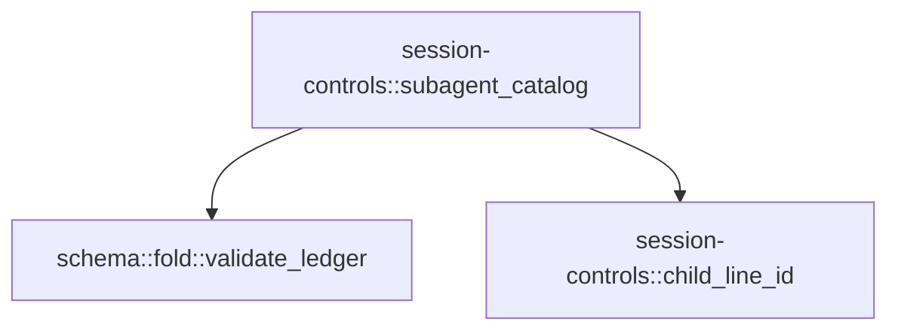

# session-controls

[Package atlas](index.md) · [Source](../../src/lib.rs)

## Declarations

Visibility is the declaration spelling; trait members and reexports require their enclosing interface. `cfg` is not evaluated.

| Symbol | Kind | Visibility | Test / cfg |
|---|---|---|---|
| [session-controls::METHODS](../../src/lib.rs#L41) | const_item | `pub` |  |
| [session-controls::RECORD_FORMAT](../../src/lib.rs#L50) | const_item | `private` |  |
| [session-controls::MAX_GOAL_ROUNDS](../../src/lib.rs#L52) | const_item | `pub` |  |
| [session-controls::PHASE_ACTIVE](../../src/lib.rs#L54) | const_item | `pub` |  |
| [session-controls::PHASE_PAUSED](../../src/lib.rs#L55) | const_item | `pub` |  |
| [session-controls::PHASE_BLOCKED](../../src/lib.rs#L56) | const_item | `pub` |  |
| [session-controls::PHASE_COMPLETE](../../src/lib.rs#L57) | const_item | `pub` |  |
| [session-controls::PHASES](../../src/lib.rs#L58) | const_item | `private` |  |
| [session-controls::Failure](../../src/lib.rs#L61) | enum_item | `pub` |  |
| [session-controls::Failure::code](../../src/lib.rs#L81) | function_item | `pub` |  |
| [session-controls::Failure::details](../../src/lib.rs#L95) | function_item | `pub` |  |
| [session-controls::Failure::from](../../src/lib.rs#L105) | function_item | `private` |  |
| [session-controls::GoalRecord](../../src/lib.rs#L112) | struct_item | `pub` |  |
| [session-controls::activation_of](../../src/lib.rs#L132) | function_item | `pub` |  |
| [session-controls::activation_value](../../src/lib.rs#L143) | function_item | `pub` |  |
| [session-controls::epoch_millis](../../src/lib.rs#L153) | function_item | `private` |  |
| [session-controls::goal_view](../../src/lib.rs#L161) | function_item | `pub` |  |
| [session-controls::validate](../../src/lib.rs#L180) | function_item | `pub` |  |
| [session-controls::require_id](../../src/lib.rs#L227) | function_item | `private` |  |
| [session-controls::execute_goal](../../src/lib.rs#L245) | function_item | `pub` |  |
| [session-controls::reference_of](../../src/lib.rs#L330) | function_item | `private` |  |
| [session-controls::check_reference](../../src/lib.rs#L337) | function_item | `private` |  |
| [session-controls::bound_goal_id](../../src/lib.rs#L352) | function_item | `pub` |  |
| [session-controls::read_goal](../../src/lib.rs#L366) | function_item | `pub` |  |
| [session-controls::GoalStore](../../src/lib.rs#L370) | struct_item | `private` |  |
| [session-controls::GoalStore::path](../../src/lib.rs#L376) | function_item | `private` |  |
| [session-controls::GoalStore::read](../../src/lib.rs#L385) | function_item | `private` |  |
| [session-controls::GoalStore::write](../../src/lib.rs#L421) | function_item | `private` |  |
| [session-controls::GoalStore::remove](../../src/lib.rs#L438) | function_item | `private` |  |
| [session-controls::fold_goal_log](../../src/lib.rs#L450) | function_item | `private` |  |
| [session-controls::fold_goal_rounds](../../src/lib.rs#L493) | function_item | `private` |  |
| [session-controls::subagent_catalog](../../src/lib.rs#L516) | function_item | `pub` |  |
| [session-controls::child_line_id](../../src/lib.rs#L579) | function_item | `private` |  |
| [session-controls::tests::complete_state_and_turn_count_survive_a_history_summary](../../src/lib.rs#L586) | function_item | `private` | test; #[cfg(test)] |
| [session-controls::tests::goals_get_folds_the_model_log_without_a_bound_id](../../src/lib.rs#L611) | function_item | `private` | test; #[cfg(test)] |
| [session-controls::tests::bound_goal_id_follows_the_record_phase](../../src/lib.rs#L642) | function_item | `private` | test; #[cfg(test)] |
| [session-controls::tests::session](../../src/lib.rs#L673) | function_item | `private` | test; #[cfg(test)] |
| [session-controls::tests::edit](../../src/lib.rs#L677) | function_item | `private` | test; #[cfg(test)] |
| [session-controls::tests::with_ref](../../src/lib.rs#L691) | function_item | `private` | test; #[cfg(test)] |
| [session-controls::tests::validate_closes_shapes](../../src/lib.rs#L696) | function_item | `private` | test; #[cfg(test)] |
| [session-controls::tests::goal_lifecycle_with_cas](../../src/lib.rs#L716) | function_item | `private` | test; #[cfg(test)] |
| [session-controls::tests::unbound_goal_gets_uuid_and_bound_goal_folds_log](../../src/lib.rs#L796) | function_item | `private` | test; #[cfg(test)] |
| [session-controls::tests::ledger](../../src/lib.rs#L867) | function_item | `private` | test; #[cfg(test)] |
| [session-controls::tests::genesis](../../src/lib.rs#L880) | function_item | `private` | test; #[cfg(test)] |
| [session-controls::tests::subagent_catalog_reads_spawns_and_child_results](../../src/lib.rs#L885) | function_item | `private` | test; #[cfg(test)] |

## Imports / reexports

| Local name | Source path | Visibility |
|---|---|---|
| `BTreeMap` | `std::collections::BTreeMap` | `private` |
| `fs` | `std::fs` | `private` |
| `Write` | `std::io::Write` | `private` |
| `Path` | `std::path::Path` | `private` |
| `PathBuf` | `std::path::PathBuf` | `private` |
| `Deserialize` | `serde::Deserialize` | `private` |
| `Serialize` | `serde::Serialize` | `private` |
| `Map` | `serde_json::Map` | `private` |
| `Value` | `serde_json::Value` | `private` |
| `json` | `serde_json::json` | `private` |
| `*` | `super::*` | `private` |

## Module declarations

| Module | Visibility | Attributes |
|---|---|---|
| `session-controls::tests` | `private` | #[cfg(test)] |

## Function call graphs

Edges below are syntactically resolved calls only, including private functions. Graphs partition callers into groups of 20; they are not execution order. All unresolved sites are listed below and in the JSON inventory.

```mermaid
flowchart TD
  n0["session-controls::Failure::from"]
  n1["session-controls::activation_of"]
  n2["session-controls::activation_value"]
  n3["session-controls::epoch_millis"]
  n4["session-controls::goal_view"]
  n5["session-controls::validate"]
  n6["session-controls::require_id"]
  n7["session-controls::execute_goal"]
  n8["session-controls::reference_of"]
  n9["session-controls::check_reference"]
  n10["session-controls::bound_goal_id"]
  n11["session-controls::read_goal"]
  n12["session-controls::GoalStore::path"]
  n13["session-controls::GoalStore::read"]
  n14["session-controls::GoalStore::write"]
  n15["session-controls::GoalStore::remove"]
  n16["session-controls::fold_goal_log"]
  n17["session-controls::fold_goal_rounds"]
  n18["session-controls::Failure::code"]
  n19["session-controls::Failure::details"]
  n5 --> n6
  n7 --> n4
  n7 --> n5
  n7 --> n8
  n7 --> n9
  n13 --> n12
  n13 --> n16
  n13 --> n17
  n14 --> n12
  n15 --> n12
```

Functions 1–20: 10 direct edges

Functions 21–22: 2 direct edges

## Call sites

Includes test functions (marked in declarations). Receiver-type-required sites need type analysis/manual tracing. Calls in closures are attributed to their enclosing function; their occurrence here does not mean the closure executes immediately.

| Caller | Callee expression | Source lines | Target / classification |
|---|---|---|---|
| `from` | `Self::Io` | [106](../../src/lib.rs#L106) | external-constructor-callback-or-unresolved |
| `from` | `error.to_string` | [106](../../src/lib.rs#L106) | receiver-type-required |
| `epoch_millis` | `chrono::DateTime::parse_from_rfc3339(timestamp)         .map_or` | [154](../../src/lib.rs#L154) | receiver-type-required |
| `epoch_millis` | `chrono::DateTime::parse_from_rfc3339` | [154](../../src/lib.rs#L154) | external-constructor-callback-or-unresolved |
| `epoch_millis` | `parsed.timestamp_millis` | [155](../../src/lib.rs#L155) | receiver-type-required |
| `goal_view` | `Value::String` | [174](../../src/lib.rs#L174) | external-constructor-callback-or-unresolved |
| `goal_view` | `reason.clone` | [174](../../src/lib.rs#L174) | receiver-type-required |
| `validate` | `payload         .as_object()         .ok_or_else` | [181](../../src/lib.rs#L181) | receiver-type-required |
| `validate` | `payload         .as_object` | [181](../../src/lib.rs#L181) | receiver-type-required |
| `validate` | `"payload must be an object".to_owned` | [183](../../src/lib.rs#L183) | receiver-type-required |
| `validate` | `Err` | [189](../../src/lib.rs#L189), [193](../../src/lib.rs#L193), [208](../../src/lib.rs#L208), [212](../../src/lib.rs#L212), [221](../../src/lib.rs#L221) | external-constructor-callback-or-unresolved |
| `validate` | `object.keys` | [191](../../src/lib.rs#L191) | receiver-type-required |
| `validate` | `allowed.contains` | [192](../../src/lib.rs#L192), [202](../../src/lib.rs#L202) | receiver-type-required |
| `validate` | `key.as_str` | [192](../../src/lib.rs#L192) | receiver-type-required |
| `validate` | `require_id` | [201](../../src/lib.rs#L201), [210](../../src/lib.rs#L210) | [session-controls::require_id](../../src/lib.rs#L227) |
| `validate` | `object             .get("ref")             .and_then(Value::as_object)             .ok_or_else` | [203](../../src/lib.rs#L203) | receiver-type-required |
| `validate` | `object             .get("ref")             .and_then` | [203](../../src/lib.rs#L203) | receiver-type-required |
| `validate` | `object             .get` | [203](../../src/lib.rs#L203), [216](../../src/lib.rs#L216) | receiver-type-required |
| `validate` | `"ref must be an object".to_owned` | [206](../../src/lib.rs#L206) | receiver-type-required |
| `validate` | `reference.len` | [207](../../src/lib.rs#L207) | receiver-type-required |
| `validate` | `"ref must be exactly {id, revision}".to_owned` | [208](../../src/lib.rs#L208) | receiver-type-required |
| `validate` | `reference.get("revision").is_some_and` | [211](../../src/lib.rs#L211) | receiver-type-required |
| `validate` | `reference.get` | [211](../../src/lib.rs#L211) | receiver-type-required |
| `validate` | `"ref.revision must be a non-negative integer".to_owned` | [212](../../src/lib.rs#L212) | receiver-type-required |
| `validate` | `object             .get("objective")             .and_then(Value::as_str)             .ok_or_else` | [216](../../src/lib.rs#L216) | receiver-type-required |
| `validate` | `object             .get("objective")             .and_then` | [216](../../src/lib.rs#L216) | receiver-type-required |
| `validate` | `"objective must be a string".to_owned` | [219](../../src/lib.rs#L219) | receiver-type-required |
| `validate` | `objective.trim().is_empty` | [220](../../src/lib.rs#L220) | receiver-type-required |
| `validate` | `objective.trim` | [220](../../src/lib.rs#L220) | receiver-type-required |
| `validate` | `objective.len` | [220](../../src/lib.rs#L220) | receiver-type-required |
| `validate` | `"objective must be non-empty and at most 16384 bytes".to_owned` | [221](../../src/lib.rs#L221) | receiver-type-required |
| `validate` | `Ok` | [224](../../src/lib.rs#L224) | external-constructor-callback-or-unresolved |
| `require_id` | `object         .get(key)         .and_then(Value::as_str)         .ok_or_else` | [228](../../src/lib.rs#L228) | receiver-type-required |
| `require_id` | `object         .get(key)         .and_then` | [228](../../src/lib.rs#L228) | receiver-type-required |
| `require_id` | `object         .get` | [228](../../src/lib.rs#L228) | receiver-type-required |
| `require_id` | `value.is_empty` | [232](../../src/lib.rs#L232) | receiver-type-required |
| `require_id` | `value.len` | [233](../../src/lib.rs#L233) | receiver-type-required |
| `require_id` | `value             .bytes()             .all` | [234](../../src/lib.rs#L234) | receiver-type-required |
| `require_id` | `value             .bytes` | [234](../../src/lib.rs#L234) | receiver-type-required |
| `require_id` | `byte.is_ascii_alphanumeric` | [236](../../src/lib.rs#L236) | receiver-type-required |
| `require_id` | `Err` | [238](../../src/lib.rs#L238) | external-constructor-callback-or-unresolved |
| `require_id` | `Ok` | [240](../../src/lib.rs#L240) | external-constructor-callback-or-unresolved |
| `execute_goal` | `validate(method, payload).map_err` | [251](../../src/lib.rs#L251) | receiver-type-required |
| `execute_goal` | `validate` | [251](../../src/lib.rs#L251) | [session-controls::validate](../../src/lib.rs#L180) |
| `execute_goal` | `payload["sessionId"].as_str().expect` | [252](../../src/lib.rs#L252) | receiver-type-required |
| `execute_goal` | `payload["sessionId"].as_str` | [252](../../src/lib.rs#L252) | receiver-type-required |
| `execute_goal` | `chrono::Utc::now().to_rfc3339_opts` | [253](../../src/lib.rs#L253) | receiver-type-required |
| `execute_goal` | `chrono::Utc::now` | [253](../../src/lib.rs#L253) | external-constructor-callback-or-unresolved |
| `execute_goal` | `Ok` | [256](../../src/lib.rs#L256), [287](../../src/lib.rs#L287), [295](../../src/lib.rs#L295), [322](../../src/lib.rs#L322) | external-constructor-callback-or-unresolved |
| `execute_goal` | `store             .read(bound_goal_id)?             .as_ref()             .map_or` | [256](../../src/lib.rs#L256) | receiver-type-required |
| `execute_goal` | `store             .read(bound_goal_id)?             .as_ref` | [256](../../src/lib.rs#L256) | receiver-type-required |
| `execute_goal` | `store             .read` | [256](../../src/lib.rs#L256) | receiver-type-required |
| `execute_goal` | `payload["objective"].as_str().expect` | [261](../../src/lib.rs#L261) | receiver-type-required |
| `execute_goal` | `payload["objective"].as_str` | [261](../../src/lib.rs#L261) | receiver-type-required |
| `execute_goal` | `reference_of` | [262](../../src/lib.rs#L262), [293](../../src/lib.rs#L293), [301](../../src/lib.rs#L301) | [session-controls::reference_of](../../src/lib.rs#L330) |
| `execute_goal` | `store.read` | [263](../../src/lib.rs#L263) | receiver-type-required |
| `execute_goal` | `bound_goal_id                         .map_or_else` | [266](../../src/lib.rs#L266) | receiver-type-required |
| `execute_goal` | `uuid::Uuid::new_v4().to_string` | [267](../../src/lib.rs#L267) | receiver-type-required |
| `execute_goal` | `uuid::Uuid::new_v4` | [267](../../src/lib.rs#L267) | external-constructor-callback-or-unresolved |
| `execute_goal` | `objective.to_owned` | [269](../../src/lib.rs#L269), [280](../../src/lib.rs#L280) | receiver-type-required |
| `execute_goal` | `PHASE_ACTIVE.to_owned` | [270](../../src/lib.rs#L270) | receiver-type-required |
| `execute_goal` | `now.clone` | [273](../../src/lib.rs#L273) | receiver-type-required |
| `execute_goal` | `Err` | [277](../../src/lib.rs#L277), [312](../../src/lib.rs#L312), [324](../../src/lib.rs#L324) | external-constructor-callback-or-unresolved |
| `execute_goal` | `Failure::GoalNotFound` | [277](../../src/lib.rs#L277), [292](../../src/lib.rs#L292), [300](../../src/lib.rs#L300) | external-constructor-callback-or-unresolved |
| `execute_goal` | `session_id.to_owned` | [277](../../src/lib.rs#L277), [292](../../src/lib.rs#L292), [300](../../src/lib.rs#L300) | receiver-type-required |
| `execute_goal` | `check_reference` | [279](../../src/lib.rs#L279), [293](../../src/lib.rs#L293), [301](../../src/lib.rs#L301) | [session-controls::check_reference](../../src/lib.rs#L337) |
| `execute_goal` | `store.write` | [286](../../src/lib.rs#L286), [321](../../src/lib.rs#L321) | receiver-type-required |
| `execute_goal` | `goal_view` | [287](../../src/lib.rs#L287), [322](../../src/lib.rs#L322) | [session-controls::goal_view](../../src/lib.rs#L161) |
| `execute_goal` | `store                 .read(bound_goal_id)?                 .ok_or_else` | [290](../../src/lib.rs#L290), [298](../../src/lib.rs#L298) | receiver-type-required |
| `execute_goal` | `store                 .read` | [290](../../src/lib.rs#L290), [298](../../src/lib.rs#L298) | receiver-type-required |
| `execute_goal` | `store.remove` | [294](../../src/lib.rs#L294) | receiver-type-required |
| `execute_goal` | `to.to_owned` | [314](../../src/lib.rs#L314), [317](../../src/lib.rs#L317) | receiver-type-required |
| `execute_goal` | `Failure::BadRequest` | [324](../../src/lib.rs#L324) | external-constructor-callback-or-unresolved |
| `reference_of` | `payload["ref"]["id"].as_str().expect` | [332](../../src/lib.rs#L332) | receiver-type-required |
| `reference_of` | `payload["ref"]["id"].as_str` | [332](../../src/lib.rs#L332) | receiver-type-required |
| `reference_of` | `payload["ref"]["revision"].as_u64().expect` | [333](../../src/lib.rs#L333) | receiver-type-required |
| `reference_of` | `payload["ref"]["revision"].as_u64` | [333](../../src/lib.rs#L333) | receiver-type-required |
| `check_reference` | `Err` | [339](../../src/lib.rs#L339) | external-constructor-callback-or-unresolved |
| `check_reference` | `Ok` | [343](../../src/lib.rs#L343) | external-constructor-callback-or-unresolved |
| `bound_goal_id` | `Ok` | [354](../../src/lib.rs#L354) | external-constructor-callback-or-unresolved |
| `bound_goal_id` | `store         .read(None)?         .filter(&#124;record&#124; {             record.phase == PHASE_ACTIVE                 &#124;&#124; record.phase == PHASE_BLOCKED                 &#124;&#124; record.phase == PHASE_PAUSED         })         .map` | [354](../../src/lib.rs#L354) | receiver-type-required |
| `bound_goal_id` | `store         .read(None)?         .filter` | [354](../../src/lib.rs#L354) | receiver-type-required |
| `bound_goal_id` | `store         .read` | [354](../../src/lib.rs#L354) | receiver-type-required |
| `read_goal` | `GoalStore { root, session_id }.read` | [367](../../src/lib.rs#L367) | receiver-type-required |
| `path` | `self.root             .join("goals")             .join("sessions")             .join` | [377](../../src/lib.rs#L377) | receiver-type-required |
| `path` | `self.root             .join("goals")             .join` | [377](../../src/lib.rs#L377) | receiver-type-required |
| `path` | `self.root             .join` | [377](../../src/lib.rs#L377) | receiver-type-required |
| `read` | `fs::read` | [386](../../src/lib.rs#L386) | external-constructor-callback-or-unresolved |
| `read` | `self.path` | [386](../../src/lib.rs#L386) | [session-controls::GoalStore::path](../../src/lib.rs#L376) |
| `read` | `error.kind` | [388](../../src/lib.rs#L388) | receiver-type-required |
| `read` | `Ok` | [388](../../src/lib.rs#L388), [418](../../src/lib.rs#L418) | external-constructor-callback-or-unresolved |
| `read` | `Err` | [389](../../src/lib.rs#L389), [394](../../src/lib.rs#L394) | external-constructor-callback-or-unresolved |
| `read` | `error.into` | [389](../../src/lib.rs#L389) | receiver-type-required |
| `read` | `serde_json::from_slice(&bytes)             .map_err` | [391](../../src/lib.rs#L391) | receiver-type-required |
| `read` | `serde_json::from_slice` | [391](../../src/lib.rs#L391) | external-constructor-callback-or-unresolved |
| `read` | `Failure::Io` | [392](../../src/lib.rs#L392), [394](../../src/lib.rs#L394) | external-constructor-callback-or-unresolved |
| `read` | `bound_goal_id.is_none_or` | [407](../../src/lib.rs#L407) | receiver-type-required |
| `read` | `fold_goal_log` | [408](../../src/lib.rs#L408) | [session-controls::fold_goal_log](../../src/lib.rs#L450) |
| `read` | `self.root.join("goals").join` | [408](../../src/lib.rs#L408) | receiver-type-required |
| `read` | `self.root.join` | [408](../../src/lib.rs#L408) | receiver-type-required |
| `read` | `fold_goal_rounds` | [410](../../src/lib.rs#L410) | [session-controls::fold_goal_rounds](../../src/lib.rs#L493) |
| `read` | `self                 .root                 .join("threads")                 .join(self.session_id)                 .join` | [412](../../src/lib.rs#L412) | receiver-type-required |
| `read` | `self                 .root                 .join("threads")                 .join` | [412](../../src/lib.rs#L412) | receiver-type-required |
| `read` | `self                 .root                 .join` | [412](../../src/lib.rs#L412) | receiver-type-required |
| `read` | `Some` | [418](../../src/lib.rs#L418) | external-constructor-callback-or-unresolved |
| `write` | `self.path` | [422](../../src/lib.rs#L422) | [session-controls::GoalStore::path](../../src/lib.rs#L376) |
| `write` | `path.parent().expect` | [423](../../src/lib.rs#L423) | receiver-type-required |
| `write` | `path.parent` | [423](../../src/lib.rs#L423) | receiver-type-required |
| `write` | `fs::create_dir_all` | [424](../../src/lib.rs#L424) | external-constructor-callback-or-unresolved |
| `write` | `serde_json_canonicalizer::to_vec(record)             .map_err` | [425](../../src/lib.rs#L425) | receiver-type-required |
| `write` | `serde_json_canonicalizer::to_vec` | [425](../../src/lib.rs#L425) | external-constructor-callback-or-unresolved |
| `write` | `Failure::Io` | [426](../../src/lib.rs#L426) | external-constructor-callback-or-unresolved |
| `write` | `error.to_string` | [426](../../src/lib.rs#L426) | receiver-type-required |
| `write` | `bytes.push` | [427](../../src/lib.rs#L427) | receiver-type-required |
| `write` | `parent.join` | [428](../../src/lib.rs#L428) | receiver-type-required |
| `write` | `fs::File::create` | [430](../../src/lib.rs#L430) | external-constructor-callback-or-unresolved |
| `write` | `file.write_all` | [431](../../src/lib.rs#L431) | receiver-type-required |
| `write` | `file.sync_all` | [432](../../src/lib.rs#L432) | receiver-type-required |
| `write` | `fs::rename` | [434](../../src/lib.rs#L434) | external-constructor-callback-or-unresolved |
| `write` | `Ok` | [435](../../src/lib.rs#L435) | external-constructor-callback-or-unresolved |
| `remove` | `fs::remove_file` | [439](../../src/lib.rs#L439) | external-constructor-callback-or-unresolved |
| `remove` | `self.path` | [439](../../src/lib.rs#L439) | [session-controls::GoalStore::path](../../src/lib.rs#L376) |
| `remove` | `Ok` | [440](../../src/lib.rs#L440), [441](../../src/lib.rs#L441) | external-constructor-callback-or-unresolved |
| `remove` | `error.kind` | [441](../../src/lib.rs#L441) | receiver-type-required |
| `remove` | `Err` | [442](../../src/lib.rs#L442) | external-constructor-callback-or-unresolved |
| `remove` | `error.into` | [442](../../src/lib.rs#L442) | receiver-type-required |
| `fold_goal_log` | `fs::read` | [451](../../src/lib.rs#L451) | external-constructor-callback-or-unresolved |
| `fold_goal_log` | `error.kind` | [453](../../src/lib.rs#L453) | receiver-type-required |
| `fold_goal_log` | `Ok` | [453](../../src/lib.rs#L453), [488](../../src/lib.rs#L488) | external-constructor-callback-or-unresolved |
| `fold_goal_log` | `Err` | [454](../../src/lib.rs#L454) | external-constructor-callback-or-unresolved |
| `fold_goal_log` | `error.into` | [454](../../src/lib.rs#L454) | receiver-type-required |
| `fold_goal_log` | `bytes.split` | [458](../../src/lib.rs#L458) | receiver-type-required |
| `fold_goal_log` | `line.is_empty` | [459](../../src/lib.rs#L459) | receiver-type-required |
| `fold_goal_log` | `serde_json::from_slice::<Value>` | [462](../../src/lib.rs#L462) | external-constructor-callback-or-unresolved |
| `fold_goal_log` | `entry["goal_id"].as_str` | [465](../../src/lib.rs#L465) | receiver-type-required |
| `fold_goal_log` | `Some` | [465](../../src/lib.rs#L465), [474](../../src/lib.rs#L474) | external-constructor-callback-or-unresolved |
| `fold_goal_log` | `record.id.as_str` | [465](../../src/lib.rs#L465) | receiver-type-required |
| `fold_goal_log` | `entry["op"].as_str` | [468](../../src/lib.rs#L468) | receiver-type-required |
| `fold_goal_log` | `entry["state"].as_str` | [471](../../src/lib.rs#L471) | receiver-type-required |
| `fold_goal_log` | `entry["ts"].as_str().unwrap_or_default().to_owned` | [472](../../src/lib.rs#L472) | receiver-type-required |
| `fold_goal_log` | `entry["ts"].as_str().unwrap_or_default` | [472](../../src/lib.rs#L472) | receiver-type-required |
| `fold_goal_log` | `entry["ts"].as_str` | [472](../../src/lib.rs#L472) | receiver-type-required |
| `fold_goal_log` | `entry["reason"].as_str().map` | [473](../../src/lib.rs#L473) | receiver-type-required |
| `fold_goal_log` | `entry["reason"].as_str` | [473](../../src/lib.rs#L473) | receiver-type-required |
| `fold_goal_log` | `state.to_owned` | [474](../../src/lib.rs#L474) | receiver-type-required |
| `fold_goal_log` | `record.rounds_started.max` | [480](../../src/lib.rs#L480) | receiver-type-required |
| `fold_goal_log` | `PHASES.contains` | [483](../../src/lib.rs#L483) | receiver-type-required |
| `fold_goal_log` | `state.as_str` | [483](../../src/lib.rs#L483) | receiver-type-required |
| `fold_goal_log` | `ts.as_str` | [483](../../src/lib.rs#L483) | receiver-type-required |
| `fold_goal_log` | `record.updated_at.as_str` | [483](../../src/lib.rs#L483) | receiver-type-required |
| `fold_goal_rounds` | `fs::read` | [494](../../src/lib.rs#L494) | external-constructor-callback-or-unresolved |
| `fold_goal_rounds` | `error.kind` | [496](../../src/lib.rs#L496) | receiver-type-required |
| `fold_goal_rounds` | `Ok` | [496](../../src/lib.rs#L496), [510](../../src/lib.rs#L510) | external-constructor-callback-or-unresolved |
| `fold_goal_rounds` | `Err` | [497](../../src/lib.rs#L497) | external-constructor-callback-or-unresolved |
| `fold_goal_rounds` | `error.into` | [497](../../src/lib.rs#L497) | receiver-type-required |
| `fold_goal_rounds` | `bytes         .split(&#124;byte&#124; *byte == b'\n')         .filter_map(&#124;line&#124; serde_json::from_slice::<Value>(line).ok())         .filter(&#124;event&#124; {             event["kind"] == "turn_open"                 && event["ts"]                     .as_str()                     .is_some_and(&#124;ts&#124; ts >= record.created_at.as_str())         })         .count` | [499](../../src/lib.rs#L499) | receiver-type-required |
| `fold_goal_rounds` | `bytes         .split(&#124;byte&#124; *byte == b'\n')         .filter_map(&#124;line&#124; serde_json::from_slice::<Value>(line).ok())         .filter` | [499](../../src/lib.rs#L499) | receiver-type-required |
| `fold_goal_rounds` | `bytes         .split(&#124;byte&#124; *byte == b'\n')         .filter_map` | [499](../../src/lib.rs#L499) | receiver-type-required |
| `fold_goal_rounds` | `bytes         .split` | [499](../../src/lib.rs#L499) | receiver-type-required |
| `fold_goal_rounds` | `serde_json::from_slice::<Value>(line).ok` | [501](../../src/lib.rs#L501) | receiver-type-required |
| `fold_goal_rounds` | `serde_json::from_slice::<Value>` | [501](../../src/lib.rs#L501) | external-constructor-callback-or-unresolved |
| `fold_goal_rounds` | `event["ts"]                     .as_str()                     .is_some_and` | [504](../../src/lib.rs#L504) | receiver-type-required |
| `fold_goal_rounds` | `event["ts"]                     .as_str` | [504](../../src/lib.rs#L504) | receiver-type-required |
| `fold_goal_rounds` | `record.created_at.as_str` | [506](../../src/lib.rs#L506) | receiver-type-required |
| `fold_goal_rounds` | `record.rounds_started.max` | [509](../../src/lib.rs#L509) | receiver-type-required |
| `subagent_catalog` | `schema::validate_ledger(ledger_bytes, 1)         .map_err` | [521](../../src/lib.rs#L521) | receiver-type-required |
| `subagent_catalog` | `schema::validate_ledger` | [521](../../src/lib.rs#L521) | [schema::fold::validate_ledger](../../../schema/src/fold.rs#L1054) |
| `subagent_catalog` | `Failure::LedgerCorrupt` | [522](../../src/lib.rs#L522), [528](../../src/lib.rs#L528), [541](../../src/lib.rs#L541), [544](../../src/lib.rs#L544) | external-constructor-callback-or-unresolved |
| `subagent_catalog` | `error.to_string` | [522](../../src/lib.rs#L522), [528](../../src/lib.rs#L528) | receiver-type-required |
| `subagent_catalog` | `BTreeMap::new` | [523](../../src/lib.rs#L523) | external-constructor-callback-or-unresolved |
| `subagent_catalog` | `Vec::new` | [524](../../src/lib.rs#L524), [525](../../src/lib.rs#L525) | external-constructor-callback-or-unresolved |
| `subagent_catalog` | `serde_json::to_value(event.raw())             .map_err` | [527](../../src/lib.rs#L527) | receiver-type-required |
| `subagent_catalog` | `serde_json::to_value` | [527](../../src/lib.rs#L527) | external-constructor-callback-or-unresolved |
| `subagent_catalog` | `event.raw` | [527](../../src/lib.rs#L527) | receiver-type-required |
| `subagent_catalog` | `event.kind` | [529](../../src/lib.rs#L529) | receiver-type-required |
| `subagent_catalog` | `event.string_field` | [530](../../src/lib.rs#L530), [548](../../src/lib.rs#L548) | receiver-type-required |
| `subagent_catalog` | `Some` | [530](../../src/lib.rs#L530) | external-constructor-callback-or-unresolved |
| `subagent_catalog` | `raw["payload"]["call"].as_str` | [532](../../src/lib.rs#L532) | receiver-type-required |
| `subagent_catalog` | `raw["payload"]["name"].as_str` | [533](../../src/lib.rs#L533) | receiver-type-required |
| `subagent_catalog` | `labels.insert` | [535](../../src/lib.rs#L535) | receiver-type-required |
| `subagent_catalog` | `call.to_owned` | [535](../../src/lib.rs#L535), [545](../../src/lib.rs#L545) | receiver-type-required |
| `subagent_catalog` | `name.to_owned` | [535](../../src/lib.rs#L535) | receiver-type-required |
| `subagent_catalog` | `event                     .string_field("child")                     .ok_or_else` | [539](../../src/lib.rs#L539) | receiver-type-required |
| `subagent_catalog` | `event                     .string_field` | [539](../../src/lib.rs#L539), [542](../../src/lib.rs#L542) | receiver-type-required |
| `subagent_catalog` | `"spawn lacks child".to_owned` | [541](../../src/lib.rs#L541) | receiver-type-required |
| `subagent_catalog` | `event                     .string_field("call")                     .ok_or_else` | [542](../../src/lib.rs#L542) | receiver-type-required |
| `subagent_catalog` | `"spawn lacks call".to_owned` | [544](../../src/lib.rs#L544) | receiver-type-required |
| `subagent_catalog` | `children.push` | [545](../../src/lib.rs#L545) | receiver-type-required |
| `subagent_catalog` | `child_line_id` | [545](../../src/lib.rs#L545), [549](../../src/lib.rs#L549) | [session-controls::child_line_id](../../src/lib.rs#L579) |
| `subagent_catalog` | `settled.push` | [549](../../src/lib.rs#L549) | receiver-type-required |
| `subagent_catalog` | `labels.get` | [569](../../src/lib.rs#L569) | receiver-type-required |
| `subagent_catalog` | `Value::String` | [570](../../src/lib.rs#L570) | external-constructor-callback-or-unresolved |
| `subagent_catalog` | `label.clone` | [570](../../src/lib.rs#L570) | receiver-type-required |
| `subagent_catalog` | `entries.push` | [572](../../src/lib.rs#L572) | receiver-type-required |
| `subagent_catalog` | `Ok` | [574](../../src/lib.rs#L574) | external-constructor-callback-or-unresolved |
| `child_line_id` | `child.strip_suffix(".jsonl").unwrap_or(child).to_owned` | [580](../../src/lib.rs#L580) | receiver-type-required |
| `child_line_id` | `child.strip_suffix(".jsonl").unwrap_or` | [580](../../src/lib.rs#L580) | receiver-type-required |
| `child_line_id` | `child.strip_suffix` | [580](../../src/lib.rs#L580) | receiver-type-required |
| `complete_state_and_turn_count_survive_a_history_summary` | `tempfile::tempdir().unwrap` | [587](../../src/lib.rs#L587) | receiver-type-required |
| `complete_state_and_turn_count_survive_a_history_summary` | `tempfile::tempdir` | [587](../../src/lib.rs#L587) | external-constructor-callback-or-unresolved |
| `complete_state_and_turn_count_survive_a_history_summary` | `super::execute_goal(root.path(), "goals.edit",             &serde_json::json!({"sessionId":sid,"ref":{"id":"new","revision":0},"objective":"full original objective"}), None).unwrap` | [589](../../src/lib.rs#L589) | receiver-type-required |
| `complete_state_and_turn_count_survive_a_history_summary` | `super::execute_goal` | [589](../../src/lib.rs#L589), [599](../../src/lib.rs#L599) | [session-controls::execute_goal](../../src/lib.rs#L245) |
| `complete_state_and_turn_count_survive_a_history_summary` | `root.path` | [589](../../src/lib.rs#L589), [592](../../src/lib.rs#L592), [598](../../src/lib.rs#L598), [600](../../src/lib.rs#L600) | receiver-type-required |
| `complete_state_and_turn_count_survive_a_history_summary` | `created["id"].as_str().unwrap` | [591](../../src/lib.rs#L591) | receiver-type-required |
| `complete_state_and_turn_count_survive_a_history_summary` | `created["id"].as_str` | [591](../../src/lib.rs#L591) | receiver-type-required |
| `complete_state_and_turn_count_survive_a_history_summary` | `root.path().join("threads").join` | [592](../../src/lib.rs#L592) | receiver-type-required |
| `complete_state_and_turn_count_survive_a_history_summary` | `root.path().join` | [592](../../src/lib.rs#L592), [598](../../src/lib.rs#L598) | receiver-type-required |
| `complete_state_and_turn_count_survive_a_history_summary` | `std::fs::create_dir_all(&folder).unwrap` | [593](../../src/lib.rs#L593) | receiver-type-required |
| `complete_state_and_turn_count_survive_a_history_summary` | `std::fs::create_dir_all` | [593](../../src/lib.rs#L593) | external-constructor-callback-or-unresolved |
| `complete_state_and_turn_count_survive_a_history_summary` | `chrono::Utc::now().to_rfc3339_opts` | [594](../../src/lib.rs#L594) | receiver-type-required |
| `complete_state_and_turn_count_survive_a_history_summary` | `chrono::Utc::now` | [594](../../src/lib.rs#L594), [596](../../src/lib.rs#L596) | external-constructor-callback-or-unresolved |
| `complete_state_and_turn_count_survive_a_history_summary` | `std::fs::write(folder.join("main.jsonl"), format!("{{\"kind\":\"turn_open\",\"ts\":\"{now}\",\"trigger\":{{\"inputs\":[2]}}}}\n{{\"kind\":\"compact\",\"summary\":\"history only\"}}\n")).unwrap` | [595](../../src/lib.rs#L595) | receiver-type-required |
| `complete_state_and_turn_count_survive_a_history_summary` | `std::fs::write` | [595](../../src/lib.rs#L595), [598](../../src/lib.rs#L598) | external-constructor-callback-or-unresolved |
| `complete_state_and_turn_count_survive_a_history_summary` | `folder.join` | [595](../../src/lib.rs#L595) | receiver-type-required |
| `complete_state_and_turn_count_survive_a_history_summary` | `(chrono::Utc::now() + chrono::Duration::seconds(2))             .to_rfc3339_opts` | [596](../../src/lib.rs#L596) | receiver-type-required |
| `complete_state_and_turn_count_survive_a_history_summary` | `chrono::Duration::seconds` | [596](../../src/lib.rs#L596) | external-constructor-callback-or-unresolved |
| `complete_state_and_turn_count_survive_a_history_summary` | `std::fs::write(root.path().join("goals/log.jsonl"), format!("{{\"op\":\"set_goal_state\",\"goal_id\":\"{id}\",\"state\":\"complete\",\"ts\":\"{later}\"}}\n")).unwrap` | [598](../../src/lib.rs#L598) | receiver-type-required |
| `complete_state_and_turn_count_survive_a_history_summary` | `super::execute_goal(             root.path(),             "goals.get",             &serde_json::json!({"sessionId":sid}),             None,         )         .unwrap` | [599](../../src/lib.rs#L599) | receiver-type-required |
| `goals_get_folds_the_model_log_without_a_bound_id` | `tempfile::tempdir().unwrap` | [612](../../src/lib.rs#L612) | receiver-type-required |
| `goals_get_folds_the_model_log_without_a_bound_id` | `tempfile::tempdir` | [612](../../src/lib.rs#L612) | external-constructor-callback-or-unresolved |
| `goals_get_folds_the_model_log_without_a_bound_id` | `super::execute_goal(             root.path(),             "goals.edit",             &serde_json::json!({"sessionId": sid, "ref": {"id": "new", "revision": 0}, "objective": "ship"}),             None,         )         .unwrap` | [614](../../src/lib.rs#L614) | receiver-type-required |
| `goals_get_folds_the_model_log_without_a_bound_id` | `super::execute_goal` | [614](../../src/lib.rs#L614), [629](../../src/lib.rs#L629) | [session-controls::execute_goal](../../src/lib.rs#L245) |
| `goals_get_folds_the_model_log_without_a_bound_id` | `root.path` | [615](../../src/lib.rs#L615), [623](../../src/lib.rs#L623), [630](../../src/lib.rs#L630) | receiver-type-required |
| `goals_get_folds_the_model_log_without_a_bound_id` | `created["id"].as_str().unwrap` | [621](../../src/lib.rs#L621) | receiver-type-required |
| `goals_get_folds_the_model_log_without_a_bound_id` | `created["id"].as_str` | [621](../../src/lib.rs#L621) | receiver-type-required |
| `goals_get_folds_the_model_log_without_a_bound_id` | `std::fs::write(             root.path().join("goals").join("log.jsonl"),             format!(                 "{{\"format\":1,\"op\":\"new_goal\",\"goal_id\":\"{id}\",\"thread\":\"{sid}\",\"turn\":1,\"call\":\"c1\",\"ts\":\"2099-01-01T00:00:01.000Z\",\"goal\":\"g\",\"completion_criteria\":\"d\",\"reason\":\"r\"}}\n{{\"format\":1,\"op\":\"set_goal_state\",\"goal_id\":\"{id}\",\"thread\":\"{sid}\",\"turn\":2,\"call\":\"c2\",\"ts\":\"2099-01-01T00:00:02.000Z\",\"state\":\"blocked\",\"progress\":\"1\",\"reason\":\"waiting\",\"user_action\":null}}\n"             ),         )         .unwrap` | [622](../../src/lib.rs#L622) | receiver-type-required |
| `goals_get_folds_the_model_log_without_a_bound_id` | `std::fs::write` | [622](../../src/lib.rs#L622) | external-constructor-callback-or-unresolved |
| `goals_get_folds_the_model_log_without_a_bound_id` | `root.path().join("goals").join` | [623](../../src/lib.rs#L623) | receiver-type-required |
| `goals_get_folds_the_model_log_without_a_bound_id` | `root.path().join` | [623](../../src/lib.rs#L623) | receiver-type-required |
| `goals_get_folds_the_model_log_without_a_bound_id` | `super::execute_goal(             root.path(),             "goals.get",             &serde_json::json!({"sessionId": sid}),             None,         )         .unwrap` | [629](../../src/lib.rs#L629) | receiver-type-required |
| `bound_goal_id_follows_the_record_phase` | `tempfile::tempdir().unwrap` | [643](../../src/lib.rs#L643) | receiver-type-required |
| `bound_goal_id_follows_the_record_phase` | `tempfile::tempdir` | [643](../../src/lib.rs#L643) | external-constructor-callback-or-unresolved |
| `bound_goal_id_follows_the_record_phase` | `super::execute_goal(             root.path(),             "goals.edit",             &serde_json::json!({"sessionId": sid, "ref": {"id": "new", "revision": 0}, "objective": "ship"}),             None,         )         .unwrap` | [646](../../src/lib.rs#L646) | receiver-type-required |
| `bound_goal_id_follows_the_record_phase` | `super::execute_goal` | [646](../../src/lib.rs#L646), [658](../../src/lib.rs#L658) | [session-controls::execute_goal](../../src/lib.rs#L245) |
| `bound_goal_id_follows_the_record_phase` | `root.path` | [647](../../src/lib.rs#L647), [659](../../src/lib.rs#L659) | receiver-type-required |
| `bound_goal_id_follows_the_record_phase` | `created["id"].as_str().unwrap().to_owned` | [653](../../src/lib.rs#L653) | receiver-type-required |
| `bound_goal_id_follows_the_record_phase` | `created["id"].as_str().unwrap` | [653](../../src/lib.rs#L653) | receiver-type-required |
| `bound_goal_id_follows_the_record_phase` | `created["id"].as_str` | [653](../../src/lib.rs#L653) | receiver-type-required |
| `bound_goal_id_follows_the_record_phase` | `super::execute_goal(             root.path(),             "goals.pause",             &serde_json::json!({"sessionId": sid, "ref": {"id": id, "revision": 1}}),             None,         )         .unwrap` | [658](../../src/lib.rs#L658) | receiver-type-required |
| `edit` | `execute_goal` | [683](../../src/lib.rs#L683) | external-constructor-callback-or-unresolved |
| `goal_lifecycle_with_cas` | `tempfile::tempdir().unwrap` | [717](../../src/lib.rs#L717) | receiver-type-required |
| `goal_lifecycle_with_cas` | `tempfile::tempdir` | [717](../../src/lib.rs#L717) | external-constructor-callback-or-unresolved |
| `goal_lifecycle_with_cas` | `execute_goal(                 root.path(),                 "goals.get",                 &json!({"sessionId": session()}),                 None,             )             .unwrap` | [719](../../src/lib.rs#L719) | receiver-type-required |
| `goal_lifecycle_with_cas` | `execute_goal` | [719](../../src/lib.rs#L719), [766](../../src/lib.rs#L766), [770](../../src/lib.rs#L770), [773](../../src/lib.rs#L773), [786](../../src/lib.rs#L786) | external-constructor-callback-or-unresolved |
| `goal_lifecycle_with_cas` | `root.path` | [720](../../src/lib.rs#L720), [732](../../src/lib.rs#L732), [741](../../src/lib.rs#L741), [755](../../src/lib.rs#L755), [760](../../src/lib.rs#L760), [766](../../src/lib.rs#L766), [770](../../src/lib.rs#L770), [773](../../src/lib.rs#L773), [786](../../src/lib.rs#L786) | receiver-type-required |
| `goal_lifecycle_with_cas` | `edit(root.path(), 0, "ship v1", Some("goal-x")).unwrap` | [732](../../src/lib.rs#L732) | receiver-type-required |
| `goal_lifecycle_with_cas` | `edit` | [732](../../src/lib.rs#L732), [755](../../src/lib.rs#L755), [760](../../src/lib.rs#L760) | [session-controls::tests::edit](../../src/lib.rs#L677) |
| `goal_lifecycle_with_cas` | `Some` | [732](../../src/lib.rs#L732), [755](../../src/lib.rs#L755), [760](../../src/lib.rs#L760) | external-constructor-callback-or-unresolved |
| `goal_lifecycle_with_cas` | `fs::read(             root.path()                 .join("goals/sessions")                 .join(format!("{}.json", session())),         )         .unwrap` | [740](../../src/lib.rs#L740) | receiver-type-required |
| `goal_lifecycle_with_cas` | `fs::read` | [740](../../src/lib.rs#L740) | external-constructor-callback-or-unresolved |
| `goal_lifecycle_with_cas` | `root.path()                 .join("goals/sessions")                 .join` | [741](../../src/lib.rs#L741) | receiver-type-required |
| `goal_lifecycle_with_cas` | `root.path()                 .join` | [741](../../src/lib.rs#L741) | receiver-type-required |
| `goal_lifecycle_with_cas` | `edit(root.path(), 0, "again", Some("goal-x")).unwrap_err` | [755](../../src/lib.rs#L755) | receiver-type-required |
| `goal_lifecycle_with_cas` | `edit(root.path(), 1, "ship v2", Some("goal-x")).unwrap` | [760](../../src/lib.rs#L760) | receiver-type-required |
| `goal_lifecycle_with_cas` | `execute_goal(root.path(), "goals.pause", &with_ref(&edited), None).unwrap` | [766](../../src/lib.rs#L766) | receiver-type-required |
| `goal_lifecycle_with_cas` | `with_ref` | [766](../../src/lib.rs#L766), [770](../../src/lib.rs#L770), [773](../../src/lib.rs#L773), [786](../../src/lib.rs#L786) | [session-controls::tests::with_ref](../../src/lib.rs#L691) |
| `goal_lifecycle_with_cas` | `execute_goal(root.path(), "goals.pause", &with_ref(&paused), None).unwrap_err` | [770](../../src/lib.rs#L770) | receiver-type-required |
| `goal_lifecycle_with_cas` | `execute_goal(root.path(), "goals.resume", &with_ref(&paused), None).unwrap` | [773](../../src/lib.rs#L773) | receiver-type-required |
| `goal_lifecycle_with_cas` | `serde_json::from_value(json!({             "format": 1, "id": "goal-x", "revision": 4, "objective": "o", "phase": "active",             "maxGoalRounds": 1, "roundsStarted": 0, "createdAt": "t", "updatedAt": "t"         }))         .unwrap` | [776](../../src/lib.rs#L776) | receiver-type-required |
| `goal_lifecycle_with_cas` | `serde_json::from_value` | [776](../../src/lib.rs#L776) | external-constructor-callback-or-unresolved |
| `goal_lifecycle_with_cas` | `execute_goal(root.path(), "goals.clear", &with_ref(&resumed), None).unwrap` | [786](../../src/lib.rs#L786) | receiver-type-required |
| `unbound_goal_gets_uuid_and_bound_goal_folds_log` | `tempfile::tempdir().unwrap` | [797](../../src/lib.rs#L797) | receiver-type-required |
| `unbound_goal_gets_uuid_and_bound_goal_folds_log` | `tempfile::tempdir` | [797](../../src/lib.rs#L797) | external-constructor-callback-or-unresolved |
| `unbound_goal_gets_uuid_and_bound_goal_folds_log` | `edit(root.path(), 0, "free", None).unwrap` | [798](../../src/lib.rs#L798) | receiver-type-required |
| `unbound_goal_gets_uuid_and_bound_goal_folds_log` | `edit` | [798](../../src/lib.rs#L798), [802](../../src/lib.rs#L802) | [session-controls::tests::edit](../../src/lib.rs#L677) |
| `unbound_goal_gets_uuid_and_bound_goal_folds_log` | `root.path` | [798](../../src/lib.rs#L798), [800](../../src/lib.rs#L800), [802](../../src/lib.rs#L802), [812](../../src/lib.rs#L812), [826](../../src/lib.rs#L826), [839](../../src/lib.rs#L839), [848](../../src/lib.rs#L848), [858](../../src/lib.rs#L858) | receiver-type-required |
| `unbound_goal_gets_uuid_and_bound_goal_folds_log` | `execute_goal(root.path(), "goals.clear", &with_ref(&unbound), None).unwrap` | [800](../../src/lib.rs#L800) | receiver-type-required |
| `unbound_goal_gets_uuid_and_bound_goal_folds_log` | `execute_goal` | [800](../../src/lib.rs#L800), [825](../../src/lib.rs#L825), [838](../../src/lib.rs#L838), [847](../../src/lib.rs#L847), [857](../../src/lib.rs#L857) | external-constructor-callback-or-unresolved |
| `unbound_goal_gets_uuid_and_bound_goal_folds_log` | `with_ref` | [800](../../src/lib.rs#L800), [841](../../src/lib.rs#L841) | [session-controls::tests::with_ref](../../src/lib.rs#L691) |
| `unbound_goal_gets_uuid_and_bound_goal_folds_log` | `edit(root.path(), 0, "bound", Some("goal-x")).unwrap` | [802](../../src/lib.rs#L802) | receiver-type-required |
| `unbound_goal_gets_uuid_and_bound_goal_folds_log` | `Some` | [802](../../src/lib.rs#L802), [829](../../src/lib.rs#L829), [842](../../src/lib.rs#L842), [851](../../src/lib.rs#L851) | external-constructor-callback-or-unresolved |
| `unbound_goal_gets_uuid_and_bound_goal_folds_log` | `root             .path()             .join("goals/sessions")             .join` | [805](../../src/lib.rs#L805) | receiver-type-required |
| `unbound_goal_gets_uuid_and_bound_goal_folds_log` | `root             .path()             .join` | [805](../../src/lib.rs#L805) | receiver-type-required |
| `unbound_goal_gets_uuid_and_bound_goal_folds_log` | `root             .path` | [805](../../src/lib.rs#L805) | receiver-type-required |
| `unbound_goal_gets_uuid_and_bound_goal_folds_log` | `serde_json::from_slice(&fs::read(&record_path).unwrap()).unwrap` | [809](../../src/lib.rs#L809) | receiver-type-required |
| `unbound_goal_gets_uuid_and_bound_goal_folds_log` | `serde_json::from_slice` | [809](../../src/lib.rs#L809) | external-constructor-callback-or-unresolved |
| `unbound_goal_gets_uuid_and_bound_goal_folds_log` | `fs::read(&record_path).unwrap` | [809](../../src/lib.rs#L809) | receiver-type-required |
| `unbound_goal_gets_uuid_and_bound_goal_folds_log` | `fs::read` | [809](../../src/lib.rs#L809) | external-constructor-callback-or-unresolved |
| `unbound_goal_gets_uuid_and_bound_goal_folds_log` | `fs::write(&record_path, serde_json::to_vec(&aged).unwrap()).unwrap` | [811](../../src/lib.rs#L811) | receiver-type-required |
| `unbound_goal_gets_uuid_and_bound_goal_folds_log` | `fs::write` | [811](../../src/lib.rs#L811), [824](../../src/lib.rs#L824) | external-constructor-callback-or-unresolved |
| `unbound_goal_gets_uuid_and_bound_goal_folds_log` | `serde_json::to_vec(&aged).unwrap` | [811](../../src/lib.rs#L811) | receiver-type-required |
| `unbound_goal_gets_uuid_and_bound_goal_folds_log` | `serde_json::to_vec` | [811](../../src/lib.rs#L811), [821](../../src/lib.rs#L821) | external-constructor-callback-or-unresolved |
| `unbound_goal_gets_uuid_and_bound_goal_folds_log` | `root.path().join` | [812](../../src/lib.rs#L812) | receiver-type-required |
| `unbound_goal_gets_uuid_and_bound_goal_folds_log` | `Vec::new` | [819](../../src/lib.rs#L819) | external-constructor-callback-or-unresolved |
| `unbound_goal_gets_uuid_and_bound_goal_folds_log` | `bytes.extend` | [821](../../src/lib.rs#L821) | receiver-type-required |
| `unbound_goal_gets_uuid_and_bound_goal_folds_log` | `serde_json::to_vec(&line).unwrap` | [821](../../src/lib.rs#L821) | receiver-type-required |
| `unbound_goal_gets_uuid_and_bound_goal_folds_log` | `bytes.push` | [822](../../src/lib.rs#L822) | receiver-type-required |
| `unbound_goal_gets_uuid_and_bound_goal_folds_log` | `fs::write(&log, bytes).unwrap` | [824](../../src/lib.rs#L824) | receiver-type-required |
| `unbound_goal_gets_uuid_and_bound_goal_folds_log` | `execute_goal(             root.path(),             "goals.get",             &json!({"sessionId": session()}),             Some("goal-x"),         )         .unwrap` | [825](../../src/lib.rs#L825), [847](../../src/lib.rs#L847) | receiver-type-required |
| `unbound_goal_gets_uuid_and_bound_goal_folds_log` | `execute_goal(             root.path(),             "goals.resume",             &with_ref(&view),             Some("goal-x"),         )         .unwrap` | [838](../../src/lib.rs#L838) | receiver-type-required |
| `unbound_goal_gets_uuid_and_bound_goal_folds_log` | `execute_goal(             root.path(),             "goals.get",             &json!({"sessionId": session()}),             None,         )         .unwrap` | [857](../../src/lib.rs#L857) | receiver-type-required |
| `ledger` | `Vec::new` | [868](../../src/lib.rs#L868) | external-constructor-callback-or-unresolved |
| `ledger` | `events.iter().enumerate` | [869](../../src/lib.rs#L869) | receiver-type-required |
| `ledger` | `events.iter` | [869](../../src/lib.rs#L869) | receiver-type-required |
| `ledger` | `event.clone` | [870](../../src/lib.rs#L870) | receiver-type-required |
| `ledger` | `bytes.extend` | [874](../../src/lib.rs#L874) | receiver-type-required |
| `ledger` | `serde_json_canonicalizer::to_vec(&event).unwrap` | [874](../../src/lib.rs#L874) | receiver-type-required |
| `ledger` | `serde_json_canonicalizer::to_vec` | [874](../../src/lib.rs#L874) | external-constructor-callback-or-unresolved |
| `ledger` | `bytes.push` | [875](../../src/lib.rs#L875) | receiver-type-required |
| `subagent_catalog_reads_spawns_and_child_results` | `ledger` | [886](../../src/lib.rs#L886), [893](../../src/lib.rs#L893) | [session-controls::tests::ledger](../../src/lib.rs#L867) |
| `subagent_catalog_reads_spawns_and_child_results` | `genesis` | [886](../../src/lib.rs#L886), [894](../../src/lib.rs#L894) | [session-controls::tests::genesis](../../src/lib.rs#L880) |
| `subagent_catalog_reads_spawns_and_child_results` | `subagent_catalog(&base, session(), false).unwrap` | [887](../../src/lib.rs#L887) | receiver-type-required |
| `subagent_catalog_reads_spawns_and_child_results` | `subagent_catalog` | [887](../../src/lib.rs#L887), [903](../../src/lib.rs#L903), [915](../../src/lib.rs#L915), [919](../../src/lib.rs#L919) | external-constructor-callback-or-unresolved |
| `subagent_catalog_reads_spawns_and_child_results` | `session` | [887](../../src/lib.rs#L887), [903](../../src/lib.rs#L903), [915](../../src/lib.rs#L915), [919](../../src/lib.rs#L919) | [session-controls::tests::session](../../src/lib.rs#L673) |
| `subagent_catalog_reads_spawns_and_child_results` | `subagent_catalog(&full, session(), false).unwrap` | [903](../../src/lib.rs#L903) | receiver-type-required |
| `subagent_catalog_reads_spawns_and_child_results` | `catalog["entries"].as_array().unwrap` | [904](../../src/lib.rs#L904) | receiver-type-required |
| `subagent_catalog_reads_spawns_and_child_results` | `catalog["entries"].as_array` | [904](../../src/lib.rs#L904) | receiver-type-required |
| `subagent_catalog_reads_spawns_and_child_results` | `subagent_catalog(&full, session(), true).unwrap` | [915](../../src/lib.rs#L915) | receiver-type-required |
| `subagent_catalog_reads_spawns_and_child_results` | `subagent_catalog(b"{not json\n", session(), false).unwrap_err` | [919](../../src/lib.rs#L919) | receiver-type-required |
