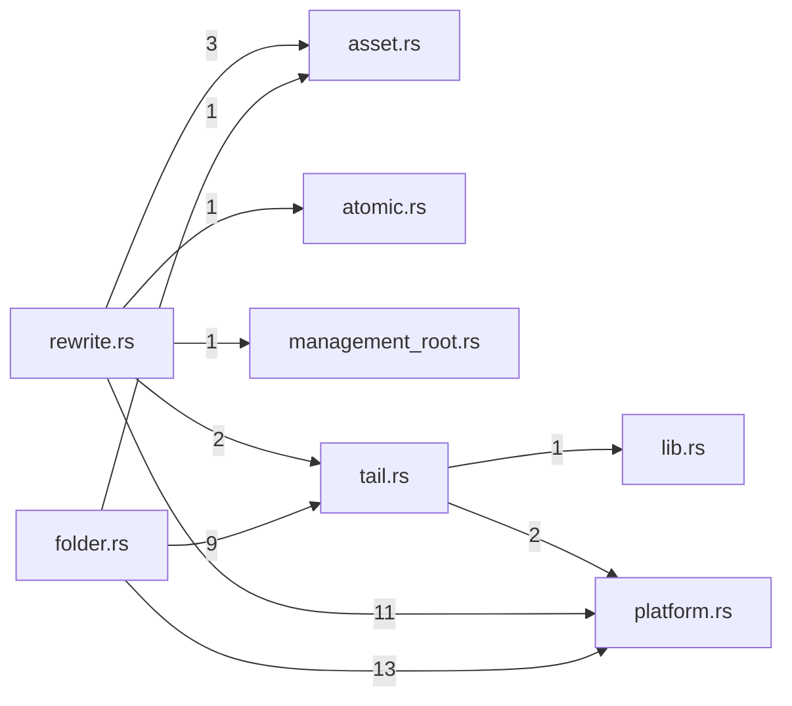

# store — generated atlas

[All packages](../../../../docs/architecture/generated/index.md) · [Maintained explanation](../README.md)

## Cargo targets

| Target | Kind | Entry |
|---|---|---|
| `store` | lib | [crates/store/src/lib.rs](../../src/lib.rs) |

## Direct workspace dependencies

| Dependency | Kind | Target cfg |
|---|---|---|
| `schema` | normal | all |

[Public/restricted API and direct callers](api.md)

## Source files / lexical modules

`src` files have full symbol/call tables and partitioned function graphs. Integration tests and examples remain in the JSON inventory.
File-derived paths below are lexical navigation, not a compiler-resolved module tree; inline module declarations are listed separately.

| File | Symbols | Call sites | Detail |
|---|---:|---:|---|
| [crates/store/src/asset.rs](../../src/asset.rs) | 13 | 100 | [Symbols and calls](src--asset.md) |
| [crates/store/src/atomic.rs](../../src/atomic.rs) | 4 | 29 | [Symbols and calls](src--atomic.md) |
| [crates/store/src/folder.rs](../../src/folder.rs) | 35 | 633 | [Symbols and calls](src--folder.md) |
| [crates/store/src/lib.rs](../../src/lib.rs) | 3 | 7 | [Symbols and calls](src--lib.md) |
| [crates/store/src/management_root.rs](../../src/management_root.rs) | 9 | 50 | [Symbols and calls](src--management_root.md) |
| [crates/store/src/platform.rs](../../src/platform.rs) | 34 | 137 | [Symbols and calls](src--platform.md) |
| [crates/store/src/rewrite.rs](../../src/rewrite.rs) | 87 | 1692 | [Symbols and calls](src--rewrite.md) |
| [crates/store/src/tail.rs](../../src/tail.rs) | 27 | 187 | [Symbols and calls](src--tail.md) |

## Cross-file direct calls

Source files stand in for out-of-line modules; see declarations for inline modules. Counts are syntactic call sites, not runtime frequency.

