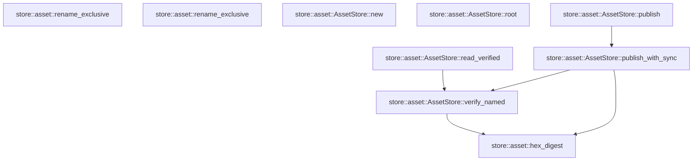

# store::asset

[Package atlas](index.md) · [Source](../../src/asset.rs)

## Declarations

Visibility is the declaration spelling; trait members and reexports require their enclosing interface. `cfg` is not evaluated.

| Symbol | Kind | Visibility | Test / cfg |
|---|---|---|---|
| [store::asset::TEMP_ORDINAL](../../src/asset.rs#L13) | static_item | `private` |  |
| [store::asset::AssetRef](../../src/asset.rs#L16) | struct_item | `pub` |  |
| [store::asset::AssetStore](../../src/asset.rs#L22) | struct_item | `pub` |  |
| [store::asset::AssetStore::new](../../src/asset.rs#L27) | function_item | `pub` |  |
| [store::asset::AssetStore::root](../../src/asset.rs#L35) | function_item | `pub` |  |
| [store::asset::AssetStore::publish](../../src/asset.rs#L39) | function_item | `pub` |  |
| [store::asset::AssetStore::publish_with_sync](../../src/asset.rs#L43) | function_item | `pub` |  |
| [store::asset::AssetStore::verify_named](../../src/asset.rs#L99) | function_item | `pub` |  |
| [store::asset::AssetStore::read_verified](../../src/asset.rs#L114) | function_item | `pub` |  |
| [store::asset::rename_exclusive](../../src/asset.rs#L121) | function_item | `private` | #[cfg(target_os = "macos")] |
| [store::asset::rename_exclusive](../../src/asset.rs#L152) | function_item | `private` | #[cfg(not(target_os = "macos"))] |
| [store::asset::hex_digest](../../src/asset.rs#L157) | function_item | `pub(crate)` |  |
| [store::asset::tests::concurrent_identical_publication_never_replaces_content](../../src/asset.rs#L173) | function_item | `private` | test; #[cfg(test)] |

## Imports / reexports

| Local name | Source path | Visibility |
|---|---|---|
| `_` | `std::fmt::Write` | `private` |
| `fs` | `std::fs` | `private` |
| `File` | `std::fs::File` | `private` |
| `OpenOptions` | `std::fs::OpenOptions` | `private` |
| `io` | `std::io` | `private` |
| `Write` | `std::io::Write` | `private` |
| `OpenOptionsExt` | `std::os::unix::fs::OpenOptionsExt` | `private` |
| `Path` | `std::path::Path` | `private` |
| `PathBuf` | `std::path::PathBuf` | `private` |
| `AtomicU64` | `std::sync::atomic::AtomicU64` | `private` |
| `Ordering` | `std::sync::atomic::Ordering` | `private` |
| `Digest` | `sha2::Digest` | `private` |
| `Sha256` | `sha2::Sha256` | `private` |
| `StoreError` | `crate::StoreError` | `private` |
| `SyncPolicy` | `crate::platform::SyncPolicy` | `private` |
| `SystemSync` | `crate::platform::SystemSync` | `private` |
| `*` | `super::*` | `private` |

## Module declarations

| Module | Visibility | Attributes |
|---|---|---|
| `store::asset::tests` | `private` | #[cfg(test)] |

## Function call graphs

Edges below are syntactically resolved calls only, including private functions. Graphs partition callers into groups of 20; they are not execution order. All unresolved sites are listed below and in the JSON inventory.

Functions 1–9: 5 direct edges

## Call sites

Includes test functions (marked in declarations). Receiver-type-required sites need type analysis/manual tracing. Calls in closures are attributed to their enclosing function; their occurrence here does not mean the closure executes immediately.

| Caller | Callee expression | Source lines | Target / classification |
|---|---|---|---|
| `TEMP_ORDINAL` | `AtomicU64::new` | [13](../../src/asset.rs#L13) | external-constructor-callback-or-unresolved |
| `new` | `fs::create_dir_all` | [28](../../src/asset.rs#L28) | external-constructor-callback-or-unresolved |
| `new` | `root.as_ref` | [28](../../src/asset.rs#L28), [30](../../src/asset.rs#L30) | receiver-type-required |
| `new` | `Ok` | [29](../../src/asset.rs#L29) | external-constructor-callback-or-unresolved |
| `new` | `root.as_ref().to_path_buf` | [30](../../src/asset.rs#L30) | receiver-type-required |
| `publish` | `self.publish_with_sync` | [40](../../src/asset.rs#L40) | [store::asset::AssetStore::publish_with_sync](../../src/asset.rs#L43) |
| `publish_with_sync` | `hex_digest` | [48](../../src/asset.rs#L48) | [store::asset::hex_digest](../../src/asset.rs#L157) |
| `publish_with_sync` | `self.root.join` | [50](../../src/asset.rs#L50), [64](../../src/asset.rs#L64) | receiver-type-required |
| `publish_with_sync` | `destination.exists` | [51](../../src/asset.rs#L51), [76](../../src/asset.rs#L76) | receiver-type-required |
| `publish_with_sync` | `self.verify_named` | [52](../../src/asset.rs#L52), [78](../../src/asset.rs#L78) | [store::asset::AssetStore::verify_named](../../src/asset.rs#L99) |
| `publish_with_sync` | `File::open` | [53](../../src/asset.rs#L53), [55](../../src/asset.rs#L55), [86](../../src/asset.rs#L86) | external-constructor-callback-or-unresolved |
| `publish_with_sync` | `sync.full_sync` | [54](../../src/asset.rs#L54), [72](../../src/asset.rs#L72) | receiver-type-required |
| `publish_with_sync` | `File::open(&self.root)?.sync_all` | [55](../../src/asset.rs#L55) | receiver-type-required |
| `publish_with_sync` | `Ok` | [56](../../src/asset.rs#L56), [79](../../src/asset.rs#L79), [88](../../src/asset.rs#L88) | external-constructor-callback-or-unresolved |
| `publish_with_sync` | `content.len` | [58](../../src/asset.rs#L58), [81](../../src/asset.rs#L81), [90](../../src/asset.rs#L90) | receiver-type-required |
| `publish_with_sync` | `TEMP_ORDINAL.fetch_add` | [62](../../src/asset.rs#L62) | receiver-type-required |
| `publish_with_sync` | `(&#124;&#124; {             let mut file = OpenOptions::new()                 .write(true)                 .create_new(true)                 .mode(0o600)                 .open(&temp)?;             file.write_all(content)?;             sync.full_sync(&file)?;             drop(file);             match rename_exclusive(&temp, &destination) {                 Ok(()) => {}                 Err(_error) if destination.exists() => {                     let _ = fs::remove_file(&temp);                     self.verify_named(&name)?;                     return Ok(AssetRef {                         asset: name.clone(),                         bytes: content.len() as u64,                     });                 }                 Err(error) => return Err(StoreError::Io(error)),             }             let directory = File::open(&self.root)?;             directory.sync_all()?;             Ok(AssetRef {                 asset: name.clone(),                 bytes: content.len() as u64,             })         })` | [65](../../src/asset.rs#L65) | external-constructor-callback-or-unresolved |
| `publish_with_sync` | `OpenOptions::new()                 .write(true)                 .create_new(true)                 .mode(0o600)                 .open` | [66](../../src/asset.rs#L66) | receiver-type-required |
| `publish_with_sync` | `OpenOptions::new()                 .write(true)                 .create_new(true)                 .mode` | [66](../../src/asset.rs#L66) | receiver-type-required |
| `publish_with_sync` | `OpenOptions::new()                 .write(true)                 .create_new` | [66](../../src/asset.rs#L66) | receiver-type-required |
| `publish_with_sync` | `OpenOptions::new()                 .write` | [66](../../src/asset.rs#L66) | receiver-type-required |
| `publish_with_sync` | `OpenOptions::new` | [66](../../src/asset.rs#L66) | external-constructor-callback-or-unresolved |
| `publish_with_sync` | `file.write_all` | [71](../../src/asset.rs#L71) | receiver-type-required |
| `publish_with_sync` | `drop` | [73](../../src/asset.rs#L73) | external-constructor-callback-or-unresolved |
| `publish_with_sync` | `rename_exclusive` | [74](../../src/asset.rs#L74) | ambiguous-cfg-or-overload |
| `publish_with_sync` | `fs::remove_file` | [77](../../src/asset.rs#L77), [94](../../src/asset.rs#L94) | external-constructor-callback-or-unresolved |
| `publish_with_sync` | `name.clone` | [80](../../src/asset.rs#L80), [89](../../src/asset.rs#L89) | receiver-type-required |
| `publish_with_sync` | `Err` | [84](../../src/asset.rs#L84) | external-constructor-callback-or-unresolved |
| `publish_with_sync` | `StoreError::Io` | [84](../../src/asset.rs#L84) | external-constructor-callback-or-unresolved |
| `publish_with_sync` | `directory.sync_all` | [87](../../src/asset.rs#L87) | receiver-type-required |
| `publish_with_sync` | `result.is_err` | [93](../../src/asset.rs#L93) | receiver-type-required |
| `verify_named` | `name.strip_prefix("sha256-").ok_or_else` | [100](../../src/asset.rs#L100) | receiver-type-required |
| `verify_named` | `name.strip_prefix` | [100](../../src/asset.rs#L100) | receiver-type-required |
| `verify_named` | `StoreError::Corruption` | [101](../../src/asset.rs#L101) | external-constructor-callback-or-unresolved |
| `verify_named` | `fs::read` | [103](../../src/asset.rs#L103) | external-constructor-callback-or-unresolved |
| `verify_named` | `self.root.join` | [103](../../src/asset.rs#L103) | receiver-type-required |
| `verify_named` | `hex_digest` | [104](../../src/asset.rs#L104) | [store::asset::hex_digest](../../src/asset.rs#L157) |
| `verify_named` | `Err` | [106](../../src/asset.rs#L106) | external-constructor-callback-or-unresolved |
| `verify_named` | `expected.to_owned` | [107](../../src/asset.rs#L107) | receiver-type-required |
| `verify_named` | `Ok` | [111](../../src/asset.rs#L111) | external-constructor-callback-or-unresolved |
| `verify_named` | `content.len` | [111](../../src/asset.rs#L111) | receiver-type-required |
| `read_verified` | `self.verify_named` | [115](../../src/asset.rs#L115) | [store::asset::AssetStore::verify_named](../../src/asset.rs#L99) |
| `read_verified` | `Ok` | [116](../../src/asset.rs#L116) | external-constructor-callback-or-unresolved |
| `read_verified` | `fs::read` | [116](../../src/asset.rs#L116) | external-constructor-callback-or-unresolved |
| `read_verified` | `self.root.join` | [116](../../src/asset.rs#L116) | receiver-type-required |
| `rename_exclusive` | `CString::new(source.as_os_str().as_bytes())         .map_err` | [125](../../src/asset.rs#L125) | receiver-type-required |
| `rename_exclusive` | `CString::new` | [125](../../src/asset.rs#L125), [127](../../src/asset.rs#L127) | external-constructor-callback-or-unresolved |
| `rename_exclusive` | `source.as_os_str().as_bytes` | [125](../../src/asset.rs#L125) | receiver-type-required |
| `rename_exclusive` | `source.as_os_str` | [125](../../src/asset.rs#L125) | receiver-type-required |
| `rename_exclusive` | `io::Error::new` | [126](../../src/asset.rs#L126), [128](../../src/asset.rs#L128) | external-constructor-callback-or-unresolved |
| `rename_exclusive` | `CString::new(destination.as_os_str().as_bytes()).map_err` | [127](../../src/asset.rs#L127) | receiver-type-required |
| `rename_exclusive` | `destination.as_os_str().as_bytes` | [127](../../src/asset.rs#L127) | receiver-type-required |
| `rename_exclusive` | `destination.as_os_str` | [127](../../src/asset.rs#L127) | receiver-type-required |
| `rename_exclusive` | `libc::renameatx_np` | [133](../../src/asset.rs#L133) | external-constructor-callback-or-unresolved |
| `rename_exclusive` | `source.as_ptr` | [135](../../src/asset.rs#L135) | receiver-type-required |
| `rename_exclusive` | `destination.as_ptr` | [137](../../src/asset.rs#L137) | receiver-type-required |
| `rename_exclusive` | `Ok` | [142](../../src/asset.rs#L142) | external-constructor-callback-or-unresolved |
| `rename_exclusive` | `io::Error::last_os_error` | [144](../../src/asset.rs#L144) | external-constructor-callback-or-unresolved |
| `rename_exclusive` | `error.kind` | [145](../../src/asset.rs#L145) | receiver-type-required |
| `rename_exclusive` | `Err` | [146](../../src/asset.rs#L146) | external-constructor-callback-or-unresolved |
| `rename_exclusive` | `fs::hard_link` | [153](../../src/asset.rs#L153) | external-constructor-callback-or-unresolved |
| `rename_exclusive` | `fs::remove_file` | [154](../../src/asset.rs#L154) | external-constructor-callback-or-unresolved |
| `hex_digest` | `Sha256::digest` | [158](../../src/asset.rs#L158) | external-constructor-callback-or-unresolved |
| `hex_digest` | `digest.iter().fold` | [159](../../src/asset.rs#L159) | receiver-type-required |
| `hex_digest` | `digest.iter` | [159](../../src/asset.rs#L159) | receiver-type-required |
| `hex_digest` | `String::with_capacity` | [160](../../src/asset.rs#L160) | external-constructor-callback-or-unresolved |
| `hex_digest` | `digest.len` | [160](../../src/asset.rs#L160) | receiver-type-required |
| `hex_digest` | `write!(result, "{byte:02x}").expect` | [162](../../src/asset.rs#L162) | receiver-type-required |
| `concurrent_identical_publication_never_replaces_content` | `tempfile::tempdir().expect` | [174](../../src/asset.rs#L174) | receiver-type-required |
| `concurrent_identical_publication_never_replaces_content` | `tempfile::tempdir` | [174](../../src/asset.rs#L174) | external-constructor-callback-or-unresolved |
| `concurrent_identical_publication_never_replaces_content` | `AssetStore::new(directory.path()).expect` | [175](../../src/asset.rs#L175) | receiver-type-required |
| `concurrent_identical_publication_never_replaces_content` | `AssetStore::new` | [175](../../src/asset.rs#L175) | external-constructor-callback-or-unresolved |
| `concurrent_identical_publication_never_replaces_content` | `directory.path` | [175](../../src/asset.rs#L175) | receiver-type-required |
| `concurrent_identical_publication_never_replaces_content` | `std::thread::scope` | [176](../../src/asset.rs#L176) | external-constructor-callback-or-unresolved |
| `concurrent_identical_publication_never_replaces_content` | `(0..8)                 .map(&#124;_&#124; {                     let store = store.clone();                     scope.spawn(move &#124;&#124; store.publish(b"same immutable bytes"))                 })                 .collect::<Vec<_>>()                 .into_iter()                 .map(&#124;thread&#124; thread.join().expect("publisher").expect("publication"))                 .collect::<Vec<_>>` | [177](../../src/asset.rs#L177) | receiver-type-required |
| `concurrent_identical_publication_never_replaces_content` | `(0..8)                 .map(&#124;_&#124; {                     let store = store.clone();                     scope.spawn(move &#124;&#124; store.publish(b"same immutable bytes"))                 })                 .collect::<Vec<_>>()                 .into_iter()                 .map` | [177](../../src/asset.rs#L177) | receiver-type-required |
| `concurrent_identical_publication_never_replaces_content` | `(0..8)                 .map(&#124;_&#124; {                     let store = store.clone();                     scope.spawn(move &#124;&#124; store.publish(b"same immutable bytes"))                 })                 .collect::<Vec<_>>()                 .into_iter` | [177](../../src/asset.rs#L177) | receiver-type-required |
| `concurrent_identical_publication_never_replaces_content` | `(0..8)                 .map(&#124;_&#124; {                     let store = store.clone();                     scope.spawn(move &#124;&#124; store.publish(b"same immutable bytes"))                 })                 .collect::<Vec<_>>` | [177](../../src/asset.rs#L177) | receiver-type-required |
| `concurrent_identical_publication_never_replaces_content` | `(0..8)                 .map` | [177](../../src/asset.rs#L177) | receiver-type-required |
| `concurrent_identical_publication_never_replaces_content` | `store.clone` | [179](../../src/asset.rs#L179) | receiver-type-required |
| `concurrent_identical_publication_never_replaces_content` | `scope.spawn` | [180](../../src/asset.rs#L180) | receiver-type-required |
| `concurrent_identical_publication_never_replaces_content` | `store.publish` | [180](../../src/asset.rs#L180) | receiver-type-required |
| `concurrent_identical_publication_never_replaces_content` | `thread.join().expect("publisher").expect` | [184](../../src/asset.rs#L184) | receiver-type-required |
| `concurrent_identical_publication_never_replaces_content` | `thread.join().expect` | [184](../../src/asset.rs#L184) | receiver-type-required |
| `concurrent_identical_publication_never_replaces_content` | `thread.join` | [184](../../src/asset.rs#L184) | receiver-type-required |
