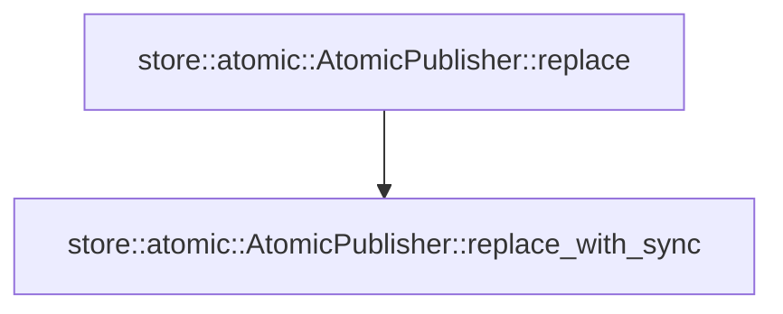

# store::atomic

[Package atlas](index.md) · [Source](../../src/atomic.rs)

## Declarations

Visibility is the declaration spelling; trait members and reexports require their enclosing interface. `cfg` is not evaluated.

| Symbol | Kind | Visibility | Test / cfg |
|---|---|---|---|
| [store::atomic::TEMP_ORDINAL](../../src/atomic.rs#L11) | static_item | `private` |  |
| [store::atomic::AtomicPublisher](../../src/atomic.rs#L13) | struct_item | `pub` |  |
| [store::atomic::AtomicPublisher::replace](../../src/atomic.rs#L16) | function_item | `pub` |  |
| [store::atomic::AtomicPublisher::replace_with_sync](../../src/atomic.rs#L20) | function_item | `pub` |  |

## Imports / reexports

| Local name | Source path | Visibility |
|---|---|---|
| `OsStr` | `std::ffi::OsStr` | `private` |
| `fs` | `std::fs` | `private` |
| `File` | `std::fs::File` | `private` |
| `OpenOptions` | `std::fs::OpenOptions` | `private` |
| `Write` | `std::io::Write` | `private` |
| `OpenOptionsExt` | `std::os::unix::fs::OpenOptionsExt` | `private` |
| `Path` | `std::path::Path` | `private` |
| `AtomicU64` | `std::sync::atomic::AtomicU64` | `private` |
| `Ordering` | `std::sync::atomic::Ordering` | `private` |
| `StoreError` | `crate::StoreError` | `private` |
| `SyncPolicy` | `crate::platform::SyncPolicy` | `private` |
| `SystemSync` | `crate::platform::SystemSync` | `private` |

## Module declarations

| Module | Visibility | Attributes |
|---|---|---|

## Function call graphs

Edges below are syntactically resolved calls only, including private functions. Graphs partition callers into groups of 20; they are not execution order. All unresolved sites are listed below and in the JSON inventory.

Functions 1–2: 1 direct edges

## Call sites

Includes test functions (marked in declarations). Receiver-type-required sites need type analysis/manual tracing. Calls in closures are attributed to their enclosing function; their occurrence here does not mean the closure executes immediately.

| Caller | Callee expression | Source lines | Target / classification |
|---|---|---|---|
| `TEMP_ORDINAL` | `AtomicU64::new` | [11](../../src/atomic.rs#L11) | external-constructor-callback-or-unresolved |
| `replace` | `Self::replace_with_sync` | [17](../../src/atomic.rs#L17) | [store::atomic::AtomicPublisher::replace_with_sync](../../src/atomic.rs#L20) |
| `replace_with_sync` | `path.as_ref` | [25](../../src/atomic.rs#L25) | receiver-type-required |
| `replace_with_sync` | `path.parent().ok_or_else` | [26](../../src/atomic.rs#L26) | receiver-type-required |
| `replace_with_sync` | `path.parent` | [26](../../src/atomic.rs#L26) | receiver-type-required |
| `replace_with_sync` | `StoreError::Corruption` | [27](../../src/atomic.rs#L27) | external-constructor-callback-or-unresolved |
| `replace_with_sync` | `"atomic publication path has no parent".to_owned` | [27](../../src/atomic.rs#L27) | receiver-type-required |
| `replace_with_sync` | `fs::create_dir_all` | [29](../../src/atomic.rs#L29) | external-constructor-callback-or-unresolved |
| `replace_with_sync` | `path             .file_name()             .unwrap_or_else` | [30](../../src/atomic.rs#L30) | receiver-type-required |
| `replace_with_sync` | `path             .file_name` | [30](../../src/atomic.rs#L30) | receiver-type-required |
| `replace_with_sync` | `OsStr::new` | [32](../../src/atomic.rs#L32) | external-constructor-callback-or-unresolved |
| `replace_with_sync` | `TEMP_ORDINAL.fetch_add` | [33](../../src/atomic.rs#L33) | receiver-type-required |
| `replace_with_sync` | `parent.join` | [34](../../src/atomic.rs#L34) | receiver-type-required |
| `replace_with_sync` | `(&#124;&#124; {             let mut file = OpenOptions::new()                 .write(true)                 .create_new(true)                 .mode(0o600)                 .custom_flags(libc::O_CLOEXEC &#124; libc::O_NOFOLLOW)                 .open(&temp)?;             file.write_all(bytes)?;             sync.full_sync(&file)?;             drop(file);             fs::rename(&temp, path)?;             File::open(parent)?.sync_all()?;             Ok(())         })` | [39](../../src/atomic.rs#L39) | external-constructor-callback-or-unresolved |
| `replace_with_sync` | `OpenOptions::new()                 .write(true)                 .create_new(true)                 .mode(0o600)                 .custom_flags(libc::O_CLOEXEC &#124; libc::O_NOFOLLOW)                 .open` | [40](../../src/atomic.rs#L40) | receiver-type-required |
| `replace_with_sync` | `OpenOptions::new()                 .write(true)                 .create_new(true)                 .mode(0o600)                 .custom_flags` | [40](../../src/atomic.rs#L40) | receiver-type-required |
| `replace_with_sync` | `OpenOptions::new()                 .write(true)                 .create_new(true)                 .mode` | [40](../../src/atomic.rs#L40) | receiver-type-required |
| `replace_with_sync` | `OpenOptions::new()                 .write(true)                 .create_new` | [40](../../src/atomic.rs#L40) | receiver-type-required |
| `replace_with_sync` | `OpenOptions::new()                 .write` | [40](../../src/atomic.rs#L40) | receiver-type-required |
| `replace_with_sync` | `OpenOptions::new` | [40](../../src/atomic.rs#L40) | external-constructor-callback-or-unresolved |
| `replace_with_sync` | `file.write_all` | [46](../../src/atomic.rs#L46) | receiver-type-required |
| `replace_with_sync` | `sync.full_sync` | [47](../../src/atomic.rs#L47) | receiver-type-required |
| `replace_with_sync` | `drop` | [48](../../src/atomic.rs#L48) | external-constructor-callback-or-unresolved |
| `replace_with_sync` | `fs::rename` | [49](../../src/atomic.rs#L49) | external-constructor-callback-or-unresolved |
| `replace_with_sync` | `File::open(parent)?.sync_all` | [50](../../src/atomic.rs#L50) | receiver-type-required |
| `replace_with_sync` | `File::open` | [50](../../src/atomic.rs#L50) | external-constructor-callback-or-unresolved |
| `replace_with_sync` | `Ok` | [51](../../src/atomic.rs#L51) | external-constructor-callback-or-unresolved |
| `replace_with_sync` | `result.is_err` | [53](../../src/atomic.rs#L53) | receiver-type-required |
| `replace_with_sync` | `fs::remove_file` | [54](../../src/atomic.rs#L54) | external-constructor-callback-or-unresolved |
