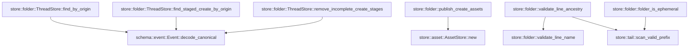

# store::folder

[Package atlas](index.md) · [Source](../../src/folder.rs)

## Declarations

Visibility is the declaration spelling; trait members and reexports require their enclosing interface. `cfg` is not evaluated.

| Symbol | Kind | Visibility | Test / cfg |
|---|---|---|---|
| [store::folder::CreateOutcome](../../src/folder.rs#L12) | struct_item | `pub` |  |
| [store::folder::AppendOutcome](../../src/folder.rs#L18) | struct_item | `pub` |  |
| [store::folder::ConditionalAppendOutcome](../../src/folder.rs#L24) | enum_item | `pub` |  |
| [store::folder::ThreadStore](../../src/folder.rs#L30) | struct_item | `pub` |  |
| [store::folder::ThreadStore::open](../../src/folder.rs#L35) | function_item | `pub` |  |
| [store::folder::ThreadStore::root](../../src/folder.rs#L64) | function_item | `pub` |  |
| [store::folder::ThreadStore::session_has_live_line_holder](../../src/folder.rs#L71) | function_item | `pub` |  |
| [store::folder::ThreadStore::create_thread](../../src/folder.rs#L93) | function_item | `pub` |  |
| [store::folder::ThreadStore::create_thread_with_assets](../../src/folder.rs#L105) | function_item | `pub` |  |
| [store::folder::ThreadStore::append_keyed](../../src/folder.rs#L201) | function_item | `pub` |  |
| [store::folder::ThreadStore::append_keyed_with_projection](../../src/folder.rs#L213) | function_item | `pub` |  |
| [store::folder::ThreadStore::append_keyed_with_projection_if](../../src/folder.rs#L235) | function_item | `pub` |  |
| [store::folder::ThreadStore::validated_line_projection](../../src/folder.rs#L252) | function_item | `pub` |  |
| [store::folder::ThreadStore::append_line_keyed_with_projection_if](../../src/folder.rs#L305) | function_item | `pub` |  |
| [store::folder::ThreadStore::append_keyed_with_ledger_if](../../src/folder.rs#L387) | function_item | `pub` |  |
| [store::folder::ThreadStore::archive](../../src/folder.rs#L452) | function_item | `pub` |  |
| [store::folder::ThreadStore::archive_nonblocking](../../src/folder.rs#L456) | function_item | `pub` |  |
| [store::folder::ThreadStore::move_folder](../../src/folder.rs#L460) | function_item | `private` |  |
| [store::folder::ThreadStore::unarchive](../../src/folder.rs#L492) | function_item | `pub` |  |
| [store::folder::ThreadStore::session_is_ephemeral](../../src/folder.rs#L499) | function_item | `pub` |  |
| [store::folder::ThreadStore::discard_ephemeral](../../src/folder.rs#L512) | function_item | `pub` |  |
| [store::folder::ThreadStore::sweep_ephemeral](../../src/folder.rs#L539) | function_item | `pub` |  |
| [store::folder::ThreadStore::retire_ephemeral_folder](../../src/folder.rs#L572) | function_item | `private` |  |
| [store::folder::ThreadStore::remove_tombstone](../../src/folder.rs#L590) | function_item | `private` |  |
| [store::folder::ThreadStore::find_by_origin](../../src/folder.rs#L596) | function_item | `private` |  |
| [store::folder::ThreadStore::find_staged_create_by_origin](../../src/folder.rs#L619) | function_item | `private` |  |
| [store::folder::ThreadStore::remove_incomplete_create_stages](../../src/folder.rs#L664) | function_item | `private` |  |
| [store::folder::publish_create_assets](../../src/folder.rs#L701) | function_item | `private` |  |
| [store::folder::validate_line_name](../../src/folder.rs#L710) | function_item | `private` |  |
| [store::folder::validate_line_ancestry](../../src/folder.rs#L725) | function_item | `private` |  |
| [store::folder::DISCARD_TOMBSTONE_PREFIX](../../src/folder.rs#L809) | const_item | `private` |  |
| [store::folder::folder_is_ephemeral](../../src/folder.rs#L813) | function_item | `private` |  |
| [store::folder::child_line_tests::child_append_requires_matching_durable_spawn](../../src/folder.rs#L829) | function_item | `private` | test; #[cfg(test)] |
| [store::folder::ephemeral_tests::write_genesis](../../src/folder.rs#L950) | function_item | `private` | test; #[cfg(test)] |
| [store::folder::ephemeral_tests::discard_removes_only_idle_ephemeral_folders_and_sweep_leaves_durable_ones](../../src/folder.rs#L970) | function_item | `private` | test; #[cfg(test)] |

## Imports / reexports

| Local name | Source path | Visibility |
|---|---|---|
| `fs` | `std::fs` | `private` |
| `File` | `std::fs::File` | `private` |
| `Read` | `std::io::Read` | `private` |
| `OpenOptionsExt` | `std::os::unix::fs::OpenOptionsExt` | `private` |
| `Path` | `std::path::Path` | `private` |
| `PathBuf` | `std::path::PathBuf` | `private` |
| `Event` | `schema::Event` | `private` |
| `EventKind` | `schema::EventKind` | `private` |
| `OriginTuple` | `schema::OriginTuple` | `private` |
| `DirectoryLock` | `crate::platform::DirectoryLock` | `private` |
| `NamedLock` | `crate::platform::NamedLock` | `private` |
| `open_exclusive_create` | `crate::platform::open_exclusive_create` | `private` |
| `AssetStore` | `crate::AssetStore` | `private` |
| `BarrierContext` | `crate::BarrierContext` | `private` |
| `LockedLedger` | `crate::LockedLedger` | `private` |
| `StoreError` | `crate::StoreError` | `private` |
| `probe_local_filesystem` | `crate::probe_local_filesystem` | `private` |
| `*` | `super::*` | `private` |
| `json` | `serde_json::json` | `private` |
| `*` | `super::*` | `private` |
| `json` | `serde_json::json` | `private` |

## Module declarations

| Module | Visibility | Attributes |
|---|---|---|
| `store::folder::child_line_tests` | `private` | #[cfg(test)] |
| `store::folder::ephemeral_tests` | `private` | #[cfg(test)] |

## Function call graphs

Edges below are syntactically resolved calls only, including private functions. Graphs partition callers into groups of 20; they are not execution order. All unresolved sites are listed below and in the JSON inventory.

```mermaid
flowchart TD
  n0["store::folder::ThreadStore::create_thread_with_assets"]
  n1["store::folder::ThreadStore::append_keyed"]
  n2["store::folder::ThreadStore::append_keyed_with_projection"]
  n3["store::folder::ThreadStore::append_keyed_with_projection_if"]
  n4["store::folder::ThreadStore::validated_line_projection"]
  n5["store::folder::ThreadStore::append_line_keyed_with_projection_if"]
  n6["store::folder::ThreadStore::open"]
  n7["store::folder::ThreadStore::append_keyed_with_ledger_if"]
  n8["store::folder::ThreadStore::archive"]
  n9["store::folder::ThreadStore::archive_nonblocking"]
  n10["store::folder::ThreadStore::move_folder"]
  n11["store::folder::ThreadStore::unarchive"]
  n12["store::folder::ThreadStore::session_is_ephemeral"]
  n13["store::folder::ThreadStore::discard_ephemeral"]
  n14["store::folder::ThreadStore::sweep_ephemeral"]
  n15["store::folder::ThreadStore::retire_ephemeral_folder"]
  n16["store::folder::ThreadStore::remove_tombstone"]
  n17["store::folder::ThreadStore::find_by_origin"]
  n18["store::folder::ThreadStore::find_staged_create_by_origin"]
  n19["store::folder::ThreadStore::root"]
  n20["store::folder::ThreadStore::remove_incomplete_create_stages"]
  n21["store::folder::publish_create_assets"]
  n22["store::folder::validate_line_name"]
  n23["store::folder::ThreadStore::session_has_live_line_holder"]
  n24["store::folder::validate_line_ancestry"]
  n25["store::folder::folder_is_ephemeral"]
  n26["store::folder::ThreadStore::create_thread"]
  n27["store::platform::NamedLock::exclusive"]
  n28["store::platform::try_lock_exclusive"]
  n29["store::platform::open_exclusive_create"]
  n30["store::platform::probe_local_filesystem"]
  n31["store::platform::DirectoryLock::shared"]
  n32["store::platform::DirectoryLock::exclusive"]
  n33["store::platform::DirectoryLock::try_exclusive"]
  n34["store::tail::check_ledger_write_versions"]
  n35["store::tail::check_write_versions"]
  n36["store::tail::LockedLedger::open"]
  n37["store::tail::scan_valid_prefix"]
  n0 --> n17
  n0 --> n18
  n0 --> n20
  n0 --> n21
  n0 --> n27
  n0 --> n29
  n0 --> n34
  n0 --> n35
  n0 --> n36
  n1 --> n2
  n2 --> n3
  n3 --> n5
  n4 --> n22
  n4 --> n24
  n4 --> n31
  n4 --> n37
  n5 --> n22
  n5 --> n24
  n5 --> n31
  n5 --> n36
  n6 --> n30
  n7 --> n31
  n7 --> n36
  n8 --> n10
  n9 --> n10
  n10 --> n27
  n10 --> n32
  n10 --> n33
  n11 --> n10
  n12 --> n25
  n13 --> n15
  n13 --> n16
  n13 --> n19
  n13 --> n23
  n13 --> n25
  n13 --> n27
  n13 --> n33
  n14 --> n15
  n14 --> n16
  n14 --> n19
  n14 --> n25
  n14 --> n27
  n23 --> n28
  n26 --> n0
```

Functions 1–20: 44 direct edges

Functions 21–27: 7 direct edges

## Call sites

Includes test functions (marked in declarations). Receiver-type-required sites need type analysis/manual tracing. Calls in closures are attributed to their enclosing function; their occurrence here does not mean the closure executes immediately.

| Caller | Callee expression | Source lines | Target / classification |
|---|---|---|---|
| `open` | `root.as_ref().to_path_buf` | [36](../../src/folder.rs#L36) | receiver-type-required |
| `open` | `root.as_ref` | [36](../../src/folder.rs#L36) | receiver-type-required |
| `open` | `probe_local_filesystem` | [37](../../src/folder.rs#L37) | [store::platform::probe_local_filesystem](../../src/platform.rs#L220) |
| `open` | `root.join` | [45](../../src/folder.rs#L45) | receiver-type-required |
| `open` | `fs::symlink_metadata` | [46](../../src/folder.rs#L46) | external-constructor-callback-or-unresolved |
| `open` | `metadata.file_type().is_dir` | [47](../../src/folder.rs#L47) | receiver-type-required |
| `open` | `metadata.file_type` | [47](../../src/folder.rs#L47) | receiver-type-required |
| `open` | `Err` | [49](../../src/folder.rs#L49), [57](../../src/folder.rs#L57) | external-constructor-callback-or-unresolved |
| `open` | `StoreError::Corruption` | [49](../../src/folder.rs#L49) | external-constructor-callback-or-unresolved |
| `open` | `error.kind` | [54](../../src/folder.rs#L54) | receiver-type-required |
| `open` | `fs::create_dir_all` | [55](../../src/folder.rs#L55) | external-constructor-callback-or-unresolved |
| `open` | `StoreError::Io` | [57](../../src/folder.rs#L57) | external-constructor-callback-or-unresolved |
| `open` | `Ok` | [60](../../src/folder.rs#L60) | external-constructor-callback-or-unresolved |
| `session_has_live_line_holder` | `self.root.join("threads").join` | [72](../../src/folder.rs#L72) | receiver-type-required |
| `session_has_live_line_holder` | `self.root.join` | [72](../../src/folder.rs#L72) | receiver-type-required |
| `session_has_live_line_holder` | `folder.is_dir` | [73](../../src/folder.rs#L73) | receiver-type-required |
| `session_has_live_line_holder` | `Err` | [74](../../src/folder.rs#L74), [87](../../src/folder.rs#L87) | external-constructor-callback-or-unresolved |
| `session_has_live_line_holder` | `fs::read_dir` | [76](../../src/folder.rs#L76) | external-constructor-callback-or-unresolved |
| `session_has_live_line_holder` | `entry.file_type()?.is_file` | [78](../../src/folder.rs#L78) | receiver-type-required |
| `session_has_live_line_holder` | `entry.file_type` | [78](../../src/folder.rs#L78) | receiver-type-required |
| `session_has_live_line_holder` | `entry.path().extension().and_then` | [79](../../src/folder.rs#L79) | receiver-type-required |
| `session_has_live_line_holder` | `entry.path().extension` | [79](../../src/folder.rs#L79) | receiver-type-required |
| `session_has_live_line_holder` | `entry.path` | [79](../../src/folder.rs#L79), [83](../../src/folder.rs#L83) | receiver-type-required |
| `session_has_live_line_holder` | `value.to_str` | [79](../../src/folder.rs#L79) | receiver-type-required |
| `session_has_live_line_holder` | `Some` | [79](../../src/folder.rs#L79) | external-constructor-callback-or-unresolved |
| `session_has_live_line_holder` | `File::open` | [83](../../src/folder.rs#L83) | external-constructor-callback-or-unresolved |
| `session_has_live_line_holder` | `crate::platform::try_lock_exclusive` | [84](../../src/folder.rs#L84) | [store::platform::try_lock_exclusive](../../src/platform.rs#L166) |
| `session_has_live_line_holder` | `Ok` | [86](../../src/folder.rs#L86), [90](../../src/folder.rs#L90) | external-constructor-callback-or-unresolved |
| `create_thread` | `self.create_thread_with_assets` | [98](../../src/folder.rs#L98) | [store::folder::ThreadStore::create_thread_with_assets](../../src/folder.rs#L105) |
| `create_thread_with_assets` | `genesis.seq` | [112](../../src/folder.rs#L112) | receiver-type-required |
| `create_thread_with_assets` | `genesis.string_field` | [113](../../src/folder.rs#L113) | receiver-type-required |
| `create_thread_with_assets` | `Some` | [113](../../src/folder.rs#L113) | external-constructor-callback-or-unresolved |
| `create_thread_with_assets` | `Err` | [115](../../src/folder.rs#L115), [139](../../src/folder.rs#L139), [151](../../src/folder.rs#L151), [156](../../src/folder.rs#L156), [170](../../src/folder.rs#L170), [178](../../src/folder.rs#L178) | external-constructor-callback-or-unresolved |
| `create_thread_with_assets` | `StoreError::Corruption` | [115](../../src/folder.rs#L115), [121](../../src/folder.rs#L121), [139](../../src/folder.rs#L139), [178](../../src/folder.rs#L178) | external-constructor-callback-or-unresolved |
| `create_thread_with_assets` | `"create requires matching seq-1 genesis".to_owned` | [116](../../src/folder.rs#L116) | receiver-type-required |
| `create_thread_with_assets` | `genesis             .origin_tuple()?             .ok_or_else` | [119](../../src/folder.rs#L119) | receiver-type-required |
| `create_thread_with_assets` | `genesis             .origin_tuple` | [119](../../src/folder.rs#L119) | receiver-type-required |
| `create_thread_with_assets` | `"genesis is missing origin tuple".to_owned` | [121](../../src/folder.rs#L121) | receiver-type-required |
| `create_thread_with_assets` | `crate::tail::check_write_versions` | [122](../../src/folder.rs#L122) | [store::tail::check_write_versions](../../src/tail.rs#L121) |
| `create_thread_with_assets` | `std::iter::once` | [122](../../src/folder.rs#L122) | external-constructor-callback-or-unresolved |
| `create_thread_with_assets` | `NamedLock::exclusive` | [127](../../src/folder.rs#L127) | [store::platform::NamedLock::exclusive](../../src/platform.rs#L103) |
| `create_thread_with_assets` | `self.root.join` | [127](../../src/folder.rs#L127), [128](../../src/folder.rs#L128), [132](../../src/folder.rs#L132), [133](../../src/folder.rs#L133), [154](../../src/folder.rs#L154), [155](../../src/folder.rs#L155), [161](../../src/folder.rs#L161), [162](../../src/folder.rs#L162), [168](../../src/folder.rs#L168), [169](../../src/folder.rs#L169), [194](../../src/folder.rs#L194) | receiver-type-required |
| `create_thread_with_assets` | `open_exclusive_create` | [129](../../src/folder.rs#L129) | [store::platform::open_exclusive_create](../../src/platform.rs#L170) |
| `create_thread_with_assets` | `self.find_by_origin` | [131](../../src/folder.rs#L131) | [store::folder::ThreadStore::find_by_origin](../../src/folder.rs#L596) |
| `create_thread_with_assets` | `self.root.join("threads").join` | [132](../../src/folder.rs#L132), [154](../../src/folder.rs#L154), [168](../../src/folder.rs#L168) | receiver-type-required |
| `create_thread_with_assets` | `self.root.join("archive").join` | [133](../../src/folder.rs#L133), [155](../../src/folder.rs#L155), [169](../../src/folder.rs#L169) | receiver-type-required |
| `create_thread_with_assets` | `active.is_dir` | [134](../../src/folder.rs#L134) | receiver-type-required |
| `create_thread_with_assets` | `archived.is_dir` | [136](../../src/folder.rs#L136) | receiver-type-required |
| `create_thread_with_assets` | `"origin index names a missing active/archive folder".to_owned` | [140](../../src/folder.rs#L140) | receiver-type-required |
| `create_thread_with_assets` | `crate::tail::check_ledger_write_versions` | [143](../../src/folder.rs#L143), [158](../../src/folder.rs#L158) | [store::tail::check_ledger_write_versions](../../src/tail.rs#L114) |
| `create_thread_with_assets` | `fs::read` | [143](../../src/folder.rs#L143), [158](../../src/folder.rs#L158) | external-constructor-callback-or-unresolved |
| `create_thread_with_assets` | `folder.join` | [143](../../src/folder.rs#L143), [144](../../src/folder.rs#L144) | receiver-type-required |
| `create_thread_with_assets` | `publish_create_assets` | [144](../../src/folder.rs#L144), [159](../../src/folder.rs#L159), [185](../../src/folder.rs#L185) | [store::folder::publish_create_assets](../../src/folder.rs#L701) |
| `create_thread_with_assets` | `Ok` | [145](../../src/folder.rs#L145), [163](../../src/folder.rs#L163), [195](../../src/folder.rs#L195) | external-constructor-callback-or-unresolved |
| `create_thread_with_assets` | `self.destination_has_live_rewrite` | [150](../../src/folder.rs#L150) | receiver-type-required |
| `create_thread_with_assets` | `self.find_staged_create_by_origin` | [153](../../src/folder.rs#L153) | [store::folder::ThreadStore::find_staged_create_by_origin](../../src/folder.rs#L619) |
| `create_thread_with_assets` | `destination.exists` | [155](../../src/folder.rs#L155), [169](../../src/folder.rs#L169) | receiver-type-required |
| `create_thread_with_assets` | `self.root.join("archive").join(&existing).exists` | [155](../../src/folder.rs#L155) | receiver-type-required |
| `create_thread_with_assets` | `stage.join` | [158](../../src/folder.rs#L158), [159](../../src/folder.rs#L159), [184](../../src/folder.rs#L184), [185](../../src/folder.rs#L185), [186](../../src/folder.rs#L186) | receiver-type-required |
| `create_thread_with_assets` | `fs::rename` | [160](../../src/folder.rs#L160), [193](../../src/folder.rs#L193) | external-constructor-callback-or-unresolved |
| `create_thread_with_assets` | `File::open(self.root.join(".create-staging"))?.sync_all` | [161](../../src/folder.rs#L161) | receiver-type-required |
| `create_thread_with_assets` | `File::open` | [161](../../src/folder.rs#L161), [162](../../src/folder.rs#L162), [192](../../src/folder.rs#L192), [194](../../src/folder.rs#L194) | external-constructor-callback-or-unresolved |
| `create_thread_with_assets` | `File::open(self.root.join("threads"))?.sync_all` | [162](../../src/folder.rs#L162), [194](../../src/folder.rs#L194) | receiver-type-required |
| `create_thread_with_assets` | `self.root.join("archive").join(thread_id).exists` | [169](../../src/folder.rs#L169) | receiver-type-required |
| `create_thread_with_assets` | `self.remove_incomplete_create_stages` | [172](../../src/folder.rs#L172) | [store::folder::ThreadStore::remove_incomplete_create_stages](../../src/folder.rs#L664) |
| `create_thread_with_assets` | `self             .root             .join(".create-staging")             .join` | [173](../../src/folder.rs#L173) | receiver-type-required |
| `create_thread_with_assets` | `self             .root             .join` | [173](../../src/folder.rs#L173) | receiver-type-required |
| `create_thread_with_assets` | `stage.exists` | [177](../../src/folder.rs#L177) | receiver-type-required |
| `create_thread_with_assets` | `fs::create_dir` | [183](../../src/folder.rs#L183), [184](../../src/folder.rs#L184) | external-constructor-callback-or-unresolved |
| `create_thread_with_assets` | `File::create` | [187](../../src/folder.rs#L187) | external-constructor-callback-or-unresolved |
| `create_thread_with_assets` | `LockedLedger::open` | [189](../../src/folder.rs#L189) | [store::tail::LockedLedger::open](../../src/tail.rs#L153) |
| `create_thread_with_assets` | `ledger.append_contract` | [190](../../src/folder.rs#L190) | receiver-type-required |
| `create_thread_with_assets` | `BarrierContext::default` | [190](../../src/folder.rs#L190) | external-constructor-callback-or-unresolved |
| `create_thread_with_assets` | `File::open(&stage)?.sync_all` | [192](../../src/folder.rs#L192) | receiver-type-required |
| `create_thread_with_assets` | `thread_id.to_owned` | [196](../../src/folder.rs#L196) | receiver-type-required |
| `append_keyed` | `self.append_keyed_with_projection` | [210](../../src/folder.rs#L210) | [store::folder::ThreadStore::append_keyed_with_projection](../../src/folder.rs#L213) |
| `append_keyed` | `build` | [210](../../src/folder.rs#L210) | external-constructor-callback-or-unresolved |
| `append_keyed_with_projection` | `self.append_keyed_with_projection_if` | [222](../../src/folder.rs#L222) | [store::folder::ThreadStore::append_keyed_with_projection_if](../../src/folder.rs#L235) |
| `append_keyed_with_projection` | `build(seq, projection).map` | [223](../../src/folder.rs#L223) | receiver-type-required |
| `append_keyed_with_projection` | `build` | [223](../../src/folder.rs#L223) | external-constructor-callback-or-unresolved |
| `append_keyed_with_projection` | `Ok` | [225](../../src/folder.rs#L225) | external-constructor-callback-or-unresolved |
| `append_keyed_with_projection_if` | `self.append_line_keyed_with_projection_if` | [244](../../src/folder.rs#L244) | [store::folder::ThreadStore::append_line_keyed_with_projection_if](../../src/folder.rs#L305) |
| `validated_line_projection` | `Path::new(thread_id)             .file_name()             .and_then` | [257](../../src/folder.rs#L257) | receiver-type-required |
| `validated_line_projection` | `Path::new(thread_id)             .file_name` | [257](../../src/folder.rs#L257) | receiver-type-required |
| `validated_line_projection` | `Path::new` | [257](../../src/folder.rs#L257) | external-constructor-callback-or-unresolved |
| `validated_line_projection` | `name.to_str` | [259](../../src/folder.rs#L259) | receiver-type-required |
| `validated_line_projection` | `Some` | [260](../../src/folder.rs#L260), [301](../../src/folder.rs#L301) | external-constructor-callback-or-unresolved |
| `validated_line_projection` | `Err` | [263](../../src/folder.rs#L263), [267](../../src/folder.rs#L267), [270](../../src/folder.rs#L270), [274](../../src/folder.rs#L274), [278](../../src/folder.rs#L278), [283](../../src/folder.rs#L283), [294](../../src/folder.rs#L294) | external-constructor-callback-or-unresolved |
| `validated_line_projection` | `StoreError::Corruption` | [263](../../src/folder.rs#L263), [283](../../src/folder.rs#L283), [294](../../src/folder.rs#L294), [300](../../src/folder.rs#L300) | external-constructor-callback-or-unresolved |
| `validated_line_projection` | `"invalid session directory".into` | [263](../../src/folder.rs#L263) | receiver-type-required |
| `validated_line_projection` | `validate_line_name` | [265](../../src/folder.rs#L265) | [store::folder::validate_line_name](../../src/folder.rs#L710) |
| `validated_line_projection` | `self.root.join("archive").join(thread_id).exists` | [266](../../src/folder.rs#L266) | receiver-type-required |
| `validated_line_projection` | `self.root.join("archive").join` | [266](../../src/folder.rs#L266) | receiver-type-required |
| `validated_line_projection` | `self.root.join` | [266](../../src/folder.rs#L266), [272](../../src/folder.rs#L272) | receiver-type-required |
| `validated_line_projection` | `self.source_has_live_rewrite` | [269](../../src/folder.rs#L269), [277](../../src/folder.rs#L277) | receiver-type-required |
| `validated_line_projection` | `self.root.join("threads").join` | [272](../../src/folder.rs#L272) | receiver-type-required |
| `validated_line_projection` | `folder.is_dir` | [273](../../src/folder.rs#L273) | receiver-type-required |
| `validated_line_projection` | `DirectoryLock::shared` | [276](../../src/folder.rs#L276) | [store::platform::DirectoryLock::shared](../../src/platform.rs#L58) |
| `validated_line_projection` | `Vec::new` | [280](../../src/folder.rs#L280) | external-constructor-callback-or-unresolved |
| `validated_line_projection` | `folder.join` | [281](../../src/folder.rs#L281) | receiver-type-required |
| `validated_line_projection` | `fs::symlink_metadata(&path)?.file_type().is_file` | [282](../../src/folder.rs#L282) | receiver-type-required |
| `validated_line_projection` | `fs::symlink_metadata(&path)?.file_type` | [282](../../src/folder.rs#L282) | receiver-type-required |
| `validated_line_projection` | `fs::symlink_metadata` | [282](../../src/folder.rs#L282) | external-constructor-callback-or-unresolved |
| `validated_line_projection` | `"ledger is not a regular file".into` | [284](../../src/folder.rs#L284) | receiver-type-required |
| `validated_line_projection` | `fs::OpenOptions::new()             .read(true)             .custom_flags(libc::O_CLOEXEC &#124; libc::O_NOFOLLOW)             .open(path)?             .read_to_end` | [287](../../src/folder.rs#L287) | receiver-type-required |
| `validated_line_projection` | `fs::OpenOptions::new()             .read(true)             .custom_flags(libc::O_CLOEXEC &#124; libc::O_NOFOLLOW)             .open` | [287](../../src/folder.rs#L287) | receiver-type-required |
| `validated_line_projection` | `fs::OpenOptions::new()             .read(true)             .custom_flags` | [287](../../src/folder.rs#L287) | receiver-type-required |
| `validated_line_projection` | `fs::OpenOptions::new()             .read` | [287](../../src/folder.rs#L287) | receiver-type-required |
| `validated_line_projection` | `fs::OpenOptions::new` | [287](../../src/folder.rs#L287) | external-constructor-callback-or-unresolved |
| `validated_line_projection` | `crate::scan_valid_prefix` | [292](../../src/folder.rs#L292) | [store::tail::scan_valid_prefix](../../src/tail.rs#L37) |
| `validated_line_projection` | `scan.needs_repair` | [293](../../src/folder.rs#L293) | receiver-type-required |
| `validated_line_projection` | `"ledger requires tail recovery".into` | [295](../../src/folder.rs#L295) | receiver-type-required |
| `validated_line_projection` | `scan             .projection             .ok_or_else` | [298](../../src/folder.rs#L298) | receiver-type-required |
| `validated_line_projection` | `"empty ledger".into` | [300](../../src/folder.rs#L300) | receiver-type-required |
| `validated_line_projection` | `validate_line_ancestry` | [301](../../src/folder.rs#L301) | [store::folder::validate_line_ancestry](../../src/folder.rs#L725) |
| `validated_line_projection` | `Ok` | [302](../../src/folder.rs#L302) | external-constructor-callback-or-unresolved |
| `append_line_keyed_with_projection_if` | `Path::new(thread_id)             .file_name()             .and_then` | [315](../../src/folder.rs#L315) | receiver-type-required |
| `append_line_keyed_with_projection_if` | `Path::new(thread_id)             .file_name` | [315](../../src/folder.rs#L315) | receiver-type-required |
| `append_line_keyed_with_projection_if` | `Path::new` | [315](../../src/folder.rs#L315) | external-constructor-callback-or-unresolved |
| `append_line_keyed_with_projection_if` | `name.to_str` | [317](../../src/folder.rs#L317) | receiver-type-required |
| `append_line_keyed_with_projection_if` | `Some` | [318](../../src/folder.rs#L318), [366](../../src/folder.rs#L366), [367](../../src/folder.rs#L367) | external-constructor-callback-or-unresolved |
| `append_line_keyed_with_projection_if` | `Err` | [322](../../src/folder.rs#L322), [328](../../src/folder.rs#L328), [331](../../src/folder.rs#L331), [335](../../src/folder.rs#L335), [339](../../src/folder.rs#L339), [369](../../src/folder.rs#L369) | external-constructor-callback-or-unresolved |
| `append_line_keyed_with_projection_if` | `StoreError::Corruption` | [322](../../src/folder.rs#L322), [347](../../src/folder.rs#L347), [360](../../src/folder.rs#L360), [369](../../src/folder.rs#L369) | external-constructor-callback-or-unresolved |
| `append_line_keyed_with_projection_if` | `"invalid session directory".to_owned` | [323](../../src/folder.rs#L323) | receiver-type-required |
| `append_line_keyed_with_projection_if` | `validate_line_name` | [326](../../src/folder.rs#L326) | [store::folder::validate_line_name](../../src/folder.rs#L710) |
| `append_line_keyed_with_projection_if` | `self.root.join("archive").join(thread_id).exists` | [327](../../src/folder.rs#L327) | receiver-type-required |
| `append_line_keyed_with_projection_if` | `self.root.join("archive").join` | [327](../../src/folder.rs#L327) | receiver-type-required |
| `append_line_keyed_with_projection_if` | `self.root.join` | [327](../../src/folder.rs#L327), [333](../../src/folder.rs#L333) | receiver-type-required |
| `append_line_keyed_with_projection_if` | `self.source_has_live_rewrite` | [330](../../src/folder.rs#L330), [338](../../src/folder.rs#L338) | receiver-type-required |
| `append_line_keyed_with_projection_if` | `self.root.join("threads").join` | [333](../../src/folder.rs#L333) | receiver-type-required |
| `append_line_keyed_with_projection_if` | `folder.is_dir` | [334](../../src/folder.rs#L334) | receiver-type-required |
| `append_line_keyed_with_projection_if` | `DirectoryLock::shared` | [337](../../src/folder.rs#L337) | [store::platform::DirectoryLock::shared](../../src/platform.rs#L58) |
| `append_line_keyed_with_projection_if` | `LockedLedger::open` | [341](../../src/folder.rs#L341) | [store::tail::LockedLedger::open](../../src/tail.rs#L153) |
| `append_line_keyed_with_projection_if` | `folder.join` | [341](../../src/folder.rs#L341) | receiver-type-required |
| `append_line_keyed_with_projection_if` | `validate_line_ancestry` | [343](../../src/folder.rs#L343) | [store::folder::validate_line_ancestry](../../src/folder.rs#L725) |
| `append_line_keyed_with_projection_if` | `ledger.projection` | [343](../../src/folder.rs#L343) | receiver-type-required |
| `append_line_keyed_with_projection_if` | `ledger             .projection()             .ok_or_else(&#124;&#124; StoreError::Corruption("empty thread ledger".to_owned()))?             .origin_tuples             .get` | [345](../../src/folder.rs#L345) | receiver-type-required |
| `append_line_keyed_with_projection_if` | `ledger             .projection()             .ok_or_else` | [345](../../src/folder.rs#L345) | receiver-type-required |
| `append_line_keyed_with_projection_if` | `ledger             .projection` | [345](../../src/folder.rs#L345) | receiver-type-required |
| `append_line_keyed_with_projection_if` | `"empty thread ledger".to_owned` | [347](../../src/folder.rs#L347), [360](../../src/folder.rs#L360) | receiver-type-required |
| `append_line_keyed_with_projection_if` | `Ok` | [351](../../src/folder.rs#L351), [363](../../src/folder.rs#L363), [375](../../src/folder.rs#L375) | external-constructor-callback-or-unresolved |
| `append_line_keyed_with_projection_if` | `ConditionalAppendOutcome::Appended` | [351](../../src/folder.rs#L351), [375](../../src/folder.rs#L375) | external-constructor-callback-or-unresolved |
| `append_line_keyed_with_projection_if` | `build` | [356](../../src/folder.rs#L356) | external-constructor-callback-or-unresolved |
| `append_line_keyed_with_projection_if` | `ledger.next_seq` | [357](../../src/folder.rs#L357), [365](../../src/folder.rs#L365) | receiver-type-required |
| `append_line_keyed_with_projection_if` | `ledger                 .projection()                 .ok_or_else` | [358](../../src/folder.rs#L358) | receiver-type-required |
| `append_line_keyed_with_projection_if` | `ledger                 .projection` | [358](../../src/folder.rs#L358) | receiver-type-required |
| `append_line_keyed_with_projection_if` | `event.seq` | [365](../../src/folder.rs#L365), [373](../../src/folder.rs#L373) | receiver-type-required |
| `append_line_keyed_with_projection_if` | `event.origin_key` | [366](../../src/folder.rs#L366) | receiver-type-required |
| `append_line_keyed_with_projection_if` | `origin.key.as_str` | [366](../../src/folder.rs#L366) | receiver-type-required |
| `append_line_keyed_with_projection_if` | `event.origin_tuple()?.as_ref` | [367](../../src/folder.rs#L367) | receiver-type-required |
| `append_line_keyed_with_projection_if` | `event.origin_tuple` | [367](../../src/folder.rs#L367) | receiver-type-required |
| `append_line_keyed_with_projection_if` | `"keyed append builder changed seq or origin".to_owned` | [370](../../src/folder.rs#L370) | receiver-type-required |
| `append_line_keyed_with_projection_if` | `ledger.append_contract` | [374](../../src/folder.rs#L374) | receiver-type-required |
| `append_line_keyed_with_projection_if` | `BarrierContext::default` | [374](../../src/folder.rs#L374) | external-constructor-callback-or-unresolved |
| `append_keyed_with_ledger_if` | `Path::new(thread_id)             .file_name()             .and_then` | [396](../../src/folder.rs#L396) | receiver-type-required |
| `append_keyed_with_ledger_if` | `Path::new(thread_id)             .file_name` | [396](../../src/folder.rs#L396) | receiver-type-required |
| `append_keyed_with_ledger_if` | `Path::new` | [396](../../src/folder.rs#L396) | external-constructor-callback-or-unresolved |
| `append_keyed_with_ledger_if` | `name.to_str` | [398](../../src/folder.rs#L398) | receiver-type-required |
| `append_keyed_with_ledger_if` | `Some` | [399](../../src/folder.rs#L399), [437](../../src/folder.rs#L437), [438](../../src/folder.rs#L438) | external-constructor-callback-or-unresolved |
| `append_keyed_with_ledger_if` | `Err` | [403](../../src/folder.rs#L403), [408](../../src/folder.rs#L408), [411](../../src/folder.rs#L411), [415](../../src/folder.rs#L415), [419](../../src/folder.rs#L419), [440](../../src/folder.rs#L440) | external-constructor-callback-or-unresolved |
| `append_keyed_with_ledger_if` | `StoreError::Corruption` | [403](../../src/folder.rs#L403), [424](../../src/folder.rs#L424), [440](../../src/folder.rs#L440) | external-constructor-callback-or-unresolved |
| `append_keyed_with_ledger_if` | `"invalid session directory".to_owned` | [404](../../src/folder.rs#L404) | receiver-type-required |
| `append_keyed_with_ledger_if` | `self.root.join("archive").join(thread_id).exists` | [407](../../src/folder.rs#L407) | receiver-type-required |
| `append_keyed_with_ledger_if` | `self.root.join("archive").join` | [407](../../src/folder.rs#L407) | receiver-type-required |
| `append_keyed_with_ledger_if` | `self.root.join` | [407](../../src/folder.rs#L407), [413](../../src/folder.rs#L413) | receiver-type-required |
| `append_keyed_with_ledger_if` | `self.source_has_live_rewrite` | [410](../../src/folder.rs#L410), [418](../../src/folder.rs#L418) | receiver-type-required |
| `append_keyed_with_ledger_if` | `self.root.join("threads").join` | [413](../../src/folder.rs#L413) | receiver-type-required |
| `append_keyed_with_ledger_if` | `folder.is_dir` | [414](../../src/folder.rs#L414) | receiver-type-required |
| `append_keyed_with_ledger_if` | `DirectoryLock::shared` | [417](../../src/folder.rs#L417) | [store::platform::DirectoryLock::shared](../../src/platform.rs#L58) |
| `append_keyed_with_ledger_if` | `LockedLedger::open` | [421](../../src/folder.rs#L421) | [store::tail::LockedLedger::open](../../src/tail.rs#L153) |
| `append_keyed_with_ledger_if` | `folder.join` | [421](../../src/folder.rs#L421) | receiver-type-required |
| `append_keyed_with_ledger_if` | `ledger             .projection()             .ok_or_else(&#124;&#124; StoreError::Corruption("empty thread ledger".to_owned()))?             .origin_tuples             .get` | [422](../../src/folder.rs#L422) | receiver-type-required |
| `append_keyed_with_ledger_if` | `ledger             .projection()             .ok_or_else` | [422](../../src/folder.rs#L422) | receiver-type-required |
| `append_keyed_with_ledger_if` | `ledger             .projection` | [422](../../src/folder.rs#L422) | receiver-type-required |
| `append_keyed_with_ledger_if` | `"empty thread ledger".to_owned` | [424](../../src/folder.rs#L424) | receiver-type-required |
| `append_keyed_with_ledger_if` | `Ok` | [428](../../src/folder.rs#L428), [434](../../src/folder.rs#L434), [446](../../src/folder.rs#L446) | external-constructor-callback-or-unresolved |
| `append_keyed_with_ledger_if` | `ConditionalAppendOutcome::Appended` | [428](../../src/folder.rs#L428), [446](../../src/folder.rs#L446) | external-constructor-callback-or-unresolved |
| `append_keyed_with_ledger_if` | `build` | [433](../../src/folder.rs#L433) | external-constructor-callback-or-unresolved |
| `append_keyed_with_ledger_if` | `event.seq` | [436](../../src/folder.rs#L436), [444](../../src/folder.rs#L444) | receiver-type-required |
| `append_keyed_with_ledger_if` | `ledger.next_seq` | [436](../../src/folder.rs#L436) | receiver-type-required |
| `append_keyed_with_ledger_if` | `event.origin_key` | [437](../../src/folder.rs#L437) | receiver-type-required |
| `append_keyed_with_ledger_if` | `origin.key.as_str` | [437](../../src/folder.rs#L437) | receiver-type-required |
| `append_keyed_with_ledger_if` | `event.origin_tuple()?.as_ref` | [438](../../src/folder.rs#L438) | receiver-type-required |
| `append_keyed_with_ledger_if` | `event.origin_tuple` | [438](../../src/folder.rs#L438) | receiver-type-required |
| `append_keyed_with_ledger_if` | `"keyed append builder changed seq or origin".to_owned` | [441](../../src/folder.rs#L441) | receiver-type-required |
| `append_keyed_with_ledger_if` | `ledger.append_contract` | [445](../../src/folder.rs#L445) | receiver-type-required |
| `append_keyed_with_ledger_if` | `BarrierContext::default` | [445](../../src/folder.rs#L445) | external-constructor-callback-or-unresolved |
| `archive` | `self.move_folder` | [453](../../src/folder.rs#L453) | [store::folder::ThreadStore::move_folder](../../src/folder.rs#L460) |
| `archive_nonblocking` | `self.move_folder` | [457](../../src/folder.rs#L457) | [store::folder::ThreadStore::move_folder](../../src/folder.rs#L460) |
| `move_folder` | `NamedLock::exclusive` | [470](../../src/folder.rs#L470) | [store::platform::NamedLock::exclusive](../../src/platform.rs#L103) |
| `move_folder` | `self.root.join` | [470](../../src/folder.rs#L470), [474](../../src/folder.rs#L474), [486](../../src/folder.rs#L486), [487](../../src/folder.rs#L487), [488](../../src/folder.rs#L488) | receiver-type-required |
| `move_folder` | `self.source_has_live_rewrite` | [471](../../src/folder.rs#L471), [483](../../src/folder.rs#L483) | receiver-type-required |
| `move_folder` | `Err` | [472](../../src/folder.rs#L472), [476](../../src/folder.rs#L476), [484](../../src/folder.rs#L484) | external-constructor-callback-or-unresolved |
| `move_folder` | `self.root.join(source_area).join` | [474](../../src/folder.rs#L474) | receiver-type-required |
| `move_folder` | `source.is_dir` | [475](../../src/folder.rs#L475) | receiver-type-required |
| `move_folder` | `DirectoryLock::try_exclusive` | [479](../../src/folder.rs#L479) | [store::platform::DirectoryLock::try_exclusive](../../src/platform.rs#L66) |
| `move_folder` | `DirectoryLock::exclusive` | [481](../../src/folder.rs#L481) | [store::platform::DirectoryLock::exclusive](../../src/platform.rs#L62) |
| `move_folder` | `fs::rename` | [486](../../src/folder.rs#L486) | external-constructor-callback-or-unresolved |
| `move_folder` | `self.root.join(destination_area).join` | [486](../../src/folder.rs#L486) | receiver-type-required |
| `move_folder` | `File::open(self.root.join(source_area))?.sync_all` | [487](../../src/folder.rs#L487) | receiver-type-required |
| `move_folder` | `File::open` | [487](../../src/folder.rs#L487), [488](../../src/folder.rs#L488) | external-constructor-callback-or-unresolved |
| `move_folder` | `File::open(self.root.join(destination_area))?.sync_all` | [488](../../src/folder.rs#L488) | receiver-type-required |
| `move_folder` | `Ok` | [489](../../src/folder.rs#L489) | external-constructor-callback-or-unresolved |
| `unarchive` | `self.move_folder` | [493](../../src/folder.rs#L493) | [store::folder::ThreadStore::move_folder](../../src/folder.rs#L460) |
| `session_is_ephemeral` | `self.root.join("threads").join` | [500](../../src/folder.rs#L500) | receiver-type-required |
| `session_is_ephemeral` | `self.root.join` | [500](../../src/folder.rs#L500) | receiver-type-required |
| `session_is_ephemeral` | `folder.is_dir` | [501](../../src/folder.rs#L501) | receiver-type-required |
| `session_is_ephemeral` | `Err` | [502](../../src/folder.rs#L502) | external-constructor-callback-or-unresolved |
| `session_is_ephemeral` | `folder_is_ephemeral` | [504](../../src/folder.rs#L504) | [store::folder::folder_is_ephemeral](../../src/folder.rs#L813) |
| `discard_ephemeral` | `NamedLock::exclusive` | [513](../../src/folder.rs#L513) | [store::platform::NamedLock::exclusive](../../src/platform.rs#L103) |
| `discard_ephemeral` | `self.root.join` | [513](../../src/folder.rs#L513), [517](../../src/folder.rs#L517) | receiver-type-required |
| `discard_ephemeral` | `self.source_has_live_rewrite` | [514](../../src/folder.rs#L514) | receiver-type-required |
| `discard_ephemeral` | `Err` | [515](../../src/folder.rs#L515), [519](../../src/folder.rs#L519), [523](../../src/folder.rs#L523), [526](../../src/folder.rs#L526) | external-constructor-callback-or-unresolved |
| `discard_ephemeral` | `self.root.join("threads").join` | [517](../../src/folder.rs#L517) | receiver-type-required |
| `discard_ephemeral` | `source.is_dir` | [518](../../src/folder.rs#L518) | receiver-type-required |
| `discard_ephemeral` | `DirectoryLock::try_exclusive` | [521](../../src/folder.rs#L521) | [store::platform::DirectoryLock::try_exclusive](../../src/platform.rs#L66) |
| `discard_ephemeral` | `folder_is_ephemeral` | [522](../../src/folder.rs#L522) | [store::folder::folder_is_ephemeral](../../src/folder.rs#L813) |
| `discard_ephemeral` | `self.session_has_live_line_holder` | [525](../../src/folder.rs#L525) | [store::folder::ThreadStore::session_has_live_line_holder](../../src/folder.rs#L71) |
| `discard_ephemeral` | `self.retire_ephemeral_folder` | [528](../../src/folder.rs#L528) | [store::folder::ThreadStore::retire_ephemeral_folder](../../src/folder.rs#L572) |
| `discard_ephemeral` | `drop` | [531](../../src/folder.rs#L531) | external-constructor-callback-or-unresolved |
| `discard_ephemeral` | `Self::remove_tombstone` | [532](../../src/folder.rs#L532) | [store::folder::ThreadStore::remove_tombstone](../../src/folder.rs#L590) |
| `discard_ephemeral` | `self.root` | [532](../../src/folder.rs#L532) | [store::folder::ThreadStore::root](../../src/folder.rs#L64) |
| `sweep_ephemeral` | `NamedLock::exclusive` | [540](../../src/folder.rs#L540) | [store::platform::NamedLock::exclusive](../../src/platform.rs#L103) |
| `sweep_ephemeral` | `self.root.join` | [540](../../src/folder.rs#L540), [543](../../src/folder.rs#L543), [557](../../src/folder.rs#L557), [566](../../src/folder.rs#L566) | receiver-type-required |
| `sweep_ephemeral` | `Vec::new` | [541](../../src/folder.rs#L541) | external-constructor-callback-or-unresolved |
| `sweep_ephemeral` | `fs::read_dir(self.root.join("threads"))?.collect::<Result<Vec<_>, _>>` | [543](../../src/folder.rs#L543) | receiver-type-required |
| `sweep_ephemeral` | `fs::read_dir` | [543](../../src/folder.rs#L543), [557](../../src/folder.rs#L557) | external-constructor-callback-or-unresolved |
| `sweep_ephemeral` | `entries.sort_by_key` | [544](../../src/folder.rs#L544) | receiver-type-required |
| `sweep_ephemeral` | `entry.file_type()?.is_dir` | [546](../../src/folder.rs#L546), [559](../../src/folder.rs#L559) | receiver-type-required |
| `sweep_ephemeral` | `entry.file_type` | [546](../../src/folder.rs#L546), [559](../../src/folder.rs#L559) | receiver-type-required |
| `sweep_ephemeral` | `entry.file_name().to_string_lossy().into_owned` | [549](../../src/folder.rs#L549) | receiver-type-required |
| `sweep_ephemeral` | `entry.file_name().to_string_lossy` | [549](../../src/folder.rs#L549) | receiver-type-required |
| `sweep_ephemeral` | `entry.file_name` | [549](../../src/folder.rs#L549) | receiver-type-required |
| `sweep_ephemeral` | `self.source_has_live_rewrite` | [550](../../src/folder.rs#L550) | receiver-type-required |
| `sweep_ephemeral` | `folder_is_ephemeral` | [550](../../src/folder.rs#L550) | [store::folder::folder_is_ephemeral](../../src/folder.rs#L813) |
| `sweep_ephemeral` | `entry.path` | [550](../../src/folder.rs#L550), [553](../../src/folder.rs#L553), [565](../../src/folder.rs#L565) | receiver-type-required |
| `sweep_ephemeral` | `self.retire_ephemeral_folder` | [553](../../src/folder.rs#L553) | [store::folder::ThreadStore::retire_ephemeral_folder](../../src/folder.rs#L572) |
| `sweep_ephemeral` | `Self::remove_tombstone` | [554](../../src/folder.rs#L554) | [store::folder::ThreadStore::remove_tombstone](../../src/folder.rs#L590) |
| `sweep_ephemeral` | `self.root` | [554](../../src/folder.rs#L554) | [store::folder::ThreadStore::root](../../src/folder.rs#L64) |
| `sweep_ephemeral` | `removed.push` | [555](../../src/folder.rs#L555) | receiver-type-required |
| `sweep_ephemeral` | `entry                     .file_name()                     .to_string_lossy()                     .starts_with` | [560](../../src/folder.rs#L560) | receiver-type-required |
| `sweep_ephemeral` | `entry                     .file_name()                     .to_string_lossy` | [560](../../src/folder.rs#L560) | receiver-type-required |
| `sweep_ephemeral` | `entry                     .file_name` | [560](../../src/folder.rs#L560) | receiver-type-required |
| `sweep_ephemeral` | `fs::remove_dir_all` | [565](../../src/folder.rs#L565) | external-constructor-callback-or-unresolved |
| `sweep_ephemeral` | `File::open(self.root.join(".rewrite-trash"))?.sync_all` | [566](../../src/folder.rs#L566) | receiver-type-required |
| `sweep_ephemeral` | `File::open` | [566](../../src/folder.rs#L566) | external-constructor-callback-or-unresolved |
| `sweep_ephemeral` | `Ok` | [569](../../src/folder.rs#L569) | external-constructor-callback-or-unresolved |
| `retire_ephemeral_folder` | `self             .root             .join(".rewrite-trash")             .join` | [577](../../src/folder.rs#L577) | receiver-type-required |
| `retire_ephemeral_folder` | `self             .root             .join` | [577](../../src/folder.rs#L577) | receiver-type-required |
| `retire_ephemeral_folder` | `tombstone.exists` | [581](../../src/folder.rs#L581) | receiver-type-required |
| `retire_ephemeral_folder` | `fs::remove_dir_all` | [582](../../src/folder.rs#L582) | external-constructor-callback-or-unresolved |
| `retire_ephemeral_folder` | `fs::rename` | [584](../../src/folder.rs#L584) | external-constructor-callback-or-unresolved |
| `retire_ephemeral_folder` | `File::open(self.root.join("threads"))?.sync_all` | [585](../../src/folder.rs#L585) | receiver-type-required |
| `retire_ephemeral_folder` | `File::open` | [585](../../src/folder.rs#L585), [586](../../src/folder.rs#L586) | external-constructor-callback-or-unresolved |
| `retire_ephemeral_folder` | `self.root.join` | [585](../../src/folder.rs#L585), [586](../../src/folder.rs#L586) | receiver-type-required |
| `retire_ephemeral_folder` | `File::open(self.root.join(".rewrite-trash"))?.sync_all` | [586](../../src/folder.rs#L586) | receiver-type-required |
| `retire_ephemeral_folder` | `Ok` | [587](../../src/folder.rs#L587) | external-constructor-callback-or-unresolved |
| `remove_tombstone` | `fs::remove_dir_all` | [591](../../src/folder.rs#L591) | external-constructor-callback-or-unresolved |
| `remove_tombstone` | `File::open(root.join(".rewrite-trash"))?.sync_all` | [592](../../src/folder.rs#L592) | receiver-type-required |
| `remove_tombstone` | `File::open` | [592](../../src/folder.rs#L592) | external-constructor-callback-or-unresolved |
| `remove_tombstone` | `root.join` | [592](../../src/folder.rs#L592) | receiver-type-required |
| `remove_tombstone` | `Ok` | [593](../../src/folder.rs#L593) | external-constructor-callback-or-unresolved |
| `find_by_origin` | `fs::read_dir` | [598](../../src/folder.rs#L598) | external-constructor-callback-or-unresolved |
| `find_by_origin` | `self.root.join` | [598](../../src/folder.rs#L598) | receiver-type-required |
| `find_by_origin` | `entry.file_type()?.is_dir` | [600](../../src/folder.rs#L600) | receiver-type-required |
| `find_by_origin` | `entry.file_type` | [600](../../src/folder.rs#L600) | receiver-type-required |
| `find_by_origin` | `fs::read` | [603](../../src/folder.rs#L603) | external-constructor-callback-or-unresolved |
| `find_by_origin` | `entry.path().join` | [603](../../src/folder.rs#L603) | receiver-type-required |
| `find_by_origin` | `entry.path` | [603](../../src/folder.rs#L603) | receiver-type-required |
| `find_by_origin` | `bytes.split(&#124;byte&#124; *byte == b'\n').next` | [604](../../src/folder.rs#L604) | receiver-type-required |
| `find_by_origin` | `bytes.split` | [604](../../src/folder.rs#L604) | receiver-type-required |
| `find_by_origin` | `line.is_empty` | [607](../../src/folder.rs#L607) | receiver-type-required |
| `find_by_origin` | `Event::decode_canonical` | [610](../../src/folder.rs#L610) | [schema::event::Event::decode_canonical](../../../schema/src/event.rs#L168) |
| `find_by_origin` | `genesis.origin_tuple()?.as_ref` | [611](../../src/folder.rs#L611) | receiver-type-required |
| `find_by_origin` | `genesis.origin_tuple` | [611](../../src/folder.rs#L611) | receiver-type-required |
| `find_by_origin` | `Some` | [611](../../src/folder.rs#L611), [612](../../src/folder.rs#L612) | external-constructor-callback-or-unresolved |
| `find_by_origin` | `Ok` | [612](../../src/folder.rs#L612), [616](../../src/folder.rs#L616) | external-constructor-callback-or-unresolved |
| `find_by_origin` | `entry.file_name().to_string_lossy().into_owned` | [612](../../src/folder.rs#L612) | receiver-type-required |
| `find_by_origin` | `entry.file_name().to_string_lossy` | [612](../../src/folder.rs#L612) | receiver-type-required |
| `find_by_origin` | `entry.file_name` | [612](../../src/folder.rs#L612) | receiver-type-required |
| `find_staged_create_by_origin` | `Vec::new` | [623](../../src/folder.rs#L623) | external-constructor-callback-or-unresolved |
| `find_staged_create_by_origin` | `fs::read_dir` | [624](../../src/folder.rs#L624) | external-constructor-callback-or-unresolved |
| `find_staged_create_by_origin` | `self.root.join` | [624](../../src/folder.rs#L624) | receiver-type-required |
| `find_staged_create_by_origin` | `entry.file_type()?.is_dir` | [626](../../src/folder.rs#L626) | receiver-type-required |
| `find_staged_create_by_origin` | `entry.file_type` | [626](../../src/folder.rs#L626) | receiver-type-required |
| `find_staged_create_by_origin` | `entry.file_name().to_string_lossy().starts_with` | [627](../../src/folder.rs#L627) | receiver-type-required |
| `find_staged_create_by_origin` | `entry.file_name().to_string_lossy` | [627](../../src/folder.rs#L627) | receiver-type-required |
| `find_staged_create_by_origin` | `entry.file_name` | [627](../../src/folder.rs#L627) | receiver-type-required |
| `find_staged_create_by_origin` | `entry.path` | [631](../../src/folder.rs#L631) | receiver-type-required |
| `find_staged_create_by_origin` | `fs::read` | [632](../../src/folder.rs#L632) | external-constructor-callback-or-unresolved |
| `find_staged_create_by_origin` | `path.join` | [632](../../src/folder.rs#L632) | receiver-type-required |
| `find_staged_create_by_origin` | `bytes.split(&#124;byte&#124; *byte == b'\n').next` | [635](../../src/folder.rs#L635) | receiver-type-required |
| `find_staged_create_by_origin` | `bytes.split` | [635](../../src/folder.rs#L635) | receiver-type-required |
| `find_staged_create_by_origin` | `line.is_empty` | [638](../../src/folder.rs#L638) | receiver-type-required |
| `find_staged_create_by_origin` | `Event::decode_canonical` | [641](../../src/folder.rs#L641) | [schema::event::Event::decode_canonical](../../../schema/src/event.rs#L168) |
| `find_staged_create_by_origin` | `genesis.seq` | [642](../../src/folder.rs#L642) | receiver-type-required |
| `find_staged_create_by_origin` | `genesis.origin_tuple()?.as_ref` | [645](../../src/folder.rs#L645) | receiver-type-required |
| `find_staged_create_by_origin` | `genesis.origin_tuple` | [645](../../src/folder.rs#L645) | receiver-type-required |
| `find_staged_create_by_origin` | `Some` | [645](../../src/folder.rs#L645) | external-constructor-callback-or-unresolved |
| `find_staged_create_by_origin` | `genesis                     .string_field("thread")                     .ok_or_else(&#124;&#124; {                         StoreError::Corruption("staged genesis lacks thread id".to_owned())                     })?                     .to_owned` | [646](../../src/folder.rs#L646) | receiver-type-required |
| `find_staged_create_by_origin` | `genesis                     .string_field("thread")                     .ok_or_else` | [646](../../src/folder.rs#L646) | receiver-type-required |
| `find_staged_create_by_origin` | `genesis                     .string_field` | [646](../../src/folder.rs#L646) | receiver-type-required |
| `find_staged_create_by_origin` | `StoreError::Corruption` | [649](../../src/folder.rs#L649), [658](../../src/folder.rs#L658) | external-constructor-callback-or-unresolved |
| `find_staged_create_by_origin` | `"staged genesis lacks thread id".to_owned` | [649](../../src/folder.rs#L649) | receiver-type-required |
| `find_staged_create_by_origin` | `candidates.push` | [652](../../src/folder.rs#L652) | receiver-type-required |
| `find_staged_create_by_origin` | `candidates.len` | [655](../../src/folder.rs#L655) | receiver-type-required |
| `find_staged_create_by_origin` | `Ok` | [656](../../src/folder.rs#L656), [657](../../src/folder.rs#L657) | external-constructor-callback-or-unresolved |
| `find_staged_create_by_origin` | `candidates.pop` | [657](../../src/folder.rs#L657) | receiver-type-required |
| `find_staged_create_by_origin` | `Err` | [658](../../src/folder.rs#L658) | external-constructor-callback-or-unresolved |
| `find_staged_create_by_origin` | `"multiple durable staged creates share one origin tuple".to_owned` | [659](../../src/folder.rs#L659) | receiver-type-required |
| `remove_incomplete_create_stages` | `self.root.join` | [665](../../src/folder.rs#L665) | receiver-type-required |
| `remove_incomplete_create_stages` | `fs::read_dir` | [668](../../src/folder.rs#L668) | external-constructor-callback-or-unresolved |
| `remove_incomplete_create_stages` | `entry.file_type()?.is_dir` | [670](../../src/folder.rs#L670) | receiver-type-required |
| `remove_incomplete_create_stages` | `entry.file_type` | [670](../../src/folder.rs#L670) | receiver-type-required |
| `remove_incomplete_create_stages` | `entry.file_name().to_string_lossy().starts_with` | [671](../../src/folder.rs#L671) | receiver-type-required |
| `remove_incomplete_create_stages` | `entry.file_name().to_string_lossy` | [671](../../src/folder.rs#L671) | receiver-type-required |
| `remove_incomplete_create_stages` | `entry.file_name` | [671](../../src/folder.rs#L671) | receiver-type-required |
| `remove_incomplete_create_stages` | `entry.path().join` | [675](../../src/folder.rs#L675) | receiver-type-required |
| `remove_incomplete_create_stages` | `entry.path` | [675](../../src/folder.rs#L675), [691](../../src/folder.rs#L691) | receiver-type-required |
| `remove_incomplete_create_stages` | `fs::read(&main).ok().is_some_and` | [676](../../src/folder.rs#L676) | receiver-type-required |
| `remove_incomplete_create_stages` | `fs::read(&main).ok` | [676](../../src/folder.rs#L676) | receiver-type-required |
| `remove_incomplete_create_stages` | `fs::read` | [676](../../src/folder.rs#L676) | external-constructor-callback-or-unresolved |
| `remove_incomplete_create_stages` | `bytes                     .split(&#124;byte&#124; *byte == b'\n')                     .next()                     .unwrap_or_default` | [677](../../src/folder.rs#L677) | receiver-type-required |
| `remove_incomplete_create_stages` | `bytes                     .split(&#124;byte&#124; *byte == b'\n')                     .next` | [677](../../src/folder.rs#L677) | receiver-type-required |
| `remove_incomplete_create_stages` | `bytes                     .split` | [677](../../src/folder.rs#L677) | receiver-type-required |
| `remove_incomplete_create_stages` | `line.is_empty` | [681](../../src/folder.rs#L681) | receiver-type-required |
| `remove_incomplete_create_stages` | `Event::decode_canonical(line).is_ok_and` | [682](../../src/folder.rs#L682) | receiver-type-required |
| `remove_incomplete_create_stages` | `Event::decode_canonical` | [682](../../src/folder.rs#L682) | [schema::event::Event::decode_canonical](../../../schema/src/event.rs#L168) |
| `remove_incomplete_create_stages` | `event.seq` | [684](../../src/folder.rs#L684) | receiver-type-required |
| `remove_incomplete_create_stages` | `event.string_field` | [685](../../src/folder.rs#L685) | receiver-type-required |
| `remove_incomplete_create_stages` | `Some` | [685](../../src/folder.rs#L685) | external-constructor-callback-or-unresolved |
| `remove_incomplete_create_stages` | `fs::remove_dir_all` | [691](../../src/folder.rs#L691) | external-constructor-callback-or-unresolved |
| `remove_incomplete_create_stages` | `File::open(staging)?.sync_all` | [695](../../src/folder.rs#L695) | receiver-type-required |
| `remove_incomplete_create_stages` | `File::open` | [695](../../src/folder.rs#L695) | external-constructor-callback-or-unresolved |
| `remove_incomplete_create_stages` | `Ok` | [697](../../src/folder.rs#L697) | external-constructor-callback-or-unresolved |
| `publish_create_assets` | `AssetStore::new` | [702](../../src/folder.rs#L702) | [store::asset::AssetStore::new](../../src/asset.rs#L27) |
| `publish_create_assets` | `store.publish` | [704](../../src/folder.rs#L704) | receiver-type-required |
| `publish_create_assets` | `File::open(root)?.sync_all` | [706](../../src/folder.rs#L706) | receiver-type-required |
| `publish_create_assets` | `File::open` | [706](../../src/folder.rs#L706) | external-constructor-callback-or-unresolved |
| `publish_create_assets` | `Ok` | [707](../../src/folder.rs#L707) | external-constructor-callback-or-unresolved |
| `validate_line_name` | `Ok` | [712](../../src/folder.rs#L712), [718](../../src/folder.rs#L718) | external-constructor-callback-or-unresolved |
| `validate_line_name` | `name         .strip_suffix(".jsonl")         .is_some_and` | [714](../../src/folder.rs#L714) | receiver-type-required |
| `validate_line_name` | `name         .strip_suffix` | [714](../../src/folder.rs#L714) | receiver-type-required |
| `validate_line_name` | `uuid::Uuid::parse_str(id).is_ok_and` | [716](../../src/folder.rs#L716) | receiver-type-required |
| `validate_line_name` | `uuid::Uuid::parse_str` | [716](../../src/folder.rs#L716) | external-constructor-callback-or-unresolved |
| `validate_line_name` | `parsed.to_string` | [716](../../src/folder.rs#L716) | receiver-type-required |
| `validate_line_name` | `Err` | [720](../../src/folder.rs#L720) | external-constructor-callback-or-unresolved |
| `validate_line_name` | `StoreError::Corruption` | [720](../../src/folder.rs#L720) | external-constructor-callback-or-unresolved |
| `validate_line_name` | `"invalid child ledger name".to_owned` | [721](../../src/folder.rs#L721) | receiver-type-required |
| `validate_line_ancestry` | `StoreError::Corruption` | [731](../../src/folder.rs#L731) | external-constructor-callback-or-unresolved |
| `validate_line_ancestry` | `message.to_owned` | [731](../../src/folder.rs#L731) | receiver-type-required |
| `validate_line_ancestry` | `projection         .ok_or_else(&#124;&#124; corrupt("empty child ledger"))?         .clone` | [732](../../src/folder.rs#L732) | receiver-type-required |
| `validate_line_ancestry` | `projection         .ok_or_else` | [732](../../src/folder.rs#L732) | receiver-type-required |
| `validate_line_ancestry` | `corrupt` | [733](../../src/folder.rs#L733), [739](../../src/folder.rs#L739), [744](../../src/folder.rs#L744), [749](../../src/folder.rs#L749), [753](../../src/folder.rs#L753), [757](../../src/folder.rs#L757), [762](../../src/folder.rs#L762), [765](../../src/folder.rs#L765), [769](../../src/folder.rs#L769), [774](../../src/folder.rs#L774), [778](../../src/folder.rs#L778), [781](../../src/folder.rs#L781), [792](../../src/folder.rs#L792), [797](../../src/folder.rs#L797), [802](../../src/folder.rs#L802) | external-constructor-callback-or-unresolved |
| `validate_line_ancestry` | `line_file.to_owned` | [735](../../src/folder.rs#L735) | receiver-type-required |
| `validate_line_ancestry` | `std::collections::HashSet::new` | [736](../../src/folder.rs#L736) | external-constructor-callback-or-unresolved |
| `validate_line_ancestry` | `visited.insert` | [738](../../src/folder.rs#L738) | receiver-type-required |
| `validate_line_ancestry` | `file.clone` | [738](../../src/folder.rs#L738) | receiver-type-required |
| `validate_line_ancestry` | `Err` | [739](../../src/folder.rs#L739), [753](../../src/folder.rs#L753), [757](../../src/folder.rs#L757), [781](../../src/folder.rs#L781), [802](../../src/folder.rs#L802) | external-constructor-callback-or-unresolved |
| `validate_line_ancestry` | `current             .events             .first()             .ok_or_else` | [741](../../src/folder.rs#L741) | receiver-type-required |
| `validate_line_ancestry` | `current             .events             .first` | [741](../../src/folder.rs#L741) | receiver-type-required |
| `validate_line_ancestry` | `file.strip_suffix(".jsonl")                 .ok_or_else` | [748](../../src/folder.rs#L748) | receiver-type-required |
| `validate_line_ancestry` | `file.strip_suffix` | [748](../../src/folder.rs#L748) | receiver-type-required |
| `validate_line_ancestry` | `genesis.kind` | [751](../../src/folder.rs#L751) | receiver-type-required |
| `validate_line_ancestry` | `genesis.string_field` | [751](../../src/folder.rs#L751) | receiver-type-required |
| `validate_line_ancestry` | `Some` | [751](../../src/folder.rs#L751), [800](../../src/folder.rs#L800) | external-constructor-callback-or-unresolved |
| `validate_line_ancestry` | `Ok` | [759](../../src/folder.rs#L759) | external-constructor-callback-or-unresolved |
| `validate_line_ancestry` | `serde_json::from_slice(&genesis.canonical_bytes()?)             .map_err` | [761](../../src/folder.rs#L761) | receiver-type-required |
| `validate_line_ancestry` | `serde_json::from_slice` | [761](../../src/folder.rs#L761) | external-constructor-callback-or-unresolved |
| `validate_line_ancestry` | `genesis.canonical_bytes` | [761](../../src/folder.rs#L761) | receiver-type-required |
| `validate_line_ancestry` | `error.to_string` | [762](../../src/folder.rs#L762) | receiver-type-required |
| `validate_line_ancestry` | `value             .get("parent")             .ok_or_else` | [763](../../src/folder.rs#L763) | receiver-type-required |
| `validate_line_ancestry` | `value             .get` | [763](../../src/folder.rs#L763) | receiver-type-required |
| `validate_line_ancestry` | `parent             .get("file")             .and_then(serde_json::Value::as_str)             .ok_or_else` | [766](../../src/folder.rs#L766) | receiver-type-required |
| `validate_line_ancestry` | `parent             .get("file")             .and_then` | [766](../../src/folder.rs#L766) | receiver-type-required |
| `validate_line_ancestry` | `parent             .get` | [766](../../src/folder.rs#L766), [771](../../src/folder.rs#L771), [775](../../src/folder.rs#L775) | receiver-type-required |
| `validate_line_ancestry` | `validate_line_name` | [770](../../src/folder.rs#L770) | [store::folder::validate_line_name](../../src/folder.rs#L710) |
| `validate_line_ancestry` | `parent             .get("seq")             .and_then(serde_json::Value::as_u64)             .ok_or_else` | [771](../../src/folder.rs#L771) | receiver-type-required |
| `validate_line_ancestry` | `parent             .get("seq")             .and_then` | [771](../../src/folder.rs#L771) | receiver-type-required |
| `validate_line_ancestry` | `parent             .get("spawn_id")             .and_then(serde_json::Value::as_str)             .ok_or_else` | [775](../../src/folder.rs#L775) | receiver-type-required |
| `validate_line_ancestry` | `parent             .get("spawn_id")             .and_then` | [775](../../src/folder.rs#L775) | receiver-type-required |
| `validate_line_ancestry` | `folder.join` | [779](../../src/folder.rs#L779) | receiver-type-required |
| `validate_line_ancestry` | `fs::symlink_metadata(&path)?.file_type().is_file` | [780](../../src/folder.rs#L780) | receiver-type-required |
| `validate_line_ancestry` | `fs::symlink_metadata(&path)?.file_type` | [780](../../src/folder.rs#L780) | receiver-type-required |
| `validate_line_ancestry` | `fs::symlink_metadata` | [780](../../src/folder.rs#L780) | external-constructor-callback-or-unresolved |
| `validate_line_ancestry` | `Vec::new` | [783](../../src/folder.rs#L783) | external-constructor-callback-or-unresolved |
| `validate_line_ancestry` | `fs::OpenOptions::new()             .read(true)             .custom_flags(libc::O_CLOEXEC &#124; libc::O_NOFOLLOW)             .open(path)?             .read_to_end` | [784](../../src/folder.rs#L784) | receiver-type-required |
| `validate_line_ancestry` | `fs::OpenOptions::new()             .read(true)             .custom_flags(libc::O_CLOEXEC &#124; libc::O_NOFOLLOW)             .open` | [784](../../src/folder.rs#L784) | receiver-type-required |
| `validate_line_ancestry` | `fs::OpenOptions::new()             .read(true)             .custom_flags` | [784](../../src/folder.rs#L784) | receiver-type-required |
| `validate_line_ancestry` | `fs::OpenOptions::new()             .read` | [784](../../src/folder.rs#L784) | receiver-type-required |
| `validate_line_ancestry` | `fs::OpenOptions::new` | [784](../../src/folder.rs#L784) | external-constructor-callback-or-unresolved |
| `validate_line_ancestry` | `crate::scan_valid_prefix` | [789](../../src/folder.rs#L789) | [store::tail::scan_valid_prefix](../../src/tail.rs#L37) |
| `validate_line_ancestry` | `scan             .projection             .ok_or_else` | [790](../../src/folder.rs#L790) | receiver-type-required |
| `validate_line_ancestry` | `parent_projection             .events             .iter()             .find(&#124;event&#124; event.seq() == parent_seq)             .ok_or_else` | [793](../../src/folder.rs#L793) | receiver-type-required |
| `validate_line_ancestry` | `parent_projection             .events             .iter()             .find` | [793](../../src/folder.rs#L793) | receiver-type-required |
| `validate_line_ancestry` | `parent_projection             .events             .iter` | [793](../../src/folder.rs#L793) | receiver-type-required |
| `validate_line_ancestry` | `event.seq` | [796](../../src/folder.rs#L796) | receiver-type-required |
| `validate_line_ancestry` | `spawn.kind` | [798](../../src/folder.rs#L798) | receiver-type-required |
| `validate_line_ancestry` | `spawn.string_field` | [800](../../src/folder.rs#L800) | receiver-type-required |
| `validate_line_ancestry` | `parent_file.to_owned` | [804](../../src/folder.rs#L804) | receiver-type-required |
| `folder_is_ephemeral` | `fs::read` | [814](../../src/folder.rs#L814) | external-constructor-callback-or-unresolved |
| `folder_is_ephemeral` | `folder.join` | [814](../../src/folder.rs#L814) | receiver-type-required |
| `folder_is_ephemeral` | `crate::scan_valid_prefix` | [815](../../src/folder.rs#L815) | [store::tail::scan_valid_prefix](../../src/tail.rs#L37) |
| `folder_is_ephemeral` | `Ok` | [816](../../src/folder.rs#L816) | external-constructor-callback-or-unresolved |
| `folder_is_ephemeral` | `scan         .projection         .as_ref()         .and_then(&#124;projection&#124; projection.events.first())         .is_some_and` | [816](../../src/folder.rs#L816) | receiver-type-required |
| `folder_is_ephemeral` | `scan         .projection         .as_ref()         .and_then` | [816](../../src/folder.rs#L816) | receiver-type-required |
| `folder_is_ephemeral` | `scan         .projection         .as_ref` | [816](../../src/folder.rs#L816) | receiver-type-required |
| `folder_is_ephemeral` | `projection.events.first` | [819](../../src/folder.rs#L819) | receiver-type-required |
| `child_append_requires_matching_durable_spawn` | `tempfile::tempdir().unwrap` | [830](../../src/folder.rs#L830) | receiver-type-required |
| `child_append_requires_matching_durable_spawn` | `tempfile::tempdir` | [830](../../src/folder.rs#L830) | external-constructor-callback-or-unresolved |
| `child_append_requires_matching_durable_spawn` | `ThreadStore::open(temp.path()).unwrap` | [831](../../src/folder.rs#L831) | receiver-type-required |
| `child_append_requires_matching_durable_spawn` | `ThreadStore::open` | [831](../../src/folder.rs#L831) | external-constructor-callback-or-unresolved |
| `child_append_requires_matching_durable_spawn` | `temp.path` | [831](../../src/folder.rs#L831), [834](../../src/folder.rs#L834) | receiver-type-required |
| `child_append_requires_matching_durable_spawn` | `temp.path().join("threads").join` | [834](../../src/folder.rs#L834) | receiver-type-required |
| `child_append_requires_matching_durable_spawn` | `temp.path().join` | [834](../../src/folder.rs#L834) | receiver-type-required |
| `child_append_requires_matching_durable_spawn` | `fs::create_dir(&folder).unwrap` | [835](../../src/folder.rs#L835) | receiver-type-required |
| `child_append_requires_matching_durable_spawn` | `fs::create_dir` | [835](../../src/folder.rs#L835) | external-constructor-callback-or-unresolved |
| `child_append_requires_matching_durable_spawn` | `Vec::new` | [847](../../src/folder.rs#L847) | external-constructor-callback-or-unresolved |
| `child_append_requires_matching_durable_spawn` | `bytes.extend` | [849](../../src/folder.rs#L849) | receiver-type-required |
| `child_append_requires_matching_durable_spawn` | `serde_json_canonicalizer::to_vec(event).unwrap` | [849](../../src/folder.rs#L849) | receiver-type-required |
| `child_append_requires_matching_durable_spawn` | `serde_json_canonicalizer::to_vec` | [849](../../src/folder.rs#L849), [891](../../src/folder.rs#L891) | external-constructor-callback-or-unresolved |
| `child_append_requires_matching_durable_spawn` | `bytes.push` | [850](../../src/folder.rs#L850) | receiver-type-required |
| `child_append_requires_matching_durable_spawn` | `fs::write(folder.join(file), bytes).unwrap` | [852](../../src/folder.rs#L852) | receiver-type-required |
| `child_append_requires_matching_durable_spawn` | `fs::write` | [852](../../src/folder.rs#L852) | external-constructor-callback-or-unresolved |
| `child_append_requires_matching_durable_spawn` | `folder.join` | [852](../../src/folder.rs#L852), [884](../../src/folder.rs#L884), [902](../../src/folder.rs#L902) | receiver-type-required |
| `child_append_requires_matching_durable_spawn` | `write` | [854](../../src/folder.rs#L854), [868](../../src/folder.rs#L868), [923](../../src/folder.rs#L923) | external-constructor-callback-or-unresolved |
| `child_append_requires_matching_durable_spawn` | `genesis` | [857](../../src/folder.rs#L857), [865](../../src/folder.rs#L865) | external-constructor-callback-or-unresolved |
| `child_append_requires_matching_durable_spawn` | `child_genesis.clone` | [868](../../src/folder.rs#L868), [923](../../src/folder.rs#L923) | receiver-type-required |
| `child_append_requires_matching_durable_spawn` | `"p".into` | [870](../../src/folder.rs#L870) | receiver-type-required |
| `child_append_requires_matching_durable_spawn` | `"c".into` | [871](../../src/folder.rs#L871) | receiver-type-required |
| `child_append_requires_matching_durable_spawn` | `root.into` | [872](../../src/folder.rs#L872) | receiver-type-required |
| `child_append_requires_matching_durable_spawn` | `"respond".into` | [873](../../src/folder.rs#L873) | receiver-type-required |
| `child_append_requires_matching_durable_spawn` | `"reply".into` | [874](../../src/folder.rs#L874) | receiver-type-required |
| `child_append_requires_matching_durable_spawn` | `store             .append_line_keyed_with_projection_if(root, &file, &origin, &#124;seq, projection&#124; {                 assert_eq!(seq, 2);                 assert_eq!(projection.events[0].string_field("thread"), Some(child));                 Ok(None)             })             .unwrap` | [876](../../src/folder.rs#L876) | receiver-type-required |
| `child_append_requires_matching_durable_spawn` | `store             .append_line_keyed_with_projection_if` | [876](../../src/folder.rs#L876), [885](../../src/folder.rs#L885), [903](../../src/folder.rs#L903) | receiver-type-required |
| `child_append_requires_matching_durable_spawn` | `Ok` | [880](../../src/folder.rs#L880), [890](../../src/folder.rs#L890) | external-constructor-callback-or-unresolved |
| `child_append_requires_matching_durable_spawn` | `fs::read(folder.join("main.jsonl")).unwrap` | [884](../../src/folder.rs#L884) | receiver-type-required |
| `child_append_requires_matching_durable_spawn` | `fs::read` | [884](../../src/folder.rs#L884), [902](../../src/folder.rs#L902) | external-constructor-callback-or-unresolved |
| `child_append_requires_matching_durable_spawn` | `store             .append_line_keyed_with_projection_if(root, &file, &origin, &#124;seq, _&#124; {                 let value = json!({"v":1,"seq":seq,"kind":"input","ts":"2026-08-28T09:00:00.000Z",                 "origin_key":origin.key,"origin_tuple":origin,                 "content":[{"type":"text","text":"child-only input"}]});                 Ok(Some(Event::decode_canonical(                     &serde_json_canonicalizer::to_vec(&value).unwrap(),                 )?))             })             .unwrap` | [885](../../src/folder.rs#L885) | receiver-type-required |
| `child_append_requires_matching_durable_spawn` | `Some` | [890](../../src/folder.rs#L890) | external-constructor-callback-or-unresolved |
| `child_append_requires_matching_durable_spawn` | `Event::decode_canonical` | [890](../../src/folder.rs#L890) | external-constructor-callback-or-unresolved |
| `child_append_requires_matching_durable_spawn` | `serde_json_canonicalizer::to_vec(&value).unwrap` | [891](../../src/folder.rs#L891) | receiver-type-required |
| `child_append_requires_matching_durable_spawn` | `fs::read(folder.join(&file)).unwrap` | [902](../../src/folder.rs#L902) | receiver-type-required |
| `child_append_requires_matching_durable_spawn` | `store             .append_line_keyed_with_projection_if(root, &file, &origin, &#124;_, _&#124; {                 panic!("deduplicated child append rebuilt the event")             })             .unwrap` | [903](../../src/folder.rs#L903) | receiver-type-required |
| `write_genesis` | `root.join("threads").join` | [951](../../src/folder.rs#L951) | receiver-type-required |
| `write_genesis` | `root.join` | [951](../../src/folder.rs#L951) | receiver-type-required |
| `write_genesis` | `fs::create_dir(&folder).unwrap` | [952](../../src/folder.rs#L952) | receiver-type-required |
| `write_genesis` | `fs::create_dir` | [952](../../src/folder.rs#L952) | external-constructor-callback-or-unresolved |
| `write_genesis` | `serde_json_canonicalizer::to_vec(&genesis).unwrap` | [964](../../src/folder.rs#L964) | receiver-type-required |
| `write_genesis` | `serde_json_canonicalizer::to_vec` | [964](../../src/folder.rs#L964) | external-constructor-callback-or-unresolved |
| `write_genesis` | `bytes.push` | [965](../../src/folder.rs#L965) | receiver-type-required |
| `write_genesis` | `fs::write(folder.join("main.jsonl"), bytes).unwrap` | [966](../../src/folder.rs#L966) | receiver-type-required |
| `write_genesis` | `fs::write` | [966](../../src/folder.rs#L966) | external-constructor-callback-or-unresolved |
| `write_genesis` | `folder.join` | [966](../../src/folder.rs#L966) | receiver-type-required |
| `discard_removes_only_idle_ephemeral_folders_and_sweep_leaves_durable_ones` | `tempfile::tempdir().unwrap` | [971](../../src/folder.rs#L971) | receiver-type-required |
| `discard_removes_only_idle_ephemeral_folders_and_sweep_leaves_durable_ones` | `tempfile::tempdir` | [971](../../src/folder.rs#L971) | external-constructor-callback-or-unresolved |
| `discard_removes_only_idle_ephemeral_folders_and_sweep_leaves_durable_ones` | `ThreadStore::open(temp.path()).unwrap` | [972](../../src/folder.rs#L972) | receiver-type-required |
| `discard_removes_only_idle_ephemeral_folders_and_sweep_leaves_durable_ones` | `ThreadStore::open` | [972](../../src/folder.rs#L972) | external-constructor-callback-or-unresolved |
| `discard_removes_only_idle_ephemeral_folders_and_sweep_leaves_durable_ones` | `temp.path` | [972](../../src/folder.rs#L972), [976](../../src/folder.rs#L976), [977](../../src/folder.rs#L977), [978](../../src/folder.rs#L978), [990](../../src/folder.rs#L990), [1009](../../src/folder.rs#L1009) | receiver-type-required |
| `discard_removes_only_idle_ephemeral_folders_and_sweep_leaves_durable_ones` | `write_genesis` | [976](../../src/folder.rs#L976), [977](../../src/folder.rs#L977), [978](../../src/folder.rs#L978) | [store::folder::ephemeral_tests::write_genesis](../../src/folder.rs#L950) |
| `discard_removes_only_idle_ephemeral_folders_and_sweep_leaves_durable_ones` | `File::open(temp.path().join("threads").join(held).join("main.jsonl")).unwrap` | [990](../../src/folder.rs#L990) | receiver-type-required |
| `discard_removes_only_idle_ephemeral_folders_and_sweep_leaves_durable_ones` | `File::open` | [990](../../src/folder.rs#L990) | external-constructor-callback-or-unresolved |
| `discard_removes_only_idle_ephemeral_folders_and_sweep_leaves_durable_ones` | `temp.path().join("threads").join(held).join` | [990](../../src/folder.rs#L990) | receiver-type-required |
| `discard_removes_only_idle_ephemeral_folders_and_sweep_leaves_durable_ones` | `temp.path().join("threads").join` | [990](../../src/folder.rs#L990) | receiver-type-required |
| `discard_removes_only_idle_ephemeral_folders_and_sweep_leaves_durable_ones` | `temp.path().join` | [990](../../src/folder.rs#L990), [1009](../../src/folder.rs#L1009) | receiver-type-required |
| `discard_removes_only_idle_ephemeral_folders_and_sweep_leaves_durable_ones` | `crate::platform::try_lock_exclusive(&ledger).unwrap` | [991](../../src/folder.rs#L991) | receiver-type-required |
| `discard_removes_only_idle_ephemeral_folders_and_sweep_leaves_durable_ones` | `crate::platform::try_lock_exclusive` | [991](../../src/folder.rs#L991) | [store::platform::try_lock_exclusive](../../src/platform.rs#L166) |
| `discard_removes_only_idle_ephemeral_folders_and_sweep_leaves_durable_ones` | `drop` | [997](../../src/folder.rs#L997) | external-constructor-callback-or-unresolved |
| `discard_removes_only_idle_ephemeral_folders_and_sweep_leaves_durable_ones` | `store.discard_ephemeral(scratch).unwrap` | [999](../../src/folder.rs#L999) | receiver-type-required |
| `discard_removes_only_idle_ephemeral_folders_and_sweep_leaves_durable_ones` | `store.discard_ephemeral` | [999](../../src/folder.rs#L999) | receiver-type-required |
| `discard_removes_only_idle_ephemeral_folders_and_sweep_leaves_durable_ones` | `fs::create_dir(temp.path().join(".rewrite-trash").join("discard-orphan")).unwrap` | [1009](../../src/folder.rs#L1009) | receiver-type-required |
| `discard_removes_only_idle_ephemeral_folders_and_sweep_leaves_durable_ones` | `fs::create_dir` | [1009](../../src/folder.rs#L1009) | external-constructor-callback-or-unresolved |
| `discard_removes_only_idle_ephemeral_folders_and_sweep_leaves_durable_ones` | `temp.path().join(".rewrite-trash").join` | [1009](../../src/folder.rs#L1009) | receiver-type-required |
| `discard_removes_only_idle_ephemeral_folders_and_sweep_leaves_durable_ones` | `store.sweep_ephemeral().unwrap` | [1010](../../src/folder.rs#L1010) | receiver-type-required |
| `discard_removes_only_idle_ephemeral_folders_and_sweep_leaves_durable_ones` | `store.sweep_ephemeral` | [1010](../../src/folder.rs#L1010) | receiver-type-required |
