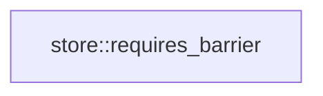

# store

[Package atlas](index.md) · [Source](../../src/lib.rs)

## Declarations

Visibility is the declaration spelling; trait members and reexports require their enclosing interface. `cfg` is not evaluated.

| Symbol | Kind | Visibility | Test / cfg |
|---|---|---|---|
| [store::BarrierContext](../../src/lib.rs#L32) | struct_item | `pub` |  |
| [store::requires_barrier](../../src/lib.rs#L37) | function_item | `pub` |  |
| [store::StoreError](../../src/lib.rs#L72) | enum_item | `pub` |  |

## Imports / reexports

| Local name | Source path | Visibility |
|---|---|---|
| `AssetRef` | `asset::AssetRef` | `pub` |
| `AssetStore` | `asset::AssetStore` | `pub` |
| `AtomicPublisher` | `atomic::AtomicPublisher` | `pub` |
| `AppendOutcome` | `folder::AppendOutcome` | `pub` |
| `ConditionalAppendOutcome` | `folder::ConditionalAppendOutcome` | `pub` |
| `CreateOutcome` | `folder::CreateOutcome` | `pub` |
| `ThreadStore` | `folder::ThreadStore` | `pub` |
| `ENDPOINT_MANAGEMENT_DIR` | `management_root::ENDPOINT_MANAGEMENT_DIR` | `pub` |
| `SESSION_SETTINGS_FILE` | `management_root::SESSION_SETTINGS_FILE` | `pub` |
| `endpoint_management_root` | `management_root::endpoint_management_root` | `pub` |
| `retire_legacy_name` | `management_root::retire_legacy_name` | `pub` |
| `session_settings_path` | `management_root::session_settings_path` | `pub` |
| `DirectoryLock` | `platform::DirectoryLock` | `pub` |
| `FullSync` | `platform::FullSync` | `pub` |
| `NamedLock` | `platform::NamedLock` | `pub` |
| `RootLock` | `platform::RootLock` | `pub` |
| `SyncPolicy` | `platform::SyncPolicy` | `pub` |
| `SystemSync` | `platform::SystemSync` | `pub` |
| `probe_local_filesystem` | `platform::probe_local_filesystem` | `pub` |
| `ForkGenesisBinding` | `rewrite::ForkGenesisBinding` | `pub` |
| `RedactionInventory` | `rewrite::RedactionInventory` | `pub` |
| `RewriteEventRef` | `rewrite::RewriteEventRef` | `pub` |
| `RewriteFileMap` | `rewrite::RewriteFileMap` | `pub` |
| `RewriteKind` | `rewrite::RewriteKind` | `pub` |
| `RewriteOperation` | `rewrite::RewriteOperation` | `pub` |
| `RewritePhase` | `rewrite::RewritePhase` | `pub` |
| `RewriteProgress` | `rewrite::RewriteProgress` | `pub` |
| `LockedLedger` | `tail::LockedLedger` | `pub` |
| `TailScan` | `tail::TailScan` | `pub` |
| `scan_valid_prefix` | `tail::scan_valid_prefix` | `pub` |
| `io` | `std::io` | `private` |
| `Error` | `thiserror::Error` | `private` |

## Module declarations

| Module | Visibility | Attributes |
|---|---|---|
| `store::asset` | `private` |  |
| `store::atomic` | `private` |  |
| `store::folder` | `private` |  |
| `store::management_root` | `private` |  |
| `store::platform` | `private` |  |
| `store::rewrite` | `private` |  |
| `store::tail` | `private` |  |

## Function call graphs

Edges below are syntactically resolved calls only, including private functions. Graphs partition callers into groups of 20; they are not execution order. All unresolved sites are listed below and in the JSON inventory.

Functions 1–1: 0 direct edges

## Call sites

Includes test functions (marked in declarations). Receiver-type-required sites need type analysis/manual tracing. Calls in closures are attributed to their enclosing function; their occurrence here does not mean the closure executes immediately.

| Caller | Callee expression | Source lines | Target / classification |
|---|---|---|---|
| `requires_barrier` | `event.kind` | [40](../../src/lib.rs#L40) | receiver-type-required |
| `requires_barrier` | `event.has_field` | [56](../../src/lib.rs#L56), [58](../../src/lib.rs#L58) | receiver-type-required |
| `requires_barrier` | `event.origin_key().is_some` | [57](../../src/lib.rs#L57), [58](../../src/lib.rs#L58) | receiver-type-required |
| `requires_barrier` | `event.origin_key` | [57](../../src/lib.rs#L57), [58](../../src/lib.rs#L58) | receiver-type-required |
