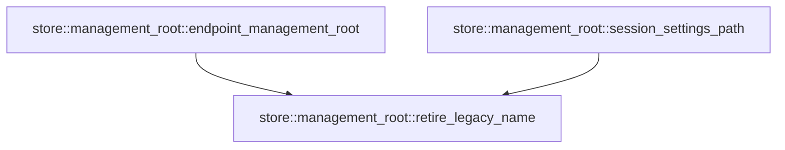

# store::management_root

[Package atlas](index.md) · [Source](../../src/management_root.rs)

## Declarations

Visibility is the declaration spelling; trait members and reexports require their enclosing interface. `cfg` is not evaluated.

| Symbol | Kind | Visibility | Test / cfg |
|---|---|---|---|
| [store::management_root::ENDPOINT_MANAGEMENT_DIR](../../src/management_root.rs#L9) | const_item | `pub` |  |
| [store::management_root::LEGACY_ENDPOINT_MANAGEMENT_DIR](../../src/management_root.rs#L10) | const_item | `private` |  |
| [store::management_root::SESSION_SETTINGS_FILE](../../src/management_root.rs#L13) | const_item | `pub` |  |
| [store::management_root::LEGACY_SESSION_SETTINGS_FILE](../../src/management_root.rs#L14) | const_item | `private` |  |
| [store::management_root::retire_legacy_name](../../src/management_root.rs#L21) | function_item | `pub` |  |
| [store::management_root::endpoint_management_root](../../src/management_root.rs#L47) | function_item | `pub` |  |
| [store::management_root::session_settings_path](../../src/management_root.rs#L57) | function_item | `pub` |  |
| [store::management_root::tests::legacy_directory_is_renamed_once](../../src/management_root.rs#L70) | function_item | `private` | test; #[cfg(test)] |
| [store::management_root::tests::a_legacy_session_settings_document_is_renamed_on_first_use](../../src/management_root.rs#L86) | function_item | `private` | test; #[cfg(test)] |

## Imports / reexports

| Local name | Source path | Visibility |
|---|---|---|
| `fs` | `std::fs` | `private` |
| `io` | `std::io` | `private` |
| `Path` | `std::path::Path` | `private` |
| `PathBuf` | `std::path::PathBuf` | `private` |
| `*` | `super::*` | `private` |

## Module declarations

| Module | Visibility | Attributes |
|---|---|---|
| `store::management_root::tests` | `private` | #[cfg(test)] |

## Function call graphs

Edges below are syntactically resolved calls only, including private functions. Graphs partition callers into groups of 20; they are not execution order. All unresolved sites are listed below and in the JSON inventory.

Functions 1–3: 2 direct edges

## Call sites

Includes test functions (marked in declarations). Receiver-type-required sites need type analysis/manual tracing. Calls in closures are attributed to their enclosing function; their occurrence here does not mean the closure executes immediately.

| Caller | Callee expression | Source lines | Target / classification |
|---|---|---|---|
| `retire_legacy_name` | `parent.join` | [22](../../src/management_root.rs#L22), [23](../../src/management_root.rs#L23) | receiver-type-required |
| `retire_legacy_name` | `fs::symlink_metadata(&legacy_path).is_ok` | [24](../../src/management_root.rs#L24) | receiver-type-required |
| `retire_legacy_name` | `fs::symlink_metadata` | [24](../../src/management_root.rs#L24), [25](../../src/management_root.rs#L25) | external-constructor-callback-or-unresolved |
| `retire_legacy_name` | `error.kind` | [26](../../src/management_root.rs#L26) | receiver-type-required |
| `retire_legacy_name` | `fs::rename` | [27](../../src/management_root.rs#L27), [32](../../src/management_root.rs#L32) | external-constructor-callback-or-unresolved |
| `retire_legacy_name` | `fs::File::open(parent)?.sync_all` | [28](../../src/management_root.rs#L28), [33](../../src/management_root.rs#L33) | receiver-type-required |
| `retire_legacy_name` | `fs::File::open` | [28](../../src/management_root.rs#L28), [33](../../src/management_root.rs#L33) | external-constructor-callback-or-unresolved |
| `retire_legacy_name` | `metadata.is_dir` | [30](../../src/management_root.rs#L30) | receiver-type-required |
| `retire_legacy_name` | `fs::read_dir(&current_path)?.next().is_none` | [30](../../src/management_root.rs#L30) | receiver-type-required |
| `retire_legacy_name` | `fs::read_dir(&current_path)?.next` | [30](../../src/management_root.rs#L30) | receiver-type-required |
| `retire_legacy_name` | `fs::read_dir` | [30](../../src/management_root.rs#L30) | external-constructor-callback-or-unresolved |
| `retire_legacy_name` | `fs::remove_dir` | [31](../../src/management_root.rs#L31) | external-constructor-callback-or-unresolved |
| `retire_legacy_name` | `Err` | [36](../../src/management_root.rs#L36), [41](../../src/management_root.rs#L41) | external-constructor-callback-or-unresolved |
| `retire_legacy_name` | `io::Error::new` | [36](../../src/management_root.rs#L36) | external-constructor-callback-or-unresolved |
| `retire_legacy_name` | `Ok` | [44](../../src/management_root.rs#L44) | external-constructor-callback-or-unresolved |
| `endpoint_management_root` | `retire_legacy_name` | [48](../../src/management_root.rs#L48) | [store::management_root::retire_legacy_name](../../src/management_root.rs#L21) |
| `session_settings_path` | `retire_legacy_name` | [58](../../src/management_root.rs#L58) | [store::management_root::retire_legacy_name](../../src/management_root.rs#L21) |
| `legacy_directory_is_renamed_once` | `tempfile::tempdir().unwrap` | [71](../../src/management_root.rs#L71) | receiver-type-required |
| `legacy_directory_is_renamed_once` | `tempfile::tempdir` | [71](../../src/management_root.rs#L71) | external-constructor-callback-or-unresolved |
| `legacy_directory_is_renamed_once` | `fs::create_dir_all(root.path().join(LEGACY_ENDPOINT_MANAGEMENT_DIR).join("rpc")).unwrap` | [72](../../src/management_root.rs#L72) | receiver-type-required |
| `legacy_directory_is_renamed_once` | `fs::create_dir_all` | [72](../../src/management_root.rs#L72) | external-constructor-callback-or-unresolved |
| `legacy_directory_is_renamed_once` | `root.path().join(LEGACY_ENDPOINT_MANAGEMENT_DIR).join` | [72](../../src/management_root.rs#L72) | receiver-type-required |
| `legacy_directory_is_renamed_once` | `root.path().join` | [72](../../src/management_root.rs#L72), [78](../../src/management_root.rs#L78) | receiver-type-required |
| `legacy_directory_is_renamed_once` | `root.path` | [72](../../src/management_root.rs#L72), [73](../../src/management_root.rs#L73), [78](../../src/management_root.rs#L78) | receiver-type-required |
| `legacy_directory_is_renamed_once` | `endpoint_management_root(root.path()).unwrap` | [73](../../src/management_root.rs#L73) | receiver-type-required |
| `legacy_directory_is_renamed_once` | `endpoint_management_root` | [73](../../src/management_root.rs#L73) | external-constructor-callback-or-unresolved |
| `legacy_directory_is_renamed_once` | `fs::create_dir(root.path().join(LEGACY_ENDPOINT_MANAGEMENT_DIR)).unwrap` | [78](../../src/management_root.rs#L78) | receiver-type-required |
| `legacy_directory_is_renamed_once` | `fs::create_dir` | [78](../../src/management_root.rs#L78) | external-constructor-callback-or-unresolved |
| `a_legacy_session_settings_document_is_renamed_on_first_use` | `tempfile::tempdir().unwrap` | [87](../../src/management_root.rs#L87) | receiver-type-required |
| `a_legacy_session_settings_document_is_renamed_on_first_use` | `tempfile::tempdir` | [87](../../src/management_root.rs#L87) | external-constructor-callback-or-unresolved |
| `a_legacy_session_settings_document_is_renamed_on_first_use` | `fs::write(             folder.path().join(LEGACY_SESSION_SETTINGS_FILE),             b"{\"format\":1}\n",         )         .unwrap` | [88](../../src/management_root.rs#L88) | receiver-type-required |
| `a_legacy_session_settings_document_is_renamed_on_first_use` | `fs::write` | [88](../../src/management_root.rs#L88), [100](../../src/management_root.rs#L100) | external-constructor-callback-or-unresolved |
| `a_legacy_session_settings_document_is_renamed_on_first_use` | `folder.path().join` | [89](../../src/management_root.rs#L89), [100](../../src/management_root.rs#L100) | receiver-type-required |
| `a_legacy_session_settings_document_is_renamed_on_first_use` | `folder.path` | [89](../../src/management_root.rs#L89), [93](../../src/management_root.rs#L93), [100](../../src/management_root.rs#L100) | receiver-type-required |
| `a_legacy_session_settings_document_is_renamed_on_first_use` | `session_settings_path(folder.path()).unwrap` | [93](../../src/management_root.rs#L93) | receiver-type-required |
| `a_legacy_session_settings_document_is_renamed_on_first_use` | `session_settings_path` | [93](../../src/management_root.rs#L93) | external-constructor-callback-or-unresolved |
| `a_legacy_session_settings_document_is_renamed_on_first_use` | `fs::write(folder.path().join(LEGACY_SESSION_SETTINGS_FILE), b"{}\n").unwrap` | [100](../../src/management_root.rs#L100) | receiver-type-required |
