# store::platform

[Package atlas](index.md) · [Source](../../src/platform.rs)

## Declarations

Visibility is the declaration spelling; trait members and reexports require their enclosing interface. `cfg` is not evaluated.

| Symbol | Kind | Visibility | Test / cfg |
|---|---|---|---|
| [store::platform::PROBE_ORDINAL](../../src/platform.rs#L11) | static_item | `private` |  |
| [store::platform::SyncPolicy](../../src/platform.rs#L15) | trait_item | `pub` |  |
| [store::platform::SyncPolicy::full_sync](../../src/platform.rs#L16) | function_signature_item | `private` |  |
| [store::platform::SystemSync](../../src/platform.rs#L20) | struct_item | `pub` |  |
| [store::platform::SystemSync::full_sync](../../src/platform.rs#L23) | function_item | `private` |  |
| [store::platform::FullSync](../../src/platform.rs#L28) | struct_item | `pub` |  |
| [store::platform::FullSync::full_sync](../../src/platform.rs#L31) | function_item | `pub` |  |
| [store::platform::DirectoryLock](../../src/platform.rs#L52) | struct_item | `pub` |  |
| [store::platform::DirectoryLock::shared](../../src/platform.rs#L58) | function_item | `pub` |  |
| [store::platform::DirectoryLock::exclusive](../../src/platform.rs#L62) | function_item | `pub` |  |
| [store::platform::DirectoryLock::try_exclusive](../../src/platform.rs#L66) | function_item | `pub` |  |
| [store::platform::DirectoryLock::acquire](../../src/platform.rs#L70) | function_item | `private` |  |
| [store::platform::DirectoryLock::path](../../src/platform.rs#L83) | function_item | `pub` |  |
| [store::platform::RootLock](../../src/platform.rs#L88) | struct_item | `pub` |  |
| [store::platform::NamedLock](../../src/platform.rs#L93) | struct_item | `pub` |  |
| [store::platform::NamedLock::shared](../../src/platform.rs#L99) | function_item | `pub` |  |
| [store::platform::NamedLock::exclusive](../../src/platform.rs#L103) | function_item | `pub` |  |
| [store::platform::NamedLock::try_exclusive](../../src/platform.rs#L107) | function_item | `pub` |  |
| [store::platform::NamedLock::acquire](../../src/platform.rs#L111) | function_item | `private` |  |
| [store::platform::NamedLock::path](../../src/platform.rs#L130) | function_item | `pub` |  |
| [store::platform::NamedLock::drop](../../src/platform.rs#L136) | function_item | `private` |  |
| [store::platform::RootLock::acquire](../../src/platform.rs#L142) | function_item | `pub` |  |
| [store::platform::RootLock::path](../../src/platform.rs#L149) | function_item | `pub` |  |
| [store::platform::RootLock::drop](../../src/platform.rs#L155) | function_item | `private` |  |
| [store::platform::DirectoryLock::drop](../../src/platform.rs#L161) | function_item | `private` |  |
| [store::platform::try_lock_exclusive](../../src/platform.rs#L166) | function_item | `pub(crate)` |  |
| [store::platform::open_exclusive_create](../../src/platform.rs#L170) | function_item | `pub(crate)` |  |
| [store::platform::lock_operation](../../src/platform.rs#L183) | function_item | `private` |  |
| [store::platform::revalidate_inode](../../src/platform.rs#L211) | function_item | `private` |  |
| [store::platform::probe_local_filesystem](../../src/platform.rs#L220) | function_item | `pub` |  |
| [store::platform::reject_known_remote_filesystem](../../src/platform.rs#L266) | function_item | `private` | #[cfg(target_os = "macos")] |
| [store::platform::reject_known_remote_filesystem](../../src/platform.rs#L292) | function_item | `private` | #[cfg(not(target_os = "macos"))] |
| [store::platform::unlock](../../src/platform.rs#L297) | function_item | `pub(crate)` |  |
| [store::platform::probe_tests::concurrent_open_probes_do_not_remove_each_others_files](../../src/platform.rs#L315) | function_item | `private` | test; #[cfg(test)] |

## Imports / reexports

| Local name | Source path | Visibility |
|---|---|---|
| `CString` | `std::ffi::CString` | `private` |
| `File` | `std::fs::File` | `private` |
| `OpenOptions` | `std::fs::OpenOptions` | `private` |
| `io` | `std::io` | `private` |
| `AsRawFd` | `std::os::fd::AsRawFd` | `private` |
| `OsStrExt` | `std::os::unix::ffi::OsStrExt` | `private` |
| `MetadataExt` | `std::os::unix::fs::MetadataExt` | `private` |
| `OpenOptionsExt` | `std::os::unix::fs::OpenOptionsExt` | `private` |
| `Path` | `std::path::Path` | `private` |
| `PathBuf` | `std::path::PathBuf` | `private` |
| `AtomicU64` | `std::sync::atomic::AtomicU64` | `private` |
| `Ordering` | `std::sync::atomic::Ordering` | `private` |
| `StoreError` | `crate::StoreError` | `private` |

## Module declarations

| Module | Visibility | Attributes |
|---|---|---|
| `store::platform::probe_tests` | `private` | #[cfg(test)] |

## Function call graphs

Edges below are syntactically resolved calls only, including private functions. Graphs partition callers into groups of 20; they are not execution order. All unresolved sites are listed below and in the JSON inventory.

```mermaid
flowchart TD
  n0["store::platform::NamedLock::exclusive"]
  n1["store::platform::NamedLock::try_exclusive"]
  n2["store::platform::NamedLock::acquire"]
  n3["store::platform::NamedLock::path"]
  n4["store::platform::NamedLock::drop"]
  n5["store::platform::RootLock::acquire"]
  n6["store::platform::RootLock::path"]
  n7["store::platform::RootLock::drop"]
  n8["store::platform::DirectoryLock::drop"]
  n9["store::platform::try_lock_exclusive"]
  n10["store::platform::open_exclusive_create"]
  n11["store::platform::lock_operation"]
  n12["store::platform::revalidate_inode"]
  n13["store::platform::SystemSync::full_sync"]
  n14["store::platform::unlock"]
  n15["store::platform::FullSync::full_sync"]
  n16["store::platform::DirectoryLock::shared"]
  n17["store::platform::DirectoryLock::exclusive"]
  n18["store::platform::DirectoryLock::try_exclusive"]
  n19["store::platform::DirectoryLock::acquire"]
  n20["store::platform::DirectoryLock::path"]
  n21["store::platform::NamedLock::shared"]
  n0 --> n2
  n1 --> n2
  n2 --> n11
  n2 --> n12
  n4 --> n14
  n5 --> n10
  n7 --> n14
  n8 --> n14
  n9 --> n11
  n10 --> n11
  n10 --> n12
  n13 --> n15
  n16 --> n19
  n17 --> n19
  n18 --> n19
  n19 --> n11
  n19 --> n12
  n21 --> n2
```

Functions 1–20: 18 direct edges

Functions 21–25: 2 direct edges

## Call sites

Includes test functions (marked in declarations). Receiver-type-required sites need type analysis/manual tracing. Calls in closures are attributed to their enclosing function; their occurrence here does not mean the closure executes immediately.

| Caller | Callee expression | Source lines | Target / classification |
|---|---|---|---|
| `PROBE_ORDINAL` | `AtomicU64::new` | [11](../../src/platform.rs#L11) | external-constructor-callback-or-unresolved |
| `full_sync` | `FullSync::full_sync` | [24](../../src/platform.rs#L24) | [store::platform::FullSync::full_sync](../../src/platform.rs#L31) |
| `full_sync` | `libc::fcntl` | [37](../../src/platform.rs#L37) | external-constructor-callback-or-unresolved |
| `full_sync` | `file.as_raw_fd` | [37](../../src/platform.rs#L37) | receiver-type-required |
| `full_sync` | `Ok` | [39](../../src/platform.rs#L39) | external-constructor-callback-or-unresolved |
| `full_sync` | `io::Error::last_os_error` | [41](../../src/platform.rs#L41) | external-constructor-callback-or-unresolved |
| `full_sync` | `error.kind` | [42](../../src/platform.rs#L42) | receiver-type-required |
| `full_sync` | `Err` | [43](../../src/platform.rs#L43) | external-constructor-callback-or-unresolved |
| `full_sync` | `file.sync_all` | [48](../../src/platform.rs#L48) | receiver-type-required |
| `shared` | `Self::acquire` | [59](../../src/platform.rs#L59) | [store::platform::DirectoryLock::acquire](../../src/platform.rs#L70) |
| `exclusive` | `Self::acquire` | [63](../../src/platform.rs#L63) | [store::platform::DirectoryLock::acquire](../../src/platform.rs#L70) |
| `try_exclusive` | `Self::acquire` | [67](../../src/platform.rs#L67) | [store::platform::DirectoryLock::acquire](../../src/platform.rs#L70) |
| `acquire` | `path.as_ref().to_path_buf` | [75](../../src/platform.rs#L75) | receiver-type-required |
| `acquire` | `path.as_ref` | [75](../../src/platform.rs#L75) | receiver-type-required |
| `acquire` | `File::open` | [76](../../src/platform.rs#L76) | external-constructor-callback-or-unresolved |
| `acquire` | `lock_operation` | [77](../../src/platform.rs#L77) | [store::platform::lock_operation](../../src/platform.rs#L183) |
| `acquire` | `revalidate_inode` | [78](../../src/platform.rs#L78) | [store::platform::revalidate_inode](../../src/platform.rs#L211) |
| `acquire` | `Ok` | [79](../../src/platform.rs#L79) | external-constructor-callback-or-unresolved |
| `shared` | `Self::acquire` | [100](../../src/platform.rs#L100) | [store::platform::NamedLock::acquire](../../src/platform.rs#L111) |
| `exclusive` | `Self::acquire` | [104](../../src/platform.rs#L104) | [store::platform::NamedLock::acquire](../../src/platform.rs#L111) |
| `try_exclusive` | `Self::acquire` | [108](../../src/platform.rs#L108) | [store::platform::NamedLock::acquire](../../src/platform.rs#L111) |
| `acquire` | `path.as_ref().to_path_buf` | [116](../../src/platform.rs#L116) | receiver-type-required |
| `acquire` | `path.as_ref` | [116](../../src/platform.rs#L116) | receiver-type-required |
| `acquire` | `OpenOptions::new()             .read(true)             .write(true)             .create(true)             .mode(0o600)             .custom_flags(libc::O_CLOEXEC &#124; libc::O_NOFOLLOW)             .open` | [117](../../src/platform.rs#L117) | receiver-type-required |
| `acquire` | `OpenOptions::new()             .read(true)             .write(true)             .create(true)             .mode(0o600)             .custom_flags` | [117](../../src/platform.rs#L117) | receiver-type-required |
| `acquire` | `OpenOptions::new()             .read(true)             .write(true)             .create(true)             .mode` | [117](../../src/platform.rs#L117) | receiver-type-required |
| `acquire` | `OpenOptions::new()             .read(true)             .write(true)             .create` | [117](../../src/platform.rs#L117) | receiver-type-required |
| `acquire` | `OpenOptions::new()             .read(true)             .write` | [117](../../src/platform.rs#L117) | receiver-type-required |
| `acquire` | `OpenOptions::new()             .read` | [117](../../src/platform.rs#L117) | receiver-type-required |
| `acquire` | `OpenOptions::new` | [117](../../src/platform.rs#L117) | external-constructor-callback-or-unresolved |
| `acquire` | `lock_operation` | [124](../../src/platform.rs#L124) | [store::platform::lock_operation](../../src/platform.rs#L183) |
| `acquire` | `revalidate_inode` | [125](../../src/platform.rs#L125) | [store::platform::revalidate_inode](../../src/platform.rs#L211) |
| `acquire` | `Ok` | [126](../../src/platform.rs#L126) | external-constructor-callback-or-unresolved |
| `drop` | `unlock` | [137](../../src/platform.rs#L137) | [store::platform::unlock](../../src/platform.rs#L297) |
| `acquire` | `root.as_ref().join` | [143](../../src/platform.rs#L143) | receiver-type-required |
| `acquire` | `root.as_ref` | [143](../../src/platform.rs#L143) | receiver-type-required |
| `acquire` | `open_exclusive_create` | [144](../../src/platform.rs#L144) | [store::platform::open_exclusive_create](../../src/platform.rs#L170) |
| `acquire` | `Ok` | [145](../../src/platform.rs#L145) | external-constructor-callback-or-unresolved |
| `drop` | `unlock` | [156](../../src/platform.rs#L156) | [store::platform::unlock](../../src/platform.rs#L297) |
| `drop` | `unlock` | [162](../../src/platform.rs#L162) | [store::platform::unlock](../../src/platform.rs#L297) |
| `try_lock_exclusive` | `lock_operation` | [167](../../src/platform.rs#L167) | [store::platform::lock_operation](../../src/platform.rs#L183) |
| `open_exclusive_create` | `OpenOptions::new()         .read(true)         .write(true)         .create(true)         .mode(0o600)         .custom_flags(libc::O_CLOEXEC &#124; libc::O_NOFOLLOW)         .open` | [171](../../src/platform.rs#L171) | receiver-type-required |
| `open_exclusive_create` | `OpenOptions::new()         .read(true)         .write(true)         .create(true)         .mode(0o600)         .custom_flags` | [171](../../src/platform.rs#L171) | receiver-type-required |
| `open_exclusive_create` | `OpenOptions::new()         .read(true)         .write(true)         .create(true)         .mode` | [171](../../src/platform.rs#L171) | receiver-type-required |
| `open_exclusive_create` | `OpenOptions::new()         .read(true)         .write(true)         .create` | [171](../../src/platform.rs#L171) | receiver-type-required |
| `open_exclusive_create` | `OpenOptions::new()         .read(true)         .write` | [171](../../src/platform.rs#L171) | receiver-type-required |
| `open_exclusive_create` | `OpenOptions::new()         .read` | [171](../../src/platform.rs#L171) | receiver-type-required |
| `open_exclusive_create` | `OpenOptions::new` | [171](../../src/platform.rs#L171) | external-constructor-callback-or-unresolved |
| `open_exclusive_create` | `lock_operation` | [178](../../src/platform.rs#L178) | [store::platform::lock_operation](../../src/platform.rs#L183) |
| `open_exclusive_create` | `revalidate_inode` | [179](../../src/platform.rs#L179) | [store::platform::revalidate_inode](../../src/platform.rs#L211) |
| `open_exclusive_create` | `Ok` | [180](../../src/platform.rs#L180) | external-constructor-callback-or-unresolved |
| `lock_operation` | `libc::flock` | [196](../../src/platform.rs#L196) | external-constructor-callback-or-unresolved |
| `lock_operation` | `file.as_raw_fd` | [196](../../src/platform.rs#L196) | receiver-type-required |
| `lock_operation` | `Ok` | [198](../../src/platform.rs#L198) | external-constructor-callback-or-unresolved |
| `lock_operation` | `io::Error::last_os_error` | [200](../../src/platform.rs#L200) | external-constructor-callback-or-unresolved |
| `lock_operation` | `error.raw_os_error` | [201](../../src/platform.rs#L201) | receiver-type-required |
| `lock_operation` | `Err` | [203](../../src/platform.rs#L203), [206](../../src/platform.rs#L206) | external-constructor-callback-or-unresolved |
| `lock_operation` | `error.kind` | [205](../../src/platform.rs#L205) | receiver-type-required |
| `lock_operation` | `StoreError::Io` | [206](../../src/platform.rs#L206) | external-constructor-callback-or-unresolved |
| `revalidate_inode` | `file.metadata` | [212](../../src/platform.rs#L212) | receiver-type-required |
| `revalidate_inode` | `std::fs::metadata` | [213](../../src/platform.rs#L213) | external-constructor-callback-or-unresolved |
| `revalidate_inode` | `descriptor.dev` | [214](../../src/platform.rs#L214) | receiver-type-required |
| `revalidate_inode` | `pathname.dev` | [214](../../src/platform.rs#L214) | receiver-type-required |
| `revalidate_inode` | `descriptor.ino` | [214](../../src/platform.rs#L214) | receiver-type-required |
| `revalidate_inode` | `pathname.ino` | [214](../../src/platform.rs#L214) | receiver-type-required |
| `revalidate_inode` | `Err` | [215](../../src/platform.rs#L215) | external-constructor-callback-or-unresolved |
| `revalidate_inode` | `Ok` | [217](../../src/platform.rs#L217) | external-constructor-callback-or-unresolved |
| `probe_local_filesystem` | `root.as_ref` | [221](../../src/platform.rs#L221) | receiver-type-required |
| `probe_local_filesystem` | `root         .to_string_lossy()         .contains` | [222](../../src/platform.rs#L222) | receiver-type-required |
| `probe_local_filesystem` | `root         .to_string_lossy` | [222](../../src/platform.rs#L222) | receiver-type-required |
| `probe_local_filesystem` | `Err` | [226](../../src/platform.rs#L226), [255](../../src/platform.rs#L255) | external-constructor-callback-or-unresolved |
| `probe_local_filesystem` | `StoreError::UnsupportedFilesystem` | [226](../../src/platform.rs#L226), [255](../../src/platform.rs#L255) | external-constructor-callback-or-unresolved |
| `probe_local_filesystem` | `"iCloud-synchronized storage is not supported".to_owned` | [227](../../src/platform.rs#L227) | receiver-type-required |
| `probe_local_filesystem` | `std::fs::create_dir_all` | [230](../../src/platform.rs#L230) | external-constructor-callback-or-unresolved |
| `probe_local_filesystem` | `reject_known_remote_filesystem` | [231](../../src/platform.rs#L231) | ambiguous-cfg-or-overload |
| `probe_local_filesystem` | `root.join` | [232](../../src/platform.rs#L232) | receiver-type-required |
| `probe_local_filesystem` | `(&#124;&#124; {         let mut first = OpenOptions::new()             .read(true)             .append(true)             .create_new(true)             .mode(0o600)             .custom_flags(libc::O_CLOEXEC &#124; libc::O_NOFOLLOW)             .open(&path)?;         use std::io::Write as _;         first.write_all(b"probe\n")?;         FullSync::full_sync(&first)?;         try_lock_exclusive(&first)?;         let second = OpenOptions::new()             .read(true)             .append(true)             .custom_flags(libc::O_CLOEXEC &#124; libc::O_NOFOLLOW)             .open(&path)?;         if !matches!(try_lock_exclusive(&second), Err(StoreError::Busy)) {             return Err(StoreError::UnsupportedFilesystem(                 "flock contention probe did not report busy".to_owned(),             ));         }         Ok(())     })` | [237](../../src/platform.rs#L237) | external-constructor-callback-or-unresolved |
| `probe_local_filesystem` | `OpenOptions::new()             .read(true)             .append(true)             .create_new(true)             .mode(0o600)             .custom_flags(libc::O_CLOEXEC &#124; libc::O_NOFOLLOW)             .open` | [238](../../src/platform.rs#L238) | receiver-type-required |
| `probe_local_filesystem` | `OpenOptions::new()             .read(true)             .append(true)             .create_new(true)             .mode(0o600)             .custom_flags` | [238](../../src/platform.rs#L238) | receiver-type-required |
| `probe_local_filesystem` | `OpenOptions::new()             .read(true)             .append(true)             .create_new(true)             .mode` | [238](../../src/platform.rs#L238) | receiver-type-required |
| `probe_local_filesystem` | `OpenOptions::new()             .read(true)             .append(true)             .create_new` | [238](../../src/platform.rs#L238) | receiver-type-required |
| `probe_local_filesystem` | `OpenOptions::new()             .read(true)             .append` | [238](../../src/platform.rs#L238), [249](../../src/platform.rs#L249) | receiver-type-required |
| `probe_local_filesystem` | `OpenOptions::new()             .read` | [238](../../src/platform.rs#L238), [249](../../src/platform.rs#L249) | receiver-type-required |
| `probe_local_filesystem` | `OpenOptions::new` | [238](../../src/platform.rs#L238), [249](../../src/platform.rs#L249) | external-constructor-callback-or-unresolved |
| `probe_local_filesystem` | `first.write_all` | [246](../../src/platform.rs#L246) | receiver-type-required |
| `probe_local_filesystem` | `FullSync::full_sync` | [247](../../src/platform.rs#L247) | [store::platform::FullSync::full_sync](../../src/platform.rs#L31) |
| `probe_local_filesystem` | `try_lock_exclusive` | [248](../../src/platform.rs#L248) | [store::platform::try_lock_exclusive](../../src/platform.rs#L166) |
| `probe_local_filesystem` | `OpenOptions::new()             .read(true)             .append(true)             .custom_flags(libc::O_CLOEXEC &#124; libc::O_NOFOLLOW)             .open` | [249](../../src/platform.rs#L249) | receiver-type-required |
| `probe_local_filesystem` | `OpenOptions::new()             .read(true)             .append(true)             .custom_flags` | [249](../../src/platform.rs#L249) | receiver-type-required |
| `probe_local_filesystem` | `"flock contention probe did not report busy".to_owned` | [256](../../src/platform.rs#L256) | receiver-type-required |
| `probe_local_filesystem` | `Ok` | [259](../../src/platform.rs#L259) | external-constructor-callback-or-unresolved |
| `probe_local_filesystem` | `std::fs::remove_file` | [261](../../src/platform.rs#L261) | external-constructor-callback-or-unresolved |
| `reject_known_remote_filesystem` | `CString::new(root.as_os_str().as_bytes())         .map_err` | [267](../../src/platform.rs#L267) | receiver-type-required |
| `reject_known_remote_filesystem` | `CString::new` | [267](../../src/platform.rs#L267) | external-constructor-callback-or-unresolved |
| `reject_known_remote_filesystem` | `root.as_os_str().as_bytes` | [267](../../src/platform.rs#L267) | receiver-type-required |
| `reject_known_remote_filesystem` | `root.as_os_str` | [267](../../src/platform.rs#L267) | receiver-type-required |
| `reject_known_remote_filesystem` | `StoreError::UnsupportedFilesystem` | [268](../../src/platform.rs#L268), [284](../../src/platform.rs#L284) | external-constructor-callback-or-unresolved |
| `reject_known_remote_filesystem` | `"storage path contains NUL".to_owned` | [268](../../src/platform.rs#L268) | receiver-type-required |
| `reject_known_remote_filesystem` | `std::mem::zeroed::<libc::statfs>` | [271](../../src/platform.rs#L271) | external-constructor-callback-or-unresolved |
| `reject_known_remote_filesystem` | `libc::statfs` | [273](../../src/platform.rs#L273) | external-constructor-callback-or-unresolved |
| `reject_known_remote_filesystem` | `path.as_ptr` | [273](../../src/platform.rs#L273) | receiver-type-required |
| `reject_known_remote_filesystem` | `Err` | [274](../../src/platform.rs#L274), [284](../../src/platform.rs#L284) | external-constructor-callback-or-unresolved |
| `reject_known_remote_filesystem` | `StoreError::Io` | [274](../../src/platform.rs#L274) | external-constructor-callback-or-unresolved |
| `reject_known_remote_filesystem` | `io::Error::last_os_error` | [274](../../src/platform.rs#L274) | external-constructor-callback-or-unresolved |
| `reject_known_remote_filesystem` | `stat         .f_fstypename         .iter()         .map(&#124;value&#124; *value as u8)         .take_while(&#124;value&#124; *value != 0)         .collect::<Vec<_>>` | [276](../../src/platform.rs#L276) | receiver-type-required |
| `reject_known_remote_filesystem` | `stat         .f_fstypename         .iter()         .map(&#124;value&#124; *value as u8)         .take_while` | [276](../../src/platform.rs#L276) | receiver-type-required |
| `reject_known_remote_filesystem` | `stat         .f_fstypename         .iter()         .map` | [276](../../src/platform.rs#L276) | receiver-type-required |
| `reject_known_remote_filesystem` | `stat         .f_fstypename         .iter` | [276](../../src/platform.rs#L276) | receiver-type-required |
| `reject_known_remote_filesystem` | `String::from_utf8_lossy(&bytes).to_ascii_lowercase` | [282](../../src/platform.rs#L282) | receiver-type-required |
| `reject_known_remote_filesystem` | `String::from_utf8_lossy` | [282](../../src/platform.rs#L282) | external-constructor-callback-or-unresolved |
| `reject_known_remote_filesystem` | `Ok` | [288](../../src/platform.rs#L288) | external-constructor-callback-or-unresolved |
| `reject_known_remote_filesystem` | `CString::new` | [293](../../src/platform.rs#L293) | external-constructor-callback-or-unresolved |
| `reject_known_remote_filesystem` | `Vec::<u8>::new` | [293](../../src/platform.rs#L293) | external-constructor-callback-or-unresolved |
| `reject_known_remote_filesystem` | `Ok` | [294](../../src/platform.rs#L294) | external-constructor-callback-or-unresolved |
| `unlock` | `libc::flock` | [301](../../src/platform.rs#L301) | external-constructor-callback-or-unresolved |
| `unlock` | `file.as_raw_fd` | [301](../../src/platform.rs#L301) | receiver-type-required |
| `unlock` | `Ok` | [303](../../src/platform.rs#L303) | external-constructor-callback-or-unresolved |
| `unlock` | `io::Error::last_os_error` | [305](../../src/platform.rs#L305) | external-constructor-callback-or-unresolved |
| `unlock` | `error.kind` | [306](../../src/platform.rs#L306) | receiver-type-required |
| `unlock` | `Err` | [307](../../src/platform.rs#L307) | external-constructor-callback-or-unresolved |
| `concurrent_open_probes_do_not_remove_each_others_files` | `tempfile::tempdir().expect` | [316](../../src/platform.rs#L316) | receiver-type-required |
| `concurrent_open_probes_do_not_remove_each_others_files` | `tempfile::tempdir` | [316](../../src/platform.rs#L316) | external-constructor-callback-or-unresolved |
| `concurrent_open_probes_do_not_remove_each_others_files` | `std::sync::Barrier::new` | [317](../../src/platform.rs#L317) | external-constructor-callback-or-unresolved |
| `concurrent_open_probes_do_not_remove_each_others_files` | `std::thread::scope` | [318](../../src/platform.rs#L318) | external-constructor-callback-or-unresolved |
| `concurrent_open_probes_do_not_remove_each_others_files` | `root.path` | [320](../../src/platform.rs#L320) | receiver-type-required |
| `concurrent_open_probes_do_not_remove_each_others_files` | `scope.spawn` | [322](../../src/platform.rs#L322) | receiver-type-required |
| `concurrent_open_probes_do_not_remove_each_others_files` | `barrier.wait` | [323](../../src/platform.rs#L323) | receiver-type-required |
| `concurrent_open_probes_do_not_remove_each_others_files` | `super::probe_local_filesystem(root).expect` | [324](../../src/platform.rs#L324) | receiver-type-required |
| `concurrent_open_probes_do_not_remove_each_others_files` | `super::probe_local_filesystem` | [324](../../src/platform.rs#L324) | [store::platform::probe_local_filesystem](../../src/platform.rs#L220) |
