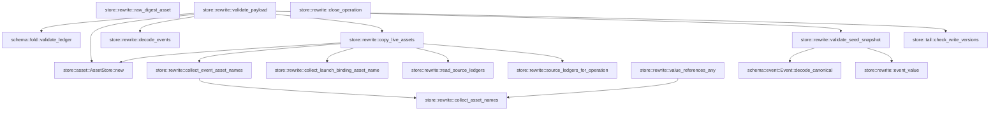

```mermaid
flowchart TD
  n0["schema::event::Event::decode_canonical"]
  n1["schema::fold::validate_ledger"]
  n2["store::atomic::AtomicPublisher::replace"]
  n3["store::management_root::session_settings_path"]
  n4["store::rewrite::scan_redaction"]
  n5["store::rewrite::RewriteOperation::decode_canonical"]
  n6["store::rewrite::contains_bytes"]
  n7["store::rewrite::operation_bytes"]
  n8["store::rewrite::write_operation"]
  n9["store::rewrite::read_operation"]
  n10["store::rewrite::build_payload"]
  n11["store::rewrite::project_ledgers"]
  n12["store::rewrite::decode_events"]
  n13["store::rewrite::event_value"]
  n14["store::rewrite::source_thread_map"]
  n15["store::rewrite::source_parent_file"]
  n16["store::rewrite::project_file"]
  n17["store::rewrite::copy_live_assets"]
  n18["store::rewrite::validate_operation"]
  n19["store::rewrite::read_source_ledgers"]
  n20["store::rewrite::source_ledgers_for_operation"]
  n21["store::rewrite::source_prefix_ledgers"]
  n22["store::rewrite::encoded_prefix"]
  n23["store::rewrite::validate_terminal_source"]
  n24["store::rewrite::build_file_map"]
  n25["store::rewrite::mapped_child_uuid"]
  n26["store::rewrite::tree_digest"]
  n27["store::rewrite::verify_source_digest"]
  n28["store::tail::check_write_versions"]
  n4 --> n0
  n4 --> n6
  n7 --> n18
  n8 --> n2
  n8 --> n7
  n9 --> n5
  n10 --> n3
  n10 --> n11
  n10 --> n17
  n10 --> n19
  n10 --> n20
  n10 --> n26
  n11 --> n12
  n11 --> n14
  n11 --> n15
  n11 --> n16
  n14 --> n12
  n15 --> n13
  n19 --> n1
  n19 --> n28
  n20 --> n21
  n21 --> n12
  n21 --> n13
  n21 --> n22
  n22 --> n1
  n23 --> n1
  n23 --> n12
  n23 --> n13
  n24 --> n25
  n27 --> n19
  n27 --> n26
```

```mermaid
flowchart TD
  n0["schema::event::Event::decode_canonical"]
  n1["schema::fold::validate_ledger"]
  n2["store::rewrite::event_value"]
  n3["store::rewrite::project_file"]
  n4["store::rewrite::build_genesis"]
  n5["store::rewrite::rewrite_origin"]
  n6["store::rewrite::materialize_input"]
  n7["store::rewrite::materialize_turn_open"]
  n8["store::rewrite::materialize_spawn"]
  n9["store::rewrite::materialize_child_result"]
  n10["store::rewrite::materialize_state"]
  n11["store::rewrite::materialize_historical_state"]
  n12["store::rewrite::event_value_ts"]
  n13["store::rewrite::materialize_settle"]
  n14["store::rewrite::materialize_meta"]
  n15["store::rewrite::materialize_epoch"]
  n16["store::rewrite::mapped_turn"]
  n17["store::rewrite::retain_payload_fields"]
  n18["store::rewrite::envelope_fields"]
  n19["store::rewrite::push_event"]
  n20["store::rewrite::value_ranges"]
  n21["store::rewrite::valid_asset_name"]
  n22["store::rewrite::collect_asset_names"]
  n23["store::rewrite::value_references_any"]
  n3 --> n1
  n3 --> n2
  n3 --> n4
  n3 --> n6
  n3 --> n7
  n3 --> n8
  n3 --> n9
  n3 --> n10
  n3 --> n11
  n3 --> n13
  n3 --> n14
  n3 --> n15
  n3 --> n16
  n3 --> n19
  n3 --> n20
  n3 --> n23
  n4 --> n2
  n4 --> n5
  n4 --> n23
  n8 --> n17
  n9 --> n17
  n10 --> n17
  n11 --> n18
  n13 --> n17
  n15 --> n17
  n19 --> n0
  n22 --> n21
  n22 --> n22
```

# store::rewrite

[Package atlas](index.md) · [Source](../../src/rewrite.rs)

## Declarations

Visibility is the declaration spelling; trait members and reexports require their enclosing interface. `cfg` is not evaluated.

| Symbol | Kind | Visibility | Test / cfg |
|---|---|---|---|
| [store::rewrite::OP_FORMAT](../../src/rewrite.rs#L15) | const_item | `private` |  |
| [store::rewrite::RewriteKind](../../src/rewrite.rs#L19) | enum_item | `pub` |  |
| [store::rewrite::RewriteKind::as_str](../../src/rewrite.rs#L25) | function_item | `private` |  |
| [store::rewrite::RewritePhase](../../src/rewrite.rs#L35) | enum_item | `pub` |  |
| [store::rewrite::RewriteEventRef](../../src/rewrite.rs#L46) | struct_item | `pub` |  |
| [store::rewrite::RewriteFileMap](../../src/rewrite.rs#L53) | struct_item | `pub` |  |
| [store::rewrite::RedactionInventory](../../src/rewrite.rs#L61) | struct_item | `pub` |  |
| [store::rewrite::RewriteOperation](../../src/rewrite.rs#L69) | struct_item | `pub` |  |
| [store::rewrite::ForkGenesisBinding](../../src/rewrite.rs#L94) | struct_item | `pub` |  |
| [store::rewrite::RewriteOperation::decode_canonical](../../src/rewrite.rs#L101) | function_item | `pub` |  |
| [store::rewrite::RewriteOperation::canonical_bytes](../../src/rewrite.rs#L121) | function_item | `pub` |  |
| [store::rewrite::RewriteProgress](../../src/rewrite.rs#L127) | struct_item | `pub` |  |
| [store::rewrite::BuiltFile](../../src/rewrite.rs#L133) | struct_item | `private` |  |
| [store::rewrite::GenesisContext](../../src/rewrite.rs#L138) | struct_item | `private` |  |
| [store::rewrite::RewriteMode](../../src/rewrite.rs#L148) | enum_item | `private` |  |
| [store::rewrite::ThreadStore::begin_fork](../../src/rewrite.rs#L154) | function_item | `pub` |  |
| [store::rewrite::ThreadStore::begin_fork_at_kernel_anchor](../../src/rewrite.rs#L173) | function_item | `pub` |  |
| [store::rewrite::ThreadStore::begin_redact](../../src/rewrite.rs#L193) | function_item | `pub` |  |
| [store::rewrite::ThreadStore::begin_rewrite](../../src/rewrite.rs#L215) | function_item | `private` |  |
| [store::rewrite::ThreadStore::advance_rewrite](../../src/rewrite.rs#L300) | function_item | `pub` |  |
| [store::rewrite::ThreadStore::recover_rewrites](../../src/rewrite.rs#L413) | function_item | `pub` |  |
| [store::rewrite::ThreadStore::recover_rewrites_for_startup](../../src/rewrite.rs#L419) | function_item | `pub` |  |
| [store::rewrite::ThreadStore::recover_rewrites_impl](../../src/rewrite.rs#L423) | function_item | `private` |  |
| [store::rewrite::ThreadStore::quarantine_unpublished_fork](../../src/rewrite.rs#L458) | function_item | `private` |  |
| [store::rewrite::ThreadStore::gc_rewrite_debris](../../src/rewrite.rs#L500) | function_item | `pub` |  |
| [store::rewrite::ThreadStore::source_has_live_rewrite](../../src/rewrite.rs#L523) | function_item | `pub(crate)` |  |
| [store::rewrite::ThreadStore::destination_has_live_rewrite](../../src/rewrite.rs#L536) | function_item | `pub(crate)` |  |
| [store::rewrite::ThreadStore::tombstone_path](../../src/rewrite.rs#L549) | function_item | `private` |  |
| [store::rewrite::progress](../../src/rewrite.rs#L556) | function_item | `private` |  |
| [store::rewrite::validate_path_id](../../src/rewrite.rs#L563) | function_item | `private` |  |
| [store::rewrite::validate_uuid](../../src/rewrite.rs#L574) | function_item | `private` |  |
| [store::rewrite::validate_operation](../../src/rewrite.rs#L585) | function_item | `private` |  |
| [store::rewrite::read_source_ledgers](../../src/rewrite.rs#L739) | function_item | `private` |  |
| [store::rewrite::source_ledgers_for_operation](../../src/rewrite.rs#L768) | function_item | `private` |  |
| [store::rewrite::source_prefix_ledgers](../../src/rewrite.rs#L781) | function_item | `private` |  |
| [store::rewrite::encoded_prefix](../../src/rewrite.rs#L839) | function_item | `private` |  |
| [store::rewrite::validate_terminal_source](../../src/rewrite.rs#L849) | function_item | `private` |  |
| [store::rewrite::build_file_map](../../src/rewrite.rs#L948) | function_item | `private` |  |
| [store::rewrite::mapped_child_uuid](../../src/rewrite.rs#L968) | function_item | `private` |  |
| [store::rewrite::tree_digest](../../src/rewrite.rs#L981) | function_item | `private` |  |
| [store::rewrite::verify_source_digest](../../src/rewrite.rs#L992) | function_item | `private` |  |
| [store::rewrite::scan_redaction](../../src/rewrite.rs#L1003) | function_item | `private` |  |
| [store::rewrite::contains_bytes](../../src/rewrite.rs#L1052) | function_item | `private` |  |
| [store::rewrite::operation_bytes](../../src/rewrite.rs#L1058) | function_item | `private` |  |
| [store::rewrite::write_operation](../../src/rewrite.rs#L1066) | function_item | `private` |  |
| [store::rewrite::read_operation](../../src/rewrite.rs#L1070) | function_item | `private` |  |
| [store::rewrite::build_payload](../../src/rewrite.rs#L1075) | function_item | `private` |  |
| [store::rewrite::project_ledgers](../../src/rewrite.rs#L1121) | function_item | `private` |  |
| [store::rewrite::decode_events](../../src/rewrite.rs#L1172) | function_item | `private` |  |
| [store::rewrite::event_value](../../src/rewrite.rs#L1181) | function_item | `private` |  |
| [store::rewrite::source_thread_map](../../src/rewrite.rs#L1189) | function_item | `private` |  |
| [store::rewrite::source_parent_file](../../src/rewrite.rs#L1210) | function_item | `private` |  |
| [store::rewrite::project_file](../../src/rewrite.rs#L1223) | function_item | `private` |  |
| [store::rewrite::build_genesis](../../src/rewrite.rs#L1570) | function_item | `private` |  |
| [store::rewrite::rewrite_origin](../../src/rewrite.rs#L1655) | function_item | `private` |  |
| [store::rewrite::materialize_input](../../src/rewrite.rs#L1662) | function_item | `private` |  |
| [store::rewrite::materialize_turn_open](../../src/rewrite.rs#L1686) | function_item | `private` |  |
| [store::rewrite::materialize_spawn](../../src/rewrite.rs#L1721) | function_item | `private` |  |
| [store::rewrite::materialize_child_result](../../src/rewrite.rs#L1747) | function_item | `private` |  |
| [store::rewrite::materialize_state](../../src/rewrite.rs#L1776) | function_item | `private` |  |
| [store::rewrite::materialize_historical_state](../../src/rewrite.rs#L1790) | function_item | `private` |  |
| [store::rewrite::event_value_ts](../../src/rewrite.rs#L1819) | function_item | `private` |  |
| [store::rewrite::materialize_settle](../../src/rewrite.rs#L1826) | function_item | `private` |  |
| [store::rewrite::materialize_meta](../../src/rewrite.rs#L1840) | function_item | `private` |  |
| [store::rewrite::materialize_epoch](../../src/rewrite.rs#L1864) | function_item | `private` |  |
| [store::rewrite::mapped_turn](../../src/rewrite.rs#L1886) | function_item | `private` |  |
| [store::rewrite::retain_payload_fields](../../src/rewrite.rs#L1893) | function_item | `private` |  |
| [store::rewrite::envelope_fields](../../src/rewrite.rs#L1898) | function_item | `private` |  |
| [store::rewrite::push_event](../../src/rewrite.rs#L1913) | function_item | `private` |  |
| [store::rewrite::value_ranges](../../src/rewrite.rs#L1922) | function_item | `private` |  |
| [store::rewrite::valid_asset_name](../../src/rewrite.rs#L1947) | function_item | `private` |  |
| [store::rewrite::collect_asset_names](../../src/rewrite.rs#L1956) | function_item | `private` |  |
| [store::rewrite::raw_digest_asset](../../src/rewrite.rs#L1975) | function_item | `private` |  |
| [store::rewrite::collect_event_asset_names](../../src/rewrite.rs#L1988) | function_item | `private` |  |
| [store::rewrite::collect_launch_binding_asset_name](../../src/rewrite.rs#L2018) | function_item | `private` |  |
| [store::rewrite::value_references_any](../../src/rewrite.rs#L2032) | function_item | `private` |  |
| [store::rewrite::copy_live_assets](../../src/rewrite.rs#L2038) | function_item | `private` |  |
| [store::rewrite::validate_payload](../../src/rewrite.rs#L2126) | function_item | `private` |  |
| [store::rewrite::validate_seed_snapshot](../../src/rewrite.rs#L2181) | function_item | `private` |  |
| [store::rewrite::close_operation](../../src/rewrite.rs#L2255) | function_item | `private` |  |
| [store::rewrite::tests::write_canonical_events](../../src/rewrite.rs#L2267) | function_item | `private` | test; #[cfg(test)] |
| [store::rewrite::tests::origin](../../src/rewrite.rs#L2279) | function_item | `private` | test; #[cfg(test)] |
| [store::rewrite::tests::startup_isolates_missing_fork_carrier_without_losing_source](../../src/rewrite.rs#L2290) | function_item | `private` | test; #[cfg(test)] |
| [store::rewrite::tests::anchored_fork_uses_terminal_prefix_binding_and_empty_endpoint_journal](../../src/rewrite.rs#L2363) | function_item | `private` | test; #[cfg(test)] |
| [store::rewrite::tests::fork_preserves_runtime_identity_selection](../../src/rewrite.rs#L2506) | function_item | `private` | test; #[cfg(test)] |
| [store::rewrite::tests::anchored_fork_remaps_complete_child_edges](../../src/rewrite.rs#L2564) | function_item | `private` | test; #[cfg(test)] |
| [store::rewrite::tests::fork_and_redact_copy_unpoisoned_launch_binding_carriers](../../src/rewrite.rs#L2686) | function_item | `private` | test; #[cfg(test)] |

## Imports / reexports

| Local name | Source path | Visibility |
|---|---|---|
| `BTreeMap` | `std::collections::BTreeMap` | `private` |
| `BTreeSet` | `std::collections::BTreeSet` | `private` |
| `fs` | `std::fs` | `private` |
| `File` | `std::fs::File` | `private` |
| `DirBuilderExt` | `std::os::unix::fs::DirBuilderExt` | `private` |
| `Path` | `std::path::Path` | `private` |
| `PathBuf` | `std::path::PathBuf` | `private` |
| `Event` | `schema::Event` | `private` |
| `EventKind` | `schema::EventKind` | `private` |
| `OriginTuple` | `schema::OriginTuple` | `private` |
| `Visibility` | `schema::Visibility` | `private` |
| `validate_ledger` | `schema::validate_ledger` | `private` |
| `Deserialize` | `serde::Deserialize` | `private` |
| `Serialize` | `serde::Serialize` | `private` |
| `Map` | `serde_json::Map` | `private` |
| `Value` | `serde_json::Value` | `private` |
| `json` | `serde_json::json` | `private` |
| `Digest` | `sha2::Digest` | `private` |
| `Sha256` | `sha2::Sha256` | `private` |
| `Uuid` | `uuid::Uuid` | `private` |
| `hex_digest` | `crate::asset::hex_digest` | `private` |
| `AssetStore` | `crate::AssetStore` | `private` |
| `AtomicPublisher` | `crate::AtomicPublisher` | `private` |
| `DirectoryLock` | `crate::DirectoryLock` | `private` |
| `NamedLock` | `crate::NamedLock` | `private` |
| `StoreError` | `crate::StoreError` | `private` |
| `ThreadStore` | `crate::ThreadStore` | `private` |
| `*` | `super::*` | `private` |

## Module declarations

| Module | Visibility | Attributes |
|---|---|---|
| `store::rewrite::tests` | `private` | #[cfg(test)] |

## Function call graphs

Edges below are syntactically resolved calls only, including private functions. Graphs partition callers into groups of 20; they are not execution order. All unresolved sites are listed below and in the JSON inventory.

```mermaid
flowchart TD
  n0["schema::event::Event::decode_canonical"]
  n1["store::platform::NamedLock::exclusive"]
  n2["store::platform::DirectoryLock::exclusive"]
  n3["store::rewrite::scan_redaction"]
  n4["store::rewrite::RewriteOperation::decode_canonical"]
  n5["store::rewrite::operation_bytes"]
  n6["store::rewrite::write_operation"]
  n7["store::rewrite::read_operation"]
  n8["store::rewrite::build_payload"]
  n9["store::rewrite::project_ledgers"]
  n10["store::rewrite::RewriteOperation::canonical_bytes"]
  n11["store::rewrite::ThreadStore::begin_fork"]
  n12["store::rewrite::ThreadStore::begin_fork_at_kernel_anchor"]
  n13["store::rewrite::ThreadStore::begin_redact"]
  n14["store::rewrite::valid_asset_name"]
  n15["store::rewrite::validate_payload"]
  n16["store::rewrite::ThreadStore::begin_rewrite"]
  n17["store::rewrite::close_operation"]
  n18["store::rewrite::RewriteKind::as_str"]
  n19["store::rewrite::ThreadStore::advance_rewrite"]
  n20["store::rewrite::ThreadStore::recover_rewrites"]
  n21["store::rewrite::ThreadStore::recover_rewrites_for_startup"]
  n22["store::rewrite::ThreadStore::recover_rewrites_impl"]
  n23["store::rewrite::ThreadStore::quarantine_unpublished_fork"]
  n24["store::rewrite::ThreadStore::gc_rewrite_debris"]
  n25["store::rewrite::ThreadStore::source_has_live_rewrite"]
  n26["store::rewrite::ThreadStore::destination_has_live_rewrite"]
  n27["store::rewrite::ThreadStore::tombstone_path"]
  n28["store::rewrite::progress"]
  n29["store::rewrite::validate_path_id"]
  n30["store::rewrite::validate_uuid"]
  n31["store::rewrite::validate_operation"]
  n32["store::rewrite::read_source_ledgers"]
  n33["store::rewrite::source_prefix_ledgers"]
  n34["store::rewrite::validate_terminal_source"]
  n35["store::rewrite::build_file_map"]
  n36["store::rewrite::tree_digest"]
  n37["store::rewrite::verify_source_digest"]
  n4 --> n31
  n10 --> n5
  n11 --> n16
  n12 --> n16
  n13 --> n16
  n16 --> n1
  n16 --> n2
  n16 --> n3
  n16 --> n6
  n16 --> n9
  n16 --> n25
  n16 --> n26
  n16 --> n29
  n16 --> n30
  n16 --> n31
  n16 --> n32
  n16 --> n33
  n16 --> n34
  n16 --> n35
  n16 --> n36
  n19 --> n1
  n19 --> n2
  n19 --> n6
  n19 --> n7
  n19 --> n8
  n19 --> n15
  n19 --> n17
  n19 --> n27
  n19 --> n28
  n19 --> n29
  n19 --> n37
  n20 --> n22
  n21 --> n22
  n22 --> n19
  n22 --> n23
  n23 --> n1
  n23 --> n2
  n23 --> n7
  n23 --> n37
  n24 --> n1
  n25 --> n7
  n26 --> n7
  n31 --> n0
  n31 --> n14
  n31 --> n29
  n31 --> n30
```

Functions 1–20: 46 direct edges

Functions 21–40: 31 direct edges

Functions 41–60: 28 direct edges

Functions 61–68: 15 direct edges

## Call sites

Includes test functions (marked in declarations). Receiver-type-required sites need type analysis/manual tracing. Calls in closures are attributed to their enclosing function; their occurrence here does not mean the closure executes immediately.

| Caller | Callee expression | Source lines | Target / classification |
|---|---|---|---|
| `decode_canonical` | `bytes.strip_suffix(b"\n").ok_or_else` | [102](../../src/rewrite.rs#L102) | receiver-type-required |
| `decode_canonical` | `bytes.strip_suffix` | [102](../../src/rewrite.rs#L102) | receiver-type-required |
| `decode_canonical` | `StoreError::RewriteOperationCorrupt` | [103](../../src/rewrite.rs#L103), [106](../../src/rewrite.rs#L106), [109](../../src/rewrite.rs#L109), [112](../../src/rewrite.rs#L112), [117](../../src/rewrite.rs#L117) | external-constructor-callback-or-unresolved |
| `decode_canonical` | `"record must end in one LF".to_owned` | [103](../../src/rewrite.rs#L103) | receiver-type-required |
| `decode_canonical` | `serde_json::from_slice(canonical).map_err` | [105](../../src/rewrite.rs#L105) | receiver-type-required |
| `decode_canonical` | `serde_json::from_slice` | [105](../../src/rewrite.rs#L105) | external-constructor-callback-or-unresolved |
| `decode_canonical` | `serde_json_canonicalizer::to_vec(&operation)             .map_err` | [108](../../src/rewrite.rs#L108) | receiver-type-required |
| `decode_canonical` | `serde_json_canonicalizer::to_vec` | [108](../../src/rewrite.rs#L108) | external-constructor-callback-or-unresolved |
| `decode_canonical` | `error.to_string` | [109](../../src/rewrite.rs#L109), [117](../../src/rewrite.rs#L117) | receiver-type-required |
| `decode_canonical` | `Err` | [112](../../src/rewrite.rs#L112) | external-constructor-callback-or-unresolved |
| `decode_canonical` | `"record is not canonical".to_owned` | [113](../../src/rewrite.rs#L113) | receiver-type-required |
| `decode_canonical` | `validate_operation(&operation)             .map_err` | [116](../../src/rewrite.rs#L116) | receiver-type-required |
| `decode_canonical` | `validate_operation` | [116](../../src/rewrite.rs#L116) | [store::rewrite::validate_operation](../../src/rewrite.rs#L585) |
| `decode_canonical` | `Ok` | [118](../../src/rewrite.rs#L118) | external-constructor-callback-or-unresolved |
| `canonical_bytes` | `operation_bytes` | [122](../../src/rewrite.rs#L122) | [store::rewrite::operation_bytes](../../src/rewrite.rs#L1058) |
| `begin_fork` | `self.begin_rewrite` | [161](../../src/rewrite.rs#L161) | [store::rewrite::ThreadStore::begin_rewrite](../../src/rewrite.rs#L215) |
| `begin_fork` | `RewriteMode::Fork` | [166](../../src/rewrite.rs#L166) | external-constructor-callback-or-unresolved |
| `begin_fork_at_kernel_anchor` | `Err` | [182](../../src/rewrite.rs#L182) | external-constructor-callback-or-unresolved |
| `begin_fork_at_kernel_anchor` | `StoreError::InvalidForkAnchor` | [182](../../src/rewrite.rs#L182) | external-constructor-callback-or-unresolved |
| `begin_fork_at_kernel_anchor` | `self.begin_rewrite` | [184](../../src/rewrite.rs#L184) | [store::rewrite::ThreadStore::begin_rewrite](../../src/rewrite.rs#L215) |
| `begin_fork_at_kernel_anchor` | `RewriteMode::Fork` | [189](../../src/rewrite.rs#L189) | external-constructor-callback-or-unresolved |
| `begin_fork_at_kernel_anchor` | `Some` | [189](../../src/rewrite.rs#L189) | external-constructor-callback-or-unresolved |
| `begin_redact` | `forbidden.is_empty` | [201](../../src/rewrite.rs#L201) | receiver-type-required |
| `begin_redact` | `forbidden.iter().any` | [201](../../src/rewrite.rs#L201) | receiver-type-required |
| `begin_redact` | `forbidden.iter` | [201](../../src/rewrite.rs#L201) | receiver-type-required |
| `begin_redact` | `Err` | [202](../../src/rewrite.rs#L202) | external-constructor-callback-or-unresolved |
| `begin_redact` | `StoreError::Corruption` | [202](../../src/rewrite.rs#L202) | external-constructor-callback-or-unresolved |
| `begin_redact` | `"redact requires non-empty forbidden byte strings".to_owned` | [203](../../src/rewrite.rs#L203) | receiver-type-required |
| `begin_redact` | `self.begin_rewrite` | [206](../../src/rewrite.rs#L206) | [store::rewrite::ThreadStore::begin_rewrite](../../src/rewrite.rs#L215) |
| `begin_redact` | `RewriteMode::Redact` | [211](../../src/rewrite.rs#L211) | external-constructor-callback-or-unresolved |
| `begin_rewrite` | `NamedLock::exclusive` | [227](../../src/rewrite.rs#L227), [228](../../src/rewrite.rs#L228) | [store::platform::NamedLock::exclusive](../../src/platform.rs#L102) |
| `begin_rewrite` | `self.root().join` | [227](../../src/rewrite.rs#L227), [228](../../src/rewrite.rs#L228), [242](../../src/rewrite.rs#L242), [246](../../src/rewrite.rs#L246), [251](../../src/rewrite.rs#L251), [293](../../src/rewrite.rs#L293), [296](../../src/rewrite.rs#L296) | receiver-type-required |
| `begin_rewrite` | `self.root` | [227](../../src/rewrite.rs#L227), [228](../../src/rewrite.rs#L228), [242](../../src/rewrite.rs#L242), [246](../../src/rewrite.rs#L246), [251](../../src/rewrite.rs#L251), [293](../../src/rewrite.rs#L293), [296](../../src/rewrite.rs#L296) | receiver-type-required |
| `begin_rewrite` | `validate_path_id` | [229](../../src/rewrite.rs#L229) | [store::rewrite::validate_path_id](../../src/rewrite.rs#L563) |
| `begin_rewrite` | `validate_uuid` | [230](../../src/rewrite.rs#L230), [231](../../src/rewrite.rs#L231) | [store::rewrite::validate_uuid](../../src/rewrite.rs#L574) |
| `begin_rewrite` | `Err` | [233](../../src/rewrite.rs#L233), [236](../../src/rewrite.rs#L236), [239](../../src/rewrite.rs#L239), [243](../../src/rewrite.rs#L243), [249](../../src/rewrite.rs#L249), [253](../../src/rewrite.rs#L253) | external-constructor-callback-or-unresolved |
| `begin_rewrite` | `self.source_has_live_rewrite` | [235](../../src/rewrite.rs#L235) | [store::rewrite::ThreadStore::source_has_live_rewrite](../../src/rewrite.rs#L523) |
| `begin_rewrite` | `self.destination_has_live_rewrite` | [238](../../src/rewrite.rs#L238) | [store::rewrite::ThreadStore::destination_has_live_rewrite](../../src/rewrite.rs#L536) |
| `begin_rewrite` | `self.root().join(area).join(destination).exists` | [242](../../src/rewrite.rs#L242) | receiver-type-required |
| `begin_rewrite` | `self.root().join(area).join` | [242](../../src/rewrite.rs#L242) | receiver-type-required |
| `begin_rewrite` | `fs::read_dir(self.root().join(".rewrite-trash"))?.any` | [246](../../src/rewrite.rs#L246) | receiver-type-required |
| `begin_rewrite` | `fs::read_dir` | [246](../../src/rewrite.rs#L246) | external-constructor-callback-or-unresolved |
| `begin_rewrite` | `entry.is_ok_and` | [247](../../src/rewrite.rs#L247) | receiver-type-required |
| `begin_rewrite` | `entry.file_name().to_string_lossy().ends_with` | [247](../../src/rewrite.rs#L247) | receiver-type-required |
| `begin_rewrite` | `entry.file_name().to_string_lossy` | [247](../../src/rewrite.rs#L247) | receiver-type-required |
| `begin_rewrite` | `entry.file_name` | [247](../../src/rewrite.rs#L247) | receiver-type-required |
| `begin_rewrite` | `self.root().join("threads").join` | [251](../../src/rewrite.rs#L251) | receiver-type-required |
| `begin_rewrite` | `source_folder.is_dir` | [252](../../src/rewrite.rs#L252) | receiver-type-required |
| `begin_rewrite` | `DirectoryLock::exclusive` | [255](../../src/rewrite.rs#L255) | [store::platform::DirectoryLock::exclusive](../../src/platform.rs#L61) |
| `begin_rewrite` | `read_source_ledgers` | [256](../../src/rewrite.rs#L256) | [store::rewrite::read_source_ledgers](../../src/rewrite.rs#L739) |
| `begin_rewrite` | `fork_anchor.as_ref` | [257](../../src/rewrite.rs#L257), [278](../../src/rewrite.rs#L278) | receiver-type-required |
| `begin_rewrite` | `source_prefix_ledgers` | [258](../../src/rewrite.rs#L258) | [store::rewrite::source_prefix_ledgers](../../src/rewrite.rs#L781) |
| `begin_rewrite` | `ledgers.clone` | [259](../../src/rewrite.rs#L259) | receiver-type-required |
| `begin_rewrite` | `validate_terminal_source` | [261](../../src/rewrite.rs#L261) | [store::rewrite::validate_terminal_source](../../src/rewrite.rs#L849) |
| `begin_rewrite` | `tree_digest` | [262](../../src/rewrite.rs#L262) | [store::rewrite::tree_digest](../../src/rewrite.rs#L981) |
| `begin_rewrite` | `build_file_map` | [263](../../src/rewrite.rs#L263) | [store::rewrite::build_file_map](../../src/rewrite.rs#L948) |
| `begin_rewrite` | `Some` | [266](../../src/rewrite.rs#L266) | external-constructor-callback-or-unresolved |
| `begin_rewrite` | `scan_redaction` | [266](../../src/rewrite.rs#L266) | [store::rewrite::scan_redaction](../../src/rewrite.rs#L1003) |
| `begin_rewrite` | `operation_id.to_owned` | [270](../../src/rewrite.rs#L270) | receiver-type-required |
| `begin_rewrite` | `source.to_owned` | [272](../../src/rewrite.rs#L272) | receiver-type-required |
| `begin_rewrite` | `destination.to_owned` | [273](../../src/rewrite.rs#L273) | receiver-type-required |
| `begin_rewrite` | `created_at.to_owned` | [274](../../src/rewrite.rs#L274) | receiver-type-required |
| `begin_rewrite` | `fork_anchor.as_ref().map` | [278](../../src/rewrite.rs#L278) | receiver-type-required |
| `begin_rewrite` | `"main.jsonl".to_owned` | [279](../../src/rewrite.rs#L279) | receiver-type-required |
| `begin_rewrite` | `fork_anchor                 .as_ref()                 .is_some_and` | [282](../../src/rewrite.rs#L282) | receiver-type-required |
| `begin_rewrite` | `fork_anchor                 .as_ref` | [282](../../src/rewrite.rs#L282) | receiver-type-required |
| `begin_rewrite` | `fork_anchor.map` | [285](../../src/rewrite.rs#L285) | receiver-type-required |
| `begin_rewrite` | `validate_operation` | [288](../../src/rewrite.rs#L288) | [store::rewrite::validate_operation](../../src/rewrite.rs#L585) |
| `begin_rewrite` | `project_ledgers` | [292](../../src/rewrite.rs#L292) | [store::rewrite::project_ledgers](../../src/rewrite.rs#L1121) |
| `begin_rewrite` | `self.root().join("staging").join` | [293](../../src/rewrite.rs#L293) | receiver-type-required |
| `begin_rewrite` | `fs::create_dir` | [294](../../src/rewrite.rs#L294) | external-constructor-callback-or-unresolved |
| `begin_rewrite` | `write_operation` | [295](../../src/rewrite.rs#L295) | [store::rewrite::write_operation](../../src/rewrite.rs#L1066) |
| `begin_rewrite` | `File::open(self.root().join("staging"))?.sync_all` | [296](../../src/rewrite.rs#L296) | receiver-type-required |
| `begin_rewrite` | `File::open` | [296](../../src/rewrite.rs#L296) | external-constructor-callback-or-unresolved |
| `begin_rewrite` | `Ok` | [297](../../src/rewrite.rs#L297) | external-constructor-callback-or-unresolved |
| `advance_rewrite` | `NamedLock::exclusive` | [301](../../src/rewrite.rs#L301), [302](../../src/rewrite.rs#L302) | [store::platform::NamedLock::exclusive](../../src/platform.rs#L102) |
| `advance_rewrite` | `self.root().join` | [301](../../src/rewrite.rs#L301), [302](../../src/rewrite.rs#L302), [304](../../src/rewrite.rs#L304), [311](../../src/rewrite.rs#L311), [339](../../src/rewrite.rs#L339), [343](../../src/rewrite.rs#L343), [370](../../src/rewrite.rs#L370), [371](../../src/rewrite.rs#L371), [389](../../src/rewrite.rs#L389) | receiver-type-required |
| `advance_rewrite` | `self.root` | [301](../../src/rewrite.rs#L301), [302](../../src/rewrite.rs#L302), [304](../../src/rewrite.rs#L304), [311](../../src/rewrite.rs#L311), [324](../../src/rewrite.rs#L324), [331](../../src/rewrite.rs#L331), [339](../../src/rewrite.rs#L339), [343](../../src/rewrite.rs#L343), [359](../../src/rewrite.rs#L359), [370](../../src/rewrite.rs#L370), [371](../../src/rewrite.rs#L371), [389](../../src/rewrite.rs#L389), [401](../../src/rewrite.rs#L401) | receiver-type-required |
| `advance_rewrite` | `validate_path_id` | [303](../../src/rewrite.rs#L303) | [store::rewrite::validate_path_id](../../src/rewrite.rs#L563) |
| `advance_rewrite` | `self.root().join("staging").join` | [304](../../src/rewrite.rs#L304) | receiver-type-required |
| `advance_rewrite` | `read_operation` | [305](../../src/rewrite.rs#L305) | [store::rewrite::read_operation](../../src/rewrite.rs#L1070) |
| `advance_rewrite` | `Err` | [307](../../src/rewrite.rs#L307), [347](../../src/rewrite.rs#L347), [375](../../src/rewrite.rs#L375), [397](../../src/rewrite.rs#L397), [407](../../src/rewrite.rs#L407) | external-constructor-callback-or-unresolved |
| `advance_rewrite` | `StoreError::Corruption` | [307](../../src/rewrite.rs#L307), [347](../../src/rewrite.rs#L347), [375](../../src/rewrite.rs#L375), [397](../../src/rewrite.rs#L397), [408](../../src/rewrite.rs#L408) | external-constructor-callback-or-unresolved |
| `advance_rewrite` | `"operation directory/id mismatch".to_owned` | [308](../../src/rewrite.rs#L308) | receiver-type-required |
| `advance_rewrite` | `self.root().join("threads").join` | [311](../../src/rewrite.rs#L311), [339](../../src/rewrite.rs#L339) | receiver-type-required |
| `advance_rewrite` | `self.tombstone_path` | [312](../../src/rewrite.rs#L312) | [store::rewrite::ThreadStore::tombstone_path](../../src/rewrite.rs#L549) |
| `advance_rewrite` | `source.is_dir` | [313](../../src/rewrite.rs#L313), [366](../../src/rewrite.rs#L366) | receiver-type-required |
| `advance_rewrite` | `Some` | [314](../../src/rewrite.rs#L314), [316](../../src/rewrite.rs#L316) | external-constructor-callback-or-unresolved |
| `advance_rewrite` | `DirectoryLock::exclusive` | [314](../../src/rewrite.rs#L314), [316](../../src/rewrite.rs#L316) | [store::platform::DirectoryLock::exclusive](../../src/platform.rs#L61) |
| `advance_rewrite` | `tombstone.is_dir` | [315](../../src/rewrite.rs#L315), [366](../../src/rewrite.rs#L366) | receiver-type-required |
| `advance_rewrite` | `verify_source_digest` | [323](../../src/rewrite.rs#L323), [330](../../src/rewrite.rs#L330), [337](../../src/rewrite.rs#L337), [358](../../src/rewrite.rs#L358), [368](../../src/rewrite.rs#L368), [380](../../src/rewrite.rs#L380), [387](../../src/rewrite.rs#L387) | [store::rewrite::verify_source_digest](../../src/rewrite.rs#L992) |
| `advance_rewrite` | `build_payload` | [324](../../src/rewrite.rs#L324) | [store::rewrite::build_payload](../../src/rewrite.rs#L1075) |
| `advance_rewrite` | `write_operation` | [326](../../src/rewrite.rs#L326), [333](../../src/rewrite.rs#L333), [354](../../src/rewrite.rs#L354), [382](../../src/rewrite.rs#L382), [392](../../src/rewrite.rs#L392) | [store::rewrite::write_operation](../../src/rewrite.rs#L1066) |
| `advance_rewrite` | `progress` | [327](../../src/rewrite.rs#L327), [334](../../src/rewrite.rs#L334), [355](../../src/rewrite.rs#L355), [383](../../src/rewrite.rs#L383), [393](../../src/rewrite.rs#L393) | [store::rewrite::progress](../../src/rewrite.rs#L556) |
| `advance_rewrite` | `validate_payload` | [331](../../src/rewrite.rs#L331) | [store::rewrite::validate_payload](../../src/rewrite.rs#L2126) |
| `advance_rewrite` | `stage.join` | [338](../../src/rewrite.rs#L338) | receiver-type-required |
| `advance_rewrite` | `payload.is_dir` | [340](../../src/rewrite.rs#L340) | receiver-type-required |
| `advance_rewrite` | `destination.is_dir` | [340](../../src/rewrite.rs#L340) | receiver-type-required |
| `advance_rewrite` | `fs::rename` | [342](../../src/rewrite.rs#L342), [369](../../src/rewrite.rs#L369) | external-constructor-callback-or-unresolved |
| `advance_rewrite` | `File::open(self.root().join("threads"))?.sync_all` | [343](../../src/rewrite.rs#L343), [370](../../src/rewrite.rs#L370) | receiver-type-required |
| `advance_rewrite` | `File::open` | [343](../../src/rewrite.rs#L343), [370](../../src/rewrite.rs#L370), [371](../../src/rewrite.rs#L371), [389](../../src/rewrite.rs#L389) | external-constructor-callback-or-unresolved |
| `advance_rewrite` | `"rewrite publication has ambiguous payload/destination state"                                 .to_owned` | [348](../../src/rewrite.rs#L348) | receiver-type-required |
| `advance_rewrite` | `close_operation` | [359](../../src/rewrite.rs#L359), [401](../../src/rewrite.rs#L401) | [store::rewrite::close_operation](../../src/rewrite.rs#L2255) |
| `advance_rewrite` | `Ok` | [360](../../src/rewrite.rs#L360), [402](../../src/rewrite.rs#L402) | external-constructor-callback-or-unresolved |
| `advance_rewrite` | `File::open(self.root().join(".rewrite-trash"))?.sync_all` | [371](../../src/rewrite.rs#L371), [389](../../src/rewrite.rs#L389) | receiver-type-required |
| `advance_rewrite` | `"redact retirement has ambiguous source/tombstone state".to_owned` | [376](../../src/rewrite.rs#L376) | receiver-type-required |
| `advance_rewrite` | `tombstone.exists` | [386](../../src/rewrite.rs#L386), [396](../../src/rewrite.rs#L396) | receiver-type-required |
| `advance_rewrite` | `fs::remove_dir_all` | [388](../../src/rewrite.rs#L388) | external-constructor-callback-or-unresolved |
| `advance_rewrite` | `source.exists` | [396](../../src/rewrite.rs#L396) | receiver-type-required |
| `advance_rewrite` | `"redact source reappeared after removal".to_owned` | [398](../../src/rewrite.rs#L398) | receiver-type-required |
| `advance_rewrite` | `"fork entered a redact-only phase".to_owned` | [408](../../src/rewrite.rs#L408) | receiver-type-required |
| `recover_rewrites` | `self.recover_rewrites_impl` | [414](../../src/rewrite.rs#L414) | [store::rewrite::ThreadStore::recover_rewrites_impl](../../src/rewrite.rs#L423) |
| `recover_rewrites_for_startup` | `self.recover_rewrites_impl` | [420](../../src/rewrite.rs#L420) | [store::rewrite::ThreadStore::recover_rewrites_impl](../../src/rewrite.rs#L423) |
| `recover_rewrites_impl` | `Vec::new` | [427](../../src/rewrite.rs#L427), [435](../../src/rewrite.rs#L435) | external-constructor-callback-or-unresolved |
| `recover_rewrites_impl` | `fs::read_dir` | [428](../../src/rewrite.rs#L428) | external-constructor-callback-or-unresolved |
| `recover_rewrites_impl` | `self.root().join` | [428](../../src/rewrite.rs#L428) | receiver-type-required |
| `recover_rewrites_impl` | `self.root` | [428](../../src/rewrite.rs#L428) | receiver-type-required |
| `recover_rewrites_impl` | `entry.file_type()?.is_dir` | [430](../../src/rewrite.rs#L430) | receiver-type-required |
| `recover_rewrites_impl` | `entry.file_type` | [430](../../src/rewrite.rs#L430) | receiver-type-required |
| `recover_rewrites_impl` | `entry.path().join("op.json").is_file` | [430](../../src/rewrite.rs#L430) | receiver-type-required |
| `recover_rewrites_impl` | `entry.path().join` | [430](../../src/rewrite.rs#L430) | receiver-type-required |
| `recover_rewrites_impl` | `entry.path` | [430](../../src/rewrite.rs#L430) | receiver-type-required |
| `recover_rewrites_impl` | `ids.push` | [431](../../src/rewrite.rs#L431) | receiver-type-required |
| `recover_rewrites_impl` | `entry.file_name().to_string_lossy().into_owned` | [431](../../src/rewrite.rs#L431) | receiver-type-required |
| `recover_rewrites_impl` | `entry.file_name().to_string_lossy` | [431](../../src/rewrite.rs#L431) | receiver-type-required |
| `recover_rewrites_impl` | `entry.file_name` | [431](../../src/rewrite.rs#L431) | receiver-type-required |
| `recover_rewrites_impl` | `ids.sort` | [434](../../src/rewrite.rs#L434) | receiver-type-required |
| `recover_rewrites_impl` | `self.advance_rewrite` | [438](../../src/rewrite.rs#L438) | [store::rewrite::ThreadStore::advance_rewrite](../../src/rewrite.rs#L300) |
| `recover_rewrites_impl` | `self.quarantine_unpublished_fork` | [441](../../src/rewrite.rs#L441) | [store::rewrite::ThreadStore::quarantine_unpublished_fork](../../src/rewrite.rs#L458) |
| `recover_rewrites_impl` | `Err` | [442](../../src/rewrite.rs#L442), [446](../../src/rewrite.rs#L446) | external-constructor-callback-or-unresolved |
| `recover_rewrites_impl` | `value.phase.is_none` | [448](../../src/rewrite.rs#L448) | receiver-type-required |
| `recover_rewrites_impl` | `completed.push` | [450](../../src/rewrite.rs#L450) | receiver-type-required |
| `recover_rewrites_impl` | `Ok` | [455](../../src/rewrite.rs#L455) | external-constructor-callback-or-unresolved |
| `quarantine_unpublished_fork` | `NamedLock::exclusive` | [463](../../src/rewrite.rs#L463), [464](../../src/rewrite.rs#L464) | [store::platform::NamedLock::exclusive](../../src/platform.rs#L102) |
| `quarantine_unpublished_fork` | `self.root().join` | [463](../../src/rewrite.rs#L463), [464](../../src/rewrite.rs#L464), [465](../../src/rewrite.rs#L465), [470](../../src/rewrite.rs#L470), [474](../../src/rewrite.rs#L474), [477](../../src/rewrite.rs#L477), [492](../../src/rewrite.rs#L492) | receiver-type-required |
| `quarantine_unpublished_fork` | `self.root` | [463](../../src/rewrite.rs#L463), [464](../../src/rewrite.rs#L464), [465](../../src/rewrite.rs#L465), [470](../../src/rewrite.rs#L470), [474](../../src/rewrite.rs#L474), [477](../../src/rewrite.rs#L477), [482](../../src/rewrite.rs#L482), [492](../../src/rewrite.rs#L492) | receiver-type-required |
| `quarantine_unpublished_fork` | `self.root().join("staging").join` | [465](../../src/rewrite.rs#L465) | receiver-type-required |
| `quarantine_unpublished_fork` | `read_operation` | [466](../../src/rewrite.rs#L466) | [store::rewrite::read_operation](../../src/rewrite.rs#L1070) |
| `quarantine_unpublished_fork` | `self.root().join("threads").join(&operation.dest).exists` | [470](../../src/rewrite.rs#L470) | receiver-type-required |
| `quarantine_unpublished_fork` | `self.root().join("threads").join` | [470](../../src/rewrite.rs#L470), [474](../../src/rewrite.rs#L474) | receiver-type-required |
| `quarantine_unpublished_fork` | `Ok` | [472](../../src/rewrite.rs#L472), [485](../../src/rewrite.rs#L485), [497](../../src/rewrite.rs#L497) | external-constructor-callback-or-unresolved |
| `quarantine_unpublished_fork` | `DirectoryLock::exclusive` | [475](../../src/rewrite.rs#L475) | [store::platform::DirectoryLock::exclusive](../../src/platform.rs#L61) |
| `quarantine_unpublished_fork` | `verify_source_digest` | [476](../../src/rewrite.rs#L476) | [store::rewrite::verify_source_digest](../../src/rewrite.rs#L992) |
| `quarantine_unpublished_fork` | `fs::DirBuilder::new()             .recursive(true)             .mode(0o700)             .create` | [478](../../src/rewrite.rs#L478) | receiver-type-required |
| `quarantine_unpublished_fork` | `fs::DirBuilder::new()             .recursive(true)             .mode` | [478](../../src/rewrite.rs#L478) | receiver-type-required |
| `quarantine_unpublished_fork` | `fs::DirBuilder::new()             .recursive` | [478](../../src/rewrite.rs#L478) | receiver-type-required |
| `quarantine_unpublished_fork` | `fs::DirBuilder::new` | [478](../../src/rewrite.rs#L478) | external-constructor-callback-or-unresolved |
| `quarantine_unpublished_fork` | `File::open(self.root())?.sync_all` | [482](../../src/rewrite.rs#L482) | receiver-type-required |
| `quarantine_unpublished_fork` | `File::open` | [482](../../src/rewrite.rs#L482), [489](../../src/rewrite.rs#L489), [491](../../src/rewrite.rs#L491), [492](../../src/rewrite.rs#L492) | external-constructor-callback-or-unresolved |
| `quarantine_unpublished_fork` | `quarantine.join` | [483](../../src/rewrite.rs#L483) | receiver-type-required |
| `quarantine_unpublished_fork` | `destination.exists` | [484](../../src/rewrite.rs#L484) | receiver-type-required |
| `quarantine_unpublished_fork` | `stage.join` | [487](../../src/rewrite.rs#L487) | receiver-type-required |
| `quarantine_unpublished_fork` | `fs::write` | [488](../../src/rewrite.rs#L488) | external-constructor-callback-or-unresolved |
| `quarantine_unpublished_fork` | `File::open(diagnostic)?.sync_all` | [489](../../src/rewrite.rs#L489) | receiver-type-required |
| `quarantine_unpublished_fork` | `fs::rename` | [490](../../src/rewrite.rs#L490) | external-constructor-callback-or-unresolved |
| `quarantine_unpublished_fork` | `File::open(quarantine)?.sync_all` | [491](../../src/rewrite.rs#L491) | receiver-type-required |
| `quarantine_unpublished_fork` | `File::open(self.root().join("staging"))?.sync_all` | [492](../../src/rewrite.rs#L492) | receiver-type-required |
| `gc_rewrite_debris` | `NamedLock::exclusive` | [501](../../src/rewrite.rs#L501) | [store::platform::NamedLock::exclusive](../../src/platform.rs#L102) |
| `gc_rewrite_debris` | `self.root().join` | [501](../../src/rewrite.rs#L501), [502](../../src/rewrite.rs#L502) | receiver-type-required |
| `gc_rewrite_debris` | `self.root` | [501](../../src/rewrite.rs#L501), [502](../../src/rewrite.rs#L502) | receiver-type-required |
| `gc_rewrite_debris` | `Vec::new` | [503](../../src/rewrite.rs#L503) | external-constructor-callback-or-unresolved |
| `gc_rewrite_debris` | `fs::read_dir` | [504](../../src/rewrite.rs#L504) | external-constructor-callback-or-unresolved |
| `gc_rewrite_debris` | `entry.path` | [506](../../src/rewrite.rs#L506) | receiver-type-required |
| `gc_rewrite_debris` | `entry.file_type()?.is_dir` | [507](../../src/rewrite.rs#L507), [510](../../src/rewrite.rs#L510) | receiver-type-required |
| `gc_rewrite_debris` | `entry.file_type` | [507](../../src/rewrite.rs#L507), [510](../../src/rewrite.rs#L510) | receiver-type-required |
| `gc_rewrite_debris` | `path.join("op.json").is_file` | [507](../../src/rewrite.rs#L507) | receiver-type-required |
| `gc_rewrite_debris` | `path.join` | [507](../../src/rewrite.rs#L507) | receiver-type-required |
| `gc_rewrite_debris` | `fs::remove_dir_all` | [511](../../src/rewrite.rs#L511) | external-constructor-callback-or-unresolved |
| `gc_rewrite_debris` | `fs::remove_file` | [513](../../src/rewrite.rs#L513) | external-constructor-callback-or-unresolved |
| `gc_rewrite_debris` | `removed.push` | [515](../../src/rewrite.rs#L515) | receiver-type-required |
| `gc_rewrite_debris` | `removed.is_empty` | [517](../../src/rewrite.rs#L517) | receiver-type-required |
| `gc_rewrite_debris` | `File::open(staging)?.sync_all` | [518](../../src/rewrite.rs#L518) | receiver-type-required |
| `gc_rewrite_debris` | `File::open` | [518](../../src/rewrite.rs#L518) | external-constructor-callback-or-unresolved |
| `gc_rewrite_debris` | `Ok` | [520](../../src/rewrite.rs#L520) | external-constructor-callback-or-unresolved |
| `source_has_live_rewrite` | `fs::read_dir` | [524](../../src/rewrite.rs#L524) | external-constructor-callback-or-unresolved |
| `source_has_live_rewrite` | `self.root().join` | [524](../../src/rewrite.rs#L524) | receiver-type-required |
| `source_has_live_rewrite` | `self.root` | [524](../../src/rewrite.rs#L524) | receiver-type-required |
| `source_has_live_rewrite` | `entry.file_type()?.is_dir` | [526](../../src/rewrite.rs#L526) | receiver-type-required |
| `source_has_live_rewrite` | `entry.file_type` | [526](../../src/rewrite.rs#L526) | receiver-type-required |
| `source_has_live_rewrite` | `entry.path().join("op.json").is_file` | [526](../../src/rewrite.rs#L526) | receiver-type-required |
| `source_has_live_rewrite` | `entry.path().join` | [526](../../src/rewrite.rs#L526) | receiver-type-required |
| `source_has_live_rewrite` | `entry.path` | [526](../../src/rewrite.rs#L526), [529](../../src/rewrite.rs#L529) | receiver-type-required |
| `source_has_live_rewrite` | `read_operation` | [529](../../src/rewrite.rs#L529) | [store::rewrite::read_operation](../../src/rewrite.rs#L1070) |
| `source_has_live_rewrite` | `Ok` | [530](../../src/rewrite.rs#L530), [533](../../src/rewrite.rs#L533) | external-constructor-callback-or-unresolved |
| `destination_has_live_rewrite` | `fs::read_dir` | [537](../../src/rewrite.rs#L537) | external-constructor-callback-or-unresolved |
| `destination_has_live_rewrite` | `self.root().join` | [537](../../src/rewrite.rs#L537) | receiver-type-required |
| `destination_has_live_rewrite` | `self.root` | [537](../../src/rewrite.rs#L537) | receiver-type-required |
| `destination_has_live_rewrite` | `entry.file_type()?.is_dir` | [539](../../src/rewrite.rs#L539) | receiver-type-required |
| `destination_has_live_rewrite` | `entry.file_type` | [539](../../src/rewrite.rs#L539) | receiver-type-required |
| `destination_has_live_rewrite` | `entry.path().join("op.json").is_file` | [539](../../src/rewrite.rs#L539) | receiver-type-required |
| `destination_has_live_rewrite` | `entry.path().join` | [539](../../src/rewrite.rs#L539) | receiver-type-required |
| `destination_has_live_rewrite` | `entry.path` | [539](../../src/rewrite.rs#L539), [542](../../src/rewrite.rs#L542) | receiver-type-required |
| `destination_has_live_rewrite` | `read_operation` | [542](../../src/rewrite.rs#L542) | [store::rewrite::read_operation](../../src/rewrite.rs#L1070) |
| `destination_has_live_rewrite` | `Ok` | [543](../../src/rewrite.rs#L543), [546](../../src/rewrite.rs#L546) | external-constructor-callback-or-unresolved |
| `tombstone_path` | `self.root()             .join(".rewrite-trash")             .join` | [550](../../src/rewrite.rs#L550) | receiver-type-required |
| `tombstone_path` | `self.root()             .join` | [550](../../src/rewrite.rs#L550) | receiver-type-required |
| `tombstone_path` | `self.root` | [550](../../src/rewrite.rs#L550) | receiver-type-required |
| `progress` | `Ok` | [557](../../src/rewrite.rs#L557) | external-constructor-callback-or-unresolved |
| `progress` | `operation.id.clone` | [558](../../src/rewrite.rs#L558) | receiver-type-required |
| `progress` | `Some` | [559](../../src/rewrite.rs#L559) | external-constructor-callback-or-unresolved |
| `validate_path_id` | `value.is_empty` | [564](../../src/rewrite.rs#L564) | receiver-type-required |
| `validate_path_id` | `value             .bytes()             .all` | [565](../../src/rewrite.rs#L565) | receiver-type-required |
| `validate_path_id` | `value             .bytes` | [565](../../src/rewrite.rs#L565) | receiver-type-required |
| `validate_path_id` | `byte.is_ascii_alphanumeric` | [567](../../src/rewrite.rs#L567) | receiver-type-required |
| `validate_path_id` | `Err` | [569](../../src/rewrite.rs#L569) | external-constructor-callback-or-unresolved |
| `validate_path_id` | `StoreError::Corruption` | [569](../../src/rewrite.rs#L569) | external-constructor-callback-or-unresolved |
| `validate_path_id` | `Ok` | [571](../../src/rewrite.rs#L571) | external-constructor-callback-or-unresolved |
| `validate_uuid` | `Uuid::parse_str(value)         .map_err` | [575](../../src/rewrite.rs#L575) | receiver-type-required |
| `validate_uuid` | `Uuid::parse_str` | [575](../../src/rewrite.rs#L575) | external-constructor-callback-or-unresolved |
| `validate_uuid` | `StoreError::Corruption` | [576](../../src/rewrite.rs#L576), [578](../../src/rewrite.rs#L578) | external-constructor-callback-or-unresolved |
| `validate_uuid` | `parsed.hyphenated().to_string` | [577](../../src/rewrite.rs#L577) | receiver-type-required |
| `validate_uuid` | `parsed.hyphenated` | [577](../../src/rewrite.rs#L577) | receiver-type-required |
| `validate_uuid` | `Err` | [578](../../src/rewrite.rs#L578) | external-constructor-callback-or-unresolved |
| `validate_uuid` | `Ok` | [582](../../src/rewrite.rs#L582) | external-constructor-callback-or-unresolved |
| `validate_operation` | `Err` | [587](../../src/rewrite.rs#L587), [612](../../src/rewrite.rs#L612), [617](../../src/rewrite.rs#L617), [641](../../src/rewrite.rs#L641), [646](../../src/rewrite.rs#L646), [652](../../src/rewrite.rs#L652), [660](../../src/rewrite.rs#L660), [669](../../src/rewrite.rs#L669), [685](../../src/rewrite.rs#L685), [695](../../src/rewrite.rs#L695), [705](../../src/rewrite.rs#L705), [717](../../src/rewrite.rs#L717), [731](../../src/rewrite.rs#L731) | external-constructor-callback-or-unresolved |
| `validate_operation` | `StoreError::Corruption` | [587](../../src/rewrite.rs#L587), [600](../../src/rewrite.rs#L600), [612](../../src/rewrite.rs#L612), [617](../../src/rewrite.rs#L617), [641](../../src/rewrite.rs#L641), [646](../../src/rewrite.rs#L646), [652](../../src/rewrite.rs#L652), [660](../../src/rewrite.rs#L660), [669](../../src/rewrite.rs#L669), [685](../../src/rewrite.rs#L685), [695](../../src/rewrite.rs#L695), [705](../../src/rewrite.rs#L705), [717](../../src/rewrite.rs#L717), [731](../../src/rewrite.rs#L731) | external-constructor-callback-or-unresolved |
| `validate_operation` | `"rewrite operation format must equal 1".to_owned` | [588](../../src/rewrite.rs#L588) | receiver-type-required |
| `validate_operation` | `validate_path_id` | [591](../../src/rewrite.rs#L591) | [store::rewrite::validate_path_id](../../src/rewrite.rs#L563) |
| `validate_operation` | `validate_uuid` | [592](../../src/rewrite.rs#L592), [593](../../src/rewrite.rs#L593), [689](../../src/rewrite.rs#L689) | [store::rewrite::validate_uuid](../../src/rewrite.rs#L574) |
| `validate_operation` | `Event::decode_canonical` | [598](../../src/rewrite.rs#L598) | [schema::event::Event::decode_canonical](../../../schema/src/event.rs#L168) |
| `validate_operation` | `serde_json_canonicalizer::to_vec(&timestamp_probe)             .map_err` | [599](../../src/rewrite.rs#L599) | receiver-type-required |
| `validate_operation` | `serde_json_canonicalizer::to_vec` | [599](../../src/rewrite.rs#L599) | external-constructor-callback-or-unresolved |
| `validate_operation` | `error.to_string` | [600](../../src/rewrite.rs#L600) | receiver-type-required |
| `validate_operation` | `operation         .source_digest         .strip_prefix("sha256-")         .is_none_or` | [602](../../src/rewrite.rs#L602) | receiver-type-required |
| `validate_operation` | `operation         .source_digest         .strip_prefix` | [602](../../src/rewrite.rs#L602) | receiver-type-required |
| `validate_operation` | `digest.len` | [606](../../src/rewrite.rs#L606) | receiver-type-required |
| `validate_operation` | `digest                     .bytes()                     .all` | [607](../../src/rewrite.rs#L607) | receiver-type-required |
| `validate_operation` | `digest                     .bytes` | [607](../../src/rewrite.rs#L607) | receiver-type-required |
| `validate_operation` | `byte.is_ascii_digit` | [609](../../src/rewrite.rs#L609) | receiver-type-required |
| `validate_operation` | `(b'a'..=b'f').contains` | [609](../../src/rewrite.rs#L609) | receiver-type-required |
| `validate_operation` | `"invalid rewrite source digest".to_owned` | [613](../../src/rewrite.rs#L613) | receiver-type-required |
| `validate_operation` | `operation.redaction.is_some` | [616](../../src/rewrite.rs#L616) | receiver-type-required |
| `validate_operation` | `"redaction inventory/type mismatch".to_owned` | [618](../../src/rewrite.rs#L618) | receiver-type-required |
| `validate_operation` | `operation.source_anchor.as_ref` | [623](../../src/rewrite.rs#L623) | receiver-type-required |
| `validate_operation` | `operation.genesis_origin.as_ref` | [624](../../src/rewrite.rs#L624) | receiver-type-required |
| `validate_operation` | `[                     origin.principal.as_str(),                     origin.client.as_str(),                     origin.target.as_str(),                     origin.op.as_str(),                     origin.key.as_str(),                 ]                 .iter()                 .all` | [631](../../src/rewrite.rs#L631) | receiver-type-required |
| `validate_operation` | `[                     origin.principal.as_str(),                     origin.client.as_str(),                     origin.target.as_str(),                     origin.op.as_str(),                     origin.key.as_str(),                 ]                 .iter` | [631](../../src/rewrite.rs#L631) | receiver-type-required |
| `validate_operation` | `origin.principal.as_str` | [632](../../src/rewrite.rs#L632) | receiver-type-required |
| `validate_operation` | `origin.client.as_str` | [633](../../src/rewrite.rs#L633) | receiver-type-required |
| `validate_operation` | `origin.target.as_str` | [634](../../src/rewrite.rs#L634) | receiver-type-required |
| `validate_operation` | `origin.op.as_str` | [635](../../src/rewrite.rs#L635) | receiver-type-required |
| `validate_operation` | `origin.key.as_str` | [636](../../src/rewrite.rs#L636) | receiver-type-required |
| `validate_operation` | `value.is_empty` | [639](../../src/rewrite.rs#L639) | receiver-type-required |
| `validate_operation` | `"invalid anchored-fork genesis binding".to_owned` | [642](../../src/rewrite.rs#L642) | receiver-type-required |
| `validate_operation` | `"fork anchor and genesis origin must appear together".to_owned` | [647](../../src/rewrite.rs#L647) | receiver-type-required |
| `validate_operation` | `"redact cannot carry a fork anchor or genesis binding".to_owned` | [653](../../src/rewrite.rs#L653) | receiver-type-required |
| `validate_operation` | `operation.genesis_origin.is_none` | [658](../../src/rewrite.rs#L658) | receiver-type-required |
| `validate_operation` | `"only an anchored fork can publish an ephemeral destination".to_owned` | [661](../../src/rewrite.rs#L661) | receiver-type-required |
| `validate_operation` | `operation.files.is_empty` | [664](../../src/rewrite.rs#L664) | receiver-type-required |
| `validate_operation` | `"rewrite file map lacks canonical main entry".to_owned` | [670](../../src/rewrite.rs#L670) | receiver-type-required |
| `validate_operation` | `BTreeSet::new` | [673](../../src/rewrite.rs#L673), [674](../../src/rewrite.rs#L674), [675](../../src/rewrite.rs#L675) | external-constructor-callback-or-unresolved |
| `validate_operation` | `source_names.insert` | [677](../../src/rewrite.rs#L677) | receiver-type-required |
| `validate_operation` | `dest_names.insert` | [678](../../src/rewrite.rs#L678) | receiver-type-required |
| `validate_operation` | `threads.insert` | [679](../../src/rewrite.rs#L679) | receiver-type-required |
| `validate_operation` | `Path::new(&file.source).file_name().and_then` | [680](../../src/rewrite.rs#L680) | receiver-type-required |
| `validate_operation` | `Path::new(&file.source).file_name` | [680](../../src/rewrite.rs#L680) | receiver-type-required |
| `validate_operation` | `Path::new` | [680](../../src/rewrite.rs#L680), [682](../../src/rewrite.rs#L682) | external-constructor-callback-or-unresolved |
| `validate_operation` | `v.to_str` | [680](../../src/rewrite.rs#L680), [682](../../src/rewrite.rs#L682) | receiver-type-required |
| `validate_operation` | `Some` | [681](../../src/rewrite.rs#L681), [683](../../src/rewrite.rs#L683) | external-constructor-callback-or-unresolved |
| `validate_operation` | `file.source.as_str` | [681](../../src/rewrite.rs#L681) | receiver-type-required |
| `validate_operation` | `Path::new(&file.dest).file_name().and_then` | [682](../../src/rewrite.rs#L682) | receiver-type-required |
| `validate_operation` | `Path::new(&file.dest).file_name` | [682](../../src/rewrite.rs#L682) | receiver-type-required |
| `validate_operation` | `file.dest.as_str` | [683](../../src/rewrite.rs#L683) | receiver-type-required |
| `validate_operation` | `"rewrite file map is not one-to-one".to_owned` | [686](../../src/rewrite.rs#L686) | receiver-type-required |
| `validate_operation` | `operation.files[1..]         .windows(2)         .any` | [691](../../src/rewrite.rs#L691) | receiver-type-required |
| `validate_operation` | `operation.files[1..]         .windows` | [691](../../src/rewrite.rs#L691) | receiver-type-required |
| `validate_operation` | `"rewrite child file map must be source-sorted".to_owned` | [696](../../src/rewrite.rs#L696) | receiver-type-required |
| `validate_operation` | `"fork operation entered a redact-only phase".to_owned` | [706](../../src/rewrite.rs#L706) | receiver-type-required |
| `validate_operation` | `redaction.events.windows(2).any` | [710](../../src/rewrite.rs#L710) | receiver-type-required |
| `validate_operation` | `redaction.events.windows` | [710](../../src/rewrite.rs#L710) | receiver-type-required |
| `validate_operation` | `redaction.assets.windows(2).any` | [711](../../src/rewrite.rs#L711) | receiver-type-required |
| `validate_operation` | `redaction.assets.windows` | [711](../../src/rewrite.rs#L711) | receiver-type-required |
| `validate_operation` | `redaction                 .fingerprints                 .windows(2)                 .any` | [712](../../src/rewrite.rs#L712) | receiver-type-required |
| `validate_operation` | `redaction                 .fingerprints                 .windows` | [712](../../src/rewrite.rs#L712) | receiver-type-required |
| `validate_operation` | `"redaction inventory must be sorted and unique".to_owned` | [718](../../src/rewrite.rs#L718) | receiver-type-required |
| `validate_operation` | `redaction.assets.iter().any` | [721](../../src/rewrite.rs#L721) | receiver-type-required |
| `validate_operation` | `redaction.assets.iter` | [721](../../src/rewrite.rs#L721) | receiver-type-required |
| `validate_operation` | `valid_asset_name` | [721](../../src/rewrite.rs#L721), [725](../../src/rewrite.rs#L725) | [store::rewrite::valid_asset_name](../../src/rewrite.rs#L1947) |
| `validate_operation` | `redaction                 .fingerprints                 .iter()                 .any` | [722](../../src/rewrite.rs#L722) | receiver-type-required |
| `validate_operation` | `redaction                 .fingerprints                 .iter` | [722](../../src/rewrite.rs#L722) | receiver-type-required |
| `validate_operation` | `redaction                 .events                 .iter()                 .any` | [726](../../src/rewrite.rs#L726) | receiver-type-required |
| `validate_operation` | `redaction                 .events                 .iter` | [726](../../src/rewrite.rs#L726) | receiver-type-required |
| `validate_operation` | `source_names.contains` | [729](../../src/rewrite.rs#L729) | receiver-type-required |
| `validate_operation` | `"redaction inventory contains an invalid carrier".to_owned` | [732](../../src/rewrite.rs#L732) | receiver-type-required |
| `validate_operation` | `Ok` | [736](../../src/rewrite.rs#L736) | external-constructor-callback-or-unresolved |
| `read_source_ledgers` | `BTreeMap::new` | [740](../../src/rewrite.rs#L740) | external-constructor-callback-or-unresolved |
| `read_source_ledgers` | `fs::read_dir` | [741](../../src/rewrite.rs#L741) | external-constructor-callback-or-unresolved |
| `read_source_ledgers` | `entry.file_type()?.is_file` | [743](../../src/rewrite.rs#L743) | receiver-type-required |
| `read_source_ledgers` | `entry.file_type` | [743](../../src/rewrite.rs#L743) | receiver-type-required |
| `read_source_ledgers` | `entry.path().extension().and_then` | [744](../../src/rewrite.rs#L744) | receiver-type-required |
| `read_source_ledgers` | `entry.path().extension` | [744](../../src/rewrite.rs#L744) | receiver-type-required |
| `read_source_ledgers` | `entry.path` | [744](../../src/rewrite.rs#L744), [752](../../src/rewrite.rs#L752) | receiver-type-required |
| `read_source_ledgers` | `value.to_str` | [744](../../src/rewrite.rs#L744) | receiver-type-required |
| `read_source_ledgers` | `Some` | [744](../../src/rewrite.rs#L744) | external-constructor-callback-or-unresolved |
| `read_source_ledgers` | `entry.file_name().to_string_lossy().into_owned` | [748](../../src/rewrite.rs#L748) | receiver-type-required |
| `read_source_ledgers` | `entry.file_name().to_string_lossy` | [748](../../src/rewrite.rs#L748) | receiver-type-required |
| `read_source_ledgers` | `entry.file_name` | [748](../../src/rewrite.rs#L748) | receiver-type-required |
| `read_source_ledgers` | `fs::read` | [752](../../src/rewrite.rs#L752) | external-constructor-callback-or-unresolved |
| `read_source_ledgers` | `validate_ledger` | [753](../../src/rewrite.rs#L753) | [schema::fold::validate_ledger](../../../schema/src/fold.rs#L1054) |
| `read_source_ledgers` | `Err` | [755](../../src/rewrite.rs#L755), [761](../../src/rewrite.rs#L761) | external-constructor-callback-or-unresolved |
| `read_source_ledgers` | `StoreError::Corruption` | [755](../../src/rewrite.rs#L755), [761](../../src/rewrite.rs#L761) | external-constructor-callback-or-unresolved |
| `read_source_ledgers` | `"empty rewrite ledger".to_owned` | [755](../../src/rewrite.rs#L755) | receiver-type-required |
| `read_source_ledgers` | `crate::tail::check_write_versions` | [757](../../src/rewrite.rs#L757) | [store::tail::check_write_versions](../../src/tail.rs#L121) |
| `read_source_ledgers` | `ledgers.insert` | [758](../../src/rewrite.rs#L758) | receiver-type-required |
| `read_source_ledgers` | `ledgers.contains_key` | [760](../../src/rewrite.rs#L760) | receiver-type-required |
| `read_source_ledgers` | `"rewrite source lacks main.jsonl".to_owned` | [762](../../src/rewrite.rs#L762) | receiver-type-required |
| `read_source_ledgers` | `Ok` | [765](../../src/rewrite.rs#L765) | external-constructor-callback-or-unresolved |
| `source_ledgers_for_operation` | `operation.source_anchor.as_ref` | [772](../../src/rewrite.rs#L772) | receiver-type-required |
| `source_ledgers_for_operation` | `source_prefix_ledgers` | [773](../../src/rewrite.rs#L773) | [store::rewrite::source_prefix_ledgers](../../src/rewrite.rs#L781) |
| `source_ledgers_for_operation` | `Err` | [774](../../src/rewrite.rs#L774) | external-constructor-callback-or-unresolved |
| `source_ledgers_for_operation` | `StoreError::Corruption` | [774](../../src/rewrite.rs#L774) | external-constructor-callback-or-unresolved |
| `source_ledgers_for_operation` | `"v1 fork anchor must name main.jsonl".to_owned` | [775](../../src/rewrite.rs#L775) | receiver-type-required |
| `source_ledgers_for_operation` | `Ok` | [777](../../src/rewrite.rs#L777) | external-constructor-callback-or-unresolved |
| `source_ledgers_for_operation` | `ledgers.clone` | [777](../../src/rewrite.rs#L777) | receiver-type-required |
| `source_prefix_ledgers` | `ledgers         .get("main.jsonl")         .ok_or_else` | [785](../../src/rewrite.rs#L785) | receiver-type-required |
| `source_prefix_ledgers` | `ledgers         .get` | [785](../../src/rewrite.rs#L785) | receiver-type-required |
| `source_prefix_ledgers` | `StoreError::Corruption` | [787](../../src/rewrite.rs#L787), [807](../../src/rewrite.rs#L807), [813](../../src/rewrite.rs#L813), [816](../../src/rewrite.rs#L816), [824](../../src/rewrite.rs#L824) | external-constructor-callback-or-unresolved |
| `source_prefix_ledgers` | `"rewrite source lacks main.jsonl".to_owned` | [787](../../src/rewrite.rs#L787) | receiver-type-required |
| `source_prefix_ledgers` | `decode_events` | [788](../../src/rewrite.rs#L788), [804](../../src/rewrite.rs#L804), [826](../../src/rewrite.rs#L826) | [store::rewrite::decode_events](../../src/rewrite.rs#L1172) |
| `source_prefix_ledgers` | `main_events.iter().any` | [789](../../src/rewrite.rs#L789) | receiver-type-required |
| `source_prefix_ledgers` | `main_events.iter` | [789](../../src/rewrite.rs#L789) | receiver-type-required |
| `source_prefix_ledgers` | `event.seq` | [789](../../src/rewrite.rs#L789), [827](../../src/rewrite.rs#L827) | receiver-type-required |
| `source_prefix_ledgers` | `Err` | [790](../../src/rewrite.rs#L790), [816](../../src/rewrite.rs#L816) | external-constructor-callback-or-unresolved |
| `source_prefix_ledgers` | `StoreError::InvalidForkAnchor` | [790](../../src/rewrite.rs#L790) | external-constructor-callback-or-unresolved |
| `source_prefix_ledgers` | `BTreeMap::new` | [792](../../src/rewrite.rs#L792) | external-constructor-callback-or-unresolved |
| `source_prefix_ledgers` | `result.insert` | [793](../../src/rewrite.rs#L793), [828](../../src/rewrite.rs#L828) | receiver-type-required |
| `source_prefix_ledgers` | `"main.jsonl".to_owned` | [794](../../src/rewrite.rs#L794) | receiver-type-required |
| `source_prefix_ledgers` | `encoded_prefix` | [795](../../src/rewrite.rs#L795) | [store::rewrite::encoded_prefix](../../src/rewrite.rs#L839) |
| `source_prefix_ledgers` | `result.contains_key` | [801](../../src/rewrite.rs#L801) | receiver-type-required |
| `source_prefix_ledgers` | `events                 .first()                 .ok_or_else` | [805](../../src/rewrite.rs#L805) | receiver-type-required |
| `source_prefix_ledgers` | `events                 .first` | [805](../../src/rewrite.rs#L805) | receiver-type-required |
| `source_prefix_ledgers` | `event_value` | [808](../../src/rewrite.rs#L808) | [store::rewrite::event_value](../../src/rewrite.rs#L1181) |
| `source_prefix_ledgers` | `genesis_value                 .get("parent")                 .and_then(Value::as_object)                 .ok_or_else` | [809](../../src/rewrite.rs#L809) | receiver-type-required |
| `source_prefix_ledgers` | `genesis_value                 .get("parent")                 .and_then` | [809](../../src/rewrite.rs#L809) | receiver-type-required |
| `source_prefix_ledgers` | `genesis_value                 .get` | [809](../../src/rewrite.rs#L809) | receiver-type-required |
| `source_prefix_ledgers` | `parent.get("file").and_then` | [815](../../src/rewrite.rs#L815) | receiver-type-required |
| `source_prefix_ledgers` | `parent.get` | [815](../../src/rewrite.rs#L815), [823](../../src/rewrite.rs#L823) | receiver-type-required |
| `source_prefix_ledgers` | `result.get` | [820](../../src/rewrite.rs#L820) | receiver-type-required |
| `source_prefix_ledgers` | `parent.get("seq").and_then(Value::as_u64).ok_or_else` | [823](../../src/rewrite.rs#L823) | receiver-type-required |
| `source_prefix_ledgers` | `parent.get("seq").and_then` | [823](../../src/rewrite.rs#L823) | receiver-type-required |
| `source_prefix_ledgers` | `parent_events.iter().any` | [827](../../src/rewrite.rs#L827) | receiver-type-required |
| `source_prefix_ledgers` | `parent_events.iter` | [827](../../src/rewrite.rs#L827) | receiver-type-required |
| `source_prefix_ledgers` | `name.clone` | [828](../../src/rewrite.rs#L828) | receiver-type-required |
| `source_prefix_ledgers` | `bytes.clone` | [828](../../src/rewrite.rs#L828) | receiver-type-required |
| `source_prefix_ledgers` | `Ok` | [836](../../src/rewrite.rs#L836) | external-constructor-callback-or-unresolved |
| `encoded_prefix` | `Vec::new` | [840](../../src/rewrite.rs#L840) | external-constructor-callback-or-unresolved |
| `encoded_prefix` | `events.iter().take_while` | [841](../../src/rewrite.rs#L841) | receiver-type-required |
| `encoded_prefix` | `events.iter` | [841](../../src/rewrite.rs#L841) | receiver-type-required |
| `encoded_prefix` | `event.seq` | [841](../../src/rewrite.rs#L841) | receiver-type-required |
| `encoded_prefix` | `bytes.extend_from_slice` | [842](../../src/rewrite.rs#L842) | receiver-type-required |
| `encoded_prefix` | `event.canonical_bytes` | [842](../../src/rewrite.rs#L842) | receiver-type-required |
| `encoded_prefix` | `bytes.push` | [843](../../src/rewrite.rs#L843) | receiver-type-required |
| `encoded_prefix` | `validate_ledger(&bytes, 1).map_err` | [845](../../src/rewrite.rs#L845) | receiver-type-required |
| `encoded_prefix` | `validate_ledger` | [845](../../src/rewrite.rs#L845) | [schema::fold::validate_ledger](../../../schema/src/fold.rs#L1054) |
| `encoded_prefix` | `StoreError::InvalidForkAnchor` | [845](../../src/rewrite.rs#L845) | external-constructor-callback-or-unresolved |
| `encoded_prefix` | `Ok` | [846](../../src/rewrite.rs#L846) | external-constructor-callback-or-unresolved |
| `validate_terminal_source` | `ledgers         .iter()         .map(&#124;(name, bytes)&#124; Ok((name.clone(), decode_events(bytes)?)))         .collect::<Result<BTreeMap<_, _>, StoreError>>` | [850](../../src/rewrite.rs#L850) | receiver-type-required |
| `validate_terminal_source` | `ledgers         .iter()         .map` | [850](../../src/rewrite.rs#L850) | receiver-type-required |
| `validate_terminal_source` | `ledgers         .iter` | [850](../../src/rewrite.rs#L850) | receiver-type-required |
| `validate_terminal_source` | `Ok` | [852](../../src/rewrite.rs#L852), [945](../../src/rewrite.rs#L945) | external-constructor-callback-or-unresolved |
| `validate_terminal_source` | `name.clone` | [852](../../src/rewrite.rs#L852) | receiver-type-required |
| `validate_terminal_source` | `decode_events` | [852](../../src/rewrite.rs#L852) | [store::rewrite::decode_events](../../src/rewrite.rs#L1172) |
| `validate_terminal_source` | `validate_ledger` | [855](../../src/rewrite.rs#L855) | [schema::fold::validate_ledger](../../../schema/src/fold.rs#L1054) |
| `validate_terminal_source` | `Err` | [858](../../src/rewrite.rs#L858), [865](../../src/rewrite.rs#L865), [919](../../src/rewrite.rs#L919), [940](../../src/rewrite.rs#L940) | external-constructor-callback-or-unresolved |
| `validate_terminal_source` | `StoreError::RewriteSourceNotTerminal` | [858](../../src/rewrite.rs#L858), [865](../../src/rewrite.rs#L865), [875](../../src/rewrite.rs#L875), [879](../../src/rewrite.rs#L879), [885](../../src/rewrite.rs#L885), [888](../../src/rewrite.rs#L888), [891](../../src/rewrite.rs#L891), [897](../../src/rewrite.rs#L897), [902](../../src/rewrite.rs#L902), [910](../../src/rewrite.rs#L910), [919](../../src/rewrite.rs#L919), [927](../../src/rewrite.rs#L927), [940](../../src/rewrite.rs#L940) | external-constructor-callback-or-unresolved |
| `validate_terminal_source` | `decoded         .iter()         .filter` | [870](../../src/rewrite.rs#L870) | receiver-type-required |
| `validate_terminal_source` | `decoded         .iter` | [870](../../src/rewrite.rs#L870) | receiver-type-required |
| `validate_terminal_source` | `name.as_str` | [872](../../src/rewrite.rs#L872) | receiver-type-required |
| `validate_terminal_source` | `events.first().ok_or_else` | [874](../../src/rewrite.rs#L874) | receiver-type-required |
| `validate_terminal_source` | `events.first` | [874](../../src/rewrite.rs#L874) | receiver-type-required |
| `validate_terminal_source` | `event_value` | [877](../../src/rewrite.rs#L877), [914](../../src/rewrite.rs#L914), [932](../../src/rewrite.rs#L932) | [store::rewrite::event_value](../../src/rewrite.rs#L1181) |
| `validate_terminal_source` | `genesis.string_field("thread").ok_or_else` | [878](../../src/rewrite.rs#L878) | receiver-type-required |
| `validate_terminal_source` | `genesis.string_field` | [878](../../src/rewrite.rs#L878) | receiver-type-required |
| `validate_terminal_source` | `genesis_object             .get("parent")             .and_then(Value::as_object)             .ok_or_else` | [881](../../src/rewrite.rs#L881) | receiver-type-required |
| `validate_terminal_source` | `genesis_object             .get("parent")             .and_then` | [881](../../src/rewrite.rs#L881) | receiver-type-required |
| `validate_terminal_source` | `genesis_object             .get` | [881](../../src/rewrite.rs#L881) | receiver-type-required |
| `validate_terminal_source` | `parent.get("file").and_then(Value::as_str).ok_or_else` | [887](../../src/rewrite.rs#L887) | receiver-type-required |
| `validate_terminal_source` | `parent.get("file").and_then` | [887](../../src/rewrite.rs#L887) | receiver-type-required |
| `validate_terminal_source` | `parent.get` | [887](../../src/rewrite.rs#L887), [890](../../src/rewrite.rs#L890) | receiver-type-required |
| `validate_terminal_source` | `parent.get("seq").and_then(Value::as_u64).ok_or_else` | [890](../../src/rewrite.rs#L890) | receiver-type-required |
| `validate_terminal_source` | `parent.get("seq").and_then` | [890](../../src/rewrite.rs#L890) | receiver-type-required |
| `validate_terminal_source` | `parent             .get("spawn_id")             .and_then(Value::as_str)             .ok_or_else` | [893](../../src/rewrite.rs#L893) | receiver-type-required |
| `validate_terminal_source` | `parent             .get("spawn_id")             .and_then` | [893](../../src/rewrite.rs#L893) | receiver-type-required |
| `validate_terminal_source` | `parent             .get` | [893](../../src/rewrite.rs#L893) | receiver-type-required |
| `validate_terminal_source` | `decoded.get(parent_file).ok_or_else` | [901](../../src/rewrite.rs#L901) | receiver-type-required |
| `validate_terminal_source` | `decoded.get` | [901](../../src/rewrite.rs#L901) | receiver-type-required |
| `validate_terminal_source` | `parent_events             .iter()             .find(&#124;event&#124; event.seq() == parent_seq)             .ok_or_else` | [906](../../src/rewrite.rs#L906) | receiver-type-required |
| `validate_terminal_source` | `parent_events             .iter()             .find` | [906](../../src/rewrite.rs#L906) | receiver-type-required |
| `validate_terminal_source` | `parent_events             .iter` | [906](../../src/rewrite.rs#L906), [929](../../src/rewrite.rs#L929) | receiver-type-required |
| `validate_terminal_source` | `event.seq` | [908](../../src/rewrite.rs#L908) | receiver-type-required |
| `validate_terminal_source` | `spawn_object.get("spawn_id").and_then` | [916](../../src/rewrite.rs#L916) | receiver-type-required |
| `validate_terminal_source` | `spawn_object.get` | [916](../../src/rewrite.rs#L916), [917](../../src/rewrite.rs#L917) | receiver-type-required |
| `validate_terminal_source` | `Some` | [916](../../src/rewrite.rs#L916), [917](../../src/rewrite.rs#L917), [934](../../src/rewrite.rs#L934), [935](../../src/rewrite.rs#L935), [936](../../src/rewrite.rs#L936) | external-constructor-callback-or-unresolved |
| `validate_terminal_source` | `spawn_object.get("child").and_then` | [917](../../src/rewrite.rs#L917) | receiver-type-required |
| `validate_terminal_source` | `spawn_object             .get("call")             .and_then(Value::as_str)             .ok_or_else` | [923](../../src/rewrite.rs#L923) | receiver-type-required |
| `validate_terminal_source` | `spawn_object             .get("call")             .and_then` | [923](../../src/rewrite.rs#L923) | receiver-type-required |
| `validate_terminal_source` | `spawn_object             .get` | [923](../../src/rewrite.rs#L923) | receiver-type-required |
| `validate_terminal_source` | `parent_events             .iter()             .filter(&#124;event&#124; matches!(event.kind(), EventKind::ChildResult))             .filter_map(&#124;event&#124; event_value(event).ok())             .filter(&#124;event&#124; {                 event.get("child").and_then(Value::as_str) == Some(thread)                     && event.get("spawn_id").and_then(Value::as_str) == Some(spawn_id)                     && event.get("call").and_then(Value::as_str) == Some(call)             })             .count` | [929](../../src/rewrite.rs#L929) | receiver-type-required |
| `validate_terminal_source` | `parent_events             .iter()             .filter(&#124;event&#124; matches!(event.kind(), EventKind::ChildResult))             .filter_map(&#124;event&#124; event_value(event).ok())             .filter` | [929](../../src/rewrite.rs#L929) | receiver-type-required |
| `validate_terminal_source` | `parent_events             .iter()             .filter(&#124;event&#124; matches!(event.kind(), EventKind::ChildResult))             .filter_map` | [929](../../src/rewrite.rs#L929) | receiver-type-required |
| `validate_terminal_source` | `parent_events             .iter()             .filter` | [929](../../src/rewrite.rs#L929) | receiver-type-required |
| `validate_terminal_source` | `event_value(event).ok` | [932](../../src/rewrite.rs#L932) | receiver-type-required |
| `validate_terminal_source` | `event.get("child").and_then` | [934](../../src/rewrite.rs#L934) | receiver-type-required |
| `validate_terminal_source` | `event.get` | [934](../../src/rewrite.rs#L934), [935](../../src/rewrite.rs#L935), [936](../../src/rewrite.rs#L936) | receiver-type-required |
| `validate_terminal_source` | `event.get("spawn_id").and_then` | [935](../../src/rewrite.rs#L935) | receiver-type-required |
| `validate_terminal_source` | `event.get("call").and_then` | [936](../../src/rewrite.rs#L936) | receiver-type-required |
| `build_file_map` | `ledgers.keys().filter` | [957](../../src/rewrite.rs#L957) | receiver-type-required |
| `build_file_map` | `ledgers.keys` | [957](../../src/rewrite.rs#L957) | receiver-type-required |
| `build_file_map` | `name.as_str` | [957](../../src/rewrite.rs#L957) | receiver-type-required |
| `build_file_map` | `mapped_child_uuid` | [958](../../src/rewrite.rs#L958) | [store::rewrite::mapped_child_uuid](../../src/rewrite.rs#L968) |
| `build_file_map` | `files.push` | [959](../../src/rewrite.rs#L959) | receiver-type-required |
| `build_file_map` | `name.clone` | [960](../../src/rewrite.rs#L960) | receiver-type-required |
| `build_file_map` | `Ok` | [965](../../src/rewrite.rs#L965) | external-constructor-callback-or-unresolved |
| `mapped_child_uuid` | `Uuid::parse_str(destination)         .map_err` | [969](../../src/rewrite.rs#L969) | receiver-type-required |
| `mapped_child_uuid` | `Uuid::parse_str` | [969](../../src/rewrite.rs#L969) | external-constructor-callback-or-unresolved |
| `mapped_child_uuid` | `StoreError::Corruption` | [970](../../src/rewrite.rs#L970) | external-constructor-callback-or-unresolved |
| `mapped_child_uuid` | `"invalid destination UUID".to_owned` | [970](../../src/rewrite.rs#L970) | receiver-type-required |
| `mapped_child_uuid` | `Sha256::digest` | [972](../../src/rewrite.rs#L972) | external-constructor-callback-or-unresolved |
| `mapped_child_uuid` | `[destination.as_bytes().as_slice(), source_file.as_bytes()].concat` | [972](../../src/rewrite.rs#L972) | receiver-type-required |
| `mapped_child_uuid` | `destination.as_bytes().as_slice` | [972](../../src/rewrite.rs#L972) | receiver-type-required |
| `mapped_child_uuid` | `destination.as_bytes` | [972](../../src/rewrite.rs#L972), [974](../../src/rewrite.rs#L974) | receiver-type-required |
| `mapped_child_uuid` | `source_file.as_bytes` | [972](../../src/rewrite.rs#L972) | receiver-type-required |
| `mapped_child_uuid` | `bytes[..6].copy_from_slice` | [974](../../src/rewrite.rs#L974) | receiver-type-required |
| `mapped_child_uuid` | `bytes[6..].copy_from_slice` | [975](../../src/rewrite.rs#L975) | receiver-type-required |
| `mapped_child_uuid` | `Ok` | [978](../../src/rewrite.rs#L978) | external-constructor-callback-or-unresolved |
| `mapped_child_uuid` | `Uuid::from_bytes(bytes).hyphenated().to_string` | [978](../../src/rewrite.rs#L978) | receiver-type-required |
| `mapped_child_uuid` | `Uuid::from_bytes(bytes).hyphenated` | [978](../../src/rewrite.rs#L978) | receiver-type-required |
| `mapped_child_uuid` | `Uuid::from_bytes` | [978](../../src/rewrite.rs#L978) | external-constructor-callback-or-unresolved |
| `tree_digest` | `Sha256::new` | [982](../../src/rewrite.rs#L982) | external-constructor-callback-or-unresolved |
| `tree_digest` | `digest.update` | [984](../../src/rewrite.rs#L984), [985](../../src/rewrite.rs#L985), [986](../../src/rewrite.rs#L986), [987](../../src/rewrite.rs#L987) | receiver-type-required |
| `tree_digest` | `name.as_bytes` | [984](../../src/rewrite.rs#L984) | receiver-type-required |
| `verify_source_digest` | `folder.is_dir` | [993](../../src/rewrite.rs#L993) | receiver-type-required |
| `verify_source_digest` | `Err` | [994](../../src/rewrite.rs#L994), [998](../../src/rewrite.rs#L998) | external-constructor-callback-or-unresolved |
| `verify_source_digest` | `tree_digest` | [996](../../src/rewrite.rs#L996) | [store::rewrite::tree_digest](../../src/rewrite.rs#L981) |
| `verify_source_digest` | `read_source_ledgers` | [996](../../src/rewrite.rs#L996) | [store::rewrite::read_source_ledgers](../../src/rewrite.rs#L739) |
| `verify_source_digest` | `Ok` | [1000](../../src/rewrite.rs#L1000) | external-constructor-callback-or-unresolved |
| `scan_redaction` | `BTreeSet::new` | [1008](../../src/rewrite.rs#L1008), [1023](../../src/rewrite.rs#L1023) | external-constructor-callback-or-unresolved |
| `scan_redaction` | `bytes             .split(&#124;byte&#124; *byte == b'\n')             .filter` | [1010](../../src/rewrite.rs#L1010) | receiver-type-required |
| `scan_redaction` | `bytes             .split` | [1010](../../src/rewrite.rs#L1010) | receiver-type-required |
| `scan_redaction` | `line.is_empty` | [1012](../../src/rewrite.rs#L1012) | receiver-type-required |
| `scan_redaction` | `forbidden.iter().any` | [1014](../../src/rewrite.rs#L1014) | receiver-type-required |
| `scan_redaction` | `forbidden.iter` | [1014](../../src/rewrite.rs#L1014) | receiver-type-required |
| `scan_redaction` | `contains_bytes` | [1014](../../src/rewrite.rs#L1014), [1032](../../src/rewrite.rs#L1032) | [store::rewrite::contains_bytes](../../src/rewrite.rs#L1052) |
| `scan_redaction` | `Event::decode_canonical` | [1015](../../src/rewrite.rs#L1015) | [schema::event::Event::decode_canonical](../../../schema/src/event.rs#L168) |
| `scan_redaction` | `events.insert` | [1016](../../src/rewrite.rs#L1016) | receiver-type-required |
| `scan_redaction` | `file.clone` | [1017](../../src/rewrite.rs#L1017) | receiver-type-required |
| `scan_redaction` | `event.seq` | [1018](../../src/rewrite.rs#L1018) | receiver-type-required |
| `scan_redaction` | `folder.join` | [1024](../../src/rewrite.rs#L1024) | receiver-type-required |
| `scan_redaction` | `asset_root.is_dir` | [1025](../../src/rewrite.rs#L1025) | receiver-type-required |
| `scan_redaction` | `fs::read_dir` | [1026](../../src/rewrite.rs#L1026) | external-constructor-callback-or-unresolved |
| `scan_redaction` | `entry.file_type()?.is_file` | [1028](../../src/rewrite.rs#L1028) | receiver-type-required |
| `scan_redaction` | `entry.file_type` | [1028](../../src/rewrite.rs#L1028) | receiver-type-required |
| `scan_redaction` | `fs::read` | [1029](../../src/rewrite.rs#L1029) | external-constructor-callback-or-unresolved |
| `scan_redaction` | `entry.path` | [1029](../../src/rewrite.rs#L1029) | receiver-type-required |
| `scan_redaction` | `forbidden                     .iter()                     .any` | [1030](../../src/rewrite.rs#L1030) | receiver-type-required |
| `scan_redaction` | `forbidden                     .iter` | [1030](../../src/rewrite.rs#L1030) | receiver-type-required |
| `scan_redaction` | `assets.insert` | [1034](../../src/rewrite.rs#L1034) | receiver-type-required |
| `scan_redaction` | `entry.file_name().to_string_lossy().into_owned` | [1034](../../src/rewrite.rs#L1034) | receiver-type-required |
| `scan_redaction` | `entry.file_name().to_string_lossy` | [1034](../../src/rewrite.rs#L1034) | receiver-type-required |
| `scan_redaction` | `entry.file_name` | [1034](../../src/rewrite.rs#L1034) | receiver-type-required |
| `scan_redaction` | `forbidden         .iter()         .map(&#124;needle&#124; format!("sha256-{}", hex_digest(needle)))         .collect::<BTreeSet<_>>()         .into_iter()         .collect` | [1039](../../src/rewrite.rs#L1039) | receiver-type-required |
| `scan_redaction` | `forbidden         .iter()         .map(&#124;needle&#124; format!("sha256-{}", hex_digest(needle)))         .collect::<BTreeSet<_>>()         .into_iter` | [1039](../../src/rewrite.rs#L1039) | receiver-type-required |
| `scan_redaction` | `forbidden         .iter()         .map(&#124;needle&#124; format!("sha256-{}", hex_digest(needle)))         .collect::<BTreeSet<_>>` | [1039](../../src/rewrite.rs#L1039) | receiver-type-required |
| `scan_redaction` | `forbidden         .iter()         .map` | [1039](../../src/rewrite.rs#L1039) | receiver-type-required |
| `scan_redaction` | `forbidden         .iter` | [1039](../../src/rewrite.rs#L1039) | receiver-type-required |
| `scan_redaction` | `Ok` | [1045](../../src/rewrite.rs#L1045) | external-constructor-callback-or-unresolved |
| `scan_redaction` | `events.into_iter().collect` | [1046](../../src/rewrite.rs#L1046) | receiver-type-required |
| `scan_redaction` | `events.into_iter` | [1046](../../src/rewrite.rs#L1046) | receiver-type-required |
| `scan_redaction` | `assets.into_iter().collect` | [1047](../../src/rewrite.rs#L1047) | receiver-type-required |
| `scan_redaction` | `assets.into_iter` | [1047](../../src/rewrite.rs#L1047) | receiver-type-required |
| `contains_bytes` | `haystack         .windows(needle.len())         .any` | [1053](../../src/rewrite.rs#L1053) | receiver-type-required |
| `contains_bytes` | `haystack         .windows` | [1053](../../src/rewrite.rs#L1053) | receiver-type-required |
| `contains_bytes` | `needle.len` | [1054](../../src/rewrite.rs#L1054) | receiver-type-required |
| `operation_bytes` | `validate_operation` | [1059](../../src/rewrite.rs#L1059) | [store::rewrite::validate_operation](../../src/rewrite.rs#L585) |
| `operation_bytes` | `serde_json_canonicalizer::to_vec(operation)         .map_err` | [1060](../../src/rewrite.rs#L1060) | receiver-type-required |
| `operation_bytes` | `serde_json_canonicalizer::to_vec` | [1060](../../src/rewrite.rs#L1060) | external-constructor-callback-or-unresolved |
| `operation_bytes` | `StoreError::Corruption` | [1061](../../src/rewrite.rs#L1061) | external-constructor-callback-or-unresolved |
| `operation_bytes` | `bytes.push` | [1062](../../src/rewrite.rs#L1062) | receiver-type-required |
| `operation_bytes` | `Ok` | [1063](../../src/rewrite.rs#L1063) | external-constructor-callback-or-unresolved |
| `write_operation` | `AtomicPublisher::replace` | [1067](../../src/rewrite.rs#L1067) | [store::atomic::AtomicPublisher::replace](../../src/atomic.rs#L16) |
| `write_operation` | `stage.join` | [1067](../../src/rewrite.rs#L1067) | receiver-type-required |
| `write_operation` | `operation_bytes` | [1067](../../src/rewrite.rs#L1067) | [store::rewrite::operation_bytes](../../src/rewrite.rs#L1058) |
| `read_operation` | `fs::read` | [1071](../../src/rewrite.rs#L1071) | external-constructor-callback-or-unresolved |
| `read_operation` | `stage.join` | [1071](../../src/rewrite.rs#L1071) | receiver-type-required |
| `read_operation` | `RewriteOperation::decode_canonical` | [1072](../../src/rewrite.rs#L1072) | [store::rewrite::RewriteOperation::decode_canonical](../../src/rewrite.rs#L101) |
| `build_payload` | `stage.join` | [1080](../../src/rewrite.rs#L1080) | receiver-type-required |
| `build_payload` | `payload.exists` | [1081](../../src/rewrite.rs#L1081) | receiver-type-required |
| `build_payload` | `fs::remove_dir_all` | [1082](../../src/rewrite.rs#L1082) | external-constructor-callback-or-unresolved |
| `build_payload` | `fs::create_dir` | [1084](../../src/rewrite.rs#L1084), [1085](../../src/rewrite.rs#L1085) | external-constructor-callback-or-unresolved |
| `build_payload` | `payload.join` | [1085](../../src/rewrite.rs#L1085), [1098](../../src/rewrite.rs#L1098), [1105](../../src/rewrite.rs#L1105), [1111](../../src/rewrite.rs#L1111), [1115](../../src/rewrite.rs#L1115) | receiver-type-required |
| `build_payload` | `root.join("threads").join` | [1086](../../src/rewrite.rs#L1086) | receiver-type-required |
| `build_payload` | `root.join` | [1086](../../src/rewrite.rs#L1086) | receiver-type-required |
| `build_payload` | `read_source_ledgers` | [1087](../../src/rewrite.rs#L1087) | [store::rewrite::read_source_ledgers](../../src/rewrite.rs#L739) |
| `build_payload` | `tree_digest` | [1088](../../src/rewrite.rs#L1088) | [store::rewrite::tree_digest](../../src/rewrite.rs#L981) |
| `build_payload` | `Err` | [1089](../../src/rewrite.rs#L1089) | external-constructor-callback-or-unresolved |
| `build_payload` | `source_ledgers_for_operation` | [1091](../../src/rewrite.rs#L1091) | [store::rewrite::source_ledgers_for_operation](../../src/rewrite.rs#L768) |
| `build_payload` | `project_ledgers` | [1093](../../src/rewrite.rs#L1093) | [store::rewrite::project_ledgers](../../src/rewrite.rs#L1121) |
| `build_payload` | `built.get(&file.source).ok_or_else` | [1095](../../src/rewrite.rs#L1095) | receiver-type-required |
| `build_payload` | `built.get` | [1095](../../src/rewrite.rs#L1095) | receiver-type-required |
| `build_payload` | `StoreError::Corruption` | [1096](../../src/rewrite.rs#L1096) | external-constructor-callback-or-unresolved |
| `build_payload` | `fs::write` | [1099](../../src/rewrite.rs#L1099), [1106](../../src/rewrite.rs#L1106) | external-constructor-callback-or-unresolved |
| `build_payload` | `File::open(&path)?.sync_all` | [1100](../../src/rewrite.rs#L1100) | receiver-type-required |
| `build_payload` | `File::open` | [1100](../../src/rewrite.rs#L1100), [1107](../../src/rewrite.rs#L1107), [1115](../../src/rewrite.rs#L1115), [1116](../../src/rewrite.rs#L1116), [1117](../../src/rewrite.rs#L1117) | external-constructor-callback-or-unresolved |
| `build_payload` | `copy_live_assets` | [1102](../../src/rewrite.rs#L1102) | [store::rewrite::copy_live_assets](../../src/rewrite.rs#L2038) |
| `build_payload` | `crate::session_settings_path` | [1103](../../src/rewrite.rs#L1103) | [store::management_root::session_settings_path](../../src/management_root.rs#L57) |
| `build_payload` | `session_settings.is_file` | [1104](../../src/rewrite.rs#L1104) | receiver-type-required |
| `build_payload` | `fs::read` | [1106](../../src/rewrite.rs#L1106) | external-constructor-callback-or-unresolved |
| `build_payload` | `File::open(&destination)?.sync_all` | [1107](../../src/rewrite.rs#L1107) | receiver-type-required |
| `build_payload` | `operation.source_anchor.is_some` | [1109](../../src/rewrite.rs#L1109) | receiver-type-required |
| `build_payload` | `File::create` | [1111](../../src/rewrite.rs#L1111) | external-constructor-callback-or-unresolved |
| `build_payload` | `file.sync_all` | [1112](../../src/rewrite.rs#L1112) | receiver-type-required |
| `build_payload` | `File::open(payload.join("assets"))?.sync_all` | [1115](../../src/rewrite.rs#L1115) | receiver-type-required |
| `build_payload` | `File::open(&payload)?.sync_all` | [1116](../../src/rewrite.rs#L1116) | receiver-type-required |
| `build_payload` | `File::open(stage)?.sync_all` | [1117](../../src/rewrite.rs#L1117) | receiver-type-required |
| `build_payload` | `Ok` | [1118](../../src/rewrite.rs#L1118) | external-constructor-callback-or-unresolved |
| `project_ledgers` | `operation         .files         .iter()         .map(&#124;entry&#124; (entry.source.clone(), entry.clone()))         .collect::<BTreeMap<_, _>>` | [1125](../../src/rewrite.rs#L1125) | receiver-type-required |
| `project_ledgers` | `operation         .files         .iter()         .map` | [1125](../../src/rewrite.rs#L1125), [1132](../../src/rewrite.rs#L1132) | receiver-type-required |
| `project_ledgers` | `operation         .files         .iter` | [1125](../../src/rewrite.rs#L1125), [1132](../../src/rewrite.rs#L1132) | receiver-type-required |
| `project_ledgers` | `entry.source.clone` | [1128](../../src/rewrite.rs#L1128), [1135](../../src/rewrite.rs#L1135) | receiver-type-required |
| `project_ledgers` | `entry.clone` | [1128](../../src/rewrite.rs#L1128) | receiver-type-required |
| `project_ledgers` | `source_thread_map` | [1130](../../src/rewrite.rs#L1130) | [store::rewrite::source_thread_map](../../src/rewrite.rs#L1189) |
| `project_ledgers` | `BTreeMap::<String, BuiltFile>::new` | [1131](../../src/rewrite.rs#L1131) | external-constructor-callback-or-unresolved |
| `project_ledgers` | `operation         .files         .iter()         .map(&#124;entry&#124; entry.source.clone())         .collect::<BTreeSet<_>>` | [1132](../../src/rewrite.rs#L1132) | receiver-type-required |
| `project_ledgers` | `pending.is_empty` | [1137](../../src/rewrite.rs#L1137) | receiver-type-required |
| `project_ledgers` | `pending.clone` | [1139](../../src/rewrite.rs#L1139) | receiver-type-required |
| `project_ledgers` | `ledgers.get(&name).ok_or_else` | [1140](../../src/rewrite.rs#L1140) | receiver-type-required |
| `project_ledgers` | `ledgers.get` | [1140](../../src/rewrite.rs#L1140) | receiver-type-required |
| `project_ledgers` | `StoreError::Corruption` | [1141](../../src/rewrite.rs#L1141), [1164](../../src/rewrite.rs#L1164) | external-constructor-callback-or-unresolved |
| `project_ledgers` | `decode_events` | [1143](../../src/rewrite.rs#L1143) | [store::rewrite::decode_events](../../src/rewrite.rs#L1172) |
| `project_ledgers` | `source_parent_file` | [1144](../../src/rewrite.rs#L1144) | [store::rewrite::source_parent_file](../../src/rewrite.rs#L1210) |
| `project_ledgers` | `parent_file                 .as_ref()                 .is_some_and` | [1145](../../src/rewrite.rs#L1145) | receiver-type-required |
| `project_ledgers` | `parent_file                 .as_ref` | [1145](../../src/rewrite.rs#L1145) | receiver-type-required |
| `project_ledgers` | `built.contains_key` | [1147](../../src/rewrite.rs#L1147) | receiver-type-required |
| `project_ledgers` | `project_file` | [1151](../../src/rewrite.rs#L1151) | [store::rewrite::project_file](../../src/rewrite.rs#L1223) |
| `project_ledgers` | `built.insert` | [1159](../../src/rewrite.rs#L1159) | receiver-type-required |
| `project_ledgers` | `name.clone` | [1159](../../src/rewrite.rs#L1159) | receiver-type-required |
| `project_ledgers` | `pending.remove` | [1160](../../src/rewrite.rs#L1160) | receiver-type-required |
| `project_ledgers` | `Err` | [1164](../../src/rewrite.rs#L1164) | external-constructor-callback-or-unresolved |
| `project_ledgers` | `"rewrite child parent graph is cyclic or incomplete".to_owned` | [1165](../../src/rewrite.rs#L1165) | receiver-type-required |
| `project_ledgers` | `Ok` | [1169](../../src/rewrite.rs#L1169) | external-constructor-callback-or-unresolved |
| `decode_events` | `bytes         .split(&#124;byte&#124; *byte == b'\n')         .filter(&#124;line&#124; !line.is_empty())         .map(Event::decode_canonical)         .collect::<Result<Vec<_>, _>>()         .map_err` | [1173](../../src/rewrite.rs#L1173) | receiver-type-required |
| `decode_events` | `bytes         .split(&#124;byte&#124; *byte == b'\n')         .filter(&#124;line&#124; !line.is_empty())         .map(Event::decode_canonical)         .collect::<Result<Vec<_>, _>>` | [1173](../../src/rewrite.rs#L1173) | receiver-type-required |
| `decode_events` | `bytes         .split(&#124;byte&#124; *byte == b'\n')         .filter(&#124;line&#124; !line.is_empty())         .map` | [1173](../../src/rewrite.rs#L1173) | receiver-type-required |
| `decode_events` | `bytes         .split(&#124;byte&#124; *byte == b'\n')         .filter` | [1173](../../src/rewrite.rs#L1173) | receiver-type-required |
| `decode_events` | `bytes         .split` | [1173](../../src/rewrite.rs#L1173) | receiver-type-required |
| `decode_events` | `line.is_empty` | [1175](../../src/rewrite.rs#L1175) | receiver-type-required |
| `event_value` | `serde_json::to_value(event.raw())         .map_err(&#124;error&#124; StoreError::Corruption(format!("event value encode: {error}")))?         .as_object()         .cloned()         .ok_or_else` | [1182](../../src/rewrite.rs#L1182) | receiver-type-required |
| `event_value` | `serde_json::to_value(event.raw())         .map_err(&#124;error&#124; StoreError::Corruption(format!("event value encode: {error}")))?         .as_object()         .cloned` | [1182](../../src/rewrite.rs#L1182) | receiver-type-required |
| `event_value` | `serde_json::to_value(event.raw())         .map_err(&#124;error&#124; StoreError::Corruption(format!("event value encode: {error}")))?         .as_object` | [1182](../../src/rewrite.rs#L1182) | receiver-type-required |
| `event_value` | `serde_json::to_value(event.raw())         .map_err` | [1182](../../src/rewrite.rs#L1182) | receiver-type-required |
| `event_value` | `serde_json::to_value` | [1182](../../src/rewrite.rs#L1182) | external-constructor-callback-or-unresolved |
| `event_value` | `event.raw` | [1182](../../src/rewrite.rs#L1182) | receiver-type-required |
| `event_value` | `StoreError::Corruption` | [1183](../../src/rewrite.rs#L1183), [1186](../../src/rewrite.rs#L1186) | external-constructor-callback-or-unresolved |
| `event_value` | `"event is not an object".to_owned` | [1186](../../src/rewrite.rs#L1186) | receiver-type-required |
| `source_thread_map` | `BTreeMap::new` | [1193](../../src/rewrite.rs#L1193) | external-constructor-callback-or-unresolved |
| `source_thread_map` | `decode_events` | [1195](../../src/rewrite.rs#L1195) | [store::rewrite::decode_events](../../src/rewrite.rs#L1172) |
| `source_thread_map` | `events             .first()             .ok_or_else` | [1196](../../src/rewrite.rs#L1196) | receiver-type-required |
| `source_thread_map` | `events             .first` | [1196](../../src/rewrite.rs#L1196) | receiver-type-required |
| `source_thread_map` | `StoreError::Corruption` | [1198](../../src/rewrite.rs#L1198), [1201](../../src/rewrite.rs#L1201), [1204](../../src/rewrite.rs#L1204) | external-constructor-callback-or-unresolved |
| `source_thread_map` | `genesis             .string_field("thread")             .ok_or_else` | [1199](../../src/rewrite.rs#L1199) | receiver-type-required |
| `source_thread_map` | `genesis             .string_field` | [1199](../../src/rewrite.rs#L1199) | receiver-type-required |
| `source_thread_map` | `"genesis lacks thread".to_owned` | [1201](../../src/rewrite.rs#L1201) | receiver-type-required |
| `source_thread_map` | `file_map             .get(name)             .ok_or_else` | [1202](../../src/rewrite.rs#L1202) | receiver-type-required |
| `source_thread_map` | `file_map             .get` | [1202](../../src/rewrite.rs#L1202) | receiver-type-required |
| `source_thread_map` | `result.insert` | [1205](../../src/rewrite.rs#L1205) | receiver-type-required |
| `source_thread_map` | `source_thread.to_owned` | [1205](../../src/rewrite.rs#L1205) | receiver-type-required |
| `source_thread_map` | `mapped.thread.clone` | [1205](../../src/rewrite.rs#L1205) | receiver-type-required |
| `source_thread_map` | `Ok` | [1207](../../src/rewrite.rs#L1207) | external-constructor-callback-or-unresolved |
| `source_parent_file` | `events.first` | [1211](../../src/rewrite.rs#L1211) | receiver-type-required |
| `source_parent_file` | `Ok` | [1212](../../src/rewrite.rs#L1212), [1215](../../src/rewrite.rs#L1215) | external-constructor-callback-or-unresolved |
| `source_parent_file` | `event_value` | [1214](../../src/rewrite.rs#L1214) | [store::rewrite::event_value](../../src/rewrite.rs#L1181) |
| `source_parent_file` | `object         .get("parent")         .and_then(Value::as_object)         .and_then(&#124;parent&#124; parent.get("file"))         .and_then(Value::as_str)         .map` | [1215](../../src/rewrite.rs#L1215) | receiver-type-required |
| `source_parent_file` | `object         .get("parent")         .and_then(Value::as_object)         .and_then(&#124;parent&#124; parent.get("file"))         .and_then` | [1215](../../src/rewrite.rs#L1215) | receiver-type-required |
| `source_parent_file` | `object         .get("parent")         .and_then(Value::as_object)         .and_then` | [1215](../../src/rewrite.rs#L1215) | receiver-type-required |
| `source_parent_file` | `object         .get("parent")         .and_then` | [1215](../../src/rewrite.rs#L1215) | receiver-type-required |
| `source_parent_file` | `object         .get` | [1215](../../src/rewrite.rs#L1215) | receiver-type-required |
| `source_parent_file` | `parent.get` | [1218](../../src/rewrite.rs#L1218) | receiver-type-required |
| `project_file` | `file_map         .get(source_file)         .ok_or_else` | [1231](../../src/rewrite.rs#L1231) | receiver-type-required |
| `project_file` | `file_map         .get` | [1231](../../src/rewrite.rs#L1231) | receiver-type-required |
| `project_file` | `StoreError::Corruption` | [1233](../../src/rewrite.rs#L1233) | external-constructor-callback-or-unresolved |
| `project_file` | `operation         .redaction         .as_ref()         .map(&#124;inventory&#124; {             inventory                 .events                 .iter()                 .filter(&#124;entry&#124; entry.file == source_file)                 .map(&#124;entry&#124; entry.seq)                 .collect::<BTreeSet<_>>()         })         .unwrap_or_default` | [1234](../../src/rewrite.rs#L1234) | receiver-type-required |
| `project_file` | `operation         .redaction         .as_ref()         .map` | [1234](../../src/rewrite.rs#L1234), [1246](../../src/rewrite.rs#L1246) | receiver-type-required |
| `project_file` | `operation         .redaction         .as_ref` | [1234](../../src/rewrite.rs#L1234), [1246](../../src/rewrite.rs#L1246) | receiver-type-required |
| `project_file` | `inventory                 .events                 .iter()                 .filter(&#124;entry&#124; entry.file == source_file)                 .map(&#124;entry&#124; entry.seq)                 .collect::<BTreeSet<_>>` | [1238](../../src/rewrite.rs#L1238) | receiver-type-required |
| `project_file` | `inventory                 .events                 .iter()                 .filter(&#124;entry&#124; entry.file == source_file)                 .map` | [1238](../../src/rewrite.rs#L1238) | receiver-type-required |
| `project_file` | `inventory                 .events                 .iter()                 .filter` | [1238](../../src/rewrite.rs#L1238) | receiver-type-required |
| `project_file` | `inventory                 .events                 .iter` | [1238](../../src/rewrite.rs#L1238) | receiver-type-required |
| `project_file` | `operation         .redaction         .as_ref()         .map(&#124;inventory&#124; inventory.assets.iter().cloned().collect::<BTreeSet<_>>())         .unwrap_or_default` | [1246](../../src/rewrite.rs#L1246) | receiver-type-required |
| `project_file` | `inventory.assets.iter().cloned().collect::<BTreeSet<_>>` | [1249](../../src/rewrite.rs#L1249) | receiver-type-required |
| `project_file` | `inventory.assets.iter().cloned` | [1249](../../src/rewrite.rs#L1249) | receiver-type-required |
| `project_file` | `inventory.assets.iter` | [1249](../../src/rewrite.rs#L1249) | receiver-type-required |
| `project_file` | `Vec::new` | [1252](../../src/rewrite.rs#L1252), [1344](../../src/rewrite.rs#L1344) | external-constructor-callback-or-unresolved |
| `project_file` | `event_value` | [1254](../../src/rewrite.rs#L1254), [1279](../../src/rewrite.rs#L1279), [1302](../../src/rewrite.rs#L1302), [1318](../../src/rewrite.rs#L1318), [1355](../../src/rewrite.rs#L1355), [1391](../../src/rewrite.rs#L1391) | [store::rewrite::event_value](../../src/rewrite.rs#L1181) |
| `project_file` | `value_references_any` | [1255](../../src/rewrite.rs#L1255) | [store::rewrite::value_references_any](../../src/rewrite.rs#L2032) |
| `project_file` | `Value::Object` | [1255](../../src/rewrite.rs#L1255) | external-constructor-callback-or-unresolved |
| `project_file` | `object.clone` | [1255](../../src/rewrite.rs#L1255) | receiver-type-required |
| `project_file` | `dropped.insert` | [1256](../../src/rewrite.rs#L1256), [1320](../../src/rewrite.rs#L1320), [1330](../../src/rewrite.rs#L1330) | receiver-type-required |
| `project_file` | `event.seq` | [1256](../../src/rewrite.rs#L1256), [1270](../../src/rewrite.rs#L1270), [1271](../../src/rewrite.rs#L1271), [1320](../../src/rewrite.rs#L1320), [1330](../../src/rewrite.rs#L1330), [1334](../../src/rewrite.rs#L1334), [1390](../../src/rewrite.rs#L1390) | receiver-type-required |
| `project_file` | `object.contains_key` | [1258](../../src/rewrite.rs#L1258) | receiver-type-required |
| `project_file` | `value_ranges` | [1259](../../src/rewrite.rs#L1259) | [store::rewrite::value_ranges](../../src/rewrite.rs#L1922) |
| `project_file` | `dropped.extend` | [1267](../../src/rewrite.rs#L1267), [1309](../../src/rewrite.rs#L1309) | receiver-type-required |
| `project_file` | `dropped.contains` | [1270](../../src/rewrite.rs#L1270), [1289](../../src/rewrite.rs#L1289), [1334](../../src/rewrite.rs#L1334), [1393](../../src/rewrite.rs#L1393), [1399](../../src/rewrite.rs#L1399), [1419](../../src/rewrite.rs#L1419) | receiver-type-required |
| `project_file` | `compact_summaries.push` | [1271](../../src/rewrite.rs#L1271) | receiver-type-required |
| `project_file` | `object.get("summary").cloned` | [1271](../../src/rewrite.rs#L1271) | receiver-type-required |
| `project_file` | `object.get` | [1271](../../src/rewrite.rs#L1271), [1356](../../src/rewrite.rs#L1356), [1402](../../src/rewrite.rs#L1402) | receiver-type-required |
| `project_file` | `BTreeSet::new` | [1274](../../src/rewrite.rs#L1274) | external-constructor-callback-or-unresolved |
| `project_file` | `object             .get("trigger")             .and_then(Value::as_object)             .and_then(&#124;trigger&#124; trigger.get("inputs"))             .and_then` | [1280](../../src/rewrite.rs#L1280), [1303](../../src/rewrite.rs#L1303) | receiver-type-required |
| `project_file` | `object             .get("trigger")             .and_then(Value::as_object)             .and_then` | [1280](../../src/rewrite.rs#L1280), [1303](../../src/rewrite.rs#L1303) | receiver-type-required |
| `project_file` | `object             .get("trigger")             .and_then` | [1280](../../src/rewrite.rs#L1280), [1303](../../src/rewrite.rs#L1303) | receiver-type-required |
| `project_file` | `object             .get` | [1280](../../src/rewrite.rs#L1280), [1303](../../src/rewrite.rs#L1303) | receiver-type-required |
| `project_file` | `trigger.get` | [1283](../../src/rewrite.rs#L1283), [1306](../../src/rewrite.rs#L1306) | receiver-type-required |
| `project_file` | `inputs.is_some_and` | [1285](../../src/rewrite.rs#L1285) | receiver-type-required |
| `project_file` | `inputs                 .iter()                 .filter_map(Value::as_u64)                 .any` | [1286](../../src/rewrite.rs#L1286) | receiver-type-required |
| `project_file` | `inputs                 .iter()                 .filter_map` | [1286](../../src/rewrite.rs#L1286) | receiver-type-required |
| `project_file` | `inputs                 .iter` | [1286](../../src/rewrite.rs#L1286) | receiver-type-required |
| `project_file` | `dropped_turns.insert` | [1291](../../src/rewrite.rs#L1291) | receiver-type-required |
| `project_file` | `event.turn().expect` | [1291](../../src/rewrite.rs#L1291), [1432](../../src/rewrite.rs#L1432) | receiver-type-required |
| `project_file` | `event.turn` | [1291](../../src/rewrite.rs#L1291), [1315](../../src/rewrite.rs#L1315), [1321](../../src/rewrite.rs#L1321), [1432](../../src/rewrite.rs#L1432) | receiver-type-required |
| `project_file` | `event                 .turn()                 .is_some_and` | [1296](../../src/rewrite.rs#L1296) | receiver-type-required |
| `project_file` | `event                 .turn` | [1296](../../src/rewrite.rs#L1296) | receiver-type-required |
| `project_file` | `dropped_turns.contains` | [1298](../../src/rewrite.rs#L1298), [1317](../../src/rewrite.rs#L1317), [1328](../../src/rewrite.rs#L1328) | receiver-type-required |
| `project_file` | `inputs.iter().filter_map` | [1309](../../src/rewrite.rs#L1309) | receiver-type-required |
| `project_file` | `inputs.iter` | [1309](../../src/rewrite.rs#L1309) | receiver-type-required |
| `project_file` | `active_turn.is_some_and` | [1317](../../src/rewrite.rs#L1317) | receiver-type-required |
| `project_file` | `event_value(event)?.get("steer").and_then` | [1318](../../src/rewrite.rs#L1318) | receiver-type-required |
| `project_file` | `event_value(event)?.get` | [1318](../../src/rewrite.rs#L1318) | receiver-type-required |
| `project_file` | `Some` | [1318](../../src/rewrite.rs#L1318), [1394](../../src/rewrite.rs#L1394), [1423](../../src/rewrite.rs#L1423), [1436](../../src/rewrite.rs#L1436), [1438](../../src/rewrite.rs#L1438), [1444](../../src/rewrite.rs#L1444), [1450](../../src/rewrite.rs#L1450), [1458](../../src/rewrite.rs#L1458), [1465](../../src/rewrite.rs#L1465), [1476](../../src/rewrite.rs#L1476) | external-constructor-callback-or-unresolved |
| `project_file` | `event             .turn()             .is_some_and` | [1326](../../src/rewrite.rs#L1326) | receiver-type-required |
| `project_file` | `event             .turn` | [1326](../../src/rewrite.rs#L1326) | receiver-type-required |
| `project_file` | `Err` | [1337](../../src/rewrite.rs#L1337), [1471](../../src/rewrite.rs#L1471) | external-constructor-callback-or-unresolved |
| `project_file` | `StoreError::RewriteUnsupportedVisibleFact` | [1337](../../src/rewrite.rs#L1337), [1471](../../src/rewrite.rs#L1471) | external-constructor-callback-or-unresolved |
| `project_file` | `BTreeMap::new` | [1345](../../src/rewrite.rs#L1345), [1346](../../src/rewrite.rs#L1346) | external-constructor-callback-or-unresolved |
| `project_file` | `events[0].integer_field("min_reader").unwrap_or` | [1349](../../src/rewrite.rs#L1349) | receiver-type-required |
| `project_file` | `events[0].integer_field` | [1349](../../src/rewrite.rs#L1349), [1350](../../src/rewrite.rs#L1350) | receiver-type-required |
| `project_file` | `events[0].integer_field("min_writer").unwrap_or` | [1350](../../src/rewrite.rs#L1350) | receiver-type-required |
| `project_file` | `object.get("upgrade").and_then` | [1356](../../src/rewrite.rs#L1356) | receiver-type-required |
| `project_file` | `min_reader.max` | [1357](../../src/rewrite.rs#L1357) | receiver-type-required |
| `project_file` | `upgrade                     .get("min_reader")                     .and_then(Value::as_u64)                     .unwrap_or` | [1358](../../src/rewrite.rs#L1358) | receiver-type-required |
| `project_file` | `upgrade                     .get("min_reader")                     .and_then` | [1358](../../src/rewrite.rs#L1358) | receiver-type-required |
| `project_file` | `upgrade                     .get` | [1358](../../src/rewrite.rs#L1358), [1364](../../src/rewrite.rs#L1364) | receiver-type-required |
| `project_file` | `min_writer.max` | [1363](../../src/rewrite.rs#L1363) | receiver-type-required |
| `project_file` | `upgrade                     .get("min_writer")                     .and_then(Value::as_u64)                     .unwrap_or` | [1364](../../src/rewrite.rs#L1364) | receiver-type-required |
| `project_file` | `upgrade                     .get("min_writer")                     .and_then` | [1364](../../src/rewrite.rs#L1364) | receiver-type-required |
| `project_file` | `build_genesis` | [1371](../../src/rewrite.rs#L1371) | [store::rewrite::build_genesis](../../src/rewrite.rs#L1570) |
| `project_file` | `push_event` | [1383](../../src/rewrite.rs#L1383), [1503](../../src/rewrite.rs#L1503), [1511](../../src/rewrite.rs#L1511), [1517](../../src/rewrite.rs#L1517), [1529](../../src/rewrite.rs#L1529), [1538](../../src/rewrite.rs#L1538), [1548](../../src/rewrite.rs#L1548), [1558](../../src/rewrite.rs#L1558) | [store::rewrite::push_event](../../src/rewrite.rs#L1913) |
| `project_file` | `seq_map.insert` | [1384](../../src/rewrite.rs#L1384), [1504](../../src/rewrite.rs#L1504) | receiver-type-required |
| `project_file` | `events[0].seq` | [1384](../../src/rewrite.rs#L1384) | receiver-type-required |
| `project_file` | `Map::new` | [1387](../../src/rewrite.rs#L1387) | external-constructor-callback-or-unresolved |
| `project_file` | `events.iter().skip` | [1389](../../src/rewrite.rs#L1389) | receiver-type-required |
| `project_file` | `events.iter` | [1389](../../src/rewrite.rs#L1389) | receiver-type-required |
| `project_file` | `effective_meta.insert` | [1403](../../src/rewrite.rs#L1403), [1408](../../src/rewrite.rs#L1408) | receiver-type-required |
| `project_file` | `field.to_owned` | [1403](../../src/rewrite.rs#L1403) | receiver-type-required |
| `project_file` | `value.clone` | [1403](../../src/rewrite.rs#L1403) | receiver-type-required |
| `project_file` | `"ts".to_owned` | [1409](../../src/rewrite.rs#L1409) | receiver-type-required |
| `project_file` | `object                             .get("ts")                             .cloned()                             .unwrap_or_else` | [1410](../../src/rewrite.rs#L1410) | receiver-type-required |
| `project_file` | `object                             .get("ts")                             .cloned` | [1410](../../src/rewrite.rs#L1410) | receiver-type-required |
| `project_file` | `object                             .get` | [1410](../../src/rewrite.rs#L1410) | receiver-type-required |
| `project_file` | `event.kind` | [1422](../../src/rewrite.rs#L1422) | receiver-type-required |
| `project_file` | `materialize_input` | [1423](../../src/rewrite.rs#L1423) | [store::rewrite::materialize_input](../../src/rewrite.rs#L1662) |
| `project_file` | `turn_map.insert` | [1433](../../src/rewrite.rs#L1433) | receiver-type-required |
| `project_file` | `materialize_turn_open` | [1434](../../src/rewrite.rs#L1434) | [store::rewrite::materialize_turn_open](../../src/rewrite.rs#L1686) |
| `project_file` | `materialize_spawn` | [1438](../../src/rewrite.rs#L1438) | [store::rewrite::materialize_spawn](../../src/rewrite.rs#L1721) |
| `project_file` | `mapped_turn` | [1441](../../src/rewrite.rs#L1441), [1447](../../src/rewrite.rs#L1447), [1453](../../src/rewrite.rs#L1453), [1463](../../src/rewrite.rs#L1463), [1468](../../src/rewrite.rs#L1468), [1481](../../src/rewrite.rs#L1481) | [store::rewrite::mapped_turn](../../src/rewrite.rs#L1886) |
| `project_file` | `materialize_child_result` | [1444](../../src/rewrite.rs#L1444) | [store::rewrite::materialize_child_result](../../src/rewrite.rs#L1747) |
| `project_file` | `materialize_state` | [1450](../../src/rewrite.rs#L1450) | [store::rewrite::materialize_state](../../src/rewrite.rs#L1776) |
| `project_file` | `materialize_historical_state` | [1458](../../src/rewrite.rs#L1458), [1476](../../src/rewrite.rs#L1476) | [store::rewrite::materialize_historical_state](../../src/rewrite.rs#L1790) |
| `project_file` | `materialize_settle` | [1465](../../src/rewrite.rs#L1465) | [store::rewrite::materialize_settle](../../src/rewrite.rs#L1826) |
| `project_file` | `event.effective_visibility` | [1470](../../src/rewrite.rs#L1470) | receiver-type-required |
| `project_file` | `event.has_field` | [1475](../../src/rewrite.rs#L1475) | receiver-type-required |
| `project_file` | `effective_meta.is_empty` | [1509](../../src/rewrite.rs#L1509) | receiver-type-required |
| `project_file` | `materialize_meta` | [1510](../../src/rewrite.rs#L1510) | [store::rewrite::materialize_meta](../../src/rewrite.rs#L1840) |
| `project_file` | `compact_summaries.is_empty` | [1515](../../src/rewrite.rs#L1515) | receiver-type-required |
| `project_file` | `materialize_epoch` | [1560](../../src/rewrite.rs#L1560) | [store::rewrite::materialize_epoch](../../src/rewrite.rs#L1864) |
| `project_file` | `validate_ledger` | [1563](../../src/rewrite.rs#L1563) | [schema::fold::validate_ledger](../../../schema/src/fold.rs#L1054) |
| `project_file` | `Ok` | [1564](../../src/rewrite.rs#L1564) | external-constructor-callback-or-unresolved |
| `build_genesis` | `event_value` | [1571](../../src/rewrite.rs#L1571) | [store::rewrite::event_value](../../src/rewrite.rs#L1181) |
| `build_genesis` | `(context.source_file == "main.jsonl")         .then_some(context.operation.genesis_origin.as_ref())         .flatten` | [1572](../../src/rewrite.rs#L1572) | receiver-type-required |
| `build_genesis` | `(context.source_file == "main.jsonl")         .then_some` | [1572](../../src/rewrite.rs#L1572) | receiver-type-required |
| `build_genesis` | `context.operation.genesis_origin.as_ref` | [1573](../../src/rewrite.rs#L1573) | receiver-type-required |
| `build_genesis` | `supplied_origin.map_or_else` | [1575](../../src/rewrite.rs#L1575), [1584](../../src/rewrite.rs#L1584) | receiver-type-required |
| `build_genesis` | `origin.key.clone` | [1582](../../src/rewrite.rs#L1582) | receiver-type-required |
| `build_genesis` | `rewrite_origin` | [1585](../../src/rewrite.rs#L1585) | [store::rewrite::rewrite_origin](../../src/rewrite.rs#L1655) |
| `build_genesis` | `serde_json::to_value(origin).expect` | [1586](../../src/rewrite.rs#L1586) | receiver-type-required |
| `build_genesis` | `serde_json::to_value` | [1586](../../src/rewrite.rs#L1586) | external-constructor-callback-or-unresolved |
| `build_genesis` | `genesis.as_object_mut().expect` | [1600](../../src/rewrite.rs#L1600) | receiver-type-required |
| `build_genesis` | `genesis.as_object_mut` | [1600](../../src/rewrite.rs#L1600) | receiver-type-required |
| `build_genesis` | `target.insert` | [1605](../../src/rewrite.rs#L1605), [1608](../../src/rewrite.rs#L1608), [1611](../../src/rewrite.rs#L1611), [1614](../../src/rewrite.rs#L1614), [1618](../../src/rewrite.rs#L1618), [1643](../../src/rewrite.rs#L1643) | receiver-type-required |
| `build_genesis` | `"ephemeral".to_owned` | [1605](../../src/rewrite.rs#L1605) | receiver-type-required |
| `build_genesis` | `object.get` | [1607](../../src/rewrite.rs#L1607), [1610](../../src/rewrite.rs#L1610), [1613](../../src/rewrite.rs#L1613), [1616](../../src/rewrite.rs#L1616), [1621](../../src/rewrite.rs#L1621) | receiver-type-required |
| `build_genesis` | `"instruction".to_owned` | [1608](../../src/rewrite.rs#L1608) | receiver-type-required |
| `build_genesis` | `instruction.clone` | [1608](../../src/rewrite.rs#L1608) | receiver-type-required |
| `build_genesis` | `"folder_binding".to_owned` | [1611](../../src/rewrite.rs#L1611) | receiver-type-required |
| `build_genesis` | `folder_binding.clone` | [1611](../../src/rewrite.rs#L1611) | receiver-type-required |
| `build_genesis` | `"identity_profile".to_owned` | [1614](../../src/rewrite.rs#L1614) | receiver-type-required |
| `build_genesis` | `identity.clone` | [1614](../../src/rewrite.rs#L1614) | receiver-type-required |
| `build_genesis` | `value_references_any` | [1617](../../src/rewrite.rs#L1617) | [store::rewrite::value_references_any](../../src/rewrite.rs#L2032) |
| `build_genesis` | `"seed".to_owned` | [1618](../../src/rewrite.rs#L1618) | receiver-type-required |
| `build_genesis` | `seed.clone` | [1618](../../src/rewrite.rs#L1618) | receiver-type-required |
| `build_genesis` | `object.get("parent").and_then` | [1621](../../src/rewrite.rs#L1621) | receiver-type-required |
| `build_genesis` | `parent             .get("file")             .and_then(Value::as_str)             .ok_or_else` | [1622](../../src/rewrite.rs#L1622) | receiver-type-required |
| `build_genesis` | `parent             .get("file")             .and_then` | [1622](../../src/rewrite.rs#L1622) | receiver-type-required |
| `build_genesis` | `parent             .get` | [1622](../../src/rewrite.rs#L1622), [1626](../../src/rewrite.rs#L1626) | receiver-type-required |
| `build_genesis` | `StoreError::Corruption` | [1625](../../src/rewrite.rs#L1625), [1629](../../src/rewrite.rs#L1629), [1631](../../src/rewrite.rs#L1631), [1639](../../src/rewrite.rs#L1639) | external-constructor-callback-or-unresolved |
| `build_genesis` | `"child parent lacks file".to_owned` | [1625](../../src/rewrite.rs#L1625) | receiver-type-required |
| `build_genesis` | `parent             .get("seq")             .and_then(Value::as_u64)             .ok_or_else` | [1626](../../src/rewrite.rs#L1626) | receiver-type-required |
| `build_genesis` | `parent             .get("seq")             .and_then` | [1626](../../src/rewrite.rs#L1626) | receiver-type-required |
| `build_genesis` | `"child parent lacks seq".to_owned` | [1629](../../src/rewrite.rs#L1629) | receiver-type-required |
| `build_genesis` | `context.file_map.get(parent_file).ok_or_else` | [1630](../../src/rewrite.rs#L1630) | receiver-type-required |
| `build_genesis` | `context.file_map.get` | [1630](../../src/rewrite.rs#L1630) | receiver-type-required |
| `build_genesis` | `context             .built_parents             .get(parent_file)             .and_then(&#124;built&#124; built.seq_map.get(&parent_seq))             .copied()             .ok_or_else` | [1633](../../src/rewrite.rs#L1633) | receiver-type-required |
| `build_genesis` | `context             .built_parents             .get(parent_file)             .and_then(&#124;built&#124; built.seq_map.get(&parent_seq))             .copied` | [1633](../../src/rewrite.rs#L1633) | receiver-type-required |
| `build_genesis` | `context             .built_parents             .get(parent_file)             .and_then` | [1633](../../src/rewrite.rs#L1633) | receiver-type-required |
| `build_genesis` | `context             .built_parents             .get` | [1633](../../src/rewrite.rs#L1633) | receiver-type-required |
| `build_genesis` | `built.seq_map.get` | [1636](../../src/rewrite.rs#L1636) | receiver-type-required |
| `build_genesis` | `"parent".to_owned` | [1644](../../src/rewrite.rs#L1644) | receiver-type-required |
| `build_genesis` | `Ok` | [1652](../../src/rewrite.rs#L1652) | external-constructor-callback-or-unresolved |
| `materialize_input` | `value.as_object_mut().expect` | [1677](../../src/rewrite.rs#L1677) | receiver-type-required |
| `materialize_input` | `value.as_object_mut` | [1677](../../src/rewrite.rs#L1677) | receiver-type-required |
| `materialize_input` | `source.get` | [1679](../../src/rewrite.rs#L1679) | receiver-type-required |
| `materialize_input` | `object.insert` | [1680](../../src/rewrite.rs#L1680) | receiver-type-required |
| `materialize_input` | `field.to_owned` | [1680](../../src/rewrite.rs#L1680) | receiver-type-required |
| `materialize_input` | `field_value.clone` | [1680](../../src/rewrite.rs#L1680) | receiver-type-required |
| `materialize_turn_open` | `source.get` | [1692](../../src/rewrite.rs#L1692) | receiver-type-required |
| `materialize_turn_open` | `trigger                 .get("inputs")                 .and_then(Value::as_array)                 .ok_or_else(&#124;&#124; StoreError::Corruption("turn trigger lacks inputs".to_owned()))?                 .iter()                 .map(&#124;value&#124; {                     value                         .as_u64()                         .and_then(&#124;old&#124; seq_map.get(&old).copied())                         .ok_or_else(&#124;&#124; {                             StoreError::Corruption(                                 "turn trigger input was dropped during rewrite".to_owned(),                             )                         })                 })                 .collect::<Result<Vec<_>, _>>` | [1695](../../src/rewrite.rs#L1695) | receiver-type-required |
| `materialize_turn_open` | `trigger                 .get("inputs")                 .and_then(Value::as_array)                 .ok_or_else(&#124;&#124; StoreError::Corruption("turn trigger lacks inputs".to_owned()))?                 .iter()                 .map` | [1695](../../src/rewrite.rs#L1695) | receiver-type-required |
| `materialize_turn_open` | `trigger                 .get("inputs")                 .and_then(Value::as_array)                 .ok_or_else(&#124;&#124; StoreError::Corruption("turn trigger lacks inputs".to_owned()))?                 .iter` | [1695](../../src/rewrite.rs#L1695) | receiver-type-required |
| `materialize_turn_open` | `trigger                 .get("inputs")                 .and_then(Value::as_array)                 .ok_or_else` | [1695](../../src/rewrite.rs#L1695) | receiver-type-required |
| `materialize_turn_open` | `trigger                 .get("inputs")                 .and_then` | [1695](../../src/rewrite.rs#L1695) | receiver-type-required |
| `materialize_turn_open` | `trigger                 .get` | [1695](../../src/rewrite.rs#L1695) | receiver-type-required |
| `materialize_turn_open` | `StoreError::Corruption` | [1698](../../src/rewrite.rs#L1698), [1705](../../src/rewrite.rs#L1705), [1713](../../src/rewrite.rs#L1713) | external-constructor-callback-or-unresolved |
| `materialize_turn_open` | `"turn trigger lacks inputs".to_owned` | [1698](../../src/rewrite.rs#L1698) | receiver-type-required |
| `materialize_turn_open` | `value                         .as_u64()                         .and_then(&#124;old&#124; seq_map.get(&old).copied())                         .ok_or_else` | [1701](../../src/rewrite.rs#L1701) | receiver-type-required |
| `materialize_turn_open` | `value                         .as_u64()                         .and_then` | [1701](../../src/rewrite.rs#L1701) | receiver-type-required |
| `materialize_turn_open` | `value                         .as_u64` | [1701](../../src/rewrite.rs#L1701) | receiver-type-required |
| `materialize_turn_open` | `seq_map.get(&old).copied` | [1703](../../src/rewrite.rs#L1703) | receiver-type-required |
| `materialize_turn_open` | `seq_map.get` | [1703](../../src/rewrite.rs#L1703) | receiver-type-required |
| `materialize_turn_open` | `"turn trigger input was dropped during rewrite".to_owned` | [1706](../../src/rewrite.rs#L1706) | receiver-type-required |
| `materialize_turn_open` | `Err` | [1713](../../src/rewrite.rs#L1713) | external-constructor-callback-or-unresolved |
| `materialize_turn_open` | `"invalid turn trigger".to_owned` | [1713](../../src/rewrite.rs#L1713) | receiver-type-required |
| `materialize_turn_open` | `Ok` | [1715](../../src/rewrite.rs#L1715) | external-constructor-callback-or-unresolved |
| `materialize_spawn` | `source         .get("ts")         .cloned()         .unwrap_or_else` | [1727](../../src/rewrite.rs#L1727) | receiver-type-required |
| `materialize_spawn` | `source         .get("ts")         .cloned` | [1727](../../src/rewrite.rs#L1727) | receiver-type-required |
| `materialize_spawn` | `source         .get` | [1727](../../src/rewrite.rs#L1727), [1731](../../src/rewrite.rs#L1731) | receiver-type-required |
| `materialize_spawn` | `source         .get("child")         .and_then(Value::as_str)         .and_then(&#124;value&#124; thread_map.get(value))         .ok_or_else(&#124;&#124; StoreError::Corruption("spawn child is not mapped".to_owned()))?         .clone` | [1731](../../src/rewrite.rs#L1731) | receiver-type-required |
| `materialize_spawn` | `source         .get("child")         .and_then(Value::as_str)         .and_then(&#124;value&#124; thread_map.get(value))         .ok_or_else` | [1731](../../src/rewrite.rs#L1731) | receiver-type-required |
| `materialize_spawn` | `source         .get("child")         .and_then(Value::as_str)         .and_then` | [1731](../../src/rewrite.rs#L1731) | receiver-type-required |
| `materialize_spawn` | `source         .get("child")         .and_then` | [1731](../../src/rewrite.rs#L1731) | receiver-type-required |
| `materialize_spawn` | `thread_map.get` | [1734](../../src/rewrite.rs#L1734) | receiver-type-required |
| `materialize_spawn` | `StoreError::Corruption` | [1735](../../src/rewrite.rs#L1735) | external-constructor-callback-or-unresolved |
| `materialize_spawn` | `"spawn child is not mapped".to_owned` | [1735](../../src/rewrite.rs#L1735) | receiver-type-required |
| `materialize_spawn` | `retain_payload_fields` | [1737](../../src/rewrite.rs#L1737) | [store::rewrite::retain_payload_fields](../../src/rewrite.rs#L1893) |
| `materialize_spawn` | `source.insert` | [1738](../../src/rewrite.rs#L1738), [1739](../../src/rewrite.rs#L1739), [1740](../../src/rewrite.rs#L1740), [1741](../../src/rewrite.rs#L1741), [1742](../../src/rewrite.rs#L1742), [1743](../../src/rewrite.rs#L1743) | receiver-type-required |
| `materialize_spawn` | `"v".to_owned` | [1738](../../src/rewrite.rs#L1738) | receiver-type-required |
| `materialize_spawn` | `"seq".to_owned` | [1739](../../src/rewrite.rs#L1739) | receiver-type-required |
| `materialize_spawn` | `"kind".to_owned` | [1740](../../src/rewrite.rs#L1740) | receiver-type-required |
| `materialize_spawn` | `"ts".to_owned` | [1741](../../src/rewrite.rs#L1741) | receiver-type-required |
| `materialize_spawn` | `"turn".to_owned` | [1742](../../src/rewrite.rs#L1742) | receiver-type-required |
| `materialize_spawn` | `"child".to_owned` | [1743](../../src/rewrite.rs#L1743) | receiver-type-required |
| `materialize_spawn` | `Ok` | [1744](../../src/rewrite.rs#L1744) | external-constructor-callback-or-unresolved |
| `materialize_spawn` | `Value::Object` | [1744](../../src/rewrite.rs#L1744) | external-constructor-callback-or-unresolved |
| `materialize_child_result` | `source         .get("ts")         .cloned()         .unwrap_or_else` | [1753](../../src/rewrite.rs#L1753) | receiver-type-required |
| `materialize_child_result` | `source         .get("ts")         .cloned` | [1753](../../src/rewrite.rs#L1753) | receiver-type-required |
| `materialize_child_result` | `source         .get` | [1753](../../src/rewrite.rs#L1753), [1757](../../src/rewrite.rs#L1757) | receiver-type-required |
| `materialize_child_result` | `source         .get("child")         .and_then(Value::as_str)         .and_then(&#124;value&#124; thread_map.get(value))         .ok_or_else(&#124;&#124; StoreError::Corruption("child_result child is not mapped".to_owned()))?         .clone` | [1757](../../src/rewrite.rs#L1757) | receiver-type-required |
| `materialize_child_result` | `source         .get("child")         .and_then(Value::as_str)         .and_then(&#124;value&#124; thread_map.get(value))         .ok_or_else` | [1757](../../src/rewrite.rs#L1757) | receiver-type-required |
| `materialize_child_result` | `source         .get("child")         .and_then(Value::as_str)         .and_then` | [1757](../../src/rewrite.rs#L1757) | receiver-type-required |
| `materialize_child_result` | `source         .get("child")         .and_then` | [1757](../../src/rewrite.rs#L1757) | receiver-type-required |
| `materialize_child_result` | `thread_map.get` | [1760](../../src/rewrite.rs#L1760) | receiver-type-required |
| `materialize_child_result` | `StoreError::Corruption` | [1761](../../src/rewrite.rs#L1761) | external-constructor-callback-or-unresolved |
| `materialize_child_result` | `"child_result child is not mapped".to_owned` | [1761](../../src/rewrite.rs#L1761) | receiver-type-required |
| `materialize_child_result` | `retain_payload_fields` | [1763](../../src/rewrite.rs#L1763) | [store::rewrite::retain_payload_fields](../../src/rewrite.rs#L1893) |
| `materialize_child_result` | `source.insert` | [1767](../../src/rewrite.rs#L1767), [1768](../../src/rewrite.rs#L1768), [1769](../../src/rewrite.rs#L1769), [1770](../../src/rewrite.rs#L1770), [1771](../../src/rewrite.rs#L1771), [1772](../../src/rewrite.rs#L1772) | receiver-type-required |
| `materialize_child_result` | `"v".to_owned` | [1767](../../src/rewrite.rs#L1767) | receiver-type-required |
| `materialize_child_result` | `"seq".to_owned` | [1768](../../src/rewrite.rs#L1768) | receiver-type-required |
| `materialize_child_result` | `"kind".to_owned` | [1769](../../src/rewrite.rs#L1769) | receiver-type-required |
| `materialize_child_result` | `"ts".to_owned` | [1770](../../src/rewrite.rs#L1770) | receiver-type-required |
| `materialize_child_result` | `"turn".to_owned` | [1771](../../src/rewrite.rs#L1771) | receiver-type-required |
| `materialize_child_result` | `"child".to_owned` | [1772](../../src/rewrite.rs#L1772) | receiver-type-required |
| `materialize_child_result` | `Ok` | [1773](../../src/rewrite.rs#L1773) | external-constructor-callback-or-unresolved |
| `materialize_child_result` | `Value::Object` | [1773](../../src/rewrite.rs#L1773) | external-constructor-callback-or-unresolved |
| `materialize_state` | `source         .get("ts")         .cloned()         .unwrap_or_else` | [1777](../../src/rewrite.rs#L1777) | receiver-type-required |
| `materialize_state` | `source         .get("ts")         .cloned` | [1777](../../src/rewrite.rs#L1777) | receiver-type-required |
| `materialize_state` | `source         .get` | [1777](../../src/rewrite.rs#L1777) | receiver-type-required |
| `materialize_state` | `retain_payload_fields` | [1781](../../src/rewrite.rs#L1781) | [store::rewrite::retain_payload_fields](../../src/rewrite.rs#L1893) |
| `materialize_state` | `source.insert` | [1782](../../src/rewrite.rs#L1782), [1783](../../src/rewrite.rs#L1783), [1784](../../src/rewrite.rs#L1784), [1785](../../src/rewrite.rs#L1785), [1786](../../src/rewrite.rs#L1786) | receiver-type-required |
| `materialize_state` | `"v".to_owned` | [1782](../../src/rewrite.rs#L1782) | receiver-type-required |
| `materialize_state` | `"seq".to_owned` | [1783](../../src/rewrite.rs#L1783) | receiver-type-required |
| `materialize_state` | `"kind".to_owned` | [1784](../../src/rewrite.rs#L1784) | receiver-type-required |
| `materialize_state` | `"ts".to_owned` | [1785](../../src/rewrite.rs#L1785) | receiver-type-required |
| `materialize_state` | `"turn".to_owned` | [1786](../../src/rewrite.rs#L1786) | receiver-type-required |
| `materialize_state` | `Value::Object` | [1787](../../src/rewrite.rs#L1787) | external-constructor-callback-or-unresolved |
| `materialize_historical_state` | `envelope_fields()             .into_iter()             .chain` | [1799](../../src/rewrite.rs#L1799) | receiver-type-required |
| `materialize_historical_state` | `envelope_fields()             .into_iter` | [1799](../../src/rewrite.rs#L1799) | receiver-type-required |
| `materialize_historical_state` | `envelope_fields` | [1799](../../src/rewrite.rs#L1799) | [store::rewrite::envelope_fields](../../src/rewrite.rs#L1898) |
| `materialize_historical_state` | `payload.remove` | [1803](../../src/rewrite.rs#L1803) | receiver-type-required |
| `materialize_historical_state` | `event.effective_visibility` | [1810](../../src/rewrite.rs#L1810) | receiver-type-required |
| `materialize_historical_state` | `value             .as_object_mut()             .expect("state object")             .insert` | [1811](../../src/rewrite.rs#L1811) | receiver-type-required |
| `materialize_historical_state` | `value             .as_object_mut()             .expect` | [1811](../../src/rewrite.rs#L1811) | receiver-type-required |
| `materialize_historical_state` | `value             .as_object_mut` | [1811](../../src/rewrite.rs#L1811) | receiver-type-required |
| `materialize_historical_state` | `"visibility".to_owned` | [1814](../../src/rewrite.rs#L1814) | receiver-type-required |
| `event_value_ts` | `serde_json::to_value(event.raw())         .ok()         .and_then(&#124;value&#124; value.get("ts").cloned())         .unwrap_or_else` | [1820](../../src/rewrite.rs#L1820) | receiver-type-required |
| `event_value_ts` | `serde_json::to_value(event.raw())         .ok()         .and_then` | [1820](../../src/rewrite.rs#L1820) | receiver-type-required |
| `event_value_ts` | `serde_json::to_value(event.raw())         .ok` | [1820](../../src/rewrite.rs#L1820) | receiver-type-required |
| `event_value_ts` | `serde_json::to_value` | [1820](../../src/rewrite.rs#L1820) | external-constructor-callback-or-unresolved |
| `event_value_ts` | `event.raw` | [1820](../../src/rewrite.rs#L1820) | receiver-type-required |
| `event_value_ts` | `value.get("ts").cloned` | [1822](../../src/rewrite.rs#L1822) | receiver-type-required |
| `event_value_ts` | `value.get` | [1822](../../src/rewrite.rs#L1822) | receiver-type-required |
| `materialize_settle` | `source         .get("ts")         .cloned()         .unwrap_or_else` | [1827](../../src/rewrite.rs#L1827) | receiver-type-required |
| `materialize_settle` | `source         .get("ts")         .cloned` | [1827](../../src/rewrite.rs#L1827) | receiver-type-required |
| `materialize_settle` | `source         .get` | [1827](../../src/rewrite.rs#L1827) | receiver-type-required |
| `materialize_settle` | `retain_payload_fields` | [1831](../../src/rewrite.rs#L1831) | [store::rewrite::retain_payload_fields](../../src/rewrite.rs#L1893) |
| `materialize_settle` | `source.insert` | [1832](../../src/rewrite.rs#L1832), [1833](../../src/rewrite.rs#L1833), [1834](../../src/rewrite.rs#L1834), [1835](../../src/rewrite.rs#L1835), [1836](../../src/rewrite.rs#L1836) | receiver-type-required |
| `materialize_settle` | `"v".to_owned` | [1832](../../src/rewrite.rs#L1832) | receiver-type-required |
| `materialize_settle` | `"seq".to_owned` | [1833](../../src/rewrite.rs#L1833) | receiver-type-required |
| `materialize_settle` | `"kind".to_owned` | [1834](../../src/rewrite.rs#L1834) | receiver-type-required |
| `materialize_settle` | `"ts".to_owned` | [1835](../../src/rewrite.rs#L1835) | receiver-type-required |
| `materialize_settle` | `"turn".to_owned` | [1836](../../src/rewrite.rs#L1836) | receiver-type-required |
| `materialize_settle` | `Value::Object` | [1837](../../src/rewrite.rs#L1837) | external-constructor-callback-or-unresolved |
| `materialize_meta` | `source         .get("ts")         .cloned()         .unwrap_or_else` | [1841](../../src/rewrite.rs#L1841) | receiver-type-required |
| `materialize_meta` | `source         .get("ts")         .cloned` | [1841](../../src/rewrite.rs#L1841) | receiver-type-required |
| `materialize_meta` | `source         .get` | [1841](../../src/rewrite.rs#L1841) | receiver-type-required |
| `materialize_meta` | `source.get("title").cloned` | [1845](../../src/rewrite.rs#L1845) | receiver-type-required |
| `materialize_meta` | `source.get` | [1845](../../src/rewrite.rs#L1845), [1846](../../src/rewrite.rs#L1846) | receiver-type-required |
| `materialize_meta` | `source.get("labels").cloned` | [1846](../../src/rewrite.rs#L1846) | receiver-type-required |
| `materialize_meta` | `title.is_none` | [1847](../../src/rewrite.rs#L1847) | receiver-type-required |
| `materialize_meta` | `labels.is_none` | [1847](../../src/rewrite.rs#L1847) | receiver-type-required |
| `materialize_meta` | `source.clear` | [1850](../../src/rewrite.rs#L1850) | receiver-type-required |
| `materialize_meta` | `source.insert` | [1851](../../src/rewrite.rs#L1851), [1852](../../src/rewrite.rs#L1852), [1853](../../src/rewrite.rs#L1853), [1854](../../src/rewrite.rs#L1854), [1856](../../src/rewrite.rs#L1856), [1859](../../src/rewrite.rs#L1859) | receiver-type-required |
| `materialize_meta` | `"v".to_owned` | [1851](../../src/rewrite.rs#L1851) | receiver-type-required |
| `materialize_meta` | `"seq".to_owned` | [1852](../../src/rewrite.rs#L1852) | receiver-type-required |
| `materialize_meta` | `"kind".to_owned` | [1853](../../src/rewrite.rs#L1853) | receiver-type-required |
| `materialize_meta` | `"ts".to_owned` | [1854](../../src/rewrite.rs#L1854) | receiver-type-required |
| `materialize_meta` | `"title".to_owned` | [1856](../../src/rewrite.rs#L1856) | receiver-type-required |
| `materialize_meta` | `"labels".to_owned` | [1859](../../src/rewrite.rs#L1859) | receiver-type-required |
| `materialize_meta` | `Some` | [1861](../../src/rewrite.rs#L1861) | external-constructor-callback-or-unresolved |
| `materialize_meta` | `Value::Object` | [1861](../../src/rewrite.rs#L1861) | external-constructor-callback-or-unresolved |
| `materialize_epoch` | `retain_payload_fields` | [1870](../../src/rewrite.rs#L1870) | [store::rewrite::retain_payload_fields](../../src/rewrite.rs#L1893) |
| `materialize_epoch` | `source.insert` | [1874](../../src/rewrite.rs#L1874), [1875](../../src/rewrite.rs#L1875), [1876](../../src/rewrite.rs#L1876), [1877](../../src/rewrite.rs#L1877), [1878](../../src/rewrite.rs#L1878), [1882](../../src/rewrite.rs#L1882) | receiver-type-required |
| `materialize_epoch` | `"v".to_owned` | [1874](../../src/rewrite.rs#L1874) | receiver-type-required |
| `materialize_epoch` | `"seq".to_owned` | [1875](../../src/rewrite.rs#L1875) | receiver-type-required |
| `materialize_epoch` | `"kind".to_owned` | [1876](../../src/rewrite.rs#L1876) | receiver-type-required |
| `materialize_epoch` | `"ts".to_owned` | [1877](../../src/rewrite.rs#L1877) | receiver-type-required |
| `materialize_epoch` | `"id".to_owned` | [1879](../../src/rewrite.rs#L1879) | receiver-type-required |
| `materialize_epoch` | `"reason".to_owned` | [1882](../../src/rewrite.rs#L1882) | receiver-type-required |
| `materialize_epoch` | `Ok` | [1883](../../src/rewrite.rs#L1883) | external-constructor-callback-or-unresolved |
| `materialize_epoch` | `Value::Object` | [1883](../../src/rewrite.rs#L1883) | external-constructor-callback-or-unresolved |
| `mapped_turn` | `event         .turn()         .and_then(&#124;turn&#124; turn_map.get(&turn).copied())         .ok_or_else` | [1887](../../src/rewrite.rs#L1887) | receiver-type-required |
| `mapped_turn` | `event         .turn()         .and_then` | [1887](../../src/rewrite.rs#L1887) | receiver-type-required |
| `mapped_turn` | `event         .turn` | [1887](../../src/rewrite.rs#L1887) | receiver-type-required |
| `mapped_turn` | `turn_map.get(&turn).copied` | [1889](../../src/rewrite.rs#L1889) | receiver-type-required |
| `mapped_turn` | `turn_map.get` | [1889](../../src/rewrite.rs#L1889) | receiver-type-required |
| `mapped_turn` | `StoreError::Corruption` | [1890](../../src/rewrite.rs#L1890) | external-constructor-callback-or-unresolved |
| `mapped_turn` | `"turn-bound fact precedes turn_open".to_owned` | [1890](../../src/rewrite.rs#L1890) | receiver-type-required |
| `retain_payload_fields` | `fields.iter().copied().collect::<BTreeSet<_>>` | [1894](../../src/rewrite.rs#L1894) | receiver-type-required |
| `retain_payload_fields` | `fields.iter().copied` | [1894](../../src/rewrite.rs#L1894) | receiver-type-required |
| `retain_payload_fields` | `fields.iter` | [1894](../../src/rewrite.rs#L1894) | receiver-type-required |
| `retain_payload_fields` | `object.retain` | [1895](../../src/rewrite.rs#L1895) | receiver-type-required |
| `retain_payload_fields` | `keep.contains` | [1895](../../src/rewrite.rs#L1895) | receiver-type-required |
| `retain_payload_fields` | `key.as_str` | [1895](../../src/rewrite.rs#L1895) | receiver-type-required |
| `push_event` | `serde_json_canonicalizer::to_vec(&value)         .map_err` | [1914](../../src/rewrite.rs#L1914) | receiver-type-required |
| `push_event` | `serde_json_canonicalizer::to_vec` | [1914](../../src/rewrite.rs#L1914) | external-constructor-callback-or-unresolved |
| `push_event` | `StoreError::Corruption` | [1915](../../src/rewrite.rs#L1915) | external-constructor-callback-or-unresolved |
| `push_event` | `Event::decode_canonical` | [1916](../../src/rewrite.rs#L1916) | [schema::event::Event::decode_canonical](../../../schema/src/event.rs#L168) |
| `push_event` | `output.extend_from_slice` | [1917](../../src/rewrite.rs#L1917) | receiver-type-required |
| `push_event` | `output.push` | [1918](../../src/rewrite.rs#L1918) | receiver-type-required |
| `push_event` | `Ok` | [1919](../../src/rewrite.rs#L1919) | external-constructor-callback-or-unresolved |
| `value_ranges` | `object.get` | [1923](../../src/rewrite.rs#L1923) | receiver-type-required |
| `value_ranges` | `Ok` | [1924](../../src/rewrite.rs#L1924), [1942](../../src/rewrite.rs#L1942) | external-constructor-callback-or-unresolved |
| `value_ranges` | `Vec::new` | [1924](../../src/rewrite.rs#L1924) | external-constructor-callback-or-unresolved |
| `value_ranges` | `values         .as_array()         .ok_or_else(&#124;&#124; StoreError::Corruption(format!("{field} is not an array")))?         .iter()         .map(&#124;value&#124; {             let range = value                 .as_object()                 .ok_or_else(&#124;&#124; StoreError::Corruption(format!("{field} range is not object")))?;             let from = range                 .get("from")                 .and_then(Value::as_u64)                 .ok_or_else(&#124;&#124; StoreError::Corruption(format!("{field} range lacks from")))?;             let to = range                 .get("to")                 .and_then(Value::as_u64)                 .ok_or_else(&#124;&#124; StoreError::Corruption(format!("{field} range lacks to")))?;             Ok((from, to))         })         .collect` | [1926](../../src/rewrite.rs#L1926) | receiver-type-required |
| `value_ranges` | `values         .as_array()         .ok_or_else(&#124;&#124; StoreError::Corruption(format!("{field} is not an array")))?         .iter()         .map` | [1926](../../src/rewrite.rs#L1926) | receiver-type-required |
| `value_ranges` | `values         .as_array()         .ok_or_else(&#124;&#124; StoreError::Corruption(format!("{field} is not an array")))?         .iter` | [1926](../../src/rewrite.rs#L1926) | receiver-type-required |
| `value_ranges` | `values         .as_array()         .ok_or_else` | [1926](../../src/rewrite.rs#L1926) | receiver-type-required |
| `value_ranges` | `values         .as_array` | [1926](../../src/rewrite.rs#L1926) | receiver-type-required |
| `value_ranges` | `StoreError::Corruption` | [1928](../../src/rewrite.rs#L1928), [1933](../../src/rewrite.rs#L1933), [1937](../../src/rewrite.rs#L1937), [1941](../../src/rewrite.rs#L1941) | external-constructor-callback-or-unresolved |
| `value_ranges` | `value                 .as_object()                 .ok_or_else` | [1931](../../src/rewrite.rs#L1931) | receiver-type-required |
| `value_ranges` | `value                 .as_object` | [1931](../../src/rewrite.rs#L1931) | receiver-type-required |
| `value_ranges` | `range                 .get("from")                 .and_then(Value::as_u64)                 .ok_or_else` | [1934](../../src/rewrite.rs#L1934) | receiver-type-required |
| `value_ranges` | `range                 .get("from")                 .and_then` | [1934](../../src/rewrite.rs#L1934) | receiver-type-required |
| `value_ranges` | `range                 .get` | [1934](../../src/rewrite.rs#L1934), [1938](../../src/rewrite.rs#L1938) | receiver-type-required |
| `value_ranges` | `range                 .get("to")                 .and_then(Value::as_u64)                 .ok_or_else` | [1938](../../src/rewrite.rs#L1938) | receiver-type-required |
| `value_ranges` | `range                 .get("to")                 .and_then` | [1938](../../src/rewrite.rs#L1938) | receiver-type-required |
| `valid_asset_name` | `value.strip_prefix("sha256-").is_some_and` | [1948](../../src/rewrite.rs#L1948) | receiver-type-required |
| `valid_asset_name` | `value.strip_prefix` | [1948](../../src/rewrite.rs#L1948) | receiver-type-required |
| `valid_asset_name` | `digest.len` | [1949](../../src/rewrite.rs#L1949) | receiver-type-required |
| `valid_asset_name` | `digest                 .bytes()                 .all` | [1950](../../src/rewrite.rs#L1950) | receiver-type-required |
| `valid_asset_name` | `digest                 .bytes` | [1950](../../src/rewrite.rs#L1950) | receiver-type-required |
| `valid_asset_name` | `byte.is_ascii_digit` | [1952](../../src/rewrite.rs#L1952) | receiver-type-required |
| `valid_asset_name` | `(b'a'..=b'f').contains` | [1952](../../src/rewrite.rs#L1952) | receiver-type-required |
| `collect_asset_names` | `valid_asset_name` | [1958](../../src/rewrite.rs#L1958) | [store::rewrite::valid_asset_name](../../src/rewrite.rs#L1947) |
| `collect_asset_names` | `output.insert` | [1959](../../src/rewrite.rs#L1959) | receiver-type-required |
| `collect_asset_names` | `value.clone` | [1959](../../src/rewrite.rs#L1959) | receiver-type-required |
| `collect_asset_names` | `collect_asset_names` | [1963](../../src/rewrite.rs#L1963), [1968](../../src/rewrite.rs#L1968) | [store::rewrite::collect_asset_names](../../src/rewrite.rs#L1956) |
| `collect_asset_names` | `values.values` | [1967](../../src/rewrite.rs#L1967) | receiver-type-required |
| `raw_digest_asset` | `value.as_str` | [1976](../../src/rewrite.rs#L1976) | receiver-type-required |
| `raw_digest_asset` | `digest.len` | [1977](../../src/rewrite.rs#L1977) | receiver-type-required |
| `raw_digest_asset` | `digest             .bytes()             .all` | [1978](../../src/rewrite.rs#L1978) | receiver-type-required |
| `raw_digest_asset` | `digest             .bytes` | [1978](../../src/rewrite.rs#L1978) | receiver-type-required |
| `raw_digest_asset` | `byte.is_ascii_digit` | [1980](../../src/rewrite.rs#L1980) | receiver-type-required |
| `raw_digest_asset` | `(b'a'..=b'f').contains` | [1980](../../src/rewrite.rs#L1980) | receiver-type-required |
| `raw_digest_asset` | `Some` | [1982](../../src/rewrite.rs#L1982) | external-constructor-callback-or-unresolved |
| `collect_event_asset_names` | `collect_asset_names` | [1989](../../src/rewrite.rs#L1989) | [store::rewrite::collect_asset_names](../../src/rewrite.rs#L1956) |
| `collect_event_asset_names` | `value.as_object` | [1990](../../src/rewrite.rs#L1990) | receiver-type-required |
| `collect_event_asset_names` | `object.get("kind").and_then` | [1993](../../src/rewrite.rs#L1993) | receiver-type-required |
| `collect_event_asset_names` | `object.get` | [1993](../../src/rewrite.rs#L1993) | receiver-type-required |
| `collect_event_asset_names` | `object                     .get(carrier)                     .and_then(Value::as_object)                     .and_then(&#124;carrier&#124; carrier.get("digest"))                     .and_then` | [1996](../../src/rewrite.rs#L1996) | receiver-type-required |
| `collect_event_asset_names` | `object                     .get(carrier)                     .and_then(Value::as_object)                     .and_then` | [1996](../../src/rewrite.rs#L1996) | receiver-type-required |
| `collect_event_asset_names` | `object                     .get(carrier)                     .and_then` | [1996](../../src/rewrite.rs#L1996) | receiver-type-required |
| `collect_event_asset_names` | `object                     .get` | [1996](../../src/rewrite.rs#L1996) | receiver-type-required |
| `collect_event_asset_names` | `carrier.get` | [1999](../../src/rewrite.rs#L1999) | receiver-type-required |
| `collect_event_asset_names` | `output.insert` | [2002](../../src/rewrite.rs#L2002), [2011](../../src/rewrite.rs#L2011) | receiver-type-required |
| `collect_event_asset_names` | `object                 .get("launch_bindings_digest")                 .and_then` | [2007](../../src/rewrite.rs#L2007) | receiver-type-required |
| `collect_event_asset_names` | `object                 .get` | [2007](../../src/rewrite.rs#L2007) | receiver-type-required |
| `collect_launch_binding_asset_name` | `value.as_object` | [2019](../../src/rewrite.rs#L2019) | receiver-type-required |
| `collect_launch_binding_asset_name` | `object.get("kind").and_then` | [2022](../../src/rewrite.rs#L2022) | receiver-type-required |
| `collect_launch_binding_asset_name` | `object.get` | [2022](../../src/rewrite.rs#L2022) | receiver-type-required |
| `collect_launch_binding_asset_name` | `Some` | [2022](../../src/rewrite.rs#L2022) | external-constructor-callback-or-unresolved |
| `collect_launch_binding_asset_name` | `object             .get("launch_bindings_digest")             .and_then` | [2023](../../src/rewrite.rs#L2023) | receiver-type-required |
| `collect_launch_binding_asset_name` | `object             .get` | [2023](../../src/rewrite.rs#L2023) | receiver-type-required |
| `collect_launch_binding_asset_name` | `output.insert` | [2027](../../src/rewrite.rs#L2027) | receiver-type-required |
| `value_references_any` | `BTreeSet::new` | [2033](../../src/rewrite.rs#L2033) | external-constructor-callback-or-unresolved |
| `value_references_any` | `collect_asset_names` | [2034](../../src/rewrite.rs#L2034) | [store::rewrite::collect_asset_names](../../src/rewrite.rs#L1956) |
| `value_references_any` | `found.iter().any` | [2035](../../src/rewrite.rs#L2035) | receiver-type-required |
| `value_references_any` | `found.iter` | [2035](../../src/rewrite.rs#L2035) | receiver-type-required |
| `value_references_any` | `assets.contains` | [2035](../../src/rewrite.rs#L2035) | receiver-type-required |
| `copy_live_assets` | `operation         .redaction         .as_ref()         .map(&#124;inventory&#124; inventory.assets.iter().cloned().collect::<BTreeSet<_>>())         .unwrap_or_default` | [2043](../../src/rewrite.rs#L2043) | receiver-type-required |
| `copy_live_assets` | `operation         .redaction         .as_ref()         .map` | [2043](../../src/rewrite.rs#L2043) | receiver-type-required |
| `copy_live_assets` | `operation         .redaction         .as_ref` | [2043](../../src/rewrite.rs#L2043) | receiver-type-required |
| `copy_live_assets` | `inventory.assets.iter().cloned().collect::<BTreeSet<_>>` | [2046](../../src/rewrite.rs#L2046) | receiver-type-required |
| `copy_live_assets` | `inventory.assets.iter().cloned` | [2046](../../src/rewrite.rs#L2046) | receiver-type-required |
| `copy_live_assets` | `inventory.assets.iter` | [2046](../../src/rewrite.rs#L2046) | receiver-type-required |
| `copy_live_assets` | `BTreeSet::new` | [2048](../../src/rewrite.rs#L2048), [2091](../../src/rewrite.rs#L2091) | external-constructor-callback-or-unresolved |
| `copy_live_assets` | `operation         .source_anchor         .as_ref()         .map(&#124;_&#124; source_ledgers_for_operation(&read_source_ledgers(source_folder)?, operation))         .transpose` | [2052](../../src/rewrite.rs#L2052) | receiver-type-required |
| `copy_live_assets` | `operation         .source_anchor         .as_ref()         .map` | [2052](../../src/rewrite.rs#L2052) | receiver-type-required |
| `copy_live_assets` | `operation         .source_anchor         .as_ref` | [2052](../../src/rewrite.rs#L2052) | receiver-type-required |
| `copy_live_assets` | `source_ledgers_for_operation` | [2055](../../src/rewrite.rs#L2055) | [store::rewrite::source_ledgers_for_operation](../../src/rewrite.rs#L768) |
| `copy_live_assets` | `read_source_ledgers` | [2055](../../src/rewrite.rs#L2055) | [store::rewrite::read_source_ledgers](../../src/rewrite.rs#L739) |
| `copy_live_assets` | `source_ledgers.as_ref` | [2058](../../src/rewrite.rs#L2058) | receiver-type-required |
| `copy_live_assets` | `ledgers.get(&file.source).cloned().ok_or_else` | [2059](../../src/rewrite.rs#L2059) | receiver-type-required |
| `copy_live_assets` | `ledgers.get(&file.source).cloned` | [2059](../../src/rewrite.rs#L2059) | receiver-type-required |
| `copy_live_assets` | `ledgers.get` | [2059](../../src/rewrite.rs#L2059) | receiver-type-required |
| `copy_live_assets` | `StoreError::Corruption` | [2060](../../src/rewrite.rs#L2060), [2072](../../src/rewrite.rs#L2072), [2084](../../src/rewrite.rs#L2084) | external-constructor-callback-or-unresolved |
| `copy_live_assets` | `fs::read` | [2065](../../src/rewrite.rs#L2065), [2078](../../src/rewrite.rs#L2078) | external-constructor-callback-or-unresolved |
| `copy_live_assets` | `source_folder.join` | [2065](../../src/rewrite.rs#L2065), [2089](../../src/rewrite.rs#L2089) | receiver-type-required |
| `copy_live_assets` | `bytes             .split(&#124;byte&#124; *byte == b'\n')             .filter` | [2067](../../src/rewrite.rs#L2067), [2079](../../src/rewrite.rs#L2079) | receiver-type-required |
| `copy_live_assets` | `bytes             .split` | [2067](../../src/rewrite.rs#L2067), [2079](../../src/rewrite.rs#L2079) | receiver-type-required |
| `copy_live_assets` | `line.is_empty` | [2069](../../src/rewrite.rs#L2069), [2081](../../src/rewrite.rs#L2081), [2115](../../src/rewrite.rs#L2115) | receiver-type-required |
| `copy_live_assets` | `serde_json::from_slice(line)                 .map_err` | [2071](../../src/rewrite.rs#L2071) | receiver-type-required |
| `copy_live_assets` | `serde_json::from_slice` | [2071](../../src/rewrite.rs#L2071), [2083](../../src/rewrite.rs#L2083) | external-constructor-callback-or-unresolved |
| `copy_live_assets` | `collect_launch_binding_asset_name` | [2073](../../src/rewrite.rs#L2073) | [store::rewrite::collect_launch_binding_asset_name](../../src/rewrite.rs#L2018) |
| `copy_live_assets` | `pending.retain` | [2076](../../src/rewrite.rs#L2076) | receiver-type-required |
| `copy_live_assets` | `poisoned.contains` | [2076](../../src/rewrite.rs#L2076), [2096](../../src/rewrite.rs#L2096) | receiver-type-required |
| `copy_live_assets` | `payload.join` | [2078](../../src/rewrite.rs#L2078), [2090](../../src/rewrite.rs#L2090) | receiver-type-required |
| `copy_live_assets` | `serde_json::from_slice(line).map_err` | [2083](../../src/rewrite.rs#L2083) | receiver-type-required |
| `copy_live_assets` | `collect_event_asset_names` | [2086](../../src/rewrite.rs#L2086), [2111](../../src/rewrite.rs#L2111), [2118](../../src/rewrite.rs#L2118) | [store::rewrite::collect_event_asset_names](../../src/rewrite.rs#L1988) |
| `copy_live_assets` | `AssetStore::new` | [2089](../../src/rewrite.rs#L2089), [2090](../../src/rewrite.rs#L2090) | [store::asset::AssetStore::new](../../src/asset.rs#L27) |
| `copy_live_assets` | `pending.pop_first` | [2092](../../src/rewrite.rs#L2092) | receiver-type-required |
| `copy_live_assets` | `copied.insert` | [2093](../../src/rewrite.rs#L2093) | receiver-type-required |
| `copy_live_assets` | `name.clone` | [2093](../../src/rewrite.rs#L2093) | receiver-type-required |
| `copy_live_assets` | `Err` | [2097](../../src/rewrite.rs#L2097), [2106](../../src/rewrite.rs#L2106) | external-constructor-callback-or-unresolved |
| `copy_live_assets` | `StoreError::RewriteCarrierCorrupt` | [2097](../../src/rewrite.rs#L2097), [2103](../../src/rewrite.rs#L2103), [2106](../../src/rewrite.rs#L2106) | external-constructor-callback-or-unresolved |
| `copy_live_assets` | `source_assets             .read_verified(&name)             .map_err` | [2101](../../src/rewrite.rs#L2101) | receiver-type-required |
| `copy_live_assets` | `source_assets             .read_verified` | [2101](../../src/rewrite.rs#L2101) | receiver-type-required |
| `copy_live_assets` | `destination_assets.publish` | [2104](../../src/rewrite.rs#L2104) | receiver-type-required |
| `copy_live_assets` | `"asset publication changed digest name".to_owned` | [2107](../../src/rewrite.rs#L2107) | receiver-type-required |
| `copy_live_assets` | `serde_json::from_slice::<Value>` | [2110](../../src/rewrite.rs#L2110), [2117](../../src/rewrite.rs#L2117) | external-constructor-callback-or-unresolved |
| `copy_live_assets` | `bytes                 .split(&#124;byte&#124; *byte == b'\n')                 .filter` | [2113](../../src/rewrite.rs#L2113) | receiver-type-required |
| `copy_live_assets` | `bytes                 .split` | [2113](../../src/rewrite.rs#L2113) | receiver-type-required |
| `copy_live_assets` | `Ok` | [2123](../../src/rewrite.rs#L2123) | external-constructor-callback-or-unresolved |
| `validate_payload` | `stage.join` | [2131](../../src/rewrite.rs#L2131) | receiver-type-required |
| `validate_payload` | `payload.is_dir` | [2132](../../src/rewrite.rs#L2132) | receiver-type-required |
| `validate_payload` | `Err` | [2133](../../src/rewrite.rs#L2133), [2145](../../src/rewrite.rs#L2145), [2151](../../src/rewrite.rs#L2151), [2160](../../src/rewrite.rs#L2160) | external-constructor-callback-or-unresolved |
| `validate_payload` | `StoreError::Corruption` | [2133](../../src/rewrite.rs#L2133), [2142](../../src/rewrite.rs#L2142), [2145](../../src/rewrite.rs#L2145), [2151](../../src/rewrite.rs#L2151), [2160](../../src/rewrite.rs#L2160) | external-constructor-callback-or-unresolved |
| `validate_payload` | `"validated rewrite lacks payload".to_owned` | [2134](../../src/rewrite.rs#L2134) | receiver-type-required |
| `validate_payload` | `fs::read` | [2138](../../src/rewrite.rs#L2138), [2172](../../src/rewrite.rs#L2172) | external-constructor-callback-or-unresolved |
| `validate_payload` | `payload.join` | [2138](../../src/rewrite.rs#L2138), [2170](../../src/rewrite.rs#L2170), [2172](../../src/rewrite.rs#L2172) | receiver-type-required |
| `validate_payload` | `validate_ledger` | [2139](../../src/rewrite.rs#L2139) | [schema::fold::validate_ledger](../../../schema/src/fold.rs#L1054) |
| `validate_payload` | `crate::tail::check_write_versions` | [2140](../../src/rewrite.rs#L2140) | [store::tail::check_write_versions](../../src/tail.rs#L121) |
| `validate_payload` | `projection.events.first().ok_or_else` | [2141](../../src/rewrite.rs#L2141) | receiver-type-required |
| `validate_payload` | `projection.events.first` | [2141](../../src/rewrite.rs#L2141) | receiver-type-required |
| `validate_payload` | `genesis.string_field` | [2144](../../src/rewrite.rs#L2144) | receiver-type-required |
| `validate_payload` | `Some` | [2144](../../src/rewrite.rs#L2144) | external-constructor-callback-or-unresolved |
| `validate_payload` | `file.thread.as_str` | [2144](../../src/rewrite.rs#L2144) | receiver-type-required |
| `validate_payload` | `projection.lifecycle.latest_turn.is_none` | [2150](../../src/rewrite.rs#L2150) | receiver-type-required |
| `validate_payload` | `bytes             .windows(b"\"sealed\"".len())             .any` | [2156](../../src/rewrite.rs#L2156) | receiver-type-required |
| `validate_payload` | `bytes             .windows` | [2156](../../src/rewrite.rs#L2156) | receiver-type-required |
| `validate_payload` | `b"\"sealed\"".len` | [2157](../../src/rewrite.rs#L2157) | receiver-type-required |
| `validate_payload` | `"rewritten ledger retained sealed carrier".to_owned` | [2161](../../src/rewrite.rs#L2161) | receiver-type-required |
| `validate_payload` | `copy_live_assets` | [2165](../../src/rewrite.rs#L2165) | [store::rewrite::copy_live_assets](../../src/rewrite.rs#L2038) |
| `validate_payload` | `root.join("threads").join` | [2166](../../src/rewrite.rs#L2166) | receiver-type-required |
| `validate_payload` | `root.join` | [2166](../../src/rewrite.rs#L2166) | receiver-type-required |
| `validate_payload` | `AssetStore::new` | [2170](../../src/rewrite.rs#L2170) | [store::asset::AssetStore::new](../../src/asset.rs#L27) |
| `validate_payload` | `decode_events` | [2173](../../src/rewrite.rs#L2173) | [store::rewrite::decode_events](../../src/rewrite.rs#L1172) |
| `validate_payload` | `events.first` | [2174](../../src/rewrite.rs#L2174) | receiver-type-required |
| `validate_payload` | `validate_seed_snapshot` | [2175](../../src/rewrite.rs#L2175) | [store::rewrite::validate_seed_snapshot](../../src/rewrite.rs#L2181) |
| `validate_payload` | `Ok` | [2178](../../src/rewrite.rs#L2178) | external-constructor-callback-or-unresolved |
| `validate_seed_snapshot` | `event_value` | [2182](../../src/rewrite.rs#L2182) | [store::rewrite::event_value](../../src/rewrite.rs#L1181) |
| `validate_seed_snapshot` | `object.get("seed").and_then` | [2183](../../src/rewrite.rs#L2183) | receiver-type-required |
| `validate_seed_snapshot` | `object.get` | [2183](../../src/rewrite.rs#L2183) | receiver-type-required |
| `validate_seed_snapshot` | `Ok` | [2184](../../src/rewrite.rs#L2184), [2252](../../src/rewrite.rs#L2252) | external-constructor-callback-or-unresolved |
| `validate_seed_snapshot` | `seed         .get("snapshot")         .and_then(Value::as_object)         .ok_or_else` | [2186](../../src/rewrite.rs#L2186) | receiver-type-required |
| `validate_seed_snapshot` | `seed         .get("snapshot")         .and_then` | [2186](../../src/rewrite.rs#L2186) | receiver-type-required |
| `validate_seed_snapshot` | `seed         .get` | [2186](../../src/rewrite.rs#L2186), [2213](../../src/rewrite.rs#L2213) | receiver-type-required |
| `validate_seed_snapshot` | `StoreError::RewriteCarrierCorrupt` | [2189](../../src/rewrite.rs#L2189), [2193](../../src/rewrite.rs#L2193), [2198](../../src/rewrite.rs#L2198), [2201](../../src/rewrite.rs#L2201), [2207](../../src/rewrite.rs#L2207), [2209](../../src/rewrite.rs#L2209), [2216](../../src/rewrite.rs#L2216), [2220](../../src/rewrite.rs#L2220), [2231](../../src/rewrite.rs#L2231), [2233](../../src/rewrite.rs#L2233), [2248](../../src/rewrite.rs#L2248) | external-constructor-callback-or-unresolved |
| `validate_seed_snapshot` | `"seed lacks snapshot".to_owned` | [2189](../../src/rewrite.rs#L2189) | receiver-type-required |
| `validate_seed_snapshot` | `snapshot         .get("asset")         .and_then(Value::as_str)         .ok_or_else` | [2190](../../src/rewrite.rs#L2190) | receiver-type-required |
| `validate_seed_snapshot` | `snapshot         .get("asset")         .and_then` | [2190](../../src/rewrite.rs#L2190) | receiver-type-required |
| `validate_seed_snapshot` | `snapshot         .get` | [2190](../../src/rewrite.rs#L2190), [2194](../../src/rewrite.rs#L2194) | receiver-type-required |
| `validate_seed_snapshot` | `"seed snapshot lacks asset".to_owned` | [2193](../../src/rewrite.rs#L2193) | receiver-type-required |
| `validate_seed_snapshot` | `snapshot         .get("digest")         .and_then(Value::as_str)         .ok_or_else` | [2194](../../src/rewrite.rs#L2194) | receiver-type-required |
| `validate_seed_snapshot` | `snapshot         .get("digest")         .and_then` | [2194](../../src/rewrite.rs#L2194) | receiver-type-required |
| `validate_seed_snapshot` | `"seed snapshot lacks digest".to_owned` | [2198](../../src/rewrite.rs#L2198) | receiver-type-required |
| `validate_seed_snapshot` | `Err` | [2201](../../src/rewrite.rs#L2201), [2209](../../src/rewrite.rs#L2209), [2233](../../src/rewrite.rs#L2233), [2248](../../src/rewrite.rs#L2248) | external-constructor-callback-or-unresolved |
| `validate_seed_snapshot` | `"seed snapshot asset/digest mismatch".to_owned` | [2202](../../src/rewrite.rs#L2202) | receiver-type-required |
| `validate_seed_snapshot` | `assets         .read_verified(asset)         .map_err` | [2205](../../src/rewrite.rs#L2205) | receiver-type-required |
| `validate_seed_snapshot` | `assets         .read_verified` | [2205](../../src/rewrite.rs#L2205) | receiver-type-required |
| `validate_seed_snapshot` | `error.to_string` | [2207](../../src/rewrite.rs#L2207), [2231](../../src/rewrite.rs#L2231) | receiver-type-required |
| `validate_seed_snapshot` | `bytes.is_empty` | [2208](../../src/rewrite.rs#L2208) | receiver-type-required |
| `validate_seed_snapshot` | `bytes.ends_with` | [2208](../../src/rewrite.rs#L2208) | receiver-type-required |
| `validate_seed_snapshot` | `"seed snapshot is not LF terminated".to_owned` | [2210](../../src/rewrite.rs#L2210) | receiver-type-required |
| `validate_seed_snapshot` | `seed         .get("kinds")         .and_then(Value::as_array)         .ok_or_else(&#124;&#124; StoreError::RewriteCarrierCorrupt("seed lacks kinds".to_owned()))?         .iter()         .map(&#124;value&#124; {             value.as_str().map(ToOwned::to_owned).ok_or_else(&#124;&#124; {                 StoreError::RewriteCarrierCorrupt("seed kind is not a string".to_owned())             })         })         .collect::<Result<Vec<_>, _>>` | [2213](../../src/rewrite.rs#L2213) | receiver-type-required |
| `validate_seed_snapshot` | `seed         .get("kinds")         .and_then(Value::as_array)         .ok_or_else(&#124;&#124; StoreError::RewriteCarrierCorrupt("seed lacks kinds".to_owned()))?         .iter()         .map` | [2213](../../src/rewrite.rs#L2213) | receiver-type-required |
| `validate_seed_snapshot` | `seed         .get("kinds")         .and_then(Value::as_array)         .ok_or_else(&#124;&#124; StoreError::RewriteCarrierCorrupt("seed lacks kinds".to_owned()))?         .iter` | [2213](../../src/rewrite.rs#L2213) | receiver-type-required |
| `validate_seed_snapshot` | `seed         .get("kinds")         .and_then(Value::as_array)         .ok_or_else` | [2213](../../src/rewrite.rs#L2213) | receiver-type-required |
| `validate_seed_snapshot` | `seed         .get("kinds")         .and_then` | [2213](../../src/rewrite.rs#L2213) | receiver-type-required |
| `validate_seed_snapshot` | `"seed lacks kinds".to_owned` | [2216](../../src/rewrite.rs#L2216) | receiver-type-required |
| `validate_seed_snapshot` | `value.as_str().map(ToOwned::to_owned).ok_or_else` | [2219](../../src/rewrite.rs#L2219) | receiver-type-required |
| `validate_seed_snapshot` | `value.as_str().map` | [2219](../../src/rewrite.rs#L2219) | receiver-type-required |
| `validate_seed_snapshot` | `value.as_str` | [2219](../../src/rewrite.rs#L2219) | receiver-type-required |
| `validate_seed_snapshot` | `"seed kind is not a string".to_owned` | [2220](../../src/rewrite.rs#L2220) | receiver-type-required |
| `validate_seed_snapshot` | `BTreeSet::new` | [2224](../../src/rewrite.rs#L2224) | external-constructor-callback-or-unresolved |
| `validate_seed_snapshot` | `bytes         .split(&#124;byte&#124; *byte == b'\n')         .filter` | [2226](../../src/rewrite.rs#L2226) | receiver-type-required |
| `validate_seed_snapshot` | `bytes         .split` | [2226](../../src/rewrite.rs#L2226) | receiver-type-required |
| `validate_seed_snapshot` | `line.is_empty` | [2228](../../src/rewrite.rs#L2228) | receiver-type-required |
| `validate_seed_snapshot` | `Event::decode_canonical(line)             .map_err` | [2230](../../src/rewrite.rs#L2230) | receiver-type-required |
| `validate_seed_snapshot` | `Event::decode_canonical` | [2230](../../src/rewrite.rs#L2230) | [schema::event::Event::decode_canonical](../../../schema/src/event.rs#L168) |
| `validate_seed_snapshot` | `event.seq` | [2232](../../src/rewrite.rs#L2232), [2237](../../src/rewrite.rs#L2237) | receiver-type-required |
| `validate_seed_snapshot` | `"seed snapshot seqs are not strictly increasing".to_owned` | [2234](../../src/rewrite.rs#L2234) | receiver-type-required |
| `validate_seed_snapshot` | `observed.insert` | [2238](../../src/rewrite.rs#L2238) | receiver-type-required |
| `validate_seed_snapshot` | `event                 .string_field("kind")                 .expect("validated event has kind")                 .to_owned` | [2239](../../src/rewrite.rs#L2239) | receiver-type-required |
| `validate_seed_snapshot` | `event                 .string_field("kind")                 .expect` | [2239](../../src/rewrite.rs#L2239) | receiver-type-required |
| `validate_seed_snapshot` | `event                 .string_field` | [2239](../../src/rewrite.rs#L2239) | receiver-type-required |
| `validate_seed_snapshot` | `declared.iter().cloned().collect::<BTreeSet<_>>` | [2245](../../src/rewrite.rs#L2245) | receiver-type-required |
| `validate_seed_snapshot` | `declared.iter().cloned` | [2245](../../src/rewrite.rs#L2245) | receiver-type-required |
| `validate_seed_snapshot` | `declared.iter` | [2245](../../src/rewrite.rs#L2245) | receiver-type-required |
| `validate_seed_snapshot` | `declared.windows(2).any` | [2246](../../src/rewrite.rs#L2246) | receiver-type-required |
| `validate_seed_snapshot` | `declared.windows` | [2246](../../src/rewrite.rs#L2246) | receiver-type-required |
| `validate_seed_snapshot` | `"seed kinds do not equal the sorted snapshot kind set".to_owned` | [2249](../../src/rewrite.rs#L2249) | receiver-type-required |
| `close_operation` | `fs::remove_file` | [2256](../../src/rewrite.rs#L2256) | external-constructor-callback-or-unresolved |
| `close_operation` | `stage.join` | [2256](../../src/rewrite.rs#L2256) | receiver-type-required |
| `close_operation` | `File::open(stage)?.sync_all` | [2257](../../src/rewrite.rs#L2257) | receiver-type-required |
| `close_operation` | `File::open` | [2257](../../src/rewrite.rs#L2257), [2259](../../src/rewrite.rs#L2259) | external-constructor-callback-or-unresolved |
| `close_operation` | `fs::remove_dir` | [2258](../../src/rewrite.rs#L2258) | external-constructor-callback-or-unresolved |
| `close_operation` | `File::open(root.join("staging"))?.sync_all` | [2259](../../src/rewrite.rs#L2259) | receiver-type-required |
| `close_operation` | `root.join` | [2259](../../src/rewrite.rs#L2259) | receiver-type-required |
| `close_operation` | `Ok` | [2260](../../src/rewrite.rs#L2260) | external-constructor-callback-or-unresolved |
| `write_canonical_events` | `Vec::new` | [2268](../../src/rewrite.rs#L2268) | external-constructor-callback-or-unresolved |
| `write_canonical_events` | `bytes.extend_from_slice` | [2270](../../src/rewrite.rs#L2270) | receiver-type-required |
| `write_canonical_events` | `serde_json_canonicalizer::to_vec(event).expect` | [2271](../../src/rewrite.rs#L2271) | receiver-type-required |
| `write_canonical_events` | `serde_json_canonicalizer::to_vec` | [2271](../../src/rewrite.rs#L2271) | external-constructor-callback-or-unresolved |
| `write_canonical_events` | `bytes.push` | [2273](../../src/rewrite.rs#L2273) | receiver-type-required |
| `write_canonical_events` | `validate_ledger(&bytes, 1).expect` | [2275](../../src/rewrite.rs#L2275) | receiver-type-required |
| `write_canonical_events` | `validate_ledger` | [2275](../../src/rewrite.rs#L2275) | external-constructor-callback-or-unresolved |
| `write_canonical_events` | `fs::write(path, bytes).expect` | [2276](../../src/rewrite.rs#L2276) | receiver-type-required |
| `write_canonical_events` | `fs::write` | [2276](../../src/rewrite.rs#L2276) | external-constructor-callback-or-unresolved |
| `origin` | `"uid:501".to_owned` | [2281](../../src/rewrite.rs#L2281) | receiver-type-required |
| `origin` | `"session-endpoint".to_owned` | [2282](../../src/rewrite.rs#L2282) | receiver-type-required |
| `origin` | `target.to_owned` | [2283](../../src/rewrite.rs#L2283) | receiver-type-required |
| `origin` | `op.to_owned` | [2284](../../src/rewrite.rs#L2284) | receiver-type-required |
| `origin` | `key.to_owned` | [2285](../../src/rewrite.rs#L2285) | receiver-type-required |
| `startup_isolates_missing_fork_carrier_without_losing_source` | `tempfile::tempdir().unwrap` | [2291](../../src/rewrite.rs#L2291) | receiver-type-required |
| `startup_isolates_missing_fork_carrier_without_losing_source` | `tempfile::tempdir` | [2291](../../src/rewrite.rs#L2291) | external-constructor-callback-or-unresolved |
| `startup_isolates_missing_fork_carrier_without_losing_source` | `ThreadStore::open(directory.path()).unwrap` | [2292](../../src/rewrite.rs#L2292) | receiver-type-required |
| `startup_isolates_missing_fork_carrier_without_losing_source` | `ThreadStore::open` | [2292](../../src/rewrite.rs#L2292) | external-constructor-callback-or-unresolved |
| `startup_isolates_missing_fork_carrier_without_losing_source` | `directory.path` | [2292](../../src/rewrite.rs#L2292) | receiver-type-required |
| `startup_isolates_missing_fork_carrier_without_losing_source` | `store.root().join("threads").join` | [2295](../../src/rewrite.rs#L2295) | receiver-type-required |
| `startup_isolates_missing_fork_carrier_without_losing_source` | `store.root().join` | [2295](../../src/rewrite.rs#L2295), [2324](../../src/rewrite.rs#L2324), [2353](../../src/rewrite.rs#L2353) | receiver-type-required |
| `startup_isolates_missing_fork_carrier_without_losing_source` | `store.root` | [2295](../../src/rewrite.rs#L2295), [2324](../../src/rewrite.rs#L2324), [2353](../../src/rewrite.rs#L2353) | receiver-type-required |
| `startup_isolates_missing_fork_carrier_without_losing_source` | `fs::create_dir(&source).unwrap` | [2296](../../src/rewrite.rs#L2296) | receiver-type-required |
| `startup_isolates_missing_fork_carrier_without_losing_source` | `fs::create_dir` | [2296](../../src/rewrite.rs#L2296) | external-constructor-callback-or-unresolved |
| `startup_isolates_missing_fork_carrier_without_losing_source` | `baseline             .split(&#124;byte&#124; *byte == b'\n')             .filter(&#124;line&#124; !line.is_empty())             .map(&#124;line&#124; serde_json::from_slice::<Value>(line).unwrap())             .collect::<Vec<_>>` | [2298](../../src/rewrite.rs#L2298) | receiver-type-required |
| `startup_isolates_missing_fork_carrier_without_losing_source` | `baseline             .split(&#124;byte&#124; *byte == b'\n')             .filter(&#124;line&#124; !line.is_empty())             .map` | [2298](../../src/rewrite.rs#L2298) | receiver-type-required |
| `startup_isolates_missing_fork_carrier_without_losing_source` | `baseline             .split(&#124;byte&#124; *byte == b'\n')             .filter` | [2298](../../src/rewrite.rs#L2298) | receiver-type-required |
| `startup_isolates_missing_fork_carrier_without_losing_source` | `baseline             .split` | [2298](../../src/rewrite.rs#L2298) | receiver-type-required |
| `startup_isolates_missing_fork_carrier_without_losing_source` | `line.is_empty` | [2300](../../src/rewrite.rs#L2300) | receiver-type-required |
| `startup_isolates_missing_fork_carrier_without_losing_source` | `serde_json::from_slice::<Value>(line).unwrap` | [2301](../../src/rewrite.rs#L2301) | receiver-type-required |
| `startup_isolates_missing_fork_carrier_without_losing_source` | `serde_json::from_slice::<Value>` | [2301](../../src/rewrite.rs#L2301) | external-constructor-callback-or-unresolved |
| `startup_isolates_missing_fork_carrier_without_losing_source` | `events             .iter_mut()             .find(&#124;event&#124; event["kind"] == "run_start")             .unwrap` | [2303](../../src/rewrite.rs#L2303) | receiver-type-required |
| `startup_isolates_missing_fork_carrier_without_losing_source` | `events             .iter_mut()             .find` | [2303](../../src/rewrite.rs#L2303) | receiver-type-required |
| `startup_isolates_missing_fork_carrier_without_losing_source` | `events             .iter_mut` | [2303](../../src/rewrite.rs#L2303) | receiver-type-required |
| `startup_isolates_missing_fork_carrier_without_losing_source` | `run.as_object_mut()             .unwrap()             .insert` | [2307](../../src/rewrite.rs#L2307) | receiver-type-required |
| `startup_isolates_missing_fork_carrier_without_losing_source` | `run.as_object_mut()             .unwrap` | [2307](../../src/rewrite.rs#L2307) | receiver-type-required |
| `startup_isolates_missing_fork_carrier_without_losing_source` | `run.as_object_mut` | [2307](../../src/rewrite.rs#L2307) | receiver-type-required |
| `startup_isolates_missing_fork_carrier_without_losing_source` | `"launch_bindings_digest".into` | [2309](../../src/rewrite.rs#L2309) | receiver-type-required |
| `startup_isolates_missing_fork_carrier_without_losing_source` | `write_canonical_events` | [2310](../../src/rewrite.rs#L2310) | [store::rewrite::tests::write_canonical_events](../../src/rewrite.rs#L2267) |
| `startup_isolates_missing_fork_carrier_without_losing_source` | `source.join` | [2310](../../src/rewrite.rs#L2310), [2311](../../src/rewrite.rs#L2311) | receiver-type-required |
| `startup_isolates_missing_fork_carrier_without_losing_source` | `fs::read(source.join("main.jsonl")).unwrap` | [2311](../../src/rewrite.rs#L2311) | receiver-type-required |
| `startup_isolates_missing_fork_carrier_without_losing_source` | `fs::read` | [2311](../../src/rewrite.rs#L2311) | external-constructor-callback-or-unresolved |
| `startup_isolates_missing_fork_carrier_without_losing_source` | `store             .begin_fork(                 "failed-fork",                 source_id,                 destination_id,                 "2026-10-04T00:00:00.000Z",             )             .unwrap` | [2312](../../src/rewrite.rs#L2312) | receiver-type-required |
| `startup_isolates_missing_fork_carrier_without_losing_source` | `store             .begin_fork` | [2312](../../src/rewrite.rs#L2312) | receiver-type-required |
| `startup_isolates_missing_fork_carrier_without_losing_source` | `read_operation(&stage).unwrap` | [2325](../../src/rewrite.rs#L2325) | receiver-type-required |
| `startup_isolates_missing_fork_carrier_without_losing_source` | `read_operation` | [2325](../../src/rewrite.rs#L2325) | external-constructor-callback-or-unresolved |
| `startup_isolates_missing_fork_carrier_without_losing_source` | `operation.clone` | [2326](../../src/rewrite.rs#L2326) | receiver-type-required |
| `startup_isolates_missing_fork_carrier_without_losing_source` | `write_operation(&stage, &protected).unwrap` | [2328](../../src/rewrite.rs#L2328), [2342](../../src/rewrite.rs#L2342) | receiver-type-required |
| `startup_isolates_missing_fork_carrier_without_losing_source` | `write_operation` | [2328](../../src/rewrite.rs#L2328), [2342](../../src/rewrite.rs#L2342), [2349](../../src/rewrite.rs#L2349) | external-constructor-callback-or-unresolved |
| `startup_isolates_missing_fork_carrier_without_losing_source` | `StoreError::RewriteCarrierCorrupt` | [2329](../../src/rewrite.rs#L2329) | external-constructor-callback-or-unresolved |
| `startup_isolates_missing_fork_carrier_without_losing_source` | `"missing asset".into` | [2329](../../src/rewrite.rs#L2329) | receiver-type-required |
| `startup_isolates_missing_fork_carrier_without_losing_source` | `Some` | [2337](../../src/rewrite.rs#L2337) | external-constructor-callback-or-unresolved |
| `startup_isolates_missing_fork_carrier_without_losing_source` | `Vec::new` | [2338](../../src/rewrite.rs#L2338), [2339](../../src/rewrite.rs#L2339), [2340](../../src/rewrite.rs#L2340) | external-constructor-callback-or-unresolved |
| `startup_isolates_missing_fork_carrier_without_losing_source` | `write_operation(&stage, &operation).unwrap` | [2349](../../src/rewrite.rs#L2349) | receiver-type-required |
| `startup_isolates_missing_fork_carrier_without_losing_source` | `store.gc_rewrite_debris().unwrap` | [2358](../../src/rewrite.rs#L2358) | receiver-type-required |
| `startup_isolates_missing_fork_carrier_without_losing_source` | `store.gc_rewrite_debris` | [2358](../../src/rewrite.rs#L2358) | receiver-type-required |
| `anchored_fork_uses_terminal_prefix_binding_and_empty_endpoint_journal` | `tempfile::tempdir().expect` | [2364](../../src/rewrite.rs#L2364) | receiver-type-required |
| `anchored_fork_uses_terminal_prefix_binding_and_empty_endpoint_journal` | `tempfile::tempdir` | [2364](../../src/rewrite.rs#L2364) | external-constructor-callback-or-unresolved |
| `anchored_fork_uses_terminal_prefix_binding_and_empty_endpoint_journal` | `ThreadStore::open(directory.path()).expect` | [2365](../../src/rewrite.rs#L2365) | receiver-type-required |
| `anchored_fork_uses_terminal_prefix_binding_and_empty_endpoint_journal` | `ThreadStore::open` | [2365](../../src/rewrite.rs#L2365) | external-constructor-callback-or-unresolved |
| `anchored_fork_uses_terminal_prefix_binding_and_empty_endpoint_journal` | `directory.path` | [2365](../../src/rewrite.rs#L2365) | receiver-type-required |
| `anchored_fork_uses_terminal_prefix_binding_and_empty_endpoint_journal` | `store.root().join("threads").join` | [2368](../../src/rewrite.rs#L2368), [2452](../../src/rewrite.rs#L2452) | receiver-type-required |
| `anchored_fork_uses_terminal_prefix_binding_and_empty_endpoint_journal` | `store.root().join` | [2368](../../src/rewrite.rs#L2368), [2452](../../src/rewrite.rs#L2452) | receiver-type-required |
| `anchored_fork_uses_terminal_prefix_binding_and_empty_endpoint_journal` | `store.root` | [2368](../../src/rewrite.rs#L2368), [2452](../../src/rewrite.rs#L2452) | receiver-type-required |
| `anchored_fork_uses_terminal_prefix_binding_and_empty_endpoint_journal` | `fs::create_dir(&source).expect` | [2369](../../src/rewrite.rs#L2369) | receiver-type-required |
| `anchored_fork_uses_terminal_prefix_binding_and_empty_endpoint_journal` | `fs::create_dir` | [2369](../../src/rewrite.rs#L2369) | external-constructor-callback-or-unresolved |
| `anchored_fork_uses_terminal_prefix_binding_and_empty_endpoint_journal` | `AssetStore::new(source.join("assets")).expect` | [2370](../../src/rewrite.rs#L2370) | receiver-type-required |
| `anchored_fork_uses_terminal_prefix_binding_and_empty_endpoint_journal` | `AssetStore::new` | [2370](../../src/rewrite.rs#L2370) | external-constructor-callback-or-unresolved |
| `anchored_fork_uses_terminal_prefix_binding_and_empty_endpoint_journal` | `source.join` | [2370](../../src/rewrite.rs#L2370), [2406](../../src/rewrite.rs#L2406), [2407](../../src/rewrite.rs#L2407), [2411](../../src/rewrite.rs#L2411) | receiver-type-required |
| `anchored_fork_uses_terminal_prefix_binding_and_empty_endpoint_journal` | `assets             .publish(b"retained launch profile")             .expect` | [2371](../../src/rewrite.rs#L2371) | receiver-type-required |
| `anchored_fork_uses_terminal_prefix_binding_and_empty_endpoint_journal` | `assets             .publish` | [2371](../../src/rewrite.rs#L2371) | receiver-type-required |
| `anchored_fork_uses_terminal_prefix_binding_and_empty_endpoint_journal` | `assets.publish(b"later launch profile").expect` | [2374](../../src/rewrite.rs#L2374) | receiver-type-required |
| `anchored_fork_uses_terminal_prefix_binding_and_empty_endpoint_journal` | `assets.publish` | [2374](../../src/rewrite.rs#L2374) | receiver-type-required |
| `anchored_fork_uses_terminal_prefix_binding_and_empty_endpoint_journal` | `baseline             .split(&#124;byte&#124; *byte == b'\n')             .filter(&#124;line&#124; !line.is_empty())             .map(&#124;line&#124; serde_json::from_slice::<Value>(line).expect("baseline event"))             .collect::<Vec<_>>` | [2377](../../src/rewrite.rs#L2377) | receiver-type-required |
| `anchored_fork_uses_terminal_prefix_binding_and_empty_endpoint_journal` | `baseline             .split(&#124;byte&#124; *byte == b'\n')             .filter(&#124;line&#124; !line.is_empty())             .map` | [2377](../../src/rewrite.rs#L2377) | receiver-type-required |
| `anchored_fork_uses_terminal_prefix_binding_and_empty_endpoint_journal` | `baseline             .split(&#124;byte&#124; *byte == b'\n')             .filter` | [2377](../../src/rewrite.rs#L2377) | receiver-type-required |
| `anchored_fork_uses_terminal_prefix_binding_and_empty_endpoint_journal` | `baseline             .split` | [2377](../../src/rewrite.rs#L2377) | receiver-type-required |
| `anchored_fork_uses_terminal_prefix_binding_and_empty_endpoint_journal` | `line.is_empty` | [2379](../../src/rewrite.rs#L2379) | receiver-type-required |
| `anchored_fork_uses_terminal_prefix_binding_and_empty_endpoint_journal` | `serde_json::from_slice::<Value>(line).expect` | [2380](../../src/rewrite.rs#L2380) | receiver-type-required |
| `anchored_fork_uses_terminal_prefix_binding_and_empty_endpoint_journal` | `serde_json::from_slice::<Value>` | [2380](../../src/rewrite.rs#L2380) | external-constructor-callback-or-unresolved |
| `anchored_fork_uses_terminal_prefix_binding_and_empty_endpoint_journal` | `events[2].as_object_mut().unwrap().insert` | [2382](../../src/rewrite.rs#L2382) | receiver-type-required |
| `anchored_fork_uses_terminal_prefix_binding_and_empty_endpoint_journal` | `events[2].as_object_mut().unwrap` | [2382](../../src/rewrite.rs#L2382) | receiver-type-required |
| `anchored_fork_uses_terminal_prefix_binding_and_empty_endpoint_journal` | `events[2].as_object_mut` | [2382](../../src/rewrite.rs#L2382) | receiver-type-required |
| `anchored_fork_uses_terminal_prefix_binding_and_empty_endpoint_journal` | `"launch_bindings_digest".to_owned` | [2383](../../src/rewrite.rs#L2383) | receiver-type-required |
| `anchored_fork_uses_terminal_prefix_binding_and_empty_endpoint_journal` | `events.push` | [2386](../../src/rewrite.rs#L2386), [2392](../../src/rewrite.rs#L2392), [2398](../../src/rewrite.rs#L2398), [2402](../../src/rewrite.rs#L2402) | receiver-type-required |
| `anchored_fork_uses_terminal_prefix_binding_and_empty_endpoint_journal` | `write_canonical_events` | [2406](../../src/rewrite.rs#L2406) | [store::rewrite::tests::write_canonical_events](../../src/rewrite.rs#L2267) |
| `anchored_fork_uses_terminal_prefix_binding_and_empty_endpoint_journal` | `fs::write(source.join("endpoint.jsonl"), b"not a semantic ledger\n")             .expect` | [2407](../../src/rewrite.rs#L2407) | receiver-type-required |
| `anchored_fork_uses_terminal_prefix_binding_and_empty_endpoint_journal` | `fs::write` | [2407](../../src/rewrite.rs#L2407), [2411](../../src/rewrite.rs#L2411) | external-constructor-callback-or-unresolved |
| `anchored_fork_uses_terminal_prefix_binding_and_empty_endpoint_journal` | `fs::write(source.join(crate::SESSION_SETTINGS_FILE), settings)             .expect` | [2411](../../src/rewrite.rs#L2411) | receiver-type-required |
| `anchored_fork_uses_terminal_prefix_binding_and_empty_endpoint_journal` | `store.begin_fork_at_kernel_anchor` | [2414](../../src/rewrite.rs#L2414) | receiver-type-required |
| `anchored_fork_uses_terminal_prefix_binding_and_empty_endpoint_journal` | `"018f0000-0000-7000-8000-000000000005".to_owned` | [2419](../../src/rewrite.rs#L2419) | receiver-type-required |
| `anchored_fork_uses_terminal_prefix_binding_and_empty_endpoint_journal` | `origin` | [2420](../../src/rewrite.rs#L2420), [2436](../../src/rewrite.rs#L2436) | [store::rewrite::tests::origin](../../src/rewrite.rs#L2279) |
| `anchored_fork_uses_terminal_prefix_binding_and_empty_endpoint_journal` | `destination_id.to_owned` | [2435](../../src/rewrite.rs#L2435) | receiver-type-required |
| `anchored_fork_uses_terminal_prefix_binding_and_empty_endpoint_journal` | `store             .begin_fork_at_kernel_anchor(                 "fork-prefix",                 source_id,                 8,                 binding.clone(),                 "2026-08-28T10:00:00.000Z",             )             .expect` | [2439](../../src/rewrite.rs#L2439) | receiver-type-required |
| `anchored_fork_uses_terminal_prefix_binding_and_empty_endpoint_journal` | `store             .begin_fork_at_kernel_anchor` | [2439](../../src/rewrite.rs#L2439) | receiver-type-required |
| `anchored_fork_uses_terminal_prefix_binding_and_empty_endpoint_journal` | `binding.clone` | [2444](../../src/rewrite.rs#L2444) | receiver-type-required |
| `anchored_fork_uses_terminal_prefix_binding_and_empty_endpoint_journal` | `store.recover_rewrites().expect` | [2450](../../src/rewrite.rs#L2450), [2494](../../src/rewrite.rs#L2494) | receiver-type-required |
| `anchored_fork_uses_terminal_prefix_binding_and_empty_endpoint_journal` | `store.recover_rewrites` | [2450](../../src/rewrite.rs#L2450), [2494](../../src/rewrite.rs#L2494) | receiver-type-required |
| `anchored_fork_uses_terminal_prefix_binding_and_empty_endpoint_journal` | `validate_ledger(             &fs::read(destination.join("main.jsonl")).expect("destination ledger"),             1,         )         .expect` | [2453](../../src/rewrite.rs#L2453) | receiver-type-required |
| `anchored_fork_uses_terminal_prefix_binding_and_empty_endpoint_journal` | `validate_ledger` | [2453](../../src/rewrite.rs#L2453) | external-constructor-callback-or-unresolved |
| `anchored_fork_uses_terminal_prefix_binding_and_empty_endpoint_journal` | `fs::read(destination.join("main.jsonl")).expect` | [2454](../../src/rewrite.rs#L2454) | receiver-type-required |
| `anchored_fork_uses_terminal_prefix_binding_and_empty_endpoint_journal` | `fs::read` | [2454](../../src/rewrite.rs#L2454) | external-constructor-callback-or-unresolved |
| `anchored_fork_uses_terminal_prefix_binding_and_empty_endpoint_journal` | `destination.join` | [2454](../../src/rewrite.rs#L2454) | receiver-type-required |
| `anchored_fork_uses_terminal_prefix_binding_and_empty_endpoint_journal` | `projected.events.first().expect` | [2458](../../src/rewrite.rs#L2458) | receiver-type-required |
| `anchored_fork_uses_terminal_prefix_binding_and_empty_endpoint_journal` | `projected.events.first` | [2458](../../src/rewrite.rs#L2458) | receiver-type-required |
| `anchored_fork_uses_terminal_prefix_binding_and_empty_endpoint_journal` | `store             .begin_fork(                 "fork-full-tail",                 source_id,                 full_destination,                 "2026-08-28T10:01:00.000Z",             )             .expect` | [2484](../../src/rewrite.rs#L2484) | receiver-type-required |
| `anchored_fork_uses_terminal_prefix_binding_and_empty_endpoint_journal` | `store             .begin_fork` | [2484](../../src/rewrite.rs#L2484) | receiver-type-required |
| `fork_preserves_runtime_identity_selection` | `tempfile::tempdir().expect` | [2507](../../src/rewrite.rs#L2507) | receiver-type-required |
| `fork_preserves_runtime_identity_selection` | `tempfile::tempdir` | [2507](../../src/rewrite.rs#L2507) | external-constructor-callback-or-unresolved |
| `fork_preserves_runtime_identity_selection` | `ThreadStore::open(directory.path()).expect` | [2508](../../src/rewrite.rs#L2508) | receiver-type-required |
| `fork_preserves_runtime_identity_selection` | `ThreadStore::open` | [2508](../../src/rewrite.rs#L2508) | external-constructor-callback-or-unresolved |
| `fork_preserves_runtime_identity_selection` | `directory.path` | [2508](../../src/rewrite.rs#L2508) | receiver-type-required |
| `fork_preserves_runtime_identity_selection` | `store.root().join("threads").join` | [2511](../../src/rewrite.rs#L2511), [2546](../../src/rewrite.rs#L2546) | receiver-type-required |
| `fork_preserves_runtime_identity_selection` | `store.root().join` | [2511](../../src/rewrite.rs#L2511), [2546](../../src/rewrite.rs#L2546) | receiver-type-required |
| `fork_preserves_runtime_identity_selection` | `store.root` | [2511](../../src/rewrite.rs#L2511), [2546](../../src/rewrite.rs#L2546) | receiver-type-required |
| `fork_preserves_runtime_identity_selection` | `fs::create_dir(&source).expect` | [2512](../../src/rewrite.rs#L2512) | receiver-type-required |
| `fork_preserves_runtime_identity_selection` | `fs::create_dir` | [2512](../../src/rewrite.rs#L2512) | external-constructor-callback-or-unresolved |
| `fork_preserves_runtime_identity_selection` | `baseline             .split(&#124;byte&#124; *byte == b'\n')             .filter(&#124;line&#124; !line.is_empty())             .map(&#124;line&#124; serde_json::from_slice::<Value>(line).expect("baseline event"))             .collect::<Vec<_>>` | [2514](../../src/rewrite.rs#L2514) | receiver-type-required |
| `fork_preserves_runtime_identity_selection` | `baseline             .split(&#124;byte&#124; *byte == b'\n')             .filter(&#124;line&#124; !line.is_empty())             .map` | [2514](../../src/rewrite.rs#L2514) | receiver-type-required |
| `fork_preserves_runtime_identity_selection` | `baseline             .split(&#124;byte&#124; *byte == b'\n')             .filter` | [2514](../../src/rewrite.rs#L2514) | receiver-type-required |
| `fork_preserves_runtime_identity_selection` | `baseline             .split` | [2514](../../src/rewrite.rs#L2514) | receiver-type-required |
| `fork_preserves_runtime_identity_selection` | `line.is_empty` | [2516](../../src/rewrite.rs#L2516) | receiver-type-required |
| `fork_preserves_runtime_identity_selection` | `serde_json::from_slice::<Value>(line).expect` | [2517](../../src/rewrite.rs#L2517) | receiver-type-required |
| `fork_preserves_runtime_identity_selection` | `serde_json::from_slice::<Value>` | [2517](../../src/rewrite.rs#L2517) | external-constructor-callback-or-unresolved |
| `fork_preserves_runtime_identity_selection` | `events[0]             .as_object_mut()             .unwrap()             .insert` | [2519](../../src/rewrite.rs#L2519) | receiver-type-required |
| `fork_preserves_runtime_identity_selection` | `events[0]             .as_object_mut()             .unwrap` | [2519](../../src/rewrite.rs#L2519) | receiver-type-required |
| `fork_preserves_runtime_identity_selection` | `events[0]             .as_object_mut` | [2519](../../src/rewrite.rs#L2519) | receiver-type-required |
| `fork_preserves_runtime_identity_selection` | `"identity_profile".to_owned` | [2522](../../src/rewrite.rs#L2522) | receiver-type-required |
| `fork_preserves_runtime_identity_selection` | `event["seq"].as_u64().unwrap` | [2524](../../src/rewrite.rs#L2524) | receiver-type-required |
| `fork_preserves_runtime_identity_selection` | `event["seq"].as_u64` | [2524](../../src/rewrite.rs#L2524) | receiver-type-required |
| `fork_preserves_runtime_identity_selection` | `event                 .as_object_mut()                 .unwrap()                 .insert` | [2525](../../src/rewrite.rs#L2525) | receiver-type-required |
| `fork_preserves_runtime_identity_selection` | `event                 .as_object_mut()                 .unwrap` | [2525](../../src/rewrite.rs#L2525) | receiver-type-required |
| `fork_preserves_runtime_identity_selection` | `event                 .as_object_mut` | [2525](../../src/rewrite.rs#L2525) | receiver-type-required |
| `fork_preserves_runtime_identity_selection` | `"seq".to_owned` | [2528](../../src/rewrite.rs#L2528) | receiver-type-required |
| `fork_preserves_runtime_identity_selection` | `events.insert` | [2530](../../src/rewrite.rs#L2530) | receiver-type-required |
| `fork_preserves_runtime_identity_selection` | `write_canonical_events` | [2536](../../src/rewrite.rs#L2536) | [store::rewrite::tests::write_canonical_events](../../src/rewrite.rs#L2267) |
| `fork_preserves_runtime_identity_selection` | `source.join` | [2536](../../src/rewrite.rs#L2536) | receiver-type-required |
| `fork_preserves_runtime_identity_selection` | `store             .begin_fork(                 "fork-identity",                 source_id,                 destination_id,                 "2026-09-27T00:00:00.000Z",             )             .expect` | [2537](../../src/rewrite.rs#L2537) | receiver-type-required |
| `fork_preserves_runtime_identity_selection` | `store             .begin_fork` | [2537](../../src/rewrite.rs#L2537) | receiver-type-required |
| `fork_preserves_runtime_identity_selection` | `store.recover_rewrites().expect` | [2545](../../src/rewrite.rs#L2545) | receiver-type-required |
| `fork_preserves_runtime_identity_selection` | `store.recover_rewrites` | [2545](../../src/rewrite.rs#L2545) | receiver-type-required |
| `fork_preserves_runtime_identity_selection` | `validate_ledger(&fs::read(destination.join("main.jsonl")).unwrap(), 1)             .expect` | [2547](../../src/rewrite.rs#L2547) | receiver-type-required |
| `fork_preserves_runtime_identity_selection` | `validate_ledger` | [2547](../../src/rewrite.rs#L2547) | external-constructor-callback-or-unresolved |
| `fork_preserves_runtime_identity_selection` | `fs::read(destination.join("main.jsonl")).unwrap` | [2547](../../src/rewrite.rs#L2547) | receiver-type-required |
| `fork_preserves_runtime_identity_selection` | `fs::read` | [2547](../../src/rewrite.rs#L2547) | external-constructor-callback-or-unresolved |
| `fork_preserves_runtime_identity_selection` | `destination.join` | [2547](../../src/rewrite.rs#L2547) | receiver-type-required |
| `fork_preserves_runtime_identity_selection` | `projected             .events             .iter()             .find(&#124;event&#124; event.string_field("subkind") == Some("identity.selected"))             .expect` | [2553](../../src/rewrite.rs#L2553) | receiver-type-required |
| `fork_preserves_runtime_identity_selection` | `projected             .events             .iter()             .find` | [2553](../../src/rewrite.rs#L2553) | receiver-type-required |
| `fork_preserves_runtime_identity_selection` | `projected             .events             .iter` | [2553](../../src/rewrite.rs#L2553) | receiver-type-required |
| `fork_preserves_runtime_identity_selection` | `event.string_field` | [2556](../../src/rewrite.rs#L2556) | receiver-type-required |
| `fork_preserves_runtime_identity_selection` | `Some` | [2556](../../src/rewrite.rs#L2556) | external-constructor-callback-or-unresolved |
| `fork_preserves_runtime_identity_selection` | `serde_json::to_value(choice.raw()).unwrap` | [2559](../../src/rewrite.rs#L2559) | receiver-type-required |
| `fork_preserves_runtime_identity_selection` | `serde_json::to_value` | [2559](../../src/rewrite.rs#L2559) | external-constructor-callback-or-unresolved |
| `fork_preserves_runtime_identity_selection` | `choice.raw` | [2559](../../src/rewrite.rs#L2559) | receiver-type-required |
| `anchored_fork_remaps_complete_child_edges` | `tempfile::tempdir().expect` | [2565](../../src/rewrite.rs#L2565) | receiver-type-required |
| `anchored_fork_remaps_complete_child_edges` | `tempfile::tempdir` | [2565](../../src/rewrite.rs#L2565) | external-constructor-callback-or-unresolved |
| `anchored_fork_remaps_complete_child_edges` | `ThreadStore::open(directory.path()).expect` | [2566](../../src/rewrite.rs#L2566) | receiver-type-required |
| `anchored_fork_remaps_complete_child_edges` | `ThreadStore::open` | [2566](../../src/rewrite.rs#L2566) | external-constructor-callback-or-unresolved |
| `anchored_fork_remaps_complete_child_edges` | `directory.path` | [2566](../../src/rewrite.rs#L2566) | receiver-type-required |
| `anchored_fork_remaps_complete_child_edges` | `store.root().join("threads").join` | [2570](../../src/rewrite.rs#L2570), [2647](../../src/rewrite.rs#L2647) | receiver-type-required |
| `anchored_fork_remaps_complete_child_edges` | `store.root().join` | [2570](../../src/rewrite.rs#L2570), [2647](../../src/rewrite.rs#L2647) | receiver-type-required |
| `anchored_fork_remaps_complete_child_edges` | `store.root` | [2570](../../src/rewrite.rs#L2570), [2647](../../src/rewrite.rs#L2647) | receiver-type-required |
| `anchored_fork_remaps_complete_child_edges` | `fs::create_dir(&source).expect` | [2571](../../src/rewrite.rs#L2571) | receiver-type-required |
| `anchored_fork_remaps_complete_child_edges` | `fs::create_dir` | [2571](../../src/rewrite.rs#L2571) | external-constructor-callback-or-unresolved |
| `anchored_fork_remaps_complete_child_edges` | `write_canonical_events` | [2572](../../src/rewrite.rs#L2572), [2609](../../src/rewrite.rs#L2609) | [store::rewrite::tests::write_canonical_events](../../src/rewrite.rs#L2267) |
| `anchored_fork_remaps_complete_child_edges` | `source.join` | [2573](../../src/rewrite.rs#L2573), [2610](../../src/rewrite.rs#L2610) | receiver-type-required |
| `anchored_fork_remaps_complete_child_edges` | `store             .begin_fork_at_kernel_anchor(                 "fork-child-prefix",                 source_id,                 6,                 ForkGenesisBinding {                     thread: destination_id.to_owned(),                     origin: origin(destination_id, "fork-child", "session.fork"),                     ephemeral: false,                 },                 "2026-08-28T10:00:00.000Z",             )             .expect` | [2632](../../src/rewrite.rs#L2632) | receiver-type-required |
| `anchored_fork_remaps_complete_child_edges` | `store             .begin_fork_at_kernel_anchor` | [2632](../../src/rewrite.rs#L2632) | receiver-type-required |
| `anchored_fork_remaps_complete_child_edges` | `destination_id.to_owned` | [2638](../../src/rewrite.rs#L2638) | receiver-type-required |
| `anchored_fork_remaps_complete_child_edges` | `origin` | [2639](../../src/rewrite.rs#L2639) | [store::rewrite::tests::origin](../../src/rewrite.rs#L2279) |
| `anchored_fork_remaps_complete_child_edges` | `operation.files[1].clone` | [2645](../../src/rewrite.rs#L2645) | receiver-type-required |
| `anchored_fork_remaps_complete_child_edges` | `store.recover_rewrites().expect` | [2646](../../src/rewrite.rs#L2646) | receiver-type-required |
| `anchored_fork_remaps_complete_child_edges` | `store.recover_rewrites` | [2646](../../src/rewrite.rs#L2646) | receiver-type-required |
| `anchored_fork_remaps_complete_child_edges` | `validate_ledger(&fs::read(destination.join("main.jsonl")).unwrap(), 1)             .expect` | [2648](../../src/rewrite.rs#L2648) | receiver-type-required |
| `anchored_fork_remaps_complete_child_edges` | `validate_ledger` | [2648](../../src/rewrite.rs#L2648), [2650](../../src/rewrite.rs#L2650) | external-constructor-callback-or-unresolved |
| `anchored_fork_remaps_complete_child_edges` | `fs::read(destination.join("main.jsonl")).unwrap` | [2648](../../src/rewrite.rs#L2648) | receiver-type-required |
| `anchored_fork_remaps_complete_child_edges` | `fs::read` | [2648](../../src/rewrite.rs#L2648), [2650](../../src/rewrite.rs#L2650) | external-constructor-callback-or-unresolved |
| `anchored_fork_remaps_complete_child_edges` | `destination.join` | [2648](../../src/rewrite.rs#L2648), [2650](../../src/rewrite.rs#L2650) | receiver-type-required |
| `anchored_fork_remaps_complete_child_edges` | `validate_ledger(&fs::read(destination.join(&mapped_child.dest)).unwrap(), 1)             .expect` | [2650](../../src/rewrite.rs#L2650) | receiver-type-required |
| `anchored_fork_remaps_complete_child_edges` | `fs::read(destination.join(&mapped_child.dest)).unwrap` | [2650](../../src/rewrite.rs#L2650) | receiver-type-required |
| `anchored_fork_remaps_complete_child_edges` | `parent             .events             .iter()             .find(&#124;event&#124; matches!(event.kind(), EventKind::Spawn))             .expect` | [2652](../../src/rewrite.rs#L2652) | receiver-type-required |
| `anchored_fork_remaps_complete_child_edges` | `parent             .events             .iter()             .find` | [2652](../../src/rewrite.rs#L2652), [2657](../../src/rewrite.rs#L2657) | receiver-type-required |
| `anchored_fork_remaps_complete_child_edges` | `parent             .events             .iter` | [2652](../../src/rewrite.rs#L2652), [2657](../../src/rewrite.rs#L2657) | receiver-type-required |
| `anchored_fork_remaps_complete_child_edges` | `parent             .events             .iter()             .find(&#124;event&#124; matches!(event.kind(), EventKind::ChildResult))             .expect` | [2657](../../src/rewrite.rs#L2657) | receiver-type-required |
| `anchored_fork_remaps_complete_child_edges` | `event_value(&child.events[0]).expect` | [2670](../../src/rewrite.rs#L2670) | receiver-type-required |
| `anchored_fork_remaps_complete_child_edges` | `event_value` | [2670](../../src/rewrite.rs#L2670) | external-constructor-callback-or-unresolved |
| `anchored_fork_remaps_complete_child_edges` | `child_genesis             .get("parent")             .and_then(Value::as_object)             .expect` | [2671](../../src/rewrite.rs#L2671) | receiver-type-required |
| `anchored_fork_remaps_complete_child_edges` | `child_genesis             .get("parent")             .and_then` | [2671](../../src/rewrite.rs#L2671) | receiver-type-required |
| `anchored_fork_remaps_complete_child_edges` | `child_genesis             .get` | [2671](../../src/rewrite.rs#L2671) | receiver-type-required |
| `fork_and_redact_copy_unpoisoned_launch_binding_carriers` | `tempfile::tempdir().expect` | [2688](../../src/rewrite.rs#L2688) | receiver-type-required |
| `fork_and_redact_copy_unpoisoned_launch_binding_carriers` | `tempfile::tempdir` | [2688](../../src/rewrite.rs#L2688) | external-constructor-callback-or-unresolved |
| `fork_and_redact_copy_unpoisoned_launch_binding_carriers` | `directory.path().join` | [2689](../../src/rewrite.rs#L2689), [2690](../../src/rewrite.rs#L2690) | receiver-type-required |
| `fork_and_redact_copy_unpoisoned_launch_binding_carriers` | `directory.path` | [2689](../../src/rewrite.rs#L2689), [2690](../../src/rewrite.rs#L2690) | receiver-type-required |
| `fork_and_redact_copy_unpoisoned_launch_binding_carriers` | `fs::create_dir_all(source.join("assets")).expect` | [2691](../../src/rewrite.rs#L2691) | receiver-type-required |
| `fork_and_redact_copy_unpoisoned_launch_binding_carriers` | `fs::create_dir_all` | [2691](../../src/rewrite.rs#L2691), [2692](../../src/rewrite.rs#L2692) | external-constructor-callback-or-unresolved |
| `fork_and_redact_copy_unpoisoned_launch_binding_carriers` | `source.join` | [2691](../../src/rewrite.rs#L2691), [2693](../../src/rewrite.rs#L2693), [2702](../../src/rewrite.rs#L2702) | receiver-type-required |
| `fork_and_redact_copy_unpoisoned_launch_binding_carriers` | `fs::create_dir_all(payload.join("assets")).expect` | [2692](../../src/rewrite.rs#L2692) | receiver-type-required |
| `fork_and_redact_copy_unpoisoned_launch_binding_carriers` | `payload.join` | [2692](../../src/rewrite.rs#L2692), [2706](../../src/rewrite.rs#L2706) | receiver-type-required |
| `fork_and_redact_copy_unpoisoned_launch_binding_carriers` | `AssetStore::new(source.join("assets"))                 .expect("source store")                 .publish(b"launch bindings\n")                 .expect` | [2693](../../src/rewrite.rs#L2693) | receiver-type-required |
| `fork_and_redact_copy_unpoisoned_launch_binding_carriers` | `AssetStore::new(source.join("assets"))                 .expect("source store")                 .publish` | [2693](../../src/rewrite.rs#L2693) | receiver-type-required |
| `fork_and_redact_copy_unpoisoned_launch_binding_carriers` | `AssetStore::new(source.join("assets"))                 .expect` | [2693](../../src/rewrite.rs#L2693) | receiver-type-required |
| `fork_and_redact_copy_unpoisoned_launch_binding_carriers` | `AssetStore::new` | [2693](../../src/rewrite.rs#L2693) | external-constructor-callback-or-unresolved |
| `fork_and_redact_copy_unpoisoned_launch_binding_carriers` | `published                 .asset                 .strip_prefix("sha256-")                 .expect` | [2697](../../src/rewrite.rs#L2697) | receiver-type-required |
| `fork_and_redact_copy_unpoisoned_launch_binding_carriers` | `published                 .asset                 .strip_prefix` | [2697](../../src/rewrite.rs#L2697) | receiver-type-required |
| `fork_and_redact_copy_unpoisoned_launch_binding_carriers` | `fs::write(                 source.join("main.jsonl"),                 format!("{{\"kind\":\"run_start\",\"launch_bindings_digest\":\"{digest}\"}}\n"),             )             .expect` | [2701](../../src/rewrite.rs#L2701) | receiver-type-required |
| `fork_and_redact_copy_unpoisoned_launch_binding_carriers` | `fs::write` | [2701](../../src/rewrite.rs#L2701), [2706](../../src/rewrite.rs#L2706) | external-constructor-callback-or-unresolved |
| `fork_and_redact_copy_unpoisoned_launch_binding_carriers` | `fs::write(payload.join("main.jsonl"), b"{}\n").expect` | [2706](../../src/rewrite.rs#L2706) | receiver-type-required |
| `fork_and_redact_copy_unpoisoned_launch_binding_carriers` | `"rewrite-test".to_owned` | [2709](../../src/rewrite.rs#L2709) | receiver-type-required |
| `fork_and_redact_copy_unpoisoned_launch_binding_carriers` | `"source".to_owned` | [2711](../../src/rewrite.rs#L2711) | receiver-type-required |
| `fork_and_redact_copy_unpoisoned_launch_binding_carriers` | `"dest".to_owned` | [2712](../../src/rewrite.rs#L2712) | receiver-type-required |
| `fork_and_redact_copy_unpoisoned_launch_binding_carriers` | `"2026-08-28T00:00:00.000Z".to_owned` | [2713](../../src/rewrite.rs#L2713) | receiver-type-required |
| `fork_and_redact_copy_unpoisoned_launch_binding_carriers` | `(kind == RewriteKind::Redact).then_some` | [2724](../../src/rewrite.rs#L2724) | receiver-type-required |
| `fork_and_redact_copy_unpoisoned_launch_binding_carriers` | `Vec::new` | [2725](../../src/rewrite.rs#L2725), [2726](../../src/rewrite.rs#L2726) | external-constructor-callback-or-unresolved |
| `fork_and_redact_copy_unpoisoned_launch_binding_carriers` | `copy_live_assets(&source, &payload, &operation).expect` | [2731](../../src/rewrite.rs#L2731) | receiver-type-required |
| `fork_and_redact_copy_unpoisoned_launch_binding_carriers` | `copy_live_assets` | [2731](../../src/rewrite.rs#L2731) | external-constructor-callback-or-unresolved |
