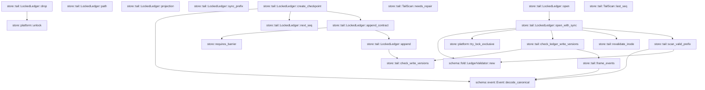

# store::tail

[Package atlas](index.md) · [Source](../../src/tail.rs)

## Declarations

Visibility is the declaration spelling; trait members and reexports require their enclosing interface. `cfg` is not evaluated.

| Symbol | Kind | Visibility | Test / cfg |
|---|---|---|---|
| [store::tail::TailScan](../../src/tail.rs#L14) | struct_item | `pub` |  |
| [store::tail::TailScan::needs_repair](../../src/tail.rs#L24) | function_item | `pub` |  |
| [store::tail::TailScan::last_seq](../../src/tail.rs#L29) | function_item | `pub` |  |
| [store::tail::scan_valid_prefix](../../src/tail.rs#L37) | function_item | `pub` |  |
| [store::tail::frame_events](../../src/tail.rs#L77) | function_item | `private` |  |
| [store::tail::LockedLedger](../../src/tail.rs#L100) | struct_item | `pub` |  |
| [store::tail::WRITER_VERSION](../../src/tail.rs#L112) | const_item | `private` |  |
| [store::tail::check_ledger_write_versions](../../src/tail.rs#L114) | function_item | `pub(crate)` |  |
| [store::tail::check_write_versions](../../src/tail.rs#L121) | function_item | `pub(crate)` |  |
| [store::tail::LockedLedger::open](../../src/tail.rs#L153) | function_item | `pub` |  |
| [store::tail::LockedLedger::open_with_sync](../../src/tail.rs#L157) | function_item | `pub` |  |
| [store::tail::LockedLedger::path](../../src/tail.rs#L200) | function_item | `pub` |  |
| [store::tail::LockedLedger::projection](../../src/tail.rs#L205) | function_item | `pub` |  |
| [store::tail::LockedLedger::next_seq](../../src/tail.rs#L210) | function_item | `pub` |  |
| [store::tail::LockedLedger::sync_prefix](../../src/tail.rs#L218) | function_item | `pub` |  |
| [store::tail::LockedLedger::create_checkpoint](../../src/tail.rs#L232) | function_item | `pub` |  |
| [store::tail::LockedLedger::append](../../src/tail.rs#L256) | function_item | `pub` |  |
| [store::tail::LockedLedger::append_contract](../../src/tail.rs#L287) | function_item | `pub` |  |
| [store::tail::LockedLedger::drop](../../src/tail.rs#L298) | function_item | `private` |  |
| [store::tail::revalidate_inode](../../src/tail.rs#L303) | function_item | `private` |  |
| [store::tail::version_gate_tests::event](../../src/tail.rs#L317) | function_item | `private` | test; #[cfg(test)] |
| [store::tail::version_gate_tests::genesis](../../src/tail.rs#L324) | function_item | `private` | test; #[cfg(test)] |
| [store::tail::version_gate_tests::bytes](../../src/tail.rs#L334) | function_item | `private` | test; #[cfg(test)] |
| [store::tail::version_gate_tests::downgrade_open_preserves_gated_prefix_and_unrecognized_suffix](../../src/tail.rs#L346) | function_item | `private` | test; #[cfg(test)] |
| [store::tail::version_gate_tests::reader_selection_cannot_claim_new_writer_support](../../src/tail.rs#L384) | function_item | `private` | test; #[cfg(test)] |
| [store::tail::version_gate_tests::creation_and_rewrite_cannot_bypass_writer_gate](../../src/tail.rs#L401) | function_item | `private` | test; #[cfg(test)] |
| [store::tail::version_gate_tests::append_rejects_unsupported_upgrade_without_changing_fold_or_bytes](../../src/tail.rs#L480) | function_item | `private` | test; #[cfg(test)] |

## Imports / reexports

| Local name | Source path | Visibility |
|---|---|---|
| `File` | `std::fs::File` | `private` |
| `OpenOptions` | `std::fs::OpenOptions` | `private` |
| `Read` | `std::io::Read` | `private` |
| `Seek` | `std::io::Seek` | `private` |
| `SeekFrom` | `std::io::SeekFrom` | `private` |
| `Write` | `std::io::Write` | `private` |
| `MetadataExt` | `std::os::unix::fs::MetadataExt` | `private` |
| `OpenOptionsExt` | `std::os::unix::fs::OpenOptionsExt` | `private` |
| `Path` | `std::path::Path` | `private` |
| `PathBuf` | `std::path::PathBuf` | `private` |
| `Arc` | `std::sync::Arc` | `private` |
| `Event` | `schema::Event` | `private` |
| `EventKind` | `schema::EventKind` | `private` |
| `LedgerProjection` | `schema::LedgerProjection` | `private` |
| `LedgerValidator` | `schema::LedgerValidator` | `private` |
| `json` | `serde_json::json` | `private` |
| `SyncPolicy` | `crate::platform::SyncPolicy` | `private` |
| `SystemSync` | `crate::platform::SystemSync` | `private` |
| `try_lock_exclusive` | `crate::platform::try_lock_exclusive` | `private` |
| `unlock` | `crate::platform::unlock` | `private` |
| `BarrierContext` | `crate::BarrierContext` | `private` |
| `StoreError` | `crate::StoreError` | `private` |
| `requires_barrier` | `crate::requires_barrier` | `private` |
| `*` | `super::*` | `private` |
| `Value` | `serde_json::Value` | `private` |

## Module declarations

| Module | Visibility | Attributes |
|---|---|---|
| `store::tail::version_gate_tests` | `private` | #[cfg(test)] |

## Function call graphs

Edges below are syntactically resolved calls only, including private functions. Graphs partition callers into groups of 20; they are not execution order. All unresolved sites are listed below and in the JSON inventory.

Functions 1–17: 18 direct edges

## Call sites

Includes test functions (marked in declarations). Receiver-type-required sites need type analysis/manual tracing. Calls in closures are attributed to their enclosing function; their occurrence here does not mean the closure executes immediately.

| Caller | Callee expression | Source lines | Target / classification |
|---|---|---|---|
| `last_seq` | `self.projection.as_ref().map_or` | [30](../../src/tail.rs#L30) | receiver-type-required |
| `last_seq` | `self.projection.as_ref` | [30](../../src/tail.rs#L30) | receiver-type-required |
| `scan_valid_prefix` | `LedgerValidator::new` | [38](../../src/tail.rs#L38) | [schema::fold::LedgerValidator::new](../../../schema/src/fold.rs#L146) |
| `scan_valid_prefix` | `bytes.len` | [42](../../src/tail.rs#L42), [69](../../src/tail.rs#L69) | receiver-type-required |
| `scan_valid_prefix` | `rest.iter().position` | [44](../../src/tail.rs#L44) | receiver-type-required |
| `scan_valid_prefix` | `rest.iter` | [44](../../src/tail.rs#L44) | receiver-type-required |
| `scan_valid_prefix` | `Some` | [45](../../src/tail.rs#L45), [50](../../src/tail.rs#L50), [58](../../src/tail.rs#L58), [72](../../src/tail.rs#L72) | external-constructor-callback-or-unresolved |
| `scan_valid_prefix` | `Event::decode_canonical(&bytes[cursor..line_end])             .and_then` | [53](../../src/tail.rs#L53) | receiver-type-required |
| `scan_valid_prefix` | `Event::decode_canonical` | [53](../../src/tail.rs#L53) | [schema::event::Event::decode_canonical](../../../schema/src/event.rs#L168) |
| `scan_valid_prefix` | `validator.push` | [54](../../src/tail.rs#L54) | receiver-type-required |
| `scan_valid_prefix` | `(cursor != 0)         .then(&#124;&#124; validator.clone().finish().ok())         .flatten` | [64](../../src/tail.rs#L64) | receiver-type-required |
| `scan_valid_prefix` | `(cursor != 0)         .then` | [64](../../src/tail.rs#L64) | receiver-type-required |
| `scan_valid_prefix` | `validator.clone().finish().ok` | [65](../../src/tail.rs#L65) | receiver-type-required |
| `scan_valid_prefix` | `validator.clone().finish` | [65](../../src/tail.rs#L65) | receiver-type-required |
| `scan_valid_prefix` | `validator.clone` | [65](../../src/tail.rs#L65) | receiver-type-required |
| `frame_events` | `Vec::new` | [78](../../src/tail.rs#L78) | external-constructor-callback-or-unresolved |
| `frame_events` | `bytes.len` | [80](../../src/tail.rs#L80) | receiver-type-required |
| `frame_events` | `rest.iter().position` | [82](../../src/tail.rs#L82) | receiver-type-required |
| `frame_events` | `rest.iter` | [82](../../src/tail.rs#L82) | receiver-type-required |
| `frame_events` | `Event::decode_canonical` | [89](../../src/tail.rs#L89) | [schema::event::Event::decode_canonical](../../../schema/src/event.rs#L168) |
| `frame_events` | `events.push` | [91](../../src/tail.rs#L91) | receiver-type-required |
| `check_ledger_write_versions` | `check_write_versions` | [118](../../src/tail.rs#L118) | [store::tail::check_write_versions](../../src/tail.rs#L121) |
| `check_ledger_write_versions` | `frame_events` | [118](../../src/tail.rs#L118) | [store::tail::frame_events](../../src/tail.rs#L77) |
| `check_write_versions` | `required_reader.max` | [128](../../src/tail.rs#L128), [136](../../src/tail.rs#L136) | receiver-type-required |
| `check_write_versions` | `event.min_reader().unwrap_or` | [128](../../src/tail.rs#L128) | receiver-type-required |
| `check_write_versions` | `event.min_reader` | [128](../../src/tail.rs#L128) | receiver-type-required |
| `check_write_versions` | `required_writer.max` | [130](../../src/tail.rs#L130), [137](../../src/tail.rs#L137) | receiver-type-required |
| `check_write_versions` | `event.integer_field("min_writer").unwrap_or` | [130](../../src/tail.rs#L130) | receiver-type-required |
| `check_write_versions` | `event.integer_field` | [130](../../src/tail.rs#L130) | receiver-type-required |
| `check_write_versions` | `serde_json::to_value(event.raw())                 .map_err` | [133](../../src/tail.rs#L133) | receiver-type-required |
| `check_write_versions` | `serde_json::to_value` | [133](../../src/tail.rs#L133) | external-constructor-callback-or-unresolved |
| `check_write_versions` | `event.raw` | [133](../../src/tail.rs#L133) | receiver-type-required |
| `check_write_versions` | `StoreError::Corruption` | [134](../../src/tail.rs#L134) | external-constructor-callback-or-unresolved |
| `check_write_versions` | `error.to_string` | [134](../../src/tail.rs#L134) | receiver-type-required |
| `check_write_versions` | `value.get` | [135](../../src/tail.rs#L135) | receiver-type-required |
| `check_write_versions` | `upgrade["min_reader"].as_u64().unwrap_or` | [136](../../src/tail.rs#L136) | receiver-type-required |
| `check_write_versions` | `upgrade["min_reader"].as_u64` | [136](../../src/tail.rs#L136) | receiver-type-required |
| `check_write_versions` | `upgrade["min_writer"].as_u64().unwrap_or` | [137](../../src/tail.rs#L137) | receiver-type-required |
| `check_write_versions` | `upgrade["min_writer"].as_u64` | [137](../../src/tail.rs#L137) | receiver-type-required |
| `check_write_versions` | `Err` | [142](../../src/tail.rs#L142) | external-constructor-callback-or-unresolved |
| `check_write_versions` | `Ok` | [149](../../src/tail.rs#L149) | external-constructor-callback-or-unresolved |
| `open` | `Self::open_with_sync` | [154](../../src/tail.rs#L154) | [store::tail::LockedLedger::open_with_sync](../../src/tail.rs#L157) |
| `open` | `Arc::new` | [154](../../src/tail.rs#L154) | external-constructor-callback-or-unresolved |
| `open_with_sync` | `path.as_ref().to_path_buf` | [162](../../src/tail.rs#L162) | receiver-type-required |
| `open_with_sync` | `path.as_ref` | [162](../../src/tail.rs#L162) | receiver-type-required |
| `open_with_sync` | `OpenOptions::new()             .read(true)             .append(true)             .custom_flags(libc::O_CLOEXEC &#124; libc::O_NOFOLLOW)             .open` | [163](../../src/tail.rs#L163) | receiver-type-required |
| `open_with_sync` | `OpenOptions::new()             .read(true)             .append(true)             .custom_flags` | [163](../../src/tail.rs#L163) | receiver-type-required |
| `open_with_sync` | `OpenOptions::new()             .read(true)             .append` | [163](../../src/tail.rs#L163) | receiver-type-required |
| `open_with_sync` | `OpenOptions::new()             .read` | [163](../../src/tail.rs#L163) | receiver-type-required |
| `open_with_sync` | `OpenOptions::new` | [163](../../src/tail.rs#L163) | external-constructor-callback-or-unresolved |
| `open_with_sync` | `try_lock_exclusive` | [168](../../src/tail.rs#L168) | [store::platform::try_lock_exclusive](../../src/platform.rs#L165) |
| `open_with_sync` | `revalidate_inode` | [169](../../src/tail.rs#L169) | [store::tail::revalidate_inode](../../src/tail.rs#L303) |
| `open_with_sync` | `file.seek` | [171](../../src/tail.rs#L171) | receiver-type-required |
| `open_with_sync` | `SeekFrom::Start` | [171](../../src/tail.rs#L171) | external-constructor-callback-or-unresolved |
| `open_with_sync` | `Vec::new` | [172](../../src/tail.rs#L172) | external-constructor-callback-or-unresolved |
| `open_with_sync` | `file.read_to_end` | [173](../../src/tail.rs#L173) | receiver-type-required |
| `open_with_sync` | `check_ledger_write_versions` | [176](../../src/tail.rs#L176) | [store::tail::check_ledger_write_versions](../../src/tail.rs#L114) |
| `open_with_sync` | `scan_valid_prefix` | [177](../../src/tail.rs#L177) | [store::tail::scan_valid_prefix](../../src/tail.rs#L37) |
| `open_with_sync` | `scan.needs_repair` | [178](../../src/tail.rs#L178) | receiver-type-required |
| `open_with_sync` | `file.set_len` | [179](../../src/tail.rs#L179) | receiver-type-required |
| `open_with_sync` | `sync.full_sync` | [180](../../src/tail.rs#L180) | receiver-type-required |
| `open_with_sync` | `scan             .validator             .clone()             .unwrap_or_else` | [183](../../src/tail.rs#L183) | receiver-type-required |
| `open_with_sync` | `scan             .validator             .clone` | [183](../../src/tail.rs#L183) | receiver-type-required |
| `open_with_sync` | `LedgerValidator::new` | [186](../../src/tail.rs#L186) | [schema::fold::LedgerValidator::new](../../../schema/src/fold.rs#L146) |
| `open_with_sync` | `Ok` | [188](../../src/tail.rs#L188) | external-constructor-callback-or-unresolved |
| `projection` | `self.projection.as_ref` | [206](../../src/tail.rs#L206) | receiver-type-required |
| `next_seq` | `self.projection             .as_ref()             .map_or` | [211](../../src/tail.rs#L211) | receiver-type-required |
| `next_seq` | `self.projection             .as_ref` | [211](../../src/tail.rs#L211) | receiver-type-required |
| `sync_prefix` | `Err` | [220](../../src/tail.rs#L220), [224](../../src/tail.rs#L224) | external-constructor-callback-or-unresolved |
| `sync_prefix` | `StoreError::Corruption` | [220](../../src/tail.rs#L220) | external-constructor-callback-or-unresolved |
| `sync_prefix` | `"writer is poisoned".to_owned` | [220](../../src/tail.rs#L220) | receiver-type-required |
| `sync_prefix` | `self.sync.full_sync` | [222](../../src/tail.rs#L222) | receiver-type-required |
| `sync_prefix` | `StoreError::Io` | [224](../../src/tail.rs#L224) | external-constructor-callback-or-unresolved |
| `sync_prefix` | `Ok` | [226](../../src/tail.rs#L226) | external-constructor-callback-or-unresolved |
| `create_checkpoint` | `Err` | [234](../../src/tail.rs#L234) | external-constructor-callback-or-unresolved |
| `create_checkpoint` | `StoreError::Corruption` | [234](../../src/tail.rs#L234), [247](../../src/tail.rs#L247) | external-constructor-callback-or-unresolved |
| `create_checkpoint` | `"writer is poisoned by an earlier append/sync failure".to_owned` | [235](../../src/tail.rs#L235) | receiver-type-required |
| `create_checkpoint` | `self.next_seq` | [238](../../src/tail.rs#L238) | [store::tail::LockedLedger::next_seq](../../src/tail.rs#L210) |
| `create_checkpoint` | `serde_json_canonicalizer::to_vec(&json!({             "v": 1,             "seq": seq,             "kind": "checkpoint",             "ts": timestamp,             "covers": seq - 1,             "summary": summary         }))         .map_err` | [239](../../src/tail.rs#L239) | receiver-type-required |
| `create_checkpoint` | `serde_json_canonicalizer::to_vec` | [239](../../src/tail.rs#L239) | external-constructor-callback-or-unresolved |
| `create_checkpoint` | `error.to_string` | [247](../../src/tail.rs#L247) | receiver-type-required |
| `create_checkpoint` | `Event::decode_canonical` | [248](../../src/tail.rs#L248) | [schema::event::Event::decode_canonical](../../../schema/src/event.rs#L168) |
| `create_checkpoint` | `self.append_contract` | [249](../../src/tail.rs#L249) | [store::tail::LockedLedger::append_contract](../../src/tail.rs#L287) |
| `create_checkpoint` | `BarrierContext::default` | [249](../../src/tail.rs#L249) | external-constructor-callback-or-unresolved |
| `create_checkpoint` | `Ok` | [250](../../src/tail.rs#L250) | external-constructor-callback-or-unresolved |
| `append` | `Err` | [258](../../src/tail.rs#L258), [270](../../src/tail.rs#L270), [275](../../src/tail.rs#L275), [279](../../src/tail.rs#L279) | external-constructor-callback-or-unresolved |
| `append` | `StoreError::Corruption` | [258](../../src/tail.rs#L258) | external-constructor-callback-or-unresolved |
| `append` | `"writer is poisoned by an earlier append/sync failure".to_owned` | [259](../../src/tail.rs#L259) | receiver-type-required |
| `append` | `check_write_versions` | [262](../../src/tail.rs#L262) | [store::tail::check_write_versions](../../src/tail.rs#L121) |
| `append` | `std::iter::once` | [262](../../src/tail.rs#L262) | external-constructor-callback-or-unresolved |
| `append` | `self.validator.clone` | [263](../../src/tail.rs#L263), [283](../../src/tail.rs#L283) | receiver-type-required |
| `append` | `next.push` | [264](../../src/tail.rs#L264) | receiver-type-required |
| `append` | `event.clone` | [264](../../src/tail.rs#L264) | receiver-type-required |
| `append` | `event.canonical_bytes` | [265](../../src/tail.rs#L265) | receiver-type-required |
| `append` | `bytes.push` | [266](../../src/tail.rs#L266) | receiver-type-required |
| `append` | `self.file.write_all` | [268](../../src/tail.rs#L268) | receiver-type-required |
| `append` | `StoreError::Io` | [270](../../src/tail.rs#L270), [275](../../src/tail.rs#L275), [279](../../src/tail.rs#L279) | external-constructor-callback-or-unresolved |
| `append` | `self.sync.full_sync` | [273](../../src/tail.rs#L273) | receiver-type-required |
| `append` | `self.file.flush` | [277](../../src/tail.rs#L277) | receiver-type-required |
| `append` | `Some` | [283](../../src/tail.rs#L283) | external-constructor-callback-or-unresolved |
| `append` | `self.validator.clone().finish` | [283](../../src/tail.rs#L283) | receiver-type-required |
| `append` | `Ok` | [284](../../src/tail.rs#L284) | external-constructor-callback-or-unresolved |
| `append_contract` | `requires_barrier` | [292](../../src/tail.rs#L292) | [store::requires_barrier](../../src/lib.rs#L37) |
| `append_contract` | `self.append` | [293](../../src/tail.rs#L293) | [store::tail::LockedLedger::append](../../src/tail.rs#L256) |
| `drop` | `unlock` | [299](../../src/tail.rs#L299) | [store::platform::unlock](../../src/platform.rs#L296) |
| `revalidate_inode` | `file.metadata` | [304](../../src/tail.rs#L304) | receiver-type-required |
| `revalidate_inode` | `path.metadata` | [305](../../src/tail.rs#L305) | receiver-type-required |
| `revalidate_inode` | `held.dev` | [306](../../src/tail.rs#L306) | receiver-type-required |
| `revalidate_inode` | `current.dev` | [306](../../src/tail.rs#L306) | receiver-type-required |
| `revalidate_inode` | `held.ino` | [306](../../src/tail.rs#L306) | receiver-type-required |
| `revalidate_inode` | `current.ino` | [306](../../src/tail.rs#L306) | receiver-type-required |
| `revalidate_inode` | `Err` | [307](../../src/tail.rs#L307) | external-constructor-callback-or-unresolved |
| `revalidate_inode` | `Ok` | [309](../../src/tail.rs#L309) | external-constructor-callback-or-unresolved |
| `event` | `Event::decode_canonical(&serde_json_canonicalizer::to_vec(&value).unwrap()).unwrap` | [321](../../src/tail.rs#L321) | receiver-type-required |
| `event` | `Event::decode_canonical` | [321](../../src/tail.rs#L321) | external-constructor-callback-or-unresolved |
| `event` | `serde_json_canonicalizer::to_vec(&value).unwrap` | [321](../../src/tail.rs#L321) | receiver-type-required |
| `event` | `serde_json_canonicalizer::to_vec` | [321](../../src/tail.rs#L321) | external-constructor-callback-or-unresolved |
| `genesis` | `event` | [325](../../src/tail.rs#L325) | [store::tail::version_gate_tests::event](../../src/tail.rs#L317) |
| `bytes` | `events             .iter()             .flat_map(&#124;event&#124; {                 let mut bytes = event.canonical_bytes().unwrap();                 bytes.push(b'\n');                 bytes             })             .collect` | [335](../../src/tail.rs#L335) | receiver-type-required |
| `bytes` | `events             .iter()             .flat_map` | [335](../../src/tail.rs#L335) | receiver-type-required |
| `bytes` | `events             .iter` | [335](../../src/tail.rs#L335) | receiver-type-required |
| `bytes` | `event.canonical_bytes().unwrap` | [338](../../src/tail.rs#L338) | receiver-type-required |
| `bytes` | `event.canonical_bytes` | [338](../../src/tail.rs#L338) | receiver-type-required |
| `bytes` | `bytes.push` | [339](../../src/tail.rs#L339) | receiver-type-required |
| `downgrade_open_preserves_gated_prefix_and_unrecognized_suffix` | `tempfile::tempdir().unwrap` | [366](../../src/tail.rs#L366) | receiver-type-required |
| `downgrade_open_preserves_gated_prefix_and_unrecognized_suffix` | `tempfile::tempdir` | [366](../../src/tail.rs#L366) | external-constructor-callback-or-unresolved |
| `downgrade_open_preserves_gated_prefix_and_unrecognized_suffix` | `dir.path().join` | [367](../../src/tail.rs#L367) | receiver-type-required |
| `downgrade_open_preserves_gated_prefix_and_unrecognized_suffix` | `dir.path` | [367](../../src/tail.rs#L367) | receiver-type-required |
| `downgrade_open_preserves_gated_prefix_and_unrecognized_suffix` | `bytes` | [368](../../src/tail.rs#L368) | [store::tail::version_gate_tests::bytes](../../src/tail.rs#L334) |
| `downgrade_open_preserves_gated_prefix_and_unrecognized_suffix` | `original.extend_from_slice` | [369](../../src/tail.rs#L369) | receiver-type-required |
| `downgrade_open_preserves_gated_prefix_and_unrecognized_suffix` | `std::fs::write(&path, &original).unwrap` | [370](../../src/tail.rs#L370) | receiver-type-required |
| `downgrade_open_preserves_gated_prefix_and_unrecognized_suffix` | `std::fs::write` | [370](../../src/tail.rs#L370) | external-constructor-callback-or-unresolved |
| `reader_selection_cannot_claim_new_writer_support` | `tempfile::tempdir().unwrap` | [385](../../src/tail.rs#L385) | receiver-type-required |
| `reader_selection_cannot_claim_new_writer_support` | `tempfile::tempdir` | [385](../../src/tail.rs#L385) | external-constructor-callback-or-unresolved |
| `reader_selection_cannot_claim_new_writer_support` | `dir.path().join` | [386](../../src/tail.rs#L386) | receiver-type-required |
| `reader_selection_cannot_claim_new_writer_support` | `dir.path` | [386](../../src/tail.rs#L386) | receiver-type-required |
| `reader_selection_cannot_claim_new_writer_support` | `bytes` | [387](../../src/tail.rs#L387) | [store::tail::version_gate_tests::bytes](../../src/tail.rs#L334) |
| `reader_selection_cannot_claim_new_writer_support` | `genesis` | [387](../../src/tail.rs#L387) | [store::tail::version_gate_tests::genesis](../../src/tail.rs#L324) |
| `reader_selection_cannot_claim_new_writer_support` | `std::fs::write(&path, &original).unwrap` | [388](../../src/tail.rs#L388) | receiver-type-required |
| `reader_selection_cannot_claim_new_writer_support` | `std::fs::write` | [388](../../src/tail.rs#L388) | external-constructor-callback-or-unresolved |
| `creation_and_rewrite_cannot_bypass_writer_gate` | `tempfile::tempdir().unwrap` | [405](../../src/tail.rs#L405) | receiver-type-required |
| `creation_and_rewrite_cannot_bypass_writer_gate` | `tempfile::tempdir` | [405](../../src/tail.rs#L405) | external-constructor-callback-or-unresolved |
| `creation_and_rewrite_cannot_bypass_writer_gate` | `crate::ThreadStore::open(dir.path()).unwrap` | [406](../../src/tail.rs#L406) | receiver-type-required |
| `creation_and_rewrite_cannot_bypass_writer_gate` | `crate::ThreadStore::open` | [406](../../src/tail.rs#L406) | [store::folder::ThreadStore::open](../../src/folder.rs#L35) |
| `creation_and_rewrite_cannot_bypass_writer_gate` | `dir.path` | [406](../../src/tail.rs#L406), [426](../../src/tail.rs#L426) | receiver-type-required |
| `creation_and_rewrite_cannot_bypass_writer_gate` | `genesis` | [407](../../src/tail.rs#L407) | [store::tail::version_gate_tests::genesis](../../src/tail.rs#L324) |
| `creation_and_rewrite_cannot_bypass_writer_gate` | `dir.path().join("threads").join` | [426](../../src/tail.rs#L426) | receiver-type-required |
| `creation_and_rewrite_cannot_bypass_writer_gate` | `dir.path().join` | [426](../../src/tail.rs#L426) | receiver-type-required |
| `creation_and_rewrite_cannot_bypass_writer_gate` | `std::fs::create_dir(&folder).unwrap` | [427](../../src/tail.rs#L427) | receiver-type-required |
| `creation_and_rewrite_cannot_bypass_writer_gate` | `std::fs::create_dir` | [427](../../src/tail.rs#L427) | external-constructor-callback-or-unresolved |
| `creation_and_rewrite_cannot_bypass_writer_gate` | `bytes` | [428](../../src/tail.rs#L428) | [store::tail::version_gate_tests::bytes](../../src/tail.rs#L334) |
| `creation_and_rewrite_cannot_bypass_writer_gate` | `std::fs::write(folder.join("main.jsonl"), &original).unwrap` | [429](../../src/tail.rs#L429) | receiver-type-required |
| `creation_and_rewrite_cannot_bypass_writer_gate` | `std::fs::write` | [429](../../src/tail.rs#L429) | external-constructor-callback-or-unresolved |
| `creation_and_rewrite_cannot_bypass_writer_gate` | `folder.join` | [429](../../src/tail.rs#L429) | receiver-type-required |
| `append_rejects_unsupported_upgrade_without_changing_fold_or_bytes` | `tempfile::tempdir().unwrap` | [481](../../src/tail.rs#L481) | receiver-type-required |
| `append_rejects_unsupported_upgrade_without_changing_fold_or_bytes` | `tempfile::tempdir` | [481](../../src/tail.rs#L481) | external-constructor-callback-or-unresolved |
| `append_rejects_unsupported_upgrade_without_changing_fold_or_bytes` | `dir.path().join` | [482](../../src/tail.rs#L482) | receiver-type-required |
| `append_rejects_unsupported_upgrade_without_changing_fold_or_bytes` | `dir.path` | [482](../../src/tail.rs#L482) | receiver-type-required |
| `append_rejects_unsupported_upgrade_without_changing_fold_or_bytes` | `bytes` | [483](../../src/tail.rs#L483) | [store::tail::version_gate_tests::bytes](../../src/tail.rs#L334) |
| `append_rejects_unsupported_upgrade_without_changing_fold_or_bytes` | `genesis` | [483](../../src/tail.rs#L483) | [store::tail::version_gate_tests::genesis](../../src/tail.rs#L324) |
| `append_rejects_unsupported_upgrade_without_changing_fold_or_bytes` | `std::fs::write(&path, &original).unwrap` | [484](../../src/tail.rs#L484) | receiver-type-required |
| `append_rejects_unsupported_upgrade_without_changing_fold_or_bytes` | `std::fs::write` | [484](../../src/tail.rs#L484) | external-constructor-callback-or-unresolved |
| `append_rejects_unsupported_upgrade_without_changing_fold_or_bytes` | `LockedLedger::open(&path, 1).unwrap` | [485](../../src/tail.rs#L485), [511](../../src/tail.rs#L511) | receiver-type-required |
| `append_rejects_unsupported_upgrade_without_changing_fold_or_bytes` | `LockedLedger::open` | [485](../../src/tail.rs#L485), [511](../../src/tail.rs#L511) | external-constructor-callback-or-unresolved |
| `append_rejects_unsupported_upgrade_without_changing_fold_or_bytes` | `ledger             .append(                 event(                     json!({"kind":"meta","upgrade":{"min_reader":1,"min_writer":1}}),                     2,                 ),                 false,             )             .unwrap` | [497](../../src/tail.rs#L497) | receiver-type-required |
| `append_rejects_unsupported_upgrade_without_changing_fold_or_bytes` | `ledger             .append` | [497](../../src/tail.rs#L497) | receiver-type-required |
| `append_rejects_unsupported_upgrade_without_changing_fold_or_bytes` | `event` | [499](../../src/tail.rs#L499) | [store::tail::version_gate_tests::event](../../src/tail.rs#L317) |
| `append_rejects_unsupported_upgrade_without_changing_fold_or_bytes` | `ledger             .create_checkpoint("2026-09-04T00:00:00.000Z", "version gate regression")             .unwrap` | [507](../../src/tail.rs#L507) | receiver-type-required |
| `append_rejects_unsupported_upgrade_without_changing_fold_or_bytes` | `ledger             .create_checkpoint` | [507](../../src/tail.rs#L507) | receiver-type-required |
| `append_rejects_unsupported_upgrade_without_changing_fold_or_bytes` | `drop` | [510](../../src/tail.rs#L510) | external-constructor-callback-or-unresolved |
