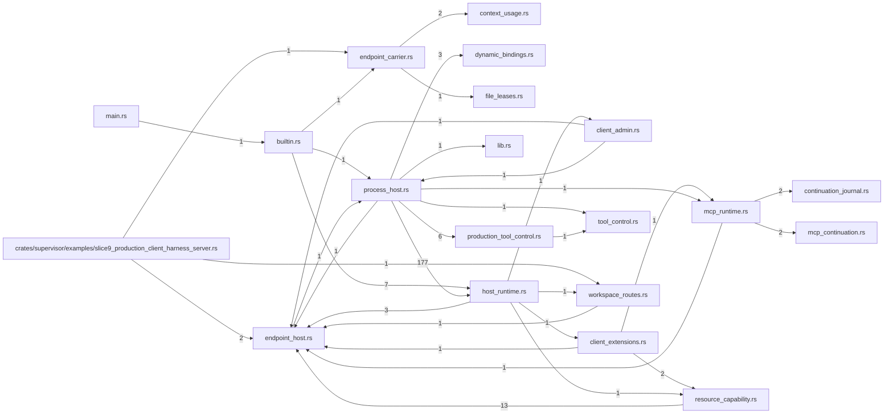

# tekes-supervisor — generated atlas

[All packages](../../../../docs/architecture/generated/index.md) · [Maintained explanation](../README.md)

## Cargo targets

| Target | Kind | Entry |
|---|---|---|
| `tekes_supervisor` | lib | [crates/supervisor/src/lib.rs](../../src/lib.rs) |
| `tekes-supervisor` | bin | [crates/supervisor/src/main.rs](../../src/main.rs) |
| `slice9_production_client_harness_server` | example | [crates/supervisor/examples/slice9_production_client_harness_server.rs](../../examples/slice9_production_client_harness_server.rs) |
| `live_oauth` | test | [crates/supervisor/tests/live_oauth.rs](../../tests/live_oauth.rs) |
| `secret_store` | test | [crates/supervisor/tests/secret_store.rs](../../tests/secret_store.rs) |
| `shell` | test | [crates/supervisor/tests/shell.rs](../../tests/shell.rs) |
| `slice13_management` | test | [crates/supervisor/tests/slice13_management.rs](../../tests/slice13_management.rs) |
| `slice14a_reference_package` | test | [crates/supervisor/tests/slice14a_reference_package.rs](../../tests/slice14a_reference_package.rs) |
| `slice14f_common_routes` | test | [crates/supervisor/tests/slice14f_common_routes.rs](../../tests/slice14f_common_routes.rs) |
| `slice8_tool_control` | test | [crates/supervisor/tests/slice8_tool_control.rs](../../tests/slice8_tool_control.rs) |
| `slice9_endpoint_carrier` | test | [crates/supervisor/tests/slice9_endpoint_carrier.rs](../../tests/slice9_endpoint_carrier.rs) |
| `slice9_endpoint_host` | test | [crates/supervisor/tests/slice9_endpoint_host.rs](../../tests/slice9_endpoint_host.rs) |
| `workspace_routes` | test | [crates/supervisor/tests/workspace_routes.rs](../../tests/workspace_routes.rs) |

## Direct workspace dependencies

| Dependency | Kind | Target cfg |
|---|---|---|
| `endpoint` | normal | all |
| `engine` | normal | all |
| `host-files` | normal | all |
| `mcp` | normal | all |
| `plugins` | normal | all |
| `profile` | normal | all |
| `provider` | normal | all |
| `schedule` | normal | all |
| `schema` | normal | all |
| `session-controls` | normal | all |
| `store` | normal | all |
| `thread-search` | normal | all |
| `tools` | normal | all |
| `transport` | normal | all |
| `user-documents` | normal | all |
| `worker-control` | normal | all |
| `workspace-service` | normal | all |

[Public/restricted API and direct callers](api.md)

## Source files / lexical modules

`src` files have full symbol/call tables and partitioned function graphs. Integration tests and examples remain in the JSON inventory.
File-derived paths below are lexical navigation, not a compiler-resolved module tree; inline module declarations are listed separately.

| File | Symbols | Call sites | Detail |
|---|---:|---:|---|
| [crates/supervisor/examples/slice9_production_client_harness_server.rs](../../examples/slice9_production_client_harness_server.rs) | 18 | 117 | `inventory.json` |
| [crates/supervisor/src/builtin.rs](../../src/builtin.rs) | 3 | 132 | [Symbols and calls](src--builtin.md) |
| [crates/supervisor/src/client_admin.rs](../../src/client_admin.rs) | 70 | 481 | [Symbols and calls](src--client_admin.md) |
| [crates/supervisor/src/client_extensions.rs](../../src/client_extensions.rs) | 136 | 1567 | [Symbols and calls](src--client_extensions.md) |
| [crates/supervisor/src/context_usage.rs](../../src/context_usage.rs) | 25 | 339 | [Symbols and calls](src--context_usage.md) |
| [crates/supervisor/src/continuation_journal.rs](../../src/continuation_journal.rs) | 20 | 287 | [Symbols and calls](src--continuation_journal.md) |
| [crates/supervisor/src/dynamic_bindings.rs](../../src/dynamic_bindings.rs) | 7 | 37 | [Symbols and calls](src--dynamic_bindings.md) |
| [crates/supervisor/src/endpoint_carrier.rs](../../src/endpoint_carrier.rs) | 108 | 1057 | [Symbols and calls](src--endpoint_carrier.md) |
| [crates/supervisor/src/endpoint_host.rs](../../src/endpoint_host.rs) | 150 | 1019 | [Symbols and calls](src--endpoint_host.md) |
| [crates/supervisor/src/file_leases.rs](../../src/file_leases.rs) | 20 | 150 | [Symbols and calls](src--file_leases.md) |
| [crates/supervisor/src/file_observation.rs](../../src/file_observation.rs) | 12 | 79 | [Symbols and calls](src--file_observation.md) |
| [crates/supervisor/src/host_runtime.rs](../../src/host_runtime.rs) | 46 | 405 | [Symbols and calls](src--host_runtime.md) |
| [crates/supervisor/src/lib.rs](../../src/lib.rs) | 27 | 183 | [Symbols and calls](src--lib.md) |
| [crates/supervisor/src/main.rs](../../src/main.rs) | 1 | 43 | [Symbols and calls](src--main.md) |
| [crates/supervisor/src/mcp_continuation.rs](../../src/mcp_continuation.rs) | 8 | 175 | [Symbols and calls](src--mcp_continuation.md) |
| [crates/supervisor/src/mcp_runtime.rs](../../src/mcp_runtime.rs) | 179 | 1928 | [Symbols and calls](src--mcp_runtime.md) |
| [crates/supervisor/src/process_host.rs](../../src/process_host.rs) | 267 | 5018 | [Symbols and calls](src--process_host.md) |
| [crates/supervisor/src/process_live_tests.rs](../../src/process_live_tests.rs) | 14 | 1796 | [Symbols and calls](src--process_live_tests.md) |
| [crates/supervisor/src/production_tool_control.rs](../../src/production_tool_control.rs) | 82 | 817 | [Symbols and calls](src--production_tool_control.md) |
| [crates/supervisor/src/resource_capability.rs](../../src/resource_capability.rs) | 71 | 438 | [Symbols and calls](src--resource_capability.md) |
| [crates/supervisor/src/tool_control.rs](../../src/tool_control.rs) | 45 | 304 | [Symbols and calls](src--tool_control.md) |
| [crates/supervisor/src/workspace_routes.rs](../../src/workspace_routes.rs) | 13 | 198 | [Symbols and calls](src--workspace_routes.md) |
| [crates/supervisor/tests/live_oauth.rs](../../tests/live_oauth.rs) | 3 | 106 | `inventory.json` |
| [crates/supervisor/tests/secret_store.rs](../../tests/secret_store.rs) | 7 | 62 | `inventory.json` |
| [crates/supervisor/tests/shell.rs](../../tests/shell.rs) | 28 | 278 | `inventory.json` |
| [crates/supervisor/tests/slice13_management.rs](../../tests/slice13_management.rs) | 7 | 306 | `inventory.json` |
| [crates/supervisor/tests/slice14a_reference_package.rs](../../tests/slice14a_reference_package.rs) | 32 | 246 | `inventory.json` |
| [crates/supervisor/tests/slice14f_common_routes.rs](../../tests/slice14f_common_routes.rs) | 6 | 117 | `inventory.json` |
| [crates/supervisor/tests/slice8_tool_control.rs](../../tests/slice8_tool_control.rs) | 7 | 106 | `inventory.json` |
| [crates/supervisor/tests/slice9_endpoint_carrier.rs](../../tests/slice9_endpoint_carrier.rs) | 39 | 703 | `inventory.json` |
| [crates/supervisor/tests/slice9_endpoint_host.rs](../../tests/slice9_endpoint_host.rs) | 47 | 836 | `inventory.json` |
| [crates/supervisor/tests/workspace_routes.rs](../../tests/workspace_routes.rs) | 3 | 51 | `inventory.json` |

## Cross-file direct calls

Source files stand in for out-of-line modules; see declarations for inline modules. Counts are syntactic call sites, not runtime frequency.

