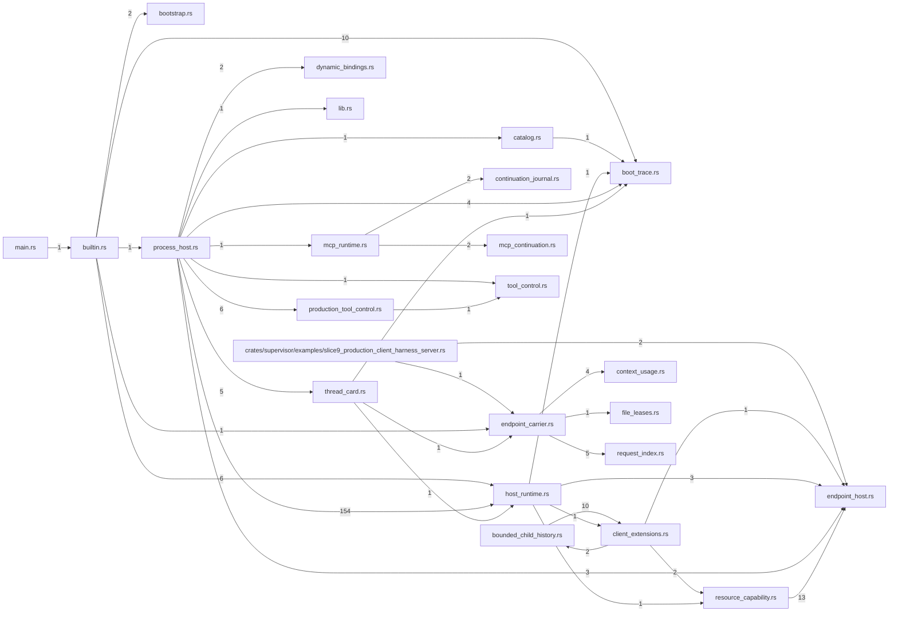

# tekes-supervisor — generated atlas

[All packages](../../../../docs/architecture/generated/index.md) · [Maintained explanation](../README.md)

## Cargo targets

| Target | Kind | Entry |
|---|---|---|
| `tekes_supervisor` | lib | [crates/supervisor/src/lib.rs](../../src/lib.rs) |
| `tekes-supervisor` | bin | [crates/supervisor/src/main.rs](../../src/main.rs) |
| `slice9_production_client_harness_server` | example | [crates/supervisor/examples/slice9_production_client_harness_server.rs](../../examples/slice9_production_client_harness_server.rs) |
| `ready_reads_no_thread` | test | [crates/supervisor/tests/ready_reads_no_thread.rs](../../tests/ready_reads_no_thread.rs) |
| `s4_lazy_boot_streams` | test | [crates/supervisor/tests/s4_lazy_boot_streams.rs](../../tests/s4_lazy_boot_streams.rs) |
| `secret_store` | test | [crates/supervisor/tests/secret_store.rs](../../tests/secret_store.rs) |
| `session_execution_endpoint` | test | [crates/supervisor/tests/session_execution_endpoint.rs](../../tests/session_execution_endpoint.rs) |
| `session_mcp` | test | [crates/supervisor/tests/session_mcp.rs](../../tests/session_mcp.rs) |
| `shell` | test | [crates/supervisor/tests/shell.rs](../../tests/shell.rs) |
| `slice14f_common_routes` | test | [crates/supervisor/tests/slice14f_common_routes.rs](../../tests/slice14f_common_routes.rs) |
| `slice8_tool_control` | test | [crates/supervisor/tests/slice8_tool_control.rs](../../tests/slice8_tool_control.rs) |
| `slice9_endpoint_carrier` | test | [crates/supervisor/tests/slice9_endpoint_carrier.rs](../../tests/slice9_endpoint_carrier.rs) |
| `slice9_endpoint_host` | test | [crates/supervisor/tests/slice9_endpoint_host.rs](../../tests/slice9_endpoint_host.rs) |

## Direct workspace dependencies

| Dependency | Kind | Target cfg |
|---|---|---|
| `endpoint` | normal | all |
| `engine` | normal | all |
| `mcp` | normal | all |
| `profile` | normal | all |
| `provider` | normal | all |
| `schema` | normal | all |
| `session-controls` | normal | all |
| `store` | normal | all |
| `thread-search` | normal | all |
| `tools` | normal | all |
| `transport` | normal | all |
| `user-documents` | normal | all |
| `worker-control` | normal | all |
| `workspace-service` | normal | all |
| `test-support` | dev | all |

[Public/restricted API and direct callers](api.md)

## Source files / lexical modules

`src` files have full symbol/call tables and partitioned function graphs. Integration tests and examples remain in the JSON inventory.
File-derived paths below are lexical navigation, not a compiler-resolved module tree; inline module declarations are listed separately.

| File | Symbols | Call sites | Detail |
|---|---:|---:|---|
| [crates/supervisor/examples/slice9_production_client_harness_server.rs](../../examples/slice9_production_client_harness_server.rs) | 18 | 106 | `inventory.json` |
| [crates/supervisor/src/boot_trace.rs](../../src/boot_trace.rs) | 10 | 25 | [Symbols and calls](src--boot_trace.md) |
| [crates/supervisor/src/bootstrap.rs](../../src/bootstrap.rs) | 25 | 144 | [Symbols and calls](src--bootstrap.md) |
| [crates/supervisor/src/bounded_child_history.rs](../../src/bounded_child_history.rs) | 12 | 264 | [Symbols and calls](src--bounded_child_history.md) |
| [crates/supervisor/src/builtin.rs](../../src/builtin.rs) | 3 | 165 | [Symbols and calls](src--builtin.md) |
| [crates/supervisor/src/catalog.rs](../../src/catalog.rs) | 25 | 168 | [Symbols and calls](src--catalog.md) |
| [crates/supervisor/src/client_extensions.rs](../../src/client_extensions.rs) | 84 | 903 | [Symbols and calls](src--client_extensions.md) |
| [crates/supervisor/src/context_usage.rs](../../src/context_usage.rs) | 26 | 348 | [Symbols and calls](src--context_usage.md) |
| [crates/supervisor/src/continuation_journal.rs](../../src/continuation_journal.rs) | 20 | 287 | [Symbols and calls](src--continuation_journal.md) |
| [crates/supervisor/src/dynamic_bindings.rs](../../src/dynamic_bindings.rs) | 8 | 47 | [Symbols and calls](src--dynamic_bindings.md) |
| [crates/supervisor/src/endpoint_carrier.rs](../../src/endpoint_carrier.rs) | 163 | 1487 | [Symbols and calls](src--endpoint_carrier.md) |
| [crates/supervisor/src/endpoint_host.rs](../../src/endpoint_host.rs) | 152 | 999 | [Symbols and calls](src--endpoint_host.md) |
| [crates/supervisor/src/file_leases.rs](../../src/file_leases.rs) | 20 | 156 | [Symbols and calls](src--file_leases.md) |
| [crates/supervisor/src/file_observation.rs](../../src/file_observation.rs) | 12 | 79 | [Symbols and calls](src--file_observation.md) |
| [crates/supervisor/src/host_runtime.rs](../../src/host_runtime.rs) | 42 | 282 | [Symbols and calls](src--host_runtime.md) |
| [crates/supervisor/src/lib.rs](../../src/lib.rs) | 27 | 184 | [Symbols and calls](src--lib.md) |
| [crates/supervisor/src/main.rs](../../src/main.rs) | 1 | 39 | [Symbols and calls](src--main.md) |
| [crates/supervisor/src/mcp_continuation.rs](../../src/mcp_continuation.rs) | 8 | 173 | [Symbols and calls](src--mcp_continuation.md) |
| [crates/supervisor/src/mcp_runtime.rs](../../src/mcp_runtime.rs) | 50 | 519 | [Symbols and calls](src--mcp_runtime.md) |
| [crates/supervisor/src/process_host.rs](../../src/process_host.rs) | 350 | 6250 | [Symbols and calls](src--process_host.md) |
| [crates/supervisor/src/process_live_tests.rs](../../src/process_live_tests.rs) | 18 | 1840 | [Symbols and calls](src--process_live_tests.md) |
| [crates/supervisor/src/process_tool_visibility_tests.rs](../../src/process_tool_visibility_tests.rs) | 13 | 224 | [Symbols and calls](src--process_tool_visibility_tests.md) |
| [crates/supervisor/src/production_tool_control.rs](../../src/production_tool_control.rs) | 83 | 839 | [Symbols and calls](src--production_tool_control.md) |
| [crates/supervisor/src/request_index.rs](../../src/request_index.rs) | 30 | 169 | [Symbols and calls](src--request_index.md) |
| [crates/supervisor/src/resource_capability.rs](../../src/resource_capability.rs) | 71 | 438 | [Symbols and calls](src--resource_capability.md) |
| [crates/supervisor/src/stdio_channels.rs](../../src/stdio_channels.rs) | 2 | 29 | [Symbols and calls](src--stdio_channels.md) |
| [crates/supervisor/src/thread_card/tests.rs](../../src/thread_card/tests.rs) | 13 | 162 | [Symbols and calls](src--thread_card--tests.md) |
| [crates/supervisor/src/thread_card.rs](../../src/thread_card.rs) | 46 | 270 | [Symbols and calls](src--thread_card.md) |
| [crates/supervisor/src/tool_control.rs](../../src/tool_control.rs) | 45 | 304 | [Symbols and calls](src--tool_control.md) |
| [crates/supervisor/tests/ready_reads_no_thread.rs](../../tests/ready_reads_no_thread.rs) | 6 | 139 | `inventory.json` |
| [crates/supervisor/tests/s4_lazy_boot_streams.rs](../../tests/s4_lazy_boot_streams.rs) | 65 | 905 | `inventory.json` |
| [crates/supervisor/tests/secret_store.rs](../../tests/secret_store.rs) | 9 | 60 | `inventory.json` |
| [crates/supervisor/tests/session_execution_endpoint.rs](../../tests/session_execution_endpoint.rs) | 6 | 98 | `inventory.json` |
| [crates/supervisor/tests/session_mcp.rs](../../tests/session_mcp.rs) | 18 | 189 | `inventory.json` |
| [crates/supervisor/tests/shell.rs](../../tests/shell.rs) | 41 | 410 | `inventory.json` |
| [crates/supervisor/tests/slice14f_common_routes.rs](../../tests/slice14f_common_routes.rs) | 6 | 111 | `inventory.json` |
| [crates/supervisor/tests/slice8_tool_control.rs](../../tests/slice8_tool_control.rs) | 7 | 106 | `inventory.json` |
| [crates/supervisor/tests/slice9_endpoint_carrier.rs](../../tests/slice9_endpoint_carrier.rs) | 40 | 700 | `inventory.json` |
| [crates/supervisor/tests/slice9_endpoint_host.rs](../../tests/slice9_endpoint_host.rs) | 47 | 853 | `inventory.json` |

## Cross-file direct calls

Source files stand in for out-of-line modules; see declarations for inline modules. Counts are syntactic call sites, not runtime frequency.

```mermaid
flowchart LR
  m0["crates/supervisor/examples/slice9_production_client_harness_server.rs"]
  m1["boot_trace.rs"]
  m2["bootstrap.rs"]
  m3["bounded_child_history.rs"]
  m4["builtin.rs"]
  m5["catalog.rs"]
  m6["client_extensions.rs"]
  m7["context_usage.rs"]
  m8["continuation_journal.rs"]
  m9["dynamic_bindings.rs"]
  m10["endpoint_carrier.rs"]
  m11["endpoint_host.rs"]
  m12["file_leases.rs"]
  m13["host_runtime.rs"]
  m14["lib.rs"]
  m15["main.rs"]
  m16["mcp_continuation.rs"]
  m17["mcp_runtime.rs"]
  m18["process_host.rs"]
  m19["production_tool_control.rs"]
  m20["request_index.rs"]
  m21["resource_capability.rs"]
  m22["thread_card.rs"]
  m23["tool_control.rs"]
  m0 -->|"1"| m10
  m0 -->|"2"| m11
  m3 -->|"10"| m6
  m4 -->|"10"| m1
  m4 -->|"2"| m2
  m4 -->|"1"| m10
  m4 -->|"6"| m13
  m4 -->|"1"| m18
  m5 -->|"1"| m1
  m6 -->|"2"| m3
  m6 -->|"1"| m11
  m6 -->|"2"| m21
  m10 -->|"4"| m7
  m10 -->|"1"| m12
  m10 -->|"5"| m20
  m13 -->|"1"| m1
  m13 -->|"1"| m6
  m13 -->|"3"| m11
  m13 -->|"1"| m21
  m15 -->|"1"| m4
  m17 -->|"2"| m8
  m17 -->|"2"| m16
  m18 -->|"4"| m1
  m18 -->|"1"| m5
  m18 -->|"2"| m9
  m18 -->|"3"| m11
  m18 -->|"154"| m13
  m18 -->|"1"| m14
  m18 -->|"1"| m17
  m18 -->|"6"| m19
  m18 -->|"5"| m22
  m18 -->|"1"| m23
  m19 -->|"1"| m23
  m21 -->|"13"| m11
  m22 -->|"1"| m1
  m22 -->|"1"| m10
  m22 -->|"1"| m13
```
