# tekes-supervisor::builtin

[Package atlas](index.md) · [Source](../../src/builtin.rs)

## Declarations

Visibility is the declaration spelling; trait members and reexports require their enclosing interface. `cfg` is not evaluated.

| Symbol | Kind | Visibility | Test / cfg |
|---|---|---|---|
| [tekes-supervisor::builtin::Result](../../src/builtin.rs#L16) | type_item | `private` |  |
| [tekes-supervisor::builtin::BuiltInLaunch](../../src/builtin.rs#L20) | struct_item | `pub` |  |
| [tekes-supervisor::builtin::run](../../src/builtin.rs#L29) | function_item | `pub` |  |

## Imports / reexports

| Local name | Source path | Visibility |
|---|---|---|
| `daemon` | `crate::daemon` | `private` |
| `ProductionCarrierAssembly` | `crate::endpoint_carrier::ProductionCarrierAssembly` | `private` |
| `ProductionProcessHost` | `crate::process_host::ProductionProcessHost` | `private` |
| `Deserialize` | `serde::Deserialize` | `private` |
| `DirBuilderExt` | `std::os::unix::fs::DirBuilderExt` | `private` |
| `OpenOptionsExt` | `std::os::unix::fs::OpenOptionsExt` | `private` |
| `BTreeMap` | `std::collections::BTreeMap` | `private` |
| `io` | `std::io` | `private` |
| `Write` | `std::io::Write` | `private` |
| `SocketAddr` | `std::net::SocketAddr` | `private` |
| `PathBuf` | `std::path::PathBuf` | `private` |
| `Arc` | `std::sync::Arc` | `private` |

## Module declarations

| Module | Visibility | Attributes |
|---|---|---|

## Function call graphs

Edges below are syntactically resolved calls only, including private functions. Graphs partition callers into groups of 20; they are not execution order. All unresolved sites are listed below and in the JSON inventory.

```mermaid
flowchart TD
  n0["profile::config::ConfigRepository::open"]
  n1["provider::environment_secrets::EnvironmentSecretStore::capture"]
  n2["tekes-supervisor::builtin::run"]
  n3["tekes-supervisor::daemon::assemble_application_endpoint_host"]
  n4["tekes-supervisor::daemon::wait_for_launcher_shutdown"]
  n5["tekes-supervisor::daemon::install_termination_handler"]
  n6["tekes-supervisor::daemon::system_timestamp"]
  n7["tekes-supervisor::daemon::endpoint_token_from_environment"]
  n8["tekes-supervisor::daemon::ProductionRootLock::acquire"]
  n9["tekes-supervisor::daemon::preflight_storage"]
  n10["tekes-supervisor::endpoint_carrier::ProductionCarrierAssembly::assemble"]
  n11["tekes-supervisor::process_host::ProductionProcessHost::open_with_secret_authorities"]
  n12["transport::auth::BearerToken::new"]
  n13["transport::server::TransportConfig::loopback"]
  n2 --> n0
  n2 --> n1
  n2 --> n3
  n2 --> n4
  n2 --> n5
  n2 --> n6
  n2 --> n7
  n2 --> n8
  n2 --> n9
  n2 --> n10
  n2 --> n11
  n2 --> n12
  n2 --> n13
```

Functions 1–1: 13 direct edges

## Call sites

Includes test functions (marked in declarations). Receiver-type-required sites need type analysis/manual tracing. Calls in closures are attributed to their enclosing function; their occurrence here does not mean the closure executes immediately.

| Caller | Callee expression | Source lines | Target / classification |
|---|---|---|---|
| `run` | `serde_json::from_slice` | [30](../../src/builtin.rs#L30) | external-constructor-callback-or-unresolved |
| `run` | `std::fs::read` | [30](../../src/builtin.rs#L30) | external-constructor-callback-or-unresolved |
| `run` | `launch.root.is_absolute` | [32](../../src/builtin.rs#L32) | receiver-type-required |
| `run` | `launch.worker.is_absolute` | [33](../../src/builtin.rs#L33) | receiver-type-required |
| `run` | `launch.listen.ip().is_loopback` | [34](../../src/builtin.rs#L34) | receiver-type-required |
| `run` | `launch.listen.ip` | [34](../../src/builtin.rs#L34) | receiver-type-required |
| `run` | `Err` | [36](../../src/builtin.rs#L36), [57](../../src/builtin.rs#L57) | external-constructor-callback-or-unresolved |
| `run` | `io::Error::other("invalid built-in launch configuration").into` | [36](../../src/builtin.rs#L36) | receiver-type-required |
| `run` | `io::Error::other` | [36](../../src/builtin.rs#L36), [57](../../src/builtin.rs#L57), [84](../../src/builtin.rs#L84), [108](../../src/builtin.rs#L108), [116](../../src/builtin.rs#L116) | external-constructor-callback-or-unresolved |
| `run` | `launch         .providers         .providers         .iter()         .filter_map(&#124;provider&#124; provider.credential_key.as_deref())         .chain(             launch                 .providers                 .web_search                 .iter()                 .map(&#124;search&#124; search.credential_key.as_str()),         )         .collect` | [38](../../src/builtin.rs#L38) | receiver-type-required |
| `run` | `launch         .providers         .providers         .iter()         .filter_map(&#124;provider&#124; provider.credential_key.as_deref())         .chain` | [38](../../src/builtin.rs#L38) | receiver-type-required |
| `run` | `launch         .providers         .providers         .iter()         .filter_map` | [38](../../src/builtin.rs#L38) | receiver-type-required |
| `run` | `launch         .providers         .providers         .iter` | [38](../../src/builtin.rs#L38) | receiver-type-required |
| `run` | `provider.credential_key.as_deref` | [42](../../src/builtin.rs#L42) | receiver-type-required |
| `run` | `launch                 .providers                 .web_search                 .iter()                 .map` | [44](../../src/builtin.rs#L44) | receiver-type-required |
| `run` | `launch                 .providers                 .web_search                 .iter` | [44](../../src/builtin.rs#L44) | receiver-type-required |
| `run` | `search.credential_key.as_str` | [48](../../src/builtin.rs#L48) | receiver-type-required |
| `run` | `launch         .credential_bindings         .keys()         .map(String::as_str)         .collect` | [51](../../src/builtin.rs#L51) | receiver-type-required |
| `run` | `launch         .credential_bindings         .keys()         .map` | [51](../../src/builtin.rs#L51) | receiver-type-required |
| `run` | `launch         .credential_bindings         .keys` | [51](../../src/builtin.rs#L51) | receiver-type-required |
| `run` | `io::Error::other("credential bindings must match launch configuration").into` | [57](../../src/builtin.rs#L57) | receiver-type-required |
| `run` | `Arc::new` | [60](../../src/builtin.rs#L60), [139](../../src/builtin.rs#L139) | external-constructor-callback-or-unresolved |
| `run` | `provider::EnvironmentSecretStore::capture` | [60](../../src/builtin.rs#L60) | [provider::environment_secrets::EnvironmentSecretStore::capture](../../../provider/src/environment_secrets.rs#L14) |
| `run` | `daemon::endpoint_token_from_environment` | [63](../../src/builtin.rs#L63) | [tekes-supervisor::daemon::endpoint_token_from_environment](../../src/daemon.rs#L349) |
| `run` | `launch.root.join` | [64](../../src/builtin.rs#L64) | receiver-type-required |
| `run` | `std::fs::DirBuilder::new()         .recursive(true)         .mode(0o700)         .create` | [65](../../src/builtin.rs#L65) | receiver-type-required |
| `run` | `std::fs::DirBuilder::new()         .recursive(true)         .mode` | [65](../../src/builtin.rs#L65) | receiver-type-required |
| `run` | `std::fs::DirBuilder::new()         .recursive` | [65](../../src/builtin.rs#L65) | receiver-type-required |
| `run` | `std::fs::DirBuilder::new` | [65](../../src/builtin.rs#L65) | external-constructor-callback-or-unresolved |
| `run` | `std::fs::OpenOptions::new()         .write(true)         .create(true)         .truncate(false)         .mode(0o600)         .custom_flags(libc::O_NOFOLLOW)         .open` | [69](../../src/builtin.rs#L69) | receiver-type-required |
| `run` | `std::fs::OpenOptions::new()         .write(true)         .create(true)         .truncate(false)         .mode(0o600)         .custom_flags` | [69](../../src/builtin.rs#L69) | receiver-type-required |
| `run` | `std::fs::OpenOptions::new()         .write(true)         .create(true)         .truncate(false)         .mode` | [69](../../src/builtin.rs#L69) | receiver-type-required |
| `run` | `std::fs::OpenOptions::new()         .write(true)         .create(true)         .truncate` | [69](../../src/builtin.rs#L69) | receiver-type-required |
| `run` | `std::fs::OpenOptions::new()         .write(true)         .create` | [69](../../src/builtin.rs#L69) | receiver-type-required |
| `run` | `std::fs::OpenOptions::new()         .write` | [69](../../src/builtin.rs#L69) | receiver-type-required |
| `run` | `std::fs::OpenOptions::new` | [69](../../src/builtin.rs#L69) | external-constructor-callback-or-unresolved |
| `run` | `storage.join` | [75](../../src/builtin.rs#L75) | receiver-type-required |
| `run` | `daemon::ProductionRootLock::acquire` | [76](../../src/builtin.rs#L76) | [tekes-supervisor::daemon::ProductionRootLock::acquire](../../src/daemon.rs#L381) |
| `run` | `daemon::preflight_storage` | [77](../../src/builtin.rs#L77) | [tekes-supervisor::daemon::preflight_storage](../../src/daemon.rs#L589) |
| `run` | `profile::ConfigRepository::open` | [78](../../src/builtin.rs#L78) | [profile::config::ConfigRepository::open](../../../profile/src/config.rs#L654) |
| `run` | `repository.providers` | [79](../../src/builtin.rs#L79) | receiver-type-required |
| `run` | `current         .revision         .checked_add(1)         .ok_or_else` | [81](../../src/builtin.rs#L81) | receiver-type-required |
| `run` | `current         .revision         .checked_add` | [81](../../src/builtin.rs#L81) | receiver-type-required |
| `run` | `repository.publish_providers` | [85](../../src/builtin.rs#L85) | receiver-type-required |
| `run` | `repository.settings` | [88](../../src/builtin.rs#L88) | receiver-type-required |
| `run` | `providers.providers.iter().any` | [89](../../src/builtin.rs#L89) | receiver-type-required |
| `run` | `providers.providers.iter` | [89](../../src/builtin.rs#L89), [96](../../src/builtin.rs#L96) | receiver-type-required |
| `run` | `settings.default_provider.as_deref` | [90](../../src/builtin.rs#L90) | receiver-type-required |
| `run` | `Some` | [90](../../src/builtin.rs#L90), [92](../../src/builtin.rs#L92), [103](../../src/builtin.rs#L103) | external-constructor-callback-or-unresolved |
| `run` | `provider.id.as_str` | [90](../../src/builtin.rs#L90) | receiver-type-required |
| `run` | `provider.models.iter().any` | [91](../../src/builtin.rs#L91) | receiver-type-required |
| `run` | `provider.models.iter` | [91](../../src/builtin.rs#L91) | receiver-type-required |
| `run` | `settings.default_model.as_deref` | [92](../../src/builtin.rs#L92) | receiver-type-required |
| `run` | `model.id.as_str` | [92](../../src/builtin.rs#L92) | receiver-type-required |
| `run` | `providers.providers.iter().find_map` | [96](../../src/builtin.rs#L96) | receiver-type-required |
| `run` | `provider                 .models                 .iter()                 .find(&#124;model&#124; model.enabled)                 .map` | [97](../../src/builtin.rs#L97) | receiver-type-required |
| `run` | `provider                 .models                 .iter()                 .find` | [97](../../src/builtin.rs#L97) | receiver-type-required |
| `run` | `provider                 .models                 .iter` | [97](../../src/builtin.rs#L97) | receiver-type-required |
| `run` | `provider.id.clone` | [101](../../src/builtin.rs#L101) | receiver-type-required |
| `run` | `model.id.clone` | [101](../../src/builtin.rs#L101) | receiver-type-required |
| `run` | `selected.map_or` | [103](../../src/builtin.rs#L103) | receiver-type-required |
| `run` | `revision                 .checked_add(1)                 .ok_or_else` | [106](../../src/builtin.rs#L106) | receiver-type-required |
| `run` | `revision                 .checked_add` | [106](../../src/builtin.rs#L106) | receiver-type-required |
| `run` | `repository.publish_settings` | [111](../../src/builtin.rs#L111) | receiver-type-required |
| `run` | `std::env::var_os("HOME")         .map(PathBuf::from)         .ok_or_else(&#124;&#124; io::Error::other("HOME is required for shared user skills"))?         .join` | [114](../../src/builtin.rs#L114) | receiver-type-required |
| `run` | `std::env::var_os("HOME")         .map(PathBuf::from)         .ok_or_else` | [114](../../src/builtin.rs#L114) | receiver-type-required |
| `run` | `std::env::var_os("HOME")         .map` | [114](../../src/builtin.rs#L114) | receiver-type-required |
| `run` | `std::env::var_os` | [114](../../src/builtin.rs#L114) | external-constructor-callback-or-unresolved |
| `run` | `option_env!("TEKES_SELECTED_BUILD").unwrap_or` | [118](../../src/builtin.rs#L118) | receiver-type-required |
| `run` | `ProductionProcessHost::open_with_secret_authorities` | [119](../../src/builtin.rs#L119) | [tekes-supervisor::process_host::ProductionProcessHost::open_with_secret_authorities](../../src/process_host.rs#L782) |
| `run` | `process.preflight_mandatory_authorities` | [127](../../src/builtin.rs#L127) | receiver-type-required |
| `run` | `daemon::assemble_application_endpoint_host` | [128](../../src/builtin.rs#L128) | [tekes-supervisor::daemon::assemble_application_endpoint_host](../../src/daemon.rs#L1040) |
| `run` | `build.into` | [131](../../src/builtin.rs#L131) | receiver-type-required |
| `run` | `launch.root.to_string_lossy().into` | [132](../../src/builtin.rs#L132), [136](../../src/builtin.rs#L136) | receiver-type-required |
| `run` | `launch.root.to_string_lossy` | [132](../../src/builtin.rs#L132), [136](../../src/builtin.rs#L136) | receiver-type-required |
| `run` | `daemon::system_timestamp().map_err` | [140](../../src/builtin.rs#L140) | receiver-type-required |
| `run` | `daemon::system_timestamp` | [140](../../src/builtin.rs#L140) | [tekes-supervisor::daemon::system_timestamp](../../src/daemon.rs#L1383) |
| `run` | `Arc::clone` | [143](../../src/builtin.rs#L143) | external-constructor-callback-or-unresolved |
| `run` | `tokio::net::TcpListener::bind` | [145](../../src/builtin.rs#L145) | external-constructor-callback-or-unresolved |
| `run` | `listener.local_addr` | [146](../../src/builtin.rs#L146) | receiver-type-required |
| `run` | `transport::TransportConfig::loopback` | [147](../../src/builtin.rs#L147) | [transport::server::TransportConfig::loopback](../../../transport/src/server.rs#L111) |
| `run` | `transport::BearerToken::new` | [147](../../src/builtin.rs#L147) | [transport::auth::BearerToken::new](../../../transport/src/auth.rs#L36) |
| `run` | `ProductionCarrierAssembly::assemble(&launch.root, unary, process.clone(), config)?             .with_file_changes` | [149](../../src/builtin.rs#L149) | receiver-type-required |
| `run` | `ProductionCarrierAssembly::assemble` | [149](../../src/builtin.rs#L149) | [tekes-supervisor::endpoint_carrier::ProductionCarrierAssembly::assemble](../../src/endpoint_carrier.rs#L1670) |
| `run` | `process.clone` | [149](../../src/builtin.rs#L149), [150](../../src/builtin.rs#L150) | receiver-type-required |
| `run` | `process.attach_streams` | [151](../../src/builtin.rs#L151) | receiver-type-required |
| `run` | `assembly.streams().clone` | [151](../../src/builtin.rs#L151) | receiver-type-required |
| `run` | `assembly.streams` | [151](../../src/builtin.rs#L151) | receiver-type-required |
| `run` | `process.defer_existing_session_recovery` | [152](../../src/builtin.rs#L152) | receiver-type-required |
| `run` | `process.boot_sweep` | [153](../../src/builtin.rs#L153) | receiver-type-required |
| `run` | `assembly.finish_recovery` | [154](../../src/builtin.rs#L154) | receiver-type-required |
| `run` | `process.start_periodic_sweep` | [155](../../src/builtin.rs#L155) | receiver-type-required |
| `run` | `process.start_schedule_timer` | [156](../../src/builtin.rs#L156) | receiver-type-required |
| `run` | `daemon::install_termination_handler` | [157](../../src/builtin.rs#L157) | [tekes-supervisor::daemon::install_termination_handler](../../src/daemon.rs#L1295) |
| `run` | `assembly.into_server` | [158](../../src/builtin.rs#L158) | receiver-type-required |
| `run` | `server.handle` | [159](../../src/builtin.rs#L159) | receiver-type-required |
| `run` | `io::stdout().flush` | [164](../../src/builtin.rs#L164) | receiver-type-required |
| `run` | `io::stdout` | [164](../../src/builtin.rs#L164) | external-constructor-callback-or-unresolved |
| `run` | `server.serve` | [165](../../src/builtin.rs#L165) | receiver-type-required |
| `run` | `tokio::sync::oneshot::channel` | [170](../../src/builtin.rs#L170) | external-constructor-callback-or-unresolved |
| `run` | `std::thread::Builder::new()         .name("launcher-lifetime".into())         .spawn` | [171](../../src/builtin.rs#L171) | receiver-type-required |
| `run` | `std::thread::Builder::new()         .name` | [171](../../src/builtin.rs#L171) | receiver-type-required |
| `run` | `std::thread::Builder::new` | [171](../../src/builtin.rs#L171) | external-constructor-callback-or-unresolved |
| `run` | `"launcher-lifetime".into` | [172](../../src/builtin.rs#L172) | receiver-type-required |
| `run` | `lifetime_sender.send` | [174](../../src/builtin.rs#L174) | receiver-type-required |
| `run` | `daemon::wait_for_launcher_shutdown` | [174](../../src/builtin.rs#L174) | [tekes-supervisor::daemon::wait_for_launcher_shutdown](../../src/daemon.rs#L1286) |
| `run` | `Ok` | [185](../../src/builtin.rs#L185) | external-constructor-callback-or-unresolved |
