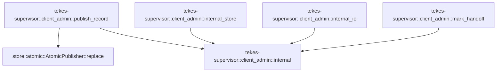

```mermaid
flowchart TD
  n0["store::atomic::AtomicPublisher::replace"]
  n1["store::management_root::retire_legacy_name"]
  n2["store::platform::NamedLock::exclusive"]
  n3["tekes-supervisor::client_admin::to_ijson"]
  n4["tekes-supervisor::client_admin::failure"]
  n5["tekes-supervisor::client_admin::internal"]
  n6["tekes-supervisor::client_admin::internal_profile"]
  n7["tekes-supervisor::client_admin::internal_daemon"]
  n8["tekes-supervisor::client_admin::stale"]
  n9["tekes-supervisor::client_admin::next_revision"]
  n10["tekes-supervisor::client_admin::map_workspace"]
  n11["tekes-supervisor::client_admin::map_policy"]
  n12["tekes-supervisor::client_admin::policy_result"]
  n13["tekes-supervisor::client_admin::AdminMutationJournal::open"]
  n14["tekes-supervisor::client_admin::AdminMutationJournal::begin"]
  n15["tekes-supervisor::client_admin::AdminMutationJournal::recover"]
  n16["tekes-supervisor::client_admin::AdminMutationJournal::commit"]
  n17["tekes-supervisor::client_admin::AdminMutationJournal::records"]
  n18["tekes-supervisor::client_admin::AdminMutationJournal::commit_record"]
  n19["tekes-supervisor::client_admin::AdminMutationJournal::abort"]
  n20["tekes-supervisor::client_admin::AdminMutationJournal::authority_digest"]
  n21["tekes-supervisor::client_admin::AdminMutationJournal::record_path"]
  n22["tekes-supervisor::client_admin::request_digest"]
  n23["tekes-supervisor::client_admin::sha256"]
  n24["tekes-supervisor::client_admin::read_record"]
  n25["tekes-supervisor::client_admin::publish_record"]
  n26["tekes-supervisor::client_admin::internal_io"]
  n5 --> n4
  n6 --> n5
  n7 --> n5
  n8 --> n4
  n9 --> n4
  n10 --> n4
  n10 --> n6
  n11 --> n4
  n11 --> n8
  n12 --> n3
  n13 --> n0
  n13 --> n1
  n14 --> n2
  n14 --> n4
  n14 --> n20
  n14 --> n21
  n14 --> n22
  n14 --> n23
  n14 --> n24
  n14 --> n25
  n15 --> n2
  n15 --> n4
  n15 --> n20
  n15 --> n21
  n15 --> n22
  n15 --> n24
  n15 --> n25
  n16 --> n2
  n16 --> n4
  n16 --> n5
  n16 --> n20
  n16 --> n21
  n16 --> n22
  n16 --> n24
  n16 --> n25
  n17 --> n2
  n17 --> n5
  n17 --> n24
  n18 --> n2
  n18 --> n5
  n18 --> n20
  n18 --> n21
  n18 --> n24
  n18 --> n25
  n19 --> n2
  n19 --> n5
  n19 --> n20
  n19 --> n21
  n19 --> n24
  n20 --> n5
  n20 --> n23
  n20 --> n26
  n22 --> n5
  n22 --> n23
  n24 --> n5
  n24 --> n26
```

# tekes-supervisor::client_admin

[Package atlas](index.md) · [Source](../../src/client_admin.rs)

## Declarations

Visibility is the declaration spelling; trait members and reexports require their enclosing interface. `cfg` is not evaluated.

| Symbol | Kind | Visibility | Test / cfg |
|---|---|---|---|
| [tekes-supervisor::client_admin::WORKSPACE_POLICY_METHODS](../../src/client_admin.rs#L20) | const_item | `pub` |  |
| [tekes-supervisor::client_admin::ClientAdminRoutes](../../src/client_admin.rs#L25) | struct_item | `pub` |  |
| [tekes-supervisor::client_admin::ClientAdminRoutes::new](../../src/client_admin.rs#L33) | function_item | `pub` |  |
| [tekes-supervisor::client_admin::ClientAdminRoutes::routes](../../src/client_admin.rs#L50) | function_item | `pub` |  |
| [tekes-supervisor::client_admin::ClientAdminRoutes::recover_pending_intents](../../src/client_admin.rs#L58) | function_item | `private` |  |
| [tekes-supervisor::client_admin::ClientAdminRoutes::get_policy](../../src/client_admin.rs#L115) | function_item | `private` |  |
| [tekes-supervisor::client_admin::ClientAdminRoutes::set_policy](../../src/client_admin.rs#L124) | function_item | `private` |  |
| [tekes-supervisor::client_admin::AdminCapabilityRoutes](../../src/client_admin.rs#L196) | struct_item | `private` |  |
| [tekes-supervisor::client_admin::AdminCapabilityRoutes::new](../../src/client_admin.rs#L203) | function_item | `private` |  |
| [tekes-supervisor::client_admin::AdminCapabilityRoutes::class](../../src/client_admin.rs#L215) | function_item | `private` |  |
| [tekes-supervisor::client_admin::AdminCapabilityRoutes::capabilities](../../src/client_admin.rs#L223) | function_item | `private` |  |
| [tekes-supervisor::client_admin::AdminCapabilityRoutes::extension_method_class](../../src/client_admin.rs#L230) | function_item | `private` |  |
| [tekes-supervisor::client_admin::AdminCapabilityRoutes::validate_extension_payload](../../src/client_admin.rs#L234) | function_item | `private` |  |
| [tekes-supervisor::client_admin::AdminCapabilityRoutes::extension_failure_is_exact](../../src/client_admin.rs#L250) | function_item | `private` |  |
| [tekes-supervisor::client_admin::AdminCapabilityRoutes::execute](../../src/client_admin.rs#L261) | function_item | `private` |  |
| [tekes-supervisor::client_admin::ClientAdminRoutes::capabilities](../../src/client_admin.rs#L279) | function_item | `private` |  |
| [tekes-supervisor::client_admin::ClientAdminRoutes::extension_method_class](../../src/client_admin.rs#L286) | function_item | `private` |  |
| [tekes-supervisor::client_admin::ClientAdminRoutes::validate_extension_payload](../../src/client_admin.rs#L294) | function_item | `private` |  |
| [tekes-supervisor::client_admin::ClientAdminRoutes::extension_failure_is_exact](../../src/client_admin.rs#L310) | function_item | `private` |  |
| [tekes-supervisor::client_admin::ClientAdminRoutes::execute](../../src/client_admin.rs#L328) | function_item | `private` |  |
| [tekes-supervisor::client_admin::PolicyGetRequest](../../src/client_admin.rs#L348) | struct_item | `private` |  |
| [tekes-supervisor::client_admin::PolicySetRequest](../../src/client_admin.rs#L353) | struct_item | `private` |  |
| [tekes-supervisor::client_admin::parse](../../src/client_admin.rs#L359) | function_item | `private` |  |
| [tekes-supervisor::client_admin::to_ijson](../../src/client_admin.rs#L368) | function_item | `private` |  |
| [tekes-supervisor::client_admin::failure](../../src/client_admin.rs#L374) | function_item | `private` |  |
| [tekes-supervisor::client_admin::internal](../../src/client_admin.rs#L381) | function_item | `private` |  |
| [tekes-supervisor::client_admin::internal_profile](../../src/client_admin.rs#L388) | function_item | `private` |  |
| [tekes-supervisor::client_admin::internal_daemon](../../src/client_admin.rs#L391) | function_item | `private` |  |
| [tekes-supervisor::client_admin::stale](../../src/client_admin.rs#L394) | function_item | `private` |  |
| [tekes-supervisor::client_admin::next_revision](../../src/client_admin.rs#L401) | function_item | `private` |  |
| [tekes-supervisor::client_admin::map_workspace](../../src/client_admin.rs#L413) | function_item | `private` |  |
| [tekes-supervisor::client_admin::map_policy](../../src/client_admin.rs#L421) | function_item | `private` |  |
| [tekes-supervisor::client_admin::policy_result](../../src/client_admin.rs#L439) | function_item | `private` |  |
| [tekes-supervisor::client_admin::AdminPhase](../../src/client_admin.rs#L448) | enum_item | `private` |  |
| [tekes-supervisor::client_admin::AdminRecord](../../src/client_admin.rs#L455) | struct_item | `private` |  |
| [tekes-supervisor::client_admin::AdminBegin](../../src/client_admin.rs#L469) | enum_item | `private` |  |
| [tekes-supervisor::client_admin::CONFIG_ADMIN_DIR](../../src/client_admin.rs#L475) | const_item | `private` |  |
| [tekes-supervisor::client_admin::LEGACY_CONFIG_ADMIN_DIR](../../src/client_admin.rs#L477) | const_item | `private` |  |
| [tekes-supervisor::client_admin::AdminMutationJournal](../../src/client_admin.rs#L479) | struct_item | `private` |  |
| [tekes-supervisor::client_admin::AdminMutationJournal::open](../../src/client_admin.rs#L486) | function_item | `private` |  |
| [tekes-supervisor::client_admin::AdminMutationJournal::begin](../../src/client_admin.rs#L502) | function_item | `private` |  |
| [tekes-supervisor::client_admin::AdminMutationJournal::recover](../../src/client_admin.rs#L567) | function_item | `private` |  |
| [tekes-supervisor::client_admin::AdminMutationJournal::commit](../../src/client_admin.rs#L595) | function_item | `private` |  |
| [tekes-supervisor::client_admin::AdminMutationJournal::records](../../src/client_admin.rs#L619) | function_item | `private` |  |
| [tekes-supervisor::client_admin::AdminMutationJournal::commit_record](../../src/client_admin.rs#L634) | function_item | `private` |  |
| [tekes-supervisor::client_admin::AdminMutationJournal::abort](../../src/client_admin.rs#L648) | function_item | `private` |  |
| [tekes-supervisor::client_admin::AdminMutationJournal::authority_digest](../../src/client_admin.rs#L665) | function_item | `private` |  |
| [tekes-supervisor::client_admin::AdminMutationJournal::record_path](../../src/client_admin.rs#L681) | function_item | `private` |  |
| [tekes-supervisor::client_admin::request_digest](../../src/client_admin.rs#L687) | function_item | `private` |  |
| [tekes-supervisor::client_admin::sha256](../../src/client_admin.rs#L694) | function_item | `private` |  |
| [tekes-supervisor::client_admin::read_record](../../src/client_admin.rs#L697) | function_item | `private` |  |
| [tekes-supervisor::client_admin::publish_record](../../src/client_admin.rs#L717) | function_item | `private` |  |
| [tekes-supervisor::client_admin::internal_store](../../src/client_admin.rs#L723) | function_item | `private` |  |
| [tekes-supervisor::client_admin::internal_io](../../src/client_admin.rs#L726) | function_item | `private` |  |
| [tekes-supervisor::client_admin::mark_handoff](../../src/client_admin.rs#L729) | function_item | `private` |  |
| [tekes-supervisor::client_admin::tests::fixture](../../src/client_admin.rs#L750) | function_item | `private` | test; #[cfg(test)] |
| [tekes-supervisor::client_admin::tests::call](../../src/client_admin.rs#L775) | function_item | `private` | test; #[cfg(test)] |
| [tekes-supervisor::client_admin::tests::policy_replacement_can_relax_local_default_below_ceiling](../../src/client_admin.rs#L786) | function_item | `private` | test; #[cfg(test)] |
| [tekes-supervisor::client_admin::tests::journal_rejects_wrong_bytes_for_the_same_rpc_id](../../src/client_admin.rs#L807) | function_item | `private` | test; #[cfg(test)] |
| [tekes-supervisor::client_admin::tests::crash_before_publish_is_completed_before_an_unrelated_rpc](../../src/client_admin.rs#L837) | function_item | `private` | test; #[cfg(test)] |
| [tekes-supervisor::client_admin::tests::startup_closes_policy_crashes_on_both_sides_of_the_side_effect](../../src/client_admin.rs#L896) | function_item | `private` | test; #[cfg(test)] |

## Imports / reexports

| Local name | Source path | Visibility |
|---|---|---|
| `BTreeSet` | `std::collections::BTreeSet` | `private` |
| `fs` | `std::fs` | `private` |
| `Path` | `std::path::Path` | `private` |
| `PathBuf` | `std::path::PathBuf` | `private` |
| `Arc` | `std::sync::Arc` | `private` |
| `Mutex` | `std::sync::Mutex` | `private` |
| `DurableHandoffProof` | `endpoint::DurableHandoffProof` | `private` |
| `EndpointHostCall` | `endpoint::EndpointHostCall` | `private` |
| `MethodClass` | `endpoint::MethodClass` | `private` |
| `RpcDurableIdentity` | `endpoint::RpcDurableIdentity` | `private` |
| `ConfigRepository` | `profile::ConfigRepository` | `private` |
| `WorkspacePolicy` | `profile::WorkspacePolicy` | `private` |
| `IJsonValue` | `schema::IJsonValue` | `private` |
| `Deserialize` | `serde::Deserialize` | `private` |
| `Serialize` | `serde::Serialize` | `private` |
| `Value` | `serde_json::Value` | `private` |
| `json` | `serde_json::json` | `private` |
| `Digest` | `sha2::Digest` | `private` |
| `Sha256` | `sha2::Sha256` | `private` |
| `AtomicPublisher` | `store::AtomicPublisher` | `private` |
| `NamedLock` | `store::NamedLock` | `private` |
| `ProductionEndpointRoutes` | `crate::endpoint_host::ProductionEndpointRoutes` | `private` |
| `ProductionRouteFailure` | `crate::endpoint_host::ProductionRouteFailure` | `private` |
| `ProductionProcessHost` | `crate::process_host::ProductionProcessHost` | `private` |
| `*` | `super::*` | `private` |
| `DurableHandoffSignal` | `endpoint::DurableHandoffSignal` | `private` |
| `WorkspaceConfig` | `profile::WorkspaceConfig` | `private` |
| `TempDir` | `tempfile::TempDir` | `private` |

## Module declarations

| Module | Visibility | Attributes |
|---|---|---|
| `tekes-supervisor::client_admin::tests` | `private` | #[cfg(test)] |

## Function call graphs

Edges below are syntactically resolved calls only, including private functions. Graphs partition callers into groups of 20; they are not execution order. All unresolved sites are listed below and in the JSON inventory.

```mermaid
flowchart TD
  n0["profile::config::ConfigRepository::open"]
  n1["schema::ijson::IJsonValue::parse"]
  n2["schema::ijson::IJsonValue::parse_str"]
  n3["tekes-supervisor::client_admin::ClientAdminRoutes::get_policy"]
  n4["tekes-supervisor::client_admin::ClientAdminRoutes::set_policy"]
  n5["tekes-supervisor::client_admin::AdminCapabilityRoutes::new"]
  n6["tekes-supervisor::client_admin::AdminCapabilityRoutes::class"]
  n7["tekes-supervisor::client_admin::AdminCapabilityRoutes::capabilities"]
  n8["tekes-supervisor::client_admin::AdminCapabilityRoutes::extension_method_class"]
  n9["tekes-supervisor::client_admin::AdminCapabilityRoutes::validate_extension_payload"]
  n10["tekes-supervisor::client_admin::AdminCapabilityRoutes::extension_failure_is_exact"]
  n11["tekes-supervisor::client_admin::AdminCapabilityRoutes::execute"]
  n12["tekes-supervisor::client_admin::ClientAdminRoutes::capabilities"]
  n13["tekes-supervisor::client_admin::ClientAdminRoutes::extension_method_class"]
  n14["tekes-supervisor::client_admin::ClientAdminRoutes::validate_extension_payload"]
  n15["tekes-supervisor::client_admin::ClientAdminRoutes::extension_failure_is_exact"]
  n16["tekes-supervisor::client_admin::ClientAdminRoutes::execute"]
  n17["tekes-supervisor::client_admin::ClientAdminRoutes::new"]
  n18["tekes-supervisor::client_admin::parse"]
  n19["tekes-supervisor::client_admin::to_ijson"]
  n20["tekes-supervisor::client_admin::failure"]
  n21["tekes-supervisor::client_admin::internal"]
  n22["tekes-supervisor::client_admin::stale"]
  n23["tekes-supervisor::client_admin::next_revision"]
  n24["tekes-supervisor::client_admin::map_policy"]
  n25["tekes-supervisor::client_admin::policy_result"]
  n26["tekes-supervisor::client_admin::AdminMutationJournal::open"]
  n27["tekes-supervisor::client_admin::ClientAdminRoutes::routes"]
  n28["tekes-supervisor::client_admin::ClientAdminRoutes::recover_pending_intents"]
  n29["tekes-supervisor::client_admin::mark_handoff"]
  n30["tekes-supervisor::endpoint_host::ProductionRouteFailure::new"]
  n3 --> n19
  n4 --> n20
  n4 --> n21
  n4 --> n22
  n4 --> n23
  n4 --> n24
  n4 --> n25
  n4 --> n28
  n4 --> n29
  n9 --> n20
  n11 --> n20
  n14 --> n18
  n14 --> n20
  n16 --> n18
  n16 --> n20
  n17 --> n0
  n17 --> n26
  n18 --> n20
  n19 --> n1
  n19 --> n21
  n20 --> n2
  n20 --> n19
  n20 --> n30
  n28 --> n21
```

Functions 1–20: 24 direct edges

Functions 21–40: 56 direct edges

Functions 41–44: 5 direct edges

## Call sites

Includes test functions (marked in declarations). Receiver-type-required sites need type analysis/manual tracing. Calls in closures are attributed to their enclosing function; their occurrence here does not mean the closure executes immediately.

| Caller | Callee expression | Source lines | Target / classification |
|---|---|---|---|
| `new` | `root.as_ref` | [37](../../src/client_admin.rs#L37) | receiver-type-required |
| `new` | `ConfigRepository::open(root).map_err` | [39](../../src/client_admin.rs#L39) | receiver-type-required |
| `new` | `ConfigRepository::open` | [39](../../src/client_admin.rs#L39) | [profile::config::ConfigRepository::open](../../../profile/src/config.rs#L684) |
| `new` | `Mutex::new` | [41](../../src/client_admin.rs#L41) | external-constructor-callback-or-unresolved |
| `new` | `AdminMutationJournal::open(root).map_err` | [42](../../src/client_admin.rs#L42) | receiver-type-required |
| `new` | `AdminMutationJournal::open` | [42](../../src/client_admin.rs#L42) | [tekes-supervisor::client_admin::AdminMutationJournal::open](../../src/client_admin.rs#L486) |
| `new` | `routes.recover_pending_intents` | [44](../../src/client_admin.rs#L44) | receiver-type-required |
| `new` | `Ok` | [45](../../src/client_admin.rs#L45) | external-constructor-callback-or-unresolved |
| `recover_pending_intents` | `self.journal.records` | [59](../../src/client_admin.rs#L59) | receiver-type-required |
| `recover_pending_intents` | `self.journal.authority_digest(&record.authority)?.as_deref` | [71](../../src/client_admin.rs#L71) | receiver-type-required |
| `recover_pending_intents` | `self.journal.authority_digest` | [71](../../src/client_admin.rs#L71) | receiver-type-required |
| `recover_pending_intents` | `Some` | [72](../../src/client_admin.rs#L72) | external-constructor-callback-or-unresolved |
| `recover_pending_intents` | `record.authority.as_str` | [74](../../src/client_admin.rs#L74) | receiver-type-required |
| `recover_pending_intents` | `authority.starts_with` | [76](../../src/client_admin.rs#L76) | receiver-type-required |
| `recover_pending_intents` | `authority.ends_with` | [76](../../src/client_admin.rs#L76) | receiver-type-required |
| `recover_pending_intents` | `profile::WorkspaceConfig::decode(&record.desired)                             .map_err` | [78](../../src/client_admin.rs#L78) | receiver-type-required |
| `recover_pending_intents` | `profile::WorkspaceConfig::decode` | [78](../../src/client_admin.rs#L78), [107](../../src/client_admin.rs#L107) | external-constructor-callback-or-unresolved |
| `recover_pending_intents` | `self                             .repository                             .resolve(&desired.id)                             .map_err` | [80](../../src/client_admin.rs#L80) | receiver-type-required |
| `recover_pending_intents` | `self                             .repository                             .resolve` | [80](../../src/client_admin.rs#L80) | receiver-type-required |
| `recover_pending_intents` | `desired.policy.clone().unwrap_or_default` | [84](../../src/client_admin.rs#L84) | receiver-type-required |
| `recover_pending_intents` | `desired.policy.clone` | [84](../../src/client_admin.rs#L84) | receiver-type-required |
| `recover_pending_intents` | `self                             .repository                             .publish_workspace_policy(&desired.id, record.expected_revision, policy)                             .map_err` | [85](../../src/client_admin.rs#L85) | receiver-type-required |
| `recover_pending_intents` | `self                             .repository                             .publish_workspace_policy` | [85](../../src/client_admin.rs#L85) | receiver-type-required |
| `recover_pending_intents` | `published.canonical_bytes().map_err` | [89](../../src/client_admin.rs#L89) | receiver-type-required |
| `recover_pending_intents` | `published.canonical_bytes` | [89](../../src/client_admin.rs#L89) | receiver-type-required |
| `recover_pending_intents` | `Err` | [90](../../src/client_admin.rs#L90), [99](../../src/client_admin.rs#L99) | external-constructor-callback-or-unresolved |
| `recover_pending_intents` | `internal` | [90](../../src/client_admin.rs#L90), [99](../../src/client_admin.rs#L99) | [tekes-supervisor::client_admin::internal](../../src/client_admin.rs#L381) |
| `recover_pending_intents` | `self.process_host                             .workspace_policy_published(&desired.id, &previous)                             .map_err` | [94](../../src/client_admin.rs#L94) | receiver-type-required |
| `recover_pending_intents` | `self.process_host                             .workspace_policy_published` | [94](../../src/client_admin.rs#L94) | receiver-type-required |
| `recover_pending_intents` | `record.authority.starts_with` | [105](../../src/client_admin.rs#L105) | receiver-type-required |
| `recover_pending_intents` | `profile::WorkspaceConfig::decode(&record.desired).map_err` | [107](../../src/client_admin.rs#L107) | receiver-type-required |
| `recover_pending_intents` | `self.process_host.workspace_policy_recovered` | [108](../../src/client_admin.rs#L108) | receiver-type-required |
| `recover_pending_intents` | `self.journal.commit_record` | [110](../../src/client_admin.rs#L110) | receiver-type-required |
| `recover_pending_intents` | `Ok` | [112](../../src/client_admin.rs#L112) | external-constructor-callback-or-unresolved |
| `get_policy` | `self             .repository             .workspace(&input.workspace_id)             .map_err` | [116](../../src/client_admin.rs#L116) | receiver-type-required |
| `get_policy` | `self             .repository             .workspace` | [116](../../src/client_admin.rs#L116) | receiver-type-required |
| `get_policy` | `to_ijson` | [120](../../src/client_admin.rs#L120) | [tekes-supervisor::client_admin::to_ijson](../../src/client_admin.rs#L368) |
| `set_policy` | `self             .mutation_gate             .lock()             .map_err` | [129](../../src/client_admin.rs#L129) | receiver-type-required |
| `set_policy` | `self             .mutation_gate             .lock` | [129](../../src/client_admin.rs#L129) | receiver-type-required |
| `set_policy` | `internal` | [132](../../src/client_admin.rs#L132), [186](../../src/client_admin.rs#L186) | [tekes-supervisor::client_admin::internal](../../src/client_admin.rs#L381) |
| `set_policy` | `self.recover_pending_intents` | [133](../../src/client_admin.rs#L133) | [tekes-supervisor::client_admin::ClientAdminRoutes::recover_pending_intents](../../src/client_admin.rs#L58) |
| `set_policy` | `self.journal.recover` | [134](../../src/client_admin.rs#L134) | receiver-type-required |
| `set_policy` | `mark_handoff` | [135](../../src/client_admin.rs#L135), [191](../../src/client_admin.rs#L191) | [tekes-supervisor::client_admin::mark_handoff](../../src/client_admin.rs#L729) |
| `set_policy` | `Ok` | [136](../../src/client_admin.rs#L136), [192](../../src/client_admin.rs#L192) | external-constructor-callback-or-unresolved |
| `set_policy` | `self             .repository             .workspace(&input.workspace_id)             .map_err` | [138](../../src/client_admin.rs#L138) | receiver-type-required |
| `set_policy` | `self             .repository             .workspace` | [138](../../src/client_admin.rs#L138) | receiver-type-required |
| `set_policy` | `Err` | [143](../../src/client_admin.rs#L143), [179](../../src/client_admin.rs#L179), [186](../../src/client_admin.rs#L186) | external-constructor-callback-or-unresolved |
| `set_policy` | `stale` | [143](../../src/client_admin.rs#L143) | [tekes-supervisor::client_admin::stale](../../src/client_admin.rs#L394) |
| `set_policy` | `self.process_host             .validate_workspace_policy_candidate(&input.workspace_id, &input.policy)             .map_err` | [145](../../src/client_admin.rs#L145) | receiver-type-required |
| `set_policy` | `self.process_host             .validate_workspace_policy_candidate` | [145](../../src/client_admin.rs#L145) | receiver-type-required |
| `set_policy` | `failure` | [148](../../src/client_admin.rs#L148) | [tekes-supervisor::client_admin::failure](../../src/client_admin.rs#L374) |
| `set_policy` | `self             .repository             .resolve(&input.workspace_id)             .map_err` | [154](../../src/client_admin.rs#L154) | receiver-type-required |
| `set_policy` | `self             .repository             .resolve` | [154](../../src/client_admin.rs#L154) | receiver-type-required |
| `set_policy` | `workspace.clone` | [158](../../src/client_admin.rs#L158) | receiver-type-required |
| `set_policy` | `next_revision` | [159](../../src/client_admin.rs#L159) | [tekes-supervisor::client_admin::next_revision](../../src/client_admin.rs#L401) |
| `set_policy` | `Some` | [160](../../src/client_admin.rs#L160) | external-constructor-callback-or-unresolved |
| `set_policy` | `input.policy.clone` | [160](../../src/client_admin.rs#L160), [174](../../src/client_admin.rs#L174) | receiver-type-required |
| `set_policy` | `desired_workspace.canonical_bytes().map_err` | [161](../../src/client_admin.rs#L161) | receiver-type-required |
| `set_policy` | `desired_workspace.canonical_bytes` | [161](../../src/client_admin.rs#L161) | receiver-type-required |
| `set_policy` | `policy_result` | [162](../../src/client_admin.rs#L162) | [tekes-supervisor::client_admin::policy_result](../../src/client_admin.rs#L439) |
| `set_policy` | `self.journal.begin` | [163](../../src/client_admin.rs#L163) | receiver-type-required |
| `set_policy` | `self.repository.publish_workspace_policy` | [171](../../src/client_admin.rs#L171) | receiver-type-required |
| `set_policy` | `self.journal.abort` | [178](../../src/client_admin.rs#L178) | receiver-type-required |
| `set_policy` | `map_policy` | [179](../../src/client_admin.rs#L179) | [tekes-supervisor::client_admin::map_policy](../../src/client_admin.rs#L421) |
| `set_policy` | `self.process_host             .workspace_policy_published(&input.workspace_id, &previous)             .map_err` | [182](../../src/client_admin.rs#L182) | receiver-type-required |
| `set_policy` | `self.process_host             .workspace_policy_published` | [182](../../src/client_admin.rs#L182) | receiver-type-required |
| `set_policy` | `self.journal.commit` | [190](../../src/client_admin.rs#L190) | receiver-type-required |
| `class` | `self.methods             .iter()             .find_map` | [216](../../src/client_admin.rs#L216) | receiver-type-required |
| `class` | `self.methods             .iter` | [216](../../src/client_admin.rs#L216) | receiver-type-required |
| `class` | `(*name == method).then_some` | [218](../../src/client_admin.rs#L218) | receiver-type-required |
| `capabilities` | `self.methods             .iter()             .map(&#124;(name, _)&#124; (*name).to_owned())             .collect` | [224](../../src/client_admin.rs#L224) | receiver-type-required |
| `capabilities` | `self.methods             .iter()             .map` | [224](../../src/client_admin.rs#L224) | receiver-type-required |
| `capabilities` | `self.methods             .iter` | [224](../../src/client_admin.rs#L224) | receiver-type-required |
| `capabilities` | `(*name).to_owned` | [226](../../src/client_admin.rs#L226) | receiver-type-required |
| `extension_method_class` | `self.class` | [231](../../src/client_admin.rs#L231) | receiver-type-required |
| `validate_extension_payload` | `self.class(operation).is_none` | [239](../../src/client_admin.rs#L239) | receiver-type-required |
| `validate_extension_payload` | `self.class` | [239](../../src/client_admin.rs#L239) | receiver-type-required |
| `validate_extension_payload` | `Err` | [240](../../src/client_admin.rs#L240) | external-constructor-callback-or-unresolved |
| `validate_extension_payload` | `failure` | [240](../../src/client_admin.rs#L240) | [tekes-supervisor::client_admin::failure](../../src/client_admin.rs#L374) |
| `validate_extension_payload` | `self.authority             .validate_extension_payload` | [246](../../src/client_admin.rs#L246) | receiver-type-required |
| `extension_failure_is_exact` | `self.class(operation).is_some` | [255](../../src/client_admin.rs#L255) | receiver-type-required |
| `extension_failure_is_exact` | `self.class` | [255](../../src/client_admin.rs#L255) | receiver-type-required |
| `extension_failure_is_exact` | `self                 .authority                 .extension_failure_is_exact` | [256](../../src/client_admin.rs#L256) | receiver-type-required |
| `execute` | `self.class(&request.operation).is_none` | [267](../../src/client_admin.rs#L267) | receiver-type-required |
| `execute` | `self.class` | [267](../../src/client_admin.rs#L267) | receiver-type-required |
| `execute` | `Err` | [268](../../src/client_admin.rs#L268) | external-constructor-callback-or-unresolved |
| `execute` | `failure` | [268](../../src/client_admin.rs#L268) | [tekes-supervisor::client_admin::failure](../../src/client_admin.rs#L374) |
| `execute` | `self.authority.execute` | [274](../../src/client_admin.rs#L274) | receiver-type-required |
| `capabilities` | `WORKSPACE_POLICY_METHODS             .into_iter()             .map(&#124;(name, _)&#124; name.to_owned())             .collect` | [280](../../src/client_admin.rs#L280) | receiver-type-required |
| `capabilities` | `WORKSPACE_POLICY_METHODS             .into_iter()             .map` | [280](../../src/client_admin.rs#L280) | receiver-type-required |
| `capabilities` | `WORKSPACE_POLICY_METHODS             .into_iter` | [280](../../src/client_admin.rs#L280) | receiver-type-required |
| `capabilities` | `name.to_owned` | [282](../../src/client_admin.rs#L282) | receiver-type-required |
| `extension_method_class` | `Some` | [287](../../src/client_admin.rs#L287) | external-constructor-callback-or-unresolved |
| `validate_extension_payload` | `parse::<PolicyGetRequest>(payload).map` | [300](../../src/client_admin.rs#L300) | receiver-type-required |
| `validate_extension_payload` | `parse::<PolicyGetRequest>` | [300](../../src/client_admin.rs#L300) | [tekes-supervisor::client_admin::parse](../../src/client_admin.rs#L359) |
| `validate_extension_payload` | `parse::<PolicySetRequest>(payload).map` | [301](../../src/client_admin.rs#L301) | receiver-type-required |
| `validate_extension_payload` | `parse::<PolicySetRequest>` | [301](../../src/client_admin.rs#L301) | [tekes-supervisor::client_admin::parse](../../src/client_admin.rs#L359) |
| `validate_extension_payload` | `Err` | [302](../../src/client_admin.rs#L302) | external-constructor-callback-or-unresolved |
| `validate_extension_payload` | `failure` | [302](../../src/client_admin.rs#L302) | [tekes-supervisor::client_admin::failure](../../src/client_admin.rs#L374) |
| `execute` | `request.operation.as_str` | [334](../../src/client_admin.rs#L334) | receiver-type-required |
| `execute` | `self.get_policy` | [335](../../src/client_admin.rs#L335) | receiver-type-required |
| `execute` | `parse` | [335](../../src/client_admin.rs#L335), [336](../../src/client_admin.rs#L336) | [tekes-supervisor::client_admin::parse](../../src/client_admin.rs#L359) |
| `execute` | `self.set_policy` | [336](../../src/client_admin.rs#L336) | receiver-type-required |
| `execute` | `Err` | [337](../../src/client_admin.rs#L337) | external-constructor-callback-or-unresolved |
| `execute` | `failure` | [337](../../src/client_admin.rs#L337) | [tekes-supervisor::client_admin::failure](../../src/client_admin.rs#L374) |
| `parse` | `serde_json::from_value(payload.clone()).map_err` | [360](../../src/client_admin.rs#L360) | receiver-type-required |
| `parse` | `serde_json::from_value` | [360](../../src/client_admin.rs#L360) | external-constructor-callback-or-unresolved |
| `parse` | `payload.clone` | [360](../../src/client_admin.rs#L360) | receiver-type-required |
| `parse` | `failure` | [361](../../src/client_admin.rs#L361) | [tekes-supervisor::client_admin::failure](../../src/client_admin.rs#L374) |
| `to_ijson` | `IJsonValue::parse(         &serde_json_canonicalizer::to_vec(value).map_err(&#124;error&#124; internal(error.to_string()))?,     )     .map_err` | [369](../../src/client_admin.rs#L369) | receiver-type-required |
| `to_ijson` | `IJsonValue::parse` | [369](../../src/client_admin.rs#L369) | [schema::ijson::IJsonValue::parse](../../../schema/src/ijson.rs#L16) |
| `to_ijson` | `serde_json_canonicalizer::to_vec(value).map_err` | [370](../../src/client_admin.rs#L370) | receiver-type-required |
| `to_ijson` | `serde_json_canonicalizer::to_vec` | [370](../../src/client_admin.rs#L370) | external-constructor-callback-or-unresolved |
| `to_ijson` | `internal` | [370](../../src/client_admin.rs#L370), [372](../../src/client_admin.rs#L372) | [tekes-supervisor::client_admin::internal](../../src/client_admin.rs#L381) |
| `to_ijson` | `error.to_string` | [370](../../src/client_admin.rs#L370), [372](../../src/client_admin.rs#L372) | receiver-type-required |
| `failure` | `ProductionRouteFailure::new` | [375](../../src/client_admin.rs#L375) | [tekes-supervisor::endpoint_host::ProductionRouteFailure::new](../../src/endpoint_host.rs#L492) |
| `failure` | `to_ijson(&details).unwrap_or_else` | [378](../../src/client_admin.rs#L378) | receiver-type-required |
| `failure` | `to_ijson` | [378](../../src/client_admin.rs#L378) | [tekes-supervisor::client_admin::to_ijson](../../src/client_admin.rs#L368) |
| `failure` | `IJsonValue::parse_str("{}").expect` | [378](../../src/client_admin.rs#L378) | receiver-type-required |
| `failure` | `IJsonValue::parse_str` | [378](../../src/client_admin.rs#L378) | [schema::ijson::IJsonValue::parse_str](../../../schema/src/ijson.rs#L23) |
| `internal` | `failure` | [382](../../src/client_admin.rs#L382) | [tekes-supervisor::client_admin::failure](../../src/client_admin.rs#L374) |
| `internal_profile` | `internal` | [389](../../src/client_admin.rs#L389) | [tekes-supervisor::client_admin::internal](../../src/client_admin.rs#L381) |
| `internal_daemon` | `internal` | [392](../../src/client_admin.rs#L392) | [tekes-supervisor::client_admin::internal](../../src/client_admin.rs#L381) |
| `stale` | `failure` | [395](../../src/client_admin.rs#L395) | [tekes-supervisor::client_admin::failure](../../src/client_admin.rs#L374) |
| `next_revision` | `value         .checked_add(1)         .filter(&#124;value&#124; *value <= 9_007_199_254_740_991)         .ok_or_else` | [402](../../src/client_admin.rs#L402) | receiver-type-required |
| `next_revision` | `value         .checked_add(1)         .filter` | [402](../../src/client_admin.rs#L402) | receiver-type-required |
| `next_revision` | `value         .checked_add` | [402](../../src/client_admin.rs#L402) | receiver-type-required |
| `next_revision` | `failure` | [406](../../src/client_admin.rs#L406) | [tekes-supervisor::client_admin::failure](../../src/client_admin.rs#L374) |
| `map_workspace` | `io.kind` | [415](../../src/client_admin.rs#L415) | receiver-type-required |
| `map_workspace` | `failure` | [416](../../src/client_admin.rs#L416) | [tekes-supervisor::client_admin::failure](../../src/client_admin.rs#L374) |
| `map_workspace` | `internal_profile` | [418](../../src/client_admin.rs#L418) | [tekes-supervisor::client_admin::internal_profile](../../src/client_admin.rs#L388) |
| `map_policy` | `stale` | [423](../../src/client_admin.rs#L423) | [tekes-supervisor::client_admin::stale](../../src/client_admin.rs#L394) |
| `map_policy` | `io.kind` | [424](../../src/client_admin.rs#L424) | receiver-type-required |
| `map_policy` | `failure` | [425](../../src/client_admin.rs#L425), [427](../../src/client_admin.rs#L427), [432](../../src/client_admin.rs#L432) | [tekes-supervisor::client_admin::failure](../../src/client_admin.rs#L374) |
| `policy_result` | `to_ijson` | [443](../../src/client_admin.rs#L443) | [tekes-supervisor::client_admin::to_ijson](../../src/client_admin.rs#L368) |
| `open` | `store::retire_legacy_name` | [488](../../src/client_admin.rs#L488) | [store::management_root::retire_legacy_name](../../../store/src/management_root.rs#L21) |
| `open` | `admin_root.join` | [489](../../src/client_admin.rs#L489), [491](../../src/client_admin.rs#L491) | receiver-type-required |
| `open` | `fs::create_dir_all` | [490](../../src/client_admin.rs#L490) | external-constructor-callback-or-unresolved |
| `open` | `lock.exists` | [492](../../src/client_admin.rs#L492) | receiver-type-required |
| `open` | `AtomicPublisher::replace` | [493](../../src/client_admin.rs#L493) | [store::atomic::AtomicPublisher::replace](../../../store/src/atomic.rs#L16) |
| `open` | `Ok` | [495](../../src/client_admin.rs#L495) | external-constructor-callback-or-unresolved |
| `open` | `authority_root.to_path_buf` | [496](../../src/client_admin.rs#L496) | receiver-type-required |
| `begin` | `NamedLock::exclusive(&self.lock).map_err` | [511](../../src/client_admin.rs#L511) | receiver-type-required |
| `begin` | `NamedLock::exclusive` | [511](../../src/client_admin.rs#L511) | [store::platform::NamedLock::exclusive](../../../store/src/platform.rs#L103) |
| `begin` | `request_digest` | [512](../../src/client_admin.rs#L512) | [tekes-supervisor::client_admin::request_digest](../../src/client_admin.rs#L687) |
| `begin` | `self.record_path` | [513](../../src/client_admin.rs#L513) | [tekes-supervisor::client_admin::AdminMutationJournal::record_path](../../src/client_admin.rs#L681) |
| `begin` | `read_record` | [514](../../src/client_admin.rs#L514) | [tekes-supervisor::client_admin::read_record](../../src/client_admin.rs#L697) |
| `begin` | `Err` | [519](../../src/client_admin.rs#L519), [532](../../src/client_admin.rs#L532) | external-constructor-callback-or-unresolved |
| `begin` | `failure` | [519](../../src/client_admin.rs#L519), [532](../../src/client_admin.rs#L532) | [tekes-supervisor::client_admin::failure](../../src/client_admin.rs#L374) |
| `begin` | `sha256` | [528](../../src/client_admin.rs#L528), [558](../../src/client_admin.rs#L558) | [tekes-supervisor::client_admin::sha256](../../src/client_admin.rs#L694) |
| `begin` | `self.authority_digest(&old.authority)?.as_deref` | [539](../../src/client_admin.rs#L539) | receiver-type-required |
| `begin` | `self.authority_digest` | [539](../../src/client_admin.rs#L539) | [tekes-supervisor::client_admin::AdminMutationJournal::authority_digest](../../src/client_admin.rs#L665) |
| `begin` | `Some` | [539](../../src/client_admin.rs#L539) | external-constructor-callback-or-unresolved |
| `begin` | `publish_record` | [542](../../src/client_admin.rs#L542), [563](../../src/client_admin.rs#L563) | [tekes-supervisor::client_admin::publish_record](../../src/client_admin.rs#L717) |
| `begin` | `Ok` | [544](../../src/client_admin.rs#L544), [564](../../src/client_admin.rs#L564) | external-constructor-callback-or-unresolved |
| `begin` | `request.rpc_id.clone` | [552](../../src/client_admin.rs#L552) | receiver-type-required |
| `begin` | `request.operation.clone` | [553](../../src/client_admin.rs#L553) | receiver-type-required |
| `begin` | `authority.to_owned` | [555](../../src/client_admin.rs#L555) | receiver-type-required |
| `begin` | `desired_bytes.to_vec` | [559](../../src/client_admin.rs#L559) | receiver-type-required |
| `begin` | `result.clone` | [561](../../src/client_admin.rs#L561) | receiver-type-required |
| `recover` | `NamedLock::exclusive(&self.lock).map_err` | [571](../../src/client_admin.rs#L571) | receiver-type-required |
| `recover` | `NamedLock::exclusive` | [571](../../src/client_admin.rs#L571) | [store::platform::NamedLock::exclusive](../../../store/src/platform.rs#L103) |
| `recover` | `self.record_path` | [572](../../src/client_admin.rs#L572) | [tekes-supervisor::client_admin::AdminMutationJournal::record_path](../../src/client_admin.rs#L681) |
| `recover` | `read_record` | [573](../../src/client_admin.rs#L573) | [tekes-supervisor::client_admin::read_record](../../src/client_admin.rs#L697) |
| `recover` | `Ok` | [574](../../src/client_admin.rs#L574), [592](../../src/client_admin.rs#L592) | external-constructor-callback-or-unresolved |
| `recover` | `request_digest` | [578](../../src/client_admin.rs#L578) | [tekes-supervisor::client_admin::request_digest](../../src/client_admin.rs#L687) |
| `recover` | `Err` | [580](../../src/client_admin.rs#L580) | external-constructor-callback-or-unresolved |
| `recover` | `failure` | [580](../../src/client_admin.rs#L580) | [tekes-supervisor::client_admin::failure](../../src/client_admin.rs#L374) |
| `recover` | `self.authority_digest(&record.authority)?.as_deref` | [587](../../src/client_admin.rs#L587) | receiver-type-required |
| `recover` | `self.authority_digest` | [587](../../src/client_admin.rs#L587) | [tekes-supervisor::client_admin::AdminMutationJournal::authority_digest](../../src/client_admin.rs#L665) |
| `recover` | `Some` | [587](../../src/client_admin.rs#L587) | external-constructor-callback-or-unresolved |
| `recover` | `publish_record` | [590](../../src/client_admin.rs#L590) | [tekes-supervisor::client_admin::publish_record](../../src/client_admin.rs#L717) |
| `recover` | `(record.phase == AdminPhase::Committed).then_some` | [592](../../src/client_admin.rs#L592) | receiver-type-required |
| `commit` | `NamedLock::exclusive(&self.lock).map_err` | [596](../../src/client_admin.rs#L596) | receiver-type-required |
| `commit` | `NamedLock::exclusive` | [596](../../src/client_admin.rs#L596) | [store::platform::NamedLock::exclusive](../../../store/src/platform.rs#L103) |
| `commit` | `self.record_path` | [597](../../src/client_admin.rs#L597) | [tekes-supervisor::client_admin::AdminMutationJournal::record_path](../../src/client_admin.rs#L681) |
| `commit` | `read_record(&path)?.ok_or_else` | [599](../../src/client_admin.rs#L599) | receiver-type-required |
| `commit` | `read_record` | [599](../../src/client_admin.rs#L599) | [tekes-supervisor::client_admin::read_record](../../src/client_admin.rs#L697) |
| `commit` | `internal` | [599](../../src/client_admin.rs#L599), [610](../../src/client_admin.rs#L610) | [tekes-supervisor::client_admin::internal](../../src/client_admin.rs#L381) |
| `commit` | `request_digest` | [600](../../src/client_admin.rs#L600) | [tekes-supervisor::client_admin::request_digest](../../src/client_admin.rs#L687) |
| `commit` | `Err` | [603](../../src/client_admin.rs#L603), [610](../../src/client_admin.rs#L610) | external-constructor-callback-or-unresolved |
| `commit` | `failure` | [603](../../src/client_admin.rs#L603) | [tekes-supervisor::client_admin::failure](../../src/client_admin.rs#L374) |
| `commit` | `self.authority_digest(&record.authority)?.as_deref` | [609](../../src/client_admin.rs#L609) | receiver-type-required |
| `commit` | `self.authority_digest` | [609](../../src/client_admin.rs#L609) | [tekes-supervisor::client_admin::AdminMutationJournal::authority_digest](../../src/client_admin.rs#L665) |
| `commit` | `Some` | [609](../../src/client_admin.rs#L609) | external-constructor-callback-or-unresolved |
| `commit` | `publish_record` | [615](../../src/client_admin.rs#L615) | [tekes-supervisor::client_admin::publish_record](../../src/client_admin.rs#L717) |
| `commit` | `Ok` | [616](../../src/client_admin.rs#L616) | external-constructor-callback-or-unresolved |
| `records` | `NamedLock::exclusive(&self.lock).map_err` | [620](../../src/client_admin.rs#L620) | receiver-type-required |
| `records` | `NamedLock::exclusive` | [620](../../src/client_admin.rs#L620) | [store::platform::NamedLock::exclusive](../../../store/src/platform.rs#L103) |
| `records` | `fs::read_dir(&self.root)             .map_err(internal_io)?             .collect::<Result<Vec<_>, _>>()             .map_err` | [621](../../src/client_admin.rs#L621) | receiver-type-required |
| `records` | `fs::read_dir(&self.root)             .map_err(internal_io)?             .collect::<Result<Vec<_>, _>>` | [621](../../src/client_admin.rs#L621) | receiver-type-required |
| `records` | `fs::read_dir(&self.root)             .map_err` | [621](../../src/client_admin.rs#L621) | receiver-type-required |
| `records` | `fs::read_dir` | [621](../../src/client_admin.rs#L621) | external-constructor-callback-or-unresolved |
| `records` | `entries.sort_by_key` | [625](../../src/client_admin.rs#L625) | receiver-type-required |
| `records` | `entries             .into_iter()             .map(&#124;entry&#124; {                 read_record(&entry.path())?.ok_or_else(&#124;&#124; internal("config journal entry vanished"))             })             .collect` | [626](../../src/client_admin.rs#L626) | receiver-type-required |
| `records` | `entries             .into_iter()             .map` | [626](../../src/client_admin.rs#L626) | receiver-type-required |
| `records` | `entries             .into_iter` | [626](../../src/client_admin.rs#L626) | receiver-type-required |
| `records` | `read_record(&entry.path())?.ok_or_else` | [629](../../src/client_admin.rs#L629) | receiver-type-required |
| `records` | `read_record` | [629](../../src/client_admin.rs#L629) | [tekes-supervisor::client_admin::read_record](../../src/client_admin.rs#L697) |
| `records` | `entry.path` | [629](../../src/client_admin.rs#L629) | receiver-type-required |
| `records` | `internal` | [629](../../src/client_admin.rs#L629) | [tekes-supervisor::client_admin::internal](../../src/client_admin.rs#L381) |
| `commit_record` | `NamedLock::exclusive(&self.lock).map_err` | [635](../../src/client_admin.rs#L635) | receiver-type-required |
| `commit_record` | `NamedLock::exclusive` | [635](../../src/client_admin.rs#L635) | [store::platform::NamedLock::exclusive](../../../store/src/platform.rs#L103) |
| `commit_record` | `self.record_path` | [636](../../src/client_admin.rs#L636) | [tekes-supervisor::client_admin::AdminMutationJournal::record_path](../../src/client_admin.rs#L681) |
| `commit_record` | `read_record(&path)?.ok_or_else` | [638](../../src/client_admin.rs#L638) | receiver-type-required |
| `commit_record` | `read_record` | [638](../../src/client_admin.rs#L638) | [tekes-supervisor::client_admin::read_record](../../src/client_admin.rs#L697) |
| `commit_record` | `internal` | [638](../../src/client_admin.rs#L638), [640](../../src/client_admin.rs#L640) | [tekes-supervisor::client_admin::internal](../../src/client_admin.rs#L381) |
| `commit_record` | `self.authority_digest(&record.authority)?.as_deref` | [639](../../src/client_admin.rs#L639) | receiver-type-required |
| `commit_record` | `self.authority_digest` | [639](../../src/client_admin.rs#L639) | [tekes-supervisor::client_admin::AdminMutationJournal::authority_digest](../../src/client_admin.rs#L665) |
| `commit_record` | `Some` | [639](../../src/client_admin.rs#L639) | external-constructor-callback-or-unresolved |
| `commit_record` | `Err` | [640](../../src/client_admin.rs#L640) | external-constructor-callback-or-unresolved |
| `commit_record` | `publish_record` | [645](../../src/client_admin.rs#L645) | [tekes-supervisor::client_admin::publish_record](../../src/client_admin.rs#L717) |
| `abort` | `NamedLock::exclusive(&self.lock).map_err` | [649](../../src/client_admin.rs#L649) | receiver-type-required |
| `abort` | `NamedLock::exclusive` | [649](../../src/client_admin.rs#L649) | [store::platform::NamedLock::exclusive](../../../store/src/platform.rs#L103) |
| `abort` | `self.record_path` | [650](../../src/client_admin.rs#L650) | [tekes-supervisor::client_admin::AdminMutationJournal::record_path](../../src/client_admin.rs#L681) |
| `abort` | `read_record` | [651](../../src/client_admin.rs#L651) | [tekes-supervisor::client_admin::read_record](../../src/client_admin.rs#L697) |
| `abort` | `Ok` | [652](../../src/client_admin.rs#L652) | external-constructor-callback-or-unresolved |
| `abort` | `self.authority_digest(&record.authority)?.as_deref` | [655](../../src/client_admin.rs#L655) | receiver-type-required |
| `abort` | `self.authority_digest` | [655](../../src/client_admin.rs#L655) | [tekes-supervisor::client_admin::AdminMutationJournal::authority_digest](../../src/client_admin.rs#L665) |
| `abort` | `Some` | [655](../../src/client_admin.rs#L655) | external-constructor-callback-or-unresolved |
| `abort` | `Err` | [657](../../src/client_admin.rs#L657) | external-constructor-callback-or-unresolved |
| `abort` | `internal` | [657](../../src/client_admin.rs#L657) | [tekes-supervisor::client_admin::internal](../../src/client_admin.rs#L381) |
| `abort` | `fs::remove_file(&path).map_err` | [659](../../src/client_admin.rs#L659) | receiver-type-required |
| `abort` | `fs::remove_file` | [659](../../src/client_admin.rs#L659) | external-constructor-callback-or-unresolved |
| `abort` | `fs::File::open(&self.root)             .and_then(&#124;directory&#124; directory.sync_all())             .map_err` | [660](../../src/client_admin.rs#L660) | receiver-type-required |
| `abort` | `fs::File::open(&self.root)             .and_then` | [660](../../src/client_admin.rs#L660) | receiver-type-required |
| `abort` | `fs::File::open` | [660](../../src/client_admin.rs#L660) | external-constructor-callback-or-unresolved |
| `abort` | `directory.sync_all` | [661](../../src/client_admin.rs#L661) | receiver-type-required |
| `authority_digest` | `authority.starts_with` | [666](../../src/client_admin.rs#L666) | receiver-type-required |
| `authority_digest` | `authority                 .split('/')                 .any` | [667](../../src/client_admin.rs#L667) | receiver-type-required |
| `authority_digest` | `authority                 .split` | [667](../../src/client_admin.rs#L667) | receiver-type-required |
| `authority_digest` | `Err` | [671](../../src/client_admin.rs#L671), [677](../../src/client_admin.rs#L677) | external-constructor-callback-or-unresolved |
| `authority_digest` | `internal` | [671](../../src/client_admin.rs#L671) | [tekes-supervisor::client_admin::internal](../../src/client_admin.rs#L381) |
| `authority_digest` | `self.authority_root.join` | [673](../../src/client_admin.rs#L673) | receiver-type-required |
| `authority_digest` | `fs::read` | [674](../../src/client_admin.rs#L674) | external-constructor-callback-or-unresolved |
| `authority_digest` | `Ok` | [675](../../src/client_admin.rs#L675), [676](../../src/client_admin.rs#L676) | external-constructor-callback-or-unresolved |
| `authority_digest` | `Some` | [675](../../src/client_admin.rs#L675) | external-constructor-callback-or-unresolved |
| `authority_digest` | `sha256` | [675](../../src/client_admin.rs#L675) | [tekes-supervisor::client_admin::sha256](../../src/client_admin.rs#L694) |
| `authority_digest` | `error.kind` | [676](../../src/client_admin.rs#L676) | receiver-type-required |
| `authority_digest` | `internal_io` | [677](../../src/client_admin.rs#L677) | [tekes-supervisor::client_admin::internal_io](../../src/client_admin.rs#L726) |
| `record_path` | `self.root             .join` | [682](../../src/client_admin.rs#L682) | receiver-type-required |
| `request_digest` | `serde_json_canonicalizer::to_vec(         &json!({"method":request.operation,"payload":request.payload}),     )     .map_err` | [688](../../src/client_admin.rs#L688) | receiver-type-required |
| `request_digest` | `serde_json_canonicalizer::to_vec` | [688](../../src/client_admin.rs#L688) | external-constructor-callback-or-unresolved |
| `request_digest` | `internal` | [691](../../src/client_admin.rs#L691) | [tekes-supervisor::client_admin::internal](../../src/client_admin.rs#L381) |
| `request_digest` | `error.to_string` | [691](../../src/client_admin.rs#L691) | receiver-type-required |
| `request_digest` | `Ok` | [692](../../src/client_admin.rs#L692) | external-constructor-callback-or-unresolved |
| `request_digest` | `sha256` | [692](../../src/client_admin.rs#L692) | [tekes-supervisor::client_admin::sha256](../../src/client_admin.rs#L694) |
| `read_record` | `fs::read` | [698](../../src/client_admin.rs#L698) | external-constructor-callback-or-unresolved |
| `read_record` | `bytes.ends_with` | [700](../../src/client_admin.rs#L700) | receiver-type-required |
| `read_record` | `bytes[..bytes.len().saturating_sub(1)].contains` | [700](../../src/client_admin.rs#L700) | receiver-type-required |
| `read_record` | `bytes.len().saturating_sub` | [700](../../src/client_admin.rs#L700) | receiver-type-required |
| `read_record` | `bytes.len` | [700](../../src/client_admin.rs#L700) | receiver-type-required |
| `read_record` | `Err` | [701](../../src/client_admin.rs#L701), [709](../../src/client_admin.rs#L709), [714](../../src/client_admin.rs#L714) | external-constructor-callback-or-unresolved |
| `read_record` | `internal` | [701](../../src/client_admin.rs#L701), [704](../../src/client_admin.rs#L704), [706](../../src/client_admin.rs#L706), [709](../../src/client_admin.rs#L709) | [tekes-supervisor::client_admin::internal](../../src/client_admin.rs#L381) |
| `read_record` | `serde_json::from_slice(&bytes).map_err` | [704](../../src/client_admin.rs#L704) | receiver-type-required |
| `read_record` | `serde_json::from_slice` | [704](../../src/client_admin.rs#L704) | external-constructor-callback-or-unresolved |
| `read_record` | `error.to_string` | [704](../../src/client_admin.rs#L704), [706](../../src/client_admin.rs#L706) | receiver-type-required |
| `read_record` | `serde_json_canonicalizer::to_vec(&value)                 .map_err` | [705](../../src/client_admin.rs#L705) | receiver-type-required |
| `read_record` | `serde_json_canonicalizer::to_vec` | [705](../../src/client_admin.rs#L705) | external-constructor-callback-or-unresolved |
| `read_record` | `canonical.push` | [707](../../src/client_admin.rs#L707) | receiver-type-required |
| `read_record` | `Ok` | [711](../../src/client_admin.rs#L711), [713](../../src/client_admin.rs#L713) | external-constructor-callback-or-unresolved |
| `read_record` | `Some` | [711](../../src/client_admin.rs#L711) | external-constructor-callback-or-unresolved |
| `read_record` | `error.kind` | [713](../../src/client_admin.rs#L713) | receiver-type-required |
| `read_record` | `internal_io` | [714](../../src/client_admin.rs#L714) | [tekes-supervisor::client_admin::internal_io](../../src/client_admin.rs#L726) |
| `publish_record` | `serde_json_canonicalizer::to_vec(record).map_err` | [719](../../src/client_admin.rs#L719) | receiver-type-required |
| `publish_record` | `serde_json_canonicalizer::to_vec` | [719](../../src/client_admin.rs#L719) | external-constructor-callback-or-unresolved |
| `publish_record` | `internal` | [719](../../src/client_admin.rs#L719) | [tekes-supervisor::client_admin::internal](../../src/client_admin.rs#L381) |
| `publish_record` | `error.to_string` | [719](../../src/client_admin.rs#L719) | receiver-type-required |
| `publish_record` | `bytes.push` | [720](../../src/client_admin.rs#L720) | receiver-type-required |
| `publish_record` | `AtomicPublisher::replace(path, &bytes).map_err` | [721](../../src/client_admin.rs#L721) | receiver-type-required |
| `publish_record` | `AtomicPublisher::replace` | [721](../../src/client_admin.rs#L721) | [store::atomic::AtomicPublisher::replace](../../../store/src/atomic.rs#L16) |
| `internal_store` | `internal` | [724](../../src/client_admin.rs#L724) | [tekes-supervisor::client_admin::internal](../../src/client_admin.rs#L381) |
| `internal_io` | `internal` | [727](../../src/client_admin.rs#L727) | [tekes-supervisor::client_admin::internal](../../src/client_admin.rs#L381) |
| `mark_handoff` | `request         .handoff         .mark_handed_off(DurableHandoffProof {             delivery: request.rpc_id.clone(),             durable_identity: Some(RpcDurableIdentity {                 kind: CONFIG_ADMIN_DIR.to_owned(),                 id: request.rpc_id.clone(),                 seq: None,             }),         })         .map_err` | [730](../../src/client_admin.rs#L730) | receiver-type-required |
| `mark_handoff` | `request         .handoff         .mark_handed_off` | [730](../../src/client_admin.rs#L730) | receiver-type-required |
| `mark_handoff` | `request.rpc_id.clone` | [733](../../src/client_admin.rs#L733), [736](../../src/client_admin.rs#L736) | receiver-type-required |
| `mark_handoff` | `Some` | [734](../../src/client_admin.rs#L734) | external-constructor-callback-or-unresolved |
| `mark_handoff` | `CONFIG_ADMIN_DIR.to_owned` | [735](../../src/client_admin.rs#L735) | receiver-type-required |
| `mark_handoff` | `internal` | [740](../../src/client_admin.rs#L740) | [tekes-supervisor::client_admin::internal](../../src/client_admin.rs#L381) |
| `mark_handoff` | `error.to_string` | [740](../../src/client_admin.rs#L740) | receiver-type-required |
| `fixture` | `TempDir::new().expect` | [751](../../src/client_admin.rs#L751) | receiver-type-required |
| `fixture` | `TempDir::new` | [751](../../src/client_admin.rs#L751) | external-constructor-callback-or-unresolved |
| `fixture` | `root.path().join` | [752](../../src/client_admin.rs#L752) | receiver-type-required |
| `fixture` | `root.path` | [752](../../src/client_admin.rs#L752), [754](../../src/client_admin.rs#L754), [756](../../src/client_admin.rs#L756), [771](../../src/client_admin.rs#L771) | receiver-type-required |
| `fixture` | `fs::create_dir_all(&agent).expect` | [753](../../src/client_admin.rs#L753) | receiver-type-required |
| `fixture` | `fs::create_dir_all` | [753](../../src/client_admin.rs#L753) | external-constructor-callback-or-unresolved |
| `fixture` | `ProductionProcessHost::open(root.path(), "/usr/bin/true", "test-build", &agent)             .expect` | [754](../../src/client_admin.rs#L754) | receiver-type-required |
| `fixture` | `ProductionProcessHost::open` | [754](../../src/client_admin.rs#L754) | external-constructor-callback-or-unresolved |
| `fixture` | `ConfigRepository::open(root.path()).expect` | [756](../../src/client_admin.rs#L756) | receiver-type-required |
| `fixture` | `ConfigRepository::open` | [756](../../src/client_admin.rs#L756) | external-constructor-callback-or-unresolved |
| `fixture` | `repository             .publish_workspace(                 0,                 &WorkspaceConfig {                     format: 1,                     revision: 1,                     id: "workspace-1".to_owned(),                     name: "Workspace".to_owned(),                     cwd: vec![root.path().to_string_lossy().into_owned()],                     folders: Vec::new(),                     policy: Some(WorkspacePolicy::default()),                 },             )             .expect` | [757](../../src/client_admin.rs#L757) | receiver-type-required |
| `fixture` | `repository             .publish_workspace` | [757](../../src/client_admin.rs#L757) | receiver-type-required |
| `fixture` | `"workspace-1".to_owned` | [763](../../src/client_admin.rs#L763) | receiver-type-required |
| `fixture` | `"Workspace".to_owned` | [764](../../src/client_admin.rs#L764) | receiver-type-required |
| `fixture` | `Vec::new` | [766](../../src/client_admin.rs#L766) | external-constructor-callback-or-unresolved |
| `fixture` | `Some` | [767](../../src/client_admin.rs#L767) | external-constructor-callback-or-unresolved |
| `fixture` | `WorkspacePolicy::default` | [767](../../src/client_admin.rs#L767) | external-constructor-callback-or-unresolved |
| `fixture` | `ClientAdminRoutes::new(root.path(), Arc::clone(&host)).expect` | [771](../../src/client_admin.rs#L771) | receiver-type-required |
| `fixture` | `ClientAdminRoutes::new` | [771](../../src/client_admin.rs#L771) | external-constructor-callback-or-unresolved |
| `fixture` | `Arc::clone` | [771](../../src/client_admin.rs#L771) | external-constructor-callback-or-unresolved |
| `call` | `rpc_id.to_owned` | [777](../../src/client_admin.rs#L777) | receiver-type-required |
| `call` | `operation.to_owned` | [778](../../src/client_admin.rs#L778) | receiver-type-required |
| `call` | `to_ijson(&payload).expect` | [779](../../src/client_admin.rs#L779) | receiver-type-required |
| `call` | `to_ijson` | [779](../../src/client_admin.rs#L779) | external-constructor-callback-or-unresolved |
| `call` | `DurableHandoffSignal::new` | [781](../../src/client_admin.rs#L781) | [endpoint::host::DurableHandoffSignal::new](../../../endpoint/src/host.rs#L202) |
| `policy_replacement_can_relax_local_default_below_ceiling` | `fixture` | [787](../../src/client_admin.rs#L787) | [tekes-supervisor::client_admin::tests::fixture](../../src/client_admin.rs#L750) |
| `policy_replacement_can_relax_local_default_below_ceiling` | `call` | [788](../../src/client_admin.rs#L788) | [tekes-supervisor::client_admin::tests::call](../../src/client_admin.rs#L775) |
| `policy_replacement_can_relax_local_default_below_ceiling` | `serde_json::to_value(&request.payload).expect` | [796](../../src/client_admin.rs#L796) | receiver-type-required |
| `policy_replacement_can_relax_local_default_below_ceiling` | `serde_json::to_value` | [796](../../src/client_admin.rs#L796), [800](../../src/client_admin.rs#L800) | external-constructor-callback-or-unresolved |
| `policy_replacement_can_relax_local_default_below_ceiling` | `routes             .execute(&request, &payload, "uid:1")             .expect` | [797](../../src/client_admin.rs#L797) | receiver-type-required |
| `policy_replacement_can_relax_local_default_below_ceiling` | `routes             .execute` | [797](../../src/client_admin.rs#L797) | receiver-type-required |
| `policy_replacement_can_relax_local_default_below_ceiling` | `serde_json::to_value(result).expect` | [800](../../src/client_admin.rs#L800) | receiver-type-required |
| `journal_rejects_wrong_bytes_for_the_same_rpc_id` | `fixture` | [808](../../src/client_admin.rs#L808) | [tekes-supervisor::client_admin::tests::fixture](../../src/client_admin.rs#L750) |
| `journal_rejects_wrong_bytes_for_the_same_rpc_id` | `call` | [809](../../src/client_admin.rs#L809), [828](../../src/client_admin.rs#L828) | [tekes-supervisor::client_admin::tests::call](../../src/client_admin.rs#L775) |
| `journal_rejects_wrong_bytes_for_the_same_rpc_id` | `to_ijson(&json!({"format":1})).expect` | [816](../../src/client_admin.rs#L816) | receiver-type-required |
| `journal_rejects_wrong_bytes_for_the_same_rpc_id` | `to_ijson` | [816](../../src/client_admin.rs#L816) | external-constructor-callback-or-unresolved |
| `journal_rejects_wrong_bytes_for_the_same_rpc_id` | `routes             .journal             .recover(&changed)             .expect_err` | [829](../../src/client_admin.rs#L829) | receiver-type-required |
| `journal_rejects_wrong_bytes_for_the_same_rpc_id` | `routes             .journal             .recover` | [829](../../src/client_admin.rs#L829) | receiver-type-required |
| `crash_before_publish_is_completed_before_an_unrelated_rpc` | `fixture` | [838](../../src/client_admin.rs#L838) | [tekes-supervisor::client_admin::tests::fixture](../../src/client_admin.rs#L750) |
| `crash_before_publish_is_completed_before_an_unrelated_rpc` | `routes             .repository             .workspace("workspace-1")             .expect` | [839](../../src/client_admin.rs#L839) | receiver-type-required |
| `crash_before_publish_is_completed_before_an_unrelated_rpc` | `routes             .repository             .workspace` | [839](../../src/client_admin.rs#L839) | receiver-type-required |
| `crash_before_publish_is_completed_before_an_unrelated_rpc` | `Some` | [844](../../src/client_admin.rs#L844) | external-constructor-callback-or-unresolved |
| `crash_before_publish_is_completed_before_an_unrelated_rpc` | `WorkspacePolicy::default` | [846](../../src/client_admin.rs#L846) | external-constructor-callback-or-unresolved |
| `crash_before_publish_is_completed_before_an_unrelated_rpc` | `call` | [848](../../src/client_admin.rs#L848), [869](../../src/client_admin.rs#L869) | [tekes-supervisor::client_admin::tests::call](../../src/client_admin.rs#L775) |
| `crash_before_publish_is_completed_before_an_unrelated_rpc` | `policy_result(2, desired.policy.as_ref().expect("policy")).expect` | [856](../../src/client_admin.rs#L856) | receiver-type-required |
| `crash_before_publish_is_completed_before_an_unrelated_rpc` | `policy_result` | [856](../../src/client_admin.rs#L856) | external-constructor-callback-or-unresolved |
| `crash_before_publish_is_completed_before_an_unrelated_rpc` | `desired.policy.as_ref().expect` | [856](../../src/client_admin.rs#L856) | receiver-type-required |
| `crash_before_publish_is_completed_before_an_unrelated_rpc` | `desired.policy.as_ref` | [856](../../src/client_admin.rs#L856) | receiver-type-required |
| `crash_before_publish_is_completed_before_an_unrelated_rpc` | `serde_json::to_value(&unrelated.payload).expect` | [877](../../src/client_admin.rs#L877) | receiver-type-required |
| `crash_before_publish_is_completed_before_an_unrelated_rpc` | `serde_json::to_value` | [877](../../src/client_admin.rs#L877) | external-constructor-callback-or-unresolved |
| `crash_before_publish_is_completed_before_an_unrelated_rpc` | `routes             .execute(&unrelated, &payload, "uid:1")             .expect` | [878](../../src/client_admin.rs#L878) | receiver-type-required |
| `crash_before_publish_is_completed_before_an_unrelated_rpc` | `routes             .execute` | [878](../../src/client_admin.rs#L878) | receiver-type-required |
| `crash_before_publish_is_completed_before_an_unrelated_rpc` | `routes             .journal             .records()             .expect("records")             .into_iter()             .find(&#124;record&#124; record.rpc_id == "rpc-interrupted-policy")             .expect` | [885](../../src/client_admin.rs#L885) | receiver-type-required |
| `crash_before_publish_is_completed_before_an_unrelated_rpc` | `routes             .journal             .records()             .expect("records")             .into_iter()             .find` | [885](../../src/client_admin.rs#L885) | receiver-type-required |
| `crash_before_publish_is_completed_before_an_unrelated_rpc` | `routes             .journal             .records()             .expect("records")             .into_iter` | [885](../../src/client_admin.rs#L885) | receiver-type-required |
| `crash_before_publish_is_completed_before_an_unrelated_rpc` | `routes             .journal             .records()             .expect` | [885](../../src/client_admin.rs#L885) | receiver-type-required |
| `crash_before_publish_is_completed_before_an_unrelated_rpc` | `routes             .journal             .records` | [885](../../src/client_admin.rs#L885) | receiver-type-required |
| `startup_closes_policy_crashes_on_both_sides_of_the_side_effect` | `fixture` | [898](../../src/client_admin.rs#L898) | [tekes-supervisor::client_admin::tests::fixture](../../src/client_admin.rs#L750) |
| `startup_closes_policy_crashes_on_both_sides_of_the_side_effect` | `call` | [899](../../src/client_admin.rs#L899) | [tekes-supervisor::client_admin::tests::call](../../src/client_admin.rs#L775) |
| `startup_closes_policy_crashes_on_both_sides_of_the_side_effect` | `routes                 .repository                 .workspace("workspace-1")                 .expect` | [911](../../src/client_admin.rs#L911) | receiver-type-required |
| `startup_closes_policy_crashes_on_both_sides_of_the_side_effect` | `routes                 .repository                 .workspace` | [911](../../src/client_admin.rs#L911) | receiver-type-required |
| `startup_closes_policy_crashes_on_both_sides_of_the_side_effect` | `routes.repository.resolve("workspace-1").expect` | [915](../../src/client_admin.rs#L915) | receiver-type-required |
| `startup_closes_policy_crashes_on_both_sides_of_the_side_effect` | `routes.repository.resolve` | [915](../../src/client_admin.rs#L915) | receiver-type-required |
| `startup_closes_policy_crashes_on_both_sides_of_the_side_effect` | `Some` | [917](../../src/client_admin.rs#L917) | external-constructor-callback-or-unresolved |
| `startup_closes_policy_crashes_on_both_sides_of_the_side_effect` | `WorkspacePolicy::default` | [919](../../src/client_admin.rs#L919) | external-constructor-callback-or-unresolved |
| `startup_closes_policy_crashes_on_both_sides_of_the_side_effect` | `policy_result(2, desired.policy.as_ref().expect("policy")).expect` | [922](../../src/client_admin.rs#L922) | receiver-type-required |
| `startup_closes_policy_crashes_on_both_sides_of_the_side_effect` | `policy_result` | [922](../../src/client_admin.rs#L922) | external-constructor-callback-or-unresolved |
| `startup_closes_policy_crashes_on_both_sides_of_the_side_effect` | `desired.policy.as_ref().expect` | [922](../../src/client_admin.rs#L922) | receiver-type-required |
| `startup_closes_policy_crashes_on_both_sides_of_the_side_effect` | `desired.policy.as_ref` | [922](../../src/client_admin.rs#L922) | receiver-type-required |
| `startup_closes_policy_crashes_on_both_sides_of_the_side_effect` | `routes                 .journal                 .begin(                     &request,                     "workspaces/workspace-1/workspace.json",                     1,                     2,                     &desired.canonical_bytes().expect("desired"),                     &result,                 )                 .expect` | [923](../../src/client_admin.rs#L923) | receiver-type-required |
| `startup_closes_policy_crashes_on_both_sides_of_the_side_effect` | `routes                 .journal                 .begin` | [923](../../src/client_admin.rs#L923) | receiver-type-required |
| `startup_closes_policy_crashes_on_both_sides_of_the_side_effect` | `desired.canonical_bytes().expect` | [930](../../src/client_admin.rs#L930) | receiver-type-required |
| `startup_closes_policy_crashes_on_both_sides_of_the_side_effect` | `desired.canonical_bytes` | [930](../../src/client_admin.rs#L930) | receiver-type-required |
| `startup_closes_policy_crashes_on_both_sides_of_the_side_effect` | `routes                 .repository                 .publish_workspace_policy("workspace-1", 1, desired.policy.clone().expect("policy"))                 .expect` | [934](../../src/client_admin.rs#L934) | receiver-type-required |
| `startup_closes_policy_crashes_on_both_sides_of_the_side_effect` | `routes                 .repository                 .publish_workspace_policy` | [934](../../src/client_admin.rs#L934) | receiver-type-required |
| `startup_closes_policy_crashes_on_both_sides_of_the_side_effect` | `desired.policy.clone().expect` | [936](../../src/client_admin.rs#L936) | receiver-type-required |
| `startup_closes_policy_crashes_on_both_sides_of_the_side_effect` | `desired.policy.clone` | [936](../../src/client_admin.rs#L936) | receiver-type-required |
| `startup_closes_policy_crashes_on_both_sides_of_the_side_effect` | `host.workspace_policy_published("workspace-1", &previous)                     .expect` | [939](../../src/client_admin.rs#L939) | receiver-type-required |
| `startup_closes_policy_crashes_on_both_sides_of_the_side_effect` | `host.workspace_policy_published` | [939](../../src/client_admin.rs#L939) | receiver-type-required |
| `startup_closes_policy_crashes_on_both_sides_of_the_side_effect` | `drop` | [942](../../src/client_admin.rs#L942) | external-constructor-callback-or-unresolved |
| `startup_closes_policy_crashes_on_both_sides_of_the_side_effect` | `ClientAdminRoutes::new(root.path(), Arc::clone(&host)).expect` | [944](../../src/client_admin.rs#L944) | receiver-type-required |
| `startup_closes_policy_crashes_on_both_sides_of_the_side_effect` | `ClientAdminRoutes::new` | [944](../../src/client_admin.rs#L944) | external-constructor-callback-or-unresolved |
| `startup_closes_policy_crashes_on_both_sides_of_the_side_effect` | `root.path` | [944](../../src/client_admin.rs#L944) | receiver-type-required |
| `startup_closes_policy_crashes_on_both_sides_of_the_side_effect` | `Arc::clone` | [944](../../src/client_admin.rs#L944) | external-constructor-callback-or-unresolved |
| `startup_closes_policy_crashes_on_both_sides_of_the_side_effect` | `recovered                 .journal                 .records()                 .expect("records")                 .into_iter()                 .find(&#124;record&#124; record.rpc_id == request.rpc_id)                 .expect` | [945](../../src/client_admin.rs#L945) | receiver-type-required |
| `startup_closes_policy_crashes_on_both_sides_of_the_side_effect` | `recovered                 .journal                 .records()                 .expect("records")                 .into_iter()                 .find` | [945](../../src/client_admin.rs#L945) | receiver-type-required |
| `startup_closes_policy_crashes_on_both_sides_of_the_side_effect` | `recovered                 .journal                 .records()                 .expect("records")                 .into_iter` | [945](../../src/client_admin.rs#L945) | receiver-type-required |
| `startup_closes_policy_crashes_on_both_sides_of_the_side_effect` | `recovered                 .journal                 .records()                 .expect` | [945](../../src/client_admin.rs#L945) | receiver-type-required |
| `startup_closes_policy_crashes_on_both_sides_of_the_side_effect` | `recovered                 .journal                 .records` | [945](../../src/client_admin.rs#L945) | receiver-type-required |
