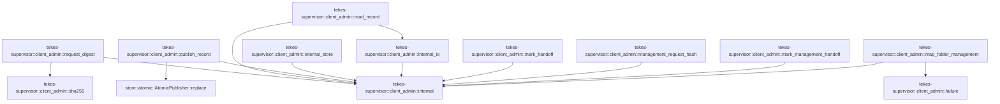

```mermaid
flowchart TD
  n0["schema::ijson::IJsonValue::parse"]
  n1["schema::ijson::IJsonValue::parse_str"]
  n2["store::atomic::AtomicPublisher::replace"]
  n3["store::management_root::retire_legacy_name"]
  n4["store::platform::NamedLock::exclusive"]
  n5["tekes-supervisor::client_admin::parse"]
  n6["tekes-supervisor::client_admin::to_ijson"]
  n7["tekes-supervisor::client_admin::failure"]
  n8["tekes-supervisor::client_admin::internal"]
  n9["tekes-supervisor::client_admin::internal_profile"]
  n10["tekes-supervisor::client_admin::internal_daemon"]
  n11["tekes-supervisor::client_admin::stale"]
  n12["tekes-supervisor::client_admin::next_revision"]
  n13["tekes-supervisor::client_admin::map_workspace"]
  n14["tekes-supervisor::client_admin::map_policy"]
  n15["tekes-supervisor::client_admin::policy_result"]
  n16["tekes-supervisor::client_admin::AdminMutationJournal::open"]
  n17["tekes-supervisor::client_admin::AdminMutationJournal::begin"]
  n18["tekes-supervisor::client_admin::AdminMutationJournal::recover"]
  n19["tekes-supervisor::client_admin::AdminMutationJournal::commit"]
  n20["tekes-supervisor::client_admin::AdminMutationJournal::records"]
  n21["tekes-supervisor::client_admin::AdminMutationJournal::commit_record"]
  n22["tekes-supervisor::client_admin::AdminMutationJournal::abort"]
  n23["tekes-supervisor::client_admin::AdminMutationJournal::authority_digest"]
  n24["tekes-supervisor::client_admin::AdminMutationJournal::record_path"]
  n25["tekes-supervisor::client_admin::request_digest"]
  n26["tekes-supervisor::client_admin::sha256"]
  n27["tekes-supervisor::client_admin::read_record"]
  n28["tekes-supervisor::client_admin::publish_record"]
  n29["tekes-supervisor::client_admin::internal_io"]
  n30["tekes-supervisor::endpoint_host::ProductionRouteFailure::new"]
  n5 --> n7
  n6 --> n0
  n6 --> n8
  n7 --> n1
  n7 --> n6
  n7 --> n30
  n8 --> n7
  n9 --> n8
  n10 --> n8
  n11 --> n7
  n12 --> n7
  n13 --> n7
  n13 --> n9
  n14 --> n7
  n14 --> n11
  n15 --> n6
  n16 --> n2
  n16 --> n3
  n17 --> n4
  n17 --> n7
  n17 --> n23
  n17 --> n24
  n17 --> n25
  n17 --> n26
  n17 --> n27
  n17 --> n28
  n18 --> n4
  n18 --> n7
  n18 --> n23
  n18 --> n24
  n18 --> n25
  n18 --> n27
  n18 --> n28
  n19 --> n4
  n19 --> n7
  n19 --> n8
  n19 --> n23
  n19 --> n24
  n19 --> n25
  n19 --> n27
  n19 --> n28
  n20 --> n4
  n20 --> n8
  n20 --> n27
  n21 --> n4
  n21 --> n8
  n21 --> n23
  n21 --> n24
  n21 --> n27
  n21 --> n28
  n22 --> n4
  n22 --> n8
  n22 --> n23
  n22 --> n24
  n22 --> n27
  n23 --> n8
  n23 --> n26
  n23 --> n29
```

# tekes-supervisor::client_admin

[Package atlas](index.md) · [Source](../../src/client_admin.rs)

## Declarations

Visibility is the declaration spelling; trait members and reexports require their enclosing interface. `cfg` is not evaluated.

| Symbol | Kind | Visibility | Test / cfg |
|---|---|---|---|
| [tekes-supervisor::client_admin::WORKSPACE_POLICY_METHODS](../../src/client_admin.rs#L20) | const_item | `pub` |  |
| [tekes-supervisor::client_admin::WORKSPACE_FOLDER_METHODS](../../src/client_admin.rs#L25) | const_item | `pub` |  |
| [tekes-supervisor::client_admin::ClientAdminRoutes](../../src/client_admin.rs#L31) | struct_item | `pub` |  |
| [tekes-supervisor::client_admin::ClientAdminRoutes::new](../../src/client_admin.rs#L40) | function_item | `pub` |  |
| [tekes-supervisor::client_admin::ClientAdminRoutes::routes](../../src/client_admin.rs#L58) | function_item | `pub` |  |
| [tekes-supervisor::client_admin::ClientAdminRoutes::recover_pending_intents](../../src/client_admin.rs#L73) | function_item | `private` |  |
| [tekes-supervisor::client_admin::ClientAdminRoutes::get_policy](../../src/client_admin.rs#L130) | function_item | `private` |  |
| [tekes-supervisor::client_admin::ClientAdminRoutes::set_policy](../../src/client_admin.rs#L139) | function_item | `private` |  |
| [tekes-supervisor::client_admin::ClientAdminRoutes::list_folders](../../src/client_admin.rs#L212) | function_item | `private` |  |
| [tekes-supervisor::client_admin::ClientAdminRoutes::change_folders](../../src/client_admin.rs#L229) | function_item | `private` |  |
| [tekes-supervisor::client_admin::ClientAdminRoutes::management](../../src/client_admin.rs#L293) | function_item | `private` |  |
| [tekes-supervisor::client_admin::AdminCapabilityRoutes](../../src/client_admin.rs#L298) | struct_item | `private` |  |
| [tekes-supervisor::client_admin::AdminCapabilityRoutes::new](../../src/client_admin.rs#L305) | function_item | `private` |  |
| [tekes-supervisor::client_admin::AdminCapabilityRoutes::class](../../src/client_admin.rs#L317) | function_item | `private` |  |
| [tekes-supervisor::client_admin::AdminCapabilityRoutes::capabilities](../../src/client_admin.rs#L325) | function_item | `private` |  |
| [tekes-supervisor::client_admin::AdminCapabilityRoutes::extension_method_class](../../src/client_admin.rs#L332) | function_item | `private` |  |
| [tekes-supervisor::client_admin::AdminCapabilityRoutes::validate_extension_payload](../../src/client_admin.rs#L336) | function_item | `private` |  |
| [tekes-supervisor::client_admin::AdminCapabilityRoutes::extension_failure_is_exact](../../src/client_admin.rs#L352) | function_item | `private` |  |
| [tekes-supervisor::client_admin::AdminCapabilityRoutes::execute](../../src/client_admin.rs#L363) | function_item | `private` |  |
| [tekes-supervisor::client_admin::ClientAdminRoutes::capabilities](../../src/client_admin.rs#L381) | function_item | `private` |  |
| [tekes-supervisor::client_admin::ClientAdminRoutes::extension_method_class](../../src/client_admin.rs#L389) | function_item | `private` |  |
| [tekes-supervisor::client_admin::ClientAdminRoutes::validate_extension_payload](../../src/client_admin.rs#L396) | function_item | `private` |  |
| [tekes-supervisor::client_admin::ClientAdminRoutes::extension_failure_is_exact](../../src/client_admin.rs#L416) | function_item | `private` |  |
| [tekes-supervisor::client_admin::ClientAdminRoutes::execute](../../src/client_admin.rs#L440) | function_item | `private` |  |
| [tekes-supervisor::client_admin::PolicyGetRequest](../../src/client_admin.rs#L463) | struct_item | `private` |  |
| [tekes-supervisor::client_admin::FoldersGetRequest](../../src/client_admin.rs#L468) | struct_item | `private` |  |
| [tekes-supervisor::client_admin::FolderChangeRequest](../../src/client_admin.rs#L473) | struct_item | `private` |  |
| [tekes-supervisor::client_admin::PolicySetRequest](../../src/client_admin.rs#L479) | struct_item | `private` |  |
| [tekes-supervisor::client_admin::parse](../../src/client_admin.rs#L485) | function_item | `private` |  |
| [tekes-supervisor::client_admin::to_ijson](../../src/client_admin.rs#L494) | function_item | `private` |  |
| [tekes-supervisor::client_admin::failure](../../src/client_admin.rs#L500) | function_item | `private` |  |
| [tekes-supervisor::client_admin::internal](../../src/client_admin.rs#L507) | function_item | `private` |  |
| [tekes-supervisor::client_admin::internal_profile](../../src/client_admin.rs#L514) | function_item | `private` |  |
| [tekes-supervisor::client_admin::internal_daemon](../../src/client_admin.rs#L517) | function_item | `private` |  |
| [tekes-supervisor::client_admin::stale](../../src/client_admin.rs#L520) | function_item | `private` |  |
| [tekes-supervisor::client_admin::next_revision](../../src/client_admin.rs#L527) | function_item | `private` |  |
| [tekes-supervisor::client_admin::map_workspace](../../src/client_admin.rs#L539) | function_item | `private` |  |
| [tekes-supervisor::client_admin::map_policy](../../src/client_admin.rs#L547) | function_item | `private` |  |
| [tekes-supervisor::client_admin::policy_result](../../src/client_admin.rs#L565) | function_item | `private` |  |
| [tekes-supervisor::client_admin::AdminPhase](../../src/client_admin.rs#L574) | enum_item | `private` |  |
| [tekes-supervisor::client_admin::AdminRecord](../../src/client_admin.rs#L581) | struct_item | `private` |  |
| [tekes-supervisor::client_admin::AdminBegin](../../src/client_admin.rs#L595) | enum_item | `private` |  |
| [tekes-supervisor::client_admin::CONFIG_ADMIN_DIR](../../src/client_admin.rs#L601) | const_item | `private` |  |
| [tekes-supervisor::client_admin::LEGACY_CONFIG_ADMIN_DIR](../../src/client_admin.rs#L603) | const_item | `private` |  |
| [tekes-supervisor::client_admin::AdminMutationJournal](../../src/client_admin.rs#L605) | struct_item | `private` |  |
| [tekes-supervisor::client_admin::AdminMutationJournal::open](../../src/client_admin.rs#L612) | function_item | `private` |  |
| [tekes-supervisor::client_admin::AdminMutationJournal::begin](../../src/client_admin.rs#L628) | function_item | `private` |  |
| [tekes-supervisor::client_admin::AdminMutationJournal::recover](../../src/client_admin.rs#L693) | function_item | `private` |  |
| [tekes-supervisor::client_admin::AdminMutationJournal::commit](../../src/client_admin.rs#L721) | function_item | `private` |  |
| [tekes-supervisor::client_admin::AdminMutationJournal::records](../../src/client_admin.rs#L745) | function_item | `private` |  |
| [tekes-supervisor::client_admin::AdminMutationJournal::commit_record](../../src/client_admin.rs#L760) | function_item | `private` |  |
| [tekes-supervisor::client_admin::AdminMutationJournal::abort](../../src/client_admin.rs#L774) | function_item | `private` |  |
| [tekes-supervisor::client_admin::AdminMutationJournal::authority_digest](../../src/client_admin.rs#L791) | function_item | `private` |  |
| [tekes-supervisor::client_admin::AdminMutationJournal::record_path](../../src/client_admin.rs#L807) | function_item | `private` |  |
| [tekes-supervisor::client_admin::request_digest](../../src/client_admin.rs#L813) | function_item | `private` |  |
| [tekes-supervisor::client_admin::sha256](../../src/client_admin.rs#L820) | function_item | `private` |  |
| [tekes-supervisor::client_admin::read_record](../../src/client_admin.rs#L823) | function_item | `private` |  |
| [tekes-supervisor::client_admin::publish_record](../../src/client_admin.rs#L843) | function_item | `private` |  |
| [tekes-supervisor::client_admin::internal_store](../../src/client_admin.rs#L849) | function_item | `private` |  |
| [tekes-supervisor::client_admin::internal_io](../../src/client_admin.rs#L852) | function_item | `private` |  |
| [tekes-supervisor::client_admin::mark_handoff](../../src/client_admin.rs#L855) | function_item | `private` |  |
| [tekes-supervisor::client_admin::management_request_hash](../../src/client_admin.rs#L869) | function_item | `private` |  |
| [tekes-supervisor::client_admin::mark_management_handoff](../../src/client_admin.rs#L889) | function_item | `private` |  |
| [tekes-supervisor::client_admin::map_folder_management](../../src/client_admin.rs#L903) | function_item | `private` |  |
| [tekes-supervisor::client_admin::tests::fixture](../../src/client_admin.rs#L959) | function_item | `private` | test; #[cfg(test)] |
| [tekes-supervisor::client_admin::tests::call](../../src/client_admin.rs#L984) | function_item | `private` | test; #[cfg(test)] |
| [tekes-supervisor::client_admin::tests::policy_replacement_can_relax_local_default_below_ceiling](../../src/client_admin.rs#L995) | function_item | `private` | test; #[cfg(test)] |
| [tekes-supervisor::client_admin::tests::journal_rejects_wrong_bytes_for_the_same_rpc_id](../../src/client_admin.rs#L1016) | function_item | `private` | test; #[cfg(test)] |
| [tekes-supervisor::client_admin::tests::crash_before_publish_is_completed_before_an_unrelated_rpc](../../src/client_admin.rs#L1046) | function_item | `private` | test; #[cfg(test)] |
| [tekes-supervisor::client_admin::tests::startup_closes_policy_crashes_on_both_sides_of_the_side_effect](../../src/client_admin.rs#L1105) | function_item | `private` | test; #[cfg(test)] |

## Imports / reexports

| Local name | Source path | Visibility |
|---|---|---|
| `BTreeSet` | `std::collections::BTreeSet` | `private` |
| `fs` | `std::fs` | `private` |
| `Path` | `std::path::Path` | `private` |
| `PathBuf` | `std::path::PathBuf` | `private` |
| `Arc` | `std::sync::Arc` | `private` |
| `Mutex` | `std::sync::Mutex` | `private` |
| `DurableHandoffProof` | `endpoint::DurableHandoffProof` | `private` |
| `EndpointHostCall` | `endpoint::EndpointHostCall` | `private` |
| `MethodClass` | `endpoint::MethodClass` | `private` |
| `RpcDurableIdentity` | `endpoint::RpcDurableIdentity` | `private` |
| `ConfigRepository` | `profile::ConfigRepository` | `private` |
| `WorkspacePolicy` | `profile::WorkspacePolicy` | `private` |
| `IJsonValue` | `schema::IJsonValue` | `private` |
| `Deserialize` | `serde::Deserialize` | `private` |
| `Serialize` | `serde::Serialize` | `private` |
| `Value` | `serde_json::Value` | `private` |
| `json` | `serde_json::json` | `private` |
| `Digest` | `sha2::Digest` | `private` |
| `Sha256` | `sha2::Sha256` | `private` |
| `AtomicPublisher` | `store::AtomicPublisher` | `private` |
| `NamedLock` | `store::NamedLock` | `private` |
| `ProductionEndpointRoutes` | `crate::endpoint_host::ProductionEndpointRoutes` | `private` |
| `ProductionRouteFailure` | `crate::endpoint_host::ProductionRouteFailure` | `private` |
| `ProductionProcessHost` | `crate::process_host::ProductionProcessHost` | `private` |
| `*` | `super::*` | `private` |
| `DurableHandoffSignal` | `endpoint::DurableHandoffSignal` | `private` |
| `WorkspaceConfig` | `profile::WorkspaceConfig` | `private` |
| `TempDir` | `tempfile::TempDir` | `private` |

## Module declarations

| Module | Visibility | Attributes |
|---|---|---|
| `tekes-supervisor::client_admin::tests` | `private` | #[cfg(test)] |

## Function call graphs

Edges below are syntactically resolved calls only, including private functions. Graphs partition callers into groups of 20; they are not execution order. All unresolved sites are listed below and in the JSON inventory.

Functions 1–20: 32 direct edges

Functions 21–40: 58 direct edges

Functions 41–50: 13 direct edges

## Call sites

Includes test functions (marked in declarations). Receiver-type-required sites need type analysis/manual tracing. Calls in closures are attributed to their enclosing function; their occurrence here does not mean the closure executes immediately.

| Caller | Callee expression | Source lines | Target / classification |
|---|---|---|---|
| `new` | `root.as_ref` | [44](../../src/client_admin.rs#L44) | receiver-type-required |
| `new` | `root.to_path_buf` | [46](../../src/client_admin.rs#L46) | receiver-type-required |
| `new` | `ConfigRepository::open(root).map_err` | [47](../../src/client_admin.rs#L47) | receiver-type-required |
| `new` | `ConfigRepository::open` | [47](../../src/client_admin.rs#L47) | [profile::config::ConfigRepository::open](../../../profile/src/config.rs#L684) |
| `new` | `Mutex::new` | [49](../../src/client_admin.rs#L49) | external-constructor-callback-or-unresolved |
| `new` | `AdminMutationJournal::open(root).map_err` | [50](../../src/client_admin.rs#L50) | receiver-type-required |
| `new` | `AdminMutationJournal::open` | [50](../../src/client_admin.rs#L50) | [tekes-supervisor::client_admin::AdminMutationJournal::open](../../src/client_admin.rs#L612) |
| `new` | `routes.recover_pending_intents` | [52](../../src/client_admin.rs#L52) | receiver-type-required |
| `new` | `Ok` | [53](../../src/client_admin.rs#L53) | external-constructor-callback-or-unresolved |
| `recover_pending_intents` | `self.journal.records` | [74](../../src/client_admin.rs#L74) | receiver-type-required |
| `recover_pending_intents` | `self.journal.authority_digest(&record.authority)?.as_deref` | [86](../../src/client_admin.rs#L86) | receiver-type-required |
| `recover_pending_intents` | `self.journal.authority_digest` | [86](../../src/client_admin.rs#L86) | receiver-type-required |
| `recover_pending_intents` | `Some` | [87](../../src/client_admin.rs#L87) | external-constructor-callback-or-unresolved |
| `recover_pending_intents` | `record.authority.as_str` | [89](../../src/client_admin.rs#L89) | receiver-type-required |
| `recover_pending_intents` | `authority.starts_with` | [91](../../src/client_admin.rs#L91) | receiver-type-required |
| `recover_pending_intents` | `authority.ends_with` | [91](../../src/client_admin.rs#L91) | receiver-type-required |
| `recover_pending_intents` | `profile::WorkspaceConfig::decode(&record.desired)                             .map_err` | [93](../../src/client_admin.rs#L93) | receiver-type-required |
| `recover_pending_intents` | `profile::WorkspaceConfig::decode` | [93](../../src/client_admin.rs#L93), [122](../../src/client_admin.rs#L122) | external-constructor-callback-or-unresolved |
| `recover_pending_intents` | `self                             .repository                             .resolve(&desired.id)                             .map_err` | [95](../../src/client_admin.rs#L95) | receiver-type-required |
| `recover_pending_intents` | `self                             .repository                             .resolve` | [95](../../src/client_admin.rs#L95) | receiver-type-required |
| `recover_pending_intents` | `desired.policy.clone().unwrap_or_default` | [99](../../src/client_admin.rs#L99) | receiver-type-required |
| `recover_pending_intents` | `desired.policy.clone` | [99](../../src/client_admin.rs#L99) | receiver-type-required |
| `recover_pending_intents` | `self                             .repository                             .publish_workspace_policy(&desired.id, record.expected_revision, policy)                             .map_err` | [100](../../src/client_admin.rs#L100) | receiver-type-required |
| `recover_pending_intents` | `self                             .repository                             .publish_workspace_policy` | [100](../../src/client_admin.rs#L100) | receiver-type-required |
| `recover_pending_intents` | `published.canonical_bytes().map_err` | [104](../../src/client_admin.rs#L104) | receiver-type-required |
| `recover_pending_intents` | `published.canonical_bytes` | [104](../../src/client_admin.rs#L104) | receiver-type-required |
| `recover_pending_intents` | `Err` | [105](../../src/client_admin.rs#L105), [114](../../src/client_admin.rs#L114) | external-constructor-callback-or-unresolved |
| `recover_pending_intents` | `internal` | [105](../../src/client_admin.rs#L105), [114](../../src/client_admin.rs#L114) | [tekes-supervisor::client_admin::internal](../../src/client_admin.rs#L507) |
| `recover_pending_intents` | `self.process_host                             .workspace_policy_published(&desired.id, &previous)                             .map_err` | [109](../../src/client_admin.rs#L109) | receiver-type-required |
| `recover_pending_intents` | `self.process_host                             .workspace_policy_published` | [109](../../src/client_admin.rs#L109) | receiver-type-required |
| `recover_pending_intents` | `record.authority.starts_with` | [120](../../src/client_admin.rs#L120) | receiver-type-required |
| `recover_pending_intents` | `profile::WorkspaceConfig::decode(&record.desired).map_err` | [122](../../src/client_admin.rs#L122) | receiver-type-required |
| `recover_pending_intents` | `self.process_host.workspace_policy_recovered` | [123](../../src/client_admin.rs#L123) | receiver-type-required |
| `recover_pending_intents` | `self.journal.commit_record` | [125](../../src/client_admin.rs#L125) | receiver-type-required |
| `recover_pending_intents` | `Ok` | [127](../../src/client_admin.rs#L127) | external-constructor-callback-or-unresolved |
| `get_policy` | `self             .repository             .workspace(&input.workspace_id)             .map_err` | [131](../../src/client_admin.rs#L131) | receiver-type-required |
| `get_policy` | `self             .repository             .workspace` | [131](../../src/client_admin.rs#L131) | receiver-type-required |
| `get_policy` | `to_ijson` | [135](../../src/client_admin.rs#L135) | [tekes-supervisor::client_admin::to_ijson](../../src/client_admin.rs#L494) |
| `set_policy` | `self             .mutation_gate             .lock()             .map_err` | [144](../../src/client_admin.rs#L144) | receiver-type-required |
| `set_policy` | `self             .mutation_gate             .lock` | [144](../../src/client_admin.rs#L144) | receiver-type-required |
| `set_policy` | `internal` | [147](../../src/client_admin.rs#L147), [201](../../src/client_admin.rs#L201) | [tekes-supervisor::client_admin::internal](../../src/client_admin.rs#L507) |
| `set_policy` | `self.recover_pending_intents` | [148](../../src/client_admin.rs#L148) | [tekes-supervisor::client_admin::ClientAdminRoutes::recover_pending_intents](../../src/client_admin.rs#L73) |
| `set_policy` | `self.journal.recover` | [149](../../src/client_admin.rs#L149) | receiver-type-required |
| `set_policy` | `mark_handoff` | [150](../../src/client_admin.rs#L150), [206](../../src/client_admin.rs#L206) | [tekes-supervisor::client_admin::mark_handoff](../../src/client_admin.rs#L855) |
| `set_policy` | `Ok` | [151](../../src/client_admin.rs#L151), [207](../../src/client_admin.rs#L207) | external-constructor-callback-or-unresolved |
| `set_policy` | `self             .repository             .workspace(&input.workspace_id)             .map_err` | [153](../../src/client_admin.rs#L153) | receiver-type-required |
| `set_policy` | `self             .repository             .workspace` | [153](../../src/client_admin.rs#L153) | receiver-type-required |
| `set_policy` | `Err` | [158](../../src/client_admin.rs#L158), [194](../../src/client_admin.rs#L194), [201](../../src/client_admin.rs#L201) | external-constructor-callback-or-unresolved |
| `set_policy` | `stale` | [158](../../src/client_admin.rs#L158) | [tekes-supervisor::client_admin::stale](../../src/client_admin.rs#L520) |
| `set_policy` | `self.process_host             .validate_workspace_policy_candidate(&input.workspace_id, &input.policy)             .map_err` | [160](../../src/client_admin.rs#L160) | receiver-type-required |
| `set_policy` | `self.process_host             .validate_workspace_policy_candidate` | [160](../../src/client_admin.rs#L160) | receiver-type-required |
| `set_policy` | `failure` | [163](../../src/client_admin.rs#L163) | [tekes-supervisor::client_admin::failure](../../src/client_admin.rs#L500) |
| `set_policy` | `self             .repository             .resolve(&input.workspace_id)             .map_err` | [169](../../src/client_admin.rs#L169) | receiver-type-required |
| `set_policy` | `self             .repository             .resolve` | [169](../../src/client_admin.rs#L169) | receiver-type-required |
| `set_policy` | `workspace.clone` | [173](../../src/client_admin.rs#L173) | receiver-type-required |
| `set_policy` | `next_revision` | [174](../../src/client_admin.rs#L174) | [tekes-supervisor::client_admin::next_revision](../../src/client_admin.rs#L527) |
| `set_policy` | `Some` | [175](../../src/client_admin.rs#L175) | external-constructor-callback-or-unresolved |
| `set_policy` | `input.policy.clone` | [175](../../src/client_admin.rs#L175), [189](../../src/client_admin.rs#L189) | receiver-type-required |
| `set_policy` | `desired_workspace.canonical_bytes().map_err` | [176](../../src/client_admin.rs#L176) | receiver-type-required |
| `set_policy` | `desired_workspace.canonical_bytes` | [176](../../src/client_admin.rs#L176) | receiver-type-required |
| `set_policy` | `policy_result` | [177](../../src/client_admin.rs#L177) | [tekes-supervisor::client_admin::policy_result](../../src/client_admin.rs#L565) |
| `set_policy` | `self.journal.begin` | [178](../../src/client_admin.rs#L178) | receiver-type-required |
| `set_policy` | `self.repository.publish_workspace_policy` | [186](../../src/client_admin.rs#L186) | receiver-type-required |
| `set_policy` | `self.journal.abort` | [193](../../src/client_admin.rs#L193) | receiver-type-required |
| `set_policy` | `map_policy` | [194](../../src/client_admin.rs#L194) | [tekes-supervisor::client_admin::map_policy](../../src/client_admin.rs#L547) |
| `set_policy` | `self.process_host             .workspace_policy_published(&input.workspace_id, &previous)             .map_err` | [197](../../src/client_admin.rs#L197) | receiver-type-required |
| `set_policy` | `self.process_host             .workspace_policy_published` | [197](../../src/client_admin.rs#L197) | receiver-type-required |
| `set_policy` | `self.journal.commit` | [205](../../src/client_admin.rs#L205) | receiver-type-required |
| `list_folders` | `self             .management()?             .workspace_folders(&input.workspace_id)             .map_err` | [213](../../src/client_admin.rs#L213) | receiver-type-required |
| `list_folders` | `self             .management()?             .workspace_folders` | [213](../../src/client_admin.rs#L213) | receiver-type-required |
| `list_folders` | `self             .management` | [213](../../src/client_admin.rs#L213) | [tekes-supervisor::client_admin::ClientAdminRoutes::management](../../src/client_admin.rs#L293) |
| `list_folders` | `to_ijson` | [217](../../src/client_admin.rs#L217) | [tekes-supervisor::client_admin::to_ijson](../../src/client_admin.rs#L494) |
| `change_folders` | `self             .mutation_gate             .lock()             .map_err` | [235](../../src/client_admin.rs#L235) | receiver-type-required |
| `change_folders` | `self             .mutation_gate             .lock` | [235](../../src/client_admin.rs#L235) | receiver-type-required |
| `change_folders` | `internal` | [238](../../src/client_admin.rs#L238) | [tekes-supervisor::client_admin::internal](../../src/client_admin.rs#L507) |
| `change_folders` | `self.recover_pending_intents` | [239](../../src/client_admin.rs#L239) | [tekes-supervisor::client_admin::ClientAdminRoutes::recover_pending_intents](../../src/client_admin.rs#L73) |
| `change_folders` | `Some` | [245](../../src/client_admin.rs#L245) | external-constructor-callback-or-unresolved |
| `change_folders` | `NamedLock::try_exclusive(crate::process_host::workspace_quiescence_lock_path(                     &self.root,                     &input.workspace_id,                 ))                 .map_err` | [246](../../src/client_admin.rs#L246) | receiver-type-required |
| `change_folders` | `NamedLock::try_exclusive` | [246](../../src/client_admin.rs#L246) | [store::platform::NamedLock::try_exclusive](../../../store/src/platform.rs#L107) |
| `change_folders` | `crate::process_host::workspace_quiescence_lock_path` | [246](../../src/client_admin.rs#L246) | [tekes-supervisor::process_host::workspace_quiescence_lock_path](../../src/process_host.rs#L5056) |
| `change_folders` | `failure` | [251](../../src/client_admin.rs#L251) | [tekes-supervisor::client_admin::failure](../../src/client_admin.rs#L500) |
| `change_folders` | `internal_store` | [256](../../src/client_admin.rs#L256) | [tekes-supervisor::client_admin::internal_store](../../src/client_admin.rs#L849) |
| `change_folders` | `management_request_hash` | [260](../../src/client_admin.rs#L260) | [tekes-supervisor::client_admin::management_request_hash](../../src/client_admin.rs#L869) |
| `change_folders` | `chrono::Utc::now().to_rfc3339_opts` | [261](../../src/client_admin.rs#L261) | receiver-type-required |
| `change_folders` | `chrono::Utc::now` | [261](../../src/client_admin.rs#L261) | external-constructor-callback-or-unresolved |
| `change_folders` | `self.management` | [262](../../src/client_admin.rs#L262) | [tekes-supervisor::client_admin::ClientAdminRoutes::management](../../src/client_admin.rs#L293) |
| `change_folders` | `if add {             management.add_workspace_folder(                 &request.rpc_id,                 &hash,                 &input.workspace_id,                 &input.path,                 &started_at,             )         } else {             management.remove_workspace_folder(                 &request.rpc_id,                 &hash,                 &input.workspace_id,                 &input.path,                 &started_at,             )         }         .map_err` | [263](../../src/client_admin.rs#L263) | receiver-type-required |
| `change_folders` | `management.add_workspace_folder` | [264](../../src/client_admin.rs#L264) | receiver-type-required |
| `change_folders` | `management.remove_workspace_folder` | [272](../../src/client_admin.rs#L272) | receiver-type-required |
| `change_folders` | `mark_management_handoff` | [281](../../src/client_admin.rs#L281) | [tekes-supervisor::client_admin::mark_management_handoff](../../src/client_admin.rs#L889) |
| `change_folders` | `to_ijson` | [282](../../src/client_admin.rs#L282) | [tekes-supervisor::client_admin::to_ijson](../../src/client_admin.rs#L494) |
| `management` | `endpoint::ManagementStore::open(&self.root).map_err` | [294](../../src/client_admin.rs#L294) | receiver-type-required |
| `management` | `endpoint::ManagementStore::open` | [294](../../src/client_admin.rs#L294) | [endpoint::management::ManagementStore::open](../../../endpoint/src/management.rs#L339) |
| `management` | `internal` | [294](../../src/client_admin.rs#L294) | [tekes-supervisor::client_admin::internal](../../src/client_admin.rs#L507) |
| `management` | `error.to_string` | [294](../../src/client_admin.rs#L294) | receiver-type-required |
| `class` | `self.methods             .iter()             .find_map` | [318](../../src/client_admin.rs#L318) | receiver-type-required |
| `class` | `self.methods             .iter` | [318](../../src/client_admin.rs#L318) | receiver-type-required |
| `class` | `(*name == method).then_some` | [320](../../src/client_admin.rs#L320) | receiver-type-required |
| `capabilities` | `self.methods             .iter()             .map(&#124;(name, _)&#124; (*name).to_owned())             .collect` | [326](../../src/client_admin.rs#L326) | receiver-type-required |
| `capabilities` | `self.methods             .iter()             .map` | [326](../../src/client_admin.rs#L326) | receiver-type-required |
| `capabilities` | `self.methods             .iter` | [326](../../src/client_admin.rs#L326) | receiver-type-required |
| `capabilities` | `(*name).to_owned` | [328](../../src/client_admin.rs#L328) | receiver-type-required |
| `extension_method_class` | `self.class` | [333](../../src/client_admin.rs#L333) | receiver-type-required |
| `validate_extension_payload` | `self.class(operation).is_none` | [341](../../src/client_admin.rs#L341) | receiver-type-required |
| `validate_extension_payload` | `self.class` | [341](../../src/client_admin.rs#L341) | receiver-type-required |
| `validate_extension_payload` | `Err` | [342](../../src/client_admin.rs#L342) | external-constructor-callback-or-unresolved |
| `validate_extension_payload` | `failure` | [342](../../src/client_admin.rs#L342) | [tekes-supervisor::client_admin::failure](../../src/client_admin.rs#L500) |
| `validate_extension_payload` | `self.authority             .validate_extension_payload` | [348](../../src/client_admin.rs#L348) | receiver-type-required |
| `extension_failure_is_exact` | `self.class(operation).is_some` | [357](../../src/client_admin.rs#L357) | receiver-type-required |
| `extension_failure_is_exact` | `self.class` | [357](../../src/client_admin.rs#L357) | receiver-type-required |
| `extension_failure_is_exact` | `self                 .authority                 .extension_failure_is_exact` | [358](../../src/client_admin.rs#L358) | receiver-type-required |
| `execute` | `self.class(&request.operation).is_none` | [369](../../src/client_admin.rs#L369) | receiver-type-required |
| `execute` | `self.class` | [369](../../src/client_admin.rs#L369) | receiver-type-required |
| `execute` | `Err` | [370](../../src/client_admin.rs#L370) | external-constructor-callback-or-unresolved |
| `execute` | `failure` | [370](../../src/client_admin.rs#L370) | [tekes-supervisor::client_admin::failure](../../src/client_admin.rs#L500) |
| `execute` | `self.authority.execute` | [376](../../src/client_admin.rs#L376) | receiver-type-required |
| `capabilities` | `WORKSPACE_POLICY_METHODS             .into_iter()             .chain(WORKSPACE_FOLDER_METHODS)             .map(&#124;(name, _)&#124; name.to_owned())             .collect` | [382](../../src/client_admin.rs#L382) | receiver-type-required |
| `capabilities` | `WORKSPACE_POLICY_METHODS             .into_iter()             .chain(WORKSPACE_FOLDER_METHODS)             .map` | [382](../../src/client_admin.rs#L382) | receiver-type-required |
| `capabilities` | `WORKSPACE_POLICY_METHODS             .into_iter()             .chain` | [382](../../src/client_admin.rs#L382) | receiver-type-required |
| `capabilities` | `WORKSPACE_POLICY_METHODS             .into_iter` | [382](../../src/client_admin.rs#L382) | receiver-type-required |
| `capabilities` | `name.to_owned` | [385](../../src/client_admin.rs#L385) | receiver-type-required |
| `extension_method_class` | `WORKSPACE_POLICY_METHODS             .into_iter()             .chain(WORKSPACE_FOLDER_METHODS)             .find_map` | [390](../../src/client_admin.rs#L390) | receiver-type-required |
| `extension_method_class` | `WORKSPACE_POLICY_METHODS             .into_iter()             .chain` | [390](../../src/client_admin.rs#L390) | receiver-type-required |
| `extension_method_class` | `WORKSPACE_POLICY_METHODS             .into_iter` | [390](../../src/client_admin.rs#L390) | receiver-type-required |
| `extension_method_class` | `(name == method).then_some` | [393](../../src/client_admin.rs#L393) | receiver-type-required |
| `validate_extension_payload` | `parse::<PolicyGetRequest>(payload).map` | [402](../../src/client_admin.rs#L402) | receiver-type-required |
| `validate_extension_payload` | `parse::<PolicyGetRequest>` | [402](../../src/client_admin.rs#L402) | [tekes-supervisor::client_admin::parse](../../src/client_admin.rs#L485) |
| `validate_extension_payload` | `parse::<PolicySetRequest>(payload).map` | [403](../../src/client_admin.rs#L403) | receiver-type-required |
| `validate_extension_payload` | `parse::<PolicySetRequest>` | [403](../../src/client_admin.rs#L403) | [tekes-supervisor::client_admin::parse](../../src/client_admin.rs#L485) |
| `validate_extension_payload` | `parse::<FoldersGetRequest>(payload).map` | [404](../../src/client_admin.rs#L404) | receiver-type-required |
| `validate_extension_payload` | `parse::<FoldersGetRequest>` | [404](../../src/client_admin.rs#L404) | [tekes-supervisor::client_admin::parse](../../src/client_admin.rs#L485) |
| `validate_extension_payload` | `parse::<FolderChangeRequest>(payload).map` | [406](../../src/client_admin.rs#L406) | receiver-type-required |
| `validate_extension_payload` | `parse::<FolderChangeRequest>` | [406](../../src/client_admin.rs#L406) | [tekes-supervisor::client_admin::parse](../../src/client_admin.rs#L485) |
| `validate_extension_payload` | `Err` | [408](../../src/client_admin.rs#L408) | external-constructor-callback-or-unresolved |
| `validate_extension_payload` | `failure` | [408](../../src/client_admin.rs#L408) | [tekes-supervisor::client_admin::failure](../../src/client_admin.rs#L500) |
| `execute` | `request.operation.as_str` | [446](../../src/client_admin.rs#L446) | receiver-type-required |
| `execute` | `self.get_policy` | [447](../../src/client_admin.rs#L447) | receiver-type-required |
| `execute` | `parse` | [447](../../src/client_admin.rs#L447), [448](../../src/client_admin.rs#L448), [449](../../src/client_admin.rs#L449), [450](../../src/client_admin.rs#L450), [451](../../src/client_admin.rs#L451) | [tekes-supervisor::client_admin::parse](../../src/client_admin.rs#L485) |
| `execute` | `self.set_policy` | [448](../../src/client_admin.rs#L448) | receiver-type-required |
| `execute` | `self.list_folders` | [449](../../src/client_admin.rs#L449) | receiver-type-required |
| `execute` | `self.change_folders` | [450](../../src/client_admin.rs#L450), [451](../../src/client_admin.rs#L451) | receiver-type-required |
| `execute` | `Err` | [452](../../src/client_admin.rs#L452) | external-constructor-callback-or-unresolved |
| `execute` | `failure` | [452](../../src/client_admin.rs#L452) | [tekes-supervisor::client_admin::failure](../../src/client_admin.rs#L500) |
| `parse` | `serde_json::from_value(payload.clone()).map_err` | [486](../../src/client_admin.rs#L486) | receiver-type-required |
| `parse` | `serde_json::from_value` | [486](../../src/client_admin.rs#L486) | external-constructor-callback-or-unresolved |
| `parse` | `payload.clone` | [486](../../src/client_admin.rs#L486) | receiver-type-required |
| `parse` | `failure` | [487](../../src/client_admin.rs#L487) | [tekes-supervisor::client_admin::failure](../../src/client_admin.rs#L500) |
| `to_ijson` | `IJsonValue::parse(         &serde_json_canonicalizer::to_vec(value).map_err(&#124;error&#124; internal(error.to_string()))?,     )     .map_err` | [495](../../src/client_admin.rs#L495) | receiver-type-required |
| `to_ijson` | `IJsonValue::parse` | [495](../../src/client_admin.rs#L495) | [schema::ijson::IJsonValue::parse](../../../schema/src/ijson.rs#L16) |
| `to_ijson` | `serde_json_canonicalizer::to_vec(value).map_err` | [496](../../src/client_admin.rs#L496) | receiver-type-required |
| `to_ijson` | `serde_json_canonicalizer::to_vec` | [496](../../src/client_admin.rs#L496) | external-constructor-callback-or-unresolved |
| `to_ijson` | `internal` | [496](../../src/client_admin.rs#L496), [498](../../src/client_admin.rs#L498) | [tekes-supervisor::client_admin::internal](../../src/client_admin.rs#L507) |
| `to_ijson` | `error.to_string` | [496](../../src/client_admin.rs#L496), [498](../../src/client_admin.rs#L498) | receiver-type-required |
| `failure` | `ProductionRouteFailure::new` | [501](../../src/client_admin.rs#L501) | [tekes-supervisor::endpoint_host::ProductionRouteFailure::new](../../src/endpoint_host.rs#L491) |
| `failure` | `to_ijson(&details).unwrap_or_else` | [504](../../src/client_admin.rs#L504) | receiver-type-required |
| `failure` | `to_ijson` | [504](../../src/client_admin.rs#L504) | [tekes-supervisor::client_admin::to_ijson](../../src/client_admin.rs#L494) |
| `failure` | `IJsonValue::parse_str("{}").expect` | [504](../../src/client_admin.rs#L504) | receiver-type-required |
| `failure` | `IJsonValue::parse_str` | [504](../../src/client_admin.rs#L504) | [schema::ijson::IJsonValue::parse_str](../../../schema/src/ijson.rs#L23) |
| `internal` | `failure` | [508](../../src/client_admin.rs#L508) | [tekes-supervisor::client_admin::failure](../../src/client_admin.rs#L500) |
| `internal_profile` | `internal` | [515](../../src/client_admin.rs#L515) | [tekes-supervisor::client_admin::internal](../../src/client_admin.rs#L507) |
| `internal_daemon` | `internal` | [518](../../src/client_admin.rs#L518) | [tekes-supervisor::client_admin::internal](../../src/client_admin.rs#L507) |
| `stale` | `failure` | [521](../../src/client_admin.rs#L521) | [tekes-supervisor::client_admin::failure](../../src/client_admin.rs#L500) |
| `next_revision` | `value         .checked_add(1)         .filter(&#124;value&#124; *value <= 9_007_199_254_740_991)         .ok_or_else` | [528](../../src/client_admin.rs#L528) | receiver-type-required |
| `next_revision` | `value         .checked_add(1)         .filter` | [528](../../src/client_admin.rs#L528) | receiver-type-required |
| `next_revision` | `value         .checked_add` | [528](../../src/client_admin.rs#L528) | receiver-type-required |
| `next_revision` | `failure` | [532](../../src/client_admin.rs#L532) | [tekes-supervisor::client_admin::failure](../../src/client_admin.rs#L500) |
| `map_workspace` | `io.kind` | [541](../../src/client_admin.rs#L541) | receiver-type-required |
| `map_workspace` | `failure` | [542](../../src/client_admin.rs#L542) | [tekes-supervisor::client_admin::failure](../../src/client_admin.rs#L500) |
| `map_workspace` | `internal_profile` | [544](../../src/client_admin.rs#L544) | [tekes-supervisor::client_admin::internal_profile](../../src/client_admin.rs#L514) |
| `map_policy` | `stale` | [549](../../src/client_admin.rs#L549) | [tekes-supervisor::client_admin::stale](../../src/client_admin.rs#L520) |
| `map_policy` | `io.kind` | [550](../../src/client_admin.rs#L550) | receiver-type-required |
| `map_policy` | `failure` | [551](../../src/client_admin.rs#L551), [553](../../src/client_admin.rs#L553), [558](../../src/client_admin.rs#L558) | [tekes-supervisor::client_admin::failure](../../src/client_admin.rs#L500) |
| `policy_result` | `to_ijson` | [569](../../src/client_admin.rs#L569) | [tekes-supervisor::client_admin::to_ijson](../../src/client_admin.rs#L494) |
| `open` | `store::retire_legacy_name` | [614](../../src/client_admin.rs#L614) | [store::management_root::retire_legacy_name](../../../store/src/management_root.rs#L21) |
| `open` | `admin_root.join` | [615](../../src/client_admin.rs#L615), [617](../../src/client_admin.rs#L617) | receiver-type-required |
| `open` | `fs::create_dir_all` | [616](../../src/client_admin.rs#L616) | external-constructor-callback-or-unresolved |
| `open` | `lock.exists` | [618](../../src/client_admin.rs#L618) | receiver-type-required |
| `open` | `AtomicPublisher::replace` | [619](../../src/client_admin.rs#L619) | [store::atomic::AtomicPublisher::replace](../../../store/src/atomic.rs#L16) |
| `open` | `Ok` | [621](../../src/client_admin.rs#L621) | external-constructor-callback-or-unresolved |
| `open` | `authority_root.to_path_buf` | [622](../../src/client_admin.rs#L622) | receiver-type-required |
| `begin` | `NamedLock::exclusive(&self.lock).map_err` | [637](../../src/client_admin.rs#L637) | receiver-type-required |
| `begin` | `NamedLock::exclusive` | [637](../../src/client_admin.rs#L637) | [store::platform::NamedLock::exclusive](../../../store/src/platform.rs#L103) |
| `begin` | `request_digest` | [638](../../src/client_admin.rs#L638) | [tekes-supervisor::client_admin::request_digest](../../src/client_admin.rs#L813) |
| `begin` | `self.record_path` | [639](../../src/client_admin.rs#L639) | [tekes-supervisor::client_admin::AdminMutationJournal::record_path](../../src/client_admin.rs#L807) |
| `begin` | `read_record` | [640](../../src/client_admin.rs#L640) | [tekes-supervisor::client_admin::read_record](../../src/client_admin.rs#L823) |
| `begin` | `Err` | [645](../../src/client_admin.rs#L645), [658](../../src/client_admin.rs#L658) | external-constructor-callback-or-unresolved |
| `begin` | `failure` | [645](../../src/client_admin.rs#L645), [658](../../src/client_admin.rs#L658) | [tekes-supervisor::client_admin::failure](../../src/client_admin.rs#L500) |
| `begin` | `sha256` | [654](../../src/client_admin.rs#L654), [684](../../src/client_admin.rs#L684) | [tekes-supervisor::client_admin::sha256](../../src/client_admin.rs#L820) |
| `begin` | `self.authority_digest(&old.authority)?.as_deref` | [665](../../src/client_admin.rs#L665) | receiver-type-required |
| `begin` | `self.authority_digest` | [665](../../src/client_admin.rs#L665) | [tekes-supervisor::client_admin::AdminMutationJournal::authority_digest](../../src/client_admin.rs#L791) |
| `begin` | `Some` | [665](../../src/client_admin.rs#L665) | external-constructor-callback-or-unresolved |
| `begin` | `publish_record` | [668](../../src/client_admin.rs#L668), [689](../../src/client_admin.rs#L689) | [tekes-supervisor::client_admin::publish_record](../../src/client_admin.rs#L843) |
| `begin` | `Ok` | [670](../../src/client_admin.rs#L670), [690](../../src/client_admin.rs#L690) | external-constructor-callback-or-unresolved |
| `begin` | `request.rpc_id.clone` | [678](../../src/client_admin.rs#L678) | receiver-type-required |
| `begin` | `request.operation.clone` | [679](../../src/client_admin.rs#L679) | receiver-type-required |
| `begin` | `authority.to_owned` | [681](../../src/client_admin.rs#L681) | receiver-type-required |
| `begin` | `desired_bytes.to_vec` | [685](../../src/client_admin.rs#L685) | receiver-type-required |
| `begin` | `result.clone` | [687](../../src/client_admin.rs#L687) | receiver-type-required |
| `recover` | `NamedLock::exclusive(&self.lock).map_err` | [697](../../src/client_admin.rs#L697) | receiver-type-required |
| `recover` | `NamedLock::exclusive` | [697](../../src/client_admin.rs#L697) | [store::platform::NamedLock::exclusive](../../../store/src/platform.rs#L103) |
| `recover` | `self.record_path` | [698](../../src/client_admin.rs#L698) | [tekes-supervisor::client_admin::AdminMutationJournal::record_path](../../src/client_admin.rs#L807) |
| `recover` | `read_record` | [699](../../src/client_admin.rs#L699) | [tekes-supervisor::client_admin::read_record](../../src/client_admin.rs#L823) |
| `recover` | `Ok` | [700](../../src/client_admin.rs#L700), [718](../../src/client_admin.rs#L718) | external-constructor-callback-or-unresolved |
| `recover` | `request_digest` | [704](../../src/client_admin.rs#L704) | [tekes-supervisor::client_admin::request_digest](../../src/client_admin.rs#L813) |
| `recover` | `Err` | [706](../../src/client_admin.rs#L706) | external-constructor-callback-or-unresolved |
| `recover` | `failure` | [706](../../src/client_admin.rs#L706) | [tekes-supervisor::client_admin::failure](../../src/client_admin.rs#L500) |
| `recover` | `self.authority_digest(&record.authority)?.as_deref` | [713](../../src/client_admin.rs#L713) | receiver-type-required |
| `recover` | `self.authority_digest` | [713](../../src/client_admin.rs#L713) | [tekes-supervisor::client_admin::AdminMutationJournal::authority_digest](../../src/client_admin.rs#L791) |
| `recover` | `Some` | [713](../../src/client_admin.rs#L713) | external-constructor-callback-or-unresolved |
| `recover` | `publish_record` | [716](../../src/client_admin.rs#L716) | [tekes-supervisor::client_admin::publish_record](../../src/client_admin.rs#L843) |
| `recover` | `(record.phase == AdminPhase::Committed).then_some` | [718](../../src/client_admin.rs#L718) | receiver-type-required |
| `commit` | `NamedLock::exclusive(&self.lock).map_err` | [722](../../src/client_admin.rs#L722) | receiver-type-required |
| `commit` | `NamedLock::exclusive` | [722](../../src/client_admin.rs#L722) | [store::platform::NamedLock::exclusive](../../../store/src/platform.rs#L103) |
| `commit` | `self.record_path` | [723](../../src/client_admin.rs#L723) | [tekes-supervisor::client_admin::AdminMutationJournal::record_path](../../src/client_admin.rs#L807) |
| `commit` | `read_record(&path)?.ok_or_else` | [725](../../src/client_admin.rs#L725) | receiver-type-required |
| `commit` | `read_record` | [725](../../src/client_admin.rs#L725) | [tekes-supervisor::client_admin::read_record](../../src/client_admin.rs#L823) |
| `commit` | `internal` | [725](../../src/client_admin.rs#L725), [736](../../src/client_admin.rs#L736) | [tekes-supervisor::client_admin::internal](../../src/client_admin.rs#L507) |
| `commit` | `request_digest` | [726](../../src/client_admin.rs#L726) | [tekes-supervisor::client_admin::request_digest](../../src/client_admin.rs#L813) |
| `commit` | `Err` | [729](../../src/client_admin.rs#L729), [736](../../src/client_admin.rs#L736) | external-constructor-callback-or-unresolved |
| `commit` | `failure` | [729](../../src/client_admin.rs#L729) | [tekes-supervisor::client_admin::failure](../../src/client_admin.rs#L500) |
| `commit` | `self.authority_digest(&record.authority)?.as_deref` | [735](../../src/client_admin.rs#L735) | receiver-type-required |
| `commit` | `self.authority_digest` | [735](../../src/client_admin.rs#L735) | [tekes-supervisor::client_admin::AdminMutationJournal::authority_digest](../../src/client_admin.rs#L791) |
| `commit` | `Some` | [735](../../src/client_admin.rs#L735) | external-constructor-callback-or-unresolved |
| `commit` | `publish_record` | [741](../../src/client_admin.rs#L741) | [tekes-supervisor::client_admin::publish_record](../../src/client_admin.rs#L843) |
| `commit` | `Ok` | [742](../../src/client_admin.rs#L742) | external-constructor-callback-or-unresolved |
| `records` | `NamedLock::exclusive(&self.lock).map_err` | [746](../../src/client_admin.rs#L746) | receiver-type-required |
| `records` | `NamedLock::exclusive` | [746](../../src/client_admin.rs#L746) | [store::platform::NamedLock::exclusive](../../../store/src/platform.rs#L103) |
| `records` | `fs::read_dir(&self.root)             .map_err(internal_io)?             .collect::<Result<Vec<_>, _>>()             .map_err` | [747](../../src/client_admin.rs#L747) | receiver-type-required |
| `records` | `fs::read_dir(&self.root)             .map_err(internal_io)?             .collect::<Result<Vec<_>, _>>` | [747](../../src/client_admin.rs#L747) | receiver-type-required |
| `records` | `fs::read_dir(&self.root)             .map_err` | [747](../../src/client_admin.rs#L747) | receiver-type-required |
| `records` | `fs::read_dir` | [747](../../src/client_admin.rs#L747) | external-constructor-callback-or-unresolved |
| `records` | `entries.sort_by_key` | [751](../../src/client_admin.rs#L751) | receiver-type-required |
| `records` | `entries             .into_iter()             .map(&#124;entry&#124; {                 read_record(&entry.path())?.ok_or_else(&#124;&#124; internal("config journal entry vanished"))             })             .collect` | [752](../../src/client_admin.rs#L752) | receiver-type-required |
| `records` | `entries             .into_iter()             .map` | [752](../../src/client_admin.rs#L752) | receiver-type-required |
| `records` | `entries             .into_iter` | [752](../../src/client_admin.rs#L752) | receiver-type-required |
| `records` | `read_record(&entry.path())?.ok_or_else` | [755](../../src/client_admin.rs#L755) | receiver-type-required |
| `records` | `read_record` | [755](../../src/client_admin.rs#L755) | [tekes-supervisor::client_admin::read_record](../../src/client_admin.rs#L823) |
| `records` | `entry.path` | [755](../../src/client_admin.rs#L755) | receiver-type-required |
| `records` | `internal` | [755](../../src/client_admin.rs#L755) | [tekes-supervisor::client_admin::internal](../../src/client_admin.rs#L507) |
| `commit_record` | `NamedLock::exclusive(&self.lock).map_err` | [761](../../src/client_admin.rs#L761) | receiver-type-required |
| `commit_record` | `NamedLock::exclusive` | [761](../../src/client_admin.rs#L761) | [store::platform::NamedLock::exclusive](../../../store/src/platform.rs#L103) |
| `commit_record` | `self.record_path` | [762](../../src/client_admin.rs#L762) | [tekes-supervisor::client_admin::AdminMutationJournal::record_path](../../src/client_admin.rs#L807) |
| `commit_record` | `read_record(&path)?.ok_or_else` | [764](../../src/client_admin.rs#L764) | receiver-type-required |
| `commit_record` | `read_record` | [764](../../src/client_admin.rs#L764) | [tekes-supervisor::client_admin::read_record](../../src/client_admin.rs#L823) |
| `commit_record` | `internal` | [764](../../src/client_admin.rs#L764), [766](../../src/client_admin.rs#L766) | [tekes-supervisor::client_admin::internal](../../src/client_admin.rs#L507) |
| `commit_record` | `self.authority_digest(&record.authority)?.as_deref` | [765](../../src/client_admin.rs#L765) | receiver-type-required |
| `commit_record` | `self.authority_digest` | [765](../../src/client_admin.rs#L765) | [tekes-supervisor::client_admin::AdminMutationJournal::authority_digest](../../src/client_admin.rs#L791) |
| `commit_record` | `Some` | [765](../../src/client_admin.rs#L765) | external-constructor-callback-or-unresolved |
| `commit_record` | `Err` | [766](../../src/client_admin.rs#L766) | external-constructor-callback-or-unresolved |
| `commit_record` | `publish_record` | [771](../../src/client_admin.rs#L771) | [tekes-supervisor::client_admin::publish_record](../../src/client_admin.rs#L843) |
| `abort` | `NamedLock::exclusive(&self.lock).map_err` | [775](../../src/client_admin.rs#L775) | receiver-type-required |
| `abort` | `NamedLock::exclusive` | [775](../../src/client_admin.rs#L775) | [store::platform::NamedLock::exclusive](../../../store/src/platform.rs#L103) |
| `abort` | `self.record_path` | [776](../../src/client_admin.rs#L776) | [tekes-supervisor::client_admin::AdminMutationJournal::record_path](../../src/client_admin.rs#L807) |
| `abort` | `read_record` | [777](../../src/client_admin.rs#L777) | [tekes-supervisor::client_admin::read_record](../../src/client_admin.rs#L823) |
| `abort` | `Ok` | [778](../../src/client_admin.rs#L778) | external-constructor-callback-or-unresolved |
| `abort` | `self.authority_digest(&record.authority)?.as_deref` | [781](../../src/client_admin.rs#L781) | receiver-type-required |
| `abort` | `self.authority_digest` | [781](../../src/client_admin.rs#L781) | [tekes-supervisor::client_admin::AdminMutationJournal::authority_digest](../../src/client_admin.rs#L791) |
| `abort` | `Some` | [781](../../src/client_admin.rs#L781) | external-constructor-callback-or-unresolved |
| `abort` | `Err` | [783](../../src/client_admin.rs#L783) | external-constructor-callback-or-unresolved |
| `abort` | `internal` | [783](../../src/client_admin.rs#L783) | [tekes-supervisor::client_admin::internal](../../src/client_admin.rs#L507) |
| `abort` | `fs::remove_file(&path).map_err` | [785](../../src/client_admin.rs#L785) | receiver-type-required |
| `abort` | `fs::remove_file` | [785](../../src/client_admin.rs#L785) | external-constructor-callback-or-unresolved |
| `abort` | `fs::File::open(&self.root)             .and_then(&#124;directory&#124; directory.sync_all())             .map_err` | [786](../../src/client_admin.rs#L786) | receiver-type-required |
| `abort` | `fs::File::open(&self.root)             .and_then` | [786](../../src/client_admin.rs#L786) | receiver-type-required |
| `abort` | `fs::File::open` | [786](../../src/client_admin.rs#L786) | external-constructor-callback-or-unresolved |
| `abort` | `directory.sync_all` | [787](../../src/client_admin.rs#L787) | receiver-type-required |
| `authority_digest` | `authority.starts_with` | [792](../../src/client_admin.rs#L792) | receiver-type-required |
| `authority_digest` | `authority                 .split('/')                 .any` | [793](../../src/client_admin.rs#L793) | receiver-type-required |
| `authority_digest` | `authority                 .split` | [793](../../src/client_admin.rs#L793) | receiver-type-required |
| `authority_digest` | `Err` | [797](../../src/client_admin.rs#L797), [803](../../src/client_admin.rs#L803) | external-constructor-callback-or-unresolved |
| `authority_digest` | `internal` | [797](../../src/client_admin.rs#L797) | [tekes-supervisor::client_admin::internal](../../src/client_admin.rs#L507) |
| `authority_digest` | `self.authority_root.join` | [799](../../src/client_admin.rs#L799) | receiver-type-required |
| `authority_digest` | `fs::read` | [800](../../src/client_admin.rs#L800) | external-constructor-callback-or-unresolved |
| `authority_digest` | `Ok` | [801](../../src/client_admin.rs#L801), [802](../../src/client_admin.rs#L802) | external-constructor-callback-or-unresolved |
| `authority_digest` | `Some` | [801](../../src/client_admin.rs#L801) | external-constructor-callback-or-unresolved |
| `authority_digest` | `sha256` | [801](../../src/client_admin.rs#L801) | [tekes-supervisor::client_admin::sha256](../../src/client_admin.rs#L820) |
| `authority_digest` | `error.kind` | [802](../../src/client_admin.rs#L802) | receiver-type-required |
| `authority_digest` | `internal_io` | [803](../../src/client_admin.rs#L803) | [tekes-supervisor::client_admin::internal_io](../../src/client_admin.rs#L852) |
| `record_path` | `self.root             .join` | [808](../../src/client_admin.rs#L808) | receiver-type-required |
| `request_digest` | `serde_json_canonicalizer::to_vec(         &json!({"method":request.operation,"payload":request.payload}),     )     .map_err` | [814](../../src/client_admin.rs#L814) | receiver-type-required |
| `request_digest` | `serde_json_canonicalizer::to_vec` | [814](../../src/client_admin.rs#L814) | external-constructor-callback-or-unresolved |
| `request_digest` | `internal` | [817](../../src/client_admin.rs#L817) | [tekes-supervisor::client_admin::internal](../../src/client_admin.rs#L507) |
| `request_digest` | `error.to_string` | [817](../../src/client_admin.rs#L817) | receiver-type-required |
| `request_digest` | `Ok` | [818](../../src/client_admin.rs#L818) | external-constructor-callback-or-unresolved |
| `request_digest` | `sha256` | [818](../../src/client_admin.rs#L818) | [tekes-supervisor::client_admin::sha256](../../src/client_admin.rs#L820) |
| `read_record` | `fs::read` | [824](../../src/client_admin.rs#L824) | external-constructor-callback-or-unresolved |
| `read_record` | `bytes.ends_with` | [826](../../src/client_admin.rs#L826) | receiver-type-required |
| `read_record` | `bytes[..bytes.len().saturating_sub(1)].contains` | [826](../../src/client_admin.rs#L826) | receiver-type-required |
| `read_record` | `bytes.len().saturating_sub` | [826](../../src/client_admin.rs#L826) | receiver-type-required |
| `read_record` | `bytes.len` | [826](../../src/client_admin.rs#L826) | receiver-type-required |
| `read_record` | `Err` | [827](../../src/client_admin.rs#L827), [835](../../src/client_admin.rs#L835), [840](../../src/client_admin.rs#L840) | external-constructor-callback-or-unresolved |
| `read_record` | `internal` | [827](../../src/client_admin.rs#L827), [830](../../src/client_admin.rs#L830), [832](../../src/client_admin.rs#L832), [835](../../src/client_admin.rs#L835) | [tekes-supervisor::client_admin::internal](../../src/client_admin.rs#L507) |
| `read_record` | `serde_json::from_slice(&bytes).map_err` | [830](../../src/client_admin.rs#L830) | receiver-type-required |
| `read_record` | `serde_json::from_slice` | [830](../../src/client_admin.rs#L830) | external-constructor-callback-or-unresolved |
| `read_record` | `error.to_string` | [830](../../src/client_admin.rs#L830), [832](../../src/client_admin.rs#L832) | receiver-type-required |
| `read_record` | `serde_json_canonicalizer::to_vec(&value)                 .map_err` | [831](../../src/client_admin.rs#L831) | receiver-type-required |
| `read_record` | `serde_json_canonicalizer::to_vec` | [831](../../src/client_admin.rs#L831) | external-constructor-callback-or-unresolved |
| `read_record` | `canonical.push` | [833](../../src/client_admin.rs#L833) | receiver-type-required |
| `read_record` | `Ok` | [837](../../src/client_admin.rs#L837), [839](../../src/client_admin.rs#L839) | external-constructor-callback-or-unresolved |
| `read_record` | `Some` | [837](../../src/client_admin.rs#L837) | external-constructor-callback-or-unresolved |
| `read_record` | `error.kind` | [839](../../src/client_admin.rs#L839) | receiver-type-required |
| `read_record` | `internal_io` | [840](../../src/client_admin.rs#L840) | [tekes-supervisor::client_admin::internal_io](../../src/client_admin.rs#L852) |
| `publish_record` | `serde_json_canonicalizer::to_vec(record).map_err` | [845](../../src/client_admin.rs#L845) | receiver-type-required |
| `publish_record` | `serde_json_canonicalizer::to_vec` | [845](../../src/client_admin.rs#L845) | external-constructor-callback-or-unresolved |
| `publish_record` | `internal` | [845](../../src/client_admin.rs#L845) | [tekes-supervisor::client_admin::internal](../../src/client_admin.rs#L507) |
| `publish_record` | `error.to_string` | [845](../../src/client_admin.rs#L845) | receiver-type-required |
| `publish_record` | `bytes.push` | [846](../../src/client_admin.rs#L846) | receiver-type-required |
| `publish_record` | `AtomicPublisher::replace(path, &bytes).map_err` | [847](../../src/client_admin.rs#L847) | receiver-type-required |
| `publish_record` | `AtomicPublisher::replace` | [847](../../src/client_admin.rs#L847) | [store::atomic::AtomicPublisher::replace](../../../store/src/atomic.rs#L16) |
| `internal_store` | `internal` | [850](../../src/client_admin.rs#L850) | [tekes-supervisor::client_admin::internal](../../src/client_admin.rs#L507) |
| `internal_io` | `internal` | [853](../../src/client_admin.rs#L853) | [tekes-supervisor::client_admin::internal](../../src/client_admin.rs#L507) |
| `mark_handoff` | `request         .handoff         .mark_handed_off(DurableHandoffProof {             delivery: request.rpc_id.clone(),             durable_identity: Some(RpcDurableIdentity {                 kind: CONFIG_ADMIN_DIR.to_owned(),                 id: request.rpc_id.clone(),                 seq: None,             }),         })         .map_err` | [856](../../src/client_admin.rs#L856) | receiver-type-required |
| `mark_handoff` | `request         .handoff         .mark_handed_off` | [856](../../src/client_admin.rs#L856) | receiver-type-required |
| `mark_handoff` | `request.rpc_id.clone` | [859](../../src/client_admin.rs#L859), [862](../../src/client_admin.rs#L862) | receiver-type-required |
| `mark_handoff` | `Some` | [860](../../src/client_admin.rs#L860) | external-constructor-callback-or-unresolved |
| `mark_handoff` | `CONFIG_ADMIN_DIR.to_owned` | [861](../../src/client_admin.rs#L861) | receiver-type-required |
| `mark_handoff` | `internal` | [866](../../src/client_admin.rs#L866) | [tekes-supervisor::client_admin::internal](../../src/client_admin.rs#L507) |
| `mark_handoff` | `error.to_string` | [866](../../src/client_admin.rs#L866) | receiver-type-required |
| `management_request_hash` | `serde_json::from_slice(         &request             .payload             .canonical_bytes()             .map_err(&#124;error&#124; internal(error.to_string()))?,     )     .map_err` | [870](../../src/client_admin.rs#L870) | receiver-type-required |
| `management_request_hash` | `serde_json::from_slice` | [870](../../src/client_admin.rs#L870) | external-constructor-callback-or-unresolved |
| `management_request_hash` | `request             .payload             .canonical_bytes()             .map_err` | [871](../../src/client_admin.rs#L871) | receiver-type-required |
| `management_request_hash` | `request             .payload             .canonical_bytes` | [871](../../src/client_admin.rs#L871) | receiver-type-required |
| `management_request_hash` | `internal` | [874](../../src/client_admin.rs#L874), [876](../../src/client_admin.rs#L876), [883](../../src/client_admin.rs#L883) | [tekes-supervisor::client_admin::internal](../../src/client_admin.rs#L507) |
| `management_request_hash` | `error.to_string` | [874](../../src/client_admin.rs#L874), [876](../../src/client_admin.rs#L876), [883](../../src/client_admin.rs#L883) | receiver-type-required |
| `management_request_hash` | `serde_json_canonicalizer::to_vec(&json!({         "type":"client-request",         "rpcId":request.rpc_id,         "method":request.operation,         "payload":payload,     }))     .map_err` | [877](../../src/client_admin.rs#L877) | receiver-type-required |
| `management_request_hash` | `serde_json_canonicalizer::to_vec` | [877](../../src/client_admin.rs#L877) | external-constructor-callback-or-unresolved |
| `management_request_hash` | `Ok` | [884](../../src/client_admin.rs#L884) | external-constructor-callback-or-unresolved |
| `mark_management_handoff` | `request         .handoff         .mark_handed_off(DurableHandoffProof {             delivery: "management".to_owned(),             durable_identity: Some(RpcDurableIdentity {                 kind: "management-operation".to_owned(),                 id: request.rpc_id.clone(),                 seq: None,             }),         })         .map_err` | [890](../../src/client_admin.rs#L890) | receiver-type-required |
| `mark_management_handoff` | `request         .handoff         .mark_handed_off` | [890](../../src/client_admin.rs#L890) | receiver-type-required |
| `mark_management_handoff` | `"management".to_owned` | [893](../../src/client_admin.rs#L893) | receiver-type-required |
| `mark_management_handoff` | `Some` | [894](../../src/client_admin.rs#L894) | external-constructor-callback-or-unresolved |
| `mark_management_handoff` | `"management-operation".to_owned` | [895](../../src/client_admin.rs#L895) | receiver-type-required |
| `mark_management_handoff` | `request.rpc_id.clone` | [896](../../src/client_admin.rs#L896) | receiver-type-required |
| `mark_management_handoff` | `internal` | [900](../../src/client_admin.rs#L900) | [tekes-supervisor::client_admin::internal](../../src/client_admin.rs#L507) |
| `mark_management_handoff` | `error.to_string` | [900](../../src/client_admin.rs#L900) | receiver-type-required |
| `map_folder_management` | `failure` | [906](../../src/client_admin.rs#L906), [911](../../src/client_admin.rs#L911), [916](../../src/client_admin.rs#L916), [921](../../src/client_admin.rs#L921), [930](../../src/client_admin.rs#L930), [938](../../src/client_admin.rs#L938), [943](../../src/client_admin.rs#L943) | [tekes-supervisor::client_admin::failure](../../src/client_admin.rs#L500) |
| `map_folder_management` | `internal` | [948](../../src/client_admin.rs#L948) | [tekes-supervisor::client_admin::internal](../../src/client_admin.rs#L507) |
| `map_folder_management` | `other.to_string` | [948](../../src/client_admin.rs#L948) | receiver-type-required |
| `fixture` | `TempDir::new().expect` | [960](../../src/client_admin.rs#L960) | receiver-type-required |
| `fixture` | `TempDir::new` | [960](../../src/client_admin.rs#L960) | external-constructor-callback-or-unresolved |
| `fixture` | `root.path().join` | [961](../../src/client_admin.rs#L961) | receiver-type-required |
| `fixture` | `root.path` | [961](../../src/client_admin.rs#L961), [963](../../src/client_admin.rs#L963), [965](../../src/client_admin.rs#L965), [980](../../src/client_admin.rs#L980) | receiver-type-required |
| `fixture` | `fs::create_dir_all(&agent).expect` | [962](../../src/client_admin.rs#L962) | receiver-type-required |
| `fixture` | `fs::create_dir_all` | [962](../../src/client_admin.rs#L962) | external-constructor-callback-or-unresolved |
| `fixture` | `ProductionProcessHost::open(root.path(), "/usr/bin/true", "test-build", &agent)             .expect` | [963](../../src/client_admin.rs#L963) | receiver-type-required |
| `fixture` | `ProductionProcessHost::open` | [963](../../src/client_admin.rs#L963) | external-constructor-callback-or-unresolved |
| `fixture` | `ConfigRepository::open(root.path()).expect` | [965](../../src/client_admin.rs#L965) | receiver-type-required |
| `fixture` | `ConfigRepository::open` | [965](../../src/client_admin.rs#L965) | external-constructor-callback-or-unresolved |
| `fixture` | `repository             .publish_workspace(                 0,                 &WorkspaceConfig {                     format: 1,                     revision: 1,                     id: "workspace-1".to_owned(),                     name: "Workspace".to_owned(),                     cwd: vec![root.path().to_string_lossy().into_owned()],                     folders: Vec::new(),                     policy: Some(WorkspacePolicy::default()),                 },             )             .expect` | [966](../../src/client_admin.rs#L966) | receiver-type-required |
| `fixture` | `repository             .publish_workspace` | [966](../../src/client_admin.rs#L966) | receiver-type-required |
| `fixture` | `"workspace-1".to_owned` | [972](../../src/client_admin.rs#L972) | receiver-type-required |
| `fixture` | `"Workspace".to_owned` | [973](../../src/client_admin.rs#L973) | receiver-type-required |
| `fixture` | `Vec::new` | [975](../../src/client_admin.rs#L975) | external-constructor-callback-or-unresolved |
| `fixture` | `Some` | [976](../../src/client_admin.rs#L976) | external-constructor-callback-or-unresolved |
| `fixture` | `WorkspacePolicy::default` | [976](../../src/client_admin.rs#L976) | external-constructor-callback-or-unresolved |
| `fixture` | `ClientAdminRoutes::new(root.path(), Arc::clone(&host)).expect` | [980](../../src/client_admin.rs#L980) | receiver-type-required |
| `fixture` | `ClientAdminRoutes::new` | [980](../../src/client_admin.rs#L980) | external-constructor-callback-or-unresolved |
| `fixture` | `Arc::clone` | [980](../../src/client_admin.rs#L980) | external-constructor-callback-or-unresolved |
| `call` | `rpc_id.to_owned` | [986](../../src/client_admin.rs#L986) | receiver-type-required |
| `call` | `operation.to_owned` | [987](../../src/client_admin.rs#L987) | receiver-type-required |
| `call` | `to_ijson(&payload).expect` | [988](../../src/client_admin.rs#L988) | receiver-type-required |
| `call` | `to_ijson` | [988](../../src/client_admin.rs#L988) | external-constructor-callback-or-unresolved |
| `call` | `DurableHandoffSignal::new` | [990](../../src/client_admin.rs#L990) | [endpoint::host::DurableHandoffSignal::new](../../../endpoint/src/host.rs#L202) |
| `policy_replacement_can_relax_local_default_below_ceiling` | `fixture` | [996](../../src/client_admin.rs#L996) | [tekes-supervisor::client_admin::tests::fixture](../../src/client_admin.rs#L959) |
| `policy_replacement_can_relax_local_default_below_ceiling` | `call` | [997](../../src/client_admin.rs#L997) | [tekes-supervisor::client_admin::tests::call](../../src/client_admin.rs#L984) |
| `policy_replacement_can_relax_local_default_below_ceiling` | `serde_json::to_value(&request.payload).expect` | [1005](../../src/client_admin.rs#L1005) | receiver-type-required |
| `policy_replacement_can_relax_local_default_below_ceiling` | `serde_json::to_value` | [1005](../../src/client_admin.rs#L1005), [1009](../../src/client_admin.rs#L1009) | external-constructor-callback-or-unresolved |
| `policy_replacement_can_relax_local_default_below_ceiling` | `routes             .execute(&request, &payload, "uid:1")             .expect` | [1006](../../src/client_admin.rs#L1006) | receiver-type-required |
| `policy_replacement_can_relax_local_default_below_ceiling` | `routes             .execute` | [1006](../../src/client_admin.rs#L1006) | receiver-type-required |
| `policy_replacement_can_relax_local_default_below_ceiling` | `serde_json::to_value(result).expect` | [1009](../../src/client_admin.rs#L1009) | receiver-type-required |
| `journal_rejects_wrong_bytes_for_the_same_rpc_id` | `fixture` | [1017](../../src/client_admin.rs#L1017) | [tekes-supervisor::client_admin::tests::fixture](../../src/client_admin.rs#L959) |
| `journal_rejects_wrong_bytes_for_the_same_rpc_id` | `call` | [1018](../../src/client_admin.rs#L1018), [1037](../../src/client_admin.rs#L1037) | [tekes-supervisor::client_admin::tests::call](../../src/client_admin.rs#L984) |
| `journal_rejects_wrong_bytes_for_the_same_rpc_id` | `to_ijson(&json!({"format":1})).expect` | [1025](../../src/client_admin.rs#L1025) | receiver-type-required |
| `journal_rejects_wrong_bytes_for_the_same_rpc_id` | `to_ijson` | [1025](../../src/client_admin.rs#L1025) | external-constructor-callback-or-unresolved |
| `journal_rejects_wrong_bytes_for_the_same_rpc_id` | `routes             .journal             .recover(&changed)             .expect_err` | [1038](../../src/client_admin.rs#L1038) | receiver-type-required |
| `journal_rejects_wrong_bytes_for_the_same_rpc_id` | `routes             .journal             .recover` | [1038](../../src/client_admin.rs#L1038) | receiver-type-required |
| `crash_before_publish_is_completed_before_an_unrelated_rpc` | `fixture` | [1047](../../src/client_admin.rs#L1047) | [tekes-supervisor::client_admin::tests::fixture](../../src/client_admin.rs#L959) |
| `crash_before_publish_is_completed_before_an_unrelated_rpc` | `routes             .repository             .workspace("workspace-1")             .expect` | [1048](../../src/client_admin.rs#L1048) | receiver-type-required |
| `crash_before_publish_is_completed_before_an_unrelated_rpc` | `routes             .repository             .workspace` | [1048](../../src/client_admin.rs#L1048) | receiver-type-required |
| `crash_before_publish_is_completed_before_an_unrelated_rpc` | `Some` | [1053](../../src/client_admin.rs#L1053) | external-constructor-callback-or-unresolved |
| `crash_before_publish_is_completed_before_an_unrelated_rpc` | `WorkspacePolicy::default` | [1055](../../src/client_admin.rs#L1055) | external-constructor-callback-or-unresolved |
| `crash_before_publish_is_completed_before_an_unrelated_rpc` | `call` | [1057](../../src/client_admin.rs#L1057), [1078](../../src/client_admin.rs#L1078) | [tekes-supervisor::client_admin::tests::call](../../src/client_admin.rs#L984) |
| `crash_before_publish_is_completed_before_an_unrelated_rpc` | `policy_result(2, desired.policy.as_ref().expect("policy")).expect` | [1065](../../src/client_admin.rs#L1065) | receiver-type-required |
| `crash_before_publish_is_completed_before_an_unrelated_rpc` | `policy_result` | [1065](../../src/client_admin.rs#L1065) | external-constructor-callback-or-unresolved |
| `crash_before_publish_is_completed_before_an_unrelated_rpc` | `desired.policy.as_ref().expect` | [1065](../../src/client_admin.rs#L1065) | receiver-type-required |
| `crash_before_publish_is_completed_before_an_unrelated_rpc` | `desired.policy.as_ref` | [1065](../../src/client_admin.rs#L1065) | receiver-type-required |
| `crash_before_publish_is_completed_before_an_unrelated_rpc` | `serde_json::to_value(&unrelated.payload).expect` | [1086](../../src/client_admin.rs#L1086) | receiver-type-required |
| `crash_before_publish_is_completed_before_an_unrelated_rpc` | `serde_json::to_value` | [1086](../../src/client_admin.rs#L1086) | external-constructor-callback-or-unresolved |
| `crash_before_publish_is_completed_before_an_unrelated_rpc` | `routes             .execute(&unrelated, &payload, "uid:1")             .expect` | [1087](../../src/client_admin.rs#L1087) | receiver-type-required |
| `crash_before_publish_is_completed_before_an_unrelated_rpc` | `routes             .execute` | [1087](../../src/client_admin.rs#L1087) | receiver-type-required |
| `crash_before_publish_is_completed_before_an_unrelated_rpc` | `routes             .journal             .records()             .expect("records")             .into_iter()             .find(&#124;record&#124; record.rpc_id == "rpc-interrupted-policy")             .expect` | [1094](../../src/client_admin.rs#L1094) | receiver-type-required |
| `crash_before_publish_is_completed_before_an_unrelated_rpc` | `routes             .journal             .records()             .expect("records")             .into_iter()             .find` | [1094](../../src/client_admin.rs#L1094) | receiver-type-required |
| `crash_before_publish_is_completed_before_an_unrelated_rpc` | `routes             .journal             .records()             .expect("records")             .into_iter` | [1094](../../src/client_admin.rs#L1094) | receiver-type-required |
| `crash_before_publish_is_completed_before_an_unrelated_rpc` | `routes             .journal             .records()             .expect` | [1094](../../src/client_admin.rs#L1094) | receiver-type-required |
| `crash_before_publish_is_completed_before_an_unrelated_rpc` | `routes             .journal             .records` | [1094](../../src/client_admin.rs#L1094) | receiver-type-required |
| `startup_closes_policy_crashes_on_both_sides_of_the_side_effect` | `fixture` | [1107](../../src/client_admin.rs#L1107) | [tekes-supervisor::client_admin::tests::fixture](../../src/client_admin.rs#L959) |
| `startup_closes_policy_crashes_on_both_sides_of_the_side_effect` | `call` | [1108](../../src/client_admin.rs#L1108) | [tekes-supervisor::client_admin::tests::call](../../src/client_admin.rs#L984) |
| `startup_closes_policy_crashes_on_both_sides_of_the_side_effect` | `routes                 .repository                 .workspace("workspace-1")                 .expect` | [1120](../../src/client_admin.rs#L1120) | receiver-type-required |
| `startup_closes_policy_crashes_on_both_sides_of_the_side_effect` | `routes                 .repository                 .workspace` | [1120](../../src/client_admin.rs#L1120) | receiver-type-required |
| `startup_closes_policy_crashes_on_both_sides_of_the_side_effect` | `routes.repository.resolve("workspace-1").expect` | [1124](../../src/client_admin.rs#L1124) | receiver-type-required |
| `startup_closes_policy_crashes_on_both_sides_of_the_side_effect` | `routes.repository.resolve` | [1124](../../src/client_admin.rs#L1124) | receiver-type-required |
| `startup_closes_policy_crashes_on_both_sides_of_the_side_effect` | `Some` | [1126](../../src/client_admin.rs#L1126) | external-constructor-callback-or-unresolved |
| `startup_closes_policy_crashes_on_both_sides_of_the_side_effect` | `WorkspacePolicy::default` | [1128](../../src/client_admin.rs#L1128) | external-constructor-callback-or-unresolved |
| `startup_closes_policy_crashes_on_both_sides_of_the_side_effect` | `policy_result(2, desired.policy.as_ref().expect("policy")).expect` | [1131](../../src/client_admin.rs#L1131) | receiver-type-required |
| `startup_closes_policy_crashes_on_both_sides_of_the_side_effect` | `policy_result` | [1131](../../src/client_admin.rs#L1131) | external-constructor-callback-or-unresolved |
| `startup_closes_policy_crashes_on_both_sides_of_the_side_effect` | `desired.policy.as_ref().expect` | [1131](../../src/client_admin.rs#L1131) | receiver-type-required |
| `startup_closes_policy_crashes_on_both_sides_of_the_side_effect` | `desired.policy.as_ref` | [1131](../../src/client_admin.rs#L1131) | receiver-type-required |
| `startup_closes_policy_crashes_on_both_sides_of_the_side_effect` | `routes                 .journal                 .begin(                     &request,                     "workspaces/workspace-1/workspace.json",                     1,                     2,                     &desired.canonical_bytes().expect("desired"),                     &result,                 )                 .expect` | [1132](../../src/client_admin.rs#L1132) | receiver-type-required |
| `startup_closes_policy_crashes_on_both_sides_of_the_side_effect` | `routes                 .journal                 .begin` | [1132](../../src/client_admin.rs#L1132) | receiver-type-required |
| `startup_closes_policy_crashes_on_both_sides_of_the_side_effect` | `desired.canonical_bytes().expect` | [1139](../../src/client_admin.rs#L1139) | receiver-type-required |
| `startup_closes_policy_crashes_on_both_sides_of_the_side_effect` | `desired.canonical_bytes` | [1139](../../src/client_admin.rs#L1139) | receiver-type-required |
| `startup_closes_policy_crashes_on_both_sides_of_the_side_effect` | `routes                 .repository                 .publish_workspace_policy("workspace-1", 1, desired.policy.clone().expect("policy"))                 .expect` | [1143](../../src/client_admin.rs#L1143) | receiver-type-required |
| `startup_closes_policy_crashes_on_both_sides_of_the_side_effect` | `routes                 .repository                 .publish_workspace_policy` | [1143](../../src/client_admin.rs#L1143) | receiver-type-required |
| `startup_closes_policy_crashes_on_both_sides_of_the_side_effect` | `desired.policy.clone().expect` | [1145](../../src/client_admin.rs#L1145) | receiver-type-required |
| `startup_closes_policy_crashes_on_both_sides_of_the_side_effect` | `desired.policy.clone` | [1145](../../src/client_admin.rs#L1145) | receiver-type-required |
| `startup_closes_policy_crashes_on_both_sides_of_the_side_effect` | `host.workspace_policy_published("workspace-1", &previous)                     .expect` | [1148](../../src/client_admin.rs#L1148) | receiver-type-required |
| `startup_closes_policy_crashes_on_both_sides_of_the_side_effect` | `host.workspace_policy_published` | [1148](../../src/client_admin.rs#L1148) | receiver-type-required |
| `startup_closes_policy_crashes_on_both_sides_of_the_side_effect` | `drop` | [1151](../../src/client_admin.rs#L1151) | external-constructor-callback-or-unresolved |
| `startup_closes_policy_crashes_on_both_sides_of_the_side_effect` | `ClientAdminRoutes::new(root.path(), Arc::clone(&host)).expect` | [1153](../../src/client_admin.rs#L1153) | receiver-type-required |
| `startup_closes_policy_crashes_on_both_sides_of_the_side_effect` | `ClientAdminRoutes::new` | [1153](../../src/client_admin.rs#L1153) | external-constructor-callback-or-unresolved |
| `startup_closes_policy_crashes_on_both_sides_of_the_side_effect` | `root.path` | [1153](../../src/client_admin.rs#L1153) | receiver-type-required |
| `startup_closes_policy_crashes_on_both_sides_of_the_side_effect` | `Arc::clone` | [1153](../../src/client_admin.rs#L1153) | external-constructor-callback-or-unresolved |
| `startup_closes_policy_crashes_on_both_sides_of_the_side_effect` | `recovered                 .journal                 .records()                 .expect("records")                 .into_iter()                 .find(&#124;record&#124; record.rpc_id == request.rpc_id)                 .expect` | [1154](../../src/client_admin.rs#L1154) | receiver-type-required |
| `startup_closes_policy_crashes_on_both_sides_of_the_side_effect` | `recovered                 .journal                 .records()                 .expect("records")                 .into_iter()                 .find` | [1154](../../src/client_admin.rs#L1154) | receiver-type-required |
| `startup_closes_policy_crashes_on_both_sides_of_the_side_effect` | `recovered                 .journal                 .records()                 .expect("records")                 .into_iter` | [1154](../../src/client_admin.rs#L1154) | receiver-type-required |
| `startup_closes_policy_crashes_on_both_sides_of_the_side_effect` | `recovered                 .journal                 .records()                 .expect` | [1154](../../src/client_admin.rs#L1154) | receiver-type-required |
| `startup_closes_policy_crashes_on_both_sides_of_the_side_effect` | `recovered                 .journal                 .records` | [1154](../../src/client_admin.rs#L1154) | receiver-type-required |
