```mermaid
flowchart TD
  n0["store::atomic::AtomicPublisher::replace"]
  n1["store::management_root::retire_legacy_name"]
  n2["tekes-supervisor::client_admin::to_ijson"]
  n3["tekes-supervisor::client_admin::failure"]
  n4["tekes-supervisor::client_admin::internal"]
  n5["tekes-supervisor::client_admin::internal_profile"]
  n6["tekes-supervisor::client_admin::internal_daemon"]
  n7["tekes-supervisor::client_admin::stale"]
  n8["tekes-supervisor::client_admin::next_revision"]
  n9["tekes-supervisor::client_admin::find_provider"]
  n10["tekes-supervisor::client_admin::find_model"]
  n11["tekes-supervisor::client_admin::map_dialect"]
  n12["tekes-supervisor::client_admin::map_profile_provider"]
  n13["tekes-supervisor::client_admin::map_profile_in_use"]
  n14["tekes-supervisor::client_admin::map_provider_in_use"]
  n15["tekes-supervisor::client_admin::map_profile_save"]
  n16["tekes-supervisor::client_admin::map_profile_route"]
  n17["tekes-supervisor::client_admin::map_workspace"]
  n18["tekes-supervisor::client_admin::map_policy"]
  n19["tekes-supervisor::client_admin::target"]
  n20["tekes-supervisor::client_admin::connection_view"]
  n21["tekes-supervisor::client_admin::default_result"]
  n22["tekes-supervisor::client_admin::policy_result"]
  n23["tekes-supervisor::client_admin::AdminMutationJournal::open"]
  n4 --> n3
  n5 --> n4
  n6 --> n4
  n7 --> n3
  n8 --> n3
  n9 --> n3
  n10 --> n3
  n11 --> n3
  n12 --> n3
  n12 --> n7
  n13 --> n3
  n13 --> n7
  n14 --> n3
  n14 --> n7
  n15 --> n3
  n15 --> n7
  n16 --> n3
  n16 --> n7
  n17 --> n3
  n17 --> n5
  n18 --> n3
  n18 --> n7
  n21 --> n2
  n22 --> n2
  n23 --> n0
  n23 --> n1
```

# tekes-supervisor::client_admin

[Package atlas](index.md) · [Source](../../src/client_admin.rs)

## Declarations

Visibility is the declaration spelling; trait members and reexports require their enclosing interface. `cfg` is not evaluated.

| Symbol | Kind | Visibility | Test / cfg |
|---|---|---|---|
| [tekes-supervisor::client_admin::PROVIDER_ADMIN_METHODS](../../src/client_admin.rs#L21) | const_item | `pub` |  |
| [tekes-supervisor::client_admin::WORKSPACE_POLICY_METHODS](../../src/client_admin.rs#L33) | const_item | `pub` |  |
| [tekes-supervisor::client_admin::ClientAdminRoutes](../../src/client_admin.rs#L38) | struct_item | `pub` |  |
| [tekes-supervisor::client_admin::ClientAdminRoutes::new](../../src/client_admin.rs#L47) | function_item | `pub` |  |
| [tekes-supervisor::client_admin::ClientAdminRoutes::for_application](../../src/client_admin.rs#L54) | function_item | `pub` |  |
| [tekes-supervisor::client_admin::ClientAdminRoutes::open](../../src/client_admin.rs#L61) | function_item | `private` |  |
| [tekes-supervisor::client_admin::ClientAdminRoutes::routes](../../src/client_admin.rs#L81) | function_item | `pub` |  |
| [tekes-supervisor::client_admin::ClientAdminRoutes::recover_pending_intents](../../src/client_admin.rs#L98) | function_item | `private` |  |
| [tekes-supervisor::client_admin::ClientAdminRoutes::connections](../../src/client_admin.rs#L172) | function_item | `private` |  |
| [tekes-supervisor::client_admin::ClientAdminRoutes::profiles](../../src/client_admin.rs#L185) | function_item | `private` |  |
| [tekes-supervisor::client_admin::ClientAdminRoutes::connection_readiness](../../src/client_admin.rs#L214) | function_item | `private` |  |
| [tekes-supervisor::client_admin::ClientAdminRoutes::profile_readiness](../../src/client_admin.rs#L236) | function_item | `private` |  |
| [tekes-supervisor::client_admin::ClientAdminRoutes::profile_view](../../src/client_admin.rs#L256) | function_item | `private` |  |
| [tekes-supervisor::client_admin::ClientAdminRoutes::provider_list](../../src/client_admin.rs#L282) | function_item | `private` |  |
| [tekes-supervisor::client_admin::ClientAdminRoutes::verify](../../src/client_admin.rs#L299) | function_item | `private` |  |
| [tekes-supervisor::client_admin::ClientAdminRoutes::save_connection](../../src/client_admin.rs#L323) | function_item | `private` |  |
| [tekes-supervisor::client_admin::ClientAdminRoutes::delete_connection](../../src/client_admin.rs#L389) | function_item | `private` |  |
| [tekes-supervisor::client_admin::ClientAdminRoutes::save_profile](../../src/client_admin.rs#L453) | function_item | `private` |  |
| [tekes-supervisor::client_admin::ClientAdminRoutes::delete_profile](../../src/client_admin.rs#L521) | function_item | `private` |  |
| [tekes-supervisor::client_admin::ClientAdminRoutes::set_default](../../src/client_admin.rs#L589) | function_item | `private` |  |
| [tekes-supervisor::client_admin::ClientAdminRoutes::get_policy](../../src/client_admin.rs#L639) | function_item | `private` |  |
| [tekes-supervisor::client_admin::ClientAdminRoutes::set_policy](../../src/client_admin.rs#L648) | function_item | `private` |  |
| [tekes-supervisor::client_admin::AdminCapabilityRoutes](../../src/client_admin.rs#L720) | struct_item | `private` |  |
| [tekes-supervisor::client_admin::AdminCapabilityRoutes::new](../../src/client_admin.rs#L727) | function_item | `private` |  |
| [tekes-supervisor::client_admin::AdminCapabilityRoutes::class](../../src/client_admin.rs#L739) | function_item | `private` |  |
| [tekes-supervisor::client_admin::AdminCapabilityRoutes::capabilities](../../src/client_admin.rs#L747) | function_item | `private` |  |
| [tekes-supervisor::client_admin::AdminCapabilityRoutes::extension_method_class](../../src/client_admin.rs#L754) | function_item | `private` |  |
| [tekes-supervisor::client_admin::AdminCapabilityRoutes::validate_extension_payload](../../src/client_admin.rs#L758) | function_item | `private` |  |
| [tekes-supervisor::client_admin::AdminCapabilityRoutes::extension_failure_is_exact](../../src/client_admin.rs#L774) | function_item | `private` |  |
| [tekes-supervisor::client_admin::AdminCapabilityRoutes::execute](../../src/client_admin.rs#L785) | function_item | `private` |  |
| [tekes-supervisor::client_admin::ClientAdminRoutes::capabilities](../../src/client_admin.rs#L803) | function_item | `private` |  |
| [tekes-supervisor::client_admin::ClientAdminRoutes::extension_method_class](../../src/client_admin.rs#L811) | function_item | `private` |  |
| [tekes-supervisor::client_admin::ClientAdminRoutes::validate_extension_payload](../../src/client_admin.rs#L828) | function_item | `private` |  |
| [tekes-supervisor::client_admin::ClientAdminRoutes::extension_failure_is_exact](../../src/client_admin.rs#L853) | function_item | `private` |  |
| [tekes-supervisor::client_admin::ClientAdminRoutes::execute](../../src/client_admin.rs#L876) | function_item | `private` |  |
| [tekes-supervisor::client_admin::Empty](../../src/client_admin.rs#L905) | struct_item | `private` |  |
| [tekes-supervisor::client_admin::VerifyRequest](../../src/client_admin.rs#L909) | struct_item | `private` |  |
| [tekes-supervisor::client_admin::Connection](../../src/client_admin.rs#L916) | struct_item | `private` |  |
| [tekes-supervisor::client_admin::Connection::from](../../src/client_admin.rs#L931) | function_item | `private` |  |
| [tekes-supervisor::client_admin::Provider::from](../../src/client_admin.rs#L946) | function_item | `private` |  |
| [tekes-supervisor::client_admin::SaveConnectionRequest](../../src/client_admin.rs#L964) | struct_item | `private` |  |
| [tekes-supervisor::client_admin::DeleteConnectionRequest](../../src/client_admin.rs#L970) | struct_item | `private` |  |
| [tekes-supervisor::client_admin::ModelProfile](../../src/client_admin.rs#L977) | struct_item | `private` |  |
| [tekes-supervisor::client_admin::ModelProfile::from](../../src/client_admin.rs#L986) | function_item | `private` |  |
| [tekes-supervisor::client_admin::Model::from](../../src/client_admin.rs#L998) | function_item | `private` |  |
| [tekes-supervisor::client_admin::SaveProfileRequest](../../src/client_admin.rs#L1011) | struct_item | `private` |  |
| [tekes-supervisor::client_admin::DeleteProfileRequest](../../src/client_admin.rs#L1017) | struct_item | `private` |  |
| [tekes-supervisor::client_admin::DefaultProfileRequest](../../src/client_admin.rs#L1024) | struct_item | `private` |  |
| [tekes-supervisor::client_admin::PolicyGetRequest](../../src/client_admin.rs#L1031) | struct_item | `private` |  |
| [tekes-supervisor::client_admin::PolicySetRequest](../../src/client_admin.rs#L1036) | struct_item | `private` |  |
| [tekes-supervisor::client_admin::Readiness](../../src/client_admin.rs#L1044) | enum_item | `private` |  |
| [tekes-supervisor::client_admin::Readiness::unverified](../../src/client_admin.rs#L1050) | function_item | `private` |  |
| [tekes-supervisor::client_admin::Readiness::unavailable](../../src/client_admin.rs#L1053) | function_item | `private` |  |
| [tekes-supervisor::client_admin::parse](../../src/client_admin.rs#L1058) | function_item | `private` |  |
| [tekes-supervisor::client_admin::to_ijson](../../src/client_admin.rs#L1067) | function_item | `private` |  |
| [tekes-supervisor::client_admin::failure](../../src/client_admin.rs#L1073) | function_item | `private` |  |
| [tekes-supervisor::client_admin::internal](../../src/client_admin.rs#L1080) | function_item | `private` |  |
| [tekes-supervisor::client_admin::internal_profile](../../src/client_admin.rs#L1087) | function_item | `private` |  |
| [tekes-supervisor::client_admin::internal_daemon](../../src/client_admin.rs#L1090) | function_item | `private` |  |
| [tekes-supervisor::client_admin::stale](../../src/client_admin.rs#L1093) | function_item | `private` |  |
| [tekes-supervisor::client_admin::next_revision](../../src/client_admin.rs#L1100) | function_item | `private` |  |
| [tekes-supervisor::client_admin::find_provider](../../src/client_admin.rs#L1112) | function_item | `private` |  |
| [tekes-supervisor::client_admin::find_model](../../src/client_admin.rs#L1128) | function_item | `private` |  |
| [tekes-supervisor::client_admin::map_dialect](../../src/client_admin.rs#L1141) | function_item | `private` |  |
| [tekes-supervisor::client_admin::map_profile_provider](../../src/client_admin.rs#L1155) | function_item | `private` |  |
| [tekes-supervisor::client_admin::map_profile_in_use](../../src/client_admin.rs#L1170) | function_item | `private` |  |
| [tekes-supervisor::client_admin::map_provider_in_use](../../src/client_admin.rs#L1185) | function_item | `private` |  |
| [tekes-supervisor::client_admin::map_profile_save](../../src/client_admin.rs#L1200) | function_item | `private` |  |
| [tekes-supervisor::client_admin::map_profile_route](../../src/client_admin.rs#L1215) | function_item | `private` |  |
| [tekes-supervisor::client_admin::map_workspace](../../src/client_admin.rs#L1225) | function_item | `private` |  |
| [tekes-supervisor::client_admin::map_policy](../../src/client_admin.rs#L1233) | function_item | `private` |  |
| [tekes-supervisor::client_admin::target](../../src/client_admin.rs#L1251) | function_item | `private` |  |
| [tekes-supervisor::client_admin::connection_view](../../src/client_admin.rs#L1262) | function_item | `private` |  |
| [tekes-supervisor::client_admin::default_result](../../src/client_admin.rs#L1279) | function_item | `private` |  |
| [tekes-supervisor::client_admin::policy_result](../../src/client_admin.rs#L1287) | function_item | `private` |  |
| [tekes-supervisor::client_admin::AdminPhase](../../src/client_admin.rs#L1296) | enum_item | `private` |  |
| [tekes-supervisor::client_admin::AdminRecord](../../src/client_admin.rs#L1303) | struct_item | `private` |  |
| [tekes-supervisor::client_admin::AdminBegin](../../src/client_admin.rs#L1317) | enum_item | `private` |  |
| [tekes-supervisor::client_admin::CONFIG_ADMIN_DIR](../../src/client_admin.rs#L1323) | const_item | `private` |  |
| [tekes-supervisor::client_admin::LEGACY_CONFIG_ADMIN_DIR](../../src/client_admin.rs#L1325) | const_item | `private` |  |
| [tekes-supervisor::client_admin::AdminMutationJournal](../../src/client_admin.rs#L1327) | struct_item | `private` |  |
| [tekes-supervisor::client_admin::AdminMutationJournal::open](../../src/client_admin.rs#L1334) | function_item | `private` |  |
| [tekes-supervisor::client_admin::AdminMutationJournal::begin](../../src/client_admin.rs#L1350) | function_item | `private` |  |
| [tekes-supervisor::client_admin::AdminMutationJournal::recover](../../src/client_admin.rs#L1415) | function_item | `private` |  |
| [tekes-supervisor::client_admin::AdminMutationJournal::commit](../../src/client_admin.rs#L1443) | function_item | `private` |  |
| [tekes-supervisor::client_admin::AdminMutationJournal::records](../../src/client_admin.rs#L1467) | function_item | `private` |  |
| [tekes-supervisor::client_admin::AdminMutationJournal::commit_record](../../src/client_admin.rs#L1482) | function_item | `private` |  |
| [tekes-supervisor::client_admin::AdminMutationJournal::abort](../../src/client_admin.rs#L1496) | function_item | `private` |  |
| [tekes-supervisor::client_admin::AdminMutationJournal::authority_digest](../../src/client_admin.rs#L1513) | function_item | `private` |  |
| [tekes-supervisor::client_admin::AdminMutationJournal::record_path](../../src/client_admin.rs#L1529) | function_item | `private` |  |
| [tekes-supervisor::client_admin::request_digest](../../src/client_admin.rs#L1535) | function_item | `private` |  |
| [tekes-supervisor::client_admin::sha256](../../src/client_admin.rs#L1542) | function_item | `private` |  |
| [tekes-supervisor::client_admin::read_record](../../src/client_admin.rs#L1545) | function_item | `private` |  |
| [tekes-supervisor::client_admin::publish_record](../../src/client_admin.rs#L1565) | function_item | `private` |  |
| [tekes-supervisor::client_admin::internal_store](../../src/client_admin.rs#L1571) | function_item | `private` |  |
| [tekes-supervisor::client_admin::internal_io](../../src/client_admin.rs#L1574) | function_item | `private` |  |
| [tekes-supervisor::client_admin::mark_handoff](../../src/client_admin.rs#L1577) | function_item | `private` |  |
| [tekes-supervisor::client_admin::tests::fixture](../../src/client_admin.rs#L1598) | function_item | `private` | test; #[cfg(test)] |
| [tekes-supervisor::client_admin::tests::call](../../src/client_admin.rs#L1623) | function_item | `private` | test; #[cfg(test)] |
| [tekes-supervisor::client_admin::tests::openai_connection](../../src/client_admin.rs#L1633) | function_item | `private` | test; #[cfg(test)] |
| [tekes-supervisor::client_admin::tests::provider_profile_projection_uses_exact_model_reasoning_capabilities](../../src/client_admin.rs#L1647) | function_item | `private` | test; #[cfg(test)] |
| [tekes-supervisor::client_admin::tests::provider_admin_publishes_exact_identity_and_reacks_from_journal](../../src/client_admin.rs#L1683) | function_item | `private` | test; #[cfg(test)] |
| [tekes-supervisor::client_admin::tests::exact_proof_verify_and_reference_protection_share_one_config_authority](../../src/client_admin.rs#L1723) | function_item | `private` | test; #[cfg(test)] |
| [tekes-supervisor::client_admin::tests::unproved_configured_route_is_usable_and_distinct_from_verified](../../src/client_admin.rs#L1813) | function_item | `private` | test; #[cfg(test)] |
| [tekes-supervisor::client_admin::tests::policy_replacement_can_relax_local_default_below_ceiling](../../src/client_admin.rs#L1902) | function_item | `private` | test; #[cfg(test)] |
| [tekes-supervisor::client_admin::tests::journal_rejects_wrong_bytes_for_the_same_rpc_id](../../src/client_admin.rs#L1923) | function_item | `private` | test; #[cfg(test)] |
| [tekes-supervisor::client_admin::tests::crash_before_publish_is_completed_before_an_unrelated_rpc](../../src/client_admin.rs#L1953) | function_item | `private` | test; #[cfg(test)] |
| [tekes-supervisor::client_admin::tests::startup_closes_policy_crashes_on_both_sides_of_the_side_effect](../../src/client_admin.rs#L2015) | function_item | `private` | test; #[cfg(test)] |

## Imports / reexports

| Local name | Source path | Visibility |
|---|---|---|
| `BTreeSet` | `std::collections::BTreeSet` | `private` |
| `fs` | `std::fs` | `private` |
| `Path` | `std::path::Path` | `private` |
| `PathBuf` | `std::path::PathBuf` | `private` |
| `Arc` | `std::sync::Arc` | `private` |
| `Mutex` | `std::sync::Mutex` | `private` |
| `DurableHandoffProof` | `endpoint::DurableHandoffProof` | `private` |
| `EndpointHostCall` | `endpoint::EndpointHostCall` | `private` |
| `MethodClass` | `endpoint::MethodClass` | `private` |
| `RpcDurableIdentity` | `endpoint::RpcDurableIdentity` | `private` |
| `ConfigRepository` | `profile::ConfigRepository` | `private` |
| `Model` | `profile::Model` | `private` |
| `Provider` | `profile::Provider` | `private` |
| `ProvidersConfig` | `profile::ProvidersConfig` | `private` |
| `SettingsConfig` | `profile::SettingsConfig` | `private` |
| `WorkspacePolicy` | `profile::WorkspacePolicy` | `private` |
| `IJsonValue` | `schema::IJsonValue` | `private` |
| `Deserialize` | `serde::Deserialize` | `private` |
| `Serialize` | `serde::Serialize` | `private` |
| `Value` | `serde_json::Value` | `private` |
| `json` | `serde_json::json` | `private` |
| `Digest` | `sha2::Digest` | `private` |
| `Sha256` | `sha2::Sha256` | `private` |
| `AtomicPublisher` | `store::AtomicPublisher` | `private` |
| `NamedLock` | `store::NamedLock` | `private` |
| `ProductionEndpointRoutes` | `crate::endpoint_host::ProductionEndpointRoutes` | `private` |
| `ProductionRouteFailure` | `crate::endpoint_host::ProductionRouteFailure` | `private` |
| `ProductionProcessHost` | `crate::process_host::ProductionProcessHost` | `private` |
| `*` | `super::*` | `private` |
| `DurableHandoffSignal` | `endpoint::DurableHandoffSignal` | `private` |
| `WorkspaceConfig` | `profile::WorkspaceConfig` | `private` |
| `TempDir` | `tempfile::TempDir` | `private` |

## Module declarations

| Module | Visibility | Attributes |
|---|---|---|
| `tekes-supervisor::client_admin::tests` | `private` | #[cfg(test)] |

## Function call graphs

Edges below are syntactically resolved calls only, including private functions. Graphs partition callers into groups of 20; they are not execution order. All unresolved sites are listed below and in the JSON inventory.

```mermaid
flowchart TD
  n0["profile::config::ConfigRepository::open"]
  n1["provider::dialect::configured_route_is_verified"]
  n2["provider::dialect::advertised_dialect_proofs"]
  n3["provider::dialect::resolve_profile"]
  n4["provider::request::endpoint_origin"]
  n5["tekes-supervisor::client_admin::Readiness::unverified"]
  n6["tekes-supervisor::client_admin::Readiness::unavailable"]
  n7["tekes-supervisor::client_admin::to_ijson"]
  n8["tekes-supervisor::client_admin::failure"]
  n9["tekes-supervisor::client_admin::internal"]
  n10["tekes-supervisor::client_admin::stale"]
  n11["tekes-supervisor::client_admin::next_revision"]
  n12["tekes-supervisor::client_admin::find_provider"]
  n13["tekes-supervisor::client_admin::find_model"]
  n14["tekes-supervisor::client_admin::map_profile_provider"]
  n15["tekes-supervisor::client_admin::map_profile_in_use"]
  n16["tekes-supervisor::client_admin::map_provider_in_use"]
  n17["tekes-supervisor::client_admin::map_profile_save"]
  n18["tekes-supervisor::client_admin::map_profile_route"]
  n19["tekes-supervisor::client_admin::map_policy"]
  n20["tekes-supervisor::client_admin::connection_view"]
  n21["tekes-supervisor::client_admin::default_result"]
  n22["tekes-supervisor::client_admin::policy_result"]
  n23["tekes-supervisor::client_admin::AdminMutationJournal::open"]
  n24["tekes-supervisor::client_admin::mark_handoff"]
  n25["tekes-supervisor::client_admin::ClientAdminRoutes::connections"]
  n26["tekes-supervisor::client_admin::ClientAdminRoutes::profiles"]
  n27["tekes-supervisor::client_admin::ClientAdminRoutes::connection_readiness"]
  n28["tekes-supervisor::client_admin::ClientAdminRoutes::profile_readiness"]
  n29["tekes-supervisor::client_admin::ClientAdminRoutes::profile_view"]
  n30["tekes-supervisor::client_admin::ClientAdminRoutes::provider_list"]
  n31["tekes-supervisor::client_admin::ClientAdminRoutes::verify"]
  n32["tekes-supervisor::client_admin::ClientAdminRoutes::save_connection"]
  n33["tekes-supervisor::client_admin::ClientAdminRoutes::delete_connection"]
  n34["tekes-supervisor::client_admin::ClientAdminRoutes::save_profile"]
  n35["tekes-supervisor::client_admin::ClientAdminRoutes::new"]
  n36["tekes-supervisor::client_admin::ClientAdminRoutes::delete_profile"]
  n37["tekes-supervisor::client_admin::ClientAdminRoutes::for_application"]
  n38["tekes-supervisor::client_admin::ClientAdminRoutes::set_default"]
  n39["tekes-supervisor::client_admin::ClientAdminRoutes::open"]
  n40["tekes-supervisor::client_admin::ClientAdminRoutes::get_policy"]
  n41["tekes-supervisor::client_admin::ClientAdminRoutes::set_policy"]
  n42["tekes-supervisor::client_admin::AdminCapabilityRoutes::new"]
  n43["tekes-supervisor::client_admin::ClientAdminRoutes::routes"]
  n44["tekes-supervisor::client_admin::ClientAdminRoutes::recover_pending_intents"]
  n25 --> n7
  n25 --> n20
  n25 --> n27
  n26 --> n7
  n26 --> n29
  n27 --> n1
  n27 --> n4
  n27 --> n5
  n27 --> n6
  n28 --> n3
  n28 --> n4
  n28 --> n5
  n28 --> n6
  n29 --> n3
  n30 --> n2
  n30 --> n7
  n30 --> n8
  n31 --> n3
  n31 --> n7
  n31 --> n8
  n31 --> n12
  n31 --> n13
  n32 --> n7
  n32 --> n9
  n32 --> n10
  n32 --> n11
  n32 --> n14
  n32 --> n24
  n32 --> n44
  n33 --> n7
  n33 --> n8
  n33 --> n9
  n33 --> n10
  n33 --> n11
  n33 --> n16
  n33 --> n24
  n33 --> n44
  n34 --> n7
  n34 --> n8
  n34 --> n9
  n34 --> n10
  n34 --> n11
  n34 --> n17
  n34 --> n24
  n34 --> n44
  n35 --> n39
  n36 --> n7
  n36 --> n8
  n36 --> n9
  n36 --> n10
  n36 --> n11
  n36 --> n15
  n36 --> n24
  n36 --> n44
  n37 --> n39
  n38 --> n3
  n38 --> n9
  n38 --> n10
  n38 --> n11
  n38 --> n12
  n38 --> n13
  n38 --> n18
  n38 --> n21
  n38 --> n24
  n38 --> n44
  n39 --> n0
  n39 --> n23
  n40 --> n7
  n41 --> n8
  n41 --> n9
  n41 --> n10
  n41 --> n11
  n41 --> n19
  n41 --> n22
  n41 --> n24
  n41 --> n44
  n43 --> n42
  n44 --> n9
```

Functions 1–20: 78 direct edges

Functions 21–40: 12 direct edges

Functions 41–60: 26 direct edges

Functions 61–75: 49 direct edges

```mermaid
flowchart TD
  n0["store::atomic::AtomicPublisher::replace"]
  n1["store::platform::NamedLock::exclusive"]
  n2["tekes-supervisor::client_admin::failure"]
  n3["tekes-supervisor::client_admin::internal"]
  n4["tekes-supervisor::client_admin::AdminMutationJournal::begin"]
  n5["tekes-supervisor::client_admin::AdminMutationJournal::recover"]
  n6["tekes-supervisor::client_admin::AdminMutationJournal::commit"]
  n7["tekes-supervisor::client_admin::AdminMutationJournal::records"]
  n8["tekes-supervisor::client_admin::AdminMutationJournal::commit_record"]
  n9["tekes-supervisor::client_admin::AdminMutationJournal::abort"]
  n10["tekes-supervisor::client_admin::AdminMutationJournal::authority_digest"]
  n11["tekes-supervisor::client_admin::AdminMutationJournal::record_path"]
  n12["tekes-supervisor::client_admin::request_digest"]
  n13["tekes-supervisor::client_admin::sha256"]
  n14["tekes-supervisor::client_admin::read_record"]
  n15["tekes-supervisor::client_admin::publish_record"]
  n16["tekes-supervisor::client_admin::internal_store"]
  n17["tekes-supervisor::client_admin::internal_io"]
  n18["tekes-supervisor::client_admin::mark_handoff"]
  n4 --> n1
  n4 --> n2
  n4 --> n10
  n4 --> n11
  n4 --> n12
  n4 --> n13
  n4 --> n14
  n4 --> n15
  n5 --> n1
  n5 --> n2
  n5 --> n10
  n5 --> n11
  n5 --> n12
  n5 --> n14
  n5 --> n15
  n6 --> n1
  n6 --> n2
  n6 --> n3
  n6 --> n10
  n6 --> n11
  n6 --> n12
  n6 --> n14
  n6 --> n15
  n7 --> n1
  n7 --> n3
  n7 --> n14
  n8 --> n1
  n8 --> n3
  n8 --> n10
  n8 --> n11
  n8 --> n14
  n8 --> n15
  n9 --> n1
  n9 --> n3
  n9 --> n10
  n9 --> n11
  n9 --> n14
  n10 --> n3
  n10 --> n13
  n10 --> n17
  n12 --> n3
  n12 --> n13
  n14 --> n3
  n14 --> n17
  n15 --> n0
  n15 --> n3
  n16 --> n3
  n17 --> n3
  n18 --> n3
```

## Call sites

Includes test functions (marked in declarations). Receiver-type-required sites need type analysis/manual tracing. Calls in closures are attributed to their enclosing function; their occurrence here does not mean the closure executes immediately.

| Caller | Callee expression | Source lines | Target / classification |
|---|---|---|---|
| `new` | `Self::open` | [51](../../src/client_admin.rs#L51) | [tekes-supervisor::client_admin::ClientAdminRoutes::open](../../src/client_admin.rs#L61) |
| `new` | `root.as_ref` | [51](../../src/client_admin.rs#L51) | receiver-type-required |
| `for_application` | `Self::open` | [58](../../src/client_admin.rs#L58) | [tekes-supervisor::client_admin::ClientAdminRoutes::open](../../src/client_admin.rs#L61) |
| `open` | `ConfigRepository::open(root).map_err` | [68](../../src/client_admin.rs#L68) | receiver-type-required |
| `open` | `ConfigRepository::open` | [68](../../src/client_admin.rs#L68) | [profile::config::ConfigRepository::open](../../../profile/src/config.rs#L654) |
| `open` | `Mutex::new` | [70](../../src/client_admin.rs#L70) | external-constructor-callback-or-unresolved |
| `open` | `AdminMutationJournal::open(root).map_err` | [71](../../src/client_admin.rs#L71) | receiver-type-required |
| `open` | `AdminMutationJournal::open` | [71](../../src/client_admin.rs#L71) | [tekes-supervisor::client_admin::AdminMutationJournal::open](../../src/client_admin.rs#L1334) |
| `open` | `routes.recover_pending_intents` | [73](../../src/client_admin.rs#L73) | receiver-type-required |
| `open` | `Ok` | [74](../../src/client_admin.rs#L74) | external-constructor-callback-or-unresolved |
| `routes` | `routes.push` | [89](../../src/client_admin.rs#L89) | receiver-type-required |
| `routes` | `Arc::new` | [89](../../src/client_admin.rs#L89) | external-constructor-callback-or-unresolved |
| `routes` | `AdminCapabilityRoutes::new` | [89](../../src/client_admin.rs#L89) | [tekes-supervisor::client_admin::AdminCapabilityRoutes::new](../../src/client_admin.rs#L727) |
| `routes` | `Arc::clone` | [92](../../src/client_admin.rs#L92) | external-constructor-callback-or-unresolved |
| `recover_pending_intents` | `self.journal.records` | [99](../../src/client_admin.rs#L99) | receiver-type-required |
| `recover_pending_intents` | `self.journal.authority_digest(&record.authority)?.as_deref` | [107](../../src/client_admin.rs#L107) | receiver-type-required |
| `recover_pending_intents` | `self.journal.authority_digest` | [107](../../src/client_admin.rs#L107) | receiver-type-required |
| `recover_pending_intents` | `Some` | [108](../../src/client_admin.rs#L108) | external-constructor-callback-or-unresolved |
| `recover_pending_intents` | `record.authority.as_str` | [110](../../src/client_admin.rs#L110), [155](../../src/client_admin.rs#L155) | receiver-type-required |
| `recover_pending_intents` | `ProvidersConfig::decode(&record.desired)                             .map_err` | [112](../../src/client_admin.rs#L112) | receiver-type-required |
| `recover_pending_intents` | `ProvidersConfig::decode` | [112](../../src/client_admin.rs#L112) | external-constructor-callback-or-unresolved |
| `recover_pending_intents` | `self.repository                             .publish_providers_checked(record.expected_revision, &desired)                             .map_err` | [114](../../src/client_admin.rs#L114) | receiver-type-required |
| `recover_pending_intents` | `self.repository                             .publish_providers_checked` | [114](../../src/client_admin.rs#L114) | receiver-type-required |
| `recover_pending_intents` | `SettingsConfig::decode(&record.desired)                             .map_err` | [119](../../src/client_admin.rs#L119) | receiver-type-required |
| `recover_pending_intents` | `SettingsConfig::decode` | [119](../../src/client_admin.rs#L119) | external-constructor-callback-or-unresolved |
| `recover_pending_intents` | `self.repository                             .publish_settings_checked(record.expected_revision, &desired)                             .map_err` | [121](../../src/client_admin.rs#L121) | receiver-type-required |
| `recover_pending_intents` | `self.repository                             .publish_settings_checked` | [121](../../src/client_admin.rs#L121) | receiver-type-required |
| `recover_pending_intents` | `authority.starts_with` | [126](../../src/client_admin.rs#L126), [160](../../src/client_admin.rs#L160) | receiver-type-required |
| `recover_pending_intents` | `authority.ends_with` | [126](../../src/client_admin.rs#L126) | receiver-type-required |
| `recover_pending_intents` | `profile::WorkspaceConfig::decode(&record.desired)                             .map_err` | [128](../../src/client_admin.rs#L128) | receiver-type-required |
| `recover_pending_intents` | `profile::WorkspaceConfig::decode` | [128](../../src/client_admin.rs#L128), [162](../../src/client_admin.rs#L162) | external-constructor-callback-or-unresolved |
| `recover_pending_intents` | `self                             .repository                             .resolve(&desired.id)                             .map_err` | [130](../../src/client_admin.rs#L130) | receiver-type-required |
| `recover_pending_intents` | `self                             .repository                             .resolve` | [130](../../src/client_admin.rs#L130) | receiver-type-required |
| `recover_pending_intents` | `desired.policy.clone().unwrap_or_default` | [134](../../src/client_admin.rs#L134) | receiver-type-required |
| `recover_pending_intents` | `desired.policy.clone` | [134](../../src/client_admin.rs#L134) | receiver-type-required |
| `recover_pending_intents` | `self                             .repository                             .publish_workspace_policy(&desired.id, record.expected_revision, policy)                             .map_err` | [135](../../src/client_admin.rs#L135) | receiver-type-required |
| `recover_pending_intents` | `self                             .repository                             .publish_workspace_policy` | [135](../../src/client_admin.rs#L135) | receiver-type-required |
| `recover_pending_intents` | `published.canonical_bytes().map_err` | [139](../../src/client_admin.rs#L139) | receiver-type-required |
| `recover_pending_intents` | `published.canonical_bytes` | [139](../../src/client_admin.rs#L139) | receiver-type-required |
| `recover_pending_intents` | `Err` | [140](../../src/client_admin.rs#L140), [149](../../src/client_admin.rs#L149) | external-constructor-callback-or-unresolved |
| `recover_pending_intents` | `internal` | [140](../../src/client_admin.rs#L140), [149](../../src/client_admin.rs#L149) | [tekes-supervisor::client_admin::internal](../../src/client_admin.rs#L1080) |
| `recover_pending_intents` | `self.process_host                             .workspace_policy_published(&desired.id, &previous)                             .map_err` | [144](../../src/client_admin.rs#L144) | receiver-type-required |
| `recover_pending_intents` | `self.process_host                             .workspace_policy_published` | [144](../../src/client_admin.rs#L144) | receiver-type-required |
| `recover_pending_intents` | `self                     .process_host                     .refresh_live_credentials()                     .map_err` | [156](../../src/client_admin.rs#L156) | receiver-type-required |
| `recover_pending_intents` | `self                     .process_host                     .refresh_live_credentials` | [156](../../src/client_admin.rs#L156) | receiver-type-required |
| `recover_pending_intents` | `profile::WorkspaceConfig::decode(&record.desired).map_err` | [162](../../src/client_admin.rs#L162) | receiver-type-required |
| `recover_pending_intents` | `self.process_host.workspace_policy_recovered` | [163](../../src/client_admin.rs#L163) | receiver-type-required |
| `recover_pending_intents` | `self.journal.commit_record` | [167](../../src/client_admin.rs#L167) | receiver-type-required |
| `recover_pending_intents` | `Ok` | [169](../../src/client_admin.rs#L169) | external-constructor-callback-or-unresolved |
| `connections` | `self.repository.providers().map_err` | [173](../../src/client_admin.rs#L173) | receiver-type-required |
| `connections` | `self.repository.providers` | [173](../../src/client_admin.rs#L173) | receiver-type-required |
| `connections` | `config             .providers             .iter()             .map(&#124;provider&#124; {                 let readiness = self.connection_readiness(provider);                 connection_view(provider, readiness)             })             .collect::<Vec<_>>` | [174](../../src/client_admin.rs#L174) | receiver-type-required |
| `connections` | `config             .providers             .iter()             .map` | [174](../../src/client_admin.rs#L174) | receiver-type-required |
| `connections` | `config             .providers             .iter` | [174](../../src/client_admin.rs#L174) | receiver-type-required |
| `connections` | `self.connection_readiness` | [178](../../src/client_admin.rs#L178) | [tekes-supervisor::client_admin::ClientAdminRoutes::connection_readiness](../../src/client_admin.rs#L214) |
| `connections` | `connection_view` | [179](../../src/client_admin.rs#L179) | [tekes-supervisor::client_admin::connection_view](../../src/client_admin.rs#L1262) |
| `connections` | `to_ijson` | [182](../../src/client_admin.rs#L182) | [tekes-supervisor::client_admin::to_ijson](../../src/client_admin.rs#L1067) |
| `profiles` | `self.repository.providers().map_err` | [186](../../src/client_admin.rs#L186) | receiver-type-required |
| `profiles` | `self.repository.providers` | [186](../../src/client_admin.rs#L186) | receiver-type-required |
| `profiles` | `self.repository.settings().map_err` | [187](../../src/client_admin.rs#L187) | receiver-type-required |
| `profiles` | `self.repository.settings` | [187](../../src/client_admin.rs#L187) | receiver-type-required |
| `profiles` | `Vec::new` | [188](../../src/client_admin.rs#L188) | external-constructor-callback-or-unresolved |
| `profiles` | `profiles.push` | [191](../../src/client_admin.rs#L191) | receiver-type-required |
| `profiles` | `self.profile_view` | [191](../../src/client_admin.rs#L191) | [tekes-supervisor::client_admin::ClientAdminRoutes::profile_view](../../src/client_admin.rs#L256) |
| `profiles` | `result                 .as_object_mut()                 .expect("provider profile result")                 .insert` | [203](../../src/client_admin.rs#L203) | receiver-type-required |
| `profiles` | `result                 .as_object_mut()                 .expect` | [203](../../src/client_admin.rs#L203) | receiver-type-required |
| `profiles` | `result                 .as_object_mut` | [203](../../src/client_admin.rs#L203) | receiver-type-required |
| `profiles` | `"default".to_owned` | [207](../../src/client_admin.rs#L207) | receiver-type-required |
| `profiles` | `to_ijson` | [211](../../src/client_admin.rs#L211) | [tekes-supervisor::client_admin::to_ijson](../../src/client_admin.rs#L1067) |
| `connection_readiness` | `provider::endpoint_origin(&provider.endpoint).is_err` | [215](../../src/client_admin.rs#L215) | receiver-type-required |
| `connection_readiness` | `provider::endpoint_origin` | [215](../../src/client_admin.rs#L215) | [provider::request::endpoint_origin](../../../provider/src/request.rs#L113) |
| `connection_readiness` | `Readiness::unavailable` | [216](../../src/client_admin.rs#L216), [222](../../src/client_admin.rs#L222), [224](../../src/client_admin.rs#L224), [232](../../src/client_admin.rs#L232) | [tekes-supervisor::client_admin::Readiness::unavailable](../../src/client_admin.rs#L1053) |
| `connection_readiness` | `provider::configured_route_is_verified` | [218](../../src/client_admin.rs#L218) | [provider::dialect::configured_route_is_verified](../../../provider/src/dialect.rs#L853) |
| `connection_readiness` | `self             .process_host             .credential_is_ready` | [226](../../src/client_admin.rs#L226) | receiver-type-required |
| `connection_readiness` | `provider.credential_key.as_deref` | [228](../../src/client_admin.rs#L228) | receiver-type-required |
| `connection_readiness` | `Readiness::unverified` | [231](../../src/client_admin.rs#L231) | [tekes-supervisor::client_admin::Readiness::unverified](../../src/client_admin.rs#L1050) |
| `profile_readiness` | `provider::endpoint_origin(&provider.endpoint).is_err` | [237](../../src/client_admin.rs#L237) | receiver-type-required |
| `profile_readiness` | `provider::endpoint_origin` | [237](../../src/client_admin.rs#L237) | [provider::request::endpoint_origin](../../../provider/src/request.rs#L113) |
| `profile_readiness` | `Readiness::unavailable` | [238](../../src/client_admin.rs#L238), [247](../../src/client_admin.rs#L247), [250](../../src/client_admin.rs#L250), [252](../../src/client_admin.rs#L252) | [tekes-supervisor::client_admin::Readiness::unavailable](../../src/client_admin.rs#L1053) |
| `profile_readiness` | `provider::resolve_profile` | [240](../../src/client_admin.rs#L240) | [provider::dialect::resolve_profile](../../../provider/src/dialect.rs#L888) |
| `profile_readiness` | `self                 .process_host                 .credential_is_ready` | [241](../../src/client_admin.rs#L241) | receiver-type-required |
| `profile_readiness` | `provider.credential_key.as_deref` | [243](../../src/client_admin.rs#L243) | receiver-type-required |
| `profile_readiness` | `Readiness::unverified` | [246](../../src/client_admin.rs#L246) | [tekes-supervisor::client_admin::Readiness::unverified](../../src/client_admin.rs#L1050) |
| `profile_view` | `provider.name.as_deref().unwrap_or` | [257](../../src/client_admin.rs#L257) | receiver-type-required |
| `profile_view` | `provider.name.as_deref` | [257](../../src/client_admin.rs#L257) | receiver-type-required |
| `profile_view` | `provider::resolve_profile` | [268](../../src/client_admin.rs#L268) | [provider::dialect::resolve_profile](../../../provider/src/dialect.rs#L888) |
| `profile_view` | `profile.reasoning_efforts().is_empty` | [269](../../src/client_admin.rs#L269) | receiver-type-required |
| `profile_view` | `profile.reasoning_efforts` | [269](../../src/client_admin.rs#L269) | receiver-type-required |
| `provider_list` | `provider::advertised_dialect_proofs().map_err` | [283](../../src/client_admin.rs#L283) | receiver-type-required |
| `provider_list` | `provider::advertised_dialect_proofs` | [283](../../src/client_admin.rs#L283) | [provider::dialect::advertised_dialect_proofs](../../../provider/src/dialect.rs#L880) |
| `provider_list` | `failure` | [284](../../src/client_admin.rs#L284) | [tekes-supervisor::client_admin::failure](../../src/client_admin.rs#L1073) |
| `provider_list` | `proofs.into_iter().map(&#124;proof&#124; json!({             "proofId":proof.proof_id,             "target":target(&proof.protocol_family, &proof.dialect_id, &proof.model_profile_id,                 &proof.endpoint_owner, &proof.gateway_translation, &proof.exact_sku,                 &proof.evidence_revision),         })).collect::<Vec<_>>` | [290](../../src/client_admin.rs#L290) | receiver-type-required |
| `provider_list` | `proofs.into_iter().map` | [290](../../src/client_admin.rs#L290) | receiver-type-required |
| `provider_list` | `proofs.into_iter` | [290](../../src/client_admin.rs#L290) | receiver-type-required |
| `provider_list` | `to_ijson` | [296](../../src/client_admin.rs#L296) | [tekes-supervisor::client_admin::to_ijson](../../src/client_admin.rs#L1067) |
| `verify` | `self.repository.providers().map_err` | [300](../../src/client_admin.rs#L300) | receiver-type-required |
| `verify` | `self.repository.providers` | [300](../../src/client_admin.rs#L300) | receiver-type-required |
| `verify` | `find_provider` | [301](../../src/client_admin.rs#L301) | [tekes-supervisor::client_admin::find_provider](../../src/client_admin.rs#L1112) |
| `verify` | `find_model` | [302](../../src/client_admin.rs#L302) | [tekes-supervisor::client_admin::find_model](../../src/client_admin.rs#L1128) |
| `verify` | `provider::resolve_profile(provider, model).map_err` | [303](../../src/client_admin.rs#L303) | receiver-type-required |
| `verify` | `provider::resolve_profile` | [303](../../src/client_admin.rs#L303) | [provider::dialect::resolve_profile](../../../provider/src/dialect.rs#L888) |
| `verify` | `self             .process_host             .credential_is_ready(provider.credential_key.as_deref())             .map_err` | [304](../../src/client_admin.rs#L304) | receiver-type-required |
| `verify` | `self             .process_host             .credential_is_ready` | [304](../../src/client_admin.rs#L304) | receiver-type-required |
| `verify` | `provider.credential_key.as_deref` | [306](../../src/client_admin.rs#L306) | receiver-type-required |
| `verify` | `Err` | [309](../../src/client_admin.rs#L309) | external-constructor-callback-or-unresolved |
| `verify` | `failure` | [309](../../src/client_admin.rs#L309) | [tekes-supervisor::client_admin::failure](../../src/client_admin.rs#L1073) |
| `verify` | `to_ijson` | [316](../../src/client_admin.rs#L316) | [tekes-supervisor::client_admin::to_ijson](../../src/client_admin.rs#L1067) |
| `save_connection` | `self             .mutation_gate             .lock()             .map_err` | [328](../../src/client_admin.rs#L328) | receiver-type-required |
| `save_connection` | `self             .mutation_gate             .lock` | [328](../../src/client_admin.rs#L328) | receiver-type-required |
| `save_connection` | `internal` | [331](../../src/client_admin.rs#L331) | [tekes-supervisor::client_admin::internal](../../src/client_admin.rs#L1080) |
| `save_connection` | `self.recover_pending_intents` | [332](../../src/client_admin.rs#L332) | [tekes-supervisor::client_admin::ClientAdminRoutes::recover_pending_intents](../../src/client_admin.rs#L98) |
| `save_connection` | `self.journal.recover` | [333](../../src/client_admin.rs#L333) | receiver-type-required |
| `save_connection` | `mark_handoff` | [334](../../src/client_admin.rs#L334), [371](../../src/client_admin.rs#L371), [385](../../src/client_admin.rs#L385) | [tekes-supervisor::client_admin::mark_handoff](../../src/client_admin.rs#L1577) |
| `save_connection` | `Ok` | [335](../../src/client_admin.rs#L335), [372](../../src/client_admin.rs#L372), [386](../../src/client_admin.rs#L386) | external-constructor-callback-or-unresolved |
| `save_connection` | `self.repository.providers().map_err` | [337](../../src/client_admin.rs#L337) | receiver-type-required |
| `save_connection` | `self.repository.providers` | [337](../../src/client_admin.rs#L337) | receiver-type-required |
| `save_connection` | `Err` | [339](../../src/client_admin.rs#L339), [379](../../src/client_admin.rs#L379) | external-constructor-callback-or-unresolved |
| `save_connection` | `stale` | [339](../../src/client_admin.rs#L339) | [tekes-supervisor::client_admin::stale](../../src/client_admin.rs#L1093) |
| `save_connection` | `Provider::from` | [341](../../src/client_admin.rs#L341) | external-constructor-callback-or-unresolved |
| `save_connection` | `config             .providers             .iter()             .find` | [342](../../src/client_admin.rs#L342) | receiver-type-required |
| `save_connection` | `config             .providers             .iter` | [342](../../src/client_admin.rs#L342), [351](../../src/client_admin.rs#L351) | receiver-type-required |
| `save_connection` | `existing.models.clone` | [347](../../src/client_admin.rs#L347) | receiver-type-required |
| `save_connection` | `config             .providers             .iter()             .position` | [351](../../src/client_admin.rs#L351) | receiver-type-required |
| `save_connection` | `candidate.clone` | [356](../../src/client_admin.rs#L356), [357](../../src/client_admin.rs#L357) | receiver-type-required |
| `save_connection` | `config.providers.push` | [357](../../src/client_admin.rs#L357) | receiver-type-required |
| `save_connection` | `next_revision` | [359](../../src/client_admin.rs#L359) | [tekes-supervisor::client_admin::next_revision](../../src/client_admin.rs#L1100) |
| `save_connection` | `to_ijson` | [360](../../src/client_admin.rs#L360) | [tekes-supervisor::client_admin::to_ijson](../../src/client_admin.rs#L1067) |
| `save_connection` | `config.canonical_bytes().map_err` | [362](../../src/client_admin.rs#L362) | receiver-type-required |
| `save_connection` | `config.canonical_bytes` | [362](../../src/client_admin.rs#L362) | receiver-type-required |
| `save_connection` | `self.journal.begin` | [363](../../src/client_admin.rs#L363) | receiver-type-required |
| `save_connection` | `self             .repository             .publish_providers_checked` | [374](../../src/client_admin.rs#L374) | receiver-type-required |
| `save_connection` | `self.journal.abort` | [378](../../src/client_admin.rs#L378) | receiver-type-required |
| `save_connection` | `map_profile_provider` | [379](../../src/client_admin.rs#L379) | [tekes-supervisor::client_admin::map_profile_provider](../../src/client_admin.rs#L1155) |
| `save_connection` | `self.process_host             .refresh_live_credentials()             .map_err` | [381](../../src/client_admin.rs#L381) | receiver-type-required |
| `save_connection` | `self.process_host             .refresh_live_credentials` | [381](../../src/client_admin.rs#L381) | receiver-type-required |
| `save_connection` | `self.journal.commit` | [384](../../src/client_admin.rs#L384) | receiver-type-required |
| `delete_connection` | `self             .mutation_gate             .lock()             .map_err` | [394](../../src/client_admin.rs#L394) | receiver-type-required |
| `delete_connection` | `self             .mutation_gate             .lock` | [394](../../src/client_admin.rs#L394) | receiver-type-required |
| `delete_connection` | `internal` | [397](../../src/client_admin.rs#L397) | [tekes-supervisor::client_admin::internal](../../src/client_admin.rs#L1080) |
| `delete_connection` | `self.recover_pending_intents` | [398](../../src/client_admin.rs#L398) | [tekes-supervisor::client_admin::ClientAdminRoutes::recover_pending_intents](../../src/client_admin.rs#L98) |
| `delete_connection` | `self.journal.recover` | [399](../../src/client_admin.rs#L399) | receiver-type-required |
| `delete_connection` | `mark_handoff` | [400](../../src/client_admin.rs#L400), [449](../../src/client_admin.rs#L449) | [tekes-supervisor::client_admin::mark_handoff](../../src/client_admin.rs#L1577) |
| `delete_connection` | `Ok` | [401](../../src/client_admin.rs#L401), [450](../../src/client_admin.rs#L450) | external-constructor-callback-or-unresolved |
| `delete_connection` | `self.repository.providers().map_err` | [403](../../src/client_admin.rs#L403) | receiver-type-required |
| `delete_connection` | `self.repository.providers` | [403](../../src/client_admin.rs#L403) | receiver-type-required |
| `delete_connection` | `Err` | [405](../../src/client_admin.rs#L405), [419](../../src/client_admin.rs#L419), [443](../../src/client_admin.rs#L443) | external-constructor-callback-or-unresolved |
| `delete_connection` | `stale` | [405](../../src/client_admin.rs#L405) | [tekes-supervisor::client_admin::stale](../../src/client_admin.rs#L1093) |
| `delete_connection` | `config             .providers             .iter()             .position(&#124;provider&#124; provider.id == input.connection_id)             .ok_or_else` | [407](../../src/client_admin.rs#L407) | receiver-type-required |
| `delete_connection` | `config             .providers             .iter()             .position` | [407](../../src/client_admin.rs#L407) | receiver-type-required |
| `delete_connection` | `config             .providers             .iter` | [407](../../src/client_admin.rs#L407) | receiver-type-required |
| `delete_connection` | `failure` | [412](../../src/client_admin.rs#L412), [419](../../src/client_admin.rs#L419) | [tekes-supervisor::client_admin::failure](../../src/client_admin.rs#L1073) |
| `delete_connection` | `config.providers[index].models.is_empty` | [418](../../src/client_admin.rs#L418) | receiver-type-required |
| `delete_connection` | `config.providers.remove` | [425](../../src/client_admin.rs#L425) | receiver-type-required |
| `delete_connection` | `next_revision` | [426](../../src/client_admin.rs#L426) | [tekes-supervisor::client_admin::next_revision](../../src/client_admin.rs#L1100) |
| `delete_connection` | `to_ijson` | [428](../../src/client_admin.rs#L428) | [tekes-supervisor::client_admin::to_ijson](../../src/client_admin.rs#L1067) |
| `delete_connection` | `config.canonical_bytes().map_err` | [429](../../src/client_admin.rs#L429) | receiver-type-required |
| `delete_connection` | `config.canonical_bytes` | [429](../../src/client_admin.rs#L429) | receiver-type-required |
| `delete_connection` | `self.journal.begin` | [430](../../src/client_admin.rs#L430) | receiver-type-required |
| `delete_connection` | `self             .repository             .publish_providers_checked` | [438](../../src/client_admin.rs#L438) | receiver-type-required |
| `delete_connection` | `self.journal.abort` | [442](../../src/client_admin.rs#L442) | receiver-type-required |
| `delete_connection` | `map_provider_in_use` | [443](../../src/client_admin.rs#L443) | [tekes-supervisor::client_admin::map_provider_in_use](../../src/client_admin.rs#L1185) |
| `delete_connection` | `self.process_host             .refresh_live_credentials()             .map_err` | [445](../../src/client_admin.rs#L445) | receiver-type-required |
| `delete_connection` | `self.process_host             .refresh_live_credentials` | [445](../../src/client_admin.rs#L445) | receiver-type-required |
| `delete_connection` | `self.journal.commit` | [448](../../src/client_admin.rs#L448) | receiver-type-required |
| `save_profile` | `self             .mutation_gate             .lock()             .map_err` | [458](../../src/client_admin.rs#L458) | receiver-type-required |
| `save_profile` | `self             .mutation_gate             .lock` | [458](../../src/client_admin.rs#L458) | receiver-type-required |
| `save_profile` | `internal` | [461](../../src/client_admin.rs#L461) | [tekes-supervisor::client_admin::internal](../../src/client_admin.rs#L1080) |
| `save_profile` | `self.recover_pending_intents` | [462](../../src/client_admin.rs#L462) | [tekes-supervisor::client_admin::ClientAdminRoutes::recover_pending_intents](../../src/client_admin.rs#L98) |
| `save_profile` | `self.journal.recover` | [463](../../src/client_admin.rs#L463) | receiver-type-required |
| `save_profile` | `mark_handoff` | [464](../../src/client_admin.rs#L464), [517](../../src/client_admin.rs#L517) | [tekes-supervisor::client_admin::mark_handoff](../../src/client_admin.rs#L1577) |
| `save_profile` | `Ok` | [465](../../src/client_admin.rs#L465), [518](../../src/client_admin.rs#L518) | external-constructor-callback-or-unresolved |
| `save_profile` | `self.repository.providers().map_err` | [467](../../src/client_admin.rs#L467) | receiver-type-required |
| `save_profile` | `self.repository.providers` | [467](../../src/client_admin.rs#L467) | receiver-type-required |
| `save_profile` | `Err` | [469](../../src/client_admin.rs#L469), [511](../../src/client_admin.rs#L511) | external-constructor-callback-or-unresolved |
| `save_profile` | `stale` | [469](../../src/client_admin.rs#L469) | [tekes-supervisor::client_admin::stale](../../src/client_admin.rs#L1093) |
| `save_profile` | `config             .providers             .iter_mut()             .find(&#124;provider&#124; provider.id == input.profile.connection_id)             .ok_or_else` | [471](../../src/client_admin.rs#L471) | receiver-type-required |
| `save_profile` | `config             .providers             .iter_mut()             .find` | [471](../../src/client_admin.rs#L471) | receiver-type-required |
| `save_profile` | `config             .providers             .iter_mut` | [471](../../src/client_admin.rs#L471) | receiver-type-required |
| `save_profile` | `failure` | [476](../../src/client_admin.rs#L476) | [tekes-supervisor::client_admin::failure](../../src/client_admin.rs#L1073) |
| `save_profile` | `Model::from` | [482](../../src/client_admin.rs#L482) | external-constructor-callback-or-unresolved |
| `save_profile` | `provider             .models             .iter()             .position` | [485](../../src/client_admin.rs#L485) | receiver-type-required |
| `save_profile` | `provider             .models             .iter` | [485](../../src/client_admin.rs#L485) | receiver-type-required |
| `save_profile` | `model.clone` | [490](../../src/client_admin.rs#L490), [491](../../src/client_admin.rs#L491) | receiver-type-required |
| `save_profile` | `provider.models.push` | [491](../../src/client_admin.rs#L491) | receiver-type-required |
| `save_profile` | `provider.clone` | [493](../../src/client_admin.rs#L493) | receiver-type-required |
| `save_profile` | `next_revision` | [494](../../src/client_admin.rs#L494) | [tekes-supervisor::client_admin::next_revision](../../src/client_admin.rs#L1100) |
| `save_profile` | `to_ijson` | [495](../../src/client_admin.rs#L495) | [tekes-supervisor::client_admin::to_ijson](../../src/client_admin.rs#L1067) |
| `save_profile` | `config.canonical_bytes().map_err` | [497](../../src/client_admin.rs#L497) | receiver-type-required |
| `save_profile` | `config.canonical_bytes` | [497](../../src/client_admin.rs#L497) | receiver-type-required |
| `save_profile` | `self.journal.begin` | [498](../../src/client_admin.rs#L498) | receiver-type-required |
| `save_profile` | `self             .repository             .publish_providers_checked` | [506](../../src/client_admin.rs#L506) | receiver-type-required |
| `save_profile` | `self.journal.abort` | [510](../../src/client_admin.rs#L510) | receiver-type-required |
| `save_profile` | `map_profile_save` | [511](../../src/client_admin.rs#L511) | [tekes-supervisor::client_admin::map_profile_save](../../src/client_admin.rs#L1200) |
| `save_profile` | `self.process_host             .refresh_live_credentials()             .map_err` | [513](../../src/client_admin.rs#L513) | receiver-type-required |
| `save_profile` | `self.process_host             .refresh_live_credentials` | [513](../../src/client_admin.rs#L513) | receiver-type-required |
| `save_profile` | `self.journal.commit` | [516](../../src/client_admin.rs#L516) | receiver-type-required |
| `delete_profile` | `self             .mutation_gate             .lock()             .map_err` | [526](../../src/client_admin.rs#L526) | receiver-type-required |
| `delete_profile` | `self             .mutation_gate             .lock` | [526](../../src/client_admin.rs#L526) | receiver-type-required |
| `delete_profile` | `internal` | [529](../../src/client_admin.rs#L529) | [tekes-supervisor::client_admin::internal](../../src/client_admin.rs#L1080) |
| `delete_profile` | `self.recover_pending_intents` | [530](../../src/client_admin.rs#L530) | [tekes-supervisor::client_admin::ClientAdminRoutes::recover_pending_intents](../../src/client_admin.rs#L98) |
| `delete_profile` | `self.journal.recover` | [531](../../src/client_admin.rs#L531) | receiver-type-required |
| `delete_profile` | `mark_handoff` | [532](../../src/client_admin.rs#L532), [585](../../src/client_admin.rs#L585) | [tekes-supervisor::client_admin::mark_handoff](../../src/client_admin.rs#L1577) |
| `delete_profile` | `Ok` | [533](../../src/client_admin.rs#L533), [586](../../src/client_admin.rs#L586) | external-constructor-callback-or-unresolved |
| `delete_profile` | `self.repository.providers().map_err` | [535](../../src/client_admin.rs#L535) | receiver-type-required |
| `delete_profile` | `self.repository.providers` | [535](../../src/client_admin.rs#L535) | receiver-type-required |
| `delete_profile` | `Err` | [537](../../src/client_admin.rs#L537), [579](../../src/client_admin.rs#L579) | external-constructor-callback-or-unresolved |
| `delete_profile` | `stale` | [537](../../src/client_admin.rs#L537) | [tekes-supervisor::client_admin::stale](../../src/client_admin.rs#L1093) |
| `delete_profile` | `config             .providers             .iter_mut()             .find(&#124;provider&#124; provider.id == input.connection_id)             .ok_or_else` | [539](../../src/client_admin.rs#L539) | receiver-type-required |
| `delete_profile` | `config             .providers             .iter_mut()             .find` | [539](../../src/client_admin.rs#L539) | receiver-type-required |
| `delete_profile` | `config             .providers             .iter_mut` | [539](../../src/client_admin.rs#L539) | receiver-type-required |
| `delete_profile` | `failure` | [544](../../src/client_admin.rs#L544), [555](../../src/client_admin.rs#L555) | [tekes-supervisor::client_admin::failure](../../src/client_admin.rs#L1073) |
| `delete_profile` | `provider             .models             .iter()             .position(&#124;model&#124; model.id == input.exact_sku)             .ok_or_else` | [550](../../src/client_admin.rs#L550) | receiver-type-required |
| `delete_profile` | `provider             .models             .iter()             .position` | [550](../../src/client_admin.rs#L550) | receiver-type-required |
| `delete_profile` | `provider             .models             .iter` | [550](../../src/client_admin.rs#L550) | receiver-type-required |
| `delete_profile` | `provider.models.remove` | [561](../../src/client_admin.rs#L561) | receiver-type-required |
| `delete_profile` | `next_revision` | [562](../../src/client_admin.rs#L562) | [tekes-supervisor::client_admin::next_revision](../../src/client_admin.rs#L1100) |
| `delete_profile` | `to_ijson` | [564](../../src/client_admin.rs#L564) | [tekes-supervisor::client_admin::to_ijson](../../src/client_admin.rs#L1067) |
| `delete_profile` | `config.canonical_bytes().map_err` | [565](../../src/client_admin.rs#L565) | receiver-type-required |
| `delete_profile` | `config.canonical_bytes` | [565](../../src/client_admin.rs#L565) | receiver-type-required |
| `delete_profile` | `self.journal.begin` | [566](../../src/client_admin.rs#L566) | receiver-type-required |
| `delete_profile` | `self             .repository             .publish_providers_checked` | [574](../../src/client_admin.rs#L574) | receiver-type-required |
| `delete_profile` | `self.journal.abort` | [578](../../src/client_admin.rs#L578) | receiver-type-required |
| `delete_profile` | `map_profile_in_use` | [579](../../src/client_admin.rs#L579) | [tekes-supervisor::client_admin::map_profile_in_use](../../src/client_admin.rs#L1170) |
| `delete_profile` | `self.process_host             .refresh_live_credentials()             .map_err` | [581](../../src/client_admin.rs#L581) | receiver-type-required |
| `delete_profile` | `self.process_host             .refresh_live_credentials` | [581](../../src/client_admin.rs#L581) | receiver-type-required |
| `delete_profile` | `self.journal.commit` | [584](../../src/client_admin.rs#L584) | receiver-type-required |
| `set_default` | `self             .mutation_gate             .lock()             .map_err` | [594](../../src/client_admin.rs#L594) | receiver-type-required |
| `set_default` | `self             .mutation_gate             .lock` | [594](../../src/client_admin.rs#L594) | receiver-type-required |
| `set_default` | `internal` | [597](../../src/client_admin.rs#L597) | [tekes-supervisor::client_admin::internal](../../src/client_admin.rs#L1080) |
| `set_default` | `self.recover_pending_intents` | [598](../../src/client_admin.rs#L598) | [tekes-supervisor::client_admin::ClientAdminRoutes::recover_pending_intents](../../src/client_admin.rs#L98) |
| `set_default` | `self.journal.recover` | [599](../../src/client_admin.rs#L599) | receiver-type-required |
| `set_default` | `mark_handoff` | [600](../../src/client_admin.rs#L600), [635](../../src/client_admin.rs#L635) | [tekes-supervisor::client_admin::mark_handoff](../../src/client_admin.rs#L1577) |
| `set_default` | `Ok` | [601](../../src/client_admin.rs#L601), [636](../../src/client_admin.rs#L636) | external-constructor-callback-or-unresolved |
| `set_default` | `self.repository.providers().map_err` | [603](../../src/client_admin.rs#L603) | receiver-type-required |
| `set_default` | `self.repository.providers` | [603](../../src/client_admin.rs#L603) | receiver-type-required |
| `set_default` | `find_provider` | [604](../../src/client_admin.rs#L604) | [tekes-supervisor::client_admin::find_provider](../../src/client_admin.rs#L1112) |
| `set_default` | `find_model` | [605](../../src/client_admin.rs#L605) | [tekes-supervisor::client_admin::find_model](../../src/client_admin.rs#L1128) |
| `set_default` | `provider::resolve_profile(provider, model).map_err` | [606](../../src/client_admin.rs#L606) | receiver-type-required |
| `set_default` | `provider::resolve_profile` | [606](../../src/client_admin.rs#L606) | [provider::dialect::resolve_profile](../../../provider/src/dialect.rs#L888) |
| `set_default` | `self.repository.settings().map_err` | [607](../../src/client_admin.rs#L607) | receiver-type-required |
| `set_default` | `self.repository.settings` | [607](../../src/client_admin.rs#L607) | receiver-type-required |
| `set_default` | `Err` | [609](../../src/client_admin.rs#L609), [629](../../src/client_admin.rs#L629) | external-constructor-callback-or-unresolved |
| `set_default` | `stale` | [609](../../src/client_admin.rs#L609) | [tekes-supervisor::client_admin::stale](../../src/client_admin.rs#L1093) |
| `set_default` | `next_revision` | [611](../../src/client_admin.rs#L611) | [tekes-supervisor::client_admin::next_revision](../../src/client_admin.rs#L1100) |
| `set_default` | `Some` | [612](../../src/client_admin.rs#L612), [613](../../src/client_admin.rs#L613) | external-constructor-callback-or-unresolved |
| `set_default` | `input.connection_id.clone` | [612](../../src/client_admin.rs#L612) | receiver-type-required |
| `set_default` | `input.exact_sku.clone` | [613](../../src/client_admin.rs#L613) | receiver-type-required |
| `set_default` | `default_result` | [614](../../src/client_admin.rs#L614) | [tekes-supervisor::client_admin::default_result](../../src/client_admin.rs#L1279) |
| `set_default` | `settings.canonical_bytes().map_err` | [615](../../src/client_admin.rs#L615) | receiver-type-required |
| `set_default` | `settings.canonical_bytes` | [615](../../src/client_admin.rs#L615) | receiver-type-required |
| `set_default` | `self.journal.begin` | [616](../../src/client_admin.rs#L616) | receiver-type-required |
| `set_default` | `self             .repository             .publish_settings_checked` | [624](../../src/client_admin.rs#L624) | receiver-type-required |
| `set_default` | `self.journal.abort` | [628](../../src/client_admin.rs#L628) | receiver-type-required |
| `set_default` | `map_profile_route` | [629](../../src/client_admin.rs#L629) | [tekes-supervisor::client_admin::map_profile_route](../../src/client_admin.rs#L1215) |
| `set_default` | `self.process_host             .refresh_live_credentials()             .map_err` | [631](../../src/client_admin.rs#L631) | receiver-type-required |
| `set_default` | `self.process_host             .refresh_live_credentials` | [631](../../src/client_admin.rs#L631) | receiver-type-required |
| `set_default` | `self.journal.commit` | [634](../../src/client_admin.rs#L634) | receiver-type-required |
| `get_policy` | `self             .repository             .workspace(&input.workspace_id)             .map_err` | [640](../../src/client_admin.rs#L640) | receiver-type-required |
| `get_policy` | `self             .repository             .workspace` | [640](../../src/client_admin.rs#L640) | receiver-type-required |
| `get_policy` | `to_ijson` | [644](../../src/client_admin.rs#L644) | [tekes-supervisor::client_admin::to_ijson](../../src/client_admin.rs#L1067) |
| `set_policy` | `self             .mutation_gate             .lock()             .map_err` | [653](../../src/client_admin.rs#L653) | receiver-type-required |
| `set_policy` | `self             .mutation_gate             .lock` | [653](../../src/client_admin.rs#L653) | receiver-type-required |
| `set_policy` | `internal` | [656](../../src/client_admin.rs#L656), [710](../../src/client_admin.rs#L710) | [tekes-supervisor::client_admin::internal](../../src/client_admin.rs#L1080) |
| `set_policy` | `self.recover_pending_intents` | [657](../../src/client_admin.rs#L657) | [tekes-supervisor::client_admin::ClientAdminRoutes::recover_pending_intents](../../src/client_admin.rs#L98) |
| `set_policy` | `self.journal.recover` | [658](../../src/client_admin.rs#L658) | receiver-type-required |
| `set_policy` | `mark_handoff` | [659](../../src/client_admin.rs#L659), [715](../../src/client_admin.rs#L715) | [tekes-supervisor::client_admin::mark_handoff](../../src/client_admin.rs#L1577) |
| `set_policy` | `Ok` | [660](../../src/client_admin.rs#L660), [716](../../src/client_admin.rs#L716) | external-constructor-callback-or-unresolved |
| `set_policy` | `self             .repository             .workspace(&input.workspace_id)             .map_err` | [662](../../src/client_admin.rs#L662) | receiver-type-required |
| `set_policy` | `self             .repository             .workspace` | [662](../../src/client_admin.rs#L662) | receiver-type-required |
| `set_policy` | `Err` | [667](../../src/client_admin.rs#L667), [703](../../src/client_admin.rs#L703), [710](../../src/client_admin.rs#L710) | external-constructor-callback-or-unresolved |
| `set_policy` | `stale` | [667](../../src/client_admin.rs#L667) | [tekes-supervisor::client_admin::stale](../../src/client_admin.rs#L1093) |
| `set_policy` | `self.process_host             .validate_workspace_policy_candidate(&input.workspace_id, &input.policy)             .map_err` | [669](../../src/client_admin.rs#L669) | receiver-type-required |
| `set_policy` | `self.process_host             .validate_workspace_policy_candidate` | [669](../../src/client_admin.rs#L669) | receiver-type-required |
| `set_policy` | `failure` | [672](../../src/client_admin.rs#L672) | [tekes-supervisor::client_admin::failure](../../src/client_admin.rs#L1073) |
| `set_policy` | `self             .repository             .resolve(&input.workspace_id)             .map_err` | [678](../../src/client_admin.rs#L678) | receiver-type-required |
| `set_policy` | `self             .repository             .resolve` | [678](../../src/client_admin.rs#L678) | receiver-type-required |
| `set_policy` | `workspace.clone` | [682](../../src/client_admin.rs#L682) | receiver-type-required |
| `set_policy` | `next_revision` | [683](../../src/client_admin.rs#L683) | [tekes-supervisor::client_admin::next_revision](../../src/client_admin.rs#L1100) |
| `set_policy` | `Some` | [684](../../src/client_admin.rs#L684) | external-constructor-callback-or-unresolved |
| `set_policy` | `input.policy.clone` | [684](../../src/client_admin.rs#L684), [698](../../src/client_admin.rs#L698) | receiver-type-required |
| `set_policy` | `desired_workspace.canonical_bytes().map_err` | [685](../../src/client_admin.rs#L685) | receiver-type-required |
| `set_policy` | `desired_workspace.canonical_bytes` | [685](../../src/client_admin.rs#L685) | receiver-type-required |
| `set_policy` | `policy_result` | [686](../../src/client_admin.rs#L686) | [tekes-supervisor::client_admin::policy_result](../../src/client_admin.rs#L1287) |
| `set_policy` | `self.journal.begin` | [687](../../src/client_admin.rs#L687) | receiver-type-required |
| `set_policy` | `self.repository.publish_workspace_policy` | [695](../../src/client_admin.rs#L695) | receiver-type-required |
| `set_policy` | `self.journal.abort` | [702](../../src/client_admin.rs#L702) | receiver-type-required |
| `set_policy` | `map_policy` | [703](../../src/client_admin.rs#L703) | [tekes-supervisor::client_admin::map_policy](../../src/client_admin.rs#L1233) |
| `set_policy` | `self.process_host             .workspace_policy_published(&input.workspace_id, &previous)             .map_err` | [706](../../src/client_admin.rs#L706) | receiver-type-required |
| `set_policy` | `self.process_host             .workspace_policy_published` | [706](../../src/client_admin.rs#L706) | receiver-type-required |
| `set_policy` | `self.journal.commit` | [714](../../src/client_admin.rs#L714) | receiver-type-required |
| `class` | `self.methods             .iter()             .find_map` | [740](../../src/client_admin.rs#L740) | receiver-type-required |
| `class` | `self.methods             .iter` | [740](../../src/client_admin.rs#L740) | receiver-type-required |
| `class` | `(*name == method).then_some` | [742](../../src/client_admin.rs#L742) | receiver-type-required |
| `capabilities` | `self.methods             .iter()             .map(&#124;(name, _)&#124; (*name).to_owned())             .collect` | [748](../../src/client_admin.rs#L748) | receiver-type-required |
| `capabilities` | `self.methods             .iter()             .map` | [748](../../src/client_admin.rs#L748) | receiver-type-required |
| `capabilities` | `self.methods             .iter` | [748](../../src/client_admin.rs#L748) | receiver-type-required |
| `capabilities` | `(*name).to_owned` | [750](../../src/client_admin.rs#L750) | receiver-type-required |
| `extension_method_class` | `self.class` | [755](../../src/client_admin.rs#L755) | receiver-type-required |
| `validate_extension_payload` | `self.class(operation).is_none` | [763](../../src/client_admin.rs#L763) | receiver-type-required |
| `validate_extension_payload` | `self.class` | [763](../../src/client_admin.rs#L763) | receiver-type-required |
| `validate_extension_payload` | `Err` | [764](../../src/client_admin.rs#L764) | external-constructor-callback-or-unresolved |
| `validate_extension_payload` | `failure` | [764](../../src/client_admin.rs#L764) | [tekes-supervisor::client_admin::failure](../../src/client_admin.rs#L1073) |
| `validate_extension_payload` | `self.authority             .validate_extension_payload` | [770](../../src/client_admin.rs#L770) | receiver-type-required |
| `extension_failure_is_exact` | `self.class(operation).is_some` | [779](../../src/client_admin.rs#L779) | receiver-type-required |
| `extension_failure_is_exact` | `self.class` | [779](../../src/client_admin.rs#L779) | receiver-type-required |
| `extension_failure_is_exact` | `self                 .authority                 .extension_failure_is_exact` | [780](../../src/client_admin.rs#L780) | receiver-type-required |
| `execute` | `self.class(&request.operation).is_none` | [791](../../src/client_admin.rs#L791) | receiver-type-required |
| `execute` | `self.class` | [791](../../src/client_admin.rs#L791) | receiver-type-required |
| `execute` | `Err` | [792](../../src/client_admin.rs#L792) | external-constructor-callback-or-unresolved |
| `execute` | `failure` | [792](../../src/client_admin.rs#L792) | [tekes-supervisor::client_admin::failure](../../src/client_admin.rs#L1073) |
| `execute` | `self.authority.execute` | [798](../../src/client_admin.rs#L798) | receiver-type-required |
| `capabilities` | `PROVIDER_ADMIN_METHODS             .into_iter()             .chain(WORKSPACE_POLICY_METHODS)             .map(&#124;(name, _)&#124; name.to_owned())             .collect` | [804](../../src/client_admin.rs#L804) | receiver-type-required |
| `capabilities` | `PROVIDER_ADMIN_METHODS             .into_iter()             .chain(WORKSPACE_POLICY_METHODS)             .map` | [804](../../src/client_admin.rs#L804) | receiver-type-required |
| `capabilities` | `PROVIDER_ADMIN_METHODS             .into_iter()             .chain` | [804](../../src/client_admin.rs#L804) | receiver-type-required |
| `capabilities` | `PROVIDER_ADMIN_METHODS             .into_iter` | [804](../../src/client_admin.rs#L804) | receiver-type-required |
| `capabilities` | `name.to_owned` | [807](../../src/client_admin.rs#L807) | receiver-type-required |
| `extension_method_class` | `Some` | [812](../../src/client_admin.rs#L812) | external-constructor-callback-or-unresolved |
| `validate_extension_payload` | `parse::<Empty>(payload).map` | [835](../../src/client_admin.rs#L835) | receiver-type-required |
| `validate_extension_payload` | `parse::<Empty>` | [835](../../src/client_admin.rs#L835) | [tekes-supervisor::client_admin::parse](../../src/client_admin.rs#L1058) |
| `validate_extension_payload` | `parse::<VerifyRequest>(payload).map` | [837](../../src/client_admin.rs#L837) | receiver-type-required |
| `validate_extension_payload` | `parse::<VerifyRequest>` | [837](../../src/client_admin.rs#L837) | [tekes-supervisor::client_admin::parse](../../src/client_admin.rs#L1058) |
| `validate_extension_payload` | `parse::<SaveConnectionRequest>(payload).map` | [838](../../src/client_admin.rs#L838) | receiver-type-required |
| `validate_extension_payload` | `parse::<SaveConnectionRequest>` | [838](../../src/client_admin.rs#L838) | [tekes-supervisor::client_admin::parse](../../src/client_admin.rs#L1058) |
| `validate_extension_payload` | `parse::<DeleteConnectionRequest>(payload).map` | [839](../../src/client_admin.rs#L839) | receiver-type-required |
| `validate_extension_payload` | `parse::<DeleteConnectionRequest>` | [839](../../src/client_admin.rs#L839) | [tekes-supervisor::client_admin::parse](../../src/client_admin.rs#L1058) |
| `validate_extension_payload` | `parse::<SaveProfileRequest>(payload).map` | [840](../../src/client_admin.rs#L840) | receiver-type-required |
| `validate_extension_payload` | `parse::<SaveProfileRequest>` | [840](../../src/client_admin.rs#L840) | [tekes-supervisor::client_admin::parse](../../src/client_admin.rs#L1058) |
| `validate_extension_payload` | `parse::<DeleteProfileRequest>(payload).map` | [841](../../src/client_admin.rs#L841) | receiver-type-required |
| `validate_extension_payload` | `parse::<DeleteProfileRequest>` | [841](../../src/client_admin.rs#L841) | [tekes-supervisor::client_admin::parse](../../src/client_admin.rs#L1058) |
| `validate_extension_payload` | `parse::<DefaultProfileRequest>(payload).map` | [842](../../src/client_admin.rs#L842) | receiver-type-required |
| `validate_extension_payload` | `parse::<DefaultProfileRequest>` | [842](../../src/client_admin.rs#L842) | [tekes-supervisor::client_admin::parse](../../src/client_admin.rs#L1058) |
| `validate_extension_payload` | `parse::<PolicyGetRequest>(payload).map` | [843](../../src/client_admin.rs#L843) | receiver-type-required |
| `validate_extension_payload` | `parse::<PolicyGetRequest>` | [843](../../src/client_admin.rs#L843) | [tekes-supervisor::client_admin::parse](../../src/client_admin.rs#L1058) |
| `validate_extension_payload` | `parse::<PolicySetRequest>(payload).map` | [844](../../src/client_admin.rs#L844) | receiver-type-required |
| `validate_extension_payload` | `parse::<PolicySetRequest>` | [844](../../src/client_admin.rs#L844) | [tekes-supervisor::client_admin::parse](../../src/client_admin.rs#L1058) |
| `validate_extension_payload` | `Err` | [845](../../src/client_admin.rs#L845) | external-constructor-callback-or-unresolved |
| `validate_extension_payload` | `failure` | [845](../../src/client_admin.rs#L845) | [tekes-supervisor::client_admin::failure](../../src/client_admin.rs#L1073) |
| `execute` | `request.operation.as_str` | [882](../../src/client_admin.rs#L882) | receiver-type-required |
| `execute` | `self.provider_list` | [883](../../src/client_admin.rs#L883) | receiver-type-required |
| `execute` | `self.verify` | [884](../../src/client_admin.rs#L884) | receiver-type-required |
| `execute` | `parse` | [884](../../src/client_admin.rs#L884), [886](../../src/client_admin.rs#L886), [887](../../src/client_admin.rs#L887), [889](../../src/client_admin.rs#L889), [890](../../src/client_admin.rs#L890), [891](../../src/client_admin.rs#L891), [892](../../src/client_admin.rs#L892), [893](../../src/client_admin.rs#L893) | [tekes-supervisor::client_admin::parse](../../src/client_admin.rs#L1058) |
| `execute` | `self.connections` | [885](../../src/client_admin.rs#L885) | receiver-type-required |
| `execute` | `self.save_connection` | [886](../../src/client_admin.rs#L886) | receiver-type-required |
| `execute` | `self.delete_connection` | [887](../../src/client_admin.rs#L887) | receiver-type-required |
| `execute` | `self.profiles` | [888](../../src/client_admin.rs#L888) | receiver-type-required |
| `execute` | `self.save_profile` | [889](../../src/client_admin.rs#L889) | receiver-type-required |
| `execute` | `self.delete_profile` | [890](../../src/client_admin.rs#L890) | receiver-type-required |
| `execute` | `self.set_default` | [891](../../src/client_admin.rs#L891) | receiver-type-required |
| `execute` | `self.get_policy` | [892](../../src/client_admin.rs#L892) | receiver-type-required |
| `execute` | `self.set_policy` | [893](../../src/client_admin.rs#L893) | receiver-type-required |
| `execute` | `Err` | [894](../../src/client_admin.rs#L894) | external-constructor-callback-or-unresolved |
| `execute` | `failure` | [894](../../src/client_admin.rs#L894) | [tekes-supervisor::client_admin::failure](../../src/client_admin.rs#L1073) |
| `from` | `value.id.clone` | [933](../../src/client_admin.rs#L933) | receiver-type-required |
| `from` | `value.name.clone` | [934](../../src/client_admin.rs#L934) | receiver-type-required |
| `from` | `value.adapter.clone` | [935](../../src/client_admin.rs#L935) | receiver-type-required |
| `from` | `value.dialect.clone` | [936](../../src/client_admin.rs#L936) | receiver-type-required |
| `from` | `value.endpoint_owner.clone` | [937](../../src/client_admin.rs#L937) | receiver-type-required |
| `from` | `value.gateway_translation.clone` | [938](../../src/client_admin.rs#L938) | receiver-type-required |
| `from` | `value.evidence_revision.clone` | [939](../../src/client_admin.rs#L939) | receiver-type-required |
| `from` | `value.endpoint.clone` | [940](../../src/client_admin.rs#L940) | receiver-type-required |
| `from` | `value.credential_key.clone` | [941](../../src/client_admin.rs#L941) | receiver-type-required |
| `from` | `value.id.clone` | [948](../../src/client_admin.rs#L948) | receiver-type-required |
| `from` | `value.name.clone` | [949](../../src/client_admin.rs#L949) | receiver-type-required |
| `from` | `value.protocol_family.clone` | [950](../../src/client_admin.rs#L950) | receiver-type-required |
| `from` | `value.dialect_id.clone` | [951](../../src/client_admin.rs#L951) | receiver-type-required |
| `from` | `value.endpoint_owner.clone` | [952](../../src/client_admin.rs#L952) | receiver-type-required |
| `from` | `value.gateway_translation.clone` | [953](../../src/client_admin.rs#L953) | receiver-type-required |
| `from` | `value.evidence_revision.clone` | [954](../../src/client_admin.rs#L954) | receiver-type-required |
| `from` | `value.endpoint.clone` | [955](../../src/client_admin.rs#L955) | receiver-type-required |
| `from` | `value.credential_id.clone` | [956](../../src/client_admin.rs#L956) | receiver-type-required |
| `from` | `Vec::new` | [957](../../src/client_admin.rs#L957) | external-constructor-callback-or-unresolved |
| `from` | `connection.clone` | [988](../../src/client_admin.rs#L988) | receiver-type-required |
| `from` | `value.profile.clone` | [989](../../src/client_admin.rs#L989) | receiver-type-required |
| `from` | `value.id.clone` | [990](../../src/client_admin.rs#L990) | receiver-type-required |
| `from` | `value.exact_sku.clone` | [1000](../../src/client_admin.rs#L1000) | receiver-type-required |
| `from` | `value.model_profile_id.clone` | [1001](../../src/client_admin.rs#L1001) | receiver-type-required |
| `parse` | `serde_json::from_value(payload.clone()).map_err` | [1059](../../src/client_admin.rs#L1059) | receiver-type-required |
| `parse` | `serde_json::from_value` | [1059](../../src/client_admin.rs#L1059) | external-constructor-callback-or-unresolved |
| `parse` | `payload.clone` | [1059](../../src/client_admin.rs#L1059) | receiver-type-required |
| `parse` | `failure` | [1060](../../src/client_admin.rs#L1060) | [tekes-supervisor::client_admin::failure](../../src/client_admin.rs#L1073) |
| `to_ijson` | `IJsonValue::parse(         &serde_json_canonicalizer::to_vec(value).map_err(&#124;error&#124; internal(error.to_string()))?,     )     .map_err` | [1068](../../src/client_admin.rs#L1068) | receiver-type-required |
| `to_ijson` | `IJsonValue::parse` | [1068](../../src/client_admin.rs#L1068) | [schema::ijson::IJsonValue::parse](../../../schema/src/ijson.rs#L16) |
| `to_ijson` | `serde_json_canonicalizer::to_vec(value).map_err` | [1069](../../src/client_admin.rs#L1069) | receiver-type-required |
| `to_ijson` | `serde_json_canonicalizer::to_vec` | [1069](../../src/client_admin.rs#L1069) | external-constructor-callback-or-unresolved |
| `to_ijson` | `internal` | [1069](../../src/client_admin.rs#L1069), [1071](../../src/client_admin.rs#L1071) | [tekes-supervisor::client_admin::internal](../../src/client_admin.rs#L1080) |
| `to_ijson` | `error.to_string` | [1069](../../src/client_admin.rs#L1069), [1071](../../src/client_admin.rs#L1071) | receiver-type-required |
| `failure` | `ProductionRouteFailure::new` | [1074](../../src/client_admin.rs#L1074) | [tekes-supervisor::endpoint_host::ProductionRouteFailure::new](../../src/endpoint_host.rs#L492) |
| `failure` | `to_ijson(&details).unwrap_or_else` | [1077](../../src/client_admin.rs#L1077) | receiver-type-required |
| `failure` | `to_ijson` | [1077](../../src/client_admin.rs#L1077) | [tekes-supervisor::client_admin::to_ijson](../../src/client_admin.rs#L1067) |
| `failure` | `IJsonValue::parse_str("{}").expect` | [1077](../../src/client_admin.rs#L1077) | receiver-type-required |
| `failure` | `IJsonValue::parse_str` | [1077](../../src/client_admin.rs#L1077) | [schema::ijson::IJsonValue::parse_str](../../../schema/src/ijson.rs#L23) |
| `internal` | `failure` | [1081](../../src/client_admin.rs#L1081) | [tekes-supervisor::client_admin::failure](../../src/client_admin.rs#L1073) |
| `internal_profile` | `internal` | [1088](../../src/client_admin.rs#L1088) | [tekes-supervisor::client_admin::internal](../../src/client_admin.rs#L1080) |
| `internal_daemon` | `internal` | [1091](../../src/client_admin.rs#L1091) | [tekes-supervisor::client_admin::internal](../../src/client_admin.rs#L1080) |
| `stale` | `failure` | [1094](../../src/client_admin.rs#L1094) | [tekes-supervisor::client_admin::failure](../../src/client_admin.rs#L1073) |
| `next_revision` | `value         .checked_add(1)         .filter(&#124;value&#124; *value <= 9_007_199_254_740_991)         .ok_or_else` | [1101](../../src/client_admin.rs#L1101) | receiver-type-required |
| `next_revision` | `value         .checked_add(1)         .filter` | [1101](../../src/client_admin.rs#L1101) | receiver-type-required |
| `next_revision` | `value         .checked_add` | [1101](../../src/client_admin.rs#L1101) | receiver-type-required |
| `next_revision` | `failure` | [1105](../../src/client_admin.rs#L1105) | [tekes-supervisor::client_admin::failure](../../src/client_admin.rs#L1073) |
| `find_provider` | `config         .providers         .iter()         .find(&#124;provider&#124; provider.id == id)         .ok_or_else` | [1116](../../src/client_admin.rs#L1116) | receiver-type-required |
| `find_provider` | `config         .providers         .iter()         .find` | [1116](../../src/client_admin.rs#L1116) | receiver-type-required |
| `find_provider` | `config         .providers         .iter` | [1116](../../src/client_admin.rs#L1116) | receiver-type-required |
| `find_provider` | `failure` | [1121](../../src/client_admin.rs#L1121) | [tekes-supervisor::client_admin::failure](../../src/client_admin.rs#L1073) |
| `find_model` | `provider         .models         .iter()         .find(&#124;model&#124; model.id == id)         .ok_or_else` | [1129](../../src/client_admin.rs#L1129) | receiver-type-required |
| `find_model` | `provider         .models         .iter()         .find` | [1129](../../src/client_admin.rs#L1129) | receiver-type-required |
| `find_model` | `provider         .models         .iter` | [1129](../../src/client_admin.rs#L1129) | receiver-type-required |
| `find_model` | `failure` | [1134](../../src/client_admin.rs#L1134) | [tekes-supervisor::client_admin::failure](../../src/client_admin.rs#L1073) |
| `map_dialect` | `failure` | [1143](../../src/client_admin.rs#L1143), [1148](../../src/client_admin.rs#L1148) | [tekes-supervisor::client_admin::failure](../../src/client_admin.rs#L1073) |
| `map_profile_provider` | `stale` | [1157](../../src/client_admin.rs#L1157) | [tekes-supervisor::client_admin::stale](../../src/client_admin.rs#L1093) |
| `map_profile_provider` | `failure` | [1158](../../src/client_admin.rs#L1158), [1163](../../src/client_admin.rs#L1163) | [tekes-supervisor::client_admin::failure](../../src/client_admin.rs#L1073) |
| `map_profile_in_use` | `stale` | [1172](../../src/client_admin.rs#L1172) | [tekes-supervisor::client_admin::stale](../../src/client_admin.rs#L1093) |
| `map_profile_in_use` | `failure` | [1173](../../src/client_admin.rs#L1173), [1178](../../src/client_admin.rs#L1178) | [tekes-supervisor::client_admin::failure](../../src/client_admin.rs#L1073) |
| `map_provider_in_use` | `stale` | [1187](../../src/client_admin.rs#L1187) | [tekes-supervisor::client_admin::stale](../../src/client_admin.rs#L1093) |
| `map_provider_in_use` | `failure` | [1188](../../src/client_admin.rs#L1188), [1193](../../src/client_admin.rs#L1193) | [tekes-supervisor::client_admin::failure](../../src/client_admin.rs#L1073) |
| `map_profile_save` | `stale` | [1202](../../src/client_admin.rs#L1202) | [tekes-supervisor::client_admin::stale](../../src/client_admin.rs#L1093) |
| `map_profile_save` | `failure` | [1203](../../src/client_admin.rs#L1203), [1208](../../src/client_admin.rs#L1208) | [tekes-supervisor::client_admin::failure](../../src/client_admin.rs#L1073) |
| `map_profile_route` | `stale` | [1217](../../src/client_admin.rs#L1217) | [tekes-supervisor::client_admin::stale](../../src/client_admin.rs#L1093) |
| `map_profile_route` | `failure` | [1218](../../src/client_admin.rs#L1218) | [tekes-supervisor::client_admin::failure](../../src/client_admin.rs#L1073) |
| `map_workspace` | `io.kind` | [1227](../../src/client_admin.rs#L1227) | receiver-type-required |
| `map_workspace` | `failure` | [1228](../../src/client_admin.rs#L1228) | [tekes-supervisor::client_admin::failure](../../src/client_admin.rs#L1073) |
| `map_workspace` | `internal_profile` | [1230](../../src/client_admin.rs#L1230) | [tekes-supervisor::client_admin::internal_profile](../../src/client_admin.rs#L1087) |
| `map_policy` | `stale` | [1235](../../src/client_admin.rs#L1235) | [tekes-supervisor::client_admin::stale](../../src/client_admin.rs#L1093) |
| `map_policy` | `io.kind` | [1236](../../src/client_admin.rs#L1236) | receiver-type-required |
| `map_policy` | `failure` | [1237](../../src/client_admin.rs#L1237), [1239](../../src/client_admin.rs#L1239), [1244](../../src/client_admin.rs#L1244) | [tekes-supervisor::client_admin::failure](../../src/client_admin.rs#L1073) |
| `connection_view` | `Connection::from` | [1263](../../src/client_admin.rs#L1263) | external-constructor-callback-or-unresolved |
| `connection_view` | `value             .as_object_mut()             .expect("connection object")             .insert` | [1266](../../src/client_admin.rs#L1266), [1272](../../src/client_admin.rs#L1272) | receiver-type-required |
| `connection_view` | `value             .as_object_mut()             .expect` | [1266](../../src/client_admin.rs#L1266), [1272](../../src/client_admin.rs#L1272) | receiver-type-required |
| `connection_view` | `value             .as_object_mut` | [1266](../../src/client_admin.rs#L1266), [1272](../../src/client_admin.rs#L1272) | receiver-type-required |
| `connection_view` | `"name".to_owned` | [1269](../../src/client_admin.rs#L1269) | receiver-type-required |
| `connection_view` | `Value::String` | [1269](../../src/client_admin.rs#L1269), [1275](../../src/client_admin.rs#L1275) | external-constructor-callback-or-unresolved |
| `connection_view` | `"credentialId".to_owned` | [1275](../../src/client_admin.rs#L1275) | receiver-type-required |
| `default_result` | `to_ijson` | [1283](../../src/client_admin.rs#L1283) | [tekes-supervisor::client_admin::to_ijson](../../src/client_admin.rs#L1067) |
| `policy_result` | `to_ijson` | [1291](../../src/client_admin.rs#L1291) | [tekes-supervisor::client_admin::to_ijson](../../src/client_admin.rs#L1067) |
| `open` | `store::retire_legacy_name` | [1336](../../src/client_admin.rs#L1336) | [store::management_root::retire_legacy_name](../../../store/src/management_root.rs#L21) |
| `open` | `admin_root.join` | [1337](../../src/client_admin.rs#L1337), [1339](../../src/client_admin.rs#L1339) | receiver-type-required |
| `open` | `fs::create_dir_all` | [1338](../../src/client_admin.rs#L1338) | external-constructor-callback-or-unresolved |
| `open` | `lock.exists` | [1340](../../src/client_admin.rs#L1340) | receiver-type-required |
| `open` | `AtomicPublisher::replace` | [1341](../../src/client_admin.rs#L1341) | [store::atomic::AtomicPublisher::replace](../../../store/src/atomic.rs#L16) |
| `open` | `Ok` | [1343](../../src/client_admin.rs#L1343) | external-constructor-callback-or-unresolved |
| `open` | `authority_root.to_path_buf` | [1344](../../src/client_admin.rs#L1344) | receiver-type-required |
| `begin` | `NamedLock::exclusive(&self.lock).map_err` | [1359](../../src/client_admin.rs#L1359) | receiver-type-required |
| `begin` | `NamedLock::exclusive` | [1359](../../src/client_admin.rs#L1359) | [store::platform::NamedLock::exclusive](../../../store/src/platform.rs#L103) |
| `begin` | `request_digest` | [1360](../../src/client_admin.rs#L1360) | [tekes-supervisor::client_admin::request_digest](../../src/client_admin.rs#L1535) |
| `begin` | `self.record_path` | [1361](../../src/client_admin.rs#L1361) | [tekes-supervisor::client_admin::AdminMutationJournal::record_path](../../src/client_admin.rs#L1529) |
| `begin` | `read_record` | [1362](../../src/client_admin.rs#L1362) | [tekes-supervisor::client_admin::read_record](../../src/client_admin.rs#L1545) |
| `begin` | `Err` | [1367](../../src/client_admin.rs#L1367), [1380](../../src/client_admin.rs#L1380) | external-constructor-callback-or-unresolved |
| `begin` | `failure` | [1367](../../src/client_admin.rs#L1367), [1380](../../src/client_admin.rs#L1380) | [tekes-supervisor::client_admin::failure](../../src/client_admin.rs#L1073) |
| `begin` | `sha256` | [1376](../../src/client_admin.rs#L1376), [1406](../../src/client_admin.rs#L1406) | [tekes-supervisor::client_admin::sha256](../../src/client_admin.rs#L1542) |
| `begin` | `self.authority_digest(&old.authority)?.as_deref` | [1387](../../src/client_admin.rs#L1387) | receiver-type-required |
| `begin` | `self.authority_digest` | [1387](../../src/client_admin.rs#L1387) | [tekes-supervisor::client_admin::AdminMutationJournal::authority_digest](../../src/client_admin.rs#L1513) |
| `begin` | `Some` | [1387](../../src/client_admin.rs#L1387) | external-constructor-callback-or-unresolved |
| `begin` | `publish_record` | [1390](../../src/client_admin.rs#L1390), [1411](../../src/client_admin.rs#L1411) | [tekes-supervisor::client_admin::publish_record](../../src/client_admin.rs#L1565) |
| `begin` | `Ok` | [1392](../../src/client_admin.rs#L1392), [1412](../../src/client_admin.rs#L1412) | external-constructor-callback-or-unresolved |
| `begin` | `AdminBegin::Completed` | [1393](../../src/client_admin.rs#L1393) | external-constructor-callback-or-unresolved |
| `begin` | `request.rpc_id.clone` | [1400](../../src/client_admin.rs#L1400) | receiver-type-required |
| `begin` | `request.operation.clone` | [1401](../../src/client_admin.rs#L1401) | receiver-type-required |
| `begin` | `authority.to_owned` | [1403](../../src/client_admin.rs#L1403) | receiver-type-required |
| `begin` | `desired_bytes.to_vec` | [1407](../../src/client_admin.rs#L1407) | receiver-type-required |
| `begin` | `result.clone` | [1409](../../src/client_admin.rs#L1409) | receiver-type-required |
| `recover` | `NamedLock::exclusive(&self.lock).map_err` | [1419](../../src/client_admin.rs#L1419) | receiver-type-required |
| `recover` | `NamedLock::exclusive` | [1419](../../src/client_admin.rs#L1419) | [store::platform::NamedLock::exclusive](../../../store/src/platform.rs#L103) |
| `recover` | `self.record_path` | [1420](../../src/client_admin.rs#L1420) | [tekes-supervisor::client_admin::AdminMutationJournal::record_path](../../src/client_admin.rs#L1529) |
| `recover` | `read_record` | [1421](../../src/client_admin.rs#L1421) | [tekes-supervisor::client_admin::read_record](../../src/client_admin.rs#L1545) |
| `recover` | `Ok` | [1422](../../src/client_admin.rs#L1422), [1440](../../src/client_admin.rs#L1440) | external-constructor-callback-or-unresolved |
| `recover` | `request_digest` | [1426](../../src/client_admin.rs#L1426) | [tekes-supervisor::client_admin::request_digest](../../src/client_admin.rs#L1535) |
| `recover` | `Err` | [1428](../../src/client_admin.rs#L1428) | external-constructor-callback-or-unresolved |
| `recover` | `failure` | [1428](../../src/client_admin.rs#L1428) | [tekes-supervisor::client_admin::failure](../../src/client_admin.rs#L1073) |
| `recover` | `self.authority_digest(&record.authority)?.as_deref` | [1435](../../src/client_admin.rs#L1435) | receiver-type-required |
| `recover` | `self.authority_digest` | [1435](../../src/client_admin.rs#L1435) | [tekes-supervisor::client_admin::AdminMutationJournal::authority_digest](../../src/client_admin.rs#L1513) |
| `recover` | `Some` | [1435](../../src/client_admin.rs#L1435) | external-constructor-callback-or-unresolved |
| `recover` | `publish_record` | [1438](../../src/client_admin.rs#L1438) | [tekes-supervisor::client_admin::publish_record](../../src/client_admin.rs#L1565) |
| `recover` | `(record.phase == AdminPhase::Committed).then_some` | [1440](../../src/client_admin.rs#L1440) | receiver-type-required |
| `commit` | `NamedLock::exclusive(&self.lock).map_err` | [1444](../../src/client_admin.rs#L1444) | receiver-type-required |
| `commit` | `NamedLock::exclusive` | [1444](../../src/client_admin.rs#L1444) | [store::platform::NamedLock::exclusive](../../../store/src/platform.rs#L103) |
| `commit` | `self.record_path` | [1445](../../src/client_admin.rs#L1445) | [tekes-supervisor::client_admin::AdminMutationJournal::record_path](../../src/client_admin.rs#L1529) |
| `commit` | `read_record(&path)?.ok_or_else` | [1447](../../src/client_admin.rs#L1447) | receiver-type-required |
| `commit` | `read_record` | [1447](../../src/client_admin.rs#L1447) | [tekes-supervisor::client_admin::read_record](../../src/client_admin.rs#L1545) |
| `commit` | `internal` | [1447](../../src/client_admin.rs#L1447), [1458](../../src/client_admin.rs#L1458) | [tekes-supervisor::client_admin::internal](../../src/client_admin.rs#L1080) |
| `commit` | `request_digest` | [1448](../../src/client_admin.rs#L1448) | [tekes-supervisor::client_admin::request_digest](../../src/client_admin.rs#L1535) |
| `commit` | `Err` | [1451](../../src/client_admin.rs#L1451), [1458](../../src/client_admin.rs#L1458) | external-constructor-callback-or-unresolved |
| `commit` | `failure` | [1451](../../src/client_admin.rs#L1451) | [tekes-supervisor::client_admin::failure](../../src/client_admin.rs#L1073) |
| `commit` | `self.authority_digest(&record.authority)?.as_deref` | [1457](../../src/client_admin.rs#L1457) | receiver-type-required |
| `commit` | `self.authority_digest` | [1457](../../src/client_admin.rs#L1457) | [tekes-supervisor::client_admin::AdminMutationJournal::authority_digest](../../src/client_admin.rs#L1513) |
| `commit` | `Some` | [1457](../../src/client_admin.rs#L1457) | external-constructor-callback-or-unresolved |
| `commit` | `publish_record` | [1463](../../src/client_admin.rs#L1463) | [tekes-supervisor::client_admin::publish_record](../../src/client_admin.rs#L1565) |
| `commit` | `Ok` | [1464](../../src/client_admin.rs#L1464) | external-constructor-callback-or-unresolved |
| `records` | `NamedLock::exclusive(&self.lock).map_err` | [1468](../../src/client_admin.rs#L1468) | receiver-type-required |
| `records` | `NamedLock::exclusive` | [1468](../../src/client_admin.rs#L1468) | [store::platform::NamedLock::exclusive](../../../store/src/platform.rs#L103) |
| `records` | `fs::read_dir(&self.root)             .map_err(internal_io)?             .collect::<Result<Vec<_>, _>>()             .map_err` | [1469](../../src/client_admin.rs#L1469) | receiver-type-required |
| `records` | `fs::read_dir(&self.root)             .map_err(internal_io)?             .collect::<Result<Vec<_>, _>>` | [1469](../../src/client_admin.rs#L1469) | receiver-type-required |
| `records` | `fs::read_dir(&self.root)             .map_err` | [1469](../../src/client_admin.rs#L1469) | receiver-type-required |
| `records` | `fs::read_dir` | [1469](../../src/client_admin.rs#L1469) | external-constructor-callback-or-unresolved |
| `records` | `entries.sort_by_key` | [1473](../../src/client_admin.rs#L1473) | receiver-type-required |
| `records` | `entries             .into_iter()             .map(&#124;entry&#124; {                 read_record(&entry.path())?.ok_or_else(&#124;&#124; internal("config journal entry vanished"))             })             .collect` | [1474](../../src/client_admin.rs#L1474) | receiver-type-required |
| `records` | `entries             .into_iter()             .map` | [1474](../../src/client_admin.rs#L1474) | receiver-type-required |
| `records` | `entries             .into_iter` | [1474](../../src/client_admin.rs#L1474) | receiver-type-required |
| `records` | `read_record(&entry.path())?.ok_or_else` | [1477](../../src/client_admin.rs#L1477) | receiver-type-required |
| `records` | `read_record` | [1477](../../src/client_admin.rs#L1477) | [tekes-supervisor::client_admin::read_record](../../src/client_admin.rs#L1545) |
| `records` | `entry.path` | [1477](../../src/client_admin.rs#L1477) | receiver-type-required |
| `records` | `internal` | [1477](../../src/client_admin.rs#L1477) | [tekes-supervisor::client_admin::internal](../../src/client_admin.rs#L1080) |
| `commit_record` | `NamedLock::exclusive(&self.lock).map_err` | [1483](../../src/client_admin.rs#L1483) | receiver-type-required |
| `commit_record` | `NamedLock::exclusive` | [1483](../../src/client_admin.rs#L1483) | [store::platform::NamedLock::exclusive](../../../store/src/platform.rs#L103) |
| `commit_record` | `self.record_path` | [1484](../../src/client_admin.rs#L1484) | [tekes-supervisor::client_admin::AdminMutationJournal::record_path](../../src/client_admin.rs#L1529) |
| `commit_record` | `read_record(&path)?.ok_or_else` | [1486](../../src/client_admin.rs#L1486) | receiver-type-required |
| `commit_record` | `read_record` | [1486](../../src/client_admin.rs#L1486) | [tekes-supervisor::client_admin::read_record](../../src/client_admin.rs#L1545) |
| `commit_record` | `internal` | [1486](../../src/client_admin.rs#L1486), [1488](../../src/client_admin.rs#L1488) | [tekes-supervisor::client_admin::internal](../../src/client_admin.rs#L1080) |
| `commit_record` | `self.authority_digest(&record.authority)?.as_deref` | [1487](../../src/client_admin.rs#L1487) | receiver-type-required |
| `commit_record` | `self.authority_digest` | [1487](../../src/client_admin.rs#L1487) | [tekes-supervisor::client_admin::AdminMutationJournal::authority_digest](../../src/client_admin.rs#L1513) |
| `commit_record` | `Some` | [1487](../../src/client_admin.rs#L1487) | external-constructor-callback-or-unresolved |
| `commit_record` | `Err` | [1488](../../src/client_admin.rs#L1488) | external-constructor-callback-or-unresolved |
| `commit_record` | `publish_record` | [1493](../../src/client_admin.rs#L1493) | [tekes-supervisor::client_admin::publish_record](../../src/client_admin.rs#L1565) |
| `abort` | `NamedLock::exclusive(&self.lock).map_err` | [1497](../../src/client_admin.rs#L1497) | receiver-type-required |
| `abort` | `NamedLock::exclusive` | [1497](../../src/client_admin.rs#L1497) | [store::platform::NamedLock::exclusive](../../../store/src/platform.rs#L103) |
| `abort` | `self.record_path` | [1498](../../src/client_admin.rs#L1498) | [tekes-supervisor::client_admin::AdminMutationJournal::record_path](../../src/client_admin.rs#L1529) |
| `abort` | `read_record` | [1499](../../src/client_admin.rs#L1499) | [tekes-supervisor::client_admin::read_record](../../src/client_admin.rs#L1545) |
| `abort` | `Ok` | [1500](../../src/client_admin.rs#L1500) | external-constructor-callback-or-unresolved |
| `abort` | `self.authority_digest(&record.authority)?.as_deref` | [1503](../../src/client_admin.rs#L1503) | receiver-type-required |
| `abort` | `self.authority_digest` | [1503](../../src/client_admin.rs#L1503) | [tekes-supervisor::client_admin::AdminMutationJournal::authority_digest](../../src/client_admin.rs#L1513) |
| `abort` | `Some` | [1503](../../src/client_admin.rs#L1503) | external-constructor-callback-or-unresolved |
| `abort` | `Err` | [1505](../../src/client_admin.rs#L1505) | external-constructor-callback-or-unresolved |
| `abort` | `internal` | [1505](../../src/client_admin.rs#L1505) | [tekes-supervisor::client_admin::internal](../../src/client_admin.rs#L1080) |
| `abort` | `fs::remove_file(&path).map_err` | [1507](../../src/client_admin.rs#L1507) | receiver-type-required |
| `abort` | `fs::remove_file` | [1507](../../src/client_admin.rs#L1507) | external-constructor-callback-or-unresolved |
| `abort` | `fs::File::open(&self.root)             .and_then(&#124;directory&#124; directory.sync_all())             .map_err` | [1508](../../src/client_admin.rs#L1508) | receiver-type-required |
| `abort` | `fs::File::open(&self.root)             .and_then` | [1508](../../src/client_admin.rs#L1508) | receiver-type-required |
| `abort` | `fs::File::open` | [1508](../../src/client_admin.rs#L1508) | external-constructor-callback-or-unresolved |
| `abort` | `directory.sync_all` | [1509](../../src/client_admin.rs#L1509) | receiver-type-required |
| `authority_digest` | `authority.starts_with` | [1514](../../src/client_admin.rs#L1514) | receiver-type-required |
| `authority_digest` | `authority                 .split('/')                 .any` | [1515](../../src/client_admin.rs#L1515) | receiver-type-required |
| `authority_digest` | `authority                 .split` | [1515](../../src/client_admin.rs#L1515) | receiver-type-required |
| `authority_digest` | `Err` | [1519](../../src/client_admin.rs#L1519), [1525](../../src/client_admin.rs#L1525) | external-constructor-callback-or-unresolved |
| `authority_digest` | `internal` | [1519](../../src/client_admin.rs#L1519) | [tekes-supervisor::client_admin::internal](../../src/client_admin.rs#L1080) |
| `authority_digest` | `self.authority_root.join` | [1521](../../src/client_admin.rs#L1521) | receiver-type-required |
| `authority_digest` | `fs::read` | [1522](../../src/client_admin.rs#L1522) | external-constructor-callback-or-unresolved |
| `authority_digest` | `Ok` | [1523](../../src/client_admin.rs#L1523), [1524](../../src/client_admin.rs#L1524) | external-constructor-callback-or-unresolved |
| `authority_digest` | `Some` | [1523](../../src/client_admin.rs#L1523) | external-constructor-callback-or-unresolved |
| `authority_digest` | `sha256` | [1523](../../src/client_admin.rs#L1523) | [tekes-supervisor::client_admin::sha256](../../src/client_admin.rs#L1542) |
| `authority_digest` | `error.kind` | [1524](../../src/client_admin.rs#L1524) | receiver-type-required |
| `authority_digest` | `internal_io` | [1525](../../src/client_admin.rs#L1525) | [tekes-supervisor::client_admin::internal_io](../../src/client_admin.rs#L1574) |
| `record_path` | `self.root             .join` | [1530](../../src/client_admin.rs#L1530) | receiver-type-required |
| `request_digest` | `serde_json_canonicalizer::to_vec(         &json!({"method":request.operation,"payload":request.payload}),     )     .map_err` | [1536](../../src/client_admin.rs#L1536) | receiver-type-required |
| `request_digest` | `serde_json_canonicalizer::to_vec` | [1536](../../src/client_admin.rs#L1536) | external-constructor-callback-or-unresolved |
| `request_digest` | `internal` | [1539](../../src/client_admin.rs#L1539) | [tekes-supervisor::client_admin::internal](../../src/client_admin.rs#L1080) |
| `request_digest` | `error.to_string` | [1539](../../src/client_admin.rs#L1539) | receiver-type-required |
| `request_digest` | `Ok` | [1540](../../src/client_admin.rs#L1540) | external-constructor-callback-or-unresolved |
| `request_digest` | `sha256` | [1540](../../src/client_admin.rs#L1540) | [tekes-supervisor::client_admin::sha256](../../src/client_admin.rs#L1542) |
| `read_record` | `fs::read` | [1546](../../src/client_admin.rs#L1546) | external-constructor-callback-or-unresolved |
| `read_record` | `bytes.ends_with` | [1548](../../src/client_admin.rs#L1548) | receiver-type-required |
| `read_record` | `bytes[..bytes.len().saturating_sub(1)].contains` | [1548](../../src/client_admin.rs#L1548) | receiver-type-required |
| `read_record` | `bytes.len().saturating_sub` | [1548](../../src/client_admin.rs#L1548) | receiver-type-required |
| `read_record` | `bytes.len` | [1548](../../src/client_admin.rs#L1548) | receiver-type-required |
| `read_record` | `Err` | [1549](../../src/client_admin.rs#L1549), [1557](../../src/client_admin.rs#L1557), [1562](../../src/client_admin.rs#L1562) | external-constructor-callback-or-unresolved |
| `read_record` | `internal` | [1549](../../src/client_admin.rs#L1549), [1552](../../src/client_admin.rs#L1552), [1554](../../src/client_admin.rs#L1554), [1557](../../src/client_admin.rs#L1557) | [tekes-supervisor::client_admin::internal](../../src/client_admin.rs#L1080) |
| `read_record` | `serde_json::from_slice(&bytes).map_err` | [1552](../../src/client_admin.rs#L1552) | receiver-type-required |
| `read_record` | `serde_json::from_slice` | [1552](../../src/client_admin.rs#L1552) | external-constructor-callback-or-unresolved |
| `read_record` | `error.to_string` | [1552](../../src/client_admin.rs#L1552), [1554](../../src/client_admin.rs#L1554) | receiver-type-required |
| `read_record` | `serde_json_canonicalizer::to_vec(&value)                 .map_err` | [1553](../../src/client_admin.rs#L1553) | receiver-type-required |
| `read_record` | `serde_json_canonicalizer::to_vec` | [1553](../../src/client_admin.rs#L1553) | external-constructor-callback-or-unresolved |
| `read_record` | `canonical.push` | [1555](../../src/client_admin.rs#L1555) | receiver-type-required |
| `read_record` | `Ok` | [1559](../../src/client_admin.rs#L1559), [1561](../../src/client_admin.rs#L1561) | external-constructor-callback-or-unresolved |
| `read_record` | `Some` | [1559](../../src/client_admin.rs#L1559) | external-constructor-callback-or-unresolved |
| `read_record` | `error.kind` | [1561](../../src/client_admin.rs#L1561) | receiver-type-required |
| `read_record` | `internal_io` | [1562](../../src/client_admin.rs#L1562) | [tekes-supervisor::client_admin::internal_io](../../src/client_admin.rs#L1574) |
| `publish_record` | `serde_json_canonicalizer::to_vec(record).map_err` | [1567](../../src/client_admin.rs#L1567) | receiver-type-required |
| `publish_record` | `serde_json_canonicalizer::to_vec` | [1567](../../src/client_admin.rs#L1567) | external-constructor-callback-or-unresolved |
| `publish_record` | `internal` | [1567](../../src/client_admin.rs#L1567) | [tekes-supervisor::client_admin::internal](../../src/client_admin.rs#L1080) |
| `publish_record` | `error.to_string` | [1567](../../src/client_admin.rs#L1567) | receiver-type-required |
| `publish_record` | `bytes.push` | [1568](../../src/client_admin.rs#L1568) | receiver-type-required |
| `publish_record` | `AtomicPublisher::replace(path, &bytes).map_err` | [1569](../../src/client_admin.rs#L1569) | receiver-type-required |
| `publish_record` | `AtomicPublisher::replace` | [1569](../../src/client_admin.rs#L1569) | [store::atomic::AtomicPublisher::replace](../../../store/src/atomic.rs#L16) |
| `internal_store` | `internal` | [1572](../../src/client_admin.rs#L1572) | [tekes-supervisor::client_admin::internal](../../src/client_admin.rs#L1080) |
| `internal_io` | `internal` | [1575](../../src/client_admin.rs#L1575) | [tekes-supervisor::client_admin::internal](../../src/client_admin.rs#L1080) |
| `mark_handoff` | `request         .handoff         .mark_handed_off(DurableHandoffProof {             delivery: request.rpc_id.clone(),             durable_identity: Some(RpcDurableIdentity {                 kind: CONFIG_ADMIN_DIR.to_owned(),                 id: request.rpc_id.clone(),                 seq: None,             }),         })         .map_err` | [1578](../../src/client_admin.rs#L1578) | receiver-type-required |
| `mark_handoff` | `request         .handoff         .mark_handed_off` | [1578](../../src/client_admin.rs#L1578) | receiver-type-required |
| `mark_handoff` | `request.rpc_id.clone` | [1581](../../src/client_admin.rs#L1581), [1584](../../src/client_admin.rs#L1584) | receiver-type-required |
| `mark_handoff` | `Some` | [1582](../../src/client_admin.rs#L1582) | external-constructor-callback-or-unresolved |
| `mark_handoff` | `CONFIG_ADMIN_DIR.to_owned` | [1583](../../src/client_admin.rs#L1583) | receiver-type-required |
| `mark_handoff` | `internal` | [1588](../../src/client_admin.rs#L1588) | [tekes-supervisor::client_admin::internal](../../src/client_admin.rs#L1080) |
| `mark_handoff` | `error.to_string` | [1588](../../src/client_admin.rs#L1588) | receiver-type-required |
| `fixture` | `TempDir::new().expect` | [1599](../../src/client_admin.rs#L1599) | receiver-type-required |
| `fixture` | `TempDir::new` | [1599](../../src/client_admin.rs#L1599) | external-constructor-callback-or-unresolved |
| `fixture` | `root.path().join` | [1600](../../src/client_admin.rs#L1600) | receiver-type-required |
| `fixture` | `root.path` | [1600](../../src/client_admin.rs#L1600), [1602](../../src/client_admin.rs#L1602), [1604](../../src/client_admin.rs#L1604), [1619](../../src/client_admin.rs#L1619) | receiver-type-required |
| `fixture` | `fs::create_dir_all(&agent).expect` | [1601](../../src/client_admin.rs#L1601) | receiver-type-required |
| `fixture` | `fs::create_dir_all` | [1601](../../src/client_admin.rs#L1601) | external-constructor-callback-or-unresolved |
| `fixture` | `ProductionProcessHost::open(root.path(), "/usr/bin/true", "test-build", &agent)             .expect` | [1602](../../src/client_admin.rs#L1602) | receiver-type-required |
| `fixture` | `ProductionProcessHost::open` | [1602](../../src/client_admin.rs#L1602) | external-constructor-callback-or-unresolved |
| `fixture` | `ConfigRepository::open(root.path()).expect` | [1604](../../src/client_admin.rs#L1604) | receiver-type-required |
| `fixture` | `ConfigRepository::open` | [1604](../../src/client_admin.rs#L1604) | external-constructor-callback-or-unresolved |
| `fixture` | `repository             .publish_workspace(                 0,                 &WorkspaceConfig {                     format: 1,                     revision: 1,                     id: "workspace-1".to_owned(),                     name: "Workspace".to_owned(),                     cwd: vec![root.path().to_string_lossy().into_owned()],                     folders: Vec::new(),                     policy: Some(WorkspacePolicy::default()),                 },             )             .expect` | [1605](../../src/client_admin.rs#L1605) | receiver-type-required |
| `fixture` | `repository             .publish_workspace` | [1605](../../src/client_admin.rs#L1605) | receiver-type-required |
| `fixture` | `"workspace-1".to_owned` | [1611](../../src/client_admin.rs#L1611) | receiver-type-required |
| `fixture` | `"Workspace".to_owned` | [1612](../../src/client_admin.rs#L1612) | receiver-type-required |
| `fixture` | `Vec::new` | [1614](../../src/client_admin.rs#L1614) | external-constructor-callback-or-unresolved |
| `fixture` | `Some` | [1615](../../src/client_admin.rs#L1615) | external-constructor-callback-or-unresolved |
| `fixture` | `WorkspacePolicy::default` | [1615](../../src/client_admin.rs#L1615) | external-constructor-callback-or-unresolved |
| `fixture` | `ClientAdminRoutes::new(root.path(), Arc::clone(&host)).expect` | [1619](../../src/client_admin.rs#L1619) | receiver-type-required |
| `fixture` | `ClientAdminRoutes::new` | [1619](../../src/client_admin.rs#L1619) | external-constructor-callback-or-unresolved |
| `fixture` | `Arc::clone` | [1619](../../src/client_admin.rs#L1619) | external-constructor-callback-or-unresolved |
| `call` | `rpc_id.to_owned` | [1625](../../src/client_admin.rs#L1625) | receiver-type-required |
| `call` | `operation.to_owned` | [1626](../../src/client_admin.rs#L1626) | receiver-type-required |
| `call` | `to_ijson(&payload).expect` | [1627](../../src/client_admin.rs#L1627) | receiver-type-required |
| `call` | `to_ijson` | [1627](../../src/client_admin.rs#L1627) | external-constructor-callback-or-unresolved |
| `call` | `DurableHandoffSignal::new` | [1629](../../src/client_admin.rs#L1629) | [endpoint::host::DurableHandoffSignal::new](../../../endpoint/src/host.rs#L202) |
| `provider_profile_projection_uses_exact_model_reasoning_capabilities` | `fixture` | [1648](../../src/client_admin.rs#L1648) | [tekes-supervisor::client_admin::tests::fixture](../../src/client_admin.rs#L1598) |
| `provider_profile_projection_uses_exact_model_reasoning_capabilities` | `"deepseek-main".to_owned` | [1650](../../src/client_admin.rs#L1650) | receiver-type-required |
| `provider_profile_projection_uses_exact_model_reasoning_capabilities` | `Some` | [1651](../../src/client_admin.rs#L1651) | external-constructor-callback-or-unresolved |
| `provider_profile_projection_uses_exact_model_reasoning_capabilities` | `"DeepSeek".to_owned` | [1651](../../src/client_admin.rs#L1651) | receiver-type-required |
| `provider_profile_projection_uses_exact_model_reasoning_capabilities` | `"responses".to_owned` | [1652](../../src/client_admin.rs#L1652) | receiver-type-required |
| `provider_profile_projection_uses_exact_model_reasoning_capabilities` | `"deepseek_responses_v1".to_owned` | [1653](../../src/client_admin.rs#L1653) | receiver-type-required |
| `provider_profile_projection_uses_exact_model_reasoning_capabilities` | `"deepseek".to_owned` | [1654](../../src/client_admin.rs#L1654) | receiver-type-required |
| `provider_profile_projection_uses_exact_model_reasoning_capabilities` | `"direct".to_owned` | [1655](../../src/client_admin.rs#L1655) | receiver-type-required |
| `provider_profile_projection_uses_exact_model_reasoning_capabilities` | `"deepseek-direct-responses-v4-2026-07-31+function-json-schema-strict-v1".to_owned` | [1657](../../src/client_admin.rs#L1657) | receiver-type-required |
| `provider_profile_projection_uses_exact_model_reasoning_capabilities` | `"https://api.deepseek.com".to_owned` | [1658](../../src/client_admin.rs#L1658) | receiver-type-required |
| `provider_profile_projection_uses_exact_model_reasoning_capabilities` | `routes.profile_view` | [1669](../../src/client_admin.rs#L1669) | receiver-type-required |
| `provider_admin_publishes_exact_identity_and_reacks_from_journal` | `fixture` | [1684](../../src/client_admin.rs#L1684) | [tekes-supervisor::client_admin::tests::fixture](../../src/client_admin.rs#L1598) |
| `provider_admin_publishes_exact_identity_and_reacks_from_journal` | `call` | [1685](../../src/client_admin.rs#L1685), [1699](../../src/client_admin.rs#L1699) | [tekes-supervisor::client_admin::tests::call](../../src/client_admin.rs#L1623) |
| `provider_admin_publishes_exact_identity_and_reacks_from_journal` | `routes             .execute(                 &save,                 &serde_json::to_value(&save.payload).expect("payload value"),                 "uid:1",             )             .expect` | [1691](../../src/client_admin.rs#L1691) | receiver-type-required |
| `provider_admin_publishes_exact_identity_and_reacks_from_journal` | `routes             .execute` | [1691](../../src/client_admin.rs#L1691), [1705](../../src/client_admin.rs#L1705) | receiver-type-required |
| `provider_admin_publishes_exact_identity_and_reacks_from_journal` | `serde_json::to_value(&save.payload).expect` | [1694](../../src/client_admin.rs#L1694) | receiver-type-required |
| `provider_admin_publishes_exact_identity_and_reacks_from_journal` | `serde_json::to_value` | [1694](../../src/client_admin.rs#L1694), [1708](../../src/client_admin.rs#L1708), [1716](../../src/client_admin.rs#L1716) | external-constructor-callback-or-unresolved |
| `provider_admin_publishes_exact_identity_and_reacks_from_journal` | `routes             .execute(                 &retry,                 &serde_json::to_value(&retry.payload).expect("payload value"),                 "uid:1",             )             .expect` | [1705](../../src/client_admin.rs#L1705) | receiver-type-required |
| `provider_admin_publishes_exact_identity_and_reacks_from_journal` | `serde_json::to_value(&retry.payload).expect` | [1708](../../src/client_admin.rs#L1708) | receiver-type-required |
| `provider_admin_publishes_exact_identity_and_reacks_from_journal` | `routes.connections().expect` | [1715](../../src/client_admin.rs#L1715) | receiver-type-required |
| `provider_admin_publishes_exact_identity_and_reacks_from_journal` | `routes.connections` | [1715](../../src/client_admin.rs#L1715) | receiver-type-required |
| `provider_admin_publishes_exact_identity_and_reacks_from_journal` | `serde_json::to_value(listed).expect` | [1716](../../src/client_admin.rs#L1716) | receiver-type-required |
| `exact_proof_verify_and_reference_protection_share_one_config_authority` | `fixture` | [1724](../../src/client_admin.rs#L1724) | [tekes-supervisor::client_admin::tests::fixture](../../src/client_admin.rs#L1598) |
| `exact_proof_verify_and_reference_protection_share_one_config_authority` | `call` | [1725](../../src/client_admin.rs#L1725), [1739](../../src/client_admin.rs#L1739), [1779](../../src/client_admin.rs#L1779), [1792](../../src/client_admin.rs#L1792) | [tekes-supervisor::client_admin::tests::call](../../src/client_admin.rs#L1623) |
| `exact_proof_verify_and_reference_protection_share_one_config_authority` | `routes             .execute(                 &save_connection,                 &serde_json::to_value(&save_connection.payload).expect("payload"),                 "uid:1",             )             .expect` | [1731](../../src/client_admin.rs#L1731) | receiver-type-required |
| `exact_proof_verify_and_reference_protection_share_one_config_authority` | `routes             .execute` | [1731](../../src/client_admin.rs#L1731), [1752](../../src/client_admin.rs#L1752), [1785](../../src/client_admin.rs#L1785), [1798](../../src/client_admin.rs#L1798) | receiver-type-required |
| `exact_proof_verify_and_reference_protection_share_one_config_authority` | `serde_json::to_value(&save_connection.payload).expect` | [1734](../../src/client_admin.rs#L1734) | receiver-type-required |
| `exact_proof_verify_and_reference_protection_share_one_config_authority` | `serde_json::to_value` | [1734](../../src/client_admin.rs#L1734), [1755](../../src/client_admin.rs#L1755), [1761](../../src/client_admin.rs#L1761), [1765](../../src/client_admin.rs#L1765), [1767](../../src/client_admin.rs#L1767), [1788](../../src/client_admin.rs#L1788), [1801](../../src/client_admin.rs#L1801) | external-constructor-callback-or-unresolved |
| `exact_proof_verify_and_reference_protection_share_one_config_authority` | `routes             .execute(                 &save_profile,                 &serde_json::to_value(&save_profile.payload).expect("payload"),                 "uid:1",             )             .expect` | [1752](../../src/client_admin.rs#L1752) | receiver-type-required |
| `exact_proof_verify_and_reference_protection_share_one_config_authority` | `serde_json::to_value(&save_profile.payload).expect` | [1755](../../src/client_admin.rs#L1755) | receiver-type-required |
| `exact_proof_verify_and_reference_protection_share_one_config_authority` | `serde_json::to_value(routes.profiles().expect("profiles")).expect` | [1761](../../src/client_admin.rs#L1761) | receiver-type-required |
| `exact_proof_verify_and_reference_protection_share_one_config_authority` | `routes.profiles().expect` | [1761](../../src/client_admin.rs#L1761) | receiver-type-required |
| `exact_proof_verify_and_reference_protection_share_one_config_authority` | `routes.profiles` | [1761](../../src/client_admin.rs#L1761) | receiver-type-required |
| `exact_proof_verify_and_reference_protection_share_one_config_authority` | `serde_json::to_value(routes.provider_list().expect("proofs")).expect` | [1765](../../src/client_admin.rs#L1765) | receiver-type-required |
| `exact_proof_verify_and_reference_protection_share_one_config_authority` | `routes.provider_list().expect` | [1765](../../src/client_admin.rs#L1765) | receiver-type-required |
| `exact_proof_verify_and_reference_protection_share_one_config_authority` | `routes.provider_list` | [1765](../../src/client_admin.rs#L1765) | receiver-type-required |
| `exact_proof_verify_and_reference_protection_share_one_config_authority` | `serde_json::to_value(             routes                 .verify(VerifyRequest {                     connection_id: "openai-main".to_owned(),                     exact_sku: "gpt-5".to_owned(),                 })                 .expect("verify"),         )         .expect` | [1767](../../src/client_admin.rs#L1767) | receiver-type-required |
| `exact_proof_verify_and_reference_protection_share_one_config_authority` | `routes                 .verify(VerifyRequest {                     connection_id: "openai-main".to_owned(),                     exact_sku: "gpt-5".to_owned(),                 })                 .expect` | [1768](../../src/client_admin.rs#L1768) | receiver-type-required |
| `exact_proof_verify_and_reference_protection_share_one_config_authority` | `routes                 .verify` | [1768](../../src/client_admin.rs#L1768) | receiver-type-required |
| `exact_proof_verify_and_reference_protection_share_one_config_authority` | `"openai-main".to_owned` | [1770](../../src/client_admin.rs#L1770) | receiver-type-required |
| `exact_proof_verify_and_reference_protection_share_one_config_authority` | `"gpt-5".to_owned` | [1771](../../src/client_admin.rs#L1771) | receiver-type-required |
| `exact_proof_verify_and_reference_protection_share_one_config_authority` | `routes             .execute(                 &select_default,                 &serde_json::to_value(&select_default.payload).expect("payload"),                 "uid:1",             )             .expect` | [1785](../../src/client_admin.rs#L1785) | receiver-type-required |
| `exact_proof_verify_and_reference_protection_share_one_config_authority` | `serde_json::to_value(&select_default.payload).expect` | [1788](../../src/client_admin.rs#L1788) | receiver-type-required |
| `exact_proof_verify_and_reference_protection_share_one_config_authority` | `routes             .execute(                 &delete,                 &serde_json::to_value(&delete.payload).expect("payload"),                 "uid:1",             )             .expect_err` | [1798](../../src/client_admin.rs#L1798) | receiver-type-required |
| `exact_proof_verify_and_reference_protection_share_one_config_authority` | `serde_json::to_value(&delete.payload).expect` | [1801](../../src/client_admin.rs#L1801) | receiver-type-required |
| `unproved_configured_route_is_usable_and_distinct_from_verified` | `fixture` | [1814](../../src/client_admin.rs#L1814) | [tekes-supervisor::client_admin::tests::fixture](../../src/client_admin.rs#L1598) |
| `unproved_configured_route_is_usable_and_distinct_from_verified` | `call` | [1825](../../src/client_admin.rs#L1825), [1838](../../src/client_admin.rs#L1838), [1884](../../src/client_admin.rs#L1884) | [tekes-supervisor::client_admin::tests::call](../../src/client_admin.rs#L1623) |
| `unproved_configured_route_is_usable_and_distinct_from_verified` | `routes             .execute(                 &save_connection,                 &serde_json::to_value(&save_connection.payload).expect("payload"),                 "uid:1",             )             .expect` | [1831](../../src/client_admin.rs#L1831) | receiver-type-required |
| `unproved_configured_route_is_usable_and_distinct_from_verified` | `routes             .execute` | [1831](../../src/client_admin.rs#L1831), [1851](../../src/client_admin.rs#L1851), [1892](../../src/client_admin.rs#L1892) | receiver-type-required |
| `unproved_configured_route_is_usable_and_distinct_from_verified` | `serde_json::to_value(&save_connection.payload).expect` | [1834](../../src/client_admin.rs#L1834) | receiver-type-required |
| `unproved_configured_route_is_usable_and_distinct_from_verified` | `serde_json::to_value` | [1834](../../src/client_admin.rs#L1834), [1854](../../src/client_admin.rs#L1854), [1859](../../src/client_admin.rs#L1859), [1870](../../src/client_admin.rs#L1870), [1872](../../src/client_admin.rs#L1872), [1895](../../src/client_admin.rs#L1895) | external-constructor-callback-or-unresolved |
| `unproved_configured_route_is_usable_and_distinct_from_verified` | `routes             .execute(                 &save_profile,                 &serde_json::to_value(&save_profile.payload).expect("payload"),                 "uid:1",             )             .expect` | [1851](../../src/client_admin.rs#L1851) | receiver-type-required |
| `unproved_configured_route_is_usable_and_distinct_from_verified` | `serde_json::to_value(&save_profile.payload).expect` | [1854](../../src/client_admin.rs#L1854) | receiver-type-required |
| `unproved_configured_route_is_usable_and_distinct_from_verified` | `serde_json::to_value(routes.connections().expect("connections"))             .expect` | [1859](../../src/client_admin.rs#L1859) | receiver-type-required |
| `unproved_configured_route_is_usable_and_distinct_from_verified` | `routes.connections().expect` | [1859](../../src/client_admin.rs#L1859) | receiver-type-required |
| `unproved_configured_route_is_usable_and_distinct_from_verified` | `routes.connections` | [1859](../../src/client_admin.rs#L1859) | receiver-type-required |
| `unproved_configured_route_is_usable_and_distinct_from_verified` | `serde_json::to_value(routes.profiles().expect("profiles")).expect` | [1870](../../src/client_admin.rs#L1870) | receiver-type-required |
| `unproved_configured_route_is_usable_and_distinct_from_verified` | `routes.profiles().expect` | [1870](../../src/client_admin.rs#L1870) | receiver-type-required |
| `unproved_configured_route_is_usable_and_distinct_from_verified` | `routes.profiles` | [1870](../../src/client_admin.rs#L1870) | receiver-type-required |
| `unproved_configured_route_is_usable_and_distinct_from_verified` | `routes                 .verify(VerifyRequest {                     connection_id: "example-cloudflare-openai-responses-v1".to_owned(),                     exact_sku: "openai/gpt-5.6-luna".to_owned(),                 })                 .expect` | [1873](../../src/client_admin.rs#L1873) | receiver-type-required |
| `unproved_configured_route_is_usable_and_distinct_from_verified` | `routes                 .verify` | [1873](../../src/client_admin.rs#L1873) | receiver-type-required |
| `unproved_configured_route_is_usable_and_distinct_from_verified` | `"example-cloudflare-openai-responses-v1".to_owned` | [1875](../../src/client_admin.rs#L1875) | receiver-type-required |
| `unproved_configured_route_is_usable_and_distinct_from_verified` | `"openai/gpt-5.6-luna".to_owned` | [1876](../../src/client_admin.rs#L1876) | receiver-type-required |
| `unproved_configured_route_is_usable_and_distinct_from_verified` | `configured.expect` | [1880](../../src/client_admin.rs#L1880) | receiver-type-required |
| `unproved_configured_route_is_usable_and_distinct_from_verified` | `routes             .execute(                 &select_default,                 &serde_json::to_value(&select_default.payload).expect("payload"),                 "uid:1",             )             .expect` | [1892](../../src/client_admin.rs#L1892) | receiver-type-required |
| `unproved_configured_route_is_usable_and_distinct_from_verified` | `serde_json::to_value(&select_default.payload).expect` | [1895](../../src/client_admin.rs#L1895) | receiver-type-required |
| `policy_replacement_can_relax_local_default_below_ceiling` | `fixture` | [1903](../../src/client_admin.rs#L1903) | [tekes-supervisor::client_admin::tests::fixture](../../src/client_admin.rs#L1598) |
| `policy_replacement_can_relax_local_default_below_ceiling` | `call` | [1904](../../src/client_admin.rs#L1904) | [tekes-supervisor::client_admin::tests::call](../../src/client_admin.rs#L1623) |
| `policy_replacement_can_relax_local_default_below_ceiling` | `serde_json::to_value(&request.payload).expect` | [1912](../../src/client_admin.rs#L1912) | receiver-type-required |
| `policy_replacement_can_relax_local_default_below_ceiling` | `serde_json::to_value` | [1912](../../src/client_admin.rs#L1912), [1916](../../src/client_admin.rs#L1916) | external-constructor-callback-or-unresolved |
| `policy_replacement_can_relax_local_default_below_ceiling` | `routes             .execute(&request, &payload, "uid:1")             .expect` | [1913](../../src/client_admin.rs#L1913) | receiver-type-required |
| `policy_replacement_can_relax_local_default_below_ceiling` | `routes             .execute` | [1913](../../src/client_admin.rs#L1913) | receiver-type-required |
| `policy_replacement_can_relax_local_default_below_ceiling` | `serde_json::to_value(result).expect` | [1916](../../src/client_admin.rs#L1916) | receiver-type-required |
| `journal_rejects_wrong_bytes_for_the_same_rpc_id` | `fixture` | [1924](../../src/client_admin.rs#L1924) | [tekes-supervisor::client_admin::tests::fixture](../../src/client_admin.rs#L1598) |
| `journal_rejects_wrong_bytes_for_the_same_rpc_id` | `call` | [1925](../../src/client_admin.rs#L1925), [1944](../../src/client_admin.rs#L1944) | [tekes-supervisor::client_admin::tests::call](../../src/client_admin.rs#L1623) |
| `journal_rejects_wrong_bytes_for_the_same_rpc_id` | `to_ijson(&json!({"format":1})).expect` | [1932](../../src/client_admin.rs#L1932) | receiver-type-required |
| `journal_rejects_wrong_bytes_for_the_same_rpc_id` | `to_ijson` | [1932](../../src/client_admin.rs#L1932) | external-constructor-callback-or-unresolved |
| `journal_rejects_wrong_bytes_for_the_same_rpc_id` | `routes             .journal             .recover(&changed)             .expect_err` | [1945](../../src/client_admin.rs#L1945) | receiver-type-required |
| `journal_rejects_wrong_bytes_for_the_same_rpc_id` | `routes             .journal             .recover` | [1945](../../src/client_admin.rs#L1945) | receiver-type-required |
| `crash_before_publish_is_completed_before_an_unrelated_rpc` | `fixture` | [1954](../../src/client_admin.rs#L1954) | [tekes-supervisor::client_admin::tests::fixture](../../src/client_admin.rs#L1598) |
| `crash_before_publish_is_completed_before_an_unrelated_rpc` | `"openai-main".to_owned` | [1956](../../src/client_admin.rs#L1956) | receiver-type-required |
| `crash_before_publish_is_completed_before_an_unrelated_rpc` | `Some` | [1957](../../src/client_admin.rs#L1957) | external-constructor-callback-or-unresolved |
| `crash_before_publish_is_completed_before_an_unrelated_rpc` | `"OpenAI".to_owned` | [1957](../../src/client_admin.rs#L1957) | receiver-type-required |
| `crash_before_publish_is_completed_before_an_unrelated_rpc` | `"responses".to_owned` | [1958](../../src/client_admin.rs#L1958) | receiver-type-required |
| `crash_before_publish_is_completed_before_an_unrelated_rpc` | `"openai_responses_v1".to_owned` | [1959](../../src/client_admin.rs#L1959) | receiver-type-required |
| `crash_before_publish_is_completed_before_an_unrelated_rpc` | `"openai".to_owned` | [1960](../../src/client_admin.rs#L1960) | receiver-type-required |
| `crash_before_publish_is_completed_before_an_unrelated_rpc` | `"direct".to_owned` | [1961](../../src/client_admin.rs#L1961) | receiver-type-required |
| `crash_before_publish_is_completed_before_an_unrelated_rpc` | `"openai-2026-08-01".to_owned` | [1962](../../src/client_admin.rs#L1962) | receiver-type-required |
| `crash_before_publish_is_completed_before_an_unrelated_rpc` | `"https://api.openai.com/v1".to_owned` | [1963](../../src/client_admin.rs#L1963) | receiver-type-required |
| `crash_before_publish_is_completed_before_an_unrelated_rpc` | `call` | [1972](../../src/client_admin.rs#L1972), [1991](../../src/client_admin.rs#L1991) | [tekes-supervisor::client_admin::tests::call](../../src/client_admin.rs#L1623) |
| `crash_before_publish_is_completed_before_an_unrelated_rpc` | `to_ijson(&json!({"format":1,"providersRevision":1,"connection":connection_view(&desired.providers[0],Readiness::Ready)})).expect` | [1978](../../src/client_admin.rs#L1978) | receiver-type-required |
| `crash_before_publish_is_completed_before_an_unrelated_rpc` | `to_ijson` | [1978](../../src/client_admin.rs#L1978) | external-constructor-callback-or-unresolved |
| `crash_before_publish_is_completed_before_an_unrelated_rpc` | `serde_json::to_value(&unrelated.payload).expect` | [1999](../../src/client_admin.rs#L1999) | receiver-type-required |
| `crash_before_publish_is_completed_before_an_unrelated_rpc` | `serde_json::to_value` | [1999](../../src/client_admin.rs#L1999) | external-constructor-callback-or-unresolved |
| `crash_before_publish_is_completed_before_an_unrelated_rpc` | `routes             .execute(&unrelated, &payload, "uid:1")             .expect` | [2000](../../src/client_admin.rs#L2000) | receiver-type-required |
| `crash_before_publish_is_completed_before_an_unrelated_rpc` | `routes             .execute` | [2000](../../src/client_admin.rs#L2000) | receiver-type-required |
| `crash_before_publish_is_completed_before_an_unrelated_rpc` | `routes             .journal             .records()             .expect("records")             .into_iter()             .find(&#124;record&#124; record.rpc_id == "rpc-interrupted-provider")             .expect` | [2004](../../src/client_admin.rs#L2004) | receiver-type-required |
| `crash_before_publish_is_completed_before_an_unrelated_rpc` | `routes             .journal             .records()             .expect("records")             .into_iter()             .find` | [2004](../../src/client_admin.rs#L2004) | receiver-type-required |
| `crash_before_publish_is_completed_before_an_unrelated_rpc` | `routes             .journal             .records()             .expect("records")             .into_iter` | [2004](../../src/client_admin.rs#L2004) | receiver-type-required |
| `crash_before_publish_is_completed_before_an_unrelated_rpc` | `routes             .journal             .records()             .expect` | [2004](../../src/client_admin.rs#L2004) | receiver-type-required |
| `crash_before_publish_is_completed_before_an_unrelated_rpc` | `routes             .journal             .records` | [2004](../../src/client_admin.rs#L2004) | receiver-type-required |
| `startup_closes_policy_crashes_on_both_sides_of_the_side_effect` | `fixture` | [2017](../../src/client_admin.rs#L2017) | [tekes-supervisor::client_admin::tests::fixture](../../src/client_admin.rs#L1598) |
| `startup_closes_policy_crashes_on_both_sides_of_the_side_effect` | `call` | [2018](../../src/client_admin.rs#L2018) | [tekes-supervisor::client_admin::tests::call](../../src/client_admin.rs#L1623) |
| `startup_closes_policy_crashes_on_both_sides_of_the_side_effect` | `routes                 .repository                 .workspace("workspace-1")                 .expect` | [2030](../../src/client_admin.rs#L2030) | receiver-type-required |
| `startup_closes_policy_crashes_on_both_sides_of_the_side_effect` | `routes                 .repository                 .workspace` | [2030](../../src/client_admin.rs#L2030) | receiver-type-required |
| `startup_closes_policy_crashes_on_both_sides_of_the_side_effect` | `routes.repository.resolve("workspace-1").expect` | [2034](../../src/client_admin.rs#L2034) | receiver-type-required |
| `startup_closes_policy_crashes_on_both_sides_of_the_side_effect` | `routes.repository.resolve` | [2034](../../src/client_admin.rs#L2034) | receiver-type-required |
| `startup_closes_policy_crashes_on_both_sides_of_the_side_effect` | `Some` | [2036](../../src/client_admin.rs#L2036) | external-constructor-callback-or-unresolved |
| `startup_closes_policy_crashes_on_both_sides_of_the_side_effect` | `WorkspacePolicy::default` | [2038](../../src/client_admin.rs#L2038) | external-constructor-callback-or-unresolved |
| `startup_closes_policy_crashes_on_both_sides_of_the_side_effect` | `policy_result(2, desired.policy.as_ref().expect("policy")).expect` | [2041](../../src/client_admin.rs#L2041) | receiver-type-required |
| `startup_closes_policy_crashes_on_both_sides_of_the_side_effect` | `policy_result` | [2041](../../src/client_admin.rs#L2041) | external-constructor-callback-or-unresolved |
| `startup_closes_policy_crashes_on_both_sides_of_the_side_effect` | `desired.policy.as_ref().expect` | [2041](../../src/client_admin.rs#L2041) | receiver-type-required |
| `startup_closes_policy_crashes_on_both_sides_of_the_side_effect` | `desired.policy.as_ref` | [2041](../../src/client_admin.rs#L2041) | receiver-type-required |
| `startup_closes_policy_crashes_on_both_sides_of_the_side_effect` | `routes                 .journal                 .begin(                     &request,                     "workspaces/workspace-1/workspace.json",                     1,                     2,                     &desired.canonical_bytes().expect("desired"),                     &result,                 )                 .expect` | [2042](../../src/client_admin.rs#L2042) | receiver-type-required |
| `startup_closes_policy_crashes_on_both_sides_of_the_side_effect` | `routes                 .journal                 .begin` | [2042](../../src/client_admin.rs#L2042) | receiver-type-required |
| `startup_closes_policy_crashes_on_both_sides_of_the_side_effect` | `desired.canonical_bytes().expect` | [2049](../../src/client_admin.rs#L2049) | receiver-type-required |
| `startup_closes_policy_crashes_on_both_sides_of_the_side_effect` | `desired.canonical_bytes` | [2049](../../src/client_admin.rs#L2049) | receiver-type-required |
| `startup_closes_policy_crashes_on_both_sides_of_the_side_effect` | `routes                 .repository                 .publish_workspace_policy("workspace-1", 1, desired.policy.clone().expect("policy"))                 .expect` | [2053](../../src/client_admin.rs#L2053) | receiver-type-required |
| `startup_closes_policy_crashes_on_both_sides_of_the_side_effect` | `routes                 .repository                 .publish_workspace_policy` | [2053](../../src/client_admin.rs#L2053) | receiver-type-required |
| `startup_closes_policy_crashes_on_both_sides_of_the_side_effect` | `desired.policy.clone().expect` | [2055](../../src/client_admin.rs#L2055) | receiver-type-required |
| `startup_closes_policy_crashes_on_both_sides_of_the_side_effect` | `desired.policy.clone` | [2055](../../src/client_admin.rs#L2055) | receiver-type-required |
| `startup_closes_policy_crashes_on_both_sides_of_the_side_effect` | `host.workspace_policy_published("workspace-1", &previous)                     .expect` | [2058](../../src/client_admin.rs#L2058) | receiver-type-required |
| `startup_closes_policy_crashes_on_both_sides_of_the_side_effect` | `host.workspace_policy_published` | [2058](../../src/client_admin.rs#L2058) | receiver-type-required |
| `startup_closes_policy_crashes_on_both_sides_of_the_side_effect` | `drop` | [2061](../../src/client_admin.rs#L2061) | external-constructor-callback-or-unresolved |
| `startup_closes_policy_crashes_on_both_sides_of_the_side_effect` | `ClientAdminRoutes::new(root.path(), Arc::clone(&host)).expect` | [2063](../../src/client_admin.rs#L2063) | receiver-type-required |
| `startup_closes_policy_crashes_on_both_sides_of_the_side_effect` | `ClientAdminRoutes::new` | [2063](../../src/client_admin.rs#L2063) | external-constructor-callback-or-unresolved |
| `startup_closes_policy_crashes_on_both_sides_of_the_side_effect` | `root.path` | [2063](../../src/client_admin.rs#L2063) | receiver-type-required |
| `startup_closes_policy_crashes_on_both_sides_of_the_side_effect` | `Arc::clone` | [2063](../../src/client_admin.rs#L2063) | external-constructor-callback-or-unresolved |
| `startup_closes_policy_crashes_on_both_sides_of_the_side_effect` | `recovered                 .journal                 .records()                 .expect("records")                 .into_iter()                 .find(&#124;record&#124; record.rpc_id == request.rpc_id)                 .expect` | [2064](../../src/client_admin.rs#L2064) | receiver-type-required |
| `startup_closes_policy_crashes_on_both_sides_of_the_side_effect` | `recovered                 .journal                 .records()                 .expect("records")                 .into_iter()                 .find` | [2064](../../src/client_admin.rs#L2064) | receiver-type-required |
| `startup_closes_policy_crashes_on_both_sides_of_the_side_effect` | `recovered                 .journal                 .records()                 .expect("records")                 .into_iter` | [2064](../../src/client_admin.rs#L2064) | receiver-type-required |
| `startup_closes_policy_crashes_on_both_sides_of_the_side_effect` | `recovered                 .journal                 .records()                 .expect` | [2064](../../src/client_admin.rs#L2064) | receiver-type-required |
| `startup_closes_policy_crashes_on_both_sides_of_the_side_effect` | `recovered                 .journal                 .records` | [2064](../../src/client_admin.rs#L2064) | receiver-type-required |
