```mermaid
flowchart TD
  n0["schema::ijson::IJsonValue::parse"]
  n1["tekes-supervisor::client_extensions::plugin_view"]
  n2["tekes-supervisor::client_extensions::decode"]
  n3["tekes-supervisor::client_extensions::encode"]
  n4["tekes-supervisor::client_extensions::ijson_value"]
  n5["tekes-supervisor::client_extensions::bad_request"]
  n6["tekes-supervisor::client_extensions::lock"]
  n7["tekes-supervisor::client_extensions::decode_resource_cursor"]
  n8["tekes-supervisor::client_extensions::normalize_mcp_resource"]
  n9["tekes-supervisor::client_extensions::numeric_token"]
  n10["tekes-supervisor::client_extensions::CacheAttributionGroup::new"]
  n11["tekes-supervisor::client_extensions::CacheAttributionGroup::add"]
  n12["tekes-supervisor::client_extensions::CacheAttributionGroup::value"]
  n13["tekes-supervisor::client_extensions::canonical_unsigned"]
  n14["tekes-supervisor::client_extensions::add_unsigned_decimal"]
  n15["tekes-supervisor::client_extensions::add_decimal_digits"]
  n16["tekes-supervisor::client_extensions::canonical_cost"]
  n17["tekes-supervisor::client_extensions::add_canonical_cost"]
  n18["tekes-supervisor::client_extensions::failure"]
  n19["tekes-supervisor::client_extensions::PluginEndpointOperation::publish"]
  n20["tekes-supervisor::client_extensions::PluginEndpointOperation::prepare"]
  n21["tekes-supervisor::client_extensions::PluginEndpointOperation::complete"]
  n22["tekes-supervisor::client_extensions::PluginEndpointOperation::fail"]
  n23["tekes-supervisor::client_extensions::PluginEndpointOperation::completed"]
  n24["tekes-supervisor::client_extensions::read_plugin_endpoint_record"]
  n2 --> n5
  n3 --> n0
  n3 --> n18
  n4 --> n18
  n5 --> n18
  n6 --> n18
  n7 --> n18
  n8 --> n18
  n9 --> n18
  n11 --> n14
  n11 --> n16
  n11 --> n17
  n11 --> n18
  n12 --> n18
  n13 --> n18
  n14 --> n13
  n14 --> n15
  n15 --> n18
  n20 --> n19
  n21 --> n3
  n21 --> n19
  n22 --> n4
  n22 --> n19
  n23 --> n18
  n24 --> n18
```

# tekes-supervisor::client_extensions

[Package atlas](index.md) · [Source](../../src/client_extensions.rs)

## Declarations

Visibility is the declaration spelling; trait members and reexports require their enclosing interface. `cfg` is not evaluated.

| Symbol | Kind | Visibility | Test / cfg |
|---|---|---|---|
| [tekes-supervisor::client_extensions::RESOURCE_METHODS](../../src/client_extensions.rs#L34) | const_item | `pub` |  |
| [tekes-supervisor::client_extensions::INITIAL_PRESET_METHODS](../../src/client_extensions.rs#L41) | const_item | `pub` |  |
| [tekes-supervisor::client_extensions::RECOVERY_METHODS](../../src/client_extensions.rs#L43) | const_item | `pub` |  |
| [tekes-supervisor::client_extensions::ATTACHMENT_METHODS](../../src/client_extensions.rs#L45) | const_item | `pub` |  |
| [tekes-supervisor::client_extensions::APPROVAL_METHODS](../../src/client_extensions.rs#L50) | const_item | `pub` |  |
| [tekes-supervisor::client_extensions::FEEDBACK_METHODS](../../src/client_extensions.rs#L55) | const_item | `pub` |  |
| [tekes-supervisor::client_extensions::SETTINGS_METHODS](../../src/client_extensions.rs#L60) | const_item | `pub` |  |
| [tekes-supervisor::client_extensions::GOAL_METHODS](../../src/client_extensions.rs#L66) | const_item | `pub` |  |
| [tekes-supervisor::client_extensions::SUBAGENT_METHODS](../../src/client_extensions.rs#L73) | const_item | `pub` |  |
| [tekes-supervisor::client_extensions::HOST_FILE_METHODS](../../src/client_extensions.rs#L74) | const_item | `pub` |  |
| [tekes-supervisor::client_extensions::FILE_METHODS](../../src/client_extensions.rs#L80) | const_item | `pub` |  |
| [tekes-supervisor::client_extensions::FilePageRequest](../../src/client_extensions.rs#L88) | struct_item | `private` |  |
| [tekes-supervisor::client_extensions::AttachmentPolicyRequest](../../src/client_extensions.rs#L97) | struct_item | `private` |  |
| [tekes-supervisor::client_extensions::ApprovalModeRequest](../../src/client_extensions.rs#L103) | struct_item | `private` |  |
| [tekes-supervisor::client_extensions::ApprovalSelectRequest](../../src/client_extensions.rs#L109) | struct_item | `private` |  |
| [tekes-supervisor::client_extensions::UploadFileRequest](../../src/client_extensions.rs#L116) | struct_item | `private` |  |
| [tekes-supervisor::client_extensions::FileAttachmentRequest](../../src/client_extensions.rs#L125) | struct_item | `private` |  |
| [tekes-supervisor::client_extensions::RecoveryRequest](../../src/client_extensions.rs#L132) | struct_item | `private` |  |
| [tekes-supervisor::client_extensions::TOOL_METHODS](../../src/client_extensions.rs#L135) | const_item | `pub` |  |
| [tekes-supervisor::client_extensions::PLUGIN_METHODS](../../src/client_extensions.rs#L139) | const_item | `pub` |  |
| [tekes-supervisor::client_extensions::MCP_METHODS](../../src/client_extensions.rs#L149) | const_item | `pub` |  |
| [tekes-supervisor::client_extensions::SCHEDULE_METHODS](../../src/client_extensions.rs#L158) | const_item | `pub` |  |
| [tekes-supervisor::client_extensions::THREAD_SEARCH_METHODS](../../src/client_extensions.rs#L164) | const_item | `pub` |  |
| [tekes-supervisor::client_extensions::USAGE_METHODS](../../src/client_extensions.rs#L168) | const_item | `pub` |  |
| [tekes-supervisor::client_extensions::ClientExtensionAuthority](../../src/client_extensions.rs#L176) | trait_item | `pub` |  |
| [tekes-supervisor::client_extensions::ClientExtensionAuthority::execute](../../src/client_extensions.rs#L177) | function_signature_item | `private` |  |
| [tekes-supervisor::client_extensions::AtomicCapabilityRoutes](../../src/client_extensions.rs#L187) | struct_item | `pub` |  |
| [tekes-supervisor::client_extensions::AtomicCapabilityRoutes::new](../../src/client_extensions.rs#L195) | function_item | `pub` |  |
| [tekes-supervisor::client_extensions::AtomicCapabilityRoutes::id](../../src/client_extensions.rs#L212) | function_item | `pub` |  |
| [tekes-supervisor::client_extensions::AtomicCapabilityRoutes::class](../../src/client_extensions.rs#L216) | function_item | `private` |  |
| [tekes-supervisor::client_extensions::AtomicCapabilityRoutes::capabilities](../../src/client_extensions.rs#L224) | function_item | `private` |  |
| [tekes-supervisor::client_extensions::AtomicCapabilityRoutes::extension_method_class](../../src/client_extensions.rs#L231) | function_item | `private` |  |
| [tekes-supervisor::client_extensions::AtomicCapabilityRoutes::validate_extension_payload](../../src/client_extensions.rs#L235) | function_item | `private` |  |
| [tekes-supervisor::client_extensions::AtomicCapabilityRoutes::extension_failure_is_exact](../../src/client_extensions.rs#L250) | function_item | `private` |  |
| [tekes-supervisor::client_extensions::AtomicCapabilityRoutes::execute](../../src/client_extensions.rs#L261) | function_item | `private` |  |
| [tekes-supervisor::client_extensions::common_capability_routes](../../src/client_extensions.rs#L305) | function_item | `pub` |  |
| [tekes-supervisor::client_extensions::ProductionClientExtensions](../../src/client_extensions.rs#L339) | struct_item | `pub` |  |
| [tekes-supervisor::client_extensions::ProductionClientExtensions::open](../../src/client_extensions.rs#L350) | function_item | `pub` |  |
| [tekes-supervisor::client_extensions::ProductionClientExtensions::attachments](../../src/client_extensions.rs#L375) | function_item | `private` |  |
| [tekes-supervisor::client_extensions::ProductionClientExtensions::routes](../../src/client_extensions.rs#L379) | function_item | `pub` |  |
| [tekes-supervisor::client_extensions::ProductionClientExtensions::plugin_store](../../src/client_extensions.rs#L417) | function_item | `private` |  |
| [tekes-supervisor::client_extensions::ProductionClientExtensions::workspace_snapshot](../../src/client_extensions.rs#L429) | function_item | `private` |  |
| [tekes-supervisor::client_extensions::ProductionClientExtensions::workspace_resource_catalog](../../src/client_extensions.rs#L444) | function_item | `private` |  |
| [tekes-supervisor::client_extensions::ProductionClientExtensions::plugin_operation](../../src/client_extensions.rs#L457) | function_item | `private` |  |
| [tekes-supervisor::client_extensions::ProductionClientExtensions::recover_plugin_endpoint_journal](../../src/client_extensions.rs#L554) | function_item | `private` |  |
| [tekes-supervisor::client_extensions::ProductionClientExtensions::recover_plugin_endpoint_journal_locked](../../src/client_extensions.rs#L567) | function_item | `private` |  |
| [tekes-supervisor::client_extensions::ProductionClientExtensions::complete_prepared_plugin_operation](../../src/client_extensions.rs#L630) | function_item | `private` |  |
| [tekes-supervisor::client_extensions::OptionalWorkspace](../../src/client_extensions.rs#L707) | struct_item | `private` |  |
| [tekes-supervisor::client_extensions::EmptyRequest](../../src/client_extensions.rs#L712) | struct_item | `private` |  |
| [tekes-supervisor::client_extensions::PluginIdRequest](../../src/client_extensions.rs#L715) | struct_item | `private` |  |
| [tekes-supervisor::client_extensions::PluginInspectRequest](../../src/client_extensions.rs#L720) | struct_item | `private` |  |
| [tekes-supervisor::client_extensions::PluginInstallRequest](../../src/client_extensions.rs#L725) | struct_item | `private` |  |
| [tekes-supervisor::client_extensions::PluginEnabledRequest](../../src/client_extensions.rs#L735) | struct_item | `private` |  |
| [tekes-supervisor::client_extensions::PluginGrantsRequest](../../src/client_extensions.rs#L741) | struct_item | `private` |  |
| [tekes-supervisor::client_extensions::ResourceListRequest](../../src/client_extensions.rs#L747) | struct_item | `private` |  |
| [tekes-supervisor::client_extensions::ResourceReadRequest](../../src/client_extensions.rs#L755) | struct_item | `private` |  |
| [tekes-supervisor::client_extensions::ResourceReference](../../src/client_extensions.rs#L762) | enum_item | `private` |  |
| [tekes-supervisor::client_extensions::ToolListRequest](../../src/client_extensions.rs#L780) | struct_item | `private` |  |
| [tekes-supervisor::client_extensions::ToolResolveRequest](../../src/client_extensions.rs#L786) | struct_item | `private` |  |
| [tekes-supervisor::client_extensions::ScheduleSaveRequest](../../src/client_extensions.rs#L793) | struct_item | `private` |  |
| [tekes-supervisor::client_extensions::TaskIdRequest](../../src/client_extensions.rs#L798) | struct_item | `private` |  |
| [tekes-supervisor::client_extensions::SessionSearchRequest](../../src/client_extensions.rs#L803) | struct_item | `private` |  |
| [tekes-supervisor::client_extensions::ThreadSearchRequest](../../src/client_extensions.rs#L808) | struct_item | `private` |  |
| [tekes-supervisor::client_extensions::SessionIdRequest](../../src/client_extensions.rs#L817) | struct_item | `private` |  |
| [tekes-supervisor::client_extensions::PluginEndpointPhase](../../src/client_extensions.rs#L823) | enum_item | `private` |  |
| [tekes-supervisor::client_extensions::PluginEndpointFailure](../../src/client_extensions.rs#L831) | struct_item | `private` |  |
| [tekes-supervisor::client_extensions::PluginEndpointRecord](../../src/client_extensions.rs#L839) | struct_item | `private` |  |
| [tekes-supervisor::client_extensions::PluginEndpointOperation](../../src/client_extensions.rs#L854) | struct_item | `private` |  |
| [tekes-supervisor::client_extensions::PluginEndpointOperation::publish](../../src/client_extensions.rs#L862) | function_item | `private` |  |
| [tekes-supervisor::client_extensions::PluginEndpointOperation::prepare](../../src/client_extensions.rs#L879) | function_item | `private` |  |
| [tekes-supervisor::client_extensions::PluginEndpointOperation::complete](../../src/client_extensions.rs#L884) | function_item | `private` |  |
| [tekes-supervisor::client_extensions::PluginEndpointOperation::fail](../../src/client_extensions.rs#L894) | function_item | `private` |  |
| [tekes-supervisor::client_extensions::PluginEndpointOperation::completed](../../src/client_extensions.rs#L912) | function_item | `private` |  |
| [tekes-supervisor::client_extensions::read_plugin_endpoint_record](../../src/client_extensions.rs#L949) | function_item | `private` |  |
| [tekes-supervisor::client_extensions::plugin_view](../../src/client_extensions.rs#L1009) | function_item | `private` |  |
| [tekes-supervisor::client_extensions::decode](../../src/client_extensions.rs#L1018) | function_item | `private` |  |
| [tekes-supervisor::client_extensions::encode](../../src/client_extensions.rs#L1021) | function_item | `private` |  |
| [tekes-supervisor::client_extensions::ijson_value](../../src/client_extensions.rs#L1031) | function_item | `private` |  |
| [tekes-supervisor::client_extensions::bad_request](../../src/client_extensions.rs#L1041) | function_item | `private` |  |
| [tekes-supervisor::client_extensions::lock](../../src/client_extensions.rs#L1048) | function_item | `private` |  |
| [tekes-supervisor::client_extensions::decode_resource_cursor](../../src/client_extensions.rs#L1057) | function_item | `private` |  |
| [tekes-supervisor::client_extensions::normalize_mcp_resource](../../src/client_extensions.rs#L1080) | function_item | `private` |  |
| [tekes-supervisor::client_extensions::numeric_token](../../src/client_extensions.rs#L1146) | function_item | `private` |  |
| [tekes-supervisor::client_extensions::CacheAttributionGroup](../../src/client_extensions.rs#L1160) | struct_item | `private` |  |
| [tekes-supervisor::client_extensions::CacheAttributionGroup::new](../../src/client_extensions.rs#L1171) | function_item | `private` |  |
| [tekes-supervisor::client_extensions::CacheAttributionGroup::add](../../src/client_extensions.rs#L1183) | function_item | `private` |  |
| [tekes-supervisor::client_extensions::CacheAttributionGroup::value](../../src/client_extensions.rs#L1221) | function_item | `private` |  |
| [tekes-supervisor::client_extensions::canonical_unsigned](../../src/client_extensions.rs#L1250) | function_item | `private` |  |
| [tekes-supervisor::client_extensions::add_unsigned_decimal](../../src/client_extensions.rs#L1263) | function_item | `private` |  |
| [tekes-supervisor::client_extensions::add_decimal_digits](../../src/client_extensions.rs#L1269) | function_item | `private` |  |
| [tekes-supervisor::client_extensions::canonical_cost](../../src/client_extensions.rs#L1309) | function_item | `private` |  |
| [tekes-supervisor::client_extensions::add_canonical_cost](../../src/client_extensions.rs#L1337) | function_item | `private` |  |
| [tekes-supervisor::client_extensions::usage_route_target](../../src/client_extensions.rs#L1363) | function_item | `private` |  |
| [tekes-supervisor::client_extensions::mcp_readiness_code](../../src/client_extensions.rs#L1483) | function_item | `private` |  |
| [tekes-supervisor::client_extensions::map_mcp_resource_error](../../src/client_extensions.rs#L1490) | function_item | `private` |  |
| [tekes-supervisor::client_extensions::map_plugin_error](../../src/client_extensions.rs#L1502) | function_item | `private` |  |
| [tekes-supervisor::client_extensions::plugin_mutation_result](../../src/client_extensions.rs#L1523) | function_item | `private` |  |
| [tekes-supervisor::client_extensions::plugin_error_is_precommit](../../src/client_extensions.rs#L1537) | function_item | `private` |  |
| [tekes-supervisor::client_extensions::map_schedule_error](../../src/client_extensions.rs#L1555) | function_item | `private` |  |
| [tekes-supervisor::client_extensions::map_search_error](../../src/client_extensions.rs#L1571) | function_item | `private` |  |
| [tekes-supervisor::client_extensions::ProductionClientExtensions::picker_home](../../src/client_extensions.rs#L1593) | function_item | `private` |  |
| [tekes-supervisor::client_extensions::ProductionClientExtensions::session_folder](../../src/client_extensions.rs#L1601) | function_item | `private` |  |
| [tekes-supervisor::client_extensions::ProductionClientExtensions::session_controls](../../src/client_extensions.rs#L1617) | function_item | `private` |  |
| [tekes-supervisor::client_extensions::ProductionClientExtensions::host_files](../../src/client_extensions.rs#L1651) | function_item | `private` |  |
| [tekes-supervisor::client_extensions::ProductionClientExtensions::execute](../../src/client_extensions.rs#L1739) | function_item | `private` |  |
| [tekes-supervisor::client_extensions::ProductionClientExtensions::resources_list](../../src/client_extensions.rs#L2134) | function_item | `private` |  |
| [tekes-supervisor::client_extensions::ProductionClientExtensions::resources_read](../../src/client_extensions.rs#L2221) | function_item | `private` |  |
| [tekes-supervisor::client_extensions::ProductionClientExtensions::tools](../../src/client_extensions.rs#L2296) | function_item | `private` |  |
| [tekes-supervisor::client_extensions::ProductionClientExtensions::plugin_mutation_value](../../src/client_extensions.rs#L2363) | function_item | `private` |  |
| [tekes-supervisor::client_extensions::ProductionClientExtensions::plugin_readiness](../../src/client_extensions.rs#L2368) | function_item | `private` |  |
| [tekes-supervisor::client_extensions::ProductionClientExtensions::schedule_list](../../src/client_extensions.rs#L2377) | function_item | `private` |  |
| [tekes-supervisor::client_extensions::ProductionClientExtensions::schedule_save](../../src/client_extensions.rs#L2384) | function_item | `private` |  |
| [tekes-supervisor::client_extensions::ProductionClientExtensions::schedule_delete](../../src/client_extensions.rs#L2430) | function_item | `private` |  |
| [tekes-supervisor::client_extensions::ProductionClientExtensions::schedule_run_now](../../src/client_extensions.rs#L2452) | function_item | `private` |  |
| [tekes-supervisor::client_extensions::ProductionClientExtensions::thread_search](../../src/client_extensions.rs#L2481) | function_item | `private` |  |
| [tekes-supervisor::client_extensions::ProductionClientExtensions::usage](../../src/client_extensions.rs#L2500) | function_item | `private` |  |
| [tekes-supervisor::client_extensions::map_attachment_read_error](../../src/client_extensions.rs#L2714) | function_item | `private` |  |
| [tekes-supervisor::client_extensions::error_allowed](../../src/client_extensions.rs#L2742) | function_item | `private` |  |
| [tekes-supervisor::client_extensions::validate_payload](../../src/client_extensions.rs#L2834) | function_item | `private` |  |
| [tekes-supervisor::client_extensions::failure](../../src/client_extensions.rs#L2967) | function_item | `pub(crate)` |  |
| [tekes-supervisor::client_extensions::tests::production_extensions](../../src/client_extensions.rs#L2986) | function_item | `private` | test; #[cfg(test)] |
| [tekes-supervisor::client_extensions::tests::initial_presets_disclose_source_text_without_creating_a_session](../../src/client_extensions.rs#L3018) | function_item | `private` | test; #[cfg(test)] |
| [tekes-supervisor::client_extensions::tests::write_plugin](../../src/client_extensions.rs#L3060) | function_item | `private` | test; #[cfg(test)] |
| [tekes-supervisor::client_extensions::tests::package_digest](../../src/client_extensions.rs#L3097) | function_item | `private` | test; #[cfg(test)] |
| [tekes-supervisor::client_extensions::tests::install_payload](../../src/client_extensions.rs#L3106) | function_item | `private` | test; #[cfg(test)] |
| [tekes-supervisor::client_extensions::tests::execute](../../src/client_extensions.rs#L3117) | function_item | `private` | test; #[cfg(test)] |
| [tekes-supervisor::client_extensions::tests::approvals_select_persists_the_session_mode_and_refuses_archived_sessions](../../src/client_extensions.rs#L3139) | function_item | `private` | test; #[cfg(test)] |
| [tekes-supervisor::client_extensions::tests::tools_list_is_closed_and_includes_every_fixed_tool](../../src/client_extensions.rs#L3244) | function_item | `private` | test; #[cfg(test)] |
| [tekes-supervisor::client_extensions::tests::schedule_save_accepts_a_valid_multi_root_workspace](../../src/client_extensions.rs#L3294) | function_item | `private` | test; #[cfg(test)] |
| [tekes-supervisor::client_extensions::tests::plugin_journal_recovers_a_before_b_and_old_retry_cannot_overwrite_b](../../src/client_extensions.rs#L3334) | function_item | `private` | test; #[cfg(test)] |
| [tekes-supervisor::client_extensions::tests::plugin_journal_orders_remove_reinstall_and_install_update](../../src/client_extensions.rs#L3381) | function_item | `private` | test; #[cfg(test)] |
| [tekes-supervisor::client_extensions::tests::plugin_precommit_failures_are_terminal_and_do_not_wedge_management](../../src/client_extensions.rs#L3459) | function_item | `private` | test; #[cfg(test)] |
| [tekes-supervisor::client_extensions::tests::skill_resources_never_cross_configured_workspace_catalogs](../../src/client_extensions.rs#L3534) | function_item | `private` | test; #[cfg(test)] |
| [tekes-supervisor::client_extensions::tests::append_canonical](../../src/client_extensions.rs#L3645) | function_item | `private` | test; #[cfg(test)] |
| [tekes-supervisor::client_extensions::tests::epoch_profile_asset](../../src/client_extensions.rs#L3650) | function_item | `private` | test; #[cfg(test)] |
| [tekes-supervisor::client_extensions::tests::usage_cache_attribution_joins_effective_attempts_to_exact_epoch_targets](../../src/client_extensions.rs#L3679) | function_item | `private` | test; #[cfg(test)] |

## Imports / reexports

| Local name | Source path | Visibility |
|---|---|---|
| `BTreeMap` | `std::collections::BTreeMap` | `private` |
| `BTreeSet` | `std::collections::BTreeSet` | `private` |
| `HashSet` | `std::collections::HashSet` | `private` |
| `Path` | `std::path::Path` | `private` |
| `PathBuf` | `std::path::PathBuf` | `private` |
| `Arc` | `std::sync::Arc` | `private` |
| `Mutex` | `std::sync::Mutex` | `private` |
| `_` | `base64::Engine` | `private` |
| `Utc` | `chrono::Utc` | `private` |
| `DurableHandoffProof` | `endpoint::DurableHandoffProof` | `private` |
| `EndpointHostCall` | `endpoint::EndpointHostCall` | `private` |
| `MethodClass` | `endpoint::MethodClass` | `private` |
| `RpcDurableIdentity` | `endpoint::RpcDurableIdentity` | `private` |
| `InstallOptions` | `plugins::InstallOptions` | `private` |
| `MacOsNativeHelperVerifier` | `plugins::MacOsNativeHelperVerifier` | `private` |
| `PluginReceipt` | `plugins::PluginReceipt` | `private` |
| `PluginSource` | `plugins::PluginSource` | `private` |
| `PluginStore` | `plugins::PluginStore` | `private` |
| `ResourceCatalog` | `profile::ResourceCatalog` | `private` |
| `EventKind` | `schema::EventKind` | `private` |
| `IJsonValue` | `schema::IJsonValue` | `private` |
| `Deserialize` | `serde::Deserialize` | `private` |
| `Serialize` | `serde::Serialize` | `private` |
| `Value` | `serde_json::Value` | `private` |
| `_` | `sha2::Digest` | `private` |
| `ArchiveVisibility` | `thread_search::ArchiveVisibility` | `private` |
| `SearchRequest` | `thread_search::SearchRequest` | `private` |
| `ThreadSearchAuthority` | `thread_search::ThreadSearchAuthority` | `private` |
| `BuiltinManifest` | `tools::BuiltinManifest` | `private` |
| `fixed_schema` | `tools::fixed_schema` | `private` |
| `ProductionEndpointRoutes` | `crate::endpoint_host::ProductionEndpointRoutes` | `private` |
| `ProductionRouteFailure` | `crate::endpoint_host::ProductionRouteFailure` | `private` |
| `McpManagementRoutes` | `crate::mcp_runtime::McpManagementRoutes` | `private` |
| `McpRuntime` | `crate::mcp_runtime::McpRuntime` | `private` |
| `ProductionProcessHost` | `crate::process_host::ProductionProcessHost` | `private` |
| `ClientResourceService` | `crate::resource_capability::ClientResourceService` | `private` |
| `CommandRunRequest` | `crate::resource_capability::CommandRunRequest` | `private` |
| `EndpointCommandInputAuthority` | `crate::resource_capability::EndpointCommandInputAuthority` | `private` |
| `map_prompt_materialize_error` | `crate::resource_capability::map_prompt_materialize_error` | `private` |
| `map_resource_failure` | `crate::resource_capability::map_resource_failure` | `private` |
| `fs` | `std::fs` | `private` |
| `EndpointHost` | `endpoint::EndpointHost` | `private` |
| `SessionHostDescription` | `endpoint::SessionHostDescription` | `private` |
| `assemble_production_endpoint_host` | `crate::daemon::assemble_production_endpoint_host` | `private` |
| `SessionDeliveryAuthority` | `crate::endpoint_host::SessionDeliveryAuthority` | `private` |
| `SessionInputAdmissionAuthority` | `crate::endpoint_host::SessionInputAdmissionAuthority` | `private` |
| `*` | `super::*` | `private` |

## Module declarations

| Module | Visibility | Attributes |
|---|---|---|
| `tekes-supervisor::client_extensions::tests` | `private` | #[cfg(test)] |

## Function call graphs

Edges below are syntactically resolved calls only, including private functions. Graphs partition callers into groups of 20; they are not execution order. All unresolved sites are listed below and in the JSON inventory.

Functions 1–20: 34 direct edges

Functions 21–40: 25 direct edges

Functions 41–60: 62 direct edges

Functions 61–70: 34 direct edges

## Call sites

Includes test functions (marked in declarations). Receiver-type-required sites need type analysis/manual tracing. Calls in closures are attributed to their enclosing function; their occurrence here does not mean the closure executes immediately.

| Caller | Callee expression | Source lines | Target / classification |
|---|---|---|---|
| `class` | `self.methods             .iter()             .find_map` | [217](../../src/client_extensions.rs#L217) | receiver-type-required |
| `class` | `self.methods             .iter` | [217](../../src/client_extensions.rs#L217) | receiver-type-required |
| `class` | `(*name == operation).then_some` | [219](../../src/client_extensions.rs#L219) | receiver-type-required |
| `capabilities` | `self.methods             .iter()             .map(&#124;(name, _)&#124; (*name).to_owned())             .collect` | [225](../../src/client_extensions.rs#L225) | receiver-type-required |
| `capabilities` | `self.methods             .iter()             .map` | [225](../../src/client_extensions.rs#L225) | receiver-type-required |
| `capabilities` | `self.methods             .iter` | [225](../../src/client_extensions.rs#L225) | receiver-type-required |
| `capabilities` | `(*name).to_owned` | [227](../../src/client_extensions.rs#L227) | receiver-type-required |
| `extension_method_class` | `self.class` | [232](../../src/client_extensions.rs#L232) | receiver-type-required |
| `validate_extension_payload` | `self.class(operation).is_none` | [240](../../src/client_extensions.rs#L240) | receiver-type-required |
| `validate_extension_payload` | `self.class` | [240](../../src/client_extensions.rs#L240) | receiver-type-required |
| `validate_extension_payload` | `payload.is_object` | [240](../../src/client_extensions.rs#L240) | receiver-type-required |
| `validate_extension_payload` | `Err` | [241](../../src/client_extensions.rs#L241) | external-constructor-callback-or-unresolved |
| `validate_extension_payload` | `failure` | [241](../../src/client_extensions.rs#L241) | [tekes-supervisor::client_extensions::failure](../../src/client_extensions.rs#L2967) |
| `validate_extension_payload` | `validate_payload` | [247](../../src/client_extensions.rs#L247) | [tekes-supervisor::client_extensions::validate_payload](../../src/client_extensions.rs#L2834) |
| `extension_failure_is_exact` | `error_allowed` | [258](../../src/client_extensions.rs#L258) | [tekes-supervisor::client_extensions::error_allowed](../../src/client_extensions.rs#L2742) |
| `extension_failure_is_exact` | `self.class` | [258](../../src/client_extensions.rs#L258) | receiver-type-required |
| `execute` | `self.class(&request.operation).is_none` | [267](../../src/client_extensions.rs#L267) | receiver-type-required |
| `execute` | `self.class` | [267](../../src/client_extensions.rs#L267), [281](../../src/client_extensions.rs#L281) | receiver-type-required |
| `execute` | `Err` | [268](../../src/client_extensions.rs#L268) | external-constructor-callback-or-unresolved |
| `execute` | `failure` | [268](../../src/client_extensions.rs#L268), [293](../../src/client_extensions.rs#L293) | [tekes-supervisor::client_extensions::failure](../../src/client_extensions.rs#L2967) |
| `execute` | `self.authority.execute` | [274](../../src/client_extensions.rs#L274) | receiver-type-required |
| `execute` | `Some` | [281](../../src/client_extensions.rs#L281), [286](../../src/client_extensions.rs#L286) | external-constructor-callback-or-unresolved |
| `execute` | `request                 .handoff                 .mark_handed_off(DurableHandoffProof {                     delivery: "extension-authority-barrier".to_owned(),                     durable_identity: Some(RpcDurableIdentity {                         kind: "extension-rpc".to_owned(),                         id: request.rpc_id.clone(),                         seq: None,                     }),                 })                 .map_err` | [282](../../src/client_extensions.rs#L282) | receiver-type-required |
| `execute` | `request                 .handoff                 .mark_handed_off` | [282](../../src/client_extensions.rs#L282) | receiver-type-required |
| `execute` | `"extension-authority-barrier".to_owned` | [285](../../src/client_extensions.rs#L285) | receiver-type-required |
| `execute` | `"extension-rpc".to_owned` | [287](../../src/client_extensions.rs#L287) | receiver-type-required |
| `execute` | `request.rpc_id.clone` | [288](../../src/client_extensions.rs#L288) | receiver-type-required |
| `execute` | `Ok` | [300](../../src/client_extensions.rs#L300) | external-constructor-callback-or-unresolved |
| `common_capability_routes` | `[         ("resources.v1", RESOURCE_METHODS.as_slice()),         ("initialPresets.v1", INITIAL_PRESET_METHODS.as_slice()),         ("recovery.v1", RECOVERY_METHODS.as_slice()),         ("attachments.v1", ATTACHMENT_METHODS.as_slice()),         ("approvals.v1", APPROVAL_METHODS.as_slice()),         ("hostFiles.v1", HOST_FILE_METHODS.as_slice()),         ("feedback.v1", FEEDBACK_METHODS.as_slice()),         ("settings.v1", SETTINGS_METHODS.as_slice()),         ("goals.v1", GOAL_METHODS.as_slice()),         ("subagents.v1", SUBAGENT_METHODS.as_slice()),         ("sessionFiles.v1", FILE_METHODS.as_slice()),         ("tools.v1", TOOL_METHODS.as_slice()),         ("plugins.v1", PLUGIN_METHODS.as_slice()),         ("schedule.v1", SCHEDULE_METHODS.as_slice()),         ("threadSearch.v1", THREAD_SEARCH_METHODS.as_slice()),         ("usage.v1", USAGE_METHODS.as_slice()),     ]     .into_iter()     .map(&#124;(id, methods)&#124; {         Arc::new(AtomicCapabilityRoutes::new(             id,             methods,             Arc::clone(&authority),         )) as Arc<dyn ProductionEndpointRoutes>     })     .collect` | [308](../../src/client_extensions.rs#L308) | receiver-type-required |
| `common_capability_routes` | `[         ("resources.v1", RESOURCE_METHODS.as_slice()),         ("initialPresets.v1", INITIAL_PRESET_METHODS.as_slice()),         ("recovery.v1", RECOVERY_METHODS.as_slice()),         ("attachments.v1", ATTACHMENT_METHODS.as_slice()),         ("approvals.v1", APPROVAL_METHODS.as_slice()),         ("hostFiles.v1", HOST_FILE_METHODS.as_slice()),         ("feedback.v1", FEEDBACK_METHODS.as_slice()),         ("settings.v1", SETTINGS_METHODS.as_slice()),         ("goals.v1", GOAL_METHODS.as_slice()),         ("subagents.v1", SUBAGENT_METHODS.as_slice()),         ("sessionFiles.v1", FILE_METHODS.as_slice()),         ("tools.v1", TOOL_METHODS.as_slice()),         ("plugins.v1", PLUGIN_METHODS.as_slice()),         ("schedule.v1", SCHEDULE_METHODS.as_slice()),         ("threadSearch.v1", THREAD_SEARCH_METHODS.as_slice()),         ("usage.v1", USAGE_METHODS.as_slice()),     ]     .into_iter()     .map` | [308](../../src/client_extensions.rs#L308) | receiver-type-required |
| `common_capability_routes` | `[         ("resources.v1", RESOURCE_METHODS.as_slice()),         ("initialPresets.v1", INITIAL_PRESET_METHODS.as_slice()),         ("recovery.v1", RECOVERY_METHODS.as_slice()),         ("attachments.v1", ATTACHMENT_METHODS.as_slice()),         ("approvals.v1", APPROVAL_METHODS.as_slice()),         ("hostFiles.v1", HOST_FILE_METHODS.as_slice()),         ("feedback.v1", FEEDBACK_METHODS.as_slice()),         ("settings.v1", SETTINGS_METHODS.as_slice()),         ("goals.v1", GOAL_METHODS.as_slice()),         ("subagents.v1", SUBAGENT_METHODS.as_slice()),         ("sessionFiles.v1", FILE_METHODS.as_slice()),         ("tools.v1", TOOL_METHODS.as_slice()),         ("plugins.v1", PLUGIN_METHODS.as_slice()),         ("schedule.v1", SCHEDULE_METHODS.as_slice()),         ("threadSearch.v1", THREAD_SEARCH_METHODS.as_slice()),         ("usage.v1", USAGE_METHODS.as_slice()),     ]     .into_iter` | [308](../../src/client_extensions.rs#L308) | receiver-type-required |
| `common_capability_routes` | `RESOURCE_METHODS.as_slice` | [309](../../src/client_extensions.rs#L309) | receiver-type-required |
| `common_capability_routes` | `INITIAL_PRESET_METHODS.as_slice` | [310](../../src/client_extensions.rs#L310) | receiver-type-required |
| `common_capability_routes` | `RECOVERY_METHODS.as_slice` | [311](../../src/client_extensions.rs#L311) | receiver-type-required |
| `common_capability_routes` | `ATTACHMENT_METHODS.as_slice` | [312](../../src/client_extensions.rs#L312) | receiver-type-required |
| `common_capability_routes` | `APPROVAL_METHODS.as_slice` | [313](../../src/client_extensions.rs#L313) | receiver-type-required |
| `common_capability_routes` | `HOST_FILE_METHODS.as_slice` | [314](../../src/client_extensions.rs#L314) | receiver-type-required |
| `common_capability_routes` | `FEEDBACK_METHODS.as_slice` | [315](../../src/client_extensions.rs#L315) | receiver-type-required |
| `common_capability_routes` | `SETTINGS_METHODS.as_slice` | [316](../../src/client_extensions.rs#L316) | receiver-type-required |
| `common_capability_routes` | `GOAL_METHODS.as_slice` | [317](../../src/client_extensions.rs#L317) | receiver-type-required |
| `common_capability_routes` | `SUBAGENT_METHODS.as_slice` | [318](../../src/client_extensions.rs#L318) | receiver-type-required |
| `common_capability_routes` | `FILE_METHODS.as_slice` | [319](../../src/client_extensions.rs#L319) | receiver-type-required |
| `common_capability_routes` | `TOOL_METHODS.as_slice` | [320](../../src/client_extensions.rs#L320) | receiver-type-required |
| `common_capability_routes` | `PLUGIN_METHODS.as_slice` | [321](../../src/client_extensions.rs#L321) | receiver-type-required |
| `common_capability_routes` | `SCHEDULE_METHODS.as_slice` | [322](../../src/client_extensions.rs#L322) | receiver-type-required |
| `common_capability_routes` | `THREAD_SEARCH_METHODS.as_slice` | [323](../../src/client_extensions.rs#L323) | receiver-type-required |
| `common_capability_routes` | `USAGE_METHODS.as_slice` | [324](../../src/client_extensions.rs#L324) | receiver-type-required |
| `common_capability_routes` | `Arc::new` | [328](../../src/client_extensions.rs#L328) | external-constructor-callback-or-unresolved |
| `common_capability_routes` | `AtomicCapabilityRoutes::new` | [328](../../src/client_extensions.rs#L328) | [tekes-supervisor::client_extensions::AtomicCapabilityRoutes::new](../../src/client_extensions.rs#L195) |
| `common_capability_routes` | `Arc::clone` | [331](../../src/client_extensions.rs#L331) | external-constructor-callback-or-unresolved |
| `open` | `root.as_ref().to_path_buf` | [357](../../src/client_extensions.rs#L357) | receiver-type-required |
| `open` | `root.as_ref` | [357](../../src/client_extensions.rs#L357) | receiver-type-required |
| `open` | `process.plugin_store` | [358](../../src/client_extensions.rs#L358) | receiver-type-required |
| `open` | `process.mcp_runtime` | [359](../../src/client_extensions.rs#L359) | receiver-type-required |
| `open` | `commands.with_attachment_authority` | [361](../../src/client_extensions.rs#L361) | receiver-type-required |
| `open` | `endpoint::AttachmentAuthority::open` | [361](../../src/client_extensions.rs#L361) | [endpoint::attachment::AttachmentAuthority::open](../../../endpoint/src/attachment.rs#L242) |
| `open` | `Ok` | [362](../../src/client_extensions.rs#L362) | external-constructor-callback-or-unresolved |
| `open` | `ClientResourceService::new` | [363](../../src/client_extensions.rs#L363) | [tekes-supervisor::resource_capability::ClientResourceService::new](../../src/resource_capability.rs#L158) |
| `open` | `ThreadSearchAuthority::open(&root).map_err` | [367](../../src/client_extensions.rs#L367) | receiver-type-required |
| `open` | `ThreadSearchAuthority::open` | [367](../../src/client_extensions.rs#L367) | [thread-search::ThreadSearchAuthority::open](../../../thread-search/src/lib.rs#L95) |
| `attachments` | `endpoint::AttachmentAuthority::open` | [376](../../src/client_extensions.rs#L376) | [endpoint::attachment::AttachmentAuthority::open](../../../endpoint/src/attachment.rs#L242) |
| `routes` | `self.clone` | [380](../../src/client_extensions.rs#L380) | receiver-type-required |
| `routes` | `self.plugins.is_some` | [398](../../src/client_extensions.rs#L398) | receiver-type-required |
| `routes` | `groups.push` | [399](../../src/client_extensions.rs#L399) | receiver-type-required |
| `routes` | `PLUGIN_METHODS.as_slice` | [399](../../src/client_extensions.rs#L399) | receiver-type-required |
| `routes` | `groups             .into_iter()             .map(&#124;(id, methods)&#124; {                 Arc::new(AtomicCapabilityRoutes::new(                     id,                     methods,                     Arc::clone(&authority),                 )) as Arc<dyn ProductionEndpointRoutes>             })             .collect::<Vec<_>>` | [401](../../src/client_extensions.rs#L401) | receiver-type-required |
| `routes` | `groups             .into_iter()             .map` | [401](../../src/client_extensions.rs#L401) | receiver-type-required |
| `routes` | `groups             .into_iter` | [401](../../src/client_extensions.rs#L401) | receiver-type-required |
| `routes` | `Arc::new` | [404](../../src/client_extensions.rs#L404), [411](../../src/client_extensions.rs#L411) | external-constructor-callback-or-unresolved |
| `routes` | `AtomicCapabilityRoutes::new` | [404](../../src/client_extensions.rs#L404) | [tekes-supervisor::client_extensions::AtomicCapabilityRoutes::new](../../src/client_extensions.rs#L195) |
| `routes` | `Arc::clone` | [407](../../src/client_extensions.rs#L407) | external-constructor-callback-or-unresolved |
| `routes` | `routes.push` | [411](../../src/client_extensions.rs#L411) | receiver-type-required |
| `routes` | `McpManagementRoutes::new` | [411](../../src/client_extensions.rs#L411) | [tekes-supervisor::mcp_runtime::McpManagementRoutes::new](../../src/mcp_runtime.rs#L1161) |
| `routes` | `self.process.mcp_runtime` | [412](../../src/client_extensions.rs#L412) | receiver-type-required |
| `plugin_store` | `self.plugins.as_deref().ok_or_else` | [420](../../src/client_extensions.rs#L420) | receiver-type-required |
| `plugin_store` | `self.plugins.as_deref` | [420](../../src/client_extensions.rs#L420) | receiver-type-required |
| `plugin_store` | `failure` | [421](../../src/client_extensions.rs#L421) | [tekes-supervisor::client_extensions::failure](../../src/client_extensions.rs#L2967) |
| `workspace_snapshot` | `profile::ConfigRepository::open(&self.root)             .and_then(&#124;repository&#124; repository.resolve(workspace_id))             .map_err` | [433](../../src/client_extensions.rs#L433) | receiver-type-required |
| `workspace_snapshot` | `profile::ConfigRepository::open(&self.root)             .and_then` | [433](../../src/client_extensions.rs#L433) | receiver-type-required |
| `workspace_snapshot` | `profile::ConfigRepository::open` | [433](../../src/client_extensions.rs#L433) | [profile::config::ConfigRepository::open](../../../profile/src/config.rs#L684) |
| `workspace_snapshot` | `repository.resolve` | [434](../../src/client_extensions.rs#L434) | receiver-type-required |
| `workspace_snapshot` | `failure` | [436](../../src/client_extensions.rs#L436) | [tekes-supervisor::client_extensions::failure](../../src/client_extensions.rs#L2967) |
| `workspace_resource_catalog` | `self.workspace_resources.get(workspace_id).ok_or_else` | [448](../../src/client_extensions.rs#L448) | receiver-type-required |
| `workspace_resource_catalog` | `self.workspace_resources.get` | [448](../../src/client_extensions.rs#L448) | receiver-type-required |
| `workspace_resource_catalog` | `failure` | [449](../../src/client_extensions.rs#L449) | [tekes-supervisor::client_extensions::failure](../../src/client_extensions.rs#L2967) |
| `plugin_operation` | `self.root.join` | [463](../../src/client_extensions.rs#L463) | receiver-type-required |
| `plugin_operation` | `authority.join` | [465](../../src/client_extensions.rs#L465), [466](../../src/client_extensions.rs#L466), [495](../../src/client_extensions.rs#L495), [504](../../src/client_extensions.rs#L504), [505](../../src/client_extensions.rs#L505) | receiver-type-required |
| `plugin_operation` | `std::fs::create_dir_all(&directory).map_err` | [468](../../src/client_extensions.rs#L468) | receiver-type-required |
| `plugin_operation` | `std::fs::create_dir_all` | [468](../../src/client_extensions.rs#L468) | external-constructor-callback-or-unresolved |
| `plugin_operation` | `failure` | [469](../../src/client_extensions.rs#L469), [478](../../src/client_extensions.rs#L478), [488](../../src/client_extensions.rs#L488), [496](../../src/client_extensions.rs#L496), [526](../../src/client_extensions.rs#L526) | [tekes-supervisor::client_extensions::failure](../../src/client_extensions.rs#L2967) |
| `plugin_operation` | `std::fs::File::open(&directory)                 .and_then(&#124;file&#124; file.sync_all())                 .map_err` | [475](../../src/client_extensions.rs#L475) | receiver-type-required |
| `plugin_operation` | `std::fs::File::open(&directory)                 .and_then` | [475](../../src/client_extensions.rs#L475) | receiver-type-required |
| `plugin_operation` | `std::fs::File::open` | [475](../../src/client_extensions.rs#L475), [485](../../src/client_extensions.rs#L485) | external-constructor-callback-or-unresolved |
| `plugin_operation` | `file.sync_all` | [476](../../src/client_extensions.rs#L476), [486](../../src/client_extensions.rs#L486) | receiver-type-required |
| `plugin_operation` | `std::fs::File::open(&authority)             .and_then(&#124;file&#124; file.sync_all())             .map_err` | [485](../../src/client_extensions.rs#L485) | receiver-type-required |
| `plugin_operation` | `std::fs::File::open(&authority)             .and_then` | [485](../../src/client_extensions.rs#L485) | receiver-type-required |
| `plugin_operation` | `store::NamedLock::exclusive(authority.join(".endpoint-rpc.lock")).map_err` | [495](../../src/client_extensions.rs#L495) | receiver-type-required |
| `plugin_operation` | `store::NamedLock::exclusive` | [495](../../src/client_extensions.rs#L495) | [store::platform::NamedLock::exclusive](../../../store/src/platform.rs#L103) |
| `plugin_operation` | `self.recover_plugin_endpoint_journal_locked` | [502](../../src/client_extensions.rs#L502) | [tekes-supervisor::client_extensions::ProductionClientExtensions::recover_plugin_endpoint_journal_locked](../../src/client_extensions.rs#L567) |
| `plugin_operation` | `authority.join("endpoint-rpc").join` | [504](../../src/client_extensions.rs#L504) | receiver-type-required |
| `plugin_operation` | `authority.join("endpoint-sources").join` | [505](../../src/client_extensions.rs#L505) | receiver-type-required |
| `plugin_operation` | `path.is_file` | [520](../../src/client_extensions.rs#L520) | receiver-type-required |
| `plugin_operation` | `read_plugin_endpoint_record` | [521](../../src/client_extensions.rs#L521) | [tekes-supervisor::client_extensions::read_plugin_endpoint_record](../../src/client_extensions.rs#L949) |
| `plugin_operation` | `Err` | [526](../../src/client_extensions.rs#L526) | external-constructor-callback-or-unresolved |
| `plugin_operation` | `rpc_id.to_owned` | [536](../../src/client_extensions.rs#L536) | receiver-type-required |
| `plugin_operation` | `operation.to_owned` | [537](../../src/client_extensions.rs#L537) | receiver-type-required |
| `plugin_operation` | `payload.clone` | [540](../../src/client_extensions.rs#L540) | receiver-type-required |
| `plugin_operation` | `Ok` | [546](../../src/client_extensions.rs#L546) | external-constructor-callback-or-unresolved |
| `plugin_operation` | `Some` | [547](../../src/client_extensions.rs#L547) | external-constructor-callback-or-unresolved |
| `recover_plugin_endpoint_journal` | `self.root.join` | [555](../../src/client_extensions.rs#L555) | receiver-type-required |
| `recover_plugin_endpoint_journal` | `store::NamedLock::exclusive(authority.join(".endpoint-rpc.lock")).map_err` | [557](../../src/client_extensions.rs#L557) | receiver-type-required |
| `recover_plugin_endpoint_journal` | `store::NamedLock::exclusive` | [557](../../src/client_extensions.rs#L557) | [store::platform::NamedLock::exclusive](../../../store/src/platform.rs#L103) |
| `recover_plugin_endpoint_journal` | `authority.join` | [557](../../src/client_extensions.rs#L557) | receiver-type-required |
| `recover_plugin_endpoint_journal` | `failure` | [558](../../src/client_extensions.rs#L558) | [tekes-supervisor::client_extensions::failure](../../src/client_extensions.rs#L2967) |
| `recover_plugin_endpoint_journal` | `self.recover_plugin_endpoint_journal_locked` | [564](../../src/client_extensions.rs#L564) | [tekes-supervisor::client_extensions::ProductionClientExtensions::recover_plugin_endpoint_journal_locked](../../src/client_extensions.rs#L567) |
| `recover_plugin_endpoint_journal_locked` | `authority.join` | [571](../../src/client_extensions.rs#L571), [622](../../src/client_extensions.rs#L622) | receiver-type-required |
| `recover_plugin_endpoint_journal_locked` | `Vec::new` | [572](../../src/client_extensions.rs#L572) | external-constructor-callback-or-unresolved |
| `recover_plugin_endpoint_journal_locked` | `directory.is_dir` | [573](../../src/client_extensions.rs#L573) | receiver-type-required |
| `recover_plugin_endpoint_journal_locked` | `std::fs::read_dir(&directory).map_err` | [574](../../src/client_extensions.rs#L574) | receiver-type-required |
| `recover_plugin_endpoint_journal_locked` | `std::fs::read_dir` | [574](../../src/client_extensions.rs#L574) | external-constructor-callback-or-unresolved |
| `recover_plugin_endpoint_journal_locked` | `failure` | [575](../../src/client_extensions.rs#L575), [583](../../src/client_extensions.rs#L583), [591](../../src/client_extensions.rs#L591), [604](../../src/client_extensions.rs#L604), [613](../../src/client_extensions.rs#L613) | [tekes-supervisor::client_extensions::failure](../../src/client_extensions.rs#L2967) |
| `recover_plugin_endpoint_journal_locked` | `entry                     .map_err(&#124;error&#124; {                         failure(                             "internal",                             "Plugin receipt directory is unreadable",                             serde_json::json!({"reason":error.to_string()}),                         )                     })?                     .path` | [581](../../src/client_extensions.rs#L581) | receiver-type-required |
| `recover_plugin_endpoint_journal_locked` | `entry                     .map_err` | [581](../../src/client_extensions.rs#L581) | receiver-type-required |
| `recover_plugin_endpoint_journal_locked` | `path.extension().and_then` | [590](../../src/client_extensions.rs#L590) | receiver-type-required |
| `recover_plugin_endpoint_journal_locked` | `path.extension` | [590](../../src/client_extensions.rs#L590) | receiver-type-required |
| `recover_plugin_endpoint_journal_locked` | `value.to_str` | [590](../../src/client_extensions.rs#L590), [612](../../src/client_extensions.rs#L612) | receiver-type-required |
| `recover_plugin_endpoint_journal_locked` | `Some` | [590](../../src/client_extensions.rs#L590), [612](../../src/client_extensions.rs#L612) | external-constructor-callback-or-unresolved |
| `recover_plugin_endpoint_journal_locked` | `Err` | [591](../../src/client_extensions.rs#L591), [604](../../src/client_extensions.rs#L604), [613](../../src/client_extensions.rs#L613) | external-constructor-callback-or-unresolved |
| `recover_plugin_endpoint_journal_locked` | `read_plugin_endpoint_record` | [597](../../src/client_extensions.rs#L597) | [tekes-supervisor::client_extensions::read_plugin_endpoint_record](../../src/client_extensions.rs#L949) |
| `recover_plugin_endpoint_journal_locked` | `prepared.push` | [599](../../src/client_extensions.rs#L599) | receiver-type-required |
| `recover_plugin_endpoint_journal_locked` | `prepared.len` | [603](../../src/client_extensions.rs#L603) | receiver-type-required |
| `recover_plugin_endpoint_journal_locked` | `prepared.pop` | [610](../../src/client_extensions.rs#L610) | receiver-type-required |
| `recover_plugin_endpoint_journal_locked` | `path.file_stem().and_then` | [612](../../src/client_extensions.rs#L612) | receiver-type-required |
| `recover_plugin_endpoint_journal_locked` | `path.file_stem` | [612](../../src/client_extensions.rs#L612) | receiver-type-required |
| `recover_plugin_endpoint_journal_locked` | `authority.join("endpoint-sources").join` | [622](../../src/client_extensions.rs#L622) | receiver-type-required |
| `recover_plugin_endpoint_journal_locked` | `self.complete_prepared_plugin_operation` | [625](../../src/client_extensions.rs#L625) | [tekes-supervisor::client_extensions::ProductionClientExtensions::complete_prepared_plugin_operation](../../src/client_extensions.rs#L630) |
| `recover_plugin_endpoint_journal_locked` | `Ok` | [627](../../src/client_extensions.rs#L627) | external-constructor-callback-or-unresolved |
| `complete_prepared_plugin_operation` | `operation.record.operation.as_str` | [634](../../src/client_extensions.rs#L634) | receiver-type-required |
| `complete_prepared_plugin_operation` | `decode` | [636](../../src/client_extensions.rs#L636), [661](../../src/client_extensions.rs#L661), [669](../../src/client_extensions.rs#L669), [678](../../src/client_extensions.rs#L678) | [tekes-supervisor::client_extensions::decode](../../src/client_extensions.rs#L1018) |
| `complete_prepared_plugin_operation` | `PluginSource::from_path(&operation.stage).map_err` | [637](../../src/client_extensions.rs#L637) | receiver-type-required |
| `complete_prepared_plugin_operation` | `PluginSource::from_path` | [637](../../src/client_extensions.rs#L637) | [plugins::archive::PluginSource::from_path](../../../plugins/src/archive.rs#L28) |
| `complete_prepared_plugin_operation` | `lock` | [638](../../src/client_extensions.rs#L638), [662](../../src/client_extensions.rs#L662), [670](../../src/client_extensions.rs#L670), [686](../../src/client_extensions.rs#L686) | [tekes-supervisor::client_extensions::lock](../../src/client_extensions.rs#L1048) |
| `complete_prepared_plugin_operation` | `self.plugin_store` | [638](../../src/client_extensions.rs#L638), [662](../../src/client_extensions.rs#L662), [670](../../src/client_extensions.rs#L670), [686](../../src/client_extensions.rs#L686) | [tekes-supervisor::client_extensions::ProductionClientExtensions::plugin_store](../../src/client_extensions.rs#L417) |
| `complete_prepared_plugin_operation` | `store.inspect(&source).map_err` | [639](../../src/client_extensions.rs#L639) | receiver-type-required |
| `complete_prepared_plugin_operation` | `store.inspect` | [639](../../src/client_extensions.rs#L639) | receiver-type-required |
| `complete_prepared_plugin_operation` | `Err` | [641](../../src/client_extensions.rs#L641), [693](../../src/client_extensions.rs#L693) | external-constructor-callback-or-unresolved |
| `complete_prepared_plugin_operation` | `failure` | [641](../../src/client_extensions.rs#L641), [680](../../src/client_extensions.rs#L680), [693](../../src/client_extensions.rs#L693) | [tekes-supervisor::client_extensions::failure](../../src/client_extensions.rs#L2967) |
| `complete_prepared_plugin_operation` | `store.install` | [647](../../src/client_extensions.rs#L647) | receiver-type-required |
| `complete_prepared_plugin_operation` | `request.grants.into_iter().collect` | [650](../../src/client_extensions.rs#L650), [672](../../src/client_extensions.rs#L672) | receiver-type-required |
| `complete_prepared_plugin_operation` | `request.grants.into_iter` | [650](../../src/client_extensions.rs#L650), [672](../../src/client_extensions.rs#L672) | receiver-type-required |
| `complete_prepared_plugin_operation` | `plugin_mutation_result` | [656](../../src/client_extensions.rs#L656), [664](../../src/client_extensions.rs#L664), [673](../../src/client_extensions.rs#L673), [688](../../src/client_extensions.rs#L688) | [tekes-supervisor::client_extensions::plugin_mutation_result](../../src/client_extensions.rs#L1523) |
| `complete_prepared_plugin_operation` | `drop` | [657](../../src/client_extensions.rs#L657), [665](../../src/client_extensions.rs#L665), [674](../../src/client_extensions.rs#L674), [689](../../src/client_extensions.rs#L689) | external-constructor-callback-or-unresolved |
| `complete_prepared_plugin_operation` | `self.plugin_mutation_value` | [658](../../src/client_extensions.rs#L658), [666](../../src/client_extensions.rs#L666), [675](../../src/client_extensions.rs#L675) | [tekes-supervisor::client_extensions::ProductionClientExtensions::plugin_mutation_value](../../src/client_extensions.rs#L2363) |
| `complete_prepared_plugin_operation` | `store.set_enabled` | [663](../../src/client_extensions.rs#L663) | receiver-type-required |
| `complete_prepared_plugin_operation` | `store.set_grants` | [672](../../src/client_extensions.rs#L672) | receiver-type-required |
| `complete_prepared_plugin_operation` | `operation.record.originally_present.ok_or_else` | [679](../../src/client_extensions.rs#L679) | receiver-type-required |
| `complete_prepared_plugin_operation` | `store.remove` | [687](../../src/client_extensions.rs#L687) | receiver-type-required |
| `complete_prepared_plugin_operation` | `operation.complete` | [700](../../src/client_extensions.rs#L700) | receiver-type-required |
| `complete_prepared_plugin_operation` | `Ok` | [701](../../src/client_extensions.rs#L701) | external-constructor-callback-or-unresolved |
| `publish` | `serde_json_canonicalizer::to_vec(&self.record).map_err` | [863](../../src/client_extensions.rs#L863) | receiver-type-required |
| `publish` | `serde_json_canonicalizer::to_vec` | [863](../../src/client_extensions.rs#L863) | external-constructor-callback-or-unresolved |
| `publish` | `failure` | [864](../../src/client_extensions.rs#L864), [871](../../src/client_extensions.rs#L871) | [tekes-supervisor::client_extensions::failure](../../src/client_extensions.rs#L2967) |
| `publish` | `store::AtomicPublisher::replace(&self.path, &bytes).map_err` | [870](../../src/client_extensions.rs#L870) | receiver-type-required |
| `publish` | `store::AtomicPublisher::replace` | [870](../../src/client_extensions.rs#L870) | [store::atomic::AtomicPublisher::replace](../../../store/src/atomic.rs#L16) |
| `prepare` | `self.publish` | [881](../../src/client_extensions.rs#L881) | [tekes-supervisor::client_extensions::PluginEndpointOperation::publish](../../src/client_extensions.rs#L862) |
| `complete` | `Some` | [886](../../src/client_extensions.rs#L886) | external-constructor-callback-or-unresolved |
| `complete` | `result.clone` | [886](../../src/client_extensions.rs#L886) | receiver-type-required |
| `complete` | `self.publish` | [887](../../src/client_extensions.rs#L887) | [tekes-supervisor::client_extensions::PluginEndpointOperation::publish](../../src/client_extensions.rs#L862) |
| `complete` | `self.stage.is_dir` | [888](../../src/client_extensions.rs#L888) | receiver-type-required |
| `complete` | `std::fs::remove_dir_all` | [889](../../src/client_extensions.rs#L889) | external-constructor-callback-or-unresolved |
| `complete` | `encode` | [891](../../src/client_extensions.rs#L891) | [tekes-supervisor::client_extensions::encode](../../src/client_extensions.rs#L1021) |
| `fail` | `ijson_value` | [898](../../src/client_extensions.rs#L898) | [tekes-supervisor::client_extensions::ijson_value](../../src/client_extensions.rs#L1031) |
| `fail` | `Some` | [900](../../src/client_extensions.rs#L900) | external-constructor-callback-or-unresolved |
| `fail` | `error.code.clone` | [901](../../src/client_extensions.rs#L901) | receiver-type-required |
| `fail` | `error.message.clone` | [902](../../src/client_extensions.rs#L902) | receiver-type-required |
| `fail` | `self.publish` | [905](../../src/client_extensions.rs#L905) | [tekes-supervisor::client_extensions::PluginEndpointOperation::publish](../../src/client_extensions.rs#L862) |
| `fail` | `self.stage.is_dir` | [906](../../src/client_extensions.rs#L906) | receiver-type-required |
| `fail` | `std::fs::remove_dir_all` | [907](../../src/client_extensions.rs#L907) | external-constructor-callback-or-unresolved |
| `fail` | `Ok` | [909](../../src/client_extensions.rs#L909) | external-constructor-callback-or-unresolved |
| `completed` | `Ok` | [914](../../src/client_extensions.rs#L914) | external-constructor-callback-or-unresolved |
| `completed` | `self.stage.is_dir` | [916](../../src/client_extensions.rs#L916) | receiver-type-required |
| `completed` | `std::fs::remove_dir_all` | [917](../../src/client_extensions.rs#L917) | external-constructor-callback-or-unresolved |
| `completed` | `self.record                     .result                     .as_ref()                     .map(encode)                     .transpose()                     .and_then(&#124;result&#124; {                         result.ok_or_else(&#124;&#124; {                             failure(                                 "internal",                                 "Complete plugin receipt omitted result",                                 serde_json::json!({}),                             )                         })                     })                     .map` | [919](../../src/client_extensions.rs#L919) | receiver-type-required |
| `completed` | `self.record                     .result                     .as_ref()                     .map(encode)                     .transpose()                     .and_then` | [919](../../src/client_extensions.rs#L919) | receiver-type-required |
| `completed` | `self.record                     .result                     .as_ref()                     .map(encode)                     .transpose` | [919](../../src/client_extensions.rs#L919) | receiver-type-required |
| `completed` | `self.record                     .result                     .as_ref()                     .map` | [919](../../src/client_extensions.rs#L919) | receiver-type-required |
| `completed` | `self.record                     .result                     .as_ref` | [919](../../src/client_extensions.rs#L919) | receiver-type-required |
| `completed` | `result.ok_or_else` | [925](../../src/client_extensions.rs#L925) | receiver-type-required |
| `completed` | `failure` | [926](../../src/client_extensions.rs#L926), [937](../../src/client_extensions.rs#L937), [943](../../src/client_extensions.rs#L943) | [tekes-supervisor::client_extensions::failure](../../src/client_extensions.rs#L2967) |
| `completed` | `self.record.failure.as_ref().ok_or_else` | [936](../../src/client_extensions.rs#L936) | receiver-type-required |
| `completed` | `self.record.failure.as_ref` | [936](../../src/client_extensions.rs#L936) | receiver-type-required |
| `completed` | `Err` | [943](../../src/client_extensions.rs#L943) | external-constructor-callback-or-unresolved |
| `completed` | `error.details.clone` | [943](../../src/client_extensions.rs#L943) | receiver-type-required |
| `read_plugin_endpoint_record` | `std::fs::read(path).map_err` | [952](../../src/client_extensions.rs#L952) | receiver-type-required |
| `read_plugin_endpoint_record` | `std::fs::read` | [952](../../src/client_extensions.rs#L952) | external-constructor-callback-or-unresolved |
| `read_plugin_endpoint_record` | `failure` | [953](../../src/client_extensions.rs#L953), [960](../../src/client_extensions.rs#L960), [967](../../src/client_extensions.rs#L967), [979](../../src/client_extensions.rs#L979), [1000](../../src/client_extensions.rs#L1000) | [tekes-supervisor::client_extensions::failure](../../src/client_extensions.rs#L2967) |
| `read_plugin_endpoint_record` | `serde_json::from_slice(&bytes).map_err` | [959](../../src/client_extensions.rs#L959) | receiver-type-required |
| `read_plugin_endpoint_record` | `serde_json::from_slice` | [959](../../src/client_extensions.rs#L959) | external-constructor-callback-or-unresolved |
| `read_plugin_endpoint_record` | `serde_json_canonicalizer::to_vec(&record).map_err` | [966](../../src/client_extensions.rs#L966) | receiver-type-required |
| `read_plugin_endpoint_record` | `serde_json_canonicalizer::to_vec` | [966](../../src/client_extensions.rs#L966) | external-constructor-callback-or-unresolved |
| `read_plugin_endpoint_record` | `record.result.is_none` | [974](../../src/client_extensions.rs#L974), [976](../../src/client_extensions.rs#L976) | receiver-type-required |
| `read_plugin_endpoint_record` | `record.failure.is_none` | [974](../../src/client_extensions.rs#L974), [975](../../src/client_extensions.rs#L975) | receiver-type-required |
| `read_plugin_endpoint_record` | `record.result.is_some` | [975](../../src/client_extensions.rs#L975) | receiver-type-required |
| `read_plugin_endpoint_record` | `record.failure.is_some` | [976](../../src/client_extensions.rs#L976) | receiver-type-required |
| `read_plugin_endpoint_record` | `Err` | [979](../../src/client_extensions.rs#L979), [1000](../../src/client_extensions.rs#L1000) | external-constructor-callback-or-unresolved |
| `read_plugin_endpoint_record` | `Ok` | [1006](../../src/client_extensions.rs#L1006) | external-constructor-callback-or-unresolved |
| `decode` | `serde_json::from_value(value.clone()).map_err` | [1019](../../src/client_extensions.rs#L1019) | receiver-type-required |
| `decode` | `serde_json::from_value` | [1019](../../src/client_extensions.rs#L1019) | external-constructor-callback-or-unresolved |
| `decode` | `value.clone` | [1019](../../src/client_extensions.rs#L1019) | receiver-type-required |
| `decode` | `bad_request` | [1019](../../src/client_extensions.rs#L1019) | [tekes-supervisor::client_extensions::bad_request](../../src/client_extensions.rs#L1041) |
| `decode` | `error.to_string` | [1019](../../src/client_extensions.rs#L1019) | receiver-type-required |
| `encode` | `IJsonValue::parse(&serde_json::to_vec(value).map_err(&#124;_&#124; {         failure(             "internal",             "Response serialization failed",             serde_json::json!({}),         )     })?)     .map_err` | [1022](../../src/client_extensions.rs#L1022) | receiver-type-required |
| `encode` | `IJsonValue::parse` | [1022](../../src/client_extensions.rs#L1022) | [schema::ijson::IJsonValue::parse](../../../schema/src/ijson.rs#L16) |
| `encode` | `serde_json::to_vec(value).map_err` | [1022](../../src/client_extensions.rs#L1022) | receiver-type-required |
| `encode` | `serde_json::to_vec` | [1022](../../src/client_extensions.rs#L1022) | external-constructor-callback-or-unresolved |
| `encode` | `failure` | [1023](../../src/client_extensions.rs#L1023), [1029](../../src/client_extensions.rs#L1029) | [tekes-supervisor::client_extensions::failure](../../src/client_extensions.rs#L2967) |
| `ijson_value` | `serde_json::from_slice(&value.canonical_bytes().map_err(&#124;_&#124; {         failure(             "internal",             "I-JSON serialization failed",             serde_json::json!({}),         )     })?)     .map_err` | [1032](../../src/client_extensions.rs#L1032) | receiver-type-required |
| `ijson_value` | `serde_json::from_slice` | [1032](../../src/client_extensions.rs#L1032) | external-constructor-callback-or-unresolved |
| `ijson_value` | `value.canonical_bytes().map_err` | [1032](../../src/client_extensions.rs#L1032) | receiver-type-required |
| `ijson_value` | `value.canonical_bytes` | [1032](../../src/client_extensions.rs#L1032) | receiver-type-required |
| `ijson_value` | `failure` | [1033](../../src/client_extensions.rs#L1033), [1039](../../src/client_extensions.rs#L1039) | [tekes-supervisor::client_extensions::failure](../../src/client_extensions.rs#L2967) |
| `bad_request` | `failure` | [1042](../../src/client_extensions.rs#L1042) | [tekes-supervisor::client_extensions::failure](../../src/client_extensions.rs#L2967) |
| `lock` | `value.lock().map_err` | [1049](../../src/client_extensions.rs#L1049) | receiver-type-required |
| `lock` | `value.lock` | [1049](../../src/client_extensions.rs#L1049) | receiver-type-required |
| `lock` | `failure` | [1050](../../src/client_extensions.rs#L1050) | [tekes-supervisor::client_extensions::failure](../../src/client_extensions.rs#L2967) |
| `decode_resource_cursor` | `value.rsplit_once(':').ok_or_else` | [1058](../../src/client_extensions.rs#L1058) | receiver-type-required |
| `decode_resource_cursor` | `value.rsplit_once` | [1058](../../src/client_extensions.rs#L1058) | receiver-type-required |
| `decode_resource_cursor` | `failure` | [1059](../../src/client_extensions.rs#L1059), [1066](../../src/client_extensions.rs#L1066), [1073](../../src/client_extensions.rs#L1073) | [tekes-supervisor::client_extensions::failure](../../src/client_extensions.rs#L2967) |
| `decode_resource_cursor` | `Err` | [1066](../../src/client_extensions.rs#L1066) | external-constructor-callback-or-unresolved |
| `decode_resource_cursor` | `offset.parse().map_err` | [1072](../../src/client_extensions.rs#L1072) | receiver-type-required |
| `decode_resource_cursor` | `offset.parse` | [1072](../../src/client_extensions.rs#L1072) | receiver-type-required |
| `normalize_mcp_resource` | `value         .get("contents")         .and_then(Value::as_array)         .ok_or_else` | [1081](../../src/client_extensions.rs#L1081) | receiver-type-required |
| `normalize_mcp_resource` | `value         .get("contents")         .and_then` | [1081](../../src/client_extensions.rs#L1081) | receiver-type-required |
| `normalize_mcp_resource` | `value         .get` | [1081](../../src/client_extensions.rs#L1081) | receiver-type-required |
| `normalize_mcp_resource` | `failure` | [1085](../../src/client_extensions.rs#L1085), [1092](../../src/client_extensions.rs#L1092), [1099](../../src/client_extensions.rs#L1099), [1107](../../src/client_extensions.rs#L1107), [1120](../../src/client_extensions.rs#L1120), [1129](../../src/client_extensions.rs#L1129), [1136](../../src/client_extensions.rs#L1136) | [tekes-supervisor::client_extensions::failure](../../src/client_extensions.rs#L2967) |
| `normalize_mcp_resource` | `contents.len` | [1091](../../src/client_extensions.rs#L1091) | receiver-type-required |
| `normalize_mcp_resource` | `Err` | [1092](../../src/client_extensions.rs#L1092), [1107](../../src/client_extensions.rs#L1107), [1136](../../src/client_extensions.rs#L1136) | external-constructor-callback-or-unresolved |
| `normalize_mcp_resource` | `contents[0].as_object().ok_or_else` | [1098](../../src/client_extensions.rs#L1098) | receiver-type-required |
| `normalize_mcp_resource` | `contents[0].as_object` | [1098](../../src/client_extensions.rs#L1098) | receiver-type-required |
| `normalize_mcp_resource` | `item.get("text").and_then` | [1105](../../src/client_extensions.rs#L1105) | receiver-type-required |
| `normalize_mcp_resource` | `item.get` | [1105](../../src/client_extensions.rs#L1105), [1114](../../src/client_extensions.rs#L1114), [1119](../../src/client_extensions.rs#L1119) | receiver-type-required |
| `normalize_mcp_resource` | `text.len` | [1106](../../src/client_extensions.rs#L1106) | receiver-type-required |
| `normalize_mcp_resource` | `item.get("mimeType").and_then` | [1114](../../src/client_extensions.rs#L1114) | receiver-type-required |
| `normalize_mcp_resource` | `Value::String` | [1115](../../src/client_extensions.rs#L1115) | external-constructor-callback-or-unresolved |
| `normalize_mcp_resource` | `mime.to_owned` | [1115](../../src/client_extensions.rs#L1115) | receiver-type-required |
| `normalize_mcp_resource` | `Ok` | [1117](../../src/client_extensions.rs#L1117), [1142](../../src/client_extensions.rs#L1142) | external-constructor-callback-or-unresolved |
| `normalize_mcp_resource` | `item.get("blob").and_then(Value::as_str).ok_or_else` | [1119](../../src/client_extensions.rs#L1119) | receiver-type-required |
| `normalize_mcp_resource` | `item.get("blob").and_then` | [1119](../../src/client_extensions.rs#L1119) | receiver-type-required |
| `normalize_mcp_resource` | `base64::engine::general_purpose::STANDARD         .decode(blob)         .map_err` | [1126](../../src/client_extensions.rs#L1126) | receiver-type-required |
| `normalize_mcp_resource` | `base64::engine::general_purpose::STANDARD         .decode` | [1126](../../src/client_extensions.rs#L1126) | receiver-type-required |
| `normalize_mcp_resource` | `decoded.len` | [1135](../../src/client_extensions.rs#L1135) | receiver-type-required |
| `numeric_token` | `value.and_then` | [1147](../../src/client_extensions.rs#L1147) | receiver-type-required |
| `numeric_token` | `Ok` | [1148](../../src/client_extensions.rs#L1148) | external-constructor-callback-or-unresolved |
| `numeric_token` | `value.parse().map_err` | [1149](../../src/client_extensions.rs#L1149) | receiver-type-required |
| `numeric_token` | `value.parse` | [1149](../../src/client_extensions.rs#L1149) | receiver-type-required |
| `numeric_token` | `failure` | [1150](../../src/client_extensions.rs#L1150) | [tekes-supervisor::client_extensions::failure](../../src/client_extensions.rs#L2967) |
| `new` | `BTreeSet::new` | [1174](../../src/client_extensions.rs#L1174) | external-constructor-callback-or-unresolved |
| `new` | `"0".to_owned` | [1175](../../src/client_extensions.rs#L1175), [1176](../../src/client_extensions.rs#L1176), [1177](../../src/client_extensions.rs#L1177) | receiver-type-required |
| `add` | `self.attempts.insert` | [1191](../../src/client_extensions.rs#L1191) | receiver-type-required |
| `add` | `attempt.to_owned` | [1191](../../src/client_extensions.rs#L1191) | receiver-type-required |
| `add` | `Err` | [1192](../../src/client_extensions.rs#L1192), [1210](../../src/client_extensions.rs#L1210) | external-constructor-callback-or-unresolved |
| `add` | `failure` | [1192](../../src/client_extensions.rs#L1192), [1210](../../src/client_extensions.rs#L1210) | [tekes-supervisor::client_extensions::failure](../../src/client_extensions.rs#L2967) |
| `add` | `add_unsigned_decimal` | [1198](../../src/client_extensions.rs#L1198), [1199](../../src/client_extensions.rs#L1199), [1200](../../src/client_extensions.rs#L1200) | [tekes-supervisor::client_extensions::add_unsigned_decimal](../../src/client_extensions.rs#L1263) |
| `add` | `Some` | [1203](../../src/client_extensions.rs#L1203) | external-constructor-callback-or-unresolved |
| `add` | `canonical_cost` | [1203](../../src/client_extensions.rs#L1203) | [tekes-supervisor::client_extensions::canonical_cost](../../src/client_extensions.rs#L1309) |
| `add` | `add_canonical_cost` | [1206](../../src/client_extensions.rs#L1206) | [tekes-supervisor::client_extensions::add_canonical_cost](../../src/client_extensions.rs#L1337) |
| `add` | `Ok` | [1218](../../src/client_extensions.rs#L1218) | external-constructor-callback-or-unresolved |
| `value` | `u64::try_from(self.attempts.len()).map_err` | [1222](../../src/client_extensions.rs#L1222) | receiver-type-required |
| `value` | `u64::try_from` | [1222](../../src/client_extensions.rs#L1222) | external-constructor-callback-or-unresolved |
| `value` | `self.attempts.len` | [1222](../../src/client_extensions.rs#L1222) | receiver-type-required |
| `value` | `failure` | [1223](../../src/client_extensions.rs#L1223), [1230](../../src/client_extensions.rs#L1230) | [tekes-supervisor::client_extensions::failure](../../src/client_extensions.rs#L2967) |
| `value` | `Err` | [1230](../../src/client_extensions.rs#L1230) | external-constructor-callback-or-unresolved |
| `value` | `Value::String` | [1244](../../src/client_extensions.rs#L1244) | external-constructor-callback-or-unresolved |
| `value` | `Ok` | [1246](../../src/client_extensions.rs#L1246) | external-constructor-callback-or-unresolved |
| `canonical_unsigned` | `value.starts_with` | [1251](../../src/client_extensions.rs#L1251) | receiver-type-required |
| `canonical_unsigned` | `value.bytes().all` | [1251](../../src/client_extensions.rs#L1251) | receiver-type-required |
| `canonical_unsigned` | `value.bytes` | [1251](../../src/client_extensions.rs#L1251) | receiver-type-required |
| `canonical_unsigned` | `byte.is_ascii_digit` | [1251](../../src/client_extensions.rs#L1251) | receiver-type-required |
| `canonical_unsigned` | `Ok` | [1253](../../src/client_extensions.rs#L1253) | external-constructor-callback-or-unresolved |
| `canonical_unsigned` | `Err` | [1255](../../src/client_extensions.rs#L1255) | external-constructor-callback-or-unresolved |
| `canonical_unsigned` | `failure` | [1255](../../src/client_extensions.rs#L1255) | [tekes-supervisor::client_extensions::failure](../../src/client_extensions.rs#L2967) |
| `add_unsigned_decimal` | `canonical_unsigned` | [1264](../../src/client_extensions.rs#L1264), [1265](../../src/client_extensions.rs#L1265) | [tekes-supervisor::client_extensions::canonical_unsigned](../../src/client_extensions.rs#L1250) |
| `add_unsigned_decimal` | `add_decimal_digits` | [1266](../../src/client_extensions.rs#L1266) | [tekes-supervisor::client_extensions::add_decimal_digits](../../src/client_extensions.rs#L1269) |
| `add_decimal_digits` | `left.bytes().all` | [1270](../../src/client_extensions.rs#L1270) | receiver-type-required |
| `add_decimal_digits` | `left.bytes` | [1270](../../src/client_extensions.rs#L1270), [1281](../../src/client_extensions.rs#L1281) | receiver-type-required |
| `add_decimal_digits` | `byte.is_ascii_digit` | [1270](../../src/client_extensions.rs#L1270), [1271](../../src/client_extensions.rs#L1271) | receiver-type-required |
| `add_decimal_digits` | `right.bytes().all` | [1271](../../src/client_extensions.rs#L1271) | receiver-type-required |
| `add_decimal_digits` | `right.bytes` | [1271](../../src/client_extensions.rs#L1271), [1282](../../src/client_extensions.rs#L1282) | receiver-type-required |
| `add_decimal_digits` | `Err` | [1273](../../src/client_extensions.rs#L1273) | external-constructor-callback-or-unresolved |
| `add_decimal_digits` | `failure` | [1273](../../src/client_extensions.rs#L1273), [1295](../../src/client_extensions.rs#L1295) | [tekes-supervisor::client_extensions::failure](../../src/client_extensions.rs#L2967) |
| `add_decimal_digits` | `Vec::with_capacity` | [1280](../../src/client_extensions.rs#L1280) | external-constructor-callback-or-unresolved |
| `add_decimal_digits` | `left.len().max` | [1280](../../src/client_extensions.rs#L1280) | receiver-type-required |
| `add_decimal_digits` | `left.len` | [1280](../../src/client_extensions.rs#L1280) | receiver-type-required |
| `add_decimal_digits` | `right.len` | [1280](../../src/client_extensions.rs#L1280) | receiver-type-required |
| `add_decimal_digits` | `left.bytes().rev` | [1281](../../src/client_extensions.rs#L1281) | receiver-type-required |
| `add_decimal_digits` | `right.bytes().rev` | [1282](../../src/client_extensions.rs#L1282) | receiver-type-required |
| `add_decimal_digits` | `left.next().map` | [1284](../../src/client_extensions.rs#L1284) | receiver-type-required |
| `add_decimal_digits` | `left.next` | [1284](../../src/client_extensions.rs#L1284) | receiver-type-required |
| `add_decimal_digits` | `right.next().map` | [1285](../../src/client_extensions.rs#L1285) | receiver-type-required |
| `add_decimal_digits` | `right.next` | [1285](../../src/client_extensions.rs#L1285) | receiver-type-required |
| `add_decimal_digits` | `a.is_none` | [1286](../../src/client_extensions.rs#L1286) | receiver-type-required |
| `add_decimal_digits` | `b.is_none` | [1286](../../src/client_extensions.rs#L1286) | receiver-type-required |
| `add_decimal_digits` | `a.unwrap_or` | [1289](../../src/client_extensions.rs#L1289) | receiver-type-required |
| `add_decimal_digits` | `b.unwrap_or` | [1289](../../src/client_extensions.rs#L1289) | receiver-type-required |
| `add_decimal_digits` | `result.push` | [1290](../../src/client_extensions.rs#L1290) | receiver-type-required |
| `add_decimal_digits` | `result.reverse` | [1293](../../src/client_extensions.rs#L1293) | receiver-type-required |
| `add_decimal_digits` | `String::from_utf8(result).map_err` | [1294](../../src/client_extensions.rs#L1294) | receiver-type-required |
| `add_decimal_digits` | `String::from_utf8` | [1294](../../src/client_extensions.rs#L1294) | external-constructor-callback-or-unresolved |
| `add_decimal_digits` | `result.trim_start_matches` | [1301](../../src/client_extensions.rs#L1301) | receiver-type-required |
| `add_decimal_digits` | `Ok` | [1302](../../src/client_extensions.rs#L1302) | external-constructor-callback-or-unresolved |
| `add_decimal_digits` | `result.is_empty` | [1302](../../src/client_extensions.rs#L1302) | receiver-type-required |
| `add_decimal_digits` | `"0".to_owned` | [1303](../../src/client_extensions.rs#L1303) | receiver-type-required |
| `add_decimal_digits` | `result.to_owned` | [1305](../../src/client_extensions.rs#L1305) | receiver-type-required |
| `canonical_cost` | `value.split_once` | [1310](../../src/client_extensions.rs#L1310) | receiver-type-required |
| `canonical_cost` | `Some` | [1311](../../src/client_extensions.rs#L1311) | external-constructor-callback-or-unresolved |
| `canonical_cost` | `canonical_unsigned` | [1314](../../src/client_extensions.rs#L1314) | [tekes-supervisor::client_extensions::canonical_unsigned](../../src/client_extensions.rs#L1250) |
| `canonical_cost` | `fraction.is_empty` | [1316](../../src/client_extensions.rs#L1316) | receiver-type-required |
| `canonical_cost` | `fraction.bytes().all` | [1317](../../src/client_extensions.rs#L1317) | receiver-type-required |
| `canonical_cost` | `fraction.bytes` | [1317](../../src/client_extensions.rs#L1317) | receiver-type-required |
| `canonical_cost` | `byte.is_ascii_digit` | [1317](../../src/client_extensions.rs#L1317) | receiver-type-required |
| `canonical_cost` | `fraction.ends_with` | [1318](../../src/client_extensions.rs#L1318) | receiver-type-required |
| `canonical_cost` | `Err` | [1320](../../src/client_extensions.rs#L1320), [1328](../../src/client_extensions.rs#L1328) | external-constructor-callback-or-unresolved |
| `canonical_cost` | `failure` | [1320](../../src/client_extensions.rs#L1320), [1328](../../src/client_extensions.rs#L1328) | [tekes-supervisor::client_extensions::failure](../../src/client_extensions.rs#L2967) |
| `canonical_cost` | `fraction.is_some_and` | [1327](../../src/client_extensions.rs#L1327) | receiver-type-required |
| `canonical_cost` | `digits.bytes().all` | [1327](../../src/client_extensions.rs#L1327) | receiver-type-required |
| `canonical_cost` | `digits.bytes` | [1327](../../src/client_extensions.rs#L1327) | receiver-type-required |
| `canonical_cost` | `Ok` | [1334](../../src/client_extensions.rs#L1334) | external-constructor-callback-or-unresolved |
| `canonical_cost` | `value.to_owned` | [1334](../../src/client_extensions.rs#L1334) | receiver-type-required |
| `add_canonical_cost` | `canonical_cost` | [1338](../../src/client_extensions.rs#L1338), [1339](../../src/client_extensions.rs#L1339) | [tekes-supervisor::client_extensions::canonical_cost](../../src/client_extensions.rs#L1309) |
| `add_canonical_cost` | `left.split_once('.').map_or` | [1340](../../src/client_extensions.rs#L1340) | receiver-type-required |
| `add_canonical_cost` | `left.split_once` | [1340](../../src/client_extensions.rs#L1340) | receiver-type-required |
| `add_canonical_cost` | `digits.len` | [1340](../../src/client_extensions.rs#L1340), [1341](../../src/client_extensions.rs#L1341) | receiver-type-required |
| `add_canonical_cost` | `right.split_once('.').map_or` | [1341](../../src/client_extensions.rs#L1341) | receiver-type-required |
| `add_canonical_cost` | `right.split_once` | [1341](../../src/client_extensions.rs#L1341) | receiver-type-required |
| `add_canonical_cost` | `left_scale.max` | [1342](../../src/client_extensions.rs#L1342) | receiver-type-required |
| `add_canonical_cost` | `left.replace` | [1343](../../src/client_extensions.rs#L1343) | receiver-type-required |
| `add_canonical_cost` | `"0".repeat` | [1343](../../src/client_extensions.rs#L1343), [1344](../../src/client_extensions.rs#L1344) | receiver-type-required |
| `add_canonical_cost` | `right.replace` | [1344](../../src/client_extensions.rs#L1344) | receiver-type-required |
| `add_canonical_cost` | `add_decimal_digits` | [1345](../../src/client_extensions.rs#L1345) | [tekes-supervisor::client_extensions::add_decimal_digits](../../src/client_extensions.rs#L1269) |
| `add_canonical_cost` | `Ok` | [1347](../../src/client_extensions.rs#L1347), [1360](../../src/client_extensions.rs#L1360) | external-constructor-callback-or-unresolved |
| `add_canonical_cost` | `sum.len` | [1349](../../src/client_extensions.rs#L1349), [1352](../../src/client_extensions.rs#L1352) | receiver-type-required |
| `add_canonical_cost` | `sum.insert` | [1353](../../src/client_extensions.rs#L1353) | receiver-type-required |
| `add_canonical_cost` | `sum.ends_with` | [1354](../../src/client_extensions.rs#L1354), [1357](../../src/client_extensions.rs#L1357) | receiver-type-required |
| `add_canonical_cost` | `sum.pop` | [1355](../../src/client_extensions.rs#L1355), [1358](../../src/client_extensions.rs#L1358) | receiver-type-required |
| `usage_route_target` | `epoch         .pointer("/system/asset")         .and_then(Value::as_str)         .ok_or_else` | [1367](../../src/client_extensions.rs#L1367) | receiver-type-required |
| `usage_route_target` | `epoch         .pointer("/system/asset")         .and_then` | [1367](../../src/client_extensions.rs#L1367) | receiver-type-required |
| `usage_route_target` | `epoch         .pointer` | [1367](../../src/client_extensions.rs#L1367), [1377](../../src/client_extensions.rs#L1377) | receiver-type-required |
| `usage_route_target` | `failure` | [1371](../../src/client_extensions.rs#L1371), [1381](../../src/client_extensions.rs#L1381), [1388](../../src/client_extensions.rs#L1388), [1395](../../src/client_extensions.rs#L1395), [1402](../../src/client_extensions.rs#L1402), [1409](../../src/client_extensions.rs#L1409), [1416](../../src/client_extensions.rs#L1416), [1427](../../src/client_extensions.rs#L1427), [1437](../../src/client_extensions.rs#L1437), [1450](../../src/client_extensions.rs#L1450), [1467](../../src/client_extensions.rs#L1467) | [tekes-supervisor::client_extensions::failure](../../src/client_extensions.rs#L2967) |
| `usage_route_target` | `epoch         .pointer("/system/digest")         .and_then(Value::as_str)         .ok_or_else` | [1377](../../src/client_extensions.rs#L1377) | receiver-type-required |
| `usage_route_target` | `epoch         .pointer("/system/digest")         .and_then` | [1377](../../src/client_extensions.rs#L1377) | receiver-type-required |
| `usage_route_target` | `Err` | [1388](../../src/client_extensions.rs#L1388), [1416](../../src/client_extensions.rs#L1416), [1467](../../src/client_extensions.rs#L1467) | external-constructor-callback-or-unresolved |
| `usage_route_target` | `assets.read_verified(asset).map_err` | [1394](../../src/client_extensions.rs#L1394) | receiver-type-required |
| `usage_route_target` | `assets.read_verified` | [1394](../../src/client_extensions.rs#L1394) | receiver-type-required |
| `usage_route_target` | `IJsonValue::parse(&bytes).map_err` | [1401](../../src/client_extensions.rs#L1401) | receiver-type-required |
| `usage_route_target` | `IJsonValue::parse` | [1401](../../src/client_extensions.rs#L1401) | [schema::ijson::IJsonValue::parse](../../../schema/src/ijson.rs#L16) |
| `usage_route_target` | `profile.canonical_bytes().map_err` | [1408](../../src/client_extensions.rs#L1408) | receiver-type-required |
| `usage_route_target` | `profile.canonical_bytes` | [1408](../../src/client_extensions.rs#L1408) | receiver-type-required |
| `usage_route_target` | `ijson_value` | [1422](../../src/client_extensions.rs#L1422) | [tekes-supervisor::client_extensions::ijson_value](../../src/client_extensions.rs#L1031) |
| `usage_route_target` | `profile         .get("target")         .and_then(Value::as_object)         .ok_or_else` | [1423](../../src/client_extensions.rs#L1423) | receiver-type-required |
| `usage_route_target` | `profile         .get("target")         .and_then` | [1423](../../src/client_extensions.rs#L1423) | receiver-type-required |
| `usage_route_target` | `profile         .get` | [1423](../../src/client_extensions.rs#L1423) | receiver-type-required |
| `usage_route_target` | `target         .get("route")         .and_then(Value::as_object)         .ok_or_else` | [1433](../../src/client_extensions.rs#L1433) | receiver-type-required |
| `usage_route_target` | `target         .get("route")         .and_then` | [1433](../../src/client_extensions.rs#L1433) | receiver-type-required |
| `usage_route_target` | `target         .get` | [1433](../../src/client_extensions.rs#L1433) | receiver-type-required |
| `usage_route_target` | `object             .get(name)             .and_then(Value::as_str)             .filter(&#124;value&#124; !value.is_empty())             .map(str::to_owned)             .ok_or_else` | [1444](../../src/client_extensions.rs#L1444) | receiver-type-required |
| `usage_route_target` | `object             .get(name)             .and_then(Value::as_str)             .filter(&#124;value&#124; !value.is_empty())             .map` | [1444](../../src/client_extensions.rs#L1444) | receiver-type-required |
| `usage_route_target` | `object             .get(name)             .and_then(Value::as_str)             .filter` | [1444](../../src/client_extensions.rs#L1444) | receiver-type-required |
| `usage_route_target` | `object             .get(name)             .and_then` | [1444](../../src/client_extensions.rs#L1444) | receiver-type-required |
| `usage_route_target` | `object             .get` | [1444](../../src/client_extensions.rs#L1444) | receiver-type-required |
| `usage_route_target` | `value.is_empty` | [1447](../../src/client_extensions.rs#L1447) | receiver-type-required |
| `usage_route_target` | `field` | [1457](../../src/client_extensions.rs#L1457), [1458](../../src/client_extensions.rs#L1458), [1459](../../src/client_extensions.rs#L1459), [1460](../../src/client_extensions.rs#L1460), [1461](../../src/client_extensions.rs#L1461), [1462](../../src/client_extensions.rs#L1462), [1463](../../src/client_extensions.rs#L1463) | external-constructor-callback-or-unresolved |
| `usage_route_target` | `epoch.get("adapter").and_then` | [1464](../../src/client_extensions.rs#L1464) | receiver-type-required |
| `usage_route_target` | `epoch.get` | [1464](../../src/client_extensions.rs#L1464), [1465](../../src/client_extensions.rs#L1465) | receiver-type-required |
| `usage_route_target` | `Some` | [1464](../../src/client_extensions.rs#L1464), [1465](../../src/client_extensions.rs#L1465) | external-constructor-callback-or-unresolved |
| `usage_route_target` | `dialect_id.as_str` | [1464](../../src/client_extensions.rs#L1464) | receiver-type-required |
| `usage_route_target` | `epoch.get("model").and_then` | [1465](../../src/client_extensions.rs#L1465) | receiver-type-required |
| `usage_route_target` | `exact_sku.as_str` | [1465](../../src/client_extensions.rs#L1465) | receiver-type-required |
| `usage_route_target` | `Ok` | [1473](../../src/client_extensions.rs#L1473) | external-constructor-callback-or-unresolved |
| `map_mcp_resource_error` | `failure` | [1496](../../src/client_extensions.rs#L1496) | [tekes-supervisor::client_extensions::failure](../../src/client_extensions.rs#L2967) |
| `map_plugin_error` | `failure` | [1516](../../src/client_extensions.rs#L1516) | [tekes-supervisor::client_extensions::failure](../../src/client_extensions.rs#L2967) |
| `plugin_mutation_result` | `Ok` | [1528](../../src/client_extensions.rs#L1528) | external-constructor-callback-or-unresolved |
| `plugin_mutation_result` | `plugin_error_is_precommit` | [1529](../../src/client_extensions.rs#L1529) | [tekes-supervisor::client_extensions::plugin_error_is_precommit](../../src/client_extensions.rs#L1537) |
| `plugin_mutation_result` | `map_plugin_error` | [1530](../../src/client_extensions.rs#L1530), [1533](../../src/client_extensions.rs#L1533) | [tekes-supervisor::client_extensions::map_plugin_error](../../src/client_extensions.rs#L1502) |
| `plugin_mutation_result` | `Err` | [1531](../../src/client_extensions.rs#L1531), [1533](../../src/client_extensions.rs#L1533) | external-constructor-callback-or-unresolved |
| `plugin_mutation_result` | `operation.fail` | [1531](../../src/client_extensions.rs#L1531) | receiver-type-required |
| `map_schedule_error` | `failure` | [1565](../../src/client_extensions.rs#L1565) | [tekes-supervisor::client_extensions::failure](../../src/client_extensions.rs#L2967) |
| `map_search_error` | `failure` | [1584](../../src/client_extensions.rs#L1584) | [tekes-supervisor::client_extensions::failure](../../src/client_extensions.rs#L2967) |
| `picker_home` | `std::env::var_os("HOME")             .map(PathBuf::from)             .filter(&#124;home&#124; home.is_absolute())             .unwrap_or_else` | [1594](../../src/client_extensions.rs#L1594) | receiver-type-required |
| `picker_home` | `std::env::var_os("HOME")             .map(PathBuf::from)             .filter` | [1594](../../src/client_extensions.rs#L1594) | receiver-type-required |
| `picker_home` | `std::env::var_os("HOME")             .map` | [1594](../../src/client_extensions.rs#L1594) | receiver-type-required |
| `picker_home` | `std::env::var_os` | [1594](../../src/client_extensions.rs#L1594) | external-constructor-callback-or-unresolved |
| `picker_home` | `home.is_absolute` | [1596](../../src/client_extensions.rs#L1596) | receiver-type-required |
| `picker_home` | `self.root.clone` | [1597](../../src/client_extensions.rs#L1597) | receiver-type-required |
| `session_folder` | `endpoint::validate_session_id(session_id)             .map_err` | [1602](../../src/client_extensions.rs#L1602) | receiver-type-required |
| `session_folder` | `endpoint::validate_session_id` | [1602](../../src/client_extensions.rs#L1602) | [endpoint::types::validate_session_id](../../../endpoint/src/types.rs#L130) |
| `session_folder` | `bad_request` | [1603](../../src/client_extensions.rs#L1603) | [tekes-supervisor::client_extensions::bad_request](../../src/client_extensions.rs#L1041) |
| `session_folder` | `[("threads", false), ("archive", true)]             .into_iter()             .map(&#124;(area, archived)&#124; (self.root.join(area).join(session_id), archived))             .find(&#124;(folder, _)&#124; folder.is_dir())             .ok_or_else` | [1604](../../src/client_extensions.rs#L1604) | receiver-type-required |
| `session_folder` | `[("threads", false), ("archive", true)]             .into_iter()             .map(&#124;(area, archived)&#124; (self.root.join(area).join(session_id), archived))             .find` | [1604](../../src/client_extensions.rs#L1604) | receiver-type-required |
| `session_folder` | `[("threads", false), ("archive", true)]             .into_iter()             .map` | [1604](../../src/client_extensions.rs#L1604) | receiver-type-required |
| `session_folder` | `[("threads", false), ("archive", true)]             .into_iter` | [1604](../../src/client_extensions.rs#L1604) | receiver-type-required |
| `session_folder` | `self.root.join(area).join` | [1606](../../src/client_extensions.rs#L1606) | receiver-type-required |
| `session_folder` | `self.root.join` | [1606](../../src/client_extensions.rs#L1606) | receiver-type-required |
| `session_folder` | `folder.is_dir` | [1607](../../src/client_extensions.rs#L1607) | receiver-type-required |
| `session_folder` | `failure` | [1609](../../src/client_extensions.rs#L1609) | [tekes-supervisor::client_extensions::failure](../../src/client_extensions.rs#L2967) |
| `session_controls` | `failure` | [1623](../../src/client_extensions.rs#L1623), [1629](../../src/client_extensions.rs#L1629) | [tekes-supervisor::client_extensions::failure](../../src/client_extensions.rs#L2967) |
| `session_controls` | `error.code` | [1623](../../src/client_extensions.rs#L1623) | receiver-type-required |
| `session_controls` | `error.to_string` | [1623](../../src/client_extensions.rs#L1623) | receiver-type-required |
| `session_controls` | `error.details` | [1623](../../src/client_extensions.rs#L1623) | receiver-type-required |
| `session_controls` | `payload.get(key).and_then(Value::as_str).unwrap_or_default` | [1625](../../src/client_extensions.rs#L1625) | receiver-type-required |
| `session_controls` | `payload.get(key).and_then` | [1625](../../src/client_extensions.rs#L1625) | receiver-type-required |
| `session_controls` | `payload.get` | [1625](../../src/client_extensions.rs#L1625) | receiver-type-required |
| `session_controls` | `self.session_folder` | [1627](../../src/client_extensions.rs#L1627), [1638](../../src/client_extensions.rs#L1638) | [tekes-supervisor::client_extensions::ProductionClientExtensions::session_folder](../../src/client_extensions.rs#L1601) |
| `session_controls` | `text` | [1627](../../src/client_extensions.rs#L1627), [1635](../../src/client_extensions.rs#L1635), [1638](../../src/client_extensions.rs#L1638) | external-constructor-callback-or-unresolved |
| `session_controls` | `std::fs::read(folder.join("main.jsonl")).map_err` | [1628](../../src/client_extensions.rs#L1628) | receiver-type-required |
| `session_controls` | `std::fs::read` | [1628](../../src/client_extensions.rs#L1628) | external-constructor-callback-or-unresolved |
| `session_controls` | `folder.join` | [1628](../../src/client_extensions.rs#L1628) | receiver-type-required |
| `session_controls` | `session_controls::subagent_catalog(&bytes, text("parentSessionId"), archived)                 .map_err` | [1635](../../src/client_extensions.rs#L1635) | receiver-type-required |
| `session_controls` | `session_controls::subagent_catalog` | [1635](../../src/client_extensions.rs#L1635) | [session-controls::subagent_catalog](../../../session-controls/src/lib.rs#L516) |
| `session_controls` | `session_controls::execute_goal(&self.root, operation, payload, None)                 .map_err` | [1640](../../src/client_extensions.rs#L1640) | receiver-type-required |
| `session_controls` | `session_controls::execute_goal` | [1640](../../src/client_extensions.rs#L1640) | [session-controls::execute_goal](../../../session-controls/src/lib.rs#L245) |
| `session_controls` | `encode` | [1648](../../src/client_extensions.rs#L1648) | [tekes-supervisor::client_extensions::encode](../../src/client_extensions.rs#L1021) |
| `host_files` | `failure` | [1657](../../src/client_extensions.rs#L1657), [1675](../../src/client_extensions.rs#L1675), [1687](../../src/client_extensions.rs#L1687), [1705](../../src/client_extensions.rs#L1705) | [tekes-supervisor::client_extensions::failure](../../src/client_extensions.rs#L2967) |
| `host_files` | `error.code` | [1657](../../src/client_extensions.rs#L1657) | receiver-type-required |
| `host_files` | `error.message` | [1657](../../src/client_extensions.rs#L1657) | receiver-type-required |
| `host_files` | `payload.get(key).and_then(Value::as_str).unwrap_or_default` | [1659](../../src/client_extensions.rs#L1659) | receiver-type-required |
| `host_files` | `payload.get(key).and_then` | [1659](../../src/client_extensions.rs#L1659) | receiver-type-required |
| `host_files` | `payload.get` | [1659](../../src/client_extensions.rs#L1659), [1663](../../src/client_extensions.rs#L1663) | receiver-type-required |
| `host_files` | `host_files::list_directory(                 &self.picker_home(),                 payload.get("path").and_then(Value::as_str),             )             .map_err` | [1661](../../src/client_extensions.rs#L1661) | receiver-type-required |
| `host_files` | `host_files::list_directory` | [1661](../../src/client_extensions.rs#L1661) | [host-files::list_directory](../../../host-files/src/lib.rs#L228) |
| `host_files` | `self.picker_home` | [1662](../../src/client_extensions.rs#L1662) | [tekes-supervisor::client_extensions::ProductionClientExtensions::picker_home](../../src/client_extensions.rs#L1593) |
| `host_files` | `payload.get("path").and_then` | [1663](../../src/client_extensions.rs#L1663) | receiver-type-required |
| `host_files` | `host_files::create_directory(text("path"), text("name")).map_err` | [1667](../../src/client_extensions.rs#L1667) | receiver-type-required |
| `host_files` | `host_files::create_directory` | [1667](../../src/client_extensions.rs#L1667) | [host-files::create_directory](../../../host-files/src/lib.rs#L276) |
| `host_files` | `text` | [1667](../../src/client_extensions.rs#L1667), [1673](../../src/client_extensions.rs#L1673), [1681](../../src/client_extensions.rs#L1681), [1685](../../src/client_extensions.rs#L1685), [1728](../../src/client_extensions.rs#L1728) | external-constructor-callback-or-unresolved |
| `host_files` | `self                     .process                     .client_session_roots(text("sessionId"))                     .map_err` | [1671](../../src/client_extensions.rs#L1671) | receiver-type-required |
| `host_files` | `self                     .process                     .client_session_roots` | [1671](../../src/client_extensions.rs#L1671) | receiver-type-required |
| `host_files` | `host_files::file_references(&roots, text("query")).map_err` | [1681](../../src/client_extensions.rs#L1681) | receiver-type-required |
| `host_files` | `host_files::file_references` | [1681](../../src/client_extensions.rs#L1681) | [host-files::file_references](../../../host-files/src/lib.rs#L321) |
| `host_files` | `endpoint::NativeEndpoint::open(&self.root)                     .map_err` | [1693](../../src/client_extensions.rs#L1693) | receiver-type-required |
| `host_files` | `endpoint::NativeEndpoint::open` | [1693](../../src/client_extensions.rs#L1693) | [endpoint::service::NativeEndpoint::open](../../../endpoint/src/service.rs#L130) |
| `host_files` | `internal` | [1694](../../src/client_extensions.rs#L1694), [1697](../../src/client_extensions.rs#L1697), [1699](../../src/client_extensions.rs#L1699) | external-constructor-callback-or-unresolved |
| `host_files` | `error.to_string` | [1694](../../src/client_extensions.rs#L1694), [1697](../../src/client_extensions.rs#L1697), [1699](../../src/client_extensions.rs#L1699) | receiver-type-required |
| `host_files` | `native                     .list_sessions(&HashSet::new())                     .map_err` | [1695](../../src/client_extensions.rs#L1695) | receiver-type-required |
| `host_files` | `native                     .list_sessions` | [1695](../../src/client_extensions.rs#L1695) | receiver-type-required |
| `host_files` | `HashSet::new` | [1696](../../src/client_extensions.rs#L1696) | external-constructor-callback-or-unresolved |
| `host_files` | `endpoint::ManagementStore::open(&self.root)                     .map_err` | [1698](../../src/client_extensions.rs#L1698) | receiver-type-required |
| `host_files` | `endpoint::ManagementStore::open` | [1698](../../src/client_extensions.rs#L1698) | [endpoint::management::ManagementStore::open](../../../endpoint/src/management.rs#L316) |
| `host_files` | `items                     .iter()                     .find(&#124;item&#124; item.session_id == requesting)                     .map(&#124;item&#124; item.workspace_id.clone())                     .ok_or_else` | [1700](../../src/client_extensions.rs#L1700) | receiver-type-required |
| `host_files` | `items                     .iter()                     .find(&#124;item&#124; item.session_id == requesting)                     .map` | [1700](../../src/client_extensions.rs#L1700) | receiver-type-required |
| `host_files` | `items                     .iter()                     .find` | [1700](../../src/client_extensions.rs#L1700) | receiver-type-required |
| `host_files` | `items                     .iter` | [1700](../../src/client_extensions.rs#L1700), [1711](../../src/client_extensions.rs#L1711) | receiver-type-required |
| `host_files` | `item.workspace_id.clone` | [1703](../../src/client_extensions.rs#L1703), [1719](../../src/client_extensions.rs#L1719) | receiver-type-required |
| `host_files` | `items                     .iter()                     .map(&#124;item&#124; host_files::SessionCandidate {                         session_id: item.session_id.clone(),                         title: item.title.clone(),                         cwd: management                             .workspace_path(&item.workspace_id)                             .unwrap_or_default(),                         workspace_id: item.workspace_id.clone(),                         created_at_ms: item.updated_at as f64,                         archived: item.archived,                     })                     .collect::<Vec<_>>` | [1711](../../src/client_extensions.rs#L1711) | receiver-type-required |
| `host_files` | `items                     .iter()                     .map` | [1711](../../src/client_extensions.rs#L1711) | receiver-type-required |
| `host_files` | `item.session_id.clone` | [1714](../../src/client_extensions.rs#L1714) | receiver-type-required |
| `host_files` | `item.title.clone` | [1715](../../src/client_extensions.rs#L1715) | receiver-type-required |
| `host_files` | `management                             .workspace_path(&item.workspace_id)                             .unwrap_or_default` | [1716](../../src/client_extensions.rs#L1716) | receiver-type-required |
| `host_files` | `management                             .workspace_path` | [1716](../../src/client_extensions.rs#L1716) | receiver-type-required |
| `host_files` | `host_files::session_references` | [1724](../../src/client_extensions.rs#L1724) | [host-files::session_references](../../../host-files/src/lib.rs#L412) |
| `host_files` | `Err` | [1732](../../src/client_extensions.rs#L1732) | external-constructor-callback-or-unresolved |
| `host_files` | `bad_request` | [1732](../../src/client_extensions.rs#L1732) | [tekes-supervisor::client_extensions::bad_request](../../src/client_extensions.rs#L1041) |
| `host_files` | `encode` | [1734](../../src/client_extensions.rs#L1734) | [tekes-supervisor::client_extensions::encode](../../src/client_extensions.rs#L1021) |
| `execute` | `encode` | [1748](../../src/client_extensions.rs#L1748), [1785](../../src/client_extensions.rs#L1785), [1787](../../src/client_extensions.rs#L1787), [1799](../../src/client_extensions.rs#L1799), [1807](../../src/client_extensions.rs#L1807), [1809](../../src/client_extensions.rs#L1809), [1817](../../src/client_extensions.rs#L1817), [1844](../../src/client_extensions.rs#L1844), [1856](../../src/client_extensions.rs#L1856), [1869](../../src/client_extensions.rs#L1869), [1884](../../src/client_extensions.rs#L1884), [1890](../../src/client_extensions.rs#L1890), [1897](../../src/client_extensions.rs#L1897), [1899](../../src/client_extensions.rs#L1899), [1917](../../src/client_extensions.rs#L1917), [1943](../../src/client_extensions.rs#L1943), [1963](../../src/client_extensions.rs#L1963), [1972](../../src/client_extensions.rs#L1972), [2106](../../src/client_extensions.rs#L2106), [2115](../../src/client_extensions.rs#L2115) | [tekes-supervisor::client_extensions::encode](../../src/client_extensions.rs#L1021) |
| `execute` | `decode` | [1756](../../src/client_extensions.rs#L1756), [1789](../../src/client_extensions.rs#L1789), [1802](../../src/client_extensions.rs#L1802), [1811](../../src/client_extensions.rs#L1811), [1820](../../src/client_extensions.rs#L1820), [1859](../../src/client_extensions.rs#L1859), [1903](../../src/client_extensions.rs#L1903), [1927](../../src/client_extensions.rs#L1927), [1931](../../src/client_extensions.rs#L1931), [1939](../../src/client_extensions.rs#L1939), [1948](../../src/client_extensions.rs#L1948), [1966](../../src/client_extensions.rs#L1966), [1979](../../src/client_extensions.rs#L1979), [2012](../../src/client_extensions.rs#L2012), [2030](../../src/client_extensions.rs#L2030), [2048](../../src/client_extensions.rs#L2048), [2073](../../src/client_extensions.rs#L2073), [2114](../../src/client_extensions.rs#L2114) | [tekes-supervisor::client_extensions::decode](../../src/client_extensions.rs#L1018) |
| `execute` | `self                     .process                     .client_file_page(                         &request.session_id,                         &request.path,                         text,                         request.offset.unwrap_or(if text { 1 } else { 0 }),                         request.limit.unwrap_or(if text {                             200                         } else if operation == "session.files.stat" {                             1                         } else {                             256 * 1024                         }),                     )                     .map_err` | [1758](../../src/client_extensions.rs#L1758) | receiver-type-required |
| `execute` | `self                     .process                     .client_file_page` | [1758](../../src/client_extensions.rs#L1758) | receiver-type-required |
| `execute` | `request.offset.unwrap_or` | [1764](../../src/client_extensions.rs#L1764) | receiver-type-required |
| `execute` | `request.limit.unwrap_or` | [1765](../../src/client_extensions.rs#L1765) | receiver-type-required |
| `execute` | `failure` | [1774](../../src/client_extensions.rs#L1774), [1825](../../src/client_extensions.rs#L1825), [1832](../../src/client_extensions.rs#L1832), [1855](../../src/client_extensions.rs#L1855), [1863](../../src/client_extensions.rs#L1863), [1877](../../src/client_extensions.rs#L1877), [1911](../../src/client_extensions.rs#L1911), [1957](../../src/client_extensions.rs#L1957), [1993](../../src/client_extensions.rs#L1993), [2004](../../src/client_extensions.rs#L2004), [2022](../../src/client_extensions.rs#L2022), [2040](../../src/client_extensions.rs#L2040), [2065](../../src/client_extensions.rs#L2065), [2086](../../src/client_extensions.rs#L2086), [2124](../../src/client_extensions.rs#L2124) | [tekes-supervisor::client_extensions::failure](../../src/client_extensions.rs#L2967) |
| `execute` | `page.as_object_mut().unwrap().retain` | [1781](../../src/client_extensions.rs#L1781) | receiver-type-required |
| `execute` | `page.as_object_mut().unwrap` | [1781](../../src/client_extensions.rs#L1781) | receiver-type-required |
| `execute` | `page.as_object_mut` | [1781](../../src/client_extensions.rs#L1781) | receiver-type-required |
| `execute` | `["absolutePath", "version", "bytes"].contains` | [1782](../../src/client_extensions.rs#L1782) | receiver-type-required |
| `execute` | `key.as_str` | [1782](../../src/client_extensions.rs#L1782) | receiver-type-required |
| `execute` | `endpoint::AttachmentPolicy::default` | [1787](../../src/client_extensions.rs#L1787) | external-constructor-callback-or-unresolved |
| `execute` | `self                     .attachments()                     .upload_file(                         &request.session_id,                         &request.name,                         request.media_type.as_deref(),                         &request.data,                     )                     .map_err` | [1790](../../src/client_extensions.rs#L1790) | receiver-type-required |
| `execute` | `self                     .attachments()                     .upload_file` | [1790](../../src/client_extensions.rs#L1790) | receiver-type-required |
| `execute` | `self                     .attachments` | [1790](../../src/client_extensions.rs#L1790), [1803](../../src/client_extensions.rs#L1803) | receiver-type-required |
| `execute` | `request.media_type.as_deref` | [1795](../../src/client_extensions.rs#L1795) | receiver-type-required |
| `execute` | `map_prompt_materialize_error` | [1798](../../src/client_extensions.rs#L1798) | [tekes-supervisor::resource_capability::map_prompt_materialize_error](../../src/resource_capability.rs#L465) |
| `execute` | `self                     .attachments()                     .read_authorized_file(&request.session_id, &request.attachment_id)                     .map_err` | [1803](../../src/client_extensions.rs#L1803) | receiver-type-required |
| `execute` | `self                     .attachments()                     .read_authorized_file` | [1803](../../src/client_extensions.rs#L1803) | receiver-type-required |
| `execute` | `map_attachment_read_error` | [1806](../../src/client_extensions.rs#L1806) | [tekes-supervisor::client_extensions::map_attachment_read_error](../../src/client_extensions.rs#L2714) |
| `execute` | `endpoint::ApprovalPolicy::default` | [1809](../../src/client_extensions.rs#L1809) | external-constructor-callback-or-unresolved |
| `execute` | `self.session_folder` | [1812](../../src/client_extensions.rs#L1812), [1823](../../src/client_extensions.rs#L1823) | receiver-type-required |
| `execute` | `engine::read_permission_mode` | [1813](../../src/client_extensions.rs#L1813) | [engine::permission_mode::read_permission_mode](../../../engine/src/permission_mode.rs#L85) |
| `execute` | `engine::PermissionMode::parse(&request.mode)                     .ok_or_else` | [1821](../../src/client_extensions.rs#L1821) | receiver-type-required |
| `execute` | `engine::PermissionMode::parse` | [1821](../../src/client_extensions.rs#L1821) | [engine::permission_mode::PermissionMode::parse](../../../engine/src/permission_mode.rs#L51) |
| `execute` | `bad_request` | [1822](../../src/client_extensions.rs#L1822) | [tekes-supervisor::client_extensions::bad_request](../../src/client_extensions.rs#L1041) |
| `execute` | `Err` | [1825](../../src/client_extensions.rs#L1825), [1993](../../src/client_extensions.rs#L1993), [2124](../../src/client_extensions.rs#L2124) | external-constructor-callback-or-unresolved |
| `execute` | `engine::write_permission_mode(&folder, mode).map_err` | [1831](../../src/client_extensions.rs#L1831) | receiver-type-required |
| `execute` | `engine::write_permission_mode` | [1831](../../src/client_extensions.rs#L1831) | [engine::permission_mode::write_permission_mode](../../../engine/src/permission_mode.rs#L117) |
| `execute` | `crate::endpoint_host::SessionDeliveryAuthority::session_metadata_changed` | [1840](../../src/client_extensions.rs#L1840) | external-constructor-callback-or-unresolved |
| `execute` | `self.process.as_ref` | [1841](../../src/client_extensions.rs#L1841) | receiver-type-required |
| `execute` | `self.host_files` | [1849](../../src/client_extensions.rs#L1849) | receiver-type-required |
| `execute` | `session_controls::METHODS.contains` | [1850](../../src/client_extensions.rs#L1850) | receiver-type-required |
| `execute` | `self.session_controls` | [1851](../../src/client_extensions.rs#L1851) | receiver-type-required |
| `execute` | `user_documents::METHODS.contains` | [1853](../../src/client_extensions.rs#L1853) | receiver-type-required |
| `execute` | `user_documents::execute(&self.root, operation, payload)                     .map_err` | [1854](../../src/client_extensions.rs#L1854) | receiver-type-required |
| `execute` | `user_documents::execute` | [1854](../../src/client_extensions.rs#L1854) | [user-documents::execute](../../../user-documents/src/lib.rs#L75) |
| `execute` | `self.process                     .recover_client_sessions(&request.session_ids)                     .map_err` | [1860](../../src/client_extensions.rs#L1860) | receiver-type-required |
| `execute` | `self.process                     .recover_client_sessions` | [1860](../../src/client_extensions.rs#L1860) | receiver-type-required |
| `execute` | `payload.get("sessionId").and_then` | [1872](../../src/client_extensions.rs#L1872) | receiver-type-required |
| `execute` | `payload.get` | [1872](../../src/client_extensions.rs#L1872) | receiver-type-required |
| `execute` | `self.process                             .client_resource_catalog(session_id)                             .map_err` | [1874](../../src/client_extensions.rs#L1874) | receiver-type-required |
| `execute` | `self.process                             .client_resource_catalog` | [1874](../../src/client_extensions.rs#L1874) | receiver-type-required |
| `execute` | `self.commands.skills_list` | [1897](../../src/client_extensions.rs#L1897) | receiver-type-required |
| `execute` | `self.commands.commands_list` | [1899](../../src/client_extensions.rs#L1899) | receiver-type-required |
| `execute` | `self.commands                     .validate_session(&input.session_id)                     .map_err` | [1904](../../src/client_extensions.rs#L1904) | receiver-type-required |
| `execute` | `self.commands                     .validate_session` | [1904](../../src/client_extensions.rs#L1904) | receiver-type-required |
| `execute` | `self                     .process                     .client_resource_catalog(&input.session_id)                     .map_err` | [1907](../../src/client_extensions.rs#L1907) | receiver-type-required |
| `execute` | `self                     .process                     .client_resource_catalog` | [1907](../../src/client_extensions.rs#L1907) | receiver-type-required |
| `execute` | `self                         .commands                         .commands_run_with_catalog(&catalog, &input, principal)                         .map_err` | [1918](../../src/client_extensions.rs#L1918) | receiver-type-required |
| `execute` | `self                         .commands                         .commands_run_with_catalog` | [1918](../../src/client_extensions.rs#L1918) | receiver-type-required |
| `execute` | `self.resources_list` | [1924](../../src/client_extensions.rs#L1924) | receiver-type-required |
| `execute` | `self.resources_read` | [1925](../../src/client_extensions.rs#L1925) | receiver-type-required |
| `execute` | `self.tools` | [1928](../../src/client_extensions.rs#L1928), [1932](../../src/client_extensions.rs#L1932) | receiver-type-required |
| `execute` | `request.session_id.as_deref` | [1928](../../src/client_extensions.rs#L1928), [1934](../../src/client_extensions.rs#L1934) | receiver-type-required |
| `execute` | `Some` | [1935](../../src/client_extensions.rs#L1935), [2060](../../src/client_extensions.rs#L2060) | external-constructor-callback-or-unresolved |
| `execute` | `self.recover_plugin_endpoint_journal` | [1940](../../src/client_extensions.rs#L1940), [1949](../../src/client_extensions.rs#L1949), [1967](../../src/client_extensions.rs#L1967), [2074](../../src/client_extensions.rs#L2074) | receiver-type-required |
| `execute` | `lock` | [1941](../../src/client_extensions.rs#L1941), [1950](../../src/client_extensions.rs#L1950), [1970](../../src/client_extensions.rs#L1970), [1984](../../src/client_extensions.rs#L1984), [2053](../../src/client_extensions.rs#L2053), [2075](../../src/client_extensions.rs#L2075) | [tekes-supervisor::client_extensions::lock](../../src/client_extensions.rs#L1048) |
| `execute` | `self.plugin_store` | [1941](../../src/client_extensions.rs#L1941), [1950](../../src/client_extensions.rs#L1950), [1970](../../src/client_extensions.rs#L1970), [1984](../../src/client_extensions.rs#L1984), [2053](../../src/client_extensions.rs#L2053), [2075](../../src/client_extensions.rs#L2075) | receiver-type-required |
| `execute` | `store.list().map_err` | [1942](../../src/client_extensions.rs#L1942) | receiver-type-required |
| `execute` | `store.list` | [1942](../../src/client_extensions.rs#L1942) | receiver-type-required |
| `execute` | `store                     .list()                     .map_err(map_plugin_error)?                     .into_iter()                     .find(&#124;item&#124; item.plugin_id == request.plugin_id)                     .ok_or_else` | [1951](../../src/client_extensions.rs#L1951) | receiver-type-required |
| `execute` | `store                     .list()                     .map_err(map_plugin_error)?                     .into_iter()                     .find` | [1951](../../src/client_extensions.rs#L1951) | receiver-type-required |
| `execute` | `store                     .list()                     .map_err(map_plugin_error)?                     .into_iter` | [1951](../../src/client_extensions.rs#L1951), [2076](../../src/client_extensions.rs#L2076) | receiver-type-required |
| `execute` | `store                     .list()                     .map_err` | [1951](../../src/client_extensions.rs#L1951), [2076](../../src/client_extensions.rs#L2076) | receiver-type-required |
| `execute` | `store                     .list` | [1951](../../src/client_extensions.rs#L1951), [2076](../../src/client_extensions.rs#L2076) | receiver-type-required |
| `execute` | `PluginSource::from_path(&request.archive_path).map_err` | [1969](../../src/client_extensions.rs#L1969), [1987](../../src/client_extensions.rs#L1987) | receiver-type-required |
| `execute` | `PluginSource::from_path` | [1969](../../src/client_extensions.rs#L1969), [1987](../../src/client_extensions.rs#L1987) | [plugins::archive::PluginSource::from_path](../../../plugins/src/archive.rs#L28) |
| `execute` | `store.inspect(&source).map_err` | [1971](../../src/client_extensions.rs#L1971) | receiver-type-required |
| `execute` | `store.inspect` | [1971](../../src/client_extensions.rs#L1971) | receiver-type-required |
| `execute` | `self.plugin_operation` | [1980](../../src/client_extensions.rs#L1980), [2013](../../src/client_extensions.rs#L2013), [2031](../../src/client_extensions.rs#L2031), [2049](../../src/client_extensions.rs#L2049) | receiver-type-required |
| `execute` | `operation.completed` | [1981](../../src/client_extensions.rs#L1981), [2003](../../src/client_extensions.rs#L2003), [2014](../../src/client_extensions.rs#L2014), [2021](../../src/client_extensions.rs#L2021), [2032](../../src/client_extensions.rs#L2032), [2039](../../src/client_extensions.rs#L2039), [2050](../../src/client_extensions.rs#L2050), [2064](../../src/client_extensions.rs#L2064) | receiver-type-required |
| `execute` | `Ok` | [1982](../../src/client_extensions.rs#L1982), [2015](../../src/client_extensions.rs#L2015), [2033](../../src/client_extensions.rs#L2033), [2051](../../src/client_extensions.rs#L2051) | external-constructor-callback-or-unresolved |
| `execute` | `operation.path.is_file` | [1985](../../src/client_extensions.rs#L1985), [2017](../../src/client_extensions.rs#L2017), [2035](../../src/client_extensions.rs#L2035), [2054](../../src/client_extensions.rs#L2054) | receiver-type-required |
| `execute` | `store                         .freeze_source(&source, &operation.stage)                         .map_err` | [1988](../../src/client_extensions.rs#L1988) | receiver-type-required |
| `execute` | `store                         .freeze_source` | [1988](../../src/client_extensions.rs#L1988) | receiver-type-required |
| `execute` | `std::fs::remove_dir_all` | [1992](../../src/client_extensions.rs#L1992) | external-constructor-callback-or-unresolved |
| `execute` | `operation.prepare` | [1999](../../src/client_extensions.rs#L1999), [2018](../../src/client_extensions.rs#L2018), [2036](../../src/client_extensions.rs#L2036), [2060](../../src/client_extensions.rs#L2060) | receiver-type-required |
| `execute` | `drop` | [2001](../../src/client_extensions.rs#L2001), [2062](../../src/client_extensions.rs#L2062) | external-constructor-callback-or-unresolved |
| `execute` | `self.complete_prepared_plugin_operation` | [2002](../../src/client_extensions.rs#L2002), [2020](../../src/client_extensions.rs#L2020), [2038](../../src/client_extensions.rs#L2038), [2063](../../src/client_extensions.rs#L2063) | receiver-type-required |
| `execute` | `operation.completed()?.ok_or_else` | [2003](../../src/client_extensions.rs#L2003), [2021](../../src/client_extensions.rs#L2021), [2039](../../src/client_extensions.rs#L2039), [2064](../../src/client_extensions.rs#L2064) | receiver-type-required |
| `execute` | `store                         .list()                         .map_err(map_plugin_error)?                         .iter()                         .any` | [2055](../../src/client_extensions.rs#L2055) | receiver-type-required |
| `execute` | `store                         .list()                         .map_err(map_plugin_error)?                         .iter` | [2055](../../src/client_extensions.rs#L2055) | receiver-type-required |
| `execute` | `store                         .list()                         .map_err` | [2055](../../src/client_extensions.rs#L2055) | receiver-type-required |
| `execute` | `store                         .list` | [2055](../../src/client_extensions.rs#L2055) | receiver-type-required |
| `execute` | `store                     .list()                     .map_err(map_plugin_error)?                     .into_iter()                     .map(&#124;receipt&#124; (receipt.plugin_id, receipt.package_digest))                     .collect::<std::collections::BTreeMap<_, _>>` | [2076](../../src/client_extensions.rs#L2076) | receiver-type-required |
| `execute` | `store                     .list()                     .map_err(map_plugin_error)?                     .into_iter()                     .map` | [2076](../../src/client_extensions.rs#L2076) | receiver-type-required |
| `execute` | `store.components().map_err` | [2082](../../src/client_extensions.rs#L2082) | receiver-type-required |
| `execute` | `store.components` | [2082](../../src/client_extensions.rs#L2082) | receiver-type-required |
| `execute` | `Vec::new` | [2083](../../src/client_extensions.rs#L2083) | external-constructor-callback-or-unresolved |
| `execute` | `generations.get(&item.owner_plugin_id).ok_or_else` | [2085](../../src/client_extensions.rs#L2085) | receiver-type-required |
| `execute` | `generations.get` | [2085](../../src/client_extensions.rs#L2085) | receiver-type-required |
| `execute` | `store                         .resolve_executable_component(&plugins::PluginComponentReference {                             plugin_id: item.owner_plugin_id.clone(),                             component_id: item.component_id.clone(),                         })                         .map_err(map_plugin_error)?                         .is_some` | [2092](../../src/client_extensions.rs#L2092) | receiver-type-required |
| `execute` | `store                         .resolve_executable_component(&plugins::PluginComponentReference {                             plugin_id: item.owner_plugin_id.clone(),                             component_id: item.component_id.clone(),                         })                         .map_err` | [2092](../../src/client_extensions.rs#L2092) | receiver-type-required |
| `execute` | `store                         .resolve_executable_component` | [2092](../../src/client_extensions.rs#L2092) | receiver-type-required |
| `execute` | `item.owner_plugin_id.clone` | [2094](../../src/client_extensions.rs#L2094) | receiver-type-required |
| `execute` | `item.component_id.clone` | [2095](../../src/client_extensions.rs#L2095) | receiver-type-required |
| `execute` | `views.push` | [2099](../../src/client_extensions.rs#L2099) | receiver-type-required |
| `execute` | `self.schedule_list` | [2108](../../src/client_extensions.rs#L2108) | receiver-type-required |
| `execute` | `self.schedule_save` | [2109](../../src/client_extensions.rs#L2109) | receiver-type-required |
| `execute` | `self.schedule_delete` | [2110](../../src/client_extensions.rs#L2110) | receiver-type-required |
| `execute` | `self.schedule_run_now` | [2111](../../src/client_extensions.rs#L2111) | receiver-type-required |
| `execute` | `self.thread_search` | [2112](../../src/client_extensions.rs#L2112) | receiver-type-required |
| `execute` | `self                         .search                         .search_sessions(&request.query)                         .map_err` | [2116](../../src/client_extensions.rs#L2116) | receiver-type-required |
| `execute` | `self                         .search                         .search_sessions` | [2116](../../src/client_extensions.rs#L2116) | receiver-type-required |
| `execute` | `self.usage` | [2122](../../src/client_extensions.rs#L2122), [2123](../../src/client_extensions.rs#L2123) | receiver-type-required |
| `resources_list` | `decode` | [2135](../../src/client_extensions.rs#L2135) | [tekes-supervisor::client_extensions::decode](../../src/client_extensions.rs#L1018) |
| `resources_list` | `request.limit.unwrap_or` | [2136](../../src/client_extensions.rs#L2136) | receiver-type-required |
| `resources_list` | `(1..=100).contains` | [2137](../../src/client_extensions.rs#L2137) | receiver-type-required |
| `resources_list` | `Err` | [2138](../../src/client_extensions.rs#L2138), [2170](../../src/client_extensions.rs#L2170), [2194](../../src/client_extensions.rs#L2194), [2217](../../src/client_extensions.rs#L2217) | external-constructor-callback-or-unresolved |
| `resources_list` | `bad_request` | [2138](../../src/client_extensions.rs#L2138), [2217](../../src/client_extensions.rs#L2217) | [tekes-supervisor::client_extensions::bad_request](../../src/client_extensions.rs#L1041) |
| `resources_list` | `request.source.as_str` | [2140](../../src/client_extensions.rs#L2140) | receiver-type-required |
| `resources_list` | `self.workspace_resource_catalog` | [2142](../../src/client_extensions.rs#L2142) | [tekes-supervisor::client_extensions::ProductionClientExtensions::workspace_resource_catalog](../../src/client_extensions.rs#L444) |
| `resources_list` | `Vec::new` | [2143](../../src/client_extensions.rs#L2143) | external-constructor-callback-or-unresolved |
| `resources_list` | `catalog.skill_packages` | [2144](../../src/client_extensions.rs#L2144) | receiver-type-required |
| `resources_list` | `items.push` | [2146](../../src/client_extensions.rs#L2146) | receiver-type-required |
| `resources_list` | `items.sort_by` | [2154](../../src/client_extensions.rs#L2154) | receiver-type-required |
| `resources_list` | `left["uri"].as_str().cmp` | [2154](../../src/client_extensions.rs#L2154) | receiver-type-required |
| `resources_list` | `left["uri"].as_str` | [2154](../../src/client_extensions.rs#L2154) | receiver-type-required |
| `resources_list` | `right["uri"].as_str` | [2154](../../src/client_extensions.rs#L2154) | receiver-type-required |
| `resources_list` | `decode_resource_cursor` | [2167](../../src/client_extensions.rs#L2167), [2191](../../src/client_extensions.rs#L2191) | [tekes-supervisor::client_extensions::decode_resource_cursor](../../src/client_extensions.rs#L1057) |
| `resources_list` | `items.len` | [2169](../../src/client_extensions.rs#L2169), [2176](../../src/client_extensions.rs#L2176), [2177](../../src/client_extensions.rs#L2177) | receiver-type-required |
| `resources_list` | `failure` | [2170](../../src/client_extensions.rs#L2170), [2194](../../src/client_extensions.rs#L2194) | [tekes-supervisor::client_extensions::failure](../../src/client_extensions.rs#L2967) |
| `resources_list` | `start.saturating_add(limit).min` | [2176](../../src/client_extensions.rs#L2176), [2200](../../src/client_extensions.rs#L2200) | receiver-type-required |
| `resources_list` | `start.saturating_add` | [2176](../../src/client_extensions.rs#L2176), [2200](../../src/client_extensions.rs#L2200) | receiver-type-required |
| `resources_list` | `(end < items.len()).then` | [2177](../../src/client_extensions.rs#L2177) | receiver-type-required |
| `resources_list` | `Value::String` | [2180](../../src/client_extensions.rs#L2180), [2207](../../src/client_extensions.rs#L2207), [2213](../../src/client_extensions.rs#L2213) | external-constructor-callback-or-unresolved |
| `resources_list` | `encode` | [2182](../../src/client_extensions.rs#L2182), [2215](../../src/client_extensions.rs#L2215) | [tekes-supervisor::client_extensions::encode](../../src/client_extensions.rs#L1021) |
| `resources_list` | `self                     .mcp                     .list_resource_catalog(&request.workspace_id)                     .map_err` | [2185](../../src/client_extensions.rs#L2185) | receiver-type-required |
| `resources_list` | `self                     .mcp                     .list_resource_catalog` | [2185](../../src/client_extensions.rs#L2185) | receiver-type-required |
| `resources_list` | `all.len` | [2193](../../src/client_extensions.rs#L2193), [2200](../../src/client_extensions.rs#L2200), [2212](../../src/client_extensions.rs#L2212) | receiver-type-required |
| `resources_list` | `all[start..end].iter().map(&#124;item&#124; {                     let mut row = serde_json::json!({                         "reference":{"kind":"mcp","server":item.server,"bindingDigest":item.binding_digest},                         "uri":item.resource.uri,"name":item.resource.name                     });                     if let Some(mime) = &item.resource.mime_type {                         row["mimeType"] = Value::String(mime.clone());                     }                     row                 }).collect::<Vec<_>>` | [2201](../../src/client_extensions.rs#L2201) | receiver-type-required |
| `resources_list` | `all[start..end].iter().map` | [2201](../../src/client_extensions.rs#L2201) | receiver-type-required |
| `resources_list` | `all[start..end].iter` | [2201](../../src/client_extensions.rs#L2201) | receiver-type-required |
| `resources_list` | `mime.clone` | [2207](../../src/client_extensions.rs#L2207) | receiver-type-required |
| `resources_read` | `decode` | [2222](../../src/client_extensions.rs#L2222) | [tekes-supervisor::client_extensions::decode](../../src/client_extensions.rs#L1018) |
| `resources_read` | `serde_json::from_value::<ResourceReference>(request.reference)             .map_err` | [2223](../../src/client_extensions.rs#L2223) | receiver-type-required |
| `resources_read` | `serde_json::from_value::<ResourceReference>` | [2223](../../src/client_extensions.rs#L2223) | external-constructor-callback-or-unresolved |
| `resources_read` | `bad_request` | [2224](../../src/client_extensions.rs#L2224) | [tekes-supervisor::client_extensions::bad_request](../../src/client_extensions.rs#L1041) |
| `resources_read` | `Err` | [2232](../../src/client_extensions.rs#L2232), [2247](../../src/client_extensions.rs#L2247), [2264](../../src/client_extensions.rs#L2264), [2279](../../src/client_extensions.rs#L2279) | external-constructor-callback-or-unresolved |
| `resources_read` | `failure` | [2232](../../src/client_extensions.rs#L2232), [2240](../../src/client_extensions.rs#L2240), [2247](../../src/client_extensions.rs#L2247), [2257](../../src/client_extensions.rs#L2257), [2264](../../src/client_extensions.rs#L2264), [2279](../../src/client_extensions.rs#L2279) | [tekes-supervisor::client_extensions::failure](../../src/client_extensions.rs#L2967) |
| `resources_read` | `self.workspace_resource_catalog` | [2238](../../src/client_extensions.rs#L2238) | [tekes-supervisor::client_extensions::ProductionClientExtensions::workspace_resource_catalog](../../src/client_extensions.rs#L444) |
| `resources_read` | `catalog.skill(&name).map_err` | [2239](../../src/client_extensions.rs#L2239) | receiver-type-required |
| `resources_read` | `catalog.skill` | [2239](../../src/client_extensions.rs#L2239) | receiver-type-required |
| `resources_read` | `self                     .workspace_resource_catalog(&request.workspace_id)?                     .skill_resource(&name, &request.uri)                     .map_err` | [2253](../../src/client_extensions.rs#L2253) | receiver-type-required |
| `resources_read` | `self                     .workspace_resource_catalog(&request.workspace_id)?                     .skill_resource` | [2253](../../src/client_extensions.rs#L2253) | receiver-type-required |
| `resources_read` | `self                     .workspace_resource_catalog` | [2253](../../src/client_extensions.rs#L2253) | [tekes-supervisor::client_extensions::ProductionClientExtensions::workspace_resource_catalog](../../src/client_extensions.rs#L444) |
| `resources_read` | `text.len` | [2263](../../src/client_extensions.rs#L2263) | receiver-type-required |
| `resources_read` | `encode` | [2270](../../src/client_extensions.rs#L2270), [2291](../../src/client_extensions.rs#L2291) | [tekes-supervisor::client_extensions::encode](../../src/client_extensions.rs#L1021) |
| `resources_read` | `self                     .mcp                     .read_resource(&server, &binding_digest, &request.uri)                     .map_err` | [2285](../../src/client_extensions.rs#L2285) | receiver-type-required |
| `resources_read` | `self                     .mcp                     .read_resource` | [2285](../../src/client_extensions.rs#L2285) | receiver-type-required |
| `resources_read` | `ijson_value` | [2289](../../src/client_extensions.rs#L2289) | [tekes-supervisor::client_extensions::ijson_value](../../src/client_extensions.rs#L1031) |
| `resources_read` | `normalize_mcp_resource` | [2290](../../src/client_extensions.rs#L2290) | [tekes-supervisor::client_extensions::normalize_mcp_resource](../../src/client_extensions.rs#L1080) |
| `tools` | `self             .process             .client_tool_catalog(workspace_id, session_id)             .map_err` | [2302](../../src/client_extensions.rs#L2302) | receiver-type-required |
| `tools` | `self             .process             .client_tool_catalog` | [2302](../../src/client_extensions.rs#L2302) | receiver-type-required |
| `tools` | `failure` | [2306](../../src/client_extensions.rs#L2306), [2316](../../src/client_extensions.rs#L2316), [2351](../../src/client_extensions.rs#L2351) | [tekes-supervisor::client_extensions::failure](../../src/client_extensions.rs#L2967) |
| `tools` | `Vec::new` | [2312](../../src/client_extensions.rs#L2312) | external-constructor-callback-or-unresolved |
| `tools` | `BuiltinManifest::compiled` | [2313](../../src/client_extensions.rs#L2313) | [tools::builtin::BuiltinManifest::compiled](../../../tools/src/builtin.rs#L315) |
| `tools` | `fixed_schema(&tool.name).ok_or_else` | [2315](../../src/client_extensions.rs#L2315) | receiver-type-required |
| `tools` | `fixed_schema` | [2315](../../src/client_extensions.rs#L2315) | [tools::schema_registry::fixed_schema](../../../tools/src/schema_registry.rs#L1225) |
| `tools` | `rows.push` | [2322](../../src/client_extensions.rs#L2322), [2330](../../src/client_extensions.rs#L2330) | receiver-type-required |
| `tools` | `ijson_value` | [2329](../../src/client_extensions.rs#L2329) | [tekes-supervisor::client_extensions::ijson_value](../../src/client_extensions.rs#L1031) |
| `tools` | `rows.sort_by` | [2337](../../src/client_extensions.rs#L2337) | receiver-type-required |
| `tools` | `left["name"].as_str().cmp` | [2337](../../src/client_extensions.rs#L2337) | receiver-type-required |
| `tools` | `left["name"].as_str` | [2337](../../src/client_extensions.rs#L2337) | receiver-type-required |
| `tools` | `right["name"].as_str` | [2337](../../src/client_extensions.rs#L2337) | receiver-type-required |
| `tools` | `rows                 .into_iter()                 .find(&#124;row&#124; row["name"] == name)                 .ok_or_else` | [2347](../../src/client_extensions.rs#L2347) | receiver-type-required |
| `tools` | `rows                 .into_iter()                 .find` | [2347](../../src/client_extensions.rs#L2347) | receiver-type-required |
| `tools` | `rows                 .into_iter` | [2347](../../src/client_extensions.rs#L2347) | receiver-type-required |
| `tools` | `encode` | [2357](../../src/client_extensions.rs#L2357), [2359](../../src/client_extensions.rs#L2359) | [tekes-supervisor::client_extensions::encode](../../src/client_extensions.rs#L1021) |
| `plugin_mutation_value` | `self.plugin_readiness` | [2364](../../src/client_extensions.rs#L2364) | [tekes-supervisor::client_extensions::ProductionClientExtensions::plugin_readiness](../../src/client_extensions.rs#L2368) |
| `plugin_readiness` | `self.mcp.reconcile_authority` | [2369](../../src/client_extensions.rs#L2369) | receiver-type-required |
| `schedule_list` | `decode` | [2378](../../src/client_extensions.rs#L2378) | [tekes-supervisor::client_extensions::decode](../../src/client_extensions.rs#L1018) |
| `schedule_list` | `encode` | [2379](../../src/client_extensions.rs#L2379) | [tekes-supervisor::client_extensions::encode](../../src/client_extensions.rs#L1021) |
| `schedule_save` | `decode` | [2390](../../src/client_extensions.rs#L2390) | [tekes-supervisor::client_extensions::decode](../../src/client_extensions.rs#L1018) |
| `schedule_save` | `Err` | [2392](../../src/client_extensions.rs#L2392), [2399](../../src/client_extensions.rs#L2399) | external-constructor-callback-or-unresolved |
| `schedule_save` | `failure` | [2392](../../src/client_extensions.rs#L2392), [2399](../../src/client_extensions.rs#L2399), [2420](../../src/client_extensions.rs#L2420) | [tekes-supervisor::client_extensions::failure](../../src/client_extensions.rs#L2967) |
| `schedule_save` | `request.definition.model_id.is_some` | [2398](../../src/client_extensions.rs#L2398) | receiver-type-required |
| `schedule_save` | `self.workspace_snapshot` | [2405](../../src/client_extensions.rs#L2405) | [tekes-supervisor::client_extensions::ProductionClientExtensions::workspace_snapshot](../../src/client_extensions.rs#L429) |
| `schedule_save` | `self             .process             .schedule_authority()             .save(                 schedule::OriginTuple {                     client_id: principal.to_owned(),                     key: rpc_id.to_owned(),                 },                 request.definition,                 Utc::now(),             )             .map_err` | [2406](../../src/client_extensions.rs#L2406) | receiver-type-required |
| `schedule_save` | `self             .process             .schedule_authority()             .save` | [2406](../../src/client_extensions.rs#L2406) | receiver-type-required |
| `schedule_save` | `self             .process             .schedule_authority` | [2406](../../src/client_extensions.rs#L2406) | receiver-type-required |
| `schedule_save` | `principal.to_owned` | [2411](../../src/client_extensions.rs#L2411) | receiver-type-required |
| `schedule_save` | `rpc_id.to_owned` | [2412](../../src/client_extensions.rs#L2412) | receiver-type-required |
| `schedule_save` | `Utc::now` | [2415](../../src/client_extensions.rs#L2415) | external-constructor-callback-or-unresolved |
| `schedule_save` | `self.process.start_schedule_timer().map_err` | [2419](../../src/client_extensions.rs#L2419) | receiver-type-required |
| `schedule_save` | `self.process.start_schedule_timer` | [2419](../../src/client_extensions.rs#L2419) | receiver-type-required |
| `schedule_save` | `encode` | [2427](../../src/client_extensions.rs#L2427) | [tekes-supervisor::client_extensions::encode](../../src/client_extensions.rs#L1021) |
| `schedule_delete` | `decode` | [2436](../../src/client_extensions.rs#L2436) | [tekes-supervisor::client_extensions::decode](../../src/client_extensions.rs#L1018) |
| `schedule_delete` | `self             .process             .schedule_authority()             .delete(                 schedule::OriginTuple {                     client_id: principal.to_owned(),                     key: rpc_id.to_owned(),                 },                 &request.task_id,                 Utc::now(),             )             .map_err` | [2437](../../src/client_extensions.rs#L2437) | receiver-type-required |
| `schedule_delete` | `self             .process             .schedule_authority()             .delete` | [2437](../../src/client_extensions.rs#L2437) | receiver-type-required |
| `schedule_delete` | `self             .process             .schedule_authority` | [2437](../../src/client_extensions.rs#L2437) | receiver-type-required |
| `schedule_delete` | `principal.to_owned` | [2442](../../src/client_extensions.rs#L2442) | receiver-type-required |
| `schedule_delete` | `rpc_id.to_owned` | [2443](../../src/client_extensions.rs#L2443) | receiver-type-required |
| `schedule_delete` | `Utc::now` | [2446](../../src/client_extensions.rs#L2446) | external-constructor-callback-or-unresolved |
| `schedule_delete` | `encode` | [2449](../../src/client_extensions.rs#L2449) | [tekes-supervisor::client_extensions::encode](../../src/client_extensions.rs#L1021) |
| `schedule_run_now` | `decode` | [2458](../../src/client_extensions.rs#L2458) | [tekes-supervisor::client_extensions::decode](../../src/client_extensions.rs#L1018) |
| `schedule_run_now` | `self             .process             .schedule_authority()             .run_now(                 schedule::OriginTuple {                     client_id: principal.to_owned(),                     key: rpc_id.to_owned(),                 },                 &request.task_id,                 Utc::now(),             )             .map_err` | [2459](../../src/client_extensions.rs#L2459) | receiver-type-required |
| `schedule_run_now` | `self             .process             .schedule_authority()             .run_now` | [2459](../../src/client_extensions.rs#L2459) | receiver-type-required |
| `schedule_run_now` | `self             .process             .schedule_authority` | [2459](../../src/client_extensions.rs#L2459) | receiver-type-required |
| `schedule_run_now` | `principal.to_owned` | [2464](../../src/client_extensions.rs#L2464) | receiver-type-required |
| `schedule_run_now` | `rpc_id.to_owned` | [2465](../../src/client_extensions.rs#L2465) | receiver-type-required |
| `schedule_run_now` | `Utc::now` | [2468](../../src/client_extensions.rs#L2468) | external-constructor-callback-or-unresolved |
| `schedule_run_now` | `self.process.start_schedule_timer().map_err` | [2471](../../src/client_extensions.rs#L2471) | receiver-type-required |
| `schedule_run_now` | `self.process.start_schedule_timer` | [2471](../../src/client_extensions.rs#L2471) | receiver-type-required |
| `schedule_run_now` | `failure` | [2472](../../src/client_extensions.rs#L2472) | [tekes-supervisor::client_extensions::failure](../../src/client_extensions.rs#L2967) |
| `schedule_run_now` | `encode` | [2478](../../src/client_extensions.rs#L2478) | [tekes-supervisor::client_extensions::encode](../../src/client_extensions.rs#L1021) |
| `thread_search` | `decode` | [2482](../../src/client_extensions.rs#L2482) | [tekes-supervisor::client_extensions::decode](../../src/client_extensions.rs#L1018) |
| `thread_search` | `self             .search             .search(&SearchRequest {                 workspace_id: request.workspace_id,                 query: request.query,                 limit: request.limit,                 visibility: request.visibility,                 after: request.after,             })             .map_err` | [2483](../../src/client_extensions.rs#L2483) | receiver-type-required |
| `thread_search` | `self             .search             .search` | [2483](../../src/client_extensions.rs#L2483) | receiver-type-required |
| `thread_search` | `Value::String` | [2495](../../src/client_extensions.rs#L2495) | external-constructor-callback-or-unresolved |
| `thread_search` | `encode` | [2497](../../src/client_extensions.rs#L2497) | [tekes-supervisor::client_extensions::encode](../../src/client_extensions.rs#L1021) |
| `usage` | `decode` | [2501](../../src/client_extensions.rs#L2501) | [tekes-supervisor::client_extensions::decode](../../src/client_extensions.rs#L1018) |
| `usage` | `["threads", "archive"]             .into_iter()             .map(&#124;area&#124; self.root.join(area).join(&request.session_id))             .find(&#124;path&#124; path.is_dir())             .ok_or_else` | [2502](../../src/client_extensions.rs#L2502) | receiver-type-required |
| `usage` | `["threads", "archive"]             .into_iter()             .map(&#124;area&#124; self.root.join(area).join(&request.session_id))             .find` | [2502](../../src/client_extensions.rs#L2502) | receiver-type-required |
| `usage` | `["threads", "archive"]             .into_iter()             .map` | [2502](../../src/client_extensions.rs#L2502) | receiver-type-required |
| `usage` | `["threads", "archive"]             .into_iter` | [2502](../../src/client_extensions.rs#L2502) | receiver-type-required |
| `usage` | `self.root.join(area).join` | [2504](../../src/client_extensions.rs#L2504) | receiver-type-required |
| `usage` | `self.root.join` | [2504](../../src/client_extensions.rs#L2504) | receiver-type-required |
| `usage` | `path.is_dir` | [2505](../../src/client_extensions.rs#L2505) | receiver-type-required |
| `usage` | `failure` | [2507](../../src/client_extensions.rs#L2507), [2514](../../src/client_extensions.rs#L2514), [2521](../../src/client_extensions.rs#L2521), [2529](../../src/client_extensions.rs#L2529), [2536](../../src/client_extensions.rs#L2536), [2550](../../src/client_extensions.rs#L2550), [2558](../../src/client_extensions.rs#L2558), [2567](../../src/client_extensions.rs#L2567), [2574](../../src/client_extensions.rs#L2574), [2584](../../src/client_extensions.rs#L2584), [2614](../../src/client_extensions.rs#L2614), [2621](../../src/client_extensions.rs#L2621), [2639](../../src/client_extensions.rs#L2639), [2646](../../src/client_extensions.rs#L2646), [2653](../../src/client_extensions.rs#L2653), [2660](../../src/client_extensions.rs#L2660), [2688](../../src/client_extensions.rs#L2688), [2698](../../src/client_extensions.rs#L2698) | [tekes-supervisor::client_extensions::failure](../../src/client_extensions.rs#L2967) |
| `usage` | `std::fs::read(folder.join("main.jsonl")).map_err` | [2513](../../src/client_extensions.rs#L2513) | receiver-type-required |
| `usage` | `std::fs::read` | [2513](../../src/client_extensions.rs#L2513) | external-constructor-callback-or-unresolved |
| `usage` | `folder.join` | [2513](../../src/client_extensions.rs#L2513), [2520](../../src/client_extensions.rs#L2520) | receiver-type-required |
| `usage` | `store::AssetStore::new(folder.join("assets")).map_err` | [2520](../../src/client_extensions.rs#L2520) | receiver-type-required |
| `usage` | `store::AssetStore::new` | [2520](../../src/client_extensions.rs#L2520) | [store::asset::AssetStore::new](../../../store/src/asset.rs#L27) |
| `usage` | `store::scan_valid_prefix` | [2527](../../src/client_extensions.rs#L2527) | [store::tail::scan_valid_prefix](../../../store/src/tail.rs#L37) |
| `usage` | `scan.needs_repair` | [2528](../../src/client_extensions.rs#L2528) | receiver-type-required |
| `usage` | `Err` | [2529](../../src/client_extensions.rs#L2529), [2558](../../src/client_extensions.rs#L2558), [2584](../../src/client_extensions.rs#L2584), [2698](../../src/client_extensions.rs#L2698) | external-constructor-callback-or-unresolved |
| `usage` | `scan.projection.ok_or_else` | [2535](../../src/client_extensions.rs#L2535) | receiver-type-required |
| `usage` | `BTreeMap::<String, Value>::new` | [2542](../../src/client_extensions.rs#L2542) | external-constructor-callback-or-unresolved |
| `usage` | `BTreeMap::<String, String>::new` | [2543](../../src/client_extensions.rs#L2543) | external-constructor-callback-or-unresolved |
| `usage` | `event.kind` | [2546](../../src/client_extensions.rs#L2546) | receiver-type-required |
| `usage` | `ijson_value` | [2548](../../src/client_extensions.rs#L2548), [2605](../../src/client_extensions.rs#L2605) | [tekes-supervisor::client_extensions::ijson_value](../../src/client_extensions.rs#L1031) |
| `usage` | `event.raw` | [2548](../../src/client_extensions.rs#L2548), [2605](../../src/client_extensions.rs#L2605) | receiver-type-required |
| `usage` | `event.string_field("id").ok_or_else` | [2549](../../src/client_extensions.rs#L2549) | receiver-type-required |
| `usage` | `event.string_field` | [2549](../../src/client_extensions.rs#L2549), [2566](../../src/client_extensions.rs#L2566), [2573](../../src/client_extensions.rs#L2573), [2638](../../src/client_extensions.rs#L2638) | receiver-type-required |
| `usage` | `usage_route_target` | [2556](../../src/client_extensions.rs#L2556) | [tekes-supervisor::client_extensions::usage_route_target](../../src/client_extensions.rs#L1363) |
| `usage` | `epoch_targets.insert(id.to_owned(), target).is_some` | [2557](../../src/client_extensions.rs#L2557) | receiver-type-required |
| `usage` | `epoch_targets.insert` | [2557](../../src/client_extensions.rs#L2557) | receiver-type-required |
| `usage` | `id.to_owned` | [2557](../../src/client_extensions.rs#L2557) | receiver-type-required |
| `usage` | `event.string_field("attempt").ok_or_else` | [2566](../../src/client_extensions.rs#L2566), [2638](../../src/client_extensions.rs#L2638) | receiver-type-required |
| `usage` | `event.string_field("epoch").ok_or_else` | [2573](../../src/client_extensions.rs#L2573) | receiver-type-required |
| `usage` | `attempt_epochs                             .insert(attempt.to_owned(), epoch.to_owned())                             .is_some` | [2580](../../src/client_extensions.rs#L2580) | receiver-type-required |
| `usage` | `attempt_epochs                             .insert` | [2580](../../src/client_extensions.rs#L2580) | receiver-type-required |
| `usage` | `attempt.to_owned` | [2581](../../src/client_extensions.rs#L2581) | receiver-type-required |
| `usage` | `epoch.to_owned` | [2581](../../src/client_extensions.rs#L2581) | receiver-type-required |
| `usage` | `BTreeMap::<Vec<u8>, CacheAttributionGroup>::new` | [2597](../../src/client_extensions.rs#L2597) | external-constructor-callback-or-unresolved |
| `usage` | `event.has_field` | [2601](../../src/client_extensions.rs#L2601) | receiver-type-required |
| `usage` | `outcome.get("usage").cloned().unwrap_or` | [2606](../../src/client_extensions.rs#L2606) | receiver-type-required |
| `usage` | `outcome.get("usage").cloned` | [2606](../../src/client_extensions.rs#L2606) | receiver-type-required |
| `usage` | `outcome.get` | [2606](../../src/client_extensions.rs#L2606) | receiver-type-required |
| `usage` | `raw                 .get("availability")                 .and_then(Value::as_str)                 .unwrap_or` | [2607](../../src/client_extensions.rs#L2607) | receiver-type-required |
| `usage` | `raw                 .get("availability")                 .and_then` | [2607](../../src/client_extensions.rs#L2607) | receiver-type-required |
| `usage` | `raw                 .get` | [2607](../../src/client_extensions.rs#L2607) | receiver-type-required |
| `usage` | `numeric_token` | [2611](../../src/client_extensions.rs#L2611), [2612](../../src/client_extensions.rs#L2612) | [tekes-supervisor::client_extensions::numeric_token](../../src/client_extensions.rs#L1146) |
| `usage` | `raw.get` | [2611](../../src/client_extensions.rs#L2611), [2612](../../src/client_extensions.rs#L2612), [2629](../../src/client_extensions.rs#L2629), [2630](../../src/client_extensions.rs#L2630), [2631](../../src/client_extensions.rs#L2631), [2674](../../src/client_extensions.rs#L2674) | receiver-type-required |
| `usage` | `input.checked_add(parsed_input).ok_or_else` | [2613](../../src/client_extensions.rs#L2613) | receiver-type-required |
| `usage` | `input.checked_add` | [2613](../../src/client_extensions.rs#L2613), [2687](../../src/client_extensions.rs#L2687) | receiver-type-required |
| `usage` | `output.checked_add(parsed_output).ok_or_else` | [2620](../../src/client_extensions.rs#L2620) | receiver-type-required |
| `usage` | `output.checked_add` | [2620](../../src/client_extensions.rs#L2620) | receiver-type-required |
| `usage` | `raw.get("input_tokens").and_then` | [2629](../../src/client_extensions.rs#L2629) | receiver-type-required |
| `usage` | `raw.get("output_tokens").and_then` | [2630](../../src/client_extensions.rs#L2630) | receiver-type-required |
| `usage` | `raw.get("cache_read").and_then` | [2631](../../src/client_extensions.rs#L2631) | receiver-type-required |
| `usage` | `canonical_unsigned` | [2635](../../src/client_extensions.rs#L2635), [2636](../../src/client_extensions.rs#L2636), [2637](../../src/client_extensions.rs#L2637) | [tekes-supervisor::client_extensions::canonical_unsigned](../../src/client_extensions.rs#L1250) |
| `usage` | `attempt_epochs.get(attempt).ok_or_else` | [2645](../../src/client_extensions.rs#L2645) | receiver-type-required |
| `usage` | `attempt_epochs.get` | [2645](../../src/client_extensions.rs#L2645) | receiver-type-required |
| `usage` | `epoch_targets.get(epoch).ok_or_else` | [2652](../../src/client_extensions.rs#L2652) | receiver-type-required |
| `usage` | `epoch_targets.get` | [2652](../../src/client_extensions.rs#L2652) | receiver-type-required |
| `usage` | `serde_json_canonicalizer::to_vec(target).map_err` | [2659](../../src/client_extensions.rs#L2659) | receiver-type-required |
| `usage` | `serde_json_canonicalizer::to_vec` | [2659](../../src/client_extensions.rs#L2659) | external-constructor-callback-or-unresolved |
| `usage` | `groups                     .entry(key)                     .or_insert_with(&#124;&#124; CacheAttributionGroup::new(target.clone()))                     .add` | [2666](../../src/client_extensions.rs#L2666) | receiver-type-required |
| `usage` | `groups                     .entry(key)                     .or_insert_with` | [2666](../../src/client_extensions.rs#L2666) | receiver-type-required |
| `usage` | `groups                     .entry` | [2666](../../src/client_extensions.rs#L2666) | receiver-type-required |
| `usage` | `CacheAttributionGroup::new` | [2668](../../src/client_extensions.rs#L2668) | [tekes-supervisor::client_extensions::CacheAttributionGroup::new](../../src/client_extensions.rs#L1171) |
| `usage` | `target.clone` | [2668](../../src/client_extensions.rs#L2668) | receiver-type-required |
| `usage` | `raw.get("cost").and_then` | [2674](../../src/client_extensions.rs#L2674) | receiver-type-required |
| `usage` | `groups                 .into_values()                 .map(CacheAttributionGroup::value)                 .collect::<Result<Vec<_>, _>>` | [2679](../../src/client_extensions.rs#L2679) | receiver-type-required |
| `usage` | `groups                 .into_values()                 .map` | [2679](../../src/client_extensions.rs#L2679) | receiver-type-required |
| `usage` | `groups                 .into_values` | [2679](../../src/client_extensions.rs#L2679) | receiver-type-required |
| `usage` | `encode` | [2683](../../src/client_extensions.rs#L2683), [2704](../../src/client_extensions.rs#L2704) | [tekes-supervisor::client_extensions::encode](../../src/client_extensions.rs#L1021) |
| `usage` | `input.checked_add(output).ok_or_else` | [2687](../../src/client_extensions.rs#L2687) | receiver-type-required |
| `usage` | `[input, output, total]                 .into_iter()                 .any` | [2694](../../src/client_extensions.rs#L2694) | receiver-type-required |
| `usage` | `[input, output, total]                 .into_iter` | [2694](../../src/client_extensions.rs#L2694) | receiver-type-required |
| `map_attachment_read_error` | `failure` | [2719](../../src/client_extensions.rs#L2719), [2724](../../src/client_extensions.rs#L2724), [2729](../../src/client_extensions.rs#L2729), [2734](../../src/client_extensions.rs#L2734) | [tekes-supervisor::client_extensions::failure](../../src/client_extensions.rs#L2967) |
| `error_allowed` | `Some` | [2744](../../src/client_extensions.rs#L2744) | external-constructor-callback-or-unresolved |
| `error_allowed` | `value.starts_with` | [2764](../../src/client_extensions.rs#L2764), [2765](../../src/client_extensions.rs#L2765), [2769](../../src/client_extensions.rs#L2769), [2796](../../src/client_extensions.rs#L2796), [2806](../../src/client_extensions.rs#L2806) | receiver-type-required |
| `validate_payload` | `payload.as_object().is_some_and` | [2837](../../src/client_extensions.rs#L2837) | receiver-type-required |
| `validate_payload` | `payload.as_object` | [2837](../../src/client_extensions.rs#L2837) | receiver-type-required |
| `validate_payload` | `Ok` | [2838](../../src/client_extensions.rs#L2838), [2864](../../src/client_extensions.rs#L2864), [2881](../../src/client_extensions.rs#L2881), [2887](../../src/client_extensions.rs#L2887), [2896](../../src/client_extensions.rs#L2896), [2905](../../src/client_extensions.rs#L2905), [2914](../../src/client_extensions.rs#L2914), [2928](../../src/client_extensions.rs#L2928), [2940](../../src/client_extensions.rs#L2940) | external-constructor-callback-or-unresolved |
| `validate_payload` | `Err` | [2840](../../src/client_extensions.rs#L2840), [2862](../../src/client_extensions.rs#L2862), [2894](../../src/client_extensions.rs#L2894), [2903](../../src/client_extensions.rs#L2903), [2912](../../src/client_extensions.rs#L2912), [2930](../../src/client_extensions.rs#L2930), [2942](../../src/client_extensions.rs#L2942), [2959](../../src/client_extensions.rs#L2959) | external-constructor-callback-or-unresolved |
| `validate_payload` | `bad_request` | [2840](../../src/client_extensions.rs#L2840), [2846](../../src/client_extensions.rs#L2846), [2862](../../src/client_extensions.rs#L2862), [2867](../../src/client_extensions.rs#L2867), [2870](../../src/client_extensions.rs#L2870), [2873](../../src/client_extensions.rs#L2873), [2879](../../src/client_extensions.rs#L2879), [2886](../../src/client_extensions.rs#L2886), [2892](../../src/client_extensions.rs#L2892), [2894](../../src/client_extensions.rs#L2894), [2901](../../src/client_extensions.rs#L2901), [2903](../../src/client_extensions.rs#L2903), [2910](../../src/client_extensions.rs#L2910), [2912](../../src/client_extensions.rs#L2912), [2920](../../src/client_extensions.rs#L2920), [2930](../../src/client_extensions.rs#L2930), [2942](../../src/client_extensions.rs#L2942) | [tekes-supervisor::client_extensions::bad_request](../../src/client_extensions.rs#L1041) |
| `validate_payload` | `decode` | [2844](../../src/client_extensions.rs#L2844), [2876](../../src/client_extensions.rs#L2876), [2884](../../src/client_extensions.rs#L2884), [2890](../../src/client_extensions.rs#L2890), [2899](../../src/client_extensions.rs#L2899), [2908](../../src/client_extensions.rs#L2908) | [tekes-supervisor::client_extensions::decode](../../src/client_extensions.rs#L1018) |
| `validate_payload` | `endpoint::validate_session_id(&request.session_id)                 .map_err` | [2845](../../src/client_extensions.rs#L2845), [2885](../../src/client_extensions.rs#L2885), [2891](../../src/client_extensions.rs#L2891), [2900](../../src/client_extensions.rs#L2900), [2909](../../src/client_extensions.rs#L2909) | receiver-type-required |
| `validate_payload` | `endpoint::validate_session_id` | [2845](../../src/client_extensions.rs#L2845), [2878](../../src/client_extensions.rs#L2878), [2885](../../src/client_extensions.rs#L2885), [2891](../../src/client_extensions.rs#L2891), [2900](../../src/client_extensions.rs#L2900), [2909](../../src/client_extensions.rs#L2909) | [endpoint::types::validate_session_id](../../../endpoint/src/types.rs#L130) |
| `validate_payload` | `request.path.is_empty` | [2847](../../src/client_extensions.rs#L2847) | receiver-type-required |
| `validate_payload` | `request.path.contains` | [2848](../../src/client_extensions.rs#L2848) | receiver-type-required |
| `validate_payload` | `Some` | [2849](../../src/client_extensions.rs#L2849), [2850](../../src/client_extensions.rs#L2850) | external-constructor-callback-or-unresolved |
| `validate_payload` | `request.offset.is_some` | [2852](../../src/client_extensions.rs#L2852) | receiver-type-required |
| `validate_payload` | `request.limit.is_some` | [2852](../../src/client_extensions.rs#L2852) | receiver-type-required |
| `validate_payload` | `request.limit.is_some_and` | [2853](../../src/client_extensions.rs#L2853) | receiver-type-required |
| `validate_payload` | `session_controls::METHODS.contains` | [2866](../../src/client_extensions.rs#L2866) | receiver-type-required |
| `validate_payload` | `session_controls::validate(operation, payload).map_err` | [2867](../../src/client_extensions.rs#L2867) | receiver-type-required |
| `validate_payload` | `session_controls::validate` | [2867](../../src/client_extensions.rs#L2867) | [session-controls::validate](../../../session-controls/src/lib.rs#L180) |
| `validate_payload` | `user_documents::METHODS.contains` | [2869](../../src/client_extensions.rs#L2869) | receiver-type-required |
| `validate_payload` | `user_documents::validate(operation, payload).map_err` | [2870](../../src/client_extensions.rs#L2870) | receiver-type-required |
| `validate_payload` | `user_documents::validate` | [2870](../../src/client_extensions.rs#L2870) | [user-documents::validate](../../../user-documents/src/lib.rs#L64) |
| `validate_payload` | `host_files::METHODS.contains` | [2872](../../src/client_extensions.rs#L2872) | receiver-type-required |
| `validate_payload` | `host_files::validate(operation, payload).map_err` | [2873](../../src/client_extensions.rs#L2873) | receiver-type-required |
| `validate_payload` | `host_files::validate` | [2873](../../src/client_extensions.rs#L2873) | [host-files::validate](../../../host-files/src/lib.rs#L145) |
| `validate_payload` | `endpoint::validate_session_id(&id)                     .map_err` | [2878](../../src/client_extensions.rs#L2878) | receiver-type-required |
| `validate_payload` | `engine::PermissionMode::parse(&request.mode).is_none` | [2893](../../src/client_extensions.rs#L2893) | receiver-type-required |
| `validate_payload` | `engine::PermissionMode::parse` | [2893](../../src/client_extensions.rs#L2893) | [engine::permission_mode::PermissionMode::parse](../../../engine/src/permission_mode.rs#L51) |
| `validate_payload` | `request.name.is_empty` | [2902](../../src/client_extensions.rs#L2902), [2939](../../src/client_extensions.rs#L2939) | receiver-type-required |
| `validate_payload` | `request.data.is_empty` | [2902](../../src/client_extensions.rs#L2902) | receiver-type-required |
| `validate_payload` | `request.attachment_id.is_empty` | [2911](../../src/client_extensions.rs#L2911) | receiver-type-required |
| `validate_payload` | `decode::<RecoveryRequest>(payload).map` | [2916](../../src/client_extensions.rs#L2916) | receiver-type-required |
| `validate_payload` | `decode::<RecoveryRequest>` | [2916](../../src/client_extensions.rs#L2916) | [tekes-supervisor::client_extensions::decode](../../src/client_extensions.rs#L1018) |
| `validate_payload` | `payload                 .as_object()                 .ok_or_else` | [2918](../../src/client_extensions.rs#L2918) | receiver-type-required |
| `validate_payload` | `payload                 .as_object` | [2918](../../src/client_extensions.rs#L2918) | receiver-type-required |
| `validate_payload` | `object.is_empty` | [2921](../../src/client_extensions.rs#L2921) | receiver-type-required |
| `validate_payload` | `object.len` | [2922](../../src/client_extensions.rs#L2922) | receiver-type-required |
| `validate_payload` | `object                         .get("sessionId")                         .and_then(Value::as_str)                         .is_some_and` | [2923](../../src/client_extensions.rs#L2923) | receiver-type-required |
| `validate_payload` | `object                         .get("sessionId")                         .and_then` | [2923](../../src/client_extensions.rs#L2923) | receiver-type-required |
| `validate_payload` | `object                         .get` | [2923](../../src/client_extensions.rs#L2923) | receiver-type-required |
| `validate_payload` | `id.is_empty` | [2926](../../src/client_extensions.rs#L2926) | receiver-type-required |
| `validate_payload` | `decode::<CommandRunRequest>(payload).map` | [2933](../../src/client_extensions.rs#L2933) | receiver-type-required |
| `validate_payload` | `decode::<CommandRunRequest>` | [2933](../../src/client_extensions.rs#L2933) | [tekes-supervisor::client_extensions::decode](../../src/client_extensions.rs#L1018) |
| `validate_payload` | `decode::<ResourceListRequest>(payload).map` | [2934](../../src/client_extensions.rs#L2934) | receiver-type-required |
| `validate_payload` | `decode::<ResourceListRequest>` | [2934](../../src/client_extensions.rs#L2934) | [tekes-supervisor::client_extensions::decode](../../src/client_extensions.rs#L1018) |
| `validate_payload` | `decode::<ResourceReadRequest>(payload).map` | [2935](../../src/client_extensions.rs#L2935) | receiver-type-required |
| `validate_payload` | `decode::<ResourceReadRequest>` | [2935](../../src/client_extensions.rs#L2935) | [tekes-supervisor::client_extensions::decode](../../src/client_extensions.rs#L1018) |
| `validate_payload` | `decode::<ToolListRequest>(payload).map` | [2936](../../src/client_extensions.rs#L2936) | receiver-type-required |
| `validate_payload` | `decode::<ToolListRequest>` | [2936](../../src/client_extensions.rs#L2936) | [tekes-supervisor::client_extensions::decode](../../src/client_extensions.rs#L1018) |
| `validate_payload` | `decode::<ToolResolveRequest>` | [2938](../../src/client_extensions.rs#L2938) | [tekes-supervisor::client_extensions::decode](../../src/client_extensions.rs#L1018) |
| `validate_payload` | `decode::<EmptyRequest>(payload).map` | [2945](../../src/client_extensions.rs#L2945) | receiver-type-required |
| `validate_payload` | `decode::<EmptyRequest>` | [2945](../../src/client_extensions.rs#L2945) | [tekes-supervisor::client_extensions::decode](../../src/client_extensions.rs#L1018) |
| `validate_payload` | `decode::<PluginIdRequest>(payload).map` | [2946](../../src/client_extensions.rs#L2946) | receiver-type-required |
| `validate_payload` | `decode::<PluginIdRequest>` | [2946](../../src/client_extensions.rs#L2946) | [tekes-supervisor::client_extensions::decode](../../src/client_extensions.rs#L1018) |
| `validate_payload` | `decode::<PluginInspectRequest>(payload).map` | [2947](../../src/client_extensions.rs#L2947) | receiver-type-required |
| `validate_payload` | `decode::<PluginInspectRequest>` | [2947](../../src/client_extensions.rs#L2947) | [tekes-supervisor::client_extensions::decode](../../src/client_extensions.rs#L1018) |
| `validate_payload` | `decode::<PluginInstallRequest>(payload).map` | [2948](../../src/client_extensions.rs#L2948) | receiver-type-required |
| `validate_payload` | `decode::<PluginInstallRequest>` | [2948](../../src/client_extensions.rs#L2948) | [tekes-supervisor::client_extensions::decode](../../src/client_extensions.rs#L1018) |
| `validate_payload` | `decode::<PluginEnabledRequest>(payload).map` | [2949](../../src/client_extensions.rs#L2949) | receiver-type-required |
| `validate_payload` | `decode::<PluginEnabledRequest>` | [2949](../../src/client_extensions.rs#L2949) | [tekes-supervisor::client_extensions::decode](../../src/client_extensions.rs#L1018) |
| `validate_payload` | `decode::<PluginGrantsRequest>(payload).map` | [2950](../../src/client_extensions.rs#L2950) | receiver-type-required |
| `validate_payload` | `decode::<PluginGrantsRequest>` | [2950](../../src/client_extensions.rs#L2950) | [tekes-supervisor::client_extensions::decode](../../src/client_extensions.rs#L1018) |
| `validate_payload` | `decode::<OptionalWorkspace>(payload).map` | [2951](../../src/client_extensions.rs#L2951) | receiver-type-required |
| `validate_payload` | `decode::<OptionalWorkspace>` | [2951](../../src/client_extensions.rs#L2951) | [tekes-supervisor::client_extensions::decode](../../src/client_extensions.rs#L1018) |
| `validate_payload` | `decode::<ScheduleSaveRequest>(payload).map` | [2952](../../src/client_extensions.rs#L2952) | receiver-type-required |
| `validate_payload` | `decode::<ScheduleSaveRequest>` | [2952](../../src/client_extensions.rs#L2952) | [tekes-supervisor::client_extensions::decode](../../src/client_extensions.rs#L1018) |
| `validate_payload` | `decode::<TaskIdRequest>(payload).map` | [2953](../../src/client_extensions.rs#L2953) | receiver-type-required |
| `validate_payload` | `decode::<TaskIdRequest>` | [2953](../../src/client_extensions.rs#L2953) | [tekes-supervisor::client_extensions::decode](../../src/client_extensions.rs#L1018) |
| `validate_payload` | `decode::<ThreadSearchRequest>(payload).map` | [2954](../../src/client_extensions.rs#L2954) | receiver-type-required |
| `validate_payload` | `decode::<ThreadSearchRequest>` | [2954](../../src/client_extensions.rs#L2954) | [tekes-supervisor::client_extensions::decode](../../src/client_extensions.rs#L1018) |
| `validate_payload` | `decode::<SessionSearchRequest>(payload).map` | [2955](../../src/client_extensions.rs#L2955) | receiver-type-required |
| `validate_payload` | `decode::<SessionSearchRequest>` | [2955](../../src/client_extensions.rs#L2955) | [tekes-supervisor::client_extensions::decode](../../src/client_extensions.rs#L1018) |
| `validate_payload` | `decode::<SessionIdRequest>(payload).map` | [2957](../../src/client_extensions.rs#L2957) | receiver-type-required |
| `validate_payload` | `decode::<SessionIdRequest>` | [2957](../../src/client_extensions.rs#L2957) | [tekes-supervisor::client_extensions::decode](../../src/client_extensions.rs#L1018) |
| `validate_payload` | `failure` | [2959](../../src/client_extensions.rs#L2959) | [tekes-supervisor::client_extensions::failure](../../src/client_extensions.rs#L2967) |
| `failure` | `IJsonValue::parse(         &serde_json::to_vec(&details).expect("extension failure details are JSON"),     )     .expect` | [2968](../../src/client_extensions.rs#L2968) | receiver-type-required |
| `failure` | `IJsonValue::parse` | [2968](../../src/client_extensions.rs#L2968) | [schema::ijson::IJsonValue::parse](../../../schema/src/ijson.rs#L16) |
| `failure` | `serde_json::to_vec(&details).expect` | [2969](../../src/client_extensions.rs#L2969) | receiver-type-required |
| `failure` | `serde_json::to_vec` | [2969](../../src/client_extensions.rs#L2969) | external-constructor-callback-or-unresolved |
| `failure` | `ProductionRouteFailure::new` | [2972](../../src/client_extensions.rs#L2972) | [tekes-supervisor::endpoint_host::ProductionRouteFailure::new](../../src/endpoint_host.rs#L492) |
| `production_extensions` | `root.join` | [2989](../../src/client_extensions.rs#L2989) | receiver-type-required |
| `production_extensions` | `fs::create_dir_all(&agent).expect` | [2990](../../src/client_extensions.rs#L2990) | receiver-type-required |
| `production_extensions` | `fs::create_dir_all` | [2990](../../src/client_extensions.rs#L2990) | external-constructor-callback-or-unresolved |
| `production_extensions` | `ProductionProcessHost::open(             root,             std::env::current_exe().expect("test executable"),             "1.0.0",             &agent,         )         .expect` | [2991](../../src/client_extensions.rs#L2991) | receiver-type-required |
| `production_extensions` | `ProductionProcessHost::open` | [2991](../../src/client_extensions.rs#L2991) | external-constructor-callback-or-unresolved |
| `production_extensions` | `std::env::current_exe().expect` | [2993](../../src/client_extensions.rs#L2993) | receiver-type-required |
| `production_extensions` | `std::env::current_exe` | [2993](../../src/client_extensions.rs#L2993) | external-constructor-callback-or-unresolved |
| `production_extensions` | `Arc::new` | [2998](../../src/client_extensions.rs#L2998), [3001](../../src/client_extensions.rs#L3001), [3004](../../src/client_extensions.rs#L3004) | external-constructor-callback-or-unresolved |
| `production_extensions` | `SessionInputAdmissionAuthority::new` | [2998](../../src/client_extensions.rs#L2998) | [tekes-supervisor::endpoint_host::SessionInputAdmissionAuthority::new](../../src/endpoint_host.rs#L265) |
| `production_extensions` | `root.to_path_buf` | [2998](../../src/client_extensions.rs#L2998) | receiver-type-required |
| `production_extensions` | `EndpointCommandInputAuthority::new` | [2999](../../src/client_extensions.rs#L2999) | external-constructor-callback-or-unresolved |
| `production_extensions` | `Arc::clone` | [3000](../../src/client_extensions.rs#L3000), [3010](../../src/client_extensions.rs#L3010) | external-constructor-callback-or-unresolved |
| `production_extensions` | `Ok` | [3001](../../src/client_extensions.rs#L3001) | external-constructor-callback-or-unresolved |
| `production_extensions` | `"2026-08-29T00:00:00.000Z".to_owned` | [3001](../../src/client_extensions.rs#L3001) | receiver-type-required |
| `production_extensions` | `ProductionClientExtensions::open(                 root,                 ResourceCatalog::default(),                 BTreeMap::new(),                 commands,                 Arc::clone(&process),             )             .expect` | [3005](../../src/client_extensions.rs#L3005) | receiver-type-required |
| `production_extensions` | `ProductionClientExtensions::open` | [3005](../../src/client_extensions.rs#L3005) | external-constructor-callback-or-unresolved |
| `production_extensions` | `ResourceCatalog::default` | [3007](../../src/client_extensions.rs#L3007) | external-constructor-callback-or-unresolved |
| `production_extensions` | `BTreeMap::new` | [3008](../../src/client_extensions.rs#L3008) | external-constructor-callback-or-unresolved |
| `initial_presets_disclose_source_text_without_creating_a_session` | `tempfile::tempdir().expect` | [3019](../../src/client_extensions.rs#L3019) | receiver-type-required |
| `initial_presets_disclose_source_text_without_creating_a_session` | `tempfile::tempdir` | [3019](../../src/client_extensions.rs#L3019) | external-constructor-callback-or-unresolved |
| `initial_presets_disclose_source_text_without_creating_a_session` | `production_extensions` | [3020](../../src/client_extensions.rs#L3020) | [tekes-supervisor::client_extensions::tests::production_extensions](../../src/client_extensions.rs#L2986) |
| `initial_presets_disclose_source_text_without_creating_a_session` | `root.path` | [3020](../../src/client_extensions.rs#L3020) | receiver-type-required |
| `initial_presets_disclose_source_text_without_creating_a_session` | `execute(             &extensions,             "session.initialPresets",             &serde_json::json!({}),             "presets",         )         .expect` | [3021](../../src/client_extensions.rs#L3021) | receiver-type-required |
| `initial_presets_disclose_source_text_without_creating_a_session` | `execute` | [3021](../../src/client_extensions.rs#L3021) | [tekes-supervisor::client_extensions::tests::execute](../../src/client_extensions.rs#L3117) |
| `write_plugin` | `root.join` | [3061](../../src/client_extensions.rs#L3061) | receiver-type-required |
| `write_plugin` | `fs::create_dir_all(&package).expect` | [3062](../../src/client_extensions.rs#L3062) | receiver-type-required |
| `write_plugin` | `fs::create_dir_all` | [3062](../../src/client_extensions.rs#L3062) | external-constructor-callback-or-unresolved |
| `write_plugin` | `capabilities             .iter()             .map(&#124;id&#124; serde_json::json!({"id":id}))             .collect::<Vec<_>>` | [3075](../../src/client_extensions.rs#L3075) | receiver-type-required |
| `write_plugin` | `capabilities             .iter()             .map` | [3075](../../src/client_extensions.rs#L3075) | receiver-type-required |
| `write_plugin` | `capabilities             .iter` | [3075](../../src/client_extensions.rs#L3075) | receiver-type-required |
| `write_plugin` | `fs::create_dir(package.join("assets")).expect` | [3079](../../src/client_extensions.rs#L3079) | receiver-type-required |
| `write_plugin` | `fs::create_dir` | [3079](../../src/client_extensions.rs#L3079) | external-constructor-callback-or-unresolved |
| `write_plugin` | `package.join` | [3079](../../src/client_extensions.rs#L3079), [3081](../../src/client_extensions.rs#L3081) | receiver-type-required |
| `write_plugin` | `fs::write(             package.join("tekes-plugin.json"),             serde_json::to_vec(&serde_json::json!({                 "manifestVersion":1,                 "id":"com.example.journal",                 "version":version,                 "displayName":"Journal fixture",                 "platforms":[{"os":operating_system,"architectures":[architecture]}],                 "capabilities":capabilities,                 "components":[{"id":"assets","type":"assets","path":"assets","capabilities":[]}]             }))             .expect("manifest JSON"),         )         .expect` | [3080](../../src/client_extensions.rs#L3080) | receiver-type-required |
| `write_plugin` | `fs::write` | [3080](../../src/client_extensions.rs#L3080) | external-constructor-callback-or-unresolved |
| `write_plugin` | `serde_json::to_vec(&serde_json::json!({                 "manifestVersion":1,                 "id":"com.example.journal",                 "version":version,                 "displayName":"Journal fixture",                 "platforms":[{"os":operating_system,"architectures":[architecture]}],                 "capabilities":capabilities,                 "components":[{"id":"assets","type":"assets","path":"assets","capabilities":[]}]             }))             .expect` | [3082](../../src/client_extensions.rs#L3082) | receiver-type-required |
| `write_plugin` | `serde_json::to_vec` | [3082](../../src/client_extensions.rs#L3082) | external-constructor-callback-or-unresolved |
| `package_digest` | `PluginSource::from_path(package).expect` | [3098](../../src/client_extensions.rs#L3098) | receiver-type-required |
| `package_digest` | `PluginSource::from_path` | [3098](../../src/client_extensions.rs#L3098) | external-constructor-callback-or-unresolved |
| `package_digest` | `lock(extensions.plugin_store().expect("plugin store"))             .expect("lock")             .inspect(&source)             .expect` | [3099](../../src/client_extensions.rs#L3099) | receiver-type-required |
| `package_digest` | `lock(extensions.plugin_store().expect("plugin store"))             .expect("lock")             .inspect` | [3099](../../src/client_extensions.rs#L3099) | receiver-type-required |
| `package_digest` | `lock(extensions.plugin_store().expect("plugin store"))             .expect` | [3099](../../src/client_extensions.rs#L3099) | receiver-type-required |
| `package_digest` | `lock` | [3099](../../src/client_extensions.rs#L3099) | external-constructor-callback-or-unresolved |
| `package_digest` | `extensions.plugin_store().expect` | [3099](../../src/client_extensions.rs#L3099) | receiver-type-required |
| `package_digest` | `extensions.plugin_store` | [3099](../../src/client_extensions.rs#L3099) | receiver-type-required |
| `execute` | `ClientExtensionAuthority::execute` | [3123](../../src/client_extensions.rs#L3123) | external-constructor-callback-or-unresolved |
| `execute` | `ijson_value` | [3131](../../src/client_extensions.rs#L3131) | external-constructor-callback-or-unresolved |
| `approvals_select_persists_the_session_mode_and_refuses_archived_sessions` | `tempfile::tempdir().expect` | [3140](../../src/client_extensions.rs#L3140) | receiver-type-required |
| `approvals_select_persists_the_session_mode_and_refuses_archived_sessions` | `tempfile::tempdir` | [3140](../../src/client_extensions.rs#L3140) | external-constructor-callback-or-unresolved |
| `approvals_select_persists_the_session_mode_and_refuses_archived_sessions` | `production_extensions` | [3141](../../src/client_extensions.rs#L3141) | [tekes-supervisor::client_extensions::tests::production_extensions](../../src/client_extensions.rs#L2986) |
| `approvals_select_persists_the_session_mode_and_refuses_archived_sessions` | `root.path` | [3141](../../src/client_extensions.rs#L3141), [3144](../../src/client_extensions.rs#L3144), [3146](../../src/client_extensions.rs#L3146) | receiver-type-required |
| `approvals_select_persists_the_session_mode_and_refuses_archived_sessions` | `root.path().join("threads").join` | [3144](../../src/client_extensions.rs#L3144) | receiver-type-required |
| `approvals_select_persists_the_session_mode_and_refuses_archived_sessions` | `root.path().join` | [3144](../../src/client_extensions.rs#L3144), [3146](../../src/client_extensions.rs#L3146) | receiver-type-required |
| `approvals_select_persists_the_session_mode_and_refuses_archived_sessions` | `fs::create_dir_all(&folder).expect` | [3145](../../src/client_extensions.rs#L3145) | receiver-type-required |
| `approvals_select_persists_the_session_mode_and_refuses_archived_sessions` | `fs::create_dir_all` | [3145](../../src/client_extensions.rs#L3145), [3146](../../src/client_extensions.rs#L3146) | external-constructor-callback-or-unresolved |
| `approvals_select_persists_the_session_mode_and_refuses_archived_sessions` | `fs::create_dir_all(root.path().join("archive").join(archived)).expect` | [3146](../../src/client_extensions.rs#L3146) | receiver-type-required |
| `approvals_select_persists_the_session_mode_and_refuses_archived_sessions` | `root.path().join("archive").join` | [3146](../../src/client_extensions.rs#L3146) | receiver-type-required |
| `approvals_select_persists_the_session_mode_and_refuses_archived_sessions` | `execute(             &extensions,             "approvals.policy",             &serde_json::json!({}),             "policy",         )         .expect` | [3148](../../src/client_extensions.rs#L3148) | receiver-type-required |
| `approvals_select_persists_the_session_mode_and_refuses_archived_sessions` | `execute` | [3148](../../src/client_extensions.rs#L3148), [3170](../../src/client_extensions.rs#L3170), [3179](../../src/client_extensions.rs#L3179), [3191](../../src/client_extensions.rs#L3191), [3200](../../src/client_extensions.rs#L3200), [3208](../../src/client_extensions.rs#L3208), [3224](../../src/client_extensions.rs#L3224) | [tekes-supervisor::client_extensions::tests::execute](../../src/client_extensions.rs#L3117) |
| `approvals_select_persists_the_session_mode_and_refuses_archived_sessions` | `policy["threadLevel"]             .as_array()             .expect("thread options")             .iter()             .map(&#124;option&#124; option["value"].as_str().expect("value"))             .collect` | [3155](../../src/client_extensions.rs#L3155) | receiver-type-required |
| `approvals_select_persists_the_session_mode_and_refuses_archived_sessions` | `policy["threadLevel"]             .as_array()             .expect("thread options")             .iter()             .map` | [3155](../../src/client_extensions.rs#L3155) | receiver-type-required |
| `approvals_select_persists_the_session_mode_and_refuses_archived_sessions` | `policy["threadLevel"]             .as_array()             .expect("thread options")             .iter` | [3155](../../src/client_extensions.rs#L3155) | receiver-type-required |
| `approvals_select_persists_the_session_mode_and_refuses_archived_sessions` | `policy["threadLevel"]             .as_array()             .expect` | [3155](../../src/client_extensions.rs#L3155) | receiver-type-required |
| `approvals_select_persists_the_session_mode_and_refuses_archived_sessions` | `policy["threadLevel"]             .as_array` | [3155](../../src/client_extensions.rs#L3155) | receiver-type-required |
| `approvals_select_persists_the_session_mode_and_refuses_archived_sessions` | `option["value"].as_str().expect` | [3159](../../src/client_extensions.rs#L3159) | receiver-type-required |
| `approvals_select_persists_the_session_mode_and_refuses_archived_sessions` | `option["value"].as_str` | [3159](../../src/client_extensions.rs#L3159) | receiver-type-required |
| `approvals_select_persists_the_session_mode_and_refuses_archived_sessions` | `execute(             &extensions,             "approvals.mode",             &serde_json::json!({"sessionId":session}),             "mode-0",         )         .expect` | [3170](../../src/client_extensions.rs#L3170) | receiver-type-required |
| `approvals_select_persists_the_session_mode_and_refuses_archived_sessions` | `execute(             &extensions,             "approvals.select",             &serde_json::json!({"sessionId":session,"mode":"read-only"}),             "select-1",         )         .expect` | [3179](../../src/client_extensions.rs#L3179) | receiver-type-required |
| `approvals_select_persists_the_session_mode_and_refuses_archived_sessions` | `execute(             &extensions,             "approvals.mode",             &serde_json::json!({"sessionId":session}),             "mode-1",         )         .expect` | [3191](../../src/client_extensions.rs#L3191) | receiver-type-required |
| `approvals_select_persists_the_session_mode_and_refuses_archived_sessions` | `execute(             &extensions,             "approvals.select",             &serde_json::json!({"sessionId":session,"mode":"yolo"}),             "select-2",         )         .expect_err` | [3200](../../src/client_extensions.rs#L3200) | receiver-type-required |
| `approvals_select_persists_the_session_mode_and_refuses_archived_sessions` | `execute(             &extensions,             "approvals.select",             &serde_json::json!({"sessionId":archived,"mode":"read-only"}),             "select-3",         )         .expect_err` | [3208](../../src/client_extensions.rs#L3208) | receiver-type-required |
| `approvals_select_persists_the_session_mode_and_refuses_archived_sessions` | `execute(             &extensions,             "approvals.select",             &serde_json::json!({"sessionId":"018f0000-0000-7000-8000-000000000033","mode":"read-only"}),             "select-4",         )         .expect_err` | [3224](../../src/client_extensions.rs#L3224) | receiver-type-required |
| `tools_list_is_closed_and_includes_every_fixed_tool` | `tempfile::tempdir().expect` | [3253](../../src/client_extensions.rs#L3253) | receiver-type-required |
| `tools_list_is_closed_and_includes_every_fixed_tool` | `tempfile::tempdir` | [3253](../../src/client_extensions.rs#L3253) | external-constructor-callback-or-unresolved |
| `tools_list_is_closed_and_includes_every_fixed_tool` | `serde_json_canonicalizer::to_vec(&workspace).expect` | [3260](../../src/client_extensions.rs#L3260) | receiver-type-required |
| `tools_list_is_closed_and_includes_every_fixed_tool` | `serde_json_canonicalizer::to_vec` | [3260](../../src/client_extensions.rs#L3260) | external-constructor-callback-or-unresolved |
| `tools_list_is_closed_and_includes_every_fixed_tool` | `workspace_bytes.push` | [3261](../../src/client_extensions.rs#L3261) | receiver-type-required |
| `tools_list_is_closed_and_includes_every_fixed_tool` | `fs::create_dir_all(root.path().join("workspaces/ws")).expect` | [3262](../../src/client_extensions.rs#L3262) | receiver-type-required |
| `tools_list_is_closed_and_includes_every_fixed_tool` | `fs::create_dir_all` | [3262](../../src/client_extensions.rs#L3262) | external-constructor-callback-or-unresolved |
| `tools_list_is_closed_and_includes_every_fixed_tool` | `root.path().join` | [3262](../../src/client_extensions.rs#L3262), [3264](../../src/client_extensions.rs#L3264) | receiver-type-required |
| `tools_list_is_closed_and_includes_every_fixed_tool` | `root.path` | [3262](../../src/client_extensions.rs#L3262), [3264](../../src/client_extensions.rs#L3264), [3268](../../src/client_extensions.rs#L3268) | receiver-type-required |
| `tools_list_is_closed_and_includes_every_fixed_tool` | `fs::write(             root.path().join("workspaces/ws/workspace.json"),             workspace_bytes,         )         .expect` | [3263](../../src/client_extensions.rs#L3263) | receiver-type-required |
| `tools_list_is_closed_and_includes_every_fixed_tool` | `fs::write` | [3263](../../src/client_extensions.rs#L3263) | external-constructor-callback-or-unresolved |
| `tools_list_is_closed_and_includes_every_fixed_tool` | `production_extensions` | [3268](../../src/client_extensions.rs#L3268) | [tekes-supervisor::client_extensions::tests::production_extensions](../../src/client_extensions.rs#L2986) |
| `tools_list_is_closed_and_includes_every_fixed_tool` | `execute(             &extensions,             "tools/list",             &serde_json::json!({"workspaceId":"ws"}),             "rpc-tools-list",         )         .expect` | [3269](../../src/client_extensions.rs#L3269) | receiver-type-required |
| `tools_list_is_closed_and_includes_every_fixed_tool` | `execute` | [3269](../../src/client_extensions.rs#L3269), [3283](../../src/client_extensions.rs#L3283) | [tekes-supervisor::client_extensions::tests::execute](../../src/client_extensions.rs#L3117) |
| `tools_list_is_closed_and_includes_every_fixed_tool` | `result["tools"].as_array().expect` | [3276](../../src/client_extensions.rs#L3276) | receiver-type-required |
| `tools_list_is_closed_and_includes_every_fixed_tool` | `result["tools"].as_array` | [3276](../../src/client_extensions.rs#L3276) | receiver-type-required |
| `tools_list_is_closed_and_includes_every_fixed_tool` | `BuiltinManifest::compiled` | [3277](../../src/client_extensions.rs#L3277) | external-constructor-callback-or-unresolved |
| `tools_list_is_closed_and_includes_every_fixed_tool` | `execute(             &extensions,             "tools/resolve",             &serde_json::json!({"workspaceId":"ws","name":"web_search"}),             "rpc-tools-resolve",         )         .expect` | [3283](../../src/client_extensions.rs#L3283) | receiver-type-required |
| `schedule_save_accepts_a_valid_multi_root_workspace` | `tempfile::tempdir().expect` | [3295](../../src/client_extensions.rs#L3295) | receiver-type-required |
| `schedule_save_accepts_a_valid_multi_root_workspace` | `tempfile::tempdir` | [3295](../../src/client_extensions.rs#L3295) | external-constructor-callback-or-unresolved |
| `schedule_save_accepts_a_valid_multi_root_workspace` | `root.path().join` | [3296](../../src/client_extensions.rs#L3296), [3297](../../src/client_extensions.rs#L3297), [3300](../../src/client_extensions.rs#L3300), [3310](../../src/client_extensions.rs#L3310) | receiver-type-required |
| `schedule_save_accepts_a_valid_multi_root_workspace` | `root.path` | [3296](../../src/client_extensions.rs#L3296), [3297](../../src/client_extensions.rs#L3297), [3300](../../src/client_extensions.rs#L3300), [3310](../../src/client_extensions.rs#L3310), [3315](../../src/client_extensions.rs#L3315) | receiver-type-required |
| `schedule_save_accepts_a_valid_multi_root_workspace` | `fs::create_dir_all(&first).expect` | [3298](../../src/client_extensions.rs#L3298) | receiver-type-required |
| `schedule_save_accepts_a_valid_multi_root_workspace` | `fs::create_dir_all` | [3298](../../src/client_extensions.rs#L3298), [3299](../../src/client_extensions.rs#L3299), [3300](../../src/client_extensions.rs#L3300) | external-constructor-callback-or-unresolved |
| `schedule_save_accepts_a_valid_multi_root_workspace` | `fs::create_dir_all(&second).expect` | [3299](../../src/client_extensions.rs#L3299) | receiver-type-required |
| `schedule_save_accepts_a_valid_multi_root_workspace` | `fs::create_dir_all(root.path().join("workspaces/multi")).expect` | [3300](../../src/client_extensions.rs#L3300) | receiver-type-required |
| `schedule_save_accepts_a_valid_multi_root_workspace` | `serde_json_canonicalizer::to_vec(&workspace).expect` | [3307](../../src/client_extensions.rs#L3307) | receiver-type-required |
| `schedule_save_accepts_a_valid_multi_root_workspace` | `serde_json_canonicalizer::to_vec` | [3307](../../src/client_extensions.rs#L3307) | external-constructor-callback-or-unresolved |
| `schedule_save_accepts_a_valid_multi_root_workspace` | `workspace_bytes.push` | [3308](../../src/client_extensions.rs#L3308) | receiver-type-required |
| `schedule_save_accepts_a_valid_multi_root_workspace` | `fs::write(             root.path().join("workspaces/multi/workspace.json"),             workspace_bytes,         )         .expect` | [3309](../../src/client_extensions.rs#L3309) | receiver-type-required |
| `schedule_save_accepts_a_valid_multi_root_workspace` | `fs::write` | [3309](../../src/client_extensions.rs#L3309) | external-constructor-callback-or-unresolved |
| `schedule_save_accepts_a_valid_multi_root_workspace` | `production_extensions` | [3315](../../src/client_extensions.rs#L3315) | [tekes-supervisor::client_extensions::tests::production_extensions](../../src/client_extensions.rs#L2986) |
| `schedule_save_accepts_a_valid_multi_root_workspace` | `execute(             &extensions,             "schedule.save",             &serde_json::json!({"definition":{                 "id":"018f0000-0000-7000-8000-000000000011",                 "name":"Daily","workspace_id":"multi","cron":"0 9 * * 1-5",                 "time_zone":"Asia/Shanghai","prompt":"review",                 "permission_mode":"inherit","enabled":false,                 "missed_policy":"skip_and_record"             }}),             "rpc-schedule-multi-root",         )         .expect` | [3316](../../src/client_extensions.rs#L3316) | receiver-type-required |
| `schedule_save_accepts_a_valid_multi_root_workspace` | `execute` | [3316](../../src/client_extensions.rs#L3316) | [tekes-supervisor::client_extensions::tests::execute](../../src/client_extensions.rs#L3117) |
| `schedule_save_accepts_a_valid_multi_root_workspace` | `process.shutdown` | [3330](../../src/client_extensions.rs#L3330) | receiver-type-required |
| `plugin_journal_recovers_a_before_b_and_old_retry_cannot_overwrite_b` | `tempfile::tempdir().expect` | [3335](../../src/client_extensions.rs#L3335) | receiver-type-required |
| `plugin_journal_recovers_a_before_b_and_old_retry_cannot_overwrite_b` | `tempfile::tempdir` | [3335](../../src/client_extensions.rs#L3335) | external-constructor-callback-or-unresolved |
| `plugin_journal_recovers_a_before_b_and_old_retry_cannot_overwrite_b` | `production_extensions` | [3336](../../src/client_extensions.rs#L3336) | [tekes-supervisor::client_extensions::tests::production_extensions](../../src/client_extensions.rs#L2986) |
| `plugin_journal_recovers_a_before_b_and_old_retry_cannot_overwrite_b` | `root.path` | [3336](../../src/client_extensions.rs#L3336), [3337](../../src/client_extensions.rs#L3337) | receiver-type-required |
| `plugin_journal_recovers_a_before_b_and_old_retry_cannot_overwrite_b` | `write_plugin` | [3337](../../src/client_extensions.rs#L3337) | [tekes-supervisor::client_extensions::tests::write_plugin](../../src/client_extensions.rs#L3060) |
| `plugin_journal_recovers_a_before_b_and_old_retry_cannot_overwrite_b` | `package_digest` | [3338](../../src/client_extensions.rs#L3338) | [tekes-supervisor::client_extensions::tests::package_digest](../../src/client_extensions.rs#L3097) |
| `plugin_journal_recovers_a_before_b_and_old_retry_cannot_overwrite_b` | `execute(             &extensions,             "plugin/install",             &install_payload(&v1, &digest, false),             "install-first",         )         .expect` | [3339](../../src/client_extensions.rs#L3339) | receiver-type-required |
| `plugin_journal_recovers_a_before_b_and_old_retry_cannot_overwrite_b` | `execute` | [3339](../../src/client_extensions.rs#L3339), [3346](../../src/client_extensions.rs#L3346), [3365](../../src/client_extensions.rs#L3365), [3372](../../src/client_extensions.rs#L3372), [3375](../../src/client_extensions.rs#L3375) | [tekes-supervisor::client_extensions::tests::execute](../../src/client_extensions.rs#L3117) |
| `plugin_journal_recovers_a_before_b_and_old_retry_cannot_overwrite_b` | `install_payload` | [3342](../../src/client_extensions.rs#L3342) | [tekes-supervisor::client_extensions::tests::install_payload](../../src/client_extensions.rs#L3106) |
| `plugin_journal_recovers_a_before_b_and_old_retry_cannot_overwrite_b` | `execute(             &extensions,             "plugin/setEnabled",             &serde_json::json!({"pluginId":"com.example.journal","enabled":true}),             "enable-initial",         )         .expect` | [3346](../../src/client_extensions.rs#L3346) | receiver-type-required |
| `plugin_journal_recovers_a_before_b_and_old_retry_cannot_overwrite_b` | `extensions             .plugin_operation("plugin/setEnabled", &payload_a, "enable-a")             .expect` | [3355](../../src/client_extensions.rs#L3355) | receiver-type-required |
| `plugin_journal_recovers_a_before_b_and_old_retry_cannot_overwrite_b` | `extensions             .plugin_operation` | [3355](../../src/client_extensions.rs#L3355) | receiver-type-required |
| `plugin_journal_recovers_a_before_b_and_old_retry_cannot_overwrite_b` | `operation.prepare(None).expect` | [3358](../../src/client_extensions.rs#L3358) | receiver-type-required |
| `plugin_journal_recovers_a_before_b_and_old_retry_cannot_overwrite_b` | `operation.prepare` | [3358](../../src/client_extensions.rs#L3358) | receiver-type-required |
| `plugin_journal_recovers_a_before_b_and_old_retry_cannot_overwrite_b` | `lock(extensions.plugin_store().expect("plugin store"))             .expect("lock")             .set_enabled("com.example.journal", false)             .expect` | [3359](../../src/client_extensions.rs#L3359) | receiver-type-required |
| `plugin_journal_recovers_a_before_b_and_old_retry_cannot_overwrite_b` | `lock(extensions.plugin_store().expect("plugin store"))             .expect("lock")             .set_enabled` | [3359](../../src/client_extensions.rs#L3359) | receiver-type-required |
| `plugin_journal_recovers_a_before_b_and_old_retry_cannot_overwrite_b` | `lock(extensions.plugin_store().expect("plugin store"))             .expect` | [3359](../../src/client_extensions.rs#L3359) | receiver-type-required |
| `plugin_journal_recovers_a_before_b_and_old_retry_cannot_overwrite_b` | `lock` | [3359](../../src/client_extensions.rs#L3359) | external-constructor-callback-or-unresolved |
| `plugin_journal_recovers_a_before_b_and_old_retry_cannot_overwrite_b` | `extensions.plugin_store().expect` | [3359](../../src/client_extensions.rs#L3359) | receiver-type-required |
| `plugin_journal_recovers_a_before_b_and_old_retry_cannot_overwrite_b` | `extensions.plugin_store` | [3359](../../src/client_extensions.rs#L3359) | receiver-type-required |
| `plugin_journal_recovers_a_before_b_and_old_retry_cannot_overwrite_b` | `drop` | [3363](../../src/client_extensions.rs#L3363) | external-constructor-callback-or-unresolved |
| `plugin_journal_recovers_a_before_b_and_old_retry_cannot_overwrite_b` | `execute(             &extensions,             "plugin/setEnabled",             &serde_json::json!({"pluginId":"com.example.journal","enabled":true}),             "enable-b",         )         .expect` | [3365](../../src/client_extensions.rs#L3365) | receiver-type-required |
| `plugin_journal_recovers_a_before_b_and_old_retry_cannot_overwrite_b` | `execute(&extensions, "plugin/setEnabled", &payload_a, "enable-a")             .expect` | [3372](../../src/client_extensions.rs#L3372) | receiver-type-required |
| `plugin_journal_recovers_a_before_b_and_old_retry_cannot_overwrite_b` | `execute(&extensions, "plugin/list", &serde_json::json!({}), "list").expect` | [3375](../../src/client_extensions.rs#L3375) | receiver-type-required |
| `plugin_journal_recovers_a_before_b_and_old_retry_cannot_overwrite_b` | `process.shutdown` | [3377](../../src/client_extensions.rs#L3377) | receiver-type-required |
| `plugin_journal_orders_remove_reinstall_and_install_update` | `tempfile::tempdir().expect` | [3382](../../src/client_extensions.rs#L3382) | receiver-type-required |
| `plugin_journal_orders_remove_reinstall_and_install_update` | `tempfile::tempdir` | [3382](../../src/client_extensions.rs#L3382) | external-constructor-callback-or-unresolved |
| `plugin_journal_orders_remove_reinstall_and_install_update` | `production_extensions` | [3383](../../src/client_extensions.rs#L3383) | [tekes-supervisor::client_extensions::tests::production_extensions](../../src/client_extensions.rs#L2986) |
| `plugin_journal_orders_remove_reinstall_and_install_update` | `root.path` | [3383](../../src/client_extensions.rs#L3383), [3384](../../src/client_extensions.rs#L3384), [3420](../../src/client_extensions.rs#L3420), [3439](../../src/client_extensions.rs#L3439) | receiver-type-required |
| `plugin_journal_orders_remove_reinstall_and_install_update` | `write_plugin` | [3384](../../src/client_extensions.rs#L3384), [3420](../../src/client_extensions.rs#L3420), [3439](../../src/client_extensions.rs#L3439) | [tekes-supervisor::client_extensions::tests::write_plugin](../../src/client_extensions.rs#L3060) |
| `plugin_journal_orders_remove_reinstall_and_install_update` | `package_digest` | [3385](../../src/client_extensions.rs#L3385), [3421](../../src/client_extensions.rs#L3421), [3440](../../src/client_extensions.rs#L3440) | [tekes-supervisor::client_extensions::tests::package_digest](../../src/client_extensions.rs#L3097) |
| `plugin_journal_orders_remove_reinstall_and_install_update` | `execute(             &extensions,             "plugin/install",             &install_payload(&v1, &digest_v1, false),             "install-first",         )         .expect` | [3386](../../src/client_extensions.rs#L3386) | receiver-type-required |
| `plugin_journal_orders_remove_reinstall_and_install_update` | `execute` | [3386](../../src/client_extensions.rs#L3386), [3405](../../src/client_extensions.rs#L3405), [3412](../../src/client_extensions.rs#L3412), [3441](../../src/client_extensions.rs#L3441), [3448](../../src/client_extensions.rs#L3448) | [tekes-supervisor::client_extensions::tests::execute](../../src/client_extensions.rs#L3117) |
| `plugin_journal_orders_remove_reinstall_and_install_update` | `install_payload` | [3389](../../src/client_extensions.rs#L3389), [3408](../../src/client_extensions.rs#L3408), [3422](../../src/client_extensions.rs#L3422), [3444](../../src/client_extensions.rs#L3444) | [tekes-supervisor::client_extensions::tests::install_payload](../../src/client_extensions.rs#L3106) |
| `plugin_journal_orders_remove_reinstall_and_install_update` | `extensions             .plugin_operation("plugin/remove", &remove, "remove-a")             .expect` | [3395](../../src/client_extensions.rs#L3395) | receiver-type-required |
| `plugin_journal_orders_remove_reinstall_and_install_update` | `extensions             .plugin_operation` | [3395](../../src/client_extensions.rs#L3395), [3423](../../src/client_extensions.rs#L3423) | receiver-type-required |
| `plugin_journal_orders_remove_reinstall_and_install_update` | `operation.prepare(Some(true)).expect` | [3398](../../src/client_extensions.rs#L3398) | receiver-type-required |
| `plugin_journal_orders_remove_reinstall_and_install_update` | `operation.prepare` | [3398](../../src/client_extensions.rs#L3398), [3431](../../src/client_extensions.rs#L3431) | receiver-type-required |
| `plugin_journal_orders_remove_reinstall_and_install_update` | `Some` | [3398](../../src/client_extensions.rs#L3398) | external-constructor-callback-or-unresolved |
| `plugin_journal_orders_remove_reinstall_and_install_update` | `lock(extensions.plugin_store().expect("plugin store"))             .expect("lock")             .remove("com.example.journal")             .expect` | [3399](../../src/client_extensions.rs#L3399) | receiver-type-required |
| `plugin_journal_orders_remove_reinstall_and_install_update` | `lock(extensions.plugin_store().expect("plugin store"))             .expect("lock")             .remove` | [3399](../../src/client_extensions.rs#L3399) | receiver-type-required |
| `plugin_journal_orders_remove_reinstall_and_install_update` | `lock(extensions.plugin_store().expect("plugin store"))             .expect` | [3399](../../src/client_extensions.rs#L3399) | receiver-type-required |
| `plugin_journal_orders_remove_reinstall_and_install_update` | `lock` | [3399](../../src/client_extensions.rs#L3399), [3427](../../src/client_extensions.rs#L3427) | external-constructor-callback-or-unresolved |
| `plugin_journal_orders_remove_reinstall_and_install_update` | `extensions.plugin_store().expect` | [3399](../../src/client_extensions.rs#L3399), [3427](../../src/client_extensions.rs#L3427) | receiver-type-required |
| `plugin_journal_orders_remove_reinstall_and_install_update` | `extensions.plugin_store` | [3399](../../src/client_extensions.rs#L3399), [3427](../../src/client_extensions.rs#L3427) | receiver-type-required |
| `plugin_journal_orders_remove_reinstall_and_install_update` | `drop` | [3403](../../src/client_extensions.rs#L3403), [3436](../../src/client_extensions.rs#L3436), [3437](../../src/client_extensions.rs#L3437) | external-constructor-callback-or-unresolved |
| `plugin_journal_orders_remove_reinstall_and_install_update` | `execute(             &extensions,             "plugin/install",             &install_payload(&v1, &digest_v1, false),             "reinstall-b",         )         .expect` | [3405](../../src/client_extensions.rs#L3405) | receiver-type-required |
| `plugin_journal_orders_remove_reinstall_and_install_update` | `execute(&extensions, "plugin/remove", &remove, "remove-a")             .expect` | [3412](../../src/client_extensions.rs#L3412) | receiver-type-required |
| `plugin_journal_orders_remove_reinstall_and_install_update` | `extensions             .plugin_operation("plugin/install", &payload_v2, "update-a")             .expect` | [3423](../../src/client_extensions.rs#L3423) | receiver-type-required |
| `plugin_journal_orders_remove_reinstall_and_install_update` | `PluginSource::from_path(&v2).expect` | [3426](../../src/client_extensions.rs#L3426) | receiver-type-required |
| `plugin_journal_orders_remove_reinstall_and_install_update` | `PluginSource::from_path` | [3426](../../src/client_extensions.rs#L3426), [3432](../../src/client_extensions.rs#L3432) | external-constructor-callback-or-unresolved |
| `plugin_journal_orders_remove_reinstall_and_install_update` | `lock(extensions.plugin_store().expect("plugin store")).expect` | [3427](../../src/client_extensions.rs#L3427) | receiver-type-required |
| `plugin_journal_orders_remove_reinstall_and_install_update` | `store             .freeze_source(&source, &operation.stage)             .expect` | [3428](../../src/client_extensions.rs#L3428) | receiver-type-required |
| `plugin_journal_orders_remove_reinstall_and_install_update` | `store             .freeze_source` | [3428](../../src/client_extensions.rs#L3428) | receiver-type-required |
| `plugin_journal_orders_remove_reinstall_and_install_update` | `operation.prepare(None).expect` | [3431](../../src/client_extensions.rs#L3431) | receiver-type-required |
| `plugin_journal_orders_remove_reinstall_and_install_update` | `PluginSource::from_path(&operation.stage).expect` | [3432](../../src/client_extensions.rs#L3432) | receiver-type-required |
| `plugin_journal_orders_remove_reinstall_and_install_update` | `store             .install(&staged, InstallOptions::default())             .expect` | [3433](../../src/client_extensions.rs#L3433) | receiver-type-required |
| `plugin_journal_orders_remove_reinstall_and_install_update` | `store             .install` | [3433](../../src/client_extensions.rs#L3433) | receiver-type-required |
| `plugin_journal_orders_remove_reinstall_and_install_update` | `InstallOptions::default` | [3434](../../src/client_extensions.rs#L3434) | external-constructor-callback-or-unresolved |
| `plugin_journal_orders_remove_reinstall_and_install_update` | `execute(             &extensions,             "plugin/install",             &install_payload(&v3, &digest_v3, false),             "update-b",         )         .expect` | [3441](../../src/client_extensions.rs#L3441) | receiver-type-required |
| `plugin_journal_orders_remove_reinstall_and_install_update` | `execute(&extensions, "plugin/install", &payload_v2, "update-a")             .expect` | [3448](../../src/client_extensions.rs#L3448) | receiver-type-required |
| `plugin_journal_orders_remove_reinstall_and_install_update` | `process.shutdown` | [3455](../../src/client_extensions.rs#L3455) | receiver-type-required |
| `plugin_precommit_failures_are_terminal_and_do_not_wedge_management` | `tempfile::tempdir().expect` | [3460](../../src/client_extensions.rs#L3460) | receiver-type-required |
| `plugin_precommit_failures_are_terminal_and_do_not_wedge_management` | `tempfile::tempdir` | [3460](../../src/client_extensions.rs#L3460) | external-constructor-callback-or-unresolved |
| `plugin_precommit_failures_are_terminal_and_do_not_wedge_management` | `production_extensions` | [3461](../../src/client_extensions.rs#L3461) | [tekes-supervisor::client_extensions::tests::production_extensions](../../src/client_extensions.rs#L2986) |
| `plugin_precommit_failures_are_terminal_and_do_not_wedge_management` | `root.path` | [3461](../../src/client_extensions.rs#L3461), [3478](../../src/client_extensions.rs#L3478), [3503](../../src/client_extensions.rs#L3503) | receiver-type-required |
| `plugin_precommit_failures_are_terminal_and_do_not_wedge_management` | `execute(             &extensions,             "plugin/setEnabled",             &serde_json::json!({"pluginId":"com.example.missing","enabled":true}),             "missing-enable",         )         .expect_err` | [3462](../../src/client_extensions.rs#L3462) | receiver-type-required |
| `plugin_precommit_failures_are_terminal_and_do_not_wedge_management` | `execute` | [3462](../../src/client_extensions.rs#L3462), [3470](../../src/client_extensions.rs#L3470), [3480](../../src/client_extensions.rs#L3480), [3487](../../src/client_extensions.rs#L3487), [3495](../../src/client_extensions.rs#L3495), [3505](../../src/client_extensions.rs#L3505), [3513](../../src/client_extensions.rs#L3513), [3522](../../src/client_extensions.rs#L3522) | [tekes-supervisor::client_extensions::tests::execute](../../src/client_extensions.rs#L3117) |
| `plugin_precommit_failures_are_terminal_and_do_not_wedge_management` | `execute(             &extensions,             "plugin/list",             &serde_json::json!({}),             "list-after-missing",         )         .expect` | [3470](../../src/client_extensions.rs#L3470) | receiver-type-required |
| `plugin_precommit_failures_are_terminal_and_do_not_wedge_management` | `write_plugin` | [3478](../../src/client_extensions.rs#L3478), [3503](../../src/client_extensions.rs#L3503) | [tekes-supervisor::client_extensions::tests::write_plugin](../../src/client_extensions.rs#L3060) |
| `plugin_precommit_failures_are_terminal_and_do_not_wedge_management` | `package_digest` | [3479](../../src/client_extensions.rs#L3479), [3504](../../src/client_extensions.rs#L3504) | [tekes-supervisor::client_extensions::tests::package_digest](../../src/client_extensions.rs#L3097) |
| `plugin_precommit_failures_are_terminal_and_do_not_wedge_management` | `execute(             &extensions,             "plugin/install",             &install_payload(&v2, &digest_v2, false),             "install-v2",         )         .expect` | [3480](../../src/client_extensions.rs#L3480) | receiver-type-required |
| `plugin_precommit_failures_are_terminal_and_do_not_wedge_management` | `install_payload` | [3483](../../src/client_extensions.rs#L3483), [3508](../../src/client_extensions.rs#L3508), [3525](../../src/client_extensions.rs#L3525) | [tekes-supervisor::client_extensions::tests::install_payload](../../src/client_extensions.rs#L3106) |
| `plugin_precommit_failures_are_terminal_and_do_not_wedge_management` | `execute(             &extensions,             "plugin/setGrants",             &serde_json::json!({"pluginId":"com.example.journal","grants":["not.requested"]}),             "bad-grants",         )         .expect_err` | [3487](../../src/client_extensions.rs#L3487) | receiver-type-required |
| `plugin_precommit_failures_are_terminal_and_do_not_wedge_management` | `execute(             &extensions,             "plugin/setEnabled",             &serde_json::json!({"pluginId":"com.example.journal","enabled":false}),             "valid-after-grants",         )         .expect` | [3495](../../src/client_extensions.rs#L3495) | receiver-type-required |
| `plugin_precommit_failures_are_terminal_and_do_not_wedge_management` | `execute(             &extensions,             "plugin/install",             &install_payload(&v1, &digest_v1, false),             "bad-downgrade",         )         .expect_err` | [3505](../../src/client_extensions.rs#L3505) | receiver-type-required |
| `plugin_precommit_failures_are_terminal_and_do_not_wedge_management` | `execute(             &extensions,             "plugin/list",             &serde_json::json!({}),             "list-after-downgrade",         )         .expect` | [3513](../../src/client_extensions.rs#L3513) | receiver-type-required |
| `plugin_precommit_failures_are_terminal_and_do_not_wedge_management` | `fs::write(v1.join("extra"), b"changed").expect` | [3521](../../src/client_extensions.rs#L3521) | receiver-type-required |
| `plugin_precommit_failures_are_terminal_and_do_not_wedge_management` | `fs::write` | [3521](../../src/client_extensions.rs#L3521) | external-constructor-callback-or-unresolved |
| `plugin_precommit_failures_are_terminal_and_do_not_wedge_management` | `v1.join` | [3521](../../src/client_extensions.rs#L3521) | receiver-type-required |
| `plugin_precommit_failures_are_terminal_and_do_not_wedge_management` | `execute(             &extensions,             "plugin/install",             &install_payload(&v1, &digest_v1, false),             "wrong-source",         )         .expect_err` | [3522](../../src/client_extensions.rs#L3522) | receiver-type-required |
| `plugin_precommit_failures_are_terminal_and_do_not_wedge_management` | `process.shutdown` | [3530](../../src/client_extensions.rs#L3530) | receiver-type-required |
| `skill_resources_never_cross_configured_workspace_catalogs` | `tempfile::tempdir().expect` | [3535](../../src/client_extensions.rs#L3535) | receiver-type-required |
| `skill_resources_never_cross_configured_workspace_catalogs` | `tempfile::tempdir` | [3535](../../src/client_extensions.rs#L3535) | external-constructor-callback-or-unresolved |
| `skill_resources_never_cross_configured_workspace_catalogs` | `root.path().join` | [3536](../../src/client_extensions.rs#L3536), [3542](../../src/client_extensions.rs#L3542) | receiver-type-required |
| `skill_resources_never_cross_configured_workspace_catalogs` | `root.path` | [3536](../../src/client_extensions.rs#L3536), [3538](../../src/client_extensions.rs#L3538), [3542](../../src/client_extensions.rs#L3542), [3580](../../src/client_extensions.rs#L3580), [3587](../../src/client_extensions.rs#L3587), [3590](../../src/client_extensions.rs#L3590), [3594](../../src/client_extensions.rs#L3594), [3611](../../src/client_extensions.rs#L3611), [3615](../../src/client_extensions.rs#L3615) | receiver-type-required |
| `skill_resources_never_cross_configured_workspace_catalogs` | `fs::create_dir_all(&agent).expect` | [3537](../../src/client_extensions.rs#L3537) | receiver-type-required |
| `skill_resources_never_cross_configured_workspace_catalogs` | `fs::create_dir_all` | [3537](../../src/client_extensions.rs#L3537), [3544](../../src/client_extensions.rs#L3544) | external-constructor-callback-or-unresolved |
| `skill_resources_never_cross_configured_workspace_catalogs` | `profile::ConfigRepository::open(root.path()).expect` | [3538](../../src/client_extensions.rs#L3538) | receiver-type-required |
| `skill_resources_never_cross_configured_workspace_catalogs` | `profile::ConfigRepository::open` | [3538](../../src/client_extensions.rs#L3538) | [profile::config::ConfigRepository::open](../../../profile/src/config.rs#L684) |
| `skill_resources_never_cross_configured_workspace_catalogs` | `BTreeMap::new` | [3539](../../src/client_extensions.rs#L3539) | external-constructor-callback-or-unresolved |
| `skill_resources_never_cross_configured_workspace_catalogs` | `project.join` | [3543](../../src/client_extensions.rs#L3543) | receiver-type-required |
| `skill_resources_never_cross_configured_workspace_catalogs` | `fs::create_dir_all(&package).expect` | [3544](../../src/client_extensions.rs#L3544) | receiver-type-required |
| `skill_resources_never_cross_configured_workspace_catalogs` | `fs::write(                 package.join("SKILL.md"),                 format!(                     "---\nname: {skill}\ndescription: {id} skill\n---\nresource owned by {id}\n"                 ),             )             .expect` | [3545](../../src/client_extensions.rs#L3545) | receiver-type-required |
| `skill_resources_never_cross_configured_workspace_catalogs` | `fs::write` | [3545](../../src/client_extensions.rs#L3545) | external-constructor-callback-or-unresolved |
| `skill_resources_never_cross_configured_workspace_catalogs` | `package.join` | [3546](../../src/client_extensions.rs#L3546) | receiver-type-required |
| `skill_resources_never_cross_configured_workspace_catalogs` | `repository                 .publish_workspace(                     0,                     &profile::WorkspaceConfig {                         format: 1,                         revision: 1,                         id: id.to_owned(),                         name: id.to_owned(),                         cwd: vec![project.to_string_lossy().into_owned()],                         folders: Vec::new(),                         policy: Some(profile::WorkspacePolicy::default()),                     },                 )                 .expect` | [3552](../../src/client_extensions.rs#L3552) | receiver-type-required |
| `skill_resources_never_cross_configured_workspace_catalogs` | `repository                 .publish_workspace` | [3552](../../src/client_extensions.rs#L3552) | receiver-type-required |
| `skill_resources_never_cross_configured_workspace_catalogs` | `id.to_owned` | [3558](../../src/client_extensions.rs#L3558), [3559](../../src/client_extensions.rs#L3559) | receiver-type-required |
| `skill_resources_never_cross_configured_workspace_catalogs` | `Vec::new` | [3561](../../src/client_extensions.rs#L3561) | external-constructor-callback-or-unresolved |
| `skill_resources_never_cross_configured_workspace_catalogs` | `Some` | [3562](../../src/client_extensions.rs#L3562) | external-constructor-callback-or-unresolved |
| `skill_resources_never_cross_configured_workspace_catalogs` | `profile::WorkspacePolicy::default` | [3562](../../src/client_extensions.rs#L3562) | external-constructor-callback-or-unresolved |
| `skill_resources_never_cross_configured_workspace_catalogs` | `repository             .resource_workspace_roots()             .expect` | [3567](../../src/client_extensions.rs#L3567) | receiver-type-required |
| `skill_resources_never_cross_configured_workspace_catalogs` | `repository             .resource_workspace_roots` | [3567](../../src/client_extensions.rs#L3567) | receiver-type-required |
| `skill_resources_never_cross_configured_workspace_catalogs` | `profile::InstructionResolver::new(&agent, &roots)                 .capture()                 .expect` | [3571](../../src/client_extensions.rs#L3571) | receiver-type-required |
| `skill_resources_never_cross_configured_workspace_catalogs` | `profile::InstructionResolver::new(&agent, &roots)                 .capture` | [3571](../../src/client_extensions.rs#L3571) | receiver-type-required |
| `skill_resources_never_cross_configured_workspace_catalogs` | `profile::InstructionResolver::new` | [3571](../../src/client_extensions.rs#L3571) | [profile::instruction::InstructionResolver::new](../../../profile/src/instruction.rs#L285) |
| `skill_resources_never_cross_configured_workspace_catalogs` | `catalogs.insert` | [3574](../../src/client_extensions.rs#L3574) | receiver-type-required |
| `skill_resources_never_cross_configured_workspace_catalogs` | `ResourceCatalog::from_snapshot(&snapshot).expect` | [3576](../../src/client_extensions.rs#L3576) | receiver-type-required |
| `skill_resources_never_cross_configured_workspace_catalogs` | `ResourceCatalog::from_snapshot` | [3576](../../src/client_extensions.rs#L3576) | external-constructor-callback-or-unresolved |
| `skill_resources_never_cross_configured_workspace_catalogs` | `ProductionProcessHost::open(             root.path(),             std::env::current_exe().expect("test executable"),             "1.0.0",             &agent,         )         .expect` | [3579](../../src/client_extensions.rs#L3579) | receiver-type-required |
| `skill_resources_never_cross_configured_workspace_catalogs` | `ProductionProcessHost::open` | [3579](../../src/client_extensions.rs#L3579) | external-constructor-callback-or-unresolved |
| `skill_resources_never_cross_configured_workspace_catalogs` | `std::env::current_exe().expect` | [3581](../../src/client_extensions.rs#L3581) | receiver-type-required |
| `skill_resources_never_cross_configured_workspace_catalogs` | `std::env::current_exe` | [3581](../../src/client_extensions.rs#L3581) | external-constructor-callback-or-unresolved |
| `skill_resources_never_cross_configured_workspace_catalogs` | `assemble_production_endpoint_host(             root.path(),             SessionHostDescription {                 version: "1.0.0".to_owned(),                 cwd: root.path().display().to_string(),                 provider: None,                 model: None,                 attached_sessions: 0,                 home: root.path().display().to_string(),                 can_open_path: false,             },             Arc::new(&#124;&#124; Ok("2026-08-29T00:00:00.000Z".to_owned())),             &agent,             Arc::clone(&process),         )         .expect` | [3586](../../src/client_extensions.rs#L3586) | receiver-type-required |
| `skill_resources_never_cross_configured_workspace_catalogs` | `assemble_production_endpoint_host` | [3586](../../src/client_extensions.rs#L3586) | [tekes-supervisor::daemon::assemble_production_endpoint_host](../../src/daemon.rs#L1023) |
| `skill_resources_never_cross_configured_workspace_catalogs` | `"1.0.0".to_owned` | [3589](../../src/client_extensions.rs#L3589) | receiver-type-required |
| `skill_resources_never_cross_configured_workspace_catalogs` | `root.path().display().to_string` | [3590](../../src/client_extensions.rs#L3590), [3594](../../src/client_extensions.rs#L3594) | receiver-type-required |
| `skill_resources_never_cross_configured_workspace_catalogs` | `root.path().display` | [3590](../../src/client_extensions.rs#L3590), [3594](../../src/client_extensions.rs#L3594) | receiver-type-required |
| `skill_resources_never_cross_configured_workspace_catalogs` | `Arc::new` | [3597](../../src/client_extensions.rs#L3597), [3609](../../src/client_extensions.rs#L3609), [3610](../../src/client_extensions.rs#L3610) | external-constructor-callback-or-unresolved |
| `skill_resources_never_cross_configured_workspace_catalogs` | `Ok` | [3597](../../src/client_extensions.rs#L3597), [3609](../../src/client_extensions.rs#L3609) | external-constructor-callback-or-unresolved |
| `skill_resources_never_cross_configured_workspace_catalogs` | `"2026-08-29T00:00:00.000Z".to_owned` | [3597](../../src/client_extensions.rs#L3597), [3609](../../src/client_extensions.rs#L3609) | receiver-type-required |
| `skill_resources_never_cross_configured_workspace_catalogs` | `Arc::clone` | [3599](../../src/client_extensions.rs#L3599), [3608](../../src/client_extensions.rs#L3608), [3619](../../src/client_extensions.rs#L3619) | external-constructor-callback-or-unresolved |
| `skill_resources_never_cross_configured_workspace_catalogs` | `EndpointCommandInputAuthority::new` | [3607](../../src/client_extensions.rs#L3607) | external-constructor-callback-or-unresolved |
| `skill_resources_never_cross_configured_workspace_catalogs` | `SessionInputAdmissionAuthority::new` | [3610](../../src/client_extensions.rs#L3610) | [tekes-supervisor::endpoint_host::SessionInputAdmissionAuthority::new](../../src/endpoint_host.rs#L265) |
| `skill_resources_never_cross_configured_workspace_catalogs` | `root.path().to_path_buf` | [3611](../../src/client_extensions.rs#L3611) | receiver-type-required |
| `skill_resources_never_cross_configured_workspace_catalogs` | `ProductionClientExtensions::open(             root.path(),             ResourceCatalog::default(),             catalogs,             commands,             Arc::clone(&process),         )         .expect` | [3614](../../src/client_extensions.rs#L3614) | receiver-type-required |
| `skill_resources_never_cross_configured_workspace_catalogs` | `ProductionClientExtensions::open` | [3614](../../src/client_extensions.rs#L3614) | external-constructor-callback-or-unresolved |
| `skill_resources_never_cross_configured_workspace_catalogs` | `ResourceCatalog::default` | [3616](../../src/client_extensions.rs#L3616) | external-constructor-callback-or-unresolved |
| `skill_resources_never_cross_configured_workspace_catalogs` | `execute(             &extensions,             "resources/list",             &serde_json::json!({"workspaceId":"workspace-a","source":"skill","limit":100}),             "resources-a",         )         .expect` | [3622](../../src/client_extensions.rs#L3622) | receiver-type-required |
| `skill_resources_never_cross_configured_workspace_catalogs` | `execute` | [3622](../../src/client_extensions.rs#L3622), [3629](../../src/client_extensions.rs#L3629) | [tekes-supervisor::client_extensions::tests::execute](../../src/client_extensions.rs#L3117) |
| `skill_resources_never_cross_configured_workspace_catalogs` | `execute(             &extensions,             "resources/list",             &serde_json::json!({"workspaceId":"workspace-b","source":"skill","limit":100}),             "resources-b",         )         .expect` | [3629](../../src/client_extensions.rs#L3629) | receiver-type-required |
| `skill_resources_never_cross_configured_workspace_catalogs` | `process.shutdown` | [3642](../../src/client_extensions.rs#L3642) | receiver-type-required |
| `append_canonical` | `lines.extend` | [3646](../../src/client_extensions.rs#L3646) | receiver-type-required |
| `append_canonical` | `serde_json_canonicalizer::to_vec(&value).expect` | [3646](../../src/client_extensions.rs#L3646) | receiver-type-required |
| `append_canonical` | `serde_json_canonicalizer::to_vec` | [3646](../../src/client_extensions.rs#L3646) | external-constructor-callback-or-unresolved |
| `append_canonical` | `lines.push` | [3647](../../src/client_extensions.rs#L3647) | receiver-type-required |
| `epoch_profile_asset` | `assets             .publish(&serde_json_canonicalizer::to_vec(&value).expect("profile bytes"))             .expect` | [3673](../../src/client_extensions.rs#L3673) | receiver-type-required |
| `epoch_profile_asset` | `assets             .publish` | [3673](../../src/client_extensions.rs#L3673) | receiver-type-required |
| `epoch_profile_asset` | `serde_json_canonicalizer::to_vec(&value).expect` | [3674](../../src/client_extensions.rs#L3674) | receiver-type-required |
| `epoch_profile_asset` | `serde_json_canonicalizer::to_vec` | [3674](../../src/client_extensions.rs#L3674) | external-constructor-callback-or-unresolved |
| `usage_cache_attribution_joins_effective_attempts_to_exact_epoch_targets` | `tempfile::tempdir().expect` | [3680](../../src/client_extensions.rs#L3680) | receiver-type-required |
| `usage_cache_attribution_joins_effective_attempts_to_exact_epoch_targets` | `tempfile::tempdir` | [3680](../../src/client_extensions.rs#L3680) | external-constructor-callback-or-unresolved |
| `usage_cache_attribution_joins_effective_attempts_to_exact_epoch_targets` | `production_extensions` | [3681](../../src/client_extensions.rs#L3681) | [tekes-supervisor::client_extensions::tests::production_extensions](../../src/client_extensions.rs#L2986) |
| `usage_cache_attribution_joins_effective_attempts_to_exact_epoch_targets` | `root.path` | [3681](../../src/client_extensions.rs#L3681), [3683](../../src/client_extensions.rs#L3683) | receiver-type-required |
| `usage_cache_attribution_joins_effective_attempts_to_exact_epoch_targets` | `root.path().join("threads").join` | [3683](../../src/client_extensions.rs#L3683) | receiver-type-required |
| `usage_cache_attribution_joins_effective_attempts_to_exact_epoch_targets` | `root.path().join` | [3683](../../src/client_extensions.rs#L3683) | receiver-type-required |
| `usage_cache_attribution_joins_effective_attempts_to_exact_epoch_targets` | `fs::create_dir_all(&folder).expect` | [3684](../../src/client_extensions.rs#L3684) | receiver-type-required |
| `usage_cache_attribution_joins_effective_attempts_to_exact_epoch_targets` | `fs::create_dir_all` | [3684](../../src/client_extensions.rs#L3684) | external-constructor-callback-or-unresolved |
| `usage_cache_attribution_joins_effective_attempts_to_exact_epoch_targets` | `store::AssetStore::new(folder.join("assets")).expect` | [3685](../../src/client_extensions.rs#L3685) | receiver-type-required |
| `usage_cache_attribution_joins_effective_attempts_to_exact_epoch_targets` | `store::AssetStore::new` | [3685](../../src/client_extensions.rs#L3685) | [store::asset::AssetStore::new](../../../store/src/asset.rs#L27) |
| `usage_cache_attribution_joins_effective_attempts_to_exact_epoch_targets` | `folder.join` | [3685](../../src/client_extensions.rs#L3685), [3797](../../src/client_extensions.rs#L3797) | receiver-type-required |
| `usage_cache_attribution_joins_effective_attempts_to_exact_epoch_targets` | `epoch_profile_asset` | [3686](../../src/client_extensions.rs#L3686), [3693](../../src/client_extensions.rs#L3693) | [tekes-supervisor::client_extensions::tests::epoch_profile_asset](../../src/client_extensions.rs#L3650) |
| `usage_cache_attribution_joins_effective_attempts_to_exact_epoch_targets` | `Vec::new` | [3700](../../src/client_extensions.rs#L3700) | external-constructor-callback-or-unresolved |
| `usage_cache_attribution_joins_effective_attempts_to_exact_epoch_targets` | `append_canonical` | [3701](../../src/client_extensions.rs#L3701), [3705](../../src/client_extensions.rs#L3705), [3709](../../src/client_extensions.rs#L3709), [3713](../../src/client_extensions.rs#L3713), [3717](../../src/client_extensions.rs#L3717), [3721](../../src/client_extensions.rs#L3721), [3725](../../src/client_extensions.rs#L3725), [3729](../../src/client_extensions.rs#L3729), [3733](../../src/client_extensions.rs#L3733), [3737](../../src/client_extensions.rs#L3737), [3741](../../src/client_extensions.rs#L3741), [3745](../../src/client_extensions.rs#L3745), [3749](../../src/client_extensions.rs#L3749), [3753](../../src/client_extensions.rs#L3753), [3757](../../src/client_extensions.rs#L3757), [3761](../../src/client_extensions.rs#L3761), [3765](../../src/client_extensions.rs#L3765), [3769](../../src/client_extensions.rs#L3769), [3773](../../src/client_extensions.rs#L3773), [3777](../../src/client_extensions.rs#L3777), [3781](../../src/client_extensions.rs#L3781), [3785](../../src/client_extensions.rs#L3785), [3789](../../src/client_extensions.rs#L3789), [3793](../../src/client_extensions.rs#L3793) | [tekes-supervisor::client_extensions::tests::append_canonical](../../src/client_extensions.rs#L3645) |
| `usage_cache_attribution_joins_effective_attempts_to_exact_epoch_targets` | `fs::write(folder.join("main.jsonl"), ledger).expect` | [3797](../../src/client_extensions.rs#L3797) | receiver-type-required |
| `usage_cache_attribution_joins_effective_attempts_to_exact_epoch_targets` | `fs::write` | [3797](../../src/client_extensions.rs#L3797) | external-constructor-callback-or-unresolved |
| `usage_cache_attribution_joins_effective_attempts_to_exact_epoch_targets` | `execute(             &extensions,             "usage.cacheAttribution",             &serde_json::json!({"sessionId":session}),             "usage-cache",         )         .expect` | [3799](../../src/client_extensions.rs#L3799) | receiver-type-required |
| `usage_cache_attribution_joins_effective_attempts_to_exact_epoch_targets` | `execute` | [3799](../../src/client_extensions.rs#L3799), [3821](../../src/client_extensions.rs#L3821) | [tekes-supervisor::client_extensions::tests::execute](../../src/client_extensions.rs#L3117) |
| `usage_cache_attribution_joins_effective_attempts_to_exact_epoch_targets` | `execute(             &extensions,             "usage.summary",             &serde_json::json!({"sessionId":session}),             "usage-summary",         )         .expect` | [3821](../../src/client_extensions.rs#L3821) | receiver-type-required |
| `usage_cache_attribution_joins_effective_attempts_to_exact_epoch_targets` | `process.shutdown` | [3830](../../src/client_extensions.rs#L3830) | receiver-type-required |
