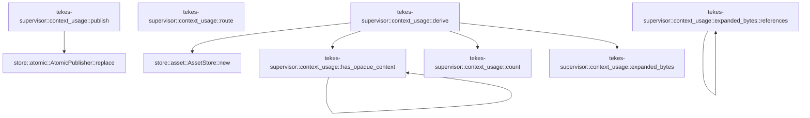

# tekes-supervisor::context_usage

[Package atlas](index.md) · [Source](../../src/context_usage.rs)

## Declarations

Visibility is the declaration spelling; trait members and reexports require their enclosing interface. `cfg` is not evaluated.

| Symbol | Kind | Visibility | Test / cfg |
|---|---|---|---|
| [tekes-supervisor::context_usage::MAX_SAFE](../../src/context_usage.rs#L11) | const_item | `private` |  |
| [tekes-supervisor::context_usage::SavedProjection](../../src/context_usage.rs#L15) | struct_item | `private` |  |
| [tekes-supervisor::context_usage::publish](../../src/context_usage.rs#L23) | function_item | `pub(crate)` |  |
| [tekes-supervisor::context_usage::derive](../../src/context_usage.rs#L68) | function_item | `pub(crate)` |  |
| [tekes-supervisor::context_usage::has_opaque_context](../../src/context_usage.rs#L174) | function_item | `private` |  |
| [tekes-supervisor::context_usage::count](../../src/context_usage.rs#L204) | function_item | `private` |  |
| [tekes-supervisor::context_usage::expanded_bytes](../../src/context_usage.rs#L208) | function_item | `private` |  |
| [tekes-supervisor::context_usage::expanded_bytes::references](../../src/context_usage.rs#L210) | function_item | `private` |  |
| [tekes-supervisor::context_usage::route](../../src/context_usage.rs#L231) | function_item | `private` |  |
| [tekes-supervisor::context_usage::tests::config](../../src/context_usage.rs#L270) | function_item | `private` | test; #[cfg(test)] |
| [tekes-supervisor::context_usage::tests::event](../../src/context_usage.rs#L285) | function_item | `private` | test; #[cfg(test)] |
| [tekes-supervisor::context_usage::tests::prepared](../../src/context_usage.rs#L293) | function_item | `private` | test; #[cfg(test)] |
| [tekes-supervisor::context_usage::tests::request_bounds_are_not_billing_totals_and_replacements_invalidate](../../src/context_usage.rs#L320) | function_item | `private` | test; #[cfg(test)] |
| [tekes-supervisor::context_usage::tests::opaque_media_and_continuations_are_not_priced_by_identifier_bytes](../../src/context_usage.rs#L347) | function_item | `private` | test; #[cfg(test)] |
| [tekes-supervisor::context_usage::tests::durable_clock_survives_recreation_and_does_not_reuse_invalidated_sequence](../../src/context_usage.rs#L360) | function_item | `private` | test; #[cfg(test)] |

## Imports / reexports

| Local name | Source path | Visibility |
|---|---|---|
| `fs` | `std::fs` | `private` |
| `Path` | `std::path::Path` | `private` |
| `Event` | `schema::Event` | `private` |
| `EventKind` | `schema::EventKind` | `private` |
| `Deserialize` | `serde::Deserialize` | `private` |
| `Serialize` | `serde::Serialize` | `private` |
| `Value` | `serde_json::Value` | `private` |
| `json` | `serde_json::json` | `private` |
| `AssetStore` | `store::AssetStore` | `private` |
| `AtomicPublisher` | `store::AtomicPublisher` | `private` |
| `*` | `super::*` | `private` |

## Module declarations

| Module | Visibility | Attributes |
|---|---|---|
| `tekes-supervisor::context_usage::tests` | `private` | #[cfg(test)] |

## Function call graphs

Edges below are syntactically resolved calls only, including private functions. Graphs partition callers into groups of 20; they are not execution order. All unresolved sites are listed below and in the JSON inventory.

Functions 1–7: 7 direct edges

## Call sites

Includes test functions (marked in declarations). Receiver-type-required sites need type analysis/manual tracing. Calls in closures are attributed to their enclosing function; their occurrence here does not mean the closure executes immediately.

| Caller | Callee expression | Source lines | Target / classification |
|---|---|---|---|
| `publish` | `folder.join` | [28](../../src/context_usage.rs#L28) | receiver-type-required |
| `publish` | `fs::read` | [29](../../src/context_usage.rs#L29) | external-constructor-callback-or-unresolved |
| `publish` | `serde_json::from_slice(&bytes).map_err` | [32](../../src/context_usage.rs#L32) | receiver-type-required |
| `publish` | `serde_json::from_slice` | [32](../../src/context_usage.rs#L32) | external-constructor-callback-or-unresolved |
| `publish` | `error.to_string` | [32](../../src/context_usage.rs#L32), [39](../../src/context_usage.rs#L39), [63](../../src/context_usage.rs#L63), [64](../../src/context_usage.rs#L64) | receiver-type-required |
| `publish` | `Err` | [34](../../src/context_usage.rs#L34), [39](../../src/context_usage.rs#L39), [56](../../src/context_usage.rs#L56) | external-constructor-callback-or-unresolved |
| `publish` | `"invalid context projection version or sequence".to_owned` | [34](../../src/context_usage.rs#L34) | receiver-type-required |
| `publish` | `Some` | [36](../../src/context_usage.rs#L36) | external-constructor-callback-or-unresolved |
| `publish` | `error.kind` | [38](../../src/context_usage.rs#L38) | receiver-type-required |
| `publish` | `Ok` | [43](../../src/context_usage.rs#L43), [65](../../src/context_usage.rs#L65) | external-constructor-callback-or-unresolved |
| `publish` | `match previous {         Some(previous) => previous             .sequence             .checked_add(1)             .filter(&#124;seq&#124; *seq <= MAX_SAFE)             .ok_or("context projection sequence exhausted")?,         None => 0,     }     .max` | [46](../../src/context_usage.rs#L46) | receiver-type-required |
| `publish` | `previous             .sequence             .checked_add(1)             .filter(&#124;seq&#124; *seq <= MAX_SAFE)             .ok_or` | [47](../../src/context_usage.rs#L47) | receiver-type-required |
| `publish` | `previous             .sequence             .checked_add(1)             .filter` | [47](../../src/context_usage.rs#L47) | receiver-type-required |
| `publish` | `previous             .sequence             .checked_add` | [47](../../src/context_usage.rs#L47) | receiver-type-required |
| `publish` | `"context projection sequence exhausted".to_owned` | [56](../../src/context_usage.rs#L56) | receiver-type-required |
| `publish` | `serde_json::to_vec(&SavedProjection {         format: 1,         sequence,         value,     })     .map_err` | [58](../../src/context_usage.rs#L58) | receiver-type-required |
| `publish` | `serde_json::to_vec` | [58](../../src/context_usage.rs#L58) | external-constructor-callback-or-unresolved |
| `publish` | `AtomicPublisher::replace(path, &bytes).map_err` | [64](../../src/context_usage.rs#L64) | receiver-type-required |
| `publish` | `AtomicPublisher::replace` | [64](../../src/context_usage.rs#L64) | [store::atomic::AtomicPublisher::replace](../../../store/src/atomic.rs#L16) |
| `derive` | `config.and_then` | [73](../../src/context_usage.rs#L73) | receiver-type-required |
| `derive` | `events         .iter()         .rposition` | [84](../../src/context_usage.rs#L84) | receiver-type-required |
| `derive` | `events         .iter` | [84](../../src/context_usage.rs#L84) | receiver-type-required |
| `derive` | `event.kind` | [86](../../src/context_usage.rs#L86), [93](../../src/context_usage.rs#L93), [103](../../src/context_usage.rs#L103) | receiver-type-required |
| `derive` | `events[..index]         .iter()         .rev()         .find` | [90](../../src/context_usage.rs#L90) | receiver-type-required |
| `derive` | `events[..index]         .iter()         .rev` | [90](../../src/context_usage.rs#L90) | receiver-type-required |
| `derive` | `events[..index]         .iter` | [90](../../src/context_usage.rs#L90) | receiver-type-required |
| `derive` | `config.digest().ok().as_deref` | [98](../../src/context_usage.rs#L98) | receiver-type-required |
| `derive` | `config.digest().ok` | [98](../../src/context_usage.rs#L98) | receiver-type-required |
| `derive` | `config.digest` | [98](../../src/context_usage.rs#L98) | receiver-type-required |
| `derive` | `run.string_field` | [98](../../src/context_usage.rs#L98) | receiver-type-required |
| `derive` | `events[..index].iter().rev().find` | [102](../../src/context_usage.rs#L102) | receiver-type-required |
| `derive` | `events[..index].iter().rev` | [102](../../src/context_usage.rs#L102) | receiver-type-required |
| `derive` | `events[..index].iter` | [102](../../src/context_usage.rs#L102) | receiver-type-required |
| `derive` | `event.string_field` | [104](../../src/context_usage.rs#L104) | receiver-type-required |
| `derive` | `attempt.string_field` | [104](../../src/context_usage.rs#L104) | receiver-type-required |
| `derive` | `epoch.string_field` | [108](../../src/context_usage.rs#L108) | receiver-type-required |
| `derive` | `Some` | [108](../../src/context_usage.rs#L108) | external-constructor-callback-or-unresolved |
| `derive` | `model.id.as_str` | [108](../../src/context_usage.rs#L108) | receiver-type-required |
| `derive` | `serde_json::to_value` | [111](../../src/context_usage.rs#L111), [140](../../src/context_usage.rs#L140) | external-constructor-callback-or-unresolved |
| `derive` | `attempt.raw` | [111](../../src/context_usage.rs#L111) | receiver-type-required |
| `derive` | `raw.pointer("/request/asset").and_then` | [114](../../src/context_usage.rs#L114) | receiver-type-required |
| `derive` | `raw.pointer` | [114](../../src/context_usage.rs#L114) | receiver-type-required |
| `derive` | `AssetStore::new` | [117](../../src/context_usage.rs#L117) | [store::asset::AssetStore::new](../../../store/src/asset.rs#L27) |
| `derive` | `folder.join` | [117](../../src/context_usage.rs#L117) | receiver-type-required |
| `derive` | `assets.read_verified` | [120](../../src/context_usage.rs#L120) | receiver-type-required |
| `derive` | `serde_json::from_slice::<Value>` | [125](../../src/context_usage.rs#L125) | external-constructor-callback-or-unresolved |
| `derive` | `has_opaque_context` | [128](../../src/context_usage.rs#L128), [145](../../src/context_usage.rs#L145) | [tekes-supervisor::context_usage::has_opaque_context](../../src/context_usage.rs#L174) |
| `derive` | `body.len` | [131](../../src/context_usage.rs#L131) | receiver-type-required |
| `derive` | `event.raw` | [140](../../src/context_usage.rs#L140) | receiver-type-required |
| `derive` | `raw.get("supersedes").is_some` | [143](../../src/context_usage.rs#L143) | receiver-type-required |
| `derive` | `raw.get` | [143](../../src/context_usage.rs#L143), [144](../../src/context_usage.rs#L144) | receiver-type-required |
| `derive` | `raw.get("retracts").is_some` | [144](../../src/context_usage.rs#L144) | receiver-type-required |
| `derive` | `expanded_bytes` | [149](../../src/context_usage.rs#L149) | [tekes-supervisor::context_usage::expanded_bytes](../../src/context_usage.rs#L208) |
| `derive` | `bound.saturating_add` | [152](../../src/context_usage.rs#L152) | receiver-type-required |
| `derive` | `raw             .get("usage")             .filter` | [155](../../src/context_usage.rs#L155) | receiver-type-required |
| `derive` | `raw             .get` | [155](../../src/context_usage.rs#L155) | receiver-type-required |
| `derive` | `["input_tokens", "output_tokens", "cache_read", "cache_write"]                 .iter()                 .filter_map(&#124;key&#124; count(&usage[*key]))                 .fold` | [159](../../src/context_usage.rs#L159) | receiver-type-required |
| `derive` | `["input_tokens", "output_tokens", "cache_read", "cache_write"]                 .iter()                 .filter_map` | [159](../../src/context_usage.rs#L159) | receiver-type-required |
| `derive` | `["input_tokens", "output_tokens", "cache_read", "cache_write"]                 .iter` | [159](../../src/context_usage.rs#L159) | receiver-type-required |
| `derive` | `count` | [161](../../src/context_usage.rs#L161) | [tekes-supervisor::context_usage::count](../../src/context_usage.rs#L204) |
| `derive` | `bound.max` | [163](../../src/context_usage.rs#L163) | receiver-type-required |
| `has_opaque_context` | `fields.iter().any` | [176](../../src/context_usage.rs#L176) | receiver-type-required |
| `has_opaque_context` | `fields.iter` | [176](../../src/context_usage.rs#L176) | receiver-type-required |
| `has_opaque_context` | `value.as_str().is_some_and` | [190](../../src/context_usage.rs#L190) | receiver-type-required |
| `has_opaque_context` | `value.as_str` | [190](../../src/context_usage.rs#L190) | receiver-type-required |
| `has_opaque_context` | `kind.contains` | [191](../../src/context_usage.rs#L191), [192](../../src/context_usage.rs#L192), [193](../../src/context_usage.rs#L193) | receiver-type-required |
| `has_opaque_context` | `has_opaque_context` | [197](../../src/context_usage.rs#L197) | [tekes-supervisor::context_usage::has_opaque_context](../../src/context_usage.rs#L174) |
| `has_opaque_context` | `values.iter().any` | [199](../../src/context_usage.rs#L199) | receiver-type-required |
| `has_opaque_context` | `values.iter` | [199](../../src/context_usage.rs#L199) | receiver-type-required |
| `count` | `value.as_u64().or_else` | [205](../../src/context_usage.rs#L205) | receiver-type-required |
| `count` | `value.as_u64` | [205](../../src/context_usage.rs#L205) | receiver-type-required |
| `count` | `value.as_str()?.parse().ok` | [205](../../src/context_usage.rs#L205) | receiver-type-required |
| `count` | `value.as_str()?.parse` | [205](../../src/context_usage.rs#L205) | receiver-type-required |
| `count` | `value.as_str` | [205](../../src/context_usage.rs#L205) | receiver-type-required |
| `expanded_bytes` | `serde_json::to_vec(value).ok()?.len` | [209](../../src/context_usage.rs#L209) | receiver-type-required |
| `expanded_bytes` | `serde_json::to_vec(value).ok` | [209](../../src/context_usage.rs#L209) | receiver-type-required |
| `expanded_bytes` | `serde_json::to_vec` | [209](../../src/context_usage.rs#L209) | external-constructor-callback-or-unresolved |
| `expanded_bytes` | `base.checked_add` | [228](../../src/context_usage.rs#L228) | receiver-type-required |
| `expanded_bytes` | `references` | [228](../../src/context_usage.rs#L228) | external-constructor-callback-or-unresolved |
| `references` | `fields.get("asset").and_then` | [214](../../src/context_usage.rs#L214) | receiver-type-required |
| `references` | `fields.get` | [214](../../src/context_usage.rs#L214) | receiver-type-required |
| `references` | `assets.read_verified(asset).ok()?.len` | [215](../../src/context_usage.rs#L215) | receiver-type-required |
| `references` | `assets.read_verified(asset).ok` | [215](../../src/context_usage.rs#L215) | receiver-type-required |
| `references` | `assets.read_verified` | [215](../../src/context_usage.rs#L215) | receiver-type-required |
| `references` | `fields.values` | [217](../../src/context_usage.rs#L217) | receiver-type-required |
| `references` | `bytes.checked_add` | [218](../../src/context_usage.rs#L218) | receiver-type-required |
| `references` | `references` | [218](../../src/context_usage.rs#L218), [223](../../src/context_usage.rs#L223) | [tekes-supervisor::context_usage::expanded_bytes::references](../../src/context_usage.rs#L210) |
| `references` | `Some` | [220](../../src/context_usage.rs#L220), [225](../../src/context_usage.rs#L225) | external-constructor-callback-or-unresolved |
| `references` | `values.iter().try_fold` | [222](../../src/context_usage.rs#L222) | receiver-type-required |
| `references` | `values.iter` | [222](../../src/context_usage.rs#L222) | receiver-type-required |
| `references` | `sum.checked_add` | [223](../../src/context_usage.rs#L223) | receiver-type-required |
| `route` | `config         .session_settings         .as_ref()         .map(&#124;settings&#124; settings.provider.as_str())         .or(config.workspace.policy.provider.as_deref())         .or` | [232](../../src/context_usage.rs#L232) | receiver-type-required |
| `route` | `config         .session_settings         .as_ref()         .map(&#124;settings&#124; settings.provider.as_str())         .or` | [232](../../src/context_usage.rs#L232) | receiver-type-required |
| `route` | `config         .session_settings         .as_ref()         .map` | [232](../../src/context_usage.rs#L232), [238](../../src/context_usage.rs#L238) | receiver-type-required |
| `route` | `config         .session_settings         .as_ref` | [232](../../src/context_usage.rs#L232), [238](../../src/context_usage.rs#L238) | receiver-type-required |
| `route` | `settings.provider.as_str` | [235](../../src/context_usage.rs#L235) | receiver-type-required |
| `route` | `config.workspace.policy.provider.as_deref` | [236](../../src/context_usage.rs#L236) | receiver-type-required |
| `route` | `config.settings.default_provider.as_deref` | [237](../../src/context_usage.rs#L237) | receiver-type-required |
| `route` | `config         .session_settings         .as_ref()         .map(&#124;settings&#124; settings.model.as_str())         .or(config.workspace.policy.model.as_deref())         .or` | [238](../../src/context_usage.rs#L238) | receiver-type-required |
| `route` | `config         .session_settings         .as_ref()         .map(&#124;settings&#124; settings.model.as_str())         .or` | [238](../../src/context_usage.rs#L238) | receiver-type-required |
| `route` | `settings.model.as_str` | [241](../../src/context_usage.rs#L241) | receiver-type-required |
| `route` | `config.workspace.policy.model.as_deref` | [242](../../src/context_usage.rs#L242) | receiver-type-required |
| `route` | `config.settings.default_model.as_deref` | [243](../../src/context_usage.rs#L243) | receiver-type-required |
| `route` | `config             .providers             .providers             .iter()             .find` | [245](../../src/context_usage.rs#L245), [250](../../src/context_usage.rs#L250) | receiver-type-required |
| `route` | `config             .providers             .providers             .iter` | [245](../../src/context_usage.rs#L245), [250](../../src/context_usage.rs#L250) | receiver-type-required |
| `route` | `provider.models.iter().any` | [254](../../src/context_usage.rs#L254) | receiver-type-required |
| `route` | `provider.models.iter` | [254](../../src/context_usage.rs#L254), [261](../../src/context_usage.rs#L261) | receiver-type-required |
| `route` | `provider             .models             .iter()             .find` | [257](../../src/context_usage.rs#L257) | receiver-type-required |
| `route` | `provider             .models             .iter` | [257](../../src/context_usage.rs#L257) | receiver-type-required |
| `route` | `provider.models.iter().find` | [261](../../src/context_usage.rs#L261) | receiver-type-required |
| `route` | `Some` | [263](../../src/context_usage.rs#L263) | external-constructor-callback-or-unresolved |
| `config` | `serde_json::from_value(json!({             "format":1,             "workspace":{"format":1,"revision":1,"id":"w","name":"W","cwd":[std::fs::canonicalize(std::env::temp_dir()).unwrap()],"policy":{"network":true}},             "providers":{"format":1,"revision":1,"providers":[{                 "id":"p","adapter":"responses","dialect":"openai_responses_v1","endpoint_owner":"openai",                 "gateway_translation":"direct","evidence_revision":"openai-2026-08-01","endpoint":"https://example.com/v1",                 "models":[{"id":"gpt-5","profile":"openai_responses_v1:gpt-5","enabled":true,                     "context_window_tokens":100000,"compact_trigger_tokens":90000}]             }]},             "settings":{"format":1,"revision":1,"default_provider":"p","default_model":"gpt-5"},             "revisions":{"workspace":1,"providers":1,"settings":1}         })).unwrap` | [271](../../src/context_usage.rs#L271) | receiver-type-required |
| `config` | `serde_json::from_value` | [271](../../src/context_usage.rs#L271) | external-constructor-callback-or-unresolved |
| `event` | `Event::from_value(schema::IJsonValue::parse(&serde_json::to_vec(&value).unwrap()).unwrap())             .unwrap` | [289](../../src/context_usage.rs#L289) | receiver-type-required |
| `event` | `Event::from_value` | [289](../../src/context_usage.rs#L289) | external-constructor-callback-or-unresolved |
| `event` | `schema::IJsonValue::parse(&serde_json::to_vec(&value).unwrap()).unwrap` | [289](../../src/context_usage.rs#L289) | receiver-type-required |
| `event` | `schema::IJsonValue::parse` | [289](../../src/context_usage.rs#L289) | [schema::ijson::IJsonValue::parse](../../../schema/src/ijson.rs#L16) |
| `event` | `serde_json::to_vec(&value).unwrap` | [289](../../src/context_usage.rs#L289) | receiver-type-required |
| `event` | `serde_json::to_vec` | [289](../../src/context_usage.rs#L289) | external-constructor-callback-or-unresolved |
| `prepared` | `AssetStore::new(folder.join("assets")).unwrap` | [294](../../src/context_usage.rs#L294) | receiver-type-required |
| `prepared` | `AssetStore::new` | [294](../../src/context_usage.rs#L294) | external-constructor-callback-or-unresolved |
| `prepared` | `folder.join` | [294](../../src/context_usage.rs#L294) | receiver-type-required |
| `prepared` | `assets.publish(b"system").unwrap` | [295](../../src/context_usage.rs#L295) | receiver-type-required |
| `prepared` | `assets.publish` | [295](../../src/context_usage.rs#L295), [296](../../src/context_usage.rs#L296) | receiver-type-required |
| `prepared` | `assets.publish(b"[]").unwrap` | [296](../../src/context_usage.rs#L296) | receiver-type-required |
| `prepared` | `assets             .publish(br#"{"model":"gpt-5","input":[{"role":"user","content":"hello"}]}"#)             .unwrap` | [297](../../src/context_usage.rs#L297) | receiver-type-required |
| `prepared` | `assets             .publish` | [297](../../src/context_usage.rs#L297) | receiver-type-required |
| `request_bounds_are_not_billing_totals_and_replacements_invalidate` | `tempfile::tempdir().unwrap` | [321](../../src/context_usage.rs#L321) | receiver-type-required |
| `request_bounds_are_not_billing_totals_and_replacements_invalidate` | `tempfile::tempdir` | [321](../../src/context_usage.rs#L321) | external-constructor-callback-or-unresolved |
| `request_bounds_are_not_billing_totals_and_replacements_invalidate` | `config` | [322](../../src/context_usage.rs#L322) | external-constructor-callback-or-unresolved |
| `request_bounds_are_not_billing_totals_and_replacements_invalidate` | `prepared` | [323](../../src/context_usage.rs#L323) | [tekes-supervisor::context_usage::tests::prepared](../../src/context_usage.rs#L293) |
| `request_bounds_are_not_billing_totals_and_replacements_invalidate` | `folder.path` | [323](../../src/context_usage.rs#L323), [324](../../src/context_usage.rs#L324), [330](../../src/context_usage.rs#L330), [336](../../src/context_usage.rs#L336), [341](../../src/context_usage.rs#L341) | receiver-type-required |
| `request_bounds_are_not_billing_totals_and_replacements_invalidate` | `derive` | [324](../../src/context_usage.rs#L324), [330](../../src/context_usage.rs#L330), [336](../../src/context_usage.rs#L336), [341](../../src/context_usage.rs#L341) | external-constructor-callback-or-unresolved |
| `request_bounds_are_not_billing_totals_and_replacements_invalidate` | `Some` | [324](../../src/context_usage.rs#L324), [330](../../src/context_usage.rs#L330), [336](../../src/context_usage.rs#L336), [341](../../src/context_usage.rs#L341) | external-constructor-callback-or-unresolved |
| `request_bounds_are_not_billing_totals_and_replacements_invalidate` | `events.push` | [327](../../src/context_usage.rs#L327), [332](../../src/context_usage.rs#L332) | receiver-type-required |
| `request_bounds_are_not_billing_totals_and_replacements_invalidate` | `event` | [327](../../src/context_usage.rs#L327), [332](../../src/context_usage.rs#L332) | [tekes-supervisor::context_usage::tests::event](../../src/context_usage.rs#L285) |
| `request_bounds_are_not_billing_totals_and_replacements_invalidate` | `config.clone` | [339](../../src/context_usage.rs#L339) | receiver-type-required |
| `durable_clock_survives_recreation_and_does_not_reuse_invalidated_sequence` | `tempfile::tempdir().unwrap` | [361](../../src/context_usage.rs#L361) | receiver-type-required |
| `durable_clock_survives_recreation_and_does_not_reuse_invalidated_sequence` | `tempfile::tempdir` | [361](../../src/context_usage.rs#L361) | external-constructor-callback-or-unresolved |
