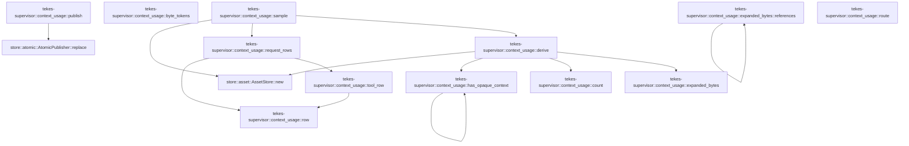

# tekes-supervisor::context_usage

[Package atlas](index.md) · [Source](../../src/context_usage.rs)

## Declarations

Visibility is the declaration spelling; trait members and reexports require their enclosing interface. `cfg` is not evaluated.

| Symbol | Kind | Visibility | Test / cfg |
|---|---|---|---|
| [tekes-supervisor::context_usage::MAX_SAFE](../../src/context_usage.rs#L12) | const_item | `private` |  |
| [tekes-supervisor::context_usage::SavedProjection](../../src/context_usage.rs#L16) | struct_item | `private` |  |
| [tekes-supervisor::context_usage::publish](../../src/context_usage.rs#L24) | function_item | `pub(crate)` |  |
| [tekes-supervisor::context_usage::derive](../../src/context_usage.rs#L69) | function_item | `pub(crate)` |  |
| [tekes-supervisor::context_usage::sample](../../src/context_usage.rs#L177) | function_item | `pub(crate)` |  |
| [tekes-supervisor::context_usage::byte_tokens](../../src/context_usage.rs#L237) | function_item | `private` |  |
| [tekes-supervisor::context_usage::row](../../src/context_usage.rs#L242) | function_item | `private` |  |
| [tekes-supervisor::context_usage::request_rows](../../src/context_usage.rs#L247) | function_item | `private` |  |
| [tekes-supervisor::context_usage::tool_row](../../src/context_usage.rs#L316) | function_item | `private` |  |
| [tekes-supervisor::context_usage::has_opaque_context](../../src/context_usage.rs#L357) | function_item | `private` |  |
| [tekes-supervisor::context_usage::count](../../src/context_usage.rs#L387) | function_item | `private` |  |
| [tekes-supervisor::context_usage::expanded_bytes](../../src/context_usage.rs#L391) | function_item | `private` |  |
| [tekes-supervisor::context_usage::expanded_bytes::references](../../src/context_usage.rs#L393) | function_item | `private` |  |
| [tekes-supervisor::context_usage::route](../../src/context_usage.rs#L414) | function_item | `private` |  |
| [tekes-supervisor::context_usage::tests::config](../../src/context_usage.rs#L453) | function_item | `private` | test; #[cfg(test)] |
| [tekes-supervisor::context_usage::tests::event](../../src/context_usage.rs#L468) | function_item | `private` | test; #[cfg(test)] |
| [tekes-supervisor::context_usage::tests::prepared](../../src/context_usage.rs#L476) | function_item | `private` | test; #[cfg(test)] |
| [tekes-supervisor::context_usage::tests::replace_request](../../src/context_usage.rs#L502) | function_item | `private` | test; #[cfg(test)] |
| [tekes-supervisor::context_usage::tests::atomic_sample_partitions_system_and_deduplicates_safe_tool_inventory](../../src/context_usage.rs#L513) | function_item | `private` | test; #[cfg(test)] |
| [tekes-supervisor::context_usage::tests::dialect_shapes_are_classified_without_catalog_inference](../../src/context_usage.rs#L564) | function_item | `private` | test; #[cfg(test)] |
| [tekes-supervisor::context_usage::tests::invalidation_replaces_both_total_and_details_and_changes_clock](../../src/context_usage.rs#L597) | function_item | `private` | test; #[cfg(test)] |
| [tekes-supervisor::context_usage::tests::paired_clock_migrates_legacy_and_rejects_corruption](../../src/context_usage.rs#L682) | function_item | `private` | test; #[cfg(test)] |
| [tekes-supervisor::context_usage::tests::request_bounds_are_not_billing_totals_and_replacements_invalidate](../../src/context_usage.rs#L713) | function_item | `private` | test; #[cfg(test)] |
| [tekes-supervisor::context_usage::tests::opaque_media_and_continuations_are_not_priced_by_identifier_bytes](../../src/context_usage.rs#L740) | function_item | `private` | test; #[cfg(test)] |
| [tekes-supervisor::context_usage::tests::durable_clock_survives_recreation_and_does_not_reuse_invalidated_sequence](../../src/context_usage.rs#L753) | function_item | `private` | test; #[cfg(test)] |

## Imports / reexports

| Local name | Source path | Visibility |
|---|---|---|
| `fs` | `std::fs` | `private` |
| `Path` | `std::path::Path` | `private` |
| `Event` | `schema::Event` | `private` |
| `EventKind` | `schema::EventKind` | `private` |
| `Deserialize` | `serde::Deserialize` | `private` |
| `Serialize` | `serde::Serialize` | `private` |
| `Value` | `serde_json::Value` | `private` |
| `json` | `serde_json::json` | `private` |
| `Digest` | `sha2::Digest` | `private` |
| `Sha256` | `sha2::Sha256` | `private` |
| `AssetStore` | `store::AssetStore` | `private` |
| `AtomicPublisher` | `store::AtomicPublisher` | `private` |
| `*` | `super::*` | `private` |

## Module declarations

| Module | Visibility | Attributes |
|---|---|---|
| `tekes-supervisor::context_usage::tests` | `private` | #[cfg(test)] |

## Function call graphs

Edges below are syntactically resolved calls only, including private functions. Graphs partition callers into groups of 20; they are not execution order. All unresolved sites are listed below and in the JSON inventory.

Functions 1–12: 13 direct edges

## Call sites

Includes test functions (marked in declarations). Receiver-type-required sites need type analysis/manual tracing. Calls in closures are attributed to their enclosing function; their occurrence here does not mean the closure executes immediately.

| Caller | Callee expression | Source lines | Target / classification |
|---|---|---|---|
| `publish` | `folder.join` | [29](../../src/context_usage.rs#L29) | receiver-type-required |
| `publish` | `fs::read` | [30](../../src/context_usage.rs#L30) | external-constructor-callback-or-unresolved |
| `publish` | `serde_json::from_slice(&bytes).map_err` | [33](../../src/context_usage.rs#L33) | receiver-type-required |
| `publish` | `serde_json::from_slice` | [33](../../src/context_usage.rs#L33) | external-constructor-callback-or-unresolved |
| `publish` | `error.to_string` | [33](../../src/context_usage.rs#L33), [40](../../src/context_usage.rs#L40), [64](../../src/context_usage.rs#L64), [65](../../src/context_usage.rs#L65) | receiver-type-required |
| `publish` | `Err` | [35](../../src/context_usage.rs#L35), [40](../../src/context_usage.rs#L40), [57](../../src/context_usage.rs#L57) | external-constructor-callback-or-unresolved |
| `publish` | `"invalid context projection version or sequence".to_owned` | [35](../../src/context_usage.rs#L35) | receiver-type-required |
| `publish` | `Some` | [37](../../src/context_usage.rs#L37) | external-constructor-callback-or-unresolved |
| `publish` | `error.kind` | [39](../../src/context_usage.rs#L39) | receiver-type-required |
| `publish` | `Ok` | [44](../../src/context_usage.rs#L44), [66](../../src/context_usage.rs#L66) | external-constructor-callback-or-unresolved |
| `publish` | `match previous {         Some(previous) => previous             .sequence             .checked_add(1)             .filter(&#124;seq&#124; *seq <= MAX_SAFE)             .ok_or("context projection sequence exhausted")?,         None => 0,     }     .max` | [47](../../src/context_usage.rs#L47) | receiver-type-required |
| `publish` | `previous             .sequence             .checked_add(1)             .filter(&#124;seq&#124; *seq <= MAX_SAFE)             .ok_or` | [48](../../src/context_usage.rs#L48) | receiver-type-required |
| `publish` | `previous             .sequence             .checked_add(1)             .filter` | [48](../../src/context_usage.rs#L48) | receiver-type-required |
| `publish` | `previous             .sequence             .checked_add` | [48](../../src/context_usage.rs#L48) | receiver-type-required |
| `publish` | `"context projection sequence exhausted".to_owned` | [57](../../src/context_usage.rs#L57) | receiver-type-required |
| `publish` | `serde_json::to_vec(&SavedProjection {         format: 1,         sequence,         value,     })     .map_err` | [59](../../src/context_usage.rs#L59) | receiver-type-required |
| `publish` | `serde_json::to_vec` | [59](../../src/context_usage.rs#L59) | external-constructor-callback-or-unresolved |
| `publish` | `AtomicPublisher::replace(path, &bytes).map_err` | [65](../../src/context_usage.rs#L65) | receiver-type-required |
| `publish` | `AtomicPublisher::replace` | [65](../../src/context_usage.rs#L65) | [store::atomic::AtomicPublisher::replace](../../../store/src/atomic.rs#L16) |
| `derive` | `config.and_then` | [74](../../src/context_usage.rs#L74) | receiver-type-required |
| `derive` | `events         .iter()         .rposition` | [85](../../src/context_usage.rs#L85) | receiver-type-required |
| `derive` | `events         .iter` | [85](../../src/context_usage.rs#L85) | receiver-type-required |
| `derive` | `event.kind` | [87](../../src/context_usage.rs#L87), [94](../../src/context_usage.rs#L94), [104](../../src/context_usage.rs#L104) | receiver-type-required |
| `derive` | `events[..index]         .iter()         .rev()         .find` | [91](../../src/context_usage.rs#L91) | receiver-type-required |
| `derive` | `events[..index]         .iter()         .rev` | [91](../../src/context_usage.rs#L91) | receiver-type-required |
| `derive` | `events[..index]         .iter` | [91](../../src/context_usage.rs#L91) | receiver-type-required |
| `derive` | `config.digest().ok().as_deref` | [99](../../src/context_usage.rs#L99) | receiver-type-required |
| `derive` | `config.digest().ok` | [99](../../src/context_usage.rs#L99) | receiver-type-required |
| `derive` | `config.digest` | [99](../../src/context_usage.rs#L99) | receiver-type-required |
| `derive` | `run.string_field` | [99](../../src/context_usage.rs#L99) | receiver-type-required |
| `derive` | `events[..index].iter().rev().find` | [103](../../src/context_usage.rs#L103) | receiver-type-required |
| `derive` | `events[..index].iter().rev` | [103](../../src/context_usage.rs#L103) | receiver-type-required |
| `derive` | `events[..index].iter` | [103](../../src/context_usage.rs#L103) | receiver-type-required |
| `derive` | `event.string_field` | [105](../../src/context_usage.rs#L105) | receiver-type-required |
| `derive` | `attempt.string_field` | [105](../../src/context_usage.rs#L105) | receiver-type-required |
| `derive` | `epoch.string_field` | [109](../../src/context_usage.rs#L109) | receiver-type-required |
| `derive` | `Some` | [109](../../src/context_usage.rs#L109) | external-constructor-callback-or-unresolved |
| `derive` | `model.id.as_str` | [109](../../src/context_usage.rs#L109) | receiver-type-required |
| `derive` | `serde_json::to_value` | [112](../../src/context_usage.rs#L112), [141](../../src/context_usage.rs#L141) | external-constructor-callback-or-unresolved |
| `derive` | `attempt.raw` | [112](../../src/context_usage.rs#L112) | receiver-type-required |
| `derive` | `raw.pointer("/request/asset").and_then` | [115](../../src/context_usage.rs#L115) | receiver-type-required |
| `derive` | `raw.pointer` | [115](../../src/context_usage.rs#L115) | receiver-type-required |
| `derive` | `AssetStore::new` | [118](../../src/context_usage.rs#L118) | [store::asset::AssetStore::new](../../../store/src/asset.rs#L27) |
| `derive` | `folder.join` | [118](../../src/context_usage.rs#L118) | receiver-type-required |
| `derive` | `assets.read_verified` | [121](../../src/context_usage.rs#L121) | receiver-type-required |
| `derive` | `serde_json::from_slice::<Value>` | [126](../../src/context_usage.rs#L126) | external-constructor-callback-or-unresolved |
| `derive` | `has_opaque_context` | [129](../../src/context_usage.rs#L129), [146](../../src/context_usage.rs#L146) | [tekes-supervisor::context_usage::has_opaque_context](../../src/context_usage.rs#L357) |
| `derive` | `body.len` | [132](../../src/context_usage.rs#L132) | receiver-type-required |
| `derive` | `event.raw` | [141](../../src/context_usage.rs#L141) | receiver-type-required |
| `derive` | `raw.get("supersedes").is_some` | [144](../../src/context_usage.rs#L144) | receiver-type-required |
| `derive` | `raw.get` | [144](../../src/context_usage.rs#L144), [145](../../src/context_usage.rs#L145) | receiver-type-required |
| `derive` | `raw.get("retracts").is_some` | [145](../../src/context_usage.rs#L145) | receiver-type-required |
| `derive` | `expanded_bytes` | [150](../../src/context_usage.rs#L150) | [tekes-supervisor::context_usage::expanded_bytes](../../src/context_usage.rs#L391) |
| `derive` | `bound.saturating_add` | [153](../../src/context_usage.rs#L153) | receiver-type-required |
| `derive` | `raw             .get("usage")             .filter` | [156](../../src/context_usage.rs#L156) | receiver-type-required |
| `derive` | `raw             .get` | [156](../../src/context_usage.rs#L156) | receiver-type-required |
| `derive` | `["input_tokens", "output_tokens", "cache_read", "cache_write"]                 .iter()                 .filter_map(&#124;key&#124; count(&usage[*key]))                 .fold` | [160](../../src/context_usage.rs#L160) | receiver-type-required |
| `derive` | `["input_tokens", "output_tokens", "cache_read", "cache_write"]                 .iter()                 .filter_map` | [160](../../src/context_usage.rs#L160) | receiver-type-required |
| `derive` | `["input_tokens", "output_tokens", "cache_read", "cache_write"]                 .iter` | [160](../../src/context_usage.rs#L160) | receiver-type-required |
| `derive` | `count` | [162](../../src/context_usage.rs#L162) | [tekes-supervisor::context_usage::count](../../src/context_usage.rs#L387) |
| `derive` | `bound.max` | [164](../../src/context_usage.rs#L164) | receiver-type-required |
| `sample` | `derive` | [182](../../src/context_usage.rs#L182) | [tekes-supervisor::context_usage::derive](../../src/context_usage.rs#L69) |
| `sample` | `usage.get` | [186](../../src/context_usage.rs#L186) | receiver-type-required |
| `sample` | `value.clone` | [187](../../src/context_usage.rs#L187) | receiver-type-required |
| `sample` | `(usage["basis"] != "unknown")         .then(&#124;&#124; {             let attempt = events                 .iter()                 .rev()                 .find(&#124;e&#124; *e.kind() == EventKind::Attempt)?;             let raw = serde_json::to_value(attempt.raw()).ok()?;             let asset = raw.pointer("/request/asset")?.as_str()?;             let assets = AssetStore::new(folder.join("assets")).ok()?;             let request =                 serde_json::from_slice::<Value>(&assets.read_verified(asset).ok()?).ok()?;             for (output, input) in [("requestID", "attempt"), ("epochID", "epoch")] {                 if let Some(value) = attempt.string_field(input) {                     evidence[output] = json!(value);                 }             }             // Asset identity covers request bytes without returning a raw request.             evidence["sourceRevision"] = json!(asset);             Some(request)         })         .flatten` | [191](../../src/context_usage.rs#L191) | receiver-type-required |
| `sample` | `(usage["basis"] != "unknown")         .then` | [191](../../src/context_usage.rs#L191) | receiver-type-required |
| `sample` | `events                 .iter()                 .rev()                 .find` | [193](../../src/context_usage.rs#L193) | receiver-type-required |
| `sample` | `events                 .iter()                 .rev` | [193](../../src/context_usage.rs#L193) | receiver-type-required |
| `sample` | `events                 .iter` | [193](../../src/context_usage.rs#L193) | receiver-type-required |
| `sample` | `e.kind` | [196](../../src/context_usage.rs#L196) | receiver-type-required |
| `sample` | `serde_json::to_value(attempt.raw()).ok` | [197](../../src/context_usage.rs#L197) | receiver-type-required |
| `sample` | `serde_json::to_value` | [197](../../src/context_usage.rs#L197) | external-constructor-callback-or-unresolved |
| `sample` | `attempt.raw` | [197](../../src/context_usage.rs#L197) | receiver-type-required |
| `sample` | `raw.pointer("/request/asset")?.as_str` | [198](../../src/context_usage.rs#L198) | receiver-type-required |
| `sample` | `raw.pointer` | [198](../../src/context_usage.rs#L198) | receiver-type-required |
| `sample` | `AssetStore::new(folder.join("assets")).ok` | [199](../../src/context_usage.rs#L199) | receiver-type-required |
| `sample` | `AssetStore::new` | [199](../../src/context_usage.rs#L199) | [store::asset::AssetStore::new](../../../store/src/asset.rs#L27) |
| `sample` | `folder.join` | [199](../../src/context_usage.rs#L199) | receiver-type-required |
| `sample` | `serde_json::from_slice::<Value>(&assets.read_verified(asset).ok()?).ok` | [201](../../src/context_usage.rs#L201) | receiver-type-required |
| `sample` | `serde_json::from_slice::<Value>` | [201](../../src/context_usage.rs#L201) | external-constructor-callback-or-unresolved |
| `sample` | `assets.read_verified(asset).ok` | [201](../../src/context_usage.rs#L201) | receiver-type-required |
| `sample` | `assets.read_verified` | [201](../../src/context_usage.rs#L201) | receiver-type-required |
| `sample` | `attempt.string_field` | [203](../../src/context_usage.rs#L203) | receiver-type-required |
| `sample` | `Some` | [209](../../src/context_usage.rs#L209) | external-constructor-callback-or-unresolved |
| `sample` | `request.is_none` | [212](../../src/context_usage.rs#L212) | receiver-type-required |
| `sample` | `Vec::new` | [216](../../src/context_usage.rs#L216) | external-constructor-callback-or-unresolved |
| `sample` | `request.as_ref` | [217](../../src/context_usage.rs#L217) | receiver-type-required |
| `sample` | `request_rows` | [218](../../src/context_usage.rs#L218) | [tekes-supervisor::context_usage::request_rows](../../src/context_usage.rs#L247) |
| `request_rows` | `Vec::new` | [248](../../src/context_usage.rs#L248), [249](../../src/context_usage.rs#L249), [262](../../src/context_usage.rs#L262), [289](../../src/context_usage.rs#L289), [290](../../src/context_usage.rs#L290) | external-constructor-callback-or-unresolved |
| `request_rows` | `request.get` | [256](../../src/context_usage.rs#L256), [261](../../src/context_usage.rs#L261), [288](../../src/context_usage.rs#L288) | receiver-type-required |
| `request_rows` | `system.push` | [257](../../src/context_usage.rs#L257), [265](../../src/context_usage.rs#L265) | receiver-type-required |
| `request_rows` | `value.clone` | [257](../../src/context_usage.rs#L257) | receiver-type-required |
| `request_rows` | `request.get(key).and_then` | [261](../../src/context_usage.rs#L261) | receiver-type-required |
| `request_rows` | `item.clone` | [265](../../src/context_usage.rs#L265), [267](../../src/context_usage.rs#L267) | receiver-type-required |
| `request_rows` | `messages.push` | [267](../../src/context_usage.rs#L267) | receiver-type-required |
| `request_rows` | `rows.push` | [270](../../src/context_usage.rs#L270), [280](../../src/context_usage.rs#L280), [298](../../src/context_usage.rs#L298), [305](../../src/context_usage.rs#L305) | receiver-type-required |
| `request_rows` | `row` | [270](../../src/context_usage.rs#L270), [280](../../src/context_usage.rs#L280) | [tekes-supervisor::context_usage::row](../../src/context_usage.rs#L242) |
| `request_rows` | `system.is_empty` | [279](../../src/context_usage.rs#L279) | receiver-type-required |
| `request_rows` | `request.get("tools").and_then` | [288](../../src/context_usage.rs#L288) | receiver-type-required |
| `request_rows` | `deferred.push` | [293](../../src/context_usage.rs#L293) | receiver-type-required |
| `request_rows` | `tool.clone` | [293](../../src/context_usage.rs#L293), [295](../../src/context_usage.rs#L295) | receiver-type-required |
| `request_rows` | `active.push` | [295](../../src/context_usage.rs#L295) | receiver-type-required |
| `request_rows` | `tool_row` | [298](../../src/context_usage.rs#L298), [305](../../src/context_usage.rs#L305) | [tekes-supervisor::context_usage::tool_row](../../src/context_usage.rs#L316) |
| `request_rows` | `deferred.is_empty` | [304](../../src/context_usage.rs#L304) | receiver-type-required |
| `tool_row` | `row` | [317](../../src/context_usage.rs#L317), [349](../../src/context_usage.rs#L349) | [tekes-supervisor::context_usage::row](../../src/context_usage.rs#L242) |
| `tool_row` | `std::collections::BTreeMap::new` | [318](../../src/context_usage.rs#L318) | external-constructor-callback-or-unresolved |
| `tool_row` | `tool             .get("functionDeclarations")             .and_then(Value::as_array)             .map(&#124;items&#124; items.iter().collect::<Vec<_>>())             .unwrap_or_else` | [320](../../src/context_usage.rs#L320) | receiver-type-required |
| `tool_row` | `tool             .get("functionDeclarations")             .and_then(Value::as_array)             .map` | [320](../../src/context_usage.rs#L320) | receiver-type-required |
| `tool_row` | `tool             .get("functionDeclarations")             .and_then` | [320](../../src/context_usage.rs#L320) | receiver-type-required |
| `tool_row` | `tool             .get` | [320](../../src/context_usage.rs#L320) | receiver-type-required |
| `tool_row` | `items.iter().collect::<Vec<_>>` | [323](../../src/context_usage.rs#L323) | receiver-type-required |
| `tool_row` | `items.iter` | [323](../../src/context_usage.rs#L323) | receiver-type-required |
| `tool_row` | `definition                 .get("name")                 .or_else(&#124;&#124; definition.pointer("/function/name"))                 .and_then` | [326](../../src/context_usage.rs#L326) | receiver-type-required |
| `tool_row` | `definition                 .get("name")                 .or_else` | [326](../../src/context_usage.rs#L326) | receiver-type-required |
| `tool_row` | `definition                 .get` | [326](../../src/context_usage.rs#L326) | receiver-type-required |
| `tool_row` | `definition.pointer` | [328](../../src/context_usage.rs#L328) | receiver-type-required |
| `tool_row` | `name                 .filter(&#124;name&#124; {                     !name.is_empty()                         && name.len() <= 128                         && name                             .bytes()                             .all(&#124;b&#124; b.is_ascii_alphanumeric() &#124;&#124; b"_-.:/".contains(&b))                 })                 .unwrap_or` | [331](../../src/context_usage.rs#L331) | receiver-type-required |
| `tool_row` | `name                 .filter` | [331](../../src/context_usage.rs#L331) | receiver-type-required |
| `tool_row` | `name.is_empty` | [333](../../src/context_usage.rs#L333) | receiver-type-required |
| `tool_row` | `name.len` | [334](../../src/context_usage.rs#L334) | receiver-type-required |
| `tool_row` | `name                             .bytes()                             .all` | [335](../../src/context_usage.rs#L335) | receiver-type-required |
| `tool_row` | `name                             .bytes` | [335](../../src/context_usage.rs#L335) | receiver-type-required |
| `tool_row` | `b.is_ascii_alphanumeric` | [337](../../src/context_usage.rs#L337) | receiver-type-required |
| `tool_row` | `b"_-.:/".contains` | [337](../../src/context_usage.rs#L337) | receiver-type-required |
| `tool_row` | `serde_json::to_vec(definition).expect` | [341](../../src/context_usage.rs#L341) | receiver-type-required |
| `tool_row` | `serde_json::to_vec` | [341](../../src/context_usage.rs#L341) | external-constructor-callback-or-unresolved |
| `tool_row` | `name.as_bytes().to_vec` | [343](../../src/context_usage.rs#L343) | receiver-type-required |
| `tool_row` | `name.as_bytes` | [343](../../src/context_usage.rs#L343) | receiver-type-required |
| `tool_row` | `children                 .entry(child_id.clone())                 .or_insert_with` | [347](../../src/context_usage.rs#L347) | receiver-type-required |
| `tool_row` | `children                 .entry` | [347](../../src/context_usage.rs#L347) | receiver-type-required |
| `tool_row` | `child_id.clone` | [348](../../src/context_usage.rs#L348) | receiver-type-required |
| `has_opaque_context` | `fields.iter().any` | [359](../../src/context_usage.rs#L359) | receiver-type-required |
| `has_opaque_context` | `fields.iter` | [359](../../src/context_usage.rs#L359) | receiver-type-required |
| `has_opaque_context` | `value.as_str().is_some_and` | [373](../../src/context_usage.rs#L373) | receiver-type-required |
| `has_opaque_context` | `value.as_str` | [373](../../src/context_usage.rs#L373) | receiver-type-required |
| `has_opaque_context` | `kind.contains` | [374](../../src/context_usage.rs#L374), [375](../../src/context_usage.rs#L375), [376](../../src/context_usage.rs#L376) | receiver-type-required |
| `has_opaque_context` | `has_opaque_context` | [380](../../src/context_usage.rs#L380) | [tekes-supervisor::context_usage::has_opaque_context](../../src/context_usage.rs#L357) |
| `has_opaque_context` | `values.iter().any` | [382](../../src/context_usage.rs#L382) | receiver-type-required |
| `has_opaque_context` | `values.iter` | [382](../../src/context_usage.rs#L382) | receiver-type-required |
| `count` | `value.as_u64().or_else` | [388](../../src/context_usage.rs#L388) | receiver-type-required |
| `count` | `value.as_u64` | [388](../../src/context_usage.rs#L388) | receiver-type-required |
| `count` | `value.as_str()?.parse().ok` | [388](../../src/context_usage.rs#L388) | receiver-type-required |
| `count` | `value.as_str()?.parse` | [388](../../src/context_usage.rs#L388) | receiver-type-required |
| `count` | `value.as_str` | [388](../../src/context_usage.rs#L388) | receiver-type-required |
| `expanded_bytes` | `serde_json::to_vec(value).ok()?.len` | [392](../../src/context_usage.rs#L392) | receiver-type-required |
| `expanded_bytes` | `serde_json::to_vec(value).ok` | [392](../../src/context_usage.rs#L392) | receiver-type-required |
| `expanded_bytes` | `serde_json::to_vec` | [392](../../src/context_usage.rs#L392) | external-constructor-callback-or-unresolved |
| `expanded_bytes` | `base.checked_add` | [411](../../src/context_usage.rs#L411) | receiver-type-required |
| `expanded_bytes` | `references` | [411](../../src/context_usage.rs#L411) | external-constructor-callback-or-unresolved |
| `references` | `fields.get("asset").and_then` | [397](../../src/context_usage.rs#L397) | receiver-type-required |
| `references` | `fields.get` | [397](../../src/context_usage.rs#L397) | receiver-type-required |
| `references` | `assets.read_verified(asset).ok()?.len` | [398](../../src/context_usage.rs#L398) | receiver-type-required |
| `references` | `assets.read_verified(asset).ok` | [398](../../src/context_usage.rs#L398) | receiver-type-required |
| `references` | `assets.read_verified` | [398](../../src/context_usage.rs#L398) | receiver-type-required |
| `references` | `fields.values` | [400](../../src/context_usage.rs#L400) | receiver-type-required |
| `references` | `bytes.checked_add` | [401](../../src/context_usage.rs#L401) | receiver-type-required |
| `references` | `references` | [401](../../src/context_usage.rs#L401), [406](../../src/context_usage.rs#L406) | [tekes-supervisor::context_usage::expanded_bytes::references](../../src/context_usage.rs#L393) |
| `references` | `Some` | [403](../../src/context_usage.rs#L403), [408](../../src/context_usage.rs#L408) | external-constructor-callback-or-unresolved |
| `references` | `values.iter().try_fold` | [405](../../src/context_usage.rs#L405) | receiver-type-required |
| `references` | `values.iter` | [405](../../src/context_usage.rs#L405) | receiver-type-required |
| `references` | `sum.checked_add` | [406](../../src/context_usage.rs#L406) | receiver-type-required |
| `route` | `config         .session_settings         .as_ref()         .map(&#124;settings&#124; settings.provider.as_str())         .or(config.workspace.policy.provider.as_deref())         .or` | [415](../../src/context_usage.rs#L415) | receiver-type-required |
| `route` | `config         .session_settings         .as_ref()         .map(&#124;settings&#124; settings.provider.as_str())         .or` | [415](../../src/context_usage.rs#L415) | receiver-type-required |
| `route` | `config         .session_settings         .as_ref()         .map` | [415](../../src/context_usage.rs#L415), [421](../../src/context_usage.rs#L421) | receiver-type-required |
| `route` | `config         .session_settings         .as_ref` | [415](../../src/context_usage.rs#L415), [421](../../src/context_usage.rs#L421) | receiver-type-required |
| `route` | `settings.provider.as_str` | [418](../../src/context_usage.rs#L418) | receiver-type-required |
| `route` | `config.workspace.policy.provider.as_deref` | [419](../../src/context_usage.rs#L419) | receiver-type-required |
| `route` | `config.settings.default_provider.as_deref` | [420](../../src/context_usage.rs#L420) | receiver-type-required |
| `route` | `config         .session_settings         .as_ref()         .map(&#124;settings&#124; settings.model.as_str())         .or(config.workspace.policy.model.as_deref())         .or` | [421](../../src/context_usage.rs#L421) | receiver-type-required |
| `route` | `config         .session_settings         .as_ref()         .map(&#124;settings&#124; settings.model.as_str())         .or` | [421](../../src/context_usage.rs#L421) | receiver-type-required |
| `route` | `settings.model.as_str` | [424](../../src/context_usage.rs#L424) | receiver-type-required |
| `route` | `config.workspace.policy.model.as_deref` | [425](../../src/context_usage.rs#L425) | receiver-type-required |
| `route` | `config.settings.default_model.as_deref` | [426](../../src/context_usage.rs#L426) | receiver-type-required |
| `route` | `config             .providers             .providers             .iter()             .find` | [428](../../src/context_usage.rs#L428), [433](../../src/context_usage.rs#L433) | receiver-type-required |
| `route` | `config             .providers             .providers             .iter` | [428](../../src/context_usage.rs#L428), [433](../../src/context_usage.rs#L433) | receiver-type-required |
| `route` | `provider.models.iter().any` | [437](../../src/context_usage.rs#L437) | receiver-type-required |
| `route` | `provider.models.iter` | [437](../../src/context_usage.rs#L437), [444](../../src/context_usage.rs#L444) | receiver-type-required |
| `route` | `provider             .models             .iter()             .find` | [440](../../src/context_usage.rs#L440) | receiver-type-required |
| `route` | `provider             .models             .iter` | [440](../../src/context_usage.rs#L440) | receiver-type-required |
| `route` | `provider.models.iter().find` | [444](../../src/context_usage.rs#L444) | receiver-type-required |
| `route` | `Some` | [446](../../src/context_usage.rs#L446) | external-constructor-callback-or-unresolved |
| `config` | `serde_json::from_value(json!({             "format":1,             "workspace":{"format":1,"revision":1,"id":"w","name":"W","cwd":[std::fs::canonicalize(std::env::temp_dir()).unwrap()],"policy":{"network":true}},             "providers":{"format":1,"revision":1,"providers":[{                 "id":"p","adapter":"responses","dialect":"openai_responses_v1","endpoint_owner":"openai",                 "gateway_translation":"direct","evidence_revision":"openai-2026-08-01","endpoint":"https://example.com/v1",                 "models":[{"id":"gpt-5","profile":"openai_responses_v1:gpt-5","enabled":true,                     "context_window_tokens":100000,"compact_trigger_tokens":90000}]             }]},             "settings":{"format":1,"revision":1,"default_provider":"p","default_model":"gpt-5"},             "revisions":{"workspace":1,"providers":1,"settings":1}         })).unwrap` | [454](../../src/context_usage.rs#L454) | receiver-type-required |
| `config` | `serde_json::from_value` | [454](../../src/context_usage.rs#L454) | external-constructor-callback-or-unresolved |
| `event` | `Event::from_value(schema::IJsonValue::parse(&serde_json::to_vec(&value).unwrap()).unwrap())             .unwrap` | [472](../../src/context_usage.rs#L472) | receiver-type-required |
| `event` | `Event::from_value` | [472](../../src/context_usage.rs#L472) | external-constructor-callback-or-unresolved |
| `event` | `schema::IJsonValue::parse(&serde_json::to_vec(&value).unwrap()).unwrap` | [472](../../src/context_usage.rs#L472) | receiver-type-required |
| `event` | `schema::IJsonValue::parse` | [472](../../src/context_usage.rs#L472) | [schema::ijson::IJsonValue::parse](../../../schema/src/ijson.rs#L16) |
| `event` | `serde_json::to_vec(&value).unwrap` | [472](../../src/context_usage.rs#L472) | receiver-type-required |
| `event` | `serde_json::to_vec` | [472](../../src/context_usage.rs#L472) | external-constructor-callback-or-unresolved |
| `prepared` | `AssetStore::new(folder.join("assets")).unwrap` | [477](../../src/context_usage.rs#L477) | receiver-type-required |
| `prepared` | `AssetStore::new` | [477](../../src/context_usage.rs#L477) | external-constructor-callback-or-unresolved |
| `prepared` | `folder.join` | [477](../../src/context_usage.rs#L477) | receiver-type-required |
| `prepared` | `assets.publish(b"system").unwrap` | [478](../../src/context_usage.rs#L478) | receiver-type-required |
| `prepared` | `assets.publish` | [478](../../src/context_usage.rs#L478), [479](../../src/context_usage.rs#L479) | receiver-type-required |
| `prepared` | `assets.publish(b"[]").unwrap` | [479](../../src/context_usage.rs#L479) | receiver-type-required |
| `prepared` | `assets             .publish(br#"{"model":"gpt-5","input":[{"role":"user","content":"hello"}]}"#)             .unwrap` | [480](../../src/context_usage.rs#L480) | receiver-type-required |
| `prepared` | `assets             .publish` | [480](../../src/context_usage.rs#L480) | receiver-type-required |
| `replace_request` | `AssetStore::new(folder.join("assets"))             .unwrap()             .publish(&serde_json::to_vec(&request).unwrap())             .unwrap` | [503](../../src/context_usage.rs#L503) | receiver-type-required |
| `replace_request` | `AssetStore::new(folder.join("assets"))             .unwrap()             .publish` | [503](../../src/context_usage.rs#L503) | receiver-type-required |
| `replace_request` | `AssetStore::new(folder.join("assets"))             .unwrap` | [503](../../src/context_usage.rs#L503) | receiver-type-required |
| `replace_request` | `AssetStore::new` | [503](../../src/context_usage.rs#L503) | external-constructor-callback-or-unresolved |
| `replace_request` | `folder.join` | [503](../../src/context_usage.rs#L503) | receiver-type-required |
| `replace_request` | `serde_json::to_vec(&request).unwrap` | [505](../../src/context_usage.rs#L505) | receiver-type-required |
| `replace_request` | `serde_json::to_vec` | [505](../../src/context_usage.rs#L505) | external-constructor-callback-or-unresolved |
| `replace_request` | `serde_json::to_value(events[2].raw()).unwrap` | [507](../../src/context_usage.rs#L507) | receiver-type-required |
| `replace_request` | `serde_json::to_value` | [507](../../src/context_usage.rs#L507) | external-constructor-callback-or-unresolved |
| `replace_request` | `events[2].raw` | [507](../../src/context_usage.rs#L507) | receiver-type-required |
| `replace_request` | `event` | [509](../../src/context_usage.rs#L509) | [tekes-supervisor::context_usage::tests::event](../../src/context_usage.rs#L468) |
| `atomic_sample_partitions_system_and_deduplicates_safe_tool_inventory` | `tempfile::tempdir().unwrap` | [514](../../src/context_usage.rs#L514) | receiver-type-required |
| `atomic_sample_partitions_system_and_deduplicates_safe_tool_inventory` | `tempfile::tempdir` | [514](../../src/context_usage.rs#L514) | external-constructor-callback-or-unresolved |
| `atomic_sample_partitions_system_and_deduplicates_safe_tool_inventory` | `config` | [515](../../src/context_usage.rs#L515) | external-constructor-callback-or-unresolved |
| `atomic_sample_partitions_system_and_deduplicates_safe_tool_inventory` | `prepared` | [516](../../src/context_usage.rs#L516) | [tekes-supervisor::context_usage::tests::prepared](../../src/context_usage.rs#L476) |
| `atomic_sample_partitions_system_and_deduplicates_safe_tool_inventory` | `folder.path` | [516](../../src/context_usage.rs#L516), [518](../../src/context_usage.rs#L518), [528](../../src/context_usage.rs#L528) | receiver-type-required |
| `atomic_sample_partitions_system_and_deduplicates_safe_tool_inventory` | `replace_request` | [517](../../src/context_usage.rs#L517) | [tekes-supervisor::context_usage::tests::replace_request](../../src/context_usage.rs#L502) |
| `atomic_sample_partitions_system_and_deduplicates_safe_tool_inventory` | `sample` | [528](../../src/context_usage.rs#L528) | external-constructor-callback-or-unresolved |
| `atomic_sample_partitions_system_and_deduplicates_safe_tool_inventory` | `Some` | [528](../../src/context_usage.rs#L528) | external-constructor-callback-or-unresolved |
| `atomic_sample_partitions_system_and_deduplicates_safe_tool_inventory` | `serde_json::from_str(include_str!(             "../../../fixtures/context-details/native-v1.json"         ))         .unwrap` | [529](../../src/context_usage.rs#L529) | receiver-type-required |
| `atomic_sample_partitions_system_and_deduplicates_safe_tool_inventory` | `serde_json::from_str` | [529](../../src/context_usage.rs#L529) | external-constructor-callback-or-unresolved |
| `atomic_sample_partitions_system_and_deduplicates_safe_tool_inventory` | `details["rows"].as_array().unwrap` | [541](../../src/context_usage.rs#L541) | receiver-type-required |
| `atomic_sample_partitions_system_and_deduplicates_safe_tool_inventory` | `details["rows"].as_array` | [541](../../src/context_usage.rs#L541) | receiver-type-required |
| `atomic_sample_partitions_system_and_deduplicates_safe_tool_inventory` | `serde_json::to_string(details).unwrap` | [551](../../src/context_usage.rs#L551) | receiver-type-required |
| `atomic_sample_partitions_system_and_deduplicates_safe_tool_inventory` | `serde_json::to_string` | [551](../../src/context_usage.rs#L551) | external-constructor-callback-or-unresolved |
| `dialect_shapes_are_classified_without_catalog_inference` | `request_rows` | [575](../../src/context_usage.rs#L575), [592](../../src/context_usage.rs#L592) | external-constructor-callback-or-unresolved |
| `dialect_shapes_are_classified_without_catalog_inference` | `std::collections::BTreeSet::new` | [584](../../src/context_usage.rs#L584) | external-constructor-callback-or-unresolved |
| `dialect_shapes_are_classified_without_catalog_inference` | `row["children"].as_array().unwrap` | [587](../../src/context_usage.rs#L587) | receiver-type-required |
| `dialect_shapes_are_classified_without_catalog_inference` | `row["children"].as_array` | [587](../../src/context_usage.rs#L587) | receiver-type-required |
| `invalidation_replaces_both_total_and_details_and_changes_clock` | `tempfile::tempdir().unwrap` | [598](../../src/context_usage.rs#L598) | receiver-type-required |
| `invalidation_replaces_both_total_and_details_and_changes_clock` | `tempfile::tempdir` | [598](../../src/context_usage.rs#L598) | external-constructor-callback-or-unresolved |
| `invalidation_replaces_both_total_and_details_and_changes_clock` | `config` | [599](../../src/context_usage.rs#L599) | external-constructor-callback-or-unresolved |
| `invalidation_replaces_both_total_and_details_and_changes_clock` | `prepared` | [600](../../src/context_usage.rs#L600) | [tekes-supervisor::context_usage::tests::prepared](../../src/context_usage.rs#L476) |
| `invalidation_replaces_both_total_and_details_and_changes_clock` | `folder.path` | [600](../../src/context_usage.rs#L600), [601](../../src/context_usage.rs#L601), [623](../../src/context_usage.rs#L623), [661](../../src/context_usage.rs#L661), [666](../../src/context_usage.rs#L666), [674](../../src/context_usage.rs#L674) | receiver-type-required |
| `invalidation_replaces_both_total_and_details_and_changes_clock` | `sample` | [601](../../src/context_usage.rs#L601), [623](../../src/context_usage.rs#L623), [661](../../src/context_usage.rs#L661) | external-constructor-callback-or-unresolved |
| `invalidation_replaces_both_total_and_details_and_changes_clock` | `Some` | [601](../../src/context_usage.rs#L601), [623](../../src/context_usage.rs#L623), [660](../../src/context_usage.rs#L660), [661](../../src/context_usage.rs#L661) | external-constructor-callback-or-unresolved |
| `invalidation_replaces_both_total_and_details_and_changes_clock` | `[             json!({"kind":"compact","covers":[{"from":3,"to":3}],"summary":"small"}),             json!({"kind":"output","turn":1,"attempt":"a1","content":[],                 "sealed":{"version":1,"adapter":"openai_responses_v1","fragments":"[]"},                 "usage":{"availability":"unavailable"},"supersedes":[{"from":3,"to":3}]}),             serde_json::to_value(events[0].raw()).unwrap(),             serde_json::to_value(events[1].raw()).unwrap(),             json!({"kind":"extension-context-replacement"}),             json!({"kind":"output","turn":1,"attempt":"a1","content":[],                 "sealed":{"version":1,"adapter":"openai_responses_v1","fragments":"[]"},                 "usage":{"availability":"unavailable"},"retracts":[{"from":3,"to":3}]}),         ]         .into_iter()         .enumerate` | [606](../../src/context_usage.rs#L606) | receiver-type-required |
| `invalidation_replaces_both_total_and_details_and_changes_clock` | `[             json!({"kind":"compact","covers":[{"from":3,"to":3}],"summary":"small"}),             json!({"kind":"output","turn":1,"attempt":"a1","content":[],                 "sealed":{"version":1,"adapter":"openai_responses_v1","fragments":"[]"},                 "usage":{"availability":"unavailable"},"supersedes":[{"from":3,"to":3}]}),             serde_json::to_value(events[0].raw()).unwrap(),             serde_json::to_value(events[1].raw()).unwrap(),             json!({"kind":"extension-context-replacement"}),             json!({"kind":"output","turn":1,"attempt":"a1","content":[],                 "sealed":{"version":1,"adapter":"openai_responses_v1","fragments":"[]"},                 "usage":{"availability":"unavailable"},"retracts":[{"from":3,"to":3}]}),         ]         .into_iter` | [606](../../src/context_usage.rs#L606) | receiver-type-required |
| `invalidation_replaces_both_total_and_details_and_changes_clock` | `serde_json::to_value(events[0].raw()).unwrap` | [611](../../src/context_usage.rs#L611) | receiver-type-required |
| `invalidation_replaces_both_total_and_details_and_changes_clock` | `serde_json::to_value` | [611](../../src/context_usage.rs#L611), [612](../../src/context_usage.rs#L612) | external-constructor-callback-or-unresolved |
| `invalidation_replaces_both_total_and_details_and_changes_clock` | `events[0].raw` | [611](../../src/context_usage.rs#L611) | receiver-type-required |
| `invalidation_replaces_both_total_and_details_and_changes_clock` | `serde_json::to_value(events[1].raw()).unwrap` | [612](../../src/context_usage.rs#L612) | receiver-type-required |
| `invalidation_replaces_both_total_and_details_and_changes_clock` | `events[1].raw` | [612](../../src/context_usage.rs#L612) | receiver-type-required |
| `invalidation_replaces_both_total_and_details_and_changes_clock` | `events.clone` | [621](../../src/context_usage.rs#L621), [664](../../src/context_usage.rs#L664) | receiver-type-required |
| `invalidation_replaces_both_total_and_details_and_changes_clock` | `changed.push` | [622](../../src/context_usage.rs#L622) | receiver-type-required |
| `invalidation_replaces_both_total_and_details_and_changes_clock` | `event` | [622](../../src/context_usage.rs#L622) | [tekes-supervisor::context_usage::tests::event](../../src/context_usage.rs#L468) |
| `invalidation_replaces_both_total_and_details_and_changes_clock` | `serde_json::from_str(include_str!(                     "../../../fixtures/context-details/native-unknown-v1.json"                 ))                 .unwrap` | [625](../../src/context_usage.rs#L625) | receiver-type-required |
| `invalidation_replaces_both_total_and_details_and_changes_clock` | `serde_json::from_str` | [625](../../src/context_usage.rs#L625) | external-constructor-callback-or-unresolved |
| `invalidation_replaces_both_total_and_details_and_changes_clock` | `config.clone` | [658](../../src/context_usage.rs#L658) | receiver-type-required |
| `invalidation_replaces_both_total_and_details_and_changes_clock` | `"other".into` | [659](../../src/context_usage.rs#L659), [660](../../src/context_usage.rs#L660) | receiver-type-required |
| `invalidation_replaces_both_total_and_details_and_changes_clock` | `replace_request` | [665](../../src/context_usage.rs#L665) | [tekes-supervisor::context_usage::tests::replace_request](../../src/context_usage.rs#L502) |
| `invalidation_replaces_both_total_and_details_and_changes_clock` | `std::fs::remove_dir_all(folder.path().join("assets")).unwrap` | [674](../../src/context_usage.rs#L674) | receiver-type-required |
| `invalidation_replaces_both_total_and_details_and_changes_clock` | `std::fs::remove_dir_all` | [674](../../src/context_usage.rs#L674) | external-constructor-callback-or-unresolved |
| `invalidation_replaces_both_total_and_details_and_changes_clock` | `folder.path().join` | [674](../../src/context_usage.rs#L674) | receiver-type-required |
| `paired_clock_migrates_legacy_and_rejects_corruption` | `tempfile::tempdir().unwrap` | [683](../../src/context_usage.rs#L683) | receiver-type-required |
| `paired_clock_migrates_legacy_and_rejects_corruption` | `tempfile::tempdir` | [683](../../src/context_usage.rs#L683) | external-constructor-callback-or-unresolved |
| `paired_clock_migrates_legacy_and_rejects_corruption` | `config` | [684](../../src/context_usage.rs#L684) | external-constructor-callback-or-unresolved |
| `paired_clock_migrates_legacy_and_rejects_corruption` | `prepared` | [685](../../src/context_usage.rs#L685) | [tekes-supervisor::context_usage::tests::prepared](../../src/context_usage.rs#L476) |
| `paired_clock_migrates_legacy_and_rejects_corruption` | `folder.path` | [685](../../src/context_usage.rs#L685), [695](../../src/context_usage.rs#L695), [705](../../src/context_usage.rs#L705) | receiver-type-required |
| `paired_clock_migrates_legacy_and_rejects_corruption` | `sample` | [695](../../src/context_usage.rs#L695) | external-constructor-callback-or-unresolved |
| `paired_clock_migrates_legacy_and_rejects_corruption` | `Some` | [695](../../src/context_usage.rs#L695) | external-constructor-callback-or-unresolved |
| `paired_clock_migrates_legacy_and_rejects_corruption` | `std::fs::write(             folder.path().join("context-usage.projection.json"),             b"bad JSON",         )         .unwrap` | [704](../../src/context_usage.rs#L704) | receiver-type-required |
| `paired_clock_migrates_legacy_and_rejects_corruption` | `std::fs::write` | [704](../../src/context_usage.rs#L704) | external-constructor-callback-or-unresolved |
| `paired_clock_migrates_legacy_and_rejects_corruption` | `folder.path().join` | [705](../../src/context_usage.rs#L705) | receiver-type-required |
| `request_bounds_are_not_billing_totals_and_replacements_invalidate` | `tempfile::tempdir().unwrap` | [714](../../src/context_usage.rs#L714) | receiver-type-required |
| `request_bounds_are_not_billing_totals_and_replacements_invalidate` | `tempfile::tempdir` | [714](../../src/context_usage.rs#L714) | external-constructor-callback-or-unresolved |
| `request_bounds_are_not_billing_totals_and_replacements_invalidate` | `config` | [715](../../src/context_usage.rs#L715) | external-constructor-callback-or-unresolved |
| `request_bounds_are_not_billing_totals_and_replacements_invalidate` | `prepared` | [716](../../src/context_usage.rs#L716) | [tekes-supervisor::context_usage::tests::prepared](../../src/context_usage.rs#L476) |
| `request_bounds_are_not_billing_totals_and_replacements_invalidate` | `folder.path` | [716](../../src/context_usage.rs#L716), [717](../../src/context_usage.rs#L717), [723](../../src/context_usage.rs#L723), [729](../../src/context_usage.rs#L729), [734](../../src/context_usage.rs#L734) | receiver-type-required |
| `request_bounds_are_not_billing_totals_and_replacements_invalidate` | `derive` | [717](../../src/context_usage.rs#L717), [723](../../src/context_usage.rs#L723), [729](../../src/context_usage.rs#L729), [734](../../src/context_usage.rs#L734) | external-constructor-callback-or-unresolved |
| `request_bounds_are_not_billing_totals_and_replacements_invalidate` | `Some` | [717](../../src/context_usage.rs#L717), [723](../../src/context_usage.rs#L723), [729](../../src/context_usage.rs#L729), [734](../../src/context_usage.rs#L734) | external-constructor-callback-or-unresolved |
| `request_bounds_are_not_billing_totals_and_replacements_invalidate` | `events.push` | [720](../../src/context_usage.rs#L720), [725](../../src/context_usage.rs#L725) | receiver-type-required |
| `request_bounds_are_not_billing_totals_and_replacements_invalidate` | `event` | [720](../../src/context_usage.rs#L720), [725](../../src/context_usage.rs#L725) | [tekes-supervisor::context_usage::tests::event](../../src/context_usage.rs#L468) |
| `request_bounds_are_not_billing_totals_and_replacements_invalidate` | `config.clone` | [732](../../src/context_usage.rs#L732) | receiver-type-required |
| `durable_clock_survives_recreation_and_does_not_reuse_invalidated_sequence` | `tempfile::tempdir().unwrap` | [754](../../src/context_usage.rs#L754) | receiver-type-required |
| `durable_clock_survives_recreation_and_does_not_reuse_invalidated_sequence` | `tempfile::tempdir` | [754](../../src/context_usage.rs#L754) | external-constructor-callback-or-unresolved |
