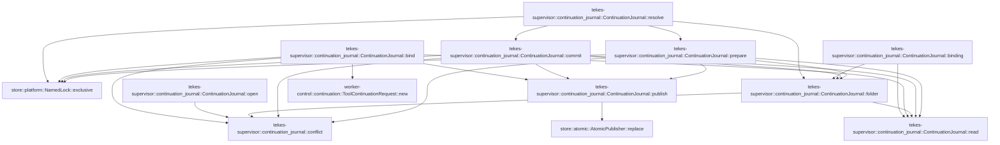

# tekes-supervisor::continuation_journal

[Package atlas](index.md) · [Source](../../src/continuation_journal.rs)

## Declarations

Visibility is the declaration spelling; trait members and reexports require their enclosing interface. `cfg` is not evaluated.

| Symbol | Kind | Visibility | Test / cfg |
|---|---|---|---|
| [tekes-supervisor::continuation_journal::ContinuationJournalError](../../src/continuation_journal.rs#L15) | enum_item | `pub` |  |
| [tekes-supervisor::continuation_journal::Result](../../src/continuation_journal.rs#L25) | type_item | `private` |  |
| [tekes-supervisor::continuation_journal::conflict](../../src/continuation_journal.rs#L26) | function_item | `private` |  |
| [tekes-supervisor::continuation_journal::ContinuationBinding](../../src/continuation_journal.rs#L32) | struct_item | `pub` |  |
| [tekes-supervisor::continuation_journal::ContinuationPreparation](../../src/continuation_journal.rs#L39) | enum_item | `pub` |  |
| [tekes-supervisor::continuation_journal::ContinuationJournal](../../src/continuation_journal.rs#L45) | struct_item | `pub` |  |
| [tekes-supervisor::continuation_journal::ContinuationJournal::open](../../src/continuation_journal.rs#L49) | function_item | `pub` |  |
| [tekes-supervisor::continuation_journal::ContinuationJournal::bind](../../src/continuation_journal.rs#L63) | function_item | `pub` |  |
| [tekes-supervisor::continuation_journal::ContinuationJournal::binding](../../src/continuation_journal.rs#L84) | function_item | `pub` |  |
| [tekes-supervisor::continuation_journal::ContinuationJournal::resolve](../../src/continuation_journal.rs#L92) | function_item | `pub` |  |
| [tekes-supervisor::continuation_journal::ContinuationJournal::prepare](../../src/continuation_journal.rs#L114) | function_item | `private` |  |
| [tekes-supervisor::continuation_journal::ContinuationJournal::commit](../../src/continuation_journal.rs#L159) | function_item | `private` |  |
| [tekes-supervisor::continuation_journal::ContinuationJournal::folder](../../src/continuation_journal.rs#L181) | function_item | `private` |  |
| [tekes-supervisor::continuation_journal::ContinuationJournal::read](../../src/continuation_journal.rs#L191) | function_item | `private` |  |
| [tekes-supervisor::continuation_journal::ContinuationJournal::publish](../../src/continuation_journal.rs#L194) | function_item | `private` |  |
| [tekes-supervisor::continuation_journal::tests::reopen_distinguishes_unresolved_intent_from_immutable_receipt](../../src/continuation_journal.rs#L205) | function_item | `private` | test; #[cfg(test)] |
| [tekes-supervisor::continuation_journal::execution_tests::concurrent_request](../../src/continuation_journal.rs#L315) | function_item | `private` | test; #[cfg(test)] |
| [tekes-supervisor::continuation_journal::execution_tests::continuation_process_participant](../../src/continuation_journal.rs#L330) | function_item | `private` | test; #[cfg(test)] |
| [tekes-supervisor::continuation_journal::execution_tests::concurrent_processes_execute_once_and_replay_identical_receipts](../../src/continuation_journal.rs#L369) | function_item | `private` | test; #[cfg(test)] |
| [tekes-supervisor::continuation_journal::execution_tests::lost_response_uses_reconciliation_and_receipt_replay_never_reexecutes](../../src/continuation_journal.rs#L446) | function_item | `private` | test; #[cfg(test)] |

## Imports / reexports

| Local name | Source path | Visibility |
|---|---|---|
| `IJsonValue` | `schema::IJsonValue` | `private` |
| `Deserialize` | `serde::Deserialize` | `private` |
| `Serialize` | `serde::Serialize` | `private` |
| `fs` | `std::fs` | `private` |
| `Path` | `std::path::Path` | `private` |
| `PathBuf` | `std::path::PathBuf` | `private` |
| `AtomicPublisher` | `store::AtomicPublisher` | `private` |
| `NamedLock` | `store::NamedLock` | `private` |
| `ToolControl` | `worker_control::ToolControl` | `private` |
| `ContinuationOperation` | `worker_control::continuation::ContinuationOperation` | `private` |
| `ToolContinuationOutcome` | `worker_control::continuation::ToolContinuationOutcome` | `private` |
| `ToolContinuationRequest` | `worker_control::continuation::ToolContinuationRequest` | `private` |
| `ToolContinuationResponse` | `worker_control::continuation::ToolContinuationResponse` | `private` |
| `*` | `super::*` | `private` |
| `*` | `super::*` | `private` |

## Module declarations

| Module | Visibility | Attributes |
|---|---|---|
| `tekes-supervisor::continuation_journal::tests` | `private` | #[cfg(test)] |
| `tekes-supervisor::continuation_journal::execution_tests` | `private` | #[cfg(test)] |

## Function call graphs

Edges below are syntactically resolved calls only, including private functions. Graphs partition callers into groups of 20; they are not execution order. All unresolved sites are listed below and in the JSON inventory.

Functions 1–10: 25 direct edges

## Call sites

Includes test functions (marked in declarations). Receiver-type-required sites need type analysis/manual tracing. Calls in closures are attributed to their enclosing function; their occurrence here does not mean the closure executes immediately.

| Caller | Callee expression | Source lines | Target / classification |
|---|---|---|---|
| `conflict` | `ContinuationJournalError::Conflict` | [27](../../src/continuation_journal.rs#L27) | external-constructor-callback-or-unresolved |
| `conflict` | `message.into` | [27](../../src/continuation_journal.rs#L27) | receiver-type-required |
| `open` | `root.as_ref().exists` | [50](../../src/continuation_journal.rs#L50) | receiver-type-required |
| `open` | `root.as_ref` | [50](../../src/continuation_journal.rs#L50), [51](../../src/continuation_journal.rs#L51), [53](../../src/continuation_journal.rs#L53), [60](../../src/continuation_journal.rs#L60) | receiver-type-required |
| `open` | `fs::create_dir` | [51](../../src/continuation_journal.rs#L51) | external-constructor-callback-or-unresolved |
| `open` | `fs::File::open(                 root.as_ref()                     .parent()                     .ok_or_else(&#124;&#124; conflict("journal root needs an existing parent"))?,             )?             .sync_all` | [52](../../src/continuation_journal.rs#L52) | receiver-type-required |
| `open` | `fs::File::open` | [52](../../src/continuation_journal.rs#L52) | external-constructor-callback-or-unresolved |
| `open` | `root.as_ref()                     .parent()                     .ok_or_else` | [53](../../src/continuation_journal.rs#L53) | receiver-type-required |
| `open` | `root.as_ref()                     .parent` | [53](../../src/continuation_journal.rs#L53) | receiver-type-required |
| `open` | `conflict` | [55](../../src/continuation_journal.rs#L55) | [tekes-supervisor::continuation_journal::conflict](../../src/continuation_journal.rs#L26) |
| `open` | `Ok` | [59](../../src/continuation_journal.rs#L59) | external-constructor-callback-or-unresolved |
| `open` | `root.as_ref().to_owned` | [60](../../src/continuation_journal.rs#L60) | receiver-type-required |
| `bind` | `ToolContinuationRequest::new(             binding.original.clone(),             binding.continuation_id.clone(),             1,             ContinuationOperation::Query,         )         .map_err` | [64](../../src/continuation_journal.rs#L64) | receiver-type-required |
| `bind` | `ToolContinuationRequest::new` | [64](../../src/continuation_journal.rs#L64) | [worker-control::continuation::ToolContinuationRequest::new](../../../worker-control/src/continuation.rs#L32) |
| `bind` | `binding.original.clone` | [65](../../src/continuation_journal.rs#L65) | receiver-type-required |
| `bind` | `binding.continuation_id.clone` | [66](../../src/continuation_journal.rs#L66) | receiver-type-required |
| `bind` | `NamedLock::exclusive` | [71](../../src/continuation_journal.rs#L71) | [store::platform::NamedLock::exclusive](../../../store/src/platform.rs#L103) |
| `bind` | `self.root.join` | [71](../../src/continuation_journal.rs#L71), [72](../../src/continuation_journal.rs#L72) | receiver-type-required |
| `bind` | `fs::create_dir_all` | [73](../../src/continuation_journal.rs#L73) | external-constructor-callback-or-unresolved |
| `bind` | `fs::File::open(&self.root)?.sync_all` | [74](../../src/continuation_journal.rs#L74) | receiver-type-required |
| `bind` | `fs::File::open` | [74](../../src/continuation_journal.rs#L74) | external-constructor-callback-or-unresolved |
| `bind` | `folder.join` | [75](../../src/continuation_journal.rs#L75) | receiver-type-required |
| `bind` | `path.exists` | [76](../../src/continuation_journal.rs#L76) | receiver-type-required |
| `bind` | `self.read::<ContinuationBinding>` | [77](../../src/continuation_journal.rs#L77) | [tekes-supervisor::continuation_journal::ContinuationJournal::read](../../src/continuation_journal.rs#L191) |
| `bind` | `Err` | [78](../../src/continuation_journal.rs#L78) | external-constructor-callback-or-unresolved |
| `bind` | `conflict` | [78](../../src/continuation_journal.rs#L78) | [tekes-supervisor::continuation_journal::conflict](../../src/continuation_journal.rs#L26) |
| `bind` | `Ok` | [80](../../src/continuation_journal.rs#L80) | external-constructor-callback-or-unresolved |
| `bind` | `self.publish` | [82](../../src/continuation_journal.rs#L82) | [tekes-supervisor::continuation_journal::ContinuationJournal::publish](../../src/continuation_journal.rs#L194) |
| `binding` | `request.validate().map_err` | [85](../../src/continuation_journal.rs#L85) | receiver-type-required |
| `binding` | `request.validate` | [85](../../src/continuation_journal.rs#L85) | receiver-type-required |
| `binding` | `self.folder` | [86](../../src/continuation_journal.rs#L86) | [tekes-supervisor::continuation_journal::ContinuationJournal::folder](../../src/continuation_journal.rs#L181) |
| `binding` | `self.read` | [87](../../src/continuation_journal.rs#L87) | [tekes-supervisor::continuation_journal::ContinuationJournal::read](../../src/continuation_journal.rs#L191) |
| `binding` | `folder.join` | [87](../../src/continuation_journal.rs#L87) | receiver-type-required |
| `resolve` | `request.validate().map_err` | [102](../../src/continuation_journal.rs#L102) | receiver-type-required |
| `resolve` | `request.validate` | [102](../../src/continuation_journal.rs#L102) | receiver-type-required |
| `resolve` | `self.folder` | [103](../../src/continuation_journal.rs#L103) | [tekes-supervisor::continuation_journal::ContinuationJournal::folder](../../src/continuation_journal.rs#L181) |
| `resolve` | `NamedLock::exclusive` | [104](../../src/continuation_journal.rs#L104) | [store::platform::NamedLock::exclusive](../../../store/src/platform.rs#L103) |
| `resolve` | `folder.join` | [104](../../src/continuation_journal.rs#L104) | receiver-type-required |
| `resolve` | `self.prepare` | [105](../../src/continuation_journal.rs#L105) | [tekes-supervisor::continuation_journal::ContinuationJournal::prepare](../../src/continuation_journal.rs#L114) |
| `resolve` | `Ok` | [106](../../src/continuation_journal.rs#L106), [111](../../src/continuation_journal.rs#L111) | external-constructor-callback-or-unresolved |
| `resolve` | `execute` | [107](../../src/continuation_journal.rs#L107) | external-constructor-callback-or-unresolved |
| `resolve` | `reconcile` | [108](../../src/continuation_journal.rs#L108) | external-constructor-callback-or-unresolved |
| `resolve` | `self.commit` | [110](../../src/continuation_journal.rs#L110) | [tekes-supervisor::continuation_journal::ContinuationJournal::commit](../../src/continuation_journal.rs#L159) |
| `prepare` | `request.validate().map_err` | [115](../../src/continuation_journal.rs#L115) | receiver-type-required |
| `prepare` | `request.validate` | [115](../../src/continuation_journal.rs#L115) | receiver-type-required |
| `prepare` | `NamedLock::exclusive` | [116](../../src/continuation_journal.rs#L116) | [store::platform::NamedLock::exclusive](../../../store/src/platform.rs#L103) |
| `prepare` | `self.root.join` | [116](../../src/continuation_journal.rs#L116) | receiver-type-required |
| `prepare` | `self.folder` | [117](../../src/continuation_journal.rs#L117) | [tekes-supervisor::continuation_journal::ContinuationJournal::folder](../../src/continuation_journal.rs#L181) |
| `prepare` | `folder.join` | [118](../../src/continuation_journal.rs#L118), [119](../../src/continuation_journal.rs#L119), [134](../../src/continuation_journal.rs#L134), [136](../../src/continuation_journal.rs#L136) | receiver-type-required |
| `prepare` | `intent.exists` | [120](../../src/continuation_journal.rs#L120) | receiver-type-required |
| `prepare` | `self.read` | [121](../../src/continuation_journal.rs#L121), [126](../../src/continuation_journal.rs#L126), [134](../../src/continuation_journal.rs#L134), [136](../../src/continuation_journal.rs#L136) | [tekes-supervisor::continuation_journal::ContinuationJournal::read](../../src/continuation_journal.rs#L191) |
| `prepare` | `request.matches_receipt(&stored).map_err` | [122](../../src/continuation_journal.rs#L122) | receiver-type-required |
| `prepare` | `request.matches_receipt` | [122](../../src/continuation_journal.rs#L122) | receiver-type-required |
| `prepare` | `Err` | [123](../../src/continuation_journal.rs#L123), [141](../../src/continuation_journal.rs#L141), [150](../../src/continuation_journal.rs#L150) | external-constructor-callback-or-unresolved |
| `prepare` | `conflict` | [123](../../src/continuation_journal.rs#L123), [141](../../src/continuation_journal.rs#L141), [150](../../src/continuation_journal.rs#L150) | [tekes-supervisor::continuation_journal::conflict](../../src/continuation_journal.rs#L26) |
| `prepare` | `receipt.exists` | [125](../../src/continuation_journal.rs#L125) | receiver-type-required |
| `prepare` | `response.validate_for(request).map_err` | [127](../../src/continuation_journal.rs#L127) | receiver-type-required |
| `prepare` | `response.validate_for` | [127](../../src/continuation_journal.rs#L127) | receiver-type-required |
| `prepare` | `Ok` | [128](../../src/continuation_journal.rs#L128), [130](../../src/continuation_journal.rs#L130), [157](../../src/continuation_journal.rs#L157) | external-constructor-callback-or-unresolved |
| `prepare` | `ContinuationPreparation::Completed` | [128](../../src/continuation_journal.rs#L128) | external-constructor-callback-or-unresolved |
| `prepare` | `previous.validate_for(&prior_request).map_err` | [137](../../src/continuation_journal.rs#L137) | receiver-type-required |
| `prepare` | `previous.validate_for` | [137](../../src/continuation_journal.rs#L137) | receiver-type-required |
| `prepare` | `self.publish` | [156](../../src/continuation_journal.rs#L156) | [tekes-supervisor::continuation_journal::ContinuationJournal::publish](../../src/continuation_journal.rs#L194) |
| `commit` | `response.validate_for(request).map_err` | [164](../../src/continuation_journal.rs#L164) | receiver-type-required |
| `commit` | `response.validate_for` | [164](../../src/continuation_journal.rs#L164) | receiver-type-required |
| `commit` | `NamedLock::exclusive` | [165](../../src/continuation_journal.rs#L165) | [store::platform::NamedLock::exclusive](../../../store/src/platform.rs#L103) |
| `commit` | `self.root.join` | [165](../../src/continuation_journal.rs#L165) | receiver-type-required |
| `commit` | `self.folder` | [166](../../src/continuation_journal.rs#L166) | [tekes-supervisor::continuation_journal::ContinuationJournal::folder](../../src/continuation_journal.rs#L181) |
| `commit` | `self.read` | [168](../../src/continuation_journal.rs#L168) | [tekes-supervisor::continuation_journal::ContinuationJournal::read](../../src/continuation_journal.rs#L191) |
| `commit` | `folder.join` | [168](../../src/continuation_journal.rs#L168), [172](../../src/continuation_journal.rs#L172) | receiver-type-required |
| `commit` | `request.matches_receipt(&stored).map_err` | [169](../../src/continuation_journal.rs#L169) | receiver-type-required |
| `commit` | `request.matches_receipt` | [169](../../src/continuation_journal.rs#L169) | receiver-type-required |
| `commit` | `Err` | [170](../../src/continuation_journal.rs#L170), [175](../../src/continuation_journal.rs#L175) | external-constructor-callback-or-unresolved |
| `commit` | `conflict` | [170](../../src/continuation_journal.rs#L170), [175](../../src/continuation_journal.rs#L175) | [tekes-supervisor::continuation_journal::conflict](../../src/continuation_journal.rs#L26) |
| `commit` | `path.exists` | [173](../../src/continuation_journal.rs#L173) | receiver-type-required |
| `commit` | `self.read::<ToolContinuationResponse>` | [174](../../src/continuation_journal.rs#L174) | [tekes-supervisor::continuation_journal::ContinuationJournal::read](../../src/continuation_journal.rs#L191) |
| `commit` | `Ok` | [177](../../src/continuation_journal.rs#L177) | external-constructor-callback-or-unresolved |
| `commit` | `self.publish` | [179](../../src/continuation_journal.rs#L179) | [tekes-supervisor::continuation_journal::ContinuationJournal::publish](../../src/continuation_journal.rs#L194) |
| `folder` | `self.root.join` | [182](../../src/continuation_journal.rs#L182) | receiver-type-required |
| `folder` | `self.read` | [183](../../src/continuation_journal.rs#L183) | [tekes-supervisor::continuation_journal::ContinuationJournal::read](../../src/continuation_journal.rs#L191) |
| `folder` | `folder.join` | [183](../../src/continuation_journal.rs#L183) | receiver-type-required |
| `folder` | `Err` | [187](../../src/continuation_journal.rs#L187) | external-constructor-callback-or-unresolved |
| `folder` | `conflict` | [187](../../src/continuation_journal.rs#L187) | [tekes-supervisor::continuation_journal::conflict](../../src/continuation_journal.rs#L26) |
| `folder` | `Ok` | [189](../../src/continuation_journal.rs#L189) | external-constructor-callback-or-unresolved |
| `read` | `Ok` | [192](../../src/continuation_journal.rs#L192) | external-constructor-callback-or-unresolved |
| `read` | `serde_json::from_slice` | [192](../../src/continuation_journal.rs#L192) | external-constructor-callback-or-unresolved |
| `read` | `fs::read` | [192](../../src/continuation_journal.rs#L192) | external-constructor-callback-or-unresolved |
| `publish` | `serde_json_canonicalizer::to_vec` | [195](../../src/continuation_journal.rs#L195) | external-constructor-callback-or-unresolved |
| `publish` | `AtomicPublisher::replace` | [196](../../src/continuation_journal.rs#L196) | [store::atomic::AtomicPublisher::replace](../../../store/src/atomic.rs#L16) |
| `publish` | `Ok` | [197](../../src/continuation_journal.rs#L197) | external-constructor-callback-or-unresolved |
| `reopen_distinguishes_unresolved_intent_from_immutable_receipt` | `tempfile::tempdir().unwrap` | [206](../../src/continuation_journal.rs#L206) | receiver-type-required |
| `reopen_distinguishes_unresolved_intent_from_immutable_receipt` | `tempfile::tempdir` | [206](../../src/continuation_journal.rs#L206) | external-constructor-callback-or-unresolved |
| `reopen_distinguishes_unresolved_intent_from_immutable_receipt` | `ToolControl::new(             "018f0000-0000-7000-8000-000000000003",             "018f0000-0000-7000-8000-000000000003",             1,             "call-1",             "mcp__test__task",             IJsonValue::parse_str("{}").unwrap(),         )         .unwrap` | [207](../../src/continuation_journal.rs#L207) | receiver-type-required |
| `reopen_distinguishes_unresolved_intent_from_immutable_receipt` | `ToolControl::new` | [207](../../src/continuation_journal.rs#L207) | external-constructor-callback-or-unresolved |
| `reopen_distinguishes_unresolved_intent_from_immutable_receipt` | `IJsonValue::parse_str("{}").unwrap` | [213](../../src/continuation_journal.rs#L213) | receiver-type-required |
| `reopen_distinguishes_unresolved_intent_from_immutable_receipt` | `IJsonValue::parse_str` | [213](../../src/continuation_journal.rs#L213), [219](../../src/continuation_journal.rs#L219), [220](../../src/continuation_journal.rs#L220), [285](../../src/continuation_journal.rs#L285), [307](../../src/continuation_journal.rs#L307) | external-constructor-callback-or-unresolved |
| `reopen_distinguishes_unresolved_intent_from_immutable_receipt` | `original.clone` | [217](../../src/continuation_journal.rs#L217), [224](../../src/continuation_journal.rs#L224), [263](../../src/continuation_journal.rs#L263), [271](../../src/continuation_journal.rs#L271) | receiver-type-required |
| `reopen_distinguishes_unresolved_intent_from_immutable_receipt` | `"a".repeat` | [218](../../src/continuation_journal.rs#L218) | receiver-type-required |
| `reopen_distinguishes_unresolved_intent_from_immutable_receipt` | `IJsonValue::parse_str(r#"{"server":"test","generation":1}"#).unwrap` | [219](../../src/continuation_journal.rs#L219) | receiver-type-required |
| `reopen_distinguishes_unresolved_intent_from_immutable_receipt` | `IJsonValue::parse_str(r#"{"taskId":"remote-1","status":"working"}"#)                 .unwrap` | [220](../../src/continuation_journal.rs#L220) | receiver-type-required |
| `reopen_distinguishes_unresolved_intent_from_immutable_receipt` | `ToolContinuationRequest::new(             original.clone(),             binding.continuation_id.clone(),             1,             ContinuationOperation::Query,         )         .unwrap` | [223](../../src/continuation_journal.rs#L223) | receiver-type-required |
| `reopen_distinguishes_unresolved_intent_from_immutable_receipt` | `ToolContinuationRequest::new` | [223](../../src/continuation_journal.rs#L223), [262](../../src/continuation_journal.rs#L262), [270](../../src/continuation_journal.rs#L270), [289](../../src/continuation_journal.rs#L289) | external-constructor-callback-or-unresolved |
| `reopen_distinguishes_unresolved_intent_from_immutable_receipt` | `binding.continuation_id.clone` | [225](../../src/continuation_journal.rs#L225), [252](../../src/continuation_journal.rs#L252), [264](../../src/continuation_journal.rs#L264), [272](../../src/continuation_journal.rs#L272), [291](../../src/continuation_journal.rs#L291) | receiver-type-required |
| `reopen_distinguishes_unresolved_intent_from_immutable_receipt` | `ContinuationJournal::open(dir.path()).unwrap` | [230](../../src/continuation_journal.rs#L230), [243](../../src/continuation_journal.rs#L243) | receiver-type-required |
| `reopen_distinguishes_unresolved_intent_from_immutable_receipt` | `ContinuationJournal::open` | [230](../../src/continuation_journal.rs#L230), [243](../../src/continuation_journal.rs#L243) | external-constructor-callback-or-unresolved |
| `reopen_distinguishes_unresolved_intent_from_immutable_receipt` | `dir.path` | [230](../../src/continuation_journal.rs#L230), [233](../../src/continuation_journal.rs#L233), [243](../../src/continuation_journal.rs#L243) | receiver-type-required |
| `reopen_distinguishes_unresolved_intent_from_immutable_receipt` | `journal.bind(&binding).unwrap` | [231](../../src/continuation_journal.rs#L231) | receiver-type-required |
| `reopen_distinguishes_unresolved_intent_from_immutable_receipt` | `journal.bind` | [231](../../src/continuation_journal.rs#L231) | receiver-type-required |
| `reopen_distinguishes_unresolved_intent_from_immutable_receipt` | `fs::read(             dir.path()                 .join(&binding.continuation_id)                 .join("binding.json"),         )         .unwrap` | [232](../../src/continuation_journal.rs#L232) | receiver-type-required |
| `reopen_distinguishes_unresolved_intent_from_immutable_receipt` | `fs::read` | [232](../../src/continuation_journal.rs#L232) | external-constructor-callback-or-unresolved |
| `reopen_distinguishes_unresolved_intent_from_immutable_receipt` | `dir.path()                 .join(&binding.continuation_id)                 .join` | [233](../../src/continuation_journal.rs#L233) | receiver-type-required |
| `reopen_distinguishes_unresolved_intent_from_immutable_receipt` | `dir.path()                 .join` | [233](../../src/continuation_journal.rs#L233) | receiver-type-required |
| `reopen_distinguishes_unresolved_intent_from_immutable_receipt` | `drop` | [242](../../src/continuation_journal.rs#L242) | external-constructor-callback-or-unresolved |
| `reopen_distinguishes_unresolved_intent_from_immutable_receipt` | `request.request_id.clone` | [249](../../src/continuation_journal.rs#L249) | receiver-type-required |
| `reopen_distinguishes_unresolved_intent_from_immutable_receipt` | `original.call_id.clone` | [250](../../src/continuation_journal.rs#L250), [283](../../src/continuation_journal.rs#L283) | receiver-type-required |
| `reopen_distinguishes_unresolved_intent_from_immutable_receipt` | `binding.initial_state.clone` | [254](../../src/continuation_journal.rs#L254) | receiver-type-required |
| `reopen_distinguishes_unresolved_intent_from_immutable_receipt` | `journal.commit(&request, &response).unwrap` | [257](../../src/continuation_journal.rs#L257), [258](../../src/continuation_journal.rs#L258) | receiver-type-required |
| `reopen_distinguishes_unresolved_intent_from_immutable_receipt` | `journal.commit` | [257](../../src/continuation_journal.rs#L257), [258](../../src/continuation_journal.rs#L258), [288](../../src/continuation_journal.rs#L288) | receiver-type-required |
| `reopen_distinguishes_unresolved_intent_from_immutable_receipt` | `ToolContinuationRequest::new(             original.clone(),             binding.continuation_id.clone(),             1,             ContinuationOperation::Cancel,         )         .unwrap` | [262](../../src/continuation_journal.rs#L262) | receiver-type-required |
| `reopen_distinguishes_unresolved_intent_from_immutable_receipt` | `ToolContinuationRequest::new(             original.clone(),             binding.continuation_id.clone(),             2,             ContinuationOperation::Query,         )         .unwrap` | [270](../../src/continuation_journal.rs#L270) | receiver-type-required |
| `reopen_distinguishes_unresolved_intent_from_immutable_receipt` | `second.request_id.clone` | [282](../../src/continuation_journal.rs#L282) | receiver-type-required |
| `reopen_distinguishes_unresolved_intent_from_immutable_receipt` | `IJsonValue::parse_str(r#"{"content":[]}"#).unwrap` | [285](../../src/continuation_journal.rs#L285) | receiver-type-required |
| `reopen_distinguishes_unresolved_intent_from_immutable_receipt` | `journal.commit(&second, &terminal).unwrap` | [288](../../src/continuation_journal.rs#L288) | receiver-type-required |
| `reopen_distinguishes_unresolved_intent_from_immutable_receipt` | `ToolContinuationRequest::new(             original,             binding.continuation_id.clone(),             3,             ContinuationOperation::Query,         )         .unwrap` | [289](../../src/continuation_journal.rs#L289) | receiver-type-required |
| `reopen_distinguishes_unresolved_intent_from_immutable_receipt` | `binding.clone` | [306](../../src/continuation_journal.rs#L306) | receiver-type-required |
| `reopen_distinguishes_unresolved_intent_from_immutable_receipt` | `IJsonValue::parse_str(r#"{"generation":2}"#).unwrap` | [307](../../src/continuation_journal.rs#L307) | receiver-type-required |
| `concurrent_request` | `ToolControl::new(             "018f0000-0000-7000-8000-000000000003",             "018f0000-0000-7000-8000-000000000003",             1,             "call-concurrent",             "mcp__test__task",             IJsonValue::parse_str("{}").unwrap(),         )         .unwrap` | [316](../../src/continuation_journal.rs#L316) | receiver-type-required |
| `concurrent_request` | `ToolControl::new` | [316](../../src/continuation_journal.rs#L316) | external-constructor-callback-or-unresolved |
| `concurrent_request` | `IJsonValue::parse_str("{}").unwrap` | [322](../../src/continuation_journal.rs#L322) | receiver-type-required |
| `concurrent_request` | `IJsonValue::parse_str` | [322](../../src/continuation_journal.rs#L322) | external-constructor-callback-or-unresolved |
| `concurrent_request` | `ToolContinuationRequest::new(original, "c".repeat(64), 1, ContinuationOperation::Cancel)             .unwrap` | [325](../../src/continuation_journal.rs#L325) | receiver-type-required |
| `concurrent_request` | `ToolContinuationRequest::new` | [325](../../src/continuation_journal.rs#L325) | external-constructor-callback-or-unresolved |
| `concurrent_request` | `"c".repeat` | [325](../../src/continuation_journal.rs#L325) | receiver-type-required |
| `continuation_process_participant` | `std::env::var_os` | [332](../../src/continuation_journal.rs#L332) | external-constructor-callback-or-unresolved |
| `continuation_process_participant` | `PathBuf::from` | [335](../../src/continuation_journal.rs#L335) | external-constructor-callback-or-unresolved |
| `continuation_process_participant` | `std::env::var("TEKES_CONTINUATION_TEST_PARTICIPANT").unwrap` | [336](../../src/continuation_journal.rs#L336) | receiver-type-required |
| `continuation_process_participant` | `std::env::var` | [336](../../src/continuation_journal.rs#L336) | external-constructor-callback-or-unresolved |
| `continuation_process_participant` | `concurrent_request` | [337](../../src/continuation_journal.rs#L337) | [tekes-supervisor::continuation_journal::execution_tests::concurrent_request](../../src/continuation_journal.rs#L315) |
| `continuation_process_participant` | `ContinuationJournal::open(&root).unwrap` | [338](../../src/continuation_journal.rs#L338) | receiver-type-required |
| `continuation_process_participant` | `ContinuationJournal::open` | [338](../../src/continuation_journal.rs#L338) | external-constructor-callback-or-unresolved |
| `continuation_process_participant` | `fs::write(root.join(format!("ready-{participant}")), b"ready").unwrap` | [339](../../src/continuation_journal.rs#L339) | receiver-type-required |
| `continuation_process_participant` | `fs::write` | [339](../../src/continuation_journal.rs#L339), [361](../../src/continuation_journal.rs#L361) | external-constructor-callback-or-unresolved |
| `continuation_process_participant` | `root.join` | [339](../../src/continuation_journal.rs#L339), [347](../../src/continuation_journal.rs#L347), [362](../../src/continuation_journal.rs#L362) | receiver-type-required |
| `continuation_process_participant` | `journal             .resolve(                 &request,                 &#124;&#124; {                     let mut calls = fs::OpenOptions::new()                         .create(true)                         .append(true)                         .open(root.join("remote-calls"))?;                     writeln!(calls, "cancel")?;                     calls.sync_all()?;                     Ok(ToolContinuationResponse {                         request_id: request.request_id.clone(),                         call_id: request.original.call_id.clone(),                         result: ToolContinuationOutcome::Completed {                             value: IJsonValue::parse_str(r#"{"cancelled":true}"#).unwrap(),                         },                     })                 },                 &#124;&#124; panic!("concurrent request must wait for the receipt, not reconcile in flight"),             )             .unwrap` | [340](../../src/continuation_journal.rs#L340) | receiver-type-required |
| `continuation_process_participant` | `journal             .resolve` | [340](../../src/continuation_journal.rs#L340) | receiver-type-required |
| `continuation_process_participant` | `fs::OpenOptions::new()                         .create(true)                         .append(true)                         .open` | [344](../../src/continuation_journal.rs#L344) | receiver-type-required |
| `continuation_process_participant` | `fs::OpenOptions::new()                         .create(true)                         .append` | [344](../../src/continuation_journal.rs#L344) | receiver-type-required |
| `continuation_process_participant` | `fs::OpenOptions::new()                         .create` | [344](../../src/continuation_journal.rs#L344) | receiver-type-required |
| `continuation_process_participant` | `fs::OpenOptions::new` | [344](../../src/continuation_journal.rs#L344) | external-constructor-callback-or-unresolved |
| `continuation_process_participant` | `calls.sync_all` | [349](../../src/continuation_journal.rs#L349) | receiver-type-required |
| `continuation_process_participant` | `Ok` | [350](../../src/continuation_journal.rs#L350) | external-constructor-callback-or-unresolved |
| `continuation_process_participant` | `request.request_id.clone` | [351](../../src/continuation_journal.rs#L351) | receiver-type-required |
| `continuation_process_participant` | `request.original.call_id.clone` | [352](../../src/continuation_journal.rs#L352) | receiver-type-required |
| `continuation_process_participant` | `IJsonValue::parse_str(r#"{"cancelled":true}"#).unwrap` | [354](../../src/continuation_journal.rs#L354) | receiver-type-required |
| `continuation_process_participant` | `IJsonValue::parse_str` | [354](../../src/continuation_journal.rs#L354) | external-constructor-callback-or-unresolved |
| `continuation_process_participant` | `fs::write(             root.join(format!("result-{participant}")),             serde_json_canonicalizer::to_vec(&result).unwrap(),         )         .unwrap` | [361](../../src/continuation_journal.rs#L361) | receiver-type-required |
| `continuation_process_participant` | `serde_json_canonicalizer::to_vec(&result).unwrap` | [363](../../src/continuation_journal.rs#L363) | receiver-type-required |
| `continuation_process_participant` | `serde_json_canonicalizer::to_vec` | [363](../../src/continuation_journal.rs#L363) | external-constructor-callback-or-unresolved |
| `concurrent_processes_execute_once_and_replay_identical_receipts` | `tempfile::tempdir().unwrap` | [370](../../src/continuation_journal.rs#L370) | receiver-type-required |
| `concurrent_processes_execute_once_and_replay_identical_receipts` | `tempfile::tempdir` | [370](../../src/continuation_journal.rs#L370) | external-constructor-callback-or-unresolved |
| `concurrent_processes_execute_once_and_replay_identical_receipts` | `concurrent_request` | [371](../../src/continuation_journal.rs#L371) | [tekes-supervisor::continuation_journal::execution_tests::concurrent_request](../../src/continuation_journal.rs#L315) |
| `concurrent_processes_execute_once_and_replay_identical_receipts` | `ContinuationJournal::open(dir.path()).unwrap` | [372](../../src/continuation_journal.rs#L372) | receiver-type-required |
| `concurrent_processes_execute_once_and_replay_identical_receipts` | `ContinuationJournal::open` | [372](../../src/continuation_journal.rs#L372) | external-constructor-callback-or-unresolved |
| `concurrent_processes_execute_once_and_replay_identical_receipts` | `dir.path` | [372](../../src/continuation_journal.rs#L372), [382](../../src/continuation_journal.rs#L382), [394](../../src/continuation_journal.rs#L394), [401](../../src/continuation_journal.rs#L401), [432](../../src/continuation_journal.rs#L432) | receiver-type-required |
| `concurrent_processes_execute_once_and_replay_identical_receipts` | `journal             .bind(&ContinuationBinding {                 original: request.original.clone(),                 continuation_id: request.continuation_id.clone(),                 authority: IJsonValue::parse_str("{}").unwrap(),                 initial_state: IJsonValue::parse_str("{}").unwrap(),             })             .unwrap` | [373](../../src/continuation_journal.rs#L373) | receiver-type-required |
| `concurrent_processes_execute_once_and_replay_identical_receipts` | `journal             .bind` | [373](../../src/continuation_journal.rs#L373) | receiver-type-required |
| `concurrent_processes_execute_once_and_replay_identical_receipts` | `request.original.clone` | [375](../../src/continuation_journal.rs#L375) | receiver-type-required |
| `concurrent_processes_execute_once_and_replay_identical_receipts` | `request.continuation_id.clone` | [376](../../src/continuation_journal.rs#L376) | receiver-type-required |
| `concurrent_processes_execute_once_and_replay_identical_receipts` | `IJsonValue::parse_str("{}").unwrap` | [377](../../src/continuation_journal.rs#L377), [378](../../src/continuation_journal.rs#L378) | receiver-type-required |
| `concurrent_processes_execute_once_and_replay_identical_receipts` | `IJsonValue::parse_str` | [377](../../src/continuation_journal.rs#L377), [378](../../src/continuation_journal.rs#L378) | external-constructor-callback-or-unresolved |
| `concurrent_processes_execute_once_and_replay_identical_receipts` | `NamedLock::exclusive(             dir.path()                 .join(&request.continuation_id)                 .join(".execution.lock"),         )         .unwrap` | [381](../../src/continuation_journal.rs#L381) | receiver-type-required |
| `concurrent_processes_execute_once_and_replay_identical_receipts` | `NamedLock::exclusive` | [381](../../src/continuation_journal.rs#L381) | external-constructor-callback-or-unresolved |
| `concurrent_processes_execute_once_and_replay_identical_receipts` | `dir.path()                 .join(&request.continuation_id)                 .join` | [382](../../src/continuation_journal.rs#L382), [432](../../src/continuation_journal.rs#L432) | receiver-type-required |
| `concurrent_processes_execute_once_and_replay_identical_receipts` | `dir.path()                 .join` | [382](../../src/continuation_journal.rs#L382), [432](../../src/continuation_journal.rs#L432) | receiver-type-required |
| `concurrent_processes_execute_once_and_replay_identical_receipts` | `(0..4)             .map(&#124;index&#124; {                 std::process::Command::new(std::env::current_exe().unwrap())                     .args([                         "--exact",                         "continuation_journal::execution_tests::continuation_process_participant",                     ])                     .env("TEKES_CONTINUATION_TEST_ROOT", dir.path())                     .env("TEKES_CONTINUATION_TEST_PARTICIPANT", index.to_string())                     .spawn()                     .unwrap()             })             .collect` | [387](../../src/continuation_journal.rs#L387) | receiver-type-required |
| `concurrent_processes_execute_once_and_replay_identical_receipts` | `(0..4)             .map` | [387](../../src/continuation_journal.rs#L387) | receiver-type-required |
| `concurrent_processes_execute_once_and_replay_identical_receipts` | `std::process::Command::new(std::env::current_exe().unwrap())                     .args([                         "--exact",                         "continuation_journal::execution_tests::continuation_process_participant",                     ])                     .env("TEKES_CONTINUATION_TEST_ROOT", dir.path())                     .env("TEKES_CONTINUATION_TEST_PARTICIPANT", index.to_string())                     .spawn()                     .unwrap` | [389](../../src/continuation_journal.rs#L389) | receiver-type-required |
| `concurrent_processes_execute_once_and_replay_identical_receipts` | `std::process::Command::new(std::env::current_exe().unwrap())                     .args([                         "--exact",                         "continuation_journal::execution_tests::continuation_process_participant",                     ])                     .env("TEKES_CONTINUATION_TEST_ROOT", dir.path())                     .env("TEKES_CONTINUATION_TEST_PARTICIPANT", index.to_string())                     .spawn` | [389](../../src/continuation_journal.rs#L389) | receiver-type-required |
| `concurrent_processes_execute_once_and_replay_identical_receipts` | `std::process::Command::new(std::env::current_exe().unwrap())                     .args([                         "--exact",                         "continuation_journal::execution_tests::continuation_process_participant",                     ])                     .env("TEKES_CONTINUATION_TEST_ROOT", dir.path())                     .env` | [389](../../src/continuation_journal.rs#L389) | receiver-type-required |
| `concurrent_processes_execute_once_and_replay_identical_receipts` | `std::process::Command::new(std::env::current_exe().unwrap())                     .args([                         "--exact",                         "continuation_journal::execution_tests::continuation_process_participant",                     ])                     .env` | [389](../../src/continuation_journal.rs#L389) | receiver-type-required |
| `concurrent_processes_execute_once_and_replay_identical_receipts` | `std::process::Command::new(std::env::current_exe().unwrap())                     .args` | [389](../../src/continuation_journal.rs#L389) | receiver-type-required |
| `concurrent_processes_execute_once_and_replay_identical_receipts` | `std::process::Command::new` | [389](../../src/continuation_journal.rs#L389) | external-constructor-callback-or-unresolved |
| `concurrent_processes_execute_once_and_replay_identical_receipts` | `std::env::current_exe().unwrap` | [389](../../src/continuation_journal.rs#L389) | receiver-type-required |
| `concurrent_processes_execute_once_and_replay_identical_receipts` | `std::env::current_exe` | [389](../../src/continuation_journal.rs#L389) | external-constructor-callback-or-unresolved |
| `concurrent_processes_execute_once_and_replay_identical_receipts` | `index.to_string` | [395](../../src/continuation_journal.rs#L395) | receiver-type-required |
| `concurrent_processes_execute_once_and_replay_identical_receipts` | `std::time::Instant::now` | [400](../../src/continuation_journal.rs#L400), [402](../../src/continuation_journal.rs#L402), [419](../../src/continuation_journal.rs#L419) | external-constructor-callback-or-unresolved |
| `concurrent_processes_execute_once_and_replay_identical_receipts` | `std::time::Duration::from_secs` | [400](../../src/continuation_journal.rs#L400) | external-constructor-callback-or-unresolved |
| `concurrent_processes_execute_once_and_replay_identical_receipts` | `(0..4).all` | [401](../../src/continuation_journal.rs#L401) | receiver-type-required |
| `concurrent_processes_execute_once_and_replay_identical_receipts` | `dir.path().join(format!("ready-{index}")).exists` | [401](../../src/continuation_journal.rs#L401) | receiver-type-required |
| `concurrent_processes_execute_once_and_replay_identical_receipts` | `dir.path().join` | [401](../../src/continuation_journal.rs#L401) | receiver-type-required |
| `concurrent_processes_execute_once_and_replay_identical_receipts` | `child.kill` | [404](../../src/continuation_journal.rs#L404), [420](../../src/continuation_journal.rs#L420) | receiver-type-required |
| `concurrent_processes_execute_once_and_replay_identical_receipts` | `child.wait` | [405](../../src/continuation_journal.rs#L405), [421](../../src/continuation_journal.rs#L421) | receiver-type-required |
| `concurrent_processes_execute_once_and_replay_identical_receipts` | `std::thread::sleep` | [409](../../src/continuation_journal.rs#L409), [424](../../src/continuation_journal.rs#L424) | external-constructor-callback-or-unresolved |
| `concurrent_processes_execute_once_and_replay_identical_receipts` | `std::time::Duration::from_millis` | [409](../../src/continuation_journal.rs#L409), [424](../../src/continuation_journal.rs#L424) | external-constructor-callback-or-unresolved |
| `concurrent_processes_execute_once_and_replay_identical_receipts` | `drop` | [412](../../src/continuation_journal.rs#L412) | external-constructor-callback-or-unresolved |
| `concurrent_processes_execute_once_and_replay_identical_receipts` | `child.try_wait().unwrap` | [415](../../src/continuation_journal.rs#L415) | receiver-type-required |
| `concurrent_processes_execute_once_and_replay_identical_receipts` | `child.try_wait` | [415](../../src/continuation_journal.rs#L415) | receiver-type-required |
| `concurrent_processes_execute_once_and_replay_identical_receipts` | `fs::read(             dir.path()                 .join(&request.continuation_id)                 .join("1.receipt.json"),         )         .unwrap` | [431](../../src/continuation_journal.rs#L431) | receiver-type-required |
| `concurrent_processes_execute_once_and_replay_identical_receipts` | `fs::read` | [431](../../src/continuation_journal.rs#L431) | external-constructor-callback-or-unresolved |
| `lost_response_uses_reconciliation_and_receipt_replay_never_reexecutes` | `tempfile::tempdir().unwrap` | [447](../../src/continuation_journal.rs#L447) | receiver-type-required |
| `lost_response_uses_reconciliation_and_receipt_replay_never_reexecutes` | `tempfile::tempdir` | [447](../../src/continuation_journal.rs#L447) | external-constructor-callback-or-unresolved |
| `lost_response_uses_reconciliation_and_receipt_replay_never_reexecutes` | `ToolControl::new(             "018f0000-0000-7000-8000-000000000003",             "018f0000-0000-7000-8000-000000000003",             1,             "call-1",             "mcp__test__task",             IJsonValue::parse_str("{}").unwrap(),         )         .unwrap` | [448](../../src/continuation_journal.rs#L448) | receiver-type-required |
| `lost_response_uses_reconciliation_and_receipt_replay_never_reexecutes` | `ToolControl::new` | [448](../../src/continuation_journal.rs#L448) | external-constructor-callback-or-unresolved |
| `lost_response_uses_reconciliation_and_receipt_replay_never_reexecutes` | `IJsonValue::parse_str("{}").unwrap` | [454](../../src/continuation_journal.rs#L454), [460](../../src/continuation_journal.rs#L460), [461](../../src/continuation_journal.rs#L461) | receiver-type-required |
| `lost_response_uses_reconciliation_and_receipt_replay_never_reexecutes` | `IJsonValue::parse_str` | [454](../../src/continuation_journal.rs#L454), [460](../../src/continuation_journal.rs#L460), [461](../../src/continuation_journal.rs#L461), [491](../../src/continuation_journal.rs#L491) | external-constructor-callback-or-unresolved |
| `lost_response_uses_reconciliation_and_receipt_replay_never_reexecutes` | `original.clone` | [458](../../src/continuation_journal.rs#L458), [464](../../src/continuation_journal.rs#L464) | receiver-type-required |
| `lost_response_uses_reconciliation_and_receipt_replay_never_reexecutes` | `"b".repeat` | [459](../../src/continuation_journal.rs#L459) | receiver-type-required |
| `lost_response_uses_reconciliation_and_receipt_replay_never_reexecutes` | `ToolContinuationRequest::new(             original.clone(),             binding.continuation_id.clone(),             1,             ContinuationOperation::Cancel,         )         .unwrap` | [463](../../src/continuation_journal.rs#L463) | receiver-type-required |
| `lost_response_uses_reconciliation_and_receipt_replay_never_reexecutes` | `ToolContinuationRequest::new` | [463](../../src/continuation_journal.rs#L463) | external-constructor-callback-or-unresolved |
| `lost_response_uses_reconciliation_and_receipt_replay_never_reexecutes` | `binding.continuation_id.clone` | [465](../../src/continuation_journal.rs#L465) | receiver-type-required |
| `lost_response_uses_reconciliation_and_receipt_replay_never_reexecutes` | `ContinuationJournal::open(dir.path()).unwrap` | [470](../../src/continuation_journal.rs#L470), [486](../../src/continuation_journal.rs#L486) | receiver-type-required |
| `lost_response_uses_reconciliation_and_receipt_replay_never_reexecutes` | `ContinuationJournal::open` | [470](../../src/continuation_journal.rs#L470), [486](../../src/continuation_journal.rs#L486) | external-constructor-callback-or-unresolved |
| `lost_response_uses_reconciliation_and_receipt_replay_never_reexecutes` | `dir.path` | [470](../../src/continuation_journal.rs#L470), [486](../../src/continuation_journal.rs#L486) | receiver-type-required |
| `lost_response_uses_reconciliation_and_receipt_replay_never_reexecutes` | `journal.bind(&binding).unwrap` | [471](../../src/continuation_journal.rs#L471) | receiver-type-required |
| `lost_response_uses_reconciliation_and_receipt_replay_never_reexecutes` | `journal.bind` | [471](../../src/continuation_journal.rs#L471) | receiver-type-required |
| `lost_response_uses_reconciliation_and_receipt_replay_never_reexecutes` | `std::sync::atomic::AtomicUsize::new` | [472](../../src/continuation_journal.rs#L472) | external-constructor-callback-or-unresolved |
| `lost_response_uses_reconciliation_and_receipt_replay_never_reexecutes` | `drop` | [485](../../src/continuation_journal.rs#L485) | external-constructor-callback-or-unresolved |
| `lost_response_uses_reconciliation_and_receipt_replay_never_reexecutes` | `request.request_id.clone` | [488](../../src/continuation_journal.rs#L488) | receiver-type-required |
| `lost_response_uses_reconciliation_and_receipt_replay_never_reexecutes` | `IJsonValue::parse_str(r#"{"cancelled":true}"#).unwrap` | [491](../../src/continuation_journal.rs#L491) | receiver-type-required |
