```mermaid
flowchart TD
  n0["profile::config::ConfigRepository::open"]
  n1["profile::instruction::InstructionResolver::new"]
  n2["profile::instruction::InstructionResolver::new_scoped"]
  n3["profile::resources::ResourceCatalog::from_snapshot"]
  n4["provider::environment_secrets::EnvironmentSecretStore::capture"]
  n5["store::folder::ThreadStore::open"]
  n6["store::platform::probe_local_filesystem"]
  n7["store::tail::LockedLedger::open"]
  n8["store::tail::scan_valid_prefix"]
  n9["tekes-supervisor::client_admin::ClientAdminRoutes::new"]
  n10["tekes-supervisor::client_admin::ClientAdminRoutes::for_application"]
  n11["tekes-supervisor::client_extensions::ProductionClientExtensions::open"]
  n12["tekes-supervisor::daemon::assemble_production_endpoint_host"]
  n13["tekes-supervisor::daemon::assemble_application_endpoint_host"]
  n14["tekes-supervisor::daemon::assemble_endpoint_host"]
  n15["tekes-supervisor::daemon::validate_handoff"]
  n16["tekes-supervisor::daemon::validate_executable"]
  n17["tekes-supervisor::daemon::watch_shutdown"]
  n18["tekes-supervisor::daemon::install_termination_handler"]
  n19["tekes-supervisor::daemon::take_inherited_fd"]
  n20["tekes-supervisor::daemon::launch_attempt"]
  n21["tekes-supervisor::daemon::user_home"]
  n22["tekes-supervisor::daemon::system_timestamp"]
  n23["tekes-supervisor::daemon::emit_log"]
  n24["tekes-supervisor::daemon::DaemonError::io"]
  n25["tekes-supervisor::daemon::DaemonError::store"]
  n26["tekes-supervisor::daemon::DaemonError::invalid_install"]
  n27["tekes-supervisor::daemon::DaemonError::invalid_install_reason"]
  n28["tekes-supervisor::daemon::DaemonError::invalid_config"]
  n29["tekes-supervisor::daemon::DaemonError::corrupt"]
  n30["tekes-supervisor::daemon::DaemonError::credential"]
  n31["tekes-supervisor::daemon::DaemonError::listener_unavailable"]
  n32["tekes-supervisor::daemon::BootstrapReporter::from_inherited_fd"]
  n33["tekes-supervisor::daemon::ProductionRootLock::acquire"]
  n34["tekes-supervisor::daemon::validate_directory"]
  n35["tekes-supervisor::daemon::validate_file_metadata"]
  n36["tekes-supervisor::daemon::effective_uid"]
  n37["tekes-supervisor::daemon::authority_root"]
  n38["tekes-supervisor::daemon::load_install_identity"]
  n39["tekes-supervisor::daemon::prepare_storage"]
  n40["tekes-supervisor::daemon::preflight_storage"]
  n41["tekes-supervisor::daemon::require_production_apfs"]
  n42["tekes-supervisor::daemon::require_production_apfs"]
  n43["tekes-supervisor::daemon::require_production_filesystem_name"]
  n44["tekes-supervisor::daemon::reject_cloud_managed_storage"]
  n45["tekes-supervisor::daemon::is_icloud_mobile_documents_path"]
  n46["tekes-supervisor::daemon::sweep_semantic_ledgers"]
  n47["tekes-supervisor::daemon::run_daemon"]
  n48["tekes-supervisor::daemon::run_daemon_with_credential"]
  n49["tekes-supervisor::daemon::run_daemon_inner"]
  n50["tekes-supervisor::daemon::production_worker_binary"]
  n51["tekes-supervisor::endpoint_carrier::ProductionCarrierAssembly::assemble"]
  n52["tekes-supervisor::endpoint_host::SessionInputAdmissionAuthority::new"]
  n53["tekes-supervisor::endpoint_host::CompositeProductionEndpointRoutes::compose"]
  n54["tekes-supervisor::endpoint_host::ProductionEndpointHost::open_with_full_authorities_and_session_admission"]
  n55["tekes-supervisor::observability::operational_code_count"]
  n56["tekes-supervisor::observability::publish_metric_snapshot"]
  n57["tekes-supervisor::observability::ProductionAccessLog::new"]
  n58["tekes-supervisor::observability::RotatingJsonlLog::new"]
  n59["tekes-supervisor::process_host::ProductionProcessHost::open_with_secret_authorities"]
  n60["tekes-supervisor::resource_capability::EndpointCommandInputAuthority::new"]
  n61["tekes-supervisor::workspace_routes::WorkspaceRoutes::open"]
  n62["transport::auth::BearerToken::new"]
  n63["transport::server::TransportConfig::loopback"]
  n64["transport::server::WebClientConfig::loopback"]
  n12 --> n14
  n13 --> n14
  n14 --> n0
  n14 --> n1
  n14 --> n2
  n14 --> n3
  n14 --> n9
  n14 --> n10
  n14 --> n11
  n14 --> n28
  n14 --> n29
  n14 --> n52
  n14 --> n53
  n14 --> n54
  n14 --> n60
  n14 --> n61
  n34 --> n26
  n34 --> n27
  n34 --> n36
  n35 --> n26
  n35 --> n27
  n35 --> n36
  n37 --> n27
  n38 --> n26
  n38 --> n27
  n38 --> n34
  n38 --> n35
  n39 --> n0
  n39 --> n5
  n39 --> n6
  n39 --> n24
  n39 --> n28
  n39 --> n34
  n39 --> n37
  n39 --> n44
  n39 --> n46
  n40 --> n39
  n41 --> n24
  n41 --> n25
  n41 --> n43
  n42 --> n43
  n43 --> n25
  n44 --> n25
  n44 --> n45
  n46 --> n7
  n46 --> n8
  n46 --> n29
  n47 --> n48
  n48 --> n19
  n48 --> n32
  n48 --> n49
  n49 --> n4
  n49 --> n12
  n49 --> n15
  n49 --> n16
  n49 --> n17
  n49 --> n18
  n49 --> n20
  n49 --> n21
  n49 --> n22
  n49 --> n23
  n49 --> n24
  n49 --> n30
  n49 --> n31
  n49 --> n33
  n49 --> n34
  n49 --> n38
  n49 --> n39
  n49 --> n50
  n49 --> n51
  n49 --> n55
  n49 --> n56
  n49 --> n57
  n49 --> n58
  n49 --> n59
  n49 --> n62
  n49 --> n63
  n49 --> n64
  n50 --> n27
```

```mermaid
flowchart TD
  n0["tekes-supervisor::daemon::validate_handoff"]
  n1["tekes-supervisor::daemon::validate_executable"]
  n2["tekes-supervisor::daemon::watch_shutdown"]
  n3["tekes-supervisor::daemon::wait_for_launcher_shutdown"]
  n4["tekes-supervisor::daemon::request_termination"]
  n5["tekes-supervisor::daemon::install_termination_handler"]
  n6["tekes-supervisor::daemon::duplicate_fd"]
  n7["tekes-supervisor::daemon::take_inherited_fd"]
  n8["tekes-supervisor::daemon::launch_attempt"]
  n9["tekes-supervisor::daemon::user_home"]
  n10["tekes-supervisor::daemon::system_timestamp"]
  n11["tekes-supervisor::daemon::emit_log"]
  n12["tekes-supervisor::daemon::DaemonError::new"]
  n13["tekes-supervisor::daemon::DaemonError::usage"]
  n14["tekes-supervisor::daemon::DaemonError::protocol"]
  n15["tekes-supervisor::daemon::DaemonError::io"]
  n16["tekes-supervisor::daemon::DaemonError::store"]
  n17["tekes-supervisor::daemon::DaemonError::already_running"]
  n18["tekes-supervisor::daemon::DaemonError::invalid_install"]
  n19["tekes-supervisor::daemon::DaemonError::invalid_install_reason"]
  n20["tekes-supervisor::daemon::DaemonError::selector_mismatch"]
  n21["tekes-supervisor::daemon::effective_uid"]
  n0 --> n20
  n1 --> n18
  n1 --> n19
  n1 --> n21
  n2 --> n15
  n3 --> n2
  n3 --> n6
  n5 --> n15
  n7 --> n6
  n9 --> n19
  n9 --> n21
  n11 --> n15
  n13 --> n12
  n14 --> n12
  n15 --> n12
  n16 --> n12
  n16 --> n15
  n17 --> n12
  n18 --> n12
  n19 --> n12
```

# tekes-supervisor::daemon

[Package atlas](index.md) · [Source](../../src/daemon.rs)

## Declarations

Visibility is the declaration spelling; trait members and reexports require their enclosing interface. `cfg` is not evaluated.

| Symbol | Kind | Visibility | Test / cfg |
|---|---|---|---|
| [tekes-supervisor::daemon::AUTHORITY_REGISTRY_SHA256](../../src/daemon.rs#L40) | const_item | `pub` |  |
| [tekes-supervisor::daemon::PRODUCTION_WEB_LISTEN](../../src/daemon.rs#L42) | const_item | `pub` |  |
| [tekes-supervisor::daemon::BOOTSTRAP_STATUS_FD](../../src/daemon.rs#L43) | const_item | `pub` |  |
| [tekes-supervisor::daemon::LAUNCHER_LIFETIME_FD](../../src/daemon.rs#L44) | const_item | `pub` |  |
| [tekes-supervisor::daemon::DRAIN_DEADLINE_SECONDS](../../src/daemon.rs#L45) | const_item | `pub` |  |
| [tekes-supervisor::daemon::TERMINATE_REQUESTED](../../src/daemon.rs#L47) | static_item | `private` |  |
| [tekes-supervisor::daemon::Selection](../../src/daemon.rs#L50) | struct_item | `pub` |  |
| [tekes-supervisor::daemon::DaemonArgs](../../src/daemon.rs#L56) | struct_item | `pub` |  |
| [tekes-supervisor::daemon::DaemonArgs::parse](../../src/daemon.rs#L71) | function_item | `pub` |  |
| [tekes-supervisor::daemon::DaemonArgs::selection](../../src/daemon.rs#L156) | function_item | `pub` |  |
| [tekes-supervisor::daemon::require_flag](../../src/daemon.rs#L164) | function_item | `private` |  |
| [tekes-supervisor::daemon::utf8](../../src/daemon.rs#L174) | function_item | `private` |  |
| [tekes-supervisor::daemon::parse_positive_u64](../../src/daemon.rs#L180) | function_item | `private` |  |
| [tekes-supervisor::daemon::parse_fd](../../src/daemon.rs#L193) | function_item | `private` |  |
| [tekes-supervisor::daemon::validate_id](../../src/daemon.rs#L199) | function_item | `private` |  |
| [tekes-supervisor::daemon::validate_hex](../../src/daemon.rs#L212) | function_item | `private` |  |
| [tekes-supervisor::daemon::validate_launch_id](../../src/daemon.rs#L224) | function_item | `private` |  |
| [tekes-supervisor::daemon::BootstrapState](../../src/daemon.rs#L249) | enum_item | `private` |  |
| [tekes-supervisor::daemon::BootstrapStatus](../../src/daemon.rs#L255) | struct_item | `private` |  |
| [tekes-supervisor::daemon::BootstrapReporter](../../src/daemon.rs#L263) | struct_item | `pub` |  |
| [tekes-supervisor::daemon::BootstrapReporter::from_fd](../../src/daemon.rs#L269) | function_item | `pub` |  |
| [tekes-supervisor::daemon::BootstrapReporter::from_inherited_fd](../../src/daemon.rs#L279) | function_item | `private` |  |
| [tekes-supervisor::daemon::BootstrapReporter::listener_bound](../../src/daemon.rs#L289) | function_item | `pub` |  |
| [tekes-supervisor::daemon::BootstrapReporter::failed](../../src/daemon.rs#L302) | function_item | `pub` |  |
| [tekes-supervisor::daemon::BootstrapReporter::emit](../../src/daemon.rs#L316) | function_item | `private` |  |
| [tekes-supervisor::daemon::BearerCredentialSource](../../src/daemon.rs#L337) | trait_item | `pub` |  |
| [tekes-supervisor::daemon::BearerCredentialSource::load](../../src/daemon.rs#L338) | function_signature_item | `private` |  |
| [tekes-supervisor::daemon::EnvironmentBearer](../../src/daemon.rs#L341) | struct_item | `pub` |  |
| [tekes-supervisor::daemon::EnvironmentBearer::load](../../src/daemon.rs#L344) | function_item | `private` |  |
| [tekes-supervisor::daemon::endpoint_token_from_environment](../../src/daemon.rs#L349) | function_item | `pub(crate)` |  |
| [tekes-supervisor::daemon::decode_endpoint_token](../../src/daemon.rs#L357) | function_item | `private` |  |
| [tekes-supervisor::daemon::ProductionRootLock](../../src/daemon.rs#L375) | struct_item | `pub` |  |
| [tekes-supervisor::daemon::ProductionRootLock::acquire](../../src/daemon.rs#L381) | function_item | `pub` |  |
| [tekes-supervisor::daemon::ProductionRootLock::path](../../src/daemon.rs#L413) | function_item | `pub` |  |
| [tekes-supervisor::daemon::ProductionRootLock::drop](../../src/daemon.rs#L419) | function_item | `private` |  |
| [tekes-supervisor::daemon::validate_directory](../../src/daemon.rs#L425) | function_item | `private` |  |
| [tekes-supervisor::daemon::validate_file_metadata](../../src/daemon.rs#L441) | function_item | `private` |  |
| [tekes-supervisor::daemon::effective_uid](../../src/daemon.rs#L460) | function_item | `private` |  |
| [tekes-supervisor::daemon::authority_root](../../src/daemon.rs#L465) | function_item | `private` |  |
| [tekes-supervisor::daemon::InstallIdentity](../../src/daemon.rs#L473) | struct_item | `private` |  |
| [tekes-supervisor::daemon::load_install_identity](../../src/daemon.rs#L483) | function_item | `private` |  |
| [tekes-supervisor::daemon::prepare_storage](../../src/daemon.rs#L537) | function_item | `private` |  |
| [tekes-supervisor::daemon::preflight_storage](../../src/daemon.rs#L589) | function_item | `pub` |  |
| [tekes-supervisor::daemon::require_production_apfs](../../src/daemon.rs#L594) | function_item | `private` | #[cfg(target_os = "macos")] |
| [tekes-supervisor::daemon::require_production_apfs](../../src/daemon.rs#L617) | function_item | `private` | #[cfg(not(target_os = "macos"))] |
| [tekes-supervisor::daemon::require_production_filesystem_name](../../src/daemon.rs#L621) | function_item | `private` |  |
| [tekes-supervisor::daemon::reject_cloud_managed_storage](../../src/daemon.rs#L631) | function_item | `private` |  |
| [tekes-supervisor::daemon::is_icloud_mobile_documents_path](../../src/daemon.rs#L641) | function_item | `private` |  |
| [tekes-supervisor::daemon::sweep_semantic_ledgers](../../src/daemon.rs#L656) | function_item | `private` |  |
| [tekes-supervisor::daemon::run_daemon](../../src/daemon.rs#L713) | function_item | `pub` |  |
| [tekes-supervisor::daemon::run_daemon_with_credential](../../src/daemon.rs#L717) | function_item | `pub` |  |
| [tekes-supervisor::daemon::run_daemon_inner](../../src/daemon.rs#L745) | function_item | `private` |  |
| [tekes-supervisor::daemon::run_daemon_inner::CompletedServe](../../src/daemon.rs#L927) | enum_item | `private` |  |
| [tekes-supervisor::daemon::production_worker_binary](../../src/daemon.rs#L998) | function_item | `private` |  |
| [tekes-supervisor::daemon::assemble_production_endpoint_host](../../src/daemon.rs#L1023) | function_item | `pub` |  |
| [tekes-supervisor::daemon::assemble_application_endpoint_host](../../src/daemon.rs#L1040) | function_item | `pub` |  |
| [tekes-supervisor::daemon::assemble_endpoint_host](../../src/daemon.rs#L1057) | function_item | `private` |  |
| [tekes-supervisor::daemon::validate_handoff](../../src/daemon.rs#L1168) | function_item | `private` |  |
| [tekes-supervisor::daemon::validate_executable](../../src/daemon.rs#L1185) | function_item | `private` |  |
| [tekes-supervisor::daemon::watch_shutdown](../../src/daemon.rs#L1249) | function_item | `private` |  |
| [tekes-supervisor::daemon::wait_for_launcher_shutdown](../../src/daemon.rs#L1286) | function_item | `pub` |  |
| [tekes-supervisor::daemon::request_termination](../../src/daemon.rs#L1291) | function_item | `private` |  |
| [tekes-supervisor::daemon::install_termination_handler](../../src/daemon.rs#L1295) | function_item | `pub(crate)` |  |
| [tekes-supervisor::daemon::duplicate_fd](../../src/daemon.rs#L1312) | function_item | `private` |  |
| [tekes-supervisor::daemon::take_inherited_fd](../../src/daemon.rs#L1326) | function_item | `private` |  |
| [tekes-supervisor::daemon::launch_attempt](../../src/daemon.rs#L1340) | function_item | `private` |  |
| [tekes-supervisor::daemon::user_home](../../src/daemon.rs#L1348) | function_item | `private` |  |
| [tekes-supervisor::daemon::system_timestamp](../../src/daemon.rs#L1383) | function_item | `pub` |  |
| [tekes-supervisor::daemon::emit_log](../../src/daemon.rs#L1409) | function_item | `private` |  |
| [tekes-supervisor::daemon::DaemonError](../../src/daemon.rs#L1420) | struct_item | `pub` |  |
| [tekes-supervisor::daemon::DaemonError::new](../../src/daemon.rs#L1427) | function_item | `private` |  |
| [tekes-supervisor::daemon::DaemonError::usage](../../src/daemon.rs#L1435) | function_item | `private` |  |
| [tekes-supervisor::daemon::DaemonError::protocol](../../src/daemon.rs#L1439) | function_item | `pub(crate)` |  |
| [tekes-supervisor::daemon::DaemonError::io](../../src/daemon.rs#L1443) | function_item | `pub(crate)` |  |
| [tekes-supervisor::daemon::DaemonError::store](../../src/daemon.rs#L1447) | function_item | `pub(crate)` |  |
| [tekes-supervisor::daemon::DaemonError::already_running](../../src/daemon.rs#L1466) | function_item | `private` |  |
| [tekes-supervisor::daemon::DaemonError::invalid_install](../../src/daemon.rs#L1474) | function_item | `pub(crate)` |  |
| [tekes-supervisor::daemon::DaemonError::invalid_install_reason](../../src/daemon.rs#L1482) | function_item | `pub(crate)` |  |
| [tekes-supervisor::daemon::DaemonError::invalid_config](../../src/daemon.rs#L1490) | function_item | `pub(crate)` |  |
| [tekes-supervisor::daemon::DaemonError::corrupt](../../src/daemon.rs#L1494) | function_item | `pub(crate)` |  |
| [tekes-supervisor::daemon::DaemonError::required_broker](../../src/daemon.rs#L1498) | function_item | `pub(crate)` |  |
| [tekes-supervisor::daemon::DaemonError::credential](../../src/daemon.rs#L1502) | function_item | `private` |  |
| [tekes-supervisor::daemon::DaemonError::listener_unavailable](../../src/daemon.rs#L1506) | function_item | `private` |  |
| [tekes-supervisor::daemon::DaemonError::selector_mismatch](../../src/daemon.rs#L1514) | function_item | `private` |  |
| [tekes-supervisor::daemon::DaemonError::bootstrap_code](../../src/daemon.rs#L1523) | function_item | `pub` |  |
| [tekes-supervisor::daemon::DaemonError::exit_code](../../src/daemon.rs#L1528) | function_item | `pub` |  |
| [tekes-supervisor::daemon::DaemonError::from](../../src/daemon.rs#L1534) | function_item | `private` |  |
| [tekes-supervisor::daemon::DaemonError::from](../../src/daemon.rs#L1544) | function_item | `private` |  |
| [tekes-supervisor::daemon::tests::production_worker_path_is_derived_from_the_frozen_bundle_layout](../../src/daemon.rs#L1565) | function_item | `private` | test; #[cfg(test)] |
| [tekes-supervisor::daemon::tests::production_daemon_accepts_apfs_and_rejects_hfs_seam](../../src/daemon.rs#L1577) | function_item | `private` | test; #[cfg(test)] |
| [tekes-supervisor::daemon::tests::production_storage_rejects_mobile_documents_and_an_ancestor_symlink_alias](../../src/daemon.rs#L1586) | function_item | `private` | test; #[cfg(test)] |
| [tekes-supervisor::daemon::tests::production_timestamp_is_event_millisecond_utc](../../src/daemon.rs#L1612) | function_item | `private` | test; #[cfg(test)] |
| [tekes-supervisor::daemon::tests::inherited_bootstrap_fd_is_consumed_and_never_survives_exec](../../src/daemon.rs#L1627) | function_item | `private` | test; #[cfg(test)] |

## Imports / reexports

| Local name | Source path | Visibility |
|---|---|---|
| `CString` | `std::ffi::CString` | `private` |
| `OsStr` | `std::ffi::OsStr` | `private` |
| `OsString` | `std::ffi::OsString` | `private` |
| `fs` | `std::fs` | `private` |
| `File` | `std::fs::File` | `private` |
| `OpenOptions` | `std::fs::OpenOptions` | `private` |
| `io` | `std::io` | `private` |
| `Read` | `std::io::Read` | `private` |
| `Write` | `std::io::Write` | `private` |
| `IpAddr` | `std::net::IpAddr` | `private` |
| `Ipv4Addr` | `std::net::Ipv4Addr` | `private` |
| `SocketAddr` | `std::net::SocketAddr` | `private` |
| `AsRawFd` | `std::os::fd::AsRawFd` | `private` |
| `FromRawFd` | `std::os::fd::FromRawFd` | `private` |
| `RawFd` | `std::os::fd::RawFd` | `private` |
| `OsStrExt` | `std::os::unix::ffi::OsStrExt` | `private` |
| `DirBuilderExt` | `std::os::unix::fs::DirBuilderExt` | `private` |
| `MetadataExt` | `std::os::unix::fs::MetadataExt` | `private` |
| `OpenOptionsExt` | `std::os::unix::fs::OpenOptionsExt` | `private` |
| `Path` | `std::path::Path` | `private` |
| `PathBuf` | `std::path::PathBuf` | `private` |
| `Arc` | `std::sync::Arc` | `private` |
| `AtomicBool` | `std::sync::atomic::AtomicBool` | `private` |
| `Ordering` | `std::sync::atomic::Ordering` | `private` |
| `SessionHostDescription` | `endpoint::SessionHostDescription` | `private` |
| `ConfigRepository` | `profile::ConfigRepository` | `private` |
| `InstructionResolver` | `profile::InstructionResolver` | `private` |
| `ResourceCatalog` | `profile::ResourceCatalog` | `private` |
| `Deserialize` | `serde::Deserialize` | `private` |
| `Serialize` | `serde::Serialize` | `private` |
| `LockedLedger` | `store::LockedLedger` | `private` |
| `StoreError` | `store::StoreError` | `private` |
| `ThreadStore` | `store::ThreadStore` | `private` |
| `scan_valid_prefix` | `store::scan_valid_prefix` | `private` |
| `Error` | `thiserror::Error` | `private` |
| `TcpListener` | `tokio::net::TcpListener` | `private` |
| `BearerToken` | `transport::BearerToken` | `private` |
| `TransportConfig` | `transport::TransportConfig` | `private` |
| `WebClientConfig` | `transport::WebClientConfig` | `private` |
| `ClientAdminRoutes` | `crate::client_admin::ClientAdminRoutes` | `private` |
| `ProductionClientExtensions` | `crate::client_extensions::ProductionClientExtensions` | `private` |
| `ProductionCarrierAssembly` | `crate::endpoint_carrier::ProductionCarrierAssembly` | `private` |
| `ProductionCarrierError` | `crate::endpoint_carrier::ProductionCarrierError` | `private` |
| `CompositeProductionEndpointRoutes` | `crate::endpoint_host::CompositeProductionEndpointRoutes` | `private` |
| `EndpointAssemblyError` | `crate::endpoint_host::EndpointAssemblyError` | `private` |
| `EndpointClock` | `crate::endpoint_host::EndpointClock` | `private` |
| `ProductionEndpointHost` | `crate::endpoint_host::ProductionEndpointHost` | `private` |
| `ProviderReadinessAuthority` | `crate::endpoint_host::ProviderReadinessAuthority` | `private` |
| `QueueTransactionAuthority` | `crate::endpoint_host::QueueTransactionAuthority` | `private` |
| `SessionDeliveryAuthority` | `crate::endpoint_host::SessionDeliveryAuthority` | `private` |
| `SessionInputAdmissionAuthority` | `crate::endpoint_host::SessionInputAdmissionAuthority` | `private` |
| `Correlation` | `crate::observability::Correlation` | `private` |
| `FrozenAttribution` | `crate::observability::FrozenAttribution` | `private` |
| `LogRecord` | `crate::observability::LogRecord` | `private` |
| `OperationalMetrics` | `crate::observability::OperationalMetrics` | `private` |
| `ProductionAccessLog` | `crate::observability::ProductionAccessLog` | `private` |
| `RotatingJsonlLog` | `crate::observability::RotatingJsonlLog` | `private` |
| `Severity` | `crate::observability::Severity` | `private` |
| `operational_code_count` | `crate::observability::operational_code_count` | `private` |
| `publish_metric_snapshot` | `crate::observability::publish_metric_snapshot` | `private` |
| `ProductionProcessHost` | `crate::process_host::ProductionProcessHost` | `private` |
| `EndpointCommandInputAuthority` | `crate::resource_capability::EndpointCommandInputAuthority` | `private` |
| `fs` | `std::fs` | `private` |
| `AsRawFd` | `std::os::fd::AsRawFd` | `private` |
| `FromRawFd` | `std::os::fd::FromRawFd` | `private` |
| `IntoRawFd` | `std::os::fd::IntoRawFd` | `private` |
| `symlink` | `std::os::unix::fs::symlink` | `private` |
| `Command` | `std::process::Command` | `private` |
| `BootstrapReporter` | `super::BootstrapReporter` | `private` |
| `production_worker_binary` | `super::production_worker_binary` | `private` |
| `reject_cloud_managed_storage` | `super::reject_cloud_managed_storage` | `private` |
| `require_production_filesystem_name` | `super::require_production_filesystem_name` | `private` |
| `system_timestamp` | `super::system_timestamp` | `private` |

## Module declarations

| Module | Visibility | Attributes |
|---|---|---|
| `tekes-supervisor::daemon::tests` | `private` | #[cfg(test)] |

## Function call graphs

Edges below are syntactically resolved calls only, including private functions. Graphs partition callers into groups of 20; they are not execution order. All unresolved sites are listed below and in the JSON inventory.

```mermaid
flowchart TD
  n0["tekes-supervisor::daemon::duplicate_fd"]
  n1["tekes-supervisor::daemon::take_inherited_fd"]
  n2["tekes-supervisor::daemon::DaemonError::usage"]
  n3["tekes-supervisor::daemon::DaemonError::protocol"]
  n4["tekes-supervisor::daemon::DaemonError::io"]
  n5["tekes-supervisor::daemon::DaemonError::already_running"]
  n6["tekes-supervisor::daemon::DaemonError::invalid_install"]
  n7["tekes-supervisor::daemon::DaemonError::credential"]
  n8["tekes-supervisor::daemon::DaemonArgs::selection"]
  n9["tekes-supervisor::daemon::require_flag"]
  n10["tekes-supervisor::daemon::utf8"]
  n11["tekes-supervisor::daemon::parse_positive_u64"]
  n12["tekes-supervisor::daemon::parse_fd"]
  n13["tekes-supervisor::daemon::validate_id"]
  n14["tekes-supervisor::daemon::validate_hex"]
  n15["tekes-supervisor::daemon::validate_launch_id"]
  n16["tekes-supervisor::daemon::BootstrapReporter::from_fd"]
  n17["tekes-supervisor::daemon::BootstrapReporter::from_inherited_fd"]
  n18["tekes-supervisor::daemon::BootstrapReporter::listener_bound"]
  n19["tekes-supervisor::daemon::BootstrapReporter::failed"]
  n20["tekes-supervisor::daemon::BootstrapReporter::emit"]
  n21["tekes-supervisor::daemon::EnvironmentBearer::load"]
  n22["tekes-supervisor::daemon::endpoint_token_from_environment"]
  n23["tekes-supervisor::daemon::decode_endpoint_token"]
  n24["tekes-supervisor::daemon::ProductionRootLock::acquire"]
  n25["tekes-supervisor::daemon::ProductionRootLock::path"]
  n26["tekes-supervisor::daemon::ProductionRootLock::drop"]
  n27["tekes-supervisor::daemon::validate_directory"]
  n28["tekes-supervisor::daemon::validate_file_metadata"]
  n29["tekes-supervisor::daemon::DaemonArgs::parse"]
  n9 --> n2
  n10 --> n2
  n11 --> n2
  n11 --> n10
  n12 --> n2
  n12 --> n10
  n13 --> n2
  n14 --> n3
  n15 --> n3
  n16 --> n0
  n17 --> n1
  n18 --> n20
  n19 --> n20
  n20 --> n3
  n21 --> n22
  n22 --> n7
  n22 --> n23
  n23 --> n7
  n24 --> n4
  n24 --> n5
  n24 --> n6
  n24 --> n27
  n24 --> n28
  n29 --> n2
  n29 --> n3
  n29 --> n9
  n29 --> n10
  n29 --> n11
  n29 --> n12
  n29 --> n13
  n29 --> n14
  n29 --> n15
```

Functions 1–20: 32 direct edges

Functions 21–40: 79 direct edges

Functions 41–60: 20 direct edges

Functions 61–70: 6 direct edges

```mermaid
flowchart TD
  n0["tekes-supervisor::daemon::DaemonError::new"]
  n1["tekes-supervisor::daemon::DaemonError::invalid_config"]
  n2["tekes-supervisor::daemon::DaemonError::corrupt"]
  n3["tekes-supervisor::daemon::DaemonError::required_broker"]
  n4["tekes-supervisor::daemon::DaemonError::credential"]
  n5["tekes-supervisor::daemon::DaemonError::listener_unavailable"]
  n6["tekes-supervisor::daemon::DaemonError::selector_mismatch"]
  n7["tekes-supervisor::daemon::DaemonError::bootstrap_code"]
  n8["tekes-supervisor::daemon::DaemonError::exit_code"]
  n9["tekes-supervisor::daemon::DaemonError::from"]
  n10["tekes-supervisor::daemon::DaemonError::from"]
  n1 --> n0
  n2 --> n0
  n3 --> n0
  n4 --> n0
  n5 --> n0
  n6 --> n0
```

## Call sites

Includes test functions (marked in declarations). Receiver-type-required sites need type analysis/manual tracing. Calls in closures are attributed to their enclosing function; their occurrence here does not mean the closure executes immediately.

| Caller | Callee expression | Source lines | Target / classification |
|---|---|---|---|
| `TERMINATE_REQUESTED` | `AtomicBool::new` | [47](../../src/daemon.rs#L47) | external-constructor-callback-or-unresolved |
| `parse` | `arguments.into_iter().collect::<Vec<_>>` | [72](../../src/daemon.rs#L72) | receiver-type-required |
| `parse` | `arguments.into_iter` | [72](../../src/daemon.rs#L72) | receiver-type-required |
| `parse` | `arguments.len` | [73](../../src/daemon.rs#L73), [117](../../src/daemon.rs#L117) | receiver-type-required |
| `parse` | `Err` | [74](../../src/daemon.rs#L74), [92](../../src/daemon.rs#L92), [95](../../src/daemon.rs#L95), [101](../../src/daemon.rs#L101), [121](../../src/daemon.rs#L121), [136](../../src/daemon.rs#L136) | external-constructor-callback-or-unresolved |
| `parse` | `DaemonError::usage` | [74](../../src/daemon.rs#L74), [92](../../src/daemon.rs#L92), [95](../../src/daemon.rs#L95), [99](../../src/daemon.rs#L99), [101](../../src/daemon.rs#L101), [121](../../src/daemon.rs#L121), [128](../../src/daemon.rs#L128) | [tekes-supervisor::daemon::DaemonError::usage](../../src/daemon.rs#L1435) |
| `parse` | `require_flag` | [78](../../src/daemon.rs#L78), [79](../../src/daemon.rs#L79), [80](../../src/daemon.rs#L80), [81](../../src/daemon.rs#L81), [82](../../src/daemon.rs#L82), [83](../../src/daemon.rs#L83), [84](../../src/daemon.rs#L84), [85](../../src/daemon.rs#L85), [86](../../src/daemon.rs#L86), [87](../../src/daemon.rs#L87), [118](../../src/daemon.rs#L118) | [tekes-supervisor::daemon::require_flag](../../src/daemon.rs#L164) |
| `parse` | `PathBuf::from` | [89](../../src/daemon.rs#L89), [90](../../src/daemon.rs#L90) | external-constructor-callback-or-unresolved |
| `parse` | `install_root.is_absolute` | [91](../../src/daemon.rs#L91) | receiver-type-required |
| `parse` | `storage_root.is_absolute` | [94](../../src/daemon.rs#L94) | receiver-type-required |
| `parse` | `utf8(&arguments[5], "listen")?             .parse::<SocketAddr>()             .map_err` | [97](../../src/daemon.rs#L97) | receiver-type-required |
| `parse` | `utf8(&arguments[5], "listen")?             .parse::<SocketAddr>` | [97](../../src/daemon.rs#L97) | receiver-type-required |
| `parse` | `utf8` | [97](../../src/daemon.rs#L97), [105](../../src/daemon.rs#L105), [108](../../src/daemon.rs#L108), [110](../../src/daemon.rs#L110), [114](../../src/daemon.rs#L114), [119](../../src/daemon.rs#L119) | [tekes-supervisor::daemon::utf8](../../src/daemon.rs#L174) |
| `parse` | `SocketAddr::new` | [100](../../src/daemon.rs#L100) | external-constructor-callback-or-unresolved |
| `parse` | `IpAddr::V4` | [100](../../src/daemon.rs#L100) | external-constructor-callback-or-unresolved |
| `parse` | `utf8(&arguments[7], "selected version")?.to_owned` | [105](../../src/daemon.rs#L105) | receiver-type-required |
| `parse` | `validate_id` | [106](../../src/daemon.rs#L106) | [tekes-supervisor::daemon::validate_id](../../src/daemon.rs#L199) |
| `parse` | `parse_positive_u64` | [107](../../src/daemon.rs#L107) | [tekes-supervisor::daemon::parse_positive_u64](../../src/daemon.rs#L180) |
| `parse` | `utf8(&arguments[11], "launch id")?.to_owned` | [108](../../src/daemon.rs#L108) | receiver-type-required |
| `parse` | `validate_launch_id` | [109](../../src/daemon.rs#L109) | [tekes-supervisor::daemon::validate_launch_id](../../src/daemon.rs#L224) |
| `parse` | `utf8(&arguments[13], "manifest digest")?.to_owned` | [110](../../src/daemon.rs#L110) | receiver-type-required |
| `parse` | `validate_hex` | [111](../../src/daemon.rs#L111), [115](../../src/daemon.rs#L115) | [tekes-supervisor::daemon::validate_hex](../../src/daemon.rs#L212) |
| `parse` | `parse_fd` | [112](../../src/daemon.rs#L112), [116](../../src/daemon.rs#L116) | [tekes-supervisor::daemon::parse_fd](../../src/daemon.rs#L193) |
| `parse` | `utf8(&arguments[17], "authority registry digest")?.to_owned` | [114](../../src/daemon.rs#L114) | receiver-type-required |
| `parse` | `Some` | [125](../../src/daemon.rs#L125) | external-constructor-callback-or-unresolved |
| `parse` | `value                     .parse::<SocketAddr>()                     .map_err` | [126](../../src/daemon.rs#L126) | receiver-type-required |
| `parse` | `value                     .parse::<SocketAddr>` | [126](../../src/daemon.rs#L126) | receiver-type-required |
| `parse` | `DaemonError::protocol` | [136](../../src/daemon.rs#L136) | [tekes-supervisor::daemon::DaemonError::protocol](../../src/daemon.rs#L1439) |
| `parse` | `Ok` | [140](../../src/daemon.rs#L140) | external-constructor-callback-or-unresolved |
| `selection` | `self.selected_version.clone` | [158](../../src/daemon.rs#L158) | receiver-type-required |
| `selection` | `self.manifest_sha256.clone` | [159](../../src/daemon.rs#L159) | receiver-type-required |
| `require_flag` | `OsStr::new` | [165](../../src/daemon.rs#L165) | external-constructor-callback-or-unresolved |
| `require_flag` | `Ok` | [166](../../src/daemon.rs#L166) | external-constructor-callback-or-unresolved |
| `require_flag` | `Err` | [168](../../src/daemon.rs#L168) | external-constructor-callback-or-unresolved |
| `require_flag` | `DaemonError::usage` | [168](../../src/daemon.rs#L168) | [tekes-supervisor::daemon::DaemonError::usage](../../src/daemon.rs#L1435) |
| `utf8` | `value         .to_str()         .ok_or_else` | [175](../../src/daemon.rs#L175) | receiver-type-required |
| `utf8` | `value         .to_str` | [175](../../src/daemon.rs#L175) | receiver-type-required |
| `utf8` | `DaemonError::usage` | [177](../../src/daemon.rs#L177) | [tekes-supervisor::daemon::DaemonError::usage](../../src/daemon.rs#L1435) |
| `parse_positive_u64` | `utf8(value, field)?         .parse::<u64>()         .map_err` | [181](../../src/daemon.rs#L181) | receiver-type-required |
| `parse_positive_u64` | `utf8(value, field)?         .parse::<u64>` | [181](../../src/daemon.rs#L181) | receiver-type-required |
| `parse_positive_u64` | `utf8` | [181](../../src/daemon.rs#L181) | [tekes-supervisor::daemon::utf8](../../src/daemon.rs#L174) |
| `parse_positive_u64` | `DaemonError::usage` | [183](../../src/daemon.rs#L183), [185](../../src/daemon.rs#L185) | [tekes-supervisor::daemon::DaemonError::usage](../../src/daemon.rs#L1435) |
| `parse_positive_u64` | `Err` | [185](../../src/daemon.rs#L185) | external-constructor-callback-or-unresolved |
| `parse_positive_u64` | `Ok` | [189](../../src/daemon.rs#L189) | external-constructor-callback-or-unresolved |
| `parse_fd` | `utf8(value, field)?         .parse::<RawFd>()         .map_err` | [194](../../src/daemon.rs#L194) | receiver-type-required |
| `parse_fd` | `utf8(value, field)?         .parse::<RawFd>` | [194](../../src/daemon.rs#L194) | receiver-type-required |
| `parse_fd` | `utf8` | [194](../../src/daemon.rs#L194) | [tekes-supervisor::daemon::utf8](../../src/daemon.rs#L174) |
| `parse_fd` | `DaemonError::usage` | [196](../../src/daemon.rs#L196) | [tekes-supervisor::daemon::DaemonError::usage](../../src/daemon.rs#L1435) |
| `validate_id` | `(1..=128).contains` | [200](../../src/daemon.rs#L200) | receiver-type-required |
| `validate_id` | `value.len` | [200](../../src/daemon.rs#L200) | receiver-type-required |
| `validate_id` | `value.starts_with` | [201](../../src/daemon.rs#L201) | receiver-type-required |
| `validate_id` | `value             .bytes()             .all` | [202](../../src/daemon.rs#L202) | receiver-type-required |
| `validate_id` | `value             .bytes` | [202](../../src/daemon.rs#L202) | receiver-type-required |
| `validate_id` | `byte.is_ascii_alphanumeric` | [204](../../src/daemon.rs#L204) | receiver-type-required |
| `validate_id` | `Ok` | [206](../../src/daemon.rs#L206) | external-constructor-callback-or-unresolved |
| `validate_id` | `Err` | [208](../../src/daemon.rs#L208) | external-constructor-callback-or-unresolved |
| `validate_id` | `DaemonError::usage` | [208](../../src/daemon.rs#L208) | [tekes-supervisor::daemon::DaemonError::usage](../../src/daemon.rs#L1435) |
| `validate_hex` | `value.len` | [213](../../src/daemon.rs#L213) | receiver-type-required |
| `validate_hex` | `value             .bytes()             .all` | [214](../../src/daemon.rs#L214) | receiver-type-required |
| `validate_hex` | `value             .bytes` | [214](../../src/daemon.rs#L214) | receiver-type-required |
| `validate_hex` | `byte.is_ascii_hexdigit` | [216](../../src/daemon.rs#L216) | receiver-type-required |
| `validate_hex` | `byte.is_ascii_uppercase` | [216](../../src/daemon.rs#L216) | receiver-type-required |
| `validate_hex` | `Ok` | [218](../../src/daemon.rs#L218) | external-constructor-callback-or-unresolved |
| `validate_hex` | `Err` | [220](../../src/daemon.rs#L220) | external-constructor-callback-or-unresolved |
| `validate_hex` | `DaemonError::protocol` | [220](../../src/daemon.rs#L220) | [tekes-supervisor::daemon::DaemonError::protocol](../../src/daemon.rs#L1439) |
| `validate_launch_id` | `value.split` | [225](../../src/daemon.rs#L225) | receiver-type-required |
| `validate_launch_id` | `parts.next().and_then` | [226](../../src/daemon.rs#L226), [227](../../src/daemon.rs#L227) | receiver-type-required |
| `validate_launch_id` | `parts.next` | [226](../../src/daemon.rs#L226), [227](../../src/daemon.rs#L227), [228](../../src/daemon.rs#L228), [229](../../src/daemon.rs#L229) | receiver-type-required |
| `validate_launch_id` | `part.parse::<u64>().ok` | [226](../../src/daemon.rs#L226), [227](../../src/daemon.rs#L227) | receiver-type-required |
| `validate_launch_id` | `part.parse::<u64>` | [226](../../src/daemon.rs#L226), [227](../../src/daemon.rs#L227) | receiver-type-required |
| `validate_launch_id` | `parts.next().is_none` | [229](../../src/daemon.rs#L229) | receiver-type-required |
| `validate_launch_id` | `Some` | [230](../../src/daemon.rs#L230) | external-constructor-callback-or-unresolved |
| `validate_launch_id` | `attempt.is_some_and` | [231](../../src/daemon.rs#L231) | receiver-type-required |
| `validate_launch_id` | `random.is_some_and` | [232](../../src/daemon.rs#L232) | receiver-type-required |
| `validate_launch_id` | `random.len` | [233](../../src/daemon.rs#L233) | receiver-type-required |
| `validate_launch_id` | `random                     .bytes()                     .all` | [234](../../src/daemon.rs#L234) | receiver-type-required |
| `validate_launch_id` | `random                     .bytes` | [234](../../src/daemon.rs#L234) | receiver-type-required |
| `validate_launch_id` | `byte.is_ascii_hexdigit` | [236](../../src/daemon.rs#L236) | receiver-type-required |
| `validate_launch_id` | `byte.is_ascii_uppercase` | [236](../../src/daemon.rs#L236) | receiver-type-required |
| `validate_launch_id` | `Ok` | [239](../../src/daemon.rs#L239) | external-constructor-callback-or-unresolved |
| `validate_launch_id` | `Err` | [241](../../src/daemon.rs#L241) | external-constructor-callback-or-unresolved |
| `validate_launch_id` | `DaemonError::protocol` | [241](../../src/daemon.rs#L241) | [tekes-supervisor::daemon::DaemonError::protocol](../../src/daemon.rs#L1439) |
| `from_fd` | `duplicate_fd(fd).map_err` | [270](../../src/daemon.rs#L270) | receiver-type-required |
| `from_fd` | `duplicate_fd` | [270](../../src/daemon.rs#L270) | [tekes-supervisor::daemon::duplicate_fd](../../src/daemon.rs#L1312) |
| `from_fd` | `File::from_raw_fd` | [272](../../src/daemon.rs#L272) | external-constructor-callback-or-unresolved |
| `from_fd` | `Ok` | [273](../../src/daemon.rs#L273) | external-constructor-callback-or-unresolved |
| `from_fd` | `Some` | [274](../../src/daemon.rs#L274) | external-constructor-callback-or-unresolved |
| `from_inherited_fd` | `take_inherited_fd(fd).map_err` | [280](../../src/daemon.rs#L280) | receiver-type-required |
| `from_inherited_fd` | `take_inherited_fd` | [280](../../src/daemon.rs#L280) | [tekes-supervisor::daemon::take_inherited_fd](../../src/daemon.rs#L1326) |
| `from_inherited_fd` | `File::from_raw_fd` | [282](../../src/daemon.rs#L282) | external-constructor-callback-or-unresolved |
| `from_inherited_fd` | `Ok` | [283](../../src/daemon.rs#L283) | external-constructor-callback-or-unresolved |
| `from_inherited_fd` | `Some` | [284](../../src/daemon.rs#L284) | external-constructor-callback-or-unresolved |
| `listener_bound` | `self.emit` | [294](../../src/daemon.rs#L294) | [tekes-supervisor::daemon::BootstrapReporter::emit](../../src/daemon.rs#L316) |
| `failed` | `self.emit` | [308](../../src/daemon.rs#L308) | [tekes-supervisor::daemon::BootstrapReporter::emit](../../src/daemon.rs#L316) |
| `emit` | `Err` | [318](../../src/daemon.rs#L318) | external-constructor-callback-or-unresolved |
| `emit` | `DaemonError::protocol` | [318](../../src/daemon.rs#L318), [323](../../src/daemon.rs#L323), [328](../../src/daemon.rs#L328) | [tekes-supervisor::daemon::DaemonError::protocol](../../src/daemon.rs#L1439) |
| `emit` | `serde_json_canonicalizer::to_vec(&status)             .map_err` | [322](../../src/daemon.rs#L322) | receiver-type-required |
| `emit` | `serde_json_canonicalizer::to_vec` | [322](../../src/daemon.rs#L322) | external-constructor-callback-or-unresolved |
| `emit` | `error.to_string` | [323](../../src/daemon.rs#L323) | receiver-type-required |
| `emit` | `bytes.push` | [324](../../src/daemon.rs#L324) | receiver-type-required |
| `emit` | `self             .file             .take()             .ok_or_else` | [325](../../src/daemon.rs#L325) | receiver-type-required |
| `emit` | `self             .file             .take` | [325](../../src/daemon.rs#L325) | receiver-type-required |
| `emit` | `file.write_all(&bytes).map_err` | [329](../../src/daemon.rs#L329) | receiver-type-required |
| `emit` | `file.write_all` | [329](../../src/daemon.rs#L329) | receiver-type-required |
| `emit` | `file.flush().map_err` | [330](../../src/daemon.rs#L330) | receiver-type-required |
| `emit` | `file.flush` | [330](../../src/daemon.rs#L330) | receiver-type-required |
| `emit` | `drop` | [331](../../src/daemon.rs#L331) | external-constructor-callback-or-unresolved |
| `emit` | `Ok` | [333](../../src/daemon.rs#L333) | external-constructor-callback-or-unresolved |
| `load` | `endpoint_token_from_environment` | [345](../../src/daemon.rs#L345) | [tekes-supervisor::daemon::endpoint_token_from_environment](../../src/daemon.rs#L349) |
| `endpoint_token_from_environment` | `zeroize::Zeroizing::new` | [350](../../src/daemon.rs#L350) | external-constructor-callback-or-unresolved |
| `endpoint_token_from_environment` | `std::env::var("TEKES_KERNEL_ENDPOINT_TOKEN")             .map_err` | [351](../../src/daemon.rs#L351) | receiver-type-required |
| `endpoint_token_from_environment` | `std::env::var` | [351](../../src/daemon.rs#L351) | external-constructor-callback-or-unresolved |
| `endpoint_token_from_environment` | `DaemonError::credential` | [352](../../src/daemon.rs#L352) | [tekes-supervisor::daemon::DaemonError::credential](../../src/daemon.rs#L1502) |
| `endpoint_token_from_environment` | `decode_endpoint_token` | [354](../../src/daemon.rs#L354) | [tekes-supervisor::daemon::decode_endpoint_token](../../src/daemon.rs#L357) |
| `decode_endpoint_token` | `value.len` | [358](../../src/daemon.rs#L358) | receiver-type-required |
| `decode_endpoint_token` | `value.bytes().all` | [358](../../src/daemon.rs#L358) | receiver-type-required |
| `decode_endpoint_token` | `value.bytes` | [358](../../src/daemon.rs#L358) | receiver-type-required |
| `decode_endpoint_token` | `byte.is_ascii_hexdigit` | [358](../../src/daemon.rs#L358) | receiver-type-required |
| `decode_endpoint_token` | `Err` | [359](../../src/daemon.rs#L359) | external-constructor-callback-or-unresolved |
| `decode_endpoint_token` | `DaemonError::credential` | [359](../../src/daemon.rs#L359), [367](../../src/daemon.rs#L367), [370](../../src/daemon.rs#L370) | [tekes-supervisor::daemon::DaemonError::credential](../../src/daemon.rs#L1502) |
| `decode_endpoint_token` | `value.as_bytes().chunks_exact(2).enumerate` | [364](../../src/daemon.rs#L364) | receiver-type-required |
| `decode_endpoint_token` | `value.as_bytes().chunks_exact` | [364](../../src/daemon.rs#L364) | receiver-type-required |
| `decode_endpoint_token` | `value.as_bytes` | [364](../../src/daemon.rs#L364) | receiver-type-required |
| `decode_endpoint_token` | `u8::from_str_radix(             std::str::from_utf8(pair)                 .map_err(&#124;_&#124; DaemonError::credential("invalid-endpoint-environment-token"))?,             16,         )         .map_err` | [365](../../src/daemon.rs#L365) | receiver-type-required |
| `decode_endpoint_token` | `u8::from_str_radix` | [365](../../src/daemon.rs#L365) | external-constructor-callback-or-unresolved |
| `decode_endpoint_token` | `std::str::from_utf8(pair)                 .map_err` | [366](../../src/daemon.rs#L366) | receiver-type-required |
| `decode_endpoint_token` | `std::str::from_utf8` | [366](../../src/daemon.rs#L366) | external-constructor-callback-or-unresolved |
| `decode_endpoint_token` | `Ok` | [372](../../src/daemon.rs#L372) | external-constructor-callback-or-unresolved |
| `acquire` | `validate_directory` | [382](../../src/daemon.rs#L382) | [tekes-supervisor::daemon::validate_directory](../../src/daemon.rs#L425) |
| `acquire` | `storage_root.join` | [383](../../src/daemon.rs#L383) | receiver-type-required |
| `acquire` | `OpenOptions::new()             .read(true)             .write(true)             .custom_flags(libc::O_CLOEXEC &#124; libc::O_NOFOLLOW)             .open(&path)             .map_err` | [384](../../src/daemon.rs#L384) | receiver-type-required |
| `acquire` | `OpenOptions::new()             .read(true)             .write(true)             .custom_flags(libc::O_CLOEXEC &#124; libc::O_NOFOLLOW)             .open` | [384](../../src/daemon.rs#L384) | receiver-type-required |
| `acquire` | `OpenOptions::new()             .read(true)             .write(true)             .custom_flags` | [384](../../src/daemon.rs#L384) | receiver-type-required |
| `acquire` | `OpenOptions::new()             .read(true)             .write` | [384](../../src/daemon.rs#L384) | receiver-type-required |
| `acquire` | `OpenOptions::new()             .read` | [384](../../src/daemon.rs#L384) | receiver-type-required |
| `acquire` | `OpenOptions::new` | [384](../../src/daemon.rs#L384) | external-constructor-callback-or-unresolved |
| `acquire` | `DaemonError::invalid_install` | [389](../../src/daemon.rs#L389) | [tekes-supervisor::daemon::DaemonError::invalid_install](../../src/daemon.rs#L1474) |
| `acquire` | `path.clone` | [389](../../src/daemon.rs#L389) | receiver-type-required |
| `acquire` | `validate_file_metadata` | [390](../../src/daemon.rs#L390), [408](../../src/daemon.rs#L408) | [tekes-supervisor::daemon::validate_file_metadata](../../src/daemon.rs#L441) |
| `acquire` | `libc::flock` | [393](../../src/daemon.rs#L393) | external-constructor-callback-or-unresolved |
| `acquire` | `file.as_raw_fd` | [393](../../src/daemon.rs#L393) | receiver-type-required |
| `acquire` | `io::Error::last_os_error` | [396](../../src/daemon.rs#L396) | external-constructor-callback-or-unresolved |
| `acquire` | `error.kind` | [397](../../src/daemon.rs#L397) | receiver-type-required |
| `acquire` | `error                 .raw_os_error()                 .is_some_and` | [400](../../src/daemon.rs#L400) | receiver-type-required |
| `acquire` | `error                 .raw_os_error` | [400](../../src/daemon.rs#L400) | receiver-type-required |
| `acquire` | `Err` | [404](../../src/daemon.rs#L404), [406](../../src/daemon.rs#L406) | external-constructor-callback-or-unresolved |
| `acquire` | `DaemonError::already_running` | [404](../../src/daemon.rs#L404) | [tekes-supervisor::daemon::DaemonError::already_running](../../src/daemon.rs#L1466) |
| `acquire` | `DaemonError::io` | [406](../../src/daemon.rs#L406) | [tekes-supervisor::daemon::DaemonError::io](../../src/daemon.rs#L1443) |
| `acquire` | `Ok` | [409](../../src/daemon.rs#L409) | external-constructor-callback-or-unresolved |
| `drop` | `libc::flock` | [421](../../src/daemon.rs#L421) | external-constructor-callback-or-unresolved |
| `drop` | `self.file.as_raw_fd` | [421](../../src/daemon.rs#L421) | receiver-type-required |
| `validate_directory` | `fs::symlink_metadata(path)         .map_err` | [426](../../src/daemon.rs#L426) | receiver-type-required |
| `validate_directory` | `fs::symlink_metadata` | [426](../../src/daemon.rs#L426) | external-constructor-callback-or-unresolved |
| `validate_directory` | `DaemonError::invalid_install` | [427](../../src/daemon.rs#L427) | [tekes-supervisor::daemon::DaemonError::invalid_install](../../src/daemon.rs#L1474) |
| `validate_directory` | `path.to_path_buf` | [427](../../src/daemon.rs#L427) | receiver-type-required |
| `validate_directory` | `metadata.file_type().is_symlink` | [428](../../src/daemon.rs#L428) | receiver-type-required |
| `validate_directory` | `metadata.file_type` | [428](../../src/daemon.rs#L428), [429](../../src/daemon.rs#L429) | receiver-type-required |
| `validate_directory` | `metadata.file_type().is_dir` | [429](../../src/daemon.rs#L429) | receiver-type-required |
| `validate_directory` | `metadata.uid` | [430](../../src/daemon.rs#L430) | receiver-type-required |
| `validate_directory` | `effective_uid` | [430](../../src/daemon.rs#L430) | [tekes-supervisor::daemon::effective_uid](../../src/daemon.rs#L460) |
| `validate_directory` | `metadata.mode` | [431](../../src/daemon.rs#L431) | receiver-type-required |
| `validate_directory` | `Err` | [433](../../src/daemon.rs#L433) | external-constructor-callback-or-unresolved |
| `validate_directory` | `DaemonError::invalid_install_reason` | [433](../../src/daemon.rs#L433) | [tekes-supervisor::daemon::DaemonError::invalid_install_reason](../../src/daemon.rs#L1482) |
| `validate_directory` | `Ok` | [438](../../src/daemon.rs#L438) | external-constructor-callback-or-unresolved |
| `validate_file_metadata` | `file.metadata().map_err` | [442](../../src/daemon.rs#L442) | receiver-type-required |
| `validate_file_metadata` | `file.metadata` | [442](../../src/daemon.rs#L442) | receiver-type-required |
| `validate_file_metadata` | `fs::symlink_metadata(path)         .map_err` | [443](../../src/daemon.rs#L443) | receiver-type-required |
| `validate_file_metadata` | `fs::symlink_metadata` | [443](../../src/daemon.rs#L443) | external-constructor-callback-or-unresolved |
| `validate_file_metadata` | `DaemonError::invalid_install` | [444](../../src/daemon.rs#L444) | [tekes-supervisor::daemon::DaemonError::invalid_install](../../src/daemon.rs#L1474) |
| `validate_file_metadata` | `path.to_path_buf` | [444](../../src/daemon.rs#L444) | receiver-type-required |
| `validate_file_metadata` | `pathname.file_type().is_symlink` | [445](../../src/daemon.rs#L445) | receiver-type-required |
| `validate_file_metadata` | `pathname.file_type` | [445](../../src/daemon.rs#L445), [446](../../src/daemon.rs#L446) | receiver-type-required |
| `validate_file_metadata` | `pathname.file_type().is_file` | [446](../../src/daemon.rs#L446) | receiver-type-required |
| `validate_file_metadata` | `descriptor.dev` | [447](../../src/daemon.rs#L447) | receiver-type-required |
| `validate_file_metadata` | `pathname.dev` | [447](../../src/daemon.rs#L447) | receiver-type-required |
| `validate_file_metadata` | `descriptor.ino` | [448](../../src/daemon.rs#L448) | receiver-type-required |
| `validate_file_metadata` | `pathname.ino` | [448](../../src/daemon.rs#L448) | receiver-type-required |
| `validate_file_metadata` | `descriptor.uid` | [449](../../src/daemon.rs#L449) | receiver-type-required |
| `validate_file_metadata` | `effective_uid` | [449](../../src/daemon.rs#L449) | [tekes-supervisor::daemon::effective_uid](../../src/daemon.rs#L460) |
| `validate_file_metadata` | `descriptor.mode` | [450](../../src/daemon.rs#L450) | receiver-type-required |
| `validate_file_metadata` | `Err` | [452](../../src/daemon.rs#L452) | external-constructor-callback-or-unresolved |
| `validate_file_metadata` | `DaemonError::invalid_install_reason` | [452](../../src/daemon.rs#L452) | [tekes-supervisor::daemon::DaemonError::invalid_install_reason](../../src/daemon.rs#L1482) |
| `validate_file_metadata` | `Ok` | [457](../../src/daemon.rs#L457) | external-constructor-callback-or-unresolved |
| `effective_uid` | `libc::geteuid` | [462](../../src/daemon.rs#L462) | external-constructor-callback-or-unresolved |
| `authority_root` | `storage_root.parent().ok_or_else` | [466](../../src/daemon.rs#L466) | receiver-type-required |
| `authority_root` | `storage_root.parent` | [466](../../src/daemon.rs#L466) | receiver-type-required |
| `authority_root` | `DaemonError::invalid_install_reason` | [467](../../src/daemon.rs#L467) | [tekes-supervisor::daemon::DaemonError::invalid_install_reason](../../src/daemon.rs#L1482) |
| `load_install_identity` | `validate_directory` | [484](../../src/daemon.rs#L484), [491](../../src/daemon.rs#L491) | [tekes-supervisor::daemon::validate_directory](../../src/daemon.rs#L425) |
| `load_install_identity` | `install_root         .parent()         .ok_or_else(&#124;&#124; {             DaemonError::invalid_install_reason(install_root, "install root has no parent")         })?         .join` | [485](../../src/daemon.rs#L485) | receiver-type-required |
| `load_install_identity` | `install_root         .parent()         .ok_or_else` | [485](../../src/daemon.rs#L485) | receiver-type-required |
| `load_install_identity` | `install_root         .parent` | [485](../../src/daemon.rs#L485) | receiver-type-required |
| `load_install_identity` | `DaemonError::invalid_install_reason` | [488](../../src/daemon.rs#L488), [502](../../src/daemon.rs#L502), [508](../../src/daemon.rs#L508), [510](../../src/daemon.rs#L510), [529](../../src/daemon.rs#L529) | [tekes-supervisor::daemon::DaemonError::invalid_install_reason](../../src/daemon.rs#L1482) |
| `load_install_identity` | `installer.join` | [492](../../src/daemon.rs#L492) | receiver-type-required |
| `load_install_identity` | `OpenOptions::new()         .read(true)         .custom_flags(libc::O_CLOEXEC &#124; libc::O_NOFOLLOW)         .open(&path)         .map_err` | [493](../../src/daemon.rs#L493) | receiver-type-required |
| `load_install_identity` | `OpenOptions::new()         .read(true)         .custom_flags(libc::O_CLOEXEC &#124; libc::O_NOFOLLOW)         .open` | [493](../../src/daemon.rs#L493) | receiver-type-required |
| `load_install_identity` | `OpenOptions::new()         .read(true)         .custom_flags` | [493](../../src/daemon.rs#L493) | receiver-type-required |
| `load_install_identity` | `OpenOptions::new()         .read` | [493](../../src/daemon.rs#L493) | receiver-type-required |
| `load_install_identity` | `OpenOptions::new` | [493](../../src/daemon.rs#L493) | external-constructor-callback-or-unresolved |
| `load_install_identity` | `DaemonError::invalid_install` | [497](../../src/daemon.rs#L497) | [tekes-supervisor::daemon::DaemonError::invalid_install](../../src/daemon.rs#L1474) |
| `load_install_identity` | `path.clone` | [497](../../src/daemon.rs#L497) | receiver-type-required |
| `load_install_identity` | `validate_file_metadata` | [498](../../src/daemon.rs#L498) | [tekes-supervisor::daemon::validate_file_metadata](../../src/daemon.rs#L441) |
| `load_install_identity` | `Vec::new` | [499](../../src/daemon.rs#L499) | external-constructor-callback-or-unresolved |
| `load_install_identity` | `file.read_to_end(&mut bytes).map_err` | [500](../../src/daemon.rs#L500) | receiver-type-required |
| `load_install_identity` | `file.read_to_end` | [500](../../src/daemon.rs#L500) | receiver-type-required |
| `load_install_identity` | `bytes.ends_with` | [501](../../src/daemon.rs#L501) | receiver-type-required |
| `load_install_identity` | `bytes[..bytes.len().saturating_sub(1)].contains` | [501](../../src/daemon.rs#L501) | receiver-type-required |
| `load_install_identity` | `bytes.len().saturating_sub` | [501](../../src/daemon.rs#L501) | receiver-type-required |
| `load_install_identity` | `bytes.len` | [501](../../src/daemon.rs#L501) | receiver-type-required |
| `load_install_identity` | `Err` | [502](../../src/daemon.rs#L502), [529](../../src/daemon.rs#L529) | external-constructor-callback-or-unresolved |
| `load_install_identity` | `serde_json::from_slice(&bytes)         .map_err` | [507](../../src/daemon.rs#L507) | receiver-type-required |
| `load_install_identity` | `serde_json::from_slice` | [507](../../src/daemon.rs#L507) | external-constructor-callback-or-unresolved |
| `load_install_identity` | `error.to_string` | [508](../../src/daemon.rs#L508), [510](../../src/daemon.rs#L510) | receiver-type-required |
| `load_install_identity` | `serde_json_canonicalizer::to_vec(&identity)         .map_err` | [509](../../src/daemon.rs#L509) | receiver-type-required |
| `load_install_identity` | `serde_json_canonicalizer::to_vec` | [509](../../src/daemon.rs#L509) | external-constructor-callback-or-unresolved |
| `load_install_identity` | `canonical.push` | [511](../../src/daemon.rs#L511) | receiver-type-required |
| `load_install_identity` | `identity.team_id.len` | [514](../../src/daemon.rs#L514) | receiver-type-required |
| `load_install_identity` | `identity             .team_id             .bytes()             .all` | [515](../../src/daemon.rs#L515) | receiver-type-required |
| `load_install_identity` | `identity             .team_id             .bytes` | [515](../../src/daemon.rs#L515) | receiver-type-required |
| `load_install_identity` | `byte.is_ascii_uppercase` | [518](../../src/daemon.rs#L518) | receiver-type-required |
| `load_install_identity` | `byte.is_ascii_digit` | [518](../../src/daemon.rs#L518) | receiver-type-required |
| `load_install_identity` | `[             &identity.installer_requirement,             &identity.client_requirement,             &identity.selector_requirement,             &identity.supervisor_requirement,         ]         .iter()         .any` | [520](../../src/daemon.rs#L520) | receiver-type-required |
| `load_install_identity` | `[             &identity.installer_requirement,             &identity.client_requirement,             &identity.selector_requirement,             &identity.supervisor_requirement,         ]         .iter` | [520](../../src/daemon.rs#L520) | receiver-type-required |
| `load_install_identity` | `value.is_empty` | [527](../../src/daemon.rs#L527) | receiver-type-required |
| `load_install_identity` | `Ok` | [534](../../src/daemon.rs#L534) | external-constructor-callback-or-unresolved |
| `prepare_storage` | `validate_directory` | [538](../../src/daemon.rs#L538), [540](../../src/daemon.rs#L540), [561](../../src/daemon.rs#L561), [566](../../src/daemon.rs#L566) | [tekes-supervisor::daemon::validate_directory](../../src/daemon.rs#L425) |
| `prepare_storage` | `authority_root` | [539](../../src/daemon.rs#L539) | [tekes-supervisor::daemon::authority_root](../../src/daemon.rs#L465) |
| `prepare_storage` | `reject_cloud_managed_storage` | [541](../../src/daemon.rs#L541) | [tekes-supervisor::daemon::reject_cloud_managed_storage](../../src/daemon.rs#L631) |
| `prepare_storage` | `require_production_apfs` | [542](../../src/daemon.rs#L542) | ambiguous-cfg-or-overload |
| `prepare_storage` | `root.join` | [559](../../src/daemon.rs#L559) | receiver-type-required |
| `prepare_storage` | `fs::symlink_metadata` | [560](../../src/daemon.rs#L560) | external-constructor-callback-or-unresolved |
| `prepare_storage` | `error.kind` | [562](../../src/daemon.rs#L562) | receiver-type-required |
| `prepare_storage` | `fs::DirBuilder::new` | [563](../../src/daemon.rs#L563) | external-constructor-callback-or-unresolved |
| `prepare_storage` | `builder.mode` | [564](../../src/daemon.rs#L564) | receiver-type-required |
| `prepare_storage` | `builder.create(&path).map_err` | [565](../../src/daemon.rs#L565) | receiver-type-required |
| `prepare_storage` | `builder.create` | [565](../../src/daemon.rs#L565) | receiver-type-required |
| `prepare_storage` | `Err` | [568](../../src/daemon.rs#L568) | external-constructor-callback-or-unresolved |
| `prepare_storage` | `DaemonError::io` | [568](../../src/daemon.rs#L568) | [tekes-supervisor::daemon::DaemonError::io](../../src/daemon.rs#L1443) |
| `prepare_storage` | `store::probe_local_filesystem(root).map_err` | [571](../../src/daemon.rs#L571) | receiver-type-required |
| `prepare_storage` | `store::probe_local_filesystem` | [571](../../src/daemon.rs#L571) | [store::platform::probe_local_filesystem](../../../store/src/platform.rs#L220) |
| `prepare_storage` | `ThreadStore::open(root).map_err` | [572](../../src/daemon.rs#L572) | receiver-type-required |
| `prepare_storage` | `ThreadStore::open` | [572](../../src/daemon.rs#L572) | [store::folder::ThreadStore::open](../../../store/src/folder.rs#L35) |
| `prepare_storage` | `store         .recover_rewrites_for_startup()         .map_err` | [573](../../src/daemon.rs#L573) | receiver-type-required |
| `prepare_storage` | `store         .recover_rewrites_for_startup` | [573](../../src/daemon.rs#L573) | receiver-type-required |
| `prepare_storage` | `store.gc_rewrite_debris().map_err` | [576](../../src/daemon.rs#L576) | receiver-type-required |
| `prepare_storage` | `store.gc_rewrite_debris` | [576](../../src/daemon.rs#L576) | receiver-type-required |
| `prepare_storage` | `store.sweep_ephemeral().map_err` | [579](../../src/daemon.rs#L579) | receiver-type-required |
| `prepare_storage` | `store.sweep_ephemeral` | [579](../../src/daemon.rs#L579) | receiver-type-required |
| `prepare_storage` | `sweep_semantic_ledgers` | [580](../../src/daemon.rs#L580) | [tekes-supervisor::daemon::sweep_semantic_ledgers](../../src/daemon.rs#L656) |
| `prepare_storage` | `profile::ConfigRepository::open(root)         .map_err` | [581](../../src/daemon.rs#L581) | receiver-type-required |
| `prepare_storage` | `profile::ConfigRepository::open` | [581](../../src/daemon.rs#L581) | [profile::config::ConfigRepository::open](../../../profile/src/config.rs#L684) |
| `prepare_storage` | `DaemonError::invalid_config` | [582](../../src/daemon.rs#L582) | [tekes-supervisor::daemon::DaemonError::invalid_config](../../src/daemon.rs#L1490) |
| `prepare_storage` | `error.to_string` | [582](../../src/daemon.rs#L582) | receiver-type-required |
| `prepare_storage` | `Ok` | [583](../../src/daemon.rs#L583) | external-constructor-callback-or-unresolved |
| `preflight_storage` | `prepare_storage(storage_root).map` | [590](../../src/daemon.rs#L590) | receiver-type-required |
| `preflight_storage` | `prepare_storage` | [590](../../src/daemon.rs#L590) | [tekes-supervisor::daemon::prepare_storage](../../src/daemon.rs#L537) |
| `require_production_apfs` | `CString::new(root.as_os_str().as_bytes()).map_err` | [595](../../src/daemon.rs#L595) | receiver-type-required |
| `require_production_apfs` | `CString::new` | [595](../../src/daemon.rs#L595) | external-constructor-callback-or-unresolved |
| `require_production_apfs` | `root.as_os_str().as_bytes` | [595](../../src/daemon.rs#L595) | receiver-type-required |
| `require_production_apfs` | `root.as_os_str` | [595](../../src/daemon.rs#L595) | receiver-type-required |
| `require_production_apfs` | `DaemonError::store` | [596](../../src/daemon.rs#L596) | [tekes-supervisor::daemon::DaemonError::store](../../src/daemon.rs#L1447) |
| `require_production_apfs` | `StoreError::UnsupportedFilesystem` | [596](../../src/daemon.rs#L596) | external-constructor-callback-or-unresolved |
| `require_production_apfs` | `"storage path contains NUL".to_owned` | [597](../../src/daemon.rs#L597) | receiver-type-required |
| `require_production_apfs` | `std::mem::zeroed::<libc::statfs>` | [602](../../src/daemon.rs#L602) | external-constructor-callback-or-unresolved |
| `require_production_apfs` | `libc::statfs` | [604](../../src/daemon.rs#L604) | external-constructor-callback-or-unresolved |
| `require_production_apfs` | `path.as_ptr` | [604](../../src/daemon.rs#L604) | receiver-type-required |
| `require_production_apfs` | `Err` | [605](../../src/daemon.rs#L605) | external-constructor-callback-or-unresolved |
| `require_production_apfs` | `DaemonError::io` | [605](../../src/daemon.rs#L605) | [tekes-supervisor::daemon::DaemonError::io](../../src/daemon.rs#L1443) |
| `require_production_apfs` | `io::Error::last_os_error` | [605](../../src/daemon.rs#L605) | external-constructor-callback-or-unresolved |
| `require_production_apfs` | `stat         .f_fstypename         .iter()         .map(&#124;value&#124; *value as u8)         .take_while(&#124;value&#124; *value != 0)         .collect::<Vec<_>>` | [607](../../src/daemon.rs#L607) | receiver-type-required |
| `require_production_apfs` | `stat         .f_fstypename         .iter()         .map(&#124;value&#124; *value as u8)         .take_while` | [607](../../src/daemon.rs#L607) | receiver-type-required |
| `require_production_apfs` | `stat         .f_fstypename         .iter()         .map` | [607](../../src/daemon.rs#L607) | receiver-type-required |
| `require_production_apfs` | `stat         .f_fstypename         .iter` | [607](../../src/daemon.rs#L607) | receiver-type-required |
| `require_production_apfs` | `require_production_filesystem_name` | [613](../../src/daemon.rs#L613) | [tekes-supervisor::daemon::require_production_filesystem_name](../../src/daemon.rs#L621) |
| `require_production_apfs` | `String::from_utf8_lossy(&name).to_ascii_lowercase` | [613](../../src/daemon.rs#L613) | receiver-type-required |
| `require_production_apfs` | `String::from_utf8_lossy` | [613](../../src/daemon.rs#L613) | external-constructor-callback-or-unresolved |
| `require_production_apfs` | `require_production_filesystem_name` | [618](../../src/daemon.rs#L618) | [tekes-supervisor::daemon::require_production_filesystem_name](../../src/daemon.rs#L621) |
| `require_production_filesystem_name` | `Ok` | [623](../../src/daemon.rs#L623) | external-constructor-callback-or-unresolved |
| `require_production_filesystem_name` | `Err` | [625](../../src/daemon.rs#L625) | external-constructor-callback-or-unresolved |
| `require_production_filesystem_name` | `DaemonError::store` | [625](../../src/daemon.rs#L625) | [tekes-supervisor::daemon::DaemonError::store](../../src/daemon.rs#L1447) |
| `require_production_filesystem_name` | `StoreError::UnsupportedFilesystem` | [625](../../src/daemon.rs#L625) | external-constructor-callback-or-unresolved |
| `reject_cloud_managed_storage` | `fs::canonicalize(storage_root).map_err` | [632](../../src/daemon.rs#L632) | receiver-type-required |
| `reject_cloud_managed_storage` | `fs::canonicalize` | [632](../../src/daemon.rs#L632) | external-constructor-callback-or-unresolved |
| `reject_cloud_managed_storage` | `is_icloud_mobile_documents_path` | [633](../../src/daemon.rs#L633) | [tekes-supervisor::daemon::is_icloud_mobile_documents_path](../../src/daemon.rs#L641) |
| `reject_cloud_managed_storage` | `Err` | [634](../../src/daemon.rs#L634) | external-constructor-callback-or-unresolved |
| `reject_cloud_managed_storage` | `DaemonError::store` | [634](../../src/daemon.rs#L634) | [tekes-supervisor::daemon::DaemonError::store](../../src/daemon.rs#L1447) |
| `reject_cloud_managed_storage` | `StoreError::UnsupportedFilesystem` | [634](../../src/daemon.rs#L634) | external-constructor-callback-or-unresolved |
| `reject_cloud_managed_storage` | `"production storage is inside Library/Mobile Documents".to_owned` | [635](../../src/daemon.rs#L635) | receiver-type-required |
| `reject_cloud_managed_storage` | `Ok` | [638](../../src/daemon.rs#L638) | external-constructor-callback-or-unresolved |
| `is_icloud_mobile_documents_path` | `path.components` | [643](../../src/daemon.rs#L643) | receiver-type-required |
| `is_icloud_mobile_documents_path` | `OsStr::new` | [648](../../src/daemon.rs#L648), [651](../../src/daemon.rs#L651) | external-constructor-callback-or-unresolved |
| `sweep_semantic_ledgers` | `fs::read_dir(root.join(collection))             .map_err(DaemonError::io)?             .collect::<Result<Vec<_>, _>>()             .map_err` | [658](../../src/daemon.rs#L658) | receiver-type-required |
| `sweep_semantic_ledgers` | `fs::read_dir(root.join(collection))             .map_err(DaemonError::io)?             .collect::<Result<Vec<_>, _>>` | [658](../../src/daemon.rs#L658) | receiver-type-required |
| `sweep_semantic_ledgers` | `fs::read_dir(root.join(collection))             .map_err` | [658](../../src/daemon.rs#L658) | receiver-type-required |
| `sweep_semantic_ledgers` | `fs::read_dir` | [658](../../src/daemon.rs#L658), [673](../../src/daemon.rs#L673) | external-constructor-callback-or-unresolved |
| `sweep_semantic_ledgers` | `root.join` | [658](../../src/daemon.rs#L658) | receiver-type-required |
| `sweep_semantic_ledgers` | `folders.sort_by_key` | [662](../../src/daemon.rs#L662) | receiver-type-required |
| `sweep_semantic_ledgers` | `folder.file_type().map_err(DaemonError::io)?.is_dir` | [664](../../src/daemon.rs#L664) | receiver-type-required |
| `sweep_semantic_ledgers` | `folder.file_type().map_err` | [664](../../src/daemon.rs#L664) | receiver-type-required |
| `sweep_semantic_ledgers` | `folder.file_type` | [664](../../src/daemon.rs#L664) | receiver-type-required |
| `sweep_semantic_ledgers` | `folder.file_name` | [665](../../src/daemon.rs#L665) | receiver-type-required |
| `sweep_semantic_ledgers` | `OsStr::new` | [665](../../src/daemon.rs#L665), [681](../../src/daemon.rs#L681) | external-constructor-callback-or-unresolved |
| `sweep_semantic_ledgers` | `Err` | [668](../../src/daemon.rs#L668), [692](../../src/daemon.rs#L692), [700](../../src/daemon.rs#L700) | external-constructor-callback-or-unresolved |
| `sweep_semantic_ledgers` | `DaemonError::corrupt` | [668](../../src/daemon.rs#L668), [692](../../src/daemon.rs#L692), [700](../../src/daemon.rs#L700) | [tekes-supervisor::daemon::DaemonError::corrupt](../../src/daemon.rs#L1494) |
| `sweep_semantic_ledgers` | `fs::read_dir(folder.path())                 .map_err(DaemonError::io)?                 .collect::<Result<Vec<_>, _>>()                 .map_err` | [673](../../src/daemon.rs#L673) | receiver-type-required |
| `sweep_semantic_ledgers` | `fs::read_dir(folder.path())                 .map_err(DaemonError::io)?                 .collect::<Result<Vec<_>, _>>` | [673](../../src/daemon.rs#L673) | receiver-type-required |
| `sweep_semantic_ledgers` | `fs::read_dir(folder.path())                 .map_err` | [673](../../src/daemon.rs#L673) | receiver-type-required |
| `sweep_semantic_ledgers` | `folder.path` | [673](../../src/daemon.rs#L673) | receiver-type-required |
| `sweep_semantic_ledgers` | `ledgers.sort_by_key` | [677](../../src/daemon.rs#L677) | receiver-type-required |
| `sweep_semantic_ledgers` | `ledger.path` | [679](../../src/daemon.rs#L679) | receiver-type-required |
| `sweep_semantic_ledgers` | `ledger.file_type().map_err(DaemonError::io)?.is_file` | [680](../../src/daemon.rs#L680) | receiver-type-required |
| `sweep_semantic_ledgers` | `ledger.file_type().map_err` | [680](../../src/daemon.rs#L680) | receiver-type-required |
| `sweep_semantic_ledgers` | `ledger.file_type` | [680](../../src/daemon.rs#L680) | receiver-type-required |
| `sweep_semantic_ledgers` | `path.extension` | [681](../../src/daemon.rs#L681) | receiver-type-required |
| `sweep_semantic_ledgers` | `Some` | [681](../../src/daemon.rs#L681) | external-constructor-callback-or-unresolved |
| `sweep_semantic_ledgers` | `fs::read(&path).map_err` | [689](../../src/daemon.rs#L689) | receiver-type-required |
| `sweep_semantic_ledgers` | `fs::read` | [689](../../src/daemon.rs#L689) | external-constructor-callback-or-unresolved |
| `sweep_semantic_ledgers` | `scan_valid_prefix` | [690](../../src/daemon.rs#L690) | [store::tail::scan_valid_prefix](../../../store/src/tail.rs#L37) |
| `sweep_semantic_ledgers` | `scan.projection.is_none` | [691](../../src/daemon.rs#L691) | receiver-type-required |
| `sweep_semantic_ledgers` | `scan.needs_repair` | [697](../../src/daemon.rs#L697) | receiver-type-required |
| `sweep_semantic_ledgers` | `suffix.contains` | [699](../../src/daemon.rs#L699) | receiver-type-required |
| `sweep_semantic_ledgers` | `drop` | [705](../../src/daemon.rs#L705) | external-constructor-callback-or-unresolved |
| `sweep_semantic_ledgers` | `LockedLedger::open(&path, 1).map_err` | [705](../../src/daemon.rs#L705) | receiver-type-required |
| `sweep_semantic_ledgers` | `LockedLedger::open` | [705](../../src/daemon.rs#L705) | [store::tail::LockedLedger::open](../../../store/src/tail.rs#L153) |
| `sweep_semantic_ledgers` | `Ok` | [710](../../src/daemon.rs#L710) | external-constructor-callback-or-unresolved |
| `run_daemon` | `run_daemon_with_credential` | [714](../../src/daemon.rs#L714) | [tekes-supervisor::daemon::run_daemon_with_credential](../../src/daemon.rs#L717) |
| `run_daemon` | `Arc::new` | [714](../../src/daemon.rs#L714) | external-constructor-callback-or-unresolved |
| `run_daemon_with_credential` | `BootstrapReporter::from_inherited_fd` | [721](../../src/daemon.rs#L721) | [tekes-supervisor::daemon::BootstrapReporter::from_inherited_fd](../../src/daemon.rs#L279) |
| `run_daemon_with_credential` | `take_inherited_fd(args.launcher_lifetime_fd).map_err` | [723](../../src/daemon.rs#L723) | receiver-type-required |
| `run_daemon_with_credential` | `take_inherited_fd` | [723](../../src/daemon.rs#L723) | [tekes-supervisor::daemon::take_inherited_fd](../../src/daemon.rs#L1326) |
| `run_daemon_with_credential` | `args.selection` | [724](../../src/daemon.rs#L724) | receiver-type-required |
| `run_daemon_with_credential` | `args.launch_id.clone` | [725](../../src/daemon.rs#L725) | receiver-type-required |
| `run_daemon_with_credential` | `run_daemon_inner` | [726](../../src/daemon.rs#L726) | [tekes-supervisor::daemon::run_daemon_inner](../../src/daemon.rs#L745) |
| `run_daemon_with_credential` | `Ok` | [735](../../src/daemon.rs#L735) | external-constructor-callback-or-unresolved |
| `run_daemon_with_credential` | `reporter.failed` | [738](../../src/daemon.rs#L738) | receiver-type-required |
| `run_daemon_with_credential` | `error.bootstrap_code` | [738](../../src/daemon.rs#L738) | receiver-type-required |
| `run_daemon_with_credential` | `Err` | [740](../../src/daemon.rs#L740) | external-constructor-callback-or-unresolved |
| `run_daemon_inner` | `validate_handoff` | [752](../../src/daemon.rs#L752) | [tekes-supervisor::daemon::validate_handoff](../../src/daemon.rs#L1168) |
| `run_daemon_inner` | `load_install_identity` | [753](../../src/daemon.rs#L753) | [tekes-supervisor::daemon::load_install_identity](../../src/daemon.rs#L483) |
| `run_daemon_inner` | `validate_executable` | [754](../../src/daemon.rs#L754) | [tekes-supervisor::daemon::validate_executable](../../src/daemon.rs#L1185) |
| `run_daemon_inner` | `ProductionRootLock::acquire` | [755](../../src/daemon.rs#L755) | [tekes-supervisor::daemon::ProductionRootLock::acquire](../../src/daemon.rs#L381) |
| `run_daemon_inner` | `prepare_storage` | [756](../../src/daemon.rs#L756) | [tekes-supervisor::daemon::prepare_storage](../../src/daemon.rs#L537) |
| `run_daemon_inner` | `authority_root` | [757](../../src/daemon.rs#L757) | external-constructor-callback-or-unresolved |
| `run_daemon_inner` | `credential_source.load` | [758](../../src/daemon.rs#L758) | receiver-type-required |
| `run_daemon_inner` | `user_home` | [759](../../src/daemon.rs#L759) | [tekes-supervisor::daemon::user_home](../../src/daemon.rs#L1348) |
| `run_daemon_inner` | `home.join(".agents").join("logs").join` | [760](../../src/daemon.rs#L760) | receiver-type-required |
| `run_daemon_inner` | `home.join(".agents").join` | [760](../../src/daemon.rs#L760) | receiver-type-required |
| `run_daemon_inner` | `home.join` | [760](../../src/daemon.rs#L760) | receiver-type-required |
| `run_daemon_inner` | `validate_directory` | [761](../../src/daemon.rs#L761) | [tekes-supervisor::daemon::validate_directory](../../src/daemon.rs#L425) |
| `run_daemon_inner` | `Arc::new` | [762](../../src/daemon.rs#L762), [780](../../src/daemon.rs#L780), [804](../../src/daemon.rs#L804), [808](../../src/daemon.rs#L808), [814](../../src/daemon.rs#L814), [829](../../src/daemon.rs#L829) | external-constructor-callback-or-unresolved |
| `run_daemon_inner` | `RotatingJsonlLog::new` | [762](../../src/daemon.rs#L762) | [tekes-supervisor::observability::RotatingJsonlLog::new](../../src/observability.rs#L735) |
| `run_daemon_inner` | `log_root.join` | [762](../../src/daemon.rs#L762), [882](../../src/daemon.rs#L882), [889](../../src/daemon.rs#L889), [969](../../src/daemon.rs#L969) | receiver-type-required |
| `run_daemon_inner` | `args.selected_version.clone` | [764](../../src/daemon.rs#L764), [796](../../src/daemon.rs#L796), [875](../../src/daemon.rs#L875) | receiver-type-required |
| `run_daemon_inner` | `launch_id.to_owned` | [765](../../src/daemon.rs#L765) | receiver-type-required |
| `run_daemon_inner` | `launch_attempt` | [766](../../src/daemon.rs#L766) | [tekes-supervisor::daemon::launch_attempt](../../src/daemon.rs#L1340) |
| `run_daemon_inner` | `args.manifest_sha256.clone` | [768](../../src/daemon.rs#L768) | receiver-type-required |
| `run_daemon_inner` | `production_worker_binary` | [771](../../src/daemon.rs#L771) | [tekes-supervisor::daemon::production_worker_binary](../../src/daemon.rs#L998) |
| `run_daemon_inner` | `std::env::current_exe().map_err` | [771](../../src/daemon.rs#L771) | receiver-type-required |
| `run_daemon_inner` | `std::env::current_exe` | [771](../../src/daemon.rs#L771) | external-constructor-callback-or-unresolved |
| `run_daemon_inner` | `std::env::var` | [774](../../src/daemon.rs#L774) | external-constructor-callback-or-unresolved |
| `run_daemon_inner` | `serde_json::from_str::<std::collections::BTreeMap<String, String>>(&value)             .map_err` | [775](../../src/daemon.rs#L775) | receiver-type-required |
| `run_daemon_inner` | `serde_json::from_str::<std::collections::BTreeMap<String, String>>` | [775](../../src/daemon.rs#L775) | external-constructor-callback-or-unresolved |
| `run_daemon_inner` | `DaemonError::credential` | [776](../../src/daemon.rs#L776), [778](../../src/daemon.rs#L778), [782](../../src/daemon.rs#L782) | [tekes-supervisor::daemon::DaemonError::credential](../../src/daemon.rs#L1502) |
| `run_daemon_inner` | `std::collections::BTreeMap::new` | [777](../../src/daemon.rs#L777) | external-constructor-callback-or-unresolved |
| `run_daemon_inner` | `Err` | [778](../../src/daemon.rs#L778) | external-constructor-callback-or-unresolved |
| `run_daemon_inner` | `provider::EnvironmentSecretStore::capture(&bindings)             .map_err` | [781](../../src/daemon.rs#L781) | receiver-type-required |
| `run_daemon_inner` | `provider::EnvironmentSecretStore::capture` | [781](../../src/daemon.rs#L781) | [provider::environment_secrets::EnvironmentSecretStore::capture](../../../provider/src/environment_secrets.rs#L14) |
| `run_daemon_inner` | `ProductionProcessHost::open_with_secret_authorities` | [784](../../src/daemon.rs#L784) | [tekes-supervisor::process_host::ProductionProcessHost::open_with_secret_authorities](../../src/process_host.rs#L782) |
| `run_daemon_inner` | `process_host.preflight_mandatory_authorities` | [792](../../src/daemon.rs#L792) | receiver-type-required |
| `run_daemon_inner` | `assemble_production_endpoint_host` | [793](../../src/daemon.rs#L793) | [tekes-supervisor::daemon::assemble_production_endpoint_host](../../src/daemon.rs#L1023) |
| `run_daemon_inner` | `"/".to_owned` | [797](../../src/daemon.rs#L797) | receiver-type-required |
| `run_daemon_inner` | `home.to_string_lossy().into_owned` | [801](../../src/daemon.rs#L801) | receiver-type-required |
| `run_daemon_inner` | `home.to_string_lossy` | [801](../../src/daemon.rs#L801) | receiver-type-required |
| `run_daemon_inner` | `system_timestamp().map_err` | [804](../../src/daemon.rs#L804), [866](../../src/daemon.rs#L866), [883](../../src/daemon.rs#L883), [956](../../src/daemon.rs#L956), [970](../../src/daemon.rs#L970) | receiver-type-required |
| `run_daemon_inner` | `system_timestamp` | [804](../../src/daemon.rs#L804), [866](../../src/daemon.rs#L866), [883](../../src/daemon.rs#L883), [895](../../src/daemon.rs#L895), [956](../../src/daemon.rs#L956), [970](../../src/daemon.rs#L970) | [tekes-supervisor::daemon::system_timestamp](../../src/daemon.rs#L1383) |
| `run_daemon_inner` | `Arc::clone` | [806](../../src/daemon.rs#L806), [813](../../src/daemon.rs#L813), [815](../../src/daemon.rs#L815), [816](../../src/daemon.rs#L816), [819](../../src/daemon.rs#L819), [822](../../src/daemon.rs#L822), [824](../../src/daemon.rs#L824), [828](../../src/daemon.rs#L828), [887](../../src/daemon.rs#L887), [888](../../src/daemon.rs#L888) | external-constructor-callback-or-unresolved |
| `run_daemon_inner` | `OperationalMetrics::default` | [808](../../src/daemon.rs#L808) | external-constructor-callback-or-unresolved |
| `run_daemon_inner` | `operational_code_count` | [809](../../src/daemon.rs#L809) | [tekes-supervisor::observability::operational_code_count](../../src/observability.rs#L1023) |
| `run_daemon_inner` | `metrics.set` | [811](../../src/daemon.rs#L811) | receiver-type-required |
| `run_daemon_inner` | `process_host.attach_metrics` | [813](../../src/daemon.rs#L813) | receiver-type-required |
| `run_daemon_inner` | `ProductionAccessLog::new` | [814](../../src/daemon.rs#L814) | [tekes-supervisor::observability::ProductionAccessLog::new](../../src/observability.rs#L522) |
| `run_daemon_inner` | `attribution.clone` | [817](../../src/daemon.rs#L817) | receiver-type-required |
| `run_daemon_inner` | `process_host.attach_observability` | [819](../../src/daemon.rs#L819) | receiver-type-required |
| `run_daemon_inner` | `TransportConfig::loopback(args.listen, BearerToken::new(credential))         .with_readiness_identity(&args.selected_version, args.selector_generation)         .with_access_log` | [820](../../src/daemon.rs#L820) | receiver-type-required |
| `run_daemon_inner` | `TransportConfig::loopback(args.listen, BearerToken::new(credential))         .with_readiness_identity` | [820](../../src/daemon.rs#L820) | receiver-type-required |
| `run_daemon_inner` | `TransportConfig::loopback` | [820](../../src/daemon.rs#L820) | [transport::server::TransportConfig::loopback](../../../transport/src/server.rs#L111) |
| `run_daemon_inner` | `BearerToken::new` | [820](../../src/daemon.rs#L820) | [transport::auth::BearerToken::new](../../../transport/src/auth.rs#L36) |
| `run_daemon_inner` | `ProductionCarrierAssembly::assemble` | [826](../../src/daemon.rs#L826) | [tekes-supervisor::endpoint_carrier::ProductionCarrierAssembly::assemble](../../src/endpoint_carrier.rs#L1670) |
| `run_daemon_inner` | `assembly.host` | [827](../../src/daemon.rs#L827), [905](../../src/daemon.rs#L905) | receiver-type-required |
| `run_daemon_inner` | `access_log.install_health_hook` | [829](../../src/daemon.rs#L829) | receiver-type-required |
| `run_daemon_inner` | `readiness_process_host.is_draining` | [830](../../src/daemon.rs#L830) | receiver-type-required |
| `run_daemon_inner` | `readiness_host.set_readiness` | [835](../../src/daemon.rs#L835) | receiver-type-required |
| `run_daemon_inner` | `process_host.attach_streams` | [837](../../src/daemon.rs#L837) | receiver-type-required |
| `run_daemon_inner` | `assembly.streams().clone` | [837](../../src/daemon.rs#L837) | receiver-type-required |
| `run_daemon_inner` | `assembly.streams` | [837](../../src/daemon.rs#L837) | receiver-type-required |
| `run_daemon_inner` | `process_host.boot_sweep` | [838](../../src/daemon.rs#L838) | receiver-type-required |
| `run_daemon_inner` | `assembly.finish_recovery` | [839](../../src/daemon.rs#L839) | receiver-type-required |
| `run_daemon_inner` | `process_host.start_periodic_sweep` | [840](../../src/daemon.rs#L840) | receiver-type-required |
| `run_daemon_inner` | `process_host.start_schedule_timer` | [841](../../src/daemon.rs#L841) | receiver-type-required |
| `run_daemon_inner` | `TcpListener::bind(args.listen).await.map_err` | [842](../../src/daemon.rs#L842) | receiver-type-required |
| `run_daemon_inner` | `TcpListener::bind` | [842](../../src/daemon.rs#L842), [850](../../src/daemon.rs#L850) | external-constructor-callback-or-unresolved |
| `run_daemon_inner` | `error.kind` | [843](../../src/daemon.rs#L843), [851](../../src/daemon.rs#L851) | receiver-type-required |
| `run_daemon_inner` | `DaemonError::listener_unavailable` | [844](../../src/daemon.rs#L844), [852](../../src/daemon.rs#L852) | [tekes-supervisor::daemon::DaemonError::listener_unavailable](../../src/daemon.rs#L1506) |
| `run_daemon_inner` | `DaemonError::io` | [846](../../src/daemon.rs#L846), [854](../../src/daemon.rs#L854), [885](../../src/daemon.rs#L885), [972](../../src/daemon.rs#L972) | [tekes-supervisor::daemon::DaemonError::io](../../src/daemon.rs#L1443) |
| `run_daemon_inner` | `Some` | [850](../../src/daemon.rs#L850) | external-constructor-callback-or-unresolved |
| `run_daemon_inner` | `TcpListener::bind(web_listen).await.map_err` | [850](../../src/daemon.rs#L850) | receiver-type-required |
| `run_daemon_inner` | `reporter.listener_bound` | [860](../../src/daemon.rs#L860) | receiver-type-required |
| `run_daemon_inner` | `args.selection` | [860](../../src/daemon.rs#L860) | receiver-type-required |
| `run_daemon_inner` | `emit_log` | [862](../../src/daemon.rs#L862), [952](../../src/daemon.rs#L952) | [tekes-supervisor::daemon::emit_log](../../src/daemon.rs#L1409) |
| `run_daemon_inner` | `"supervisor".to_owned` | [868](../../src/daemon.rs#L868), [958](../../src/daemon.rs#L958) | receiver-type-required |
| `run_daemon_inner` | `attribution.build.clone` | [869](../../src/daemon.rs#L869), [959](../../src/daemon.rs#L959) | receiver-type-required |
| `run_daemon_inner` | `"boot-recovery-complete".to_owned` | [870](../../src/daemon.rs#L870) | receiver-type-required |
| `run_daemon_inner` | `"Supervisor boot recovery completed".to_owned` | [871](../../src/daemon.rs#L871) | receiver-type-required |
| `run_daemon_inner` | `Correlation::from` | [872](../../src/daemon.rs#L872), [962](../../src/daemon.rs#L962) | external-constructor-callback-or-unresolved |
| `run_daemon_inner` | `[                 ("generation".to_owned(), args.selector_generation.into()),                 ("version".to_owned(), args.selected_version.clone().into()),             ]             .into_iter()             .collect` | [873](../../src/daemon.rs#L873) | receiver-type-required |
| `run_daemon_inner` | `[                 ("generation".to_owned(), args.selector_generation.into()),                 ("version".to_owned(), args.selected_version.clone().into()),             ]             .into_iter` | [873](../../src/daemon.rs#L873) | receiver-type-required |
| `run_daemon_inner` | `"generation".to_owned` | [874](../../src/daemon.rs#L874) | receiver-type-required |
| `run_daemon_inner` | `args.selector_generation.into` | [874](../../src/daemon.rs#L874) | receiver-type-required |
| `run_daemon_inner` | `"version".to_owned` | [875](../../src/daemon.rs#L875) | receiver-type-required |
| `run_daemon_inner` | `args.selected_version.clone().into` | [875](../../src/daemon.rs#L875) | receiver-type-required |
| `run_daemon_inner` | `publish_metric_snapshot(         &log_root.join("metrics.canonical.json"),         &metrics.snapshot(system_timestamp().map_err(DaemonError::protocol)?, true),     )     .map_err` | [881](../../src/daemon.rs#L881) | receiver-type-required |
| `run_daemon_inner` | `publish_metric_snapshot` | [881](../../src/daemon.rs#L881), [898](../../src/daemon.rs#L898), [968](../../src/daemon.rs#L968) | [tekes-supervisor::observability::publish_metric_snapshot](../../src/observability.rs#L414) |
| `run_daemon_inner` | `metrics.snapshot` | [883](../../src/daemon.rs#L883), [970](../../src/daemon.rs#L970) | receiver-type-required |
| `run_daemon_inner` | `io::Error::other` | [885](../../src/daemon.rs#L885), [972](../../src/daemon.rs#L972) | external-constructor-callback-or-unresolved |
| `run_daemon_inner` | `error.to_string` | [885](../../src/daemon.rs#L885), [972](../../src/daemon.rs#L972) | receiver-type-required |
| `run_daemon_inner` | `tokio::spawn` | [890](../../src/daemon.rs#L890) | external-constructor-callback-or-unresolved |
| `run_daemon_inner` | `tokio::time::interval` | [891](../../src/daemon.rs#L891) | external-constructor-callback-or-unresolved |
| `run_daemon_inner` | `std::time::Duration::from_secs` | [891](../../src/daemon.rs#L891) | external-constructor-callback-or-unresolved |
| `run_daemon_inner` | `interval.set_missed_tick_behavior` | [892](../../src/daemon.rs#L892) | receiver-type-required |
| `run_daemon_inner` | `interval.tick` | [894](../../src/daemon.rs#L894) | receiver-type-required |
| `run_daemon_inner` | `periodic_metrics.snapshot` | [900](../../src/daemon.rs#L900) | receiver-type-required |
| `run_daemon_inner` | `periodic_access_log.is_faulted` | [900](../../src/daemon.rs#L900) | receiver-type-required |
| `run_daemon_inner` | `assembly.into_server` | [906](../../src/daemon.rs#L906) | receiver-type-required |
| `run_daemon_inner` | `server.handle` | [907](../../src/daemon.rs#L907) | receiver-type-required |
| `run_daemon_inner` | `args         .web_listen         .map(&#124;bind&#124; server.web_client(WebClientConfig::loopback(bind)))         .transpose()         .map_err` | [908](../../src/daemon.rs#L908) | receiver-type-required |
| `run_daemon_inner` | `args         .web_listen         .map(&#124;bind&#124; server.web_client(WebClientConfig::loopback(bind)))         .transpose` | [908](../../src/daemon.rs#L908) | receiver-type-required |
| `run_daemon_inner` | `args         .web_listen         .map` | [908](../../src/daemon.rs#L908) | receiver-type-required |
| `run_daemon_inner` | `server.web_client` | [910](../../src/daemon.rs#L910) | receiver-type-required |
| `run_daemon_inner` | `WebClientConfig::loopback` | [910](../../src/daemon.rs#L910) | [transport::server::WebClientConfig::loopback](../../../transport/src/server.rs#L272) |
| `run_daemon_inner` | `web_service.is_some` | [913](../../src/daemon.rs#L913) | receiver-type-required |
| `run_daemon_inner` | `install_termination_handler` | [914](../../src/daemon.rs#L914) | [tekes-supervisor::daemon::install_termination_handler](../../src/daemon.rs#L1295) |
| `run_daemon_inner` | `tokio::task::spawn_blocking` | [915](../../src/daemon.rs#L915) | external-constructor-callback-or-unresolved |
| `run_daemon_inner` | `watch_shutdown` | [915](../../src/daemon.rs#L915) | [tekes-supervisor::daemon::watch_shutdown](../../src/daemon.rs#L1249) |
| `run_daemon_inner` | `server.serve` | [916](../../src/daemon.rs#L916) | receiver-type-required |
| `run_daemon_inner` | `service.serve` | [920](../../src/daemon.rs#L920) | receiver-type-required |
| `run_daemon_inner` | `std::future::pending` | [921](../../src/daemon.rs#L921) | external-constructor-callback-or-unresolved |
| `run_daemon_inner` | `metric_task.abort` | [947](../../src/daemon.rs#L947) | receiver-type-required |
| `run_daemon_inner` | `host.set_readiness` | [949](../../src/daemon.rs#L949) | receiver-type-required |
| `run_daemon_inner` | `handle.begin_drain` | [950](../../src/daemon.rs#L950) | receiver-type-required |
| `run_daemon_inner` | `process_host.shutdown` | [951](../../src/daemon.rs#L951) | receiver-type-required |
| `run_daemon_inner` | `"server-draining".to_owned` | [960](../../src/daemon.rs#L960) | receiver-type-required |
| `run_daemon_inner` | `"Endpoint is draining".to_owned` | [961](../../src/daemon.rs#L961) | receiver-type-required |
| `run_daemon_inner` | `[("deadline_seconds".to_owned(), DRAIN_DEADLINE_SECONDS.into())]                 .into_iter()                 .collect` | [963](../../src/daemon.rs#L963) | receiver-type-required |
| `run_daemon_inner` | `[("deadline_seconds".to_owned(), DRAIN_DEADLINE_SECONDS.into())]                 .into_iter` | [963](../../src/daemon.rs#L963) | receiver-type-required |
| `run_daemon_inner` | `"deadline_seconds".to_owned` | [963](../../src/daemon.rs#L963) | receiver-type-required |
| `run_daemon_inner` | `DRAIN_DEADLINE_SECONDS.into` | [963](../../src/daemon.rs#L963) | receiver-type-required |
| `run_daemon_inner` | `publish_metric_snapshot(         &log_root.join("metrics.canonical.json"),         &metrics.snapshot(system_timestamp().map_err(DaemonError::protocol)?, false),     )     .map_err` | [968](../../src/daemon.rs#L968) | receiver-type-required |
| `run_daemon_inner` | `result.map_err` | [975](../../src/daemon.rs#L975), [983](../../src/daemon.rs#L983) | receiver-type-required |
| `run_daemon_inner` | `web_serve.await.map_err` | [977](../../src/daemon.rs#L977) | receiver-type-required |
| `run_daemon_inner` | `Ok` | [979](../../src/daemon.rs#L979) | external-constructor-callback-or-unresolved |
| `run_daemon_inner` | `serve.await.map_err` | [984](../../src/daemon.rs#L984), [992](../../src/daemon.rs#L992) | receiver-type-required |
| `run_daemon_inner` | `native.map_err` | [989](../../src/daemon.rs#L989) | receiver-type-required |
| `run_daemon_inner` | `web.map_err` | [990](../../src/daemon.rs#L990) | receiver-type-required |
| `production_worker_binary` | `supervisor         .parent()         .filter` | [999](../../src/daemon.rs#L999) | receiver-type-required |
| `production_worker_binary` | `supervisor         .parent` | [999](../../src/daemon.rs#L999) | receiver-type-required |
| `production_worker_binary` | `path.ends_with` | [1001](../../src/daemon.rs#L1001) | receiver-type-required |
| `production_worker_binary` | `macos         .and_then(Path::parent)         .and_then(Path::parent)         .filter` | [1002](../../src/daemon.rs#L1002) | receiver-type-required |
| `production_worker_binary` | `macos         .and_then(Path::parent)         .and_then` | [1002](../../src/daemon.rs#L1002) | receiver-type-required |
| `production_worker_binary` | `macos         .and_then` | [1002](../../src/daemon.rs#L1002) | receiver-type-required |
| `production_worker_binary` | `path.file_name()                 .is_some_and` | [1006](../../src/daemon.rs#L1006) | receiver-type-required |
| `production_worker_binary` | `path.file_name` | [1006](../../src/daemon.rs#L1006), [1011](../../src/daemon.rs#L1011) | receiver-type-required |
| `production_worker_binary` | `app         .and_then(Path::parent)         .filter(&#124;path&#124; path.file_name().is_some_and(&#124;name&#124; name == "apps"))         .and_then(Path::parent)         .ok_or_else` | [1009](../../src/daemon.rs#L1009) | receiver-type-required |
| `production_worker_binary` | `app         .and_then(Path::parent)         .filter(&#124;path&#124; path.file_name().is_some_and(&#124;name&#124; name == "apps"))         .and_then` | [1009](../../src/daemon.rs#L1009) | receiver-type-required |
| `production_worker_binary` | `app         .and_then(Path::parent)         .filter` | [1009](../../src/daemon.rs#L1009) | receiver-type-required |
| `production_worker_binary` | `app         .and_then` | [1009](../../src/daemon.rs#L1009) | receiver-type-required |
| `production_worker_binary` | `path.file_name().is_some_and` | [1011](../../src/daemon.rs#L1011) | receiver-type-required |
| `production_worker_binary` | `DaemonError::invalid_install_reason` | [1014](../../src/daemon.rs#L1014) | [tekes-supervisor::daemon::DaemonError::invalid_install_reason](../../src/daemon.rs#L1482) |
| `production_worker_binary` | `Ok` | [1016](../../src/daemon.rs#L1016) | external-constructor-callback-or-unresolved |
| `production_worker_binary` | `bundle.join` | [1016](../../src/daemon.rs#L1016) | receiver-type-required |
| `assemble_production_endpoint_host` | `assemble_endpoint_host` | [1030](../../src/daemon.rs#L1030) | [tekes-supervisor::daemon::assemble_endpoint_host](../../src/daemon.rs#L1057) |
| `assemble_application_endpoint_host` | `assemble_endpoint_host` | [1047](../../src/daemon.rs#L1047) | [tekes-supervisor::daemon::assemble_endpoint_host](../../src/daemon.rs#L1057) |
| `assemble_endpoint_host` | `ConfigRepository::open(authority_root)         .map_err` | [1065](../../src/daemon.rs#L1065) | receiver-type-required |
| `assemble_endpoint_host` | `ConfigRepository::open` | [1065](../../src/daemon.rs#L1065) | [profile::config::ConfigRepository::open](../../../profile/src/config.rs#L684) |
| `assemble_endpoint_host` | `DaemonError::invalid_config` | [1066](../../src/daemon.rs#L1066), [1069](../../src/daemon.rs#L1069), [1071](../../src/daemon.rs#L1071), [1074](../../src/daemon.rs#L1074), [1098](../../src/daemon.rs#L1098), [1111](../../src/daemon.rs#L1111), [1114](../../src/daemon.rs#L1114), [1142](../../src/daemon.rs#L1142), [1150](../../src/daemon.rs#L1150) | [tekes-supervisor::daemon::DaemonError::invalid_config](../../src/daemon.rs#L1490) |
| `assemble_endpoint_host` | `error.to_string` | [1066](../../src/daemon.rs#L1066), [1069](../../src/daemon.rs#L1069), [1071](../../src/daemon.rs#L1071), [1074](../../src/daemon.rs#L1074), [1098](../../src/daemon.rs#L1098), [1111](../../src/daemon.rs#L1111), [1114](../../src/daemon.rs#L1114), [1129](../../src/daemon.rs#L1129), [1154](../../src/daemon.rs#L1154), [1165](../../src/daemon.rs#L1165) | receiver-type-required |
| `assemble_endpoint_host` | `InstructionResolver::new(user_agent_dir, std::iter::empty::<&Path>())         .capture()         .map_err` | [1067](../../src/daemon.rs#L1067) | receiver-type-required |
| `assemble_endpoint_host` | `InstructionResolver::new(user_agent_dir, std::iter::empty::<&Path>())         .capture` | [1067](../../src/daemon.rs#L1067) | receiver-type-required |
| `assemble_endpoint_host` | `InstructionResolver::new` | [1067](../../src/daemon.rs#L1067) | [profile::instruction::InstructionResolver::new](../../../profile/src/instruction.rs#L285) |
| `assemble_endpoint_host` | `std::iter::empty::<&Path>` | [1067](../../src/daemon.rs#L1067) | external-constructor-callback-or-unresolved |
| `assemble_endpoint_host` | `ResourceCatalog::from_snapshot(&instruction)         .map_err` | [1070](../../src/daemon.rs#L1070) | receiver-type-required |
| `assemble_endpoint_host` | `ResourceCatalog::from_snapshot` | [1070](../../src/daemon.rs#L1070), [1113](../../src/daemon.rs#L1113) | [profile::resources::ResourceCatalog::from_snapshot](../../../profile/src/resources.rs#L98) |
| `assemble_endpoint_host` | `repository         .workspaces()         .map_err(&#124;error&#124; DaemonError::invalid_config(error.to_string()))?         .into_iter()         .map(&#124;workspace&#124; {             let workspace_id = workspace.id.clone();             let authored_roots = workspace                 .folder_paths()                 .into_iter()                 .map(PathBuf::from)                 .collect::<Vec<_>>();              // A workspace may refer to a removable volume, a deleted temporary             // checkout, or another path that is not mounted at daemon startup.             // It remains inventory authority, but it cannot contribute project             // resources until its roots are available again. Do not let that             // workspace prevent the host from binding its endpoint.             if authored_roots.iter().any(&#124;root&#124; !root.is_dir()) {                 return Ok((workspace_id, ResourceCatalog::default()));             }              let resolved = match repository.resolve(&workspace_id) {                 Ok(snapshot) => snapshot.workspace.cwd,                 Err(_) if authored_roots.iter().any(&#124;root&#124; !root.is_dir()) => {                     return Ok((workspace_id, ResourceCatalog::default()));                 }                 Err(error) => return Err(DaemonError::invalid_config(error.to_string())),             };             let snapshot = match InstructionResolver::new_scoped(                 user_agent_dir,                 authority_root.join("workspaces").join(&workspace_id),                 &resolved,             )             .capture()             {                 Ok(snapshot) => snapshot,                 Err(_) if authored_roots.iter().any(&#124;root&#124; !root.is_dir()) => {                     return Ok((workspace_id, ResourceCatalog::default()));                 }                 Err(error) => return Err(DaemonError::invalid_config(error.to_string())),             };             let catalog = ResourceCatalog::from_snapshot(&snapshot)                 .map_err(&#124;error&#124; DaemonError::invalid_config(error.to_string()))?;             Ok((workspace_id, catalog))         })         .collect::<Result<std::collections::BTreeMap<_, _>, DaemonError>>` | [1072](../../src/daemon.rs#L1072) | receiver-type-required |
| `assemble_endpoint_host` | `repository         .workspaces()         .map_err(&#124;error&#124; DaemonError::invalid_config(error.to_string()))?         .into_iter()         .map` | [1072](../../src/daemon.rs#L1072) | receiver-type-required |
| `assemble_endpoint_host` | `repository         .workspaces()         .map_err(&#124;error&#124; DaemonError::invalid_config(error.to_string()))?         .into_iter` | [1072](../../src/daemon.rs#L1072) | receiver-type-required |
| `assemble_endpoint_host` | `repository         .workspaces()         .map_err` | [1072](../../src/daemon.rs#L1072) | receiver-type-required |
| `assemble_endpoint_host` | `repository         .workspaces` | [1072](../../src/daemon.rs#L1072) | receiver-type-required |
| `assemble_endpoint_host` | `workspace.id.clone` | [1077](../../src/daemon.rs#L1077) | receiver-type-required |
| `assemble_endpoint_host` | `workspace                 .folder_paths()                 .into_iter()                 .map(PathBuf::from)                 .collect::<Vec<_>>` | [1078](../../src/daemon.rs#L1078) | receiver-type-required |
| `assemble_endpoint_host` | `workspace                 .folder_paths()                 .into_iter()                 .map` | [1078](../../src/daemon.rs#L1078) | receiver-type-required |
| `assemble_endpoint_host` | `workspace                 .folder_paths()                 .into_iter` | [1078](../../src/daemon.rs#L1078) | receiver-type-required |
| `assemble_endpoint_host` | `workspace                 .folder_paths` | [1078](../../src/daemon.rs#L1078) | receiver-type-required |
| `assemble_endpoint_host` | `authored_roots.iter().any` | [1089](../../src/daemon.rs#L1089), [1095](../../src/daemon.rs#L1095), [1108](../../src/daemon.rs#L1108) | receiver-type-required |
| `assemble_endpoint_host` | `authored_roots.iter` | [1089](../../src/daemon.rs#L1089), [1095](../../src/daemon.rs#L1095), [1108](../../src/daemon.rs#L1108) | receiver-type-required |
| `assemble_endpoint_host` | `root.is_dir` | [1089](../../src/daemon.rs#L1089), [1095](../../src/daemon.rs#L1095), [1108](../../src/daemon.rs#L1108) | receiver-type-required |
| `assemble_endpoint_host` | `Ok` | [1090](../../src/daemon.rs#L1090), [1096](../../src/daemon.rs#L1096), [1109](../../src/daemon.rs#L1109), [1115](../../src/daemon.rs#L1115) | external-constructor-callback-or-unresolved |
| `assemble_endpoint_host` | `ResourceCatalog::default` | [1090](../../src/daemon.rs#L1090), [1096](../../src/daemon.rs#L1096), [1109](../../src/daemon.rs#L1109) | external-constructor-callback-or-unresolved |
| `assemble_endpoint_host` | `repository.resolve` | [1093](../../src/daemon.rs#L1093) | receiver-type-required |
| `assemble_endpoint_host` | `Err` | [1098](../../src/daemon.rs#L1098), [1111](../../src/daemon.rs#L1111) | external-constructor-callback-or-unresolved |
| `assemble_endpoint_host` | `InstructionResolver::new_scoped(                 user_agent_dir,                 authority_root.join("workspaces").join(&workspace_id),                 &resolved,             )             .capture` | [1100](../../src/daemon.rs#L1100) | receiver-type-required |
| `assemble_endpoint_host` | `InstructionResolver::new_scoped` | [1100](../../src/daemon.rs#L1100) | [profile::instruction::InstructionResolver::new_scoped](../../../profile/src/instruction.rs#L300) |
| `assemble_endpoint_host` | `authority_root.join("workspaces").join` | [1102](../../src/daemon.rs#L1102) | receiver-type-required |
| `assemble_endpoint_host` | `authority_root.join` | [1102](../../src/daemon.rs#L1102) | receiver-type-required |
| `assemble_endpoint_host` | `ResourceCatalog::from_snapshot(&snapshot)                 .map_err` | [1113](../../src/daemon.rs#L1113) | receiver-type-required |
| `assemble_endpoint_host` | `Arc::clone` | [1118](../../src/daemon.rs#L1118), [1128](../../src/daemon.rs#L1128), [1130](../../src/daemon.rs#L1130), [1132](../../src/daemon.rs#L1132), [1138](../../src/daemon.rs#L1138), [1140](../../src/daemon.rs#L1140), [1160](../../src/daemon.rs#L1160), [1161](../../src/daemon.rs#L1161) | external-constructor-callback-or-unresolved |
| `assemble_endpoint_host` | `Arc::new` | [1119](../../src/daemon.rs#L1119), [1122](../../src/daemon.rs#L1122), [1129](../../src/daemon.rs#L1129), [1136](../../src/daemon.rs#L1136), [1148](../../src/daemon.rs#L1148), [1159](../../src/daemon.rs#L1159) | external-constructor-callback-or-unresolved |
| `assemble_endpoint_host` | `SessionInputAdmissionAuthority::new` | [1119](../../src/daemon.rs#L1119) | [tekes-supervisor::endpoint_host::SessionInputAdmissionAuthority::new](../../src/endpoint_host.rs#L265) |
| `assemble_endpoint_host` | `authority_root.to_path_buf` | [1120](../../src/daemon.rs#L1120) | receiver-type-required |
| `assemble_endpoint_host` | `ProductionClientExtensions::open(             authority_root,             catalog,             workspace_resources,             EndpointCommandInputAuthority::new(                 Arc::clone(&process_host) as Arc<dyn SessionDeliveryAuthority>,                 Arc::new(move &#124;&#124; command_clock().map_err(&#124;error&#124; error.to_string())),                 Arc::clone(&input_admission),             ),             Arc::clone(&process_host),         )         .map_err` | [1123](../../src/daemon.rs#L1123) | receiver-type-required |
| `assemble_endpoint_host` | `ProductionClientExtensions::open` | [1123](../../src/daemon.rs#L1123) | [tekes-supervisor::client_extensions::ProductionClientExtensions::open](../../src/client_extensions.rs#L350) |
| `assemble_endpoint_host` | `EndpointCommandInputAuthority::new` | [1127](../../src/daemon.rs#L1127) | [tekes-supervisor::resource_capability::EndpointCommandInputAuthority::new](../../src/resource_capability.rs#L384) |
| `assemble_endpoint_host` | `command_clock().map_err` | [1129](../../src/daemon.rs#L1129) | receiver-type-required |
| `assemble_endpoint_host` | `command_clock` | [1129](../../src/daemon.rs#L1129) | external-constructor-callback-or-unresolved |
| `assemble_endpoint_host` | `DaemonError::corrupt` | [1134](../../src/daemon.rs#L1134), [1154](../../src/daemon.rs#L1154), [1165](../../src/daemon.rs#L1165) | [tekes-supervisor::daemon::DaemonError::corrupt](../../src/daemon.rs#L1494) |
| `assemble_endpoint_host` | `(if application_owned {             ClientAdminRoutes::for_application(authority_root, Arc::clone(&process_host))         } else {             ClientAdminRoutes::new(authority_root, Arc::clone(&process_host))         })         .map_err` | [1137](../../src/daemon.rs#L1137) | receiver-type-required |
| `assemble_endpoint_host` | `ClientAdminRoutes::for_application` | [1138](../../src/daemon.rs#L1138) | [tekes-supervisor::client_admin::ClientAdminRoutes::for_application](../../src/client_admin.rs#L54) |
| `assemble_endpoint_host` | `ClientAdminRoutes::new` | [1140](../../src/daemon.rs#L1140) | [tekes-supervisor::client_admin::ClientAdminRoutes::new](../../src/client_admin.rs#L47) |
| `assemble_endpoint_host` | `extensions.routes` | [1144](../../src/daemon.rs#L1144) | receiver-type-required |
| `assemble_endpoint_host` | `extension_routes.extend` | [1145](../../src/daemon.rs#L1145) | receiver-type-required |
| `assemble_endpoint_host` | `admin_routes.routes` | [1145](../../src/daemon.rs#L1145) | receiver-type-required |
| `assemble_endpoint_host` | `process_host.workspace_service_binary` | [1146](../../src/daemon.rs#L1146) | receiver-type-required |
| `assemble_endpoint_host` | `workspace_helper.is_file` | [1147](../../src/daemon.rs#L1147) | receiver-type-required |
| `assemble_endpoint_host` | `extension_routes.push` | [1148](../../src/daemon.rs#L1148) | receiver-type-required |
| `assemble_endpoint_host` | `crate::workspace_routes::WorkspaceRoutes::open(authority_root, workspace_helper)                 .map_err` | [1149](../../src/daemon.rs#L1149) | receiver-type-required |
| `assemble_endpoint_host` | `crate::workspace_routes::WorkspaceRoutes::open` | [1149](../../src/daemon.rs#L1149) | [tekes-supervisor::workspace_routes::WorkspaceRoutes::open](../../src/workspace_routes.rs#L43) |
| `assemble_endpoint_host` | `CompositeProductionEndpointRoutes::compose(extension_routes)         .map_err` | [1153](../../src/daemon.rs#L1153) | receiver-type-required |
| `assemble_endpoint_host` | `CompositeProductionEndpointRoutes::compose` | [1153](../../src/daemon.rs#L1153) | [tekes-supervisor::endpoint_host::CompositeProductionEndpointRoutes::compose](../../src/endpoint_host.rs#L394) |
| `assemble_endpoint_host` | `ProductionEndpointHost::open_with_full_authorities_and_session_admission(         authority_root,         description,         clock,         Some(Arc::new(routes)),         Some(Arc::clone(&process_host) as Arc<dyn ProviderReadinessAuthority>),         Some(Arc::clone(&process_host) as Arc<dyn SessionDeliveryAuthority>),         Some(process_host as Arc<dyn QueueTransactionAuthority>),         input_admission,     )     .map_err` | [1155](../../src/daemon.rs#L1155) | receiver-type-required |
| `assemble_endpoint_host` | `ProductionEndpointHost::open_with_full_authorities_and_session_admission` | [1155](../../src/daemon.rs#L1155) | [tekes-supervisor::endpoint_host::ProductionEndpointHost::open_with_full_authorities_and_session_admission](../../src/endpoint_host.rs#L618) |
| `assemble_endpoint_host` | `Some` | [1159](../../src/daemon.rs#L1159), [1160](../../src/daemon.rs#L1160), [1161](../../src/daemon.rs#L1161), [1162](../../src/daemon.rs#L1162) | external-constructor-callback-or-unresolved |
| `validate_handoff` | `option_env!("TEKES_SELECTED_BUILD").unwrap_or` | [1169](../../src/daemon.rs#L1169) | receiver-type-required |
| `validate_handoff` | `Err` | [1171](../../src/daemon.rs#L1171), [1177](../../src/daemon.rs#L1177) | external-constructor-callback-or-unresolved |
| `validate_handoff` | `DaemonError::selector_mismatch` | [1171](../../src/daemon.rs#L1171), [1177](../../src/daemon.rs#L1177) | [tekes-supervisor::daemon::DaemonError::selector_mismatch](../../src/daemon.rs#L1514) |
| `validate_handoff` | `Ok` | [1182](../../src/daemon.rs#L1182) | external-constructor-callback-or-unresolved |
| `validate_executable` | `std::env::current_exe().map_err` | [1186](../../src/daemon.rs#L1186) | receiver-type-required |
| `validate_executable` | `std::env::current_exe` | [1186](../../src/daemon.rs#L1186) | external-constructor-callback-or-unresolved |
| `validate_executable` | `fs::symlink_metadata(&path)         .map_err` | [1187](../../src/daemon.rs#L1187) | receiver-type-required |
| `validate_executable` | `fs::symlink_metadata` | [1187](../../src/daemon.rs#L1187) | external-constructor-callback-or-unresolved |
| `validate_executable` | `DaemonError::invalid_install` | [1188](../../src/daemon.rs#L1188) | [tekes-supervisor::daemon::DaemonError::invalid_install](../../src/daemon.rs#L1474) |
| `validate_executable` | `path.clone` | [1188](../../src/daemon.rs#L1188) | receiver-type-required |
| `validate_executable` | `metadata.file_type().is_symlink` | [1189](../../src/daemon.rs#L1189) | receiver-type-required |
| `validate_executable` | `metadata.file_type` | [1189](../../src/daemon.rs#L1189), [1190](../../src/daemon.rs#L1190) | receiver-type-required |
| `validate_executable` | `metadata.file_type().is_file` | [1190](../../src/daemon.rs#L1190) | receiver-type-required |
| `validate_executable` | `metadata.uid` | [1191](../../src/daemon.rs#L1191) | receiver-type-required |
| `validate_executable` | `effective_uid` | [1191](../../src/daemon.rs#L1191) | [tekes-supervisor::daemon::effective_uid](../../src/daemon.rs#L460) |
| `validate_executable` | `metadata.mode` | [1192](../../src/daemon.rs#L1192), [1193](../../src/daemon.rs#L1193) | receiver-type-required |
| `validate_executable` | `Err` | [1195](../../src/daemon.rs#L1195), [1238](../../src/daemon.rs#L1238) | external-constructor-callback-or-unresolved |
| `validate_executable` | `DaemonError::invalid_install_reason` | [1195](../../src/daemon.rs#L1195), [1238](../../src/daemon.rs#L1238) | [tekes-supervisor::daemon::DaemonError::invalid_install_reason](../../src/daemon.rs#L1482) |
| `validate_executable` | `std::process::Command::new("/usr/bin/codesign")             .args(["--verify", "--strict"])             .arg(&path)             .status()             .map_err` | [1202](../../src/daemon.rs#L1202) | receiver-type-required |
| `validate_executable` | `std::process::Command::new("/usr/bin/codesign")             .args(["--verify", "--strict"])             .arg(&path)             .status` | [1202](../../src/daemon.rs#L1202) | receiver-type-required |
| `validate_executable` | `std::process::Command::new("/usr/bin/codesign")             .args(["--verify", "--strict"])             .arg` | [1202](../../src/daemon.rs#L1202) | receiver-type-required |
| `validate_executable` | `std::process::Command::new("/usr/bin/codesign")             .args` | [1202](../../src/daemon.rs#L1202), [1207](../../src/daemon.rs#L1207), [1213](../../src/daemon.rs#L1213), [1219](../../src/daemon.rs#L1219) | receiver-type-required |
| `validate_executable` | `std::process::Command::new` | [1202](../../src/daemon.rs#L1202), [1207](../../src/daemon.rs#L1207), [1213](../../src/daemon.rs#L1213), [1219](../../src/daemon.rs#L1219) | external-constructor-callback-or-unresolved |
| `validate_executable` | `std::process::Command::new("/usr/bin/codesign")             .args(["--verify", "--strict", "-R"])             .arg(format!("={}", identity.supervisor_requirement))             .arg(&path)             .status()             .map_err` | [1207](../../src/daemon.rs#L1207) | receiver-type-required |
| `validate_executable` | `std::process::Command::new("/usr/bin/codesign")             .args(["--verify", "--strict", "-R"])             .arg(format!("={}", identity.supervisor_requirement))             .arg(&path)             .status` | [1207](../../src/daemon.rs#L1207) | receiver-type-required |
| `validate_executable` | `std::process::Command::new("/usr/bin/codesign")             .args(["--verify", "--strict", "-R"])             .arg(format!("={}", identity.supervisor_requirement))             .arg` | [1207](../../src/daemon.rs#L1207) | receiver-type-required |
| `validate_executable` | `std::process::Command::new("/usr/bin/codesign")             .args(["--verify", "--strict", "-R"])             .arg` | [1207](../../src/daemon.rs#L1207) | receiver-type-required |
| `validate_executable` | `std::process::Command::new("/usr/bin/codesign")             .args(["-d", "-r-", "-vv"])             .arg(&path)             .output()             .map_err` | [1213](../../src/daemon.rs#L1213) | receiver-type-required |
| `validate_executable` | `std::process::Command::new("/usr/bin/codesign")             .args(["-d", "-r-", "-vv"])             .arg(&path)             .output` | [1213](../../src/daemon.rs#L1213) | receiver-type-required |
| `validate_executable` | `std::process::Command::new("/usr/bin/codesign")             .args(["-d", "-r-", "-vv"])             .arg` | [1213](../../src/daemon.rs#L1213) | receiver-type-required |
| `validate_executable` | `String::from_utf8_lossy` | [1218](../../src/daemon.rs#L1218), [1229](../../src/daemon.rs#L1229) | external-constructor-callback-or-unresolved |
| `validate_executable` | `std::process::Command::new("/usr/bin/codesign")             .args(["-d", "--entitlements", ":-"])             .arg(&path)             .output()             .map_err` | [1219](../../src/daemon.rs#L1219) | receiver-type-required |
| `validate_executable` | `std::process::Command::new("/usr/bin/codesign")             .args(["-d", "--entitlements", ":-"])             .arg(&path)             .output` | [1219](../../src/daemon.rs#L1219) | receiver-type-required |
| `validate_executable` | `std::process::Command::new("/usr/bin/codesign")             .args(["-d", "--entitlements", ":-"])             .arg` | [1219](../../src/daemon.rs#L1219) | receiver-type-required |
| `validate_executable` | `entitlements.stdout.is_empty` | [1224](../../src/daemon.rs#L1224) | receiver-type-required |
| `validate_executable` | `verification.success` | [1232](../../src/daemon.rs#L1232) | receiver-type-required |
| `validate_executable` | `requirement_verification.success` | [1233](../../src/daemon.rs#L1233) | receiver-type-required |
| `validate_executable` | `evidence.contains` | [1234](../../src/daemon.rs#L1234) | receiver-type-required |
| `validate_executable` | `entitlements.contains` | [1235](../../src/daemon.rs#L1235), [1236](../../src/daemon.rs#L1236) | receiver-type-required |
| `validate_executable` | `Ok` | [1246](../../src/daemon.rs#L1246) | external-constructor-callback-or-unresolved |
| `watch_shutdown` | `File::from_raw_fd` | [1251](../../src/daemon.rs#L1251) | external-constructor-callback-or-unresolved |
| `watch_shutdown` | `file.as_raw_fd` | [1253](../../src/daemon.rs#L1253) | receiver-type-required |
| `watch_shutdown` | `TERMINATE_REQUESTED.load` | [1259](../../src/daemon.rs#L1259) | receiver-type-required |
| `watch_shutdown` | `Ok` | [1260](../../src/daemon.rs#L1260), [1275](../../src/daemon.rs#L1275) | external-constructor-callback-or-unresolved |
| `watch_shutdown` | `libc::poll` | [1263](../../src/daemon.rs#L1263) | external-constructor-callback-or-unresolved |
| `watch_shutdown` | `io::Error::last_os_error` | [1268](../../src/daemon.rs#L1268) | external-constructor-callback-or-unresolved |
| `watch_shutdown` | `error.kind` | [1269](../../src/daemon.rs#L1269), [1277](../../src/daemon.rs#L1277) | receiver-type-required |
| `watch_shutdown` | `Err` | [1272](../../src/daemon.rs#L1272), [1278](../../src/daemon.rs#L1278) | external-constructor-callback-or-unresolved |
| `watch_shutdown` | `DaemonError::io` | [1272](../../src/daemon.rs#L1272), [1278](../../src/daemon.rs#L1278) | [tekes-supervisor::daemon::DaemonError::io](../../src/daemon.rs#L1443) |
| `watch_shutdown` | `file.read` | [1274](../../src/daemon.rs#L1274) | receiver-type-required |
| `wait_for_launcher_shutdown` | `duplicate_fd(fd).map_err` | [1287](../../src/daemon.rs#L1287) | receiver-type-required |
| `wait_for_launcher_shutdown` | `duplicate_fd` | [1287](../../src/daemon.rs#L1287) | [tekes-supervisor::daemon::duplicate_fd](../../src/daemon.rs#L1312) |
| `wait_for_launcher_shutdown` | `watch_shutdown` | [1288](../../src/daemon.rs#L1288) | [tekes-supervisor::daemon::watch_shutdown](../../src/daemon.rs#L1249) |
| `request_termination` | `TERMINATE_REQUESTED.store` | [1292](../../src/daemon.rs#L1292) | receiver-type-required |
| `install_termination_handler` | `TERMINATE_REQUESTED.store` | [1296](../../src/daemon.rs#L1296) | receiver-type-required |
| `install_termination_handler` | `std::mem::zeroed::<libc::sigaction>` | [1301](../../src/daemon.rs#L1301) | external-constructor-callback-or-unresolved |
| `install_termination_handler` | `libc::sigemptyset` | [1304](../../src/daemon.rs#L1304) | external-constructor-callback-or-unresolved |
| `install_termination_handler` | `libc::sigaction` | [1305](../../src/daemon.rs#L1305) | external-constructor-callback-or-unresolved |
| `install_termination_handler` | `std::ptr::null_mut` | [1305](../../src/daemon.rs#L1305) | external-constructor-callback-or-unresolved |
| `install_termination_handler` | `Err` | [1306](../../src/daemon.rs#L1306) | external-constructor-callback-or-unresolved |
| `install_termination_handler` | `DaemonError::io` | [1306](../../src/daemon.rs#L1306) | [tekes-supervisor::daemon::DaemonError::io](../../src/daemon.rs#L1443) |
| `install_termination_handler` | `io::Error::last_os_error` | [1306](../../src/daemon.rs#L1306) | external-constructor-callback-or-unresolved |
| `install_termination_handler` | `Ok` | [1309](../../src/daemon.rs#L1309) | external-constructor-callback-or-unresolved |
| `duplicate_fd` | `libc::fcntl` | [1315](../../src/daemon.rs#L1315) | external-constructor-callback-or-unresolved |
| `duplicate_fd` | `Ok` | [1317](../../src/daemon.rs#L1317) | external-constructor-callback-or-unresolved |
| `duplicate_fd` | `io::Error::last_os_error` | [1319](../../src/daemon.rs#L1319) | external-constructor-callback-or-unresolved |
| `duplicate_fd` | `error.kind` | [1320](../../src/daemon.rs#L1320) | receiver-type-required |
| `duplicate_fd` | `Err` | [1321](../../src/daemon.rs#L1321) | external-constructor-callback-or-unresolved |
| `take_inherited_fd` | `duplicate_fd` | [1327](../../src/daemon.rs#L1327) | [tekes-supervisor::daemon::duplicate_fd](../../src/daemon.rs#L1312) |
| `take_inherited_fd` | `libc::close` | [1330](../../src/daemon.rs#L1330), [1335](../../src/daemon.rs#L1335) | external-constructor-callback-or-unresolved |
| `take_inherited_fd` | `Ok` | [1331](../../src/daemon.rs#L1331) | external-constructor-callback-or-unresolved |
| `take_inherited_fd` | `io::Error::last_os_error` | [1333](../../src/daemon.rs#L1333) | external-constructor-callback-or-unresolved |
| `take_inherited_fd` | `Err` | [1336](../../src/daemon.rs#L1336) | external-constructor-callback-or-unresolved |
| `launch_attempt` | `launch_id         .split('-')         .nth(1)         .and_then(&#124;value&#124; value.parse().ok())         .unwrap_or` | [1341](../../src/daemon.rs#L1341) | receiver-type-required |
| `launch_attempt` | `launch_id         .split('-')         .nth(1)         .and_then` | [1341](../../src/daemon.rs#L1341) | receiver-type-required |
| `launch_attempt` | `launch_id         .split('-')         .nth` | [1341](../../src/daemon.rs#L1341) | receiver-type-required |
| `launch_attempt` | `launch_id         .split` | [1341](../../src/daemon.rs#L1341) | receiver-type-required |
| `launch_attempt` | `value.parse().ok` | [1344](../../src/daemon.rs#L1344) | receiver-type-required |
| `launch_attempt` | `value.parse` | [1344](../../src/daemon.rs#L1344) | receiver-type-required |
| `user_home` | `effective_uid` | [1350](../../src/daemon.rs#L1350) | [tekes-supervisor::daemon::effective_uid](../../src/daemon.rs#L460) |
| `user_home` | `std::mem::zeroed::<libc::passwd>` | [1351](../../src/daemon.rs#L1351) | external-constructor-callback-or-unresolved |
| `user_home` | `std::ptr::null_mut` | [1352](../../src/daemon.rs#L1352) | external-constructor-callback-or-unresolved |
| `user_home` | `libc::getpwuid_r` | [1356](../../src/daemon.rs#L1356) | external-constructor-callback-or-unresolved |
| `user_home` | `buffer.as_mut_ptr().cast` | [1359](../../src/daemon.rs#L1359) | receiver-type-required |
| `user_home` | `buffer.as_mut_ptr` | [1359](../../src/daemon.rs#L1359) | receiver-type-required |
| `user_home` | `buffer.len` | [1360](../../src/daemon.rs#L1360) | receiver-type-required |
| `user_home` | `result.is_null` | [1364](../../src/daemon.rs#L1364) | receiver-type-required |
| `user_home` | `pwd.pw_dir.is_null` | [1364](../../src/daemon.rs#L1364) | receiver-type-required |
| `user_home` | `Err` | [1365](../../src/daemon.rs#L1365), [1375](../../src/daemon.rs#L1375) | external-constructor-callback-or-unresolved |
| `user_home` | `DaemonError::invalid_install_reason` | [1365](../../src/daemon.rs#L1365), [1375](../../src/daemon.rs#L1375) | [tekes-supervisor::daemon::DaemonError::invalid_install_reason](../../src/daemon.rs#L1482) |
| `user_home` | `Path::new` | [1366](../../src/daemon.rs#L1366) | external-constructor-callback-or-unresolved |
| `user_home` | `unsafe { std::ffi::CStr::from_ptr(pwd.pw_dir) }.to_bytes` | [1371](../../src/daemon.rs#L1371) | receiver-type-required |
| `user_home` | `std::ffi::CStr::from_ptr` | [1371](../../src/daemon.rs#L1371) | external-constructor-callback-or-unresolved |
| `user_home` | `PathBuf::from` | [1373](../../src/daemon.rs#L1373) | external-constructor-callback-or-unresolved |
| `user_home` | `OsStr::from_bytes` | [1373](../../src/daemon.rs#L1373) | external-constructor-callback-or-unresolved |
| `user_home` | `home.is_absolute` | [1374](../../src/daemon.rs#L1374) | receiver-type-required |
| `user_home` | `Ok` | [1380](../../src/daemon.rs#L1380) | external-constructor-callback-or-unresolved |
| `system_timestamp` | `std::time::SystemTime::now()         .duration_since(std::time::UNIX_EPOCH)         .map_err` | [1384](../../src/daemon.rs#L1384) | receiver-type-required |
| `system_timestamp` | `std::time::SystemTime::now()         .duration_since` | [1384](../../src/daemon.rs#L1384) | receiver-type-required |
| `system_timestamp` | `std::time::SystemTime::now` | [1384](../../src/daemon.rs#L1384) | external-constructor-callback-or-unresolved |
| `system_timestamp` | `error.to_string` | [1386](../../src/daemon.rs#L1386), [1388](../../src/daemon.rs#L1388) | receiver-type-required |
| `system_timestamp` | `duration.as_secs` | [1387](../../src/daemon.rs#L1387) | receiver-type-required |
| `system_timestamp` | `i64::try_from(seconds / 86_400).map_err` | [1388](../../src/daemon.rs#L1388) | receiver-type-required |
| `system_timestamp` | `i64::try_from` | [1388](../../src/daemon.rs#L1388) | external-constructor-callback-or-unresolved |
| `system_timestamp` | `i64::from` | [1398](../../src/daemon.rs#L1398) | external-constructor-callback-or-unresolved |
| `system_timestamp` | `Ok` | [1400](../../src/daemon.rs#L1400) | external-constructor-callback-or-unresolved |
| `emit_log` | `log.append(&record)         .map_err` | [1410](../../src/daemon.rs#L1410) | receiver-type-required |
| `emit_log` | `log.append` | [1410](../../src/daemon.rs#L1410) | receiver-type-required |
| `emit_log` | `DaemonError::io` | [1411](../../src/daemon.rs#L1411) | [tekes-supervisor::daemon::DaemonError::io](../../src/daemon.rs#L1443) |
| `emit_log` | `io::Error::other` | [1411](../../src/daemon.rs#L1411) | external-constructor-callback-or-unresolved |
| `emit_log` | `error.to_string` | [1411](../../src/daemon.rs#L1411) | receiver-type-required |
| `emit_log` | `record.canonical_line` | [1412](../../src/daemon.rs#L1412) | receiver-type-required |
| `emit_log` | `io::stderr().write_all` | [1413](../../src/daemon.rs#L1413) | receiver-type-required |
| `emit_log` | `io::stderr` | [1413](../../src/daemon.rs#L1413) | external-constructor-callback-or-unresolved |
| `emit_log` | `Ok` | [1415](../../src/daemon.rs#L1415) | external-constructor-callback-or-unresolved |
| `new` | `message.into` | [1430](../../src/daemon.rs#L1430) | receiver-type-required |
| `usage` | `Self::new` | [1436](../../src/daemon.rs#L1436) | [tekes-supervisor::daemon::DaemonError::new](../../src/daemon.rs#L1427) |
| `protocol` | `Self::new` | [1440](../../src/daemon.rs#L1440) | [tekes-supervisor::daemon::DaemonError::new](../../src/daemon.rs#L1427) |
| `io` | `Self::new` | [1444](../../src/daemon.rs#L1444) | [tekes-supervisor::daemon::DaemonError::new](../../src/daemon.rs#L1427) |
| `io` | `error.to_string` | [1444](../../src/daemon.rs#L1444) | receiver-type-required |
| `store` | `Self::new` | [1449](../../src/daemon.rs#L1449), [1450](../../src/daemon.rs#L1450), [1452](../../src/daemon.rs#L1452), [1459](../../src/daemon.rs#L1459), [1462](../../src/daemon.rs#L1462) | [tekes-supervisor::daemon::DaemonError::new](../../src/daemon.rs#L1427) |
| `store` | `error.to_string` | [1449](../../src/daemon.rs#L1449), [1450](../../src/daemon.rs#L1450), [1452](../../src/daemon.rs#L1452), [1459](../../src/daemon.rs#L1459) | receiver-type-required |
| `store` | `Self::io` | [1461](../../src/daemon.rs#L1461) | [tekes-supervisor::daemon::DaemonError::io](../../src/daemon.rs#L1443) |
| `store` | `other.to_string` | [1462](../../src/daemon.rs#L1462) | receiver-type-required |
| `already_running` | `Self::new` | [1467](../../src/daemon.rs#L1467) | [tekes-supervisor::daemon::DaemonError::new](../../src/daemon.rs#L1427) |
| `invalid_install` | `Self::new` | [1475](../../src/daemon.rs#L1475) | [tekes-supervisor::daemon::DaemonError::new](../../src/daemon.rs#L1427) |
| `invalid_install_reason` | `Self::new` | [1483](../../src/daemon.rs#L1483) | [tekes-supervisor::daemon::DaemonError::new](../../src/daemon.rs#L1427) |
| `invalid_config` | `Self::new` | [1491](../../src/daemon.rs#L1491) | [tekes-supervisor::daemon::DaemonError::new](../../src/daemon.rs#L1427) |
| `corrupt` | `Self::new` | [1495](../../src/daemon.rs#L1495) | [tekes-supervisor::daemon::DaemonError::new](../../src/daemon.rs#L1427) |
| `required_broker` | `Self::new` | [1499](../../src/daemon.rs#L1499) | [tekes-supervisor::daemon::DaemonError::new](../../src/daemon.rs#L1427) |
| `credential` | `Self::new` | [1503](../../src/daemon.rs#L1503) | [tekes-supervisor::daemon::DaemonError::new](../../src/daemon.rs#L1427) |
| `listener_unavailable` | `Self::new` | [1507](../../src/daemon.rs#L1507) | [tekes-supervisor::daemon::DaemonError::new](../../src/daemon.rs#L1427) |
| `selector_mismatch` | `Self::new` | [1515](../../src/daemon.rs#L1515) | [tekes-supervisor::daemon::DaemonError::new](../../src/daemon.rs#L1427) |
| `from` | `Self::io` | [1536](../../src/daemon.rs#L1536) | external-constructor-callback-or-unresolved |
| `from` | `Self::store` | [1537](../../src/daemon.rs#L1537) | external-constructor-callback-or-unresolved |
| `from` | `Self::corrupt` | [1538](../../src/daemon.rs#L1538) | external-constructor-callback-or-unresolved |
| `from` | `other.to_string` | [1538](../../src/daemon.rs#L1538) | receiver-type-required |
| `from` | `Self::io` | [1546](../../src/daemon.rs#L1546) | external-constructor-callback-or-unresolved |
| `from` | `Self::protocol` | [1547](../../src/daemon.rs#L1547) | external-constructor-callback-or-unresolved |
| `from` | `other.to_string` | [1547](../../src/daemon.rs#L1547) | receiver-type-required |
| `production_worker_path_is_derived_from_the_frozen_bundle_layout` | `std::path::Path::new` | [1566](../../src/daemon.rs#L1566) | external-constructor-callback-or-unresolved |
| `production_daemon_accepts_apfs_and_rejects_hfs_seam` | `require_production_filesystem_name("apfs").expect` | [1578](../../src/daemon.rs#L1578) | receiver-type-required |
| `production_daemon_accepts_apfs_and_rejects_hfs_seam` | `require_production_filesystem_name` | [1578](../../src/daemon.rs#L1578), [1579](../../src/daemon.rs#L1579) | [tekes-supervisor::daemon::require_production_filesystem_name](../../src/daemon.rs#L621) |
| `production_daemon_accepts_apfs_and_rejects_hfs_seam` | `require_production_filesystem_name("hfs")             .expect_err` | [1579](../../src/daemon.rs#L1579) | receiver-type-required |
| `production_storage_rejects_mobile_documents_and_an_ancestor_symlink_alias` | `tempfile::tempdir().expect` | [1587](../../src/daemon.rs#L1587) | receiver-type-required |
| `production_storage_rejects_mobile_documents_and_an_ancestor_symlink_alias` | `tempfile::tempdir` | [1587](../../src/daemon.rs#L1587) | external-constructor-callback-or-unresolved |
| `production_storage_rejects_mobile_documents_and_an_ancestor_symlink_alias` | `directory             .path()             .join("Library")             .join("Mobile Documents")             .join("Tekes")             .join` | [1588](../../src/daemon.rs#L1588) | receiver-type-required |
| `production_storage_rejects_mobile_documents_and_an_ancestor_symlink_alias` | `directory             .path()             .join("Library")             .join("Mobile Documents")             .join` | [1588](../../src/daemon.rs#L1588) | receiver-type-required |
| `production_storage_rejects_mobile_documents_and_an_ancestor_symlink_alias` | `directory             .path()             .join("Library")             .join` | [1588](../../src/daemon.rs#L1588) | receiver-type-required |
| `production_storage_rejects_mobile_documents_and_an_ancestor_symlink_alias` | `directory             .path()             .join` | [1588](../../src/daemon.rs#L1588) | receiver-type-required |
| `production_storage_rejects_mobile_documents_and_an_ancestor_symlink_alias` | `directory             .path` | [1588](../../src/daemon.rs#L1588) | receiver-type-required |
| `production_storage_rejects_mobile_documents_and_an_ancestor_symlink_alias` | `fs::create_dir_all(&cloud).expect` | [1594](../../src/daemon.rs#L1594) | receiver-type-required |
| `production_storage_rejects_mobile_documents_and_an_ancestor_symlink_alias` | `fs::create_dir_all` | [1594](../../src/daemon.rs#L1594) | external-constructor-callback-or-unresolved |
| `production_storage_rejects_mobile_documents_and_an_ancestor_symlink_alias` | `reject_cloud_managed_storage(&cloud)             .expect_err` | [1595](../../src/daemon.rs#L1595) | receiver-type-required |
| `production_storage_rejects_mobile_documents_and_an_ancestor_symlink_alias` | `reject_cloud_managed_storage` | [1595](../../src/daemon.rs#L1595), [1606](../../src/daemon.rs#L1606) | [tekes-supervisor::daemon::reject_cloud_managed_storage](../../src/daemon.rs#L631) |
| `production_storage_rejects_mobile_documents_and_an_ancestor_symlink_alias` | `directory.path().join` | [1599](../../src/daemon.rs#L1599), [1601](../../src/daemon.rs#L1601) | receiver-type-required |
| `production_storage_rejects_mobile_documents_and_an_ancestor_symlink_alias` | `directory.path` | [1599](../../src/daemon.rs#L1599), [1601](../../src/daemon.rs#L1601) | receiver-type-required |
| `production_storage_rejects_mobile_documents_and_an_ancestor_symlink_alias` | `symlink(             directory.path().join("Library").join("Mobile Documents"),             &alias,         )         .expect` | [1600](../../src/daemon.rs#L1600) | receiver-type-required |
| `production_storage_rejects_mobile_documents_and_an_ancestor_symlink_alias` | `symlink` | [1600](../../src/daemon.rs#L1600) | external-constructor-callback-or-unresolved |
| `production_storage_rejects_mobile_documents_and_an_ancestor_symlink_alias` | `directory.path().join("Library").join` | [1601](../../src/daemon.rs#L1601) | receiver-type-required |
| `production_storage_rejects_mobile_documents_and_an_ancestor_symlink_alias` | `alias.join("Tekes").join` | [1605](../../src/daemon.rs#L1605) | receiver-type-required |
| `production_storage_rejects_mobile_documents_and_an_ancestor_symlink_alias` | `alias.join` | [1605](../../src/daemon.rs#L1605) | receiver-type-required |
| `production_storage_rejects_mobile_documents_and_an_ancestor_symlink_alias` | `reject_cloud_managed_storage(&aliased_storage)             .expect_err` | [1606](../../src/daemon.rs#L1606) | receiver-type-required |
| `production_timestamp_is_event_millisecond_utc` | `system_timestamp().expect` | [1613](../../src/daemon.rs#L1613) | receiver-type-required |
| `production_timestamp_is_event_millisecond_utc` | `system_timestamp` | [1613](../../src/daemon.rs#L1613) | [tekes-supervisor::daemon::system_timestamp](../../src/daemon.rs#L1383) |
| `production_timestamp_is_event_millisecond_utc` | `schema::Event::decode(             &serde_json::to_vec(&serde_json::json!({                 "v":1,"seq":1,"kind":"stop_requested","ts":timestamp,                 "generation":1,"origin_key":"clock-test",                 "origin_tuple":{"principal":"test","client":"test","target":"test",                     "op":"cancel","key":"clock-test"}             }))             .expect("timestamp fixture JSON"),         )         .expect` | [1614](../../src/daemon.rs#L1614) | receiver-type-required |
| `production_timestamp_is_event_millisecond_utc` | `schema::Event::decode` | [1614](../../src/daemon.rs#L1614) | [schema::event::Event::decode](../../../schema/src/event.rs#L163) |
| `production_timestamp_is_event_millisecond_utc` | `serde_json::to_vec(&serde_json::json!({                 "v":1,"seq":1,"kind":"stop_requested","ts":timestamp,                 "generation":1,"origin_key":"clock-test",                 "origin_tuple":{"principal":"test","client":"test","target":"test",                     "op":"cancel","key":"clock-test"}             }))             .expect` | [1615](../../src/daemon.rs#L1615) | receiver-type-required |
| `production_timestamp_is_event_millisecond_utc` | `serde_json::to_vec` | [1615](../../src/daemon.rs#L1615) | external-constructor-callback-or-unresolved |
| `inherited_bootstrap_fd_is_consumed_and_never_survives_exec` | `std::os::fd::OwnedFd::from_raw_fd` | [1632](../../src/daemon.rs#L1632), [1634](../../src/daemon.rs#L1634) | external-constructor-callback-or-unresolved |
| `inherited_bootstrap_fd_is_consumed_and_never_survives_exec` | `write.into_raw_fd` | [1635](../../src/daemon.rs#L1635) | receiver-type-required |
| `inherited_bootstrap_fd_is_consumed_and_never_survives_exec` | `BootstrapReporter::from_inherited_fd(inherited).expect` | [1636](../../src/daemon.rs#L1636) | receiver-type-required |
| `inherited_bootstrap_fd_is_consumed_and_never_survives_exec` | `BootstrapReporter::from_inherited_fd` | [1636](../../src/daemon.rs#L1636) | [tekes-supervisor::daemon::BootstrapReporter::from_inherited_fd](../../src/daemon.rs#L279) |
| `inherited_bootstrap_fd_is_consumed_and_never_survives_exec` | `reporter.file.as_ref().expect("open reporter").as_raw_fd` | [1638](../../src/daemon.rs#L1638) | receiver-type-required |
| `inherited_bootstrap_fd_is_consumed_and_never_survives_exec` | `reporter.file.as_ref().expect` | [1638](../../src/daemon.rs#L1638) | receiver-type-required |
| `inherited_bootstrap_fd_is_consumed_and_never_survives_exec` | `reporter.file.as_ref` | [1638](../../src/daemon.rs#L1638) | receiver-type-required |
| `inherited_bootstrap_fd_is_consumed_and_never_survives_exec` | `Command::new("/bin/sh")             .arg("-c")             .arg("test ! -e \"/dev/fd/$CHECK_FD\"")             .env("CHECK_FD", owned.to_string())             .status()             .expect` | [1643](../../src/daemon.rs#L1643) | receiver-type-required |
| `inherited_bootstrap_fd_is_consumed_and_never_survives_exec` | `Command::new("/bin/sh")             .arg("-c")             .arg("test ! -e \"/dev/fd/$CHECK_FD\"")             .env("CHECK_FD", owned.to_string())             .status` | [1643](../../src/daemon.rs#L1643) | receiver-type-required |
| `inherited_bootstrap_fd_is_consumed_and_never_survives_exec` | `Command::new("/bin/sh")             .arg("-c")             .arg("test ! -e \"/dev/fd/$CHECK_FD\"")             .env` | [1643](../../src/daemon.rs#L1643) | receiver-type-required |
| `inherited_bootstrap_fd_is_consumed_and_never_survives_exec` | `Command::new("/bin/sh")             .arg("-c")             .arg` | [1643](../../src/daemon.rs#L1643) | receiver-type-required |
| `inherited_bootstrap_fd_is_consumed_and_never_survives_exec` | `Command::new("/bin/sh")             .arg` | [1643](../../src/daemon.rs#L1643) | receiver-type-required |
| `inherited_bootstrap_fd_is_consumed_and_never_survives_exec` | `Command::new` | [1643](../../src/daemon.rs#L1643) | external-constructor-callback-or-unresolved |
| `inherited_bootstrap_fd_is_consumed_and_never_survives_exec` | `owned.to_string` | [1646](../../src/daemon.rs#L1646) | receiver-type-required |
| `inherited_bootstrap_fd_is_consumed_and_never_survives_exec` | `drop` | [1650](../../src/daemon.rs#L1650), [1651](../../src/daemon.rs#L1651) | external-constructor-callback-or-unresolved |
