```mermaid
flowchart TD
  n0["profile::config::ConfigRepository::open"]
  n1["provider::environment_secrets::EnvironmentSecretStore::capture"]
  n2["store::folder::ThreadStore::open"]
  n3["store::platform::probe_local_filesystem"]
  n4["store::tail::LockedLedger::open"]
  n5["store::tail::scan_valid_prefix"]
  n6["tekes-supervisor::daemon::production_worker_binary"]
  n7["tekes-supervisor::daemon::assemble_production_endpoint_host"]
  n8["tekes-supervisor::daemon::assemble_application_endpoint_host"]
  n9["tekes-supervisor::daemon::assemble_endpoint_host"]
  n10["tekes-supervisor::daemon::validate_handoff"]
  n11["tekes-supervisor::daemon::validate_executable"]
  n12["tekes-supervisor::daemon::watch_shutdown"]
  n13["tekes-supervisor::daemon::install_termination_handler"]
  n14["tekes-supervisor::daemon::take_inherited_fd"]
  n15["tekes-supervisor::daemon::launch_attempt"]
  n16["tekes-supervisor::daemon::user_home"]
  n17["tekes-supervisor::daemon::system_timestamp"]
  n18["tekes-supervisor::daemon::emit_log"]
  n19["tekes-supervisor::daemon::DaemonError::io"]
  n20["tekes-supervisor::daemon::DaemonError::store"]
  n21["tekes-supervisor::daemon::DaemonError::invalid_install"]
  n22["tekes-supervisor::daemon::DaemonError::invalid_install_reason"]
  n23["tekes-supervisor::daemon::DaemonError::invalid_config"]
  n24["tekes-supervisor::daemon::DaemonError::corrupt"]
  n25["tekes-supervisor::daemon::DaemonError::credential"]
  n26["tekes-supervisor::daemon::DaemonError::listener_unavailable"]
  n27["tekes-supervisor::daemon::BootstrapReporter::from_inherited_fd"]
  n28["tekes-supervisor::daemon::ProductionRootLock::acquire"]
  n29["tekes-supervisor::daemon::ProductionRootLock::drop"]
  n30["tekes-supervisor::daemon::validate_directory"]
  n31["tekes-supervisor::daemon::validate_file_metadata"]
  n32["tekes-supervisor::daemon::effective_uid"]
  n33["tekes-supervisor::daemon::authority_root"]
  n34["tekes-supervisor::daemon::load_install_identity"]
  n35["tekes-supervisor::daemon::prepare_storage"]
  n36["tekes-supervisor::daemon::preflight_storage"]
  n37["tekes-supervisor::daemon::require_production_apfs"]
  n38["tekes-supervisor::daemon::require_production_apfs"]
  n39["tekes-supervisor::daemon::require_production_filesystem_name"]
  n40["tekes-supervisor::daemon::reject_cloud_managed_storage"]
  n41["tekes-supervisor::daemon::is_icloud_mobile_documents_path"]
  n42["tekes-supervisor::daemon::sweep_semantic_ledgers"]
  n43["tekes-supervisor::daemon::run_daemon"]
  n44["tekes-supervisor::daemon::run_daemon_with_credential"]
  n45["tekes-supervisor::daemon::run_daemon_inner"]
  n46["tekes-supervisor::endpoint_carrier::ProductionCarrierAssembly::assemble"]
  n47["tekes-supervisor::observability::operational_code_count"]
  n48["tekes-supervisor::observability::publish_metric_snapshot"]
  n49["tekes-supervisor::observability::ProductionAccessLog::new"]
  n50["tekes-supervisor::observability::RotatingJsonlLog::new"]
  n51["tekes-supervisor::process_host::ProductionProcessHost::open_with_secret_authorities"]
  n52["transport::auth::BearerToken::new"]
  n53["transport::server::TransportConfig::loopback"]
  n54["transport::server::WebClientConfig::loopback"]
  n6 --> n22
  n7 --> n9
  n8 --> n9
  n30 --> n21
  n30 --> n22
  n30 --> n32
  n31 --> n21
  n31 --> n22
  n31 --> n32
  n33 --> n22
  n34 --> n21
  n34 --> n22
  n34 --> n30
  n34 --> n31
  n35 --> n0
  n35 --> n2
  n35 --> n3
  n35 --> n19
  n35 --> n23
  n35 --> n30
  n35 --> n33
  n35 --> n40
  n35 --> n42
  n36 --> n35
  n37 --> n19
  n37 --> n20
  n37 --> n39
  n38 --> n39
  n39 --> n20
  n40 --> n20
  n40 --> n41
  n42 --> n4
  n42 --> n5
  n42 --> n24
  n43 --> n44
  n44 --> n14
  n44 --> n27
  n44 --> n45
  n45 --> n1
  n45 --> n6
  n45 --> n7
  n45 --> n10
  n45 --> n11
  n45 --> n12
  n45 --> n13
  n45 --> n15
  n45 --> n16
  n45 --> n17
  n45 --> n18
  n45 --> n19
  n45 --> n25
  n45 --> n26
  n45 --> n28
  n45 --> n30
  n45 --> n34
  n45 --> n35
  n45 --> n46
  n45 --> n47
  n45 --> n48
  n45 --> n49
  n45 --> n50
  n45 --> n51
  n45 --> n52
  n45 --> n53
  n45 --> n54
```

```mermaid
flowchart TD
  n0["profile::config::ConfigRepository::open"]
  n1["profile::instruction::InstructionResolver::new"]
  n2["profile::instruction::InstructionResolver::new_scoped"]
  n3["profile::resources::ResourceCatalog::from_snapshot"]
  n4["tekes-supervisor::client_admin::ClientAdminRoutes::new"]
  n5["tekes-supervisor::client_admin::ClientAdminRoutes::for_application"]
  n6["tekes-supervisor::client_extensions::ProductionClientExtensions::open"]
  n7["tekes-supervisor::daemon::assemble_endpoint_host"]
  n8["tekes-supervisor::daemon::validate_handoff"]
  n9["tekes-supervisor::daemon::validate_executable"]
  n10["tekes-supervisor::daemon::watch_shutdown"]
  n11["tekes-supervisor::daemon::wait_for_launcher_shutdown"]
  n12["tekes-supervisor::daemon::request_termination"]
  n13["tekes-supervisor::daemon::install_termination_handler"]
  n14["tekes-supervisor::daemon::duplicate_fd"]
  n15["tekes-supervisor::daemon::take_inherited_fd"]
  n16["tekes-supervisor::daemon::launch_attempt"]
  n17["tekes-supervisor::daemon::user_home"]
  n18["tekes-supervisor::daemon::system_timestamp"]
  n19["tekes-supervisor::daemon::emit_log"]
  n20["tekes-supervisor::daemon::DaemonError::new"]
  n21["tekes-supervisor::daemon::DaemonError::usage"]
  n22["tekes-supervisor::daemon::DaemonError::protocol"]
  n23["tekes-supervisor::daemon::DaemonError::io"]
  n24["tekes-supervisor::daemon::DaemonError::store"]
  n25["tekes-supervisor::daemon::DaemonError::already_running"]
  n26["tekes-supervisor::daemon::DaemonError::invalid_install"]
  n27["tekes-supervisor::daemon::DaemonError::invalid_install_reason"]
  n28["tekes-supervisor::daemon::DaemonError::invalid_config"]
  n29["tekes-supervisor::daemon::DaemonError::corrupt"]
  n30["tekes-supervisor::daemon::DaemonError::selector_mismatch"]
  n31["tekes-supervisor::daemon::effective_uid"]
  n32["tekes-supervisor::endpoint_host::SessionInputAdmissionAuthority::new"]
  n33["tekes-supervisor::endpoint_host::CompositeProductionEndpointRoutes::compose"]
  n34["tekes-supervisor::endpoint_host::ProductionEndpointHost::open_with_full_authorities_and_session_admission"]
  n35["tekes-supervisor::resource_capability::EndpointCommandInputAuthority::new"]
  n36["tekes-supervisor::workspace_routes::WorkspaceRoutes::open"]
  n7 --> n0
  n7 --> n1
  n7 --> n2
  n7 --> n3
  n7 --> n4
  n7 --> n5
  n7 --> n6
  n7 --> n28
  n7 --> n29
  n7 --> n32
  n7 --> n33
  n7 --> n34
  n7 --> n35
  n7 --> n36
  n8 --> n30
  n9 --> n26
  n9 --> n27
  n9 --> n31
  n10 --> n23
  n11 --> n10
  n11 --> n14
  n13 --> n23
  n15 --> n14
  n17 --> n27
  n17 --> n31
  n19 --> n23
  n21 --> n20
  n22 --> n20
  n23 --> n20
  n24 --> n20
  n24 --> n23
  n25 --> n20
  n26 --> n20
```

# tekes-supervisor::daemon

[Package atlas](index.md) · [Source](../../src/daemon.rs)

## Declarations

Visibility is the declaration spelling; trait members and reexports require their enclosing interface. `cfg` is not evaluated.

| Symbol | Kind | Visibility | Test / cfg |
|---|---|---|---|
| [tekes-supervisor::daemon::AUTHORITY_REGISTRY_SHA256](../../src/daemon.rs#L40) | const_item | `pub` |  |
| [tekes-supervisor::daemon::SOURCE_REVISION](../../src/daemon.rs#L45) | const_item | `pub` |  |
| [tekes-supervisor::daemon::is_source_revision](../../src/daemon.rs#L56) | function_item | `private` |  |
| [tekes-supervisor::daemon::PRODUCTION_WEB_LISTEN](../../src/daemon.rs#L71) | const_item | `pub` |  |
| [tekes-supervisor::daemon::BOOTSTRAP_STATUS_FD](../../src/daemon.rs#L72) | const_item | `pub` |  |
| [tekes-supervisor::daemon::LAUNCHER_LIFETIME_FD](../../src/daemon.rs#L73) | const_item | `pub` |  |
| [tekes-supervisor::daemon::DRAIN_DEADLINE_SECONDS](../../src/daemon.rs#L74) | const_item | `pub` |  |
| [tekes-supervisor::daemon::TERMINATE_REQUESTED](../../src/daemon.rs#L76) | static_item | `private` |  |
| [tekes-supervisor::daemon::Selection](../../src/daemon.rs#L79) | struct_item | `pub` |  |
| [tekes-supervisor::daemon::DaemonArgs](../../src/daemon.rs#L85) | struct_item | `pub` |  |
| [tekes-supervisor::daemon::DaemonArgs::parse](../../src/daemon.rs#L100) | function_item | `pub` |  |
| [tekes-supervisor::daemon::DaemonArgs::selection](../../src/daemon.rs#L185) | function_item | `pub` |  |
| [tekes-supervisor::daemon::require_flag](../../src/daemon.rs#L193) | function_item | `private` |  |
| [tekes-supervisor::daemon::utf8](../../src/daemon.rs#L203) | function_item | `private` |  |
| [tekes-supervisor::daemon::parse_positive_u64](../../src/daemon.rs#L209) | function_item | `private` |  |
| [tekes-supervisor::daemon::parse_fd](../../src/daemon.rs#L222) | function_item | `private` |  |
| [tekes-supervisor::daemon::validate_id](../../src/daemon.rs#L228) | function_item | `private` |  |
| [tekes-supervisor::daemon::validate_hex](../../src/daemon.rs#L241) | function_item | `private` |  |
| [tekes-supervisor::daemon::validate_launch_id](../../src/daemon.rs#L253) | function_item | `private` |  |
| [tekes-supervisor::daemon::BootstrapState](../../src/daemon.rs#L278) | enum_item | `private` |  |
| [tekes-supervisor::daemon::BootstrapStatus](../../src/daemon.rs#L284) | struct_item | `private` |  |
| [tekes-supervisor::daemon::BootstrapReporter](../../src/daemon.rs#L292) | struct_item | `pub` |  |
| [tekes-supervisor::daemon::BootstrapReporter::from_fd](../../src/daemon.rs#L298) | function_item | `pub` |  |
| [tekes-supervisor::daemon::BootstrapReporter::from_inherited_fd](../../src/daemon.rs#L308) | function_item | `private` |  |
| [tekes-supervisor::daemon::BootstrapReporter::listener_bound](../../src/daemon.rs#L318) | function_item | `pub` |  |
| [tekes-supervisor::daemon::BootstrapReporter::failed](../../src/daemon.rs#L331) | function_item | `pub` |  |
| [tekes-supervisor::daemon::BootstrapReporter::emit](../../src/daemon.rs#L345) | function_item | `private` |  |
| [tekes-supervisor::daemon::BearerCredentialSource](../../src/daemon.rs#L366) | trait_item | `pub` |  |
| [tekes-supervisor::daemon::BearerCredentialSource::load](../../src/daemon.rs#L367) | function_signature_item | `private` |  |
| [tekes-supervisor::daemon::EnvironmentBearer](../../src/daemon.rs#L370) | struct_item | `pub` |  |
| [tekes-supervisor::daemon::EnvironmentBearer::load](../../src/daemon.rs#L373) | function_item | `private` |  |
| [tekes-supervisor::daemon::endpoint_token_from_environment](../../src/daemon.rs#L378) | function_item | `pub(crate)` |  |
| [tekes-supervisor::daemon::decode_endpoint_token](../../src/daemon.rs#L386) | function_item | `private` |  |
| [tekes-supervisor::daemon::ProductionRootLock](../../src/daemon.rs#L404) | struct_item | `pub` |  |
| [tekes-supervisor::daemon::ProductionRootLock::acquire](../../src/daemon.rs#L410) | function_item | `pub` |  |
| [tekes-supervisor::daemon::ProductionRootLock::path](../../src/daemon.rs#L442) | function_item | `pub` |  |
| [tekes-supervisor::daemon::ProductionRootLock::drop](../../src/daemon.rs#L448) | function_item | `private` |  |
| [tekes-supervisor::daemon::validate_directory](../../src/daemon.rs#L454) | function_item | `private` |  |
| [tekes-supervisor::daemon::validate_file_metadata](../../src/daemon.rs#L470) | function_item | `private` |  |
| [tekes-supervisor::daemon::effective_uid](../../src/daemon.rs#L489) | function_item | `private` |  |
| [tekes-supervisor::daemon::authority_root](../../src/daemon.rs#L494) | function_item | `private` |  |
| [tekes-supervisor::daemon::InstallIdentity](../../src/daemon.rs#L502) | struct_item | `private` |  |
| [tekes-supervisor::daemon::load_install_identity](../../src/daemon.rs#L512) | function_item | `private` |  |
| [tekes-supervisor::daemon::prepare_storage](../../src/daemon.rs#L566) | function_item | `private` |  |
| [tekes-supervisor::daemon::preflight_storage](../../src/daemon.rs#L618) | function_item | `pub` |  |
| [tekes-supervisor::daemon::require_production_apfs](../../src/daemon.rs#L623) | function_item | `private` | #[cfg(target_os = "macos")] |
| [tekes-supervisor::daemon::require_production_apfs](../../src/daemon.rs#L646) | function_item | `private` | #[cfg(not(target_os = "macos"))] |
| [tekes-supervisor::daemon::require_production_filesystem_name](../../src/daemon.rs#L650) | function_item | `private` |  |
| [tekes-supervisor::daemon::reject_cloud_managed_storage](../../src/daemon.rs#L660) | function_item | `private` |  |
| [tekes-supervisor::daemon::is_icloud_mobile_documents_path](../../src/daemon.rs#L670) | function_item | `private` |  |
| [tekes-supervisor::daemon::sweep_semantic_ledgers](../../src/daemon.rs#L685) | function_item | `private` |  |
| [tekes-supervisor::daemon::run_daemon](../../src/daemon.rs#L742) | function_item | `pub` |  |
| [tekes-supervisor::daemon::run_daemon_with_credential](../../src/daemon.rs#L746) | function_item | `pub` |  |
| [tekes-supervisor::daemon::run_daemon_inner](../../src/daemon.rs#L774) | function_item | `private` |  |
| [tekes-supervisor::daemon::run_daemon_inner::CompletedServe](../../src/daemon.rs#L956) | enum_item | `private` |  |
| [tekes-supervisor::daemon::production_worker_binary](../../src/daemon.rs#L1027) | function_item | `private` |  |
| [tekes-supervisor::daemon::assemble_production_endpoint_host](../../src/daemon.rs#L1052) | function_item | `pub` |  |
| [tekes-supervisor::daemon::assemble_application_endpoint_host](../../src/daemon.rs#L1069) | function_item | `pub` |  |
| [tekes-supervisor::daemon::assemble_endpoint_host](../../src/daemon.rs#L1086) | function_item | `private` |  |
| [tekes-supervisor::daemon::validate_handoff](../../src/daemon.rs#L1197) | function_item | `private` |  |
| [tekes-supervisor::daemon::validate_executable](../../src/daemon.rs#L1214) | function_item | `private` |  |
| [tekes-supervisor::daemon::watch_shutdown](../../src/daemon.rs#L1278) | function_item | `private` |  |
| [tekes-supervisor::daemon::wait_for_launcher_shutdown](../../src/daemon.rs#L1315) | function_item | `pub` |  |
| [tekes-supervisor::daemon::request_termination](../../src/daemon.rs#L1320) | function_item | `private` |  |
| [tekes-supervisor::daemon::install_termination_handler](../../src/daemon.rs#L1324) | function_item | `pub(crate)` |  |
| [tekes-supervisor::daemon::duplicate_fd](../../src/daemon.rs#L1341) | function_item | `private` |  |
| [tekes-supervisor::daemon::take_inherited_fd](../../src/daemon.rs#L1355) | function_item | `private` |  |
| [tekes-supervisor::daemon::launch_attempt](../../src/daemon.rs#L1369) | function_item | `private` |  |
| [tekes-supervisor::daemon::user_home](../../src/daemon.rs#L1377) | function_item | `private` |  |
| [tekes-supervisor::daemon::system_timestamp](../../src/daemon.rs#L1412) | function_item | `pub` |  |
| [tekes-supervisor::daemon::emit_log](../../src/daemon.rs#L1438) | function_item | `private` |  |
| [tekes-supervisor::daemon::DaemonError](../../src/daemon.rs#L1449) | struct_item | `pub` |  |
| [tekes-supervisor::daemon::DaemonError::new](../../src/daemon.rs#L1456) | function_item | `private` |  |
| [tekes-supervisor::daemon::DaemonError::usage](../../src/daemon.rs#L1464) | function_item | `private` |  |
| [tekes-supervisor::daemon::DaemonError::protocol](../../src/daemon.rs#L1468) | function_item | `pub(crate)` |  |
| [tekes-supervisor::daemon::DaemonError::io](../../src/daemon.rs#L1472) | function_item | `pub(crate)` |  |
| [tekes-supervisor::daemon::DaemonError::store](../../src/daemon.rs#L1476) | function_item | `pub(crate)` |  |
| [tekes-supervisor::daemon::DaemonError::already_running](../../src/daemon.rs#L1495) | function_item | `private` |  |
| [tekes-supervisor::daemon::DaemonError::invalid_install](../../src/daemon.rs#L1503) | function_item | `pub(crate)` |  |
| [tekes-supervisor::daemon::DaemonError::invalid_install_reason](../../src/daemon.rs#L1511) | function_item | `pub(crate)` |  |
| [tekes-supervisor::daemon::DaemonError::invalid_config](../../src/daemon.rs#L1519) | function_item | `pub(crate)` |  |
| [tekes-supervisor::daemon::DaemonError::corrupt](../../src/daemon.rs#L1523) | function_item | `pub(crate)` |  |
| [tekes-supervisor::daemon::DaemonError::required_broker](../../src/daemon.rs#L1527) | function_item | `pub(crate)` |  |
| [tekes-supervisor::daemon::DaemonError::credential](../../src/daemon.rs#L1531) | function_item | `private` |  |
| [tekes-supervisor::daemon::DaemonError::listener_unavailable](../../src/daemon.rs#L1535) | function_item | `private` |  |
| [tekes-supervisor::daemon::DaemonError::selector_mismatch](../../src/daemon.rs#L1543) | function_item | `private` |  |
| [tekes-supervisor::daemon::DaemonError::bootstrap_code](../../src/daemon.rs#L1552) | function_item | `pub` |  |
| [tekes-supervisor::daemon::DaemonError::exit_code](../../src/daemon.rs#L1557) | function_item | `pub` |  |
| [tekes-supervisor::daemon::DaemonError::from](../../src/daemon.rs#L1563) | function_item | `private` |  |
| [tekes-supervisor::daemon::DaemonError::from](../../src/daemon.rs#L1573) | function_item | `private` |  |
| [tekes-supervisor::daemon::tests::production_worker_path_is_derived_from_the_frozen_bundle_layout](../../src/daemon.rs#L1594) | function_item | `private` | test; #[cfg(test)] |
| [tekes-supervisor::daemon::tests::production_daemon_accepts_apfs_and_rejects_hfs_seam](../../src/daemon.rs#L1606) | function_item | `private` | test; #[cfg(test)] |
| [tekes-supervisor::daemon::tests::production_storage_rejects_mobile_documents_and_an_ancestor_symlink_alias](../../src/daemon.rs#L1615) | function_item | `private` | test; #[cfg(test)] |
| [tekes-supervisor::daemon::tests::production_timestamp_is_event_millisecond_utc](../../src/daemon.rs#L1641) | function_item | `private` | test; #[cfg(test)] |
| [tekes-supervisor::daemon::tests::inherited_bootstrap_fd_is_consumed_and_never_survives_exec](../../src/daemon.rs#L1656) | function_item | `private` | test; #[cfg(test)] |

## Imports / reexports

| Local name | Source path | Visibility |
|---|---|---|
| `CString` | `std::ffi::CString` | `private` |
| `OsStr` | `std::ffi::OsStr` | `private` |
| `OsString` | `std::ffi::OsString` | `private` |
| `fs` | `std::fs` | `private` |
| `File` | `std::fs::File` | `private` |
| `OpenOptions` | `std::fs::OpenOptions` | `private` |
| `io` | `std::io` | `private` |
| `Read` | `std::io::Read` | `private` |
| `Write` | `std::io::Write` | `private` |
| `IpAddr` | `std::net::IpAddr` | `private` |
| `Ipv4Addr` | `std::net::Ipv4Addr` | `private` |
| `SocketAddr` | `std::net::SocketAddr` | `private` |
| `AsRawFd` | `std::os::fd::AsRawFd` | `private` |
| `FromRawFd` | `std::os::fd::FromRawFd` | `private` |
| `RawFd` | `std::os::fd::RawFd` | `private` |
| `OsStrExt` | `std::os::unix::ffi::OsStrExt` | `private` |
| `DirBuilderExt` | `std::os::unix::fs::DirBuilderExt` | `private` |
| `MetadataExt` | `std::os::unix::fs::MetadataExt` | `private` |
| `OpenOptionsExt` | `std::os::unix::fs::OpenOptionsExt` | `private` |
| `Path` | `std::path::Path` | `private` |
| `PathBuf` | `std::path::PathBuf` | `private` |
| `Arc` | `std::sync::Arc` | `private` |
| `AtomicBool` | `std::sync::atomic::AtomicBool` | `private` |
| `Ordering` | `std::sync::atomic::Ordering` | `private` |
| `SessionHostDescription` | `endpoint::SessionHostDescription` | `private` |
| `ConfigRepository` | `profile::ConfigRepository` | `private` |
| `InstructionResolver` | `profile::InstructionResolver` | `private` |
| `ResourceCatalog` | `profile::ResourceCatalog` | `private` |
| `Deserialize` | `serde::Deserialize` | `private` |
| `Serialize` | `serde::Serialize` | `private` |
| `LockedLedger` | `store::LockedLedger` | `private` |
| `StoreError` | `store::StoreError` | `private` |
| `ThreadStore` | `store::ThreadStore` | `private` |
| `scan_valid_prefix` | `store::scan_valid_prefix` | `private` |
| `Error` | `thiserror::Error` | `private` |
| `TcpListener` | `tokio::net::TcpListener` | `private` |
| `BearerToken` | `transport::BearerToken` | `private` |
| `TransportConfig` | `transport::TransportConfig` | `private` |
| `WebClientConfig` | `transport::WebClientConfig` | `private` |
| `ClientAdminRoutes` | `crate::client_admin::ClientAdminRoutes` | `private` |
| `ProductionClientExtensions` | `crate::client_extensions::ProductionClientExtensions` | `private` |
| `ProductionCarrierAssembly` | `crate::endpoint_carrier::ProductionCarrierAssembly` | `private` |
| `ProductionCarrierError` | `crate::endpoint_carrier::ProductionCarrierError` | `private` |
| `CompositeProductionEndpointRoutes` | `crate::endpoint_host::CompositeProductionEndpointRoutes` | `private` |
| `EndpointAssemblyError` | `crate::endpoint_host::EndpointAssemblyError` | `private` |
| `EndpointClock` | `crate::endpoint_host::EndpointClock` | `private` |
| `ProductionEndpointHost` | `crate::endpoint_host::ProductionEndpointHost` | `private` |
| `ProviderReadinessAuthority` | `crate::endpoint_host::ProviderReadinessAuthority` | `private` |
| `QueueTransactionAuthority` | `crate::endpoint_host::QueueTransactionAuthority` | `private` |
| `SessionDeliveryAuthority` | `crate::endpoint_host::SessionDeliveryAuthority` | `private` |
| `SessionInputAdmissionAuthority` | `crate::endpoint_host::SessionInputAdmissionAuthority` | `private` |
| `Correlation` | `crate::observability::Correlation` | `private` |
| `FrozenAttribution` | `crate::observability::FrozenAttribution` | `private` |
| `LogRecord` | `crate::observability::LogRecord` | `private` |
| `OperationalMetrics` | `crate::observability::OperationalMetrics` | `private` |
| `ProductionAccessLog` | `crate::observability::ProductionAccessLog` | `private` |
| `RotatingJsonlLog` | `crate::observability::RotatingJsonlLog` | `private` |
| `Severity` | `crate::observability::Severity` | `private` |
| `operational_code_count` | `crate::observability::operational_code_count` | `private` |
| `publish_metric_snapshot` | `crate::observability::publish_metric_snapshot` | `private` |
| `ProductionProcessHost` | `crate::process_host::ProductionProcessHost` | `private` |
| `EndpointCommandInputAuthority` | `crate::resource_capability::EndpointCommandInputAuthority` | `private` |
| `fs` | `std::fs` | `private` |
| `AsRawFd` | `std::os::fd::AsRawFd` | `private` |
| `FromRawFd` | `std::os::fd::FromRawFd` | `private` |
| `IntoRawFd` | `std::os::fd::IntoRawFd` | `private` |
| `symlink` | `std::os::unix::fs::symlink` | `private` |
| `Command` | `std::process::Command` | `private` |
| `BootstrapReporter` | `super::BootstrapReporter` | `private` |
| `production_worker_binary` | `super::production_worker_binary` | `private` |
| `reject_cloud_managed_storage` | `super::reject_cloud_managed_storage` | `private` |
| `require_production_filesystem_name` | `super::require_production_filesystem_name` | `private` |
| `system_timestamp` | `super::system_timestamp` | `private` |

## Module declarations

| Module | Visibility | Attributes |
|---|---|---|
| `tekes-supervisor::daemon::tests` | `private` | #[cfg(test)] |

## Function call graphs

Edges below are syntactically resolved calls only, including private functions. Graphs partition callers into groups of 20; they are not execution order. All unresolved sites are listed below and in the JSON inventory.

```mermaid
flowchart TD
  n0["tekes-supervisor::daemon::DaemonArgs::parse"]
  n1["tekes-supervisor::daemon::duplicate_fd"]
  n2["tekes-supervisor::daemon::take_inherited_fd"]
  n3["tekes-supervisor::daemon::DaemonError::usage"]
  n4["tekes-supervisor::daemon::DaemonError::protocol"]
  n5["tekes-supervisor::daemon::DaemonError::io"]
  n6["tekes-supervisor::daemon::DaemonError::already_running"]
  n7["tekes-supervisor::daemon::DaemonError::invalid_install"]
  n8["tekes-supervisor::daemon::DaemonError::credential"]
  n9["tekes-supervisor::daemon::DaemonArgs::selection"]
  n10["tekes-supervisor::daemon::require_flag"]
  n11["tekes-supervisor::daemon::utf8"]
  n12["tekes-supervisor::daemon::parse_positive_u64"]
  n13["tekes-supervisor::daemon::parse_fd"]
  n14["tekes-supervisor::daemon::validate_id"]
  n15["tekes-supervisor::daemon::validate_hex"]
  n16["tekes-supervisor::daemon::validate_launch_id"]
  n17["tekes-supervisor::daemon::BootstrapReporter::from_fd"]
  n18["tekes-supervisor::daemon::BootstrapReporter::from_inherited_fd"]
  n19["tekes-supervisor::daemon::BootstrapReporter::listener_bound"]
  n20["tekes-supervisor::daemon::BootstrapReporter::failed"]
  n21["tekes-supervisor::daemon::BootstrapReporter::emit"]
  n22["tekes-supervisor::daemon::EnvironmentBearer::load"]
  n23["tekes-supervisor::daemon::endpoint_token_from_environment"]
  n24["tekes-supervisor::daemon::decode_endpoint_token"]
  n25["tekes-supervisor::daemon::ProductionRootLock::acquire"]
  n26["tekes-supervisor::daemon::ProductionRootLock::path"]
  n27["tekes-supervisor::daemon::validate_directory"]
  n28["tekes-supervisor::daemon::validate_file_metadata"]
  n29["tekes-supervisor::daemon::is_source_revision"]
  n0 --> n3
  n0 --> n4
  n0 --> n10
  n0 --> n11
  n0 --> n12
  n0 --> n13
  n0 --> n14
  n0 --> n15
  n0 --> n16
  n10 --> n3
  n11 --> n3
  n12 --> n3
  n12 --> n11
  n13 --> n3
  n13 --> n11
  n14 --> n3
  n15 --> n4
  n16 --> n4
  n17 --> n1
  n18 --> n2
  n19 --> n21
  n20 --> n21
  n21 --> n4
  n22 --> n23
  n23 --> n8
  n23 --> n24
  n24 --> n8
  n25 --> n5
  n25 --> n6
  n25 --> n7
  n25 --> n27
  n25 --> n28
```

Functions 1–20: 32 direct edges

Functions 21–40: 65 direct edges

Functions 41–60: 33 direct edges

Functions 61–71: 7 direct edges

## Call sites

Includes test functions (marked in declarations). Receiver-type-required sites need type analysis/manual tracing. Calls in closures are attributed to their enclosing function; their occurrence here does not mean the closure executes immediately.

| Caller | Callee expression | Source lines | Target / classification |
|---|---|---|---|
| `SOURCE_REVISION` | `Some` | [51](../../src/daemon.rs#L51) | external-constructor-callback-or-unresolved |
| `is_source_revision` | `value.as_bytes` | [57](../../src/daemon.rs#L57) | receiver-type-required |
| `is_source_revision` | `bytes.len` | [58](../../src/daemon.rs#L58), [62](../../src/daemon.rs#L62) | receiver-type-required |
| `TERMINATE_REQUESTED` | `AtomicBool::new` | [76](../../src/daemon.rs#L76) | external-constructor-callback-or-unresolved |
| `parse` | `arguments.into_iter().collect::<Vec<_>>` | [101](../../src/daemon.rs#L101) | receiver-type-required |
| `parse` | `arguments.into_iter` | [101](../../src/daemon.rs#L101) | receiver-type-required |
| `parse` | `arguments.len` | [102](../../src/daemon.rs#L102), [146](../../src/daemon.rs#L146) | receiver-type-required |
| `parse` | `Err` | [103](../../src/daemon.rs#L103), [121](../../src/daemon.rs#L121), [124](../../src/daemon.rs#L124), [130](../../src/daemon.rs#L130), [150](../../src/daemon.rs#L150), [165](../../src/daemon.rs#L165) | external-constructor-callback-or-unresolved |
| `parse` | `DaemonError::usage` | [103](../../src/daemon.rs#L103), [121](../../src/daemon.rs#L121), [124](../../src/daemon.rs#L124), [128](../../src/daemon.rs#L128), [130](../../src/daemon.rs#L130), [150](../../src/daemon.rs#L150), [157](../../src/daemon.rs#L157) | [tekes-supervisor::daemon::DaemonError::usage](../../src/daemon.rs#L1464) |
| `parse` | `require_flag` | [107](../../src/daemon.rs#L107), [108](../../src/daemon.rs#L108), [109](../../src/daemon.rs#L109), [110](../../src/daemon.rs#L110), [111](../../src/daemon.rs#L111), [112](../../src/daemon.rs#L112), [113](../../src/daemon.rs#L113), [114](../../src/daemon.rs#L114), [115](../../src/daemon.rs#L115), [116](../../src/daemon.rs#L116), [147](../../src/daemon.rs#L147) | [tekes-supervisor::daemon::require_flag](../../src/daemon.rs#L193) |
| `parse` | `PathBuf::from` | [118](../../src/daemon.rs#L118), [119](../../src/daemon.rs#L119) | external-constructor-callback-or-unresolved |
| `parse` | `install_root.is_absolute` | [120](../../src/daemon.rs#L120) | receiver-type-required |
| `parse` | `storage_root.is_absolute` | [123](../../src/daemon.rs#L123) | receiver-type-required |
| `parse` | `utf8(&arguments[5], "listen")?             .parse::<SocketAddr>()             .map_err` | [126](../../src/daemon.rs#L126) | receiver-type-required |
| `parse` | `utf8(&arguments[5], "listen")?             .parse::<SocketAddr>` | [126](../../src/daemon.rs#L126) | receiver-type-required |
| `parse` | `utf8` | [126](../../src/daemon.rs#L126), [134](../../src/daemon.rs#L134), [137](../../src/daemon.rs#L137), [139](../../src/daemon.rs#L139), [143](../../src/daemon.rs#L143), [148](../../src/daemon.rs#L148) | [tekes-supervisor::daemon::utf8](../../src/daemon.rs#L203) |
| `parse` | `SocketAddr::new` | [129](../../src/daemon.rs#L129) | external-constructor-callback-or-unresolved |
| `parse` | `IpAddr::V4` | [129](../../src/daemon.rs#L129) | external-constructor-callback-or-unresolved |
| `parse` | `utf8(&arguments[7], "selected version")?.to_owned` | [134](../../src/daemon.rs#L134) | receiver-type-required |
| `parse` | `validate_id` | [135](../../src/daemon.rs#L135) | [tekes-supervisor::daemon::validate_id](../../src/daemon.rs#L228) |
| `parse` | `parse_positive_u64` | [136](../../src/daemon.rs#L136) | [tekes-supervisor::daemon::parse_positive_u64](../../src/daemon.rs#L209) |
| `parse` | `utf8(&arguments[11], "launch id")?.to_owned` | [137](../../src/daemon.rs#L137) | receiver-type-required |
| `parse` | `validate_launch_id` | [138](../../src/daemon.rs#L138) | [tekes-supervisor::daemon::validate_launch_id](../../src/daemon.rs#L253) |
| `parse` | `utf8(&arguments[13], "manifest digest")?.to_owned` | [139](../../src/daemon.rs#L139) | receiver-type-required |
| `parse` | `validate_hex` | [140](../../src/daemon.rs#L140), [144](../../src/daemon.rs#L144) | [tekes-supervisor::daemon::validate_hex](../../src/daemon.rs#L241) |
| `parse` | `parse_fd` | [141](../../src/daemon.rs#L141), [145](../../src/daemon.rs#L145) | [tekes-supervisor::daemon::parse_fd](../../src/daemon.rs#L222) |
| `parse` | `utf8(&arguments[17], "authority registry digest")?.to_owned` | [143](../../src/daemon.rs#L143) | receiver-type-required |
| `parse` | `Some` | [154](../../src/daemon.rs#L154) | external-constructor-callback-or-unresolved |
| `parse` | `value                     .parse::<SocketAddr>()                     .map_err` | [155](../../src/daemon.rs#L155) | receiver-type-required |
| `parse` | `value                     .parse::<SocketAddr>` | [155](../../src/daemon.rs#L155) | receiver-type-required |
| `parse` | `DaemonError::protocol` | [165](../../src/daemon.rs#L165) | [tekes-supervisor::daemon::DaemonError::protocol](../../src/daemon.rs#L1468) |
| `parse` | `Ok` | [169](../../src/daemon.rs#L169) | external-constructor-callback-or-unresolved |
| `selection` | `self.selected_version.clone` | [187](../../src/daemon.rs#L187) | receiver-type-required |
| `selection` | `self.manifest_sha256.clone` | [188](../../src/daemon.rs#L188) | receiver-type-required |
| `require_flag` | `OsStr::new` | [194](../../src/daemon.rs#L194) | external-constructor-callback-or-unresolved |
| `require_flag` | `Ok` | [195](../../src/daemon.rs#L195) | external-constructor-callback-or-unresolved |
| `require_flag` | `Err` | [197](../../src/daemon.rs#L197) | external-constructor-callback-or-unresolved |
| `require_flag` | `DaemonError::usage` | [197](../../src/daemon.rs#L197) | [tekes-supervisor::daemon::DaemonError::usage](../../src/daemon.rs#L1464) |
| `utf8` | `value         .to_str()         .ok_or_else` | [204](../../src/daemon.rs#L204) | receiver-type-required |
| `utf8` | `value         .to_str` | [204](../../src/daemon.rs#L204) | receiver-type-required |
| `utf8` | `DaemonError::usage` | [206](../../src/daemon.rs#L206) | [tekes-supervisor::daemon::DaemonError::usage](../../src/daemon.rs#L1464) |
| `parse_positive_u64` | `utf8(value, field)?         .parse::<u64>()         .map_err` | [210](../../src/daemon.rs#L210) | receiver-type-required |
| `parse_positive_u64` | `utf8(value, field)?         .parse::<u64>` | [210](../../src/daemon.rs#L210) | receiver-type-required |
| `parse_positive_u64` | `utf8` | [210](../../src/daemon.rs#L210) | [tekes-supervisor::daemon::utf8](../../src/daemon.rs#L203) |
| `parse_positive_u64` | `DaemonError::usage` | [212](../../src/daemon.rs#L212), [214](../../src/daemon.rs#L214) | [tekes-supervisor::daemon::DaemonError::usage](../../src/daemon.rs#L1464) |
| `parse_positive_u64` | `Err` | [214](../../src/daemon.rs#L214) | external-constructor-callback-or-unresolved |
| `parse_positive_u64` | `Ok` | [218](../../src/daemon.rs#L218) | external-constructor-callback-or-unresolved |
| `parse_fd` | `utf8(value, field)?         .parse::<RawFd>()         .map_err` | [223](../../src/daemon.rs#L223) | receiver-type-required |
| `parse_fd` | `utf8(value, field)?         .parse::<RawFd>` | [223](../../src/daemon.rs#L223) | receiver-type-required |
| `parse_fd` | `utf8` | [223](../../src/daemon.rs#L223) | [tekes-supervisor::daemon::utf8](../../src/daemon.rs#L203) |
| `parse_fd` | `DaemonError::usage` | [225](../../src/daemon.rs#L225) | [tekes-supervisor::daemon::DaemonError::usage](../../src/daemon.rs#L1464) |
| `validate_id` | `(1..=128).contains` | [229](../../src/daemon.rs#L229) | receiver-type-required |
| `validate_id` | `value.len` | [229](../../src/daemon.rs#L229) | receiver-type-required |
| `validate_id` | `value.starts_with` | [230](../../src/daemon.rs#L230) | receiver-type-required |
| `validate_id` | `value             .bytes()             .all` | [231](../../src/daemon.rs#L231) | receiver-type-required |
| `validate_id` | `value             .bytes` | [231](../../src/daemon.rs#L231) | receiver-type-required |
| `validate_id` | `byte.is_ascii_alphanumeric` | [233](../../src/daemon.rs#L233) | receiver-type-required |
| `validate_id` | `Ok` | [235](../../src/daemon.rs#L235) | external-constructor-callback-or-unresolved |
| `validate_id` | `Err` | [237](../../src/daemon.rs#L237) | external-constructor-callback-or-unresolved |
| `validate_id` | `DaemonError::usage` | [237](../../src/daemon.rs#L237) | [tekes-supervisor::daemon::DaemonError::usage](../../src/daemon.rs#L1464) |
| `validate_hex` | `value.len` | [242](../../src/daemon.rs#L242) | receiver-type-required |
| `validate_hex` | `value             .bytes()             .all` | [243](../../src/daemon.rs#L243) | receiver-type-required |
| `validate_hex` | `value             .bytes` | [243](../../src/daemon.rs#L243) | receiver-type-required |
| `validate_hex` | `byte.is_ascii_hexdigit` | [245](../../src/daemon.rs#L245) | receiver-type-required |
| `validate_hex` | `byte.is_ascii_uppercase` | [245](../../src/daemon.rs#L245) | receiver-type-required |
| `validate_hex` | `Ok` | [247](../../src/daemon.rs#L247) | external-constructor-callback-or-unresolved |
| `validate_hex` | `Err` | [249](../../src/daemon.rs#L249) | external-constructor-callback-or-unresolved |
| `validate_hex` | `DaemonError::protocol` | [249](../../src/daemon.rs#L249) | [tekes-supervisor::daemon::DaemonError::protocol](../../src/daemon.rs#L1468) |
| `validate_launch_id` | `value.split` | [254](../../src/daemon.rs#L254) | receiver-type-required |
| `validate_launch_id` | `parts.next().and_then` | [255](../../src/daemon.rs#L255), [256](../../src/daemon.rs#L256) | receiver-type-required |
| `validate_launch_id` | `parts.next` | [255](../../src/daemon.rs#L255), [256](../../src/daemon.rs#L256), [257](../../src/daemon.rs#L257), [258](../../src/daemon.rs#L258) | receiver-type-required |
| `validate_launch_id` | `part.parse::<u64>().ok` | [255](../../src/daemon.rs#L255), [256](../../src/daemon.rs#L256) | receiver-type-required |
| `validate_launch_id` | `part.parse::<u64>` | [255](../../src/daemon.rs#L255), [256](../../src/daemon.rs#L256) | receiver-type-required |
| `validate_launch_id` | `parts.next().is_none` | [258](../../src/daemon.rs#L258) | receiver-type-required |
| `validate_launch_id` | `Some` | [259](../../src/daemon.rs#L259) | external-constructor-callback-or-unresolved |
| `validate_launch_id` | `attempt.is_some_and` | [260](../../src/daemon.rs#L260) | receiver-type-required |
| `validate_launch_id` | `random.is_some_and` | [261](../../src/daemon.rs#L261) | receiver-type-required |
| `validate_launch_id` | `random.len` | [262](../../src/daemon.rs#L262) | receiver-type-required |
| `validate_launch_id` | `random                     .bytes()                     .all` | [263](../../src/daemon.rs#L263) | receiver-type-required |
| `validate_launch_id` | `random                     .bytes` | [263](../../src/daemon.rs#L263) | receiver-type-required |
| `validate_launch_id` | `byte.is_ascii_hexdigit` | [265](../../src/daemon.rs#L265) | receiver-type-required |
| `validate_launch_id` | `byte.is_ascii_uppercase` | [265](../../src/daemon.rs#L265) | receiver-type-required |
| `validate_launch_id` | `Ok` | [268](../../src/daemon.rs#L268) | external-constructor-callback-or-unresolved |
| `validate_launch_id` | `Err` | [270](../../src/daemon.rs#L270) | external-constructor-callback-or-unresolved |
| `validate_launch_id` | `DaemonError::protocol` | [270](../../src/daemon.rs#L270) | [tekes-supervisor::daemon::DaemonError::protocol](../../src/daemon.rs#L1468) |
| `from_fd` | `duplicate_fd(fd).map_err` | [299](../../src/daemon.rs#L299) | receiver-type-required |
| `from_fd` | `duplicate_fd` | [299](../../src/daemon.rs#L299) | [tekes-supervisor::daemon::duplicate_fd](../../src/daemon.rs#L1341) |
| `from_fd` | `File::from_raw_fd` | [301](../../src/daemon.rs#L301) | external-constructor-callback-or-unresolved |
| `from_fd` | `Ok` | [302](../../src/daemon.rs#L302) | external-constructor-callback-or-unresolved |
| `from_fd` | `Some` | [303](../../src/daemon.rs#L303) | external-constructor-callback-or-unresolved |
| `from_inherited_fd` | `take_inherited_fd(fd).map_err` | [309](../../src/daemon.rs#L309) | receiver-type-required |
| `from_inherited_fd` | `take_inherited_fd` | [309](../../src/daemon.rs#L309) | [tekes-supervisor::daemon::take_inherited_fd](../../src/daemon.rs#L1355) |
| `from_inherited_fd` | `File::from_raw_fd` | [311](../../src/daemon.rs#L311) | external-constructor-callback-or-unresolved |
| `from_inherited_fd` | `Ok` | [312](../../src/daemon.rs#L312) | external-constructor-callback-or-unresolved |
| `from_inherited_fd` | `Some` | [313](../../src/daemon.rs#L313) | external-constructor-callback-or-unresolved |
| `listener_bound` | `self.emit` | [323](../../src/daemon.rs#L323) | [tekes-supervisor::daemon::BootstrapReporter::emit](../../src/daemon.rs#L345) |
| `failed` | `self.emit` | [337](../../src/daemon.rs#L337) | [tekes-supervisor::daemon::BootstrapReporter::emit](../../src/daemon.rs#L345) |
| `emit` | `Err` | [347](../../src/daemon.rs#L347) | external-constructor-callback-or-unresolved |
| `emit` | `DaemonError::protocol` | [347](../../src/daemon.rs#L347), [352](../../src/daemon.rs#L352), [357](../../src/daemon.rs#L357) | [tekes-supervisor::daemon::DaemonError::protocol](../../src/daemon.rs#L1468) |
| `emit` | `serde_json_canonicalizer::to_vec(&status)             .map_err` | [351](../../src/daemon.rs#L351) | receiver-type-required |
| `emit` | `serde_json_canonicalizer::to_vec` | [351](../../src/daemon.rs#L351) | external-constructor-callback-or-unresolved |
| `emit` | `error.to_string` | [352](../../src/daemon.rs#L352) | receiver-type-required |
| `emit` | `bytes.push` | [353](../../src/daemon.rs#L353) | receiver-type-required |
| `emit` | `self             .file             .take()             .ok_or_else` | [354](../../src/daemon.rs#L354) | receiver-type-required |
| `emit` | `self             .file             .take` | [354](../../src/daemon.rs#L354) | receiver-type-required |
| `emit` | `file.write_all(&bytes).map_err` | [358](../../src/daemon.rs#L358) | receiver-type-required |
| `emit` | `file.write_all` | [358](../../src/daemon.rs#L358) | receiver-type-required |
| `emit` | `file.flush().map_err` | [359](../../src/daemon.rs#L359) | receiver-type-required |
| `emit` | `file.flush` | [359](../../src/daemon.rs#L359) | receiver-type-required |
| `emit` | `drop` | [360](../../src/daemon.rs#L360) | external-constructor-callback-or-unresolved |
| `emit` | `Ok` | [362](../../src/daemon.rs#L362) | external-constructor-callback-or-unresolved |
| `load` | `endpoint_token_from_environment` | [374](../../src/daemon.rs#L374) | [tekes-supervisor::daemon::endpoint_token_from_environment](../../src/daemon.rs#L378) |
| `endpoint_token_from_environment` | `zeroize::Zeroizing::new` | [379](../../src/daemon.rs#L379) | external-constructor-callback-or-unresolved |
| `endpoint_token_from_environment` | `std::env::var("TEKES_KERNEL_ENDPOINT_TOKEN")             .map_err` | [380](../../src/daemon.rs#L380) | receiver-type-required |
| `endpoint_token_from_environment` | `std::env::var` | [380](../../src/daemon.rs#L380) | external-constructor-callback-or-unresolved |
| `endpoint_token_from_environment` | `DaemonError::credential` | [381](../../src/daemon.rs#L381) | [tekes-supervisor::daemon::DaemonError::credential](../../src/daemon.rs#L1531) |
| `endpoint_token_from_environment` | `decode_endpoint_token` | [383](../../src/daemon.rs#L383) | [tekes-supervisor::daemon::decode_endpoint_token](../../src/daemon.rs#L386) |
| `decode_endpoint_token` | `value.len` | [387](../../src/daemon.rs#L387) | receiver-type-required |
| `decode_endpoint_token` | `value.bytes().all` | [387](../../src/daemon.rs#L387) | receiver-type-required |
| `decode_endpoint_token` | `value.bytes` | [387](../../src/daemon.rs#L387) | receiver-type-required |
| `decode_endpoint_token` | `byte.is_ascii_hexdigit` | [387](../../src/daemon.rs#L387) | receiver-type-required |
| `decode_endpoint_token` | `Err` | [388](../../src/daemon.rs#L388) | external-constructor-callback-or-unresolved |
| `decode_endpoint_token` | `DaemonError::credential` | [388](../../src/daemon.rs#L388), [396](../../src/daemon.rs#L396), [399](../../src/daemon.rs#L399) | [tekes-supervisor::daemon::DaemonError::credential](../../src/daemon.rs#L1531) |
| `decode_endpoint_token` | `value.as_bytes().chunks_exact(2).enumerate` | [393](../../src/daemon.rs#L393) | receiver-type-required |
| `decode_endpoint_token` | `value.as_bytes().chunks_exact` | [393](../../src/daemon.rs#L393) | receiver-type-required |
| `decode_endpoint_token` | `value.as_bytes` | [393](../../src/daemon.rs#L393) | receiver-type-required |
| `decode_endpoint_token` | `u8::from_str_radix(             std::str::from_utf8(pair)                 .map_err(&#124;_&#124; DaemonError::credential("invalid-endpoint-environment-token"))?,             16,         )         .map_err` | [394](../../src/daemon.rs#L394) | receiver-type-required |
| `decode_endpoint_token` | `u8::from_str_radix` | [394](../../src/daemon.rs#L394) | external-constructor-callback-or-unresolved |
| `decode_endpoint_token` | `std::str::from_utf8(pair)                 .map_err` | [395](../../src/daemon.rs#L395) | receiver-type-required |
| `decode_endpoint_token` | `std::str::from_utf8` | [395](../../src/daemon.rs#L395) | external-constructor-callback-or-unresolved |
| `decode_endpoint_token` | `Ok` | [401](../../src/daemon.rs#L401) | external-constructor-callback-or-unresolved |
| `acquire` | `validate_directory` | [411](../../src/daemon.rs#L411) | [tekes-supervisor::daemon::validate_directory](../../src/daemon.rs#L454) |
| `acquire` | `storage_root.join` | [412](../../src/daemon.rs#L412) | receiver-type-required |
| `acquire` | `OpenOptions::new()             .read(true)             .write(true)             .custom_flags(libc::O_CLOEXEC &#124; libc::O_NOFOLLOW)             .open(&path)             .map_err` | [413](../../src/daemon.rs#L413) | receiver-type-required |
| `acquire` | `OpenOptions::new()             .read(true)             .write(true)             .custom_flags(libc::O_CLOEXEC &#124; libc::O_NOFOLLOW)             .open` | [413](../../src/daemon.rs#L413) | receiver-type-required |
| `acquire` | `OpenOptions::new()             .read(true)             .write(true)             .custom_flags` | [413](../../src/daemon.rs#L413) | receiver-type-required |
| `acquire` | `OpenOptions::new()             .read(true)             .write` | [413](../../src/daemon.rs#L413) | receiver-type-required |
| `acquire` | `OpenOptions::new()             .read` | [413](../../src/daemon.rs#L413) | receiver-type-required |
| `acquire` | `OpenOptions::new` | [413](../../src/daemon.rs#L413) | external-constructor-callback-or-unresolved |
| `acquire` | `DaemonError::invalid_install` | [418](../../src/daemon.rs#L418) | [tekes-supervisor::daemon::DaemonError::invalid_install](../../src/daemon.rs#L1503) |
| `acquire` | `path.clone` | [418](../../src/daemon.rs#L418) | receiver-type-required |
| `acquire` | `validate_file_metadata` | [419](../../src/daemon.rs#L419), [437](../../src/daemon.rs#L437) | [tekes-supervisor::daemon::validate_file_metadata](../../src/daemon.rs#L470) |
| `acquire` | `libc::flock` | [422](../../src/daemon.rs#L422) | external-constructor-callback-or-unresolved |
| `acquire` | `file.as_raw_fd` | [422](../../src/daemon.rs#L422) | receiver-type-required |
| `acquire` | `io::Error::last_os_error` | [425](../../src/daemon.rs#L425) | external-constructor-callback-or-unresolved |
| `acquire` | `error.kind` | [426](../../src/daemon.rs#L426) | receiver-type-required |
| `acquire` | `error                 .raw_os_error()                 .is_some_and` | [429](../../src/daemon.rs#L429) | receiver-type-required |
| `acquire` | `error                 .raw_os_error` | [429](../../src/daemon.rs#L429) | receiver-type-required |
| `acquire` | `Err` | [433](../../src/daemon.rs#L433), [435](../../src/daemon.rs#L435) | external-constructor-callback-or-unresolved |
| `acquire` | `DaemonError::already_running` | [433](../../src/daemon.rs#L433) | [tekes-supervisor::daemon::DaemonError::already_running](../../src/daemon.rs#L1495) |
| `acquire` | `DaemonError::io` | [435](../../src/daemon.rs#L435) | [tekes-supervisor::daemon::DaemonError::io](../../src/daemon.rs#L1472) |
| `acquire` | `Ok` | [438](../../src/daemon.rs#L438) | external-constructor-callback-or-unresolved |
| `drop` | `libc::flock` | [450](../../src/daemon.rs#L450) | external-constructor-callback-or-unresolved |
| `drop` | `self.file.as_raw_fd` | [450](../../src/daemon.rs#L450) | receiver-type-required |
| `validate_directory` | `fs::symlink_metadata(path)         .map_err` | [455](../../src/daemon.rs#L455) | receiver-type-required |
| `validate_directory` | `fs::symlink_metadata` | [455](../../src/daemon.rs#L455) | external-constructor-callback-or-unresolved |
| `validate_directory` | `DaemonError::invalid_install` | [456](../../src/daemon.rs#L456) | [tekes-supervisor::daemon::DaemonError::invalid_install](../../src/daemon.rs#L1503) |
| `validate_directory` | `path.to_path_buf` | [456](../../src/daemon.rs#L456) | receiver-type-required |
| `validate_directory` | `metadata.file_type().is_symlink` | [457](../../src/daemon.rs#L457) | receiver-type-required |
| `validate_directory` | `metadata.file_type` | [457](../../src/daemon.rs#L457), [458](../../src/daemon.rs#L458) | receiver-type-required |
| `validate_directory` | `metadata.file_type().is_dir` | [458](../../src/daemon.rs#L458) | receiver-type-required |
| `validate_directory` | `metadata.uid` | [459](../../src/daemon.rs#L459) | receiver-type-required |
| `validate_directory` | `effective_uid` | [459](../../src/daemon.rs#L459) | [tekes-supervisor::daemon::effective_uid](../../src/daemon.rs#L489) |
| `validate_directory` | `metadata.mode` | [460](../../src/daemon.rs#L460) | receiver-type-required |
| `validate_directory` | `Err` | [462](../../src/daemon.rs#L462) | external-constructor-callback-or-unresolved |
| `validate_directory` | `DaemonError::invalid_install_reason` | [462](../../src/daemon.rs#L462) | [tekes-supervisor::daemon::DaemonError::invalid_install_reason](../../src/daemon.rs#L1511) |
| `validate_directory` | `Ok` | [467](../../src/daemon.rs#L467) | external-constructor-callback-or-unresolved |
| `validate_file_metadata` | `file.metadata().map_err` | [471](../../src/daemon.rs#L471) | receiver-type-required |
| `validate_file_metadata` | `file.metadata` | [471](../../src/daemon.rs#L471) | receiver-type-required |
| `validate_file_metadata` | `fs::symlink_metadata(path)         .map_err` | [472](../../src/daemon.rs#L472) | receiver-type-required |
| `validate_file_metadata` | `fs::symlink_metadata` | [472](../../src/daemon.rs#L472) | external-constructor-callback-or-unresolved |
| `validate_file_metadata` | `DaemonError::invalid_install` | [473](../../src/daemon.rs#L473) | [tekes-supervisor::daemon::DaemonError::invalid_install](../../src/daemon.rs#L1503) |
| `validate_file_metadata` | `path.to_path_buf` | [473](../../src/daemon.rs#L473) | receiver-type-required |
| `validate_file_metadata` | `pathname.file_type().is_symlink` | [474](../../src/daemon.rs#L474) | receiver-type-required |
| `validate_file_metadata` | `pathname.file_type` | [474](../../src/daemon.rs#L474), [475](../../src/daemon.rs#L475) | receiver-type-required |
| `validate_file_metadata` | `pathname.file_type().is_file` | [475](../../src/daemon.rs#L475) | receiver-type-required |
| `validate_file_metadata` | `descriptor.dev` | [476](../../src/daemon.rs#L476) | receiver-type-required |
| `validate_file_metadata` | `pathname.dev` | [476](../../src/daemon.rs#L476) | receiver-type-required |
| `validate_file_metadata` | `descriptor.ino` | [477](../../src/daemon.rs#L477) | receiver-type-required |
| `validate_file_metadata` | `pathname.ino` | [477](../../src/daemon.rs#L477) | receiver-type-required |
| `validate_file_metadata` | `descriptor.uid` | [478](../../src/daemon.rs#L478) | receiver-type-required |
| `validate_file_metadata` | `effective_uid` | [478](../../src/daemon.rs#L478) | [tekes-supervisor::daemon::effective_uid](../../src/daemon.rs#L489) |
| `validate_file_metadata` | `descriptor.mode` | [479](../../src/daemon.rs#L479) | receiver-type-required |
| `validate_file_metadata` | `Err` | [481](../../src/daemon.rs#L481) | external-constructor-callback-or-unresolved |
| `validate_file_metadata` | `DaemonError::invalid_install_reason` | [481](../../src/daemon.rs#L481) | [tekes-supervisor::daemon::DaemonError::invalid_install_reason](../../src/daemon.rs#L1511) |
| `validate_file_metadata` | `Ok` | [486](../../src/daemon.rs#L486) | external-constructor-callback-or-unresolved |
| `effective_uid` | `libc::geteuid` | [491](../../src/daemon.rs#L491) | external-constructor-callback-or-unresolved |
| `authority_root` | `storage_root.parent().ok_or_else` | [495](../../src/daemon.rs#L495) | receiver-type-required |
| `authority_root` | `storage_root.parent` | [495](../../src/daemon.rs#L495) | receiver-type-required |
| `authority_root` | `DaemonError::invalid_install_reason` | [496](../../src/daemon.rs#L496) | [tekes-supervisor::daemon::DaemonError::invalid_install_reason](../../src/daemon.rs#L1511) |
| `load_install_identity` | `validate_directory` | [513](../../src/daemon.rs#L513), [520](../../src/daemon.rs#L520) | [tekes-supervisor::daemon::validate_directory](../../src/daemon.rs#L454) |
| `load_install_identity` | `install_root         .parent()         .ok_or_else(&#124;&#124; {             DaemonError::invalid_install_reason(install_root, "install root has no parent")         })?         .join` | [514](../../src/daemon.rs#L514) | receiver-type-required |
| `load_install_identity` | `install_root         .parent()         .ok_or_else` | [514](../../src/daemon.rs#L514) | receiver-type-required |
| `load_install_identity` | `install_root         .parent` | [514](../../src/daemon.rs#L514) | receiver-type-required |
| `load_install_identity` | `DaemonError::invalid_install_reason` | [517](../../src/daemon.rs#L517), [531](../../src/daemon.rs#L531), [537](../../src/daemon.rs#L537), [539](../../src/daemon.rs#L539), [558](../../src/daemon.rs#L558) | [tekes-supervisor::daemon::DaemonError::invalid_install_reason](../../src/daemon.rs#L1511) |
| `load_install_identity` | `installer.join` | [521](../../src/daemon.rs#L521) | receiver-type-required |
| `load_install_identity` | `OpenOptions::new()         .read(true)         .custom_flags(libc::O_CLOEXEC &#124; libc::O_NOFOLLOW)         .open(&path)         .map_err` | [522](../../src/daemon.rs#L522) | receiver-type-required |
| `load_install_identity` | `OpenOptions::new()         .read(true)         .custom_flags(libc::O_CLOEXEC &#124; libc::O_NOFOLLOW)         .open` | [522](../../src/daemon.rs#L522) | receiver-type-required |
| `load_install_identity` | `OpenOptions::new()         .read(true)         .custom_flags` | [522](../../src/daemon.rs#L522) | receiver-type-required |
| `load_install_identity` | `OpenOptions::new()         .read` | [522](../../src/daemon.rs#L522) | receiver-type-required |
| `load_install_identity` | `OpenOptions::new` | [522](../../src/daemon.rs#L522) | external-constructor-callback-or-unresolved |
| `load_install_identity` | `DaemonError::invalid_install` | [526](../../src/daemon.rs#L526) | [tekes-supervisor::daemon::DaemonError::invalid_install](../../src/daemon.rs#L1503) |
| `load_install_identity` | `path.clone` | [526](../../src/daemon.rs#L526) | receiver-type-required |
| `load_install_identity` | `validate_file_metadata` | [527](../../src/daemon.rs#L527) | [tekes-supervisor::daemon::validate_file_metadata](../../src/daemon.rs#L470) |
| `load_install_identity` | `Vec::new` | [528](../../src/daemon.rs#L528) | external-constructor-callback-or-unresolved |
| `load_install_identity` | `file.read_to_end(&mut bytes).map_err` | [529](../../src/daemon.rs#L529) | receiver-type-required |
| `load_install_identity` | `file.read_to_end` | [529](../../src/daemon.rs#L529) | receiver-type-required |
| `load_install_identity` | `bytes.ends_with` | [530](../../src/daemon.rs#L530) | receiver-type-required |
| `load_install_identity` | `bytes[..bytes.len().saturating_sub(1)].contains` | [530](../../src/daemon.rs#L530) | receiver-type-required |
| `load_install_identity` | `bytes.len().saturating_sub` | [530](../../src/daemon.rs#L530) | receiver-type-required |
| `load_install_identity` | `bytes.len` | [530](../../src/daemon.rs#L530) | receiver-type-required |
| `load_install_identity` | `Err` | [531](../../src/daemon.rs#L531), [558](../../src/daemon.rs#L558) | external-constructor-callback-or-unresolved |
| `load_install_identity` | `serde_json::from_slice(&bytes)         .map_err` | [536](../../src/daemon.rs#L536) | receiver-type-required |
| `load_install_identity` | `serde_json::from_slice` | [536](../../src/daemon.rs#L536) | external-constructor-callback-or-unresolved |
| `load_install_identity` | `error.to_string` | [537](../../src/daemon.rs#L537), [539](../../src/daemon.rs#L539) | receiver-type-required |
| `load_install_identity` | `serde_json_canonicalizer::to_vec(&identity)         .map_err` | [538](../../src/daemon.rs#L538) | receiver-type-required |
| `load_install_identity` | `serde_json_canonicalizer::to_vec` | [538](../../src/daemon.rs#L538) | external-constructor-callback-or-unresolved |
| `load_install_identity` | `canonical.push` | [540](../../src/daemon.rs#L540) | receiver-type-required |
| `load_install_identity` | `identity.team_id.len` | [543](../../src/daemon.rs#L543) | receiver-type-required |
| `load_install_identity` | `identity             .team_id             .bytes()             .all` | [544](../../src/daemon.rs#L544) | receiver-type-required |
| `load_install_identity` | `identity             .team_id             .bytes` | [544](../../src/daemon.rs#L544) | receiver-type-required |
| `load_install_identity` | `byte.is_ascii_uppercase` | [547](../../src/daemon.rs#L547) | receiver-type-required |
| `load_install_identity` | `byte.is_ascii_digit` | [547](../../src/daemon.rs#L547) | receiver-type-required |
| `load_install_identity` | `[             &identity.installer_requirement,             &identity.client_requirement,             &identity.selector_requirement,             &identity.supervisor_requirement,         ]         .iter()         .any` | [549](../../src/daemon.rs#L549) | receiver-type-required |
| `load_install_identity` | `[             &identity.installer_requirement,             &identity.client_requirement,             &identity.selector_requirement,             &identity.supervisor_requirement,         ]         .iter` | [549](../../src/daemon.rs#L549) | receiver-type-required |
| `load_install_identity` | `value.is_empty` | [556](../../src/daemon.rs#L556) | receiver-type-required |
| `load_install_identity` | `Ok` | [563](../../src/daemon.rs#L563) | external-constructor-callback-or-unresolved |
| `prepare_storage` | `validate_directory` | [567](../../src/daemon.rs#L567), [569](../../src/daemon.rs#L569), [590](../../src/daemon.rs#L590), [595](../../src/daemon.rs#L595) | [tekes-supervisor::daemon::validate_directory](../../src/daemon.rs#L454) |
| `prepare_storage` | `authority_root` | [568](../../src/daemon.rs#L568) | [tekes-supervisor::daemon::authority_root](../../src/daemon.rs#L494) |
| `prepare_storage` | `reject_cloud_managed_storage` | [570](../../src/daemon.rs#L570) | [tekes-supervisor::daemon::reject_cloud_managed_storage](../../src/daemon.rs#L660) |
| `prepare_storage` | `require_production_apfs` | [571](../../src/daemon.rs#L571) | ambiguous-cfg-or-overload |
| `prepare_storage` | `root.join` | [588](../../src/daemon.rs#L588) | receiver-type-required |
| `prepare_storage` | `fs::symlink_metadata` | [589](../../src/daemon.rs#L589) | external-constructor-callback-or-unresolved |
| `prepare_storage` | `error.kind` | [591](../../src/daemon.rs#L591) | receiver-type-required |
| `prepare_storage` | `fs::DirBuilder::new` | [592](../../src/daemon.rs#L592) | external-constructor-callback-or-unresolved |
| `prepare_storage` | `builder.mode` | [593](../../src/daemon.rs#L593) | receiver-type-required |
| `prepare_storage` | `builder.create(&path).map_err` | [594](../../src/daemon.rs#L594) | receiver-type-required |
| `prepare_storage` | `builder.create` | [594](../../src/daemon.rs#L594) | receiver-type-required |
| `prepare_storage` | `Err` | [597](../../src/daemon.rs#L597) | external-constructor-callback-or-unresolved |
| `prepare_storage` | `DaemonError::io` | [597](../../src/daemon.rs#L597) | [tekes-supervisor::daemon::DaemonError::io](../../src/daemon.rs#L1472) |
| `prepare_storage` | `store::probe_local_filesystem(root).map_err` | [600](../../src/daemon.rs#L600) | receiver-type-required |
| `prepare_storage` | `store::probe_local_filesystem` | [600](../../src/daemon.rs#L600) | [store::platform::probe_local_filesystem](../../../store/src/platform.rs#L220) |
| `prepare_storage` | `ThreadStore::open(root).map_err` | [601](../../src/daemon.rs#L601) | receiver-type-required |
| `prepare_storage` | `ThreadStore::open` | [601](../../src/daemon.rs#L601) | [store::folder::ThreadStore::open](../../../store/src/folder.rs#L35) |
| `prepare_storage` | `store         .recover_rewrites_for_startup()         .map_err` | [602](../../src/daemon.rs#L602) | receiver-type-required |
| `prepare_storage` | `store         .recover_rewrites_for_startup` | [602](../../src/daemon.rs#L602) | receiver-type-required |
| `prepare_storage` | `store.gc_rewrite_debris().map_err` | [605](../../src/daemon.rs#L605) | receiver-type-required |
| `prepare_storage` | `store.gc_rewrite_debris` | [605](../../src/daemon.rs#L605) | receiver-type-required |
| `prepare_storage` | `store.sweep_ephemeral().map_err` | [608](../../src/daemon.rs#L608) | receiver-type-required |
| `prepare_storage` | `store.sweep_ephemeral` | [608](../../src/daemon.rs#L608) | receiver-type-required |
| `prepare_storage` | `sweep_semantic_ledgers` | [609](../../src/daemon.rs#L609) | [tekes-supervisor::daemon::sweep_semantic_ledgers](../../src/daemon.rs#L685) |
| `prepare_storage` | `profile::ConfigRepository::open(root)         .map_err` | [610](../../src/daemon.rs#L610) | receiver-type-required |
| `prepare_storage` | `profile::ConfigRepository::open` | [610](../../src/daemon.rs#L610) | [profile::config::ConfigRepository::open](../../../profile/src/config.rs#L684) |
| `prepare_storage` | `DaemonError::invalid_config` | [611](../../src/daemon.rs#L611) | [tekes-supervisor::daemon::DaemonError::invalid_config](../../src/daemon.rs#L1519) |
| `prepare_storage` | `error.to_string` | [611](../../src/daemon.rs#L611) | receiver-type-required |
| `prepare_storage` | `Ok` | [612](../../src/daemon.rs#L612) | external-constructor-callback-or-unresolved |
| `preflight_storage` | `prepare_storage(storage_root).map` | [619](../../src/daemon.rs#L619) | receiver-type-required |
| `preflight_storage` | `prepare_storage` | [619](../../src/daemon.rs#L619) | [tekes-supervisor::daemon::prepare_storage](../../src/daemon.rs#L566) |
| `require_production_apfs` | `CString::new(root.as_os_str().as_bytes()).map_err` | [624](../../src/daemon.rs#L624) | receiver-type-required |
| `require_production_apfs` | `CString::new` | [624](../../src/daemon.rs#L624) | external-constructor-callback-or-unresolved |
| `require_production_apfs` | `root.as_os_str().as_bytes` | [624](../../src/daemon.rs#L624) | receiver-type-required |
| `require_production_apfs` | `root.as_os_str` | [624](../../src/daemon.rs#L624) | receiver-type-required |
| `require_production_apfs` | `DaemonError::store` | [625](../../src/daemon.rs#L625) | [tekes-supervisor::daemon::DaemonError::store](../../src/daemon.rs#L1476) |
| `require_production_apfs` | `StoreError::UnsupportedFilesystem` | [625](../../src/daemon.rs#L625) | external-constructor-callback-or-unresolved |
| `require_production_apfs` | `"storage path contains NUL".to_owned` | [626](../../src/daemon.rs#L626) | receiver-type-required |
| `require_production_apfs` | `std::mem::zeroed::<libc::statfs>` | [631](../../src/daemon.rs#L631) | external-constructor-callback-or-unresolved |
| `require_production_apfs` | `libc::statfs` | [633](../../src/daemon.rs#L633) | external-constructor-callback-or-unresolved |
| `require_production_apfs` | `path.as_ptr` | [633](../../src/daemon.rs#L633) | receiver-type-required |
| `require_production_apfs` | `Err` | [634](../../src/daemon.rs#L634) | external-constructor-callback-or-unresolved |
| `require_production_apfs` | `DaemonError::io` | [634](../../src/daemon.rs#L634) | [tekes-supervisor::daemon::DaemonError::io](../../src/daemon.rs#L1472) |
| `require_production_apfs` | `io::Error::last_os_error` | [634](../../src/daemon.rs#L634) | external-constructor-callback-or-unresolved |
| `require_production_apfs` | `stat         .f_fstypename         .iter()         .map(&#124;value&#124; *value as u8)         .take_while(&#124;value&#124; *value != 0)         .collect::<Vec<_>>` | [636](../../src/daemon.rs#L636) | receiver-type-required |
| `require_production_apfs` | `stat         .f_fstypename         .iter()         .map(&#124;value&#124; *value as u8)         .take_while` | [636](../../src/daemon.rs#L636) | receiver-type-required |
| `require_production_apfs` | `stat         .f_fstypename         .iter()         .map` | [636](../../src/daemon.rs#L636) | receiver-type-required |
| `require_production_apfs` | `stat         .f_fstypename         .iter` | [636](../../src/daemon.rs#L636) | receiver-type-required |
| `require_production_apfs` | `require_production_filesystem_name` | [642](../../src/daemon.rs#L642) | [tekes-supervisor::daemon::require_production_filesystem_name](../../src/daemon.rs#L650) |
| `require_production_apfs` | `String::from_utf8_lossy(&name).to_ascii_lowercase` | [642](../../src/daemon.rs#L642) | receiver-type-required |
| `require_production_apfs` | `String::from_utf8_lossy` | [642](../../src/daemon.rs#L642) | external-constructor-callback-or-unresolved |
| `require_production_apfs` | `require_production_filesystem_name` | [647](../../src/daemon.rs#L647) | [tekes-supervisor::daemon::require_production_filesystem_name](../../src/daemon.rs#L650) |
| `require_production_filesystem_name` | `Ok` | [652](../../src/daemon.rs#L652) | external-constructor-callback-or-unresolved |
| `require_production_filesystem_name` | `Err` | [654](../../src/daemon.rs#L654) | external-constructor-callback-or-unresolved |
| `require_production_filesystem_name` | `DaemonError::store` | [654](../../src/daemon.rs#L654) | [tekes-supervisor::daemon::DaemonError::store](../../src/daemon.rs#L1476) |
| `require_production_filesystem_name` | `StoreError::UnsupportedFilesystem` | [654](../../src/daemon.rs#L654) | external-constructor-callback-or-unresolved |
| `reject_cloud_managed_storage` | `fs::canonicalize(storage_root).map_err` | [661](../../src/daemon.rs#L661) | receiver-type-required |
| `reject_cloud_managed_storage` | `fs::canonicalize` | [661](../../src/daemon.rs#L661) | external-constructor-callback-or-unresolved |
| `reject_cloud_managed_storage` | `is_icloud_mobile_documents_path` | [662](../../src/daemon.rs#L662) | [tekes-supervisor::daemon::is_icloud_mobile_documents_path](../../src/daemon.rs#L670) |
| `reject_cloud_managed_storage` | `Err` | [663](../../src/daemon.rs#L663) | external-constructor-callback-or-unresolved |
| `reject_cloud_managed_storage` | `DaemonError::store` | [663](../../src/daemon.rs#L663) | [tekes-supervisor::daemon::DaemonError::store](../../src/daemon.rs#L1476) |
| `reject_cloud_managed_storage` | `StoreError::UnsupportedFilesystem` | [663](../../src/daemon.rs#L663) | external-constructor-callback-or-unresolved |
| `reject_cloud_managed_storage` | `"production storage is inside Library/Mobile Documents".to_owned` | [664](../../src/daemon.rs#L664) | receiver-type-required |
| `reject_cloud_managed_storage` | `Ok` | [667](../../src/daemon.rs#L667) | external-constructor-callback-or-unresolved |
| `is_icloud_mobile_documents_path` | `path.components` | [672](../../src/daemon.rs#L672) | receiver-type-required |
| `is_icloud_mobile_documents_path` | `OsStr::new` | [677](../../src/daemon.rs#L677), [680](../../src/daemon.rs#L680) | external-constructor-callback-or-unresolved |
| `sweep_semantic_ledgers` | `fs::read_dir(root.join(collection))             .map_err(DaemonError::io)?             .collect::<Result<Vec<_>, _>>()             .map_err` | [687](../../src/daemon.rs#L687) | receiver-type-required |
| `sweep_semantic_ledgers` | `fs::read_dir(root.join(collection))             .map_err(DaemonError::io)?             .collect::<Result<Vec<_>, _>>` | [687](../../src/daemon.rs#L687) | receiver-type-required |
| `sweep_semantic_ledgers` | `fs::read_dir(root.join(collection))             .map_err` | [687](../../src/daemon.rs#L687) | receiver-type-required |
| `sweep_semantic_ledgers` | `fs::read_dir` | [687](../../src/daemon.rs#L687), [702](../../src/daemon.rs#L702) | external-constructor-callback-or-unresolved |
| `sweep_semantic_ledgers` | `root.join` | [687](../../src/daemon.rs#L687) | receiver-type-required |
| `sweep_semantic_ledgers` | `folders.sort_by_key` | [691](../../src/daemon.rs#L691) | receiver-type-required |
| `sweep_semantic_ledgers` | `folder.file_type().map_err(DaemonError::io)?.is_dir` | [693](../../src/daemon.rs#L693) | receiver-type-required |
| `sweep_semantic_ledgers` | `folder.file_type().map_err` | [693](../../src/daemon.rs#L693) | receiver-type-required |
| `sweep_semantic_ledgers` | `folder.file_type` | [693](../../src/daemon.rs#L693) | receiver-type-required |
| `sweep_semantic_ledgers` | `folder.file_name` | [694](../../src/daemon.rs#L694) | receiver-type-required |
| `sweep_semantic_ledgers` | `OsStr::new` | [694](../../src/daemon.rs#L694), [710](../../src/daemon.rs#L710) | external-constructor-callback-or-unresolved |
| `sweep_semantic_ledgers` | `Err` | [697](../../src/daemon.rs#L697), [721](../../src/daemon.rs#L721), [729](../../src/daemon.rs#L729) | external-constructor-callback-or-unresolved |
| `sweep_semantic_ledgers` | `DaemonError::corrupt` | [697](../../src/daemon.rs#L697), [721](../../src/daemon.rs#L721), [729](../../src/daemon.rs#L729) | [tekes-supervisor::daemon::DaemonError::corrupt](../../src/daemon.rs#L1523) |
| `sweep_semantic_ledgers` | `fs::read_dir(folder.path())                 .map_err(DaemonError::io)?                 .collect::<Result<Vec<_>, _>>()                 .map_err` | [702](../../src/daemon.rs#L702) | receiver-type-required |
| `sweep_semantic_ledgers` | `fs::read_dir(folder.path())                 .map_err(DaemonError::io)?                 .collect::<Result<Vec<_>, _>>` | [702](../../src/daemon.rs#L702) | receiver-type-required |
| `sweep_semantic_ledgers` | `fs::read_dir(folder.path())                 .map_err` | [702](../../src/daemon.rs#L702) | receiver-type-required |
| `sweep_semantic_ledgers` | `folder.path` | [702](../../src/daemon.rs#L702) | receiver-type-required |
| `sweep_semantic_ledgers` | `ledgers.sort_by_key` | [706](../../src/daemon.rs#L706) | receiver-type-required |
| `sweep_semantic_ledgers` | `ledger.path` | [708](../../src/daemon.rs#L708) | receiver-type-required |
| `sweep_semantic_ledgers` | `ledger.file_type().map_err(DaemonError::io)?.is_file` | [709](../../src/daemon.rs#L709) | receiver-type-required |
| `sweep_semantic_ledgers` | `ledger.file_type().map_err` | [709](../../src/daemon.rs#L709) | receiver-type-required |
| `sweep_semantic_ledgers` | `ledger.file_type` | [709](../../src/daemon.rs#L709) | receiver-type-required |
| `sweep_semantic_ledgers` | `path.extension` | [710](../../src/daemon.rs#L710) | receiver-type-required |
| `sweep_semantic_ledgers` | `Some` | [710](../../src/daemon.rs#L710) | external-constructor-callback-or-unresolved |
| `sweep_semantic_ledgers` | `fs::read(&path).map_err` | [718](../../src/daemon.rs#L718) | receiver-type-required |
| `sweep_semantic_ledgers` | `fs::read` | [718](../../src/daemon.rs#L718) | external-constructor-callback-or-unresolved |
| `sweep_semantic_ledgers` | `scan_valid_prefix` | [719](../../src/daemon.rs#L719) | [store::tail::scan_valid_prefix](../../../store/src/tail.rs#L37) |
| `sweep_semantic_ledgers` | `scan.projection.is_none` | [720](../../src/daemon.rs#L720) | receiver-type-required |
| `sweep_semantic_ledgers` | `scan.needs_repair` | [726](../../src/daemon.rs#L726) | receiver-type-required |
| `sweep_semantic_ledgers` | `suffix.contains` | [728](../../src/daemon.rs#L728) | receiver-type-required |
| `sweep_semantic_ledgers` | `drop` | [734](../../src/daemon.rs#L734) | external-constructor-callback-or-unresolved |
| `sweep_semantic_ledgers` | `LockedLedger::open(&path, 1).map_err` | [734](../../src/daemon.rs#L734) | receiver-type-required |
| `sweep_semantic_ledgers` | `LockedLedger::open` | [734](../../src/daemon.rs#L734) | [store::tail::LockedLedger::open](../../../store/src/tail.rs#L153) |
| `sweep_semantic_ledgers` | `Ok` | [739](../../src/daemon.rs#L739) | external-constructor-callback-or-unresolved |
| `run_daemon` | `run_daemon_with_credential` | [743](../../src/daemon.rs#L743) | [tekes-supervisor::daemon::run_daemon_with_credential](../../src/daemon.rs#L746) |
| `run_daemon` | `Arc::new` | [743](../../src/daemon.rs#L743) | external-constructor-callback-or-unresolved |
| `run_daemon_with_credential` | `BootstrapReporter::from_inherited_fd` | [750](../../src/daemon.rs#L750) | [tekes-supervisor::daemon::BootstrapReporter::from_inherited_fd](../../src/daemon.rs#L308) |
| `run_daemon_with_credential` | `take_inherited_fd(args.launcher_lifetime_fd).map_err` | [752](../../src/daemon.rs#L752) | receiver-type-required |
| `run_daemon_with_credential` | `take_inherited_fd` | [752](../../src/daemon.rs#L752) | [tekes-supervisor::daemon::take_inherited_fd](../../src/daemon.rs#L1355) |
| `run_daemon_with_credential` | `args.selection` | [753](../../src/daemon.rs#L753) | receiver-type-required |
| `run_daemon_with_credential` | `args.launch_id.clone` | [754](../../src/daemon.rs#L754) | receiver-type-required |
| `run_daemon_with_credential` | `run_daemon_inner` | [755](../../src/daemon.rs#L755) | [tekes-supervisor::daemon::run_daemon_inner](../../src/daemon.rs#L774) |
| `run_daemon_with_credential` | `Ok` | [764](../../src/daemon.rs#L764) | external-constructor-callback-or-unresolved |
| `run_daemon_with_credential` | `reporter.failed` | [767](../../src/daemon.rs#L767) | receiver-type-required |
| `run_daemon_with_credential` | `error.bootstrap_code` | [767](../../src/daemon.rs#L767) | receiver-type-required |
| `run_daemon_with_credential` | `Err` | [769](../../src/daemon.rs#L769) | external-constructor-callback-or-unresolved |
| `run_daemon_inner` | `validate_handoff` | [781](../../src/daemon.rs#L781) | [tekes-supervisor::daemon::validate_handoff](../../src/daemon.rs#L1197) |
| `run_daemon_inner` | `load_install_identity` | [782](../../src/daemon.rs#L782) | [tekes-supervisor::daemon::load_install_identity](../../src/daemon.rs#L512) |
| `run_daemon_inner` | `validate_executable` | [783](../../src/daemon.rs#L783) | [tekes-supervisor::daemon::validate_executable](../../src/daemon.rs#L1214) |
| `run_daemon_inner` | `ProductionRootLock::acquire` | [784](../../src/daemon.rs#L784) | [tekes-supervisor::daemon::ProductionRootLock::acquire](../../src/daemon.rs#L410) |
| `run_daemon_inner` | `prepare_storage` | [785](../../src/daemon.rs#L785) | [tekes-supervisor::daemon::prepare_storage](../../src/daemon.rs#L566) |
| `run_daemon_inner` | `authority_root` | [786](../../src/daemon.rs#L786) | external-constructor-callback-or-unresolved |
| `run_daemon_inner` | `credential_source.load` | [787](../../src/daemon.rs#L787) | receiver-type-required |
| `run_daemon_inner` | `user_home` | [788](../../src/daemon.rs#L788) | [tekes-supervisor::daemon::user_home](../../src/daemon.rs#L1377) |
| `run_daemon_inner` | `home.join(".agents").join("logs").join` | [789](../../src/daemon.rs#L789) | receiver-type-required |
| `run_daemon_inner` | `home.join(".agents").join` | [789](../../src/daemon.rs#L789) | receiver-type-required |
| `run_daemon_inner` | `home.join` | [789](../../src/daemon.rs#L789) | receiver-type-required |
| `run_daemon_inner` | `validate_directory` | [790](../../src/daemon.rs#L790) | [tekes-supervisor::daemon::validate_directory](../../src/daemon.rs#L454) |
| `run_daemon_inner` | `Arc::new` | [791](../../src/daemon.rs#L791), [809](../../src/daemon.rs#L809), [833](../../src/daemon.rs#L833), [837](../../src/daemon.rs#L837), [843](../../src/daemon.rs#L843), [858](../../src/daemon.rs#L858) | external-constructor-callback-or-unresolved |
| `run_daemon_inner` | `RotatingJsonlLog::new` | [791](../../src/daemon.rs#L791) | [tekes-supervisor::observability::RotatingJsonlLog::new](../../src/observability.rs#L735) |
| `run_daemon_inner` | `log_root.join` | [791](../../src/daemon.rs#L791), [911](../../src/daemon.rs#L911), [918](../../src/daemon.rs#L918), [998](../../src/daemon.rs#L998) | receiver-type-required |
| `run_daemon_inner` | `args.selected_version.clone` | [793](../../src/daemon.rs#L793), [825](../../src/daemon.rs#L825), [904](../../src/daemon.rs#L904) | receiver-type-required |
| `run_daemon_inner` | `launch_id.to_owned` | [794](../../src/daemon.rs#L794) | receiver-type-required |
| `run_daemon_inner` | `launch_attempt` | [795](../../src/daemon.rs#L795) | [tekes-supervisor::daemon::launch_attempt](../../src/daemon.rs#L1369) |
| `run_daemon_inner` | `args.manifest_sha256.clone` | [797](../../src/daemon.rs#L797) | receiver-type-required |
| `run_daemon_inner` | `production_worker_binary` | [800](../../src/daemon.rs#L800) | [tekes-supervisor::daemon::production_worker_binary](../../src/daemon.rs#L1027) |
| `run_daemon_inner` | `std::env::current_exe().map_err` | [800](../../src/daemon.rs#L800) | receiver-type-required |
| `run_daemon_inner` | `std::env::current_exe` | [800](../../src/daemon.rs#L800) | external-constructor-callback-or-unresolved |
| `run_daemon_inner` | `std::env::var` | [803](../../src/daemon.rs#L803) | external-constructor-callback-or-unresolved |
| `run_daemon_inner` | `serde_json::from_str::<std::collections::BTreeMap<String, String>>(&value)             .map_err` | [804](../../src/daemon.rs#L804) | receiver-type-required |
| `run_daemon_inner` | `serde_json::from_str::<std::collections::BTreeMap<String, String>>` | [804](../../src/daemon.rs#L804) | external-constructor-callback-or-unresolved |
| `run_daemon_inner` | `DaemonError::credential` | [805](../../src/daemon.rs#L805), [807](../../src/daemon.rs#L807), [811](../../src/daemon.rs#L811) | [tekes-supervisor::daemon::DaemonError::credential](../../src/daemon.rs#L1531) |
| `run_daemon_inner` | `std::collections::BTreeMap::new` | [806](../../src/daemon.rs#L806) | external-constructor-callback-or-unresolved |
| `run_daemon_inner` | `Err` | [807](../../src/daemon.rs#L807) | external-constructor-callback-or-unresolved |
| `run_daemon_inner` | `provider::EnvironmentSecretStore::capture(&bindings)             .map_err` | [810](../../src/daemon.rs#L810) | receiver-type-required |
| `run_daemon_inner` | `provider::EnvironmentSecretStore::capture` | [810](../../src/daemon.rs#L810) | [provider::environment_secrets::EnvironmentSecretStore::capture](../../../provider/src/environment_secrets.rs#L14) |
| `run_daemon_inner` | `ProductionProcessHost::open_with_secret_authorities` | [813](../../src/daemon.rs#L813) | [tekes-supervisor::process_host::ProductionProcessHost::open_with_secret_authorities](../../src/process_host.rs#L782) |
| `run_daemon_inner` | `process_host.preflight_mandatory_authorities` | [821](../../src/daemon.rs#L821) | receiver-type-required |
| `run_daemon_inner` | `assemble_production_endpoint_host` | [822](../../src/daemon.rs#L822) | [tekes-supervisor::daemon::assemble_production_endpoint_host](../../src/daemon.rs#L1052) |
| `run_daemon_inner` | `"/".to_owned` | [826](../../src/daemon.rs#L826) | receiver-type-required |
| `run_daemon_inner` | `home.to_string_lossy().into_owned` | [830](../../src/daemon.rs#L830) | receiver-type-required |
| `run_daemon_inner` | `home.to_string_lossy` | [830](../../src/daemon.rs#L830) | receiver-type-required |
| `run_daemon_inner` | `system_timestamp().map_err` | [833](../../src/daemon.rs#L833), [895](../../src/daemon.rs#L895), [912](../../src/daemon.rs#L912), [985](../../src/daemon.rs#L985), [999](../../src/daemon.rs#L999) | receiver-type-required |
| `run_daemon_inner` | `system_timestamp` | [833](../../src/daemon.rs#L833), [895](../../src/daemon.rs#L895), [912](../../src/daemon.rs#L912), [924](../../src/daemon.rs#L924), [985](../../src/daemon.rs#L985), [999](../../src/daemon.rs#L999) | [tekes-supervisor::daemon::system_timestamp](../../src/daemon.rs#L1412) |
| `run_daemon_inner` | `Arc::clone` | [835](../../src/daemon.rs#L835), [842](../../src/daemon.rs#L842), [844](../../src/daemon.rs#L844), [845](../../src/daemon.rs#L845), [848](../../src/daemon.rs#L848), [851](../../src/daemon.rs#L851), [853](../../src/daemon.rs#L853), [857](../../src/daemon.rs#L857), [916](../../src/daemon.rs#L916), [917](../../src/daemon.rs#L917) | external-constructor-callback-or-unresolved |
| `run_daemon_inner` | `OperationalMetrics::default` | [837](../../src/daemon.rs#L837) | external-constructor-callback-or-unresolved |
| `run_daemon_inner` | `operational_code_count` | [838](../../src/daemon.rs#L838) | [tekes-supervisor::observability::operational_code_count](../../src/observability.rs#L1023) |
| `run_daemon_inner` | `metrics.set` | [840](../../src/daemon.rs#L840) | receiver-type-required |
| `run_daemon_inner` | `process_host.attach_metrics` | [842](../../src/daemon.rs#L842) | receiver-type-required |
| `run_daemon_inner` | `ProductionAccessLog::new` | [843](../../src/daemon.rs#L843) | [tekes-supervisor::observability::ProductionAccessLog::new](../../src/observability.rs#L522) |
| `run_daemon_inner` | `attribution.clone` | [846](../../src/daemon.rs#L846) | receiver-type-required |
| `run_daemon_inner` | `process_host.attach_observability` | [848](../../src/daemon.rs#L848) | receiver-type-required |
| `run_daemon_inner` | `TransportConfig::loopback(args.listen, BearerToken::new(credential))         .with_readiness_identity(&args.selected_version, args.selector_generation)         .with_access_log` | [849](../../src/daemon.rs#L849) | receiver-type-required |
| `run_daemon_inner` | `TransportConfig::loopback(args.listen, BearerToken::new(credential))         .with_readiness_identity` | [849](../../src/daemon.rs#L849) | receiver-type-required |
| `run_daemon_inner` | `TransportConfig::loopback` | [849](../../src/daemon.rs#L849) | [transport::server::TransportConfig::loopback](../../../transport/src/server.rs#L111) |
| `run_daemon_inner` | `BearerToken::new` | [849](../../src/daemon.rs#L849) | [transport::auth::BearerToken::new](../../../transport/src/auth.rs#L36) |
| `run_daemon_inner` | `ProductionCarrierAssembly::assemble` | [855](../../src/daemon.rs#L855) | [tekes-supervisor::endpoint_carrier::ProductionCarrierAssembly::assemble](../../src/endpoint_carrier.rs#L1691) |
| `run_daemon_inner` | `assembly.host` | [856](../../src/daemon.rs#L856), [934](../../src/daemon.rs#L934) | receiver-type-required |
| `run_daemon_inner` | `access_log.install_health_hook` | [858](../../src/daemon.rs#L858) | receiver-type-required |
| `run_daemon_inner` | `readiness_process_host.is_draining` | [859](../../src/daemon.rs#L859) | receiver-type-required |
| `run_daemon_inner` | `readiness_host.set_readiness` | [864](../../src/daemon.rs#L864) | receiver-type-required |
| `run_daemon_inner` | `process_host.attach_streams` | [866](../../src/daemon.rs#L866) | receiver-type-required |
| `run_daemon_inner` | `assembly.streams().clone` | [866](../../src/daemon.rs#L866) | receiver-type-required |
| `run_daemon_inner` | `assembly.streams` | [866](../../src/daemon.rs#L866) | receiver-type-required |
| `run_daemon_inner` | `process_host.boot_sweep` | [867](../../src/daemon.rs#L867) | receiver-type-required |
| `run_daemon_inner` | `assembly.finish_recovery` | [868](../../src/daemon.rs#L868) | receiver-type-required |
| `run_daemon_inner` | `process_host.start_periodic_sweep` | [869](../../src/daemon.rs#L869) | receiver-type-required |
| `run_daemon_inner` | `process_host.start_schedule_timer` | [870](../../src/daemon.rs#L870) | receiver-type-required |
| `run_daemon_inner` | `TcpListener::bind(args.listen).await.map_err` | [871](../../src/daemon.rs#L871) | receiver-type-required |
| `run_daemon_inner` | `TcpListener::bind` | [871](../../src/daemon.rs#L871), [879](../../src/daemon.rs#L879) | external-constructor-callback-or-unresolved |
| `run_daemon_inner` | `error.kind` | [872](../../src/daemon.rs#L872), [880](../../src/daemon.rs#L880) | receiver-type-required |
| `run_daemon_inner` | `DaemonError::listener_unavailable` | [873](../../src/daemon.rs#L873), [881](../../src/daemon.rs#L881) | [tekes-supervisor::daemon::DaemonError::listener_unavailable](../../src/daemon.rs#L1535) |
| `run_daemon_inner` | `DaemonError::io` | [875](../../src/daemon.rs#L875), [883](../../src/daemon.rs#L883), [914](../../src/daemon.rs#L914), [1001](../../src/daemon.rs#L1001) | [tekes-supervisor::daemon::DaemonError::io](../../src/daemon.rs#L1472) |
| `run_daemon_inner` | `Some` | [879](../../src/daemon.rs#L879) | external-constructor-callback-or-unresolved |
| `run_daemon_inner` | `TcpListener::bind(web_listen).await.map_err` | [879](../../src/daemon.rs#L879) | receiver-type-required |
| `run_daemon_inner` | `reporter.listener_bound` | [889](../../src/daemon.rs#L889) | receiver-type-required |
| `run_daemon_inner` | `args.selection` | [889](../../src/daemon.rs#L889) | receiver-type-required |
| `run_daemon_inner` | `emit_log` | [891](../../src/daemon.rs#L891), [981](../../src/daemon.rs#L981) | [tekes-supervisor::daemon::emit_log](../../src/daemon.rs#L1438) |
| `run_daemon_inner` | `"supervisor".to_owned` | [897](../../src/daemon.rs#L897), [987](../../src/daemon.rs#L987) | receiver-type-required |
| `run_daemon_inner` | `attribution.build.clone` | [898](../../src/daemon.rs#L898), [988](../../src/daemon.rs#L988) | receiver-type-required |
| `run_daemon_inner` | `"boot-recovery-complete".to_owned` | [899](../../src/daemon.rs#L899) | receiver-type-required |
| `run_daemon_inner` | `"Supervisor boot recovery completed".to_owned` | [900](../../src/daemon.rs#L900) | receiver-type-required |
| `run_daemon_inner` | `Correlation::from` | [901](../../src/daemon.rs#L901), [991](../../src/daemon.rs#L991) | external-constructor-callback-or-unresolved |
| `run_daemon_inner` | `[                 ("generation".to_owned(), args.selector_generation.into()),                 ("version".to_owned(), args.selected_version.clone().into()),             ]             .into_iter()             .collect` | [902](../../src/daemon.rs#L902) | receiver-type-required |
| `run_daemon_inner` | `[                 ("generation".to_owned(), args.selector_generation.into()),                 ("version".to_owned(), args.selected_version.clone().into()),             ]             .into_iter` | [902](../../src/daemon.rs#L902) | receiver-type-required |
| `run_daemon_inner` | `"generation".to_owned` | [903](../../src/daemon.rs#L903) | receiver-type-required |
| `run_daemon_inner` | `args.selector_generation.into` | [903](../../src/daemon.rs#L903) | receiver-type-required |
| `run_daemon_inner` | `"version".to_owned` | [904](../../src/daemon.rs#L904) | receiver-type-required |
| `run_daemon_inner` | `args.selected_version.clone().into` | [904](../../src/daemon.rs#L904) | receiver-type-required |
| `run_daemon_inner` | `publish_metric_snapshot(         &log_root.join("metrics.canonical.json"),         &metrics.snapshot(system_timestamp().map_err(DaemonError::protocol)?, true),     )     .map_err` | [910](../../src/daemon.rs#L910) | receiver-type-required |
| `run_daemon_inner` | `publish_metric_snapshot` | [910](../../src/daemon.rs#L910), [927](../../src/daemon.rs#L927), [997](../../src/daemon.rs#L997) | [tekes-supervisor::observability::publish_metric_snapshot](../../src/observability.rs#L414) |
| `run_daemon_inner` | `metrics.snapshot` | [912](../../src/daemon.rs#L912), [999](../../src/daemon.rs#L999) | receiver-type-required |
| `run_daemon_inner` | `io::Error::other` | [914](../../src/daemon.rs#L914), [1001](../../src/daemon.rs#L1001) | external-constructor-callback-or-unresolved |
| `run_daemon_inner` | `error.to_string` | [914](../../src/daemon.rs#L914), [1001](../../src/daemon.rs#L1001) | receiver-type-required |
| `run_daemon_inner` | `tokio::spawn` | [919](../../src/daemon.rs#L919) | external-constructor-callback-or-unresolved |
| `run_daemon_inner` | `tokio::time::interval` | [920](../../src/daemon.rs#L920) | external-constructor-callback-or-unresolved |
| `run_daemon_inner` | `std::time::Duration::from_secs` | [920](../../src/daemon.rs#L920) | external-constructor-callback-or-unresolved |
| `run_daemon_inner` | `interval.set_missed_tick_behavior` | [921](../../src/daemon.rs#L921) | receiver-type-required |
| `run_daemon_inner` | `interval.tick` | [923](../../src/daemon.rs#L923) | receiver-type-required |
| `run_daemon_inner` | `periodic_metrics.snapshot` | [929](../../src/daemon.rs#L929) | receiver-type-required |
| `run_daemon_inner` | `periodic_access_log.is_faulted` | [929](../../src/daemon.rs#L929) | receiver-type-required |
| `run_daemon_inner` | `assembly.into_server` | [935](../../src/daemon.rs#L935) | receiver-type-required |
| `run_daemon_inner` | `server.handle` | [936](../../src/daemon.rs#L936) | receiver-type-required |
| `run_daemon_inner` | `args         .web_listen         .map(&#124;bind&#124; server.web_client(WebClientConfig::loopback(bind)))         .transpose()         .map_err` | [937](../../src/daemon.rs#L937) | receiver-type-required |
| `run_daemon_inner` | `args         .web_listen         .map(&#124;bind&#124; server.web_client(WebClientConfig::loopback(bind)))         .transpose` | [937](../../src/daemon.rs#L937) | receiver-type-required |
| `run_daemon_inner` | `args         .web_listen         .map` | [937](../../src/daemon.rs#L937) | receiver-type-required |
| `run_daemon_inner` | `server.web_client` | [939](../../src/daemon.rs#L939) | receiver-type-required |
| `run_daemon_inner` | `WebClientConfig::loopback` | [939](../../src/daemon.rs#L939) | [transport::server::WebClientConfig::loopback](../../../transport/src/server.rs#L272) |
| `run_daemon_inner` | `web_service.is_some` | [942](../../src/daemon.rs#L942) | receiver-type-required |
| `run_daemon_inner` | `install_termination_handler` | [943](../../src/daemon.rs#L943) | [tekes-supervisor::daemon::install_termination_handler](../../src/daemon.rs#L1324) |
| `run_daemon_inner` | `tokio::task::spawn_blocking` | [944](../../src/daemon.rs#L944) | external-constructor-callback-or-unresolved |
| `run_daemon_inner` | `watch_shutdown` | [944](../../src/daemon.rs#L944) | [tekes-supervisor::daemon::watch_shutdown](../../src/daemon.rs#L1278) |
| `run_daemon_inner` | `server.serve` | [945](../../src/daemon.rs#L945) | receiver-type-required |
| `run_daemon_inner` | `service.serve` | [949](../../src/daemon.rs#L949) | receiver-type-required |
| `run_daemon_inner` | `std::future::pending` | [950](../../src/daemon.rs#L950) | external-constructor-callback-or-unresolved |
| `run_daemon_inner` | `metric_task.abort` | [976](../../src/daemon.rs#L976) | receiver-type-required |
| `run_daemon_inner` | `host.set_readiness` | [978](../../src/daemon.rs#L978) | receiver-type-required |
| `run_daemon_inner` | `handle.begin_drain` | [979](../../src/daemon.rs#L979) | receiver-type-required |
| `run_daemon_inner` | `process_host.shutdown` | [980](../../src/daemon.rs#L980) | receiver-type-required |
| `run_daemon_inner` | `"server-draining".to_owned` | [989](../../src/daemon.rs#L989) | receiver-type-required |
| `run_daemon_inner` | `"Endpoint is draining".to_owned` | [990](../../src/daemon.rs#L990) | receiver-type-required |
| `run_daemon_inner` | `[("deadline_seconds".to_owned(), DRAIN_DEADLINE_SECONDS.into())]                 .into_iter()                 .collect` | [992](../../src/daemon.rs#L992) | receiver-type-required |
| `run_daemon_inner` | `[("deadline_seconds".to_owned(), DRAIN_DEADLINE_SECONDS.into())]                 .into_iter` | [992](../../src/daemon.rs#L992) | receiver-type-required |
| `run_daemon_inner` | `"deadline_seconds".to_owned` | [992](../../src/daemon.rs#L992) | receiver-type-required |
| `run_daemon_inner` | `DRAIN_DEADLINE_SECONDS.into` | [992](../../src/daemon.rs#L992) | receiver-type-required |
| `run_daemon_inner` | `publish_metric_snapshot(         &log_root.join("metrics.canonical.json"),         &metrics.snapshot(system_timestamp().map_err(DaemonError::protocol)?, false),     )     .map_err` | [997](../../src/daemon.rs#L997) | receiver-type-required |
| `run_daemon_inner` | `result.map_err` | [1004](../../src/daemon.rs#L1004), [1012](../../src/daemon.rs#L1012) | receiver-type-required |
| `run_daemon_inner` | `web_serve.await.map_err` | [1006](../../src/daemon.rs#L1006) | receiver-type-required |
| `run_daemon_inner` | `Ok` | [1008](../../src/daemon.rs#L1008) | external-constructor-callback-or-unresolved |
| `run_daemon_inner` | `serve.await.map_err` | [1013](../../src/daemon.rs#L1013), [1021](../../src/daemon.rs#L1021) | receiver-type-required |
| `run_daemon_inner` | `native.map_err` | [1018](../../src/daemon.rs#L1018) | receiver-type-required |
| `run_daemon_inner` | `web.map_err` | [1019](../../src/daemon.rs#L1019) | receiver-type-required |
| `production_worker_binary` | `supervisor         .parent()         .filter` | [1028](../../src/daemon.rs#L1028) | receiver-type-required |
| `production_worker_binary` | `supervisor         .parent` | [1028](../../src/daemon.rs#L1028) | receiver-type-required |
| `production_worker_binary` | `path.ends_with` | [1030](../../src/daemon.rs#L1030) | receiver-type-required |
| `production_worker_binary` | `macos         .and_then(Path::parent)         .and_then(Path::parent)         .filter` | [1031](../../src/daemon.rs#L1031) | receiver-type-required |
| `production_worker_binary` | `macos         .and_then(Path::parent)         .and_then` | [1031](../../src/daemon.rs#L1031) | receiver-type-required |
| `production_worker_binary` | `macos         .and_then` | [1031](../../src/daemon.rs#L1031) | receiver-type-required |
| `production_worker_binary` | `path.file_name()                 .is_some_and` | [1035](../../src/daemon.rs#L1035) | receiver-type-required |
| `production_worker_binary` | `path.file_name` | [1035](../../src/daemon.rs#L1035), [1040](../../src/daemon.rs#L1040) | receiver-type-required |
| `production_worker_binary` | `app         .and_then(Path::parent)         .filter(&#124;path&#124; path.file_name().is_some_and(&#124;name&#124; name == "apps"))         .and_then(Path::parent)         .ok_or_else` | [1038](../../src/daemon.rs#L1038) | receiver-type-required |
| `production_worker_binary` | `app         .and_then(Path::parent)         .filter(&#124;path&#124; path.file_name().is_some_and(&#124;name&#124; name == "apps"))         .and_then` | [1038](../../src/daemon.rs#L1038) | receiver-type-required |
| `production_worker_binary` | `app         .and_then(Path::parent)         .filter` | [1038](../../src/daemon.rs#L1038) | receiver-type-required |
| `production_worker_binary` | `app         .and_then` | [1038](../../src/daemon.rs#L1038) | receiver-type-required |
| `production_worker_binary` | `path.file_name().is_some_and` | [1040](../../src/daemon.rs#L1040) | receiver-type-required |
| `production_worker_binary` | `DaemonError::invalid_install_reason` | [1043](../../src/daemon.rs#L1043) | [tekes-supervisor::daemon::DaemonError::invalid_install_reason](../../src/daemon.rs#L1511) |
| `production_worker_binary` | `Ok` | [1045](../../src/daemon.rs#L1045) | external-constructor-callback-or-unresolved |
| `production_worker_binary` | `bundle.join` | [1045](../../src/daemon.rs#L1045) | receiver-type-required |
| `assemble_production_endpoint_host` | `assemble_endpoint_host` | [1059](../../src/daemon.rs#L1059) | [tekes-supervisor::daemon::assemble_endpoint_host](../../src/daemon.rs#L1086) |
| `assemble_application_endpoint_host` | `assemble_endpoint_host` | [1076](../../src/daemon.rs#L1076) | [tekes-supervisor::daemon::assemble_endpoint_host](../../src/daemon.rs#L1086) |
| `assemble_endpoint_host` | `ConfigRepository::open(authority_root)         .map_err` | [1094](../../src/daemon.rs#L1094) | receiver-type-required |
| `assemble_endpoint_host` | `ConfigRepository::open` | [1094](../../src/daemon.rs#L1094) | [profile::config::ConfigRepository::open](../../../profile/src/config.rs#L684) |
| `assemble_endpoint_host` | `DaemonError::invalid_config` | [1095](../../src/daemon.rs#L1095), [1098](../../src/daemon.rs#L1098), [1100](../../src/daemon.rs#L1100), [1103](../../src/daemon.rs#L1103), [1127](../../src/daemon.rs#L1127), [1140](../../src/daemon.rs#L1140), [1143](../../src/daemon.rs#L1143), [1171](../../src/daemon.rs#L1171), [1179](../../src/daemon.rs#L1179) | [tekes-supervisor::daemon::DaemonError::invalid_config](../../src/daemon.rs#L1519) |
| `assemble_endpoint_host` | `error.to_string` | [1095](../../src/daemon.rs#L1095), [1098](../../src/daemon.rs#L1098), [1100](../../src/daemon.rs#L1100), [1103](../../src/daemon.rs#L1103), [1127](../../src/daemon.rs#L1127), [1140](../../src/daemon.rs#L1140), [1143](../../src/daemon.rs#L1143), [1158](../../src/daemon.rs#L1158), [1183](../../src/daemon.rs#L1183), [1194](../../src/daemon.rs#L1194) | receiver-type-required |
| `assemble_endpoint_host` | `InstructionResolver::new(user_agent_dir, std::iter::empty::<&Path>())         .capture()         .map_err` | [1096](../../src/daemon.rs#L1096) | receiver-type-required |
| `assemble_endpoint_host` | `InstructionResolver::new(user_agent_dir, std::iter::empty::<&Path>())         .capture` | [1096](../../src/daemon.rs#L1096) | receiver-type-required |
| `assemble_endpoint_host` | `InstructionResolver::new` | [1096](../../src/daemon.rs#L1096) | [profile::instruction::InstructionResolver::new](../../../profile/src/instruction.rs#L285) |
| `assemble_endpoint_host` | `std::iter::empty::<&Path>` | [1096](../../src/daemon.rs#L1096) | external-constructor-callback-or-unresolved |
| `assemble_endpoint_host` | `ResourceCatalog::from_snapshot(&instruction)         .map_err` | [1099](../../src/daemon.rs#L1099) | receiver-type-required |
| `assemble_endpoint_host` | `ResourceCatalog::from_snapshot` | [1099](../../src/daemon.rs#L1099), [1142](../../src/daemon.rs#L1142) | [profile::resources::ResourceCatalog::from_snapshot](../../../profile/src/resources.rs#L98) |
| `assemble_endpoint_host` | `repository         .workspaces()         .map_err(&#124;error&#124; DaemonError::invalid_config(error.to_string()))?         .into_iter()         .map(&#124;workspace&#124; {             let workspace_id = workspace.id.clone();             let authored_roots = workspace                 .folder_paths()                 .into_iter()                 .map(PathBuf::from)                 .collect::<Vec<_>>();              // A workspace may refer to a removable volume, a deleted temporary             // checkout, or another path that is not mounted at daemon startup.             // It remains inventory authority, but it cannot contribute project             // resources until its roots are available again. Do not let that             // workspace prevent the host from binding its endpoint.             if authored_roots.iter().any(&#124;root&#124; !root.is_dir()) {                 return Ok((workspace_id, ResourceCatalog::default()));             }              let resolved = match repository.resolve(&workspace_id) {                 Ok(snapshot) => snapshot.workspace.cwd,                 Err(_) if authored_roots.iter().any(&#124;root&#124; !root.is_dir()) => {                     return Ok((workspace_id, ResourceCatalog::default()));                 }                 Err(error) => return Err(DaemonError::invalid_config(error.to_string())),             };             let snapshot = match InstructionResolver::new_scoped(                 user_agent_dir,                 authority_root.join("workspaces").join(&workspace_id),                 &resolved,             )             .capture()             {                 Ok(snapshot) => snapshot,                 Err(_) if authored_roots.iter().any(&#124;root&#124; !root.is_dir()) => {                     return Ok((workspace_id, ResourceCatalog::default()));                 }                 Err(error) => return Err(DaemonError::invalid_config(error.to_string())),             };             let catalog = ResourceCatalog::from_snapshot(&snapshot)                 .map_err(&#124;error&#124; DaemonError::invalid_config(error.to_string()))?;             Ok((workspace_id, catalog))         })         .collect::<Result<std::collections::BTreeMap<_, _>, DaemonError>>` | [1101](../../src/daemon.rs#L1101) | receiver-type-required |
| `assemble_endpoint_host` | `repository         .workspaces()         .map_err(&#124;error&#124; DaemonError::invalid_config(error.to_string()))?         .into_iter()         .map` | [1101](../../src/daemon.rs#L1101) | receiver-type-required |
| `assemble_endpoint_host` | `repository         .workspaces()         .map_err(&#124;error&#124; DaemonError::invalid_config(error.to_string()))?         .into_iter` | [1101](../../src/daemon.rs#L1101) | receiver-type-required |
| `assemble_endpoint_host` | `repository         .workspaces()         .map_err` | [1101](../../src/daemon.rs#L1101) | receiver-type-required |
| `assemble_endpoint_host` | `repository         .workspaces` | [1101](../../src/daemon.rs#L1101) | receiver-type-required |
| `assemble_endpoint_host` | `workspace.id.clone` | [1106](../../src/daemon.rs#L1106) | receiver-type-required |
| `assemble_endpoint_host` | `workspace                 .folder_paths()                 .into_iter()                 .map(PathBuf::from)                 .collect::<Vec<_>>` | [1107](../../src/daemon.rs#L1107) | receiver-type-required |
| `assemble_endpoint_host` | `workspace                 .folder_paths()                 .into_iter()                 .map` | [1107](../../src/daemon.rs#L1107) | receiver-type-required |
| `assemble_endpoint_host` | `workspace                 .folder_paths()                 .into_iter` | [1107](../../src/daemon.rs#L1107) | receiver-type-required |
| `assemble_endpoint_host` | `workspace                 .folder_paths` | [1107](../../src/daemon.rs#L1107) | receiver-type-required |
| `assemble_endpoint_host` | `authored_roots.iter().any` | [1118](../../src/daemon.rs#L1118), [1124](../../src/daemon.rs#L1124), [1137](../../src/daemon.rs#L1137) | receiver-type-required |
| `assemble_endpoint_host` | `authored_roots.iter` | [1118](../../src/daemon.rs#L1118), [1124](../../src/daemon.rs#L1124), [1137](../../src/daemon.rs#L1137) | receiver-type-required |
| `assemble_endpoint_host` | `root.is_dir` | [1118](../../src/daemon.rs#L1118), [1124](../../src/daemon.rs#L1124), [1137](../../src/daemon.rs#L1137) | receiver-type-required |
| `assemble_endpoint_host` | `Ok` | [1119](../../src/daemon.rs#L1119), [1125](../../src/daemon.rs#L1125), [1138](../../src/daemon.rs#L1138), [1144](../../src/daemon.rs#L1144) | external-constructor-callback-or-unresolved |
| `assemble_endpoint_host` | `ResourceCatalog::default` | [1119](../../src/daemon.rs#L1119), [1125](../../src/daemon.rs#L1125), [1138](../../src/daemon.rs#L1138) | external-constructor-callback-or-unresolved |
| `assemble_endpoint_host` | `repository.resolve` | [1122](../../src/daemon.rs#L1122) | receiver-type-required |
| `assemble_endpoint_host` | `Err` | [1127](../../src/daemon.rs#L1127), [1140](../../src/daemon.rs#L1140) | external-constructor-callback-or-unresolved |
| `assemble_endpoint_host` | `InstructionResolver::new_scoped(                 user_agent_dir,                 authority_root.join("workspaces").join(&workspace_id),                 &resolved,             )             .capture` | [1129](../../src/daemon.rs#L1129) | receiver-type-required |
| `assemble_endpoint_host` | `InstructionResolver::new_scoped` | [1129](../../src/daemon.rs#L1129) | [profile::instruction::InstructionResolver::new_scoped](../../../profile/src/instruction.rs#L300) |
| `assemble_endpoint_host` | `authority_root.join("workspaces").join` | [1131](../../src/daemon.rs#L1131) | receiver-type-required |
| `assemble_endpoint_host` | `authority_root.join` | [1131](../../src/daemon.rs#L1131) | receiver-type-required |
| `assemble_endpoint_host` | `ResourceCatalog::from_snapshot(&snapshot)                 .map_err` | [1142](../../src/daemon.rs#L1142) | receiver-type-required |
| `assemble_endpoint_host` | `Arc::clone` | [1147](../../src/daemon.rs#L1147), [1157](../../src/daemon.rs#L1157), [1159](../../src/daemon.rs#L1159), [1161](../../src/daemon.rs#L1161), [1167](../../src/daemon.rs#L1167), [1169](../../src/daemon.rs#L1169), [1189](../../src/daemon.rs#L1189), [1190](../../src/daemon.rs#L1190) | external-constructor-callback-or-unresolved |
| `assemble_endpoint_host` | `Arc::new` | [1148](../../src/daemon.rs#L1148), [1151](../../src/daemon.rs#L1151), [1158](../../src/daemon.rs#L1158), [1165](../../src/daemon.rs#L1165), [1177](../../src/daemon.rs#L1177), [1188](../../src/daemon.rs#L1188) | external-constructor-callback-or-unresolved |
| `assemble_endpoint_host` | `SessionInputAdmissionAuthority::new` | [1148](../../src/daemon.rs#L1148) | [tekes-supervisor::endpoint_host::SessionInputAdmissionAuthority::new](../../src/endpoint_host.rs#L265) |
| `assemble_endpoint_host` | `authority_root.to_path_buf` | [1149](../../src/daemon.rs#L1149) | receiver-type-required |
| `assemble_endpoint_host` | `ProductionClientExtensions::open(             authority_root,             catalog,             workspace_resources,             EndpointCommandInputAuthority::new(                 Arc::clone(&process_host) as Arc<dyn SessionDeliveryAuthority>,                 Arc::new(move &#124;&#124; command_clock().map_err(&#124;error&#124; error.to_string())),                 Arc::clone(&input_admission),             ),             Arc::clone(&process_host),         )         .map_err` | [1152](../../src/daemon.rs#L1152) | receiver-type-required |
| `assemble_endpoint_host` | `ProductionClientExtensions::open` | [1152](../../src/daemon.rs#L1152) | [tekes-supervisor::client_extensions::ProductionClientExtensions::open](../../src/client_extensions.rs#L350) |
| `assemble_endpoint_host` | `EndpointCommandInputAuthority::new` | [1156](../../src/daemon.rs#L1156) | [tekes-supervisor::resource_capability::EndpointCommandInputAuthority::new](../../src/resource_capability.rs#L384) |
| `assemble_endpoint_host` | `command_clock().map_err` | [1158](../../src/daemon.rs#L1158) | receiver-type-required |
| `assemble_endpoint_host` | `command_clock` | [1158](../../src/daemon.rs#L1158) | external-constructor-callback-or-unresolved |
| `assemble_endpoint_host` | `DaemonError::corrupt` | [1163](../../src/daemon.rs#L1163), [1183](../../src/daemon.rs#L1183), [1194](../../src/daemon.rs#L1194) | [tekes-supervisor::daemon::DaemonError::corrupt](../../src/daemon.rs#L1523) |
| `assemble_endpoint_host` | `(if application_owned {             ClientAdminRoutes::for_application(authority_root, Arc::clone(&process_host))         } else {             ClientAdminRoutes::new(authority_root, Arc::clone(&process_host))         })         .map_err` | [1166](../../src/daemon.rs#L1166) | receiver-type-required |
| `assemble_endpoint_host` | `ClientAdminRoutes::for_application` | [1167](../../src/daemon.rs#L1167) | [tekes-supervisor::client_admin::ClientAdminRoutes::for_application](../../src/client_admin.rs#L54) |
| `assemble_endpoint_host` | `ClientAdminRoutes::new` | [1169](../../src/daemon.rs#L1169) | [tekes-supervisor::client_admin::ClientAdminRoutes::new](../../src/client_admin.rs#L47) |
| `assemble_endpoint_host` | `extensions.routes` | [1173](../../src/daemon.rs#L1173) | receiver-type-required |
| `assemble_endpoint_host` | `extension_routes.extend` | [1174](../../src/daemon.rs#L1174) | receiver-type-required |
| `assemble_endpoint_host` | `admin_routes.routes` | [1174](../../src/daemon.rs#L1174) | receiver-type-required |
| `assemble_endpoint_host` | `process_host.workspace_service_binary` | [1175](../../src/daemon.rs#L1175) | receiver-type-required |
| `assemble_endpoint_host` | `workspace_helper.is_file` | [1176](../../src/daemon.rs#L1176) | receiver-type-required |
| `assemble_endpoint_host` | `extension_routes.push` | [1177](../../src/daemon.rs#L1177) | receiver-type-required |
| `assemble_endpoint_host` | `crate::workspace_routes::WorkspaceRoutes::open(authority_root, workspace_helper)                 .map_err` | [1178](../../src/daemon.rs#L1178) | receiver-type-required |
| `assemble_endpoint_host` | `crate::workspace_routes::WorkspaceRoutes::open` | [1178](../../src/daemon.rs#L1178) | [tekes-supervisor::workspace_routes::WorkspaceRoutes::open](../../src/workspace_routes.rs#L43) |
| `assemble_endpoint_host` | `CompositeProductionEndpointRoutes::compose(extension_routes)         .map_err` | [1182](../../src/daemon.rs#L1182) | receiver-type-required |
| `assemble_endpoint_host` | `CompositeProductionEndpointRoutes::compose` | [1182](../../src/daemon.rs#L1182) | [tekes-supervisor::endpoint_host::CompositeProductionEndpointRoutes::compose](../../src/endpoint_host.rs#L394) |
| `assemble_endpoint_host` | `ProductionEndpointHost::open_with_full_authorities_and_session_admission(         authority_root,         description,         clock,         Some(Arc::new(routes)),         Some(Arc::clone(&process_host) as Arc<dyn ProviderReadinessAuthority>),         Some(Arc::clone(&process_host) as Arc<dyn SessionDeliveryAuthority>),         Some(process_host as Arc<dyn QueueTransactionAuthority>),         input_admission,     )     .map_err` | [1184](../../src/daemon.rs#L1184) | receiver-type-required |
| `assemble_endpoint_host` | `ProductionEndpointHost::open_with_full_authorities_and_session_admission` | [1184](../../src/daemon.rs#L1184) | [tekes-supervisor::endpoint_host::ProductionEndpointHost::open_with_full_authorities_and_session_admission](../../src/endpoint_host.rs#L618) |
| `assemble_endpoint_host` | `Some` | [1188](../../src/daemon.rs#L1188), [1189](../../src/daemon.rs#L1189), [1190](../../src/daemon.rs#L1190), [1191](../../src/daemon.rs#L1191) | external-constructor-callback-or-unresolved |
| `validate_handoff` | `option_env!("TEKES_SELECTED_BUILD").unwrap_or` | [1198](../../src/daemon.rs#L1198) | receiver-type-required |
| `validate_handoff` | `Err` | [1200](../../src/daemon.rs#L1200), [1206](../../src/daemon.rs#L1206) | external-constructor-callback-or-unresolved |
| `validate_handoff` | `DaemonError::selector_mismatch` | [1200](../../src/daemon.rs#L1200), [1206](../../src/daemon.rs#L1206) | [tekes-supervisor::daemon::DaemonError::selector_mismatch](../../src/daemon.rs#L1543) |
| `validate_handoff` | `Ok` | [1211](../../src/daemon.rs#L1211) | external-constructor-callback-or-unresolved |
| `validate_executable` | `std::env::current_exe().map_err` | [1215](../../src/daemon.rs#L1215) | receiver-type-required |
| `validate_executable` | `std::env::current_exe` | [1215](../../src/daemon.rs#L1215) | external-constructor-callback-or-unresolved |
| `validate_executable` | `fs::symlink_metadata(&path)         .map_err` | [1216](../../src/daemon.rs#L1216) | receiver-type-required |
| `validate_executable` | `fs::symlink_metadata` | [1216](../../src/daemon.rs#L1216) | external-constructor-callback-or-unresolved |
| `validate_executable` | `DaemonError::invalid_install` | [1217](../../src/daemon.rs#L1217) | [tekes-supervisor::daemon::DaemonError::invalid_install](../../src/daemon.rs#L1503) |
| `validate_executable` | `path.clone` | [1217](../../src/daemon.rs#L1217) | receiver-type-required |
| `validate_executable` | `metadata.file_type().is_symlink` | [1218](../../src/daemon.rs#L1218) | receiver-type-required |
| `validate_executable` | `metadata.file_type` | [1218](../../src/daemon.rs#L1218), [1219](../../src/daemon.rs#L1219) | receiver-type-required |
| `validate_executable` | `metadata.file_type().is_file` | [1219](../../src/daemon.rs#L1219) | receiver-type-required |
| `validate_executable` | `metadata.uid` | [1220](../../src/daemon.rs#L1220) | receiver-type-required |
| `validate_executable` | `effective_uid` | [1220](../../src/daemon.rs#L1220) | [tekes-supervisor::daemon::effective_uid](../../src/daemon.rs#L489) |
| `validate_executable` | `metadata.mode` | [1221](../../src/daemon.rs#L1221), [1222](../../src/daemon.rs#L1222) | receiver-type-required |
| `validate_executable` | `Err` | [1224](../../src/daemon.rs#L1224), [1267](../../src/daemon.rs#L1267) | external-constructor-callback-or-unresolved |
| `validate_executable` | `DaemonError::invalid_install_reason` | [1224](../../src/daemon.rs#L1224), [1267](../../src/daemon.rs#L1267) | [tekes-supervisor::daemon::DaemonError::invalid_install_reason](../../src/daemon.rs#L1511) |
| `validate_executable` | `std::process::Command::new("/usr/bin/codesign")             .args(["--verify", "--strict"])             .arg(&path)             .status()             .map_err` | [1231](../../src/daemon.rs#L1231) | receiver-type-required |
| `validate_executable` | `std::process::Command::new("/usr/bin/codesign")             .args(["--verify", "--strict"])             .arg(&path)             .status` | [1231](../../src/daemon.rs#L1231) | receiver-type-required |
| `validate_executable` | `std::process::Command::new("/usr/bin/codesign")             .args(["--verify", "--strict"])             .arg` | [1231](../../src/daemon.rs#L1231) | receiver-type-required |
| `validate_executable` | `std::process::Command::new("/usr/bin/codesign")             .args` | [1231](../../src/daemon.rs#L1231), [1236](../../src/daemon.rs#L1236), [1242](../../src/daemon.rs#L1242), [1248](../../src/daemon.rs#L1248) | receiver-type-required |
| `validate_executable` | `std::process::Command::new` | [1231](../../src/daemon.rs#L1231), [1236](../../src/daemon.rs#L1236), [1242](../../src/daemon.rs#L1242), [1248](../../src/daemon.rs#L1248) | external-constructor-callback-or-unresolved |
| `validate_executable` | `std::process::Command::new("/usr/bin/codesign")             .args(["--verify", "--strict", "-R"])             .arg(format!("={}", identity.supervisor_requirement))             .arg(&path)             .status()             .map_err` | [1236](../../src/daemon.rs#L1236) | receiver-type-required |
| `validate_executable` | `std::process::Command::new("/usr/bin/codesign")             .args(["--verify", "--strict", "-R"])             .arg(format!("={}", identity.supervisor_requirement))             .arg(&path)             .status` | [1236](../../src/daemon.rs#L1236) | receiver-type-required |
| `validate_executable` | `std::process::Command::new("/usr/bin/codesign")             .args(["--verify", "--strict", "-R"])             .arg(format!("={}", identity.supervisor_requirement))             .arg` | [1236](../../src/daemon.rs#L1236) | receiver-type-required |
| `validate_executable` | `std::process::Command::new("/usr/bin/codesign")             .args(["--verify", "--strict", "-R"])             .arg` | [1236](../../src/daemon.rs#L1236) | receiver-type-required |
| `validate_executable` | `std::process::Command::new("/usr/bin/codesign")             .args(["-d", "-r-", "-vv"])             .arg(&path)             .output()             .map_err` | [1242](../../src/daemon.rs#L1242) | receiver-type-required |
| `validate_executable` | `std::process::Command::new("/usr/bin/codesign")             .args(["-d", "-r-", "-vv"])             .arg(&path)             .output` | [1242](../../src/daemon.rs#L1242) | receiver-type-required |
| `validate_executable` | `std::process::Command::new("/usr/bin/codesign")             .args(["-d", "-r-", "-vv"])             .arg` | [1242](../../src/daemon.rs#L1242) | receiver-type-required |
| `validate_executable` | `String::from_utf8_lossy` | [1247](../../src/daemon.rs#L1247), [1258](../../src/daemon.rs#L1258) | external-constructor-callback-or-unresolved |
| `validate_executable` | `std::process::Command::new("/usr/bin/codesign")             .args(["-d", "--entitlements", ":-"])             .arg(&path)             .output()             .map_err` | [1248](../../src/daemon.rs#L1248) | receiver-type-required |
| `validate_executable` | `std::process::Command::new("/usr/bin/codesign")             .args(["-d", "--entitlements", ":-"])             .arg(&path)             .output` | [1248](../../src/daemon.rs#L1248) | receiver-type-required |
| `validate_executable` | `std::process::Command::new("/usr/bin/codesign")             .args(["-d", "--entitlements", ":-"])             .arg` | [1248](../../src/daemon.rs#L1248) | receiver-type-required |
| `validate_executable` | `entitlements.stdout.is_empty` | [1253](../../src/daemon.rs#L1253) | receiver-type-required |
| `validate_executable` | `verification.success` | [1261](../../src/daemon.rs#L1261) | receiver-type-required |
| `validate_executable` | `requirement_verification.success` | [1262](../../src/daemon.rs#L1262) | receiver-type-required |
| `validate_executable` | `evidence.contains` | [1263](../../src/daemon.rs#L1263) | receiver-type-required |
| `validate_executable` | `entitlements.contains` | [1264](../../src/daemon.rs#L1264), [1265](../../src/daemon.rs#L1265) | receiver-type-required |
| `validate_executable` | `Ok` | [1275](../../src/daemon.rs#L1275) | external-constructor-callback-or-unresolved |
| `watch_shutdown` | `File::from_raw_fd` | [1280](../../src/daemon.rs#L1280) | external-constructor-callback-or-unresolved |
| `watch_shutdown` | `file.as_raw_fd` | [1282](../../src/daemon.rs#L1282) | receiver-type-required |
| `watch_shutdown` | `TERMINATE_REQUESTED.load` | [1288](../../src/daemon.rs#L1288) | receiver-type-required |
| `watch_shutdown` | `Ok` | [1289](../../src/daemon.rs#L1289), [1304](../../src/daemon.rs#L1304) | external-constructor-callback-or-unresolved |
| `watch_shutdown` | `libc::poll` | [1292](../../src/daemon.rs#L1292) | external-constructor-callback-or-unresolved |
| `watch_shutdown` | `io::Error::last_os_error` | [1297](../../src/daemon.rs#L1297) | external-constructor-callback-or-unresolved |
| `watch_shutdown` | `error.kind` | [1298](../../src/daemon.rs#L1298), [1306](../../src/daemon.rs#L1306) | receiver-type-required |
| `watch_shutdown` | `Err` | [1301](../../src/daemon.rs#L1301), [1307](../../src/daemon.rs#L1307) | external-constructor-callback-or-unresolved |
| `watch_shutdown` | `DaemonError::io` | [1301](../../src/daemon.rs#L1301), [1307](../../src/daemon.rs#L1307) | [tekes-supervisor::daemon::DaemonError::io](../../src/daemon.rs#L1472) |
| `watch_shutdown` | `file.read` | [1303](../../src/daemon.rs#L1303) | receiver-type-required |
| `wait_for_launcher_shutdown` | `duplicate_fd(fd).map_err` | [1316](../../src/daemon.rs#L1316) | receiver-type-required |
| `wait_for_launcher_shutdown` | `duplicate_fd` | [1316](../../src/daemon.rs#L1316) | [tekes-supervisor::daemon::duplicate_fd](../../src/daemon.rs#L1341) |
| `wait_for_launcher_shutdown` | `watch_shutdown` | [1317](../../src/daemon.rs#L1317) | [tekes-supervisor::daemon::watch_shutdown](../../src/daemon.rs#L1278) |
| `request_termination` | `TERMINATE_REQUESTED.store` | [1321](../../src/daemon.rs#L1321) | receiver-type-required |
| `install_termination_handler` | `TERMINATE_REQUESTED.store` | [1325](../../src/daemon.rs#L1325) | receiver-type-required |
| `install_termination_handler` | `std::mem::zeroed::<libc::sigaction>` | [1330](../../src/daemon.rs#L1330) | external-constructor-callback-or-unresolved |
| `install_termination_handler` | `libc::sigemptyset` | [1333](../../src/daemon.rs#L1333) | external-constructor-callback-or-unresolved |
| `install_termination_handler` | `libc::sigaction` | [1334](../../src/daemon.rs#L1334) | external-constructor-callback-or-unresolved |
| `install_termination_handler` | `std::ptr::null_mut` | [1334](../../src/daemon.rs#L1334) | external-constructor-callback-or-unresolved |
| `install_termination_handler` | `Err` | [1335](../../src/daemon.rs#L1335) | external-constructor-callback-or-unresolved |
| `install_termination_handler` | `DaemonError::io` | [1335](../../src/daemon.rs#L1335) | [tekes-supervisor::daemon::DaemonError::io](../../src/daemon.rs#L1472) |
| `install_termination_handler` | `io::Error::last_os_error` | [1335](../../src/daemon.rs#L1335) | external-constructor-callback-or-unresolved |
| `install_termination_handler` | `Ok` | [1338](../../src/daemon.rs#L1338) | external-constructor-callback-or-unresolved |
| `duplicate_fd` | `libc::fcntl` | [1344](../../src/daemon.rs#L1344) | external-constructor-callback-or-unresolved |
| `duplicate_fd` | `Ok` | [1346](../../src/daemon.rs#L1346) | external-constructor-callback-or-unresolved |
| `duplicate_fd` | `io::Error::last_os_error` | [1348](../../src/daemon.rs#L1348) | external-constructor-callback-or-unresolved |
| `duplicate_fd` | `error.kind` | [1349](../../src/daemon.rs#L1349) | receiver-type-required |
| `duplicate_fd` | `Err` | [1350](../../src/daemon.rs#L1350) | external-constructor-callback-or-unresolved |
| `take_inherited_fd` | `duplicate_fd` | [1356](../../src/daemon.rs#L1356) | [tekes-supervisor::daemon::duplicate_fd](../../src/daemon.rs#L1341) |
| `take_inherited_fd` | `libc::close` | [1359](../../src/daemon.rs#L1359), [1364](../../src/daemon.rs#L1364) | external-constructor-callback-or-unresolved |
| `take_inherited_fd` | `Ok` | [1360](../../src/daemon.rs#L1360) | external-constructor-callback-or-unresolved |
| `take_inherited_fd` | `io::Error::last_os_error` | [1362](../../src/daemon.rs#L1362) | external-constructor-callback-or-unresolved |
| `take_inherited_fd` | `Err` | [1365](../../src/daemon.rs#L1365) | external-constructor-callback-or-unresolved |
| `launch_attempt` | `launch_id         .split('-')         .nth(1)         .and_then(&#124;value&#124; value.parse().ok())         .unwrap_or` | [1370](../../src/daemon.rs#L1370) | receiver-type-required |
| `launch_attempt` | `launch_id         .split('-')         .nth(1)         .and_then` | [1370](../../src/daemon.rs#L1370) | receiver-type-required |
| `launch_attempt` | `launch_id         .split('-')         .nth` | [1370](../../src/daemon.rs#L1370) | receiver-type-required |
| `launch_attempt` | `launch_id         .split` | [1370](../../src/daemon.rs#L1370) | receiver-type-required |
| `launch_attempt` | `value.parse().ok` | [1373](../../src/daemon.rs#L1373) | receiver-type-required |
| `launch_attempt` | `value.parse` | [1373](../../src/daemon.rs#L1373) | receiver-type-required |
| `user_home` | `effective_uid` | [1379](../../src/daemon.rs#L1379) | [tekes-supervisor::daemon::effective_uid](../../src/daemon.rs#L489) |
| `user_home` | `std::mem::zeroed::<libc::passwd>` | [1380](../../src/daemon.rs#L1380) | external-constructor-callback-or-unresolved |
| `user_home` | `std::ptr::null_mut` | [1381](../../src/daemon.rs#L1381) | external-constructor-callback-or-unresolved |
| `user_home` | `libc::getpwuid_r` | [1385](../../src/daemon.rs#L1385) | external-constructor-callback-or-unresolved |
| `user_home` | `buffer.as_mut_ptr().cast` | [1388](../../src/daemon.rs#L1388) | receiver-type-required |
| `user_home` | `buffer.as_mut_ptr` | [1388](../../src/daemon.rs#L1388) | receiver-type-required |
| `user_home` | `buffer.len` | [1389](../../src/daemon.rs#L1389) | receiver-type-required |
| `user_home` | `result.is_null` | [1393](../../src/daemon.rs#L1393) | receiver-type-required |
| `user_home` | `pwd.pw_dir.is_null` | [1393](../../src/daemon.rs#L1393) | receiver-type-required |
| `user_home` | `Err` | [1394](../../src/daemon.rs#L1394), [1404](../../src/daemon.rs#L1404) | external-constructor-callback-or-unresolved |
| `user_home` | `DaemonError::invalid_install_reason` | [1394](../../src/daemon.rs#L1394), [1404](../../src/daemon.rs#L1404) | [tekes-supervisor::daemon::DaemonError::invalid_install_reason](../../src/daemon.rs#L1511) |
| `user_home` | `Path::new` | [1395](../../src/daemon.rs#L1395) | external-constructor-callback-or-unresolved |
| `user_home` | `unsafe { std::ffi::CStr::from_ptr(pwd.pw_dir) }.to_bytes` | [1400](../../src/daemon.rs#L1400) | receiver-type-required |
| `user_home` | `std::ffi::CStr::from_ptr` | [1400](../../src/daemon.rs#L1400) | external-constructor-callback-or-unresolved |
| `user_home` | `PathBuf::from` | [1402](../../src/daemon.rs#L1402) | external-constructor-callback-or-unresolved |
| `user_home` | `OsStr::from_bytes` | [1402](../../src/daemon.rs#L1402) | external-constructor-callback-or-unresolved |
| `user_home` | `home.is_absolute` | [1403](../../src/daemon.rs#L1403) | receiver-type-required |
| `user_home` | `Ok` | [1409](../../src/daemon.rs#L1409) | external-constructor-callback-or-unresolved |
| `system_timestamp` | `std::time::SystemTime::now()         .duration_since(std::time::UNIX_EPOCH)         .map_err` | [1413](../../src/daemon.rs#L1413) | receiver-type-required |
| `system_timestamp` | `std::time::SystemTime::now()         .duration_since` | [1413](../../src/daemon.rs#L1413) | receiver-type-required |
| `system_timestamp` | `std::time::SystemTime::now` | [1413](../../src/daemon.rs#L1413) | external-constructor-callback-or-unresolved |
| `system_timestamp` | `error.to_string` | [1415](../../src/daemon.rs#L1415), [1417](../../src/daemon.rs#L1417) | receiver-type-required |
| `system_timestamp` | `duration.as_secs` | [1416](../../src/daemon.rs#L1416) | receiver-type-required |
| `system_timestamp` | `i64::try_from(seconds / 86_400).map_err` | [1417](../../src/daemon.rs#L1417) | receiver-type-required |
| `system_timestamp` | `i64::try_from` | [1417](../../src/daemon.rs#L1417) | external-constructor-callback-or-unresolved |
| `system_timestamp` | `i64::from` | [1427](../../src/daemon.rs#L1427) | external-constructor-callback-or-unresolved |
| `system_timestamp` | `Ok` | [1429](../../src/daemon.rs#L1429) | external-constructor-callback-or-unresolved |
| `emit_log` | `log.append(&record)         .map_err` | [1439](../../src/daemon.rs#L1439) | receiver-type-required |
| `emit_log` | `log.append` | [1439](../../src/daemon.rs#L1439) | receiver-type-required |
| `emit_log` | `DaemonError::io` | [1440](../../src/daemon.rs#L1440) | [tekes-supervisor::daemon::DaemonError::io](../../src/daemon.rs#L1472) |
| `emit_log` | `io::Error::other` | [1440](../../src/daemon.rs#L1440) | external-constructor-callback-or-unresolved |
| `emit_log` | `error.to_string` | [1440](../../src/daemon.rs#L1440) | receiver-type-required |
| `emit_log` | `record.canonical_line` | [1441](../../src/daemon.rs#L1441) | receiver-type-required |
| `emit_log` | `io::stderr().write_all` | [1442](../../src/daemon.rs#L1442) | receiver-type-required |
| `emit_log` | `io::stderr` | [1442](../../src/daemon.rs#L1442) | external-constructor-callback-or-unresolved |
| `emit_log` | `Ok` | [1444](../../src/daemon.rs#L1444) | external-constructor-callback-or-unresolved |
| `new` | `message.into` | [1459](../../src/daemon.rs#L1459) | receiver-type-required |
| `usage` | `Self::new` | [1465](../../src/daemon.rs#L1465) | [tekes-supervisor::daemon::DaemonError::new](../../src/daemon.rs#L1456) |
| `protocol` | `Self::new` | [1469](../../src/daemon.rs#L1469) | [tekes-supervisor::daemon::DaemonError::new](../../src/daemon.rs#L1456) |
| `io` | `Self::new` | [1473](../../src/daemon.rs#L1473) | [tekes-supervisor::daemon::DaemonError::new](../../src/daemon.rs#L1456) |
| `io` | `error.to_string` | [1473](../../src/daemon.rs#L1473) | receiver-type-required |
| `store` | `Self::new` | [1478](../../src/daemon.rs#L1478), [1479](../../src/daemon.rs#L1479), [1481](../../src/daemon.rs#L1481), [1488](../../src/daemon.rs#L1488), [1491](../../src/daemon.rs#L1491) | [tekes-supervisor::daemon::DaemonError::new](../../src/daemon.rs#L1456) |
| `store` | `error.to_string` | [1478](../../src/daemon.rs#L1478), [1479](../../src/daemon.rs#L1479), [1481](../../src/daemon.rs#L1481), [1488](../../src/daemon.rs#L1488) | receiver-type-required |
| `store` | `Self::io` | [1490](../../src/daemon.rs#L1490) | [tekes-supervisor::daemon::DaemonError::io](../../src/daemon.rs#L1472) |
| `store` | `other.to_string` | [1491](../../src/daemon.rs#L1491) | receiver-type-required |
| `already_running` | `Self::new` | [1496](../../src/daemon.rs#L1496) | [tekes-supervisor::daemon::DaemonError::new](../../src/daemon.rs#L1456) |
| `invalid_install` | `Self::new` | [1504](../../src/daemon.rs#L1504) | [tekes-supervisor::daemon::DaemonError::new](../../src/daemon.rs#L1456) |
| `invalid_install_reason` | `Self::new` | [1512](../../src/daemon.rs#L1512) | [tekes-supervisor::daemon::DaemonError::new](../../src/daemon.rs#L1456) |
| `invalid_config` | `Self::new` | [1520](../../src/daemon.rs#L1520) | [tekes-supervisor::daemon::DaemonError::new](../../src/daemon.rs#L1456) |
| `corrupt` | `Self::new` | [1524](../../src/daemon.rs#L1524) | [tekes-supervisor::daemon::DaemonError::new](../../src/daemon.rs#L1456) |
| `required_broker` | `Self::new` | [1528](../../src/daemon.rs#L1528) | [tekes-supervisor::daemon::DaemonError::new](../../src/daemon.rs#L1456) |
| `credential` | `Self::new` | [1532](../../src/daemon.rs#L1532) | [tekes-supervisor::daemon::DaemonError::new](../../src/daemon.rs#L1456) |
| `listener_unavailable` | `Self::new` | [1536](../../src/daemon.rs#L1536) | [tekes-supervisor::daemon::DaemonError::new](../../src/daemon.rs#L1456) |
| `selector_mismatch` | `Self::new` | [1544](../../src/daemon.rs#L1544) | [tekes-supervisor::daemon::DaemonError::new](../../src/daemon.rs#L1456) |
| `from` | `Self::io` | [1565](../../src/daemon.rs#L1565) | external-constructor-callback-or-unresolved |
| `from` | `Self::store` | [1566](../../src/daemon.rs#L1566) | external-constructor-callback-or-unresolved |
| `from` | `Self::corrupt` | [1567](../../src/daemon.rs#L1567) | external-constructor-callback-or-unresolved |
| `from` | `other.to_string` | [1567](../../src/daemon.rs#L1567) | receiver-type-required |
| `from` | `Self::io` | [1575](../../src/daemon.rs#L1575) | external-constructor-callback-or-unresolved |
| `from` | `Self::protocol` | [1576](../../src/daemon.rs#L1576) | external-constructor-callback-or-unresolved |
| `from` | `other.to_string` | [1576](../../src/daemon.rs#L1576) | receiver-type-required |
| `production_worker_path_is_derived_from_the_frozen_bundle_layout` | `std::path::Path::new` | [1595](../../src/daemon.rs#L1595) | external-constructor-callback-or-unresolved |
| `production_daemon_accepts_apfs_and_rejects_hfs_seam` | `require_production_filesystem_name("apfs").expect` | [1607](../../src/daemon.rs#L1607) | receiver-type-required |
| `production_daemon_accepts_apfs_and_rejects_hfs_seam` | `require_production_filesystem_name` | [1607](../../src/daemon.rs#L1607), [1608](../../src/daemon.rs#L1608) | [tekes-supervisor::daemon::require_production_filesystem_name](../../src/daemon.rs#L650) |
| `production_daemon_accepts_apfs_and_rejects_hfs_seam` | `require_production_filesystem_name("hfs")             .expect_err` | [1608](../../src/daemon.rs#L1608) | receiver-type-required |
| `production_storage_rejects_mobile_documents_and_an_ancestor_symlink_alias` | `tempfile::tempdir().expect` | [1616](../../src/daemon.rs#L1616) | receiver-type-required |
| `production_storage_rejects_mobile_documents_and_an_ancestor_symlink_alias` | `tempfile::tempdir` | [1616](../../src/daemon.rs#L1616) | external-constructor-callback-or-unresolved |
| `production_storage_rejects_mobile_documents_and_an_ancestor_symlink_alias` | `directory             .path()             .join("Library")             .join("Mobile Documents")             .join("Tekes")             .join` | [1617](../../src/daemon.rs#L1617) | receiver-type-required |
| `production_storage_rejects_mobile_documents_and_an_ancestor_symlink_alias` | `directory             .path()             .join("Library")             .join("Mobile Documents")             .join` | [1617](../../src/daemon.rs#L1617) | receiver-type-required |
| `production_storage_rejects_mobile_documents_and_an_ancestor_symlink_alias` | `directory             .path()             .join("Library")             .join` | [1617](../../src/daemon.rs#L1617) | receiver-type-required |
| `production_storage_rejects_mobile_documents_and_an_ancestor_symlink_alias` | `directory             .path()             .join` | [1617](../../src/daemon.rs#L1617) | receiver-type-required |
| `production_storage_rejects_mobile_documents_and_an_ancestor_symlink_alias` | `directory             .path` | [1617](../../src/daemon.rs#L1617) | receiver-type-required |
| `production_storage_rejects_mobile_documents_and_an_ancestor_symlink_alias` | `fs::create_dir_all(&cloud).expect` | [1623](../../src/daemon.rs#L1623) | receiver-type-required |
| `production_storage_rejects_mobile_documents_and_an_ancestor_symlink_alias` | `fs::create_dir_all` | [1623](../../src/daemon.rs#L1623) | external-constructor-callback-or-unresolved |
| `production_storage_rejects_mobile_documents_and_an_ancestor_symlink_alias` | `reject_cloud_managed_storage(&cloud)             .expect_err` | [1624](../../src/daemon.rs#L1624) | receiver-type-required |
| `production_storage_rejects_mobile_documents_and_an_ancestor_symlink_alias` | `reject_cloud_managed_storage` | [1624](../../src/daemon.rs#L1624), [1635](../../src/daemon.rs#L1635) | [tekes-supervisor::daemon::reject_cloud_managed_storage](../../src/daemon.rs#L660) |
| `production_storage_rejects_mobile_documents_and_an_ancestor_symlink_alias` | `directory.path().join` | [1628](../../src/daemon.rs#L1628), [1630](../../src/daemon.rs#L1630) | receiver-type-required |
| `production_storage_rejects_mobile_documents_and_an_ancestor_symlink_alias` | `directory.path` | [1628](../../src/daemon.rs#L1628), [1630](../../src/daemon.rs#L1630) | receiver-type-required |
| `production_storage_rejects_mobile_documents_and_an_ancestor_symlink_alias` | `symlink(             directory.path().join("Library").join("Mobile Documents"),             &alias,         )         .expect` | [1629](../../src/daemon.rs#L1629) | receiver-type-required |
| `production_storage_rejects_mobile_documents_and_an_ancestor_symlink_alias` | `symlink` | [1629](../../src/daemon.rs#L1629) | external-constructor-callback-or-unresolved |
| `production_storage_rejects_mobile_documents_and_an_ancestor_symlink_alias` | `directory.path().join("Library").join` | [1630](../../src/daemon.rs#L1630) | receiver-type-required |
| `production_storage_rejects_mobile_documents_and_an_ancestor_symlink_alias` | `alias.join("Tekes").join` | [1634](../../src/daemon.rs#L1634) | receiver-type-required |
| `production_storage_rejects_mobile_documents_and_an_ancestor_symlink_alias` | `alias.join` | [1634](../../src/daemon.rs#L1634) | receiver-type-required |
| `production_storage_rejects_mobile_documents_and_an_ancestor_symlink_alias` | `reject_cloud_managed_storage(&aliased_storage)             .expect_err` | [1635](../../src/daemon.rs#L1635) | receiver-type-required |
| `production_timestamp_is_event_millisecond_utc` | `system_timestamp().expect` | [1642](../../src/daemon.rs#L1642) | receiver-type-required |
| `production_timestamp_is_event_millisecond_utc` | `system_timestamp` | [1642](../../src/daemon.rs#L1642) | [tekes-supervisor::daemon::system_timestamp](../../src/daemon.rs#L1412) |
| `production_timestamp_is_event_millisecond_utc` | `schema::Event::decode(             &serde_json::to_vec(&serde_json::json!({                 "v":1,"seq":1,"kind":"stop_requested","ts":timestamp,                 "generation":1,"origin_key":"clock-test",                 "origin_tuple":{"principal":"test","client":"test","target":"test",                     "op":"cancel","key":"clock-test"}             }))             .expect("timestamp fixture JSON"),         )         .expect` | [1643](../../src/daemon.rs#L1643) | receiver-type-required |
| `production_timestamp_is_event_millisecond_utc` | `schema::Event::decode` | [1643](../../src/daemon.rs#L1643) | [schema::event::Event::decode](../../../schema/src/event.rs#L163) |
| `production_timestamp_is_event_millisecond_utc` | `serde_json::to_vec(&serde_json::json!({                 "v":1,"seq":1,"kind":"stop_requested","ts":timestamp,                 "generation":1,"origin_key":"clock-test",                 "origin_tuple":{"principal":"test","client":"test","target":"test",                     "op":"cancel","key":"clock-test"}             }))             .expect` | [1644](../../src/daemon.rs#L1644) | receiver-type-required |
| `production_timestamp_is_event_millisecond_utc` | `serde_json::to_vec` | [1644](../../src/daemon.rs#L1644) | external-constructor-callback-or-unresolved |
| `inherited_bootstrap_fd_is_consumed_and_never_survives_exec` | `std::os::fd::OwnedFd::from_raw_fd` | [1661](../../src/daemon.rs#L1661), [1663](../../src/daemon.rs#L1663) | external-constructor-callback-or-unresolved |
| `inherited_bootstrap_fd_is_consumed_and_never_survives_exec` | `write.into_raw_fd` | [1664](../../src/daemon.rs#L1664) | receiver-type-required |
| `inherited_bootstrap_fd_is_consumed_and_never_survives_exec` | `BootstrapReporter::from_inherited_fd(inherited).expect` | [1665](../../src/daemon.rs#L1665) | receiver-type-required |
| `inherited_bootstrap_fd_is_consumed_and_never_survives_exec` | `BootstrapReporter::from_inherited_fd` | [1665](../../src/daemon.rs#L1665) | [tekes-supervisor::daemon::BootstrapReporter::from_inherited_fd](../../src/daemon.rs#L308) |
| `inherited_bootstrap_fd_is_consumed_and_never_survives_exec` | `reporter.file.as_ref().expect("open reporter").as_raw_fd` | [1667](../../src/daemon.rs#L1667) | receiver-type-required |
| `inherited_bootstrap_fd_is_consumed_and_never_survives_exec` | `reporter.file.as_ref().expect` | [1667](../../src/daemon.rs#L1667) | receiver-type-required |
| `inherited_bootstrap_fd_is_consumed_and_never_survives_exec` | `reporter.file.as_ref` | [1667](../../src/daemon.rs#L1667) | receiver-type-required |
| `inherited_bootstrap_fd_is_consumed_and_never_survives_exec` | `Command::new("/bin/sh")             .arg("-c")             .arg("test ! -e \"/dev/fd/$CHECK_FD\"")             .env("CHECK_FD", owned.to_string())             .status()             .expect` | [1672](../../src/daemon.rs#L1672) | receiver-type-required |
| `inherited_bootstrap_fd_is_consumed_and_never_survives_exec` | `Command::new("/bin/sh")             .arg("-c")             .arg("test ! -e \"/dev/fd/$CHECK_FD\"")             .env("CHECK_FD", owned.to_string())             .status` | [1672](../../src/daemon.rs#L1672) | receiver-type-required |
| `inherited_bootstrap_fd_is_consumed_and_never_survives_exec` | `Command::new("/bin/sh")             .arg("-c")             .arg("test ! -e \"/dev/fd/$CHECK_FD\"")             .env` | [1672](../../src/daemon.rs#L1672) | receiver-type-required |
| `inherited_bootstrap_fd_is_consumed_and_never_survives_exec` | `Command::new("/bin/sh")             .arg("-c")             .arg` | [1672](../../src/daemon.rs#L1672) | receiver-type-required |
| `inherited_bootstrap_fd_is_consumed_and_never_survives_exec` | `Command::new("/bin/sh")             .arg` | [1672](../../src/daemon.rs#L1672) | receiver-type-required |
| `inherited_bootstrap_fd_is_consumed_and_never_survives_exec` | `Command::new` | [1672](../../src/daemon.rs#L1672) | external-constructor-callback-or-unresolved |
| `inherited_bootstrap_fd_is_consumed_and_never_survives_exec` | `owned.to_string` | [1675](../../src/daemon.rs#L1675) | receiver-type-required |
| `inherited_bootstrap_fd_is_consumed_and_never_survives_exec` | `drop` | [1679](../../src/daemon.rs#L1679), [1680](../../src/daemon.rs#L1680) | external-constructor-callback-or-unresolved |
