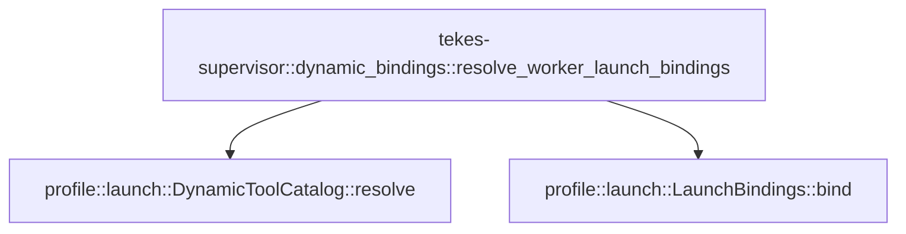

# tekes-supervisor::dynamic_bindings

[Package atlas](index.md) · [Source](../../src/dynamic_bindings.rs)

## Declarations

Visibility is the declaration spelling; trait members and reexports require their enclosing interface. `cfg` is not evaluated.

| Symbol | Kind | Visibility | Test / cfg |
|---|---|---|---|
| [tekes-supervisor::dynamic_bindings::resolve_worker_launch_bindings](../../src/dynamic_bindings.rs#L14) | function_item | `pub` |  |
| [tekes-supervisor::dynamic_bindings::DynamicBindingError](../../src/dynamic_bindings.rs#L39) | enum_item | `pub` |  |
| [tekes-supervisor::dynamic_bindings::tests::config](../../src/dynamic_bindings.rs#L55) | function_item | `private` | test; #[cfg(test)] |
| [tekes-supervisor::dynamic_bindings::tests::instruction](../../src/dynamic_bindings.rs#L96) | function_item | `private` | test; #[cfg(test)] |
| [tekes-supervisor::dynamic_bindings::tests::mcp_tool](../../src/dynamic_bindings.rs#L104) | function_item | `private` | test; #[cfg(test)] |
| [tekes-supervisor::dynamic_bindings::tests::mcp_tools_bind_into_one_immutable_catalog_and_allowed_references_fail_closed](../../src/dynamic_bindings.rs#L129) | function_item | `private` | test; #[cfg(test)] |
| [tekes-supervisor::dynamic_bindings::tests::fixed_and_dynamic_name_collisions_fail_launch](../../src/dynamic_bindings.rs#L152) | function_item | `private` | test; #[cfg(test)] |

## Imports / reexports

| Local name | Source path | Visibility |
|---|---|---|
| `ConfigSnapshot` | `profile::ConfigSnapshot` | `private` |
| `DynamicToolCatalog` | `profile::DynamicToolCatalog` | `private` |
| `InstructionSnapshot` | `profile::InstructionSnapshot` | `private` |
| `WorkerLaunchBindings` | `crate::WorkerLaunchBindings` | `private` |
| `ConfigSnapshot` | `profile::ConfigSnapshot` | `private` |
| `DynamicTool` | `profile::DynamicTool` | `private` |
| `DynamicToolEffect` | `profile::DynamicToolEffect` | `private` |
| `DynamicToolSource` | `profile::DynamicToolSource` | `private` |
| `DynamicToolSourceKind` | `profile::DynamicToolSourceKind` | `private` |
| `EffectiveInstructions` | `profile::EffectiveInstructions` | `private` |
| `InstructionSnapshot` | `profile::InstructionSnapshot` | `private` |
| `ProvidersConfig` | `profile::ProvidersConfig` | `private` |
| `ResolvedWorkspace` | `profile::ResolvedWorkspace` | `private` |
| `RevisionVector` | `profile::RevisionVector` | `private` |
| `SettingsConfig` | `profile::SettingsConfig` | `private` |
| `WorkspacePolicy` | `profile::WorkspacePolicy` | `private` |
| `IJsonValue` | `schema::IJsonValue` | `private` |
| `*` | `super::*` | `private` |

## Module declarations

| Module | Visibility | Attributes |
|---|---|---|
| `tekes-supervisor::dynamic_bindings::tests` | `private` | #[cfg(test)] |

## Function call graphs

Edges below are syntactically resolved calls only, including private functions. Graphs partition callers into groups of 20; they are not execution order. All unresolved sites are listed below and in the JSON inventory.

Functions 1–1: 2 direct edges

## Call sites

Includes test functions (marked in declarations). Receiver-type-required sites need type analysis/manual tracing. Calls in closures are attributed to their enclosing function; their occurrence here does not mean the closure executes immediately.

| Caller | Callee expression | Source lines | Target / classification |
|---|---|---|---|
| `resolve_worker_launch_bindings` | `DynamicToolCatalog::resolve(tools)         .map_err` | [20](../../src/dynamic_bindings.rs#L20) | receiver-type-required |
| `resolve_worker_launch_bindings` | `DynamicToolCatalog::resolve` | [20](../../src/dynamic_bindings.rs#L20) | [profile::launch::DynamicToolCatalog::resolve](../../../profile/src/launch.rs#L128) |
| `resolve_worker_launch_bindings` | `DynamicBindingError::Invalid` | [21](../../src/dynamic_bindings.rs#L21), [34](../../src/dynamic_bindings.rs#L34) | external-constructor-callback-or-unresolved |
| `resolve_worker_launch_bindings` | `error.to_string` | [21](../../src/dynamic_bindings.rs#L21), [34](../../src/dynamic_bindings.rs#L34) | receiver-type-required |
| `resolve_worker_launch_bindings` | `instruction.meet_workspace_policy` | [24](../../src/dynamic_bindings.rs#L24) | receiver-type-required |
| `resolve_worker_launch_bindings` | `profile::LaunchBindings::bind(         config,         bindings.goal_id.clone(),         bindings.dynamic_catalog.clone(),     )     .map_err` | [29](../../src/dynamic_bindings.rs#L29) | receiver-type-required |
| `resolve_worker_launch_bindings` | `profile::LaunchBindings::bind` | [29](../../src/dynamic_bindings.rs#L29) | [profile::launch::LaunchBindings::bind](../../../profile/src/launch.rs#L170) |
| `resolve_worker_launch_bindings` | `bindings.goal_id.clone` | [31](../../src/dynamic_bindings.rs#L31) | receiver-type-required |
| `resolve_worker_launch_bindings` | `bindings.dynamic_catalog.clone` | [32](../../src/dynamic_bindings.rs#L32) | receiver-type-required |
| `resolve_worker_launch_bindings` | `Ok` | [35](../../src/dynamic_bindings.rs#L35) | external-constructor-callback-or-unresolved |
| `config` | `"ws".to_owned` | [61](../../src/dynamic_bindings.rs#L61), [62](../../src/dynamic_bindings.rs#L62) | receiver-type-required |
| `config` | `WorkspacePolicy::default` | [74](../../src/dynamic_bindings.rs#L74) | external-constructor-callback-or-unresolved |
| `config` | `Vec::new` | [80](../../src/dynamic_bindings.rs#L80) | external-constructor-callback-or-unresolved |
| `config` | `SettingsConfig::default` | [84](../../src/dynamic_bindings.rs#L84) | external-constructor-callback-or-unresolved |
| `instruction` | `Vec::new` | [99](../../src/dynamic_bindings.rs#L99) | external-constructor-callback-or-unresolved |
| `instruction` | `EffectiveInstructions::default` | [100](../../src/dynamic_bindings.rs#L100) | external-constructor-callback-or-unresolved |
| `mcp_tool` | `IJsonValue::parse(             &serde_json_canonicalizer::to_vec(&serde_json::json!({                 "name": name,                 "description": "Echo one value",                 "parameters": {"type":"object","properties":{"value":{"type":"string"}},"required":["value"],"additionalProperties":false}             }))             .unwrap(),         )         .unwrap` | [105](../../src/dynamic_bindings.rs#L105) | receiver-type-required |
| `mcp_tool` | `IJsonValue::parse` | [105](../../src/dynamic_bindings.rs#L105) | [schema::ijson::IJsonValue::parse](../../../schema/src/ijson.rs#L16) |
| `mcp_tool` | `serde_json_canonicalizer::to_vec(&serde_json::json!({                 "name": name,                 "description": "Echo one value",                 "parameters": {"type":"object","properties":{"value":{"type":"string"}},"required":["value"],"additionalProperties":false}             }))             .unwrap` | [106](../../src/dynamic_bindings.rs#L106) | receiver-type-required |
| `mcp_tool` | `serde_json_canonicalizer::to_vec` | [106](../../src/dynamic_bindings.rs#L106) | external-constructor-callback-or-unresolved |
| `mcp_tool` | `DynamicTool::declared(             name,             DynamicToolSource {                 kind: DynamicToolSourceKind::Mcp,                 id: "fixture".to_owned(),             },             DynamicToolEffect::ReadOnly,             false,             Vec::new(),             schema,         )         .expect` | [114](../../src/dynamic_bindings.rs#L114) | receiver-type-required |
| `mcp_tool` | `DynamicTool::declared` | [114](../../src/dynamic_bindings.rs#L114) | [profile::launch::DynamicTool::declared](../../../profile/src/launch.rs#L87) |
| `mcp_tool` | `"fixture".to_owned` | [118](../../src/dynamic_bindings.rs#L118) | receiver-type-required |
| `mcp_tool` | `Vec::new` | [122](../../src/dynamic_bindings.rs#L122) | external-constructor-callback-or-unresolved |
| `mcp_tools_bind_into_one_immutable_catalog_and_allowed_references_fail_closed` | `resolve_worker_launch_bindings(             &config(vec!["mcp__fixture__echo".to_owned(), "read".to_owned()]),             &instruction(),             None,             vec![mcp_tool("mcp__fixture__echo")],         )         .expect` | [130](../../src/dynamic_bindings.rs#L130) | receiver-type-required |
| `mcp_tools_bind_into_one_immutable_catalog_and_allowed_references_fail_closed` | `resolve_worker_launch_bindings` | [130](../../src/dynamic_bindings.rs#L130), [139](../../src/dynamic_bindings.rs#L139) | external-constructor-callback-or-unresolved |
| `mcp_tools_bind_into_one_immutable_catalog_and_allowed_references_fail_closed` | `config` | [131](../../src/dynamic_bindings.rs#L131), [140](../../src/dynamic_bindings.rs#L140) | [tekes-supervisor::dynamic_bindings::tests::config](../../src/dynamic_bindings.rs#L55) |
| `mcp_tools_bind_into_one_immutable_catalog_and_allowed_references_fail_closed` | `instruction` | [132](../../src/dynamic_bindings.rs#L132), [141](../../src/dynamic_bindings.rs#L141) | [tekes-supervisor::dynamic_bindings::tests::instruction](../../src/dynamic_bindings.rs#L96) |
| `fixed_and_dynamic_name_collisions_fail_launch` | `resolve_worker_launch_bindings` | [153](../../src/dynamic_bindings.rs#L153) | external-constructor-callback-or-unresolved |
| `fixed_and_dynamic_name_collisions_fail_launch` | `config` | [154](../../src/dynamic_bindings.rs#L154) | [tekes-supervisor::dynamic_bindings::tests::config](../../src/dynamic_bindings.rs#L55) |
| `fixed_and_dynamic_name_collisions_fail_launch` | `instruction` | [155](../../src/dynamic_bindings.rs#L155) | [tekes-supervisor::dynamic_bindings::tests::instruction](../../src/dynamic_bindings.rs#L96) |
