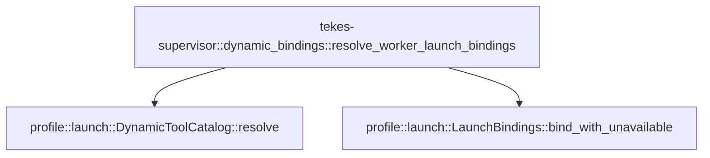

# tekes-supervisor::dynamic_bindings

[Package atlas](index.md) · [Source](../../src/dynamic_bindings.rs)

## Declarations

Visibility is the declaration spelling; trait members and reexports require their enclosing interface. `cfg` is not evaluated.

| Symbol | Kind | Visibility | Test / cfg |
|---|---|---|---|
| [tekes-supervisor::dynamic_bindings::resolve_worker_launch_bindings](../../src/dynamic_bindings.rs#L14) | function_item | `pub` |  |
| [tekes-supervisor::dynamic_bindings::DynamicBindingError](../../src/dynamic_bindings.rs#L42) | enum_item | `pub` |  |
| [tekes-supervisor::dynamic_bindings::tests::config](../../src/dynamic_bindings.rs#L58) | function_item | `private` | test; #[cfg(test)] |
| [tekes-supervisor::dynamic_bindings::tests::instruction](../../src/dynamic_bindings.rs#L95) | function_item | `private` | test; #[cfg(test)] |
| [tekes-supervisor::dynamic_bindings::tests::mcp_tool](../../src/dynamic_bindings.rs#L103) | function_item | `private` | test; #[cfg(test)] |
| [tekes-supervisor::dynamic_bindings::tests::mcp_tools_bind_into_one_immutable_catalog_and_allowed_references_fail_closed](../../src/dynamic_bindings.rs#L128) | function_item | `private` | test; #[cfg(test)] |
| [tekes-supervisor::dynamic_bindings::tests::a_refused_tool_is_excused_by_exact_name_and_never_becomes_executable](../../src/dynamic_bindings.rs#L153) | function_item | `private` | test; #[cfg(test)] |
| [tekes-supervisor::dynamic_bindings::tests::fixed_and_dynamic_name_collisions_fail_launch](../../src/dynamic_bindings.rs#L216) | function_item | `private` | test; #[cfg(test)] |

## Imports / reexports

| Local name | Source path | Visibility |
|---|---|---|
| `ConfigSnapshot` | `profile::ConfigSnapshot` | `private` |
| `DynamicToolCatalog` | `profile::DynamicToolCatalog` | `private` |
| `InstructionSnapshot` | `profile::InstructionSnapshot` | `private` |
| `WorkerLaunchBindings` | `crate::WorkerLaunchBindings` | `private` |
| `ConfigSnapshot` | `profile::ConfigSnapshot` | `private` |
| `DynamicTool` | `profile::DynamicTool` | `private` |
| `DynamicToolEffect` | `profile::DynamicToolEffect` | `private` |
| `DynamicToolSource` | `profile::DynamicToolSource` | `private` |
| `DynamicToolSourceKind` | `profile::DynamicToolSourceKind` | `private` |
| `EffectiveInstructions` | `profile::EffectiveInstructions` | `private` |
| `ExecutionPolicy` | `profile::ExecutionPolicy` | `private` |
| `InstructionSnapshot` | `profile::InstructionSnapshot` | `private` |
| `ProvidersConfig` | `profile::ProvidersConfig` | `private` |
| `ResolvedExecution` | `profile::ResolvedExecution` | `private` |
| `RevisionVector` | `profile::RevisionVector` | `private` |
| `SettingsConfig` | `profile::SettingsConfig` | `private` |
| `IJsonValue` | `schema::IJsonValue` | `private` |
| `*` | `super::*` | `private` |

## Module declarations

| Module | Visibility | Attributes |
|---|---|---|
| `tekes-supervisor::dynamic_bindings::tests` | `private` | #[cfg(test)] |

## Function call graphs

Edges below are syntactically resolved calls only, including private functions. Graphs partition callers into groups of 20; they are not execution order. All unresolved sites are listed below and in the JSON inventory.

Functions 1–1: 2 direct edges

```mermaid
flowchart TD
  n0["profile::launch::DynamicToolCatalog::resolve"]
  n1["profile::launch::LaunchBindings::bind_with_unavailable"]
  n2["tekes-supervisor::dynamic_bindings::resolve_worker_launch_bindings"]
  n2 --> n0
  n2 --> n1
```

## Call sites

Includes test functions (marked in declarations). Receiver-type-required sites need type analysis/manual tracing. Calls in closures are attributed to their enclosing function; their occurrence here does not mean the closure executes immediately.

| Caller | Callee expression | Source lines | Target / classification |
|---|---|---|---|
| `resolve_worker_launch_bindings` | `DynamicToolCatalog::resolve(tools)         .map_err` | [21](../../src/dynamic_bindings.rs#L21) | receiver-type-required |
| `resolve_worker_launch_bindings` | `DynamicToolCatalog::resolve` | [21](../../src/dynamic_bindings.rs#L21) | [profile::launch::DynamicToolCatalog::resolve](../../../profile/src/launch.rs#L128) |
| `resolve_worker_launch_bindings` | `DynamicBindingError::Invalid` | [22](../../src/dynamic_bindings.rs#L22), [37](../../src/dynamic_bindings.rs#L37) | external-constructor-callback-or-unresolved |
| `resolve_worker_launch_bindings` | `error.to_string` | [22](../../src/dynamic_bindings.rs#L22), [37](../../src/dynamic_bindings.rs#L37) | receiver-type-required |
| `resolve_worker_launch_bindings` | `instruction.meet_workspace_policy` | [25](../../src/dynamic_bindings.rs#L25) | receiver-type-required |
| `resolve_worker_launch_bindings` | `profile::LaunchBindings::bind_with_unavailable(         config,         bindings.goal_id.clone(),         bindings.dynamic_catalog.clone(),         bindings.unavailable_tools.clone(),     )     .map_err` | [31](../../src/dynamic_bindings.rs#L31) | receiver-type-required |
| `resolve_worker_launch_bindings` | `profile::LaunchBindings::bind_with_unavailable` | [31](../../src/dynamic_bindings.rs#L31) | [profile::launch::LaunchBindings::bind_with_unavailable](../../../profile/src/launch.rs#L193) |
| `resolve_worker_launch_bindings` | `bindings.goal_id.clone` | [33](../../src/dynamic_bindings.rs#L33) | receiver-type-required |
| `resolve_worker_launch_bindings` | `bindings.dynamic_catalog.clone` | [34](../../src/dynamic_bindings.rs#L34) | receiver-type-required |
| `resolve_worker_launch_bindings` | `bindings.unavailable_tools.clone` | [35](../../src/dynamic_bindings.rs#L35) | receiver-type-required |
| `resolve_worker_launch_bindings` | `Ok` | [38](../../src/dynamic_bindings.rs#L38) | external-constructor-callback-or-unresolved |
| `config` | `"ws".to_owned` | [63](../../src/dynamic_bindings.rs#L63) | receiver-type-required |
| `config` | `ExecutionPolicy::default` | [74](../../src/dynamic_bindings.rs#L74) | external-constructor-callback-or-unresolved |
| `config` | `Vec::new` | [80](../../src/dynamic_bindings.rs#L80) | external-constructor-callback-or-unresolved |
| `config` | `SettingsConfig::default` | [84](../../src/dynamic_bindings.rs#L84) | external-constructor-callback-or-unresolved |
| `instruction` | `Vec::new` | [98](../../src/dynamic_bindings.rs#L98) | external-constructor-callback-or-unresolved |
| `instruction` | `EffectiveInstructions::default` | [99](../../src/dynamic_bindings.rs#L99) | external-constructor-callback-or-unresolved |
| `mcp_tool` | `IJsonValue::parse(             &serde_json_canonicalizer::to_vec(&serde_json::json!({                 "name": name,                 "description": "Echo one value",                 "parameters": {"type":"object","properties":{"value":{"type":"string"}},"required":["value"],"additionalProperties":false}             }))             .unwrap(),         )         .unwrap` | [104](../../src/dynamic_bindings.rs#L104) | receiver-type-required |
| `mcp_tool` | `IJsonValue::parse` | [104](../../src/dynamic_bindings.rs#L104) | [schema::ijson::IJsonValue::parse](../../../schema/src/ijson.rs#L16) |
| `mcp_tool` | `serde_json_canonicalizer::to_vec(&serde_json::json!({                 "name": name,                 "description": "Echo one value",                 "parameters": {"type":"object","properties":{"value":{"type":"string"}},"required":["value"],"additionalProperties":false}             }))             .unwrap` | [105](../../src/dynamic_bindings.rs#L105) | receiver-type-required |
| `mcp_tool` | `serde_json_canonicalizer::to_vec` | [105](../../src/dynamic_bindings.rs#L105) | external-constructor-callback-or-unresolved |
| `mcp_tool` | `DynamicTool::declared(             name,             DynamicToolSource {                 kind: DynamicToolSourceKind::Mcp,                 id: "fixture".to_owned(),             },             DynamicToolEffect::ReadOnly,             false,             Vec::new(),             schema,         )         .expect` | [113](../../src/dynamic_bindings.rs#L113) | receiver-type-required |
| `mcp_tool` | `DynamicTool::declared` | [113](../../src/dynamic_bindings.rs#L113) | [profile::launch::DynamicTool::declared](../../../profile/src/launch.rs#L87) |
| `mcp_tool` | `"fixture".to_owned` | [117](../../src/dynamic_bindings.rs#L117) | receiver-type-required |
| `mcp_tool` | `Vec::new` | [121](../../src/dynamic_bindings.rs#L121) | external-constructor-callback-or-unresolved |
| `mcp_tools_bind_into_one_immutable_catalog_and_allowed_references_fail_closed` | `resolve_worker_launch_bindings(             &config(vec!["mcp__fixture__echo".to_owned(), "read".to_owned()]),             &instruction(),             None,             vec![mcp_tool("mcp__fixture__echo")],             Vec::new(),         )         .expect` | [129](../../src/dynamic_bindings.rs#L129) | receiver-type-required |
| `mcp_tools_bind_into_one_immutable_catalog_and_allowed_references_fail_closed` | `resolve_worker_launch_bindings` | [129](../../src/dynamic_bindings.rs#L129), [139](../../src/dynamic_bindings.rs#L139) | external-constructor-callback-or-unresolved |
| `mcp_tools_bind_into_one_immutable_catalog_and_allowed_references_fail_closed` | `config` | [130](../../src/dynamic_bindings.rs#L130), [140](../../src/dynamic_bindings.rs#L140) | [tekes-supervisor::dynamic_bindings::tests::config](../../src/dynamic_bindings.rs#L58) |
| `mcp_tools_bind_into_one_immutable_catalog_and_allowed_references_fail_closed` | `instruction` | [131](../../src/dynamic_bindings.rs#L131), [141](../../src/dynamic_bindings.rs#L141) | [tekes-supervisor::dynamic_bindings::tests::instruction](../../src/dynamic_bindings.rs#L95) |
| `mcp_tools_bind_into_one_immutable_catalog_and_allowed_references_fail_closed` | `Vec::new` | [134](../../src/dynamic_bindings.rs#L134), [144](../../src/dynamic_bindings.rs#L144) | external-constructor-callback-or-unresolved |
| `a_refused_tool_is_excused_by_exact_name_and_never_becomes_executable` | `config` | [155](../../src/dynamic_bindings.rs#L155), [189](../../src/dynamic_bindings.rs#L189) | [tekes-supervisor::dynamic_bindings::tests::config](../../src/dynamic_bindings.rs#L58) |
| `a_refused_tool_is_excused_by_exact_name_and_never_becomes_executable` | `resolve_worker_launch_bindings(             &allowed(),             &instruction(),             None,             tools(),             vec!["mcp__fixture__refused".to_owned()],         )         .expect` | [166](../../src/dynamic_bindings.rs#L166) | receiver-type-required |
| `a_refused_tool_is_excused_by_exact_name_and_never_becomes_executable` | `resolve_worker_launch_bindings` | [166](../../src/dynamic_bindings.rs#L166) | external-constructor-callback-or-unresolved |
| `a_refused_tool_is_excused_by_exact_name_and_never_becomes_executable` | `allowed` | [167](../../src/dynamic_bindings.rs#L167) | external-constructor-callback-or-unresolved |
| `a_refused_tool_is_excused_by_exact_name_and_never_becomes_executable` | `instruction` | [168](../../src/dynamic_bindings.rs#L168) | [tekes-supervisor::dynamic_bindings::tests::instruction](../../src/dynamic_bindings.rs#L95) |
| `a_refused_tool_is_excused_by_exact_name_and_never_becomes_executable` | `tools` | [170](../../src/dynamic_bindings.rs#L170) | external-constructor-callback-or-unresolved |
| `fixed_and_dynamic_name_collisions_fail_launch` | `resolve_worker_launch_bindings` | [217](../../src/dynamic_bindings.rs#L217) | external-constructor-callback-or-unresolved |
| `fixed_and_dynamic_name_collisions_fail_launch` | `config` | [218](../../src/dynamic_bindings.rs#L218) | [tekes-supervisor::dynamic_bindings::tests::config](../../src/dynamic_bindings.rs#L58) |
| `fixed_and_dynamic_name_collisions_fail_launch` | `instruction` | [219](../../src/dynamic_bindings.rs#L219) | [tekes-supervisor::dynamic_bindings::tests::instruction](../../src/dynamic_bindings.rs#L95) |
| `fixed_and_dynamic_name_collisions_fail_launch` | `Vec::new` | [222](../../src/dynamic_bindings.rs#L222) | external-constructor-callback-or-unresolved |
