```mermaid
flowchart TD
  n0["endpoint::all_session::AllSessionMux::open"]
  n1["endpoint::all_session::AllSessionMux::open_with_replay"]
  n2["endpoint::hub::HostFrame::new"]
  n3["endpoint::journal::EndpointJournal::open"]
  n4["endpoint::management::ManagementStore::open"]
  n5["endpoint::mux::frozen_history_page"]
  n6["endpoint::service::NativeEndpoint::open"]
  n7["endpoint::stream_queue::EndpointFrameQueue::new"]
  n8["endpoint::types::validate_session_id"]
  n9["engine::lifecycle::classify"]
  n10["schema::ijson::IJsonValue::parse"]
  n11["schema::ijson::IJsonValue::parse_str"]
  n12["tekes-supervisor::context_usage::publish"]
  n13["tekes-supervisor::context_usage::derive"]
  n14["tekes-supervisor::endpoint_carrier::ProductionCarrierStreams::open_mux_journal"]
  n15["tekes-supervisor::endpoint_carrier::ProductionCarrierStreams::open_mux"]
  n16["tekes-supervisor::endpoint_carrier::ProductionCarrierStreams::mux_journal_page"]
  n17["tekes-supervisor::endpoint_carrier::ProductionStream::map_source"]
  n18["tekes-supervisor::endpoint_carrier::load_active_mux_sessions"]
  n19["tekes-supervisor::endpoint_carrier::load_mux_session"]
  n20["tekes-supervisor::endpoint_carrier::semantic_projection"]
  n21["tekes-supervisor::endpoint_carrier::pending_session_requests"]
  n22["tekes-supervisor::endpoint_carrier::poisoned"]
  n23["tekes-supervisor::endpoint_carrier::ProductionCarrierStreams::recover_actionables"]
  n24["tekes-supervisor::endpoint_carrier::ProductionCarrierStreams::session_authority"]
  n25["tekes-supervisor::endpoint_carrier::ProductionCarrierStreams::live_sessions"]
  n26["tekes-supervisor::endpoint_carrier::ProductionCarrierStreams::detach_for_archive"]
  n27["tekes-supervisor::endpoint_carrier::ProductionCarrierStreams::publish_host_frame"]
  n28["tekes-supervisor::endpoint_carrier::ProductionCarrierStreams::publish_session_frame"]
  n29["tekes-supervisor::endpoint_carrier::ProductionCarrierStreams::update_control_cache"]
  n30["tekes-supervisor::endpoint_carrier::ProductionCarrierStreams::publish_durable_session_event"]
  n31["tekes-supervisor::endpoint_carrier::ProductionCarrierStreams::publish_durable_session_event_from_journal"]
  n32["tekes-supervisor::endpoint_carrier::ProductionCarrierStreams::close_mux_generations"]
  n33["tekes-supervisor::endpoint_carrier::ProductionCarrierStreams::open_legacy_mux"]
  n34["tekes-supervisor::endpoint_carrier::ProductionCarrierStreams::open_host"]
  n35["tekes-supervisor::endpoint_carrier::ProductionCarrierStreams::next_rpc_id"]
  n36["tekes-supervisor::endpoint_carrier::ProductionCarrierStreams::refresh_all_context_projections"]
  n37["tekes-supervisor::endpoint_carrier::ProductionCarrierStreams::refresh_context_projection"]
  n38["tekes-supervisor::endpoint_carrier::ProductionCarrierStreams::workspace_baseline"]
  n39["tekes-supervisor::endpoint_carrier::ProductionCarrierStreams::inventory_baseline"]
  n40["tekes-supervisor::endpoint_carrier::ProductionCarrierStreams::control_baseline"]
  n41["tekes-supervisor::endpoint_carrier::ProductionCarrierStreams::actionables_baseline"]
  n14 --> n0
  n14 --> n5
  n14 --> n6
  n14 --> n10
  n14 --> n19
  n14 --> n24
  n14 --> n35
  n15 --> n14
  n15 --> n33
  n15 --> n34
  n15 --> n38
  n15 --> n39
  n15 --> n40
  n15 --> n41
  n16 --> n5
  n16 --> n6
  n16 --> n19
  n17 --> n22
  n26 --> n2
  n26 --> n10
  n26 --> n11
  n26 --> n22
  n26 --> n27
  n27 --> n22
  n27 --> n35
  n28 --> n29
  n28 --> n35
  n29 --> n10
  n29 --> n11
  n29 --> n22
  n30 --> n3
  n30 --> n31
  n31 --> n35
  n32 --> n22
  n33 --> n1
  n33 --> n18
  n33 --> n22
  n33 --> n35
  n34 --> n7
  n34 --> n22
  n36 --> n18
  n36 --> n37
  n37 --> n3
  n37 --> n6
  n37 --> n8
  n37 --> n10
  n37 --> n12
  n37 --> n13
  n37 --> n20
  n37 --> n22
  n37 --> n28
  n37 --> n29
  n38 --> n4
  n38 --> n6
  n38 --> n25
  n39 --> n4
  n39 --> n6
  n39 --> n9
  n39 --> n10
  n39 --> n25
  n40 --> n18
  n40 --> n22
  n40 --> n37
  n41 --> n18
  n41 --> n21
  n41 --> n23
```

```mermaid
flowchart TD
  n0["endpoint::carrier_adapter::JournalRespondHandler::new"]
  n1["endpoint::carrier_adapter::ComposedEndpointCarrierHost::new"]
  n2["endpoint::host::StreamFailure::internal"]
  n3["endpoint::idempotency::RpcRegistry::open"]
  n4["schema::ijson::IJsonValue::parse"]
  n5["tekes-supervisor::endpoint_carrier::ProductionStream::recv"]
  n6["tekes-supervisor::endpoint_carrier::ProductionCarrierStreams::open_stream"]
  n7["tekes-supervisor::endpoint_carrier::ProductionCarrierStreams::stream_error"]
  n8["tekes-supervisor::endpoint_carrier::ProductionCarrierStreams::mux_description"]
  n9["tekes-supervisor::endpoint_carrier::ProductionCarrierStreams::open_mux_stream"]
  n10["tekes-supervisor::endpoint_carrier::ProductionCarrierStreams::journal_page"]
  n11["tekes-supervisor::endpoint_carrier::LeasedStream::recv"]
  n12["tekes-supervisor::endpoint_carrier::LeasedStream::drop"]
  n13["tekes-supervisor::endpoint_carrier::LifecycleCarrierHost::new"]
  n14["tekes-supervisor::endpoint_carrier::LifecycleCarrierHost::capabilities"]
  n15["tekes-supervisor::endpoint_carrier::LifecycleCarrierHost::extension_capabilities"]
  n16["tekes-supervisor::endpoint_carrier::LifecycleCarrierHost::method_class"]
  n17["tekes-supervisor::endpoint_carrier::LifecycleCarrierHost::validate_request"]
  n18["tekes-supervisor::endpoint_carrier::LifecycleCarrierHost::call"]
  n19["tekes-supervisor::endpoint_carrier::lifecycle_target"]
  n20["tekes-supervisor::endpoint_carrier::ProductionCarrierAssembly::assemble"]
  n21["tekes-supervisor::endpoint_carrier::ProductionCarrierAssembly::host"]
  n22["tekes-supervisor::endpoint_carrier::ProductionCarrierAssembly::with_file_changes"]
  n23["tekes-supervisor::endpoint_carrier::ProductionCarrierAssembly::streams"]
  n24["tekes-supervisor::endpoint_carrier::ProductionCarrierAssembly::server"]
  n25["tekes-supervisor::endpoint_carrier::payload_session_id"]
  n26["tekes-supervisor::endpoint_carrier::ProductionCarrierStreams::with_description"]
  n27["tekes-supervisor::endpoint_carrier::ProductionRespondAuthority::open"]
  n28["tekes-supervisor::file_leases::WorkspaceFileTransfer::open"]
  n29["transport::server::TransportServer::new"]
  n5 --> n2
  n7 --> n4
  n18 --> n19
  n19 --> n25
  n20 --> n0
  n20 --> n1
  n20 --> n3
  n20 --> n13
  n20 --> n26
  n20 --> n27
  n20 --> n28
  n20 --> n29
```

```mermaid
flowchart TD
  n0["endpoint::journal::EndpointJournal::open"]
  n1["endpoint::requests::PendingRequest::derive"]
  n2["endpoint::requests::RequestState::resolved"]
  n3["endpoint::types::validate_session_id"]
  n4["schema::ijson::IJsonValue::parse"]
  n5["store::tail::scan_valid_prefix"]
  n6["tekes-supervisor::endpoint_carrier::ProductionCarrierAssembly::into_server"]
  n7["tekes-supervisor::endpoint_carrier::ProductionCarrierAssembly::finish_recovery"]
  n8["tekes-supervisor::endpoint_carrier::ProductionCarrierAssembly::begin_drain"]
  n9["tekes-supervisor::endpoint_carrier::load_active_mux_sessions"]
  n10["tekes-supervisor::endpoint_carrier::load_mux_session"]
  n11["tekes-supervisor::endpoint_carrier::semantic_projection"]
  n12["tekes-supervisor::endpoint_carrier::semantic_line_projection"]
  n13["tekes-supervisor::endpoint_carrier::line_requests"]
  n14["tekes-supervisor::endpoint_carrier::session_requests"]
  n15["tekes-supervisor::endpoint_carrier::pending_session_requests"]
  n16["tekes-supervisor::endpoint_carrier::actionable_projection"]
  n17["tekes-supervisor::endpoint_carrier::validate_request_binding"]
  n18["tekes-supervisor::endpoint_carrier::unresolved_hold_turn"]
  n19["tekes-supervisor::endpoint_carrier::payload_session_id"]
  n20["tekes-supervisor::endpoint_carrier::result_session_id"]
  n21["tekes-supervisor::endpoint_carrier::route_failure"]
  n22["tekes-supervisor::endpoint_carrier::public_question"]
  n23["tekes-supervisor::endpoint_carrier::internal"]
  n24["tekes-supervisor::endpoint_carrier::internal_carrier"]
  n25["tekes-supervisor::endpoint_carrier::poisoned"]
  n7 --> n9
  n9 --> n10
  n10 --> n0
  n10 --> n3
  n10 --> n15
  n11 --> n12
  n12 --> n3
  n12 --> n5
  n12 --> n23
  n13 --> n1
  n13 --> n2
  n13 --> n4
  n13 --> n23
  n14 --> n3
  n14 --> n12
  n14 --> n13
  n14 --> n23
  n15 --> n14
  n16 --> n12
  n16 --> n23
  n22 --> n4
  n22 --> n23
```

# tekes-supervisor::endpoint_carrier

[Package atlas](index.md) · [Source](../../src/endpoint_carrier.rs)

## Declarations

Visibility is the declaration spelling; trait members and reexports require their enclosing interface. `cfg` is not evaluated.

| Symbol | Kind | Visibility | Test / cfg |
|---|---|---|---|
| [tekes-supervisor::endpoint_carrier::HOST_STREAM_MAX_FRAMES](../../src/endpoint_carrier.rs#L38) | const_item | `private` |  |
| [tekes-supervisor::endpoint_carrier::HOST_STREAM_MAX_BYTES](../../src/endpoint_carrier.rs#L39) | const_item | `private` |  |
| [tekes-supervisor::endpoint_carrier::SupervisorSessionAuthority](../../src/endpoint_carrier.rs#L53) | trait_item | `pub` |  |
| [tekes-supervisor::endpoint_carrier::SupervisorSessionAuthority::live_sessions](../../src/endpoint_carrier.rs#L55) | function_signature_item | `private` |  |
| [tekes-supervisor::endpoint_carrier::SupervisorSessionAuthority::reconcile_projection](../../src/endpoint_carrier.rs#L60) | function_signature_item | `private` |  |
| [tekes-supervisor::endpoint_carrier::LiveRespondAuthority](../../src/endpoint_carrier.rs#L67) | trait_item | `pub` |  |
| [tekes-supervisor::endpoint_carrier::LiveRespondAuthority::deliver_if_live](../../src/endpoint_carrier.rs#L68) | function_signature_item | `private` |  |
| [tekes-supervisor::endpoint_carrier::LiveRespondAuthority::ensure_after_locked_append](../../src/endpoint_carrier.rs#L77) | function_item | `private` |  |
| [tekes-supervisor::endpoint_carrier::CarrierClock](../../src/endpoint_carrier.rs#L82) | type_item | `pub` |  |
| [tekes-supervisor::endpoint_carrier::ProductionRespondAuthority](../../src/endpoint_carrier.rs#L84) | struct_item | `pub` |  |
| [tekes-supervisor::endpoint_carrier::ProductionRespondAuthority::open](../../src/endpoint_carrier.rs#L99) | function_item | `pub` |  |
| [tekes-supervisor::endpoint_carrier::ProductionRespondAuthority::open_with_clock](../../src/endpoint_carrier.rs#L107) | function_item | `pub` |  |
| [tekes-supervisor::endpoint_carrier::ProductionRespondAuthority::with_streams](../../src/endpoint_carrier.rs#L130) | function_item | `pub` |  |
| [tekes-supervisor::endpoint_carrier::ProductionRespondAuthority::reconcile_after_response](../../src/endpoint_carrier.rs#L141) | function_item | `private` |  |
| [tekes-supervisor::endpoint_carrier::ProductionRespondAuthority::locate_once](../../src/endpoint_carrier.rs#L155) | function_item | `private` |  |
| [tekes-supervisor::endpoint_carrier::ProductionRespondAuthority::worker_message](../../src/endpoint_carrier.rs#L213) | function_item | `private` |  |
| [tekes-supervisor::endpoint_carrier::ProductionRespondAuthority::live_delivery](../../src/endpoint_carrier.rs#L229) | function_item | `private` |  |
| [tekes-supervisor::endpoint_carrier::ProductionRespondAuthority::locked_append](../../src/endpoint_carrier.rs#L252) | function_item | `private` |  |
| [tekes-supervisor::endpoint_carrier::ProductionRespondAuthority::locate](../../src/endpoint_carrier.rs#L325) | function_item | `private` |  |
| [tekes-supervisor::endpoint_carrier::ProductionRespondAuthority::author](../../src/endpoint_carrier.rs#L329) | function_item | `private` |  |
| [tekes-supervisor::endpoint_carrier::ProductionCarrierStreams](../../src/endpoint_carrier.rs#L383) | struct_item | `pub` |  |
| [tekes-supervisor::endpoint_carrier::CarrierStreamsInner](../../src/endpoint_carrier.rs#L387) | struct_item | `private` |  |
| [tekes-supervisor::endpoint_carrier::PublishedActionables](../../src/endpoint_carrier.rs#L402) | type_item | `private` |  |
| [tekes-supervisor::endpoint_carrier::StreamGenerations](../../src/endpoint_carrier.rs#L405) | struct_item | `private` |  |
| [tekes-supervisor::endpoint_carrier::TrackedMux](../../src/endpoint_carrier.rs#L410) | struct_item | `private` |  |
| [tekes-supervisor::endpoint_carrier::TrackedHost](../../src/endpoint_carrier.rs#L415) | struct_item | `private` |  |
| [tekes-supervisor::endpoint_carrier::ProductionCarrierStreams::recover_actionables](../../src/endpoint_carrier.rs#L421) | function_item | `private` |  |
| [tekes-supervisor::endpoint_carrier::ProductionCarrierStreams::reconcile_actionables](../../src/endpoint_carrier.rs#L458) | function_item | `pub(crate)` |  |
| [tekes-supervisor::endpoint_carrier::ProductionCarrierStreams::new](../../src/endpoint_carrier.rs#L495) | function_item | `pub` |  |
| [tekes-supervisor::endpoint_carrier::ProductionCarrierStreams::with_description](../../src/endpoint_carrier.rs#L516) | function_item | `pub` |  |
| [tekes-supervisor::endpoint_carrier::ProductionCarrierStreams::attach_session_authority](../../src/endpoint_carrier.rs#L534) | function_item | `pub` |  |
| [tekes-supervisor::endpoint_carrier::ProductionCarrierStreams::session_authority](../../src/endpoint_carrier.rs#L542) | function_item | `private` |  |
| [tekes-supervisor::endpoint_carrier::ProductionCarrierStreams::live_sessions](../../src/endpoint_carrier.rs#L551) | function_item | `private` |  |
| [tekes-supervisor::endpoint_carrier::ProductionCarrierStreams::publish_session_status](../../src/endpoint_carrier.rs#L561) | function_item | `pub` |  |
| [tekes-supervisor::endpoint_carrier::ProductionCarrierStreams::attach_session](../../src/endpoint_carrier.rs#L576) | function_item | `pub` |  |
| [tekes-supervisor::endpoint_carrier::ProductionCarrierStreams::detach_for_archive](../../src/endpoint_carrier.rs#L608) | function_item | `pub` |  |
| [tekes-supervisor::endpoint_carrier::ProductionCarrierStreams::publish_host_frame](../../src/endpoint_carrier.rs#L631) | function_item | `pub` |  |
| [tekes-supervisor::endpoint_carrier::ProductionCarrierStreams::publish_session_frame](../../src/endpoint_carrier.rs#L660) | function_item | `pub` |  |
| [tekes-supervisor::endpoint_carrier::ProductionCarrierStreams::update_control_cache](../../src/endpoint_carrier.rs#L672) | function_item | `private` |  |
| [tekes-supervisor::endpoint_carrier::ProductionCarrierStreams::publish_durable_session_event](../../src/endpoint_carrier.rs#L714) | function_item | `pub` |  |
| [tekes-supervisor::endpoint_carrier::ProductionCarrierStreams::publish_durable_session_event_from_journal](../../src/endpoint_carrier.rs#L727) | function_item | `pub` |  |
| [tekes-supervisor::endpoint_carrier::ProductionCarrierStreams::close_mux_generations](../../src/endpoint_carrier.rs#L743) | function_item | `pub` |  |
| [tekes-supervisor::endpoint_carrier::ProductionCarrierStreams::open_legacy_mux](../../src/endpoint_carrier.rs#L751) | function_item | `private` |  |
| [tekes-supervisor::endpoint_carrier::ProductionCarrierStreams::open_host](../../src/endpoint_carrier.rs#L787) | function_item | `private` |  |
| [tekes-supervisor::endpoint_carrier::ProductionCarrierStreams::next_rpc_id](../../src/endpoint_carrier.rs#L806) | function_item | `private` |  |
| [tekes-supervisor::endpoint_carrier::ProductionCarrierStreams::refresh_all_context_projections](../../src/endpoint_carrier.rs#L811) | function_item | `pub(crate)` |  |
| [tekes-supervisor::endpoint_carrier::ProductionCarrierStreams::refresh_context_projection](../../src/endpoint_carrier.rs#L823) | function_item | `pub(crate)` |  |
| [tekes-supervisor::endpoint_carrier::ProductionCarrierStreams::workspace_baseline](../../src/endpoint_carrier.rs#L871) | function_item | `private` |  |
| [tekes-supervisor::endpoint_carrier::ProductionCarrierStreams::inventory_baseline](../../src/endpoint_carrier.rs#L899) | function_item | `private` |  |
| [tekes-supervisor::endpoint_carrier::ProductionCarrierStreams::control_baseline](../../src/endpoint_carrier.rs#L956) | function_item | `private` |  |
| [tekes-supervisor::endpoint_carrier::ProductionCarrierStreams::actionables_baseline](../../src/endpoint_carrier.rs#L979) | function_item | `private` |  |
| [tekes-supervisor::endpoint_carrier::ProductionCarrierStreams::open_mux_journal](../../src/endpoint_carrier.rs#L1011) | function_item | `private` |  |
| [tekes-supervisor::endpoint_carrier::ProductionCarrierStreams::open_mux](../../src/endpoint_carrier.rs#L1078) | function_item | `pub(crate)` |  |
| [tekes-supervisor::endpoint_carrier::ProductionCarrierStreams::mux_journal_page](../../src/endpoint_carrier.rs#L1164) | function_item | `private` |  |
| [tekes-supervisor::endpoint_carrier::ProductionStreamKind](../../src/endpoint_carrier.rs#L1199) | enum_item | `private` |  |
| [tekes-supervisor::endpoint_carrier::ProductionStream](../../src/endpoint_carrier.rs#L1215) | struct_item | `private` |  |
| [tekes-supervisor::endpoint_carrier::ProductionStream::map_source](../../src/endpoint_carrier.rs#L1224) | function_item | `private` |  |
| [tekes-supervisor::endpoint_carrier::ProductionStream::recv](../../src/endpoint_carrier.rs#L1459) | function_item | `private` |  |
| [tekes-supervisor::endpoint_carrier::ProductionCarrierStreams::open_stream](../../src/endpoint_carrier.rs#L1481) | function_item | `private` |  |
| [tekes-supervisor::endpoint_carrier::ProductionCarrierStreams::stream_error](../../src/endpoint_carrier.rs#L1491) | function_item | `private` |  |
| [tekes-supervisor::endpoint_carrier::ProductionCarrierStreams::mux_description](../../src/endpoint_carrier.rs#L1518) | function_item | `private` |  |
| [tekes-supervisor::endpoint_carrier::ProductionCarrierStreams::open_mux_stream](../../src/endpoint_carrier.rs#L1525) | function_item | `private` |  |
| [tekes-supervisor::endpoint_carrier::ProductionCarrierStreams::journal_page](../../src/endpoint_carrier.rs#L1535) | function_item | `private` |  |
| [tekes-supervisor::endpoint_carrier::LeasedStream](../../src/endpoint_carrier.rs#L1545) | struct_item | `private` |  |
| [tekes-supervisor::endpoint_carrier::StreamDrop](../../src/endpoint_carrier.rs#L1552) | enum_item | `private` |  |
| [tekes-supervisor::endpoint_carrier::LeasedStream::recv](../../src/endpoint_carrier.rs#L1558) | function_item | `private` |  |
| [tekes-supervisor::endpoint_carrier::LeasedStream::drop](../../src/endpoint_carrier.rs#L1564) | function_item | `private` |  |
| [tekes-supervisor::endpoint_carrier::LifecycleCarrierHost](../../src/endpoint_carrier.rs#L1576) | struct_item | `pub` |  |
| [tekes-supervisor::endpoint_carrier::LifecycleCarrierHost::new](../../src/endpoint_carrier.rs#L1583) | function_item | `pub` |  |
| [tekes-supervisor::endpoint_carrier::LifecycleCarrierHost::capabilities](../../src/endpoint_carrier.rs#L1589) | function_item | `private` |  |
| [tekes-supervisor::endpoint_carrier::LifecycleCarrierHost::extension_capabilities](../../src/endpoint_carrier.rs#L1593) | function_item | `private` |  |
| [tekes-supervisor::endpoint_carrier::LifecycleCarrierHost::method_class](../../src/endpoint_carrier.rs#L1597) | function_item | `private` |  |
| [tekes-supervisor::endpoint_carrier::LifecycleCarrierHost::validate_request](../../src/endpoint_carrier.rs#L1601) | function_item | `private` |  |
| [tekes-supervisor::endpoint_carrier::LifecycleCarrierHost::call](../../src/endpoint_carrier.rs#L1605) | function_item | `private` |  |
| [tekes-supervisor::endpoint_carrier::LifecycleTarget](../../src/endpoint_carrier.rs#L1638) | enum_item | `private` |  |
| [tekes-supervisor::endpoint_carrier::lifecycle_target](../../src/endpoint_carrier.rs#L1644) | function_item | `private` |  |
| [tekes-supervisor::endpoint_carrier::ProductionCarrierHost](../../src/endpoint_carrier.rs#L1657) | type_item | `pub` |  |
| [tekes-supervisor::endpoint_carrier::ProductionCarrierAssembly](../../src/endpoint_carrier.rs#L1663) | struct_item | `pub` |  |
| [tekes-supervisor::endpoint_carrier::ProductionCarrierAssembly::assemble](../../src/endpoint_carrier.rs#L1670) | function_item | `pub` |  |
| [tekes-supervisor::endpoint_carrier::ProductionCarrierAssembly::host](../../src/endpoint_carrier.rs#L1705) | function_item | `pub` |  |
| [tekes-supervisor::endpoint_carrier::ProductionCarrierAssembly::with_file_changes](../../src/endpoint_carrier.rs#L1709) | function_item | `pub` |  |
| [tekes-supervisor::endpoint_carrier::ProductionCarrierAssembly::streams](../../src/endpoint_carrier.rs#L1715) | function_item | `pub` |  |
| [tekes-supervisor::endpoint_carrier::ProductionCarrierAssembly::server](../../src/endpoint_carrier.rs#L1720) | function_item | `pub` |  |
| [tekes-supervisor::endpoint_carrier::ProductionCarrierAssembly::into_server](../../src/endpoint_carrier.rs#L1725) | function_item | `pub` |  |
| [tekes-supervisor::endpoint_carrier::ProductionCarrierAssembly::finish_recovery](../../src/endpoint_carrier.rs#L1732) | function_item | `pub` |  |
| [tekes-supervisor::endpoint_carrier::ProductionCarrierAssembly::begin_drain](../../src/endpoint_carrier.rs#L1743) | function_item | `pub` |  |
| [tekes-supervisor::endpoint_carrier::MuxSession](../../src/endpoint_carrier.rs#L1749) | struct_item | `private` |  |
| [tekes-supervisor::endpoint_carrier::load_active_mux_sessions](../../src/endpoint_carrier.rs#L1755) | function_item | `private` |  |
| [tekes-supervisor::endpoint_carrier::load_mux_session](../../src/endpoint_carrier.rs#L1770) | function_item | `private` |  |
| [tekes-supervisor::endpoint_carrier::semantic_projection](../../src/endpoint_carrier.rs#L1787) | function_item | `private` |  |
| [tekes-supervisor::endpoint_carrier::semantic_line_projection](../../src/endpoint_carrier.rs#L1791) | function_item | `private` |  |
| [tekes-supervisor::endpoint_carrier::line_requests](../../src/endpoint_carrier.rs#L1823) | function_item | `private` |  |
| [tekes-supervisor::endpoint_carrier::session_requests](../../src/endpoint_carrier.rs#L1926) | function_item | `private` |  |
| [tekes-supervisor::endpoint_carrier::pending_session_requests](../../src/endpoint_carrier.rs#L1963) | function_item | `private` |  |
| [tekes-supervisor::endpoint_carrier::actionable_projection](../../src/endpoint_carrier.rs#L1976) | function_item | `private` |  |
| [tekes-supervisor::endpoint_carrier::validate_request_binding](../../src/endpoint_carrier.rs#L2038) | function_item | `private` |  |
| [tekes-supervisor::endpoint_carrier::unresolved_hold_turn](../../src/endpoint_carrier.rs#L2072) | function_item | `private` |  |
| [tekes-supervisor::endpoint_carrier::payload_session_id](../../src/endpoint_carrier.rs#L2097) | function_item | `private` |  |
| [tekes-supervisor::endpoint_carrier::result_session_id](../../src/endpoint_carrier.rs#L2105) | function_item | `private` |  |
| [tekes-supervisor::endpoint_carrier::route_failure](../../src/endpoint_carrier.rs#L2113) | function_item | `private` |  |
| [tekes-supervisor::endpoint_carrier::public_question](../../src/endpoint_carrier.rs#L2125) | function_item | `private` |  |
| [tekes-supervisor::endpoint_carrier::internal](../../src/endpoint_carrier.rs#L2149) | function_item | `private` |  |
| [tekes-supervisor::endpoint_carrier::internal_carrier](../../src/endpoint_carrier.rs#L2153) | function_item | `private` |  |
| [tekes-supervisor::endpoint_carrier::poisoned](../../src/endpoint_carrier.rs#L2157) | function_item | `private` |  |
| [tekes-supervisor::endpoint_carrier::system_timestamp](../../src/endpoint_carrier.rs#L2161) | function_item | `private` |  |
| [tekes-supervisor::endpoint_carrier::ProductionCarrierError](../../src/endpoint_carrier.rs#L2193) | enum_item | `pub` |  |
| [tekes-supervisor::endpoint_carrier::question_cancellation_tests::question_denial_projects_as_cancelled_and_answer_as_answered](../../src/endpoint_carrier.rs#L2229) | function_item | `private` | test; #[cfg(test)] |

## Imports / reexports

| Local name | Source path | Visibility |
|---|---|---|
| `BTreeMap` | `std::collections::BTreeMap` | `private` |
| `BTreeSet` | `std::collections::BTreeSet` | `private` |
| `HashMap` | `std::collections::HashMap` | `private` |
| `HashSet` | `std::collections::HashSet` | `private` |
| `VecDeque` | `std::collections::VecDeque` | `private` |
| `fs` | `std::fs` | `private` |
| `Path` | `std::path::Path` | `private` |
| `PathBuf` | `std::path::PathBuf` | `private` |
| `AtomicU64` | `std::sync::atomic::AtomicU64` | `private` |
| `Ordering` | `std::sync::atomic::Ordering` | `private` |
| `Arc` | `std::sync::Arc` | `private` |
| `Mutex` | `std::sync::Mutex` | `private` |
| `Weak` | `std::sync::Weak` | `private` |
| `SystemTime` | `std::time::SystemTime` | `private` |
| `UNIX_EPOCH` | `std::time::UNIX_EPOCH` | `private` |
| `AllSessionMux` | `endpoint::AllSessionMux` | `private` |
| `AllSessionMuxHandle` | `endpoint::AllSessionMuxHandle` | `private` |
| `CarrierHostFuture` | `endpoint::CarrierHostFuture` | `private` |
| `CarrierStreamHandler` | `endpoint::CarrierStreamHandler` | `private` |
| `ComposedEndpointCarrierHost` | `endpoint::ComposedEndpointCarrierHost` | `private` |
| `EndpointCarrierHost` | `endpoint::EndpointCarrierHost` | `private` |
| `EndpointFrameQueue` | `endpoint::EndpointFrameQueue` | `private` |
| `EndpointHost` | `endpoint::EndpointHost` | `private` |
| `EndpointHostCall` | `endpoint::EndpointHostCall` | `private` |
| `EndpointHostFuture` | `endpoint::EndpointHostFuture` | `private` |
| `EndpointJournal` | `endpoint::EndpointJournal` | `private` |
| `EndpointStream` | `endpoint::EndpointStream` | `private` |
| `EndpointStreamReceiver` | `endpoint::EndpointStreamReceiver` | `private` |
| `EndpointSubscriptionHub` | `endpoint::EndpointSubscriptionHub` | `private` |
| `HostFailure` | `endpoint::HostFailure` | `private` |
| `HostFrame` | `endpoint::HostFrame` | `private` |
| `HostFrameKind` | `endpoint::HostFrameKind` | `private` |
| `HostReadiness` | `endpoint::HostReadiness` | `private` |
| `JournalRespondHandler` | `endpoint::JournalRespondHandler` | `private` |
| `LocatedRespond` | `endpoint::LocatedRespond` | `private` |
| `MuxHostDescription` | `endpoint::MuxHostDescription` | `private` |
| `MuxReplayRegistration` | `endpoint::MuxReplayRegistration` | `private` |
| `PendingRequest` | `endpoint::PendingRequest` | `private` |
| `RequestFrameType` | `endpoint::RequestFrameType` | `private` |
| `RequestState` | `endpoint::RequestState` | `private` |
| `RespondAuthorReceipt` | `endpoint::RespondAuthorReceipt` | `private` |
| `RespondAuthority` | `endpoint::RespondAuthority` | `private` |
| `RespondAuthorization` | `endpoint::RespondAuthorization` | `private` |
| `RespondDelivery` | `endpoint::RespondDelivery` | `private` |
| `RespondPrepareContext` | `endpoint::RespondPrepareContext` | `private` |
| `RpcRegistry` | `endpoint::RpcRegistry` | `private` |
| `ServerRequest` | `endpoint::ServerRequest` | `private` |
| `SessionActionable` | `endpoint::SessionActionable` | `private` |
| `SessionActionableKind` | `endpoint::SessionActionableKind` | `private` |
| `SessionAddress` | `endpoint::SessionAddress` | `private` |
| `SessionControlItem` | `endpoint::SessionControlItem` | `private` |
| `SessionJournalPage` | `endpoint::SessionJournalPage` | `private` |
| `SessionJournalSnapshot` | `endpoint::SessionJournalSnapshot` | `private` |
| `SessionMuxClientFrame` | `endpoint::SessionMuxClientFrame` | `private` |
| `SessionStream` | `endpoint::SessionStream` | `private` |
| `SessionStreamReceiver` | `endpoint::SessionStreamReceiver` | `private` |
| `SessionStreamTarget` | `endpoint::SessionStreamTarget` | `private` |
| `SessionSummary` | `endpoint::SessionSummary` | `private` |
| `SessionSyncFrame` | `endpoint::SessionSyncFrame` | `private` |
| `StreamChannel` | `endpoint::StreamChannel` | `private` |
| `StreamErrorCode` | `endpoint::StreamErrorCode` | `private` |
| `StreamFailure` | `endpoint::StreamFailure` | `private` |
| `WorkspaceBaseline` | `endpoint::WorkspaceBaseline` | `private` |
| `WorkspaceSummary` | `endpoint::WorkspaceSummary` | `private` |
| `LockFacts` | `engine::LockFacts` | `private` |
| `classify` | `engine::classify` | `private` |
| `Event` | `schema::Event` | `private` |
| `EventKind` | `schema::EventKind` | `private` |
| `IJsonValue` | `schema::IJsonValue` | `private` |
| `OriginTuple` | `schema::OriginTuple` | `private` |
| `Value` | `serde_json::Value` | `private` |
| `json` | `serde_json::json` | `private` |
| `StoreError` | `store::StoreError` | `private` |
| `ThreadStore` | `store::ThreadStore` | `private` |
| `scan_valid_prefix` | `store::scan_valid_prefix` | `private` |
| `Error` | `thiserror::Error` | `private` |
| `TransportConfig` | `transport::TransportConfig` | `private` |
| `TransportConfigError` | `transport::TransportConfigError` | `private` |
| `TransportServer` | `transport::TransportServer` | `private` |
| `ApprovalResponse` | `worker_control::ApprovalResponse` | `private` |
| `Receipt` | `worker_control::Receipt` | `private` |
| `ProductionEndpointHost` | `crate::endpoint_host::ProductionEndpointHost` | `private` |
| `ProductionRouteFailure` | `crate::endpoint_host::ProductionRouteFailure` | `private` |
| `SessionAdmissionGates` | `crate::endpoint_host::SessionAdmissionGates` | `private` |
| `*` | `super::*` | `private` |

## Module declarations

| Module | Visibility | Attributes |
|---|---|---|
| `tekes-supervisor::endpoint_carrier::question_cancellation_tests` | `private` | #[cfg(test)] |

## Function call graphs

Edges below are syntactically resolved calls only, including private functions. Graphs partition callers into groups of 20; they are not execution order. All unresolved sites are listed below and in the JSON inventory.

Functions 1–20: 34 direct edges

Functions 21–40: 66 direct edges

Functions 41–60: 12 direct edges

Functions 61–80: 22 direct edges

Functions 81–81: 0 direct edges

## Call sites

Includes test functions (marked in declarations). Receiver-type-required sites need type analysis/manual tracing. Calls in closures are attributed to their enclosing function; their occurrence here does not mean the closure executes immediately.

| Caller | Callee expression | Source lines | Target / classification |
|---|---|---|---|
| `ensure_after_locked_append` | `Ok` | [78](../../src/endpoint_carrier.rs#L78) | external-constructor-callback-or-unresolved |
| `open` | `Self::open_with_clock` | [104](../../src/endpoint_carrier.rs#L104) | [tekes-supervisor::endpoint_carrier::ProductionRespondAuthority::open_with_clock](../../src/endpoint_carrier.rs#L107) |
| `open` | `Arc::new` | [104](../../src/endpoint_carrier.rs#L104) | external-constructor-callback-or-unresolved |
| `open_with_clock` | `root.as_ref().to_path_buf` | [113](../../src/endpoint_carrier.rs#L113) | receiver-type-required |
| `open_with_clock` | `root.as_ref` | [113](../../src/endpoint_carrier.rs#L113) | receiver-type-required |
| `open_with_clock` | `Ok` | [117](../../src/endpoint_carrier.rs#L117) | external-constructor-callback-or-unresolved |
| `open_with_clock` | `ThreadStore::open` | [118](../../src/endpoint_carrier.rs#L118) | [store::folder::ThreadStore::open](../../../store/src/folder.rs#L35) |
| `with_streams` | `Some` | [131](../../src/endpoint_carrier.rs#L131) | external-constructor-callback-or-unresolved |
| `reconcile_after_response` | `session_key             .split_once(':')             .map_or` | [145](../../src/endpoint_carrier.rs#L145) | receiver-type-required |
| `reconcile_after_response` | `session_key             .split_once` | [145](../../src/endpoint_carrier.rs#L145) | receiver-type-required |
| `reconcile_after_response` | `Some` | [148](../../src/endpoint_carrier.rs#L148) | external-constructor-callback-or-unresolved |
| `reconcile_after_response` | `streams.reconcile_actionables` | [150](../../src/endpoint_carrier.rs#L150) | receiver-type-required |
| `reconcile_after_response` | `line.as_deref` | [150](../../src/endpoint_carrier.rs#L150) | receiver-type-required |
| `locate_once` | `fs::read_dir(self.root.join(area))                 .map_err(internal)?                 .collect::<Result<Vec<_>, _>>()                 .map_err` | [158](../../src/endpoint_carrier.rs#L158) | receiver-type-required |
| `locate_once` | `fs::read_dir(self.root.join(area))                 .map_err(internal)?                 .collect::<Result<Vec<_>, _>>` | [158](../../src/endpoint_carrier.rs#L158) | receiver-type-required |
| `locate_once` | `fs::read_dir(self.root.join(area))                 .map_err` | [158](../../src/endpoint_carrier.rs#L158) | receiver-type-required |
| `locate_once` | `fs::read_dir` | [158](../../src/endpoint_carrier.rs#L158) | external-constructor-callback-or-unresolved |
| `locate_once` | `self.root.join` | [158](../../src/endpoint_carrier.rs#L158) | receiver-type-required |
| `locate_once` | `folders.sort_by_key` | [162](../../src/endpoint_carrier.rs#L162) | receiver-type-required |
| `locate_once` | `entry.file_type().map_err(internal)?.is_dir` | [164](../../src/endpoint_carrier.rs#L164) | receiver-type-required |
| `locate_once` | `entry.file_type().map_err` | [164](../../src/endpoint_carrier.rs#L164) | receiver-type-required |
| `locate_once` | `entry.file_type` | [164](../../src/endpoint_carrier.rs#L164) | receiver-type-required |
| `locate_once` | `entry.path` | [167](../../src/endpoint_carrier.rs#L167) | receiver-type-required |
| `locate_once` | `entry.file_name().to_string_lossy().into_owned` | [168](../../src/endpoint_carrier.rs#L168) | receiver-type-required |
| `locate_once` | `entry.file_name().to_string_lossy` | [168](../../src/endpoint_carrier.rs#L168) | receiver-type-required |
| `locate_once` | `entry.file_name` | [168](../../src/endpoint_carrier.rs#L168) | receiver-type-required |
| `locate_once` | `endpoint::validate_session_id(&session).is_err` | [169](../../src/endpoint_carrier.rs#L169) | receiver-type-required |
| `locate_once` | `endpoint::validate_session_id` | [169](../../src/endpoint_carrier.rs#L169) | [endpoint::types::validate_session_id](../../../endpoint/src/types.rs#L130) |
| `locate_once` | `session_requests(&folder, &session)?                     .into_iter()                     .find` | [172](../../src/endpoint_carrier.rs#L172) | receiver-type-required |
| `locate_once` | `session_requests(&folder, &session)?                     .into_iter` | [172](../../src/endpoint_carrier.rs#L172) | receiver-type-required |
| `locate_once` | `session_requests` | [172](../../src/endpoint_carrier.rs#L172) | [tekes-supervisor::endpoint_carrier::session_requests](../../src/endpoint_carrier.rs#L1926) |
| `locate_once` | `found.is_some` | [178](../../src/endpoint_carrier.rs#L178) | receiver-type-required |
| `locate_once` | `Err` | [179](../../src/endpoint_carrier.rs#L179) | external-constructor-callback-or-unresolved |
| `locate_once` | `HostFailure::Internal` | [179](../../src/endpoint_carrier.rs#L179) | external-constructor-callback-or-unresolved |
| `locate_once` | `"respond rpcId is present in multiple sessions".to_owned` | [180](../../src/endpoint_carrier.rs#L180) | receiver-type-required |
| `locate_once` | `actionable_projection` | [183](../../src/endpoint_carrier.rs#L183) | [tekes-supervisor::endpoint_carrier::actionable_projection](../../src/endpoint_carrier.rs#L1976) |
| `locate_once` | `state.request.source_line.as_deref` | [186](../../src/endpoint_carrier.rs#L186) | receiver-type-required |
| `locate_once` | `validate_request_binding` | [188](../../src/endpoint_carrier.rs#L188) | [tekes-supervisor::endpoint_carrier::validate_request_binding](../../src/endpoint_carrier.rs#L2038) |
| `locate_once` | `self                     .admission                     .gate(&state.request.session_id)                     .map_err` | [194](../../src/endpoint_carrier.rs#L194) | receiver-type-required |
| `locate_once` | `self                     .admission                     .gate` | [194](../../src/endpoint_carrier.rs#L194) | receiver-type-required |
| `locate_once` | `Some` | [198](../../src/endpoint_carrier.rs#L198) | external-constructor-callback-or-unresolved |
| `locate_once` | `Ok` | [210](../../src/endpoint_carrier.rs#L210) | external-constructor-callback-or-unresolved |
| `worker_message` | `authorization.origin_key.clone` | [215](../../src/endpoint_carrier.rs#L215), [221](../../src/endpoint_carrier.rs#L221) | receiver-type-required |
| `worker_message` | `self.principal.clone` | [217](../../src/endpoint_carrier.rs#L217) | receiver-type-required |
| `worker_message` | `endpoint::ORIGIN_CLIENT.to_owned` | [218](../../src/endpoint_carrier.rs#L218) | receiver-type-required |
| `worker_message` | `authorization.session_id.clone` | [219](../../src/endpoint_carrier.rs#L219) | receiver-type-required |
| `worker_message` | `"respond".to_owned` | [220](../../src/endpoint_carrier.rs#L220) | receiver-type-required |
| `worker_message` | `authorization.call.clone` | [223](../../src/endpoint_carrier.rs#L223) | receiver-type-required |
| `worker_message` | `authorization.answer.clone` | [225](../../src/endpoint_carrier.rs#L225) | receiver-type-required |
| `live_delivery` | `self             .live             .deliver_if_live(&authorization.session_id, message)             .map_err` | [234](../../src/endpoint_carrier.rs#L234) | receiver-type-required |
| `live_delivery` | `self             .live             .deliver_if_live` | [234](../../src/endpoint_carrier.rs#L234) | receiver-type-required |
| `live_delivery` | `Ok` | [239](../../src/endpoint_carrier.rs#L239), [246](../../src/endpoint_carrier.rs#L246) | external-constructor-callback-or-unresolved |
| `live_delivery` | `Err` | [242](../../src/endpoint_carrier.rs#L242) | external-constructor-callback-or-unresolved |
| `live_delivery` | `HostFailure::Internal` | [242](../../src/endpoint_carrier.rs#L242) | external-constructor-callback-or-unresolved |
| `live_delivery` | `"live respond returned an invalid durable receipt".to_owned` | [243](../../src/endpoint_carrier.rs#L243) | receiver-type-required |
| `live_delivery` | `Some` | [246](../../src/endpoint_carrier.rs#L246) | external-constructor-callback-or-unresolved |
| `locked_append` | `(self.clock)` | [257](../../src/endpoint_carrier.rs#L257) | external-constructor-callback-or-unresolved |
| `locked_append` | `authorization.session_id.split_once(':').map_or` | [260](../../src/endpoint_carrier.rs#L260) | receiver-type-required |
| `locked_append` | `authorization.session_id.split_once` | [260](../../src/endpoint_carrier.rs#L260) | receiver-type-required |
| `locked_append` | `authorization.session_id.as_str` | [261](../../src/endpoint_carrier.rs#L261) | receiver-type-required |
| `locked_append` | `Some` | [262](../../src/endpoint_carrier.rs#L262) | external-constructor-callback-or-unresolved |
| `locked_append` | `line.map_or_else` | [265](../../src/endpoint_carrier.rs#L265) | receiver-type-required |
| `locked_append` | `"main.jsonl".to_owned` | [265](../../src/endpoint_carrier.rs#L265) | receiver-type-required |
| `locked_append` | `self.store.append_line_keyed_with_projection_if` | [266](../../src/endpoint_carrier.rs#L266) | receiver-type-required |
| `locked_append` | `Err` | [272](../../src/endpoint_carrier.rs#L272), [313](../../src/endpoint_carrier.rs#L313), [319](../../src/endpoint_carrier.rs#L319) | external-constructor-callback-or-unresolved |
| `locked_append` | `StoreError::Corruption` | [272](../../src/endpoint_carrier.rs#L272), [293](../../src/endpoint_carrier.rs#L293), [297](../../src/endpoint_carrier.rs#L297) | external-constructor-callback-or-unresolved |
| `locked_append` | `"stop became active before respond append".to_owned` | [273](../../src/endpoint_carrier.rs#L273) | receiver-type-required |
| `locked_append` | `unresolved_hold_turn` | [276](../../src/endpoint_carrier.rs#L276) | [tekes-supervisor::endpoint_carrier::unresolved_hold_turn](../../src/endpoint_carrier.rs#L2072) |
| `locked_append` | `value.as_object().expect("literal is object").clone` | [288](../../src/endpoint_carrier.rs#L288) | receiver-type-required |
| `locked_append` | `value.as_object().expect` | [288](../../src/endpoint_carrier.rs#L288) | receiver-type-required |
| `locked_append` | `value.as_object` | [288](../../src/endpoint_carrier.rs#L288) | receiver-type-required |
| `locked_append` | `authorization.answer.as_ref` | [289](../../src/endpoint_carrier.rs#L289) | receiver-type-required |
| `locked_append` | `object.insert` | [290](../../src/endpoint_carrier.rs#L290) | receiver-type-required |
| `locked_append` | `"answer".to_owned` | [291](../../src/endpoint_carrier.rs#L291) | receiver-type-required |
| `locked_append` | `serde_json::from_slice(&answer.canonical_bytes()?)                             .map_err` | [292](../../src/endpoint_carrier.rs#L292) | receiver-type-required |
| `locked_append` | `serde_json::from_slice` | [292](../../src/endpoint_carrier.rs#L292) | external-constructor-callback-or-unresolved |
| `locked_append` | `answer.canonical_bytes` | [292](../../src/endpoint_carrier.rs#L292) | receiver-type-required |
| `locked_append` | `error.to_string` | [293](../../src/endpoint_carrier.rs#L293), [297](../../src/endpoint_carrier.rs#L297) | receiver-type-required |
| `locked_append` | `serde_json_canonicalizer::to_vec(&Value::Object(object))                     .map_err` | [296](../../src/endpoint_carrier.rs#L296) | receiver-type-required |
| `locked_append` | `serde_json_canonicalizer::to_vec` | [296](../../src/endpoint_carrier.rs#L296) | external-constructor-callback-or-unresolved |
| `locked_append` | `Value::Object` | [296](../../src/endpoint_carrier.rs#L296) | external-constructor-callback-or-unresolved |
| `locked_append` | `Event::decode_canonical(&bytes)                     .map(Some)                     .map_err` | [298](../../src/endpoint_carrier.rs#L298) | receiver-type-required |
| `locked_append` | `Event::decode_canonical(&bytes)                     .map` | [298](../../src/endpoint_carrier.rs#L298) | receiver-type-required |
| `locked_append` | `Event::decode_canonical` | [298](../../src/endpoint_carrier.rs#L298) | [schema::event::Event::decode_canonical](../../../schema/src/event.rs#L168) |
| `locked_append` | `self.live                     .ensure_after_locked_append(&authorization.session_id)                     .map_err` | [305](../../src/endpoint_carrier.rs#L305) | receiver-type-required |
| `locked_append` | `self.live                     .ensure_after_locked_append` | [305](../../src/endpoint_carrier.rs#L305) | receiver-type-required |
| `locked_append` | `Ok` | [308](../../src/endpoint_carrier.rs#L308) | external-constructor-callback-or-unresolved |
| `locked_append` | `HostFailure::Internal` | [313](../../src/endpoint_carrier.rs#L313) | external-constructor-callback-or-unresolved |
| `locked_append` | `"approval append unexpectedly skipped".to_owned` | [314](../../src/endpoint_carrier.rs#L314) | receiver-type-required |
| `locked_append` | `self                 .live_delivery(authorization, message)?                 .ok_or` | [316](../../src/endpoint_carrier.rs#L316) | receiver-type-required |
| `locked_append` | `self                 .live_delivery` | [316](../../src/endpoint_carrier.rs#L316) | [tekes-supervisor::endpoint_carrier::ProductionRespondAuthority::live_delivery](../../src/endpoint_carrier.rs#L229) |
| `locked_append` | `internal` | [319](../../src/endpoint_carrier.rs#L319) | [tekes-supervisor::endpoint_carrier::internal](../../src/endpoint_carrier.rs#L2149) |
| `locate` | `self.locate_once` | [326](../../src/endpoint_carrier.rs#L326) | receiver-type-required |
| `author` | `authorization.session_id.contains` | [335](../../src/endpoint_carrier.rs#L335) | receiver-type-required |
| `author` | `self.root.join("threads").join` | [336](../../src/endpoint_carrier.rs#L336) | receiver-type-required |
| `author` | `self.root.join` | [336](../../src/endpoint_carrier.rs#L336) | receiver-type-required |
| `author` | `session_requests(&folder, &authorization.session_id)?                 .into_iter()                 .find` | [337](../../src/endpoint_carrier.rs#L337) | receiver-type-required |
| `author` | `session_requests(&folder, &authorization.session_id)?                 .into_iter` | [337](../../src/endpoint_carrier.rs#L337) | receiver-type-required |
| `author` | `session_requests` | [337](../../src/endpoint_carrier.rs#L337) | [tekes-supervisor::endpoint_carrier::session_requests](../../src/endpoint_carrier.rs#L1926) |
| `author` | `state.request.source_line.as_deref` | [341](../../src/endpoint_carrier.rs#L341) | receiver-type-required |
| `author` | `actionable_projection` | [343](../../src/endpoint_carrier.rs#L343) | [tekes-supervisor::endpoint_carrier::actionable_projection](../../src/endpoint_carrier.rs#L1976) |
| `author` | `Some` | [343](../../src/endpoint_carrier.rs#L343), [359](../../src/endpoint_carrier.rs#L359) | external-constructor-callback-or-unresolved |
| `author` | `Err` | [345](../../src/endpoint_carrier.rs#L345), [361](../../src/endpoint_carrier.rs#L361) | external-constructor-callback-or-unresolved |
| `author` | `internal` | [345](../../src/endpoint_carrier.rs#L345), [357](../../src/endpoint_carrier.rs#L357), [361](../../src/endpoint_carrier.rs#L361) | [tekes-supervisor::endpoint_carrier::internal](../../src/endpoint_carrier.rs#L2149) |
| `author` | `validate_request_binding` | [347](../../src/endpoint_carrier.rs#L347) | [tekes-supervisor::endpoint_carrier::validate_request_binding](../../src/endpoint_carrier.rs#L2038) |
| `author` | `projection                         .events                         .iter()                         .find(&#124;e&#124; e.seq() == state.request.causal_kernel_seq)                         .ok_or_else` | [353](../../src/endpoint_carrier.rs#L353) | receiver-type-required |
| `author` | `projection                         .events                         .iter()                         .find` | [353](../../src/endpoint_carrier.rs#L353) | receiver-type-required |
| `author` | `projection                         .events                         .iter` | [353](../../src/endpoint_carrier.rs#L353) | receiver-type-required |
| `author` | `e.seq` | [356](../../src/endpoint_carrier.rs#L356) | receiver-type-required |
| `author` | `held.string_field` | [359](../../src/endpoint_carrier.rs#L359) | receiver-type-required |
| `author` | `authorization.call.as_str` | [359](../../src/endpoint_carrier.rs#L359) | receiver-type-required |
| `author` | `self.worker_message` | [372](../../src/endpoint_carrier.rs#L372) | receiver-type-required |
| `author` | `self.live_delivery` | [373](../../src/endpoint_carrier.rs#L373) | receiver-type-required |
| `author` | `self.locked_append` | [375](../../src/endpoint_carrier.rs#L375) | receiver-type-required |
| `author` | `self.reconcile_after_response` | [377](../../src/endpoint_carrier.rs#L377) | receiver-type-required |
| `author` | `Ok` | [378](../../src/endpoint_carrier.rs#L378) | external-constructor-callback-or-unresolved |
| `recover_actionables` | `self.inner.root.join("threads").join` | [422](../../src/endpoint_carrier.rs#L422) | receiver-type-required |
| `recover_actionables` | `self.inner.root.join` | [422](../../src/endpoint_carrier.rs#L422) | receiver-type-required |
| `recover_actionables` | `HashSet::new` | [424](../../src/endpoint_carrier.rs#L424) | external-constructor-callback-or-unresolved |
| `recover_actionables` | `pending.pop` | [425](../../src/endpoint_carrier.rs#L425) | receiver-type-required |
| `recover_actionables` | `visited.insert` | [426](../../src/endpoint_carrier.rs#L426) | receiver-type-required |
| `recover_actionables` | `line.clone` | [426](../../src/endpoint_carrier.rs#L426) | receiver-type-required |
| `recover_actionables` | `(line != "main.jsonl").then_some` | [429](../../src/endpoint_carrier.rs#L429) | receiver-type-required |
| `recover_actionables` | `line.as_str` | [429](../../src/endpoint_carrier.rs#L429) | receiver-type-required |
| `recover_actionables` | `actionable_projection(&folder, session, source).map_err` | [431](../../src/endpoint_carrier.rs#L431) | receiver-type-required |
| `recover_actionables` | `actionable_projection` | [431](../../src/endpoint_carrier.rs#L431) | [tekes-supervisor::endpoint_carrier::actionable_projection](../../src/endpoint_carrier.rs#L1976) |
| `recover_actionables` | `self.reconcile_actionables` | [432](../../src/endpoint_carrier.rs#L432) | [tekes-supervisor::endpoint_carrier::ProductionCarrierStreams::reconcile_actionables](../../src/endpoint_carrier.rs#L458) |
| `recover_actionables` | `projection                 .events                 .iter()                 .filter` | [433](../../src/endpoint_carrier.rs#L433) | receiver-type-required |
| `recover_actionables` | `projection                 .events                 .iter` | [433](../../src/endpoint_carrier.rs#L433) | receiver-type-required |
| `recover_actionables` | `e.kind` | [436](../../src/endpoint_carrier.rs#L436) | receiver-type-required |
| `recover_actionables` | `spawn                     .string_field("child")                     .ok_or_else` | [438](../../src/endpoint_carrier.rs#L438) | receiver-type-required |
| `recover_actionables` | `spawn                     .string_field` | [438](../../src/endpoint_carrier.rs#L438) | receiver-type-required |
| `recover_actionables` | `internal_carrier` | [440](../../src/endpoint_carrier.rs#L440), [445](../../src/endpoint_carrier.rs#L445) | [tekes-supervisor::endpoint_carrier::internal_carrier](../../src/endpoint_carrier.rs#L2153) |
| `recover_actionables` | `child                     .strip_suffix(".jsonl")                     .ok_or_else` | [443](../../src/endpoint_carrier.rs#L443) | receiver-type-required |
| `recover_actionables` | `child                     .strip_suffix` | [443](../../src/endpoint_carrier.rs#L443) | receiver-type-required |
| `recover_actionables` | `endpoint::validate_session_id(id).map_err` | [446](../../src/endpoint_carrier.rs#L446) | receiver-type-required |
| `recover_actionables` | `endpoint::validate_session_id` | [446](../../src/endpoint_carrier.rs#L446) | [endpoint::types::validate_session_id](../../../endpoint/src/types.rs#L130) |
| `recover_actionables` | `folder.join(child).exists` | [447](../../src/endpoint_carrier.rs#L447) | receiver-type-required |
| `recover_actionables` | `folder.join` | [447](../../src/endpoint_carrier.rs#L447) | receiver-type-required |
| `recover_actionables` | `pending.push` | [448](../../src/endpoint_carrier.rs#L448) | receiver-type-required |
| `recover_actionables` | `child.to_owned` | [448](../../src/endpoint_carrier.rs#L448) | receiver-type-required |
| `recover_actionables` | `Ok` | [452](../../src/endpoint_carrier.rs#L452) | external-constructor-callback-or-unresolved |
| `reconcile_actionables` | `self.inner.root.join("threads").join` | [463](../../src/endpoint_carrier.rs#L463) | receiver-type-required |
| `reconcile_actionables` | `self.inner.root.join` | [463](../../src/endpoint_carrier.rs#L463) | receiver-type-required |
| `reconcile_actionables` | `actionable_projection(&folder, session_id, source_line).map_err` | [465](../../src/endpoint_carrier.rs#L465) | receiver-type-required |
| `reconcile_actionables` | `actionable_projection` | [465](../../src/endpoint_carrier.rs#L465) | [tekes-supervisor::endpoint_carrier::actionable_projection](../../src/endpoint_carrier.rs#L1976) |
| `reconcile_actionables` | `line_requests(session_id, source_line, &projection).map_err` | [467](../../src/endpoint_carrier.rs#L467) | receiver-type-required |
| `reconcile_actionables` | `line_requests` | [467](../../src/endpoint_carrier.rs#L467) | [tekes-supervisor::endpoint_carrier::line_requests](../../src/endpoint_carrier.rs#L1823) |
| `reconcile_actionables` | `requests             .iter()             .filter(&#124;(state, _)&#124; state.resolution.is_none())             .map(&#124;(state, _)&#124; state.request.rpc_id.clone())             .collect::<BTreeSet<_>>` | [468](../../src/endpoint_carrier.rs#L468) | receiver-type-required |
| `reconcile_actionables` | `requests             .iter()             .filter(&#124;(state, _)&#124; state.resolution.is_none())             .map` | [468](../../src/endpoint_carrier.rs#L468) | receiver-type-required |
| `reconcile_actionables` | `requests             .iter()             .filter` | [468](../../src/endpoint_carrier.rs#L468) | receiver-type-required |
| `reconcile_actionables` | `requests             .iter` | [468](../../src/endpoint_carrier.rs#L468) | receiver-type-required |
| `reconcile_actionables` | `state.resolution.is_none` | [470](../../src/endpoint_carrier.rs#L470) | receiver-type-required |
| `reconcile_actionables` | `state.request.rpc_id.clone` | [471](../../src/endpoint_carrier.rs#L471) | receiver-type-required |
| `reconcile_actionables` | `session_id.to_owned` | [473](../../src/endpoint_carrier.rs#L473) | receiver-type-required |
| `reconcile_actionables` | `source_line.map` | [473](../../src/endpoint_carrier.rs#L473) | receiver-type-required |
| `reconcile_actionables` | `self             .inner             .published_actionables             .lock()             .unwrap_or_else` | [474](../../src/endpoint_carrier.rs#L474) | receiver-type-required |
| `reconcile_actionables` | `self             .inner             .published_actionables             .lock` | [474](../../src/endpoint_carrier.rs#L474) | receiver-type-required |
| `reconcile_actionables` | `published.get(&key).cloned().unwrap_or_default` | [479](../../src/endpoint_carrier.rs#L479) | receiver-type-required |
| `reconcile_actionables` | `published.get(&key).cloned` | [479](../../src/endpoint_carrier.rs#L479) | receiver-type-required |
| `reconcile_actionables` | `published.get` | [479](../../src/endpoint_carrier.rs#L479) | receiver-type-required |
| `reconcile_actionables` | `pending.contains` | [485](../../src/endpoint_carrier.rs#L485) | receiver-type-required |
| `reconcile_actionables` | `previous.contains` | [485](../../src/endpoint_carrier.rs#L485) | receiver-type-required |
| `reconcile_actionables` | `self.publish_session_frame` | [486](../../src/endpoint_carrier.rs#L486) | [tekes-supervisor::endpoint_carrier::ProductionCarrierStreams::publish_session_frame](../../src/endpoint_carrier.rs#L660) |
| `reconcile_actionables` | `published.insert` | [489](../../src/endpoint_carrier.rs#L489) | receiver-type-required |
| `reconcile_actionables` | `Ok` | [491](../../src/endpoint_carrier.rs#L491) | external-constructor-callback-or-unresolved |
| `new` | `Self::with_description` | [496](../../src/endpoint_carrier.rs#L496) | [tekes-supervisor::endpoint_carrier::ProductionCarrierStreams::with_description](../../src/endpoint_carrier.rs#L516) |
| `new` | `"TekesKernel".to_owned` | [501](../../src/endpoint_carrier.rs#L501) | receiver-type-required |
| `new` | `env!("CARGO_PKG_VERSION").to_owned` | [502](../../src/endpoint_carrier.rs#L502) | receiver-type-required |
| `new` | `endpoint::SessionEndpointCapability::required` | [504](../../src/endpoint_carrier.rs#L504) | [endpoint::mux::SessionEndpointCapability::required](../../../endpoint/src/mux.rs#L34) |
| `new` | `"/".to_owned` | [505](../../src/endpoint_carrier.rs#L505), [509](../../src/endpoint_carrier.rs#L509) | receiver-type-required |
| `with_description` | `Arc::new` | [518](../../src/endpoint_carrier.rs#L518) | external-constructor-callback-or-unresolved |
| `with_description` | `root.as_ref().to_path_buf` | [519](../../src/endpoint_carrier.rs#L519) | receiver-type-required |
| `with_description` | `root.as_ref` | [519](../../src/endpoint_carrier.rs#L519) | receiver-type-required |
| `with_description` | `EndpointSubscriptionHub::default` | [521](../../src/endpoint_carrier.rs#L521) | external-constructor-callback-or-unresolved |
| `with_description` | `Mutex::new` | [522](../../src/endpoint_carrier.rs#L522), [523](../../src/endpoint_carrier.rs#L523), [524](../../src/endpoint_carrier.rs#L524), [525](../../src/endpoint_carrier.rs#L525), [527](../../src/endpoint_carrier.rs#L527) | external-constructor-callback-or-unresolved |
| `with_description` | `StreamGenerations::default` | [522](../../src/endpoint_carrier.rs#L522) | external-constructor-callback-or-unresolved |
| `with_description` | `BTreeMap::new` | [523](../../src/endpoint_carrier.rs#L523) | external-constructor-callback-or-unresolved |
| `with_description` | `AtomicU64::new` | [526](../../src/endpoint_carrier.rs#L526) | external-constructor-callback-or-unresolved |
| `with_description` | `HashMap::new` | [527](../../src/endpoint_carrier.rs#L527) | external-constructor-callback-or-unresolved |
| `attach_session_authority` | `self             .inner             .session_authority             .lock()             .unwrap_or_else` | [535](../../src/endpoint_carrier.rs#L535) | receiver-type-required |
| `attach_session_authority` | `self             .inner             .session_authority             .lock` | [535](../../src/endpoint_carrier.rs#L535) | receiver-type-required |
| `attach_session_authority` | `Some` | [539](../../src/endpoint_carrier.rs#L539) | external-constructor-callback-or-unresolved |
| `session_authority` | `self.inner             .session_authority             .lock()             .unwrap_or_else(std::sync::PoisonError::into_inner)             .as_ref()             .and_then` | [543](../../src/endpoint_carrier.rs#L543) | receiver-type-required |
| `session_authority` | `self.inner             .session_authority             .lock()             .unwrap_or_else(std::sync::PoisonError::into_inner)             .as_ref` | [543](../../src/endpoint_carrier.rs#L543) | receiver-type-required |
| `session_authority` | `self.inner             .session_authority             .lock()             .unwrap_or_else` | [543](../../src/endpoint_carrier.rs#L543) | receiver-type-required |
| `session_authority` | `self.inner             .session_authority             .lock` | [543](../../src/endpoint_carrier.rs#L543) | receiver-type-required |
| `live_sessions` | `self.session_authority()             .map(&#124;authority&#124; authority.live_sessions())             .unwrap_or_default` | [552](../../src/endpoint_carrier.rs#L552) | receiver-type-required |
| `live_sessions` | `self.session_authority()             .map` | [552](../../src/endpoint_carrier.rs#L552) | receiver-type-required |
| `live_sessions` | `self.session_authority` | [552](../../src/endpoint_carrier.rs#L552) | [tekes-supervisor::endpoint_carrier::ProductionCarrierStreams::session_authority](../../src/endpoint_carrier.rs#L542) |
| `live_sessions` | `authority.live_sessions` | [553](../../src/endpoint_carrier.rs#L553) | receiver-type-required |
| `publish_session_status` | `self.publish_host_frame` | [566](../../src/endpoint_carrier.rs#L566) | [tekes-supervisor::endpoint_carrier::ProductionCarrierStreams::publish_host_frame](../../src/endpoint_carrier.rs#L631) |
| `publish_session_status` | `HostFrame::new` | [566](../../src/endpoint_carrier.rs#L566) | [endpoint::hub::HostFrame::new](../../../endpoint/src/hub.rs#L158) |
| `publish_session_status` | `IJsonValue::parse` | [568](../../src/endpoint_carrier.rs#L568) | [schema::ijson::IJsonValue::parse](../../../schema/src/ijson.rs#L16) |
| `publish_session_status` | `serde_json::to_vec` | [568](../../src/endpoint_carrier.rs#L568) | external-constructor-callback-or-unresolved |
| `attach_session` | `self.inner.generations.lock().map_err` | [577](../../src/endpoint_carrier.rs#L577) | receiver-type-required |
| `attach_session` | `self.inner.generations.lock` | [577](../../src/endpoint_carrier.rs#L577) | receiver-type-required |
| `attach_session` | `poisoned` | [577](../../src/endpoint_carrier.rs#L577) | [tekes-supervisor::endpoint_carrier::poisoned](../../src/endpoint_carrier.rs#L2157) |
| `attach_session` | `generations             .mux             .retain` | [578](../../src/endpoint_carrier.rs#L578) | receiver-type-required |
| `attach_session` | `generation.lease.strong_count` | [580](../../src/endpoint_carrier.rs#L580) | receiver-type-required |
| `attach_session` | `load_mux_session` | [581](../../src/endpoint_carrier.rs#L581) | [tekes-supervisor::endpoint_carrier::load_mux_session](../../src/endpoint_carrier.rs#L1770) |
| `attach_session` | `generation.handle.contains` | [583](../../src/endpoint_carrier.rs#L583) | receiver-type-required |
| `attach_session` | `generation.handle.attach_with_replay` | [586](../../src/endpoint_carrier.rs#L586) | receiver-type-required |
| `attach_session` | `self.next_rpc_id` | [590](../../src/endpoint_carrier.rs#L590) | [tekes-supervisor::endpoint_carrier::ProductionCarrierStreams::next_rpc_id](../../src/endpoint_carrier.rs#L806) |
| `attach_session` | `drop` | [594](../../src/endpoint_carrier.rs#L594) | external-constructor-callback-or-unresolved |
| `attach_session` | `semantic_projection(&self.inner.root.join("threads").join(session_id))             .map_err` | [595](../../src/endpoint_carrier.rs#L595) | receiver-type-required |
| `attach_session` | `semantic_projection` | [595](../../src/endpoint_carrier.rs#L595) | [tekes-supervisor::endpoint_carrier::semantic_projection](../../src/endpoint_carrier.rs#L1787) |
| `attach_session` | `self.inner.root.join("threads").join` | [595](../../src/endpoint_carrier.rs#L595) | receiver-type-required |
| `attach_session` | `self.inner.root.join` | [595](../../src/endpoint_carrier.rs#L595) | receiver-type-required |
| `attach_session` | `self.publish_host_frame` | [597](../../src/endpoint_carrier.rs#L597) | [tekes-supervisor::endpoint_carrier::ProductionCarrierStreams::publish_host_frame](../../src/endpoint_carrier.rs#L631) |
| `attach_session` | `HostFrame::new` | [597](../../src/endpoint_carrier.rs#L597) | [endpoint::hub::HostFrame::new](../../../endpoint/src/hub.rs#L158) |
| `attach_session` | `IJsonValue::parse` | [599](../../src/endpoint_carrier.rs#L599) | [schema::ijson::IJsonValue::parse](../../../schema/src/ijson.rs#L16) |
| `attach_session` | `serde_json::to_vec` | [599](../../src/endpoint_carrier.rs#L599) | external-constructor-callback-or-unresolved |
| `attach_session` | `Ok` | [605](../../src/endpoint_carrier.rs#L605) | external-constructor-callback-or-unresolved |
| `detach_for_archive` | `self.inner.generations.lock().map_err` | [609](../../src/endpoint_carrier.rs#L609) | receiver-type-required |
| `detach_for_archive` | `self.inner.generations.lock` | [609](../../src/endpoint_carrier.rs#L609) | receiver-type-required |
| `detach_for_archive` | `poisoned` | [609](../../src/endpoint_carrier.rs#L609) | [tekes-supervisor::endpoint_carrier::poisoned](../../src/endpoint_carrier.rs#L2157) |
| `detach_for_archive` | `generations             .mux             .retain` | [610](../../src/endpoint_carrier.rs#L610) | receiver-type-required |
| `detach_for_archive` | `generation.lease.strong_count` | [612](../../src/endpoint_carrier.rs#L612) | receiver-type-required |
| `detach_for_archive` | `generation.handle.detach_for_archive` | [614](../../src/endpoint_carrier.rs#L614) | receiver-type-required |
| `detach_for_archive` | `drop` | [616](../../src/endpoint_carrier.rs#L616) | external-constructor-callback-or-unresolved |
| `detach_for_archive` | `self.publish_host_frame` | [617](../../src/endpoint_carrier.rs#L617), [624](../../src/endpoint_carrier.rs#L624) | [tekes-supervisor::endpoint_carrier::ProductionCarrierStreams::publish_host_frame](../../src/endpoint_carrier.rs#L631) |
| `detach_for_archive` | `HostFrame::new` | [617](../../src/endpoint_carrier.rs#L617), [624](../../src/endpoint_carrier.rs#L624) | [endpoint::hub::HostFrame::new](../../../endpoint/src/hub.rs#L158) |
| `detach_for_archive` | `IJsonValue::parse` | [619](../../src/endpoint_carrier.rs#L619) | [schema::ijson::IJsonValue::parse](../../../schema/src/ijson.rs#L16) |
| `detach_for_archive` | `serde_json::to_vec` | [619](../../src/endpoint_carrier.rs#L619) | external-constructor-callback-or-unresolved |
| `detach_for_archive` | `IJsonValue::parse_str` | [626](../../src/endpoint_carrier.rs#L626) | [schema::ijson::IJsonValue::parse_str](../../../schema/src/ijson.rs#L23) |
| `detach_for_archive` | `Ok` | [628](../../src/endpoint_carrier.rs#L628) | external-constructor-callback-or-unresolved |
| `publish_host_frame` | `frame.into_envelope` | [632](../../src/endpoint_carrier.rs#L632) | receiver-type-required |
| `publish_host_frame` | `self.next_rpc_id` | [632](../../src/endpoint_carrier.rs#L632) | [tekes-supervisor::endpoint_carrier::ProductionCarrierStreams::next_rpc_id](../../src/endpoint_carrier.rs#L806) |
| `publish_host_frame` | `self.inner.generations.lock().map_err` | [633](../../src/endpoint_carrier.rs#L633) | receiver-type-required |
| `publish_host_frame` | `self.inner.generations.lock` | [633](../../src/endpoint_carrier.rs#L633) | receiver-type-required |
| `publish_host_frame` | `poisoned` | [633](../../src/endpoint_carrier.rs#L633) | [tekes-supervisor::endpoint_carrier::poisoned](../../src/endpoint_carrier.rs#L2157) |
| `publish_host_frame` | `generations             .host             .retain` | [634](../../src/endpoint_carrier.rs#L634), [639](../../src/endpoint_carrier.rs#L639) | receiver-type-required |
| `publish_host_frame` | `generation.lease.strong_count` | [636](../../src/endpoint_carrier.rs#L636) | receiver-type-required |
| `publish_host_frame` | `generation.queue.push` | [641](../../src/endpoint_carrier.rs#L641) | receiver-type-required |
| `publish_host_frame` | `envelope.clone` | [641](../../src/endpoint_carrier.rs#L641) | receiver-type-required |
| `publish_host_frame` | `Some` | [650](../../src/endpoint_carrier.rs#L650) | external-constructor-callback-or-unresolved |
| `publish_host_frame` | `Err` | [655](../../src/endpoint_carrier.rs#L655) | external-constructor-callback-or-unresolved |
| `publish_host_frame` | `error.into` | [655](../../src/endpoint_carrier.rs#L655) | receiver-type-required |
| `publish_host_frame` | `Ok` | [657](../../src/endpoint_carrier.rs#L657) | external-constructor-callback-or-unresolved |
| `publish_session_frame` | `self.update_control_cache` | [665](../../src/endpoint_carrier.rs#L665) | [tekes-supervisor::endpoint_carrier::ProductionCarrierStreams::update_control_cache](../../src/endpoint_carrier.rs#L672) |
| `publish_session_frame` | `Ok` | [666](../../src/endpoint_carrier.rs#L666) | external-constructor-callback-or-unresolved |
| `publish_session_frame` | `self             .inner             .hub             .publish_frame` | [666](../../src/endpoint_carrier.rs#L666) | receiver-type-required |
| `publish_session_frame` | `self.next_rpc_id` | [669](../../src/endpoint_carrier.rs#L669) | [tekes-supervisor::endpoint_carrier::ProductionCarrierStreams::next_rpc_id](../../src/endpoint_carrier.rs#L806) |
| `update_control_cache` | `frame.session_id` | [676](../../src/endpoint_carrier.rs#L676) | receiver-type-required |
| `update_control_cache` | `Ok` | [677](../../src/endpoint_carrier.rs#L677), [706](../../src/endpoint_carrier.rs#L706), [708](../../src/endpoint_carrier.rs#L708) | external-constructor-callback-or-unresolved |
| `update_control_cache` | `self.inner.controls.lock().map_err` | [679](../../src/endpoint_carrier.rs#L679) | receiver-type-required |
| `update_control_cache` | `self.inner.controls.lock` | [679](../../src/endpoint_carrier.rs#L679) | receiver-type-required |
| `update_control_cache` | `poisoned` | [679](../../src/endpoint_carrier.rs#L679) | [tekes-supervisor::endpoint_carrier::poisoned](../../src/endpoint_carrier.rs#L2157) |
| `update_control_cache` | `controls             .entry(session_id.to_owned())             .or_insert_with` | [680](../../src/endpoint_carrier.rs#L680) | receiver-type-required |
| `update_control_cache` | `controls             .entry` | [680](../../src/endpoint_carrier.rs#L680) | receiver-type-required |
| `update_control_cache` | `session_id.to_owned` | [681](../../src/endpoint_carrier.rs#L681), [683](../../src/endpoint_carrier.rs#L683) | receiver-type-required |
| `update_control_cache` | `Vec::new` | [684](../../src/endpoint_carrier.rs#L684), [685](../../src/endpoint_carrier.rs#L685) | external-constructor-callback-or-unresolved |
| `update_control_cache` | `IJsonValue::parse_str(r#"{"asOfSeq":-1,"values":{}}"#)                     .expect` | [686](../../src/endpoint_carrier.rs#L686) | receiver-type-required |
| `update_control_cache` | `IJsonValue::parse_str` | [686](../../src/endpoint_carrier.rs#L686) | [schema::ijson::IJsonValue::parse_str](../../../schema/src/ijson.rs#L23) |
| `update_control_cache` | `control.queue.clone_from` | [690](../../src/endpoint_carrier.rs#L690) | receiver-type-required |
| `update_control_cache` | `control.jobs.clone_from` | [691](../../src/endpoint_carrier.rs#L691) | receiver-type-required |
| `update_control_cache` | `serde_json::from_slice` | [695](../../src/endpoint_carrier.rs#L695), [703](../../src/endpoint_carrier.rs#L703) | external-constructor-callback-or-unresolved |
| `update_control_cache` | `control                         .projections                         .canonical_bytes()                         .map_err` | [696](../../src/endpoint_carrier.rs#L696) | receiver-type-required |
| `update_control_cache` | `control                         .projections                         .canonical_bytes` | [696](../../src/endpoint_carrier.rs#L696) | receiver-type-required |
| `update_control_cache` | `Value::from` | [701](../../src/endpoint_carrier.rs#L701) | external-constructor-callback-or-unresolved |
| `update_control_cache` | `value.canonical_bytes().map_err` | [703](../../src/endpoint_carrier.rs#L703) | receiver-type-required |
| `update_control_cache` | `value.canonical_bytes` | [703](../../src/endpoint_carrier.rs#L703) | receiver-type-required |
| `update_control_cache` | `IJsonValue::parse` | [704](../../src/endpoint_carrier.rs#L704) | [schema::ijson::IJsonValue::parse](../../../schema/src/ijson.rs#L16) |
| `update_control_cache` | `serde_json::to_vec` | [704](../../src/endpoint_carrier.rs#L704) | external-constructor-callback-or-unresolved |
| `publish_durable_session_event` | `EndpointJournal::open` | [720](../../src/endpoint_carrier.rs#L720) | [endpoint::journal::EndpointJournal::open](../../../endpoint/src/journal.rs#L154) |
| `publish_durable_session_event` | `self.inner.root.join("threads").join` | [720](../../src/endpoint_carrier.rs#L720) | receiver-type-required |
| `publish_durable_session_event` | `self.inner.root.join` | [720](../../src/endpoint_carrier.rs#L720) | receiver-type-required |
| `publish_durable_session_event` | `self.publish_durable_session_event_from_journal` | [721](../../src/endpoint_carrier.rs#L721) | [tekes-supervisor::endpoint_carrier::ProductionCarrierStreams::publish_durable_session_event_from_journal](../../src/endpoint_carrier.rs#L727) |
| `publish_durable_session_event_from_journal` | `Ok` | [734](../../src/endpoint_carrier.rs#L734) | external-constructor-callback-or-unresolved |
| `publish_durable_session_event_from_journal` | `self.inner.hub.publish_event` | [734](../../src/endpoint_carrier.rs#L734) | receiver-type-required |
| `publish_durable_session_event_from_journal` | `self.next_rpc_id` | [737](../../src/endpoint_carrier.rs#L737) | [tekes-supervisor::endpoint_carrier::ProductionCarrierStreams::next_rpc_id](../../src/endpoint_carrier.rs#L806) |
| `close_mux_generations` | `self.inner.generations.lock().map_err` | [744](../../src/endpoint_carrier.rs#L744) | receiver-type-required |
| `close_mux_generations` | `self.inner.generations.lock` | [744](../../src/endpoint_carrier.rs#L744) | receiver-type-required |
| `close_mux_generations` | `poisoned` | [744](../../src/endpoint_carrier.rs#L744) | [tekes-supervisor::endpoint_carrier::poisoned](../../src/endpoint_carrier.rs#L2157) |
| `close_mux_generations` | `generations.mux.drain` | [745](../../src/endpoint_carrier.rs#L745) | receiver-type-required |
| `close_mux_generations` | `generation.handle.close` | [746](../../src/endpoint_carrier.rs#L746) | receiver-type-required |
| `close_mux_generations` | `Ok` | [748](../../src/endpoint_carrier.rs#L748) | external-constructor-callback-or-unresolved |
| `open_legacy_mux` | `self.inner.generations.lock().map_err` | [752](../../src/endpoint_carrier.rs#L752) | receiver-type-required |
| `open_legacy_mux` | `self.inner.generations.lock` | [752](../../src/endpoint_carrier.rs#L752) | receiver-type-required |
| `open_legacy_mux` | `poisoned` | [752](../../src/endpoint_carrier.rs#L752) | [tekes-supervisor::endpoint_carrier::poisoned](../../src/endpoint_carrier.rs#L2157) |
| `open_legacy_mux` | `generations             .mux             .retain` | [753](../../src/endpoint_carrier.rs#L753) | receiver-type-required |
| `open_legacy_mux` | `generation.lease.strong_count` | [755](../../src/endpoint_carrier.rs#L755) | receiver-type-required |
| `open_legacy_mux` | `load_active_mux_sessions` | [756](../../src/endpoint_carrier.rs#L756) | [tekes-supervisor::endpoint_carrier::load_active_mux_sessions](../../src/endpoint_carrier.rs#L1755) |
| `open_legacy_mux` | `sessions             .iter()             .map(&#124;_&#124; self.next_rpc_id("subscribed"))             .collect::<Vec<_>>` | [757](../../src/endpoint_carrier.rs#L757) | receiver-type-required |
| `open_legacy_mux` | `sessions             .iter()             .map` | [757](../../src/endpoint_carrier.rs#L757) | receiver-type-required |
| `open_legacy_mux` | `sessions             .iter` | [757](../../src/endpoint_carrier.rs#L757), [761](../../src/endpoint_carrier.rs#L761) | receiver-type-required |
| `open_legacy_mux` | `self.next_rpc_id` | [759](../../src/endpoint_carrier.rs#L759) | [tekes-supervisor::endpoint_carrier::ProductionCarrierStreams::next_rpc_id](../../src/endpoint_carrier.rs#L806) |
| `open_legacy_mux` | `sessions             .iter()             .zip(&rpc_ids)             .map(&#124;(session, rpc_id)&#124; MuxReplayRegistration {                 registration: endpoint::MuxRegistration {                     session_id: &session.session_id,                     journal: &session.endpoint,                     subscribed_rpc_id: rpc_id,                 },                 unresolved: &session.unresolved,             })             .collect::<Vec<_>>` | [761](../../src/endpoint_carrier.rs#L761) | receiver-type-required |
| `open_legacy_mux` | `sessions             .iter()             .zip(&rpc_ids)             .map` | [761](../../src/endpoint_carrier.rs#L761) | receiver-type-required |
| `open_legacy_mux` | `sessions             .iter()             .zip` | [761](../../src/endpoint_carrier.rs#L761) | receiver-type-required |
| `open_legacy_mux` | `AllSessionMux::open_with_replay(&self.inner.hub, &registrations)?.into_stream` | [774](../../src/endpoint_carrier.rs#L774) | receiver-type-required |
| `open_legacy_mux` | `AllSessionMux::open_with_replay` | [774](../../src/endpoint_carrier.rs#L774) | [endpoint::all_session::AllSessionMux::open_with_replay](../../../endpoint/src/all_session.rs#L39) |
| `open_legacy_mux` | `Arc::new` | [775](../../src/endpoint_carrier.rs#L775) | external-constructor-callback-or-unresolved |
| `open_legacy_mux` | `generations.mux.push` | [776](../../src/endpoint_carrier.rs#L776) | receiver-type-required |
| `open_legacy_mux` | `handle.clone` | [777](../../src/endpoint_carrier.rs#L777) | receiver-type-required |
| `open_legacy_mux` | `Arc::downgrade` | [778](../../src/endpoint_carrier.rs#L778) | external-constructor-callback-or-unresolved |
| `open_legacy_mux` | `Ok` | [780](../../src/endpoint_carrier.rs#L780) | external-constructor-callback-or-unresolved |
| `open_legacy_mux` | `Box::new` | [780](../../src/endpoint_carrier.rs#L780) | external-constructor-callback-or-unresolved |
| `open_legacy_mux` | `StreamDrop::Mux` | [783](../../src/endpoint_carrier.rs#L783) | external-constructor-callback-or-unresolved |
| `open_host` | `EndpointFrameQueue::new` | [788](../../src/endpoint_carrier.rs#L788) | [endpoint::stream_queue::EndpointFrameQueue::new](../../../endpoint/src/stream_queue.rs#L30) |
| `open_host` | `queue.receiver` | [789](../../src/endpoint_carrier.rs#L789) | receiver-type-required |
| `open_host` | `Arc::new` | [790](../../src/endpoint_carrier.rs#L790) | external-constructor-callback-or-unresolved |
| `open_host` | `self.inner.generations.lock().map_err` | [791](../../src/endpoint_carrier.rs#L791) | receiver-type-required |
| `open_host` | `self.inner.generations.lock` | [791](../../src/endpoint_carrier.rs#L791) | receiver-type-required |
| `open_host` | `poisoned` | [791](../../src/endpoint_carrier.rs#L791) | [tekes-supervisor::endpoint_carrier::poisoned](../../src/endpoint_carrier.rs#L2157) |
| `open_host` | `generations             .host             .retain` | [792](../../src/endpoint_carrier.rs#L792) | receiver-type-required |
| `open_host` | `generation.lease.strong_count` | [794](../../src/endpoint_carrier.rs#L794) | receiver-type-required |
| `open_host` | `generations.host.push` | [795](../../src/endpoint_carrier.rs#L795) | receiver-type-required |
| `open_host` | `queue.clone` | [796](../../src/endpoint_carrier.rs#L796) | receiver-type-required |
| `open_host` | `Arc::downgrade` | [797](../../src/endpoint_carrier.rs#L797) | external-constructor-callback-or-unresolved |
| `open_host` | `Ok` | [799](../../src/endpoint_carrier.rs#L799) | external-constructor-callback-or-unresolved |
| `open_host` | `Box::new` | [799](../../src/endpoint_carrier.rs#L799) | external-constructor-callback-or-unresolved |
| `open_host` | `StreamDrop::Host` | [802](../../src/endpoint_carrier.rs#L802) | external-constructor-callback-or-unresolved |
| `next_rpc_id` | `self.inner.next_rpc.fetch_add` | [807](../../src/endpoint_carrier.rs#L807) | receiver-type-required |
| `refresh_all_context_projections` | `load_active_mux_sessions` | [812](../../src/endpoint_carrier.rs#L812) | [tekes-supervisor::endpoint_carrier::load_active_mux_sessions](../../src/endpoint_carrier.rs#L1755) |
| `refresh_all_context_projections` | `self.refresh_context_projection` | [813](../../src/endpoint_carrier.rs#L813) | [tekes-supervisor::endpoint_carrier::ProductionCarrierStreams::refresh_context_projection](../../src/endpoint_carrier.rs#L823) |
| `refresh_all_context_projections` | `Ok` | [820](../../src/endpoint_carrier.rs#L820) | external-constructor-callback-or-unresolved |
| `refresh_context_projection` | `endpoint::validate_session_id(session_id).map_err` | [827](../../src/endpoint_carrier.rs#L827) | receiver-type-required |
| `refresh_context_projection` | `endpoint::validate_session_id` | [827](../../src/endpoint_carrier.rs#L827) | [endpoint::types::validate_session_id](../../../endpoint/src/types.rs#L130) |
| `refresh_context_projection` | `self             .inner             .context_projection_lock             .lock()             .map_err` | [828](../../src/endpoint_carrier.rs#L828) | receiver-type-required |
| `refresh_context_projection` | `self             .inner             .context_projection_lock             .lock` | [828](../../src/endpoint_carrier.rs#L828) | receiver-type-required |
| `refresh_context_projection` | `poisoned` | [832](../../src/endpoint_carrier.rs#L832), [844](../../src/endpoint_carrier.rs#L844) | [tekes-supervisor::endpoint_carrier::poisoned](../../src/endpoint_carrier.rs#L2157) |
| `refresh_context_projection` | `self.inner.root.join("threads").join` | [833](../../src/endpoint_carrier.rs#L833) | receiver-type-required |
| `refresh_context_projection` | `self.inner.root.join` | [833](../../src/endpoint_carrier.rs#L833) | receiver-type-required |
| `refresh_context_projection` | `semantic_projection(&folder).map_err` | [834](../../src/endpoint_carrier.rs#L834) | receiver-type-required |
| `refresh_context_projection` | `semantic_projection` | [834](../../src/endpoint_carrier.rs#L834) | [tekes-supervisor::endpoint_carrier::semantic_projection](../../src/endpoint_carrier.rs#L1787) |
| `refresh_context_projection` | `endpoint::NativeEndpoint::open` | [835](../../src/endpoint_carrier.rs#L835) | [endpoint::service::NativeEndpoint::open](../../../endpoint/src/service.rs#L130) |
| `refresh_context_projection` | `endpoint.session_config_snapshot(session_id).ok` | [836](../../src/endpoint_carrier.rs#L836) | receiver-type-required |
| `refresh_context_projection` | `endpoint.session_config_snapshot` | [836](../../src/endpoint_carrier.rs#L836) | receiver-type-required |
| `refresh_context_projection` | `crate::context_usage::derive` | [837](../../src/endpoint_carrier.rs#L837) | [tekes-supervisor::context_usage::derive](../../src/context_usage.rs#L68) |
| `refresh_context_projection` | `config.as_ref` | [837](../../src/endpoint_carrier.rs#L837) | receiver-type-required |
| `refresh_context_projection` | `EndpointJournal::open` | [838](../../src/endpoint_carrier.rs#L838) | [endpoint::journal::EndpointJournal::open](../../../endpoint/src/journal.rs#L154) |
| `refresh_context_projection` | `journal.last_seq()?.map_or` | [839](../../src/endpoint_carrier.rs#L839) | receiver-type-required |
| `refresh_context_projection` | `journal.last_seq` | [839](../../src/endpoint_carrier.rs#L839) | receiver-type-required |
| `refresh_context_projection` | `seq.saturating_add` | [839](../../src/endpoint_carrier.rs#L839) | receiver-type-required |
| `refresh_context_projection` | `self             .inner             .controls             .lock()             .map_err(&#124;_&#124; poisoned())?             .get(session_id)             .and_then(&#124;item&#124; {                 serde_json::from_slice::<Value>(&item.projections.canonical_bytes().ok()?).ok()             })             .and_then(&#124;value&#124; value["asOfSeq"].as_u64())             .unwrap_or` | [840](../../src/endpoint_carrier.rs#L840) | receiver-type-required |
| `refresh_context_projection` | `self             .inner             .controls             .lock()             .map_err(&#124;_&#124; poisoned())?             .get(session_id)             .and_then(&#124;item&#124; {                 serde_json::from_slice::<Value>(&item.projections.canonical_bytes().ok()?).ok()             })             .and_then` | [840](../../src/endpoint_carrier.rs#L840) | receiver-type-required |
| `refresh_context_projection` | `self             .inner             .controls             .lock()             .map_err(&#124;_&#124; poisoned())?             .get(session_id)             .and_then` | [840](../../src/endpoint_carrier.rs#L840) | receiver-type-required |
| `refresh_context_projection` | `self             .inner             .controls             .lock()             .map_err(&#124;_&#124; poisoned())?             .get` | [840](../../src/endpoint_carrier.rs#L840) | receiver-type-required |
| `refresh_context_projection` | `self             .inner             .controls             .lock()             .map_err` | [840](../../src/endpoint_carrier.rs#L840) | receiver-type-required |
| `refresh_context_projection` | `self             .inner             .controls             .lock` | [840](../../src/endpoint_carrier.rs#L840) | receiver-type-required |
| `refresh_context_projection` | `serde_json::from_slice::<Value>(&item.projections.canonical_bytes().ok()?).ok` | [847](../../src/endpoint_carrier.rs#L847) | receiver-type-required |
| `refresh_context_projection` | `serde_json::from_slice::<Value>` | [847](../../src/endpoint_carrier.rs#L847) | external-constructor-callback-or-unresolved |
| `refresh_context_projection` | `item.projections.canonical_bytes().ok` | [847](../../src/endpoint_carrier.rs#L847) | receiver-type-required |
| `refresh_context_projection` | `item.projections.canonical_bytes` | [847](../../src/endpoint_carrier.rs#L847) | receiver-type-required |
| `refresh_context_projection` | `value["asOfSeq"].as_u64` | [849](../../src/endpoint_carrier.rs#L849) | receiver-type-required |
| `refresh_context_projection` | `crate::context_usage::publish(             &folder,             value.clone(),             journal_sequence.max(control_sequence),         )         .map_err` | [851](../../src/endpoint_carrier.rs#L851) | receiver-type-required |
| `refresh_context_projection` | `crate::context_usage::publish` | [851](../../src/endpoint_carrier.rs#L851) | [tekes-supervisor::context_usage::publish](../../src/context_usage.rs#L23) |
| `refresh_context_projection` | `value.clone` | [853](../../src/endpoint_carrier.rs#L853) | receiver-type-required |
| `refresh_context_projection` | `journal_sequence.max` | [854](../../src/endpoint_carrier.rs#L854) | receiver-type-required |
| `refresh_context_projection` | `session_id.to_owned` | [858](../../src/endpoint_carrier.rs#L858) | receiver-type-required |
| `refresh_context_projection` | `"contextUsage".to_owned` | [859](../../src/endpoint_carrier.rs#L859) | receiver-type-required |
| `refresh_context_projection` | `IJsonValue::parse` | [860](../../src/endpoint_carrier.rs#L860) | [schema::ijson::IJsonValue::parse](../../../schema/src/ijson.rs#L16) |
| `refresh_context_projection` | `serde_json::to_vec` | [860](../../src/endpoint_carrier.rs#L860) | external-constructor-callback-or-unresolved |
| `refresh_context_projection` | `self.publish_session_frame` | [864](../../src/endpoint_carrier.rs#L864) | [tekes-supervisor::endpoint_carrier::ProductionCarrierStreams::publish_session_frame](../../src/endpoint_carrier.rs#L660) |
| `refresh_context_projection` | `self.update_control_cache` | [866](../../src/endpoint_carrier.rs#L866) | [tekes-supervisor::endpoint_carrier::ProductionCarrierStreams::update_control_cache](../../src/endpoint_carrier.rs#L672) |
| `refresh_context_projection` | `Ok` | [868](../../src/endpoint_carrier.rs#L868) | external-constructor-callback-or-unresolved |
| `workspace_baseline` | `endpoint::NativeEndpoint::open` | [875](../../src/endpoint_carrier.rs#L875) | [endpoint::service::NativeEndpoint::open](../../../endpoint/src/service.rs#L130) |
| `workspace_baseline` | `endpoint.list_sessions` | [876](../../src/endpoint_carrier.rs#L876) | receiver-type-required |
| `workspace_baseline` | `self.live_sessions` | [876](../../src/endpoint_carrier.rs#L876) | [tekes-supervisor::endpoint_carrier::ProductionCarrierStreams::live_sessions](../../src/endpoint_carrier.rs#L551) |
| `workspace_baseline` | `endpoint::ManagementStore::open` | [877](../../src/endpoint_carrier.rs#L877) | [endpoint::management::ManagementStore::open](../../../endpoint/src/management.rs#L316) |
| `workspace_baseline` | `management.list_workspaces` | [878](../../src/endpoint_carrier.rs#L878) | receiver-type-required |
| `workspace_baseline` | `Ok` | [879](../../src/endpoint_carrier.rs#L879) | external-constructor-callback-or-unresolved |
| `workspace_baseline` | `list                     .items                     .into_iter()                     .map(&#124;workspace&#124; WorkspaceSummary {                         id: workspace.workspace_id,                         path: workspace.path,                         title: workspace.title,                         session_ids: workspace.session_ids,                         created_at: workspace.created_at,                         updated_at: workspace.updated_at,                     })                     .collect` | [882](../../src/endpoint_carrier.rs#L882) | receiver-type-required |
| `workspace_baseline` | `list                     .items                     .into_iter()                     .map` | [882](../../src/endpoint_carrier.rs#L882) | receiver-type-required |
| `workspace_baseline` | `list                     .items                     .into_iter` | [882](../../src/endpoint_carrier.rs#L882) | receiver-type-required |
| `inventory_baseline` | `endpoint::NativeEndpoint::open` | [903](../../src/endpoint_carrier.rs#L903) | [endpoint::service::NativeEndpoint::open](../../../endpoint/src/service.rs#L130) |
| `inventory_baseline` | `endpoint::ManagementStore::open` | [904](../../src/endpoint_carrier.rs#L904) | [endpoint::management::ManagementStore::open](../../../endpoint/src/management.rs#L316) |
| `inventory_baseline` | `management.completed_fork_lineage` | [905](../../src/endpoint_carrier.rs#L905) | receiver-type-required |
| `inventory_baseline` | `endpoint             .list_sessions(&self.live_sessions())?             .into_iter()             .filter(&#124;session&#124; !session.archived)             .map(&#124;session&#124; {                 let projections = session.title.map(&#124;title&#124; {                     IJsonValue::parse(                         &serde_json::to_vec(&json!({                             "asOfSeq":session.as_of_seq,                             "values":{"sessionTitle":{"title":title}},                         }))                         .expect("session summary projection serializes"),                     )                     .expect("session summary projection is I-JSON")                 });                 let lock = if session.running {                     LockFacts::OTHER                 } else {                     LockFacts::FREE                 };                 let tail = classify(&session.lifecycle, lock);                 let fork = lineage.get(&session.session_id);                 Ok(SessionSummary {                     cwd: management.workspace_path(&session.workspace_id)?,                     parent_session_id: fork.map(&#124;fork&#124; fork.source.clone()),                     origin: fork.map(&#124;_&#124; "fork".to_owned()),                     ephemeral: session.ephemeral,                     session_id: session.session_id,                     updated_at: session.updated_at,                     running: session.running,                     tail: tail.as_str().to_owned(),                     blank: session.blank,                     projections,                     permission_mode: Some(session.permission_mode),                     identity_profile: session.identity_profile,                 })             })             .collect::<Result<Vec<_>, endpoint::ManagementError>>` | [906](../../src/endpoint_carrier.rs#L906) | receiver-type-required |
| `inventory_baseline` | `endpoint             .list_sessions(&self.live_sessions())?             .into_iter()             .filter(&#124;session&#124; !session.archived)             .map` | [906](../../src/endpoint_carrier.rs#L906) | receiver-type-required |
| `inventory_baseline` | `endpoint             .list_sessions(&self.live_sessions())?             .into_iter()             .filter` | [906](../../src/endpoint_carrier.rs#L906) | receiver-type-required |
| `inventory_baseline` | `endpoint             .list_sessions(&self.live_sessions())?             .into_iter` | [906](../../src/endpoint_carrier.rs#L906) | receiver-type-required |
| `inventory_baseline` | `endpoint             .list_sessions` | [906](../../src/endpoint_carrier.rs#L906) | receiver-type-required |
| `inventory_baseline` | `self.live_sessions` | [907](../../src/endpoint_carrier.rs#L907) | [tekes-supervisor::endpoint_carrier::ProductionCarrierStreams::live_sessions](../../src/endpoint_carrier.rs#L551) |
| `inventory_baseline` | `session.title.map` | [911](../../src/endpoint_carrier.rs#L911) | receiver-type-required |
| `inventory_baseline` | `IJsonValue::parse(                         &serde_json::to_vec(&json!({                             "asOfSeq":session.as_of_seq,                             "values":{"sessionTitle":{"title":title}},                         }))                         .expect("session summary projection serializes"),                     )                     .expect` | [912](../../src/endpoint_carrier.rs#L912) | receiver-type-required |
| `inventory_baseline` | `IJsonValue::parse` | [912](../../src/endpoint_carrier.rs#L912) | [schema::ijson::IJsonValue::parse](../../../schema/src/ijson.rs#L16) |
| `inventory_baseline` | `serde_json::to_vec(&json!({                             "asOfSeq":session.as_of_seq,                             "values":{"sessionTitle":{"title":title}},                         }))                         .expect` | [913](../../src/endpoint_carrier.rs#L913) | receiver-type-required |
| `inventory_baseline` | `serde_json::to_vec` | [913](../../src/endpoint_carrier.rs#L913) | external-constructor-callback-or-unresolved |
| `inventory_baseline` | `classify` | [926](../../src/endpoint_carrier.rs#L926) | [engine::lifecycle::classify](../../../engine/src/lifecycle.rs#L84) |
| `inventory_baseline` | `lineage.get` | [927](../../src/endpoint_carrier.rs#L927) | receiver-type-required |
| `inventory_baseline` | `Ok` | [928](../../src/endpoint_carrier.rs#L928), [950](../../src/endpoint_carrier.rs#L950) | external-constructor-callback-or-unresolved |
| `inventory_baseline` | `management.workspace_path` | [929](../../src/endpoint_carrier.rs#L929) | receiver-type-required |
| `inventory_baseline` | `fork.map` | [930](../../src/endpoint_carrier.rs#L930), [931](../../src/endpoint_carrier.rs#L931) | receiver-type-required |
| `inventory_baseline` | `fork.source.clone` | [930](../../src/endpoint_carrier.rs#L930) | receiver-type-required |
| `inventory_baseline` | `"fork".to_owned` | [931](../../src/endpoint_carrier.rs#L931) | receiver-type-required |
| `inventory_baseline` | `tail.as_str().to_owned` | [936](../../src/endpoint_carrier.rs#L936) | receiver-type-required |
| `inventory_baseline` | `tail.as_str` | [936](../../src/endpoint_carrier.rs#L936) | receiver-type-required |
| `inventory_baseline` | `Some` | [939](../../src/endpoint_carrier.rs#L939) | external-constructor-callback-or-unresolved |
| `inventory_baseline` | `sessions.sort_by` | [944](../../src/endpoint_carrier.rs#L944) | receiver-type-required |
| `inventory_baseline` | `right                 .updated_at                 .cmp(&left.updated_at)                 .then_with` | [945](../../src/endpoint_carrier.rs#L945) | receiver-type-required |
| `inventory_baseline` | `right                 .updated_at                 .cmp` | [945](../../src/endpoint_carrier.rs#L945) | receiver-type-required |
| `inventory_baseline` | `left.session_id.cmp` | [948](../../src/endpoint_carrier.rs#L948) | receiver-type-required |
| `control_baseline` | `load_active_mux_sessions` | [960](../../src/endpoint_carrier.rs#L960) | [tekes-supervisor::endpoint_carrier::load_active_mux_sessions](../../src/endpoint_carrier.rs#L1755) |
| `control_baseline` | `self.refresh_context_projection` | [961](../../src/endpoint_carrier.rs#L961) | [tekes-supervisor::endpoint_carrier::ProductionCarrierStreams::refresh_context_projection](../../src/endpoint_carrier.rs#L823) |
| `control_baseline` | `self             .inner             .controls             .lock()             .map_err(&#124;_&#124; poisoned())?             .values()             .cloned()             .collect` | [968](../../src/endpoint_carrier.rs#L968) | receiver-type-required |
| `control_baseline` | `self             .inner             .controls             .lock()             .map_err(&#124;_&#124; poisoned())?             .values()             .cloned` | [968](../../src/endpoint_carrier.rs#L968) | receiver-type-required |
| `control_baseline` | `self             .inner             .controls             .lock()             .map_err(&#124;_&#124; poisoned())?             .values` | [968](../../src/endpoint_carrier.rs#L968) | receiver-type-required |
| `control_baseline` | `self             .inner             .controls             .lock()             .map_err` | [968](../../src/endpoint_carrier.rs#L968) | receiver-type-required |
| `control_baseline` | `self             .inner             .controls             .lock` | [968](../../src/endpoint_carrier.rs#L968) | receiver-type-required |
| `control_baseline` | `poisoned` | [972](../../src/endpoint_carrier.rs#L972) | [tekes-supervisor::endpoint_carrier::poisoned](../../src/endpoint_carrier.rs#L2157) |
| `control_baseline` | `Ok` | [976](../../src/endpoint_carrier.rs#L976) | external-constructor-callback-or-unresolved |
| `actionables_baseline` | `Vec::new` | [983](../../src/endpoint_carrier.rs#L983) | external-constructor-callback-or-unresolved |
| `actionables_baseline` | `load_active_mux_sessions` | [984](../../src/endpoint_carrier.rs#L984) | [tekes-supervisor::endpoint_carrier::load_active_mux_sessions](../../src/endpoint_carrier.rs#L1755) |
| `actionables_baseline` | `self.recover_actionables` | [985](../../src/endpoint_carrier.rs#L985) | [tekes-supervisor::endpoint_carrier::ProductionCarrierStreams::recover_actionables](../../src/endpoint_carrier.rs#L421) |
| `actionables_baseline` | `pending_session_requests(                 &self.inner.root.join("threads").join(&session.session_id),                 &session.session_id,             )             .map_err` | [986](../../src/endpoint_carrier.rs#L986) | receiver-type-required |
| `actionables_baseline` | `pending_session_requests` | [986](../../src/endpoint_carrier.rs#L986) | [tekes-supervisor::endpoint_carrier::pending_session_requests](../../src/endpoint_carrier.rs#L1963) |
| `actionables_baseline` | `self.inner.root.join("threads").join` | [987](../../src/endpoint_carrier.rs#L987) | receiver-type-required |
| `actionables_baseline` | `self.inner.root.join` | [987](../../src/endpoint_carrier.rs#L987) | receiver-type-required |
| `actionables_baseline` | `items.push` | [998](../../src/endpoint_carrier.rs#L998) | receiver-type-required |
| `actionables_baseline` | `items.sort_by` | [1007](../../src/endpoint_carrier.rs#L1007) | receiver-type-required |
| `actionables_baseline` | `left.id.cmp` | [1007](../../src/endpoint_carrier.rs#L1007) | receiver-type-required |
| `actionables_baseline` | `Ok` | [1008](../../src/endpoint_carrier.rs#L1008) | external-constructor-callback-or-unresolved |
| `open_mux_journal` | `self.session_authority` | [1020](../../src/endpoint_carrier.rs#L1020) | [tekes-supervisor::endpoint_carrier::ProductionCarrierStreams::session_authority](../../src/endpoint_carrier.rs#L542) |
| `open_mux_journal` | `authority.reconcile_projection` | [1021](../../src/endpoint_carrier.rs#L1021) | receiver-type-required |
| `open_mux_journal` | `load_mux_session` | [1028](../../src/endpoint_carrier.rs#L1028) | [tekes-supervisor::endpoint_carrier::load_mux_session](../../src/endpoint_carrier.rs#L1770) |
| `open_mux_journal` | `self.next_rpc_id` | [1029](../../src/endpoint_carrier.rs#L1029) | [tekes-supervisor::endpoint_carrier::ProductionCarrierStreams::next_rpc_id](../../src/endpoint_carrier.rs#L806) |
| `open_mux_journal` | `AllSessionMux::open` | [1030](../../src/endpoint_carrier.rs#L1030) | [endpoint::all_session::AllSessionMux::open](../../../endpoint/src/all_session.rs#L27) |
| `open_mux_journal` | `mux             .baselines()             .first()             .ok_or_else` | [1038](../../src/endpoint_carrier.rs#L1038) | receiver-type-required |
| `open_mux_journal` | `mux             .baselines()             .first` | [1038](../../src/endpoint_carrier.rs#L1038) | receiver-type-required |
| `open_mux_journal` | `mux             .baselines` | [1038](../../src/endpoint_carrier.rs#L1038) | receiver-type-required |
| `open_mux_journal` | `ProductionCarrierError::Lifecycle` | [1042](../../src/endpoint_carrier.rs#L1042), [1049](../../src/endpoint_carrier.rs#L1049) | external-constructor-callback-or-unresolved |
| `open_mux_journal` | `"journal follow did not establish a baseline".to_owned` | [1043](../../src/endpoint_carrier.rs#L1043) | receiver-type-required |
| `open_mux_journal` | `endpoint::frozen_history_page(&session.endpoint, through_sequence, None, max_messages)                 .map_err` | [1048](../../src/endpoint_carrier.rs#L1048) | receiver-type-required |
| `open_mux_journal` | `endpoint::frozen_history_page` | [1048](../../src/endpoint_carrier.rs#L1048) | [endpoint::mux::frozen_history_page](../../../endpoint/src/mux.rs#L710) |
| `open_mux_journal` | `error.to_string` | [1049](../../src/endpoint_carrier.rs#L1049) | receiver-type-required |
| `open_mux_journal` | `endpoint::NativeEndpoint::open(&self.inner.root)?             .hydrate_historical_submissions` | [1050](../../src/endpoint_carrier.rs#L1050) | receiver-type-required |
| `open_mux_journal` | `endpoint::NativeEndpoint::open` | [1050](../../src/endpoint_carrier.rs#L1050) | [endpoint::service::NativeEndpoint::open](../../../endpoint/src/service.rs#L130) |
| `open_mux_journal` | `IJsonValue::parse` | [1052](../../src/endpoint_carrier.rs#L1052) | [schema::ijson::IJsonValue::parse](../../../schema/src/ijson.rs#L16) |
| `open_mux_journal` | `serde_json::to_vec` | [1052](../../src/endpoint_carrier.rs#L1052) | external-constructor-callback-or-unresolved |
| `open_mux_journal` | `mux.into_stream` | [1056](../../src/endpoint_carrier.rs#L1056) | receiver-type-required |
| `open_mux_journal` | `Ok` | [1057](../../src/endpoint_carrier.rs#L1057) | external-constructor-callback-or-unresolved |
| `open_mux_journal` | `Box::new` | [1057](../../src/endpoint_carrier.rs#L1057) | external-constructor-callback-or-unresolved |
| `open_mux_journal` | `self.clone` | [1058](../../src/endpoint_carrier.rs#L1058) | receiver-type-required |
| `open_mux_journal` | `ProductionStreamKind::Journal` | [1060](../../src/endpoint_carrier.rs#L1060) | external-constructor-callback-or-unresolved |
| `open_mux_journal` | `address.clone` | [1060](../../src/endpoint_carrier.rs#L1060) | receiver-type-required |
| `open_mux_journal` | `[SessionSyncFrame::JournalSnapshot {                 generation,                 snapshot: SessionJournalSnapshot {                     window_limit: max_messages,                     address,                     through_sequence,                     entries: page.events,                     has_more_before: page.has_more,                     projections,                 },             }]             .into_iter()             .collect` | [1061](../../src/endpoint_carrier.rs#L1061) | receiver-type-required |
| `open_mux_journal` | `[SessionSyncFrame::JournalSnapshot {                 generation,                 snapshot: SessionJournalSnapshot {                     window_limit: max_messages,                     address,                     through_sequence,                     entries: page.events,                     has_more_before: page.has_more,                     projections,                 },             }]             .into_iter` | [1061](../../src/endpoint_carrier.rs#L1061) | receiver-type-required |
| `open_mux_journal` | `Some` | [1074](../../src/endpoint_carrier.rs#L1074) | external-constructor-callback-or-unresolved |
| `open_mux` | `Err` | [1084](../../src/endpoint_carrier.rs#L1084) | external-constructor-callback-or-unresolved |
| `open_mux` | `ProductionCarrierError::Lifecycle` | [1084](../../src/endpoint_carrier.rs#L1084) | external-constructor-callback-or-unresolved |
| `open_mux` | `"V3 generation must be positive".to_owned` | [1085](../../src/endpoint_carrier.rs#L1085) | receiver-type-required |
| `open_mux` | `self.open_mux_journal` | [1092](../../src/endpoint_carrier.rs#L1092) | [tekes-supervisor::endpoint_carrier::ProductionCarrierStreams::open_mux_journal](../../src/endpoint_carrier.rs#L1011) |
| `open_mux` | `self.workspace_baseline` | [1094](../../src/endpoint_carrier.rs#L1094) | [tekes-supervisor::endpoint_carrier::ProductionCarrierStreams::workspace_baseline](../../src/endpoint_carrier.rs#L871) |
| `open_mux` | `baseline                         .items                         .iter()                         .cloned()                         .map(&#124;item&#124; (item.id.clone(), item))                         .collect` | [1099](../../src/endpoint_carrier.rs#L1099) | receiver-type-required |
| `open_mux` | `baseline                         .items                         .iter()                         .cloned()                         .map` | [1099](../../src/endpoint_carrier.rs#L1099) | receiver-type-required |
| `open_mux` | `baseline                         .items                         .iter()                         .cloned` | [1099](../../src/endpoint_carrier.rs#L1099) | receiver-type-required |
| `open_mux` | `baseline                         .items                         .iter` | [1099](../../src/endpoint_carrier.rs#L1099) | receiver-type-required |
| `open_mux` | `item.id.clone` | [1103](../../src/endpoint_carrier.rs#L1103), [1105](../../src/endpoint_carrier.rs#L1105), [1154](../../src/endpoint_carrier.rs#L1154) | receiver-type-required |
| `open_mux` | `baseline.items.iter().map(&#124;item&#124; item.id.clone()).collect` | [1105](../../src/endpoint_carrier.rs#L1105) | receiver-type-required |
| `open_mux` | `baseline.items.iter().map` | [1105](../../src/endpoint_carrier.rs#L1105) | receiver-type-required |
| `open_mux` | `baseline.items.iter` | [1105](../../src/endpoint_carrier.rs#L1105) | receiver-type-required |
| `open_mux` | `baseline.archived_session_ids.clone` | [1106](../../src/endpoint_carrier.rs#L1106) | receiver-type-required |
| `open_mux` | `Ok` | [1108](../../src/endpoint_carrier.rs#L1108), [1121](../../src/endpoint_carrier.rs#L1121), [1135](../../src/endpoint_carrier.rs#L1135), [1147](../../src/endpoint_carrier.rs#L1147) | external-constructor-callback-or-unresolved |
| `open_mux` | `Box::new` | [1108](../../src/endpoint_carrier.rs#L1108), [1121](../../src/endpoint_carrier.rs#L1121), [1135](../../src/endpoint_carrier.rs#L1135), [1147](../../src/endpoint_carrier.rs#L1147) | external-constructor-callback-or-unresolved |
| `open_mux` | `self.clone` | [1109](../../src/endpoint_carrier.rs#L1109), [1122](../../src/endpoint_carrier.rs#L1122), [1136](../../src/endpoint_carrier.rs#L1136), [1148](../../src/endpoint_carrier.rs#L1148) | receiver-type-required |
| `open_mux` | `[frame].into_iter().collect` | [1112](../../src/endpoint_carrier.rs#L1112) | receiver-type-required |
| `open_mux` | `[frame].into_iter` | [1112](../../src/endpoint_carrier.rs#L1112) | receiver-type-required |
| `open_mux` | `Some` | [1113](../../src/endpoint_carrier.rs#L1113), [1132](../../src/endpoint_carrier.rs#L1132), [1140](../../src/endpoint_carrier.rs#L1140), [1158](../../src/endpoint_carrier.rs#L1158) | external-constructor-callback-or-unresolved |
| `open_mux` | `self.open_host` | [1113](../../src/endpoint_carrier.rs#L1113), [1132](../../src/endpoint_carrier.rs#L1132) | [tekes-supervisor::endpoint_carrier::ProductionCarrierStreams::open_host](../../src/endpoint_carrier.rs#L787) |
| `open_mux` | `self.inventory_baseline` | [1117](../../src/endpoint_carrier.rs#L1117) | [tekes-supervisor::endpoint_carrier::ProductionCarrierStreams::inventory_baseline](../../src/endpoint_carrier.rs#L899) |
| `open_mux` | `items                             .iter()                             .cloned()                             .map(&#124;item&#124; (item.session_id.clone(), item))                             .collect` | [1125](../../src/endpoint_carrier.rs#L1125) | receiver-type-required |
| `open_mux` | `items                             .iter()                             .cloned()                             .map` | [1125](../../src/endpoint_carrier.rs#L1125), [1151](../../src/endpoint_carrier.rs#L1151) | receiver-type-required |
| `open_mux` | `items                             .iter()                             .cloned` | [1125](../../src/endpoint_carrier.rs#L1125), [1151](../../src/endpoint_carrier.rs#L1151) | receiver-type-required |
| `open_mux` | `items                             .iter` | [1125](../../src/endpoint_carrier.rs#L1125), [1151](../../src/endpoint_carrier.rs#L1151) | receiver-type-required |
| `open_mux` | `item.session_id.clone` | [1128](../../src/endpoint_carrier.rs#L1128) | receiver-type-required |
| `open_mux` | `[baseline].into_iter().collect` | [1131](../../src/endpoint_carrier.rs#L1131), [1157](../../src/endpoint_carrier.rs#L1157) | receiver-type-required |
| `open_mux` | `[baseline].into_iter` | [1131](../../src/endpoint_carrier.rs#L1131), [1157](../../src/endpoint_carrier.rs#L1157) | receiver-type-required |
| `open_mux` | `[self.control_baseline(generation)?].into_iter().collect` | [1139](../../src/endpoint_carrier.rs#L1139) | receiver-type-required |
| `open_mux` | `[self.control_baseline(generation)?].into_iter` | [1139](../../src/endpoint_carrier.rs#L1139) | receiver-type-required |
| `open_mux` | `self.control_baseline` | [1139](../../src/endpoint_carrier.rs#L1139) | [tekes-supervisor::endpoint_carrier::ProductionCarrierStreams::control_baseline](../../src/endpoint_carrier.rs#L956) |
| `open_mux` | `self.open_legacy_mux` | [1140](../../src/endpoint_carrier.rs#L1140), [1158](../../src/endpoint_carrier.rs#L1158) | [tekes-supervisor::endpoint_carrier::ProductionCarrierStreams::open_legacy_mux](../../src/endpoint_carrier.rs#L751) |
| `open_mux` | `self.actionables_baseline` | [1143](../../src/endpoint_carrier.rs#L1143) | [tekes-supervisor::endpoint_carrier::ProductionCarrierStreams::actionables_baseline](../../src/endpoint_carrier.rs#L979) |
| `open_mux` | `items                             .iter()                             .cloned()                             .map(&#124;item&#124; (item.id.clone(), item))                             .collect` | [1151](../../src/endpoint_carrier.rs#L1151) | receiver-type-required |
| `mux_journal_page` | `Err` | [1176](../../src/endpoint_carrier.rs#L1176) | external-constructor-callback-or-unresolved |
| `mux_journal_page` | `ProductionCarrierError::Lifecycle` | [1176](../../src/endpoint_carrier.rs#L1176), [1187](../../src/endpoint_carrier.rs#L1187) | external-constructor-callback-or-unresolved |
| `mux_journal_page` | `"expected a V3 journal-page request".to_owned` | [1177](../../src/endpoint_carrier.rs#L1177) | receiver-type-required |
| `mux_journal_page` | `load_mux_session` | [1180](../../src/endpoint_carrier.rs#L1180) | [tekes-supervisor::endpoint_carrier::load_mux_session](../../src/endpoint_carrier.rs#L1770) |
| `mux_journal_page` | `endpoint::frozen_history_page(             &session.endpoint,             through_sequence,             before_sequence,             max_messages,         )         .map_err` | [1181](../../src/endpoint_carrier.rs#L1181) | receiver-type-required |
| `mux_journal_page` | `endpoint::frozen_history_page` | [1181](../../src/endpoint_carrier.rs#L1181) | [endpoint::mux::frozen_history_page](../../../endpoint/src/mux.rs#L710) |
| `mux_journal_page` | `error.to_string` | [1187](../../src/endpoint_carrier.rs#L1187) | receiver-type-required |
| `mux_journal_page` | `endpoint::NativeEndpoint::open(&self.inner.root)?             .hydrate_historical_submissions` | [1188](../../src/endpoint_carrier.rs#L1188) | receiver-type-required |
| `mux_journal_page` | `endpoint::NativeEndpoint::open` | [1188](../../src/endpoint_carrier.rs#L1188) | [endpoint::service::NativeEndpoint::open](../../../endpoint/src/service.rs#L130) |
| `mux_journal_page` | `Ok` | [1190](../../src/endpoint_carrier.rs#L1190) | external-constructor-callback-or-unresolved |
| `map_source` | `serde_json::from_slice` | [1234](../../src/endpoint_carrier.rs#L1234), [1297](../../src/endpoint_carrier.rs#L1297), [1345](../../src/endpoint_carrier.rs#L1345), [1387](../../src/endpoint_carrier.rs#L1387), [1409](../../src/endpoint_carrier.rs#L1409) | external-constructor-callback-or-unresolved |
| `map_source` | `envelope.payload.canonical_bytes` | [1234](../../src/endpoint_carrier.rs#L1234), [1297](../../src/endpoint_carrier.rs#L1297), [1345](../../src/endpoint_carrier.rs#L1345), [1387](../../src/endpoint_carrier.rs#L1387), [1409](../../src/endpoint_carrier.rs#L1409) | receiver-type-required |
| `map_source` | `value                     .get("type")                     .and_then(Value::as_str)                     .unwrap_or_default` | [1235](../../src/endpoint_carrier.rs#L1235), [1298](../../src/endpoint_carrier.rs#L1298) | receiver-type-required |
| `map_source` | `value                     .get("type")                     .and_then` | [1235](../../src/endpoint_carrier.rs#L1235), [1298](../../src/endpoint_carrier.rs#L1298) | receiver-type-required |
| `map_source` | `value                     .get` | [1235](../../src/endpoint_carrier.rs#L1235), [1298](../../src/endpoint_carrier.rs#L1298) | receiver-type-required |
| `map_source` | `self.owner.workspace_baseline` | [1249](../../src/endpoint_carrier.rs#L1249) | receiver-type-required |
| `map_source` | `baseline                         .items                         .into_iter()                         .map(&#124;item&#124; (item.id.clone(), item))                         .collect::<BTreeMap<_, _>>` | [1253](../../src/endpoint_carrier.rs#L1253) | receiver-type-required |
| `map_source` | `baseline                         .items                         .into_iter()                         .map` | [1253](../../src/endpoint_carrier.rs#L1253) | receiver-type-required |
| `map_source` | `baseline                         .items                         .into_iter` | [1253](../../src/endpoint_carrier.rs#L1253) | receiver-type-required |
| `map_source` | `item.id.clone` | [1256](../../src/endpoint_carrier.rs#L1256), [1426](../../src/endpoint_carrier.rs#L1426) | receiver-type-required |
| `map_source` | `next_items.keys().cloned().collect::<Vec<_>>` | [1258](../../src/endpoint_carrier.rs#L1258) | receiver-type-required |
| `map_source` | `next_items.keys().cloned` | [1258](../../src/endpoint_carrier.rs#L1258) | receiver-type-required |
| `map_source` | `next_items.keys` | [1258](../../src/endpoint_carrier.rs#L1258) | receiver-type-required |
| `map_source` | `VecDeque::new` | [1259](../../src/endpoint_carrier.rs#L1259), [1320](../../src/endpoint_carrier.rs#L1320), [1428](../../src/endpoint_carrier.rs#L1428) | external-constructor-callback-or-unresolved |
| `map_source` | `items.keys().filter` | [1260](../../src/endpoint_carrier.rs#L1260), [1321](../../src/endpoint_carrier.rs#L1321) | receiver-type-required |
| `map_source` | `items.keys` | [1260](../../src/endpoint_carrier.rs#L1260), [1321](../../src/endpoint_carrier.rs#L1321) | receiver-type-required |
| `map_source` | `next_items.contains_key` | [1260](../../src/endpoint_carrier.rs#L1260), [1321](../../src/endpoint_carrier.rs#L1321) | receiver-type-required |
| `map_source` | `deltas.push_back` | [1261](../../src/endpoint_carrier.rs#L1261), [1268](../../src/endpoint_carrier.rs#L1268), [1275](../../src/endpoint_carrier.rs#L1275), [1281](../../src/endpoint_carrier.rs#L1281), [1322](../../src/endpoint_carrier.rs#L1322), [1329](../../src/endpoint_carrier.rs#L1329), [1431](../../src/endpoint_carrier.rs#L1431), [1440](../../src/endpoint_carrier.rs#L1440) | receiver-type-required |
| `map_source` | `id.clone` | [1263](../../src/endpoint_carrier.rs#L1263), [1324](../../src/endpoint_carrier.rs#L1324), [1433](../../src/endpoint_carrier.rs#L1433) | receiver-type-required |
| `map_source` | `items.get` | [1267](../../src/endpoint_carrier.rs#L1267), [1328](../../src/endpoint_carrier.rs#L1328), [1439](../../src/endpoint_carrier.rs#L1439) | receiver-type-required |
| `map_source` | `Some` | [1267](../../src/endpoint_carrier.rs#L1267), [1328](../../src/endpoint_carrier.rs#L1328), [1352](../../src/endpoint_carrier.rs#L1352), [1362](../../src/endpoint_carrier.rs#L1362), [1374](../../src/endpoint_carrier.rs#L1374), [1439](../../src/endpoint_carrier.rs#L1439) | external-constructor-callback-or-unresolved |
| `map_source` | `workspace.clone` | [1270](../../src/endpoint_carrier.rs#L1270) | receiver-type-required |
| `map_source` | `next_order.clone` | [1277](../../src/endpoint_carrier.rs#L1277) | receiver-type-required |
| `map_source` | `baseline.archived_session_ids.clone` | [1283](../../src/endpoint_carrier.rs#L1283) | receiver-type-required |
| `map_source` | `deltas.pop_front` | [1289](../../src/endpoint_carrier.rs#L1289), [1336](../../src/endpoint_carrier.rs#L1336), [1447](../../src/endpoint_carrier.rs#L1447) | receiver-type-required |
| `map_source` | `self.pending.extend` | [1290](../../src/endpoint_carrier.rs#L1290), [1337](../../src/endpoint_carrier.rs#L1337), [1448](../../src/endpoint_carrier.rs#L1448) | receiver-type-required |
| `map_source` | `Ok` | [1291](../../src/endpoint_carrier.rs#L1291), [1293](../../src/endpoint_carrier.rs#L1293), [1338](../../src/endpoint_carrier.rs#L1338), [1340](../../src/endpoint_carrier.rs#L1340), [1352](../../src/endpoint_carrier.rs#L1352), [1362](../../src/endpoint_carrier.rs#L1362), [1374](../../src/endpoint_carrier.rs#L1374), [1382](../../src/endpoint_carrier.rs#L1382), [1389](../../src/endpoint_carrier.rs#L1389), [1397](../../src/endpoint_carrier.rs#L1397), [1400](../../src/endpoint_carrier.rs#L1400), [1449](../../src/endpoint_carrier.rs#L1449), [1451](../../src/endpoint_carrier.rs#L1451) | external-constructor-callback-or-unresolved |
| `map_source` | `self.owner.inventory_baseline` | [1312](../../src/endpoint_carrier.rs#L1312) | receiver-type-required |
| `map_source` | `next_items                         .into_iter()                         .map(&#124;item&#124; (item.session_id.clone(), item))                         .collect::<BTreeMap<_, _>>` | [1316](../../src/endpoint_carrier.rs#L1316) | receiver-type-required |
| `map_source` | `next_items                         .into_iter()                         .map` | [1316](../../src/endpoint_carrier.rs#L1316), [1424](../../src/endpoint_carrier.rs#L1424) | receiver-type-required |
| `map_source` | `next_items                         .into_iter` | [1316](../../src/endpoint_carrier.rs#L1316), [1424](../../src/endpoint_carrier.rs#L1424) | receiver-type-required |
| `map_source` | `item.session_id.clone` | [1318](../../src/endpoint_carrier.rs#L1318) | receiver-type-required |
| `map_source` | `session.clone` | [1331](../../src/endpoint_carrier.rs#L1331) | receiver-type-required |
| `map_source` | `address.clone` | [1354](../../src/endpoint_carrier.rs#L1354), [1364](../../src/endpoint_carrier.rs#L1364), [1376](../../src/endpoint_carrier.rs#L1376) | receiver-type-required |
| `map_source` | `frame.session_id` | [1388](../../src/endpoint_carrier.rs#L1388) | receiver-type-required |
| `map_source` | `self.owner.inner.controls.lock().map_err` | [1399](../../src/endpoint_carrier.rs#L1399) | receiver-type-required |
| `map_source` | `self.owner.inner.controls.lock` | [1399](../../src/endpoint_carrier.rs#L1399) | receiver-type-required |
| `map_source` | `poisoned` | [1399](../../src/endpoint_carrier.rs#L1399) | [tekes-supervisor::endpoint_carrier::poisoned](../../src/endpoint_carrier.rs#L2157) |
| `map_source` | `controls.get(session_id).cloned().map` | [1400](../../src/endpoint_carrier.rs#L1400) | receiver-type-required |
| `map_source` | `controls.get(session_id).cloned` | [1400](../../src/endpoint_carrier.rs#L1400) | receiver-type-required |
| `map_source` | `controls.get` | [1400](../../src/endpoint_carrier.rs#L1400) | receiver-type-required |
| `map_source` | `self.owner.actionables_baseline` | [1417](../../src/endpoint_carrier.rs#L1417) | receiver-type-required |
| `map_source` | `next_items                         .into_iter()                         .map(&#124;item&#124; (item.id.clone(), item))                         .collect` | [1424](../../src/endpoint_carrier.rs#L1424) | receiver-type-required |
| `map_source` | `items.iter` | [1429](../../src/endpoint_carrier.rs#L1429) | receiver-type-required |
| `map_source` | `next.contains_key` | [1430](../../src/endpoint_carrier.rs#L1430) | receiver-type-required |
| `map_source` | `actionable.clone` | [1442](../../src/endpoint_carrier.rs#L1442) | receiver-type-required |
| `recv` | `Box::pin` | [1460](../../src/endpoint_carrier.rs#L1460) | external-constructor-callback-or-unresolved |
| `recv` | `self.pending.pop_front` | [1461](../../src/endpoint_carrier.rs#L1461) | receiver-type-required |
| `recv` | `Some` | [1462](../../src/endpoint_carrier.rs#L1462), [1468](../../src/endpoint_carrier.rs#L1468), [1471](../../src/endpoint_carrier.rs#L1471), [1473](../../src/endpoint_carrier.rs#L1473) | external-constructor-callback-or-unresolved |
| `recv` | `Ok` | [1462](../../src/endpoint_carrier.rs#L1462), [1471](../../src/endpoint_carrier.rs#L1471) | external-constructor-callback-or-unresolved |
| `recv` | `self.source.as_mut` | [1465](../../src/endpoint_carrier.rs#L1465) | receiver-type-required |
| `recv` | `source.recv` | [1466](../../src/endpoint_carrier.rs#L1466) | receiver-type-required |
| `recv` | `Err` | [1468](../../src/endpoint_carrier.rs#L1468), [1473](../../src/endpoint_carrier.rs#L1473) | external-constructor-callback-or-unresolved |
| `recv` | `self.map_source` | [1470](../../src/endpoint_carrier.rs#L1470) | receiver-type-required |
| `recv` | `StreamFailure::internal` | [1473](../../src/endpoint_carrier.rs#L1473) | [endpoint::host::StreamFailure::internal](../../../endpoint/src/host.rs#L304) |
| `recv` | `error.to_string` | [1473](../../src/endpoint_carrier.rs#L1473) | receiver-type-required |
| `open_stream` | `Box::pin` | [1485](../../src/endpoint_carrier.rs#L1485) | external-constructor-callback-or-unresolved |
| `open_stream` | `std::future::ready` | [1485](../../src/endpoint_carrier.rs#L1485) | external-constructor-callback-or-unresolved |
| `open_stream` | `self.open_legacy_mux().map_err` | [1486](../../src/endpoint_carrier.rs#L1486) | receiver-type-required |
| `open_stream` | `self.open_legacy_mux` | [1486](../../src/endpoint_carrier.rs#L1486) | receiver-type-required |
| `open_stream` | `self.open_host().map_err` | [1487](../../src/endpoint_carrier.rs#L1487) | receiver-type-required |
| `open_stream` | `self.open_host` | [1487](../../src/endpoint_carrier.rs#L1487) | receiver-type-required |
| `stream_error` | `Ok` | [1503](../../src/endpoint_carrier.rs#L1503) | external-constructor-callback-or-unresolved |
| `stream_error` | `"server-request".to_owned` | [1504](../../src/endpoint_carrier.rs#L1504) | receiver-type-required |
| `stream_error` | `self.next_rpc_id` | [1505](../../src/endpoint_carrier.rs#L1505) | receiver-type-required |
| `stream_error` | `"stream/error".to_owned` | [1506](../../src/endpoint_carrier.rs#L1506) | receiver-type-required |
| `stream_error` | `IJsonValue::parse(                 &serde_json::to_vec(&json!({                     "type":"stream/error",                     "error":{"code":code.code(),"message":message,"details":{}}                 }))                 .map_err(internal)?,             )             .map_err` | [1507](../../src/endpoint_carrier.rs#L1507) | receiver-type-required |
| `stream_error` | `IJsonValue::parse` | [1507](../../src/endpoint_carrier.rs#L1507) | [schema::ijson::IJsonValue::parse](../../../schema/src/ijson.rs#L16) |
| `stream_error` | `serde_json::to_vec(&json!({                     "type":"stream/error",                     "error":{"code":code.code(),"message":message,"details":{}}                 }))                 .map_err` | [1508](../../src/endpoint_carrier.rs#L1508) | receiver-type-required |
| `stream_error` | `serde_json::to_vec` | [1508](../../src/endpoint_carrier.rs#L1508) | external-constructor-callback-or-unresolved |
| `mux_description` | `self.inner.description.validate().map_err` | [1519](../../src/endpoint_carrier.rs#L1519) | receiver-type-required |
| `mux_description` | `self.inner.description.validate` | [1519](../../src/endpoint_carrier.rs#L1519) | receiver-type-required |
| `mux_description` | `HostFailure::Protocol` | [1520](../../src/endpoint_carrier.rs#L1520) | external-constructor-callback-or-unresolved |
| `mux_description` | `Ok` | [1522](../../src/endpoint_carrier.rs#L1522) | external-constructor-callback-or-unresolved |
| `mux_description` | `self.inner.description.clone` | [1522](../../src/endpoint_carrier.rs#L1522) | receiver-type-required |
| `open_mux_stream` | `Box::pin` | [1530](../../src/endpoint_carrier.rs#L1530) | external-constructor-callback-or-unresolved |
| `open_mux_stream` | `std::future::ready` | [1530](../../src/endpoint_carrier.rs#L1530) | external-constructor-callback-or-unresolved |
| `open_mux_stream` | `self.open_mux(generation, target).map_err` | [1531](../../src/endpoint_carrier.rs#L1531) | receiver-type-required |
| `open_mux_stream` | `self.open_mux` | [1531](../../src/endpoint_carrier.rs#L1531) | receiver-type-required |
| `journal_page` | `Box::pin` | [1539](../../src/endpoint_carrier.rs#L1539) | external-constructor-callback-or-unresolved |
| `journal_page` | `std::future::ready` | [1539](../../src/endpoint_carrier.rs#L1539) | external-constructor-callback-or-unresolved |
| `journal_page` | `self.mux_journal_page(request).map_err` | [1540](../../src/endpoint_carrier.rs#L1540) | receiver-type-required |
| `journal_page` | `self.mux_journal_page` | [1540](../../src/endpoint_carrier.rs#L1540) | receiver-type-required |
| `recv` | `self.receiver.recv` | [1559](../../src/endpoint_carrier.rs#L1559) | receiver-type-required |
| `drop` | `handle.close` | [1567](../../src/endpoint_carrier.rs#L1567) | receiver-type-required |
| `drop` | `queue.close` | [1570](../../src/endpoint_carrier.rs#L1570) | receiver-type-required |
| `capabilities` | `self.unary.capabilities` | [1590](../../src/endpoint_carrier.rs#L1590) | receiver-type-required |
| `extension_capabilities` | `self.unary.extension_capabilities` | [1594](../../src/endpoint_carrier.rs#L1594) | receiver-type-required |
| `method_class` | `self.unary.method_class` | [1598](../../src/endpoint_carrier.rs#L1598) | receiver-type-required |
| `validate_request` | `self.unary.validate_request` | [1602](../../src/endpoint_carrier.rs#L1602) | receiver-type-required |
| `call` | `Box::pin` | [1606](../../src/endpoint_carrier.rs#L1606) | external-constructor-callback-or-unresolved |
| `call` | `lifecycle_target` | [1607](../../src/endpoint_carrier.rs#L1607) | [tekes-supervisor::endpoint_carrier::lifecycle_target](../../src/endpoint_carrier.rs#L1644) |
| `call` | `self.unary.call` | [1608](../../src/endpoint_carrier.rs#L1608) | receiver-type-required |
| `call` | `self.streams.attach_session` | [1612](../../src/endpoint_carrier.rs#L1612), [1626](../../src/endpoint_carrier.rs#L1626) | receiver-type-required |
| `call` | `self.streams.detach_for_archive` | [1615](../../src/endpoint_carrier.rs#L1615) | receiver-type-required |
| `call` | `result                         .value                         .as_ref()                         .and_then(result_session_id)                         .ok_or_else(&#124;&#124; {                             ProductionCarrierError::Lifecycle(                                 "session.create success omitted sessionId".to_owned(),                             )                         })                         .and_then` | [1617](../../src/endpoint_carrier.rs#L1617) | receiver-type-required |
| `call` | `result                         .value                         .as_ref()                         .and_then(result_session_id)                         .ok_or_else` | [1617](../../src/endpoint_carrier.rs#L1617) | receiver-type-required |
| `call` | `result                         .value                         .as_ref()                         .and_then` | [1617](../../src/endpoint_carrier.rs#L1617) | receiver-type-required |
| `call` | `result                         .value                         .as_ref` | [1617](../../src/endpoint_carrier.rs#L1617) | receiver-type-required |
| `call` | `ProductionCarrierError::Lifecycle` | [1622](../../src/endpoint_carrier.rs#L1622) | external-constructor-callback-or-unresolved |
| `call` | `"session.create success omitted sessionId".to_owned` | [1623](../../src/endpoint_carrier.rs#L1623) | receiver-type-required |
| `call` | `Ok` | [1627](../../src/endpoint_carrier.rs#L1627) | external-constructor-callback-or-unresolved |
| `call` | `hook.is_err` | [1629](../../src/endpoint_carrier.rs#L1629) | receiver-type-required |
| `call` | `self.streams.close_mux_generations` | [1630](../../src/endpoint_carrier.rs#L1630) | receiver-type-required |
| `lifecycle_target` | `request.operation.as_str` | [1645](../../src/endpoint_carrier.rs#L1645) | receiver-type-required |
| `lifecycle_target` | `payload_session_id(&request.payload).map` | [1647](../../src/endpoint_carrier.rs#L1647), [1650](../../src/endpoint_carrier.rs#L1650) | receiver-type-required |
| `lifecycle_target` | `payload_session_id` | [1647](../../src/endpoint_carrier.rs#L1647), [1650](../../src/endpoint_carrier.rs#L1650) | [tekes-supervisor::endpoint_carrier::payload_session_id](../../src/endpoint_carrier.rs#L2097) |
| `lifecycle_target` | `Some` | [1652](../../src/endpoint_carrier.rs#L1652) | external-constructor-callback-or-unresolved |
| `assemble` | `root.as_ref` | [1676](../../src/endpoint_carrier.rs#L1676) | receiver-type-required |
| `assemble` | `unary.admission_gates` | [1677](../../src/endpoint_carrier.rs#L1677) | receiver-type-required |
| `assemble` | `ProductionCarrierStreams::with_description` | [1678](../../src/endpoint_carrier.rs#L1678) | [tekes-supervisor::endpoint_carrier::ProductionCarrierStreams::with_description](../../src/endpoint_carrier.rs#L516) |
| `assemble` | `unary.mux_description` | [1678](../../src/endpoint_carrier.rs#L1678) | receiver-type-required |
| `assemble` | `JournalRespondHandler::new` | [1679](../../src/endpoint_carrier.rs#L1679) | [endpoint::carrier_adapter::JournalRespondHandler::new](../../../endpoint/src/carrier_adapter.rs#L108) |
| `assemble` | `ProductionRespondAuthority::open(root, admission, live_respond)?                 .with_streams` | [1680](../../src/endpoint_carrier.rs#L1680) | receiver-type-required |
| `assemble` | `ProductionRespondAuthority::open` | [1680](../../src/endpoint_carrier.rs#L1680) | [tekes-supervisor::endpoint_carrier::ProductionRespondAuthority::open](../../src/endpoint_carrier.rs#L99) |
| `assemble` | `streams.clone` | [1681](../../src/endpoint_carrier.rs#L1681), [1685](../../src/endpoint_carrier.rs#L1685), [1688](../../src/endpoint_carrier.rs#L1688) | receiver-type-required |
| `assemble` | `RpcRegistry::open` | [1682](../../src/endpoint_carrier.rs#L1682), [1686](../../src/endpoint_carrier.rs#L1686) | [endpoint::idempotency::RpcRegistry::open](../../../endpoint/src/idempotency.rs#L121) |
| `assemble` | `Arc::new` | [1684](../../src/endpoint_carrier.rs#L1684), [1693](../../src/endpoint_carrier.rs#L1693) | external-constructor-callback-or-unresolved |
| `assemble` | `ComposedEndpointCarrierHost::new` | [1684](../../src/endpoint_carrier.rs#L1684) | [endpoint::carrier_adapter::ComposedEndpointCarrierHost::new](../../../endpoint/src/carrier_adapter.rs#L433) |
| `assemble` | `LifecycleCarrierHost::new` | [1685](../../src/endpoint_carrier.rs#L1685) | [tekes-supervisor::endpoint_carrier::LifecycleCarrierHost::new](../../src/endpoint_carrier.rs#L1583) |
| `assemble` | `host.set_readiness` | [1690](../../src/endpoint_carrier.rs#L1690) | receiver-type-required |
| `assemble` | `TransportServer::new(Arc::clone(&host) as Arc<dyn EndpointCarrierHost>, config)?                 .with_file_transfer` | [1692](../../src/endpoint_carrier.rs#L1692) | receiver-type-required |
| `assemble` | `TransportServer::new` | [1692](../../src/endpoint_carrier.rs#L1692) | [transport::server::TransportServer::new](../../../transport/src/server.rs#L296) |
| `assemble` | `Arc::clone` | [1692](../../src/endpoint_carrier.rs#L1692) | external-constructor-callback-or-unresolved |
| `assemble` | `crate::file_leases::WorkspaceFileTransfer::open(root)                         .map_err` | [1694](../../src/endpoint_carrier.rs#L1694) | receiver-type-required |
| `assemble` | `crate::file_leases::WorkspaceFileTransfer::open` | [1694](../../src/endpoint_carrier.rs#L1694) | [tekes-supervisor::file_leases::WorkspaceFileTransfer::open](../../src/file_leases.rs#L29) |
| `assemble` | `Ok` | [1697](../../src/endpoint_carrier.rs#L1697) | external-constructor-callback-or-unresolved |
| `host` | `Arc::clone` | [1706](../../src/endpoint_carrier.rs#L1706) | external-constructor-callback-or-unresolved |
| `with_file_changes` | `self.server.set_file_changes` | [1710](../../src/endpoint_carrier.rs#L1710) | receiver-type-required |
| `finish_recovery` | `load_active_mux_sessions` | [1733](../../src/endpoint_carrier.rs#L1733) | [tekes-supervisor::endpoint_carrier::load_active_mux_sessions](../../src/endpoint_carrier.rs#L1755) |
| `finish_recovery` | `sessions.len` | [1734](../../src/endpoint_carrier.rs#L1734) | receiver-type-required |
| `finish_recovery` | `Err` | [1735](../../src/endpoint_carrier.rs#L1735) | external-constructor-callback-or-unresolved |
| `finish_recovery` | `ProductionCarrierError::Lifecycle` | [1735](../../src/endpoint_carrier.rs#L1735) | external-constructor-callback-or-unresolved |
| `finish_recovery` | `"active session inventory exceeds mux capacity".to_owned` | [1736](../../src/endpoint_carrier.rs#L1736) | receiver-type-required |
| `finish_recovery` | `self.host.set_readiness` | [1739](../../src/endpoint_carrier.rs#L1739) | receiver-type-required |
| `finish_recovery` | `Ok` | [1740](../../src/endpoint_carrier.rs#L1740) | external-constructor-callback-or-unresolved |
| `begin_drain` | `self.host.set_readiness` | [1744](../../src/endpoint_carrier.rs#L1744) | receiver-type-required |
| `begin_drain` | `self.server.handle().begin_drain` | [1745](../../src/endpoint_carrier.rs#L1745) | receiver-type-required |
| `begin_drain` | `self.server.handle` | [1745](../../src/endpoint_carrier.rs#L1745) | receiver-type-required |
| `load_active_mux_sessions` | `fs::read_dir(root.join("threads"))?.collect::<Result<Vec<_>, _>>` | [1756](../../src/endpoint_carrier.rs#L1756) | receiver-type-required |
| `load_active_mux_sessions` | `fs::read_dir` | [1756](../../src/endpoint_carrier.rs#L1756) | external-constructor-callback-or-unresolved |
| `load_active_mux_sessions` | `root.join` | [1756](../../src/endpoint_carrier.rs#L1756) | receiver-type-required |
| `load_active_mux_sessions` | `session_ids.sort_by_key` | [1757](../../src/endpoint_carrier.rs#L1757) | receiver-type-required |
| `load_active_mux_sessions` | `Vec::new` | [1758](../../src/endpoint_carrier.rs#L1758) | external-constructor-callback-or-unresolved |
| `load_active_mux_sessions` | `entry.file_type()?.is_dir` | [1760](../../src/endpoint_carrier.rs#L1760) | receiver-type-required |
| `load_active_mux_sessions` | `entry.file_type` | [1760](../../src/endpoint_carrier.rs#L1760) | receiver-type-required |
| `load_active_mux_sessions` | `sessions.push` | [1761](../../src/endpoint_carrier.rs#L1761) | receiver-type-required |
| `load_active_mux_sessions` | `load_mux_session` | [1761](../../src/endpoint_carrier.rs#L1761) | [tekes-supervisor::endpoint_carrier::load_mux_session](../../src/endpoint_carrier.rs#L1770) |
| `load_active_mux_sessions` | `entry.file_name().to_string_lossy` | [1763](../../src/endpoint_carrier.rs#L1763) | receiver-type-required |
| `load_active_mux_sessions` | `entry.file_name` | [1763](../../src/endpoint_carrier.rs#L1763) | receiver-type-required |
| `load_active_mux_sessions` | `Ok` | [1767](../../src/endpoint_carrier.rs#L1767) | external-constructor-callback-or-unresolved |
| `load_mux_session` | `endpoint::validate_session_id(session_id)         .map_err` | [1771](../../src/endpoint_carrier.rs#L1771) | receiver-type-required |
| `load_mux_session` | `endpoint::validate_session_id` | [1771](../../src/endpoint_carrier.rs#L1771) | [endpoint::types::validate_session_id](../../../endpoint/src/types.rs#L130) |
| `load_mux_session` | `ProductionCarrierError::Lifecycle` | [1772](../../src/endpoint_carrier.rs#L1772) | external-constructor-callback-or-unresolved |
| `load_mux_session` | `error.to_string` | [1772](../../src/endpoint_carrier.rs#L1772) | receiver-type-required |
| `load_mux_session` | `root.join("threads").join` | [1773](../../src/endpoint_carrier.rs#L1773) | receiver-type-required |
| `load_mux_session` | `root.join` | [1773](../../src/endpoint_carrier.rs#L1773) | receiver-type-required |
| `load_mux_session` | `EndpointJournal::open` | [1774](../../src/endpoint_carrier.rs#L1774) | [endpoint::journal::EndpointJournal::open](../../../endpoint/src/journal.rs#L154) |
| `load_mux_session` | `pending_session_requests(&folder, session_id)         .map_err(internal_carrier)?         .into_iter()         .map(&#124;request&#124; request.envelope)         .collect` | [1775](../../src/endpoint_carrier.rs#L1775) | receiver-type-required |
| `load_mux_session` | `pending_session_requests(&folder, session_id)         .map_err(internal_carrier)?         .into_iter()         .map` | [1775](../../src/endpoint_carrier.rs#L1775) | receiver-type-required |
| `load_mux_session` | `pending_session_requests(&folder, session_id)         .map_err(internal_carrier)?         .into_iter` | [1775](../../src/endpoint_carrier.rs#L1775) | receiver-type-required |
| `load_mux_session` | `pending_session_requests(&folder, session_id)         .map_err` | [1775](../../src/endpoint_carrier.rs#L1775) | receiver-type-required |
| `load_mux_session` | `pending_session_requests` | [1775](../../src/endpoint_carrier.rs#L1775) | [tekes-supervisor::endpoint_carrier::pending_session_requests](../../src/endpoint_carrier.rs#L1963) |
| `load_mux_session` | `Ok` | [1780](../../src/endpoint_carrier.rs#L1780) | external-constructor-callback-or-unresolved |
| `load_mux_session` | `session_id.to_owned` | [1781](../../src/endpoint_carrier.rs#L1781) | receiver-type-required |
| `semantic_projection` | `semantic_line_projection` | [1788](../../src/endpoint_carrier.rs#L1788) | [tekes-supervisor::endpoint_carrier::semantic_line_projection](../../src/endpoint_carrier.rs#L1791) |
| `semantic_line_projection` | `line             .strip_suffix(".jsonl")             .ok_or_else` | [1796](../../src/endpoint_carrier.rs#L1796) | receiver-type-required |
| `semantic_line_projection` | `line             .strip_suffix` | [1796](../../src/endpoint_carrier.rs#L1796) | receiver-type-required |
| `semantic_line_projection` | `internal` | [1798](../../src/endpoint_carrier.rs#L1798), [1807](../../src/endpoint_carrier.rs#L1807) | [tekes-supervisor::endpoint_carrier::internal](../../src/endpoint_carrier.rs#L2149) |
| `semantic_line_projection` | `endpoint::validate_session_id(id).map_err` | [1799](../../src/endpoint_carrier.rs#L1799) | receiver-type-required |
| `semantic_line_projection` | `endpoint::validate_session_id` | [1799](../../src/endpoint_carrier.rs#L1799) | [endpoint::types::validate_session_id](../../../endpoint/src/types.rs#L130) |
| `semantic_line_projection` | `folder.join` | [1801](../../src/endpoint_carrier.rs#L1801) | receiver-type-required |
| `semantic_line_projection` | `fs::symlink_metadata(&path)         .map_err(internal)?         .file_type()         .is_file` | [1802](../../src/endpoint_carrier.rs#L1802) | receiver-type-required |
| `semantic_line_projection` | `fs::symlink_metadata(&path)         .map_err(internal)?         .file_type` | [1802](../../src/endpoint_carrier.rs#L1802) | receiver-type-required |
| `semantic_line_projection` | `fs::symlink_metadata(&path)         .map_err` | [1802](../../src/endpoint_carrier.rs#L1802) | receiver-type-required |
| `semantic_line_projection` | `fs::symlink_metadata` | [1802](../../src/endpoint_carrier.rs#L1802) | external-constructor-callback-or-unresolved |
| `semantic_line_projection` | `Err` | [1807](../../src/endpoint_carrier.rs#L1807), [1812](../../src/endpoint_carrier.rs#L1812) | external-constructor-callback-or-unresolved |
| `semantic_line_projection` | `fs::read(path).map_err` | [1809](../../src/endpoint_carrier.rs#L1809) | receiver-type-required |
| `semantic_line_projection` | `fs::read` | [1809](../../src/endpoint_carrier.rs#L1809) | external-constructor-callback-or-unresolved |
| `semantic_line_projection` | `scan_valid_prefix` | [1810](../../src/endpoint_carrier.rs#L1810) | [store::tail::scan_valid_prefix](../../../store/src/tail.rs#L37) |
| `semantic_line_projection` | `scan.needs_repair` | [1811](../../src/endpoint_carrier.rs#L1811) | receiver-type-required |
| `semantic_line_projection` | `HostFailure::Internal` | [1812](../../src/endpoint_carrier.rs#L1812), [1817](../../src/endpoint_carrier.rs#L1817) | external-constructor-callback-or-unresolved |
| `semantic_line_projection` | `"respond semantic ledger requires tail recovery".to_owned` | [1813](../../src/endpoint_carrier.rs#L1813) | receiver-type-required |
| `semantic_line_projection` | `scan.projection         .ok_or_else` | [1816](../../src/endpoint_carrier.rs#L1816) | receiver-type-required |
| `semantic_line_projection` | `"respond semantic ledger is empty".to_owned` | [1817](../../src/endpoint_carrier.rs#L1817) | receiver-type-required |
| `line_requests` | `Vec::new` | [1828](../../src/endpoint_carrier.rs#L1828) | external-constructor-callback-or-unresolved |
| `line_requests` | `projection         .events         .iter()         .filter` | [1829](../../src/endpoint_carrier.rs#L1829) | receiver-type-required |
| `line_requests` | `projection         .events         .iter` | [1829](../../src/endpoint_carrier.rs#L1829) | receiver-type-required |
| `line_requests` | `e.kind` | [1832](../../src/endpoint_carrier.rs#L1832), [1840](../../src/endpoint_carrier.rs#L1840), [1880](../../src/endpoint_carrier.rs#L1880), [1900](../../src/endpoint_carrier.rs#L1900) | receiver-type-required |
| `line_requests` | `hold             .string_field("call")             .ok_or_else` | [1834](../../src/endpoint_carrier.rs#L1834) | receiver-type-required |
| `line_requests` | `hold             .string_field` | [1834](../../src/endpoint_carrier.rs#L1834) | receiver-type-required |
| `line_requests` | `internal` | [1836](../../src/endpoint_carrier.rs#L1836), [1841](../../src/endpoint_carrier.rs#L1841), [1863](../../src/endpoint_carrier.rs#L1863) | [tekes-supervisor::endpoint_carrier::internal](../../src/endpoint_carrier.rs#L2149) |
| `line_requests` | `projection             .events             .iter()             .find(&#124;e&#124; e.kind() == &EventKind::ToolCall && e.string_field("call") == Some(call))             .ok_or_else` | [1837](../../src/endpoint_carrier.rs#L1837) | receiver-type-required |
| `line_requests` | `projection             .events             .iter()             .find` | [1837](../../src/endpoint_carrier.rs#L1837) | receiver-type-required |
| `line_requests` | `projection             .events             .iter` | [1837](../../src/endpoint_carrier.rs#L1837) | receiver-type-required |
| `line_requests` | `e.string_field` | [1840](../../src/endpoint_carrier.rs#L1840), [1881](../../src/endpoint_carrier.rs#L1881), [1901](../../src/endpoint_carrier.rs#L1901) | receiver-type-required |
| `line_requests` | `Some` | [1840](../../src/endpoint_carrier.rs#L1840), [1842](../../src/endpoint_carrier.rs#L1842), [1865](../../src/endpoint_carrier.rs#L1865), [1881](../../src/endpoint_carrier.rs#L1881), [1901](../../src/endpoint_carrier.rs#L1901) | external-constructor-callback-or-unresolved |
| `line_requests` | `hold.string_field` | [1842](../../src/endpoint_carrier.rs#L1842), [1866](../../src/endpoint_carrier.rs#L1866) | receiver-type-required |
| `line_requests` | `hold.has_field` | [1842](../../src/endpoint_carrier.rs#L1842) | receiver-type-required |
| `line_requests` | `serde_json::to_value(hold.raw()).map_err` | [1844](../../src/endpoint_carrier.rs#L1844) | receiver-type-required |
| `line_requests` | `serde_json::to_value` | [1844](../../src/endpoint_carrier.rs#L1844), [1884](../../src/endpoint_carrier.rs#L1884), [1902](../../src/endpoint_carrier.rs#L1902) | external-constructor-callback-or-unresolved |
| `line_requests` | `hold.raw` | [1844](../../src/endpoint_carrier.rs#L1844) | receiver-type-required |
| `line_requests` | `session_id.to_owned` | [1850](../../src/endpoint_carrier.rs#L1850), [1859](../../src/endpoint_carrier.rs#L1859) | receiver-type-required |
| `line_requests` | `tool                     .string_field("name")                     .ok_or_else(&#124;&#124; internal("tool lacks name"))?                     .to_owned` | [1861](../../src/endpoint_carrier.rs#L1861) | receiver-type-required |
| `line_requests` | `tool                     .string_field("name")                     .ok_or_else` | [1861](../../src/endpoint_carrier.rs#L1861) | receiver-type-required |
| `line_requests` | `tool                     .string_field` | [1861](../../src/endpoint_carrier.rs#L1861) | receiver-type-required |
| `line_requests` | `call.to_owned` | [1865](../../src/endpoint_carrier.rs#L1865) | receiver-type-required |
| `line_requests` | `hold.string_field("scope").map` | [1866](../../src/endpoint_carrier.rs#L1866) | receiver-type-required |
| `line_requests` | `IJsonValue::parse(&serde_json::to_vec(&frame).map_err(internal)?).map_err` | [1870](../../src/endpoint_carrier.rs#L1870) | receiver-type-required |
| `line_requests` | `IJsonValue::parse` | [1870](../../src/endpoint_carrier.rs#L1870) | [schema::ijson::IJsonValue::parse](../../../schema/src/ijson.rs#L16) |
| `line_requests` | `serde_json::to_vec(&frame).map_err` | [1870](../../src/endpoint_carrier.rs#L1870) | receiver-type-required |
| `line_requests` | `serde_json::to_vec` | [1870](../../src/endpoint_carrier.rs#L1870) | external-constructor-callback-or-unresolved |
| `line_requests` | `PendingRequest::derive(session_id, source_line, kind, hold.seq(), payload)             .map_err` | [1876](../../src/endpoint_carrier.rs#L1876) | receiver-type-required |
| `line_requests` | `PendingRequest::derive` | [1876](../../src/endpoint_carrier.rs#L1876) | [endpoint::requests::PendingRequest::derive](../../../endpoint/src/requests.rs#L62) |
| `line_requests` | `hold.seq` | [1876](../../src/endpoint_carrier.rs#L1876), [1879](../../src/endpoint_carrier.rs#L1879), [1899](../../src/endpoint_carrier.rs#L1899) | receiver-type-required |
| `line_requests` | `projection.events.iter().find` | [1878](../../src/endpoint_carrier.rs#L1878), [1898](../../src/endpoint_carrier.rs#L1898) | receiver-type-required |
| `line_requests` | `projection.events.iter` | [1878](../../src/endpoint_carrier.rs#L1878), [1898](../../src/endpoint_carrier.rs#L1898) | receiver-type-required |
| `line_requests` | `e.seq` | [1879](../../src/endpoint_carrier.rs#L1879), [1899](../../src/endpoint_carrier.rs#L1899) | receiver-type-required |
| `line_requests` | `serde_json::to_value(response.raw()).map_err` | [1884](../../src/endpoint_carrier.rs#L1884) | receiver-type-required |
| `line_requests` | `response.raw` | [1884](../../src/endpoint_carrier.rs#L1884) | receiver-type-required |
| `line_requests` | `RequestState::resolved(request, response.seq(), outcome).map_err` | [1897](../../src/endpoint_carrier.rs#L1897) | receiver-type-required |
| `line_requests` | `RequestState::resolved` | [1897](../../src/endpoint_carrier.rs#L1897), [1906](../../src/endpoint_carrier.rs#L1906) | [endpoint::requests::RequestState::resolved](../../../endpoint/src/requests.rs#L97) |
| `line_requests` | `response.seq` | [1897](../../src/endpoint_carrier.rs#L1897) | receiver-type-required |
| `line_requests` | `serde_json::to_value(e.raw())                     .ok()                     .is_some_and` | [1902](../../src/endpoint_carrier.rs#L1902) | receiver-type-required |
| `line_requests` | `serde_json::to_value(e.raw())                     .ok` | [1902](../../src/endpoint_carrier.rs#L1902) | receiver-type-required |
| `line_requests` | `e.raw` | [1902](../../src/endpoint_carrier.rs#L1902) | receiver-type-required |
| `line_requests` | `value["outcome"].get("aborted").is_some` | [1904](../../src/endpoint_carrier.rs#L1904) | receiver-type-required |
| `line_requests` | `value["outcome"].get` | [1904](../../src/endpoint_carrier.rs#L1904) | receiver-type-required |
| `line_requests` | `RequestState::resolved(                 request,                 aborted.seq(),                 endpoint::ResolutionOutcome::Cancelled,             )             .map_err` | [1906](../../src/endpoint_carrier.rs#L1906) | receiver-type-required |
| `line_requests` | `aborted.seq` | [1908](../../src/endpoint_carrier.rs#L1908) | receiver-type-required |
| `line_requests` | `requests.push` | [1918](../../src/endpoint_carrier.rs#L1918) | receiver-type-required |
| `line_requests` | `Ok` | [1920](../../src/endpoint_carrier.rs#L1920) | external-constructor-callback-or-unresolved |
| `session_requests` | `Vec::new` | [1927](../../src/endpoint_carrier.rs#L1927) | external-constructor-callback-or-unresolved |
| `session_requests` | `HashSet::new` | [1929](../../src/endpoint_carrier.rs#L1929) | external-constructor-callback-or-unresolved |
| `session_requests` | `pending.pop` | [1930](../../src/endpoint_carrier.rs#L1930) | receiver-type-required |
| `session_requests` | `visited.insert` | [1931](../../src/endpoint_carrier.rs#L1931) | receiver-type-required |
| `session_requests` | `line.clone` | [1931](../../src/endpoint_carrier.rs#L1931) | receiver-type-required |
| `session_requests` | `(line != "main.jsonl").then_some` | [1934](../../src/endpoint_carrier.rs#L1934) | receiver-type-required |
| `session_requests` | `line.as_str` | [1934](../../src/endpoint_carrier.rs#L1934) | receiver-type-required |
| `session_requests` | `semantic_line_projection` | [1935](../../src/endpoint_carrier.rs#L1935) | [tekes-supervisor::endpoint_carrier::semantic_line_projection](../../src/endpoint_carrier.rs#L1791) |
| `session_requests` | `states.extend` | [1936](../../src/endpoint_carrier.rs#L1936) | receiver-type-required |
| `session_requests` | `line_requests(session, source, &projection)?                 .into_iter()                 .map` | [1937](../../src/endpoint_carrier.rs#L1937) | receiver-type-required |
| `session_requests` | `line_requests(session, source, &projection)?                 .into_iter` | [1937](../../src/endpoint_carrier.rs#L1937) | receiver-type-required |
| `session_requests` | `line_requests` | [1937](../../src/endpoint_carrier.rs#L1937) | [tekes-supervisor::endpoint_carrier::line_requests](../../src/endpoint_carrier.rs#L1823) |
| `session_requests` | `projection             .events             .iter()             .filter` | [1941](../../src/endpoint_carrier.rs#L1941) | receiver-type-required |
| `session_requests` | `projection             .events             .iter` | [1941](../../src/endpoint_carrier.rs#L1941) | receiver-type-required |
| `session_requests` | `e.kind` | [1944](../../src/endpoint_carrier.rs#L1944) | receiver-type-required |
| `session_requests` | `spawn                 .string_field("child")                 .ok_or_else` | [1946](../../src/endpoint_carrier.rs#L1946) | receiver-type-required |
| `session_requests` | `spawn                 .string_field` | [1946](../../src/endpoint_carrier.rs#L1946) | receiver-type-required |
| `session_requests` | `internal` | [1948](../../src/endpoint_carrier.rs#L1948), [1951](../../src/endpoint_carrier.rs#L1951) | [tekes-supervisor::endpoint_carrier::internal](../../src/endpoint_carrier.rs#L2149) |
| `session_requests` | `child                 .strip_suffix(".jsonl")                 .ok_or_else` | [1949](../../src/endpoint_carrier.rs#L1949) | receiver-type-required |
| `session_requests` | `child                 .strip_suffix` | [1949](../../src/endpoint_carrier.rs#L1949) | receiver-type-required |
| `session_requests` | `endpoint::validate_session_id(id).map_err` | [1952](../../src/endpoint_carrier.rs#L1952) | receiver-type-required |
| `session_requests` | `endpoint::validate_session_id` | [1952](../../src/endpoint_carrier.rs#L1952) | [endpoint::types::validate_session_id](../../../endpoint/src/types.rs#L130) |
| `session_requests` | `folder.join(child).exists` | [1953](../../src/endpoint_carrier.rs#L1953) | receiver-type-required |
| `session_requests` | `folder.join` | [1953](../../src/endpoint_carrier.rs#L1953) | receiver-type-required |
| `session_requests` | `pending.push` | [1954](../../src/endpoint_carrier.rs#L1954) | receiver-type-required |
| `session_requests` | `child.to_owned` | [1954](../../src/endpoint_carrier.rs#L1954) | receiver-type-required |
| `session_requests` | `states.sort_by_key` | [1958](../../src/endpoint_carrier.rs#L1958) | receiver-type-required |
| `session_requests` | `Ok` | [1959](../../src/endpoint_carrier.rs#L1959) | external-constructor-callback-or-unresolved |
| `pending_session_requests` | `Ok` | [1967](../../src/endpoint_carrier.rs#L1967) | external-constructor-callback-or-unresolved |
| `pending_session_requests` | `session_requests(folder, session)?         .into_iter()         .filter(&#124;state&#124; state.resolution.is_none())         .map(&#124;state&#124; state.request)         .collect` | [1967](../../src/endpoint_carrier.rs#L1967) | receiver-type-required |
| `pending_session_requests` | `session_requests(folder, session)?         .into_iter()         .filter(&#124;state&#124; state.resolution.is_none())         .map` | [1967](../../src/endpoint_carrier.rs#L1967) | receiver-type-required |
| `pending_session_requests` | `session_requests(folder, session)?         .into_iter()         .filter` | [1967](../../src/endpoint_carrier.rs#L1967) | receiver-type-required |
| `pending_session_requests` | `session_requests(folder, session)?         .into_iter` | [1967](../../src/endpoint_carrier.rs#L1967) | receiver-type-required |
| `pending_session_requests` | `session_requests` | [1967](../../src/endpoint_carrier.rs#L1967) | [tekes-supervisor::endpoint_carrier::session_requests](../../src/endpoint_carrier.rs#L1926) |
| `pending_session_requests` | `state.resolution.is_none` | [1969](../../src/endpoint_carrier.rs#L1969) | receiver-type-required |
| `actionable_projection` | `source_line.unwrap_or` | [1981](../../src/endpoint_carrier.rs#L1981) | receiver-type-required |
| `actionable_projection` | `semantic_line_projection` | [1982](../../src/endpoint_carrier.rs#L1982), [2019](../../src/endpoint_carrier.rs#L2019) | [tekes-supervisor::endpoint_carrier::semantic_line_projection](../../src/endpoint_carrier.rs#L1791) |
| `actionable_projection` | `projection.clone` | [1983](../../src/endpoint_carrier.rs#L1983) | receiver-type-required |
| `actionable_projection` | `line.to_owned` | [1984](../../src/endpoint_carrier.rs#L1984) | receiver-type-required |
| `actionable_projection` | `HashSet::new` | [1985](../../src/endpoint_carrier.rs#L1985) | external-constructor-callback-or-unresolved |
| `actionable_projection` | `visited.insert` | [1988](../../src/endpoint_carrier.rs#L1988) | receiver-type-required |
| `actionable_projection` | `current_line.clone` | [1988](../../src/endpoint_carrier.rs#L1988) | receiver-type-required |
| `actionable_projection` | `Err` | [1989](../../src/endpoint_carrier.rs#L1989), [2003](../../src/endpoint_carrier.rs#L2003), [2029](../../src/endpoint_carrier.rs#L2029) | external-constructor-callback-or-unresolved |
| `actionable_projection` | `internal` | [1989](../../src/endpoint_carrier.rs#L1989), [1994](../../src/endpoint_carrier.rs#L1994), [2003](../../src/endpoint_carrier.rs#L2003), [2012](../../src/endpoint_carrier.rs#L2012), [2015](../../src/endpoint_carrier.rs#L2015), [2018](../../src/endpoint_carrier.rs#L2018), [2024](../../src/endpoint_carrier.rs#L2024), [2029](../../src/endpoint_carrier.rs#L2029) | [tekes-supervisor::endpoint_carrier::internal](../../src/endpoint_carrier.rs#L2149) |
| `actionable_projection` | `current             .events             .first()             .ok_or_else` | [1991](../../src/endpoint_carrier.rs#L1991) | receiver-type-required |
| `actionable_projection` | `current             .events             .first` | [1991](../../src/endpoint_carrier.rs#L1991) | receiver-type-required |
| `actionable_projection` | `current_line                 .strip_suffix(".jsonl")                 .expect` | [1998](../../src/endpoint_carrier.rs#L1998) | receiver-type-required |
| `actionable_projection` | `current_line                 .strip_suffix` | [1998](../../src/endpoint_carrier.rs#L1998) | receiver-type-required |
| `actionable_projection` | `genesis.string_field` | [2002](../../src/endpoint_carrier.rs#L2002) | receiver-type-required |
| `actionable_projection` | `Some` | [2002](../../src/endpoint_carrier.rs#L2002), [2026](../../src/endpoint_carrier.rs#L2026), [2027](../../src/endpoint_carrier.rs#L2027) | external-constructor-callback-or-unresolved |
| `actionable_projection` | `serde_json::to_value(genesis.raw()).map_err` | [2008](../../src/endpoint_carrier.rs#L2008) | receiver-type-required |
| `actionable_projection` | `serde_json::to_value` | [2008](../../src/endpoint_carrier.rs#L2008) | external-constructor-callback-or-unresolved |
| `actionable_projection` | `genesis.raw` | [2008](../../src/endpoint_carrier.rs#L2008) | receiver-type-required |
| `actionable_projection` | `parent["file"]             .as_str()             .ok_or_else` | [2010](../../src/endpoint_carrier.rs#L2010) | receiver-type-required |
| `actionable_projection` | `parent["file"]             .as_str` | [2010](../../src/endpoint_carrier.rs#L2010) | receiver-type-required |
| `actionable_projection` | `parent["seq"]             .as_u64()             .ok_or_else` | [2013](../../src/endpoint_carrier.rs#L2013) | receiver-type-required |
| `actionable_projection` | `parent["seq"]             .as_u64` | [2013](../../src/endpoint_carrier.rs#L2013) | receiver-type-required |
| `actionable_projection` | `parent["spawn_id"]             .as_str()             .ok_or_else` | [2016](../../src/endpoint_carrier.rs#L2016) | receiver-type-required |
| `actionable_projection` | `parent["spawn_id"]             .as_str` | [2016](../../src/endpoint_carrier.rs#L2016) | receiver-type-required |
| `actionable_projection` | `parent_projection             .events             .iter()             .find(&#124;e&#124; e.seq() == parent_seq)             .ok_or_else` | [2020](../../src/endpoint_carrier.rs#L2020) | receiver-type-required |
| `actionable_projection` | `parent_projection             .events             .iter()             .find` | [2020](../../src/endpoint_carrier.rs#L2020) | receiver-type-required |
| `actionable_projection` | `parent_projection             .events             .iter` | [2020](../../src/endpoint_carrier.rs#L2020) | receiver-type-required |
| `actionable_projection` | `e.seq` | [2023](../../src/endpoint_carrier.rs#L2023) | receiver-type-required |
| `actionable_projection` | `spawn.kind` | [2025](../../src/endpoint_carrier.rs#L2025) | receiver-type-required |
| `actionable_projection` | `spawn.string_field` | [2026](../../src/endpoint_carrier.rs#L2026), [2027](../../src/endpoint_carrier.rs#L2027) | receiver-type-required |
| `actionable_projection` | `current_line.as_str` | [2026](../../src/endpoint_carrier.rs#L2026) | receiver-type-required |
| `actionable_projection` | `parent_line.to_owned` | [2032](../../src/endpoint_carrier.rs#L2032) | receiver-type-required |
| `actionable_projection` | `Ok` | [2035](../../src/endpoint_carrier.rs#L2035) | external-constructor-callback-or-unresolved |
| `validate_request_binding` | `events         .iter()         .find(&#124;event&#124; event.seq() == causal_seq && event.kind() == &EventKind::ApprovalRequest)         .ok_or_else` | [2044](../../src/endpoint_carrier.rs#L2044) | receiver-type-required |
| `validate_request_binding` | `events         .iter()         .find` | [2044](../../src/endpoint_carrier.rs#L2044) | receiver-type-required |
| `validate_request_binding` | `events         .iter` | [2044](../../src/endpoint_carrier.rs#L2044) | receiver-type-required |
| `validate_request_binding` | `event.seq` | [2046](../../src/endpoint_carrier.rs#L2046) | receiver-type-required |
| `validate_request_binding` | `event.kind` | [2046](../../src/endpoint_carrier.rs#L2046) | receiver-type-required |
| `validate_request_binding` | `HostFailure::Internal` | [2047](../../src/endpoint_carrier.rs#L2047), [2050](../../src/endpoint_carrier.rs#L2050), [2060](../../src/endpoint_carrier.rs#L2060), [2064](../../src/endpoint_carrier.rs#L2064) | external-constructor-callback-or-unresolved |
| `validate_request_binding` | `"ledger lacks the causal approval hold".to_owned` | [2047](../../src/endpoint_carrier.rs#L2047) | receiver-type-required |
| `validate_request_binding` | `event         .string_field("call")         .ok_or_else` | [2048](../../src/endpoint_carrier.rs#L2048) | receiver-type-required |
| `validate_request_binding` | `event         .string_field` | [2048](../../src/endpoint_carrier.rs#L2048) | receiver-type-required |
| `validate_request_binding` | `"causal approval hold lacks its call".to_owned` | [2050](../../src/endpoint_carrier.rs#L2050) | receiver-type-required |
| `validate_request_binding` | `serde_json::from_slice(&payload.canonical_bytes().map_err(internal)?).map_err` | [2052](../../src/endpoint_carrier.rs#L2052) | receiver-type-required |
| `validate_request_binding` | `serde_json::from_slice` | [2052](../../src/endpoint_carrier.rs#L2052) | external-constructor-callback-or-unresolved |
| `validate_request_binding` | `payload.canonical_bytes().map_err` | [2052](../../src/endpoint_carrier.rs#L2052) | receiver-type-required |
| `validate_request_binding` | `payload.canonical_bytes` | [2052](../../src/endpoint_carrier.rs#L2052) | receiver-type-required |
| `validate_request_binding` | `event.string_field` | [2055](../../src/endpoint_carrier.rs#L2055) | receiver-type-required |
| `validate_request_binding` | `Some` | [2055](../../src/endpoint_carrier.rs#L2055), [2058](../../src/endpoint_carrier.rs#L2058), [2067](../../src/endpoint_carrier.rs#L2067) | external-constructor-callback-or-unresolved |
| `validate_request_binding` | `event.has_field` | [2055](../../src/endpoint_carrier.rs#L2055) | receiver-type-required |
| `validate_request_binding` | `payload.get("callId").and_then` | [2058](../../src/endpoint_carrier.rs#L2058) | receiver-type-required |
| `validate_request_binding` | `payload.get` | [2058](../../src/endpoint_carrier.rs#L2058) | receiver-type-required |
| `validate_request_binding` | `Err` | [2060](../../src/endpoint_carrier.rs#L2060), [2064](../../src/endpoint_carrier.rs#L2064) | external-constructor-callback-or-unresolved |
| `validate_request_binding` | `"approval request disagrees with its semantic hold".to_owned` | [2061](../../src/endpoint_carrier.rs#L2061) | receiver-type-required |
| `validate_request_binding` | `"question request disagrees with its semantic hold".to_owned` | [2065](../../src/endpoint_carrier.rs#L2065) | receiver-type-required |
| `validate_request_binding` | `Ok` | [2067](../../src/endpoint_carrier.rs#L2067), [2068](../../src/endpoint_carrier.rs#L2068) | external-constructor-callback-or-unresolved |
| `validate_request_binding` | `call.to_owned` | [2067](../../src/endpoint_carrier.rs#L2067) | receiver-type-required |
| `unresolved_hold_turn` | `events         .iter()         .rev()         .find(&#124;event&#124; {             event.kind() == &EventKind::ApprovalRequest && event.string_field("call") == Some(call)         })         .ok_or_else` | [2073](../../src/endpoint_carrier.rs#L2073) | receiver-type-required |
| `unresolved_hold_turn` | `events         .iter()         .rev()         .find` | [2073](../../src/endpoint_carrier.rs#L2073) | receiver-type-required |
| `unresolved_hold_turn` | `events         .iter()         .rev` | [2073](../../src/endpoint_carrier.rs#L2073) | receiver-type-required |
| `unresolved_hold_turn` | `events         .iter` | [2073](../../src/endpoint_carrier.rs#L2073) | receiver-type-required |
| `unresolved_hold_turn` | `event.kind` | [2077](../../src/endpoint_carrier.rs#L2077) | receiver-type-required |
| `unresolved_hold_turn` | `event.string_field` | [2077](../../src/endpoint_carrier.rs#L2077), [2086](../../src/endpoint_carrier.rs#L2086) | receiver-type-required |
| `unresolved_hold_turn` | `Some` | [2077](../../src/endpoint_carrier.rs#L2077), [2086](../../src/endpoint_carrier.rs#L2086) | external-constructor-callback-or-unresolved |
| `unresolved_hold_turn` | `StoreError::Corruption` | [2079](../../src/endpoint_carrier.rs#L2079), [2088](../../src/endpoint_carrier.rs#L2088), [2094](../../src/endpoint_carrier.rs#L2094) | external-constructor-callback-or-unresolved |
| `unresolved_hold_turn` | `"respond hold is missing".to_owned` | [2079](../../src/endpoint_carrier.rs#L2079) | receiver-type-required |
| `unresolved_hold_turn` | `events.iter().any` | [2080](../../src/endpoint_carrier.rs#L2080) | receiver-type-required |
| `unresolved_hold_turn` | `events.iter` | [2080](../../src/endpoint_carrier.rs#L2080) | receiver-type-required |
| `unresolved_hold_turn` | `event.seq` | [2081](../../src/endpoint_carrier.rs#L2081) | receiver-type-required |
| `unresolved_hold_turn` | `request.seq` | [2081](../../src/endpoint_carrier.rs#L2081) | receiver-type-required |
| `unresolved_hold_turn` | `Err` | [2088](../../src/endpoint_carrier.rs#L2088) | external-constructor-callback-or-unresolved |
| `unresolved_hold_turn` | `"respond hold is already resolved".to_owned` | [2089](../../src/endpoint_carrier.rs#L2089) | receiver-type-required |
| `unresolved_hold_turn` | `request         .turn()         .ok_or_else` | [2092](../../src/endpoint_carrier.rs#L2092) | receiver-type-required |
| `unresolved_hold_turn` | `request         .turn` | [2092](../../src/endpoint_carrier.rs#L2092) | receiver-type-required |
| `unresolved_hold_turn` | `"respond hold has no turn".to_owned` | [2094](../../src/endpoint_carrier.rs#L2094) | receiver-type-required |
| `payload_session_id` | `serde_json::from_slice::<Value>(&payload.canonical_bytes().ok()?)         .ok()?         .get("sessionId")?         .as_str()         .map` | [2098](../../src/endpoint_carrier.rs#L2098) | receiver-type-required |
| `payload_session_id` | `serde_json::from_slice::<Value>(&payload.canonical_bytes().ok()?)         .ok()?         .get("sessionId")?         .as_str` | [2098](../../src/endpoint_carrier.rs#L2098) | receiver-type-required |
| `payload_session_id` | `serde_json::from_slice::<Value>(&payload.canonical_bytes().ok()?)         .ok()?         .get` | [2098](../../src/endpoint_carrier.rs#L2098) | receiver-type-required |
| `payload_session_id` | `serde_json::from_slice::<Value>(&payload.canonical_bytes().ok()?)         .ok` | [2098](../../src/endpoint_carrier.rs#L2098) | receiver-type-required |
| `payload_session_id` | `serde_json::from_slice::<Value>` | [2098](../../src/endpoint_carrier.rs#L2098) | external-constructor-callback-or-unresolved |
| `payload_session_id` | `payload.canonical_bytes().ok` | [2098](../../src/endpoint_carrier.rs#L2098) | receiver-type-required |
| `payload_session_id` | `payload.canonical_bytes` | [2098](../../src/endpoint_carrier.rs#L2098) | receiver-type-required |
| `result_session_id` | `serde_json::from_slice::<Value>(&value.canonical_bytes().ok()?)         .ok()?         .get("sessionId")?         .as_str()         .map` | [2106](../../src/endpoint_carrier.rs#L2106) | receiver-type-required |
| `result_session_id` | `serde_json::from_slice::<Value>(&value.canonical_bytes().ok()?)         .ok()?         .get("sessionId")?         .as_str` | [2106](../../src/endpoint_carrier.rs#L2106) | receiver-type-required |
| `result_session_id` | `serde_json::from_slice::<Value>(&value.canonical_bytes().ok()?)         .ok()?         .get` | [2106](../../src/endpoint_carrier.rs#L2106) | receiver-type-required |
| `result_session_id` | `serde_json::from_slice::<Value>(&value.canonical_bytes().ok()?)         .ok` | [2106](../../src/endpoint_carrier.rs#L2106) | receiver-type-required |
| `result_session_id` | `serde_json::from_slice::<Value>` | [2106](../../src/endpoint_carrier.rs#L2106) | external-constructor-callback-or-unresolved |
| `result_session_id` | `value.canonical_bytes().ok` | [2106](../../src/endpoint_carrier.rs#L2106) | receiver-type-required |
| `result_session_id` | `value.canonical_bytes` | [2106](../../src/endpoint_carrier.rs#L2106) | receiver-type-required |
| `route_failure` | `HostFailure::Internal` | [2114](../../src/endpoint_carrier.rs#L2114) | external-constructor-callback-or-unresolved |
| `public_question` | `invocation["question"]         .as_str()         .ok_or_else` | [2126](../../src/endpoint_carrier.rs#L2126) | receiver-type-required |
| `public_question` | `invocation["question"]         .as_str` | [2126](../../src/endpoint_carrier.rs#L2126) | receiver-type-required |
| `public_question` | `internal` | [2128](../../src/endpoint_carrier.rs#L2128) | [tekes-supervisor::endpoint_carrier::internal](../../src/endpoint_carrier.rs#L2149) |
| `public_question` | `invocation["options"]         .as_array()         .map(&#124;options&#124; {             options                 .iter()                 .filter_map(Value::as_str)                 .map(&#124;label&#124; json!({ "label": label }))                 .collect::<Vec<_>>()         })         .unwrap_or_default` | [2129](../../src/endpoint_carrier.rs#L2129) | receiver-type-required |
| `public_question` | `invocation["options"]         .as_array()         .map` | [2129](../../src/endpoint_carrier.rs#L2129) | receiver-type-required |
| `public_question` | `invocation["options"]         .as_array` | [2129](../../src/endpoint_carrier.rs#L2129) | receiver-type-required |
| `public_question` | `options                 .iter()                 .filter_map(Value::as_str)                 .map(&#124;label&#124; json!({ "label": label }))                 .collect::<Vec<_>>` | [2132](../../src/endpoint_carrier.rs#L2132) | receiver-type-required |
| `public_question` | `options                 .iter()                 .filter_map(Value::as_str)                 .map` | [2132](../../src/endpoint_carrier.rs#L2132) | receiver-type-required |
| `public_question` | `options                 .iter()                 .filter_map` | [2132](../../src/endpoint_carrier.rs#L2132) | receiver-type-required |
| `public_question` | `options                 .iter` | [2132](../../src/endpoint_carrier.rs#L2132) | receiver-type-required |
| `public_question` | `IJsonValue::parse(&serde_json::to_vec(&row).map_err(internal)?).map_err` | [2146](../../src/endpoint_carrier.rs#L2146) | receiver-type-required |
| `public_question` | `IJsonValue::parse` | [2146](../../src/endpoint_carrier.rs#L2146) | [schema::ijson::IJsonValue::parse](../../../schema/src/ijson.rs#L16) |
| `public_question` | `serde_json::to_vec(&row).map_err` | [2146](../../src/endpoint_carrier.rs#L2146) | receiver-type-required |
| `public_question` | `serde_json::to_vec` | [2146](../../src/endpoint_carrier.rs#L2146) | external-constructor-callback-or-unresolved |
| `internal` | `HostFailure::Internal` | [2150](../../src/endpoint_carrier.rs#L2150) | external-constructor-callback-or-unresolved |
| `internal` | `error.to_string` | [2150](../../src/endpoint_carrier.rs#L2150) | receiver-type-required |
| `internal_carrier` | `ProductionCarrierError::Lifecycle` | [2154](../../src/endpoint_carrier.rs#L2154) | external-constructor-callback-or-unresolved |
| `internal_carrier` | `error.to_string` | [2154](../../src/endpoint_carrier.rs#L2154) | receiver-type-required |
| `poisoned` | `ProductionCarrierError::Lifecycle` | [2158](../../src/endpoint_carrier.rs#L2158) | external-constructor-callback-or-unresolved |
| `poisoned` | `"carrier generation mutex poisoned".to_owned` | [2158](../../src/endpoint_carrier.rs#L2158) | receiver-type-required |
| `system_timestamp` | `SystemTime::now()         .duration_since(UNIX_EPOCH)         .map_err` | [2162](../../src/endpoint_carrier.rs#L2162) | receiver-type-required |
| `system_timestamp` | `SystemTime::now()         .duration_since` | [2162](../../src/endpoint_carrier.rs#L2162) | receiver-type-required |
| `system_timestamp` | `SystemTime::now` | [2162](../../src/endpoint_carrier.rs#L2162) | external-constructor-callback-or-unresolved |
| `system_timestamp` | `now.as_secs` | [2165](../../src/endpoint_carrier.rs#L2165) | receiver-type-required |
| `system_timestamp` | `now.subsec_millis` | [2166](../../src/endpoint_carrier.rs#L2166) | receiver-type-required |
| `system_timestamp` | `i64::try_from(seconds / 86_400).map_err` | [2171](../../src/endpoint_carrier.rs#L2171) | receiver-type-required |
| `system_timestamp` | `i64::try_from` | [2171](../../src/endpoint_carrier.rs#L2171) | external-constructor-callback-or-unresolved |
| `system_timestamp` | `i64::from` | [2183](../../src/endpoint_carrier.rs#L2183) | external-constructor-callback-or-unresolved |
| `system_timestamp` | `Ok` | [2184](../../src/endpoint_carrier.rs#L2184) | external-constructor-callback-or-unresolved |
| `question_denial_projects_as_cancelled_and_answer_as_answered` | `request.clone` | [2242](../../src/endpoint_carrier.rs#L2242) | receiver-type-required |
| `question_denial_projects_as_cancelled_and_answer_as_answered` | `Vec::new` | [2252](../../src/endpoint_carrier.rs#L2252) | external-constructor-callback-or-unresolved |
| `question_denial_projects_as_cancelled_and_answer_as_answered` | `bytes.extend` | [2254](../../src/endpoint_carrier.rs#L2254) | receiver-type-required |
| `question_denial_projects_as_cancelled_and_answer_as_answered` | `serde_json_canonicalizer::to_vec(&event).expect` | [2254](../../src/endpoint_carrier.rs#L2254) | receiver-type-required |
| `question_denial_projects_as_cancelled_and_answer_as_answered` | `serde_json_canonicalizer::to_vec` | [2254](../../src/endpoint_carrier.rs#L2254) | external-constructor-callback-or-unresolved |
| `question_denial_projects_as_cancelled_and_answer_as_answered` | `bytes.push` | [2255](../../src/endpoint_carrier.rs#L2255) | receiver-type-required |
| `question_denial_projects_as_cancelled_and_answer_as_answered` | `schema::validate_ledger(&bytes, 1).expect` | [2257](../../src/endpoint_carrier.rs#L2257) | receiver-type-required |
| `question_denial_projects_as_cancelled_and_answer_as_answered` | `schema::validate_ledger` | [2257](../../src/endpoint_carrier.rs#L2257) | [schema::fold::validate_ledger](../../../schema/src/fold.rs#L1054) |
| `question_denial_projects_as_cancelled_and_answer_as_answered` | `ledger` | [2259](../../src/endpoint_carrier.rs#L2259), [2268](../../src/endpoint_carrier.rs#L2268) | external-constructor-callback-or-unresolved |
| `question_denial_projects_as_cancelled_and_answer_as_answered` | `line_requests(thread, None, &cancelled).expect` | [2262](../../src/endpoint_carrier.rs#L2262) | receiver-type-required |
| `question_denial_projects_as_cancelled_and_answer_as_answered` | `line_requests` | [2262](../../src/endpoint_carrier.rs#L2262), [2271](../../src/endpoint_carrier.rs#L2271) | external-constructor-callback-or-unresolved |
| `question_denial_projects_as_cancelled_and_answer_as_answered` | `line_requests(thread, None, &answered).expect` | [2271](../../src/endpoint_carrier.rs#L2271) | receiver-type-required |
