```mermaid
flowchart TD
  n0["endpoint::all_session::AllSessionMux::open"]
  n1["endpoint::all_session::AllSessionMux::open_with_replay"]
  n2["endpoint::hub::HostFrame::new"]
  n3["endpoint::journal::EndpointJournal::open"]
  n4["endpoint::management::ManagementStore::open"]
  n5["endpoint::mux::frozen_history_page"]
  n6["endpoint::service::NativeEndpoint::open"]
  n7["endpoint::stream_queue::EndpointFrameQueue::new"]
  n8["endpoint::types::validate_session_id"]
  n9["engine::lifecycle::classify"]
  n10["schema::ijson::IJsonValue::parse"]
  n11["schema::ijson::IJsonValue::parse_str"]
  n12["tekes-supervisor::context_usage::sample"]
  n13["tekes-supervisor::context_usage::publish"]
  n14["tekes-supervisor::endpoint_carrier::ProductionCarrierStreams::actionables_baseline"]
  n15["tekes-supervisor::endpoint_carrier::ProductionCarrierStreams::open_mux_journal"]
  n16["tekes-supervisor::endpoint_carrier::ProductionCarrierStreams::open_mux"]
  n17["tekes-supervisor::endpoint_carrier::ProductionCarrierStreams::mux_journal_page"]
  n18["tekes-supervisor::endpoint_carrier::load_active_mux_sessions"]
  n19["tekes-supervisor::endpoint_carrier::load_mux_session"]
  n20["tekes-supervisor::endpoint_carrier::semantic_projection"]
  n21["tekes-supervisor::endpoint_carrier::pending_session_requests"]
  n22["tekes-supervisor::endpoint_carrier::poisoned"]
  n23["tekes-supervisor::endpoint_carrier::ProductionCarrierStreams::recover_actionables"]
  n24["tekes-supervisor::endpoint_carrier::ProductionCarrierStreams::session_authority"]
  n25["tekes-supervisor::endpoint_carrier::ProductionCarrierStreams::live_sessions"]
  n26["tekes-supervisor::endpoint_carrier::ProductionCarrierStreams::detach_for_archive"]
  n27["tekes-supervisor::endpoint_carrier::ProductionCarrierStreams::publish_host_frame"]
  n28["tekes-supervisor::endpoint_carrier::ProductionCarrierStreams::publish_session_frame"]
  n29["tekes-supervisor::endpoint_carrier::ProductionCarrierStreams::update_control_cache"]
  n30["tekes-supervisor::endpoint_carrier::ProductionCarrierStreams::update_control_frames"]
  n31["tekes-supervisor::endpoint_carrier::ProductionCarrierStreams::publish_durable_session_event"]
  n32["tekes-supervisor::endpoint_carrier::ProductionCarrierStreams::publish_durable_session_event_from_journal"]
  n33["tekes-supervisor::endpoint_carrier::ProductionCarrierStreams::close_mux_generations"]
  n34["tekes-supervisor::endpoint_carrier::ProductionCarrierStreams::open_legacy_mux"]
  n35["tekes-supervisor::endpoint_carrier::ProductionCarrierStreams::open_host"]
  n36["tekes-supervisor::endpoint_carrier::ProductionCarrierStreams::next_rpc_id"]
  n37["tekes-supervisor::endpoint_carrier::ProductionCarrierStreams::refresh_all_context_projections"]
  n38["tekes-supervisor::endpoint_carrier::ProductionCarrierStreams::refresh_context_projection"]
  n39["tekes-supervisor::endpoint_carrier::ProductionCarrierStreams::workspace_baseline"]
  n40["tekes-supervisor::endpoint_carrier::ProductionCarrierStreams::inventory_baseline"]
  n41["tekes-supervisor::endpoint_carrier::ProductionCarrierStreams::control_baseline"]
  n14 --> n18
  n14 --> n21
  n14 --> n23
  n15 --> n0
  n15 --> n5
  n15 --> n6
  n15 --> n10
  n15 --> n19
  n15 --> n24
  n15 --> n36
  n16 --> n14
  n16 --> n15
  n16 --> n34
  n16 --> n35
  n16 --> n39
  n16 --> n40
  n16 --> n41
  n17 --> n5
  n17 --> n6
  n17 --> n19
  n26 --> n2
  n26 --> n10
  n26 --> n11
  n26 --> n22
  n26 --> n27
  n27 --> n22
  n27 --> n36
  n28 --> n29
  n28 --> n36
  n29 --> n30
  n30 --> n10
  n30 --> n11
  n30 --> n22
  n31 --> n3
  n31 --> n32
  n32 --> n36
  n33 --> n22
  n34 --> n1
  n34 --> n18
  n34 --> n22
  n34 --> n36
  n35 --> n7
  n35 --> n22
  n37 --> n18
  n37 --> n38
  n38 --> n3
  n38 --> n6
  n38 --> n8
  n38 --> n10
  n38 --> n12
  n38 --> n13
  n38 --> n20
  n38 --> n22
  n38 --> n30
  n38 --> n36
  n39 --> n4
  n39 --> n6
  n39 --> n25
  n40 --> n4
  n40 --> n6
  n40 --> n9
  n40 --> n10
  n40 --> n25
  n41 --> n18
  n41 --> n22
  n41 --> n38
```

```mermaid
flowchart TD
  n0["endpoint::carrier_adapter::JournalRespondHandler::new"]
  n1["endpoint::carrier_adapter::ComposedEndpointCarrierHost::new"]
  n2["endpoint::host::StreamFailure::internal"]
  n3["endpoint::idempotency::RpcRegistry::open"]
  n4["schema::ijson::IJsonValue::parse"]
  n5["tekes-supervisor::endpoint_carrier::ProductionStream::map_source"]
  n6["tekes-supervisor::endpoint_carrier::ProductionStream::recv"]
  n7["tekes-supervisor::endpoint_carrier::ProductionCarrierStreams::open_stream"]
  n8["tekes-supervisor::endpoint_carrier::ProductionCarrierStreams::stream_error"]
  n9["tekes-supervisor::endpoint_carrier::ProductionCarrierStreams::mux_description"]
  n10["tekes-supervisor::endpoint_carrier::ProductionCarrierStreams::open_mux_stream"]
  n11["tekes-supervisor::endpoint_carrier::ProductionCarrierStreams::journal_page"]
  n12["tekes-supervisor::endpoint_carrier::LeasedStream::recv"]
  n13["tekes-supervisor::endpoint_carrier::LeasedStream::drop"]
  n14["tekes-supervisor::endpoint_carrier::LifecycleCarrierHost::new"]
  n15["tekes-supervisor::endpoint_carrier::LifecycleCarrierHost::capabilities"]
  n16["tekes-supervisor::endpoint_carrier::LifecycleCarrierHost::extension_capabilities"]
  n17["tekes-supervisor::endpoint_carrier::LifecycleCarrierHost::method_class"]
  n18["tekes-supervisor::endpoint_carrier::LifecycleCarrierHost::validate_request"]
  n19["tekes-supervisor::endpoint_carrier::LifecycleCarrierHost::call"]
  n20["tekes-supervisor::endpoint_carrier::lifecycle_target"]
  n21["tekes-supervisor::endpoint_carrier::ProductionCarrierAssembly::assemble"]
  n22["tekes-supervisor::endpoint_carrier::ProductionCarrierAssembly::host"]
  n23["tekes-supervisor::endpoint_carrier::ProductionCarrierAssembly::with_file_changes"]
  n24["tekes-supervisor::endpoint_carrier::ProductionCarrierAssembly::streams"]
  n25["tekes-supervisor::endpoint_carrier::payload_session_id"]
  n26["tekes-supervisor::endpoint_carrier::poisoned"]
  n27["tekes-supervisor::endpoint_carrier::ProductionCarrierStreams::with_description"]
  n28["tekes-supervisor::endpoint_carrier::ProductionRespondAuthority::open"]
  n29["tekes-supervisor::file_leases::WorkspaceFileTransfer::open"]
  n30["transport::server::TransportServer::new"]
  n5 --> n26
  n6 --> n2
  n8 --> n4
  n19 --> n20
  n20 --> n25
  n21 --> n0
  n21 --> n1
  n21 --> n3
  n21 --> n14
  n21 --> n27
  n21 --> n28
  n21 --> n29
  n21 --> n30
```

# tekes-supervisor::endpoint_carrier

[Package atlas](index.md) · [Source](../../src/endpoint_carrier.rs)

## Declarations

Visibility is the declaration spelling; trait members and reexports require their enclosing interface. `cfg` is not evaluated.

| Symbol | Kind | Visibility | Test / cfg |
|---|---|---|---|
| [tekes-supervisor::endpoint_carrier::HOST_STREAM_MAX_FRAMES](../../src/endpoint_carrier.rs#L38) | const_item | `private` |  |
| [tekes-supervisor::endpoint_carrier::HOST_STREAM_MAX_BYTES](../../src/endpoint_carrier.rs#L39) | const_item | `private` |  |
| [tekes-supervisor::endpoint_carrier::SupervisorSessionAuthority](../../src/endpoint_carrier.rs#L53) | trait_item | `pub` |  |
| [tekes-supervisor::endpoint_carrier::SupervisorSessionAuthority::live_sessions](../../src/endpoint_carrier.rs#L55) | function_signature_item | `private` |  |
| [tekes-supervisor::endpoint_carrier::SupervisorSessionAuthority::reconcile_projection](../../src/endpoint_carrier.rs#L60) | function_signature_item | `private` |  |
| [tekes-supervisor::endpoint_carrier::LiveRespondAuthority](../../src/endpoint_carrier.rs#L67) | trait_item | `pub` |  |
| [tekes-supervisor::endpoint_carrier::LiveRespondAuthority::deliver_if_live](../../src/endpoint_carrier.rs#L68) | function_signature_item | `private` |  |
| [tekes-supervisor::endpoint_carrier::LiveRespondAuthority::ensure_after_locked_append](../../src/endpoint_carrier.rs#L77) | function_item | `private` |  |
| [tekes-supervisor::endpoint_carrier::CarrierClock](../../src/endpoint_carrier.rs#L82) | type_item | `pub` |  |
| [tekes-supervisor::endpoint_carrier::ProductionRespondAuthority](../../src/endpoint_carrier.rs#L84) | struct_item | `pub` |  |
| [tekes-supervisor::endpoint_carrier::ProductionRespondAuthority::open](../../src/endpoint_carrier.rs#L99) | function_item | `pub` |  |
| [tekes-supervisor::endpoint_carrier::ProductionRespondAuthority::open_with_clock](../../src/endpoint_carrier.rs#L107) | function_item | `pub` |  |
| [tekes-supervisor::endpoint_carrier::ProductionRespondAuthority::with_streams](../../src/endpoint_carrier.rs#L130) | function_item | `pub` |  |
| [tekes-supervisor::endpoint_carrier::ProductionRespondAuthority::reconcile_after_response](../../src/endpoint_carrier.rs#L141) | function_item | `private` |  |
| [tekes-supervisor::endpoint_carrier::ProductionRespondAuthority::locate_once](../../src/endpoint_carrier.rs#L155) | function_item | `private` |  |
| [tekes-supervisor::endpoint_carrier::ProductionRespondAuthority::worker_message](../../src/endpoint_carrier.rs#L213) | function_item | `private` |  |
| [tekes-supervisor::endpoint_carrier::ProductionRespondAuthority::live_delivery](../../src/endpoint_carrier.rs#L229) | function_item | `private` |  |
| [tekes-supervisor::endpoint_carrier::ProductionRespondAuthority::locked_append](../../src/endpoint_carrier.rs#L252) | function_item | `private` |  |
| [tekes-supervisor::endpoint_carrier::ProductionRespondAuthority::locate](../../src/endpoint_carrier.rs#L325) | function_item | `private` |  |
| [tekes-supervisor::endpoint_carrier::ProductionRespondAuthority::author](../../src/endpoint_carrier.rs#L329) | function_item | `private` |  |
| [tekes-supervisor::endpoint_carrier::ProductionCarrierStreams](../../src/endpoint_carrier.rs#L383) | struct_item | `pub` |  |
| [tekes-supervisor::endpoint_carrier::CarrierStreamsInner](../../src/endpoint_carrier.rs#L387) | struct_item | `private` |  |
| [tekes-supervisor::endpoint_carrier::PublishedActionables](../../src/endpoint_carrier.rs#L402) | type_item | `private` |  |
| [tekes-supervisor::endpoint_carrier::StreamGenerations](../../src/endpoint_carrier.rs#L405) | struct_item | `private` |  |
| [tekes-supervisor::endpoint_carrier::TrackedMux](../../src/endpoint_carrier.rs#L410) | struct_item | `private` |  |
| [tekes-supervisor::endpoint_carrier::TrackedHost](../../src/endpoint_carrier.rs#L415) | struct_item | `private` |  |
| [tekes-supervisor::endpoint_carrier::ProductionCarrierStreams::recover_actionables](../../src/endpoint_carrier.rs#L421) | function_item | `private` |  |
| [tekes-supervisor::endpoint_carrier::ProductionCarrierStreams::reconcile_actionables](../../src/endpoint_carrier.rs#L458) | function_item | `pub(crate)` |  |
| [tekes-supervisor::endpoint_carrier::ProductionCarrierStreams::new](../../src/endpoint_carrier.rs#L495) | function_item | `pub` |  |
| [tekes-supervisor::endpoint_carrier::ProductionCarrierStreams::with_description](../../src/endpoint_carrier.rs#L516) | function_item | `pub` |  |
| [tekes-supervisor::endpoint_carrier::ProductionCarrierStreams::attach_session_authority](../../src/endpoint_carrier.rs#L534) | function_item | `pub` |  |
| [tekes-supervisor::endpoint_carrier::ProductionCarrierStreams::session_authority](../../src/endpoint_carrier.rs#L542) | function_item | `private` |  |
| [tekes-supervisor::endpoint_carrier::ProductionCarrierStreams::live_sessions](../../src/endpoint_carrier.rs#L551) | function_item | `private` |  |
| [tekes-supervisor::endpoint_carrier::ProductionCarrierStreams::publish_session_status](../../src/endpoint_carrier.rs#L561) | function_item | `pub` |  |
| [tekes-supervisor::endpoint_carrier::ProductionCarrierStreams::attach_session](../../src/endpoint_carrier.rs#L576) | function_item | `pub` |  |
| [tekes-supervisor::endpoint_carrier::ProductionCarrierStreams::detach_for_archive](../../src/endpoint_carrier.rs#L608) | function_item | `pub` |  |
| [tekes-supervisor::endpoint_carrier::ProductionCarrierStreams::publish_host_frame](../../src/endpoint_carrier.rs#L631) | function_item | `pub` |  |
| [tekes-supervisor::endpoint_carrier::ProductionCarrierStreams::publish_session_frame](../../src/endpoint_carrier.rs#L660) | function_item | `pub` |  |
| [tekes-supervisor::endpoint_carrier::ProductionCarrierStreams::update_control_cache](../../src/endpoint_carrier.rs#L672) | function_item | `private` |  |
| [tekes-supervisor::endpoint_carrier::ProductionCarrierStreams::update_control_frames](../../src/endpoint_carrier.rs#L679) | function_item | `private` |  |
| [tekes-supervisor::endpoint_carrier::ProductionCarrierStreams::publish_durable_session_event](../../src/endpoint_carrier.rs#L725) | function_item | `pub` |  |
| [tekes-supervisor::endpoint_carrier::ProductionCarrierStreams::publish_durable_session_event_from_journal](../../src/endpoint_carrier.rs#L738) | function_item | `pub` |  |
| [tekes-supervisor::endpoint_carrier::ProductionCarrierStreams::close_mux_generations](../../src/endpoint_carrier.rs#L754) | function_item | `pub` |  |
| [tekes-supervisor::endpoint_carrier::ProductionCarrierStreams::open_legacy_mux](../../src/endpoint_carrier.rs#L762) | function_item | `private` |  |
| [tekes-supervisor::endpoint_carrier::ProductionCarrierStreams::open_host](../../src/endpoint_carrier.rs#L798) | function_item | `private` |  |
| [tekes-supervisor::endpoint_carrier::ProductionCarrierStreams::next_rpc_id](../../src/endpoint_carrier.rs#L817) | function_item | `private` |  |
| [tekes-supervisor::endpoint_carrier::ProductionCarrierStreams::refresh_all_context_projections](../../src/endpoint_carrier.rs#L822) | function_item | `pub(crate)` |  |
| [tekes-supervisor::endpoint_carrier::ProductionCarrierStreams::refresh_context_projection](../../src/endpoint_carrier.rs#L834) | function_item | `pub(crate)` |  |
| [tekes-supervisor::endpoint_carrier::ProductionCarrierStreams::workspace_baseline](../../src/endpoint_carrier.rs#L892) | function_item | `private` |  |
| [tekes-supervisor::endpoint_carrier::ProductionCarrierStreams::inventory_baseline](../../src/endpoint_carrier.rs#L920) | function_item | `private` |  |
| [tekes-supervisor::endpoint_carrier::ProductionCarrierStreams::control_baseline](../../src/endpoint_carrier.rs#L977) | function_item | `private` |  |
| [tekes-supervisor::endpoint_carrier::ProductionCarrierStreams::actionables_baseline](../../src/endpoint_carrier.rs#L1000) | function_item | `private` |  |
| [tekes-supervisor::endpoint_carrier::ProductionCarrierStreams::open_mux_journal](../../src/endpoint_carrier.rs#L1032) | function_item | `private` |  |
| [tekes-supervisor::endpoint_carrier::ProductionCarrierStreams::open_mux](../../src/endpoint_carrier.rs#L1099) | function_item | `pub(crate)` |  |
| [tekes-supervisor::endpoint_carrier::ProductionCarrierStreams::mux_journal_page](../../src/endpoint_carrier.rs#L1185) | function_item | `private` |  |
| [tekes-supervisor::endpoint_carrier::ProductionStreamKind](../../src/endpoint_carrier.rs#L1220) | enum_item | `private` |  |
| [tekes-supervisor::endpoint_carrier::ProductionStream](../../src/endpoint_carrier.rs#L1236) | struct_item | `private` |  |
| [tekes-supervisor::endpoint_carrier::ProductionStream::map_source](../../src/endpoint_carrier.rs#L1245) | function_item | `private` |  |
| [tekes-supervisor::endpoint_carrier::ProductionStream::recv](../../src/endpoint_carrier.rs#L1480) | function_item | `private` |  |
| [tekes-supervisor::endpoint_carrier::ProductionCarrierStreams::open_stream](../../src/endpoint_carrier.rs#L1502) | function_item | `private` |  |
| [tekes-supervisor::endpoint_carrier::ProductionCarrierStreams::stream_error](../../src/endpoint_carrier.rs#L1512) | function_item | `private` |  |
| [tekes-supervisor::endpoint_carrier::ProductionCarrierStreams::mux_description](../../src/endpoint_carrier.rs#L1539) | function_item | `private` |  |
| [tekes-supervisor::endpoint_carrier::ProductionCarrierStreams::open_mux_stream](../../src/endpoint_carrier.rs#L1546) | function_item | `private` |  |
| [tekes-supervisor::endpoint_carrier::ProductionCarrierStreams::journal_page](../../src/endpoint_carrier.rs#L1556) | function_item | `private` |  |
| [tekes-supervisor::endpoint_carrier::LeasedStream](../../src/endpoint_carrier.rs#L1566) | struct_item | `private` |  |
| [tekes-supervisor::endpoint_carrier::StreamDrop](../../src/endpoint_carrier.rs#L1573) | enum_item | `private` |  |
| [tekes-supervisor::endpoint_carrier::LeasedStream::recv](../../src/endpoint_carrier.rs#L1579) | function_item | `private` |  |
| [tekes-supervisor::endpoint_carrier::LeasedStream::drop](../../src/endpoint_carrier.rs#L1585) | function_item | `private` |  |
| [tekes-supervisor::endpoint_carrier::LifecycleCarrierHost](../../src/endpoint_carrier.rs#L1597) | struct_item | `pub` |  |
| [tekes-supervisor::endpoint_carrier::LifecycleCarrierHost::new](../../src/endpoint_carrier.rs#L1604) | function_item | `pub` |  |
| [tekes-supervisor::endpoint_carrier::LifecycleCarrierHost::capabilities](../../src/endpoint_carrier.rs#L1610) | function_item | `private` |  |
| [tekes-supervisor::endpoint_carrier::LifecycleCarrierHost::extension_capabilities](../../src/endpoint_carrier.rs#L1614) | function_item | `private` |  |
| [tekes-supervisor::endpoint_carrier::LifecycleCarrierHost::method_class](../../src/endpoint_carrier.rs#L1618) | function_item | `private` |  |
| [tekes-supervisor::endpoint_carrier::LifecycleCarrierHost::validate_request](../../src/endpoint_carrier.rs#L1622) | function_item | `private` |  |
| [tekes-supervisor::endpoint_carrier::LifecycleCarrierHost::call](../../src/endpoint_carrier.rs#L1626) | function_item | `private` |  |
| [tekes-supervisor::endpoint_carrier::LifecycleTarget](../../src/endpoint_carrier.rs#L1659) | enum_item | `private` |  |
| [tekes-supervisor::endpoint_carrier::lifecycle_target](../../src/endpoint_carrier.rs#L1665) | function_item | `private` |  |
| [tekes-supervisor::endpoint_carrier::ProductionCarrierHost](../../src/endpoint_carrier.rs#L1678) | type_item | `pub` |  |
| [tekes-supervisor::endpoint_carrier::ProductionCarrierAssembly](../../src/endpoint_carrier.rs#L1684) | struct_item | `pub` |  |
| [tekes-supervisor::endpoint_carrier::ProductionCarrierAssembly::assemble](../../src/endpoint_carrier.rs#L1691) | function_item | `pub` |  |
| [tekes-supervisor::endpoint_carrier::ProductionCarrierAssembly::host](../../src/endpoint_carrier.rs#L1726) | function_item | `pub` |  |
| [tekes-supervisor::endpoint_carrier::ProductionCarrierAssembly::with_file_changes](../../src/endpoint_carrier.rs#L1730) | function_item | `pub` |  |
| [tekes-supervisor::endpoint_carrier::ProductionCarrierAssembly::streams](../../src/endpoint_carrier.rs#L1736) | function_item | `pub` |  |
| [tekes-supervisor::endpoint_carrier::ProductionCarrierAssembly::server](../../src/endpoint_carrier.rs#L1741) | function_item | `pub` |  |
| [tekes-supervisor::endpoint_carrier::ProductionCarrierAssembly::into_server](../../src/endpoint_carrier.rs#L1746) | function_item | `pub` |  |
| [tekes-supervisor::endpoint_carrier::ProductionCarrierAssembly::finish_recovery](../../src/endpoint_carrier.rs#L1753) | function_item | `pub` |  |
| [tekes-supervisor::endpoint_carrier::ProductionCarrierAssembly::begin_drain](../../src/endpoint_carrier.rs#L1764) | function_item | `pub` |  |
| [tekes-supervisor::endpoint_carrier::MuxSession](../../src/endpoint_carrier.rs#L1770) | struct_item | `private` |  |
| [tekes-supervisor::endpoint_carrier::load_active_mux_sessions](../../src/endpoint_carrier.rs#L1776) | function_item | `private` |  |
| [tekes-supervisor::endpoint_carrier::load_mux_session](../../src/endpoint_carrier.rs#L1791) | function_item | `private` |  |
| [tekes-supervisor::endpoint_carrier::semantic_projection](../../src/endpoint_carrier.rs#L1808) | function_item | `private` |  |
| [tekes-supervisor::endpoint_carrier::semantic_line_projection](../../src/endpoint_carrier.rs#L1812) | function_item | `private` |  |
| [tekes-supervisor::endpoint_carrier::line_requests](../../src/endpoint_carrier.rs#L1844) | function_item | `private` |  |
| [tekes-supervisor::endpoint_carrier::session_requests](../../src/endpoint_carrier.rs#L1947) | function_item | `private` |  |
| [tekes-supervisor::endpoint_carrier::pending_session_requests](../../src/endpoint_carrier.rs#L1984) | function_item | `private` |  |
| [tekes-supervisor::endpoint_carrier::actionable_projection](../../src/endpoint_carrier.rs#L1997) | function_item | `private` |  |
| [tekes-supervisor::endpoint_carrier::validate_request_binding](../../src/endpoint_carrier.rs#L2059) | function_item | `private` |  |
| [tekes-supervisor::endpoint_carrier::unresolved_hold_turn](../../src/endpoint_carrier.rs#L2093) | function_item | `private` |  |
| [tekes-supervisor::endpoint_carrier::payload_session_id](../../src/endpoint_carrier.rs#L2118) | function_item | `private` |  |
| [tekes-supervisor::endpoint_carrier::result_session_id](../../src/endpoint_carrier.rs#L2126) | function_item | `private` |  |
| [tekes-supervisor::endpoint_carrier::route_failure](../../src/endpoint_carrier.rs#L2134) | function_item | `private` |  |
| [tekes-supervisor::endpoint_carrier::public_question](../../src/endpoint_carrier.rs#L2146) | function_item | `private` |  |
| [tekes-supervisor::endpoint_carrier::internal](../../src/endpoint_carrier.rs#L2170) | function_item | `private` |  |
| [tekes-supervisor::endpoint_carrier::internal_carrier](../../src/endpoint_carrier.rs#L2174) | function_item | `private` |  |
| [tekes-supervisor::endpoint_carrier::poisoned](../../src/endpoint_carrier.rs#L2178) | function_item | `private` |  |
| [tekes-supervisor::endpoint_carrier::system_timestamp](../../src/endpoint_carrier.rs#L2182) | function_item | `private` |  |
| [tekes-supervisor::endpoint_carrier::ProductionCarrierError](../../src/endpoint_carrier.rs#L2214) | enum_item | `pub` |  |
| [tekes-supervisor::endpoint_carrier::question_cancellation_tests::question_denial_projects_as_cancelled_and_answer_as_answered](../../src/endpoint_carrier.rs#L2250) | function_item | `private` | test; #[cfg(test)] |

## Imports / reexports

| Local name | Source path | Visibility |
|---|---|---|
| `BTreeMap` | `std::collections::BTreeMap` | `private` |
| `BTreeSet` | `std::collections::BTreeSet` | `private` |
| `HashMap` | `std::collections::HashMap` | `private` |
| `HashSet` | `std::collections::HashSet` | `private` |
| `VecDeque` | `std::collections::VecDeque` | `private` |
| `fs` | `std::fs` | `private` |
| `Path` | `std::path::Path` | `private` |
| `PathBuf` | `std::path::PathBuf` | `private` |
| `AtomicU64` | `std::sync::atomic::AtomicU64` | `private` |
| `Ordering` | `std::sync::atomic::Ordering` | `private` |
| `Arc` | `std::sync::Arc` | `private` |
| `Mutex` | `std::sync::Mutex` | `private` |
| `Weak` | `std::sync::Weak` | `private` |
| `SystemTime` | `std::time::SystemTime` | `private` |
| `UNIX_EPOCH` | `std::time::UNIX_EPOCH` | `private` |
| `AllSessionMux` | `endpoint::AllSessionMux` | `private` |
| `AllSessionMuxHandle` | `endpoint::AllSessionMuxHandle` | `private` |
| `CarrierHostFuture` | `endpoint::CarrierHostFuture` | `private` |
| `CarrierStreamHandler` | `endpoint::CarrierStreamHandler` | `private` |
| `ComposedEndpointCarrierHost` | `endpoint::ComposedEndpointCarrierHost` | `private` |
| `EndpointCarrierHost` | `endpoint::EndpointCarrierHost` | `private` |
| `EndpointFrameQueue` | `endpoint::EndpointFrameQueue` | `private` |
| `EndpointHost` | `endpoint::EndpointHost` | `private` |
| `EndpointHostCall` | `endpoint::EndpointHostCall` | `private` |
| `EndpointHostFuture` | `endpoint::EndpointHostFuture` | `private` |
| `EndpointJournal` | `endpoint::EndpointJournal` | `private` |
| `EndpointStream` | `endpoint::EndpointStream` | `private` |
| `EndpointStreamReceiver` | `endpoint::EndpointStreamReceiver` | `private` |
| `EndpointSubscriptionHub` | `endpoint::EndpointSubscriptionHub` | `private` |
| `HostFailure` | `endpoint::HostFailure` | `private` |
| `HostFrame` | `endpoint::HostFrame` | `private` |
| `HostFrameKind` | `endpoint::HostFrameKind` | `private` |
| `HostReadiness` | `endpoint::HostReadiness` | `private` |
| `JournalRespondHandler` | `endpoint::JournalRespondHandler` | `private` |
| `LocatedRespond` | `endpoint::LocatedRespond` | `private` |
| `MuxHostDescription` | `endpoint::MuxHostDescription` | `private` |
| `MuxReplayRegistration` | `endpoint::MuxReplayRegistration` | `private` |
| `PendingRequest` | `endpoint::PendingRequest` | `private` |
| `RequestFrameType` | `endpoint::RequestFrameType` | `private` |
| `RequestState` | `endpoint::RequestState` | `private` |
| `RespondAuthorReceipt` | `endpoint::RespondAuthorReceipt` | `private` |
| `RespondAuthority` | `endpoint::RespondAuthority` | `private` |
| `RespondAuthorization` | `endpoint::RespondAuthorization` | `private` |
| `RespondDelivery` | `endpoint::RespondDelivery` | `private` |
| `RespondPrepareContext` | `endpoint::RespondPrepareContext` | `private` |
| `RpcRegistry` | `endpoint::RpcRegistry` | `private` |
| `ServerRequest` | `endpoint::ServerRequest` | `private` |
| `SessionActionable` | `endpoint::SessionActionable` | `private` |
| `SessionActionableKind` | `endpoint::SessionActionableKind` | `private` |
| `SessionAddress` | `endpoint::SessionAddress` | `private` |
| `SessionControlItem` | `endpoint::SessionControlItem` | `private` |
| `SessionJournalPage` | `endpoint::SessionJournalPage` | `private` |
| `SessionJournalSnapshot` | `endpoint::SessionJournalSnapshot` | `private` |
| `SessionMuxClientFrame` | `endpoint::SessionMuxClientFrame` | `private` |
| `SessionStream` | `endpoint::SessionStream` | `private` |
| `SessionStreamReceiver` | `endpoint::SessionStreamReceiver` | `private` |
| `SessionStreamTarget` | `endpoint::SessionStreamTarget` | `private` |
| `SessionSummary` | `endpoint::SessionSummary` | `private` |
| `SessionSyncFrame` | `endpoint::SessionSyncFrame` | `private` |
| `StreamChannel` | `endpoint::StreamChannel` | `private` |
| `StreamErrorCode` | `endpoint::StreamErrorCode` | `private` |
| `StreamFailure` | `endpoint::StreamFailure` | `private` |
| `WorkspaceBaseline` | `endpoint::WorkspaceBaseline` | `private` |
| `WorkspaceSummary` | `endpoint::WorkspaceSummary` | `private` |
| `LockFacts` | `engine::LockFacts` | `private` |
| `classify` | `engine::classify` | `private` |
| `Event` | `schema::Event` | `private` |
| `EventKind` | `schema::EventKind` | `private` |
| `IJsonValue` | `schema::IJsonValue` | `private` |
| `OriginTuple` | `schema::OriginTuple` | `private` |
| `Value` | `serde_json::Value` | `private` |
| `json` | `serde_json::json` | `private` |
| `StoreError` | `store::StoreError` | `private` |
| `ThreadStore` | `store::ThreadStore` | `private` |
| `scan_valid_prefix` | `store::scan_valid_prefix` | `private` |
| `Error` | `thiserror::Error` | `private` |
| `TransportConfig` | `transport::TransportConfig` | `private` |
| `TransportConfigError` | `transport::TransportConfigError` | `private` |
| `TransportServer` | `transport::TransportServer` | `private` |
| `ApprovalResponse` | `worker_control::ApprovalResponse` | `private` |
| `Receipt` | `worker_control::Receipt` | `private` |
| `ProductionEndpointHost` | `crate::endpoint_host::ProductionEndpointHost` | `private` |
| `ProductionRouteFailure` | `crate::endpoint_host::ProductionRouteFailure` | `private` |
| `SessionAdmissionGates` | `crate::endpoint_host::SessionAdmissionGates` | `private` |
| `*` | `super::*` | `private` |

## Module declarations

| Module | Visibility | Attributes |
|---|---|---|
| `tekes-supervisor::endpoint_carrier::question_cancellation_tests` | `private` | #[cfg(test)] |

## Function call graphs

Edges below are syntactically resolved calls only, including private functions. Graphs partition callers into groups of 20; they are not execution order. All unresolved sites are listed below and in the JSON inventory.

Functions 1–20: 34 direct edges

Functions 21–40: 66 direct edges

Functions 41–60: 13 direct edges

Functions 61–80: 22 direct edges

Functions 81–82: 0 direct edges

## Call sites

Includes test functions (marked in declarations). Receiver-type-required sites need type analysis/manual tracing. Calls in closures are attributed to their enclosing function; their occurrence here does not mean the closure executes immediately.

| Caller | Callee expression | Source lines | Target / classification |
|---|---|---|---|
| `ensure_after_locked_append` | `Ok` | [78](../../src/endpoint_carrier.rs#L78) | external-constructor-callback-or-unresolved |
| `open` | `Self::open_with_clock` | [104](../../src/endpoint_carrier.rs#L104) | [tekes-supervisor::endpoint_carrier::ProductionRespondAuthority::open_with_clock](../../src/endpoint_carrier.rs#L107) |
| `open` | `Arc::new` | [104](../../src/endpoint_carrier.rs#L104) | external-constructor-callback-or-unresolved |
| `open_with_clock` | `root.as_ref().to_path_buf` | [113](../../src/endpoint_carrier.rs#L113) | receiver-type-required |
| `open_with_clock` | `root.as_ref` | [113](../../src/endpoint_carrier.rs#L113) | receiver-type-required |
| `open_with_clock` | `Ok` | [117](../../src/endpoint_carrier.rs#L117) | external-constructor-callback-or-unresolved |
| `open_with_clock` | `ThreadStore::open` | [118](../../src/endpoint_carrier.rs#L118) | [store::folder::ThreadStore::open](../../../store/src/folder.rs#L35) |
| `with_streams` | `Some` | [131](../../src/endpoint_carrier.rs#L131) | external-constructor-callback-or-unresolved |
| `reconcile_after_response` | `session_key             .split_once(':')             .map_or` | [145](../../src/endpoint_carrier.rs#L145) | receiver-type-required |
| `reconcile_after_response` | `session_key             .split_once` | [145](../../src/endpoint_carrier.rs#L145) | receiver-type-required |
| `reconcile_after_response` | `Some` | [148](../../src/endpoint_carrier.rs#L148) | external-constructor-callback-or-unresolved |
| `reconcile_after_response` | `streams.reconcile_actionables` | [150](../../src/endpoint_carrier.rs#L150) | receiver-type-required |
| `reconcile_after_response` | `line.as_deref` | [150](../../src/endpoint_carrier.rs#L150) | receiver-type-required |
| `locate_once` | `fs::read_dir(self.root.join(area))                 .map_err(internal)?                 .collect::<Result<Vec<_>, _>>()                 .map_err` | [158](../../src/endpoint_carrier.rs#L158) | receiver-type-required |
| `locate_once` | `fs::read_dir(self.root.join(area))                 .map_err(internal)?                 .collect::<Result<Vec<_>, _>>` | [158](../../src/endpoint_carrier.rs#L158) | receiver-type-required |
| `locate_once` | `fs::read_dir(self.root.join(area))                 .map_err` | [158](../../src/endpoint_carrier.rs#L158) | receiver-type-required |
| `locate_once` | `fs::read_dir` | [158](../../src/endpoint_carrier.rs#L158) | external-constructor-callback-or-unresolved |
| `locate_once` | `self.root.join` | [158](../../src/endpoint_carrier.rs#L158) | receiver-type-required |
| `locate_once` | `folders.sort_by_key` | [162](../../src/endpoint_carrier.rs#L162) | receiver-type-required |
| `locate_once` | `entry.file_type().map_err(internal)?.is_dir` | [164](../../src/endpoint_carrier.rs#L164) | receiver-type-required |
| `locate_once` | `entry.file_type().map_err` | [164](../../src/endpoint_carrier.rs#L164) | receiver-type-required |
| `locate_once` | `entry.file_type` | [164](../../src/endpoint_carrier.rs#L164) | receiver-type-required |
| `locate_once` | `entry.path` | [167](../../src/endpoint_carrier.rs#L167) | receiver-type-required |
| `locate_once` | `entry.file_name().to_string_lossy().into_owned` | [168](../../src/endpoint_carrier.rs#L168) | receiver-type-required |
| `locate_once` | `entry.file_name().to_string_lossy` | [168](../../src/endpoint_carrier.rs#L168) | receiver-type-required |
| `locate_once` | `entry.file_name` | [168](../../src/endpoint_carrier.rs#L168) | receiver-type-required |
| `locate_once` | `endpoint::validate_session_id(&session).is_err` | [169](../../src/endpoint_carrier.rs#L169) | receiver-type-required |
| `locate_once` | `endpoint::validate_session_id` | [169](../../src/endpoint_carrier.rs#L169) | [endpoint::types::validate_session_id](../../../endpoint/src/types.rs#L130) |
| `locate_once` | `session_requests(&folder, &session)?                     .into_iter()                     .find` | [172](../../src/endpoint_carrier.rs#L172) | receiver-type-required |
| `locate_once` | `session_requests(&folder, &session)?                     .into_iter` | [172](../../src/endpoint_carrier.rs#L172) | receiver-type-required |
| `locate_once` | `session_requests` | [172](../../src/endpoint_carrier.rs#L172) | [tekes-supervisor::endpoint_carrier::session_requests](../../src/endpoint_carrier.rs#L1947) |
| `locate_once` | `found.is_some` | [178](../../src/endpoint_carrier.rs#L178) | receiver-type-required |
| `locate_once` | `Err` | [179](../../src/endpoint_carrier.rs#L179) | external-constructor-callback-or-unresolved |
| `locate_once` | `HostFailure::Internal` | [179](../../src/endpoint_carrier.rs#L179) | external-constructor-callback-or-unresolved |
| `locate_once` | `"respond rpcId is present in multiple sessions".to_owned` | [180](../../src/endpoint_carrier.rs#L180) | receiver-type-required |
| `locate_once` | `actionable_projection` | [183](../../src/endpoint_carrier.rs#L183) | [tekes-supervisor::endpoint_carrier::actionable_projection](../../src/endpoint_carrier.rs#L1997) |
| `locate_once` | `state.request.source_line.as_deref` | [186](../../src/endpoint_carrier.rs#L186) | receiver-type-required |
| `locate_once` | `validate_request_binding` | [188](../../src/endpoint_carrier.rs#L188) | [tekes-supervisor::endpoint_carrier::validate_request_binding](../../src/endpoint_carrier.rs#L2059) |
| `locate_once` | `self                     .admission                     .gate(&state.request.session_id)                     .map_err` | [194](../../src/endpoint_carrier.rs#L194) | receiver-type-required |
| `locate_once` | `self                     .admission                     .gate` | [194](../../src/endpoint_carrier.rs#L194) | receiver-type-required |
| `locate_once` | `Some` | [198](../../src/endpoint_carrier.rs#L198) | external-constructor-callback-or-unresolved |
| `locate_once` | `Ok` | [210](../../src/endpoint_carrier.rs#L210) | external-constructor-callback-or-unresolved |
| `worker_message` | `authorization.origin_key.clone` | [215](../../src/endpoint_carrier.rs#L215), [221](../../src/endpoint_carrier.rs#L221) | receiver-type-required |
| `worker_message` | `self.principal.clone` | [217](../../src/endpoint_carrier.rs#L217) | receiver-type-required |
| `worker_message` | `endpoint::ORIGIN_CLIENT.to_owned` | [218](../../src/endpoint_carrier.rs#L218) | receiver-type-required |
| `worker_message` | `authorization.session_id.clone` | [219](../../src/endpoint_carrier.rs#L219) | receiver-type-required |
| `worker_message` | `"respond".to_owned` | [220](../../src/endpoint_carrier.rs#L220) | receiver-type-required |
| `worker_message` | `authorization.call.clone` | [223](../../src/endpoint_carrier.rs#L223) | receiver-type-required |
| `worker_message` | `authorization.answer.clone` | [225](../../src/endpoint_carrier.rs#L225) | receiver-type-required |
| `live_delivery` | `self             .live             .deliver_if_live(&authorization.session_id, message)             .map_err` | [234](../../src/endpoint_carrier.rs#L234) | receiver-type-required |
| `live_delivery` | `self             .live             .deliver_if_live` | [234](../../src/endpoint_carrier.rs#L234) | receiver-type-required |
| `live_delivery` | `Ok` | [239](../../src/endpoint_carrier.rs#L239), [246](../../src/endpoint_carrier.rs#L246) | external-constructor-callback-or-unresolved |
| `live_delivery` | `Err` | [242](../../src/endpoint_carrier.rs#L242) | external-constructor-callback-or-unresolved |
| `live_delivery` | `HostFailure::Internal` | [242](../../src/endpoint_carrier.rs#L242) | external-constructor-callback-or-unresolved |
| `live_delivery` | `"live respond returned an invalid durable receipt".to_owned` | [243](../../src/endpoint_carrier.rs#L243) | receiver-type-required |
| `live_delivery` | `Some` | [246](../../src/endpoint_carrier.rs#L246) | external-constructor-callback-or-unresolved |
| `locked_append` | `(self.clock)` | [257](../../src/endpoint_carrier.rs#L257) | external-constructor-callback-or-unresolved |
| `locked_append` | `authorization.session_id.split_once(':').map_or` | [260](../../src/endpoint_carrier.rs#L260) | receiver-type-required |
| `locked_append` | `authorization.session_id.split_once` | [260](../../src/endpoint_carrier.rs#L260) | receiver-type-required |
| `locked_append` | `authorization.session_id.as_str` | [261](../../src/endpoint_carrier.rs#L261) | receiver-type-required |
| `locked_append` | `Some` | [262](../../src/endpoint_carrier.rs#L262) | external-constructor-callback-or-unresolved |
| `locked_append` | `line.map_or_else` | [265](../../src/endpoint_carrier.rs#L265) | receiver-type-required |
| `locked_append` | `"main.jsonl".to_owned` | [265](../../src/endpoint_carrier.rs#L265) | receiver-type-required |
| `locked_append` | `self.store.append_line_keyed_with_projection_if` | [266](../../src/endpoint_carrier.rs#L266) | receiver-type-required |
| `locked_append` | `Err` | [272](../../src/endpoint_carrier.rs#L272), [313](../../src/endpoint_carrier.rs#L313), [319](../../src/endpoint_carrier.rs#L319) | external-constructor-callback-or-unresolved |
| `locked_append` | `StoreError::Corruption` | [272](../../src/endpoint_carrier.rs#L272), [293](../../src/endpoint_carrier.rs#L293), [297](../../src/endpoint_carrier.rs#L297) | external-constructor-callback-or-unresolved |
| `locked_append` | `"stop became active before respond append".to_owned` | [273](../../src/endpoint_carrier.rs#L273) | receiver-type-required |
| `locked_append` | `unresolved_hold_turn` | [276](../../src/endpoint_carrier.rs#L276) | [tekes-supervisor::endpoint_carrier::unresolved_hold_turn](../../src/endpoint_carrier.rs#L2093) |
| `locked_append` | `value.as_object().expect("literal is object").clone` | [288](../../src/endpoint_carrier.rs#L288) | receiver-type-required |
| `locked_append` | `value.as_object().expect` | [288](../../src/endpoint_carrier.rs#L288) | receiver-type-required |
| `locked_append` | `value.as_object` | [288](../../src/endpoint_carrier.rs#L288) | receiver-type-required |
| `locked_append` | `authorization.answer.as_ref` | [289](../../src/endpoint_carrier.rs#L289) | receiver-type-required |
| `locked_append` | `object.insert` | [290](../../src/endpoint_carrier.rs#L290) | receiver-type-required |
| `locked_append` | `"answer".to_owned` | [291](../../src/endpoint_carrier.rs#L291) | receiver-type-required |
| `locked_append` | `serde_json::from_slice(&answer.canonical_bytes()?)                             .map_err` | [292](../../src/endpoint_carrier.rs#L292) | receiver-type-required |
| `locked_append` | `serde_json::from_slice` | [292](../../src/endpoint_carrier.rs#L292) | external-constructor-callback-or-unresolved |
| `locked_append` | `answer.canonical_bytes` | [292](../../src/endpoint_carrier.rs#L292) | receiver-type-required |
| `locked_append` | `error.to_string` | [293](../../src/endpoint_carrier.rs#L293), [297](../../src/endpoint_carrier.rs#L297) | receiver-type-required |
| `locked_append` | `serde_json_canonicalizer::to_vec(&Value::Object(object))                     .map_err` | [296](../../src/endpoint_carrier.rs#L296) | receiver-type-required |
| `locked_append` | `serde_json_canonicalizer::to_vec` | [296](../../src/endpoint_carrier.rs#L296) | external-constructor-callback-or-unresolved |
| `locked_append` | `Value::Object` | [296](../../src/endpoint_carrier.rs#L296) | external-constructor-callback-or-unresolved |
| `locked_append` | `Event::decode_canonical(&bytes)                     .map(Some)                     .map_err` | [298](../../src/endpoint_carrier.rs#L298) | receiver-type-required |
| `locked_append` | `Event::decode_canonical(&bytes)                     .map` | [298](../../src/endpoint_carrier.rs#L298) | receiver-type-required |
| `locked_append` | `Event::decode_canonical` | [298](../../src/endpoint_carrier.rs#L298) | [schema::event::Event::decode_canonical](../../../schema/src/event.rs#L168) |
| `locked_append` | `self.live                     .ensure_after_locked_append(&authorization.session_id)                     .map_err` | [305](../../src/endpoint_carrier.rs#L305) | receiver-type-required |
| `locked_append` | `self.live                     .ensure_after_locked_append` | [305](../../src/endpoint_carrier.rs#L305) | receiver-type-required |
| `locked_append` | `Ok` | [308](../../src/endpoint_carrier.rs#L308) | external-constructor-callback-or-unresolved |
| `locked_append` | `HostFailure::Internal` | [313](../../src/endpoint_carrier.rs#L313) | external-constructor-callback-or-unresolved |
| `locked_append` | `"approval append unexpectedly skipped".to_owned` | [314](../../src/endpoint_carrier.rs#L314) | receiver-type-required |
| `locked_append` | `self                 .live_delivery(authorization, message)?                 .ok_or` | [316](../../src/endpoint_carrier.rs#L316) | receiver-type-required |
| `locked_append` | `self                 .live_delivery` | [316](../../src/endpoint_carrier.rs#L316) | [tekes-supervisor::endpoint_carrier::ProductionRespondAuthority::live_delivery](../../src/endpoint_carrier.rs#L229) |
| `locked_append` | `internal` | [319](../../src/endpoint_carrier.rs#L319) | [tekes-supervisor::endpoint_carrier::internal](../../src/endpoint_carrier.rs#L2170) |
| `locate` | `self.locate_once` | [326](../../src/endpoint_carrier.rs#L326) | receiver-type-required |
| `author` | `authorization.session_id.contains` | [335](../../src/endpoint_carrier.rs#L335) | receiver-type-required |
| `author` | `self.root.join("threads").join` | [336](../../src/endpoint_carrier.rs#L336) | receiver-type-required |
| `author` | `self.root.join` | [336](../../src/endpoint_carrier.rs#L336) | receiver-type-required |
| `author` | `session_requests(&folder, &authorization.session_id)?                 .into_iter()                 .find` | [337](../../src/endpoint_carrier.rs#L337) | receiver-type-required |
| `author` | `session_requests(&folder, &authorization.session_id)?                 .into_iter` | [337](../../src/endpoint_carrier.rs#L337) | receiver-type-required |
| `author` | `session_requests` | [337](../../src/endpoint_carrier.rs#L337) | [tekes-supervisor::endpoint_carrier::session_requests](../../src/endpoint_carrier.rs#L1947) |
| `author` | `state.request.source_line.as_deref` | [341](../../src/endpoint_carrier.rs#L341) | receiver-type-required |
| `author` | `actionable_projection` | [343](../../src/endpoint_carrier.rs#L343) | [tekes-supervisor::endpoint_carrier::actionable_projection](../../src/endpoint_carrier.rs#L1997) |
| `author` | `Some` | [343](../../src/endpoint_carrier.rs#L343), [359](../../src/endpoint_carrier.rs#L359) | external-constructor-callback-or-unresolved |
| `author` | `Err` | [345](../../src/endpoint_carrier.rs#L345), [361](../../src/endpoint_carrier.rs#L361) | external-constructor-callback-or-unresolved |
| `author` | `internal` | [345](../../src/endpoint_carrier.rs#L345), [357](../../src/endpoint_carrier.rs#L357), [361](../../src/endpoint_carrier.rs#L361) | [tekes-supervisor::endpoint_carrier::internal](../../src/endpoint_carrier.rs#L2170) |
| `author` | `validate_request_binding` | [347](../../src/endpoint_carrier.rs#L347) | [tekes-supervisor::endpoint_carrier::validate_request_binding](../../src/endpoint_carrier.rs#L2059) |
| `author` | `projection                         .events                         .iter()                         .find(&#124;e&#124; e.seq() == state.request.causal_kernel_seq)                         .ok_or_else` | [353](../../src/endpoint_carrier.rs#L353) | receiver-type-required |
| `author` | `projection                         .events                         .iter()                         .find` | [353](../../src/endpoint_carrier.rs#L353) | receiver-type-required |
| `author` | `projection                         .events                         .iter` | [353](../../src/endpoint_carrier.rs#L353) | receiver-type-required |
| `author` | `e.seq` | [356](../../src/endpoint_carrier.rs#L356) | receiver-type-required |
| `author` | `held.string_field` | [359](../../src/endpoint_carrier.rs#L359) | receiver-type-required |
| `author` | `authorization.call.as_str` | [359](../../src/endpoint_carrier.rs#L359) | receiver-type-required |
| `author` | `self.worker_message` | [372](../../src/endpoint_carrier.rs#L372) | receiver-type-required |
| `author` | `self.live_delivery` | [373](../../src/endpoint_carrier.rs#L373) | receiver-type-required |
| `author` | `self.locked_append` | [375](../../src/endpoint_carrier.rs#L375) | receiver-type-required |
| `author` | `self.reconcile_after_response` | [377](../../src/endpoint_carrier.rs#L377) | receiver-type-required |
| `author` | `Ok` | [378](../../src/endpoint_carrier.rs#L378) | external-constructor-callback-or-unresolved |
| `recover_actionables` | `self.inner.root.join("threads").join` | [422](../../src/endpoint_carrier.rs#L422) | receiver-type-required |
| `recover_actionables` | `self.inner.root.join` | [422](../../src/endpoint_carrier.rs#L422) | receiver-type-required |
| `recover_actionables` | `HashSet::new` | [424](../../src/endpoint_carrier.rs#L424) | external-constructor-callback-or-unresolved |
| `recover_actionables` | `pending.pop` | [425](../../src/endpoint_carrier.rs#L425) | receiver-type-required |
| `recover_actionables` | `visited.insert` | [426](../../src/endpoint_carrier.rs#L426) | receiver-type-required |
| `recover_actionables` | `line.clone` | [426](../../src/endpoint_carrier.rs#L426) | receiver-type-required |
| `recover_actionables` | `(line != "main.jsonl").then_some` | [429](../../src/endpoint_carrier.rs#L429) | receiver-type-required |
| `recover_actionables` | `line.as_str` | [429](../../src/endpoint_carrier.rs#L429) | receiver-type-required |
| `recover_actionables` | `actionable_projection(&folder, session, source).map_err` | [431](../../src/endpoint_carrier.rs#L431) | receiver-type-required |
| `recover_actionables` | `actionable_projection` | [431](../../src/endpoint_carrier.rs#L431) | [tekes-supervisor::endpoint_carrier::actionable_projection](../../src/endpoint_carrier.rs#L1997) |
| `recover_actionables` | `self.reconcile_actionables` | [432](../../src/endpoint_carrier.rs#L432) | [tekes-supervisor::endpoint_carrier::ProductionCarrierStreams::reconcile_actionables](../../src/endpoint_carrier.rs#L458) |
| `recover_actionables` | `projection                 .events                 .iter()                 .filter` | [433](../../src/endpoint_carrier.rs#L433) | receiver-type-required |
| `recover_actionables` | `projection                 .events                 .iter` | [433](../../src/endpoint_carrier.rs#L433) | receiver-type-required |
| `recover_actionables` | `e.kind` | [436](../../src/endpoint_carrier.rs#L436) | receiver-type-required |
| `recover_actionables` | `spawn                     .string_field("child")                     .ok_or_else` | [438](../../src/endpoint_carrier.rs#L438) | receiver-type-required |
| `recover_actionables` | `spawn                     .string_field` | [438](../../src/endpoint_carrier.rs#L438) | receiver-type-required |
| `recover_actionables` | `internal_carrier` | [440](../../src/endpoint_carrier.rs#L440), [445](../../src/endpoint_carrier.rs#L445) | [tekes-supervisor::endpoint_carrier::internal_carrier](../../src/endpoint_carrier.rs#L2174) |
| `recover_actionables` | `child                     .strip_suffix(".jsonl")                     .ok_or_else` | [443](../../src/endpoint_carrier.rs#L443) | receiver-type-required |
| `recover_actionables` | `child                     .strip_suffix` | [443](../../src/endpoint_carrier.rs#L443) | receiver-type-required |
| `recover_actionables` | `endpoint::validate_session_id(id).map_err` | [446](../../src/endpoint_carrier.rs#L446) | receiver-type-required |
| `recover_actionables` | `endpoint::validate_session_id` | [446](../../src/endpoint_carrier.rs#L446) | [endpoint::types::validate_session_id](../../../endpoint/src/types.rs#L130) |
| `recover_actionables` | `folder.join(child).exists` | [447](../../src/endpoint_carrier.rs#L447) | receiver-type-required |
| `recover_actionables` | `folder.join` | [447](../../src/endpoint_carrier.rs#L447) | receiver-type-required |
| `recover_actionables` | `pending.push` | [448](../../src/endpoint_carrier.rs#L448) | receiver-type-required |
| `recover_actionables` | `child.to_owned` | [448](../../src/endpoint_carrier.rs#L448) | receiver-type-required |
| `recover_actionables` | `Ok` | [452](../../src/endpoint_carrier.rs#L452) | external-constructor-callback-or-unresolved |
| `reconcile_actionables` | `self.inner.root.join("threads").join` | [463](../../src/endpoint_carrier.rs#L463) | receiver-type-required |
| `reconcile_actionables` | `self.inner.root.join` | [463](../../src/endpoint_carrier.rs#L463) | receiver-type-required |
| `reconcile_actionables` | `actionable_projection(&folder, session_id, source_line).map_err` | [465](../../src/endpoint_carrier.rs#L465) | receiver-type-required |
| `reconcile_actionables` | `actionable_projection` | [465](../../src/endpoint_carrier.rs#L465) | [tekes-supervisor::endpoint_carrier::actionable_projection](../../src/endpoint_carrier.rs#L1997) |
| `reconcile_actionables` | `line_requests(session_id, source_line, &projection).map_err` | [467](../../src/endpoint_carrier.rs#L467) | receiver-type-required |
| `reconcile_actionables` | `line_requests` | [467](../../src/endpoint_carrier.rs#L467) | [tekes-supervisor::endpoint_carrier::line_requests](../../src/endpoint_carrier.rs#L1844) |
| `reconcile_actionables` | `requests             .iter()             .filter(&#124;(state, _)&#124; state.resolution.is_none())             .map(&#124;(state, _)&#124; state.request.rpc_id.clone())             .collect::<BTreeSet<_>>` | [468](../../src/endpoint_carrier.rs#L468) | receiver-type-required |
| `reconcile_actionables` | `requests             .iter()             .filter(&#124;(state, _)&#124; state.resolution.is_none())             .map` | [468](../../src/endpoint_carrier.rs#L468) | receiver-type-required |
| `reconcile_actionables` | `requests             .iter()             .filter` | [468](../../src/endpoint_carrier.rs#L468) | receiver-type-required |
| `reconcile_actionables` | `requests             .iter` | [468](../../src/endpoint_carrier.rs#L468) | receiver-type-required |
| `reconcile_actionables` | `state.resolution.is_none` | [470](../../src/endpoint_carrier.rs#L470) | receiver-type-required |
| `reconcile_actionables` | `state.request.rpc_id.clone` | [471](../../src/endpoint_carrier.rs#L471) | receiver-type-required |
| `reconcile_actionables` | `session_id.to_owned` | [473](../../src/endpoint_carrier.rs#L473) | receiver-type-required |
| `reconcile_actionables` | `source_line.map` | [473](../../src/endpoint_carrier.rs#L473) | receiver-type-required |
| `reconcile_actionables` | `self             .inner             .published_actionables             .lock()             .unwrap_or_else` | [474](../../src/endpoint_carrier.rs#L474) | receiver-type-required |
| `reconcile_actionables` | `self             .inner             .published_actionables             .lock` | [474](../../src/endpoint_carrier.rs#L474) | receiver-type-required |
| `reconcile_actionables` | `published.get(&key).cloned().unwrap_or_default` | [479](../../src/endpoint_carrier.rs#L479) | receiver-type-required |
| `reconcile_actionables` | `published.get(&key).cloned` | [479](../../src/endpoint_carrier.rs#L479) | receiver-type-required |
| `reconcile_actionables` | `published.get` | [479](../../src/endpoint_carrier.rs#L479) | receiver-type-required |
| `reconcile_actionables` | `pending.contains` | [485](../../src/endpoint_carrier.rs#L485) | receiver-type-required |
| `reconcile_actionables` | `previous.contains` | [485](../../src/endpoint_carrier.rs#L485) | receiver-type-required |
| `reconcile_actionables` | `self.publish_session_frame` | [486](../../src/endpoint_carrier.rs#L486) | [tekes-supervisor::endpoint_carrier::ProductionCarrierStreams::publish_session_frame](../../src/endpoint_carrier.rs#L660) |
| `reconcile_actionables` | `published.insert` | [489](../../src/endpoint_carrier.rs#L489) | receiver-type-required |
| `reconcile_actionables` | `Ok` | [491](../../src/endpoint_carrier.rs#L491) | external-constructor-callback-or-unresolved |
| `new` | `Self::with_description` | [496](../../src/endpoint_carrier.rs#L496) | [tekes-supervisor::endpoint_carrier::ProductionCarrierStreams::with_description](../../src/endpoint_carrier.rs#L516) |
| `new` | `"TekesKernel".to_owned` | [501](../../src/endpoint_carrier.rs#L501) | receiver-type-required |
| `new` | `env!("CARGO_PKG_VERSION").to_owned` | [502](../../src/endpoint_carrier.rs#L502) | receiver-type-required |
| `new` | `endpoint::SessionEndpointCapability::required` | [504](../../src/endpoint_carrier.rs#L504) | [endpoint::mux::SessionEndpointCapability::required](../../../endpoint/src/mux.rs#L34) |
| `new` | `"/".to_owned` | [505](../../src/endpoint_carrier.rs#L505), [509](../../src/endpoint_carrier.rs#L509) | receiver-type-required |
| `with_description` | `Arc::new` | [518](../../src/endpoint_carrier.rs#L518) | external-constructor-callback-or-unresolved |
| `with_description` | `root.as_ref().to_path_buf` | [519](../../src/endpoint_carrier.rs#L519) | receiver-type-required |
| `with_description` | `root.as_ref` | [519](../../src/endpoint_carrier.rs#L519) | receiver-type-required |
| `with_description` | `EndpointSubscriptionHub::default` | [521](../../src/endpoint_carrier.rs#L521) | external-constructor-callback-or-unresolved |
| `with_description` | `Mutex::new` | [522](../../src/endpoint_carrier.rs#L522), [523](../../src/endpoint_carrier.rs#L523), [524](../../src/endpoint_carrier.rs#L524), [525](../../src/endpoint_carrier.rs#L525), [527](../../src/endpoint_carrier.rs#L527) | external-constructor-callback-or-unresolved |
| `with_description` | `StreamGenerations::default` | [522](../../src/endpoint_carrier.rs#L522) | external-constructor-callback-or-unresolved |
| `with_description` | `BTreeMap::new` | [523](../../src/endpoint_carrier.rs#L523) | external-constructor-callback-or-unresolved |
| `with_description` | `AtomicU64::new` | [526](../../src/endpoint_carrier.rs#L526) | external-constructor-callback-or-unresolved |
| `with_description` | `HashMap::new` | [527](../../src/endpoint_carrier.rs#L527) | external-constructor-callback-or-unresolved |
| `attach_session_authority` | `self             .inner             .session_authority             .lock()             .unwrap_or_else` | [535](../../src/endpoint_carrier.rs#L535) | receiver-type-required |
| `attach_session_authority` | `self             .inner             .session_authority             .lock` | [535](../../src/endpoint_carrier.rs#L535) | receiver-type-required |
| `attach_session_authority` | `Some` | [539](../../src/endpoint_carrier.rs#L539) | external-constructor-callback-or-unresolved |
| `session_authority` | `self.inner             .session_authority             .lock()             .unwrap_or_else(std::sync::PoisonError::into_inner)             .as_ref()             .and_then` | [543](../../src/endpoint_carrier.rs#L543) | receiver-type-required |
| `session_authority` | `self.inner             .session_authority             .lock()             .unwrap_or_else(std::sync::PoisonError::into_inner)             .as_ref` | [543](../../src/endpoint_carrier.rs#L543) | receiver-type-required |
| `session_authority` | `self.inner             .session_authority             .lock()             .unwrap_or_else` | [543](../../src/endpoint_carrier.rs#L543) | receiver-type-required |
| `session_authority` | `self.inner             .session_authority             .lock` | [543](../../src/endpoint_carrier.rs#L543) | receiver-type-required |
| `live_sessions` | `self.session_authority()             .map(&#124;authority&#124; authority.live_sessions())             .unwrap_or_default` | [552](../../src/endpoint_carrier.rs#L552) | receiver-type-required |
| `live_sessions` | `self.session_authority()             .map` | [552](../../src/endpoint_carrier.rs#L552) | receiver-type-required |
| `live_sessions` | `self.session_authority` | [552](../../src/endpoint_carrier.rs#L552) | [tekes-supervisor::endpoint_carrier::ProductionCarrierStreams::session_authority](../../src/endpoint_carrier.rs#L542) |
| `live_sessions` | `authority.live_sessions` | [553](../../src/endpoint_carrier.rs#L553) | receiver-type-required |
| `publish_session_status` | `self.publish_host_frame` | [566](../../src/endpoint_carrier.rs#L566) | [tekes-supervisor::endpoint_carrier::ProductionCarrierStreams::publish_host_frame](../../src/endpoint_carrier.rs#L631) |
| `publish_session_status` | `HostFrame::new` | [566](../../src/endpoint_carrier.rs#L566) | [endpoint::hub::HostFrame::new](../../../endpoint/src/hub.rs#L158) |
| `publish_session_status` | `IJsonValue::parse` | [568](../../src/endpoint_carrier.rs#L568) | [schema::ijson::IJsonValue::parse](../../../schema/src/ijson.rs#L16) |
| `publish_session_status` | `serde_json::to_vec` | [568](../../src/endpoint_carrier.rs#L568) | external-constructor-callback-or-unresolved |
| `attach_session` | `self.inner.generations.lock().map_err` | [577](../../src/endpoint_carrier.rs#L577) | receiver-type-required |
| `attach_session` | `self.inner.generations.lock` | [577](../../src/endpoint_carrier.rs#L577) | receiver-type-required |
| `attach_session` | `poisoned` | [577](../../src/endpoint_carrier.rs#L577) | [tekes-supervisor::endpoint_carrier::poisoned](../../src/endpoint_carrier.rs#L2178) |
| `attach_session` | `generations             .mux             .retain` | [578](../../src/endpoint_carrier.rs#L578) | receiver-type-required |
| `attach_session` | `generation.lease.strong_count` | [580](../../src/endpoint_carrier.rs#L580) | receiver-type-required |
| `attach_session` | `load_mux_session` | [581](../../src/endpoint_carrier.rs#L581) | [tekes-supervisor::endpoint_carrier::load_mux_session](../../src/endpoint_carrier.rs#L1791) |
| `attach_session` | `generation.handle.contains` | [583](../../src/endpoint_carrier.rs#L583) | receiver-type-required |
| `attach_session` | `generation.handle.attach_with_replay` | [586](../../src/endpoint_carrier.rs#L586) | receiver-type-required |
| `attach_session` | `self.next_rpc_id` | [590](../../src/endpoint_carrier.rs#L590) | [tekes-supervisor::endpoint_carrier::ProductionCarrierStreams::next_rpc_id](../../src/endpoint_carrier.rs#L817) |
| `attach_session` | `drop` | [594](../../src/endpoint_carrier.rs#L594) | external-constructor-callback-or-unresolved |
| `attach_session` | `semantic_projection(&self.inner.root.join("threads").join(session_id))             .map_err` | [595](../../src/endpoint_carrier.rs#L595) | receiver-type-required |
| `attach_session` | `semantic_projection` | [595](../../src/endpoint_carrier.rs#L595) | [tekes-supervisor::endpoint_carrier::semantic_projection](../../src/endpoint_carrier.rs#L1808) |
| `attach_session` | `self.inner.root.join("threads").join` | [595](../../src/endpoint_carrier.rs#L595) | receiver-type-required |
| `attach_session` | `self.inner.root.join` | [595](../../src/endpoint_carrier.rs#L595) | receiver-type-required |
| `attach_session` | `self.publish_host_frame` | [597](../../src/endpoint_carrier.rs#L597) | [tekes-supervisor::endpoint_carrier::ProductionCarrierStreams::publish_host_frame](../../src/endpoint_carrier.rs#L631) |
| `attach_session` | `HostFrame::new` | [597](../../src/endpoint_carrier.rs#L597) | [endpoint::hub::HostFrame::new](../../../endpoint/src/hub.rs#L158) |
| `attach_session` | `IJsonValue::parse` | [599](../../src/endpoint_carrier.rs#L599) | [schema::ijson::IJsonValue::parse](../../../schema/src/ijson.rs#L16) |
| `attach_session` | `serde_json::to_vec` | [599](../../src/endpoint_carrier.rs#L599) | external-constructor-callback-or-unresolved |
| `attach_session` | `Ok` | [605](../../src/endpoint_carrier.rs#L605) | external-constructor-callback-or-unresolved |
| `detach_for_archive` | `self.inner.generations.lock().map_err` | [609](../../src/endpoint_carrier.rs#L609) | receiver-type-required |
| `detach_for_archive` | `self.inner.generations.lock` | [609](../../src/endpoint_carrier.rs#L609) | receiver-type-required |
| `detach_for_archive` | `poisoned` | [609](../../src/endpoint_carrier.rs#L609) | [tekes-supervisor::endpoint_carrier::poisoned](../../src/endpoint_carrier.rs#L2178) |
| `detach_for_archive` | `generations             .mux             .retain` | [610](../../src/endpoint_carrier.rs#L610) | receiver-type-required |
| `detach_for_archive` | `generation.lease.strong_count` | [612](../../src/endpoint_carrier.rs#L612) | receiver-type-required |
| `detach_for_archive` | `generation.handle.detach_for_archive` | [614](../../src/endpoint_carrier.rs#L614) | receiver-type-required |
| `detach_for_archive` | `drop` | [616](../../src/endpoint_carrier.rs#L616) | external-constructor-callback-or-unresolved |
| `detach_for_archive` | `self.publish_host_frame` | [617](../../src/endpoint_carrier.rs#L617), [624](../../src/endpoint_carrier.rs#L624) | [tekes-supervisor::endpoint_carrier::ProductionCarrierStreams::publish_host_frame](../../src/endpoint_carrier.rs#L631) |
| `detach_for_archive` | `HostFrame::new` | [617](../../src/endpoint_carrier.rs#L617), [624](../../src/endpoint_carrier.rs#L624) | [endpoint::hub::HostFrame::new](../../../endpoint/src/hub.rs#L158) |
| `detach_for_archive` | `IJsonValue::parse` | [619](../../src/endpoint_carrier.rs#L619) | [schema::ijson::IJsonValue::parse](../../../schema/src/ijson.rs#L16) |
| `detach_for_archive` | `serde_json::to_vec` | [619](../../src/endpoint_carrier.rs#L619) | external-constructor-callback-or-unresolved |
| `detach_for_archive` | `IJsonValue::parse_str` | [626](../../src/endpoint_carrier.rs#L626) | [schema::ijson::IJsonValue::parse_str](../../../schema/src/ijson.rs#L23) |
| `detach_for_archive` | `Ok` | [628](../../src/endpoint_carrier.rs#L628) | external-constructor-callback-or-unresolved |
| `publish_host_frame` | `frame.into_envelope` | [632](../../src/endpoint_carrier.rs#L632) | receiver-type-required |
| `publish_host_frame` | `self.next_rpc_id` | [632](../../src/endpoint_carrier.rs#L632) | [tekes-supervisor::endpoint_carrier::ProductionCarrierStreams::next_rpc_id](../../src/endpoint_carrier.rs#L817) |
| `publish_host_frame` | `self.inner.generations.lock().map_err` | [633](../../src/endpoint_carrier.rs#L633) | receiver-type-required |
| `publish_host_frame` | `self.inner.generations.lock` | [633](../../src/endpoint_carrier.rs#L633) | receiver-type-required |
| `publish_host_frame` | `poisoned` | [633](../../src/endpoint_carrier.rs#L633) | [tekes-supervisor::endpoint_carrier::poisoned](../../src/endpoint_carrier.rs#L2178) |
| `publish_host_frame` | `generations             .host             .retain` | [634](../../src/endpoint_carrier.rs#L634), [639](../../src/endpoint_carrier.rs#L639) | receiver-type-required |
| `publish_host_frame` | `generation.lease.strong_count` | [636](../../src/endpoint_carrier.rs#L636) | receiver-type-required |
| `publish_host_frame` | `generation.queue.push` | [641](../../src/endpoint_carrier.rs#L641) | receiver-type-required |
| `publish_host_frame` | `envelope.clone` | [641](../../src/endpoint_carrier.rs#L641) | receiver-type-required |
| `publish_host_frame` | `Some` | [650](../../src/endpoint_carrier.rs#L650) | external-constructor-callback-or-unresolved |
| `publish_host_frame` | `Err` | [655](../../src/endpoint_carrier.rs#L655) | external-constructor-callback-or-unresolved |
| `publish_host_frame` | `error.into` | [655](../../src/endpoint_carrier.rs#L655) | receiver-type-required |
| `publish_host_frame` | `Ok` | [657](../../src/endpoint_carrier.rs#L657) | external-constructor-callback-or-unresolved |
| `publish_session_frame` | `self.update_control_cache` | [665](../../src/endpoint_carrier.rs#L665) | [tekes-supervisor::endpoint_carrier::ProductionCarrierStreams::update_control_cache](../../src/endpoint_carrier.rs#L672) |
| `publish_session_frame` | `Ok` | [666](../../src/endpoint_carrier.rs#L666) | external-constructor-callback-or-unresolved |
| `publish_session_frame` | `self             .inner             .hub             .publish_frame` | [666](../../src/endpoint_carrier.rs#L666) | receiver-type-required |
| `publish_session_frame` | `self.next_rpc_id` | [669](../../src/endpoint_carrier.rs#L669) | [tekes-supervisor::endpoint_carrier::ProductionCarrierStreams::next_rpc_id](../../src/endpoint_carrier.rs#L817) |
| `update_control_cache` | `self.update_control_frames` | [676](../../src/endpoint_carrier.rs#L676) | [tekes-supervisor::endpoint_carrier::ProductionCarrierStreams::update_control_frames](../../src/endpoint_carrier.rs#L679) |
| `update_control_cache` | `std::slice::from_ref` | [676](../../src/endpoint_carrier.rs#L676) | external-constructor-callback-or-unresolved |
| `update_control_frames` | `self.inner.controls.lock().map_err` | [683](../../src/endpoint_carrier.rs#L683) | receiver-type-required |
| `update_control_frames` | `self.inner.controls.lock` | [683](../../src/endpoint_carrier.rs#L683) | receiver-type-required |
| `update_control_frames` | `poisoned` | [683](../../src/endpoint_carrier.rs#L683) | [tekes-supervisor::endpoint_carrier::poisoned](../../src/endpoint_carrier.rs#L2178) |
| `update_control_frames` | `frame.session_id` | [685](../../src/endpoint_carrier.rs#L685) | receiver-type-required |
| `update_control_frames` | `controls                     .entry(session_id.to_owned())                     .or_insert_with` | [689](../../src/endpoint_carrier.rs#L689) | receiver-type-required |
| `update_control_frames` | `controls                     .entry` | [689](../../src/endpoint_carrier.rs#L689) | receiver-type-required |
| `update_control_frames` | `session_id.to_owned` | [690](../../src/endpoint_carrier.rs#L690), [692](../../src/endpoint_carrier.rs#L692) | receiver-type-required |
| `update_control_frames` | `Vec::new` | [693](../../src/endpoint_carrier.rs#L693), [694](../../src/endpoint_carrier.rs#L694) | external-constructor-callback-or-unresolved |
| `update_control_frames` | `IJsonValue::parse_str(r#"{"asOfSeq":-1,"values":{}}"#)                             .expect` | [695](../../src/endpoint_carrier.rs#L695) | receiver-type-required |
| `update_control_frames` | `IJsonValue::parse_str` | [695](../../src/endpoint_carrier.rs#L695) | [schema::ijson::IJsonValue::parse_str](../../../schema/src/ijson.rs#L23) |
| `update_control_frames` | `control.queue.clone_from` | [699](../../src/endpoint_carrier.rs#L699) | receiver-type-required |
| `update_control_frames` | `control.jobs.clone_from` | [700](../../src/endpoint_carrier.rs#L700) | receiver-type-required |
| `update_control_frames` | `serde_json::from_slice` | [704](../../src/endpoint_carrier.rs#L704), [711](../../src/endpoint_carrier.rs#L711) | external-constructor-callback-or-unresolved |
| `update_control_frames` | `control                             .projections                             .canonical_bytes()                             .map_err` | [705](../../src/endpoint_carrier.rs#L705) | receiver-type-required |
| `update_control_frames` | `control                             .projections                             .canonical_bytes` | [705](../../src/endpoint_carrier.rs#L705) | receiver-type-required |
| `update_control_frames` | `Value::from` | [710](../../src/endpoint_carrier.rs#L710) | external-constructor-callback-or-unresolved |
| `update_control_frames` | `value.canonical_bytes().map_err` | [712](../../src/endpoint_carrier.rs#L712) | receiver-type-required |
| `update_control_frames` | `value.canonical_bytes` | [712](../../src/endpoint_carrier.rs#L712) | receiver-type-required |
| `update_control_frames` | `IJsonValue::parse` | [714](../../src/endpoint_carrier.rs#L714) | [schema::ijson::IJsonValue::parse](../../../schema/src/ijson.rs#L16) |
| `update_control_frames` | `serde_json::to_vec` | [714](../../src/endpoint_carrier.rs#L714) | external-constructor-callback-or-unresolved |
| `update_control_frames` | `Ok` | [719](../../src/endpoint_carrier.rs#L719) | external-constructor-callback-or-unresolved |
| `publish_durable_session_event` | `EndpointJournal::open` | [731](../../src/endpoint_carrier.rs#L731) | [endpoint::journal::EndpointJournal::open](../../../endpoint/src/journal.rs#L154) |
| `publish_durable_session_event` | `self.inner.root.join("threads").join` | [731](../../src/endpoint_carrier.rs#L731) | receiver-type-required |
| `publish_durable_session_event` | `self.inner.root.join` | [731](../../src/endpoint_carrier.rs#L731) | receiver-type-required |
| `publish_durable_session_event` | `self.publish_durable_session_event_from_journal` | [732](../../src/endpoint_carrier.rs#L732) | [tekes-supervisor::endpoint_carrier::ProductionCarrierStreams::publish_durable_session_event_from_journal](../../src/endpoint_carrier.rs#L738) |
| `publish_durable_session_event_from_journal` | `Ok` | [745](../../src/endpoint_carrier.rs#L745) | external-constructor-callback-or-unresolved |
| `publish_durable_session_event_from_journal` | `self.inner.hub.publish_event` | [745](../../src/endpoint_carrier.rs#L745) | receiver-type-required |
| `publish_durable_session_event_from_journal` | `self.next_rpc_id` | [748](../../src/endpoint_carrier.rs#L748) | [tekes-supervisor::endpoint_carrier::ProductionCarrierStreams::next_rpc_id](../../src/endpoint_carrier.rs#L817) |
| `close_mux_generations` | `self.inner.generations.lock().map_err` | [755](../../src/endpoint_carrier.rs#L755) | receiver-type-required |
| `close_mux_generations` | `self.inner.generations.lock` | [755](../../src/endpoint_carrier.rs#L755) | receiver-type-required |
| `close_mux_generations` | `poisoned` | [755](../../src/endpoint_carrier.rs#L755) | [tekes-supervisor::endpoint_carrier::poisoned](../../src/endpoint_carrier.rs#L2178) |
| `close_mux_generations` | `generations.mux.drain` | [756](../../src/endpoint_carrier.rs#L756) | receiver-type-required |
| `close_mux_generations` | `generation.handle.close` | [757](../../src/endpoint_carrier.rs#L757) | receiver-type-required |
| `close_mux_generations` | `Ok` | [759](../../src/endpoint_carrier.rs#L759) | external-constructor-callback-or-unresolved |
| `open_legacy_mux` | `self.inner.generations.lock().map_err` | [763](../../src/endpoint_carrier.rs#L763) | receiver-type-required |
| `open_legacy_mux` | `self.inner.generations.lock` | [763](../../src/endpoint_carrier.rs#L763) | receiver-type-required |
| `open_legacy_mux` | `poisoned` | [763](../../src/endpoint_carrier.rs#L763) | [tekes-supervisor::endpoint_carrier::poisoned](../../src/endpoint_carrier.rs#L2178) |
| `open_legacy_mux` | `generations             .mux             .retain` | [764](../../src/endpoint_carrier.rs#L764) | receiver-type-required |
| `open_legacy_mux` | `generation.lease.strong_count` | [766](../../src/endpoint_carrier.rs#L766) | receiver-type-required |
| `open_legacy_mux` | `load_active_mux_sessions` | [767](../../src/endpoint_carrier.rs#L767) | [tekes-supervisor::endpoint_carrier::load_active_mux_sessions](../../src/endpoint_carrier.rs#L1776) |
| `open_legacy_mux` | `sessions             .iter()             .map(&#124;_&#124; self.next_rpc_id("subscribed"))             .collect::<Vec<_>>` | [768](../../src/endpoint_carrier.rs#L768) | receiver-type-required |
| `open_legacy_mux` | `sessions             .iter()             .map` | [768](../../src/endpoint_carrier.rs#L768) | receiver-type-required |
| `open_legacy_mux` | `sessions             .iter` | [768](../../src/endpoint_carrier.rs#L768), [772](../../src/endpoint_carrier.rs#L772) | receiver-type-required |
| `open_legacy_mux` | `self.next_rpc_id` | [770](../../src/endpoint_carrier.rs#L770) | [tekes-supervisor::endpoint_carrier::ProductionCarrierStreams::next_rpc_id](../../src/endpoint_carrier.rs#L817) |
| `open_legacy_mux` | `sessions             .iter()             .zip(&rpc_ids)             .map(&#124;(session, rpc_id)&#124; MuxReplayRegistration {                 registration: endpoint::MuxRegistration {                     session_id: &session.session_id,                     journal: &session.endpoint,                     subscribed_rpc_id: rpc_id,                 },                 unresolved: &session.unresolved,             })             .collect::<Vec<_>>` | [772](../../src/endpoint_carrier.rs#L772) | receiver-type-required |
| `open_legacy_mux` | `sessions             .iter()             .zip(&rpc_ids)             .map` | [772](../../src/endpoint_carrier.rs#L772) | receiver-type-required |
| `open_legacy_mux` | `sessions             .iter()             .zip` | [772](../../src/endpoint_carrier.rs#L772) | receiver-type-required |
| `open_legacy_mux` | `AllSessionMux::open_with_replay(&self.inner.hub, &registrations)?.into_stream` | [785](../../src/endpoint_carrier.rs#L785) | receiver-type-required |
| `open_legacy_mux` | `AllSessionMux::open_with_replay` | [785](../../src/endpoint_carrier.rs#L785) | [endpoint::all_session::AllSessionMux::open_with_replay](../../../endpoint/src/all_session.rs#L39) |
| `open_legacy_mux` | `Arc::new` | [786](../../src/endpoint_carrier.rs#L786) | external-constructor-callback-or-unresolved |
| `open_legacy_mux` | `generations.mux.push` | [787](../../src/endpoint_carrier.rs#L787) | receiver-type-required |
| `open_legacy_mux` | `handle.clone` | [788](../../src/endpoint_carrier.rs#L788) | receiver-type-required |
| `open_legacy_mux` | `Arc::downgrade` | [789](../../src/endpoint_carrier.rs#L789) | external-constructor-callback-or-unresolved |
| `open_legacy_mux` | `Ok` | [791](../../src/endpoint_carrier.rs#L791) | external-constructor-callback-or-unresolved |
| `open_legacy_mux` | `Box::new` | [791](../../src/endpoint_carrier.rs#L791) | external-constructor-callback-or-unresolved |
| `open_legacy_mux` | `StreamDrop::Mux` | [794](../../src/endpoint_carrier.rs#L794) | external-constructor-callback-or-unresolved |
| `open_host` | `EndpointFrameQueue::new` | [799](../../src/endpoint_carrier.rs#L799) | [endpoint::stream_queue::EndpointFrameQueue::new](../../../endpoint/src/stream_queue.rs#L30) |
| `open_host` | `queue.receiver` | [800](../../src/endpoint_carrier.rs#L800) | receiver-type-required |
| `open_host` | `Arc::new` | [801](../../src/endpoint_carrier.rs#L801) | external-constructor-callback-or-unresolved |
| `open_host` | `self.inner.generations.lock().map_err` | [802](../../src/endpoint_carrier.rs#L802) | receiver-type-required |
| `open_host` | `self.inner.generations.lock` | [802](../../src/endpoint_carrier.rs#L802) | receiver-type-required |
| `open_host` | `poisoned` | [802](../../src/endpoint_carrier.rs#L802) | [tekes-supervisor::endpoint_carrier::poisoned](../../src/endpoint_carrier.rs#L2178) |
| `open_host` | `generations             .host             .retain` | [803](../../src/endpoint_carrier.rs#L803) | receiver-type-required |
| `open_host` | `generation.lease.strong_count` | [805](../../src/endpoint_carrier.rs#L805) | receiver-type-required |
| `open_host` | `generations.host.push` | [806](../../src/endpoint_carrier.rs#L806) | receiver-type-required |
| `open_host` | `queue.clone` | [807](../../src/endpoint_carrier.rs#L807) | receiver-type-required |
| `open_host` | `Arc::downgrade` | [808](../../src/endpoint_carrier.rs#L808) | external-constructor-callback-or-unresolved |
| `open_host` | `Ok` | [810](../../src/endpoint_carrier.rs#L810) | external-constructor-callback-or-unresolved |
| `open_host` | `Box::new` | [810](../../src/endpoint_carrier.rs#L810) | external-constructor-callback-or-unresolved |
| `open_host` | `StreamDrop::Host` | [813](../../src/endpoint_carrier.rs#L813) | external-constructor-callback-or-unresolved |
| `next_rpc_id` | `self.inner.next_rpc.fetch_add` | [818](../../src/endpoint_carrier.rs#L818) | receiver-type-required |
| `refresh_all_context_projections` | `load_active_mux_sessions` | [823](../../src/endpoint_carrier.rs#L823) | [tekes-supervisor::endpoint_carrier::load_active_mux_sessions](../../src/endpoint_carrier.rs#L1776) |
| `refresh_all_context_projections` | `self.refresh_context_projection` | [824](../../src/endpoint_carrier.rs#L824) | [tekes-supervisor::endpoint_carrier::ProductionCarrierStreams::refresh_context_projection](../../src/endpoint_carrier.rs#L834) |
| `refresh_all_context_projections` | `Ok` | [831](../../src/endpoint_carrier.rs#L831) | external-constructor-callback-or-unresolved |
| `refresh_context_projection` | `endpoint::validate_session_id(session_id).map_err` | [838](../../src/endpoint_carrier.rs#L838) | receiver-type-required |
| `refresh_context_projection` | `endpoint::validate_session_id` | [838](../../src/endpoint_carrier.rs#L838) | [endpoint::types::validate_session_id](../../../endpoint/src/types.rs#L130) |
| `refresh_context_projection` | `self             .inner             .context_projection_lock             .lock()             .map_err` | [839](../../src/endpoint_carrier.rs#L839) | receiver-type-required |
| `refresh_context_projection` | `self             .inner             .context_projection_lock             .lock` | [839](../../src/endpoint_carrier.rs#L839) | receiver-type-required |
| `refresh_context_projection` | `poisoned` | [843](../../src/endpoint_carrier.rs#L843), [855](../../src/endpoint_carrier.rs#L855) | [tekes-supervisor::endpoint_carrier::poisoned](../../src/endpoint_carrier.rs#L2178) |
| `refresh_context_projection` | `self.inner.root.join("threads").join` | [844](../../src/endpoint_carrier.rs#L844) | receiver-type-required |
| `refresh_context_projection` | `self.inner.root.join` | [844](../../src/endpoint_carrier.rs#L844) | receiver-type-required |
| `refresh_context_projection` | `semantic_projection(&folder).map_err` | [845](../../src/endpoint_carrier.rs#L845) | receiver-type-required |
| `refresh_context_projection` | `semantic_projection` | [845](../../src/endpoint_carrier.rs#L845) | [tekes-supervisor::endpoint_carrier::semantic_projection](../../src/endpoint_carrier.rs#L1808) |
| `refresh_context_projection` | `endpoint::NativeEndpoint::open` | [846](../../src/endpoint_carrier.rs#L846) | [endpoint::service::NativeEndpoint::open](../../../endpoint/src/service.rs#L130) |
| `refresh_context_projection` | `endpoint.session_config_snapshot(session_id).ok` | [847](../../src/endpoint_carrier.rs#L847) | receiver-type-required |
| `refresh_context_projection` | `endpoint.session_config_snapshot` | [847](../../src/endpoint_carrier.rs#L847) | receiver-type-required |
| `refresh_context_projection` | `crate::context_usage::sample` | [848](../../src/endpoint_carrier.rs#L848) | [tekes-supervisor::context_usage::sample](../../src/context_usage.rs#L177) |
| `refresh_context_projection` | `config.as_ref` | [848](../../src/endpoint_carrier.rs#L848) | receiver-type-required |
| `refresh_context_projection` | `EndpointJournal::open` | [849](../../src/endpoint_carrier.rs#L849) | [endpoint::journal::EndpointJournal::open](../../../endpoint/src/journal.rs#L154) |
| `refresh_context_projection` | `journal.last_seq()?.map_or` | [850](../../src/endpoint_carrier.rs#L850) | receiver-type-required |
| `refresh_context_projection` | `journal.last_seq` | [850](../../src/endpoint_carrier.rs#L850) | receiver-type-required |
| `refresh_context_projection` | `seq.saturating_add` | [850](../../src/endpoint_carrier.rs#L850) | receiver-type-required |
| `refresh_context_projection` | `self             .inner             .controls             .lock()             .map_err(&#124;_&#124; poisoned())?             .get(session_id)             .and_then(&#124;item&#124; {                 serde_json::from_slice::<Value>(&item.projections.canonical_bytes().ok()?).ok()             })             .and_then(&#124;value&#124; value["asOfSeq"].as_u64())             .unwrap_or` | [851](../../src/endpoint_carrier.rs#L851) | receiver-type-required |
| `refresh_context_projection` | `self             .inner             .controls             .lock()             .map_err(&#124;_&#124; poisoned())?             .get(session_id)             .and_then(&#124;item&#124; {                 serde_json::from_slice::<Value>(&item.projections.canonical_bytes().ok()?).ok()             })             .and_then` | [851](../../src/endpoint_carrier.rs#L851) | receiver-type-required |
| `refresh_context_projection` | `self             .inner             .controls             .lock()             .map_err(&#124;_&#124; poisoned())?             .get(session_id)             .and_then` | [851](../../src/endpoint_carrier.rs#L851) | receiver-type-required |
| `refresh_context_projection` | `self             .inner             .controls             .lock()             .map_err(&#124;_&#124; poisoned())?             .get` | [851](../../src/endpoint_carrier.rs#L851) | receiver-type-required |
| `refresh_context_projection` | `self             .inner             .controls             .lock()             .map_err` | [851](../../src/endpoint_carrier.rs#L851) | receiver-type-required |
| `refresh_context_projection` | `self             .inner             .controls             .lock` | [851](../../src/endpoint_carrier.rs#L851) | receiver-type-required |
| `refresh_context_projection` | `serde_json::from_slice::<Value>(&item.projections.canonical_bytes().ok()?).ok` | [858](../../src/endpoint_carrier.rs#L858) | receiver-type-required |
| `refresh_context_projection` | `serde_json::from_slice::<Value>` | [858](../../src/endpoint_carrier.rs#L858) | external-constructor-callback-or-unresolved |
| `refresh_context_projection` | `item.projections.canonical_bytes().ok` | [858](../../src/endpoint_carrier.rs#L858) | receiver-type-required |
| `refresh_context_projection` | `item.projections.canonical_bytes` | [858](../../src/endpoint_carrier.rs#L858) | receiver-type-required |
| `refresh_context_projection` | `value["asOfSeq"].as_u64` | [860](../../src/endpoint_carrier.rs#L860) | receiver-type-required |
| `refresh_context_projection` | `crate::context_usage::publish(             &folder,             value.clone(),             journal_sequence.max(control_sequence),         )         .map_err` | [862](../../src/endpoint_carrier.rs#L862) | receiver-type-required |
| `refresh_context_projection` | `crate::context_usage::publish` | [862](../../src/endpoint_carrier.rs#L862) | [tekes-supervisor::context_usage::publish](../../src/context_usage.rs#L24) |
| `refresh_context_projection` | `value.clone` | [864](../../src/endpoint_carrier.rs#L864) | receiver-type-required |
| `refresh_context_projection` | `journal_sequence.max` | [865](../../src/endpoint_carrier.rs#L865) | receiver-type-required |
| `refresh_context_projection` | `["contextDetails", "contextUsage"]             .map(&#124;key&#124; {                 Ok(endpoint::MuxFrame::Projection {                     session_id: session_id.to_owned(),                     key: key.to_owned(),                     value: IJsonValue::parse(&serde_json::to_vec(&value[key])?)?,                     seq,                 })             })             .into_iter()             .collect::<Result<Vec<_>, ProductionCarrierError>>` | [868](../../src/endpoint_carrier.rs#L868) | receiver-type-required |
| `refresh_context_projection` | `["contextDetails", "contextUsage"]             .map(&#124;key&#124; {                 Ok(endpoint::MuxFrame::Projection {                     session_id: session_id.to_owned(),                     key: key.to_owned(),                     value: IJsonValue::parse(&serde_json::to_vec(&value[key])?)?,                     seq,                 })             })             .into_iter` | [868](../../src/endpoint_carrier.rs#L868) | receiver-type-required |
| `refresh_context_projection` | `["contextDetails", "contextUsage"]             .map` | [868](../../src/endpoint_carrier.rs#L868) | receiver-type-required |
| `refresh_context_projection` | `Ok` | [870](../../src/endpoint_carrier.rs#L870), [889](../../src/endpoint_carrier.rs#L889) | external-constructor-callback-or-unresolved |
| `refresh_context_projection` | `session_id.to_owned` | [871](../../src/endpoint_carrier.rs#L871) | receiver-type-required |
| `refresh_context_projection` | `key.to_owned` | [872](../../src/endpoint_carrier.rs#L872) | receiver-type-required |
| `refresh_context_projection` | `IJsonValue::parse` | [873](../../src/endpoint_carrier.rs#L873) | [schema::ijson::IJsonValue::parse](../../../schema/src/ijson.rs#L16) |
| `refresh_context_projection` | `serde_json::to_vec` | [873](../../src/endpoint_carrier.rs#L873) | external-constructor-callback-or-unresolved |
| `refresh_context_projection` | `self.update_control_frames` | [881](../../src/endpoint_carrier.rs#L881) | [tekes-supervisor::endpoint_carrier::ProductionCarrierStreams::update_control_frames](../../src/endpoint_carrier.rs#L679) |
| `refresh_context_projection` | `self.inner                     .hub                     .publish_frame` | [884](../../src/endpoint_carrier.rs#L884) | receiver-type-required |
| `refresh_context_projection` | `self.next_rpc_id` | [886](../../src/endpoint_carrier.rs#L886) | [tekes-supervisor::endpoint_carrier::ProductionCarrierStreams::next_rpc_id](../../src/endpoint_carrier.rs#L817) |
| `workspace_baseline` | `endpoint::NativeEndpoint::open` | [896](../../src/endpoint_carrier.rs#L896) | [endpoint::service::NativeEndpoint::open](../../../endpoint/src/service.rs#L130) |
| `workspace_baseline` | `endpoint.list_sessions` | [897](../../src/endpoint_carrier.rs#L897) | receiver-type-required |
| `workspace_baseline` | `self.live_sessions` | [897](../../src/endpoint_carrier.rs#L897) | [tekes-supervisor::endpoint_carrier::ProductionCarrierStreams::live_sessions](../../src/endpoint_carrier.rs#L551) |
| `workspace_baseline` | `endpoint::ManagementStore::open` | [898](../../src/endpoint_carrier.rs#L898) | [endpoint::management::ManagementStore::open](../../../endpoint/src/management.rs#L316) |
| `workspace_baseline` | `management.list_workspaces` | [899](../../src/endpoint_carrier.rs#L899) | receiver-type-required |
| `workspace_baseline` | `Ok` | [900](../../src/endpoint_carrier.rs#L900) | external-constructor-callback-or-unresolved |
| `workspace_baseline` | `list                     .items                     .into_iter()                     .map(&#124;workspace&#124; WorkspaceSummary {                         id: workspace.workspace_id,                         path: workspace.path,                         title: workspace.title,                         session_ids: workspace.session_ids,                         created_at: workspace.created_at,                         updated_at: workspace.updated_at,                     })                     .collect` | [903](../../src/endpoint_carrier.rs#L903) | receiver-type-required |
| `workspace_baseline` | `list                     .items                     .into_iter()                     .map` | [903](../../src/endpoint_carrier.rs#L903) | receiver-type-required |
| `workspace_baseline` | `list                     .items                     .into_iter` | [903](../../src/endpoint_carrier.rs#L903) | receiver-type-required |
| `inventory_baseline` | `endpoint::NativeEndpoint::open` | [924](../../src/endpoint_carrier.rs#L924) | [endpoint::service::NativeEndpoint::open](../../../endpoint/src/service.rs#L130) |
| `inventory_baseline` | `endpoint::ManagementStore::open` | [925](../../src/endpoint_carrier.rs#L925) | [endpoint::management::ManagementStore::open](../../../endpoint/src/management.rs#L316) |
| `inventory_baseline` | `management.completed_fork_lineage` | [926](../../src/endpoint_carrier.rs#L926) | receiver-type-required |
| `inventory_baseline` | `endpoint             .list_sessions(&self.live_sessions())?             .into_iter()             .filter(&#124;session&#124; !session.archived)             .map(&#124;session&#124; {                 let projections = session.title.map(&#124;title&#124; {                     IJsonValue::parse(                         &serde_json::to_vec(&json!({                             "asOfSeq":session.as_of_seq,                             "values":{"sessionTitle":{"title":title}},                         }))                         .expect("session summary projection serializes"),                     )                     .expect("session summary projection is I-JSON")                 });                 let lock = if session.running {                     LockFacts::OTHER                 } else {                     LockFacts::FREE                 };                 let tail = classify(&session.lifecycle, lock);                 let fork = lineage.get(&session.session_id);                 Ok(SessionSummary {                     cwd: management.workspace_path(&session.workspace_id)?,                     parent_session_id: fork.map(&#124;fork&#124; fork.source.clone()),                     origin: fork.map(&#124;_&#124; "fork".to_owned()),                     ephemeral: session.ephemeral,                     session_id: session.session_id,                     updated_at: session.updated_at,                     running: session.running,                     tail: tail.as_str().to_owned(),                     blank: session.blank,                     projections,                     permission_mode: Some(session.permission_mode),                     identity_profile: session.identity_profile,                 })             })             .collect::<Result<Vec<_>, endpoint::ManagementError>>` | [927](../../src/endpoint_carrier.rs#L927) | receiver-type-required |
| `inventory_baseline` | `endpoint             .list_sessions(&self.live_sessions())?             .into_iter()             .filter(&#124;session&#124; !session.archived)             .map` | [927](../../src/endpoint_carrier.rs#L927) | receiver-type-required |
| `inventory_baseline` | `endpoint             .list_sessions(&self.live_sessions())?             .into_iter()             .filter` | [927](../../src/endpoint_carrier.rs#L927) | receiver-type-required |
| `inventory_baseline` | `endpoint             .list_sessions(&self.live_sessions())?             .into_iter` | [927](../../src/endpoint_carrier.rs#L927) | receiver-type-required |
| `inventory_baseline` | `endpoint             .list_sessions` | [927](../../src/endpoint_carrier.rs#L927) | receiver-type-required |
| `inventory_baseline` | `self.live_sessions` | [928](../../src/endpoint_carrier.rs#L928) | [tekes-supervisor::endpoint_carrier::ProductionCarrierStreams::live_sessions](../../src/endpoint_carrier.rs#L551) |
| `inventory_baseline` | `session.title.map` | [932](../../src/endpoint_carrier.rs#L932) | receiver-type-required |
| `inventory_baseline` | `IJsonValue::parse(                         &serde_json::to_vec(&json!({                             "asOfSeq":session.as_of_seq,                             "values":{"sessionTitle":{"title":title}},                         }))                         .expect("session summary projection serializes"),                     )                     .expect` | [933](../../src/endpoint_carrier.rs#L933) | receiver-type-required |
| `inventory_baseline` | `IJsonValue::parse` | [933](../../src/endpoint_carrier.rs#L933) | [schema::ijson::IJsonValue::parse](../../../schema/src/ijson.rs#L16) |
| `inventory_baseline` | `serde_json::to_vec(&json!({                             "asOfSeq":session.as_of_seq,                             "values":{"sessionTitle":{"title":title}},                         }))                         .expect` | [934](../../src/endpoint_carrier.rs#L934) | receiver-type-required |
| `inventory_baseline` | `serde_json::to_vec` | [934](../../src/endpoint_carrier.rs#L934) | external-constructor-callback-or-unresolved |
| `inventory_baseline` | `classify` | [947](../../src/endpoint_carrier.rs#L947) | [engine::lifecycle::classify](../../../engine/src/lifecycle.rs#L84) |
| `inventory_baseline` | `lineage.get` | [948](../../src/endpoint_carrier.rs#L948) | receiver-type-required |
| `inventory_baseline` | `Ok` | [949](../../src/endpoint_carrier.rs#L949), [971](../../src/endpoint_carrier.rs#L971) | external-constructor-callback-or-unresolved |
| `inventory_baseline` | `management.workspace_path` | [950](../../src/endpoint_carrier.rs#L950) | receiver-type-required |
| `inventory_baseline` | `fork.map` | [951](../../src/endpoint_carrier.rs#L951), [952](../../src/endpoint_carrier.rs#L952) | receiver-type-required |
| `inventory_baseline` | `fork.source.clone` | [951](../../src/endpoint_carrier.rs#L951) | receiver-type-required |
| `inventory_baseline` | `"fork".to_owned` | [952](../../src/endpoint_carrier.rs#L952) | receiver-type-required |
| `inventory_baseline` | `tail.as_str().to_owned` | [957](../../src/endpoint_carrier.rs#L957) | receiver-type-required |
| `inventory_baseline` | `tail.as_str` | [957](../../src/endpoint_carrier.rs#L957) | receiver-type-required |
| `inventory_baseline` | `Some` | [960](../../src/endpoint_carrier.rs#L960) | external-constructor-callback-or-unresolved |
| `inventory_baseline` | `sessions.sort_by` | [965](../../src/endpoint_carrier.rs#L965) | receiver-type-required |
| `inventory_baseline` | `right                 .updated_at                 .cmp(&left.updated_at)                 .then_with` | [966](../../src/endpoint_carrier.rs#L966) | receiver-type-required |
| `inventory_baseline` | `right                 .updated_at                 .cmp` | [966](../../src/endpoint_carrier.rs#L966) | receiver-type-required |
| `inventory_baseline` | `left.session_id.cmp` | [969](../../src/endpoint_carrier.rs#L969) | receiver-type-required |
| `control_baseline` | `load_active_mux_sessions` | [981](../../src/endpoint_carrier.rs#L981) | [tekes-supervisor::endpoint_carrier::load_active_mux_sessions](../../src/endpoint_carrier.rs#L1776) |
| `control_baseline` | `self.refresh_context_projection` | [982](../../src/endpoint_carrier.rs#L982) | [tekes-supervisor::endpoint_carrier::ProductionCarrierStreams::refresh_context_projection](../../src/endpoint_carrier.rs#L834) |
| `control_baseline` | `self             .inner             .controls             .lock()             .map_err(&#124;_&#124; poisoned())?             .values()             .cloned()             .collect` | [989](../../src/endpoint_carrier.rs#L989) | receiver-type-required |
| `control_baseline` | `self             .inner             .controls             .lock()             .map_err(&#124;_&#124; poisoned())?             .values()             .cloned` | [989](../../src/endpoint_carrier.rs#L989) | receiver-type-required |
| `control_baseline` | `self             .inner             .controls             .lock()             .map_err(&#124;_&#124; poisoned())?             .values` | [989](../../src/endpoint_carrier.rs#L989) | receiver-type-required |
| `control_baseline` | `self             .inner             .controls             .lock()             .map_err` | [989](../../src/endpoint_carrier.rs#L989) | receiver-type-required |
| `control_baseline` | `self             .inner             .controls             .lock` | [989](../../src/endpoint_carrier.rs#L989) | receiver-type-required |
| `control_baseline` | `poisoned` | [993](../../src/endpoint_carrier.rs#L993) | [tekes-supervisor::endpoint_carrier::poisoned](../../src/endpoint_carrier.rs#L2178) |
| `control_baseline` | `Ok` | [997](../../src/endpoint_carrier.rs#L997) | external-constructor-callback-or-unresolved |
| `actionables_baseline` | `Vec::new` | [1004](../../src/endpoint_carrier.rs#L1004) | external-constructor-callback-or-unresolved |
| `actionables_baseline` | `load_active_mux_sessions` | [1005](../../src/endpoint_carrier.rs#L1005) | [tekes-supervisor::endpoint_carrier::load_active_mux_sessions](../../src/endpoint_carrier.rs#L1776) |
| `actionables_baseline` | `self.recover_actionables` | [1006](../../src/endpoint_carrier.rs#L1006) | [tekes-supervisor::endpoint_carrier::ProductionCarrierStreams::recover_actionables](../../src/endpoint_carrier.rs#L421) |
| `actionables_baseline` | `pending_session_requests(                 &self.inner.root.join("threads").join(&session.session_id),                 &session.session_id,             )             .map_err` | [1007](../../src/endpoint_carrier.rs#L1007) | receiver-type-required |
| `actionables_baseline` | `pending_session_requests` | [1007](../../src/endpoint_carrier.rs#L1007) | [tekes-supervisor::endpoint_carrier::pending_session_requests](../../src/endpoint_carrier.rs#L1984) |
| `actionables_baseline` | `self.inner.root.join("threads").join` | [1008](../../src/endpoint_carrier.rs#L1008) | receiver-type-required |
| `actionables_baseline` | `self.inner.root.join` | [1008](../../src/endpoint_carrier.rs#L1008) | receiver-type-required |
| `actionables_baseline` | `items.push` | [1019](../../src/endpoint_carrier.rs#L1019) | receiver-type-required |
| `actionables_baseline` | `items.sort_by` | [1028](../../src/endpoint_carrier.rs#L1028) | receiver-type-required |
| `actionables_baseline` | `left.id.cmp` | [1028](../../src/endpoint_carrier.rs#L1028) | receiver-type-required |
| `actionables_baseline` | `Ok` | [1029](../../src/endpoint_carrier.rs#L1029) | external-constructor-callback-or-unresolved |
| `open_mux_journal` | `self.session_authority` | [1041](../../src/endpoint_carrier.rs#L1041) | [tekes-supervisor::endpoint_carrier::ProductionCarrierStreams::session_authority](../../src/endpoint_carrier.rs#L542) |
| `open_mux_journal` | `authority.reconcile_projection` | [1042](../../src/endpoint_carrier.rs#L1042) | receiver-type-required |
| `open_mux_journal` | `load_mux_session` | [1049](../../src/endpoint_carrier.rs#L1049) | [tekes-supervisor::endpoint_carrier::load_mux_session](../../src/endpoint_carrier.rs#L1791) |
| `open_mux_journal` | `self.next_rpc_id` | [1050](../../src/endpoint_carrier.rs#L1050) | [tekes-supervisor::endpoint_carrier::ProductionCarrierStreams::next_rpc_id](../../src/endpoint_carrier.rs#L817) |
| `open_mux_journal` | `AllSessionMux::open` | [1051](../../src/endpoint_carrier.rs#L1051) | [endpoint::all_session::AllSessionMux::open](../../../endpoint/src/all_session.rs#L27) |
| `open_mux_journal` | `mux             .baselines()             .first()             .ok_or_else` | [1059](../../src/endpoint_carrier.rs#L1059) | receiver-type-required |
| `open_mux_journal` | `mux             .baselines()             .first` | [1059](../../src/endpoint_carrier.rs#L1059) | receiver-type-required |
| `open_mux_journal` | `mux             .baselines` | [1059](../../src/endpoint_carrier.rs#L1059) | receiver-type-required |
| `open_mux_journal` | `ProductionCarrierError::Lifecycle` | [1063](../../src/endpoint_carrier.rs#L1063), [1070](../../src/endpoint_carrier.rs#L1070) | external-constructor-callback-or-unresolved |
| `open_mux_journal` | `"journal follow did not establish a baseline".to_owned` | [1064](../../src/endpoint_carrier.rs#L1064) | receiver-type-required |
| `open_mux_journal` | `endpoint::frozen_history_page(&session.endpoint, through_sequence, None, max_messages)                 .map_err` | [1069](../../src/endpoint_carrier.rs#L1069) | receiver-type-required |
| `open_mux_journal` | `endpoint::frozen_history_page` | [1069](../../src/endpoint_carrier.rs#L1069) | [endpoint::mux::frozen_history_page](../../../endpoint/src/mux.rs#L710) |
| `open_mux_journal` | `error.to_string` | [1070](../../src/endpoint_carrier.rs#L1070) | receiver-type-required |
| `open_mux_journal` | `endpoint::NativeEndpoint::open(&self.inner.root)?             .hydrate_historical_submissions` | [1071](../../src/endpoint_carrier.rs#L1071) | receiver-type-required |
| `open_mux_journal` | `endpoint::NativeEndpoint::open` | [1071](../../src/endpoint_carrier.rs#L1071) | [endpoint::service::NativeEndpoint::open](../../../endpoint/src/service.rs#L130) |
| `open_mux_journal` | `IJsonValue::parse` | [1073](../../src/endpoint_carrier.rs#L1073) | [schema::ijson::IJsonValue::parse](../../../schema/src/ijson.rs#L16) |
| `open_mux_journal` | `serde_json::to_vec` | [1073](../../src/endpoint_carrier.rs#L1073) | external-constructor-callback-or-unresolved |
| `open_mux_journal` | `mux.into_stream` | [1077](../../src/endpoint_carrier.rs#L1077) | receiver-type-required |
| `open_mux_journal` | `Ok` | [1078](../../src/endpoint_carrier.rs#L1078) | external-constructor-callback-or-unresolved |
| `open_mux_journal` | `Box::new` | [1078](../../src/endpoint_carrier.rs#L1078) | external-constructor-callback-or-unresolved |
| `open_mux_journal` | `self.clone` | [1079](../../src/endpoint_carrier.rs#L1079) | receiver-type-required |
| `open_mux_journal` | `ProductionStreamKind::Journal` | [1081](../../src/endpoint_carrier.rs#L1081) | external-constructor-callback-or-unresolved |
| `open_mux_journal` | `address.clone` | [1081](../../src/endpoint_carrier.rs#L1081) | receiver-type-required |
| `open_mux_journal` | `[SessionSyncFrame::JournalSnapshot {                 generation,                 snapshot: SessionJournalSnapshot {                     window_limit: max_messages,                     address,                     through_sequence,                     entries: page.events,                     has_more_before: page.has_more,                     projections,                 },             }]             .into_iter()             .collect` | [1082](../../src/endpoint_carrier.rs#L1082) | receiver-type-required |
| `open_mux_journal` | `[SessionSyncFrame::JournalSnapshot {                 generation,                 snapshot: SessionJournalSnapshot {                     window_limit: max_messages,                     address,                     through_sequence,                     entries: page.events,                     has_more_before: page.has_more,                     projections,                 },             }]             .into_iter` | [1082](../../src/endpoint_carrier.rs#L1082) | receiver-type-required |
| `open_mux_journal` | `Some` | [1095](../../src/endpoint_carrier.rs#L1095) | external-constructor-callback-or-unresolved |
| `open_mux` | `Err` | [1105](../../src/endpoint_carrier.rs#L1105) | external-constructor-callback-or-unresolved |
| `open_mux` | `ProductionCarrierError::Lifecycle` | [1105](../../src/endpoint_carrier.rs#L1105) | external-constructor-callback-or-unresolved |
| `open_mux` | `"V3 generation must be positive".to_owned` | [1106](../../src/endpoint_carrier.rs#L1106) | receiver-type-required |
| `open_mux` | `self.open_mux_journal` | [1113](../../src/endpoint_carrier.rs#L1113) | [tekes-supervisor::endpoint_carrier::ProductionCarrierStreams::open_mux_journal](../../src/endpoint_carrier.rs#L1032) |
| `open_mux` | `self.workspace_baseline` | [1115](../../src/endpoint_carrier.rs#L1115) | [tekes-supervisor::endpoint_carrier::ProductionCarrierStreams::workspace_baseline](../../src/endpoint_carrier.rs#L892) |
| `open_mux` | `baseline                         .items                         .iter()                         .cloned()                         .map(&#124;item&#124; (item.id.clone(), item))                         .collect` | [1120](../../src/endpoint_carrier.rs#L1120) | receiver-type-required |
| `open_mux` | `baseline                         .items                         .iter()                         .cloned()                         .map` | [1120](../../src/endpoint_carrier.rs#L1120) | receiver-type-required |
| `open_mux` | `baseline                         .items                         .iter()                         .cloned` | [1120](../../src/endpoint_carrier.rs#L1120) | receiver-type-required |
| `open_mux` | `baseline                         .items                         .iter` | [1120](../../src/endpoint_carrier.rs#L1120) | receiver-type-required |
| `open_mux` | `item.id.clone` | [1124](../../src/endpoint_carrier.rs#L1124), [1126](../../src/endpoint_carrier.rs#L1126), [1175](../../src/endpoint_carrier.rs#L1175) | receiver-type-required |
| `open_mux` | `baseline.items.iter().map(&#124;item&#124; item.id.clone()).collect` | [1126](../../src/endpoint_carrier.rs#L1126) | receiver-type-required |
| `open_mux` | `baseline.items.iter().map` | [1126](../../src/endpoint_carrier.rs#L1126) | receiver-type-required |
| `open_mux` | `baseline.items.iter` | [1126](../../src/endpoint_carrier.rs#L1126) | receiver-type-required |
| `open_mux` | `baseline.archived_session_ids.clone` | [1127](../../src/endpoint_carrier.rs#L1127) | receiver-type-required |
| `open_mux` | `Ok` | [1129](../../src/endpoint_carrier.rs#L1129), [1142](../../src/endpoint_carrier.rs#L1142), [1156](../../src/endpoint_carrier.rs#L1156), [1168](../../src/endpoint_carrier.rs#L1168) | external-constructor-callback-or-unresolved |
| `open_mux` | `Box::new` | [1129](../../src/endpoint_carrier.rs#L1129), [1142](../../src/endpoint_carrier.rs#L1142), [1156](../../src/endpoint_carrier.rs#L1156), [1168](../../src/endpoint_carrier.rs#L1168) | external-constructor-callback-or-unresolved |
| `open_mux` | `self.clone` | [1130](../../src/endpoint_carrier.rs#L1130), [1143](../../src/endpoint_carrier.rs#L1143), [1157](../../src/endpoint_carrier.rs#L1157), [1169](../../src/endpoint_carrier.rs#L1169) | receiver-type-required |
| `open_mux` | `[frame].into_iter().collect` | [1133](../../src/endpoint_carrier.rs#L1133) | receiver-type-required |
| `open_mux` | `[frame].into_iter` | [1133](../../src/endpoint_carrier.rs#L1133) | receiver-type-required |
| `open_mux` | `Some` | [1134](../../src/endpoint_carrier.rs#L1134), [1153](../../src/endpoint_carrier.rs#L1153), [1161](../../src/endpoint_carrier.rs#L1161), [1179](../../src/endpoint_carrier.rs#L1179) | external-constructor-callback-or-unresolved |
| `open_mux` | `self.open_host` | [1134](../../src/endpoint_carrier.rs#L1134), [1153](../../src/endpoint_carrier.rs#L1153) | [tekes-supervisor::endpoint_carrier::ProductionCarrierStreams::open_host](../../src/endpoint_carrier.rs#L798) |
| `open_mux` | `self.inventory_baseline` | [1138](../../src/endpoint_carrier.rs#L1138) | [tekes-supervisor::endpoint_carrier::ProductionCarrierStreams::inventory_baseline](../../src/endpoint_carrier.rs#L920) |
| `open_mux` | `items                             .iter()                             .cloned()                             .map(&#124;item&#124; (item.session_id.clone(), item))                             .collect` | [1146](../../src/endpoint_carrier.rs#L1146) | receiver-type-required |
| `open_mux` | `items                             .iter()                             .cloned()                             .map` | [1146](../../src/endpoint_carrier.rs#L1146), [1172](../../src/endpoint_carrier.rs#L1172) | receiver-type-required |
| `open_mux` | `items                             .iter()                             .cloned` | [1146](../../src/endpoint_carrier.rs#L1146), [1172](../../src/endpoint_carrier.rs#L1172) | receiver-type-required |
| `open_mux` | `items                             .iter` | [1146](../../src/endpoint_carrier.rs#L1146), [1172](../../src/endpoint_carrier.rs#L1172) | receiver-type-required |
| `open_mux` | `item.session_id.clone` | [1149](../../src/endpoint_carrier.rs#L1149) | receiver-type-required |
| `open_mux` | `[baseline].into_iter().collect` | [1152](../../src/endpoint_carrier.rs#L1152), [1178](../../src/endpoint_carrier.rs#L1178) | receiver-type-required |
| `open_mux` | `[baseline].into_iter` | [1152](../../src/endpoint_carrier.rs#L1152), [1178](../../src/endpoint_carrier.rs#L1178) | receiver-type-required |
| `open_mux` | `[self.control_baseline(generation)?].into_iter().collect` | [1160](../../src/endpoint_carrier.rs#L1160) | receiver-type-required |
| `open_mux` | `[self.control_baseline(generation)?].into_iter` | [1160](../../src/endpoint_carrier.rs#L1160) | receiver-type-required |
| `open_mux` | `self.control_baseline` | [1160](../../src/endpoint_carrier.rs#L1160) | [tekes-supervisor::endpoint_carrier::ProductionCarrierStreams::control_baseline](../../src/endpoint_carrier.rs#L977) |
| `open_mux` | `self.open_legacy_mux` | [1161](../../src/endpoint_carrier.rs#L1161), [1179](../../src/endpoint_carrier.rs#L1179) | [tekes-supervisor::endpoint_carrier::ProductionCarrierStreams::open_legacy_mux](../../src/endpoint_carrier.rs#L762) |
| `open_mux` | `self.actionables_baseline` | [1164](../../src/endpoint_carrier.rs#L1164) | [tekes-supervisor::endpoint_carrier::ProductionCarrierStreams::actionables_baseline](../../src/endpoint_carrier.rs#L1000) |
| `open_mux` | `items                             .iter()                             .cloned()                             .map(&#124;item&#124; (item.id.clone(), item))                             .collect` | [1172](../../src/endpoint_carrier.rs#L1172) | receiver-type-required |
| `mux_journal_page` | `Err` | [1197](../../src/endpoint_carrier.rs#L1197) | external-constructor-callback-or-unresolved |
| `mux_journal_page` | `ProductionCarrierError::Lifecycle` | [1197](../../src/endpoint_carrier.rs#L1197), [1208](../../src/endpoint_carrier.rs#L1208) | external-constructor-callback-or-unresolved |
| `mux_journal_page` | `"expected a V3 journal-page request".to_owned` | [1198](../../src/endpoint_carrier.rs#L1198) | receiver-type-required |
| `mux_journal_page` | `load_mux_session` | [1201](../../src/endpoint_carrier.rs#L1201) | [tekes-supervisor::endpoint_carrier::load_mux_session](../../src/endpoint_carrier.rs#L1791) |
| `mux_journal_page` | `endpoint::frozen_history_page(             &session.endpoint,             through_sequence,             before_sequence,             max_messages,         )         .map_err` | [1202](../../src/endpoint_carrier.rs#L1202) | receiver-type-required |
| `mux_journal_page` | `endpoint::frozen_history_page` | [1202](../../src/endpoint_carrier.rs#L1202) | [endpoint::mux::frozen_history_page](../../../endpoint/src/mux.rs#L710) |
| `mux_journal_page` | `error.to_string` | [1208](../../src/endpoint_carrier.rs#L1208) | receiver-type-required |
| `mux_journal_page` | `endpoint::NativeEndpoint::open(&self.inner.root)?             .hydrate_historical_submissions` | [1209](../../src/endpoint_carrier.rs#L1209) | receiver-type-required |
| `mux_journal_page` | `endpoint::NativeEndpoint::open` | [1209](../../src/endpoint_carrier.rs#L1209) | [endpoint::service::NativeEndpoint::open](../../../endpoint/src/service.rs#L130) |
| `mux_journal_page` | `Ok` | [1211](../../src/endpoint_carrier.rs#L1211) | external-constructor-callback-or-unresolved |
| `map_source` | `serde_json::from_slice` | [1255](../../src/endpoint_carrier.rs#L1255), [1318](../../src/endpoint_carrier.rs#L1318), [1366](../../src/endpoint_carrier.rs#L1366), [1408](../../src/endpoint_carrier.rs#L1408), [1430](../../src/endpoint_carrier.rs#L1430) | external-constructor-callback-or-unresolved |
| `map_source` | `envelope.payload.canonical_bytes` | [1255](../../src/endpoint_carrier.rs#L1255), [1318](../../src/endpoint_carrier.rs#L1318), [1366](../../src/endpoint_carrier.rs#L1366), [1408](../../src/endpoint_carrier.rs#L1408), [1430](../../src/endpoint_carrier.rs#L1430) | receiver-type-required |
| `map_source` | `value                     .get("type")                     .and_then(Value::as_str)                     .unwrap_or_default` | [1256](../../src/endpoint_carrier.rs#L1256), [1319](../../src/endpoint_carrier.rs#L1319) | receiver-type-required |
| `map_source` | `value                     .get("type")                     .and_then` | [1256](../../src/endpoint_carrier.rs#L1256), [1319](../../src/endpoint_carrier.rs#L1319) | receiver-type-required |
| `map_source` | `value                     .get` | [1256](../../src/endpoint_carrier.rs#L1256), [1319](../../src/endpoint_carrier.rs#L1319) | receiver-type-required |
| `map_source` | `self.owner.workspace_baseline` | [1270](../../src/endpoint_carrier.rs#L1270) | receiver-type-required |
| `map_source` | `baseline                         .items                         .into_iter()                         .map(&#124;item&#124; (item.id.clone(), item))                         .collect::<BTreeMap<_, _>>` | [1274](../../src/endpoint_carrier.rs#L1274) | receiver-type-required |
| `map_source` | `baseline                         .items                         .into_iter()                         .map` | [1274](../../src/endpoint_carrier.rs#L1274) | receiver-type-required |
| `map_source` | `baseline                         .items                         .into_iter` | [1274](../../src/endpoint_carrier.rs#L1274) | receiver-type-required |
| `map_source` | `item.id.clone` | [1277](../../src/endpoint_carrier.rs#L1277), [1447](../../src/endpoint_carrier.rs#L1447) | receiver-type-required |
| `map_source` | `next_items.keys().cloned().collect::<Vec<_>>` | [1279](../../src/endpoint_carrier.rs#L1279) | receiver-type-required |
| `map_source` | `next_items.keys().cloned` | [1279](../../src/endpoint_carrier.rs#L1279) | receiver-type-required |
| `map_source` | `next_items.keys` | [1279](../../src/endpoint_carrier.rs#L1279) | receiver-type-required |
| `map_source` | `VecDeque::new` | [1280](../../src/endpoint_carrier.rs#L1280), [1341](../../src/endpoint_carrier.rs#L1341), [1449](../../src/endpoint_carrier.rs#L1449) | external-constructor-callback-or-unresolved |
| `map_source` | `items.keys().filter` | [1281](../../src/endpoint_carrier.rs#L1281), [1342](../../src/endpoint_carrier.rs#L1342) | receiver-type-required |
| `map_source` | `items.keys` | [1281](../../src/endpoint_carrier.rs#L1281), [1342](../../src/endpoint_carrier.rs#L1342) | receiver-type-required |
| `map_source` | `next_items.contains_key` | [1281](../../src/endpoint_carrier.rs#L1281), [1342](../../src/endpoint_carrier.rs#L1342) | receiver-type-required |
| `map_source` | `deltas.push_back` | [1282](../../src/endpoint_carrier.rs#L1282), [1289](../../src/endpoint_carrier.rs#L1289), [1296](../../src/endpoint_carrier.rs#L1296), [1302](../../src/endpoint_carrier.rs#L1302), [1343](../../src/endpoint_carrier.rs#L1343), [1350](../../src/endpoint_carrier.rs#L1350), [1452](../../src/endpoint_carrier.rs#L1452), [1461](../../src/endpoint_carrier.rs#L1461) | receiver-type-required |
| `map_source` | `id.clone` | [1284](../../src/endpoint_carrier.rs#L1284), [1345](../../src/endpoint_carrier.rs#L1345), [1454](../../src/endpoint_carrier.rs#L1454) | receiver-type-required |
| `map_source` | `items.get` | [1288](../../src/endpoint_carrier.rs#L1288), [1349](../../src/endpoint_carrier.rs#L1349), [1460](../../src/endpoint_carrier.rs#L1460) | receiver-type-required |
| `map_source` | `Some` | [1288](../../src/endpoint_carrier.rs#L1288), [1349](../../src/endpoint_carrier.rs#L1349), [1373](../../src/endpoint_carrier.rs#L1373), [1383](../../src/endpoint_carrier.rs#L1383), [1395](../../src/endpoint_carrier.rs#L1395), [1460](../../src/endpoint_carrier.rs#L1460) | external-constructor-callback-or-unresolved |
| `map_source` | `workspace.clone` | [1291](../../src/endpoint_carrier.rs#L1291) | receiver-type-required |
| `map_source` | `next_order.clone` | [1298](../../src/endpoint_carrier.rs#L1298) | receiver-type-required |
| `map_source` | `baseline.archived_session_ids.clone` | [1304](../../src/endpoint_carrier.rs#L1304) | receiver-type-required |
| `map_source` | `deltas.pop_front` | [1310](../../src/endpoint_carrier.rs#L1310), [1357](../../src/endpoint_carrier.rs#L1357), [1468](../../src/endpoint_carrier.rs#L1468) | receiver-type-required |
| `map_source` | `self.pending.extend` | [1311](../../src/endpoint_carrier.rs#L1311), [1358](../../src/endpoint_carrier.rs#L1358), [1469](../../src/endpoint_carrier.rs#L1469) | receiver-type-required |
| `map_source` | `Ok` | [1312](../../src/endpoint_carrier.rs#L1312), [1314](../../src/endpoint_carrier.rs#L1314), [1359](../../src/endpoint_carrier.rs#L1359), [1361](../../src/endpoint_carrier.rs#L1361), [1373](../../src/endpoint_carrier.rs#L1373), [1383](../../src/endpoint_carrier.rs#L1383), [1395](../../src/endpoint_carrier.rs#L1395), [1403](../../src/endpoint_carrier.rs#L1403), [1410](../../src/endpoint_carrier.rs#L1410), [1418](../../src/endpoint_carrier.rs#L1418), [1421](../../src/endpoint_carrier.rs#L1421), [1470](../../src/endpoint_carrier.rs#L1470), [1472](../../src/endpoint_carrier.rs#L1472) | external-constructor-callback-or-unresolved |
| `map_source` | `self.owner.inventory_baseline` | [1333](../../src/endpoint_carrier.rs#L1333) | receiver-type-required |
| `map_source` | `next_items                         .into_iter()                         .map(&#124;item&#124; (item.session_id.clone(), item))                         .collect::<BTreeMap<_, _>>` | [1337](../../src/endpoint_carrier.rs#L1337) | receiver-type-required |
| `map_source` | `next_items                         .into_iter()                         .map` | [1337](../../src/endpoint_carrier.rs#L1337), [1445](../../src/endpoint_carrier.rs#L1445) | receiver-type-required |
| `map_source` | `next_items                         .into_iter` | [1337](../../src/endpoint_carrier.rs#L1337), [1445](../../src/endpoint_carrier.rs#L1445) | receiver-type-required |
| `map_source` | `item.session_id.clone` | [1339](../../src/endpoint_carrier.rs#L1339) | receiver-type-required |
| `map_source` | `session.clone` | [1352](../../src/endpoint_carrier.rs#L1352) | receiver-type-required |
| `map_source` | `address.clone` | [1375](../../src/endpoint_carrier.rs#L1375), [1385](../../src/endpoint_carrier.rs#L1385), [1397](../../src/endpoint_carrier.rs#L1397) | receiver-type-required |
| `map_source` | `frame.session_id` | [1409](../../src/endpoint_carrier.rs#L1409) | receiver-type-required |
| `map_source` | `self.owner.inner.controls.lock().map_err` | [1420](../../src/endpoint_carrier.rs#L1420) | receiver-type-required |
| `map_source` | `self.owner.inner.controls.lock` | [1420](../../src/endpoint_carrier.rs#L1420) | receiver-type-required |
| `map_source` | `poisoned` | [1420](../../src/endpoint_carrier.rs#L1420) | [tekes-supervisor::endpoint_carrier::poisoned](../../src/endpoint_carrier.rs#L2178) |
| `map_source` | `controls.get(session_id).cloned().map` | [1421](../../src/endpoint_carrier.rs#L1421) | receiver-type-required |
| `map_source` | `controls.get(session_id).cloned` | [1421](../../src/endpoint_carrier.rs#L1421) | receiver-type-required |
| `map_source` | `controls.get` | [1421](../../src/endpoint_carrier.rs#L1421) | receiver-type-required |
| `map_source` | `self.owner.actionables_baseline` | [1438](../../src/endpoint_carrier.rs#L1438) | receiver-type-required |
| `map_source` | `next_items                         .into_iter()                         .map(&#124;item&#124; (item.id.clone(), item))                         .collect` | [1445](../../src/endpoint_carrier.rs#L1445) | receiver-type-required |
| `map_source` | `items.iter` | [1450](../../src/endpoint_carrier.rs#L1450) | receiver-type-required |
| `map_source` | `next.contains_key` | [1451](../../src/endpoint_carrier.rs#L1451) | receiver-type-required |
| `map_source` | `actionable.clone` | [1463](../../src/endpoint_carrier.rs#L1463) | receiver-type-required |
| `recv` | `Box::pin` | [1481](../../src/endpoint_carrier.rs#L1481) | external-constructor-callback-or-unresolved |
| `recv` | `self.pending.pop_front` | [1482](../../src/endpoint_carrier.rs#L1482) | receiver-type-required |
| `recv` | `Some` | [1483](../../src/endpoint_carrier.rs#L1483), [1489](../../src/endpoint_carrier.rs#L1489), [1492](../../src/endpoint_carrier.rs#L1492), [1494](../../src/endpoint_carrier.rs#L1494) | external-constructor-callback-or-unresolved |
| `recv` | `Ok` | [1483](../../src/endpoint_carrier.rs#L1483), [1492](../../src/endpoint_carrier.rs#L1492) | external-constructor-callback-or-unresolved |
| `recv` | `self.source.as_mut` | [1486](../../src/endpoint_carrier.rs#L1486) | receiver-type-required |
| `recv` | `source.recv` | [1487](../../src/endpoint_carrier.rs#L1487) | receiver-type-required |
| `recv` | `Err` | [1489](../../src/endpoint_carrier.rs#L1489), [1494](../../src/endpoint_carrier.rs#L1494) | external-constructor-callback-or-unresolved |
| `recv` | `self.map_source` | [1491](../../src/endpoint_carrier.rs#L1491) | receiver-type-required |
| `recv` | `StreamFailure::internal` | [1494](../../src/endpoint_carrier.rs#L1494) | [endpoint::host::StreamFailure::internal](../../../endpoint/src/host.rs#L304) |
| `recv` | `error.to_string` | [1494](../../src/endpoint_carrier.rs#L1494) | receiver-type-required |
| `open_stream` | `Box::pin` | [1506](../../src/endpoint_carrier.rs#L1506) | external-constructor-callback-or-unresolved |
| `open_stream` | `std::future::ready` | [1506](../../src/endpoint_carrier.rs#L1506) | external-constructor-callback-or-unresolved |
| `open_stream` | `self.open_legacy_mux().map_err` | [1507](../../src/endpoint_carrier.rs#L1507) | receiver-type-required |
| `open_stream` | `self.open_legacy_mux` | [1507](../../src/endpoint_carrier.rs#L1507) | receiver-type-required |
| `open_stream` | `self.open_host().map_err` | [1508](../../src/endpoint_carrier.rs#L1508) | receiver-type-required |
| `open_stream` | `self.open_host` | [1508](../../src/endpoint_carrier.rs#L1508) | receiver-type-required |
| `stream_error` | `Ok` | [1524](../../src/endpoint_carrier.rs#L1524) | external-constructor-callback-or-unresolved |
| `stream_error` | `"server-request".to_owned` | [1525](../../src/endpoint_carrier.rs#L1525) | receiver-type-required |
| `stream_error` | `self.next_rpc_id` | [1526](../../src/endpoint_carrier.rs#L1526) | receiver-type-required |
| `stream_error` | `"stream/error".to_owned` | [1527](../../src/endpoint_carrier.rs#L1527) | receiver-type-required |
| `stream_error` | `IJsonValue::parse(                 &serde_json::to_vec(&json!({                     "type":"stream/error",                     "error":{"code":code.code(),"message":message,"details":{}}                 }))                 .map_err(internal)?,             )             .map_err` | [1528](../../src/endpoint_carrier.rs#L1528) | receiver-type-required |
| `stream_error` | `IJsonValue::parse` | [1528](../../src/endpoint_carrier.rs#L1528) | [schema::ijson::IJsonValue::parse](../../../schema/src/ijson.rs#L16) |
| `stream_error` | `serde_json::to_vec(&json!({                     "type":"stream/error",                     "error":{"code":code.code(),"message":message,"details":{}}                 }))                 .map_err` | [1529](../../src/endpoint_carrier.rs#L1529) | receiver-type-required |
| `stream_error` | `serde_json::to_vec` | [1529](../../src/endpoint_carrier.rs#L1529) | external-constructor-callback-or-unresolved |
| `mux_description` | `self.inner.description.validate().map_err` | [1540](../../src/endpoint_carrier.rs#L1540) | receiver-type-required |
| `mux_description` | `self.inner.description.validate` | [1540](../../src/endpoint_carrier.rs#L1540) | receiver-type-required |
| `mux_description` | `HostFailure::Protocol` | [1541](../../src/endpoint_carrier.rs#L1541) | external-constructor-callback-or-unresolved |
| `mux_description` | `Ok` | [1543](../../src/endpoint_carrier.rs#L1543) | external-constructor-callback-or-unresolved |
| `mux_description` | `self.inner.description.clone` | [1543](../../src/endpoint_carrier.rs#L1543) | receiver-type-required |
| `open_mux_stream` | `Box::pin` | [1551](../../src/endpoint_carrier.rs#L1551) | external-constructor-callback-or-unresolved |
| `open_mux_stream` | `std::future::ready` | [1551](../../src/endpoint_carrier.rs#L1551) | external-constructor-callback-or-unresolved |
| `open_mux_stream` | `self.open_mux(generation, target).map_err` | [1552](../../src/endpoint_carrier.rs#L1552) | receiver-type-required |
| `open_mux_stream` | `self.open_mux` | [1552](../../src/endpoint_carrier.rs#L1552) | receiver-type-required |
| `journal_page` | `Box::pin` | [1560](../../src/endpoint_carrier.rs#L1560) | external-constructor-callback-or-unresolved |
| `journal_page` | `std::future::ready` | [1560](../../src/endpoint_carrier.rs#L1560) | external-constructor-callback-or-unresolved |
| `journal_page` | `self.mux_journal_page(request).map_err` | [1561](../../src/endpoint_carrier.rs#L1561) | receiver-type-required |
| `journal_page` | `self.mux_journal_page` | [1561](../../src/endpoint_carrier.rs#L1561) | receiver-type-required |
| `recv` | `self.receiver.recv` | [1580](../../src/endpoint_carrier.rs#L1580) | receiver-type-required |
| `drop` | `handle.close` | [1588](../../src/endpoint_carrier.rs#L1588) | receiver-type-required |
| `drop` | `queue.close` | [1591](../../src/endpoint_carrier.rs#L1591) | receiver-type-required |
| `capabilities` | `self.unary.capabilities` | [1611](../../src/endpoint_carrier.rs#L1611) | receiver-type-required |
| `extension_capabilities` | `self.unary.extension_capabilities` | [1615](../../src/endpoint_carrier.rs#L1615) | receiver-type-required |
| `method_class` | `self.unary.method_class` | [1619](../../src/endpoint_carrier.rs#L1619) | receiver-type-required |
| `validate_request` | `self.unary.validate_request` | [1623](../../src/endpoint_carrier.rs#L1623) | receiver-type-required |
| `call` | `Box::pin` | [1627](../../src/endpoint_carrier.rs#L1627) | external-constructor-callback-or-unresolved |
| `call` | `lifecycle_target` | [1628](../../src/endpoint_carrier.rs#L1628) | [tekes-supervisor::endpoint_carrier::lifecycle_target](../../src/endpoint_carrier.rs#L1665) |
| `call` | `self.unary.call` | [1629](../../src/endpoint_carrier.rs#L1629) | receiver-type-required |
| `call` | `self.streams.attach_session` | [1633](../../src/endpoint_carrier.rs#L1633), [1647](../../src/endpoint_carrier.rs#L1647) | receiver-type-required |
| `call` | `self.streams.detach_for_archive` | [1636](../../src/endpoint_carrier.rs#L1636) | receiver-type-required |
| `call` | `result                         .value                         .as_ref()                         .and_then(result_session_id)                         .ok_or_else(&#124;&#124; {                             ProductionCarrierError::Lifecycle(                                 "session.create success omitted sessionId".to_owned(),                             )                         })                         .and_then` | [1638](../../src/endpoint_carrier.rs#L1638) | receiver-type-required |
| `call` | `result                         .value                         .as_ref()                         .and_then(result_session_id)                         .ok_or_else` | [1638](../../src/endpoint_carrier.rs#L1638) | receiver-type-required |
| `call` | `result                         .value                         .as_ref()                         .and_then` | [1638](../../src/endpoint_carrier.rs#L1638) | receiver-type-required |
| `call` | `result                         .value                         .as_ref` | [1638](../../src/endpoint_carrier.rs#L1638) | receiver-type-required |
| `call` | `ProductionCarrierError::Lifecycle` | [1643](../../src/endpoint_carrier.rs#L1643) | external-constructor-callback-or-unresolved |
| `call` | `"session.create success omitted sessionId".to_owned` | [1644](../../src/endpoint_carrier.rs#L1644) | receiver-type-required |
| `call` | `Ok` | [1648](../../src/endpoint_carrier.rs#L1648) | external-constructor-callback-or-unresolved |
| `call` | `hook.is_err` | [1650](../../src/endpoint_carrier.rs#L1650) | receiver-type-required |
| `call` | `self.streams.close_mux_generations` | [1651](../../src/endpoint_carrier.rs#L1651) | receiver-type-required |
| `lifecycle_target` | `request.operation.as_str` | [1666](../../src/endpoint_carrier.rs#L1666) | receiver-type-required |
| `lifecycle_target` | `payload_session_id(&request.payload).map` | [1668](../../src/endpoint_carrier.rs#L1668), [1671](../../src/endpoint_carrier.rs#L1671) | receiver-type-required |
| `lifecycle_target` | `payload_session_id` | [1668](../../src/endpoint_carrier.rs#L1668), [1671](../../src/endpoint_carrier.rs#L1671) | [tekes-supervisor::endpoint_carrier::payload_session_id](../../src/endpoint_carrier.rs#L2118) |
| `lifecycle_target` | `Some` | [1673](../../src/endpoint_carrier.rs#L1673) | external-constructor-callback-or-unresolved |
| `assemble` | `root.as_ref` | [1697](../../src/endpoint_carrier.rs#L1697) | receiver-type-required |
| `assemble` | `unary.admission_gates` | [1698](../../src/endpoint_carrier.rs#L1698) | receiver-type-required |
| `assemble` | `ProductionCarrierStreams::with_description` | [1699](../../src/endpoint_carrier.rs#L1699) | [tekes-supervisor::endpoint_carrier::ProductionCarrierStreams::with_description](../../src/endpoint_carrier.rs#L516) |
| `assemble` | `unary.mux_description` | [1699](../../src/endpoint_carrier.rs#L1699) | receiver-type-required |
| `assemble` | `JournalRespondHandler::new` | [1700](../../src/endpoint_carrier.rs#L1700) | [endpoint::carrier_adapter::JournalRespondHandler::new](../../../endpoint/src/carrier_adapter.rs#L108) |
| `assemble` | `ProductionRespondAuthority::open(root, admission, live_respond)?                 .with_streams` | [1701](../../src/endpoint_carrier.rs#L1701) | receiver-type-required |
| `assemble` | `ProductionRespondAuthority::open` | [1701](../../src/endpoint_carrier.rs#L1701) | [tekes-supervisor::endpoint_carrier::ProductionRespondAuthority::open](../../src/endpoint_carrier.rs#L99) |
| `assemble` | `streams.clone` | [1702](../../src/endpoint_carrier.rs#L1702), [1706](../../src/endpoint_carrier.rs#L1706), [1709](../../src/endpoint_carrier.rs#L1709) | receiver-type-required |
| `assemble` | `RpcRegistry::open` | [1703](../../src/endpoint_carrier.rs#L1703), [1707](../../src/endpoint_carrier.rs#L1707) | [endpoint::idempotency::RpcRegistry::open](../../../endpoint/src/idempotency.rs#L121) |
| `assemble` | `Arc::new` | [1705](../../src/endpoint_carrier.rs#L1705), [1714](../../src/endpoint_carrier.rs#L1714) | external-constructor-callback-or-unresolved |
| `assemble` | `ComposedEndpointCarrierHost::new` | [1705](../../src/endpoint_carrier.rs#L1705) | [endpoint::carrier_adapter::ComposedEndpointCarrierHost::new](../../../endpoint/src/carrier_adapter.rs#L433) |
| `assemble` | `LifecycleCarrierHost::new` | [1706](../../src/endpoint_carrier.rs#L1706) | [tekes-supervisor::endpoint_carrier::LifecycleCarrierHost::new](../../src/endpoint_carrier.rs#L1604) |
| `assemble` | `host.set_readiness` | [1711](../../src/endpoint_carrier.rs#L1711) | receiver-type-required |
| `assemble` | `TransportServer::new(Arc::clone(&host) as Arc<dyn EndpointCarrierHost>, config)?                 .with_file_transfer` | [1713](../../src/endpoint_carrier.rs#L1713) | receiver-type-required |
| `assemble` | `TransportServer::new` | [1713](../../src/endpoint_carrier.rs#L1713) | [transport::server::TransportServer::new](../../../transport/src/server.rs#L296) |
| `assemble` | `Arc::clone` | [1713](../../src/endpoint_carrier.rs#L1713) | external-constructor-callback-or-unresolved |
| `assemble` | `crate::file_leases::WorkspaceFileTransfer::open(root)                         .map_err` | [1715](../../src/endpoint_carrier.rs#L1715) | receiver-type-required |
| `assemble` | `crate::file_leases::WorkspaceFileTransfer::open` | [1715](../../src/endpoint_carrier.rs#L1715) | [tekes-supervisor::file_leases::WorkspaceFileTransfer::open](../../src/file_leases.rs#L29) |
| `assemble` | `Ok` | [1718](../../src/endpoint_carrier.rs#L1718) | external-constructor-callback-or-unresolved |
| `host` | `Arc::clone` | [1727](../../src/endpoint_carrier.rs#L1727) | external-constructor-callback-or-unresolved |
| `with_file_changes` | `self.server.set_file_changes` | [1731](../../src/endpoint_carrier.rs#L1731) | receiver-type-required |
| `finish_recovery` | `load_active_mux_sessions` | [1754](../../src/endpoint_carrier.rs#L1754) | [tekes-supervisor::endpoint_carrier::load_active_mux_sessions](../../src/endpoint_carrier.rs#L1776) |
| `finish_recovery` | `sessions.len` | [1755](../../src/endpoint_carrier.rs#L1755) | receiver-type-required |
| `finish_recovery` | `Err` | [1756](../../src/endpoint_carrier.rs#L1756) | external-constructor-callback-or-unresolved |
| `finish_recovery` | `ProductionCarrierError::Lifecycle` | [1756](../../src/endpoint_carrier.rs#L1756) | external-constructor-callback-or-unresolved |
| `finish_recovery` | `"active session inventory exceeds mux capacity".to_owned` | [1757](../../src/endpoint_carrier.rs#L1757) | receiver-type-required |
| `finish_recovery` | `self.host.set_readiness` | [1760](../../src/endpoint_carrier.rs#L1760) | receiver-type-required |
| `finish_recovery` | `Ok` | [1761](../../src/endpoint_carrier.rs#L1761) | external-constructor-callback-or-unresolved |
| `begin_drain` | `self.host.set_readiness` | [1765](../../src/endpoint_carrier.rs#L1765) | receiver-type-required |
| `begin_drain` | `self.server.handle().begin_drain` | [1766](../../src/endpoint_carrier.rs#L1766) | receiver-type-required |
| `begin_drain` | `self.server.handle` | [1766](../../src/endpoint_carrier.rs#L1766) | receiver-type-required |
| `load_active_mux_sessions` | `fs::read_dir(root.join("threads"))?.collect::<Result<Vec<_>, _>>` | [1777](../../src/endpoint_carrier.rs#L1777) | receiver-type-required |
| `load_active_mux_sessions` | `fs::read_dir` | [1777](../../src/endpoint_carrier.rs#L1777) | external-constructor-callback-or-unresolved |
| `load_active_mux_sessions` | `root.join` | [1777](../../src/endpoint_carrier.rs#L1777) | receiver-type-required |
| `load_active_mux_sessions` | `session_ids.sort_by_key` | [1778](../../src/endpoint_carrier.rs#L1778) | receiver-type-required |
| `load_active_mux_sessions` | `Vec::new` | [1779](../../src/endpoint_carrier.rs#L1779) | external-constructor-callback-or-unresolved |
| `load_active_mux_sessions` | `entry.file_type()?.is_dir` | [1781](../../src/endpoint_carrier.rs#L1781) | receiver-type-required |
| `load_active_mux_sessions` | `entry.file_type` | [1781](../../src/endpoint_carrier.rs#L1781) | receiver-type-required |
| `load_active_mux_sessions` | `sessions.push` | [1782](../../src/endpoint_carrier.rs#L1782) | receiver-type-required |
| `load_active_mux_sessions` | `load_mux_session` | [1782](../../src/endpoint_carrier.rs#L1782) | [tekes-supervisor::endpoint_carrier::load_mux_session](../../src/endpoint_carrier.rs#L1791) |
| `load_active_mux_sessions` | `entry.file_name().to_string_lossy` | [1784](../../src/endpoint_carrier.rs#L1784) | receiver-type-required |
| `load_active_mux_sessions` | `entry.file_name` | [1784](../../src/endpoint_carrier.rs#L1784) | receiver-type-required |
| `load_active_mux_sessions` | `Ok` | [1788](../../src/endpoint_carrier.rs#L1788) | external-constructor-callback-or-unresolved |
| `load_mux_session` | `endpoint::validate_session_id(session_id)         .map_err` | [1792](../../src/endpoint_carrier.rs#L1792) | receiver-type-required |
| `load_mux_session` | `endpoint::validate_session_id` | [1792](../../src/endpoint_carrier.rs#L1792) | [endpoint::types::validate_session_id](../../../endpoint/src/types.rs#L130) |
| `load_mux_session` | `ProductionCarrierError::Lifecycle` | [1793](../../src/endpoint_carrier.rs#L1793) | external-constructor-callback-or-unresolved |
| `load_mux_session` | `error.to_string` | [1793](../../src/endpoint_carrier.rs#L1793) | receiver-type-required |
| `load_mux_session` | `root.join("threads").join` | [1794](../../src/endpoint_carrier.rs#L1794) | receiver-type-required |
| `load_mux_session` | `root.join` | [1794](../../src/endpoint_carrier.rs#L1794) | receiver-type-required |
| `load_mux_session` | `EndpointJournal::open` | [1795](../../src/endpoint_carrier.rs#L1795) | [endpoint::journal::EndpointJournal::open](../../../endpoint/src/journal.rs#L154) |
| `load_mux_session` | `pending_session_requests(&folder, session_id)         .map_err(internal_carrier)?         .into_iter()         .map(&#124;request&#124; request.envelope)         .collect` | [1796](../../src/endpoint_carrier.rs#L1796) | receiver-type-required |
| `load_mux_session` | `pending_session_requests(&folder, session_id)         .map_err(internal_carrier)?         .into_iter()         .map` | [1796](../../src/endpoint_carrier.rs#L1796) | receiver-type-required |
| `load_mux_session` | `pending_session_requests(&folder, session_id)         .map_err(internal_carrier)?         .into_iter` | [1796](../../src/endpoint_carrier.rs#L1796) | receiver-type-required |
| `load_mux_session` | `pending_session_requests(&folder, session_id)         .map_err` | [1796](../../src/endpoint_carrier.rs#L1796) | receiver-type-required |
| `load_mux_session` | `pending_session_requests` | [1796](../../src/endpoint_carrier.rs#L1796) | [tekes-supervisor::endpoint_carrier::pending_session_requests](../../src/endpoint_carrier.rs#L1984) |
| `load_mux_session` | `Ok` | [1801](../../src/endpoint_carrier.rs#L1801) | external-constructor-callback-or-unresolved |
| `load_mux_session` | `session_id.to_owned` | [1802](../../src/endpoint_carrier.rs#L1802) | receiver-type-required |
| `semantic_projection` | `semantic_line_projection` | [1809](../../src/endpoint_carrier.rs#L1809) | [tekes-supervisor::endpoint_carrier::semantic_line_projection](../../src/endpoint_carrier.rs#L1812) |
| `semantic_line_projection` | `line             .strip_suffix(".jsonl")             .ok_or_else` | [1817](../../src/endpoint_carrier.rs#L1817) | receiver-type-required |
| `semantic_line_projection` | `line             .strip_suffix` | [1817](../../src/endpoint_carrier.rs#L1817) | receiver-type-required |
| `semantic_line_projection` | `internal` | [1819](../../src/endpoint_carrier.rs#L1819), [1828](../../src/endpoint_carrier.rs#L1828) | [tekes-supervisor::endpoint_carrier::internal](../../src/endpoint_carrier.rs#L2170) |
| `semantic_line_projection` | `endpoint::validate_session_id(id).map_err` | [1820](../../src/endpoint_carrier.rs#L1820) | receiver-type-required |
| `semantic_line_projection` | `endpoint::validate_session_id` | [1820](../../src/endpoint_carrier.rs#L1820) | [endpoint::types::validate_session_id](../../../endpoint/src/types.rs#L130) |
| `semantic_line_projection` | `folder.join` | [1822](../../src/endpoint_carrier.rs#L1822) | receiver-type-required |
| `semantic_line_projection` | `fs::symlink_metadata(&path)         .map_err(internal)?         .file_type()         .is_file` | [1823](../../src/endpoint_carrier.rs#L1823) | receiver-type-required |
| `semantic_line_projection` | `fs::symlink_metadata(&path)         .map_err(internal)?         .file_type` | [1823](../../src/endpoint_carrier.rs#L1823) | receiver-type-required |
| `semantic_line_projection` | `fs::symlink_metadata(&path)         .map_err` | [1823](../../src/endpoint_carrier.rs#L1823) | receiver-type-required |
| `semantic_line_projection` | `fs::symlink_metadata` | [1823](../../src/endpoint_carrier.rs#L1823) | external-constructor-callback-or-unresolved |
| `semantic_line_projection` | `Err` | [1828](../../src/endpoint_carrier.rs#L1828), [1833](../../src/endpoint_carrier.rs#L1833) | external-constructor-callback-or-unresolved |
| `semantic_line_projection` | `fs::read(path).map_err` | [1830](../../src/endpoint_carrier.rs#L1830) | receiver-type-required |
| `semantic_line_projection` | `fs::read` | [1830](../../src/endpoint_carrier.rs#L1830) | external-constructor-callback-or-unresolved |
| `semantic_line_projection` | `scan_valid_prefix` | [1831](../../src/endpoint_carrier.rs#L1831) | [store::tail::scan_valid_prefix](../../../store/src/tail.rs#L37) |
| `semantic_line_projection` | `scan.needs_repair` | [1832](../../src/endpoint_carrier.rs#L1832) | receiver-type-required |
| `semantic_line_projection` | `HostFailure::Internal` | [1833](../../src/endpoint_carrier.rs#L1833), [1838](../../src/endpoint_carrier.rs#L1838) | external-constructor-callback-or-unresolved |
| `semantic_line_projection` | `"respond semantic ledger requires tail recovery".to_owned` | [1834](../../src/endpoint_carrier.rs#L1834) | receiver-type-required |
| `semantic_line_projection` | `scan.projection         .ok_or_else` | [1837](../../src/endpoint_carrier.rs#L1837) | receiver-type-required |
| `semantic_line_projection` | `"respond semantic ledger is empty".to_owned` | [1838](../../src/endpoint_carrier.rs#L1838) | receiver-type-required |
| `line_requests` | `Vec::new` | [1849](../../src/endpoint_carrier.rs#L1849) | external-constructor-callback-or-unresolved |
| `line_requests` | `projection         .events         .iter()         .filter` | [1850](../../src/endpoint_carrier.rs#L1850) | receiver-type-required |
| `line_requests` | `projection         .events         .iter` | [1850](../../src/endpoint_carrier.rs#L1850) | receiver-type-required |
| `line_requests` | `e.kind` | [1853](../../src/endpoint_carrier.rs#L1853), [1861](../../src/endpoint_carrier.rs#L1861), [1901](../../src/endpoint_carrier.rs#L1901), [1921](../../src/endpoint_carrier.rs#L1921) | receiver-type-required |
| `line_requests` | `hold             .string_field("call")             .ok_or_else` | [1855](../../src/endpoint_carrier.rs#L1855) | receiver-type-required |
| `line_requests` | `hold             .string_field` | [1855](../../src/endpoint_carrier.rs#L1855) | receiver-type-required |
| `line_requests` | `internal` | [1857](../../src/endpoint_carrier.rs#L1857), [1862](../../src/endpoint_carrier.rs#L1862), [1884](../../src/endpoint_carrier.rs#L1884) | [tekes-supervisor::endpoint_carrier::internal](../../src/endpoint_carrier.rs#L2170) |
| `line_requests` | `projection             .events             .iter()             .find(&#124;e&#124; e.kind() == &EventKind::ToolCall && e.string_field("call") == Some(call))             .ok_or_else` | [1858](../../src/endpoint_carrier.rs#L1858) | receiver-type-required |
| `line_requests` | `projection             .events             .iter()             .find` | [1858](../../src/endpoint_carrier.rs#L1858) | receiver-type-required |
| `line_requests` | `projection             .events             .iter` | [1858](../../src/endpoint_carrier.rs#L1858) | receiver-type-required |
| `line_requests` | `e.string_field` | [1861](../../src/endpoint_carrier.rs#L1861), [1902](../../src/endpoint_carrier.rs#L1902), [1922](../../src/endpoint_carrier.rs#L1922) | receiver-type-required |
| `line_requests` | `Some` | [1861](../../src/endpoint_carrier.rs#L1861), [1863](../../src/endpoint_carrier.rs#L1863), [1886](../../src/endpoint_carrier.rs#L1886), [1902](../../src/endpoint_carrier.rs#L1902), [1922](../../src/endpoint_carrier.rs#L1922) | external-constructor-callback-or-unresolved |
| `line_requests` | `hold.string_field` | [1863](../../src/endpoint_carrier.rs#L1863), [1887](../../src/endpoint_carrier.rs#L1887) | receiver-type-required |
| `line_requests` | `hold.has_field` | [1863](../../src/endpoint_carrier.rs#L1863) | receiver-type-required |
| `line_requests` | `serde_json::to_value(hold.raw()).map_err` | [1865](../../src/endpoint_carrier.rs#L1865) | receiver-type-required |
| `line_requests` | `serde_json::to_value` | [1865](../../src/endpoint_carrier.rs#L1865), [1905](../../src/endpoint_carrier.rs#L1905), [1923](../../src/endpoint_carrier.rs#L1923) | external-constructor-callback-or-unresolved |
| `line_requests` | `hold.raw` | [1865](../../src/endpoint_carrier.rs#L1865) | receiver-type-required |
| `line_requests` | `session_id.to_owned` | [1871](../../src/endpoint_carrier.rs#L1871), [1880](../../src/endpoint_carrier.rs#L1880) | receiver-type-required |
| `line_requests` | `tool                     .string_field("name")                     .ok_or_else(&#124;&#124; internal("tool lacks name"))?                     .to_owned` | [1882](../../src/endpoint_carrier.rs#L1882) | receiver-type-required |
| `line_requests` | `tool                     .string_field("name")                     .ok_or_else` | [1882](../../src/endpoint_carrier.rs#L1882) | receiver-type-required |
| `line_requests` | `tool                     .string_field` | [1882](../../src/endpoint_carrier.rs#L1882) | receiver-type-required |
| `line_requests` | `call.to_owned` | [1886](../../src/endpoint_carrier.rs#L1886) | receiver-type-required |
| `line_requests` | `hold.string_field("scope").map` | [1887](../../src/endpoint_carrier.rs#L1887) | receiver-type-required |
| `line_requests` | `IJsonValue::parse(&serde_json::to_vec(&frame).map_err(internal)?).map_err` | [1891](../../src/endpoint_carrier.rs#L1891) | receiver-type-required |
| `line_requests` | `IJsonValue::parse` | [1891](../../src/endpoint_carrier.rs#L1891) | [schema::ijson::IJsonValue::parse](../../../schema/src/ijson.rs#L16) |
| `line_requests` | `serde_json::to_vec(&frame).map_err` | [1891](../../src/endpoint_carrier.rs#L1891) | receiver-type-required |
| `line_requests` | `serde_json::to_vec` | [1891](../../src/endpoint_carrier.rs#L1891) | external-constructor-callback-or-unresolved |
| `line_requests` | `PendingRequest::derive(session_id, source_line, kind, hold.seq(), payload)             .map_err` | [1897](../../src/endpoint_carrier.rs#L1897) | receiver-type-required |
| `line_requests` | `PendingRequest::derive` | [1897](../../src/endpoint_carrier.rs#L1897) | [endpoint::requests::PendingRequest::derive](../../../endpoint/src/requests.rs#L62) |
| `line_requests` | `hold.seq` | [1897](../../src/endpoint_carrier.rs#L1897), [1900](../../src/endpoint_carrier.rs#L1900), [1920](../../src/endpoint_carrier.rs#L1920) | receiver-type-required |
| `line_requests` | `projection.events.iter().find` | [1899](../../src/endpoint_carrier.rs#L1899), [1919](../../src/endpoint_carrier.rs#L1919) | receiver-type-required |
| `line_requests` | `projection.events.iter` | [1899](../../src/endpoint_carrier.rs#L1899), [1919](../../src/endpoint_carrier.rs#L1919) | receiver-type-required |
| `line_requests` | `e.seq` | [1900](../../src/endpoint_carrier.rs#L1900), [1920](../../src/endpoint_carrier.rs#L1920) | receiver-type-required |
| `line_requests` | `serde_json::to_value(response.raw()).map_err` | [1905](../../src/endpoint_carrier.rs#L1905) | receiver-type-required |
| `line_requests` | `response.raw` | [1905](../../src/endpoint_carrier.rs#L1905) | receiver-type-required |
| `line_requests` | `RequestState::resolved(request, response.seq(), outcome).map_err` | [1918](../../src/endpoint_carrier.rs#L1918) | receiver-type-required |
| `line_requests` | `RequestState::resolved` | [1918](../../src/endpoint_carrier.rs#L1918), [1927](../../src/endpoint_carrier.rs#L1927) | [endpoint::requests::RequestState::resolved](../../../endpoint/src/requests.rs#L97) |
| `line_requests` | `response.seq` | [1918](../../src/endpoint_carrier.rs#L1918) | receiver-type-required |
| `line_requests` | `serde_json::to_value(e.raw())                     .ok()                     .is_some_and` | [1923](../../src/endpoint_carrier.rs#L1923) | receiver-type-required |
| `line_requests` | `serde_json::to_value(e.raw())                     .ok` | [1923](../../src/endpoint_carrier.rs#L1923) | receiver-type-required |
| `line_requests` | `e.raw` | [1923](../../src/endpoint_carrier.rs#L1923) | receiver-type-required |
| `line_requests` | `value["outcome"].get("aborted").is_some` | [1925](../../src/endpoint_carrier.rs#L1925) | receiver-type-required |
| `line_requests` | `value["outcome"].get` | [1925](../../src/endpoint_carrier.rs#L1925) | receiver-type-required |
| `line_requests` | `RequestState::resolved(                 request,                 aborted.seq(),                 endpoint::ResolutionOutcome::Cancelled,             )             .map_err` | [1927](../../src/endpoint_carrier.rs#L1927) | receiver-type-required |
| `line_requests` | `aborted.seq` | [1929](../../src/endpoint_carrier.rs#L1929) | receiver-type-required |
| `line_requests` | `requests.push` | [1939](../../src/endpoint_carrier.rs#L1939) | receiver-type-required |
| `line_requests` | `Ok` | [1941](../../src/endpoint_carrier.rs#L1941) | external-constructor-callback-or-unresolved |
| `session_requests` | `Vec::new` | [1948](../../src/endpoint_carrier.rs#L1948) | external-constructor-callback-or-unresolved |
| `session_requests` | `HashSet::new` | [1950](../../src/endpoint_carrier.rs#L1950) | external-constructor-callback-or-unresolved |
| `session_requests` | `pending.pop` | [1951](../../src/endpoint_carrier.rs#L1951) | receiver-type-required |
| `session_requests` | `visited.insert` | [1952](../../src/endpoint_carrier.rs#L1952) | receiver-type-required |
| `session_requests` | `line.clone` | [1952](../../src/endpoint_carrier.rs#L1952) | receiver-type-required |
| `session_requests` | `(line != "main.jsonl").then_some` | [1955](../../src/endpoint_carrier.rs#L1955) | receiver-type-required |
| `session_requests` | `line.as_str` | [1955](../../src/endpoint_carrier.rs#L1955) | receiver-type-required |
| `session_requests` | `semantic_line_projection` | [1956](../../src/endpoint_carrier.rs#L1956) | [tekes-supervisor::endpoint_carrier::semantic_line_projection](../../src/endpoint_carrier.rs#L1812) |
| `session_requests` | `states.extend` | [1957](../../src/endpoint_carrier.rs#L1957) | receiver-type-required |
| `session_requests` | `line_requests(session, source, &projection)?                 .into_iter()                 .map` | [1958](../../src/endpoint_carrier.rs#L1958) | receiver-type-required |
| `session_requests` | `line_requests(session, source, &projection)?                 .into_iter` | [1958](../../src/endpoint_carrier.rs#L1958) | receiver-type-required |
| `session_requests` | `line_requests` | [1958](../../src/endpoint_carrier.rs#L1958) | [tekes-supervisor::endpoint_carrier::line_requests](../../src/endpoint_carrier.rs#L1844) |
| `session_requests` | `projection             .events             .iter()             .filter` | [1962](../../src/endpoint_carrier.rs#L1962) | receiver-type-required |
| `session_requests` | `projection             .events             .iter` | [1962](../../src/endpoint_carrier.rs#L1962) | receiver-type-required |
| `session_requests` | `e.kind` | [1965](../../src/endpoint_carrier.rs#L1965) | receiver-type-required |
| `session_requests` | `spawn                 .string_field("child")                 .ok_or_else` | [1967](../../src/endpoint_carrier.rs#L1967) | receiver-type-required |
| `session_requests` | `spawn                 .string_field` | [1967](../../src/endpoint_carrier.rs#L1967) | receiver-type-required |
| `session_requests` | `internal` | [1969](../../src/endpoint_carrier.rs#L1969), [1972](../../src/endpoint_carrier.rs#L1972) | [tekes-supervisor::endpoint_carrier::internal](../../src/endpoint_carrier.rs#L2170) |
| `session_requests` | `child                 .strip_suffix(".jsonl")                 .ok_or_else` | [1970](../../src/endpoint_carrier.rs#L1970) | receiver-type-required |
| `session_requests` | `child                 .strip_suffix` | [1970](../../src/endpoint_carrier.rs#L1970) | receiver-type-required |
| `session_requests` | `endpoint::validate_session_id(id).map_err` | [1973](../../src/endpoint_carrier.rs#L1973) | receiver-type-required |
| `session_requests` | `endpoint::validate_session_id` | [1973](../../src/endpoint_carrier.rs#L1973) | [endpoint::types::validate_session_id](../../../endpoint/src/types.rs#L130) |
| `session_requests` | `folder.join(child).exists` | [1974](../../src/endpoint_carrier.rs#L1974) | receiver-type-required |
| `session_requests` | `folder.join` | [1974](../../src/endpoint_carrier.rs#L1974) | receiver-type-required |
| `session_requests` | `pending.push` | [1975](../../src/endpoint_carrier.rs#L1975) | receiver-type-required |
| `session_requests` | `child.to_owned` | [1975](../../src/endpoint_carrier.rs#L1975) | receiver-type-required |
| `session_requests` | `states.sort_by_key` | [1979](../../src/endpoint_carrier.rs#L1979) | receiver-type-required |
| `session_requests` | `Ok` | [1980](../../src/endpoint_carrier.rs#L1980) | external-constructor-callback-or-unresolved |
| `pending_session_requests` | `Ok` | [1988](../../src/endpoint_carrier.rs#L1988) | external-constructor-callback-or-unresolved |
| `pending_session_requests` | `session_requests(folder, session)?         .into_iter()         .filter(&#124;state&#124; state.resolution.is_none())         .map(&#124;state&#124; state.request)         .collect` | [1988](../../src/endpoint_carrier.rs#L1988) | receiver-type-required |
| `pending_session_requests` | `session_requests(folder, session)?         .into_iter()         .filter(&#124;state&#124; state.resolution.is_none())         .map` | [1988](../../src/endpoint_carrier.rs#L1988) | receiver-type-required |
| `pending_session_requests` | `session_requests(folder, session)?         .into_iter()         .filter` | [1988](../../src/endpoint_carrier.rs#L1988) | receiver-type-required |
| `pending_session_requests` | `session_requests(folder, session)?         .into_iter` | [1988](../../src/endpoint_carrier.rs#L1988) | receiver-type-required |
| `pending_session_requests` | `session_requests` | [1988](../../src/endpoint_carrier.rs#L1988) | [tekes-supervisor::endpoint_carrier::session_requests](../../src/endpoint_carrier.rs#L1947) |
| `pending_session_requests` | `state.resolution.is_none` | [1990](../../src/endpoint_carrier.rs#L1990) | receiver-type-required |
| `actionable_projection` | `source_line.unwrap_or` | [2002](../../src/endpoint_carrier.rs#L2002) | receiver-type-required |
| `actionable_projection` | `semantic_line_projection` | [2003](../../src/endpoint_carrier.rs#L2003), [2040](../../src/endpoint_carrier.rs#L2040) | [tekes-supervisor::endpoint_carrier::semantic_line_projection](../../src/endpoint_carrier.rs#L1812) |
| `actionable_projection` | `projection.clone` | [2004](../../src/endpoint_carrier.rs#L2004) | receiver-type-required |
| `actionable_projection` | `line.to_owned` | [2005](../../src/endpoint_carrier.rs#L2005) | receiver-type-required |
| `actionable_projection` | `HashSet::new` | [2006](../../src/endpoint_carrier.rs#L2006) | external-constructor-callback-or-unresolved |
| `actionable_projection` | `visited.insert` | [2009](../../src/endpoint_carrier.rs#L2009) | receiver-type-required |
| `actionable_projection` | `current_line.clone` | [2009](../../src/endpoint_carrier.rs#L2009) | receiver-type-required |
| `actionable_projection` | `Err` | [2010](../../src/endpoint_carrier.rs#L2010), [2024](../../src/endpoint_carrier.rs#L2024), [2050](../../src/endpoint_carrier.rs#L2050) | external-constructor-callback-or-unresolved |
| `actionable_projection` | `internal` | [2010](../../src/endpoint_carrier.rs#L2010), [2015](../../src/endpoint_carrier.rs#L2015), [2024](../../src/endpoint_carrier.rs#L2024), [2033](../../src/endpoint_carrier.rs#L2033), [2036](../../src/endpoint_carrier.rs#L2036), [2039](../../src/endpoint_carrier.rs#L2039), [2045](../../src/endpoint_carrier.rs#L2045), [2050](../../src/endpoint_carrier.rs#L2050) | [tekes-supervisor::endpoint_carrier::internal](../../src/endpoint_carrier.rs#L2170) |
| `actionable_projection` | `current             .events             .first()             .ok_or_else` | [2012](../../src/endpoint_carrier.rs#L2012) | receiver-type-required |
| `actionable_projection` | `current             .events             .first` | [2012](../../src/endpoint_carrier.rs#L2012) | receiver-type-required |
| `actionable_projection` | `current_line                 .strip_suffix(".jsonl")                 .expect` | [2019](../../src/endpoint_carrier.rs#L2019) | receiver-type-required |
| `actionable_projection` | `current_line                 .strip_suffix` | [2019](../../src/endpoint_carrier.rs#L2019) | receiver-type-required |
| `actionable_projection` | `genesis.string_field` | [2023](../../src/endpoint_carrier.rs#L2023) | receiver-type-required |
| `actionable_projection` | `Some` | [2023](../../src/endpoint_carrier.rs#L2023), [2047](../../src/endpoint_carrier.rs#L2047), [2048](../../src/endpoint_carrier.rs#L2048) | external-constructor-callback-or-unresolved |
| `actionable_projection` | `serde_json::to_value(genesis.raw()).map_err` | [2029](../../src/endpoint_carrier.rs#L2029) | receiver-type-required |
| `actionable_projection` | `serde_json::to_value` | [2029](../../src/endpoint_carrier.rs#L2029) | external-constructor-callback-or-unresolved |
| `actionable_projection` | `genesis.raw` | [2029](../../src/endpoint_carrier.rs#L2029) | receiver-type-required |
| `actionable_projection` | `parent["file"]             .as_str()             .ok_or_else` | [2031](../../src/endpoint_carrier.rs#L2031) | receiver-type-required |
| `actionable_projection` | `parent["file"]             .as_str` | [2031](../../src/endpoint_carrier.rs#L2031) | receiver-type-required |
| `actionable_projection` | `parent["seq"]             .as_u64()             .ok_or_else` | [2034](../../src/endpoint_carrier.rs#L2034) | receiver-type-required |
| `actionable_projection` | `parent["seq"]             .as_u64` | [2034](../../src/endpoint_carrier.rs#L2034) | receiver-type-required |
| `actionable_projection` | `parent["spawn_id"]             .as_str()             .ok_or_else` | [2037](../../src/endpoint_carrier.rs#L2037) | receiver-type-required |
| `actionable_projection` | `parent["spawn_id"]             .as_str` | [2037](../../src/endpoint_carrier.rs#L2037) | receiver-type-required |
| `actionable_projection` | `parent_projection             .events             .iter()             .find(&#124;e&#124; e.seq() == parent_seq)             .ok_or_else` | [2041](../../src/endpoint_carrier.rs#L2041) | receiver-type-required |
| `actionable_projection` | `parent_projection             .events             .iter()             .find` | [2041](../../src/endpoint_carrier.rs#L2041) | receiver-type-required |
| `actionable_projection` | `parent_projection             .events             .iter` | [2041](../../src/endpoint_carrier.rs#L2041) | receiver-type-required |
| `actionable_projection` | `e.seq` | [2044](../../src/endpoint_carrier.rs#L2044) | receiver-type-required |
| `actionable_projection` | `spawn.kind` | [2046](../../src/endpoint_carrier.rs#L2046) | receiver-type-required |
| `actionable_projection` | `spawn.string_field` | [2047](../../src/endpoint_carrier.rs#L2047), [2048](../../src/endpoint_carrier.rs#L2048) | receiver-type-required |
| `actionable_projection` | `current_line.as_str` | [2047](../../src/endpoint_carrier.rs#L2047) | receiver-type-required |
| `actionable_projection` | `parent_line.to_owned` | [2053](../../src/endpoint_carrier.rs#L2053) | receiver-type-required |
| `actionable_projection` | `Ok` | [2056](../../src/endpoint_carrier.rs#L2056) | external-constructor-callback-or-unresolved |
| `validate_request_binding` | `events         .iter()         .find(&#124;event&#124; event.seq() == causal_seq && event.kind() == &EventKind::ApprovalRequest)         .ok_or_else` | [2065](../../src/endpoint_carrier.rs#L2065) | receiver-type-required |
| `validate_request_binding` | `events         .iter()         .find` | [2065](../../src/endpoint_carrier.rs#L2065) | receiver-type-required |
| `validate_request_binding` | `events         .iter` | [2065](../../src/endpoint_carrier.rs#L2065) | receiver-type-required |
| `validate_request_binding` | `event.seq` | [2067](../../src/endpoint_carrier.rs#L2067) | receiver-type-required |
| `validate_request_binding` | `event.kind` | [2067](../../src/endpoint_carrier.rs#L2067) | receiver-type-required |
| `validate_request_binding` | `HostFailure::Internal` | [2068](../../src/endpoint_carrier.rs#L2068), [2071](../../src/endpoint_carrier.rs#L2071), [2081](../../src/endpoint_carrier.rs#L2081), [2085](../../src/endpoint_carrier.rs#L2085) | external-constructor-callback-or-unresolved |
| `validate_request_binding` | `"ledger lacks the causal approval hold".to_owned` | [2068](../../src/endpoint_carrier.rs#L2068) | receiver-type-required |
| `validate_request_binding` | `event         .string_field("call")         .ok_or_else` | [2069](../../src/endpoint_carrier.rs#L2069) | receiver-type-required |
| `validate_request_binding` | `event         .string_field` | [2069](../../src/endpoint_carrier.rs#L2069) | receiver-type-required |
| `validate_request_binding` | `"causal approval hold lacks its call".to_owned` | [2071](../../src/endpoint_carrier.rs#L2071) | receiver-type-required |
| `validate_request_binding` | `serde_json::from_slice(&payload.canonical_bytes().map_err(internal)?).map_err` | [2073](../../src/endpoint_carrier.rs#L2073) | receiver-type-required |
| `validate_request_binding` | `serde_json::from_slice` | [2073](../../src/endpoint_carrier.rs#L2073) | external-constructor-callback-or-unresolved |
| `validate_request_binding` | `payload.canonical_bytes().map_err` | [2073](../../src/endpoint_carrier.rs#L2073) | receiver-type-required |
| `validate_request_binding` | `payload.canonical_bytes` | [2073](../../src/endpoint_carrier.rs#L2073) | receiver-type-required |
| `validate_request_binding` | `event.string_field` | [2076](../../src/endpoint_carrier.rs#L2076) | receiver-type-required |
| `validate_request_binding` | `Some` | [2076](../../src/endpoint_carrier.rs#L2076), [2079](../../src/endpoint_carrier.rs#L2079), [2088](../../src/endpoint_carrier.rs#L2088) | external-constructor-callback-or-unresolved |
| `validate_request_binding` | `event.has_field` | [2076](../../src/endpoint_carrier.rs#L2076) | receiver-type-required |
| `validate_request_binding` | `payload.get("callId").and_then` | [2079](../../src/endpoint_carrier.rs#L2079) | receiver-type-required |
| `validate_request_binding` | `payload.get` | [2079](../../src/endpoint_carrier.rs#L2079) | receiver-type-required |
| `validate_request_binding` | `Err` | [2081](../../src/endpoint_carrier.rs#L2081), [2085](../../src/endpoint_carrier.rs#L2085) | external-constructor-callback-or-unresolved |
| `validate_request_binding` | `"approval request disagrees with its semantic hold".to_owned` | [2082](../../src/endpoint_carrier.rs#L2082) | receiver-type-required |
| `validate_request_binding` | `"question request disagrees with its semantic hold".to_owned` | [2086](../../src/endpoint_carrier.rs#L2086) | receiver-type-required |
| `validate_request_binding` | `Ok` | [2088](../../src/endpoint_carrier.rs#L2088), [2089](../../src/endpoint_carrier.rs#L2089) | external-constructor-callback-or-unresolved |
| `validate_request_binding` | `call.to_owned` | [2088](../../src/endpoint_carrier.rs#L2088) | receiver-type-required |
| `unresolved_hold_turn` | `events         .iter()         .rev()         .find(&#124;event&#124; {             event.kind() == &EventKind::ApprovalRequest && event.string_field("call") == Some(call)         })         .ok_or_else` | [2094](../../src/endpoint_carrier.rs#L2094) | receiver-type-required |
| `unresolved_hold_turn` | `events         .iter()         .rev()         .find` | [2094](../../src/endpoint_carrier.rs#L2094) | receiver-type-required |
| `unresolved_hold_turn` | `events         .iter()         .rev` | [2094](../../src/endpoint_carrier.rs#L2094) | receiver-type-required |
| `unresolved_hold_turn` | `events         .iter` | [2094](../../src/endpoint_carrier.rs#L2094) | receiver-type-required |
| `unresolved_hold_turn` | `event.kind` | [2098](../../src/endpoint_carrier.rs#L2098) | receiver-type-required |
| `unresolved_hold_turn` | `event.string_field` | [2098](../../src/endpoint_carrier.rs#L2098), [2107](../../src/endpoint_carrier.rs#L2107) | receiver-type-required |
| `unresolved_hold_turn` | `Some` | [2098](../../src/endpoint_carrier.rs#L2098), [2107](../../src/endpoint_carrier.rs#L2107) | external-constructor-callback-or-unresolved |
| `unresolved_hold_turn` | `StoreError::Corruption` | [2100](../../src/endpoint_carrier.rs#L2100), [2109](../../src/endpoint_carrier.rs#L2109), [2115](../../src/endpoint_carrier.rs#L2115) | external-constructor-callback-or-unresolved |
| `unresolved_hold_turn` | `"respond hold is missing".to_owned` | [2100](../../src/endpoint_carrier.rs#L2100) | receiver-type-required |
| `unresolved_hold_turn` | `events.iter().any` | [2101](../../src/endpoint_carrier.rs#L2101) | receiver-type-required |
| `unresolved_hold_turn` | `events.iter` | [2101](../../src/endpoint_carrier.rs#L2101) | receiver-type-required |
| `unresolved_hold_turn` | `event.seq` | [2102](../../src/endpoint_carrier.rs#L2102) | receiver-type-required |
| `unresolved_hold_turn` | `request.seq` | [2102](../../src/endpoint_carrier.rs#L2102) | receiver-type-required |
| `unresolved_hold_turn` | `Err` | [2109](../../src/endpoint_carrier.rs#L2109) | external-constructor-callback-or-unresolved |
| `unresolved_hold_turn` | `"respond hold is already resolved".to_owned` | [2110](../../src/endpoint_carrier.rs#L2110) | receiver-type-required |
| `unresolved_hold_turn` | `request         .turn()         .ok_or_else` | [2113](../../src/endpoint_carrier.rs#L2113) | receiver-type-required |
| `unresolved_hold_turn` | `request         .turn` | [2113](../../src/endpoint_carrier.rs#L2113) | receiver-type-required |
| `unresolved_hold_turn` | `"respond hold has no turn".to_owned` | [2115](../../src/endpoint_carrier.rs#L2115) | receiver-type-required |
| `payload_session_id` | `serde_json::from_slice::<Value>(&payload.canonical_bytes().ok()?)         .ok()?         .get("sessionId")?         .as_str()         .map` | [2119](../../src/endpoint_carrier.rs#L2119) | receiver-type-required |
| `payload_session_id` | `serde_json::from_slice::<Value>(&payload.canonical_bytes().ok()?)         .ok()?         .get("sessionId")?         .as_str` | [2119](../../src/endpoint_carrier.rs#L2119) | receiver-type-required |
| `payload_session_id` | `serde_json::from_slice::<Value>(&payload.canonical_bytes().ok()?)         .ok()?         .get` | [2119](../../src/endpoint_carrier.rs#L2119) | receiver-type-required |
| `payload_session_id` | `serde_json::from_slice::<Value>(&payload.canonical_bytes().ok()?)         .ok` | [2119](../../src/endpoint_carrier.rs#L2119) | receiver-type-required |
| `payload_session_id` | `serde_json::from_slice::<Value>` | [2119](../../src/endpoint_carrier.rs#L2119) | external-constructor-callback-or-unresolved |
| `payload_session_id` | `payload.canonical_bytes().ok` | [2119](../../src/endpoint_carrier.rs#L2119) | receiver-type-required |
| `payload_session_id` | `payload.canonical_bytes` | [2119](../../src/endpoint_carrier.rs#L2119) | receiver-type-required |
| `result_session_id` | `serde_json::from_slice::<Value>(&value.canonical_bytes().ok()?)         .ok()?         .get("sessionId")?         .as_str()         .map` | [2127](../../src/endpoint_carrier.rs#L2127) | receiver-type-required |
| `result_session_id` | `serde_json::from_slice::<Value>(&value.canonical_bytes().ok()?)         .ok()?         .get("sessionId")?         .as_str` | [2127](../../src/endpoint_carrier.rs#L2127) | receiver-type-required |
| `result_session_id` | `serde_json::from_slice::<Value>(&value.canonical_bytes().ok()?)         .ok()?         .get` | [2127](../../src/endpoint_carrier.rs#L2127) | receiver-type-required |
| `result_session_id` | `serde_json::from_slice::<Value>(&value.canonical_bytes().ok()?)         .ok` | [2127](../../src/endpoint_carrier.rs#L2127) | receiver-type-required |
| `result_session_id` | `serde_json::from_slice::<Value>` | [2127](../../src/endpoint_carrier.rs#L2127) | external-constructor-callback-or-unresolved |
| `result_session_id` | `value.canonical_bytes().ok` | [2127](../../src/endpoint_carrier.rs#L2127) | receiver-type-required |
| `result_session_id` | `value.canonical_bytes` | [2127](../../src/endpoint_carrier.rs#L2127) | receiver-type-required |
| `route_failure` | `HostFailure::Internal` | [2135](../../src/endpoint_carrier.rs#L2135) | external-constructor-callback-or-unresolved |
| `public_question` | `invocation["question"]         .as_str()         .ok_or_else` | [2147](../../src/endpoint_carrier.rs#L2147) | receiver-type-required |
| `public_question` | `invocation["question"]         .as_str` | [2147](../../src/endpoint_carrier.rs#L2147) | receiver-type-required |
| `public_question` | `internal` | [2149](../../src/endpoint_carrier.rs#L2149) | [tekes-supervisor::endpoint_carrier::internal](../../src/endpoint_carrier.rs#L2170) |
| `public_question` | `invocation["options"]         .as_array()         .map(&#124;options&#124; {             options                 .iter()                 .filter_map(Value::as_str)                 .map(&#124;label&#124; json!({ "label": label }))                 .collect::<Vec<_>>()         })         .unwrap_or_default` | [2150](../../src/endpoint_carrier.rs#L2150) | receiver-type-required |
| `public_question` | `invocation["options"]         .as_array()         .map` | [2150](../../src/endpoint_carrier.rs#L2150) | receiver-type-required |
| `public_question` | `invocation["options"]         .as_array` | [2150](../../src/endpoint_carrier.rs#L2150) | receiver-type-required |
| `public_question` | `options                 .iter()                 .filter_map(Value::as_str)                 .map(&#124;label&#124; json!({ "label": label }))                 .collect::<Vec<_>>` | [2153](../../src/endpoint_carrier.rs#L2153) | receiver-type-required |
| `public_question` | `options                 .iter()                 .filter_map(Value::as_str)                 .map` | [2153](../../src/endpoint_carrier.rs#L2153) | receiver-type-required |
| `public_question` | `options                 .iter()                 .filter_map` | [2153](../../src/endpoint_carrier.rs#L2153) | receiver-type-required |
| `public_question` | `options                 .iter` | [2153](../../src/endpoint_carrier.rs#L2153) | receiver-type-required |
| `public_question` | `IJsonValue::parse(&serde_json::to_vec(&row).map_err(internal)?).map_err` | [2167](../../src/endpoint_carrier.rs#L2167) | receiver-type-required |
| `public_question` | `IJsonValue::parse` | [2167](../../src/endpoint_carrier.rs#L2167) | [schema::ijson::IJsonValue::parse](../../../schema/src/ijson.rs#L16) |
| `public_question` | `serde_json::to_vec(&row).map_err` | [2167](../../src/endpoint_carrier.rs#L2167) | receiver-type-required |
| `public_question` | `serde_json::to_vec` | [2167](../../src/endpoint_carrier.rs#L2167) | external-constructor-callback-or-unresolved |
| `internal` | `HostFailure::Internal` | [2171](../../src/endpoint_carrier.rs#L2171) | external-constructor-callback-or-unresolved |
| `internal` | `error.to_string` | [2171](../../src/endpoint_carrier.rs#L2171) | receiver-type-required |
| `internal_carrier` | `ProductionCarrierError::Lifecycle` | [2175](../../src/endpoint_carrier.rs#L2175) | external-constructor-callback-or-unresolved |
| `internal_carrier` | `error.to_string` | [2175](../../src/endpoint_carrier.rs#L2175) | receiver-type-required |
| `poisoned` | `ProductionCarrierError::Lifecycle` | [2179](../../src/endpoint_carrier.rs#L2179) | external-constructor-callback-or-unresolved |
| `poisoned` | `"carrier generation mutex poisoned".to_owned` | [2179](../../src/endpoint_carrier.rs#L2179) | receiver-type-required |
| `system_timestamp` | `SystemTime::now()         .duration_since(UNIX_EPOCH)         .map_err` | [2183](../../src/endpoint_carrier.rs#L2183) | receiver-type-required |
| `system_timestamp` | `SystemTime::now()         .duration_since` | [2183](../../src/endpoint_carrier.rs#L2183) | receiver-type-required |
| `system_timestamp` | `SystemTime::now` | [2183](../../src/endpoint_carrier.rs#L2183) | external-constructor-callback-or-unresolved |
| `system_timestamp` | `now.as_secs` | [2186](../../src/endpoint_carrier.rs#L2186) | receiver-type-required |
| `system_timestamp` | `now.subsec_millis` | [2187](../../src/endpoint_carrier.rs#L2187) | receiver-type-required |
| `system_timestamp` | `i64::try_from(seconds / 86_400).map_err` | [2192](../../src/endpoint_carrier.rs#L2192) | receiver-type-required |
| `system_timestamp` | `i64::try_from` | [2192](../../src/endpoint_carrier.rs#L2192) | external-constructor-callback-or-unresolved |
| `system_timestamp` | `i64::from` | [2204](../../src/endpoint_carrier.rs#L2204) | external-constructor-callback-or-unresolved |
| `system_timestamp` | `Ok` | [2205](../../src/endpoint_carrier.rs#L2205) | external-constructor-callback-or-unresolved |
| `question_denial_projects_as_cancelled_and_answer_as_answered` | `request.clone` | [2263](../../src/endpoint_carrier.rs#L2263) | receiver-type-required |
| `question_denial_projects_as_cancelled_and_answer_as_answered` | `Vec::new` | [2273](../../src/endpoint_carrier.rs#L2273) | external-constructor-callback-or-unresolved |
| `question_denial_projects_as_cancelled_and_answer_as_answered` | `bytes.extend` | [2275](../../src/endpoint_carrier.rs#L2275) | receiver-type-required |
| `question_denial_projects_as_cancelled_and_answer_as_answered` | `serde_json_canonicalizer::to_vec(&event).expect` | [2275](../../src/endpoint_carrier.rs#L2275) | receiver-type-required |
| `question_denial_projects_as_cancelled_and_answer_as_answered` | `serde_json_canonicalizer::to_vec` | [2275](../../src/endpoint_carrier.rs#L2275) | external-constructor-callback-or-unresolved |
| `question_denial_projects_as_cancelled_and_answer_as_answered` | `bytes.push` | [2276](../../src/endpoint_carrier.rs#L2276) | receiver-type-required |
| `question_denial_projects_as_cancelled_and_answer_as_answered` | `schema::validate_ledger(&bytes, 1).expect` | [2278](../../src/endpoint_carrier.rs#L2278) | receiver-type-required |
| `question_denial_projects_as_cancelled_and_answer_as_answered` | `schema::validate_ledger` | [2278](../../src/endpoint_carrier.rs#L2278) | [schema::fold::validate_ledger](../../../schema/src/fold.rs#L1054) |
| `question_denial_projects_as_cancelled_and_answer_as_answered` | `ledger` | [2280](../../src/endpoint_carrier.rs#L2280), [2289](../../src/endpoint_carrier.rs#L2289) | external-constructor-callback-or-unresolved |
| `question_denial_projects_as_cancelled_and_answer_as_answered` | `line_requests(thread, None, &cancelled).expect` | [2283](../../src/endpoint_carrier.rs#L2283) | receiver-type-required |
| `question_denial_projects_as_cancelled_and_answer_as_answered` | `line_requests` | [2283](../../src/endpoint_carrier.rs#L2283), [2292](../../src/endpoint_carrier.rs#L2292) | external-constructor-callback-or-unresolved |
| `question_denial_projects_as_cancelled_and_answer_as_answered` | `line_requests(thread, None, &answered).expect` | [2292](../../src/endpoint_carrier.rs#L2292) | receiver-type-required |
