```mermaid
flowchart TD
  n0["endpoint::host::EndpointDispatcher::new"]
  n1["endpoint::idempotency::RpcRegistry::open"]
  n2["provider::dialect::resolve_profile"]
  n3["schema::ijson::IJsonValue::parse"]
  n4["tekes-supervisor::endpoint_host::ProductionEndpointHost::validate_request"]
  n5["tekes-supervisor::endpoint_host::ProductionEndpointHost::call"]
  n6["tekes-supervisor::endpoint_host::ProductionEndpointAssembly::open"]
  n7["tekes-supervisor::endpoint_host::ProductionEndpointAssembly::open_with_clock"]
  n8["tekes-supervisor::endpoint_host::ProductionEndpointAssembly::open_with_routes"]
  n9["tekes-supervisor::endpoint_host::ProductionEndpointAssembly::open_with_route_authority"]
  n10["tekes-supervisor::endpoint_host::ProductionEndpointAssembly::open_with_authorities"]
  n11["tekes-supervisor::endpoint_host::ProductionEndpointAssembly::open_with_full_authorities"]
  n12["tekes-supervisor::endpoint_host::ProductionEndpointAssembly::dispatch"]
  n13["tekes-supervisor::endpoint_host::ProductionEndpointAssembly::hub"]
  n14["tekes-supervisor::endpoint_host::ProductionEndpointAssembly::host"]
  n15["tekes-supervisor::endpoint_host::ProductionEndpointAssembly::admission_gates"]
  n16["tekes-supervisor::endpoint_host::ProductionEndpointAssembly::has_incomplete_management_operation"]
  n17["tekes-supervisor::endpoint_host::success"]
  n18["tekes-supervisor::endpoint_host::model_projection"]
  n19["tekes-supervisor::endpoint_host::model_is_configured"]
  n20["tekes-supervisor::endpoint_host::runtime_failure_name"]
  n21["tekes-supervisor::endpoint_host::map_production_route"]
  n22["tekes-supervisor::endpoint_host::map_production_route_for"]
  n23["tekes-supervisor::endpoint_host::sanitized_route_log_message"]
  n24["tekes-supervisor::endpoint_host::production_failure_is_exact_for"]
  n25["tekes-supervisor::endpoint_host::internal_failure"]
  n26["tekes-supervisor::endpoint_host::to_ijson"]
  n27["tekes-supervisor::endpoint_host::validate_production_payload"]
  n28["tekes-supervisor::endpoint_host::ProductionEndpointHost::open"]
  n29["tekes-supervisor::endpoint_host::ProductionEndpointHost::open_with_clock"]
  n30["tekes-supervisor::endpoint_host::ProductionEndpointHost::open_with_routes"]
  n31["tekes-supervisor::endpoint_host::ProductionEndpointHost::open_with_full_authorities"]
  n32["tekes-supervisor::endpoint_host::ProductionEndpointHost::open_with_route_authority"]
  n4 --> n27
  n6 --> n0
  n6 --> n1
  n6 --> n28
  n7 --> n0
  n7 --> n1
  n7 --> n29
  n8 --> n0
  n8 --> n1
  n8 --> n30
  n9 --> n0
  n9 --> n1
  n9 --> n32
  n10 --> n11
  n11 --> n0
  n11 --> n1
  n11 --> n31
  n18 --> n2
  n18 --> n19
  n18 --> n25
  n18 --> n26
  n19 --> n2
  n22 --> n21
  n22 --> n23
  n22 --> n24
  n22 --> n25
  n23 --> n3
```

```mermaid
flowchart TD
  n0["schema::ijson::IJsonValue::parse"]
  n1["tekes-supervisor::endpoint_host::production_failure_is_exact_for"]
  n2["tekes-supervisor::endpoint_host::route_error_is_exact"]
  n3["tekes-supervisor::endpoint_host::route_error_message"]
  n4["tekes-supervisor::endpoint_host::exact_string_fields"]
  n5["tekes-supervisor::endpoint_host::route_allows_error"]
  n6["tekes-supervisor::endpoint_host::internal_failure"]
  n7["tekes-supervisor::endpoint_host::failure"]
  n8["tekes-supervisor::endpoint_host::required_string"]
  n9["tekes-supervisor::endpoint_host::required_string_allow_whitespace"]
  n10["tekes-supervisor::endpoint_host::optional_bool"]
  n11["tekes-supervisor::endpoint_host::optional_string"]
  n12["tekes-supervisor::endpoint_host::require_object_fields"]
  n13["tekes-supervisor::endpoint_host::optional_u64"]
  n14["tekes-supervisor::endpoint_host::to_ijson"]
  n15["tekes-supervisor::endpoint_host::request_hash"]
  n16["tekes-supervisor::endpoint_host::mark_management_handoff"]
  n17["tekes-supervisor::endpoint_host::mark_event_handoff"]
  n18["tekes-supervisor::endpoint_host::endpoint_origin"]
  n19["tekes-supervisor::endpoint_host::validate_session_title"]
  n20["tekes-supervisor::endpoint_host::PendingQueueAction::with_origin"]
  n21["tekes-supervisor::endpoint_host::invalid"]
  n22["tekes-supervisor::endpoint_host::EndpointRpcFailure::new"]
  n1 --> n2
  n1 --> n5
  n2 --> n3
  n2 --> n4
  n6 --> n22
  n8 --> n21
  n9 --> n21
  n10 --> n21
  n11 --> n21
  n12 --> n21
  n13 --> n21
  n14 --> n0
  n15 --> n22
  n16 --> n22
  n17 --> n6
```

# tekes-supervisor::endpoint_host

[Package atlas](index.md) · [Source](../../src/endpoint_host.rs)

## Declarations

Visibility is the declaration spelling; trait members and reexports require their enclosing interface. `cfg` is not evaluated.

| Symbol | Kind | Visibility | Test / cfg |
|---|---|---|---|
| [tekes-supervisor::endpoint_host::EndpointRouteClass](../../src/endpoint_host.rs#L29) | enum_item | `pub` |  |
| [tekes-supervisor::endpoint_host::EndpointRoute](../../src/endpoint_host.rs#L37) | struct_item | `pub` |  |
| [tekes-supervisor::endpoint_host::TEKES_UNARY_ROUTES](../../src/endpoint_host.rs#L43) | const_item | `pub` |  |
| [tekes-supervisor::endpoint_host::route](../../src/endpoint_host.rs#L70) | function_item | `private` |  |
| [tekes-supervisor::endpoint_host::EndpointClock](../../src/endpoint_host.rs#L78) | type_item | `pub` |  |
| [tekes-supervisor::endpoint_host::RuntimeModelReadiness](../../src/endpoint_host.rs#L81) | struct_item | `pub` |  |
| [tekes-supervisor::endpoint_host::RuntimeProviderStatus](../../src/endpoint_host.rs#L88) | enum_item | `pub` |  |
| [tekes-supervisor::endpoint_host::RuntimeProviderFailure](../../src/endpoint_host.rs#L94) | enum_item | `pub` |  |
| [tekes-supervisor::endpoint_host::RuntimeProviderReadiness](../../src/endpoint_host.rs#L103) | struct_item | `pub` |  |
| [tekes-supervisor::endpoint_host::ProviderReadinessAuthority](../../src/endpoint_host.rs#L112) | trait_item | `pub` |  |
| [tekes-supervisor::endpoint_host::ProviderReadinessAuthority::readiness](../../src/endpoint_host.rs#L113) | function_signature_item | `private` |  |
| [tekes-supervisor::endpoint_host::ProviderReadinessAuthority::config_mutation_succeeded](../../src/endpoint_host.rs#L122) | function_item | `private` |  |
| [tekes-supervisor::endpoint_host::SessionDeliveryAuthority](../../src/endpoint_host.rs#L131) | trait_item | `pub` |  |
| [tekes-supervisor::endpoint_host::SessionDeliveryAuthority::session_metadata_changed](../../src/endpoint_host.rs#L135) | function_item | `private` |  |
| [tekes-supervisor::endpoint_host::SessionDeliveryAuthority::prompt](../../src/endpoint_host.rs#L137) | function_signature_item | `private` |  |
| [tekes-supervisor::endpoint_host::SessionDeliveryAuthority::cancel](../../src/endpoint_host.rs#L146) | function_signature_item | `private` |  |
| [tekes-supervisor::endpoint_host::SessionDeliveryAuthority::rename](../../src/endpoint_host.rs#L153) | function_signature_item | `private` |  |
| [tekes-supervisor::endpoint_host::SessionDeliveryAuthority::compact](../../src/endpoint_host.rs#L167) | function_item | `private` |  |
| [tekes-supervisor::endpoint_host::QueueTransactionAuthority](../../src/endpoint_host.rs#L184) | trait_item | `pub` |  |
| [tekes-supervisor::endpoint_host::QueueTransactionAuthority::execute](../../src/endpoint_host.rs#L185) | function_signature_item | `private` |  |
| [tekes-supervisor::endpoint_host::QueueRecoveryAdapter](../../src/endpoint_host.rs#L192) | struct_item | `private` |  |
| [tekes-supervisor::endpoint_host::QueueRecoveryAdapter::execute](../../src/endpoint_host.rs#L197) | function_item | `private` |  |
| [tekes-supervisor::endpoint_host::SessionAdmissionGates](../../src/endpoint_host.rs#L234) | struct_item | `pub` |  |
| [tekes-supervisor::endpoint_host::SessionAdmissionGates::gate](../../src/endpoint_host.rs#L239) | function_item | `pub` |  |
| [tekes-supervisor::endpoint_host::SessionInputAdmissionAuthority](../../src/endpoint_host.rs#L258) | struct_item | `pub` |  |
| [tekes-supervisor::endpoint_host::SessionInputAdmissionAuthority::new](../../src/endpoint_host.rs#L265) | function_item | `pub` |  |
| [tekes-supervisor::endpoint_host::SessionInputAdmissionAuthority::gates](../../src/endpoint_host.rs#L273) | function_item | `pub` |  |
| [tekes-supervisor::endpoint_host::SessionInputAdmissionAuthority::root](../../src/endpoint_host.rs#L279) | function_item | `pub` |  |
| [tekes-supervisor::endpoint_host::SessionInputAdmissionAuthority::with_active_session](../../src/endpoint_host.rs#L283) | function_item | `pub` |  |
| [tekes-supervisor::endpoint_host::SessionInputAdmissionAuthority::with_session_gate](../../src/endpoint_host.rs#L308) | function_item | `pub` |  |
| [tekes-supervisor::endpoint_host::session_details](../../src/endpoint_host.rs#L333) | function_item | `private` |  |
| [tekes-supervisor::endpoint_host::ProductionEndpointRoutes](../../src/endpoint_host.rs#L343) | trait_item | `pub` |  |
| [tekes-supervisor::endpoint_host::ProductionEndpointRoutes::capabilities](../../src/endpoint_host.rs#L344) | function_signature_item | `private` |  |
| [tekes-supervisor::endpoint_host::ProductionEndpointRoutes::extension_method_class](../../src/endpoint_host.rs#L349) | function_item | `private` |  |
| [tekes-supervisor::endpoint_host::ProductionEndpointRoutes::validate_extension_payload](../../src/endpoint_host.rs#L355) | function_item | `private` |  |
| [tekes-supervisor::endpoint_host::ProductionEndpointRoutes::extension_failure_is_exact](../../src/endpoint_host.rs#L370) | function_item | `private` |  |
| [tekes-supervisor::endpoint_host::ProductionEndpointRoutes::execute](../../src/endpoint_host.rs#L378) | function_signature_item | `private` |  |
| [tekes-supervisor::endpoint_host::CompositeProductionEndpointRoutes](../../src/endpoint_host.rs#L389) | struct_item | `pub` |  |
| [tekes-supervisor::endpoint_host::CompositeProductionEndpointRoutes::compose](../../src/endpoint_host.rs#L394) | function_item | `pub` |  |
| [tekes-supervisor::endpoint_host::CompositeProductionEndpointRoutes::owner](../../src/endpoint_host.rs#L422) | function_item | `private` |  |
| [tekes-supervisor::endpoint_host::CompositeProductionEndpointRoutes::capabilities](../../src/endpoint_host.rs#L428) | function_item | `private` |  |
| [tekes-supervisor::endpoint_host::CompositeProductionEndpointRoutes::extension_method_class](../../src/endpoint_host.rs#L432) | function_item | `private` |  |
| [tekes-supervisor::endpoint_host::CompositeProductionEndpointRoutes::validate_extension_payload](../../src/endpoint_host.rs#L436) | function_item | `private` |  |
| [tekes-supervisor::endpoint_host::CompositeProductionEndpointRoutes::extension_failure_is_exact](../../src/endpoint_host.rs#L446) | function_item | `private` |  |
| [tekes-supervisor::endpoint_host::CompositeProductionEndpointRoutes::execute](../../src/endpoint_host.rs#L455) | function_item | `private` |  |
| [tekes-supervisor::endpoint_host::ProductionRouteCompositionError](../../src/endpoint_host.rs#L468) | enum_item | `pub` |  |
| [tekes-supervisor::endpoint_host::unsupported_route](../../src/endpoint_host.rs#L475) | function_item | `private` |  |
| [tekes-supervisor::endpoint_host::ProductionRouteFailure](../../src/endpoint_host.rs#L485) | struct_item | `pub` |  |
| [tekes-supervisor::endpoint_host::ProductionRouteFailure::new](../../src/endpoint_host.rs#L492) | function_item | `pub` |  |
| [tekes-supervisor::endpoint_host::ProductionEndpointHost](../../src/endpoint_host.rs#L501) | struct_item | `pub` |  |
| [tekes-supervisor::endpoint_host::ProductionEndpointHost::mux_description](../../src/endpoint_host.rs#L519) | function_item | `pub` |  |
| [tekes-supervisor::endpoint_host::ProductionEndpointHost::open](../../src/endpoint_host.rs#L544) | function_item | `pub` |  |
| [tekes-supervisor::endpoint_host::ProductionEndpointHost::open_with_clock](../../src/endpoint_host.rs#L559) | function_item | `pub` |  |
| [tekes-supervisor::endpoint_host::ProductionEndpointHost::open_with_routes](../../src/endpoint_host.rs#L568) | function_item | `pub` |  |
| [tekes-supervisor::endpoint_host::ProductionEndpointHost::open_with_authorities](../../src/endpoint_host.rs#L577) | function_item | `pub` |  |
| [tekes-supervisor::endpoint_host::ProductionEndpointHost::open_with_full_authorities](../../src/endpoint_host.rs#L595) | function_item | `pub` |  |
| [tekes-supervisor::endpoint_host::ProductionEndpointHost::open_with_full_authorities_and_session_admission](../../src/endpoint_host.rs#L618) | function_item | `pub` |  |
| [tekes-supervisor::endpoint_host::ProductionEndpointHost::open_with_route_authority](../../src/endpoint_host.rs#L644) | function_item | `pub` |  |
| [tekes-supervisor::endpoint_host::ProductionEndpointHost::open_with_route_ownership](../../src/endpoint_host.rs#L667) | function_item | `private` |  |
| [tekes-supervisor::endpoint_host::ProductionEndpointHost::implemented_capabilities](../../src/endpoint_host.rs#L735) | function_item | `pub` |  |
| [tekes-supervisor::endpoint_host::ProductionEndpointHost::admission_gates](../../src/endpoint_host.rs#L744) | function_item | `pub` |  |
| [tekes-supervisor::endpoint_host::ProductionEndpointHost::has_incomplete_management_operation](../../src/endpoint_host.rs#L748) | function_item | `pub` |  |
| [tekes-supervisor::endpoint_host::ProductionEndpointHost::execute](../../src/endpoint_host.rs#L757) | function_item | `private` |  |
| [tekes-supervisor::endpoint_host::ProductionEndpointHost::execute_inner](../../src/endpoint_host.rs#L765) | function_item | `private` |  |
| [tekes-supervisor::endpoint_host::ProductionEndpointHost::execute_extension](../../src/endpoint_host.rs#L796) | function_item | `private` |  |
| [tekes-supervisor::endpoint_host::ProductionEndpointHost::create_workspace](../../src/endpoint_host.rs#L845) | function_item | `private` |  |
| [tekes-supervisor::endpoint_host::ProductionEndpointHost::rename_workspace](../../src/endpoint_host.rs#L862) | function_item | `private` |  |
| [tekes-supervisor::endpoint_host::ProductionEndpointHost::relocate_workspace](../../src/endpoint_host.rs#L884) | function_item | `private` |  |
| [tekes-supervisor::endpoint_host::ProductionEndpointHost::archive_session](../../src/endpoint_host.rs#L927) | function_item | `private` |  |
| [tekes-supervisor::endpoint_host::ProductionEndpointHost::unarchive_session](../../src/endpoint_host.rs#L950) | function_item | `private` |  |
| [tekes-supervisor::endpoint_host::ProductionEndpointHost::create_session](../../src/endpoint_host.rs#L967) | function_item | `private` |  |
| [tekes-supervisor::endpoint_host::ProductionEndpointHost::draft_models](../../src/endpoint_host.rs#L1019) | function_item | `private` |  |
| [tekes-supervisor::endpoint_host::ProductionEndpointHost::models](../../src/endpoint_host.rs#L1060) | function_item | `private` |  |
| [tekes-supervisor::endpoint_host::ProductionEndpointHost::select_model](../../src/endpoint_host.rs#L1080) | function_item | `private` |  |
| [tekes-supervisor::endpoint_host::ProductionEndpointHost::cancel](../../src/endpoint_host.rs#L1139) | function_item | `private` |  |
| [tekes-supervisor::endpoint_host::ProductionEndpointHost::rename_session](../../src/endpoint_host.rs#L1169) | function_item | `private` |  |
| [tekes-supervisor::endpoint_host::ProductionEndpointHost::update_queue](../../src/endpoint_host.rs#L1207) | function_item | `private` |  |
| [tekes-supervisor::endpoint_host::ProductionEndpointHost::prompt](../../src/endpoint_host.rs#L1296) | function_item | `private` |  |
| [tekes-supervisor::endpoint_host::ProductionEndpointHost::attachment](../../src/endpoint_host.rs#L1353) | function_item | `private` |  |
| [tekes-supervisor::endpoint_host::ProductionEndpointHost::fork_session](../../src/endpoint_host.rs#L1369) | function_item | `private` |  |
| [tekes-supervisor::endpoint_host::ProductionEndpointHost::discard_session](../../src/endpoint_host.rs#L1403) | function_item | `private` |  |
| [tekes-supervisor::endpoint_host::ProductionEndpointHost::admission_gate](../../src/endpoint_host.rs#L1426) | function_item | `private` |  |
| [tekes-supervisor::endpoint_host::ProductionEndpointHost::ensure_active_session](../../src/endpoint_host.rs#L1433) | function_item | `private` |  |
| [tekes-supervisor::endpoint_host::ProductionEndpointHost::capabilities](../../src/endpoint_host.rs#L1454) | function_item | `private` |  |
| [tekes-supervisor::endpoint_host::ProductionEndpointHost::extension_capabilities](../../src/endpoint_host.rs#L1475) | function_item | `private` |  |
| [tekes-supervisor::endpoint_host::ProductionEndpointHost::method_class](../../src/endpoint_host.rs#L1485) | function_item | `private` |  |
| [tekes-supervisor::endpoint_host::ProductionEndpointHost::validate_request](../../src/endpoint_host.rs#L1501) | function_item | `private` |  |
| [tekes-supervisor::endpoint_host::ProductionEndpointHost::call](../../src/endpoint_host.rs#L1525) | function_item | `private` |  |
| [tekes-supervisor::endpoint_host::ProductionEndpointAssembly](../../src/endpoint_host.rs#L1530) | struct_item | `pub` |  |
| [tekes-supervisor::endpoint_host::ProductionEndpointAssembly::open](../../src/endpoint_host.rs#L1537) | function_item | `pub` |  |
| [tekes-supervisor::endpoint_host::ProductionEndpointAssembly::open_with_clock](../../src/endpoint_host.rs#L1549) | function_item | `pub` |  |
| [tekes-supervisor::endpoint_host::ProductionEndpointAssembly::open_with_routes](../../src/endpoint_host.rs#L1562) | function_item | `pub` |  |
| [tekes-supervisor::endpoint_host::ProductionEndpointAssembly::open_with_route_authority](../../src/endpoint_host.rs#L1576) | function_item | `pub` |  |
| [tekes-supervisor::endpoint_host::ProductionEndpointAssembly::open_with_authorities](../../src/endpoint_host.rs#L1598) | function_item | `pub` |  |
| [tekes-supervisor::endpoint_host::ProductionEndpointAssembly::open_with_full_authorities](../../src/endpoint_host.rs#L1616) | function_item | `pub` |  |
| [tekes-supervisor::endpoint_host::ProductionEndpointAssembly::dispatch](../../src/endpoint_host.rs#L1641) | function_item | `pub` |  |
| [tekes-supervisor::endpoint_host::ProductionEndpointAssembly::hub](../../src/endpoint_host.rs#L1649) | function_item | `pub` |  |
| [tekes-supervisor::endpoint_host::ProductionEndpointAssembly::host](../../src/endpoint_host.rs#L1654) | function_item | `pub` |  |
| [tekes-supervisor::endpoint_host::ProductionEndpointAssembly::admission_gates](../../src/endpoint_host.rs#L1659) | function_item | `pub` |  |
| [tekes-supervisor::endpoint_host::ProductionEndpointAssembly::has_incomplete_management_operation](../../src/endpoint_host.rs#L1663) | function_item | `pub` |  |
| [tekes-supervisor::endpoint_host::success](../../src/endpoint_host.rs#L1671) | function_item | `private` |  |
| [tekes-supervisor::endpoint_host::model_projection](../../src/endpoint_host.rs#L1679) | function_item | `private` |  |
| [tekes-supervisor::endpoint_host::model_is_configured](../../src/endpoint_host.rs#L1775) | function_item | `private` |  |
| [tekes-supervisor::endpoint_host::runtime_failure_name](../../src/endpoint_host.rs#L1806) | function_item | `private` |  |
| [tekes-supervisor::endpoint_host::map_production_route](../../src/endpoint_host.rs#L1816) | function_item | `private` |  |
| [tekes-supervisor::endpoint_host::map_production_route_for](../../src/endpoint_host.rs#L1824) | function_item | `private` |  |
| [tekes-supervisor::endpoint_host::sanitized_route_log_message](../../src/endpoint_host.rs#L1838) | function_item | `private` |  |
| [tekes-supervisor::endpoint_host::production_failure_is_exact_for](../../src/endpoint_host.rs#L1858) | function_item | `pub(crate)` |  |
| [tekes-supervisor::endpoint_host::route_error_is_exact](../../src/endpoint_host.rs#L1865) | function_item | `private` |  |
| [tekes-supervisor::endpoint_host::route_error_message](../../src/endpoint_host.rs#L1937) | function_item | `private` |  |
| [tekes-supervisor::endpoint_host::exact_string_fields](../../src/endpoint_host.rs#L1967) | function_item | `private` |  |
| [tekes-supervisor::endpoint_host::route_allows_error](../../src/endpoint_host.rs#L1988) | function_item | `private` |  |
| [tekes-supervisor::endpoint_host::internal_failure](../../src/endpoint_host.rs#L2092) | function_item | `private` |  |
| [tekes-supervisor::endpoint_host::failure](../../src/endpoint_host.rs#L2096) | function_item | `private` |  |
| [tekes-supervisor::endpoint_host::required_string](../../src/endpoint_host.rs#L2108) | function_item | `private` |  |
| [tekes-supervisor::endpoint_host::required_string_allow_whitespace](../../src/endpoint_host.rs#L2117) | function_item | `private` |  |
| [tekes-supervisor::endpoint_host::optional_bool](../../src/endpoint_host.rs#L2128) | function_item | `private` |  |
| [tekes-supervisor::endpoint_host::optional_string](../../src/endpoint_host.rs#L2138) | function_item | `private` |  |
| [tekes-supervisor::endpoint_host::require_object_fields](../../src/endpoint_host.rs#L2149) | function_item | `private` |  |
| [tekes-supervisor::endpoint_host::optional_u64](../../src/endpoint_host.rs#L2165) | function_item | `private` |  |
| [tekes-supervisor::endpoint_host::to_ijson](../../src/endpoint_host.rs#L2175) | function_item | `private` |  |
| [tekes-supervisor::endpoint_host::request_hash](../../src/endpoint_host.rs#L2179) | function_item | `private` |  |
| [tekes-supervisor::endpoint_host::mark_management_handoff](../../src/endpoint_host.rs#L2193) | function_item | `private` |  |
| [tekes-supervisor::endpoint_host::mark_event_handoff](../../src/endpoint_host.rs#L2207) | function_item | `private` |  |
| [tekes-supervisor::endpoint_host::endpoint_origin](../../src/endpoint_host.rs#L2221) | function_item | `private` |  |
| [tekes-supervisor::endpoint_host::validate_session_title](../../src/endpoint_host.rs#L2236) | function_item | `private` |  |
| [tekes-supervisor::endpoint_host::PendingQueueAction](../../src/endpoint_host.rs#L2247) | enum_item | `private` |  |
| [tekes-supervisor::endpoint_host::PendingQueueAction::with_origin](../../src/endpoint_host.rs#L2254) | function_item | `private` |  |
| [tekes-supervisor::endpoint_host::queue_action](../../src/endpoint_host.rs#L2270) | function_item | `private` |  |
| [tekes-supervisor::endpoint_host::map_queue_rejection](../../src/endpoint_host.rs#L2320) | function_item | `private` |  |
| [tekes-supervisor::endpoint_host::queue_decision](../../src/endpoint_host.rs#L2344) | function_item | `private` |  |
| [tekes-supervisor::endpoint_host::map_persisted_queue_rejection](../../src/endpoint_host.rs#L2369) | function_item | `private` |  |
| [tekes-supervisor::endpoint_host::validate_time_zone](../../src/endpoint_host.rs#L2383) | function_item | `private` |  |
| [tekes-supervisor::endpoint_host::map_prompt_error](../../src/endpoint_host.rs#L2409) | function_item | `private` |  |
| [tekes-supervisor::endpoint_host::map_attachment_read_error](../../src/endpoint_host.rs#L2429) | function_item | `private` |  |
| [tekes-supervisor::endpoint_host::attachment_failure](../../src/endpoint_host.rs#L2446) | function_item | `private` |  |
| [tekes-supervisor::endpoint_host::attachment_reason](../../src/endpoint_host.rs#L2454) | function_item | `private` |  |
| [tekes-supervisor::endpoint_host::validate_extension_payload](../../src/endpoint_host.rs#L2469) | function_item | `private` |  |
| [tekes-supervisor::endpoint_host::validate_production_payload](../../src/endpoint_host.rs#L2517) | function_item | `private` |  |
| [tekes-supervisor::endpoint_host::invalid](../../src/endpoint_host.rs#L2534) | function_item | `private` |  |
| [tekes-supervisor::endpoint_host::map_endpoint](../../src/endpoint_host.rs#L2538) | function_item | `private` |  |
| [tekes-supervisor::endpoint_host::map_management](../../src/endpoint_host.rs#L2555) | function_item | `private` |  |
| [tekes-supervisor::endpoint_host::internal_json](../../src/endpoint_host.rs#L2653) | function_item | `private` |  |
| [tekes-supervisor::endpoint_host::internal_schema](../../src/endpoint_host.rs#L2657) | function_item | `private` |  |
| [tekes-supervisor::endpoint_host::internal_assembly](../../src/endpoint_host.rs#L2661) | function_item | `private` |  |
| [tekes-supervisor::endpoint_host::EndpointRpcFailure](../../src/endpoint_host.rs#L2665) | struct_item | `private` |  |
| [tekes-supervisor::endpoint_host::EndpointRpcFailure::new](../../src/endpoint_host.rs#L2672) | function_item | `private` |  |
| [tekes-supervisor::endpoint_host::system_timestamp](../../src/endpoint_host.rs#L2684) | function_item | `private` |  |
| [tekes-supervisor::endpoint_host::civil_from_days](../../src/endpoint_host.rs#L2701) | function_item | `private` |  |
| [tekes-supervisor::endpoint_host::EndpointAssemblyError](../../src/endpoint_host.rs#L2717) | enum_item | `pub` |  |

## Imports / reexports

| Local name | Source path | Visibility |
|---|---|---|
| `BTreeSet` | `std::collections::BTreeSet` | `private` |
| `HashMap` | `std::collections::HashMap` | `private` |
| `Path` | `std::path::Path` | `private` |
| `PathBuf` | `std::path::PathBuf` | `private` |
| `Arc` | `std::sync::Arc` | `private` |
| `Mutex` | `std::sync::Mutex` | `private` |
| `SystemTime` | `std::time::SystemTime` | `private` |
| `UNIX_EPOCH` | `std::time::UNIX_EPOCH` | `private` |
| `AttachmentAuthority` | `endpoint::AttachmentAuthority` | `private` |
| `AttachmentErrorReason` | `endpoint::AttachmentErrorReason` | `private` |
| `AttachmentReadError` | `endpoint::AttachmentReadError` | `private` |
| `ClientRequest` | `endpoint::ClientRequest` | `private` |
| `DurableHandoffProof` | `endpoint::DurableHandoffProof` | `private` |
| `EndpointDispatcher` | `endpoint::EndpointDispatcher` | `private` |
| `EndpointHost` | `endpoint::EndpointHost` | `private` |
| `EndpointHostCall` | `endpoint::EndpointHostCall` | `private` |
| `EndpointHostFuture` | `endpoint::EndpointHostFuture` | `private` |
| `EndpointSubscriptionHub` | `endpoint::EndpointSubscriptionHub` | `private` |
| `ForkSessionOperation` | `endpoint::ForkSessionOperation` | `private` |
| `HostFailure` | `endpoint::HostFailure` | `private` |
| `ManagementError` | `endpoint::ManagementError` | `private` |
| `ManagementStore` | `endpoint::ManagementStore` | `private` |
| `MaterializedPrompt` | `endpoint::MaterializedPrompt` | `private` |
| `NativeEndpoint` | `endpoint::NativeEndpoint` | `private` |
| `NativeEndpointError` | `endpoint::NativeEndpointError` | `private` |
| `PendingQueueTransaction` | `endpoint::PendingQueueTransaction` | `private` |
| `PromptMaterializeError` | `endpoint::PromptMaterializeError` | `private` |
| `PromptPart` | `endpoint::PromptPart` | `private` |
| `QueueRecoveryDriver` | `endpoint::QueueRecoveryDriver` | `private` |
| `QueueTransactionCompletion` | `endpoint::QueueTransactionCompletion` | `private` |
| `QueueTransactionDecision` | `endpoint::QueueTransactionDecision` | `private` |
| `QueueTransactionOperation` | `endpoint::QueueTransactionOperation` | `private` |
| `QueueTransactionState` | `endpoint::QueueTransactionState` | `private` |
| `RpcDurableIdentity` | `endpoint::RpcDurableIdentity` | `private` |
| `RpcError` | `endpoint::RpcError` | `private` |
| `RpcRegistry` | `endpoint::RpcRegistry` | `private` |
| `RpcResult` | `endpoint::RpcResult` | `private` |
| `SelectModelOperation` | `endpoint::SelectModelOperation` | `private` |
| `ServerResponse` | `endpoint::ServerResponse` | `private` |
| `SessionCreateOperation` | `endpoint::SessionCreateOperation` | `private` |
| `SessionHostDescription` | `endpoint::SessionHostDescription` | `private` |
| `IJsonValue` | `schema::IJsonValue` | `private` |
| `OriginTuple` | `schema::OriginTuple` | `private` |
| `Value` | `serde_json::Value` | `private` |
| `json` | `serde_json::json` | `private` |
| `Digest` | `sha2::Digest` | `private` |
| `Sha256` | `sha2::Sha256` | `private` |
| `Error` | `thiserror::Error` | `private` |

## Module declarations

| Module | Visibility | Attributes |
|---|---|---|

## Function call graphs

Edges below are syntactically resolved calls only, including private functions. Graphs partition callers into groups of 20; they are not execution order. All unresolved sites are listed below and in the JSON inventory.

Functions 1–20: 15 direct edges

Functions 21–40: 45 direct edges

Functions 41–60: 121 direct edges

Functions 61–80: 27 direct edges

Functions 81–100: 15 direct edges

Functions 101–120: 27 direct edges

```mermaid
flowchart TD
  n0["schema::ijson::IJsonValue::parse"]
  n1["schema::ijson::IJsonValue::parse_str"]
  n2["tekes-supervisor::endpoint_host::internal_failure"]
  n3["tekes-supervisor::endpoint_host::require_object_fields"]
  n4["tekes-supervisor::endpoint_host::queue_action"]
  n5["tekes-supervisor::endpoint_host::map_queue_rejection"]
  n6["tekes-supervisor::endpoint_host::queue_decision"]
  n7["tekes-supervisor::endpoint_host::map_persisted_queue_rejection"]
  n8["tekes-supervisor::endpoint_host::validate_time_zone"]
  n9["tekes-supervisor::endpoint_host::map_prompt_error"]
  n10["tekes-supervisor::endpoint_host::map_attachment_read_error"]
  n11["tekes-supervisor::endpoint_host::attachment_failure"]
  n12["tekes-supervisor::endpoint_host::attachment_reason"]
  n13["tekes-supervisor::endpoint_host::validate_extension_payload"]
  n14["tekes-supervisor::endpoint_host::validate_production_payload"]
  n15["tekes-supervisor::endpoint_host::invalid"]
  n16["tekes-supervisor::endpoint_host::map_endpoint"]
  n17["tekes-supervisor::endpoint_host::map_management"]
  n18["tekes-supervisor::endpoint_host::internal_json"]
  n19["tekes-supervisor::endpoint_host::internal_schema"]
  n20["tekes-supervisor::endpoint_host::internal_assembly"]
  n21["tekes-supervisor::endpoint_host::EndpointRpcFailure::new"]
  n22["tekes-supervisor::endpoint_host::system_timestamp"]
  n23["tekes-supervisor::endpoint_host::civil_from_days"]
  n4 --> n15
  n4 --> n21
  n5 --> n21
  n7 --> n2
  n7 --> n5
  n8 --> n15
  n9 --> n2
  n9 --> n11
  n9 --> n15
  n9 --> n21
  n10 --> n2
  n10 --> n11
  n10 --> n21
  n11 --> n21
  n13 --> n3
  n13 --> n21
  n14 --> n3
  n14 --> n13
  n15 --> n21
  n16 --> n21
  n17 --> n21
  n18 --> n21
  n19 --> n21
  n20 --> n21
  n21 --> n0
  n21 --> n1
  n22 --> n23
```

## Call sites

Includes test functions (marked in declarations). Receiver-type-required sites need type analysis/manual tracing. Calls in closures are attributed to their enclosing function; their occurrence here does not mean the closure executes immediately.

| Caller | Callee expression | Source lines | Target / classification |
|---|---|---|---|
| `TEKES_UNARY_ROUTES` | `route` | [44](../../src/endpoint_host.rs#L44), [45](../../src/endpoint_host.rs#L45), [46](../../src/endpoint_host.rs#L46), [47](../../src/endpoint_host.rs#L47), [52](../../src/endpoint_host.rs#L52), [57](../../src/endpoint_host.rs#L57), [58](../../src/endpoint_host.rs#L58), [59](../../src/endpoint_host.rs#L59), [60](../../src/endpoint_host.rs#L60), [61](../../src/endpoint_host.rs#L61), [62](../../src/endpoint_host.rs#L62), [63](../../src/endpoint_host.rs#L63), [64](../../src/endpoint_host.rs#L64), [65](../../src/endpoint_host.rs#L65), [66](../../src/endpoint_host.rs#L66), [67](../../src/endpoint_host.rs#L67) | [tekes-supervisor::endpoint_host::route](../../src/endpoint_host.rs#L70) |
| `config_mutation_succeeded` | `Ok` | [123](../../src/endpoint_host.rs#L123) | external-constructor-callback-or-unresolved |
| `compact` | `Err` | [174](../../src/endpoint_host.rs#L174) | external-constructor-callback-or-unresolved |
| `compact` | `ProductionRouteFailure::new` | [174](../../src/endpoint_host.rs#L174) | [tekes-supervisor::endpoint_host::ProductionRouteFailure::new](../../src/endpoint_host.rs#L492) |
| `compact` | `IJsonValue::parse_str(r#"{"operation":"compact"}"#).expect` | [177](../../src/endpoint_host.rs#L177) | receiver-type-required |
| `compact` | `IJsonValue::parse_str` | [177](../../src/endpoint_host.rs#L177) | [schema::ijson::IJsonValue::parse_str](../../../schema/src/ijson.rs#L23) |
| `execute` | `serde_json::from_slice(&pending.action.canonical_bytes()?)             .map_err` | [201](../../src/endpoint_host.rs#L201) | receiver-type-required |
| `execute` | `serde_json::from_slice` | [201](../../src/endpoint_host.rs#L201) | external-constructor-callback-or-unresolved |
| `execute` | `pending.action.canonical_bytes` | [201](../../src/endpoint_host.rs#L201) | receiver-type-required |
| `execute` | `pending.rpc_id.clone` | [204](../../src/endpoint_host.rs#L204), [205](../../src/endpoint_host.rs#L205) | receiver-type-required |
| `execute` | `pending.retract_origin.clone` | [207](../../src/endpoint_host.rs#L207) | receiver-type-required |
| `execute` | `transaction.validate().map_err` | [210](../../src/endpoint_host.rs#L210) | receiver-type-required |
| `execute` | `transaction.validate` | [210](../../src/endpoint_host.rs#L210) | receiver-type-required |
| `execute` | `ManagementError::QueueRecoveryFailed` | [211](../../src/endpoint_host.rs#L211), [216](../../src/endpoint_host.rs#L216), [223](../../src/endpoint_host.rs#L223), [225](../../src/endpoint_host.rs#L225) | external-constructor-callback-or-unresolved |
| `execute` | `transaction.replacement_origin` | [215](../../src/endpoint_host.rs#L215) | receiver-type-required |
| `execute` | `pending.replacement_origin.as_ref` | [215](../../src/endpoint_host.rs#L215) | receiver-type-required |
| `execute` | `Err` | [216](../../src/endpoint_host.rs#L216) | external-constructor-callback-or-unresolved |
| `execute` | `"prepared replacement origin disagrees with action".to_owned` | [217](../../src/endpoint_host.rs#L217) | receiver-type-required |
| `execute` | `self             .authority             .execute(&pending.session_id, &transaction)             .map_err` | [220](../../src/endpoint_host.rs#L220) | receiver-type-required |
| `execute` | `self             .authority             .execute` | [220](../../src/endpoint_host.rs#L220) | receiver-type-required |
| `execute` | `result.validate_for(&transaction).map_err` | [224](../../src/endpoint_host.rs#L224) | receiver-type-required |
| `execute` | `result.validate_for` | [224](../../src/endpoint_host.rs#L224) | receiver-type-required |
| `execute` | `Ok` | [229](../../src/endpoint_host.rs#L229) | external-constructor-callback-or-unresolved |
| `execute` | `queue_decision` | [229](../../src/endpoint_host.rs#L229) | [tekes-supervisor::endpoint_host::queue_decision](../../src/endpoint_host.rs#L2344) |
| `gate` | `self.gates.lock().map_err` | [240](../../src/endpoint_host.rs#L240) | receiver-type-required |
| `gate` | `self.gates.lock` | [240](../../src/endpoint_host.rs#L240) | receiver-type-required |
| `gate` | `ProductionRouteFailure::new` | [241](../../src/endpoint_host.rs#L241) | [tekes-supervisor::endpoint_host::ProductionRouteFailure::new](../../src/endpoint_host.rs#L492) |
| `gate` | `IJsonValue::parse_str("{}").expect` | [244](../../src/endpoint_host.rs#L244) | receiver-type-required |
| `gate` | `IJsonValue::parse_str` | [244](../../src/endpoint_host.rs#L244) | [schema::ijson::IJsonValue::parse_str](../../../schema/src/ijson.rs#L23) |
| `gate` | `Ok` | [247](../../src/endpoint_host.rs#L247) | external-constructor-callback-or-unresolved |
| `gate` | `gates             .entry(session_id.to_owned())             .or_insert_with(&#124;&#124; Arc::new(Mutex::new(())))             .clone` | [247](../../src/endpoint_host.rs#L247) | receiver-type-required |
| `gate` | `gates             .entry(session_id.to_owned())             .or_insert_with` | [247](../../src/endpoint_host.rs#L247) | receiver-type-required |
| `gate` | `gates             .entry` | [247](../../src/endpoint_host.rs#L247) | receiver-type-required |
| `gate` | `session_id.to_owned` | [248](../../src/endpoint_host.rs#L248) | receiver-type-required |
| `gate` | `Arc::new` | [249](../../src/endpoint_host.rs#L249) | external-constructor-callback-or-unresolved |
| `gate` | `Mutex::new` | [249](../../src/endpoint_host.rs#L249) | external-constructor-callback-or-unresolved |
| `new` | `root.into` | [267](../../src/endpoint_host.rs#L267) | receiver-type-required |
| `new` | `Arc::new` | [268](../../src/endpoint_host.rs#L268) | external-constructor-callback-or-unresolved |
| `new` | `SessionAdmissionGates::default` | [268](../../src/endpoint_host.rs#L268) | external-constructor-callback-or-unresolved |
| `gates` | `Arc::clone` | [274](../../src/endpoint_host.rs#L274) | external-constructor-callback-or-unresolved |
| `with_active_session` | `self.with_session_gate` | [289](../../src/endpoint_host.rs#L289) | [tekes-supervisor::endpoint_host::SessionInputAdmissionAuthority::with_session_gate](../../src/endpoint_host.rs#L308) |
| `with_active_session` | `self.root.join("archive").join(session_id).is_dir` | [290](../../src/endpoint_host.rs#L290) | receiver-type-required |
| `with_active_session` | `self.root.join("archive").join` | [290](../../src/endpoint_host.rs#L290) | receiver-type-required |
| `with_active_session` | `self.root.join` | [290](../../src/endpoint_host.rs#L290), [297](../../src/endpoint_host.rs#L297) | receiver-type-required |
| `with_active_session` | `Err` | [291](../../src/endpoint_host.rs#L291), [298](../../src/endpoint_host.rs#L298) | external-constructor-callback-or-unresolved |
| `with_active_session` | `map_failure` | [291](../../src/endpoint_host.rs#L291), [298](../../src/endpoint_host.rs#L298) | external-constructor-callback-or-unresolved |
| `with_active_session` | `ProductionRouteFailure::new` | [291](../../src/endpoint_host.rs#L291), [298](../../src/endpoint_host.rs#L298) | [tekes-supervisor::endpoint_host::ProductionRouteFailure::new](../../src/endpoint_host.rs#L492) |
| `with_active_session` | `session_details` | [294](../../src/endpoint_host.rs#L294), [301](../../src/endpoint_host.rs#L301) | [tekes-supervisor::endpoint_host::session_details](../../src/endpoint_host.rs#L333) |
| `with_active_session` | `self.root.join("threads").join(session_id).is_dir` | [297](../../src/endpoint_host.rs#L297) | receiver-type-required |
| `with_active_session` | `self.root.join("threads").join` | [297](../../src/endpoint_host.rs#L297) | receiver-type-required |
| `with_active_session` | `operation` | [304](../../src/endpoint_host.rs#L304) | external-constructor-callback-or-unresolved |
| `with_session_gate` | `endpoint::validate_session_id(session_id).is_err` | [314](../../src/endpoint_host.rs#L314) | receiver-type-required |
| `with_session_gate` | `endpoint::validate_session_id` | [314](../../src/endpoint_host.rs#L314) | [endpoint::types::validate_session_id](../../../endpoint/src/types.rs#L130) |
| `with_session_gate` | `Err` | [315](../../src/endpoint_host.rs#L315) | external-constructor-callback-or-unresolved |
| `with_session_gate` | `map_failure` | [315](../../src/endpoint_host.rs#L315), [323](../../src/endpoint_host.rs#L323) | external-constructor-callback-or-unresolved |
| `with_session_gate` | `ProductionRouteFailure::new` | [315](../../src/endpoint_host.rs#L315), [323](../../src/endpoint_host.rs#L323) | [tekes-supervisor::endpoint_host::ProductionRouteFailure::new](../../src/endpoint_host.rs#L492) |
| `with_session_gate` | `IJsonValue::parse_str("{}").expect` | [318](../../src/endpoint_host.rs#L318), [326](../../src/endpoint_host.rs#L326) | receiver-type-required |
| `with_session_gate` | `IJsonValue::parse_str` | [318](../../src/endpoint_host.rs#L318), [326](../../src/endpoint_host.rs#L326) | [schema::ijson::IJsonValue::parse_str](../../../schema/src/ijson.rs#L23) |
| `with_session_gate` | `self.gates.gate(session_id).map_err` | [321](../../src/endpoint_host.rs#L321) | receiver-type-required |
| `with_session_gate` | `self.gates.gate` | [321](../../src/endpoint_host.rs#L321) | receiver-type-required |
| `with_session_gate` | `gate.lock().map_err` | [322](../../src/endpoint_host.rs#L322) | receiver-type-required |
| `with_session_gate` | `gate.lock` | [322](../../src/endpoint_host.rs#L322) | receiver-type-required |
| `with_session_gate` | `operation` | [329](../../src/endpoint_host.rs#L329) | external-constructor-callback-or-unresolved |
| `session_details` | `IJsonValue::parse(&serde_json::to_vec(&json!({"sessionId":session_id})).expect("JSON"))         .expect` | [334](../../src/endpoint_host.rs#L334) | receiver-type-required |
| `session_details` | `IJsonValue::parse` | [334](../../src/endpoint_host.rs#L334) | [schema::ijson::IJsonValue::parse](../../../schema/src/ijson.rs#L16) |
| `session_details` | `serde_json::to_vec(&json!({"sessionId":session_id})).expect` | [334](../../src/endpoint_host.rs#L334) | receiver-type-required |
| `session_details` | `serde_json::to_vec` | [334](../../src/endpoint_host.rs#L334) | external-constructor-callback-or-unresolved |
| `validate_extension_payload` | `Err` | [360](../../src/endpoint_host.rs#L360) | external-constructor-callback-or-unresolved |
| `validate_extension_payload` | `ProductionRouteFailure::new` | [360](../../src/endpoint_host.rs#L360) | [tekes-supervisor::endpoint_host::ProductionRouteFailure::new](../../src/endpoint_host.rs#L492) |
| `validate_extension_payload` | `IJsonValue::parse(&serde_json::to_vec(&json!({"operation":operation})).expect("JSON"))                 .expect` | [363](../../src/endpoint_host.rs#L363) | receiver-type-required |
| `validate_extension_payload` | `IJsonValue::parse` | [363](../../src/endpoint_host.rs#L363) | [schema::ijson::IJsonValue::parse](../../../schema/src/ijson.rs#L16) |
| `validate_extension_payload` | `serde_json::to_vec(&json!({"operation":operation})).expect` | [363](../../src/endpoint_host.rs#L363) | receiver-type-required |
| `validate_extension_payload` | `serde_json::to_vec` | [363](../../src/endpoint_host.rs#L363) | external-constructor-callback-or-unresolved |
| `compose` | `HashMap::new` | [397](../../src/endpoint_host.rs#L397) | external-constructor-callback-or-unresolved |
| `compose` | `TEKES_UNARY_ROUTES             .iter()             .map(&#124;route&#124; route.name)             .collect::<BTreeSet<_>>` | [398](../../src/endpoint_host.rs#L398) | receiver-type-required |
| `compose` | `TEKES_UNARY_ROUTES             .iter()             .map` | [398](../../src/endpoint_host.rs#L398) | receiver-type-required |
| `compose` | `TEKES_UNARY_ROUTES             .iter` | [398](../../src/endpoint_host.rs#L398) | receiver-type-required |
| `compose` | `route.capabilities` | [403](../../src/endpoint_host.rs#L403) | receiver-type-required |
| `compose` | `frozen.contains` | [404](../../src/endpoint_host.rs#L404) | receiver-type-required |
| `compose` | `capability.as_str` | [404](../../src/endpoint_host.rs#L404) | receiver-type-required |
| `compose` | `Err` | [405](../../src/endpoint_host.rs#L405), [413](../../src/endpoint_host.rs#L413) | external-constructor-callback-or-unresolved |
| `compose` | `ProductionRouteCompositionError::FrozenCapability` | [405](../../src/endpoint_host.rs#L405) | external-constructor-callback-or-unresolved |
| `compose` | `owners                     .insert(capability.clone(), Arc::clone(&route))                     .is_some` | [409](../../src/endpoint_host.rs#L409) | receiver-type-required |
| `compose` | `owners                     .insert` | [409](../../src/endpoint_host.rs#L409) | receiver-type-required |
| `compose` | `capability.clone` | [410](../../src/endpoint_host.rs#L410) | receiver-type-required |
| `compose` | `Arc::clone` | [410](../../src/endpoint_host.rs#L410) | external-constructor-callback-or-unresolved |
| `compose` | `ProductionRouteCompositionError::DuplicateCapability` | [413](../../src/endpoint_host.rs#L413) | external-constructor-callback-or-unresolved |
| `compose` | `Ok` | [419](../../src/endpoint_host.rs#L419) | external-constructor-callback-or-unresolved |
| `owner` | `self.owners.get` | [423](../../src/endpoint_host.rs#L423) | receiver-type-required |
| `capabilities` | `self.owners.keys().cloned().collect` | [429](../../src/endpoint_host.rs#L429) | receiver-type-required |
| `capabilities` | `self.owners.keys().cloned` | [429](../../src/endpoint_host.rs#L429) | receiver-type-required |
| `capabilities` | `self.owners.keys` | [429](../../src/endpoint_host.rs#L429) | receiver-type-required |
| `extension_method_class` | `self.owner(method)?.extension_method_class` | [433](../../src/endpoint_host.rs#L433) | receiver-type-required |
| `extension_method_class` | `self.owner` | [433](../../src/endpoint_host.rs#L433) | receiver-type-required |
| `validate_extension_payload` | `self.owner(operation)             .ok_or_else(&#124;&#124; unsupported_route(operation))?             .validate_extension_payload` | [441](../../src/endpoint_host.rs#L441) | receiver-type-required |
| `validate_extension_payload` | `self.owner(operation)             .ok_or_else` | [441](../../src/endpoint_host.rs#L441) | receiver-type-required |
| `validate_extension_payload` | `self.owner` | [441](../../src/endpoint_host.rs#L441) | receiver-type-required |
| `validate_extension_payload` | `unsupported_route` | [442](../../src/endpoint_host.rs#L442) | [tekes-supervisor::endpoint_host::unsupported_route](../../src/endpoint_host.rs#L475) |
| `extension_failure_is_exact` | `self.owner(operation)             .is_some_and` | [451](../../src/endpoint_host.rs#L451) | receiver-type-required |
| `extension_failure_is_exact` | `self.owner` | [451](../../src/endpoint_host.rs#L451) | receiver-type-required |
| `extension_failure_is_exact` | `owner.extension_failure_is_exact` | [452](../../src/endpoint_host.rs#L452) | receiver-type-required |
| `execute` | `self.owner(&request.operation)             .ok_or_else(&#124;&#124; unsupported_route(&request.operation))?             .execute` | [461](../../src/endpoint_host.rs#L461) | receiver-type-required |
| `execute` | `self.owner(&request.operation)             .ok_or_else` | [461](../../src/endpoint_host.rs#L461) | receiver-type-required |
| `execute` | `self.owner` | [461](../../src/endpoint_host.rs#L461) | receiver-type-required |
| `execute` | `unsupported_route` | [462](../../src/endpoint_host.rs#L462) | [tekes-supervisor::endpoint_host::unsupported_route](../../src/endpoint_host.rs#L475) |
| `unsupported_route` | `ProductionRouteFailure::new` | [476](../../src/endpoint_host.rs#L476) | [tekes-supervisor::endpoint_host::ProductionRouteFailure::new](../../src/endpoint_host.rs#L492) |
| `unsupported_route` | `IJsonValue::parse(&serde_json::to_vec(&json!({"operation":operation})).expect("JSON"))             .expect` | [479](../../src/endpoint_host.rs#L479) | receiver-type-required |
| `unsupported_route` | `IJsonValue::parse` | [479](../../src/endpoint_host.rs#L479) | [schema::ijson::IJsonValue::parse](../../../schema/src/ijson.rs#L16) |
| `unsupported_route` | `serde_json::to_vec(&json!({"operation":operation})).expect` | [479](../../src/endpoint_host.rs#L479) | receiver-type-required |
| `unsupported_route` | `serde_json::to_vec` | [479](../../src/endpoint_host.rs#L479) | external-constructor-callback-or-unresolved |
| `new` | `code.into` | [494](../../src/endpoint_host.rs#L494) | receiver-type-required |
| `new` | `message.into` | [495](../../src/endpoint_host.rs#L495) | receiver-type-required |
| `mux_description` | `endpoint::SessionEndpointCapability::required` | [520](../../src/endpoint_host.rs#L520) | [endpoint::mux::SessionEndpointCapability::required](../../../endpoint/src/mux.rs#L34) |
| `mux_description` | `capabilities.extend` | [521](../../src/endpoint_host.rs#L521) | receiver-type-required |
| `mux_description` | `self.provider_readiness.is_some` | [525](../../src/endpoint_host.rs#L525) | receiver-type-required |
| `mux_description` | `capabilities.insert` | [526](../../src/endpoint_host.rs#L526) | receiver-type-required |
| `mux_description` | `"TekesKernel".to_owned` | [531](../../src/endpoint_host.rs#L531) | receiver-type-required |
| `mux_description` | `self.description.version.clone` | [532](../../src/endpoint_host.rs#L532) | receiver-type-required |
| `mux_description` | `self.description.cwd.clone` | [535](../../src/endpoint_host.rs#L535) | receiver-type-required |
| `mux_description` | `self.description.provider.clone` | [536](../../src/endpoint_host.rs#L536) | receiver-type-required |
| `mux_description` | `self.description.model.clone` | [537](../../src/endpoint_host.rs#L537) | receiver-type-required |
| `mux_description` | `self.description.home.clone` | [539](../../src/endpoint_host.rs#L539) | receiver-type-required |
| `open` | `Self::open_with_full_authorities` | [548](../../src/endpoint_host.rs#L548) | [tekes-supervisor::endpoint_host::ProductionEndpointHost::open_with_full_authorities](../../src/endpoint_host.rs#L595) |
| `open` | `Arc::new` | [551](../../src/endpoint_host.rs#L551) | external-constructor-callback-or-unresolved |
| `open_with_clock` | `root.as_ref` | [564](../../src/endpoint_host.rs#L564) | receiver-type-required |
| `open_with_clock` | `Self::open_with_full_authorities` | [565](../../src/endpoint_host.rs#L565) | [tekes-supervisor::endpoint_host::ProductionEndpointHost::open_with_full_authorities](../../src/endpoint_host.rs#L595) |
| `open_with_routes` | `Self::open_with_full_authorities` | [574](../../src/endpoint_host.rs#L574) | [tekes-supervisor::endpoint_host::ProductionEndpointHost::open_with_full_authorities](../../src/endpoint_host.rs#L595) |
| `open_with_authorities` | `Self::open_with_full_authorities` | [584](../../src/endpoint_host.rs#L584) | [tekes-supervisor::endpoint_host::ProductionEndpointHost::open_with_full_authorities](../../src/endpoint_host.rs#L595) |
| `open_with_full_authorities` | `Self::open_with_route_ownership` | [604](../../src/endpoint_host.rs#L604) | [tekes-supervisor::endpoint_host::ProductionEndpointHost::open_with_route_ownership](../../src/endpoint_host.rs#L667) |
| `open_with_full_authorities_and_session_admission` | `Self::open_with_route_ownership` | [628](../../src/endpoint_host.rs#L628) | [tekes-supervisor::endpoint_host::ProductionEndpointHost::open_with_route_ownership](../../src/endpoint_host.rs#L667) |
| `open_with_full_authorities_and_session_admission` | `Some` | [637](../../src/endpoint_host.rs#L637) | external-constructor-callback-or-unresolved |
| `open_with_route_authority` | `Self::open_with_route_ownership` | [653](../../src/endpoint_host.rs#L653) | [tekes-supervisor::endpoint_host::ProductionEndpointHost::open_with_route_ownership](../../src/endpoint_host.rs#L667) |
| `open_with_route_authority` | `Some` | [657](../../src/endpoint_host.rs#L657) | external-constructor-callback-or-unresolved |
| `open_with_route_ownership` | `root.as_ref` | [678](../../src/endpoint_host.rs#L678) | receiver-type-required |
| `open_with_route_ownership` | `routes.as_ref` | [679](../../src/endpoint_host.rs#L679) | receiver-type-required |
| `open_with_route_ownership` | `TEKES_UNARY_ROUTES                 .iter()                 .map(&#124;route&#124; route.name)                 .collect::<BTreeSet<_>>` | [680](../../src/endpoint_host.rs#L680) | receiver-type-required |
| `open_with_route_ownership` | `TEKES_UNARY_ROUTES                 .iter()                 .map` | [680](../../src/endpoint_host.rs#L680) | receiver-type-required |
| `open_with_route_ownership` | `TEKES_UNARY_ROUTES                 .iter` | [680](../../src/endpoint_host.rs#L680) | receiver-type-required |
| `open_with_route_ownership` | `extension.capabilities().iter().any` | [684](../../src/endpoint_host.rs#L684) | receiver-type-required |
| `open_with_route_ownership` | `extension.capabilities().iter` | [684](../../src/endpoint_host.rs#L684) | receiver-type-required |
| `open_with_route_ownership` | `extension.capabilities` | [684](../../src/endpoint_host.rs#L684) | receiver-type-required |
| `open_with_route_ownership` | `frozen.contains` | [686](../../src/endpoint_host.rs#L686), [688](../../src/endpoint_host.rs#L688) | receiver-type-required |
| `open_with_route_ownership` | `method.as_str` | [686](../../src/endpoint_host.rs#L686), [688](../../src/endpoint_host.rs#L688) | receiver-type-required |
| `open_with_route_ownership` | `Err` | [695](../../src/endpoint_host.rs#L695) | external-constructor-callback-or-unresolved |
| `open_with_route_ownership` | `clock` | [698](../../src/endpoint_host.rs#L698) | external-constructor-callback-or-unresolved |
| `open_with_route_ownership` | `PathBuf::from(&description.home).join` | [699](../../src/endpoint_host.rs#L699) | receiver-type-required |
| `open_with_route_ownership` | `PathBuf::from` | [699](../../src/endpoint_host.rs#L699) | external-constructor-callback-or-unresolved |
| `open_with_route_ownership` | `queue_authority             .as_deref()             .map` | [700](../../src/endpoint_host.rs#L700) | receiver-type-required |
| `open_with_route_ownership` | `queue_authority             .as_deref` | [700](../../src/endpoint_host.rs#L700) | receiver-type-required |
| `open_with_route_ownership` | `ManagementStore::open_at_with_queue_driver` | [703](../../src/endpoint_host.rs#L703) | [endpoint::management::ManagementStore::open_at_with_queue_driver](../../../endpoint/src/management.rs#L327) |
| `open_with_route_ownership` | `queue_recovery                 .as_ref()                 .map` | [706](../../src/endpoint_host.rs#L706) | receiver-type-required |
| `open_with_route_ownership` | `queue_recovery                 .as_ref` | [706](../../src/endpoint_host.rs#L706) | receiver-type-required |
| `open_with_route_ownership` | `Ok` | [712](../../src/endpoint_host.rs#L712) | external-constructor-callback-or-unresolved |
| `open_with_route_ownership` | `root.to_path_buf` | [713](../../src/endpoint_host.rs#L713), [729](../../src/endpoint_host.rs#L729) | receiver-type-required |
| `open_with_route_ownership` | `NativeEndpoint::open` | [714](../../src/endpoint_host.rs#L714) | [endpoint::service::NativeEndpoint::open](../../../endpoint/src/service.rs#L130) |
| `open_with_route_ownership` | `AttachmentAuthority::open` | [715](../../src/endpoint_host.rs#L715) | [endpoint::attachment::AttachmentAuthority::open](../../../endpoint/src/attachment.rs#L242) |
| `open_with_route_ownership` | `input_admission.unwrap_or_else` | [728](../../src/endpoint_host.rs#L728) | receiver-type-required |
| `open_with_route_ownership` | `Arc::new` | [729](../../src/endpoint_host.rs#L729) | external-constructor-callback-or-unresolved |
| `open_with_route_ownership` | `SessionInputAdmissionAuthority::new` | [729](../../src/endpoint_host.rs#L729) | [tekes-supervisor::endpoint_host::SessionInputAdmissionAuthority::new](../../src/endpoint_host.rs#L265) |
| `implemented_capabilities` | `TEKES_UNARY_ROUTES             .iter()             .filter(&#124;route&#124; route.implemented)             .map(&#124;route&#124; route.name.to_owned())             .collect` | [736](../../src/endpoint_host.rs#L736) | receiver-type-required |
| `implemented_capabilities` | `TEKES_UNARY_ROUTES             .iter()             .filter(&#124;route&#124; route.implemented)             .map` | [736](../../src/endpoint_host.rs#L736) | receiver-type-required |
| `implemented_capabilities` | `TEKES_UNARY_ROUTES             .iter()             .filter` | [736](../../src/endpoint_host.rs#L736) | receiver-type-required |
| `implemented_capabilities` | `TEKES_UNARY_ROUTES             .iter` | [736](../../src/endpoint_host.rs#L736) | receiver-type-required |
| `implemented_capabilities` | `route.name.to_owned` | [739](../../src/endpoint_host.rs#L739) | receiver-type-required |
| `admission_gates` | `self.input_admission.gates` | [745](../../src/endpoint_host.rs#L745) | receiver-type-required |
| `has_incomplete_management_operation` | `Ok` | [752](../../src/endpoint_host.rs#L752) | external-constructor-callback-or-unresolved |
| `has_incomplete_management_operation` | `self             .management             .has_incomplete_session_operation` | [752](../../src/endpoint_host.rs#L752) | receiver-type-required |
| `execute` | `self.execute_inner` | [758](../../src/endpoint_host.rs#L758) | [tekes-supervisor::endpoint_host::ProductionEndpointHost::execute_inner](../../src/endpoint_host.rs#L765) |
| `execute` | `success` | [759](../../src/endpoint_host.rs#L759) | [tekes-supervisor::endpoint_host::success](../../src/endpoint_host.rs#L1671) |
| `execute` | `failure` | [762](../../src/endpoint_host.rs#L762) | [tekes-supervisor::endpoint_host::failure](../../src/endpoint_host.rs#L2096) |
| `execute_inner` | `serde_json::from_slice(&request.payload.canonical_bytes().map_err(internal_schema)?)                 .map_err` | [767](../../src/endpoint_host.rs#L767) | receiver-type-required |
| `execute_inner` | `serde_json::from_slice` | [767](../../src/endpoint_host.rs#L767) | external-constructor-callback-or-unresolved |
| `execute_inner` | `request.payload.canonical_bytes().map_err` | [767](../../src/endpoint_host.rs#L767) | receiver-type-required |
| `execute_inner` | `request.payload.canonical_bytes` | [767](../../src/endpoint_host.rs#L767) | receiver-type-required |
| `execute_inner` | `request.operation.as_str` | [769](../../src/endpoint_host.rs#L769) | receiver-type-required |
| `execute_inner` | `self.create_workspace` | [770](../../src/endpoint_host.rs#L770) | [tekes-supervisor::endpoint_host::ProductionEndpointHost::create_workspace](../../src/endpoint_host.rs#L845) |
| `execute_inner` | `self.rename_workspace` | [771](../../src/endpoint_host.rs#L771) | [tekes-supervisor::endpoint_host::ProductionEndpointHost::rename_workspace](../../src/endpoint_host.rs#L862) |
| `execute_inner` | `self.relocate_workspace` | [772](../../src/endpoint_host.rs#L772) | [tekes-supervisor::endpoint_host::ProductionEndpointHost::relocate_workspace](../../src/endpoint_host.rs#L884) |
| `execute_inner` | `self.archive_session` | [773](../../src/endpoint_host.rs#L773) | [tekes-supervisor::endpoint_host::ProductionEndpointHost::archive_session](../../src/endpoint_host.rs#L927) |
| `execute_inner` | `self.unarchive_session` | [774](../../src/endpoint_host.rs#L774) | [tekes-supervisor::endpoint_host::ProductionEndpointHost::unarchive_session](../../src/endpoint_host.rs#L950) |
| `execute_inner` | `self.create_session` | [775](../../src/endpoint_host.rs#L775) | [tekes-supervisor::endpoint_host::ProductionEndpointHost::create_session](../../src/endpoint_host.rs#L967) |
| `execute_inner` | `self.provider_readiness.is_some` | [776](../../src/endpoint_host.rs#L776), [777](../../src/endpoint_host.rs#L777), [778](../../src/endpoint_host.rs#L778) | receiver-type-required |
| `execute_inner` | `self.models` | [776](../../src/endpoint_host.rs#L776) | [tekes-supervisor::endpoint_host::ProductionEndpointHost::models](../../src/endpoint_host.rs#L1060) |
| `execute_inner` | `self.draft_models` | [777](../../src/endpoint_host.rs#L777) | [tekes-supervisor::endpoint_host::ProductionEndpointHost::draft_models](../../src/endpoint_host.rs#L1019) |
| `execute_inner` | `self.select_model` | [779](../../src/endpoint_host.rs#L779) | [tekes-supervisor::endpoint_host::ProductionEndpointHost::select_model](../../src/endpoint_host.rs#L1080) |
| `execute_inner` | `self.delivery_authority.is_some` | [781](../../src/endpoint_host.rs#L781), [782](../../src/endpoint_host.rs#L782), [788](../../src/endpoint_host.rs#L788) | receiver-type-required |
| `execute_inner` | `self.cancel` | [781](../../src/endpoint_host.rs#L781) | [tekes-supervisor::endpoint_host::ProductionEndpointHost::cancel](../../src/endpoint_host.rs#L1139) |
| `execute_inner` | `self.rename_session` | [783](../../src/endpoint_host.rs#L783) | [tekes-supervisor::endpoint_host::ProductionEndpointHost::rename_session](../../src/endpoint_host.rs#L1169) |
| `execute_inner` | `self.queue_authority.is_some` | [785](../../src/endpoint_host.rs#L785) | receiver-type-required |
| `execute_inner` | `self.update_queue` | [786](../../src/endpoint_host.rs#L786) | [tekes-supervisor::endpoint_host::ProductionEndpointHost::update_queue](../../src/endpoint_host.rs#L1207) |
| `execute_inner` | `self.prompt` | [788](../../src/endpoint_host.rs#L788) | [tekes-supervisor::endpoint_host::ProductionEndpointHost::prompt](../../src/endpoint_host.rs#L1296) |
| `execute_inner` | `self.attachment` | [789](../../src/endpoint_host.rs#L789) | [tekes-supervisor::endpoint_host::ProductionEndpointHost::attachment](../../src/endpoint_host.rs#L1353) |
| `execute_inner` | `self.fork_session` | [790](../../src/endpoint_host.rs#L790) | [tekes-supervisor::endpoint_host::ProductionEndpointHost::fork_session](../../src/endpoint_host.rs#L1369) |
| `execute_inner` | `self.discard_session` | [791](../../src/endpoint_host.rs#L791) | [tekes-supervisor::endpoint_host::ProductionEndpointHost::discard_session](../../src/endpoint_host.rs#L1403) |
| `execute_inner` | `self.execute_extension` | [792](../../src/endpoint_host.rs#L792) | [tekes-supervisor::endpoint_host::ProductionEndpointHost::execute_extension](../../src/endpoint_host.rs#L796) |
| `execute_extension` | `self.routes.as_ref` | [802](../../src/endpoint_host.rs#L802) | receiver-type-required |
| `execute_extension` | `Err` | [803](../../src/endpoint_host.rs#L803), [810](../../src/endpoint_host.rs#L810) | external-constructor-callback-or-unresolved |
| `execute_extension` | `EndpointRpcFailure::new` | [803](../../src/endpoint_host.rs#L803), [810](../../src/endpoint_host.rs#L810) | [tekes-supervisor::endpoint_host::EndpointRpcFailure::new](../../src/endpoint_host.rs#L2672) |
| `execute_extension` | `routes.capabilities().contains` | [809](../../src/endpoint_host.rs#L809) | receiver-type-required |
| `execute_extension` | `routes.capabilities` | [809](../../src/endpoint_host.rs#L809) | receiver-type-required |
| `execute_extension` | `TEKES_UNARY_ROUTES             .iter()             .any` | [816](../../src/endpoint_host.rs#L816) | receiver-type-required |
| `execute_extension` | `TEKES_UNARY_ROUTES             .iter` | [816](../../src/endpoint_host.rs#L816) | receiver-type-required |
| `execute_extension` | `validate_extension_payload` | [820](../../src/endpoint_host.rs#L820) | [tekes-supervisor::endpoint_host::validate_extension_payload](../../src/endpoint_host.rs#L2469) |
| `execute_extension` | `routes                 .validate_extension_payload(operation, payload)                 .map_err` | [822](../../src/endpoint_host.rs#L822) | receiver-type-required |
| `execute_extension` | `routes                 .validate_extension_payload` | [822](../../src/endpoint_host.rs#L822) | receiver-type-required |
| `execute_extension` | `routes.extension_failure_is_exact` | [825](../../src/endpoint_host.rs#L825), [837](../../src/endpoint_host.rs#L837) | receiver-type-required |
| `execute_extension` | `map_production_route` | [826](../../src/endpoint_host.rs#L826), [838](../../src/endpoint_host.rs#L838) | [tekes-supervisor::endpoint_host::map_production_route](../../src/endpoint_host.rs#L1816) |
| `execute_extension` | `internal_failure` | [828](../../src/endpoint_host.rs#L828), [840](../../src/endpoint_host.rs#L840) | [tekes-supervisor::endpoint_host::internal_failure](../../src/endpoint_host.rs#L2092) |
| `execute_extension` | `routes             .execute(request, payload, &self.principal)             .map_err` | [832](../../src/endpoint_host.rs#L832) | receiver-type-required |
| `execute_extension` | `routes             .execute` | [832](../../src/endpoint_host.rs#L832) | receiver-type-required |
| `execute_extension` | `map_production_route_for` | [836](../../src/endpoint_host.rs#L836) | [tekes-supervisor::endpoint_host::map_production_route_for](../../src/endpoint_host.rs#L1824) |
| `create_workspace` | `require_object_fields` | [850](../../src/endpoint_host.rs#L850) | [tekes-supervisor::endpoint_host::require_object_fields](../../src/endpoint_host.rs#L2149) |
| `create_workspace` | `required_string` | [851](../../src/endpoint_host.rs#L851) | [tekes-supervisor::endpoint_host::required_string](../../src/endpoint_host.rs#L2108) |
| `create_workspace` | `(self.clock)().map_err` | [852](../../src/endpoint_host.rs#L852) | receiver-type-required |
| `create_workspace` | `(self.clock)` | [852](../../src/endpoint_host.rs#L852) | external-constructor-callback-or-unresolved |
| `create_workspace` | `request_hash` | [853](../../src/endpoint_host.rs#L853) | [tekes-supervisor::endpoint_host::request_hash](../../src/endpoint_host.rs#L2179) |
| `create_workspace` | `self             .management             .create_workspace(&request.rpc_id, &hash, path, &timestamp)             .map_err` | [854](../../src/endpoint_host.rs#L854) | receiver-type-required |
| `create_workspace` | `self             .management             .create_workspace` | [854](../../src/endpoint_host.rs#L854) | receiver-type-required |
| `create_workspace` | `mark_management_handoff` | [858](../../src/endpoint_host.rs#L858) | [tekes-supervisor::endpoint_host::mark_management_handoff](../../src/endpoint_host.rs#L2193) |
| `create_workspace` | `to_ijson` | [859](../../src/endpoint_host.rs#L859) | [tekes-supervisor::endpoint_host::to_ijson](../../src/endpoint_host.rs#L2175) |
| `rename_workspace` | `require_object_fields` | [867](../../src/endpoint_host.rs#L867) | [tekes-supervisor::endpoint_host::require_object_fields](../../src/endpoint_host.rs#L2149) |
| `rename_workspace` | `required_string` | [872](../../src/endpoint_host.rs#L872) | [tekes-supervisor::endpoint_host::required_string](../../src/endpoint_host.rs#L2108) |
| `rename_workspace` | `required_string_allow_whitespace` | [873](../../src/endpoint_host.rs#L873) | [tekes-supervisor::endpoint_host::required_string_allow_whitespace](../../src/endpoint_host.rs#L2117) |
| `rename_workspace` | `(self.clock)().map_err` | [874](../../src/endpoint_host.rs#L874) | receiver-type-required |
| `rename_workspace` | `(self.clock)` | [874](../../src/endpoint_host.rs#L874) | external-constructor-callback-or-unresolved |
| `rename_workspace` | `request_hash` | [875](../../src/endpoint_host.rs#L875) | [tekes-supervisor::endpoint_host::request_hash](../../src/endpoint_host.rs#L2179) |
| `rename_workspace` | `self             .management             .rename_workspace(&request.rpc_id, &hash, workspace_id, title, &timestamp)             .map_err` | [876](../../src/endpoint_host.rs#L876) | receiver-type-required |
| `rename_workspace` | `self             .management             .rename_workspace` | [876](../../src/endpoint_host.rs#L876) | receiver-type-required |
| `rename_workspace` | `mark_management_handoff` | [880](../../src/endpoint_host.rs#L880) | [tekes-supervisor::endpoint_host::mark_management_handoff](../../src/endpoint_host.rs#L2193) |
| `rename_workspace` | `to_ijson` | [881](../../src/endpoint_host.rs#L881) | [tekes-supervisor::endpoint_host::to_ijson](../../src/endpoint_host.rs#L2175) |
| `relocate_workspace` | `require_object_fields` | [889](../../src/endpoint_host.rs#L889) | [tekes-supervisor::endpoint_host::require_object_fields](../../src/endpoint_host.rs#L2149) |
| `relocate_workspace` | `required_string` | [894](../../src/endpoint_host.rs#L894), [895](../../src/endpoint_host.rs#L895), [896](../../src/endpoint_host.rs#L896) | [tekes-supervisor::endpoint_host::required_string](../../src/endpoint_host.rs#L2108) |
| `relocate_workspace` | `store::NamedLock::try_exclusive(             crate::process_host::workspace_quiescence_lock_path(&self.storage_root, workspace_id),         )         .map_err` | [899](../../src/endpoint_host.rs#L899) | receiver-type-required |
| `relocate_workspace` | `store::NamedLock::try_exclusive` | [899](../../src/endpoint_host.rs#L899) | [store::platform::NamedLock::try_exclusive](../../../store/src/platform.rs#L107) |
| `relocate_workspace` | `crate::process_host::workspace_quiescence_lock_path` | [900](../../src/endpoint_host.rs#L900) | [tekes-supervisor::process_host::workspace_quiescence_lock_path](../../src/process_host.rs#L5376) |
| `relocate_workspace` | `EndpointRpcFailure::new` | [903](../../src/endpoint_host.rs#L903) | [tekes-supervisor::endpoint_host::EndpointRpcFailure::new](../../src/endpoint_host.rs#L2672) |
| `relocate_workspace` | `internal_failure` | [908](../../src/endpoint_host.rs#L908) | [tekes-supervisor::endpoint_host::internal_failure](../../src/endpoint_host.rs#L2092) |
| `relocate_workspace` | `(self.clock)().map_err` | [910](../../src/endpoint_host.rs#L910) | receiver-type-required |
| `relocate_workspace` | `(self.clock)` | [910](../../src/endpoint_host.rs#L910) | external-constructor-callback-or-unresolved |
| `relocate_workspace` | `request_hash` | [911](../../src/endpoint_host.rs#L911) | [tekes-supervisor::endpoint_host::request_hash](../../src/endpoint_host.rs#L2179) |
| `relocate_workspace` | `self             .management             .relocate_workspace(                 &request.rpc_id,                 &hash,                 workspace_id,                 previous_path,                 path,                 &timestamp,             )             .map_err` | [912](../../src/endpoint_host.rs#L912) | receiver-type-required |
| `relocate_workspace` | `self             .management             .relocate_workspace` | [912](../../src/endpoint_host.rs#L912) | receiver-type-required |
| `relocate_workspace` | `mark_management_handoff` | [923](../../src/endpoint_host.rs#L923) | [tekes-supervisor::endpoint_host::mark_management_handoff](../../src/endpoint_host.rs#L2193) |
| `relocate_workspace` | `to_ijson` | [924](../../src/endpoint_host.rs#L924) | [tekes-supervisor::endpoint_host::to_ijson](../../src/endpoint_host.rs#L2175) |
| `archive_session` | `require_object_fields` | [932](../../src/endpoint_host.rs#L932) | [tekes-supervisor::endpoint_host::require_object_fields](../../src/endpoint_host.rs#L2149) |
| `archive_session` | `required_string` | [933](../../src/endpoint_host.rs#L933) | [tekes-supervisor::endpoint_host::required_string](../../src/endpoint_host.rs#L2108) |
| `archive_session` | `self.input_admission.with_session_gate` | [934](../../src/endpoint_host.rs#L934) | receiver-type-required |
| `archive_session` | `map_production_route_for` | [936](../../src/endpoint_host.rs#L936) | [tekes-supervisor::endpoint_host::map_production_route_for](../../src/endpoint_host.rs#L1824) |
| `archive_session` | `(self.clock)().map_err` | [938](../../src/endpoint_host.rs#L938) | receiver-type-required |
| `archive_session` | `(self.clock)` | [938](../../src/endpoint_host.rs#L938) | external-constructor-callback-or-unresolved |
| `archive_session` | `request_hash` | [939](../../src/endpoint_host.rs#L939) | [tekes-supervisor::endpoint_host::request_hash](../../src/endpoint_host.rs#L2179) |
| `archive_session` | `self                     .management                     .archive_session(&request.rpc_id, &hash, session_id, &timestamp)                     .map_err` | [940](../../src/endpoint_host.rs#L940) | receiver-type-required |
| `archive_session` | `self                     .management                     .archive_session` | [940](../../src/endpoint_host.rs#L940) | receiver-type-required |
| `archive_session` | `mark_management_handoff` | [944](../../src/endpoint_host.rs#L944) | [tekes-supervisor::endpoint_host::mark_management_handoff](../../src/endpoint_host.rs#L2193) |
| `archive_session` | `to_ijson` | [945](../../src/endpoint_host.rs#L945) | [tekes-supervisor::endpoint_host::to_ijson](../../src/endpoint_host.rs#L2175) |
| `unarchive_session` | `require_object_fields` | [955](../../src/endpoint_host.rs#L955) | [tekes-supervisor::endpoint_host::require_object_fields](../../src/endpoint_host.rs#L2149) |
| `unarchive_session` | `required_string` | [956](../../src/endpoint_host.rs#L956) | [tekes-supervisor::endpoint_host::required_string](../../src/endpoint_host.rs#L2108) |
| `unarchive_session` | `(self.clock)().map_err` | [957](../../src/endpoint_host.rs#L957) | receiver-type-required |
| `unarchive_session` | `(self.clock)` | [957](../../src/endpoint_host.rs#L957) | external-constructor-callback-or-unresolved |
| `unarchive_session` | `request_hash` | [958](../../src/endpoint_host.rs#L958) | [tekes-supervisor::endpoint_host::request_hash](../../src/endpoint_host.rs#L2179) |
| `unarchive_session` | `self             .management             .unarchive_session(&request.rpc_id, &hash, session_id, &timestamp)             .map_err` | [959](../../src/endpoint_host.rs#L959) | receiver-type-required |
| `unarchive_session` | `self             .management             .unarchive_session` | [959](../../src/endpoint_host.rs#L959) | receiver-type-required |
| `unarchive_session` | `mark_management_handoff` | [963](../../src/endpoint_host.rs#L963) | [tekes-supervisor::endpoint_host::mark_management_handoff](../../src/endpoint_host.rs#L2193) |
| `unarchive_session` | `to_ijson` | [964](../../src/endpoint_host.rs#L964) | [tekes-supervisor::endpoint_host::to_ijson](../../src/endpoint_host.rs#L2175) |
| `create_session` | `require_object_fields` | [972](../../src/endpoint_host.rs#L972) | [tekes-supervisor::endpoint_host::require_object_fields](../../src/endpoint_host.rs#L2149) |
| `create_session` | `payload.get("agentPreset").is_some` | [983](../../src/endpoint_host.rs#L983) | receiver-type-required |
| `create_session` | `payload.get` | [983](../../src/endpoint_host.rs#L983) | receiver-type-required |
| `create_session` | `Err` | [984](../../src/endpoint_host.rs#L984) | external-constructor-callback-or-unresolved |
| `create_session` | `EndpointRpcFailure::new` | [984](../../src/endpoint_host.rs#L984) | [tekes-supervisor::endpoint_host::EndpointRpcFailure::new](../../src/endpoint_host.rs#L2672) |
| `create_session` | `optional_string` | [990](../../src/endpoint_host.rs#L990), [991](../../src/endpoint_host.rs#L991), [992](../../src/endpoint_host.rs#L992), [993](../../src/endpoint_host.rs#L993) | [tekes-supervisor::endpoint_host::optional_string](../../src/endpoint_host.rs#L2138) |
| `create_session` | `optional_string(payload, "identityProfile")?             .map(&#124;value&#124; {                 tools::IdentityProfile::parse(value)                     .ok_or_else(&#124;&#124; invalid("identityProfile must be coding or general"))             })             .transpose` | [993](../../src/endpoint_host.rs#L993) | receiver-type-required |
| `create_session` | `optional_string(payload, "identityProfile")?             .map` | [993](../../src/endpoint_host.rs#L993) | receiver-type-required |
| `create_session` | `tools::IdentityProfile::parse(value)                     .ok_or_else` | [995](../../src/endpoint_host.rs#L995) | receiver-type-required |
| `create_session` | `tools::IdentityProfile::parse` | [995](../../src/endpoint_host.rs#L995) | [tools::guidance::IdentityProfile::parse](../../../tools/src/guidance.rs#L47) |
| `create_session` | `invalid` | [996](../../src/endpoint_host.rs#L996) | [tekes-supervisor::endpoint_host::invalid](../../src/endpoint_host.rs#L2534) |
| `create_session` | `(self.clock)().map_err` | [999](../../src/endpoint_host.rs#L999) | receiver-type-required |
| `create_session` | `(self.clock)` | [999](../../src/endpoint_host.rs#L999) | external-constructor-callback-or-unresolved |
| `create_session` | `request_hash` | [1000](../../src/endpoint_host.rs#L1000) | [tekes-supervisor::endpoint_host::request_hash](../../src/endpoint_host.rs#L2179) |
| `create_session` | `self             .management             .create_session(SessionCreateOperation {                 rpc_id: &request.rpc_id,                 request_sha256: &hash,                 requested_session_id: session_id,                 workspace_id,                 cwd,                 identity_profile,                 user_agent_dir: &self.user_agent_dir,                 started_at: &timestamp,                 principal: &self.principal,             })             .map_err` | [1001](../../src/endpoint_host.rs#L1001) | receiver-type-required |
| `create_session` | `self             .management             .create_session` | [1001](../../src/endpoint_host.rs#L1001) | receiver-type-required |
| `create_session` | `mark_management_handoff` | [1015](../../src/endpoint_host.rs#L1015) | [tekes-supervisor::endpoint_host::mark_management_handoff](../../src/endpoint_host.rs#L2193) |
| `create_session` | `to_ijson` | [1016](../../src/endpoint_host.rs#L1016) | [tekes-supervisor::endpoint_host::to_ijson](../../src/endpoint_host.rs#L2175) |
| `draft_models` | `require_object_fields` | [1020](../../src/endpoint_host.rs#L1020) | [tekes-supervisor::endpoint_host::require_object_fields](../../src/endpoint_host.rs#L2149) |
| `draft_models` | `profile::ConfigRepository::open(&self.storage_root).map_err` | [1022](../../src/endpoint_host.rs#L1022) | receiver-type-required |
| `draft_models` | `profile::ConfigRepository::open` | [1022](../../src/endpoint_host.rs#L1022) | [profile::config::ConfigRepository::open](../../../profile/src/config.rs#L654) |
| `draft_models` | `internal_failure` | [1022](../../src/endpoint_host.rs#L1022), [1023](../../src/endpoint_host.rs#L1023), [1024](../../src/endpoint_host.rs#L1024) | [tekes-supervisor::endpoint_host::internal_failure](../../src/endpoint_host.rs#L2092) |
| `draft_models` | `repository.providers().map_err` | [1023](../../src/endpoint_host.rs#L1023) | receiver-type-required |
| `draft_models` | `repository.providers` | [1023](../../src/endpoint_host.rs#L1023) | receiver-type-required |
| `draft_models` | `repository.settings().map_err` | [1024](../../src/endpoint_host.rs#L1024) | receiver-type-required |
| `draft_models` | `repository.settings` | [1024](../../src/endpoint_host.rs#L1024) | receiver-type-required |
| `draft_models` | `String::new` | [1039](../../src/endpoint_host.rs#L1039), [1040](../../src/endpoint_host.rs#L1040) | external-constructor-callback-or-unresolved |
| `draft_models` | `Default::default` | [1044](../../src/endpoint_host.rs#L1044) | external-constructor-callback-or-unresolved |
| `draft_models` | `self             .provider_readiness             .as_ref()             .ok_or_else(internal_failure)?             .readiness("", &config)             .map_err` | [1051](../../src/endpoint_host.rs#L1051) | receiver-type-required |
| `draft_models` | `self             .provider_readiness             .as_ref()             .ok_or_else(internal_failure)?             .readiness` | [1051](../../src/endpoint_host.rs#L1051) | receiver-type-required |
| `draft_models` | `self             .provider_readiness             .as_ref()             .ok_or_else` | [1051](../../src/endpoint_host.rs#L1051) | receiver-type-required |
| `draft_models` | `self             .provider_readiness             .as_ref` | [1051](../../src/endpoint_host.rs#L1051) | receiver-type-required |
| `draft_models` | `map_production_route_for` | [1056](../../src/endpoint_host.rs#L1056) | [tekes-supervisor::endpoint_host::map_production_route_for](../../src/endpoint_host.rs#L1824) |
| `draft_models` | `model_projection` | [1057](../../src/endpoint_host.rs#L1057) | [tekes-supervisor::endpoint_host::model_projection](../../src/endpoint_host.rs#L1679) |
| `models` | `require_object_fields` | [1061](../../src/endpoint_host.rs#L1061) | [tekes-supervisor::endpoint_host::require_object_fields](../../src/endpoint_host.rs#L2149) |
| `models` | `required_string` | [1062](../../src/endpoint_host.rs#L1062) | [tekes-supervisor::endpoint_host::required_string](../../src/endpoint_host.rs#L2108) |
| `models` | `self.provider_readiness.as_ref().ok_or_else` | [1063](../../src/endpoint_host.rs#L1063) | receiver-type-required |
| `models` | `self.provider_readiness.as_ref` | [1063](../../src/endpoint_host.rs#L1063) | receiver-type-required |
| `models` | `EndpointRpcFailure::new` | [1064](../../src/endpoint_host.rs#L1064) | [tekes-supervisor::endpoint_host::EndpointRpcFailure::new](../../src/endpoint_host.rs#L2672) |
| `models` | `self             .endpoint             .session_config_snapshot(session_id)             .map_err` | [1070](../../src/endpoint_host.rs#L1070) | receiver-type-required |
| `models` | `self             .endpoint             .session_config_snapshot` | [1070](../../src/endpoint_host.rs#L1070) | receiver-type-required |
| `models` | `map_endpoint` | [1073](../../src/endpoint_host.rs#L1073) | [tekes-supervisor::endpoint_host::map_endpoint](../../src/endpoint_host.rs#L2538) |
| `models` | `Some` | [1073](../../src/endpoint_host.rs#L1073) | external-constructor-callback-or-unresolved |
| `models` | `authority             .readiness(session_id, &config)             .map_err` | [1074](../../src/endpoint_host.rs#L1074) | receiver-type-required |
| `models` | `authority             .readiness` | [1074](../../src/endpoint_host.rs#L1074) | receiver-type-required |
| `models` | `map_production_route_for` | [1076](../../src/endpoint_host.rs#L1076) | [tekes-supervisor::endpoint_host::map_production_route_for](../../src/endpoint_host.rs#L1824) |
| `models` | `model_projection` | [1077](../../src/endpoint_host.rs#L1077) | [tekes-supervisor::endpoint_host::model_projection](../../src/endpoint_host.rs#L1679) |
| `select_model` | `require_object_fields` | [1085](../../src/endpoint_host.rs#L1085) | [tekes-supervisor::endpoint_host::require_object_fields](../../src/endpoint_host.rs#L2149) |
| `select_model` | `required_string` | [1090](../../src/endpoint_host.rs#L1090), [1091](../../src/endpoint_host.rs#L1091), [1092](../../src/endpoint_host.rs#L1092) | [tekes-supervisor::endpoint_host::required_string](../../src/endpoint_host.rs#L2108) |
| `select_model` | `optional_string` | [1093](../../src/endpoint_host.rs#L1093) | [tekes-supervisor::endpoint_host::optional_string](../../src/endpoint_host.rs#L2138) |
| `select_model` | `self.provider_readiness.as_ref().ok_or_else` | [1094](../../src/endpoint_host.rs#L1094) | receiver-type-required |
| `select_model` | `self.provider_readiness.as_ref` | [1094](../../src/endpoint_host.rs#L1094) | receiver-type-required |
| `select_model` | `EndpointRpcFailure::new` | [1095](../../src/endpoint_host.rs#L1095), [1108](../../src/endpoint_host.rs#L1108) | [tekes-supervisor::endpoint_host::EndpointRpcFailure::new](../../src/endpoint_host.rs#L2672) |
| `select_model` | `self.admission_gate` | [1101](../../src/endpoint_host.rs#L1101) | [tekes-supervisor::endpoint_host::ProductionEndpointHost::admission_gate](../../src/endpoint_host.rs#L1426) |
| `select_model` | `gate.lock().map_err` | [1102](../../src/endpoint_host.rs#L1102) | receiver-type-required |
| `select_model` | `gate.lock` | [1102](../../src/endpoint_host.rs#L1102) | receiver-type-required |
| `select_model` | `internal_failure` | [1102](../../src/endpoint_host.rs#L1102) | [tekes-supervisor::endpoint_host::internal_failure](../../src/endpoint_host.rs#L2092) |
| `select_model` | `self             .endpoint             .session_config_snapshot(session_id)             .map_err` | [1103](../../src/endpoint_host.rs#L1103) | receiver-type-required |
| `select_model` | `self             .endpoint             .session_config_snapshot` | [1103](../../src/endpoint_host.rs#L1103) | receiver-type-required |
| `select_model` | `map_endpoint` | [1106](../../src/endpoint_host.rs#L1106) | [tekes-supervisor::endpoint_host::map_endpoint](../../src/endpoint_host.rs#L2538) |
| `select_model` | `Some` | [1106](../../src/endpoint_host.rs#L1106) | external-constructor-callback-or-unresolved |
| `select_model` | `model_is_configured` | [1107](../../src/endpoint_host.rs#L1107) | [tekes-supervisor::endpoint_host::model_is_configured](../../src/endpoint_host.rs#L1775) |
| `select_model` | `Err` | [1108](../../src/endpoint_host.rs#L1108) | external-constructor-callback-or-unresolved |
| `select_model` | `(self.clock)().map_err` | [1114](../../src/endpoint_host.rs#L1114) | receiver-type-required |
| `select_model` | `(self.clock)` | [1114](../../src/endpoint_host.rs#L1114) | external-constructor-callback-or-unresolved |
| `select_model` | `request_hash` | [1115](../../src/endpoint_host.rs#L1115) | [tekes-supervisor::endpoint_host::request_hash](../../src/endpoint_host.rs#L2179) |
| `select_model` | `self             .management             .select_model(SelectModelOperation {                 rpc_id: &request.rpc_id,                 request_sha256: &hash,                 session_id,                 provider,                 model,                 reasoning_effort: effort,                 started_at: &timestamp,             })             .map_err` | [1116](../../src/endpoint_host.rs#L1116) | receiver-type-required |
| `select_model` | `self             .management             .select_model` | [1116](../../src/endpoint_host.rs#L1116) | receiver-type-required |
| `select_model` | `mark_management_handoff` | [1128](../../src/endpoint_host.rs#L1128) | [tekes-supervisor::endpoint_host::mark_management_handoff](../../src/endpoint_host.rs#L2193) |
| `select_model` | `authority             .config_mutation_succeeded(session_id)             .map_err` | [1129](../../src/endpoint_host.rs#L1129) | receiver-type-required |
| `select_model` | `authority             .config_mutation_succeeded` | [1129](../../src/endpoint_host.rs#L1129) | receiver-type-required |
| `select_model` | `map_production_route_for` | [1131](../../src/endpoint_host.rs#L1131) | [tekes-supervisor::endpoint_host::map_production_route_for](../../src/endpoint_host.rs#L1824) |
| `select_model` | `Value::String` | [1134](../../src/endpoint_host.rs#L1134) | external-constructor-callback-or-unresolved |
| `select_model` | `to_ijson` | [1136](../../src/endpoint_host.rs#L1136) | [tekes-supervisor::endpoint_host::to_ijson](../../src/endpoint_host.rs#L2175) |
| `cancel` | `require_object_fields` | [1144](../../src/endpoint_host.rs#L1144) | [tekes-supervisor::endpoint_host::require_object_fields](../../src/endpoint_host.rs#L2149) |
| `cancel` | `required_string` | [1145](../../src/endpoint_host.rs#L1145) | [tekes-supervisor::endpoint_host::required_string](../../src/endpoint_host.rs#L2108) |
| `cancel` | `self.delivery_authority.as_ref().ok_or_else` | [1146](../../src/endpoint_host.rs#L1146) | receiver-type-required |
| `cancel` | `self.delivery_authority.as_ref` | [1146](../../src/endpoint_host.rs#L1146) | receiver-type-required |
| `cancel` | `EndpointRpcFailure::new` | [1147](../../src/endpoint_host.rs#L1147) | [tekes-supervisor::endpoint_host::EndpointRpcFailure::new](../../src/endpoint_host.rs#L2672) |
| `cancel` | `self.admission_gate` | [1153](../../src/endpoint_host.rs#L1153) | [tekes-supervisor::endpoint_host::ProductionEndpointHost::admission_gate](../../src/endpoint_host.rs#L1426) |
| `cancel` | `gate.lock().map_err` | [1154](../../src/endpoint_host.rs#L1154) | receiver-type-required |
| `cancel` | `gate.lock` | [1154](../../src/endpoint_host.rs#L1154) | receiver-type-required |
| `cancel` | `internal_failure` | [1154](../../src/endpoint_host.rs#L1154) | [tekes-supervisor::endpoint_host::internal_failure](../../src/endpoint_host.rs#L2092) |
| `cancel` | `(self.clock)().map_err` | [1155](../../src/endpoint_host.rs#L1155) | receiver-type-required |
| `cancel` | `(self.clock)` | [1155](../../src/endpoint_host.rs#L1155) | external-constructor-callback-or-unresolved |
| `cancel` | `endpoint_origin` | [1156](../../src/endpoint_host.rs#L1156) | [tekes-supervisor::endpoint_host::endpoint_origin](../../src/endpoint_host.rs#L2221) |
| `cancel` | `authority             .cancel(session_id, &timestamp, &origin)             .map_err` | [1162](../../src/endpoint_host.rs#L1162) | receiver-type-required |
| `cancel` | `authority             .cancel` | [1162](../../src/endpoint_host.rs#L1162) | receiver-type-required |
| `cancel` | `map_production_route_for` | [1164](../../src/endpoint_host.rs#L1164) | [tekes-supervisor::endpoint_host::map_production_route_for](../../src/endpoint_host.rs#L1824) |
| `cancel` | `mark_event_handoff` | [1165](../../src/endpoint_host.rs#L1165) | [tekes-supervisor::endpoint_host::mark_event_handoff](../../src/endpoint_host.rs#L2207) |
| `cancel` | `to_ijson` | [1166](../../src/endpoint_host.rs#L1166) | [tekes-supervisor::endpoint_host::to_ijson](../../src/endpoint_host.rs#L2175) |
| `rename_session` | `require_object_fields` | [1174](../../src/endpoint_host.rs#L1174) | [tekes-supervisor::endpoint_host::require_object_fields](../../src/endpoint_host.rs#L2149) |
| `rename_session` | `required_string` | [1175](../../src/endpoint_host.rs#L1175) | [tekes-supervisor::endpoint_host::required_string](../../src/endpoint_host.rs#L2108) |
| `rename_session` | `required_string_allow_whitespace` | [1176](../../src/endpoint_host.rs#L1176) | [tekes-supervisor::endpoint_host::required_string_allow_whitespace](../../src/endpoint_host.rs#L2117) |
| `rename_session` | `validate_session_title(title).map_err` | [1177](../../src/endpoint_host.rs#L1177) | receiver-type-required |
| `rename_session` | `validate_session_title` | [1177](../../src/endpoint_host.rs#L1177) | [tekes-supervisor::endpoint_host::validate_session_title](../../src/endpoint_host.rs#L2236) |
| `rename_session` | `EndpointRpcFailure::new` | [1178](../../src/endpoint_host.rs#L1178), [1185](../../src/endpoint_host.rs#L1185) | [tekes-supervisor::endpoint_host::EndpointRpcFailure::new](../../src/endpoint_host.rs#L2672) |
| `rename_session` | `self.delivery_authority.as_ref().ok_or_else` | [1184](../../src/endpoint_host.rs#L1184) | receiver-type-required |
| `rename_session` | `self.delivery_authority.as_ref` | [1184](../../src/endpoint_host.rs#L1184) | receiver-type-required |
| `rename_session` | `self.admission_gate` | [1191](../../src/endpoint_host.rs#L1191) | [tekes-supervisor::endpoint_host::ProductionEndpointHost::admission_gate](../../src/endpoint_host.rs#L1426) |
| `rename_session` | `gate.lock().map_err` | [1192](../../src/endpoint_host.rs#L1192) | receiver-type-required |
| `rename_session` | `gate.lock` | [1192](../../src/endpoint_host.rs#L1192) | receiver-type-required |
| `rename_session` | `internal_failure` | [1192](../../src/endpoint_host.rs#L1192) | [tekes-supervisor::endpoint_host::internal_failure](../../src/endpoint_host.rs#L2092) |
| `rename_session` | `(self.clock)().map_err` | [1193](../../src/endpoint_host.rs#L1193) | receiver-type-required |
| `rename_session` | `(self.clock)` | [1193](../../src/endpoint_host.rs#L1193) | external-constructor-callback-or-unresolved |
| `rename_session` | `endpoint_origin` | [1194](../../src/endpoint_host.rs#L1194) | [tekes-supervisor::endpoint_host::endpoint_origin](../../src/endpoint_host.rs#L2221) |
| `rename_session` | `authority             .rename(session_id, &timestamp, &origin, title)             .map_err` | [1200](../../src/endpoint_host.rs#L1200) | receiver-type-required |
| `rename_session` | `authority             .rename` | [1200](../../src/endpoint_host.rs#L1200) | receiver-type-required |
| `rename_session` | `map_production_route_for` | [1202](../../src/endpoint_host.rs#L1202) | [tekes-supervisor::endpoint_host::map_production_route_for](../../src/endpoint_host.rs#L1824) |
| `rename_session` | `mark_event_handoff` | [1203](../../src/endpoint_host.rs#L1203) | [tekes-supervisor::endpoint_host::mark_event_handoff](../../src/endpoint_host.rs#L2207) |
| `rename_session` | `to_ijson` | [1204](../../src/endpoint_host.rs#L1204) | [tekes-supervisor::endpoint_host::to_ijson](../../src/endpoint_host.rs#L2175) |
| `update_queue` | `require_object_fields` | [1212](../../src/endpoint_host.rs#L1212) | [tekes-supervisor::endpoint_host::require_object_fields](../../src/endpoint_host.rs#L2149) |
| `update_queue` | `required_string` | [1217](../../src/endpoint_host.rs#L1217), [1218](../../src/endpoint_host.rs#L1218) | [tekes-supervisor::endpoint_host::required_string](../../src/endpoint_host.rs#L2108) |
| `update_queue` | `item_id             .strip_prefix("input:")             .and_then(&#124;value&#124; value.parse::<u64>().ok())             .filter(&#124;value&#124; *value > 0)             .ok_or_else` | [1219](../../src/endpoint_host.rs#L1219) | receiver-type-required |
| `update_queue` | `item_id             .strip_prefix("input:")             .and_then(&#124;value&#124; value.parse::<u64>().ok())             .filter` | [1219](../../src/endpoint_host.rs#L1219) | receiver-type-required |
| `update_queue` | `item_id             .strip_prefix("input:")             .and_then` | [1219](../../src/endpoint_host.rs#L1219) | receiver-type-required |
| `update_queue` | `item_id             .strip_prefix` | [1219](../../src/endpoint_host.rs#L1219) | receiver-type-required |
| `update_queue` | `value.parse::<u64>().ok` | [1221](../../src/endpoint_host.rs#L1221) | receiver-type-required |
| `update_queue` | `value.parse::<u64>` | [1221](../../src/endpoint_host.rs#L1221) | receiver-type-required |
| `update_queue` | `invalid` | [1223](../../src/endpoint_host.rs#L1223), [1224](../../src/endpoint_host.rs#L1224), [1253](../../src/endpoint_host.rs#L1253) | [tekes-supervisor::endpoint_host::invalid](../../src/endpoint_host.rs#L2534) |
| `update_queue` | `queue_action` | [1224](../../src/endpoint_host.rs#L1224) | [tekes-supervisor::endpoint_host::queue_action](../../src/endpoint_host.rs#L2270) |
| `update_queue` | `payload.get("action").ok_or_else` | [1224](../../src/endpoint_host.rs#L1224) | receiver-type-required |
| `update_queue` | `payload.get` | [1224](../../src/endpoint_host.rs#L1224) | receiver-type-required |
| `update_queue` | `self.queue_authority.as_ref().ok_or_else` | [1225](../../src/endpoint_host.rs#L1225) | receiver-type-required |
| `update_queue` | `self.queue_authority.as_ref` | [1225](../../src/endpoint_host.rs#L1225) | receiver-type-required |
| `update_queue` | `EndpointRpcFailure::new` | [1226](../../src/endpoint_host.rs#L1226) | [tekes-supervisor::endpoint_host::EndpointRpcFailure::new](../../src/endpoint_host.rs#L2672) |
| `update_queue` | `self.admission_gate` | [1232](../../src/endpoint_host.rs#L1232) | [tekes-supervisor::endpoint_host::ProductionEndpointHost::admission_gate](../../src/endpoint_host.rs#L1426) |
| `update_queue` | `gate.lock().map_err` | [1233](../../src/endpoint_host.rs#L1233) | receiver-type-required |
| `update_queue` | `gate.lock` | [1233](../../src/endpoint_host.rs#L1233) | receiver-type-required |
| `update_queue` | `internal_failure` | [1233](../../src/endpoint_host.rs#L1233), [1279](../../src/endpoint_host.rs#L1279) | [tekes-supervisor::endpoint_host::internal_failure](../../src/endpoint_host.rs#L2092) |
| `update_queue` | `request.rpc_id.clone` | [1235](../../src/endpoint_host.rs#L1235), [1236](../../src/endpoint_host.rs#L1236) | receiver-type-required |
| `update_queue` | `endpoint_origin` | [1238](../../src/endpoint_host.rs#L1238), [1244](../../src/endpoint_host.rs#L1244) | [tekes-supervisor::endpoint_host::endpoint_origin](../../src/endpoint_host.rs#L2221) |
| `update_queue` | `action.with_origin` | [1244](../../src/endpoint_host.rs#L1244) | receiver-type-required |
| `update_queue` | `transaction             .validate()             .map_err` | [1251](../../src/endpoint_host.rs#L1251) | receiver-type-required |
| `update_queue` | `transaction             .validate` | [1251](../../src/endpoint_host.rs#L1251) | receiver-type-required |
| `update_queue` | `to_ijson` | [1254](../../src/endpoint_host.rs#L1254), [1288](../../src/endpoint_host.rs#L1288) | [tekes-supervisor::endpoint_host::to_ijson](../../src/endpoint_host.rs#L2175) |
| `update_queue` | `request_hash` | [1255](../../src/endpoint_host.rs#L1255) | [tekes-supervisor::endpoint_host::request_hash](../../src/endpoint_host.rs#L2179) |
| `update_queue` | `(self.clock)().map_err` | [1256](../../src/endpoint_host.rs#L1256) | receiver-type-required |
| `update_queue` | `(self.clock)` | [1256](../../src/endpoint_host.rs#L1256) | external-constructor-callback-or-unresolved |
| `update_queue` | `self             .management             .prepare_queue_transaction(QueueTransactionOperation {                 rpc_id: &request.rpc_id,                 request_sha256: &hash,                 session_id,                 target_seq,                 action: &action,                 retract_origin: &transaction.retract_origin,                 replacement_origin: transaction.replacement_origin(),                 asset_digests: &[],                 started_at: &timestamp,             })             .map_err` | [1257](../../src/endpoint_host.rs#L1257) | receiver-type-required |
| `update_queue` | `self             .management             .prepare_queue_transaction` | [1257](../../src/endpoint_host.rs#L1257) | receiver-type-required |
| `update_queue` | `transaction.replacement_origin` | [1266](../../src/endpoint_host.rs#L1266) | receiver-type-required |
| `update_queue` | `authority                     .execute(session_id, &transaction)                     .map_err` | [1274](../../src/endpoint_host.rs#L1274) | receiver-type-required |
| `update_queue` | `authority                     .execute` | [1274](../../src/endpoint_host.rs#L1274) | receiver-type-required |
| `update_queue` | `map_production_route_for` | [1276](../../src/endpoint_host.rs#L1276) | [tekes-supervisor::endpoint_host::map_production_route_for](../../src/endpoint_host.rs#L1824) |
| `update_queue` | `result                     .validate_for(&transaction)                     .map_err` | [1277](../../src/endpoint_host.rs#L1277) | receiver-type-required |
| `update_queue` | `result                     .validate_for` | [1277](../../src/endpoint_host.rs#L1277) | receiver-type-required |
| `update_queue` | `self.management                     .complete_queue_transaction(&request.rpc_id, queue_decision(&result.outcome))                     .map_err` | [1280](../../src/endpoint_host.rs#L1280) | receiver-type-required |
| `update_queue` | `self.management                     .complete_queue_transaction` | [1280](../../src/endpoint_host.rs#L1280) | receiver-type-required |
| `update_queue` | `queue_decision` | [1281](../../src/endpoint_host.rs#L1281) | [tekes-supervisor::endpoint_host::queue_decision](../../src/endpoint_host.rs#L2344) |
| `update_queue` | `mark_management_handoff` | [1287](../../src/endpoint_host.rs#L1287) | [tekes-supervisor::endpoint_host::mark_management_handoff](../../src/endpoint_host.rs#L2193) |
| `update_queue` | `Err` | [1291](../../src/endpoint_host.rs#L1291) | external-constructor-callback-or-unresolved |
| `update_queue` | `map_persisted_queue_rejection` | [1291](../../src/endpoint_host.rs#L1291) | [tekes-supervisor::endpoint_host::map_persisted_queue_rejection](../../src/endpoint_host.rs#L2369) |
| `prompt` | `require_object_fields` | [1301](../../src/endpoint_host.rs#L1301) | [tekes-supervisor::endpoint_host::require_object_fields](../../src/endpoint_host.rs#L2149) |
| `prompt` | `required_string` | [1306](../../src/endpoint_host.rs#L1306), [1307](../../src/endpoint_host.rs#L1307) | [tekes-supervisor::endpoint_host::required_string](../../src/endpoint_host.rs#L2108) |
| `prompt` | `Err` | [1310](../../src/endpoint_host.rs#L1310) | external-constructor-callback-or-unresolved |
| `prompt` | `invalid` | [1310](../../src/endpoint_host.rs#L1310), [1319](../../src/endpoint_host.rs#L1319), [1321](../../src/endpoint_host.rs#L1321) | [tekes-supervisor::endpoint_host::invalid](../../src/endpoint_host.rs#L2534) |
| `prompt` | `optional_string` | [1312](../../src/endpoint_host.rs#L1312) | [tekes-supervisor::endpoint_host::optional_string](../../src/endpoint_host.rs#L2138) |
| `prompt` | `validate_time_zone` | [1313](../../src/endpoint_host.rs#L1313) | [tekes-supervisor::endpoint_host::validate_time_zone](../../src/endpoint_host.rs#L2383) |
| `prompt` | `serde_json::from_value(             payload                 .get("content")                 .cloned()                 .ok_or_else(&#124;&#124; invalid("content is required"))?,         )         .map_err` | [1315](../../src/endpoint_host.rs#L1315) | receiver-type-required |
| `prompt` | `serde_json::from_value` | [1315](../../src/endpoint_host.rs#L1315) | external-constructor-callback-or-unresolved |
| `prompt` | `payload                 .get("content")                 .cloned()                 .ok_or_else` | [1316](../../src/endpoint_host.rs#L1316) | receiver-type-required |
| `prompt` | `payload                 .get("content")                 .cloned` | [1316](../../src/endpoint_host.rs#L1316) | receiver-type-required |
| `prompt` | `payload                 .get` | [1316](../../src/endpoint_host.rs#L1316) | receiver-type-required |
| `prompt` | `self.delivery_authority.as_ref().ok_or_else` | [1322](../../src/endpoint_host.rs#L1322) | receiver-type-required |
| `prompt` | `self.delivery_authority.as_ref` | [1322](../../src/endpoint_host.rs#L1322) | receiver-type-required |
| `prompt` | `EndpointRpcFailure::new` | [1323](../../src/endpoint_host.rs#L1323) | [tekes-supervisor::endpoint_host::EndpointRpcFailure::new](../../src/endpoint_host.rs#L2672) |
| `prompt` | `self.input_admission.with_active_session` | [1329](../../src/endpoint_host.rs#L1329) | receiver-type-required |
| `prompt` | `map_production_route_for` | [1331](../../src/endpoint_host.rs#L1331), [1346](../../src/endpoint_host.rs#L1346) | [tekes-supervisor::endpoint_host::map_production_route_for](../../src/endpoint_host.rs#L1824) |
| `prompt` | `self                     .attachments                     .materialize_prompt_parts(session_id, &parts)                     .map_err` | [1333](../../src/endpoint_host.rs#L1333) | receiver-type-required |
| `prompt` | `self                     .attachments                     .materialize_prompt_parts` | [1333](../../src/endpoint_host.rs#L1333) | receiver-type-required |
| `prompt` | `(self.clock)().map_err` | [1337](../../src/endpoint_host.rs#L1337) | receiver-type-required |
| `prompt` | `(self.clock)` | [1337](../../src/endpoint_host.rs#L1337) | external-constructor-callback-or-unresolved |
| `prompt` | `endpoint_origin` | [1338](../../src/endpoint_host.rs#L1338) | [tekes-supervisor::endpoint_host::endpoint_origin](../../src/endpoint_host.rs#L2221) |
| `prompt` | `authority                     .prompt(session_id, &timestamp, &origin, &materialized, steer)                     .map_err` | [1344](../../src/endpoint_host.rs#L1344) | receiver-type-required |
| `prompt` | `authority                     .prompt` | [1344](../../src/endpoint_host.rs#L1344) | receiver-type-required |
| `prompt` | `mark_event_handoff` | [1347](../../src/endpoint_host.rs#L1347) | [tekes-supervisor::endpoint_host::mark_event_handoff](../../src/endpoint_host.rs#L2207) |
| `prompt` | `to_ijson` | [1348](../../src/endpoint_host.rs#L1348) | [tekes-supervisor::endpoint_host::to_ijson](../../src/endpoint_host.rs#L2175) |
| `attachment` | `require_object_fields` | [1354](../../src/endpoint_host.rs#L1354) | [tekes-supervisor::endpoint_host::require_object_fields](../../src/endpoint_host.rs#L2149) |
| `attachment` | `required_string` | [1359](../../src/endpoint_host.rs#L1359), [1360](../../src/endpoint_host.rs#L1360) | [tekes-supervisor::endpoint_host::required_string](../../src/endpoint_host.rs#L2108) |
| `attachment` | `self.ensure_active_session` | [1361](../../src/endpoint_host.rs#L1361) | [tekes-supervisor::endpoint_host::ProductionEndpointHost::ensure_active_session](../../src/endpoint_host.rs#L1433) |
| `attachment` | `self             .attachments             .read_authorized(session_id, attachment_id)             .map_err` | [1362](../../src/endpoint_host.rs#L1362) | receiver-type-required |
| `attachment` | `self             .attachments             .read_authorized` | [1362](../../src/endpoint_host.rs#L1362) | receiver-type-required |
| `attachment` | `to_ijson` | [1366](../../src/endpoint_host.rs#L1366) | [tekes-supervisor::endpoint_host::to_ijson](../../src/endpoint_host.rs#L2175) |
| `fork_session` | `require_object_fields` | [1374](../../src/endpoint_host.rs#L1374) | [tekes-supervisor::endpoint_host::require_object_fields](../../src/endpoint_host.rs#L2149) |
| `fork_session` | `required_string` | [1379](../../src/endpoint_host.rs#L1379) | [tekes-supervisor::endpoint_host::required_string](../../src/endpoint_host.rs#L2108) |
| `fork_session` | `optional_u64` | [1380](../../src/endpoint_host.rs#L1380) | [tekes-supervisor::endpoint_host::optional_u64](../../src/endpoint_host.rs#L2165) |
| `fork_session` | `optional_bool(payload, "ephemeral")?.unwrap_or` | [1381](../../src/endpoint_host.rs#L1381) | receiver-type-required |
| `fork_session` | `optional_bool` | [1381](../../src/endpoint_host.rs#L1381) | [tekes-supervisor::endpoint_host::optional_bool](../../src/endpoint_host.rs#L2128) |
| `fork_session` | `(self.clock)().map_err` | [1382](../../src/endpoint_host.rs#L1382) | receiver-type-required |
| `fork_session` | `(self.clock)` | [1382](../../src/endpoint_host.rs#L1382) | external-constructor-callback-or-unresolved |
| `fork_session` | `request_hash` | [1383](../../src/endpoint_host.rs#L1383) | [tekes-supervisor::endpoint_host::request_hash](../../src/endpoint_host.rs#L2179) |
| `fork_session` | `self             .management             .fork_session(ForkSessionOperation {                 rpc_id: &request.rpc_id,                 request_sha256: &hash,                 source_session_id: session_id,                 at_endpoint_seq: at_seq,                 started_at: &timestamp,                 principal: &self.principal,                 ephemeral,             })             .map_err` | [1384](../../src/endpoint_host.rs#L1384) | receiver-type-required |
| `fork_session` | `self             .management             .fork_session` | [1384](../../src/endpoint_host.rs#L1384) | receiver-type-required |
| `fork_session` | `mark_management_handoff` | [1396](../../src/endpoint_host.rs#L1396) | [tekes-supervisor::endpoint_host::mark_management_handoff](../../src/endpoint_host.rs#L2193) |
| `fork_session` | `to_ijson` | [1397](../../src/endpoint_host.rs#L1397) | [tekes-supervisor::endpoint_host::to_ijson](../../src/endpoint_host.rs#L2175) |
| `discard_session` | `require_object_fields` | [1408](../../src/endpoint_host.rs#L1408) | [tekes-supervisor::endpoint_host::require_object_fields](../../src/endpoint_host.rs#L2149) |
| `discard_session` | `required_string` | [1409](../../src/endpoint_host.rs#L1409) | [tekes-supervisor::endpoint_host::required_string](../../src/endpoint_host.rs#L2108) |
| `discard_session` | `self.input_admission.with_session_gate` | [1410](../../src/endpoint_host.rs#L1410) | receiver-type-required |
| `discard_session` | `map_production_route_for` | [1412](../../src/endpoint_host.rs#L1412) | [tekes-supervisor::endpoint_host::map_production_route_for](../../src/endpoint_host.rs#L1824) |
| `discard_session` | `(self.clock)().map_err` | [1414](../../src/endpoint_host.rs#L1414) | receiver-type-required |
| `discard_session` | `(self.clock)` | [1414](../../src/endpoint_host.rs#L1414) | external-constructor-callback-or-unresolved |
| `discard_session` | `request_hash` | [1415](../../src/endpoint_host.rs#L1415) | [tekes-supervisor::endpoint_host::request_hash](../../src/endpoint_host.rs#L2179) |
| `discard_session` | `self                     .management                     .discard_session(&request.rpc_id, &hash, session_id, &timestamp)                     .map_err` | [1416](../../src/endpoint_host.rs#L1416) | receiver-type-required |
| `discard_session` | `self                     .management                     .discard_session` | [1416](../../src/endpoint_host.rs#L1416) | receiver-type-required |
| `discard_session` | `mark_management_handoff` | [1420](../../src/endpoint_host.rs#L1420) | [tekes-supervisor::endpoint_host::mark_management_handoff](../../src/endpoint_host.rs#L2193) |
| `discard_session` | `to_ijson` | [1421](../../src/endpoint_host.rs#L1421) | [tekes-supervisor::endpoint_host::to_ijson](../../src/endpoint_host.rs#L2175) |
| `admission_gate` | `self.input_admission             .gates()             .gate(session_id)             .map_err` | [1427](../../src/endpoint_host.rs#L1427) | receiver-type-required |
| `admission_gate` | `self.input_admission             .gates()             .gate` | [1427](../../src/endpoint_host.rs#L1427) | receiver-type-required |
| `admission_gate` | `self.input_admission             .gates` | [1427](../../src/endpoint_host.rs#L1427) | receiver-type-required |
| `ensure_active_session` | `endpoint::validate_session_id(session_id).map_err` | [1434](../../src/endpoint_host.rs#L1434) | receiver-type-required |
| `ensure_active_session` | `endpoint::validate_session_id` | [1434](../../src/endpoint_host.rs#L1434) | [endpoint::types::validate_session_id](../../../endpoint/src/types.rs#L130) |
| `ensure_active_session` | `invalid` | [1434](../../src/endpoint_host.rs#L1434) | [tekes-supervisor::endpoint_host::invalid](../../src/endpoint_host.rs#L2534) |
| `ensure_active_session` | `self.storage_root.join("archive").join(session_id).is_dir` | [1435](../../src/endpoint_host.rs#L1435) | receiver-type-required |
| `ensure_active_session` | `self.storage_root.join("archive").join` | [1435](../../src/endpoint_host.rs#L1435) | receiver-type-required |
| `ensure_active_session` | `self.storage_root.join` | [1435](../../src/endpoint_host.rs#L1435), [1442](../../src/endpoint_host.rs#L1442) | receiver-type-required |
| `ensure_active_session` | `Err` | [1436](../../src/endpoint_host.rs#L1436), [1443](../../src/endpoint_host.rs#L1443) | external-constructor-callback-or-unresolved |
| `ensure_active_session` | `EndpointRpcFailure::new` | [1436](../../src/endpoint_host.rs#L1436), [1443](../../src/endpoint_host.rs#L1443) | [tekes-supervisor::endpoint_host::EndpointRpcFailure::new](../../src/endpoint_host.rs#L2672) |
| `ensure_active_session` | `self.storage_root.join("threads").join(session_id).is_dir` | [1442](../../src/endpoint_host.rs#L1442) | receiver-type-required |
| `ensure_active_session` | `self.storage_root.join("threads").join` | [1442](../../src/endpoint_host.rs#L1442) | receiver-type-required |
| `ensure_active_session` | `Ok` | [1449](../../src/endpoint_host.rs#L1449) | external-constructor-callback-or-unresolved |
| `capabilities` | `Self::implemented_capabilities` | [1455](../../src/endpoint_host.rs#L1455) | external-constructor-callback-or-unresolved |
| `capabilities` | `self.routes.as_ref` | [1456](../../src/endpoint_host.rs#L1456) | receiver-type-required |
| `capabilities` | `capabilities.extend` | [1457](../../src/endpoint_host.rs#L1457) | receiver-type-required |
| `capabilities` | `routes.capabilities` | [1457](../../src/endpoint_host.rs#L1457) | receiver-type-required |
| `capabilities` | `self.provider_readiness.is_some` | [1459](../../src/endpoint_host.rs#L1459) | receiver-type-required |
| `capabilities` | `capabilities.insert` | [1460](../../src/endpoint_host.rs#L1460), [1461](../../src/endpoint_host.rs#L1461), [1462](../../src/endpoint_host.rs#L1462), [1465](../../src/endpoint_host.rs#L1465), [1466](../../src/endpoint_host.rs#L1466), [1467](../../src/endpoint_host.rs#L1467), [1470](../../src/endpoint_host.rs#L1470) | receiver-type-required |
| `capabilities` | `"session.models".to_owned` | [1460](../../src/endpoint_host.rs#L1460) | receiver-type-required |
| `capabilities` | `"models.list".to_owned` | [1461](../../src/endpoint_host.rs#L1461) | receiver-type-required |
| `capabilities` | `"session.selectModel".to_owned` | [1462](../../src/endpoint_host.rs#L1462) | receiver-type-required |
| `capabilities` | `self.delivery_authority.is_some` | [1464](../../src/endpoint_host.rs#L1464) | receiver-type-required |
| `capabilities` | `"session.prompt".to_owned` | [1465](../../src/endpoint_host.rs#L1465) | receiver-type-required |
| `capabilities` | `"session.cancel".to_owned` | [1466](../../src/endpoint_host.rs#L1466) | receiver-type-required |
| `capabilities` | `"session.rename".to_owned` | [1467](../../src/endpoint_host.rs#L1467) | receiver-type-required |
| `capabilities` | `self.queue_authority.is_some` | [1469](../../src/endpoint_host.rs#L1469) | receiver-type-required |
| `capabilities` | `"session.updateQueue".to_owned` | [1470](../../src/endpoint_host.rs#L1470) | receiver-type-required |
| `extension_capabilities` | `self.routes                 .as_ref()                 .map_or_else` | [1477](../../src/endpoint_host.rs#L1477) | receiver-type-required |
| `extension_capabilities` | `self.routes                 .as_ref` | [1477](../../src/endpoint_host.rs#L1477) | receiver-type-required |
| `extension_capabilities` | `routes.capabilities` | [1479](../../src/endpoint_host.rs#L1479) | receiver-type-required |
| `extension_capabilities` | `BTreeSet::new` | [1481](../../src/endpoint_host.rs#L1481) | external-constructor-callback-or-unresolved |
| `method_class` | `TEKES_UNARY_ROUTES.iter().find` | [1486](../../src/endpoint_host.rs#L1486) | receiver-type-required |
| `method_class` | `TEKES_UNARY_ROUTES.iter` | [1486](../../src/endpoint_host.rs#L1486) | receiver-type-required |
| `method_class` | `self                 .routes                 .as_ref()                 .and_then(&#124;routes&#124; routes.extension_method_class(method))                 .unwrap_or` | [1493](../../src/endpoint_host.rs#L1493) | receiver-type-required |
| `method_class` | `self                 .routes                 .as_ref()                 .and_then` | [1493](../../src/endpoint_host.rs#L1493) | receiver-type-required |
| `method_class` | `self                 .routes                 .as_ref` | [1493](../../src/endpoint_host.rs#L1493) | receiver-type-required |
| `method_class` | `routes.extension_method_class` | [1496](../../src/endpoint_host.rs#L1496) | receiver-type-required |
| `validate_request` | `serde_json::from_slice(             &request                 .payload                 .canonical_bytes()                 .map_err(&#124;_&#124; HostFailure::InvalidRequest)?,         )         .map_err` | [1502](../../src/endpoint_host.rs#L1502) | receiver-type-required |
| `validate_request` | `serde_json::from_slice` | [1502](../../src/endpoint_host.rs#L1502) | external-constructor-callback-or-unresolved |
| `validate_request` | `request                 .payload                 .canonical_bytes()                 .map_err` | [1503](../../src/endpoint_host.rs#L1503) | receiver-type-required |
| `validate_request` | `request                 .payload                 .canonical_bytes` | [1503](../../src/endpoint_host.rs#L1503) | receiver-type-required |
| `validate_request` | `TEKES_UNARY_ROUTES             .iter()             .any` | [1509](../../src/endpoint_host.rs#L1509) | receiver-type-required |
| `validate_request` | `TEKES_UNARY_ROUTES             .iter` | [1509](../../src/endpoint_host.rs#L1509) | receiver-type-required |
| `validate_request` | `validate_production_payload(&request.method, &payload)                 .map_err` | [1513](../../src/endpoint_host.rs#L1513) | receiver-type-required |
| `validate_request` | `validate_production_payload` | [1513](../../src/endpoint_host.rs#L1513) | [tekes-supervisor::endpoint_host::validate_production_payload](../../src/endpoint_host.rs#L2517) |
| `validate_request` | `self.routes                 .as_ref()                 .filter(&#124;routes&#124; routes.capabilities().contains(&request.method))                 .ok_or(HostFailure::InvalidRequest)?                 .validate_extension_payload(&request.method, &payload)                 .map_err` | [1516](../../src/endpoint_host.rs#L1516) | receiver-type-required |
| `validate_request` | `self.routes                 .as_ref()                 .filter(&#124;routes&#124; routes.capabilities().contains(&request.method))                 .ok_or(HostFailure::InvalidRequest)?                 .validate_extension_payload` | [1516](../../src/endpoint_host.rs#L1516) | receiver-type-required |
| `validate_request` | `self.routes                 .as_ref()                 .filter(&#124;routes&#124; routes.capabilities().contains(&request.method))                 .ok_or` | [1516](../../src/endpoint_host.rs#L1516) | receiver-type-required |
| `validate_request` | `self.routes                 .as_ref()                 .filter` | [1516](../../src/endpoint_host.rs#L1516) | receiver-type-required |
| `validate_request` | `self.routes                 .as_ref` | [1516](../../src/endpoint_host.rs#L1516) | receiver-type-required |
| `validate_request` | `routes.capabilities().contains` | [1518](../../src/endpoint_host.rs#L1518) | receiver-type-required |
| `validate_request` | `routes.capabilities` | [1518](../../src/endpoint_host.rs#L1518) | receiver-type-required |
| `call` | `Box::pin` | [1526](../../src/endpoint_host.rs#L1526) | external-constructor-callback-or-unresolved |
| `call` | `std::future::ready` | [1526](../../src/endpoint_host.rs#L1526) | external-constructor-callback-or-unresolved |
| `call` | `self.execute` | [1526](../../src/endpoint_host.rs#L1526) | receiver-type-required |
| `open` | `root.as_ref` | [1541](../../src/endpoint_host.rs#L1541) | receiver-type-required |
| `open` | `Ok` | [1542](../../src/endpoint_host.rs#L1542) | external-constructor-callback-or-unresolved |
| `open` | `ProductionEndpointHost::open` | [1543](../../src/endpoint_host.rs#L1543) | [tekes-supervisor::endpoint_host::ProductionEndpointHost::open](../../src/endpoint_host.rs#L544) |
| `open` | `EndpointDispatcher::new` | [1544](../../src/endpoint_host.rs#L1544) | [endpoint::host::EndpointDispatcher::new](../../../endpoint/src/host.rs#L444) |
| `open` | `RpcRegistry::open` | [1544](../../src/endpoint_host.rs#L1544) | [endpoint::idempotency::RpcRegistry::open](../../../endpoint/src/idempotency.rs#L121) |
| `open` | `EndpointSubscriptionHub::default` | [1545](../../src/endpoint_host.rs#L1545) | external-constructor-callback-or-unresolved |
| `open_with_clock` | `root.as_ref` | [1554](../../src/endpoint_host.rs#L1554) | receiver-type-required |
| `open_with_clock` | `Ok` | [1555](../../src/endpoint_host.rs#L1555) | external-constructor-callback-or-unresolved |
| `open_with_clock` | `ProductionEndpointHost::open_with_clock` | [1556](../../src/endpoint_host.rs#L1556) | [tekes-supervisor::endpoint_host::ProductionEndpointHost::open_with_clock](../../src/endpoint_host.rs#L559) |
| `open_with_clock` | `EndpointDispatcher::new` | [1557](../../src/endpoint_host.rs#L1557) | [endpoint::host::EndpointDispatcher::new](../../../endpoint/src/host.rs#L444) |
| `open_with_clock` | `RpcRegistry::open` | [1557](../../src/endpoint_host.rs#L1557) | [endpoint::idempotency::RpcRegistry::open](../../../endpoint/src/idempotency.rs#L121) |
| `open_with_clock` | `EndpointSubscriptionHub::default` | [1558](../../src/endpoint_host.rs#L1558) | external-constructor-callback-or-unresolved |
| `open_with_routes` | `root.as_ref` | [1568](../../src/endpoint_host.rs#L1568) | receiver-type-required |
| `open_with_routes` | `Ok` | [1569](../../src/endpoint_host.rs#L1569) | external-constructor-callback-or-unresolved |
| `open_with_routes` | `ProductionEndpointHost::open_with_routes` | [1570](../../src/endpoint_host.rs#L1570) | [tekes-supervisor::endpoint_host::ProductionEndpointHost::open_with_routes](../../src/endpoint_host.rs#L568) |
| `open_with_routes` | `Some` | [1570](../../src/endpoint_host.rs#L1570) | external-constructor-callback-or-unresolved |
| `open_with_routes` | `EndpointDispatcher::new` | [1571](../../src/endpoint_host.rs#L1571) | [endpoint::host::EndpointDispatcher::new](../../../endpoint/src/host.rs#L444) |
| `open_with_routes` | `RpcRegistry::open` | [1571](../../src/endpoint_host.rs#L1571) | [endpoint::idempotency::RpcRegistry::open](../../../endpoint/src/idempotency.rs#L121) |
| `open_with_routes` | `EndpointSubscriptionHub::default` | [1572](../../src/endpoint_host.rs#L1572) | external-constructor-callback-or-unresolved |
| `open_with_route_authority` | `root.as_ref` | [1582](../../src/endpoint_host.rs#L1582) | receiver-type-required |
| `open_with_route_authority` | `Ok` | [1583](../../src/endpoint_host.rs#L1583) | external-constructor-callback-or-unresolved |
| `open_with_route_authority` | `ProductionEndpointHost::open_with_route_authority` | [1584](../../src/endpoint_host.rs#L1584) | [tekes-supervisor::endpoint_host::ProductionEndpointHost::open_with_route_authority](../../src/endpoint_host.rs#L644) |
| `open_with_route_authority` | `EndpointDispatcher::new` | [1593](../../src/endpoint_host.rs#L1593) | [endpoint::host::EndpointDispatcher::new](../../../endpoint/src/host.rs#L444) |
| `open_with_route_authority` | `RpcRegistry::open` | [1593](../../src/endpoint_host.rs#L1593) | [endpoint::idempotency::RpcRegistry::open](../../../endpoint/src/idempotency.rs#L121) |
| `open_with_route_authority` | `EndpointSubscriptionHub::default` | [1594](../../src/endpoint_host.rs#L1594) | external-constructor-callback-or-unresolved |
| `open_with_authorities` | `Self::open_with_full_authorities` | [1605](../../src/endpoint_host.rs#L1605) | [tekes-supervisor::endpoint_host::ProductionEndpointAssembly::open_with_full_authorities](../../src/endpoint_host.rs#L1616) |
| `open_with_full_authorities` | `root.as_ref` | [1625](../../src/endpoint_host.rs#L1625) | receiver-type-required |
| `open_with_full_authorities` | `Ok` | [1626](../../src/endpoint_host.rs#L1626) | external-constructor-callback-or-unresolved |
| `open_with_full_authorities` | `ProductionEndpointHost::open_with_full_authorities` | [1627](../../src/endpoint_host.rs#L1627) | [tekes-supervisor::endpoint_host::ProductionEndpointHost::open_with_full_authorities](../../src/endpoint_host.rs#L595) |
| `open_with_full_authorities` | `EndpointDispatcher::new` | [1636](../../src/endpoint_host.rs#L1636) | [endpoint::host::EndpointDispatcher::new](../../../endpoint/src/host.rs#L444) |
| `open_with_full_authorities` | `RpcRegistry::open` | [1636](../../src/endpoint_host.rs#L1636) | [endpoint::idempotency::RpcRegistry::open](../../../endpoint/src/idempotency.rs#L121) |
| `open_with_full_authorities` | `EndpointSubscriptionHub::default` | [1637](../../src/endpoint_host.rs#L1637) | external-constructor-callback-or-unresolved |
| `dispatch` | `Ok` | [1645](../../src/endpoint_host.rs#L1645) | external-constructor-callback-or-unresolved |
| `dispatch` | `self.dispatcher.dispatch` | [1645](../../src/endpoint_host.rs#L1645) | receiver-type-required |
| `admission_gates` | `self.host.admission_gates` | [1660](../../src/endpoint_host.rs#L1660) | receiver-type-required |
| `has_incomplete_management_operation` | `self.host.has_incomplete_management_operation` | [1667](../../src/endpoint_host.rs#L1667) | receiver-type-required |
| `success` | `Some` | [1674](../../src/endpoint_host.rs#L1674) | external-constructor-callback-or-unresolved |
| `model_projection` | `config         .session_settings         .as_ref()         .map(&#124;settings&#124; settings.provider.as_str())         .or(config.workspace.policy.provider.as_deref())         .or(config.settings.default_provider.as_deref())         .unwrap_or_default` | [1683](../../src/endpoint_host.rs#L1683) | receiver-type-required |
| `model_projection` | `config         .session_settings         .as_ref()         .map(&#124;settings&#124; settings.provider.as_str())         .or(config.workspace.policy.provider.as_deref())         .or` | [1683](../../src/endpoint_host.rs#L1683) | receiver-type-required |
| `model_projection` | `config         .session_settings         .as_ref()         .map(&#124;settings&#124; settings.provider.as_str())         .or` | [1683](../../src/endpoint_host.rs#L1683) | receiver-type-required |
| `model_projection` | `config         .session_settings         .as_ref()         .map` | [1683](../../src/endpoint_host.rs#L1683), [1690](../../src/endpoint_host.rs#L1690) | receiver-type-required |
| `model_projection` | `config         .session_settings         .as_ref` | [1683](../../src/endpoint_host.rs#L1683), [1690](../../src/endpoint_host.rs#L1690), [1697](../../src/endpoint_host.rs#L1697) | receiver-type-required |
| `model_projection` | `settings.provider.as_str` | [1686](../../src/endpoint_host.rs#L1686) | receiver-type-required |
| `model_projection` | `config.workspace.policy.provider.as_deref` | [1687](../../src/endpoint_host.rs#L1687) | receiver-type-required |
| `model_projection` | `config.settings.default_provider.as_deref` | [1688](../../src/endpoint_host.rs#L1688) | receiver-type-required |
| `model_projection` | `config         .session_settings         .as_ref()         .map(&#124;settings&#124; settings.model.as_str())         .or(config.workspace.policy.model.as_deref())         .or(config.settings.default_model.as_deref())         .unwrap_or_default` | [1690](../../src/endpoint_host.rs#L1690) | receiver-type-required |
| `model_projection` | `config         .session_settings         .as_ref()         .map(&#124;settings&#124; settings.model.as_str())         .or(config.workspace.policy.model.as_deref())         .or` | [1690](../../src/endpoint_host.rs#L1690) | receiver-type-required |
| `model_projection` | `config         .session_settings         .as_ref()         .map(&#124;settings&#124; settings.model.as_str())         .or` | [1690](../../src/endpoint_host.rs#L1690) | receiver-type-required |
| `model_projection` | `settings.model.as_str` | [1693](../../src/endpoint_host.rs#L1693) | receiver-type-required |
| `model_projection` | `config.workspace.policy.model.as_deref` | [1694](../../src/endpoint_host.rs#L1694) | receiver-type-required |
| `model_projection` | `config.settings.default_model.as_deref` | [1695](../../src/endpoint_host.rs#L1695) | receiver-type-required |
| `model_projection` | `config         .session_settings         .as_ref()         .and_then` | [1697](../../src/endpoint_host.rs#L1697) | receiver-type-required |
| `model_projection` | `settings.reasoning_effort.as_deref` | [1700](../../src/endpoint_host.rs#L1700) | receiver-type-required |
| `model_projection` | `Vec::new` | [1701](../../src/endpoint_host.rs#L1701), [1702](../../src/endpoint_host.rs#L1702), [1708](../../src/endpoint_host.rs#L1708) | external-constructor-callback-or-unresolved |
| `model_projection` | `provider.name.as_deref().unwrap_or` | [1704](../../src/endpoint_host.rs#L1704) | receiver-type-required |
| `model_projection` | `provider.name.as_deref` | [1704](../../src/endpoint_host.rs#L1704) | receiver-type-required |
| `model_projection` | `readiness             .iter()             .find` | [1705](../../src/endpoint_host.rs#L1705) | receiver-type-required |
| `model_projection` | `readiness             .iter` | [1705](../../src/endpoint_host.rs#L1705) | receiver-type-required |
| `model_projection` | `provider.models.iter().filter` | [1709](../../src/endpoint_host.rs#L1709) | receiver-type-required |
| `model_projection` | `provider.models.iter` | [1709](../../src/endpoint_host.rs#L1709) | receiver-type-required |
| `model_projection` | `provider::resolve_profile(provider, configured).ok` | [1710](../../src/endpoint_host.rs#L1710) | receiver-type-required |
| `model_projection` | `provider::resolve_profile` | [1710](../../src/endpoint_host.rs#L1710) | [provider::dialect::resolve_profile](../../../provider/src/dialect.rs#L888) |
| `model_projection` | `profile                 .as_ref()                 .map(&#124;profile&#124; profile.reasoning_efforts().to_vec())                 .unwrap_or_default` | [1711](../../src/endpoint_host.rs#L1711) | receiver-type-required |
| `model_projection` | `profile                 .as_ref()                 .map` | [1711](../../src/endpoint_host.rs#L1711) | receiver-type-required |
| `model_projection` | `profile                 .as_ref` | [1711](../../src/endpoint_host.rs#L1711), [1715](../../src/endpoint_host.rs#L1715) | receiver-type-required |
| `model_projection` | `profile.reasoning_efforts().to_vec` | [1713](../../src/endpoint_host.rs#L1713) | receiver-type-required |
| `model_projection` | `profile.reasoning_efforts` | [1713](../../src/endpoint_host.rs#L1713) | receiver-type-required |
| `model_projection` | `profile                 .as_ref()                 .and_then` | [1715](../../src/endpoint_host.rs#L1715) | receiver-type-required |
| `model_projection` | `profile.default_reasoning_effort().map` | [1717](../../src/endpoint_host.rs#L1717) | receiver-type-required |
| `model_projection` | `profile.default_reasoning_effort` | [1717](../../src/endpoint_host.rs#L1717) | receiver-type-required |
| `model_projection` | `efforts                 .iter()                 .any` | [1718](../../src/endpoint_host.rs#L1718) | receiver-type-required |
| `model_projection` | `efforts                 .iter` | [1718](../../src/endpoint_host.rs#L1718) | receiver-type-required |
| `model_projection` | `effort.is_empty` | [1720](../../src/endpoint_host.rs#L1720) | receiver-type-required |
| `model_projection` | `effort.as_bytes().iter().all` | [1720](../../src/endpoint_host.rs#L1720) | receiver-type-required |
| `model_projection` | `effort.as_bytes().iter` | [1720](../../src/endpoint_host.rs#L1720) | receiver-type-required |
| `model_projection` | `effort.as_bytes` | [1720](../../src/endpoint_host.rs#L1720) | receiver-type-required |
| `model_projection` | `Err` | [1722](../../src/endpoint_host.rs#L1722), [1725](../../src/endpoint_host.rs#L1725), [1731](../../src/endpoint_host.rs#L1731) | external-constructor-callback-or-unresolved |
| `model_projection` | `internal_failure` | [1722](../../src/endpoint_host.rs#L1722), [1725](../../src/endpoint_host.rs#L1725), [1731](../../src/endpoint_host.rs#L1731) | [tekes-supervisor::endpoint_host::internal_failure](../../src/endpoint_host.rs#L2092) |
| `model_projection` | `efforts.iter().collect::<BTreeSet<_>>().len` | [1724](../../src/endpoint_host.rs#L1724) | receiver-type-required |
| `model_projection` | `efforts.iter().collect::<BTreeSet<_>>` | [1724](../../src/endpoint_host.rs#L1724) | receiver-type-required |
| `model_projection` | `efforts.iter` | [1724](../../src/endpoint_host.rs#L1724) | receiver-type-required |
| `model_projection` | `efforts.len` | [1724](../../src/endpoint_host.rs#L1724) | receiver-type-required |
| `model_projection` | `default_effort                 .as_ref()                 .is_some_and` | [1727](../../src/endpoint_host.rs#L1727) | receiver-type-required |
| `model_projection` | `default_effort                 .as_ref` | [1727](../../src/endpoint_host.rs#L1727) | receiver-type-required |
| `model_projection` | `efforts.contains` | [1729](../../src/endpoint_host.rs#L1729) | receiver-type-required |
| `model_projection` | `efforts.is_empty` | [1735](../../src/endpoint_host.rs#L1735) | receiver-type-required |
| `model_projection` | `default_effort.as_ref` | [1741](../../src/endpoint_host.rs#L1741) | receiver-type-required |
| `model_projection` | `Value::String` | [1742](../../src/endpoint_host.rs#L1742), [1764](../../src/endpoint_host.rs#L1764) | external-constructor-callback-or-unresolved |
| `model_projection` | `default.clone` | [1742](../../src/endpoint_host.rs#L1742) | receiver-type-required |
| `model_projection` | `models.push` | [1745](../../src/endpoint_host.rs#L1745) | receiver-type-required |
| `model_projection` | `groups.push` | [1747](../../src/endpoint_host.rs#L1747) | receiver-type-required |
| `model_projection` | `runtime.map` | [1748](../../src/endpoint_host.rs#L1748) | receiver-type-required |
| `model_projection` | `failures.push` | [1750](../../src/endpoint_host.rs#L1750), [1755](../../src/endpoint_host.rs#L1755) | receiver-type-required |
| `model_projection` | `effort.to_owned` | [1764](../../src/endpoint_host.rs#L1764) | receiver-type-required |
| `model_projection` | `model_is_configured` | [1766](../../src/endpoint_host.rs#L1766) | [tekes-supervisor::endpoint_host::model_is_configured](../../src/endpoint_host.rs#L1775) |
| `model_projection` | `to_ijson` | [1767](../../src/endpoint_host.rs#L1767) | [tekes-supervisor::endpoint_host::to_ijson](../../src/endpoint_host.rs#L2175) |
| `model_is_configured` | `config         .providers         .providers         .iter()         .find` | [1781](../../src/endpoint_host.rs#L1781) | receiver-type-required |
| `model_is_configured` | `config         .providers         .providers         .iter` | [1781](../../src/endpoint_host.rs#L1781) | receiver-type-required |
| `model_is_configured` | `provider         .models         .iter()         .find` | [1789](../../src/endpoint_host.rs#L1789) | receiver-type-required |
| `model_is_configured` | `provider         .models         .iter` | [1789](../../src/endpoint_host.rs#L1789) | receiver-type-required |
| `model_is_configured` | `effort.is_none_or` | [1796](../../src/endpoint_host.rs#L1796) | receiver-type-required |
| `model_is_configured` | `provider::resolve_profile(provider, model).is_ok_and` | [1797](../../src/endpoint_host.rs#L1797) | receiver-type-required |
| `model_is_configured` | `provider::resolve_profile` | [1797](../../src/endpoint_host.rs#L1797) | [provider::dialect::resolve_profile](../../../provider/src/dialect.rs#L888) |
| `model_is_configured` | `profile                 .reasoning_efforts()                 .iter()                 .any` | [1798](../../src/endpoint_host.rs#L1798) | receiver-type-required |
| `model_is_configured` | `profile                 .reasoning_efforts()                 .iter` | [1798](../../src/endpoint_host.rs#L1798) | receiver-type-required |
| `model_is_configured` | `profile                 .reasoning_efforts` | [1798](../../src/endpoint_host.rs#L1798) | receiver-type-required |
| `map_production_route_for` | `production_failure_is_exact_for` | [1825](../../src/endpoint_host.rs#L1825) | [tekes-supervisor::endpoint_host::production_failure_is_exact_for](../../src/endpoint_host.rs#L1858) |
| `map_production_route_for` | `sanitized_route_log_message` | [1826](../../src/endpoint_host.rs#L1826) | [tekes-supervisor::endpoint_host::sanitized_route_log_message](../../src/endpoint_host.rs#L1838) |
| `map_production_route_for` | `internal_failure` | [1833](../../src/endpoint_host.rs#L1833) | [tekes-supervisor::endpoint_host::internal_failure](../../src/endpoint_host.rs#L2092) |
| `map_production_route_for` | `map_production_route` | [1835](../../src/endpoint_host.rs#L1835) | [tekes-supervisor::endpoint_host::map_production_route](../../src/endpoint_host.rs#L1816) |
| `sanitized_route_log_message` | `message.len().min` | [1839](../../src/endpoint_host.rs#L1839) | receiver-type-required |
| `sanitized_route_log_message` | `message.len` | [1839](../../src/endpoint_host.rs#L1839) | receiver-type-required |
| `sanitized_route_log_message` | `message.is_char_boundary` | [1840](../../src/endpoint_host.rs#L1840) | receiver-type-required |
| `sanitized_route_log_message` | `IJsonValue::parse(         &serde_json::to_vec(&serde_json::json!({"detail":&message[..end]}))             .expect("route log message is JSON"),     )     .expect` | [1843](../../src/endpoint_host.rs#L1843) | receiver-type-required |
| `sanitized_route_log_message` | `IJsonValue::parse` | [1843](../../src/endpoint_host.rs#L1843) | [schema::ijson::IJsonValue::parse](../../../schema/src/ijson.rs#L16) |
| `sanitized_route_log_message` | `serde_json::to_vec(&serde_json::json!({"detail":&message[..end]}))             .expect` | [1844](../../src/endpoint_host.rs#L1844) | receiver-type-required |
| `sanitized_route_log_message` | `serde_json::to_vec` | [1844](../../src/endpoint_host.rs#L1844) | external-constructor-callback-or-unresolved |
| `sanitized_route_log_message` | `tools::SecretScanner::default().scan` | [1848](../../src/endpoint_host.rs#L1848) | receiver-type-required |
| `sanitized_route_log_message` | `tools::SecretScanner::default` | [1848](../../src/endpoint_host.rs#L1848) | external-constructor-callback-or-unresolved |
| `sanitized_route_log_message` | `"<withheld>".to_owned` | [1850](../../src/endpoint_host.rs#L1850), [1855](../../src/endpoint_host.rs#L1855) | receiver-type-required |
| `sanitized_route_log_message` | `serde_json::to_value(scanned)         .ok()         .and_then(&#124;value&#124; value["detail"].as_str().map(str::to_owned))         .unwrap_or_else` | [1852](../../src/endpoint_host.rs#L1852) | receiver-type-required |
| `sanitized_route_log_message` | `serde_json::to_value(scanned)         .ok()         .and_then` | [1852](../../src/endpoint_host.rs#L1852) | receiver-type-required |
| `sanitized_route_log_message` | `serde_json::to_value(scanned)         .ok` | [1852](../../src/endpoint_host.rs#L1852) | receiver-type-required |
| `sanitized_route_log_message` | `serde_json::to_value` | [1852](../../src/endpoint_host.rs#L1852) | external-constructor-callback-or-unresolved |
| `sanitized_route_log_message` | `value["detail"].as_str().map` | [1854](../../src/endpoint_host.rs#L1854) | receiver-type-required |
| `sanitized_route_log_message` | `value["detail"].as_str` | [1854](../../src/endpoint_host.rs#L1854) | receiver-type-required |
| `production_failure_is_exact_for` | `route_allows_error` | [1862](../../src/endpoint_host.rs#L1862) | [tekes-supervisor::endpoint_host::route_allows_error](../../src/endpoint_host.rs#L1988) |
| `production_failure_is_exact_for` | `route_error_is_exact` | [1862](../../src/endpoint_host.rs#L1862) | [tekes-supervisor::endpoint_host::route_error_is_exact](../../src/endpoint_host.rs#L1865) |
| `route_error_is_exact` | `route_error_message` | [1866](../../src/endpoint_host.rs#L1866) | [tekes-supervisor::endpoint_host::route_error_message](../../src/endpoint_host.rs#L1937) |
| `route_error_is_exact` | `error.details.canonical_bytes` | [1872](../../src/endpoint_host.rs#L1872) | receiver-type-required |
| `route_error_is_exact` | `serde_json::from_slice::<Value>` | [1875](../../src/endpoint_host.rs#L1875) | external-constructor-callback-or-unresolved |
| `route_error_is_exact` | `error.code.as_str` | [1879](../../src/endpoint_host.rs#L1879) | receiver-type-required |
| `route_error_is_exact` | `details.is_empty` | [1880](../../src/endpoint_host.rs#L1880) | receiver-type-required |
| `route_error_is_exact` | `exact_string_fields` | [1881](../../src/endpoint_host.rs#L1881), [1883](../../src/endpoint_host.rs#L1883), [1886](../../src/endpoint_host.rs#L1886), [1889](../../src/endpoint_host.rs#L1889), [1892](../../src/endpoint_host.rs#L1892), [1894](../../src/endpoint_host.rs#L1894), [1895](../../src/endpoint_host.rs#L1895), [1897](../../src/endpoint_host.rs#L1897), [1899](../../src/endpoint_host.rs#L1899), [1911](../../src/endpoint_host.rs#L1911), [1932](../../src/endpoint_host.rs#L1932) | [tekes-supervisor::endpoint_host::exact_string_fields](../../src/endpoint_host.rs#L1967) |
| `route_error_is_exact` | `details.len` | [1901](../../src/endpoint_host.rs#L1901), [1908](../../src/endpoint_host.rs#L1908), [1914](../../src/endpoint_host.rs#L1914) | receiver-type-required |
| `route_error_is_exact` | `details.get("sessionId").is_some_and` | [1902](../../src/endpoint_host.rs#L1902) | receiver-type-required |
| `route_error_is_exact` | `details.get` | [1902](../../src/endpoint_host.rs#L1902), [1908](../../src/endpoint_host.rs#L1908) | receiver-type-required |
| `route_error_is_exact` | `details                     .get("atSeq")                     .is_some_and` | [1903](../../src/endpoint_host.rs#L1903) | receiver-type-required |
| `route_error_is_exact` | `details                     .get` | [1903](../../src/endpoint_host.rs#L1903), [1915](../../src/endpoint_host.rs#L1915) | receiver-type-required |
| `route_error_is_exact` | `value.as_u64().is_some` | [1905](../../src/endpoint_host.rs#L1905) | receiver-type-required |
| `route_error_is_exact` | `value.as_u64` | [1905](../../src/endpoint_host.rs#L1905) | receiver-type-required |
| `route_error_is_exact` | `details.get("limit").and_then` | [1908](../../src/endpoint_host.rs#L1908) | receiver-type-required |
| `route_error_is_exact` | `Some` | [1908](../../src/endpoint_host.rs#L1908) | external-constructor-callback-or-unresolved |
| `route_error_is_exact` | `details                     .get("reason")                     .and_then(Value::as_str)                     .is_some_and` | [1915](../../src/endpoint_host.rs#L1915) | receiver-type-required |
| `route_error_is_exact` | `details                     .get("reason")                     .and_then` | [1915](../../src/endpoint_host.rs#L1915) | receiver-type-required |
| `route_error_message` | `Some` | [1938](../../src/endpoint_host.rs#L1938) | external-constructor-callback-or-unresolved |
| `exact_string_fields` | `required         .iter()         .any` | [1972](../../src/endpoint_host.rs#L1972) | receiver-type-required |
| `exact_string_fields` | `required         .iter` | [1972](../../src/endpoint_host.rs#L1972) | receiver-type-required |
| `exact_string_fields` | `details.get(*key).is_some_and` | [1974](../../src/endpoint_host.rs#L1974), [1977](../../src/endpoint_host.rs#L1977) | receiver-type-required |
| `exact_string_fields` | `details.get` | [1974](../../src/endpoint_host.rs#L1974), [1977](../../src/endpoint_host.rs#L1977) | receiver-type-required |
| `exact_string_fields` | `optional             .iter()             .any` | [1975](../../src/endpoint_host.rs#L1975) | receiver-type-required |
| `exact_string_fields` | `optional             .iter` | [1975](../../src/endpoint_host.rs#L1975) | receiver-type-required |
| `exact_string_fields` | `value.is_string` | [1977](../../src/endpoint_host.rs#L1977) | receiver-type-required |
| `exact_string_fields` | `optional         .iter()         .filter(&#124;key&#124; details.contains_key(**key))         .count` | [1981](../../src/endpoint_host.rs#L1981) | receiver-type-required |
| `exact_string_fields` | `optional         .iter()         .filter` | [1981](../../src/endpoint_host.rs#L1981) | receiver-type-required |
| `exact_string_fields` | `optional         .iter` | [1981](../../src/endpoint_host.rs#L1981) | receiver-type-required |
| `exact_string_fields` | `details.contains_key` | [1983](../../src/endpoint_host.rs#L1983) | receiver-type-required |
| `exact_string_fields` | `details.len` | [1985](../../src/endpoint_host.rs#L1985) | receiver-type-required |
| `exact_string_fields` | `required.len` | [1985](../../src/endpoint_host.rs#L1985) | receiver-type-required |
| `internal_failure` | `EndpointRpcFailure::new` | [2093](../../src/endpoint_host.rs#L2093) | [tekes-supervisor::endpoint_host::EndpointRpcFailure::new](../../src/endpoint_host.rs#L2672) |
| `failure` | `Some` | [2100](../../src/endpoint_host.rs#L2100) | external-constructor-callback-or-unresolved |
| `required_string` | `value         .as_object()         .and_then(&#124;object&#124; object.get(key))         .and_then(Value::as_str)         .filter(&#124;value&#124; !value.is_empty())         .ok_or_else` | [2109](../../src/endpoint_host.rs#L2109) | receiver-type-required |
| `required_string` | `value         .as_object()         .and_then(&#124;object&#124; object.get(key))         .and_then(Value::as_str)         .filter` | [2109](../../src/endpoint_host.rs#L2109) | receiver-type-required |
| `required_string` | `value         .as_object()         .and_then(&#124;object&#124; object.get(key))         .and_then` | [2109](../../src/endpoint_host.rs#L2109) | receiver-type-required |
| `required_string` | `value         .as_object()         .and_then` | [2109](../../src/endpoint_host.rs#L2109) | receiver-type-required |
| `required_string` | `value         .as_object` | [2109](../../src/endpoint_host.rs#L2109) | receiver-type-required |
| `required_string` | `object.get` | [2111](../../src/endpoint_host.rs#L2111) | receiver-type-required |
| `required_string` | `value.is_empty` | [2113](../../src/endpoint_host.rs#L2113) | receiver-type-required |
| `required_string` | `invalid` | [2114](../../src/endpoint_host.rs#L2114) | [tekes-supervisor::endpoint_host::invalid](../../src/endpoint_host.rs#L2534) |
| `required_string_allow_whitespace` | `value         .as_object()         .and_then(&#124;object&#124; object.get(key))         .and_then(Value::as_str)         .ok_or_else` | [2121](../../src/endpoint_host.rs#L2121) | receiver-type-required |
| `required_string_allow_whitespace` | `value         .as_object()         .and_then(&#124;object&#124; object.get(key))         .and_then` | [2121](../../src/endpoint_host.rs#L2121) | receiver-type-required |
| `required_string_allow_whitespace` | `value         .as_object()         .and_then` | [2121](../../src/endpoint_host.rs#L2121) | receiver-type-required |
| `required_string_allow_whitespace` | `value         .as_object` | [2121](../../src/endpoint_host.rs#L2121) | receiver-type-required |
| `required_string_allow_whitespace` | `object.get` | [2123](../../src/endpoint_host.rs#L2123) | receiver-type-required |
| `required_string_allow_whitespace` | `invalid` | [2125](../../src/endpoint_host.rs#L2125) | [tekes-supervisor::endpoint_host::invalid](../../src/endpoint_host.rs#L2534) |
| `optional_bool` | `value.as_object().and_then` | [2129](../../src/endpoint_host.rs#L2129) | receiver-type-required |
| `optional_bool` | `value.as_object` | [2129](../../src/endpoint_host.rs#L2129) | receiver-type-required |
| `optional_bool` | `object.get` | [2129](../../src/endpoint_host.rs#L2129) | receiver-type-required |
| `optional_bool` | `Ok` | [2130](../../src/endpoint_host.rs#L2130) | external-constructor-callback-or-unresolved |
| `optional_bool` | `value         .as_bool()         .map(Some)         .ok_or_else` | [2132](../../src/endpoint_host.rs#L2132) | receiver-type-required |
| `optional_bool` | `value         .as_bool()         .map` | [2132](../../src/endpoint_host.rs#L2132) | receiver-type-required |
| `optional_bool` | `value         .as_bool` | [2132](../../src/endpoint_host.rs#L2132) | receiver-type-required |
| `optional_bool` | `invalid` | [2135](../../src/endpoint_host.rs#L2135) | [tekes-supervisor::endpoint_host::invalid](../../src/endpoint_host.rs#L2534) |
| `optional_string` | `value.as_object().and_then` | [2139](../../src/endpoint_host.rs#L2139) | receiver-type-required |
| `optional_string` | `value.as_object` | [2139](../../src/endpoint_host.rs#L2139) | receiver-type-required |
| `optional_string` | `object.get` | [2139](../../src/endpoint_host.rs#L2139) | receiver-type-required |
| `optional_string` | `Ok` | [2140](../../src/endpoint_host.rs#L2140) | external-constructor-callback-or-unresolved |
| `optional_string` | `value         .as_str()         .filter(&#124;value&#124; !value.is_empty())         .map(Some)         .ok_or_else` | [2142](../../src/endpoint_host.rs#L2142) | receiver-type-required |
| `optional_string` | `value         .as_str()         .filter(&#124;value&#124; !value.is_empty())         .map` | [2142](../../src/endpoint_host.rs#L2142) | receiver-type-required |
| `optional_string` | `value         .as_str()         .filter` | [2142](../../src/endpoint_host.rs#L2142) | receiver-type-required |
| `optional_string` | `value         .as_str` | [2142](../../src/endpoint_host.rs#L2142) | receiver-type-required |
| `optional_string` | `value.is_empty` | [2144](../../src/endpoint_host.rs#L2144) | receiver-type-required |
| `optional_string` | `invalid` | [2146](../../src/endpoint_host.rs#L2146) | [tekes-supervisor::endpoint_host::invalid](../../src/endpoint_host.rs#L2534) |
| `require_object_fields` | `value         .as_object()         .ok_or_else` | [2154](../../src/endpoint_host.rs#L2154) | receiver-type-required |
| `require_object_fields` | `value         .as_object` | [2154](../../src/endpoint_host.rs#L2154) | receiver-type-required |
| `require_object_fields` | `invalid` | [2156](../../src/endpoint_host.rs#L2156), [2160](../../src/endpoint_host.rs#L2160) | [tekes-supervisor::endpoint_host::invalid](../../src/endpoint_host.rs#L2534) |
| `require_object_fields` | `object.keys().any` | [2157](../../src/endpoint_host.rs#L2157) | receiver-type-required |
| `require_object_fields` | `object.keys` | [2157](../../src/endpoint_host.rs#L2157) | receiver-type-required |
| `require_object_fields` | `allowed.contains` | [2157](../../src/endpoint_host.rs#L2157) | receiver-type-required |
| `require_object_fields` | `key.as_str` | [2157](../../src/endpoint_host.rs#L2157) | receiver-type-required |
| `require_object_fields` | `required.iter().any` | [2158](../../src/endpoint_host.rs#L2158) | receiver-type-required |
| `require_object_fields` | `required.iter` | [2158](../../src/endpoint_host.rs#L2158) | receiver-type-required |
| `require_object_fields` | `object.contains_key` | [2158](../../src/endpoint_host.rs#L2158) | receiver-type-required |
| `require_object_fields` | `Err` | [2160](../../src/endpoint_host.rs#L2160) | external-constructor-callback-or-unresolved |
| `require_object_fields` | `Ok` | [2162](../../src/endpoint_host.rs#L2162) | external-constructor-callback-or-unresolved |
| `optional_u64` | `value.as_object().and_then` | [2166](../../src/endpoint_host.rs#L2166) | receiver-type-required |
| `optional_u64` | `value.as_object` | [2166](../../src/endpoint_host.rs#L2166) | receiver-type-required |
| `optional_u64` | `object.get` | [2166](../../src/endpoint_host.rs#L2166) | receiver-type-required |
| `optional_u64` | `Ok` | [2167](../../src/endpoint_host.rs#L2167) | external-constructor-callback-or-unresolved |
| `optional_u64` | `value         .as_u64()         .map(Some)         .ok_or_else` | [2169](../../src/endpoint_host.rs#L2169) | receiver-type-required |
| `optional_u64` | `value         .as_u64()         .map` | [2169](../../src/endpoint_host.rs#L2169) | receiver-type-required |
| `optional_u64` | `value         .as_u64` | [2169](../../src/endpoint_host.rs#L2169) | receiver-type-required |
| `optional_u64` | `invalid` | [2172](../../src/endpoint_host.rs#L2172) | [tekes-supervisor::endpoint_host::invalid](../../src/endpoint_host.rs#L2534) |
| `to_ijson` | `IJsonValue::parse(&serde_json::to_vec(value).map_err(internal_json)?).map_err` | [2176](../../src/endpoint_host.rs#L2176) | receiver-type-required |
| `to_ijson` | `IJsonValue::parse` | [2176](../../src/endpoint_host.rs#L2176) | [schema::ijson::IJsonValue::parse](../../../schema/src/ijson.rs#L16) |
| `to_ijson` | `serde_json::to_vec(value).map_err` | [2176](../../src/endpoint_host.rs#L2176) | receiver-type-required |
| `to_ijson` | `serde_json::to_vec` | [2176](../../src/endpoint_host.rs#L2176) | external-constructor-callback-or-unresolved |
| `request_hash` | `serde_json::from_slice(&request.payload.canonical_bytes().map_err(internal_schema)?)             .map_err` | [2181](../../src/endpoint_host.rs#L2181) | receiver-type-required |
| `request_hash` | `serde_json::from_slice` | [2181](../../src/endpoint_host.rs#L2181) | external-constructor-callback-or-unresolved |
| `request_hash` | `request.payload.canonical_bytes().map_err` | [2181](../../src/endpoint_host.rs#L2181) | receiver-type-required |
| `request_hash` | `request.payload.canonical_bytes` | [2181](../../src/endpoint_host.rs#L2181) | receiver-type-required |
| `request_hash` | `serde_json_canonicalizer::to_vec(&json!({         "type":"client-request",         "rpcId":request.rpc_id,         "method":request.operation,         "payload":payload,     }))     .map_err` | [2183](../../src/endpoint_host.rs#L2183) | receiver-type-required |
| `request_hash` | `serde_json_canonicalizer::to_vec` | [2183](../../src/endpoint_host.rs#L2183) | external-constructor-callback-or-unresolved |
| `request_hash` | `EndpointRpcFailure::new` | [2189](../../src/endpoint_host.rs#L2189) | [tekes-supervisor::endpoint_host::EndpointRpcFailure::new](../../src/endpoint_host.rs#L2672) |
| `request_hash` | `Ok` | [2190](../../src/endpoint_host.rs#L2190) | external-constructor-callback-or-unresolved |
| `mark_management_handoff` | `request         .handoff         .mark_handed_off(DurableHandoffProof {             delivery: "management".to_owned(),             durable_identity: Some(RpcDurableIdentity {                 kind: "management-operation".to_owned(),                 id: request.rpc_id.clone(),                 seq: None,             }),         })         .map_err` | [2194](../../src/endpoint_host.rs#L2194) | receiver-type-required |
| `mark_management_handoff` | `request         .handoff         .mark_handed_off` | [2194](../../src/endpoint_host.rs#L2194) | receiver-type-required |
| `mark_management_handoff` | `"management".to_owned` | [2197](../../src/endpoint_host.rs#L2197) | receiver-type-required |
| `mark_management_handoff` | `Some` | [2198](../../src/endpoint_host.rs#L2198) | external-constructor-callback-or-unresolved |
| `mark_management_handoff` | `"management-operation".to_owned` | [2199](../../src/endpoint_host.rs#L2199) | receiver-type-required |
| `mark_management_handoff` | `request.rpc_id.clone` | [2200](../../src/endpoint_host.rs#L2200) | receiver-type-required |
| `mark_management_handoff` | `EndpointRpcFailure::new` | [2204](../../src/endpoint_host.rs#L2204) | [tekes-supervisor::endpoint_host::EndpointRpcFailure::new](../../src/endpoint_host.rs#L2672) |
| `mark_event_handoff` | `request         .handoff         .mark_handed_off(DurableHandoffProof {             delivery: "locked-append".to_owned(),             durable_identity: Some(RpcDurableIdentity {                 kind: "event-origin".to_owned(),                 id: request.rpc_id.clone(),                 seq: Some(seq),             }),         })         .map_err` | [2208](../../src/endpoint_host.rs#L2208) | receiver-type-required |
| `mark_event_handoff` | `request         .handoff         .mark_handed_off` | [2208](../../src/endpoint_host.rs#L2208) | receiver-type-required |
| `mark_event_handoff` | `"locked-append".to_owned` | [2211](../../src/endpoint_host.rs#L2211) | receiver-type-required |
| `mark_event_handoff` | `Some` | [2212](../../src/endpoint_host.rs#L2212), [2215](../../src/endpoint_host.rs#L2215) | external-constructor-callback-or-unresolved |
| `mark_event_handoff` | `"event-origin".to_owned` | [2213](../../src/endpoint_host.rs#L2213) | receiver-type-required |
| `mark_event_handoff` | `request.rpc_id.clone` | [2214](../../src/endpoint_host.rs#L2214) | receiver-type-required |
| `mark_event_handoff` | `internal_failure` | [2218](../../src/endpoint_host.rs#L2218) | [tekes-supervisor::endpoint_host::internal_failure](../../src/endpoint_host.rs#L2092) |
| `endpoint_origin` | `principal.to_owned` | [2228](../../src/endpoint_host.rs#L2228) | receiver-type-required |
| `endpoint_origin` | `endpoint::ORIGIN_CLIENT.to_owned` | [2229](../../src/endpoint_host.rs#L2229) | receiver-type-required |
| `endpoint_origin` | `session_id.to_owned` | [2230](../../src/endpoint_host.rs#L2230) | receiver-type-required |
| `endpoint_origin` | `operation.to_owned` | [2231](../../src/endpoint_host.rs#L2231) | receiver-type-required |
| `endpoint_origin` | `rpc_id.to_owned` | [2232](../../src/endpoint_host.rs#L2232) | receiver-type-required |
| `validate_session_title` | `title.trim` | [2237](../../src/endpoint_host.rs#L2237) | receiver-type-required |
| `validate_session_title` | `title.is_empty` | [2238](../../src/endpoint_host.rs#L2238) | receiver-type-required |
| `validate_session_title` | `title.len` | [2239](../../src/endpoint_host.rs#L2239) | receiver-type-required |
| `validate_session_title` | `title.chars().any` | [2240](../../src/endpoint_host.rs#L2240) | receiver-type-required |
| `validate_session_title` | `title.chars` | [2240](../../src/endpoint_host.rs#L2240) | receiver-type-required |
| `validate_session_title` | `Err` | [2242](../../src/endpoint_host.rs#L2242) | external-constructor-callback-or-unresolved |
| `validate_session_title` | `Ok` | [2244](../../src/endpoint_host.rs#L2244) | external-constructor-callback-or-unresolved |
| `queue_action` | `value         .as_object()         .ok_or_else` | [2271](../../src/endpoint_host.rs#L2271) | receiver-type-required |
| `queue_action` | `value         .as_object` | [2271](../../src/endpoint_host.rs#L2271) | receiver-type-required |
| `queue_action` | `invalid` | [2273](../../src/endpoint_host.rs#L2273), [2277](../../src/endpoint_host.rs#L2277), [2292](../../src/endpoint_host.rs#L2292), [2316](../../src/endpoint_host.rs#L2316) | [tekes-supervisor::endpoint_host::invalid](../../src/endpoint_host.rs#L2534) |
| `queue_action` | `object         .get("kind")         .and_then(Value::as_str)         .ok_or_else` | [2274](../../src/endpoint_host.rs#L2274) | receiver-type-required |
| `queue_action` | `object         .get("kind")         .and_then` | [2274](../../src/endpoint_host.rs#L2274) | receiver-type-required |
| `queue_action` | `object         .get` | [2274](../../src/endpoint_host.rs#L2274) | receiver-type-required |
| `queue_action` | `object.len` | [2279](../../src/endpoint_host.rs#L2279), [2280](../../src/endpoint_host.rs#L2280), [2282](../../src/endpoint_host.rs#L2282) | receiver-type-required |
| `queue_action` | `Ok` | [2279](../../src/endpoint_host.rs#L2279), [2280](../../src/endpoint_host.rs#L2280), [2314](../../src/endpoint_host.rs#L2314) | external-constructor-callback-or-unresolved |
| `queue_action` | `object.contains_key` | [2283](../../src/endpoint_host.rs#L2283) | receiver-type-required |
| `queue_action` | `object                     .keys()                     .all` | [2284](../../src/endpoint_host.rs#L2284) | receiver-type-required |
| `queue_action` | `object                     .keys` | [2284](../../src/endpoint_host.rs#L2284) | receiver-type-required |
| `queue_action` | `object                 .get("content")                 .and_then(Value::as_array)                 .filter(&#124;values&#124; !values.is_empty())                 .ok_or_else` | [2288](../../src/endpoint_host.rs#L2288) | receiver-type-required |
| `queue_action` | `object                 .get("content")                 .and_then(Value::as_array)                 .filter` | [2288](../../src/endpoint_host.rs#L2288) | receiver-type-required |
| `queue_action` | `object                 .get("content")                 .and_then` | [2288](../../src/endpoint_host.rs#L2288) | receiver-type-required |
| `queue_action` | `object                 .get` | [2288](../../src/endpoint_host.rs#L2288) | receiver-type-required |
| `queue_action` | `values.is_empty` | [2291](../../src/endpoint_host.rs#L2291) | receiver-type-required |
| `queue_action` | `Vec::with_capacity` | [2293](../../src/endpoint_host.rs#L2293) | external-constructor-callback-or-unresolved |
| `queue_action` | `values.len` | [2293](../../src/endpoint_host.rs#L2293) | receiver-type-required |
| `queue_action` | `value                     .as_object()                     .filter(&#124;block&#124; {                         block.len() == 2                             && block.get("type").and_then(Value::as_str) == Some("text")                     })                     .and_then(&#124;block&#124; block.get("text"))                     .and_then(Value::as_str)                     .ok_or_else` | [2295](../../src/endpoint_host.rs#L2295) | receiver-type-required |
| `queue_action` | `value                     .as_object()                     .filter(&#124;block&#124; {                         block.len() == 2                             && block.get("type").and_then(Value::as_str) == Some("text")                     })                     .and_then(&#124;block&#124; block.get("text"))                     .and_then` | [2295](../../src/endpoint_host.rs#L2295) | receiver-type-required |
| `queue_action` | `value                     .as_object()                     .filter(&#124;block&#124; {                         block.len() == 2                             && block.get("type").and_then(Value::as_str) == Some("text")                     })                     .and_then` | [2295](../../src/endpoint_host.rs#L2295) | receiver-type-required |
| `queue_action` | `value                     .as_object()                     .filter` | [2295](../../src/endpoint_host.rs#L2295) | receiver-type-required |
| `queue_action` | `value                     .as_object` | [2295](../../src/endpoint_host.rs#L2295) | receiver-type-required |
| `queue_action` | `block.len` | [2298](../../src/endpoint_host.rs#L2298) | receiver-type-required |
| `queue_action` | `block.get("type").and_then` | [2299](../../src/endpoint_host.rs#L2299) | receiver-type-required |
| `queue_action` | `block.get` | [2299](../../src/endpoint_host.rs#L2299), [2301](../../src/endpoint_host.rs#L2301) | receiver-type-required |
| `queue_action` | `Some` | [2299](../../src/endpoint_host.rs#L2299) | external-constructor-callback-or-unresolved |
| `queue_action` | `EndpointRpcFailure::new` | [2304](../../src/endpoint_host.rs#L2304) | [tekes-supervisor::endpoint_host::EndpointRpcFailure::new](../../src/endpoint_host.rs#L2672) |
| `queue_action` | `content.push` | [2310](../../src/endpoint_host.rs#L2310) | receiver-type-required |
| `queue_action` | `block.to_owned` | [2311](../../src/endpoint_host.rs#L2311) | receiver-type-required |
| `queue_action` | `Err` | [2316](../../src/endpoint_host.rs#L2316) | external-constructor-callback-or-unresolved |
| `map_queue_rejection` | `EndpointRpcFailure::new` | [2326](../../src/endpoint_host.rs#L2326), [2331](../../src/endpoint_host.rs#L2331), [2336](../../src/endpoint_host.rs#L2336) | [tekes-supervisor::endpoint_host::EndpointRpcFailure::new](../../src/endpoint_host.rs#L2672) |
| `queue_decision` | `match code {                     worker_control::QueueTransactionRejectCode::QueueItemNotFound => {                         "queue-item-not-found"                     }                     worker_control::QueueTransactionRejectCode::SteerUnavailable => {                         "steer-unavailable"                     }                     worker_control::QueueTransactionRejectCode::AttachmentError => {                         "attachment-error"                     }                 }                 .to_owned` | [2351](../../src/endpoint_host.rs#L2351) | receiver-type-required |
| `queue_decision` | `reason.clone` | [2363](../../src/endpoint_host.rs#L2363) | receiver-type-required |
| `map_persisted_queue_rejection` | `internal_failure` | [2378](../../src/endpoint_host.rs#L2378) | [tekes-supervisor::endpoint_host::internal_failure](../../src/endpoint_host.rs#L2092) |
| `map_persisted_queue_rejection` | `map_queue_rejection` | [2380](../../src/endpoint_host.rs#L2380) | [tekes-supervisor::endpoint_host::map_queue_rejection](../../src/endpoint_host.rs#L2320) |
| `validate_time_zone` | `Ok` | [2385](../../src/endpoint_host.rs#L2385), [2406](../../src/endpoint_host.rs#L2406) | external-constructor-callback-or-unresolved |
| `validate_time_zone` | `value.trim` | [2387](../../src/endpoint_host.rs#L2387) | receiver-type-required |
| `validate_time_zone` | `value.is_ascii` | [2388](../../src/endpoint_host.rs#L2388) | receiver-type-required |
| `validate_time_zone` | `value.split('/').count` | [2389](../../src/endpoint_host.rs#L2389) | receiver-type-required |
| `validate_time_zone` | `value.split` | [2389](../../src/endpoint_host.rs#L2389), [2390](../../src/endpoint_host.rs#L2390) | receiver-type-required |
| `validate_time_zone` | `value.split('/').enumerate().any` | [2390](../../src/endpoint_host.rs#L2390) | receiver-type-required |
| `validate_time_zone` | `value.split('/').enumerate` | [2390](../../src/endpoint_host.rs#L2390) | receiver-type-required |
| `validate_time_zone` | `segment.is_empty` | [2391](../../src/endpoint_host.rs#L2391) | receiver-type-required |
| `validate_time_zone` | `segment.bytes().enumerate().any` | [2394](../../src/endpoint_host.rs#L2394) | receiver-type-required |
| `validate_time_zone` | `segment.bytes().enumerate` | [2394](../../src/endpoint_host.rs#L2394) | receiver-type-required |
| `validate_time_zone` | `segment.bytes` | [2394](../../src/endpoint_host.rs#L2394) | receiver-type-required |
| `validate_time_zone` | `byte.is_ascii_alphanumeric` | [2395](../../src/endpoint_host.rs#L2395) | receiver-type-required |
| `validate_time_zone` | `byte.is_ascii_alphabetic` | [2396](../../src/endpoint_host.rs#L2396) | receiver-type-required |
| `validate_time_zone` | `Err` | [2400](../../src/endpoint_host.rs#L2400), [2404](../../src/endpoint_host.rs#L2404) | external-constructor-callback-or-unresolved |
| `validate_time_zone` | `invalid` | [2400](../../src/endpoint_host.rs#L2400), [2404](../../src/endpoint_host.rs#L2404) | [tekes-supervisor::endpoint_host::invalid](../../src/endpoint_host.rs#L2534) |
| `validate_time_zone` | `Path::new("/usr/share/zoneinfo").join` | [2402](../../src/endpoint_host.rs#L2402) | receiver-type-required |
| `validate_time_zone` | `Path::new` | [2402](../../src/endpoint_host.rs#L2402) | external-constructor-callback-or-unresolved |
| `validate_time_zone` | `zone.is_file` | [2403](../../src/endpoint_host.rs#L2403) | receiver-type-required |
| `map_prompt_error` | `invalid` | [2413](../../src/endpoint_host.rs#L2413) | [tekes-supervisor::endpoint_host::invalid](../../src/endpoint_host.rs#L2534) |
| `map_prompt_error` | `attachment_failure` | [2414](../../src/endpoint_host.rs#L2414) | [tekes-supervisor::endpoint_host::attachment_failure](../../src/endpoint_host.rs#L2446) |
| `map_prompt_error` | `EndpointRpcFailure::new` | [2415](../../src/endpoint_host.rs#L2415), [2420](../../src/endpoint_host.rs#L2420) | [tekes-supervisor::endpoint_host::EndpointRpcFailure::new](../../src/endpoint_host.rs#L2672) |
| `map_prompt_error` | `internal_failure` | [2425](../../src/endpoint_host.rs#L2425) | [tekes-supervisor::endpoint_host::internal_failure](../../src/endpoint_host.rs#L2092) |
| `map_attachment_read_error` | `EndpointRpcFailure::new` | [2431](../../src/endpoint_host.rs#L2431), [2436](../../src/endpoint_host.rs#L2436) | [tekes-supervisor::endpoint_host::EndpointRpcFailure::new](../../src/endpoint_host.rs#L2672) |
| `map_attachment_read_error` | `attachment_failure` | [2441](../../src/endpoint_host.rs#L2441) | [tekes-supervisor::endpoint_host::attachment_failure](../../src/endpoint_host.rs#L2446) |
| `map_attachment_read_error` | `internal_failure` | [2442](../../src/endpoint_host.rs#L2442) | [tekes-supervisor::endpoint_host::internal_failure](../../src/endpoint_host.rs#L2092) |
| `attachment_failure` | `EndpointRpcFailure::new` | [2447](../../src/endpoint_host.rs#L2447) | [tekes-supervisor::endpoint_host::EndpointRpcFailure::new](../../src/endpoint_host.rs#L2672) |
| `validate_extension_payload` | `Err` | [2506](../../src/endpoint_host.rs#L2506) | external-constructor-callback-or-unresolved |
| `validate_extension_payload` | `EndpointRpcFailure::new` | [2506](../../src/endpoint_host.rs#L2506) | [tekes-supervisor::endpoint_host::EndpointRpcFailure::new](../../src/endpoint_host.rs#L2672) |
| `validate_extension_payload` | `require_object_fields` | [2513](../../src/endpoint_host.rs#L2513) | [tekes-supervisor::endpoint_host::require_object_fields](../../src/endpoint_host.rs#L2149) |
| `validate_extension_payload` | `Ok` | [2514](../../src/endpoint_host.rs#L2514) | external-constructor-callback-or-unresolved |
| `validate_production_payload` | `require_object_fields` | [2519](../../src/endpoint_host.rs#L2519), [2520](../../src/endpoint_host.rs#L2520), [2525](../../src/endpoint_host.rs#L2525) | [tekes-supervisor::endpoint_host::require_object_fields](../../src/endpoint_host.rs#L2149) |
| `validate_production_payload` | `validate_extension_payload` | [2530](../../src/endpoint_host.rs#L2530) | [tekes-supervisor::endpoint_host::validate_extension_payload](../../src/endpoint_host.rs#L2469) |
| `invalid` | `EndpointRpcFailure::new` | [2535](../../src/endpoint_host.rs#L2535) | [tekes-supervisor::endpoint_host::EndpointRpcFailure::new](../../src/endpoint_host.rs#L2672) |
| `map_endpoint` | `session.unwrap_or_default` | [2539](../../src/endpoint_host.rs#L2539) | receiver-type-required |
| `map_endpoint` | `EndpointRpcFailure::new` | [2541](../../src/endpoint_host.rs#L2541), [2546](../../src/endpoint_host.rs#L2546), [2551](../../src/endpoint_host.rs#L2551) | [tekes-supervisor::endpoint_host::EndpointRpcFailure::new](../../src/endpoint_host.rs#L2672) |
| `map_management` | `EndpointRpcFailure::new` | [2557](../../src/endpoint_host.rs#L2557), [2562](../../src/endpoint_host.rs#L2562), [2567](../../src/endpoint_host.rs#L2567), [2572](../../src/endpoint_host.rs#L2572), [2577](../../src/endpoint_host.rs#L2577), [2583](../../src/endpoint_host.rs#L2583), [2585](../../src/endpoint_host.rs#L2585), [2590](../../src/endpoint_host.rs#L2590), [2595](../../src/endpoint_host.rs#L2595), [2600](../../src/endpoint_host.rs#L2600), [2605](../../src/endpoint_host.rs#L2605), [2610](../../src/endpoint_host.rs#L2610), [2615](../../src/endpoint_host.rs#L2615), [2632](../../src/endpoint_host.rs#L2632), [2638](../../src/endpoint_host.rs#L2638), [2644](../../src/endpoint_host.rs#L2644), [2647](../../src/endpoint_host.rs#L2647), [2649](../../src/endpoint_host.rs#L2649) | [tekes-supervisor::endpoint_host::EndpointRpcFailure::new](../../src/endpoint_host.rs#L2672) |
| `map_management` | `Value::String` | [2630](../../src/endpoint_host.rs#L2630) | external-constructor-callback-or-unresolved |
| `internal_json` | `EndpointRpcFailure::new` | [2654](../../src/endpoint_host.rs#L2654) | [tekes-supervisor::endpoint_host::EndpointRpcFailure::new](../../src/endpoint_host.rs#L2672) |
| `internal_schema` | `EndpointRpcFailure::new` | [2658](../../src/endpoint_host.rs#L2658) | [tekes-supervisor::endpoint_host::EndpointRpcFailure::new](../../src/endpoint_host.rs#L2672) |
| `internal_assembly` | `EndpointRpcFailure::new` | [2662](../../src/endpoint_host.rs#L2662) | [tekes-supervisor::endpoint_host::EndpointRpcFailure::new](../../src/endpoint_host.rs#L2672) |
| `new` | `IJsonValue::parse(&serde_json::to_vec(&details).unwrap_or_else(&#124;_&#124; b"{}".to_vec()))                 .unwrap_or_else` | [2674](../../src/endpoint_host.rs#L2674) | receiver-type-required |
| `new` | `IJsonValue::parse` | [2674](../../src/endpoint_host.rs#L2674) | [schema::ijson::IJsonValue::parse](../../../schema/src/ijson.rs#L16) |
| `new` | `serde_json::to_vec(&details).unwrap_or_else` | [2674](../../src/endpoint_host.rs#L2674) | receiver-type-required |
| `new` | `serde_json::to_vec` | [2674](../../src/endpoint_host.rs#L2674) | external-constructor-callback-or-unresolved |
| `new` | `b"{}".to_vec` | [2674](../../src/endpoint_host.rs#L2674) | receiver-type-required |
| `new` | `IJsonValue::parse_str("{}").expect` | [2675](../../src/endpoint_host.rs#L2675) | receiver-type-required |
| `new` | `IJsonValue::parse_str` | [2675](../../src/endpoint_host.rs#L2675) | [schema::ijson::IJsonValue::parse_str](../../../schema/src/ijson.rs#L23) |
| `new` | `code.to_owned` | [2677](../../src/endpoint_host.rs#L2677) | receiver-type-required |
| `new` | `message.to_owned` | [2678](../../src/endpoint_host.rs#L2678) | receiver-type-required |
| `system_timestamp` | `SystemTime::now()         .duration_since(UNIX_EPOCH)         .map_err(&#124;error&#124; EndpointAssemblyError::Clock(error.to_string()))?         .as_secs` | [2685](../../src/endpoint_host.rs#L2685) | receiver-type-required |
| `system_timestamp` | `SystemTime::now()         .duration_since(UNIX_EPOCH)         .map_err` | [2685](../../src/endpoint_host.rs#L2685) | receiver-type-required |
| `system_timestamp` | `SystemTime::now()         .duration_since` | [2685](../../src/endpoint_host.rs#L2685) | receiver-type-required |
| `system_timestamp` | `SystemTime::now` | [2685](../../src/endpoint_host.rs#L2685) | external-constructor-callback-or-unresolved |
| `system_timestamp` | `EndpointAssemblyError::Clock` | [2687](../../src/endpoint_host.rs#L2687), [2690](../../src/endpoint_host.rs#L2690) | external-constructor-callback-or-unresolved |
| `system_timestamp` | `error.to_string` | [2687](../../src/endpoint_host.rs#L2687) | receiver-type-required |
| `system_timestamp` | `i64::try_from(seconds / 86_400)         .map_err` | [2689](../../src/endpoint_host.rs#L2689) | receiver-type-required |
| `system_timestamp` | `i64::try_from` | [2689](../../src/endpoint_host.rs#L2689) | external-constructor-callback-or-unresolved |
| `system_timestamp` | `"timestamp exceeds i64".to_owned` | [2690](../../src/endpoint_host.rs#L2690) | receiver-type-required |
| `system_timestamp` | `civil_from_days` | [2692](../../src/endpoint_host.rs#L2692) | [tekes-supervisor::endpoint_host::civil_from_days](../../src/endpoint_host.rs#L2701) |
| `system_timestamp` | `Ok` | [2696](../../src/endpoint_host.rs#L2696) | external-constructor-callback-or-unresolved |
| `civil_from_days` | `i64::from` | [2712](../../src/endpoint_host.rs#L2712) | external-constructor-callback-or-unresolved |
