```mermaid
flowchart TD
  n0["endpoint::host::EndpointDispatcher::new"]
  n1["endpoint::idempotency::RpcRegistry::open"]
  n2["provider::dialect::resolve_profile"]
  n3["schema::ijson::IJsonValue::parse"]
  n4["tekes-supervisor::endpoint_host::ProductionEndpointHost::validate_request"]
  n5["tekes-supervisor::endpoint_host::ProductionEndpointHost::call"]
  n6["tekes-supervisor::endpoint_host::ProductionEndpointAssembly::open"]
  n7["tekes-supervisor::endpoint_host::ProductionEndpointAssembly::open_with_clock"]
  n8["tekes-supervisor::endpoint_host::ProductionEndpointAssembly::open_with_routes"]
  n9["tekes-supervisor::endpoint_host::ProductionEndpointAssembly::open_with_route_authority"]
  n10["tekes-supervisor::endpoint_host::ProductionEndpointAssembly::open_with_authorities"]
  n11["tekes-supervisor::endpoint_host::ProductionEndpointAssembly::open_with_full_authorities"]
  n12["tekes-supervisor::endpoint_host::ProductionEndpointAssembly::dispatch"]
  n13["tekes-supervisor::endpoint_host::ProductionEndpointAssembly::hub"]
  n14["tekes-supervisor::endpoint_host::ProductionEndpointAssembly::host"]
  n15["tekes-supervisor::endpoint_host::ProductionEndpointAssembly::admission_gates"]
  n16["tekes-supervisor::endpoint_host::ProductionEndpointAssembly::has_incomplete_management_operation"]
  n17["tekes-supervisor::endpoint_host::success"]
  n18["tekes-supervisor::endpoint_host::model_projection"]
  n19["tekes-supervisor::endpoint_host::model_is_configured"]
  n20["tekes-supervisor::endpoint_host::runtime_failure_name"]
  n21["tekes-supervisor::endpoint_host::map_production_route"]
  n22["tekes-supervisor::endpoint_host::map_production_route_for"]
  n23["tekes-supervisor::endpoint_host::sanitized_route_log_message"]
  n24["tekes-supervisor::endpoint_host::production_failure_is_exact_for"]
  n25["tekes-supervisor::endpoint_host::internal_failure"]
  n26["tekes-supervisor::endpoint_host::to_ijson"]
  n27["tekes-supervisor::endpoint_host::validate_production_payload"]
  n28["tekes-supervisor::endpoint_host::ProductionEndpointHost::open"]
  n29["tekes-supervisor::endpoint_host::ProductionEndpointHost::open_with_clock"]
  n30["tekes-supervisor::endpoint_host::ProductionEndpointHost::open_with_routes"]
  n31["tekes-supervisor::endpoint_host::ProductionEndpointHost::open_with_full_authorities"]
  n32["tekes-supervisor::endpoint_host::ProductionEndpointHost::open_with_route_authority"]
  n4 --> n27
  n6 --> n0
  n6 --> n1
  n6 --> n28
  n7 --> n0
  n7 --> n1
  n7 --> n29
  n8 --> n0
  n8 --> n1
  n8 --> n30
  n9 --> n0
  n9 --> n1
  n9 --> n32
  n10 --> n11
  n11 --> n0
  n11 --> n1
  n11 --> n31
  n18 --> n2
  n18 --> n19
  n18 --> n25
  n18 --> n26
  n19 --> n2
  n22 --> n21
  n22 --> n23
  n22 --> n24
  n22 --> n25
  n23 --> n3
```

```mermaid
flowchart TD
  n0["schema::ijson::IJsonValue::parse"]
  n1["tekes-supervisor::endpoint_host::production_failure_is_exact_for"]
  n2["tekes-supervisor::endpoint_host::route_error_is_exact"]
  n3["tekes-supervisor::endpoint_host::route_error_message"]
  n4["tekes-supervisor::endpoint_host::exact_string_fields"]
  n5["tekes-supervisor::endpoint_host::route_allows_error"]
  n6["tekes-supervisor::endpoint_host::internal_failure"]
  n7["tekes-supervisor::endpoint_host::failure"]
  n8["tekes-supervisor::endpoint_host::required_string"]
  n9["tekes-supervisor::endpoint_host::required_string_allow_whitespace"]
  n10["tekes-supervisor::endpoint_host::optional_bool"]
  n11["tekes-supervisor::endpoint_host::optional_string"]
  n12["tekes-supervisor::endpoint_host::require_object_fields"]
  n13["tekes-supervisor::endpoint_host::optional_u64"]
  n14["tekes-supervisor::endpoint_host::to_ijson"]
  n15["tekes-supervisor::endpoint_host::request_hash"]
  n16["tekes-supervisor::endpoint_host::mark_management_handoff"]
  n17["tekes-supervisor::endpoint_host::mark_event_handoff"]
  n18["tekes-supervisor::endpoint_host::endpoint_origin"]
  n19["tekes-supervisor::endpoint_host::validate_session_title"]
  n20["tekes-supervisor::endpoint_host::PendingQueueAction::with_origin"]
  n21["tekes-supervisor::endpoint_host::invalid"]
  n22["tekes-supervisor::endpoint_host::EndpointRpcFailure::new"]
  n1 --> n2
  n1 --> n5
  n2 --> n3
  n2 --> n4
  n6 --> n22
  n8 --> n21
  n9 --> n21
  n10 --> n21
  n11 --> n21
  n12 --> n21
  n13 --> n21
  n14 --> n0
  n15 --> n22
  n16 --> n22
  n17 --> n6
```

# tekes-supervisor::endpoint_host

[Package atlas](index.md) · [Source](../../src/endpoint_host.rs)

## Declarations

Visibility is the declaration spelling; trait members and reexports require their enclosing interface. `cfg` is not evaluated.

| Symbol | Kind | Visibility | Test / cfg |
|---|---|---|---|
| [tekes-supervisor::endpoint_host::EndpointRouteClass](../../src/endpoint_host.rs#L29) | enum_item | `pub` |  |
| [tekes-supervisor::endpoint_host::EndpointRoute](../../src/endpoint_host.rs#L37) | struct_item | `pub` |  |
| [tekes-supervisor::endpoint_host::TEKES_UNARY_ROUTES](../../src/endpoint_host.rs#L43) | const_item | `pub` |  |
| [tekes-supervisor::endpoint_host::route](../../src/endpoint_host.rs#L70) | function_item | `private` |  |
| [tekes-supervisor::endpoint_host::EndpointClock](../../src/endpoint_host.rs#L78) | type_item | `pub` |  |
| [tekes-supervisor::endpoint_host::RuntimeModelReadiness](../../src/endpoint_host.rs#L81) | struct_item | `pub` |  |
| [tekes-supervisor::endpoint_host::RuntimeProviderStatus](../../src/endpoint_host.rs#L88) | enum_item | `pub` |  |
| [tekes-supervisor::endpoint_host::RuntimeProviderFailure](../../src/endpoint_host.rs#L94) | enum_item | `pub` |  |
| [tekes-supervisor::endpoint_host::RuntimeProviderReadiness](../../src/endpoint_host.rs#L102) | struct_item | `pub` |  |
| [tekes-supervisor::endpoint_host::ProviderReadinessAuthority](../../src/endpoint_host.rs#L111) | trait_item | `pub` |  |
| [tekes-supervisor::endpoint_host::ProviderReadinessAuthority::readiness](../../src/endpoint_host.rs#L112) | function_signature_item | `private` |  |
| [tekes-supervisor::endpoint_host::ProviderReadinessAuthority::config_mutation_succeeded](../../src/endpoint_host.rs#L121) | function_item | `private` |  |
| [tekes-supervisor::endpoint_host::SessionDeliveryAuthority](../../src/endpoint_host.rs#L130) | trait_item | `pub` |  |
| [tekes-supervisor::endpoint_host::SessionDeliveryAuthority::session_metadata_changed](../../src/endpoint_host.rs#L134) | function_item | `private` |  |
| [tekes-supervisor::endpoint_host::SessionDeliveryAuthority::prompt](../../src/endpoint_host.rs#L136) | function_signature_item | `private` |  |
| [tekes-supervisor::endpoint_host::SessionDeliveryAuthority::cancel](../../src/endpoint_host.rs#L145) | function_signature_item | `private` |  |
| [tekes-supervisor::endpoint_host::SessionDeliveryAuthority::rename](../../src/endpoint_host.rs#L152) | function_signature_item | `private` |  |
| [tekes-supervisor::endpoint_host::SessionDeliveryAuthority::compact](../../src/endpoint_host.rs#L166) | function_item | `private` |  |
| [tekes-supervisor::endpoint_host::QueueTransactionAuthority](../../src/endpoint_host.rs#L183) | trait_item | `pub` |  |
| [tekes-supervisor::endpoint_host::QueueTransactionAuthority::execute](../../src/endpoint_host.rs#L184) | function_signature_item | `private` |  |
| [tekes-supervisor::endpoint_host::QueueRecoveryAdapter](../../src/endpoint_host.rs#L191) | struct_item | `private` |  |
| [tekes-supervisor::endpoint_host::QueueRecoveryAdapter::execute](../../src/endpoint_host.rs#L196) | function_item | `private` |  |
| [tekes-supervisor::endpoint_host::SessionAdmissionGates](../../src/endpoint_host.rs#L233) | struct_item | `pub` |  |
| [tekes-supervisor::endpoint_host::SessionAdmissionGates::gate](../../src/endpoint_host.rs#L238) | function_item | `pub` |  |
| [tekes-supervisor::endpoint_host::SessionInputAdmissionAuthority](../../src/endpoint_host.rs#L257) | struct_item | `pub` |  |
| [tekes-supervisor::endpoint_host::SessionInputAdmissionAuthority::new](../../src/endpoint_host.rs#L264) | function_item | `pub` |  |
| [tekes-supervisor::endpoint_host::SessionInputAdmissionAuthority::gates](../../src/endpoint_host.rs#L272) | function_item | `pub` |  |
| [tekes-supervisor::endpoint_host::SessionInputAdmissionAuthority::root](../../src/endpoint_host.rs#L278) | function_item | `pub` |  |
| [tekes-supervisor::endpoint_host::SessionInputAdmissionAuthority::with_active_session](../../src/endpoint_host.rs#L282) | function_item | `pub` |  |
| [tekes-supervisor::endpoint_host::SessionInputAdmissionAuthority::with_session_gate](../../src/endpoint_host.rs#L307) | function_item | `pub` |  |
| [tekes-supervisor::endpoint_host::session_details](../../src/endpoint_host.rs#L332) | function_item | `private` |  |
| [tekes-supervisor::endpoint_host::ProductionEndpointRoutes](../../src/endpoint_host.rs#L342) | trait_item | `pub` |  |
| [tekes-supervisor::endpoint_host::ProductionEndpointRoutes::capabilities](../../src/endpoint_host.rs#L343) | function_signature_item | `private` |  |
| [tekes-supervisor::endpoint_host::ProductionEndpointRoutes::extension_method_class](../../src/endpoint_host.rs#L348) | function_item | `private` |  |
| [tekes-supervisor::endpoint_host::ProductionEndpointRoutes::validate_extension_payload](../../src/endpoint_host.rs#L354) | function_item | `private` |  |
| [tekes-supervisor::endpoint_host::ProductionEndpointRoutes::extension_failure_is_exact](../../src/endpoint_host.rs#L369) | function_item | `private` |  |
| [tekes-supervisor::endpoint_host::ProductionEndpointRoutes::execute](../../src/endpoint_host.rs#L377) | function_signature_item | `private` |  |
| [tekes-supervisor::endpoint_host::CompositeProductionEndpointRoutes](../../src/endpoint_host.rs#L388) | struct_item | `pub` |  |
| [tekes-supervisor::endpoint_host::CompositeProductionEndpointRoutes::compose](../../src/endpoint_host.rs#L393) | function_item | `pub` |  |
| [tekes-supervisor::endpoint_host::CompositeProductionEndpointRoutes::owner](../../src/endpoint_host.rs#L421) | function_item | `private` |  |
| [tekes-supervisor::endpoint_host::CompositeProductionEndpointRoutes::capabilities](../../src/endpoint_host.rs#L427) | function_item | `private` |  |
| [tekes-supervisor::endpoint_host::CompositeProductionEndpointRoutes::extension_method_class](../../src/endpoint_host.rs#L431) | function_item | `private` |  |
| [tekes-supervisor::endpoint_host::CompositeProductionEndpointRoutes::validate_extension_payload](../../src/endpoint_host.rs#L435) | function_item | `private` |  |
| [tekes-supervisor::endpoint_host::CompositeProductionEndpointRoutes::extension_failure_is_exact](../../src/endpoint_host.rs#L445) | function_item | `private` |  |
| [tekes-supervisor::endpoint_host::CompositeProductionEndpointRoutes::execute](../../src/endpoint_host.rs#L454) | function_item | `private` |  |
| [tekes-supervisor::endpoint_host::ProductionRouteCompositionError](../../src/endpoint_host.rs#L467) | enum_item | `pub` |  |
| [tekes-supervisor::endpoint_host::unsupported_route](../../src/endpoint_host.rs#L474) | function_item | `private` |  |
| [tekes-supervisor::endpoint_host::ProductionRouteFailure](../../src/endpoint_host.rs#L484) | struct_item | `pub` |  |
| [tekes-supervisor::endpoint_host::ProductionRouteFailure::new](../../src/endpoint_host.rs#L491) | function_item | `pub` |  |
| [tekes-supervisor::endpoint_host::ProductionEndpointHost](../../src/endpoint_host.rs#L500) | struct_item | `pub` |  |
| [tekes-supervisor::endpoint_host::ProductionEndpointHost::mux_description](../../src/endpoint_host.rs#L518) | function_item | `pub` |  |
| [tekes-supervisor::endpoint_host::ProductionEndpointHost::open](../../src/endpoint_host.rs#L543) | function_item | `pub` |  |
| [tekes-supervisor::endpoint_host::ProductionEndpointHost::open_with_clock](../../src/endpoint_host.rs#L558) | function_item | `pub` |  |
| [tekes-supervisor::endpoint_host::ProductionEndpointHost::open_with_routes](../../src/endpoint_host.rs#L567) | function_item | `pub` |  |
| [tekes-supervisor::endpoint_host::ProductionEndpointHost::open_with_authorities](../../src/endpoint_host.rs#L576) | function_item | `pub` |  |
| [tekes-supervisor::endpoint_host::ProductionEndpointHost::open_with_full_authorities](../../src/endpoint_host.rs#L594) | function_item | `pub` |  |
| [tekes-supervisor::endpoint_host::ProductionEndpointHost::open_with_full_authorities_and_session_admission](../../src/endpoint_host.rs#L617) | function_item | `pub` |  |
| [tekes-supervisor::endpoint_host::ProductionEndpointHost::open_with_route_authority](../../src/endpoint_host.rs#L643) | function_item | `pub` |  |
| [tekes-supervisor::endpoint_host::ProductionEndpointHost::open_with_route_ownership](../../src/endpoint_host.rs#L666) | function_item | `private` |  |
| [tekes-supervisor::endpoint_host::ProductionEndpointHost::implemented_capabilities](../../src/endpoint_host.rs#L734) | function_item | `pub` |  |
| [tekes-supervisor::endpoint_host::ProductionEndpointHost::admission_gates](../../src/endpoint_host.rs#L743) | function_item | `pub` |  |
| [tekes-supervisor::endpoint_host::ProductionEndpointHost::has_incomplete_management_operation](../../src/endpoint_host.rs#L747) | function_item | `pub` |  |
| [tekes-supervisor::endpoint_host::ProductionEndpointHost::execute](../../src/endpoint_host.rs#L756) | function_item | `private` |  |
| [tekes-supervisor::endpoint_host::ProductionEndpointHost::execute_inner](../../src/endpoint_host.rs#L764) | function_item | `private` |  |
| [tekes-supervisor::endpoint_host::ProductionEndpointHost::execute_extension](../../src/endpoint_host.rs#L795) | function_item | `private` |  |
| [tekes-supervisor::endpoint_host::ProductionEndpointHost::create_workspace](../../src/endpoint_host.rs#L844) | function_item | `private` |  |
| [tekes-supervisor::endpoint_host::ProductionEndpointHost::rename_workspace](../../src/endpoint_host.rs#L861) | function_item | `private` |  |
| [tekes-supervisor::endpoint_host::ProductionEndpointHost::relocate_workspace](../../src/endpoint_host.rs#L883) | function_item | `private` |  |
| [tekes-supervisor::endpoint_host::ProductionEndpointHost::archive_session](../../src/endpoint_host.rs#L926) | function_item | `private` |  |
| [tekes-supervisor::endpoint_host::ProductionEndpointHost::unarchive_session](../../src/endpoint_host.rs#L949) | function_item | `private` |  |
| [tekes-supervisor::endpoint_host::ProductionEndpointHost::create_session](../../src/endpoint_host.rs#L966) | function_item | `private` |  |
| [tekes-supervisor::endpoint_host::ProductionEndpointHost::draft_models](../../src/endpoint_host.rs#L1018) | function_item | `private` |  |
| [tekes-supervisor::endpoint_host::ProductionEndpointHost::models](../../src/endpoint_host.rs#L1059) | function_item | `private` |  |
| [tekes-supervisor::endpoint_host::ProductionEndpointHost::select_model](../../src/endpoint_host.rs#L1079) | function_item | `private` |  |
| [tekes-supervisor::endpoint_host::ProductionEndpointHost::cancel](../../src/endpoint_host.rs#L1138) | function_item | `private` |  |
| [tekes-supervisor::endpoint_host::ProductionEndpointHost::rename_session](../../src/endpoint_host.rs#L1168) | function_item | `private` |  |
| [tekes-supervisor::endpoint_host::ProductionEndpointHost::update_queue](../../src/endpoint_host.rs#L1206) | function_item | `private` |  |
| [tekes-supervisor::endpoint_host::ProductionEndpointHost::prompt](../../src/endpoint_host.rs#L1295) | function_item | `private` |  |
| [tekes-supervisor::endpoint_host::ProductionEndpointHost::attachment](../../src/endpoint_host.rs#L1352) | function_item | `private` |  |
| [tekes-supervisor::endpoint_host::ProductionEndpointHost::fork_session](../../src/endpoint_host.rs#L1368) | function_item | `private` |  |
| [tekes-supervisor::endpoint_host::ProductionEndpointHost::discard_session](../../src/endpoint_host.rs#L1402) | function_item | `private` |  |
| [tekes-supervisor::endpoint_host::ProductionEndpointHost::admission_gate](../../src/endpoint_host.rs#L1425) | function_item | `private` |  |
| [tekes-supervisor::endpoint_host::ProductionEndpointHost::ensure_active_session](../../src/endpoint_host.rs#L1432) | function_item | `private` |  |
| [tekes-supervisor::endpoint_host::ProductionEndpointHost::capabilities](../../src/endpoint_host.rs#L1453) | function_item | `private` |  |
| [tekes-supervisor::endpoint_host::ProductionEndpointHost::extension_capabilities](../../src/endpoint_host.rs#L1474) | function_item | `private` |  |
| [tekes-supervisor::endpoint_host::ProductionEndpointHost::method_class](../../src/endpoint_host.rs#L1484) | function_item | `private` |  |
| [tekes-supervisor::endpoint_host::ProductionEndpointHost::validate_request](../../src/endpoint_host.rs#L1500) | function_item | `private` |  |
| [tekes-supervisor::endpoint_host::ProductionEndpointHost::call](../../src/endpoint_host.rs#L1524) | function_item | `private` |  |
| [tekes-supervisor::endpoint_host::ProductionEndpointAssembly](../../src/endpoint_host.rs#L1529) | struct_item | `pub` |  |
| [tekes-supervisor::endpoint_host::ProductionEndpointAssembly::open](../../src/endpoint_host.rs#L1536) | function_item | `pub` |  |
| [tekes-supervisor::endpoint_host::ProductionEndpointAssembly::open_with_clock](../../src/endpoint_host.rs#L1548) | function_item | `pub` |  |
| [tekes-supervisor::endpoint_host::ProductionEndpointAssembly::open_with_routes](../../src/endpoint_host.rs#L1561) | function_item | `pub` |  |
| [tekes-supervisor::endpoint_host::ProductionEndpointAssembly::open_with_route_authority](../../src/endpoint_host.rs#L1575) | function_item | `pub` |  |
| [tekes-supervisor::endpoint_host::ProductionEndpointAssembly::open_with_authorities](../../src/endpoint_host.rs#L1597) | function_item | `pub` |  |
| [tekes-supervisor::endpoint_host::ProductionEndpointAssembly::open_with_full_authorities](../../src/endpoint_host.rs#L1615) | function_item | `pub` |  |
| [tekes-supervisor::endpoint_host::ProductionEndpointAssembly::dispatch](../../src/endpoint_host.rs#L1640) | function_item | `pub` |  |
| [tekes-supervisor::endpoint_host::ProductionEndpointAssembly::hub](../../src/endpoint_host.rs#L1648) | function_item | `pub` |  |
| [tekes-supervisor::endpoint_host::ProductionEndpointAssembly::host](../../src/endpoint_host.rs#L1653) | function_item | `pub` |  |
| [tekes-supervisor::endpoint_host::ProductionEndpointAssembly::admission_gates](../../src/endpoint_host.rs#L1658) | function_item | `pub` |  |
| [tekes-supervisor::endpoint_host::ProductionEndpointAssembly::has_incomplete_management_operation](../../src/endpoint_host.rs#L1662) | function_item | `pub` |  |
| [tekes-supervisor::endpoint_host::success](../../src/endpoint_host.rs#L1670) | function_item | `private` |  |
| [tekes-supervisor::endpoint_host::model_projection](../../src/endpoint_host.rs#L1678) | function_item | `private` |  |
| [tekes-supervisor::endpoint_host::model_is_configured](../../src/endpoint_host.rs#L1774) | function_item | `private` |  |
| [tekes-supervisor::endpoint_host::runtime_failure_name](../../src/endpoint_host.rs#L1805) | function_item | `private` |  |
| [tekes-supervisor::endpoint_host::map_production_route](../../src/endpoint_host.rs#L1814) | function_item | `private` |  |
| [tekes-supervisor::endpoint_host::map_production_route_for](../../src/endpoint_host.rs#L1822) | function_item | `private` |  |
| [tekes-supervisor::endpoint_host::sanitized_route_log_message](../../src/endpoint_host.rs#L1836) | function_item | `private` |  |
| [tekes-supervisor::endpoint_host::production_failure_is_exact_for](../../src/endpoint_host.rs#L1856) | function_item | `pub(crate)` |  |
| [tekes-supervisor::endpoint_host::route_error_is_exact](../../src/endpoint_host.rs#L1863) | function_item | `private` |  |
| [tekes-supervisor::endpoint_host::route_error_message](../../src/endpoint_host.rs#L1935) | function_item | `private` |  |
| [tekes-supervisor::endpoint_host::exact_string_fields](../../src/endpoint_host.rs#L1965) | function_item | `private` |  |
| [tekes-supervisor::endpoint_host::route_allows_error](../../src/endpoint_host.rs#L1986) | function_item | `private` |  |
| [tekes-supervisor::endpoint_host::internal_failure](../../src/endpoint_host.rs#L2090) | function_item | `private` |  |
| [tekes-supervisor::endpoint_host::failure](../../src/endpoint_host.rs#L2094) | function_item | `private` |  |
| [tekes-supervisor::endpoint_host::required_string](../../src/endpoint_host.rs#L2106) | function_item | `private` |  |
| [tekes-supervisor::endpoint_host::required_string_allow_whitespace](../../src/endpoint_host.rs#L2115) | function_item | `private` |  |
| [tekes-supervisor::endpoint_host::optional_bool](../../src/endpoint_host.rs#L2126) | function_item | `private` |  |
| [tekes-supervisor::endpoint_host::optional_string](../../src/endpoint_host.rs#L2136) | function_item | `private` |  |
| [tekes-supervisor::endpoint_host::require_object_fields](../../src/endpoint_host.rs#L2147) | function_item | `private` |  |
| [tekes-supervisor::endpoint_host::optional_u64](../../src/endpoint_host.rs#L2163) | function_item | `private` |  |
| [tekes-supervisor::endpoint_host::to_ijson](../../src/endpoint_host.rs#L2173) | function_item | `private` |  |
| [tekes-supervisor::endpoint_host::request_hash](../../src/endpoint_host.rs#L2177) | function_item | `private` |  |
| [tekes-supervisor::endpoint_host::mark_management_handoff](../../src/endpoint_host.rs#L2191) | function_item | `private` |  |
| [tekes-supervisor::endpoint_host::mark_event_handoff](../../src/endpoint_host.rs#L2205) | function_item | `private` |  |
| [tekes-supervisor::endpoint_host::endpoint_origin](../../src/endpoint_host.rs#L2219) | function_item | `private` |  |
| [tekes-supervisor::endpoint_host::validate_session_title](../../src/endpoint_host.rs#L2234) | function_item | `private` |  |
| [tekes-supervisor::endpoint_host::PendingQueueAction](../../src/endpoint_host.rs#L2245) | enum_item | `private` |  |
| [tekes-supervisor::endpoint_host::PendingQueueAction::with_origin](../../src/endpoint_host.rs#L2252) | function_item | `private` |  |
| [tekes-supervisor::endpoint_host::queue_action](../../src/endpoint_host.rs#L2268) | function_item | `private` |  |
| [tekes-supervisor::endpoint_host::map_queue_rejection](../../src/endpoint_host.rs#L2318) | function_item | `private` |  |
| [tekes-supervisor::endpoint_host::queue_decision](../../src/endpoint_host.rs#L2342) | function_item | `private` |  |
| [tekes-supervisor::endpoint_host::map_persisted_queue_rejection](../../src/endpoint_host.rs#L2367) | function_item | `private` |  |
| [tekes-supervisor::endpoint_host::validate_time_zone](../../src/endpoint_host.rs#L2381) | function_item | `private` |  |
| [tekes-supervisor::endpoint_host::map_prompt_error](../../src/endpoint_host.rs#L2407) | function_item | `private` |  |
| [tekes-supervisor::endpoint_host::map_attachment_read_error](../../src/endpoint_host.rs#L2427) | function_item | `private` |  |
| [tekes-supervisor::endpoint_host::attachment_failure](../../src/endpoint_host.rs#L2444) | function_item | `private` |  |
| [tekes-supervisor::endpoint_host::attachment_reason](../../src/endpoint_host.rs#L2452) | function_item | `private` |  |
| [tekes-supervisor::endpoint_host::validate_extension_payload](../../src/endpoint_host.rs#L2467) | function_item | `private` |  |
| [tekes-supervisor::endpoint_host::validate_production_payload](../../src/endpoint_host.rs#L2515) | function_item | `private` |  |
| [tekes-supervisor::endpoint_host::invalid](../../src/endpoint_host.rs#L2532) | function_item | `private` |  |
| [tekes-supervisor::endpoint_host::map_endpoint](../../src/endpoint_host.rs#L2536) | function_item | `private` |  |
| [tekes-supervisor::endpoint_host::map_management](../../src/endpoint_host.rs#L2553) | function_item | `private` |  |
| [tekes-supervisor::endpoint_host::internal_json](../../src/endpoint_host.rs#L2651) | function_item | `private` |  |
| [tekes-supervisor::endpoint_host::internal_schema](../../src/endpoint_host.rs#L2655) | function_item | `private` |  |
| [tekes-supervisor::endpoint_host::internal_assembly](../../src/endpoint_host.rs#L2659) | function_item | `private` |  |
| [tekes-supervisor::endpoint_host::EndpointRpcFailure](../../src/endpoint_host.rs#L2663) | struct_item | `private` |  |
| [tekes-supervisor::endpoint_host::EndpointRpcFailure::new](../../src/endpoint_host.rs#L2670) | function_item | `private` |  |
| [tekes-supervisor::endpoint_host::system_timestamp](../../src/endpoint_host.rs#L2682) | function_item | `private` |  |
| [tekes-supervisor::endpoint_host::civil_from_days](../../src/endpoint_host.rs#L2699) | function_item | `private` |  |
| [tekes-supervisor::endpoint_host::EndpointAssemblyError](../../src/endpoint_host.rs#L2715) | enum_item | `pub` |  |

## Imports / reexports

| Local name | Source path | Visibility |
|---|---|---|
| `BTreeSet` | `std::collections::BTreeSet` | `private` |
| `HashMap` | `std::collections::HashMap` | `private` |
| `Path` | `std::path::Path` | `private` |
| `PathBuf` | `std::path::PathBuf` | `private` |
| `Arc` | `std::sync::Arc` | `private` |
| `Mutex` | `std::sync::Mutex` | `private` |
| `SystemTime` | `std::time::SystemTime` | `private` |
| `UNIX_EPOCH` | `std::time::UNIX_EPOCH` | `private` |
| `AttachmentAuthority` | `endpoint::AttachmentAuthority` | `private` |
| `AttachmentErrorReason` | `endpoint::AttachmentErrorReason` | `private` |
| `AttachmentReadError` | `endpoint::AttachmentReadError` | `private` |
| `ClientRequest` | `endpoint::ClientRequest` | `private` |
| `DurableHandoffProof` | `endpoint::DurableHandoffProof` | `private` |
| `EndpointDispatcher` | `endpoint::EndpointDispatcher` | `private` |
| `EndpointHost` | `endpoint::EndpointHost` | `private` |
| `EndpointHostCall` | `endpoint::EndpointHostCall` | `private` |
| `EndpointHostFuture` | `endpoint::EndpointHostFuture` | `private` |
| `EndpointSubscriptionHub` | `endpoint::EndpointSubscriptionHub` | `private` |
| `ForkSessionOperation` | `endpoint::ForkSessionOperation` | `private` |
| `HostFailure` | `endpoint::HostFailure` | `private` |
| `ManagementError` | `endpoint::ManagementError` | `private` |
| `ManagementStore` | `endpoint::ManagementStore` | `private` |
| `MaterializedPrompt` | `endpoint::MaterializedPrompt` | `private` |
| `NativeEndpoint` | `endpoint::NativeEndpoint` | `private` |
| `NativeEndpointError` | `endpoint::NativeEndpointError` | `private` |
| `PendingQueueTransaction` | `endpoint::PendingQueueTransaction` | `private` |
| `PromptMaterializeError` | `endpoint::PromptMaterializeError` | `private` |
| `PromptPart` | `endpoint::PromptPart` | `private` |
| `QueueRecoveryDriver` | `endpoint::QueueRecoveryDriver` | `private` |
| `QueueTransactionCompletion` | `endpoint::QueueTransactionCompletion` | `private` |
| `QueueTransactionDecision` | `endpoint::QueueTransactionDecision` | `private` |
| `QueueTransactionOperation` | `endpoint::QueueTransactionOperation` | `private` |
| `QueueTransactionState` | `endpoint::QueueTransactionState` | `private` |
| `RpcDurableIdentity` | `endpoint::RpcDurableIdentity` | `private` |
| `RpcError` | `endpoint::RpcError` | `private` |
| `RpcRegistry` | `endpoint::RpcRegistry` | `private` |
| `RpcResult` | `endpoint::RpcResult` | `private` |
| `SelectModelOperation` | `endpoint::SelectModelOperation` | `private` |
| `ServerResponse` | `endpoint::ServerResponse` | `private` |
| `SessionCreateOperation` | `endpoint::SessionCreateOperation` | `private` |
| `SessionHostDescription` | `endpoint::SessionHostDescription` | `private` |
| `IJsonValue` | `schema::IJsonValue` | `private` |
| `OriginTuple` | `schema::OriginTuple` | `private` |
| `Value` | `serde_json::Value` | `private` |
| `json` | `serde_json::json` | `private` |
| `Digest` | `sha2::Digest` | `private` |
| `Sha256` | `sha2::Sha256` | `private` |
| `Error` | `thiserror::Error` | `private` |

## Module declarations

| Module | Visibility | Attributes |
|---|---|---|

## Function call graphs

Edges below are syntactically resolved calls only, including private functions. Graphs partition callers into groups of 20; they are not execution order. All unresolved sites are listed below and in the JSON inventory.

Functions 1–20: 15 direct edges

Functions 21–40: 45 direct edges

Functions 41–60: 121 direct edges

Functions 61–80: 27 direct edges

Functions 81–100: 15 direct edges

Functions 101–120: 27 direct edges

```mermaid
flowchart TD
  n0["schema::ijson::IJsonValue::parse"]
  n1["schema::ijson::IJsonValue::parse_str"]
  n2["tekes-supervisor::endpoint_host::internal_failure"]
  n3["tekes-supervisor::endpoint_host::require_object_fields"]
  n4["tekes-supervisor::endpoint_host::queue_action"]
  n5["tekes-supervisor::endpoint_host::map_queue_rejection"]
  n6["tekes-supervisor::endpoint_host::queue_decision"]
  n7["tekes-supervisor::endpoint_host::map_persisted_queue_rejection"]
  n8["tekes-supervisor::endpoint_host::validate_time_zone"]
  n9["tekes-supervisor::endpoint_host::map_prompt_error"]
  n10["tekes-supervisor::endpoint_host::map_attachment_read_error"]
  n11["tekes-supervisor::endpoint_host::attachment_failure"]
  n12["tekes-supervisor::endpoint_host::attachment_reason"]
  n13["tekes-supervisor::endpoint_host::validate_extension_payload"]
  n14["tekes-supervisor::endpoint_host::validate_production_payload"]
  n15["tekes-supervisor::endpoint_host::invalid"]
  n16["tekes-supervisor::endpoint_host::map_endpoint"]
  n17["tekes-supervisor::endpoint_host::map_management"]
  n18["tekes-supervisor::endpoint_host::internal_json"]
  n19["tekes-supervisor::endpoint_host::internal_schema"]
  n20["tekes-supervisor::endpoint_host::internal_assembly"]
  n21["tekes-supervisor::endpoint_host::EndpointRpcFailure::new"]
  n22["tekes-supervisor::endpoint_host::system_timestamp"]
  n23["tekes-supervisor::endpoint_host::civil_from_days"]
  n4 --> n15
  n4 --> n21
  n5 --> n21
  n7 --> n2
  n7 --> n5
  n8 --> n15
  n9 --> n2
  n9 --> n11
  n9 --> n15
  n9 --> n21
  n10 --> n2
  n10 --> n11
  n10 --> n21
  n11 --> n21
  n13 --> n3
  n13 --> n21
  n14 --> n3
  n14 --> n13
  n15 --> n21
  n16 --> n21
  n17 --> n21
  n18 --> n21
  n19 --> n21
  n20 --> n21
  n21 --> n0
  n21 --> n1
  n22 --> n23
```

## Call sites

Includes test functions (marked in declarations). Receiver-type-required sites need type analysis/manual tracing. Calls in closures are attributed to their enclosing function; their occurrence here does not mean the closure executes immediately.

| Caller | Callee expression | Source lines | Target / classification |
|---|---|---|---|
| `TEKES_UNARY_ROUTES` | `route` | [44](../../src/endpoint_host.rs#L44), [45](../../src/endpoint_host.rs#L45), [46](../../src/endpoint_host.rs#L46), [47](../../src/endpoint_host.rs#L47), [52](../../src/endpoint_host.rs#L52), [57](../../src/endpoint_host.rs#L57), [58](../../src/endpoint_host.rs#L58), [59](../../src/endpoint_host.rs#L59), [60](../../src/endpoint_host.rs#L60), [61](../../src/endpoint_host.rs#L61), [62](../../src/endpoint_host.rs#L62), [63](../../src/endpoint_host.rs#L63), [64](../../src/endpoint_host.rs#L64), [65](../../src/endpoint_host.rs#L65), [66](../../src/endpoint_host.rs#L66), [67](../../src/endpoint_host.rs#L67) | [tekes-supervisor::endpoint_host::route](../../src/endpoint_host.rs#L70) |
| `config_mutation_succeeded` | `Ok` | [122](../../src/endpoint_host.rs#L122) | external-constructor-callback-or-unresolved |
| `compact` | `Err` | [173](../../src/endpoint_host.rs#L173) | external-constructor-callback-or-unresolved |
| `compact` | `ProductionRouteFailure::new` | [173](../../src/endpoint_host.rs#L173) | [tekes-supervisor::endpoint_host::ProductionRouteFailure::new](../../src/endpoint_host.rs#L491) |
| `compact` | `IJsonValue::parse_str(r#"{"operation":"compact"}"#).expect` | [176](../../src/endpoint_host.rs#L176) | receiver-type-required |
| `compact` | `IJsonValue::parse_str` | [176](../../src/endpoint_host.rs#L176) | [schema::ijson::IJsonValue::parse_str](../../../schema/src/ijson.rs#L23) |
| `execute` | `serde_json::from_slice(&pending.action.canonical_bytes()?)             .map_err` | [200](../../src/endpoint_host.rs#L200) | receiver-type-required |
| `execute` | `serde_json::from_slice` | [200](../../src/endpoint_host.rs#L200) | external-constructor-callback-or-unresolved |
| `execute` | `pending.action.canonical_bytes` | [200](../../src/endpoint_host.rs#L200) | receiver-type-required |
| `execute` | `pending.rpc_id.clone` | [203](../../src/endpoint_host.rs#L203), [204](../../src/endpoint_host.rs#L204) | receiver-type-required |
| `execute` | `pending.retract_origin.clone` | [206](../../src/endpoint_host.rs#L206) | receiver-type-required |
| `execute` | `transaction.validate().map_err` | [209](../../src/endpoint_host.rs#L209) | receiver-type-required |
| `execute` | `transaction.validate` | [209](../../src/endpoint_host.rs#L209) | receiver-type-required |
| `execute` | `ManagementError::QueueRecoveryFailed` | [210](../../src/endpoint_host.rs#L210), [215](../../src/endpoint_host.rs#L215), [222](../../src/endpoint_host.rs#L222), [224](../../src/endpoint_host.rs#L224) | external-constructor-callback-or-unresolved |
| `execute` | `transaction.replacement_origin` | [214](../../src/endpoint_host.rs#L214) | receiver-type-required |
| `execute` | `pending.replacement_origin.as_ref` | [214](../../src/endpoint_host.rs#L214) | receiver-type-required |
| `execute` | `Err` | [215](../../src/endpoint_host.rs#L215) | external-constructor-callback-or-unresolved |
| `execute` | `"prepared replacement origin disagrees with action".to_owned` | [216](../../src/endpoint_host.rs#L216) | receiver-type-required |
| `execute` | `self             .authority             .execute(&pending.session_id, &transaction)             .map_err` | [219](../../src/endpoint_host.rs#L219) | receiver-type-required |
| `execute` | `self             .authority             .execute` | [219](../../src/endpoint_host.rs#L219) | receiver-type-required |
| `execute` | `result.validate_for(&transaction).map_err` | [223](../../src/endpoint_host.rs#L223) | receiver-type-required |
| `execute` | `result.validate_for` | [223](../../src/endpoint_host.rs#L223) | receiver-type-required |
| `execute` | `Ok` | [228](../../src/endpoint_host.rs#L228) | external-constructor-callback-or-unresolved |
| `execute` | `queue_decision` | [228](../../src/endpoint_host.rs#L228) | [tekes-supervisor::endpoint_host::queue_decision](../../src/endpoint_host.rs#L2342) |
| `gate` | `self.gates.lock().map_err` | [239](../../src/endpoint_host.rs#L239) | receiver-type-required |
| `gate` | `self.gates.lock` | [239](../../src/endpoint_host.rs#L239) | receiver-type-required |
| `gate` | `ProductionRouteFailure::new` | [240](../../src/endpoint_host.rs#L240) | [tekes-supervisor::endpoint_host::ProductionRouteFailure::new](../../src/endpoint_host.rs#L491) |
| `gate` | `IJsonValue::parse_str("{}").expect` | [243](../../src/endpoint_host.rs#L243) | receiver-type-required |
| `gate` | `IJsonValue::parse_str` | [243](../../src/endpoint_host.rs#L243) | [schema::ijson::IJsonValue::parse_str](../../../schema/src/ijson.rs#L23) |
| `gate` | `Ok` | [246](../../src/endpoint_host.rs#L246) | external-constructor-callback-or-unresolved |
| `gate` | `gates             .entry(session_id.to_owned())             .or_insert_with(&#124;&#124; Arc::new(Mutex::new(())))             .clone` | [246](../../src/endpoint_host.rs#L246) | receiver-type-required |
| `gate` | `gates             .entry(session_id.to_owned())             .or_insert_with` | [246](../../src/endpoint_host.rs#L246) | receiver-type-required |
| `gate` | `gates             .entry` | [246](../../src/endpoint_host.rs#L246) | receiver-type-required |
| `gate` | `session_id.to_owned` | [247](../../src/endpoint_host.rs#L247) | receiver-type-required |
| `gate` | `Arc::new` | [248](../../src/endpoint_host.rs#L248) | external-constructor-callback-or-unresolved |
| `gate` | `Mutex::new` | [248](../../src/endpoint_host.rs#L248) | external-constructor-callback-or-unresolved |
| `new` | `root.into` | [266](../../src/endpoint_host.rs#L266) | receiver-type-required |
| `new` | `Arc::new` | [267](../../src/endpoint_host.rs#L267) | external-constructor-callback-or-unresolved |
| `new` | `SessionAdmissionGates::default` | [267](../../src/endpoint_host.rs#L267) | external-constructor-callback-or-unresolved |
| `gates` | `Arc::clone` | [273](../../src/endpoint_host.rs#L273) | external-constructor-callback-or-unresolved |
| `with_active_session` | `self.with_session_gate` | [288](../../src/endpoint_host.rs#L288) | [tekes-supervisor::endpoint_host::SessionInputAdmissionAuthority::with_session_gate](../../src/endpoint_host.rs#L307) |
| `with_active_session` | `self.root.join("archive").join(session_id).is_dir` | [289](../../src/endpoint_host.rs#L289) | receiver-type-required |
| `with_active_session` | `self.root.join("archive").join` | [289](../../src/endpoint_host.rs#L289) | receiver-type-required |
| `with_active_session` | `self.root.join` | [289](../../src/endpoint_host.rs#L289), [296](../../src/endpoint_host.rs#L296) | receiver-type-required |
| `with_active_session` | `Err` | [290](../../src/endpoint_host.rs#L290), [297](../../src/endpoint_host.rs#L297) | external-constructor-callback-or-unresolved |
| `with_active_session` | `map_failure` | [290](../../src/endpoint_host.rs#L290), [297](../../src/endpoint_host.rs#L297) | external-constructor-callback-or-unresolved |
| `with_active_session` | `ProductionRouteFailure::new` | [290](../../src/endpoint_host.rs#L290), [297](../../src/endpoint_host.rs#L297) | [tekes-supervisor::endpoint_host::ProductionRouteFailure::new](../../src/endpoint_host.rs#L491) |
| `with_active_session` | `session_details` | [293](../../src/endpoint_host.rs#L293), [300](../../src/endpoint_host.rs#L300) | [tekes-supervisor::endpoint_host::session_details](../../src/endpoint_host.rs#L332) |
| `with_active_session` | `self.root.join("threads").join(session_id).is_dir` | [296](../../src/endpoint_host.rs#L296) | receiver-type-required |
| `with_active_session` | `self.root.join("threads").join` | [296](../../src/endpoint_host.rs#L296) | receiver-type-required |
| `with_active_session` | `operation` | [303](../../src/endpoint_host.rs#L303) | external-constructor-callback-or-unresolved |
| `with_session_gate` | `endpoint::validate_session_id(session_id).is_err` | [313](../../src/endpoint_host.rs#L313) | receiver-type-required |
| `with_session_gate` | `endpoint::validate_session_id` | [313](../../src/endpoint_host.rs#L313) | [endpoint::types::validate_session_id](../../../endpoint/src/types.rs#L130) |
| `with_session_gate` | `Err` | [314](../../src/endpoint_host.rs#L314) | external-constructor-callback-or-unresolved |
| `with_session_gate` | `map_failure` | [314](../../src/endpoint_host.rs#L314), [322](../../src/endpoint_host.rs#L322) | external-constructor-callback-or-unresolved |
| `with_session_gate` | `ProductionRouteFailure::new` | [314](../../src/endpoint_host.rs#L314), [322](../../src/endpoint_host.rs#L322) | [tekes-supervisor::endpoint_host::ProductionRouteFailure::new](../../src/endpoint_host.rs#L491) |
| `with_session_gate` | `IJsonValue::parse_str("{}").expect` | [317](../../src/endpoint_host.rs#L317), [325](../../src/endpoint_host.rs#L325) | receiver-type-required |
| `with_session_gate` | `IJsonValue::parse_str` | [317](../../src/endpoint_host.rs#L317), [325](../../src/endpoint_host.rs#L325) | [schema::ijson::IJsonValue::parse_str](../../../schema/src/ijson.rs#L23) |
| `with_session_gate` | `self.gates.gate(session_id).map_err` | [320](../../src/endpoint_host.rs#L320) | receiver-type-required |
| `with_session_gate` | `self.gates.gate` | [320](../../src/endpoint_host.rs#L320) | receiver-type-required |
| `with_session_gate` | `gate.lock().map_err` | [321](../../src/endpoint_host.rs#L321) | receiver-type-required |
| `with_session_gate` | `gate.lock` | [321](../../src/endpoint_host.rs#L321) | receiver-type-required |
| `with_session_gate` | `operation` | [328](../../src/endpoint_host.rs#L328) | external-constructor-callback-or-unresolved |
| `session_details` | `IJsonValue::parse(&serde_json::to_vec(&json!({"sessionId":session_id})).expect("JSON"))         .expect` | [333](../../src/endpoint_host.rs#L333) | receiver-type-required |
| `session_details` | `IJsonValue::parse` | [333](../../src/endpoint_host.rs#L333) | [schema::ijson::IJsonValue::parse](../../../schema/src/ijson.rs#L16) |
| `session_details` | `serde_json::to_vec(&json!({"sessionId":session_id})).expect` | [333](../../src/endpoint_host.rs#L333) | receiver-type-required |
| `session_details` | `serde_json::to_vec` | [333](../../src/endpoint_host.rs#L333) | external-constructor-callback-or-unresolved |
| `validate_extension_payload` | `Err` | [359](../../src/endpoint_host.rs#L359) | external-constructor-callback-or-unresolved |
| `validate_extension_payload` | `ProductionRouteFailure::new` | [359](../../src/endpoint_host.rs#L359) | [tekes-supervisor::endpoint_host::ProductionRouteFailure::new](../../src/endpoint_host.rs#L491) |
| `validate_extension_payload` | `IJsonValue::parse(&serde_json::to_vec(&json!({"operation":operation})).expect("JSON"))                 .expect` | [362](../../src/endpoint_host.rs#L362) | receiver-type-required |
| `validate_extension_payload` | `IJsonValue::parse` | [362](../../src/endpoint_host.rs#L362) | [schema::ijson::IJsonValue::parse](../../../schema/src/ijson.rs#L16) |
| `validate_extension_payload` | `serde_json::to_vec(&json!({"operation":operation})).expect` | [362](../../src/endpoint_host.rs#L362) | receiver-type-required |
| `validate_extension_payload` | `serde_json::to_vec` | [362](../../src/endpoint_host.rs#L362) | external-constructor-callback-or-unresolved |
| `compose` | `HashMap::new` | [396](../../src/endpoint_host.rs#L396) | external-constructor-callback-or-unresolved |
| `compose` | `TEKES_UNARY_ROUTES             .iter()             .map(&#124;route&#124; route.name)             .collect::<BTreeSet<_>>` | [397](../../src/endpoint_host.rs#L397) | receiver-type-required |
| `compose` | `TEKES_UNARY_ROUTES             .iter()             .map` | [397](../../src/endpoint_host.rs#L397) | receiver-type-required |
| `compose` | `TEKES_UNARY_ROUTES             .iter` | [397](../../src/endpoint_host.rs#L397) | receiver-type-required |
| `compose` | `route.capabilities` | [402](../../src/endpoint_host.rs#L402) | receiver-type-required |
| `compose` | `frozen.contains` | [403](../../src/endpoint_host.rs#L403) | receiver-type-required |
| `compose` | `capability.as_str` | [403](../../src/endpoint_host.rs#L403) | receiver-type-required |
| `compose` | `Err` | [404](../../src/endpoint_host.rs#L404), [412](../../src/endpoint_host.rs#L412) | external-constructor-callback-or-unresolved |
| `compose` | `ProductionRouteCompositionError::FrozenCapability` | [404](../../src/endpoint_host.rs#L404) | external-constructor-callback-or-unresolved |
| `compose` | `owners                     .insert(capability.clone(), Arc::clone(&route))                     .is_some` | [408](../../src/endpoint_host.rs#L408) | receiver-type-required |
| `compose` | `owners                     .insert` | [408](../../src/endpoint_host.rs#L408) | receiver-type-required |
| `compose` | `capability.clone` | [409](../../src/endpoint_host.rs#L409) | receiver-type-required |
| `compose` | `Arc::clone` | [409](../../src/endpoint_host.rs#L409) | external-constructor-callback-or-unresolved |
| `compose` | `ProductionRouteCompositionError::DuplicateCapability` | [412](../../src/endpoint_host.rs#L412) | external-constructor-callback-or-unresolved |
| `compose` | `Ok` | [418](../../src/endpoint_host.rs#L418) | external-constructor-callback-or-unresolved |
| `owner` | `self.owners.get` | [422](../../src/endpoint_host.rs#L422) | receiver-type-required |
| `capabilities` | `self.owners.keys().cloned().collect` | [428](../../src/endpoint_host.rs#L428) | receiver-type-required |
| `capabilities` | `self.owners.keys().cloned` | [428](../../src/endpoint_host.rs#L428) | receiver-type-required |
| `capabilities` | `self.owners.keys` | [428](../../src/endpoint_host.rs#L428) | receiver-type-required |
| `extension_method_class` | `self.owner(method)?.extension_method_class` | [432](../../src/endpoint_host.rs#L432) | receiver-type-required |
| `extension_method_class` | `self.owner` | [432](../../src/endpoint_host.rs#L432) | receiver-type-required |
| `validate_extension_payload` | `self.owner(operation)             .ok_or_else(&#124;&#124; unsupported_route(operation))?             .validate_extension_payload` | [440](../../src/endpoint_host.rs#L440) | receiver-type-required |
| `validate_extension_payload` | `self.owner(operation)             .ok_or_else` | [440](../../src/endpoint_host.rs#L440) | receiver-type-required |
| `validate_extension_payload` | `self.owner` | [440](../../src/endpoint_host.rs#L440) | receiver-type-required |
| `validate_extension_payload` | `unsupported_route` | [441](../../src/endpoint_host.rs#L441) | [tekes-supervisor::endpoint_host::unsupported_route](../../src/endpoint_host.rs#L474) |
| `extension_failure_is_exact` | `self.owner(operation)             .is_some_and` | [450](../../src/endpoint_host.rs#L450) | receiver-type-required |
| `extension_failure_is_exact` | `self.owner` | [450](../../src/endpoint_host.rs#L450) | receiver-type-required |
| `extension_failure_is_exact` | `owner.extension_failure_is_exact` | [451](../../src/endpoint_host.rs#L451) | receiver-type-required |
| `execute` | `self.owner(&request.operation)             .ok_or_else(&#124;&#124; unsupported_route(&request.operation))?             .execute` | [460](../../src/endpoint_host.rs#L460) | receiver-type-required |
| `execute` | `self.owner(&request.operation)             .ok_or_else` | [460](../../src/endpoint_host.rs#L460) | receiver-type-required |
| `execute` | `self.owner` | [460](../../src/endpoint_host.rs#L460) | receiver-type-required |
| `execute` | `unsupported_route` | [461](../../src/endpoint_host.rs#L461) | [tekes-supervisor::endpoint_host::unsupported_route](../../src/endpoint_host.rs#L474) |
| `unsupported_route` | `ProductionRouteFailure::new` | [475](../../src/endpoint_host.rs#L475) | [tekes-supervisor::endpoint_host::ProductionRouteFailure::new](../../src/endpoint_host.rs#L491) |
| `unsupported_route` | `IJsonValue::parse(&serde_json::to_vec(&json!({"operation":operation})).expect("JSON"))             .expect` | [478](../../src/endpoint_host.rs#L478) | receiver-type-required |
| `unsupported_route` | `IJsonValue::parse` | [478](../../src/endpoint_host.rs#L478) | [schema::ijson::IJsonValue::parse](../../../schema/src/ijson.rs#L16) |
| `unsupported_route` | `serde_json::to_vec(&json!({"operation":operation})).expect` | [478](../../src/endpoint_host.rs#L478) | receiver-type-required |
| `unsupported_route` | `serde_json::to_vec` | [478](../../src/endpoint_host.rs#L478) | external-constructor-callback-or-unresolved |
| `new` | `code.into` | [493](../../src/endpoint_host.rs#L493) | receiver-type-required |
| `new` | `message.into` | [494](../../src/endpoint_host.rs#L494) | receiver-type-required |
| `mux_description` | `endpoint::SessionEndpointCapability::required` | [519](../../src/endpoint_host.rs#L519) | [endpoint::mux::SessionEndpointCapability::required](../../../endpoint/src/mux.rs#L34) |
| `mux_description` | `capabilities.extend` | [520](../../src/endpoint_host.rs#L520) | receiver-type-required |
| `mux_description` | `self.provider_readiness.is_some` | [524](../../src/endpoint_host.rs#L524) | receiver-type-required |
| `mux_description` | `capabilities.insert` | [525](../../src/endpoint_host.rs#L525) | receiver-type-required |
| `mux_description` | `"TekesKernel".to_owned` | [530](../../src/endpoint_host.rs#L530) | receiver-type-required |
| `mux_description` | `self.description.version.clone` | [531](../../src/endpoint_host.rs#L531) | receiver-type-required |
| `mux_description` | `self.description.cwd.clone` | [534](../../src/endpoint_host.rs#L534) | receiver-type-required |
| `mux_description` | `self.description.provider.clone` | [535](../../src/endpoint_host.rs#L535) | receiver-type-required |
| `mux_description` | `self.description.model.clone` | [536](../../src/endpoint_host.rs#L536) | receiver-type-required |
| `mux_description` | `self.description.home.clone` | [538](../../src/endpoint_host.rs#L538) | receiver-type-required |
| `open` | `Self::open_with_full_authorities` | [547](../../src/endpoint_host.rs#L547) | [tekes-supervisor::endpoint_host::ProductionEndpointHost::open_with_full_authorities](../../src/endpoint_host.rs#L594) |
| `open` | `Arc::new` | [550](../../src/endpoint_host.rs#L550) | external-constructor-callback-or-unresolved |
| `open_with_clock` | `root.as_ref` | [563](../../src/endpoint_host.rs#L563) | receiver-type-required |
| `open_with_clock` | `Self::open_with_full_authorities` | [564](../../src/endpoint_host.rs#L564) | [tekes-supervisor::endpoint_host::ProductionEndpointHost::open_with_full_authorities](../../src/endpoint_host.rs#L594) |
| `open_with_routes` | `Self::open_with_full_authorities` | [573](../../src/endpoint_host.rs#L573) | [tekes-supervisor::endpoint_host::ProductionEndpointHost::open_with_full_authorities](../../src/endpoint_host.rs#L594) |
| `open_with_authorities` | `Self::open_with_full_authorities` | [583](../../src/endpoint_host.rs#L583) | [tekes-supervisor::endpoint_host::ProductionEndpointHost::open_with_full_authorities](../../src/endpoint_host.rs#L594) |
| `open_with_full_authorities` | `Self::open_with_route_ownership` | [603](../../src/endpoint_host.rs#L603) | [tekes-supervisor::endpoint_host::ProductionEndpointHost::open_with_route_ownership](../../src/endpoint_host.rs#L666) |
| `open_with_full_authorities_and_session_admission` | `Self::open_with_route_ownership` | [627](../../src/endpoint_host.rs#L627) | [tekes-supervisor::endpoint_host::ProductionEndpointHost::open_with_route_ownership](../../src/endpoint_host.rs#L666) |
| `open_with_full_authorities_and_session_admission` | `Some` | [636](../../src/endpoint_host.rs#L636) | external-constructor-callback-or-unresolved |
| `open_with_route_authority` | `Self::open_with_route_ownership` | [652](../../src/endpoint_host.rs#L652) | [tekes-supervisor::endpoint_host::ProductionEndpointHost::open_with_route_ownership](../../src/endpoint_host.rs#L666) |
| `open_with_route_authority` | `Some` | [656](../../src/endpoint_host.rs#L656) | external-constructor-callback-or-unresolved |
| `open_with_route_ownership` | `root.as_ref` | [677](../../src/endpoint_host.rs#L677) | receiver-type-required |
| `open_with_route_ownership` | `routes.as_ref` | [678](../../src/endpoint_host.rs#L678) | receiver-type-required |
| `open_with_route_ownership` | `TEKES_UNARY_ROUTES                 .iter()                 .map(&#124;route&#124; route.name)                 .collect::<BTreeSet<_>>` | [679](../../src/endpoint_host.rs#L679) | receiver-type-required |
| `open_with_route_ownership` | `TEKES_UNARY_ROUTES                 .iter()                 .map` | [679](../../src/endpoint_host.rs#L679) | receiver-type-required |
| `open_with_route_ownership` | `TEKES_UNARY_ROUTES                 .iter` | [679](../../src/endpoint_host.rs#L679) | receiver-type-required |
| `open_with_route_ownership` | `extension.capabilities().iter().any` | [683](../../src/endpoint_host.rs#L683) | receiver-type-required |
| `open_with_route_ownership` | `extension.capabilities().iter` | [683](../../src/endpoint_host.rs#L683) | receiver-type-required |
| `open_with_route_ownership` | `extension.capabilities` | [683](../../src/endpoint_host.rs#L683) | receiver-type-required |
| `open_with_route_ownership` | `frozen.contains` | [685](../../src/endpoint_host.rs#L685), [687](../../src/endpoint_host.rs#L687) | receiver-type-required |
| `open_with_route_ownership` | `method.as_str` | [685](../../src/endpoint_host.rs#L685), [687](../../src/endpoint_host.rs#L687) | receiver-type-required |
| `open_with_route_ownership` | `Err` | [694](../../src/endpoint_host.rs#L694) | external-constructor-callback-or-unresolved |
| `open_with_route_ownership` | `clock` | [697](../../src/endpoint_host.rs#L697) | external-constructor-callback-or-unresolved |
| `open_with_route_ownership` | `PathBuf::from(&description.home).join` | [698](../../src/endpoint_host.rs#L698) | receiver-type-required |
| `open_with_route_ownership` | `PathBuf::from` | [698](../../src/endpoint_host.rs#L698) | external-constructor-callback-or-unresolved |
| `open_with_route_ownership` | `queue_authority             .as_deref()             .map` | [699](../../src/endpoint_host.rs#L699) | receiver-type-required |
| `open_with_route_ownership` | `queue_authority             .as_deref` | [699](../../src/endpoint_host.rs#L699) | receiver-type-required |
| `open_with_route_ownership` | `ManagementStore::open_at_with_queue_driver` | [702](../../src/endpoint_host.rs#L702) | [endpoint::management::ManagementStore::open_at_with_queue_driver](../../../endpoint/src/management.rs#L350) |
| `open_with_route_ownership` | `queue_recovery                 .as_ref()                 .map` | [705](../../src/endpoint_host.rs#L705) | receiver-type-required |
| `open_with_route_ownership` | `queue_recovery                 .as_ref` | [705](../../src/endpoint_host.rs#L705) | receiver-type-required |
| `open_with_route_ownership` | `Ok` | [711](../../src/endpoint_host.rs#L711) | external-constructor-callback-or-unresolved |
| `open_with_route_ownership` | `root.to_path_buf` | [712](../../src/endpoint_host.rs#L712), [728](../../src/endpoint_host.rs#L728) | receiver-type-required |
| `open_with_route_ownership` | `NativeEndpoint::open` | [713](../../src/endpoint_host.rs#L713) | [endpoint::service::NativeEndpoint::open](../../../endpoint/src/service.rs#L130) |
| `open_with_route_ownership` | `AttachmentAuthority::open` | [714](../../src/endpoint_host.rs#L714) | [endpoint::attachment::AttachmentAuthority::open](../../../endpoint/src/attachment.rs#L242) |
| `open_with_route_ownership` | `input_admission.unwrap_or_else` | [727](../../src/endpoint_host.rs#L727) | receiver-type-required |
| `open_with_route_ownership` | `Arc::new` | [728](../../src/endpoint_host.rs#L728) | external-constructor-callback-or-unresolved |
| `open_with_route_ownership` | `SessionInputAdmissionAuthority::new` | [728](../../src/endpoint_host.rs#L728) | [tekes-supervisor::endpoint_host::SessionInputAdmissionAuthority::new](../../src/endpoint_host.rs#L264) |
| `implemented_capabilities` | `TEKES_UNARY_ROUTES             .iter()             .filter(&#124;route&#124; route.implemented)             .map(&#124;route&#124; route.name.to_owned())             .collect` | [735](../../src/endpoint_host.rs#L735) | receiver-type-required |
| `implemented_capabilities` | `TEKES_UNARY_ROUTES             .iter()             .filter(&#124;route&#124; route.implemented)             .map` | [735](../../src/endpoint_host.rs#L735) | receiver-type-required |
| `implemented_capabilities` | `TEKES_UNARY_ROUTES             .iter()             .filter` | [735](../../src/endpoint_host.rs#L735) | receiver-type-required |
| `implemented_capabilities` | `TEKES_UNARY_ROUTES             .iter` | [735](../../src/endpoint_host.rs#L735) | receiver-type-required |
| `implemented_capabilities` | `route.name.to_owned` | [738](../../src/endpoint_host.rs#L738) | receiver-type-required |
| `admission_gates` | `self.input_admission.gates` | [744](../../src/endpoint_host.rs#L744) | receiver-type-required |
| `has_incomplete_management_operation` | `Ok` | [751](../../src/endpoint_host.rs#L751) | external-constructor-callback-or-unresolved |
| `has_incomplete_management_operation` | `self             .management             .has_incomplete_session_operation` | [751](../../src/endpoint_host.rs#L751) | receiver-type-required |
| `execute` | `self.execute_inner` | [757](../../src/endpoint_host.rs#L757) | [tekes-supervisor::endpoint_host::ProductionEndpointHost::execute_inner](../../src/endpoint_host.rs#L764) |
| `execute` | `success` | [758](../../src/endpoint_host.rs#L758) | [tekes-supervisor::endpoint_host::success](../../src/endpoint_host.rs#L1670) |
| `execute` | `failure` | [761](../../src/endpoint_host.rs#L761) | [tekes-supervisor::endpoint_host::failure](../../src/endpoint_host.rs#L2094) |
| `execute_inner` | `serde_json::from_slice(&request.payload.canonical_bytes().map_err(internal_schema)?)                 .map_err` | [766](../../src/endpoint_host.rs#L766) | receiver-type-required |
| `execute_inner` | `serde_json::from_slice` | [766](../../src/endpoint_host.rs#L766) | external-constructor-callback-or-unresolved |
| `execute_inner` | `request.payload.canonical_bytes().map_err` | [766](../../src/endpoint_host.rs#L766) | receiver-type-required |
| `execute_inner` | `request.payload.canonical_bytes` | [766](../../src/endpoint_host.rs#L766) | receiver-type-required |
| `execute_inner` | `request.operation.as_str` | [768](../../src/endpoint_host.rs#L768) | receiver-type-required |
| `execute_inner` | `self.create_workspace` | [769](../../src/endpoint_host.rs#L769) | [tekes-supervisor::endpoint_host::ProductionEndpointHost::create_workspace](../../src/endpoint_host.rs#L844) |
| `execute_inner` | `self.rename_workspace` | [770](../../src/endpoint_host.rs#L770) | [tekes-supervisor::endpoint_host::ProductionEndpointHost::rename_workspace](../../src/endpoint_host.rs#L861) |
| `execute_inner` | `self.relocate_workspace` | [771](../../src/endpoint_host.rs#L771) | [tekes-supervisor::endpoint_host::ProductionEndpointHost::relocate_workspace](../../src/endpoint_host.rs#L883) |
| `execute_inner` | `self.archive_session` | [772](../../src/endpoint_host.rs#L772) | [tekes-supervisor::endpoint_host::ProductionEndpointHost::archive_session](../../src/endpoint_host.rs#L926) |
| `execute_inner` | `self.unarchive_session` | [773](../../src/endpoint_host.rs#L773) | [tekes-supervisor::endpoint_host::ProductionEndpointHost::unarchive_session](../../src/endpoint_host.rs#L949) |
| `execute_inner` | `self.create_session` | [774](../../src/endpoint_host.rs#L774) | [tekes-supervisor::endpoint_host::ProductionEndpointHost::create_session](../../src/endpoint_host.rs#L966) |
| `execute_inner` | `self.provider_readiness.is_some` | [775](../../src/endpoint_host.rs#L775), [776](../../src/endpoint_host.rs#L776), [777](../../src/endpoint_host.rs#L777) | receiver-type-required |
| `execute_inner` | `self.models` | [775](../../src/endpoint_host.rs#L775) | [tekes-supervisor::endpoint_host::ProductionEndpointHost::models](../../src/endpoint_host.rs#L1059) |
| `execute_inner` | `self.draft_models` | [776](../../src/endpoint_host.rs#L776) | [tekes-supervisor::endpoint_host::ProductionEndpointHost::draft_models](../../src/endpoint_host.rs#L1018) |
| `execute_inner` | `self.select_model` | [778](../../src/endpoint_host.rs#L778) | [tekes-supervisor::endpoint_host::ProductionEndpointHost::select_model](../../src/endpoint_host.rs#L1079) |
| `execute_inner` | `self.delivery_authority.is_some` | [780](../../src/endpoint_host.rs#L780), [781](../../src/endpoint_host.rs#L781), [787](../../src/endpoint_host.rs#L787) | receiver-type-required |
| `execute_inner` | `self.cancel` | [780](../../src/endpoint_host.rs#L780) | [tekes-supervisor::endpoint_host::ProductionEndpointHost::cancel](../../src/endpoint_host.rs#L1138) |
| `execute_inner` | `self.rename_session` | [782](../../src/endpoint_host.rs#L782) | [tekes-supervisor::endpoint_host::ProductionEndpointHost::rename_session](../../src/endpoint_host.rs#L1168) |
| `execute_inner` | `self.queue_authority.is_some` | [784](../../src/endpoint_host.rs#L784) | receiver-type-required |
| `execute_inner` | `self.update_queue` | [785](../../src/endpoint_host.rs#L785) | [tekes-supervisor::endpoint_host::ProductionEndpointHost::update_queue](../../src/endpoint_host.rs#L1206) |
| `execute_inner` | `self.prompt` | [787](../../src/endpoint_host.rs#L787) | [tekes-supervisor::endpoint_host::ProductionEndpointHost::prompt](../../src/endpoint_host.rs#L1295) |
| `execute_inner` | `self.attachment` | [788](../../src/endpoint_host.rs#L788) | [tekes-supervisor::endpoint_host::ProductionEndpointHost::attachment](../../src/endpoint_host.rs#L1352) |
| `execute_inner` | `self.fork_session` | [789](../../src/endpoint_host.rs#L789) | [tekes-supervisor::endpoint_host::ProductionEndpointHost::fork_session](../../src/endpoint_host.rs#L1368) |
| `execute_inner` | `self.discard_session` | [790](../../src/endpoint_host.rs#L790) | [tekes-supervisor::endpoint_host::ProductionEndpointHost::discard_session](../../src/endpoint_host.rs#L1402) |
| `execute_inner` | `self.execute_extension` | [791](../../src/endpoint_host.rs#L791) | [tekes-supervisor::endpoint_host::ProductionEndpointHost::execute_extension](../../src/endpoint_host.rs#L795) |
| `execute_extension` | `self.routes.as_ref` | [801](../../src/endpoint_host.rs#L801) | receiver-type-required |
| `execute_extension` | `Err` | [802](../../src/endpoint_host.rs#L802), [809](../../src/endpoint_host.rs#L809) | external-constructor-callback-or-unresolved |
| `execute_extension` | `EndpointRpcFailure::new` | [802](../../src/endpoint_host.rs#L802), [809](../../src/endpoint_host.rs#L809) | [tekes-supervisor::endpoint_host::EndpointRpcFailure::new](../../src/endpoint_host.rs#L2670) |
| `execute_extension` | `routes.capabilities().contains` | [808](../../src/endpoint_host.rs#L808) | receiver-type-required |
| `execute_extension` | `routes.capabilities` | [808](../../src/endpoint_host.rs#L808) | receiver-type-required |
| `execute_extension` | `TEKES_UNARY_ROUTES             .iter()             .any` | [815](../../src/endpoint_host.rs#L815) | receiver-type-required |
| `execute_extension` | `TEKES_UNARY_ROUTES             .iter` | [815](../../src/endpoint_host.rs#L815) | receiver-type-required |
| `execute_extension` | `validate_extension_payload` | [819](../../src/endpoint_host.rs#L819) | [tekes-supervisor::endpoint_host::validate_extension_payload](../../src/endpoint_host.rs#L2467) |
| `execute_extension` | `routes                 .validate_extension_payload(operation, payload)                 .map_err` | [821](../../src/endpoint_host.rs#L821) | receiver-type-required |
| `execute_extension` | `routes                 .validate_extension_payload` | [821](../../src/endpoint_host.rs#L821) | receiver-type-required |
| `execute_extension` | `routes.extension_failure_is_exact` | [824](../../src/endpoint_host.rs#L824), [836](../../src/endpoint_host.rs#L836) | receiver-type-required |
| `execute_extension` | `map_production_route` | [825](../../src/endpoint_host.rs#L825), [837](../../src/endpoint_host.rs#L837) | [tekes-supervisor::endpoint_host::map_production_route](../../src/endpoint_host.rs#L1814) |
| `execute_extension` | `internal_failure` | [827](../../src/endpoint_host.rs#L827), [839](../../src/endpoint_host.rs#L839) | [tekes-supervisor::endpoint_host::internal_failure](../../src/endpoint_host.rs#L2090) |
| `execute_extension` | `routes             .execute(request, payload, &self.principal)             .map_err` | [831](../../src/endpoint_host.rs#L831) | receiver-type-required |
| `execute_extension` | `routes             .execute` | [831](../../src/endpoint_host.rs#L831) | receiver-type-required |
| `execute_extension` | `map_production_route_for` | [835](../../src/endpoint_host.rs#L835) | [tekes-supervisor::endpoint_host::map_production_route_for](../../src/endpoint_host.rs#L1822) |
| `create_workspace` | `require_object_fields` | [849](../../src/endpoint_host.rs#L849) | [tekes-supervisor::endpoint_host::require_object_fields](../../src/endpoint_host.rs#L2147) |
| `create_workspace` | `required_string` | [850](../../src/endpoint_host.rs#L850) | [tekes-supervisor::endpoint_host::required_string](../../src/endpoint_host.rs#L2106) |
| `create_workspace` | `(self.clock)().map_err` | [851](../../src/endpoint_host.rs#L851) | receiver-type-required |
| `create_workspace` | `(self.clock)` | [851](../../src/endpoint_host.rs#L851) | external-constructor-callback-or-unresolved |
| `create_workspace` | `request_hash` | [852](../../src/endpoint_host.rs#L852) | [tekes-supervisor::endpoint_host::request_hash](../../src/endpoint_host.rs#L2177) |
| `create_workspace` | `self             .management             .create_workspace(&request.rpc_id, &hash, path, &timestamp)             .map_err` | [853](../../src/endpoint_host.rs#L853) | receiver-type-required |
| `create_workspace` | `self             .management             .create_workspace` | [853](../../src/endpoint_host.rs#L853) | receiver-type-required |
| `create_workspace` | `mark_management_handoff` | [857](../../src/endpoint_host.rs#L857) | [tekes-supervisor::endpoint_host::mark_management_handoff](../../src/endpoint_host.rs#L2191) |
| `create_workspace` | `to_ijson` | [858](../../src/endpoint_host.rs#L858) | [tekes-supervisor::endpoint_host::to_ijson](../../src/endpoint_host.rs#L2173) |
| `rename_workspace` | `require_object_fields` | [866](../../src/endpoint_host.rs#L866) | [tekes-supervisor::endpoint_host::require_object_fields](../../src/endpoint_host.rs#L2147) |
| `rename_workspace` | `required_string` | [871](../../src/endpoint_host.rs#L871) | [tekes-supervisor::endpoint_host::required_string](../../src/endpoint_host.rs#L2106) |
| `rename_workspace` | `required_string_allow_whitespace` | [872](../../src/endpoint_host.rs#L872) | [tekes-supervisor::endpoint_host::required_string_allow_whitespace](../../src/endpoint_host.rs#L2115) |
| `rename_workspace` | `(self.clock)().map_err` | [873](../../src/endpoint_host.rs#L873) | receiver-type-required |
| `rename_workspace` | `(self.clock)` | [873](../../src/endpoint_host.rs#L873) | external-constructor-callback-or-unresolved |
| `rename_workspace` | `request_hash` | [874](../../src/endpoint_host.rs#L874) | [tekes-supervisor::endpoint_host::request_hash](../../src/endpoint_host.rs#L2177) |
| `rename_workspace` | `self             .management             .rename_workspace(&request.rpc_id, &hash, workspace_id, title, &timestamp)             .map_err` | [875](../../src/endpoint_host.rs#L875) | receiver-type-required |
| `rename_workspace` | `self             .management             .rename_workspace` | [875](../../src/endpoint_host.rs#L875) | receiver-type-required |
| `rename_workspace` | `mark_management_handoff` | [879](../../src/endpoint_host.rs#L879) | [tekes-supervisor::endpoint_host::mark_management_handoff](../../src/endpoint_host.rs#L2191) |
| `rename_workspace` | `to_ijson` | [880](../../src/endpoint_host.rs#L880) | [tekes-supervisor::endpoint_host::to_ijson](../../src/endpoint_host.rs#L2173) |
| `relocate_workspace` | `require_object_fields` | [888](../../src/endpoint_host.rs#L888) | [tekes-supervisor::endpoint_host::require_object_fields](../../src/endpoint_host.rs#L2147) |
| `relocate_workspace` | `required_string` | [893](../../src/endpoint_host.rs#L893), [894](../../src/endpoint_host.rs#L894), [895](../../src/endpoint_host.rs#L895) | [tekes-supervisor::endpoint_host::required_string](../../src/endpoint_host.rs#L2106) |
| `relocate_workspace` | `store::NamedLock::try_exclusive(             crate::process_host::workspace_quiescence_lock_path(&self.storage_root, workspace_id),         )         .map_err` | [898](../../src/endpoint_host.rs#L898) | receiver-type-required |
| `relocate_workspace` | `store::NamedLock::try_exclusive` | [898](../../src/endpoint_host.rs#L898) | [store::platform::NamedLock::try_exclusive](../../../store/src/platform.rs#L107) |
| `relocate_workspace` | `crate::process_host::workspace_quiescence_lock_path` | [899](../../src/endpoint_host.rs#L899) | [tekes-supervisor::process_host::workspace_quiescence_lock_path](../../src/process_host.rs#L5056) |
| `relocate_workspace` | `EndpointRpcFailure::new` | [902](../../src/endpoint_host.rs#L902) | [tekes-supervisor::endpoint_host::EndpointRpcFailure::new](../../src/endpoint_host.rs#L2670) |
| `relocate_workspace` | `internal_failure` | [907](../../src/endpoint_host.rs#L907) | [tekes-supervisor::endpoint_host::internal_failure](../../src/endpoint_host.rs#L2090) |
| `relocate_workspace` | `(self.clock)().map_err` | [909](../../src/endpoint_host.rs#L909) | receiver-type-required |
| `relocate_workspace` | `(self.clock)` | [909](../../src/endpoint_host.rs#L909) | external-constructor-callback-or-unresolved |
| `relocate_workspace` | `request_hash` | [910](../../src/endpoint_host.rs#L910) | [tekes-supervisor::endpoint_host::request_hash](../../src/endpoint_host.rs#L2177) |
| `relocate_workspace` | `self             .management             .relocate_workspace(                 &request.rpc_id,                 &hash,                 workspace_id,                 previous_path,                 path,                 &timestamp,             )             .map_err` | [911](../../src/endpoint_host.rs#L911) | receiver-type-required |
| `relocate_workspace` | `self             .management             .relocate_workspace` | [911](../../src/endpoint_host.rs#L911) | receiver-type-required |
| `relocate_workspace` | `mark_management_handoff` | [922](../../src/endpoint_host.rs#L922) | [tekes-supervisor::endpoint_host::mark_management_handoff](../../src/endpoint_host.rs#L2191) |
| `relocate_workspace` | `to_ijson` | [923](../../src/endpoint_host.rs#L923) | [tekes-supervisor::endpoint_host::to_ijson](../../src/endpoint_host.rs#L2173) |
| `archive_session` | `require_object_fields` | [931](../../src/endpoint_host.rs#L931) | [tekes-supervisor::endpoint_host::require_object_fields](../../src/endpoint_host.rs#L2147) |
| `archive_session` | `required_string` | [932](../../src/endpoint_host.rs#L932) | [tekes-supervisor::endpoint_host::required_string](../../src/endpoint_host.rs#L2106) |
| `archive_session` | `self.input_admission.with_session_gate` | [933](../../src/endpoint_host.rs#L933) | receiver-type-required |
| `archive_session` | `map_production_route_for` | [935](../../src/endpoint_host.rs#L935) | [tekes-supervisor::endpoint_host::map_production_route_for](../../src/endpoint_host.rs#L1822) |
| `archive_session` | `(self.clock)().map_err` | [937](../../src/endpoint_host.rs#L937) | receiver-type-required |
| `archive_session` | `(self.clock)` | [937](../../src/endpoint_host.rs#L937) | external-constructor-callback-or-unresolved |
| `archive_session` | `request_hash` | [938](../../src/endpoint_host.rs#L938) | [tekes-supervisor::endpoint_host::request_hash](../../src/endpoint_host.rs#L2177) |
| `archive_session` | `self                     .management                     .archive_session(&request.rpc_id, &hash, session_id, &timestamp)                     .map_err` | [939](../../src/endpoint_host.rs#L939) | receiver-type-required |
| `archive_session` | `self                     .management                     .archive_session` | [939](../../src/endpoint_host.rs#L939) | receiver-type-required |
| `archive_session` | `mark_management_handoff` | [943](../../src/endpoint_host.rs#L943) | [tekes-supervisor::endpoint_host::mark_management_handoff](../../src/endpoint_host.rs#L2191) |
| `archive_session` | `to_ijson` | [944](../../src/endpoint_host.rs#L944) | [tekes-supervisor::endpoint_host::to_ijson](../../src/endpoint_host.rs#L2173) |
| `unarchive_session` | `require_object_fields` | [954](../../src/endpoint_host.rs#L954) | [tekes-supervisor::endpoint_host::require_object_fields](../../src/endpoint_host.rs#L2147) |
| `unarchive_session` | `required_string` | [955](../../src/endpoint_host.rs#L955) | [tekes-supervisor::endpoint_host::required_string](../../src/endpoint_host.rs#L2106) |
| `unarchive_session` | `(self.clock)().map_err` | [956](../../src/endpoint_host.rs#L956) | receiver-type-required |
| `unarchive_session` | `(self.clock)` | [956](../../src/endpoint_host.rs#L956) | external-constructor-callback-or-unresolved |
| `unarchive_session` | `request_hash` | [957](../../src/endpoint_host.rs#L957) | [tekes-supervisor::endpoint_host::request_hash](../../src/endpoint_host.rs#L2177) |
| `unarchive_session` | `self             .management             .unarchive_session(&request.rpc_id, &hash, session_id, &timestamp)             .map_err` | [958](../../src/endpoint_host.rs#L958) | receiver-type-required |
| `unarchive_session` | `self             .management             .unarchive_session` | [958](../../src/endpoint_host.rs#L958) | receiver-type-required |
| `unarchive_session` | `mark_management_handoff` | [962](../../src/endpoint_host.rs#L962) | [tekes-supervisor::endpoint_host::mark_management_handoff](../../src/endpoint_host.rs#L2191) |
| `unarchive_session` | `to_ijson` | [963](../../src/endpoint_host.rs#L963) | [tekes-supervisor::endpoint_host::to_ijson](../../src/endpoint_host.rs#L2173) |
| `create_session` | `require_object_fields` | [971](../../src/endpoint_host.rs#L971) | [tekes-supervisor::endpoint_host::require_object_fields](../../src/endpoint_host.rs#L2147) |
| `create_session` | `payload.get("agentPreset").is_some` | [982](../../src/endpoint_host.rs#L982) | receiver-type-required |
| `create_session` | `payload.get` | [982](../../src/endpoint_host.rs#L982) | receiver-type-required |
| `create_session` | `Err` | [983](../../src/endpoint_host.rs#L983) | external-constructor-callback-or-unresolved |
| `create_session` | `EndpointRpcFailure::new` | [983](../../src/endpoint_host.rs#L983) | [tekes-supervisor::endpoint_host::EndpointRpcFailure::new](../../src/endpoint_host.rs#L2670) |
| `create_session` | `optional_string` | [989](../../src/endpoint_host.rs#L989), [990](../../src/endpoint_host.rs#L990), [991](../../src/endpoint_host.rs#L991), [992](../../src/endpoint_host.rs#L992) | [tekes-supervisor::endpoint_host::optional_string](../../src/endpoint_host.rs#L2136) |
| `create_session` | `optional_string(payload, "identityProfile")?             .map(&#124;value&#124; {                 tools::IdentityProfile::parse(value)                     .ok_or_else(&#124;&#124; invalid("identityProfile must be coding or general"))             })             .transpose` | [992](../../src/endpoint_host.rs#L992) | receiver-type-required |
| `create_session` | `optional_string(payload, "identityProfile")?             .map` | [992](../../src/endpoint_host.rs#L992) | receiver-type-required |
| `create_session` | `tools::IdentityProfile::parse(value)                     .ok_or_else` | [994](../../src/endpoint_host.rs#L994) | receiver-type-required |
| `create_session` | `tools::IdentityProfile::parse` | [994](../../src/endpoint_host.rs#L994) | [tools::guidance::IdentityProfile::parse](../../../tools/src/guidance.rs#L47) |
| `create_session` | `invalid` | [995](../../src/endpoint_host.rs#L995) | [tekes-supervisor::endpoint_host::invalid](../../src/endpoint_host.rs#L2532) |
| `create_session` | `(self.clock)().map_err` | [998](../../src/endpoint_host.rs#L998) | receiver-type-required |
| `create_session` | `(self.clock)` | [998](../../src/endpoint_host.rs#L998) | external-constructor-callback-or-unresolved |
| `create_session` | `request_hash` | [999](../../src/endpoint_host.rs#L999) | [tekes-supervisor::endpoint_host::request_hash](../../src/endpoint_host.rs#L2177) |
| `create_session` | `self             .management             .create_session(SessionCreateOperation {                 rpc_id: &request.rpc_id,                 request_sha256: &hash,                 requested_session_id: session_id,                 workspace_id,                 cwd,                 identity_profile,                 user_agent_dir: &self.user_agent_dir,                 started_at: &timestamp,                 principal: &self.principal,             })             .map_err` | [1000](../../src/endpoint_host.rs#L1000) | receiver-type-required |
| `create_session` | `self             .management             .create_session` | [1000](../../src/endpoint_host.rs#L1000) | receiver-type-required |
| `create_session` | `mark_management_handoff` | [1014](../../src/endpoint_host.rs#L1014) | [tekes-supervisor::endpoint_host::mark_management_handoff](../../src/endpoint_host.rs#L2191) |
| `create_session` | `to_ijson` | [1015](../../src/endpoint_host.rs#L1015) | [tekes-supervisor::endpoint_host::to_ijson](../../src/endpoint_host.rs#L2173) |
| `draft_models` | `require_object_fields` | [1019](../../src/endpoint_host.rs#L1019) | [tekes-supervisor::endpoint_host::require_object_fields](../../src/endpoint_host.rs#L2147) |
| `draft_models` | `profile::ConfigRepository::open(&self.storage_root).map_err` | [1021](../../src/endpoint_host.rs#L1021) | receiver-type-required |
| `draft_models` | `profile::ConfigRepository::open` | [1021](../../src/endpoint_host.rs#L1021) | [profile::config::ConfigRepository::open](../../../profile/src/config.rs#L684) |
| `draft_models` | `internal_failure` | [1021](../../src/endpoint_host.rs#L1021), [1022](../../src/endpoint_host.rs#L1022), [1023](../../src/endpoint_host.rs#L1023) | [tekes-supervisor::endpoint_host::internal_failure](../../src/endpoint_host.rs#L2090) |
| `draft_models` | `repository.providers().map_err` | [1022](../../src/endpoint_host.rs#L1022) | receiver-type-required |
| `draft_models` | `repository.providers` | [1022](../../src/endpoint_host.rs#L1022) | receiver-type-required |
| `draft_models` | `repository.settings().map_err` | [1023](../../src/endpoint_host.rs#L1023) | receiver-type-required |
| `draft_models` | `repository.settings` | [1023](../../src/endpoint_host.rs#L1023) | receiver-type-required |
| `draft_models` | `String::new` | [1038](../../src/endpoint_host.rs#L1038), [1039](../../src/endpoint_host.rs#L1039) | external-constructor-callback-or-unresolved |
| `draft_models` | `Default::default` | [1043](../../src/endpoint_host.rs#L1043) | external-constructor-callback-or-unresolved |
| `draft_models` | `self             .provider_readiness             .as_ref()             .ok_or_else(internal_failure)?             .readiness("", &config)             .map_err` | [1050](../../src/endpoint_host.rs#L1050) | receiver-type-required |
| `draft_models` | `self             .provider_readiness             .as_ref()             .ok_or_else(internal_failure)?             .readiness` | [1050](../../src/endpoint_host.rs#L1050) | receiver-type-required |
| `draft_models` | `self             .provider_readiness             .as_ref()             .ok_or_else` | [1050](../../src/endpoint_host.rs#L1050) | receiver-type-required |
| `draft_models` | `self             .provider_readiness             .as_ref` | [1050](../../src/endpoint_host.rs#L1050) | receiver-type-required |
| `draft_models` | `map_production_route_for` | [1055](../../src/endpoint_host.rs#L1055) | [tekes-supervisor::endpoint_host::map_production_route_for](../../src/endpoint_host.rs#L1822) |
| `draft_models` | `model_projection` | [1056](../../src/endpoint_host.rs#L1056) | [tekes-supervisor::endpoint_host::model_projection](../../src/endpoint_host.rs#L1678) |
| `models` | `require_object_fields` | [1060](../../src/endpoint_host.rs#L1060) | [tekes-supervisor::endpoint_host::require_object_fields](../../src/endpoint_host.rs#L2147) |
| `models` | `required_string` | [1061](../../src/endpoint_host.rs#L1061) | [tekes-supervisor::endpoint_host::required_string](../../src/endpoint_host.rs#L2106) |
| `models` | `self.provider_readiness.as_ref().ok_or_else` | [1062](../../src/endpoint_host.rs#L1062) | receiver-type-required |
| `models` | `self.provider_readiness.as_ref` | [1062](../../src/endpoint_host.rs#L1062) | receiver-type-required |
| `models` | `EndpointRpcFailure::new` | [1063](../../src/endpoint_host.rs#L1063) | [tekes-supervisor::endpoint_host::EndpointRpcFailure::new](../../src/endpoint_host.rs#L2670) |
| `models` | `self             .endpoint             .session_config_snapshot(session_id)             .map_err` | [1069](../../src/endpoint_host.rs#L1069) | receiver-type-required |
| `models` | `self             .endpoint             .session_config_snapshot` | [1069](../../src/endpoint_host.rs#L1069) | receiver-type-required |
| `models` | `map_endpoint` | [1072](../../src/endpoint_host.rs#L1072) | [tekes-supervisor::endpoint_host::map_endpoint](../../src/endpoint_host.rs#L2536) |
| `models` | `Some` | [1072](../../src/endpoint_host.rs#L1072) | external-constructor-callback-or-unresolved |
| `models` | `authority             .readiness(session_id, &config)             .map_err` | [1073](../../src/endpoint_host.rs#L1073) | receiver-type-required |
| `models` | `authority             .readiness` | [1073](../../src/endpoint_host.rs#L1073) | receiver-type-required |
| `models` | `map_production_route_for` | [1075](../../src/endpoint_host.rs#L1075) | [tekes-supervisor::endpoint_host::map_production_route_for](../../src/endpoint_host.rs#L1822) |
| `models` | `model_projection` | [1076](../../src/endpoint_host.rs#L1076) | [tekes-supervisor::endpoint_host::model_projection](../../src/endpoint_host.rs#L1678) |
| `select_model` | `require_object_fields` | [1084](../../src/endpoint_host.rs#L1084) | [tekes-supervisor::endpoint_host::require_object_fields](../../src/endpoint_host.rs#L2147) |
| `select_model` | `required_string` | [1089](../../src/endpoint_host.rs#L1089), [1090](../../src/endpoint_host.rs#L1090), [1091](../../src/endpoint_host.rs#L1091) | [tekes-supervisor::endpoint_host::required_string](../../src/endpoint_host.rs#L2106) |
| `select_model` | `optional_string` | [1092](../../src/endpoint_host.rs#L1092) | [tekes-supervisor::endpoint_host::optional_string](../../src/endpoint_host.rs#L2136) |
| `select_model` | `self.provider_readiness.as_ref().ok_or_else` | [1093](../../src/endpoint_host.rs#L1093) | receiver-type-required |
| `select_model` | `self.provider_readiness.as_ref` | [1093](../../src/endpoint_host.rs#L1093) | receiver-type-required |
| `select_model` | `EndpointRpcFailure::new` | [1094](../../src/endpoint_host.rs#L1094), [1107](../../src/endpoint_host.rs#L1107) | [tekes-supervisor::endpoint_host::EndpointRpcFailure::new](../../src/endpoint_host.rs#L2670) |
| `select_model` | `self.admission_gate` | [1100](../../src/endpoint_host.rs#L1100) | [tekes-supervisor::endpoint_host::ProductionEndpointHost::admission_gate](../../src/endpoint_host.rs#L1425) |
| `select_model` | `gate.lock().map_err` | [1101](../../src/endpoint_host.rs#L1101) | receiver-type-required |
| `select_model` | `gate.lock` | [1101](../../src/endpoint_host.rs#L1101) | receiver-type-required |
| `select_model` | `internal_failure` | [1101](../../src/endpoint_host.rs#L1101) | [tekes-supervisor::endpoint_host::internal_failure](../../src/endpoint_host.rs#L2090) |
| `select_model` | `self             .endpoint             .session_config_snapshot(session_id)             .map_err` | [1102](../../src/endpoint_host.rs#L1102) | receiver-type-required |
| `select_model` | `self             .endpoint             .session_config_snapshot` | [1102](../../src/endpoint_host.rs#L1102) | receiver-type-required |
| `select_model` | `map_endpoint` | [1105](../../src/endpoint_host.rs#L1105) | [tekes-supervisor::endpoint_host::map_endpoint](../../src/endpoint_host.rs#L2536) |
| `select_model` | `Some` | [1105](../../src/endpoint_host.rs#L1105) | external-constructor-callback-or-unresolved |
| `select_model` | `model_is_configured` | [1106](../../src/endpoint_host.rs#L1106) | [tekes-supervisor::endpoint_host::model_is_configured](../../src/endpoint_host.rs#L1774) |
| `select_model` | `Err` | [1107](../../src/endpoint_host.rs#L1107) | external-constructor-callback-or-unresolved |
| `select_model` | `(self.clock)().map_err` | [1113](../../src/endpoint_host.rs#L1113) | receiver-type-required |
| `select_model` | `(self.clock)` | [1113](../../src/endpoint_host.rs#L1113) | external-constructor-callback-or-unresolved |
| `select_model` | `request_hash` | [1114](../../src/endpoint_host.rs#L1114) | [tekes-supervisor::endpoint_host::request_hash](../../src/endpoint_host.rs#L2177) |
| `select_model` | `self             .management             .select_model(SelectModelOperation {                 rpc_id: &request.rpc_id,                 request_sha256: &hash,                 session_id,                 provider,                 model,                 reasoning_effort: effort,                 started_at: &timestamp,             })             .map_err` | [1115](../../src/endpoint_host.rs#L1115) | receiver-type-required |
| `select_model` | `self             .management             .select_model` | [1115](../../src/endpoint_host.rs#L1115) | receiver-type-required |
| `select_model` | `mark_management_handoff` | [1127](../../src/endpoint_host.rs#L1127) | [tekes-supervisor::endpoint_host::mark_management_handoff](../../src/endpoint_host.rs#L2191) |
| `select_model` | `authority             .config_mutation_succeeded(session_id)             .map_err` | [1128](../../src/endpoint_host.rs#L1128) | receiver-type-required |
| `select_model` | `authority             .config_mutation_succeeded` | [1128](../../src/endpoint_host.rs#L1128) | receiver-type-required |
| `select_model` | `map_production_route_for` | [1130](../../src/endpoint_host.rs#L1130) | [tekes-supervisor::endpoint_host::map_production_route_for](../../src/endpoint_host.rs#L1822) |
| `select_model` | `Value::String` | [1133](../../src/endpoint_host.rs#L1133) | external-constructor-callback-or-unresolved |
| `select_model` | `to_ijson` | [1135](../../src/endpoint_host.rs#L1135) | [tekes-supervisor::endpoint_host::to_ijson](../../src/endpoint_host.rs#L2173) |
| `cancel` | `require_object_fields` | [1143](../../src/endpoint_host.rs#L1143) | [tekes-supervisor::endpoint_host::require_object_fields](../../src/endpoint_host.rs#L2147) |
| `cancel` | `required_string` | [1144](../../src/endpoint_host.rs#L1144) | [tekes-supervisor::endpoint_host::required_string](../../src/endpoint_host.rs#L2106) |
| `cancel` | `self.delivery_authority.as_ref().ok_or_else` | [1145](../../src/endpoint_host.rs#L1145) | receiver-type-required |
| `cancel` | `self.delivery_authority.as_ref` | [1145](../../src/endpoint_host.rs#L1145) | receiver-type-required |
| `cancel` | `EndpointRpcFailure::new` | [1146](../../src/endpoint_host.rs#L1146) | [tekes-supervisor::endpoint_host::EndpointRpcFailure::new](../../src/endpoint_host.rs#L2670) |
| `cancel` | `self.admission_gate` | [1152](../../src/endpoint_host.rs#L1152) | [tekes-supervisor::endpoint_host::ProductionEndpointHost::admission_gate](../../src/endpoint_host.rs#L1425) |
| `cancel` | `gate.lock().map_err` | [1153](../../src/endpoint_host.rs#L1153) | receiver-type-required |
| `cancel` | `gate.lock` | [1153](../../src/endpoint_host.rs#L1153) | receiver-type-required |
| `cancel` | `internal_failure` | [1153](../../src/endpoint_host.rs#L1153) | [tekes-supervisor::endpoint_host::internal_failure](../../src/endpoint_host.rs#L2090) |
| `cancel` | `(self.clock)().map_err` | [1154](../../src/endpoint_host.rs#L1154) | receiver-type-required |
| `cancel` | `(self.clock)` | [1154](../../src/endpoint_host.rs#L1154) | external-constructor-callback-or-unresolved |
| `cancel` | `endpoint_origin` | [1155](../../src/endpoint_host.rs#L1155) | [tekes-supervisor::endpoint_host::endpoint_origin](../../src/endpoint_host.rs#L2219) |
| `cancel` | `authority             .cancel(session_id, &timestamp, &origin)             .map_err` | [1161](../../src/endpoint_host.rs#L1161) | receiver-type-required |
| `cancel` | `authority             .cancel` | [1161](../../src/endpoint_host.rs#L1161) | receiver-type-required |
| `cancel` | `map_production_route_for` | [1163](../../src/endpoint_host.rs#L1163) | [tekes-supervisor::endpoint_host::map_production_route_for](../../src/endpoint_host.rs#L1822) |
| `cancel` | `mark_event_handoff` | [1164](../../src/endpoint_host.rs#L1164) | [tekes-supervisor::endpoint_host::mark_event_handoff](../../src/endpoint_host.rs#L2205) |
| `cancel` | `to_ijson` | [1165](../../src/endpoint_host.rs#L1165) | [tekes-supervisor::endpoint_host::to_ijson](../../src/endpoint_host.rs#L2173) |
| `rename_session` | `require_object_fields` | [1173](../../src/endpoint_host.rs#L1173) | [tekes-supervisor::endpoint_host::require_object_fields](../../src/endpoint_host.rs#L2147) |
| `rename_session` | `required_string` | [1174](../../src/endpoint_host.rs#L1174) | [tekes-supervisor::endpoint_host::required_string](../../src/endpoint_host.rs#L2106) |
| `rename_session` | `required_string_allow_whitespace` | [1175](../../src/endpoint_host.rs#L1175) | [tekes-supervisor::endpoint_host::required_string_allow_whitespace](../../src/endpoint_host.rs#L2115) |
| `rename_session` | `validate_session_title(title).map_err` | [1176](../../src/endpoint_host.rs#L1176) | receiver-type-required |
| `rename_session` | `validate_session_title` | [1176](../../src/endpoint_host.rs#L1176) | [tekes-supervisor::endpoint_host::validate_session_title](../../src/endpoint_host.rs#L2234) |
| `rename_session` | `EndpointRpcFailure::new` | [1177](../../src/endpoint_host.rs#L1177), [1184](../../src/endpoint_host.rs#L1184) | [tekes-supervisor::endpoint_host::EndpointRpcFailure::new](../../src/endpoint_host.rs#L2670) |
| `rename_session` | `self.delivery_authority.as_ref().ok_or_else` | [1183](../../src/endpoint_host.rs#L1183) | receiver-type-required |
| `rename_session` | `self.delivery_authority.as_ref` | [1183](../../src/endpoint_host.rs#L1183) | receiver-type-required |
| `rename_session` | `self.admission_gate` | [1190](../../src/endpoint_host.rs#L1190) | [tekes-supervisor::endpoint_host::ProductionEndpointHost::admission_gate](../../src/endpoint_host.rs#L1425) |
| `rename_session` | `gate.lock().map_err` | [1191](../../src/endpoint_host.rs#L1191) | receiver-type-required |
| `rename_session` | `gate.lock` | [1191](../../src/endpoint_host.rs#L1191) | receiver-type-required |
| `rename_session` | `internal_failure` | [1191](../../src/endpoint_host.rs#L1191) | [tekes-supervisor::endpoint_host::internal_failure](../../src/endpoint_host.rs#L2090) |
| `rename_session` | `(self.clock)().map_err` | [1192](../../src/endpoint_host.rs#L1192) | receiver-type-required |
| `rename_session` | `(self.clock)` | [1192](../../src/endpoint_host.rs#L1192) | external-constructor-callback-or-unresolved |
| `rename_session` | `endpoint_origin` | [1193](../../src/endpoint_host.rs#L1193) | [tekes-supervisor::endpoint_host::endpoint_origin](../../src/endpoint_host.rs#L2219) |
| `rename_session` | `authority             .rename(session_id, &timestamp, &origin, title)             .map_err` | [1199](../../src/endpoint_host.rs#L1199) | receiver-type-required |
| `rename_session` | `authority             .rename` | [1199](../../src/endpoint_host.rs#L1199) | receiver-type-required |
| `rename_session` | `map_production_route_for` | [1201](../../src/endpoint_host.rs#L1201) | [tekes-supervisor::endpoint_host::map_production_route_for](../../src/endpoint_host.rs#L1822) |
| `rename_session` | `mark_event_handoff` | [1202](../../src/endpoint_host.rs#L1202) | [tekes-supervisor::endpoint_host::mark_event_handoff](../../src/endpoint_host.rs#L2205) |
| `rename_session` | `to_ijson` | [1203](../../src/endpoint_host.rs#L1203) | [tekes-supervisor::endpoint_host::to_ijson](../../src/endpoint_host.rs#L2173) |
| `update_queue` | `require_object_fields` | [1211](../../src/endpoint_host.rs#L1211) | [tekes-supervisor::endpoint_host::require_object_fields](../../src/endpoint_host.rs#L2147) |
| `update_queue` | `required_string` | [1216](../../src/endpoint_host.rs#L1216), [1217](../../src/endpoint_host.rs#L1217) | [tekes-supervisor::endpoint_host::required_string](../../src/endpoint_host.rs#L2106) |
| `update_queue` | `item_id             .strip_prefix("input:")             .and_then(&#124;value&#124; value.parse::<u64>().ok())             .filter(&#124;value&#124; *value > 0)             .ok_or_else` | [1218](../../src/endpoint_host.rs#L1218) | receiver-type-required |
| `update_queue` | `item_id             .strip_prefix("input:")             .and_then(&#124;value&#124; value.parse::<u64>().ok())             .filter` | [1218](../../src/endpoint_host.rs#L1218) | receiver-type-required |
| `update_queue` | `item_id             .strip_prefix("input:")             .and_then` | [1218](../../src/endpoint_host.rs#L1218) | receiver-type-required |
| `update_queue` | `item_id             .strip_prefix` | [1218](../../src/endpoint_host.rs#L1218) | receiver-type-required |
| `update_queue` | `value.parse::<u64>().ok` | [1220](../../src/endpoint_host.rs#L1220) | receiver-type-required |
| `update_queue` | `value.parse::<u64>` | [1220](../../src/endpoint_host.rs#L1220) | receiver-type-required |
| `update_queue` | `invalid` | [1222](../../src/endpoint_host.rs#L1222), [1223](../../src/endpoint_host.rs#L1223), [1252](../../src/endpoint_host.rs#L1252) | [tekes-supervisor::endpoint_host::invalid](../../src/endpoint_host.rs#L2532) |
| `update_queue` | `queue_action` | [1223](../../src/endpoint_host.rs#L1223) | [tekes-supervisor::endpoint_host::queue_action](../../src/endpoint_host.rs#L2268) |
| `update_queue` | `payload.get("action").ok_or_else` | [1223](../../src/endpoint_host.rs#L1223) | receiver-type-required |
| `update_queue` | `payload.get` | [1223](../../src/endpoint_host.rs#L1223) | receiver-type-required |
| `update_queue` | `self.queue_authority.as_ref().ok_or_else` | [1224](../../src/endpoint_host.rs#L1224) | receiver-type-required |
| `update_queue` | `self.queue_authority.as_ref` | [1224](../../src/endpoint_host.rs#L1224) | receiver-type-required |
| `update_queue` | `EndpointRpcFailure::new` | [1225](../../src/endpoint_host.rs#L1225) | [tekes-supervisor::endpoint_host::EndpointRpcFailure::new](../../src/endpoint_host.rs#L2670) |
| `update_queue` | `self.admission_gate` | [1231](../../src/endpoint_host.rs#L1231) | [tekes-supervisor::endpoint_host::ProductionEndpointHost::admission_gate](../../src/endpoint_host.rs#L1425) |
| `update_queue` | `gate.lock().map_err` | [1232](../../src/endpoint_host.rs#L1232) | receiver-type-required |
| `update_queue` | `gate.lock` | [1232](../../src/endpoint_host.rs#L1232) | receiver-type-required |
| `update_queue` | `internal_failure` | [1232](../../src/endpoint_host.rs#L1232), [1278](../../src/endpoint_host.rs#L1278) | [tekes-supervisor::endpoint_host::internal_failure](../../src/endpoint_host.rs#L2090) |
| `update_queue` | `request.rpc_id.clone` | [1234](../../src/endpoint_host.rs#L1234), [1235](../../src/endpoint_host.rs#L1235) | receiver-type-required |
| `update_queue` | `endpoint_origin` | [1237](../../src/endpoint_host.rs#L1237), [1243](../../src/endpoint_host.rs#L1243) | [tekes-supervisor::endpoint_host::endpoint_origin](../../src/endpoint_host.rs#L2219) |
| `update_queue` | `action.with_origin` | [1243](../../src/endpoint_host.rs#L1243) | receiver-type-required |
| `update_queue` | `transaction             .validate()             .map_err` | [1250](../../src/endpoint_host.rs#L1250) | receiver-type-required |
| `update_queue` | `transaction             .validate` | [1250](../../src/endpoint_host.rs#L1250) | receiver-type-required |
| `update_queue` | `to_ijson` | [1253](../../src/endpoint_host.rs#L1253), [1287](../../src/endpoint_host.rs#L1287) | [tekes-supervisor::endpoint_host::to_ijson](../../src/endpoint_host.rs#L2173) |
| `update_queue` | `request_hash` | [1254](../../src/endpoint_host.rs#L1254) | [tekes-supervisor::endpoint_host::request_hash](../../src/endpoint_host.rs#L2177) |
| `update_queue` | `(self.clock)().map_err` | [1255](../../src/endpoint_host.rs#L1255) | receiver-type-required |
| `update_queue` | `(self.clock)` | [1255](../../src/endpoint_host.rs#L1255) | external-constructor-callback-or-unresolved |
| `update_queue` | `self             .management             .prepare_queue_transaction(QueueTransactionOperation {                 rpc_id: &request.rpc_id,                 request_sha256: &hash,                 session_id,                 target_seq,                 action: &action,                 retract_origin: &transaction.retract_origin,                 replacement_origin: transaction.replacement_origin(),                 asset_digests: &[],                 started_at: &timestamp,             })             .map_err` | [1256](../../src/endpoint_host.rs#L1256) | receiver-type-required |
| `update_queue` | `self             .management             .prepare_queue_transaction` | [1256](../../src/endpoint_host.rs#L1256) | receiver-type-required |
| `update_queue` | `transaction.replacement_origin` | [1265](../../src/endpoint_host.rs#L1265) | receiver-type-required |
| `update_queue` | `authority                     .execute(session_id, &transaction)                     .map_err` | [1273](../../src/endpoint_host.rs#L1273) | receiver-type-required |
| `update_queue` | `authority                     .execute` | [1273](../../src/endpoint_host.rs#L1273) | receiver-type-required |
| `update_queue` | `map_production_route_for` | [1275](../../src/endpoint_host.rs#L1275) | [tekes-supervisor::endpoint_host::map_production_route_for](../../src/endpoint_host.rs#L1822) |
| `update_queue` | `result                     .validate_for(&transaction)                     .map_err` | [1276](../../src/endpoint_host.rs#L1276) | receiver-type-required |
| `update_queue` | `result                     .validate_for` | [1276](../../src/endpoint_host.rs#L1276) | receiver-type-required |
| `update_queue` | `self.management                     .complete_queue_transaction(&request.rpc_id, queue_decision(&result.outcome))                     .map_err` | [1279](../../src/endpoint_host.rs#L1279) | receiver-type-required |
| `update_queue` | `self.management                     .complete_queue_transaction` | [1279](../../src/endpoint_host.rs#L1279) | receiver-type-required |
| `update_queue` | `queue_decision` | [1280](../../src/endpoint_host.rs#L1280) | [tekes-supervisor::endpoint_host::queue_decision](../../src/endpoint_host.rs#L2342) |
| `update_queue` | `mark_management_handoff` | [1286](../../src/endpoint_host.rs#L1286) | [tekes-supervisor::endpoint_host::mark_management_handoff](../../src/endpoint_host.rs#L2191) |
| `update_queue` | `Err` | [1290](../../src/endpoint_host.rs#L1290) | external-constructor-callback-or-unresolved |
| `update_queue` | `map_persisted_queue_rejection` | [1290](../../src/endpoint_host.rs#L1290) | [tekes-supervisor::endpoint_host::map_persisted_queue_rejection](../../src/endpoint_host.rs#L2367) |
| `prompt` | `require_object_fields` | [1300](../../src/endpoint_host.rs#L1300) | [tekes-supervisor::endpoint_host::require_object_fields](../../src/endpoint_host.rs#L2147) |
| `prompt` | `required_string` | [1305](../../src/endpoint_host.rs#L1305), [1306](../../src/endpoint_host.rs#L1306) | [tekes-supervisor::endpoint_host::required_string](../../src/endpoint_host.rs#L2106) |
| `prompt` | `Err` | [1309](../../src/endpoint_host.rs#L1309) | external-constructor-callback-or-unresolved |
| `prompt` | `invalid` | [1309](../../src/endpoint_host.rs#L1309), [1318](../../src/endpoint_host.rs#L1318), [1320](../../src/endpoint_host.rs#L1320) | [tekes-supervisor::endpoint_host::invalid](../../src/endpoint_host.rs#L2532) |
| `prompt` | `optional_string` | [1311](../../src/endpoint_host.rs#L1311) | [tekes-supervisor::endpoint_host::optional_string](../../src/endpoint_host.rs#L2136) |
| `prompt` | `validate_time_zone` | [1312](../../src/endpoint_host.rs#L1312) | [tekes-supervisor::endpoint_host::validate_time_zone](../../src/endpoint_host.rs#L2381) |
| `prompt` | `serde_json::from_value(             payload                 .get("content")                 .cloned()                 .ok_or_else(&#124;&#124; invalid("content is required"))?,         )         .map_err` | [1314](../../src/endpoint_host.rs#L1314) | receiver-type-required |
| `prompt` | `serde_json::from_value` | [1314](../../src/endpoint_host.rs#L1314) | external-constructor-callback-or-unresolved |
| `prompt` | `payload                 .get("content")                 .cloned()                 .ok_or_else` | [1315](../../src/endpoint_host.rs#L1315) | receiver-type-required |
| `prompt` | `payload                 .get("content")                 .cloned` | [1315](../../src/endpoint_host.rs#L1315) | receiver-type-required |
| `prompt` | `payload                 .get` | [1315](../../src/endpoint_host.rs#L1315) | receiver-type-required |
| `prompt` | `self.delivery_authority.as_ref().ok_or_else` | [1321](../../src/endpoint_host.rs#L1321) | receiver-type-required |
| `prompt` | `self.delivery_authority.as_ref` | [1321](../../src/endpoint_host.rs#L1321) | receiver-type-required |
| `prompt` | `EndpointRpcFailure::new` | [1322](../../src/endpoint_host.rs#L1322) | [tekes-supervisor::endpoint_host::EndpointRpcFailure::new](../../src/endpoint_host.rs#L2670) |
| `prompt` | `self.input_admission.with_active_session` | [1328](../../src/endpoint_host.rs#L1328) | receiver-type-required |
| `prompt` | `map_production_route_for` | [1330](../../src/endpoint_host.rs#L1330), [1345](../../src/endpoint_host.rs#L1345) | [tekes-supervisor::endpoint_host::map_production_route_for](../../src/endpoint_host.rs#L1822) |
| `prompt` | `self                     .attachments                     .materialize_prompt_parts(session_id, &parts)                     .map_err` | [1332](../../src/endpoint_host.rs#L1332) | receiver-type-required |
| `prompt` | `self                     .attachments                     .materialize_prompt_parts` | [1332](../../src/endpoint_host.rs#L1332) | receiver-type-required |
| `prompt` | `(self.clock)().map_err` | [1336](../../src/endpoint_host.rs#L1336) | receiver-type-required |
| `prompt` | `(self.clock)` | [1336](../../src/endpoint_host.rs#L1336) | external-constructor-callback-or-unresolved |
| `prompt` | `endpoint_origin` | [1337](../../src/endpoint_host.rs#L1337) | [tekes-supervisor::endpoint_host::endpoint_origin](../../src/endpoint_host.rs#L2219) |
| `prompt` | `authority                     .prompt(session_id, &timestamp, &origin, &materialized, steer)                     .map_err` | [1343](../../src/endpoint_host.rs#L1343) | receiver-type-required |
| `prompt` | `authority                     .prompt` | [1343](../../src/endpoint_host.rs#L1343) | receiver-type-required |
| `prompt` | `mark_event_handoff` | [1346](../../src/endpoint_host.rs#L1346) | [tekes-supervisor::endpoint_host::mark_event_handoff](../../src/endpoint_host.rs#L2205) |
| `prompt` | `to_ijson` | [1347](../../src/endpoint_host.rs#L1347) | [tekes-supervisor::endpoint_host::to_ijson](../../src/endpoint_host.rs#L2173) |
| `attachment` | `require_object_fields` | [1353](../../src/endpoint_host.rs#L1353) | [tekes-supervisor::endpoint_host::require_object_fields](../../src/endpoint_host.rs#L2147) |
| `attachment` | `required_string` | [1358](../../src/endpoint_host.rs#L1358), [1359](../../src/endpoint_host.rs#L1359) | [tekes-supervisor::endpoint_host::required_string](../../src/endpoint_host.rs#L2106) |
| `attachment` | `self.ensure_active_session` | [1360](../../src/endpoint_host.rs#L1360) | [tekes-supervisor::endpoint_host::ProductionEndpointHost::ensure_active_session](../../src/endpoint_host.rs#L1432) |
| `attachment` | `self             .attachments             .read_authorized(session_id, attachment_id)             .map_err` | [1361](../../src/endpoint_host.rs#L1361) | receiver-type-required |
| `attachment` | `self             .attachments             .read_authorized` | [1361](../../src/endpoint_host.rs#L1361) | receiver-type-required |
| `attachment` | `to_ijson` | [1365](../../src/endpoint_host.rs#L1365) | [tekes-supervisor::endpoint_host::to_ijson](../../src/endpoint_host.rs#L2173) |
| `fork_session` | `require_object_fields` | [1373](../../src/endpoint_host.rs#L1373) | [tekes-supervisor::endpoint_host::require_object_fields](../../src/endpoint_host.rs#L2147) |
| `fork_session` | `required_string` | [1378](../../src/endpoint_host.rs#L1378) | [tekes-supervisor::endpoint_host::required_string](../../src/endpoint_host.rs#L2106) |
| `fork_session` | `optional_u64` | [1379](../../src/endpoint_host.rs#L1379) | [tekes-supervisor::endpoint_host::optional_u64](../../src/endpoint_host.rs#L2163) |
| `fork_session` | `optional_bool(payload, "ephemeral")?.unwrap_or` | [1380](../../src/endpoint_host.rs#L1380) | receiver-type-required |
| `fork_session` | `optional_bool` | [1380](../../src/endpoint_host.rs#L1380) | [tekes-supervisor::endpoint_host::optional_bool](../../src/endpoint_host.rs#L2126) |
| `fork_session` | `(self.clock)().map_err` | [1381](../../src/endpoint_host.rs#L1381) | receiver-type-required |
| `fork_session` | `(self.clock)` | [1381](../../src/endpoint_host.rs#L1381) | external-constructor-callback-or-unresolved |
| `fork_session` | `request_hash` | [1382](../../src/endpoint_host.rs#L1382) | [tekes-supervisor::endpoint_host::request_hash](../../src/endpoint_host.rs#L2177) |
| `fork_session` | `self             .management             .fork_session(ForkSessionOperation {                 rpc_id: &request.rpc_id,                 request_sha256: &hash,                 source_session_id: session_id,                 at_endpoint_seq: at_seq,                 started_at: &timestamp,                 principal: &self.principal,                 ephemeral,             })             .map_err` | [1383](../../src/endpoint_host.rs#L1383) | receiver-type-required |
| `fork_session` | `self             .management             .fork_session` | [1383](../../src/endpoint_host.rs#L1383) | receiver-type-required |
| `fork_session` | `mark_management_handoff` | [1395](../../src/endpoint_host.rs#L1395) | [tekes-supervisor::endpoint_host::mark_management_handoff](../../src/endpoint_host.rs#L2191) |
| `fork_session` | `to_ijson` | [1396](../../src/endpoint_host.rs#L1396) | [tekes-supervisor::endpoint_host::to_ijson](../../src/endpoint_host.rs#L2173) |
| `discard_session` | `require_object_fields` | [1407](../../src/endpoint_host.rs#L1407) | [tekes-supervisor::endpoint_host::require_object_fields](../../src/endpoint_host.rs#L2147) |
| `discard_session` | `required_string` | [1408](../../src/endpoint_host.rs#L1408) | [tekes-supervisor::endpoint_host::required_string](../../src/endpoint_host.rs#L2106) |
| `discard_session` | `self.input_admission.with_session_gate` | [1409](../../src/endpoint_host.rs#L1409) | receiver-type-required |
| `discard_session` | `map_production_route_for` | [1411](../../src/endpoint_host.rs#L1411) | [tekes-supervisor::endpoint_host::map_production_route_for](../../src/endpoint_host.rs#L1822) |
| `discard_session` | `(self.clock)().map_err` | [1413](../../src/endpoint_host.rs#L1413) | receiver-type-required |
| `discard_session` | `(self.clock)` | [1413](../../src/endpoint_host.rs#L1413) | external-constructor-callback-or-unresolved |
| `discard_session` | `request_hash` | [1414](../../src/endpoint_host.rs#L1414) | [tekes-supervisor::endpoint_host::request_hash](../../src/endpoint_host.rs#L2177) |
| `discard_session` | `self                     .management                     .discard_session(&request.rpc_id, &hash, session_id, &timestamp)                     .map_err` | [1415](../../src/endpoint_host.rs#L1415) | receiver-type-required |
| `discard_session` | `self                     .management                     .discard_session` | [1415](../../src/endpoint_host.rs#L1415) | receiver-type-required |
| `discard_session` | `mark_management_handoff` | [1419](../../src/endpoint_host.rs#L1419) | [tekes-supervisor::endpoint_host::mark_management_handoff](../../src/endpoint_host.rs#L2191) |
| `discard_session` | `to_ijson` | [1420](../../src/endpoint_host.rs#L1420) | [tekes-supervisor::endpoint_host::to_ijson](../../src/endpoint_host.rs#L2173) |
| `admission_gate` | `self.input_admission             .gates()             .gate(session_id)             .map_err` | [1426](../../src/endpoint_host.rs#L1426) | receiver-type-required |
| `admission_gate` | `self.input_admission             .gates()             .gate` | [1426](../../src/endpoint_host.rs#L1426) | receiver-type-required |
| `admission_gate` | `self.input_admission             .gates` | [1426](../../src/endpoint_host.rs#L1426) | receiver-type-required |
| `ensure_active_session` | `endpoint::validate_session_id(session_id).map_err` | [1433](../../src/endpoint_host.rs#L1433) | receiver-type-required |
| `ensure_active_session` | `endpoint::validate_session_id` | [1433](../../src/endpoint_host.rs#L1433) | [endpoint::types::validate_session_id](../../../endpoint/src/types.rs#L130) |
| `ensure_active_session` | `invalid` | [1433](../../src/endpoint_host.rs#L1433) | [tekes-supervisor::endpoint_host::invalid](../../src/endpoint_host.rs#L2532) |
| `ensure_active_session` | `self.storage_root.join("archive").join(session_id).is_dir` | [1434](../../src/endpoint_host.rs#L1434) | receiver-type-required |
| `ensure_active_session` | `self.storage_root.join("archive").join` | [1434](../../src/endpoint_host.rs#L1434) | receiver-type-required |
| `ensure_active_session` | `self.storage_root.join` | [1434](../../src/endpoint_host.rs#L1434), [1441](../../src/endpoint_host.rs#L1441) | receiver-type-required |
| `ensure_active_session` | `Err` | [1435](../../src/endpoint_host.rs#L1435), [1442](../../src/endpoint_host.rs#L1442) | external-constructor-callback-or-unresolved |
| `ensure_active_session` | `EndpointRpcFailure::new` | [1435](../../src/endpoint_host.rs#L1435), [1442](../../src/endpoint_host.rs#L1442) | [tekes-supervisor::endpoint_host::EndpointRpcFailure::new](../../src/endpoint_host.rs#L2670) |
| `ensure_active_session` | `self.storage_root.join("threads").join(session_id).is_dir` | [1441](../../src/endpoint_host.rs#L1441) | receiver-type-required |
| `ensure_active_session` | `self.storage_root.join("threads").join` | [1441](../../src/endpoint_host.rs#L1441) | receiver-type-required |
| `ensure_active_session` | `Ok` | [1448](../../src/endpoint_host.rs#L1448) | external-constructor-callback-or-unresolved |
| `capabilities` | `Self::implemented_capabilities` | [1454](../../src/endpoint_host.rs#L1454) | external-constructor-callback-or-unresolved |
| `capabilities` | `self.routes.as_ref` | [1455](../../src/endpoint_host.rs#L1455) | receiver-type-required |
| `capabilities` | `capabilities.extend` | [1456](../../src/endpoint_host.rs#L1456) | receiver-type-required |
| `capabilities` | `routes.capabilities` | [1456](../../src/endpoint_host.rs#L1456) | receiver-type-required |
| `capabilities` | `self.provider_readiness.is_some` | [1458](../../src/endpoint_host.rs#L1458) | receiver-type-required |
| `capabilities` | `capabilities.insert` | [1459](../../src/endpoint_host.rs#L1459), [1460](../../src/endpoint_host.rs#L1460), [1461](../../src/endpoint_host.rs#L1461), [1464](../../src/endpoint_host.rs#L1464), [1465](../../src/endpoint_host.rs#L1465), [1466](../../src/endpoint_host.rs#L1466), [1469](../../src/endpoint_host.rs#L1469) | receiver-type-required |
| `capabilities` | `"session.models".to_owned` | [1459](../../src/endpoint_host.rs#L1459) | receiver-type-required |
| `capabilities` | `"models.list".to_owned` | [1460](../../src/endpoint_host.rs#L1460) | receiver-type-required |
| `capabilities` | `"session.selectModel".to_owned` | [1461](../../src/endpoint_host.rs#L1461) | receiver-type-required |
| `capabilities` | `self.delivery_authority.is_some` | [1463](../../src/endpoint_host.rs#L1463) | receiver-type-required |
| `capabilities` | `"session.prompt".to_owned` | [1464](../../src/endpoint_host.rs#L1464) | receiver-type-required |
| `capabilities` | `"session.cancel".to_owned` | [1465](../../src/endpoint_host.rs#L1465) | receiver-type-required |
| `capabilities` | `"session.rename".to_owned` | [1466](../../src/endpoint_host.rs#L1466) | receiver-type-required |
| `capabilities` | `self.queue_authority.is_some` | [1468](../../src/endpoint_host.rs#L1468) | receiver-type-required |
| `capabilities` | `"session.updateQueue".to_owned` | [1469](../../src/endpoint_host.rs#L1469) | receiver-type-required |
| `extension_capabilities` | `self.routes                 .as_ref()                 .map_or_else` | [1476](../../src/endpoint_host.rs#L1476) | receiver-type-required |
| `extension_capabilities` | `self.routes                 .as_ref` | [1476](../../src/endpoint_host.rs#L1476) | receiver-type-required |
| `extension_capabilities` | `routes.capabilities` | [1478](../../src/endpoint_host.rs#L1478) | receiver-type-required |
| `extension_capabilities` | `BTreeSet::new` | [1480](../../src/endpoint_host.rs#L1480) | external-constructor-callback-or-unresolved |
| `method_class` | `TEKES_UNARY_ROUTES.iter().find` | [1485](../../src/endpoint_host.rs#L1485) | receiver-type-required |
| `method_class` | `TEKES_UNARY_ROUTES.iter` | [1485](../../src/endpoint_host.rs#L1485) | receiver-type-required |
| `method_class` | `self                 .routes                 .as_ref()                 .and_then(&#124;routes&#124; routes.extension_method_class(method))                 .unwrap_or` | [1492](../../src/endpoint_host.rs#L1492) | receiver-type-required |
| `method_class` | `self                 .routes                 .as_ref()                 .and_then` | [1492](../../src/endpoint_host.rs#L1492) | receiver-type-required |
| `method_class` | `self                 .routes                 .as_ref` | [1492](../../src/endpoint_host.rs#L1492) | receiver-type-required |
| `method_class` | `routes.extension_method_class` | [1495](../../src/endpoint_host.rs#L1495) | receiver-type-required |
| `validate_request` | `serde_json::from_slice(             &request                 .payload                 .canonical_bytes()                 .map_err(&#124;_&#124; HostFailure::InvalidRequest)?,         )         .map_err` | [1501](../../src/endpoint_host.rs#L1501) | receiver-type-required |
| `validate_request` | `serde_json::from_slice` | [1501](../../src/endpoint_host.rs#L1501) | external-constructor-callback-or-unresolved |
| `validate_request` | `request                 .payload                 .canonical_bytes()                 .map_err` | [1502](../../src/endpoint_host.rs#L1502) | receiver-type-required |
| `validate_request` | `request                 .payload                 .canonical_bytes` | [1502](../../src/endpoint_host.rs#L1502) | receiver-type-required |
| `validate_request` | `TEKES_UNARY_ROUTES             .iter()             .any` | [1508](../../src/endpoint_host.rs#L1508) | receiver-type-required |
| `validate_request` | `TEKES_UNARY_ROUTES             .iter` | [1508](../../src/endpoint_host.rs#L1508) | receiver-type-required |
| `validate_request` | `validate_production_payload(&request.method, &payload)                 .map_err` | [1512](../../src/endpoint_host.rs#L1512) | receiver-type-required |
| `validate_request` | `validate_production_payload` | [1512](../../src/endpoint_host.rs#L1512) | [tekes-supervisor::endpoint_host::validate_production_payload](../../src/endpoint_host.rs#L2515) |
| `validate_request` | `self.routes                 .as_ref()                 .filter(&#124;routes&#124; routes.capabilities().contains(&request.method))                 .ok_or(HostFailure::InvalidRequest)?                 .validate_extension_payload(&request.method, &payload)                 .map_err` | [1515](../../src/endpoint_host.rs#L1515) | receiver-type-required |
| `validate_request` | `self.routes                 .as_ref()                 .filter(&#124;routes&#124; routes.capabilities().contains(&request.method))                 .ok_or(HostFailure::InvalidRequest)?                 .validate_extension_payload` | [1515](../../src/endpoint_host.rs#L1515) | receiver-type-required |
| `validate_request` | `self.routes                 .as_ref()                 .filter(&#124;routes&#124; routes.capabilities().contains(&request.method))                 .ok_or` | [1515](../../src/endpoint_host.rs#L1515) | receiver-type-required |
| `validate_request` | `self.routes                 .as_ref()                 .filter` | [1515](../../src/endpoint_host.rs#L1515) | receiver-type-required |
| `validate_request` | `self.routes                 .as_ref` | [1515](../../src/endpoint_host.rs#L1515) | receiver-type-required |
| `validate_request` | `routes.capabilities().contains` | [1517](../../src/endpoint_host.rs#L1517) | receiver-type-required |
| `validate_request` | `routes.capabilities` | [1517](../../src/endpoint_host.rs#L1517) | receiver-type-required |
| `call` | `Box::pin` | [1525](../../src/endpoint_host.rs#L1525) | external-constructor-callback-or-unresolved |
| `call` | `std::future::ready` | [1525](../../src/endpoint_host.rs#L1525) | external-constructor-callback-or-unresolved |
| `call` | `self.execute` | [1525](../../src/endpoint_host.rs#L1525) | receiver-type-required |
| `open` | `root.as_ref` | [1540](../../src/endpoint_host.rs#L1540) | receiver-type-required |
| `open` | `Ok` | [1541](../../src/endpoint_host.rs#L1541) | external-constructor-callback-or-unresolved |
| `open` | `ProductionEndpointHost::open` | [1542](../../src/endpoint_host.rs#L1542) | [tekes-supervisor::endpoint_host::ProductionEndpointHost::open](../../src/endpoint_host.rs#L543) |
| `open` | `EndpointDispatcher::new` | [1543](../../src/endpoint_host.rs#L1543) | [endpoint::host::EndpointDispatcher::new](../../../endpoint/src/host.rs#L444) |
| `open` | `RpcRegistry::open` | [1543](../../src/endpoint_host.rs#L1543) | [endpoint::idempotency::RpcRegistry::open](../../../endpoint/src/idempotency.rs#L121) |
| `open` | `EndpointSubscriptionHub::default` | [1544](../../src/endpoint_host.rs#L1544) | external-constructor-callback-or-unresolved |
| `open_with_clock` | `root.as_ref` | [1553](../../src/endpoint_host.rs#L1553) | receiver-type-required |
| `open_with_clock` | `Ok` | [1554](../../src/endpoint_host.rs#L1554) | external-constructor-callback-or-unresolved |
| `open_with_clock` | `ProductionEndpointHost::open_with_clock` | [1555](../../src/endpoint_host.rs#L1555) | [tekes-supervisor::endpoint_host::ProductionEndpointHost::open_with_clock](../../src/endpoint_host.rs#L558) |
| `open_with_clock` | `EndpointDispatcher::new` | [1556](../../src/endpoint_host.rs#L1556) | [endpoint::host::EndpointDispatcher::new](../../../endpoint/src/host.rs#L444) |
| `open_with_clock` | `RpcRegistry::open` | [1556](../../src/endpoint_host.rs#L1556) | [endpoint::idempotency::RpcRegistry::open](../../../endpoint/src/idempotency.rs#L121) |
| `open_with_clock` | `EndpointSubscriptionHub::default` | [1557](../../src/endpoint_host.rs#L1557) | external-constructor-callback-or-unresolved |
| `open_with_routes` | `root.as_ref` | [1567](../../src/endpoint_host.rs#L1567) | receiver-type-required |
| `open_with_routes` | `Ok` | [1568](../../src/endpoint_host.rs#L1568) | external-constructor-callback-or-unresolved |
| `open_with_routes` | `ProductionEndpointHost::open_with_routes` | [1569](../../src/endpoint_host.rs#L1569) | [tekes-supervisor::endpoint_host::ProductionEndpointHost::open_with_routes](../../src/endpoint_host.rs#L567) |
| `open_with_routes` | `Some` | [1569](../../src/endpoint_host.rs#L1569) | external-constructor-callback-or-unresolved |
| `open_with_routes` | `EndpointDispatcher::new` | [1570](../../src/endpoint_host.rs#L1570) | [endpoint::host::EndpointDispatcher::new](../../../endpoint/src/host.rs#L444) |
| `open_with_routes` | `RpcRegistry::open` | [1570](../../src/endpoint_host.rs#L1570) | [endpoint::idempotency::RpcRegistry::open](../../../endpoint/src/idempotency.rs#L121) |
| `open_with_routes` | `EndpointSubscriptionHub::default` | [1571](../../src/endpoint_host.rs#L1571) | external-constructor-callback-or-unresolved |
| `open_with_route_authority` | `root.as_ref` | [1581](../../src/endpoint_host.rs#L1581) | receiver-type-required |
| `open_with_route_authority` | `Ok` | [1582](../../src/endpoint_host.rs#L1582) | external-constructor-callback-or-unresolved |
| `open_with_route_authority` | `ProductionEndpointHost::open_with_route_authority` | [1583](../../src/endpoint_host.rs#L1583) | [tekes-supervisor::endpoint_host::ProductionEndpointHost::open_with_route_authority](../../src/endpoint_host.rs#L643) |
| `open_with_route_authority` | `EndpointDispatcher::new` | [1592](../../src/endpoint_host.rs#L1592) | [endpoint::host::EndpointDispatcher::new](../../../endpoint/src/host.rs#L444) |
| `open_with_route_authority` | `RpcRegistry::open` | [1592](../../src/endpoint_host.rs#L1592) | [endpoint::idempotency::RpcRegistry::open](../../../endpoint/src/idempotency.rs#L121) |
| `open_with_route_authority` | `EndpointSubscriptionHub::default` | [1593](../../src/endpoint_host.rs#L1593) | external-constructor-callback-or-unresolved |
| `open_with_authorities` | `Self::open_with_full_authorities` | [1604](../../src/endpoint_host.rs#L1604) | [tekes-supervisor::endpoint_host::ProductionEndpointAssembly::open_with_full_authorities](../../src/endpoint_host.rs#L1615) |
| `open_with_full_authorities` | `root.as_ref` | [1624](../../src/endpoint_host.rs#L1624) | receiver-type-required |
| `open_with_full_authorities` | `Ok` | [1625](../../src/endpoint_host.rs#L1625) | external-constructor-callback-or-unresolved |
| `open_with_full_authorities` | `ProductionEndpointHost::open_with_full_authorities` | [1626](../../src/endpoint_host.rs#L1626) | [tekes-supervisor::endpoint_host::ProductionEndpointHost::open_with_full_authorities](../../src/endpoint_host.rs#L594) |
| `open_with_full_authorities` | `EndpointDispatcher::new` | [1635](../../src/endpoint_host.rs#L1635) | [endpoint::host::EndpointDispatcher::new](../../../endpoint/src/host.rs#L444) |
| `open_with_full_authorities` | `RpcRegistry::open` | [1635](../../src/endpoint_host.rs#L1635) | [endpoint::idempotency::RpcRegistry::open](../../../endpoint/src/idempotency.rs#L121) |
| `open_with_full_authorities` | `EndpointSubscriptionHub::default` | [1636](../../src/endpoint_host.rs#L1636) | external-constructor-callback-or-unresolved |
| `dispatch` | `Ok` | [1644](../../src/endpoint_host.rs#L1644) | external-constructor-callback-or-unresolved |
| `dispatch` | `self.dispatcher.dispatch` | [1644](../../src/endpoint_host.rs#L1644) | receiver-type-required |
| `admission_gates` | `self.host.admission_gates` | [1659](../../src/endpoint_host.rs#L1659) | receiver-type-required |
| `has_incomplete_management_operation` | `self.host.has_incomplete_management_operation` | [1666](../../src/endpoint_host.rs#L1666) | receiver-type-required |
| `success` | `Some` | [1673](../../src/endpoint_host.rs#L1673) | external-constructor-callback-or-unresolved |
| `model_projection` | `config         .session_settings         .as_ref()         .map(&#124;settings&#124; settings.provider.as_str())         .or(config.workspace.policy.provider.as_deref())         .or(config.settings.default_provider.as_deref())         .unwrap_or_default` | [1682](../../src/endpoint_host.rs#L1682) | receiver-type-required |
| `model_projection` | `config         .session_settings         .as_ref()         .map(&#124;settings&#124; settings.provider.as_str())         .or(config.workspace.policy.provider.as_deref())         .or` | [1682](../../src/endpoint_host.rs#L1682) | receiver-type-required |
| `model_projection` | `config         .session_settings         .as_ref()         .map(&#124;settings&#124; settings.provider.as_str())         .or` | [1682](../../src/endpoint_host.rs#L1682) | receiver-type-required |
| `model_projection` | `config         .session_settings         .as_ref()         .map` | [1682](../../src/endpoint_host.rs#L1682), [1689](../../src/endpoint_host.rs#L1689) | receiver-type-required |
| `model_projection` | `config         .session_settings         .as_ref` | [1682](../../src/endpoint_host.rs#L1682), [1689](../../src/endpoint_host.rs#L1689), [1696](../../src/endpoint_host.rs#L1696) | receiver-type-required |
| `model_projection` | `settings.provider.as_str` | [1685](../../src/endpoint_host.rs#L1685) | receiver-type-required |
| `model_projection` | `config.workspace.policy.provider.as_deref` | [1686](../../src/endpoint_host.rs#L1686) | receiver-type-required |
| `model_projection` | `config.settings.default_provider.as_deref` | [1687](../../src/endpoint_host.rs#L1687) | receiver-type-required |
| `model_projection` | `config         .session_settings         .as_ref()         .map(&#124;settings&#124; settings.model.as_str())         .or(config.workspace.policy.model.as_deref())         .or(config.settings.default_model.as_deref())         .unwrap_or_default` | [1689](../../src/endpoint_host.rs#L1689) | receiver-type-required |
| `model_projection` | `config         .session_settings         .as_ref()         .map(&#124;settings&#124; settings.model.as_str())         .or(config.workspace.policy.model.as_deref())         .or` | [1689](../../src/endpoint_host.rs#L1689) | receiver-type-required |
| `model_projection` | `config         .session_settings         .as_ref()         .map(&#124;settings&#124; settings.model.as_str())         .or` | [1689](../../src/endpoint_host.rs#L1689) | receiver-type-required |
| `model_projection` | `settings.model.as_str` | [1692](../../src/endpoint_host.rs#L1692) | receiver-type-required |
| `model_projection` | `config.workspace.policy.model.as_deref` | [1693](../../src/endpoint_host.rs#L1693) | receiver-type-required |
| `model_projection` | `config.settings.default_model.as_deref` | [1694](../../src/endpoint_host.rs#L1694) | receiver-type-required |
| `model_projection` | `config         .session_settings         .as_ref()         .and_then` | [1696](../../src/endpoint_host.rs#L1696) | receiver-type-required |
| `model_projection` | `settings.reasoning_effort.as_deref` | [1699](../../src/endpoint_host.rs#L1699) | receiver-type-required |
| `model_projection` | `Vec::new` | [1700](../../src/endpoint_host.rs#L1700), [1701](../../src/endpoint_host.rs#L1701), [1707](../../src/endpoint_host.rs#L1707) | external-constructor-callback-or-unresolved |
| `model_projection` | `provider.name.as_deref().unwrap_or` | [1703](../../src/endpoint_host.rs#L1703) | receiver-type-required |
| `model_projection` | `provider.name.as_deref` | [1703](../../src/endpoint_host.rs#L1703) | receiver-type-required |
| `model_projection` | `readiness             .iter()             .find` | [1704](../../src/endpoint_host.rs#L1704) | receiver-type-required |
| `model_projection` | `readiness             .iter` | [1704](../../src/endpoint_host.rs#L1704) | receiver-type-required |
| `model_projection` | `provider.models.iter().filter` | [1708](../../src/endpoint_host.rs#L1708) | receiver-type-required |
| `model_projection` | `provider.models.iter` | [1708](../../src/endpoint_host.rs#L1708) | receiver-type-required |
| `model_projection` | `provider::resolve_profile(provider, configured).ok` | [1709](../../src/endpoint_host.rs#L1709) | receiver-type-required |
| `model_projection` | `provider::resolve_profile` | [1709](../../src/endpoint_host.rs#L1709) | [provider::dialect::resolve_profile](../../../provider/src/dialect.rs#L691) |
| `model_projection` | `profile                 .as_ref()                 .map(&#124;profile&#124; profile.reasoning_efforts().to_vec())                 .unwrap_or_default` | [1710](../../src/endpoint_host.rs#L1710) | receiver-type-required |
| `model_projection` | `profile                 .as_ref()                 .map` | [1710](../../src/endpoint_host.rs#L1710) | receiver-type-required |
| `model_projection` | `profile                 .as_ref` | [1710](../../src/endpoint_host.rs#L1710), [1714](../../src/endpoint_host.rs#L1714) | receiver-type-required |
| `model_projection` | `profile.reasoning_efforts().to_vec` | [1712](../../src/endpoint_host.rs#L1712) | receiver-type-required |
| `model_projection` | `profile.reasoning_efforts` | [1712](../../src/endpoint_host.rs#L1712) | receiver-type-required |
| `model_projection` | `profile                 .as_ref()                 .and_then` | [1714](../../src/endpoint_host.rs#L1714) | receiver-type-required |
| `model_projection` | `profile.default_reasoning_effort().map` | [1716](../../src/endpoint_host.rs#L1716) | receiver-type-required |
| `model_projection` | `profile.default_reasoning_effort` | [1716](../../src/endpoint_host.rs#L1716) | receiver-type-required |
| `model_projection` | `efforts                 .iter()                 .any` | [1717](../../src/endpoint_host.rs#L1717) | receiver-type-required |
| `model_projection` | `efforts                 .iter` | [1717](../../src/endpoint_host.rs#L1717) | receiver-type-required |
| `model_projection` | `effort.is_empty` | [1719](../../src/endpoint_host.rs#L1719) | receiver-type-required |
| `model_projection` | `effort.as_bytes().iter().all` | [1719](../../src/endpoint_host.rs#L1719) | receiver-type-required |
| `model_projection` | `effort.as_bytes().iter` | [1719](../../src/endpoint_host.rs#L1719) | receiver-type-required |
| `model_projection` | `effort.as_bytes` | [1719](../../src/endpoint_host.rs#L1719) | receiver-type-required |
| `model_projection` | `Err` | [1721](../../src/endpoint_host.rs#L1721), [1724](../../src/endpoint_host.rs#L1724), [1730](../../src/endpoint_host.rs#L1730) | external-constructor-callback-or-unresolved |
| `model_projection` | `internal_failure` | [1721](../../src/endpoint_host.rs#L1721), [1724](../../src/endpoint_host.rs#L1724), [1730](../../src/endpoint_host.rs#L1730) | [tekes-supervisor::endpoint_host::internal_failure](../../src/endpoint_host.rs#L2090) |
| `model_projection` | `efforts.iter().collect::<BTreeSet<_>>().len` | [1723](../../src/endpoint_host.rs#L1723) | receiver-type-required |
| `model_projection` | `efforts.iter().collect::<BTreeSet<_>>` | [1723](../../src/endpoint_host.rs#L1723) | receiver-type-required |
| `model_projection` | `efforts.iter` | [1723](../../src/endpoint_host.rs#L1723) | receiver-type-required |
| `model_projection` | `efforts.len` | [1723](../../src/endpoint_host.rs#L1723) | receiver-type-required |
| `model_projection` | `default_effort                 .as_ref()                 .is_some_and` | [1726](../../src/endpoint_host.rs#L1726) | receiver-type-required |
| `model_projection` | `default_effort                 .as_ref` | [1726](../../src/endpoint_host.rs#L1726) | receiver-type-required |
| `model_projection` | `efforts.contains` | [1728](../../src/endpoint_host.rs#L1728) | receiver-type-required |
| `model_projection` | `efforts.is_empty` | [1734](../../src/endpoint_host.rs#L1734) | receiver-type-required |
| `model_projection` | `default_effort.as_ref` | [1740](../../src/endpoint_host.rs#L1740) | receiver-type-required |
| `model_projection` | `Value::String` | [1741](../../src/endpoint_host.rs#L1741), [1763](../../src/endpoint_host.rs#L1763) | external-constructor-callback-or-unresolved |
| `model_projection` | `default.clone` | [1741](../../src/endpoint_host.rs#L1741) | receiver-type-required |
| `model_projection` | `models.push` | [1744](../../src/endpoint_host.rs#L1744) | receiver-type-required |
| `model_projection` | `groups.push` | [1746](../../src/endpoint_host.rs#L1746) | receiver-type-required |
| `model_projection` | `runtime.map` | [1747](../../src/endpoint_host.rs#L1747) | receiver-type-required |
| `model_projection` | `failures.push` | [1749](../../src/endpoint_host.rs#L1749), [1754](../../src/endpoint_host.rs#L1754) | receiver-type-required |
| `model_projection` | `effort.to_owned` | [1763](../../src/endpoint_host.rs#L1763) | receiver-type-required |
| `model_projection` | `model_is_configured` | [1765](../../src/endpoint_host.rs#L1765) | [tekes-supervisor::endpoint_host::model_is_configured](../../src/endpoint_host.rs#L1774) |
| `model_projection` | `to_ijson` | [1766](../../src/endpoint_host.rs#L1766) | [tekes-supervisor::endpoint_host::to_ijson](../../src/endpoint_host.rs#L2173) |
| `model_is_configured` | `config         .providers         .providers         .iter()         .find` | [1780](../../src/endpoint_host.rs#L1780) | receiver-type-required |
| `model_is_configured` | `config         .providers         .providers         .iter` | [1780](../../src/endpoint_host.rs#L1780) | receiver-type-required |
| `model_is_configured` | `provider         .models         .iter()         .find` | [1788](../../src/endpoint_host.rs#L1788) | receiver-type-required |
| `model_is_configured` | `provider         .models         .iter` | [1788](../../src/endpoint_host.rs#L1788) | receiver-type-required |
| `model_is_configured` | `effort.is_none_or` | [1795](../../src/endpoint_host.rs#L1795) | receiver-type-required |
| `model_is_configured` | `provider::resolve_profile(provider, model).is_ok_and` | [1796](../../src/endpoint_host.rs#L1796) | receiver-type-required |
| `model_is_configured` | `provider::resolve_profile` | [1796](../../src/endpoint_host.rs#L1796) | [provider::dialect::resolve_profile](../../../provider/src/dialect.rs#L691) |
| `model_is_configured` | `profile                 .reasoning_efforts()                 .iter()                 .any` | [1797](../../src/endpoint_host.rs#L1797) | receiver-type-required |
| `model_is_configured` | `profile                 .reasoning_efforts()                 .iter` | [1797](../../src/endpoint_host.rs#L1797) | receiver-type-required |
| `model_is_configured` | `profile                 .reasoning_efforts` | [1797](../../src/endpoint_host.rs#L1797) | receiver-type-required |
| `map_production_route_for` | `production_failure_is_exact_for` | [1823](../../src/endpoint_host.rs#L1823) | [tekes-supervisor::endpoint_host::production_failure_is_exact_for](../../src/endpoint_host.rs#L1856) |
| `map_production_route_for` | `sanitized_route_log_message` | [1824](../../src/endpoint_host.rs#L1824) | [tekes-supervisor::endpoint_host::sanitized_route_log_message](../../src/endpoint_host.rs#L1836) |
| `map_production_route_for` | `internal_failure` | [1831](../../src/endpoint_host.rs#L1831) | [tekes-supervisor::endpoint_host::internal_failure](../../src/endpoint_host.rs#L2090) |
| `map_production_route_for` | `map_production_route` | [1833](../../src/endpoint_host.rs#L1833) | [tekes-supervisor::endpoint_host::map_production_route](../../src/endpoint_host.rs#L1814) |
| `sanitized_route_log_message` | `message.len().min` | [1837](../../src/endpoint_host.rs#L1837) | receiver-type-required |
| `sanitized_route_log_message` | `message.len` | [1837](../../src/endpoint_host.rs#L1837) | receiver-type-required |
| `sanitized_route_log_message` | `message.is_char_boundary` | [1838](../../src/endpoint_host.rs#L1838) | receiver-type-required |
| `sanitized_route_log_message` | `IJsonValue::parse(         &serde_json::to_vec(&serde_json::json!({"detail":&message[..end]}))             .expect("route log message is JSON"),     )     .expect` | [1841](../../src/endpoint_host.rs#L1841) | receiver-type-required |
| `sanitized_route_log_message` | `IJsonValue::parse` | [1841](../../src/endpoint_host.rs#L1841) | [schema::ijson::IJsonValue::parse](../../../schema/src/ijson.rs#L16) |
| `sanitized_route_log_message` | `serde_json::to_vec(&serde_json::json!({"detail":&message[..end]}))             .expect` | [1842](../../src/endpoint_host.rs#L1842) | receiver-type-required |
| `sanitized_route_log_message` | `serde_json::to_vec` | [1842](../../src/endpoint_host.rs#L1842) | external-constructor-callback-or-unresolved |
| `sanitized_route_log_message` | `tools::SecretScanner::default().scan` | [1846](../../src/endpoint_host.rs#L1846) | receiver-type-required |
| `sanitized_route_log_message` | `tools::SecretScanner::default` | [1846](../../src/endpoint_host.rs#L1846) | external-constructor-callback-or-unresolved |
| `sanitized_route_log_message` | `"<withheld>".to_owned` | [1848](../../src/endpoint_host.rs#L1848), [1853](../../src/endpoint_host.rs#L1853) | receiver-type-required |
| `sanitized_route_log_message` | `serde_json::to_value(scanned)         .ok()         .and_then(&#124;value&#124; value["detail"].as_str().map(str::to_owned))         .unwrap_or_else` | [1850](../../src/endpoint_host.rs#L1850) | receiver-type-required |
| `sanitized_route_log_message` | `serde_json::to_value(scanned)         .ok()         .and_then` | [1850](../../src/endpoint_host.rs#L1850) | receiver-type-required |
| `sanitized_route_log_message` | `serde_json::to_value(scanned)         .ok` | [1850](../../src/endpoint_host.rs#L1850) | receiver-type-required |
| `sanitized_route_log_message` | `serde_json::to_value` | [1850](../../src/endpoint_host.rs#L1850) | external-constructor-callback-or-unresolved |
| `sanitized_route_log_message` | `value["detail"].as_str().map` | [1852](../../src/endpoint_host.rs#L1852) | receiver-type-required |
| `sanitized_route_log_message` | `value["detail"].as_str` | [1852](../../src/endpoint_host.rs#L1852) | receiver-type-required |
| `production_failure_is_exact_for` | `route_allows_error` | [1860](../../src/endpoint_host.rs#L1860) | [tekes-supervisor::endpoint_host::route_allows_error](../../src/endpoint_host.rs#L1986) |
| `production_failure_is_exact_for` | `route_error_is_exact` | [1860](../../src/endpoint_host.rs#L1860) | [tekes-supervisor::endpoint_host::route_error_is_exact](../../src/endpoint_host.rs#L1863) |
| `route_error_is_exact` | `route_error_message` | [1864](../../src/endpoint_host.rs#L1864) | [tekes-supervisor::endpoint_host::route_error_message](../../src/endpoint_host.rs#L1935) |
| `route_error_is_exact` | `error.details.canonical_bytes` | [1870](../../src/endpoint_host.rs#L1870) | receiver-type-required |
| `route_error_is_exact` | `serde_json::from_slice::<Value>` | [1873](../../src/endpoint_host.rs#L1873) | external-constructor-callback-or-unresolved |
| `route_error_is_exact` | `error.code.as_str` | [1877](../../src/endpoint_host.rs#L1877) | receiver-type-required |
| `route_error_is_exact` | `details.is_empty` | [1878](../../src/endpoint_host.rs#L1878) | receiver-type-required |
| `route_error_is_exact` | `exact_string_fields` | [1879](../../src/endpoint_host.rs#L1879), [1881](../../src/endpoint_host.rs#L1881), [1884](../../src/endpoint_host.rs#L1884), [1887](../../src/endpoint_host.rs#L1887), [1890](../../src/endpoint_host.rs#L1890), [1892](../../src/endpoint_host.rs#L1892), [1893](../../src/endpoint_host.rs#L1893), [1895](../../src/endpoint_host.rs#L1895), [1897](../../src/endpoint_host.rs#L1897), [1909](../../src/endpoint_host.rs#L1909), [1930](../../src/endpoint_host.rs#L1930) | [tekes-supervisor::endpoint_host::exact_string_fields](../../src/endpoint_host.rs#L1965) |
| `route_error_is_exact` | `details.len` | [1899](../../src/endpoint_host.rs#L1899), [1906](../../src/endpoint_host.rs#L1906), [1912](../../src/endpoint_host.rs#L1912) | receiver-type-required |
| `route_error_is_exact` | `details.get("sessionId").is_some_and` | [1900](../../src/endpoint_host.rs#L1900) | receiver-type-required |
| `route_error_is_exact` | `details.get` | [1900](../../src/endpoint_host.rs#L1900), [1906](../../src/endpoint_host.rs#L1906) | receiver-type-required |
| `route_error_is_exact` | `details                     .get("atSeq")                     .is_some_and` | [1901](../../src/endpoint_host.rs#L1901) | receiver-type-required |
| `route_error_is_exact` | `details                     .get` | [1901](../../src/endpoint_host.rs#L1901), [1913](../../src/endpoint_host.rs#L1913) | receiver-type-required |
| `route_error_is_exact` | `value.as_u64().is_some` | [1903](../../src/endpoint_host.rs#L1903) | receiver-type-required |
| `route_error_is_exact` | `value.as_u64` | [1903](../../src/endpoint_host.rs#L1903) | receiver-type-required |
| `route_error_is_exact` | `details.get("limit").and_then` | [1906](../../src/endpoint_host.rs#L1906) | receiver-type-required |
| `route_error_is_exact` | `Some` | [1906](../../src/endpoint_host.rs#L1906) | external-constructor-callback-or-unresolved |
| `route_error_is_exact` | `details                     .get("reason")                     .and_then(Value::as_str)                     .is_some_and` | [1913](../../src/endpoint_host.rs#L1913) | receiver-type-required |
| `route_error_is_exact` | `details                     .get("reason")                     .and_then` | [1913](../../src/endpoint_host.rs#L1913) | receiver-type-required |
| `route_error_message` | `Some` | [1936](../../src/endpoint_host.rs#L1936) | external-constructor-callback-or-unresolved |
| `exact_string_fields` | `required         .iter()         .any` | [1970](../../src/endpoint_host.rs#L1970) | receiver-type-required |
| `exact_string_fields` | `required         .iter` | [1970](../../src/endpoint_host.rs#L1970) | receiver-type-required |
| `exact_string_fields` | `details.get(*key).is_some_and` | [1972](../../src/endpoint_host.rs#L1972), [1975](../../src/endpoint_host.rs#L1975) | receiver-type-required |
| `exact_string_fields` | `details.get` | [1972](../../src/endpoint_host.rs#L1972), [1975](../../src/endpoint_host.rs#L1975) | receiver-type-required |
| `exact_string_fields` | `optional             .iter()             .any` | [1973](../../src/endpoint_host.rs#L1973) | receiver-type-required |
| `exact_string_fields` | `optional             .iter` | [1973](../../src/endpoint_host.rs#L1973) | receiver-type-required |
| `exact_string_fields` | `value.is_string` | [1975](../../src/endpoint_host.rs#L1975) | receiver-type-required |
| `exact_string_fields` | `optional         .iter()         .filter(&#124;key&#124; details.contains_key(**key))         .count` | [1979](../../src/endpoint_host.rs#L1979) | receiver-type-required |
| `exact_string_fields` | `optional         .iter()         .filter` | [1979](../../src/endpoint_host.rs#L1979) | receiver-type-required |
| `exact_string_fields` | `optional         .iter` | [1979](../../src/endpoint_host.rs#L1979) | receiver-type-required |
| `exact_string_fields` | `details.contains_key` | [1981](../../src/endpoint_host.rs#L1981) | receiver-type-required |
| `exact_string_fields` | `details.len` | [1983](../../src/endpoint_host.rs#L1983) | receiver-type-required |
| `exact_string_fields` | `required.len` | [1983](../../src/endpoint_host.rs#L1983) | receiver-type-required |
| `internal_failure` | `EndpointRpcFailure::new` | [2091](../../src/endpoint_host.rs#L2091) | [tekes-supervisor::endpoint_host::EndpointRpcFailure::new](../../src/endpoint_host.rs#L2670) |
| `failure` | `Some` | [2098](../../src/endpoint_host.rs#L2098) | external-constructor-callback-or-unresolved |
| `required_string` | `value         .as_object()         .and_then(&#124;object&#124; object.get(key))         .and_then(Value::as_str)         .filter(&#124;value&#124; !value.is_empty())         .ok_or_else` | [2107](../../src/endpoint_host.rs#L2107) | receiver-type-required |
| `required_string` | `value         .as_object()         .and_then(&#124;object&#124; object.get(key))         .and_then(Value::as_str)         .filter` | [2107](../../src/endpoint_host.rs#L2107) | receiver-type-required |
| `required_string` | `value         .as_object()         .and_then(&#124;object&#124; object.get(key))         .and_then` | [2107](../../src/endpoint_host.rs#L2107) | receiver-type-required |
| `required_string` | `value         .as_object()         .and_then` | [2107](../../src/endpoint_host.rs#L2107) | receiver-type-required |
| `required_string` | `value         .as_object` | [2107](../../src/endpoint_host.rs#L2107) | receiver-type-required |
| `required_string` | `object.get` | [2109](../../src/endpoint_host.rs#L2109) | receiver-type-required |
| `required_string` | `value.is_empty` | [2111](../../src/endpoint_host.rs#L2111) | receiver-type-required |
| `required_string` | `invalid` | [2112](../../src/endpoint_host.rs#L2112) | [tekes-supervisor::endpoint_host::invalid](../../src/endpoint_host.rs#L2532) |
| `required_string_allow_whitespace` | `value         .as_object()         .and_then(&#124;object&#124; object.get(key))         .and_then(Value::as_str)         .ok_or_else` | [2119](../../src/endpoint_host.rs#L2119) | receiver-type-required |
| `required_string_allow_whitespace` | `value         .as_object()         .and_then(&#124;object&#124; object.get(key))         .and_then` | [2119](../../src/endpoint_host.rs#L2119) | receiver-type-required |
| `required_string_allow_whitespace` | `value         .as_object()         .and_then` | [2119](../../src/endpoint_host.rs#L2119) | receiver-type-required |
| `required_string_allow_whitespace` | `value         .as_object` | [2119](../../src/endpoint_host.rs#L2119) | receiver-type-required |
| `required_string_allow_whitespace` | `object.get` | [2121](../../src/endpoint_host.rs#L2121) | receiver-type-required |
| `required_string_allow_whitespace` | `invalid` | [2123](../../src/endpoint_host.rs#L2123) | [tekes-supervisor::endpoint_host::invalid](../../src/endpoint_host.rs#L2532) |
| `optional_bool` | `value.as_object().and_then` | [2127](../../src/endpoint_host.rs#L2127) | receiver-type-required |
| `optional_bool` | `value.as_object` | [2127](../../src/endpoint_host.rs#L2127) | receiver-type-required |
| `optional_bool` | `object.get` | [2127](../../src/endpoint_host.rs#L2127) | receiver-type-required |
| `optional_bool` | `Ok` | [2128](../../src/endpoint_host.rs#L2128) | external-constructor-callback-or-unresolved |
| `optional_bool` | `value         .as_bool()         .map(Some)         .ok_or_else` | [2130](../../src/endpoint_host.rs#L2130) | receiver-type-required |
| `optional_bool` | `value         .as_bool()         .map` | [2130](../../src/endpoint_host.rs#L2130) | receiver-type-required |
| `optional_bool` | `value         .as_bool` | [2130](../../src/endpoint_host.rs#L2130) | receiver-type-required |
| `optional_bool` | `invalid` | [2133](../../src/endpoint_host.rs#L2133) | [tekes-supervisor::endpoint_host::invalid](../../src/endpoint_host.rs#L2532) |
| `optional_string` | `value.as_object().and_then` | [2137](../../src/endpoint_host.rs#L2137) | receiver-type-required |
| `optional_string` | `value.as_object` | [2137](../../src/endpoint_host.rs#L2137) | receiver-type-required |
| `optional_string` | `object.get` | [2137](../../src/endpoint_host.rs#L2137) | receiver-type-required |
| `optional_string` | `Ok` | [2138](../../src/endpoint_host.rs#L2138) | external-constructor-callback-or-unresolved |
| `optional_string` | `value         .as_str()         .filter(&#124;value&#124; !value.is_empty())         .map(Some)         .ok_or_else` | [2140](../../src/endpoint_host.rs#L2140) | receiver-type-required |
| `optional_string` | `value         .as_str()         .filter(&#124;value&#124; !value.is_empty())         .map` | [2140](../../src/endpoint_host.rs#L2140) | receiver-type-required |
| `optional_string` | `value         .as_str()         .filter` | [2140](../../src/endpoint_host.rs#L2140) | receiver-type-required |
| `optional_string` | `value         .as_str` | [2140](../../src/endpoint_host.rs#L2140) | receiver-type-required |
| `optional_string` | `value.is_empty` | [2142](../../src/endpoint_host.rs#L2142) | receiver-type-required |
| `optional_string` | `invalid` | [2144](../../src/endpoint_host.rs#L2144) | [tekes-supervisor::endpoint_host::invalid](../../src/endpoint_host.rs#L2532) |
| `require_object_fields` | `value         .as_object()         .ok_or_else` | [2152](../../src/endpoint_host.rs#L2152) | receiver-type-required |
| `require_object_fields` | `value         .as_object` | [2152](../../src/endpoint_host.rs#L2152) | receiver-type-required |
| `require_object_fields` | `invalid` | [2154](../../src/endpoint_host.rs#L2154), [2158](../../src/endpoint_host.rs#L2158) | [tekes-supervisor::endpoint_host::invalid](../../src/endpoint_host.rs#L2532) |
| `require_object_fields` | `object.keys().any` | [2155](../../src/endpoint_host.rs#L2155) | receiver-type-required |
| `require_object_fields` | `object.keys` | [2155](../../src/endpoint_host.rs#L2155) | receiver-type-required |
| `require_object_fields` | `allowed.contains` | [2155](../../src/endpoint_host.rs#L2155) | receiver-type-required |
| `require_object_fields` | `key.as_str` | [2155](../../src/endpoint_host.rs#L2155) | receiver-type-required |
| `require_object_fields` | `required.iter().any` | [2156](../../src/endpoint_host.rs#L2156) | receiver-type-required |
| `require_object_fields` | `required.iter` | [2156](../../src/endpoint_host.rs#L2156) | receiver-type-required |
| `require_object_fields` | `object.contains_key` | [2156](../../src/endpoint_host.rs#L2156) | receiver-type-required |
| `require_object_fields` | `Err` | [2158](../../src/endpoint_host.rs#L2158) | external-constructor-callback-or-unresolved |
| `require_object_fields` | `Ok` | [2160](../../src/endpoint_host.rs#L2160) | external-constructor-callback-or-unresolved |
| `optional_u64` | `value.as_object().and_then` | [2164](../../src/endpoint_host.rs#L2164) | receiver-type-required |
| `optional_u64` | `value.as_object` | [2164](../../src/endpoint_host.rs#L2164) | receiver-type-required |
| `optional_u64` | `object.get` | [2164](../../src/endpoint_host.rs#L2164) | receiver-type-required |
| `optional_u64` | `Ok` | [2165](../../src/endpoint_host.rs#L2165) | external-constructor-callback-or-unresolved |
| `optional_u64` | `value         .as_u64()         .map(Some)         .ok_or_else` | [2167](../../src/endpoint_host.rs#L2167) | receiver-type-required |
| `optional_u64` | `value         .as_u64()         .map` | [2167](../../src/endpoint_host.rs#L2167) | receiver-type-required |
| `optional_u64` | `value         .as_u64` | [2167](../../src/endpoint_host.rs#L2167) | receiver-type-required |
| `optional_u64` | `invalid` | [2170](../../src/endpoint_host.rs#L2170) | [tekes-supervisor::endpoint_host::invalid](../../src/endpoint_host.rs#L2532) |
| `to_ijson` | `IJsonValue::parse(&serde_json::to_vec(value).map_err(internal_json)?).map_err` | [2174](../../src/endpoint_host.rs#L2174) | receiver-type-required |
| `to_ijson` | `IJsonValue::parse` | [2174](../../src/endpoint_host.rs#L2174) | [schema::ijson::IJsonValue::parse](../../../schema/src/ijson.rs#L16) |
| `to_ijson` | `serde_json::to_vec(value).map_err` | [2174](../../src/endpoint_host.rs#L2174) | receiver-type-required |
| `to_ijson` | `serde_json::to_vec` | [2174](../../src/endpoint_host.rs#L2174) | external-constructor-callback-or-unresolved |
| `request_hash` | `serde_json::from_slice(&request.payload.canonical_bytes().map_err(internal_schema)?)             .map_err` | [2179](../../src/endpoint_host.rs#L2179) | receiver-type-required |
| `request_hash` | `serde_json::from_slice` | [2179](../../src/endpoint_host.rs#L2179) | external-constructor-callback-or-unresolved |
| `request_hash` | `request.payload.canonical_bytes().map_err` | [2179](../../src/endpoint_host.rs#L2179) | receiver-type-required |
| `request_hash` | `request.payload.canonical_bytes` | [2179](../../src/endpoint_host.rs#L2179) | receiver-type-required |
| `request_hash` | `serde_json_canonicalizer::to_vec(&json!({         "type":"client-request",         "rpcId":request.rpc_id,         "method":request.operation,         "payload":payload,     }))     .map_err` | [2181](../../src/endpoint_host.rs#L2181) | receiver-type-required |
| `request_hash` | `serde_json_canonicalizer::to_vec` | [2181](../../src/endpoint_host.rs#L2181) | external-constructor-callback-or-unresolved |
| `request_hash` | `EndpointRpcFailure::new` | [2187](../../src/endpoint_host.rs#L2187) | [tekes-supervisor::endpoint_host::EndpointRpcFailure::new](../../src/endpoint_host.rs#L2670) |
| `request_hash` | `Ok` | [2188](../../src/endpoint_host.rs#L2188) | external-constructor-callback-or-unresolved |
| `mark_management_handoff` | `request         .handoff         .mark_handed_off(DurableHandoffProof {             delivery: "management".to_owned(),             durable_identity: Some(RpcDurableIdentity {                 kind: "management-operation".to_owned(),                 id: request.rpc_id.clone(),                 seq: None,             }),         })         .map_err` | [2192](../../src/endpoint_host.rs#L2192) | receiver-type-required |
| `mark_management_handoff` | `request         .handoff         .mark_handed_off` | [2192](../../src/endpoint_host.rs#L2192) | receiver-type-required |
| `mark_management_handoff` | `"management".to_owned` | [2195](../../src/endpoint_host.rs#L2195) | receiver-type-required |
| `mark_management_handoff` | `Some` | [2196](../../src/endpoint_host.rs#L2196) | external-constructor-callback-or-unresolved |
| `mark_management_handoff` | `"management-operation".to_owned` | [2197](../../src/endpoint_host.rs#L2197) | receiver-type-required |
| `mark_management_handoff` | `request.rpc_id.clone` | [2198](../../src/endpoint_host.rs#L2198) | receiver-type-required |
| `mark_management_handoff` | `EndpointRpcFailure::new` | [2202](../../src/endpoint_host.rs#L2202) | [tekes-supervisor::endpoint_host::EndpointRpcFailure::new](../../src/endpoint_host.rs#L2670) |
| `mark_event_handoff` | `request         .handoff         .mark_handed_off(DurableHandoffProof {             delivery: "locked-append".to_owned(),             durable_identity: Some(RpcDurableIdentity {                 kind: "event-origin".to_owned(),                 id: request.rpc_id.clone(),                 seq: Some(seq),             }),         })         .map_err` | [2206](../../src/endpoint_host.rs#L2206) | receiver-type-required |
| `mark_event_handoff` | `request         .handoff         .mark_handed_off` | [2206](../../src/endpoint_host.rs#L2206) | receiver-type-required |
| `mark_event_handoff` | `"locked-append".to_owned` | [2209](../../src/endpoint_host.rs#L2209) | receiver-type-required |
| `mark_event_handoff` | `Some` | [2210](../../src/endpoint_host.rs#L2210), [2213](../../src/endpoint_host.rs#L2213) | external-constructor-callback-or-unresolved |
| `mark_event_handoff` | `"event-origin".to_owned` | [2211](../../src/endpoint_host.rs#L2211) | receiver-type-required |
| `mark_event_handoff` | `request.rpc_id.clone` | [2212](../../src/endpoint_host.rs#L2212) | receiver-type-required |
| `mark_event_handoff` | `internal_failure` | [2216](../../src/endpoint_host.rs#L2216) | [tekes-supervisor::endpoint_host::internal_failure](../../src/endpoint_host.rs#L2090) |
| `endpoint_origin` | `principal.to_owned` | [2226](../../src/endpoint_host.rs#L2226) | receiver-type-required |
| `endpoint_origin` | `endpoint::ORIGIN_CLIENT.to_owned` | [2227](../../src/endpoint_host.rs#L2227) | receiver-type-required |
| `endpoint_origin` | `session_id.to_owned` | [2228](../../src/endpoint_host.rs#L2228) | receiver-type-required |
| `endpoint_origin` | `operation.to_owned` | [2229](../../src/endpoint_host.rs#L2229) | receiver-type-required |
| `endpoint_origin` | `rpc_id.to_owned` | [2230](../../src/endpoint_host.rs#L2230) | receiver-type-required |
| `validate_session_title` | `title.trim` | [2235](../../src/endpoint_host.rs#L2235) | receiver-type-required |
| `validate_session_title` | `title.is_empty` | [2236](../../src/endpoint_host.rs#L2236) | receiver-type-required |
| `validate_session_title` | `title.len` | [2237](../../src/endpoint_host.rs#L2237) | receiver-type-required |
| `validate_session_title` | `title.chars().any` | [2238](../../src/endpoint_host.rs#L2238) | receiver-type-required |
| `validate_session_title` | `title.chars` | [2238](../../src/endpoint_host.rs#L2238) | receiver-type-required |
| `validate_session_title` | `Err` | [2240](../../src/endpoint_host.rs#L2240) | external-constructor-callback-or-unresolved |
| `validate_session_title` | `Ok` | [2242](../../src/endpoint_host.rs#L2242) | external-constructor-callback-or-unresolved |
| `queue_action` | `value         .as_object()         .ok_or_else` | [2269](../../src/endpoint_host.rs#L2269) | receiver-type-required |
| `queue_action` | `value         .as_object` | [2269](../../src/endpoint_host.rs#L2269) | receiver-type-required |
| `queue_action` | `invalid` | [2271](../../src/endpoint_host.rs#L2271), [2275](../../src/endpoint_host.rs#L2275), [2290](../../src/endpoint_host.rs#L2290), [2314](../../src/endpoint_host.rs#L2314) | [tekes-supervisor::endpoint_host::invalid](../../src/endpoint_host.rs#L2532) |
| `queue_action` | `object         .get("kind")         .and_then(Value::as_str)         .ok_or_else` | [2272](../../src/endpoint_host.rs#L2272) | receiver-type-required |
| `queue_action` | `object         .get("kind")         .and_then` | [2272](../../src/endpoint_host.rs#L2272) | receiver-type-required |
| `queue_action` | `object         .get` | [2272](../../src/endpoint_host.rs#L2272) | receiver-type-required |
| `queue_action` | `object.len` | [2277](../../src/endpoint_host.rs#L2277), [2278](../../src/endpoint_host.rs#L2278), [2280](../../src/endpoint_host.rs#L2280) | receiver-type-required |
| `queue_action` | `Ok` | [2277](../../src/endpoint_host.rs#L2277), [2278](../../src/endpoint_host.rs#L2278), [2312](../../src/endpoint_host.rs#L2312) | external-constructor-callback-or-unresolved |
| `queue_action` | `object.contains_key` | [2281](../../src/endpoint_host.rs#L2281) | receiver-type-required |
| `queue_action` | `object                     .keys()                     .all` | [2282](../../src/endpoint_host.rs#L2282) | receiver-type-required |
| `queue_action` | `object                     .keys` | [2282](../../src/endpoint_host.rs#L2282) | receiver-type-required |
| `queue_action` | `object                 .get("content")                 .and_then(Value::as_array)                 .filter(&#124;values&#124; !values.is_empty())                 .ok_or_else` | [2286](../../src/endpoint_host.rs#L2286) | receiver-type-required |
| `queue_action` | `object                 .get("content")                 .and_then(Value::as_array)                 .filter` | [2286](../../src/endpoint_host.rs#L2286) | receiver-type-required |
| `queue_action` | `object                 .get("content")                 .and_then` | [2286](../../src/endpoint_host.rs#L2286) | receiver-type-required |
| `queue_action` | `object                 .get` | [2286](../../src/endpoint_host.rs#L2286) | receiver-type-required |
| `queue_action` | `values.is_empty` | [2289](../../src/endpoint_host.rs#L2289) | receiver-type-required |
| `queue_action` | `Vec::with_capacity` | [2291](../../src/endpoint_host.rs#L2291) | external-constructor-callback-or-unresolved |
| `queue_action` | `values.len` | [2291](../../src/endpoint_host.rs#L2291) | receiver-type-required |
| `queue_action` | `value                     .as_object()                     .filter(&#124;block&#124; {                         block.len() == 2                             && block.get("type").and_then(Value::as_str) == Some("text")                     })                     .and_then(&#124;block&#124; block.get("text"))                     .and_then(Value::as_str)                     .ok_or_else` | [2293](../../src/endpoint_host.rs#L2293) | receiver-type-required |
| `queue_action` | `value                     .as_object()                     .filter(&#124;block&#124; {                         block.len() == 2                             && block.get("type").and_then(Value::as_str) == Some("text")                     })                     .and_then(&#124;block&#124; block.get("text"))                     .and_then` | [2293](../../src/endpoint_host.rs#L2293) | receiver-type-required |
| `queue_action` | `value                     .as_object()                     .filter(&#124;block&#124; {                         block.len() == 2                             && block.get("type").and_then(Value::as_str) == Some("text")                     })                     .and_then` | [2293](../../src/endpoint_host.rs#L2293) | receiver-type-required |
| `queue_action` | `value                     .as_object()                     .filter` | [2293](../../src/endpoint_host.rs#L2293) | receiver-type-required |
| `queue_action` | `value                     .as_object` | [2293](../../src/endpoint_host.rs#L2293) | receiver-type-required |
| `queue_action` | `block.len` | [2296](../../src/endpoint_host.rs#L2296) | receiver-type-required |
| `queue_action` | `block.get("type").and_then` | [2297](../../src/endpoint_host.rs#L2297) | receiver-type-required |
| `queue_action` | `block.get` | [2297](../../src/endpoint_host.rs#L2297), [2299](../../src/endpoint_host.rs#L2299) | receiver-type-required |
| `queue_action` | `Some` | [2297](../../src/endpoint_host.rs#L2297) | external-constructor-callback-or-unresolved |
| `queue_action` | `EndpointRpcFailure::new` | [2302](../../src/endpoint_host.rs#L2302) | [tekes-supervisor::endpoint_host::EndpointRpcFailure::new](../../src/endpoint_host.rs#L2670) |
| `queue_action` | `content.push` | [2308](../../src/endpoint_host.rs#L2308) | receiver-type-required |
| `queue_action` | `block.to_owned` | [2309](../../src/endpoint_host.rs#L2309) | receiver-type-required |
| `queue_action` | `Err` | [2314](../../src/endpoint_host.rs#L2314) | external-constructor-callback-or-unresolved |
| `map_queue_rejection` | `EndpointRpcFailure::new` | [2324](../../src/endpoint_host.rs#L2324), [2329](../../src/endpoint_host.rs#L2329), [2334](../../src/endpoint_host.rs#L2334) | [tekes-supervisor::endpoint_host::EndpointRpcFailure::new](../../src/endpoint_host.rs#L2670) |
| `queue_decision` | `match code {                     worker_control::QueueTransactionRejectCode::QueueItemNotFound => {                         "queue-item-not-found"                     }                     worker_control::QueueTransactionRejectCode::SteerUnavailable => {                         "steer-unavailable"                     }                     worker_control::QueueTransactionRejectCode::AttachmentError => {                         "attachment-error"                     }                 }                 .to_owned` | [2349](../../src/endpoint_host.rs#L2349) | receiver-type-required |
| `queue_decision` | `reason.clone` | [2361](../../src/endpoint_host.rs#L2361) | receiver-type-required |
| `map_persisted_queue_rejection` | `internal_failure` | [2376](../../src/endpoint_host.rs#L2376) | [tekes-supervisor::endpoint_host::internal_failure](../../src/endpoint_host.rs#L2090) |
| `map_persisted_queue_rejection` | `map_queue_rejection` | [2378](../../src/endpoint_host.rs#L2378) | [tekes-supervisor::endpoint_host::map_queue_rejection](../../src/endpoint_host.rs#L2318) |
| `validate_time_zone` | `Ok` | [2383](../../src/endpoint_host.rs#L2383), [2404](../../src/endpoint_host.rs#L2404) | external-constructor-callback-or-unresolved |
| `validate_time_zone` | `value.trim` | [2385](../../src/endpoint_host.rs#L2385) | receiver-type-required |
| `validate_time_zone` | `value.is_ascii` | [2386](../../src/endpoint_host.rs#L2386) | receiver-type-required |
| `validate_time_zone` | `value.split('/').count` | [2387](../../src/endpoint_host.rs#L2387) | receiver-type-required |
| `validate_time_zone` | `value.split` | [2387](../../src/endpoint_host.rs#L2387), [2388](../../src/endpoint_host.rs#L2388) | receiver-type-required |
| `validate_time_zone` | `value.split('/').enumerate().any` | [2388](../../src/endpoint_host.rs#L2388) | receiver-type-required |
| `validate_time_zone` | `value.split('/').enumerate` | [2388](../../src/endpoint_host.rs#L2388) | receiver-type-required |
| `validate_time_zone` | `segment.is_empty` | [2389](../../src/endpoint_host.rs#L2389) | receiver-type-required |
| `validate_time_zone` | `segment.bytes().enumerate().any` | [2392](../../src/endpoint_host.rs#L2392) | receiver-type-required |
| `validate_time_zone` | `segment.bytes().enumerate` | [2392](../../src/endpoint_host.rs#L2392) | receiver-type-required |
| `validate_time_zone` | `segment.bytes` | [2392](../../src/endpoint_host.rs#L2392) | receiver-type-required |
| `validate_time_zone` | `byte.is_ascii_alphanumeric` | [2393](../../src/endpoint_host.rs#L2393) | receiver-type-required |
| `validate_time_zone` | `byte.is_ascii_alphabetic` | [2394](../../src/endpoint_host.rs#L2394) | receiver-type-required |
| `validate_time_zone` | `Err` | [2398](../../src/endpoint_host.rs#L2398), [2402](../../src/endpoint_host.rs#L2402) | external-constructor-callback-or-unresolved |
| `validate_time_zone` | `invalid` | [2398](../../src/endpoint_host.rs#L2398), [2402](../../src/endpoint_host.rs#L2402) | [tekes-supervisor::endpoint_host::invalid](../../src/endpoint_host.rs#L2532) |
| `validate_time_zone` | `Path::new("/usr/share/zoneinfo").join` | [2400](../../src/endpoint_host.rs#L2400) | receiver-type-required |
| `validate_time_zone` | `Path::new` | [2400](../../src/endpoint_host.rs#L2400) | external-constructor-callback-or-unresolved |
| `validate_time_zone` | `zone.is_file` | [2401](../../src/endpoint_host.rs#L2401) | receiver-type-required |
| `map_prompt_error` | `invalid` | [2411](../../src/endpoint_host.rs#L2411) | [tekes-supervisor::endpoint_host::invalid](../../src/endpoint_host.rs#L2532) |
| `map_prompt_error` | `attachment_failure` | [2412](../../src/endpoint_host.rs#L2412) | [tekes-supervisor::endpoint_host::attachment_failure](../../src/endpoint_host.rs#L2444) |
| `map_prompt_error` | `EndpointRpcFailure::new` | [2413](../../src/endpoint_host.rs#L2413), [2418](../../src/endpoint_host.rs#L2418) | [tekes-supervisor::endpoint_host::EndpointRpcFailure::new](../../src/endpoint_host.rs#L2670) |
| `map_prompt_error` | `internal_failure` | [2423](../../src/endpoint_host.rs#L2423) | [tekes-supervisor::endpoint_host::internal_failure](../../src/endpoint_host.rs#L2090) |
| `map_attachment_read_error` | `EndpointRpcFailure::new` | [2429](../../src/endpoint_host.rs#L2429), [2434](../../src/endpoint_host.rs#L2434) | [tekes-supervisor::endpoint_host::EndpointRpcFailure::new](../../src/endpoint_host.rs#L2670) |
| `map_attachment_read_error` | `attachment_failure` | [2439](../../src/endpoint_host.rs#L2439) | [tekes-supervisor::endpoint_host::attachment_failure](../../src/endpoint_host.rs#L2444) |
| `map_attachment_read_error` | `internal_failure` | [2440](../../src/endpoint_host.rs#L2440) | [tekes-supervisor::endpoint_host::internal_failure](../../src/endpoint_host.rs#L2090) |
| `attachment_failure` | `EndpointRpcFailure::new` | [2445](../../src/endpoint_host.rs#L2445) | [tekes-supervisor::endpoint_host::EndpointRpcFailure::new](../../src/endpoint_host.rs#L2670) |
| `validate_extension_payload` | `Err` | [2504](../../src/endpoint_host.rs#L2504) | external-constructor-callback-or-unresolved |
| `validate_extension_payload` | `EndpointRpcFailure::new` | [2504](../../src/endpoint_host.rs#L2504) | [tekes-supervisor::endpoint_host::EndpointRpcFailure::new](../../src/endpoint_host.rs#L2670) |
| `validate_extension_payload` | `require_object_fields` | [2511](../../src/endpoint_host.rs#L2511) | [tekes-supervisor::endpoint_host::require_object_fields](../../src/endpoint_host.rs#L2147) |
| `validate_extension_payload` | `Ok` | [2512](../../src/endpoint_host.rs#L2512) | external-constructor-callback-or-unresolved |
| `validate_production_payload` | `require_object_fields` | [2517](../../src/endpoint_host.rs#L2517), [2518](../../src/endpoint_host.rs#L2518), [2523](../../src/endpoint_host.rs#L2523) | [tekes-supervisor::endpoint_host::require_object_fields](../../src/endpoint_host.rs#L2147) |
| `validate_production_payload` | `validate_extension_payload` | [2528](../../src/endpoint_host.rs#L2528) | [tekes-supervisor::endpoint_host::validate_extension_payload](../../src/endpoint_host.rs#L2467) |
| `invalid` | `EndpointRpcFailure::new` | [2533](../../src/endpoint_host.rs#L2533) | [tekes-supervisor::endpoint_host::EndpointRpcFailure::new](../../src/endpoint_host.rs#L2670) |
| `map_endpoint` | `session.unwrap_or_default` | [2537](../../src/endpoint_host.rs#L2537) | receiver-type-required |
| `map_endpoint` | `EndpointRpcFailure::new` | [2539](../../src/endpoint_host.rs#L2539), [2544](../../src/endpoint_host.rs#L2544), [2549](../../src/endpoint_host.rs#L2549) | [tekes-supervisor::endpoint_host::EndpointRpcFailure::new](../../src/endpoint_host.rs#L2670) |
| `map_management` | `EndpointRpcFailure::new` | [2555](../../src/endpoint_host.rs#L2555), [2560](../../src/endpoint_host.rs#L2560), [2565](../../src/endpoint_host.rs#L2565), [2570](../../src/endpoint_host.rs#L2570), [2575](../../src/endpoint_host.rs#L2575), [2581](../../src/endpoint_host.rs#L2581), [2583](../../src/endpoint_host.rs#L2583), [2588](../../src/endpoint_host.rs#L2588), [2593](../../src/endpoint_host.rs#L2593), [2598](../../src/endpoint_host.rs#L2598), [2603](../../src/endpoint_host.rs#L2603), [2608](../../src/endpoint_host.rs#L2608), [2613](../../src/endpoint_host.rs#L2613), [2630](../../src/endpoint_host.rs#L2630), [2636](../../src/endpoint_host.rs#L2636), [2642](../../src/endpoint_host.rs#L2642), [2645](../../src/endpoint_host.rs#L2645), [2647](../../src/endpoint_host.rs#L2647) | [tekes-supervisor::endpoint_host::EndpointRpcFailure::new](../../src/endpoint_host.rs#L2670) |
| `map_management` | `Value::String` | [2628](../../src/endpoint_host.rs#L2628) | external-constructor-callback-or-unresolved |
| `internal_json` | `EndpointRpcFailure::new` | [2652](../../src/endpoint_host.rs#L2652) | [tekes-supervisor::endpoint_host::EndpointRpcFailure::new](../../src/endpoint_host.rs#L2670) |
| `internal_schema` | `EndpointRpcFailure::new` | [2656](../../src/endpoint_host.rs#L2656) | [tekes-supervisor::endpoint_host::EndpointRpcFailure::new](../../src/endpoint_host.rs#L2670) |
| `internal_assembly` | `EndpointRpcFailure::new` | [2660](../../src/endpoint_host.rs#L2660) | [tekes-supervisor::endpoint_host::EndpointRpcFailure::new](../../src/endpoint_host.rs#L2670) |
| `new` | `IJsonValue::parse(&serde_json::to_vec(&details).unwrap_or_else(&#124;_&#124; b"{}".to_vec()))                 .unwrap_or_else` | [2672](../../src/endpoint_host.rs#L2672) | receiver-type-required |
| `new` | `IJsonValue::parse` | [2672](../../src/endpoint_host.rs#L2672) | [schema::ijson::IJsonValue::parse](../../../schema/src/ijson.rs#L16) |
| `new` | `serde_json::to_vec(&details).unwrap_or_else` | [2672](../../src/endpoint_host.rs#L2672) | receiver-type-required |
| `new` | `serde_json::to_vec` | [2672](../../src/endpoint_host.rs#L2672) | external-constructor-callback-or-unresolved |
| `new` | `b"{}".to_vec` | [2672](../../src/endpoint_host.rs#L2672) | receiver-type-required |
| `new` | `IJsonValue::parse_str("{}").expect` | [2673](../../src/endpoint_host.rs#L2673) | receiver-type-required |
| `new` | `IJsonValue::parse_str` | [2673](../../src/endpoint_host.rs#L2673) | [schema::ijson::IJsonValue::parse_str](../../../schema/src/ijson.rs#L23) |
| `new` | `code.to_owned` | [2675](../../src/endpoint_host.rs#L2675) | receiver-type-required |
| `new` | `message.to_owned` | [2676](../../src/endpoint_host.rs#L2676) | receiver-type-required |
| `system_timestamp` | `SystemTime::now()         .duration_since(UNIX_EPOCH)         .map_err(&#124;error&#124; EndpointAssemblyError::Clock(error.to_string()))?         .as_secs` | [2683](../../src/endpoint_host.rs#L2683) | receiver-type-required |
| `system_timestamp` | `SystemTime::now()         .duration_since(UNIX_EPOCH)         .map_err` | [2683](../../src/endpoint_host.rs#L2683) | receiver-type-required |
| `system_timestamp` | `SystemTime::now()         .duration_since` | [2683](../../src/endpoint_host.rs#L2683) | receiver-type-required |
| `system_timestamp` | `SystemTime::now` | [2683](../../src/endpoint_host.rs#L2683) | external-constructor-callback-or-unresolved |
| `system_timestamp` | `EndpointAssemblyError::Clock` | [2685](../../src/endpoint_host.rs#L2685), [2688](../../src/endpoint_host.rs#L2688) | external-constructor-callback-or-unresolved |
| `system_timestamp` | `error.to_string` | [2685](../../src/endpoint_host.rs#L2685) | receiver-type-required |
| `system_timestamp` | `i64::try_from(seconds / 86_400)         .map_err` | [2687](../../src/endpoint_host.rs#L2687) | receiver-type-required |
| `system_timestamp` | `i64::try_from` | [2687](../../src/endpoint_host.rs#L2687) | external-constructor-callback-or-unresolved |
| `system_timestamp` | `"timestamp exceeds i64".to_owned` | [2688](../../src/endpoint_host.rs#L2688) | receiver-type-required |
| `system_timestamp` | `civil_from_days` | [2690](../../src/endpoint_host.rs#L2690) | [tekes-supervisor::endpoint_host::civil_from_days](../../src/endpoint_host.rs#L2699) |
| `system_timestamp` | `Ok` | [2694](../../src/endpoint_host.rs#L2694) | external-constructor-callback-or-unresolved |
| `civil_from_days` | `i64::from` | [2710](../../src/endpoint_host.rs#L2710) | external-constructor-callback-or-unresolved |
