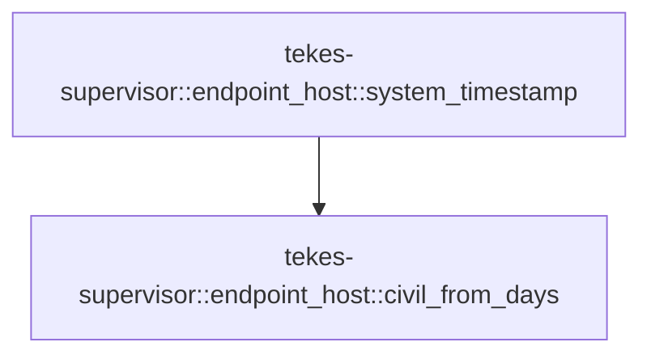

# tekes-supervisor::endpoint_host

[Package atlas](index.md) · [Source](../../src/endpoint_host.rs)

## Declarations

Visibility is the declaration spelling; trait members and reexports require their enclosing interface. `cfg` is not evaluated.

| Symbol | Kind | Visibility | Test / cfg |
|---|---|---|---|
| [tekes-supervisor::endpoint_host::EndpointRouteClass](../../src/endpoint_host.rs#L29) | enum_item | `pub` |  |
| [tekes-supervisor::endpoint_host::EndpointRoute](../../src/endpoint_host.rs#L37) | struct_item | `pub` |  |
| [tekes-supervisor::endpoint_host::TEKES_UNARY_ROUTES](../../src/endpoint_host.rs#L43) | const_item | `pub` |  |
| [tekes-supervisor::endpoint_host::route](../../src/endpoint_host.rs#L59) | function_item | `private` |  |
| [tekes-supervisor::endpoint_host::EndpointClock](../../src/endpoint_host.rs#L67) | type_item | `pub` |  |
| [tekes-supervisor::endpoint_host::RuntimeModelReadiness](../../src/endpoint_host.rs#L70) | struct_item | `pub` |  |
| [tekes-supervisor::endpoint_host::RuntimeProviderStatus](../../src/endpoint_host.rs#L77) | enum_item | `pub` |  |
| [tekes-supervisor::endpoint_host::RuntimeProviderFailure](../../src/endpoint_host.rs#L83) | enum_item | `pub` |  |
| [tekes-supervisor::endpoint_host::RuntimeProviderReadiness](../../src/endpoint_host.rs#L91) | struct_item | `pub` |  |
| [tekes-supervisor::endpoint_host::ProviderReadinessAuthority](../../src/endpoint_host.rs#L100) | trait_item | `pub` |  |
| [tekes-supervisor::endpoint_host::ProviderReadinessAuthority::readiness](../../src/endpoint_host.rs#L101) | function_signature_item | `private` |  |
| [tekes-supervisor::endpoint_host::ProviderReadinessAuthority::config_mutation_succeeded](../../src/endpoint_host.rs#L110) | function_item | `private` |  |
| [tekes-supervisor::endpoint_host::SessionDeliveryAuthority](../../src/endpoint_host.rs#L119) | trait_item | `pub` |  |
| [tekes-supervisor::endpoint_host::SessionDeliveryAuthority::session_metadata_changed](../../src/endpoint_host.rs#L123) | function_item | `private` |  |
| [tekes-supervisor::endpoint_host::SessionDeliveryAuthority::workspace_metadata_changed](../../src/endpoint_host.rs#L127) | function_item | `private` |  |
| [tekes-supervisor::endpoint_host::SessionDeliveryAuthority::prompt](../../src/endpoint_host.rs#L129) | function_signature_item | `private` |  |
| [tekes-supervisor::endpoint_host::SessionDeliveryAuthority::cancel](../../src/endpoint_host.rs#L138) | function_signature_item | `private` |  |
| [tekes-supervisor::endpoint_host::SessionDeliveryAuthority::rename](../../src/endpoint_host.rs#L145) | function_signature_item | `private` |  |
| [tekes-supervisor::endpoint_host::SessionDeliveryAuthority::compact](../../src/endpoint_host.rs#L159) | function_item | `private` |  |
| [tekes-supervisor::endpoint_host::QueueTransactionAuthority](../../src/endpoint_host.rs#L176) | trait_item | `pub` |  |
| [tekes-supervisor::endpoint_host::QueueTransactionAuthority::execute](../../src/endpoint_host.rs#L177) | function_signature_item | `private` |  |
| [tekes-supervisor::endpoint_host::recover_pending_management](../../src/endpoint_host.rs#L190) | function_item | `pub(crate)` |  |
| [tekes-supervisor::endpoint_host::QueueRecoveryAdapter](../../src/endpoint_host.rs#L199) | struct_item | `private` |  |
| [tekes-supervisor::endpoint_host::QueueRecoveryAdapter::execute](../../src/endpoint_host.rs#L204) | function_item | `private` |  |
| [tekes-supervisor::endpoint_host::SessionAdmissionGates](../../src/endpoint_host.rs#L241) | struct_item | `pub` |  |
| [tekes-supervisor::endpoint_host::SessionAdmissionGates::gate](../../src/endpoint_host.rs#L246) | function_item | `pub` |  |
| [tekes-supervisor::endpoint_host::SessionInputAdmissionAuthority](../../src/endpoint_host.rs#L265) | struct_item | `pub` |  |
| [tekes-supervisor::endpoint_host::SessionInputAdmissionAuthority::new](../../src/endpoint_host.rs#L272) | function_item | `pub` |  |
| [tekes-supervisor::endpoint_host::SessionInputAdmissionAuthority::gates](../../src/endpoint_host.rs#L280) | function_item | `pub` |  |
| [tekes-supervisor::endpoint_host::SessionInputAdmissionAuthority::root](../../src/endpoint_host.rs#L286) | function_item | `pub` |  |
| [tekes-supervisor::endpoint_host::SessionInputAdmissionAuthority::with_active_session](../../src/endpoint_host.rs#L290) | function_item | `pub` |  |
| [tekes-supervisor::endpoint_host::SessionInputAdmissionAuthority::with_session_gate](../../src/endpoint_host.rs#L315) | function_item | `pub` |  |
| [tekes-supervisor::endpoint_host::session_details](../../src/endpoint_host.rs#L340) | function_item | `private` |  |
| [tekes-supervisor::endpoint_host::ProductionEndpointRoutes](../../src/endpoint_host.rs#L350) | trait_item | `pub` |  |
| [tekes-supervisor::endpoint_host::ProductionEndpointRoutes::capabilities](../../src/endpoint_host.rs#L351) | function_signature_item | `private` |  |
| [tekes-supervisor::endpoint_host::ProductionEndpointRoutes::extension_method_class](../../src/endpoint_host.rs#L356) | function_item | `private` |  |
| [tekes-supervisor::endpoint_host::ProductionEndpointRoutes::validate_extension_payload](../../src/endpoint_host.rs#L362) | function_item | `private` |  |
| [tekes-supervisor::endpoint_host::ProductionEndpointRoutes::extension_failure_is_exact](../../src/endpoint_host.rs#L377) | function_item | `private` |  |
| [tekes-supervisor::endpoint_host::ProductionEndpointRoutes::execute](../../src/endpoint_host.rs#L385) | function_signature_item | `private` |  |
| [tekes-supervisor::endpoint_host::CompositeProductionEndpointRoutes](../../src/endpoint_host.rs#L396) | struct_item | `pub` |  |
| [tekes-supervisor::endpoint_host::CompositeProductionEndpointRoutes::compose](../../src/endpoint_host.rs#L401) | function_item | `pub` |  |
| [tekes-supervisor::endpoint_host::CompositeProductionEndpointRoutes::owner](../../src/endpoint_host.rs#L429) | function_item | `private` |  |
| [tekes-supervisor::endpoint_host::CompositeProductionEndpointRoutes::capabilities](../../src/endpoint_host.rs#L435) | function_item | `private` |  |
| [tekes-supervisor::endpoint_host::CompositeProductionEndpointRoutes::extension_method_class](../../src/endpoint_host.rs#L439) | function_item | `private` |  |
| [tekes-supervisor::endpoint_host::CompositeProductionEndpointRoutes::validate_extension_payload](../../src/endpoint_host.rs#L443) | function_item | `private` |  |
| [tekes-supervisor::endpoint_host::CompositeProductionEndpointRoutes::extension_failure_is_exact](../../src/endpoint_host.rs#L453) | function_item | `private` |  |
| [tekes-supervisor::endpoint_host::CompositeProductionEndpointRoutes::execute](../../src/endpoint_host.rs#L462) | function_item | `private` |  |
| [tekes-supervisor::endpoint_host::ProductionRouteCompositionError](../../src/endpoint_host.rs#L475) | enum_item | `pub` |  |
| [tekes-supervisor::endpoint_host::unsupported_route](../../src/endpoint_host.rs#L482) | function_item | `private` |  |
| [tekes-supervisor::endpoint_host::ProductionRouteFailure](../../src/endpoint_host.rs#L492) | struct_item | `pub` |  |
| [tekes-supervisor::endpoint_host::ProductionRouteFailure::new](../../src/endpoint_host.rs#L499) | function_item | `pub` |  |
| [tekes-supervisor::endpoint_host::ProductionEndpointHost](../../src/endpoint_host.rs#L508) | struct_item | `pub` |  |
| [tekes-supervisor::endpoint_host::ProductionEndpointHost::with_user_agent_dir](../../src/endpoint_host.rs#L531) | function_item | `pub` |  |
| [tekes-supervisor::endpoint_host::ProductionEndpointHost::mux_description](../../src/endpoint_host.rs#L536) | function_item | `pub` |  |
| [tekes-supervisor::endpoint_host::ProductionEndpointHost::open](../../src/endpoint_host.rs#L561) | function_item | `pub` |  |
| [tekes-supervisor::endpoint_host::ProductionEndpointHost::open_with_clock](../../src/endpoint_host.rs#L576) | function_item | `pub` |  |
| [tekes-supervisor::endpoint_host::ProductionEndpointHost::open_with_routes](../../src/endpoint_host.rs#L585) | function_item | `pub` |  |
| [tekes-supervisor::endpoint_host::ProductionEndpointHost::open_with_authorities](../../src/endpoint_host.rs#L594) | function_item | `pub` |  |
| [tekes-supervisor::endpoint_host::ProductionEndpointHost::open_with_full_authorities](../../src/endpoint_host.rs#L612) | function_item | `pub` |  |
| [tekes-supervisor::endpoint_host::ProductionEndpointHost::open_with_full_authorities_and_session_admission](../../src/endpoint_host.rs#L635) | function_item | `pub` |  |
| [tekes-supervisor::endpoint_host::ProductionEndpointHost::open_with_route_authority](../../src/endpoint_host.rs#L661) | function_item | `pub` |  |
| [tekes-supervisor::endpoint_host::ProductionEndpointHost::open_with_route_ownership](../../src/endpoint_host.rs#L684) | function_item | `private` |  |
| [tekes-supervisor::endpoint_host::ProductionEndpointHost::implemented_capabilities](../../src/endpoint_host.rs#L751) | function_item | `pub` |  |
| [tekes-supervisor::endpoint_host::ProductionEndpointHost::admission_gates](../../src/endpoint_host.rs#L760) | function_item | `pub` |  |
| [tekes-supervisor::endpoint_host::ProductionEndpointHost::session_admission_authority](../../src/endpoint_host.rs#L765) | function_item | `pub` |  |
| [tekes-supervisor::endpoint_host::ProductionEndpointHost::has_incomplete_management_operation](../../src/endpoint_host.rs#L769) | function_item | `pub` |  |
| [tekes-supervisor::endpoint_host::ProductionEndpointHost::execute](../../src/endpoint_host.rs#L778) | function_item | `private` |  |
| [tekes-supervisor::endpoint_host::ProductionEndpointHost::execute_inner](../../src/endpoint_host.rs#L786) | function_item | `private` |  |
| [tekes-supervisor::endpoint_host::ProductionEndpointHost::execute_extension](../../src/endpoint_host.rs#L814) | function_item | `private` |  |
| [tekes-supervisor::endpoint_host::ProductionEndpointHost::archive_session](../../src/endpoint_host.rs#L863) | function_item | `private` |  |
| [tekes-supervisor::endpoint_host::ProductionEndpointHost::unarchive_session](../../src/endpoint_host.rs#L886) | function_item | `private` |  |
| [tekes-supervisor::endpoint_host::ProductionEndpointHost::create_session](../../src/endpoint_host.rs#L903) | function_item | `private` |  |
| [tekes-supervisor::endpoint_host::ProductionEndpointHost::draft_models](../../src/endpoint_host.rs#L965) | function_item | `private` |  |
| [tekes-supervisor::endpoint_host::ProductionEndpointHost::models](../../src/endpoint_host.rs#L1002) | function_item | `private` |  |
| [tekes-supervisor::endpoint_host::ProductionEndpointHost::select_model](../../src/endpoint_host.rs#L1022) | function_item | `private` |  |
| [tekes-supervisor::endpoint_host::ProductionEndpointHost::cancel](../../src/endpoint_host.rs#L1081) | function_item | `private` |  |
| [tekes-supervisor::endpoint_host::ProductionEndpointHost::rename_session](../../src/endpoint_host.rs#L1111) | function_item | `private` |  |
| [tekes-supervisor::endpoint_host::ProductionEndpointHost::update_queue](../../src/endpoint_host.rs#L1149) | function_item | `private` |  |
| [tekes-supervisor::endpoint_host::ProductionEndpointHost::prompt](../../src/endpoint_host.rs#L1238) | function_item | `private` |  |
| [tekes-supervisor::endpoint_host::ProductionEndpointHost::attachment](../../src/endpoint_host.rs#L1295) | function_item | `private` |  |
| [tekes-supervisor::endpoint_host::ProductionEndpointHost::fork_session](../../src/endpoint_host.rs#L1311) | function_item | `private` |  |
| [tekes-supervisor::endpoint_host::ProductionEndpointHost::discard_session](../../src/endpoint_host.rs#L1348) | function_item | `private` |  |
| [tekes-supervisor::endpoint_host::ProductionEndpointHost::admission_gate](../../src/endpoint_host.rs#L1371) | function_item | `private` |  |
| [tekes-supervisor::endpoint_host::ProductionEndpointHost::ensure_active_session](../../src/endpoint_host.rs#L1378) | function_item | `private` |  |
| [tekes-supervisor::endpoint_host::ProductionEndpointHost::capabilities](../../src/endpoint_host.rs#L1399) | function_item | `private` |  |
| [tekes-supervisor::endpoint_host::ProductionEndpointHost::extension_capabilities](../../src/endpoint_host.rs#L1420) | function_item | `private` |  |
| [tekes-supervisor::endpoint_host::ProductionEndpointHost::method_class](../../src/endpoint_host.rs#L1430) | function_item | `private` |  |
| [tekes-supervisor::endpoint_host::ProductionEndpointHost::validate_request](../../src/endpoint_host.rs#L1446) | function_item | `private` |  |
| [tekes-supervisor::endpoint_host::ProductionEndpointHost::call](../../src/endpoint_host.rs#L1470) | function_item | `private` |  |
| [tekes-supervisor::endpoint_host::ProductionEndpointAssembly](../../src/endpoint_host.rs#L1475) | struct_item | `pub` |  |
| [tekes-supervisor::endpoint_host::ProductionEndpointAssembly::open](../../src/endpoint_host.rs#L1482) | function_item | `pub` |  |
| [tekes-supervisor::endpoint_host::ProductionEndpointAssembly::open_with_clock](../../src/endpoint_host.rs#L1494) | function_item | `pub` |  |
| [tekes-supervisor::endpoint_host::ProductionEndpointAssembly::open_with_routes](../../src/endpoint_host.rs#L1507) | function_item | `pub` |  |
| [tekes-supervisor::endpoint_host::ProductionEndpointAssembly::open_with_route_authority](../../src/endpoint_host.rs#L1521) | function_item | `pub` |  |
| [tekes-supervisor::endpoint_host::ProductionEndpointAssembly::open_with_authorities](../../src/endpoint_host.rs#L1543) | function_item | `pub` |  |
| [tekes-supervisor::endpoint_host::ProductionEndpointAssembly::open_with_full_authorities](../../src/endpoint_host.rs#L1561) | function_item | `pub` |  |
| [tekes-supervisor::endpoint_host::ProductionEndpointAssembly::dispatch](../../src/endpoint_host.rs#L1586) | function_item | `pub` |  |
| [tekes-supervisor::endpoint_host::ProductionEndpointAssembly::hub](../../src/endpoint_host.rs#L1594) | function_item | `pub` |  |
| [tekes-supervisor::endpoint_host::ProductionEndpointAssembly::host](../../src/endpoint_host.rs#L1599) | function_item | `pub` |  |
| [tekes-supervisor::endpoint_host::ProductionEndpointAssembly::admission_gates](../../src/endpoint_host.rs#L1604) | function_item | `pub` |  |
| [tekes-supervisor::endpoint_host::ProductionEndpointAssembly::has_incomplete_management_operation](../../src/endpoint_host.rs#L1608) | function_item | `pub` |  |
| [tekes-supervisor::endpoint_host::success](../../src/endpoint_host.rs#L1616) | function_item | `private` |  |
| [tekes-supervisor::endpoint_host::model_projection](../../src/endpoint_host.rs#L1624) | function_item | `private` |  |
| [tekes-supervisor::endpoint_host::ConfiguredModels](../../src/endpoint_host.rs#L1719) | struct_item | `pub` |  |
| [tekes-supervisor::endpoint_host::ConfiguredModels::model_available](../../src/endpoint_host.rs#L1722) | function_item | `private` |  |
| [tekes-supervisor::endpoint_host::model_is_configured](../../src/endpoint_host.rs#L1733) | function_item | `private` |  |
| [tekes-supervisor::endpoint_host::runtime_failure_name](../../src/endpoint_host.rs#L1764) | function_item | `private` |  |
| [tekes-supervisor::endpoint_host::map_production_route](../../src/endpoint_host.rs#L1773) | function_item | `private` |  |
| [tekes-supervisor::endpoint_host::map_production_route_for](../../src/endpoint_host.rs#L1781) | function_item | `private` |  |
| [tekes-supervisor::endpoint_host::sanitized_route_log_message](../../src/endpoint_host.rs#L1795) | function_item | `private` |  |
| [tekes-supervisor::endpoint_host::production_failure_is_exact_for](../../src/endpoint_host.rs#L1815) | function_item | `pub(crate)` |  |
| [tekes-supervisor::endpoint_host::route_error_is_exact](../../src/endpoint_host.rs#L1822) | function_item | `private` |  |
| [tekes-supervisor::endpoint_host::route_error_message](../../src/endpoint_host.rs#L1906) | function_item | `private` |  |
| [tekes-supervisor::endpoint_host::exact_string_fields](../../src/endpoint_host.rs#L1938) | function_item | `private` |  |
| [tekes-supervisor::endpoint_host::route_allows_error](../../src/endpoint_host.rs#L1959) | function_item | `private` |  |
| [tekes-supervisor::endpoint_host::internal_failure](../../src/endpoint_host.rs#L2067) | function_item | `private` |  |
| [tekes-supervisor::endpoint_host::failure](../../src/endpoint_host.rs#L2071) | function_item | `private` |  |
| [tekes-supervisor::endpoint_host::required_string](../../src/endpoint_host.rs#L2083) | function_item | `private` |  |
| [tekes-supervisor::endpoint_host::required_string_allow_whitespace](../../src/endpoint_host.rs#L2092) | function_item | `private` |  |
| [tekes-supervisor::endpoint_host::optional_bool](../../src/endpoint_host.rs#L2103) | function_item | `private` |  |
| [tekes-supervisor::endpoint_host::optional_string](../../src/endpoint_host.rs#L2113) | function_item | `private` |  |
| [tekes-supervisor::endpoint_host::require_object_fields](../../src/endpoint_host.rs#L2124) | function_item | `private` |  |
| [tekes-supervisor::endpoint_host::optional_u64](../../src/endpoint_host.rs#L2140) | function_item | `private` |  |
| [tekes-supervisor::endpoint_host::to_ijson](../../src/endpoint_host.rs#L2150) | function_item | `private` |  |
| [tekes-supervisor::endpoint_host::request_hash](../../src/endpoint_host.rs#L2154) | function_item | `private` |  |
| [tekes-supervisor::endpoint_host::mark_management_handoff](../../src/endpoint_host.rs#L2168) | function_item | `private` |  |
| [tekes-supervisor::endpoint_host::mark_event_handoff](../../src/endpoint_host.rs#L2182) | function_item | `private` |  |
| [tekes-supervisor::endpoint_host::endpoint_origin](../../src/endpoint_host.rs#L2196) | function_item | `private` |  |
| [tekes-supervisor::endpoint_host::validate_session_title](../../src/endpoint_host.rs#L2211) | function_item | `private` |  |
| [tekes-supervisor::endpoint_host::PendingQueueAction](../../src/endpoint_host.rs#L2222) | enum_item | `private` |  |
| [tekes-supervisor::endpoint_host::PendingQueueAction::with_origin](../../src/endpoint_host.rs#L2229) | function_item | `private` |  |
| [tekes-supervisor::endpoint_host::queue_action](../../src/endpoint_host.rs#L2245) | function_item | `private` |  |
| [tekes-supervisor::endpoint_host::map_queue_rejection](../../src/endpoint_host.rs#L2295) | function_item | `private` |  |
| [tekes-supervisor::endpoint_host::queue_decision](../../src/endpoint_host.rs#L2319) | function_item | `private` |  |
| [tekes-supervisor::endpoint_host::map_persisted_queue_rejection](../../src/endpoint_host.rs#L2344) | function_item | `private` |  |
| [tekes-supervisor::endpoint_host::validate_time_zone](../../src/endpoint_host.rs#L2358) | function_item | `private` |  |
| [tekes-supervisor::endpoint_host::map_prompt_error](../../src/endpoint_host.rs#L2384) | function_item | `private` |  |
| [tekes-supervisor::endpoint_host::map_attachment_read_error](../../src/endpoint_host.rs#L2404) | function_item | `private` |  |
| [tekes-supervisor::endpoint_host::attachment_failure](../../src/endpoint_host.rs#L2421) | function_item | `private` |  |
| [tekes-supervisor::endpoint_host::attachment_reason](../../src/endpoint_host.rs#L2429) | function_item | `private` |  |
| [tekes-supervisor::endpoint_host::validate_extension_payload](../../src/endpoint_host.rs#L2444) | function_item | `private` |  |
| [tekes-supervisor::endpoint_host::validate_production_payload](../../src/endpoint_host.rs#L2500) | function_item | `private` |  |
| [tekes-supervisor::endpoint_host::invalid](../../src/endpoint_host.rs#L2504) | function_item | `private` |  |
| [tekes-supervisor::endpoint_host::map_endpoint](../../src/endpoint_host.rs#L2508) | function_item | `private` |  |
| [tekes-supervisor::endpoint_host::map_management](../../src/endpoint_host.rs#L2525) | function_item | `private` |  |
| [tekes-supervisor::endpoint_host::internal_json](../../src/endpoint_host.rs#L2605) | function_item | `private` |  |
| [tekes-supervisor::endpoint_host::internal_schema](../../src/endpoint_host.rs#L2609) | function_item | `private` |  |
| [tekes-supervisor::endpoint_host::internal_assembly](../../src/endpoint_host.rs#L2613) | function_item | `private` |  |
| [tekes-supervisor::endpoint_host::EndpointRpcFailure](../../src/endpoint_host.rs#L2617) | struct_item | `private` |  |
| [tekes-supervisor::endpoint_host::EndpointRpcFailure::new](../../src/endpoint_host.rs#L2624) | function_item | `private` |  |
| [tekes-supervisor::endpoint_host::system_timestamp](../../src/endpoint_host.rs#L2636) | function_item | `private` |  |
| [tekes-supervisor::endpoint_host::civil_from_days](../../src/endpoint_host.rs#L2653) | function_item | `private` |  |
| [tekes-supervisor::endpoint_host::EndpointAssemblyError](../../src/endpoint_host.rs#L2669) | enum_item | `pub` |  |

## Imports / reexports

| Local name | Source path | Visibility |
|---|---|---|
| `BTreeSet` | `std::collections::BTreeSet` | `private` |
| `HashMap` | `std::collections::HashMap` | `private` |
| `Path` | `std::path::Path` | `private` |
| `PathBuf` | `std::path::PathBuf` | `private` |
| `Arc` | `std::sync::Arc` | `private` |
| `Mutex` | `std::sync::Mutex` | `private` |
| `SystemTime` | `std::time::SystemTime` | `private` |
| `UNIX_EPOCH` | `std::time::UNIX_EPOCH` | `private` |
| `AttachmentAuthority` | `endpoint::AttachmentAuthority` | `private` |
| `AttachmentErrorReason` | `endpoint::AttachmentErrorReason` | `private` |
| `AttachmentReadError` | `endpoint::AttachmentReadError` | `private` |
| `ClientRequest` | `endpoint::ClientRequest` | `private` |
| `DurableHandoffProof` | `endpoint::DurableHandoffProof` | `private` |
| `EndpointDispatcher` | `endpoint::EndpointDispatcher` | `private` |
| `EndpointHost` | `endpoint::EndpointHost` | `private` |
| `EndpointHostCall` | `endpoint::EndpointHostCall` | `private` |
| `EndpointHostFuture` | `endpoint::EndpointHostFuture` | `private` |
| `EndpointSubscriptionHub` | `endpoint::EndpointSubscriptionHub` | `private` |
| `ExecutionCreateOperation` | `endpoint::ExecutionCreateOperation` | `private` |
| `ForkSessionOperation` | `endpoint::ForkSessionOperation` | `private` |
| `HostFailure` | `endpoint::HostFailure` | `private` |
| `MaterializedPrompt` | `endpoint::MaterializedPrompt` | `private` |
| `NativeEndpoint` | `endpoint::NativeEndpoint` | `private` |
| `NativeEndpointError` | `endpoint::NativeEndpointError` | `private` |
| `PendingQueueTransaction` | `endpoint::PendingQueueTransaction` | `private` |
| `PromptMaterializeError` | `endpoint::PromptMaterializeError` | `private` |
| `PromptPart` | `endpoint::PromptPart` | `private` |
| `QueueRecoveryDriver` | `endpoint::QueueRecoveryDriver` | `private` |
| `QueueTransactionCompletion` | `endpoint::QueueTransactionCompletion` | `private` |
| `QueueTransactionDecision` | `endpoint::QueueTransactionDecision` | `private` |
| `QueueTransactionOperation` | `endpoint::QueueTransactionOperation` | `private` |
| `QueueTransactionState` | `endpoint::QueueTransactionState` | `private` |
| `RpcDurableIdentity` | `endpoint::RpcDurableIdentity` | `private` |
| `RpcError` | `endpoint::RpcError` | `private` |
| `RpcRegistry` | `endpoint::RpcRegistry` | `private` |
| `RpcResult` | `endpoint::RpcResult` | `private` |
| `SelectModelOperation` | `endpoint::SelectModelOperation` | `private` |
| `ServerResponse` | `endpoint::ServerResponse` | `private` |
| `SessionHostDescription` | `endpoint::SessionHostDescription` | `private` |
| `SessionOperationError` | `endpoint::SessionOperationError` | `private` |
| `SessionOperations` | `endpoint::SessionOperations` | `private` |
| `IJsonValue` | `schema::IJsonValue` | `private` |
| `OriginTuple` | `schema::OriginTuple` | `private` |
| `Value` | `serde_json::Value` | `private` |
| `json` | `serde_json::json` | `private` |
| `Digest` | `sha2::Digest` | `private` |
| `Sha256` | `sha2::Sha256` | `private` |
| `Error` | `thiserror::Error` | `private` |

## Module declarations

| Module | Visibility | Attributes |
|---|---|---|

## Function call graphs

Edges below are syntactically resolved calls only, including private functions. Graphs partition callers into groups of 20; they are not execution order. All unresolved sites are listed below and in the JSON inventory.

Functions 1–20: 15 direct edges

```mermaid
flowchart TD
  n0["endpoint::session_operations::SessionOperations::open_sessions"]
  n1["endpoint::types::validate_session_id"]
  n2["schema::ijson::IJsonValue::parse"]
  n3["schema::ijson::IJsonValue::parse_str"]
  n4["tekes-supervisor::endpoint_host::ProviderReadinessAuthority::config_mutation_succeeded"]
  n5["tekes-supervisor::endpoint_host::SessionDeliveryAuthority::session_metadata_changed"]
  n6["tekes-supervisor::endpoint_host::SessionDeliveryAuthority::workspace_metadata_changed"]
  n7["tekes-supervisor::endpoint_host::SessionDeliveryAuthority::compact"]
  n8["tekes-supervisor::endpoint_host::recover_pending_management"]
  n9["tekes-supervisor::endpoint_host::QueueRecoveryAdapter::execute"]
  n10["tekes-supervisor::endpoint_host::queue_decision"]
  n11["tekes-supervisor::endpoint_host::SessionAdmissionGates::gate"]
  n12["tekes-supervisor::endpoint_host::SessionInputAdmissionAuthority::new"]
  n13["tekes-supervisor::endpoint_host::SessionInputAdmissionAuthority::gates"]
  n14["tekes-supervisor::endpoint_host::SessionInputAdmissionAuthority::root"]
  n15["tekes-supervisor::endpoint_host::SessionInputAdmissionAuthority::with_active_session"]
  n16["tekes-supervisor::endpoint_host::SessionInputAdmissionAuthority::with_session_gate"]
  n17["tekes-supervisor::endpoint_host::session_details"]
  n18["tekes-supervisor::endpoint_host::ProductionEndpointRoutes::extension_method_class"]
  n19["tekes-supervisor::endpoint_host::ProductionEndpointRoutes::validate_extension_payload"]
  n20["tekes-supervisor::endpoint_host::ProductionEndpointRoutes::extension_failure_is_exact"]
  n21["tekes-supervisor::endpoint_host::CompositeProductionEndpointRoutes::compose"]
  n22["tekes-supervisor::endpoint_host::CompositeProductionEndpointRoutes::owner"]
  n23["tekes-supervisor::endpoint_host::CompositeProductionEndpointRoutes::capabilities"]
  n24["tekes-supervisor::endpoint_host::ProductionRouteFailure::new"]
  n25["tekes-supervisor::endpoint_host::route"]
  n7 --> n3
  n7 --> n24
  n8 --> n0
  n9 --> n10
  n11 --> n3
  n11 --> n24
  n15 --> n16
  n15 --> n17
  n15 --> n24
  n16 --> n1
  n16 --> n3
  n16 --> n24
  n17 --> n2
  n19 --> n2
  n19 --> n24
```

Functions 21–40: 16 direct edges

```mermaid
flowchart TD
  n0["endpoint::attachment::AttachmentAuthority::open"]
  n1["endpoint::mux::SessionEndpointCapability::required"]
  n2["endpoint::service::NativeEndpoint::open"]
  n3["endpoint::session_operations::SessionOperations::open_sessions"]
  n4["schema::ijson::IJsonValue::parse"]
  n5["tekes-supervisor::endpoint_host::SessionInputAdmissionAuthority::new"]
  n6["tekes-supervisor::endpoint_host::CompositeProductionEndpointRoutes::extension_method_class"]
  n7["tekes-supervisor::endpoint_host::CompositeProductionEndpointRoutes::validate_extension_payload"]
  n8["tekes-supervisor::endpoint_host::CompositeProductionEndpointRoutes::extension_failure_is_exact"]
  n9["tekes-supervisor::endpoint_host::CompositeProductionEndpointRoutes::execute"]
  n10["tekes-supervisor::endpoint_host::unsupported_route"]
  n11["tekes-supervisor::endpoint_host::ProductionRouteFailure::new"]
  n12["tekes-supervisor::endpoint_host::ProductionEndpointHost::with_user_agent_dir"]
  n13["tekes-supervisor::endpoint_host::ProductionEndpointHost::mux_description"]
  n14["tekes-supervisor::endpoint_host::ProductionEndpointHost::open"]
  n15["tekes-supervisor::endpoint_host::ProductionEndpointHost::open_with_clock"]
  n16["tekes-supervisor::endpoint_host::ProductionEndpointHost::open_with_routes"]
  n17["tekes-supervisor::endpoint_host::ProductionEndpointHost::open_with_authorities"]
  n18["tekes-supervisor::endpoint_host::ProductionEndpointHost::open_with_full_authorities"]
  n19["tekes-supervisor::endpoint_host::ProductionEndpointHost::open_with_full_authorities_and_session_admission"]
  n20["tekes-supervisor::endpoint_host::ProductionEndpointHost::open_with_route_authority"]
  n21["tekes-supervisor::endpoint_host::ProductionEndpointHost::open_with_route_ownership"]
  n22["tekes-supervisor::endpoint_host::ProductionEndpointHost::implemented_capabilities"]
  n23["tekes-supervisor::endpoint_host::ProductionEndpointHost::admission_gates"]
  n24["tekes-supervisor::endpoint_host::ProductionEndpointHost::session_admission_authority"]
  n25["tekes-supervisor::endpoint_host::ProductionEndpointHost::has_incomplete_management_operation"]
  n7 --> n10
  n9 --> n10
  n10 --> n4
  n10 --> n11
  n13 --> n1
  n14 --> n18
  n15 --> n18
  n16 --> n18
  n17 --> n18
  n18 --> n21
  n19 --> n21
  n20 --> n21
  n21 --> n0
  n21 --> n2
  n21 --> n3
  n21 --> n5
```

Functions 41–60: 128 direct edges

```mermaid
flowchart TD
  n0["endpoint::types::validate_session_id"]
  n1["profile::config::ConfigRepository::open"]
  n2["tekes-supervisor::endpoint_host::ProductionEndpointHost::models"]
  n3["tekes-supervisor::endpoint_host::ProductionEndpointHost::select_model"]
  n4["tekes-supervisor::endpoint_host::ProductionEndpointHost::cancel"]
  n5["tekes-supervisor::endpoint_host::ProductionEndpointHost::rename_session"]
  n6["tekes-supervisor::endpoint_host::ProductionEndpointHost::update_queue"]
  n7["tekes-supervisor::endpoint_host::ProductionEndpointHost::prompt"]
  n8["tekes-supervisor::endpoint_host::ProductionEndpointHost::attachment"]
  n9["tekes-supervisor::endpoint_host::ProductionEndpointHost::fork_session"]
  n10["tekes-supervisor::endpoint_host::ProductionEndpointHost::discard_session"]
  n11["tekes-supervisor::endpoint_host::ProductionEndpointHost::admission_gate"]
  n12["tekes-supervisor::endpoint_host::ProductionEndpointHost::ensure_active_session"]
  n13["tekes-supervisor::endpoint_host::ProductionEndpointHost::capabilities"]
  n14["tekes-supervisor::endpoint_host::ProductionEndpointHost::extension_capabilities"]
  n15["tekes-supervisor::endpoint_host::success"]
  n16["tekes-supervisor::endpoint_host::model_projection"]
  n17["tekes-supervisor::endpoint_host::model_is_configured"]
  n18["tekes-supervisor::endpoint_host::map_production_route"]
  n19["tekes-supervisor::endpoint_host::map_production_route_for"]
  n20["tekes-supervisor::endpoint_host::internal_failure"]
  n21["tekes-supervisor::endpoint_host::failure"]
  n22["tekes-supervisor::endpoint_host::required_string"]
  n23["tekes-supervisor::endpoint_host::required_string_allow_whitespace"]
  n24["tekes-supervisor::endpoint_host::optional_bool"]
  n25["tekes-supervisor::endpoint_host::optional_string"]
  n26["tekes-supervisor::endpoint_host::require_object_fields"]
  n27["tekes-supervisor::endpoint_host::optional_u64"]
  n28["tekes-supervisor::endpoint_host::to_ijson"]
  n29["tekes-supervisor::endpoint_host::request_hash"]
  n30["tekes-supervisor::endpoint_host::mark_management_handoff"]
  n31["tekes-supervisor::endpoint_host::mark_event_handoff"]
  n32["tekes-supervisor::endpoint_host::endpoint_origin"]
  n33["tekes-supervisor::endpoint_host::validate_session_title"]
  n34["tekes-supervisor::endpoint_host::queue_action"]
  n35["tekes-supervisor::endpoint_host::queue_decision"]
  n36["tekes-supervisor::endpoint_host::map_persisted_queue_rejection"]
  n37["tekes-supervisor::endpoint_host::validate_time_zone"]
  n38["tekes-supervisor::endpoint_host::validate_extension_payload"]
  n39["tekes-supervisor::endpoint_host::invalid"]
  n40["tekes-supervisor::endpoint_host::map_endpoint"]
  n41["tekes-supervisor::endpoint_host::EndpointRpcFailure::new"]
  n42["tekes-supervisor::endpoint_host::ProductionEndpointHost::execute"]
  n43["tekes-supervisor::endpoint_host::ProductionEndpointHost::execute_inner"]
  n44["tekes-supervisor::endpoint_host::ProductionEndpointHost::execute_extension"]
  n45["tekes-supervisor::endpoint_host::ProductionEndpointHost::archive_session"]
  n46["tekes-supervisor::endpoint_host::ProductionEndpointHost::unarchive_session"]
  n47["tekes-supervisor::endpoint_host::ProductionEndpointHost::create_session"]
  n48["tekes-supervisor::endpoint_host::ProductionEndpointHost::draft_models"]
  n49["tools::guidance::IdentityProfile::parse"]
  n2 --> n16
  n2 --> n19
  n2 --> n22
  n2 --> n26
  n2 --> n40
  n2 --> n41
  n3 --> n11
  n3 --> n17
  n3 --> n19
  n3 --> n20
  n3 --> n22
  n3 --> n25
  n3 --> n26
  n3 --> n28
  n3 --> n29
  n3 --> n30
  n3 --> n40
  n3 --> n41
  n4 --> n11
  n4 --> n19
  n4 --> n20
  n4 --> n22
  n4 --> n26
  n4 --> n28
  n4 --> n31
  n4 --> n32
  n4 --> n41
  n5 --> n11
  n5 --> n19
  n5 --> n20
  n5 --> n22
  n5 --> n23
  n5 --> n26
  n5 --> n28
  n5 --> n31
  n5 --> n32
  n5 --> n33
  n5 --> n41
  n6 --> n11
  n6 --> n19
  n6 --> n20
  n6 --> n22
  n6 --> n26
  n6 --> n28
  n6 --> n29
  n6 --> n30
  n6 --> n32
  n6 --> n34
  n6 --> n35
  n6 --> n36
  n6 --> n39
  n6 --> n41
  n7 --> n19
  n7 --> n22
  n7 --> n25
  n7 --> n26
  n7 --> n28
  n7 --> n31
  n7 --> n32
  n7 --> n37
  n7 --> n39
  n7 --> n41
  n8 --> n12
  n8 --> n22
  n8 --> n26
  n8 --> n28
  n9 --> n22
  n9 --> n24
  n9 --> n26
  n9 --> n27
  n9 --> n28
  n9 --> n29
  n9 --> n30
  n10 --> n19
  n10 --> n22
  n10 --> n26
  n10 --> n28
  n10 --> n29
  n10 --> n30
  n12 --> n0
  n12 --> n39
  n12 --> n41
  n42 --> n15
  n42 --> n21
  n42 --> n43
  n43 --> n2
  n43 --> n3
  n43 --> n4
  n43 --> n5
  n43 --> n6
  n43 --> n7
  n43 --> n8
  n43 --> n9
  n43 --> n10
  n43 --> n44
  n43 --> n45
  n43 --> n46
  n43 --> n47
  n43 --> n48
  n44 --> n18
  n44 --> n19
  n44 --> n20
  n44 --> n38
  n44 --> n41
  n45 --> n19
  n45 --> n22
  n45 --> n26
  n45 --> n28
  n45 --> n29
  n45 --> n30
  n46 --> n22
  n46 --> n26
  n46 --> n28
  n46 --> n29
  n46 --> n30
  n47 --> n25
  n47 --> n26
  n47 --> n28
  n47 --> n29
  n47 --> n30
  n47 --> n39
  n47 --> n41
  n47 --> n49
  n48 --> n1
  n48 --> n16
  n48 --> n19
  n48 --> n20
  n48 --> n26
```

Functions 61–80: 23 direct edges

```mermaid
flowchart TD
  n0["endpoint::host::EndpointDispatcher::new"]
  n1["endpoint::idempotency::RpcRegistry::open"]
  n2["provider::dialect::resolve_profile"]
  n3["tekes-supervisor::endpoint_host::ProductionEndpointHost::method_class"]
  n4["tekes-supervisor::endpoint_host::ProductionEndpointHost::validate_request"]
  n5["tekes-supervisor::endpoint_host::ProductionEndpointHost::call"]
  n6["tekes-supervisor::endpoint_host::ProductionEndpointAssembly::open"]
  n7["tekes-supervisor::endpoint_host::ProductionEndpointAssembly::open_with_clock"]
  n8["tekes-supervisor::endpoint_host::ProductionEndpointAssembly::open_with_routes"]
  n9["tekes-supervisor::endpoint_host::ProductionEndpointAssembly::open_with_route_authority"]
  n10["tekes-supervisor::endpoint_host::ProductionEndpointAssembly::open_with_authorities"]
  n11["tekes-supervisor::endpoint_host::ProductionEndpointAssembly::open_with_full_authorities"]
  n12["tekes-supervisor::endpoint_host::ProductionEndpointAssembly::dispatch"]
  n13["tekes-supervisor::endpoint_host::ProductionEndpointAssembly::hub"]
  n14["tekes-supervisor::endpoint_host::ProductionEndpointAssembly::host"]
  n15["tekes-supervisor::endpoint_host::ProductionEndpointAssembly::admission_gates"]
  n16["tekes-supervisor::endpoint_host::ProductionEndpointAssembly::has_incomplete_management_operation"]
  n17["tekes-supervisor::endpoint_host::success"]
  n18["tekes-supervisor::endpoint_host::model_projection"]
  n19["tekes-supervisor::endpoint_host::ConfiguredModels::model_available"]
  n20["tekes-supervisor::endpoint_host::model_is_configured"]
  n21["tekes-supervisor::endpoint_host::runtime_failure_name"]
  n22["tekes-supervisor::endpoint_host::map_production_route"]
  n23["tekes-supervisor::endpoint_host::internal_failure"]
  n24["tekes-supervisor::endpoint_host::to_ijson"]
  n25["tekes-supervisor::endpoint_host::validate_production_payload"]
  n26["tekes-supervisor::endpoint_host::ProductionEndpointHost::open"]
  n27["tekes-supervisor::endpoint_host::ProductionEndpointHost::open_with_clock"]
  n28["tekes-supervisor::endpoint_host::ProductionEndpointHost::open_with_routes"]
  n29["tekes-supervisor::endpoint_host::ProductionEndpointHost::open_with_full_authorities"]
  n30["tekes-supervisor::endpoint_host::ProductionEndpointHost::open_with_route_authority"]
  n4 --> n25
  n6 --> n0
  n6 --> n1
  n6 --> n26
  n7 --> n0
  n7 --> n1
  n7 --> n27
  n8 --> n0
  n8 --> n1
  n8 --> n28
  n9 --> n0
  n9 --> n1
  n9 --> n30
  n10 --> n11
  n11 --> n0
  n11 --> n1
  n11 --> n29
  n18 --> n2
  n18 --> n20
  n18 --> n23
  n18 --> n24
  n19 --> n20
  n20 --> n2
```

Functions 81–100: 20 direct edges

```mermaid
flowchart TD
  n0["schema::ijson::IJsonValue::parse"]
  n1["tekes-supervisor::endpoint_host::map_production_route"]
  n2["tekes-supervisor::endpoint_host::map_production_route_for"]
  n3["tekes-supervisor::endpoint_host::sanitized_route_log_message"]
  n4["tekes-supervisor::endpoint_host::production_failure_is_exact_for"]
  n5["tekes-supervisor::endpoint_host::route_error_is_exact"]
  n6["tekes-supervisor::endpoint_host::route_error_message"]
  n7["tekes-supervisor::endpoint_host::exact_string_fields"]
  n8["tekes-supervisor::endpoint_host::route_allows_error"]
  n9["tekes-supervisor::endpoint_host::internal_failure"]
  n10["tekes-supervisor::endpoint_host::failure"]
  n11["tekes-supervisor::endpoint_host::required_string"]
  n12["tekes-supervisor::endpoint_host::required_string_allow_whitespace"]
  n13["tekes-supervisor::endpoint_host::optional_bool"]
  n14["tekes-supervisor::endpoint_host::optional_string"]
  n15["tekes-supervisor::endpoint_host::require_object_fields"]
  n16["tekes-supervisor::endpoint_host::optional_u64"]
  n17["tekes-supervisor::endpoint_host::to_ijson"]
  n18["tekes-supervisor::endpoint_host::request_hash"]
  n19["tekes-supervisor::endpoint_host::mark_management_handoff"]
  n20["tekes-supervisor::endpoint_host::mark_event_handoff"]
  n21["tekes-supervisor::endpoint_host::endpoint_origin"]
  n22["tekes-supervisor::endpoint_host::invalid"]
  n23["tekes-supervisor::endpoint_host::EndpointRpcFailure::new"]
  n2 --> n1
  n2 --> n3
  n2 --> n4
  n2 --> n9
  n3 --> n0
  n4 --> n5
  n4 --> n8
  n5 --> n6
  n5 --> n7
  n9 --> n23
  n11 --> n22
  n12 --> n22
  n13 --> n22
  n14 --> n22
  n15 --> n22
  n16 --> n22
  n17 --> n0
  n18 --> n23
  n19 --> n23
  n20 --> n9
```

Functions 101–120: 26 direct edges

```mermaid
flowchart TD
  n0["schema::ijson::IJsonValue::parse"]
  n1["schema::ijson::IJsonValue::parse_str"]
  n2["tekes-supervisor::endpoint_host::internal_failure"]
  n3["tekes-supervisor::endpoint_host::require_object_fields"]
  n4["tekes-supervisor::endpoint_host::validate_session_title"]
  n5["tekes-supervisor::endpoint_host::PendingQueueAction::with_origin"]
  n6["tekes-supervisor::endpoint_host::queue_action"]
  n7["tekes-supervisor::endpoint_host::map_queue_rejection"]
  n8["tekes-supervisor::endpoint_host::queue_decision"]
  n9["tekes-supervisor::endpoint_host::map_persisted_queue_rejection"]
  n10["tekes-supervisor::endpoint_host::validate_time_zone"]
  n11["tekes-supervisor::endpoint_host::map_prompt_error"]
  n12["tekes-supervisor::endpoint_host::map_attachment_read_error"]
  n13["tekes-supervisor::endpoint_host::attachment_failure"]
  n14["tekes-supervisor::endpoint_host::attachment_reason"]
  n15["tekes-supervisor::endpoint_host::validate_extension_payload"]
  n16["tekes-supervisor::endpoint_host::validate_production_payload"]
  n17["tekes-supervisor::endpoint_host::invalid"]
  n18["tekes-supervisor::endpoint_host::map_endpoint"]
  n19["tekes-supervisor::endpoint_host::map_management"]
  n20["tekes-supervisor::endpoint_host::internal_json"]
  n21["tekes-supervisor::endpoint_host::internal_schema"]
  n22["tekes-supervisor::endpoint_host::internal_assembly"]
  n23["tekes-supervisor::endpoint_host::EndpointRpcFailure::new"]
  n6 --> n17
  n6 --> n23
  n7 --> n23
  n9 --> n2
  n9 --> n7
  n10 --> n17
  n11 --> n2
  n11 --> n13
  n11 --> n17
  n11 --> n23
  n12 --> n2
  n12 --> n13
  n12 --> n23
  n13 --> n23
  n15 --> n3
  n15 --> n17
  n15 --> n23
  n16 --> n15
  n17 --> n23
  n18 --> n23
  n19 --> n23
  n20 --> n23
  n21 --> n23
  n22 --> n23
  n23 --> n0
  n23 --> n1
```

Functions 121–122: 1 direct edges

```mermaid
flowchart TD
  n0["tekes-supervisor::endpoint_host::system_timestamp"]
  n1["tekes-supervisor::endpoint_host::civil_from_days"]
  n0 --> n1
```

## Call sites

Includes test functions (marked in declarations). Receiver-type-required sites need type analysis/manual tracing. Calls in closures are attributed to their enclosing function; their occurrence here does not mean the closure executes immediately.

| Caller | Callee expression | Source lines | Target / classification |
|---|---|---|---|
| `TEKES_UNARY_ROUTES` | `route` | [44](../../src/endpoint_host.rs#L44), [45](../../src/endpoint_host.rs#L45), [46](../../src/endpoint_host.rs#L46), [47](../../src/endpoint_host.rs#L47), [48](../../src/endpoint_host.rs#L48), [49](../../src/endpoint_host.rs#L49), [50](../../src/endpoint_host.rs#L50), [51](../../src/endpoint_host.rs#L51), [52](../../src/endpoint_host.rs#L52), [53](../../src/endpoint_host.rs#L53), [54](../../src/endpoint_host.rs#L54), [55](../../src/endpoint_host.rs#L55), [56](../../src/endpoint_host.rs#L56) | [tekes-supervisor::endpoint_host::route](../../src/endpoint_host.rs#L59) |
| `config_mutation_succeeded` | `Ok` | [111](../../src/endpoint_host.rs#L111) | external-constructor-callback-or-unresolved |
| `compact` | `Err` | [166](../../src/endpoint_host.rs#L166) | external-constructor-callback-or-unresolved |
| `compact` | `ProductionRouteFailure::new` | [166](../../src/endpoint_host.rs#L166) | [tekes-supervisor::endpoint_host::ProductionRouteFailure::new](../../src/endpoint_host.rs#L499) |
| `compact` | `IJsonValue::parse_str(r#"{"operation":"compact"}"#).expect` | [169](../../src/endpoint_host.rs#L169) | receiver-type-required |
| `compact` | `IJsonValue::parse_str` | [169](../../src/endpoint_host.rs#L169) | [schema::ijson::IJsonValue::parse_str](../../../schema/src/ijson.rs#L23) |
| `recover_pending_management` | `SessionOperations::open_sessions(root)?         .recover_sessions` | [195](../../src/endpoint_host.rs#L195) | receiver-type-required |
| `recover_pending_management` | `SessionOperations::open_sessions` | [195](../../src/endpoint_host.rs#L195) | [endpoint::session_operations::SessionOperations::open_sessions](../../../endpoint/src/session_operations.rs#L364) |
| `recover_pending_management` | `Some` | [196](../../src/endpoint_host.rs#L196) | external-constructor-callback-or-unresolved |
| `execute` | `serde_json::from_slice(&pending.action.canonical_bytes()?)             .map_err` | [208](../../src/endpoint_host.rs#L208) | receiver-type-required |
| `execute` | `serde_json::from_slice` | [208](../../src/endpoint_host.rs#L208) | external-constructor-callback-or-unresolved |
| `execute` | `pending.action.canonical_bytes` | [208](../../src/endpoint_host.rs#L208) | receiver-type-required |
| `execute` | `pending.rpc_id.clone` | [211](../../src/endpoint_host.rs#L211), [212](../../src/endpoint_host.rs#L212) | receiver-type-required |
| `execute` | `pending.retract_origin.clone` | [214](../../src/endpoint_host.rs#L214) | receiver-type-required |
| `execute` | `transaction.validate().map_err` | [217](../../src/endpoint_host.rs#L217) | receiver-type-required |
| `execute` | `transaction.validate` | [217](../../src/endpoint_host.rs#L217) | receiver-type-required |
| `execute` | `SessionOperationError::QueueRecoveryFailed` | [218](../../src/endpoint_host.rs#L218), [223](../../src/endpoint_host.rs#L223), [230](../../src/endpoint_host.rs#L230), [232](../../src/endpoint_host.rs#L232) | external-constructor-callback-or-unresolved |
| `execute` | `transaction.replacement_origin` | [222](../../src/endpoint_host.rs#L222) | receiver-type-required |
| `execute` | `pending.replacement_origin.as_ref` | [222](../../src/endpoint_host.rs#L222) | receiver-type-required |
| `execute` | `Err` | [223](../../src/endpoint_host.rs#L223) | external-constructor-callback-or-unresolved |
| `execute` | `"prepared replacement origin disagrees with action".to_owned` | [224](../../src/endpoint_host.rs#L224) | receiver-type-required |
| `execute` | `self             .authority             .execute(&pending.session_id, &transaction)             .map_err` | [227](../../src/endpoint_host.rs#L227) | receiver-type-required |
| `execute` | `self             .authority             .execute` | [227](../../src/endpoint_host.rs#L227) | receiver-type-required |
| `execute` | `result.validate_for(&transaction).map_err` | [231](../../src/endpoint_host.rs#L231) | receiver-type-required |
| `execute` | `result.validate_for` | [231](../../src/endpoint_host.rs#L231) | receiver-type-required |
| `execute` | `Ok` | [236](../../src/endpoint_host.rs#L236) | external-constructor-callback-or-unresolved |
| `execute` | `queue_decision` | [236](../../src/endpoint_host.rs#L236) | [tekes-supervisor::endpoint_host::queue_decision](../../src/endpoint_host.rs#L2319) |
| `gate` | `self.gates.lock().map_err` | [247](../../src/endpoint_host.rs#L247) | receiver-type-required |
| `gate` | `self.gates.lock` | [247](../../src/endpoint_host.rs#L247) | receiver-type-required |
| `gate` | `ProductionRouteFailure::new` | [248](../../src/endpoint_host.rs#L248) | [tekes-supervisor::endpoint_host::ProductionRouteFailure::new](../../src/endpoint_host.rs#L499) |
| `gate` | `IJsonValue::parse_str("{}").expect` | [251](../../src/endpoint_host.rs#L251) | receiver-type-required |
| `gate` | `IJsonValue::parse_str` | [251](../../src/endpoint_host.rs#L251) | [schema::ijson::IJsonValue::parse_str](../../../schema/src/ijson.rs#L23) |
| `gate` | `Ok` | [254](../../src/endpoint_host.rs#L254) | external-constructor-callback-or-unresolved |
| `gate` | `gates             .entry(session_id.to_owned())             .or_insert_with(&#124;&#124; Arc::new(Mutex::new(())))             .clone` | [254](../../src/endpoint_host.rs#L254) | receiver-type-required |
| `gate` | `gates             .entry(session_id.to_owned())             .or_insert_with` | [254](../../src/endpoint_host.rs#L254) | receiver-type-required |
| `gate` | `gates             .entry` | [254](../../src/endpoint_host.rs#L254) | receiver-type-required |
| `gate` | `session_id.to_owned` | [255](../../src/endpoint_host.rs#L255) | receiver-type-required |
| `gate` | `Arc::new` | [256](../../src/endpoint_host.rs#L256) | external-constructor-callback-or-unresolved |
| `gate` | `Mutex::new` | [256](../../src/endpoint_host.rs#L256) | external-constructor-callback-or-unresolved |
| `new` | `root.into` | [274](../../src/endpoint_host.rs#L274) | receiver-type-required |
| `new` | `Arc::new` | [275](../../src/endpoint_host.rs#L275) | external-constructor-callback-or-unresolved |
| `new` | `SessionAdmissionGates::default` | [275](../../src/endpoint_host.rs#L275) | external-constructor-callback-or-unresolved |
| `gates` | `Arc::clone` | [281](../../src/endpoint_host.rs#L281) | external-constructor-callback-or-unresolved |
| `with_active_session` | `self.with_session_gate` | [296](../../src/endpoint_host.rs#L296) | [tekes-supervisor::endpoint_host::SessionInputAdmissionAuthority::with_session_gate](../../src/endpoint_host.rs#L315) |
| `with_active_session` | `self.root.join("archive").join(session_id).is_dir` | [297](../../src/endpoint_host.rs#L297) | receiver-type-required |
| `with_active_session` | `self.root.join("archive").join` | [297](../../src/endpoint_host.rs#L297) | receiver-type-required |
| `with_active_session` | `self.root.join` | [297](../../src/endpoint_host.rs#L297), [304](../../src/endpoint_host.rs#L304) | receiver-type-required |
| `with_active_session` | `Err` | [298](../../src/endpoint_host.rs#L298), [305](../../src/endpoint_host.rs#L305) | external-constructor-callback-or-unresolved |
| `with_active_session` | `map_failure` | [298](../../src/endpoint_host.rs#L298), [305](../../src/endpoint_host.rs#L305) | external-constructor-callback-or-unresolved |
| `with_active_session` | `ProductionRouteFailure::new` | [298](../../src/endpoint_host.rs#L298), [305](../../src/endpoint_host.rs#L305) | [tekes-supervisor::endpoint_host::ProductionRouteFailure::new](../../src/endpoint_host.rs#L499) |
| `with_active_session` | `session_details` | [301](../../src/endpoint_host.rs#L301), [308](../../src/endpoint_host.rs#L308) | [tekes-supervisor::endpoint_host::session_details](../../src/endpoint_host.rs#L340) |
| `with_active_session` | `self.root.join("threads").join(session_id).is_dir` | [304](../../src/endpoint_host.rs#L304) | receiver-type-required |
| `with_active_session` | `self.root.join("threads").join` | [304](../../src/endpoint_host.rs#L304) | receiver-type-required |
| `with_active_session` | `operation` | [311](../../src/endpoint_host.rs#L311) | external-constructor-callback-or-unresolved |
| `with_session_gate` | `endpoint::validate_session_id(session_id).is_err` | [321](../../src/endpoint_host.rs#L321) | receiver-type-required |
| `with_session_gate` | `endpoint::validate_session_id` | [321](../../src/endpoint_host.rs#L321) | [endpoint::types::validate_session_id](../../../endpoint/src/types.rs#L130) |
| `with_session_gate` | `Err` | [322](../../src/endpoint_host.rs#L322) | external-constructor-callback-or-unresolved |
| `with_session_gate` | `map_failure` | [322](../../src/endpoint_host.rs#L322), [330](../../src/endpoint_host.rs#L330) | external-constructor-callback-or-unresolved |
| `with_session_gate` | `ProductionRouteFailure::new` | [322](../../src/endpoint_host.rs#L322), [330](../../src/endpoint_host.rs#L330) | [tekes-supervisor::endpoint_host::ProductionRouteFailure::new](../../src/endpoint_host.rs#L499) |
| `with_session_gate` | `IJsonValue::parse_str("{}").expect` | [325](../../src/endpoint_host.rs#L325), [333](../../src/endpoint_host.rs#L333) | receiver-type-required |
| `with_session_gate` | `IJsonValue::parse_str` | [325](../../src/endpoint_host.rs#L325), [333](../../src/endpoint_host.rs#L333) | [schema::ijson::IJsonValue::parse_str](../../../schema/src/ijson.rs#L23) |
| `with_session_gate` | `self.gates.gate(session_id).map_err` | [328](../../src/endpoint_host.rs#L328) | receiver-type-required |
| `with_session_gate` | `self.gates.gate` | [328](../../src/endpoint_host.rs#L328) | receiver-type-required |
| `with_session_gate` | `gate.lock().map_err` | [329](../../src/endpoint_host.rs#L329) | receiver-type-required |
| `with_session_gate` | `gate.lock` | [329](../../src/endpoint_host.rs#L329) | receiver-type-required |
| `with_session_gate` | `operation` | [336](../../src/endpoint_host.rs#L336) | external-constructor-callback-or-unresolved |
| `session_details` | `IJsonValue::parse(&serde_json::to_vec(&json!({"sessionId":session_id})).expect("JSON"))         .expect` | [341](../../src/endpoint_host.rs#L341) | receiver-type-required |
| `session_details` | `IJsonValue::parse` | [341](../../src/endpoint_host.rs#L341) | [schema::ijson::IJsonValue::parse](../../../schema/src/ijson.rs#L16) |
| `session_details` | `serde_json::to_vec(&json!({"sessionId":session_id})).expect` | [341](../../src/endpoint_host.rs#L341) | receiver-type-required |
| `session_details` | `serde_json::to_vec` | [341](../../src/endpoint_host.rs#L341) | external-constructor-callback-or-unresolved |
| `validate_extension_payload` | `Err` | [367](../../src/endpoint_host.rs#L367) | external-constructor-callback-or-unresolved |
| `validate_extension_payload` | `ProductionRouteFailure::new` | [367](../../src/endpoint_host.rs#L367) | [tekes-supervisor::endpoint_host::ProductionRouteFailure::new](../../src/endpoint_host.rs#L499) |
| `validate_extension_payload` | `IJsonValue::parse(&serde_json::to_vec(&json!({"operation":operation})).expect("JSON"))                 .expect` | [370](../../src/endpoint_host.rs#L370) | receiver-type-required |
| `validate_extension_payload` | `IJsonValue::parse` | [370](../../src/endpoint_host.rs#L370) | [schema::ijson::IJsonValue::parse](../../../schema/src/ijson.rs#L16) |
| `validate_extension_payload` | `serde_json::to_vec(&json!({"operation":operation})).expect` | [370](../../src/endpoint_host.rs#L370) | receiver-type-required |
| `validate_extension_payload` | `serde_json::to_vec` | [370](../../src/endpoint_host.rs#L370) | external-constructor-callback-or-unresolved |
| `compose` | `HashMap::new` | [404](../../src/endpoint_host.rs#L404) | external-constructor-callback-or-unresolved |
| `compose` | `TEKES_UNARY_ROUTES             .iter()             .map(&#124;route&#124; route.name)             .collect::<BTreeSet<_>>` | [405](../../src/endpoint_host.rs#L405) | receiver-type-required |
| `compose` | `TEKES_UNARY_ROUTES             .iter()             .map` | [405](../../src/endpoint_host.rs#L405) | receiver-type-required |
| `compose` | `TEKES_UNARY_ROUTES             .iter` | [405](../../src/endpoint_host.rs#L405) | receiver-type-required |
| `compose` | `route.capabilities` | [410](../../src/endpoint_host.rs#L410) | receiver-type-required |
| `compose` | `frozen.contains` | [411](../../src/endpoint_host.rs#L411) | receiver-type-required |
| `compose` | `capability.as_str` | [411](../../src/endpoint_host.rs#L411) | receiver-type-required |
| `compose` | `Err` | [412](../../src/endpoint_host.rs#L412), [420](../../src/endpoint_host.rs#L420) | external-constructor-callback-or-unresolved |
| `compose` | `ProductionRouteCompositionError::FrozenCapability` | [412](../../src/endpoint_host.rs#L412) | external-constructor-callback-or-unresolved |
| `compose` | `owners                     .insert(capability.clone(), Arc::clone(&route))                     .is_some` | [416](../../src/endpoint_host.rs#L416) | receiver-type-required |
| `compose` | `owners                     .insert` | [416](../../src/endpoint_host.rs#L416) | receiver-type-required |
| `compose` | `capability.clone` | [417](../../src/endpoint_host.rs#L417) | receiver-type-required |
| `compose` | `Arc::clone` | [417](../../src/endpoint_host.rs#L417) | external-constructor-callback-or-unresolved |
| `compose` | `ProductionRouteCompositionError::DuplicateCapability` | [420](../../src/endpoint_host.rs#L420) | external-constructor-callback-or-unresolved |
| `compose` | `Ok` | [426](../../src/endpoint_host.rs#L426) | external-constructor-callback-or-unresolved |
| `owner` | `self.owners.get` | [430](../../src/endpoint_host.rs#L430) | receiver-type-required |
| `capabilities` | `self.owners.keys().cloned().collect` | [436](../../src/endpoint_host.rs#L436) | receiver-type-required |
| `capabilities` | `self.owners.keys().cloned` | [436](../../src/endpoint_host.rs#L436) | receiver-type-required |
| `capabilities` | `self.owners.keys` | [436](../../src/endpoint_host.rs#L436) | receiver-type-required |
| `extension_method_class` | `self.owner(method)?.extension_method_class` | [440](../../src/endpoint_host.rs#L440) | receiver-type-required |
| `extension_method_class` | `self.owner` | [440](../../src/endpoint_host.rs#L440) | receiver-type-required |
| `validate_extension_payload` | `self.owner(operation)             .ok_or_else(&#124;&#124; unsupported_route(operation))?             .validate_extension_payload` | [448](../../src/endpoint_host.rs#L448) | receiver-type-required |
| `validate_extension_payload` | `self.owner(operation)             .ok_or_else` | [448](../../src/endpoint_host.rs#L448) | receiver-type-required |
| `validate_extension_payload` | `self.owner` | [448](../../src/endpoint_host.rs#L448) | receiver-type-required |
| `validate_extension_payload` | `unsupported_route` | [449](../../src/endpoint_host.rs#L449) | [tekes-supervisor::endpoint_host::unsupported_route](../../src/endpoint_host.rs#L482) |
| `extension_failure_is_exact` | `self.owner(operation)             .is_some_and` | [458](../../src/endpoint_host.rs#L458) | receiver-type-required |
| `extension_failure_is_exact` | `self.owner` | [458](../../src/endpoint_host.rs#L458) | receiver-type-required |
| `extension_failure_is_exact` | `owner.extension_failure_is_exact` | [459](../../src/endpoint_host.rs#L459) | receiver-type-required |
| `execute` | `self.owner(&request.operation)             .ok_or_else(&#124;&#124; unsupported_route(&request.operation))?             .execute` | [468](../../src/endpoint_host.rs#L468) | receiver-type-required |
| `execute` | `self.owner(&request.operation)             .ok_or_else` | [468](../../src/endpoint_host.rs#L468) | receiver-type-required |
| `execute` | `self.owner` | [468](../../src/endpoint_host.rs#L468) | receiver-type-required |
| `execute` | `unsupported_route` | [469](../../src/endpoint_host.rs#L469) | [tekes-supervisor::endpoint_host::unsupported_route](../../src/endpoint_host.rs#L482) |
| `unsupported_route` | `ProductionRouteFailure::new` | [483](../../src/endpoint_host.rs#L483) | [tekes-supervisor::endpoint_host::ProductionRouteFailure::new](../../src/endpoint_host.rs#L499) |
| `unsupported_route` | `IJsonValue::parse(&serde_json::to_vec(&json!({"operation":operation})).expect("JSON"))             .expect` | [486](../../src/endpoint_host.rs#L486) | receiver-type-required |
| `unsupported_route` | `IJsonValue::parse` | [486](../../src/endpoint_host.rs#L486) | [schema::ijson::IJsonValue::parse](../../../schema/src/ijson.rs#L16) |
| `unsupported_route` | `serde_json::to_vec(&json!({"operation":operation})).expect` | [486](../../src/endpoint_host.rs#L486) | receiver-type-required |
| `unsupported_route` | `serde_json::to_vec` | [486](../../src/endpoint_host.rs#L486) | external-constructor-callback-or-unresolved |
| `new` | `code.into` | [501](../../src/endpoint_host.rs#L501) | receiver-type-required |
| `new` | `message.into` | [502](../../src/endpoint_host.rs#L502) | receiver-type-required |
| `with_user_agent_dir` | `user_agent_dir.to_path_buf` | [532](../../src/endpoint_host.rs#L532) | receiver-type-required |
| `mux_description` | `endpoint::SessionEndpointCapability::required` | [537](../../src/endpoint_host.rs#L537) | [endpoint::mux::SessionEndpointCapability::required](../../../endpoint/src/mux.rs#L34) |
| `mux_description` | `capabilities.extend` | [538](../../src/endpoint_host.rs#L538) | receiver-type-required |
| `mux_description` | `self.provider_readiness.is_some` | [542](../../src/endpoint_host.rs#L542) | receiver-type-required |
| `mux_description` | `capabilities.insert` | [543](../../src/endpoint_host.rs#L543) | receiver-type-required |
| `mux_description` | `"TekesKernel".to_owned` | [548](../../src/endpoint_host.rs#L548) | receiver-type-required |
| `mux_description` | `self.description.version.clone` | [549](../../src/endpoint_host.rs#L549) | receiver-type-required |
| `mux_description` | `self.description.cwd.clone` | [552](../../src/endpoint_host.rs#L552) | receiver-type-required |
| `mux_description` | `self.description.provider.clone` | [553](../../src/endpoint_host.rs#L553) | receiver-type-required |
| `mux_description` | `self.description.model.clone` | [554](../../src/endpoint_host.rs#L554) | receiver-type-required |
| `mux_description` | `self.description.home.clone` | [556](../../src/endpoint_host.rs#L556) | receiver-type-required |
| `open` | `Self::open_with_full_authorities` | [565](../../src/endpoint_host.rs#L565) | [tekes-supervisor::endpoint_host::ProductionEndpointHost::open_with_full_authorities](../../src/endpoint_host.rs#L612) |
| `open` | `Arc::new` | [568](../../src/endpoint_host.rs#L568) | external-constructor-callback-or-unresolved |
| `open_with_clock` | `root.as_ref` | [581](../../src/endpoint_host.rs#L581) | receiver-type-required |
| `open_with_clock` | `Self::open_with_full_authorities` | [582](../../src/endpoint_host.rs#L582) | [tekes-supervisor::endpoint_host::ProductionEndpointHost::open_with_full_authorities](../../src/endpoint_host.rs#L612) |
| `open_with_routes` | `Self::open_with_full_authorities` | [591](../../src/endpoint_host.rs#L591) | [tekes-supervisor::endpoint_host::ProductionEndpointHost::open_with_full_authorities](../../src/endpoint_host.rs#L612) |
| `open_with_authorities` | `Self::open_with_full_authorities` | [601](../../src/endpoint_host.rs#L601) | [tekes-supervisor::endpoint_host::ProductionEndpointHost::open_with_full_authorities](../../src/endpoint_host.rs#L612) |
| `open_with_full_authorities` | `Self::open_with_route_ownership` | [621](../../src/endpoint_host.rs#L621) | [tekes-supervisor::endpoint_host::ProductionEndpointHost::open_with_route_ownership](../../src/endpoint_host.rs#L684) |
| `open_with_full_authorities_and_session_admission` | `Self::open_with_route_ownership` | [645](../../src/endpoint_host.rs#L645) | [tekes-supervisor::endpoint_host::ProductionEndpointHost::open_with_route_ownership](../../src/endpoint_host.rs#L684) |
| `open_with_full_authorities_and_session_admission` | `Some` | [654](../../src/endpoint_host.rs#L654) | external-constructor-callback-or-unresolved |
| `open_with_route_authority` | `Self::open_with_route_ownership` | [670](../../src/endpoint_host.rs#L670) | [tekes-supervisor::endpoint_host::ProductionEndpointHost::open_with_route_ownership](../../src/endpoint_host.rs#L684) |
| `open_with_route_authority` | `Some` | [674](../../src/endpoint_host.rs#L674) | external-constructor-callback-or-unresolved |
| `open_with_route_ownership` | `root.as_ref` | [695](../../src/endpoint_host.rs#L695) | receiver-type-required |
| `open_with_route_ownership` | `routes.as_ref` | [696](../../src/endpoint_host.rs#L696) | receiver-type-required |
| `open_with_route_ownership` | `TEKES_UNARY_ROUTES                 .iter()                 .map(&#124;route&#124; route.name)                 .collect::<BTreeSet<_>>` | [697](../../src/endpoint_host.rs#L697) | receiver-type-required |
| `open_with_route_ownership` | `TEKES_UNARY_ROUTES                 .iter()                 .map` | [697](../../src/endpoint_host.rs#L697) | receiver-type-required |
| `open_with_route_ownership` | `TEKES_UNARY_ROUTES                 .iter` | [697](../../src/endpoint_host.rs#L697) | receiver-type-required |
| `open_with_route_ownership` | `extension.capabilities().iter().any` | [701](../../src/endpoint_host.rs#L701) | receiver-type-required |
| `open_with_route_ownership` | `extension.capabilities().iter` | [701](../../src/endpoint_host.rs#L701) | receiver-type-required |
| `open_with_route_ownership` | `extension.capabilities` | [701](../../src/endpoint_host.rs#L701) | receiver-type-required |
| `open_with_route_ownership` | `frozen.contains` | [703](../../src/endpoint_host.rs#L703), [705](../../src/endpoint_host.rs#L705) | receiver-type-required |
| `open_with_route_ownership` | `method.as_str` | [703](../../src/endpoint_host.rs#L703), [705](../../src/endpoint_host.rs#L705) | receiver-type-required |
| `open_with_route_ownership` | `Err` | [712](../../src/endpoint_host.rs#L712) | external-constructor-callback-or-unresolved |
| `open_with_route_ownership` | `PathBuf::from(&description.home).join` | [715](../../src/endpoint_host.rs#L715) | receiver-type-required |
| `open_with_route_ownership` | `PathBuf::from` | [715](../../src/endpoint_host.rs#L715) | external-constructor-callback-or-unresolved |
| `open_with_route_ownership` | `queue_authority             .as_deref()             .map` | [716](../../src/endpoint_host.rs#L716) | receiver-type-required |
| `open_with_route_ownership` | `queue_authority             .as_deref` | [716](../../src/endpoint_host.rs#L716) | receiver-type-required |
| `open_with_route_ownership` | `SessionOperations::open_sessions` | [719](../../src/endpoint_host.rs#L719) | [endpoint::session_operations::SessionOperations::open_sessions](../../../endpoint/src/session_operations.rs#L364) |
| `open_with_route_ownership` | `management.recover_sessions` | [720](../../src/endpoint_host.rs#L720) | receiver-type-required |
| `open_with_route_ownership` | `queue_recovery                 .as_ref()                 .map` | [721](../../src/endpoint_host.rs#L721) | receiver-type-required |
| `open_with_route_ownership` | `queue_recovery                 .as_ref` | [721](../../src/endpoint_host.rs#L721) | receiver-type-required |
| `open_with_route_ownership` | `Ok` | [728](../../src/endpoint_host.rs#L728) | external-constructor-callback-or-unresolved |
| `open_with_route_ownership` | `root.to_path_buf` | [729](../../src/endpoint_host.rs#L729), [745](../../src/endpoint_host.rs#L745) | receiver-type-required |
| `open_with_route_ownership` | `NativeEndpoint::open` | [730](../../src/endpoint_host.rs#L730) | [endpoint::service::NativeEndpoint::open](../../../endpoint/src/service.rs#L263) |
| `open_with_route_ownership` | `AttachmentAuthority::open` | [731](../../src/endpoint_host.rs#L731) | [endpoint::attachment::AttachmentAuthority::open](../../../endpoint/src/attachment.rs#L242) |
| `open_with_route_ownership` | `input_admission.unwrap_or_else` | [744](../../src/endpoint_host.rs#L744) | receiver-type-required |
| `open_with_route_ownership` | `Arc::new` | [745](../../src/endpoint_host.rs#L745) | external-constructor-callback-or-unresolved |
| `open_with_route_ownership` | `SessionInputAdmissionAuthority::new` | [745](../../src/endpoint_host.rs#L745) | [tekes-supervisor::endpoint_host::SessionInputAdmissionAuthority::new](../../src/endpoint_host.rs#L272) |
| `implemented_capabilities` | `TEKES_UNARY_ROUTES             .iter()             .filter(&#124;route&#124; route.implemented)             .map(&#124;route&#124; route.name.to_owned())             .collect` | [752](../../src/endpoint_host.rs#L752) | receiver-type-required |
| `implemented_capabilities` | `TEKES_UNARY_ROUTES             .iter()             .filter(&#124;route&#124; route.implemented)             .map` | [752](../../src/endpoint_host.rs#L752) | receiver-type-required |
| `implemented_capabilities` | `TEKES_UNARY_ROUTES             .iter()             .filter` | [752](../../src/endpoint_host.rs#L752) | receiver-type-required |
| `implemented_capabilities` | `TEKES_UNARY_ROUTES             .iter` | [752](../../src/endpoint_host.rs#L752) | receiver-type-required |
| `implemented_capabilities` | `route.name.to_owned` | [755](../../src/endpoint_host.rs#L755) | receiver-type-required |
| `admission_gates` | `self.input_admission.gates` | [761](../../src/endpoint_host.rs#L761) | receiver-type-required |
| `session_admission_authority` | `Arc::clone` | [766](../../src/endpoint_host.rs#L766) | external-constructor-callback-or-unresolved |
| `has_incomplete_management_operation` | `Ok` | [773](../../src/endpoint_host.rs#L773) | external-constructor-callback-or-unresolved |
| `has_incomplete_management_operation` | `self             .management             .has_incomplete_session_operation` | [773](../../src/endpoint_host.rs#L773) | receiver-type-required |
| `execute` | `self.execute_inner` | [779](../../src/endpoint_host.rs#L779) | [tekes-supervisor::endpoint_host::ProductionEndpointHost::execute_inner](../../src/endpoint_host.rs#L786) |
| `execute` | `success` | [780](../../src/endpoint_host.rs#L780) | [tekes-supervisor::endpoint_host::success](../../src/endpoint_host.rs#L1616) |
| `execute` | `failure` | [783](../../src/endpoint_host.rs#L783) | [tekes-supervisor::endpoint_host::failure](../../src/endpoint_host.rs#L2071) |
| `execute_inner` | `serde_json::from_slice(&request.payload.canonical_bytes().map_err(internal_schema)?)                 .map_err` | [788](../../src/endpoint_host.rs#L788) | receiver-type-required |
| `execute_inner` | `serde_json::from_slice` | [788](../../src/endpoint_host.rs#L788) | external-constructor-callback-or-unresolved |
| `execute_inner` | `request.payload.canonical_bytes().map_err` | [788](../../src/endpoint_host.rs#L788) | receiver-type-required |
| `execute_inner` | `request.payload.canonical_bytes` | [788](../../src/endpoint_host.rs#L788) | receiver-type-required |
| `execute_inner` | `request.operation.as_str` | [790](../../src/endpoint_host.rs#L790) | receiver-type-required |
| `execute_inner` | `self.archive_session` | [791](../../src/endpoint_host.rs#L791) | [tekes-supervisor::endpoint_host::ProductionEndpointHost::archive_session](../../src/endpoint_host.rs#L863) |
| `execute_inner` | `self.unarchive_session` | [792](../../src/endpoint_host.rs#L792) | [tekes-supervisor::endpoint_host::ProductionEndpointHost::unarchive_session](../../src/endpoint_host.rs#L886) |
| `execute_inner` | `self.create_session` | [793](../../src/endpoint_host.rs#L793) | [tekes-supervisor::endpoint_host::ProductionEndpointHost::create_session](../../src/endpoint_host.rs#L903) |
| `execute_inner` | `self.provider_readiness.is_some` | [794](../../src/endpoint_host.rs#L794), [795](../../src/endpoint_host.rs#L795), [796](../../src/endpoint_host.rs#L796) | receiver-type-required |
| `execute_inner` | `self.models` | [794](../../src/endpoint_host.rs#L794) | [tekes-supervisor::endpoint_host::ProductionEndpointHost::models](../../src/endpoint_host.rs#L1002) |
| `execute_inner` | `self.draft_models` | [795](../../src/endpoint_host.rs#L795) | [tekes-supervisor::endpoint_host::ProductionEndpointHost::draft_models](../../src/endpoint_host.rs#L965) |
| `execute_inner` | `self.select_model` | [797](../../src/endpoint_host.rs#L797) | [tekes-supervisor::endpoint_host::ProductionEndpointHost::select_model](../../src/endpoint_host.rs#L1022) |
| `execute_inner` | `self.delivery_authority.is_some` | [799](../../src/endpoint_host.rs#L799), [800](../../src/endpoint_host.rs#L800), [806](../../src/endpoint_host.rs#L806) | receiver-type-required |
| `execute_inner` | `self.cancel` | [799](../../src/endpoint_host.rs#L799) | [tekes-supervisor::endpoint_host::ProductionEndpointHost::cancel](../../src/endpoint_host.rs#L1081) |
| `execute_inner` | `self.rename_session` | [801](../../src/endpoint_host.rs#L801) | [tekes-supervisor::endpoint_host::ProductionEndpointHost::rename_session](../../src/endpoint_host.rs#L1111) |
| `execute_inner` | `self.queue_authority.is_some` | [803](../../src/endpoint_host.rs#L803) | receiver-type-required |
| `execute_inner` | `self.update_queue` | [804](../../src/endpoint_host.rs#L804) | [tekes-supervisor::endpoint_host::ProductionEndpointHost::update_queue](../../src/endpoint_host.rs#L1149) |
| `execute_inner` | `self.prompt` | [806](../../src/endpoint_host.rs#L806) | [tekes-supervisor::endpoint_host::ProductionEndpointHost::prompt](../../src/endpoint_host.rs#L1238) |
| `execute_inner` | `self.attachment` | [807](../../src/endpoint_host.rs#L807) | [tekes-supervisor::endpoint_host::ProductionEndpointHost::attachment](../../src/endpoint_host.rs#L1295) |
| `execute_inner` | `self.fork_session` | [808](../../src/endpoint_host.rs#L808) | [tekes-supervisor::endpoint_host::ProductionEndpointHost::fork_session](../../src/endpoint_host.rs#L1311) |
| `execute_inner` | `self.discard_session` | [809](../../src/endpoint_host.rs#L809) | [tekes-supervisor::endpoint_host::ProductionEndpointHost::discard_session](../../src/endpoint_host.rs#L1348) |
| `execute_inner` | `self.execute_extension` | [810](../../src/endpoint_host.rs#L810) | [tekes-supervisor::endpoint_host::ProductionEndpointHost::execute_extension](../../src/endpoint_host.rs#L814) |
| `execute_extension` | `self.routes.as_ref` | [820](../../src/endpoint_host.rs#L820) | receiver-type-required |
| `execute_extension` | `Err` | [821](../../src/endpoint_host.rs#L821), [828](../../src/endpoint_host.rs#L828) | external-constructor-callback-or-unresolved |
| `execute_extension` | `EndpointRpcFailure::new` | [821](../../src/endpoint_host.rs#L821), [828](../../src/endpoint_host.rs#L828) | [tekes-supervisor::endpoint_host::EndpointRpcFailure::new](../../src/endpoint_host.rs#L2624) |
| `execute_extension` | `routes.capabilities().contains` | [827](../../src/endpoint_host.rs#L827) | receiver-type-required |
| `execute_extension` | `routes.capabilities` | [827](../../src/endpoint_host.rs#L827) | receiver-type-required |
| `execute_extension` | `TEKES_UNARY_ROUTES             .iter()             .any` | [834](../../src/endpoint_host.rs#L834) | receiver-type-required |
| `execute_extension` | `TEKES_UNARY_ROUTES             .iter` | [834](../../src/endpoint_host.rs#L834) | receiver-type-required |
| `execute_extension` | `validate_extension_payload` | [838](../../src/endpoint_host.rs#L838) | [tekes-supervisor::endpoint_host::validate_extension_payload](../../src/endpoint_host.rs#L2444) |
| `execute_extension` | `routes                 .validate_extension_payload(operation, payload)                 .map_err` | [840](../../src/endpoint_host.rs#L840) | receiver-type-required |
| `execute_extension` | `routes                 .validate_extension_payload` | [840](../../src/endpoint_host.rs#L840) | receiver-type-required |
| `execute_extension` | `routes.extension_failure_is_exact` | [843](../../src/endpoint_host.rs#L843), [855](../../src/endpoint_host.rs#L855) | receiver-type-required |
| `execute_extension` | `map_production_route` | [844](../../src/endpoint_host.rs#L844), [856](../../src/endpoint_host.rs#L856) | [tekes-supervisor::endpoint_host::map_production_route](../../src/endpoint_host.rs#L1773) |
| `execute_extension` | `internal_failure` | [846](../../src/endpoint_host.rs#L846), [858](../../src/endpoint_host.rs#L858) | [tekes-supervisor::endpoint_host::internal_failure](../../src/endpoint_host.rs#L2067) |
| `execute_extension` | `routes             .execute(request, payload, &self.principal)             .map_err` | [850](../../src/endpoint_host.rs#L850) | receiver-type-required |
| `execute_extension` | `routes             .execute` | [850](../../src/endpoint_host.rs#L850) | receiver-type-required |
| `execute_extension` | `map_production_route_for` | [854](../../src/endpoint_host.rs#L854) | [tekes-supervisor::endpoint_host::map_production_route_for](../../src/endpoint_host.rs#L1781) |
| `archive_session` | `require_object_fields` | [868](../../src/endpoint_host.rs#L868) | [tekes-supervisor::endpoint_host::require_object_fields](../../src/endpoint_host.rs#L2124) |
| `archive_session` | `required_string` | [869](../../src/endpoint_host.rs#L869) | [tekes-supervisor::endpoint_host::required_string](../../src/endpoint_host.rs#L2083) |
| `archive_session` | `self.input_admission.with_session_gate` | [870](../../src/endpoint_host.rs#L870) | receiver-type-required |
| `archive_session` | `map_production_route_for` | [872](../../src/endpoint_host.rs#L872) | [tekes-supervisor::endpoint_host::map_production_route_for](../../src/endpoint_host.rs#L1781) |
| `archive_session` | `(self.clock)().map_err` | [874](../../src/endpoint_host.rs#L874) | receiver-type-required |
| `archive_session` | `(self.clock)` | [874](../../src/endpoint_host.rs#L874) | external-constructor-callback-or-unresolved |
| `archive_session` | `request_hash` | [875](../../src/endpoint_host.rs#L875) | [tekes-supervisor::endpoint_host::request_hash](../../src/endpoint_host.rs#L2154) |
| `archive_session` | `self                     .management                     .archive_session(&request.rpc_id, &hash, session_id, &timestamp)                     .map_err` | [876](../../src/endpoint_host.rs#L876) | receiver-type-required |
| `archive_session` | `self                     .management                     .archive_session` | [876](../../src/endpoint_host.rs#L876) | receiver-type-required |
| `archive_session` | `mark_management_handoff` | [880](../../src/endpoint_host.rs#L880) | [tekes-supervisor::endpoint_host::mark_management_handoff](../../src/endpoint_host.rs#L2168) |
| `archive_session` | `to_ijson` | [881](../../src/endpoint_host.rs#L881) | [tekes-supervisor::endpoint_host::to_ijson](../../src/endpoint_host.rs#L2150) |
| `unarchive_session` | `require_object_fields` | [891](../../src/endpoint_host.rs#L891) | [tekes-supervisor::endpoint_host::require_object_fields](../../src/endpoint_host.rs#L2124) |
| `unarchive_session` | `required_string` | [892](../../src/endpoint_host.rs#L892) | [tekes-supervisor::endpoint_host::required_string](../../src/endpoint_host.rs#L2083) |
| `unarchive_session` | `(self.clock)().map_err` | [893](../../src/endpoint_host.rs#L893) | receiver-type-required |
| `unarchive_session` | `(self.clock)` | [893](../../src/endpoint_host.rs#L893) | external-constructor-callback-or-unresolved |
| `unarchive_session` | `request_hash` | [894](../../src/endpoint_host.rs#L894) | [tekes-supervisor::endpoint_host::request_hash](../../src/endpoint_host.rs#L2154) |
| `unarchive_session` | `self             .management             .unarchive_session(&request.rpc_id, &hash, session_id, &timestamp)             .map_err` | [895](../../src/endpoint_host.rs#L895) | receiver-type-required |
| `unarchive_session` | `self             .management             .unarchive_session` | [895](../../src/endpoint_host.rs#L895) | receiver-type-required |
| `unarchive_session` | `mark_management_handoff` | [899](../../src/endpoint_host.rs#L899) | [tekes-supervisor::endpoint_host::mark_management_handoff](../../src/endpoint_host.rs#L2168) |
| `unarchive_session` | `to_ijson` | [900](../../src/endpoint_host.rs#L900) | [tekes-supervisor::endpoint_host::to_ijson](../../src/endpoint_host.rs#L2150) |
| `create_session` | `require_object_fields` | [908](../../src/endpoint_host.rs#L908) | [tekes-supervisor::endpoint_host::require_object_fields](../../src/endpoint_host.rs#L2124) |
| `create_session` | `payload.get("agentPreset").is_some` | [919](../../src/endpoint_host.rs#L919) | receiver-type-required |
| `create_session` | `payload.get` | [919](../../src/endpoint_host.rs#L919), [938](../../src/endpoint_host.rs#L938) | receiver-type-required |
| `create_session` | `Err` | [920](../../src/endpoint_host.rs#L920), [940](../../src/endpoint_host.rs#L940) | external-constructor-callback-or-unresolved |
| `create_session` | `EndpointRpcFailure::new` | [920](../../src/endpoint_host.rs#L920) | [tekes-supervisor::endpoint_host::EndpointRpcFailure::new](../../src/endpoint_host.rs#L2624) |
| `create_session` | `serde_json::from_value(payload["execution"].clone())                 .map_err` | [927](../../src/endpoint_host.rs#L927) | receiver-type-required |
| `create_session` | `serde_json::from_value` | [927](../../src/endpoint_host.rs#L927) | external-constructor-callback-or-unresolved |
| `create_session` | `payload["execution"].clone` | [927](../../src/endpoint_host.rs#L927) | receiver-type-required |
| `create_session` | `invalid` | [928](../../src/endpoint_host.rs#L928), [934](../../src/endpoint_host.rs#L934), [940](../../src/endpoint_host.rs#L940) | [tekes-supervisor::endpoint_host::invalid](../../src/endpoint_host.rs#L2504) |
| `create_session` | `execution.validate().map_err` | [929](../../src/endpoint_host.rs#L929) | receiver-type-required |
| `create_session` | `execution.validate` | [929](../../src/endpoint_host.rs#L929) | receiver-type-required |
| `create_session` | `optional_string` | [930](../../src/endpoint_host.rs#L930), [931](../../src/endpoint_host.rs#L931) | [tekes-supervisor::endpoint_host::optional_string](../../src/endpoint_host.rs#L2113) |
| `create_session` | `optional_string(payload, "identityProfile")?             .map(&#124;value&#124; {                 tools::IdentityProfile::parse(value)                     .ok_or_else(&#124;&#124; invalid("identityProfile must be coding or general"))             })             .transpose` | [931](../../src/endpoint_host.rs#L931) | receiver-type-required |
| `create_session` | `optional_string(payload, "identityProfile")?             .map` | [931](../../src/endpoint_host.rs#L931) | receiver-type-required |
| `create_session` | `tools::IdentityProfile::parse(value)                     .ok_or_else` | [933](../../src/endpoint_host.rs#L933) | receiver-type-required |
| `create_session` | `tools::IdentityProfile::parse` | [933](../../src/endpoint_host.rs#L933) | [tools::guidance::IdentityProfile::parse](../../../tools/src/guidance.rs#L54) |
| `create_session` | `preset.is_some` | [939](../../src/endpoint_host.rs#L939) | receiver-type-required |
| `create_session` | `identity_profile.is_some` | [939](../../src/endpoint_host.rs#L939) | receiver-type-required |
| `create_session` | `(self.clock)().map_err` | [942](../../src/endpoint_host.rs#L942) | receiver-type-required |
| `create_session` | `(self.clock)` | [942](../../src/endpoint_host.rs#L942) | external-constructor-callback-or-unresolved |
| `create_session` | `request_hash` | [943](../../src/endpoint_host.rs#L943) | [tekes-supervisor::endpoint_host::request_hash](../../src/endpoint_host.rs#L2154) |
| `create_session` | `self             .management             .create_execution_session(                 ExecutionCreateOperation {                     rpc_id: &request.rpc_id,                     request_sha256: &hash,                     requested_session_id: session_id,                     identity_profile,                     preset,                     preset_models: Some(&ConfiguredModels),                     user_agent_dir: &self.user_agent_dir,                     started_at: &timestamp,                     principal: &self.principal,                 },                 &execution,             )             .map_err` | [944](../../src/endpoint_host.rs#L944) | receiver-type-required |
| `create_session` | `self             .management             .create_execution_session` | [944](../../src/endpoint_host.rs#L944) | receiver-type-required |
| `create_session` | `Some` | [953](../../src/endpoint_host.rs#L953) | external-constructor-callback-or-unresolved |
| `create_session` | `mark_management_handoff` | [961](../../src/endpoint_host.rs#L961) | [tekes-supervisor::endpoint_host::mark_management_handoff](../../src/endpoint_host.rs#L2168) |
| `create_session` | `to_ijson` | [962](../../src/endpoint_host.rs#L962) | [tekes-supervisor::endpoint_host::to_ijson](../../src/endpoint_host.rs#L2150) |
| `draft_models` | `require_object_fields` | [966](../../src/endpoint_host.rs#L966) | [tekes-supervisor::endpoint_host::require_object_fields](../../src/endpoint_host.rs#L2124) |
| `draft_models` | `profile::ConfigRepository::open(&self.storage_root).map_err` | [968](../../src/endpoint_host.rs#L968) | receiver-type-required |
| `draft_models` | `profile::ConfigRepository::open` | [968](../../src/endpoint_host.rs#L968) | [profile::config::ConfigRepository::open](../../../profile/src/config.rs#L543) |
| `draft_models` | `internal_failure` | [968](../../src/endpoint_host.rs#L968), [969](../../src/endpoint_host.rs#L969), [970](../../src/endpoint_host.rs#L970) | [tekes-supervisor::endpoint_host::internal_failure](../../src/endpoint_host.rs#L2067) |
| `draft_models` | `repository.providers().map_err` | [969](../../src/endpoint_host.rs#L969) | receiver-type-required |
| `draft_models` | `repository.providers` | [969](../../src/endpoint_host.rs#L969) | receiver-type-required |
| `draft_models` | `repository.settings().map_err` | [970](../../src/endpoint_host.rs#L970) | receiver-type-required |
| `draft_models` | `repository.settings` | [970](../../src/endpoint_host.rs#L970) | receiver-type-required |
| `draft_models` | `String::new` | [983](../../src/endpoint_host.rs#L983) | external-constructor-callback-or-unresolved |
| `draft_models` | `Default::default` | [986](../../src/endpoint_host.rs#L986) | external-constructor-callback-or-unresolved |
| `draft_models` | `self             .provider_readiness             .as_ref()             .ok_or_else(internal_failure)?             .readiness("", &config)             .map_err` | [993](../../src/endpoint_host.rs#L993) | receiver-type-required |
| `draft_models` | `self             .provider_readiness             .as_ref()             .ok_or_else(internal_failure)?             .readiness` | [993](../../src/endpoint_host.rs#L993) | receiver-type-required |
| `draft_models` | `self             .provider_readiness             .as_ref()             .ok_or_else` | [993](../../src/endpoint_host.rs#L993) | receiver-type-required |
| `draft_models` | `self             .provider_readiness             .as_ref` | [993](../../src/endpoint_host.rs#L993) | receiver-type-required |
| `draft_models` | `map_production_route_for` | [998](../../src/endpoint_host.rs#L998) | [tekes-supervisor::endpoint_host::map_production_route_for](../../src/endpoint_host.rs#L1781) |
| `draft_models` | `model_projection` | [999](../../src/endpoint_host.rs#L999) | [tekes-supervisor::endpoint_host::model_projection](../../src/endpoint_host.rs#L1624) |
| `models` | `require_object_fields` | [1003](../../src/endpoint_host.rs#L1003) | [tekes-supervisor::endpoint_host::require_object_fields](../../src/endpoint_host.rs#L2124) |
| `models` | `required_string` | [1004](../../src/endpoint_host.rs#L1004) | [tekes-supervisor::endpoint_host::required_string](../../src/endpoint_host.rs#L2083) |
| `models` | `self.provider_readiness.as_ref().ok_or_else` | [1005](../../src/endpoint_host.rs#L1005) | receiver-type-required |
| `models` | `self.provider_readiness.as_ref` | [1005](../../src/endpoint_host.rs#L1005) | receiver-type-required |
| `models` | `EndpointRpcFailure::new` | [1006](../../src/endpoint_host.rs#L1006) | [tekes-supervisor::endpoint_host::EndpointRpcFailure::new](../../src/endpoint_host.rs#L2624) |
| `models` | `self             .endpoint             .session_config_snapshot(session_id)             .map_err` | [1012](../../src/endpoint_host.rs#L1012) | receiver-type-required |
| `models` | `self             .endpoint             .session_config_snapshot` | [1012](../../src/endpoint_host.rs#L1012) | receiver-type-required |
| `models` | `map_endpoint` | [1015](../../src/endpoint_host.rs#L1015) | [tekes-supervisor::endpoint_host::map_endpoint](../../src/endpoint_host.rs#L2508) |
| `models` | `Some` | [1015](../../src/endpoint_host.rs#L1015) | external-constructor-callback-or-unresolved |
| `models` | `authority             .readiness(session_id, &config)             .map_err` | [1016](../../src/endpoint_host.rs#L1016) | receiver-type-required |
| `models` | `authority             .readiness` | [1016](../../src/endpoint_host.rs#L1016) | receiver-type-required |
| `models` | `map_production_route_for` | [1018](../../src/endpoint_host.rs#L1018) | [tekes-supervisor::endpoint_host::map_production_route_for](../../src/endpoint_host.rs#L1781) |
| `models` | `model_projection` | [1019](../../src/endpoint_host.rs#L1019) | [tekes-supervisor::endpoint_host::model_projection](../../src/endpoint_host.rs#L1624) |
| `select_model` | `require_object_fields` | [1027](../../src/endpoint_host.rs#L1027) | [tekes-supervisor::endpoint_host::require_object_fields](../../src/endpoint_host.rs#L2124) |
| `select_model` | `required_string` | [1032](../../src/endpoint_host.rs#L1032), [1033](../../src/endpoint_host.rs#L1033), [1034](../../src/endpoint_host.rs#L1034) | [tekes-supervisor::endpoint_host::required_string](../../src/endpoint_host.rs#L2083) |
| `select_model` | `optional_string` | [1035](../../src/endpoint_host.rs#L1035) | [tekes-supervisor::endpoint_host::optional_string](../../src/endpoint_host.rs#L2113) |
| `select_model` | `self.provider_readiness.as_ref().ok_or_else` | [1036](../../src/endpoint_host.rs#L1036) | receiver-type-required |
| `select_model` | `self.provider_readiness.as_ref` | [1036](../../src/endpoint_host.rs#L1036) | receiver-type-required |
| `select_model` | `EndpointRpcFailure::new` | [1037](../../src/endpoint_host.rs#L1037), [1050](../../src/endpoint_host.rs#L1050) | [tekes-supervisor::endpoint_host::EndpointRpcFailure::new](../../src/endpoint_host.rs#L2624) |
| `select_model` | `self.admission_gate` | [1043](../../src/endpoint_host.rs#L1043) | [tekes-supervisor::endpoint_host::ProductionEndpointHost::admission_gate](../../src/endpoint_host.rs#L1371) |
| `select_model` | `gate.lock().map_err` | [1044](../../src/endpoint_host.rs#L1044) | receiver-type-required |
| `select_model` | `gate.lock` | [1044](../../src/endpoint_host.rs#L1044) | receiver-type-required |
| `select_model` | `internal_failure` | [1044](../../src/endpoint_host.rs#L1044) | [tekes-supervisor::endpoint_host::internal_failure](../../src/endpoint_host.rs#L2067) |
| `select_model` | `self             .endpoint             .session_config_snapshot(session_id)             .map_err` | [1045](../../src/endpoint_host.rs#L1045) | receiver-type-required |
| `select_model` | `self             .endpoint             .session_config_snapshot` | [1045](../../src/endpoint_host.rs#L1045) | receiver-type-required |
| `select_model` | `map_endpoint` | [1048](../../src/endpoint_host.rs#L1048) | [tekes-supervisor::endpoint_host::map_endpoint](../../src/endpoint_host.rs#L2508) |
| `select_model` | `Some` | [1048](../../src/endpoint_host.rs#L1048) | external-constructor-callback-or-unresolved |
| `select_model` | `model_is_configured` | [1049](../../src/endpoint_host.rs#L1049) | [tekes-supervisor::endpoint_host::model_is_configured](../../src/endpoint_host.rs#L1733) |
| `select_model` | `Err` | [1050](../../src/endpoint_host.rs#L1050) | external-constructor-callback-or-unresolved |
| `select_model` | `(self.clock)().map_err` | [1056](../../src/endpoint_host.rs#L1056) | receiver-type-required |
| `select_model` | `(self.clock)` | [1056](../../src/endpoint_host.rs#L1056) | external-constructor-callback-or-unresolved |
| `select_model` | `request_hash` | [1057](../../src/endpoint_host.rs#L1057) | [tekes-supervisor::endpoint_host::request_hash](../../src/endpoint_host.rs#L2154) |
| `select_model` | `self             .management             .select_model(SelectModelOperation {                 rpc_id: &request.rpc_id,                 request_sha256: &hash,                 session_id,                 provider,                 model,                 reasoning_effort: effort,                 started_at: &timestamp,             })             .map_err` | [1058](../../src/endpoint_host.rs#L1058) | receiver-type-required |
| `select_model` | `self             .management             .select_model` | [1058](../../src/endpoint_host.rs#L1058) | receiver-type-required |
| `select_model` | `mark_management_handoff` | [1070](../../src/endpoint_host.rs#L1070) | [tekes-supervisor::endpoint_host::mark_management_handoff](../../src/endpoint_host.rs#L2168) |
| `select_model` | `authority             .config_mutation_succeeded(session_id)             .map_err` | [1071](../../src/endpoint_host.rs#L1071) | receiver-type-required |
| `select_model` | `authority             .config_mutation_succeeded` | [1071](../../src/endpoint_host.rs#L1071) | receiver-type-required |
| `select_model` | `map_production_route_for` | [1073](../../src/endpoint_host.rs#L1073) | [tekes-supervisor::endpoint_host::map_production_route_for](../../src/endpoint_host.rs#L1781) |
| `select_model` | `Value::String` | [1076](../../src/endpoint_host.rs#L1076) | external-constructor-callback-or-unresolved |
| `select_model` | `to_ijson` | [1078](../../src/endpoint_host.rs#L1078) | [tekes-supervisor::endpoint_host::to_ijson](../../src/endpoint_host.rs#L2150) |
| `cancel` | `require_object_fields` | [1086](../../src/endpoint_host.rs#L1086) | [tekes-supervisor::endpoint_host::require_object_fields](../../src/endpoint_host.rs#L2124) |
| `cancel` | `required_string` | [1087](../../src/endpoint_host.rs#L1087) | [tekes-supervisor::endpoint_host::required_string](../../src/endpoint_host.rs#L2083) |
| `cancel` | `self.delivery_authority.as_ref().ok_or_else` | [1088](../../src/endpoint_host.rs#L1088) | receiver-type-required |
| `cancel` | `self.delivery_authority.as_ref` | [1088](../../src/endpoint_host.rs#L1088) | receiver-type-required |
| `cancel` | `EndpointRpcFailure::new` | [1089](../../src/endpoint_host.rs#L1089) | [tekes-supervisor::endpoint_host::EndpointRpcFailure::new](../../src/endpoint_host.rs#L2624) |
| `cancel` | `self.admission_gate` | [1095](../../src/endpoint_host.rs#L1095) | [tekes-supervisor::endpoint_host::ProductionEndpointHost::admission_gate](../../src/endpoint_host.rs#L1371) |
| `cancel` | `gate.lock().map_err` | [1096](../../src/endpoint_host.rs#L1096) | receiver-type-required |
| `cancel` | `gate.lock` | [1096](../../src/endpoint_host.rs#L1096) | receiver-type-required |
| `cancel` | `internal_failure` | [1096](../../src/endpoint_host.rs#L1096) | [tekes-supervisor::endpoint_host::internal_failure](../../src/endpoint_host.rs#L2067) |
| `cancel` | `(self.clock)().map_err` | [1097](../../src/endpoint_host.rs#L1097) | receiver-type-required |
| `cancel` | `(self.clock)` | [1097](../../src/endpoint_host.rs#L1097) | external-constructor-callback-or-unresolved |
| `cancel` | `endpoint_origin` | [1098](../../src/endpoint_host.rs#L1098) | [tekes-supervisor::endpoint_host::endpoint_origin](../../src/endpoint_host.rs#L2196) |
| `cancel` | `authority             .cancel(session_id, &timestamp, &origin)             .map_err` | [1104](../../src/endpoint_host.rs#L1104) | receiver-type-required |
| `cancel` | `authority             .cancel` | [1104](../../src/endpoint_host.rs#L1104) | receiver-type-required |
| `cancel` | `map_production_route_for` | [1106](../../src/endpoint_host.rs#L1106) | [tekes-supervisor::endpoint_host::map_production_route_for](../../src/endpoint_host.rs#L1781) |
| `cancel` | `mark_event_handoff` | [1107](../../src/endpoint_host.rs#L1107) | [tekes-supervisor::endpoint_host::mark_event_handoff](../../src/endpoint_host.rs#L2182) |
| `cancel` | `to_ijson` | [1108](../../src/endpoint_host.rs#L1108) | [tekes-supervisor::endpoint_host::to_ijson](../../src/endpoint_host.rs#L2150) |
| `rename_session` | `require_object_fields` | [1116](../../src/endpoint_host.rs#L1116) | [tekes-supervisor::endpoint_host::require_object_fields](../../src/endpoint_host.rs#L2124) |
| `rename_session` | `required_string` | [1117](../../src/endpoint_host.rs#L1117) | [tekes-supervisor::endpoint_host::required_string](../../src/endpoint_host.rs#L2083) |
| `rename_session` | `required_string_allow_whitespace` | [1118](../../src/endpoint_host.rs#L1118) | [tekes-supervisor::endpoint_host::required_string_allow_whitespace](../../src/endpoint_host.rs#L2092) |
| `rename_session` | `validate_session_title(title).map_err` | [1119](../../src/endpoint_host.rs#L1119) | receiver-type-required |
| `rename_session` | `validate_session_title` | [1119](../../src/endpoint_host.rs#L1119) | [tekes-supervisor::endpoint_host::validate_session_title](../../src/endpoint_host.rs#L2211) |
| `rename_session` | `EndpointRpcFailure::new` | [1120](../../src/endpoint_host.rs#L1120), [1127](../../src/endpoint_host.rs#L1127) | [tekes-supervisor::endpoint_host::EndpointRpcFailure::new](../../src/endpoint_host.rs#L2624) |
| `rename_session` | `self.delivery_authority.as_ref().ok_or_else` | [1126](../../src/endpoint_host.rs#L1126) | receiver-type-required |
| `rename_session` | `self.delivery_authority.as_ref` | [1126](../../src/endpoint_host.rs#L1126) | receiver-type-required |
| `rename_session` | `self.admission_gate` | [1133](../../src/endpoint_host.rs#L1133) | [tekes-supervisor::endpoint_host::ProductionEndpointHost::admission_gate](../../src/endpoint_host.rs#L1371) |
| `rename_session` | `gate.lock().map_err` | [1134](../../src/endpoint_host.rs#L1134) | receiver-type-required |
| `rename_session` | `gate.lock` | [1134](../../src/endpoint_host.rs#L1134) | receiver-type-required |
| `rename_session` | `internal_failure` | [1134](../../src/endpoint_host.rs#L1134) | [tekes-supervisor::endpoint_host::internal_failure](../../src/endpoint_host.rs#L2067) |
| `rename_session` | `(self.clock)().map_err` | [1135](../../src/endpoint_host.rs#L1135) | receiver-type-required |
| `rename_session` | `(self.clock)` | [1135](../../src/endpoint_host.rs#L1135) | external-constructor-callback-or-unresolved |
| `rename_session` | `endpoint_origin` | [1136](../../src/endpoint_host.rs#L1136) | [tekes-supervisor::endpoint_host::endpoint_origin](../../src/endpoint_host.rs#L2196) |
| `rename_session` | `authority             .rename(session_id, &timestamp, &origin, title)             .map_err` | [1142](../../src/endpoint_host.rs#L1142) | receiver-type-required |
| `rename_session` | `authority             .rename` | [1142](../../src/endpoint_host.rs#L1142) | receiver-type-required |
| `rename_session` | `map_production_route_for` | [1144](../../src/endpoint_host.rs#L1144) | [tekes-supervisor::endpoint_host::map_production_route_for](../../src/endpoint_host.rs#L1781) |
| `rename_session` | `mark_event_handoff` | [1145](../../src/endpoint_host.rs#L1145) | [tekes-supervisor::endpoint_host::mark_event_handoff](../../src/endpoint_host.rs#L2182) |
| `rename_session` | `to_ijson` | [1146](../../src/endpoint_host.rs#L1146) | [tekes-supervisor::endpoint_host::to_ijson](../../src/endpoint_host.rs#L2150) |
| `update_queue` | `require_object_fields` | [1154](../../src/endpoint_host.rs#L1154) | [tekes-supervisor::endpoint_host::require_object_fields](../../src/endpoint_host.rs#L2124) |
| `update_queue` | `required_string` | [1159](../../src/endpoint_host.rs#L1159), [1160](../../src/endpoint_host.rs#L1160) | [tekes-supervisor::endpoint_host::required_string](../../src/endpoint_host.rs#L2083) |
| `update_queue` | `item_id             .strip_prefix("input:")             .and_then(&#124;value&#124; value.parse::<u64>().ok())             .filter(&#124;value&#124; *value > 0)             .ok_or_else` | [1161](../../src/endpoint_host.rs#L1161) | receiver-type-required |
| `update_queue` | `item_id             .strip_prefix("input:")             .and_then(&#124;value&#124; value.parse::<u64>().ok())             .filter` | [1161](../../src/endpoint_host.rs#L1161) | receiver-type-required |
| `update_queue` | `item_id             .strip_prefix("input:")             .and_then` | [1161](../../src/endpoint_host.rs#L1161) | receiver-type-required |
| `update_queue` | `item_id             .strip_prefix` | [1161](../../src/endpoint_host.rs#L1161) | receiver-type-required |
| `update_queue` | `value.parse::<u64>().ok` | [1163](../../src/endpoint_host.rs#L1163) | receiver-type-required |
| `update_queue` | `value.parse::<u64>` | [1163](../../src/endpoint_host.rs#L1163) | receiver-type-required |
| `update_queue` | `invalid` | [1165](../../src/endpoint_host.rs#L1165), [1166](../../src/endpoint_host.rs#L1166), [1195](../../src/endpoint_host.rs#L1195) | [tekes-supervisor::endpoint_host::invalid](../../src/endpoint_host.rs#L2504) |
| `update_queue` | `queue_action` | [1166](../../src/endpoint_host.rs#L1166) | [tekes-supervisor::endpoint_host::queue_action](../../src/endpoint_host.rs#L2245) |
| `update_queue` | `payload.get("action").ok_or_else` | [1166](../../src/endpoint_host.rs#L1166) | receiver-type-required |
| `update_queue` | `payload.get` | [1166](../../src/endpoint_host.rs#L1166) | receiver-type-required |
| `update_queue` | `self.queue_authority.as_ref().ok_or_else` | [1167](../../src/endpoint_host.rs#L1167) | receiver-type-required |
| `update_queue` | `self.queue_authority.as_ref` | [1167](../../src/endpoint_host.rs#L1167) | receiver-type-required |
| `update_queue` | `EndpointRpcFailure::new` | [1168](../../src/endpoint_host.rs#L1168) | [tekes-supervisor::endpoint_host::EndpointRpcFailure::new](../../src/endpoint_host.rs#L2624) |
| `update_queue` | `self.admission_gate` | [1174](../../src/endpoint_host.rs#L1174) | [tekes-supervisor::endpoint_host::ProductionEndpointHost::admission_gate](../../src/endpoint_host.rs#L1371) |
| `update_queue` | `gate.lock().map_err` | [1175](../../src/endpoint_host.rs#L1175) | receiver-type-required |
| `update_queue` | `gate.lock` | [1175](../../src/endpoint_host.rs#L1175) | receiver-type-required |
| `update_queue` | `internal_failure` | [1175](../../src/endpoint_host.rs#L1175), [1221](../../src/endpoint_host.rs#L1221) | [tekes-supervisor::endpoint_host::internal_failure](../../src/endpoint_host.rs#L2067) |
| `update_queue` | `request.rpc_id.clone` | [1177](../../src/endpoint_host.rs#L1177), [1178](../../src/endpoint_host.rs#L1178) | receiver-type-required |
| `update_queue` | `endpoint_origin` | [1180](../../src/endpoint_host.rs#L1180), [1186](../../src/endpoint_host.rs#L1186) | [tekes-supervisor::endpoint_host::endpoint_origin](../../src/endpoint_host.rs#L2196) |
| `update_queue` | `action.with_origin` | [1186](../../src/endpoint_host.rs#L1186) | receiver-type-required |
| `update_queue` | `transaction             .validate()             .map_err` | [1193](../../src/endpoint_host.rs#L1193) | receiver-type-required |
| `update_queue` | `transaction             .validate` | [1193](../../src/endpoint_host.rs#L1193) | receiver-type-required |
| `update_queue` | `to_ijson` | [1196](../../src/endpoint_host.rs#L1196), [1230](../../src/endpoint_host.rs#L1230) | [tekes-supervisor::endpoint_host::to_ijson](../../src/endpoint_host.rs#L2150) |
| `update_queue` | `request_hash` | [1197](../../src/endpoint_host.rs#L1197) | [tekes-supervisor::endpoint_host::request_hash](../../src/endpoint_host.rs#L2154) |
| `update_queue` | `(self.clock)().map_err` | [1198](../../src/endpoint_host.rs#L1198) | receiver-type-required |
| `update_queue` | `(self.clock)` | [1198](../../src/endpoint_host.rs#L1198) | external-constructor-callback-or-unresolved |
| `update_queue` | `self             .management             .prepare_queue_transaction(QueueTransactionOperation {                 rpc_id: &request.rpc_id,                 request_sha256: &hash,                 session_id,                 target_seq,                 action: &action,                 retract_origin: &transaction.retract_origin,                 replacement_origin: transaction.replacement_origin(),                 asset_digests: &[],                 started_at: &timestamp,             })             .map_err` | [1199](../../src/endpoint_host.rs#L1199) | receiver-type-required |
| `update_queue` | `self             .management             .prepare_queue_transaction` | [1199](../../src/endpoint_host.rs#L1199) | receiver-type-required |
| `update_queue` | `transaction.replacement_origin` | [1208](../../src/endpoint_host.rs#L1208) | receiver-type-required |
| `update_queue` | `authority                     .execute(session_id, &transaction)                     .map_err` | [1216](../../src/endpoint_host.rs#L1216) | receiver-type-required |
| `update_queue` | `authority                     .execute` | [1216](../../src/endpoint_host.rs#L1216) | receiver-type-required |
| `update_queue` | `map_production_route_for` | [1218](../../src/endpoint_host.rs#L1218) | [tekes-supervisor::endpoint_host::map_production_route_for](../../src/endpoint_host.rs#L1781) |
| `update_queue` | `result                     .validate_for(&transaction)                     .map_err` | [1219](../../src/endpoint_host.rs#L1219) | receiver-type-required |
| `update_queue` | `result                     .validate_for` | [1219](../../src/endpoint_host.rs#L1219) | receiver-type-required |
| `update_queue` | `self.management                     .complete_queue_transaction(&request.rpc_id, queue_decision(&result.outcome))                     .map_err` | [1222](../../src/endpoint_host.rs#L1222) | receiver-type-required |
| `update_queue` | `self.management                     .complete_queue_transaction` | [1222](../../src/endpoint_host.rs#L1222) | receiver-type-required |
| `update_queue` | `queue_decision` | [1223](../../src/endpoint_host.rs#L1223) | [tekes-supervisor::endpoint_host::queue_decision](../../src/endpoint_host.rs#L2319) |
| `update_queue` | `mark_management_handoff` | [1229](../../src/endpoint_host.rs#L1229) | [tekes-supervisor::endpoint_host::mark_management_handoff](../../src/endpoint_host.rs#L2168) |
| `update_queue` | `Err` | [1233](../../src/endpoint_host.rs#L1233) | external-constructor-callback-or-unresolved |
| `update_queue` | `map_persisted_queue_rejection` | [1233](../../src/endpoint_host.rs#L1233) | [tekes-supervisor::endpoint_host::map_persisted_queue_rejection](../../src/endpoint_host.rs#L2344) |
| `prompt` | `require_object_fields` | [1243](../../src/endpoint_host.rs#L1243) | [tekes-supervisor::endpoint_host::require_object_fields](../../src/endpoint_host.rs#L2124) |
| `prompt` | `required_string` | [1248](../../src/endpoint_host.rs#L1248), [1249](../../src/endpoint_host.rs#L1249) | [tekes-supervisor::endpoint_host::required_string](../../src/endpoint_host.rs#L2083) |
| `prompt` | `Err` | [1252](../../src/endpoint_host.rs#L1252) | external-constructor-callback-or-unresolved |
| `prompt` | `invalid` | [1252](../../src/endpoint_host.rs#L1252), [1261](../../src/endpoint_host.rs#L1261), [1263](../../src/endpoint_host.rs#L1263) | [tekes-supervisor::endpoint_host::invalid](../../src/endpoint_host.rs#L2504) |
| `prompt` | `optional_string` | [1254](../../src/endpoint_host.rs#L1254) | [tekes-supervisor::endpoint_host::optional_string](../../src/endpoint_host.rs#L2113) |
| `prompt` | `validate_time_zone` | [1255](../../src/endpoint_host.rs#L1255) | [tekes-supervisor::endpoint_host::validate_time_zone](../../src/endpoint_host.rs#L2358) |
| `prompt` | `serde_json::from_value(             payload                 .get("content")                 .cloned()                 .ok_or_else(&#124;&#124; invalid("content is required"))?,         )         .map_err` | [1257](../../src/endpoint_host.rs#L1257) | receiver-type-required |
| `prompt` | `serde_json::from_value` | [1257](../../src/endpoint_host.rs#L1257) | external-constructor-callback-or-unresolved |
| `prompt` | `payload                 .get("content")                 .cloned()                 .ok_or_else` | [1258](../../src/endpoint_host.rs#L1258) | receiver-type-required |
| `prompt` | `payload                 .get("content")                 .cloned` | [1258](../../src/endpoint_host.rs#L1258) | receiver-type-required |
| `prompt` | `payload                 .get` | [1258](../../src/endpoint_host.rs#L1258) | receiver-type-required |
| `prompt` | `self.delivery_authority.as_ref().ok_or_else` | [1264](../../src/endpoint_host.rs#L1264) | receiver-type-required |
| `prompt` | `self.delivery_authority.as_ref` | [1264](../../src/endpoint_host.rs#L1264) | receiver-type-required |
| `prompt` | `EndpointRpcFailure::new` | [1265](../../src/endpoint_host.rs#L1265) | [tekes-supervisor::endpoint_host::EndpointRpcFailure::new](../../src/endpoint_host.rs#L2624) |
| `prompt` | `self.input_admission.with_active_session` | [1271](../../src/endpoint_host.rs#L1271) | receiver-type-required |
| `prompt` | `map_production_route_for` | [1273](../../src/endpoint_host.rs#L1273), [1288](../../src/endpoint_host.rs#L1288) | [tekes-supervisor::endpoint_host::map_production_route_for](../../src/endpoint_host.rs#L1781) |
| `prompt` | `self                     .attachments                     .materialize_prompt_parts(session_id, &parts)                     .map_err` | [1275](../../src/endpoint_host.rs#L1275) | receiver-type-required |
| `prompt` | `self                     .attachments                     .materialize_prompt_parts` | [1275](../../src/endpoint_host.rs#L1275) | receiver-type-required |
| `prompt` | `(self.clock)().map_err` | [1279](../../src/endpoint_host.rs#L1279) | receiver-type-required |
| `prompt` | `(self.clock)` | [1279](../../src/endpoint_host.rs#L1279) | external-constructor-callback-or-unresolved |
| `prompt` | `endpoint_origin` | [1280](../../src/endpoint_host.rs#L1280) | [tekes-supervisor::endpoint_host::endpoint_origin](../../src/endpoint_host.rs#L2196) |
| `prompt` | `authority                     .prompt(session_id, &timestamp, &origin, &materialized, steer)                     .map_err` | [1286](../../src/endpoint_host.rs#L1286) | receiver-type-required |
| `prompt` | `authority                     .prompt` | [1286](../../src/endpoint_host.rs#L1286) | receiver-type-required |
| `prompt` | `mark_event_handoff` | [1289](../../src/endpoint_host.rs#L1289) | [tekes-supervisor::endpoint_host::mark_event_handoff](../../src/endpoint_host.rs#L2182) |
| `prompt` | `to_ijson` | [1290](../../src/endpoint_host.rs#L1290) | [tekes-supervisor::endpoint_host::to_ijson](../../src/endpoint_host.rs#L2150) |
| `attachment` | `require_object_fields` | [1296](../../src/endpoint_host.rs#L1296) | [tekes-supervisor::endpoint_host::require_object_fields](../../src/endpoint_host.rs#L2124) |
| `attachment` | `required_string` | [1301](../../src/endpoint_host.rs#L1301), [1302](../../src/endpoint_host.rs#L1302) | [tekes-supervisor::endpoint_host::required_string](../../src/endpoint_host.rs#L2083) |
| `attachment` | `self.ensure_active_session` | [1303](../../src/endpoint_host.rs#L1303) | [tekes-supervisor::endpoint_host::ProductionEndpointHost::ensure_active_session](../../src/endpoint_host.rs#L1378) |
| `attachment` | `self             .attachments             .read_authorized(session_id, attachment_id)             .map_err` | [1304](../../src/endpoint_host.rs#L1304) | receiver-type-required |
| `attachment` | `self             .attachments             .read_authorized` | [1304](../../src/endpoint_host.rs#L1304) | receiver-type-required |
| `attachment` | `to_ijson` | [1308](../../src/endpoint_host.rs#L1308) | [tekes-supervisor::endpoint_host::to_ijson](../../src/endpoint_host.rs#L2150) |
| `fork_session` | `require_object_fields` | [1316](../../src/endpoint_host.rs#L1316) | [tekes-supervisor::endpoint_host::require_object_fields](../../src/endpoint_host.rs#L2124) |
| `fork_session` | `required_string` | [1321](../../src/endpoint_host.rs#L1321) | [tekes-supervisor::endpoint_host::required_string](../../src/endpoint_host.rs#L2083) |
| `fork_session` | `optional_u64` | [1322](../../src/endpoint_host.rs#L1322) | [tekes-supervisor::endpoint_host::optional_u64](../../src/endpoint_host.rs#L2140) |
| `fork_session` | `optional_bool(payload, "ephemeral")?.unwrap_or` | [1323](../../src/endpoint_host.rs#L1323) | receiver-type-required |
| `fork_session` | `optional_bool` | [1323](../../src/endpoint_host.rs#L1323) | [tekes-supervisor::endpoint_host::optional_bool](../../src/endpoint_host.rs#L2103) |
| `fork_session` | `(self.clock)().map_err` | [1324](../../src/endpoint_host.rs#L1324) | receiver-type-required |
| `fork_session` | `(self.clock)` | [1324](../../src/endpoint_host.rs#L1324) | external-constructor-callback-or-unresolved |
| `fork_session` | `request_hash` | [1325](../../src/endpoint_host.rs#L1325) | [tekes-supervisor::endpoint_host::request_hash](../../src/endpoint_host.rs#L2154) |
| `fork_session` | `self             .management             .fork_session(ForkSessionOperation {                 rpc_id: &request.rpc_id,                 request_sha256: &hash,                 source_session_id: session_id,                 at_endpoint_seq: at_seq,                 started_at: &timestamp,                 principal: &self.principal,                 ephemeral,                 preset: payload.get("preset"),                 preset_models: Some(&ConfiguredModels),                 user_agent_dir: &self.user_agent_dir,             })             .map_err` | [1326](../../src/endpoint_host.rs#L1326) | receiver-type-required |
| `fork_session` | `self             .management             .fork_session` | [1326](../../src/endpoint_host.rs#L1326) | receiver-type-required |
| `fork_session` | `payload.get` | [1336](../../src/endpoint_host.rs#L1336) | receiver-type-required |
| `fork_session` | `Some` | [1337](../../src/endpoint_host.rs#L1337) | external-constructor-callback-or-unresolved |
| `fork_session` | `mark_management_handoff` | [1341](../../src/endpoint_host.rs#L1341) | [tekes-supervisor::endpoint_host::mark_management_handoff](../../src/endpoint_host.rs#L2168) |
| `fork_session` | `to_ijson` | [1342](../../src/endpoint_host.rs#L1342) | [tekes-supervisor::endpoint_host::to_ijson](../../src/endpoint_host.rs#L2150) |
| `discard_session` | `require_object_fields` | [1353](../../src/endpoint_host.rs#L1353) | [tekes-supervisor::endpoint_host::require_object_fields](../../src/endpoint_host.rs#L2124) |
| `discard_session` | `required_string` | [1354](../../src/endpoint_host.rs#L1354) | [tekes-supervisor::endpoint_host::required_string](../../src/endpoint_host.rs#L2083) |
| `discard_session` | `self.input_admission.with_session_gate` | [1355](../../src/endpoint_host.rs#L1355) | receiver-type-required |
| `discard_session` | `map_production_route_for` | [1357](../../src/endpoint_host.rs#L1357) | [tekes-supervisor::endpoint_host::map_production_route_for](../../src/endpoint_host.rs#L1781) |
| `discard_session` | `(self.clock)().map_err` | [1359](../../src/endpoint_host.rs#L1359) | receiver-type-required |
| `discard_session` | `(self.clock)` | [1359](../../src/endpoint_host.rs#L1359) | external-constructor-callback-or-unresolved |
| `discard_session` | `request_hash` | [1360](../../src/endpoint_host.rs#L1360) | [tekes-supervisor::endpoint_host::request_hash](../../src/endpoint_host.rs#L2154) |
| `discard_session` | `self                     .management                     .discard_session(&request.rpc_id, &hash, session_id, &timestamp)                     .map_err` | [1361](../../src/endpoint_host.rs#L1361) | receiver-type-required |
| `discard_session` | `self                     .management                     .discard_session` | [1361](../../src/endpoint_host.rs#L1361) | receiver-type-required |
| `discard_session` | `mark_management_handoff` | [1365](../../src/endpoint_host.rs#L1365) | [tekes-supervisor::endpoint_host::mark_management_handoff](../../src/endpoint_host.rs#L2168) |
| `discard_session` | `to_ijson` | [1366](../../src/endpoint_host.rs#L1366) | [tekes-supervisor::endpoint_host::to_ijson](../../src/endpoint_host.rs#L2150) |
| `admission_gate` | `self.input_admission             .gates()             .gate(session_id)             .map_err` | [1372](../../src/endpoint_host.rs#L1372) | receiver-type-required |
| `admission_gate` | `self.input_admission             .gates()             .gate` | [1372](../../src/endpoint_host.rs#L1372) | receiver-type-required |
| `admission_gate` | `self.input_admission             .gates` | [1372](../../src/endpoint_host.rs#L1372) | receiver-type-required |
| `ensure_active_session` | `endpoint::validate_session_id(session_id).map_err` | [1379](../../src/endpoint_host.rs#L1379) | receiver-type-required |
| `ensure_active_session` | `endpoint::validate_session_id` | [1379](../../src/endpoint_host.rs#L1379) | [endpoint::types::validate_session_id](../../../endpoint/src/types.rs#L130) |
| `ensure_active_session` | `invalid` | [1379](../../src/endpoint_host.rs#L1379) | [tekes-supervisor::endpoint_host::invalid](../../src/endpoint_host.rs#L2504) |
| `ensure_active_session` | `self.storage_root.join("archive").join(session_id).is_dir` | [1380](../../src/endpoint_host.rs#L1380) | receiver-type-required |
| `ensure_active_session` | `self.storage_root.join("archive").join` | [1380](../../src/endpoint_host.rs#L1380) | receiver-type-required |
| `ensure_active_session` | `self.storage_root.join` | [1380](../../src/endpoint_host.rs#L1380), [1387](../../src/endpoint_host.rs#L1387) | receiver-type-required |
| `ensure_active_session` | `Err` | [1381](../../src/endpoint_host.rs#L1381), [1388](../../src/endpoint_host.rs#L1388) | external-constructor-callback-or-unresolved |
| `ensure_active_session` | `EndpointRpcFailure::new` | [1381](../../src/endpoint_host.rs#L1381), [1388](../../src/endpoint_host.rs#L1388) | [tekes-supervisor::endpoint_host::EndpointRpcFailure::new](../../src/endpoint_host.rs#L2624) |
| `ensure_active_session` | `self.storage_root.join("threads").join(session_id).is_dir` | [1387](../../src/endpoint_host.rs#L1387) | receiver-type-required |
| `ensure_active_session` | `self.storage_root.join("threads").join` | [1387](../../src/endpoint_host.rs#L1387) | receiver-type-required |
| `ensure_active_session` | `Ok` | [1394](../../src/endpoint_host.rs#L1394) | external-constructor-callback-or-unresolved |
| `capabilities` | `Self::implemented_capabilities` | [1400](../../src/endpoint_host.rs#L1400) | external-constructor-callback-or-unresolved |
| `capabilities` | `self.routes.as_ref` | [1401](../../src/endpoint_host.rs#L1401) | receiver-type-required |
| `capabilities` | `capabilities.extend` | [1402](../../src/endpoint_host.rs#L1402) | receiver-type-required |
| `capabilities` | `routes.capabilities` | [1402](../../src/endpoint_host.rs#L1402) | receiver-type-required |
| `capabilities` | `self.provider_readiness.is_some` | [1404](../../src/endpoint_host.rs#L1404) | receiver-type-required |
| `capabilities` | `capabilities.insert` | [1405](../../src/endpoint_host.rs#L1405), [1406](../../src/endpoint_host.rs#L1406), [1407](../../src/endpoint_host.rs#L1407), [1410](../../src/endpoint_host.rs#L1410), [1411](../../src/endpoint_host.rs#L1411), [1412](../../src/endpoint_host.rs#L1412), [1415](../../src/endpoint_host.rs#L1415) | receiver-type-required |
| `capabilities` | `"session.models".to_owned` | [1405](../../src/endpoint_host.rs#L1405) | receiver-type-required |
| `capabilities` | `"models.list".to_owned` | [1406](../../src/endpoint_host.rs#L1406) | receiver-type-required |
| `capabilities` | `"session.selectModel".to_owned` | [1407](../../src/endpoint_host.rs#L1407) | receiver-type-required |
| `capabilities` | `self.delivery_authority.is_some` | [1409](../../src/endpoint_host.rs#L1409) | receiver-type-required |
| `capabilities` | `"session.prompt".to_owned` | [1410](../../src/endpoint_host.rs#L1410) | receiver-type-required |
| `capabilities` | `"session.cancel".to_owned` | [1411](../../src/endpoint_host.rs#L1411) | receiver-type-required |
| `capabilities` | `"session.rename".to_owned` | [1412](../../src/endpoint_host.rs#L1412) | receiver-type-required |
| `capabilities` | `self.queue_authority.is_some` | [1414](../../src/endpoint_host.rs#L1414) | receiver-type-required |
| `capabilities` | `"session.updateQueue".to_owned` | [1415](../../src/endpoint_host.rs#L1415) | receiver-type-required |
| `extension_capabilities` | `self.routes                 .as_ref()                 .map_or_else` | [1422](../../src/endpoint_host.rs#L1422) | receiver-type-required |
| `extension_capabilities` | `self.routes                 .as_ref` | [1422](../../src/endpoint_host.rs#L1422) | receiver-type-required |
| `extension_capabilities` | `routes.capabilities` | [1424](../../src/endpoint_host.rs#L1424) | receiver-type-required |
| `extension_capabilities` | `BTreeSet::new` | [1426](../../src/endpoint_host.rs#L1426) | external-constructor-callback-or-unresolved |
| `method_class` | `TEKES_UNARY_ROUTES.iter().find` | [1431](../../src/endpoint_host.rs#L1431) | receiver-type-required |
| `method_class` | `TEKES_UNARY_ROUTES.iter` | [1431](../../src/endpoint_host.rs#L1431) | receiver-type-required |
| `method_class` | `self                 .routes                 .as_ref()                 .and_then(&#124;routes&#124; routes.extension_method_class(method))                 .unwrap_or` | [1438](../../src/endpoint_host.rs#L1438) | receiver-type-required |
| `method_class` | `self                 .routes                 .as_ref()                 .and_then` | [1438](../../src/endpoint_host.rs#L1438) | receiver-type-required |
| `method_class` | `self                 .routes                 .as_ref` | [1438](../../src/endpoint_host.rs#L1438) | receiver-type-required |
| `method_class` | `routes.extension_method_class` | [1441](../../src/endpoint_host.rs#L1441) | receiver-type-required |
| `validate_request` | `serde_json::from_slice(             &request                 .payload                 .canonical_bytes()                 .map_err(&#124;_&#124; HostFailure::InvalidRequest)?,         )         .map_err` | [1447](../../src/endpoint_host.rs#L1447) | receiver-type-required |
| `validate_request` | `serde_json::from_slice` | [1447](../../src/endpoint_host.rs#L1447) | external-constructor-callback-or-unresolved |
| `validate_request` | `request                 .payload                 .canonical_bytes()                 .map_err` | [1448](../../src/endpoint_host.rs#L1448) | receiver-type-required |
| `validate_request` | `request                 .payload                 .canonical_bytes` | [1448](../../src/endpoint_host.rs#L1448) | receiver-type-required |
| `validate_request` | `TEKES_UNARY_ROUTES             .iter()             .any` | [1454](../../src/endpoint_host.rs#L1454) | receiver-type-required |
| `validate_request` | `TEKES_UNARY_ROUTES             .iter` | [1454](../../src/endpoint_host.rs#L1454) | receiver-type-required |
| `validate_request` | `validate_production_payload(&request.method, &payload)                 .map_err` | [1458](../../src/endpoint_host.rs#L1458) | receiver-type-required |
| `validate_request` | `validate_production_payload` | [1458](../../src/endpoint_host.rs#L1458) | [tekes-supervisor::endpoint_host::validate_production_payload](../../src/endpoint_host.rs#L2500) |
| `validate_request` | `self.routes                 .as_ref()                 .filter(&#124;routes&#124; routes.capabilities().contains(&request.method))                 .ok_or(HostFailure::InvalidRequest)?                 .validate_extension_payload(&request.method, &payload)                 .map_err` | [1461](../../src/endpoint_host.rs#L1461) | receiver-type-required |
| `validate_request` | `self.routes                 .as_ref()                 .filter(&#124;routes&#124; routes.capabilities().contains(&request.method))                 .ok_or(HostFailure::InvalidRequest)?                 .validate_extension_payload` | [1461](../../src/endpoint_host.rs#L1461) | receiver-type-required |
| `validate_request` | `self.routes                 .as_ref()                 .filter(&#124;routes&#124; routes.capabilities().contains(&request.method))                 .ok_or` | [1461](../../src/endpoint_host.rs#L1461) | receiver-type-required |
| `validate_request` | `self.routes                 .as_ref()                 .filter` | [1461](../../src/endpoint_host.rs#L1461) | receiver-type-required |
| `validate_request` | `self.routes                 .as_ref` | [1461](../../src/endpoint_host.rs#L1461) | receiver-type-required |
| `validate_request` | `routes.capabilities().contains` | [1463](../../src/endpoint_host.rs#L1463) | receiver-type-required |
| `validate_request` | `routes.capabilities` | [1463](../../src/endpoint_host.rs#L1463) | receiver-type-required |
| `call` | `Box::pin` | [1471](../../src/endpoint_host.rs#L1471) | external-constructor-callback-or-unresolved |
| `call` | `std::future::ready` | [1471](../../src/endpoint_host.rs#L1471) | external-constructor-callback-or-unresolved |
| `call` | `self.execute` | [1471](../../src/endpoint_host.rs#L1471) | receiver-type-required |
| `open` | `root.as_ref` | [1486](../../src/endpoint_host.rs#L1486) | receiver-type-required |
| `open` | `Ok` | [1487](../../src/endpoint_host.rs#L1487) | external-constructor-callback-or-unresolved |
| `open` | `ProductionEndpointHost::open` | [1488](../../src/endpoint_host.rs#L1488) | [tekes-supervisor::endpoint_host::ProductionEndpointHost::open](../../src/endpoint_host.rs#L561) |
| `open` | `EndpointDispatcher::new` | [1489](../../src/endpoint_host.rs#L1489) | [endpoint::host::EndpointDispatcher::new](../../../endpoint/src/host.rs#L451) |
| `open` | `RpcRegistry::open` | [1489](../../src/endpoint_host.rs#L1489) | [endpoint::idempotency::RpcRegistry::open](../../../endpoint/src/idempotency.rs#L123) |
| `open` | `EndpointSubscriptionHub::default` | [1490](../../src/endpoint_host.rs#L1490) | external-constructor-callback-or-unresolved |
| `open_with_clock` | `root.as_ref` | [1499](../../src/endpoint_host.rs#L1499) | receiver-type-required |
| `open_with_clock` | `Ok` | [1500](../../src/endpoint_host.rs#L1500) | external-constructor-callback-or-unresolved |
| `open_with_clock` | `ProductionEndpointHost::open_with_clock` | [1501](../../src/endpoint_host.rs#L1501) | [tekes-supervisor::endpoint_host::ProductionEndpointHost::open_with_clock](../../src/endpoint_host.rs#L576) |
| `open_with_clock` | `EndpointDispatcher::new` | [1502](../../src/endpoint_host.rs#L1502) | [endpoint::host::EndpointDispatcher::new](../../../endpoint/src/host.rs#L451) |
| `open_with_clock` | `RpcRegistry::open` | [1502](../../src/endpoint_host.rs#L1502) | [endpoint::idempotency::RpcRegistry::open](../../../endpoint/src/idempotency.rs#L123) |
| `open_with_clock` | `EndpointSubscriptionHub::default` | [1503](../../src/endpoint_host.rs#L1503) | external-constructor-callback-or-unresolved |
| `open_with_routes` | `root.as_ref` | [1513](../../src/endpoint_host.rs#L1513) | receiver-type-required |
| `open_with_routes` | `Ok` | [1514](../../src/endpoint_host.rs#L1514) | external-constructor-callback-or-unresolved |
| `open_with_routes` | `ProductionEndpointHost::open_with_routes` | [1515](../../src/endpoint_host.rs#L1515) | [tekes-supervisor::endpoint_host::ProductionEndpointHost::open_with_routes](../../src/endpoint_host.rs#L585) |
| `open_with_routes` | `Some` | [1515](../../src/endpoint_host.rs#L1515) | external-constructor-callback-or-unresolved |
| `open_with_routes` | `EndpointDispatcher::new` | [1516](../../src/endpoint_host.rs#L1516) | [endpoint::host::EndpointDispatcher::new](../../../endpoint/src/host.rs#L451) |
| `open_with_routes` | `RpcRegistry::open` | [1516](../../src/endpoint_host.rs#L1516) | [endpoint::idempotency::RpcRegistry::open](../../../endpoint/src/idempotency.rs#L123) |
| `open_with_routes` | `EndpointSubscriptionHub::default` | [1517](../../src/endpoint_host.rs#L1517) | external-constructor-callback-or-unresolved |
| `open_with_route_authority` | `root.as_ref` | [1527](../../src/endpoint_host.rs#L1527) | receiver-type-required |
| `open_with_route_authority` | `Ok` | [1528](../../src/endpoint_host.rs#L1528) | external-constructor-callback-or-unresolved |
| `open_with_route_authority` | `ProductionEndpointHost::open_with_route_authority` | [1529](../../src/endpoint_host.rs#L1529) | [tekes-supervisor::endpoint_host::ProductionEndpointHost::open_with_route_authority](../../src/endpoint_host.rs#L661) |
| `open_with_route_authority` | `EndpointDispatcher::new` | [1538](../../src/endpoint_host.rs#L1538) | [endpoint::host::EndpointDispatcher::new](../../../endpoint/src/host.rs#L451) |
| `open_with_route_authority` | `RpcRegistry::open` | [1538](../../src/endpoint_host.rs#L1538) | [endpoint::idempotency::RpcRegistry::open](../../../endpoint/src/idempotency.rs#L123) |
| `open_with_route_authority` | `EndpointSubscriptionHub::default` | [1539](../../src/endpoint_host.rs#L1539) | external-constructor-callback-or-unresolved |
| `open_with_authorities` | `Self::open_with_full_authorities` | [1550](../../src/endpoint_host.rs#L1550) | [tekes-supervisor::endpoint_host::ProductionEndpointAssembly::open_with_full_authorities](../../src/endpoint_host.rs#L1561) |
| `open_with_full_authorities` | `root.as_ref` | [1570](../../src/endpoint_host.rs#L1570) | receiver-type-required |
| `open_with_full_authorities` | `Ok` | [1571](../../src/endpoint_host.rs#L1571) | external-constructor-callback-or-unresolved |
| `open_with_full_authorities` | `ProductionEndpointHost::open_with_full_authorities` | [1572](../../src/endpoint_host.rs#L1572) | [tekes-supervisor::endpoint_host::ProductionEndpointHost::open_with_full_authorities](../../src/endpoint_host.rs#L612) |
| `open_with_full_authorities` | `EndpointDispatcher::new` | [1581](../../src/endpoint_host.rs#L1581) | [endpoint::host::EndpointDispatcher::new](../../../endpoint/src/host.rs#L451) |
| `open_with_full_authorities` | `RpcRegistry::open` | [1581](../../src/endpoint_host.rs#L1581) | [endpoint::idempotency::RpcRegistry::open](../../../endpoint/src/idempotency.rs#L123) |
| `open_with_full_authorities` | `EndpointSubscriptionHub::default` | [1582](../../src/endpoint_host.rs#L1582) | external-constructor-callback-or-unresolved |
| `dispatch` | `Ok` | [1590](../../src/endpoint_host.rs#L1590) | external-constructor-callback-or-unresolved |
| `dispatch` | `self.dispatcher.dispatch` | [1590](../../src/endpoint_host.rs#L1590) | receiver-type-required |
| `admission_gates` | `self.host.admission_gates` | [1605](../../src/endpoint_host.rs#L1605) | receiver-type-required |
| `has_incomplete_management_operation` | `self.host.has_incomplete_management_operation` | [1612](../../src/endpoint_host.rs#L1612) | receiver-type-required |
| `success` | `Some` | [1619](../../src/endpoint_host.rs#L1619) | external-constructor-callback-or-unresolved |
| `model_projection` | `config         .session_settings         .as_ref()         .map(&#124;settings&#124; settings.provider.as_str())         .or(config.settings.default_provider.as_deref())         .unwrap_or_default` | [1628](../../src/endpoint_host.rs#L1628) | receiver-type-required |
| `model_projection` | `config         .session_settings         .as_ref()         .map(&#124;settings&#124; settings.provider.as_str())         .or` | [1628](../../src/endpoint_host.rs#L1628) | receiver-type-required |
| `model_projection` | `config         .session_settings         .as_ref()         .map` | [1628](../../src/endpoint_host.rs#L1628), [1634](../../src/endpoint_host.rs#L1634) | receiver-type-required |
| `model_projection` | `config         .session_settings         .as_ref` | [1628](../../src/endpoint_host.rs#L1628), [1634](../../src/endpoint_host.rs#L1634), [1640](../../src/endpoint_host.rs#L1640) | receiver-type-required |
| `model_projection` | `settings.provider.as_str` | [1631](../../src/endpoint_host.rs#L1631) | receiver-type-required |
| `model_projection` | `config.settings.default_provider.as_deref` | [1632](../../src/endpoint_host.rs#L1632) | receiver-type-required |
| `model_projection` | `config         .session_settings         .as_ref()         .map(&#124;settings&#124; settings.model.as_str())         .or(config.settings.default_model.as_deref())         .unwrap_or_default` | [1634](../../src/endpoint_host.rs#L1634) | receiver-type-required |
| `model_projection` | `config         .session_settings         .as_ref()         .map(&#124;settings&#124; settings.model.as_str())         .or` | [1634](../../src/endpoint_host.rs#L1634) | receiver-type-required |
| `model_projection` | `settings.model.as_str` | [1637](../../src/endpoint_host.rs#L1637) | receiver-type-required |
| `model_projection` | `config.settings.default_model.as_deref` | [1638](../../src/endpoint_host.rs#L1638) | receiver-type-required |
| `model_projection` | `config         .session_settings         .as_ref()         .and_then` | [1640](../../src/endpoint_host.rs#L1640) | receiver-type-required |
| `model_projection` | `settings.reasoning_effort.as_deref` | [1643](../../src/endpoint_host.rs#L1643) | receiver-type-required |
| `model_projection` | `Vec::new` | [1644](../../src/endpoint_host.rs#L1644), [1645](../../src/endpoint_host.rs#L1645), [1651](../../src/endpoint_host.rs#L1651) | external-constructor-callback-or-unresolved |
| `model_projection` | `provider.name.as_deref().unwrap_or` | [1647](../../src/endpoint_host.rs#L1647) | receiver-type-required |
| `model_projection` | `provider.name.as_deref` | [1647](../../src/endpoint_host.rs#L1647) | receiver-type-required |
| `model_projection` | `readiness             .iter()             .find` | [1648](../../src/endpoint_host.rs#L1648) | receiver-type-required |
| `model_projection` | `readiness             .iter` | [1648](../../src/endpoint_host.rs#L1648) | receiver-type-required |
| `model_projection` | `provider.models.iter().filter` | [1652](../../src/endpoint_host.rs#L1652) | receiver-type-required |
| `model_projection` | `provider.models.iter` | [1652](../../src/endpoint_host.rs#L1652) | receiver-type-required |
| `model_projection` | `provider::resolve_profile(provider, configured).ok` | [1653](../../src/endpoint_host.rs#L1653) | receiver-type-required |
| `model_projection` | `provider::resolve_profile` | [1653](../../src/endpoint_host.rs#L1653) | [provider::dialect::resolve_profile](../../../provider/src/dialect.rs#L692) |
| `model_projection` | `profile                 .as_ref()                 .map(&#124;profile&#124; profile.reasoning_efforts().to_vec())                 .unwrap_or_default` | [1654](../../src/endpoint_host.rs#L1654) | receiver-type-required |
| `model_projection` | `profile                 .as_ref()                 .map` | [1654](../../src/endpoint_host.rs#L1654) | receiver-type-required |
| `model_projection` | `profile                 .as_ref` | [1654](../../src/endpoint_host.rs#L1654), [1658](../../src/endpoint_host.rs#L1658) | receiver-type-required |
| `model_projection` | `profile.reasoning_efforts().to_vec` | [1656](../../src/endpoint_host.rs#L1656) | receiver-type-required |
| `model_projection` | `profile.reasoning_efforts` | [1656](../../src/endpoint_host.rs#L1656) | receiver-type-required |
| `model_projection` | `profile                 .as_ref()                 .and_then` | [1658](../../src/endpoint_host.rs#L1658) | receiver-type-required |
| `model_projection` | `profile.default_reasoning_effort().map` | [1660](../../src/endpoint_host.rs#L1660) | receiver-type-required |
| `model_projection` | `profile.default_reasoning_effort` | [1660](../../src/endpoint_host.rs#L1660) | receiver-type-required |
| `model_projection` | `efforts                 .iter()                 .any` | [1661](../../src/endpoint_host.rs#L1661) | receiver-type-required |
| `model_projection` | `efforts                 .iter` | [1661](../../src/endpoint_host.rs#L1661) | receiver-type-required |
| `model_projection` | `effort.is_empty` | [1663](../../src/endpoint_host.rs#L1663) | receiver-type-required |
| `model_projection` | `effort.as_bytes().iter().all` | [1663](../../src/endpoint_host.rs#L1663) | receiver-type-required |
| `model_projection` | `effort.as_bytes().iter` | [1663](../../src/endpoint_host.rs#L1663) | receiver-type-required |
| `model_projection` | `effort.as_bytes` | [1663](../../src/endpoint_host.rs#L1663) | receiver-type-required |
| `model_projection` | `Err` | [1665](../../src/endpoint_host.rs#L1665), [1668](../../src/endpoint_host.rs#L1668), [1674](../../src/endpoint_host.rs#L1674) | external-constructor-callback-or-unresolved |
| `model_projection` | `internal_failure` | [1665](../../src/endpoint_host.rs#L1665), [1668](../../src/endpoint_host.rs#L1668), [1674](../../src/endpoint_host.rs#L1674) | [tekes-supervisor::endpoint_host::internal_failure](../../src/endpoint_host.rs#L2067) |
| `model_projection` | `efforts.iter().collect::<BTreeSet<_>>().len` | [1667](../../src/endpoint_host.rs#L1667) | receiver-type-required |
| `model_projection` | `efforts.iter().collect::<BTreeSet<_>>` | [1667](../../src/endpoint_host.rs#L1667) | receiver-type-required |
| `model_projection` | `efforts.iter` | [1667](../../src/endpoint_host.rs#L1667) | receiver-type-required |
| `model_projection` | `efforts.len` | [1667](../../src/endpoint_host.rs#L1667) | receiver-type-required |
| `model_projection` | `default_effort                 .as_ref()                 .is_some_and` | [1670](../../src/endpoint_host.rs#L1670) | receiver-type-required |
| `model_projection` | `default_effort                 .as_ref` | [1670](../../src/endpoint_host.rs#L1670) | receiver-type-required |
| `model_projection` | `efforts.contains` | [1672](../../src/endpoint_host.rs#L1672) | receiver-type-required |
| `model_projection` | `efforts.is_empty` | [1678](../../src/endpoint_host.rs#L1678) | receiver-type-required |
| `model_projection` | `default_effort.as_ref` | [1684](../../src/endpoint_host.rs#L1684) | receiver-type-required |
| `model_projection` | `Value::String` | [1685](../../src/endpoint_host.rs#L1685), [1707](../../src/endpoint_host.rs#L1707) | external-constructor-callback-or-unresolved |
| `model_projection` | `default.clone` | [1685](../../src/endpoint_host.rs#L1685) | receiver-type-required |
| `model_projection` | `models.push` | [1688](../../src/endpoint_host.rs#L1688) | receiver-type-required |
| `model_projection` | `groups.push` | [1690](../../src/endpoint_host.rs#L1690) | receiver-type-required |
| `model_projection` | `runtime.map` | [1691](../../src/endpoint_host.rs#L1691) | receiver-type-required |
| `model_projection` | `failures.push` | [1693](../../src/endpoint_host.rs#L1693), [1698](../../src/endpoint_host.rs#L1698) | receiver-type-required |
| `model_projection` | `effort.to_owned` | [1707](../../src/endpoint_host.rs#L1707) | receiver-type-required |
| `model_projection` | `model_is_configured` | [1709](../../src/endpoint_host.rs#L1709) | [tekes-supervisor::endpoint_host::model_is_configured](../../src/endpoint_host.rs#L1733) |
| `model_projection` | `to_ijson` | [1710](../../src/endpoint_host.rs#L1710) | [tekes-supervisor::endpoint_host::to_ijson](../../src/endpoint_host.rs#L2150) |
| `model_available` | `model_is_configured` | [1729](../../src/endpoint_host.rs#L1729) | [tekes-supervisor::endpoint_host::model_is_configured](../../src/endpoint_host.rs#L1733) |
| `model_is_configured` | `config         .providers         .providers         .iter()         .find` | [1739](../../src/endpoint_host.rs#L1739) | receiver-type-required |
| `model_is_configured` | `config         .providers         .providers         .iter` | [1739](../../src/endpoint_host.rs#L1739) | receiver-type-required |
| `model_is_configured` | `provider         .models         .iter()         .find` | [1747](../../src/endpoint_host.rs#L1747) | receiver-type-required |
| `model_is_configured` | `provider         .models         .iter` | [1747](../../src/endpoint_host.rs#L1747) | receiver-type-required |
| `model_is_configured` | `effort.is_none_or` | [1754](../../src/endpoint_host.rs#L1754) | receiver-type-required |
| `model_is_configured` | `provider::resolve_profile(provider, model).is_ok_and` | [1755](../../src/endpoint_host.rs#L1755) | receiver-type-required |
| `model_is_configured` | `provider::resolve_profile` | [1755](../../src/endpoint_host.rs#L1755) | [provider::dialect::resolve_profile](../../../provider/src/dialect.rs#L692) |
| `model_is_configured` | `profile                 .reasoning_efforts()                 .iter()                 .any` | [1756](../../src/endpoint_host.rs#L1756) | receiver-type-required |
| `model_is_configured` | `profile                 .reasoning_efforts()                 .iter` | [1756](../../src/endpoint_host.rs#L1756) | receiver-type-required |
| `model_is_configured` | `profile                 .reasoning_efforts` | [1756](../../src/endpoint_host.rs#L1756) | receiver-type-required |
| `map_production_route_for` | `production_failure_is_exact_for` | [1782](../../src/endpoint_host.rs#L1782) | [tekes-supervisor::endpoint_host::production_failure_is_exact_for](../../src/endpoint_host.rs#L1815) |
| `map_production_route_for` | `sanitized_route_log_message` | [1783](../../src/endpoint_host.rs#L1783) | [tekes-supervisor::endpoint_host::sanitized_route_log_message](../../src/endpoint_host.rs#L1795) |
| `map_production_route_for` | `internal_failure` | [1790](../../src/endpoint_host.rs#L1790) | [tekes-supervisor::endpoint_host::internal_failure](../../src/endpoint_host.rs#L2067) |
| `map_production_route_for` | `map_production_route` | [1792](../../src/endpoint_host.rs#L1792) | [tekes-supervisor::endpoint_host::map_production_route](../../src/endpoint_host.rs#L1773) |
| `sanitized_route_log_message` | `message.len().min` | [1796](../../src/endpoint_host.rs#L1796) | receiver-type-required |
| `sanitized_route_log_message` | `message.len` | [1796](../../src/endpoint_host.rs#L1796) | receiver-type-required |
| `sanitized_route_log_message` | `message.is_char_boundary` | [1797](../../src/endpoint_host.rs#L1797) | receiver-type-required |
| `sanitized_route_log_message` | `IJsonValue::parse(         &serde_json::to_vec(&serde_json::json!({"detail":&message[..end]}))             .expect("route log message is JSON"),     )     .expect` | [1800](../../src/endpoint_host.rs#L1800) | receiver-type-required |
| `sanitized_route_log_message` | `IJsonValue::parse` | [1800](../../src/endpoint_host.rs#L1800) | [schema::ijson::IJsonValue::parse](../../../schema/src/ijson.rs#L16) |
| `sanitized_route_log_message` | `serde_json::to_vec(&serde_json::json!({"detail":&message[..end]}))             .expect` | [1801](../../src/endpoint_host.rs#L1801) | receiver-type-required |
| `sanitized_route_log_message` | `serde_json::to_vec` | [1801](../../src/endpoint_host.rs#L1801) | external-constructor-callback-or-unresolved |
| `sanitized_route_log_message` | `tools::SecretScanner::default().scan` | [1805](../../src/endpoint_host.rs#L1805) | receiver-type-required |
| `sanitized_route_log_message` | `tools::SecretScanner::default` | [1805](../../src/endpoint_host.rs#L1805) | external-constructor-callback-or-unresolved |
| `sanitized_route_log_message` | `"<withheld>".to_owned` | [1807](../../src/endpoint_host.rs#L1807), [1812](../../src/endpoint_host.rs#L1812) | receiver-type-required |
| `sanitized_route_log_message` | `serde_json::to_value(scanned)         .ok()         .and_then(&#124;value&#124; value["detail"].as_str().map(str::to_owned))         .unwrap_or_else` | [1809](../../src/endpoint_host.rs#L1809) | receiver-type-required |
| `sanitized_route_log_message` | `serde_json::to_value(scanned)         .ok()         .and_then` | [1809](../../src/endpoint_host.rs#L1809) | receiver-type-required |
| `sanitized_route_log_message` | `serde_json::to_value(scanned)         .ok` | [1809](../../src/endpoint_host.rs#L1809) | receiver-type-required |
| `sanitized_route_log_message` | `serde_json::to_value` | [1809](../../src/endpoint_host.rs#L1809) | external-constructor-callback-or-unresolved |
| `sanitized_route_log_message` | `value["detail"].as_str().map` | [1811](../../src/endpoint_host.rs#L1811) | receiver-type-required |
| `sanitized_route_log_message` | `value["detail"].as_str` | [1811](../../src/endpoint_host.rs#L1811) | receiver-type-required |
| `production_failure_is_exact_for` | `route_allows_error` | [1819](../../src/endpoint_host.rs#L1819) | [tekes-supervisor::endpoint_host::route_allows_error](../../src/endpoint_host.rs#L1959) |
| `production_failure_is_exact_for` | `route_error_is_exact` | [1819](../../src/endpoint_host.rs#L1819) | [tekes-supervisor::endpoint_host::route_error_is_exact](../../src/endpoint_host.rs#L1822) |
| `route_error_is_exact` | `route_error_message` | [1823](../../src/endpoint_host.rs#L1823) | [tekes-supervisor::endpoint_host::route_error_message](../../src/endpoint_host.rs#L1906) |
| `route_error_is_exact` | `error.details.canonical_bytes` | [1829](../../src/endpoint_host.rs#L1829) | receiver-type-required |
| `route_error_is_exact` | `serde_json::from_slice::<Value>` | [1832](../../src/endpoint_host.rs#L1832) | external-constructor-callback-or-unresolved |
| `route_error_is_exact` | `error.code.as_str` | [1836](../../src/endpoint_host.rs#L1836) | receiver-type-required |
| `route_error_is_exact` | `details.is_empty` | [1837](../../src/endpoint_host.rs#L1837) | receiver-type-required |
| `route_error_is_exact` | `exact_string_fields` | [1838](../../src/endpoint_host.rs#L1838), [1840](../../src/endpoint_host.rs#L1840), [1843](../../src/endpoint_host.rs#L1843), [1845](../../src/endpoint_host.rs#L1845), [1847](../../src/endpoint_host.rs#L1847), [1850](../../src/endpoint_host.rs#L1850), [1852](../../src/endpoint_host.rs#L1852), [1853](../../src/endpoint_host.rs#L1853), [1855](../../src/endpoint_host.rs#L1855), [1857](../../src/endpoint_host.rs#L1857), [1869](../../src/endpoint_host.rs#L1869), [1890](../../src/endpoint_host.rs#L1890), [1892](../../src/endpoint_host.rs#L1892) | [tekes-supervisor::endpoint_host::exact_string_fields](../../src/endpoint_host.rs#L1938) |
| `route_error_is_exact` | `details.len` | [1859](../../src/endpoint_host.rs#L1859), [1866](../../src/endpoint_host.rs#L1866), [1872](../../src/endpoint_host.rs#L1872) | receiver-type-required |
| `route_error_is_exact` | `details.get("sessionId").is_some_and` | [1860](../../src/endpoint_host.rs#L1860) | receiver-type-required |
| `route_error_is_exact` | `details.get` | [1860](../../src/endpoint_host.rs#L1860), [1866](../../src/endpoint_host.rs#L1866) | receiver-type-required |
| `route_error_is_exact` | `details                     .get("atSeq")                     .is_some_and` | [1861](../../src/endpoint_host.rs#L1861) | receiver-type-required |
| `route_error_is_exact` | `details                     .get` | [1861](../../src/endpoint_host.rs#L1861), [1873](../../src/endpoint_host.rs#L1873), [1893](../../src/endpoint_host.rs#L1893) | receiver-type-required |
| `route_error_is_exact` | `value.as_u64().is_some` | [1863](../../src/endpoint_host.rs#L1863) | receiver-type-required |
| `route_error_is_exact` | `value.as_u64` | [1863](../../src/endpoint_host.rs#L1863) | receiver-type-required |
| `route_error_is_exact` | `details.get("limit").and_then` | [1866](../../src/endpoint_host.rs#L1866) | receiver-type-required |
| `route_error_is_exact` | `Some` | [1866](../../src/endpoint_host.rs#L1866) | external-constructor-callback-or-unresolved |
| `route_error_is_exact` | `details                     .get("reason")                     .and_then(Value::as_str)                     .is_some_and` | [1873](../../src/endpoint_host.rs#L1873), [1893](../../src/endpoint_host.rs#L1893) | receiver-type-required |
| `route_error_is_exact` | `details                     .get("reason")                     .and_then` | [1873](../../src/endpoint_host.rs#L1873), [1893](../../src/endpoint_host.rs#L1893) | receiver-type-required |
| `route_error_is_exact` | `tools::PresetInvalidReason::ALL                             .iter()                             .any` | [1897](../../src/endpoint_host.rs#L1897) | receiver-type-required |
| `route_error_is_exact` | `tools::PresetInvalidReason::ALL                             .iter` | [1897](../../src/endpoint_host.rs#L1897) | receiver-type-required |
| `route_error_is_exact` | `known.as_str` | [1899](../../src/endpoint_host.rs#L1899) | receiver-type-required |
| `route_error_message` | `Some` | [1907](../../src/endpoint_host.rs#L1907) | external-constructor-callback-or-unresolved |
| `exact_string_fields` | `required         .iter()         .any` | [1943](../../src/endpoint_host.rs#L1943) | receiver-type-required |
| `exact_string_fields` | `required         .iter` | [1943](../../src/endpoint_host.rs#L1943) | receiver-type-required |
| `exact_string_fields` | `details.get(*key).is_some_and` | [1945](../../src/endpoint_host.rs#L1945), [1948](../../src/endpoint_host.rs#L1948) | receiver-type-required |
| `exact_string_fields` | `details.get` | [1945](../../src/endpoint_host.rs#L1945), [1948](../../src/endpoint_host.rs#L1948) | receiver-type-required |
| `exact_string_fields` | `optional             .iter()             .any` | [1946](../../src/endpoint_host.rs#L1946) | receiver-type-required |
| `exact_string_fields` | `optional             .iter` | [1946](../../src/endpoint_host.rs#L1946) | receiver-type-required |
| `exact_string_fields` | `value.is_string` | [1948](../../src/endpoint_host.rs#L1948) | receiver-type-required |
| `exact_string_fields` | `optional         .iter()         .filter(&#124;key&#124; details.contains_key(**key))         .count` | [1952](../../src/endpoint_host.rs#L1952) | receiver-type-required |
| `exact_string_fields` | `optional         .iter()         .filter` | [1952](../../src/endpoint_host.rs#L1952) | receiver-type-required |
| `exact_string_fields` | `optional         .iter` | [1952](../../src/endpoint_host.rs#L1952) | receiver-type-required |
| `exact_string_fields` | `details.contains_key` | [1954](../../src/endpoint_host.rs#L1954) | receiver-type-required |
| `exact_string_fields` | `details.len` | [1956](../../src/endpoint_host.rs#L1956) | receiver-type-required |
| `exact_string_fields` | `required.len` | [1956](../../src/endpoint_host.rs#L1956) | receiver-type-required |
| `internal_failure` | `EndpointRpcFailure::new` | [2068](../../src/endpoint_host.rs#L2068) | [tekes-supervisor::endpoint_host::EndpointRpcFailure::new](../../src/endpoint_host.rs#L2624) |
| `failure` | `Some` | [2075](../../src/endpoint_host.rs#L2075) | external-constructor-callback-or-unresolved |
| `required_string` | `value         .as_object()         .and_then(&#124;object&#124; object.get(key))         .and_then(Value::as_str)         .filter(&#124;value&#124; !value.is_empty())         .ok_or_else` | [2084](../../src/endpoint_host.rs#L2084) | receiver-type-required |
| `required_string` | `value         .as_object()         .and_then(&#124;object&#124; object.get(key))         .and_then(Value::as_str)         .filter` | [2084](../../src/endpoint_host.rs#L2084) | receiver-type-required |
| `required_string` | `value         .as_object()         .and_then(&#124;object&#124; object.get(key))         .and_then` | [2084](../../src/endpoint_host.rs#L2084) | receiver-type-required |
| `required_string` | `value         .as_object()         .and_then` | [2084](../../src/endpoint_host.rs#L2084) | receiver-type-required |
| `required_string` | `value         .as_object` | [2084](../../src/endpoint_host.rs#L2084) | receiver-type-required |
| `required_string` | `object.get` | [2086](../../src/endpoint_host.rs#L2086) | receiver-type-required |
| `required_string` | `value.is_empty` | [2088](../../src/endpoint_host.rs#L2088) | receiver-type-required |
| `required_string` | `invalid` | [2089](../../src/endpoint_host.rs#L2089) | [tekes-supervisor::endpoint_host::invalid](../../src/endpoint_host.rs#L2504) |
| `required_string_allow_whitespace` | `value         .as_object()         .and_then(&#124;object&#124; object.get(key))         .and_then(Value::as_str)         .ok_or_else` | [2096](../../src/endpoint_host.rs#L2096) | receiver-type-required |
| `required_string_allow_whitespace` | `value         .as_object()         .and_then(&#124;object&#124; object.get(key))         .and_then` | [2096](../../src/endpoint_host.rs#L2096) | receiver-type-required |
| `required_string_allow_whitespace` | `value         .as_object()         .and_then` | [2096](../../src/endpoint_host.rs#L2096) | receiver-type-required |
| `required_string_allow_whitespace` | `value         .as_object` | [2096](../../src/endpoint_host.rs#L2096) | receiver-type-required |
| `required_string_allow_whitespace` | `object.get` | [2098](../../src/endpoint_host.rs#L2098) | receiver-type-required |
| `required_string_allow_whitespace` | `invalid` | [2100](../../src/endpoint_host.rs#L2100) | [tekes-supervisor::endpoint_host::invalid](../../src/endpoint_host.rs#L2504) |
| `optional_bool` | `value.as_object().and_then` | [2104](../../src/endpoint_host.rs#L2104) | receiver-type-required |
| `optional_bool` | `value.as_object` | [2104](../../src/endpoint_host.rs#L2104) | receiver-type-required |
| `optional_bool` | `object.get` | [2104](../../src/endpoint_host.rs#L2104) | receiver-type-required |
| `optional_bool` | `Ok` | [2105](../../src/endpoint_host.rs#L2105) | external-constructor-callback-or-unresolved |
| `optional_bool` | `value         .as_bool()         .map(Some)         .ok_or_else` | [2107](../../src/endpoint_host.rs#L2107) | receiver-type-required |
| `optional_bool` | `value         .as_bool()         .map` | [2107](../../src/endpoint_host.rs#L2107) | receiver-type-required |
| `optional_bool` | `value         .as_bool` | [2107](../../src/endpoint_host.rs#L2107) | receiver-type-required |
| `optional_bool` | `invalid` | [2110](../../src/endpoint_host.rs#L2110) | [tekes-supervisor::endpoint_host::invalid](../../src/endpoint_host.rs#L2504) |
| `optional_string` | `value.as_object().and_then` | [2114](../../src/endpoint_host.rs#L2114) | receiver-type-required |
| `optional_string` | `value.as_object` | [2114](../../src/endpoint_host.rs#L2114) | receiver-type-required |
| `optional_string` | `object.get` | [2114](../../src/endpoint_host.rs#L2114) | receiver-type-required |
| `optional_string` | `Ok` | [2115](../../src/endpoint_host.rs#L2115) | external-constructor-callback-or-unresolved |
| `optional_string` | `value         .as_str()         .filter(&#124;value&#124; !value.is_empty())         .map(Some)         .ok_or_else` | [2117](../../src/endpoint_host.rs#L2117) | receiver-type-required |
| `optional_string` | `value         .as_str()         .filter(&#124;value&#124; !value.is_empty())         .map` | [2117](../../src/endpoint_host.rs#L2117) | receiver-type-required |
| `optional_string` | `value         .as_str()         .filter` | [2117](../../src/endpoint_host.rs#L2117) | receiver-type-required |
| `optional_string` | `value         .as_str` | [2117](../../src/endpoint_host.rs#L2117) | receiver-type-required |
| `optional_string` | `value.is_empty` | [2119](../../src/endpoint_host.rs#L2119) | receiver-type-required |
| `optional_string` | `invalid` | [2121](../../src/endpoint_host.rs#L2121) | [tekes-supervisor::endpoint_host::invalid](../../src/endpoint_host.rs#L2504) |
| `require_object_fields` | `value         .as_object()         .ok_or_else` | [2129](../../src/endpoint_host.rs#L2129) | receiver-type-required |
| `require_object_fields` | `value         .as_object` | [2129](../../src/endpoint_host.rs#L2129) | receiver-type-required |
| `require_object_fields` | `invalid` | [2131](../../src/endpoint_host.rs#L2131), [2135](../../src/endpoint_host.rs#L2135) | [tekes-supervisor::endpoint_host::invalid](../../src/endpoint_host.rs#L2504) |
| `require_object_fields` | `object.keys().any` | [2132](../../src/endpoint_host.rs#L2132) | receiver-type-required |
| `require_object_fields` | `object.keys` | [2132](../../src/endpoint_host.rs#L2132) | receiver-type-required |
| `require_object_fields` | `allowed.contains` | [2132](../../src/endpoint_host.rs#L2132) | receiver-type-required |
| `require_object_fields` | `key.as_str` | [2132](../../src/endpoint_host.rs#L2132) | receiver-type-required |
| `require_object_fields` | `required.iter().any` | [2133](../../src/endpoint_host.rs#L2133) | receiver-type-required |
| `require_object_fields` | `required.iter` | [2133](../../src/endpoint_host.rs#L2133) | receiver-type-required |
| `require_object_fields` | `object.contains_key` | [2133](../../src/endpoint_host.rs#L2133) | receiver-type-required |
| `require_object_fields` | `Err` | [2135](../../src/endpoint_host.rs#L2135) | external-constructor-callback-or-unresolved |
| `require_object_fields` | `Ok` | [2137](../../src/endpoint_host.rs#L2137) | external-constructor-callback-or-unresolved |
| `optional_u64` | `value.as_object().and_then` | [2141](../../src/endpoint_host.rs#L2141) | receiver-type-required |
| `optional_u64` | `value.as_object` | [2141](../../src/endpoint_host.rs#L2141) | receiver-type-required |
| `optional_u64` | `object.get` | [2141](../../src/endpoint_host.rs#L2141) | receiver-type-required |
| `optional_u64` | `Ok` | [2142](../../src/endpoint_host.rs#L2142) | external-constructor-callback-or-unresolved |
| `optional_u64` | `value         .as_u64()         .map(Some)         .ok_or_else` | [2144](../../src/endpoint_host.rs#L2144) | receiver-type-required |
| `optional_u64` | `value         .as_u64()         .map` | [2144](../../src/endpoint_host.rs#L2144) | receiver-type-required |
| `optional_u64` | `value         .as_u64` | [2144](../../src/endpoint_host.rs#L2144) | receiver-type-required |
| `optional_u64` | `invalid` | [2147](../../src/endpoint_host.rs#L2147) | [tekes-supervisor::endpoint_host::invalid](../../src/endpoint_host.rs#L2504) |
| `to_ijson` | `IJsonValue::parse(&serde_json::to_vec(value).map_err(internal_json)?).map_err` | [2151](../../src/endpoint_host.rs#L2151) | receiver-type-required |
| `to_ijson` | `IJsonValue::parse` | [2151](../../src/endpoint_host.rs#L2151) | [schema::ijson::IJsonValue::parse](../../../schema/src/ijson.rs#L16) |
| `to_ijson` | `serde_json::to_vec(value).map_err` | [2151](../../src/endpoint_host.rs#L2151) | receiver-type-required |
| `to_ijson` | `serde_json::to_vec` | [2151](../../src/endpoint_host.rs#L2151) | external-constructor-callback-or-unresolved |
| `request_hash` | `serde_json::from_slice(&request.payload.canonical_bytes().map_err(internal_schema)?)             .map_err` | [2156](../../src/endpoint_host.rs#L2156) | receiver-type-required |
| `request_hash` | `serde_json::from_slice` | [2156](../../src/endpoint_host.rs#L2156) | external-constructor-callback-or-unresolved |
| `request_hash` | `request.payload.canonical_bytes().map_err` | [2156](../../src/endpoint_host.rs#L2156) | receiver-type-required |
| `request_hash` | `request.payload.canonical_bytes` | [2156](../../src/endpoint_host.rs#L2156) | receiver-type-required |
| `request_hash` | `serde_json_canonicalizer::to_vec(&json!({         "type":"client-request",         "rpcId":request.rpc_id,         "method":request.operation,         "payload":payload,     }))     .map_err` | [2158](../../src/endpoint_host.rs#L2158) | receiver-type-required |
| `request_hash` | `serde_json_canonicalizer::to_vec` | [2158](../../src/endpoint_host.rs#L2158) | external-constructor-callback-or-unresolved |
| `request_hash` | `EndpointRpcFailure::new` | [2164](../../src/endpoint_host.rs#L2164) | [tekes-supervisor::endpoint_host::EndpointRpcFailure::new](../../src/endpoint_host.rs#L2624) |
| `request_hash` | `Ok` | [2165](../../src/endpoint_host.rs#L2165) | external-constructor-callback-or-unresolved |
| `mark_management_handoff` | `request         .handoff         .mark_handed_off(DurableHandoffProof {             delivery: "management".to_owned(),             durable_identity: Some(RpcDurableIdentity {                 kind: "management-operation".to_owned(),                 id: request.rpc_id.clone(),                 seq: None,             }),         })         .map_err` | [2169](../../src/endpoint_host.rs#L2169) | receiver-type-required |
| `mark_management_handoff` | `request         .handoff         .mark_handed_off` | [2169](../../src/endpoint_host.rs#L2169) | receiver-type-required |
| `mark_management_handoff` | `"management".to_owned` | [2172](../../src/endpoint_host.rs#L2172) | receiver-type-required |
| `mark_management_handoff` | `Some` | [2173](../../src/endpoint_host.rs#L2173) | external-constructor-callback-or-unresolved |
| `mark_management_handoff` | `"management-operation".to_owned` | [2174](../../src/endpoint_host.rs#L2174) | receiver-type-required |
| `mark_management_handoff` | `request.rpc_id.clone` | [2175](../../src/endpoint_host.rs#L2175) | receiver-type-required |
| `mark_management_handoff` | `EndpointRpcFailure::new` | [2179](../../src/endpoint_host.rs#L2179) | [tekes-supervisor::endpoint_host::EndpointRpcFailure::new](../../src/endpoint_host.rs#L2624) |
| `mark_event_handoff` | `request         .handoff         .mark_handed_off(DurableHandoffProof {             delivery: "locked-append".to_owned(),             durable_identity: Some(RpcDurableIdentity {                 kind: "event-origin".to_owned(),                 id: request.rpc_id.clone(),                 seq: Some(seq),             }),         })         .map_err` | [2183](../../src/endpoint_host.rs#L2183) | receiver-type-required |
| `mark_event_handoff` | `request         .handoff         .mark_handed_off` | [2183](../../src/endpoint_host.rs#L2183) | receiver-type-required |
| `mark_event_handoff` | `"locked-append".to_owned` | [2186](../../src/endpoint_host.rs#L2186) | receiver-type-required |
| `mark_event_handoff` | `Some` | [2187](../../src/endpoint_host.rs#L2187), [2190](../../src/endpoint_host.rs#L2190) | external-constructor-callback-or-unresolved |
| `mark_event_handoff` | `"event-origin".to_owned` | [2188](../../src/endpoint_host.rs#L2188) | receiver-type-required |
| `mark_event_handoff` | `request.rpc_id.clone` | [2189](../../src/endpoint_host.rs#L2189) | receiver-type-required |
| `mark_event_handoff` | `internal_failure` | [2193](../../src/endpoint_host.rs#L2193) | [tekes-supervisor::endpoint_host::internal_failure](../../src/endpoint_host.rs#L2067) |
| `endpoint_origin` | `principal.to_owned` | [2203](../../src/endpoint_host.rs#L2203) | receiver-type-required |
| `endpoint_origin` | `endpoint::ORIGIN_CLIENT.to_owned` | [2204](../../src/endpoint_host.rs#L2204) | receiver-type-required |
| `endpoint_origin` | `session_id.to_owned` | [2205](../../src/endpoint_host.rs#L2205) | receiver-type-required |
| `endpoint_origin` | `operation.to_owned` | [2206](../../src/endpoint_host.rs#L2206) | receiver-type-required |
| `endpoint_origin` | `rpc_id.to_owned` | [2207](../../src/endpoint_host.rs#L2207) | receiver-type-required |
| `validate_session_title` | `title.trim` | [2212](../../src/endpoint_host.rs#L2212) | receiver-type-required |
| `validate_session_title` | `title.is_empty` | [2213](../../src/endpoint_host.rs#L2213) | receiver-type-required |
| `validate_session_title` | `title.len` | [2214](../../src/endpoint_host.rs#L2214) | receiver-type-required |
| `validate_session_title` | `title.chars().any` | [2215](../../src/endpoint_host.rs#L2215) | receiver-type-required |
| `validate_session_title` | `title.chars` | [2215](../../src/endpoint_host.rs#L2215) | receiver-type-required |
| `validate_session_title` | `Err` | [2217](../../src/endpoint_host.rs#L2217) | external-constructor-callback-or-unresolved |
| `validate_session_title` | `Ok` | [2219](../../src/endpoint_host.rs#L2219) | external-constructor-callback-or-unresolved |
| `queue_action` | `value         .as_object()         .ok_or_else` | [2246](../../src/endpoint_host.rs#L2246) | receiver-type-required |
| `queue_action` | `value         .as_object` | [2246](../../src/endpoint_host.rs#L2246) | receiver-type-required |
| `queue_action` | `invalid` | [2248](../../src/endpoint_host.rs#L2248), [2252](../../src/endpoint_host.rs#L2252), [2267](../../src/endpoint_host.rs#L2267), [2291](../../src/endpoint_host.rs#L2291) | [tekes-supervisor::endpoint_host::invalid](../../src/endpoint_host.rs#L2504) |
| `queue_action` | `object         .get("kind")         .and_then(Value::as_str)         .ok_or_else` | [2249](../../src/endpoint_host.rs#L2249) | receiver-type-required |
| `queue_action` | `object         .get("kind")         .and_then` | [2249](../../src/endpoint_host.rs#L2249) | receiver-type-required |
| `queue_action` | `object         .get` | [2249](../../src/endpoint_host.rs#L2249) | receiver-type-required |
| `queue_action` | `object.len` | [2254](../../src/endpoint_host.rs#L2254), [2255](../../src/endpoint_host.rs#L2255), [2257](../../src/endpoint_host.rs#L2257) | receiver-type-required |
| `queue_action` | `Ok` | [2254](../../src/endpoint_host.rs#L2254), [2255](../../src/endpoint_host.rs#L2255), [2289](../../src/endpoint_host.rs#L2289) | external-constructor-callback-or-unresolved |
| `queue_action` | `object.contains_key` | [2258](../../src/endpoint_host.rs#L2258) | receiver-type-required |
| `queue_action` | `object                     .keys()                     .all` | [2259](../../src/endpoint_host.rs#L2259) | receiver-type-required |
| `queue_action` | `object                     .keys` | [2259](../../src/endpoint_host.rs#L2259) | receiver-type-required |
| `queue_action` | `object                 .get("content")                 .and_then(Value::as_array)                 .filter(&#124;values&#124; !values.is_empty())                 .ok_or_else` | [2263](../../src/endpoint_host.rs#L2263) | receiver-type-required |
| `queue_action` | `object                 .get("content")                 .and_then(Value::as_array)                 .filter` | [2263](../../src/endpoint_host.rs#L2263) | receiver-type-required |
| `queue_action` | `object                 .get("content")                 .and_then` | [2263](../../src/endpoint_host.rs#L2263) | receiver-type-required |
| `queue_action` | `object                 .get` | [2263](../../src/endpoint_host.rs#L2263) | receiver-type-required |
| `queue_action` | `values.is_empty` | [2266](../../src/endpoint_host.rs#L2266) | receiver-type-required |
| `queue_action` | `Vec::with_capacity` | [2268](../../src/endpoint_host.rs#L2268) | external-constructor-callback-or-unresolved |
| `queue_action` | `values.len` | [2268](../../src/endpoint_host.rs#L2268) | receiver-type-required |
| `queue_action` | `value                     .as_object()                     .filter(&#124;block&#124; {                         block.len() == 2                             && block.get("type").and_then(Value::as_str) == Some("text")                     })                     .and_then(&#124;block&#124; block.get("text"))                     .and_then(Value::as_str)                     .ok_or_else` | [2270](../../src/endpoint_host.rs#L2270) | receiver-type-required |
| `queue_action` | `value                     .as_object()                     .filter(&#124;block&#124; {                         block.len() == 2                             && block.get("type").and_then(Value::as_str) == Some("text")                     })                     .and_then(&#124;block&#124; block.get("text"))                     .and_then` | [2270](../../src/endpoint_host.rs#L2270) | receiver-type-required |
| `queue_action` | `value                     .as_object()                     .filter(&#124;block&#124; {                         block.len() == 2                             && block.get("type").and_then(Value::as_str) == Some("text")                     })                     .and_then` | [2270](../../src/endpoint_host.rs#L2270) | receiver-type-required |
| `queue_action` | `value                     .as_object()                     .filter` | [2270](../../src/endpoint_host.rs#L2270) | receiver-type-required |
| `queue_action` | `value                     .as_object` | [2270](../../src/endpoint_host.rs#L2270) | receiver-type-required |
| `queue_action` | `block.len` | [2273](../../src/endpoint_host.rs#L2273) | receiver-type-required |
| `queue_action` | `block.get("type").and_then` | [2274](../../src/endpoint_host.rs#L2274) | receiver-type-required |
| `queue_action` | `block.get` | [2274](../../src/endpoint_host.rs#L2274), [2276](../../src/endpoint_host.rs#L2276) | receiver-type-required |
| `queue_action` | `Some` | [2274](../../src/endpoint_host.rs#L2274) | external-constructor-callback-or-unresolved |
| `queue_action` | `EndpointRpcFailure::new` | [2279](../../src/endpoint_host.rs#L2279) | [tekes-supervisor::endpoint_host::EndpointRpcFailure::new](../../src/endpoint_host.rs#L2624) |
| `queue_action` | `content.push` | [2285](../../src/endpoint_host.rs#L2285) | receiver-type-required |
| `queue_action` | `block.to_owned` | [2286](../../src/endpoint_host.rs#L2286) | receiver-type-required |
| `queue_action` | `Err` | [2291](../../src/endpoint_host.rs#L2291) | external-constructor-callback-or-unresolved |
| `map_queue_rejection` | `EndpointRpcFailure::new` | [2301](../../src/endpoint_host.rs#L2301), [2306](../../src/endpoint_host.rs#L2306), [2311](../../src/endpoint_host.rs#L2311) | [tekes-supervisor::endpoint_host::EndpointRpcFailure::new](../../src/endpoint_host.rs#L2624) |
| `queue_decision` | `match code {                     worker_control::QueueTransactionRejectCode::QueueItemNotFound => {                         "queue-item-not-found"                     }                     worker_control::QueueTransactionRejectCode::SteerUnavailable => {                         "steer-unavailable"                     }                     worker_control::QueueTransactionRejectCode::AttachmentError => {                         "attachment-error"                     }                 }                 .to_owned` | [2326](../../src/endpoint_host.rs#L2326) | receiver-type-required |
| `queue_decision` | `reason.clone` | [2338](../../src/endpoint_host.rs#L2338) | receiver-type-required |
| `map_persisted_queue_rejection` | `internal_failure` | [2353](../../src/endpoint_host.rs#L2353) | [tekes-supervisor::endpoint_host::internal_failure](../../src/endpoint_host.rs#L2067) |
| `map_persisted_queue_rejection` | `map_queue_rejection` | [2355](../../src/endpoint_host.rs#L2355) | [tekes-supervisor::endpoint_host::map_queue_rejection](../../src/endpoint_host.rs#L2295) |
| `validate_time_zone` | `Ok` | [2360](../../src/endpoint_host.rs#L2360), [2381](../../src/endpoint_host.rs#L2381) | external-constructor-callback-or-unresolved |
| `validate_time_zone` | `value.trim` | [2362](../../src/endpoint_host.rs#L2362) | receiver-type-required |
| `validate_time_zone` | `value.is_ascii` | [2363](../../src/endpoint_host.rs#L2363) | receiver-type-required |
| `validate_time_zone` | `value.split('/').count` | [2364](../../src/endpoint_host.rs#L2364) | receiver-type-required |
| `validate_time_zone` | `value.split` | [2364](../../src/endpoint_host.rs#L2364), [2365](../../src/endpoint_host.rs#L2365) | receiver-type-required |
| `validate_time_zone` | `value.split('/').enumerate().any` | [2365](../../src/endpoint_host.rs#L2365) | receiver-type-required |
| `validate_time_zone` | `value.split('/').enumerate` | [2365](../../src/endpoint_host.rs#L2365) | receiver-type-required |
| `validate_time_zone` | `segment.is_empty` | [2366](../../src/endpoint_host.rs#L2366) | receiver-type-required |
| `validate_time_zone` | `segment.bytes().enumerate().any` | [2369](../../src/endpoint_host.rs#L2369) | receiver-type-required |
| `validate_time_zone` | `segment.bytes().enumerate` | [2369](../../src/endpoint_host.rs#L2369) | receiver-type-required |
| `validate_time_zone` | `segment.bytes` | [2369](../../src/endpoint_host.rs#L2369) | receiver-type-required |
| `validate_time_zone` | `byte.is_ascii_alphanumeric` | [2370](../../src/endpoint_host.rs#L2370) | receiver-type-required |
| `validate_time_zone` | `byte.is_ascii_alphabetic` | [2371](../../src/endpoint_host.rs#L2371) | receiver-type-required |
| `validate_time_zone` | `Err` | [2375](../../src/endpoint_host.rs#L2375), [2379](../../src/endpoint_host.rs#L2379) | external-constructor-callback-or-unresolved |
| `validate_time_zone` | `invalid` | [2375](../../src/endpoint_host.rs#L2375), [2379](../../src/endpoint_host.rs#L2379) | [tekes-supervisor::endpoint_host::invalid](../../src/endpoint_host.rs#L2504) |
| `validate_time_zone` | `Path::new("/usr/share/zoneinfo").join` | [2377](../../src/endpoint_host.rs#L2377) | receiver-type-required |
| `validate_time_zone` | `Path::new` | [2377](../../src/endpoint_host.rs#L2377) | external-constructor-callback-or-unresolved |
| `validate_time_zone` | `zone.is_file` | [2378](../../src/endpoint_host.rs#L2378) | receiver-type-required |
| `map_prompt_error` | `invalid` | [2388](../../src/endpoint_host.rs#L2388) | [tekes-supervisor::endpoint_host::invalid](../../src/endpoint_host.rs#L2504) |
| `map_prompt_error` | `attachment_failure` | [2389](../../src/endpoint_host.rs#L2389) | [tekes-supervisor::endpoint_host::attachment_failure](../../src/endpoint_host.rs#L2421) |
| `map_prompt_error` | `EndpointRpcFailure::new` | [2390](../../src/endpoint_host.rs#L2390), [2395](../../src/endpoint_host.rs#L2395) | [tekes-supervisor::endpoint_host::EndpointRpcFailure::new](../../src/endpoint_host.rs#L2624) |
| `map_prompt_error` | `internal_failure` | [2400](../../src/endpoint_host.rs#L2400) | [tekes-supervisor::endpoint_host::internal_failure](../../src/endpoint_host.rs#L2067) |
| `map_attachment_read_error` | `EndpointRpcFailure::new` | [2406](../../src/endpoint_host.rs#L2406), [2411](../../src/endpoint_host.rs#L2411) | [tekes-supervisor::endpoint_host::EndpointRpcFailure::new](../../src/endpoint_host.rs#L2624) |
| `map_attachment_read_error` | `attachment_failure` | [2416](../../src/endpoint_host.rs#L2416) | [tekes-supervisor::endpoint_host::attachment_failure](../../src/endpoint_host.rs#L2421) |
| `map_attachment_read_error` | `internal_failure` | [2417](../../src/endpoint_host.rs#L2417) | [tekes-supervisor::endpoint_host::internal_failure](../../src/endpoint_host.rs#L2067) |
| `attachment_failure` | `EndpointRpcFailure::new` | [2422](../../src/endpoint_host.rs#L2422) | [tekes-supervisor::endpoint_host::EndpointRpcFailure::new](../../src/endpoint_host.rs#L2624) |
| `validate_extension_payload` | `Err` | [2483](../../src/endpoint_host.rs#L2483) | external-constructor-callback-or-unresolved |
| `validate_extension_payload` | `EndpointRpcFailure::new` | [2483](../../src/endpoint_host.rs#L2483) | [tekes-supervisor::endpoint_host::EndpointRpcFailure::new](../../src/endpoint_host.rs#L2624) |
| `validate_extension_payload` | `require_object_fields` | [2490](../../src/endpoint_host.rs#L2490) | [tekes-supervisor::endpoint_host::require_object_fields](../../src/endpoint_host.rs#L2124) |
| `validate_extension_payload` | `serde_json::from_value(payload["execution"].clone())                 .map_err` | [2493](../../src/endpoint_host.rs#L2493) | receiver-type-required |
| `validate_extension_payload` | `serde_json::from_value` | [2493](../../src/endpoint_host.rs#L2493) | external-constructor-callback-or-unresolved |
| `validate_extension_payload` | `payload["execution"].clone` | [2493](../../src/endpoint_host.rs#L2493) | receiver-type-required |
| `validate_extension_payload` | `invalid` | [2494](../../src/endpoint_host.rs#L2494) | [tekes-supervisor::endpoint_host::invalid](../../src/endpoint_host.rs#L2504) |
| `validate_extension_payload` | `execution.validate().map_err` | [2495](../../src/endpoint_host.rs#L2495) | receiver-type-required |
| `validate_extension_payload` | `execution.validate` | [2495](../../src/endpoint_host.rs#L2495) | receiver-type-required |
| `validate_extension_payload` | `Ok` | [2497](../../src/endpoint_host.rs#L2497) | external-constructor-callback-or-unresolved |
| `validate_production_payload` | `validate_extension_payload` | [2501](../../src/endpoint_host.rs#L2501) | [tekes-supervisor::endpoint_host::validate_extension_payload](../../src/endpoint_host.rs#L2444) |
| `invalid` | `EndpointRpcFailure::new` | [2505](../../src/endpoint_host.rs#L2505) | [tekes-supervisor::endpoint_host::EndpointRpcFailure::new](../../src/endpoint_host.rs#L2624) |
| `map_endpoint` | `session.unwrap_or_default` | [2509](../../src/endpoint_host.rs#L2509) | receiver-type-required |
| `map_endpoint` | `EndpointRpcFailure::new` | [2511](../../src/endpoint_host.rs#L2511), [2516](../../src/endpoint_host.rs#L2516), [2521](../../src/endpoint_host.rs#L2521) | [tekes-supervisor::endpoint_host::EndpointRpcFailure::new](../../src/endpoint_host.rs#L2624) |
| `map_management` | `EndpointRpcFailure::new` | [2528](../../src/endpoint_host.rs#L2528), [2530](../../src/endpoint_host.rs#L2530), [2536](../../src/endpoint_host.rs#L2536), [2542](../../src/endpoint_host.rs#L2542), [2547](../../src/endpoint_host.rs#L2547), [2552](../../src/endpoint_host.rs#L2552), [2557](../../src/endpoint_host.rs#L2557), [2562](../../src/endpoint_host.rs#L2562), [2567](../../src/endpoint_host.rs#L2567), [2584](../../src/endpoint_host.rs#L2584), [2590](../../src/endpoint_host.rs#L2590), [2596](../../src/endpoint_host.rs#L2596), [2599](../../src/endpoint_host.rs#L2599), [2601](../../src/endpoint_host.rs#L2601) | [tekes-supervisor::endpoint_host::EndpointRpcFailure::new](../../src/endpoint_host.rs#L2624) |
| `map_management` | `invalid.detail` | [2533](../../src/endpoint_host.rs#L2533) | receiver-type-required |
| `map_management` | `Value::String` | [2582](../../src/endpoint_host.rs#L2582) | external-constructor-callback-or-unresolved |
| `internal_json` | `EndpointRpcFailure::new` | [2606](../../src/endpoint_host.rs#L2606) | [tekes-supervisor::endpoint_host::EndpointRpcFailure::new](../../src/endpoint_host.rs#L2624) |
| `internal_schema` | `EndpointRpcFailure::new` | [2610](../../src/endpoint_host.rs#L2610) | [tekes-supervisor::endpoint_host::EndpointRpcFailure::new](../../src/endpoint_host.rs#L2624) |
| `internal_assembly` | `EndpointRpcFailure::new` | [2614](../../src/endpoint_host.rs#L2614) | [tekes-supervisor::endpoint_host::EndpointRpcFailure::new](../../src/endpoint_host.rs#L2624) |
| `new` | `IJsonValue::parse(&serde_json::to_vec(&details).unwrap_or_else(&#124;_&#124; b"{}".to_vec()))                 .unwrap_or_else` | [2626](../../src/endpoint_host.rs#L2626) | receiver-type-required |
| `new` | `IJsonValue::parse` | [2626](../../src/endpoint_host.rs#L2626) | [schema::ijson::IJsonValue::parse](../../../schema/src/ijson.rs#L16) |
| `new` | `serde_json::to_vec(&details).unwrap_or_else` | [2626](../../src/endpoint_host.rs#L2626) | receiver-type-required |
| `new` | `serde_json::to_vec` | [2626](../../src/endpoint_host.rs#L2626) | external-constructor-callback-or-unresolved |
| `new` | `b"{}".to_vec` | [2626](../../src/endpoint_host.rs#L2626) | receiver-type-required |
| `new` | `IJsonValue::parse_str("{}").expect` | [2627](../../src/endpoint_host.rs#L2627) | receiver-type-required |
| `new` | `IJsonValue::parse_str` | [2627](../../src/endpoint_host.rs#L2627) | [schema::ijson::IJsonValue::parse_str](../../../schema/src/ijson.rs#L23) |
| `new` | `code.to_owned` | [2629](../../src/endpoint_host.rs#L2629) | receiver-type-required |
| `new` | `message.to_owned` | [2630](../../src/endpoint_host.rs#L2630) | receiver-type-required |
| `system_timestamp` | `SystemTime::now()         .duration_since(UNIX_EPOCH)         .map_err(&#124;error&#124; EndpointAssemblyError::Clock(error.to_string()))?         .as_secs` | [2637](../../src/endpoint_host.rs#L2637) | receiver-type-required |
| `system_timestamp` | `SystemTime::now()         .duration_since(UNIX_EPOCH)         .map_err` | [2637](../../src/endpoint_host.rs#L2637) | receiver-type-required |
| `system_timestamp` | `SystemTime::now()         .duration_since` | [2637](../../src/endpoint_host.rs#L2637) | receiver-type-required |
| `system_timestamp` | `SystemTime::now` | [2637](../../src/endpoint_host.rs#L2637) | external-constructor-callback-or-unresolved |
| `system_timestamp` | `EndpointAssemblyError::Clock` | [2639](../../src/endpoint_host.rs#L2639), [2642](../../src/endpoint_host.rs#L2642) | external-constructor-callback-or-unresolved |
| `system_timestamp` | `error.to_string` | [2639](../../src/endpoint_host.rs#L2639) | receiver-type-required |
| `system_timestamp` | `i64::try_from(seconds / 86_400)         .map_err` | [2641](../../src/endpoint_host.rs#L2641) | receiver-type-required |
| `system_timestamp` | `i64::try_from` | [2641](../../src/endpoint_host.rs#L2641) | external-constructor-callback-or-unresolved |
| `system_timestamp` | `"timestamp exceeds i64".to_owned` | [2642](../../src/endpoint_host.rs#L2642) | receiver-type-required |
| `system_timestamp` | `civil_from_days` | [2644](../../src/endpoint_host.rs#L2644) | [tekes-supervisor::endpoint_host::civil_from_days](../../src/endpoint_host.rs#L2653) |
| `system_timestamp` | `Ok` | [2648](../../src/endpoint_host.rs#L2648) | external-constructor-callback-or-unresolved |
| `civil_from_days` | `i64::from` | [2664](../../src/endpoint_host.rs#L2664) | external-constructor-callback-or-unresolved |
