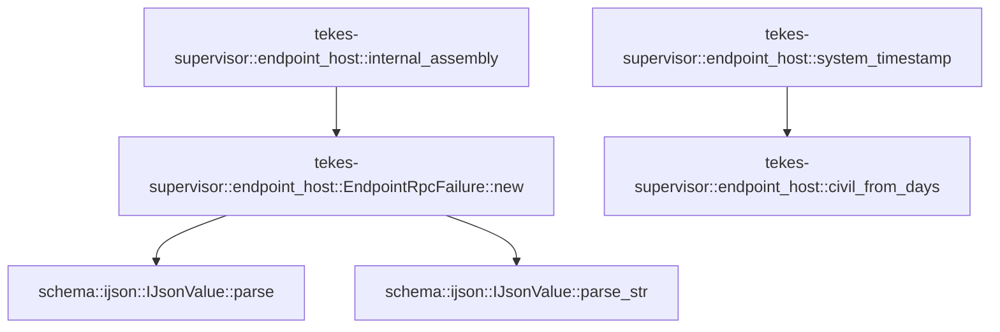

# tekes-supervisor::endpoint_host

[Package atlas](index.md) · [Source](../../src/endpoint_host.rs)

## Declarations

Visibility is the declaration spelling; trait members and reexports require their enclosing interface. `cfg` is not evaluated.

| Symbol | Kind | Visibility | Test / cfg |
|---|---|---|---|
| [tekes-supervisor::endpoint_host::EndpointRouteClass](../../src/endpoint_host.rs#L29) | enum_item | `pub` |  |
| [tekes-supervisor::endpoint_host::EndpointRoute](../../src/endpoint_host.rs#L37) | struct_item | `pub` |  |
| [tekes-supervisor::endpoint_host::TEKES_UNARY_ROUTES](../../src/endpoint_host.rs#L43) | const_item | `pub` |  |
| [tekes-supervisor::endpoint_host::route](../../src/endpoint_host.rs#L70) | function_item | `private` |  |
| [tekes-supervisor::endpoint_host::EndpointClock](../../src/endpoint_host.rs#L78) | type_item | `pub` |  |
| [tekes-supervisor::endpoint_host::RuntimeModelReadiness](../../src/endpoint_host.rs#L81) | struct_item | `pub` |  |
| [tekes-supervisor::endpoint_host::RuntimeProviderStatus](../../src/endpoint_host.rs#L88) | enum_item | `pub` |  |
| [tekes-supervisor::endpoint_host::RuntimeProviderFailure](../../src/endpoint_host.rs#L94) | enum_item | `pub` |  |
| [tekes-supervisor::endpoint_host::RuntimeProviderReadiness](../../src/endpoint_host.rs#L102) | struct_item | `pub` |  |
| [tekes-supervisor::endpoint_host::ProviderReadinessAuthority](../../src/endpoint_host.rs#L111) | trait_item | `pub` |  |
| [tekes-supervisor::endpoint_host::ProviderReadinessAuthority::readiness](../../src/endpoint_host.rs#L112) | function_signature_item | `private` |  |
| [tekes-supervisor::endpoint_host::ProviderReadinessAuthority::config_mutation_succeeded](../../src/endpoint_host.rs#L121) | function_item | `private` |  |
| [tekes-supervisor::endpoint_host::SessionDeliveryAuthority](../../src/endpoint_host.rs#L130) | trait_item | `pub` |  |
| [tekes-supervisor::endpoint_host::SessionDeliveryAuthority::session_metadata_changed](../../src/endpoint_host.rs#L134) | function_item | `private` |  |
| [tekes-supervisor::endpoint_host::SessionDeliveryAuthority::prompt](../../src/endpoint_host.rs#L136) | function_signature_item | `private` |  |
| [tekes-supervisor::endpoint_host::SessionDeliveryAuthority::cancel](../../src/endpoint_host.rs#L145) | function_signature_item | `private` |  |
| [tekes-supervisor::endpoint_host::SessionDeliveryAuthority::rename](../../src/endpoint_host.rs#L152) | function_signature_item | `private` |  |
| [tekes-supervisor::endpoint_host::SessionDeliveryAuthority::compact](../../src/endpoint_host.rs#L166) | function_item | `private` |  |
| [tekes-supervisor::endpoint_host::QueueTransactionAuthority](../../src/endpoint_host.rs#L183) | trait_item | `pub` |  |
| [tekes-supervisor::endpoint_host::QueueTransactionAuthority::execute](../../src/endpoint_host.rs#L184) | function_signature_item | `private` |  |
| [tekes-supervisor::endpoint_host::recover_pending_management](../../src/endpoint_host.rs#L197) | function_item | `pub(crate)` |  |
| [tekes-supervisor::endpoint_host::QueueRecoveryAdapter](../../src/endpoint_host.rs#L213) | struct_item | `private` |  |
| [tekes-supervisor::endpoint_host::QueueRecoveryAdapter::execute](../../src/endpoint_host.rs#L218) | function_item | `private` |  |
| [tekes-supervisor::endpoint_host::SessionAdmissionGates](../../src/endpoint_host.rs#L255) | struct_item | `pub` |  |
| [tekes-supervisor::endpoint_host::SessionAdmissionGates::gate](../../src/endpoint_host.rs#L260) | function_item | `pub` |  |
| [tekes-supervisor::endpoint_host::SessionInputAdmissionAuthority](../../src/endpoint_host.rs#L279) | struct_item | `pub` |  |
| [tekes-supervisor::endpoint_host::SessionInputAdmissionAuthority::new](../../src/endpoint_host.rs#L286) | function_item | `pub` |  |
| [tekes-supervisor::endpoint_host::SessionInputAdmissionAuthority::gates](../../src/endpoint_host.rs#L294) | function_item | `pub` |  |
| [tekes-supervisor::endpoint_host::SessionInputAdmissionAuthority::root](../../src/endpoint_host.rs#L300) | function_item | `pub` |  |
| [tekes-supervisor::endpoint_host::SessionInputAdmissionAuthority::with_active_session](../../src/endpoint_host.rs#L304) | function_item | `pub` |  |
| [tekes-supervisor::endpoint_host::SessionInputAdmissionAuthority::with_session_gate](../../src/endpoint_host.rs#L329) | function_item | `pub` |  |
| [tekes-supervisor::endpoint_host::session_details](../../src/endpoint_host.rs#L354) | function_item | `private` |  |
| [tekes-supervisor::endpoint_host::ProductionEndpointRoutes](../../src/endpoint_host.rs#L364) | trait_item | `pub` |  |
| [tekes-supervisor::endpoint_host::ProductionEndpointRoutes::capabilities](../../src/endpoint_host.rs#L365) | function_signature_item | `private` |  |
| [tekes-supervisor::endpoint_host::ProductionEndpointRoutes::extension_method_class](../../src/endpoint_host.rs#L370) | function_item | `private` |  |
| [tekes-supervisor::endpoint_host::ProductionEndpointRoutes::validate_extension_payload](../../src/endpoint_host.rs#L376) | function_item | `private` |  |
| [tekes-supervisor::endpoint_host::ProductionEndpointRoutes::extension_failure_is_exact](../../src/endpoint_host.rs#L391) | function_item | `private` |  |
| [tekes-supervisor::endpoint_host::ProductionEndpointRoutes::execute](../../src/endpoint_host.rs#L399) | function_signature_item | `private` |  |
| [tekes-supervisor::endpoint_host::CompositeProductionEndpointRoutes](../../src/endpoint_host.rs#L410) | struct_item | `pub` |  |
| [tekes-supervisor::endpoint_host::CompositeProductionEndpointRoutes::compose](../../src/endpoint_host.rs#L415) | function_item | `pub` |  |
| [tekes-supervisor::endpoint_host::CompositeProductionEndpointRoutes::owner](../../src/endpoint_host.rs#L443) | function_item | `private` |  |
| [tekes-supervisor::endpoint_host::CompositeProductionEndpointRoutes::capabilities](../../src/endpoint_host.rs#L449) | function_item | `private` |  |
| [tekes-supervisor::endpoint_host::CompositeProductionEndpointRoutes::extension_method_class](../../src/endpoint_host.rs#L453) | function_item | `private` |  |
| [tekes-supervisor::endpoint_host::CompositeProductionEndpointRoutes::validate_extension_payload](../../src/endpoint_host.rs#L457) | function_item | `private` |  |
| [tekes-supervisor::endpoint_host::CompositeProductionEndpointRoutes::extension_failure_is_exact](../../src/endpoint_host.rs#L467) | function_item | `private` |  |
| [tekes-supervisor::endpoint_host::CompositeProductionEndpointRoutes::execute](../../src/endpoint_host.rs#L476) | function_item | `private` |  |
| [tekes-supervisor::endpoint_host::ProductionRouteCompositionError](../../src/endpoint_host.rs#L489) | enum_item | `pub` |  |
| [tekes-supervisor::endpoint_host::unsupported_route](../../src/endpoint_host.rs#L496) | function_item | `private` |  |
| [tekes-supervisor::endpoint_host::ProductionRouteFailure](../../src/endpoint_host.rs#L506) | struct_item | `pub` |  |
| [tekes-supervisor::endpoint_host::ProductionRouteFailure::new](../../src/endpoint_host.rs#L513) | function_item | `pub` |  |
| [tekes-supervisor::endpoint_host::ProductionEndpointHost](../../src/endpoint_host.rs#L522) | struct_item | `pub` |  |
| [tekes-supervisor::endpoint_host::ProductionEndpointHost::with_preset_mcp](../../src/endpoint_host.rs#L544) | function_item | `pub` |  |
| [tekes-supervisor::endpoint_host::ProductionEndpointHost::with_user_agent_dir](../../src/endpoint_host.rs#L557) | function_item | `pub` |  |
| [tekes-supervisor::endpoint_host::ProductionEndpointHost::mux_description](../../src/endpoint_host.rs#L562) | function_item | `pub` |  |
| [tekes-supervisor::endpoint_host::ProductionEndpointHost::open](../../src/endpoint_host.rs#L587) | function_item | `pub` |  |
| [tekes-supervisor::endpoint_host::ProductionEndpointHost::open_with_clock](../../src/endpoint_host.rs#L602) | function_item | `pub` |  |
| [tekes-supervisor::endpoint_host::ProductionEndpointHost::open_with_routes](../../src/endpoint_host.rs#L611) | function_item | `pub` |  |
| [tekes-supervisor::endpoint_host::ProductionEndpointHost::open_with_authorities](../../src/endpoint_host.rs#L620) | function_item | `pub` |  |
| [tekes-supervisor::endpoint_host::ProductionEndpointHost::open_with_full_authorities](../../src/endpoint_host.rs#L638) | function_item | `pub` |  |
| [tekes-supervisor::endpoint_host::ProductionEndpointHost::open_with_full_authorities_and_session_admission](../../src/endpoint_host.rs#L661) | function_item | `pub` |  |
| [tekes-supervisor::endpoint_host::ProductionEndpointHost::open_with_route_authority](../../src/endpoint_host.rs#L687) | function_item | `pub` |  |
| [tekes-supervisor::endpoint_host::ProductionEndpointHost::open_with_route_ownership](../../src/endpoint_host.rs#L710) | function_item | `private` |  |
| [tekes-supervisor::endpoint_host::ProductionEndpointHost::implemented_capabilities](../../src/endpoint_host.rs#L779) | function_item | `pub` |  |
| [tekes-supervisor::endpoint_host::ProductionEndpointHost::admission_gates](../../src/endpoint_host.rs#L788) | function_item | `pub` |  |
| [tekes-supervisor::endpoint_host::ProductionEndpointHost::has_incomplete_management_operation](../../src/endpoint_host.rs#L792) | function_item | `pub` |  |
| [tekes-supervisor::endpoint_host::ProductionEndpointHost::execute](../../src/endpoint_host.rs#L801) | function_item | `private` |  |
| [tekes-supervisor::endpoint_host::ProductionEndpointHost::execute_inner](../../src/endpoint_host.rs#L809) | function_item | `private` |  |
| [tekes-supervisor::endpoint_host::ProductionEndpointHost::execute_extension](../../src/endpoint_host.rs#L840) | function_item | `private` |  |
| [tekes-supervisor::endpoint_host::ProductionEndpointHost::create_workspace](../../src/endpoint_host.rs#L889) | function_item | `private` |  |
| [tekes-supervisor::endpoint_host::ProductionEndpointHost::rename_workspace](../../src/endpoint_host.rs#L906) | function_item | `private` |  |
| [tekes-supervisor::endpoint_host::ProductionEndpointHost::relocate_workspace](../../src/endpoint_host.rs#L928) | function_item | `private` |  |
| [tekes-supervisor::endpoint_host::ProductionEndpointHost::archive_session](../../src/endpoint_host.rs#L971) | function_item | `private` |  |
| [tekes-supervisor::endpoint_host::ProductionEndpointHost::unarchive_session](../../src/endpoint_host.rs#L994) | function_item | `private` |  |
| [tekes-supervisor::endpoint_host::ProductionEndpointHost::create_session](../../src/endpoint_host.rs#L1011) | function_item | `private` |  |
| [tekes-supervisor::endpoint_host::ProductionEndpointHost::draft_models](../../src/endpoint_host.rs#L1075) | function_item | `private` |  |
| [tekes-supervisor::endpoint_host::ProductionEndpointHost::models](../../src/endpoint_host.rs#L1116) | function_item | `private` |  |
| [tekes-supervisor::endpoint_host::ProductionEndpointHost::select_model](../../src/endpoint_host.rs#L1136) | function_item | `private` |  |
| [tekes-supervisor::endpoint_host::ProductionEndpointHost::cancel](../../src/endpoint_host.rs#L1195) | function_item | `private` |  |
| [tekes-supervisor::endpoint_host::ProductionEndpointHost::rename_session](../../src/endpoint_host.rs#L1225) | function_item | `private` |  |
| [tekes-supervisor::endpoint_host::ProductionEndpointHost::update_queue](../../src/endpoint_host.rs#L1263) | function_item | `private` |  |
| [tekes-supervisor::endpoint_host::ProductionEndpointHost::prompt](../../src/endpoint_host.rs#L1352) | function_item | `private` |  |
| [tekes-supervisor::endpoint_host::ProductionEndpointHost::attachment](../../src/endpoint_host.rs#L1409) | function_item | `private` |  |
| [tekes-supervisor::endpoint_host::ProductionEndpointHost::fork_session](../../src/endpoint_host.rs#L1425) | function_item | `private` |  |
| [tekes-supervisor::endpoint_host::ProductionEndpointHost::discard_session](../../src/endpoint_host.rs#L1466) | function_item | `private` |  |
| [tekes-supervisor::endpoint_host::ProductionEndpointHost::admission_gate](../../src/endpoint_host.rs#L1489) | function_item | `private` |  |
| [tekes-supervisor::endpoint_host::ProductionEndpointHost::ensure_active_session](../../src/endpoint_host.rs#L1496) | function_item | `private` |  |
| [tekes-supervisor::endpoint_host::ProductionEndpointHost::capabilities](../../src/endpoint_host.rs#L1517) | function_item | `private` |  |
| [tekes-supervisor::endpoint_host::ProductionEndpointHost::extension_capabilities](../../src/endpoint_host.rs#L1538) | function_item | `private` |  |
| [tekes-supervisor::endpoint_host::ProductionEndpointHost::method_class](../../src/endpoint_host.rs#L1548) | function_item | `private` |  |
| [tekes-supervisor::endpoint_host::ProductionEndpointHost::validate_request](../../src/endpoint_host.rs#L1564) | function_item | `private` |  |
| [tekes-supervisor::endpoint_host::ProductionEndpointHost::call](../../src/endpoint_host.rs#L1588) | function_item | `private` |  |
| [tekes-supervisor::endpoint_host::ProductionEndpointAssembly](../../src/endpoint_host.rs#L1593) | struct_item | `pub` |  |
| [tekes-supervisor::endpoint_host::ProductionEndpointAssembly::open](../../src/endpoint_host.rs#L1600) | function_item | `pub` |  |
| [tekes-supervisor::endpoint_host::ProductionEndpointAssembly::open_with_clock](../../src/endpoint_host.rs#L1612) | function_item | `pub` |  |
| [tekes-supervisor::endpoint_host::ProductionEndpointAssembly::open_with_routes](../../src/endpoint_host.rs#L1625) | function_item | `pub` |  |
| [tekes-supervisor::endpoint_host::ProductionEndpointAssembly::open_with_route_authority](../../src/endpoint_host.rs#L1639) | function_item | `pub` |  |
| [tekes-supervisor::endpoint_host::ProductionEndpointAssembly::open_with_authorities](../../src/endpoint_host.rs#L1661) | function_item | `pub` |  |
| [tekes-supervisor::endpoint_host::ProductionEndpointAssembly::open_with_full_authorities](../../src/endpoint_host.rs#L1679) | function_item | `pub` |  |
| [tekes-supervisor::endpoint_host::ProductionEndpointAssembly::dispatch](../../src/endpoint_host.rs#L1704) | function_item | `pub` |  |
| [tekes-supervisor::endpoint_host::ProductionEndpointAssembly::hub](../../src/endpoint_host.rs#L1712) | function_item | `pub` |  |
| [tekes-supervisor::endpoint_host::ProductionEndpointAssembly::host](../../src/endpoint_host.rs#L1717) | function_item | `pub` |  |
| [tekes-supervisor::endpoint_host::ProductionEndpointAssembly::admission_gates](../../src/endpoint_host.rs#L1722) | function_item | `pub` |  |
| [tekes-supervisor::endpoint_host::ProductionEndpointAssembly::has_incomplete_management_operation](../../src/endpoint_host.rs#L1726) | function_item | `pub` |  |
| [tekes-supervisor::endpoint_host::success](../../src/endpoint_host.rs#L1734) | function_item | `private` |  |
| [tekes-supervisor::endpoint_host::model_projection](../../src/endpoint_host.rs#L1742) | function_item | `private` |  |
| [tekes-supervisor::endpoint_host::ConfiguredModels](../../src/endpoint_host.rs#L1839) | struct_item | `pub` |  |
| [tekes-supervisor::endpoint_host::ConfiguredModels::model_available](../../src/endpoint_host.rs#L1842) | function_item | `private` |  |
| [tekes-supervisor::endpoint_host::model_is_configured](../../src/endpoint_host.rs#L1853) | function_item | `private` |  |
| [tekes-supervisor::endpoint_host::runtime_failure_name](../../src/endpoint_host.rs#L1884) | function_item | `private` |  |
| [tekes-supervisor::endpoint_host::map_production_route](../../src/endpoint_host.rs#L1893) | function_item | `private` |  |
| [tekes-supervisor::endpoint_host::map_production_route_for](../../src/endpoint_host.rs#L1901) | function_item | `private` |  |
| [tekes-supervisor::endpoint_host::sanitized_route_log_message](../../src/endpoint_host.rs#L1915) | function_item | `private` |  |
| [tekes-supervisor::endpoint_host::production_failure_is_exact_for](../../src/endpoint_host.rs#L1935) | function_item | `pub(crate)` |  |
| [tekes-supervisor::endpoint_host::route_error_is_exact](../../src/endpoint_host.rs#L1942) | function_item | `private` |  |
| [tekes-supervisor::endpoint_host::route_error_message](../../src/endpoint_host.rs#L2025) | function_item | `private` |  |
| [tekes-supervisor::endpoint_host::exact_string_fields](../../src/endpoint_host.rs#L2056) | function_item | `private` |  |
| [tekes-supervisor::endpoint_host::route_allows_error](../../src/endpoint_host.rs#L2077) | function_item | `private` |  |
| [tekes-supervisor::endpoint_host::internal_failure](../../src/endpoint_host.rs#L2184) | function_item | `private` |  |
| [tekes-supervisor::endpoint_host::failure](../../src/endpoint_host.rs#L2188) | function_item | `private` |  |
| [tekes-supervisor::endpoint_host::required_string](../../src/endpoint_host.rs#L2200) | function_item | `private` |  |
| [tekes-supervisor::endpoint_host::required_string_allow_whitespace](../../src/endpoint_host.rs#L2209) | function_item | `private` |  |
| [tekes-supervisor::endpoint_host::optional_bool](../../src/endpoint_host.rs#L2220) | function_item | `private` |  |
| [tekes-supervisor::endpoint_host::optional_string](../../src/endpoint_host.rs#L2230) | function_item | `private` |  |
| [tekes-supervisor::endpoint_host::require_object_fields](../../src/endpoint_host.rs#L2241) | function_item | `private` |  |
| [tekes-supervisor::endpoint_host::optional_u64](../../src/endpoint_host.rs#L2257) | function_item | `private` |  |
| [tekes-supervisor::endpoint_host::to_ijson](../../src/endpoint_host.rs#L2267) | function_item | `private` |  |
| [tekes-supervisor::endpoint_host::request_hash](../../src/endpoint_host.rs#L2271) | function_item | `private` |  |
| [tekes-supervisor::endpoint_host::mark_management_handoff](../../src/endpoint_host.rs#L2285) | function_item | `private` |  |
| [tekes-supervisor::endpoint_host::mark_event_handoff](../../src/endpoint_host.rs#L2299) | function_item | `private` |  |
| [tekes-supervisor::endpoint_host::endpoint_origin](../../src/endpoint_host.rs#L2313) | function_item | `private` |  |
| [tekes-supervisor::endpoint_host::validate_session_title](../../src/endpoint_host.rs#L2328) | function_item | `private` |  |
| [tekes-supervisor::endpoint_host::PendingQueueAction](../../src/endpoint_host.rs#L2339) | enum_item | `private` |  |
| [tekes-supervisor::endpoint_host::PendingQueueAction::with_origin](../../src/endpoint_host.rs#L2346) | function_item | `private` |  |
| [tekes-supervisor::endpoint_host::queue_action](../../src/endpoint_host.rs#L2362) | function_item | `private` |  |
| [tekes-supervisor::endpoint_host::map_queue_rejection](../../src/endpoint_host.rs#L2412) | function_item | `private` |  |
| [tekes-supervisor::endpoint_host::queue_decision](../../src/endpoint_host.rs#L2436) | function_item | `private` |  |
| [tekes-supervisor::endpoint_host::map_persisted_queue_rejection](../../src/endpoint_host.rs#L2461) | function_item | `private` |  |
| [tekes-supervisor::endpoint_host::validate_time_zone](../../src/endpoint_host.rs#L2475) | function_item | `private` |  |
| [tekes-supervisor::endpoint_host::map_prompt_error](../../src/endpoint_host.rs#L2501) | function_item | `private` |  |
| [tekes-supervisor::endpoint_host::map_attachment_read_error](../../src/endpoint_host.rs#L2521) | function_item | `private` |  |
| [tekes-supervisor::endpoint_host::attachment_failure](../../src/endpoint_host.rs#L2538) | function_item | `private` |  |
| [tekes-supervisor::endpoint_host::attachment_reason](../../src/endpoint_host.rs#L2546) | function_item | `private` |  |
| [tekes-supervisor::endpoint_host::validate_extension_payload](../../src/endpoint_host.rs#L2561) | function_item | `private` |  |
| [tekes-supervisor::endpoint_host::validate_production_payload](../../src/endpoint_host.rs#L2613) | function_item | `private` |  |
| [tekes-supervisor::endpoint_host::invalid](../../src/endpoint_host.rs#L2630) | function_item | `private` |  |
| [tekes-supervisor::endpoint_host::map_endpoint](../../src/endpoint_host.rs#L2634) | function_item | `private` |  |
| [tekes-supervisor::endpoint_host::map_management](../../src/endpoint_host.rs#L2651) | function_item | `private` |  |
| [tekes-supervisor::endpoint_host::internal_json](../../src/endpoint_host.rs#L2754) | function_item | `private` |  |
| [tekes-supervisor::endpoint_host::internal_schema](../../src/endpoint_host.rs#L2758) | function_item | `private` |  |
| [tekes-supervisor::endpoint_host::internal_assembly](../../src/endpoint_host.rs#L2762) | function_item | `private` |  |
| [tekes-supervisor::endpoint_host::EndpointRpcFailure](../../src/endpoint_host.rs#L2766) | struct_item | `private` |  |
| [tekes-supervisor::endpoint_host::EndpointRpcFailure::new](../../src/endpoint_host.rs#L2773) | function_item | `private` |  |
| [tekes-supervisor::endpoint_host::system_timestamp](../../src/endpoint_host.rs#L2785) | function_item | `private` |  |
| [tekes-supervisor::endpoint_host::civil_from_days](../../src/endpoint_host.rs#L2802) | function_item | `private` |  |
| [tekes-supervisor::endpoint_host::EndpointAssemblyError](../../src/endpoint_host.rs#L2818) | enum_item | `pub` |  |

## Imports / reexports

| Local name | Source path | Visibility |
|---|---|---|
| `BTreeSet` | `std::collections::BTreeSet` | `private` |
| `HashMap` | `std::collections::HashMap` | `private` |
| `Path` | `std::path::Path` | `private` |
| `PathBuf` | `std::path::PathBuf` | `private` |
| `Arc` | `std::sync::Arc` | `private` |
| `Mutex` | `std::sync::Mutex` | `private` |
| `SystemTime` | `std::time::SystemTime` | `private` |
| `UNIX_EPOCH` | `std::time::UNIX_EPOCH` | `private` |
| `AttachmentAuthority` | `endpoint::AttachmentAuthority` | `private` |
| `AttachmentErrorReason` | `endpoint::AttachmentErrorReason` | `private` |
| `AttachmentReadError` | `endpoint::AttachmentReadError` | `private` |
| `ClientRequest` | `endpoint::ClientRequest` | `private` |
| `DurableHandoffProof` | `endpoint::DurableHandoffProof` | `private` |
| `EndpointDispatcher` | `endpoint::EndpointDispatcher` | `private` |
| `EndpointHost` | `endpoint::EndpointHost` | `private` |
| `EndpointHostCall` | `endpoint::EndpointHostCall` | `private` |
| `EndpointHostFuture` | `endpoint::EndpointHostFuture` | `private` |
| `EndpointSubscriptionHub` | `endpoint::EndpointSubscriptionHub` | `private` |
| `ForkSessionOperation` | `endpoint::ForkSessionOperation` | `private` |
| `HostFailure` | `endpoint::HostFailure` | `private` |
| `ManagementError` | `endpoint::ManagementError` | `private` |
| `ManagementStore` | `endpoint::ManagementStore` | `private` |
| `MaterializedPrompt` | `endpoint::MaterializedPrompt` | `private` |
| `NativeEndpoint` | `endpoint::NativeEndpoint` | `private` |
| `NativeEndpointError` | `endpoint::NativeEndpointError` | `private` |
| `PendingQueueTransaction` | `endpoint::PendingQueueTransaction` | `private` |
| `PromptMaterializeError` | `endpoint::PromptMaterializeError` | `private` |
| `PromptPart` | `endpoint::PromptPart` | `private` |
| `QueueRecoveryDriver` | `endpoint::QueueRecoveryDriver` | `private` |
| `QueueTransactionCompletion` | `endpoint::QueueTransactionCompletion` | `private` |
| `QueueTransactionDecision` | `endpoint::QueueTransactionDecision` | `private` |
| `QueueTransactionOperation` | `endpoint::QueueTransactionOperation` | `private` |
| `QueueTransactionState` | `endpoint::QueueTransactionState` | `private` |
| `RpcDurableIdentity` | `endpoint::RpcDurableIdentity` | `private` |
| `RpcError` | `endpoint::RpcError` | `private` |
| `RpcRegistry` | `endpoint::RpcRegistry` | `private` |
| `RpcResult` | `endpoint::RpcResult` | `private` |
| `SelectModelOperation` | `endpoint::SelectModelOperation` | `private` |
| `ServerResponse` | `endpoint::ServerResponse` | `private` |
| `SessionCreateOperation` | `endpoint::SessionCreateOperation` | `private` |
| `SessionHostDescription` | `endpoint::SessionHostDescription` | `private` |
| `IJsonValue` | `schema::IJsonValue` | `private` |
| `OriginTuple` | `schema::OriginTuple` | `private` |
| `Value` | `serde_json::Value` | `private` |
| `json` | `serde_json::json` | `private` |
| `Digest` | `sha2::Digest` | `private` |
| `Sha256` | `sha2::Sha256` | `private` |
| `Error` | `thiserror::Error` | `private` |

## Module declarations

| Module | Visibility | Attributes |
|---|---|---|

## Function call graphs

Edges below are syntactically resolved calls only, including private functions. Graphs partition callers into groups of 20; they are not execution order. All unresolved sites are listed below and in the JSON inventory.

Functions 1–20: 16 direct edges

```mermaid
flowchart TD
  n0["endpoint::management::ManagementStore::open_recovering_again"]
  n1["endpoint::types::validate_session_id"]
  n2["schema::ijson::IJsonValue::parse"]
  n3["schema::ijson::IJsonValue::parse_str"]
  n4["tekes-supervisor::endpoint_host::ProviderReadinessAuthority::config_mutation_succeeded"]
  n5["tekes-supervisor::endpoint_host::SessionDeliveryAuthority::session_metadata_changed"]
  n6["tekes-supervisor::endpoint_host::SessionDeliveryAuthority::compact"]
  n7["tekes-supervisor::endpoint_host::recover_pending_management"]
  n8["tekes-supervisor::endpoint_host::QueueRecoveryAdapter::execute"]
  n9["tekes-supervisor::endpoint_host::queue_decision"]
  n10["tekes-supervisor::endpoint_host::SessionAdmissionGates::gate"]
  n11["tekes-supervisor::endpoint_host::SessionInputAdmissionAuthority::new"]
  n12["tekes-supervisor::endpoint_host::SessionInputAdmissionAuthority::gates"]
  n13["tekes-supervisor::endpoint_host::SessionInputAdmissionAuthority::root"]
  n14["tekes-supervisor::endpoint_host::SessionInputAdmissionAuthority::with_active_session"]
  n15["tekes-supervisor::endpoint_host::SessionInputAdmissionAuthority::with_session_gate"]
  n16["tekes-supervisor::endpoint_host::session_details"]
  n17["tekes-supervisor::endpoint_host::ProductionEndpointRoutes::extension_method_class"]
  n18["tekes-supervisor::endpoint_host::ProductionEndpointRoutes::validate_extension_payload"]
  n19["tekes-supervisor::endpoint_host::ProductionEndpointRoutes::extension_failure_is_exact"]
  n20["tekes-supervisor::endpoint_host::CompositeProductionEndpointRoutes::compose"]
  n21["tekes-supervisor::endpoint_host::CompositeProductionEndpointRoutes::owner"]
  n22["tekes-supervisor::endpoint_host::CompositeProductionEndpointRoutes::capabilities"]
  n23["tekes-supervisor::endpoint_host::CompositeProductionEndpointRoutes::extension_method_class"]
  n24["tekes-supervisor::endpoint_host::ProductionRouteFailure::new"]
  n25["tekes-supervisor::endpoint_host::route"]
  n26["tekes-supervisor::host_runtime::system_timestamp"]
  n6 --> n3
  n6 --> n24
  n7 --> n0
  n7 --> n26
  n8 --> n9
  n10 --> n3
  n10 --> n24
  n14 --> n15
  n14 --> n16
  n14 --> n24
  n15 --> n1
  n15 --> n3
  n15 --> n24
  n16 --> n2
  n18 --> n2
  n18 --> n24
```

Functions 21–40: 19 direct edges

```mermaid
flowchart TD
  n0["endpoint::attachment::AttachmentAuthority::open"]
  n1["endpoint::management::ManagementStore::open_at_with_queue_driver"]
  n2["endpoint::mux::SessionEndpointCapability::required"]
  n3["endpoint::service::NativeEndpoint::open"]
  n4["schema::ijson::IJsonValue::parse"]
  n5["tekes-supervisor::endpoint_host::success"]
  n6["tekes-supervisor::endpoint_host::failure"]
  n7["tekes-supervisor::endpoint_host::SessionInputAdmissionAuthority::new"]
  n8["tekes-supervisor::endpoint_host::CompositeProductionEndpointRoutes::validate_extension_payload"]
  n9["tekes-supervisor::endpoint_host::CompositeProductionEndpointRoutes::extension_failure_is_exact"]
  n10["tekes-supervisor::endpoint_host::CompositeProductionEndpointRoutes::execute"]
  n11["tekes-supervisor::endpoint_host::unsupported_route"]
  n12["tekes-supervisor::endpoint_host::ProductionRouteFailure::new"]
  n13["tekes-supervisor::endpoint_host::ProductionEndpointHost::with_preset_mcp"]
  n14["tekes-supervisor::endpoint_host::ProductionEndpointHost::with_user_agent_dir"]
  n15["tekes-supervisor::endpoint_host::ProductionEndpointHost::mux_description"]
  n16["tekes-supervisor::endpoint_host::ProductionEndpointHost::open"]
  n17["tekes-supervisor::endpoint_host::ProductionEndpointHost::open_with_clock"]
  n18["tekes-supervisor::endpoint_host::ProductionEndpointHost::open_with_routes"]
  n19["tekes-supervisor::endpoint_host::ProductionEndpointHost::open_with_authorities"]
  n20["tekes-supervisor::endpoint_host::ProductionEndpointHost::open_with_full_authorities"]
  n21["tekes-supervisor::endpoint_host::ProductionEndpointHost::open_with_full_authorities_and_session_admission"]
  n22["tekes-supervisor::endpoint_host::ProductionEndpointHost::open_with_route_authority"]
  n23["tekes-supervisor::endpoint_host::ProductionEndpointHost::open_with_route_ownership"]
  n24["tekes-supervisor::endpoint_host::ProductionEndpointHost::implemented_capabilities"]
  n25["tekes-supervisor::endpoint_host::ProductionEndpointHost::admission_gates"]
  n26["tekes-supervisor::endpoint_host::ProductionEndpointHost::has_incomplete_management_operation"]
  n27["tekes-supervisor::endpoint_host::ProductionEndpointHost::execute"]
  n28["tekes-supervisor::endpoint_host::ProductionEndpointHost::execute_inner"]
  n8 --> n11
  n10 --> n11
  n11 --> n4
  n11 --> n12
  n15 --> n2
  n16 --> n20
  n17 --> n20
  n18 --> n20
  n19 --> n20
  n20 --> n23
  n21 --> n23
  n22 --> n23
  n23 --> n0
  n23 --> n1
  n23 --> n3
  n23 --> n7
  n27 --> n5
  n27 --> n6
  n27 --> n28
```

Functions 41–60: 148 direct edges

```mermaid
flowchart TD
  n0["endpoint::types::validate_session_id"]
  n1["profile::config::ConfigRepository::open"]
  n2["store::platform::NamedLock::try_exclusive"]
  n3["tekes-supervisor::endpoint_host::ProductionEndpointHost::create_session"]
  n4["tekes-supervisor::endpoint_host::ProductionEndpointHost::draft_models"]
  n5["tekes-supervisor::endpoint_host::ProductionEndpointHost::models"]
  n6["tekes-supervisor::endpoint_host::ProductionEndpointHost::select_model"]
  n7["tekes-supervisor::endpoint_host::ProductionEndpointHost::cancel"]
  n8["tekes-supervisor::endpoint_host::ProductionEndpointHost::rename_session"]
  n9["tekes-supervisor::endpoint_host::ProductionEndpointHost::update_queue"]
  n10["tekes-supervisor::endpoint_host::ProductionEndpointHost::prompt"]
  n11["tekes-supervisor::endpoint_host::ProductionEndpointHost::attachment"]
  n12["tekes-supervisor::endpoint_host::ProductionEndpointHost::fork_session"]
  n13["tekes-supervisor::endpoint_host::ProductionEndpointHost::discard_session"]
  n14["tekes-supervisor::endpoint_host::ProductionEndpointHost::admission_gate"]
  n15["tekes-supervisor::endpoint_host::ProductionEndpointHost::ensure_active_session"]
  n16["tekes-supervisor::endpoint_host::model_projection"]
  n17["tekes-supervisor::endpoint_host::model_is_configured"]
  n18["tekes-supervisor::endpoint_host::map_production_route"]
  n19["tekes-supervisor::endpoint_host::map_production_route_for"]
  n20["tekes-supervisor::endpoint_host::internal_failure"]
  n21["tekes-supervisor::endpoint_host::required_string"]
  n22["tekes-supervisor::endpoint_host::required_string_allow_whitespace"]
  n23["tekes-supervisor::endpoint_host::optional_bool"]
  n24["tekes-supervisor::endpoint_host::optional_string"]
  n25["tekes-supervisor::endpoint_host::require_object_fields"]
  n26["tekes-supervisor::endpoint_host::optional_u64"]
  n27["tekes-supervisor::endpoint_host::to_ijson"]
  n28["tekes-supervisor::endpoint_host::request_hash"]
  n29["tekes-supervisor::endpoint_host::mark_management_handoff"]
  n30["tekes-supervisor::endpoint_host::mark_event_handoff"]
  n31["tekes-supervisor::endpoint_host::endpoint_origin"]
  n32["tekes-supervisor::endpoint_host::validate_session_title"]
  n33["tekes-supervisor::endpoint_host::queue_action"]
  n34["tekes-supervisor::endpoint_host::queue_decision"]
  n35["tekes-supervisor::endpoint_host::map_persisted_queue_rejection"]
  n36["tekes-supervisor::endpoint_host::validate_time_zone"]
  n37["tekes-supervisor::endpoint_host::validate_extension_payload"]
  n38["tekes-supervisor::endpoint_host::invalid"]
  n39["tekes-supervisor::endpoint_host::map_endpoint"]
  n40["tekes-supervisor::endpoint_host::EndpointRpcFailure::new"]
  n41["tekes-supervisor::endpoint_host::ProductionEndpointHost::execute_inner"]
  n42["tekes-supervisor::endpoint_host::ProductionEndpointHost::execute_extension"]
  n43["tekes-supervisor::endpoint_host::ProductionEndpointHost::create_workspace"]
  n44["tekes-supervisor::endpoint_host::ProductionEndpointHost::rename_workspace"]
  n45["tekes-supervisor::endpoint_host::ProductionEndpointHost::relocate_workspace"]
  n46["tekes-supervisor::endpoint_host::ProductionEndpointHost::archive_session"]
  n47["tekes-supervisor::endpoint_host::ProductionEndpointHost::unarchive_session"]
  n48["tekes-supervisor::process_host::workspace_quiescence_lock_path"]
  n49["tools::guidance::IdentityProfile::parse"]
  n3 --> n24
  n3 --> n25
  n3 --> n27
  n3 --> n28
  n3 --> n29
  n3 --> n38
  n3 --> n40
  n3 --> n49
  n4 --> n1
  n4 --> n16
  n4 --> n19
  n4 --> n20
  n4 --> n25
  n5 --> n16
  n5 --> n19
  n5 --> n21
  n5 --> n25
  n5 --> n39
  n5 --> n40
  n6 --> n14
  n6 --> n17
  n6 --> n19
  n6 --> n20
  n6 --> n21
  n6 --> n24
  n6 --> n25
  n6 --> n27
  n6 --> n28
  n6 --> n29
  n6 --> n39
  n6 --> n40
  n7 --> n14
  n7 --> n19
  n7 --> n20
  n7 --> n21
  n7 --> n25
  n7 --> n27
  n7 --> n30
  n7 --> n31
  n7 --> n40
  n8 --> n14
  n8 --> n19
  n8 --> n20
  n8 --> n21
  n8 --> n22
  n8 --> n25
  n8 --> n27
  n8 --> n30
  n8 --> n31
  n8 --> n32
  n8 --> n40
  n9 --> n14
  n9 --> n19
  n9 --> n20
  n9 --> n21
  n9 --> n25
  n9 --> n27
  n9 --> n28
  n9 --> n29
  n9 --> n31
  n9 --> n33
  n9 --> n34
  n9 --> n35
  n9 --> n38
  n9 --> n40
  n10 --> n19
  n10 --> n21
  n10 --> n24
  n10 --> n25
  n10 --> n27
  n10 --> n30
  n10 --> n31
  n10 --> n36
  n10 --> n38
  n10 --> n40
  n11 --> n15
  n11 --> n21
  n11 --> n25
  n11 --> n27
  n12 --> n21
  n12 --> n23
  n12 --> n25
  n12 --> n26
  n12 --> n27
  n12 --> n28
  n12 --> n29
  n13 --> n19
  n13 --> n21
  n13 --> n25
  n13 --> n27
  n13 --> n28
  n13 --> n29
  n15 --> n0
  n15 --> n38
  n15 --> n40
  n41 --> n3
  n41 --> n4
  n41 --> n5
  n41 --> n6
  n41 --> n7
  n41 --> n8
  n41 --> n9
  n41 --> n10
  n41 --> n11
  n41 --> n12
  n41 --> n13
  n41 --> n42
  n41 --> n43
  n41 --> n44
  n41 --> n45
  n41 --> n46
  n41 --> n47
  n42 --> n18
  n42 --> n19
  n42 --> n20
  n42 --> n37
  n42 --> n40
  n43 --> n21
  n43 --> n25
  n43 --> n27
  n43 --> n28
  n43 --> n29
  n44 --> n21
  n44 --> n22
  n44 --> n25
  n44 --> n27
  n44 --> n28
  n44 --> n29
  n45 --> n2
  n45 --> n20
  n45 --> n21
  n45 --> n25
  n45 --> n27
  n45 --> n28
  n45 --> n29
  n45 --> n40
  n45 --> n48
  n46 --> n19
  n46 --> n21
  n46 --> n25
  n46 --> n27
  n46 --> n28
  n46 --> n29
  n47 --> n21
  n47 --> n25
  n47 --> n27
  n47 --> n28
  n47 --> n29
```

Functions 61–80: 23 direct edges

```mermaid
flowchart TD
  n0["endpoint::host::EndpointDispatcher::new"]
  n1["endpoint::idempotency::RpcRegistry::open"]
  n2["provider::dialect::resolve_profile"]
  n3["tekes-supervisor::endpoint_host::ProductionEndpointHost::capabilities"]
  n4["tekes-supervisor::endpoint_host::ProductionEndpointHost::extension_capabilities"]
  n5["tekes-supervisor::endpoint_host::ProductionEndpointHost::method_class"]
  n6["tekes-supervisor::endpoint_host::ProductionEndpointHost::validate_request"]
  n7["tekes-supervisor::endpoint_host::ProductionEndpointHost::call"]
  n8["tekes-supervisor::endpoint_host::ProductionEndpointAssembly::open"]
  n9["tekes-supervisor::endpoint_host::ProductionEndpointAssembly::open_with_clock"]
  n10["tekes-supervisor::endpoint_host::ProductionEndpointAssembly::open_with_routes"]
  n11["tekes-supervisor::endpoint_host::ProductionEndpointAssembly::open_with_route_authority"]
  n12["tekes-supervisor::endpoint_host::ProductionEndpointAssembly::open_with_authorities"]
  n13["tekes-supervisor::endpoint_host::ProductionEndpointAssembly::open_with_full_authorities"]
  n14["tekes-supervisor::endpoint_host::ProductionEndpointAssembly::dispatch"]
  n15["tekes-supervisor::endpoint_host::ProductionEndpointAssembly::hub"]
  n16["tekes-supervisor::endpoint_host::ProductionEndpointAssembly::host"]
  n17["tekes-supervisor::endpoint_host::ProductionEndpointAssembly::admission_gates"]
  n18["tekes-supervisor::endpoint_host::ProductionEndpointAssembly::has_incomplete_management_operation"]
  n19["tekes-supervisor::endpoint_host::success"]
  n20["tekes-supervisor::endpoint_host::model_projection"]
  n21["tekes-supervisor::endpoint_host::ConfiguredModels::model_available"]
  n22["tekes-supervisor::endpoint_host::model_is_configured"]
  n23["tekes-supervisor::endpoint_host::internal_failure"]
  n24["tekes-supervisor::endpoint_host::to_ijson"]
  n25["tekes-supervisor::endpoint_host::validate_production_payload"]
  n26["tekes-supervisor::endpoint_host::ProductionEndpointHost::open"]
  n27["tekes-supervisor::endpoint_host::ProductionEndpointHost::open_with_clock"]
  n28["tekes-supervisor::endpoint_host::ProductionEndpointHost::open_with_routes"]
  n29["tekes-supervisor::endpoint_host::ProductionEndpointHost::open_with_full_authorities"]
  n30["tekes-supervisor::endpoint_host::ProductionEndpointHost::open_with_route_authority"]
  n6 --> n25
  n8 --> n0
  n8 --> n1
  n8 --> n26
  n9 --> n0
  n9 --> n1
  n9 --> n27
  n10 --> n0
  n10 --> n1
  n10 --> n28
  n11 --> n0
  n11 --> n1
  n11 --> n30
  n12 --> n13
  n13 --> n0
  n13 --> n1
  n13 --> n29
  n20 --> n2
  n20 --> n22
  n20 --> n23
  n20 --> n24
  n21 --> n22
  n22 --> n2
```

Functions 81–100: 19 direct edges

```mermaid
flowchart TD
  n0["schema::ijson::IJsonValue::parse"]
  n1["tekes-supervisor::endpoint_host::runtime_failure_name"]
  n2["tekes-supervisor::endpoint_host::map_production_route"]
  n3["tekes-supervisor::endpoint_host::map_production_route_for"]
  n4["tekes-supervisor::endpoint_host::sanitized_route_log_message"]
  n5["tekes-supervisor::endpoint_host::production_failure_is_exact_for"]
  n6["tekes-supervisor::endpoint_host::route_error_is_exact"]
  n7["tekes-supervisor::endpoint_host::route_error_message"]
  n8["tekes-supervisor::endpoint_host::exact_string_fields"]
  n9["tekes-supervisor::endpoint_host::route_allows_error"]
  n10["tekes-supervisor::endpoint_host::internal_failure"]
  n11["tekes-supervisor::endpoint_host::failure"]
  n12["tekes-supervisor::endpoint_host::required_string"]
  n13["tekes-supervisor::endpoint_host::required_string_allow_whitespace"]
  n14["tekes-supervisor::endpoint_host::optional_bool"]
  n15["tekes-supervisor::endpoint_host::optional_string"]
  n16["tekes-supervisor::endpoint_host::require_object_fields"]
  n17["tekes-supervisor::endpoint_host::optional_u64"]
  n18["tekes-supervisor::endpoint_host::to_ijson"]
  n19["tekes-supervisor::endpoint_host::request_hash"]
  n20["tekes-supervisor::endpoint_host::mark_management_handoff"]
  n21["tekes-supervisor::endpoint_host::invalid"]
  n22["tekes-supervisor::endpoint_host::EndpointRpcFailure::new"]
  n3 --> n2
  n3 --> n4
  n3 --> n5
  n3 --> n10
  n4 --> n0
  n5 --> n6
  n5 --> n9
  n6 --> n7
  n6 --> n8
  n10 --> n22
  n12 --> n21
  n13 --> n21
  n14 --> n21
  n15 --> n21
  n16 --> n21
  n17 --> n21
  n18 --> n0
  n19 --> n22
  n20 --> n22
```

Functions 101–120: 24 direct edges

```mermaid
flowchart TD
  n0["tekes-supervisor::endpoint_host::internal_failure"]
  n1["tekes-supervisor::endpoint_host::require_object_fields"]
  n2["tekes-supervisor::endpoint_host::mark_event_handoff"]
  n3["tekes-supervisor::endpoint_host::endpoint_origin"]
  n4["tekes-supervisor::endpoint_host::validate_session_title"]
  n5["tekes-supervisor::endpoint_host::PendingQueueAction::with_origin"]
  n6["tekes-supervisor::endpoint_host::queue_action"]
  n7["tekes-supervisor::endpoint_host::map_queue_rejection"]
  n8["tekes-supervisor::endpoint_host::queue_decision"]
  n9["tekes-supervisor::endpoint_host::map_persisted_queue_rejection"]
  n10["tekes-supervisor::endpoint_host::validate_time_zone"]
  n11["tekes-supervisor::endpoint_host::map_prompt_error"]
  n12["tekes-supervisor::endpoint_host::map_attachment_read_error"]
  n13["tekes-supervisor::endpoint_host::attachment_failure"]
  n14["tekes-supervisor::endpoint_host::attachment_reason"]
  n15["tekes-supervisor::endpoint_host::validate_extension_payload"]
  n16["tekes-supervisor::endpoint_host::validate_production_payload"]
  n17["tekes-supervisor::endpoint_host::invalid"]
  n18["tekes-supervisor::endpoint_host::map_endpoint"]
  n19["tekes-supervisor::endpoint_host::map_management"]
  n20["tekes-supervisor::endpoint_host::internal_json"]
  n21["tekes-supervisor::endpoint_host::internal_schema"]
  n22["tekes-supervisor::endpoint_host::EndpointRpcFailure::new"]
  n2 --> n0
  n6 --> n17
  n6 --> n22
  n7 --> n22
  n9 --> n0
  n9 --> n7
  n10 --> n17
  n11 --> n0
  n11 --> n13
  n11 --> n17
  n11 --> n22
  n12 --> n0
  n12 --> n13
  n12 --> n22
  n13 --> n22
  n15 --> n1
  n15 --> n22
  n16 --> n1
  n16 --> n15
  n17 --> n22
  n18 --> n22
  n19 --> n22
  n20 --> n22
  n21 --> n22
```

Functions 121–124: 4 direct edges

```mermaid
flowchart TD
  n0["schema::ijson::IJsonValue::parse"]
  n1["schema::ijson::IJsonValue::parse_str"]
  n2["tekes-supervisor::endpoint_host::internal_assembly"]
  n3["tekes-supervisor::endpoint_host::EndpointRpcFailure::new"]
  n4["tekes-supervisor::endpoint_host::system_timestamp"]
  n5["tekes-supervisor::endpoint_host::civil_from_days"]
  n2 --> n3
  n3 --> n0
  n3 --> n1
  n4 --> n5
```

## Call sites

Includes test functions (marked in declarations). Receiver-type-required sites need type analysis/manual tracing. Calls in closures are attributed to their enclosing function; their occurrence here does not mean the closure executes immediately.

| Caller | Callee expression | Source lines | Target / classification |
|---|---|---|---|
| `TEKES_UNARY_ROUTES` | `route` | [44](../../src/endpoint_host.rs#L44), [45](../../src/endpoint_host.rs#L45), [46](../../src/endpoint_host.rs#L46), [47](../../src/endpoint_host.rs#L47), [52](../../src/endpoint_host.rs#L52), [57](../../src/endpoint_host.rs#L57), [58](../../src/endpoint_host.rs#L58), [59](../../src/endpoint_host.rs#L59), [60](../../src/endpoint_host.rs#L60), [61](../../src/endpoint_host.rs#L61), [62](../../src/endpoint_host.rs#L62), [63](../../src/endpoint_host.rs#L63), [64](../../src/endpoint_host.rs#L64), [65](../../src/endpoint_host.rs#L65), [66](../../src/endpoint_host.rs#L66), [67](../../src/endpoint_host.rs#L67) | [tekes-supervisor::endpoint_host::route](../../src/endpoint_host.rs#L70) |
| `config_mutation_succeeded` | `Ok` | [122](../../src/endpoint_host.rs#L122) | external-constructor-callback-or-unresolved |
| `compact` | `Err` | [173](../../src/endpoint_host.rs#L173) | external-constructor-callback-or-unresolved |
| `compact` | `ProductionRouteFailure::new` | [173](../../src/endpoint_host.rs#L173) | [tekes-supervisor::endpoint_host::ProductionRouteFailure::new](../../src/endpoint_host.rs#L513) |
| `compact` | `IJsonValue::parse_str(r#"{"operation":"compact"}"#).expect` | [176](../../src/endpoint_host.rs#L176) | receiver-type-required |
| `compact` | `IJsonValue::parse_str` | [176](../../src/endpoint_host.rs#L176) | [schema::ijson::IJsonValue::parse_str](../../../schema/src/ijson.rs#L23) |
| `recover_pending_management` | `crate::host_runtime::system_timestamp()         .map_err` | [202](../../src/endpoint_host.rs#L202) | receiver-type-required |
| `recover_pending_management` | `crate::host_runtime::system_timestamp` | [202](../../src/endpoint_host.rs#L202) | [tekes-supervisor::host_runtime::system_timestamp](../../src/host_runtime.rs#L501) |
| `recover_pending_management` | `ManagementError::QueueRecoveryFailed` | [203](../../src/endpoint_host.rs#L203) | external-constructor-callback-or-unresolved |
| `recover_pending_management` | `error.to_string` | [203](../../src/endpoint_host.rs#L203) | receiver-type-required |
| `recover_pending_management` | `ManagementStore::open_recovering_again(         root,         &started_at,         Some(&QueueRecoveryAdapter { authority }),         validated,     )     .map` | [204](../../src/endpoint_host.rs#L204) | receiver-type-required |
| `recover_pending_management` | `ManagementStore::open_recovering_again` | [204](../../src/endpoint_host.rs#L204) | [endpoint::management::ManagementStore::open_recovering_again](../../../endpoint/src/management.rs#L484) |
| `recover_pending_management` | `Some` | [207](../../src/endpoint_host.rs#L207) | external-constructor-callback-or-unresolved |
| `execute` | `serde_json::from_slice(&pending.action.canonical_bytes()?)             .map_err` | [222](../../src/endpoint_host.rs#L222) | receiver-type-required |
| `execute` | `serde_json::from_slice` | [222](../../src/endpoint_host.rs#L222) | external-constructor-callback-or-unresolved |
| `execute` | `pending.action.canonical_bytes` | [222](../../src/endpoint_host.rs#L222) | receiver-type-required |
| `execute` | `pending.rpc_id.clone` | [225](../../src/endpoint_host.rs#L225), [226](../../src/endpoint_host.rs#L226) | receiver-type-required |
| `execute` | `pending.retract_origin.clone` | [228](../../src/endpoint_host.rs#L228) | receiver-type-required |
| `execute` | `transaction.validate().map_err` | [231](../../src/endpoint_host.rs#L231) | receiver-type-required |
| `execute` | `transaction.validate` | [231](../../src/endpoint_host.rs#L231) | receiver-type-required |
| `execute` | `ManagementError::QueueRecoveryFailed` | [232](../../src/endpoint_host.rs#L232), [237](../../src/endpoint_host.rs#L237), [244](../../src/endpoint_host.rs#L244), [246](../../src/endpoint_host.rs#L246) | external-constructor-callback-or-unresolved |
| `execute` | `transaction.replacement_origin` | [236](../../src/endpoint_host.rs#L236) | receiver-type-required |
| `execute` | `pending.replacement_origin.as_ref` | [236](../../src/endpoint_host.rs#L236) | receiver-type-required |
| `execute` | `Err` | [237](../../src/endpoint_host.rs#L237) | external-constructor-callback-or-unresolved |
| `execute` | `"prepared replacement origin disagrees with action".to_owned` | [238](../../src/endpoint_host.rs#L238) | receiver-type-required |
| `execute` | `self             .authority             .execute(&pending.session_id, &transaction)             .map_err` | [241](../../src/endpoint_host.rs#L241) | receiver-type-required |
| `execute` | `self             .authority             .execute` | [241](../../src/endpoint_host.rs#L241) | receiver-type-required |
| `execute` | `result.validate_for(&transaction).map_err` | [245](../../src/endpoint_host.rs#L245) | receiver-type-required |
| `execute` | `result.validate_for` | [245](../../src/endpoint_host.rs#L245) | receiver-type-required |
| `execute` | `Ok` | [250](../../src/endpoint_host.rs#L250) | external-constructor-callback-or-unresolved |
| `execute` | `queue_decision` | [250](../../src/endpoint_host.rs#L250) | [tekes-supervisor::endpoint_host::queue_decision](../../src/endpoint_host.rs#L2436) |
| `gate` | `self.gates.lock().map_err` | [261](../../src/endpoint_host.rs#L261) | receiver-type-required |
| `gate` | `self.gates.lock` | [261](../../src/endpoint_host.rs#L261) | receiver-type-required |
| `gate` | `ProductionRouteFailure::new` | [262](../../src/endpoint_host.rs#L262) | [tekes-supervisor::endpoint_host::ProductionRouteFailure::new](../../src/endpoint_host.rs#L513) |
| `gate` | `IJsonValue::parse_str("{}").expect` | [265](../../src/endpoint_host.rs#L265) | receiver-type-required |
| `gate` | `IJsonValue::parse_str` | [265](../../src/endpoint_host.rs#L265) | [schema::ijson::IJsonValue::parse_str](../../../schema/src/ijson.rs#L23) |
| `gate` | `Ok` | [268](../../src/endpoint_host.rs#L268) | external-constructor-callback-or-unresolved |
| `gate` | `gates             .entry(session_id.to_owned())             .or_insert_with(&#124;&#124; Arc::new(Mutex::new(())))             .clone` | [268](../../src/endpoint_host.rs#L268) | receiver-type-required |
| `gate` | `gates             .entry(session_id.to_owned())             .or_insert_with` | [268](../../src/endpoint_host.rs#L268) | receiver-type-required |
| `gate` | `gates             .entry` | [268](../../src/endpoint_host.rs#L268) | receiver-type-required |
| `gate` | `session_id.to_owned` | [269](../../src/endpoint_host.rs#L269) | receiver-type-required |
| `gate` | `Arc::new` | [270](../../src/endpoint_host.rs#L270) | external-constructor-callback-or-unresolved |
| `gate` | `Mutex::new` | [270](../../src/endpoint_host.rs#L270) | external-constructor-callback-or-unresolved |
| `new` | `root.into` | [288](../../src/endpoint_host.rs#L288) | receiver-type-required |
| `new` | `Arc::new` | [289](../../src/endpoint_host.rs#L289) | external-constructor-callback-or-unresolved |
| `new` | `SessionAdmissionGates::default` | [289](../../src/endpoint_host.rs#L289) | external-constructor-callback-or-unresolved |
| `gates` | `Arc::clone` | [295](../../src/endpoint_host.rs#L295) | external-constructor-callback-or-unresolved |
| `with_active_session` | `self.with_session_gate` | [310](../../src/endpoint_host.rs#L310) | [tekes-supervisor::endpoint_host::SessionInputAdmissionAuthority::with_session_gate](../../src/endpoint_host.rs#L329) |
| `with_active_session` | `self.root.join("archive").join(session_id).is_dir` | [311](../../src/endpoint_host.rs#L311) | receiver-type-required |
| `with_active_session` | `self.root.join("archive").join` | [311](../../src/endpoint_host.rs#L311) | receiver-type-required |
| `with_active_session` | `self.root.join` | [311](../../src/endpoint_host.rs#L311), [318](../../src/endpoint_host.rs#L318) | receiver-type-required |
| `with_active_session` | `Err` | [312](../../src/endpoint_host.rs#L312), [319](../../src/endpoint_host.rs#L319) | external-constructor-callback-or-unresolved |
| `with_active_session` | `map_failure` | [312](../../src/endpoint_host.rs#L312), [319](../../src/endpoint_host.rs#L319) | external-constructor-callback-or-unresolved |
| `with_active_session` | `ProductionRouteFailure::new` | [312](../../src/endpoint_host.rs#L312), [319](../../src/endpoint_host.rs#L319) | [tekes-supervisor::endpoint_host::ProductionRouteFailure::new](../../src/endpoint_host.rs#L513) |
| `with_active_session` | `session_details` | [315](../../src/endpoint_host.rs#L315), [322](../../src/endpoint_host.rs#L322) | [tekes-supervisor::endpoint_host::session_details](../../src/endpoint_host.rs#L354) |
| `with_active_session` | `self.root.join("threads").join(session_id).is_dir` | [318](../../src/endpoint_host.rs#L318) | receiver-type-required |
| `with_active_session` | `self.root.join("threads").join` | [318](../../src/endpoint_host.rs#L318) | receiver-type-required |
| `with_active_session` | `operation` | [325](../../src/endpoint_host.rs#L325) | external-constructor-callback-or-unresolved |
| `with_session_gate` | `endpoint::validate_session_id(session_id).is_err` | [335](../../src/endpoint_host.rs#L335) | receiver-type-required |
| `with_session_gate` | `endpoint::validate_session_id` | [335](../../src/endpoint_host.rs#L335) | [endpoint::types::validate_session_id](../../../endpoint/src/types.rs#L130) |
| `with_session_gate` | `Err` | [336](../../src/endpoint_host.rs#L336) | external-constructor-callback-or-unresolved |
| `with_session_gate` | `map_failure` | [336](../../src/endpoint_host.rs#L336), [344](../../src/endpoint_host.rs#L344) | external-constructor-callback-or-unresolved |
| `with_session_gate` | `ProductionRouteFailure::new` | [336](../../src/endpoint_host.rs#L336), [344](../../src/endpoint_host.rs#L344) | [tekes-supervisor::endpoint_host::ProductionRouteFailure::new](../../src/endpoint_host.rs#L513) |
| `with_session_gate` | `IJsonValue::parse_str("{}").expect` | [339](../../src/endpoint_host.rs#L339), [347](../../src/endpoint_host.rs#L347) | receiver-type-required |
| `with_session_gate` | `IJsonValue::parse_str` | [339](../../src/endpoint_host.rs#L339), [347](../../src/endpoint_host.rs#L347) | [schema::ijson::IJsonValue::parse_str](../../../schema/src/ijson.rs#L23) |
| `with_session_gate` | `self.gates.gate(session_id).map_err` | [342](../../src/endpoint_host.rs#L342) | receiver-type-required |
| `with_session_gate` | `self.gates.gate` | [342](../../src/endpoint_host.rs#L342) | receiver-type-required |
| `with_session_gate` | `gate.lock().map_err` | [343](../../src/endpoint_host.rs#L343) | receiver-type-required |
| `with_session_gate` | `gate.lock` | [343](../../src/endpoint_host.rs#L343) | receiver-type-required |
| `with_session_gate` | `operation` | [350](../../src/endpoint_host.rs#L350) | external-constructor-callback-or-unresolved |
| `session_details` | `IJsonValue::parse(&serde_json::to_vec(&json!({"sessionId":session_id})).expect("JSON"))         .expect` | [355](../../src/endpoint_host.rs#L355) | receiver-type-required |
| `session_details` | `IJsonValue::parse` | [355](../../src/endpoint_host.rs#L355) | [schema::ijson::IJsonValue::parse](../../../schema/src/ijson.rs#L16) |
| `session_details` | `serde_json::to_vec(&json!({"sessionId":session_id})).expect` | [355](../../src/endpoint_host.rs#L355) | receiver-type-required |
| `session_details` | `serde_json::to_vec` | [355](../../src/endpoint_host.rs#L355) | external-constructor-callback-or-unresolved |
| `validate_extension_payload` | `Err` | [381](../../src/endpoint_host.rs#L381) | external-constructor-callback-or-unresolved |
| `validate_extension_payload` | `ProductionRouteFailure::new` | [381](../../src/endpoint_host.rs#L381) | [tekes-supervisor::endpoint_host::ProductionRouteFailure::new](../../src/endpoint_host.rs#L513) |
| `validate_extension_payload` | `IJsonValue::parse(&serde_json::to_vec(&json!({"operation":operation})).expect("JSON"))                 .expect` | [384](../../src/endpoint_host.rs#L384) | receiver-type-required |
| `validate_extension_payload` | `IJsonValue::parse` | [384](../../src/endpoint_host.rs#L384) | [schema::ijson::IJsonValue::parse](../../../schema/src/ijson.rs#L16) |
| `validate_extension_payload` | `serde_json::to_vec(&json!({"operation":operation})).expect` | [384](../../src/endpoint_host.rs#L384) | receiver-type-required |
| `validate_extension_payload` | `serde_json::to_vec` | [384](../../src/endpoint_host.rs#L384) | external-constructor-callback-or-unresolved |
| `compose` | `HashMap::new` | [418](../../src/endpoint_host.rs#L418) | external-constructor-callback-or-unresolved |
| `compose` | `TEKES_UNARY_ROUTES             .iter()             .map(&#124;route&#124; route.name)             .collect::<BTreeSet<_>>` | [419](../../src/endpoint_host.rs#L419) | receiver-type-required |
| `compose` | `TEKES_UNARY_ROUTES             .iter()             .map` | [419](../../src/endpoint_host.rs#L419) | receiver-type-required |
| `compose` | `TEKES_UNARY_ROUTES             .iter` | [419](../../src/endpoint_host.rs#L419) | receiver-type-required |
| `compose` | `route.capabilities` | [424](../../src/endpoint_host.rs#L424) | receiver-type-required |
| `compose` | `frozen.contains` | [425](../../src/endpoint_host.rs#L425) | receiver-type-required |
| `compose` | `capability.as_str` | [425](../../src/endpoint_host.rs#L425) | receiver-type-required |
| `compose` | `Err` | [426](../../src/endpoint_host.rs#L426), [434](../../src/endpoint_host.rs#L434) | external-constructor-callback-or-unresolved |
| `compose` | `ProductionRouteCompositionError::FrozenCapability` | [426](../../src/endpoint_host.rs#L426) | external-constructor-callback-or-unresolved |
| `compose` | `owners                     .insert(capability.clone(), Arc::clone(&route))                     .is_some` | [430](../../src/endpoint_host.rs#L430) | receiver-type-required |
| `compose` | `owners                     .insert` | [430](../../src/endpoint_host.rs#L430) | receiver-type-required |
| `compose` | `capability.clone` | [431](../../src/endpoint_host.rs#L431) | receiver-type-required |
| `compose` | `Arc::clone` | [431](../../src/endpoint_host.rs#L431) | external-constructor-callback-or-unresolved |
| `compose` | `ProductionRouteCompositionError::DuplicateCapability` | [434](../../src/endpoint_host.rs#L434) | external-constructor-callback-or-unresolved |
| `compose` | `Ok` | [440](../../src/endpoint_host.rs#L440) | external-constructor-callback-or-unresolved |
| `owner` | `self.owners.get` | [444](../../src/endpoint_host.rs#L444) | receiver-type-required |
| `capabilities` | `self.owners.keys().cloned().collect` | [450](../../src/endpoint_host.rs#L450) | receiver-type-required |
| `capabilities` | `self.owners.keys().cloned` | [450](../../src/endpoint_host.rs#L450) | receiver-type-required |
| `capabilities` | `self.owners.keys` | [450](../../src/endpoint_host.rs#L450) | receiver-type-required |
| `extension_method_class` | `self.owner(method)?.extension_method_class` | [454](../../src/endpoint_host.rs#L454) | receiver-type-required |
| `extension_method_class` | `self.owner` | [454](../../src/endpoint_host.rs#L454) | receiver-type-required |
| `validate_extension_payload` | `self.owner(operation)             .ok_or_else(&#124;&#124; unsupported_route(operation))?             .validate_extension_payload` | [462](../../src/endpoint_host.rs#L462) | receiver-type-required |
| `validate_extension_payload` | `self.owner(operation)             .ok_or_else` | [462](../../src/endpoint_host.rs#L462) | receiver-type-required |
| `validate_extension_payload` | `self.owner` | [462](../../src/endpoint_host.rs#L462) | receiver-type-required |
| `validate_extension_payload` | `unsupported_route` | [463](../../src/endpoint_host.rs#L463) | [tekes-supervisor::endpoint_host::unsupported_route](../../src/endpoint_host.rs#L496) |
| `extension_failure_is_exact` | `self.owner(operation)             .is_some_and` | [472](../../src/endpoint_host.rs#L472) | receiver-type-required |
| `extension_failure_is_exact` | `self.owner` | [472](../../src/endpoint_host.rs#L472) | receiver-type-required |
| `extension_failure_is_exact` | `owner.extension_failure_is_exact` | [473](../../src/endpoint_host.rs#L473) | receiver-type-required |
| `execute` | `self.owner(&request.operation)             .ok_or_else(&#124;&#124; unsupported_route(&request.operation))?             .execute` | [482](../../src/endpoint_host.rs#L482) | receiver-type-required |
| `execute` | `self.owner(&request.operation)             .ok_or_else` | [482](../../src/endpoint_host.rs#L482) | receiver-type-required |
| `execute` | `self.owner` | [482](../../src/endpoint_host.rs#L482) | receiver-type-required |
| `execute` | `unsupported_route` | [483](../../src/endpoint_host.rs#L483) | [tekes-supervisor::endpoint_host::unsupported_route](../../src/endpoint_host.rs#L496) |
| `unsupported_route` | `ProductionRouteFailure::new` | [497](../../src/endpoint_host.rs#L497) | [tekes-supervisor::endpoint_host::ProductionRouteFailure::new](../../src/endpoint_host.rs#L513) |
| `unsupported_route` | `IJsonValue::parse(&serde_json::to_vec(&json!({"operation":operation})).expect("JSON"))             .expect` | [500](../../src/endpoint_host.rs#L500) | receiver-type-required |
| `unsupported_route` | `IJsonValue::parse` | [500](../../src/endpoint_host.rs#L500) | [schema::ijson::IJsonValue::parse](../../../schema/src/ijson.rs#L16) |
| `unsupported_route` | `serde_json::to_vec(&json!({"operation":operation})).expect` | [500](../../src/endpoint_host.rs#L500) | receiver-type-required |
| `unsupported_route` | `serde_json::to_vec` | [500](../../src/endpoint_host.rs#L500) | external-constructor-callback-or-unresolved |
| `new` | `code.into` | [515](../../src/endpoint_host.rs#L515) | receiver-type-required |
| `new` | `message.into` | [516](../../src/endpoint_host.rs#L516) | receiver-type-required |
| `with_preset_mcp` | `Some` | [548](../../src/endpoint_host.rs#L548) | external-constructor-callback-or-unresolved |
| `with_user_agent_dir` | `user_agent_dir.to_path_buf` | [558](../../src/endpoint_host.rs#L558) | receiver-type-required |
| `mux_description` | `endpoint::SessionEndpointCapability::required` | [563](../../src/endpoint_host.rs#L563) | [endpoint::mux::SessionEndpointCapability::required](../../../endpoint/src/mux.rs#L34) |
| `mux_description` | `capabilities.extend` | [564](../../src/endpoint_host.rs#L564) | receiver-type-required |
| `mux_description` | `self.provider_readiness.is_some` | [568](../../src/endpoint_host.rs#L568) | receiver-type-required |
| `mux_description` | `capabilities.insert` | [569](../../src/endpoint_host.rs#L569) | receiver-type-required |
| `mux_description` | `"TekesKernel".to_owned` | [574](../../src/endpoint_host.rs#L574) | receiver-type-required |
| `mux_description` | `self.description.version.clone` | [575](../../src/endpoint_host.rs#L575) | receiver-type-required |
| `mux_description` | `self.description.cwd.clone` | [578](../../src/endpoint_host.rs#L578) | receiver-type-required |
| `mux_description` | `self.description.provider.clone` | [579](../../src/endpoint_host.rs#L579) | receiver-type-required |
| `mux_description` | `self.description.model.clone` | [580](../../src/endpoint_host.rs#L580) | receiver-type-required |
| `mux_description` | `self.description.home.clone` | [582](../../src/endpoint_host.rs#L582) | receiver-type-required |
| `open` | `Self::open_with_full_authorities` | [591](../../src/endpoint_host.rs#L591) | [tekes-supervisor::endpoint_host::ProductionEndpointHost::open_with_full_authorities](../../src/endpoint_host.rs#L638) |
| `open` | `Arc::new` | [594](../../src/endpoint_host.rs#L594) | external-constructor-callback-or-unresolved |
| `open_with_clock` | `root.as_ref` | [607](../../src/endpoint_host.rs#L607) | receiver-type-required |
| `open_with_clock` | `Self::open_with_full_authorities` | [608](../../src/endpoint_host.rs#L608) | [tekes-supervisor::endpoint_host::ProductionEndpointHost::open_with_full_authorities](../../src/endpoint_host.rs#L638) |
| `open_with_routes` | `Self::open_with_full_authorities` | [617](../../src/endpoint_host.rs#L617) | [tekes-supervisor::endpoint_host::ProductionEndpointHost::open_with_full_authorities](../../src/endpoint_host.rs#L638) |
| `open_with_authorities` | `Self::open_with_full_authorities` | [627](../../src/endpoint_host.rs#L627) | [tekes-supervisor::endpoint_host::ProductionEndpointHost::open_with_full_authorities](../../src/endpoint_host.rs#L638) |
| `open_with_full_authorities` | `Self::open_with_route_ownership` | [647](../../src/endpoint_host.rs#L647) | [tekes-supervisor::endpoint_host::ProductionEndpointHost::open_with_route_ownership](../../src/endpoint_host.rs#L710) |
| `open_with_full_authorities_and_session_admission` | `Self::open_with_route_ownership` | [671](../../src/endpoint_host.rs#L671) | [tekes-supervisor::endpoint_host::ProductionEndpointHost::open_with_route_ownership](../../src/endpoint_host.rs#L710) |
| `open_with_full_authorities_and_session_admission` | `Some` | [680](../../src/endpoint_host.rs#L680) | external-constructor-callback-or-unresolved |
| `open_with_route_authority` | `Self::open_with_route_ownership` | [696](../../src/endpoint_host.rs#L696) | [tekes-supervisor::endpoint_host::ProductionEndpointHost::open_with_route_ownership](../../src/endpoint_host.rs#L710) |
| `open_with_route_authority` | `Some` | [700](../../src/endpoint_host.rs#L700) | external-constructor-callback-or-unresolved |
| `open_with_route_ownership` | `root.as_ref` | [721](../../src/endpoint_host.rs#L721) | receiver-type-required |
| `open_with_route_ownership` | `routes.as_ref` | [722](../../src/endpoint_host.rs#L722) | receiver-type-required |
| `open_with_route_ownership` | `TEKES_UNARY_ROUTES                 .iter()                 .map(&#124;route&#124; route.name)                 .collect::<BTreeSet<_>>` | [723](../../src/endpoint_host.rs#L723) | receiver-type-required |
| `open_with_route_ownership` | `TEKES_UNARY_ROUTES                 .iter()                 .map` | [723](../../src/endpoint_host.rs#L723) | receiver-type-required |
| `open_with_route_ownership` | `TEKES_UNARY_ROUTES                 .iter` | [723](../../src/endpoint_host.rs#L723) | receiver-type-required |
| `open_with_route_ownership` | `extension.capabilities().iter().any` | [727](../../src/endpoint_host.rs#L727) | receiver-type-required |
| `open_with_route_ownership` | `extension.capabilities().iter` | [727](../../src/endpoint_host.rs#L727) | receiver-type-required |
| `open_with_route_ownership` | `extension.capabilities` | [727](../../src/endpoint_host.rs#L727) | receiver-type-required |
| `open_with_route_ownership` | `frozen.contains` | [729](../../src/endpoint_host.rs#L729), [731](../../src/endpoint_host.rs#L731) | receiver-type-required |
| `open_with_route_ownership` | `method.as_str` | [729](../../src/endpoint_host.rs#L729), [731](../../src/endpoint_host.rs#L731) | receiver-type-required |
| `open_with_route_ownership` | `Err` | [738](../../src/endpoint_host.rs#L738) | external-constructor-callback-or-unresolved |
| `open_with_route_ownership` | `clock` | [741](../../src/endpoint_host.rs#L741) | external-constructor-callback-or-unresolved |
| `open_with_route_ownership` | `PathBuf::from(&description.home).join` | [742](../../src/endpoint_host.rs#L742) | receiver-type-required |
| `open_with_route_ownership` | `PathBuf::from` | [742](../../src/endpoint_host.rs#L742) | external-constructor-callback-or-unresolved |
| `open_with_route_ownership` | `queue_authority             .as_deref()             .map` | [743](../../src/endpoint_host.rs#L743) | receiver-type-required |
| `open_with_route_ownership` | `queue_authority             .as_deref` | [743](../../src/endpoint_host.rs#L743) | receiver-type-required |
| `open_with_route_ownership` | `ManagementStore::open_at_with_queue_driver` | [746](../../src/endpoint_host.rs#L746) | [endpoint::management::ManagementStore::open_at_with_queue_driver](../../../endpoint/src/management.rs#L473) |
| `open_with_route_ownership` | `queue_recovery                 .as_ref()                 .map` | [749](../../src/endpoint_host.rs#L749) | receiver-type-required |
| `open_with_route_ownership` | `queue_recovery                 .as_ref` | [749](../../src/endpoint_host.rs#L749) | receiver-type-required |
| `open_with_route_ownership` | `Ok` | [755](../../src/endpoint_host.rs#L755) | external-constructor-callback-or-unresolved |
| `open_with_route_ownership` | `root.to_path_buf` | [756](../../src/endpoint_host.rs#L756), [772](../../src/endpoint_host.rs#L772) | receiver-type-required |
| `open_with_route_ownership` | `NativeEndpoint::open` | [757](../../src/endpoint_host.rs#L757) | [endpoint::service::NativeEndpoint::open](../../../endpoint/src/service.rs#L263) |
| `open_with_route_ownership` | `AttachmentAuthority::open` | [758](../../src/endpoint_host.rs#L758) | [endpoint::attachment::AttachmentAuthority::open](../../../endpoint/src/attachment.rs#L242) |
| `open_with_route_ownership` | `input_admission.unwrap_or_else` | [771](../../src/endpoint_host.rs#L771) | receiver-type-required |
| `open_with_route_ownership` | `Arc::new` | [772](../../src/endpoint_host.rs#L772) | external-constructor-callback-or-unresolved |
| `open_with_route_ownership` | `SessionInputAdmissionAuthority::new` | [772](../../src/endpoint_host.rs#L772) | [tekes-supervisor::endpoint_host::SessionInputAdmissionAuthority::new](../../src/endpoint_host.rs#L286) |
| `implemented_capabilities` | `TEKES_UNARY_ROUTES             .iter()             .filter(&#124;route&#124; route.implemented)             .map(&#124;route&#124; route.name.to_owned())             .collect` | [780](../../src/endpoint_host.rs#L780) | receiver-type-required |
| `implemented_capabilities` | `TEKES_UNARY_ROUTES             .iter()             .filter(&#124;route&#124; route.implemented)             .map` | [780](../../src/endpoint_host.rs#L780) | receiver-type-required |
| `implemented_capabilities` | `TEKES_UNARY_ROUTES             .iter()             .filter` | [780](../../src/endpoint_host.rs#L780) | receiver-type-required |
| `implemented_capabilities` | `TEKES_UNARY_ROUTES             .iter` | [780](../../src/endpoint_host.rs#L780) | receiver-type-required |
| `implemented_capabilities` | `route.name.to_owned` | [783](../../src/endpoint_host.rs#L783) | receiver-type-required |
| `admission_gates` | `self.input_admission.gates` | [789](../../src/endpoint_host.rs#L789) | receiver-type-required |
| `has_incomplete_management_operation` | `Ok` | [796](../../src/endpoint_host.rs#L796) | external-constructor-callback-or-unresolved |
| `has_incomplete_management_operation` | `self             .management             .has_incomplete_session_operation` | [796](../../src/endpoint_host.rs#L796) | receiver-type-required |
| `execute` | `self.execute_inner` | [802](../../src/endpoint_host.rs#L802) | [tekes-supervisor::endpoint_host::ProductionEndpointHost::execute_inner](../../src/endpoint_host.rs#L809) |
| `execute` | `success` | [803](../../src/endpoint_host.rs#L803) | [tekes-supervisor::endpoint_host::success](../../src/endpoint_host.rs#L1734) |
| `execute` | `failure` | [806](../../src/endpoint_host.rs#L806) | [tekes-supervisor::endpoint_host::failure](../../src/endpoint_host.rs#L2188) |
| `execute_inner` | `serde_json::from_slice(&request.payload.canonical_bytes().map_err(internal_schema)?)                 .map_err` | [811](../../src/endpoint_host.rs#L811) | receiver-type-required |
| `execute_inner` | `serde_json::from_slice` | [811](../../src/endpoint_host.rs#L811) | external-constructor-callback-or-unresolved |
| `execute_inner` | `request.payload.canonical_bytes().map_err` | [811](../../src/endpoint_host.rs#L811) | receiver-type-required |
| `execute_inner` | `request.payload.canonical_bytes` | [811](../../src/endpoint_host.rs#L811) | receiver-type-required |
| `execute_inner` | `request.operation.as_str` | [813](../../src/endpoint_host.rs#L813) | receiver-type-required |
| `execute_inner` | `self.create_workspace` | [814](../../src/endpoint_host.rs#L814) | [tekes-supervisor::endpoint_host::ProductionEndpointHost::create_workspace](../../src/endpoint_host.rs#L889) |
| `execute_inner` | `self.rename_workspace` | [815](../../src/endpoint_host.rs#L815) | [tekes-supervisor::endpoint_host::ProductionEndpointHost::rename_workspace](../../src/endpoint_host.rs#L906) |
| `execute_inner` | `self.relocate_workspace` | [816](../../src/endpoint_host.rs#L816) | [tekes-supervisor::endpoint_host::ProductionEndpointHost::relocate_workspace](../../src/endpoint_host.rs#L928) |
| `execute_inner` | `self.archive_session` | [817](../../src/endpoint_host.rs#L817) | [tekes-supervisor::endpoint_host::ProductionEndpointHost::archive_session](../../src/endpoint_host.rs#L971) |
| `execute_inner` | `self.unarchive_session` | [818](../../src/endpoint_host.rs#L818) | [tekes-supervisor::endpoint_host::ProductionEndpointHost::unarchive_session](../../src/endpoint_host.rs#L994) |
| `execute_inner` | `self.create_session` | [819](../../src/endpoint_host.rs#L819) | [tekes-supervisor::endpoint_host::ProductionEndpointHost::create_session](../../src/endpoint_host.rs#L1011) |
| `execute_inner` | `self.provider_readiness.is_some` | [820](../../src/endpoint_host.rs#L820), [821](../../src/endpoint_host.rs#L821), [822](../../src/endpoint_host.rs#L822) | receiver-type-required |
| `execute_inner` | `self.models` | [820](../../src/endpoint_host.rs#L820) | [tekes-supervisor::endpoint_host::ProductionEndpointHost::models](../../src/endpoint_host.rs#L1116) |
| `execute_inner` | `self.draft_models` | [821](../../src/endpoint_host.rs#L821) | [tekes-supervisor::endpoint_host::ProductionEndpointHost::draft_models](../../src/endpoint_host.rs#L1075) |
| `execute_inner` | `self.select_model` | [823](../../src/endpoint_host.rs#L823) | [tekes-supervisor::endpoint_host::ProductionEndpointHost::select_model](../../src/endpoint_host.rs#L1136) |
| `execute_inner` | `self.delivery_authority.is_some` | [825](../../src/endpoint_host.rs#L825), [826](../../src/endpoint_host.rs#L826), [832](../../src/endpoint_host.rs#L832) | receiver-type-required |
| `execute_inner` | `self.cancel` | [825](../../src/endpoint_host.rs#L825) | [tekes-supervisor::endpoint_host::ProductionEndpointHost::cancel](../../src/endpoint_host.rs#L1195) |
| `execute_inner` | `self.rename_session` | [827](../../src/endpoint_host.rs#L827) | [tekes-supervisor::endpoint_host::ProductionEndpointHost::rename_session](../../src/endpoint_host.rs#L1225) |
| `execute_inner` | `self.queue_authority.is_some` | [829](../../src/endpoint_host.rs#L829) | receiver-type-required |
| `execute_inner` | `self.update_queue` | [830](../../src/endpoint_host.rs#L830) | [tekes-supervisor::endpoint_host::ProductionEndpointHost::update_queue](../../src/endpoint_host.rs#L1263) |
| `execute_inner` | `self.prompt` | [832](../../src/endpoint_host.rs#L832) | [tekes-supervisor::endpoint_host::ProductionEndpointHost::prompt](../../src/endpoint_host.rs#L1352) |
| `execute_inner` | `self.attachment` | [833](../../src/endpoint_host.rs#L833) | [tekes-supervisor::endpoint_host::ProductionEndpointHost::attachment](../../src/endpoint_host.rs#L1409) |
| `execute_inner` | `self.fork_session` | [834](../../src/endpoint_host.rs#L834) | [tekes-supervisor::endpoint_host::ProductionEndpointHost::fork_session](../../src/endpoint_host.rs#L1425) |
| `execute_inner` | `self.discard_session` | [835](../../src/endpoint_host.rs#L835) | [tekes-supervisor::endpoint_host::ProductionEndpointHost::discard_session](../../src/endpoint_host.rs#L1466) |
| `execute_inner` | `self.execute_extension` | [836](../../src/endpoint_host.rs#L836) | [tekes-supervisor::endpoint_host::ProductionEndpointHost::execute_extension](../../src/endpoint_host.rs#L840) |
| `execute_extension` | `self.routes.as_ref` | [846](../../src/endpoint_host.rs#L846) | receiver-type-required |
| `execute_extension` | `Err` | [847](../../src/endpoint_host.rs#L847), [854](../../src/endpoint_host.rs#L854) | external-constructor-callback-or-unresolved |
| `execute_extension` | `EndpointRpcFailure::new` | [847](../../src/endpoint_host.rs#L847), [854](../../src/endpoint_host.rs#L854) | [tekes-supervisor::endpoint_host::EndpointRpcFailure::new](../../src/endpoint_host.rs#L2773) |
| `execute_extension` | `routes.capabilities().contains` | [853](../../src/endpoint_host.rs#L853) | receiver-type-required |
| `execute_extension` | `routes.capabilities` | [853](../../src/endpoint_host.rs#L853) | receiver-type-required |
| `execute_extension` | `TEKES_UNARY_ROUTES             .iter()             .any` | [860](../../src/endpoint_host.rs#L860) | receiver-type-required |
| `execute_extension` | `TEKES_UNARY_ROUTES             .iter` | [860](../../src/endpoint_host.rs#L860) | receiver-type-required |
| `execute_extension` | `validate_extension_payload` | [864](../../src/endpoint_host.rs#L864) | [tekes-supervisor::endpoint_host::validate_extension_payload](../../src/endpoint_host.rs#L2561) |
| `execute_extension` | `routes                 .validate_extension_payload(operation, payload)                 .map_err` | [866](../../src/endpoint_host.rs#L866) | receiver-type-required |
| `execute_extension` | `routes                 .validate_extension_payload` | [866](../../src/endpoint_host.rs#L866) | receiver-type-required |
| `execute_extension` | `routes.extension_failure_is_exact` | [869](../../src/endpoint_host.rs#L869), [881](../../src/endpoint_host.rs#L881) | receiver-type-required |
| `execute_extension` | `map_production_route` | [870](../../src/endpoint_host.rs#L870), [882](../../src/endpoint_host.rs#L882) | [tekes-supervisor::endpoint_host::map_production_route](../../src/endpoint_host.rs#L1893) |
| `execute_extension` | `internal_failure` | [872](../../src/endpoint_host.rs#L872), [884](../../src/endpoint_host.rs#L884) | [tekes-supervisor::endpoint_host::internal_failure](../../src/endpoint_host.rs#L2184) |
| `execute_extension` | `routes             .execute(request, payload, &self.principal)             .map_err` | [876](../../src/endpoint_host.rs#L876) | receiver-type-required |
| `execute_extension` | `routes             .execute` | [876](../../src/endpoint_host.rs#L876) | receiver-type-required |
| `execute_extension` | `map_production_route_for` | [880](../../src/endpoint_host.rs#L880) | [tekes-supervisor::endpoint_host::map_production_route_for](../../src/endpoint_host.rs#L1901) |
| `create_workspace` | `require_object_fields` | [894](../../src/endpoint_host.rs#L894) | [tekes-supervisor::endpoint_host::require_object_fields](../../src/endpoint_host.rs#L2241) |
| `create_workspace` | `required_string` | [895](../../src/endpoint_host.rs#L895) | [tekes-supervisor::endpoint_host::required_string](../../src/endpoint_host.rs#L2200) |
| `create_workspace` | `(self.clock)().map_err` | [896](../../src/endpoint_host.rs#L896) | receiver-type-required |
| `create_workspace` | `(self.clock)` | [896](../../src/endpoint_host.rs#L896) | external-constructor-callback-or-unresolved |
| `create_workspace` | `request_hash` | [897](../../src/endpoint_host.rs#L897) | [tekes-supervisor::endpoint_host::request_hash](../../src/endpoint_host.rs#L2271) |
| `create_workspace` | `self             .management             .create_workspace(&request.rpc_id, &hash, path, &timestamp)             .map_err` | [898](../../src/endpoint_host.rs#L898) | receiver-type-required |
| `create_workspace` | `self             .management             .create_workspace` | [898](../../src/endpoint_host.rs#L898) | receiver-type-required |
| `create_workspace` | `mark_management_handoff` | [902](../../src/endpoint_host.rs#L902) | [tekes-supervisor::endpoint_host::mark_management_handoff](../../src/endpoint_host.rs#L2285) |
| `create_workspace` | `to_ijson` | [903](../../src/endpoint_host.rs#L903) | [tekes-supervisor::endpoint_host::to_ijson](../../src/endpoint_host.rs#L2267) |
| `rename_workspace` | `require_object_fields` | [911](../../src/endpoint_host.rs#L911) | [tekes-supervisor::endpoint_host::require_object_fields](../../src/endpoint_host.rs#L2241) |
| `rename_workspace` | `required_string` | [916](../../src/endpoint_host.rs#L916) | [tekes-supervisor::endpoint_host::required_string](../../src/endpoint_host.rs#L2200) |
| `rename_workspace` | `required_string_allow_whitespace` | [917](../../src/endpoint_host.rs#L917) | [tekes-supervisor::endpoint_host::required_string_allow_whitespace](../../src/endpoint_host.rs#L2209) |
| `rename_workspace` | `(self.clock)().map_err` | [918](../../src/endpoint_host.rs#L918) | receiver-type-required |
| `rename_workspace` | `(self.clock)` | [918](../../src/endpoint_host.rs#L918) | external-constructor-callback-or-unresolved |
| `rename_workspace` | `request_hash` | [919](../../src/endpoint_host.rs#L919) | [tekes-supervisor::endpoint_host::request_hash](../../src/endpoint_host.rs#L2271) |
| `rename_workspace` | `self             .management             .rename_workspace(&request.rpc_id, &hash, workspace_id, title, &timestamp)             .map_err` | [920](../../src/endpoint_host.rs#L920) | receiver-type-required |
| `rename_workspace` | `self             .management             .rename_workspace` | [920](../../src/endpoint_host.rs#L920) | receiver-type-required |
| `rename_workspace` | `mark_management_handoff` | [924](../../src/endpoint_host.rs#L924) | [tekes-supervisor::endpoint_host::mark_management_handoff](../../src/endpoint_host.rs#L2285) |
| `rename_workspace` | `to_ijson` | [925](../../src/endpoint_host.rs#L925) | [tekes-supervisor::endpoint_host::to_ijson](../../src/endpoint_host.rs#L2267) |
| `relocate_workspace` | `require_object_fields` | [933](../../src/endpoint_host.rs#L933) | [tekes-supervisor::endpoint_host::require_object_fields](../../src/endpoint_host.rs#L2241) |
| `relocate_workspace` | `required_string` | [938](../../src/endpoint_host.rs#L938), [939](../../src/endpoint_host.rs#L939), [940](../../src/endpoint_host.rs#L940) | [tekes-supervisor::endpoint_host::required_string](../../src/endpoint_host.rs#L2200) |
| `relocate_workspace` | `store::NamedLock::try_exclusive(             crate::process_host::workspace_quiescence_lock_path(&self.storage_root, workspace_id),         )         .map_err` | [943](../../src/endpoint_host.rs#L943) | receiver-type-required |
| `relocate_workspace` | `store::NamedLock::try_exclusive` | [943](../../src/endpoint_host.rs#L943) | [store::platform::NamedLock::try_exclusive](../../../store/src/platform.rs#L107) |
| `relocate_workspace` | `crate::process_host::workspace_quiescence_lock_path` | [944](../../src/endpoint_host.rs#L944) | [tekes-supervisor::process_host::workspace_quiescence_lock_path](../../src/process_host.rs#L6364) |
| `relocate_workspace` | `EndpointRpcFailure::new` | [947](../../src/endpoint_host.rs#L947) | [tekes-supervisor::endpoint_host::EndpointRpcFailure::new](../../src/endpoint_host.rs#L2773) |
| `relocate_workspace` | `internal_failure` | [952](../../src/endpoint_host.rs#L952) | [tekes-supervisor::endpoint_host::internal_failure](../../src/endpoint_host.rs#L2184) |
| `relocate_workspace` | `(self.clock)().map_err` | [954](../../src/endpoint_host.rs#L954) | receiver-type-required |
| `relocate_workspace` | `(self.clock)` | [954](../../src/endpoint_host.rs#L954) | external-constructor-callback-or-unresolved |
| `relocate_workspace` | `request_hash` | [955](../../src/endpoint_host.rs#L955) | [tekes-supervisor::endpoint_host::request_hash](../../src/endpoint_host.rs#L2271) |
| `relocate_workspace` | `self             .management             .relocate_workspace(                 &request.rpc_id,                 &hash,                 workspace_id,                 previous_path,                 path,                 &timestamp,             )             .map_err` | [956](../../src/endpoint_host.rs#L956) | receiver-type-required |
| `relocate_workspace` | `self             .management             .relocate_workspace` | [956](../../src/endpoint_host.rs#L956) | receiver-type-required |
| `relocate_workspace` | `mark_management_handoff` | [967](../../src/endpoint_host.rs#L967) | [tekes-supervisor::endpoint_host::mark_management_handoff](../../src/endpoint_host.rs#L2285) |
| `relocate_workspace` | `to_ijson` | [968](../../src/endpoint_host.rs#L968) | [tekes-supervisor::endpoint_host::to_ijson](../../src/endpoint_host.rs#L2267) |
| `archive_session` | `require_object_fields` | [976](../../src/endpoint_host.rs#L976) | [tekes-supervisor::endpoint_host::require_object_fields](../../src/endpoint_host.rs#L2241) |
| `archive_session` | `required_string` | [977](../../src/endpoint_host.rs#L977) | [tekes-supervisor::endpoint_host::required_string](../../src/endpoint_host.rs#L2200) |
| `archive_session` | `self.input_admission.with_session_gate` | [978](../../src/endpoint_host.rs#L978) | receiver-type-required |
| `archive_session` | `map_production_route_for` | [980](../../src/endpoint_host.rs#L980) | [tekes-supervisor::endpoint_host::map_production_route_for](../../src/endpoint_host.rs#L1901) |
| `archive_session` | `(self.clock)().map_err` | [982](../../src/endpoint_host.rs#L982) | receiver-type-required |
| `archive_session` | `(self.clock)` | [982](../../src/endpoint_host.rs#L982) | external-constructor-callback-or-unresolved |
| `archive_session` | `request_hash` | [983](../../src/endpoint_host.rs#L983) | [tekes-supervisor::endpoint_host::request_hash](../../src/endpoint_host.rs#L2271) |
| `archive_session` | `self                     .management                     .archive_session(&request.rpc_id, &hash, session_id, &timestamp)                     .map_err` | [984](../../src/endpoint_host.rs#L984) | receiver-type-required |
| `archive_session` | `self                     .management                     .archive_session` | [984](../../src/endpoint_host.rs#L984) | receiver-type-required |
| `archive_session` | `mark_management_handoff` | [988](../../src/endpoint_host.rs#L988) | [tekes-supervisor::endpoint_host::mark_management_handoff](../../src/endpoint_host.rs#L2285) |
| `archive_session` | `to_ijson` | [989](../../src/endpoint_host.rs#L989) | [tekes-supervisor::endpoint_host::to_ijson](../../src/endpoint_host.rs#L2267) |
| `unarchive_session` | `require_object_fields` | [999](../../src/endpoint_host.rs#L999) | [tekes-supervisor::endpoint_host::require_object_fields](../../src/endpoint_host.rs#L2241) |
| `unarchive_session` | `required_string` | [1000](../../src/endpoint_host.rs#L1000) | [tekes-supervisor::endpoint_host::required_string](../../src/endpoint_host.rs#L2200) |
| `unarchive_session` | `(self.clock)().map_err` | [1001](../../src/endpoint_host.rs#L1001) | receiver-type-required |
| `unarchive_session` | `(self.clock)` | [1001](../../src/endpoint_host.rs#L1001) | external-constructor-callback-or-unresolved |
| `unarchive_session` | `request_hash` | [1002](../../src/endpoint_host.rs#L1002) | [tekes-supervisor::endpoint_host::request_hash](../../src/endpoint_host.rs#L2271) |
| `unarchive_session` | `self             .management             .unarchive_session(&request.rpc_id, &hash, session_id, &timestamp)             .map_err` | [1003](../../src/endpoint_host.rs#L1003) | receiver-type-required |
| `unarchive_session` | `self             .management             .unarchive_session` | [1003](../../src/endpoint_host.rs#L1003) | receiver-type-required |
| `unarchive_session` | `mark_management_handoff` | [1007](../../src/endpoint_host.rs#L1007) | [tekes-supervisor::endpoint_host::mark_management_handoff](../../src/endpoint_host.rs#L2285) |
| `unarchive_session` | `to_ijson` | [1008](../../src/endpoint_host.rs#L1008) | [tekes-supervisor::endpoint_host::to_ijson](../../src/endpoint_host.rs#L2267) |
| `create_session` | `require_object_fields` | [1016](../../src/endpoint_host.rs#L1016) | [tekes-supervisor::endpoint_host::require_object_fields](../../src/endpoint_host.rs#L2241) |
| `create_session` | `payload.get("agentPreset").is_some` | [1028](../../src/endpoint_host.rs#L1028) | receiver-type-required |
| `create_session` | `payload.get` | [1028](../../src/endpoint_host.rs#L1028), [1045](../../src/endpoint_host.rs#L1045) | receiver-type-required |
| `create_session` | `Err` | [1029](../../src/endpoint_host.rs#L1029), [1047](../../src/endpoint_host.rs#L1047) | external-constructor-callback-or-unresolved |
| `create_session` | `EndpointRpcFailure::new` | [1029](../../src/endpoint_host.rs#L1029) | [tekes-supervisor::endpoint_host::EndpointRpcFailure::new](../../src/endpoint_host.rs#L2773) |
| `create_session` | `optional_string` | [1035](../../src/endpoint_host.rs#L1035), [1036](../../src/endpoint_host.rs#L1036), [1037](../../src/endpoint_host.rs#L1037), [1038](../../src/endpoint_host.rs#L1038) | [tekes-supervisor::endpoint_host::optional_string](../../src/endpoint_host.rs#L2230) |
| `create_session` | `optional_string(payload, "identityProfile")?             .map(&#124;value&#124; {                 tools::IdentityProfile::parse(value)                     .ok_or_else(&#124;&#124; invalid("identityProfile must be coding or general"))             })             .transpose` | [1038](../../src/endpoint_host.rs#L1038) | receiver-type-required |
| `create_session` | `optional_string(payload, "identityProfile")?             .map` | [1038](../../src/endpoint_host.rs#L1038) | receiver-type-required |
| `create_session` | `tools::IdentityProfile::parse(value)                     .ok_or_else` | [1040](../../src/endpoint_host.rs#L1040) | receiver-type-required |
| `create_session` | `tools::IdentityProfile::parse` | [1040](../../src/endpoint_host.rs#L1040) | [tools::guidance::IdentityProfile::parse](../../../tools/src/guidance.rs#L54) |
| `create_session` | `invalid` | [1041](../../src/endpoint_host.rs#L1041), [1047](../../src/endpoint_host.rs#L1047) | [tekes-supervisor::endpoint_host::invalid](../../src/endpoint_host.rs#L2630) |
| `create_session` | `preset.is_some` | [1046](../../src/endpoint_host.rs#L1046) | receiver-type-required |
| `create_session` | `identity_profile.is_some` | [1046](../../src/endpoint_host.rs#L1046) | receiver-type-required |
| `create_session` | `(self.clock)().map_err` | [1049](../../src/endpoint_host.rs#L1049) | receiver-type-required |
| `create_session` | `(self.clock)` | [1049](../../src/endpoint_host.rs#L1049) | external-constructor-callback-or-unresolved |
| `create_session` | `request_hash` | [1050](../../src/endpoint_host.rs#L1050) | [tekes-supervisor::endpoint_host::request_hash](../../src/endpoint_host.rs#L2271) |
| `create_session` | `self             .management             .create_session(SessionCreateOperation {                 rpc_id: &request.rpc_id,                 request_sha256: &hash,                 requested_session_id: session_id,                 workspace_id,                 cwd,                 identity_profile,                 preset,                 preset_mcp: self                     .preset_mcp                     .as_deref()                     .map(&#124;source&#124; source as &dyn endpoint::PresetMcpSource),                 preset_models: Some(&ConfiguredModels),                 user_agent_dir: &self.user_agent_dir,                 started_at: &timestamp,                 principal: &self.principal,             })             .map_err` | [1051](../../src/endpoint_host.rs#L1051) | receiver-type-required |
| `create_session` | `self             .management             .create_session` | [1051](../../src/endpoint_host.rs#L1051) | receiver-type-required |
| `create_session` | `self                     .preset_mcp                     .as_deref()                     .map` | [1061](../../src/endpoint_host.rs#L1061) | receiver-type-required |
| `create_session` | `self                     .preset_mcp                     .as_deref` | [1061](../../src/endpoint_host.rs#L1061) | receiver-type-required |
| `create_session` | `Some` | [1065](../../src/endpoint_host.rs#L1065) | external-constructor-callback-or-unresolved |
| `create_session` | `mark_management_handoff` | [1071](../../src/endpoint_host.rs#L1071) | [tekes-supervisor::endpoint_host::mark_management_handoff](../../src/endpoint_host.rs#L2285) |
| `create_session` | `to_ijson` | [1072](../../src/endpoint_host.rs#L1072) | [tekes-supervisor::endpoint_host::to_ijson](../../src/endpoint_host.rs#L2267) |
| `draft_models` | `require_object_fields` | [1076](../../src/endpoint_host.rs#L1076) | [tekes-supervisor::endpoint_host::require_object_fields](../../src/endpoint_host.rs#L2241) |
| `draft_models` | `profile::ConfigRepository::open(&self.storage_root).map_err` | [1078](../../src/endpoint_host.rs#L1078) | receiver-type-required |
| `draft_models` | `profile::ConfigRepository::open` | [1078](../../src/endpoint_host.rs#L1078) | [profile::config::ConfigRepository::open](../../../profile/src/config.rs#L688) |
| `draft_models` | `internal_failure` | [1078](../../src/endpoint_host.rs#L1078), [1079](../../src/endpoint_host.rs#L1079), [1080](../../src/endpoint_host.rs#L1080) | [tekes-supervisor::endpoint_host::internal_failure](../../src/endpoint_host.rs#L2184) |
| `draft_models` | `repository.providers().map_err` | [1079](../../src/endpoint_host.rs#L1079) | receiver-type-required |
| `draft_models` | `repository.providers` | [1079](../../src/endpoint_host.rs#L1079) | receiver-type-required |
| `draft_models` | `repository.settings().map_err` | [1080](../../src/endpoint_host.rs#L1080) | receiver-type-required |
| `draft_models` | `repository.settings` | [1080](../../src/endpoint_host.rs#L1080) | receiver-type-required |
| `draft_models` | `String::new` | [1095](../../src/endpoint_host.rs#L1095), [1096](../../src/endpoint_host.rs#L1096) | external-constructor-callback-or-unresolved |
| `draft_models` | `Default::default` | [1100](../../src/endpoint_host.rs#L1100) | external-constructor-callback-or-unresolved |
| `draft_models` | `self             .provider_readiness             .as_ref()             .ok_or_else(internal_failure)?             .readiness("", &config)             .map_err` | [1107](../../src/endpoint_host.rs#L1107) | receiver-type-required |
| `draft_models` | `self             .provider_readiness             .as_ref()             .ok_or_else(internal_failure)?             .readiness` | [1107](../../src/endpoint_host.rs#L1107) | receiver-type-required |
| `draft_models` | `self             .provider_readiness             .as_ref()             .ok_or_else` | [1107](../../src/endpoint_host.rs#L1107) | receiver-type-required |
| `draft_models` | `self             .provider_readiness             .as_ref` | [1107](../../src/endpoint_host.rs#L1107) | receiver-type-required |
| `draft_models` | `map_production_route_for` | [1112](../../src/endpoint_host.rs#L1112) | [tekes-supervisor::endpoint_host::map_production_route_for](../../src/endpoint_host.rs#L1901) |
| `draft_models` | `model_projection` | [1113](../../src/endpoint_host.rs#L1113) | [tekes-supervisor::endpoint_host::model_projection](../../src/endpoint_host.rs#L1742) |
| `models` | `require_object_fields` | [1117](../../src/endpoint_host.rs#L1117) | [tekes-supervisor::endpoint_host::require_object_fields](../../src/endpoint_host.rs#L2241) |
| `models` | `required_string` | [1118](../../src/endpoint_host.rs#L1118) | [tekes-supervisor::endpoint_host::required_string](../../src/endpoint_host.rs#L2200) |
| `models` | `self.provider_readiness.as_ref().ok_or_else` | [1119](../../src/endpoint_host.rs#L1119) | receiver-type-required |
| `models` | `self.provider_readiness.as_ref` | [1119](../../src/endpoint_host.rs#L1119) | receiver-type-required |
| `models` | `EndpointRpcFailure::new` | [1120](../../src/endpoint_host.rs#L1120) | [tekes-supervisor::endpoint_host::EndpointRpcFailure::new](../../src/endpoint_host.rs#L2773) |
| `models` | `self             .endpoint             .session_config_snapshot(session_id)             .map_err` | [1126](../../src/endpoint_host.rs#L1126) | receiver-type-required |
| `models` | `self             .endpoint             .session_config_snapshot` | [1126](../../src/endpoint_host.rs#L1126) | receiver-type-required |
| `models` | `map_endpoint` | [1129](../../src/endpoint_host.rs#L1129) | [tekes-supervisor::endpoint_host::map_endpoint](../../src/endpoint_host.rs#L2634) |
| `models` | `Some` | [1129](../../src/endpoint_host.rs#L1129) | external-constructor-callback-or-unresolved |
| `models` | `authority             .readiness(session_id, &config)             .map_err` | [1130](../../src/endpoint_host.rs#L1130) | receiver-type-required |
| `models` | `authority             .readiness` | [1130](../../src/endpoint_host.rs#L1130) | receiver-type-required |
| `models` | `map_production_route_for` | [1132](../../src/endpoint_host.rs#L1132) | [tekes-supervisor::endpoint_host::map_production_route_for](../../src/endpoint_host.rs#L1901) |
| `models` | `model_projection` | [1133](../../src/endpoint_host.rs#L1133) | [tekes-supervisor::endpoint_host::model_projection](../../src/endpoint_host.rs#L1742) |
| `select_model` | `require_object_fields` | [1141](../../src/endpoint_host.rs#L1141) | [tekes-supervisor::endpoint_host::require_object_fields](../../src/endpoint_host.rs#L2241) |
| `select_model` | `required_string` | [1146](../../src/endpoint_host.rs#L1146), [1147](../../src/endpoint_host.rs#L1147), [1148](../../src/endpoint_host.rs#L1148) | [tekes-supervisor::endpoint_host::required_string](../../src/endpoint_host.rs#L2200) |
| `select_model` | `optional_string` | [1149](../../src/endpoint_host.rs#L1149) | [tekes-supervisor::endpoint_host::optional_string](../../src/endpoint_host.rs#L2230) |
| `select_model` | `self.provider_readiness.as_ref().ok_or_else` | [1150](../../src/endpoint_host.rs#L1150) | receiver-type-required |
| `select_model` | `self.provider_readiness.as_ref` | [1150](../../src/endpoint_host.rs#L1150) | receiver-type-required |
| `select_model` | `EndpointRpcFailure::new` | [1151](../../src/endpoint_host.rs#L1151), [1164](../../src/endpoint_host.rs#L1164) | [tekes-supervisor::endpoint_host::EndpointRpcFailure::new](../../src/endpoint_host.rs#L2773) |
| `select_model` | `self.admission_gate` | [1157](../../src/endpoint_host.rs#L1157) | [tekes-supervisor::endpoint_host::ProductionEndpointHost::admission_gate](../../src/endpoint_host.rs#L1489) |
| `select_model` | `gate.lock().map_err` | [1158](../../src/endpoint_host.rs#L1158) | receiver-type-required |
| `select_model` | `gate.lock` | [1158](../../src/endpoint_host.rs#L1158) | receiver-type-required |
| `select_model` | `internal_failure` | [1158](../../src/endpoint_host.rs#L1158) | [tekes-supervisor::endpoint_host::internal_failure](../../src/endpoint_host.rs#L2184) |
| `select_model` | `self             .endpoint             .session_config_snapshot(session_id)             .map_err` | [1159](../../src/endpoint_host.rs#L1159) | receiver-type-required |
| `select_model` | `self             .endpoint             .session_config_snapshot` | [1159](../../src/endpoint_host.rs#L1159) | receiver-type-required |
| `select_model` | `map_endpoint` | [1162](../../src/endpoint_host.rs#L1162) | [tekes-supervisor::endpoint_host::map_endpoint](../../src/endpoint_host.rs#L2634) |
| `select_model` | `Some` | [1162](../../src/endpoint_host.rs#L1162) | external-constructor-callback-or-unresolved |
| `select_model` | `model_is_configured` | [1163](../../src/endpoint_host.rs#L1163) | [tekes-supervisor::endpoint_host::model_is_configured](../../src/endpoint_host.rs#L1853) |
| `select_model` | `Err` | [1164](../../src/endpoint_host.rs#L1164) | external-constructor-callback-or-unresolved |
| `select_model` | `(self.clock)().map_err` | [1170](../../src/endpoint_host.rs#L1170) | receiver-type-required |
| `select_model` | `(self.clock)` | [1170](../../src/endpoint_host.rs#L1170) | external-constructor-callback-or-unresolved |
| `select_model` | `request_hash` | [1171](../../src/endpoint_host.rs#L1171) | [tekes-supervisor::endpoint_host::request_hash](../../src/endpoint_host.rs#L2271) |
| `select_model` | `self             .management             .select_model(SelectModelOperation {                 rpc_id: &request.rpc_id,                 request_sha256: &hash,                 session_id,                 provider,                 model,                 reasoning_effort: effort,                 started_at: &timestamp,             })             .map_err` | [1172](../../src/endpoint_host.rs#L1172) | receiver-type-required |
| `select_model` | `self             .management             .select_model` | [1172](../../src/endpoint_host.rs#L1172) | receiver-type-required |
| `select_model` | `mark_management_handoff` | [1184](../../src/endpoint_host.rs#L1184) | [tekes-supervisor::endpoint_host::mark_management_handoff](../../src/endpoint_host.rs#L2285) |
| `select_model` | `authority             .config_mutation_succeeded(session_id)             .map_err` | [1185](../../src/endpoint_host.rs#L1185) | receiver-type-required |
| `select_model` | `authority             .config_mutation_succeeded` | [1185](../../src/endpoint_host.rs#L1185) | receiver-type-required |
| `select_model` | `map_production_route_for` | [1187](../../src/endpoint_host.rs#L1187) | [tekes-supervisor::endpoint_host::map_production_route_for](../../src/endpoint_host.rs#L1901) |
| `select_model` | `Value::String` | [1190](../../src/endpoint_host.rs#L1190) | external-constructor-callback-or-unresolved |
| `select_model` | `to_ijson` | [1192](../../src/endpoint_host.rs#L1192) | [tekes-supervisor::endpoint_host::to_ijson](../../src/endpoint_host.rs#L2267) |
| `cancel` | `require_object_fields` | [1200](../../src/endpoint_host.rs#L1200) | [tekes-supervisor::endpoint_host::require_object_fields](../../src/endpoint_host.rs#L2241) |
| `cancel` | `required_string` | [1201](../../src/endpoint_host.rs#L1201) | [tekes-supervisor::endpoint_host::required_string](../../src/endpoint_host.rs#L2200) |
| `cancel` | `self.delivery_authority.as_ref().ok_or_else` | [1202](../../src/endpoint_host.rs#L1202) | receiver-type-required |
| `cancel` | `self.delivery_authority.as_ref` | [1202](../../src/endpoint_host.rs#L1202) | receiver-type-required |
| `cancel` | `EndpointRpcFailure::new` | [1203](../../src/endpoint_host.rs#L1203) | [tekes-supervisor::endpoint_host::EndpointRpcFailure::new](../../src/endpoint_host.rs#L2773) |
| `cancel` | `self.admission_gate` | [1209](../../src/endpoint_host.rs#L1209) | [tekes-supervisor::endpoint_host::ProductionEndpointHost::admission_gate](../../src/endpoint_host.rs#L1489) |
| `cancel` | `gate.lock().map_err` | [1210](../../src/endpoint_host.rs#L1210) | receiver-type-required |
| `cancel` | `gate.lock` | [1210](../../src/endpoint_host.rs#L1210) | receiver-type-required |
| `cancel` | `internal_failure` | [1210](../../src/endpoint_host.rs#L1210) | [tekes-supervisor::endpoint_host::internal_failure](../../src/endpoint_host.rs#L2184) |
| `cancel` | `(self.clock)().map_err` | [1211](../../src/endpoint_host.rs#L1211) | receiver-type-required |
| `cancel` | `(self.clock)` | [1211](../../src/endpoint_host.rs#L1211) | external-constructor-callback-or-unresolved |
| `cancel` | `endpoint_origin` | [1212](../../src/endpoint_host.rs#L1212) | [tekes-supervisor::endpoint_host::endpoint_origin](../../src/endpoint_host.rs#L2313) |
| `cancel` | `authority             .cancel(session_id, &timestamp, &origin)             .map_err` | [1218](../../src/endpoint_host.rs#L1218) | receiver-type-required |
| `cancel` | `authority             .cancel` | [1218](../../src/endpoint_host.rs#L1218) | receiver-type-required |
| `cancel` | `map_production_route_for` | [1220](../../src/endpoint_host.rs#L1220) | [tekes-supervisor::endpoint_host::map_production_route_for](../../src/endpoint_host.rs#L1901) |
| `cancel` | `mark_event_handoff` | [1221](../../src/endpoint_host.rs#L1221) | [tekes-supervisor::endpoint_host::mark_event_handoff](../../src/endpoint_host.rs#L2299) |
| `cancel` | `to_ijson` | [1222](../../src/endpoint_host.rs#L1222) | [tekes-supervisor::endpoint_host::to_ijson](../../src/endpoint_host.rs#L2267) |
| `rename_session` | `require_object_fields` | [1230](../../src/endpoint_host.rs#L1230) | [tekes-supervisor::endpoint_host::require_object_fields](../../src/endpoint_host.rs#L2241) |
| `rename_session` | `required_string` | [1231](../../src/endpoint_host.rs#L1231) | [tekes-supervisor::endpoint_host::required_string](../../src/endpoint_host.rs#L2200) |
| `rename_session` | `required_string_allow_whitespace` | [1232](../../src/endpoint_host.rs#L1232) | [tekes-supervisor::endpoint_host::required_string_allow_whitespace](../../src/endpoint_host.rs#L2209) |
| `rename_session` | `validate_session_title(title).map_err` | [1233](../../src/endpoint_host.rs#L1233) | receiver-type-required |
| `rename_session` | `validate_session_title` | [1233](../../src/endpoint_host.rs#L1233) | [tekes-supervisor::endpoint_host::validate_session_title](../../src/endpoint_host.rs#L2328) |
| `rename_session` | `EndpointRpcFailure::new` | [1234](../../src/endpoint_host.rs#L1234), [1241](../../src/endpoint_host.rs#L1241) | [tekes-supervisor::endpoint_host::EndpointRpcFailure::new](../../src/endpoint_host.rs#L2773) |
| `rename_session` | `self.delivery_authority.as_ref().ok_or_else` | [1240](../../src/endpoint_host.rs#L1240) | receiver-type-required |
| `rename_session` | `self.delivery_authority.as_ref` | [1240](../../src/endpoint_host.rs#L1240) | receiver-type-required |
| `rename_session` | `self.admission_gate` | [1247](../../src/endpoint_host.rs#L1247) | [tekes-supervisor::endpoint_host::ProductionEndpointHost::admission_gate](../../src/endpoint_host.rs#L1489) |
| `rename_session` | `gate.lock().map_err` | [1248](../../src/endpoint_host.rs#L1248) | receiver-type-required |
| `rename_session` | `gate.lock` | [1248](../../src/endpoint_host.rs#L1248) | receiver-type-required |
| `rename_session` | `internal_failure` | [1248](../../src/endpoint_host.rs#L1248) | [tekes-supervisor::endpoint_host::internal_failure](../../src/endpoint_host.rs#L2184) |
| `rename_session` | `(self.clock)().map_err` | [1249](../../src/endpoint_host.rs#L1249) | receiver-type-required |
| `rename_session` | `(self.clock)` | [1249](../../src/endpoint_host.rs#L1249) | external-constructor-callback-or-unresolved |
| `rename_session` | `endpoint_origin` | [1250](../../src/endpoint_host.rs#L1250) | [tekes-supervisor::endpoint_host::endpoint_origin](../../src/endpoint_host.rs#L2313) |
| `rename_session` | `authority             .rename(session_id, &timestamp, &origin, title)             .map_err` | [1256](../../src/endpoint_host.rs#L1256) | receiver-type-required |
| `rename_session` | `authority             .rename` | [1256](../../src/endpoint_host.rs#L1256) | receiver-type-required |
| `rename_session` | `map_production_route_for` | [1258](../../src/endpoint_host.rs#L1258) | [tekes-supervisor::endpoint_host::map_production_route_for](../../src/endpoint_host.rs#L1901) |
| `rename_session` | `mark_event_handoff` | [1259](../../src/endpoint_host.rs#L1259) | [tekes-supervisor::endpoint_host::mark_event_handoff](../../src/endpoint_host.rs#L2299) |
| `rename_session` | `to_ijson` | [1260](../../src/endpoint_host.rs#L1260) | [tekes-supervisor::endpoint_host::to_ijson](../../src/endpoint_host.rs#L2267) |
| `update_queue` | `require_object_fields` | [1268](../../src/endpoint_host.rs#L1268) | [tekes-supervisor::endpoint_host::require_object_fields](../../src/endpoint_host.rs#L2241) |
| `update_queue` | `required_string` | [1273](../../src/endpoint_host.rs#L1273), [1274](../../src/endpoint_host.rs#L1274) | [tekes-supervisor::endpoint_host::required_string](../../src/endpoint_host.rs#L2200) |
| `update_queue` | `item_id             .strip_prefix("input:")             .and_then(&#124;value&#124; value.parse::<u64>().ok())             .filter(&#124;value&#124; *value > 0)             .ok_or_else` | [1275](../../src/endpoint_host.rs#L1275) | receiver-type-required |
| `update_queue` | `item_id             .strip_prefix("input:")             .and_then(&#124;value&#124; value.parse::<u64>().ok())             .filter` | [1275](../../src/endpoint_host.rs#L1275) | receiver-type-required |
| `update_queue` | `item_id             .strip_prefix("input:")             .and_then` | [1275](../../src/endpoint_host.rs#L1275) | receiver-type-required |
| `update_queue` | `item_id             .strip_prefix` | [1275](../../src/endpoint_host.rs#L1275) | receiver-type-required |
| `update_queue` | `value.parse::<u64>().ok` | [1277](../../src/endpoint_host.rs#L1277) | receiver-type-required |
| `update_queue` | `value.parse::<u64>` | [1277](../../src/endpoint_host.rs#L1277) | receiver-type-required |
| `update_queue` | `invalid` | [1279](../../src/endpoint_host.rs#L1279), [1280](../../src/endpoint_host.rs#L1280), [1309](../../src/endpoint_host.rs#L1309) | [tekes-supervisor::endpoint_host::invalid](../../src/endpoint_host.rs#L2630) |
| `update_queue` | `queue_action` | [1280](../../src/endpoint_host.rs#L1280) | [tekes-supervisor::endpoint_host::queue_action](../../src/endpoint_host.rs#L2362) |
| `update_queue` | `payload.get("action").ok_or_else` | [1280](../../src/endpoint_host.rs#L1280) | receiver-type-required |
| `update_queue` | `payload.get` | [1280](../../src/endpoint_host.rs#L1280) | receiver-type-required |
| `update_queue` | `self.queue_authority.as_ref().ok_or_else` | [1281](../../src/endpoint_host.rs#L1281) | receiver-type-required |
| `update_queue` | `self.queue_authority.as_ref` | [1281](../../src/endpoint_host.rs#L1281) | receiver-type-required |
| `update_queue` | `EndpointRpcFailure::new` | [1282](../../src/endpoint_host.rs#L1282) | [tekes-supervisor::endpoint_host::EndpointRpcFailure::new](../../src/endpoint_host.rs#L2773) |
| `update_queue` | `self.admission_gate` | [1288](../../src/endpoint_host.rs#L1288) | [tekes-supervisor::endpoint_host::ProductionEndpointHost::admission_gate](../../src/endpoint_host.rs#L1489) |
| `update_queue` | `gate.lock().map_err` | [1289](../../src/endpoint_host.rs#L1289) | receiver-type-required |
| `update_queue` | `gate.lock` | [1289](../../src/endpoint_host.rs#L1289) | receiver-type-required |
| `update_queue` | `internal_failure` | [1289](../../src/endpoint_host.rs#L1289), [1335](../../src/endpoint_host.rs#L1335) | [tekes-supervisor::endpoint_host::internal_failure](../../src/endpoint_host.rs#L2184) |
| `update_queue` | `request.rpc_id.clone` | [1291](../../src/endpoint_host.rs#L1291), [1292](../../src/endpoint_host.rs#L1292) | receiver-type-required |
| `update_queue` | `endpoint_origin` | [1294](../../src/endpoint_host.rs#L1294), [1300](../../src/endpoint_host.rs#L1300) | [tekes-supervisor::endpoint_host::endpoint_origin](../../src/endpoint_host.rs#L2313) |
| `update_queue` | `action.with_origin` | [1300](../../src/endpoint_host.rs#L1300) | receiver-type-required |
| `update_queue` | `transaction             .validate()             .map_err` | [1307](../../src/endpoint_host.rs#L1307) | receiver-type-required |
| `update_queue` | `transaction             .validate` | [1307](../../src/endpoint_host.rs#L1307) | receiver-type-required |
| `update_queue` | `to_ijson` | [1310](../../src/endpoint_host.rs#L1310), [1344](../../src/endpoint_host.rs#L1344) | [tekes-supervisor::endpoint_host::to_ijson](../../src/endpoint_host.rs#L2267) |
| `update_queue` | `request_hash` | [1311](../../src/endpoint_host.rs#L1311) | [tekes-supervisor::endpoint_host::request_hash](../../src/endpoint_host.rs#L2271) |
| `update_queue` | `(self.clock)().map_err` | [1312](../../src/endpoint_host.rs#L1312) | receiver-type-required |
| `update_queue` | `(self.clock)` | [1312](../../src/endpoint_host.rs#L1312) | external-constructor-callback-or-unresolved |
| `update_queue` | `self             .management             .prepare_queue_transaction(QueueTransactionOperation {                 rpc_id: &request.rpc_id,                 request_sha256: &hash,                 session_id,                 target_seq,                 action: &action,                 retract_origin: &transaction.retract_origin,                 replacement_origin: transaction.replacement_origin(),                 asset_digests: &[],                 started_at: &timestamp,             })             .map_err` | [1313](../../src/endpoint_host.rs#L1313) | receiver-type-required |
| `update_queue` | `self             .management             .prepare_queue_transaction` | [1313](../../src/endpoint_host.rs#L1313) | receiver-type-required |
| `update_queue` | `transaction.replacement_origin` | [1322](../../src/endpoint_host.rs#L1322) | receiver-type-required |
| `update_queue` | `authority                     .execute(session_id, &transaction)                     .map_err` | [1330](../../src/endpoint_host.rs#L1330) | receiver-type-required |
| `update_queue` | `authority                     .execute` | [1330](../../src/endpoint_host.rs#L1330) | receiver-type-required |
| `update_queue` | `map_production_route_for` | [1332](../../src/endpoint_host.rs#L1332) | [tekes-supervisor::endpoint_host::map_production_route_for](../../src/endpoint_host.rs#L1901) |
| `update_queue` | `result                     .validate_for(&transaction)                     .map_err` | [1333](../../src/endpoint_host.rs#L1333) | receiver-type-required |
| `update_queue` | `result                     .validate_for` | [1333](../../src/endpoint_host.rs#L1333) | receiver-type-required |
| `update_queue` | `self.management                     .complete_queue_transaction(&request.rpc_id, queue_decision(&result.outcome))                     .map_err` | [1336](../../src/endpoint_host.rs#L1336) | receiver-type-required |
| `update_queue` | `self.management                     .complete_queue_transaction` | [1336](../../src/endpoint_host.rs#L1336) | receiver-type-required |
| `update_queue` | `queue_decision` | [1337](../../src/endpoint_host.rs#L1337) | [tekes-supervisor::endpoint_host::queue_decision](../../src/endpoint_host.rs#L2436) |
| `update_queue` | `mark_management_handoff` | [1343](../../src/endpoint_host.rs#L1343) | [tekes-supervisor::endpoint_host::mark_management_handoff](../../src/endpoint_host.rs#L2285) |
| `update_queue` | `Err` | [1347](../../src/endpoint_host.rs#L1347) | external-constructor-callback-or-unresolved |
| `update_queue` | `map_persisted_queue_rejection` | [1347](../../src/endpoint_host.rs#L1347) | [tekes-supervisor::endpoint_host::map_persisted_queue_rejection](../../src/endpoint_host.rs#L2461) |
| `prompt` | `require_object_fields` | [1357](../../src/endpoint_host.rs#L1357) | [tekes-supervisor::endpoint_host::require_object_fields](../../src/endpoint_host.rs#L2241) |
| `prompt` | `required_string` | [1362](../../src/endpoint_host.rs#L1362), [1363](../../src/endpoint_host.rs#L1363) | [tekes-supervisor::endpoint_host::required_string](../../src/endpoint_host.rs#L2200) |
| `prompt` | `Err` | [1366](../../src/endpoint_host.rs#L1366) | external-constructor-callback-or-unresolved |
| `prompt` | `invalid` | [1366](../../src/endpoint_host.rs#L1366), [1375](../../src/endpoint_host.rs#L1375), [1377](../../src/endpoint_host.rs#L1377) | [tekes-supervisor::endpoint_host::invalid](../../src/endpoint_host.rs#L2630) |
| `prompt` | `optional_string` | [1368](../../src/endpoint_host.rs#L1368) | [tekes-supervisor::endpoint_host::optional_string](../../src/endpoint_host.rs#L2230) |
| `prompt` | `validate_time_zone` | [1369](../../src/endpoint_host.rs#L1369) | [tekes-supervisor::endpoint_host::validate_time_zone](../../src/endpoint_host.rs#L2475) |
| `prompt` | `serde_json::from_value(             payload                 .get("content")                 .cloned()                 .ok_or_else(&#124;&#124; invalid("content is required"))?,         )         .map_err` | [1371](../../src/endpoint_host.rs#L1371) | receiver-type-required |
| `prompt` | `serde_json::from_value` | [1371](../../src/endpoint_host.rs#L1371) | external-constructor-callback-or-unresolved |
| `prompt` | `payload                 .get("content")                 .cloned()                 .ok_or_else` | [1372](../../src/endpoint_host.rs#L1372) | receiver-type-required |
| `prompt` | `payload                 .get("content")                 .cloned` | [1372](../../src/endpoint_host.rs#L1372) | receiver-type-required |
| `prompt` | `payload                 .get` | [1372](../../src/endpoint_host.rs#L1372) | receiver-type-required |
| `prompt` | `self.delivery_authority.as_ref().ok_or_else` | [1378](../../src/endpoint_host.rs#L1378) | receiver-type-required |
| `prompt` | `self.delivery_authority.as_ref` | [1378](../../src/endpoint_host.rs#L1378) | receiver-type-required |
| `prompt` | `EndpointRpcFailure::new` | [1379](../../src/endpoint_host.rs#L1379) | [tekes-supervisor::endpoint_host::EndpointRpcFailure::new](../../src/endpoint_host.rs#L2773) |
| `prompt` | `self.input_admission.with_active_session` | [1385](../../src/endpoint_host.rs#L1385) | receiver-type-required |
| `prompt` | `map_production_route_for` | [1387](../../src/endpoint_host.rs#L1387), [1402](../../src/endpoint_host.rs#L1402) | [tekes-supervisor::endpoint_host::map_production_route_for](../../src/endpoint_host.rs#L1901) |
| `prompt` | `self                     .attachments                     .materialize_prompt_parts(session_id, &parts)                     .map_err` | [1389](../../src/endpoint_host.rs#L1389) | receiver-type-required |
| `prompt` | `self                     .attachments                     .materialize_prompt_parts` | [1389](../../src/endpoint_host.rs#L1389) | receiver-type-required |
| `prompt` | `(self.clock)().map_err` | [1393](../../src/endpoint_host.rs#L1393) | receiver-type-required |
| `prompt` | `(self.clock)` | [1393](../../src/endpoint_host.rs#L1393) | external-constructor-callback-or-unresolved |
| `prompt` | `endpoint_origin` | [1394](../../src/endpoint_host.rs#L1394) | [tekes-supervisor::endpoint_host::endpoint_origin](../../src/endpoint_host.rs#L2313) |
| `prompt` | `authority                     .prompt(session_id, &timestamp, &origin, &materialized, steer)                     .map_err` | [1400](../../src/endpoint_host.rs#L1400) | receiver-type-required |
| `prompt` | `authority                     .prompt` | [1400](../../src/endpoint_host.rs#L1400) | receiver-type-required |
| `prompt` | `mark_event_handoff` | [1403](../../src/endpoint_host.rs#L1403) | [tekes-supervisor::endpoint_host::mark_event_handoff](../../src/endpoint_host.rs#L2299) |
| `prompt` | `to_ijson` | [1404](../../src/endpoint_host.rs#L1404) | [tekes-supervisor::endpoint_host::to_ijson](../../src/endpoint_host.rs#L2267) |
| `attachment` | `require_object_fields` | [1410](../../src/endpoint_host.rs#L1410) | [tekes-supervisor::endpoint_host::require_object_fields](../../src/endpoint_host.rs#L2241) |
| `attachment` | `required_string` | [1415](../../src/endpoint_host.rs#L1415), [1416](../../src/endpoint_host.rs#L1416) | [tekes-supervisor::endpoint_host::required_string](../../src/endpoint_host.rs#L2200) |
| `attachment` | `self.ensure_active_session` | [1417](../../src/endpoint_host.rs#L1417) | [tekes-supervisor::endpoint_host::ProductionEndpointHost::ensure_active_session](../../src/endpoint_host.rs#L1496) |
| `attachment` | `self             .attachments             .read_authorized(session_id, attachment_id)             .map_err` | [1418](../../src/endpoint_host.rs#L1418) | receiver-type-required |
| `attachment` | `self             .attachments             .read_authorized` | [1418](../../src/endpoint_host.rs#L1418) | receiver-type-required |
| `attachment` | `to_ijson` | [1422](../../src/endpoint_host.rs#L1422) | [tekes-supervisor::endpoint_host::to_ijson](../../src/endpoint_host.rs#L2267) |
| `fork_session` | `require_object_fields` | [1430](../../src/endpoint_host.rs#L1430) | [tekes-supervisor::endpoint_host::require_object_fields](../../src/endpoint_host.rs#L2241) |
| `fork_session` | `required_string` | [1435](../../src/endpoint_host.rs#L1435) | [tekes-supervisor::endpoint_host::required_string](../../src/endpoint_host.rs#L2200) |
| `fork_session` | `optional_u64` | [1436](../../src/endpoint_host.rs#L1436) | [tekes-supervisor::endpoint_host::optional_u64](../../src/endpoint_host.rs#L2257) |
| `fork_session` | `optional_bool(payload, "ephemeral")?.unwrap_or` | [1437](../../src/endpoint_host.rs#L1437) | receiver-type-required |
| `fork_session` | `optional_bool` | [1437](../../src/endpoint_host.rs#L1437) | [tekes-supervisor::endpoint_host::optional_bool](../../src/endpoint_host.rs#L2220) |
| `fork_session` | `(self.clock)().map_err` | [1438](../../src/endpoint_host.rs#L1438) | receiver-type-required |
| `fork_session` | `(self.clock)` | [1438](../../src/endpoint_host.rs#L1438) | external-constructor-callback-or-unresolved |
| `fork_session` | `request_hash` | [1439](../../src/endpoint_host.rs#L1439) | [tekes-supervisor::endpoint_host::request_hash](../../src/endpoint_host.rs#L2271) |
| `fork_session` | `self             .management             .fork_session(ForkSessionOperation {                 rpc_id: &request.rpc_id,                 request_sha256: &hash,                 source_session_id: session_id,                 at_endpoint_seq: at_seq,                 started_at: &timestamp,                 principal: &self.principal,                 ephemeral,                 preset: payload.get("preset"),                 preset_mcp: self                     .preset_mcp                     .as_deref()                     .map(&#124;source&#124; source as &dyn endpoint::PresetMcpSource),                 preset_models: Some(&ConfiguredModels),                 user_agent_dir: &self.user_agent_dir,             })             .map_err` | [1440](../../src/endpoint_host.rs#L1440) | receiver-type-required |
| `fork_session` | `self             .management             .fork_session` | [1440](../../src/endpoint_host.rs#L1440) | receiver-type-required |
| `fork_session` | `payload.get` | [1450](../../src/endpoint_host.rs#L1450) | receiver-type-required |
| `fork_session` | `self                     .preset_mcp                     .as_deref()                     .map` | [1451](../../src/endpoint_host.rs#L1451) | receiver-type-required |
| `fork_session` | `self                     .preset_mcp                     .as_deref` | [1451](../../src/endpoint_host.rs#L1451) | receiver-type-required |
| `fork_session` | `Some` | [1455](../../src/endpoint_host.rs#L1455) | external-constructor-callback-or-unresolved |
| `fork_session` | `mark_management_handoff` | [1459](../../src/endpoint_host.rs#L1459) | [tekes-supervisor::endpoint_host::mark_management_handoff](../../src/endpoint_host.rs#L2285) |
| `fork_session` | `to_ijson` | [1460](../../src/endpoint_host.rs#L1460) | [tekes-supervisor::endpoint_host::to_ijson](../../src/endpoint_host.rs#L2267) |
| `discard_session` | `require_object_fields` | [1471](../../src/endpoint_host.rs#L1471) | [tekes-supervisor::endpoint_host::require_object_fields](../../src/endpoint_host.rs#L2241) |
| `discard_session` | `required_string` | [1472](../../src/endpoint_host.rs#L1472) | [tekes-supervisor::endpoint_host::required_string](../../src/endpoint_host.rs#L2200) |
| `discard_session` | `self.input_admission.with_session_gate` | [1473](../../src/endpoint_host.rs#L1473) | receiver-type-required |
| `discard_session` | `map_production_route_for` | [1475](../../src/endpoint_host.rs#L1475) | [tekes-supervisor::endpoint_host::map_production_route_for](../../src/endpoint_host.rs#L1901) |
| `discard_session` | `(self.clock)().map_err` | [1477](../../src/endpoint_host.rs#L1477) | receiver-type-required |
| `discard_session` | `(self.clock)` | [1477](../../src/endpoint_host.rs#L1477) | external-constructor-callback-or-unresolved |
| `discard_session` | `request_hash` | [1478](../../src/endpoint_host.rs#L1478) | [tekes-supervisor::endpoint_host::request_hash](../../src/endpoint_host.rs#L2271) |
| `discard_session` | `self                     .management                     .discard_session(&request.rpc_id, &hash, session_id, &timestamp)                     .map_err` | [1479](../../src/endpoint_host.rs#L1479) | receiver-type-required |
| `discard_session` | `self                     .management                     .discard_session` | [1479](../../src/endpoint_host.rs#L1479) | receiver-type-required |
| `discard_session` | `mark_management_handoff` | [1483](../../src/endpoint_host.rs#L1483) | [tekes-supervisor::endpoint_host::mark_management_handoff](../../src/endpoint_host.rs#L2285) |
| `discard_session` | `to_ijson` | [1484](../../src/endpoint_host.rs#L1484) | [tekes-supervisor::endpoint_host::to_ijson](../../src/endpoint_host.rs#L2267) |
| `admission_gate` | `self.input_admission             .gates()             .gate(session_id)             .map_err` | [1490](../../src/endpoint_host.rs#L1490) | receiver-type-required |
| `admission_gate` | `self.input_admission             .gates()             .gate` | [1490](../../src/endpoint_host.rs#L1490) | receiver-type-required |
| `admission_gate` | `self.input_admission             .gates` | [1490](../../src/endpoint_host.rs#L1490) | receiver-type-required |
| `ensure_active_session` | `endpoint::validate_session_id(session_id).map_err` | [1497](../../src/endpoint_host.rs#L1497) | receiver-type-required |
| `ensure_active_session` | `endpoint::validate_session_id` | [1497](../../src/endpoint_host.rs#L1497) | [endpoint::types::validate_session_id](../../../endpoint/src/types.rs#L130) |
| `ensure_active_session` | `invalid` | [1497](../../src/endpoint_host.rs#L1497) | [tekes-supervisor::endpoint_host::invalid](../../src/endpoint_host.rs#L2630) |
| `ensure_active_session` | `self.storage_root.join("archive").join(session_id).is_dir` | [1498](../../src/endpoint_host.rs#L1498) | receiver-type-required |
| `ensure_active_session` | `self.storage_root.join("archive").join` | [1498](../../src/endpoint_host.rs#L1498) | receiver-type-required |
| `ensure_active_session` | `self.storage_root.join` | [1498](../../src/endpoint_host.rs#L1498), [1505](../../src/endpoint_host.rs#L1505) | receiver-type-required |
| `ensure_active_session` | `Err` | [1499](../../src/endpoint_host.rs#L1499), [1506](../../src/endpoint_host.rs#L1506) | external-constructor-callback-or-unresolved |
| `ensure_active_session` | `EndpointRpcFailure::new` | [1499](../../src/endpoint_host.rs#L1499), [1506](../../src/endpoint_host.rs#L1506) | [tekes-supervisor::endpoint_host::EndpointRpcFailure::new](../../src/endpoint_host.rs#L2773) |
| `ensure_active_session` | `self.storage_root.join("threads").join(session_id).is_dir` | [1505](../../src/endpoint_host.rs#L1505) | receiver-type-required |
| `ensure_active_session` | `self.storage_root.join("threads").join` | [1505](../../src/endpoint_host.rs#L1505) | receiver-type-required |
| `ensure_active_session` | `Ok` | [1512](../../src/endpoint_host.rs#L1512) | external-constructor-callback-or-unresolved |
| `capabilities` | `Self::implemented_capabilities` | [1518](../../src/endpoint_host.rs#L1518) | external-constructor-callback-or-unresolved |
| `capabilities` | `self.routes.as_ref` | [1519](../../src/endpoint_host.rs#L1519) | receiver-type-required |
| `capabilities` | `capabilities.extend` | [1520](../../src/endpoint_host.rs#L1520) | receiver-type-required |
| `capabilities` | `routes.capabilities` | [1520](../../src/endpoint_host.rs#L1520) | receiver-type-required |
| `capabilities` | `self.provider_readiness.is_some` | [1522](../../src/endpoint_host.rs#L1522) | receiver-type-required |
| `capabilities` | `capabilities.insert` | [1523](../../src/endpoint_host.rs#L1523), [1524](../../src/endpoint_host.rs#L1524), [1525](../../src/endpoint_host.rs#L1525), [1528](../../src/endpoint_host.rs#L1528), [1529](../../src/endpoint_host.rs#L1529), [1530](../../src/endpoint_host.rs#L1530), [1533](../../src/endpoint_host.rs#L1533) | receiver-type-required |
| `capabilities` | `"session.models".to_owned` | [1523](../../src/endpoint_host.rs#L1523) | receiver-type-required |
| `capabilities` | `"models.list".to_owned` | [1524](../../src/endpoint_host.rs#L1524) | receiver-type-required |
| `capabilities` | `"session.selectModel".to_owned` | [1525](../../src/endpoint_host.rs#L1525) | receiver-type-required |
| `capabilities` | `self.delivery_authority.is_some` | [1527](../../src/endpoint_host.rs#L1527) | receiver-type-required |
| `capabilities` | `"session.prompt".to_owned` | [1528](../../src/endpoint_host.rs#L1528) | receiver-type-required |
| `capabilities` | `"session.cancel".to_owned` | [1529](../../src/endpoint_host.rs#L1529) | receiver-type-required |
| `capabilities` | `"session.rename".to_owned` | [1530](../../src/endpoint_host.rs#L1530) | receiver-type-required |
| `capabilities` | `self.queue_authority.is_some` | [1532](../../src/endpoint_host.rs#L1532) | receiver-type-required |
| `capabilities` | `"session.updateQueue".to_owned` | [1533](../../src/endpoint_host.rs#L1533) | receiver-type-required |
| `extension_capabilities` | `self.routes                 .as_ref()                 .map_or_else` | [1540](../../src/endpoint_host.rs#L1540) | receiver-type-required |
| `extension_capabilities` | `self.routes                 .as_ref` | [1540](../../src/endpoint_host.rs#L1540) | receiver-type-required |
| `extension_capabilities` | `routes.capabilities` | [1542](../../src/endpoint_host.rs#L1542) | receiver-type-required |
| `extension_capabilities` | `BTreeSet::new` | [1544](../../src/endpoint_host.rs#L1544) | external-constructor-callback-or-unresolved |
| `method_class` | `TEKES_UNARY_ROUTES.iter().find` | [1549](../../src/endpoint_host.rs#L1549) | receiver-type-required |
| `method_class` | `TEKES_UNARY_ROUTES.iter` | [1549](../../src/endpoint_host.rs#L1549) | receiver-type-required |
| `method_class` | `self                 .routes                 .as_ref()                 .and_then(&#124;routes&#124; routes.extension_method_class(method))                 .unwrap_or` | [1556](../../src/endpoint_host.rs#L1556) | receiver-type-required |
| `method_class` | `self                 .routes                 .as_ref()                 .and_then` | [1556](../../src/endpoint_host.rs#L1556) | receiver-type-required |
| `method_class` | `self                 .routes                 .as_ref` | [1556](../../src/endpoint_host.rs#L1556) | receiver-type-required |
| `method_class` | `routes.extension_method_class` | [1559](../../src/endpoint_host.rs#L1559) | receiver-type-required |
| `validate_request` | `serde_json::from_slice(             &request                 .payload                 .canonical_bytes()                 .map_err(&#124;_&#124; HostFailure::InvalidRequest)?,         )         .map_err` | [1565](../../src/endpoint_host.rs#L1565) | receiver-type-required |
| `validate_request` | `serde_json::from_slice` | [1565](../../src/endpoint_host.rs#L1565) | external-constructor-callback-or-unresolved |
| `validate_request` | `request                 .payload                 .canonical_bytes()                 .map_err` | [1566](../../src/endpoint_host.rs#L1566) | receiver-type-required |
| `validate_request` | `request                 .payload                 .canonical_bytes` | [1566](../../src/endpoint_host.rs#L1566) | receiver-type-required |
| `validate_request` | `TEKES_UNARY_ROUTES             .iter()             .any` | [1572](../../src/endpoint_host.rs#L1572) | receiver-type-required |
| `validate_request` | `TEKES_UNARY_ROUTES             .iter` | [1572](../../src/endpoint_host.rs#L1572) | receiver-type-required |
| `validate_request` | `validate_production_payload(&request.method, &payload)                 .map_err` | [1576](../../src/endpoint_host.rs#L1576) | receiver-type-required |
| `validate_request` | `validate_production_payload` | [1576](../../src/endpoint_host.rs#L1576) | [tekes-supervisor::endpoint_host::validate_production_payload](../../src/endpoint_host.rs#L2613) |
| `validate_request` | `self.routes                 .as_ref()                 .filter(&#124;routes&#124; routes.capabilities().contains(&request.method))                 .ok_or(HostFailure::InvalidRequest)?                 .validate_extension_payload(&request.method, &payload)                 .map_err` | [1579](../../src/endpoint_host.rs#L1579) | receiver-type-required |
| `validate_request` | `self.routes                 .as_ref()                 .filter(&#124;routes&#124; routes.capabilities().contains(&request.method))                 .ok_or(HostFailure::InvalidRequest)?                 .validate_extension_payload` | [1579](../../src/endpoint_host.rs#L1579) | receiver-type-required |
| `validate_request` | `self.routes                 .as_ref()                 .filter(&#124;routes&#124; routes.capabilities().contains(&request.method))                 .ok_or` | [1579](../../src/endpoint_host.rs#L1579) | receiver-type-required |
| `validate_request` | `self.routes                 .as_ref()                 .filter` | [1579](../../src/endpoint_host.rs#L1579) | receiver-type-required |
| `validate_request` | `self.routes                 .as_ref` | [1579](../../src/endpoint_host.rs#L1579) | receiver-type-required |
| `validate_request` | `routes.capabilities().contains` | [1581](../../src/endpoint_host.rs#L1581) | receiver-type-required |
| `validate_request` | `routes.capabilities` | [1581](../../src/endpoint_host.rs#L1581) | receiver-type-required |
| `call` | `Box::pin` | [1589](../../src/endpoint_host.rs#L1589) | external-constructor-callback-or-unresolved |
| `call` | `std::future::ready` | [1589](../../src/endpoint_host.rs#L1589) | external-constructor-callback-or-unresolved |
| `call` | `self.execute` | [1589](../../src/endpoint_host.rs#L1589) | receiver-type-required |
| `open` | `root.as_ref` | [1604](../../src/endpoint_host.rs#L1604) | receiver-type-required |
| `open` | `Ok` | [1605](../../src/endpoint_host.rs#L1605) | external-constructor-callback-or-unresolved |
| `open` | `ProductionEndpointHost::open` | [1606](../../src/endpoint_host.rs#L1606) | [tekes-supervisor::endpoint_host::ProductionEndpointHost::open](../../src/endpoint_host.rs#L587) |
| `open` | `EndpointDispatcher::new` | [1607](../../src/endpoint_host.rs#L1607) | [endpoint::host::EndpointDispatcher::new](../../../endpoint/src/host.rs#L451) |
| `open` | `RpcRegistry::open` | [1607](../../src/endpoint_host.rs#L1607) | [endpoint::idempotency::RpcRegistry::open](../../../endpoint/src/idempotency.rs#L123) |
| `open` | `EndpointSubscriptionHub::default` | [1608](../../src/endpoint_host.rs#L1608) | external-constructor-callback-or-unresolved |
| `open_with_clock` | `root.as_ref` | [1617](../../src/endpoint_host.rs#L1617) | receiver-type-required |
| `open_with_clock` | `Ok` | [1618](../../src/endpoint_host.rs#L1618) | external-constructor-callback-or-unresolved |
| `open_with_clock` | `ProductionEndpointHost::open_with_clock` | [1619](../../src/endpoint_host.rs#L1619) | [tekes-supervisor::endpoint_host::ProductionEndpointHost::open_with_clock](../../src/endpoint_host.rs#L602) |
| `open_with_clock` | `EndpointDispatcher::new` | [1620](../../src/endpoint_host.rs#L1620) | [endpoint::host::EndpointDispatcher::new](../../../endpoint/src/host.rs#L451) |
| `open_with_clock` | `RpcRegistry::open` | [1620](../../src/endpoint_host.rs#L1620) | [endpoint::idempotency::RpcRegistry::open](../../../endpoint/src/idempotency.rs#L123) |
| `open_with_clock` | `EndpointSubscriptionHub::default` | [1621](../../src/endpoint_host.rs#L1621) | external-constructor-callback-or-unresolved |
| `open_with_routes` | `root.as_ref` | [1631](../../src/endpoint_host.rs#L1631) | receiver-type-required |
| `open_with_routes` | `Ok` | [1632](../../src/endpoint_host.rs#L1632) | external-constructor-callback-or-unresolved |
| `open_with_routes` | `ProductionEndpointHost::open_with_routes` | [1633](../../src/endpoint_host.rs#L1633) | [tekes-supervisor::endpoint_host::ProductionEndpointHost::open_with_routes](../../src/endpoint_host.rs#L611) |
| `open_with_routes` | `Some` | [1633](../../src/endpoint_host.rs#L1633) | external-constructor-callback-or-unresolved |
| `open_with_routes` | `EndpointDispatcher::new` | [1634](../../src/endpoint_host.rs#L1634) | [endpoint::host::EndpointDispatcher::new](../../../endpoint/src/host.rs#L451) |
| `open_with_routes` | `RpcRegistry::open` | [1634](../../src/endpoint_host.rs#L1634) | [endpoint::idempotency::RpcRegistry::open](../../../endpoint/src/idempotency.rs#L123) |
| `open_with_routes` | `EndpointSubscriptionHub::default` | [1635](../../src/endpoint_host.rs#L1635) | external-constructor-callback-or-unresolved |
| `open_with_route_authority` | `root.as_ref` | [1645](../../src/endpoint_host.rs#L1645) | receiver-type-required |
| `open_with_route_authority` | `Ok` | [1646](../../src/endpoint_host.rs#L1646) | external-constructor-callback-or-unresolved |
| `open_with_route_authority` | `ProductionEndpointHost::open_with_route_authority` | [1647](../../src/endpoint_host.rs#L1647) | [tekes-supervisor::endpoint_host::ProductionEndpointHost::open_with_route_authority](../../src/endpoint_host.rs#L687) |
| `open_with_route_authority` | `EndpointDispatcher::new` | [1656](../../src/endpoint_host.rs#L1656) | [endpoint::host::EndpointDispatcher::new](../../../endpoint/src/host.rs#L451) |
| `open_with_route_authority` | `RpcRegistry::open` | [1656](../../src/endpoint_host.rs#L1656) | [endpoint::idempotency::RpcRegistry::open](../../../endpoint/src/idempotency.rs#L123) |
| `open_with_route_authority` | `EndpointSubscriptionHub::default` | [1657](../../src/endpoint_host.rs#L1657) | external-constructor-callback-or-unresolved |
| `open_with_authorities` | `Self::open_with_full_authorities` | [1668](../../src/endpoint_host.rs#L1668) | [tekes-supervisor::endpoint_host::ProductionEndpointAssembly::open_with_full_authorities](../../src/endpoint_host.rs#L1679) |
| `open_with_full_authorities` | `root.as_ref` | [1688](../../src/endpoint_host.rs#L1688) | receiver-type-required |
| `open_with_full_authorities` | `Ok` | [1689](../../src/endpoint_host.rs#L1689) | external-constructor-callback-or-unresolved |
| `open_with_full_authorities` | `ProductionEndpointHost::open_with_full_authorities` | [1690](../../src/endpoint_host.rs#L1690) | [tekes-supervisor::endpoint_host::ProductionEndpointHost::open_with_full_authorities](../../src/endpoint_host.rs#L638) |
| `open_with_full_authorities` | `EndpointDispatcher::new` | [1699](../../src/endpoint_host.rs#L1699) | [endpoint::host::EndpointDispatcher::new](../../../endpoint/src/host.rs#L451) |
| `open_with_full_authorities` | `RpcRegistry::open` | [1699](../../src/endpoint_host.rs#L1699) | [endpoint::idempotency::RpcRegistry::open](../../../endpoint/src/idempotency.rs#L123) |
| `open_with_full_authorities` | `EndpointSubscriptionHub::default` | [1700](../../src/endpoint_host.rs#L1700) | external-constructor-callback-or-unresolved |
| `dispatch` | `Ok` | [1708](../../src/endpoint_host.rs#L1708) | external-constructor-callback-or-unresolved |
| `dispatch` | `self.dispatcher.dispatch` | [1708](../../src/endpoint_host.rs#L1708) | receiver-type-required |
| `admission_gates` | `self.host.admission_gates` | [1723](../../src/endpoint_host.rs#L1723) | receiver-type-required |
| `has_incomplete_management_operation` | `self.host.has_incomplete_management_operation` | [1730](../../src/endpoint_host.rs#L1730) | receiver-type-required |
| `success` | `Some` | [1737](../../src/endpoint_host.rs#L1737) | external-constructor-callback-or-unresolved |
| `model_projection` | `config         .session_settings         .as_ref()         .map(&#124;settings&#124; settings.provider.as_str())         .or(config.workspace.policy.provider.as_deref())         .or(config.settings.default_provider.as_deref())         .unwrap_or_default` | [1746](../../src/endpoint_host.rs#L1746) | receiver-type-required |
| `model_projection` | `config         .session_settings         .as_ref()         .map(&#124;settings&#124; settings.provider.as_str())         .or(config.workspace.policy.provider.as_deref())         .or` | [1746](../../src/endpoint_host.rs#L1746) | receiver-type-required |
| `model_projection` | `config         .session_settings         .as_ref()         .map(&#124;settings&#124; settings.provider.as_str())         .or` | [1746](../../src/endpoint_host.rs#L1746) | receiver-type-required |
| `model_projection` | `config         .session_settings         .as_ref()         .map` | [1746](../../src/endpoint_host.rs#L1746), [1753](../../src/endpoint_host.rs#L1753) | receiver-type-required |
| `model_projection` | `config         .session_settings         .as_ref` | [1746](../../src/endpoint_host.rs#L1746), [1753](../../src/endpoint_host.rs#L1753), [1760](../../src/endpoint_host.rs#L1760) | receiver-type-required |
| `model_projection` | `settings.provider.as_str` | [1749](../../src/endpoint_host.rs#L1749) | receiver-type-required |
| `model_projection` | `config.workspace.policy.provider.as_deref` | [1750](../../src/endpoint_host.rs#L1750) | receiver-type-required |
| `model_projection` | `config.settings.default_provider.as_deref` | [1751](../../src/endpoint_host.rs#L1751) | receiver-type-required |
| `model_projection` | `config         .session_settings         .as_ref()         .map(&#124;settings&#124; settings.model.as_str())         .or(config.workspace.policy.model.as_deref())         .or(config.settings.default_model.as_deref())         .unwrap_or_default` | [1753](../../src/endpoint_host.rs#L1753) | receiver-type-required |
| `model_projection` | `config         .session_settings         .as_ref()         .map(&#124;settings&#124; settings.model.as_str())         .or(config.workspace.policy.model.as_deref())         .or` | [1753](../../src/endpoint_host.rs#L1753) | receiver-type-required |
| `model_projection` | `config         .session_settings         .as_ref()         .map(&#124;settings&#124; settings.model.as_str())         .or` | [1753](../../src/endpoint_host.rs#L1753) | receiver-type-required |
| `model_projection` | `settings.model.as_str` | [1756](../../src/endpoint_host.rs#L1756) | receiver-type-required |
| `model_projection` | `config.workspace.policy.model.as_deref` | [1757](../../src/endpoint_host.rs#L1757) | receiver-type-required |
| `model_projection` | `config.settings.default_model.as_deref` | [1758](../../src/endpoint_host.rs#L1758) | receiver-type-required |
| `model_projection` | `config         .session_settings         .as_ref()         .and_then` | [1760](../../src/endpoint_host.rs#L1760) | receiver-type-required |
| `model_projection` | `settings.reasoning_effort.as_deref` | [1763](../../src/endpoint_host.rs#L1763) | receiver-type-required |
| `model_projection` | `Vec::new` | [1764](../../src/endpoint_host.rs#L1764), [1765](../../src/endpoint_host.rs#L1765), [1771](../../src/endpoint_host.rs#L1771) | external-constructor-callback-or-unresolved |
| `model_projection` | `provider.name.as_deref().unwrap_or` | [1767](../../src/endpoint_host.rs#L1767) | receiver-type-required |
| `model_projection` | `provider.name.as_deref` | [1767](../../src/endpoint_host.rs#L1767) | receiver-type-required |
| `model_projection` | `readiness             .iter()             .find` | [1768](../../src/endpoint_host.rs#L1768) | receiver-type-required |
| `model_projection` | `readiness             .iter` | [1768](../../src/endpoint_host.rs#L1768) | receiver-type-required |
| `model_projection` | `provider.models.iter().filter` | [1772](../../src/endpoint_host.rs#L1772) | receiver-type-required |
| `model_projection` | `provider.models.iter` | [1772](../../src/endpoint_host.rs#L1772) | receiver-type-required |
| `model_projection` | `provider::resolve_profile(provider, configured).ok` | [1773](../../src/endpoint_host.rs#L1773) | receiver-type-required |
| `model_projection` | `provider::resolve_profile` | [1773](../../src/endpoint_host.rs#L1773) | [provider::dialect::resolve_profile](../../../provider/src/dialect.rs#L692) |
| `model_projection` | `profile                 .as_ref()                 .map(&#124;profile&#124; profile.reasoning_efforts().to_vec())                 .unwrap_or_default` | [1774](../../src/endpoint_host.rs#L1774) | receiver-type-required |
| `model_projection` | `profile                 .as_ref()                 .map` | [1774](../../src/endpoint_host.rs#L1774) | receiver-type-required |
| `model_projection` | `profile                 .as_ref` | [1774](../../src/endpoint_host.rs#L1774), [1778](../../src/endpoint_host.rs#L1778) | receiver-type-required |
| `model_projection` | `profile.reasoning_efforts().to_vec` | [1776](../../src/endpoint_host.rs#L1776) | receiver-type-required |
| `model_projection` | `profile.reasoning_efforts` | [1776](../../src/endpoint_host.rs#L1776) | receiver-type-required |
| `model_projection` | `profile                 .as_ref()                 .and_then` | [1778](../../src/endpoint_host.rs#L1778) | receiver-type-required |
| `model_projection` | `profile.default_reasoning_effort().map` | [1780](../../src/endpoint_host.rs#L1780) | receiver-type-required |
| `model_projection` | `profile.default_reasoning_effort` | [1780](../../src/endpoint_host.rs#L1780) | receiver-type-required |
| `model_projection` | `efforts                 .iter()                 .any` | [1781](../../src/endpoint_host.rs#L1781) | receiver-type-required |
| `model_projection` | `efforts                 .iter` | [1781](../../src/endpoint_host.rs#L1781) | receiver-type-required |
| `model_projection` | `effort.is_empty` | [1783](../../src/endpoint_host.rs#L1783) | receiver-type-required |
| `model_projection` | `effort.as_bytes().iter().all` | [1783](../../src/endpoint_host.rs#L1783) | receiver-type-required |
| `model_projection` | `effort.as_bytes().iter` | [1783](../../src/endpoint_host.rs#L1783) | receiver-type-required |
| `model_projection` | `effort.as_bytes` | [1783](../../src/endpoint_host.rs#L1783) | receiver-type-required |
| `model_projection` | `Err` | [1785](../../src/endpoint_host.rs#L1785), [1788](../../src/endpoint_host.rs#L1788), [1794](../../src/endpoint_host.rs#L1794) | external-constructor-callback-or-unresolved |
| `model_projection` | `internal_failure` | [1785](../../src/endpoint_host.rs#L1785), [1788](../../src/endpoint_host.rs#L1788), [1794](../../src/endpoint_host.rs#L1794) | [tekes-supervisor::endpoint_host::internal_failure](../../src/endpoint_host.rs#L2184) |
| `model_projection` | `efforts.iter().collect::<BTreeSet<_>>().len` | [1787](../../src/endpoint_host.rs#L1787) | receiver-type-required |
| `model_projection` | `efforts.iter().collect::<BTreeSet<_>>` | [1787](../../src/endpoint_host.rs#L1787) | receiver-type-required |
| `model_projection` | `efforts.iter` | [1787](../../src/endpoint_host.rs#L1787) | receiver-type-required |
| `model_projection` | `efforts.len` | [1787](../../src/endpoint_host.rs#L1787) | receiver-type-required |
| `model_projection` | `default_effort                 .as_ref()                 .is_some_and` | [1790](../../src/endpoint_host.rs#L1790) | receiver-type-required |
| `model_projection` | `default_effort                 .as_ref` | [1790](../../src/endpoint_host.rs#L1790) | receiver-type-required |
| `model_projection` | `efforts.contains` | [1792](../../src/endpoint_host.rs#L1792) | receiver-type-required |
| `model_projection` | `efforts.is_empty` | [1798](../../src/endpoint_host.rs#L1798) | receiver-type-required |
| `model_projection` | `default_effort.as_ref` | [1804](../../src/endpoint_host.rs#L1804) | receiver-type-required |
| `model_projection` | `Value::String` | [1805](../../src/endpoint_host.rs#L1805), [1827](../../src/endpoint_host.rs#L1827) | external-constructor-callback-or-unresolved |
| `model_projection` | `default.clone` | [1805](../../src/endpoint_host.rs#L1805) | receiver-type-required |
| `model_projection` | `models.push` | [1808](../../src/endpoint_host.rs#L1808) | receiver-type-required |
| `model_projection` | `groups.push` | [1810](../../src/endpoint_host.rs#L1810) | receiver-type-required |
| `model_projection` | `runtime.map` | [1811](../../src/endpoint_host.rs#L1811) | receiver-type-required |
| `model_projection` | `failures.push` | [1813](../../src/endpoint_host.rs#L1813), [1818](../../src/endpoint_host.rs#L1818) | receiver-type-required |
| `model_projection` | `effort.to_owned` | [1827](../../src/endpoint_host.rs#L1827) | receiver-type-required |
| `model_projection` | `model_is_configured` | [1829](../../src/endpoint_host.rs#L1829) | [tekes-supervisor::endpoint_host::model_is_configured](../../src/endpoint_host.rs#L1853) |
| `model_projection` | `to_ijson` | [1830](../../src/endpoint_host.rs#L1830) | [tekes-supervisor::endpoint_host::to_ijson](../../src/endpoint_host.rs#L2267) |
| `model_available` | `model_is_configured` | [1849](../../src/endpoint_host.rs#L1849) | [tekes-supervisor::endpoint_host::model_is_configured](../../src/endpoint_host.rs#L1853) |
| `model_is_configured` | `config         .providers         .providers         .iter()         .find` | [1859](../../src/endpoint_host.rs#L1859) | receiver-type-required |
| `model_is_configured` | `config         .providers         .providers         .iter` | [1859](../../src/endpoint_host.rs#L1859) | receiver-type-required |
| `model_is_configured` | `provider         .models         .iter()         .find` | [1867](../../src/endpoint_host.rs#L1867) | receiver-type-required |
| `model_is_configured` | `provider         .models         .iter` | [1867](../../src/endpoint_host.rs#L1867) | receiver-type-required |
| `model_is_configured` | `effort.is_none_or` | [1874](../../src/endpoint_host.rs#L1874) | receiver-type-required |
| `model_is_configured` | `provider::resolve_profile(provider, model).is_ok_and` | [1875](../../src/endpoint_host.rs#L1875) | receiver-type-required |
| `model_is_configured` | `provider::resolve_profile` | [1875](../../src/endpoint_host.rs#L1875) | [provider::dialect::resolve_profile](../../../provider/src/dialect.rs#L692) |
| `model_is_configured` | `profile                 .reasoning_efforts()                 .iter()                 .any` | [1876](../../src/endpoint_host.rs#L1876) | receiver-type-required |
| `model_is_configured` | `profile                 .reasoning_efforts()                 .iter` | [1876](../../src/endpoint_host.rs#L1876) | receiver-type-required |
| `model_is_configured` | `profile                 .reasoning_efforts` | [1876](../../src/endpoint_host.rs#L1876) | receiver-type-required |
| `map_production_route_for` | `production_failure_is_exact_for` | [1902](../../src/endpoint_host.rs#L1902) | [tekes-supervisor::endpoint_host::production_failure_is_exact_for](../../src/endpoint_host.rs#L1935) |
| `map_production_route_for` | `sanitized_route_log_message` | [1903](../../src/endpoint_host.rs#L1903) | [tekes-supervisor::endpoint_host::sanitized_route_log_message](../../src/endpoint_host.rs#L1915) |
| `map_production_route_for` | `internal_failure` | [1910](../../src/endpoint_host.rs#L1910) | [tekes-supervisor::endpoint_host::internal_failure](../../src/endpoint_host.rs#L2184) |
| `map_production_route_for` | `map_production_route` | [1912](../../src/endpoint_host.rs#L1912) | [tekes-supervisor::endpoint_host::map_production_route](../../src/endpoint_host.rs#L1893) |
| `sanitized_route_log_message` | `message.len().min` | [1916](../../src/endpoint_host.rs#L1916) | receiver-type-required |
| `sanitized_route_log_message` | `message.len` | [1916](../../src/endpoint_host.rs#L1916) | receiver-type-required |
| `sanitized_route_log_message` | `message.is_char_boundary` | [1917](../../src/endpoint_host.rs#L1917) | receiver-type-required |
| `sanitized_route_log_message` | `IJsonValue::parse(         &serde_json::to_vec(&serde_json::json!({"detail":&message[..end]}))             .expect("route log message is JSON"),     )     .expect` | [1920](../../src/endpoint_host.rs#L1920) | receiver-type-required |
| `sanitized_route_log_message` | `IJsonValue::parse` | [1920](../../src/endpoint_host.rs#L1920) | [schema::ijson::IJsonValue::parse](../../../schema/src/ijson.rs#L16) |
| `sanitized_route_log_message` | `serde_json::to_vec(&serde_json::json!({"detail":&message[..end]}))             .expect` | [1921](../../src/endpoint_host.rs#L1921) | receiver-type-required |
| `sanitized_route_log_message` | `serde_json::to_vec` | [1921](../../src/endpoint_host.rs#L1921) | external-constructor-callback-or-unresolved |
| `sanitized_route_log_message` | `tools::SecretScanner::default().scan` | [1925](../../src/endpoint_host.rs#L1925) | receiver-type-required |
| `sanitized_route_log_message` | `tools::SecretScanner::default` | [1925](../../src/endpoint_host.rs#L1925) | external-constructor-callback-or-unresolved |
| `sanitized_route_log_message` | `"<withheld>".to_owned` | [1927](../../src/endpoint_host.rs#L1927), [1932](../../src/endpoint_host.rs#L1932) | receiver-type-required |
| `sanitized_route_log_message` | `serde_json::to_value(scanned)         .ok()         .and_then(&#124;value&#124; value["detail"].as_str().map(str::to_owned))         .unwrap_or_else` | [1929](../../src/endpoint_host.rs#L1929) | receiver-type-required |
| `sanitized_route_log_message` | `serde_json::to_value(scanned)         .ok()         .and_then` | [1929](../../src/endpoint_host.rs#L1929) | receiver-type-required |
| `sanitized_route_log_message` | `serde_json::to_value(scanned)         .ok` | [1929](../../src/endpoint_host.rs#L1929) | receiver-type-required |
| `sanitized_route_log_message` | `serde_json::to_value` | [1929](../../src/endpoint_host.rs#L1929) | external-constructor-callback-or-unresolved |
| `sanitized_route_log_message` | `value["detail"].as_str().map` | [1931](../../src/endpoint_host.rs#L1931) | receiver-type-required |
| `sanitized_route_log_message` | `value["detail"].as_str` | [1931](../../src/endpoint_host.rs#L1931) | receiver-type-required |
| `production_failure_is_exact_for` | `route_allows_error` | [1939](../../src/endpoint_host.rs#L1939) | [tekes-supervisor::endpoint_host::route_allows_error](../../src/endpoint_host.rs#L2077) |
| `production_failure_is_exact_for` | `route_error_is_exact` | [1939](../../src/endpoint_host.rs#L1939) | [tekes-supervisor::endpoint_host::route_error_is_exact](../../src/endpoint_host.rs#L1942) |
| `route_error_is_exact` | `route_error_message` | [1943](../../src/endpoint_host.rs#L1943) | [tekes-supervisor::endpoint_host::route_error_message](../../src/endpoint_host.rs#L2025) |
| `route_error_is_exact` | `error.details.canonical_bytes` | [1949](../../src/endpoint_host.rs#L1949) | receiver-type-required |
| `route_error_is_exact` | `serde_json::from_slice::<Value>` | [1952](../../src/endpoint_host.rs#L1952) | external-constructor-callback-or-unresolved |
| `route_error_is_exact` | `error.code.as_str` | [1956](../../src/endpoint_host.rs#L1956) | receiver-type-required |
| `route_error_is_exact` | `details.is_empty` | [1957](../../src/endpoint_host.rs#L1957) | receiver-type-required |
| `route_error_is_exact` | `exact_string_fields` | [1958](../../src/endpoint_host.rs#L1958), [1960](../../src/endpoint_host.rs#L1960), [1963](../../src/endpoint_host.rs#L1963), [1966](../../src/endpoint_host.rs#L1966), [1969](../../src/endpoint_host.rs#L1969), [1971](../../src/endpoint_host.rs#L1971), [1972](../../src/endpoint_host.rs#L1972), [1974](../../src/endpoint_host.rs#L1974), [1976](../../src/endpoint_host.rs#L1976), [1988](../../src/endpoint_host.rs#L1988), [2009](../../src/endpoint_host.rs#L2009), [2011](../../src/endpoint_host.rs#L2011) | [tekes-supervisor::endpoint_host::exact_string_fields](../../src/endpoint_host.rs#L2056) |
| `route_error_is_exact` | `details.len` | [1978](../../src/endpoint_host.rs#L1978), [1985](../../src/endpoint_host.rs#L1985), [1991](../../src/endpoint_host.rs#L1991) | receiver-type-required |
| `route_error_is_exact` | `details.get("sessionId").is_some_and` | [1979](../../src/endpoint_host.rs#L1979) | receiver-type-required |
| `route_error_is_exact` | `details.get` | [1979](../../src/endpoint_host.rs#L1979), [1985](../../src/endpoint_host.rs#L1985) | receiver-type-required |
| `route_error_is_exact` | `details                     .get("atSeq")                     .is_some_and` | [1980](../../src/endpoint_host.rs#L1980) | receiver-type-required |
| `route_error_is_exact` | `details                     .get` | [1980](../../src/endpoint_host.rs#L1980), [1992](../../src/endpoint_host.rs#L1992), [2012](../../src/endpoint_host.rs#L2012) | receiver-type-required |
| `route_error_is_exact` | `value.as_u64().is_some` | [1982](../../src/endpoint_host.rs#L1982) | receiver-type-required |
| `route_error_is_exact` | `value.as_u64` | [1982](../../src/endpoint_host.rs#L1982) | receiver-type-required |
| `route_error_is_exact` | `details.get("limit").and_then` | [1985](../../src/endpoint_host.rs#L1985) | receiver-type-required |
| `route_error_is_exact` | `Some` | [1985](../../src/endpoint_host.rs#L1985) | external-constructor-callback-or-unresolved |
| `route_error_is_exact` | `details                     .get("reason")                     .and_then(Value::as_str)                     .is_some_and` | [1992](../../src/endpoint_host.rs#L1992), [2012](../../src/endpoint_host.rs#L2012) | receiver-type-required |
| `route_error_is_exact` | `details                     .get("reason")                     .and_then` | [1992](../../src/endpoint_host.rs#L1992), [2012](../../src/endpoint_host.rs#L2012) | receiver-type-required |
| `route_error_is_exact` | `tools::PresetInvalidReason::ALL                             .iter()                             .any` | [2016](../../src/endpoint_host.rs#L2016) | receiver-type-required |
| `route_error_is_exact` | `tools::PresetInvalidReason::ALL                             .iter` | [2016](../../src/endpoint_host.rs#L2016) | receiver-type-required |
| `route_error_is_exact` | `known.as_str` | [2018](../../src/endpoint_host.rs#L2018) | receiver-type-required |
| `route_error_message` | `Some` | [2026](../../src/endpoint_host.rs#L2026) | external-constructor-callback-or-unresolved |
| `exact_string_fields` | `required         .iter()         .any` | [2061](../../src/endpoint_host.rs#L2061) | receiver-type-required |
| `exact_string_fields` | `required         .iter` | [2061](../../src/endpoint_host.rs#L2061) | receiver-type-required |
| `exact_string_fields` | `details.get(*key).is_some_and` | [2063](../../src/endpoint_host.rs#L2063), [2066](../../src/endpoint_host.rs#L2066) | receiver-type-required |
| `exact_string_fields` | `details.get` | [2063](../../src/endpoint_host.rs#L2063), [2066](../../src/endpoint_host.rs#L2066) | receiver-type-required |
| `exact_string_fields` | `optional             .iter()             .any` | [2064](../../src/endpoint_host.rs#L2064) | receiver-type-required |
| `exact_string_fields` | `optional             .iter` | [2064](../../src/endpoint_host.rs#L2064) | receiver-type-required |
| `exact_string_fields` | `value.is_string` | [2066](../../src/endpoint_host.rs#L2066) | receiver-type-required |
| `exact_string_fields` | `optional         .iter()         .filter(&#124;key&#124; details.contains_key(**key))         .count` | [2070](../../src/endpoint_host.rs#L2070) | receiver-type-required |
| `exact_string_fields` | `optional         .iter()         .filter` | [2070](../../src/endpoint_host.rs#L2070) | receiver-type-required |
| `exact_string_fields` | `optional         .iter` | [2070](../../src/endpoint_host.rs#L2070) | receiver-type-required |
| `exact_string_fields` | `details.contains_key` | [2072](../../src/endpoint_host.rs#L2072) | receiver-type-required |
| `exact_string_fields` | `details.len` | [2074](../../src/endpoint_host.rs#L2074) | receiver-type-required |
| `exact_string_fields` | `required.len` | [2074](../../src/endpoint_host.rs#L2074) | receiver-type-required |
| `internal_failure` | `EndpointRpcFailure::new` | [2185](../../src/endpoint_host.rs#L2185) | [tekes-supervisor::endpoint_host::EndpointRpcFailure::new](../../src/endpoint_host.rs#L2773) |
| `failure` | `Some` | [2192](../../src/endpoint_host.rs#L2192) | external-constructor-callback-or-unresolved |
| `required_string` | `value         .as_object()         .and_then(&#124;object&#124; object.get(key))         .and_then(Value::as_str)         .filter(&#124;value&#124; !value.is_empty())         .ok_or_else` | [2201](../../src/endpoint_host.rs#L2201) | receiver-type-required |
| `required_string` | `value         .as_object()         .and_then(&#124;object&#124; object.get(key))         .and_then(Value::as_str)         .filter` | [2201](../../src/endpoint_host.rs#L2201) | receiver-type-required |
| `required_string` | `value         .as_object()         .and_then(&#124;object&#124; object.get(key))         .and_then` | [2201](../../src/endpoint_host.rs#L2201) | receiver-type-required |
| `required_string` | `value         .as_object()         .and_then` | [2201](../../src/endpoint_host.rs#L2201) | receiver-type-required |
| `required_string` | `value         .as_object` | [2201](../../src/endpoint_host.rs#L2201) | receiver-type-required |
| `required_string` | `object.get` | [2203](../../src/endpoint_host.rs#L2203) | receiver-type-required |
| `required_string` | `value.is_empty` | [2205](../../src/endpoint_host.rs#L2205) | receiver-type-required |
| `required_string` | `invalid` | [2206](../../src/endpoint_host.rs#L2206) | [tekes-supervisor::endpoint_host::invalid](../../src/endpoint_host.rs#L2630) |
| `required_string_allow_whitespace` | `value         .as_object()         .and_then(&#124;object&#124; object.get(key))         .and_then(Value::as_str)         .ok_or_else` | [2213](../../src/endpoint_host.rs#L2213) | receiver-type-required |
| `required_string_allow_whitespace` | `value         .as_object()         .and_then(&#124;object&#124; object.get(key))         .and_then` | [2213](../../src/endpoint_host.rs#L2213) | receiver-type-required |
| `required_string_allow_whitespace` | `value         .as_object()         .and_then` | [2213](../../src/endpoint_host.rs#L2213) | receiver-type-required |
| `required_string_allow_whitespace` | `value         .as_object` | [2213](../../src/endpoint_host.rs#L2213) | receiver-type-required |
| `required_string_allow_whitespace` | `object.get` | [2215](../../src/endpoint_host.rs#L2215) | receiver-type-required |
| `required_string_allow_whitespace` | `invalid` | [2217](../../src/endpoint_host.rs#L2217) | [tekes-supervisor::endpoint_host::invalid](../../src/endpoint_host.rs#L2630) |
| `optional_bool` | `value.as_object().and_then` | [2221](../../src/endpoint_host.rs#L2221) | receiver-type-required |
| `optional_bool` | `value.as_object` | [2221](../../src/endpoint_host.rs#L2221) | receiver-type-required |
| `optional_bool` | `object.get` | [2221](../../src/endpoint_host.rs#L2221) | receiver-type-required |
| `optional_bool` | `Ok` | [2222](../../src/endpoint_host.rs#L2222) | external-constructor-callback-or-unresolved |
| `optional_bool` | `value         .as_bool()         .map(Some)         .ok_or_else` | [2224](../../src/endpoint_host.rs#L2224) | receiver-type-required |
| `optional_bool` | `value         .as_bool()         .map` | [2224](../../src/endpoint_host.rs#L2224) | receiver-type-required |
| `optional_bool` | `value         .as_bool` | [2224](../../src/endpoint_host.rs#L2224) | receiver-type-required |
| `optional_bool` | `invalid` | [2227](../../src/endpoint_host.rs#L2227) | [tekes-supervisor::endpoint_host::invalid](../../src/endpoint_host.rs#L2630) |
| `optional_string` | `value.as_object().and_then` | [2231](../../src/endpoint_host.rs#L2231) | receiver-type-required |
| `optional_string` | `value.as_object` | [2231](../../src/endpoint_host.rs#L2231) | receiver-type-required |
| `optional_string` | `object.get` | [2231](../../src/endpoint_host.rs#L2231) | receiver-type-required |
| `optional_string` | `Ok` | [2232](../../src/endpoint_host.rs#L2232) | external-constructor-callback-or-unresolved |
| `optional_string` | `value         .as_str()         .filter(&#124;value&#124; !value.is_empty())         .map(Some)         .ok_or_else` | [2234](../../src/endpoint_host.rs#L2234) | receiver-type-required |
| `optional_string` | `value         .as_str()         .filter(&#124;value&#124; !value.is_empty())         .map` | [2234](../../src/endpoint_host.rs#L2234) | receiver-type-required |
| `optional_string` | `value         .as_str()         .filter` | [2234](../../src/endpoint_host.rs#L2234) | receiver-type-required |
| `optional_string` | `value         .as_str` | [2234](../../src/endpoint_host.rs#L2234) | receiver-type-required |
| `optional_string` | `value.is_empty` | [2236](../../src/endpoint_host.rs#L2236) | receiver-type-required |
| `optional_string` | `invalid` | [2238](../../src/endpoint_host.rs#L2238) | [tekes-supervisor::endpoint_host::invalid](../../src/endpoint_host.rs#L2630) |
| `require_object_fields` | `value         .as_object()         .ok_or_else` | [2246](../../src/endpoint_host.rs#L2246) | receiver-type-required |
| `require_object_fields` | `value         .as_object` | [2246](../../src/endpoint_host.rs#L2246) | receiver-type-required |
| `require_object_fields` | `invalid` | [2248](../../src/endpoint_host.rs#L2248), [2252](../../src/endpoint_host.rs#L2252) | [tekes-supervisor::endpoint_host::invalid](../../src/endpoint_host.rs#L2630) |
| `require_object_fields` | `object.keys().any` | [2249](../../src/endpoint_host.rs#L2249) | receiver-type-required |
| `require_object_fields` | `object.keys` | [2249](../../src/endpoint_host.rs#L2249) | receiver-type-required |
| `require_object_fields` | `allowed.contains` | [2249](../../src/endpoint_host.rs#L2249) | receiver-type-required |
| `require_object_fields` | `key.as_str` | [2249](../../src/endpoint_host.rs#L2249) | receiver-type-required |
| `require_object_fields` | `required.iter().any` | [2250](../../src/endpoint_host.rs#L2250) | receiver-type-required |
| `require_object_fields` | `required.iter` | [2250](../../src/endpoint_host.rs#L2250) | receiver-type-required |
| `require_object_fields` | `object.contains_key` | [2250](../../src/endpoint_host.rs#L2250) | receiver-type-required |
| `require_object_fields` | `Err` | [2252](../../src/endpoint_host.rs#L2252) | external-constructor-callback-or-unresolved |
| `require_object_fields` | `Ok` | [2254](../../src/endpoint_host.rs#L2254) | external-constructor-callback-or-unresolved |
| `optional_u64` | `value.as_object().and_then` | [2258](../../src/endpoint_host.rs#L2258) | receiver-type-required |
| `optional_u64` | `value.as_object` | [2258](../../src/endpoint_host.rs#L2258) | receiver-type-required |
| `optional_u64` | `object.get` | [2258](../../src/endpoint_host.rs#L2258) | receiver-type-required |
| `optional_u64` | `Ok` | [2259](../../src/endpoint_host.rs#L2259) | external-constructor-callback-or-unresolved |
| `optional_u64` | `value         .as_u64()         .map(Some)         .ok_or_else` | [2261](../../src/endpoint_host.rs#L2261) | receiver-type-required |
| `optional_u64` | `value         .as_u64()         .map` | [2261](../../src/endpoint_host.rs#L2261) | receiver-type-required |
| `optional_u64` | `value         .as_u64` | [2261](../../src/endpoint_host.rs#L2261) | receiver-type-required |
| `optional_u64` | `invalid` | [2264](../../src/endpoint_host.rs#L2264) | [tekes-supervisor::endpoint_host::invalid](../../src/endpoint_host.rs#L2630) |
| `to_ijson` | `IJsonValue::parse(&serde_json::to_vec(value).map_err(internal_json)?).map_err` | [2268](../../src/endpoint_host.rs#L2268) | receiver-type-required |
| `to_ijson` | `IJsonValue::parse` | [2268](../../src/endpoint_host.rs#L2268) | [schema::ijson::IJsonValue::parse](../../../schema/src/ijson.rs#L16) |
| `to_ijson` | `serde_json::to_vec(value).map_err` | [2268](../../src/endpoint_host.rs#L2268) | receiver-type-required |
| `to_ijson` | `serde_json::to_vec` | [2268](../../src/endpoint_host.rs#L2268) | external-constructor-callback-or-unresolved |
| `request_hash` | `serde_json::from_slice(&request.payload.canonical_bytes().map_err(internal_schema)?)             .map_err` | [2273](../../src/endpoint_host.rs#L2273) | receiver-type-required |
| `request_hash` | `serde_json::from_slice` | [2273](../../src/endpoint_host.rs#L2273) | external-constructor-callback-or-unresolved |
| `request_hash` | `request.payload.canonical_bytes().map_err` | [2273](../../src/endpoint_host.rs#L2273) | receiver-type-required |
| `request_hash` | `request.payload.canonical_bytes` | [2273](../../src/endpoint_host.rs#L2273) | receiver-type-required |
| `request_hash` | `serde_json_canonicalizer::to_vec(&json!({         "type":"client-request",         "rpcId":request.rpc_id,         "method":request.operation,         "payload":payload,     }))     .map_err` | [2275](../../src/endpoint_host.rs#L2275) | receiver-type-required |
| `request_hash` | `serde_json_canonicalizer::to_vec` | [2275](../../src/endpoint_host.rs#L2275) | external-constructor-callback-or-unresolved |
| `request_hash` | `EndpointRpcFailure::new` | [2281](../../src/endpoint_host.rs#L2281) | [tekes-supervisor::endpoint_host::EndpointRpcFailure::new](../../src/endpoint_host.rs#L2773) |
| `request_hash` | `Ok` | [2282](../../src/endpoint_host.rs#L2282) | external-constructor-callback-or-unresolved |
| `mark_management_handoff` | `request         .handoff         .mark_handed_off(DurableHandoffProof {             delivery: "management".to_owned(),             durable_identity: Some(RpcDurableIdentity {                 kind: "management-operation".to_owned(),                 id: request.rpc_id.clone(),                 seq: None,             }),         })         .map_err` | [2286](../../src/endpoint_host.rs#L2286) | receiver-type-required |
| `mark_management_handoff` | `request         .handoff         .mark_handed_off` | [2286](../../src/endpoint_host.rs#L2286) | receiver-type-required |
| `mark_management_handoff` | `"management".to_owned` | [2289](../../src/endpoint_host.rs#L2289) | receiver-type-required |
| `mark_management_handoff` | `Some` | [2290](../../src/endpoint_host.rs#L2290) | external-constructor-callback-or-unresolved |
| `mark_management_handoff` | `"management-operation".to_owned` | [2291](../../src/endpoint_host.rs#L2291) | receiver-type-required |
| `mark_management_handoff` | `request.rpc_id.clone` | [2292](../../src/endpoint_host.rs#L2292) | receiver-type-required |
| `mark_management_handoff` | `EndpointRpcFailure::new` | [2296](../../src/endpoint_host.rs#L2296) | [tekes-supervisor::endpoint_host::EndpointRpcFailure::new](../../src/endpoint_host.rs#L2773) |
| `mark_event_handoff` | `request         .handoff         .mark_handed_off(DurableHandoffProof {             delivery: "locked-append".to_owned(),             durable_identity: Some(RpcDurableIdentity {                 kind: "event-origin".to_owned(),                 id: request.rpc_id.clone(),                 seq: Some(seq),             }),         })         .map_err` | [2300](../../src/endpoint_host.rs#L2300) | receiver-type-required |
| `mark_event_handoff` | `request         .handoff         .mark_handed_off` | [2300](../../src/endpoint_host.rs#L2300) | receiver-type-required |
| `mark_event_handoff` | `"locked-append".to_owned` | [2303](../../src/endpoint_host.rs#L2303) | receiver-type-required |
| `mark_event_handoff` | `Some` | [2304](../../src/endpoint_host.rs#L2304), [2307](../../src/endpoint_host.rs#L2307) | external-constructor-callback-or-unresolved |
| `mark_event_handoff` | `"event-origin".to_owned` | [2305](../../src/endpoint_host.rs#L2305) | receiver-type-required |
| `mark_event_handoff` | `request.rpc_id.clone` | [2306](../../src/endpoint_host.rs#L2306) | receiver-type-required |
| `mark_event_handoff` | `internal_failure` | [2310](../../src/endpoint_host.rs#L2310) | [tekes-supervisor::endpoint_host::internal_failure](../../src/endpoint_host.rs#L2184) |
| `endpoint_origin` | `principal.to_owned` | [2320](../../src/endpoint_host.rs#L2320) | receiver-type-required |
| `endpoint_origin` | `endpoint::ORIGIN_CLIENT.to_owned` | [2321](../../src/endpoint_host.rs#L2321) | receiver-type-required |
| `endpoint_origin` | `session_id.to_owned` | [2322](../../src/endpoint_host.rs#L2322) | receiver-type-required |
| `endpoint_origin` | `operation.to_owned` | [2323](../../src/endpoint_host.rs#L2323) | receiver-type-required |
| `endpoint_origin` | `rpc_id.to_owned` | [2324](../../src/endpoint_host.rs#L2324) | receiver-type-required |
| `validate_session_title` | `title.trim` | [2329](../../src/endpoint_host.rs#L2329) | receiver-type-required |
| `validate_session_title` | `title.is_empty` | [2330](../../src/endpoint_host.rs#L2330) | receiver-type-required |
| `validate_session_title` | `title.len` | [2331](../../src/endpoint_host.rs#L2331) | receiver-type-required |
| `validate_session_title` | `title.chars().any` | [2332](../../src/endpoint_host.rs#L2332) | receiver-type-required |
| `validate_session_title` | `title.chars` | [2332](../../src/endpoint_host.rs#L2332) | receiver-type-required |
| `validate_session_title` | `Err` | [2334](../../src/endpoint_host.rs#L2334) | external-constructor-callback-or-unresolved |
| `validate_session_title` | `Ok` | [2336](../../src/endpoint_host.rs#L2336) | external-constructor-callback-or-unresolved |
| `queue_action` | `value         .as_object()         .ok_or_else` | [2363](../../src/endpoint_host.rs#L2363) | receiver-type-required |
| `queue_action` | `value         .as_object` | [2363](../../src/endpoint_host.rs#L2363) | receiver-type-required |
| `queue_action` | `invalid` | [2365](../../src/endpoint_host.rs#L2365), [2369](../../src/endpoint_host.rs#L2369), [2384](../../src/endpoint_host.rs#L2384), [2408](../../src/endpoint_host.rs#L2408) | [tekes-supervisor::endpoint_host::invalid](../../src/endpoint_host.rs#L2630) |
| `queue_action` | `object         .get("kind")         .and_then(Value::as_str)         .ok_or_else` | [2366](../../src/endpoint_host.rs#L2366) | receiver-type-required |
| `queue_action` | `object         .get("kind")         .and_then` | [2366](../../src/endpoint_host.rs#L2366) | receiver-type-required |
| `queue_action` | `object         .get` | [2366](../../src/endpoint_host.rs#L2366) | receiver-type-required |
| `queue_action` | `object.len` | [2371](../../src/endpoint_host.rs#L2371), [2372](../../src/endpoint_host.rs#L2372), [2374](../../src/endpoint_host.rs#L2374) | receiver-type-required |
| `queue_action` | `Ok` | [2371](../../src/endpoint_host.rs#L2371), [2372](../../src/endpoint_host.rs#L2372), [2406](../../src/endpoint_host.rs#L2406) | external-constructor-callback-or-unresolved |
| `queue_action` | `object.contains_key` | [2375](../../src/endpoint_host.rs#L2375) | receiver-type-required |
| `queue_action` | `object                     .keys()                     .all` | [2376](../../src/endpoint_host.rs#L2376) | receiver-type-required |
| `queue_action` | `object                     .keys` | [2376](../../src/endpoint_host.rs#L2376) | receiver-type-required |
| `queue_action` | `object                 .get("content")                 .and_then(Value::as_array)                 .filter(&#124;values&#124; !values.is_empty())                 .ok_or_else` | [2380](../../src/endpoint_host.rs#L2380) | receiver-type-required |
| `queue_action` | `object                 .get("content")                 .and_then(Value::as_array)                 .filter` | [2380](../../src/endpoint_host.rs#L2380) | receiver-type-required |
| `queue_action` | `object                 .get("content")                 .and_then` | [2380](../../src/endpoint_host.rs#L2380) | receiver-type-required |
| `queue_action` | `object                 .get` | [2380](../../src/endpoint_host.rs#L2380) | receiver-type-required |
| `queue_action` | `values.is_empty` | [2383](../../src/endpoint_host.rs#L2383) | receiver-type-required |
| `queue_action` | `Vec::with_capacity` | [2385](../../src/endpoint_host.rs#L2385) | external-constructor-callback-or-unresolved |
| `queue_action` | `values.len` | [2385](../../src/endpoint_host.rs#L2385) | receiver-type-required |
| `queue_action` | `value                     .as_object()                     .filter(&#124;block&#124; {                         block.len() == 2                             && block.get("type").and_then(Value::as_str) == Some("text")                     })                     .and_then(&#124;block&#124; block.get("text"))                     .and_then(Value::as_str)                     .ok_or_else` | [2387](../../src/endpoint_host.rs#L2387) | receiver-type-required |
| `queue_action` | `value                     .as_object()                     .filter(&#124;block&#124; {                         block.len() == 2                             && block.get("type").and_then(Value::as_str) == Some("text")                     })                     .and_then(&#124;block&#124; block.get("text"))                     .and_then` | [2387](../../src/endpoint_host.rs#L2387) | receiver-type-required |
| `queue_action` | `value                     .as_object()                     .filter(&#124;block&#124; {                         block.len() == 2                             && block.get("type").and_then(Value::as_str) == Some("text")                     })                     .and_then` | [2387](../../src/endpoint_host.rs#L2387) | receiver-type-required |
| `queue_action` | `value                     .as_object()                     .filter` | [2387](../../src/endpoint_host.rs#L2387) | receiver-type-required |
| `queue_action` | `value                     .as_object` | [2387](../../src/endpoint_host.rs#L2387) | receiver-type-required |
| `queue_action` | `block.len` | [2390](../../src/endpoint_host.rs#L2390) | receiver-type-required |
| `queue_action` | `block.get("type").and_then` | [2391](../../src/endpoint_host.rs#L2391) | receiver-type-required |
| `queue_action` | `block.get` | [2391](../../src/endpoint_host.rs#L2391), [2393](../../src/endpoint_host.rs#L2393) | receiver-type-required |
| `queue_action` | `Some` | [2391](../../src/endpoint_host.rs#L2391) | external-constructor-callback-or-unresolved |
| `queue_action` | `EndpointRpcFailure::new` | [2396](../../src/endpoint_host.rs#L2396) | [tekes-supervisor::endpoint_host::EndpointRpcFailure::new](../../src/endpoint_host.rs#L2773) |
| `queue_action` | `content.push` | [2402](../../src/endpoint_host.rs#L2402) | receiver-type-required |
| `queue_action` | `block.to_owned` | [2403](../../src/endpoint_host.rs#L2403) | receiver-type-required |
| `queue_action` | `Err` | [2408](../../src/endpoint_host.rs#L2408) | external-constructor-callback-or-unresolved |
| `map_queue_rejection` | `EndpointRpcFailure::new` | [2418](../../src/endpoint_host.rs#L2418), [2423](../../src/endpoint_host.rs#L2423), [2428](../../src/endpoint_host.rs#L2428) | [tekes-supervisor::endpoint_host::EndpointRpcFailure::new](../../src/endpoint_host.rs#L2773) |
| `queue_decision` | `match code {                     worker_control::QueueTransactionRejectCode::QueueItemNotFound => {                         "queue-item-not-found"                     }                     worker_control::QueueTransactionRejectCode::SteerUnavailable => {                         "steer-unavailable"                     }                     worker_control::QueueTransactionRejectCode::AttachmentError => {                         "attachment-error"                     }                 }                 .to_owned` | [2443](../../src/endpoint_host.rs#L2443) | receiver-type-required |
| `queue_decision` | `reason.clone` | [2455](../../src/endpoint_host.rs#L2455) | receiver-type-required |
| `map_persisted_queue_rejection` | `internal_failure` | [2470](../../src/endpoint_host.rs#L2470) | [tekes-supervisor::endpoint_host::internal_failure](../../src/endpoint_host.rs#L2184) |
| `map_persisted_queue_rejection` | `map_queue_rejection` | [2472](../../src/endpoint_host.rs#L2472) | [tekes-supervisor::endpoint_host::map_queue_rejection](../../src/endpoint_host.rs#L2412) |
| `validate_time_zone` | `Ok` | [2477](../../src/endpoint_host.rs#L2477), [2498](../../src/endpoint_host.rs#L2498) | external-constructor-callback-or-unresolved |
| `validate_time_zone` | `value.trim` | [2479](../../src/endpoint_host.rs#L2479) | receiver-type-required |
| `validate_time_zone` | `value.is_ascii` | [2480](../../src/endpoint_host.rs#L2480) | receiver-type-required |
| `validate_time_zone` | `value.split('/').count` | [2481](../../src/endpoint_host.rs#L2481) | receiver-type-required |
| `validate_time_zone` | `value.split` | [2481](../../src/endpoint_host.rs#L2481), [2482](../../src/endpoint_host.rs#L2482) | receiver-type-required |
| `validate_time_zone` | `value.split('/').enumerate().any` | [2482](../../src/endpoint_host.rs#L2482) | receiver-type-required |
| `validate_time_zone` | `value.split('/').enumerate` | [2482](../../src/endpoint_host.rs#L2482) | receiver-type-required |
| `validate_time_zone` | `segment.is_empty` | [2483](../../src/endpoint_host.rs#L2483) | receiver-type-required |
| `validate_time_zone` | `segment.bytes().enumerate().any` | [2486](../../src/endpoint_host.rs#L2486) | receiver-type-required |
| `validate_time_zone` | `segment.bytes().enumerate` | [2486](../../src/endpoint_host.rs#L2486) | receiver-type-required |
| `validate_time_zone` | `segment.bytes` | [2486](../../src/endpoint_host.rs#L2486) | receiver-type-required |
| `validate_time_zone` | `byte.is_ascii_alphanumeric` | [2487](../../src/endpoint_host.rs#L2487) | receiver-type-required |
| `validate_time_zone` | `byte.is_ascii_alphabetic` | [2488](../../src/endpoint_host.rs#L2488) | receiver-type-required |
| `validate_time_zone` | `Err` | [2492](../../src/endpoint_host.rs#L2492), [2496](../../src/endpoint_host.rs#L2496) | external-constructor-callback-or-unresolved |
| `validate_time_zone` | `invalid` | [2492](../../src/endpoint_host.rs#L2492), [2496](../../src/endpoint_host.rs#L2496) | [tekes-supervisor::endpoint_host::invalid](../../src/endpoint_host.rs#L2630) |
| `validate_time_zone` | `Path::new("/usr/share/zoneinfo").join` | [2494](../../src/endpoint_host.rs#L2494) | receiver-type-required |
| `validate_time_zone` | `Path::new` | [2494](../../src/endpoint_host.rs#L2494) | external-constructor-callback-or-unresolved |
| `validate_time_zone` | `zone.is_file` | [2495](../../src/endpoint_host.rs#L2495) | receiver-type-required |
| `map_prompt_error` | `invalid` | [2505](../../src/endpoint_host.rs#L2505) | [tekes-supervisor::endpoint_host::invalid](../../src/endpoint_host.rs#L2630) |
| `map_prompt_error` | `attachment_failure` | [2506](../../src/endpoint_host.rs#L2506) | [tekes-supervisor::endpoint_host::attachment_failure](../../src/endpoint_host.rs#L2538) |
| `map_prompt_error` | `EndpointRpcFailure::new` | [2507](../../src/endpoint_host.rs#L2507), [2512](../../src/endpoint_host.rs#L2512) | [tekes-supervisor::endpoint_host::EndpointRpcFailure::new](../../src/endpoint_host.rs#L2773) |
| `map_prompt_error` | `internal_failure` | [2517](../../src/endpoint_host.rs#L2517) | [tekes-supervisor::endpoint_host::internal_failure](../../src/endpoint_host.rs#L2184) |
| `map_attachment_read_error` | `EndpointRpcFailure::new` | [2523](../../src/endpoint_host.rs#L2523), [2528](../../src/endpoint_host.rs#L2528) | [tekes-supervisor::endpoint_host::EndpointRpcFailure::new](../../src/endpoint_host.rs#L2773) |
| `map_attachment_read_error` | `attachment_failure` | [2533](../../src/endpoint_host.rs#L2533) | [tekes-supervisor::endpoint_host::attachment_failure](../../src/endpoint_host.rs#L2538) |
| `map_attachment_read_error` | `internal_failure` | [2534](../../src/endpoint_host.rs#L2534) | [tekes-supervisor::endpoint_host::internal_failure](../../src/endpoint_host.rs#L2184) |
| `attachment_failure` | `EndpointRpcFailure::new` | [2539](../../src/endpoint_host.rs#L2539) | [tekes-supervisor::endpoint_host::EndpointRpcFailure::new](../../src/endpoint_host.rs#L2773) |
| `validate_extension_payload` | `Err` | [2602](../../src/endpoint_host.rs#L2602) | external-constructor-callback-or-unresolved |
| `validate_extension_payload` | `EndpointRpcFailure::new` | [2602](../../src/endpoint_host.rs#L2602) | [tekes-supervisor::endpoint_host::EndpointRpcFailure::new](../../src/endpoint_host.rs#L2773) |
| `validate_extension_payload` | `require_object_fields` | [2609](../../src/endpoint_host.rs#L2609) | [tekes-supervisor::endpoint_host::require_object_fields](../../src/endpoint_host.rs#L2241) |
| `validate_extension_payload` | `Ok` | [2610](../../src/endpoint_host.rs#L2610) | external-constructor-callback-or-unresolved |
| `validate_production_payload` | `require_object_fields` | [2615](../../src/endpoint_host.rs#L2615), [2616](../../src/endpoint_host.rs#L2616), [2621](../../src/endpoint_host.rs#L2621) | [tekes-supervisor::endpoint_host::require_object_fields](../../src/endpoint_host.rs#L2241) |
| `validate_production_payload` | `validate_extension_payload` | [2626](../../src/endpoint_host.rs#L2626) | [tekes-supervisor::endpoint_host::validate_extension_payload](../../src/endpoint_host.rs#L2561) |
| `invalid` | `EndpointRpcFailure::new` | [2631](../../src/endpoint_host.rs#L2631) | [tekes-supervisor::endpoint_host::EndpointRpcFailure::new](../../src/endpoint_host.rs#L2773) |
| `map_endpoint` | `session.unwrap_or_default` | [2635](../../src/endpoint_host.rs#L2635) | receiver-type-required |
| `map_endpoint` | `EndpointRpcFailure::new` | [2637](../../src/endpoint_host.rs#L2637), [2642](../../src/endpoint_host.rs#L2642), [2647](../../src/endpoint_host.rs#L2647) | [tekes-supervisor::endpoint_host::EndpointRpcFailure::new](../../src/endpoint_host.rs#L2773) |
| `map_management` | `EndpointRpcFailure::new` | [2653](../../src/endpoint_host.rs#L2653), [2658](../../src/endpoint_host.rs#L2658), [2663](../../src/endpoint_host.rs#L2663), [2668](../../src/endpoint_host.rs#L2668), [2673](../../src/endpoint_host.rs#L2673), [2679](../../src/endpoint_host.rs#L2679), [2681](../../src/endpoint_host.rs#L2681), [2686](../../src/endpoint_host.rs#L2686), [2691](../../src/endpoint_host.rs#L2691), [2696](../../src/endpoint_host.rs#L2696), [2701](../../src/endpoint_host.rs#L2701), [2706](../../src/endpoint_host.rs#L2706), [2711](../../src/endpoint_host.rs#L2711), [2716](../../src/endpoint_host.rs#L2716), [2733](../../src/endpoint_host.rs#L2733), [2739](../../src/endpoint_host.rs#L2739), [2745](../../src/endpoint_host.rs#L2745), [2748](../../src/endpoint_host.rs#L2748), [2750](../../src/endpoint_host.rs#L2750) | [tekes-supervisor::endpoint_host::EndpointRpcFailure::new](../../src/endpoint_host.rs#L2773) |
| `map_management` | `invalid.detail` | [2684](../../src/endpoint_host.rs#L2684) | receiver-type-required |
| `map_management` | `Value::String` | [2731](../../src/endpoint_host.rs#L2731) | external-constructor-callback-or-unresolved |
| `internal_json` | `EndpointRpcFailure::new` | [2755](../../src/endpoint_host.rs#L2755) | [tekes-supervisor::endpoint_host::EndpointRpcFailure::new](../../src/endpoint_host.rs#L2773) |
| `internal_schema` | `EndpointRpcFailure::new` | [2759](../../src/endpoint_host.rs#L2759) | [tekes-supervisor::endpoint_host::EndpointRpcFailure::new](../../src/endpoint_host.rs#L2773) |
| `internal_assembly` | `EndpointRpcFailure::new` | [2763](../../src/endpoint_host.rs#L2763) | [tekes-supervisor::endpoint_host::EndpointRpcFailure::new](../../src/endpoint_host.rs#L2773) |
| `new` | `IJsonValue::parse(&serde_json::to_vec(&details).unwrap_or_else(&#124;_&#124; b"{}".to_vec()))                 .unwrap_or_else` | [2775](../../src/endpoint_host.rs#L2775) | receiver-type-required |
| `new` | `IJsonValue::parse` | [2775](../../src/endpoint_host.rs#L2775) | [schema::ijson::IJsonValue::parse](../../../schema/src/ijson.rs#L16) |
| `new` | `serde_json::to_vec(&details).unwrap_or_else` | [2775](../../src/endpoint_host.rs#L2775) | receiver-type-required |
| `new` | `serde_json::to_vec` | [2775](../../src/endpoint_host.rs#L2775) | external-constructor-callback-or-unresolved |
| `new` | `b"{}".to_vec` | [2775](../../src/endpoint_host.rs#L2775) | receiver-type-required |
| `new` | `IJsonValue::parse_str("{}").expect` | [2776](../../src/endpoint_host.rs#L2776) | receiver-type-required |
| `new` | `IJsonValue::parse_str` | [2776](../../src/endpoint_host.rs#L2776) | [schema::ijson::IJsonValue::parse_str](../../../schema/src/ijson.rs#L23) |
| `new` | `code.to_owned` | [2778](../../src/endpoint_host.rs#L2778) | receiver-type-required |
| `new` | `message.to_owned` | [2779](../../src/endpoint_host.rs#L2779) | receiver-type-required |
| `system_timestamp` | `SystemTime::now()         .duration_since(UNIX_EPOCH)         .map_err(&#124;error&#124; EndpointAssemblyError::Clock(error.to_string()))?         .as_secs` | [2786](../../src/endpoint_host.rs#L2786) | receiver-type-required |
| `system_timestamp` | `SystemTime::now()         .duration_since(UNIX_EPOCH)         .map_err` | [2786](../../src/endpoint_host.rs#L2786) | receiver-type-required |
| `system_timestamp` | `SystemTime::now()         .duration_since` | [2786](../../src/endpoint_host.rs#L2786) | receiver-type-required |
| `system_timestamp` | `SystemTime::now` | [2786](../../src/endpoint_host.rs#L2786) | external-constructor-callback-or-unresolved |
| `system_timestamp` | `EndpointAssemblyError::Clock` | [2788](../../src/endpoint_host.rs#L2788), [2791](../../src/endpoint_host.rs#L2791) | external-constructor-callback-or-unresolved |
| `system_timestamp` | `error.to_string` | [2788](../../src/endpoint_host.rs#L2788) | receiver-type-required |
| `system_timestamp` | `i64::try_from(seconds / 86_400)         .map_err` | [2790](../../src/endpoint_host.rs#L2790) | receiver-type-required |
| `system_timestamp` | `i64::try_from` | [2790](../../src/endpoint_host.rs#L2790) | external-constructor-callback-or-unresolved |
| `system_timestamp` | `"timestamp exceeds i64".to_owned` | [2791](../../src/endpoint_host.rs#L2791) | receiver-type-required |
| `system_timestamp` | `civil_from_days` | [2793](../../src/endpoint_host.rs#L2793) | [tekes-supervisor::endpoint_host::civil_from_days](../../src/endpoint_host.rs#L2802) |
| `system_timestamp` | `Ok` | [2797](../../src/endpoint_host.rs#L2797) | external-constructor-callback-or-unresolved |
| `civil_from_days` | `i64::from` | [2813](../../src/endpoint_host.rs#L2813) | external-constructor-callback-or-unresolved |
