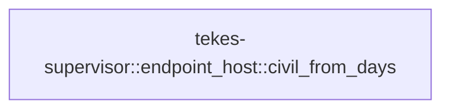

# tekes-supervisor::endpoint_host

[Package atlas](index.md) · [Source](../../src/endpoint_host.rs)

## Declarations

Visibility is the declaration spelling; trait members and reexports require their enclosing interface. `cfg` is not evaluated.

| Symbol | Kind | Visibility | Test / cfg |
|---|---|---|---|
| [tekes-supervisor::endpoint_host::EndpointRouteClass](../../src/endpoint_host.rs#L29) | enum_item | `pub` |  |
| [tekes-supervisor::endpoint_host::EndpointRoute](../../src/endpoint_host.rs#L37) | struct_item | `pub` |  |
| [tekes-supervisor::endpoint_host::TEKES_UNARY_ROUTES](../../src/endpoint_host.rs#L43) | const_item | `pub` |  |
| [tekes-supervisor::endpoint_host::route](../../src/endpoint_host.rs#L59) | function_item | `private` |  |
| [tekes-supervisor::endpoint_host::EndpointClock](../../src/endpoint_host.rs#L67) | type_item | `pub` |  |
| [tekes-supervisor::endpoint_host::RuntimeModelReadiness](../../src/endpoint_host.rs#L70) | struct_item | `pub` |  |
| [tekes-supervisor::endpoint_host::RuntimeProviderStatus](../../src/endpoint_host.rs#L77) | enum_item | `pub` |  |
| [tekes-supervisor::endpoint_host::RuntimeProviderFailure](../../src/endpoint_host.rs#L83) | enum_item | `pub` |  |
| [tekes-supervisor::endpoint_host::RuntimeProviderReadiness](../../src/endpoint_host.rs#L91) | struct_item | `pub` |  |
| [tekes-supervisor::endpoint_host::ProviderReadinessAuthority](../../src/endpoint_host.rs#L100) | trait_item | `pub` |  |
| [tekes-supervisor::endpoint_host::ProviderReadinessAuthority::readiness](../../src/endpoint_host.rs#L101) | function_signature_item | `private` |  |
| [tekes-supervisor::endpoint_host::ProviderReadinessAuthority::config_mutation_succeeded](../../src/endpoint_host.rs#L110) | function_item | `private` |  |
| [tekes-supervisor::endpoint_host::SessionDeliveryAuthority](../../src/endpoint_host.rs#L119) | trait_item | `pub` |  |
| [tekes-supervisor::endpoint_host::SessionDeliveryAuthority::session_metadata_changed](../../src/endpoint_host.rs#L123) | function_item | `private` |  |
| [tekes-supervisor::endpoint_host::SessionDeliveryAuthority::workspace_metadata_changed](../../src/endpoint_host.rs#L127) | function_item | `private` |  |
| [tekes-supervisor::endpoint_host::SessionDeliveryAuthority::prompt](../../src/endpoint_host.rs#L129) | function_signature_item | `private` |  |
| [tekes-supervisor::endpoint_host::SessionDeliveryAuthority::cancel](../../src/endpoint_host.rs#L138) | function_signature_item | `private` |  |
| [tekes-supervisor::endpoint_host::SessionDeliveryAuthority::rename](../../src/endpoint_host.rs#L145) | function_signature_item | `private` |  |
| [tekes-supervisor::endpoint_host::SessionDeliveryAuthority::compact](../../src/endpoint_host.rs#L159) | function_item | `private` |  |
| [tekes-supervisor::endpoint_host::QueueTransactionAuthority](../../src/endpoint_host.rs#L176) | trait_item | `pub` |  |
| [tekes-supervisor::endpoint_host::QueueTransactionAuthority::execute](../../src/endpoint_host.rs#L177) | function_signature_item | `private` |  |
| [tekes-supervisor::endpoint_host::recover_pending_management](../../src/endpoint_host.rs#L190) | function_item | `pub(crate)` |  |
| [tekes-supervisor::endpoint_host::QueueRecoveryAdapter](../../src/endpoint_host.rs#L199) | struct_item | `private` |  |
| [tekes-supervisor::endpoint_host::QueueRecoveryAdapter::execute](../../src/endpoint_host.rs#L204) | function_item | `private` |  |
| [tekes-supervisor::endpoint_host::SessionAdmissionGates](../../src/endpoint_host.rs#L241) | struct_item | `pub` |  |
| [tekes-supervisor::endpoint_host::SessionAdmissionGates::gate](../../src/endpoint_host.rs#L246) | function_item | `pub` |  |
| [tekes-supervisor::endpoint_host::SessionInputAdmissionAuthority](../../src/endpoint_host.rs#L265) | struct_item | `pub` |  |
| [tekes-supervisor::endpoint_host::SessionInputAdmissionAuthority::new](../../src/endpoint_host.rs#L272) | function_item | `pub` |  |
| [tekes-supervisor::endpoint_host::SessionInputAdmissionAuthority::gates](../../src/endpoint_host.rs#L280) | function_item | `pub` |  |
| [tekes-supervisor::endpoint_host::SessionInputAdmissionAuthority::root](../../src/endpoint_host.rs#L286) | function_item | `pub` |  |
| [tekes-supervisor::endpoint_host::SessionInputAdmissionAuthority::with_active_session](../../src/endpoint_host.rs#L290) | function_item | `pub` |  |
| [tekes-supervisor::endpoint_host::SessionInputAdmissionAuthority::with_session_gate](../../src/endpoint_host.rs#L315) | function_item | `pub` |  |
| [tekes-supervisor::endpoint_host::session_details](../../src/endpoint_host.rs#L340) | function_item | `private` |  |
| [tekes-supervisor::endpoint_host::ProductionEndpointRoutes](../../src/endpoint_host.rs#L350) | trait_item | `pub` |  |
| [tekes-supervisor::endpoint_host::ProductionEndpointRoutes::capabilities](../../src/endpoint_host.rs#L351) | function_signature_item | `private` |  |
| [tekes-supervisor::endpoint_host::ProductionEndpointRoutes::extension_method_class](../../src/endpoint_host.rs#L356) | function_item | `private` |  |
| [tekes-supervisor::endpoint_host::ProductionEndpointRoutes::validate_extension_payload](../../src/endpoint_host.rs#L362) | function_item | `private` |  |
| [tekes-supervisor::endpoint_host::ProductionEndpointRoutes::extension_failure_is_exact](../../src/endpoint_host.rs#L377) | function_item | `private` |  |
| [tekes-supervisor::endpoint_host::ProductionEndpointRoutes::execute](../../src/endpoint_host.rs#L385) | function_signature_item | `private` |  |
| [tekes-supervisor::endpoint_host::CompositeProductionEndpointRoutes](../../src/endpoint_host.rs#L396) | struct_item | `pub` |  |
| [tekes-supervisor::endpoint_host::CompositeProductionEndpointRoutes::compose](../../src/endpoint_host.rs#L401) | function_item | `pub` |  |
| [tekes-supervisor::endpoint_host::CompositeProductionEndpointRoutes::owner](../../src/endpoint_host.rs#L429) | function_item | `private` |  |
| [tekes-supervisor::endpoint_host::CompositeProductionEndpointRoutes::capabilities](../../src/endpoint_host.rs#L435) | function_item | `private` |  |
| [tekes-supervisor::endpoint_host::CompositeProductionEndpointRoutes::extension_method_class](../../src/endpoint_host.rs#L439) | function_item | `private` |  |
| [tekes-supervisor::endpoint_host::CompositeProductionEndpointRoutes::validate_extension_payload](../../src/endpoint_host.rs#L443) | function_item | `private` |  |
| [tekes-supervisor::endpoint_host::CompositeProductionEndpointRoutes::extension_failure_is_exact](../../src/endpoint_host.rs#L453) | function_item | `private` |  |
| [tekes-supervisor::endpoint_host::CompositeProductionEndpointRoutes::execute](../../src/endpoint_host.rs#L462) | function_item | `private` |  |
| [tekes-supervisor::endpoint_host::ProductionRouteCompositionError](../../src/endpoint_host.rs#L475) | enum_item | `pub` |  |
| [tekes-supervisor::endpoint_host::unsupported_route](../../src/endpoint_host.rs#L482) | function_item | `private` |  |
| [tekes-supervisor::endpoint_host::ProductionRouteFailure](../../src/endpoint_host.rs#L492) | struct_item | `pub` |  |
| [tekes-supervisor::endpoint_host::ProductionRouteFailure::new](../../src/endpoint_host.rs#L499) | function_item | `pub` |  |
| [tekes-supervisor::endpoint_host::ProductionEndpointHost](../../src/endpoint_host.rs#L508) | struct_item | `pub` |  |
| [tekes-supervisor::endpoint_host::ProductionEndpointHost::with_user_agent_dir](../../src/endpoint_host.rs#L531) | function_item | `pub` |  |
| [tekes-supervisor::endpoint_host::ProductionEndpointHost::mux_description](../../src/endpoint_host.rs#L536) | function_item | `pub` |  |
| [tekes-supervisor::endpoint_host::ProductionEndpointHost::open](../../src/endpoint_host.rs#L561) | function_item | `pub` |  |
| [tekes-supervisor::endpoint_host::ProductionEndpointHost::open_with_clock](../../src/endpoint_host.rs#L576) | function_item | `pub` |  |
| [tekes-supervisor::endpoint_host::ProductionEndpointHost::open_with_routes](../../src/endpoint_host.rs#L585) | function_item | `pub` |  |
| [tekes-supervisor::endpoint_host::ProductionEndpointHost::open_with_authorities](../../src/endpoint_host.rs#L594) | function_item | `pub` |  |
| [tekes-supervisor::endpoint_host::ProductionEndpointHost::open_with_full_authorities](../../src/endpoint_host.rs#L612) | function_item | `pub` |  |
| [tekes-supervisor::endpoint_host::ProductionEndpointHost::open_with_full_authorities_and_session_admission](../../src/endpoint_host.rs#L635) | function_item | `pub` |  |
| [tekes-supervisor::endpoint_host::ProductionEndpointHost::open_with_route_authority](../../src/endpoint_host.rs#L661) | function_item | `pub` |  |
| [tekes-supervisor::endpoint_host::ProductionEndpointHost::open_with_route_ownership](../../src/endpoint_host.rs#L684) | function_item | `private` |  |
| [tekes-supervisor::endpoint_host::ProductionEndpointHost::implemented_capabilities](../../src/endpoint_host.rs#L751) | function_item | `pub` |  |
| [tekes-supervisor::endpoint_host::ProductionEndpointHost::admission_gates](../../src/endpoint_host.rs#L760) | function_item | `pub` |  |
| [tekes-supervisor::endpoint_host::ProductionEndpointHost::has_incomplete_management_operation](../../src/endpoint_host.rs#L764) | function_item | `pub` |  |
| [tekes-supervisor::endpoint_host::ProductionEndpointHost::execute](../../src/endpoint_host.rs#L773) | function_item | `private` |  |
| [tekes-supervisor::endpoint_host::ProductionEndpointHost::execute_inner](../../src/endpoint_host.rs#L781) | function_item | `private` |  |
| [tekes-supervisor::endpoint_host::ProductionEndpointHost::execute_extension](../../src/endpoint_host.rs#L809) | function_item | `private` |  |
| [tekes-supervisor::endpoint_host::ProductionEndpointHost::archive_session](../../src/endpoint_host.rs#L858) | function_item | `private` |  |
| [tekes-supervisor::endpoint_host::ProductionEndpointHost::unarchive_session](../../src/endpoint_host.rs#L881) | function_item | `private` |  |
| [tekes-supervisor::endpoint_host::ProductionEndpointHost::create_session](../../src/endpoint_host.rs#L898) | function_item | `private` |  |
| [tekes-supervisor::endpoint_host::ProductionEndpointHost::draft_models](../../src/endpoint_host.rs#L960) | function_item | `private` |  |
| [tekes-supervisor::endpoint_host::ProductionEndpointHost::models](../../src/endpoint_host.rs#L997) | function_item | `private` |  |
| [tekes-supervisor::endpoint_host::ProductionEndpointHost::select_model](../../src/endpoint_host.rs#L1017) | function_item | `private` |  |
| [tekes-supervisor::endpoint_host::ProductionEndpointHost::cancel](../../src/endpoint_host.rs#L1076) | function_item | `private` |  |
| [tekes-supervisor::endpoint_host::ProductionEndpointHost::rename_session](../../src/endpoint_host.rs#L1106) | function_item | `private` |  |
| [tekes-supervisor::endpoint_host::ProductionEndpointHost::update_queue](../../src/endpoint_host.rs#L1144) | function_item | `private` |  |
| [tekes-supervisor::endpoint_host::ProductionEndpointHost::prompt](../../src/endpoint_host.rs#L1233) | function_item | `private` |  |
| [tekes-supervisor::endpoint_host::ProductionEndpointHost::attachment](../../src/endpoint_host.rs#L1290) | function_item | `private` |  |
| [tekes-supervisor::endpoint_host::ProductionEndpointHost::fork_session](../../src/endpoint_host.rs#L1306) | function_item | `private` |  |
| [tekes-supervisor::endpoint_host::ProductionEndpointHost::discard_session](../../src/endpoint_host.rs#L1343) | function_item | `private` |  |
| [tekes-supervisor::endpoint_host::ProductionEndpointHost::admission_gate](../../src/endpoint_host.rs#L1366) | function_item | `private` |  |
| [tekes-supervisor::endpoint_host::ProductionEndpointHost::ensure_active_session](../../src/endpoint_host.rs#L1373) | function_item | `private` |  |
| [tekes-supervisor::endpoint_host::ProductionEndpointHost::capabilities](../../src/endpoint_host.rs#L1394) | function_item | `private` |  |
| [tekes-supervisor::endpoint_host::ProductionEndpointHost::extension_capabilities](../../src/endpoint_host.rs#L1415) | function_item | `private` |  |
| [tekes-supervisor::endpoint_host::ProductionEndpointHost::method_class](../../src/endpoint_host.rs#L1425) | function_item | `private` |  |
| [tekes-supervisor::endpoint_host::ProductionEndpointHost::validate_request](../../src/endpoint_host.rs#L1441) | function_item | `private` |  |
| [tekes-supervisor::endpoint_host::ProductionEndpointHost::call](../../src/endpoint_host.rs#L1465) | function_item | `private` |  |
| [tekes-supervisor::endpoint_host::ProductionEndpointAssembly](../../src/endpoint_host.rs#L1470) | struct_item | `pub` |  |
| [tekes-supervisor::endpoint_host::ProductionEndpointAssembly::open](../../src/endpoint_host.rs#L1477) | function_item | `pub` |  |
| [tekes-supervisor::endpoint_host::ProductionEndpointAssembly::open_with_clock](../../src/endpoint_host.rs#L1489) | function_item | `pub` |  |
| [tekes-supervisor::endpoint_host::ProductionEndpointAssembly::open_with_routes](../../src/endpoint_host.rs#L1502) | function_item | `pub` |  |
| [tekes-supervisor::endpoint_host::ProductionEndpointAssembly::open_with_route_authority](../../src/endpoint_host.rs#L1516) | function_item | `pub` |  |
| [tekes-supervisor::endpoint_host::ProductionEndpointAssembly::open_with_authorities](../../src/endpoint_host.rs#L1538) | function_item | `pub` |  |
| [tekes-supervisor::endpoint_host::ProductionEndpointAssembly::open_with_full_authorities](../../src/endpoint_host.rs#L1556) | function_item | `pub` |  |
| [tekes-supervisor::endpoint_host::ProductionEndpointAssembly::dispatch](../../src/endpoint_host.rs#L1581) | function_item | `pub` |  |
| [tekes-supervisor::endpoint_host::ProductionEndpointAssembly::hub](../../src/endpoint_host.rs#L1589) | function_item | `pub` |  |
| [tekes-supervisor::endpoint_host::ProductionEndpointAssembly::host](../../src/endpoint_host.rs#L1594) | function_item | `pub` |  |
| [tekes-supervisor::endpoint_host::ProductionEndpointAssembly::admission_gates](../../src/endpoint_host.rs#L1599) | function_item | `pub` |  |
| [tekes-supervisor::endpoint_host::ProductionEndpointAssembly::has_incomplete_management_operation](../../src/endpoint_host.rs#L1603) | function_item | `pub` |  |
| [tekes-supervisor::endpoint_host::success](../../src/endpoint_host.rs#L1611) | function_item | `private` |  |
| [tekes-supervisor::endpoint_host::model_projection](../../src/endpoint_host.rs#L1619) | function_item | `private` |  |
| [tekes-supervisor::endpoint_host::ConfiguredModels](../../src/endpoint_host.rs#L1714) | struct_item | `pub` |  |
| [tekes-supervisor::endpoint_host::ConfiguredModels::model_available](../../src/endpoint_host.rs#L1717) | function_item | `private` |  |
| [tekes-supervisor::endpoint_host::model_is_configured](../../src/endpoint_host.rs#L1728) | function_item | `private` |  |
| [tekes-supervisor::endpoint_host::runtime_failure_name](../../src/endpoint_host.rs#L1759) | function_item | `private` |  |
| [tekes-supervisor::endpoint_host::map_production_route](../../src/endpoint_host.rs#L1768) | function_item | `private` |  |
| [tekes-supervisor::endpoint_host::map_production_route_for](../../src/endpoint_host.rs#L1776) | function_item | `private` |  |
| [tekes-supervisor::endpoint_host::sanitized_route_log_message](../../src/endpoint_host.rs#L1790) | function_item | `private` |  |
| [tekes-supervisor::endpoint_host::production_failure_is_exact_for](../../src/endpoint_host.rs#L1810) | function_item | `pub(crate)` |  |
| [tekes-supervisor::endpoint_host::route_error_is_exact](../../src/endpoint_host.rs#L1817) | function_item | `private` |  |
| [tekes-supervisor::endpoint_host::route_error_message](../../src/endpoint_host.rs#L1901) | function_item | `private` |  |
| [tekes-supervisor::endpoint_host::exact_string_fields](../../src/endpoint_host.rs#L1933) | function_item | `private` |  |
| [tekes-supervisor::endpoint_host::route_allows_error](../../src/endpoint_host.rs#L1954) | function_item | `private` |  |
| [tekes-supervisor::endpoint_host::internal_failure](../../src/endpoint_host.rs#L2062) | function_item | `private` |  |
| [tekes-supervisor::endpoint_host::failure](../../src/endpoint_host.rs#L2066) | function_item | `private` |  |
| [tekes-supervisor::endpoint_host::required_string](../../src/endpoint_host.rs#L2078) | function_item | `private` |  |
| [tekes-supervisor::endpoint_host::required_string_allow_whitespace](../../src/endpoint_host.rs#L2087) | function_item | `private` |  |
| [tekes-supervisor::endpoint_host::optional_bool](../../src/endpoint_host.rs#L2098) | function_item | `private` |  |
| [tekes-supervisor::endpoint_host::optional_string](../../src/endpoint_host.rs#L2108) | function_item | `private` |  |
| [tekes-supervisor::endpoint_host::require_object_fields](../../src/endpoint_host.rs#L2119) | function_item | `private` |  |
| [tekes-supervisor::endpoint_host::optional_u64](../../src/endpoint_host.rs#L2135) | function_item | `private` |  |
| [tekes-supervisor::endpoint_host::to_ijson](../../src/endpoint_host.rs#L2145) | function_item | `private` |  |
| [tekes-supervisor::endpoint_host::request_hash](../../src/endpoint_host.rs#L2149) | function_item | `private` |  |
| [tekes-supervisor::endpoint_host::mark_management_handoff](../../src/endpoint_host.rs#L2163) | function_item | `private` |  |
| [tekes-supervisor::endpoint_host::mark_event_handoff](../../src/endpoint_host.rs#L2177) | function_item | `private` |  |
| [tekes-supervisor::endpoint_host::endpoint_origin](../../src/endpoint_host.rs#L2191) | function_item | `private` |  |
| [tekes-supervisor::endpoint_host::validate_session_title](../../src/endpoint_host.rs#L2206) | function_item | `private` |  |
| [tekes-supervisor::endpoint_host::PendingQueueAction](../../src/endpoint_host.rs#L2217) | enum_item | `private` |  |
| [tekes-supervisor::endpoint_host::PendingQueueAction::with_origin](../../src/endpoint_host.rs#L2224) | function_item | `private` |  |
| [tekes-supervisor::endpoint_host::queue_action](../../src/endpoint_host.rs#L2240) | function_item | `private` |  |
| [tekes-supervisor::endpoint_host::map_queue_rejection](../../src/endpoint_host.rs#L2290) | function_item | `private` |  |
| [tekes-supervisor::endpoint_host::queue_decision](../../src/endpoint_host.rs#L2314) | function_item | `private` |  |
| [tekes-supervisor::endpoint_host::map_persisted_queue_rejection](../../src/endpoint_host.rs#L2339) | function_item | `private` |  |
| [tekes-supervisor::endpoint_host::validate_time_zone](../../src/endpoint_host.rs#L2353) | function_item | `private` |  |
| [tekes-supervisor::endpoint_host::map_prompt_error](../../src/endpoint_host.rs#L2379) | function_item | `private` |  |
| [tekes-supervisor::endpoint_host::map_attachment_read_error](../../src/endpoint_host.rs#L2399) | function_item | `private` |  |
| [tekes-supervisor::endpoint_host::attachment_failure](../../src/endpoint_host.rs#L2416) | function_item | `private` |  |
| [tekes-supervisor::endpoint_host::attachment_reason](../../src/endpoint_host.rs#L2424) | function_item | `private` |  |
| [tekes-supervisor::endpoint_host::validate_extension_payload](../../src/endpoint_host.rs#L2439) | function_item | `private` |  |
| [tekes-supervisor::endpoint_host::validate_production_payload](../../src/endpoint_host.rs#L2495) | function_item | `private` |  |
| [tekes-supervisor::endpoint_host::invalid](../../src/endpoint_host.rs#L2499) | function_item | `private` |  |
| [tekes-supervisor::endpoint_host::map_endpoint](../../src/endpoint_host.rs#L2503) | function_item | `private` |  |
| [tekes-supervisor::endpoint_host::map_management](../../src/endpoint_host.rs#L2520) | function_item | `private` |  |
| [tekes-supervisor::endpoint_host::internal_json](../../src/endpoint_host.rs#L2600) | function_item | `private` |  |
| [tekes-supervisor::endpoint_host::internal_schema](../../src/endpoint_host.rs#L2604) | function_item | `private` |  |
| [tekes-supervisor::endpoint_host::internal_assembly](../../src/endpoint_host.rs#L2608) | function_item | `private` |  |
| [tekes-supervisor::endpoint_host::EndpointRpcFailure](../../src/endpoint_host.rs#L2612) | struct_item | `private` |  |
| [tekes-supervisor::endpoint_host::EndpointRpcFailure::new](../../src/endpoint_host.rs#L2619) | function_item | `private` |  |
| [tekes-supervisor::endpoint_host::system_timestamp](../../src/endpoint_host.rs#L2631) | function_item | `private` |  |
| [tekes-supervisor::endpoint_host::civil_from_days](../../src/endpoint_host.rs#L2648) | function_item | `private` |  |
| [tekes-supervisor::endpoint_host::EndpointAssemblyError](../../src/endpoint_host.rs#L2664) | enum_item | `pub` |  |

## Imports / reexports

| Local name | Source path | Visibility |
|---|---|---|
| `BTreeSet` | `std::collections::BTreeSet` | `private` |
| `HashMap` | `std::collections::HashMap` | `private` |
| `Path` | `std::path::Path` | `private` |
| `PathBuf` | `std::path::PathBuf` | `private` |
| `Arc` | `std::sync::Arc` | `private` |
| `Mutex` | `std::sync::Mutex` | `private` |
| `SystemTime` | `std::time::SystemTime` | `private` |
| `UNIX_EPOCH` | `std::time::UNIX_EPOCH` | `private` |
| `AttachmentAuthority` | `endpoint::AttachmentAuthority` | `private` |
| `AttachmentErrorReason` | `endpoint::AttachmentErrorReason` | `private` |
| `AttachmentReadError` | `endpoint::AttachmentReadError` | `private` |
| `ClientRequest` | `endpoint::ClientRequest` | `private` |
| `DurableHandoffProof` | `endpoint::DurableHandoffProof` | `private` |
| `EndpointDispatcher` | `endpoint::EndpointDispatcher` | `private` |
| `EndpointHost` | `endpoint::EndpointHost` | `private` |
| `EndpointHostCall` | `endpoint::EndpointHostCall` | `private` |
| `EndpointHostFuture` | `endpoint::EndpointHostFuture` | `private` |
| `EndpointSubscriptionHub` | `endpoint::EndpointSubscriptionHub` | `private` |
| `ExecutionCreateOperation` | `endpoint::ExecutionCreateOperation` | `private` |
| `ForkSessionOperation` | `endpoint::ForkSessionOperation` | `private` |
| `HostFailure` | `endpoint::HostFailure` | `private` |
| `MaterializedPrompt` | `endpoint::MaterializedPrompt` | `private` |
| `NativeEndpoint` | `endpoint::NativeEndpoint` | `private` |
| `NativeEndpointError` | `endpoint::NativeEndpointError` | `private` |
| `PendingQueueTransaction` | `endpoint::PendingQueueTransaction` | `private` |
| `PromptMaterializeError` | `endpoint::PromptMaterializeError` | `private` |
| `PromptPart` | `endpoint::PromptPart` | `private` |
| `QueueRecoveryDriver` | `endpoint::QueueRecoveryDriver` | `private` |
| `QueueTransactionCompletion` | `endpoint::QueueTransactionCompletion` | `private` |
| `QueueTransactionDecision` | `endpoint::QueueTransactionDecision` | `private` |
| `QueueTransactionOperation` | `endpoint::QueueTransactionOperation` | `private` |
| `QueueTransactionState` | `endpoint::QueueTransactionState` | `private` |
| `RpcDurableIdentity` | `endpoint::RpcDurableIdentity` | `private` |
| `RpcError` | `endpoint::RpcError` | `private` |
| `RpcRegistry` | `endpoint::RpcRegistry` | `private` |
| `RpcResult` | `endpoint::RpcResult` | `private` |
| `SelectModelOperation` | `endpoint::SelectModelOperation` | `private` |
| `ServerResponse` | `endpoint::ServerResponse` | `private` |
| `SessionHostDescription` | `endpoint::SessionHostDescription` | `private` |
| `SessionOperationError` | `endpoint::SessionOperationError` | `private` |
| `SessionOperations` | `endpoint::SessionOperations` | `private` |
| `IJsonValue` | `schema::IJsonValue` | `private` |
| `OriginTuple` | `schema::OriginTuple` | `private` |
| `Value` | `serde_json::Value` | `private` |
| `json` | `serde_json::json` | `private` |
| `Digest` | `sha2::Digest` | `private` |
| `Sha256` | `sha2::Sha256` | `private` |
| `Error` | `thiserror::Error` | `private` |

## Module declarations

| Module | Visibility | Attributes |
|---|---|---|

## Function call graphs

Edges below are syntactically resolved calls only, including private functions. Graphs partition callers into groups of 20; they are not execution order. All unresolved sites are listed below and in the JSON inventory.

Functions 1–20: 15 direct edges

```mermaid
flowchart TD
  n0["endpoint::session_operations::SessionOperations::open_sessions"]
  n1["endpoint::types::validate_session_id"]
  n2["schema::ijson::IJsonValue::parse"]
  n3["schema::ijson::IJsonValue::parse_str"]
  n4["tekes-supervisor::endpoint_host::ProviderReadinessAuthority::config_mutation_succeeded"]
  n5["tekes-supervisor::endpoint_host::SessionDeliveryAuthority::session_metadata_changed"]
  n6["tekes-supervisor::endpoint_host::SessionDeliveryAuthority::workspace_metadata_changed"]
  n7["tekes-supervisor::endpoint_host::SessionDeliveryAuthority::compact"]
  n8["tekes-supervisor::endpoint_host::recover_pending_management"]
  n9["tekes-supervisor::endpoint_host::QueueRecoveryAdapter::execute"]
  n10["tekes-supervisor::endpoint_host::queue_decision"]
  n11["tekes-supervisor::endpoint_host::SessionAdmissionGates::gate"]
  n12["tekes-supervisor::endpoint_host::SessionInputAdmissionAuthority::new"]
  n13["tekes-supervisor::endpoint_host::SessionInputAdmissionAuthority::gates"]
  n14["tekes-supervisor::endpoint_host::SessionInputAdmissionAuthority::root"]
  n15["tekes-supervisor::endpoint_host::SessionInputAdmissionAuthority::with_active_session"]
  n16["tekes-supervisor::endpoint_host::SessionInputAdmissionAuthority::with_session_gate"]
  n17["tekes-supervisor::endpoint_host::session_details"]
  n18["tekes-supervisor::endpoint_host::ProductionEndpointRoutes::extension_method_class"]
  n19["tekes-supervisor::endpoint_host::ProductionEndpointRoutes::validate_extension_payload"]
  n20["tekes-supervisor::endpoint_host::ProductionEndpointRoutes::extension_failure_is_exact"]
  n21["tekes-supervisor::endpoint_host::CompositeProductionEndpointRoutes::compose"]
  n22["tekes-supervisor::endpoint_host::CompositeProductionEndpointRoutes::owner"]
  n23["tekes-supervisor::endpoint_host::CompositeProductionEndpointRoutes::capabilities"]
  n24["tekes-supervisor::endpoint_host::ProductionRouteFailure::new"]
  n25["tekes-supervisor::endpoint_host::route"]
  n7 --> n3
  n7 --> n24
  n8 --> n0
  n9 --> n10
  n11 --> n3
  n11 --> n24
  n15 --> n16
  n15 --> n17
  n15 --> n24
  n16 --> n1
  n16 --> n3
  n16 --> n24
  n17 --> n2
  n19 --> n2
  n19 --> n24
```

Functions 21–40: 19 direct edges

```mermaid
flowchart TD
  n0["endpoint::attachment::AttachmentAuthority::open"]
  n1["endpoint::mux::SessionEndpointCapability::required"]
  n2["endpoint::service::NativeEndpoint::open"]
  n3["endpoint::session_operations::SessionOperations::open_sessions"]
  n4["schema::ijson::IJsonValue::parse"]
  n5["tekes-supervisor::endpoint_host::success"]
  n6["tekes-supervisor::endpoint_host::failure"]
  n7["tekes-supervisor::endpoint_host::SessionInputAdmissionAuthority::new"]
  n8["tekes-supervisor::endpoint_host::CompositeProductionEndpointRoutes::extension_method_class"]
  n9["tekes-supervisor::endpoint_host::CompositeProductionEndpointRoutes::validate_extension_payload"]
  n10["tekes-supervisor::endpoint_host::CompositeProductionEndpointRoutes::extension_failure_is_exact"]
  n11["tekes-supervisor::endpoint_host::CompositeProductionEndpointRoutes::execute"]
  n12["tekes-supervisor::endpoint_host::unsupported_route"]
  n13["tekes-supervisor::endpoint_host::ProductionRouteFailure::new"]
  n14["tekes-supervisor::endpoint_host::ProductionEndpointHost::with_user_agent_dir"]
  n15["tekes-supervisor::endpoint_host::ProductionEndpointHost::mux_description"]
  n16["tekes-supervisor::endpoint_host::ProductionEndpointHost::open"]
  n17["tekes-supervisor::endpoint_host::ProductionEndpointHost::open_with_clock"]
  n18["tekes-supervisor::endpoint_host::ProductionEndpointHost::open_with_routes"]
  n19["tekes-supervisor::endpoint_host::ProductionEndpointHost::open_with_authorities"]
  n20["tekes-supervisor::endpoint_host::ProductionEndpointHost::open_with_full_authorities"]
  n21["tekes-supervisor::endpoint_host::ProductionEndpointHost::open_with_full_authorities_and_session_admission"]
  n22["tekes-supervisor::endpoint_host::ProductionEndpointHost::open_with_route_authority"]
  n23["tekes-supervisor::endpoint_host::ProductionEndpointHost::open_with_route_ownership"]
  n24["tekes-supervisor::endpoint_host::ProductionEndpointHost::implemented_capabilities"]
  n25["tekes-supervisor::endpoint_host::ProductionEndpointHost::admission_gates"]
  n26["tekes-supervisor::endpoint_host::ProductionEndpointHost::has_incomplete_management_operation"]
  n27["tekes-supervisor::endpoint_host::ProductionEndpointHost::execute"]
  n28["tekes-supervisor::endpoint_host::ProductionEndpointHost::execute_inner"]
  n9 --> n12
  n11 --> n12
  n12 --> n4
  n12 --> n13
  n15 --> n1
  n16 --> n20
  n17 --> n20
  n18 --> n20
  n19 --> n20
  n20 --> n23
  n21 --> n23
  n22 --> n23
  n23 --> n0
  n23 --> n2
  n23 --> n3
  n23 --> n7
  n27 --> n5
  n27 --> n6
  n27 --> n28
```

Functions 41–60: 125 direct edges

```mermaid
flowchart TD
  n0["endpoint::types::validate_session_id"]
  n1["profile::config::ConfigRepository::open"]
  n2["tekes-supervisor::endpoint_host::ProductionEndpointHost::select_model"]
  n3["tekes-supervisor::endpoint_host::ProductionEndpointHost::cancel"]
  n4["tekes-supervisor::endpoint_host::ProductionEndpointHost::rename_session"]
  n5["tekes-supervisor::endpoint_host::ProductionEndpointHost::update_queue"]
  n6["tekes-supervisor::endpoint_host::ProductionEndpointHost::prompt"]
  n7["tekes-supervisor::endpoint_host::ProductionEndpointHost::attachment"]
  n8["tekes-supervisor::endpoint_host::ProductionEndpointHost::fork_session"]
  n9["tekes-supervisor::endpoint_host::ProductionEndpointHost::discard_session"]
  n10["tekes-supervisor::endpoint_host::ProductionEndpointHost::admission_gate"]
  n11["tekes-supervisor::endpoint_host::ProductionEndpointHost::ensure_active_session"]
  n12["tekes-supervisor::endpoint_host::ProductionEndpointHost::capabilities"]
  n13["tekes-supervisor::endpoint_host::ProductionEndpointHost::extension_capabilities"]
  n14["tekes-supervisor::endpoint_host::ProductionEndpointHost::method_class"]
  n15["tekes-supervisor::endpoint_host::model_projection"]
  n16["tekes-supervisor::endpoint_host::model_is_configured"]
  n17["tekes-supervisor::endpoint_host::map_production_route"]
  n18["tekes-supervisor::endpoint_host::map_production_route_for"]
  n19["tekes-supervisor::endpoint_host::internal_failure"]
  n20["tekes-supervisor::endpoint_host::required_string"]
  n21["tekes-supervisor::endpoint_host::required_string_allow_whitespace"]
  n22["tekes-supervisor::endpoint_host::optional_bool"]
  n23["tekes-supervisor::endpoint_host::optional_string"]
  n24["tekes-supervisor::endpoint_host::require_object_fields"]
  n25["tekes-supervisor::endpoint_host::optional_u64"]
  n26["tekes-supervisor::endpoint_host::to_ijson"]
  n27["tekes-supervisor::endpoint_host::request_hash"]
  n28["tekes-supervisor::endpoint_host::mark_management_handoff"]
  n29["tekes-supervisor::endpoint_host::mark_event_handoff"]
  n30["tekes-supervisor::endpoint_host::endpoint_origin"]
  n31["tekes-supervisor::endpoint_host::validate_session_title"]
  n32["tekes-supervisor::endpoint_host::queue_action"]
  n33["tekes-supervisor::endpoint_host::queue_decision"]
  n34["tekes-supervisor::endpoint_host::map_persisted_queue_rejection"]
  n35["tekes-supervisor::endpoint_host::validate_time_zone"]
  n36["tekes-supervisor::endpoint_host::validate_extension_payload"]
  n37["tekes-supervisor::endpoint_host::invalid"]
  n38["tekes-supervisor::endpoint_host::map_endpoint"]
  n39["tekes-supervisor::endpoint_host::EndpointRpcFailure::new"]
  n40["tekes-supervisor::endpoint_host::ProductionEndpointHost::execute_inner"]
  n41["tekes-supervisor::endpoint_host::ProductionEndpointHost::execute_extension"]
  n42["tekes-supervisor::endpoint_host::ProductionEndpointHost::archive_session"]
  n43["tekes-supervisor::endpoint_host::ProductionEndpointHost::unarchive_session"]
  n44["tekes-supervisor::endpoint_host::ProductionEndpointHost::create_session"]
  n45["tekes-supervisor::endpoint_host::ProductionEndpointHost::draft_models"]
  n46["tekes-supervisor::endpoint_host::ProductionEndpointHost::models"]
  n47["tools::guidance::IdentityProfile::parse"]
  n2 --> n10
  n2 --> n16
  n2 --> n18
  n2 --> n19
  n2 --> n20
  n2 --> n23
  n2 --> n24
  n2 --> n26
  n2 --> n27
  n2 --> n28
  n2 --> n38
  n2 --> n39
  n3 --> n10
  n3 --> n18
  n3 --> n19
  n3 --> n20
  n3 --> n24
  n3 --> n26
  n3 --> n29
  n3 --> n30
  n3 --> n39
  n4 --> n10
  n4 --> n18
  n4 --> n19
  n4 --> n20
  n4 --> n21
  n4 --> n24
  n4 --> n26
  n4 --> n29
  n4 --> n30
  n4 --> n31
  n4 --> n39
  n5 --> n10
  n5 --> n18
  n5 --> n19
  n5 --> n20
  n5 --> n24
  n5 --> n26
  n5 --> n27
  n5 --> n28
  n5 --> n30
  n5 --> n32
  n5 --> n33
  n5 --> n34
  n5 --> n37
  n5 --> n39
  n6 --> n18
  n6 --> n20
  n6 --> n23
  n6 --> n24
  n6 --> n26
  n6 --> n29
  n6 --> n30
  n6 --> n35
  n6 --> n37
  n6 --> n39
  n7 --> n11
  n7 --> n20
  n7 --> n24
  n7 --> n26
  n8 --> n20
  n8 --> n22
  n8 --> n24
  n8 --> n25
  n8 --> n26
  n8 --> n27
  n8 --> n28
  n9 --> n18
  n9 --> n20
  n9 --> n24
  n9 --> n26
  n9 --> n27
  n9 --> n28
  n11 --> n0
  n11 --> n37
  n11 --> n39
  n40 --> n2
  n40 --> n3
  n40 --> n4
  n40 --> n5
  n40 --> n6
  n40 --> n7
  n40 --> n8
  n40 --> n9
  n40 --> n41
  n40 --> n42
  n40 --> n43
  n40 --> n44
  n40 --> n45
  n40 --> n46
  n41 --> n17
  n41 --> n18
  n41 --> n19
  n41 --> n36
  n41 --> n39
  n42 --> n18
  n42 --> n20
  n42 --> n24
  n42 --> n26
  n42 --> n27
  n42 --> n28
  n43 --> n20
  n43 --> n24
  n43 --> n26
  n43 --> n27
  n43 --> n28
  n44 --> n23
  n44 --> n24
  n44 --> n26
  n44 --> n27
  n44 --> n28
  n44 --> n37
  n44 --> n39
  n44 --> n47
  n45 --> n1
  n45 --> n15
  n45 --> n18
  n45 --> n19
  n45 --> n24
  n46 --> n15
  n46 --> n18
  n46 --> n20
  n46 --> n24
  n46 --> n38
  n46 --> n39
```

Functions 61–80: 27 direct edges

```mermaid
flowchart TD
  n0["endpoint::host::EndpointDispatcher::new"]
  n1["endpoint::idempotency::RpcRegistry::open"]
  n2["provider::dialect::resolve_profile"]
  n3["tekes-supervisor::endpoint_host::ProductionEndpointHost::validate_request"]
  n4["tekes-supervisor::endpoint_host::ProductionEndpointHost::call"]
  n5["tekes-supervisor::endpoint_host::ProductionEndpointAssembly::open"]
  n6["tekes-supervisor::endpoint_host::ProductionEndpointAssembly::open_with_clock"]
  n7["tekes-supervisor::endpoint_host::ProductionEndpointAssembly::open_with_routes"]
  n8["tekes-supervisor::endpoint_host::ProductionEndpointAssembly::open_with_route_authority"]
  n9["tekes-supervisor::endpoint_host::ProductionEndpointAssembly::open_with_authorities"]
  n10["tekes-supervisor::endpoint_host::ProductionEndpointAssembly::open_with_full_authorities"]
  n11["tekes-supervisor::endpoint_host::ProductionEndpointAssembly::dispatch"]
  n12["tekes-supervisor::endpoint_host::ProductionEndpointAssembly::hub"]
  n13["tekes-supervisor::endpoint_host::ProductionEndpointAssembly::host"]
  n14["tekes-supervisor::endpoint_host::ProductionEndpointAssembly::admission_gates"]
  n15["tekes-supervisor::endpoint_host::ProductionEndpointAssembly::has_incomplete_management_operation"]
  n16["tekes-supervisor::endpoint_host::success"]
  n17["tekes-supervisor::endpoint_host::model_projection"]
  n18["tekes-supervisor::endpoint_host::ConfiguredModels::model_available"]
  n19["tekes-supervisor::endpoint_host::model_is_configured"]
  n20["tekes-supervisor::endpoint_host::runtime_failure_name"]
  n21["tekes-supervisor::endpoint_host::map_production_route"]
  n22["tekes-supervisor::endpoint_host::map_production_route_for"]
  n23["tekes-supervisor::endpoint_host::sanitized_route_log_message"]
  n24["tekes-supervisor::endpoint_host::production_failure_is_exact_for"]
  n25["tekes-supervisor::endpoint_host::internal_failure"]
  n26["tekes-supervisor::endpoint_host::to_ijson"]
  n27["tekes-supervisor::endpoint_host::validate_production_payload"]
  n28["tekes-supervisor::endpoint_host::ProductionEndpointHost::open"]
  n29["tekes-supervisor::endpoint_host::ProductionEndpointHost::open_with_clock"]
  n30["tekes-supervisor::endpoint_host::ProductionEndpointHost::open_with_routes"]
  n31["tekes-supervisor::endpoint_host::ProductionEndpointHost::open_with_full_authorities"]
  n32["tekes-supervisor::endpoint_host::ProductionEndpointHost::open_with_route_authority"]
  n3 --> n27
  n5 --> n0
  n5 --> n1
  n5 --> n28
  n6 --> n0
  n6 --> n1
  n6 --> n29
  n7 --> n0
  n7 --> n1
  n7 --> n30
  n8 --> n0
  n8 --> n1
  n8 --> n32
  n9 --> n10
  n10 --> n0
  n10 --> n1
  n10 --> n31
  n17 --> n2
  n17 --> n19
  n17 --> n25
  n17 --> n26
  n18 --> n19
  n19 --> n2
  n22 --> n21
  n22 --> n23
  n22 --> n24
  n22 --> n25
```

Functions 81–100: 16 direct edges

```mermaid
flowchart TD
  n0["schema::ijson::IJsonValue::parse"]
  n1["tekes-supervisor::endpoint_host::sanitized_route_log_message"]
  n2["tekes-supervisor::endpoint_host::production_failure_is_exact_for"]
  n3["tekes-supervisor::endpoint_host::route_error_is_exact"]
  n4["tekes-supervisor::endpoint_host::route_error_message"]
  n5["tekes-supervisor::endpoint_host::exact_string_fields"]
  n6["tekes-supervisor::endpoint_host::route_allows_error"]
  n7["tekes-supervisor::endpoint_host::internal_failure"]
  n8["tekes-supervisor::endpoint_host::failure"]
  n9["tekes-supervisor::endpoint_host::required_string"]
  n10["tekes-supervisor::endpoint_host::required_string_allow_whitespace"]
  n11["tekes-supervisor::endpoint_host::optional_bool"]
  n12["tekes-supervisor::endpoint_host::optional_string"]
  n13["tekes-supervisor::endpoint_host::require_object_fields"]
  n14["tekes-supervisor::endpoint_host::optional_u64"]
  n15["tekes-supervisor::endpoint_host::to_ijson"]
  n16["tekes-supervisor::endpoint_host::request_hash"]
  n17["tekes-supervisor::endpoint_host::mark_management_handoff"]
  n18["tekes-supervisor::endpoint_host::mark_event_handoff"]
  n19["tekes-supervisor::endpoint_host::endpoint_origin"]
  n20["tekes-supervisor::endpoint_host::validate_session_title"]
  n21["tekes-supervisor::endpoint_host::invalid"]
  n22["tekes-supervisor::endpoint_host::EndpointRpcFailure::new"]
  n1 --> n0
  n2 --> n3
  n2 --> n6
  n3 --> n4
  n3 --> n5
  n7 --> n22
  n9 --> n21
  n10 --> n21
  n11 --> n21
  n12 --> n21
  n13 --> n21
  n14 --> n21
  n15 --> n0
  n16 --> n22
  n17 --> n22
  n18 --> n7
```

Functions 101–120: 27 direct edges

```mermaid
flowchart TD
  n0["schema::ijson::IJsonValue::parse"]
  n1["schema::ijson::IJsonValue::parse_str"]
  n2["tekes-supervisor::endpoint_host::internal_failure"]
  n3["tekes-supervisor::endpoint_host::require_object_fields"]
  n4["tekes-supervisor::endpoint_host::PendingQueueAction::with_origin"]
  n5["tekes-supervisor::endpoint_host::queue_action"]
  n6["tekes-supervisor::endpoint_host::map_queue_rejection"]
  n7["tekes-supervisor::endpoint_host::queue_decision"]
  n8["tekes-supervisor::endpoint_host::map_persisted_queue_rejection"]
  n9["tekes-supervisor::endpoint_host::validate_time_zone"]
  n10["tekes-supervisor::endpoint_host::map_prompt_error"]
  n11["tekes-supervisor::endpoint_host::map_attachment_read_error"]
  n12["tekes-supervisor::endpoint_host::attachment_failure"]
  n13["tekes-supervisor::endpoint_host::attachment_reason"]
  n14["tekes-supervisor::endpoint_host::validate_extension_payload"]
  n15["tekes-supervisor::endpoint_host::validate_production_payload"]
  n16["tekes-supervisor::endpoint_host::invalid"]
  n17["tekes-supervisor::endpoint_host::map_endpoint"]
  n18["tekes-supervisor::endpoint_host::map_management"]
  n19["tekes-supervisor::endpoint_host::internal_json"]
  n20["tekes-supervisor::endpoint_host::internal_schema"]
  n21["tekes-supervisor::endpoint_host::internal_assembly"]
  n22["tekes-supervisor::endpoint_host::EndpointRpcFailure::new"]
  n23["tekes-supervisor::endpoint_host::system_timestamp"]
  n24["tekes-supervisor::endpoint_host::civil_from_days"]
  n5 --> n16
  n5 --> n22
  n6 --> n22
  n8 --> n2
  n8 --> n6
  n9 --> n16
  n10 --> n2
  n10 --> n12
  n10 --> n16
  n10 --> n22
  n11 --> n2
  n11 --> n12
  n11 --> n22
  n12 --> n22
  n14 --> n3
  n14 --> n16
  n14 --> n22
  n15 --> n14
  n16 --> n22
  n17 --> n22
  n18 --> n22
  n19 --> n22
  n20 --> n22
  n21 --> n22
  n22 --> n0
  n22 --> n1
  n23 --> n24
```

Functions 121–121: 0 direct edges

```mermaid
flowchart TD
  n0["tekes-supervisor::endpoint_host::civil_from_days"]
```

## Call sites

Includes test functions (marked in declarations). Receiver-type-required sites need type analysis/manual tracing. Calls in closures are attributed to their enclosing function; their occurrence here does not mean the closure executes immediately.

| Caller | Callee expression | Source lines | Target / classification |
|---|---|---|---|
| `TEKES_UNARY_ROUTES` | `route` | [44](../../src/endpoint_host.rs#L44), [45](../../src/endpoint_host.rs#L45), [46](../../src/endpoint_host.rs#L46), [47](../../src/endpoint_host.rs#L47), [48](../../src/endpoint_host.rs#L48), [49](../../src/endpoint_host.rs#L49), [50](../../src/endpoint_host.rs#L50), [51](../../src/endpoint_host.rs#L51), [52](../../src/endpoint_host.rs#L52), [53](../../src/endpoint_host.rs#L53), [54](../../src/endpoint_host.rs#L54), [55](../../src/endpoint_host.rs#L55), [56](../../src/endpoint_host.rs#L56) | [tekes-supervisor::endpoint_host::route](../../src/endpoint_host.rs#L59) |
| `config_mutation_succeeded` | `Ok` | [111](../../src/endpoint_host.rs#L111) | external-constructor-callback-or-unresolved |
| `compact` | `Err` | [166](../../src/endpoint_host.rs#L166) | external-constructor-callback-or-unresolved |
| `compact` | `ProductionRouteFailure::new` | [166](../../src/endpoint_host.rs#L166) | [tekes-supervisor::endpoint_host::ProductionRouteFailure::new](../../src/endpoint_host.rs#L499) |
| `compact` | `IJsonValue::parse_str(r#"{"operation":"compact"}"#).expect` | [169](../../src/endpoint_host.rs#L169) | receiver-type-required |
| `compact` | `IJsonValue::parse_str` | [169](../../src/endpoint_host.rs#L169) | [schema::ijson::IJsonValue::parse_str](../../../schema/src/ijson.rs#L23) |
| `recover_pending_management` | `SessionOperations::open_sessions(root)?         .recover_sessions` | [195](../../src/endpoint_host.rs#L195) | receiver-type-required |
| `recover_pending_management` | `SessionOperations::open_sessions` | [195](../../src/endpoint_host.rs#L195) | [endpoint::session_operations::SessionOperations::open_sessions](../../../endpoint/src/session_operations.rs#L364) |
| `recover_pending_management` | `Some` | [196](../../src/endpoint_host.rs#L196) | external-constructor-callback-or-unresolved |
| `execute` | `serde_json::from_slice(&pending.action.canonical_bytes()?)             .map_err` | [208](../../src/endpoint_host.rs#L208) | receiver-type-required |
| `execute` | `serde_json::from_slice` | [208](../../src/endpoint_host.rs#L208) | external-constructor-callback-or-unresolved |
| `execute` | `pending.action.canonical_bytes` | [208](../../src/endpoint_host.rs#L208) | receiver-type-required |
| `execute` | `pending.rpc_id.clone` | [211](../../src/endpoint_host.rs#L211), [212](../../src/endpoint_host.rs#L212) | receiver-type-required |
| `execute` | `pending.retract_origin.clone` | [214](../../src/endpoint_host.rs#L214) | receiver-type-required |
| `execute` | `transaction.validate().map_err` | [217](../../src/endpoint_host.rs#L217) | receiver-type-required |
| `execute` | `transaction.validate` | [217](../../src/endpoint_host.rs#L217) | receiver-type-required |
| `execute` | `SessionOperationError::QueueRecoveryFailed` | [218](../../src/endpoint_host.rs#L218), [223](../../src/endpoint_host.rs#L223), [230](../../src/endpoint_host.rs#L230), [232](../../src/endpoint_host.rs#L232) | external-constructor-callback-or-unresolved |
| `execute` | `transaction.replacement_origin` | [222](../../src/endpoint_host.rs#L222) | receiver-type-required |
| `execute` | `pending.replacement_origin.as_ref` | [222](../../src/endpoint_host.rs#L222) | receiver-type-required |
| `execute` | `Err` | [223](../../src/endpoint_host.rs#L223) | external-constructor-callback-or-unresolved |
| `execute` | `"prepared replacement origin disagrees with action".to_owned` | [224](../../src/endpoint_host.rs#L224) | receiver-type-required |
| `execute` | `self             .authority             .execute(&pending.session_id, &transaction)             .map_err` | [227](../../src/endpoint_host.rs#L227) | receiver-type-required |
| `execute` | `self             .authority             .execute` | [227](../../src/endpoint_host.rs#L227) | receiver-type-required |
| `execute` | `result.validate_for(&transaction).map_err` | [231](../../src/endpoint_host.rs#L231) | receiver-type-required |
| `execute` | `result.validate_for` | [231](../../src/endpoint_host.rs#L231) | receiver-type-required |
| `execute` | `Ok` | [236](../../src/endpoint_host.rs#L236) | external-constructor-callback-or-unresolved |
| `execute` | `queue_decision` | [236](../../src/endpoint_host.rs#L236) | [tekes-supervisor::endpoint_host::queue_decision](../../src/endpoint_host.rs#L2314) |
| `gate` | `self.gates.lock().map_err` | [247](../../src/endpoint_host.rs#L247) | receiver-type-required |
| `gate` | `self.gates.lock` | [247](../../src/endpoint_host.rs#L247) | receiver-type-required |
| `gate` | `ProductionRouteFailure::new` | [248](../../src/endpoint_host.rs#L248) | [tekes-supervisor::endpoint_host::ProductionRouteFailure::new](../../src/endpoint_host.rs#L499) |
| `gate` | `IJsonValue::parse_str("{}").expect` | [251](../../src/endpoint_host.rs#L251) | receiver-type-required |
| `gate` | `IJsonValue::parse_str` | [251](../../src/endpoint_host.rs#L251) | [schema::ijson::IJsonValue::parse_str](../../../schema/src/ijson.rs#L23) |
| `gate` | `Ok` | [254](../../src/endpoint_host.rs#L254) | external-constructor-callback-or-unresolved |
| `gate` | `gates             .entry(session_id.to_owned())             .or_insert_with(&#124;&#124; Arc::new(Mutex::new(())))             .clone` | [254](../../src/endpoint_host.rs#L254) | receiver-type-required |
| `gate` | `gates             .entry(session_id.to_owned())             .or_insert_with` | [254](../../src/endpoint_host.rs#L254) | receiver-type-required |
| `gate` | `gates             .entry` | [254](../../src/endpoint_host.rs#L254) | receiver-type-required |
| `gate` | `session_id.to_owned` | [255](../../src/endpoint_host.rs#L255) | receiver-type-required |
| `gate` | `Arc::new` | [256](../../src/endpoint_host.rs#L256) | external-constructor-callback-or-unresolved |
| `gate` | `Mutex::new` | [256](../../src/endpoint_host.rs#L256) | external-constructor-callback-or-unresolved |
| `new` | `root.into` | [274](../../src/endpoint_host.rs#L274) | receiver-type-required |
| `new` | `Arc::new` | [275](../../src/endpoint_host.rs#L275) | external-constructor-callback-or-unresolved |
| `new` | `SessionAdmissionGates::default` | [275](../../src/endpoint_host.rs#L275) | external-constructor-callback-or-unresolved |
| `gates` | `Arc::clone` | [281](../../src/endpoint_host.rs#L281) | external-constructor-callback-or-unresolved |
| `with_active_session` | `self.with_session_gate` | [296](../../src/endpoint_host.rs#L296) | [tekes-supervisor::endpoint_host::SessionInputAdmissionAuthority::with_session_gate](../../src/endpoint_host.rs#L315) |
| `with_active_session` | `self.root.join("archive").join(session_id).is_dir` | [297](../../src/endpoint_host.rs#L297) | receiver-type-required |
| `with_active_session` | `self.root.join("archive").join` | [297](../../src/endpoint_host.rs#L297) | receiver-type-required |
| `with_active_session` | `self.root.join` | [297](../../src/endpoint_host.rs#L297), [304](../../src/endpoint_host.rs#L304) | receiver-type-required |
| `with_active_session` | `Err` | [298](../../src/endpoint_host.rs#L298), [305](../../src/endpoint_host.rs#L305) | external-constructor-callback-or-unresolved |
| `with_active_session` | `map_failure` | [298](../../src/endpoint_host.rs#L298), [305](../../src/endpoint_host.rs#L305) | external-constructor-callback-or-unresolved |
| `with_active_session` | `ProductionRouteFailure::new` | [298](../../src/endpoint_host.rs#L298), [305](../../src/endpoint_host.rs#L305) | [tekes-supervisor::endpoint_host::ProductionRouteFailure::new](../../src/endpoint_host.rs#L499) |
| `with_active_session` | `session_details` | [301](../../src/endpoint_host.rs#L301), [308](../../src/endpoint_host.rs#L308) | [tekes-supervisor::endpoint_host::session_details](../../src/endpoint_host.rs#L340) |
| `with_active_session` | `self.root.join("threads").join(session_id).is_dir` | [304](../../src/endpoint_host.rs#L304) | receiver-type-required |
| `with_active_session` | `self.root.join("threads").join` | [304](../../src/endpoint_host.rs#L304) | receiver-type-required |
| `with_active_session` | `operation` | [311](../../src/endpoint_host.rs#L311) | external-constructor-callback-or-unresolved |
| `with_session_gate` | `endpoint::validate_session_id(session_id).is_err` | [321](../../src/endpoint_host.rs#L321) | receiver-type-required |
| `with_session_gate` | `endpoint::validate_session_id` | [321](../../src/endpoint_host.rs#L321) | [endpoint::types::validate_session_id](../../../endpoint/src/types.rs#L130) |
| `with_session_gate` | `Err` | [322](../../src/endpoint_host.rs#L322) | external-constructor-callback-or-unresolved |
| `with_session_gate` | `map_failure` | [322](../../src/endpoint_host.rs#L322), [330](../../src/endpoint_host.rs#L330) | external-constructor-callback-or-unresolved |
| `with_session_gate` | `ProductionRouteFailure::new` | [322](../../src/endpoint_host.rs#L322), [330](../../src/endpoint_host.rs#L330) | [tekes-supervisor::endpoint_host::ProductionRouteFailure::new](../../src/endpoint_host.rs#L499) |
| `with_session_gate` | `IJsonValue::parse_str("{}").expect` | [325](../../src/endpoint_host.rs#L325), [333](../../src/endpoint_host.rs#L333) | receiver-type-required |
| `with_session_gate` | `IJsonValue::parse_str` | [325](../../src/endpoint_host.rs#L325), [333](../../src/endpoint_host.rs#L333) | [schema::ijson::IJsonValue::parse_str](../../../schema/src/ijson.rs#L23) |
| `with_session_gate` | `self.gates.gate(session_id).map_err` | [328](../../src/endpoint_host.rs#L328) | receiver-type-required |
| `with_session_gate` | `self.gates.gate` | [328](../../src/endpoint_host.rs#L328) | receiver-type-required |
| `with_session_gate` | `gate.lock().map_err` | [329](../../src/endpoint_host.rs#L329) | receiver-type-required |
| `with_session_gate` | `gate.lock` | [329](../../src/endpoint_host.rs#L329) | receiver-type-required |
| `with_session_gate` | `operation` | [336](../../src/endpoint_host.rs#L336) | external-constructor-callback-or-unresolved |
| `session_details` | `IJsonValue::parse(&serde_json::to_vec(&json!({"sessionId":session_id})).expect("JSON"))         .expect` | [341](../../src/endpoint_host.rs#L341) | receiver-type-required |
| `session_details` | `IJsonValue::parse` | [341](../../src/endpoint_host.rs#L341) | [schema::ijson::IJsonValue::parse](../../../schema/src/ijson.rs#L16) |
| `session_details` | `serde_json::to_vec(&json!({"sessionId":session_id})).expect` | [341](../../src/endpoint_host.rs#L341) | receiver-type-required |
| `session_details` | `serde_json::to_vec` | [341](../../src/endpoint_host.rs#L341) | external-constructor-callback-or-unresolved |
| `validate_extension_payload` | `Err` | [367](../../src/endpoint_host.rs#L367) | external-constructor-callback-or-unresolved |
| `validate_extension_payload` | `ProductionRouteFailure::new` | [367](../../src/endpoint_host.rs#L367) | [tekes-supervisor::endpoint_host::ProductionRouteFailure::new](../../src/endpoint_host.rs#L499) |
| `validate_extension_payload` | `IJsonValue::parse(&serde_json::to_vec(&json!({"operation":operation})).expect("JSON"))                 .expect` | [370](../../src/endpoint_host.rs#L370) | receiver-type-required |
| `validate_extension_payload` | `IJsonValue::parse` | [370](../../src/endpoint_host.rs#L370) | [schema::ijson::IJsonValue::parse](../../../schema/src/ijson.rs#L16) |
| `validate_extension_payload` | `serde_json::to_vec(&json!({"operation":operation})).expect` | [370](../../src/endpoint_host.rs#L370) | receiver-type-required |
| `validate_extension_payload` | `serde_json::to_vec` | [370](../../src/endpoint_host.rs#L370) | external-constructor-callback-or-unresolved |
| `compose` | `HashMap::new` | [404](../../src/endpoint_host.rs#L404) | external-constructor-callback-or-unresolved |
| `compose` | `TEKES_UNARY_ROUTES             .iter()             .map(&#124;route&#124; route.name)             .collect::<BTreeSet<_>>` | [405](../../src/endpoint_host.rs#L405) | receiver-type-required |
| `compose` | `TEKES_UNARY_ROUTES             .iter()             .map` | [405](../../src/endpoint_host.rs#L405) | receiver-type-required |
| `compose` | `TEKES_UNARY_ROUTES             .iter` | [405](../../src/endpoint_host.rs#L405) | receiver-type-required |
| `compose` | `route.capabilities` | [410](../../src/endpoint_host.rs#L410) | receiver-type-required |
| `compose` | `frozen.contains` | [411](../../src/endpoint_host.rs#L411) | receiver-type-required |
| `compose` | `capability.as_str` | [411](../../src/endpoint_host.rs#L411) | receiver-type-required |
| `compose` | `Err` | [412](../../src/endpoint_host.rs#L412), [420](../../src/endpoint_host.rs#L420) | external-constructor-callback-or-unresolved |
| `compose` | `ProductionRouteCompositionError::FrozenCapability` | [412](../../src/endpoint_host.rs#L412) | external-constructor-callback-or-unresolved |
| `compose` | `owners                     .insert(capability.clone(), Arc::clone(&route))                     .is_some` | [416](../../src/endpoint_host.rs#L416) | receiver-type-required |
| `compose` | `owners                     .insert` | [416](../../src/endpoint_host.rs#L416) | receiver-type-required |
| `compose` | `capability.clone` | [417](../../src/endpoint_host.rs#L417) | receiver-type-required |
| `compose` | `Arc::clone` | [417](../../src/endpoint_host.rs#L417) | external-constructor-callback-or-unresolved |
| `compose` | `ProductionRouteCompositionError::DuplicateCapability` | [420](../../src/endpoint_host.rs#L420) | external-constructor-callback-or-unresolved |
| `compose` | `Ok` | [426](../../src/endpoint_host.rs#L426) | external-constructor-callback-or-unresolved |
| `owner` | `self.owners.get` | [430](../../src/endpoint_host.rs#L430) | receiver-type-required |
| `capabilities` | `self.owners.keys().cloned().collect` | [436](../../src/endpoint_host.rs#L436) | receiver-type-required |
| `capabilities` | `self.owners.keys().cloned` | [436](../../src/endpoint_host.rs#L436) | receiver-type-required |
| `capabilities` | `self.owners.keys` | [436](../../src/endpoint_host.rs#L436) | receiver-type-required |
| `extension_method_class` | `self.owner(method)?.extension_method_class` | [440](../../src/endpoint_host.rs#L440) | receiver-type-required |
| `extension_method_class` | `self.owner` | [440](../../src/endpoint_host.rs#L440) | receiver-type-required |
| `validate_extension_payload` | `self.owner(operation)             .ok_or_else(&#124;&#124; unsupported_route(operation))?             .validate_extension_payload` | [448](../../src/endpoint_host.rs#L448) | receiver-type-required |
| `validate_extension_payload` | `self.owner(operation)             .ok_or_else` | [448](../../src/endpoint_host.rs#L448) | receiver-type-required |
| `validate_extension_payload` | `self.owner` | [448](../../src/endpoint_host.rs#L448) | receiver-type-required |
| `validate_extension_payload` | `unsupported_route` | [449](../../src/endpoint_host.rs#L449) | [tekes-supervisor::endpoint_host::unsupported_route](../../src/endpoint_host.rs#L482) |
| `extension_failure_is_exact` | `self.owner(operation)             .is_some_and` | [458](../../src/endpoint_host.rs#L458) | receiver-type-required |
| `extension_failure_is_exact` | `self.owner` | [458](../../src/endpoint_host.rs#L458) | receiver-type-required |
| `extension_failure_is_exact` | `owner.extension_failure_is_exact` | [459](../../src/endpoint_host.rs#L459) | receiver-type-required |
| `execute` | `self.owner(&request.operation)             .ok_or_else(&#124;&#124; unsupported_route(&request.operation))?             .execute` | [468](../../src/endpoint_host.rs#L468) | receiver-type-required |
| `execute` | `self.owner(&request.operation)             .ok_or_else` | [468](../../src/endpoint_host.rs#L468) | receiver-type-required |
| `execute` | `self.owner` | [468](../../src/endpoint_host.rs#L468) | receiver-type-required |
| `execute` | `unsupported_route` | [469](../../src/endpoint_host.rs#L469) | [tekes-supervisor::endpoint_host::unsupported_route](../../src/endpoint_host.rs#L482) |
| `unsupported_route` | `ProductionRouteFailure::new` | [483](../../src/endpoint_host.rs#L483) | [tekes-supervisor::endpoint_host::ProductionRouteFailure::new](../../src/endpoint_host.rs#L499) |
| `unsupported_route` | `IJsonValue::parse(&serde_json::to_vec(&json!({"operation":operation})).expect("JSON"))             .expect` | [486](../../src/endpoint_host.rs#L486) | receiver-type-required |
| `unsupported_route` | `IJsonValue::parse` | [486](../../src/endpoint_host.rs#L486) | [schema::ijson::IJsonValue::parse](../../../schema/src/ijson.rs#L16) |
| `unsupported_route` | `serde_json::to_vec(&json!({"operation":operation})).expect` | [486](../../src/endpoint_host.rs#L486) | receiver-type-required |
| `unsupported_route` | `serde_json::to_vec` | [486](../../src/endpoint_host.rs#L486) | external-constructor-callback-or-unresolved |
| `new` | `code.into` | [501](../../src/endpoint_host.rs#L501) | receiver-type-required |
| `new` | `message.into` | [502](../../src/endpoint_host.rs#L502) | receiver-type-required |
| `with_user_agent_dir` | `user_agent_dir.to_path_buf` | [532](../../src/endpoint_host.rs#L532) | receiver-type-required |
| `mux_description` | `endpoint::SessionEndpointCapability::required` | [537](../../src/endpoint_host.rs#L537) | [endpoint::mux::SessionEndpointCapability::required](../../../endpoint/src/mux.rs#L34) |
| `mux_description` | `capabilities.extend` | [538](../../src/endpoint_host.rs#L538) | receiver-type-required |
| `mux_description` | `self.provider_readiness.is_some` | [542](../../src/endpoint_host.rs#L542) | receiver-type-required |
| `mux_description` | `capabilities.insert` | [543](../../src/endpoint_host.rs#L543) | receiver-type-required |
| `mux_description` | `"TekesKernel".to_owned` | [548](../../src/endpoint_host.rs#L548) | receiver-type-required |
| `mux_description` | `self.description.version.clone` | [549](../../src/endpoint_host.rs#L549) | receiver-type-required |
| `mux_description` | `self.description.cwd.clone` | [552](../../src/endpoint_host.rs#L552) | receiver-type-required |
| `mux_description` | `self.description.provider.clone` | [553](../../src/endpoint_host.rs#L553) | receiver-type-required |
| `mux_description` | `self.description.model.clone` | [554](../../src/endpoint_host.rs#L554) | receiver-type-required |
| `mux_description` | `self.description.home.clone` | [556](../../src/endpoint_host.rs#L556) | receiver-type-required |
| `open` | `Self::open_with_full_authorities` | [565](../../src/endpoint_host.rs#L565) | [tekes-supervisor::endpoint_host::ProductionEndpointHost::open_with_full_authorities](../../src/endpoint_host.rs#L612) |
| `open` | `Arc::new` | [568](../../src/endpoint_host.rs#L568) | external-constructor-callback-or-unresolved |
| `open_with_clock` | `root.as_ref` | [581](../../src/endpoint_host.rs#L581) | receiver-type-required |
| `open_with_clock` | `Self::open_with_full_authorities` | [582](../../src/endpoint_host.rs#L582) | [tekes-supervisor::endpoint_host::ProductionEndpointHost::open_with_full_authorities](../../src/endpoint_host.rs#L612) |
| `open_with_routes` | `Self::open_with_full_authorities` | [591](../../src/endpoint_host.rs#L591) | [tekes-supervisor::endpoint_host::ProductionEndpointHost::open_with_full_authorities](../../src/endpoint_host.rs#L612) |
| `open_with_authorities` | `Self::open_with_full_authorities` | [601](../../src/endpoint_host.rs#L601) | [tekes-supervisor::endpoint_host::ProductionEndpointHost::open_with_full_authorities](../../src/endpoint_host.rs#L612) |
| `open_with_full_authorities` | `Self::open_with_route_ownership` | [621](../../src/endpoint_host.rs#L621) | [tekes-supervisor::endpoint_host::ProductionEndpointHost::open_with_route_ownership](../../src/endpoint_host.rs#L684) |
| `open_with_full_authorities_and_session_admission` | `Self::open_with_route_ownership` | [645](../../src/endpoint_host.rs#L645) | [tekes-supervisor::endpoint_host::ProductionEndpointHost::open_with_route_ownership](../../src/endpoint_host.rs#L684) |
| `open_with_full_authorities_and_session_admission` | `Some` | [654](../../src/endpoint_host.rs#L654) | external-constructor-callback-or-unresolved |
| `open_with_route_authority` | `Self::open_with_route_ownership` | [670](../../src/endpoint_host.rs#L670) | [tekes-supervisor::endpoint_host::ProductionEndpointHost::open_with_route_ownership](../../src/endpoint_host.rs#L684) |
| `open_with_route_authority` | `Some` | [674](../../src/endpoint_host.rs#L674) | external-constructor-callback-or-unresolved |
| `open_with_route_ownership` | `root.as_ref` | [695](../../src/endpoint_host.rs#L695) | receiver-type-required |
| `open_with_route_ownership` | `routes.as_ref` | [696](../../src/endpoint_host.rs#L696) | receiver-type-required |
| `open_with_route_ownership` | `TEKES_UNARY_ROUTES                 .iter()                 .map(&#124;route&#124; route.name)                 .collect::<BTreeSet<_>>` | [697](../../src/endpoint_host.rs#L697) | receiver-type-required |
| `open_with_route_ownership` | `TEKES_UNARY_ROUTES                 .iter()                 .map` | [697](../../src/endpoint_host.rs#L697) | receiver-type-required |
| `open_with_route_ownership` | `TEKES_UNARY_ROUTES                 .iter` | [697](../../src/endpoint_host.rs#L697) | receiver-type-required |
| `open_with_route_ownership` | `extension.capabilities().iter().any` | [701](../../src/endpoint_host.rs#L701) | receiver-type-required |
| `open_with_route_ownership` | `extension.capabilities().iter` | [701](../../src/endpoint_host.rs#L701) | receiver-type-required |
| `open_with_route_ownership` | `extension.capabilities` | [701](../../src/endpoint_host.rs#L701) | receiver-type-required |
| `open_with_route_ownership` | `frozen.contains` | [703](../../src/endpoint_host.rs#L703), [705](../../src/endpoint_host.rs#L705) | receiver-type-required |
| `open_with_route_ownership` | `method.as_str` | [703](../../src/endpoint_host.rs#L703), [705](../../src/endpoint_host.rs#L705) | receiver-type-required |
| `open_with_route_ownership` | `Err` | [712](../../src/endpoint_host.rs#L712) | external-constructor-callback-or-unresolved |
| `open_with_route_ownership` | `PathBuf::from(&description.home).join` | [715](../../src/endpoint_host.rs#L715) | receiver-type-required |
| `open_with_route_ownership` | `PathBuf::from` | [715](../../src/endpoint_host.rs#L715) | external-constructor-callback-or-unresolved |
| `open_with_route_ownership` | `queue_authority             .as_deref()             .map` | [716](../../src/endpoint_host.rs#L716) | receiver-type-required |
| `open_with_route_ownership` | `queue_authority             .as_deref` | [716](../../src/endpoint_host.rs#L716) | receiver-type-required |
| `open_with_route_ownership` | `SessionOperations::open_sessions` | [719](../../src/endpoint_host.rs#L719) | [endpoint::session_operations::SessionOperations::open_sessions](../../../endpoint/src/session_operations.rs#L364) |
| `open_with_route_ownership` | `management.recover_sessions` | [720](../../src/endpoint_host.rs#L720) | receiver-type-required |
| `open_with_route_ownership` | `queue_recovery                 .as_ref()                 .map` | [721](../../src/endpoint_host.rs#L721) | receiver-type-required |
| `open_with_route_ownership` | `queue_recovery                 .as_ref` | [721](../../src/endpoint_host.rs#L721) | receiver-type-required |
| `open_with_route_ownership` | `Ok` | [728](../../src/endpoint_host.rs#L728) | external-constructor-callback-or-unresolved |
| `open_with_route_ownership` | `root.to_path_buf` | [729](../../src/endpoint_host.rs#L729), [745](../../src/endpoint_host.rs#L745) | receiver-type-required |
| `open_with_route_ownership` | `NativeEndpoint::open` | [730](../../src/endpoint_host.rs#L730) | [endpoint::service::NativeEndpoint::open](../../../endpoint/src/service.rs#L263) |
| `open_with_route_ownership` | `AttachmentAuthority::open` | [731](../../src/endpoint_host.rs#L731) | [endpoint::attachment::AttachmentAuthority::open](../../../endpoint/src/attachment.rs#L242) |
| `open_with_route_ownership` | `input_admission.unwrap_or_else` | [744](../../src/endpoint_host.rs#L744) | receiver-type-required |
| `open_with_route_ownership` | `Arc::new` | [745](../../src/endpoint_host.rs#L745) | external-constructor-callback-or-unresolved |
| `open_with_route_ownership` | `SessionInputAdmissionAuthority::new` | [745](../../src/endpoint_host.rs#L745) | [tekes-supervisor::endpoint_host::SessionInputAdmissionAuthority::new](../../src/endpoint_host.rs#L272) |
| `implemented_capabilities` | `TEKES_UNARY_ROUTES             .iter()             .filter(&#124;route&#124; route.implemented)             .map(&#124;route&#124; route.name.to_owned())             .collect` | [752](../../src/endpoint_host.rs#L752) | receiver-type-required |
| `implemented_capabilities` | `TEKES_UNARY_ROUTES             .iter()             .filter(&#124;route&#124; route.implemented)             .map` | [752](../../src/endpoint_host.rs#L752) | receiver-type-required |
| `implemented_capabilities` | `TEKES_UNARY_ROUTES             .iter()             .filter` | [752](../../src/endpoint_host.rs#L752) | receiver-type-required |
| `implemented_capabilities` | `TEKES_UNARY_ROUTES             .iter` | [752](../../src/endpoint_host.rs#L752) | receiver-type-required |
| `implemented_capabilities` | `route.name.to_owned` | [755](../../src/endpoint_host.rs#L755) | receiver-type-required |
| `admission_gates` | `self.input_admission.gates` | [761](../../src/endpoint_host.rs#L761) | receiver-type-required |
| `has_incomplete_management_operation` | `Ok` | [768](../../src/endpoint_host.rs#L768) | external-constructor-callback-or-unresolved |
| `has_incomplete_management_operation` | `self             .management             .has_incomplete_session_operation` | [768](../../src/endpoint_host.rs#L768) | receiver-type-required |
| `execute` | `self.execute_inner` | [774](../../src/endpoint_host.rs#L774) | [tekes-supervisor::endpoint_host::ProductionEndpointHost::execute_inner](../../src/endpoint_host.rs#L781) |
| `execute` | `success` | [775](../../src/endpoint_host.rs#L775) | [tekes-supervisor::endpoint_host::success](../../src/endpoint_host.rs#L1611) |
| `execute` | `failure` | [778](../../src/endpoint_host.rs#L778) | [tekes-supervisor::endpoint_host::failure](../../src/endpoint_host.rs#L2066) |
| `execute_inner` | `serde_json::from_slice(&request.payload.canonical_bytes().map_err(internal_schema)?)                 .map_err` | [783](../../src/endpoint_host.rs#L783) | receiver-type-required |
| `execute_inner` | `serde_json::from_slice` | [783](../../src/endpoint_host.rs#L783) | external-constructor-callback-or-unresolved |
| `execute_inner` | `request.payload.canonical_bytes().map_err` | [783](../../src/endpoint_host.rs#L783) | receiver-type-required |
| `execute_inner` | `request.payload.canonical_bytes` | [783](../../src/endpoint_host.rs#L783) | receiver-type-required |
| `execute_inner` | `request.operation.as_str` | [785](../../src/endpoint_host.rs#L785) | receiver-type-required |
| `execute_inner` | `self.archive_session` | [786](../../src/endpoint_host.rs#L786) | [tekes-supervisor::endpoint_host::ProductionEndpointHost::archive_session](../../src/endpoint_host.rs#L858) |
| `execute_inner` | `self.unarchive_session` | [787](../../src/endpoint_host.rs#L787) | [tekes-supervisor::endpoint_host::ProductionEndpointHost::unarchive_session](../../src/endpoint_host.rs#L881) |
| `execute_inner` | `self.create_session` | [788](../../src/endpoint_host.rs#L788) | [tekes-supervisor::endpoint_host::ProductionEndpointHost::create_session](../../src/endpoint_host.rs#L898) |
| `execute_inner` | `self.provider_readiness.is_some` | [789](../../src/endpoint_host.rs#L789), [790](../../src/endpoint_host.rs#L790), [791](../../src/endpoint_host.rs#L791) | receiver-type-required |
| `execute_inner` | `self.models` | [789](../../src/endpoint_host.rs#L789) | [tekes-supervisor::endpoint_host::ProductionEndpointHost::models](../../src/endpoint_host.rs#L997) |
| `execute_inner` | `self.draft_models` | [790](../../src/endpoint_host.rs#L790) | [tekes-supervisor::endpoint_host::ProductionEndpointHost::draft_models](../../src/endpoint_host.rs#L960) |
| `execute_inner` | `self.select_model` | [792](../../src/endpoint_host.rs#L792) | [tekes-supervisor::endpoint_host::ProductionEndpointHost::select_model](../../src/endpoint_host.rs#L1017) |
| `execute_inner` | `self.delivery_authority.is_some` | [794](../../src/endpoint_host.rs#L794), [795](../../src/endpoint_host.rs#L795), [801](../../src/endpoint_host.rs#L801) | receiver-type-required |
| `execute_inner` | `self.cancel` | [794](../../src/endpoint_host.rs#L794) | [tekes-supervisor::endpoint_host::ProductionEndpointHost::cancel](../../src/endpoint_host.rs#L1076) |
| `execute_inner` | `self.rename_session` | [796](../../src/endpoint_host.rs#L796) | [tekes-supervisor::endpoint_host::ProductionEndpointHost::rename_session](../../src/endpoint_host.rs#L1106) |
| `execute_inner` | `self.queue_authority.is_some` | [798](../../src/endpoint_host.rs#L798) | receiver-type-required |
| `execute_inner` | `self.update_queue` | [799](../../src/endpoint_host.rs#L799) | [tekes-supervisor::endpoint_host::ProductionEndpointHost::update_queue](../../src/endpoint_host.rs#L1144) |
| `execute_inner` | `self.prompt` | [801](../../src/endpoint_host.rs#L801) | [tekes-supervisor::endpoint_host::ProductionEndpointHost::prompt](../../src/endpoint_host.rs#L1233) |
| `execute_inner` | `self.attachment` | [802](../../src/endpoint_host.rs#L802) | [tekes-supervisor::endpoint_host::ProductionEndpointHost::attachment](../../src/endpoint_host.rs#L1290) |
| `execute_inner` | `self.fork_session` | [803](../../src/endpoint_host.rs#L803) | [tekes-supervisor::endpoint_host::ProductionEndpointHost::fork_session](../../src/endpoint_host.rs#L1306) |
| `execute_inner` | `self.discard_session` | [804](../../src/endpoint_host.rs#L804) | [tekes-supervisor::endpoint_host::ProductionEndpointHost::discard_session](../../src/endpoint_host.rs#L1343) |
| `execute_inner` | `self.execute_extension` | [805](../../src/endpoint_host.rs#L805) | [tekes-supervisor::endpoint_host::ProductionEndpointHost::execute_extension](../../src/endpoint_host.rs#L809) |
| `execute_extension` | `self.routes.as_ref` | [815](../../src/endpoint_host.rs#L815) | receiver-type-required |
| `execute_extension` | `Err` | [816](../../src/endpoint_host.rs#L816), [823](../../src/endpoint_host.rs#L823) | external-constructor-callback-or-unresolved |
| `execute_extension` | `EndpointRpcFailure::new` | [816](../../src/endpoint_host.rs#L816), [823](../../src/endpoint_host.rs#L823) | [tekes-supervisor::endpoint_host::EndpointRpcFailure::new](../../src/endpoint_host.rs#L2619) |
| `execute_extension` | `routes.capabilities().contains` | [822](../../src/endpoint_host.rs#L822) | receiver-type-required |
| `execute_extension` | `routes.capabilities` | [822](../../src/endpoint_host.rs#L822) | receiver-type-required |
| `execute_extension` | `TEKES_UNARY_ROUTES             .iter()             .any` | [829](../../src/endpoint_host.rs#L829) | receiver-type-required |
| `execute_extension` | `TEKES_UNARY_ROUTES             .iter` | [829](../../src/endpoint_host.rs#L829) | receiver-type-required |
| `execute_extension` | `validate_extension_payload` | [833](../../src/endpoint_host.rs#L833) | [tekes-supervisor::endpoint_host::validate_extension_payload](../../src/endpoint_host.rs#L2439) |
| `execute_extension` | `routes                 .validate_extension_payload(operation, payload)                 .map_err` | [835](../../src/endpoint_host.rs#L835) | receiver-type-required |
| `execute_extension` | `routes                 .validate_extension_payload` | [835](../../src/endpoint_host.rs#L835) | receiver-type-required |
| `execute_extension` | `routes.extension_failure_is_exact` | [838](../../src/endpoint_host.rs#L838), [850](../../src/endpoint_host.rs#L850) | receiver-type-required |
| `execute_extension` | `map_production_route` | [839](../../src/endpoint_host.rs#L839), [851](../../src/endpoint_host.rs#L851) | [tekes-supervisor::endpoint_host::map_production_route](../../src/endpoint_host.rs#L1768) |
| `execute_extension` | `internal_failure` | [841](../../src/endpoint_host.rs#L841), [853](../../src/endpoint_host.rs#L853) | [tekes-supervisor::endpoint_host::internal_failure](../../src/endpoint_host.rs#L2062) |
| `execute_extension` | `routes             .execute(request, payload, &self.principal)             .map_err` | [845](../../src/endpoint_host.rs#L845) | receiver-type-required |
| `execute_extension` | `routes             .execute` | [845](../../src/endpoint_host.rs#L845) | receiver-type-required |
| `execute_extension` | `map_production_route_for` | [849](../../src/endpoint_host.rs#L849) | [tekes-supervisor::endpoint_host::map_production_route_for](../../src/endpoint_host.rs#L1776) |
| `archive_session` | `require_object_fields` | [863](../../src/endpoint_host.rs#L863) | [tekes-supervisor::endpoint_host::require_object_fields](../../src/endpoint_host.rs#L2119) |
| `archive_session` | `required_string` | [864](../../src/endpoint_host.rs#L864) | [tekes-supervisor::endpoint_host::required_string](../../src/endpoint_host.rs#L2078) |
| `archive_session` | `self.input_admission.with_session_gate` | [865](../../src/endpoint_host.rs#L865) | receiver-type-required |
| `archive_session` | `map_production_route_for` | [867](../../src/endpoint_host.rs#L867) | [tekes-supervisor::endpoint_host::map_production_route_for](../../src/endpoint_host.rs#L1776) |
| `archive_session` | `(self.clock)().map_err` | [869](../../src/endpoint_host.rs#L869) | receiver-type-required |
| `archive_session` | `(self.clock)` | [869](../../src/endpoint_host.rs#L869) | external-constructor-callback-or-unresolved |
| `archive_session` | `request_hash` | [870](../../src/endpoint_host.rs#L870) | [tekes-supervisor::endpoint_host::request_hash](../../src/endpoint_host.rs#L2149) |
| `archive_session` | `self                     .management                     .archive_session(&request.rpc_id, &hash, session_id, &timestamp)                     .map_err` | [871](../../src/endpoint_host.rs#L871) | receiver-type-required |
| `archive_session` | `self                     .management                     .archive_session` | [871](../../src/endpoint_host.rs#L871) | receiver-type-required |
| `archive_session` | `mark_management_handoff` | [875](../../src/endpoint_host.rs#L875) | [tekes-supervisor::endpoint_host::mark_management_handoff](../../src/endpoint_host.rs#L2163) |
| `archive_session` | `to_ijson` | [876](../../src/endpoint_host.rs#L876) | [tekes-supervisor::endpoint_host::to_ijson](../../src/endpoint_host.rs#L2145) |
| `unarchive_session` | `require_object_fields` | [886](../../src/endpoint_host.rs#L886) | [tekes-supervisor::endpoint_host::require_object_fields](../../src/endpoint_host.rs#L2119) |
| `unarchive_session` | `required_string` | [887](../../src/endpoint_host.rs#L887) | [tekes-supervisor::endpoint_host::required_string](../../src/endpoint_host.rs#L2078) |
| `unarchive_session` | `(self.clock)().map_err` | [888](../../src/endpoint_host.rs#L888) | receiver-type-required |
| `unarchive_session` | `(self.clock)` | [888](../../src/endpoint_host.rs#L888) | external-constructor-callback-or-unresolved |
| `unarchive_session` | `request_hash` | [889](../../src/endpoint_host.rs#L889) | [tekes-supervisor::endpoint_host::request_hash](../../src/endpoint_host.rs#L2149) |
| `unarchive_session` | `self             .management             .unarchive_session(&request.rpc_id, &hash, session_id, &timestamp)             .map_err` | [890](../../src/endpoint_host.rs#L890) | receiver-type-required |
| `unarchive_session` | `self             .management             .unarchive_session` | [890](../../src/endpoint_host.rs#L890) | receiver-type-required |
| `unarchive_session` | `mark_management_handoff` | [894](../../src/endpoint_host.rs#L894) | [tekes-supervisor::endpoint_host::mark_management_handoff](../../src/endpoint_host.rs#L2163) |
| `unarchive_session` | `to_ijson` | [895](../../src/endpoint_host.rs#L895) | [tekes-supervisor::endpoint_host::to_ijson](../../src/endpoint_host.rs#L2145) |
| `create_session` | `require_object_fields` | [903](../../src/endpoint_host.rs#L903) | [tekes-supervisor::endpoint_host::require_object_fields](../../src/endpoint_host.rs#L2119) |
| `create_session` | `payload.get("agentPreset").is_some` | [914](../../src/endpoint_host.rs#L914) | receiver-type-required |
| `create_session` | `payload.get` | [914](../../src/endpoint_host.rs#L914), [933](../../src/endpoint_host.rs#L933) | receiver-type-required |
| `create_session` | `Err` | [915](../../src/endpoint_host.rs#L915), [935](../../src/endpoint_host.rs#L935) | external-constructor-callback-or-unresolved |
| `create_session` | `EndpointRpcFailure::new` | [915](../../src/endpoint_host.rs#L915) | [tekes-supervisor::endpoint_host::EndpointRpcFailure::new](../../src/endpoint_host.rs#L2619) |
| `create_session` | `serde_json::from_value(payload["execution"].clone())                 .map_err` | [922](../../src/endpoint_host.rs#L922) | receiver-type-required |
| `create_session` | `serde_json::from_value` | [922](../../src/endpoint_host.rs#L922) | external-constructor-callback-or-unresolved |
| `create_session` | `payload["execution"].clone` | [922](../../src/endpoint_host.rs#L922) | receiver-type-required |
| `create_session` | `invalid` | [923](../../src/endpoint_host.rs#L923), [929](../../src/endpoint_host.rs#L929), [935](../../src/endpoint_host.rs#L935) | [tekes-supervisor::endpoint_host::invalid](../../src/endpoint_host.rs#L2499) |
| `create_session` | `execution.validate().map_err` | [924](../../src/endpoint_host.rs#L924) | receiver-type-required |
| `create_session` | `execution.validate` | [924](../../src/endpoint_host.rs#L924) | receiver-type-required |
| `create_session` | `optional_string` | [925](../../src/endpoint_host.rs#L925), [926](../../src/endpoint_host.rs#L926) | [tekes-supervisor::endpoint_host::optional_string](../../src/endpoint_host.rs#L2108) |
| `create_session` | `optional_string(payload, "identityProfile")?             .map(&#124;value&#124; {                 tools::IdentityProfile::parse(value)                     .ok_or_else(&#124;&#124; invalid("identityProfile must be coding or general"))             })             .transpose` | [926](../../src/endpoint_host.rs#L926) | receiver-type-required |
| `create_session` | `optional_string(payload, "identityProfile")?             .map` | [926](../../src/endpoint_host.rs#L926) | receiver-type-required |
| `create_session` | `tools::IdentityProfile::parse(value)                     .ok_or_else` | [928](../../src/endpoint_host.rs#L928) | receiver-type-required |
| `create_session` | `tools::IdentityProfile::parse` | [928](../../src/endpoint_host.rs#L928) | [tools::guidance::IdentityProfile::parse](../../../tools/src/guidance.rs#L54) |
| `create_session` | `preset.is_some` | [934](../../src/endpoint_host.rs#L934) | receiver-type-required |
| `create_session` | `identity_profile.is_some` | [934](../../src/endpoint_host.rs#L934) | receiver-type-required |
| `create_session` | `(self.clock)().map_err` | [937](../../src/endpoint_host.rs#L937) | receiver-type-required |
| `create_session` | `(self.clock)` | [937](../../src/endpoint_host.rs#L937) | external-constructor-callback-or-unresolved |
| `create_session` | `request_hash` | [938](../../src/endpoint_host.rs#L938) | [tekes-supervisor::endpoint_host::request_hash](../../src/endpoint_host.rs#L2149) |
| `create_session` | `self             .management             .create_execution_session(                 ExecutionCreateOperation {                     rpc_id: &request.rpc_id,                     request_sha256: &hash,                     requested_session_id: session_id,                     identity_profile,                     preset,                     preset_models: Some(&ConfiguredModels),                     user_agent_dir: &self.user_agent_dir,                     started_at: &timestamp,                     principal: &self.principal,                 },                 &execution,             )             .map_err` | [939](../../src/endpoint_host.rs#L939) | receiver-type-required |
| `create_session` | `self             .management             .create_execution_session` | [939](../../src/endpoint_host.rs#L939) | receiver-type-required |
| `create_session` | `Some` | [948](../../src/endpoint_host.rs#L948) | external-constructor-callback-or-unresolved |
| `create_session` | `mark_management_handoff` | [956](../../src/endpoint_host.rs#L956) | [tekes-supervisor::endpoint_host::mark_management_handoff](../../src/endpoint_host.rs#L2163) |
| `create_session` | `to_ijson` | [957](../../src/endpoint_host.rs#L957) | [tekes-supervisor::endpoint_host::to_ijson](../../src/endpoint_host.rs#L2145) |
| `draft_models` | `require_object_fields` | [961](../../src/endpoint_host.rs#L961) | [tekes-supervisor::endpoint_host::require_object_fields](../../src/endpoint_host.rs#L2119) |
| `draft_models` | `profile::ConfigRepository::open(&self.storage_root).map_err` | [963](../../src/endpoint_host.rs#L963) | receiver-type-required |
| `draft_models` | `profile::ConfigRepository::open` | [963](../../src/endpoint_host.rs#L963) | [profile::config::ConfigRepository::open](../../../profile/src/config.rs#L543) |
| `draft_models` | `internal_failure` | [963](../../src/endpoint_host.rs#L963), [964](../../src/endpoint_host.rs#L964), [965](../../src/endpoint_host.rs#L965) | [tekes-supervisor::endpoint_host::internal_failure](../../src/endpoint_host.rs#L2062) |
| `draft_models` | `repository.providers().map_err` | [964](../../src/endpoint_host.rs#L964) | receiver-type-required |
| `draft_models` | `repository.providers` | [964](../../src/endpoint_host.rs#L964) | receiver-type-required |
| `draft_models` | `repository.settings().map_err` | [965](../../src/endpoint_host.rs#L965) | receiver-type-required |
| `draft_models` | `repository.settings` | [965](../../src/endpoint_host.rs#L965) | receiver-type-required |
| `draft_models` | `String::new` | [978](../../src/endpoint_host.rs#L978) | external-constructor-callback-or-unresolved |
| `draft_models` | `Default::default` | [981](../../src/endpoint_host.rs#L981) | external-constructor-callback-or-unresolved |
| `draft_models` | `self             .provider_readiness             .as_ref()             .ok_or_else(internal_failure)?             .readiness("", &config)             .map_err` | [988](../../src/endpoint_host.rs#L988) | receiver-type-required |
| `draft_models` | `self             .provider_readiness             .as_ref()             .ok_or_else(internal_failure)?             .readiness` | [988](../../src/endpoint_host.rs#L988) | receiver-type-required |
| `draft_models` | `self             .provider_readiness             .as_ref()             .ok_or_else` | [988](../../src/endpoint_host.rs#L988) | receiver-type-required |
| `draft_models` | `self             .provider_readiness             .as_ref` | [988](../../src/endpoint_host.rs#L988) | receiver-type-required |
| `draft_models` | `map_production_route_for` | [993](../../src/endpoint_host.rs#L993) | [tekes-supervisor::endpoint_host::map_production_route_for](../../src/endpoint_host.rs#L1776) |
| `draft_models` | `model_projection` | [994](../../src/endpoint_host.rs#L994) | [tekes-supervisor::endpoint_host::model_projection](../../src/endpoint_host.rs#L1619) |
| `models` | `require_object_fields` | [998](../../src/endpoint_host.rs#L998) | [tekes-supervisor::endpoint_host::require_object_fields](../../src/endpoint_host.rs#L2119) |
| `models` | `required_string` | [999](../../src/endpoint_host.rs#L999) | [tekes-supervisor::endpoint_host::required_string](../../src/endpoint_host.rs#L2078) |
| `models` | `self.provider_readiness.as_ref().ok_or_else` | [1000](../../src/endpoint_host.rs#L1000) | receiver-type-required |
| `models` | `self.provider_readiness.as_ref` | [1000](../../src/endpoint_host.rs#L1000) | receiver-type-required |
| `models` | `EndpointRpcFailure::new` | [1001](../../src/endpoint_host.rs#L1001) | [tekes-supervisor::endpoint_host::EndpointRpcFailure::new](../../src/endpoint_host.rs#L2619) |
| `models` | `self             .endpoint             .session_config_snapshot(session_id)             .map_err` | [1007](../../src/endpoint_host.rs#L1007) | receiver-type-required |
| `models` | `self             .endpoint             .session_config_snapshot` | [1007](../../src/endpoint_host.rs#L1007) | receiver-type-required |
| `models` | `map_endpoint` | [1010](../../src/endpoint_host.rs#L1010) | [tekes-supervisor::endpoint_host::map_endpoint](../../src/endpoint_host.rs#L2503) |
| `models` | `Some` | [1010](../../src/endpoint_host.rs#L1010) | external-constructor-callback-or-unresolved |
| `models` | `authority             .readiness(session_id, &config)             .map_err` | [1011](../../src/endpoint_host.rs#L1011) | receiver-type-required |
| `models` | `authority             .readiness` | [1011](../../src/endpoint_host.rs#L1011) | receiver-type-required |
| `models` | `map_production_route_for` | [1013](../../src/endpoint_host.rs#L1013) | [tekes-supervisor::endpoint_host::map_production_route_for](../../src/endpoint_host.rs#L1776) |
| `models` | `model_projection` | [1014](../../src/endpoint_host.rs#L1014) | [tekes-supervisor::endpoint_host::model_projection](../../src/endpoint_host.rs#L1619) |
| `select_model` | `require_object_fields` | [1022](../../src/endpoint_host.rs#L1022) | [tekes-supervisor::endpoint_host::require_object_fields](../../src/endpoint_host.rs#L2119) |
| `select_model` | `required_string` | [1027](../../src/endpoint_host.rs#L1027), [1028](../../src/endpoint_host.rs#L1028), [1029](../../src/endpoint_host.rs#L1029) | [tekes-supervisor::endpoint_host::required_string](../../src/endpoint_host.rs#L2078) |
| `select_model` | `optional_string` | [1030](../../src/endpoint_host.rs#L1030) | [tekes-supervisor::endpoint_host::optional_string](../../src/endpoint_host.rs#L2108) |
| `select_model` | `self.provider_readiness.as_ref().ok_or_else` | [1031](../../src/endpoint_host.rs#L1031) | receiver-type-required |
| `select_model` | `self.provider_readiness.as_ref` | [1031](../../src/endpoint_host.rs#L1031) | receiver-type-required |
| `select_model` | `EndpointRpcFailure::new` | [1032](../../src/endpoint_host.rs#L1032), [1045](../../src/endpoint_host.rs#L1045) | [tekes-supervisor::endpoint_host::EndpointRpcFailure::new](../../src/endpoint_host.rs#L2619) |
| `select_model` | `self.admission_gate` | [1038](../../src/endpoint_host.rs#L1038) | [tekes-supervisor::endpoint_host::ProductionEndpointHost::admission_gate](../../src/endpoint_host.rs#L1366) |
| `select_model` | `gate.lock().map_err` | [1039](../../src/endpoint_host.rs#L1039) | receiver-type-required |
| `select_model` | `gate.lock` | [1039](../../src/endpoint_host.rs#L1039) | receiver-type-required |
| `select_model` | `internal_failure` | [1039](../../src/endpoint_host.rs#L1039) | [tekes-supervisor::endpoint_host::internal_failure](../../src/endpoint_host.rs#L2062) |
| `select_model` | `self             .endpoint             .session_config_snapshot(session_id)             .map_err` | [1040](../../src/endpoint_host.rs#L1040) | receiver-type-required |
| `select_model` | `self             .endpoint             .session_config_snapshot` | [1040](../../src/endpoint_host.rs#L1040) | receiver-type-required |
| `select_model` | `map_endpoint` | [1043](../../src/endpoint_host.rs#L1043) | [tekes-supervisor::endpoint_host::map_endpoint](../../src/endpoint_host.rs#L2503) |
| `select_model` | `Some` | [1043](../../src/endpoint_host.rs#L1043) | external-constructor-callback-or-unresolved |
| `select_model` | `model_is_configured` | [1044](../../src/endpoint_host.rs#L1044) | [tekes-supervisor::endpoint_host::model_is_configured](../../src/endpoint_host.rs#L1728) |
| `select_model` | `Err` | [1045](../../src/endpoint_host.rs#L1045) | external-constructor-callback-or-unresolved |
| `select_model` | `(self.clock)().map_err` | [1051](../../src/endpoint_host.rs#L1051) | receiver-type-required |
| `select_model` | `(self.clock)` | [1051](../../src/endpoint_host.rs#L1051) | external-constructor-callback-or-unresolved |
| `select_model` | `request_hash` | [1052](../../src/endpoint_host.rs#L1052) | [tekes-supervisor::endpoint_host::request_hash](../../src/endpoint_host.rs#L2149) |
| `select_model` | `self             .management             .select_model(SelectModelOperation {                 rpc_id: &request.rpc_id,                 request_sha256: &hash,                 session_id,                 provider,                 model,                 reasoning_effort: effort,                 started_at: &timestamp,             })             .map_err` | [1053](../../src/endpoint_host.rs#L1053) | receiver-type-required |
| `select_model` | `self             .management             .select_model` | [1053](../../src/endpoint_host.rs#L1053) | receiver-type-required |
| `select_model` | `mark_management_handoff` | [1065](../../src/endpoint_host.rs#L1065) | [tekes-supervisor::endpoint_host::mark_management_handoff](../../src/endpoint_host.rs#L2163) |
| `select_model` | `authority             .config_mutation_succeeded(session_id)             .map_err` | [1066](../../src/endpoint_host.rs#L1066) | receiver-type-required |
| `select_model` | `authority             .config_mutation_succeeded` | [1066](../../src/endpoint_host.rs#L1066) | receiver-type-required |
| `select_model` | `map_production_route_for` | [1068](../../src/endpoint_host.rs#L1068) | [tekes-supervisor::endpoint_host::map_production_route_for](../../src/endpoint_host.rs#L1776) |
| `select_model` | `Value::String` | [1071](../../src/endpoint_host.rs#L1071) | external-constructor-callback-or-unresolved |
| `select_model` | `to_ijson` | [1073](../../src/endpoint_host.rs#L1073) | [tekes-supervisor::endpoint_host::to_ijson](../../src/endpoint_host.rs#L2145) |
| `cancel` | `require_object_fields` | [1081](../../src/endpoint_host.rs#L1081) | [tekes-supervisor::endpoint_host::require_object_fields](../../src/endpoint_host.rs#L2119) |
| `cancel` | `required_string` | [1082](../../src/endpoint_host.rs#L1082) | [tekes-supervisor::endpoint_host::required_string](../../src/endpoint_host.rs#L2078) |
| `cancel` | `self.delivery_authority.as_ref().ok_or_else` | [1083](../../src/endpoint_host.rs#L1083) | receiver-type-required |
| `cancel` | `self.delivery_authority.as_ref` | [1083](../../src/endpoint_host.rs#L1083) | receiver-type-required |
| `cancel` | `EndpointRpcFailure::new` | [1084](../../src/endpoint_host.rs#L1084) | [tekes-supervisor::endpoint_host::EndpointRpcFailure::new](../../src/endpoint_host.rs#L2619) |
| `cancel` | `self.admission_gate` | [1090](../../src/endpoint_host.rs#L1090) | [tekes-supervisor::endpoint_host::ProductionEndpointHost::admission_gate](../../src/endpoint_host.rs#L1366) |
| `cancel` | `gate.lock().map_err` | [1091](../../src/endpoint_host.rs#L1091) | receiver-type-required |
| `cancel` | `gate.lock` | [1091](../../src/endpoint_host.rs#L1091) | receiver-type-required |
| `cancel` | `internal_failure` | [1091](../../src/endpoint_host.rs#L1091) | [tekes-supervisor::endpoint_host::internal_failure](../../src/endpoint_host.rs#L2062) |
| `cancel` | `(self.clock)().map_err` | [1092](../../src/endpoint_host.rs#L1092) | receiver-type-required |
| `cancel` | `(self.clock)` | [1092](../../src/endpoint_host.rs#L1092) | external-constructor-callback-or-unresolved |
| `cancel` | `endpoint_origin` | [1093](../../src/endpoint_host.rs#L1093) | [tekes-supervisor::endpoint_host::endpoint_origin](../../src/endpoint_host.rs#L2191) |
| `cancel` | `authority             .cancel(session_id, &timestamp, &origin)             .map_err` | [1099](../../src/endpoint_host.rs#L1099) | receiver-type-required |
| `cancel` | `authority             .cancel` | [1099](../../src/endpoint_host.rs#L1099) | receiver-type-required |
| `cancel` | `map_production_route_for` | [1101](../../src/endpoint_host.rs#L1101) | [tekes-supervisor::endpoint_host::map_production_route_for](../../src/endpoint_host.rs#L1776) |
| `cancel` | `mark_event_handoff` | [1102](../../src/endpoint_host.rs#L1102) | [tekes-supervisor::endpoint_host::mark_event_handoff](../../src/endpoint_host.rs#L2177) |
| `cancel` | `to_ijson` | [1103](../../src/endpoint_host.rs#L1103) | [tekes-supervisor::endpoint_host::to_ijson](../../src/endpoint_host.rs#L2145) |
| `rename_session` | `require_object_fields` | [1111](../../src/endpoint_host.rs#L1111) | [tekes-supervisor::endpoint_host::require_object_fields](../../src/endpoint_host.rs#L2119) |
| `rename_session` | `required_string` | [1112](../../src/endpoint_host.rs#L1112) | [tekes-supervisor::endpoint_host::required_string](../../src/endpoint_host.rs#L2078) |
| `rename_session` | `required_string_allow_whitespace` | [1113](../../src/endpoint_host.rs#L1113) | [tekes-supervisor::endpoint_host::required_string_allow_whitespace](../../src/endpoint_host.rs#L2087) |
| `rename_session` | `validate_session_title(title).map_err` | [1114](../../src/endpoint_host.rs#L1114) | receiver-type-required |
| `rename_session` | `validate_session_title` | [1114](../../src/endpoint_host.rs#L1114) | [tekes-supervisor::endpoint_host::validate_session_title](../../src/endpoint_host.rs#L2206) |
| `rename_session` | `EndpointRpcFailure::new` | [1115](../../src/endpoint_host.rs#L1115), [1122](../../src/endpoint_host.rs#L1122) | [tekes-supervisor::endpoint_host::EndpointRpcFailure::new](../../src/endpoint_host.rs#L2619) |
| `rename_session` | `self.delivery_authority.as_ref().ok_or_else` | [1121](../../src/endpoint_host.rs#L1121) | receiver-type-required |
| `rename_session` | `self.delivery_authority.as_ref` | [1121](../../src/endpoint_host.rs#L1121) | receiver-type-required |
| `rename_session` | `self.admission_gate` | [1128](../../src/endpoint_host.rs#L1128) | [tekes-supervisor::endpoint_host::ProductionEndpointHost::admission_gate](../../src/endpoint_host.rs#L1366) |
| `rename_session` | `gate.lock().map_err` | [1129](../../src/endpoint_host.rs#L1129) | receiver-type-required |
| `rename_session` | `gate.lock` | [1129](../../src/endpoint_host.rs#L1129) | receiver-type-required |
| `rename_session` | `internal_failure` | [1129](../../src/endpoint_host.rs#L1129) | [tekes-supervisor::endpoint_host::internal_failure](../../src/endpoint_host.rs#L2062) |
| `rename_session` | `(self.clock)().map_err` | [1130](../../src/endpoint_host.rs#L1130) | receiver-type-required |
| `rename_session` | `(self.clock)` | [1130](../../src/endpoint_host.rs#L1130) | external-constructor-callback-or-unresolved |
| `rename_session` | `endpoint_origin` | [1131](../../src/endpoint_host.rs#L1131) | [tekes-supervisor::endpoint_host::endpoint_origin](../../src/endpoint_host.rs#L2191) |
| `rename_session` | `authority             .rename(session_id, &timestamp, &origin, title)             .map_err` | [1137](../../src/endpoint_host.rs#L1137) | receiver-type-required |
| `rename_session` | `authority             .rename` | [1137](../../src/endpoint_host.rs#L1137) | receiver-type-required |
| `rename_session` | `map_production_route_for` | [1139](../../src/endpoint_host.rs#L1139) | [tekes-supervisor::endpoint_host::map_production_route_for](../../src/endpoint_host.rs#L1776) |
| `rename_session` | `mark_event_handoff` | [1140](../../src/endpoint_host.rs#L1140) | [tekes-supervisor::endpoint_host::mark_event_handoff](../../src/endpoint_host.rs#L2177) |
| `rename_session` | `to_ijson` | [1141](../../src/endpoint_host.rs#L1141) | [tekes-supervisor::endpoint_host::to_ijson](../../src/endpoint_host.rs#L2145) |
| `update_queue` | `require_object_fields` | [1149](../../src/endpoint_host.rs#L1149) | [tekes-supervisor::endpoint_host::require_object_fields](../../src/endpoint_host.rs#L2119) |
| `update_queue` | `required_string` | [1154](../../src/endpoint_host.rs#L1154), [1155](../../src/endpoint_host.rs#L1155) | [tekes-supervisor::endpoint_host::required_string](../../src/endpoint_host.rs#L2078) |
| `update_queue` | `item_id             .strip_prefix("input:")             .and_then(&#124;value&#124; value.parse::<u64>().ok())             .filter(&#124;value&#124; *value > 0)             .ok_or_else` | [1156](../../src/endpoint_host.rs#L1156) | receiver-type-required |
| `update_queue` | `item_id             .strip_prefix("input:")             .and_then(&#124;value&#124; value.parse::<u64>().ok())             .filter` | [1156](../../src/endpoint_host.rs#L1156) | receiver-type-required |
| `update_queue` | `item_id             .strip_prefix("input:")             .and_then` | [1156](../../src/endpoint_host.rs#L1156) | receiver-type-required |
| `update_queue` | `item_id             .strip_prefix` | [1156](../../src/endpoint_host.rs#L1156) | receiver-type-required |
| `update_queue` | `value.parse::<u64>().ok` | [1158](../../src/endpoint_host.rs#L1158) | receiver-type-required |
| `update_queue` | `value.parse::<u64>` | [1158](../../src/endpoint_host.rs#L1158) | receiver-type-required |
| `update_queue` | `invalid` | [1160](../../src/endpoint_host.rs#L1160), [1161](../../src/endpoint_host.rs#L1161), [1190](../../src/endpoint_host.rs#L1190) | [tekes-supervisor::endpoint_host::invalid](../../src/endpoint_host.rs#L2499) |
| `update_queue` | `queue_action` | [1161](../../src/endpoint_host.rs#L1161) | [tekes-supervisor::endpoint_host::queue_action](../../src/endpoint_host.rs#L2240) |
| `update_queue` | `payload.get("action").ok_or_else` | [1161](../../src/endpoint_host.rs#L1161) | receiver-type-required |
| `update_queue` | `payload.get` | [1161](../../src/endpoint_host.rs#L1161) | receiver-type-required |
| `update_queue` | `self.queue_authority.as_ref().ok_or_else` | [1162](../../src/endpoint_host.rs#L1162) | receiver-type-required |
| `update_queue` | `self.queue_authority.as_ref` | [1162](../../src/endpoint_host.rs#L1162) | receiver-type-required |
| `update_queue` | `EndpointRpcFailure::new` | [1163](../../src/endpoint_host.rs#L1163) | [tekes-supervisor::endpoint_host::EndpointRpcFailure::new](../../src/endpoint_host.rs#L2619) |
| `update_queue` | `self.admission_gate` | [1169](../../src/endpoint_host.rs#L1169) | [tekes-supervisor::endpoint_host::ProductionEndpointHost::admission_gate](../../src/endpoint_host.rs#L1366) |
| `update_queue` | `gate.lock().map_err` | [1170](../../src/endpoint_host.rs#L1170) | receiver-type-required |
| `update_queue` | `gate.lock` | [1170](../../src/endpoint_host.rs#L1170) | receiver-type-required |
| `update_queue` | `internal_failure` | [1170](../../src/endpoint_host.rs#L1170), [1216](../../src/endpoint_host.rs#L1216) | [tekes-supervisor::endpoint_host::internal_failure](../../src/endpoint_host.rs#L2062) |
| `update_queue` | `request.rpc_id.clone` | [1172](../../src/endpoint_host.rs#L1172), [1173](../../src/endpoint_host.rs#L1173) | receiver-type-required |
| `update_queue` | `endpoint_origin` | [1175](../../src/endpoint_host.rs#L1175), [1181](../../src/endpoint_host.rs#L1181) | [tekes-supervisor::endpoint_host::endpoint_origin](../../src/endpoint_host.rs#L2191) |
| `update_queue` | `action.with_origin` | [1181](../../src/endpoint_host.rs#L1181) | receiver-type-required |
| `update_queue` | `transaction             .validate()             .map_err` | [1188](../../src/endpoint_host.rs#L1188) | receiver-type-required |
| `update_queue` | `transaction             .validate` | [1188](../../src/endpoint_host.rs#L1188) | receiver-type-required |
| `update_queue` | `to_ijson` | [1191](../../src/endpoint_host.rs#L1191), [1225](../../src/endpoint_host.rs#L1225) | [tekes-supervisor::endpoint_host::to_ijson](../../src/endpoint_host.rs#L2145) |
| `update_queue` | `request_hash` | [1192](../../src/endpoint_host.rs#L1192) | [tekes-supervisor::endpoint_host::request_hash](../../src/endpoint_host.rs#L2149) |
| `update_queue` | `(self.clock)().map_err` | [1193](../../src/endpoint_host.rs#L1193) | receiver-type-required |
| `update_queue` | `(self.clock)` | [1193](../../src/endpoint_host.rs#L1193) | external-constructor-callback-or-unresolved |
| `update_queue` | `self             .management             .prepare_queue_transaction(QueueTransactionOperation {                 rpc_id: &request.rpc_id,                 request_sha256: &hash,                 session_id,                 target_seq,                 action: &action,                 retract_origin: &transaction.retract_origin,                 replacement_origin: transaction.replacement_origin(),                 asset_digests: &[],                 started_at: &timestamp,             })             .map_err` | [1194](../../src/endpoint_host.rs#L1194) | receiver-type-required |
| `update_queue` | `self             .management             .prepare_queue_transaction` | [1194](../../src/endpoint_host.rs#L1194) | receiver-type-required |
| `update_queue` | `transaction.replacement_origin` | [1203](../../src/endpoint_host.rs#L1203) | receiver-type-required |
| `update_queue` | `authority                     .execute(session_id, &transaction)                     .map_err` | [1211](../../src/endpoint_host.rs#L1211) | receiver-type-required |
| `update_queue` | `authority                     .execute` | [1211](../../src/endpoint_host.rs#L1211) | receiver-type-required |
| `update_queue` | `map_production_route_for` | [1213](../../src/endpoint_host.rs#L1213) | [tekes-supervisor::endpoint_host::map_production_route_for](../../src/endpoint_host.rs#L1776) |
| `update_queue` | `result                     .validate_for(&transaction)                     .map_err` | [1214](../../src/endpoint_host.rs#L1214) | receiver-type-required |
| `update_queue` | `result                     .validate_for` | [1214](../../src/endpoint_host.rs#L1214) | receiver-type-required |
| `update_queue` | `self.management                     .complete_queue_transaction(&request.rpc_id, queue_decision(&result.outcome))                     .map_err` | [1217](../../src/endpoint_host.rs#L1217) | receiver-type-required |
| `update_queue` | `self.management                     .complete_queue_transaction` | [1217](../../src/endpoint_host.rs#L1217) | receiver-type-required |
| `update_queue` | `queue_decision` | [1218](../../src/endpoint_host.rs#L1218) | [tekes-supervisor::endpoint_host::queue_decision](../../src/endpoint_host.rs#L2314) |
| `update_queue` | `mark_management_handoff` | [1224](../../src/endpoint_host.rs#L1224) | [tekes-supervisor::endpoint_host::mark_management_handoff](../../src/endpoint_host.rs#L2163) |
| `update_queue` | `Err` | [1228](../../src/endpoint_host.rs#L1228) | external-constructor-callback-or-unresolved |
| `update_queue` | `map_persisted_queue_rejection` | [1228](../../src/endpoint_host.rs#L1228) | [tekes-supervisor::endpoint_host::map_persisted_queue_rejection](../../src/endpoint_host.rs#L2339) |
| `prompt` | `require_object_fields` | [1238](../../src/endpoint_host.rs#L1238) | [tekes-supervisor::endpoint_host::require_object_fields](../../src/endpoint_host.rs#L2119) |
| `prompt` | `required_string` | [1243](../../src/endpoint_host.rs#L1243), [1244](../../src/endpoint_host.rs#L1244) | [tekes-supervisor::endpoint_host::required_string](../../src/endpoint_host.rs#L2078) |
| `prompt` | `Err` | [1247](../../src/endpoint_host.rs#L1247) | external-constructor-callback-or-unresolved |
| `prompt` | `invalid` | [1247](../../src/endpoint_host.rs#L1247), [1256](../../src/endpoint_host.rs#L1256), [1258](../../src/endpoint_host.rs#L1258) | [tekes-supervisor::endpoint_host::invalid](../../src/endpoint_host.rs#L2499) |
| `prompt` | `optional_string` | [1249](../../src/endpoint_host.rs#L1249) | [tekes-supervisor::endpoint_host::optional_string](../../src/endpoint_host.rs#L2108) |
| `prompt` | `validate_time_zone` | [1250](../../src/endpoint_host.rs#L1250) | [tekes-supervisor::endpoint_host::validate_time_zone](../../src/endpoint_host.rs#L2353) |
| `prompt` | `serde_json::from_value(             payload                 .get("content")                 .cloned()                 .ok_or_else(&#124;&#124; invalid("content is required"))?,         )         .map_err` | [1252](../../src/endpoint_host.rs#L1252) | receiver-type-required |
| `prompt` | `serde_json::from_value` | [1252](../../src/endpoint_host.rs#L1252) | external-constructor-callback-or-unresolved |
| `prompt` | `payload                 .get("content")                 .cloned()                 .ok_or_else` | [1253](../../src/endpoint_host.rs#L1253) | receiver-type-required |
| `prompt` | `payload                 .get("content")                 .cloned` | [1253](../../src/endpoint_host.rs#L1253) | receiver-type-required |
| `prompt` | `payload                 .get` | [1253](../../src/endpoint_host.rs#L1253) | receiver-type-required |
| `prompt` | `self.delivery_authority.as_ref().ok_or_else` | [1259](../../src/endpoint_host.rs#L1259) | receiver-type-required |
| `prompt` | `self.delivery_authority.as_ref` | [1259](../../src/endpoint_host.rs#L1259) | receiver-type-required |
| `prompt` | `EndpointRpcFailure::new` | [1260](../../src/endpoint_host.rs#L1260) | [tekes-supervisor::endpoint_host::EndpointRpcFailure::new](../../src/endpoint_host.rs#L2619) |
| `prompt` | `self.input_admission.with_active_session` | [1266](../../src/endpoint_host.rs#L1266) | receiver-type-required |
| `prompt` | `map_production_route_for` | [1268](../../src/endpoint_host.rs#L1268), [1283](../../src/endpoint_host.rs#L1283) | [tekes-supervisor::endpoint_host::map_production_route_for](../../src/endpoint_host.rs#L1776) |
| `prompt` | `self                     .attachments                     .materialize_prompt_parts(session_id, &parts)                     .map_err` | [1270](../../src/endpoint_host.rs#L1270) | receiver-type-required |
| `prompt` | `self                     .attachments                     .materialize_prompt_parts` | [1270](../../src/endpoint_host.rs#L1270) | receiver-type-required |
| `prompt` | `(self.clock)().map_err` | [1274](../../src/endpoint_host.rs#L1274) | receiver-type-required |
| `prompt` | `(self.clock)` | [1274](../../src/endpoint_host.rs#L1274) | external-constructor-callback-or-unresolved |
| `prompt` | `endpoint_origin` | [1275](../../src/endpoint_host.rs#L1275) | [tekes-supervisor::endpoint_host::endpoint_origin](../../src/endpoint_host.rs#L2191) |
| `prompt` | `authority                     .prompt(session_id, &timestamp, &origin, &materialized, steer)                     .map_err` | [1281](../../src/endpoint_host.rs#L1281) | receiver-type-required |
| `prompt` | `authority                     .prompt` | [1281](../../src/endpoint_host.rs#L1281) | receiver-type-required |
| `prompt` | `mark_event_handoff` | [1284](../../src/endpoint_host.rs#L1284) | [tekes-supervisor::endpoint_host::mark_event_handoff](../../src/endpoint_host.rs#L2177) |
| `prompt` | `to_ijson` | [1285](../../src/endpoint_host.rs#L1285) | [tekes-supervisor::endpoint_host::to_ijson](../../src/endpoint_host.rs#L2145) |
| `attachment` | `require_object_fields` | [1291](../../src/endpoint_host.rs#L1291) | [tekes-supervisor::endpoint_host::require_object_fields](../../src/endpoint_host.rs#L2119) |
| `attachment` | `required_string` | [1296](../../src/endpoint_host.rs#L1296), [1297](../../src/endpoint_host.rs#L1297) | [tekes-supervisor::endpoint_host::required_string](../../src/endpoint_host.rs#L2078) |
| `attachment` | `self.ensure_active_session` | [1298](../../src/endpoint_host.rs#L1298) | [tekes-supervisor::endpoint_host::ProductionEndpointHost::ensure_active_session](../../src/endpoint_host.rs#L1373) |
| `attachment` | `self             .attachments             .read_authorized(session_id, attachment_id)             .map_err` | [1299](../../src/endpoint_host.rs#L1299) | receiver-type-required |
| `attachment` | `self             .attachments             .read_authorized` | [1299](../../src/endpoint_host.rs#L1299) | receiver-type-required |
| `attachment` | `to_ijson` | [1303](../../src/endpoint_host.rs#L1303) | [tekes-supervisor::endpoint_host::to_ijson](../../src/endpoint_host.rs#L2145) |
| `fork_session` | `require_object_fields` | [1311](../../src/endpoint_host.rs#L1311) | [tekes-supervisor::endpoint_host::require_object_fields](../../src/endpoint_host.rs#L2119) |
| `fork_session` | `required_string` | [1316](../../src/endpoint_host.rs#L1316) | [tekes-supervisor::endpoint_host::required_string](../../src/endpoint_host.rs#L2078) |
| `fork_session` | `optional_u64` | [1317](../../src/endpoint_host.rs#L1317) | [tekes-supervisor::endpoint_host::optional_u64](../../src/endpoint_host.rs#L2135) |
| `fork_session` | `optional_bool(payload, "ephemeral")?.unwrap_or` | [1318](../../src/endpoint_host.rs#L1318) | receiver-type-required |
| `fork_session` | `optional_bool` | [1318](../../src/endpoint_host.rs#L1318) | [tekes-supervisor::endpoint_host::optional_bool](../../src/endpoint_host.rs#L2098) |
| `fork_session` | `(self.clock)().map_err` | [1319](../../src/endpoint_host.rs#L1319) | receiver-type-required |
| `fork_session` | `(self.clock)` | [1319](../../src/endpoint_host.rs#L1319) | external-constructor-callback-or-unresolved |
| `fork_session` | `request_hash` | [1320](../../src/endpoint_host.rs#L1320) | [tekes-supervisor::endpoint_host::request_hash](../../src/endpoint_host.rs#L2149) |
| `fork_session` | `self             .management             .fork_session(ForkSessionOperation {                 rpc_id: &request.rpc_id,                 request_sha256: &hash,                 source_session_id: session_id,                 at_endpoint_seq: at_seq,                 started_at: &timestamp,                 principal: &self.principal,                 ephemeral,                 preset: payload.get("preset"),                 preset_models: Some(&ConfiguredModels),                 user_agent_dir: &self.user_agent_dir,             })             .map_err` | [1321](../../src/endpoint_host.rs#L1321) | receiver-type-required |
| `fork_session` | `self             .management             .fork_session` | [1321](../../src/endpoint_host.rs#L1321) | receiver-type-required |
| `fork_session` | `payload.get` | [1331](../../src/endpoint_host.rs#L1331) | receiver-type-required |
| `fork_session` | `Some` | [1332](../../src/endpoint_host.rs#L1332) | external-constructor-callback-or-unresolved |
| `fork_session` | `mark_management_handoff` | [1336](../../src/endpoint_host.rs#L1336) | [tekes-supervisor::endpoint_host::mark_management_handoff](../../src/endpoint_host.rs#L2163) |
| `fork_session` | `to_ijson` | [1337](../../src/endpoint_host.rs#L1337) | [tekes-supervisor::endpoint_host::to_ijson](../../src/endpoint_host.rs#L2145) |
| `discard_session` | `require_object_fields` | [1348](../../src/endpoint_host.rs#L1348) | [tekes-supervisor::endpoint_host::require_object_fields](../../src/endpoint_host.rs#L2119) |
| `discard_session` | `required_string` | [1349](../../src/endpoint_host.rs#L1349) | [tekes-supervisor::endpoint_host::required_string](../../src/endpoint_host.rs#L2078) |
| `discard_session` | `self.input_admission.with_session_gate` | [1350](../../src/endpoint_host.rs#L1350) | receiver-type-required |
| `discard_session` | `map_production_route_for` | [1352](../../src/endpoint_host.rs#L1352) | [tekes-supervisor::endpoint_host::map_production_route_for](../../src/endpoint_host.rs#L1776) |
| `discard_session` | `(self.clock)().map_err` | [1354](../../src/endpoint_host.rs#L1354) | receiver-type-required |
| `discard_session` | `(self.clock)` | [1354](../../src/endpoint_host.rs#L1354) | external-constructor-callback-or-unresolved |
| `discard_session` | `request_hash` | [1355](../../src/endpoint_host.rs#L1355) | [tekes-supervisor::endpoint_host::request_hash](../../src/endpoint_host.rs#L2149) |
| `discard_session` | `self                     .management                     .discard_session(&request.rpc_id, &hash, session_id, &timestamp)                     .map_err` | [1356](../../src/endpoint_host.rs#L1356) | receiver-type-required |
| `discard_session` | `self                     .management                     .discard_session` | [1356](../../src/endpoint_host.rs#L1356) | receiver-type-required |
| `discard_session` | `mark_management_handoff` | [1360](../../src/endpoint_host.rs#L1360) | [tekes-supervisor::endpoint_host::mark_management_handoff](../../src/endpoint_host.rs#L2163) |
| `discard_session` | `to_ijson` | [1361](../../src/endpoint_host.rs#L1361) | [tekes-supervisor::endpoint_host::to_ijson](../../src/endpoint_host.rs#L2145) |
| `admission_gate` | `self.input_admission             .gates()             .gate(session_id)             .map_err` | [1367](../../src/endpoint_host.rs#L1367) | receiver-type-required |
| `admission_gate` | `self.input_admission             .gates()             .gate` | [1367](../../src/endpoint_host.rs#L1367) | receiver-type-required |
| `admission_gate` | `self.input_admission             .gates` | [1367](../../src/endpoint_host.rs#L1367) | receiver-type-required |
| `ensure_active_session` | `endpoint::validate_session_id(session_id).map_err` | [1374](../../src/endpoint_host.rs#L1374) | receiver-type-required |
| `ensure_active_session` | `endpoint::validate_session_id` | [1374](../../src/endpoint_host.rs#L1374) | [endpoint::types::validate_session_id](../../../endpoint/src/types.rs#L130) |
| `ensure_active_session` | `invalid` | [1374](../../src/endpoint_host.rs#L1374) | [tekes-supervisor::endpoint_host::invalid](../../src/endpoint_host.rs#L2499) |
| `ensure_active_session` | `self.storage_root.join("archive").join(session_id).is_dir` | [1375](../../src/endpoint_host.rs#L1375) | receiver-type-required |
| `ensure_active_session` | `self.storage_root.join("archive").join` | [1375](../../src/endpoint_host.rs#L1375) | receiver-type-required |
| `ensure_active_session` | `self.storage_root.join` | [1375](../../src/endpoint_host.rs#L1375), [1382](../../src/endpoint_host.rs#L1382) | receiver-type-required |
| `ensure_active_session` | `Err` | [1376](../../src/endpoint_host.rs#L1376), [1383](../../src/endpoint_host.rs#L1383) | external-constructor-callback-or-unresolved |
| `ensure_active_session` | `EndpointRpcFailure::new` | [1376](../../src/endpoint_host.rs#L1376), [1383](../../src/endpoint_host.rs#L1383) | [tekes-supervisor::endpoint_host::EndpointRpcFailure::new](../../src/endpoint_host.rs#L2619) |
| `ensure_active_session` | `self.storage_root.join("threads").join(session_id).is_dir` | [1382](../../src/endpoint_host.rs#L1382) | receiver-type-required |
| `ensure_active_session` | `self.storage_root.join("threads").join` | [1382](../../src/endpoint_host.rs#L1382) | receiver-type-required |
| `ensure_active_session` | `Ok` | [1389](../../src/endpoint_host.rs#L1389) | external-constructor-callback-or-unresolved |
| `capabilities` | `Self::implemented_capabilities` | [1395](../../src/endpoint_host.rs#L1395) | external-constructor-callback-or-unresolved |
| `capabilities` | `self.routes.as_ref` | [1396](../../src/endpoint_host.rs#L1396) | receiver-type-required |
| `capabilities` | `capabilities.extend` | [1397](../../src/endpoint_host.rs#L1397) | receiver-type-required |
| `capabilities` | `routes.capabilities` | [1397](../../src/endpoint_host.rs#L1397) | receiver-type-required |
| `capabilities` | `self.provider_readiness.is_some` | [1399](../../src/endpoint_host.rs#L1399) | receiver-type-required |
| `capabilities` | `capabilities.insert` | [1400](../../src/endpoint_host.rs#L1400), [1401](../../src/endpoint_host.rs#L1401), [1402](../../src/endpoint_host.rs#L1402), [1405](../../src/endpoint_host.rs#L1405), [1406](../../src/endpoint_host.rs#L1406), [1407](../../src/endpoint_host.rs#L1407), [1410](../../src/endpoint_host.rs#L1410) | receiver-type-required |
| `capabilities` | `"session.models".to_owned` | [1400](../../src/endpoint_host.rs#L1400) | receiver-type-required |
| `capabilities` | `"models.list".to_owned` | [1401](../../src/endpoint_host.rs#L1401) | receiver-type-required |
| `capabilities` | `"session.selectModel".to_owned` | [1402](../../src/endpoint_host.rs#L1402) | receiver-type-required |
| `capabilities` | `self.delivery_authority.is_some` | [1404](../../src/endpoint_host.rs#L1404) | receiver-type-required |
| `capabilities` | `"session.prompt".to_owned` | [1405](../../src/endpoint_host.rs#L1405) | receiver-type-required |
| `capabilities` | `"session.cancel".to_owned` | [1406](../../src/endpoint_host.rs#L1406) | receiver-type-required |
| `capabilities` | `"session.rename".to_owned` | [1407](../../src/endpoint_host.rs#L1407) | receiver-type-required |
| `capabilities` | `self.queue_authority.is_some` | [1409](../../src/endpoint_host.rs#L1409) | receiver-type-required |
| `capabilities` | `"session.updateQueue".to_owned` | [1410](../../src/endpoint_host.rs#L1410) | receiver-type-required |
| `extension_capabilities` | `self.routes                 .as_ref()                 .map_or_else` | [1417](../../src/endpoint_host.rs#L1417) | receiver-type-required |
| `extension_capabilities` | `self.routes                 .as_ref` | [1417](../../src/endpoint_host.rs#L1417) | receiver-type-required |
| `extension_capabilities` | `routes.capabilities` | [1419](../../src/endpoint_host.rs#L1419) | receiver-type-required |
| `extension_capabilities` | `BTreeSet::new` | [1421](../../src/endpoint_host.rs#L1421) | external-constructor-callback-or-unresolved |
| `method_class` | `TEKES_UNARY_ROUTES.iter().find` | [1426](../../src/endpoint_host.rs#L1426) | receiver-type-required |
| `method_class` | `TEKES_UNARY_ROUTES.iter` | [1426](../../src/endpoint_host.rs#L1426) | receiver-type-required |
| `method_class` | `self                 .routes                 .as_ref()                 .and_then(&#124;routes&#124; routes.extension_method_class(method))                 .unwrap_or` | [1433](../../src/endpoint_host.rs#L1433) | receiver-type-required |
| `method_class` | `self                 .routes                 .as_ref()                 .and_then` | [1433](../../src/endpoint_host.rs#L1433) | receiver-type-required |
| `method_class` | `self                 .routes                 .as_ref` | [1433](../../src/endpoint_host.rs#L1433) | receiver-type-required |
| `method_class` | `routes.extension_method_class` | [1436](../../src/endpoint_host.rs#L1436) | receiver-type-required |
| `validate_request` | `serde_json::from_slice(             &request                 .payload                 .canonical_bytes()                 .map_err(&#124;_&#124; HostFailure::InvalidRequest)?,         )         .map_err` | [1442](../../src/endpoint_host.rs#L1442) | receiver-type-required |
| `validate_request` | `serde_json::from_slice` | [1442](../../src/endpoint_host.rs#L1442) | external-constructor-callback-or-unresolved |
| `validate_request` | `request                 .payload                 .canonical_bytes()                 .map_err` | [1443](../../src/endpoint_host.rs#L1443) | receiver-type-required |
| `validate_request` | `request                 .payload                 .canonical_bytes` | [1443](../../src/endpoint_host.rs#L1443) | receiver-type-required |
| `validate_request` | `TEKES_UNARY_ROUTES             .iter()             .any` | [1449](../../src/endpoint_host.rs#L1449) | receiver-type-required |
| `validate_request` | `TEKES_UNARY_ROUTES             .iter` | [1449](../../src/endpoint_host.rs#L1449) | receiver-type-required |
| `validate_request` | `validate_production_payload(&request.method, &payload)                 .map_err` | [1453](../../src/endpoint_host.rs#L1453) | receiver-type-required |
| `validate_request` | `validate_production_payload` | [1453](../../src/endpoint_host.rs#L1453) | [tekes-supervisor::endpoint_host::validate_production_payload](../../src/endpoint_host.rs#L2495) |
| `validate_request` | `self.routes                 .as_ref()                 .filter(&#124;routes&#124; routes.capabilities().contains(&request.method))                 .ok_or(HostFailure::InvalidRequest)?                 .validate_extension_payload(&request.method, &payload)                 .map_err` | [1456](../../src/endpoint_host.rs#L1456) | receiver-type-required |
| `validate_request` | `self.routes                 .as_ref()                 .filter(&#124;routes&#124; routes.capabilities().contains(&request.method))                 .ok_or(HostFailure::InvalidRequest)?                 .validate_extension_payload` | [1456](../../src/endpoint_host.rs#L1456) | receiver-type-required |
| `validate_request` | `self.routes                 .as_ref()                 .filter(&#124;routes&#124; routes.capabilities().contains(&request.method))                 .ok_or` | [1456](../../src/endpoint_host.rs#L1456) | receiver-type-required |
| `validate_request` | `self.routes                 .as_ref()                 .filter` | [1456](../../src/endpoint_host.rs#L1456) | receiver-type-required |
| `validate_request` | `self.routes                 .as_ref` | [1456](../../src/endpoint_host.rs#L1456) | receiver-type-required |
| `validate_request` | `routes.capabilities().contains` | [1458](../../src/endpoint_host.rs#L1458) | receiver-type-required |
| `validate_request` | `routes.capabilities` | [1458](../../src/endpoint_host.rs#L1458) | receiver-type-required |
| `call` | `Box::pin` | [1466](../../src/endpoint_host.rs#L1466) | external-constructor-callback-or-unresolved |
| `call` | `std::future::ready` | [1466](../../src/endpoint_host.rs#L1466) | external-constructor-callback-or-unresolved |
| `call` | `self.execute` | [1466](../../src/endpoint_host.rs#L1466) | receiver-type-required |
| `open` | `root.as_ref` | [1481](../../src/endpoint_host.rs#L1481) | receiver-type-required |
| `open` | `Ok` | [1482](../../src/endpoint_host.rs#L1482) | external-constructor-callback-or-unresolved |
| `open` | `ProductionEndpointHost::open` | [1483](../../src/endpoint_host.rs#L1483) | [tekes-supervisor::endpoint_host::ProductionEndpointHost::open](../../src/endpoint_host.rs#L561) |
| `open` | `EndpointDispatcher::new` | [1484](../../src/endpoint_host.rs#L1484) | [endpoint::host::EndpointDispatcher::new](../../../endpoint/src/host.rs#L451) |
| `open` | `RpcRegistry::open` | [1484](../../src/endpoint_host.rs#L1484) | [endpoint::idempotency::RpcRegistry::open](../../../endpoint/src/idempotency.rs#L123) |
| `open` | `EndpointSubscriptionHub::default` | [1485](../../src/endpoint_host.rs#L1485) | external-constructor-callback-or-unresolved |
| `open_with_clock` | `root.as_ref` | [1494](../../src/endpoint_host.rs#L1494) | receiver-type-required |
| `open_with_clock` | `Ok` | [1495](../../src/endpoint_host.rs#L1495) | external-constructor-callback-or-unresolved |
| `open_with_clock` | `ProductionEndpointHost::open_with_clock` | [1496](../../src/endpoint_host.rs#L1496) | [tekes-supervisor::endpoint_host::ProductionEndpointHost::open_with_clock](../../src/endpoint_host.rs#L576) |
| `open_with_clock` | `EndpointDispatcher::new` | [1497](../../src/endpoint_host.rs#L1497) | [endpoint::host::EndpointDispatcher::new](../../../endpoint/src/host.rs#L451) |
| `open_with_clock` | `RpcRegistry::open` | [1497](../../src/endpoint_host.rs#L1497) | [endpoint::idempotency::RpcRegistry::open](../../../endpoint/src/idempotency.rs#L123) |
| `open_with_clock` | `EndpointSubscriptionHub::default` | [1498](../../src/endpoint_host.rs#L1498) | external-constructor-callback-or-unresolved |
| `open_with_routes` | `root.as_ref` | [1508](../../src/endpoint_host.rs#L1508) | receiver-type-required |
| `open_with_routes` | `Ok` | [1509](../../src/endpoint_host.rs#L1509) | external-constructor-callback-or-unresolved |
| `open_with_routes` | `ProductionEndpointHost::open_with_routes` | [1510](../../src/endpoint_host.rs#L1510) | [tekes-supervisor::endpoint_host::ProductionEndpointHost::open_with_routes](../../src/endpoint_host.rs#L585) |
| `open_with_routes` | `Some` | [1510](../../src/endpoint_host.rs#L1510) | external-constructor-callback-or-unresolved |
| `open_with_routes` | `EndpointDispatcher::new` | [1511](../../src/endpoint_host.rs#L1511) | [endpoint::host::EndpointDispatcher::new](../../../endpoint/src/host.rs#L451) |
| `open_with_routes` | `RpcRegistry::open` | [1511](../../src/endpoint_host.rs#L1511) | [endpoint::idempotency::RpcRegistry::open](../../../endpoint/src/idempotency.rs#L123) |
| `open_with_routes` | `EndpointSubscriptionHub::default` | [1512](../../src/endpoint_host.rs#L1512) | external-constructor-callback-or-unresolved |
| `open_with_route_authority` | `root.as_ref` | [1522](../../src/endpoint_host.rs#L1522) | receiver-type-required |
| `open_with_route_authority` | `Ok` | [1523](../../src/endpoint_host.rs#L1523) | external-constructor-callback-or-unresolved |
| `open_with_route_authority` | `ProductionEndpointHost::open_with_route_authority` | [1524](../../src/endpoint_host.rs#L1524) | [tekes-supervisor::endpoint_host::ProductionEndpointHost::open_with_route_authority](../../src/endpoint_host.rs#L661) |
| `open_with_route_authority` | `EndpointDispatcher::new` | [1533](../../src/endpoint_host.rs#L1533) | [endpoint::host::EndpointDispatcher::new](../../../endpoint/src/host.rs#L451) |
| `open_with_route_authority` | `RpcRegistry::open` | [1533](../../src/endpoint_host.rs#L1533) | [endpoint::idempotency::RpcRegistry::open](../../../endpoint/src/idempotency.rs#L123) |
| `open_with_route_authority` | `EndpointSubscriptionHub::default` | [1534](../../src/endpoint_host.rs#L1534) | external-constructor-callback-or-unresolved |
| `open_with_authorities` | `Self::open_with_full_authorities` | [1545](../../src/endpoint_host.rs#L1545) | [tekes-supervisor::endpoint_host::ProductionEndpointAssembly::open_with_full_authorities](../../src/endpoint_host.rs#L1556) |
| `open_with_full_authorities` | `root.as_ref` | [1565](../../src/endpoint_host.rs#L1565) | receiver-type-required |
| `open_with_full_authorities` | `Ok` | [1566](../../src/endpoint_host.rs#L1566) | external-constructor-callback-or-unresolved |
| `open_with_full_authorities` | `ProductionEndpointHost::open_with_full_authorities` | [1567](../../src/endpoint_host.rs#L1567) | [tekes-supervisor::endpoint_host::ProductionEndpointHost::open_with_full_authorities](../../src/endpoint_host.rs#L612) |
| `open_with_full_authorities` | `EndpointDispatcher::new` | [1576](../../src/endpoint_host.rs#L1576) | [endpoint::host::EndpointDispatcher::new](../../../endpoint/src/host.rs#L451) |
| `open_with_full_authorities` | `RpcRegistry::open` | [1576](../../src/endpoint_host.rs#L1576) | [endpoint::idempotency::RpcRegistry::open](../../../endpoint/src/idempotency.rs#L123) |
| `open_with_full_authorities` | `EndpointSubscriptionHub::default` | [1577](../../src/endpoint_host.rs#L1577) | external-constructor-callback-or-unresolved |
| `dispatch` | `Ok` | [1585](../../src/endpoint_host.rs#L1585) | external-constructor-callback-or-unresolved |
| `dispatch` | `self.dispatcher.dispatch` | [1585](../../src/endpoint_host.rs#L1585) | receiver-type-required |
| `admission_gates` | `self.host.admission_gates` | [1600](../../src/endpoint_host.rs#L1600) | receiver-type-required |
| `has_incomplete_management_operation` | `self.host.has_incomplete_management_operation` | [1607](../../src/endpoint_host.rs#L1607) | receiver-type-required |
| `success` | `Some` | [1614](../../src/endpoint_host.rs#L1614) | external-constructor-callback-or-unresolved |
| `model_projection` | `config         .session_settings         .as_ref()         .map(&#124;settings&#124; settings.provider.as_str())         .or(config.settings.default_provider.as_deref())         .unwrap_or_default` | [1623](../../src/endpoint_host.rs#L1623) | receiver-type-required |
| `model_projection` | `config         .session_settings         .as_ref()         .map(&#124;settings&#124; settings.provider.as_str())         .or` | [1623](../../src/endpoint_host.rs#L1623) | receiver-type-required |
| `model_projection` | `config         .session_settings         .as_ref()         .map` | [1623](../../src/endpoint_host.rs#L1623), [1629](../../src/endpoint_host.rs#L1629) | receiver-type-required |
| `model_projection` | `config         .session_settings         .as_ref` | [1623](../../src/endpoint_host.rs#L1623), [1629](../../src/endpoint_host.rs#L1629), [1635](../../src/endpoint_host.rs#L1635) | receiver-type-required |
| `model_projection` | `settings.provider.as_str` | [1626](../../src/endpoint_host.rs#L1626) | receiver-type-required |
| `model_projection` | `config.settings.default_provider.as_deref` | [1627](../../src/endpoint_host.rs#L1627) | receiver-type-required |
| `model_projection` | `config         .session_settings         .as_ref()         .map(&#124;settings&#124; settings.model.as_str())         .or(config.settings.default_model.as_deref())         .unwrap_or_default` | [1629](../../src/endpoint_host.rs#L1629) | receiver-type-required |
| `model_projection` | `config         .session_settings         .as_ref()         .map(&#124;settings&#124; settings.model.as_str())         .or` | [1629](../../src/endpoint_host.rs#L1629) | receiver-type-required |
| `model_projection` | `settings.model.as_str` | [1632](../../src/endpoint_host.rs#L1632) | receiver-type-required |
| `model_projection` | `config.settings.default_model.as_deref` | [1633](../../src/endpoint_host.rs#L1633) | receiver-type-required |
| `model_projection` | `config         .session_settings         .as_ref()         .and_then` | [1635](../../src/endpoint_host.rs#L1635) | receiver-type-required |
| `model_projection` | `settings.reasoning_effort.as_deref` | [1638](../../src/endpoint_host.rs#L1638) | receiver-type-required |
| `model_projection` | `Vec::new` | [1639](../../src/endpoint_host.rs#L1639), [1640](../../src/endpoint_host.rs#L1640), [1646](../../src/endpoint_host.rs#L1646) | external-constructor-callback-or-unresolved |
| `model_projection` | `provider.name.as_deref().unwrap_or` | [1642](../../src/endpoint_host.rs#L1642) | receiver-type-required |
| `model_projection` | `provider.name.as_deref` | [1642](../../src/endpoint_host.rs#L1642) | receiver-type-required |
| `model_projection` | `readiness             .iter()             .find` | [1643](../../src/endpoint_host.rs#L1643) | receiver-type-required |
| `model_projection` | `readiness             .iter` | [1643](../../src/endpoint_host.rs#L1643) | receiver-type-required |
| `model_projection` | `provider.models.iter().filter` | [1647](../../src/endpoint_host.rs#L1647) | receiver-type-required |
| `model_projection` | `provider.models.iter` | [1647](../../src/endpoint_host.rs#L1647) | receiver-type-required |
| `model_projection` | `provider::resolve_profile(provider, configured).ok` | [1648](../../src/endpoint_host.rs#L1648) | receiver-type-required |
| `model_projection` | `provider::resolve_profile` | [1648](../../src/endpoint_host.rs#L1648) | [provider::dialect::resolve_profile](../../../provider/src/dialect.rs#L692) |
| `model_projection` | `profile                 .as_ref()                 .map(&#124;profile&#124; profile.reasoning_efforts().to_vec())                 .unwrap_or_default` | [1649](../../src/endpoint_host.rs#L1649) | receiver-type-required |
| `model_projection` | `profile                 .as_ref()                 .map` | [1649](../../src/endpoint_host.rs#L1649) | receiver-type-required |
| `model_projection` | `profile                 .as_ref` | [1649](../../src/endpoint_host.rs#L1649), [1653](../../src/endpoint_host.rs#L1653) | receiver-type-required |
| `model_projection` | `profile.reasoning_efforts().to_vec` | [1651](../../src/endpoint_host.rs#L1651) | receiver-type-required |
| `model_projection` | `profile.reasoning_efforts` | [1651](../../src/endpoint_host.rs#L1651) | receiver-type-required |
| `model_projection` | `profile                 .as_ref()                 .and_then` | [1653](../../src/endpoint_host.rs#L1653) | receiver-type-required |
| `model_projection` | `profile.default_reasoning_effort().map` | [1655](../../src/endpoint_host.rs#L1655) | receiver-type-required |
| `model_projection` | `profile.default_reasoning_effort` | [1655](../../src/endpoint_host.rs#L1655) | receiver-type-required |
| `model_projection` | `efforts                 .iter()                 .any` | [1656](../../src/endpoint_host.rs#L1656) | receiver-type-required |
| `model_projection` | `efforts                 .iter` | [1656](../../src/endpoint_host.rs#L1656) | receiver-type-required |
| `model_projection` | `effort.is_empty` | [1658](../../src/endpoint_host.rs#L1658) | receiver-type-required |
| `model_projection` | `effort.as_bytes().iter().all` | [1658](../../src/endpoint_host.rs#L1658) | receiver-type-required |
| `model_projection` | `effort.as_bytes().iter` | [1658](../../src/endpoint_host.rs#L1658) | receiver-type-required |
| `model_projection` | `effort.as_bytes` | [1658](../../src/endpoint_host.rs#L1658) | receiver-type-required |
| `model_projection` | `Err` | [1660](../../src/endpoint_host.rs#L1660), [1663](../../src/endpoint_host.rs#L1663), [1669](../../src/endpoint_host.rs#L1669) | external-constructor-callback-or-unresolved |
| `model_projection` | `internal_failure` | [1660](../../src/endpoint_host.rs#L1660), [1663](../../src/endpoint_host.rs#L1663), [1669](../../src/endpoint_host.rs#L1669) | [tekes-supervisor::endpoint_host::internal_failure](../../src/endpoint_host.rs#L2062) |
| `model_projection` | `efforts.iter().collect::<BTreeSet<_>>().len` | [1662](../../src/endpoint_host.rs#L1662) | receiver-type-required |
| `model_projection` | `efforts.iter().collect::<BTreeSet<_>>` | [1662](../../src/endpoint_host.rs#L1662) | receiver-type-required |
| `model_projection` | `efforts.iter` | [1662](../../src/endpoint_host.rs#L1662) | receiver-type-required |
| `model_projection` | `efforts.len` | [1662](../../src/endpoint_host.rs#L1662) | receiver-type-required |
| `model_projection` | `default_effort                 .as_ref()                 .is_some_and` | [1665](../../src/endpoint_host.rs#L1665) | receiver-type-required |
| `model_projection` | `default_effort                 .as_ref` | [1665](../../src/endpoint_host.rs#L1665) | receiver-type-required |
| `model_projection` | `efforts.contains` | [1667](../../src/endpoint_host.rs#L1667) | receiver-type-required |
| `model_projection` | `efforts.is_empty` | [1673](../../src/endpoint_host.rs#L1673) | receiver-type-required |
| `model_projection` | `default_effort.as_ref` | [1679](../../src/endpoint_host.rs#L1679) | receiver-type-required |
| `model_projection` | `Value::String` | [1680](../../src/endpoint_host.rs#L1680), [1702](../../src/endpoint_host.rs#L1702) | external-constructor-callback-or-unresolved |
| `model_projection` | `default.clone` | [1680](../../src/endpoint_host.rs#L1680) | receiver-type-required |
| `model_projection` | `models.push` | [1683](../../src/endpoint_host.rs#L1683) | receiver-type-required |
| `model_projection` | `groups.push` | [1685](../../src/endpoint_host.rs#L1685) | receiver-type-required |
| `model_projection` | `runtime.map` | [1686](../../src/endpoint_host.rs#L1686) | receiver-type-required |
| `model_projection` | `failures.push` | [1688](../../src/endpoint_host.rs#L1688), [1693](../../src/endpoint_host.rs#L1693) | receiver-type-required |
| `model_projection` | `effort.to_owned` | [1702](../../src/endpoint_host.rs#L1702) | receiver-type-required |
| `model_projection` | `model_is_configured` | [1704](../../src/endpoint_host.rs#L1704) | [tekes-supervisor::endpoint_host::model_is_configured](../../src/endpoint_host.rs#L1728) |
| `model_projection` | `to_ijson` | [1705](../../src/endpoint_host.rs#L1705) | [tekes-supervisor::endpoint_host::to_ijson](../../src/endpoint_host.rs#L2145) |
| `model_available` | `model_is_configured` | [1724](../../src/endpoint_host.rs#L1724) | [tekes-supervisor::endpoint_host::model_is_configured](../../src/endpoint_host.rs#L1728) |
| `model_is_configured` | `config         .providers         .providers         .iter()         .find` | [1734](../../src/endpoint_host.rs#L1734) | receiver-type-required |
| `model_is_configured` | `config         .providers         .providers         .iter` | [1734](../../src/endpoint_host.rs#L1734) | receiver-type-required |
| `model_is_configured` | `provider         .models         .iter()         .find` | [1742](../../src/endpoint_host.rs#L1742) | receiver-type-required |
| `model_is_configured` | `provider         .models         .iter` | [1742](../../src/endpoint_host.rs#L1742) | receiver-type-required |
| `model_is_configured` | `effort.is_none_or` | [1749](../../src/endpoint_host.rs#L1749) | receiver-type-required |
| `model_is_configured` | `provider::resolve_profile(provider, model).is_ok_and` | [1750](../../src/endpoint_host.rs#L1750) | receiver-type-required |
| `model_is_configured` | `provider::resolve_profile` | [1750](../../src/endpoint_host.rs#L1750) | [provider::dialect::resolve_profile](../../../provider/src/dialect.rs#L692) |
| `model_is_configured` | `profile                 .reasoning_efforts()                 .iter()                 .any` | [1751](../../src/endpoint_host.rs#L1751) | receiver-type-required |
| `model_is_configured` | `profile                 .reasoning_efforts()                 .iter` | [1751](../../src/endpoint_host.rs#L1751) | receiver-type-required |
| `model_is_configured` | `profile                 .reasoning_efforts` | [1751](../../src/endpoint_host.rs#L1751) | receiver-type-required |
| `map_production_route_for` | `production_failure_is_exact_for` | [1777](../../src/endpoint_host.rs#L1777) | [tekes-supervisor::endpoint_host::production_failure_is_exact_for](../../src/endpoint_host.rs#L1810) |
| `map_production_route_for` | `sanitized_route_log_message` | [1778](../../src/endpoint_host.rs#L1778) | [tekes-supervisor::endpoint_host::sanitized_route_log_message](../../src/endpoint_host.rs#L1790) |
| `map_production_route_for` | `internal_failure` | [1785](../../src/endpoint_host.rs#L1785) | [tekes-supervisor::endpoint_host::internal_failure](../../src/endpoint_host.rs#L2062) |
| `map_production_route_for` | `map_production_route` | [1787](../../src/endpoint_host.rs#L1787) | [tekes-supervisor::endpoint_host::map_production_route](../../src/endpoint_host.rs#L1768) |
| `sanitized_route_log_message` | `message.len().min` | [1791](../../src/endpoint_host.rs#L1791) | receiver-type-required |
| `sanitized_route_log_message` | `message.len` | [1791](../../src/endpoint_host.rs#L1791) | receiver-type-required |
| `sanitized_route_log_message` | `message.is_char_boundary` | [1792](../../src/endpoint_host.rs#L1792) | receiver-type-required |
| `sanitized_route_log_message` | `IJsonValue::parse(         &serde_json::to_vec(&serde_json::json!({"detail":&message[..end]}))             .expect("route log message is JSON"),     )     .expect` | [1795](../../src/endpoint_host.rs#L1795) | receiver-type-required |
| `sanitized_route_log_message` | `IJsonValue::parse` | [1795](../../src/endpoint_host.rs#L1795) | [schema::ijson::IJsonValue::parse](../../../schema/src/ijson.rs#L16) |
| `sanitized_route_log_message` | `serde_json::to_vec(&serde_json::json!({"detail":&message[..end]}))             .expect` | [1796](../../src/endpoint_host.rs#L1796) | receiver-type-required |
| `sanitized_route_log_message` | `serde_json::to_vec` | [1796](../../src/endpoint_host.rs#L1796) | external-constructor-callback-or-unresolved |
| `sanitized_route_log_message` | `tools::SecretScanner::default().scan` | [1800](../../src/endpoint_host.rs#L1800) | receiver-type-required |
| `sanitized_route_log_message` | `tools::SecretScanner::default` | [1800](../../src/endpoint_host.rs#L1800) | external-constructor-callback-or-unresolved |
| `sanitized_route_log_message` | `"<withheld>".to_owned` | [1802](../../src/endpoint_host.rs#L1802), [1807](../../src/endpoint_host.rs#L1807) | receiver-type-required |
| `sanitized_route_log_message` | `serde_json::to_value(scanned)         .ok()         .and_then(&#124;value&#124; value["detail"].as_str().map(str::to_owned))         .unwrap_or_else` | [1804](../../src/endpoint_host.rs#L1804) | receiver-type-required |
| `sanitized_route_log_message` | `serde_json::to_value(scanned)         .ok()         .and_then` | [1804](../../src/endpoint_host.rs#L1804) | receiver-type-required |
| `sanitized_route_log_message` | `serde_json::to_value(scanned)         .ok` | [1804](../../src/endpoint_host.rs#L1804) | receiver-type-required |
| `sanitized_route_log_message` | `serde_json::to_value` | [1804](../../src/endpoint_host.rs#L1804) | external-constructor-callback-or-unresolved |
| `sanitized_route_log_message` | `value["detail"].as_str().map` | [1806](../../src/endpoint_host.rs#L1806) | receiver-type-required |
| `sanitized_route_log_message` | `value["detail"].as_str` | [1806](../../src/endpoint_host.rs#L1806) | receiver-type-required |
| `production_failure_is_exact_for` | `route_allows_error` | [1814](../../src/endpoint_host.rs#L1814) | [tekes-supervisor::endpoint_host::route_allows_error](../../src/endpoint_host.rs#L1954) |
| `production_failure_is_exact_for` | `route_error_is_exact` | [1814](../../src/endpoint_host.rs#L1814) | [tekes-supervisor::endpoint_host::route_error_is_exact](../../src/endpoint_host.rs#L1817) |
| `route_error_is_exact` | `route_error_message` | [1818](../../src/endpoint_host.rs#L1818) | [tekes-supervisor::endpoint_host::route_error_message](../../src/endpoint_host.rs#L1901) |
| `route_error_is_exact` | `error.details.canonical_bytes` | [1824](../../src/endpoint_host.rs#L1824) | receiver-type-required |
| `route_error_is_exact` | `serde_json::from_slice::<Value>` | [1827](../../src/endpoint_host.rs#L1827) | external-constructor-callback-or-unresolved |
| `route_error_is_exact` | `error.code.as_str` | [1831](../../src/endpoint_host.rs#L1831) | receiver-type-required |
| `route_error_is_exact` | `details.is_empty` | [1832](../../src/endpoint_host.rs#L1832) | receiver-type-required |
| `route_error_is_exact` | `exact_string_fields` | [1833](../../src/endpoint_host.rs#L1833), [1835](../../src/endpoint_host.rs#L1835), [1838](../../src/endpoint_host.rs#L1838), [1840](../../src/endpoint_host.rs#L1840), [1842](../../src/endpoint_host.rs#L1842), [1845](../../src/endpoint_host.rs#L1845), [1847](../../src/endpoint_host.rs#L1847), [1848](../../src/endpoint_host.rs#L1848), [1850](../../src/endpoint_host.rs#L1850), [1852](../../src/endpoint_host.rs#L1852), [1864](../../src/endpoint_host.rs#L1864), [1885](../../src/endpoint_host.rs#L1885), [1887](../../src/endpoint_host.rs#L1887) | [tekes-supervisor::endpoint_host::exact_string_fields](../../src/endpoint_host.rs#L1933) |
| `route_error_is_exact` | `details.len` | [1854](../../src/endpoint_host.rs#L1854), [1861](../../src/endpoint_host.rs#L1861), [1867](../../src/endpoint_host.rs#L1867) | receiver-type-required |
| `route_error_is_exact` | `details.get("sessionId").is_some_and` | [1855](../../src/endpoint_host.rs#L1855) | receiver-type-required |
| `route_error_is_exact` | `details.get` | [1855](../../src/endpoint_host.rs#L1855), [1861](../../src/endpoint_host.rs#L1861) | receiver-type-required |
| `route_error_is_exact` | `details                     .get("atSeq")                     .is_some_and` | [1856](../../src/endpoint_host.rs#L1856) | receiver-type-required |
| `route_error_is_exact` | `details                     .get` | [1856](../../src/endpoint_host.rs#L1856), [1868](../../src/endpoint_host.rs#L1868), [1888](../../src/endpoint_host.rs#L1888) | receiver-type-required |
| `route_error_is_exact` | `value.as_u64().is_some` | [1858](../../src/endpoint_host.rs#L1858) | receiver-type-required |
| `route_error_is_exact` | `value.as_u64` | [1858](../../src/endpoint_host.rs#L1858) | receiver-type-required |
| `route_error_is_exact` | `details.get("limit").and_then` | [1861](../../src/endpoint_host.rs#L1861) | receiver-type-required |
| `route_error_is_exact` | `Some` | [1861](../../src/endpoint_host.rs#L1861) | external-constructor-callback-or-unresolved |
| `route_error_is_exact` | `details                     .get("reason")                     .and_then(Value::as_str)                     .is_some_and` | [1868](../../src/endpoint_host.rs#L1868), [1888](../../src/endpoint_host.rs#L1888) | receiver-type-required |
| `route_error_is_exact` | `details                     .get("reason")                     .and_then` | [1868](../../src/endpoint_host.rs#L1868), [1888](../../src/endpoint_host.rs#L1888) | receiver-type-required |
| `route_error_is_exact` | `tools::PresetInvalidReason::ALL                             .iter()                             .any` | [1892](../../src/endpoint_host.rs#L1892) | receiver-type-required |
| `route_error_is_exact` | `tools::PresetInvalidReason::ALL                             .iter` | [1892](../../src/endpoint_host.rs#L1892) | receiver-type-required |
| `route_error_is_exact` | `known.as_str` | [1894](../../src/endpoint_host.rs#L1894) | receiver-type-required |
| `route_error_message` | `Some` | [1902](../../src/endpoint_host.rs#L1902) | external-constructor-callback-or-unresolved |
| `exact_string_fields` | `required         .iter()         .any` | [1938](../../src/endpoint_host.rs#L1938) | receiver-type-required |
| `exact_string_fields` | `required         .iter` | [1938](../../src/endpoint_host.rs#L1938) | receiver-type-required |
| `exact_string_fields` | `details.get(*key).is_some_and` | [1940](../../src/endpoint_host.rs#L1940), [1943](../../src/endpoint_host.rs#L1943) | receiver-type-required |
| `exact_string_fields` | `details.get` | [1940](../../src/endpoint_host.rs#L1940), [1943](../../src/endpoint_host.rs#L1943) | receiver-type-required |
| `exact_string_fields` | `optional             .iter()             .any` | [1941](../../src/endpoint_host.rs#L1941) | receiver-type-required |
| `exact_string_fields` | `optional             .iter` | [1941](../../src/endpoint_host.rs#L1941) | receiver-type-required |
| `exact_string_fields` | `value.is_string` | [1943](../../src/endpoint_host.rs#L1943) | receiver-type-required |
| `exact_string_fields` | `optional         .iter()         .filter(&#124;key&#124; details.contains_key(**key))         .count` | [1947](../../src/endpoint_host.rs#L1947) | receiver-type-required |
| `exact_string_fields` | `optional         .iter()         .filter` | [1947](../../src/endpoint_host.rs#L1947) | receiver-type-required |
| `exact_string_fields` | `optional         .iter` | [1947](../../src/endpoint_host.rs#L1947) | receiver-type-required |
| `exact_string_fields` | `details.contains_key` | [1949](../../src/endpoint_host.rs#L1949) | receiver-type-required |
| `exact_string_fields` | `details.len` | [1951](../../src/endpoint_host.rs#L1951) | receiver-type-required |
| `exact_string_fields` | `required.len` | [1951](../../src/endpoint_host.rs#L1951) | receiver-type-required |
| `internal_failure` | `EndpointRpcFailure::new` | [2063](../../src/endpoint_host.rs#L2063) | [tekes-supervisor::endpoint_host::EndpointRpcFailure::new](../../src/endpoint_host.rs#L2619) |
| `failure` | `Some` | [2070](../../src/endpoint_host.rs#L2070) | external-constructor-callback-or-unresolved |
| `required_string` | `value         .as_object()         .and_then(&#124;object&#124; object.get(key))         .and_then(Value::as_str)         .filter(&#124;value&#124; !value.is_empty())         .ok_or_else` | [2079](../../src/endpoint_host.rs#L2079) | receiver-type-required |
| `required_string` | `value         .as_object()         .and_then(&#124;object&#124; object.get(key))         .and_then(Value::as_str)         .filter` | [2079](../../src/endpoint_host.rs#L2079) | receiver-type-required |
| `required_string` | `value         .as_object()         .and_then(&#124;object&#124; object.get(key))         .and_then` | [2079](../../src/endpoint_host.rs#L2079) | receiver-type-required |
| `required_string` | `value         .as_object()         .and_then` | [2079](../../src/endpoint_host.rs#L2079) | receiver-type-required |
| `required_string` | `value         .as_object` | [2079](../../src/endpoint_host.rs#L2079) | receiver-type-required |
| `required_string` | `object.get` | [2081](../../src/endpoint_host.rs#L2081) | receiver-type-required |
| `required_string` | `value.is_empty` | [2083](../../src/endpoint_host.rs#L2083) | receiver-type-required |
| `required_string` | `invalid` | [2084](../../src/endpoint_host.rs#L2084) | [tekes-supervisor::endpoint_host::invalid](../../src/endpoint_host.rs#L2499) |
| `required_string_allow_whitespace` | `value         .as_object()         .and_then(&#124;object&#124; object.get(key))         .and_then(Value::as_str)         .ok_or_else` | [2091](../../src/endpoint_host.rs#L2091) | receiver-type-required |
| `required_string_allow_whitespace` | `value         .as_object()         .and_then(&#124;object&#124; object.get(key))         .and_then` | [2091](../../src/endpoint_host.rs#L2091) | receiver-type-required |
| `required_string_allow_whitespace` | `value         .as_object()         .and_then` | [2091](../../src/endpoint_host.rs#L2091) | receiver-type-required |
| `required_string_allow_whitespace` | `value         .as_object` | [2091](../../src/endpoint_host.rs#L2091) | receiver-type-required |
| `required_string_allow_whitespace` | `object.get` | [2093](../../src/endpoint_host.rs#L2093) | receiver-type-required |
| `required_string_allow_whitespace` | `invalid` | [2095](../../src/endpoint_host.rs#L2095) | [tekes-supervisor::endpoint_host::invalid](../../src/endpoint_host.rs#L2499) |
| `optional_bool` | `value.as_object().and_then` | [2099](../../src/endpoint_host.rs#L2099) | receiver-type-required |
| `optional_bool` | `value.as_object` | [2099](../../src/endpoint_host.rs#L2099) | receiver-type-required |
| `optional_bool` | `object.get` | [2099](../../src/endpoint_host.rs#L2099) | receiver-type-required |
| `optional_bool` | `Ok` | [2100](../../src/endpoint_host.rs#L2100) | external-constructor-callback-or-unresolved |
| `optional_bool` | `value         .as_bool()         .map(Some)         .ok_or_else` | [2102](../../src/endpoint_host.rs#L2102) | receiver-type-required |
| `optional_bool` | `value         .as_bool()         .map` | [2102](../../src/endpoint_host.rs#L2102) | receiver-type-required |
| `optional_bool` | `value         .as_bool` | [2102](../../src/endpoint_host.rs#L2102) | receiver-type-required |
| `optional_bool` | `invalid` | [2105](../../src/endpoint_host.rs#L2105) | [tekes-supervisor::endpoint_host::invalid](../../src/endpoint_host.rs#L2499) |
| `optional_string` | `value.as_object().and_then` | [2109](../../src/endpoint_host.rs#L2109) | receiver-type-required |
| `optional_string` | `value.as_object` | [2109](../../src/endpoint_host.rs#L2109) | receiver-type-required |
| `optional_string` | `object.get` | [2109](../../src/endpoint_host.rs#L2109) | receiver-type-required |
| `optional_string` | `Ok` | [2110](../../src/endpoint_host.rs#L2110) | external-constructor-callback-or-unresolved |
| `optional_string` | `value         .as_str()         .filter(&#124;value&#124; !value.is_empty())         .map(Some)         .ok_or_else` | [2112](../../src/endpoint_host.rs#L2112) | receiver-type-required |
| `optional_string` | `value         .as_str()         .filter(&#124;value&#124; !value.is_empty())         .map` | [2112](../../src/endpoint_host.rs#L2112) | receiver-type-required |
| `optional_string` | `value         .as_str()         .filter` | [2112](../../src/endpoint_host.rs#L2112) | receiver-type-required |
| `optional_string` | `value         .as_str` | [2112](../../src/endpoint_host.rs#L2112) | receiver-type-required |
| `optional_string` | `value.is_empty` | [2114](../../src/endpoint_host.rs#L2114) | receiver-type-required |
| `optional_string` | `invalid` | [2116](../../src/endpoint_host.rs#L2116) | [tekes-supervisor::endpoint_host::invalid](../../src/endpoint_host.rs#L2499) |
| `require_object_fields` | `value         .as_object()         .ok_or_else` | [2124](../../src/endpoint_host.rs#L2124) | receiver-type-required |
| `require_object_fields` | `value         .as_object` | [2124](../../src/endpoint_host.rs#L2124) | receiver-type-required |
| `require_object_fields` | `invalid` | [2126](../../src/endpoint_host.rs#L2126), [2130](../../src/endpoint_host.rs#L2130) | [tekes-supervisor::endpoint_host::invalid](../../src/endpoint_host.rs#L2499) |
| `require_object_fields` | `object.keys().any` | [2127](../../src/endpoint_host.rs#L2127) | receiver-type-required |
| `require_object_fields` | `object.keys` | [2127](../../src/endpoint_host.rs#L2127) | receiver-type-required |
| `require_object_fields` | `allowed.contains` | [2127](../../src/endpoint_host.rs#L2127) | receiver-type-required |
| `require_object_fields` | `key.as_str` | [2127](../../src/endpoint_host.rs#L2127) | receiver-type-required |
| `require_object_fields` | `required.iter().any` | [2128](../../src/endpoint_host.rs#L2128) | receiver-type-required |
| `require_object_fields` | `required.iter` | [2128](../../src/endpoint_host.rs#L2128) | receiver-type-required |
| `require_object_fields` | `object.contains_key` | [2128](../../src/endpoint_host.rs#L2128) | receiver-type-required |
| `require_object_fields` | `Err` | [2130](../../src/endpoint_host.rs#L2130) | external-constructor-callback-or-unresolved |
| `require_object_fields` | `Ok` | [2132](../../src/endpoint_host.rs#L2132) | external-constructor-callback-or-unresolved |
| `optional_u64` | `value.as_object().and_then` | [2136](../../src/endpoint_host.rs#L2136) | receiver-type-required |
| `optional_u64` | `value.as_object` | [2136](../../src/endpoint_host.rs#L2136) | receiver-type-required |
| `optional_u64` | `object.get` | [2136](../../src/endpoint_host.rs#L2136) | receiver-type-required |
| `optional_u64` | `Ok` | [2137](../../src/endpoint_host.rs#L2137) | external-constructor-callback-or-unresolved |
| `optional_u64` | `value         .as_u64()         .map(Some)         .ok_or_else` | [2139](../../src/endpoint_host.rs#L2139) | receiver-type-required |
| `optional_u64` | `value         .as_u64()         .map` | [2139](../../src/endpoint_host.rs#L2139) | receiver-type-required |
| `optional_u64` | `value         .as_u64` | [2139](../../src/endpoint_host.rs#L2139) | receiver-type-required |
| `optional_u64` | `invalid` | [2142](../../src/endpoint_host.rs#L2142) | [tekes-supervisor::endpoint_host::invalid](../../src/endpoint_host.rs#L2499) |
| `to_ijson` | `IJsonValue::parse(&serde_json::to_vec(value).map_err(internal_json)?).map_err` | [2146](../../src/endpoint_host.rs#L2146) | receiver-type-required |
| `to_ijson` | `IJsonValue::parse` | [2146](../../src/endpoint_host.rs#L2146) | [schema::ijson::IJsonValue::parse](../../../schema/src/ijson.rs#L16) |
| `to_ijson` | `serde_json::to_vec(value).map_err` | [2146](../../src/endpoint_host.rs#L2146) | receiver-type-required |
| `to_ijson` | `serde_json::to_vec` | [2146](../../src/endpoint_host.rs#L2146) | external-constructor-callback-or-unresolved |
| `request_hash` | `serde_json::from_slice(&request.payload.canonical_bytes().map_err(internal_schema)?)             .map_err` | [2151](../../src/endpoint_host.rs#L2151) | receiver-type-required |
| `request_hash` | `serde_json::from_slice` | [2151](../../src/endpoint_host.rs#L2151) | external-constructor-callback-or-unresolved |
| `request_hash` | `request.payload.canonical_bytes().map_err` | [2151](../../src/endpoint_host.rs#L2151) | receiver-type-required |
| `request_hash` | `request.payload.canonical_bytes` | [2151](../../src/endpoint_host.rs#L2151) | receiver-type-required |
| `request_hash` | `serde_json_canonicalizer::to_vec(&json!({         "type":"client-request",         "rpcId":request.rpc_id,         "method":request.operation,         "payload":payload,     }))     .map_err` | [2153](../../src/endpoint_host.rs#L2153) | receiver-type-required |
| `request_hash` | `serde_json_canonicalizer::to_vec` | [2153](../../src/endpoint_host.rs#L2153) | external-constructor-callback-or-unresolved |
| `request_hash` | `EndpointRpcFailure::new` | [2159](../../src/endpoint_host.rs#L2159) | [tekes-supervisor::endpoint_host::EndpointRpcFailure::new](../../src/endpoint_host.rs#L2619) |
| `request_hash` | `Ok` | [2160](../../src/endpoint_host.rs#L2160) | external-constructor-callback-or-unresolved |
| `mark_management_handoff` | `request         .handoff         .mark_handed_off(DurableHandoffProof {             delivery: "management".to_owned(),             durable_identity: Some(RpcDurableIdentity {                 kind: "management-operation".to_owned(),                 id: request.rpc_id.clone(),                 seq: None,             }),         })         .map_err` | [2164](../../src/endpoint_host.rs#L2164) | receiver-type-required |
| `mark_management_handoff` | `request         .handoff         .mark_handed_off` | [2164](../../src/endpoint_host.rs#L2164) | receiver-type-required |
| `mark_management_handoff` | `"management".to_owned` | [2167](../../src/endpoint_host.rs#L2167) | receiver-type-required |
| `mark_management_handoff` | `Some` | [2168](../../src/endpoint_host.rs#L2168) | external-constructor-callback-or-unresolved |
| `mark_management_handoff` | `"management-operation".to_owned` | [2169](../../src/endpoint_host.rs#L2169) | receiver-type-required |
| `mark_management_handoff` | `request.rpc_id.clone` | [2170](../../src/endpoint_host.rs#L2170) | receiver-type-required |
| `mark_management_handoff` | `EndpointRpcFailure::new` | [2174](../../src/endpoint_host.rs#L2174) | [tekes-supervisor::endpoint_host::EndpointRpcFailure::new](../../src/endpoint_host.rs#L2619) |
| `mark_event_handoff` | `request         .handoff         .mark_handed_off(DurableHandoffProof {             delivery: "locked-append".to_owned(),             durable_identity: Some(RpcDurableIdentity {                 kind: "event-origin".to_owned(),                 id: request.rpc_id.clone(),                 seq: Some(seq),             }),         })         .map_err` | [2178](../../src/endpoint_host.rs#L2178) | receiver-type-required |
| `mark_event_handoff` | `request         .handoff         .mark_handed_off` | [2178](../../src/endpoint_host.rs#L2178) | receiver-type-required |
| `mark_event_handoff` | `"locked-append".to_owned` | [2181](../../src/endpoint_host.rs#L2181) | receiver-type-required |
| `mark_event_handoff` | `Some` | [2182](../../src/endpoint_host.rs#L2182), [2185](../../src/endpoint_host.rs#L2185) | external-constructor-callback-or-unresolved |
| `mark_event_handoff` | `"event-origin".to_owned` | [2183](../../src/endpoint_host.rs#L2183) | receiver-type-required |
| `mark_event_handoff` | `request.rpc_id.clone` | [2184](../../src/endpoint_host.rs#L2184) | receiver-type-required |
| `mark_event_handoff` | `internal_failure` | [2188](../../src/endpoint_host.rs#L2188) | [tekes-supervisor::endpoint_host::internal_failure](../../src/endpoint_host.rs#L2062) |
| `endpoint_origin` | `principal.to_owned` | [2198](../../src/endpoint_host.rs#L2198) | receiver-type-required |
| `endpoint_origin` | `endpoint::ORIGIN_CLIENT.to_owned` | [2199](../../src/endpoint_host.rs#L2199) | receiver-type-required |
| `endpoint_origin` | `session_id.to_owned` | [2200](../../src/endpoint_host.rs#L2200) | receiver-type-required |
| `endpoint_origin` | `operation.to_owned` | [2201](../../src/endpoint_host.rs#L2201) | receiver-type-required |
| `endpoint_origin` | `rpc_id.to_owned` | [2202](../../src/endpoint_host.rs#L2202) | receiver-type-required |
| `validate_session_title` | `title.trim` | [2207](../../src/endpoint_host.rs#L2207) | receiver-type-required |
| `validate_session_title` | `title.is_empty` | [2208](../../src/endpoint_host.rs#L2208) | receiver-type-required |
| `validate_session_title` | `title.len` | [2209](../../src/endpoint_host.rs#L2209) | receiver-type-required |
| `validate_session_title` | `title.chars().any` | [2210](../../src/endpoint_host.rs#L2210) | receiver-type-required |
| `validate_session_title` | `title.chars` | [2210](../../src/endpoint_host.rs#L2210) | receiver-type-required |
| `validate_session_title` | `Err` | [2212](../../src/endpoint_host.rs#L2212) | external-constructor-callback-or-unresolved |
| `validate_session_title` | `Ok` | [2214](../../src/endpoint_host.rs#L2214) | external-constructor-callback-or-unresolved |
| `queue_action` | `value         .as_object()         .ok_or_else` | [2241](../../src/endpoint_host.rs#L2241) | receiver-type-required |
| `queue_action` | `value         .as_object` | [2241](../../src/endpoint_host.rs#L2241) | receiver-type-required |
| `queue_action` | `invalid` | [2243](../../src/endpoint_host.rs#L2243), [2247](../../src/endpoint_host.rs#L2247), [2262](../../src/endpoint_host.rs#L2262), [2286](../../src/endpoint_host.rs#L2286) | [tekes-supervisor::endpoint_host::invalid](../../src/endpoint_host.rs#L2499) |
| `queue_action` | `object         .get("kind")         .and_then(Value::as_str)         .ok_or_else` | [2244](../../src/endpoint_host.rs#L2244) | receiver-type-required |
| `queue_action` | `object         .get("kind")         .and_then` | [2244](../../src/endpoint_host.rs#L2244) | receiver-type-required |
| `queue_action` | `object         .get` | [2244](../../src/endpoint_host.rs#L2244) | receiver-type-required |
| `queue_action` | `object.len` | [2249](../../src/endpoint_host.rs#L2249), [2250](../../src/endpoint_host.rs#L2250), [2252](../../src/endpoint_host.rs#L2252) | receiver-type-required |
| `queue_action` | `Ok` | [2249](../../src/endpoint_host.rs#L2249), [2250](../../src/endpoint_host.rs#L2250), [2284](../../src/endpoint_host.rs#L2284) | external-constructor-callback-or-unresolved |
| `queue_action` | `object.contains_key` | [2253](../../src/endpoint_host.rs#L2253) | receiver-type-required |
| `queue_action` | `object                     .keys()                     .all` | [2254](../../src/endpoint_host.rs#L2254) | receiver-type-required |
| `queue_action` | `object                     .keys` | [2254](../../src/endpoint_host.rs#L2254) | receiver-type-required |
| `queue_action` | `object                 .get("content")                 .and_then(Value::as_array)                 .filter(&#124;values&#124; !values.is_empty())                 .ok_or_else` | [2258](../../src/endpoint_host.rs#L2258) | receiver-type-required |
| `queue_action` | `object                 .get("content")                 .and_then(Value::as_array)                 .filter` | [2258](../../src/endpoint_host.rs#L2258) | receiver-type-required |
| `queue_action` | `object                 .get("content")                 .and_then` | [2258](../../src/endpoint_host.rs#L2258) | receiver-type-required |
| `queue_action` | `object                 .get` | [2258](../../src/endpoint_host.rs#L2258) | receiver-type-required |
| `queue_action` | `values.is_empty` | [2261](../../src/endpoint_host.rs#L2261) | receiver-type-required |
| `queue_action` | `Vec::with_capacity` | [2263](../../src/endpoint_host.rs#L2263) | external-constructor-callback-or-unresolved |
| `queue_action` | `values.len` | [2263](../../src/endpoint_host.rs#L2263) | receiver-type-required |
| `queue_action` | `value                     .as_object()                     .filter(&#124;block&#124; {                         block.len() == 2                             && block.get("type").and_then(Value::as_str) == Some("text")                     })                     .and_then(&#124;block&#124; block.get("text"))                     .and_then(Value::as_str)                     .ok_or_else` | [2265](../../src/endpoint_host.rs#L2265) | receiver-type-required |
| `queue_action` | `value                     .as_object()                     .filter(&#124;block&#124; {                         block.len() == 2                             && block.get("type").and_then(Value::as_str) == Some("text")                     })                     .and_then(&#124;block&#124; block.get("text"))                     .and_then` | [2265](../../src/endpoint_host.rs#L2265) | receiver-type-required |
| `queue_action` | `value                     .as_object()                     .filter(&#124;block&#124; {                         block.len() == 2                             && block.get("type").and_then(Value::as_str) == Some("text")                     })                     .and_then` | [2265](../../src/endpoint_host.rs#L2265) | receiver-type-required |
| `queue_action` | `value                     .as_object()                     .filter` | [2265](../../src/endpoint_host.rs#L2265) | receiver-type-required |
| `queue_action` | `value                     .as_object` | [2265](../../src/endpoint_host.rs#L2265) | receiver-type-required |
| `queue_action` | `block.len` | [2268](../../src/endpoint_host.rs#L2268) | receiver-type-required |
| `queue_action` | `block.get("type").and_then` | [2269](../../src/endpoint_host.rs#L2269) | receiver-type-required |
| `queue_action` | `block.get` | [2269](../../src/endpoint_host.rs#L2269), [2271](../../src/endpoint_host.rs#L2271) | receiver-type-required |
| `queue_action` | `Some` | [2269](../../src/endpoint_host.rs#L2269) | external-constructor-callback-or-unresolved |
| `queue_action` | `EndpointRpcFailure::new` | [2274](../../src/endpoint_host.rs#L2274) | [tekes-supervisor::endpoint_host::EndpointRpcFailure::new](../../src/endpoint_host.rs#L2619) |
| `queue_action` | `content.push` | [2280](../../src/endpoint_host.rs#L2280) | receiver-type-required |
| `queue_action` | `block.to_owned` | [2281](../../src/endpoint_host.rs#L2281) | receiver-type-required |
| `queue_action` | `Err` | [2286](../../src/endpoint_host.rs#L2286) | external-constructor-callback-or-unresolved |
| `map_queue_rejection` | `EndpointRpcFailure::new` | [2296](../../src/endpoint_host.rs#L2296), [2301](../../src/endpoint_host.rs#L2301), [2306](../../src/endpoint_host.rs#L2306) | [tekes-supervisor::endpoint_host::EndpointRpcFailure::new](../../src/endpoint_host.rs#L2619) |
| `queue_decision` | `match code {                     worker_control::QueueTransactionRejectCode::QueueItemNotFound => {                         "queue-item-not-found"                     }                     worker_control::QueueTransactionRejectCode::SteerUnavailable => {                         "steer-unavailable"                     }                     worker_control::QueueTransactionRejectCode::AttachmentError => {                         "attachment-error"                     }                 }                 .to_owned` | [2321](../../src/endpoint_host.rs#L2321) | receiver-type-required |
| `queue_decision` | `reason.clone` | [2333](../../src/endpoint_host.rs#L2333) | receiver-type-required |
| `map_persisted_queue_rejection` | `internal_failure` | [2348](../../src/endpoint_host.rs#L2348) | [tekes-supervisor::endpoint_host::internal_failure](../../src/endpoint_host.rs#L2062) |
| `map_persisted_queue_rejection` | `map_queue_rejection` | [2350](../../src/endpoint_host.rs#L2350) | [tekes-supervisor::endpoint_host::map_queue_rejection](../../src/endpoint_host.rs#L2290) |
| `validate_time_zone` | `Ok` | [2355](../../src/endpoint_host.rs#L2355), [2376](../../src/endpoint_host.rs#L2376) | external-constructor-callback-or-unresolved |
| `validate_time_zone` | `value.trim` | [2357](../../src/endpoint_host.rs#L2357) | receiver-type-required |
| `validate_time_zone` | `value.is_ascii` | [2358](../../src/endpoint_host.rs#L2358) | receiver-type-required |
| `validate_time_zone` | `value.split('/').count` | [2359](../../src/endpoint_host.rs#L2359) | receiver-type-required |
| `validate_time_zone` | `value.split` | [2359](../../src/endpoint_host.rs#L2359), [2360](../../src/endpoint_host.rs#L2360) | receiver-type-required |
| `validate_time_zone` | `value.split('/').enumerate().any` | [2360](../../src/endpoint_host.rs#L2360) | receiver-type-required |
| `validate_time_zone` | `value.split('/').enumerate` | [2360](../../src/endpoint_host.rs#L2360) | receiver-type-required |
| `validate_time_zone` | `segment.is_empty` | [2361](../../src/endpoint_host.rs#L2361) | receiver-type-required |
| `validate_time_zone` | `segment.bytes().enumerate().any` | [2364](../../src/endpoint_host.rs#L2364) | receiver-type-required |
| `validate_time_zone` | `segment.bytes().enumerate` | [2364](../../src/endpoint_host.rs#L2364) | receiver-type-required |
| `validate_time_zone` | `segment.bytes` | [2364](../../src/endpoint_host.rs#L2364) | receiver-type-required |
| `validate_time_zone` | `byte.is_ascii_alphanumeric` | [2365](../../src/endpoint_host.rs#L2365) | receiver-type-required |
| `validate_time_zone` | `byte.is_ascii_alphabetic` | [2366](../../src/endpoint_host.rs#L2366) | receiver-type-required |
| `validate_time_zone` | `Err` | [2370](../../src/endpoint_host.rs#L2370), [2374](../../src/endpoint_host.rs#L2374) | external-constructor-callback-or-unresolved |
| `validate_time_zone` | `invalid` | [2370](../../src/endpoint_host.rs#L2370), [2374](../../src/endpoint_host.rs#L2374) | [tekes-supervisor::endpoint_host::invalid](../../src/endpoint_host.rs#L2499) |
| `validate_time_zone` | `Path::new("/usr/share/zoneinfo").join` | [2372](../../src/endpoint_host.rs#L2372) | receiver-type-required |
| `validate_time_zone` | `Path::new` | [2372](../../src/endpoint_host.rs#L2372) | external-constructor-callback-or-unresolved |
| `validate_time_zone` | `zone.is_file` | [2373](../../src/endpoint_host.rs#L2373) | receiver-type-required |
| `map_prompt_error` | `invalid` | [2383](../../src/endpoint_host.rs#L2383) | [tekes-supervisor::endpoint_host::invalid](../../src/endpoint_host.rs#L2499) |
| `map_prompt_error` | `attachment_failure` | [2384](../../src/endpoint_host.rs#L2384) | [tekes-supervisor::endpoint_host::attachment_failure](../../src/endpoint_host.rs#L2416) |
| `map_prompt_error` | `EndpointRpcFailure::new` | [2385](../../src/endpoint_host.rs#L2385), [2390](../../src/endpoint_host.rs#L2390) | [tekes-supervisor::endpoint_host::EndpointRpcFailure::new](../../src/endpoint_host.rs#L2619) |
| `map_prompt_error` | `internal_failure` | [2395](../../src/endpoint_host.rs#L2395) | [tekes-supervisor::endpoint_host::internal_failure](../../src/endpoint_host.rs#L2062) |
| `map_attachment_read_error` | `EndpointRpcFailure::new` | [2401](../../src/endpoint_host.rs#L2401), [2406](../../src/endpoint_host.rs#L2406) | [tekes-supervisor::endpoint_host::EndpointRpcFailure::new](../../src/endpoint_host.rs#L2619) |
| `map_attachment_read_error` | `attachment_failure` | [2411](../../src/endpoint_host.rs#L2411) | [tekes-supervisor::endpoint_host::attachment_failure](../../src/endpoint_host.rs#L2416) |
| `map_attachment_read_error` | `internal_failure` | [2412](../../src/endpoint_host.rs#L2412) | [tekes-supervisor::endpoint_host::internal_failure](../../src/endpoint_host.rs#L2062) |
| `attachment_failure` | `EndpointRpcFailure::new` | [2417](../../src/endpoint_host.rs#L2417) | [tekes-supervisor::endpoint_host::EndpointRpcFailure::new](../../src/endpoint_host.rs#L2619) |
| `validate_extension_payload` | `Err` | [2478](../../src/endpoint_host.rs#L2478) | external-constructor-callback-or-unresolved |
| `validate_extension_payload` | `EndpointRpcFailure::new` | [2478](../../src/endpoint_host.rs#L2478) | [tekes-supervisor::endpoint_host::EndpointRpcFailure::new](../../src/endpoint_host.rs#L2619) |
| `validate_extension_payload` | `require_object_fields` | [2485](../../src/endpoint_host.rs#L2485) | [tekes-supervisor::endpoint_host::require_object_fields](../../src/endpoint_host.rs#L2119) |
| `validate_extension_payload` | `serde_json::from_value(payload["execution"].clone())                 .map_err` | [2488](../../src/endpoint_host.rs#L2488) | receiver-type-required |
| `validate_extension_payload` | `serde_json::from_value` | [2488](../../src/endpoint_host.rs#L2488) | external-constructor-callback-or-unresolved |
| `validate_extension_payload` | `payload["execution"].clone` | [2488](../../src/endpoint_host.rs#L2488) | receiver-type-required |
| `validate_extension_payload` | `invalid` | [2489](../../src/endpoint_host.rs#L2489) | [tekes-supervisor::endpoint_host::invalid](../../src/endpoint_host.rs#L2499) |
| `validate_extension_payload` | `execution.validate().map_err` | [2490](../../src/endpoint_host.rs#L2490) | receiver-type-required |
| `validate_extension_payload` | `execution.validate` | [2490](../../src/endpoint_host.rs#L2490) | receiver-type-required |
| `validate_extension_payload` | `Ok` | [2492](../../src/endpoint_host.rs#L2492) | external-constructor-callback-or-unresolved |
| `validate_production_payload` | `validate_extension_payload` | [2496](../../src/endpoint_host.rs#L2496) | [tekes-supervisor::endpoint_host::validate_extension_payload](../../src/endpoint_host.rs#L2439) |
| `invalid` | `EndpointRpcFailure::new` | [2500](../../src/endpoint_host.rs#L2500) | [tekes-supervisor::endpoint_host::EndpointRpcFailure::new](../../src/endpoint_host.rs#L2619) |
| `map_endpoint` | `session.unwrap_or_default` | [2504](../../src/endpoint_host.rs#L2504) | receiver-type-required |
| `map_endpoint` | `EndpointRpcFailure::new` | [2506](../../src/endpoint_host.rs#L2506), [2511](../../src/endpoint_host.rs#L2511), [2516](../../src/endpoint_host.rs#L2516) | [tekes-supervisor::endpoint_host::EndpointRpcFailure::new](../../src/endpoint_host.rs#L2619) |
| `map_management` | `EndpointRpcFailure::new` | [2523](../../src/endpoint_host.rs#L2523), [2525](../../src/endpoint_host.rs#L2525), [2531](../../src/endpoint_host.rs#L2531), [2537](../../src/endpoint_host.rs#L2537), [2542](../../src/endpoint_host.rs#L2542), [2547](../../src/endpoint_host.rs#L2547), [2552](../../src/endpoint_host.rs#L2552), [2557](../../src/endpoint_host.rs#L2557), [2562](../../src/endpoint_host.rs#L2562), [2579](../../src/endpoint_host.rs#L2579), [2585](../../src/endpoint_host.rs#L2585), [2591](../../src/endpoint_host.rs#L2591), [2594](../../src/endpoint_host.rs#L2594), [2596](../../src/endpoint_host.rs#L2596) | [tekes-supervisor::endpoint_host::EndpointRpcFailure::new](../../src/endpoint_host.rs#L2619) |
| `map_management` | `invalid.detail` | [2528](../../src/endpoint_host.rs#L2528) | receiver-type-required |
| `map_management` | `Value::String` | [2577](../../src/endpoint_host.rs#L2577) | external-constructor-callback-or-unresolved |
| `internal_json` | `EndpointRpcFailure::new` | [2601](../../src/endpoint_host.rs#L2601) | [tekes-supervisor::endpoint_host::EndpointRpcFailure::new](../../src/endpoint_host.rs#L2619) |
| `internal_schema` | `EndpointRpcFailure::new` | [2605](../../src/endpoint_host.rs#L2605) | [tekes-supervisor::endpoint_host::EndpointRpcFailure::new](../../src/endpoint_host.rs#L2619) |
| `internal_assembly` | `EndpointRpcFailure::new` | [2609](../../src/endpoint_host.rs#L2609) | [tekes-supervisor::endpoint_host::EndpointRpcFailure::new](../../src/endpoint_host.rs#L2619) |
| `new` | `IJsonValue::parse(&serde_json::to_vec(&details).unwrap_or_else(&#124;_&#124; b"{}".to_vec()))                 .unwrap_or_else` | [2621](../../src/endpoint_host.rs#L2621) | receiver-type-required |
| `new` | `IJsonValue::parse` | [2621](../../src/endpoint_host.rs#L2621) | [schema::ijson::IJsonValue::parse](../../../schema/src/ijson.rs#L16) |
| `new` | `serde_json::to_vec(&details).unwrap_or_else` | [2621](../../src/endpoint_host.rs#L2621) | receiver-type-required |
| `new` | `serde_json::to_vec` | [2621](../../src/endpoint_host.rs#L2621) | external-constructor-callback-or-unresolved |
| `new` | `b"{}".to_vec` | [2621](../../src/endpoint_host.rs#L2621) | receiver-type-required |
| `new` | `IJsonValue::parse_str("{}").expect` | [2622](../../src/endpoint_host.rs#L2622) | receiver-type-required |
| `new` | `IJsonValue::parse_str` | [2622](../../src/endpoint_host.rs#L2622) | [schema::ijson::IJsonValue::parse_str](../../../schema/src/ijson.rs#L23) |
| `new` | `code.to_owned` | [2624](../../src/endpoint_host.rs#L2624) | receiver-type-required |
| `new` | `message.to_owned` | [2625](../../src/endpoint_host.rs#L2625) | receiver-type-required |
| `system_timestamp` | `SystemTime::now()         .duration_since(UNIX_EPOCH)         .map_err(&#124;error&#124; EndpointAssemblyError::Clock(error.to_string()))?         .as_secs` | [2632](../../src/endpoint_host.rs#L2632) | receiver-type-required |
| `system_timestamp` | `SystemTime::now()         .duration_since(UNIX_EPOCH)         .map_err` | [2632](../../src/endpoint_host.rs#L2632) | receiver-type-required |
| `system_timestamp` | `SystemTime::now()         .duration_since` | [2632](../../src/endpoint_host.rs#L2632) | receiver-type-required |
| `system_timestamp` | `SystemTime::now` | [2632](../../src/endpoint_host.rs#L2632) | external-constructor-callback-or-unresolved |
| `system_timestamp` | `EndpointAssemblyError::Clock` | [2634](../../src/endpoint_host.rs#L2634), [2637](../../src/endpoint_host.rs#L2637) | external-constructor-callback-or-unresolved |
| `system_timestamp` | `error.to_string` | [2634](../../src/endpoint_host.rs#L2634) | receiver-type-required |
| `system_timestamp` | `i64::try_from(seconds / 86_400)         .map_err` | [2636](../../src/endpoint_host.rs#L2636) | receiver-type-required |
| `system_timestamp` | `i64::try_from` | [2636](../../src/endpoint_host.rs#L2636) | external-constructor-callback-or-unresolved |
| `system_timestamp` | `"timestamp exceeds i64".to_owned` | [2637](../../src/endpoint_host.rs#L2637) | receiver-type-required |
| `system_timestamp` | `civil_from_days` | [2639](../../src/endpoint_host.rs#L2639) | [tekes-supervisor::endpoint_host::civil_from_days](../../src/endpoint_host.rs#L2648) |
| `system_timestamp` | `Ok` | [2643](../../src/endpoint_host.rs#L2643) | external-constructor-callback-or-unresolved |
| `civil_from_days` | `i64::from` | [2659](../../src/endpoint_host.rs#L2659) | external-constructor-callback-or-unresolved |
