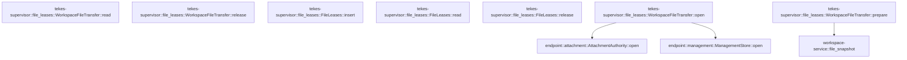

# tekes-supervisor::file_leases

[Package atlas](index.md) · [Source](../../src/file_leases.rs)

## Declarations

Visibility is the declaration spelling; trait members and reexports require their enclosing interface. `cfg` is not evaluated.

| Symbol | Kind | Visibility | Test / cfg |
|---|---|---|---|
| [tekes-supervisor::file_leases::MAX_BYTES](../../src/file_leases.rs#L9) | const_item | `private` |  |
| [tekes-supervisor::file_leases::MAX_LEASES](../../src/file_leases.rs#L10) | const_item | `private` |  |
| [tekes-supervisor::file_leases::TTL](../../src/file_leases.rs#L11) | const_item | `private` |  |
| [tekes-supervisor::file_leases::Lease](../../src/file_leases.rs#L13) | struct_item | `private` |  |
| [tekes-supervisor::file_leases::FileLeases](../../src/file_leases.rs#L20) | struct_item | `pub` |  |
| [tekes-supervisor::file_leases::WorkspaceFileTransfer](../../src/file_leases.rs#L22) | struct_item | `pub` |  |
| [tekes-supervisor::file_leases::WorkspaceFileTransfer::open](../../src/file_leases.rs#L29) | function_item | `pub` |  |
| [tekes-supervisor::file_leases::WorkspaceFileTransfer::prepare](../../src/file_leases.rs#L39) | function_item | `private` |  |
| [tekes-supervisor::file_leases::WorkspaceFileTransfer::prepare::WorkspaceRequest](../../src/file_leases.rs#L42) | struct_item | `private` |  |
| [tekes-supervisor::file_leases::WorkspaceFileTransfer::prepare::Source](../../src/file_leases.rs#L50) | enum_item | `private` |  |
| [tekes-supervisor::file_leases::WorkspaceFileTransfer::prepare::AttachmentRequest](../../src/file_leases.rs#L60) | struct_item | `private` |  |
| [tekes-supervisor::file_leases::WorkspaceFileTransfer::prepare::Request](../../src/file_leases.rs#L67) | enum_item | `private` |  |
| [tekes-supervisor::file_leases::WorkspaceFileTransfer::read](../../src/file_leases.rs#L134) | function_item | `private` |  |
| [tekes-supervisor::file_leases::WorkspaceFileTransfer::release](../../src/file_leases.rs#L138) | function_item | `private` |  |
| [tekes-supervisor::file_leases::FileLeases::insert](../../src/file_leases.rs#L144) | function_item | `pub` |  |
| [tekes-supervisor::file_leases::FileLeases::read](../../src/file_leases.rs#L181) | function_item | `pub` |  |
| [tekes-supervisor::file_leases::FileLeases::release](../../src/file_leases.rs#L190) | function_item | `pub` |  |
| [tekes-supervisor::file_leases::tests::attachment_transfer_preserves_metadata_and_requires_session_reference](../../src/file_leases.rs#L208) | function_item | `private` | test; #[cfg(test)] |
| [tekes-supervisor::file_leases::tests::attachment_transfer_serves_uploaded_files_through_the_same_path](../../src/file_leases.rs#L263) | function_item | `private` | test; #[cfg(test)] |
| [tekes-supervisor::file_leases::tests::lease_identity_owner_release_and_expiry](../../src/file_leases.rs#L298) | function_item | `private` | test; #[cfg(test)] |

## Imports / reexports

| Local name | Source path | Visibility |
|---|---|---|
| `_` | `base64::Engine` | `private` |
| `Digest` | `sha2::Digest` | `private` |
| `Sha256` | `sha2::Sha256` | `private` |
| `HashMap` | `std::collections::HashMap` | `private` |
| `Read` | `std::io::Read` | `private` |
| `Arc` | `std::sync::Arc` | `private` |
| `Mutex` | `std::sync::Mutex` | `private` |
| `Duration` | `std::time::Duration` | `private` |
| `Instant` | `std::time::Instant` | `private` |
| `*` | `super::*` | `private` |
| `FileTransferAuthority` | `transport::FileTransferAuthority` | `private` |

## Module declarations

| Module | Visibility | Attributes |
|---|---|---|
| `tekes-supervisor::file_leases::tests` | `private` | #[cfg(test)] |

## Function call graphs

Edges below are syntactically resolved calls only, including private functions. Graphs partition callers into groups of 20; they are not execution order. All unresolved sites are listed below and in the JSON inventory.

Functions 1–7: 3 direct edges

## Call sites

Includes test functions (marked in declarations). Receiver-type-required sites need type analysis/manual tracing. Calls in closures are attributed to their enclosing function; their occurrence here does not mean the closure executes immediately.

| Caller | Callee expression | Source lines | Target / classification |
|---|---|---|---|
| `TTL` | `Duration::from_secs` | [11](../../src/file_leases.rs#L11) | external-constructor-callback-or-unresolved |
| `open` | `Ok` | [30](../../src/file_leases.rs#L30) | external-constructor-callback-or-unresolved |
| `open` | `endpoint::ManagementStore::open(root).map_err` | [31](../../src/file_leases.rs#L31) | receiver-type-required |
| `open` | `endpoint::ManagementStore::open` | [31](../../src/file_leases.rs#L31) | [endpoint::management::ManagementStore::open](../../../endpoint/src/management.rs#L339) |
| `open` | `error.to_string` | [31](../../src/file_leases.rs#L31) | receiver-type-required |
| `open` | `endpoint::AttachmentAuthority::open` | [32](../../src/file_leases.rs#L32) | [endpoint::attachment::AttachmentAuthority::open](../../../endpoint/src/attachment.rs#L242) |
| `open` | `FileLeases::default` | [33](../../src/file_leases.rs#L33) | external-constructor-callback-or-unresolved |
| `prepare` | `serde_json::from_value(request).map_err` | [72](../../src/file_leases.rs#L72) | receiver-type-required |
| `prepare` | `serde_json::from_value` | [72](../../src/file_leases.rs#L72) | external-constructor-callback-or-unresolved |
| `prepare` | `self                     .management                     .workspace_path(&request.workspace_id)                     .map_err` | [75](../../src/file_leases.rs#L75) | receiver-type-required |
| `prepare` | `self                     .management                     .workspace_path` | [75](../../src/file_leases.rs#L75) | receiver-type-required |
| `prepare` | `workspace_service::file_snapshot(                     std::path::Path::new(&root),                     &request.path,                     request.maximum_bytes.min(MAX_BYTES),                 )                 .map_err` | [80](../../src/file_leases.rs#L80) | receiver-type-required |
| `prepare` | `workspace_service::file_snapshot` | [80](../../src/file_leases.rs#L80) | [workspace-service::file_snapshot](../../../workspace-service/src/lib.rs#L83) |
| `prepare` | `std::path::Path::new` | [81](../../src/file_leases.rs#L81) | external-constructor-callback-or-unresolved |
| `prepare` | `request.maximum_bytes.min` | [83](../../src/file_leases.rs#L83) | receiver-type-required |
| `prepare` | `error.code.to_owned` | [85](../../src/file_leases.rs#L85) | receiver-type-required |
| `prepare` | `self.leases.insert` | [86](../../src/file_leases.rs#L86), [127](../../src/file_leases.rs#L127) | receiver-type-required |
| `prepare` | `Err` | [90](../../src/file_leases.rs#L90), [125](../../src/file_leases.rs#L125) | external-constructor-callback-or-unresolved |
| `prepare` | `"Invalid snapshot limit".into` | [90](../../src/file_leases.rs#L90) | receiver-type-required |
| `prepare` | `self                     .attachments                     .read_authorized` | [100](../../src/file_leases.rs#L100) | receiver-type-required |
| `prepare` | `serde_json::to_value(image.attachment)                             .map_err` | [105](../../src/file_leases.rs#L105) | receiver-type-required |
| `prepare` | `serde_json::to_value` | [105](../../src/file_leases.rs#L105), [115](../../src/file_leases.rs#L115) | external-constructor-callback-or-unresolved |
| `prepare` | `self                             .attachments                             .read_authorized_file(&session_id, &attachment_id)                             .map_err` | [110](../../src/file_leases.rs#L110) | receiver-type-required |
| `prepare` | `self                             .attachments                             .read_authorized_file` | [110](../../src/file_leases.rs#L110) | receiver-type-required |
| `prepare` | `serde_json::to_value(file.attachment)                                 .map_err` | [115](../../src/file_leases.rs#L115) | receiver-type-required |
| `prepare` | `base64::engine::general_purpose::STANDARD                     .decode(data)                     .map_err` | [121](../../src/file_leases.rs#L121) | receiver-type-required |
| `prepare` | `base64::engine::general_purpose::STANDARD                     .decode` | [121](../../src/file_leases.rs#L121) | receiver-type-required |
| `prepare` | `bytes.len` | [124](../../src/file_leases.rs#L124) | receiver-type-required |
| `prepare` | `"Attachment exceeds snapshot limit".into` | [125](../../src/file_leases.rs#L125) | receiver-type-required |
| `prepare` | `Ok` | [129](../../src/file_leases.rs#L129) | external-constructor-callback-or-unresolved |
| `read` | `self.leases.read` | [135](../../src/file_leases.rs#L135) | receiver-type-required |
| `release` | `self.leases.release` | [139](../../src/file_leases.rs#L139) | receiver-type-required |
| `insert` | `self.0.lock().map_err` | [145](../../src/file_leases.rs#L145) | receiver-type-required |
| `insert` | `self.0.lock` | [145](../../src/file_leases.rs#L145) | receiver-type-required |
| `insert` | `Instant::now` | [146](../../src/file_leases.rs#L146) | external-constructor-callback-or-unresolved |
| `insert` | `leases.retain` | [147](../../src/file_leases.rs#L147) | receiver-type-required |
| `insert` | `leases.len` | [148](../../src/file_leases.rs#L148) | receiver-type-required |
| `insert` | `bytes.len` | [149](../../src/file_leases.rs#L149), [154](../../src/file_leases.rs#L154) | receiver-type-required |
| `insert` | `leases                 .values()                 .map(&#124;value&#124; value.bytes.len())                 .sum::<usize>` | [150](../../src/file_leases.rs#L150) | receiver-type-required |
| `insert` | `leases                 .values()                 .map` | [150](../../src/file_leases.rs#L150) | receiver-type-required |
| `insert` | `leases                 .values` | [150](../../src/file_leases.rs#L150) | receiver-type-required |
| `insert` | `value.bytes.len` | [152](../../src/file_leases.rs#L152) | receiver-type-required |
| `insert` | `Err` | [156](../../src/file_leases.rs#L156) | external-constructor-callback-or-unresolved |
| `insert` | `"Preview lease capacity exceeded".into` | [156](../../src/file_leases.rs#L156) | receiver-type-required |
| `insert` | `std::fs::File::open("/dev/urandom")                 .and_then(&#124;mut file&#124; file.read_exact(&mut random))                 .map_err` | [160](../../src/file_leases.rs#L160) | receiver-type-required |
| `insert` | `std::fs::File::open("/dev/urandom")                 .and_then` | [160](../../src/file_leases.rs#L160) | receiver-type-required |
| `insert` | `std::fs::File::open` | [160](../../src/file_leases.rs#L160) | external-constructor-callback-or-unresolved |
| `insert` | `file.read_exact` | [161](../../src/file_leases.rs#L161) | receiver-type-required |
| `insert` | `base64::engine::general_purpose::URL_SAFE_NO_PAD.encode` | [163](../../src/file_leases.rs#L163) | receiver-type-required |
| `insert` | `leases.contains_key` | [164](../../src/file_leases.rs#L164) | receiver-type-required |
| `insert` | `leases.insert` | [170](../../src/file_leases.rs#L170) | receiver-type-required |
| `insert` | `principal.to_owned` | [173](../../src/file_leases.rs#L173) | receiver-type-required |
| `insert` | `bytes.into` | [174](../../src/file_leases.rs#L174) | receiver-type-required |
| `insert` | `Ok` | [178](../../src/file_leases.rs#L178) | external-constructor-callback-or-unresolved |
| `read` | `self.0.lock().ok` | [182](../../src/file_leases.rs#L182) | receiver-type-required |
| `read` | `self.0.lock` | [182](../../src/file_leases.rs#L182) | receiver-type-required |
| `read` | `leases.retain` | [183](../../src/file_leases.rs#L183) | receiver-type-required |
| `read` | `Instant::now` | [183](../../src/file_leases.rs#L183) | external-constructor-callback-or-unresolved |
| `read` | `leases             .get(id)             .filter(&#124;value&#124; value.principal == principal)             .map` | [184](../../src/file_leases.rs#L184) | receiver-type-required |
| `read` | `leases             .get(id)             .filter` | [184](../../src/file_leases.rs#L184) | receiver-type-required |
| `read` | `leases             .get` | [184](../../src/file_leases.rs#L184) | receiver-type-required |
| `read` | `value.bytes.clone` | [187](../../src/file_leases.rs#L187) | receiver-type-required |
| `release` | `self.0.lock` | [191](../../src/file_leases.rs#L191) | receiver-type-required |
| `release` | `leases                 .get(id)                 .is_some_and` | [192](../../src/file_leases.rs#L192) | receiver-type-required |
| `release` | `leases                 .get` | [192](../../src/file_leases.rs#L192) | receiver-type-required |
| `release` | `leases.remove` | [196](../../src/file_leases.rs#L196) | receiver-type-required |
| `attachment_transfer_preserves_metadata_and_requires_session_reference` | `tempfile::tempdir().unwrap` | [210](../../src/file_leases.rs#L210) | receiver-type-required |
| `attachment_transfer_preserves_metadata_and_requires_session_reference` | `tempfile::tempdir` | [210](../../src/file_leases.rs#L210) | external-constructor-callback-or-unresolved |
| `attachment_transfer_preserves_metadata_and_requires_session_reference` | `root.path().join("threads").join` | [212](../../src/file_leases.rs#L212) | receiver-type-required |
| `attachment_transfer_preserves_metadata_and_requires_session_reference` | `root.path().join` | [212](../../src/file_leases.rs#L212) | receiver-type-required |
| `attachment_transfer_preserves_metadata_and_requires_session_reference` | `root.path` | [212](../../src/file_leases.rs#L212), [221](../../src/file_leases.rs#L221), [232](../../src/file_leases.rs#L232) | receiver-type-required |
| `attachment_transfer_preserves_metadata_and_requires_session_reference` | `std::fs::create_dir_all(folder.join("assets")).unwrap` | [213](../../src/file_leases.rs#L213) | receiver-type-required |
| `attachment_transfer_preserves_metadata_and_requires_session_reference` | `std::fs::create_dir_all` | [213](../../src/file_leases.rs#L213) | external-constructor-callback-or-unresolved |
| `attachment_transfer_preserves_metadata_and_requires_session_reference` | `folder.join` | [213](../../src/file_leases.rs#L213), [219](../../src/file_leases.rs#L219), [241](../../src/file_leases.rs#L241) | receiver-type-required |
| `attachment_transfer_preserves_metadata_and_requires_session_reference` | `serde_json_canonicalizer::to_vec(&genesis).unwrap` | [217](../../src/file_leases.rs#L217) | receiver-type-required |
| `attachment_transfer_preserves_metadata_and_requires_session_reference` | `serde_json_canonicalizer::to_vec` | [217](../../src/file_leases.rs#L217), [239](../../src/file_leases.rs#L239) | external-constructor-callback-or-unresolved |
| `attachment_transfer_preserves_metadata_and_requires_session_reference` | `ledger.push` | [218](../../src/file_leases.rs#L218), [240](../../src/file_leases.rs#L240) | receiver-type-required |
| `attachment_transfer_preserves_metadata_and_requires_session_reference` | `std::fs::write(folder.join("main.jsonl"), &ledger).unwrap` | [219](../../src/file_leases.rs#L219) | receiver-type-required |
| `attachment_transfer_preserves_metadata_and_requires_session_reference` | `std::fs::write` | [219](../../src/file_leases.rs#L219), [241](../../src/file_leases.rs#L241) | external-constructor-callback-or-unresolved |
| `attachment_transfer_preserves_metadata_and_requires_session_reference` | `endpoint::AttachmentAuthority::open` | [221](../../src/file_leases.rs#L221) | [endpoint::attachment::AttachmentAuthority::open](../../../endpoint/src/attachment.rs#L242) |
| `attachment_transfer_preserves_metadata_and_requires_session_reference` | `authority             .materialize_prompt_parts(                 session,                 &[endpoint::PromptPart::Image {                     media_type: endpoint::ImageMediaType::Png,                     data: data.into(),                     name: None,                 }],             )             .unwrap` | [222](../../src/file_leases.rs#L222) | receiver-type-required |
| `attachment_transfer_preserves_metadata_and_requires_session_reference` | `authority             .materialize_prompt_parts` | [222](../../src/file_leases.rs#L222) | receiver-type-required |
| `attachment_transfer_preserves_metadata_and_requires_session_reference` | `data.into` | [227](../../src/file_leases.rs#L227) | receiver-type-required |
| `attachment_transfer_preserves_metadata_and_requires_session_reference` | `WorkspaceFileTransfer::open(root.path()).unwrap` | [232](../../src/file_leases.rs#L232) | receiver-type-required |
| `attachment_transfer_preserves_metadata_and_requires_session_reference` | `WorkspaceFileTransfer::open` | [232](../../src/file_leases.rs#L232) | external-constructor-callback-or-unresolved |
| `attachment_transfer_preserves_metadata_and_requires_session_reference` | `ledger.extend` | [239](../../src/file_leases.rs#L239) | receiver-type-required |
| `attachment_transfer_preserves_metadata_and_requires_session_reference` | `serde_json_canonicalizer::to_vec(&input).unwrap` | [239](../../src/file_leases.rs#L239) | receiver-type-required |
| `attachment_transfer_preserves_metadata_and_requires_session_reference` | `std::fs::write(folder.join("main.jsonl"), ledger).unwrap` | [241](../../src/file_leases.rs#L241) | receiver-type-required |
| `attachment_transfer_preserves_metadata_and_requires_session_reference` | `transfer.prepare(request.clone()).unwrap` | [242](../../src/file_leases.rs#L242) | receiver-type-required |
| `attachment_transfer_preserves_metadata_and_requires_session_reference` | `transfer.prepare` | [242](../../src/file_leases.rs#L242) | receiver-type-required |
| `attachment_transfer_preserves_metadata_and_requires_session_reference` | `request.clone` | [242](../../src/file_leases.rs#L242) | receiver-type-required |
| `attachment_transfer_preserves_metadata_and_requires_session_reference` | `descriptor["lease"].as_str().unwrap` | [246](../../src/file_leases.rs#L246) | receiver-type-required |
| `attachment_transfer_preserves_metadata_and_requires_session_reference` | `descriptor["lease"].as_str` | [246](../../src/file_leases.rs#L246) | receiver-type-required |
| `attachment_transfer_preserves_metadata_and_requires_session_reference` | `transfer.release` | [256](../../src/file_leases.rs#L256) | receiver-type-required |
| `attachment_transfer_serves_uploaded_files_through_the_same_path` | `tempfile::tempdir().unwrap` | [265](../../src/file_leases.rs#L265) | receiver-type-required |
| `attachment_transfer_serves_uploaded_files_through_the_same_path` | `tempfile::tempdir` | [265](../../src/file_leases.rs#L265) | external-constructor-callback-or-unresolved |
| `attachment_transfer_serves_uploaded_files_through_the_same_path` | `root.path().join("threads").join` | [267](../../src/file_leases.rs#L267) | receiver-type-required |
| `attachment_transfer_serves_uploaded_files_through_the_same_path` | `root.path().join` | [267](../../src/file_leases.rs#L267) | receiver-type-required |
| `attachment_transfer_serves_uploaded_files_through_the_same_path` | `root.path` | [267](../../src/file_leases.rs#L267), [275](../../src/file_leases.rs#L275), [276](../../src/file_leases.rs#L276) | receiver-type-required |
| `attachment_transfer_serves_uploaded_files_through_the_same_path` | `std::fs::create_dir_all(folder.join("assets")).unwrap` | [268](../../src/file_leases.rs#L268) | receiver-type-required |
| `attachment_transfer_serves_uploaded_files_through_the_same_path` | `std::fs::create_dir_all` | [268](../../src/file_leases.rs#L268) | external-constructor-callback-or-unresolved |
| `attachment_transfer_serves_uploaded_files_through_the_same_path` | `folder.join` | [268](../../src/file_leases.rs#L268), [274](../../src/file_leases.rs#L274) | receiver-type-required |
| `attachment_transfer_serves_uploaded_files_through_the_same_path` | `serde_json_canonicalizer::to_vec(&genesis).unwrap` | [272](../../src/file_leases.rs#L272) | receiver-type-required |
| `attachment_transfer_serves_uploaded_files_through_the_same_path` | `serde_json_canonicalizer::to_vec` | [272](../../src/file_leases.rs#L272) | external-constructor-callback-or-unresolved |
| `attachment_transfer_serves_uploaded_files_through_the_same_path` | `ledger.push` | [273](../../src/file_leases.rs#L273) | receiver-type-required |
| `attachment_transfer_serves_uploaded_files_through_the_same_path` | `std::fs::write(folder.join("main.jsonl"), &ledger).unwrap` | [274](../../src/file_leases.rs#L274) | receiver-type-required |
| `attachment_transfer_serves_uploaded_files_through_the_same_path` | `std::fs::write` | [274](../../src/file_leases.rs#L274) | external-constructor-callback-or-unresolved |
| `attachment_transfer_serves_uploaded_files_through_the_same_path` | `WorkspaceFileTransfer::open(root.path()).unwrap` | [275](../../src/file_leases.rs#L275) | receiver-type-required |
| `attachment_transfer_serves_uploaded_files_through_the_same_path` | `WorkspaceFileTransfer::open` | [275](../../src/file_leases.rs#L275) | external-constructor-callback-or-unresolved |
| `attachment_transfer_serves_uploaded_files_through_the_same_path` | `endpoint::AttachmentAuthority::open` | [276](../../src/file_leases.rs#L276) | [endpoint::attachment::AttachmentAuthority::open](../../../endpoint/src/attachment.rs#L242) |
| `attachment_transfer_serves_uploaded_files_through_the_same_path` | `authority             .upload_file(session, "notes.txt", Some("text/plain"), "aGVsbG8gZmlsZQ==")             .unwrap` | [277](../../src/file_leases.rs#L277) | receiver-type-required |
| `attachment_transfer_serves_uploaded_files_through_the_same_path` | `authority             .upload_file` | [277](../../src/file_leases.rs#L277) | receiver-type-required |
| `attachment_transfer_serves_uploaded_files_through_the_same_path` | `Some` | [278](../../src/file_leases.rs#L278) | external-constructor-callback-or-unresolved |
| `attachment_transfer_serves_uploaded_files_through_the_same_path` | `transfer.prepare(request.clone()).unwrap` | [282](../../src/file_leases.rs#L282) | receiver-type-required |
| `attachment_transfer_serves_uploaded_files_through_the_same_path` | `transfer.prepare` | [282](../../src/file_leases.rs#L282) | receiver-type-required |
| `attachment_transfer_serves_uploaded_files_through_the_same_path` | `request.clone` | [282](../../src/file_leases.rs#L282) | receiver-type-required |
| `attachment_transfer_serves_uploaded_files_through_the_same_path` | `descriptor["lease"].as_str().unwrap` | [288](../../src/file_leases.rs#L288) | receiver-type-required |
| `attachment_transfer_serves_uploaded_files_through_the_same_path` | `descriptor["lease"].as_str` | [288](../../src/file_leases.rs#L288) | receiver-type-required |
| `attachment_transfer_serves_uploaded_files_through_the_same_path` | `transfer.release` | [293](../../src/file_leases.rs#L293) | receiver-type-required |
| `lease_identity_owner_release_and_expiry` | `FileLeases::default` | [299](../../src/file_leases.rs#L299) | external-constructor-callback-or-unresolved |
| `lease_identity_owner_release_and_expiry` | `leases.insert("owner", b"snapshot".to_vec()).unwrap` | [300](../../src/file_leases.rs#L300) | receiver-type-required |
| `lease_identity_owner_release_and_expiry` | `leases.insert` | [300](../../src/file_leases.rs#L300), [310](../../src/file_leases.rs#L310) | receiver-type-required |
| `lease_identity_owner_release_and_expiry` | `b"snapshot".to_vec` | [300](../../src/file_leases.rs#L300) | receiver-type-required |
| `lease_identity_owner_release_and_expiry` | `descriptor["lease"].as_str().unwrap` | [301](../../src/file_leases.rs#L301), [311](../../src/file_leases.rs#L311) | receiver-type-required |
| `lease_identity_owner_release_and_expiry` | `descriptor["lease"].as_str` | [301](../../src/file_leases.rs#L301), [311](../../src/file_leases.rs#L311) | receiver-type-required |
| `lease_identity_owner_release_and_expiry` | `leases.release` | [306](../../src/file_leases.rs#L306), [308](../../src/file_leases.rs#L308) | receiver-type-required |
| `lease_identity_owner_release_and_expiry` | `leases.insert("owner", vec![]).unwrap` | [310](../../src/file_leases.rs#L310) | receiver-type-required |
| `lease_identity_owner_release_and_expiry` | `leases.0.lock().unwrap().get_mut(id).unwrap` | [312](../../src/file_leases.rs#L312) | receiver-type-required |
| `lease_identity_owner_release_and_expiry` | `leases.0.lock().unwrap().get_mut` | [312](../../src/file_leases.rs#L312) | receiver-type-required |
| `lease_identity_owner_release_and_expiry` | `leases.0.lock().unwrap` | [312](../../src/file_leases.rs#L312) | receiver-type-required |
| `lease_identity_owner_release_and_expiry` | `leases.0.lock` | [312](../../src/file_leases.rs#L312) | receiver-type-required |
| `lease_identity_owner_release_and_expiry` | `Instant::now` | [312](../../src/file_leases.rs#L312) | external-constructor-callback-or-unresolved |
