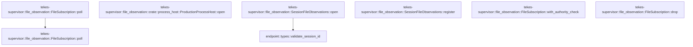

# tekes-supervisor::file_observation

[Package atlas](index.md) · [Source](../../src/file_observation.rs)

## Declarations

Visibility is the declaration spelling; trait members and reexports require their enclosing interface. `cfg` is not evaluated.

| Symbol | Kind | Visibility | Test / cfg |
|---|---|---|---|
| [tekes-supervisor::file_observation::State](../../src/file_observation.rs#L9) | struct_item | `private` |  |
| [tekes-supervisor::file_observation::SessionFileObservations](../../src/file_observation.rs#L15) | struct_item | `pub` |  |
| [tekes-supervisor::file_observation::FileSubscription](../../src/file_observation.rs#L17) | struct_item | `pub` |  |
| [tekes-supervisor::file_observation::SessionFileObservations::open](../../src/file_observation.rs#L26) | function_item | `pub` |  |
| [tekes-supervisor::file_observation::SessionFileObservations::register](../../src/file_observation.rs#L48) | function_item | `pub` |  |
| [tekes-supervisor::file_observation::FileSubscription::with_authority_check](../../src/file_observation.rs#L62) | function_item | `pub(crate)` |  |
| [tekes-supervisor::file_observation::FileSubscription::poll](../../src/file_observation.rs#L70) | function_item | `pub` |  |
| [tekes-supervisor::file_observation::FileSubscription::drop](../../src/file_observation.rs#L93) | function_item | `private` |  |
| [tekes-supervisor::file_observation::FileSubscription::poll](../../src/file_observation.rs#L101) | function_item | `private` |  |
| [tekes-supervisor::file_observation::crate::process_host::ProductionProcessHost::open](../../src/file_observation.rs#L107) | function_item | `private` |  |
| [tekes-supervisor::file_observation::tests::revoked_authority_stops_observation_before_file_poll](../../src/file_observation.rs#L118) | function_item | `private` | test; #[cfg(test)] |
| [tekes-supervisor::file_observation::tests::feeds_are_independent_session_scoped_and_released_on_drop](../../src/file_observation.rs#L138) | function_item | `private` | test; #[cfg(test)] |

## Imports / reexports

| Local name | Source path | Visibility |
|---|---|---|
| `Value` | `serde_json::Value` | `private` |
| `json` | `serde_json::json` | `private` |
| `BTreeMap` | `std::collections::BTreeMap` | `private` |
| `Path` | `std::path::Path` | `private` |
| `Arc` | `std::sync::Arc` | `private` |
| `Mutex` | `std::sync::Mutex` | `private` |
| `FileObservations` | `workspace_service::observation::FileObservations` | `private` |
| `*` | `super::*` | `private` |

## Module declarations

| Module | Visibility | Attributes |
|---|---|---|
| `tekes-supervisor::file_observation::tests` | `private` | #[cfg(test)] |

## Function call graphs

Edges below are syntactically resolved calls only, including private functions. Graphs partition callers into groups of 20; they are not execution order. All unresolved sites are listed below and in the JSON inventory.

Functions 1–7: 2 direct edges

## Call sites

Includes test functions (marked in declarations). Receiver-type-required sites need type analysis/manual tracing. Calls in closures are attributed to their enclosing function; their occurrence here does not mean the closure executes immediately.

| Caller | Callee expression | Source lines | Target / classification |
|---|---|---|---|
| `open` | `endpoint::validate_session_id(session_id).map_err` | [27](../../src/file_observation.rs#L27) | receiver-type-required |
| `open` | `endpoint::validate_session_id` | [27](../../src/file_observation.rs#L27) | [endpoint::types::validate_session_id](../../../endpoint/src/types.rs#L130) |
| `open` | `self.0.lock().map_err` | [28](../../src/file_observation.rs#L28) | receiver-type-required |
| `open` | `self.0.lock` | [28](../../src/file_observation.rs#L28) | receiver-type-required |
| `open` | `state.feeds.len` | [29](../../src/file_observation.rs#L29) | receiver-type-required |
| `open` | `Err` | [30](../../src/file_observation.rs#L30) | external-constructor-callback-or-unresolved |
| `open` | `"Too many file subscriptions".into` | [30](../../src/file_observation.rs#L30) | receiver-type-required |
| `open` | `state             .next_id             .checked_add(1)             .ok_or` | [32](../../src/file_observation.rs#L32) | receiver-type-required |
| `open` | `state             .next_id             .checked_add` | [32](../../src/file_observation.rs#L32) | receiver-type-required |
| `open` | `state             .feeds             .insert` | [37](../../src/file_observation.rs#L37) | receiver-type-required |
| `open` | `session_id.to_owned` | [39](../../src/file_observation.rs#L39) | receiver-type-required |
| `open` | `FileObservations::default` | [39](../../src/file_observation.rs#L39) | external-constructor-callback-or-unresolved |
| `open` | `Ok` | [40](../../src/file_observation.rs#L40) | external-constructor-callback-or-unresolved |
| `open` | `self.clone` | [41](../../src/file_observation.rs#L41) | receiver-type-required |
| `register` | `self.0.lock().map_err` | [49](../../src/file_observation.rs#L49) | receiver-type-required |
| `register` | `self.0.lock` | [49](../../src/file_observation.rs#L49) | receiver-type-required |
| `register` | `state.feeds.values_mut` | [50](../../src/file_observation.rs#L50) | receiver-type-required |
| `register` | `observations                     .register(root, relative)                     .map_err` | [52](../../src/file_observation.rs#L52) | receiver-type-required |
| `register` | `observations                     .register` | [52](../../src/file_observation.rs#L52) | receiver-type-required |
| `register` | `error.code.to_owned` | [54](../../src/file_observation.rs#L54) | receiver-type-required |
| `register` | `Ok` | [57](../../src/file_observation.rs#L57) | external-constructor-callback-or-unresolved |
| `with_authority_check` | `Some` | [66](../../src/file_observation.rs#L66) | external-constructor-callback-or-unresolved |
| `with_authority_check` | `Box::new` | [66](../../src/file_observation.rs#L66) | external-constructor-callback-or-unresolved |
| `poll` | `check` | [72](../../src/file_observation.rs#L72), [86](../../src/file_observation.rs#L86) | external-constructor-callback-or-unresolved |
| `poll` | `Ok` | [76](../../src/file_observation.rs#L76), [88](../../src/file_observation.rs#L88) | external-constructor-callback-or-unresolved |
| `poll` | `self             .registry             .0             .lock()             .map_err` | [78](../../src/file_observation.rs#L78) | receiver-type-required |
| `poll` | `self             .registry             .0             .lock` | [78](../../src/file_observation.rs#L78) | receiver-type-required |
| `poll` | `state.feeds.get_mut(&self.id).ok_or` | [83](../../src/file_observation.rs#L83) | receiver-type-required |
| `poll` | `state.feeds.get_mut` | [83](../../src/file_observation.rs#L83) | receiver-type-required |
| `poll` | `observations.poll().map_err` | [84](../../src/file_observation.rs#L84) | receiver-type-required |
| `poll` | `observations.poll` | [84](../../src/file_observation.rs#L84) | receiver-type-required |
| `poll` | `error.code.to_owned` | [84](../../src/file_observation.rs#L84) | receiver-type-required |
| `drop` | `self.registry.0.lock` | [94](../../src/file_observation.rs#L94) | receiver-type-required |
| `drop` | `state.feeds.remove` | [95](../../src/file_observation.rs#L95) | receiver-type-required |
| `poll` | `FileSubscription::poll` | [102](../../src/file_observation.rs#L102) | [tekes-supervisor::file_observation::FileSubscription::poll](../../src/file_observation.rs#L70) |
| `open` | `self.client_file_changes(session_id)             .map(&#124;feed&#124; Box::new(feed) as Box<dyn transport::FileChangeFeed>)             .map_err` | [108](../../src/file_observation.rs#L108) | receiver-type-required |
| `open` | `self.client_file_changes(session_id)             .map` | [108](../../src/file_observation.rs#L108) | receiver-type-required |
| `open` | `self.client_file_changes` | [108](../../src/file_observation.rs#L108) | receiver-type-required |
| `open` | `Box::new` | [109](../../src/file_observation.rs#L109) | external-constructor-callback-or-unresolved |
| `open` | `error.to_string` | [110](../../src/file_observation.rs#L110) | receiver-type-required |
| `revoked_authority_stops_observation_before_file_poll` | `Arc::new` | [120](../../src/file_observation.rs#L120) | external-constructor-callback-or-unresolved |
| `revoked_authority_stops_observation_before_file_poll` | `AtomicBool::new` | [120](../../src/file_observation.rs#L120) | external-constructor-callback-or-unresolved |
| `revoked_authority_stops_observation_before_file_poll` | `SessionFileObservations::default` | [121](../../src/file_observation.rs#L121) | external-constructor-callback-or-unresolved |
| `revoked_authority_stops_observation_before_file_poll` | `allowed.clone` | [122](../../src/file_observation.rs#L122) | receiver-type-required |
| `revoked_authority_stops_observation_before_file_poll` | `registry             .open("018f0000-0000-7000-8000-000000000001")             .unwrap()             .with_authority_check` | [123](../../src/file_observation.rs#L123) | receiver-type-required |
| `revoked_authority_stops_observation_before_file_poll` | `registry             .open("018f0000-0000-7000-8000-000000000001")             .unwrap` | [123](../../src/file_observation.rs#L123) | receiver-type-required |
| `revoked_authority_stops_observation_before_file_poll` | `registry             .open` | [123](../../src/file_observation.rs#L123) | receiver-type-required |
| `revoked_authority_stops_observation_before_file_poll` | `check.load` | [127](../../src/file_observation.rs#L127) | receiver-type-required |
| `revoked_authority_stops_observation_before_file_poll` | `Ok` | [128](../../src/file_observation.rs#L128) | external-constructor-callback-or-unresolved |
| `revoked_authority_stops_observation_before_file_poll` | `Err` | [130](../../src/file_observation.rs#L130) | external-constructor-callback-or-unresolved |
| `revoked_authority_stops_observation_before_file_poll` | `"revoked".into` | [130](../../src/file_observation.rs#L130) | receiver-type-required |
| `revoked_authority_stops_observation_before_file_poll` | `allowed.store` | [134](../../src/file_observation.rs#L134) | receiver-type-required |
| `feeds_are_independent_session_scoped_and_released_on_drop` | `SessionFileObservations::default` | [139](../../src/file_observation.rs#L139) | external-constructor-callback-or-unresolved |
| `feeds_are_independent_session_scoped_and_released_on_drop` | `registry.open(one).unwrap` | [142](../../src/file_observation.rs#L142), [143](../../src/file_observation.rs#L143), [160](../../src/file_observation.rs#L160) | receiver-type-required |
| `feeds_are_independent_session_scoped_and_released_on_drop` | `registry.open` | [142](../../src/file_observation.rs#L142), [143](../../src/file_observation.rs#L143), [144](../../src/file_observation.rs#L144), [160](../../src/file_observation.rs#L160) | receiver-type-required |
| `feeds_are_independent_session_scoped_and_released_on_drop` | `registry.open(two).unwrap` | [144](../../src/file_observation.rs#L144) | receiver-type-required |
| `feeds_are_independent_session_scoped_and_released_on_drop` | `tempfile::tempdir().unwrap` | [148](../../src/file_observation.rs#L148) | receiver-type-required |
| `feeds_are_independent_session_scoped_and_released_on_drop` | `tempfile::tempdir` | [148](../../src/file_observation.rs#L148) | external-constructor-callback-or-unresolved |
| `feeds_are_independent_session_scoped_and_released_on_drop` | `std::fs::write(root.path().join("file"), "before").unwrap` | [149](../../src/file_observation.rs#L149) | receiver-type-required |
| `feeds_are_independent_session_scoped_and_released_on_drop` | `std::fs::write` | [149](../../src/file_observation.rs#L149), [151](../../src/file_observation.rs#L151) | external-constructor-callback-or-unresolved |
| `feeds_are_independent_session_scoped_and_released_on_drop` | `root.path().join` | [149](../../src/file_observation.rs#L149), [151](../../src/file_observation.rs#L151) | receiver-type-required |
| `feeds_are_independent_session_scoped_and_released_on_drop` | `root.path` | [149](../../src/file_observation.rs#L149), [150](../../src/file_observation.rs#L150), [151](../../src/file_observation.rs#L151) | receiver-type-required |
| `feeds_are_independent_session_scoped_and_released_on_drop` | `registry.register(one, root.path(), "file").unwrap` | [150](../../src/file_observation.rs#L150) | receiver-type-required |
| `feeds_are_independent_session_scoped_and_released_on_drop` | `registry.register` | [150](../../src/file_observation.rs#L150) | receiver-type-required |
| `feeds_are_independent_session_scoped_and_released_on_drop` | `std::fs::write(root.path().join("file"), "after").unwrap` | [151](../../src/file_observation.rs#L151) | receiver-type-required |
| `feeds_are_independent_session_scoped_and_released_on_drop` | `drop` | [156](../../src/file_observation.rs#L156), [157](../../src/file_observation.rs#L157), [158](../../src/file_observation.rs#L158) | external-constructor-callback-or-unresolved |
