# tekes-supervisor::host_runtime

[Package atlas](index.md) · [Source](../../src/host_runtime.rs)

## Declarations

Visibility is the declaration spelling; trait members and reexports require their enclosing interface. `cfg` is not evaluated.

| Symbol | Kind | Visibility | Test / cfg |
|---|---|---|---|
| [tekes-supervisor::host_runtime::SOURCE_REVISION](../../src/host_runtime.rs#L37) | const_item | `pub` |  |
| [tekes-supervisor::host_runtime::is_source_revision](../../src/host_runtime.rs#L48) | function_item | `private` |  |
| [tekes-supervisor::host_runtime::TERMINATE_REQUESTED](../../src/host_runtime.rs#L63) | static_item | `private` |  |
| [tekes-supervisor::host_runtime::endpoint_token_from_environment](../../src/host_runtime.rs#L65) | function_item | `pub(crate)` |  |
| [tekes-supervisor::host_runtime::decode_endpoint_token](../../src/host_runtime.rs#L73) | function_item | `private` |  |
| [tekes-supervisor::host_runtime::ProductionRootLock](../../src/host_runtime.rs#L91) | struct_item | `pub` |  |
| [tekes-supervisor::host_runtime::ProductionRootLock::acquire](../../src/host_runtime.rs#L97) | function_item | `pub` |  |
| [tekes-supervisor::host_runtime::ProductionRootLock::path](../../src/host_runtime.rs#L129) | function_item | `pub` |  |
| [tekes-supervisor::host_runtime::ProductionRootLock::drop](../../src/host_runtime.rs#L135) | function_item | `private` |  |
| [tekes-supervisor::host_runtime::validate_directory](../../src/host_runtime.rs#L141) | function_item | `private` |  |
| [tekes-supervisor::host_runtime::validate_file_metadata](../../src/host_runtime.rs#L157) | function_item | `private` |  |
| [tekes-supervisor::host_runtime::effective_uid](../../src/host_runtime.rs#L176) | function_item | `private` |  |
| [tekes-supervisor::host_runtime::authority_root](../../src/host_runtime.rs#L181) | function_item | `private` |  |
| [tekes-supervisor::host_runtime::prepare_storage](../../src/host_runtime.rs#L187) | function_item | `pub` |  |
| [tekes-supervisor::host_runtime::preflight_storage](../../src/host_runtime.rs#L238) | function_item | `pub` |  |
| [tekes-supervisor::host_runtime::require_production_apfs](../../src/host_runtime.rs#L243) | function_item | `private` | #[cfg(target_os = "macos")] |
| [tekes-supervisor::host_runtime::require_production_apfs](../../src/host_runtime.rs#L267) | function_item | `private` | #[cfg(not(target_os = "macos"))] |
| [tekes-supervisor::host_runtime::require_production_filesystem_name](../../src/host_runtime.rs#L272) | function_item | `private` | test; #[cfg_attr(not(any(target_os = "macos", test)), allow(dead_code))] |
| [tekes-supervisor::host_runtime::reject_cloud_managed_storage](../../src/host_runtime.rs#L282) | function_item | `private` |  |
| [tekes-supervisor::host_runtime::is_icloud_mobile_documents_path](../../src/host_runtime.rs#L292) | function_item | `private` |  |
| [tekes-supervisor::host_runtime::sweep_semantic_ledgers](../../src/host_runtime.rs#L307) | function_item | `private` |  |
| [tekes-supervisor::host_runtime::assemble_production_endpoint_host](../../src/host_runtime.rs#L366) | function_item | `pub` |  |
| [tekes-supervisor::host_runtime::assemble_application_endpoint_host](../../src/host_runtime.rs#L387) | function_item | `pub` |  |
| [tekes-supervisor::host_runtime::assemble_endpoint_host](../../src/host_runtime.rs#L404) | function_item | `private` |  |
| [tekes-supervisor::host_runtime::watch_shutdown](../../src/host_runtime.rs#L515) | function_item | `private` |  |
| [tekes-supervisor::host_runtime::wait_for_launcher_shutdown](../../src/host_runtime.rs#L552) | function_item | `pub` |  |
| [tekes-supervisor::host_runtime::request_termination](../../src/host_runtime.rs#L557) | function_item | `private` |  |
| [tekes-supervisor::host_runtime::install_termination_handler](../../src/host_runtime.rs#L561) | function_item | `pub(crate)` |  |
| [tekes-supervisor::host_runtime::duplicate_fd](../../src/host_runtime.rs#L578) | function_item | `private` |  |
| [tekes-supervisor::host_runtime::system_timestamp](../../src/host_runtime.rs#L592) | function_item | `pub` |  |
| [tekes-supervisor::host_runtime::DaemonError](../../src/host_runtime.rs#L620) | struct_item | `pub` |  |
| [tekes-supervisor::host_runtime::DaemonError::new](../../src/host_runtime.rs#L626) | function_item | `private` |  |
| [tekes-supervisor::host_runtime::DaemonError::protocol](../../src/host_runtime.rs#L633) | function_item | `pub(crate)` |  |
| [tekes-supervisor::host_runtime::DaemonError::io](../../src/host_runtime.rs#L637) | function_item | `pub(crate)` |  |
| [tekes-supervisor::host_runtime::DaemonError::store](../../src/host_runtime.rs#L641) | function_item | `pub(crate)` |  |
| [tekes-supervisor::host_runtime::DaemonError::already_running](../../src/host_runtime.rs#L660) | function_item | `private` |  |
| [tekes-supervisor::host_runtime::DaemonError::invalid_install](../../src/host_runtime.rs#L667) | function_item | `pub(crate)` |  |
| [tekes-supervisor::host_runtime::DaemonError::invalid_install_reason](../../src/host_runtime.rs#L671) | function_item | `pub(crate)` |  |
| [tekes-supervisor::host_runtime::DaemonError::invalid_config](../../src/host_runtime.rs#L675) | function_item | `pub(crate)` |  |
| [tekes-supervisor::host_runtime::DaemonError::corrupt](../../src/host_runtime.rs#L679) | function_item | `pub(crate)` |  |
| [tekes-supervisor::host_runtime::DaemonError::required_broker](../../src/host_runtime.rs#L683) | function_item | `pub(crate)` |  |
| [tekes-supervisor::host_runtime::DaemonError::credential](../../src/host_runtime.rs#L687) | function_item | `private` |  |
| [tekes-supervisor::host_runtime::DaemonError::bootstrap_code](../../src/host_runtime.rs#L692) | function_item | `pub` |  |
| [tekes-supervisor::host_runtime::DaemonError::from](../../src/host_runtime.rs#L698) | function_item | `private` |  |
| [tekes-supervisor::host_runtime::DaemonError::from](../../src/host_runtime.rs#L708) | function_item | `private` |  |
| [tekes-supervisor::host_runtime::tests::macos_storage_accepts_apfs_and_rejects_hfs](../../src/host_runtime.rs#L726) | function_item | `private` | test; #[cfg(test)] |
| [tekes-supervisor::host_runtime::tests::production_storage_rejects_mobile_documents_and_an_ancestor_symlink_alias](../../src/host_runtime.rs#L735) | function_item | `private` | test; #[cfg(test)] |
| [tekes-supervisor::host_runtime::tests::production_timestamp_is_event_millisecond_utc](../../src/host_runtime.rs#L761) | function_item | `private` | test; #[cfg(test)] |

## Imports / reexports

| Local name | Source path | Visibility |
|---|---|---|
| `CString` | `std::ffi::CString` | `private` |
| `OsStr` | `std::ffi::OsStr` | `private` |
| `fs` | `std::fs` | `private` |
| `File` | `std::fs::File` | `private` |
| `OpenOptions` | `std::fs::OpenOptions` | `private` |
| `io` | `std::io` | `private` |
| `Read` | `std::io::Read` | `private` |
| `AsRawFd` | `std::os::fd::AsRawFd` | `private` |
| `FromRawFd` | `std::os::fd::FromRawFd` | `private` |
| `RawFd` | `std::os::fd::RawFd` | `private` |
| `OsStrExt` | `std::os::unix::ffi::OsStrExt` | `private` |
| `DirBuilderExt` | `std::os::unix::fs::DirBuilderExt` | `private` |
| `MetadataExt` | `std::os::unix::fs::MetadataExt` | `private` |
| `OpenOptionsExt` | `std::os::unix::fs::OpenOptionsExt` | `private` |
| `Path` | `std::path::Path` | `private` |
| `PathBuf` | `std::path::PathBuf` | `private` |
| `Arc` | `std::sync::Arc` | `private` |
| `AtomicBool` | `std::sync::atomic::AtomicBool` | `private` |
| `Ordering` | `std::sync::atomic::Ordering` | `private` |
| `SessionHostDescription` | `endpoint::SessionHostDescription` | `private` |
| `ConfigRepository` | `profile::ConfigRepository` | `private` |
| `InstructionResolver` | `profile::InstructionResolver` | `private` |
| `ResourceCatalog` | `profile::ResourceCatalog` | `private` |
| `LockedLedger` | `store::LockedLedger` | `private` |
| `StoreError` | `store::StoreError` | `private` |
| `ThreadStore` | `store::ThreadStore` | `private` |
| `scan_valid_prefix` | `store::scan_valid_prefix` | `private` |
| `Error` | `thiserror::Error` | `private` |
| `ClientAdminRoutes` | `crate::client_admin::ClientAdminRoutes` | `private` |
| `ProductionClientExtensions` | `crate::client_extensions::ProductionClientExtensions` | `private` |
| `ProductionCarrierError` | `crate::endpoint_carrier::ProductionCarrierError` | `private` |
| `CompositeProductionEndpointRoutes` | `crate::endpoint_host::CompositeProductionEndpointRoutes` | `private` |
| `EndpointClock` | `crate::endpoint_host::EndpointClock` | `private` |
| `ProductionEndpointHost` | `crate::endpoint_host::ProductionEndpointHost` | `private` |
| `ProviderReadinessAuthority` | `crate::endpoint_host::ProviderReadinessAuthority` | `private` |
| `QueueTransactionAuthority` | `crate::endpoint_host::QueueTransactionAuthority` | `private` |
| `SessionDeliveryAuthority` | `crate::endpoint_host::SessionDeliveryAuthority` | `private` |
| `SessionInputAdmissionAuthority` | `crate::endpoint_host::SessionInputAdmissionAuthority` | `private` |
| `ProductionProcessHost` | `crate::process_host::ProductionProcessHost` | `private` |
| `EndpointCommandInputAuthority` | `crate::resource_capability::EndpointCommandInputAuthority` | `private` |
| `fs` | `std::fs` | `private` |
| `symlink` | `std::os::unix::fs::symlink` | `private` |
| `reject_cloud_managed_storage` | `super::reject_cloud_managed_storage` | `private` |
| `require_production_filesystem_name` | `super::require_production_filesystem_name` | `private` |
| `system_timestamp` | `super::system_timestamp` | `private` |

## Module declarations

| Module | Visibility | Attributes |
|---|---|---|
| `tekes-supervisor::host_runtime::tests` | `private` | #[cfg(test)] |

## Function call graphs

Edges below are syntactically resolved calls only, including private functions. Graphs partition callers into groups of 20; they are not execution order. All unresolved sites are listed below and in the JSON inventory.

```mermaid
flowchart TD
  n0["profile::config::ConfigRepository::open"]
  n1["profile::instruction::InstructionResolver::new"]
  n2["profile::instruction::InstructionResolver::new_scoped"]
  n3["profile::resources::ResourceCatalog::from_snapshot"]
  n4["store::folder::ThreadStore::open"]
  n5["store::platform::probe_local_filesystem"]
  n6["store::tail::LockedLedger::open"]
  n7["store::tail::scan_valid_prefix"]
  n8["tekes-supervisor::client_admin::ClientAdminRoutes::new"]
  n9["tekes-supervisor::client_admin::ClientAdminRoutes::for_application"]
  n10["tekes-supervisor::client_extensions::ProductionClientExtensions::open"]
  n11["tekes-supervisor::endpoint_host::SessionInputAdmissionAuthority::new"]
  n12["tekes-supervisor::endpoint_host::CompositeProductionEndpointRoutes::compose"]
  n13["tekes-supervisor::endpoint_host::ProductionEndpointHost::open_with_full_authorities_and_session_admission"]
  n14["tekes-supervisor::host_runtime::ProductionRootLock::path"]
  n15["tekes-supervisor::host_runtime::ProductionRootLock::drop"]
  n16["tekes-supervisor::host_runtime::validate_directory"]
  n17["tekes-supervisor::host_runtime::validate_file_metadata"]
  n18["tekes-supervisor::host_runtime::effective_uid"]
  n19["tekes-supervisor::host_runtime::authority_root"]
  n20["tekes-supervisor::host_runtime::prepare_storage"]
  n21["tekes-supervisor::host_runtime::preflight_storage"]
  n22["tekes-supervisor::host_runtime::require_production_apfs"]
  n23["tekes-supervisor::host_runtime::require_production_apfs"]
  n24["tekes-supervisor::host_runtime::require_production_filesystem_name"]
  n25["tekes-supervisor::host_runtime::reject_cloud_managed_storage"]
  n26["tekes-supervisor::host_runtime::is_icloud_mobile_documents_path"]
  n27["tekes-supervisor::host_runtime::sweep_semantic_ledgers"]
  n28["tekes-supervisor::host_runtime::assemble_production_endpoint_host"]
  n29["tekes-supervisor::host_runtime::assemble_application_endpoint_host"]
  n30["tekes-supervisor::host_runtime::assemble_endpoint_host"]
  n31["tekes-supervisor::host_runtime::is_source_revision"]
  n32["tekes-supervisor::host_runtime::DaemonError::io"]
  n33["tekes-supervisor::host_runtime::DaemonError::store"]
  n34["tekes-supervisor::host_runtime::endpoint_token_from_environment"]
  n35["tekes-supervisor::host_runtime::DaemonError::already_running"]
  n36["tekes-supervisor::host_runtime::DaemonError::invalid_install"]
  n37["tekes-supervisor::host_runtime::DaemonError::invalid_install_reason"]
  n38["tekes-supervisor::host_runtime::DaemonError::invalid_config"]
  n39["tekes-supervisor::host_runtime::DaemonError::corrupt"]
  n40["tekes-supervisor::host_runtime::DaemonError::credential"]
  n41["tekes-supervisor::host_runtime::decode_endpoint_token"]
  n42["tekes-supervisor::host_runtime::ProductionRootLock::acquire"]
  n43["tekes-supervisor::resource_capability::EndpointCommandInputAuthority::new"]
  n44["tekes-supervisor::workspace_routes::WorkspaceRoutes::open"]
  n16 --> n18
  n16 --> n36
  n16 --> n37
  n17 --> n18
  n17 --> n36
  n17 --> n37
  n19 --> n37
  n20 --> n0
  n20 --> n4
  n20 --> n5
  n20 --> n16
  n20 --> n19
  n20 --> n25
  n20 --> n27
  n20 --> n32
  n20 --> n38
  n21 --> n20
  n22 --> n24
  n22 --> n32
  n22 --> n33
  n25 --> n26
  n25 --> n33
  n27 --> n6
  n27 --> n7
  n27 --> n39
  n28 --> n30
  n29 --> n30
  n30 --> n0
  n30 --> n1
  n30 --> n2
  n30 --> n3
  n30 --> n8
  n30 --> n9
  n30 --> n10
  n30 --> n11
  n30 --> n12
  n30 --> n13
  n30 --> n38
  n30 --> n39
  n30 --> n43
  n30 --> n44
  n34 --> n40
  n34 --> n41
  n41 --> n40
  n42 --> n16
  n42 --> n17
  n42 --> n32
  n42 --> n35
  n42 --> n36
```

Functions 1–20: 49 direct edges

Functions 21–40: 15 direct edges

```mermaid
flowchart TD
  n0["tekes-supervisor::host_runtime::watch_shutdown"]
  n1["tekes-supervisor::host_runtime::wait_for_launcher_shutdown"]
  n2["tekes-supervisor::host_runtime::request_termination"]
  n3["tekes-supervisor::host_runtime::install_termination_handler"]
  n4["tekes-supervisor::host_runtime::duplicate_fd"]
  n5["tekes-supervisor::host_runtime::system_timestamp"]
  n6["tekes-supervisor::host_runtime::DaemonError::new"]
  n7["tekes-supervisor::host_runtime::DaemonError::protocol"]
  n8["tekes-supervisor::host_runtime::DaemonError::io"]
  n9["tekes-supervisor::host_runtime::DaemonError::store"]
  n10["tekes-supervisor::host_runtime::DaemonError::already_running"]
  n11["tekes-supervisor::host_runtime::DaemonError::invalid_install"]
  n12["tekes-supervisor::host_runtime::DaemonError::invalid_install_reason"]
  n13["tekes-supervisor::host_runtime::DaemonError::invalid_config"]
  n14["tekes-supervisor::host_runtime::DaemonError::corrupt"]
  n15["tekes-supervisor::host_runtime::DaemonError::required_broker"]
  n16["tekes-supervisor::host_runtime::DaemonError::credential"]
  n17["tekes-supervisor::host_runtime::DaemonError::bootstrap_code"]
  n18["tekes-supervisor::host_runtime::DaemonError::from"]
  n19["tekes-supervisor::host_runtime::DaemonError::from"]
  n0 --> n8
  n1 --> n0
  n1 --> n4
  n3 --> n8
  n7 --> n6
  n8 --> n6
  n9 --> n6
  n9 --> n8
  n10 --> n6
  n11 --> n6
  n12 --> n6
  n13 --> n6
  n14 --> n6
  n15 --> n6
  n16 --> n6
```

## Call sites

Includes test functions (marked in declarations). Receiver-type-required sites need type analysis/manual tracing. Calls in closures are attributed to their enclosing function; their occurrence here does not mean the closure executes immediately.

| Caller | Callee expression | Source lines | Target / classification |
|---|---|---|---|
| `SOURCE_REVISION` | `Some` | [43](../../src/host_runtime.rs#L43) | external-constructor-callback-or-unresolved |
| `is_source_revision` | `value.as_bytes` | [49](../../src/host_runtime.rs#L49) | receiver-type-required |
| `is_source_revision` | `bytes.len` | [50](../../src/host_runtime.rs#L50), [54](../../src/host_runtime.rs#L54) | receiver-type-required |
| `TERMINATE_REQUESTED` | `AtomicBool::new` | [63](../../src/host_runtime.rs#L63) | external-constructor-callback-or-unresolved |
| `endpoint_token_from_environment` | `zeroize::Zeroizing::new` | [66](../../src/host_runtime.rs#L66) | external-constructor-callback-or-unresolved |
| `endpoint_token_from_environment` | `std::env::var("TEKES_KERNEL_ENDPOINT_TOKEN")             .map_err` | [67](../../src/host_runtime.rs#L67) | receiver-type-required |
| `endpoint_token_from_environment` | `std::env::var` | [67](../../src/host_runtime.rs#L67) | external-constructor-callback-or-unresolved |
| `endpoint_token_from_environment` | `DaemonError::credential` | [68](../../src/host_runtime.rs#L68) | [tekes-supervisor::host_runtime::DaemonError::credential](../../src/host_runtime.rs#L687) |
| `endpoint_token_from_environment` | `decode_endpoint_token` | [70](../../src/host_runtime.rs#L70) | [tekes-supervisor::host_runtime::decode_endpoint_token](../../src/host_runtime.rs#L73) |
| `decode_endpoint_token` | `value.len` | [74](../../src/host_runtime.rs#L74) | receiver-type-required |
| `decode_endpoint_token` | `value.bytes().all` | [74](../../src/host_runtime.rs#L74) | receiver-type-required |
| `decode_endpoint_token` | `value.bytes` | [74](../../src/host_runtime.rs#L74) | receiver-type-required |
| `decode_endpoint_token` | `byte.is_ascii_hexdigit` | [74](../../src/host_runtime.rs#L74) | receiver-type-required |
| `decode_endpoint_token` | `Err` | [75](../../src/host_runtime.rs#L75) | external-constructor-callback-or-unresolved |
| `decode_endpoint_token` | `DaemonError::credential` | [75](../../src/host_runtime.rs#L75), [83](../../src/host_runtime.rs#L83), [86](../../src/host_runtime.rs#L86) | [tekes-supervisor::host_runtime::DaemonError::credential](../../src/host_runtime.rs#L687) |
| `decode_endpoint_token` | `value.as_bytes().chunks_exact(2).enumerate` | [80](../../src/host_runtime.rs#L80) | receiver-type-required |
| `decode_endpoint_token` | `value.as_bytes().chunks_exact` | [80](../../src/host_runtime.rs#L80) | receiver-type-required |
| `decode_endpoint_token` | `value.as_bytes` | [80](../../src/host_runtime.rs#L80) | receiver-type-required |
| `decode_endpoint_token` | `u8::from_str_radix(             std::str::from_utf8(pair)                 .map_err(&#124;_&#124; DaemonError::credential("invalid-endpoint-environment-token"))?,             16,         )         .map_err` | [81](../../src/host_runtime.rs#L81) | receiver-type-required |
| `decode_endpoint_token` | `u8::from_str_radix` | [81](../../src/host_runtime.rs#L81) | external-constructor-callback-or-unresolved |
| `decode_endpoint_token` | `std::str::from_utf8(pair)                 .map_err` | [82](../../src/host_runtime.rs#L82) | receiver-type-required |
| `decode_endpoint_token` | `std::str::from_utf8` | [82](../../src/host_runtime.rs#L82) | external-constructor-callback-or-unresolved |
| `decode_endpoint_token` | `Ok` | [88](../../src/host_runtime.rs#L88) | external-constructor-callback-or-unresolved |
| `acquire` | `validate_directory` | [98](../../src/host_runtime.rs#L98) | [tekes-supervisor::host_runtime::validate_directory](../../src/host_runtime.rs#L141) |
| `acquire` | `storage_root.join` | [99](../../src/host_runtime.rs#L99) | receiver-type-required |
| `acquire` | `OpenOptions::new()             .read(true)             .write(true)             .custom_flags(libc::O_CLOEXEC &#124; libc::O_NOFOLLOW)             .open(&path)             .map_err` | [100](../../src/host_runtime.rs#L100) | receiver-type-required |
| `acquire` | `OpenOptions::new()             .read(true)             .write(true)             .custom_flags(libc::O_CLOEXEC &#124; libc::O_NOFOLLOW)             .open` | [100](../../src/host_runtime.rs#L100) | receiver-type-required |
| `acquire` | `OpenOptions::new()             .read(true)             .write(true)             .custom_flags` | [100](../../src/host_runtime.rs#L100) | receiver-type-required |
| `acquire` | `OpenOptions::new()             .read(true)             .write` | [100](../../src/host_runtime.rs#L100) | receiver-type-required |
| `acquire` | `OpenOptions::new()             .read` | [100](../../src/host_runtime.rs#L100) | receiver-type-required |
| `acquire` | `OpenOptions::new` | [100](../../src/host_runtime.rs#L100) | external-constructor-callback-or-unresolved |
| `acquire` | `DaemonError::invalid_install` | [105](../../src/host_runtime.rs#L105) | [tekes-supervisor::host_runtime::DaemonError::invalid_install](../../src/host_runtime.rs#L667) |
| `acquire` | `path.clone` | [105](../../src/host_runtime.rs#L105) | receiver-type-required |
| `acquire` | `validate_file_metadata` | [106](../../src/host_runtime.rs#L106), [124](../../src/host_runtime.rs#L124) | [tekes-supervisor::host_runtime::validate_file_metadata](../../src/host_runtime.rs#L157) |
| `acquire` | `libc::flock` | [109](../../src/host_runtime.rs#L109) | external-constructor-callback-or-unresolved |
| `acquire` | `file.as_raw_fd` | [109](../../src/host_runtime.rs#L109) | receiver-type-required |
| `acquire` | `io::Error::last_os_error` | [112](../../src/host_runtime.rs#L112) | external-constructor-callback-or-unresolved |
| `acquire` | `error.kind` | [113](../../src/host_runtime.rs#L113) | receiver-type-required |
| `acquire` | `error                 .raw_os_error()                 .is_some_and` | [116](../../src/host_runtime.rs#L116) | receiver-type-required |
| `acquire` | `error                 .raw_os_error` | [116](../../src/host_runtime.rs#L116) | receiver-type-required |
| `acquire` | `Err` | [120](../../src/host_runtime.rs#L120), [122](../../src/host_runtime.rs#L122) | external-constructor-callback-or-unresolved |
| `acquire` | `DaemonError::already_running` | [120](../../src/host_runtime.rs#L120) | [tekes-supervisor::host_runtime::DaemonError::already_running](../../src/host_runtime.rs#L660) |
| `acquire` | `DaemonError::io` | [122](../../src/host_runtime.rs#L122) | [tekes-supervisor::host_runtime::DaemonError::io](../../src/host_runtime.rs#L637) |
| `acquire` | `Ok` | [125](../../src/host_runtime.rs#L125) | external-constructor-callback-or-unresolved |
| `drop` | `libc::flock` | [137](../../src/host_runtime.rs#L137) | external-constructor-callback-or-unresolved |
| `drop` | `self.file.as_raw_fd` | [137](../../src/host_runtime.rs#L137) | receiver-type-required |
| `validate_directory` | `fs::symlink_metadata(path)         .map_err` | [142](../../src/host_runtime.rs#L142) | receiver-type-required |
| `validate_directory` | `fs::symlink_metadata` | [142](../../src/host_runtime.rs#L142) | external-constructor-callback-or-unresolved |
| `validate_directory` | `DaemonError::invalid_install` | [143](../../src/host_runtime.rs#L143) | [tekes-supervisor::host_runtime::DaemonError::invalid_install](../../src/host_runtime.rs#L667) |
| `validate_directory` | `path.to_path_buf` | [143](../../src/host_runtime.rs#L143) | receiver-type-required |
| `validate_directory` | `metadata.file_type().is_symlink` | [144](../../src/host_runtime.rs#L144) | receiver-type-required |
| `validate_directory` | `metadata.file_type` | [144](../../src/host_runtime.rs#L144), [145](../../src/host_runtime.rs#L145) | receiver-type-required |
| `validate_directory` | `metadata.file_type().is_dir` | [145](../../src/host_runtime.rs#L145) | receiver-type-required |
| `validate_directory` | `metadata.uid` | [146](../../src/host_runtime.rs#L146) | receiver-type-required |
| `validate_directory` | `effective_uid` | [146](../../src/host_runtime.rs#L146) | [tekes-supervisor::host_runtime::effective_uid](../../src/host_runtime.rs#L176) |
| `validate_directory` | `metadata.mode` | [147](../../src/host_runtime.rs#L147) | receiver-type-required |
| `validate_directory` | `Err` | [149](../../src/host_runtime.rs#L149) | external-constructor-callback-or-unresolved |
| `validate_directory` | `DaemonError::invalid_install_reason` | [149](../../src/host_runtime.rs#L149) | [tekes-supervisor::host_runtime::DaemonError::invalid_install_reason](../../src/host_runtime.rs#L671) |
| `validate_directory` | `Ok` | [154](../../src/host_runtime.rs#L154) | external-constructor-callback-or-unresolved |
| `validate_file_metadata` | `file.metadata().map_err` | [158](../../src/host_runtime.rs#L158) | receiver-type-required |
| `validate_file_metadata` | `file.metadata` | [158](../../src/host_runtime.rs#L158) | receiver-type-required |
| `validate_file_metadata` | `fs::symlink_metadata(path)         .map_err` | [159](../../src/host_runtime.rs#L159) | receiver-type-required |
| `validate_file_metadata` | `fs::symlink_metadata` | [159](../../src/host_runtime.rs#L159) | external-constructor-callback-or-unresolved |
| `validate_file_metadata` | `DaemonError::invalid_install` | [160](../../src/host_runtime.rs#L160) | [tekes-supervisor::host_runtime::DaemonError::invalid_install](../../src/host_runtime.rs#L667) |
| `validate_file_metadata` | `path.to_path_buf` | [160](../../src/host_runtime.rs#L160) | receiver-type-required |
| `validate_file_metadata` | `pathname.file_type().is_symlink` | [161](../../src/host_runtime.rs#L161) | receiver-type-required |
| `validate_file_metadata` | `pathname.file_type` | [161](../../src/host_runtime.rs#L161), [162](../../src/host_runtime.rs#L162) | receiver-type-required |
| `validate_file_metadata` | `pathname.file_type().is_file` | [162](../../src/host_runtime.rs#L162) | receiver-type-required |
| `validate_file_metadata` | `descriptor.dev` | [163](../../src/host_runtime.rs#L163) | receiver-type-required |
| `validate_file_metadata` | `pathname.dev` | [163](../../src/host_runtime.rs#L163) | receiver-type-required |
| `validate_file_metadata` | `descriptor.ino` | [164](../../src/host_runtime.rs#L164) | receiver-type-required |
| `validate_file_metadata` | `pathname.ino` | [164](../../src/host_runtime.rs#L164) | receiver-type-required |
| `validate_file_metadata` | `descriptor.uid` | [165](../../src/host_runtime.rs#L165) | receiver-type-required |
| `validate_file_metadata` | `effective_uid` | [165](../../src/host_runtime.rs#L165) | [tekes-supervisor::host_runtime::effective_uid](../../src/host_runtime.rs#L176) |
| `validate_file_metadata` | `descriptor.mode` | [166](../../src/host_runtime.rs#L166) | receiver-type-required |
| `validate_file_metadata` | `Err` | [168](../../src/host_runtime.rs#L168) | external-constructor-callback-or-unresolved |
| `validate_file_metadata` | `DaemonError::invalid_install_reason` | [168](../../src/host_runtime.rs#L168) | [tekes-supervisor::host_runtime::DaemonError::invalid_install_reason](../../src/host_runtime.rs#L671) |
| `validate_file_metadata` | `Ok` | [173](../../src/host_runtime.rs#L173) | external-constructor-callback-or-unresolved |
| `effective_uid` | `libc::geteuid` | [178](../../src/host_runtime.rs#L178) | external-constructor-callback-or-unresolved |
| `authority_root` | `storage_root.parent().ok_or_else` | [182](../../src/host_runtime.rs#L182) | receiver-type-required |
| `authority_root` | `storage_root.parent` | [182](../../src/host_runtime.rs#L182) | receiver-type-required |
| `authority_root` | `DaemonError::invalid_install_reason` | [183](../../src/host_runtime.rs#L183) | [tekes-supervisor::host_runtime::DaemonError::invalid_install_reason](../../src/host_runtime.rs#L671) |
| `prepare_storage` | `validate_directory` | [188](../../src/host_runtime.rs#L188), [190](../../src/host_runtime.rs#L190), [210](../../src/host_runtime.rs#L210), [215](../../src/host_runtime.rs#L215) | [tekes-supervisor::host_runtime::validate_directory](../../src/host_runtime.rs#L141) |
| `prepare_storage` | `authority_root` | [189](../../src/host_runtime.rs#L189) | [tekes-supervisor::host_runtime::authority_root](../../src/host_runtime.rs#L181) |
| `prepare_storage` | `reject_cloud_managed_storage` | [191](../../src/host_runtime.rs#L191) | [tekes-supervisor::host_runtime::reject_cloud_managed_storage](../../src/host_runtime.rs#L282) |
| `prepare_storage` | `require_production_apfs` | [192](../../src/host_runtime.rs#L192) | ambiguous-cfg-or-overload |
| `prepare_storage` | `root.join` | [208](../../src/host_runtime.rs#L208) | receiver-type-required |
| `prepare_storage` | `fs::symlink_metadata` | [209](../../src/host_runtime.rs#L209) | external-constructor-callback-or-unresolved |
| `prepare_storage` | `error.kind` | [211](../../src/host_runtime.rs#L211) | receiver-type-required |
| `prepare_storage` | `fs::DirBuilder::new` | [212](../../src/host_runtime.rs#L212) | external-constructor-callback-or-unresolved |
| `prepare_storage` | `builder.mode` | [213](../../src/host_runtime.rs#L213) | receiver-type-required |
| `prepare_storage` | `builder.create(&path).map_err` | [214](../../src/host_runtime.rs#L214) | receiver-type-required |
| `prepare_storage` | `builder.create` | [214](../../src/host_runtime.rs#L214) | receiver-type-required |
| `prepare_storage` | `Err` | [217](../../src/host_runtime.rs#L217) | external-constructor-callback-or-unresolved |
| `prepare_storage` | `DaemonError::io` | [217](../../src/host_runtime.rs#L217) | [tekes-supervisor::host_runtime::DaemonError::io](../../src/host_runtime.rs#L637) |
| `prepare_storage` | `store::probe_local_filesystem(root).map_err` | [220](../../src/host_runtime.rs#L220) | receiver-type-required |
| `prepare_storage` | `store::probe_local_filesystem` | [220](../../src/host_runtime.rs#L220) | [store::platform::probe_local_filesystem](../../../store/src/platform.rs#L220) |
| `prepare_storage` | `ThreadStore::open(root).map_err` | [221](../../src/host_runtime.rs#L221) | receiver-type-required |
| `prepare_storage` | `ThreadStore::open` | [221](../../src/host_runtime.rs#L221) | [store::folder::ThreadStore::open](../../../store/src/folder.rs#L35) |
| `prepare_storage` | `store         .recover_rewrites_for_startup()         .map_err` | [222](../../src/host_runtime.rs#L222) | receiver-type-required |
| `prepare_storage` | `store         .recover_rewrites_for_startup` | [222](../../src/host_runtime.rs#L222) | receiver-type-required |
| `prepare_storage` | `store.gc_rewrite_debris().map_err` | [225](../../src/host_runtime.rs#L225) | receiver-type-required |
| `prepare_storage` | `store.gc_rewrite_debris` | [225](../../src/host_runtime.rs#L225) | receiver-type-required |
| `prepare_storage` | `store.sweep_ephemeral().map_err` | [228](../../src/host_runtime.rs#L228) | receiver-type-required |
| `prepare_storage` | `store.sweep_ephemeral` | [228](../../src/host_runtime.rs#L228) | receiver-type-required |
| `prepare_storage` | `sweep_semantic_ledgers` | [229](../../src/host_runtime.rs#L229) | [tekes-supervisor::host_runtime::sweep_semantic_ledgers](../../src/host_runtime.rs#L307) |
| `prepare_storage` | `profile::ConfigRepository::open(root)         .map_err` | [230](../../src/host_runtime.rs#L230) | receiver-type-required |
| `prepare_storage` | `profile::ConfigRepository::open` | [230](../../src/host_runtime.rs#L230) | [profile::config::ConfigRepository::open](../../../profile/src/config.rs#L684) |
| `prepare_storage` | `DaemonError::invalid_config` | [231](../../src/host_runtime.rs#L231) | [tekes-supervisor::host_runtime::DaemonError::invalid_config](../../src/host_runtime.rs#L675) |
| `prepare_storage` | `error.to_string` | [231](../../src/host_runtime.rs#L231) | receiver-type-required |
| `prepare_storage` | `Ok` | [232](../../src/host_runtime.rs#L232) | external-constructor-callback-or-unresolved |
| `preflight_storage` | `prepare_storage(storage_root).map` | [239](../../src/host_runtime.rs#L239) | receiver-type-required |
| `preflight_storage` | `prepare_storage` | [239](../../src/host_runtime.rs#L239) | [tekes-supervisor::host_runtime::prepare_storage](../../src/host_runtime.rs#L187) |
| `require_production_apfs` | `CString::new(root.as_os_str().as_bytes()).map_err` | [244](../../src/host_runtime.rs#L244) | receiver-type-required |
| `require_production_apfs` | `CString::new` | [244](../../src/host_runtime.rs#L244) | external-constructor-callback-or-unresolved |
| `require_production_apfs` | `root.as_os_str().as_bytes` | [244](../../src/host_runtime.rs#L244) | receiver-type-required |
| `require_production_apfs` | `root.as_os_str` | [244](../../src/host_runtime.rs#L244) | receiver-type-required |
| `require_production_apfs` | `DaemonError::store` | [245](../../src/host_runtime.rs#L245) | [tekes-supervisor::host_runtime::DaemonError::store](../../src/host_runtime.rs#L641) |
| `require_production_apfs` | `StoreError::UnsupportedFilesystem` | [245](../../src/host_runtime.rs#L245) | external-constructor-callback-or-unresolved |
| `require_production_apfs` | `"storage path contains NUL".to_owned` | [246](../../src/host_runtime.rs#L246) | receiver-type-required |
| `require_production_apfs` | `std::mem::zeroed::<libc::statfs>` | [251](../../src/host_runtime.rs#L251) | external-constructor-callback-or-unresolved |
| `require_production_apfs` | `libc::statfs` | [253](../../src/host_runtime.rs#L253) | external-constructor-callback-or-unresolved |
| `require_production_apfs` | `path.as_ptr` | [253](../../src/host_runtime.rs#L253) | receiver-type-required |
| `require_production_apfs` | `Err` | [254](../../src/host_runtime.rs#L254) | external-constructor-callback-or-unresolved |
| `require_production_apfs` | `DaemonError::io` | [254](../../src/host_runtime.rs#L254) | [tekes-supervisor::host_runtime::DaemonError::io](../../src/host_runtime.rs#L637) |
| `require_production_apfs` | `io::Error::last_os_error` | [254](../../src/host_runtime.rs#L254) | external-constructor-callback-or-unresolved |
| `require_production_apfs` | `stat         .f_fstypename         .iter()         .map(&#124;value&#124; *value as u8)         .take_while(&#124;value&#124; *value != 0)         .collect::<Vec<_>>` | [256](../../src/host_runtime.rs#L256) | receiver-type-required |
| `require_production_apfs` | `stat         .f_fstypename         .iter()         .map(&#124;value&#124; *value as u8)         .take_while` | [256](../../src/host_runtime.rs#L256) | receiver-type-required |
| `require_production_apfs` | `stat         .f_fstypename         .iter()         .map` | [256](../../src/host_runtime.rs#L256) | receiver-type-required |
| `require_production_apfs` | `stat         .f_fstypename         .iter` | [256](../../src/host_runtime.rs#L256) | receiver-type-required |
| `require_production_apfs` | `require_production_filesystem_name` | [262](../../src/host_runtime.rs#L262) | [tekes-supervisor::host_runtime::require_production_filesystem_name](../../src/host_runtime.rs#L272) |
| `require_production_apfs` | `String::from_utf8_lossy(&name).to_ascii_lowercase` | [262](../../src/host_runtime.rs#L262) | receiver-type-required |
| `require_production_apfs` | `String::from_utf8_lossy` | [262](../../src/host_runtime.rs#L262) | external-constructor-callback-or-unresolved |
| `require_production_apfs` | `Ok` | [268](../../src/host_runtime.rs#L268) | external-constructor-callback-or-unresolved |
| `require_production_filesystem_name` | `Ok` | [274](../../src/host_runtime.rs#L274) | external-constructor-callback-or-unresolved |
| `require_production_filesystem_name` | `Err` | [276](../../src/host_runtime.rs#L276) | external-constructor-callback-or-unresolved |
| `require_production_filesystem_name` | `DaemonError::store` | [276](../../src/host_runtime.rs#L276) | [tekes-supervisor::host_runtime::DaemonError::store](../../src/host_runtime.rs#L641) |
| `require_production_filesystem_name` | `StoreError::UnsupportedFilesystem` | [276](../../src/host_runtime.rs#L276) | external-constructor-callback-or-unresolved |
| `reject_cloud_managed_storage` | `fs::canonicalize(storage_root).map_err` | [283](../../src/host_runtime.rs#L283) | receiver-type-required |
| `reject_cloud_managed_storage` | `fs::canonicalize` | [283](../../src/host_runtime.rs#L283) | external-constructor-callback-or-unresolved |
| `reject_cloud_managed_storage` | `is_icloud_mobile_documents_path` | [284](../../src/host_runtime.rs#L284) | [tekes-supervisor::host_runtime::is_icloud_mobile_documents_path](../../src/host_runtime.rs#L292) |
| `reject_cloud_managed_storage` | `Err` | [285](../../src/host_runtime.rs#L285) | external-constructor-callback-or-unresolved |
| `reject_cloud_managed_storage` | `DaemonError::store` | [285](../../src/host_runtime.rs#L285) | [tekes-supervisor::host_runtime::DaemonError::store](../../src/host_runtime.rs#L641) |
| `reject_cloud_managed_storage` | `StoreError::UnsupportedFilesystem` | [285](../../src/host_runtime.rs#L285) | external-constructor-callback-or-unresolved |
| `reject_cloud_managed_storage` | `"production storage is inside Library/Mobile Documents".to_owned` | [286](../../src/host_runtime.rs#L286) | receiver-type-required |
| `reject_cloud_managed_storage` | `Ok` | [289](../../src/host_runtime.rs#L289) | external-constructor-callback-or-unresolved |
| `is_icloud_mobile_documents_path` | `path.components` | [294](../../src/host_runtime.rs#L294) | receiver-type-required |
| `is_icloud_mobile_documents_path` | `OsStr::new` | [299](../../src/host_runtime.rs#L299), [302](../../src/host_runtime.rs#L302) | external-constructor-callback-or-unresolved |
| `sweep_semantic_ledgers` | `fs::read_dir(root.join(collection))             .map_err(DaemonError::io)?             .collect::<Result<Vec<_>, _>>()             .map_err` | [309](../../src/host_runtime.rs#L309) | receiver-type-required |
| `sweep_semantic_ledgers` | `fs::read_dir(root.join(collection))             .map_err(DaemonError::io)?             .collect::<Result<Vec<_>, _>>` | [309](../../src/host_runtime.rs#L309) | receiver-type-required |
| `sweep_semantic_ledgers` | `fs::read_dir(root.join(collection))             .map_err` | [309](../../src/host_runtime.rs#L309) | receiver-type-required |
| `sweep_semantic_ledgers` | `fs::read_dir` | [309](../../src/host_runtime.rs#L309), [324](../../src/host_runtime.rs#L324) | external-constructor-callback-or-unresolved |
| `sweep_semantic_ledgers` | `root.join` | [309](../../src/host_runtime.rs#L309) | receiver-type-required |
| `sweep_semantic_ledgers` | `folders.sort_by_key` | [313](../../src/host_runtime.rs#L313) | receiver-type-required |
| `sweep_semantic_ledgers` | `folder.file_type().map_err(DaemonError::io)?.is_dir` | [315](../../src/host_runtime.rs#L315) | receiver-type-required |
| `sweep_semantic_ledgers` | `folder.file_type().map_err` | [315](../../src/host_runtime.rs#L315) | receiver-type-required |
| `sweep_semantic_ledgers` | `folder.file_type` | [315](../../src/host_runtime.rs#L315) | receiver-type-required |
| `sweep_semantic_ledgers` | `folder.file_name` | [316](../../src/host_runtime.rs#L316) | receiver-type-required |
| `sweep_semantic_ledgers` | `OsStr::new` | [316](../../src/host_runtime.rs#L316), [332](../../src/host_runtime.rs#L332) | external-constructor-callback-or-unresolved |
| `sweep_semantic_ledgers` | `Err` | [319](../../src/host_runtime.rs#L319), [343](../../src/host_runtime.rs#L343), [351](../../src/host_runtime.rs#L351) | external-constructor-callback-or-unresolved |
| `sweep_semantic_ledgers` | `DaemonError::corrupt` | [319](../../src/host_runtime.rs#L319), [343](../../src/host_runtime.rs#L343), [351](../../src/host_runtime.rs#L351) | [tekes-supervisor::host_runtime::DaemonError::corrupt](../../src/host_runtime.rs#L679) |
| `sweep_semantic_ledgers` | `fs::read_dir(folder.path())                 .map_err(DaemonError::io)?                 .collect::<Result<Vec<_>, _>>()                 .map_err` | [324](../../src/host_runtime.rs#L324) | receiver-type-required |
| `sweep_semantic_ledgers` | `fs::read_dir(folder.path())                 .map_err(DaemonError::io)?                 .collect::<Result<Vec<_>, _>>` | [324](../../src/host_runtime.rs#L324) | receiver-type-required |
| `sweep_semantic_ledgers` | `fs::read_dir(folder.path())                 .map_err` | [324](../../src/host_runtime.rs#L324) | receiver-type-required |
| `sweep_semantic_ledgers` | `folder.path` | [324](../../src/host_runtime.rs#L324) | receiver-type-required |
| `sweep_semantic_ledgers` | `ledgers.sort_by_key` | [328](../../src/host_runtime.rs#L328) | receiver-type-required |
| `sweep_semantic_ledgers` | `ledger.path` | [330](../../src/host_runtime.rs#L330) | receiver-type-required |
| `sweep_semantic_ledgers` | `ledger.file_type().map_err(DaemonError::io)?.is_file` | [331](../../src/host_runtime.rs#L331) | receiver-type-required |
| `sweep_semantic_ledgers` | `ledger.file_type().map_err` | [331](../../src/host_runtime.rs#L331) | receiver-type-required |
| `sweep_semantic_ledgers` | `ledger.file_type` | [331](../../src/host_runtime.rs#L331) | receiver-type-required |
| `sweep_semantic_ledgers` | `path.extension` | [332](../../src/host_runtime.rs#L332) | receiver-type-required |
| `sweep_semantic_ledgers` | `Some` | [332](../../src/host_runtime.rs#L332) | external-constructor-callback-or-unresolved |
| `sweep_semantic_ledgers` | `fs::read(&path).map_err` | [340](../../src/host_runtime.rs#L340) | receiver-type-required |
| `sweep_semantic_ledgers` | `fs::read` | [340](../../src/host_runtime.rs#L340) | external-constructor-callback-or-unresolved |
| `sweep_semantic_ledgers` | `scan_valid_prefix` | [341](../../src/host_runtime.rs#L341) | [store::tail::scan_valid_prefix](../../../store/src/tail.rs#L37) |
| `sweep_semantic_ledgers` | `scan.projection.is_none` | [342](../../src/host_runtime.rs#L342) | receiver-type-required |
| `sweep_semantic_ledgers` | `scan.needs_repair` | [348](../../src/host_runtime.rs#L348) | receiver-type-required |
| `sweep_semantic_ledgers` | `suffix.contains` | [350](../../src/host_runtime.rs#L350) | receiver-type-required |
| `sweep_semantic_ledgers` | `drop` | [356](../../src/host_runtime.rs#L356) | external-constructor-callback-or-unresolved |
| `sweep_semantic_ledgers` | `LockedLedger::open(&path, 1).map_err` | [356](../../src/host_runtime.rs#L356) | receiver-type-required |
| `sweep_semantic_ledgers` | `LockedLedger::open` | [356](../../src/host_runtime.rs#L356) | [store::tail::LockedLedger::open](../../../store/src/tail.rs#L153) |
| `sweep_semantic_ledgers` | `Ok` | [361](../../src/host_runtime.rs#L361) | external-constructor-callback-or-unresolved |
| `assemble_production_endpoint_host` | `assemble_endpoint_host` | [373](../../src/host_runtime.rs#L373) | [tekes-supervisor::host_runtime::assemble_endpoint_host](../../src/host_runtime.rs#L404) |
| `assemble_application_endpoint_host` | `assemble_endpoint_host` | [394](../../src/host_runtime.rs#L394) | [tekes-supervisor::host_runtime::assemble_endpoint_host](../../src/host_runtime.rs#L404) |
| `assemble_endpoint_host` | `ConfigRepository::open(authority_root)         .map_err` | [412](../../src/host_runtime.rs#L412) | receiver-type-required |
| `assemble_endpoint_host` | `ConfigRepository::open` | [412](../../src/host_runtime.rs#L412) | [profile::config::ConfigRepository::open](../../../profile/src/config.rs#L684) |
| `assemble_endpoint_host` | `DaemonError::invalid_config` | [413](../../src/host_runtime.rs#L413), [416](../../src/host_runtime.rs#L416), [418](../../src/host_runtime.rs#L418), [421](../../src/host_runtime.rs#L421), [445](../../src/host_runtime.rs#L445), [458](../../src/host_runtime.rs#L458), [461](../../src/host_runtime.rs#L461), [489](../../src/host_runtime.rs#L489), [497](../../src/host_runtime.rs#L497) | [tekes-supervisor::host_runtime::DaemonError::invalid_config](../../src/host_runtime.rs#L675) |
| `assemble_endpoint_host` | `error.to_string` | [413](../../src/host_runtime.rs#L413), [416](../../src/host_runtime.rs#L416), [418](../../src/host_runtime.rs#L418), [421](../../src/host_runtime.rs#L421), [445](../../src/host_runtime.rs#L445), [458](../../src/host_runtime.rs#L458), [461](../../src/host_runtime.rs#L461), [476](../../src/host_runtime.rs#L476), [501](../../src/host_runtime.rs#L501), [512](../../src/host_runtime.rs#L512) | receiver-type-required |
| `assemble_endpoint_host` | `InstructionResolver::new(user_agent_dir, std::iter::empty::<&Path>())         .capture()         .map_err` | [414](../../src/host_runtime.rs#L414) | receiver-type-required |
| `assemble_endpoint_host` | `InstructionResolver::new(user_agent_dir, std::iter::empty::<&Path>())         .capture` | [414](../../src/host_runtime.rs#L414) | receiver-type-required |
| `assemble_endpoint_host` | `InstructionResolver::new` | [414](../../src/host_runtime.rs#L414) | [profile::instruction::InstructionResolver::new](../../../profile/src/instruction.rs#L285) |
| `assemble_endpoint_host` | `std::iter::empty::<&Path>` | [414](../../src/host_runtime.rs#L414) | external-constructor-callback-or-unresolved |
| `assemble_endpoint_host` | `ResourceCatalog::from_snapshot(&instruction)         .map_err` | [417](../../src/host_runtime.rs#L417) | receiver-type-required |
| `assemble_endpoint_host` | `ResourceCatalog::from_snapshot` | [417](../../src/host_runtime.rs#L417), [460](../../src/host_runtime.rs#L460) | [profile::resources::ResourceCatalog::from_snapshot](../../../profile/src/resources.rs#L98) |
| `assemble_endpoint_host` | `repository         .workspaces()         .map_err(&#124;error&#124; DaemonError::invalid_config(error.to_string()))?         .into_iter()         .map(&#124;workspace&#124; {             let workspace_id = workspace.id.clone();             let authored_roots = workspace                 .folder_paths()                 .into_iter()                 .map(PathBuf::from)                 .collect::<Vec<_>>();              // A workspace may refer to a removable volume, a deleted temporary             // checkout, or another path that is not mounted at startup.             // It remains inventory authority, but it cannot contribute project             // resources until its roots are available again. Do not let that             // workspace prevent the host from binding its endpoint.             if authored_roots.iter().any(&#124;root&#124; !root.is_dir()) {                 return Ok((workspace_id, ResourceCatalog::default()));             }              let resolved = match repository.resolve(&workspace_id) {                 Ok(snapshot) => snapshot.workspace.cwd,                 Err(_) if authored_roots.iter().any(&#124;root&#124; !root.is_dir()) => {                     return Ok((workspace_id, ResourceCatalog::default()));                 }                 Err(error) => return Err(DaemonError::invalid_config(error.to_string())),             };             let snapshot = match InstructionResolver::new_scoped(                 user_agent_dir,                 authority_root.join("workspaces").join(&workspace_id),                 &resolved,             )             .capture()             {                 Ok(snapshot) => snapshot,                 Err(_) if authored_roots.iter().any(&#124;root&#124; !root.is_dir()) => {                     return Ok((workspace_id, ResourceCatalog::default()));                 }                 Err(error) => return Err(DaemonError::invalid_config(error.to_string())),             };             let catalog = ResourceCatalog::from_snapshot(&snapshot)                 .map_err(&#124;error&#124; DaemonError::invalid_config(error.to_string()))?;             Ok((workspace_id, catalog))         })         .collect::<Result<std::collections::BTreeMap<_, _>, DaemonError>>` | [419](../../src/host_runtime.rs#L419) | receiver-type-required |
| `assemble_endpoint_host` | `repository         .workspaces()         .map_err(&#124;error&#124; DaemonError::invalid_config(error.to_string()))?         .into_iter()         .map` | [419](../../src/host_runtime.rs#L419) | receiver-type-required |
| `assemble_endpoint_host` | `repository         .workspaces()         .map_err(&#124;error&#124; DaemonError::invalid_config(error.to_string()))?         .into_iter` | [419](../../src/host_runtime.rs#L419) | receiver-type-required |
| `assemble_endpoint_host` | `repository         .workspaces()         .map_err` | [419](../../src/host_runtime.rs#L419) | receiver-type-required |
| `assemble_endpoint_host` | `repository         .workspaces` | [419](../../src/host_runtime.rs#L419) | receiver-type-required |
| `assemble_endpoint_host` | `workspace.id.clone` | [424](../../src/host_runtime.rs#L424) | receiver-type-required |
| `assemble_endpoint_host` | `workspace                 .folder_paths()                 .into_iter()                 .map(PathBuf::from)                 .collect::<Vec<_>>` | [425](../../src/host_runtime.rs#L425) | receiver-type-required |
| `assemble_endpoint_host` | `workspace                 .folder_paths()                 .into_iter()                 .map` | [425](../../src/host_runtime.rs#L425) | receiver-type-required |
| `assemble_endpoint_host` | `workspace                 .folder_paths()                 .into_iter` | [425](../../src/host_runtime.rs#L425) | receiver-type-required |
| `assemble_endpoint_host` | `workspace                 .folder_paths` | [425](../../src/host_runtime.rs#L425) | receiver-type-required |
| `assemble_endpoint_host` | `authored_roots.iter().any` | [436](../../src/host_runtime.rs#L436), [442](../../src/host_runtime.rs#L442), [455](../../src/host_runtime.rs#L455) | receiver-type-required |
| `assemble_endpoint_host` | `authored_roots.iter` | [436](../../src/host_runtime.rs#L436), [442](../../src/host_runtime.rs#L442), [455](../../src/host_runtime.rs#L455) | receiver-type-required |
| `assemble_endpoint_host` | `root.is_dir` | [436](../../src/host_runtime.rs#L436), [442](../../src/host_runtime.rs#L442), [455](../../src/host_runtime.rs#L455) | receiver-type-required |
| `assemble_endpoint_host` | `Ok` | [437](../../src/host_runtime.rs#L437), [443](../../src/host_runtime.rs#L443), [456](../../src/host_runtime.rs#L456), [462](../../src/host_runtime.rs#L462) | external-constructor-callback-or-unresolved |
| `assemble_endpoint_host` | `ResourceCatalog::default` | [437](../../src/host_runtime.rs#L437), [443](../../src/host_runtime.rs#L443), [456](../../src/host_runtime.rs#L456) | external-constructor-callback-or-unresolved |
| `assemble_endpoint_host` | `repository.resolve` | [440](../../src/host_runtime.rs#L440) | receiver-type-required |
| `assemble_endpoint_host` | `Err` | [445](../../src/host_runtime.rs#L445), [458](../../src/host_runtime.rs#L458) | external-constructor-callback-or-unresolved |
| `assemble_endpoint_host` | `InstructionResolver::new_scoped(                 user_agent_dir,                 authority_root.join("workspaces").join(&workspace_id),                 &resolved,             )             .capture` | [447](../../src/host_runtime.rs#L447) | receiver-type-required |
| `assemble_endpoint_host` | `InstructionResolver::new_scoped` | [447](../../src/host_runtime.rs#L447) | [profile::instruction::InstructionResolver::new_scoped](../../../profile/src/instruction.rs#L300) |
| `assemble_endpoint_host` | `authority_root.join("workspaces").join` | [449](../../src/host_runtime.rs#L449) | receiver-type-required |
| `assemble_endpoint_host` | `authority_root.join` | [449](../../src/host_runtime.rs#L449) | receiver-type-required |
| `assemble_endpoint_host` | `ResourceCatalog::from_snapshot(&snapshot)                 .map_err` | [460](../../src/host_runtime.rs#L460) | receiver-type-required |
| `assemble_endpoint_host` | `Arc::clone` | [465](../../src/host_runtime.rs#L465), [475](../../src/host_runtime.rs#L475), [477](../../src/host_runtime.rs#L477), [479](../../src/host_runtime.rs#L479), [485](../../src/host_runtime.rs#L485), [487](../../src/host_runtime.rs#L487), [507](../../src/host_runtime.rs#L507), [508](../../src/host_runtime.rs#L508) | external-constructor-callback-or-unresolved |
| `assemble_endpoint_host` | `Arc::new` | [466](../../src/host_runtime.rs#L466), [469](../../src/host_runtime.rs#L469), [476](../../src/host_runtime.rs#L476), [483](../../src/host_runtime.rs#L483), [495](../../src/host_runtime.rs#L495), [506](../../src/host_runtime.rs#L506) | external-constructor-callback-or-unresolved |
| `assemble_endpoint_host` | `SessionInputAdmissionAuthority::new` | [466](../../src/host_runtime.rs#L466) | [tekes-supervisor::endpoint_host::SessionInputAdmissionAuthority::new](../../src/endpoint_host.rs#L265) |
| `assemble_endpoint_host` | `authority_root.to_path_buf` | [467](../../src/host_runtime.rs#L467) | receiver-type-required |
| `assemble_endpoint_host` | `ProductionClientExtensions::open(             authority_root,             catalog,             workspace_resources,             EndpointCommandInputAuthority::new(                 Arc::clone(&process_host) as Arc<dyn SessionDeliveryAuthority>,                 Arc::new(move &#124;&#124; command_clock().map_err(&#124;error&#124; error.to_string())),                 Arc::clone(&input_admission),             ),             Arc::clone(&process_host),         )         .map_err` | [470](../../src/host_runtime.rs#L470) | receiver-type-required |
| `assemble_endpoint_host` | `ProductionClientExtensions::open` | [470](../../src/host_runtime.rs#L470) | [tekes-supervisor::client_extensions::ProductionClientExtensions::open](../../src/client_extensions.rs#L350) |
| `assemble_endpoint_host` | `EndpointCommandInputAuthority::new` | [474](../../src/host_runtime.rs#L474) | [tekes-supervisor::resource_capability::EndpointCommandInputAuthority::new](../../src/resource_capability.rs#L384) |
| `assemble_endpoint_host` | `command_clock().map_err` | [476](../../src/host_runtime.rs#L476) | receiver-type-required |
| `assemble_endpoint_host` | `command_clock` | [476](../../src/host_runtime.rs#L476) | external-constructor-callback-or-unresolved |
| `assemble_endpoint_host` | `DaemonError::corrupt` | [481](../../src/host_runtime.rs#L481), [501](../../src/host_runtime.rs#L501), [512](../../src/host_runtime.rs#L512) | [tekes-supervisor::host_runtime::DaemonError::corrupt](../../src/host_runtime.rs#L679) |
| `assemble_endpoint_host` | `(if application_owned {             ClientAdminRoutes::for_application(authority_root, Arc::clone(&process_host))         } else {             ClientAdminRoutes::new(authority_root, Arc::clone(&process_host))         })         .map_err` | [484](../../src/host_runtime.rs#L484) | receiver-type-required |
| `assemble_endpoint_host` | `ClientAdminRoutes::for_application` | [485](../../src/host_runtime.rs#L485) | [tekes-supervisor::client_admin::ClientAdminRoutes::for_application](../../src/client_admin.rs#L54) |
| `assemble_endpoint_host` | `ClientAdminRoutes::new` | [487](../../src/host_runtime.rs#L487) | [tekes-supervisor::client_admin::ClientAdminRoutes::new](../../src/client_admin.rs#L47) |
| `assemble_endpoint_host` | `extensions.routes` | [491](../../src/host_runtime.rs#L491) | receiver-type-required |
| `assemble_endpoint_host` | `extension_routes.extend` | [492](../../src/host_runtime.rs#L492) | receiver-type-required |
| `assemble_endpoint_host` | `admin_routes.routes` | [492](../../src/host_runtime.rs#L492) | receiver-type-required |
| `assemble_endpoint_host` | `process_host.workspace_service_binary` | [493](../../src/host_runtime.rs#L493) | receiver-type-required |
| `assemble_endpoint_host` | `workspace_helper.is_file` | [494](../../src/host_runtime.rs#L494) | receiver-type-required |
| `assemble_endpoint_host` | `extension_routes.push` | [495](../../src/host_runtime.rs#L495) | receiver-type-required |
| `assemble_endpoint_host` | `crate::workspace_routes::WorkspaceRoutes::open(authority_root, workspace_helper)                 .map_err` | [496](../../src/host_runtime.rs#L496) | receiver-type-required |
| `assemble_endpoint_host` | `crate::workspace_routes::WorkspaceRoutes::open` | [496](../../src/host_runtime.rs#L496) | [tekes-supervisor::workspace_routes::WorkspaceRoutes::open](../../src/workspace_routes.rs#L43) |
| `assemble_endpoint_host` | `CompositeProductionEndpointRoutes::compose(extension_routes)         .map_err` | [500](../../src/host_runtime.rs#L500) | receiver-type-required |
| `assemble_endpoint_host` | `CompositeProductionEndpointRoutes::compose` | [500](../../src/host_runtime.rs#L500) | [tekes-supervisor::endpoint_host::CompositeProductionEndpointRoutes::compose](../../src/endpoint_host.rs#L394) |
| `assemble_endpoint_host` | `ProductionEndpointHost::open_with_full_authorities_and_session_admission(         authority_root,         description,         clock,         Some(Arc::new(routes)),         Some(Arc::clone(&process_host) as Arc<dyn ProviderReadinessAuthority>),         Some(Arc::clone(&process_host) as Arc<dyn SessionDeliveryAuthority>),         Some(process_host as Arc<dyn QueueTransactionAuthority>),         input_admission,     )     .map_err` | [502](../../src/host_runtime.rs#L502) | receiver-type-required |
| `assemble_endpoint_host` | `ProductionEndpointHost::open_with_full_authorities_and_session_admission` | [502](../../src/host_runtime.rs#L502) | [tekes-supervisor::endpoint_host::ProductionEndpointHost::open_with_full_authorities_and_session_admission](../../src/endpoint_host.rs#L618) |
| `assemble_endpoint_host` | `Some` | [506](../../src/host_runtime.rs#L506), [507](../../src/host_runtime.rs#L507), [508](../../src/host_runtime.rs#L508), [509](../../src/host_runtime.rs#L509) | external-constructor-callback-or-unresolved |
| `watch_shutdown` | `File::from_raw_fd` | [517](../../src/host_runtime.rs#L517) | external-constructor-callback-or-unresolved |
| `watch_shutdown` | `file.as_raw_fd` | [519](../../src/host_runtime.rs#L519) | receiver-type-required |
| `watch_shutdown` | `TERMINATE_REQUESTED.load` | [525](../../src/host_runtime.rs#L525) | receiver-type-required |
| `watch_shutdown` | `Ok` | [526](../../src/host_runtime.rs#L526), [541](../../src/host_runtime.rs#L541) | external-constructor-callback-or-unresolved |
| `watch_shutdown` | `libc::poll` | [529](../../src/host_runtime.rs#L529) | external-constructor-callback-or-unresolved |
| `watch_shutdown` | `io::Error::last_os_error` | [534](../../src/host_runtime.rs#L534) | external-constructor-callback-or-unresolved |
| `watch_shutdown` | `error.kind` | [535](../../src/host_runtime.rs#L535), [543](../../src/host_runtime.rs#L543) | receiver-type-required |
| `watch_shutdown` | `Err` | [538](../../src/host_runtime.rs#L538), [544](../../src/host_runtime.rs#L544) | external-constructor-callback-or-unresolved |
| `watch_shutdown` | `DaemonError::io` | [538](../../src/host_runtime.rs#L538), [544](../../src/host_runtime.rs#L544) | [tekes-supervisor::host_runtime::DaemonError::io](../../src/host_runtime.rs#L637) |
| `watch_shutdown` | `file.read` | [540](../../src/host_runtime.rs#L540) | receiver-type-required |
| `wait_for_launcher_shutdown` | `duplicate_fd(fd).map_err` | [553](../../src/host_runtime.rs#L553) | receiver-type-required |
| `wait_for_launcher_shutdown` | `duplicate_fd` | [553](../../src/host_runtime.rs#L553) | [tekes-supervisor::host_runtime::duplicate_fd](../../src/host_runtime.rs#L578) |
| `wait_for_launcher_shutdown` | `watch_shutdown` | [554](../../src/host_runtime.rs#L554) | [tekes-supervisor::host_runtime::watch_shutdown](../../src/host_runtime.rs#L515) |
| `request_termination` | `TERMINATE_REQUESTED.store` | [558](../../src/host_runtime.rs#L558) | receiver-type-required |
| `install_termination_handler` | `TERMINATE_REQUESTED.store` | [562](../../src/host_runtime.rs#L562) | receiver-type-required |
| `install_termination_handler` | `std::mem::zeroed::<libc::sigaction>` | [567](../../src/host_runtime.rs#L567) | external-constructor-callback-or-unresolved |
| `install_termination_handler` | `libc::sigemptyset` | [570](../../src/host_runtime.rs#L570) | external-constructor-callback-or-unresolved |
| `install_termination_handler` | `libc::sigaction` | [571](../../src/host_runtime.rs#L571) | external-constructor-callback-or-unresolved |
| `install_termination_handler` | `std::ptr::null_mut` | [571](../../src/host_runtime.rs#L571) | external-constructor-callback-or-unresolved |
| `install_termination_handler` | `Err` | [572](../../src/host_runtime.rs#L572) | external-constructor-callback-or-unresolved |
| `install_termination_handler` | `DaemonError::io` | [572](../../src/host_runtime.rs#L572) | [tekes-supervisor::host_runtime::DaemonError::io](../../src/host_runtime.rs#L637) |
| `install_termination_handler` | `io::Error::last_os_error` | [572](../../src/host_runtime.rs#L572) | external-constructor-callback-or-unresolved |
| `install_termination_handler` | `Ok` | [575](../../src/host_runtime.rs#L575) | external-constructor-callback-or-unresolved |
| `duplicate_fd` | `libc::fcntl` | [581](../../src/host_runtime.rs#L581) | external-constructor-callback-or-unresolved |
| `duplicate_fd` | `Ok` | [583](../../src/host_runtime.rs#L583) | external-constructor-callback-or-unresolved |
| `duplicate_fd` | `io::Error::last_os_error` | [585](../../src/host_runtime.rs#L585) | external-constructor-callback-or-unresolved |
| `duplicate_fd` | `error.kind` | [586](../../src/host_runtime.rs#L586) | receiver-type-required |
| `duplicate_fd` | `Err` | [587](../../src/host_runtime.rs#L587) | external-constructor-callback-or-unresolved |
| `system_timestamp` | `std::time::SystemTime::now()         .duration_since(std::time::UNIX_EPOCH)         .map_err` | [593](../../src/host_runtime.rs#L593) | receiver-type-required |
| `system_timestamp` | `std::time::SystemTime::now()         .duration_since` | [593](../../src/host_runtime.rs#L593) | receiver-type-required |
| `system_timestamp` | `std::time::SystemTime::now` | [593](../../src/host_runtime.rs#L593) | external-constructor-callback-or-unresolved |
| `system_timestamp` | `error.to_string` | [595](../../src/host_runtime.rs#L595), [597](../../src/host_runtime.rs#L597) | receiver-type-required |
| `system_timestamp` | `duration.as_secs` | [596](../../src/host_runtime.rs#L596) | receiver-type-required |
| `system_timestamp` | `i64::try_from(seconds / 86_400).map_err` | [597](../../src/host_runtime.rs#L597) | receiver-type-required |
| `system_timestamp` | `i64::try_from` | [597](../../src/host_runtime.rs#L597) | external-constructor-callback-or-unresolved |
| `system_timestamp` | `i64::from` | [607](../../src/host_runtime.rs#L607) | external-constructor-callback-or-unresolved |
| `system_timestamp` | `Ok` | [609](../../src/host_runtime.rs#L609) | external-constructor-callback-or-unresolved |
| `new` | `message.into` | [629](../../src/host_runtime.rs#L629) | receiver-type-required |
| `protocol` | `Self::new` | [634](../../src/host_runtime.rs#L634) | [tekes-supervisor::host_runtime::DaemonError::new](../../src/host_runtime.rs#L626) |
| `io` | `Self::new` | [638](../../src/host_runtime.rs#L638) | [tekes-supervisor::host_runtime::DaemonError::new](../../src/host_runtime.rs#L626) |
| `io` | `error.to_string` | [638](../../src/host_runtime.rs#L638) | receiver-type-required |
| `store` | `Self::new` | [643](../../src/host_runtime.rs#L643), [644](../../src/host_runtime.rs#L644), [646](../../src/host_runtime.rs#L646), [653](../../src/host_runtime.rs#L653), [656](../../src/host_runtime.rs#L656) | [tekes-supervisor::host_runtime::DaemonError::new](../../src/host_runtime.rs#L626) |
| `store` | `error.to_string` | [643](../../src/host_runtime.rs#L643), [644](../../src/host_runtime.rs#L644), [646](../../src/host_runtime.rs#L646), [653](../../src/host_runtime.rs#L653) | receiver-type-required |
| `store` | `Self::io` | [655](../../src/host_runtime.rs#L655) | [tekes-supervisor::host_runtime::DaemonError::io](../../src/host_runtime.rs#L637) |
| `store` | `other.to_string` | [656](../../src/host_runtime.rs#L656) | receiver-type-required |
| `already_running` | `Self::new` | [661](../../src/host_runtime.rs#L661) | [tekes-supervisor::host_runtime::DaemonError::new](../../src/host_runtime.rs#L626) |
| `invalid_install` | `Self::new` | [668](../../src/host_runtime.rs#L668) | [tekes-supervisor::host_runtime::DaemonError::new](../../src/host_runtime.rs#L626) |
| `invalid_install_reason` | `Self::new` | [672](../../src/host_runtime.rs#L672) | [tekes-supervisor::host_runtime::DaemonError::new](../../src/host_runtime.rs#L626) |
| `invalid_config` | `Self::new` | [676](../../src/host_runtime.rs#L676) | [tekes-supervisor::host_runtime::DaemonError::new](../../src/host_runtime.rs#L626) |
| `corrupt` | `Self::new` | [680](../../src/host_runtime.rs#L680) | [tekes-supervisor::host_runtime::DaemonError::new](../../src/host_runtime.rs#L626) |
| `required_broker` | `Self::new` | [684](../../src/host_runtime.rs#L684) | [tekes-supervisor::host_runtime::DaemonError::new](../../src/host_runtime.rs#L626) |
| `credential` | `Self::new` | [688](../../src/host_runtime.rs#L688) | [tekes-supervisor::host_runtime::DaemonError::new](../../src/host_runtime.rs#L626) |
| `from` | `Self::io` | [700](../../src/host_runtime.rs#L700) | external-constructor-callback-or-unresolved |
| `from` | `Self::store` | [701](../../src/host_runtime.rs#L701) | external-constructor-callback-or-unresolved |
| `from` | `Self::corrupt` | [702](../../src/host_runtime.rs#L702) | external-constructor-callback-or-unresolved |
| `from` | `other.to_string` | [702](../../src/host_runtime.rs#L702) | receiver-type-required |
| `from` | `Self::io` | [710](../../src/host_runtime.rs#L710) | external-constructor-callback-or-unresolved |
| `from` | `Self::protocol` | [711](../../src/host_runtime.rs#L711) | external-constructor-callback-or-unresolved |
| `from` | `other.to_string` | [711](../../src/host_runtime.rs#L711) | receiver-type-required |
| `macos_storage_accepts_apfs_and_rejects_hfs` | `require_production_filesystem_name("apfs").expect` | [727](../../src/host_runtime.rs#L727) | receiver-type-required |
| `macos_storage_accepts_apfs_and_rejects_hfs` | `require_production_filesystem_name` | [727](../../src/host_runtime.rs#L727), [728](../../src/host_runtime.rs#L728) | [tekes-supervisor::host_runtime::require_production_filesystem_name](../../src/host_runtime.rs#L272) |
| `macos_storage_accepts_apfs_and_rejects_hfs` | `require_production_filesystem_name("hfs")             .expect_err` | [728](../../src/host_runtime.rs#L728) | receiver-type-required |
| `production_storage_rejects_mobile_documents_and_an_ancestor_symlink_alias` | `tempfile::tempdir().expect` | [736](../../src/host_runtime.rs#L736) | receiver-type-required |
| `production_storage_rejects_mobile_documents_and_an_ancestor_symlink_alias` | `tempfile::tempdir` | [736](../../src/host_runtime.rs#L736) | external-constructor-callback-or-unresolved |
| `production_storage_rejects_mobile_documents_and_an_ancestor_symlink_alias` | `directory             .path()             .join("Library")             .join("Mobile Documents")             .join("Tekes")             .join` | [737](../../src/host_runtime.rs#L737) | receiver-type-required |
| `production_storage_rejects_mobile_documents_and_an_ancestor_symlink_alias` | `directory             .path()             .join("Library")             .join("Mobile Documents")             .join` | [737](../../src/host_runtime.rs#L737) | receiver-type-required |
| `production_storage_rejects_mobile_documents_and_an_ancestor_symlink_alias` | `directory             .path()             .join("Library")             .join` | [737](../../src/host_runtime.rs#L737) | receiver-type-required |
| `production_storage_rejects_mobile_documents_and_an_ancestor_symlink_alias` | `directory             .path()             .join` | [737](../../src/host_runtime.rs#L737) | receiver-type-required |
| `production_storage_rejects_mobile_documents_and_an_ancestor_symlink_alias` | `directory             .path` | [737](../../src/host_runtime.rs#L737) | receiver-type-required |
| `production_storage_rejects_mobile_documents_and_an_ancestor_symlink_alias` | `fs::create_dir_all(&cloud).expect` | [743](../../src/host_runtime.rs#L743) | receiver-type-required |
| `production_storage_rejects_mobile_documents_and_an_ancestor_symlink_alias` | `fs::create_dir_all` | [743](../../src/host_runtime.rs#L743) | external-constructor-callback-or-unresolved |
| `production_storage_rejects_mobile_documents_and_an_ancestor_symlink_alias` | `reject_cloud_managed_storage(&cloud)             .expect_err` | [744](../../src/host_runtime.rs#L744) | receiver-type-required |
| `production_storage_rejects_mobile_documents_and_an_ancestor_symlink_alias` | `reject_cloud_managed_storage` | [744](../../src/host_runtime.rs#L744), [755](../../src/host_runtime.rs#L755) | [tekes-supervisor::host_runtime::reject_cloud_managed_storage](../../src/host_runtime.rs#L282) |
| `production_storage_rejects_mobile_documents_and_an_ancestor_symlink_alias` | `directory.path().join` | [748](../../src/host_runtime.rs#L748), [750](../../src/host_runtime.rs#L750) | receiver-type-required |
| `production_storage_rejects_mobile_documents_and_an_ancestor_symlink_alias` | `directory.path` | [748](../../src/host_runtime.rs#L748), [750](../../src/host_runtime.rs#L750) | receiver-type-required |
| `production_storage_rejects_mobile_documents_and_an_ancestor_symlink_alias` | `symlink(             directory.path().join("Library").join("Mobile Documents"),             &alias,         )         .expect` | [749](../../src/host_runtime.rs#L749) | receiver-type-required |
| `production_storage_rejects_mobile_documents_and_an_ancestor_symlink_alias` | `symlink` | [749](../../src/host_runtime.rs#L749) | external-constructor-callback-or-unresolved |
| `production_storage_rejects_mobile_documents_and_an_ancestor_symlink_alias` | `directory.path().join("Library").join` | [750](../../src/host_runtime.rs#L750) | receiver-type-required |
| `production_storage_rejects_mobile_documents_and_an_ancestor_symlink_alias` | `alias.join("Tekes").join` | [754](../../src/host_runtime.rs#L754) | receiver-type-required |
| `production_storage_rejects_mobile_documents_and_an_ancestor_symlink_alias` | `alias.join` | [754](../../src/host_runtime.rs#L754) | receiver-type-required |
| `production_storage_rejects_mobile_documents_and_an_ancestor_symlink_alias` | `reject_cloud_managed_storage(&aliased_storage)             .expect_err` | [755](../../src/host_runtime.rs#L755) | receiver-type-required |
| `production_timestamp_is_event_millisecond_utc` | `system_timestamp().expect` | [762](../../src/host_runtime.rs#L762) | receiver-type-required |
| `production_timestamp_is_event_millisecond_utc` | `system_timestamp` | [762](../../src/host_runtime.rs#L762) | [tekes-supervisor::host_runtime::system_timestamp](../../src/host_runtime.rs#L592) |
| `production_timestamp_is_event_millisecond_utc` | `schema::Event::decode(             &serde_json::to_vec(&serde_json::json!({                 "v":1,"seq":1,"kind":"stop_requested","ts":timestamp,                 "generation":1,"origin_key":"clock-test",                 "origin_tuple":{"principal":"test","client":"test","target":"test",                     "op":"cancel","key":"clock-test"}             }))             .expect("timestamp fixture JSON"),         )         .expect` | [763](../../src/host_runtime.rs#L763) | receiver-type-required |
| `production_timestamp_is_event_millisecond_utc` | `schema::Event::decode` | [763](../../src/host_runtime.rs#L763) | [schema::event::Event::decode](../../../schema/src/event.rs#L163) |
| `production_timestamp_is_event_millisecond_utc` | `serde_json::to_vec(&serde_json::json!({                 "v":1,"seq":1,"kind":"stop_requested","ts":timestamp,                 "generation":1,"origin_key":"clock-test",                 "origin_tuple":{"principal":"test","client":"test","target":"test",                     "op":"cancel","key":"clock-test"}             }))             .expect` | [764](../../src/host_runtime.rs#L764) | receiver-type-required |
| `production_timestamp_is_event_millisecond_utc` | `serde_json::to_vec` | [764](../../src/host_runtime.rs#L764) | external-constructor-callback-or-unresolved |
