# tekes-supervisor

[Package atlas](index.md) · [Source](../../src/lib.rs)

## Declarations

Visibility is the declaration spelling; trait members and reexports require their enclosing interface. `cfg` is not evaluated.

| Symbol | Kind | Visibility | Test / cfg |
|---|---|---|---|
| [tekes-supervisor::ChildLaunchState](../../src/lib.rs#L44) | enum_item | `pub` |  |
| [tekes-supervisor::ChildLaunchRegistry](../../src/lib.rs#L53) | struct_item | `pub` |  |
| [tekes-supervisor::ChildLaunchRegistry::record](../../src/lib.rs#L58) | function_item | `pub` |  |
| [tekes-supervisor::ChildLaunchRegistry::resolve](../../src/lib.rs#L68) | function_item | `pub` |  |
| [tekes-supervisor::launch_failure](../../src/lib.rs#L84) | function_item | `private` |  |
| [tekes-supervisor::WorkerLaunchSpec](../../src/lib.rs#L94) | struct_item | `pub` |  |
| [tekes-supervisor::ProfiledWorkerLaunchSpec](../../src/lib.rs#L106) | struct_item | `pub` |  |
| [tekes-supervisor::WorkerLaunch](../../src/lib.rs#L119) | struct_item | `pub` |  |
| [tekes-supervisor::WorkerLaunchBindings](../../src/lib.rs#L132) | struct_item | `pub` |  |
| [tekes-supervisor::WorkerLaunchBindingResolver](../../src/lib.rs#L137) | type_item | `private` |  |
| [tekes-supervisor::WorkerLaunchBindings::default](../../src/lib.rs#L141) | function_item | `private` |  |
| [tekes-supervisor::launch_profiled_worker_with_bindings](../../src/lib.rs#L152) | function_item | `pub` |  |
| [tekes-supervisor::launch_profiled_worker_with_credentials](../../src/lib.rs#L160) | function_item | `pub` |  |
| [tekes-supervisor::launch_profiled_worker_with_credentials_and_provider_test_redirect](../../src/lib.rs#L172) | function_item | `pub` |  |
| [tekes-supervisor::launch_profiled_worker_with_secret_store_and_binding_resolver](../../src/lib.rs#L193) | function_item | `pub` |  |
| [tekes-supervisor::launch_profiled_worker_inner](../../src/lib.rs#L213) | function_item | `private` |  |
| [tekes-supervisor::launch_worker_inner](../../src/lib.rs#L287) | function_item | `private` |  |
| [tekes-supervisor::closed_command](../../src/lib.rs#L426) | function_item | `private` |  |
| [tekes-supervisor::FORWARDED_PROXY_VARIABLES](../../src/lib.rs#L434) | const_item | `private` |  |
| [tekes-supervisor::forwarded_worker_environment](../../src/lib.rs#L453) | function_item | `pub` |  |
| [tekes-supervisor::forwarded_environment_from](../../src/lib.rs#L460) | function_item | `private` |  |
| [tekes-supervisor::snapshot_path](../../src/lib.rs#L467) | function_item | `private` |  |
| [tekes-supervisor::open_snapshot](../../src/lib.rs#L478) | function_item | `private` |  |
| [tekes-supervisor::clear_cloexec](../../src/lib.rs#L485) | function_item | `private` |  |
| [tekes-supervisor::LaunchError](../../src/lib.rs#L496) | enum_item | `pub` |  |
| [tekes-supervisor::tests::worker_environment_forwards_only_the_evidence_capture_directory](../../src/lib.rs#L523) | function_item | `private` | test; #[cfg(test)] |
| [tekes-supervisor::tests::worker_command_drops_the_complete_ambient_environment](../../src/lib.rs#L554) | function_item | `private` | test; #[cfg(test)] |

## Imports / reexports

| Local name | Source path | Visibility |
|---|---|---|
| `BTreeMap` | `std::collections::BTreeMap` | `private` |
| `File` | `std::fs::File` | `private` |
| `OpenOptions` | `std::fs::OpenOptions` | `private` |
| `io` | `std::io` | `private` |
| `AsRawFd` | `std::os::fd::AsRawFd` | `private` |
| `OpenOptionsExt` | `std::os::unix::fs::OpenOptionsExt` | `private` |
| `UnixStream` | `std::os::unix::net::UnixStream` | `private` |
| `CommandExt` | `std::os::unix::process::CommandExt` | `private` |
| `Path` | `std::path::Path` | `private` |
| `PathBuf` | `std::path::PathBuf` | `private` |
| `Child` | `std::process::Child` | `private` |
| `Command` | `std::process::Command` | `private` |
| `Stdio` | `std::process::Stdio` | `private` |
| `ConfigRepository` | `profile::ConfigRepository` | `private` |
| `ConfigSnapshot` | `profile::ConfigSnapshot` | `private` |
| `DynamicToolCatalog` | `profile::DynamicToolCatalog` | `private` |
| `InstructionSnapshot` | `profile::InstructionSnapshot` | `private` |
| `LaunchBindings` | `profile::LaunchBindings` | `private` |
| `LaunchProfile` | `profile::LaunchProfile` | `private` |
| `ProfileError` | `profile::ProfileError` | `private` |
| `CredentialBroker` | `provider::CredentialBroker` | `private` |
| `CredentialBrokerControl` | `provider::CredentialBrokerControl` | `private` |
| `CredentialScope` | `provider::CredentialScope` | `private` |
| `ResolvedCredentialBindings` | `provider::ResolvedCredentialBindings` | `private` |
| `RevokedCredentialScope` | `provider::RevokedCredentialScope` | `private` |
| `SecretStore` | `provider::SecretStore` | `private` |
| `resolve_config_credentials` | `provider::resolve_config_credentials` | `private` |
| `start_credential_channel` | `provider::start_credential_channel` | `private` |
| `LaunchChild` | `worker_control::LaunchChild` | `private` |
| `LaunchResult` | `worker_control::LaunchResult` | `private` |
| `closed_command` | `super::closed_command` | `private` |
| `forwarded_environment_from` | `super::forwarded_environment_from` | `private` |

## Module declarations

| Module | Visibility | Attributes |
|---|---|---|
| `tekes-supervisor::builtin` | `pub` |  |
| `tekes-supervisor::client_admin` | `pub` |  |
| `tekes-supervisor::client_extensions` | `pub` |  |
| `tekes-supervisor::context_usage` | `private` |  |
| `tekes-supervisor::continuation_journal` | `pub` |  |
| `tekes-supervisor::daemon` | `pub` |  |
| `tekes-supervisor::dynamic_bindings` | `pub` |  |
| `tekes-supervisor::endpoint_carrier` | `pub` |  |
| `tekes-supervisor::endpoint_host` | `pub` |  |
| `tekes-supervisor::file_leases` | `pub` |  |
| `tekes-supervisor::file_observation` | `pub` |  |
| `tekes-supervisor::mcp_continuation` | `pub` |  |
| `tekes-supervisor::mcp_runtime` | `pub` |  |
| `tekes-supervisor::observability` | `pub` |  |
| `tekes-supervisor::process_host` | `pub` |  |
| `tekes-supervisor::production_tool_control` | `pub` |  |
| `tekes-supervisor::resource_capability` | `pub` |  |
| `tekes-supervisor::tool_control` | `pub` |  |
| `tekes-supervisor::workspace_routes` | `pub` |  |
| `tekes-supervisor::tests` | `private` | #[cfg(test)] |

## Function call graphs

Edges below are syntactically resolved calls only, including private functions. Graphs partition callers into groups of 20; they are not execution order. All unresolved sites are listed below and in the JSON inventory.

```mermaid
flowchart TD
  n0["profile::config::ConfigSnapshot::decode"]
  n1["profile::instruction::LaunchProfile::resolve_and_publish_for_binding"]
  n2["profile::instruction::InstructionSnapshot::decode"]
  n3["profile::launch::LaunchBindings::bind"]
  n4["profile::launch::LaunchBindings::decode_verified"]
  n5["provider::credential::CredentialBroker::with_revoked"]
  n6["provider::credential::start_credential_channel"]
  n7["provider::request::endpoint_origin"]
  n8["provider::secret_store::resolve_config_credentials"]
  n9["store::asset::AssetStore::new"]
  n10["tekes-supervisor::WorkerLaunchBindings::default"]
  n11["tekes-supervisor::launch_profiled_worker_with_bindings"]
  n12["tekes-supervisor::launch_profiled_worker_with_credentials"]
  n13["tekes-supervisor::launch_profiled_worker_with_credentials_and_provider_test_redirect"]
  n14["tekes-supervisor::launch_profiled_worker_with_secret_store_and_binding_resolver"]
  n15["tekes-supervisor::launch_profiled_worker_inner"]
  n16["tekes-supervisor::launch_worker_inner"]
  n17["tekes-supervisor::closed_command"]
  n18["tekes-supervisor::forwarded_worker_environment"]
  n19["tekes-supervisor::forwarded_environment_from"]
  n20["tekes-supervisor::snapshot_path"]
  n21["tekes-supervisor::open_snapshot"]
  n22["tekes-supervisor::clear_cloexec"]
  n23["tekes-supervisor::ChildLaunchRegistry::record"]
  n24["tekes-supervisor::ChildLaunchRegistry::resolve"]
  n25["tekes-supervisor::launch_failure"]
  n11 --> n15
  n12 --> n15
  n13 --> n15
  n14 --> n15
  n15 --> n1
  n15 --> n3
  n15 --> n8
  n15 --> n9
  n15 --> n16
  n16 --> n0
  n16 --> n2
  n16 --> n3
  n16 --> n4
  n16 --> n5
  n16 --> n6
  n16 --> n7
  n16 --> n9
  n16 --> n17
  n16 --> n18
  n16 --> n20
  n16 --> n21
  n16 --> n22
  n18 --> n19
  n24 --> n25
```

Functions 1–16: 24 direct edges

## Call sites

Includes test functions (marked in declarations). Receiver-type-required sites need type analysis/manual tracing. Calls in closures are attributed to their enclosing function; their occurrence here does not mean the closure executes immediately.

| Caller | Callee expression | Source lines | Target / classification |
|---|---|---|---|
| `record` | `self.children.insert` | [64](../../src/lib.rs#L64) | receiver-type-required |
| `record` | `child.into` | [64](../../src/lib.rs#L64) | receiver-type-required |
| `record` | `spawn_id.into` | [64](../../src/lib.rs#L64) | receiver-type-required |
| `resolve` | `self.children.get` | [69](../../src/lib.rs#L69) | receiver-type-required |
| `resolve` | `launch_failure` | [70](../../src/lib.rs#L70), [72](../../src/lib.rs#L72) | [tekes-supervisor::launch_failure](../../src/lib.rs#L84) |
| `resolve` | `request.child.clone` | [75](../../src/lib.rs#L75) | receiver-type-required |
| `resolve` | `request.spawn_id.clone` | [76](../../src/lib.rs#L76) | receiver-type-required |
| `launch_failure` | `request.child.clone` | [86](../../src/lib.rs#L86) | receiver-type-required |
| `launch_failure` | `request.spawn_id.clone` | [87](../../src/lib.rs#L87) | receiver-type-required |
| `launch_failure` | `Some` | [89](../../src/lib.rs#L89) | external-constructor-callback-or-unresolved |
| `launch_failure` | `error.to_owned` | [89](../../src/lib.rs#L89) | receiver-type-required |
| `default` | `Vec::new` | [146](../../src/lib.rs#L146) | external-constructor-callback-or-unresolved |
| `launch_profiled_worker_with_bindings` | `launch_profiled_worker_inner` | [157](../../src/lib.rs#L157) | [tekes-supervisor::launch_profiled_worker_inner](../../src/lib.rs#L213) |
| `launch_profiled_worker_with_bindings` | `Some` | [157](../../src/lib.rs#L157) | external-constructor-callback-or-unresolved |
| `launch_profiled_worker_with_credentials` | `launch_profiled_worker_inner` | [165](../../src/lib.rs#L165) | [tekes-supervisor::launch_profiled_worker_inner](../../src/lib.rs#L213) |
| `launch_profiled_worker_with_credentials` | `Some` | [165](../../src/lib.rs#L165) | external-constructor-callback-or-unresolved |
| `launch_profiled_worker_with_credentials_and_provider_test_redirect` | `launch_profiled_worker_inner` | [178](../../src/lib.rs#L178) | [tekes-supervisor::launch_profiled_worker_inner](../../src/lib.rs#L213) |
| `launch_profiled_worker_with_credentials_and_provider_test_redirect` | `Some` | [181](../../src/lib.rs#L181), [185](../../src/lib.rs#L185) | external-constructor-callback-or-unresolved |
| `launch_profiled_worker_with_secret_store_and_binding_resolver` | `launch_profiled_worker_inner` | [202](../../src/lib.rs#L202) | [tekes-supervisor::launch_profiled_worker_inner](../../src/lib.rs#L213) |
| `launch_profiled_worker_with_secret_store_and_binding_resolver` | `Some` | [206](../../src/lib.rs#L206), [208](../../src/lib.rs#L208) | external-constructor-callback-or-unresolved |
| `launch_profiled_worker_inner` | `spec         .ledger         .parent()         .ok_or` | [222](../../src/lib.rs#L222) | receiver-type-required |
| `launch_profiled_worker_inner` | `spec         .ledger         .parent` | [222](../../src/lib.rs#L222) | receiver-type-required |
| `launch_profiled_worker_inner` | `store::AssetStore::new` | [226](../../src/lib.rs#L226) | [store::asset::AssetStore::new](../../../store/src/asset.rs#L27) |
| `launch_profiled_worker_inner` | `folder.join` | [226](../../src/lib.rs#L226) | receiver-type-required |
| `launch_profiled_worker_inner` | `LaunchProfile::resolve_and_publish_for_binding` | [227](../../src/lib.rs#L227) | [profile::instruction::LaunchProfile::resolve_and_publish_for_binding](../../../profile/src/instruction.rs#L131) |
| `launch_profiled_worker_inner` | `spec.folder_binding.as_deref` | [232](../../src/lib.rs#L232) | receiver-type-required |
| `launch_profiled_worker_inner` | `resolver(&profile.config, &profile.instruction)             .map_err` | [236](../../src/lib.rs#L236) | receiver-type-required |
| `launch_profiled_worker_inner` | `resolver` | [236](../../src/lib.rs#L236) | external-constructor-callback-or-unresolved |
| `launch_profiled_worker_inner` | `WorkerLaunchBindings::default` | [238](../../src/lib.rs#L238) | external-constructor-callback-or-unresolved |
| `launch_profiled_worker_inner` | `Err` | [240](../../src/lib.rs#L240) | external-constructor-callback-or-unresolved |
| `launch_profiled_worker_inner` | `LaunchError::BindingResolution` | [240](../../src/lib.rs#L240) | external-constructor-callback-or-unresolved |
| `launch_profiled_worker_inner` | `"launch bindings and a binding resolver are mutually exclusive".into` | [241](../../src/lib.rs#L241) | receiver-type-required |
| `launch_profiled_worker_inner` | `LaunchBindings::bind` | [246](../../src/lib.rs#L246) | [profile::launch::LaunchBindings::bind](../../../profile/src/launch.rs#L170) |
| `launch_profiled_worker_inner` | `spec.binary.clone` | [248](../../src/lib.rs#L248) | receiver-type-required |
| `launch_profiled_worker_inner` | `spec.ledger.clone` | [249](../../src/lib.rs#L249) | receiver-type-required |
| `launch_profiled_worker_inner` | `spec.timestamp.clone` | [250](../../src/lib.rs#L250) | receiver-type-required |
| `launch_profiled_worker_inner` | `spec.run_id.clone` | [251](../../src/lib.rs#L251) | receiver-type-required |
| `launch_profiled_worker_inner` | `spec.binary_attribution.clone` | [252](../../src/lib.rs#L252) | receiver-type-required |
| `launch_profiled_worker_inner` | `assets.root().to_path_buf` | [253](../../src/lib.rs#L253) | receiver-type-required |
| `launch_profiled_worker_inner` | `assets.root` | [253](../../src/lib.rs#L253) | receiver-type-required |
| `launch_profiled_worker_inner` | `resolve_config_credentials(&profile.config, store)             .map_err` | [259](../../src/lib.rs#L259) | receiver-type-required |
| `launch_profiled_worker_inner` | `resolve_config_credentials` | [259](../../src/lib.rs#L259) | [provider::secret_store::resolve_config_credentials](../../../provider/src/secret_store.rs#L294) |
| `launch_profiled_worker_inner` | `bindings.active.is_empty` | [261](../../src/lib.rs#L261) | receiver-type-required |
| `launch_profiled_worker_inner` | `bindings.revoked.is_empty` | [261](../../src/lib.rs#L261) | receiver-type-required |
| `launch_profiled_worker_inner` | `Some` | [264](../../src/lib.rs#L264), [266](../../src/lib.rs#L266), [280](../../src/lib.rs#L280) | external-constructor-callback-or-unresolved |
| `launch_profiled_worker_inner` | `bindings.active.clone` | [264](../../src/lib.rs#L264) | receiver-type-required |
| `launch_profiled_worker_inner` | `bindings.revoked.clone` | [264](../../src/lib.rs#L264) | receiver-type-required |
| `launch_profiled_worker_inner` | `scopes.map` | [269](../../src/lib.rs#L269) | receiver-type-required |
| `launch_profiled_worker_inner` | `Vec::new` | [269](../../src/lib.rs#L269) | external-constructor-callback-or-unresolved |
| `launch_profiled_worker_inner` | `credentials         .map(&#124;(scopes, revoked)&#124; {             let (supervisor, worker) = UnixStream::pair()?;             Ok::<_, io::Error>((supervisor, worker, scopes, revoked))         })         .transpose` | [271](../../src/lib.rs#L271) | receiver-type-required |
| `launch_profiled_worker_inner` | `credentials         .map` | [271](../../src/lib.rs#L271) | receiver-type-required |
| `launch_profiled_worker_inner` | `UnixStream::pair` | [273](../../src/lib.rs#L273) | external-constructor-callback-or-unresolved |
| `launch_profiled_worker_inner` | `Ok::<_, io::Error>` | [274](../../src/lib.rs#L274) | external-constructor-callback-or-unresolved |
| `launch_profiled_worker_inner` | `launch_worker_inner` | [277](../../src/lib.rs#L277) | [tekes-supervisor::launch_worker_inner](../../src/lib.rs#L287) |
| `launch_profiled_worker_inner` | `Ok` | [284](../../src/lib.rs#L284) | external-constructor-callback-or-unresolved |
| `launch_worker_inner` | `snapshot_path` | [298](../../src/lib.rs#L298), [299](../../src/lib.rs#L299), [330](../../src/lib.rs#L330) | [tekes-supervisor::snapshot_path](../../src/lib.rs#L467) |
| `launch_worker_inner` | `std::fs::read` | [303](../../src/lib.rs#L303), [304](../../src/lib.rs#L304), [331](../../src/lib.rs#L331) | external-constructor-callback-or-unresolved |
| `launch_worker_inner` | `ConfigSnapshot::decode` | [305](../../src/lib.rs#L305) | [profile::config::ConfigSnapshot::decode](../../../profile/src/config.rs#L289) |
| `launch_worker_inner` | `InstructionSnapshot::decode` | [306](../../src/lib.rs#L306) | [profile::instruction::InstructionSnapshot::decode](../../../profile/src/instruction.rs#L183) |
| `launch_worker_inner` | `instruction.validate_against_config` | [307](../../src/lib.rs#L307) | receiver-type-required |
| `launch_worker_inner` | `config.digest` | [308](../../src/lib.rs#L308) | receiver-type-required |
| `launch_worker_inner` | `Err` | [309](../../src/lib.rs#L309), [312](../../src/lib.rs#L312) | external-constructor-callback-or-unresolved |
| `launch_worker_inner` | `LaunchError::DigestMismatch` | [309](../../src/lib.rs#L309), [312](../../src/lib.rs#L312) | external-constructor-callback-or-unresolved |
| `launch_worker_inner` | `instruction.digest` | [311](../../src/lib.rs#L311) | receiver-type-required |
| `launch_worker_inner` | `bindings.validate_against` | [316](../../src/lib.rs#L316) | receiver-type-required |
| `launch_worker_inner` | `bindings.clone` | [317](../../src/lib.rs#L317) | receiver-type-required |
| `launch_worker_inner` | `LaunchBindings::bind` | [319](../../src/lib.rs#L319) | [profile::launch::LaunchBindings::bind](../../../profile/src/launch.rs#L170) |
| `launch_worker_inner` | `Vec::new` | [324](../../src/lib.rs#L324) | external-constructor-callback-or-unresolved |
| `launch_worker_inner` | `store::AssetStore::new` | [328](../../src/lib.rs#L328) | [store::asset::AssetStore::new](../../../store/src/asset.rs#L27) |
| `launch_worker_inner` | `launch_bindings.publish` | [329](../../src/lib.rs#L329) | receiver-type-required |
| `launch_worker_inner` | `LaunchBindings::decode_verified` | [332](../../src/lib.rs#L332) | [profile::launch::LaunchBindings::decode_verified](../../../profile/src/launch.rs#L198) |
| `launch_worker_inner` | `open_snapshot` | [334](../../src/lib.rs#L334), [335](../../src/lib.rs#L335), [336](../../src/lib.rs#L336) | [tekes-supervisor::open_snapshot](../../src/lib.rs#L478) |
| `launch_worker_inner` | `config_file.as_raw_fd` | [338](../../src/lib.rs#L338) | receiver-type-required |
| `launch_worker_inner` | `instruction_file.as_raw_fd` | [339](../../src/lib.rs#L339) | receiver-type-required |
| `launch_worker_inner` | `launch_bindings_file.as_raw_fd` | [340](../../src/lib.rs#L340) | receiver-type-required |
| `launch_worker_inner` | `credential         .as_ref()         .map` | [341](../../src/lib.rs#L341) | receiver-type-required |
| `launch_worker_inner` | `credential         .as_ref` | [341](../../src/lib.rs#L341) | receiver-type-required |
| `launch_worker_inner` | `worker.as_raw_fd` | [343](../../src/lib.rs#L343) | receiver-type-required |
| `launch_worker_inner` | `config.providers.web_search.as_ref().is_some_and` | [344](../../src/lib.rs#L344) | receiver-type-required |
| `launch_worker_inner` | `config.providers.web_search.as_ref` | [344](../../src/lib.rs#L344) | receiver-type-required |
| `launch_worker_inner` | `provider::endpoint_origin` | [345](../../src/lib.rs#L345) | [provider::request::endpoint_origin](../../../provider/src/request.rs#L113) |
| `launch_worker_inner` | `credential.as_ref().is_some_and` | [348](../../src/lib.rs#L348) | receiver-type-required |
| `launch_worker_inner` | `credential.as_ref` | [348](../../src/lib.rs#L348) | receiver-type-required |
| `launch_worker_inner` | `active.iter().any` | [349](../../src/lib.rs#L349) | receiver-type-required |
| `launch_worker_inner` | `active.iter` | [349](../../src/lib.rs#L349) | receiver-type-required |
| `launch_worker_inner` | `closed_command` | [357](../../src/lib.rs#L357) | [tekes-supervisor::closed_command](../../src/lib.rs#L426) |
| `launch_worker_inner` | `command         .arg(&spec.ledger)         .args(["--timestamp", &spec.timestamp])         .args(["--run-id", &spec.run_id])         .args(["--binary", &spec.binary_attribution])         .args(["--config-fd", &config_fd.to_string()])         .args(["--instruction-fd", &instruction_fd.to_string()])         .args(["--launch-bindings-fd", &launch_bindings_fd.to_string()])         .args(["--launch-bindings-digest", &launch_bindings_digest])         .stdin(Stdio::piped())         .stdout(Stdio::piped())         .stderr` | [358](../../src/lib.rs#L358) | receiver-type-required |
| `launch_worker_inner` | `command         .arg(&spec.ledger)         .args(["--timestamp", &spec.timestamp])         .args(["--run-id", &spec.run_id])         .args(["--binary", &spec.binary_attribution])         .args(["--config-fd", &config_fd.to_string()])         .args(["--instruction-fd", &instruction_fd.to_string()])         .args(["--launch-bindings-fd", &launch_bindings_fd.to_string()])         .args(["--launch-bindings-digest", &launch_bindings_digest])         .stdin(Stdio::piped())         .stdout` | [358](../../src/lib.rs#L358) | receiver-type-required |
| `launch_worker_inner` | `command         .arg(&spec.ledger)         .args(["--timestamp", &spec.timestamp])         .args(["--run-id", &spec.run_id])         .args(["--binary", &spec.binary_attribution])         .args(["--config-fd", &config_fd.to_string()])         .args(["--instruction-fd", &instruction_fd.to_string()])         .args(["--launch-bindings-fd", &launch_bindings_fd.to_string()])         .args(["--launch-bindings-digest", &launch_bindings_digest])         .stdin` | [358](../../src/lib.rs#L358) | receiver-type-required |
| `launch_worker_inner` | `command         .arg(&spec.ledger)         .args(["--timestamp", &spec.timestamp])         .args(["--run-id", &spec.run_id])         .args(["--binary", &spec.binary_attribution])         .args(["--config-fd", &config_fd.to_string()])         .args(["--instruction-fd", &instruction_fd.to_string()])         .args(["--launch-bindings-fd", &launch_bindings_fd.to_string()])         .args` | [358](../../src/lib.rs#L358) | receiver-type-required |
| `launch_worker_inner` | `command         .arg(&spec.ledger)         .args(["--timestamp", &spec.timestamp])         .args(["--run-id", &spec.run_id])         .args(["--binary", &spec.binary_attribution])         .args(["--config-fd", &config_fd.to_string()])         .args(["--instruction-fd", &instruction_fd.to_string()])         .args` | [358](../../src/lib.rs#L358) | receiver-type-required |
| `launch_worker_inner` | `command         .arg(&spec.ledger)         .args(["--timestamp", &spec.timestamp])         .args(["--run-id", &spec.run_id])         .args(["--binary", &spec.binary_attribution])         .args(["--config-fd", &config_fd.to_string()])         .args` | [358](../../src/lib.rs#L358) | receiver-type-required |
| `launch_worker_inner` | `command         .arg(&spec.ledger)         .args(["--timestamp", &spec.timestamp])         .args(["--run-id", &spec.run_id])         .args(["--binary", &spec.binary_attribution])         .args` | [358](../../src/lib.rs#L358) | receiver-type-required |
| `launch_worker_inner` | `command         .arg(&spec.ledger)         .args(["--timestamp", &spec.timestamp])         .args(["--run-id", &spec.run_id])         .args` | [358](../../src/lib.rs#L358) | receiver-type-required |
| `launch_worker_inner` | `command         .arg(&spec.ledger)         .args(["--timestamp", &spec.timestamp])         .args` | [358](../../src/lib.rs#L358) | receiver-type-required |
| `launch_worker_inner` | `command         .arg(&spec.ledger)         .args` | [358](../../src/lib.rs#L358) | receiver-type-required |
| `launch_worker_inner` | `command         .arg` | [358](../../src/lib.rs#L358) | receiver-type-required |
| `launch_worker_inner` | `config_fd.to_string` | [363](../../src/lib.rs#L363) | receiver-type-required |
| `launch_worker_inner` | `instruction_fd.to_string` | [364](../../src/lib.rs#L364) | receiver-type-required |
| `launch_worker_inner` | `launch_bindings_fd.to_string` | [365](../../src/lib.rs#L365) | receiver-type-required |
| `launch_worker_inner` | `Stdio::piped` | [367](../../src/lib.rs#L367), [368](../../src/lib.rs#L368), [369](../../src/lib.rs#L369) | external-constructor-callback-or-unresolved |
| `launch_worker_inner` | `command.args` | [371](../../src/lib.rs#L371), [374](../../src/lib.rs#L374), [377](../../src/lib.rs#L377) | receiver-type-required |
| `launch_worker_inner` | `fd.to_string` | [371](../../src/lib.rs#L371) | receiver-type-required |
| `launch_worker_inner` | `forwarded_worker_environment` | [379](../../src/lib.rs#L379) | [tekes-supervisor::forwarded_worker_environment](../../src/lib.rs#L453) |
| `launch_worker_inner` | `command.env` | [380](../../src/lib.rs#L380) | receiver-type-required |
| `launch_worker_inner` | `command.pre_exec` | [387](../../src/lib.rs#L387) | receiver-type-required |
| `launch_worker_inner` | `clear_cloexec` | [388](../../src/lib.rs#L388), [389](../../src/lib.rs#L389), [390](../../src/lib.rs#L390), [392](../../src/lib.rs#L392) | [tekes-supervisor::clear_cloexec](../../src/lib.rs#L485) |
| `launch_worker_inner` | `Ok` | [394](../../src/lib.rs#L394), [413](../../src/lib.rs#L413) | external-constructor-callback-or-unresolved |
| `launch_worker_inner` | `command.spawn` | [397](../../src/lib.rs#L397) | receiver-type-required |
| `launch_worker_inner` | `credential.map_or` | [399](../../src/lib.rs#L399) | receiver-type-required |
| `launch_worker_inner` | `drop` | [400](../../src/lib.rs#L400) | external-constructor-callback-or-unresolved |
| `launch_worker_inner` | `start_credential_channel` | [401](../../src/lib.rs#L401) | [provider::credential::start_credential_channel](../../../provider/src/credential.rs#L519) |
| `launch_worker_inner` | `CredentialBroker::with_revoked` | [403](../../src/lib.rs#L403) | [provider::credential::CredentialBroker::with_revoked](../../../provider/src/credential.rs#L360) |
| `launch_worker_inner` | `std::thread::spawn` | [405](../../src/lib.rs#L405) | external-constructor-callback-or-unresolved |
| `launch_worker_inner` | `service                     .join()                     .map_err(&#124;_&#124; "credential broker service panicked".to_owned())?                     .map_err` | [406](../../src/lib.rs#L406) | receiver-type-required |
| `launch_worker_inner` | `service                     .join()                     .map_err` | [406](../../src/lib.rs#L406) | receiver-type-required |
| `launch_worker_inner` | `service                     .join` | [406](../../src/lib.rs#L406) | receiver-type-required |
| `launch_worker_inner` | `"credential broker service panicked".to_owned` | [408](../../src/lib.rs#L408) | receiver-type-required |
| `launch_worker_inner` | `error.to_string` | [409](../../src/lib.rs#L409) | receiver-type-required |
| `launch_worker_inner` | `Some` | [411](../../src/lib.rs#L411) | external-constructor-callback-or-unresolved |
| `launch_worker_inner` | `spec.config_digest.clone` | [417](../../src/lib.rs#L417) | receiver-type-required |
| `launch_worker_inner` | `spec.instruction_digest.clone` | [418](../../src/lib.rs#L418) | receiver-type-required |
| `closed_command` | `Command::new` | [427](../../src/lib.rs#L427) | external-constructor-callback-or-unresolved |
| `closed_command` | `command.env_clear` | [428](../../src/lib.rs#L428) | receiver-type-required |
| `forwarded_worker_environment` | `forwarded_environment_from` | [454](../../src/lib.rs#L454) | [tekes-supervisor::forwarded_environment_from](../../src/lib.rs#L460) |
| `forwarded_worker_environment` | `std::env::var(name).ok` | [454](../../src/lib.rs#L454) | receiver-type-required |
| `forwarded_worker_environment` | `std::env::var` | [454](../../src/lib.rs#L454) | external-constructor-callback-or-unresolved |
| `forwarded_environment_from` | `std::iter::once("TEKES_KERNEL_LIVE_ARTIFACT")         .chain(FORWARDED_PROXY_VARIABLES)         .filter_map(&#124;name&#124; lookup(name).map(&#124;value&#124; (name.to_owned(), value)))         .collect` | [461](../../src/lib.rs#L461) | receiver-type-required |
| `forwarded_environment_from` | `std::iter::once("TEKES_KERNEL_LIVE_ARTIFACT")         .chain(FORWARDED_PROXY_VARIABLES)         .filter_map` | [461](../../src/lib.rs#L461) | receiver-type-required |
| `forwarded_environment_from` | `std::iter::once("TEKES_KERNEL_LIVE_ARTIFACT")         .chain` | [461](../../src/lib.rs#L461) | receiver-type-required |
| `forwarded_environment_from` | `std::iter::once` | [461](../../src/lib.rs#L461) | external-constructor-callback-or-unresolved |
| `forwarded_environment_from` | `lookup(name).map` | [463](../../src/lib.rs#L463) | receiver-type-required |
| `forwarded_environment_from` | `lookup` | [463](../../src/lib.rs#L463) | external-constructor-callback-or-unresolved |
| `forwarded_environment_from` | `name.to_owned` | [463](../../src/lib.rs#L463) | receiver-type-required |
| `snapshot_path` | `digest.len` | [468](../../src/lib.rs#L468) | receiver-type-required |
| `snapshot_path` | `digest             .bytes()             .all` | [469](../../src/lib.rs#L469) | receiver-type-required |
| `snapshot_path` | `digest             .bytes` | [469](../../src/lib.rs#L469) | receiver-type-required |
| `snapshot_path` | `byte.is_ascii_hexdigit` | [471](../../src/lib.rs#L471) | receiver-type-required |
| `snapshot_path` | `byte.is_ascii_uppercase` | [471](../../src/lib.rs#L471) | receiver-type-required |
| `snapshot_path` | `Err` | [473](../../src/lib.rs#L473) | external-constructor-callback-or-unresolved |
| `snapshot_path` | `Ok` | [475](../../src/lib.rs#L475) | external-constructor-callback-or-unresolved |
| `snapshot_path` | `assets.join` | [475](../../src/lib.rs#L475) | receiver-type-required |
| `open_snapshot` | `Ok` | [479](../../src/lib.rs#L479) | external-constructor-callback-or-unresolved |
| `open_snapshot` | `OpenOptions::new()         .read(true)         .custom_flags(libc::O_CLOEXEC &#124; libc::O_NOFOLLOW)         .open` | [479](../../src/lib.rs#L479) | receiver-type-required |
| `open_snapshot` | `OpenOptions::new()         .read(true)         .custom_flags` | [479](../../src/lib.rs#L479) | receiver-type-required |
| `open_snapshot` | `OpenOptions::new()         .read` | [479](../../src/lib.rs#L479) | receiver-type-required |
| `open_snapshot` | `OpenOptions::new` | [479](../../src/lib.rs#L479) | external-constructor-callback-or-unresolved |
| `clear_cloexec` | `libc::fcntl` | [488](../../src/lib.rs#L488) | external-constructor-callback-or-unresolved |
| `clear_cloexec` | `Err` | [489](../../src/lib.rs#L489) | external-constructor-callback-or-unresolved |
| `clear_cloexec` | `io::Error::last_os_error` | [489](../../src/lib.rs#L489) | external-constructor-callback-or-unresolved |
| `clear_cloexec` | `Ok` | [491](../../src/lib.rs#L491) | external-constructor-callback-or-unresolved |
| `worker_environment_forwards_only_the_evidence_capture_directory` | `std::collections::BTreeMap::from` | [525](../../src/lib.rs#L525) | external-constructor-callback-or-unresolved |
| `worker_environment_forwards_only_the_evidence_capture_directory` | `closed_command` | [544](../../src/lib.rs#L544) | [tekes-supervisor::closed_command](../../src/lib.rs#L426) |
| `worker_environment_forwards_only_the_evidence_capture_directory` | `std::path::Path::new` | [544](../../src/lib.rs#L544) | external-constructor-callback-or-unresolved |
| `worker_environment_forwards_only_the_evidence_capture_directory` | `command.env` | [545](../../src/lib.rs#L545) | receiver-type-required |
| `worker_environment_forwards_only_the_evidence_capture_directory` | `command.output().expect` | [546](../../src/lib.rs#L546) | receiver-type-required |
| `worker_environment_forwards_only_the_evidence_capture_directory` | `command.output` | [546](../../src/lib.rs#L546) | receiver-type-required |
| `worker_command_drops_the_complete_ambient_environment` | `closed_command(std::path::Path::new("/usr/bin/env"))             .output()             .expect` | [555](../../src/lib.rs#L555) | receiver-type-required |
| `worker_command_drops_the_complete_ambient_environment` | `closed_command(std::path::Path::new("/usr/bin/env"))             .output` | [555](../../src/lib.rs#L555) | receiver-type-required |
| `worker_command_drops_the_complete_ambient_environment` | `closed_command` | [555](../../src/lib.rs#L555) | [tekes-supervisor::closed_command](../../src/lib.rs#L426) |
| `worker_command_drops_the_complete_ambient_environment` | `std::path::Path::new` | [555](../../src/lib.rs#L555) | external-constructor-callback-or-unresolved |
