# tekes-supervisor

[Package atlas](index.md) · [Source](../../src/lib.rs)

## Declarations

Visibility is the declaration spelling; trait members and reexports require their enclosing interface. `cfg` is not evaluated.

| Symbol | Kind | Visibility | Test / cfg |
|---|---|---|---|
| [tekes-supervisor::ChildLaunchState](../../src/lib.rs#L43) | enum_item | `pub` |  |
| [tekes-supervisor::ChildLaunchRegistry](../../src/lib.rs#L52) | struct_item | `pub` |  |
| [tekes-supervisor::ChildLaunchRegistry::record](../../src/lib.rs#L57) | function_item | `pub` |  |
| [tekes-supervisor::ChildLaunchRegistry::resolve](../../src/lib.rs#L67) | function_item | `pub` |  |
| [tekes-supervisor::launch_failure](../../src/lib.rs#L83) | function_item | `private` |  |
| [tekes-supervisor::WorkerLaunchSpec](../../src/lib.rs#L93) | struct_item | `pub` |  |
| [tekes-supervisor::ProfiledWorkerLaunchSpec](../../src/lib.rs#L105) | struct_item | `pub` |  |
| [tekes-supervisor::WorkerLaunch](../../src/lib.rs#L118) | struct_item | `pub` |  |
| [tekes-supervisor::WorkerLaunchBindings](../../src/lib.rs#L131) | struct_item | `pub` |  |
| [tekes-supervisor::WorkerLaunchBindingResolver](../../src/lib.rs#L136) | type_item | `private` |  |
| [tekes-supervisor::WorkerLaunchBindings::default](../../src/lib.rs#L140) | function_item | `private` |  |
| [tekes-supervisor::launch_profiled_worker_with_bindings](../../src/lib.rs#L151) | function_item | `pub` |  |
| [tekes-supervisor::launch_profiled_worker_with_credentials](../../src/lib.rs#L159) | function_item | `pub` |  |
| [tekes-supervisor::launch_profiled_worker_with_credentials_and_provider_test_redirect](../../src/lib.rs#L171) | function_item | `pub` |  |
| [tekes-supervisor::launch_profiled_worker_with_secret_store_and_binding_resolver](../../src/lib.rs#L192) | function_item | `pub` |  |
| [tekes-supervisor::launch_profiled_worker_inner](../../src/lib.rs#L212) | function_item | `private` |  |
| [tekes-supervisor::launch_worker_inner](../../src/lib.rs#L286) | function_item | `private` |  |
| [tekes-supervisor::closed_command](../../src/lib.rs#L425) | function_item | `private` |  |
| [tekes-supervisor::FORWARDED_PROXY_VARIABLES](../../src/lib.rs#L433) | const_item | `private` |  |
| [tekes-supervisor::forwarded_worker_environment](../../src/lib.rs#L452) | function_item | `pub` |  |
| [tekes-supervisor::forwarded_environment_from](../../src/lib.rs#L459) | function_item | `private` |  |
| [tekes-supervisor::snapshot_path](../../src/lib.rs#L466) | function_item | `private` |  |
| [tekes-supervisor::open_snapshot](../../src/lib.rs#L477) | function_item | `private` |  |
| [tekes-supervisor::clear_cloexec](../../src/lib.rs#L484) | function_item | `private` |  |
| [tekes-supervisor::LaunchError](../../src/lib.rs#L495) | enum_item | `pub` |  |
| [tekes-supervisor::tests::worker_environment_forwards_only_the_evidence_capture_directory](../../src/lib.rs#L522) | function_item | `private` | test; #[cfg(test)] |
| [tekes-supervisor::tests::worker_command_drops_the_complete_ambient_environment](../../src/lib.rs#L553) | function_item | `private` | test; #[cfg(test)] |

## Imports / reexports

| Local name | Source path | Visibility |
|---|---|---|
| `BTreeMap` | `std::collections::BTreeMap` | `private` |
| `File` | `std::fs::File` | `private` |
| `OpenOptions` | `std::fs::OpenOptions` | `private` |
| `io` | `std::io` | `private` |
| `AsRawFd` | `std::os::fd::AsRawFd` | `private` |
| `OpenOptionsExt` | `std::os::unix::fs::OpenOptionsExt` | `private` |
| `UnixStream` | `std::os::unix::net::UnixStream` | `private` |
| `CommandExt` | `std::os::unix::process::CommandExt` | `private` |
| `Path` | `std::path::Path` | `private` |
| `PathBuf` | `std::path::PathBuf` | `private` |
| `Child` | `std::process::Child` | `private` |
| `Command` | `std::process::Command` | `private` |
| `Stdio` | `std::process::Stdio` | `private` |
| `ConfigRepository` | `profile::ConfigRepository` | `private` |
| `ConfigSnapshot` | `profile::ConfigSnapshot` | `private` |
| `DynamicToolCatalog` | `profile::DynamicToolCatalog` | `private` |
| `InstructionSnapshot` | `profile::InstructionSnapshot` | `private` |
| `LaunchBindings` | `profile::LaunchBindings` | `private` |
| `LaunchProfile` | `profile::LaunchProfile` | `private` |
| `ProfileError` | `profile::ProfileError` | `private` |
| `CredentialBroker` | `provider::CredentialBroker` | `private` |
| `CredentialBrokerControl` | `provider::CredentialBrokerControl` | `private` |
| `CredentialScope` | `provider::CredentialScope` | `private` |
| `ResolvedCredentialBindings` | `provider::ResolvedCredentialBindings` | `private` |
| `RevokedCredentialScope` | `provider::RevokedCredentialScope` | `private` |
| `SecretStore` | `provider::SecretStore` | `private` |
| `resolve_config_credentials` | `provider::resolve_config_credentials` | `private` |
| `start_credential_channel` | `provider::start_credential_channel` | `private` |
| `LaunchChild` | `worker_control::LaunchChild` | `private` |
| `LaunchResult` | `worker_control::LaunchResult` | `private` |
| `closed_command` | `super::closed_command` | `private` |
| `forwarded_environment_from` | `super::forwarded_environment_from` | `private` |

## Module declarations

| Module | Visibility | Attributes |
|---|---|---|
| `tekes-supervisor::builtin` | `pub` |  |
| `tekes-supervisor::client_admin` | `pub` |  |
| `tekes-supervisor::client_extensions` | `pub` |  |
| `tekes-supervisor::context_usage` | `private` |  |
| `tekes-supervisor::continuation_journal` | `pub` |  |
| `tekes-supervisor::dynamic_bindings` | `pub` |  |
| `tekes-supervisor::endpoint_carrier` | `pub` |  |
| `tekes-supervisor::endpoint_host` | `pub` |  |
| `tekes-supervisor::file_leases` | `pub` |  |
| `tekes-supervisor::file_observation` | `pub` |  |
| `tekes-supervisor::host_runtime` | `pub` |  |
| `tekes-supervisor::mcp_continuation` | `pub` |  |
| `tekes-supervisor::mcp_runtime` | `pub` |  |
| `tekes-supervisor::process_host` | `pub` |  |
| `tekes-supervisor::production_tool_control` | `pub` |  |
| `tekes-supervisor::resource_capability` | `pub` |  |
| `tekes-supervisor::tool_control` | `pub` |  |
| `tekes-supervisor::workspace_routes` | `pub` |  |
| `tekes-supervisor::tests` | `private` | #[cfg(test)] |

## Function call graphs

Edges below are syntactically resolved calls only, including private functions. Graphs partition callers into groups of 20; they are not execution order. All unresolved sites are listed below and in the JSON inventory.

```mermaid
flowchart TD
  n0["profile::config::ConfigSnapshot::decode"]
  n1["profile::instruction::LaunchProfile::resolve_and_publish_for_binding"]
  n2["profile::instruction::InstructionSnapshot::decode"]
  n3["profile::launch::LaunchBindings::bind"]
  n4["profile::launch::LaunchBindings::decode_verified"]
  n5["provider::credential::CredentialBroker::with_revoked"]
  n6["provider::credential::start_credential_channel"]
  n7["provider::request::endpoint_origin"]
  n8["provider::secret_store::resolve_config_credentials"]
  n9["store::asset::AssetStore::new"]
  n10["tekes-supervisor::WorkerLaunchBindings::default"]
  n11["tekes-supervisor::launch_profiled_worker_with_bindings"]
  n12["tekes-supervisor::launch_profiled_worker_with_credentials"]
  n13["tekes-supervisor::launch_profiled_worker_with_credentials_and_provider_test_redirect"]
  n14["tekes-supervisor::launch_profiled_worker_with_secret_store_and_binding_resolver"]
  n15["tekes-supervisor::launch_profiled_worker_inner"]
  n16["tekes-supervisor::launch_worker_inner"]
  n17["tekes-supervisor::closed_command"]
  n18["tekes-supervisor::forwarded_worker_environment"]
  n19["tekes-supervisor::forwarded_environment_from"]
  n20["tekes-supervisor::snapshot_path"]
  n21["tekes-supervisor::open_snapshot"]
  n22["tekes-supervisor::clear_cloexec"]
  n23["tekes-supervisor::ChildLaunchRegistry::record"]
  n24["tekes-supervisor::ChildLaunchRegistry::resolve"]
  n25["tekes-supervisor::launch_failure"]
  n11 --> n15
  n12 --> n15
  n13 --> n15
  n14 --> n15
  n15 --> n1
  n15 --> n3
  n15 --> n8
  n15 --> n9
  n15 --> n16
  n16 --> n0
  n16 --> n2
  n16 --> n3
  n16 --> n4
  n16 --> n5
  n16 --> n6
  n16 --> n7
  n16 --> n9
  n16 --> n17
  n16 --> n18
  n16 --> n20
  n16 --> n21
  n16 --> n22
  n18 --> n19
  n24 --> n25
```

Functions 1–16: 24 direct edges

## Call sites

Includes test functions (marked in declarations). Receiver-type-required sites need type analysis/manual tracing. Calls in closures are attributed to their enclosing function; their occurrence here does not mean the closure executes immediately.

| Caller | Callee expression | Source lines | Target / classification |
|---|---|---|---|
| `record` | `self.children.insert` | [63](../../src/lib.rs#L63) | receiver-type-required |
| `record` | `child.into` | [63](../../src/lib.rs#L63) | receiver-type-required |
| `record` | `spawn_id.into` | [63](../../src/lib.rs#L63) | receiver-type-required |
| `resolve` | `self.children.get` | [68](../../src/lib.rs#L68) | receiver-type-required |
| `resolve` | `launch_failure` | [69](../../src/lib.rs#L69), [71](../../src/lib.rs#L71) | [tekes-supervisor::launch_failure](../../src/lib.rs#L83) |
| `resolve` | `request.child.clone` | [74](../../src/lib.rs#L74) | receiver-type-required |
| `resolve` | `request.spawn_id.clone` | [75](../../src/lib.rs#L75) | receiver-type-required |
| `launch_failure` | `request.child.clone` | [85](../../src/lib.rs#L85) | receiver-type-required |
| `launch_failure` | `request.spawn_id.clone` | [86](../../src/lib.rs#L86) | receiver-type-required |
| `launch_failure` | `Some` | [88](../../src/lib.rs#L88) | external-constructor-callback-or-unresolved |
| `launch_failure` | `error.to_owned` | [88](../../src/lib.rs#L88) | receiver-type-required |
| `default` | `Vec::new` | [145](../../src/lib.rs#L145) | external-constructor-callback-or-unresolved |
| `launch_profiled_worker_with_bindings` | `launch_profiled_worker_inner` | [156](../../src/lib.rs#L156) | [tekes-supervisor::launch_profiled_worker_inner](../../src/lib.rs#L212) |
| `launch_profiled_worker_with_bindings` | `Some` | [156](../../src/lib.rs#L156) | external-constructor-callback-or-unresolved |
| `launch_profiled_worker_with_credentials` | `launch_profiled_worker_inner` | [164](../../src/lib.rs#L164) | [tekes-supervisor::launch_profiled_worker_inner](../../src/lib.rs#L212) |
| `launch_profiled_worker_with_credentials` | `Some` | [164](../../src/lib.rs#L164) | external-constructor-callback-or-unresolved |
| `launch_profiled_worker_with_credentials_and_provider_test_redirect` | `launch_profiled_worker_inner` | [177](../../src/lib.rs#L177) | [tekes-supervisor::launch_profiled_worker_inner](../../src/lib.rs#L212) |
| `launch_profiled_worker_with_credentials_and_provider_test_redirect` | `Some` | [180](../../src/lib.rs#L180), [184](../../src/lib.rs#L184) | external-constructor-callback-or-unresolved |
| `launch_profiled_worker_with_secret_store_and_binding_resolver` | `launch_profiled_worker_inner` | [201](../../src/lib.rs#L201) | [tekes-supervisor::launch_profiled_worker_inner](../../src/lib.rs#L212) |
| `launch_profiled_worker_with_secret_store_and_binding_resolver` | `Some` | [205](../../src/lib.rs#L205), [207](../../src/lib.rs#L207) | external-constructor-callback-or-unresolved |
| `launch_profiled_worker_inner` | `spec         .ledger         .parent()         .ok_or` | [221](../../src/lib.rs#L221) | receiver-type-required |
| `launch_profiled_worker_inner` | `spec         .ledger         .parent` | [221](../../src/lib.rs#L221) | receiver-type-required |
| `launch_profiled_worker_inner` | `store::AssetStore::new` | [225](../../src/lib.rs#L225) | [store::asset::AssetStore::new](../../../store/src/asset.rs#L27) |
| `launch_profiled_worker_inner` | `folder.join` | [225](../../src/lib.rs#L225) | receiver-type-required |
| `launch_profiled_worker_inner` | `LaunchProfile::resolve_and_publish_for_binding` | [226](../../src/lib.rs#L226) | [profile::instruction::LaunchProfile::resolve_and_publish_for_binding](../../../profile/src/instruction.rs#L131) |
| `launch_profiled_worker_inner` | `spec.folder_binding.as_deref` | [231](../../src/lib.rs#L231) | receiver-type-required |
| `launch_profiled_worker_inner` | `resolver(&profile.config, &profile.instruction)             .map_err` | [235](../../src/lib.rs#L235) | receiver-type-required |
| `launch_profiled_worker_inner` | `resolver` | [235](../../src/lib.rs#L235) | external-constructor-callback-or-unresolved |
| `launch_profiled_worker_inner` | `WorkerLaunchBindings::default` | [237](../../src/lib.rs#L237) | external-constructor-callback-or-unresolved |
| `launch_profiled_worker_inner` | `Err` | [239](../../src/lib.rs#L239) | external-constructor-callback-or-unresolved |
| `launch_profiled_worker_inner` | `LaunchError::BindingResolution` | [239](../../src/lib.rs#L239) | external-constructor-callback-or-unresolved |
| `launch_profiled_worker_inner` | `"launch bindings and a binding resolver are mutually exclusive".into` | [240](../../src/lib.rs#L240) | receiver-type-required |
| `launch_profiled_worker_inner` | `LaunchBindings::bind` | [245](../../src/lib.rs#L245) | [profile::launch::LaunchBindings::bind](../../../profile/src/launch.rs#L170) |
| `launch_profiled_worker_inner` | `spec.binary.clone` | [247](../../src/lib.rs#L247) | receiver-type-required |
| `launch_profiled_worker_inner` | `spec.ledger.clone` | [248](../../src/lib.rs#L248) | receiver-type-required |
| `launch_profiled_worker_inner` | `spec.timestamp.clone` | [249](../../src/lib.rs#L249) | receiver-type-required |
| `launch_profiled_worker_inner` | `spec.run_id.clone` | [250](../../src/lib.rs#L250) | receiver-type-required |
| `launch_profiled_worker_inner` | `spec.binary_attribution.clone` | [251](../../src/lib.rs#L251) | receiver-type-required |
| `launch_profiled_worker_inner` | `assets.root().to_path_buf` | [252](../../src/lib.rs#L252) | receiver-type-required |
| `launch_profiled_worker_inner` | `assets.root` | [252](../../src/lib.rs#L252) | receiver-type-required |
| `launch_profiled_worker_inner` | `resolve_config_credentials(&profile.config, store)             .map_err` | [258](../../src/lib.rs#L258) | receiver-type-required |
| `launch_profiled_worker_inner` | `resolve_config_credentials` | [258](../../src/lib.rs#L258) | [provider::secret_store::resolve_config_credentials](../../../provider/src/secret_store.rs#L294) |
| `launch_profiled_worker_inner` | `bindings.active.is_empty` | [260](../../src/lib.rs#L260) | receiver-type-required |
| `launch_profiled_worker_inner` | `bindings.revoked.is_empty` | [260](../../src/lib.rs#L260) | receiver-type-required |
| `launch_profiled_worker_inner` | `Some` | [263](../../src/lib.rs#L263), [265](../../src/lib.rs#L265), [279](../../src/lib.rs#L279) | external-constructor-callback-or-unresolved |
| `launch_profiled_worker_inner` | `bindings.active.clone` | [263](../../src/lib.rs#L263) | receiver-type-required |
| `launch_profiled_worker_inner` | `bindings.revoked.clone` | [263](../../src/lib.rs#L263) | receiver-type-required |
| `launch_profiled_worker_inner` | `scopes.map` | [268](../../src/lib.rs#L268) | receiver-type-required |
| `launch_profiled_worker_inner` | `Vec::new` | [268](../../src/lib.rs#L268) | external-constructor-callback-or-unresolved |
| `launch_profiled_worker_inner` | `credentials         .map(&#124;(scopes, revoked)&#124; {             let (supervisor, worker) = UnixStream::pair()?;             Ok::<_, io::Error>((supervisor, worker, scopes, revoked))         })         .transpose` | [270](../../src/lib.rs#L270) | receiver-type-required |
| `launch_profiled_worker_inner` | `credentials         .map` | [270](../../src/lib.rs#L270) | receiver-type-required |
| `launch_profiled_worker_inner` | `UnixStream::pair` | [272](../../src/lib.rs#L272) | external-constructor-callback-or-unresolved |
| `launch_profiled_worker_inner` | `Ok::<_, io::Error>` | [273](../../src/lib.rs#L273) | external-constructor-callback-or-unresolved |
| `launch_profiled_worker_inner` | `launch_worker_inner` | [276](../../src/lib.rs#L276) | [tekes-supervisor::launch_worker_inner](../../src/lib.rs#L286) |
| `launch_profiled_worker_inner` | `Ok` | [283](../../src/lib.rs#L283) | external-constructor-callback-or-unresolved |
| `launch_worker_inner` | `snapshot_path` | [297](../../src/lib.rs#L297), [298](../../src/lib.rs#L298), [329](../../src/lib.rs#L329) | [tekes-supervisor::snapshot_path](../../src/lib.rs#L466) |
| `launch_worker_inner` | `std::fs::read` | [302](../../src/lib.rs#L302), [303](../../src/lib.rs#L303), [330](../../src/lib.rs#L330) | external-constructor-callback-or-unresolved |
| `launch_worker_inner` | `ConfigSnapshot::decode` | [304](../../src/lib.rs#L304) | [profile::config::ConfigSnapshot::decode](../../../profile/src/config.rs#L289) |
| `launch_worker_inner` | `InstructionSnapshot::decode` | [305](../../src/lib.rs#L305) | [profile::instruction::InstructionSnapshot::decode](../../../profile/src/instruction.rs#L183) |
| `launch_worker_inner` | `instruction.validate_against_config` | [306](../../src/lib.rs#L306) | receiver-type-required |
| `launch_worker_inner` | `config.digest` | [307](../../src/lib.rs#L307) | receiver-type-required |
| `launch_worker_inner` | `Err` | [308](../../src/lib.rs#L308), [311](../../src/lib.rs#L311) | external-constructor-callback-or-unresolved |
| `launch_worker_inner` | `LaunchError::DigestMismatch` | [308](../../src/lib.rs#L308), [311](../../src/lib.rs#L311) | external-constructor-callback-or-unresolved |
| `launch_worker_inner` | `instruction.digest` | [310](../../src/lib.rs#L310) | receiver-type-required |
| `launch_worker_inner` | `bindings.validate_against` | [315](../../src/lib.rs#L315) | receiver-type-required |
| `launch_worker_inner` | `bindings.clone` | [316](../../src/lib.rs#L316) | receiver-type-required |
| `launch_worker_inner` | `LaunchBindings::bind` | [318](../../src/lib.rs#L318) | [profile::launch::LaunchBindings::bind](../../../profile/src/launch.rs#L170) |
| `launch_worker_inner` | `Vec::new` | [323](../../src/lib.rs#L323) | external-constructor-callback-or-unresolved |
| `launch_worker_inner` | `store::AssetStore::new` | [327](../../src/lib.rs#L327) | [store::asset::AssetStore::new](../../../store/src/asset.rs#L27) |
| `launch_worker_inner` | `launch_bindings.publish` | [328](../../src/lib.rs#L328) | receiver-type-required |
| `launch_worker_inner` | `LaunchBindings::decode_verified` | [331](../../src/lib.rs#L331) | [profile::launch::LaunchBindings::decode_verified](../../../profile/src/launch.rs#L198) |
| `launch_worker_inner` | `open_snapshot` | [333](../../src/lib.rs#L333), [334](../../src/lib.rs#L334), [335](../../src/lib.rs#L335) | [tekes-supervisor::open_snapshot](../../src/lib.rs#L477) |
| `launch_worker_inner` | `config_file.as_raw_fd` | [337](../../src/lib.rs#L337) | receiver-type-required |
| `launch_worker_inner` | `instruction_file.as_raw_fd` | [338](../../src/lib.rs#L338) | receiver-type-required |
| `launch_worker_inner` | `launch_bindings_file.as_raw_fd` | [339](../../src/lib.rs#L339) | receiver-type-required |
| `launch_worker_inner` | `credential         .as_ref()         .map` | [340](../../src/lib.rs#L340) | receiver-type-required |
| `launch_worker_inner` | `credential         .as_ref` | [340](../../src/lib.rs#L340) | receiver-type-required |
| `launch_worker_inner` | `worker.as_raw_fd` | [342](../../src/lib.rs#L342) | receiver-type-required |
| `launch_worker_inner` | `config.providers.web_search.as_ref().is_some_and` | [343](../../src/lib.rs#L343) | receiver-type-required |
| `launch_worker_inner` | `config.providers.web_search.as_ref` | [343](../../src/lib.rs#L343) | receiver-type-required |
| `launch_worker_inner` | `provider::endpoint_origin` | [344](../../src/lib.rs#L344) | [provider::request::endpoint_origin](../../../provider/src/request.rs#L113) |
| `launch_worker_inner` | `credential.as_ref().is_some_and` | [347](../../src/lib.rs#L347) | receiver-type-required |
| `launch_worker_inner` | `credential.as_ref` | [347](../../src/lib.rs#L347) | receiver-type-required |
| `launch_worker_inner` | `active.iter().any` | [348](../../src/lib.rs#L348) | receiver-type-required |
| `launch_worker_inner` | `active.iter` | [348](../../src/lib.rs#L348) | receiver-type-required |
| `launch_worker_inner` | `closed_command` | [356](../../src/lib.rs#L356) | [tekes-supervisor::closed_command](../../src/lib.rs#L425) |
| `launch_worker_inner` | `command         .arg(&spec.ledger)         .args(["--timestamp", &spec.timestamp])         .args(["--run-id", &spec.run_id])         .args(["--binary", &spec.binary_attribution])         .args(["--config-fd", &config_fd.to_string()])         .args(["--instruction-fd", &instruction_fd.to_string()])         .args(["--launch-bindings-fd", &launch_bindings_fd.to_string()])         .args(["--launch-bindings-digest", &launch_bindings_digest])         .stdin(Stdio::piped())         .stdout(Stdio::piped())         .stderr` | [357](../../src/lib.rs#L357) | receiver-type-required |
| `launch_worker_inner` | `command         .arg(&spec.ledger)         .args(["--timestamp", &spec.timestamp])         .args(["--run-id", &spec.run_id])         .args(["--binary", &spec.binary_attribution])         .args(["--config-fd", &config_fd.to_string()])         .args(["--instruction-fd", &instruction_fd.to_string()])         .args(["--launch-bindings-fd", &launch_bindings_fd.to_string()])         .args(["--launch-bindings-digest", &launch_bindings_digest])         .stdin(Stdio::piped())         .stdout` | [357](../../src/lib.rs#L357) | receiver-type-required |
| `launch_worker_inner` | `command         .arg(&spec.ledger)         .args(["--timestamp", &spec.timestamp])         .args(["--run-id", &spec.run_id])         .args(["--binary", &spec.binary_attribution])         .args(["--config-fd", &config_fd.to_string()])         .args(["--instruction-fd", &instruction_fd.to_string()])         .args(["--launch-bindings-fd", &launch_bindings_fd.to_string()])         .args(["--launch-bindings-digest", &launch_bindings_digest])         .stdin` | [357](../../src/lib.rs#L357) | receiver-type-required |
| `launch_worker_inner` | `command         .arg(&spec.ledger)         .args(["--timestamp", &spec.timestamp])         .args(["--run-id", &spec.run_id])         .args(["--binary", &spec.binary_attribution])         .args(["--config-fd", &config_fd.to_string()])         .args(["--instruction-fd", &instruction_fd.to_string()])         .args(["--launch-bindings-fd", &launch_bindings_fd.to_string()])         .args` | [357](../../src/lib.rs#L357) | receiver-type-required |
| `launch_worker_inner` | `command         .arg(&spec.ledger)         .args(["--timestamp", &spec.timestamp])         .args(["--run-id", &spec.run_id])         .args(["--binary", &spec.binary_attribution])         .args(["--config-fd", &config_fd.to_string()])         .args(["--instruction-fd", &instruction_fd.to_string()])         .args` | [357](../../src/lib.rs#L357) | receiver-type-required |
| `launch_worker_inner` | `command         .arg(&spec.ledger)         .args(["--timestamp", &spec.timestamp])         .args(["--run-id", &spec.run_id])         .args(["--binary", &spec.binary_attribution])         .args(["--config-fd", &config_fd.to_string()])         .args` | [357](../../src/lib.rs#L357) | receiver-type-required |
| `launch_worker_inner` | `command         .arg(&spec.ledger)         .args(["--timestamp", &spec.timestamp])         .args(["--run-id", &spec.run_id])         .args(["--binary", &spec.binary_attribution])         .args` | [357](../../src/lib.rs#L357) | receiver-type-required |
| `launch_worker_inner` | `command         .arg(&spec.ledger)         .args(["--timestamp", &spec.timestamp])         .args(["--run-id", &spec.run_id])         .args` | [357](../../src/lib.rs#L357) | receiver-type-required |
| `launch_worker_inner` | `command         .arg(&spec.ledger)         .args(["--timestamp", &spec.timestamp])         .args` | [357](../../src/lib.rs#L357) | receiver-type-required |
| `launch_worker_inner` | `command         .arg(&spec.ledger)         .args` | [357](../../src/lib.rs#L357) | receiver-type-required |
| `launch_worker_inner` | `command         .arg` | [357](../../src/lib.rs#L357) | receiver-type-required |
| `launch_worker_inner` | `config_fd.to_string` | [362](../../src/lib.rs#L362) | receiver-type-required |
| `launch_worker_inner` | `instruction_fd.to_string` | [363](../../src/lib.rs#L363) | receiver-type-required |
| `launch_worker_inner` | `launch_bindings_fd.to_string` | [364](../../src/lib.rs#L364) | receiver-type-required |
| `launch_worker_inner` | `Stdio::piped` | [366](../../src/lib.rs#L366), [367](../../src/lib.rs#L367), [368](../../src/lib.rs#L368) | external-constructor-callback-or-unresolved |
| `launch_worker_inner` | `command.args` | [370](../../src/lib.rs#L370), [373](../../src/lib.rs#L373), [376](../../src/lib.rs#L376) | receiver-type-required |
| `launch_worker_inner` | `fd.to_string` | [370](../../src/lib.rs#L370) | receiver-type-required |
| `launch_worker_inner` | `forwarded_worker_environment` | [378](../../src/lib.rs#L378) | [tekes-supervisor::forwarded_worker_environment](../../src/lib.rs#L452) |
| `launch_worker_inner` | `command.env` | [379](../../src/lib.rs#L379) | receiver-type-required |
| `launch_worker_inner` | `command.pre_exec` | [386](../../src/lib.rs#L386) | receiver-type-required |
| `launch_worker_inner` | `clear_cloexec` | [387](../../src/lib.rs#L387), [388](../../src/lib.rs#L388), [389](../../src/lib.rs#L389), [391](../../src/lib.rs#L391) | [tekes-supervisor::clear_cloexec](../../src/lib.rs#L484) |
| `launch_worker_inner` | `Ok` | [393](../../src/lib.rs#L393), [412](../../src/lib.rs#L412) | external-constructor-callback-or-unresolved |
| `launch_worker_inner` | `command.spawn` | [396](../../src/lib.rs#L396) | receiver-type-required |
| `launch_worker_inner` | `credential.map_or` | [398](../../src/lib.rs#L398) | receiver-type-required |
| `launch_worker_inner` | `drop` | [399](../../src/lib.rs#L399) | external-constructor-callback-or-unresolved |
| `launch_worker_inner` | `start_credential_channel` | [400](../../src/lib.rs#L400) | [provider::credential::start_credential_channel](../../../provider/src/credential.rs#L519) |
| `launch_worker_inner` | `CredentialBroker::with_revoked` | [402](../../src/lib.rs#L402) | [provider::credential::CredentialBroker::with_revoked](../../../provider/src/credential.rs#L360) |
| `launch_worker_inner` | `std::thread::spawn` | [404](../../src/lib.rs#L404) | external-constructor-callback-or-unresolved |
| `launch_worker_inner` | `service                     .join()                     .map_err(&#124;_&#124; "credential broker service panicked".to_owned())?                     .map_err` | [405](../../src/lib.rs#L405) | receiver-type-required |
| `launch_worker_inner` | `service                     .join()                     .map_err` | [405](../../src/lib.rs#L405) | receiver-type-required |
| `launch_worker_inner` | `service                     .join` | [405](../../src/lib.rs#L405) | receiver-type-required |
| `launch_worker_inner` | `"credential broker service panicked".to_owned` | [407](../../src/lib.rs#L407) | receiver-type-required |
| `launch_worker_inner` | `error.to_string` | [408](../../src/lib.rs#L408) | receiver-type-required |
| `launch_worker_inner` | `Some` | [410](../../src/lib.rs#L410) | external-constructor-callback-or-unresolved |
| `launch_worker_inner` | `spec.config_digest.clone` | [416](../../src/lib.rs#L416) | receiver-type-required |
| `launch_worker_inner` | `spec.instruction_digest.clone` | [417](../../src/lib.rs#L417) | receiver-type-required |
| `closed_command` | `Command::new` | [426](../../src/lib.rs#L426) | external-constructor-callback-or-unresolved |
| `closed_command` | `command.env_clear` | [427](../../src/lib.rs#L427) | receiver-type-required |
| `forwarded_worker_environment` | `forwarded_environment_from` | [453](../../src/lib.rs#L453) | [tekes-supervisor::forwarded_environment_from](../../src/lib.rs#L459) |
| `forwarded_worker_environment` | `std::env::var(name).ok` | [453](../../src/lib.rs#L453) | receiver-type-required |
| `forwarded_worker_environment` | `std::env::var` | [453](../../src/lib.rs#L453) | external-constructor-callback-or-unresolved |
| `forwarded_environment_from` | `std::iter::once("TEKES_KERNEL_LIVE_ARTIFACT")         .chain(FORWARDED_PROXY_VARIABLES)         .filter_map(&#124;name&#124; lookup(name).map(&#124;value&#124; (name.to_owned(), value)))         .collect` | [460](../../src/lib.rs#L460) | receiver-type-required |
| `forwarded_environment_from` | `std::iter::once("TEKES_KERNEL_LIVE_ARTIFACT")         .chain(FORWARDED_PROXY_VARIABLES)         .filter_map` | [460](../../src/lib.rs#L460) | receiver-type-required |
| `forwarded_environment_from` | `std::iter::once("TEKES_KERNEL_LIVE_ARTIFACT")         .chain` | [460](../../src/lib.rs#L460) | receiver-type-required |
| `forwarded_environment_from` | `std::iter::once` | [460](../../src/lib.rs#L460) | external-constructor-callback-or-unresolved |
| `forwarded_environment_from` | `lookup(name).map` | [462](../../src/lib.rs#L462) | receiver-type-required |
| `forwarded_environment_from` | `lookup` | [462](../../src/lib.rs#L462) | external-constructor-callback-or-unresolved |
| `forwarded_environment_from` | `name.to_owned` | [462](../../src/lib.rs#L462) | receiver-type-required |
| `snapshot_path` | `digest.len` | [467](../../src/lib.rs#L467) | receiver-type-required |
| `snapshot_path` | `digest             .bytes()             .all` | [468](../../src/lib.rs#L468) | receiver-type-required |
| `snapshot_path` | `digest             .bytes` | [468](../../src/lib.rs#L468) | receiver-type-required |
| `snapshot_path` | `byte.is_ascii_hexdigit` | [470](../../src/lib.rs#L470) | receiver-type-required |
| `snapshot_path` | `byte.is_ascii_uppercase` | [470](../../src/lib.rs#L470) | receiver-type-required |
| `snapshot_path` | `Err` | [472](../../src/lib.rs#L472) | external-constructor-callback-or-unresolved |
| `snapshot_path` | `Ok` | [474](../../src/lib.rs#L474) | external-constructor-callback-or-unresolved |
| `snapshot_path` | `assets.join` | [474](../../src/lib.rs#L474) | receiver-type-required |
| `open_snapshot` | `Ok` | [478](../../src/lib.rs#L478) | external-constructor-callback-or-unresolved |
| `open_snapshot` | `OpenOptions::new()         .read(true)         .custom_flags(libc::O_CLOEXEC &#124; libc::O_NOFOLLOW)         .open` | [478](../../src/lib.rs#L478) | receiver-type-required |
| `open_snapshot` | `OpenOptions::new()         .read(true)         .custom_flags` | [478](../../src/lib.rs#L478) | receiver-type-required |
| `open_snapshot` | `OpenOptions::new()         .read` | [478](../../src/lib.rs#L478) | receiver-type-required |
| `open_snapshot` | `OpenOptions::new` | [478](../../src/lib.rs#L478) | external-constructor-callback-or-unresolved |
| `clear_cloexec` | `libc::fcntl` | [487](../../src/lib.rs#L487) | external-constructor-callback-or-unresolved |
| `clear_cloexec` | `Err` | [488](../../src/lib.rs#L488) | external-constructor-callback-or-unresolved |
| `clear_cloexec` | `io::Error::last_os_error` | [488](../../src/lib.rs#L488) | external-constructor-callback-or-unresolved |
| `clear_cloexec` | `Ok` | [490](../../src/lib.rs#L490) | external-constructor-callback-or-unresolved |
| `worker_environment_forwards_only_the_evidence_capture_directory` | `std::collections::BTreeMap::from` | [524](../../src/lib.rs#L524) | external-constructor-callback-or-unresolved |
| `worker_environment_forwards_only_the_evidence_capture_directory` | `closed_command` | [543](../../src/lib.rs#L543) | [tekes-supervisor::closed_command](../../src/lib.rs#L425) |
| `worker_environment_forwards_only_the_evidence_capture_directory` | `std::path::Path::new` | [543](../../src/lib.rs#L543) | external-constructor-callback-or-unresolved |
| `worker_environment_forwards_only_the_evidence_capture_directory` | `command.env` | [544](../../src/lib.rs#L544) | receiver-type-required |
| `worker_environment_forwards_only_the_evidence_capture_directory` | `command.output().expect` | [545](../../src/lib.rs#L545) | receiver-type-required |
| `worker_environment_forwards_only_the_evidence_capture_directory` | `command.output` | [545](../../src/lib.rs#L545) | receiver-type-required |
| `worker_command_drops_the_complete_ambient_environment` | `closed_command(std::path::Path::new("/usr/bin/env"))             .output()             .expect` | [554](../../src/lib.rs#L554) | receiver-type-required |
| `worker_command_drops_the_complete_ambient_environment` | `closed_command(std::path::Path::new("/usr/bin/env"))             .output` | [554](../../src/lib.rs#L554) | receiver-type-required |
| `worker_command_drops_the_complete_ambient_environment` | `closed_command` | [554](../../src/lib.rs#L554) | [tekes-supervisor::closed_command](../../src/lib.rs#L425) |
| `worker_command_drops_the_complete_ambient_environment` | `std::path::Path::new` | [554](../../src/lib.rs#L554) | external-constructor-callback-or-unresolved |
