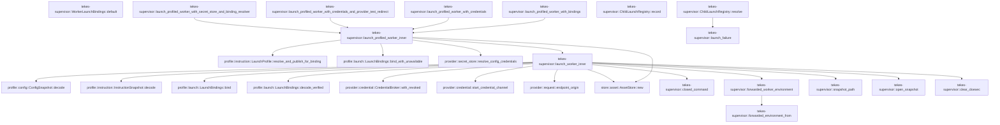

# tekes-supervisor

[Package atlas](index.md) · [Source](../../src/lib.rs)

## Declarations

Visibility is the declaration spelling; trait members and reexports require their enclosing interface. `cfg` is not evaluated.

| Symbol | Kind | Visibility | Test / cfg |
|---|---|---|---|
| [tekes-supervisor::ChildLaunchState](../../src/lib.rs#L47) | enum_item | `pub` |  |
| [tekes-supervisor::ChildLaunchRegistry](../../src/lib.rs#L56) | struct_item | `pub` |  |
| [tekes-supervisor::ChildLaunchRegistry::record](../../src/lib.rs#L61) | function_item | `pub` |  |
| [tekes-supervisor::ChildLaunchRegistry::resolve](../../src/lib.rs#L71) | function_item | `pub` |  |
| [tekes-supervisor::launch_failure](../../src/lib.rs#L87) | function_item | `private` |  |
| [tekes-supervisor::WorkerLaunchSpec](../../src/lib.rs#L97) | struct_item | `pub` |  |
| [tekes-supervisor::ProfiledWorkerLaunchSpec](../../src/lib.rs#L109) | struct_item | `pub` |  |
| [tekes-supervisor::WorkerLaunch](../../src/lib.rs#L122) | struct_item | `pub` |  |
| [tekes-supervisor::WorkerLaunchBindings](../../src/lib.rs#L135) | struct_item | `pub` |  |
| [tekes-supervisor::WorkerLaunchBindingResolver](../../src/lib.rs#L143) | type_item | `private` |  |
| [tekes-supervisor::WorkerLaunchBindings::default](../../src/lib.rs#L147) | function_item | `private` |  |
| [tekes-supervisor::launch_profiled_worker_with_bindings](../../src/lib.rs#L159) | function_item | `pub` |  |
| [tekes-supervisor::launch_profiled_worker_with_credentials](../../src/lib.rs#L167) | function_item | `pub` |  |
| [tekes-supervisor::launch_profiled_worker_with_credentials_and_provider_test_redirect](../../src/lib.rs#L179) | function_item | `pub` |  |
| [tekes-supervisor::launch_profiled_worker_with_secret_store_and_binding_resolver](../../src/lib.rs#L200) | function_item | `pub` |  |
| [tekes-supervisor::launch_profiled_worker_inner](../../src/lib.rs#L220) | function_item | `private` |  |
| [tekes-supervisor::launch_worker_inner](../../src/lib.rs#L298) | function_item | `private` |  |
| [tekes-supervisor::closed_command](../../src/lib.rs#L437) | function_item | `private` |  |
| [tekes-supervisor::FORWARDED_PROXY_VARIABLES](../../src/lib.rs#L445) | const_item | `private` |  |
| [tekes-supervisor::forwarded_worker_environment](../../src/lib.rs#L464) | function_item | `pub` |  |
| [tekes-supervisor::forwarded_environment_from](../../src/lib.rs#L471) | function_item | `private` |  |
| [tekes-supervisor::snapshot_path](../../src/lib.rs#L478) | function_item | `private` |  |
| [tekes-supervisor::open_snapshot](../../src/lib.rs#L489) | function_item | `private` |  |
| [tekes-supervisor::clear_cloexec](../../src/lib.rs#L496) | function_item | `private` |  |
| [tekes-supervisor::LaunchError](../../src/lib.rs#L507) | enum_item | `pub` |  |
| [tekes-supervisor::tests::worker_environment_forwards_only_the_evidence_capture_directory](../../src/lib.rs#L534) | function_item | `private` | test; #[cfg(test)] |
| [tekes-supervisor::tests::worker_command_drops_the_complete_ambient_environment](../../src/lib.rs#L565) | function_item | `private` | test; #[cfg(test)] |

## Imports / reexports

| Local name | Source path | Visibility |
|---|---|---|
| `BTreeMap` | `std::collections::BTreeMap` | `private` |
| `File` | `std::fs::File` | `private` |
| `OpenOptions` | `std::fs::OpenOptions` | `private` |
| `io` | `std::io` | `private` |
| `AsRawFd` | `std::os::fd::AsRawFd` | `private` |
| `OpenOptionsExt` | `std::os::unix::fs::OpenOptionsExt` | `private` |
| `UnixStream` | `std::os::unix::net::UnixStream` | `private` |
| `CommandExt` | `std::os::unix::process::CommandExt` | `private` |
| `Path` | `std::path::Path` | `private` |
| `PathBuf` | `std::path::PathBuf` | `private` |
| `Child` | `std::process::Child` | `private` |
| `Command` | `std::process::Command` | `private` |
| `Stdio` | `std::process::Stdio` | `private` |
| `ConfigRepository` | `profile::ConfigRepository` | `private` |
| `ConfigSnapshot` | `profile::ConfigSnapshot` | `private` |
| `DynamicToolCatalog` | `profile::DynamicToolCatalog` | `private` |
| `InstructionSnapshot` | `profile::InstructionSnapshot` | `private` |
| `LaunchBindings` | `profile::LaunchBindings` | `private` |
| `LaunchProfile` | `profile::LaunchProfile` | `private` |
| `ProfileError` | `profile::ProfileError` | `private` |
| `CredentialBroker` | `provider::CredentialBroker` | `private` |
| `CredentialBrokerControl` | `provider::CredentialBrokerControl` | `private` |
| `CredentialScope` | `provider::CredentialScope` | `private` |
| `ResolvedCredentialBindings` | `provider::ResolvedCredentialBindings` | `private` |
| `RevokedCredentialScope` | `provider::RevokedCredentialScope` | `private` |
| `SecretStore` | `provider::SecretStore` | `private` |
| `resolve_config_credentials` | `provider::resolve_config_credentials` | `private` |
| `start_credential_channel` | `provider::start_credential_channel` | `private` |
| `LaunchChild` | `worker_control::LaunchChild` | `private` |
| `LaunchResult` | `worker_control::LaunchResult` | `private` |
| `closed_command` | `super::closed_command` | `private` |
| `forwarded_environment_from` | `super::forwarded_environment_from` | `private` |

## Module declarations

| Module | Visibility | Attributes |
|---|---|---|
| `tekes-supervisor::boot_trace` | `pub` |  |
| `tekes-supervisor::builtin` | `pub` |  |
| `tekes-supervisor::catalog` | `private` |  |
| `tekes-supervisor::client_admin` | `pub` |  |
| `tekes-supervisor::client_extensions` | `pub` |  |
| `tekes-supervisor::context_usage` | `private` |  |
| `tekes-supervisor::continuation_journal` | `pub` |  |
| `tekes-supervisor::dynamic_bindings` | `pub` |  |
| `tekes-supervisor::endpoint_carrier` | `pub` |  |
| `tekes-supervisor::endpoint_host` | `pub` |  |
| `tekes-supervisor::file_leases` | `pub` |  |
| `tekes-supervisor::file_observation` | `pub` |  |
| `tekes-supervisor::host_runtime` | `pub` |  |
| `tekes-supervisor::mcp_continuation` | `pub` |  |
| `tekes-supervisor::mcp_runtime` | `pub` |  |
| `tekes-supervisor::process_host` | `pub` |  |
| `tekes-supervisor::production_tool_control` | `pub` |  |
| `tekes-supervisor::request_index` | `private` |  |
| `tekes-supervisor::resource_capability` | `pub` |  |
| `tekes-supervisor::thread_card` | `private` |  |
| `tekes-supervisor::tool_control` | `pub` |  |
| `tekes-supervisor::workspace_routes` | `pub` |  |
| `tekes-supervisor::tests` | `private` | #[cfg(test)] |

## Function call graphs

Edges below are syntactically resolved calls only, including private functions. Graphs partition callers into groups of 20; they are not execution order. All unresolved sites are listed below and in the JSON inventory.

Functions 1–16: 24 direct edges

```mermaid
flowchart TD
  n0["profile::config::ConfigSnapshot::decode"]
  n1["profile::instruction::LaunchProfile::resolve_and_publish_for_binding"]
  n2["profile::instruction::InstructionSnapshot::decode"]
  n3["profile::launch::LaunchBindings::bind"]
  n4["profile::launch::LaunchBindings::bind_with_unavailable"]
  n5["profile::launch::LaunchBindings::decode_verified"]
  n6["provider::credential::CredentialBroker::with_revoked"]
  n7["provider::credential::start_credential_channel"]
  n8["provider::request::endpoint_origin"]
  n9["provider::secret_store::resolve_config_credentials"]
  n10["store::asset::AssetStore::new"]
  n11["tekes-supervisor::WorkerLaunchBindings::default"]
  n12["tekes-supervisor::launch_profiled_worker_with_bindings"]
  n13["tekes-supervisor::launch_profiled_worker_with_credentials"]
  n14["tekes-supervisor::launch_profiled_worker_with_credentials_and_provider_test_redirect"]
  n15["tekes-supervisor::launch_profiled_worker_with_secret_store_and_binding_resolver"]
  n16["tekes-supervisor::launch_profiled_worker_inner"]
  n17["tekes-supervisor::launch_worker_inner"]
  n18["tekes-supervisor::closed_command"]
  n19["tekes-supervisor::forwarded_worker_environment"]
  n20["tekes-supervisor::forwarded_environment_from"]
  n21["tekes-supervisor::snapshot_path"]
  n22["tekes-supervisor::open_snapshot"]
  n23["tekes-supervisor::clear_cloexec"]
  n24["tekes-supervisor::ChildLaunchRegistry::record"]
  n25["tekes-supervisor::ChildLaunchRegistry::resolve"]
  n26["tekes-supervisor::launch_failure"]
  n12 --> n16
  n13 --> n16
  n14 --> n16
  n15 --> n16
  n16 --> n1
  n16 --> n4
  n16 --> n9
  n16 --> n10
  n16 --> n17
  n17 --> n0
  n17 --> n2
  n17 --> n3
  n17 --> n5
  n17 --> n6
  n17 --> n7
  n17 --> n8
  n17 --> n10
  n17 --> n18
  n17 --> n19
  n17 --> n21
  n17 --> n22
  n17 --> n23
  n19 --> n20
  n25 --> n26
```

## Call sites

Includes test functions (marked in declarations). Receiver-type-required sites need type analysis/manual tracing. Calls in closures are attributed to their enclosing function; their occurrence here does not mean the closure executes immediately.

| Caller | Callee expression | Source lines | Target / classification |
|---|---|---|---|
| `record` | `self.children.insert` | [67](../../src/lib.rs#L67) | receiver-type-required |
| `record` | `child.into` | [67](../../src/lib.rs#L67) | receiver-type-required |
| `record` | `spawn_id.into` | [67](../../src/lib.rs#L67) | receiver-type-required |
| `resolve` | `self.children.get` | [72](../../src/lib.rs#L72) | receiver-type-required |
| `resolve` | `launch_failure` | [73](../../src/lib.rs#L73), [75](../../src/lib.rs#L75) | [tekes-supervisor::launch_failure](../../src/lib.rs#L87) |
| `resolve` | `request.child.clone` | [78](../../src/lib.rs#L78) | receiver-type-required |
| `resolve` | `request.spawn_id.clone` | [79](../../src/lib.rs#L79) | receiver-type-required |
| `launch_failure` | `request.child.clone` | [89](../../src/lib.rs#L89) | receiver-type-required |
| `launch_failure` | `request.spawn_id.clone` | [90](../../src/lib.rs#L90) | receiver-type-required |
| `launch_failure` | `Some` | [92](../../src/lib.rs#L92) | external-constructor-callback-or-unresolved |
| `launch_failure` | `error.to_owned` | [92](../../src/lib.rs#L92) | receiver-type-required |
| `default` | `Vec::new` | [152](../../src/lib.rs#L152), [154](../../src/lib.rs#L154) | external-constructor-callback-or-unresolved |
| `launch_profiled_worker_with_bindings` | `launch_profiled_worker_inner` | [164](../../src/lib.rs#L164) | [tekes-supervisor::launch_profiled_worker_inner](../../src/lib.rs#L220) |
| `launch_profiled_worker_with_bindings` | `Some` | [164](../../src/lib.rs#L164) | external-constructor-callback-or-unresolved |
| `launch_profiled_worker_with_credentials` | `launch_profiled_worker_inner` | [172](../../src/lib.rs#L172) | [tekes-supervisor::launch_profiled_worker_inner](../../src/lib.rs#L220) |
| `launch_profiled_worker_with_credentials` | `Some` | [172](../../src/lib.rs#L172) | external-constructor-callback-or-unresolved |
| `launch_profiled_worker_with_credentials_and_provider_test_redirect` | `launch_profiled_worker_inner` | [185](../../src/lib.rs#L185) | [tekes-supervisor::launch_profiled_worker_inner](../../src/lib.rs#L220) |
| `launch_profiled_worker_with_credentials_and_provider_test_redirect` | `Some` | [188](../../src/lib.rs#L188), [192](../../src/lib.rs#L192) | external-constructor-callback-or-unresolved |
| `launch_profiled_worker_with_secret_store_and_binding_resolver` | `launch_profiled_worker_inner` | [209](../../src/lib.rs#L209) | [tekes-supervisor::launch_profiled_worker_inner](../../src/lib.rs#L220) |
| `launch_profiled_worker_with_secret_store_and_binding_resolver` | `Some` | [213](../../src/lib.rs#L213), [215](../../src/lib.rs#L215) | external-constructor-callback-or-unresolved |
| `launch_profiled_worker_inner` | `spec         .ledger         .parent()         .ok_or` | [229](../../src/lib.rs#L229) | receiver-type-required |
| `launch_profiled_worker_inner` | `spec         .ledger         .parent` | [229](../../src/lib.rs#L229) | receiver-type-required |
| `launch_profiled_worker_inner` | `store::AssetStore::new` | [233](../../src/lib.rs#L233) | [store::asset::AssetStore::new](../../../store/src/asset.rs#L27) |
| `launch_profiled_worker_inner` | `folder.join` | [233](../../src/lib.rs#L233) | receiver-type-required |
| `launch_profiled_worker_inner` | `LaunchProfile::resolve_and_publish_for_binding` | [234](../../src/lib.rs#L234) | [profile::instruction::LaunchProfile::resolve_and_publish_for_binding](../../../profile/src/instruction.rs#L131) |
| `launch_profiled_worker_inner` | `spec.folder_binding.as_deref` | [239](../../src/lib.rs#L239) | receiver-type-required |
| `launch_profiled_worker_inner` | `resolver(&profile.config, &profile.instruction)             .map_err` | [243](../../src/lib.rs#L243) | receiver-type-required |
| `launch_profiled_worker_inner` | `resolver` | [243](../../src/lib.rs#L243) | external-constructor-callback-or-unresolved |
| `launch_profiled_worker_inner` | `WorkerLaunchBindings::default` | [245](../../src/lib.rs#L245) | external-constructor-callback-or-unresolved |
| `launch_profiled_worker_inner` | `Err` | [247](../../src/lib.rs#L247) | external-constructor-callback-or-unresolved |
| `launch_profiled_worker_inner` | `LaunchError::BindingResolution` | [247](../../src/lib.rs#L247) | external-constructor-callback-or-unresolved |
| `launch_profiled_worker_inner` | `"launch bindings and a binding resolver are mutually exclusive".into` | [248](../../src/lib.rs#L248) | receiver-type-required |
| `launch_profiled_worker_inner` | `LaunchBindings::bind_with_unavailable` | [252](../../src/lib.rs#L252) | [profile::launch::LaunchBindings::bind_with_unavailable](../../../profile/src/launch.rs#L193) |
| `launch_profiled_worker_inner` | `spec.binary.clone` | [259](../../src/lib.rs#L259) | receiver-type-required |
| `launch_profiled_worker_inner` | `spec.ledger.clone` | [260](../../src/lib.rs#L260) | receiver-type-required |
| `launch_profiled_worker_inner` | `spec.timestamp.clone` | [261](../../src/lib.rs#L261) | receiver-type-required |
| `launch_profiled_worker_inner` | `spec.run_id.clone` | [262](../../src/lib.rs#L262) | receiver-type-required |
| `launch_profiled_worker_inner` | `spec.binary_attribution.clone` | [263](../../src/lib.rs#L263) | receiver-type-required |
| `launch_profiled_worker_inner` | `assets.root().to_path_buf` | [264](../../src/lib.rs#L264) | receiver-type-required |
| `launch_profiled_worker_inner` | `assets.root` | [264](../../src/lib.rs#L264) | receiver-type-required |
| `launch_profiled_worker_inner` | `resolve_config_credentials(&profile.config, store)             .map_err` | [270](../../src/lib.rs#L270) | receiver-type-required |
| `launch_profiled_worker_inner` | `resolve_config_credentials` | [270](../../src/lib.rs#L270) | [provider::secret_store::resolve_config_credentials](../../../provider/src/secret_store.rs#L294) |
| `launch_profiled_worker_inner` | `bindings.active.is_empty` | [272](../../src/lib.rs#L272) | receiver-type-required |
| `launch_profiled_worker_inner` | `bindings.revoked.is_empty` | [272](../../src/lib.rs#L272) | receiver-type-required |
| `launch_profiled_worker_inner` | `Some` | [275](../../src/lib.rs#L275), [277](../../src/lib.rs#L277), [291](../../src/lib.rs#L291) | external-constructor-callback-or-unresolved |
| `launch_profiled_worker_inner` | `bindings.active.clone` | [275](../../src/lib.rs#L275) | receiver-type-required |
| `launch_profiled_worker_inner` | `bindings.revoked.clone` | [275](../../src/lib.rs#L275) | receiver-type-required |
| `launch_profiled_worker_inner` | `scopes.map` | [280](../../src/lib.rs#L280) | receiver-type-required |
| `launch_profiled_worker_inner` | `Vec::new` | [280](../../src/lib.rs#L280) | external-constructor-callback-or-unresolved |
| `launch_profiled_worker_inner` | `credentials         .map(&#124;(scopes, revoked)&#124; {             let (supervisor, worker) = UnixStream::pair()?;             Ok::<_, io::Error>((supervisor, worker, scopes, revoked))         })         .transpose` | [282](../../src/lib.rs#L282) | receiver-type-required |
| `launch_profiled_worker_inner` | `credentials         .map` | [282](../../src/lib.rs#L282) | receiver-type-required |
| `launch_profiled_worker_inner` | `UnixStream::pair` | [284](../../src/lib.rs#L284) | external-constructor-callback-or-unresolved |
| `launch_profiled_worker_inner` | `Ok::<_, io::Error>` | [285](../../src/lib.rs#L285) | external-constructor-callback-or-unresolved |
| `launch_profiled_worker_inner` | `launch_worker_inner` | [288](../../src/lib.rs#L288) | [tekes-supervisor::launch_worker_inner](../../src/lib.rs#L298) |
| `launch_profiled_worker_inner` | `Ok` | [295](../../src/lib.rs#L295) | external-constructor-callback-or-unresolved |
| `launch_worker_inner` | `snapshot_path` | [309](../../src/lib.rs#L309), [310](../../src/lib.rs#L310), [341](../../src/lib.rs#L341) | [tekes-supervisor::snapshot_path](../../src/lib.rs#L478) |
| `launch_worker_inner` | `std::fs::read` | [314](../../src/lib.rs#L314), [315](../../src/lib.rs#L315), [342](../../src/lib.rs#L342) | external-constructor-callback-or-unresolved |
| `launch_worker_inner` | `ConfigSnapshot::decode` | [316](../../src/lib.rs#L316) | [profile::config::ConfigSnapshot::decode](../../../profile/src/config.rs#L289) |
| `launch_worker_inner` | `InstructionSnapshot::decode` | [317](../../src/lib.rs#L317) | [profile::instruction::InstructionSnapshot::decode](../../../profile/src/instruction.rs#L183) |
| `launch_worker_inner` | `instruction.validate_against_config` | [318](../../src/lib.rs#L318) | receiver-type-required |
| `launch_worker_inner` | `config.digest` | [319](../../src/lib.rs#L319) | receiver-type-required |
| `launch_worker_inner` | `Err` | [320](../../src/lib.rs#L320), [323](../../src/lib.rs#L323) | external-constructor-callback-or-unresolved |
| `launch_worker_inner` | `LaunchError::DigestMismatch` | [320](../../src/lib.rs#L320), [323](../../src/lib.rs#L323) | external-constructor-callback-or-unresolved |
| `launch_worker_inner` | `instruction.digest` | [322](../../src/lib.rs#L322) | receiver-type-required |
| `launch_worker_inner` | `bindings.validate_against` | [327](../../src/lib.rs#L327) | receiver-type-required |
| `launch_worker_inner` | `bindings.clone` | [328](../../src/lib.rs#L328) | receiver-type-required |
| `launch_worker_inner` | `LaunchBindings::bind` | [330](../../src/lib.rs#L330) | [profile::launch::LaunchBindings::bind](../../../profile/src/launch.rs#L181) |
| `launch_worker_inner` | `Vec::new` | [335](../../src/lib.rs#L335) | external-constructor-callback-or-unresolved |
| `launch_worker_inner` | `store::AssetStore::new` | [339](../../src/lib.rs#L339) | [store::asset::AssetStore::new](../../../store/src/asset.rs#L27) |
| `launch_worker_inner` | `launch_bindings.publish` | [340](../../src/lib.rs#L340) | receiver-type-required |
| `launch_worker_inner` | `LaunchBindings::decode_verified` | [343](../../src/lib.rs#L343) | [profile::launch::LaunchBindings::decode_verified](../../../profile/src/launch.rs#L225) |
| `launch_worker_inner` | `open_snapshot` | [345](../../src/lib.rs#L345), [346](../../src/lib.rs#L346), [347](../../src/lib.rs#L347) | [tekes-supervisor::open_snapshot](../../src/lib.rs#L489) |
| `launch_worker_inner` | `config_file.as_raw_fd` | [349](../../src/lib.rs#L349) | receiver-type-required |
| `launch_worker_inner` | `instruction_file.as_raw_fd` | [350](../../src/lib.rs#L350) | receiver-type-required |
| `launch_worker_inner` | `launch_bindings_file.as_raw_fd` | [351](../../src/lib.rs#L351) | receiver-type-required |
| `launch_worker_inner` | `credential         .as_ref()         .map` | [352](../../src/lib.rs#L352) | receiver-type-required |
| `launch_worker_inner` | `credential         .as_ref` | [352](../../src/lib.rs#L352) | receiver-type-required |
| `launch_worker_inner` | `worker.as_raw_fd` | [354](../../src/lib.rs#L354) | receiver-type-required |
| `launch_worker_inner` | `config.providers.web_search.as_ref().is_some_and` | [355](../../src/lib.rs#L355) | receiver-type-required |
| `launch_worker_inner` | `config.providers.web_search.as_ref` | [355](../../src/lib.rs#L355) | receiver-type-required |
| `launch_worker_inner` | `provider::endpoint_origin` | [356](../../src/lib.rs#L356) | [provider::request::endpoint_origin](../../../provider/src/request.rs#L113) |
| `launch_worker_inner` | `credential.as_ref().is_some_and` | [359](../../src/lib.rs#L359) | receiver-type-required |
| `launch_worker_inner` | `credential.as_ref` | [359](../../src/lib.rs#L359) | receiver-type-required |
| `launch_worker_inner` | `active.iter().any` | [360](../../src/lib.rs#L360) | receiver-type-required |
| `launch_worker_inner` | `active.iter` | [360](../../src/lib.rs#L360) | receiver-type-required |
| `launch_worker_inner` | `closed_command` | [368](../../src/lib.rs#L368) | [tekes-supervisor::closed_command](../../src/lib.rs#L437) |
| `launch_worker_inner` | `command         .arg(&spec.ledger)         .args(["--timestamp", &spec.timestamp])         .args(["--run-id", &spec.run_id])         .args(["--binary", &spec.binary_attribution])         .args(["--config-fd", &config_fd.to_string()])         .args(["--instruction-fd", &instruction_fd.to_string()])         .args(["--launch-bindings-fd", &launch_bindings_fd.to_string()])         .args(["--launch-bindings-digest", &launch_bindings_digest])         .stdin(Stdio::piped())         .stdout(Stdio::piped())         .stderr` | [369](../../src/lib.rs#L369) | receiver-type-required |
| `launch_worker_inner` | `command         .arg(&spec.ledger)         .args(["--timestamp", &spec.timestamp])         .args(["--run-id", &spec.run_id])         .args(["--binary", &spec.binary_attribution])         .args(["--config-fd", &config_fd.to_string()])         .args(["--instruction-fd", &instruction_fd.to_string()])         .args(["--launch-bindings-fd", &launch_bindings_fd.to_string()])         .args(["--launch-bindings-digest", &launch_bindings_digest])         .stdin(Stdio::piped())         .stdout` | [369](../../src/lib.rs#L369) | receiver-type-required |
| `launch_worker_inner` | `command         .arg(&spec.ledger)         .args(["--timestamp", &spec.timestamp])         .args(["--run-id", &spec.run_id])         .args(["--binary", &spec.binary_attribution])         .args(["--config-fd", &config_fd.to_string()])         .args(["--instruction-fd", &instruction_fd.to_string()])         .args(["--launch-bindings-fd", &launch_bindings_fd.to_string()])         .args(["--launch-bindings-digest", &launch_bindings_digest])         .stdin` | [369](../../src/lib.rs#L369) | receiver-type-required |
| `launch_worker_inner` | `command         .arg(&spec.ledger)         .args(["--timestamp", &spec.timestamp])         .args(["--run-id", &spec.run_id])         .args(["--binary", &spec.binary_attribution])         .args(["--config-fd", &config_fd.to_string()])         .args(["--instruction-fd", &instruction_fd.to_string()])         .args(["--launch-bindings-fd", &launch_bindings_fd.to_string()])         .args` | [369](../../src/lib.rs#L369) | receiver-type-required |
| `launch_worker_inner` | `command         .arg(&spec.ledger)         .args(["--timestamp", &spec.timestamp])         .args(["--run-id", &spec.run_id])         .args(["--binary", &spec.binary_attribution])         .args(["--config-fd", &config_fd.to_string()])         .args(["--instruction-fd", &instruction_fd.to_string()])         .args` | [369](../../src/lib.rs#L369) | receiver-type-required |
| `launch_worker_inner` | `command         .arg(&spec.ledger)         .args(["--timestamp", &spec.timestamp])         .args(["--run-id", &spec.run_id])         .args(["--binary", &spec.binary_attribution])         .args(["--config-fd", &config_fd.to_string()])         .args` | [369](../../src/lib.rs#L369) | receiver-type-required |
| `launch_worker_inner` | `command         .arg(&spec.ledger)         .args(["--timestamp", &spec.timestamp])         .args(["--run-id", &spec.run_id])         .args(["--binary", &spec.binary_attribution])         .args` | [369](../../src/lib.rs#L369) | receiver-type-required |
| `launch_worker_inner` | `command         .arg(&spec.ledger)         .args(["--timestamp", &spec.timestamp])         .args(["--run-id", &spec.run_id])         .args` | [369](../../src/lib.rs#L369) | receiver-type-required |
| `launch_worker_inner` | `command         .arg(&spec.ledger)         .args(["--timestamp", &spec.timestamp])         .args` | [369](../../src/lib.rs#L369) | receiver-type-required |
| `launch_worker_inner` | `command         .arg(&spec.ledger)         .args` | [369](../../src/lib.rs#L369) | receiver-type-required |
| `launch_worker_inner` | `command         .arg` | [369](../../src/lib.rs#L369) | receiver-type-required |
| `launch_worker_inner` | `config_fd.to_string` | [374](../../src/lib.rs#L374) | receiver-type-required |
| `launch_worker_inner` | `instruction_fd.to_string` | [375](../../src/lib.rs#L375) | receiver-type-required |
| `launch_worker_inner` | `launch_bindings_fd.to_string` | [376](../../src/lib.rs#L376) | receiver-type-required |
| `launch_worker_inner` | `Stdio::piped` | [378](../../src/lib.rs#L378), [379](../../src/lib.rs#L379), [380](../../src/lib.rs#L380) | external-constructor-callback-or-unresolved |
| `launch_worker_inner` | `command.args` | [382](../../src/lib.rs#L382), [385](../../src/lib.rs#L385), [388](../../src/lib.rs#L388) | receiver-type-required |
| `launch_worker_inner` | `fd.to_string` | [382](../../src/lib.rs#L382) | receiver-type-required |
| `launch_worker_inner` | `forwarded_worker_environment` | [390](../../src/lib.rs#L390) | [tekes-supervisor::forwarded_worker_environment](../../src/lib.rs#L464) |
| `launch_worker_inner` | `command.env` | [391](../../src/lib.rs#L391) | receiver-type-required |
| `launch_worker_inner` | `command.pre_exec` | [398](../../src/lib.rs#L398) | receiver-type-required |
| `launch_worker_inner` | `clear_cloexec` | [399](../../src/lib.rs#L399), [400](../../src/lib.rs#L400), [401](../../src/lib.rs#L401), [403](../../src/lib.rs#L403) | [tekes-supervisor::clear_cloexec](../../src/lib.rs#L496) |
| `launch_worker_inner` | `Ok` | [405](../../src/lib.rs#L405), [424](../../src/lib.rs#L424) | external-constructor-callback-or-unresolved |
| `launch_worker_inner` | `command.spawn` | [408](../../src/lib.rs#L408) | receiver-type-required |
| `launch_worker_inner` | `credential.map_or` | [410](../../src/lib.rs#L410) | receiver-type-required |
| `launch_worker_inner` | `drop` | [411](../../src/lib.rs#L411) | external-constructor-callback-or-unresolved |
| `launch_worker_inner` | `start_credential_channel` | [412](../../src/lib.rs#L412) | [provider::credential::start_credential_channel](../../../provider/src/credential.rs#L519) |
| `launch_worker_inner` | `CredentialBroker::with_revoked` | [414](../../src/lib.rs#L414) | [provider::credential::CredentialBroker::with_revoked](../../../provider/src/credential.rs#L360) |
| `launch_worker_inner` | `std::thread::spawn` | [416](../../src/lib.rs#L416) | external-constructor-callback-or-unresolved |
| `launch_worker_inner` | `service                     .join()                     .map_err(&#124;_&#124; "credential broker service panicked".to_owned())?                     .map_err` | [417](../../src/lib.rs#L417) | receiver-type-required |
| `launch_worker_inner` | `service                     .join()                     .map_err` | [417](../../src/lib.rs#L417) | receiver-type-required |
| `launch_worker_inner` | `service                     .join` | [417](../../src/lib.rs#L417) | receiver-type-required |
| `launch_worker_inner` | `"credential broker service panicked".to_owned` | [419](../../src/lib.rs#L419) | receiver-type-required |
| `launch_worker_inner` | `error.to_string` | [420](../../src/lib.rs#L420) | receiver-type-required |
| `launch_worker_inner` | `Some` | [422](../../src/lib.rs#L422) | external-constructor-callback-or-unresolved |
| `launch_worker_inner` | `spec.config_digest.clone` | [428](../../src/lib.rs#L428) | receiver-type-required |
| `launch_worker_inner` | `spec.instruction_digest.clone` | [429](../../src/lib.rs#L429) | receiver-type-required |
| `closed_command` | `Command::new` | [438](../../src/lib.rs#L438) | external-constructor-callback-or-unresolved |
| `closed_command` | `command.env_clear` | [439](../../src/lib.rs#L439) | receiver-type-required |
| `forwarded_worker_environment` | `forwarded_environment_from` | [465](../../src/lib.rs#L465) | [tekes-supervisor::forwarded_environment_from](../../src/lib.rs#L471) |
| `forwarded_worker_environment` | `std::env::var(name).ok` | [465](../../src/lib.rs#L465) | receiver-type-required |
| `forwarded_worker_environment` | `std::env::var` | [465](../../src/lib.rs#L465) | external-constructor-callback-or-unresolved |
| `forwarded_environment_from` | `std::iter::once("TEKES_KERNEL_LIVE_ARTIFACT")         .chain(FORWARDED_PROXY_VARIABLES)         .filter_map(&#124;name&#124; lookup(name).map(&#124;value&#124; (name.to_owned(), value)))         .collect` | [472](../../src/lib.rs#L472) | receiver-type-required |
| `forwarded_environment_from` | `std::iter::once("TEKES_KERNEL_LIVE_ARTIFACT")         .chain(FORWARDED_PROXY_VARIABLES)         .filter_map` | [472](../../src/lib.rs#L472) | receiver-type-required |
| `forwarded_environment_from` | `std::iter::once("TEKES_KERNEL_LIVE_ARTIFACT")         .chain` | [472](../../src/lib.rs#L472) | receiver-type-required |
| `forwarded_environment_from` | `std::iter::once` | [472](../../src/lib.rs#L472) | external-constructor-callback-or-unresolved |
| `forwarded_environment_from` | `lookup(name).map` | [474](../../src/lib.rs#L474) | receiver-type-required |
| `forwarded_environment_from` | `lookup` | [474](../../src/lib.rs#L474) | external-constructor-callback-or-unresolved |
| `forwarded_environment_from` | `name.to_owned` | [474](../../src/lib.rs#L474) | receiver-type-required |
| `snapshot_path` | `digest.len` | [479](../../src/lib.rs#L479) | receiver-type-required |
| `snapshot_path` | `digest             .bytes()             .all` | [480](../../src/lib.rs#L480) | receiver-type-required |
| `snapshot_path` | `digest             .bytes` | [480](../../src/lib.rs#L480) | receiver-type-required |
| `snapshot_path` | `byte.is_ascii_hexdigit` | [482](../../src/lib.rs#L482) | receiver-type-required |
| `snapshot_path` | `byte.is_ascii_uppercase` | [482](../../src/lib.rs#L482) | receiver-type-required |
| `snapshot_path` | `Err` | [484](../../src/lib.rs#L484) | external-constructor-callback-or-unresolved |
| `snapshot_path` | `Ok` | [486](../../src/lib.rs#L486) | external-constructor-callback-or-unresolved |
| `snapshot_path` | `assets.join` | [486](../../src/lib.rs#L486) | receiver-type-required |
| `open_snapshot` | `Ok` | [490](../../src/lib.rs#L490) | external-constructor-callback-or-unresolved |
| `open_snapshot` | `OpenOptions::new()         .read(true)         .custom_flags(libc::O_CLOEXEC &#124; libc::O_NOFOLLOW)         .open` | [490](../../src/lib.rs#L490) | receiver-type-required |
| `open_snapshot` | `OpenOptions::new()         .read(true)         .custom_flags` | [490](../../src/lib.rs#L490) | receiver-type-required |
| `open_snapshot` | `OpenOptions::new()         .read` | [490](../../src/lib.rs#L490) | receiver-type-required |
| `open_snapshot` | `OpenOptions::new` | [490](../../src/lib.rs#L490) | external-constructor-callback-or-unresolved |
| `clear_cloexec` | `libc::fcntl` | [499](../../src/lib.rs#L499) | external-constructor-callback-or-unresolved |
| `clear_cloexec` | `Err` | [500](../../src/lib.rs#L500) | external-constructor-callback-or-unresolved |
| `clear_cloexec` | `io::Error::last_os_error` | [500](../../src/lib.rs#L500) | external-constructor-callback-or-unresolved |
| `clear_cloexec` | `Ok` | [502](../../src/lib.rs#L502) | external-constructor-callback-or-unresolved |
| `worker_environment_forwards_only_the_evidence_capture_directory` | `std::collections::BTreeMap::from` | [536](../../src/lib.rs#L536) | external-constructor-callback-or-unresolved |
| `worker_environment_forwards_only_the_evidence_capture_directory` | `closed_command` | [555](../../src/lib.rs#L555) | [tekes-supervisor::closed_command](../../src/lib.rs#L437) |
| `worker_environment_forwards_only_the_evidence_capture_directory` | `std::path::Path::new` | [555](../../src/lib.rs#L555) | external-constructor-callback-or-unresolved |
| `worker_environment_forwards_only_the_evidence_capture_directory` | `command.env` | [556](../../src/lib.rs#L556) | receiver-type-required |
| `worker_environment_forwards_only_the_evidence_capture_directory` | `command.output().expect` | [557](../../src/lib.rs#L557) | receiver-type-required |
| `worker_environment_forwards_only_the_evidence_capture_directory` | `command.output` | [557](../../src/lib.rs#L557) | receiver-type-required |
| `worker_command_drops_the_complete_ambient_environment` | `closed_command(std::path::Path::new("/usr/bin/env"))             .output()             .expect` | [566](../../src/lib.rs#L566) | receiver-type-required |
| `worker_command_drops_the_complete_ambient_environment` | `closed_command(std::path::Path::new("/usr/bin/env"))             .output` | [566](../../src/lib.rs#L566) | receiver-type-required |
| `worker_command_drops_the_complete_ambient_environment` | `closed_command` | [566](../../src/lib.rs#L566) | [tekes-supervisor::closed_command](../../src/lib.rs#L437) |
| `worker_command_drops_the_complete_ambient_environment` | `std::path::Path::new` | [566](../../src/lib.rs#L566) | external-constructor-callback-or-unresolved |
