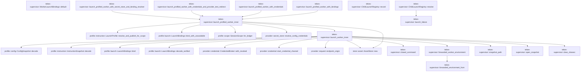

# tekes-supervisor

[Package atlas](index.md) · [Source](../../src/lib.rs)

## Declarations

Visibility is the declaration spelling; trait members and reexports require their enclosing interface. `cfg` is not evaluated.

| Symbol | Kind | Visibility | Test / cfg |
|---|---|---|---|
| [tekes-supervisor::ChildLaunchState](../../src/lib.rs#L47) | enum_item | `pub` |  |
| [tekes-supervisor::ChildLaunchRegistry](../../src/lib.rs#L56) | struct_item | `pub` |  |
| [tekes-supervisor::ChildLaunchRegistry::record](../../src/lib.rs#L61) | function_item | `pub` |  |
| [tekes-supervisor::ChildLaunchRegistry::resolve](../../src/lib.rs#L71) | function_item | `pub` |  |
| [tekes-supervisor::launch_failure](../../src/lib.rs#L87) | function_item | `private` |  |
| [tekes-supervisor::WorkerLaunchSpec](../../src/lib.rs#L97) | struct_item | `pub` |  |
| [tekes-supervisor::ProfiledWorkerLaunchSpec](../../src/lib.rs#L109) | struct_item | `pub` |  |
| [tekes-supervisor::WorkerLaunch](../../src/lib.rs#L122) | struct_item | `pub` |  |
| [tekes-supervisor::WorkerLaunchBindings](../../src/lib.rs#L135) | struct_item | `pub` |  |
| [tekes-supervisor::WorkerLaunchBindingResolver](../../src/lib.rs#L143) | type_item | `private` |  |
| [tekes-supervisor::WorkerLaunchBindings::default](../../src/lib.rs#L147) | function_item | `private` |  |
| [tekes-supervisor::launch_profiled_worker_with_bindings](../../src/lib.rs#L159) | function_item | `pub` |  |
| [tekes-supervisor::launch_profiled_worker_with_credentials](../../src/lib.rs#L167) | function_item | `pub` |  |
| [tekes-supervisor::launch_profiled_worker_with_credentials_and_provider_test_redirect](../../src/lib.rs#L179) | function_item | `pub` |  |
| [tekes-supervisor::launch_profiled_worker_with_secret_store_and_binding_resolver](../../src/lib.rs#L200) | function_item | `pub` |  |
| [tekes-supervisor::launch_profiled_worker_inner](../../src/lib.rs#L220) | function_item | `private` |  |
| [tekes-supervisor::launch_worker_inner](../../src/lib.rs#L310) | function_item | `private` |  |
| [tekes-supervisor::closed_command](../../src/lib.rs#L449) | function_item | `private` |  |
| [tekes-supervisor::FORWARDED_PROXY_VARIABLES](../../src/lib.rs#L457) | const_item | `private` |  |
| [tekes-supervisor::forwarded_worker_environment](../../src/lib.rs#L476) | function_item | `pub` |  |
| [tekes-supervisor::forwarded_environment_from](../../src/lib.rs#L483) | function_item | `private` |  |
| [tekes-supervisor::snapshot_path](../../src/lib.rs#L490) | function_item | `private` |  |
| [tekes-supervisor::open_snapshot](../../src/lib.rs#L501) | function_item | `private` |  |
| [tekes-supervisor::clear_cloexec](../../src/lib.rs#L508) | function_item | `private` |  |
| [tekes-supervisor::LaunchError](../../src/lib.rs#L519) | enum_item | `pub` |  |
| [tekes-supervisor::tests::worker_environment_forwards_only_the_evidence_capture_directory](../../src/lib.rs#L546) | function_item | `private` | test; #[cfg(test)] |
| [tekes-supervisor::tests::worker_command_drops_the_complete_ambient_environment](../../src/lib.rs#L577) | function_item | `private` | test; #[cfg(test)] |

## Imports / reexports

| Local name | Source path | Visibility |
|---|---|---|
| `BTreeMap` | `std::collections::BTreeMap` | `private` |
| `File` | `std::fs::File` | `private` |
| `OpenOptions` | `std::fs::OpenOptions` | `private` |
| `io` | `std::io` | `private` |
| `AsRawFd` | `std::os::fd::AsRawFd` | `private` |
| `OpenOptionsExt` | `std::os::unix::fs::OpenOptionsExt` | `private` |
| `UnixStream` | `std::os::unix::net::UnixStream` | `private` |
| `CommandExt` | `std::os::unix::process::CommandExt` | `private` |
| `Path` | `std::path::Path` | `private` |
| `PathBuf` | `std::path::PathBuf` | `private` |
| `Child` | `std::process::Child` | `private` |
| `Command` | `std::process::Command` | `private` |
| `Stdio` | `std::process::Stdio` | `private` |
| `ConfigRepository` | `profile::ConfigRepository` | `private` |
| `ConfigSnapshot` | `profile::ConfigSnapshot` | `private` |
| `DynamicToolCatalog` | `profile::DynamicToolCatalog` | `private` |
| `InstructionSnapshot` | `profile::InstructionSnapshot` | `private` |
| `LaunchBindings` | `profile::LaunchBindings` | `private` |
| `LaunchProfile` | `profile::LaunchProfile` | `private` |
| `ProfileError` | `profile::ProfileError` | `private` |
| `CredentialBroker` | `provider::CredentialBroker` | `private` |
| `CredentialBrokerControl` | `provider::CredentialBrokerControl` | `private` |
| `CredentialScope` | `provider::CredentialScope` | `private` |
| `ResolvedCredentialBindings` | `provider::ResolvedCredentialBindings` | `private` |
| `RevokedCredentialScope` | `provider::RevokedCredentialScope` | `private` |
| `SecretStore` | `provider::SecretStore` | `private` |
| `resolve_config_credentials` | `provider::resolve_config_credentials` | `private` |
| `start_credential_channel` | `provider::start_credential_channel` | `private` |
| `LaunchChild` | `worker_control::LaunchChild` | `private` |
| `LaunchResult` | `worker_control::LaunchResult` | `private` |
| `closed_command` | `super::closed_command` | `private` |
| `forwarded_environment_from` | `super::forwarded_environment_from` | `private` |

## Module declarations

| Module | Visibility | Attributes |
|---|---|---|
| `tekes-supervisor::boot_trace` | `pub` |  |
| `tekes-supervisor::builtin` | `pub` |  |
| `tekes-supervisor::catalog` | `private` |  |
| `tekes-supervisor::client_admin` | `pub` |  |
| `tekes-supervisor::client_extensions` | `pub` |  |
| `tekes-supervisor::context_usage` | `private` |  |
| `tekes-supervisor::continuation_journal` | `pub` |  |
| `tekes-supervisor::dynamic_bindings` | `pub` |  |
| `tekes-supervisor::endpoint_carrier` | `pub` |  |
| `tekes-supervisor::endpoint_host` | `pub` |  |
| `tekes-supervisor::file_leases` | `pub` |  |
| `tekes-supervisor::file_observation` | `pub` |  |
| `tekes-supervisor::host_runtime` | `pub` |  |
| `tekes-supervisor::mcp_continuation` | `pub` |  |
| `tekes-supervisor::mcp_runtime` | `pub` |  |
| `tekes-supervisor::process_host` | `pub` |  |
| `tekes-supervisor::production_tool_control` | `pub` |  |
| `tekes-supervisor::request_index` | `private` |  |
| `tekes-supervisor::resource_capability` | `pub` |  |
| `tekes-supervisor::thread_card` | `private` |  |
| `tekes-supervisor::tool_control` | `pub` |  |
| `tekes-supervisor::workspace_routes` | `pub` |  |
| `tekes-supervisor::tests` | `private` | #[cfg(test)] |

## Function call graphs

Edges below are syntactically resolved calls only, including private functions. Graphs partition callers into groups of 20; they are not execution order. All unresolved sites are listed below and in the JSON inventory.

Functions 1–16: 25 direct edges

```mermaid
flowchart TD
  n0["profile::config::ConfigSnapshot::decode"]
  n1["profile::instruction::LaunchProfile::resolve_and_publish_for_scope"]
  n2["profile::instruction::InstructionSnapshot::decode"]
  n3["profile::launch::LaunchBindings::bind"]
  n4["profile::launch::LaunchBindings::bind_with_unavailable"]
  n5["profile::launch::LaunchBindings::decode_verified"]
  n6["profile::scope::SessionScope::for_ledger"]
  n7["provider::credential::CredentialBroker::with_revoked"]
  n8["provider::credential::start_credential_channel"]
  n9["provider::request::endpoint_origin"]
  n10["provider::secret_store::resolve_config_credentials"]
  n11["store::asset::AssetStore::new"]
  n12["tekes-supervisor::WorkerLaunchBindings::default"]
  n13["tekes-supervisor::launch_profiled_worker_with_bindings"]
  n14["tekes-supervisor::launch_profiled_worker_with_credentials"]
  n15["tekes-supervisor::launch_profiled_worker_with_credentials_and_provider_test_redirect"]
  n16["tekes-supervisor::launch_profiled_worker_with_secret_store_and_binding_resolver"]
  n17["tekes-supervisor::launch_profiled_worker_inner"]
  n18["tekes-supervisor::launch_worker_inner"]
  n19["tekes-supervisor::closed_command"]
  n20["tekes-supervisor::forwarded_worker_environment"]
  n21["tekes-supervisor::forwarded_environment_from"]
  n22["tekes-supervisor::snapshot_path"]
  n23["tekes-supervisor::open_snapshot"]
  n24["tekes-supervisor::clear_cloexec"]
  n25["tekes-supervisor::ChildLaunchRegistry::record"]
  n26["tekes-supervisor::ChildLaunchRegistry::resolve"]
  n27["tekes-supervisor::launch_failure"]
  n13 --> n17
  n14 --> n17
  n15 --> n17
  n16 --> n17
  n17 --> n1
  n17 --> n4
  n17 --> n6
  n17 --> n10
  n17 --> n11
  n17 --> n18
  n18 --> n0
  n18 --> n2
  n18 --> n3
  n18 --> n5
  n18 --> n7
  n18 --> n8
  n18 --> n9
  n18 --> n11
  n18 --> n19
  n18 --> n20
  n18 --> n22
  n18 --> n23
  n18 --> n24
  n20 --> n21
  n26 --> n27
```

## Call sites

Includes test functions (marked in declarations). Receiver-type-required sites need type analysis/manual tracing. Calls in closures are attributed to their enclosing function; their occurrence here does not mean the closure executes immediately.

| Caller | Callee expression | Source lines | Target / classification |
|---|---|---|---|
| `record` | `self.children.insert` | [67](../../src/lib.rs#L67) | receiver-type-required |
| `record` | `child.into` | [67](../../src/lib.rs#L67) | receiver-type-required |
| `record` | `spawn_id.into` | [67](../../src/lib.rs#L67) | receiver-type-required |
| `resolve` | `self.children.get` | [72](../../src/lib.rs#L72) | receiver-type-required |
| `resolve` | `launch_failure` | [73](../../src/lib.rs#L73), [75](../../src/lib.rs#L75) | [tekes-supervisor::launch_failure](../../src/lib.rs#L87) |
| `resolve` | `request.child.clone` | [78](../../src/lib.rs#L78) | receiver-type-required |
| `resolve` | `request.spawn_id.clone` | [79](../../src/lib.rs#L79) | receiver-type-required |
| `launch_failure` | `request.child.clone` | [89](../../src/lib.rs#L89) | receiver-type-required |
| `launch_failure` | `request.spawn_id.clone` | [90](../../src/lib.rs#L90) | receiver-type-required |
| `launch_failure` | `Some` | [92](../../src/lib.rs#L92) | external-constructor-callback-or-unresolved |
| `launch_failure` | `error.to_owned` | [92](../../src/lib.rs#L92) | receiver-type-required |
| `default` | `Vec::new` | [152](../../src/lib.rs#L152), [154](../../src/lib.rs#L154) | external-constructor-callback-or-unresolved |
| `launch_profiled_worker_with_bindings` | `launch_profiled_worker_inner` | [164](../../src/lib.rs#L164) | [tekes-supervisor::launch_profiled_worker_inner](../../src/lib.rs#L220) |
| `launch_profiled_worker_with_bindings` | `Some` | [164](../../src/lib.rs#L164) | external-constructor-callback-or-unresolved |
| `launch_profiled_worker_with_credentials` | `launch_profiled_worker_inner` | [172](../../src/lib.rs#L172) | [tekes-supervisor::launch_profiled_worker_inner](../../src/lib.rs#L220) |
| `launch_profiled_worker_with_credentials` | `Some` | [172](../../src/lib.rs#L172) | external-constructor-callback-or-unresolved |
| `launch_profiled_worker_with_credentials_and_provider_test_redirect` | `launch_profiled_worker_inner` | [185](../../src/lib.rs#L185) | [tekes-supervisor::launch_profiled_worker_inner](../../src/lib.rs#L220) |
| `launch_profiled_worker_with_credentials_and_provider_test_redirect` | `Some` | [188](../../src/lib.rs#L188), [192](../../src/lib.rs#L192) | external-constructor-callback-or-unresolved |
| `launch_profiled_worker_with_secret_store_and_binding_resolver` | `launch_profiled_worker_inner` | [209](../../src/lib.rs#L209) | [tekes-supervisor::launch_profiled_worker_inner](../../src/lib.rs#L220) |
| `launch_profiled_worker_with_secret_store_and_binding_resolver` | `Some` | [213](../../src/lib.rs#L213), [215](../../src/lib.rs#L215) | external-constructor-callback-or-unresolved |
| `launch_profiled_worker_inner` | `spec         .ledger         .parent()         .ok_or` | [229](../../src/lib.rs#L229) | receiver-type-required |
| `launch_profiled_worker_inner` | `spec         .ledger         .parent` | [229](../../src/lib.rs#L229) | receiver-type-required |
| `launch_profiled_worker_inner` | `store::AssetStore::new` | [233](../../src/lib.rs#L233) | [store::asset::AssetStore::new](../../../store/src/asset.rs#L27) |
| `launch_profiled_worker_inner` | `folder.join` | [233](../../src/lib.rs#L233) | receiver-type-required |
| `launch_profiled_worker_inner` | `profile::SessionScope::for_ledger` | [237](../../src/lib.rs#L237) | [profile::scope::SessionScope::for_ledger](../../../profile/src/scope.rs#L52) |
| `launch_profiled_worker_inner` | `scope.workspace_id` | [238](../../src/lib.rs#L238) | receiver-type-required |
| `launch_profiled_worker_inner` | `scope.folder_binding` | [239](../../src/lib.rs#L239) | receiver-type-required |
| `launch_profiled_worker_inner` | `spec.folder_binding.as_deref` | [239](../../src/lib.rs#L239) | receiver-type-required |
| `launch_profiled_worker_inner` | `Err` | [241](../../src/lib.rs#L241), [259](../../src/lib.rs#L259) | external-constructor-callback-or-unresolved |
| `launch_profiled_worker_inner` | `profile::ProfileError::InvalidReference {             path: spec.ledger.clone(),             reason: "launch spec does not match the ledger genesis scope".to_owned(),         }         .into` | [241](../../src/lib.rs#L241) | receiver-type-required |
| `launch_profiled_worker_inner` | `spec.ledger.clone` | [242](../../src/lib.rs#L242), [272](../../src/lib.rs#L272) | receiver-type-required |
| `launch_profiled_worker_inner` | `"launch spec does not match the ledger genesis scope".to_owned` | [243](../../src/lib.rs#L243) | receiver-type-required |
| `launch_profiled_worker_inner` | `LaunchProfile::resolve_and_publish_for_scope` | [247](../../src/lib.rs#L247) | [profile::instruction::LaunchProfile::resolve_and_publish_for_scope](../../../profile/src/instruction.rs#L131) |
| `launch_profiled_worker_inner` | `resolver(&profile.config, &profile.instruction)             .map_err` | [255](../../src/lib.rs#L255) | receiver-type-required |
| `launch_profiled_worker_inner` | `resolver` | [255](../../src/lib.rs#L255) | external-constructor-callback-or-unresolved |
| `launch_profiled_worker_inner` | `WorkerLaunchBindings::default` | [257](../../src/lib.rs#L257) | external-constructor-callback-or-unresolved |
| `launch_profiled_worker_inner` | `LaunchError::BindingResolution` | [259](../../src/lib.rs#L259) | external-constructor-callback-or-unresolved |
| `launch_profiled_worker_inner` | `"launch bindings and a binding resolver are mutually exclusive".into` | [260](../../src/lib.rs#L260) | receiver-type-required |
| `launch_profiled_worker_inner` | `LaunchBindings::bind_with_unavailable` | [264](../../src/lib.rs#L264) | [profile::launch::LaunchBindings::bind_with_unavailable](../../../profile/src/launch.rs#L193) |
| `launch_profiled_worker_inner` | `spec.binary.clone` | [271](../../src/lib.rs#L271) | receiver-type-required |
| `launch_profiled_worker_inner` | `spec.timestamp.clone` | [273](../../src/lib.rs#L273) | receiver-type-required |
| `launch_profiled_worker_inner` | `spec.run_id.clone` | [274](../../src/lib.rs#L274) | receiver-type-required |
| `launch_profiled_worker_inner` | `spec.binary_attribution.clone` | [275](../../src/lib.rs#L275) | receiver-type-required |
| `launch_profiled_worker_inner` | `assets.root().to_path_buf` | [276](../../src/lib.rs#L276) | receiver-type-required |
| `launch_profiled_worker_inner` | `assets.root` | [276](../../src/lib.rs#L276) | receiver-type-required |
| `launch_profiled_worker_inner` | `resolve_config_credentials(&profile.config, store)             .map_err` | [282](../../src/lib.rs#L282) | receiver-type-required |
| `launch_profiled_worker_inner` | `resolve_config_credentials` | [282](../../src/lib.rs#L282) | [provider::secret_store::resolve_config_credentials](../../../provider/src/secret_store.rs#L294) |
| `launch_profiled_worker_inner` | `bindings.active.is_empty` | [284](../../src/lib.rs#L284) | receiver-type-required |
| `launch_profiled_worker_inner` | `bindings.revoked.is_empty` | [284](../../src/lib.rs#L284) | receiver-type-required |
| `launch_profiled_worker_inner` | `Some` | [287](../../src/lib.rs#L287), [289](../../src/lib.rs#L289), [303](../../src/lib.rs#L303) | external-constructor-callback-or-unresolved |
| `launch_profiled_worker_inner` | `bindings.active.clone` | [287](../../src/lib.rs#L287) | receiver-type-required |
| `launch_profiled_worker_inner` | `bindings.revoked.clone` | [287](../../src/lib.rs#L287) | receiver-type-required |
| `launch_profiled_worker_inner` | `scopes.map` | [292](../../src/lib.rs#L292) | receiver-type-required |
| `launch_profiled_worker_inner` | `Vec::new` | [292](../../src/lib.rs#L292) | external-constructor-callback-or-unresolved |
| `launch_profiled_worker_inner` | `credentials         .map(&#124;(scopes, revoked)&#124; {             let (supervisor, worker) = UnixStream::pair()?;             Ok::<_, io::Error>((supervisor, worker, scopes, revoked))         })         .transpose` | [294](../../src/lib.rs#L294) | receiver-type-required |
| `launch_profiled_worker_inner` | `credentials         .map` | [294](../../src/lib.rs#L294) | receiver-type-required |
| `launch_profiled_worker_inner` | `UnixStream::pair` | [296](../../src/lib.rs#L296) | external-constructor-callback-or-unresolved |
| `launch_profiled_worker_inner` | `Ok::<_, io::Error>` | [297](../../src/lib.rs#L297) | external-constructor-callback-or-unresolved |
| `launch_profiled_worker_inner` | `launch_worker_inner` | [300](../../src/lib.rs#L300) | [tekes-supervisor::launch_worker_inner](../../src/lib.rs#L310) |
| `launch_profiled_worker_inner` | `Ok` | [307](../../src/lib.rs#L307) | external-constructor-callback-or-unresolved |
| `launch_worker_inner` | `snapshot_path` | [321](../../src/lib.rs#L321), [322](../../src/lib.rs#L322), [353](../../src/lib.rs#L353) | [tekes-supervisor::snapshot_path](../../src/lib.rs#L490) |
| `launch_worker_inner` | `std::fs::read` | [326](../../src/lib.rs#L326), [327](../../src/lib.rs#L327), [354](../../src/lib.rs#L354) | external-constructor-callback-or-unresolved |
| `launch_worker_inner` | `ConfigSnapshot::decode` | [328](../../src/lib.rs#L328) | [profile::config::ConfigSnapshot::decode](../../../profile/src/config.rs#L407) |
| `launch_worker_inner` | `InstructionSnapshot::decode` | [329](../../src/lib.rs#L329) | [profile::instruction::InstructionSnapshot::decode](../../../profile/src/instruction.rs#L167) |
| `launch_worker_inner` | `instruction.validate_against_config` | [330](../../src/lib.rs#L330) | receiver-type-required |
| `launch_worker_inner` | `config.digest` | [331](../../src/lib.rs#L331) | receiver-type-required |
| `launch_worker_inner` | `Err` | [332](../../src/lib.rs#L332), [335](../../src/lib.rs#L335) | external-constructor-callback-or-unresolved |
| `launch_worker_inner` | `LaunchError::DigestMismatch` | [332](../../src/lib.rs#L332), [335](../../src/lib.rs#L335) | external-constructor-callback-or-unresolved |
| `launch_worker_inner` | `instruction.digest` | [334](../../src/lib.rs#L334) | receiver-type-required |
| `launch_worker_inner` | `bindings.validate_against` | [339](../../src/lib.rs#L339) | receiver-type-required |
| `launch_worker_inner` | `bindings.clone` | [340](../../src/lib.rs#L340) | receiver-type-required |
| `launch_worker_inner` | `LaunchBindings::bind` | [342](../../src/lib.rs#L342) | [profile::launch::LaunchBindings::bind](../../../profile/src/launch.rs#L181) |
| `launch_worker_inner` | `Vec::new` | [347](../../src/lib.rs#L347) | external-constructor-callback-or-unresolved |
| `launch_worker_inner` | `store::AssetStore::new` | [351](../../src/lib.rs#L351) | [store::asset::AssetStore::new](../../../store/src/asset.rs#L27) |
| `launch_worker_inner` | `launch_bindings.publish` | [352](../../src/lib.rs#L352) | receiver-type-required |
| `launch_worker_inner` | `LaunchBindings::decode_verified` | [355](../../src/lib.rs#L355) | [profile::launch::LaunchBindings::decode_verified](../../../profile/src/launch.rs#L235) |
| `launch_worker_inner` | `open_snapshot` | [357](../../src/lib.rs#L357), [358](../../src/lib.rs#L358), [359](../../src/lib.rs#L359) | [tekes-supervisor::open_snapshot](../../src/lib.rs#L501) |
| `launch_worker_inner` | `config_file.as_raw_fd` | [361](../../src/lib.rs#L361) | receiver-type-required |
| `launch_worker_inner` | `instruction_file.as_raw_fd` | [362](../../src/lib.rs#L362) | receiver-type-required |
| `launch_worker_inner` | `launch_bindings_file.as_raw_fd` | [363](../../src/lib.rs#L363) | receiver-type-required |
| `launch_worker_inner` | `credential         .as_ref()         .map` | [364](../../src/lib.rs#L364) | receiver-type-required |
| `launch_worker_inner` | `credential         .as_ref` | [364](../../src/lib.rs#L364) | receiver-type-required |
| `launch_worker_inner` | `worker.as_raw_fd` | [366](../../src/lib.rs#L366) | receiver-type-required |
| `launch_worker_inner` | `config.providers.web_search.as_ref().is_some_and` | [367](../../src/lib.rs#L367) | receiver-type-required |
| `launch_worker_inner` | `config.providers.web_search.as_ref` | [367](../../src/lib.rs#L367) | receiver-type-required |
| `launch_worker_inner` | `provider::endpoint_origin` | [368](../../src/lib.rs#L368) | [provider::request::endpoint_origin](../../../provider/src/request.rs#L113) |
| `launch_worker_inner` | `credential.as_ref().is_some_and` | [371](../../src/lib.rs#L371) | receiver-type-required |
| `launch_worker_inner` | `credential.as_ref` | [371](../../src/lib.rs#L371) | receiver-type-required |
| `launch_worker_inner` | `active.iter().any` | [372](../../src/lib.rs#L372) | receiver-type-required |
| `launch_worker_inner` | `active.iter` | [372](../../src/lib.rs#L372) | receiver-type-required |
| `launch_worker_inner` | `closed_command` | [380](../../src/lib.rs#L380) | [tekes-supervisor::closed_command](../../src/lib.rs#L449) |
| `launch_worker_inner` | `command         .arg(&spec.ledger)         .args(["--timestamp", &spec.timestamp])         .args(["--run-id", &spec.run_id])         .args(["--binary", &spec.binary_attribution])         .args(["--config-fd", &config_fd.to_string()])         .args(["--instruction-fd", &instruction_fd.to_string()])         .args(["--launch-bindings-fd", &launch_bindings_fd.to_string()])         .args(["--launch-bindings-digest", &launch_bindings_digest])         .stdin(Stdio::piped())         .stdout(Stdio::piped())         .stderr` | [381](../../src/lib.rs#L381) | receiver-type-required |
| `launch_worker_inner` | `command         .arg(&spec.ledger)         .args(["--timestamp", &spec.timestamp])         .args(["--run-id", &spec.run_id])         .args(["--binary", &spec.binary_attribution])         .args(["--config-fd", &config_fd.to_string()])         .args(["--instruction-fd", &instruction_fd.to_string()])         .args(["--launch-bindings-fd", &launch_bindings_fd.to_string()])         .args(["--launch-bindings-digest", &launch_bindings_digest])         .stdin(Stdio::piped())         .stdout` | [381](../../src/lib.rs#L381) | receiver-type-required |
| `launch_worker_inner` | `command         .arg(&spec.ledger)         .args(["--timestamp", &spec.timestamp])         .args(["--run-id", &spec.run_id])         .args(["--binary", &spec.binary_attribution])         .args(["--config-fd", &config_fd.to_string()])         .args(["--instruction-fd", &instruction_fd.to_string()])         .args(["--launch-bindings-fd", &launch_bindings_fd.to_string()])         .args(["--launch-bindings-digest", &launch_bindings_digest])         .stdin` | [381](../../src/lib.rs#L381) | receiver-type-required |
| `launch_worker_inner` | `command         .arg(&spec.ledger)         .args(["--timestamp", &spec.timestamp])         .args(["--run-id", &spec.run_id])         .args(["--binary", &spec.binary_attribution])         .args(["--config-fd", &config_fd.to_string()])         .args(["--instruction-fd", &instruction_fd.to_string()])         .args(["--launch-bindings-fd", &launch_bindings_fd.to_string()])         .args` | [381](../../src/lib.rs#L381) | receiver-type-required |
| `launch_worker_inner` | `command         .arg(&spec.ledger)         .args(["--timestamp", &spec.timestamp])         .args(["--run-id", &spec.run_id])         .args(["--binary", &spec.binary_attribution])         .args(["--config-fd", &config_fd.to_string()])         .args(["--instruction-fd", &instruction_fd.to_string()])         .args` | [381](../../src/lib.rs#L381) | receiver-type-required |
| `launch_worker_inner` | `command         .arg(&spec.ledger)         .args(["--timestamp", &spec.timestamp])         .args(["--run-id", &spec.run_id])         .args(["--binary", &spec.binary_attribution])         .args(["--config-fd", &config_fd.to_string()])         .args` | [381](../../src/lib.rs#L381) | receiver-type-required |
| `launch_worker_inner` | `command         .arg(&spec.ledger)         .args(["--timestamp", &spec.timestamp])         .args(["--run-id", &spec.run_id])         .args(["--binary", &spec.binary_attribution])         .args` | [381](../../src/lib.rs#L381) | receiver-type-required |
| `launch_worker_inner` | `command         .arg(&spec.ledger)         .args(["--timestamp", &spec.timestamp])         .args(["--run-id", &spec.run_id])         .args` | [381](../../src/lib.rs#L381) | receiver-type-required |
| `launch_worker_inner` | `command         .arg(&spec.ledger)         .args(["--timestamp", &spec.timestamp])         .args` | [381](../../src/lib.rs#L381) | receiver-type-required |
| `launch_worker_inner` | `command         .arg(&spec.ledger)         .args` | [381](../../src/lib.rs#L381) | receiver-type-required |
| `launch_worker_inner` | `command         .arg` | [381](../../src/lib.rs#L381) | receiver-type-required |
| `launch_worker_inner` | `config_fd.to_string` | [386](../../src/lib.rs#L386) | receiver-type-required |
| `launch_worker_inner` | `instruction_fd.to_string` | [387](../../src/lib.rs#L387) | receiver-type-required |
| `launch_worker_inner` | `launch_bindings_fd.to_string` | [388](../../src/lib.rs#L388) | receiver-type-required |
| `launch_worker_inner` | `Stdio::piped` | [390](../../src/lib.rs#L390), [391](../../src/lib.rs#L391), [392](../../src/lib.rs#L392) | external-constructor-callback-or-unresolved |
| `launch_worker_inner` | `command.args` | [394](../../src/lib.rs#L394), [397](../../src/lib.rs#L397), [400](../../src/lib.rs#L400) | receiver-type-required |
| `launch_worker_inner` | `fd.to_string` | [394](../../src/lib.rs#L394) | receiver-type-required |
| `launch_worker_inner` | `forwarded_worker_environment` | [402](../../src/lib.rs#L402) | [tekes-supervisor::forwarded_worker_environment](../../src/lib.rs#L476) |
| `launch_worker_inner` | `command.env` | [403](../../src/lib.rs#L403) | receiver-type-required |
| `launch_worker_inner` | `command.pre_exec` | [410](../../src/lib.rs#L410) | receiver-type-required |
| `launch_worker_inner` | `clear_cloexec` | [411](../../src/lib.rs#L411), [412](../../src/lib.rs#L412), [413](../../src/lib.rs#L413), [415](../../src/lib.rs#L415) | [tekes-supervisor::clear_cloexec](../../src/lib.rs#L508) |
| `launch_worker_inner` | `Ok` | [417](../../src/lib.rs#L417), [436](../../src/lib.rs#L436) | external-constructor-callback-or-unresolved |
| `launch_worker_inner` | `command.spawn` | [420](../../src/lib.rs#L420) | receiver-type-required |
| `launch_worker_inner` | `credential.map_or` | [422](../../src/lib.rs#L422) | receiver-type-required |
| `launch_worker_inner` | `drop` | [423](../../src/lib.rs#L423) | external-constructor-callback-or-unresolved |
| `launch_worker_inner` | `start_credential_channel` | [424](../../src/lib.rs#L424) | [provider::credential::start_credential_channel](../../../provider/src/credential.rs#L519) |
| `launch_worker_inner` | `CredentialBroker::with_revoked` | [426](../../src/lib.rs#L426) | [provider::credential::CredentialBroker::with_revoked](../../../provider/src/credential.rs#L360) |
| `launch_worker_inner` | `std::thread::spawn` | [428](../../src/lib.rs#L428) | external-constructor-callback-or-unresolved |
| `launch_worker_inner` | `service                     .join()                     .map_err(&#124;_&#124; "credential broker service panicked".to_owned())?                     .map_err` | [429](../../src/lib.rs#L429) | receiver-type-required |
| `launch_worker_inner` | `service                     .join()                     .map_err` | [429](../../src/lib.rs#L429) | receiver-type-required |
| `launch_worker_inner` | `service                     .join` | [429](../../src/lib.rs#L429) | receiver-type-required |
| `launch_worker_inner` | `"credential broker service panicked".to_owned` | [431](../../src/lib.rs#L431) | receiver-type-required |
| `launch_worker_inner` | `error.to_string` | [432](../../src/lib.rs#L432) | receiver-type-required |
| `launch_worker_inner` | `Some` | [434](../../src/lib.rs#L434) | external-constructor-callback-or-unresolved |
| `launch_worker_inner` | `spec.config_digest.clone` | [440](../../src/lib.rs#L440) | receiver-type-required |
| `launch_worker_inner` | `spec.instruction_digest.clone` | [441](../../src/lib.rs#L441) | receiver-type-required |
| `closed_command` | `Command::new` | [450](../../src/lib.rs#L450) | external-constructor-callback-or-unresolved |
| `closed_command` | `command.env_clear` | [451](../../src/lib.rs#L451) | receiver-type-required |
| `forwarded_worker_environment` | `forwarded_environment_from` | [477](../../src/lib.rs#L477) | [tekes-supervisor::forwarded_environment_from](../../src/lib.rs#L483) |
| `forwarded_worker_environment` | `std::env::var(name).ok` | [477](../../src/lib.rs#L477) | receiver-type-required |
| `forwarded_worker_environment` | `std::env::var` | [477](../../src/lib.rs#L477) | external-constructor-callback-or-unresolved |
| `forwarded_environment_from` | `std::iter::once("TEKES_KERNEL_LIVE_ARTIFACT")         .chain(FORWARDED_PROXY_VARIABLES)         .filter_map(&#124;name&#124; lookup(name).map(&#124;value&#124; (name.to_owned(), value)))         .collect` | [484](../../src/lib.rs#L484) | receiver-type-required |
| `forwarded_environment_from` | `std::iter::once("TEKES_KERNEL_LIVE_ARTIFACT")         .chain(FORWARDED_PROXY_VARIABLES)         .filter_map` | [484](../../src/lib.rs#L484) | receiver-type-required |
| `forwarded_environment_from` | `std::iter::once("TEKES_KERNEL_LIVE_ARTIFACT")         .chain` | [484](../../src/lib.rs#L484) | receiver-type-required |
| `forwarded_environment_from` | `std::iter::once` | [484](../../src/lib.rs#L484) | external-constructor-callback-or-unresolved |
| `forwarded_environment_from` | `lookup(name).map` | [486](../../src/lib.rs#L486) | receiver-type-required |
| `forwarded_environment_from` | `lookup` | [486](../../src/lib.rs#L486) | external-constructor-callback-or-unresolved |
| `forwarded_environment_from` | `name.to_owned` | [486](../../src/lib.rs#L486) | receiver-type-required |
| `snapshot_path` | `digest.len` | [491](../../src/lib.rs#L491) | receiver-type-required |
| `snapshot_path` | `digest             .bytes()             .all` | [492](../../src/lib.rs#L492) | receiver-type-required |
| `snapshot_path` | `digest             .bytes` | [492](../../src/lib.rs#L492) | receiver-type-required |
| `snapshot_path` | `byte.is_ascii_hexdigit` | [494](../../src/lib.rs#L494) | receiver-type-required |
| `snapshot_path` | `byte.is_ascii_uppercase` | [494](../../src/lib.rs#L494) | receiver-type-required |
| `snapshot_path` | `Err` | [496](../../src/lib.rs#L496) | external-constructor-callback-or-unresolved |
| `snapshot_path` | `Ok` | [498](../../src/lib.rs#L498) | external-constructor-callback-or-unresolved |
| `snapshot_path` | `assets.join` | [498](../../src/lib.rs#L498) | receiver-type-required |
| `open_snapshot` | `Ok` | [502](../../src/lib.rs#L502) | external-constructor-callback-or-unresolved |
| `open_snapshot` | `OpenOptions::new()         .read(true)         .custom_flags(libc::O_CLOEXEC &#124; libc::O_NOFOLLOW)         .open` | [502](../../src/lib.rs#L502) | receiver-type-required |
| `open_snapshot` | `OpenOptions::new()         .read(true)         .custom_flags` | [502](../../src/lib.rs#L502) | receiver-type-required |
| `open_snapshot` | `OpenOptions::new()         .read` | [502](../../src/lib.rs#L502) | receiver-type-required |
| `open_snapshot` | `OpenOptions::new` | [502](../../src/lib.rs#L502) | external-constructor-callback-or-unresolved |
| `clear_cloexec` | `libc::fcntl` | [511](../../src/lib.rs#L511) | external-constructor-callback-or-unresolved |
| `clear_cloexec` | `Err` | [512](../../src/lib.rs#L512) | external-constructor-callback-or-unresolved |
| `clear_cloexec` | `io::Error::last_os_error` | [512](../../src/lib.rs#L512) | external-constructor-callback-or-unresolved |
| `clear_cloexec` | `Ok` | [514](../../src/lib.rs#L514) | external-constructor-callback-or-unresolved |
| `worker_environment_forwards_only_the_evidence_capture_directory` | `std::collections::BTreeMap::from` | [548](../../src/lib.rs#L548) | external-constructor-callback-or-unresolved |
| `worker_environment_forwards_only_the_evidence_capture_directory` | `closed_command` | [567](../../src/lib.rs#L567) | [tekes-supervisor::closed_command](../../src/lib.rs#L449) |
| `worker_environment_forwards_only_the_evidence_capture_directory` | `std::path::Path::new` | [567](../../src/lib.rs#L567) | external-constructor-callback-or-unresolved |
| `worker_environment_forwards_only_the_evidence_capture_directory` | `command.env` | [568](../../src/lib.rs#L568) | receiver-type-required |
| `worker_environment_forwards_only_the_evidence_capture_directory` | `command.output().expect` | [569](../../src/lib.rs#L569) | receiver-type-required |
| `worker_environment_forwards_only_the_evidence_capture_directory` | `command.output` | [569](../../src/lib.rs#L569) | receiver-type-required |
| `worker_command_drops_the_complete_ambient_environment` | `closed_command(std::path::Path::new("/usr/bin/env"))             .output()             .expect` | [578](../../src/lib.rs#L578) | receiver-type-required |
| `worker_command_drops_the_complete_ambient_environment` | `closed_command(std::path::Path::new("/usr/bin/env"))             .output` | [578](../../src/lib.rs#L578) | receiver-type-required |
| `worker_command_drops_the_complete_ambient_environment` | `closed_command` | [578](../../src/lib.rs#L578) | [tekes-supervisor::closed_command](../../src/lib.rs#L449) |
| `worker_command_drops_the_complete_ambient_environment` | `std::path::Path::new` | [578](../../src/lib.rs#L578) | external-constructor-callback-or-unresolved |
