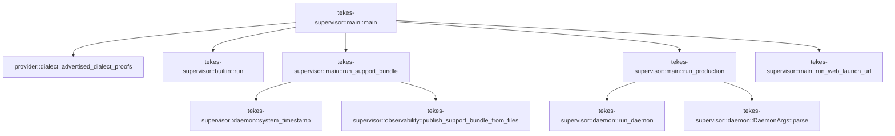

# tekes-supervisor::main

[Package atlas](index.md) · [Source](../../src/main.rs)

## Declarations

Visibility is the declaration spelling; trait members and reexports require their enclosing interface. `cfg` is not evaluated.

| Symbol | Kind | Visibility | Test / cfg |
|---|---|---|---|
| [tekes-supervisor::main::WEB_CLIENT_URL](../../src/main.rs#L5) | const_item | `private` |  |
| [tekes-supervisor::main::main](../../src/main.rs#L7) | function_item | `private` |  |
| [tekes-supervisor::main::run_web_launch_url](../../src/main.rs#L84) | function_item | `private` |  |
| [tekes-supervisor::main::run_support_bundle](../../src/main.rs#L112) | function_item | `private` |  |
| [tekes-supervisor::main::run_production](../../src/main.rs#L176) | function_item | `private` |  |

## Imports / reexports

| Local name | Source path | Visibility |
|---|---|---|
| `env` | `std::env` | `private` |
| `PathBuf` | `std::path::PathBuf` | `private` |
| `ExitCode` | `std::process::ExitCode` | `private` |

## Module declarations

| Module | Visibility | Attributes |
|---|---|---|

## Function call graphs

Edges below are syntactically resolved calls only, including private functions. Graphs partition callers into groups of 20; they are not execution order. All unresolved sites are listed below and in the JSON inventory.

Functions 1–4: 9 direct edges

## Call sites

Includes test functions (marked in declarations). Receiver-type-required sites need type analysis/manual tracing. Calls in closures are attributed to their enclosing function; their occurrence here does not mean the closure executes immediately.

| Caller | Callee expression | Source lines | Target / classification |
|---|---|---|---|
| `main` | `env::args_os().len` | [8](../../src/main.rs#L8), [51](../../src/main.rs#L51), [60](../../src/main.rs#L60) | receiver-type-required |
| `main` | `env::args_os` | [8](../../src/main.rs#L8), [9](../../src/main.rs#L9), [25](../../src/main.rs#L25), [26](../../src/main.rs#L26), [48](../../src/main.rs#L48), [51](../../src/main.rs#L51), [52](../../src/main.rs#L52), [60](../../src/main.rs#L60), [61](../../src/main.rs#L61), [72](../../src/main.rs#L72), [75](../../src/main.rs#L75) | external-constructor-callback-or-unresolved |
| `main` | `env::args_os().nth(1).as_deref` | [9](../../src/main.rs#L9), [25](../../src/main.rs#L25), [48](../../src/main.rs#L48), [52](../../src/main.rs#L52), [61](../../src/main.rs#L61), [72](../../src/main.rs#L72), [75](../../src/main.rs#L75) | receiver-type-required |
| `main` | `env::args_os().nth` | [9](../../src/main.rs#L9), [25](../../src/main.rs#L25), [48](../../src/main.rs#L48), [52](../../src/main.rs#L52), [61](../../src/main.rs#L61), [72](../../src/main.rs#L72), [75](../../src/main.rs#L75) | receiver-type-required |
| `main` | `Some` | [9](../../src/main.rs#L9), [25](../../src/main.rs#L25), [48](../../src/main.rs#L48), [52](../../src/main.rs#L52), [61](../../src/main.rs#L61), [72](../../src/main.rs#L72), [75](../../src/main.rs#L75) | external-constructor-callback-or-unresolved |
| `main` | `std::ffi::OsStr::new` | [9](../../src/main.rs#L9), [25](../../src/main.rs#L25), [48](../../src/main.rs#L48), [52](../../src/main.rs#L52), [61](../../src/main.rs#L61), [72](../../src/main.rs#L72), [75](../../src/main.rs#L75) | external-constructor-callback-or-unresolved |
| `main` | `provider::advertised_dialect_proofs().and_then` | [11](../../src/main.rs#L11) | receiver-type-required |
| `main` | `provider::advertised_dialect_proofs` | [11](../../src/main.rs#L11) | [provider::dialect::advertised_dialect_proofs](../../../provider/src/dialect.rs#L880) |
| `main` | `serde_json::to_string(&proofs)                 .map_err` | [12](../../src/main.rs#L12) | receiver-type-required |
| `main` | `serde_json::to_string` | [12](../../src/main.rs#L12) | external-constructor-callback-or-unresolved |
| `main` | `provider::DialectError::UnprovedProfile` | [13](../../src/main.rs#L13) | external-constructor-callback-or-unresolved |
| `main` | `"catalog".into` | [13](../../src/main.rs#L13) | receiver-type-required |
| `main` | `ExitCode::from` | [21](../../src/main.rs#L21), [28](../../src/main.rs#L28), [43](../../src/main.rs#L43), [81](../../src/main.rs#L81) | external-constructor-callback-or-unresolved |
| `main` | `env::args_os().collect::<Vec<_>>` | [26](../../src/main.rs#L26) | receiver-type-required |
| `main` | `args.len` | [27](../../src/main.rs#L27) | receiver-type-required |
| `main` | `tokio::runtime::Builder::new_multi_thread()             .enable_all()             .build` | [30](../../src/main.rs#L30) | receiver-type-required |
| `main` | `tokio::runtime::Builder::new_multi_thread()             .enable_all` | [30](../../src/main.rs#L30) | receiver-type-required |
| `main` | `tokio::runtime::Builder::new_multi_thread` | [30](../../src/main.rs#L30) | external-constructor-callback-or-unresolved |
| `main` | `runtime.block_on` | [35](../../src/main.rs#L35) | receiver-type-required |
| `main` | `tekes_supervisor::builtin::run` | [35](../../src/main.rs#L35) | [tekes-supervisor::builtin::run](../../src/builtin.rs#L29) |
| `main` | `PathBuf::from` | [35](../../src/main.rs#L35) | external-constructor-callback-or-unresolved |
| `main` | `Err` | [37](../../src/main.rs#L37) | external-constructor-callback-or-unresolved |
| `main` | `Box::new` | [37](../../src/main.rs#L37) | external-constructor-callback-or-unresolved |
| `main` | `run_web_launch_url` | [49](../../src/main.rs#L49) | [tekes-supervisor::main::run_web_launch_url](../../src/main.rs#L84) |
| `main` | `option_env!("TEKES_SELECTED_BUILD").unwrap_or` | [64](../../src/main.rs#L64) | receiver-type-required |
| `main` | `run_support_bundle` | [73](../../src/main.rs#L73) | [tekes-supervisor::main::run_support_bundle](../../src/main.rs#L112) |
| `main` | `run_production` | [76](../../src/main.rs#L76) | [tekes-supervisor::main::run_production](../../src/main.rs#L176) |
| `run_web_launch_url` | `env::args_os().skip(1).collect::<Vec<_>>` | [85](../../src/main.rs#L85) | receiver-type-required |
| `run_web_launch_url` | `env::args_os().skip` | [85](../../src/main.rs#L85) | receiver-type-required |
| `run_web_launch_url` | `env::args_os` | [85](../../src/main.rs#L85) | external-constructor-callback-or-unresolved |
| `run_web_launch_url` | `ExitCode::from` | [90](../../src/main.rs#L90) | external-constructor-callback-or-unresolved |
| `run_web_launch_url` | `arguments.len` | [92](../../src/main.rs#L92) | receiver-type-required |
| `run_web_launch_url` | `usage` | [93](../../src/main.rs#L93), [96](../../src/main.rs#L96), [99](../../src/main.rs#L99), [106](../../src/main.rs#L106) | external-constructor-callback-or-unresolved |
| `run_web_launch_url` | `arguments[2].to_str` | [95](../../src/main.rs#L95) | receiver-type-required |
| `run_web_launch_url` | `access_group.strip_suffix` | [98](../../src/main.rs#L98) | receiver-type-required |
| `run_web_launch_url` | `team.len` | [101](../../src/main.rs#L101) | receiver-type-required |
| `run_web_launch_url` | `team             .bytes()             .all` | [102](../../src/main.rs#L102) | receiver-type-required |
| `run_web_launch_url` | `team             .bytes` | [102](../../src/main.rs#L102) | receiver-type-required |
| `run_web_launch_url` | `byte.is_ascii_uppercase` | [104](../../src/main.rs#L104) | receiver-type-required |
| `run_web_launch_url` | `byte.is_ascii_digit` | [104](../../src/main.rs#L104) | receiver-type-required |
| `run_support_bundle` | `env::args_os().skip(1).collect::<Vec<_>>` | [113](../../src/main.rs#L113) | receiver-type-required |
| `run_support_bundle` | `env::args_os().skip` | [113](../../src/main.rs#L113) | receiver-type-required |
| `run_support_bundle` | `env::args_os` | [113](../../src/main.rs#L113) | external-constructor-callback-or-unresolved |
| `run_support_bundle` | `ExitCode::from` | [118](../../src/main.rs#L118), [157](../../src/main.rs#L157), [171](../../src/main.rs#L171) | external-constructor-callback-or-unresolved |
| `run_support_bundle` | `arguments.len` | [120](../../src/main.rs#L120) | receiver-type-required |
| `run_support_bundle` | `usage` | [128](../../src/main.rs#L128), [133](../../src/main.rs#L133), [136](../../src/main.rs#L136), [139](../../src/main.rs#L139), [147](../../src/main.rs#L147) | external-constructor-callback-or-unresolved |
| `run_support_bundle` | `PathBuf::from` | [130](../../src/main.rs#L130), [131](../../src/main.rs#L131) | external-constructor-callback-or-unresolved |
| `run_support_bundle` | `arguments[6].to_str` | [132](../../src/main.rs#L132) | receiver-type-required |
| `run_support_bundle` | `arguments[8].to_str` | [135](../../src/main.rs#L135) | receiver-type-required |
| `run_support_bundle` | `arguments[10].to_str` | [138](../../src/main.rs#L138) | receiver-type-required |
| `run_support_bundle` | `destination.is_absolute` | [141](../../src/main.rs#L141) | receiver-type-required |
| `run_support_bundle` | `log_root.is_absolute` | [142](../../src/main.rs#L142) | receiver-type-required |
| `run_support_bundle` | `destination.exists` | [143](../../src/main.rs#L143) | receiver-type-required |
| `run_support_bundle` | `build.is_empty` | [144](../../src/main.rs#L144) | receiver-type-required |
| `run_support_bundle` | `config_digests.is_empty` | [145](../../src/main.rs#L145) | receiver-type-required |
| `run_support_bundle` | `config_digests         .split(',')         .map(str::to_owned)         .collect::<Vec<_>>` | [149](../../src/main.rs#L149) | receiver-type-required |
| `run_support_bundle` | `config_digests         .split(',')         .map` | [149](../../src/main.rs#L149) | receiver-type-required |
| `run_support_bundle` | `config_digests         .split` | [149](../../src/main.rs#L149) | receiver-type-required |
| `run_support_bundle` | `tekes_supervisor::daemon::system_timestamp` | [153](../../src/main.rs#L153) | [tekes-supervisor::daemon::system_timestamp](../../src/daemon.rs#L1383) |
| `run_support_bundle` | `tekes_supervisor::observability::publish_support_bundle_from_files` | [160](../../src/main.rs#L160) | [tekes-supervisor::observability::publish_support_bundle_from_files](../../src/observability.rs#L987) |
| `run_production` | `env::args_os().skip(1).collect::<Vec<_>>` | [177](../../src/main.rs#L177) | receiver-type-required |
| `run_production` | `env::args_os().skip` | [177](../../src/main.rs#L177) | receiver-type-required |
| `run_production` | `env::args_os` | [177](../../src/main.rs#L177) | external-constructor-callback-or-unresolved |
| `run_production` | `tekes_supervisor::daemon::DaemonArgs::parse` | [178](../../src/main.rs#L178) | [tekes-supervisor::daemon::DaemonArgs::parse](../../src/daemon.rs#L71) |
| `run_production` | `ExitCode::from` | [182](../../src/main.rs#L182), [192](../../src/main.rs#L192), [199](../../src/main.rs#L199) | external-constructor-callback-or-unresolved |
| `run_production` | `error.exit_code` | [182](../../src/main.rs#L182), [199](../../src/main.rs#L199) | receiver-type-required |
| `run_production` | `tokio::runtime::Builder::new_multi_thread()         .enable_all()         .build` | [185](../../src/main.rs#L185) | receiver-type-required |
| `run_production` | `tokio::runtime::Builder::new_multi_thread()         .enable_all` | [185](../../src/main.rs#L185) | receiver-type-required |
| `run_production` | `tokio::runtime::Builder::new_multi_thread` | [185](../../src/main.rs#L185) | external-constructor-callback-or-unresolved |
| `run_production` | `runtime.block_on` | [195](../../src/main.rs#L195) | receiver-type-required |
| `run_production` | `tekes_supervisor::daemon::run_daemon` | [195](../../src/main.rs#L195) | [tekes-supervisor::daemon::run_daemon](../../src/daemon.rs#L713) |
