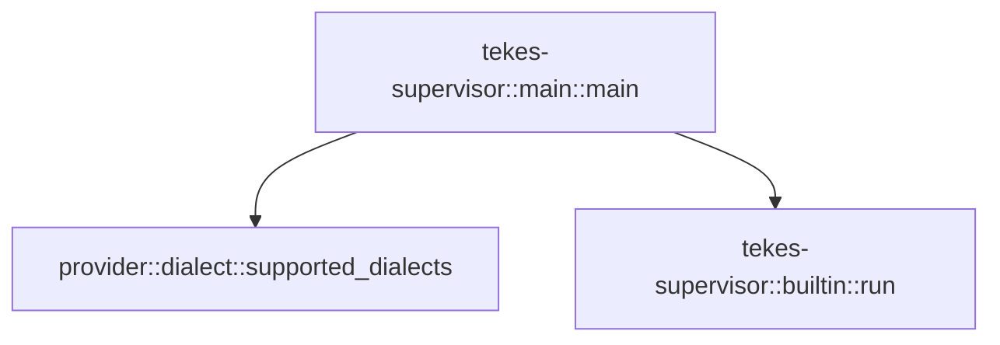

# tekes-supervisor::main

[Package atlas](index.md) · [Source](../../src/main.rs)

## Declarations

Visibility is the declaration spelling; trait members and reexports require their enclosing interface. `cfg` is not evaluated.

| Symbol | Kind | Visibility | Test / cfg |
|---|---|---|---|
| [tekes-supervisor::main::main](../../src/main.rs#L5) | function_item | `private` |  |

## Imports / reexports

| Local name | Source path | Visibility |
|---|---|---|
| `env` | `std::env` | `private` |
| `PathBuf` | `std::path::PathBuf` | `private` |
| `ExitCode` | `std::process::ExitCode` | `private` |

## Module declarations

| Module | Visibility | Attributes |
|---|---|---|

## Function call graphs

Edges below are syntactically resolved calls only, including private functions. Graphs partition callers into groups of 20; they are not execution order. All unresolved sites are listed below and in the JSON inventory.

Functions 1–1: 2 direct edges

## Call sites

Includes test functions (marked in declarations). Receiver-type-required sites need type analysis/manual tracing. Calls in closures are attributed to their enclosing function; their occurrence here does not mean the closure executes immediately.

| Caller | Callee expression | Source lines | Target / classification |
|---|---|---|---|
| `main` | `env::args_os().len` | [6](../../src/main.rs#L6), [43](../../src/main.rs#L43) | receiver-type-required |
| `main` | `env::args_os` | [6](../../src/main.rs#L6), [7](../../src/main.rs#L7), [20](../../src/main.rs#L20), [21](../../src/main.rs#L21), [43](../../src/main.rs#L43), [44](../../src/main.rs#L44) | external-constructor-callback-or-unresolved |
| `main` | `env::args_os().nth(1).as_deref` | [7](../../src/main.rs#L7), [20](../../src/main.rs#L20), [44](../../src/main.rs#L44) | receiver-type-required |
| `main` | `env::args_os().nth` | [7](../../src/main.rs#L7), [20](../../src/main.rs#L20), [44](../../src/main.rs#L44) | receiver-type-required |
| `main` | `Some` | [7](../../src/main.rs#L7), [20](../../src/main.rs#L20), [44](../../src/main.rs#L44) | external-constructor-callback-or-unresolved |
| `main` | `std::ffi::OsStr::new` | [7](../../src/main.rs#L7), [20](../../src/main.rs#L20), [44](../../src/main.rs#L44) | external-constructor-callback-or-unresolved |
| `main` | `serde_json::to_string` | [9](../../src/main.rs#L9) | external-constructor-callback-or-unresolved |
| `main` | `provider::supported_dialects` | [9](../../src/main.rs#L9) | [provider::dialect::supported_dialects](../../../provider/src/dialect.rs#L669) |
| `main` | `ExitCode::from` | [16](../../src/main.rs#L16), [23](../../src/main.rs#L23), [38](../../src/main.rs#L38), [60](../../src/main.rs#L60) | external-constructor-callback-or-unresolved |
| `main` | `env::args_os().collect::<Vec<_>>` | [21](../../src/main.rs#L21) | receiver-type-required |
| `main` | `args.len` | [22](../../src/main.rs#L22) | receiver-type-required |
| `main` | `tokio::runtime::Builder::new_multi_thread()             .enable_all()             .build` | [25](../../src/main.rs#L25) | receiver-type-required |
| `main` | `tokio::runtime::Builder::new_multi_thread()             .enable_all` | [25](../../src/main.rs#L25) | receiver-type-required |
| `main` | `tokio::runtime::Builder::new_multi_thread` | [25](../../src/main.rs#L25) | external-constructor-callback-or-unresolved |
| `main` | `runtime.block_on` | [30](../../src/main.rs#L30) | receiver-type-required |
| `main` | `tekes_supervisor::builtin::run` | [30](../../src/main.rs#L30) | [tekes-supervisor::builtin::run](../../src/builtin.rs#L32) |
| `main` | `PathBuf::from` | [30](../../src/main.rs#L30) | external-constructor-callback-or-unresolved |
| `main` | `Err` | [32](../../src/main.rs#L32) | external-constructor-callback-or-unresolved |
| `main` | `Box::new` | [32](../../src/main.rs#L32) | external-constructor-callback-or-unresolved |
| `main` | `option_env!("TEKES_SELECTED_BUILD").unwrap_or` | [47](../../src/main.rs#L47) | receiver-type-required |
| `main` | `tekes_supervisor::host_runtime::SOURCE_REVISION             .map(&#124;revision&#124; format!("\"source_revision\":\"{revision}\","))             .unwrap_or_default` | [48](../../src/main.rs#L48) | receiver-type-required |
| `main` | `tekes_supervisor::host_runtime::SOURCE_REVISION             .map` | [48](../../src/main.rs#L48) | receiver-type-required |
