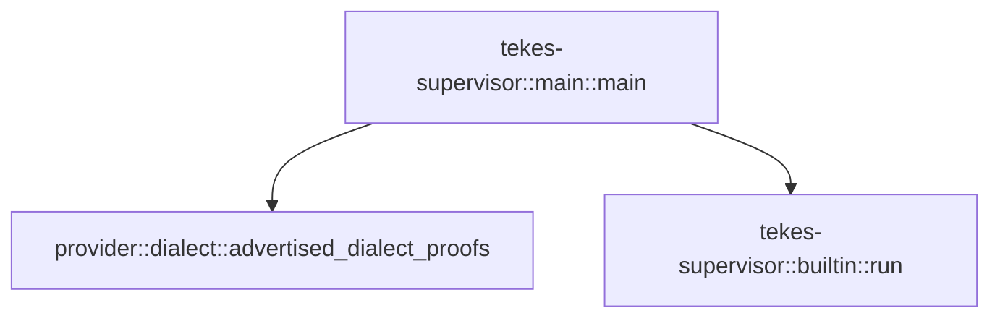

# tekes-supervisor::main

[Package atlas](index.md) · [Source](../../src/main.rs)

## Declarations

Visibility is the declaration spelling; trait members and reexports require their enclosing interface. `cfg` is not evaluated.

| Symbol | Kind | Visibility | Test / cfg |
|---|---|---|---|
| [tekes-supervisor::main::main](../../src/main.rs#L5) | function_item | `private` |  |

## Imports / reexports

| Local name | Source path | Visibility |
|---|---|---|
| `env` | `std::env` | `private` |
| `PathBuf` | `std::path::PathBuf` | `private` |
| `ExitCode` | `std::process::ExitCode` | `private` |

## Module declarations

| Module | Visibility | Attributes |
|---|---|---|

## Function call graphs

Edges below are syntactically resolved calls only, including private functions. Graphs partition callers into groups of 20; they are not execution order. All unresolved sites are listed below and in the JSON inventory.

Functions 1–1: 2 direct edges

## Call sites

Includes test functions (marked in declarations). Receiver-type-required sites need type analysis/manual tracing. Calls in closures are attributed to their enclosing function; their occurrence here does not mean the closure executes immediately.

| Caller | Callee expression | Source lines | Target / classification |
|---|---|---|---|
| `main` | `env::args_os().len` | [6](../../src/main.rs#L6), [46](../../src/main.rs#L46) | receiver-type-required |
| `main` | `env::args_os` | [6](../../src/main.rs#L6), [7](../../src/main.rs#L7), [23](../../src/main.rs#L23), [24](../../src/main.rs#L24), [46](../../src/main.rs#L46), [47](../../src/main.rs#L47) | external-constructor-callback-or-unresolved |
| `main` | `env::args_os().nth(1).as_deref` | [7](../../src/main.rs#L7), [23](../../src/main.rs#L23), [47](../../src/main.rs#L47) | receiver-type-required |
| `main` | `env::args_os().nth` | [7](../../src/main.rs#L7), [23](../../src/main.rs#L23), [47](../../src/main.rs#L47) | receiver-type-required |
| `main` | `Some` | [7](../../src/main.rs#L7), [23](../../src/main.rs#L23), [47](../../src/main.rs#L47) | external-constructor-callback-or-unresolved |
| `main` | `std::ffi::OsStr::new` | [7](../../src/main.rs#L7), [23](../../src/main.rs#L23), [47](../../src/main.rs#L47) | external-constructor-callback-or-unresolved |
| `main` | `provider::advertised_dialect_proofs().and_then` | [9](../../src/main.rs#L9) | receiver-type-required |
| `main` | `provider::advertised_dialect_proofs` | [9](../../src/main.rs#L9) | [provider::dialect::advertised_dialect_proofs](../../../provider/src/dialect.rs#L880) |
| `main` | `serde_json::to_string(&proofs)                 .map_err` | [10](../../src/main.rs#L10) | receiver-type-required |
| `main` | `serde_json::to_string` | [10](../../src/main.rs#L10) | external-constructor-callback-or-unresolved |
| `main` | `provider::DialectError::UnprovedProfile` | [11](../../src/main.rs#L11) | external-constructor-callback-or-unresolved |
| `main` | `"catalog".into` | [11](../../src/main.rs#L11) | receiver-type-required |
| `main` | `ExitCode::from` | [19](../../src/main.rs#L19), [26](../../src/main.rs#L26), [41](../../src/main.rs#L41), [63](../../src/main.rs#L63) | external-constructor-callback-or-unresolved |
| `main` | `env::args_os().collect::<Vec<_>>` | [24](../../src/main.rs#L24) | receiver-type-required |
| `main` | `args.len` | [25](../../src/main.rs#L25) | receiver-type-required |
| `main` | `tokio::runtime::Builder::new_multi_thread()             .enable_all()             .build` | [28](../../src/main.rs#L28) | receiver-type-required |
| `main` | `tokio::runtime::Builder::new_multi_thread()             .enable_all` | [28](../../src/main.rs#L28) | receiver-type-required |
| `main` | `tokio::runtime::Builder::new_multi_thread` | [28](../../src/main.rs#L28) | external-constructor-callback-or-unresolved |
| `main` | `runtime.block_on` | [33](../../src/main.rs#L33) | receiver-type-required |
| `main` | `tekes_supervisor::builtin::run` | [33](../../src/main.rs#L33) | [tekes-supervisor::builtin::run](../../src/builtin.rs#L32) |
| `main` | `PathBuf::from` | [33](../../src/main.rs#L33) | external-constructor-callback-or-unresolved |
| `main` | `Err` | [35](../../src/main.rs#L35) | external-constructor-callback-or-unresolved |
| `main` | `Box::new` | [35](../../src/main.rs#L35) | external-constructor-callback-or-unresolved |
| `main` | `option_env!("TEKES_SELECTED_BUILD").unwrap_or` | [50](../../src/main.rs#L50) | receiver-type-required |
| `main` | `tekes_supervisor::host_runtime::SOURCE_REVISION             .map(&#124;revision&#124; format!("\"source_revision\":\"{revision}\","))             .unwrap_or_default` | [51](../../src/main.rs#L51) | receiver-type-required |
| `main` | `tekes_supervisor::host_runtime::SOURCE_REVISION             .map` | [51](../../src/main.rs#L51) | receiver-type-required |
