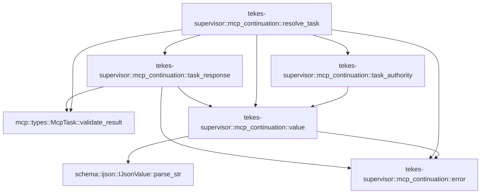

# tekes-supervisor::mcp_continuation

[Package atlas](index.md) · [Source](../../src/mcp_continuation.rs)

## Declarations

Visibility is the declaration spelling; trait members and reexports require their enclosing interface. `cfg` is not evaluated.

| Symbol | Kind | Visibility | Test / cfg |
|---|---|---|---|
| [tekes-supervisor::mcp_continuation::Result](../../src/mcp_continuation.rs#L13) | type_item | `private` |  |
| [tekes-supervisor::mcp_continuation::error](../../src/mcp_continuation.rs#L14) | function_item | `private` |  |
| [tekes-supervisor::mcp_continuation::value](../../src/mcp_continuation.rs#L17) | function_item | `private` |  |
| [tekes-supervisor::mcp_continuation::task_authority](../../src/mcp_continuation.rs#L21) | function_item | `pub` |  |
| [tekes-supervisor::mcp_continuation::resolve_task](../../src/mcp_continuation.rs#L27) | function_item | `pub` |  |
| [tekes-supervisor::mcp_continuation::task_response](../../src/mcp_continuation.rs#L97) | function_item | `private` |  |
| [tekes-supervisor::mcp_continuation::tests::completed_remote_task_with_tool_error_is_a_failed_receipt](../../src/mcp_continuation.rs#L157) | function_item | `private` | test; #[cfg(test)] |
| [tekes-supervisor::mcp_continuation::tests::journal_drives_bound_task_query_update_and_terminal_replay](../../src/mcp_continuation.rs#L233) | function_item | `private` | test; #[cfg(test)] |

## Imports / reexports

| Local name | Source path | Visibility |
|---|---|---|
| `ContinuationJournal` | `crate::continuation_journal::ContinuationJournal` | `private` |
| `ContinuationJournalError` | `crate::continuation_journal::ContinuationJournalError` | `private` |
| `McpBrokerHandle` | `mcp::McpBrokerHandle` | `private` |
| `McpCancellationToken` | `mcp::McpCancellationToken` | `private` |
| `McpPoolKey` | `mcp::McpPoolKey` | `private` |
| `McpTask` | `mcp::McpTask` | `private` |
| `IJsonValue` | `schema::IJsonValue` | `private` |
| `json` | `serde_json::json` | `private` |
| `ContinuationOperation` | `worker_control::continuation::ContinuationOperation` | `private` |
| `ToolContinuationOutcome` | `worker_control::continuation::ToolContinuationOutcome` | `private` |
| `ToolContinuationRequest` | `worker_control::continuation::ToolContinuationRequest` | `private` |
| `ToolContinuationResponse` | `worker_control::continuation::ToolContinuationResponse` | `private` |
| `ToolControlError` | `worker_control::ToolControlError` | `private` |
| `ToolControlErrorCode` | `worker_control::ToolControlErrorCode` | `private` |
| `*` | `super::*` | `private` |
| `ContinuationBinding` | `crate::continuation_journal::ContinuationBinding` | `private` |
| `BTreeMap` | `std::collections::BTreeMap` | `private` |
| `ToolControl` | `worker_control::ToolControl` | `private` |

## Module declarations

| Module | Visibility | Attributes |
|---|---|---|
| `tekes-supervisor::mcp_continuation::tests` | `private` | #[cfg(test)] |

## Function call graphs

Edges below are syntactically resolved calls only, including private functions. Graphs partition callers into groups of 20; they are not execution order. All unresolved sites are listed below and in the JSON inventory.

Functions 1–5: 11 direct edges

## Call sites

Includes test functions (marked in declarations). Receiver-type-required sites need type analysis/manual tracing. Calls in closures are attributed to their enclosing function; their occurrence here does not mean the closure executes immediately.

| Caller | Callee expression | Source lines | Target / classification |
|---|---|---|---|
| `error` | `ContinuationJournalError::Conflict` | [15](../../src/mcp_continuation.rs#L15) | external-constructor-callback-or-unresolved |
| `error` | `message.into` | [15](../../src/mcp_continuation.rs#L15) | receiver-type-required |
| `value` | `IJsonValue::parse_str(&value.to_string()).map_err` | [18](../../src/mcp_continuation.rs#L18) | receiver-type-required |
| `value` | `IJsonValue::parse_str` | [18](../../src/mcp_continuation.rs#L18) | [schema::ijson::IJsonValue::parse_str](../../../schema/src/ijson.rs#L23) |
| `value` | `value.to_string` | [18](../../src/mcp_continuation.rs#L18) | receiver-type-required |
| `value` | `error` | [18](../../src/mcp_continuation.rs#L18) | [tekes-supervisor::mcp_continuation::error](../../src/mcp_continuation.rs#L14) |
| `value` | `e.to_string` | [18](../../src/mcp_continuation.rs#L18) | receiver-type-required |
| `task_authority` | `value` | [22](../../src/mcp_continuation.rs#L22) | [tekes-supervisor::mcp_continuation::value](../../src/mcp_continuation.rs#L17) |
| `resolve_task` | `journal.binding` | [34](../../src/mcp_continuation.rs#L34) | receiver-type-required |
| `resolve_task` | `task_authority` | [35](../../src/mcp_continuation.rs#L35) | [tekes-supervisor::mcp_continuation::task_authority](../../src/mcp_continuation.rs#L21) |
| `resolve_task` | `Err` | [36](../../src/mcp_continuation.rs#L36), [46](../../src/mcp_continuation.rs#L46) | external-constructor-callback-or-unresolved |
| `resolve_task` | `error` | [36](../../src/mcp_continuation.rs#L36), [42](../../src/mcp_continuation.rs#L42), [44](../../src/mcp_continuation.rs#L44), [46](../../src/mcp_continuation.rs#L46), [56](../../src/mcp_continuation.rs#L56), [71](../../src/mcp_continuation.rs#L71), [81](../../src/mcp_continuation.rs#L81) | [tekes-supervisor::mcp_continuation::error](../../src/mcp_continuation.rs#L14) |
| `resolve_task` | `serde_json::to_value` | [38](../../src/mcp_continuation.rs#L38) | external-constructor-callback-or-unresolved |
| `resolve_task` | `initial["taskId"]         .as_str()         .filter(&#124;id&#124; !id.is_empty())         .ok_or_else` | [39](../../src/mcp_continuation.rs#L39) | receiver-type-required |
| `resolve_task` | `initial["taskId"]         .as_str()         .filter` | [39](../../src/mcp_continuation.rs#L39) | receiver-type-required |
| `resolve_task` | `initial["taskId"]         .as_str` | [39](../../src/mcp_continuation.rs#L39) | receiver-type-required |
| `resolve_task` | `id.is_empty` | [41](../../src/mcp_continuation.rs#L41) | receiver-type-required |
| `resolve_task` | `McpTask::validate_result(&binding.initial_state, task_id)         .map_err` | [43](../../src/mcp_continuation.rs#L43) | receiver-type-required |
| `resolve_task` | `McpTask::validate_result` | [43](../../src/mcp_continuation.rs#L43) | [mcp::types::McpTask::validate_result](../../../mcp/src/types.rs#L556) |
| `resolve_task` | `e.to_string` | [44](../../src/mcp_continuation.rs#L44), [56](../../src/mcp_continuation.rs#L56), [71](../../src/mcp_continuation.rs#L71), [81](../../src/mcp_continuation.rs#L81) | receiver-type-required |
| `resolve_task` | `broker             .task_operation_cancellable(                 key.clone(),                 "tasks/get",                 value(json!({"taskId":task_id}))?,                 cancellation.clone(),             )             .map_err` | [49](../../src/mcp_continuation.rs#L49) | receiver-type-required |
| `resolve_task` | `broker             .task_operation_cancellable` | [49](../../src/mcp_continuation.rs#L49) | receiver-type-required |
| `resolve_task` | `key.clone` | [51](../../src/mcp_continuation.rs#L51), [66](../../src/mcp_continuation.rs#L66), [76](../../src/mcp_continuation.rs#L76) | receiver-type-required |
| `resolve_task` | `value` | [53](../../src/mcp_continuation.rs#L53), [68](../../src/mcp_continuation.rs#L68), [78](../../src/mcp_continuation.rs#L78) | [tekes-supervisor::mcp_continuation::value](../../src/mcp_continuation.rs#L17) |
| `resolve_task` | `cancellation.clone` | [54](../../src/mcp_continuation.rs#L54), [69](../../src/mcp_continuation.rs#L69), [79](../../src/mcp_continuation.rs#L79) | receiver-type-required |
| `resolve_task` | `journal.resolve` | [58](../../src/mcp_continuation.rs#L58) | receiver-type-required |
| `resolve_task` | `broker                         .task_operation_cancellable(                             key.clone(),                             "tasks/update",                             value(json!({"taskId":task_id,"inputResponses":input_responses}))?,                             cancellation.clone(),                         )                         .map_err` | [64](../../src/mcp_continuation.rs#L64) | receiver-type-required |
| `resolve_task` | `broker                         .task_operation_cancellable` | [64](../../src/mcp_continuation.rs#L64), [74](../../src/mcp_continuation.rs#L74) | receiver-type-required |
| `resolve_task` | `broker                         .task_operation_cancellable(                             key.clone(),                             "tasks/cancel",                             value(json!({"taskId":task_id}))?,                             cancellation.clone(),                         )                         .map_err` | [74](../../src/mcp_continuation.rs#L74) | receiver-type-required |
| `resolve_task` | `task_response` | [84](../../src/mcp_continuation.rs#L84), [87](../../src/mcp_continuation.rs#L87) | [tekes-supervisor::mcp_continuation::task_response](../../src/mcp_continuation.rs#L97) |
| `resolve_task` | `query` | [84](../../src/mcp_continuation.rs#L84), [90](../../src/mcp_continuation.rs#L90) | external-constructor-callback-or-unresolved |
| `task_response` | `McpTask::validate_result(&state, expected_id).map_err` | [103](../../src/mcp_continuation.rs#L103) | receiver-type-required |
| `task_response` | `McpTask::validate_result` | [103](../../src/mcp_continuation.rs#L103) | [mcp::types::McpTask::validate_result](../../../mcp/src/types.rs#L556) |
| `task_response` | `error` | [103](../../src/mcp_continuation.rs#L103), [107](../../src/mcp_continuation.rs#L107), [139](../../src/mcp_continuation.rs#L139) | [tekes-supervisor::mcp_continuation::error](../../src/mcp_continuation.rs#L14) |
| `task_response` | `e.to_string` | [103](../../src/mcp_continuation.rs#L103) | receiver-type-required |
| `task_response` | `serde_json::to_value` | [104](../../src/mcp_continuation.rs#L104) | external-constructor-callback-or-unresolved |
| `task_response` | `task.status.as_str` | [105](../../src/mcp_continuation.rs#L105) | receiver-type-required |
| `task_response` | `Err` | [107](../../src/mcp_continuation.rs#L107), [139](../../src/mcp_continuation.rs#L139) | external-constructor-callback-or-unresolved |
| `task_response` | `request.continuation_id.clone` | [112](../../src/mcp_continuation.rs#L112) | receiver-type-required |
| `task_response` | `value` | [124](../../src/mcp_continuation.rs#L124) | [tekes-supervisor::mcp_continuation::value](../../src/mcp_continuation.rs#L17) |
| `task_response` | `raw["result"].clone` | [124](../../src/mcp_continuation.rs#L124) | receiver-type-required |
| `task_response` | `request.request_id.clone` | [142](../../src/mcp_continuation.rs#L142) | receiver-type-required |
| `task_response` | `request.original.call_id.clone` | [143](../../src/mcp_continuation.rs#L143) | receiver-type-required |
| `task_response` | `response.validate_for(request).map_err` | [146](../../src/mcp_continuation.rs#L146) | receiver-type-required |
| `task_response` | `response.validate_for` | [146](../../src/mcp_continuation.rs#L146) | receiver-type-required |
| `task_response` | `Ok` | [147](../../src/mcp_continuation.rs#L147) | external-constructor-callback-or-unresolved |
| `completed_remote_task_with_tool_error_is_a_failed_receipt` | `tempfile::tempdir().unwrap` | [158](../../src/mcp_continuation.rs#L158) | receiver-type-required |
| `completed_remote_task_with_tool_error_is_a_failed_receipt` | `tempfile::tempdir` | [158](../../src/mcp_continuation.rs#L158) | external-constructor-callback-or-unresolved |
| `completed_remote_task_with_tool_error_is_a_failed_receipt` | `ToolControl::new(             "018f0000-0000-7000-8000-000000000003",             "018f0000-0000-7000-8000-000000000003",             1,             "call-error",             "mcp__tasks__run",             value(json!({})).unwrap(),         )         .unwrap` | [159](../../src/mcp_continuation.rs#L159) | receiver-type-required |
| `completed_remote_task_with_tool_error_is_a_failed_receipt` | `ToolControl::new` | [159](../../src/mcp_continuation.rs#L159) | [worker-control::durable::ToolControl::new](../../../worker-control/src/durable.rs#L203) |
| `completed_remote_task_with_tool_error_is_a_failed_receipt` | `value(json!({})).unwrap` | [165](../../src/mcp_continuation.rs#L165), [182](../../src/mcp_continuation.rs#L182), [183](../../src/mcp_continuation.rs#L183) | receiver-type-required |
| `completed_remote_task_with_tool_error_is_a_failed_receipt` | `value` | [165](../../src/mcp_continuation.rs#L165), [182](../../src/mcp_continuation.rs#L182), [183](../../src/mcp_continuation.rs#L183), [189](../../src/mcp_continuation.rs#L189) | external-constructor-callback-or-unresolved |
| `completed_remote_task_with_tool_error_is_a_failed_receipt` | `ToolContinuationRequest::new(             original.clone(),             "d".repeat(64),             1,             ContinuationOperation::Query,         )         .unwrap` | [168](../../src/mcp_continuation.rs#L168) | receiver-type-required |
| `completed_remote_task_with_tool_error_is_a_failed_receipt` | `ToolContinuationRequest::new` | [168](../../src/mcp_continuation.rs#L168) | external-constructor-callback-or-unresolved |
| `completed_remote_task_with_tool_error_is_a_failed_receipt` | `original.clone` | [169](../../src/mcp_continuation.rs#L169) | receiver-type-required |
| `completed_remote_task_with_tool_error_is_a_failed_receipt` | `"d".repeat` | [170](../../src/mcp_continuation.rs#L170) | receiver-type-required |
| `completed_remote_task_with_tool_error_is_a_failed_receipt` | `ContinuationJournal::open(temp.path()).unwrap` | [177](../../src/mcp_continuation.rs#L177), [198](../../src/mcp_continuation.rs#L198) | receiver-type-required |
| `completed_remote_task_with_tool_error_is_a_failed_receipt` | `ContinuationJournal::open` | [177](../../src/mcp_continuation.rs#L177), [198](../../src/mcp_continuation.rs#L198) | external-constructor-callback-or-unresolved |
| `completed_remote_task_with_tool_error_is_a_failed_receipt` | `temp.path` | [177](../../src/mcp_continuation.rs#L177), [198](../../src/mcp_continuation.rs#L198) | receiver-type-required |
| `completed_remote_task_with_tool_error_is_a_failed_receipt` | `journal             .bind(&ContinuationBinding {                 original,                 continuation_id: request.continuation_id.clone(),                 authority: value(json!({})).unwrap(),                 initial_state: value(json!({})).unwrap(),             })             .unwrap` | [178](../../src/mcp_continuation.rs#L178) | receiver-type-required |
| `completed_remote_task_with_tool_error_is_a_failed_receipt` | `journal             .bind` | [178](../../src/mcp_continuation.rs#L178) | receiver-type-required |
| `completed_remote_task_with_tool_error_is_a_failed_receipt` | `request.continuation_id.clone` | [181](../../src/mcp_continuation.rs#L181) | receiver-type-required |
| `completed_remote_task_with_tool_error_is_a_failed_receipt` | `journal             .resolve(                 &request,                 &#124;&#124; task_response(&request, "remote-error", value(state.clone())?, false),                 &#124;&#124; panic!("first query must execute"),             )             .unwrap` | [186](../../src/mcp_continuation.rs#L186) | receiver-type-required |
| `completed_remote_task_with_tool_error_is_a_failed_receipt` | `journal             .resolve` | [186](../../src/mcp_continuation.rs#L186) | receiver-type-required |
| `completed_remote_task_with_tool_error_is_a_failed_receipt` | `task_response` | [189](../../src/mcp_continuation.rs#L189) | external-constructor-callback-or-unresolved |
| `completed_remote_task_with_tool_error_is_a_failed_receipt` | `state.clone` | [189](../../src/mcp_continuation.rs#L189), [210](../../src/mcp_continuation.rs#L210), [217](../../src/mcp_continuation.rs#L217) | receiver-type-required |
| `completed_remote_task_with_tool_error_is_a_failed_receipt` | `drop` | [197](../../src/mcp_continuation.rs#L197) | external-constructor-callback-or-unresolved |
| `completed_remote_task_with_tool_error_is_a_failed_receipt` | `Some` | [216](../../src/mcp_continuation.rs#L216) | external-constructor-callback-or-unresolved |
| `completed_remote_task_with_tool_error_is_a_failed_receipt` | `success["result"].as_object_mut().unwrap().remove` | [221](../../src/mcp_continuation.rs#L221) | receiver-type-required |
| `completed_remote_task_with_tool_error_is_a_failed_receipt` | `success["result"].as_object_mut().unwrap` | [221](../../src/mcp_continuation.rs#L221) | receiver-type-required |
| `completed_remote_task_with_tool_error_is_a_failed_receipt` | `success["result"].as_object_mut` | [221](../../src/mcp_continuation.rs#L221) | receiver-type-required |
| `journal_drives_bound_task_query_update_and_terminal_replay` | `tempfile::tempdir().unwrap` | [234](../../src/mcp_continuation.rs#L234) | receiver-type-required |
| `journal_drives_bound_task_query_update_and_terminal_replay` | `tempfile::tempdir` | [234](../../src/mcp_continuation.rs#L234) | external-constructor-callback-or-unresolved |
| `journal_drives_bound_task_query_update_and_terminal_replay` | `temp.path().join` | [235](../../src/mcp_continuation.rs#L235), [300](../../src/mcp_continuation.rs#L300), [343](../../src/mcp_continuation.rs#L343) | receiver-type-required |
| `journal_drives_bound_task_query_update_and_terminal_replay` | `temp.path` | [235](../../src/mcp_continuation.rs#L235), [300](../../src/mcp_continuation.rs#L300), [343](../../src/mcp_continuation.rs#L343) | receiver-type-required |
| `journal_drives_bound_task_query_update_and_terminal_replay` | `mcp::StdioTransport::spawn(             &[                 "/usr/bin/python3".into(),                 "-u".into(),                 "-c".into(),                 script.into(),                 log.to_string_lossy().into_owned(),             ],             None,             &BTreeMap::new(),         )         .unwrap` | [256](../../src/mcp_continuation.rs#L256) | receiver-type-required |
| `journal_drives_bound_task_query_update_and_terminal_replay` | `mcp::StdioTransport::spawn` | [256](../../src/mcp_continuation.rs#L256) | [mcp::transport::StdioTransport::spawn](../../../mcp/src/transport.rs#L136) |
| `journal_drives_bound_task_query_update_and_terminal_replay` | `"/usr/bin/python3".into` | [258](../../src/mcp_continuation.rs#L258) | receiver-type-required |
| `journal_drives_bound_task_query_update_and_terminal_replay` | `"-u".into` | [259](../../src/mcp_continuation.rs#L259) | receiver-type-required |
| `journal_drives_bound_task_query_update_and_terminal_replay` | `"-c".into` | [260](../../src/mcp_continuation.rs#L260) | receiver-type-required |
| `journal_drives_bound_task_query_update_and_terminal_replay` | `script.into` | [261](../../src/mcp_continuation.rs#L261) | receiver-type-required |
| `journal_drives_bound_task_query_update_and_terminal_replay` | `log.to_string_lossy().into_owned` | [262](../../src/mcp_continuation.rs#L262) | receiver-type-required |
| `journal_drives_bound_task_query_update_and_terminal_replay` | `log.to_string_lossy` | [262](../../src/mcp_continuation.rs#L262) | receiver-type-required |
| `journal_drives_bound_task_query_update_and_terminal_replay` | `BTreeMap::new` | [265](../../src/mcp_continuation.rs#L265) | external-constructor-callback-or-unresolved |
| `journal_drives_bound_task_query_update_and_terminal_replay` | `mcp::McpClient::new` | [268](../../src/mcp_continuation.rs#L268) | [mcp::client::McpClient::new](../../../mcp/src/client.rs#L140) |
| `journal_drives_bound_task_query_update_and_terminal_replay` | `tokio::runtime::Builder::new_current_thread()             .enable_all()             .build()             .unwrap` | [269](../../src/mcp_continuation.rs#L269) | receiver-type-required |
| `journal_drives_bound_task_query_update_and_terminal_replay` | `tokio::runtime::Builder::new_current_thread()             .enable_all()             .build` | [269](../../src/mcp_continuation.rs#L269) | receiver-type-required |
| `journal_drives_bound_task_query_update_and_terminal_replay` | `tokio::runtime::Builder::new_current_thread()             .enable_all` | [269](../../src/mcp_continuation.rs#L269) | receiver-type-required |
| `journal_drives_bound_task_query_update_and_terminal_replay` | `tokio::runtime::Builder::new_current_thread` | [269](../../src/mcp_continuation.rs#L269) | external-constructor-callback-or-unresolved |
| `journal_drives_bound_task_query_update_and_terminal_replay` | `runtime             .block_on(client.connect(mcp::ProtocolMode::Legacy))             .unwrap` | [273](../../src/mcp_continuation.rs#L273) | receiver-type-required |
| `journal_drives_bound_task_query_update_and_terminal_replay` | `runtime             .block_on` | [273](../../src/mcp_continuation.rs#L273) | receiver-type-required |
| `journal_drives_bound_task_query_update_and_terminal_replay` | `client.connect` | [274](../../src/mcp_continuation.rs#L274) | receiver-type-required |
| `journal_drives_bound_task_query_update_and_terminal_replay` | `mcp::McpBroker::start().unwrap` | [276](../../src/mcp_continuation.rs#L276) | receiver-type-required |
| `journal_drives_bound_task_query_update_and_terminal_replay` | `mcp::McpBroker::start` | [276](../../src/mcp_continuation.rs#L276) | [mcp::broker::McpBroker::start](../../../mcp/src/broker.rs#L62) |
| `journal_drives_bound_task_query_update_and_terminal_replay` | `broker.handle` | [277](../../src/mcp_continuation.rs#L277) | receiver-type-required |
| `journal_drives_bound_task_query_update_and_terminal_replay` | `"ws".into` | [279](../../src/mcp_continuation.rs#L279) | receiver-type-required |
| `journal_drives_bound_task_query_update_and_terminal_replay` | `"user".into` | [280](../../src/mcp_continuation.rs#L280) | receiver-type-required |
| `journal_drives_bound_task_query_update_and_terminal_replay` | `"tasks".into` | [281](../../src/mcp_continuation.rs#L281) | receiver-type-required |
| `journal_drives_bound_task_query_update_and_terminal_replay` | `"1".into` | [282](../../src/mcp_continuation.rs#L282) | receiver-type-required |
| `journal_drives_bound_task_query_update_and_terminal_replay` | `"anonymous".into` | [283](../../src/mcp_continuation.rs#L283) | receiver-type-required |
| `journal_drives_bound_task_query_update_and_terminal_replay` | `"legacy".into` | [284](../../src/mcp_continuation.rs#L284) | receiver-type-required |
| `journal_drives_bound_task_query_update_and_terminal_replay` | `handle             .register(key.clone(), Box::new(client), false)             .unwrap` | [287](../../src/mcp_continuation.rs#L287) | receiver-type-required |
| `journal_drives_bound_task_query_update_and_terminal_replay` | `handle             .register` | [287](../../src/mcp_continuation.rs#L287) | receiver-type-required |
| `journal_drives_bound_task_query_update_and_terminal_replay` | `key.clone` | [288](../../src/mcp_continuation.rs#L288), [356](../../src/mcp_continuation.rs#L356) | receiver-type-required |
| `journal_drives_bound_task_query_update_and_terminal_replay` | `Box::new` | [288](../../src/mcp_continuation.rs#L288) | external-constructor-callback-or-unresolved |
| `journal_drives_bound_task_query_update_and_terminal_replay` | `ToolControl::new(             "018f0000-0000-7000-8000-000000000003",             "018f0000-0000-7000-8000-000000000003",             1,             "call-1",             "mcp__tasks__run",             value(json!({})).unwrap(),         )         .unwrap` | [290](../../src/mcp_continuation.rs#L290) | receiver-type-required |
| `journal_drives_bound_task_query_update_and_terminal_replay` | `ToolControl::new` | [290](../../src/mcp_continuation.rs#L290) | [worker-control::durable::ToolControl::new](../../../worker-control/src/durable.rs#L203) |
| `journal_drives_bound_task_query_update_and_terminal_replay` | `value(json!({})).unwrap` | [296](../../src/mcp_continuation.rs#L296) | receiver-type-required |
| `journal_drives_bound_task_query_update_and_terminal_replay` | `value` | [296](../../src/mcp_continuation.rs#L296), [299](../../src/mcp_continuation.rs#L299), [326](../../src/mcp_continuation.rs#L326) | external-constructor-callback-or-unresolved |
| `journal_drives_bound_task_query_update_and_terminal_replay` | `original.clone` | [299](../../src/mcp_continuation.rs#L299), [303](../../src/mcp_continuation.rs#L303) | receiver-type-required |
| `journal_drives_bound_task_query_update_and_terminal_replay` | `"c".repeat` | [299](../../src/mcp_continuation.rs#L299) | receiver-type-required |
| `journal_drives_bound_task_query_update_and_terminal_replay` | `task_authority(&key).unwrap` | [299](../../src/mcp_continuation.rs#L299) | receiver-type-required |
| `journal_drives_bound_task_query_update_and_terminal_replay` | `task_authority` | [299](../../src/mcp_continuation.rs#L299) | external-constructor-callback-or-unresolved |
| `journal_drives_bound_task_query_update_and_terminal_replay` | `value(json!({"taskId":"remote-1","status":"working","createdAt":"2026-09-04T00:00:00Z","lastUpdatedAt":"2026-09-04T00:00:00Z"})).unwrap` | [299](../../src/mcp_continuation.rs#L299) | receiver-type-required |
| `journal_drives_bound_task_query_update_and_terminal_replay` | `ContinuationJournal::open(temp.path().join("journal")).unwrap` | [300](../../src/mcp_continuation.rs#L300), [343](../../src/mcp_continuation.rs#L343) | receiver-type-required |
| `journal_drives_bound_task_query_update_and_terminal_replay` | `ContinuationJournal::open` | [300](../../src/mcp_continuation.rs#L300), [343](../../src/mcp_continuation.rs#L343) | external-constructor-callback-or-unresolved |
| `journal_drives_bound_task_query_update_and_terminal_replay` | `journal.bind(&binding).unwrap` | [301](../../src/mcp_continuation.rs#L301) | receiver-type-required |
| `journal_drives_bound_task_query_update_and_terminal_replay` | `journal.bind` | [301](../../src/mcp_continuation.rs#L301) | receiver-type-required |
| `journal_drives_bound_task_query_update_and_terminal_replay` | `ToolContinuationRequest::new(             original.clone(),             binding.continuation_id.clone(),             1,             ContinuationOperation::Query,         )         .unwrap` | [302](../../src/mcp_continuation.rs#L302) | receiver-type-required |
| `journal_drives_bound_task_query_update_and_terminal_replay` | `ToolContinuationRequest::new` | [302](../../src/mcp_continuation.rs#L302), [321](../../src/mcp_continuation.rs#L321) | external-constructor-callback-or-unresolved |
| `journal_drives_bound_task_query_update_and_terminal_replay` | `binding.continuation_id.clone` | [304](../../src/mcp_continuation.rs#L304) | receiver-type-required |
| `journal_drives_bound_task_query_update_and_terminal_replay` | `ToolContinuationRequest::new(             original,             binding.continuation_id,             2,             ContinuationOperation::Update {                 input_responses: value(json!({"answer":"yes"})).unwrap(),             },         )         .unwrap` | [321](../../src/mcp_continuation.rs#L321) | receiver-type-required |
| `journal_drives_bound_task_query_update_and_terminal_replay` | `value(json!({"answer":"yes"})).unwrap` | [326](../../src/mcp_continuation.rs#L326) | receiver-type-required |
| `journal_drives_bound_task_query_update_and_terminal_replay` | `resolve_task(             &journal,             &handle,             &key,             &second,             McpCancellationToken::default(),         )         .unwrap` | [330](../../src/mcp_continuation.rs#L330) | receiver-type-required |
| `journal_drives_bound_task_query_update_and_terminal_replay` | `resolve_task` | [330](../../src/mcp_continuation.rs#L330) | external-constructor-callback-or-unresolved |
| `journal_drives_bound_task_query_update_and_terminal_replay` | `McpCancellationToken::default` | [335](../../src/mcp_continuation.rs#L335) | external-constructor-callback-or-unresolved |
| `journal_drives_bound_task_query_update_and_terminal_replay` | `std::fs::read(&log).unwrap` | [341](../../src/mcp_continuation.rs#L341) | receiver-type-required |
| `journal_drives_bound_task_query_update_and_terminal_replay` | `std::fs::read` | [341](../../src/mcp_continuation.rs#L341) | external-constructor-callback-or-unresolved |
| `journal_drives_bound_task_query_update_and_terminal_replay` | `drop` | [342](../../src/mcp_continuation.rs#L342) | external-constructor-callback-or-unresolved |
| `journal_drives_bound_task_query_update_and_terminal_replay` | `"rotated".into` | [357](../../src/mcp_continuation.rs#L357) | receiver-type-required |
| `journal_drives_bound_task_query_update_and_terminal_replay` | `handle.remove(key).unwrap` | [369](../../src/mcp_continuation.rs#L369) | receiver-type-required |
| `journal_drives_bound_task_query_update_and_terminal_replay` | `handle.remove` | [369](../../src/mcp_continuation.rs#L369) | receiver-type-required |
